①

USENIX

THE ADVANCED COMPUTING SYSTEMS ASSOCIATION

# QFactory: Accelerating Quantized Large Language Model Serving with Qtile Graphs

Qihao Zhang, Mingshu Zhai, Rui Sun, and Jidong Zhai, Tsinghua University https://www.usenix.org/conference/atc25/presentation/zhang-qihao

# This paper is included in the Proceedings of the 2025 USENIX Annual Technical Conference.

July 7–9, 2025 • Boston, MA, USA ISBN 978-1-939133-48-9

Open access to the Proceedings of the 2025 USENIX Annual Technical Conference is sponsored by

P--r.h £Es/sL.

auuJl9 PgleU

King Abdullah University of

Science and Technology

# QFactory: Accelerating Quantized Large Language Model Serving with Qtile Graphs

Qihao Zhang Mingshu Zhai Rui Sun Jidong Zhai

Tsinghua University

## Abstract

Quantization is a critical technique for accelerating large language models. To achieve tangible speedups, weight dequantization must be performed on-the-fly, necessitating tailored quantized kernels for various quantization algorithms and precision formats. Existing methods typically rely on a static eager execution paradigm for dequantization operations, which overlooks a broader range of potential optimizations, leading to suboptimal performance.

In this paper, we present QFactory, an efficient compilation framework designed to generate high-performance quantized kernels. QFactory introduces a novel Qtile abstraction that facilitates the representation of quantized tensors, transforming the traditional tensor computation graph into a Qtile-graph (Qgraph). Leveraging this QGraph abstraction, QFactory first explores graph-level Qtile computation transformations to generate equivalent QGraphs, thereby expanding the search space for optimizations. Subsequently, QFactory employs operator-level Qtile scheduling to identify optimal memory loading strategies for each Qtile within the QGraph before generating the final code. Experimental results demonstrate that QFactory achieves an average performance improvement of 1.66× over existing systems and delivers 1.23× end-toend generation speedup when integrated into state-of-the-art large language model serving systems.

## 1 Introduction

Quantized large language model (QLLM) serving is increasingly promising, as it facilitates the deployment of powerful and effective LLMs within limited resource environments. Many quantization techniques [6, 10, 11, 14, 22, 23, 42, 43, 47] have been proposed to reduce the deployment cost of leading LLMs [1, 2, 32, 34–36].

The core of quantization techniques is eliminating memory pressure in LLM serving. Due to the autoregressive nature of LLMs, the decoding phase exhibits memory-bound computational characteristics. The computational bottleneck mainly lies in the loading of model parameter matrices from GPU memory [14, 20]. To address this problem, quantization algorithms compress model parameters and store them in low-precision formats (e.g., from 16-bit FP16 to 4-bit INT4), significantly reducing DRAM memory requirements. Additionally, the quantized computation kernels [23, 30, 42] only load the compressed weights and dequantize them to higher precision before performing computations with the activation tensor, as shown in Figure 1b. Thus, the decoding speed is boosted because of the reduced memory access.

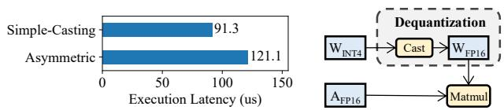

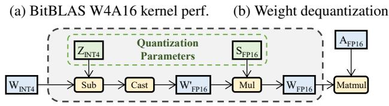  
(c) Asymmetric Quantization Ker(c) Asymmetric Quantization Kernel(c) Asymmetric dequantization  
Figure 1: Quantized kernels for serving QLLMs.

As the model bit-width becomes extremely low, finegrained quantization algortihms [17, 30, 47] have been proposed to better preserve model accuracy, which typically applies an asymmetric and group-wise method. A representative fine-grained quantization algorithm is GPTQ [10]. It performs asymmetric quantization by compressing model weights with two auxiliary quantization parameters, zero point Z and scaling factor S. Compared to the simple type-casting dequantization in Figure 1b, asymmetric dequantization in Figure 1c introduces extra computation and memory overhead. Additionally, it is a group-wise quantization algorithm since these auxiliary parameters are shared among a small group of parameters within a weight tensor.

Although fine-grained quantization algorithms hold promising in preserving model capability at extremely low bit-width, the inefficient execution of dequantization hurts their effectiveness. The issue stems from the use of custom kernels that incorporate on-the-fly dequantization operations [12, 23], namely quantized kernels, which are poorly supported by the current deep learning compilers [4, 31, 39]. For instance, as shown in Figure 1a, the state-of-the-art low-precision deep learning compiler BitBLAS [39] experiences a significant performance degradation when compiling asymmetric quantized kernels. Compared to the simple type-casting W4A16 kernel, asymmetric quantized kernel compiled by BitBLAS exhibits 30% higher latency. Even worse, the performance issue becomes more pronounced when scaling to lower bit-widths. As the bit-width of weight parameters decreases and more complex quantization algorithms are adopted, the additional memory access introduced by dequantization becomes relatively significant, emerging as a new performance bottleneck.

Existing systems fail to process the extra dequantization in quantized kernels efficiently due to their eager execution paradigm for dequantization operations. Upon encountering quantized values during execution, this static approach rigidly converts them immediately according to the quantization algorithm’s definition, limiting the potential for optimization. In contrast, our insight is that a deferred execution paradigm of dequantization can improve end-to-end performance. The dequantization operations can be deferred to the following tensor in the computation graph instead of applying to the original quantized tensor. Compared to this novel deferred paradigm, the conventional eager paradigm has two following limitations.

Limited Searching Space Quantized programs introduce new dequantization operations, which alter the original computation graph. These changes increase the graph’s complexity and create additional opportunities for graph-level transformations. Our investigation reveals that exploring this transformation space can yield improved kernel performance. However, existing approaches remain unaware of these changes in the computation graph and eagerly execute dequantization operations on the original graph, thereby failing to exploit this potential optimization space.

Underutilized Memory Bandwidth Quantization algorithms introduce additional quantization parameters associated with weight parameters that are computed during dequantization. These quantization parameters are often shared across a certain scope of weight parameters. However, existing approaches fail to leverage this shared property and instead perform dequantization independently for each weight parameter, leading to underutilized memory bandwidth. Our findings show that by differentiating the data loading for various tensor tiles, overall bandwidth utilization can be improved.

To address these challenges, we propose QFactory, an efficient compilation framework for generating high-performance quantized kernels. The core design of QFactory is Qtile, an annotated tensor expression for quantized tensors. With this abstraction, QFactory discovers that Qtiles can be propagated along the computation graph from operator inputs to operator output. In this way, tensor dequantization is deferred to later computation, enabling a more flexible placement of dequantization operations.

To compile a quantized kernel, QFactory first transforms the user-specified quantized program into a Qtile-graph (Qgraph) by replacing the quantized tensors in computation graph with Qtiles. Then QFactory optimizes the kernel generation of quantized programs at two levels. Firstly, QFactory applies Qtile Computation Transformation to deduce mathematically equivalent Qgraphs, exploring a wider range of graph transformation opportunities. Subsequently, QFactory takes all discovered Qgraph candidates and generates code for them. QFactory identifies data reuse as a crucial key factor of kernel performance, and performs Differentiated Qtile Scheduling to maximize the overall data reuse possibilities. Finally, QFactory employs a template-based kernel generation and a machine learning based hyperparameter selector for efficient auto-tuning.

To evaluate the effectiveness of QFactory, we conduct experiments on GPUs across different generations, ranging from NVIDIA V100 to newest NVIDIA H100 GPU. Our evaluation shows that QFactory outperforms state-of-the-art lowprecision deep learning compiler by 1.66× on single kernel performance, and can accelerates end-to-end decoding speed of various scale QLLMs by 1.23× when integrated into the popular LLM serving framework vLLM [21].

## 2 Background

## 2.1 Quantization of Large Language Models

While the advancements in large language models have yielded impressive results, their substantial resource consumption presents a significant challenge for model serving. Current LLMs generate tokens in an autoregressive manner, resulting in low batch sizes and leading to a memory-bound computational scenario [30, 42].

Researches have found quantization as a promising solution for reducing the large memory footprints and accelerating LLM decoding, particularly in resource-constrained circumstance such as edge devices. To maintain good accuracy with lower bit-widths, various quantization algorithms [10, 11, 30] have been developed. These algorithms propose the use of various custom data types for storing compressed weight, such as x-bit integers [17], NormalFloat [7], and even arbitrary fixed bit-width types defined by lookup tables [29]. They also introduce additional data storage, such as scaling factors and zero points, as quantization parameters to help recover the

original weight magnitude.

Take asymmetric W4A16 quantization as an example, which is the quantization format adopted in GPTQ [10]. To quantize a half-precision weight tensor w in model, min(w) and max(w) are mapped to the lower and upper bound of destination data range, namely −8 and +7 in INT4 data type, respectively. The remaining values in tensor w are mapped linearly. Specifically, the quantization procedure can be formulated as:

$$
\begin{array} { c } { { s c a l e = \displaystyle \frac { \operatorname* { m a x } ( w ) - \operatorname* { m i n } ( w ) } { 2 ^ { 4 } - 1 } } } \\ { { z e r o = C _ { F 2 I } \left[ \displaystyle \frac { 0 - \operatorname* { m i n } ( w ) } { s c a l e } \right] } } \\ { { Q _ { F P 1 6 \to I N T 4 } ( w ) [ i ] = C _ { F 2 I } \left[ \displaystyle \frac { w [ i ] - \operatorname* { m i n } ( w ) } { s c a l e } \right] } } \end{array}
$$

where scale is a half-precision scaling factor and zero is an INT4 zero point. They are auxiliary parameters associated with tensor w. The $C _ { F 2 I }$ function represents the type casting from a half-precision real value to integer, which is often implemented with round-to-nearest method.

When inference on a quantized LLM, the quantized model weights need to be dequantized back to the original data type for computation. The dequantization process of above quantization method can be formulated as:

$$
D E Q _ { I N T 4  F P 1 6 } ( w _ { I N T 4 } ) [ i ] = C _ { I 2 F } ( w _ { I N T 4 } [ i ] - z e r o ) \times s c a l e
$$

It is straightforward to verify that the above equation is capable of recovering the original weight values, except for the precision loss that occurs during the casting between real and integer data types.

To balance between model accuracy, compression rate, and algorithm complexity, researchers have proposed a spectrum of quantization methods with changeable configurations including symmetric/asymmetric quantization (with or without zero point), quantized data types and quantization granularity (the scope of data sharing same quantization parameters). This wide range of diversity poses great challenges to efficient quantized kernel generation.

## 2.2 Compiling Deep Learning Models

Deep learning compilers have been proposed to accelerate model execution through optimizations on different levels. We conclude existing works to the following two categories:

Graph-level Transformation Deep learning models can be represented as tensor computation graphs, where vertices correspond to operators and edges represent the flow of tensor data between these operators. Previous works [16, 18, 25, 37, 45] explore the transformation space on the computation graph to find optimal kernel mappings. These systems focus primarily on algebraic transformations at the graph level, and attain better performance through kernel fusion or selection of kernels with higher utilization. They leverages lower-level tensor program compilers like TVM [4] for code generation.

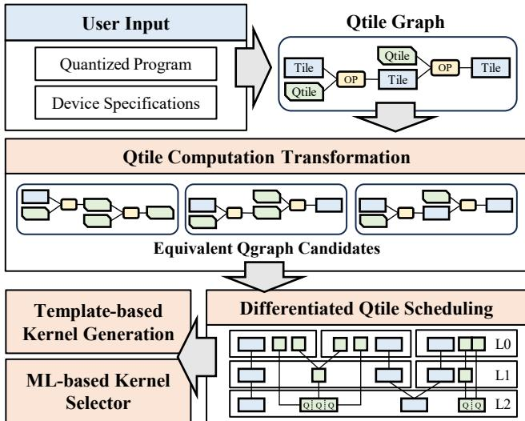  
Figure 2: QFactory overview.

Operator-level Memory Scheduling Other compilers [31, 46] focus on efficient operator fusion and kernel generation through a tensor tile abstraction and apply memory scheduling to improve memory efficiency. BitBLAS [39] extends this tile abstraction to support low-precision data formats, enabling the compilation of quantized deep learning models. However, these approaches apply scheduling optimizations solely to model weight tensors and eagerly execute dequantization. As a result, they struggle to effectively handle the unique requirements of quantized models with auxiliary parameters, where more flexible dequantization strategies and finer-grained memory optimizations are necessary for optimal performance.

## 3 Overview

## 3.1 QFactory Framework

Figure 2 provides an overview of the QFactory framework. At the entry point, QFactory accepts a user-provided quantized program as input, which are subsequently transformed into a Qtile-graph by replacing certain tensors in the computation graph with the newly designed Qtile abstraction (§3.2). For common quantization algorithms, QFactory provides skeleton templates of Qgraphs, requiring users to define only key settings, such as bit-width, data type, and quantization algorithm. Alternatively, users can directly provide a Qgraph constructed with a combination of Qtiles and standard tensor tiles for greater flexibility.

Thereafter, QFactory performs Qtile Computation Transformation (§4) to explore the Qgraph transformation space by propagating Qtiles along operators in Qgraph, generating Qgraph candidates with guaranteed mathematical equivalence. QFactory then analyzes these candidate graphs, and inserts dequantization operations as needed. Afterward, lowerlevel code is generated for each Qgraph. To optimize overall memory bandwidth utilization, QFactory employs Differentiated Qtile Scheduling (§5) to determine the best data placement and loading strategy for Qtiles, maximizing data reuse. Finally, QFactory applies template-based kernel generation (§6.1) to enable instruction-level parallelism and develops a ML-based kernel selector (§6.2) to speedup the selection of optimal kernel configurations.

## 3.2 Qtile Design

QFactory proposes a novel abstraction for quantization programs, called Qtile, which serves as a critical bridge between quantized program and efficient kernel implementation. Essentially, Qtile is a tensor extended with annotations of quantization attributes. The term "Qtile" is used instead of "Qtensor" because tensors on parallel devices, such as GPUs, are computed in smaller slices, or data tiles. This terminology aligns with the tile-graph abstraction introduced in Welder [31].

Qtile extends tensors with two types of annotations: mapping function and group pattern, representing the quantization algorithm and the scope within which quantization parameters are shared, respectively.

Mapping Function with Quantization Parameters The mapping function encodes all detailed information required for dequantization, including quantization algorithm and its auxiliary parameters. It specifies the storage format of compressed weights (e.g., 4-bit integers for W4A16 quantization), the compression methods (e.g., simple type-casting or asymmetric quantization), and the storage format of any additional quantization parameters. Rather than viewing these quantization parameters as separate data tiles, Qtile incorporates them directly into its extended annotations. This allows QFactory to utilize the relationship between weight tensor and its associated quantization parameters, enabling data reuse opportunities. Theoretically, Qtile can represent arbitrary quantization formats by defining the mapping function as a lookup table. This flexibility allows Qtile to handle unconventional quantization methods, ensuring compatibility with diverse application schemes.

Quantization Group Pattern Quantization is often performed with specific granularity. Tensor elements are divided into groups where scaling or other operations are applied independently. This fine-grained approach enables better approximation and preserves tensor’s values. Within each quantization group, the quantization parameters are shared, making group pattern critical for enabling data reuse. Qtile includes the group pattern information in its annotation and provides four commonly used group pattern attributes, ranging from coarse-grained to fine-grained: tensor (t), channel (c), block (b), and individual (i).

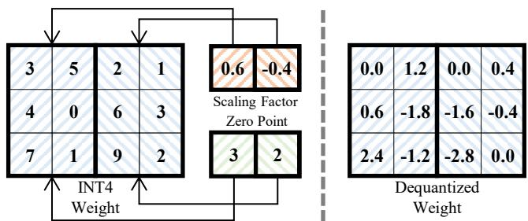  
Figure 3: Qtile example of asymmetric INT4 quantization with a group pattern of 3 × 2 blocks.

Qtile Example We illustrate a Qtile for asymmetric 4-bit quantization with a block group pattern in Figure 3. In this example, the quantized weight tensor is divided into blocks of 3 × 2, with each block associated with a pair of quantization parameters: a 4-bit integer zero point and a 16-bit halfprecision scaling factor. To dequantize a value in the weight tensor, the computation (W − zero) × scale is performed. For instance, the element in the second row and third column of the weight matrix is dequantized as (6 − 2) × (−0.4) = −1.6.

Through Qtile, QFactory provides users with a unified interface to define existing quantization algorithms or design new ones. By embedding quantization information directly into the tensor, Qtile balances versatility and efficiency, facilitating wider compilation optimizations to improve kernel performance.

## 4 Qtile Computation Transformation

With the Qtile abstraction, QFactory replaces certain tensors in the computation graph with quantized tensors, thereby forming a Qtile-graph (Qgraph). As a result, operators within the graph may now receive both Qtiles and normal tensor tiles as input. In existing approaches, such operators are executed eagerly, with dequantization operations performed immediately whenever a quantized tensor is encountered. This strategy leads to a rigid, static translation of Qgraph, limiting the potential for further optimizations.

In contrast, QFactory introduces a compilation procedure for Qgraphs, deferring dequantization operations to later stages by performing Qtile computation transformations. Through the transformation rules, Qtiles can actively participate in operator computations, generating new Qtiles as output. As a result, Qtiles are propagated throughout the graph, creating equivalent Qgraphs.

Algorithm 1: Qtile Propagation Search   
Input: $G ^ { Q } { \mathrm { ; } }$ Initial Qtile-graph of quantized program.   
Output: S: Set of equivalent Qgraphs discovered.   
1 Function QtilePropagate( $\scriptstyle ( G ^ { Q } ) :$   
2 $S \gets \emptyset$ ;   
3 Q ← List() ;   
4 Q.Push\_Back(GQ) ;   
5 while $Q . S i z e ( ) > 0$ do   
6 $g ^ { Q }  Q . P o p .$ \_Front() ;   
7 S.Insert $( g ^ { Q } )$ ;   
8 for $O p \in g ^ { Q }$ do   
9 ITiles ← Op.GetInputTiles() ;   
10 OTile ← Op.GetOutputTile() ;   
11 if ! OTile.IsQtile() and ITiles.hasQtile()   
and CanCompute (Op, ITiles) then   
12 NTile ← ComputeQtile(Op, ITiles) ;   
13 $g ^ { \prime Q } \gets R e p l a c e ( g ^ { Q } , O T i l e , N T i l e )$ ;   
14 if $g ^ { \prime Q } \notin S$ and $g ^ { \prime Q } \not \in { Q }$ then   
15 Q.Push\_Back $( g ^ { \prime Q } )$ ;   
16 return S ;

## 4.1 Qtile Propagation Search

QFactory proposes Qtile Propagation Search for graph-level optimization, generating all possible Qgraph candidates, as outlined in Algorithm 1. Given a Qtile-graph, QFactory enumerates all operators within the graph (Line 8) and determines whether Qtile computation transformation can be applied to each operator. If the input tiles (which may include both Qtiles and normal tiles) of the operator satisfy the transformation rules, they are processed by the ComputeQTile function to produce an output Qtile (Line 12). This output Qtile then replaces the original output tile in the graph, resulting in a new Qgraph. The propagation process is repeated on the newly generated Qgraph. QFactory employs a breadth-first search approach to iteratively explore all possible Qgraphs. Finally, a set containing all alternative Qgraphs is returned, which will be passed to subsequent optimization stages.

The key component of the algorithm is the ComputeQtile function, which takes the operator and its input tiles as arguments and produces a Qtile expression that is equal to the original output tile. Since Qtiles are quantized tensors with additional annotations, these annotations must be considered in computation. The Qtile computation involves two types of transformation: group pattern transformation and mapping function transformation, corresponding to the two types of annotation in the Qtile design.

## 4.2 Group Pattern Transformation

The computation on Qtiles leads to transformation in the group pattern. For instance, when an element-wise binary operator (e.g. add, mul) is applied to a normal tile and a quantized Qtile, the group pattern from the Qtile operand is broadcast to the other operand, causing the output Qtile to adopt the same group pattern as the input Qtile.

There are also cases where operators are applied to two Qtile inputs. In such circumstance, QFactory must check whether the group patterns of the input Qtiles can be transformed into a common one. For example, when two block-grouped Qtiles with different block strides $( W _ { 1 } , H _ { 1 } )$ and $( W _ { 2 } , H _ { 2 } )$ are added, QFactory calculates the greatest common divisor (gcd) of the block strides to determine a common group pattern to which both Qtiles can be converted. In this case, a finer-grained group pattern $( \operatorname* { g c d } ( W _ { 1 } , W _ { 2 } ) , \operatorname* { g c d } ( H _ { 1 } , H _ { 2 } ) )$ is identified. Then, QFactory modifies the group pattern of these Qtiles to the common pattern and broadcasts the associated quantization parameters correspondingly. This ensures that different Qtiles can be computed with same group pattern.

## 4.3 Mapping Function Transformation

Since the mapping function is closely tied to the dequantized value of Qtile tensors, the mapping function of Qtiles also evolves as Qtiles propagate through various operators.

Take the linear mapping function for example, where each element in Qtile is quantized with scaling factor and zeropoint bias. The dequantized value in a linearly-quantized Qtile can be represented as $( X _ { z } ^ { s } ) _ { i , j } = s \times X _ { i , j } + z .$ where $X _ { i , j }$ is the compressed tensor value in low precision format, and s and z represent the scaling factor and bias, respectively, which are shared across the quantization group.

Table 1 demonstrates the output Qtile expression resulting from the element-wise addition operator applied to different types of Qtiles. The operands may include non-quantized normal tiles (X ) or Qtiles with scaling factors (X s), bias offsets (Xz), or both (X sz ). The Qtile computation transformation extends conventional tensor computations to a broader domain of quantized tensor operations.

From Table 1, quantized parameters can be redistributed between different operands. For instance, adding $A _ { z _ { 1 } }$ to a nonquantized tile B can be transformed to $A + B _ { z _ { 1 } }$ , with the bias offset $z _ { 1 }$ shifted from the quantization parameters of tile A to those of tile B. Furthermore, in the case of plus $A _ { z _ { 1 } }$ with $B _ { z _ { 2 } } ^ { s _ { 2 } }$ the result can be transformed to the sum of one Qtile $( B _ { z _ { 1 } + z _ { 2 } } ^ { s _ { 2 } } )$ and one normal tensor tile (A). This transformation minimizes the number of dequantization operations required when generating code, offering potential performance improvements.

Next, we present the Qtile transformation table for the matrix multiplication operator in Table 2. The transformation rules for Matmul operator produces more complicated result expressions due to the incorporation of reduction along the K dimension. Matrix $J _ { X }$ , which represents a matrix filled with all ones and has the same shape as X, is introduced in the result.

Table 1: Mapping function transformation for the element-wise tensor addition operator. Marker × indicates that no valid transformation exists for the given Qtile inputs.  
Table 2: Mapping function transformation for the matrix multiplication operator.
<table><tr><td rowspan=1 colspan=1>+</td><td rowspan=1 colspan=1>A</td><td rowspan=1 colspan=1> $A _ { z _ { 1 } }$ </td><td rowspan=1 colspan=1> $A _ { z 1 } ^ { s _ { 1 } }$ </td></tr><tr><td rowspan=1 colspan=1> $B$ </td><td rowspan=1 colspan=1> $A + B$ </td><td rowspan=1 colspan=1> $A + B _ { z _ { 1 } }$ </td><td rowspan=1 colspan=1> $A ^ { s _ { 1 } } + B _ { z _ { 1 } }$ </td></tr><tr><td rowspan=1 colspan=1> $B ^ { s _ { 2 } }$ </td><td rowspan=1 colspan=1>×</td><td rowspan=1 colspan=1> $A ^ { s _ { 1 } } + B _ { z _ { 1 } } ^ { s _ { 2 } }$ </td><td rowspan=1 colspan=1> $A ^ { s _ { 1 } } + B _ { z _ { 1 } } ^ { s _ { 2 } }$ </td></tr><tr><td rowspan=1 colspan=1> $B _ { z _ { 2 } }$ </td><td rowspan=1 colspan=1> $A _ { z _ { 2 } } + B$ </td><td rowspan=1 colspan=1> $A _ { z _ { 1 } + z _ { 2 } } + B$ </td><td rowspan=1 colspan=1> $A ^ { s _ { 1 } } + B _ { z _ { 1 } + z _ { 2 } }$ </td></tr><tr><td rowspan=1 colspan=1> $B _ { z _ { 2 } } ^ { s _ { 2 } }$ </td><td rowspan=1 colspan=1> $A _ { z _ { 2 } } + B ^ { s _ { 2 } }$ </td><td rowspan=1 colspan=1> $\underline { { A + B _ { z _ { 1 } + z _ { 2 } } ^ { s _ { 2 } } } }$ </td><td rowspan=1 colspan=1> $A _ { z _ { 1 } + z _ { 2 } } ^ { s _ { 1 } } + B ^ { s _ { 2 } }$ </td></tr></table>

$J _ { X }$ denotes a matrix filled with all ones, with the same shape as matrix X. K is the reduction dimension size of the matrix multiplication.

To illustrate the potential benefits brought by these transformations, consider the multiplication of Qtiles $A _ { z 1 }$ and $B _ { z _ { 2 } }$ as an example. The output is the summation of four Qtiles, as shown in the table. The first component, AB, is a normal tile that does not require dequantization. The second and third components involve matrix multiplications with J matrices. While these components are Qtiles requiring dequantization, the all-one property of J matrices reduces the Qtile shape. Since all rows in $J _ { A }$ matrix are identical, the product $J _ { A } B$ inherits this property. Consequently, the dequantization can be performed solely on the first row of $( J _ { A } B ) ^ { z _ { 1 } }$ , and the resulting values can be broadcast to the remaining rows. As a result, the dequantization overhead is reduced because of the reduction property of J matrices. The final component $( J _ { A } J _ { B } ) ^ { z _ { 1 } z _ { 2 } } = ( \bar { J } _ { A B } ) ^ { z _ { 1 } z _ { 2 } \bar { K } }$ is a matrix with all identical values, which can be efficiently represented and computed as a single scalar. In summary, the number of computationally expensive dequantization operations is significantly reduced, leading to improved performance.

Additionally, Qtile computation transformation allows for shifting between different quantization formats. In the matrix multiplication of A and $B _ { z 2 } ^ { s _ { 2 } }$ , the resulting Qtile expression consists solely of symmetrically quantized Qtiles (without zero points). Since distinct mapping functions may incur varying dequantization overheads, Qtile transformations provide an expanded optimization space by replacing heavy dequantization operations with more lightweight alternatives.

## 5 Differentiated Qtile Scheduling

After the graph-level Qtile transformation, the generated Qgraphs are executed by inserting dequantization operations. When performing dequantization, Qtiles need to be loaded from the lowest GPU memory to the highest registers. Previous DNN compilers solely focus on the memory access of model weight tensors, overlooking the overhead brought by the associated quantization parameters introduced in quantized models. When it comes to Qtiles, the scheduling needs further consideration to ensure full reuse of quantization parameters.

<table><tr><td rowspan=2 colspan=1>MatMul</td><td></td><td></td></tr><tr><td rowspan=1 colspan=1>A</td><td rowspan=1 colspan=1> $A _ { z _ { 1 } }$ </td></tr><tr><td rowspan=1 colspan=1>B</td><td rowspan=1 colspan=1>AB</td><td rowspan=1 colspan=1> $A B + ( J _ { A } B ) ^ { z _ { 1 } }$ </td></tr><tr><td rowspan=1 colspan=1> $B ^ { s _ { 2 } }$ </td><td rowspan=1 colspan=1> $( A B ) ^ { s _ { 2 } }$ </td><td rowspan=1 colspan=1> $( A B ) ^ { s _ { 2 } } + ( J _ { A } B ) ^ { s _ { 2 } z _ { 1 } }$ </td></tr><tr><td rowspan=1 colspan=1> $B _ { z _ { 2 } }$ </td><td rowspan=1 colspan=1> $A B + ( A J _ { B } ) ^ { z _ { 2 } }$ </td><td rowspan=1 colspan=1> $A B + ( J _ { A } B ) ^ { z _ { 1 } } + ( A J _ { B } ) ^ { z _ { 2 } } + ( J _ { A B } ) ^ { z _ { 1 } z _ { 2 } K }$ </td></tr><tr><td rowspan=1 colspan=1> $B _ { z _ { 2 } } ^ { s _ { 2 } }$ </td><td rowspan=1 colspan=1> $( A B ) ^ { s _ { 2 } } + ( A J _ { B } ) ^ { s _ { 2 } z _ { 2 } }$ </td><td rowspan=1 colspan=1> $( A B ) ^ { s _ { 2 } } + ( J _ { A } B ) ^ { s _ { 2 } z _ { 1 } } + ( A J _ { B } ) ^ { s _ { 2 } z _ { 2 } } + ( J _ { A B } ) ^ { s _ { 2 } z _ { 1 } z _ { 2 } K }$ </td></tr></table>

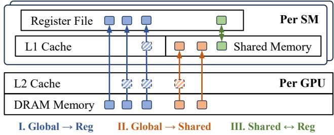  
Figure 4: GPU memory hierarchy.

## 5.1 Diverse Data paths in Memory Hierarchy

Modern GPUs are equipped with hierarchical and multi-path data loading mechanisms in memory system. As illustrated in Figure 4, GPUs typically feature at least four distinct levels of memory hierarchy, ranging from the lowest DRAM memory to the highest register file. Memory resources are allocated across various scopes of processing units, with each layer offering a different visibility. The GPU memory and L2 cache are globally visible and shared across the entire GPU, whereas the upper two layers are specific to each Streaming Multiprocessor (SM). The user-configurable L1 cache, referred to as shared memory, is visible to all threads within a thread block, while registers are private to individual threads.

To perform computations on GPUs, data must be transferred from DRAM to registers, passing through intermediate memory layers. The thread-block-level shared memory allows for explicit control of data at L1 level, creating two categories of data paths, namely global-shared path and shared-register path, as depicted in Figure 4. Other intermediate cache layers remain transparent to programmer. However, CUDA provides a mechanism for controlling the cache eviction policy of certain data through PTX-level attributes called cache operators [27]. Specifically, .cg cache operator allows load instructions to bypass L1 cache, while .cs operator sets an evict-first policy for data in both L1 and L2 caches. This evict-first policy prioritizes the eviction of data from cache, minimizing memory pollution in cache, forming a data path bypassing the transparent cache layers. As a consequence, a wider range of distinct data loading paths from global memory to register are explored, as shown in blue lines in Figure 4.

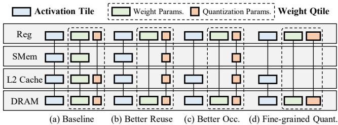  
Figure 5: Qtile scheduling examples.

Recent generations of NVIDIA GPUs (since Ampere) have introduced new asynchronous data movement instructions, enabling deeper software pipelining. The Hopper-series GPUs further introduces an independent hardware component specialized for data transfer and address calculation called Tensor Memory Accelerator (TMA). These advanced features are compatible with QFactory and can be passed as device specifications by users, enabling full utilization of these new hardware capabilities.

## 5.2 Scheduling Qtiles on Memory Hierarchy

With these various data loading paths, QFactory differentiates the mapping of tensor tiles to different data paths for maximizing overall memory utilization, generating strategies tailored to specific scenarios.

To illustrate, we demonstrate the data loading of a nonquantized activation tile and a quantized weight Qtile, which consists of low-precision weight parameters and their associated auxiliary quantization parameters. Figure 5 presents possible Qtile loading schedules discovered by QFactory.

Schedule (a) in Figure 5 represents the static strategy employed by previous compilers. In this approach, activation tensor tiles and weight tensor tiles are cached in shared memory before fetched into registers, enabling data reuse for both tiles. However, this strategy fails to optimize the quantization parameters in Qtiles, as it rigidly executes the dequantization operation, overlooking the overhead introduced by quantization parameters.

Beyond this conventional scheduling, QFactory proposes schedule (b) for better data reuse. By being aware of the group structure within Qtiles, QFactory enables the reuse of quantization parameters with shared memory. Moreover, QFactory applies the evict-first cache operator and bypasses intermediate cache levels for weight tiles. Since the decoding phase involves matrix-vector multiplication, weight values loaded are never reused across computation units. Bypassing intermediate cache levels frees up cache resources, increasing the cache hit rate for other kernel inputs.

In scenarios where GPU occupancy is critical for achieving optimal memory bandwidth utilization, QFactory trades off cache hit rate for improved occupancy, further eliminating caching of activation tiles in shared memory, as shown in schedule (c). This tradeoff is particularly effective on modern GPUs like H100, which provides massive number of LD/ST units for memory access. Allocating excessive shared memory to each thread block can restrict maximum occupancy, leading to underutilization of memory units and a degradation in overall memory bandwidth.

Finally, if an extremely fine-grained quantization algorithm is used or in the circumstance of lower bit-width, one thread may be assigned the workload of computing a whole weight group. In such case, QFactory switches to schedule (d), disabling shared memory usage for quantization parameters and directly reuse them at the register level.

## 6 Implementation

In this section, we introduce other necessary details of implementing QFactory, including the code generation method and kernel auto-tuning.

## 6.1 Template-based Kernel Generation

Inspired by CUTLASS [33], QFactory constructs CUDA code templates to implement various data loading paths on GPUs for moving data between memory hierarchy layers. This approach not only facilitates efficient code generation but also promotes automated tuning for performance optimization.

Given that type conversion instructions often have limited computational throughput compared to standard floating-point instructions [26], QFactory incorporates efficient type casting methods from previous works [12, 39]. Specifically, QFactory implement template functions for fast converting different formats of low-bit integers to half-precision real values in a unified manner.

To address the inefficiency caused by unaligned matrix sizes, which is a common issue in quantized kernels due to the increased alignment requirements of lower bit-width data types, QFactory eliminates unnecessary conditional jump instructions through templates. This is achieved by passing matrix shapes and other tuning parameters as compile-time constants, allowing most program constants to be deduced at compile time.

Finally, with the help of CUDA compiler, QFactory enables loop unrolling and instruction reordering to leverage instruction level parallelism (ILP) for overlapping memory overheads. While our approach is orthogonal to techniques such as double buffering and software pipelining, we observe that ILP is already efficient to deliver near-optimal performance in most LLM decoding scenarios.

## 6.2 ML-based Kernel Selector

As QFactory expands the search space for kernel optimization, efficiently determining the best kernel candidates and other hyperparameters in kernel tiling becomes a critical challenge.

To address this, QFactory employs a machine learningbased approach to quickly identify the optimal configuration of tunable parameters. Rather than directly training a model to output the best configuration, QFactory trains a lightweight multi-layer perceptron (MLP) model to predict the efficiency of given kernel configurations. We choose the achieved memory bandwidth utilization rate as regression goal instead of latency as it provides a limited value range. Kernels with different quantization settings do not share prediction models, but the kernels with the same quantization config for different matrix shapes share the same prediction model. We concatenate input matrix shapes and kernel hyperparameters (e.g., tiling block sizes, threadblock size) into a vector as input data and use the ratio of the kernel’s achieved bandwidth to the device’s maximum bandwidth as label. Training data is collected through offline profiling, where the real execution latencies of a small subset of kernels with randomly generated configurations are measured.

During the online compilation of a new quantized program, QFactory uses the trained model to estimate the latencies of all possible kernel configurations. QFactory then selects a few kernel configurations with the lowest estimated latencies for code generation and benchmarking. Therefore, a significant portion of inefficient kernel implementations are excluded, significantly accelerating the tuning process.

## 7 Evaluation

In this section, we present a comprehensive evaluation of QFactory across three different generations of NVIDIA data center GPUs: V100 (PCIe, 32GB), A100 (PCIe, 40GB), and H100 (PCIe, 80GB). We use CUDA 12.4 for evaluation on A100 and H100 GPUs, and CUDA 12.1 for V100 GPUs.

Evaluated Workloads We conduct experiments of two types of workloads to assess the overall performance of QFactory. We first evaluate the performance of the generated quantized kernels across different matrix shapes. These matrix shapes are categorized into two groups: one consisting of square matrices of varying scales, and the other comprising matrix shapes derived from actual LLM models. Next, we integrate QFactory into the popular LLM serving framework vLLM [21] to test the end-to-end model inference speedup. The evaluated LLM models include Llama-2 [35] and Qwen-2.5 [32] series with different scales, and can serve as a representative benchmark for a boarder range of LLMs. All workloads include different quantization bit-widths ranging from 8-bit to 2-bit.

Baselines For kernel-level benchmark, we compare QFactory to BitBLAS [39], which is the state-of-the-art deep learning compiler for low-precision linear kernels. We also compare QFactory to Marlin [12], which is a manually optimized kernel library for 4-bit quantized kernels on NVIDIA Ampereseries GPUs. For end-to-end evaluation, we compare QFactory to BitBLAS, Marlin and llama.cpp [13]. llama.cpp is a popular LLM inference framework with support of multiple quantization bit-widths and formats. For model inference with BitBLAS and Marlin, we leverage their integration with vLLM for fair comparision.

Methodology For kernel analysis, latency is measured with 200 warmup runs and 100 measurement runs. L2 cache is flushed between runs, and timing is recorded using CUDA events. No synchronization is invoked during the 300 runs to exclude CPU launch overhead, which can significantly affect measurements for small kernels. For end-to-end inference, we use the benchmarking scripts of vLLM for fairness. Generation speed is reported in tokens per second.

## 7.1 Kernel Overall Performance

NVIDIA H100 GPU Figure 6 demonstrates the performance of quantized kernels compiled by QFactory compared to BitBLAS and Marlin on NVIDIA H100 GPU. The evaluated quantization method is asymmetric weight-only quantization, with a group pattern of 128 × 1 blocks. Since Marlin is originally supported only on Ampere-series GPUs, we made necessary source code modifications for running it on H100.

The figure shows the relative speedup of different quantization bit-widths, including 8-bit (W8), 4-bit (W4), and 2-bit (W2), against the half-precision (W16) cuBLAS kernel as the baseline. The x-axis represents different weight matrix shapes. The shapes from M0 to M2 are square matrices of size 4096, 8192, and 16384. The matrix shapes from M3 to M8 are derived from Llama2-13B and Qwen2.5-72B models. We also demonstrates the geometric mean speedup of all test cases in the figure. The batch size of input activation is set to 1, indicating the common decoding scenario where weight-only quantization could gain most benefits.

As shown in the figure, QFactory consistently outperforms BitBLAS across most quantization configurations and matrix shapes. For quantization bit-width of 8, 4 and 2, QFactory achieves average speedups of 1.17×, 1.52×, and 1.66×, respectively. The performance gap becomes more pronounced at lower bit-width settings due to the changes in data volume of weight parameters. Specifically, as the bit-width decreases, the data volume of weight parameters loaded from memory is reduced, while the data volume of quantization parameters remains unchanged. As BitBLAS is unaware of this change, its kernel is hindered by the overhead associated with loading and processing quantization parameters, leading to significant performance degradation at lower bit-widths.

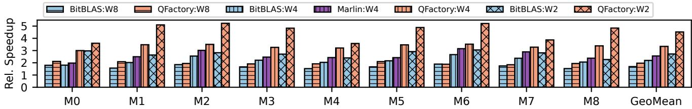  
Figure 6: Relative kernel performance compared to FP16 cuBLAS kernel on NVIDIA H100 GPU.

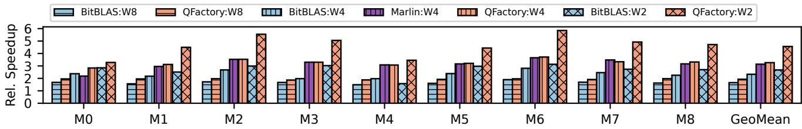  
Figure 7: Relative kernel performance compared to FP16 cuBLAS kernel on NVIDIA A100 GPU.

It is noteworthy that QFactory also outperforms the heavily optimized Marlin kernel in 4-bit quantization on H100 GPU by 1.30×. This suggests that simply applying optimizations designed for Ampere-series GPUs results in suboptimal performance on Hopper-series GPUs. To achieve optimal performance across different GPU generations, it is essential to develop general-purpose compilers.

NVIDIA A100 and V100 GPUs We also evaluate kernel performance on NVIDIA A100 and V100 GPUs. Figure 7 and Figure 8 show the relative kernel performance on these GPUs. On A100, QFactory achieves an average speedup over Bit-BLAS of 1.17× for 8-bit, 1.40× for 4-bit, and 1.71× for 2-bit quantization. The Marlin library performs well on A100, significantly outperforming BitBLAS. Nevertheless, compared to the heavily optimized Marlin library, QFactory still delivers a comparable performance with 1.04× speedup.

On V100, QFactory achieves an average speedup of 0.99× for 8-bit, 1.17× for 4-bit, and 1.41× for 2-bit quantization compared to BitBLAS. Marlin is not supported on V100 due to its reliance on specific hardware characteristics, such as asynchronous data copy instructions, which are unavailable on this older GPU. The relative speedup against cuBLAS shown in Figure 8 appears significantly higher than on other GPUs, likely because the cuBLAS library on V100 has not been fully optimized for certain matrix shapes commonly encountered in recent LLM inference workloads.

## 7.2 Memory Bandwidth Analysis

Quantized linear kernels are memory-bound at low batch sizes, so achieved memory bandwidth is a strong proxy for kernel efficiency. The bandwidth metric also allows us to better evaluate GPU bandwidth utilization by comparing it with hardware specifications. Below, we conduct an in-depth analysis of the kernel’s memory bandwidth utilization by scaling various matrix sizes and different quantization methods.

Scaling Matrix Sizes We evaluate the achieved kernel memory bandwidth utilization of QFactory, BitBLAS, and Marlin in 4-bit quantization on the NVIDIA H100 GPU. To provide a point of comparison, we also include the FP16 cuBLAS kernel. The evaluation uses square matrices of varying sizes. To align with different storage precision between 4-bit weight and 16-bit weight (in cuBLAS), we plot the achieved memory bandwidth as a function of the matrix storage size rather than its shape.

Figure 9 presents the memory bandwidth achieved by the simple-casting W4A16 and asymmetric quantized W4A16 kernels across different matrix sizes. In all cases, the achieved bandwidth increases as the size of the weight matrix grows. This trend can be attributed to the improved utilization of GPU’s hardware load units with larger matrices.

The Marlin kernel achieves strong performance, comparable to cuBLAS, with little to no difference observed between simple and asymmetric workloads. This is due to Marlin’s well-designed software pipeline, which effectively hides memory loading latencies of both weight parameters and quantization parameters. However, Marlin fails to fully utilize the memory bandwidth of H100 hardware due to its static execution paradigm.

BitBLAS also demonstrates comparable performance in the simple-casting W4A16 kernel but suffers from a significant performance degradation in the asymmetric kernel. This is primarily due to its inability to handle the overhead introduced by additional quantization parameters.

In contrast, QFactory consistently achieves higher bandwidth, particularly for medium-sized weight matrices. Although the asymmetric kernel achieves slightly lower bandwidth compared to its simple-casting counterpart, QFactory still outperforms other baselines, highlighting its efficiency in managing memory load overhead introduced by quantization parameters.

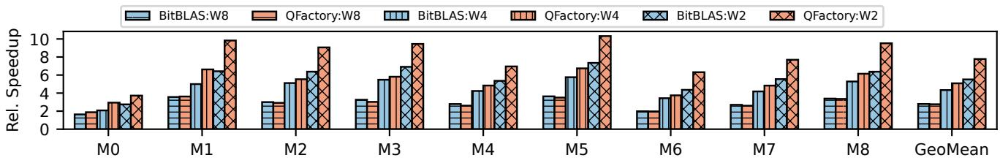  
Figure 8: Relative kernel performance compared to FP16 cuBLAS kernel on NVIDIA V100 GPU.

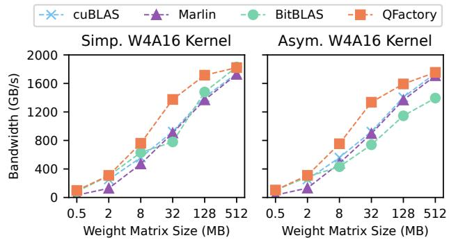  
Figure 9: Achieved memory bandwidth on NVIDIA H100 GPU across varying weight matrix sizes for 4-bit kernels. Simp. and Asym. in the figure title stands for Simple-Casting and Asymmetric, respectively.

The speedup advantage of QFactory diminishes with larger matrix sizes as all baseline methods approach the hardware’s peak memory bandwidth (approximately 90% of 2TB/s on H100 GPUs). However, extremely large matrices are rarely encountered in practical LLM serving scenarios. For instance, the largest weight matrix in Llama2-70B (found in the gate/up projection layer) measures only 28,672 × 8,192 (112MB in FP16 format). The memory footprint becomes even smaller when employing weight quantization to lower bit-widths.

Consequently, real-world inference workloads primarily operate on medium-sized matrices, where QFactory demonstrates substantially superior performance compared to baseline approaches.

Scaling Bit-Widths We further analyze kernel memory bandwidth by scaling the bit-widths of weight matrices. Figure 10 illustrates the achieved memory bandwidth of QFactory and BitBLAS under 8-bit, 4-bit, and 2-bit asymmetric quantization settings on H100.

As shown in Figure 10, the memory bandwidth utilization for BitBLAS decreases significantly as the bit-width is reduced from 8-bit to 2-bit. This decline is primarily attributed to the increasing dominance of additional quantization parameters, including scaling factors and zero points, which introduce more overhead and reduce effective memory bandwidth utilization in lower-bit-width settings.

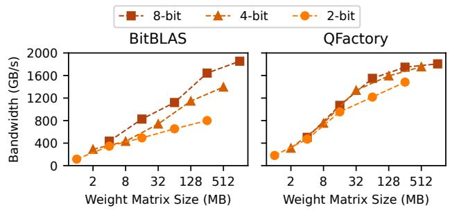  
Figure 10: Achieved memory bandwidth on NVIDIA H100 GPU for Asymmetric WxA16 quantized kernels across varying bit-widths.

In contrast, QFactory demonstrates significantly better scalability across different bit-widths. Although there is a minor reduction in bandwidth when moving from 4-bit to 2-bit quantization, QFactory consistently outperforms BitBLAS across all quantization levels. This advantage becomes particularly pronounced as the matrix size increases, highlighting QFactory’s ability to fully utilize H100’s ample memory bandwidth by delivering higher occupancy and more efficient resource usage.

## 7.3 End-to-end Inference

To evaluate the effectiveness of QFactory in accelerating model serving, we conduct end-to-end performance tests using real models and measure the generation speed in tokens per second during the decoding stage. The tests are performed on both 4-bit and 2-bit quantization levels. All models are quantized with GPTQ algorithm [10], which is widely adopted for quantized model deployment. The quantization format follows group size 128 with symmetric quantization, a common configuration in HuggingFace [41] model repositories.

For Marlin, BitBLAS, and QFactory, we use the vLLM framework integration to ensure consistency and fairness. For llama.cpp, which uses a custom GGUF format for quantization and tensor storage, we apply the Q4\_0 format for all linear layers in 4-bit quantization and Q2\_K format for 2-bit quantization to ensure comparable computation workloads with GPTQ quantization. The inference tests are conducted with a batch size of 1, a prompt length of 16 tokens, and a generation length of 128 tokens. We use the decoding stage generation speed (tokens/second) as the primary metric. As our optimizations do not involve mathematically non-equivalent transformations, we have verified that QFactory could produces identical model output tokens.

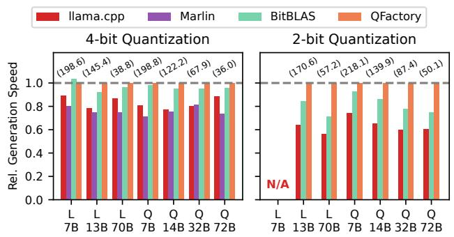  
Figure 11: End-to-end model inference performance on NVIDIA H100 GPU. All generation speeds are normalized to QFactory. "L" denotes Llama models, while "Q" denotes Qwen models. The number in parentheses indicates the absolute generation speed of QFactory in tokens per second (tokens/s).

NVIDIA H100 GPU Figure 11 presents the end-to-end inference results on NVIDIA H100 GPU across seven models, including models from Llama-2 and Qwen-2.5 series with different model size ranging from 7B to 72B. All generation speeds are normalized to QFactory for clarity, with absolute generation speeds (in tokens/s) displayed in parentheses for reference.

On 4-bit quantization, QFactory demonstrates robust performance, achieving a geometric average speedup compared to llama.cpp, Marlin, and BitBLAS by 1.21×, 1.32×, and 1.03×, respectively. The speedup is particularly significant for larger models, such as Llama-2-70B and Qwen-2.5-72B, as the relative impact of overheads, such as kernel launches and non-linear-layer operations, is more effectively amortized in larger models.

For 2-bit quantization, Marlin is not supported. Additionally, Llama-2-7B is excluded because its intermediate hidden size (11008) is not divisible by 128 (quantization group size) × 4 (alignment requirement for packing 2-bit data into 1 byte). QFactory exhibits superior performance on 2-bit quantization, with an average speedup of 1.58× and 1.23× compared to llama.cpp and BitBLAS, respectively. Notably, llama.cpp performs poorly in 2-bit quantization, showing no significant latency reduction compared to 4-bit quantization. This is primarily due to the lack of optimizations in its 2-bit kernel implementation.

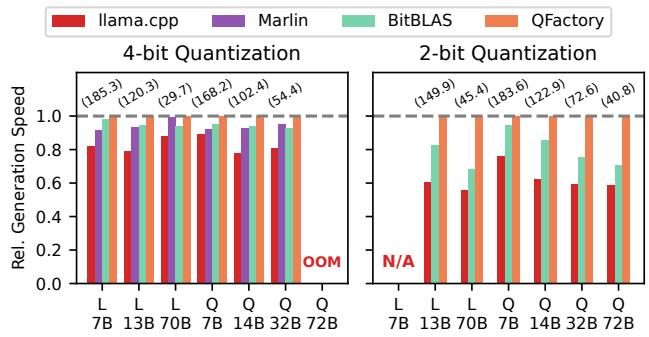  
Figure 12: End-to-end model inference performance on NVIDIA A100 GPU.

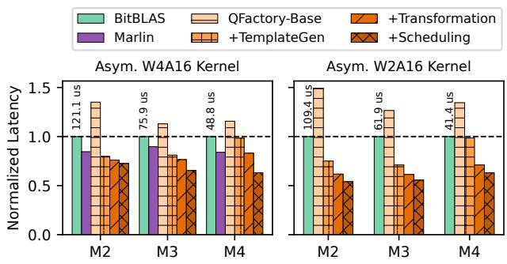  
Figure 13: Kernel performance breakdown. All kernel latencies are normalized to BitBLAS. The number above bar shows the absolute latency of BitBLAS kernel in us.

NVIDIA A100 GPU Figure 12 shows the end-to-end inference performance on NVIDIA A100 GPU. Qwen-72B runs out of memory (OOM) on A100 due to its limited 40GB memory capacity. Across the remaining models, QFactory demonstrates consistent speedups, highlighting its adaptability to different GPU architectures.

Specifically, on 4-bit quantization, QFactory achieves average speedups of 1.21×, 1.06×, and 1.05× compared to llama.cpp, Marlin, and BitBLAS, respectively. On 2-bit quantization, QFactory achieves speedups of 1.61× and 1.26× over llama.cpp and BitBLAS, respectively. On A100, Marlin shows significantly better performance than on H100, as it has been fully optimized for this GPU architecture. Nevertheless, QFactory remains competitive, delivering comparable performance to Marlin while maintaining its robust efficiency across all tested models and quantization levels.

Table 3: Average kernel speedup over cuBLAS baseline on varying batch size.
<table><tr><td>Batch Size</td><td>1</td><td>2</td><td>4</td></tr><tr><td>BitBLAS</td><td>2.19</td><td>1.46</td><td>0.87</td></tr><tr><td>Marlin</td><td>2.56</td><td>2.54</td><td>2.53</td></tr><tr><td>QFactory</td><td>3.44</td><td>3.18</td><td>2.52</td></tr></table>

## 7.4 Optimization Breakdown

Figure 13 illustrates the kernel performance as optimization steps are progressively applied during the compilation of quantized kernels. We select three representative matrix shapes from Figure 6 for ablation study. For clarity, all kernel latencies are normalized to BitBLAS, with the absolute latency of BitBLAS indicated above bar.

The optimization process starts with the QFactory-Base implementation. The naive kernel shows degraded performance for 2-bit kernels, primarily due to the increased overhead caused by severe data alignment mismatches inherent in low bit-width computations.

The template-based kernel generation (+TemplateGen) introduced in §6.1 delivers substantial performance improvements. By leveraging instruction-level parallelism to overlap memory access and computation, and aligning memory layouts with hardware cacheline size, QFactory achieves marked reductions in latency. Specifically, QFactory surpasses all baselines in M2 and M3, while achieving comparable performance to BitBLAS on M4.

The Qtile computation transformation (+Transformation, proposed in §4) and Qtile scheduling (+Scheduling, introduced in §5) further unlock additional performance gains by exploring a broader range of transformation spaces. Together, these techniques enable QFactory to achieve better overall performance than all baselines across the evaluated matrix configurations.

## 7.5 Scaling Batch Size

Table 3 compares the geometric average speedup of asymmetric W4A16 kernel over the FP16 cuBLAS baseline across nine selected kernels same with Figure 6 on H100 GPU.

All baselines achieve highest speedup at batch size 1, as weight-only quantization provides the greatest benefit in memory-bound scenarios. From Table 3, QFactory consistently outperforms BitBLAS across all batch sizes but is surpassed by Marlin at larger batch sizes. This is because Marlin leverages manually optimized MMA instructions to take advantage of Tensor Core capabilities in high-batch-size scenarios. However, this optimization is orthogonal to QFactory and can be integrated with additional engineering efforts.

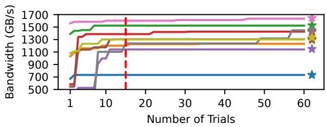  
Figure 14: Prediction performance of kernel selector.

## 7.6 Kernel Selector

In the offline profiling stage of auto-tuning, QFactory randomly chooses 50 configurations for each kernel and collect data through profiling. The trained model is than utilized for prediction. We use the same nine matrices from §7.1 for evaluating the effectiveness of kernel selector. QFactory enumerates candidate kernels in the order of shorter predicted execution time and selects best kernel configurations by benchmarking. Figure 14 illustrates the achieved memory bandwidth as a function of the number of trials. The star markers in the figure represent the optimal kernel performance of each matrix shape in the whole search space. It is shown that the optimal kernel configuration can be identified within 15 trials in most matrix shape cases.

Since kernel latency is measured in microseconds, the tuning overhead primarily comes from compilation. Compared to evaluating the full search space, which could contain thousands of candidate kernels, testing just 15 candidates achieves a practical balance between tuning time and performance.

Users can increase the number of trials or conduct exhaustive offline profiling to obtain better kernel performance. In our experiments, full parameter enumeration takes a few hours for a single LLM model. As the results are reusable, even exhaustive tuning is feasible for production deployment.

## 8 Related Work

Quantization of LLMs Quantization methods for LLMs can be broadly categorized into Quantization-Aware Training (QAT) and Post-Training Quantization (PTQ), both aiming to reduce the bit-width of model weights while maintaining performance.

QAT integrates quantization into the training process, requiring retraining or fine-tuning of the model. While this incurs significant computational and memory overhead, it enables much lower bit-widths, with some methods achieving extreme cases such as 1-bit quantization. Examples of QAT methods include LLM-QAT [24], QLoRA [7], BitNet [38], BitDistiller [9], and OneBit [44].

In contrast, PTQ avoids the need for retraining by directly quantizing pre-trained weights, often using a calibration dataset to guide the quantization process. Due to its efficiency, 4-bit PTQ methods including GPTQ [10], AWQ [23] and SpQR [8] have gained widespread adoption, particularly in resource-constrained scenarios. Recent works, including QuIP [3], SqueezeLLM [19], and OmniQuant [30], have extended PTQ to explore even lower bit-widths.

System for Deploying Quantized LLMs Systems such as bitsandbytes [5], TensorRT [28], llama.cpp [13], vLLM [21], and Marlin [12] provide fast kernels for popular quantization formats. However, these systems are limited in application scope, supporting only a few specific cases, and often exhibit less portable performance across different hardware devices. Consequently, researchers frequently resort to manually implementing custom kernels for advanced quantization formats, such as those used in AWQ [23], FP6-LLM [42], and SqueezeLLM [19]. LUT-GEMM [29], FLUTE [15], and T-MAC [40] focus on optimizing lookup table based quantization, which is particularly useful in low-bit-width scenarios. BitBLAS [39], which builds on normal-precision deep learning compilers including TVM [4], Roller [46], and Welder [31], provides support for low-precision quantization. Nonetheless, it does not adequately address the complexities of advanced quantization formats or group-wise quantization, limiting its effectiveness in more sophisticated quantization workflows.

## 9 Limitation

As batch size increases, weight-only quantization fails to consistently deliver theoretical speedups because the kernel shifts from memory-bound to compute-bound, diminishing the benefits of reduced memory footprint. To address this limitation, joint activation-weight quantization introduces additional compression for activations and employs low-precision computation, enabling sustained speedups even at large batch sizes.

While QFactory currently supports only weight-only quantization, its core methodology can be extended to activationweight quantization for further kernel acceleration. We leave this direction as future work.

## 10 Conclusion

We present QFactory, an efficient compilation framework for accelerating quantized LLM serving. QFactory addresses the inefficiency of existing systems by introducing a novel Qtile abstraction, enabling the exploration of a broader optimization space through Qtile computation transformations and differentiated memory scheduling. Extensive evaluations across a range of GPUs demonstrate that QFactory outperforms stateof-the-art compilers and manually optimized libraries. As a scalable solution for deploying quantized LLMs, QFactory not only enhances model efficiency but also facilitates the exploration of new quantization algorithms by alleviating the significant human effort required for custom kernel implementation.

## Acknowledgments

We would like to thank the anonymous reviewers and our shepherd Irfan Ahmad for their insightful comments. This work is supported by the National Key R&D Program of China under Grant 2023YFB3002002, NSFC of Distinguished Young Scholar (62225206), Beijing Natural Science Foundation (L242017), and Tsinghua University Initiative Scientific Research Program. Jidong Zhai (zhaijidong@tsinghua.edu.cn) is the corresponding author of this paper.

## References

[1] Tom B. Brown, Benjamin Mann, Nick Ryder, Melanie Subbiah, Jared Kaplan, Prafulla Dhariwal, Arvind Neelakantan, Pranav Shyam, Girish Sastry, Amanda Askell, Sandhini Agarwal, Ariel Herbert-Voss, Gretchen Krueger, Tom Henighan, Rewon Child, Aditya Ramesh, Daniel M. Ziegler, Jeffrey Wu, Clemens Winter, Christopher Hesse, Mark Chen, Eric Sigler, Mateusz Litwin, Scott Gray, Benjamin Chess, Jack Clark, Christopher Berner, Sam McCandlish, Alec Radford, Ilya Sutskever, and Dario Amodei. Language models are few-shot learners. In Hugo Larochelle, Marc’Aurelio Ranzato, Raia Hadsell, Maria-Florina Balcan, and Hsuan-Tien Lin, editors, Advances in Neural Information Processing Systems 33: Annual Conference on Neural Information Processing Systems 2020, NeurIPS 2020, December 6-12, 2020, virtual, 2020.

[2] Sébastien Bubeck, Varun Chandrasekaran, Ronen Eldan, Johannes Gehrke, Eric Horvitz, Ece Kamar, Peter Lee, Yin Tat Lee, Yuanzhi Li, Scott M. Lundberg, Harsha Nori, Hamid Palangi, Marco Túlio Ribeiro, and Yi Zhang. Sparks of artificial general intelligence: Early experiments with GPT-4. CoRR, abs/2303.12712, 2023.

[3] Jerry Chee, Yaohui Cai, Volodymyr Kuleshov, and Christopher De Sa. Quip: 2-bit quantization of large language models with guarantees. In Alice Oh, Tristan Naumann, Amir Globerson, Kate Saenko, Moritz Hardt, and Sergey Levine, editors, Advances in Neural Information Processing Systems 36: Annual Conference on Neural Information Processing Systems 2023, NeurIPS 2023, New Orleans, LA, USA, December 10 - 16, 2023, 2023.

[4] Tianqi Chen, Thierry Moreau, Ziheng Jiang, Lianmin Zheng, Eddie Q. Yan, Haichen Shen, Meghan Cowan,

Leyuan Wang, Yuwei Hu, Luis Ceze, Carlos Guestrin, and Arvind Krishnamurthy. TVM: an automated endto-end optimizing compiler for deep learning. In Andrea C. Arpaci-Dusseau and Geoff Voelker, editors, 13th USENIX Symposium on Operating Systems Design and Implementation, OSDI 2018, Carlsbad, CA, USA, October 8-10, 2018, pages 578–594. USENIX Association, 2018.

[5] Tim Dettmers. bitsandbytes: 8-bit optimizers and quantization routines, 2022.

[6] Tim Dettmers, Mike Lewis, Younes Belkada, and Luke Zettlemoyer. Llm.int8(): 8-bit matrix multiplication for transformers at scale. CoRR, abs/2208.07339, 2022.

[7] Tim Dettmers, Artidoro Pagnoni, Ari Holtzman, and Luke Zettlemoyer. Qlora: Efficient finetuning of quantized llms. In Alice Oh, Tristan Naumann, Amir Globerson, Kate Saenko, Moritz Hardt, and Sergey Levine, editors, Advances in Neural Information Processing Systems 36: Annual Conference on Neural Information Processing Systems 2023, NeurIPS 2023, New Orleans, LA, USA, December 10 - 16, 2023, 2023.

[8] Tim Dettmers, Ruslan Svirschevski, Vage Egiazarian, Denis Kuznedelev, Elias Frantar, Saleh Ashkboos, Alexander Borzunov, Torsten Hoefler, and Dan Alistarh. Spqr: A sparse-quantized representation for nearlossless LLM weight compression. In The Twelfth International Conference on Learning Representations, ICLR 2024, Vienna, Austria, May 7-11, 2024. OpenReview.net, 2024.

[9] Dayou Du, Yijia Zhang, Shijie Cao, Jiaqi Guo, Ting Cao, Xiaowen Chu, and Ningyi Xu. Bitdistiller: Unleashing the potential of sub-4-bit llms via self-distillation. In Lun-Wei Ku, Andre Martins, and Vivek Srikumar, editors, Proceedings of the 62nd Annual Meeting of the Association for Computational Linguistics (Volume 1: Long Papers), ACL 2024, Bangkok, Thailand, August 11-16, 2024, pages 102–116. Association for Computational Linguistics, 2024.

[10] Elias Frantar, Saleh Ashkboos, Torsten Hoefler, and Dan Alistarh. GPTQ: accurate post-training quantization for generative pre-trained transformers. CoRR, abs/2210.17323, 2022.

[11] Elias Frantar, Saleh Ashkboos, Torsten Hoefler, and Dan Alistarh. OPTQ: accurate quantization for generative pre-trained transformers. In The Eleventh International Conference on Learning Representations, ICLR 2023, Kigali, Rwanda, May 1-5, 2023. OpenReview.net, 2023.

[12] Elias Frantar, Roberto L Castro, Jiale Chen, Torsten Hoefler, and Dan Alistarh. Marlin: Mixed-precision auto-

regressive parallel inference on large language models. arXiv preprint arXiv:2408.11743, 2024.

[13] Georgi Gerganov. llama.cpp: Llm inference in c/c++. https://github.com/ggerganov/llama.cpp, 2023.

[14] Amir Gholami, Sehoon Kim, Zhen Dong, Zhewei Yao, Michael W. Mahoney, and Kurt Keutzer. A survey of quantization methods for efficient neural network inference. CoRR, abs/2103.13630, 2021.

[15] Han Guo, William Brandon, Radostin Cholakov, Jonathan Ragan-Kelley, Eric P. Xing, and Yoon Kim. Fast matrix multiplications for lookup table-quantized llms. In Yaser Al-Onaizan, Mohit Bansal, and Yun-Nung Chen, editors, Findings of the Association for Computational Linguistics: EMNLP 2024, Miami, Florida, USA, November 12-16, 2024, pages 12419–12433. Association for Computational Linguistics, 2024.

[16] Muyan Hu, Ashwin Venkatram, Shreyashri Biswas, Balamurugan Marimuthu, Bohan Hou, Gabriele Oliaro, Haojie Wang, Liyan Zheng, Xupeng Miao, Jidong Zhai, and Zhihao Jia. Optimal kernel orchestration for tensor programs with korch. In Rajiv Gupta, Nael B. Abu-Ghazaleh, Madan Musuvathi, and Dan Tsafrir, editors, Proceedings of the 29th ACM International Conference on Architectural Support for Programming Languages and Operating Systems, Volume 3, ASPLOS 2024, La Jolla, CA, USA, 27 April 2024- 1 May 2024, pages 755– 769. ACM, 2024.

[17] Benoit Jacob, Skirmantas Kligys, Bo Chen, Menglong Zhu, Matthew Tang, Andrew G. Howard, Hartwig Adam, and Dmitry Kalenichenko. Quantization and training of neural networks for efficient integer-arithmetic-only inference. In 2018 IEEE Conference on Computer Vision and Pattern Recognition, CVPR 2018, Salt Lake City, UT, USA, June 18-22, 2018, pages 2704–2713. Computer Vision Foundation / IEEE Computer Society, 2018.

[18] Zhihao Jia, Oded Padon, James Thomas, Todd Warszawski, Matei Zaharia, and Alex Aiken. TASO: optimizing deep learning computation with automatic generation of graph substitutions. In Tim Brecht and Carey Williamson, editors, Proceedings of the 27th ACM Symposium on Operating Systems Principles, SOSP 2019, Huntsville, ON, Canada, October 27-30, 2019, pages 47–62. ACM, 2019.

[19] Sehoon Kim, Coleman Hooper, Amir Gholami, Zhen Dong, Xiuyu Li, Sheng Shen, Michael W. Mahoney, and Kurt Keutzer. Squeezellm: Dense-and-sparse quantization. In Forty-first International Conference on Machine Learning, ICML 2024, Vienna, Austria, July 21-27, 2024. OpenReview.net, 2024.

[20] Sehoon Kim, Coleman Hooper, Thanakul Wattanawong, Minwoo Kang, Ruohan Yan, Hasan Genc, Grace Dinh, Qijing Huang, Kurt Keutzer, Michael W. Mahoney, Yakun Sophia Shao, and Amir Gholami. Full stack optimization of transformer inference: a survey. CoRR, abs/2302.14017, 2023.

[21] Woosuk Kwon, Zhuohan Li, Siyuan Zhuang, Ying Sheng, Lianmin Zheng, Cody Hao Yu, Joseph E. Gonzalez, Hao Zhang, and Ion Stoica. Efficient memory management for large language model serving with pagedattention. In Proceedings of the ACM SIGOPS 29th Symposium on Operating Systems Principles, 2023.

[22] Shiyao Li, Xuefei Ning, Luning Wang, Tengxuan Liu, Xiangsheng Shi, Shengen Yan, Guohao Dai, Huazhong Yang, and Yu Wang. Evaluating quantized large language models. In Forty-first International Conference on Machine Learning, ICML 2024, Vienna, Austria, July 21-27, 2024. OpenReview.net, 2024.

[23] Ji Lin, Jiaming Tang, Haotian Tang, Shang Yang, Wei-Ming Chen, Wei-Chen Wang, Guangxuan Xiao, Xingyu Dang, Chuang Gan, and Song Han. AWQ: activationaware weight quantization for on-device LLM compression and acceleration. In Phillip B. Gibbons, Gennady Pekhimenko, and Christopher De Sa, editors, Proceedings of the Seventh Annual Conference on Machine Learning and Systems, MLSys 2024, Santa Clara, CA, USA, May 13-16, 2024. mlsys.org, 2024.

[24] Zechun Liu, Barlas Oguz, Changsheng Zhao, Ernie Chang, Pierre Stock, Yashar Mehdad, Yangyang Shi, Raghuraman Krishnamoorthi, and Vikas Chandra. LLM-QAT: data-free quantization aware training for large language models. In Lun-Wei Ku, Andre Martins, and Vivek Srikumar, editors, Findings of the Association for Computational Linguistics, ACL 2024, Bangkok, Thailand and virtual meeting, August 11-16, 2024, pages 467–484. Association for Computational Linguistics, 2024.

[25] Wei Niu, Jiexiong Guan, Yanzhi Wang, Gagan Agrawal, and Bin Ren. Dnnfusion: accelerating deep neural networks execution with advanced operator fusion. In Stephen N. Freund and Eran Yahav, editors, PLDI ’21: 42nd ACM SIGPLAN International Conference on Programming Language Design and Implementation, Virtual Event, Canada, June 20-25, 2021, pages 883–898. ACM, 2021.

[26] NVIDIA. CUDA C++ Programming Guide, 2024.

[27] NVIDIA. Parallel Thread Execution ISA Version 8.5, 2024.

[28] NVIDIA Corporation. NVIDIA TensorRT: High Performance Deep Learning Inference Platform, 2023.

[29] Gunho Park, Baeseong Park, Minsub Kim, Sungjae Lee, Jeonghoon Kim, Beomseok Kwon, Se Jung Kwon, Byeongwook Kim, Youngjoo Lee, and Dongsoo Lee. LUT-GEMM: quantized matrix multiplication based on luts for efficient inference in large-scale generative language models. In The Twelfth International Conference on Learning Representations, ICLR 2024, Vienna, Austria, May 7-11, 2024. OpenReview.net, 2024.

[30] Wenqi Shao, Mengzhao Chen, Zhaoyang Zhang, Peng Xu, Lirui Zhao, Zhiqian Li, Kaipeng Zhang, Peng Gao, Yu Qiao, and Ping Luo. Omniquant: Omnidirectionally calibrated quantization for large language models. In The Twelfth International Conference on Learning Representations, ICLR 2024, Vienna, Austria, May 7-11, 2024. OpenReview.net, 2024.

[31] Yining Shi, Zhi Yang, Jilong Xue, Lingxiao Ma, Yuqing Xia, Ziming Miao, Yuxiao Guo, Fan Yang, and Lidong Zhou. Welder: Scheduling deep learning memory access via tile-graph. In Roxana Geambasu and Ed Nightingale, editors, 17th USENIX Symposium on Operating Systems Design and Implementation, OSDI 2023, Boston, MA, USA, July 10-12, 2023, pages 701–718. USENIX Association, 2023.

[32] Qwen Team. Qwen2.5: A party of foundation models, September 2024.

[33] Vijay Thakkar, Pradeep Ramani, Cris Cecka, Aniket Shivam, Honghao Lu, Ethan Yan, Jack Kosaian, Mark Hoemmen, Haicheng Wu, Andrew Kerr, Matt Nicely, Duane Merrill, Dustyn Blasig, Fengqi Qiao, Piotr Majcher, Paul Springer, Markus Hohnerbach, Jin Wang, and Manish Gupta. CUTLASS, January 2023.

[34] Hugo Touvron, Thibaut Lavril, Gautier Izacard, Xavier Martinet, Marie-Anne Lachaux, Timothée Lacroix, Baptiste Rozière, Naman Goyal, Eric Hambro, Faisal Azhar, Aurélien Rodriguez, Armand Joulin, Edouard Grave, and Guillaume Lample. Llama: Open and efficient foundation language models. CoRR, abs/2302.13971, 2023.

[35] Hugo Touvron, Louis Martin, Kevin Stone, Peter Albert, Amjad Almahairi, Yasmine Babaei, Nikolay Bashlykov, Soumya Batra, Prajjwal Bhargava, Shruti Bhosale, Dan Bikel, Lukas Blecher, Cristian Canton-Ferrer, Moya Chen, Guillem Cucurull, David Esiobu, Jude Fernandes, Jeremy Fu, Wenyin Fu, Brian Fuller, Cynthia Gao, Vedanuj Goswami, Naman Goyal, Anthony Hartshorn, Saghar Hosseini, Rui Hou, Hakan Inan, Marcin Kardas, Viktor Kerkez, Madian Khabsa, Isabel Kloumann, Artem Korenev, Punit Singh Koura, Marie-Anne Lachaux, Thibaut Lavril, Jenya Lee, Diana Liskovich, Yinghai Lu, Yuning Mao, Xavier Martinet, Todor Mihaylov, Pushkar Mishra, Igor Molybog, Yixin Nie, Andrew Poulton,

Jeremy Reizenstein, Rashi Rungta, Kalyan Saladi, Alan Schelten, Ruan Silva, Eric Michael Smith, Ranjan Subramanian, Xiaoqing Ellen Tan, Binh Tang, Ross Taylor, Adina Williams, Jian Xiang Kuan, Puxin Xu, Zheng Yan, Iliyan Zarov, Yuchen Zhang, Angela Fan, Melanie Kambadur, Sharan Narang, Aurélien Rodriguez, Robert Stojnic, Sergey Edunov, and Thomas Scialom. Llama 2: Open foundation and fine-tuned chat models. CoRR, abs/2307.09288, 2023.

[36] Ashish Vaswani, Noam Shazeer, Niki Parmar, Jakob Uszkoreit, Llion Jones, Aidan N. Gomez, Lukasz Kaiser, and Illia Polosukhin. Attention is all you need. In Isabelle Guyon, Ulrike von Luxburg, Samy Bengio, Hanna M. Wallach, Rob Fergus, S. V. N. Vishwanathan, and Roman Garnett, editors, Advances in Neural Information Processing Systems 30: Annual Conference on Neural Information Processing Systems 2017, December 4-9, 2017, Long Beach, CA, USA, pages 5998–6008, 2017.

[37] Haojie Wang, Jidong Zhai, Mingyu Gao, Zixuan Ma, Shizhi Tang, Liyan Zheng, Yuanzhi Li, Kaiyuan Rong, Yuanyong Chen, and Zhihao Jia. PET: optimizing tensor programs with partially equivalent transformations and automated corrections. In Angela Demke Brown and Jay R. Lorch, editors, 15th USENIX Symposium on Operating Systems Design and Implementation, OSDI 2021, July 14-16, 2021, pages 37–54. USENIX Association, 2021.

[38] Hongyu Wang, Shuming Ma, Li Dong, Shaohan Huang, Huaijie Wang, Lingxiao Ma, Fan Yang, Ruiping Wang, Yi Wu, and Furu Wei. Bitnet: Scaling 1-bit transformers for large language models. CoRR, abs/2310.11453, 2023.

[39] Lei Wang, Lingxiao Ma, Shijie Cao, Quanlu Zhang, Jilong Xue, Yining Shi, Ningxin Zheng, Ziming Miao, Fan Yang, Ting Cao, Yuqing Yang, and Mao Yang. Ladder: Enabling efficient low-precision deep learning computing through hardware-aware tensor transformation. In 18th USENIX Symposium on Operating Systems Design and Implementation (OSDI 24), pages 307–323, Santa Clara, CA, July 2024. USENIX Association.

[40] Jianyu Wei, Shijie Cao, Ting Cao, Lingxiao Ma, Lei Wang, Yanyong Zhang, and Mao Yang. T-MAC: CPU renaissance via table lookup for low-bit LLM deployment on edge. CoRR, abs/2407.00088, 2024.

[41] Thomas Wolf, Lysandre Debut, Victor Sanh, Julien Chaumond, Clement Delangue, Anthony Moi, Pierric Cistac, Tim Rault, Rémi Louf, Morgan Funtowicz, and Jamie Brew. Huggingface’s transformers: State-of-theart natural language processing. CoRR, abs/1910.03771, 2019.

[42] Haojun Xia, Zhen Zheng, Xiaoxia Wu, Shiyang Chen, Zhewei Yao, Stephen Youn, Arash Bakhtiari, Michael Wyatt, Donglin Zhuang, Zhongzhu Zhou, Olatunji Ruwase, Yuxiong He, and Shuaiwen Leon Song. Quantllm: Accelerating the serving of large language models via fp6-centric algorithm-system co-design on modern gpus. In Saurabh Bagchi and Yiying Zhang, editors, Proceedings of the 2024 USENIX Annual Technical Conference, USENIX ATC 2024, Santa Clara, CA, USA, July 10-12, 2024, pages 699–713. USENIX Association, 2024.

[43] Guangxuan Xiao, Ji Lin, Mickaël Seznec, Hao Wu, Julien Demouth, and Song Han. Smoothquant: Accurate and efficient post-training quantization for large language models. In Andreas Krause, Emma Brunskill, Kyunghyun Cho, Barbara Engelhardt, Sivan Sabato, and Jonathan Scarlett, editors, International Conference on Machine Learning, ICML 2023, 23-29 July 2023, Honolulu, Hawaii, USA, volume 202 of Proceedings of Machine Learning Research, pages 38087–38099. PMLR, 2023.

[44] Yuzhuang Xu, Xu Han, Zonghan Yang, Shuo Wang, Qingfu Zhu, Zhiyuan Liu, Weidong Liu, and Wanxiang Che. Onebit: Towards extremely low-bit large language models. CoRR, abs/2402.11295, 2024.

[45] Liyan Zheng, Haojie Wang, Jidong Zhai, Muyan Hu, Zixuan Ma, Tuowei Wang, Shuhong Huang, Xupeng Miao, Shizhi Tang, Kezhao Huang, and Zhihao Jia. EINNET: optimizing tensor programs with derivationbased transformations. In Roxana Geambasu and Ed Nightingale, editors, 17th USENIX Symposium on Operating Systems Design and Implementation, OSDI 2023, Boston, MA, USA, July 10-12, 2023, pages 739– 755. USENIX Association, 2023.

[46] Hongyu Zhu, Ruofan Wu, Yijia Diao, Shanbin Ke, Haoyu Li, Chen Zhang, Jilong Xue, Lingxiao Ma, Yuqing Xia, Wei Cui, Fan Yang, Mao Yang, Lidong Zhou, Asaf Cidon, and Gennady Pekhimenko. ROLLER: fast and efficient tensor compilation for deep learning. In Marcos K. Aguilera and Hakim Weatherspoon, editors, 16th USENIX Symposium on Operating Systems Design and Implementation, OSDI 2022, Carlsbad, CA, USA, July 11-13, 2022, pages 233–248. USENIX Association, 2022.

[47] Xunyu Zhu, Jian Li, Yong Liu, Can Ma, and Weiping Wang. A survey on model compression for large language models. CoRR, abs/2308.07633, 2023.