①

USENIX

THE ADVANCED COMPUTING SYSTEMS ASSOCIATION

# Mitigating Resource Usage Dependency in Sortingbased KV Stores on Hybrid Storage Devices via Operation Decoupling

Qingyang Zhang and Yongkun Li, University of Science and Technology of China; Yubiao Pan, Huaqiao University; Haoting Tang, University of Science and Technology of China; Yinlong Xu, University of Science and Technology of China, and Anhui Provincial Key Laboratory of High Performance Computing https://www.usenix.org/conference/atc25/presentation/zhang-qingyang

# This paper is included in the Proceedings of the 2025 USENIX Annual Technical Conference.

July 7–9, 2025 • Boston, MA, USA ISBN 978-1-939133-48-9

Open access to the Proceedings of the 2025 USENIX Annual Technical Conference is sponsored by

P=-r.h mEe-s

auuJl9 PgleU

King Abdullah University of

Science and Technology

# Mitigating Resource Usage Dependency in Sorting-based KV Stores on Hybrid Storage Devices via Operation Decoupling

Qingyang Zhang1, Yongkun Li1\*, Yubiao Pan2, Haoting Tang1, Yinlong Xu1,3

1University of Science and Technology of China 2Huaqiao University   
3Anhui Provincial Key Laboratory of High Performance Computing

## Abstract

LSM-tree-based key-value (KV) stores mainly employ sorting-based operations (e.g., flush and compaction) to manage the KV pairs on disk. Through analysis and experiments with RocksDB, we identify that the sorting operations cause critical issues of operation coupling, including intertwined resource consumption within an operation, interdependencies and contention among operations. These coupling problems lead to dependency in resource usage and are particularly exacerbated on hybrid storage devices, causing significant resource fragmentation and increased write stalls. Existing approaches to mitigating write stalls rely on either fixed differentiated data management or superficial scheduling of data sorting operations, but they fail to fundamentally address the resource usage dependency caused by operation coupling.

In this paper, we propose DecouKV, designed to alleviate resource usage dependency and enhance resource utilization on hybrid storage devices through operation decoupling. Specifically, DecouKV decouples data sorting operations into CPU-intensive index merge tasks and I/O-intensive data append and data flush tasks by separating indexes from data files, managing indexes with a mergeable skip list-based structure and managing data with append-only files. Furthermore, we propose an elastic scheme for tuning level capacity and introduce a parameterized queue-based task scheduling strategy to maximize resource utilization. We implement DecouKV and conduct experimental evaluations. Compared to RocksDB, as well as state-of-the-art systems such as MatrixKV, PrismDB, SplitDB and ADOC, DecouKV improves CPU utilization by 25.4%–32.3%, increases throughput by 2.3–4.9×, and reduces tail latency by 74.3%–91.4% under write-intensive workloads. DecouKV also achieves a modest throughput improvement of 1.2–2.3× under read-intensive workloads.

## 1 Introduction

Key-value (KV) stores manage data in the form of KV pairs, enabling fast lookup, insertion, and deletion operations. As a result, KV stores are widely used in distributed systems [1,23], graph storage systems [5,18,31,51], and OLTP/OLAP databases [3, 7, 9, 15, 19, 24, 26, 36, 40, 52]. Modern KV stores typically employ the Log-Structured Merge-tree (LSMtree) [38], a sorting-based data structure, as their core storage mechanism (e.g., LevelDB [22], RocksDB [20], Cassandra [3], X-Engine [25]). KV pairs are first cached in memory, and then persistently stored on disk through sorting-based flush and compaction operations. By converting random writes into sequential writes, LSM-tree-based KV stores are able to provide efficient write operations and good scalability.

With the continuous advancement of hardware performance, LSM-tree-based KV stores are increasingly deployed on fast devices, such as NVMe SSDs [10, 32, 45] and Persistent Memory (PM) [17, 29, 30, 47], also known as Non-Volatile Memory (NVM). However, these high-performance devices are often expensive [45], leading to the growing popularity of hybrid storage systems that combine fast devices with slower but inexpensive devices such as SATA SSDs and HDDs (e.g., [10, 29, 42, 47]). In such solutions, the common strategy is to store hot data on fast devices while storing large volumes of cold data on slower devices (e.g., [10, 29, 47]). This approach delivers high performance with minimal use of expensive fast devices, ensuring cost efficiency.

LSM-tree and its derivative optimizations [12, 17, 29, 33, 35, 47, 49] primarily adopt a sorting-based multi-level tree structure. These designs rely on heavyweight and unavoidable data sorting operations, such as flush and compaction, to manage KV pairs. However, sorting-based KV stores suffer from significant operation coupling issues, which manifest in three main aspects: (i) both flush and compaction operations consume a certain amount of CPU and I/O resources, leading to intertwined resource consumption; (ii) a sorting operation at a certain level can cause the size of the next level to exceed its threshold and trigger a subsequent sorting operation, resulting in interdependencies among operations; (iii) concurrent two sorting operations compete for system resources, leading to resource contention between these operations. Operation coupling issues lead to severe resource usage dependency, making it difficult to isolate CPU and I/O resources and schedule them effectively. These issues are exacerbated on hybrid storage devices due to the performance disparity between fast and slow devices, which causes fluctuating resource consumption. This results in alternating performance bottlenecks over time and increased write stalls.

Recent related works propose two main strategies for mitigating write stalls. The first strategy leverages the high bandwidth of fast devices to perform differentiated data management across fast and slow devices (e.g., [29, 47]). However, data management is predefined and fixed, which remains misaligned with the fluctuating resource consumption on hybrid storage devices, leading to resource underutilization. The second strategy focuses on superficial scheduling of data sorting operations (e.g., [4, 48]), attempting to reduce latency fluctuations by adjusting the frequency, timing, and placement of sorting operations. Nevertheless, intertwined resource consumption still persists. Superficial scheduling fails to identify the resource-bound nature of sorting operations, and scheduling sorting operations of the same resource-intensive can even exacerbate resource bottlenecks.

To address these issues, we propose DecouKV, which mitigates resource usage dependency in sorting-based KV stores on hybrid storage devices via operation decoupling. DecouKV first decouples the indexes of KV pairs from data files, as in data sorting operations, CPU resource consumption primarily originates from index sorting, while I/O resource consumption is primarily associated with data reading and writing. This decoupling transforms data sorting operations into CPU-intensive index merge tasks and I/O-intensive data append and flush tasks by managing data with append-only files (AOFs) and indexes using a mergeable skip list-based structure called IndexTable, thereby reducing intertwined resource consumption. Additionally, DecouKV introduces two queues, the Index Merge Queue and the Data Flush Queue, to manage IndexTables. By auto-tuning queue parameters, DecouKV proactively schedules decoupled tasks. Specifically, DecouKV minimizes competition between resource-intensive tasks and optimizes resource utilization by coordinating tasks with different resource demands. Finally, DecouKV relaxes level amplification factor limit and uses elastic capacity to reduce interdependencies among data sorting operations.

We implement DecouKV and compare its performance against RocksDB, one of the most widely adopted systems in the industry, as well as two state-of-the-art systems representing the two categories of optimization strategies mentioned before: MatrixKV and ADOC. Experimental results show that under write-intensive workloads, DecouKV improves CPU utilization by 25.4%–32.3%, increases throughput by 2.3–4.9×, and reduces tail latency by 74.3%–91.4%. DecouKV also achieves a modest throughput improvement of 1.2–2.3×, under read-intensive workloads. In summary, our main contributions are summarized as follows.

• We analyze the data sorting operations of sorting-based KV stores and identify operation coupling as the root cause of resource usage dependency and resource fragmentation on hybrid storage devices.

• Based on the analysis above, we propose a decoupling solution, decoupling data sorting operations into CPUintensive tasks and I/O-intensive tasks to reduce intertwined resource consumption within an operation.

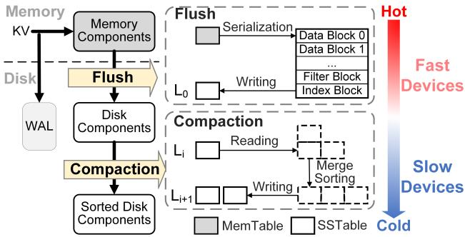  
Figure 1: Architecture of LSM-tree.

• We design an elastic strategy for tuning the level capacity of LSM-trees, relaxing the level amplification factor to reduce interdependencies among data sorting operations.

• We develop an efficient task scheduling strategy to minimize competition between resource-intensive tasks and optimize resource utilization by coordinating tasks with different resource demands.

The source code of DecouKV is available online [50].

## 2 Background and Motivation

## 2.1 KV Stores on Hybrid Storage Devices

Architecture of LSM-tree-based KV stores. As shown in Figure 1, an LSM-tree consists of memory components (MemTables) and disk components organized into Sorted String Tables (SSTables) across multiple levels. Each level has a fixed storage capacity, and the amplification factor between levels is typically set to 10. The system uses background flush and compaction operations, defined here as data sorting operations, to manage data movement between components. These operations are triggered when the component capacity exceeds predefined thresholds. When the MemTable reaches its capacity limit, a flush operation serializes the data (generating metadata like Bloom filters and index blocks) and persists it to disk as SSTables at level 0. When a specific level reaches its capacity limit, the system performs compaction operations, which involve data reading, merge sorting, and data writing. These operations consume significant CPU and I/O resources, leading to resource competition and system performance degradation.

Deployment of LSM-trees on hybrid storage devices. Recently, LSM-tree-based KV stores have been extended to cost-effective hybrid storage devices, which consist of fast and slow devices. Fast devices, such as NVMe SSDs and Persistent Memory (PM), typically provide high bandwidth and low latency. Although Intel Optane DCPMM [2] has been discontinued, the trend in hardware development continues to prioritize performance improvements (like CXL SSDs [27]). However, their high cost remains a significant barrier—for example, the price of Intel Optane DCPMM per terabyte is more than 10 times higher than that of SATA SSDs [45]. Meanwhile, slower devices such as traditional SSDs and HDDs remain indispensable due to their large capacity and lower cost. Thus, hybrid storage devices become a popular solution offering a balance between performance and cost.

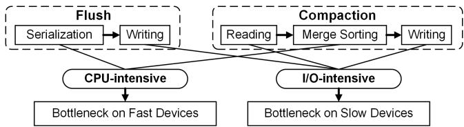  
Figure 2: Intertwined resource consumption within an operation.

In hybrid devices scenarios, a common approach is to store hot data (e.g., MemTable and lower levels of the LSM-tree) on fast devices (FDs) and cold data (e.g., higher levels) on slow devices (SDs). For example, NoveLSM [29] uses PM as an extension of DRAM and deploys the MemTable on PM. MatrixKV [47] places the level 0 of the LSM-tree on PM through a matrix management approach. SpanDB [10] treats NVMe SSD as a performance device, deploying the low levels of the LSM-tree on it. PrismDB [42] identifies hot and cold data, storing hot data on PM and cold data on slow devices. Overall, by strategically balancing the use of fast and slow devices, these systems achieve high throughput while reducing storage costs.

## 2.2 Problems of Operation Coupling

Typically, both RocksDB and its derivative optimizations adopt a multi-level, sorting-based design. As mentioned earlier, these designs rely on heavyweight and unavoidable data sorting operations, such as flush and compaction, to manage KV pairs. Below, we first analyze three categories of operation coupling issues. Then, we discuss how these issues exacerbate the underutilization of CPU and I/O resources in sorting-based KV stores deployed on hybrid storage devices, which ultimately results in resource fragmentation and increased write stalls.

## 2.2.1 Operation Coupling Issues

Specifically, the operation coupling issues in LSM-tree manifest in three key aspects:

Intertwined resource consumption within an operation. Data sorting operations require substantial CPU cycles and I/O bandwidth simultaneously. As shown in Figure 2, the serialization (generating metadata like Bloom filters and index blocks) in the flush operation consumes substantial CPU cycles, categorizing it as a CPU-intensive task, whereas data writing primarily consumes I/O bandwidth, classifying it as an I/O-intensive task. Similarly, in the compaction operation, merge sorting is CPU-intensive, while data reading and writing are I/O-intensive. Within a single data sorting operation, the intertwined nature of CPU-intensive and I/O-intensive tasks leads to intertwined resource consumption.

Interdependencies among operations. In sorting-based KV stores, data sorting operations are strictly triggered by fixed thresholds, creating dependencies between adjacent levels. As shown in Figure 3, an $L _ { i - 1 }  – \mathbf { t o } – L _ { i }$ data sorting operation may increase $L _ { i } { ' } s$ size, causing it to exceed its threshold and trigger an $L _ { i ^ { - } } \mathrm { t o } { - } L _ { i + 1 }$ data sorting operation. Such interdependencies mean that operations are passively triggered, leaving the system unable to choose the level and timing of data sorting based on resource availability. This results in resource conflicts and waste.

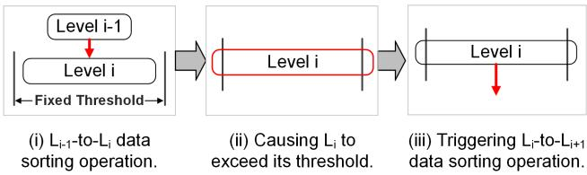  
Figure 3: Interdependencies among operations.

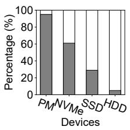

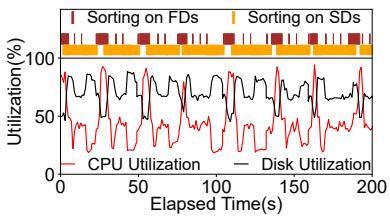  
(a) CPU Percentage.  
(b) Resource fluctuations.  
Figure 4: Resource utilization of RocksDB on hybrid devices.

Resource contention between operations. Under high write loads, data sorting operations often occur simultaneously across multiple components of the sorting-based KV stores, leading to competition for system resources. In resourceconstrained systems, resource contention reduces the efficiency of sorting operations, causing severe write stalls.

## 2.2.2 Exacerbation on Hybrid Storage Devices

Furthermore, the coupling problem becomes further exacerbated on hybrid storage devices. Due to the performance disparity between fast and slow devices, their capabilities for handling I/O requests differ significantly, leading to varying performance bottlenecks for data sorting operations on different devices. We validate the analysis through experiments with RocksDB deployed on hybrid storage devices.

Varying bottlenecks on different devices. First, we measure the percentage of CPU time consumed by data sorting operations on different devices (refer to Section 4 for detailed configurations). Figure 4(a) shows that on fast devices (PM, NVMe SSD), CPU time accounts for over 60% of compaction time, making that the CPU becomes the performance bottleneck for these devices. On slow devices (SATA SSD, HDD), the CPU accounts for less than 30% of the compaction time, with a large proportion of time spent on I/O wait. As a result, I/O bandwidth remains the performance bottleneck for slow devices.

Alternating bottlenecks on hybrid storage devices. Next, we test RocksDB’s performance on hybrid storage devices, following the common approach introduced in Section 2.1, where levels 0 and 1 are stored on fast devices (PM) and other levels on slow devices (SATA SSD). We import 100M update requests into a 100GB database, and record sorting times on fast and slow devices, as well as CPU and disk utilization over time. We present a representative 200-second subset, with similar patterns observed throughout the experiment. Figure 4(b) shows that under write-intensive workloads, resource utilization fluctuates significantly, with low averages and severe resource fragmentation. Disk and CPU utilization exhibit opposing patterns: during sorting on fast devices, CPU utilization is high (94%) but disk utilization is low (48%), indicating a CPU bottleneck; during sorting on slow devices, disk utilization is high (88%) while CPU utilization is low (21%), indicating an I/O bottleneck. These bottlenecks alternate between data sorting operations on two devices, hindering the full utilization of CPU and I/O resources and ultimately increasing write stalls.

Overall, data sorting operations consume intertwined CPU and I/O resources, and the disparity I/O bandwidth between devices leads to different resource bottlenecks on different devices. Additionally, the fluctuating resource consumption is misaligned with the fixed hardware capabilities. Due to interdependencies among operations, the system cannot proactively trigger operations to utilize resource fragments efficiently (e.g., triggering sorting on fast devices when the CPU is idle).

## 2.3 Limitations of Existing Solutions

There are two main strategies from recent related works for mitigating write stalls: (i) fixed differentiated data management and (ii) superficial scheduling of data sorting operations. Fixed differentiated data management. This category of work [10, 29, 42, 47] argues that the performance disparity between fast and slow devices necessitates differentiated management strategies, rather than applying the same approach to both. These works typically modify data sorting operations on specific devices, mitigating intertwined resource consumption to some extent. However, severe interdependencies still exist among the data sorting operations. Data management is predefined and fixed, which remains misaligned with the fluctuating resource consumption on hybrid storage devices, leading to resource underutilization.

Taking MatrixKV [47] as an example, which places $L _ { 0 }$ of the LSM-tree on persistent memory and employs a matrix container for differentiated management. As shown in Figure 5(a), the amplitude of resource utilization fluctuation is reduced compared to RocksDB (though still exceeding 50%). The result indicates that fine-grained compaction reduces the CPU and I/O resources consumed in each operation, mitigating intertwined resource consumption to some extent. However, the issue of interdependencies among operations persists. Frequent sorting on fast devices keeps CPU utilization at a high level (100–120s in Figure 5(a)). When the data on fast devices exceeds the threshold, a large number of threads shift to sorting on slow devices, causing CPU utilization to drop significantly due to I/O bottlenecks. As a result, the fluctuating resource consumption on hybrid storage causes the average resource utilization to remain low.

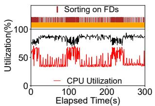

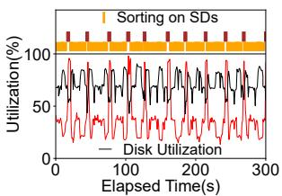  
(a) Differentiated data management. (b) Superficial operations scheduling.  
Figure 5: Resource utilization fluctuations of existing solutions.

Superficial scheduling of data sorting operations. Some works [4, 13, 48] aim to improve performance by superficial scheduling data sorting operations. After detecting the system state, they superficially adjust the frequency, timing, and location of these operations to reduce latency fluctuations, alleviating interdependencies among operations to some extent. However, intertwined resource consumption within operation still persists. These works fails to identify the resourcebound nature of sorting operations, as well as the varying performance bottlenecks on hybrid storage devices. Moreover, scheduling sorting operations of the same resource-intensive can even exacerbate resource bottlenecks.

Taking ADOC [48] as an example, which adjusts parameters to control the components and rates at which data sorting operations occur to reduce data blockage. The experiment on hybrid storage devices (Figure 5(b)) shows more pronounced fluctuations in its resource utilization. Compared to RocksDB in Figure 4(b), sorting on fast devices causes a significantly higher CPU utilization, approaching 100%. At the same time, disk utilization decreases significantly, indicating a more severe CPU bottleneck. This occurs because, when data blockage occurs on components in the fast devices, ADOC schedules more sorting threads for sorting on fast devices. Meanwhile, sorting threads on slow devices are reduced. Resource contention between these operations leads to a more severe CPU bottleneck, while the bandwidth of slow devices is underutilized. Conversely, when data blockage occurs on slow devices, ADOC achieves higher disk utilization but lower CPU utilization, indicating a more severe I/O bottleneck. As a result, the bottlenecks significantly alternate due to the intertwined resource consumption within operation.

Although these efforts have made progress in alleviating the write stall issue in LSM-trees, they cannot fundamentally solve the problem of resource fragmentation and underutilization on hybrid storage devices caused by operation coupling. To address this issue comprehensively, decoupling the operations within the sorting-based KV stores is necessary.

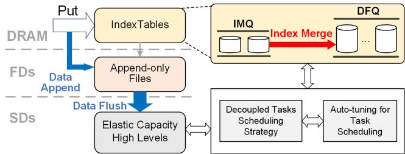  
Figure 6: DecouKV overview.

## 3 DecouKV Design

## 3.1 Design Goals and Challenges

DecouKV focuses on decoupling data sorting operations into resource-independent CPU-intensive tasks and I/O-intensive tasks, enabling the system to flexibly schedule tasks based on current resource utilization. The design goals and challenges of DecouKV are as follows:

Decoupling operations. DecouKV needs to decouple operations to achieve relative isolation while maintaining correctness and consistency, thereby facilitating subsequent task scheduling and resource utilization. Specifically, DecouKV needs to address the three operation coupling issues discussed in Section 2.2.1.

Managing decoupled components. Decoupled operations need to achieve the original objectives of coupled operations. Coupled sorting operations improve data orderliness, addressing two key issues: unordered indexes degrade query performance, and unordered data on disk leads to random access patterns. Decoupled operations must similarly resolve these two issues.

Efficient scheduling of decoupled tasks. DecouKV needs to efficiently schedule decoupled tasks to maximize CPU and I/O resource utilization. This requires accurately assessing resource states and making appropriate scheduling decisions to improve resource efficiency.

## 3.2 System Overview

This section introduces DecouKV, designed to mitigate resource usage dependency in sorting-based KV stores deployed on hybrid devices via operation decoupling. Now, we begin by outlining the architecture of DecouKV.

In sorting-based KV stores, data sorting operations involve CPU-intensive sorting tasks mainly for indexes and I/O-intensive read/write tasks mainly for data. Therefore, to isolate these tasks, DecouKV first decouples indexes from data files. Next, suitable structures are required to manage the separated indexes and data while maintaining their isolation. The structure managing indexes must satisfy the following requirements: (i) fast insertion and query speeds, as these are fundamental for indexes, and (ii) support for independent sorting tasks without impacting access during merging. The structure managing data must meet these criteria: (i) fast insertion speed, and (ii) an unordered design to avoid excessive

CPU consumption for data sorting. As shown in Figure 6, DecouKV manages data on fast devices using append-only files (AOFs) and manages their indexes in DRAM using IndexTables, a mergeable structure based on skip list.

In this way, DecouKV decouples data sorting operations into three types of tasks: CPU-intensive index merge tasks and I/O-intensive data append and data flush tasks, reducing intertwined resource consumption. Specifically, index merge tasks focus solely on sorting indexes in DRAM without involving data read/write operations, making them CPU-intensive. Data append and flush tasks primarily consume disk I/O without sorting, making them I/O-intensive.

Additionally, DecouKV employs two DRAM-based queues—Index Merge Queue (IMQ) and Data Flush Queue (DFQ)—to manage IndexTables. By autotuning queue parameters, DecouKV actively schedules the decoupled tasks. Specifically, DecouKV minimizes competition among the same resource-intensive tasks and optimizes resource usage by coordinating tasks with different resource demands. Finally, DecouKV introduces elastic capacity design for high levels (HLs) of the LSM-tree on slow devices, relaxing the strict level amplification factor to reduce interdependencies among operations. The subsequent sections detail the design of these decoupling mechanisms.

## 3.3 Decoupled Components

DecouKV manages indexes with DRAM-based IndexTables and data with AOFs. Below, we describe their structures.

IndexTable. DecouKV employs IndexTables, a mergeable skip list-based structure, to store indexes in DRAM (Figure 6). Each IndexTable uses a skip list to manage indexes, enabling efficient lookups and subsequent index merge tasks. DecouKV leverages the index to precisely locate data in fast devices, with each index entry containing a key and the corresponding data address in fast devices (comprising an 8- byte file number and an 8-byte offset). Unlike RocksDB’s MemTable, IndexTables avoid storing values, supporting more entries within the same memory footprint. To ensure efficient index insertion and memory utilization, the initial capacity of the IndexTable, denoted as max index size, is set to a relatively small value (8 MB). Note that to minimize the impact of I/O operations on the indexes after decoupling, DecouKV employs asynchronous insertion. By recording the data address, DecouKV allows insertion to proceed without waiting for the data append to fast devices to complete. Once the IndexTable reaches max index size, it becomes noninsertable, and a new IndexTable is created. Queries traverse IndexTables sequentially, from newest to oldest, until the required key is located. When the number of IndexTables exceeds a threshold, DecouKV triggers an index merge operation, which will be discussed in the next subsection.

Append-only file (AOF). DecouKV stores KV pairs as AOFs on fast devices, with the corresponding indexes in DRAMbased IndexTables. Although AOFs are unordered files prone to random access, DecouKV leverages the high bandwidth and concurrency of fast devices to achieve random access performance comparable to sequential access. Consequently, AOFs maintain unordered data without compromising performance. Furthermore, the original Write-Ahead Logs (WALs) of the LSM-tree are eliminated as DecouKV can recover data with AOFs during system failures. Additionally, AOFs also eliminate the extra CPU overhead associated with generating Bloom filters for the data on fast devices, and reduce the memory overhead required for caching these Bloom filters during query processing. Because of the excellent random access performance of fast storage devices, the impact on read performance caused by removing the Bloom Filter in AOF is effectively mitigated.

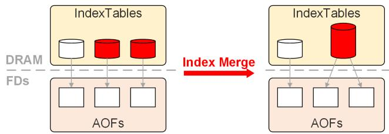  
Figure 7: Index merge. The red cylinders represent the IndexTables before and after merging, and the arrows indicate the correspondence between the IndexTables and AOFs.

## 3.4 Decoupled Tasks

Based on IndexTables and AOFs, DecouKV decouples data sorting operations into CPU-intensive index merge tasks and I/O-intensive data append and data flush tasks. In the following, we explain how to handle these decoupled tasks to achieve the objectives of the original coupled tasks outlined in Section 3.1.

Index merge. Obviously, the number of IndexTables directly impacts query performance. To address the first issue mentioned in Section 3.1—unordered indexes degrade query performance—index merge tasks reduce the number of unordered IndexTables. As illustrated in Figure 7, DecouKV employs index merge tasks to consolidate two red IndexTables into a larger one. Note that index merge tasks occur entirely in DRAM without affecting the data in AOFs. Therefore, index merge is a CPU-intensive task. Initially, each IndexTable corresponds to one AOF; after merging, one IndexTable may correspond to multiple AOFs.

Index merge effectively merges two skip lists. Recent studies have introduced many optimizations for merging skip list structures [17,30]. Specifically, by altering the pointers within skip lists, the two skip lists can be merged efficiently without blocking query requests. DecouKV further implements multithreaded parallelism based on these optimizations, making full use of CPU resources. As shown in Figure 8, DecouKV uses multiple threads to perform parallel index merge. In Figure 8(b), the red arrows are pointers that are currently being modified. Meanwhile, DecouKV maintains a Merging Index

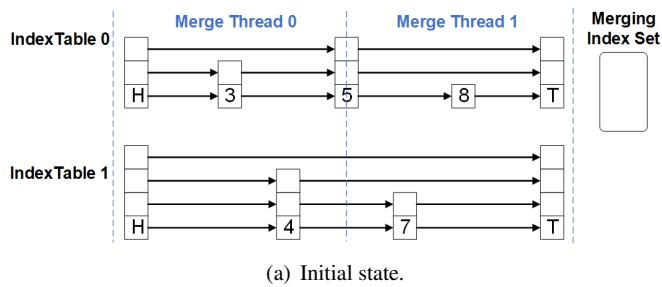

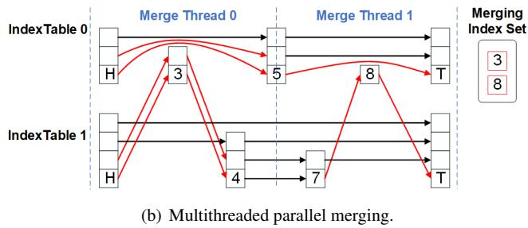  
Figure 8: Illustration of multithreaded parallel index merge. The figure shows two threads performing parallel merging. The arrows represent skip list pointers.

Set (a lock-free set implemented using CAS) to store atomic pointers to the index nodes being merged (3 and 8 in the figure). In this way, after accessing IndexTable 0, the query operation will first check the Merging Index Set and then access IndexTable 1 to ensure the correctness of the query. Once the node insertion is complete, the thread removes the corresponding pointer from the Merging Index Set.

Data append and data flush. DecouKV employs the data append task, an I/O-intensive operation, to write KV pairs into the AOFs on fast devices. Additionally, DecouKV performs the data flush task to flush KV pairs into slow devices. Notably, to avoid the performance gap between random and sequential access on slow devices, DecouKV organizes KV pairs in an ordered data structure (SSTables) on slow devices. When the size of a merged IndexTable reaches the threshold data flush trigger size, DecouKV triggers a data flush operation to consolidate the IndexTable and its corresponding AOFs into the slow devices. Specifically, the data flush task sequentially scans all indexes in the IndexTable, retrieves the data from the AOFs and writes them into the SSTables on slow devices. Finally, the system deletes the outdated IndexTable and its corresponding AOFs. Note that while the data flush task inevitably introduces some CPU overhead, I/O remains the primary performance bottleneck on slow devices. Furthermore, since the indexes in the IndexTable are already organized as sorted skip lists, the data flush task is still predominantly classified as an I/O-intensive operation.

## 3.5 Scheduling Strategy of Decoupled Tasks

In this section, we discuss the scheduling of decoupled CPUintensive and I/O-intensive tasks to maximize system resource utilization. DecouKV employs two distinct queues to evaluate system resource status and uses corresponding parameters to manage task scheduling effectively.

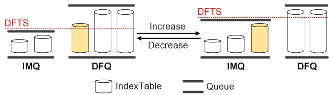  
Figure 9: Auto-tuning DFTS. The height of the cylinder represents the size of the IndexTable. The yellow cylinder is the IndexTable that has been moved during auto-tuning DFTS.

Index Merge Queue (IMQ). DecouKV enqueues small noninsertable IndexTables into the IMQ, awaiting index merge. Since index merge is a CPU-intensive task, the length of the IMQ $( L _ { I M Q } )$ reflects the availability of CPU resources. When CPU resources become bottlenecked, the number of IndexTables waiting for merge increases, causing the IMQ to grow. The threshold for triggering an index merge task is referred to as index merge trigger num (IMTN). We define $\begin{array} { r } { S c o r e _ { I M } = \frac { L _ { I M Q } } { I M T N } } \end{array}$ to represent CPU resource pressure. When ScoreIM exceeds a certain value (1.5 is optimal in our experiments), DecouKV identifies the system as CPU-bound.

DecouKV can adjust CPU resource demand by modifying the IMTN parameter. By increasing IMTN, the IMQ can accommodate more IndexTables, thereby reducing the frequency of index merge triggers and alleviating the pressure on CPU resources. Conversely, decreasing IMTN increases the demand for CPU resources.

Data Flush Queue (DFQ). For IndexTables that reach the threshold size of data f lush trigger size (DFTS), DecouKV places them into the DFQ awaiting data flush. Similarly, the length of the DFQ $( L _ { D F Q } )$ reflects the pressure of I/O resources. Since data flush is an I/O-intensive task, when I/O resources become bottlenecked, the DFQ length increases. We define Score $\bf \ '  _ { D F } = L _ { D F Q }$ to represent I/O resource pressure. When ScoreDF exceeds a certain value (3 is optimal in our experiments), DecouKV identifies the system as I/O-bound.

DecouKV adjusts the DFTS to schedule different resourceintensive tasks. As shown in Figure 9, increasing the DFTS causes some IndexTables to move from the DFQ back to the IMQ, thereby increasing CPU demand and alleviating I/O pressure. Conversely, decreasing the DFTS alleviates CPU pressure and increases I/O demand.

## 3.6 Elastic Capacity High Levels

For the high levels (HLs) stored on slow devices, DecouKV still uses leveled compaction. Due to memory limitations and the random access performance of slow devices, we cannot leverage the same decoupling design as lower levels. Therefore, we chose to use elastic capacity to mitigate the coupling issue at high levels by relaxing the strict amplification ratio between levels. In Section 2.2, we mentioned three key aspects of the operation coupling issue, with the second point discussing how interdependencies among operations stem from fixed thresholds. Elastic capacity is mainly optimized to address this problem. For example, a large number of $H L _ { 0 }$ compactions may lead to an IO-bound situation, which also causes $H L _ { 1 }$ to exceed its threshold and trigger further compaction, leading to an even worse IO-bound situation. In this case, DecouKV relaxes the capacity threshold for $H L _ { 1 }$ , postpones the sorting for that part, and schedules CPU-intensive index merges to improve CPU utilization.

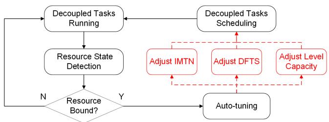  
Figure 10: Control flow of task scheduling.

However, relaxing the amplification ratio between levels in other KV stores may temporarily lead to increased size in certain levels, potentially introducing some challenges. (i) Increased write amplification: When the size of $L _ { i }$ increases while the size of $L _ { i - 1 }$ remains relatively smaller, the compaction between $L _ { i - 1 }$ and $L _ { i }$ will involve more data from $L _ { i } ,$ causing additional write amplification. (ii) Higher read overhead: With the larger size of $L _ { i }$ , the cost of read operations accessing $L _ { i }$ will increase.

Fortunately, the decoupling design in DecouKV, as described in Section 3.3, successfully addresses both challenges. For the first one, the DFTS parameter (which directly influences the file size written to $H L _ { 0 } )$ is adjustable. This allows DecouKV to control the size of files written to $H L _ { 0 }$ . By adjusting the capacity of the high levels according to DFTS, DecouKV ensures that the size ratio between adjacent levels does not become excessively large, thereby controlling write amplification. Additionally, the use of the index merge operation reduces some of the write amplification caused by duplicate keys. For the second one, DecouKV stores hotter data in fast devices, while cold data in the high levels is accessed less frequently. Moreover, data written to higher levels is pre-sorted, resulting in larger sizes for high levels but fewer overall levels. Subsequent experiments demonstrate that even under read-intensive workloads, DecouKV achieves a slight improvement in throughput.

## 3.7 Auto-tuning for Task Scheduling

As shown in Figure 10, first, DecouKV monitors the IMQ and DFQ to assess the system resource state. It then determines whether the system is in a resource-constrained state based on the scores defined in Section 3.5. Following this, DecouKV performs auto-tuning according to the actual system state. By adjusting IMTN, DFTS, and the level capacity, DecouKV schedules resource-intensive tasks accordingly. This ensures efficient utilization of system resources and reduces fragmentation. Detailed parameter settings and tuning methods are presented below.

The parameter setting in DecouKV is based on the default values of similar parameters in RocksDB. As a widely adopted industrial storage engine, the parameters in RocksDB are fine-tuned through numerous experimental optimizations. We also validate the efficiency of the selected values via experiments. Specifically, the default value of IMTN in our evaluation is 2. Since IMTN directly impacts read performance, we set it according to the default number of MemTables, which similarly affects read performance. The default value of DFTS is 32MB (4 \* 8MB), which is approximately the size of 4 merged IndexTables according to the number of files in $L _ { 0 }$ (default 4). When the system is CPU-bound, DecouKV increases the IMTN to reduce CPU resource demand. Simultaneously, DecouKV decreases the DFTS to minimize the triggering of CPU-intensive index merge operations while scheduling more I/O-intensive data flush tasks. Conversely, when the system is I/O-bound, DecouKV reduces the IMTN and increases the DFTS to lower I/O resource demand, thereby scheduling more CPU-intensive tasks. Additionally, proportionally adjusting the capacity of the high levels based on DFTS further regulates I/O resource pressure on slow devices. Note that DecouKV adjusts IMTN by increasing 2 (or decreasing 2) and adjust DFTS by multiplying (or dividing) by 2 according to the state, since the number of IndexTables typically increases incrementally, while the data size often increases exponentially (e.g., two IndexTables of 16MB each are merged into a 32MB IndexTable).

Naturally, these parameters are capped and cannot grow indefinitely. If both CPU and I/O are bound (indicated by congestion in both IMQ and DFQ), DecouKV recognizes that the incoming data writes exceeds the system’s processing capacity and slows down data write through write stalls. Finally, when neither queue experiences congestion over a certain period (set to 60 seconds in our implementation), DecouKV identifies that system resources are idle. In this case, it reduces the IMTN, DFTS, and the capacity of the high levels simultaneously to schedule both CPU- and I/O-intensive tasks effectively. In this way, DecouKV improves data orderliness to enhance read performance.

## 4 Evaluation

In this section, we evaluate and compare DecouKV with RocksDB v9.3.0 and the two categories of solutions mentioned in 2.3 using hybrid storage devices. Among the works following the fixed differentiated management approach, MatrixKV stands out as a typical representative. In the superficial scheduling direction, ADOC represents the state-of-the-art. Therefore, we select RocksDB, MatrixKV and ADOC as the basic benchmarks for comparison. Besides, some stateof-the-art works on hybrid storage, such as PrismDB [42] and SplitDB [6], mainly focus on different scenarios like workload skewness or read-intensive workloads. To ensure a comprehensive evaluation, we also include them in our comparative analysis under YCSB workloads. The test data are obtained from three experimental runs, with minimal variation in the results. The average values are presented.

Hardware environment. The experiments are conducted on a server equipped with two 20-core Intel Xeon Gold 5218R processors and 128 GB of DRAM. The server runs Ubuntu 20.04.6 LTS with the Linux kernel 5.15. For storage devices, we use 128 GB Intel Optane DCPMM and INTEL SSDPE2KE032T8 NVMe SSDs for fast devices, and 960 GB Intel S4520 SSDs with SATA 3.0 interfaces for slow devices. Configuration of key-value stores. For all KV stores, we use the recommended configuration [21], setting the Memtable size and SSTable size to 64MB, configuring Bloom filters to 10 bits per key, and allocating a block cache size of 1GB. By default, four CPU cores are assigned, with four background compaction threads, following the optimization tuning guide. We also use direct I/O to avoid the impact of the operating system’s page cache. For fairness, we limit the amount of fast devices allocated to each KV store to 10% of the dataset size (e.g., 10 GB for a 100 GB dataset). Specifically, for DecouKV, we use the configuration described in Sec 3, deploying AOFs on fast devices while controlling space usage. The initial size of the IndexTable is set to 16MB. For RocksDB and ADOC, we place $L _ { 0 } , L _ { 1 }$ , and the WAL on fast devices, slightly increasing the sizes of $L _ { 0 }$ and $L _ { 1 }$ to ensure an equal allocation of fast devices. For MatrixKV, PrismDB and SplitDB, we follow the configuration from their paper, placing their differentiated data structures on fast devices and allocating an equivalent amount of space.

First, we evaluate the resource utilization, throughput, average latency, and tail latency of various fundamental KV operations using the following workloads: (i) inserting 100 GB KV pairs, (ii) updating 100 GB KV pairs, (iii) reading 100 GB KV pairs, and (iv) scanning 10 GB KV pairs with a maximum scan length of 100. Prior to each experiment, we clear the entire database to avoid interference. By default, we perform the microbenchmark evaluations using a uniform workload with a KV size of 1KB (24B for the key and 1000B for the value). We also conduct the same operations under a zipfian distribution and observe similar results, so we omit the results in the interest of space.

## 4.1 Microbenchmark

Resource utilization. We evaluate the variation in CPU and disk utilization using psutil [44] during insert and update operations over a 1500-second period. We calculate the average CPU utilization and fluctuation range during this time, as shown in Figure 11. For the insert operation, compared to RocksDB, MatrixKV, and ADOC, DecouKV achieves a 32.3%, 25.4%, and 27.3% increase in average CPU utilization, respectively, while significantly reducing the fluctuation range. This improvement is a key factor contributing to the significant write performance gains achieved by DecouKV. For the update operation, compared to RocksDB, MatrixKV, and ADOC, DecouKV improves average CPU utilization by 47.9%, 36.9%, and 39.4%, respectively. Due to the capacity limitations of fast devices, DecouKV experiences resource fluctuations. However, upon examining the fluctuation intervals, we observe that DecouKV maintains relatively stable resource utilization over extended periods. Figure 12 presents the average disk utilization over the same period. Compared to RocksDB, MatrixKV, and ADOC, DecouKV achieves a 17.6%–31.6% increase in disk utilization for the insert operation and an 8.0%–19.9% increase in disk utilization for the update operation. Additionally, we observe that MatrixKV exhibits high disk utilization, indicating that fine-grained compaction can mitigate intertwined resource consumption and improve disk utilization. However, due to interdependencies among operations, it still suffers from significant resource fluctuations. ADOC reduces blocking by scheduling data sorting operations, improving average resource utilization compared to RocksDB. Nonetheless, on hybrid storage devices, it experiences even more severe resource fluctuations due to intertwined resource consumption. In summary, DecouKV improves average resource utilization and reduces fragmentation by mitigating resource usage dependency.

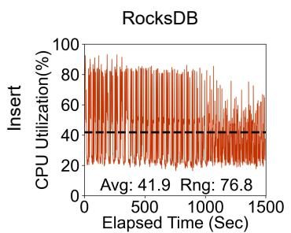

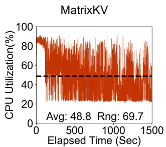

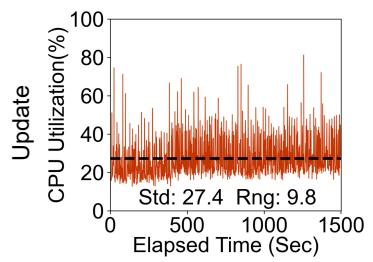

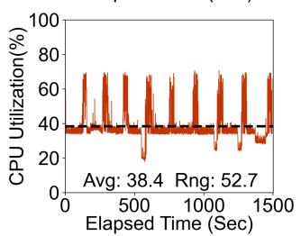

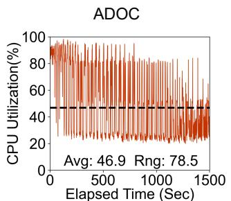

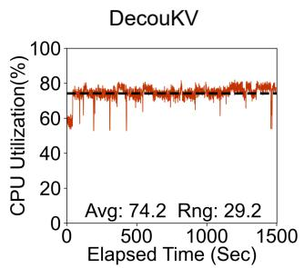

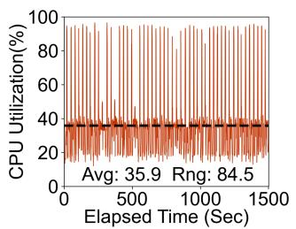

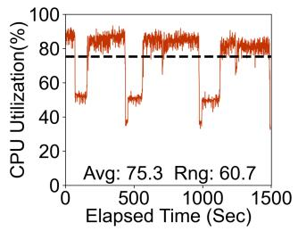

Figure 11: The red solid line represents the real-time CPU utilization over a 1500-second period, measured at a granularity of one second. The black dashed line indicates the average CPU utilization over this period. In the figure, “Avg” denotes the average value, and “Rng” represents the range, reflecting the extent of fluctuation in utilization.  
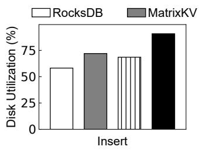

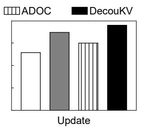  
Figure 12: Disk utilization.

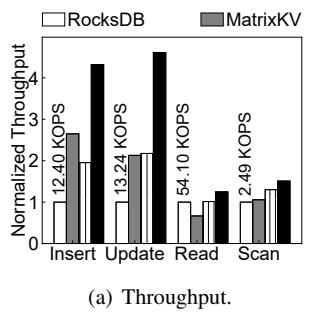

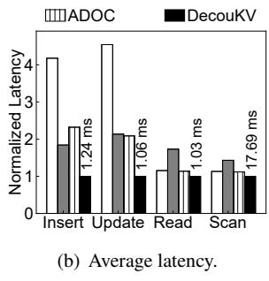  
Figure 13: Performance under different operations.

Throughput. Figure 13(a) presents the throughput results for various operations. To facilitate comparison, we normalize the experimental results using the throughput of RocksDB as the reference and annotate the absolute values in the figure. Compared to RocksDB, DecouKV achieves 4.3× the throughput for inserts and 4.6× the throughput for updates. Additionally, DecouKV achieves 1.2× the throughput for reads and 1.5× the throughput for scans. Under read-intensive workloads, the background threads remain idle and DecouKV is adapted to allow a very limited number of overlapping IndexTables and files, resulting in a higher degree of data order and fewer levels in the LSM-tree (e.g., HL0 is empty in most cases). Meanwhile, benefiting from the excellent random access performance of fast storage devices, the impact of removing the Bloom Filter in AOF is effectively mitigated. As a result, DecouKV’s read performance is not significantly affected and even shows a slight improvement.

Compared to MatrixKV and ADOC, DecouKV also demonstrates a significant advantage under write-intensive workloads. Specifically, DecouKV achieves 1.6× and 2.2× the throughput of MatrixKV and ADOC, respectively, for insert operations, and 2.2× and 2.1× the throughput for update operations. Additionally, DecouKV shows good performance in both read and scan operations.

<table><tr><td rowspan=2 colspan=1>Latency (ms)</td><td rowspan=1 colspan=2>Insert</td><td rowspan=1 colspan=2>Update</td></tr><tr><td rowspan=1 colspan=1>90%</td><td rowspan=1 colspan=1>99%</td><td rowspan=1 colspan=1>90%</td><td rowspan=1 colspan=1>99%</td></tr><tr><td rowspan=1 colspan=1>RocksDB</td><td rowspan=1 colspan=1>9.454</td><td rowspan=1 colspan=1>37.557</td><td rowspan=1 colspan=1>11.619</td><td rowspan=1 colspan=1>16.132</td></tr><tr><td rowspan=1 colspan=1>MatrixKV</td><td rowspan=1 colspan=1>5.571</td><td rowspan=1 colspan=1>12.532</td><td rowspan=1 colspan=1>10.010</td><td rowspan=1 colspan=1>22.219</td></tr><tr><td rowspan=1 colspan=1>ADOC</td><td rowspan=1 colspan=1>6.995</td><td rowspan=1 colspan=1>17.881</td><td rowspan=1 colspan=1>7.545</td><td rowspan=1 colspan=1>21.075</td></tr><tr><td rowspan=1 colspan=1>DecouKV</td><td rowspan=1 colspan=1>1.579</td><td rowspan=1 colspan=1>3.227</td><td rowspan=1 colspan=1>2.275</td><td rowspan=1 colspan=1>14.480</td></tr></table>

Table 1: Tail Latency.

<table><tr><td>Workload</td><td>Characteristics</td></tr><tr><td>A (Update Heavy)</td><td>50%updates, 50%reads</td></tr><tr><td>B (Read Mostly)</td><td>5%updates, 95%reads</td></tr><tr><td>C (Read Only)</td><td>100%reads</td></tr><tr><td>D (Read Latest)</td><td>5%inserts, 95%reads</td></tr><tr><td>E (Scan Mostly)</td><td>5%inserts, 95%scans</td></tr><tr><td>F (Read-Modify-Write)</td><td>50%read-modify-write, 50%reads</td></tr></table>

Table 2: YCSB core workloads.

Average latency. Figure 13(b) presents the experimental results normalized to DecouKV’s average latency, with DecouKV’s latency values annotated in the figure. Compared to RocksDB, DecouKV reduces the average latencies for inserts and updates by 76.0% and 77.9%, respectively. In comparison to MatrixKV and ADOC, DecouKV achieves a reduction in average latencies for inserts and updates ranging from 38.7%– 56.9%. Additionally, DecouKV achieves average latencies for reads and scans comparable to those of other KV stores.

Tail latency. Table 1 presents the P90 and P99 tail latency results for insert and update operations. We observe that compared to RocksDB, MatrixKV, and ADOC, DecouKV reduces the P90 tail latency of the insert operation by 71.6%– 83.3% and the P99 tail latency by 74.3%–91.4%. For the update operation, DecouKV reduces the P90 tail latency by 69.8%–80.4%. These improvements are attributed to the stable resource utilization and the reduction in resource bottlenecks in DecouKV. However, DecouKV does not show a significant advantage in P99 tail latency, which corroborates the fluctuations in resource utilization shown in Figure 11.

## 4.2 YCSB Benchmark

In this section, we evaluate DecouKV using the YCSB-C [39, 43], a C++ version of YCSB [11] benchmark. YCSB (Yahoo! Cloud Serving Benchmark) is a widely used testing tool that generates workloads based on real-world data characteristics. We conduct our evaluation using the six workload configurations shown in Table 2. Each workload runs 100 million operations on a randomly loaded 100GB database, with a KV size of 1KB (24B for the key and 1000B for the value). All other settings remain consistent with those used in previous experiments. Figure 14(b) and Figure 14(a) present the throughput of RocksDB, MatrixKV, PrismDB, SplitDB, ADOC, and DecouKV under the YCSB uniform and zipfian workloads.

RocksDB MatrixKV PrismDB SplitDB ADOC DecouKV  
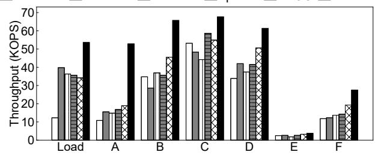  
(a) Uniform workloads.

RocksDB MatrixKV PrismDB SplitDB ADOC DecouKV  
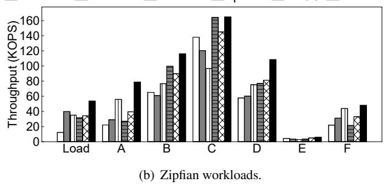  
Figure 14: Throughput under YCSB workloads.

Write-intensive workloads (load, YCSB-A, and -F). For write-intensive workloads, DecouKV demonstrates significant throughput improvement. Compared to RocksDB, DecouKV achieves a 2.3–4.9× improvement. In comparison to MatrixKV and ADOC, DecouKV shows a smaller improvement under the load workload, with a 1.4× and 1.6× increase, respectively. This indicates that MatrixKV and ADOC, as optimized solutions for addressing write stall issues, effectively reduce the occurrence of write stalls under pure write workloads, leading to superior performance. However, for read-write mixed write-intensive workloads like YCSB-A and YCSB-F, the resource bottlenecks caused by frequent writes also impact read performance. DecouKV successfully mitigates resource fragmentation, reducing its impact on both read and write performance, thus providing an advantage with a 1.5–3.4× improvement. Compared to PrismDB and SplitDB, DecouKV demonstrates significant advantages under uniform workloads, achieving improvements of 1.5–3.6×. Under heavily skewed Zipfian workloads, PrismDB performs particularly well in write-intensive cases (YCSB-A, YCSB-F). This is because PrismDB employs a slab-based structure and in-place update strategy on the fast devices. When the workload is highly skewed, a large portion of write requests are handled on the fast devices and are not pushed to the slow device, thus achieving high throughput. However, DecouKV still achieves strong performance overall.

Additionally, according to our previous analysis, the system often enters a resource-constrained state under writeintensive workloads. In such cases, DecouKV relaxes certain parameters, resulting in the creation of multiple overlapping files (e.g., IndexTables or SSTables in $H L _ { 0 } )$ , which could impact read performance. However, in our experiments, we observe that DecouKV’s read performance is not significantly affected. This is because, under write-intensive workloads, with the scheduling of decoupled tasks in DecouKV, the burst in CPU usage is short-lived, thereby preventing excessive IndexTables (in the evaluation, the number of IndexTables never exceeds 6, which is even lower than the number of files in $L _ { 0 }$ in RocksDB, even during write stalls). As shown in Figure 16, the maximum value of IMTN is only 4, further validating this result. Regarding overlapping SSTables in $H L _ { 0 } ,$ we set the number of files to one in order to trigger the compaction of data from $H L _ { 0 }$ to $H L _ { 1 }$ , giving $H L _ { 0 }$ compaction a higher priority. In the evaluation, even under write-intensive workloads, the number of files in $H L _ { 0 }$ does not exceed two. Under read-intensive workloads, $H L _ { 0 }$ is empty in most cases.

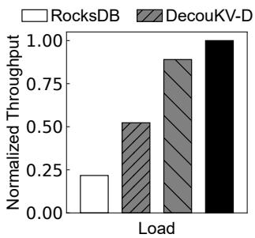

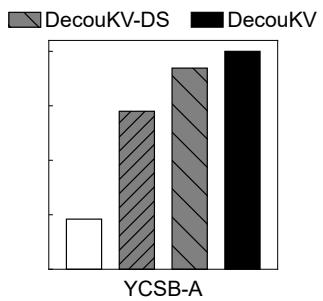  
Figure 15: Normalized throughput of different DecouKV versions.

Read-intensive and scan-intensive workloads (YCSB-B, -C -D, and -E). For read-intensive and scan-intensive workloads, DecouKV also demonstrates modest improvements. Compared to RocksDB, MatrixKV, and ADOC, DecouKV achieves a 1.2–1.9× improvement under the zipfian workload and a 1.2–2.3× improvement under the uniform workload. These gains primarily stem from more efficient resource utilization and a reduction in the number of high levels on slow devices. Compared to PrismDB and SplitDB, DecouKV also exhibits slight advantages under uniform workloads, achieving a 1.1–1.8× improvement. For highly skewed zipfian workloads, DecouKV shows no advantage, whereas SplitDB performs remarkably well. SplitDB employs a cascading skiplist index–which constructs fast paths between adjacent LSM-tree levels to reduce lookup latency–and a data promotion and demotion mechanism that migrates hot data from slower SSDs to faster NVM and cold data to SSDs, thereby optimizing read performance under skewed workloads.

## 4.3 Performance Breakdown

In our design, we consider three primary techniques to optimize system performance: decoupling, scheduling strategies, and elastic capacity for high levels. In this section, we evaluate the performance contribution of each technique to DecouKV. However, task scheduling relies on decoupling, while elastic capacity high levels depends on scheduling strategies. Consequently, we evaluate three versions of DecouKV against RocksDB: DecouKV-D (decoupling only, with the queue parameters set to the average of the auto-tuning results from the experiment), DecouKV-DS (decoupling + scheduling strategies), and DecouKV (decoupling + scheduling strategies + elastic capacity high levels, i.e., the complete version of DecouKV). Figure 15 shows the throughput of different DecouKV versions during insert and update operations, normalized to DecouKV as the baseline. In the following, we will explain the contribution of each component.

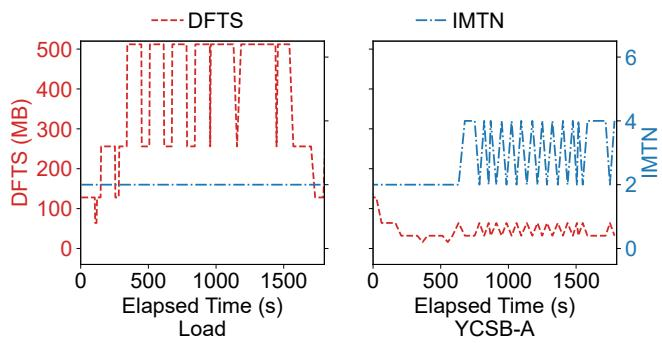  
Figure 16: Tuning actions for load and YCSB-A workloads.

Decoupling technique. By comparing the performance of DecouKV-D with RocksDB, we can roughly estimate the contribution of the decoupling technique. The decoupling technique contributes significantly to both the load and YCSB-A workload, with a greater contribution observed under the YCSB-A workload. This is because DecouKV’s decoupling technique primarily targets data on fast devices, and a substantial portion of the updates in the YCSB-A workload can be completed solely on fast devices.

Scheduling strategies. Similarly, by examining the differences between DecouKV-DS and DecouKV-D, we can roughly assess that the scheduling queue technique has a greater contribution to the load workload. To further understand this, we record the variations in the parameters DFTS and IMTN during load and YCSB-A workload in the 2000s, as shown in Figure 16. After decoupling, during the load workload, DFTS is significantly increased, indicating a clear performance bottleneck in I/O. DecouKV mitigates this bottleneck by increasing DFTS to schedule more CPU-intensive operations, thus reducing the demand for I/O resources. In contrast, during the YCSB-A workload, DFTS and IMTN are not significantly adjusted, suggesting that the CPU and I/O resources are well balanced after decoupling, and no excessive scheduling is required. Therefore, the scheduling queue technique contributes more to load workload.

Elastic capacity high levels. The performance difference between DecouKV and DecouKV-DS demonstrates that the elastic capacity for high levels technique provides greater benefits for load workload compared to YCSB-A workload. This is primarily because the load workload has a more significant impact on the high levels than the YCSB-A workload. Moreover, the elastic capacity high levels technique further mitigates the interdependencies among operations, minimizing the impact of excessive data sorting tasks on other operations during the write-intensive load phase.

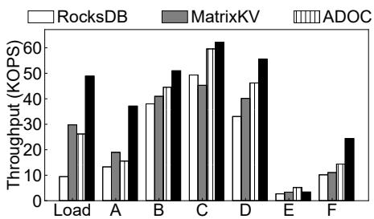  
(a) YCSB workloads with 500 million KV pairs.

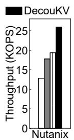  
(b) Nutanix.  
Figure 17: Performance under other workloads.

## 4.4 Performance under Other Workloads

YCSB workloads with a huge size dataset. We conduct performance evaluations on a larger YCSB uniform workload, which includes a 500GB dataset (i.e., 500 million key-value pairs), as shown in Figure 17(a). Compared to RocksDB, DecouKV demonstrates performance improvements of 5.2×, 2.8×, and 2.4× under write-intensive load, YCSB-A, and YCSB-F workloads, respectively, consistent with the results obtained with the 100GB dataset. In comparison to MatrixKV and ADOC, DecouKV achieves performance improvements of 1.6–2.4× under the same workloads, even slightly outperforming the results from the 100GB dataset. This is attributed to the slight performance degradation observed in MatrixKV and ADOC with larger datasets, whereas DecouKV maintains its performance advantage due to more efficient utilization of system resources.

Nutanix production workloads. We also evaluate the throughput performance of various KV systems using a real-world workload from Nutanix, which closely resembles a write-intensive workload with 57% updates, 41% reads, and 2% scans. The results, shown in Figure 17(b), demonstrate that DecouKV outperforms other systems, achieving a throughput improvement of 1.3–2.0×.

## 4.5 Understanding DecouKV Performance

Impact of KV size. We evaluate the variation in throughput performance of the load under different value sizes. As shown in Figure 18(a), DecouKV demonstrates the most significant advantage when the value size is 1KB and 4KB. It is known that as the value size increases, the demand for I/O bandwidth also increases. Conversely, when the value size decreases, the load’s demand for CPU resources becomes more significant. When the value size is too large (16KB) or too small (256B), severe imbalances in the demands for CPU and I/O resources results in performance degradation, leading to resource shortages of a single type. Consequently, the benefits of decoupling decrease, and ADOC, which smooths the data flow through scheduling, still performs well.

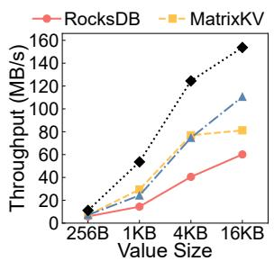

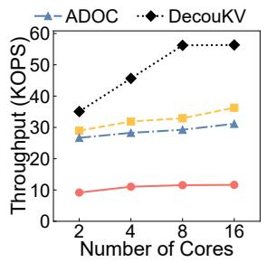  
(a) Throughput w/ varying V-size. (b) Throughput w/ varying core#.

Figure 18: Performance impact of varying value sizes/core counts.  
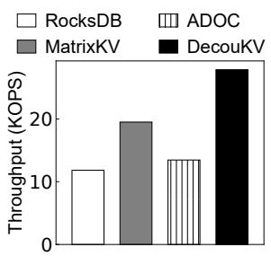  
(a) Throughput on NVMe SSDs.

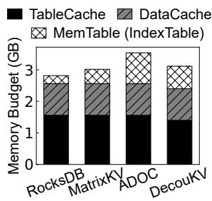  
(b) Memory budget comparison.  
Figure 19: Comparison of throughput after replacing fast devices with NVMe SSDs and memory budget.

Impact of core number. We evaluate the impact of the number of CPU cores on load performance. As shown in Figure 18(b), when the number of CPU cores is low (e.g., 2 cores), the performance improvement of DecouKV is modest due to limited CPU resources. As the number of cores increases, DecouKV ’s performance advantage becomes more pronounced, indicating that DecouKV can better leverage the additional CPU resources. However, when CPU resources become excessive (e.g., 16 cores), the performance of DecouKV no longer increases, as it becomes constrained by disk I/O.

Performance on different devices. We evaluate the throughput performance of DecouKV on different fast devices. Specifically, we use the INTEL SSDPE2KE032T8 NVMe SSD as the fast device and leverage io-uring to fully exploit the asynchronous I/O capabilities of the NVMe SSD. As shown in Figure 19(a), DecouKV demonstrates a throughput improvement of 1.4–2.4× over RocksDB, MatrixKV, and ADOC when deployed on hybrid storage devices consisting of an NVMe SSD and a SATA SSD.

Memory budget. We record the maximum memory usage during the experiments, with YCSB-A requiring the highest memory. As shown in Figure 19(b), about 23% (0.7GB) of memory is used for the IndexTable–more than RocksDB’s MemTable (0.3GB). Approximately 45% (1.4GB) is used for DecouKV’s Tablecache, less than RocksDB’s (1.56GB), because there’s no need to cache the AOF’s Filter Block and Index Block. The memory usage of DecouKV is comparable to that of MatrixKV and ADOC, with only a slight increase over RocksDB, while achieving higher performance.

Recovery time. We also test the recovery capability of DecouKV in the event of system crashes. Specifically, we verify that data persisted in the AOFs on fast devices before a crash can be used to rebuild the index upon reboot. The results show that DecouKV successfully recovers after multiple crash tests. In terms of performance, the recovery speed of DecouKV and RocksDB is nearly identical, with recovery times of 8.76s and 8.12s, respectively, for a 10GB database. This is because the high sequential read bandwidth provided by the fast devices enables rapid index rebuilding.

## 5 Related Work

Performance optimization of LSM-tree-based KV stores. A lot of research focus on optimizing the performance of LSM-tree-based KV stores. One line of investigation addresses the issue of write stalls. SILK [4] aims to mitigate the tail latencies caused by write stalls by adjusting the priority of background threads and rate-limiting their operations. ADOC identifies data overflow in various components of LSM trees as the direct cause of write stalls and fine-tunes parameters such as the number of threads and batch size to schedule flush and compaction operations more effectively. Another line of research focuses on reducing write amplification through KV separation. WiscKey [35] is the first to propose storing values in a separate append-only log, while Bourbon [12] extends WiscKey by indexing values through a learned approach. HashKV [8] and BadgerDB [16] have optimized the additional overhead introduced by garbage collection in the context of KV separation. Other studies focus on optimizing read and scan performance, including systems such as LSM-trie [46], UniKV [49], ElasticBF [34], and DiffKV [33]. Deploying LSM-tree-based KV stores on new devices. Recent studies also focus on new types of storage media, with some research targeting hybrid storage solutions, similar to the scenario discussed in this paper. NoveLSM extends memory components to PM and employs in-place updates to reduce compaction overhead. SLM-DB [28] improves upon this by constructing a global B+-tree index on PM and using optional compaction to minimize write amplification. MatrixKV identifies $L _ { 0 } – L _ { 1 }$ compaction as the root cause of PM device write stalls and addresses this issue by using matrix containers for differentiated management of $L _ { 0 }$ on PM. Fine-grained matrix compression is employed to reduce write stalls.

Besides, some works [6, 42, 45] mainly focus on different scenarios like workload skewness or read-intensive workloads. PrismDB modifies the hierarchical structure to reduce compaction overhead and uses a cold-hot awareness approach to improve read performance. SplitDB employs a cascading skip list index and a data promotion and demotion mechanism that migrates hot data from slower SSDs to faster NVM and cold data back to SSDs, thereby optimizing read performance under skewed workloads. PRISM [45] analyzes the advantages of each storage device and adopts hybrid management for heterogeneous storage. However, abandoning the tree structure leads to some loss in scan performance and complicates garbage collection management. Other studies focus on scenarios where cost is not a primary concern, and fast devices nearly replace slow ones. KVell [32] relaxes data ordering and employs a share-nothing design to fully utilize the bandwidth of fast devices. ListDB [30] deploys the entire LSM-tree on a system with only DRAM and PM and replaces SSTables with a NUMA-aware skip list. MioDB [17] leverages the byte-addressable feature of PM, managing data on PM using skip lists and performing zero-copy compaction for merging between skip lists.

Tuning and scheduling of LSM-tree-based KV stores. Many studies observe that configuration settings significantly impact the performance of LSM-trees. Monkey [13] proposed a configuration tuning framework that optimizes memory allocation strategies and read/write performance under worst-case scenarios. Dostoevsky [14] employs a hybrid strategy to determine the levels at which compaction occurs. Rafiki [37] and TiKV [41] utilize offline training methods to compute optimal configuration settings. These works achieve substantial performance improvements in their respective scenarios; however, their tuning and scheduling approaches are often highly dependent on workload characteristics.

## 6 Conclusion

In this work, we analyze the data sorting operations of sortingbased KV stores and identify operation coupling as the root cause of resource usage dependency and fragmentation on hybrid storage devices. While two existing approaches—fixed differentiated data management and superficial scheduling of data sorting operations—fail to fundamentally address the problem of inefficient resource utilization.

We propose DecouKV to mitigate resource usage dependency in sorting-based KV stores on hybrid storage devices via operation decoupling. Experimental results demonstrate that, compared to RocksDB and the aforementioned solutions, DecouKV improves CPU utilization by 25.4%–32.3% and increases throughput by 2.3–4.9× under write-intensive workloads, while reducing tail latency by 74.3%–91.4%. Furthermore, under read-intensive workloads, DecouKV also achieves a modest throughput improvement of 1.2-2.3×.

## 7 Acknowledgement

We thank our shepherd, Jinkyu Jeong, and the anonymous reviewers for their valuable comments. This work was supported in part by NSFC (62472392, 62172382) and the Youth Innovation Promotion Association CAS.

## A Artifact Appendix

## Abstract

Our artifact includes the prototype implementation of DecouKV and three other state-of-the-art comparison systems, along with the YCSB benchmark evaluated in the Evaluation section. Additionally, we provide the experimental scripts necessary to reproduce our results on hybrid devices. Please note that running the full evaluation requires several tens of hours to complete.

## Scope

This artifact allows reviewers to reproduce the main experimental results of the paper, including:

• DecouKV improves CPU utilization compared to other systems and reduces utilization fluctuations under writeintensive workloads (Load, YCSB-A).

• DecouKV achieves higher throughput than other systems under write-intensive workloads (Load, YCSB-A, -F); it also provides moderate improvements under read- or scanintensive workloads (YCSB-B, -C, -D, -E).

• DecouKV reduces average latency compared to other systems under write-intensive workloads; it also brings slight improvements under read- or scan-intensive workloads.

## Contents

The artifact is hosted in a git repository. This repository includes DecouKV’s source code as well as documentation and experimental scripts. It is structured as follows:

db impl/: This folder contains the source code implementation of DecouKV, as well as three other comparison systems (RocksDB, MatrixKV and ADOC). Users can switch between the test systems by modifying the value of ’systems’ in the script. The source code is structured as follows:

• adoc/: This folder contains the source code implementation of ADOC.

• decoukv/: This folder contains the source code implementation of DecouKV.

• matrixkv/: This folder contains the source code implementation of MatrixKV.

• rocksdb/: This folder contains the source code implementation of RocksDB.

test results/: This folder is automatically created after running the test script, and the test results will be saved here. The ycsb latency.csv file stores the latency results after running the test, while the ycsb throughput.csv file stores the throughput results.

workloads/: This folder contains the main parameters for the YCSB workload. Each YCSB workload file can be modified to change parameters such as database size (recordcount), number of operations (operationcount), read/write ratio, and key distribution (Uniform or Zipfian).

db config.yaml: This file includes some system-level configurations that can be customized, including SSTable size, MemTable size, and other internal parameters.

test.sh:This file is the unified test script. It will compile all four systems, run Load, YCSB-A to F workloads, and output the CPU utilization fluctuation plot into ./test results/. This step may take over 50 hours to complete, and you can monitor the script’s progress in the test.log file. Reducing the data volume (default: 100GB) can shorten the runtime, but it may affect the final results.

## Hosting

The artifact is hosted on GitHub at:https: // github. com/ QingyangZ/ DecouKV. git . Please refer to the main branch and the latest commit version for the exact code used in this paper.

## Requirements

The artifacts have been developed and tested on Ubuntu 20.04.6 LTS with Linux kernel 5.15. The hardware includes 128 GB Intel Optane DCPMM for fast devices and 960 GB Intel S4520 SSDs with SATA 3.0 interfaces for slow devices. Approximate resource requirements are a dedicated server with at least 10 CPU cores, one SSD with over 200GB of free space, and one PMEM device with over 50GB of free space.

## A.1 Installation

1. First, to clone the repository, run the following commands: git clone https: // github. com/ QingyangZ/ DecouKV. git .

2. Then, to initialize and update the submodules, run:

git submodule init

git submodule update

3. Next, to install the required packages, use:

sudo apt install libsnappy-dev libgflags-dev zlib1g-dev libbz2-dev liblz4-dev libzstd-dev libpthread-stubs0-dev libnuma-dev libstdc++-dev libpmem-dev liburing-dev

## A.2 Experiment workflow

To run the full experiment, execute the test.sh script in the background. This script compiles all four systems, runs Load and YCSB-A to F workloads, and outputs the CPU utilization fluctuation plot into the test results/ directory. After the test completes, generate throughput and latency figures by running draw throughput.sh and draw latency.sh.

## References

[1] Abutalib Aghayev, Sage Weil, Michael Kuchnik, Mark Nelson, Gregory R Ganger, and George Amvrosiadis. File systems unfit as distributed storage backends: lessons from 10 years of ceph evolution. In Proceedings of the 27th ACM Symposium on Operating Systems Principles, pages 353–369, 2019.

[2] Anandtech. Intel Launches Optane DIMMs Up To 512GB: Apache Pass Is Here! https: //github.com/facebook/rocksdb/wiki/ RocksDB-Tuning-Guide, 2018.

[3] Apache. cassandra-3.11.4. https://github.com/ apache/cassandra/tree/cassandra-3.11.4.

[4] Oana Balmau, Florin Dinu, Willy Zwaenepoel, Karan Gupta, Ravishankar Chandhiramoorthi, and Diego Didona. SILK: Preventing latency spikes in Log-Structured merge Key-Value stores. In 2019 USENIX Annual Technical Conference (USENIX ATC 19), pages 753–766, 2019.

[5] Nathan Bronson, Zach Amsden, George Cabrera, Prasad Chakka, Peter Dimov, Hui Ding, Jack Ferris, Anthony Giardullo, Sachin Kulkarni, Harry Li, et al. TAO:Facebook’s distributed data store for the social graph. In 2013 USENIX Annual Technical Conference (USENIX ATC 13), pages 49–60, 2013.

[6] Miao Cai, Xuzhen Jiang, Junru Shen, and Baoliu Ye. Splitdb: Closing the performance gap for lsm-tree-based key-value stores. IEEE Transactions on Computers, 73(1):206–220, 2024.

[7] Wei Cao, Yang Liu, Zhushi Cheng, Ning Zheng, Wei Li, Wenjie Wu, Linqiang Ouyang, Peng Wang, Yijing Wang, Ray Kuan, et al. POLARDB meets computational storage: Efficiently support analytical workloads in Cloud-Native relational database. In 18th USENIX conference on file and storage technologies (FAST 20), pages 29–41, 2020.

[8] Helen HW Chan, Chieh-Jan Mike Liang, and et al. HashKV: Enabling efficient updates in KV storage via hashing. In Proc. of USENIX ATC, 2018.

[9] Fay Chang, Jeffrey Dean, Sanjay Ghemawat, Wilson C. Hsieh, Deborah A. Wallach, Mike Burrows, Tushar Chandra, Andrew Fikes, and Robert E. Gruber. Bigtable: A Distributed Storage System for Structured Data. In Proc. of USENIX OSDI, 2006.

[10] Hao Chen, Chaoyi Ruan, Cheng Li, Xiaosong Ma, and Yinlong Xu. SpanDB: A fast,Cost-EffectiveLSM-tree based KV store on hybrid storage. In 19th USENIX Conference on File and Storage Technologies (FAST 21), pages 17–32, 2021.

[11] Brian F Cooper, Adam Silberstein, Erwin Tam, Raghu Ramakrishnan, and Russell Sears. Benchmarking cloud

serving systems with ycsb. In Proceedings of the 1st ACM symposium on Cloud computing, pages 143–154, 2010.

[12] Yifan Dai, Yien Xu, Aishwarya Ganesan, Ramnatthan Alagappan, Brian Kroth, Andrea Arpaci-Dusseau, and Remzi Arpaci-Dusseau. From WiscKey to bourbon: A learned index for Log-Structured merge trees. In Proc. of USENIX OSDI, 2020.

[13] Niv Dayan, Manos Athanassoulis, and Stratos Idreos. Monkey: Optimal navigable key-value store. In Proceedings of the 2017 ACM International Conference on Management of Data, pages 79–94, 2017.

[14] Niv Dayan and Stratos Idreos. Dostoevsky: Better spacetime trade-offs for lsm-tree based key-value stores via adaptive removal of superfluous merging. In Proceedings of the 2018 International Conference on Management of Data, pages 505–520, 2018.

[15] Giuseppe DeCandia, Deniz Hastorun, Madan Jampani, Gunavardhan Kakulapati, and et al. Dynamo: Amazon’s Highly Available Key-value Store. In Proc. of ACM SOSP, 2007.

[16] Dgragh. BadgerDB. https://github.com/ dgraph-io/badger.

[17] Zhuohui Duan, Jiabo Yao, Haikun Liu, Xiaofei Liao, Hai Jin, and Yu Zhang. Revisiting log-structured merging for kv stores in hybrid memory systems. In Proceedings of the 28th ACM International Conference on Architectural Support for Programming Languages and Operating Systems, Volume 2, pages 674–687, 2023.

[18] Nima Elyasi, Changho Choi, and Anand Sivasubramaniam. Large-Scale graph processing on emerging storage devices. In 17th USENIX Conference on File and Storage Technologies (FAST 19), pages 309–316, 2019.

[19] Robert Escriva. HyperLevelDB. https://github. com/rescrv/HyperLevelDB/.

[20] Facebook. RocksDB. https://rocksdb.org.

[21] Facebook. RocksDB Tuning Guide. https: //github.com/facebook/rocksdb/wiki/ RocksDB-Tuning-Guide.

[22] S. Ghemawat and J. Dean. LevelDB. https://leveldb.org.

[23] Tyler Harter, Dhruba Borthakur, Siying Dong, Amitanand Aiyer, Liyin Tang, Andrea C Arpaci-Dusseau, and Remzi H Arpaci-Dusseau. Analysis of HDFS under HBase: A facebook messages case study. In 12th USENIX Conference on File and Storage Technologies (FAST 14), pages 199–212, 2014.

[24] Dongxu Huang, Qi Liu, Qiu Cui, Zhuhe Fang, Xiaoyu Ma, Fei Xu, Li Shen, Liu Tang, Yuxing Zhou, Menglong Huang, et al. Tidb: a raft-based htap database. Proceedings of the VLDB Endowment, 13(12):3072–3084, 2020.

[25] Gui Huang, Xuntao Cheng, Jianying Wang, Yujie Wang, Dengcheng He, Tieying Zhang, Feifei Li, Sheng Wang, Wei Cao, and Qiang Li. X-engine: An optimized storage engine for large-scale e-commerce transaction processing. In Proceedings of the 2019 International Conference on Management of Data, pages 651–665, 2019.

[26] Xiaowei Jiang, Yuejun Hu, Yu Xiang, Guangran Jiang, Xiaojun Jin, Chen Xia, Weihua Jiang, Jun Yu, Haitao Wang, Yuan Jiang, et al. Alibaba hologres: A cloudnative service for hybrid serving/analytical processing. Proceedings of the VLDB Endowment, 13(12):3272– 3284, 2020.

[27] Myoungsoo Jung. Hello bytes, bye blocks: Pcie storage meets compute express link for memory expansion (cxlssd). In Proceedings of the 14th ACM Workshop on Hot Topics in Storage and File Systems, pages 45–51, 2022.

[28] Olzhas Kaiyrakhmet, Songyi Lee, Beomseok Nam, Sam H Noh, and Young-ri Choi. SLM-DB:Single-LevelKey-Value store with persistent memory. In 17th USENIX Conference on File and Storage Technologies (FAST 19), pages 191–205, 2019.

[29] Sudarsun Kannan, Nitish Bhat, Ada Gavrilovska, Andrea Arpaci-Dusseau, and Remzi Arpaci-Dusseau. Redesigning LSMs for Nonvolatile Memory with NoveLSM. In Proc. of USENIX ATC, 2018.

[30] Wonbae Kim, Chanyeol Park, Dongui Kim, Hyeongjun Park, Young-ri Choi, Alan Sussman, and Beomseok Nam. ListDB: Union of Write-Ahead logs and persistent SkipLists for incremental checkpointing on persistent memory. In 16th USENIX Symposium on Operating Systems Design and Implementation (OSDI 22), pages 161–177, 2022.

[31] Aapo Kyrola, Guy Blelloch, and Carlos Guestrin. GraphChi:Large-Scale graph computation on just a PC. In 10th USENIX symposium on operating systems design and implementation (OSDI 12), pages 31–46, 2012.

[32] Baptiste Lepers, Oana Balmau, Karan Gupta, and Willy Zwaenepoel. Kvell: the design and implementation of a fast persistent key-value store. In Proceedings of the 27th ACM Symposium on Operating Systems Principles, pages 447–461, 2019.

[33] Yongkun Li, Zhen Liu, Patrick PC Lee, Jiayu Wu, Yinlong Xu, Yi Wu, Liu Tang, Qi Liu, and Qiu Cui. Differentiated Key-Value storage management for balanced I/O performance. In 2021 USENIX Annual Technical Conference (USENIX ATC 21), pages 673–687, 2021.

[34] Yongkun Li, Chengjin Tian, Fan Guo, Cheng Li, and Yinlong Xu. ElasticBF: Elastic bloom filter with hotness awareness for boosting read performance in large Key-Value stores. In 2019 USENIX Annual Technical Conference (USENIX ATC 19), pages 739–752, 2019.

[35] Lanyue Lu, Thanumalayan Sankaranarayana Pillai, Hariharan Gopalakrishnan, Andrea C Arpaci-Dusseau, and Remzi H Arpaci-Dusseau. Wisckey: Separating keys from values in ssd-conscious storage. ACM Transactions On Storage (TOS), 13(1):1–28, 2017.

[36] Siqiang Luo, Subarna Chatterjee, Rafael Ketsetsidis, Niv Dayan, Wilson Qin, and Stratos Idreos. Rosetta: A robust space-time optimized range filter for key-value stores. In Proceedings of the 2020 ACM SIGMOD International Conference on Management of Data, pages 2071–2086, 2020.

[37] Ashraf Mahgoub, Paul Wood, Sachandhan Ganesh, Subrata Mitra, Wolfgang Gerlach, Travis Harrison, Folker Meyer, Ananth Grama, Saurabh Bagchi, and Somali Chaterji. Rafiki: A middleware for parameter tuning of nosql datastores for dynamic metagenomics workloads. In Proceedings of the 18th ACM/IFIP/USENIX Middleware Conference, pages 28–40, 2017.

[38] Patrick O’Neil, Edward Cheng, Dieter Gawlick, and Elizabeth O’Neil. The log-structured merge-tree (lsmtree). Acta Informatica, 33:351–385, 1996.

[39] Anastasios Papagiannis, Giorgos Saloustros, Pilar Gonzalez-F ´ erez, and Angelos Bilas. Tucana: Design ´ and implementation of a fast and efficient scale-up keyvalue store. In 2016 USENIX Annual Technical Conference (USENIX ATC 16), pages 537–550, 2016.

[40] Markus Pilman, Kevin Bocksrocker, Lucas Braun, Renato Marroquin, and Donald Kossmann. Fast scans on key-value stores. Proceedings of the VLDB Endowment, 10(11):1526–1537, 2017.

[41] PingCAP. TiKV. https://tikv.org.

[42] Ashwini Raina, Jianan Lu, Asaf Cidon, and Michael J Freedman. Efficient compactions between storage tiers with prismdb. In Proceedings of the 28th ACM International Conference on Architectural Support for Programming Languages and Operating Systems, Volume 3, pages 179–193, 2023.

[43] J. REN. YCSB-C. https://github.com/ basicthinker/YCSB-C.

[44] Giampaolo Rodola. psutil documentation. https:// psutil.readthedocs.io.

[45] Yongju Song, Wook-Hee Kim, Sumit Kumar Monga, Changwoo Min, and Young Ik Eom. Prism: Optimizing key-value store for modern heterogeneous storage devices. In Proceedings of the 28th ACM International Conference on Architectural Support for Programming Languages and Operating Systems, Volume 2, pages 588–602, 2023.

[46] Xingbo Wu, Yuehai Xu, Zili Shao, and Song Jiang. LSM-trie: An LSM-tree-based Ultra-Large Key-Value Store for Small Data. In Proc. of USENIX ATC, 2015.

[47] Ting Yao, Yiwen Zhang, Jiguang Wan, Qiu Cui, Liu Tang, Hong Jiang, Changsheng Xie, and Xubin He. MatrixKV: Reducing write stalls and write amplification in LSM-tree based KV stores with matrix container in NVM. In 2020 USENIX Annual Technical Conference (USENIX ATC 20), pages 17–31, 2020.

[48] Jinghuan Yu, Sam H Noh, Young-ri Choi, and Chun Jason Xue. ADOC: Automatically harmonizing dataflow between components in Log-StructuredKey-Value stores for improved performance. In 21st USENIX Conference on File and Storage Technologies (FAST 23), pages 65–80, 2023.

[49] Qiang Zhang, Yongkun Li, Patrick PC Lee, Yinlong Xu, Qiu Cui, and Liu Tang. Unikv: Toward highperformance and scalable kv storage in mixed work-

loads via unified indexing. In 2020 IEEE 36th International Conference on Data Engineering (ICDE), pages 313–324. IEEE, 2020.

[50] Qingyang Zhang. DecouKV. https://github.com/ QingyangZ/DecouKV.git.

[51] Da Zheng, Disa Mhembere, Randal Burns, Joshua Vogelstein, Carey E Priebe, and Alexander S Szalay. Flash-Graph: Processing Billion-Node graphs on an array of commodity SSDs. In 13th USENIX Conference on File and Storage Technologies (FAST 15), pages 45–58, 2015.

[52] Wenshao Zhong, Chen Chen, Xingbo Wu, and Song Jiang. REMIX: Efficient range query for LSM-trees. In 19th USENIX Conference on File and Storage Technologies (FAST 21), pages 51–64, 2021.