①

USENIX

THE ADVANCED COMPUTING SYSTEMS ASSOCIATION

# Efficient Performance-Aware GPU Sharing with Compatibility and Isolation through Kernel Space Interception

Shulai Zhang, Ao Xu, Quan Chen, Han Zhao, and Weihao Cui, Shanghai Jiao Tong University; Zhen Wang, Yan Li, and Limin Xiao, Lenovo; Minyi Guo, Shanghai Jiao Tong University

https://www.usenix.org/conference/atc25/presentation/zhang-shulai

# This paper is included in the Proceedings of the 2025 USENIX Annual Technical Conference.

July 7–9, 2025 • Boston, MA, USA ISBN 978-1-939133-48-9

Open access to the Proceedings of the 2025 USENIX Annual Technical Conference is sponsored by

P=-r.h mFs/sL

auuuJl9 PgleU

King Abdullah University of

Science and Technology

# Efficient Performance-Aware GPU Sharing with Compatibility and Isolation through Kernel Space Interception

Shulai Zhang1,∗, Ao Xu1,∗, Quan Chen1, Han Zhao1, Weihao Cui1, Zhen Wang2, Yan Li2, Limin Xiao2, Minyi Guo1 1Shanghai Jiao Tong University 2Lenovo

## Abstract

To support diverse GPU applications and ensure their performance, it is crucial to ensure compatibility, isolation, and maximizing utilization. However, existing approaches are limited to CUDA runtimes and have vulnerable isolation, where the misbehavior or crash of a single application disrupts all other applications sharing the same GPU. Moreover, existing solutions fail to efficiently orchestrate the applications.

Our investigation reveals that the limitations in compatibility and isolation stem from the user-space design of existing GPU-sharing solutions. To address these issues, we propose KRYPTON, a kernel-space GPU-sharing scheme that ensures compatibility and isolation. KRYPTON intercepts GPU command buffers at the kernel level to provide virtual GPU devices. Rather than relying on fixed GPU resource allocation, it employs efficient spatio-temporal sharing, enabling performance guarantees while improving resource utilization. Experimental results show that KRYPTON reduces the required GPU number by 32.1% compared with SOTA baselines, while providing robust compatibility and isolation.

## 1 Introduction

GPUs are widely used for many workloads, like AI services [10, 15], scientific computing [38, 59], video rendering [27, 36], et. al. Since many such tasks are lightweight and require only a fraction of a GPU to achieve their performance targets (e.g., throughput, end-to-end latency) [22, 35, 37, 44, 45, 54, 63, 80], co-running them on the same GPU greatly improves the resource efficiency [19, 23]. For instance, Amazon has commenced delivering video content utilizing fractional GPUs [22] and AI workloads also operate with fractional GPUs [39, 72]. GPU jobs may rely on different runtimes, although they share the host operating system (OS) and drivers. For instance, AI services and scientific computing often rely on CUDA runtimes [20], video and game rendering often rely on graphic runtimes such as Vulkan [29] and OpenGL [14].

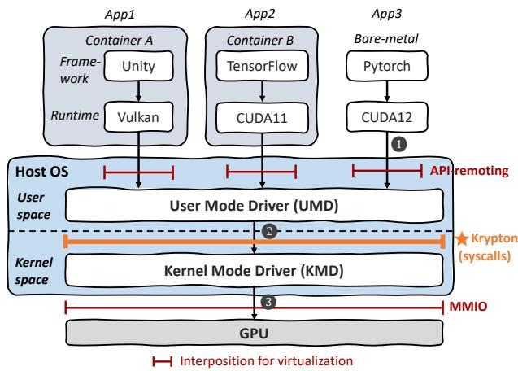  
Figure 1: The system stack of virtualizing and sharing a GPU.

An efficient GPU sharing scheme should be capable of colocating jobs with different runtimes (compatibility), while providing performance and fault isolation (isolation) for the co-located jobs. Fault isolation means that a job’s crash would not destroy other co-located jobs. Performance isolation includes satisfying the isolated compute and memory requirements of tenants. To virtualize/share a GPU, the general principle is to intercept and interpose an interface, enabling the modification or extension of its behavior. Figure 1 shows the system stack of virtualizing a GPU. As observed, GPU vendors leverage the User Mode Driver (UMD) in user space to receive API calls (❶). The UMD communicates with the kernel mode driver (KMD) in kernel space via system calls, such as ioctl and write (❷). The KMD, in turn, interacts with the GPU hardware through memory-mapped I/O (MMIO) (❸).

There are already many prior works on co-locating the jobs that rely on the same runtimes on a GPU. They often intercept API calls above UMD [43, 66, 72, 76], or trap MMIO below KMD [65, 67, 68], providing poor compatibility. Intercepting user-space API calls and remote them, referred to as APIremoting, requires adapting a large number of API interfaces for different runtimes and a large amount of manpower for maintenance, while trapping and simulating frequent MMIO access undermines performance (e.g., 100× or more [67,77]).

In terms of performance isolation, TGS [72], Orion [66], and GaiaGPU [43] adopt time-sharing, while GPUlet [35] and GSlice [39] adopt spatial-sharing based on Nvidia’s Multi-Process Service (MPS) [2]. With time-sharing, GPU time slices may interfere due to the non-programmable nature of GPU context switching. With spatial sharing, co-located jobs share the GPU contexts and global memory bandwidth, suffering from poor fault isolation or performance guarantees. A job’s crash would break entire GPU context, destroying all the co-located jobs. Nvidia’s Multi-Instance GPU (MIG) [7] achieves hardware-level isolation by partitioning the GPU spatially. However, it sacrifices flexibility in resource management due to pre-defined resource splits.

Two key insights motivate this work. First, to ensure compatibility and low overhead, interposition and scheduling should be shifted to kernel space in host OS. As illustrated in Figure 1, kernel-space interposition eliminates the need for adapting to diverse runtimes and avoids frequent MMIO trapping, while enabling comprehensive control over GPU access. Second, instead of weighing between assigning fixed and unshared resources and resolving interference in shared resources, there is more room to directly guarantee application performance targets (such as throughput or latency). Avoiding rigid resource quotas allows for more flexible resource orchestration, reducing GPU fragmentation and improving overall resource utilization.

It is non-trivial to achieve the above design. Intercepting and remoting all functions passed from UMD to KMD in kernel space is infeasible, as these interface layers are proprietary and not disclosed by vendors. It is challenging to find a universal mechanism to capture all requests to GPU without analyzing and simulating the unveiled functions. In terms of orchestrating resources, allowing time and spatial sharing simultaneously is beneficial to reduce the GPU fragments, as it expands the orchestration space. However, with the large space, it is challenging to identify the appropriate allocation that ensures the performance target of all the applications, while minimizing the GPU fragments.

We therefore propose KRYPTON, a sharing scheme that comprises an offline profiler, a kernel-space interception module, a performance feedback controller, and a spatio-temporal orchestrator. The offline profiler can obtain the performance of each application with different configurations of resource provisioned, aiming for better resource allocation (§3.2). The interception module hijacks the access control to the GPU of the operating system instead of intercepting individual API calls (§3.3). For each of the co-running applications, the feedback controller (§3.4) monitors its real-time performance with the allocated hardware units and time slices. It adjusts resources adaptively to guarantee performance. We call the given hardware units, time slices, and memory allocated to an application to be an “IGPU” (isolated GPU). The hardware units are allocated with MIG that can spatially divide an A100 GPU into seven (or fewer) instances, while the time slices and memory are allocated with the kernel-space interception module. The spatio-temporal orchestrator proposes a two-stage bin-packing algorithm that orchestrates IGPUs to improve the overall utilization while promising the performance (§3.5).

We have implemented KRYPTON and evaluated it on Nvidia A100 and RTX4090 GPUs. Its effectiveness is tested with multiple versions of CUDA and Vulkan runtimes. Experimental results show that KRYPTON reduces the required GPU number by 32.1%, compared with SOTA GPU sharing systems, while maintaining the target throughput. The relative error of applications’ performance is merely 3.3% on average. The main contributions are three-fold:

1) The design of kernel-space interception that ensures compatibility and isolation to use GPU. The interposition supports various runtimes and drivers.

2) The design of a feedback-based performance control policy. With adaptive time slice allocation in real-time, the performance of applications can be guaranteed.

3) The design of a spatio-temporal orchestration policy that efficiently reduces GPU fragments. KRYPTON cuts down the number of GPUs while ensuring the performance targets of the co-located applications.

## 2 Investigating GPU Sharing

In this section, we introduce the prevalent techniques in supporting existing GPU-sharing solutions and investigate their weaknesses, thereby motivating KRYPTON.

## 2.1 Techniques beneath GPU-sharing

Existing GPU sharing solutions require the GPU resource management capability as fundamental for the ability to “share”. They leverage either time sharing supported by API-remoting [43, 64, 66, 72], spatial sharing supported by MPS [39, 42, 81] or MIG [53], or a combination of them [35].

All these techniques provide process-level resource management. API-remoting-based methods intercept GPU function calls of tenants to let them run in a temporal round-robin manner. MPS [2] merges the CUDA contexts of different processes into a unified context. Then multiple processes can run on the GPU simultaneously with the compute resource controlled. MIG [7] is a hardware-isolated solution for Nvidia computing GPUs. MIG divides a GPU into fully isolated instances with separate compute and memory resources but it only supports GPU partitioning with fixed configurations.

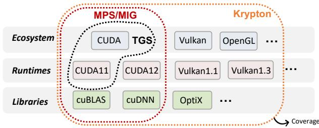  
Figure 2: Software coverage of GPU sharing methods.

## 2.2 Poor Compatibility and Isolation

## 2.2.1 Limited Compatibility

Compatibility refers to the capability of the sharing mechanism to cover as many software scenarios as possible without much effort for adaptation. As depicted in Figure 2, the software functionalities an Nvidia GPU can support can be categorized into various ecosystems, runtimes and libraries.

API-remoting methods [43,55,64,66,72,76] do not promise robustness to the diversity and evolution of interposed interfaces, because they can only hijack explicit APIs of user-space runtimes. Thus, achieving compatibility in API-remoting methods is costly: Various ecosystems such as CUDA, Vulkan, and OpenGL offer fundamentally different interface APIs. Besides, user-space runtimes often undergo frequent updates, and this is particularly evident in the CUDA ecosystem, where Nvidia has released more than 70 versions of the CUDA runtime so far [21]. With each new version, API changes can introduce significant variations, requiring continuous adaptation of the API-remoting mechanism to maintain compatibility.

Beyond the core CUDA runtime, there are numerous dynamic libraries within the CUDA ecosystem. Since APIremoting methods rely on intercepting APIs, they must be updated frequently to accommodate changes in these libraries’ interfaces. Because of the large effort to maintain compatibility, many API-remoting sharing systems only cover a subset of the software. For example, TGS [72], as an API-remoting sharing system, only supports CUDA11.2 runtime.

MPS-based methods, although have no requirements to adapt for different libraries, are also limited for CUDA applications and cannot be used for graphic runtimes (e.g. OpenGL, Vulkan) [2]. MIG as another vendor solution, although can provide fully isolated compute and memory system for each tenant, also targets CUDA applications and lacks key features on A100 machines(e.g., support for graphic APIs, device P2P communication) [5]. Thus, limited in poor compatibility, existing GPU sharing platforms only target applications using CUDA (e.g., deep learning workloads).

## 2.2.2 Weak Isolation under Threat

We design a threat model to reveal the poor isolation using existing GPU-sharing methods. In our threat model, we assume an adversary is a program that has legitimate access to a GPU shared with other tenants. The program can initialize an arbitrary number of processes to access the GPU. To examine the isolation of existing solutions, we run all 8 benchmarks based on CUDA runtime in Table 2 respectively as the victims.

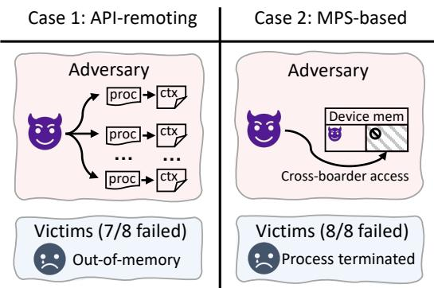  
Figure 3: The adversary fails the victims with different sharing mechanisms.

In TGS [72], a GPU sharing system sits on API-remoting, victims suffer out-of-memory errors in 7 out of 8 cases and the adversary simply spawns 48 processes that use the GPU through CUDA runtime (Figure 3(a)). This is because userspace API-remoting cannot hijack implicit memory-related commands (e.g., the CUDA context creation implicitly allocates about 400MB of GPU memory), potential memory contentions occur and break isolation among applications. The processes in the adversary program allocate device memory implicitly for the extra GPU contexts, which encroach the provisioned memory of the victims.

In GPU-sharing systems based on MPS (e.g., GSlice [39]), if the adversary performs a cross-boarder GPU memory access, then all 8 victims crash due to the fatal GPU memory error (Figure 3(b)). Such error propagation problem has also been reported in prior researches [73, 81]. The key reason for the error propagation is that MPS funnels kernels from separate processes and runs them in the same context.

The experimental results show that API-remoting and MPS-based methods do not promise isolation, because APIremoting methods ignore implicit GPU operations and corunning applications share the same GPU context with MPS. MIG-based methods can promise isolation, benefiting from the stringent hardware-level isolation.

## 2.2.3 Potential Solution

To achieve compatibility and isolation, we investigate the workflow of using a GPU as shown in Figure 4. The workflow is analyzed from the codes open sourced by Nvidia [12]. Prior researches [17, 18, 50, 51, 67] have similar observations.

Specifically, applications use runtime APIs (e.g., CUDA, Vulkan) to generate tasks (kernels, data transfers, etc). The runtime APIs are parsed and forwarded to User Mode Drivers (UMD) and UMDs write commands to Command Buffers. The commands cover the control of the GPU, including commands to copy data from the host to the device memory, launch kernels, and so forth. The UMD then uses system calls to guide the Kernel Mode Driver (KMD) to inform the GPU to read commands from command buffers. Typically, a command buffer is bonded to a GPU context that encapsulates all the resources needed to execute operations on the GPU, including distinct address space, memory allocations, etc. The GPU contexts are isolated, as they do not share address space. We therefore get the first insight.

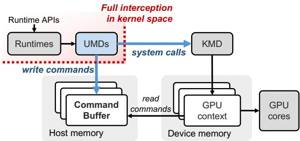  
Figure 4: The workflow of using a GPU.

Insight-1: Kernel space interception is capable of enabling compatibility and isolation. Based on the observation above, we confirm that it is a good option to intercept command buffers and system calls in kernel space to take full control of the entire GPU. The compatibility across runtimes is then guaranteed naturally because all commands pass the command buffers. To promise isolation among applications, all processes run within their isolated GPU contexts and all memory-related operations can be precisely recorded and controlled in kernel space.

## 2.3 Inefficiencies in Achieving Performance Target and High Utilization

Even when co-running applications without accounting for compatibility and isolation, existing methods still fail to guarantee the performance of co-located applications and the efficient utilization of GPUs. To demonstrate these shortcomings, we conduct two experiments to present these inefficiencies.

## 2.3.1 Achieving Performance Target

In this experiment, we use a ResNet50 inference application as a tenant on an A100 GPU to illustrate the performance violations caused by existing methods. First, we profile the resource quotas (e.g., time slices or SMs) required by the ResNet50 inference application to meet its performance target of 50 requests per second. For instance, ResNet50 requires 32% of the time slices to achieve this target. Next, we corun the ResNet50 with other benchmarks listed in Table 2 using current methods. The co-running benchmarks use the remaining resource quotas.

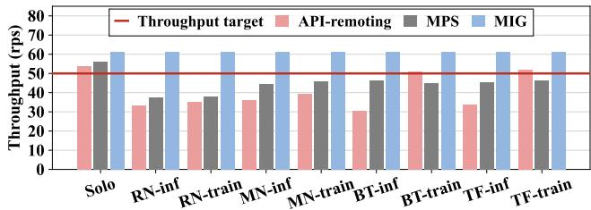

Figure 5: The practical throughput of a ResNet50 inference application with a 50 rps throughput target when co-located with another application using different GPU sharing mechanisms. The ‘Solo’ pertains to the scenario where the ResNet50 inference application runs stand-alone.  
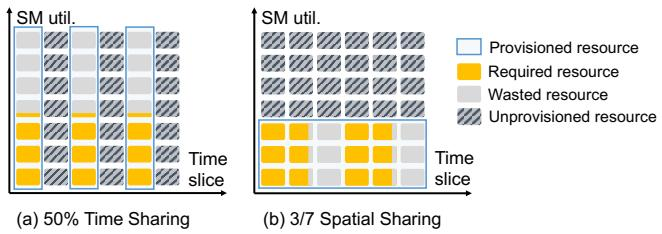  
Figure 6: Resource utilization in time and spatial sharing when the ResNet50’s throughput target is achieved.

Figure 5 illustrates the performance of ResNet50 when API-remoting, MPS, and MIG techniques are employed to share the GPU with other benchmarks. In the figure, the xaxis represents the benchmarks co-running with ResNet50. As observed, the throughput of ResNet50 drops to 30.6 RPS with API-remoting and 37.5 RPS with MPS. This decline is attributed to shared resource contention, such as global memory bandwidth. Consequently, API-remoting and MPS fail to guarantee the performance of co-located applications.

## 2.3.2 Achieving High Utilization

Figure 6 presents the GPU resource utilization when the performance target for ResNet50 is set to 80 RPS, and the required resources are allocated using temporal-sharing (APIremoting) and spatial-sharing (MIG).

Specifically, while ResNet50 requires 50% of the temporal quota to achieve the target performance of 80 RPS using the API-remoting method, the average SM utilization is only 44%. Similarly, when ResNet50 uses a 3/7 fractional GPU instance under the MIG method, only 62% of the GPU instance’s time slices are needed to achieve the desired throughput. This demonstrates that with the time-sharing method, applications cannot fully utilize all SMs, and with the spatialsharing method, they cannot fully utilize allocated time slices.

These wasted computing resources (SMs, GPU time slices) are also GPU fragments, in addition to memory fragments.

In summary, although MIG guarantees the performance target as shown in Figure 5, it results in low GPU utilization due to its coarse-grained resource partitioning. MPS enables fine-grained resource usage but faces severe performance violations. Meanwhile, the API-remoting method experiences both performance violations and low GPU utilization.

## 2.3.3 Potential Solution

While the above results highlight the low utilization of current methods, they also reveal an opportunity to address this issue through spatio-temporal orchestration. For instance, if ResNet50 could utilize 44% of SMs with 50% time slices, or 62% of time slices on a 3/7 GPU instance, its performance target could be met precisely.

Insight-2: Spatio-temporal orchestration may bring higher utilization. Since we expand the adjustable parameter of GPU partitions into two dimensions of spatial and temporal, there exist multiple resource configurations to satisfy the performance target of a workload and the flexibility in orchestration is increased.

## 2.4 Challenges

It is non-trivial to achieve the potential solutions mentioned above in an efficient way.

For kernel-space interception, it is difficult to obtain the command buffer address because it is unveiled and not exposed by vendors. This requires us to accurately analyze the behavior of the KMD to create GPU context and malloc command buffer. We have to trace and manipulate the command buffers delicately to handle their dynamic address across processes and ensure their consistency.

For spatio-temporal orchestration, it is challenging to find the optimal orchestration plan to maximize the GPU utilization, because the orchestration space increases significantly with both spatial sharing space and time sharing space. Moreover, an efficient orchestrator is required to identify the resource allocation for all the co-located applications simultaneously while guaranteeing performance targets and minimizing GPU fragments at the same time.

## 3 KRYPTON Methodology

We therefore propose KRYPTON that promises the compatibility, isolation and performance targets of co-located applications, while reducing the GPU fragments.

## 3.1 Overview of KRYPTON

Figure 7 shows the design of KRYPTON. To find appropriate GPU resources for applications, each application is first profiled with an offline profiler (§3.2). Prior works on GPU sharing [35, 41] also require offline profiling to attain information on applications. After each application specifies its performance target (e.g., throughput, end-to-end latency), the spatio-temporal orchestrator of KRYPTON then assigns GPU resources for the applications and deploys them properly to guarantee their performance targets (§3.5). The applications can either run in bare metal or be wrapped in containers and use their own runtimes.

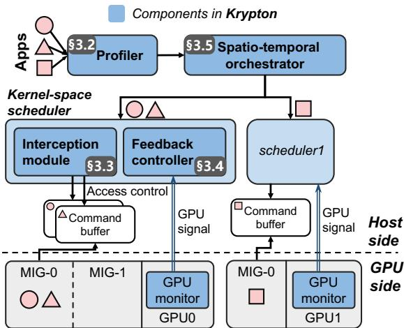  
Figure 7: The overview of KRYPTON.

The GPU resources include hardware units, GPU time slices, and device memory. The hardware units are divided using MIG, while time slices and device memory are allocated using kernel-space schedulers, with each scheduler managing the resources on the corresponding physical GPU. Each scheduler comprises the interception module (§3.3) and the feedback controller (§3.4). The interception module manages the access control of command buffers of applications to achieve time-sharing of the GPU. It also realizes GPU memory management in kernel space. The feedback controller leverages the GPU hardware’s real-time signal from GPU monitors to adaptively adjust the time slices of applications to ensure performance-aware GPU sharing. It promises that the co-located applications will not impact each other and achieve the performance target.

## 3.2 Offline Profiling

It is important to understand the performance of applications under different resources. We use offline profiling to achieve this. The profiling is simple and non-intrusive to applications.

## 3.2.1 Performance Profiling of Applications

We use IGPU(s,t, m) to represent the GPU resources assigned to an application, where s is the quota of assigned GPU hardware units (i.e., the streaming multiprocessors, memory bandwidth, cache and memory that are partitioned using MIG), t is the quota of assigned GPU time slices, and m is the assigned GPU memory size.

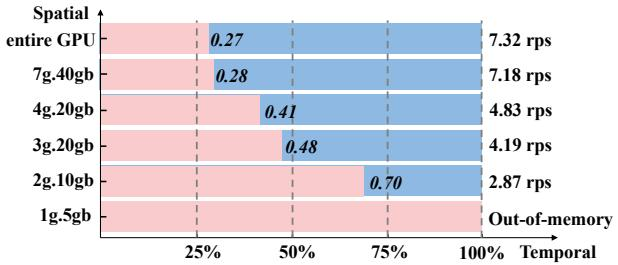  
Figure 8: The performance chart of a Transformer-XL training job (bs=8) on A100 GPU. The configurations within the blue region can promise a throughput target of 2 rps. The xaxis represents the time slice quota and the y-axis represents spatial configurations.

For static workloads such as training and offline rendering, the throughput can be treated as the performance metric, and the profiler records the throughput of an application on every possible IGPU configuration, represented as $T h r ( s , t , m )$ . For workloads that use GPU dynamically such as large language model serving, the profiler can still explore the maximum capability (e.g., tokens/s) that each IGPU configuration can offer the application as the guaranteed performance.

The profiler collects the performance of applications within a fixed configuration set. Specifically, for an Nvidia A100 GPU, the throughput of each application is collected on 6 different configurations IGPU(si, 100%, mi), including the entire GPU and 5 types of MIG instances (7g.40gb, 4g.20gb, 3g.20gb, 2g.10gb and 1g.5gb\*). The throughput is recorded as $T h r ( s _ { i } , 1 0 0 \% , m _ { i } )$ , correspondingly. Besides, the memory consumption of applications is also recorded. Then the throughput of applications with various spatial and temporal quotas can be estimated directly with the profiled data, calculated as $T h r ( s , t , m ) = T h r ( s , 1 0 0 \% , m ) \times t$ . The formula holds when strong isolation can be achieved and the throughput is proportional to the GPU time slice quota.

## 3.2.2 Find Feasible Configurations

KRYPTON leverages the profiled performance to find feasible resource configurations. As an example, Figure 8 reveals the feasible configurations that can satisfy the throughput requirement of a Transformer-XL training workload. The workload requires 6196MB GPU memory thus it cannot be offloaded on a 1g.5gb instance. Larger MIG instances can accommodate the workload. For example, in a 3g.20gb MIG instance, configurations with time slice quota larger than 48% can guarantee the throughput target of the workload. If a tenant has a preferred resource configuration, it can also bypass offline profiling and directly designate the required configuration.

## 3.3 Kernel Space Intercepting

IGPUs’ hardware units are spatially assigned through MIG. To assign GPU time slices and device memory to an IGPU, KRYPTON leverages interception in kernel space.

## 3.3.1 Command Buffer Interception

To share a GPU temporally, KRYPTON intercepts the access to GPU command buffers without resolving specific commands. Specifically, KRYPTON hijacks the access control of the GPU, by identifying the addresses of command buffers, and controlling the access permission of the command buffers.

Command buffer address. It is non-trivial to obtain the address of command buffers since it is wrapped in Nvidia’s kernel mode driver. We identify that the command buffer address is assigned through the ioctl system call every time a GPU context is created. We then intercept the ioctl calls and if the argument corresponds to the memory object allocation of GPU engines, we record the address of the memory object as one piece of the command buffer. Note that multiple command buffers and GPU contexts can be possessed by one process and the command buffers’ addresses remain unchanged until destroyed.

Modify access permission of command buffers. The interception module locks the command buffers of a process when it is not permitted to control the GPU and unlocks them when the process is active.

As shown in Figure 9, to lock the command buffer of a process ➊, the interception module changes the protection flag of the corresponding memory page to read-only through the do\_mprotect\_pkey function, which is the kernel’s internal implementation of the mprotect system call [24]. Then, whenever a user-space process tries to write to its GPU command buffer to launch kernels or submit other operations ➋, it will cause a segmentation fault. We lead the fault signal to a pre-registered user-mode signal handler ➌. The signal handler then inquires the interception module in a blocking manner to check if it is authorized to write to the command buffers ➍. It restores the process’s execution once the command buffer is unlocked ➎.

Since we only handle the command buffers that interact with the GPU, the other CPU work of the process would not be influenced compared with techniques that directly pause the whole process [52]. The mechanism of command buffer interception is also promising for other PCIe devices that leverage command buffers (e.g., AMD GPUs [16]).

## 3.3.2 GPU Memory Management

KRYPTON also intercepts memory-related commands such as device memory allocation to precisely manage the device memory usage of IGPUs. Those commands are triggered by UMD as ioctl system calls and KRYPTON also intercepts them in kernel space. Compared to the user space interception, the kernel space interception method can handle implicit memory allocation requests, such as those occurring during GPU context creation. KRYPTON leverages a central memory allocator to manage all device memory-related requests and records the actual memory usage of each workload. Requests either be passed through directly or return an error when the provisioned memory quota is exceeded.

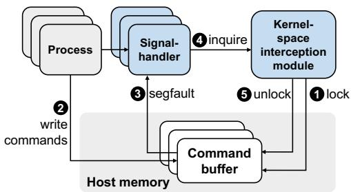  
Figure 9: The interception of command buffer.

## 3.4 Performance Guarantee with Feedback Control

The performance with time-sharing is promised by precisely controlling their allocated time slices. Since vendor driver and hardware scheduler monopolize the GPU context switch ability, KRYPTON controls the GPU time slice resources used by each process by managing CPU tokens. When a process possesses a token, it is permitted to utilize the GPU. Through the management of CPU tokens, we can schedule and govern the time slice resources of the GPU. On this basis, we make further adaptive adjustments to the control of CPU tokens in accordance with the feedback signals from GPU monitors.

## 3.4.1 Token Control at Host Side

Due to the unveiled internal control mechanism and varying architectural design of commodity GPUs, it is difficult to modify drivers to realize GPU time slice allocation. The GPU context switch is decided by the driver as shown in Figure 10(a) when processes use GPU in pass-through mode.

To this end, researchers exploit to control GPU time slice usage at the host side. Some works schedule with per-API control policies [43, 72, 76]. They adjust the kernel launch rate by adding sleep time between the API trap and the API emulation as shown in Figure 10(b). The sleep duration is determined by the kernel properties (i.e., CUDA block number). In some other work, the host treats the time that the CPU holds the token as the GPU time [56]. However, because of the asynchronous execution manner of the GPU, limiting the CPU token window length for an application cannot promise to achieve the same limitation on the GPU time. For example, if long kernels are launched within the first CPU token window as Process 1 illustrated in Figure 10(c), then with the launched kernels residing on the GPU, process 1 would occupy longer GPU time slices than expected, squeezing the GPU time slices that should have been assigned to process 2 in the second token window.

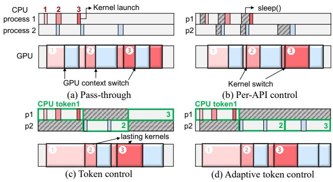  
Figure 10: GPU execution pattern with different scheduling policies. Two processes share the GPU, and the kernels from different processes (red and blue) are interleaved with each other on the GPU.

We observe that it is possible to adjust the GPU time slice allocation by controlling CPU tokens adaptively. As shown in Figure 10(d), since Process 1 occupies more GPU time slices than anticipated, the CPU token within the third time window is compensated to Process 2. Such an adaptive CPU token control can promise precise GPU utilization, thereby guaranteeing the required performance. It is achievable by leveraging GPU feedback information.

## 3.4.2 Control GPU Utilization with Feedback

With real-time GPU utilization signal as feedback, KRYP-TON compensates for applications with lower-than-expected utilization and constrains the usage of overused applications. This is achievable by using Nvidia’s user-space hardware management libraries (e.g., Nvidia’s NVML [13], DCGM [9]) to monitor the per-process GPU time slice utilization†, which is the sum of the GPU utilization of all GPU contexts created by the process.

We are then able to control the GPU usage of applications adaptively with the GPU utilization information as feedback, following Algorithm 1. Specifically, the CPU token is allocated by the scheduler and the scheduler guarantees that only one application can hold the token at any given time. The activated application is the one that has the lowest relative GPU utilization compared to the promised time slice quota. Such an elastic policy can fully utilize the GPU and promise

Algorithm 1 Adaptive CPU token control policy   
1: function SELECTAPP(app\_list)   
2: while true do   
3: UpdateAppUtil(app\_list, Utils)   
4: selected\_app = argmin(app\_list.(util/quota))   
5: Activate(selected\_app)   
6: Pause(app\_list\selected\_app)   
7: CPUSleep(token\_length)   
8: function UPDATEAPPUTIL(app\_list, GPUUtil, ProcessUtil)   
9: if Monitor == DCGM then   
10: last\_selected\_app.util + = GPUUtil   
11: if Monitor == NVML then   
12: for app ∈ app\_list do   
13: for p ∈ app.process\_list do   
14: app.util + = app.p.ProcessUtil   
15: for app ∈ app\_list do   
16: MovingAverage(app.util)

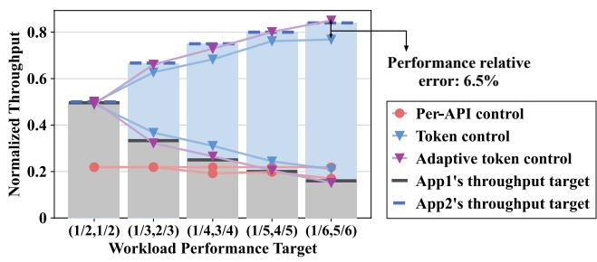  
Figure 11: The effectiveness of different scheduling policies on satisfying performance targets. Two ResNet50-bs32 inference applications (App1 and App2) share an Nvidia A100 GPU and have different performance targets. The fractions annotated on the x-axis represent the ratios between the target throughput and the stand-alone throughput of App1 and App2, respectively.

## applications’ performance simultaneously.

When the GPU load of an application is light, its GPU utilization may be lower than the assigned proportion of CPU tokens. To avoid always selecting such an application, we regard the application as fully occupying a GPU time slice if only its own is observed within that time slice, no matter how much it occupies that GPU time slice.

With the above design, the proposed adaptive CPU token control policy can precisely promise performance as shown in Figure 11. In particular, the token length is set to 100ms in KRYPTON unless otherwise stated. Adaptive token control promises an average relative error no larger than 0.9% compared with the performance target. Without feedback control, the throughput of co-located applications deviates from the performance target and the relative error is 5.3% on average. The per-API control policy [43] performs even worse and can not isolate the throughputs as expected.

## 3.5 Spatio-Temporal Orchestration

The goal of the orchestration is to reduce the number of GPUs to use, while maintaining the performance requirements of workloads. It is non-trivial to allocate appropriate resources for workloads and improve overall cluster utilization. Suppose there are M workloads to be orchestrated and there are N configurations for each workload. In this case, there are total $N ^ { M }$ possible IGPU configurations. To place M workloads onto P GPU instances, there are also $P ^ { \hat { M } }$ possibilities. The search space complexity for orchestrating M workloads is as large as $\bar { O } ( N ^ { M } P ^ { M } )$ .

## 3.5.1 Resource Defragmentation Strategy

To reduce the searching complexity, we design a two-stage bin packing algorithm that heuristically searches for a nearoptimal orchestration plan, aiming to minimize the GPU fragments. The searching process is an offline procedure as shown in Figure 12. (1) Initialization: each workload is assigned a qualified IGPU that has the minimum spatial resources. (2) Temporal packing: KRYPTON tries to fuse the IGPUs that have the same spatial configurations to reduce the idle time slices. (3) Fragment reduction: KRYPTON further reduces the temporal fragments within the IGPUs, by migrating workloads from spatially smaller IGPUs to spatially larger IGPUs. Specifically, for IGPUs with the same spatial configurations, we sort them in descending order of the left time slice proportion and attempt to migrate. In this way, IGPUs with large temporal fragments are first eliminated. Note that, the memory residual of IGPUs is also considered during the migration. (4) Instance packing: When the MIG instances are finally determined, bin-packing is used to allocate MIG instances to reduce the number of used GPUs. Note that we do not need to pack the real IGPU instances or migrate workloads in reality in each step, but only need to orchestrate applications following the final result of this planning algorithm.

The complexity of the proposed two-stage bin-packing algorithm is O(MP).

## 3.5.2 Workloads on Multi-GPU

KRYPTON also allows workloads to use more than one GPU. When the application itself can run on multiple GPUs, KRYP-TON can use fewer GPUs to satisfy the performance. For example, if a distributed training workload requires 2 GPUs to run but only aims for 60% of the solo throughput, KRYPTON can assign 60% of the time slices on each physical GPU to it. KRYPTON carefully aligns the tokens to use different GPUs in kernel space, because the workload running on isolated GPUs may communicate with each other through NCCL [6], and correlated GPUs must be active simultaneously. When searching for the orchestration plan, the configuration of workloads that use multi-GPU should remain unchanged.

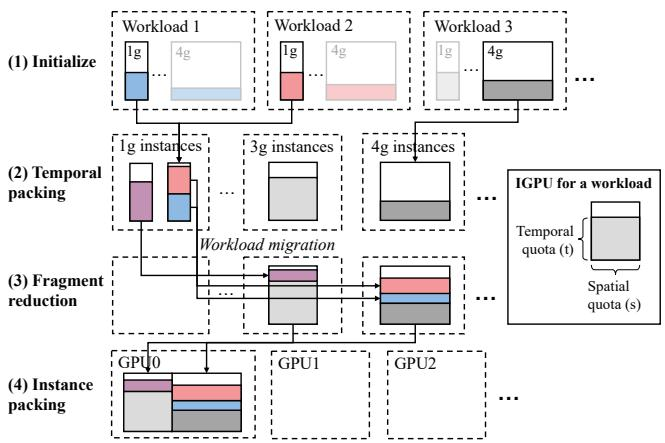  
Figure 12: Steps of the resource defragmentation strategy.

## 4 Implementation

We implement the kernel-space interception and performance feedback controller in 3K lines of C code and the spatiotemporal orchestrator is composed of 1K lines of Python code.

The kernel-space scheduler is implemented as a loadable kernel module within the Linux operating system. Moreover, the scheduler does not interfere with the GPU driver. Users can either install the open source kernel module driver [12] or directly install the official drivers. The entire system has no requirement to modify the application code, imposing zero programming burden on users.

In kernel space, for each GPU instance, there is a corresponding simulated device file /dev/igpu which is mounted to the device file /dev/nvidia. When processes within the container try to access the Nvidia device files, the requests are forwarded to the simulated device file and controlled by the interception module of the kernel space scheduler. The kernel space thread calls the do\_mprotect\_key to modify the protection flag of a virtual space address. Since the do\_mprotect\_key API is not exported by the Linux kernel, we leverage the kallsyms mechanism to find its symbol.

The kernel module additionally controls the device file to interact with the signal handlers and the GPU monitor. Specifically, the blocking check of the signal handler sends the read system call to the device file to inquire if it is activated. The GPU monitor delivers the GPU utilization information through the ioctl system call to the feedback controller in kernel space. The GPU monitor runs as an independent daemon process in user space. When the GPU is not in the MIG mode, the nvmlGetProcessUtilization API from the NVML library is enabled. When the MIG mode is enabled, the DCGM library is used as the monitor since NVML’s functions are not fully supported with MIG. Applications run in docker containers. Each container compiles a dynamic linked library when initialized and adds it to the LD\_PRELOAD environmental variable. Then the container can interact with the kernel space through the dynamic library.

Table 1: Hardware and software specifications.
<table><tr><td colspan="2">System Overview</td></tr><tr><td>CPU</td><td>Intel Xeon Silver4216 64-core</td></tr><tr><td>GPU</td><td>Nvidia A100 40GB&amp;2 GeForceRTX4090</td></tr><tr><td>Kernel version</td><td>5.15.0-91-generic</td></tr><tr><td>Operating System</td><td>Ubuntu 20.04</td></tr><tr><td>Docker version</td><td>24.0.7</td></tr><tr><td>Nvidia Driver</td><td>550.90.07</td></tr><tr><td>Runtimes</td><td>CUDA12.1,Vulkan1.3</td></tr><tr><td>AI framework</td><td>Pytorch 2.2.1</td></tr></table>

Table 2: Benchmarks used in the evaluation (∗ represents batch size = 16 due to the large GPU memory usage).
<table><tr><td rowspan=2 colspan=1>Application</td><td rowspan=2 colspan=1>Type</td><td rowspan=1 colspan=2>Throughput (rps)</td><td rowspan=1 colspan=2>Memory (MB)</td></tr><tr><td rowspan=1 colspan=1>bs=8</td><td rowspan=1 colspan=1>bs=32</td><td rowspan=1 colspan=1>bs=8</td><td rowspan=1 colspan=1>bs=32</td></tr><tr><td rowspan=2 colspan=1>ResNet50 (RN) [46]</td><td rowspan=1 colspan=1>infer.</td><td rowspan=1 colspan=1>162.2</td><td rowspan=1 colspan=1>73.7</td><td rowspan=1 colspan=1>964</td><td rowspan=1 colspan=1>1222</td></tr><tr><td rowspan=1 colspan=1>train</td><td rowspan=1 colspan=1>42.3</td><td rowspan=1 colspan=1>24.7</td><td rowspan=1 colspan=1>1706</td><td rowspan=1 colspan=1>3608</td></tr><tr><td rowspan=2 colspan=1>MobileNet_V2 (MN) [62]</td><td rowspan=1 colspan=1>infer.</td><td rowspan=1 colspan=1>184.1</td><td rowspan=1 colspan=1>148.5</td><td rowspan=1 colspan=1>788</td><td rowspan=1 colspan=1>1156</td></tr><tr><td rowspan=1 colspan=1>train</td><td rowspan=1 colspan=1>42.3</td><td rowspan=1 colspan=1>34.4</td><td rowspan=1 colspan=1>1452</td><td rowspan=1 colspan=1>3290</td></tr><tr><td rowspan=2 colspan=1>BERT-Large (BT) [69]</td><td rowspan=1 colspan=1>infer.</td><td rowspan=1 colspan=1>6.6</td><td rowspan=1 colspan=1>1.9</td><td rowspan=1 colspan=1>2032</td><td rowspan=1 colspan=1>2752</td></tr><tr><td rowspan=1 colspan=1>train</td><td rowspan=1 colspan=1>1.8</td><td rowspan=1 colspan=1>1.0*</td><td rowspan=1 colspan=1>13700</td><td rowspan=1 colspan=1>22384*</td></tr><tr><td rowspan=2 colspan=1>Transformer-XL (TF) [69]</td><td rowspan=1 colspan=1>infer.</td><td rowspan=1 colspan=1>42.5</td><td rowspan=1 colspan=1>12.6</td><td rowspan=1 colspan=1>1536</td><td rowspan=1 colspan=1>2524</td></tr><tr><td rowspan=1 colspan=1>train</td><td rowspan=1 colspan=1>7.3</td><td rowspan=1 colspan=1>2.9</td><td rowspan=1 colspan=1>6196</td><td rowspan=1 colspan=1>12094</td></tr><tr><td rowspan=1 colspan=1>Computecullandlod (ccl)</td><td rowspan=1 colspan=1>render</td><td rowspan=1 colspan=2>172.2 fps</td><td rowspan=1 colspan=2>54</td></tr><tr><td rowspan=1 colspan=1>Deferredmultisampling (dms)</td><td rowspan=1 colspan=1>render</td><td rowspan=1 colspan=2>263.0 fps</td><td rowspan=1 colspan=2>963</td></tr><tr><td rowspan=1 colspan=1>Indirectdraw (idd)</td><td rowspan=1 colspan=1>render</td><td rowspan=1 colspan=2>194.9 fps</td><td rowspan=1 colspan=2>60</td></tr><tr><td rowspan=2 colspan=1>Throughput requirement</td><td rowspan=1 colspan=1>R1</td><td rowspan=1 colspan=4>[2/3,1/2,1/3,1/6,1/12]</td></tr><tr><td rowspan=1 colspan=1>R2</td><td rowspan=1 colspan=4>[1/2,1/4,1/6,1/8,1/10]</td></tr></table>

## 5 Evaluation of KRYPTON

In this section, we evaluate KRYPTON in reducing the required GPU number while promising the compatibility, isolation and performance of co-running workloads.

## 5.1 Experimental Setup

Table 1 shows the specifications of the experimental platform. To justify the compatibility, as shown in Table 2, the used applications cover AI applications (inference and training) that use CUDA runtime [20] and rendering applications [30] that use Vulkan runtime [29]. Each application runs in a separate container equipped with Nvidia Container Toolkit [25]. For each application, there are two sets of throughput requirements: R1 and R2. For example, the 2/3 throughput requirement represents that the throughput target is set to be 2/3 of the solo throughput running on an entire physical GPU.

We compare KRYPTON with baselines that ensure isolation: Temporal [8, 28], Best-fit-MIG, and GPUlet-MIG [35]. With Temporal, workloads share the GPU temporally, with each workload allocated a fixed quota of time slices [8, 28]. The quota represents the minimum calculated time slice required to meet the specified throughput target. With Best-fit-MIG, each workload is assigned the smallest MIG instance capable of satisfying its performance requirements. MIG instances are bin-packed for placement within the cluster. This approach is equivalent to the greedy best-fit algorithm described in GPUlet [35]. With GPUlet-MIG, GPUlet [35] identifies the optimal spatial configuration of a workload and packs workloads in temporal duty cycles. It is originally implemented using MPS. We have improved GPUlet using MIG and let workloads share a GPU instance temporally as Temporal.

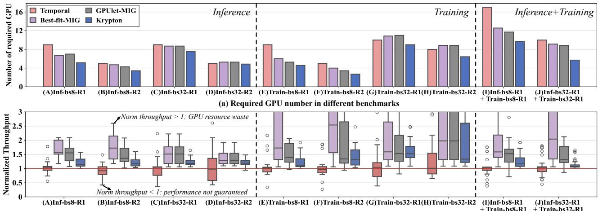  
(b) Normalized throughput of workloads in different benchmarks  
Figure 13: Comparison between KRYPTON and other methods in reducing GPU number and promising performance.

We use two metrics in the evaluation. For evaluating the resource efficiency, we use the metric “number of required GPUs” to deploy workloads while guaranteeing their performance target. Fewer GPUs indicate better GPU utilization. For evaluating the performance, we use the metric “normalized throughput” of applications (the actual throughput normalized to the throughput target). As long as the normalized throughput is larger than 1, the performance target is promised. Note that, if a benchmark’s normalized throughput is too high, it may harm the utilization of the whole system. This is because excessively high throughput often indicates over-allocation of resources, resulting in wastage.

## 5.2 Overall Performance

We build 10 test cases to cover scenarios involving inference jobs co-running, training jobs co-running, and inference jobs co-running with training jobs. The case for runtimes other than CUDA is evaluated in Section 5.3. For easing of description, a test case is named in the form of “Inf/Train-bs8/32- R1/R2”. For instance, “Inf-bs8-R1” represents the case that 20 workloads co-run (4 inference models × 5 workloads with different throughput requirements as R1 for each model). The batch size of workloads in “Inf-bs8-R1” is 8 and the throughput requirement list R1 is in Table 2. There are 20 workloads in inference-only (A-D) and training-only (E-H) test cases, and 40 workloads in test cases I and J.

Figure 13(a) shows the number of required GPUs to host the workloads in the 10 test cases. As observed, KRYPTON reduces the total required GPU number by 32.1%, 23.1%, and 20.5% compared with Temporal, Best-fit-MIG, and GPUlet-MIG, respectively. The reduction of the required GPU number indicates the improvement of GPU utilization. We can also observe that KRYPTON performs better when the batch sizes of are small, since small workloads are more prone to be packed together, thereby reducing the GPU fragments. KRYPTON also performs better when the number of workloads is large, as the increasing workload number helps to fulfill GPUs.

Corresponding to Figure 13(a), Figure 13(b) shows the normalized throughputs of the workloads in each test case. As observed, some workloads’ performance is not promised with Temporal, because it lacks feedback control, leading to interference among GPU time slices. The performance targets are guaranteed with Best-fit-MIG, GPUlet-MIG and KRYPTON. Workloads have the highest throughput with Best-fit-MIG, because it configures each workload to independently use a MIG instance. A higher normalized throughput above 1 indicates wasted GPU fragments, as a workload may not need a whole MIG instance. GPUlet-MIG reduces the fragments by allowing GPU partitions with the same spatial quota to fuse temporally. However, since the configurations of workloads are fixed in GPUlet-MIG, GPU fragments are still not fully explored. KRYPTON leverages the property that the throughput target of a workload can be promised by various configurations, thereby further reducing the fragments temporally and spatially. The average normalized throughput of KRYPTON is the closest to 1, which indicates that the workloads have fully utilized the allocated resources.

To understand how the workloads are actually orchestrated, Figure 14 shows the orchestration of the workloads with

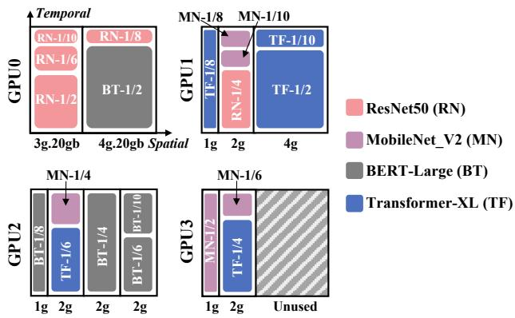

Figure 14: Spatio-temporal orchestration of workloads in the Inf-bs8-R2 benchmark on 4 A100 GPUs. The horizontal dimension refers to the partitioning strategy of spatial resources (MIG instances) and the vertical dimension refers to the temporal partitioning ratio.  
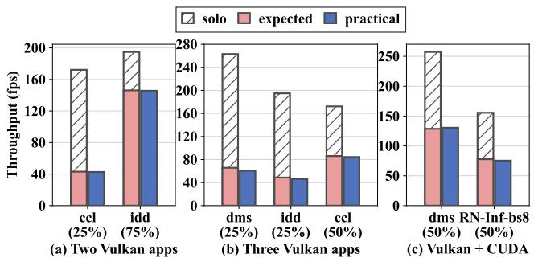  
Figure 15: The performance of KRYPTON with Vulkan.

KRYPTON in the test case Inf-bs8-R2. As observed, the spatiotemporal orchestration of KRYPTON can efficiently deploy the 20 workloads onto 3.4 A100 GPUs, while promising the performance targets.

## 5.3 Performance with the Vulkan Runtime

This subsection evaluates the effectiveness of KRYPTON for runtimes beyond CUDA. Since both API-remoting and MIG do not support other runtimes (e.g., Vulkan), Temporal, Bestfit-MIG and GPUlet-MIG cannot run here. Meanwhile, only time-sharing is enabled in KRYPTON in this case.

In this experiment, we evaluate scenarios where two Vulkan applications co-run, three Vulkan applications co-run, and a Vulkan application co-runs with a CUDA-based AI application. Figure 15 presents the results for three example combinations, with other combinations yielding similar outcomes. As shown, the average relative error in applications’ throughput, compared to their performance targets, remains below 3.4%. This demonstrates that KRYPTON can effectively support multiple runtimes through kernel-space interception.

## 5.4 Effectiveness of Feedback Controller

This subsection evaluates the effectiveness of the performance feedback controller of KRYPTON in promising the performance targets. We compare KRYPTON with the passthrough method [25], the user-space API-remoting method GaiaGPU [43], and KRYPTON w/o adaptive control, a variant of KRYPTON that disables the adaptive token control policy introduced in §3.4.2. In this experiment, we let 2, 4, and 8 RN training jobs (batch size = 32) time-share an entire A100 GPU. The feedback controller is responsible for ensuring the performance targets.

Figure 16(a) shows the achieved normalized throughput of the co-running applications. The pass-through method cannot promise the throughput target, and the relative throughput error is 53.6% compared with the throughput target. The overhead of GaiaGPU is large, resulting in a 24.2% lower throughput of applications than expected. In KRYPTON w/o adaptive control, the throughput of applications deviates from the target and the relative error is 21.6% on average. After applying the adaptive control policy, the relative error of applications’ throughput is merely 3.0% on average.

In more detail, Figure 16(b) showcases the GPU utilization when two applications co-run within two minutes. GPU utilization is strongly correlated with the throughput of applications. A closer GPU utilization to the expected normalized throughput indicates a more accurate assurance of performance. As shown, the utilization curve for KRYPTON with adaptive control shows less volatility and maintains a steadier rate, closer to the target utilization levels (25% and 75%), suggesting that KRYPTON outperforms the other methods.

We also evaluate KRYPTON in a multi-GPU scenario by launching a Transformer-XL distributed training job on two RTX4090 GPUs. We set its throughput target to 10%, 20%, · · · , 100% of its solo throughput and then assign it the corresponding temporal quota. Experimental results show that the throughput of the distributed training workload is still proportional to the time slice ratio assigned and the relative error of throughput is only 1.8%.

## 5.5 Guaranteeing the Latency QoS

KRYPTON could also be used to provide services that have latency-related Quality-of-Service (QoS).

Assume an application is active for 50ms and asleep for another 50ms with token control. In this scenario, the requests that arrive within the active token can be delivered to the GPU properly. Otherwise, they may wait 50ms and violate the QoS target that is smaller than 50ms. Reducing the token length implies more frequent switching between applications, which would increase overhead.

We use the inference of Transformer-XL with different batch sizes to show the performance of the latency QoS guarantee. The arrival rate of the requests follows the Poisson distribution as MLPerf [61], and the input rps is half of the maximum throughput that the service can achieve. The QoS target is set to the p99 latency, which means there will be 1% QoS violation in this original setting. When the performance requirement is halved, we halve the input rps and assign 50% time slices to the service correspondingly. We check if KRYP-TON can still promise the original QoS target.

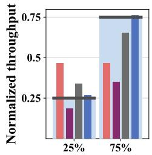

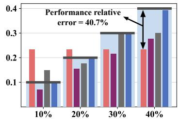

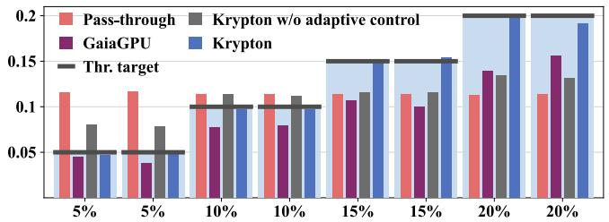  
(a) Normalized throughput of co-located ResNet50 training with different throughput targets

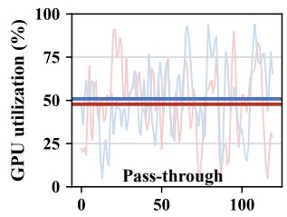

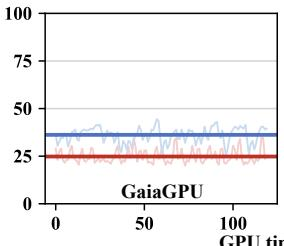

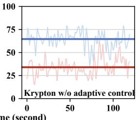

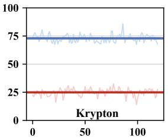  
util ResNet50(75%) util\_avg ResNet50(75%) util ResNet50(25%) util\_avg ResNet50(25%)

(b) GPU utilization of two co-located ResNet50 training applications  
Figure 16: Comparison of different methods in promising the performance target of ResNet50 training applications.  
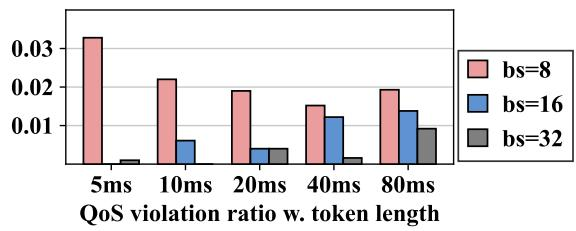  
Figure 17: The QoS violation ratio and overhead of KRYP-TON with different token lengths.

As shown in Figure 17, for smaller batch size, QoS violations increase as token lengths decrease. This trend arises because shorter tokens introduce more overhead, which affects smaller batches where individual request latencies are inherently low. In contrast, larger batch sizes exhibit an increase in QoS violations with longer token lengths. This is because tasks with larger batch sizes can hardly be finished within a single time slice. Thus, longer token lengths lead to extended waiting times for tasks to acquire time slices, thereby increasing the likelihood of QoS violations.

Overall, the average QoS violation rate across all configurations is measured at 1.23%, underscoring KRYPTON’s ability to guarantee latency-related QoS targets.

## 5.6 Elastic GPU Sharing

KRYPTON guarantees an application’s performance regardless of the co-running applications. When applications are assigned fixed GPU time slices using feedback control, the average throughput relative error of a Transformer-XL-Inf-bs8 workload is 1.3% when it co-runs with different applications.

The adaptive token control algorithm (Algorithm 1), however, can further improve performance, by allowing an application to use the unused time slices of its located GPU instance. Compared with methods that provide fixed GPU time slices to workloads, the elastic sharing characteristic improves the performance of workloads as much as possible. As shown in Figure 18, when a ResNet50-Train-bs32 job runs on a GPU alone, its utilization can approach 99%. When a new task Transformer-XL-Inf-bs8 arrives, the two jobs will share the complete GPU instantly. A utilization burst can be observed when a new task arrives. This is because the scheduler always selects the workload that has the lowest relative utilization as introduced in Algorithm 1. The burst only lasts several seconds, and the scheduler can then adaptively adjust the time slices assigned to each workload afterward.

## 5.7 Overhead

Except for the overhead related to CPU token as discussed in §5.5, KRYPTON does not introduce extra overhead when monitoring utilization. KRYPTON does not break the original logic of context switching handled by the vendor driver. As for the overhead at the host side, KRYPTON’s kernel module occupies 4.8MB of CPU memory, mainly storing the information of running processes. Besides, the GPU monitor has to occupy a CPU thread to communicate with the kernel module.

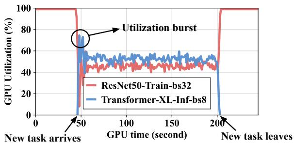  
Figure 18: Elastic sharing of a GPU.

## 6 Related Works

GPU Sharing on Cloud. There are many works on multiplexing a GPU to deploy applications in specific scenarios (e.g., AI training [31, 48, 54, 57, 71, 74], AI inference [37, 39, 42, 44, 63], cloud gaming [34, 79]). The applications are deployed either in virtual machines, or lightweight environments such as bare-metal and containers. To control the GPU usage inside virtual machines, full virtualization [65, 67, 77] and mediated pass-through [60, 68] intercept the hardware interface of the GPU (MMIO). Paravirtualization [4, 40] necessitates a custom driver in every supported guest OS for the virtual device. GPU sharing across containers or bare-metal vastly uses API-remoting to manage GPU resources. The host decides whether or when to pass the intercepted call. GaiaGPU [43], qcuda [55], and vcuda [64] all leverage API-remoting in user space to restrict the applications’ resources to use CUDA. TGS [72] and Orion [66] co-locate production jobs and opportunistic jobs based on API-remoting on a GPU.

Resource management in GPU sharing. Typically, GPU sharing techniques can be classified to be time sharing [11, 43, 64, 72] and spatial sharing [1, 2, 7, 32]. Time sharing is the default pattern when the GPU is shared in the passthrough mode [70, 75]. The GPU controls the GPU context switch in a round-robin manner [11, 32, 33]. Nvidia proposes vGPU GRID [26] to share the GPU among VMs with fixed quotas temporally. Some virtualization works [51, 67] customize hardware drivers and apply various scheduling schemes [47, 56, 67] to share a GPU temporally. Spatial sharing methods such as MPS [2] and MIG [7] manage the SM and memory resources in GPU sharing. To fully utilize the GPU, efforts in spatio-temporal sharing have also been explored vastly. Existing works either leverage multiple streams [1, 3] to multiplex a GPU within an application [54, 71], or leverage MPS to achieve so [39, 78]. There are also other works [45, 49, 58] that collaborate with the efforts in code compilation to multiplex a GPU. However, these works do not consider the isolation demand of tenants.

## 7 Discussion

KRYPTON has been deployed within the production environment. In actual practice, the minimum splittable GPU time slice ratio is set at 1%, and the minimum unit of memory allocation is 1MB. In this section, we shall deliberate on how KRYPTON maintains system security and the potential limitations it may encounter.

System Security. The kernel-space scheduler of KRYPTON is designed and implemented as a loadable kernel module (LKM), and we do not have to make any changes to the kernel or Nvidia driver. Therefore, KRYPTON maintains equivalent security guarantees to other LKM-based approaches. To date, no security risks associated with kernel-space interception have been reported that could introduce system vulnerabilities. Additionally, KRYPTON has been deployed in production-scale data center clusters featuring thousands of GPUs, operating reliably for over one year.

Limitations. KRYPTON does not support real-time spatial resource re-configuration with MIG. This may pose a potential constraint when a dynamic application is required to manage fluctuating workloads. For instance, in the case where the load of a large language model serving application decreases and demands fewer resources, the scheduler within the KRYPTON is unable to directly and elastically recycle the resources of the tenant. The live migration of GPU resources while ensuring continued isolation remains a promising area for future research.

## 8 Conclusion

In this paper, we propose KRYPTON, a kernel-space GPU sharing system that promises the compatibility and isolation of applications that share GPUs. KRYPTON intercepts GPU command buffers at the kernel level to provide virtual GPU devices. We design a feedback-based performance control policy to guarantee the performance of applications. Leveraging the spatio-temporal orchestration policy, KRYPTON reduces GPU fragments, thereby reducing the required number of GPUs for workloads. We evaluate KRYPTON with numerous applications and benchmarks. KRYPTON reduces the required GPU number by 32.1% compared with state-of-the-art systems.

## Acknowledgments

We sincerely thank our shepherd, Michael Le, and the anonymous reviewers for their insightful comments to improve the paper. This work is partially sponsored by the National Key Research and Development Program of China (2023YFB3001504), National Natural Science Foundation of China (62302302, 62232011), and Natural Science Foundation of Shanghai Municipality (24ZR1430500). Quan Chen is the corresponding author.

## References

[1] Nvidia cuda stream management. https: //docs.nvidia.com/cuda/cuda-runtime-api/ group\_\_CUDART\_\_STREAM.html, 2012.

[2] Nvidia multi-process service. https: //docs.nvidia.com/deploy/mps/index.html, 2012.

[3] Amd rocm stream management. https: //rocmdocs.amd.com/projects/HIP/en/develop/ .doxygen/docBin/html/group\_\_\_stream.html, 2016.

[4] Vmware svga3d guest driver. https: //www.mesa3d.org/vmware-guest.html, 2019.

[5] Application considerations in mig. https: //docs.nvidia.com/datacenter/tesla/miguser-guide/index.html#app-considerations, 2020.

[6] Nvidia collective communications library. https:// developer.nvidia.com/nccl, 2020.

[7] Nvidia multi-instance gpu. https://www.nvidia.com/ en-us/technologies/multi-instance-gpu/, 2020.

[8] Alibaba cloud cgpu. https:// www.alibabacloud.com/help/en/elastic-gpuservice/latest/what-is-the-cgpu-service, 2021.

[9] Nvidia data center gpu manager. https:// developer.nvidia.com/dcgm, 2021.

[10] Chatgpt. https://openai.com/blog/chatgpt, 2022.

[11] Nvidia drive os linux sdk developer guide. https://developer.nvidia.com/docs/drive/ drive-os/6.0.8.1/public/drive-os-linuxsdk/common/topics/graphics\_content/ TegraGPUSchedulingImprovements1.html, 2022.

[12] Nvidia linux open gpu kernel module source. https: //github.com/NVIDIA/open-gpu-kernel-modules, 2022.

[13] Nvidia management library. https:// developer.nvidia.com/management-librarynvml, 2022.

[14] Opengl. https://developer.nvidia.com/opengl, 2022.

[15] Stable diffusion. https://stability.ai/stablediffusion, 2022.

[16] Amd gpuopen. amd gpu isa documentation. https://gpuopen.com/amd-gpu-architectureprogramming-documentation/, 2023.

[17] Envytools. https://github.com/envytools/ envytools, 2023.

[18] Nouveau: Accelerated open source driver for nvidia cards. https://nouveau.freedesktop.org/, 2023.

[19] containerd. https://containerd.io/, 2024.

[20] Cuda toolkit. https://docs.nvidia.com/cuda/ index.html, 2024.

[21] Cuda toolkit archive. https:// developer.nvidia.com/cuda-toolkit-archive, 2024.

[22] Delivering video content with fractional gpus in containers on amazon eks. https://aws.amazon.com/blogs/ containers/delivering-video-content-withfractional-gpus-in-containers-on-amazoneks/, 2024.

[23] docker. https://www.docker.com/, 2024.

[24] Linux manual page: mprotect. https://man7.org/ linux/man-pages/man2/mprotect.2.html, 2024.

[25] Nvidia container toolkit. https://docs.nvidia.com/ datacenter/cloud-native/container-toolkit/ latest/index.html, 2024.

[26] Nvidia virtual gpu software. https:// docs.nvidia.com/grid/latest/grid-vgpu-userguide/, 2024.

[27] Openai sora. https://openai.com/sora/, 2024.

[28] Tencent kubernetes engine qgpu. https: //www.tencentcloud.com/document/product/ 457/42973, 2024.

[29] Vulkan. https://www.vulkan.org/, 2024.

[30] Vulkan c++ examples and demos. https:// github.com/SaschaWillems/Vulkan, 2024.

[31] Zhihao Bai, Zhen Zhang, Yibo Zhu, and Xin Jin. {PipeSwitch}: Fast pipelined context switching for deep learning applications. In 14th USENIX Symposium on Operating Systems Design and Implementation (OSDI 20), pages 499–514, 2020.

[32] Joshua Bakita and James H Anderson. Hardware compute partitioning on nvidia gpus. In 2023 IEEE 29th Real-Time and Embedded Technology and Applications Symposium (RTAS), pages 54–66. IEEE, 2023.

[33] Nicola Capodieci, Roberto Cavicchioli, Marko Bertogna, and Aingara Paramakuru. Deadline-based scheduling for gpu with preemption support. In 2018 IEEE Real-Time Systems Symposium (RTSS), pages 119–130. IEEE, 2018.

[34] Binghao Chen, Han Zhao, Weihao Cui, Yifu He, Shulai Zhang, Quan Chen, Zijun Li, and Minyi Guo. Maximizing the utilization of gpus used by cloud gaming through adaptive co-location with combo. In Proceedings of the 2023 ACM Symposium on Cloud Computing, pages 265–280, 2023.

[35] Seungbeom Choi, Sunho Lee, Yeonjae Kim, Jongse Park, Youngjin Kwon, and Jaehyuk Huh. Serving heterogeneous machine learning models on {Multi-GPU} servers with {Spatio-Temporal} sharing. In 2022 USENIX Annual Technical Conference (USENIX ATC 22), pages 199–216, 2022.

[36] Per Christensen, Julian Fong, Jonathan Shade, Wayne Wooten, Brenden Schubert, Andrew Kensler, Stephen Friedman, Charlie Kilpatrick, Cliff Ramshaw, Marc Bannister, et al. Renderman: An advanced path-tracing architecture for movie rendering. ACM Transactions on Graphics (TOG), 37(3):1–21, 2018.

[37] Weihao Cui, Han Zhao, Quan Chen, Ningxin Zheng, Jingwen Leng, Jieru Zhao, Zhuo Song, Tao Ma, Yong Yang, Chao Li, et al. Enable simultaneous dnn services based on deterministic operator overlap and precise latency prediction. In Proceedings of the International Conference for High Performance Computing, Networking, Storage and Analysis, pages 1–15, 2021.

[38] Lorenzo Dematté and Davide Prandi. Gpu computing for systems biology. Briefings in bioinformatics, 11(3):323–333, 2010.

[39] Aditya Dhakal, Sameer G Kulkarni, and KK Ramakrishnan. Gslice: controlled spatial sharing of gpus for a scalable inference platform. In Proceedings of the 11th ACM Symposium on Cloud Computing, pages 492–506, 2020.

[40] Micah Dowty and Jeremy Sugerman. Gpu virtualization on vmware’s hosted i/o architecture. ACM SIGOPS Operating Systems Review, 43(3):73–82, 2009.

[41] Anshuman Goswami, Jeffrey Young, Karsten Schwan, Naila Farooqui, Ada Gavrilovska, Matthew Wolf, and Greg Eisenhauer. Gpushare: Fair-sharing middleware for gpu clouds. In 2016 IEEE International Parallel and Distributed Processing Symposium Workshops (IPDPSW), pages 1769–1776. IEEE, 2016.

[42] Jianfeng Gu, Yichao Zhu, Puxuan Wang, Mohak Chadha, and Michael Gerndt. Fast-gshare: Enabling efficient spatio-temporal gpu sharing in serverless computing for deep learning inference. In Proceedings of the 52nd International Conference on Parallel Processing, pages 635–644, 2023.

[43] Jing Gu, Shengbo Song, Ying Li, and Hanmei Luo. Gaiagpu: Sharing gpus in container clouds. In 2018 IEEE Intl Conf on Parallel & Distributed Processing with Applications, Ubiquitous Computing & Communications, Big Data & Cloud Computing, Social Computing & Networking, Sustainable Computing & Communications (ISPA/IUCC/BDCloud/SocialCom/SustainCom), pages 469–476. IEEE, 2018.

[44] Arpan Gujarati, Reza Karimi, Safya Alzayat, Wei Hao, Antoine Kaufmann, Ymir Vigfusson, and Jonathan Mace. Serving {DNNs} like clockwork: Performance predictability from the bottom up. In 14th USENIX Symposium on Operating Systems Design and Implementation (OSDI 20), pages 443–462, 2020.

[45] Mingcong Han, Hanze Zhang, Rong Chen, and Haibo Chen. Microsecond-scale preemption for concurrent {GPU-accelerated}{DNN} inferences. In 16th USENIX Symposium on Operating Systems Design and Implementation (OSDI 22), pages 539–558, 2022.

[46] Kaiming He, Xiangyu Zhang, Shaoqing Ren, and Jian Sun. Deep residual learning for image recognition. In Proceedings of the IEEE conference on computer vision and pattern recognition, pages 770–778, 2016.

[47] Cheol-Ho Hong, Ivor Spence, and Dimitrios S Nikolopoulos. Gpu virtualization and scheduling methods: A comprehensive survey. ACM Computing Surveys (CSUR), 50(3):1–37, 2017.

[48] Yanping Huang, Youlong Cheng, Ankur Bapna, Orhan Firat, Dehao Chen, Mia Chen, HyoukJoong Lee, Jiquan Ngiam, Quoc V Le, Yonghui Wu, et al. Gpipe: Efficient training of giant neural networks using pipeline parallelism. Advances in neural information processing systems, 32, 2019.

[49] Saksham Jain, Iljoo Baek, Shige Wang, and Ragunathan Rajkumar. Fractional gpus: Software-based compute and memory bandwidth reservation for gpus. In 2019 IEEE Real-Time and Embedded Technology and Applications Symposium (RTAS), pages 29–41. IEEE, 2019.

[50] Shinpei Kato. Implementing open-source cuda runtime. In Proc. of the 54the Programming Symposium, 2013.

[51] Shinpei Kato, Michael McThrow, Carlos Maltzahn, and Scott Brandt. Gdev:{First-Class}{GPU} resource management in the operating system. In 2012 USENIX

Annual Technical Conference (USENIX ATC 12), pages 401–412, 2012.

[52] Oren Laadan and Jason Nieh. Transparent checkpointrestart of multiple processes on commodity operating systems. In USENIX Annual Technical Conference, pages 323–336, 2007.

[53] Baolin Li, Tirthak Patel, Siddharth Samsi, Vijay Gadepally, and Devesh Tiwari. Miso: exploiting multiinstance gpu capability on multi-tenant gpu clusters. In Proceedings of the 13th Symposium on Cloud Computing, pages 173–189, 2022.

[54] Gangmuk Lim, Jeongseob Ahn, Wencong Xiao, Youngjin Kwon, and Myeongjae Jeon. Zico: Efficient {GPU} memory sharing for concurrent {DNN} training. In 2021 USENIX Annual Technical Conference (ATC 21), pages 161–175, 2021.

[55] Yu-Shiang Lin, Chun-Yuan Lin, Che-Rung Lee, and Yeh-Ching Chung. qcuda: Gpgpu virtualization for high bandwidth efficiency. In 2019 IEEE International Conference on Cloud Computing Technology and Science (CloudCom), pages 95–102. IEEE, 2019.

[56] Konstantinos Menychtas, Kai Shen, and Michael L Scott. Disengaged scheduling for fair, protected access to fast computational accelerators. ACM SIGARCH Computer Architecture News, 42(1):301–316, 2014.

[57] Deepak Narayanan, Aaron Harlap, Amar Phanishayee, Vivek Seshadri, Nikhil R Devanur, Gregory R Ganger, Phillip B Gibbons, and Matei Zaharia. Pipedream: generalized pipeline parallelism for dnn training. In Proceedings of the 27th ACM symposium on operating systems principles, pages 1–15, 2019.

[58] Kelvin KW Ng, Henri Maxime Demoulin, and Vincent Liu. Paella: Low-latency model serving with softwaredefined gpu scheduling. In Proceedings of the 29th Symposium on Operating Systems Principles (SOSP 23), pages 595–610, 2023.

[59] Mohit Pandey, Michael Fernandez, Francesco Gentile, Olexandr Isayev, Alexander Tropsha, Abraham C Stern, and Artem Cherkasov. The transformational role of gpu computing and deep learning in drug discovery. Nature Machine Intelligence, 4(3):211–221, 2022.

[60] Bo Peng, Haozhong Zhang, Jianguo Yao, Yaozu Dong, Yu Xu, and Haibing Guan. {MDev-NVMe}: A {NVMe} storage virtualization solution with mediated {Pass-Through}. In 2018 USENIX Annual Technical Conference (USENIX ATC 18), pages 665–676, 2018.

[61] Vijay Janapa Reddi, Christine Cheng, David Kanter, Peter Mattson, Guenther Schmuelling, Carole-Jean Wu, Brian Anderson, Maximilien Breughe, Mark Charlebois, William Chou, et al. Mlperf inference benchmark. In 2020 ACM/IEEE 47th Annual International Symposium on Computer Architecture (ISCA), pages 446–459. IEEE, 2020.

[62] Mark Sandler, Andrew Howard, Menglong Zhu, Andrey Zhmoginov, and Liang-Chieh Chen. Mobilenetv2: Inverted residuals and linear bottlenecks. In Proceedings of the IEEE conference on computer vision and pattern recognition, pages 4510–4520, 2018.

[63] Haichen Shen, Lequn Chen, Yuchen Jin, Liangyu Zhao, Bingyu Kong, Matthai Philipose, Arvind Krishnamurthy, and Ravi Sundaram. Nexus: A gpu cluster engine for accelerating dnn-based video analysis. In Proceedings of the 27th ACM Symposium on Operating Systems Principles, pages 322–337, 2019.

[64] Lin Shi, Hao Chen, Jianhua Sun, and Kenli Li. vcuda: Gpu-accelerated high-performance computing in virtual machines. IEEE Transactions on Computers, 61(6):804– 816, 2011.

[65] Jike Song, Zhiyuan Lv, and Kevin Tian. Kvmgt: A full gpu virtualization solution. In KVM Forum, volume 2014, 2014.

[66] Foteini Strati, Xianzhe Ma, and Ana Klimovic. Orion: Interference-aware, fine-grained gpu sharing for ml applications. In Proceedings of the Nineteenth European Conference on Computer Systems (EuroSys 24), pages 1075–1092, 2024.

[67] Yusuke Suzuki, Shinpei Kato, Hiroshi Yamada, and Kenji Kono. {GPUvm}: Why not virtualizing {GPUs} at the hypervisor? In 2014 USENIX Annual Technical Conference (USENIX ATC 14), pages 109–120, 2014.

[68] Kun Tian, Yaozu Dong, and David Cowperthwaite. A full {GPU} virtualization solution with mediated {Pass-Through}. In 2014 USENIX Annual Technical Conference (USENIX ATC 14), pages 121–132, 2014.

[69] Ashish Vaswani, Noam Shazeer, Niki Parmar, Jakob Uszkoreit, Llion Jones, Aidan N Gomez, Łukasz Kaiser, and Illia Polosukhin. Attention is all you need. Advances in neural information processing systems, 30, 2017.

[70] John Paul Walters, Andrew J Younge, Dong In Kang, Ke Thia Yao, Mikyung Kang, Stephen P Crago, and Geoffrey C Fox. Gpu passthrough performance: A comparison of kvm, xen, vmware esxi, and lxc for cuda and opencl applications. In 2014 IEEE 7th international conference on cloud computing, pages 636–643. IEEE, 2014.

[71] Guanhua Wang, Kehan Wang, Kenan Jiang, Xiangjun Li, and Ion Stoica. Wavelet: Efficient dnn training with tick-tock scheduling. Proceedings of Machine Learning and Systems (MLSys 21), 3:696–710, 2021.

[72] Bingyang Wu, Zili Zhang, Zhihao Bai, Xuanzhe Liu, and Xin Jin. Transparent {GPU} sharing in container clouds for deep learning workloads. In 20th USENIX Symposium on Networked Systems Design and Implementation (NSDI 23), pages 69–85, 2023.

[73] Hao Wu, Wei Liu, Yifan Gong, and Jiangming Jin. Safe process quitting for gpu multi-process service (mps). In 2020 IEEE 40th International Conference on Distributed Computing Systems (ICDCS), pages 1169–1170. IEEE, 2020.

[74] Wencong Xiao, Shiru Ren, Yong Li, Yang Zhang, Pengyang Hou, Zhi Li, Yihui Feng, Wei Lin, and Yangqing Jia. {AntMan}: Dynamic scaling on {GPU} clusters for deep learning. In 14th USENIX Symposium on Operating Systems Design and Implementation (OSDI 20), pages 533–548, 2020.

[75] Chao-Tung Yang, Jung-Chun Liu, Hsien-Yi Wang, and Ching-Hsien Hsu. Implementation of gpu virtualization using pci pass-through mechanism. The Journal of Supercomputing, 68:183–213, 2014.

[76] Ting-An Yeh, Hung-Hsin Chen, and Jerry Chou. Kubeshare: A framework to manage gpus as first-class and shared resources in container cloud. In Proceedings of the 29th international symposium on high-performance parallel and distributed computing, pages 173–184, 2020.

[77] Hangchen Yu and Christopher J Rossbach. Full virtualization for gpus reconsidered. In Proceedings of the Annual Workshop on Duplicating, Deconstructing, and Debunking, 2017.

[78] Shulai Zhang, Quan Chen, Weihao Cui, Han Zhao, Chunyu Xue, Zhen Zheng, Wei Lin, and Minyi Guo. Improving gpu sharing performance through adaptive bubbleless spatial-temporal sharing. In Proceedings of the Twentieth European Conference on Computer Systems, pages 573–588, 2025.

[79] Wei Zhang, Binghao Chen, Zhenhua Han, Quan Chen, Peng Cheng, Fan Yang, Ran Shu, Yuqing Yang, and Minyi Guo. {PilotFish}: Harvesting free cycles of cloud gaming with deep learning training. In 2022 USENIX Annual Technical Conference (USENIX ATC 22), pages 217–232, 2022.

[80] Wei Zhang, Weihao Cui, Kaihua Fu, Quan Chen, Daniel Edward Mawhirter, Bo Wu, Chao Li, and Minyi

Guo. Laius: Towards latency awareness and improved utilization of spatial multitasking accelerators in datacenters. In Proceedings of the ACM international conference on supercomputing, pages 58–68, 2019.

[81] Yihao Zhao, Xin Liu, Shufan Liu, Xiang Li, Yibo Zhu, Gang Huang, Xuanzhe Liu, and Xin Jin. Muxflow: Efficient and safe gpu sharing in large-scale production deep learning clusters. arXiv preprint arXiv:2303.13803, 2023.