①

USENIX

THE ADVANCED COMPUTING SYSTEMS ASSOCIATION

# DRack: A CXL-Disaggregated Rack Architecture to Boost Inter-Rack Communication

Xu Zhang and Ke Liu, SKLP, Institute of Computing Technology, CAS; and University of Chinese Academy of Sciences; Yuan Hui and Xiaolong Zheng, Huawei;   
Yisong Chang, SKLP, Institute of Computing Technology, CAS; and University of Chinese Academy of Sciences; Yizhou Shan, Huawei Cloud; Guanghui Zhang, Shandong   
University; Ke Zhang, Yungang Bao, Mingyu Chen, and Chenxi Wang, SKLP, Institute of Computing Technology, CAS; and University of Chinese Academy of Sciences

https://www.usenix.org/conference/atc25/presentation/zhang-xu

# This paper is included in the Proceedings of the 2025 USENIX Annual Technical Conference.

July 7–9, 2025 • Boston, MA, USA ISBN 978-1-939133-48-9

Open access to the Proceedings of the 2025 USENIX Annual Technical Conference is sponsored by

P-Lr.h £Es/sL.

auuuJl9 PgleU

King Abdullah University of

Science and Technology

# DRack: A CXL-Disaggregated Rack Architecture to Boost Inter-Rack Communication

Xu Zhang1,2 , Ke Liu1,2 , Yuan Hui3 , Xiaolong Zheng3 , Yisong Chang1,2 , Yizhou Shan4

Guanghui Zhang5 , Ke Zhang1,2 , Yungang Bao1,2 , Mingyu Chen1,2 , Chenxi Wang1,2

1SKLP, Institute of Computing Technology, CAS

2University of Chinese Academy of Sciences

3Huawei, 4Huawei Cloud, 5Shandong University

## Abstract

Data-intensive applications are scaling out across more and more racks, and boosted with advanced computing units with enhanced throughput, which necessitates increased NIC capacity and network bandwidth to transport inter-rack traffic. As a result, when running them over ToR-centric racks, interrack traffic can be bottlenecked at host NICs and core network due to oversubscription. However, we observe that, although a large volume of inter-rack traffic exists, the utilization of the host’s NICs within a rack remains low. If those underutilized NICs within a rack can be utilized by any host, inter-rack communication can be accelerated. Therefore, we propose DRack. At its core, DRack disaggregates all NICs within a rack from their hosts, forming a shared NIC pool. As the local memory bandwidth or the PCIe link at a host is much smaller than the NIC pool capacity, the host cannot fully utilize the NIC pool. DRack also disaggregates memory devices within a rack from their hosts, so that data from the NIC pool can be written and read from multiple memory with full capacity, while host processors can directly access the memory pool with memory semantics. We realize DRack with CXL as it supports device pooling and memory semantics, which is wellsuited to our designs. We have implemented DRack prototype and evaluated it with real applications, such as DNN training and graph processing. The result shows that DRack can reduce the communication stage by an average of 37.3% compared to ToR-centric rack.

## 1 Introduction

Today’s production clouds organize hosts in ToR-centric racks. Each rack hosts tens of hosts connected via a Topof-Rack (ToR) switch and is linked to the network core. Dataintensive applications running in those clouds, such as graph computing [1], data analytics [2], and deep neural network (DNN) training [3] often operate with Bulk Synchronous Parallel (BSP) [4] or MapReduce paradigms [2], generally involving computation stage and communication stages (e.g., data shuffling and synchronization). They tend to scale the job out across more and more racks for acceleration, resulting in a large volume of across-rack traffic. As measured by Facebook during 24 hours [5], an average of 87.1% of network traffic in their datacenter needs to go out of the rack. Moreover, recent innovations on processors and domain-specific accelerators, such as GPUs [6, 7], and FPGAs [8], have significantly enhanced computing throughput, which necessitates increased NIC capacity and network bandwidth to accommodate. Thus, the two trends result in communication bottlenecks for interrack communication, including NIC egress/ingress port, and core network bottleneck due to oversubscription that is predominant in datacenter networks (DCN) (§2.1) .

We can address these bottlenecks intuitively with a bruteforce approach, by overprovisioning NICs for every hosts [9– 11], or switching equipments [10]. It is cost-prohibitive in terms of power consumption and hardware expenses. Another line [12–14] adds reconfigurable hardware to provide extra bandwidth between the intensively communicating racks, or to enable a reconfigurable network that changes its topology to adapt dynamic inter-rack traffic volume. However, they are limited by reconfiguration delay and complexity, and face challenges in predicting inter-rack traffic pattern that is bursty and highly dynamic [5]. Last, some job schedulers [15–20] reduce inter-rack traffic by scheduling jobs based on predictable features, e.g., the data volume to send, which is hard to predict for existing data-intensive applications (see §2.3).

By studying the traffic trace from Facebook [5] and running real-world applications in our cluster, we find, although a large volume of inter-rack traffic prevails [12], the hosts NIC utilization within a rack remains low (for both ingress and egress). The reason can be two-fold: 1) there is no network traffic during job computing stages and the traffic volume to send/receive during communication is highly skewed between hosts; 2) each job has its resource requirement and emphasis, resulting in resource fragmentation, e.g., non-distributed DNN training jobs leave the NICs unused [21].

Inspired, a natural direction to explore is, if those underutilized NICs from other hosts within a rack can be borrowed, could inter-rack communication be accelerated? Therefore, we propose Disaggregated Rack (DRack), a new rack architecture concept with the following three key designs. ➀ DRack disaggregates all the NICs of existing hosts to form a racklevel NIC pool which can be used by any host to accelerate its inter-rack traffic. However, maximizing the utilization of NIC pool capacity poses a challenge. This is because, when writing the data from the NIC pool to the memory of destined hosts, the NIC pool’s capacity can surpass the bandwidth of the PCIe links at the destined hosts, or the total memory bandwidth of their local memory, given the number of communicating hosts is small. Thus, ➁ DRack also disaggregates local memory from hosts, forming a rack-level memory pool with an aggregated bandwidth exceeding the capacity of the NIC pool, so that data can be written/read to/from multiple memory devices from the NIC pool with the full capacity. ➂ DRack allows host processors or accelerators (e.g., CPU) to load and store the memory pool with memory semantics during computation, without moving data to their local memory first with DMA. This approach contrasts with prior works that relied on PCIe for device pooling [22–24].

To realize the above three key designs, we find that CXL is a perfect fit due to the following facts: 1) CXL 2.0 [25] supports memory and IO device pooling with CXL switches which are responsible for routing and address remapping when the host is accessing any device attached to it. Consequently, CXL 3.0 enhances it by proposing CXL fabric, which is an interconnect that supports rack-level resource polling (designs ➀ and ➁). 2) CXL supports memory semantics (CXL.mem), which enables hosts to load and store the memory pool directly throughout the computation stage (➂).

By doing so, DRack alleviates the bottlenecks in the interrack communication when running over the ToR-centric architecture, and its new architecture complements existing job scheduling algorithms with a better communication efficiency [26, 27]. Compared to prior architectures, DRack is static without the complexity of reconfigurability and traffic prediction, and does not add more hardware for more bandwidth across racks, while DRack can be flexible and scalable by simply attaching more memory/NIC devices to the CXL interconnect.

We still face several challenges in porting real applications/jobs and ensuring DRack efficiency (see §2.4). For example, CXL.mem load/store to remote memory (in other hosts) exhibits higher latency than accessing the local memory, which could impact the computation efficiency. We solved them and implemented a full functional DRack prototype with 8 customized MPSoC FPGAs and one server connected by optical fibers, instead of using simulator and NUMA nodes in prior works [28–31], enabling running different applications transparently on DRack with various (CXL) bandwidth and latency configurations. We realized CXL 3.0-like memory protocols, such as CXL.mem and CXL.io, atop an academia lightweight conceptual hardware protocol stack [32]. We evaluated DRack with both microbenchmarks, real data-intensive applications, such as DNN training, graph processing, and KV store, and user cases like job scheduling, and show that DRack reduces the communication time by an average of 37.3% compared to the conventional ToR-based rack. DRack also achieves 62.2% lower p99 tail latency when running latency-sensitive applications, e.g., Redis.

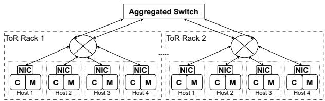  
(a) Conventional Rack-centric architecture.

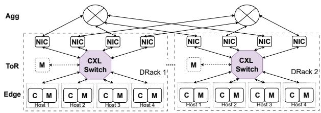  
(b) DRack: a logical shared memory and NIC pool  
Figure 1: The architectural comparison between two racks. CPU (c), Memory (M).

## 2 Background and Motivations

In this section, we first elucidate the reason why inter-rack communication is prevalent and inevitable in conventional rack-centric datacenter networks (DCN), and why it is critical to the performance of data-intensive applications. Second, we review prior approaches aimed at enhancing inter-rack communication efficiency. Third, we reveal a unique insight resulting from workload execution paradigms (e.g., BSP) and job placements – the utilization of existing NICs’ full-duplex bandwidth is low, e.g., 20%-45% reported in [21]. This insight motivates the DRack strawman design, which decouples NICs from their physical hosts and pools them to form a rack-level NIC pool. Last, we discuss the use cases that can benefit from DRack and the challenges that must be addressed to realize DRack in practical.

## 2.1 Inter-rack Communication in DCNs

Although conventional DCNs, such as public clouds in Amazon [33] and Tencent [34], can vary from one deployment to another. They have one property in common – they arrange hosts in racks as the basic unit. As shown in Figure 1(a), a ToR switch interconnects tens of hosts via Ethernet links, all of which are stacked within a physical rack. Racks connect to the aggregation layer with oversubscribed uplinks. This ToR-based rack architecture streamlines the management process, while aiming to offer high throughput and low latency for application traffic with a high degree of rack locality.

Inter-rack traffic is rising and inevitable. We conducted an analysis of a public dataset from Facebook [5], which encompasses packet-level traces gathered from both Hadoop and Frontend production clusters over one day, sampled at a rate of 1:30k. Each packet sample includes source and destination hosts. As depicted in Figure 2(b), an average of 86.7% and 97.3% of Hadoop and Frontend traffic, respectively, is directed to hosts located in different racks, thereby underscoring the significant demand for inter-rack communication. This observation aligns with prior works [5, 12] and can be attributed to the following factors:

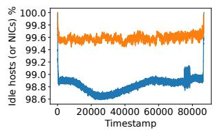

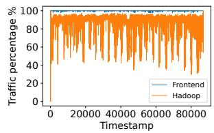  
(a) The percentage of hosts (or NICs) (b) The percentage of the volume of are not communicating. inter-rack traffic.  
Figure 2: The network traffic patterns motivating DRack.

❶ Service-based rack organization: for operation convenience, a rack is typically dedicated to hosts serving a specific (Frontend) service. e.g., cache servers primarily send responses across racks to web servers in other racks, which issued cache read requests. ❷ Resource fragmentation: a Hadoop (Map-Reduce) job may span multiple racks if rack resources are fragmented, thereby resulting in heavy inter-rack traffic for that job. The fragmentation occurs as the scheduler endeavors to localize jobs within a rack [35]; second, dynamic job churns ensure that rack resource is not always neatly packed [36, 37]. ❸ Large scale applications: Data-intensive applications like data analytics [2], iterative graph processing [1] and machine learning [3] (ML), is scaled out across 100 to 1K of hosts [38, 39], i.e., tens or hundreds of racks, to accelerate computation over large input dataset. Their executions follow BSP and Map-Reduce paradigms that require extensive data communication between racks (hosts) after computation, e.g., gradient synchronization.

Inter-rack communication efficiency is crucial for applications. Data-intensive applications are increasingly leveraging advanced computing units such as CPU, GPU and FPGA to execute compute-intensive tasks [6–8]. This trend significantly reduces computation time and generates data at rates exceeding hundreds of GBps, which is several orders of magnitude higher than NIC capacity (e.g., 100 Gbps). Consequently, after the computation phase, each host accumulates a substantial volume of intermediate data, necessitating a bursty transmission and a subsequent reception between racks (or hosts) during the communication phase. When running over ToR-based racks, this communication process traverses the host NIC twice (for egress and ingress) and the potentially oversubscribed uplink of the ToR twice. Therefore, enhancing both the NIC capacity and the capacity of the oversubscribed uplinks of ToRs is crucial for communication efficiency and application performance.

## 2.2 Existing Approaches

Topology Reconfigurability. One line of prior works [12– 14] adds extra bandwidth between the most intensively communicating racks with extra cables, lasers, or antennas to relieve the bottleneck at the uplinks of ToRs, which is usually oversubscribed. Another line does not add bandwidth [12], but builds a flexible network that changes network topology to adapt dynamic workload communication patterns. The efficiency of both approaches highly depends on the predictability of traffic patterns, while it is challenging to identify them due to the bursty nature of host- and rack-level outbound traffic (see §2.1). The measurements in production clusters also reveal the presence of a large number of short-lived heavy hitters [5], that is, there is no more than a 50% chance that hostand rack-level heavy hitters will persist in the next 100ms.

Brute-force hardware upgrade. To relieve the potential bottleneck at the host’s egress bandwidth, GRIN [40] leverages multi-port NICs to expand the host egress capacity, but the improvement is constrained by the fact that the number of additional paths is usually limited. Production GPU clusters like EFLOPS [11], vClos [9], and HPN [10] bound each GPU to a single NIC (400 Gbps) to catch the pace with the hardware throughput. They also leverage multi-homed topology to provide a full bisectional network core. However, they exacerbate the link (and NIC) underutilization, given their utilization is already low [5, 41–43]: as measured, 99% of all links are less than 10% loaded. Moreover, this imposes an escalated “scale tax” – power consumption, hardware and operational expenses [44, 45].

Job placement and scheduling. To reduce inter-rack traffic contention, existing cluster schedulers optimize the placement of jobs close to the input data [15, 16] that is spread over the cluster randomly in a distributed file system (e.g., HDFS [46]). Others schedule communication based on the predictable features of tasks [17–20], e.g., the volume of data, start/end time, and source and destination of the communication. However, due to the unpredictability of job traffic as explained in §2.1, job schedulers cannot completely avoid cross-rack traffic contention.

Takeaway. Existing reconfigurable topologies and job schedulers cannot predict the pattern and volume accurately due to the bursty nature of across-rack traffic of distributed workloads, which persists with any frequency [5]. Upgrading switching hardware to meet the peak bandwidth degrades the network utilization. The goal of this work is to seek a cost-effective rack-level architectural design that efficiently handles the inter-rack traffic without extra hardware for more bandwidth or reconfiguration complexity.

## 2.3 Insights on NIC utilization

By analyzing the same packet-level dataset from [5] and conducting real experiments with data-intensive applications, we observed that the bandwidth utilization of existing NICs within a rack remains low – the insight motivates and carries important implications for the design of DRack. Specifically, we count the number of hosts sending and receiving packet samples within a rack every 1s, respectively, and averaged it over all racks. Figure 2(a) shows over 90% of hosts (NICs) are not sending or receiving in 1s, i.e., remain underutilized, for both Hadoop and Frontend clusters. This observation aligns with prior studies [5, 21, 41, 43], The imbalanced NIC utilization is common and can be attributed to the two factors.

Application semantics. Although all hosts schedule their NICs during the communication stage, the data volume processed by these NICs vary largely due to these factors:

❶ Compute Irregularity: Computation tasks are often unevenly distributed across hosts, leading to different computation times [47]. This irregularity results in hosts communicating at different times and NICs handling disparate intermediate data volumes, which are unpredictable and cause imbalanced utilization of NICs. For example, when running graph processing in parallel, each host processes subgraphs with different properties on vertices and edges. This requires varying computation times and produces different amounts of data for synchronization. Moreover, every subgraph evolves iteratively, increasing the unpredictability of communication and computation times. As shown in Figure 3(a) and Figure 3(b), we run a PageRank and CC job over 8 servers and validate data volume and the start time of communication varies significantly. ❷ Data skewness: The distribution of data between hosts can be uneven, causing certain NICs to process a disproportionate amount of data compared to others. For example, in DLRM training, input samples of a batch for hosts exhibit heterogeneous access locality on requested embeddings [48–50]. This leads to hosts fetching varying numbers of distinct embeddings from other hosts’ embedding tables, and resulting in the uneven generation of gradient data for the embedding layer. In Figure 3(b), the data volume varies substantially for all applications running over 8 hosts, leading to an average NIC utilization less than 20%. We summarize more examples in the Appendix (§A.2), highlighting the generalizability of low NIC utilization across various data-intensive applications.

Resource fragmentation. In datacenters, multiple jobs run concurrently. To schedule them, resource fragmentation is inevitable, as each job has its own resource requirements. If a job can be accommodated by a single host, i.e., a nondistributed job, the NIC of that host remains underutilized. Additionally, BSP paradigm mandates that the NICs can be idle during computation. As observed in production clusters, 20%-45% of machines run non-distributed jobs [21], resulting in underutilized NICs. These NICs could potentially be leveraged by throughput-intensive distributed applications to enhance NIC utilization and performance.

Implications. Given that inter-rack traffic is predominant (§2.1) and yet NIC utilization remains low and imbalanced, if the underutilized NICs equipped at the hosts were controllable and accessible by a different host within the same rack, inter-rack communication can be accelerated, while the burstiness of the traffic can be alleviated by spreading the traffic between more NICs and paths. Moreover, resource fragmentation due to job scheduler can be reduced if NICs can be scheduled independently, without the need to schedule additional computing resources on the same host.

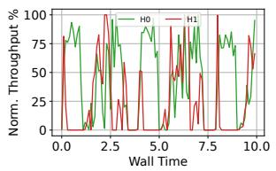

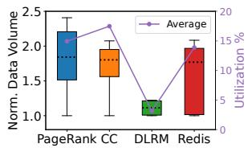  
(a) Sampling 2 host’s egress through- (b) Sent data volume difference beput running PageRank. tween hosts in communication stage.  
Figure 3: The imbalanced NIC utilization. (testbed see § 7.1)

## 2.4 The Benefits of DRack

DRack design principle. Driven by the implications of large inter-rack traffic demand and the underutilization of rack NIC ports, we propose a new rack architectural concept – Disaggregated Rack (DRack).

At its core, DRack disaggregates NICs from host boundaries, consolidating them into a rack-level NIC pool accessible by any host to transfer its inter-rack traffic. Maximizing the utilization of the NIC pool’s capacity is challenging, as its capacity can exceed the bandwidth of the PCIe links at the destined hosts or the total memory bandwidth of their local memory. For example, in many-to-one across-rack traffic, a NIC pool of 16x200 Gbps NICs (with 16 hosts) can achieve a receiving throughput of 3200 Gbps, which far exceeds the 500 Gbps capacity of a PCIe5x16 link on the destination host. When performing direct memory access (DMA) from/to all NICs, both sending and receiving operations can ultimately be limited by the host’s PCIe link or local memory bandwidth.

Thus, the second principle of DRack is to disaggregate system-integrated memories from all host boundaries, forming a rack-level memory pool with an aggregated bandwidth exceeding the capacity of the NIC pool. Hosts can allocate descriptors with referenced address locations spanning all hosts’ memory devices, facilitating distributive DMA writing of inter-rack traffic, received from the NIC pool, across all memory devices, not only the local memory of the destined host. Similarly, the NIC pool performs DMA reads from multiple memory devices to achieve full bandwidth transmission.

Last, DRack allows hosts’ processors (e.g., CPU) to access the memory pool using memory semantics, This enables them to directly load and store of data during computation stage, eliminating the need to initially move data to their local memory via DMA.

User cases and benefits. DRack addresses the bottlenecks in inter-rack communication, without the need of additional bandwidth hardware and reconfigurability. Second, DRack is not only orthogonal to existing job scheduling and placement strategies, but also unleashes their performance gains.

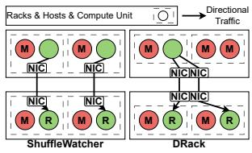  
(a) DRack saves more cores.

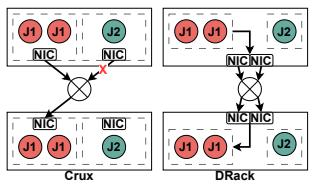  
(b) DRack reduce comm. time.  
Figure 4: Workflows of job schedulers on DRack.

❶ Mitigating inter-rack communication bottlenecks. 1) NIC egress bottleneck: Recall, during the computation stage, a substantial volume of intermediate data is produced, resulting in a throughput higher than the NIC capacity by several orders. To minimize the idle time of valuable computing resources, DRack allow a host to use underutilized NICs within the same rack to boost its egress capacity like in Figure 1(b), the host then can control multiple NICs to send packets concurrently by passing descriptors to them, thereby mitigating the gap between the compute hardware throughput and the local NIC’s egress capacity. 2) Oversubscribed network core: The NIC pool completes its transmission, as shown in Figure 1(b), acting as the uplinks of tier 2 (ToR), in contrast to Figure 1(a). This is because DRack shifts rack NICs and the above topology components, like ToR switches and aggregated switches, up one tier compared to original ToRbased architecture. The ToR switches effectively take on the role of aggregated switches, while the original aggregated switches can either be eliminated or repurposed to serve as core switches. By appropriately wiring between the NICs and ToR switches in Figure 1(b), DRack achieves a fully bisectional bandwidth between any pair of racks, unlike the oversubscribed network core found in ToR-based rack architecture, and does so without the need for additional switching hardware. 3) NIC ingress bottleneck. Data is received by the NIC pool of the destined rack, as shown in Figure 1(b), and DMA to all rack host’ memory devices to fully exploit the NIC pool capacity. In ToR-based racks, incast loss at the ToR switch’s egress port can occur due to possible many-to-one traffic and limited capacity of the host’s NIC, as the data is only written to a single host.

❷ User cases. We show why DRack is orthogonal to existing job scheduler, and can improve them with the following examples: 1) MapReduce jobs schedulers: We validate how DRack improves ShuffleWatcher [27]. Figure 4(a) shows, upon the mappers of a job running at 4 hosts are done, ShuffleWatcher schedules cross-rack network shuffling with the reducers, This requires each host to schedule the NIC and a compute unit, P, for fetching mappers’ output from HDFS and managing data I/O, totally 4P, if little cross-rack traffic exists (assume accurate traffic monitor). Otherwise, ShuffleWatcher schedules mappers of another job to replaces finished mappers. With DRack, it only needs 1P from a host for all shuffling tasks with reducers, as any host can concurrently access all NICs, while leaving the remaining 3P for mappers, thereby enhancing resource efficiency. 2) BSP-based job schedulers: We validate how DRack improves Crux [26]. Figure 4(b) shows that Crux prioritizes job 1 to use network core bandwidth without contending with other jobs on the same uplink, as it allocates more compute units (4P) than the others (2P). With DRack, job 1 can use 2 NICs (1 from the other host) to send cross-rack traffic, further reducing communication time and minimizing idle time of computing resources.

We validate the DRack benefit in a large scale by evaluating the above two user cases with real experiments (§7.3).

## 2.5 Realizing DRack

To build DRack, we explore the following techniques and show their suitability for DRack’s design.

CXL. The Compute Express Link (CXL) standard [25] enables memory and device pooling, which is a great fit for realizing DRack’s memory pool and NIC pool. DRack leverage the fabric topology in CXL 3.0 that supports data-sharing and switch-based pooling: a physical CXL switch can be virtualized into multiple virtual CXL switches (VCS). Each host sees a tree-based virtual hierarchy built with a separate VCS, which handles address remapping for accessing the devices attached in the switch. This maps devices, including memory devices (e.g., local memory and newly-added remote memory in CXL switches) and IO devices (e.g., NICs), along with hosts, into a unified logical address space. CXL memory semantics (CXL.mem) enables hosts to load and store the memory pool directly during the computation stage, unlike prior works using PCIe interconnects for device pooling, which requires moving data to the host’s local memory via DMA prior to computation [22–24]. Clearly, CXL is wellsuited for DRack design in §2.4. Importantly, DRack only uses CXL hardware (e.g., a CXL switch) without modifications, simplifying future deployment.

SR-IOV. A PCIe device in a PCIe slot (e.g., PCIe NIC) can function as one or multiple physical functions (PFs). SR-IOV (Single Root I/O Virtualization) [51] is a technology that enables a PF to be virtualized into multiple virtual functions (VFs). Thus, each virtual NIC (vNIC) has a copy of dataplane and a portion of the configuration space (IO space), i.e., Tx/Rx queue heads and VLAN QoS settings for a vNIC. This allows different hosts to use the NIC via a vNIC. By accessing the vNIC’s IO space, we can finely control the traffic to each vNIC, e.g., setting QoS to support priority scheduling. As shown in CXL specification [25, 52], CXL.io, one of CXL protocols, maintains backward compatibility with PCIe standard. This ensures connectivity with conventional PCIe devices including IO devices such as NICs, thereby inherently supporting SR-IOV. DRack uses CXL.io for its NICs to DMA read/write the memory pool, as well as other functions such as device discovery, configuration, initialization, etc..

Memory Interleaving. Memory interleaving distributes memory requests by partitioning the physical address space among multiple memory devices at uniform intervals, forming an interleave set (IS). A host can possess multiple ISs. For example, the Intel Skylake platform with two CPU sockets, configures a unique IS for each socket by default, containing the local memory devices of the respective socket. CXL defines the smallest continuous address partition (interleave granularity, IG) ranging from 256B to 16 KB.

Challenges and Solutions. Although the above techniques pave a promising substrate for DRack, there are challenges to overcome to ensure DRack’s efficiency and practicality.

C1: CXL accesses exhibits a large latency. Hosts access to remote memory devices within the pool (e.g., the local memory of other hosts) with CXL.mem load and store, which exhibit at least 2.7x latency than accessing local memory of the same NUMA node [53]. Second, CXL.mem load and store are synchronous, cacheline-based with limited concurrency (e.g., 64 at most [54]), resulting in bandwidth inefficiency compared to DMA. We introduce a cache device installed at each host’s CXL port – DRAM cache, so that remote data can be cached and even prefetched to hide the latency effectively by exploiting the data locality during the computing and communication stages. (see §5.2).

C2: Compatibility. DCN applications are built on the socket and RDMA verbs programming models, which rely on the TCP/IP and RDMA stack for communication, respectively. When hosts and devices within a rack are interconnected with CXL, existing applications must use CXL memory semantics for intra-rack communication. To maintain compatibility with existing host stacks and applications, we introduce a kernel module that seamlessly translates socket system calls (SEND and RECV), into pass-by-reference semantics (CXL.mem-based load and store) (see §5.1).

## 3 DRack Overview

DRack hosts support CXL, as shown in Figure 5, there is a CXL port connected to the root complex of the CPU, which is used to access the NIC pool’s IO space and memory pool via CXL interconnect. The NIC pool comprises conventional PCIe NICs, compatible with CXL. Besides existing NICs the NIC pool can flexibly be added more NICs to enhance capacity. Besides hosts’ local memory, the memory pool can also be expanded with additional remote memory devices attached in the CXL interconnects. A segment of every host’s local memory and possible remote memory devices constitute an interleave set of the memory pool (IS0), saving user data. The remaining local memory becomes another interleave set, storing the data structures (e.g., reference queues) frequently accessed by the host (§4.2). The memory pool and NIC pool’s IO space are mapped into a unified address space so that any rack host can allocate, deallocate, and access them. The CXL port of a host is connected to a cache device, which caches hot remote data in the on-die DRAM components [55–57].

Workflow. In BSP-based job, each host has generated intermediate data with its data buffers spanning all memory in IS0, which is being synchronized with other hosts during the communication stage. For intra-rack communication (§4.3), where both sending and receiving hosts are within the same rack, the sender’s kernel runtime (§5.1) translates the original SEND into CXL.mem store, writing references (packet pointers) into a shared queue (in IS1) accessible by the receiver. The receiver’s runtime translates the original RECV into a CXL.mem load, loading the references and validating them through the TCP stack. The TCP stack validation involves sequential loads of the header of the referenced packets, potentially accessing IS0 remotely. To accelerate it, the receiver leverages the spatial locality by reading a large block into the DRAM cache (§5.2), and subsequent access to packets will hit the DRAM cache. Once a packet is validated, its payload is ready for application computation. Note that, DRAM cache also caches hot data to accelerate computation by exploring memory access locality.

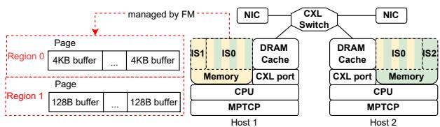  
Figure 5: DRack overview and its components

For inter-rack communication, by leveraging SR-IOV, every host in a rack is assigned a virtual NIC (vNIC) for every physical NIC. The sending host splits a flow into multiple subflows with MPTCP. Each subflow is sent by a vNIC. Note that MPTCP is responsible for distributing the data buffers to subflows. The sender notifies every vNIC to trigger DMA by storing the references of the data buffers to the vNIC’s descriptor queue via MMIO. Every vNIC DMA reads the data buffer and sends them across racks. At the receiving rack, each vNIC DMA writes the data into its preallocated receive buffers and stores the references of the received packets in the completion queue in IS2. The receive buffers are uniformly distributed across the memory devices of IS0 to utilize the NIC pool’s capacity. The host owning the vNIC is interrupted, which triggers its kernel (or CPU) to load those references for TCP validation. Similarly, the DRAM cache prefetches and caches large blocks per remote load issued by the kernel, minimizing remote accesses during both TCP validation and computation.

## 4 DRack Dataplane

This section presents the architecture of DRack and its integration with the existing DCN, then the communication protocols for intra-rack and inter-rack data, respectively.

## 4.1 Architecture

DRack changes the traditional multi-tier Clos topology [58] by inserting a CXL interconnect (e.g., CXL fabric) at the edge tier between the hosts and NIC pools, so that every host accesses the NIC pool with its CXL port through the CXL interconnect. As a result, CXL interconnect becomes ToR tier, and the NIC pool become the uplinks of the ToR tier, while the original ToR switches are repurposed as the aggregation tier. Compared to Clos topology (Figure 1(a)), it enables more paths to transfer inter-rack traffic, and the original aggregation tier can be simply eliminated, and the core of the network remains the same.

Figure 1(b) shows an example of the wiring between 2 racks with each hosting 4 hosts using DRack, and the resultant DCN topology. The wiring between racks also applies to a general case. In a pod comprising m racks and n hosts per rack, Each DRack’s NIC pool has n $\mathrm { N I C s } ,$ now there are n uplinks for every pair of racks without uplink oversubscription. Thus, rack 0 has NIC $I D = 0 \sim ( n - 1 )$ , rack 1 has NIC ID = n ∼ (2n − 1), and rack m − 1 has NIC $I D = ( m - 1 ) n \sim ( m n - 1 )$ As explained, the original ToR switches become aggregated switches in DRack, there are m aggregated switches with $I D = 0 \sim ( m - 1 )$ . NIC i is linked with the aggregated switch (i mod m), where $0 \leq i < m n$ . For example, when $n = 2 0 , m =$ 10, NICs 0, 10,..., connect to switch 0, NICs 1, 11,..., connect to switch 1, etc.. Similarly, when $n = 2 0 , m = 8$ , NICs 0, 8, $1 6 , . . . ,$ , connect to switch 0, NICs 1, 9, 17,..., connect to switch 1, etc.. We plot the two examples in Appendix (§A.1).

## 4.2 Components

CXL interconnect. DRack assumes the existence of the CXL capabilities below based on standards [25] and existing prototypes [59–61]. The CXL Fabric Manager (FM), a software firmware, is responsible for managing the capabilities: 1) setting the mapping between physical addresses and memory devices, 2) configuring the interleave granularity (e.g., 256B to 16KB). These capabilities are the key to efficiently utilizing the NIC pool’s capacity by leveraging the total bandwidth of the memory devices. FM can run on a host, a CXL switch, or a device. We run FM on a server in the prototype (§6).

Memory Pool. The memory pool is organized as follows. As shown in Figure 5, the memory pool is mapped to a single Fabric physical Address Space (FAS), which includes multiple ISs. FAS is organized as a series of coarse-grained Sections, each with a hugepage size (2 MB). DRack groups a segment of every host’s local memory and possible remote memory devices into memory pool IS0, with the smallest IG (256B) to efficiently balance the user data and memory requests across IS0. Each host groups its remaining local memory segment into a separate IS (ISi, where i denotes the host ID). ISi is used to store latency-critical data structures frequently accessed by host i. For example, the descriptor queues of vNICs are accessed by the host that performs multiple load-/store operations to update descriptors, whereas NICs only perform a single DMA read of them in batches. In our prototype, 12GB of local memory is in IS0, while the remaining 4GB is in ISi.

Each IS is organized as a series of 2 MB huge pages. K consecutive Sections are grouped into a region, K is configurable, and K=512 by default. Note that region is used to co-design with DRAM cache (§5.2) to hide the latency of the memory pool. FM is responsible for page allocation/deallocation. The workflow is as follows.

➀ Every host allocates a Section from FM before accessing it to ensure data isolation. A background kernel daemon applies and manages these Sections using buddy system: Sections from the same region are divides into Buffers of same size, and these Buffers are linked as a list.

➁ Applications at a host apply Buffers from the daemon, which can be used to store application data or as receive buffers for DMA write by NICs. Then, the daemon commits the allocation by removing Buffers from the corresponding list, and creating page table entries (PTE) that map applications’ virtual addresses to Buffers’ fabric addresses.

➂ When an application frees Buffers, it notifies the daemon, which in turn frees the PTEs. To avoid some hosts holding too many free Sections, The daemon periodically deallocates excess free Sections to FM.

NIC pool. Figure 6 shows the structure and metadata of NIC pool. To share the NIC pool between rack hosts, every SRIOV-capable NIC is virtualized into N virtual NICs (vNIC), with each assigned to a host. For example, Intel 82599 NIC can support up to 64 vNICs [62]. Thus, a host can be assigned M vNICs and interacts with each vNIC using standard PCIe I/O primitives: host processors configure each vNIC using memory-mapped I/O (MMIO), vNICs access the host’s data in the memory pool using DMA. However, the vNIC configuration is different by incorporating the memory pool: to interface with a vNIC, host i allocates a dedicated queue pair (virt\_queue) in its ISi, the local memory segment for storing transmission and reception descriptors. For the receive (RX) path, host i allocates RX buffers uniformly across IS0, minimizing contention at a single memory device and posts RX descriptors to the RX virt\_queue prior to actual DMA writes by vNIC. Similarly, for the transmit (TX) path, the host allocates TX buffers uniformly across the IS0, populates the TX descriptors with references to consecutive buffers’ addresses, and stores them in the TX virt\_queue. This maximizes the NIC pool throughput when the vNIC performs DMA reads during TX. Each host always uses all NICs in the pool for TX and RX, and balances loading between NICs with a multi-path control (see §4.3).

## 4.3 Communication

Intra-rack Communication. DRack’s intra-rack communication is based on CXL.mem load and store, a pass-byreference semantics, which reduces the communication time by eliminating data copies in ToR-centric racks. We assume each host has a unique ID (e.g., IP). The communication involves transferring a reference to data in the memory pool from host $I D _ { s r c }$ to host $I D _ { d s t } .$ , so that host $I D _ { d s t }$ can load/store it. To transfer a reference, $I D _ { s r c } \mathrm { ^ { * } s }$ processor stores a descriptor in $I D _ { d s t } \mathbf { \vec { s } } \mathtt { r e f } .$ \_queue, with each entry containing $I D _ { d s t } , I D _ { s r c } ,$ a reference, and the length it references. A $I D _ { d s t }$ allocates a separate ref\_queue for every $I D _ { s r c }$ , denoted by ref\_queue $[ I D _ { s r c } ]$ , to separate descriptors from different hosts, thus each host needs M-1 ref\_queues for a rack size of M. Assuming the application has already updated data Buffers using load/- store during computation. Figure 6 summarizes the workflow of an intra-rack communication between $I D _ { s r c }$ and $I D _ { d s t }$

➀ $I D _ { s r c }$ stores the descriptor into the tail entry of $I D _ { d s t } \mathrm { ' s }$ ref\_queue $[ I D _ { s r c } ]$ , where each queue is implemented as a circular buffer. Each queue is associated with context registers mapped to the FAS, such as tail pointer, and $I D _ { s r c }$ stores to these registers will trigger a $I D _ { d s t } \mathrm { ' s }$ interrupt.

➁ After receiving an interrupt, $I D _ { d s t } { ' } \mathrm { { s } }$ runtime loads the head entry of ref\_queue $[ I D _ { s r c } ]$ , and invokes TCP stack and application to validate flow reliability and compute with the references sequentially. Note that DRAM cache fetches and cache data from IS0 with a large block size (i.e.128B to 4KB) to reduce future remote access (§5.2). The pass-by-reference transfer is realized in Linux and transparent to applications with socket programming model (§5.1).

Inter-rack communication. DRack relies on PCIe I/O primitives (MMIO and DMA) to interact with the NIC pool for inter-rack communication. This design is simple and efficient, as it does not require new hardware support compared to previous works [63–65]. To schedule a data stream between NICs, every host scatters it between all vNICs on a packet basis, so that the NIC pool is utilized fairly for all hosts. However, it may lead to out-of-order packet arrivals, thus underutilizing the NIC pool due to the core network path asymmetry [66–68]. To address it, we exploit MPTCP in existing kernel [69, 70], which can open multiple subflows with each bounding to a vNIC. The receiving host resequences subflows and provides network feedback to the sender, which rebalances the load based on path conditions [69,71]. Figure 6 shows the inter-rack communication workflow.

➂ When a $I D _ { s r c }$ has the TX Buffers and TX virt\_queues ready, $I D _ { s r c } \mathrm { ^ { * } s }$ processor rings the doorbells of all vNICs via CXL stores to the MMIO registers. All DMA engines of the vNIC then fetch data from the TX Buffers based on descriptors in their corresponding TX virt\_queue, and perform packetizing. Data Buffers are interleaved in the memory pool to use the NIC pool at full capacity, and the descriptors distributed to those TX virt\_queues are decided by MPTCP.

➃ The packet stream intended for $I D _ { d s t }$ should be received by all vNICs of $I D _ { d s t }$ uniformly. Each vNIC DMA engine directly writes the payload to the RX Buffers specified by the descriptors in the RX virt\_queue. The $I D _ { d s t }$ is interrupted by the vNIC via the message signaled interrupts mechanism of PCIe as soon as the DMA engine finishes a batch of the DMA writes. The $I D _ { d s t } \ ' { \ : }$ s TCP stack loads the references from all RX virt\_queues with CXL.mem, and validates the reliability of each subflow by loading the referenced packets’ headers. After validation, the application loads and stores Buffers during computations. The DRAM cache caches previously accessed blocks and is checked before every load to IS0. Discussion. DRack employs MPTCP to evenly distribute subflows between vNICs. However, this can incur performance overhead when the number of NICs increases. This is because the number of subflows increases with the number of pooled NICs. Each subflow requires separate interrupts, MMIO operations, and kernel processing of subflows merging. However, CPU cores (typically exceeding pooled NIC counts) remain underutilized during bulk data synchronization/shuffling, enabling sufficient cores for NIC pool operations.

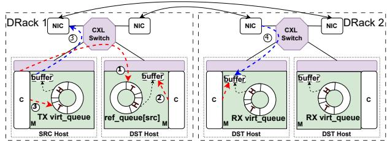  
Figure 6: The inter-rack(3,4) and intra-rack(1,2) communication from the SRC host to the DST host. Red and blue lines are memory load/store and DMA read/write, respectively.

## 5 System Support

## 5.1 Software Runtime

To enable socket-based applications to use pass-by-reference transparently, a driver below TCP/IP stack acts as an indirection to orchestrate inter-/intra-rack communication with pass-by-reference. The TCP/IP stack operates on the socket buffer object (sk\_buff), which includes a data field that contains the reference to the actual data. The data can be headers or payloads of packets, located in the memory pool. For performance consideration, the TCP/IP stack uses the write-around cache policy for Buffers so that data is directly written/updated in memory without bringing them to the cache first.

We show a runtime workflow with an example. ➀ A socketbased application of a host $I D _ { s r c }$ allocates the Buffers in memory pool and populates them with application data, before calling the send to initiate communication. ➁ The TCP stack passes a scatter-gather list of sk\_buffs wrapped with those Buffers’ references to the driver by calling ndo\_tx, where ndo is the network device operators exposed to the TCP stack by the driver. The first element in the list is a pointer to a kernel Buffer storing the packet’s header (also in memory pool), and the following elements are pointers to application Buffers. ➂ The driver stores the references of sk\_buffs to the intended virt\_queue of a vNIC (mainstream NICs support scatter-gather I/O) or a ref\_queue for inter- or intra-rack communication, respectively. For inter-rack communication, the vNIC traverses the list and DMAs data without local-topool copies.

$I D _ { d s t }$ is interrupted to read virt\_queues or ref\_queue whenever a batch of new references is available, which is handled by its driver. To enable TCP stack to load the referenced data Buffers in the memory pool, $I D _ { d s t }$ wraps the references into sk\_buffs before passing it up to the TCP stack, still no data copy involved. When the TCP stack no longer uses those Buffers, it hands the Buffer to the daemon for deallocation. Discussion. Cache coherence is needed if $I D _ { s r c }$ and $I D _ { d s t }$ use memory sharing for intra-rack communication. However, DRack focuses on the case where applications use messagepassing for large data synchronization, simultaneous data accessing between $I D _ { s r c }$ and $I D _ { d s t }$ is unnecessary, thus no sharing issues. If $| I D _ { s r c }$ stores new data to the location of the previously sent Buffer after calling the send API, $I D _ { s r c } \mathrm { ^ { * } s }$ TCP stack releases ownership of the sending Buffer, allocates new Buffers from the memory pool, and updates page tables for subsequent stores.

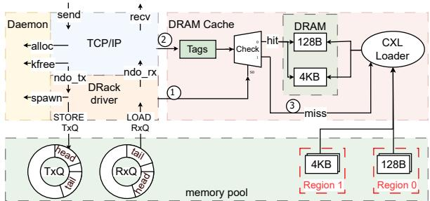  
Figure 7: DRAM cache’s architecture and working flow.

## 5.2 CXL-attached DRAM Cache.

By analyzing the TCP stack, we summarize the three key points to guide the DRAM cache design. 1) Variable time interval between accessing headers and payloads. The runtime processes packet headers and data during the bottom half of the interrupt, and the recv syscall, respectively. Therefore, there will be a time interval between the two, where the interval length is determined by the utilization rate of the CPU, and the data can be evicted out of the cache. 2) Buffer release function is explicitly called. the runtime will flush the Buffer out of the cache once it calls release function explicitly, 3) Variable packet granularity. The packet size may be thousands of or dozens of bytes, like TCP SYN and ACK. Caching data with coarse granularity leads to a low cache utilization rate and prolongs the latency, thus different caching granularities should be adopted.

As shown in Figure 7, we add a multi-way DRAM cache to the system. It has a larger capacity compared to CPU caches, which is sufficient to tackle the potential false evictions caused by conflicts during variable intervals. The metadata (Tags) is stored separately in the on-chip memory, so that one read can get the whole set’s metadata. This cache space can be divided into n parts, each of which uses a different cache granularity (e.g., 128B and 4KB in Figure 7), and the capacity of each part is different, but the total number of lines is the same. The usage of DRAM cache can be summarized as follows. ➀ The driver configures the FAS of a region – a consecutive number of Sections, whose Buffers will be cached in one part of DRAM cache, and the caching granularity, i.e., Buffer size. For the first access to a Buffer in the Region➁, a miss is triggered and the Buffer is fetched from the memory pool via CXL.io ➂. Then, the DRAM cache fills valid metadata and evicts the victim Buffer. The following accesses to the Buffer➁ will hit the local DRAM cache. When the runtime decides to free Buffers, it will explicitly called the release function that flushes the DRAM cache.

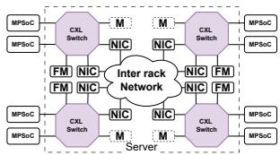

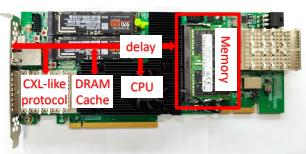  
(a) The software emulator running (b) key hardware components in on the server Customized MPSoC FPGA

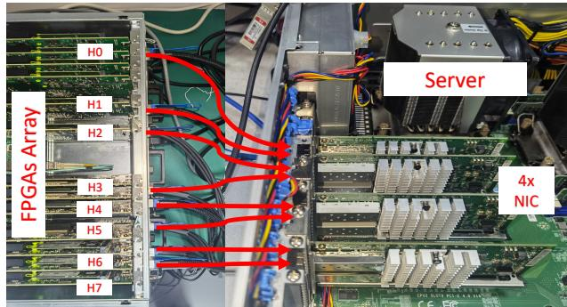  
(c) Quad-rack simulating platform with 8-FPGAs array

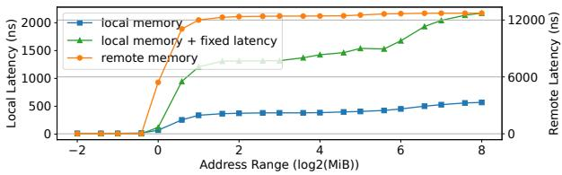  
(d) The memory access latency with/without added delay  
Figure 8: The proof-of-concept prototype to evaluate DRack.

## 6 Implementation

Given the lack of commercial products supporting CXL 3.0, we have developed a proof-of-concept quad-rack system prototype, as shown in Figure 8(c). The prototype is used to simulate both a quad-rack DRack architecture and a quad-rack ToR-centric architecture as the baseline (§7.1). Each rack is equipped with two customized MPSoC FPGAs [72] serving as hosts. Each FPGA has a quad-core CPU, two memory channels, and four optical fiber ports. The MPSoC exports the CPU memory bus to FPGA logic via HP/HPC ports, which can be used to implement a CXL-like load/store. We connect two FPGAs (in a rack) to a dual-port NIC [62] on a server. We emulate the NIC pool, CXL interconnect in DRack, and ToR switches in the baseline using a DPDK-based software network emulator on the server [73].

CXL-like protocol layer. The key to emulating CXL fabric in CXL 3.0 is to externalize loads and stores. This allows applications to access remote memory devices within the memory pool transparently, enabling the seamless execution of legacy applications. To this end, we leveraged DoCE [32], a hardware protocol stack as the basis of our CXL-like protocol layer. DoCE directly encapsulates all AMBA AXI on-chip interconnect signals within an Ethernet frame which can be delivered via standard Ethernet infrastructure. Instead of packing AXI signals into Ethernet packets with DoCE, we augmented DoCE with a CXL-like protocol layer and implemented them as a hardware module in the MPSoC FPGA (i.e., CXL-DoCE). As shown in Figure 8(b), it transforms AXI signals into relevant CXL transactions, such as MemRd, MemWr, Cmp, and MemData defined in CXL 3.0 specification [25], before encapsulating CXL transactions into Ethernet packets and sending them via an optical fiber port. Similarly, any received Ethernet packet from the port would go through the module, which transforms it into AXI signals to access the local address space if that packet contains CXL-like transactions. Note that an Ethernet packet can encapsulate transactions not limited to CXL-like as long as the module can recognize them, e.g., the module can interrupt the CPU if the Ethernet packet carries an interrupt transaction.

Memory and NIC pool. We use the local memory in all MPSoCs (16 GB) to form a shared memory pool. Any MPSoC can access it with the above CXL-like protocols. Following the design, we divide the local memory of every MPSoC into two parts, 12GB joins an interleave set with 256B granularity, the other 4GB does not interleave with others, so that virt\_queues and sk\_bu f used can be stored locally. To emulate NIC pool in the server (Figure 8(a)), we use one core to manage a software queue to emulate a vNIC. The server’s core can load/store a vNIC’s virt\_queue or DMA read/write data by issuing CXL-DoCE packets via the real NIC. We use inter-processor interrupt (IPI) to forward the packet “across rack” to another CPU core (a vNIC in the other NIC pool).

Example. Here is an example showing the memory pool accessing in the prototype with CXL-like protocol layer. ➀ In a rack with MPSoC0 and MPSoC1, suppose MPSoC0 HP port exports CPU load/store instructions as AXI signals, an address decoder implemented in the FPGA uses the 8th bit of the physical address (IG=256B) to decide the target memory device. If bit 8 is 0, memory requests target MPSoC0’s memory; otherwise, they target MPSoC1’s one. ➁ Recall, to issue requests to the MPSoC1, MPSoC0 leverages CXL-DoCE to transform AXI signals into CXL transactions, e.g., MemRd, and prepend them with an Ethernet header (containing MAC addresses of both endpoints). Then, it sends them via on optical fiber port. ➂ As shown in Figure 8(b), the server (network emulator) receives these Ethernet packets via optical fiber links at its physical NICs, and routes them directly to MP-SoC1 based on MACs. ➃ MPSoC1 receives Ethernet packets from the optical fiber port, and transforms them into AXI signals with CXL-DoCE, to access the local address space. Appendix §A.3 shows an example of NIC pool accesses.

Compared to existing emulation approaches. Due to scarcity of CXL hardware, prior works have employed 3 emulation approaches. ➀ NUMA nodes. CPUs load/store remote node’s memory is emulated as accessing CXL memory [28, 31, 74]. However, this cannot adjust CXL memory latency, and its scalability is limited by the node count. ➁ Software simulator [75, 76], like Gem5 in full-system mode [77], is thousands of times slower than real prototypes, unable to simulate full application execution. ➂ FPGA-based implementation [53, 60, 78], has the flexibility to implement CXL protocols [60, 72], and run real applications transparently. However, FPGA has a lower operating frequency compared to ASICs [53]. ➃ Our approach. We utilize the flexibility of MPSoC-FPGAs to realize CXL-like protocols for resource pooling and running real applications. To run distributed applications at scale and test them in various settings, we use software-based emulation for flexible configurations of NIC pool, CXL interconnects, and inter-rack network topology. To rigorously validate DRack performance gain with low frequency in FPGA, we focus on accurately replicating local/remote memory access latency ratios rather than absolute metrics, which aligns with prior FPGA-based emulation [60]. The ratio configurations are explained in §7.1.

Table 1: Key parameters of the two prototypes.
<table><tr><td rowspan=1 colspan=1>Parameter</td><td rowspan=1 colspan=1>Value</td></tr><tr><td rowspan=1 colspan=1></td><td rowspan=1 colspan=1>DRack</td></tr><tr><td rowspan=1 colspan=1>Memory Pool</td><td rowspan=1 colspan=1>2 ×16 GB; remote 13 μs;local 2.2 μs</td></tr><tr><td rowspan=1 colspan=1>NIC pool</td><td rowspan=1 colspan=1>2×BGbps (2 NICs)</td></tr><tr><td rowspan=1 colspan=1>Host</td><td rowspan=1 colspan=1>1 GB DRAM Cache; 1 CXL port;</td></tr><tr><td rowspan=1 colspan=2>ToRack</td></tr><tr><td rowspan=1 colspan=1>ToR Switch</td><td rowspan=1 colspan=1>2B Gbps Uplink (no oversubscription)256 KB headroom per port [79-81]</td></tr><tr><td rowspan=1 colspan=1>Host</td><td rowspan=1 colspan=1>B Gbps NIC; 16GB memory</td></tr><tr><td rowspan=1 colspan=2>Common</td></tr><tr><td rowspan=1 colspan=1>Inter-rackNetwork RTT</td><td rowspan=1 colspan=1>60 μs [82]</td></tr><tr><td rowspan=1 colspan=1>CPU</td><td rowspan=1 colspan=1>4-core ARM A53 CPU; 1.2 GHz</td></tr><tr><td rowspan=1 colspan=1>TCP/IP</td><td rowspan=1 colspan=1>MTU4 KB; XPS,RPS enabled</td></tr></table>

## 7 Evaluations

We first evaluated DRack’s performance gain over the conventional ToR-based rack using the proof-of-concept prototype with both real-world applications (§7.2), and microbenchmarks (see Appendix §A.4). Second, we show DRack can improve existing job schedulers (§7.3). Last, we breakdown the performance contribution of every key components (§7.4).

## 7.1 Experiments Setup

We evaluate the quad rack DRack proof-of-concept prototype (§6), and use the same implementation to build baseline systems for comparison. By default, each rack has two hosts for both. We use ToRack to denote the baseline system—quad ToR-based racks architecture. Table 1 summarizes the parameters and configuration in experiments. The memory pool of DRack is composed of the local memory of MPSoCs. For

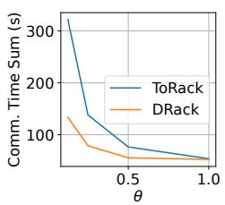  
(a) PageRank

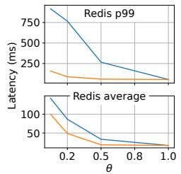  
(b) Key-Value Store

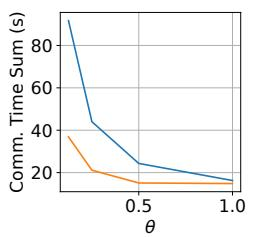

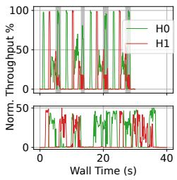

(c) Resnet Training  
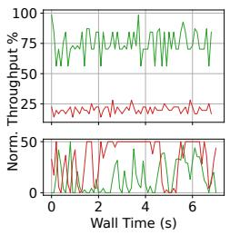  
(f) PageRank

(g) Key-Value Store  
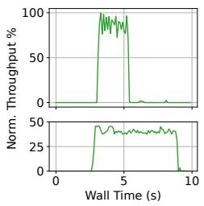  
(h) Resnet Training

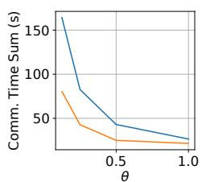  
(d) LLM Training

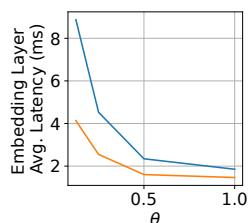  
(e) DLRM Inference

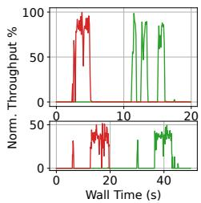  
(i) LLM Training

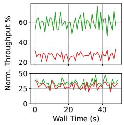  
(j) DLRM Inference

Figure 9: (a)-(e) DRack’s performance gain comapred to ToRack with the increase on every NIC capacity (θ from 0 to 1). (f)-(j) Compared to ToRack (bottom), hosts in DRack (top) can utilize the NIC pool capacity to reduce the communication time.  
Table 2: Real-world Applications used for DRack evaluation.
<table><tr><td rowspan=1 colspan=1>Application</td><td rowspan=1 colspan=1>Dataset</td></tr><tr><td rowspan=1 colspan=1>GeminiGraph [83]</td><td rowspan=1 colspan=1>LiveJournal [84]</td></tr><tr><td rowspan=1 colspan=1>Redis Cluster [85] andMemtier_benchmark [86]</td><td rowspan=1 colspan=1>Uniform Distribution</td></tr><tr><td rowspan=1 colspan=1>ResNet18 [87] Training</td><td rowspan=1 colspan=1>CIFAR-10 dataset [88]</td></tr><tr><td rowspan=1 colspan=1>TinyStories-33M[89] Training</td><td rowspan=1 colspan=1>TinyStories</td></tr><tr><td rowspan=1 colspan=1>MapReduce [90] WordCount</td><td rowspan=1 colspan=1>Uniform Distribution</td></tr><tr><td rowspan=1 colspan=1>DLRM[91] Inference</td><td rowspan=1 colspan=1>Criteo_dataset [92]</td></tr></table>

ToRack, we ported an example project [93] to our MPSoC FPGA, where the CPU uses one optical fiber port as a NIC. We set Ethernet link latency in network emulator 60µs [82].

Latency alignments. To align the latency ratio (R) between accessing local $( D _ { l o c a l } )$ and remote memory $( D _ { c x l } )$ with CXL, as shown in Figure 8(b), we add a hardware module on MP-SoC FPGAs to add configurable cycles (λ) to local memory accessing from CPUs, such that $\begin{array} { r } { R = \frac { D _ { c x l } } { D _ { l o c a l } + \lambda / c p u _ { - } f r e q } } \end{array}$ . According to the theoretical latency specified in CXL-related standards [25, 94], accessing the remote memory through a CXL switch is expected to add 170 to 270 ns to the local memory latency. Assuming that the local memory latency is between 50 and 100 ns, the resulting ratio should fall within 2.7 to 6.4. The real measurements of the two latencies align with this range [53]. To illustrate the minimal performance gain achieved by DRack, we configured the latency ratio R = 6.4, thus adopting the maximum remote latency. In Figure 8(d), we increase the size of the data array running pointer chasing with Lmbench [95], until accessing it triggers a cache miss, i.e., when the data array size is 256 MB and use the resulted $D _ { l o c a l }$ and $D _ { c x l }$ to compute λ = 460.

Throughput alignments. The capacity of the emulated NIC pool depends on the maximum achievable throughput of the hosts in the rack, governed by the capabilities of the CPU in the MPSoC. This is because the FPGA NIC (i.e., optical fiber port) is not the bottleneck [93], i.e., the maximum achievable throughput of an MPSoC CPU, denoted by C, cannot saturate the NIC. Thus, the emulated NIC capacity of a host can be set to C at most, as the MPSoC CPU cannot utilize the capacity exceeding C. To emulate the NIC egress/ingress bottleneck in the communication stage, we introduce a reducing factor θ, thus the NIC capacity is adjusted as $\theta \times C .$ . As the NIC pool is built from existing NICs of the hosts in a rack, to have a fair comparison, the equivalent DRack’s NIC capacity is $B = \Theta \times 2 C$ for 2-host rack. We measure C by sending raw packets to the optical fiber port with DPDK.

## 7.2 Real-world Applications

We validate the performance gain of DRack compared to ToRack with real applications with various communication properties, as shown in Table 2.

## 7.2.1 Throughput-sensitive Applications

Graph Processing. We run several graph workloads in a distributed graph engine, Gemini [83], over DRack and ToRack. To execute it, we divided the input datasets among the hosts of 4 racks (8 hosts), each subgraph dataset is incrementally fed to a host’s graph engine in batches. For every batch or iteration, hosts run different analytics over the input subgraph and update it iteratively. As the subgraph processed by every host is different, the amount of data for graph synchronization for every host can be very different, thus necessitating different bandwidths. We summarize the communication time of graph synchronization for PageRank, one of the graph workloads, in Figure 9(a). DRack reduces the communication time by an average of 58.5% in the worst case (θ=0.125), and 32.8% in all cases. When the host throughput is eventually limited by the maximum achievable throughput or MPSoC CPU capability (θ=1), any DRack’s host cannot efficiently utilize the NIC pool, thus resulting in a similar performance to ToRack’s. To show the root cause of DRack’s performance gain, we present network utilization of one rack normalized to the NIC pool, sampled during one run of PageRank in Figure 9(f). Hosts finish iterating and updating their subgraph, e.g., vertices and edges, asynchronously. This is because hosts process subgraphs with varying sizes, leading to different computation times and thus varying amounts of data for communication. Thus, one host may use the NIC pool exclusively during the synchronization stages. Besides, in the time interval with shadowing in Figure 9(f), two hosts can share the NIC pool based on the volume of flows, while the overall utilization is close to 1.

ML Training. We train ResNet18 and TinyStories-33M with all-reduce [96] and parameter server (PS) [97], the two well-known distributed training architectures based on data parallelism. For all-reduce, each host of eight sends its gradient to its right neighbor, while receiving other gradients from its left neighbor during communication stage. For PS, we have 4 hosts as parameter servers, while the others are workers. Every worker sends 1/4 of its gradients to every PS for synchronization and then receives globally-aggregated ones during communication. We summarize the communication time when running ML jobs over DRack and ToRack, respectively, and show the results in Figure 9(c) 9(d). For ResNet training, DRack reduces the communication time by 59.8% and an average of 39.6% in the worst and all cases, respectively. For LLM training, DRack reduces the communication time by an average of 39.9%. This is because 1) for all-reduce, only one host sends/receives data across racks, thus DRack achieves higher inter-rack throughput by allocating the NIC pool capacity to that host, while ToRack’s inter-rack throughput is limited by the host’s NIC (Figure 9(h)). 2) for PS, Since workers and PSs send and receive data in an interleaved manner – specifically, when workers are sending, PSs are receiving, and vice versa – either can fully utilize the NIC pool over different phases (Figure 9(i)). 3) DRack achieves a high intra-rack throughput with pass-by-reference by removing one data copy compared to ToRack.

## 7.2.2 Latency-sensitive Applications

Key-value Store. We organize three racks to form a Redis Cluster and run clients on the remaining hosts to issue Get/Set requests. We set up the experiment as: 1) synthetic workload generated by Memtier\_benchmark, 2) a 10:1 Get/Set ratio, and 3) 10 M key-value pairs uniformly distributed across 3 racks, 4) a Gaussian query key distribution. We plot the average and tail latency (i.e., 99th percentile) of the requests in Figure 9(b). Because of the key skewness, the host in ToRack with hot keys can be congested by imbalanced requests, i.e., incast, at its downlink, leading to packet losses and large tail latency. In contrast, DRack reduces p99 and average latency by 62.2% and 29.2%, respectively. This is because a host with hot keys can utilize the NICs of other hosts within the same rack, which have cold keys. The incast requests are then efficiently absorbed by the memory pool without any loss. Subsequently, the host processes these requests using CXL.mem. Similarly, a hot host can send the corresponding values with the NIC pool. The allocated bandwidth from the NIC pool is proportional to the number of requests/flows that the host is serving, while the hot host in ToRack can only use its limited local NIC (Figure 9(g)).

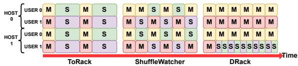  
(a) Workflow of MapReduce tasks.

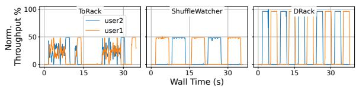  
(b) Throughput of shuffling data.

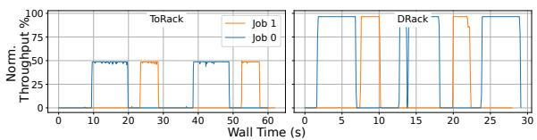  
(c) NIC pool improve comm. throughput.  
Figure 10: DRack improves job schedulers’ performance.

DLRM Inference. We run a deep learning recommendation model (DLRM [91]) inference task that embedding tables are uniformly distributed across 8 hosts. We plot the average latency of embedding layer processing in Figure 9(e). Because of frequent access to hot vectors, the traffic load at each NIC within the same rack is imbalanced in ToRack that network congestion leads to higher latency and reduced throughput. DRack reduces average latency by an average of 37.4% in all cases, as the NIC pool’s bandwidth is proportional to the hot vectors the host stored, as shown in Figure 9(j).

## 7.3 User Cases

To show the performance gain if existing job schedulers use DRack for the job communication stage, we emulate two user cases (§2.4), ShuffleWatcher [27] and Crux [26].

ShuffleWatcher. Figure 10(a) shows that two users of the same priority issue a series of MapReduce jobs, each comprising 2 map and 2 reduce tasks. The map and reduce tasks are placed in racks 0 and 1, respectively. Assuming there are 2 hosts in rack 0, each with 2 cores, each user rents 1 core per host to run a mapper and shuffler, iteratively. The shuffler begins after the mapper finishes, and then sends the mapper’s intermediate output to the reducer in rack 1. All mappers generate intermediate data of equal size. In ToRack without any scheduler, the shuffling tasks of the two users send data to

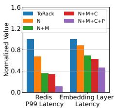

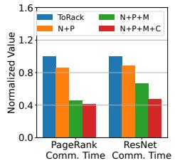  
(a) Perf. breakdown latency-sensitive APPs.  
on (b) Perf. breakdown on throughput-sensitive APPs

Figure 11: Key designs’ impact on DRack’s performance. the reducers simultaneously, increasing the average shuffling time. With ShuffleWatcher, the two users use the host’s NIC to shuffle data alternately (Figure 10(b)). Specifically, user 2 delays its shuffling if user 1 occupies the NIC, while scheduling another map task to reuse the CPU left by shuffling, thus reducing the average shuffling time by half. In DRack, a single CPU of a host can use the NIC pool to send each shuffling task, increasing CPU utilization and reducing the average shuffling time. Although DRack takes the same time as ShuffleWatcher to complete the same number of shuffling tasks (10 in Figure 10(a)), DRack frees up more cores for additional map tasks, improving overall throughput by 20.8%.

Crux. We evaluated Crux on DRack with 3 jobs. Each rack has two hosts. Job 0 (ResNet50 training) spans 4 hosts across 4 racks, while jobs 1 and 2 (ResNet18 training) each span 2 hosts across 2 racks. DRack utilizes the priority flow control function in the optical fiber port IP to throttle the throughput of low-priority hosts (or MPSoC). When high-priority hosts are scheduled by Crux, the network emulator sends a pause packet to the low-priority job’s host, causing its hardware IP to cease packet transmission. As shown in Figures 10(c), when running Crux in ToRack, the communication time for job 0 is suboptimal, as it cannot leverage the NICs of jobs 1 and 2’s hosts, even if they are deprioritized and halted by Crux. In contrast, DRack enables job 0 to leverage the NICs of hosts assigned to lower-priority jobs, thereby reducing communication time by 47.7%. Once job 0’s communication stage is completed and job 1 ascends to the highest priority, its communication can be accelerated by 49.5% with the NIC pool, including NICs from job 0’s hosts.

## 7.4 Performance breakdown

We introduce several key components, including the NIC pool, memory pool, DRAM cache, and MPTCP, to build an efficient DRack. To determine the performance contribution of each component, we incrementally add these components one by one, starting from ToRack. We then evaluate the performance gains of each incremental addition using two latency-sensitive and two throughput-sensitive applications.

As shown in Figure 11(a), for latency-critical Redis, by forming a NIC pool with existing NICs from ToRack, when equipped with only the NIC pool (denoted as DRack-N), reduces tail latency by 32.9%. This reduction is attributed to the fact that hot-key requests are received by the NIC pool, distributively between the NICs. They are first buffered in the NIC pool’s headroom before being transferred to the host’s local memory with the CXL link. Thus, compared to the case in ToRack, where hot-key requests are received solely by the NIC of the host, DRack has twice the headroom (2 NICs) for buffering those requests, significantly reducing packet loss. By augmenting the memory pool to DRack-N (DRack-N+M), the packet loss is further reduced, resulting in 63.9% P99 latency reduction. The DRAM cache (DRack-N+M+C) fails to reduce the latency further because searching and reading key-value pairs is random memory access that lacks locality (DRAM cache hit rate 59.6%). MPTCP reduces the latency further by 65.9% (DRack-N+M+C+P). This is because a bursty flow is fixed to a single NIC, resulting in imbalanced utilization of NICs. By splitting it into multiple subflows, with each directing to a NIC, MPTCP further reduces the burstiness of the flow and flow collision. The observation is similar for DLRM inference as shown in Figure 11(a).

As shown in Figure 11(b), for data-intensive ResNet training and PageRank, by using the NIC pool and MPTCP (DRack-N+P), the communication time is reduced by an average of 12.7%, as cross-rack traffic can be sent via 2 NICs. However, the throughput is limited by the local memory (or CXL link) bandwidth, thus preventing full utilization of the NIC pool. With an increasing memory bandwidth from the memory pool (DRack-N+P+M), the communication time is reduced by an average of 38.1%. By introducing a DRAM cache (DRack-N+P+M+C), the communication time is reduced by 28.6% for ResNet training. This improvement is due to the DRAM cache that exploits the spatial locality of memory accessing in TCP stack and model computation, achieving hit rates exceeding 86.9%. While DRAM cache only reduces PageRank’s communication time by 9.9%, its gain is limited by a cache hit rate of only 56.2%, caused by the irregular memory accessing.

## 8 Conclusion

We present DRack, a novel rack architecture that provides high inter-rack bandwidth and network utilization with a NIC pool, and optimizes its efficiency with several novel designs such as a shared memory pool, DRAM Cache, and MPTCP. We built a quad-rack prototype and validated its performance with both microbenchmarks and real applications.

## Acknowledgments

We would like to thank our shepherd, Prof. Kang Chen, and the anonymous reviewers for their valuable feedback in improving the paper. The work was supported in part by the National Key Research and Development Plan of China (No. 2022YFB4500400), National Natural Science Foundation of China (No. 62072439, No. 62302268), the Natural Science Foundation of Shandong Province (No. 2023HWYQ-045, No. ZR2023QF060), and the Taishan Scholar Project of Shandong Province (No. tsqn202312051). Ke Liu is the corresponding author (liuke@ict.ac.cn).

## References

[1] G. Malewicz et al. Pregel: a system for large-scale graph processing. In Proceedings of the 2010 ACM SIGMOD International Conference on Management of Data, 2010.

[2] J. Dean and S. Ghemawat. Mapreduce: simplified data processing on large clusters. Commun. ACM, jan 2008.

[3] W. Liu et al. A survey of deep neural network architectures and their applications. Neurocomputing, 234:11–26, 2017.

[4] L. G. Valiant. A bridging model for parallel computation. Commun. ACM, aug 1990.

[5] A. Roy et al. Inside the social network’s (datacenter) network. SIGCOMM Comput. Commun. Rev., 45(4):123–137, August 2015.

[6] Y. Jiang et al. A unified architecture for accelerating distributed DNN training in heterogeneous GPU/CPU clusters. In 14th USENIX Symposium on Operating Systems Design and Implementation (OSDI 20), pp. 463–479, November 2020.

[7] Z. Jia et al. A distributed multi-gpu system for fast graph processing. Proc. VLDB Endow., 11(3):297–310, November 2017.

[8] N. Engelhardt and H. K.-H. So. Gravf: A vertexcentric distributed graph processing framework on fpgas. In 2016 26th International Conference on Field Programmable Logic and Applications (FPL), pp. 1–4, 2016.

[9] X. Han et al. Isolated scheduling for distributed training tasks in gpu clusters, 2023.

[10] K. Qian et al. Alibaba hpn: A data center network for large language model training. In Proceedings of the ACM SIGCOMM 2024 Conference, pp. 691–706, 2024.

[11] J. Dong et al. Eflops: Algorithm and system co-design for a high performance distributed training platform. In 2020 IEEE International Symposium on High Performance Computer Architecture (HPCA), 2020.

[12] W. Wang et al. RDC: Energy-Efficient data center network congestion relief with topological reconfigurability at the edge. In 19th USENIX Symposium on Networked Systems Design and Implementation (NSDI 22), pp. 1267–1288, 2022.

[13] X. Zhou et al. Mirror mirror on the ceiling: flexible wireless links for data centers. SIGCOMM Comput. Commun. Rev., 42(4):443–454, August 2012.

[14] H. Liu et al. Circuit switching under the radar with REACToR. In 11th USENIX Symposium on Networked Systems Design and Implementation (NSDI 14), pp. 1– 15, April 2014.

[15] M. Zaharia et al. Delay scheduling: a simple technique for achieving locality and fairness in cluster scheduling. In Proceedings of the 5th European Conference on Computer Systems, EuroSys ’10, pp. 265–278, 2010.

[16] M. Isard et al. Quincy: fair scheduling for distributed computing clusters. In Proceedings of the ACM SIGOPS 22nd Symposium on Operating Systems Principles, SOSP ’09, pp. 261–276, 2009.

[17] F. R. Dogar et al. Decentralized task-aware scheduling for data center networks. SIGCOMM Comput. Commun. Rev., 44(4):431–442, August 2014.

[18] M. Chowdhury et al. Efficient coflow scheduling with varys. SIGCOMM Comput. Commun. Rev., 44(4):443–454, August 2014.

[19] H. Zhao et al. HiveD: Sharing a GPU cluster for deep learning with guarantees. In 14th USENIX Symposium on Operating Systems Design and Implementation (OSDI 20), pp. 515–532, November 2020.

[20] Y. Zhao et al. Multi-resource interleaving for deep learning training. In Proceedings of the ACM SIG-COMM 2022 Conference, pp. 428–440, 2022.

[21] Y. Jiang et al. A unified architecture for accelerating distributed DNN training in heterogeneous GPU/CPU clusters. In 14th USENIX Symposium on Operating Systems Design and Implementation (OSDI 20), November 2020.

[22] D. Zang et al. Decentralized nic-switching architecture using sr-iov pci express network device. IEEE Micro, 2014.

[23] C.-C. Tu et al. Secure i/o device sharing among virtual machines on multiple hosts. In Proceedings of the 40th Annual International Symposium on Computer Architecture, 2013.

[24] C.-C. Tu et al. Marlin: A memory-based rack area network. In 2014 ACM/IEEE Symposium on Architectures for Networking and Communications Systems (ANCS), 2014.

[25] D. D. Sharma et al. An introduction to the compute express link (cxl) interconnect. arXiv preprint arXiv:2306.11227, 2023.

[26] J. Cao et al. Crux: Gpu-efficient communication scheduling for deep learning training. In Proceedings

of the ACM SIGCOMM 2024 Conference, pp. 1–15, 2024.

[27] F. Ahmad et al. ShuffleWatcher: Shuffle-aware scheduling in multi-tenant MapReduce clusters. In 2014 USENIX Annual Technical Conference (USENIX ATC 14), pp. 1–13, June 2014.

[28] H. N. Schuh et al. Cc-nic: a cache-coherent interface to the nic. In Proceedings of the 29th ACM International Conference on Architectural Support for Programming Languages and Operating Systems, Volume 1, pp. 52– 68, New York, 2024. ACM.

[29] A. Cho et al. A case for cxl-centric server processors, 2023.

[30] R. Abdullah et al. Salus: Efficient security support for cxl-expanded gpu memory. In 2024 IEEE International Symposium on High-Performance Computer Architecture (HPCA), pp. 1–15, Piscataway, 2024. IEEE.

[31] H. A. Maruf et al. Tpp: Transparent page placement for cxl-enabled tiered-memory. In Proceedings of the 28th ACM International Conference on Architectural Support for Programming Languages and Operating Systems, Volume 3, pp. 742–755, New York, 2023. ACM.

[32] Y. Chang et al. DoCE: Direct extension of on-chip interconnects over converged ethernet for rack-scale memory sharing. In Proc. Workshop on Emerging Technologies for software-defined and reconfigurable hardware-accelerated Cloud Datacenters (ETCD), 2017.

[33] V. Persico et al. Measuring network throughput in the cloud: The case of amazon ec2. Computer Networks, 93:408–422, 2015. Cloud Networking and Communications II.

[34] S. Shi et al. Towards scalable distributed training of deep learning on public cloud clusters, 2020.

[35] A. Hadoop. Hadoop: Capacity scheduler, 2019.

[36] R. Panigrahy et al. Heuristics for vector bin packing. research. microsoft. com, 2011.

[37] A. Ghodsi et al. Dominant resource fairness: Fair allocation of multiple resource types. In 8th USENIX symposium on networked systems design and implementation (NSDI 11), 2011.

[38] Z. Wang et al. Hi-speed dnn training with espresso: Unleashing the full potential of gradient compression with near-optimal usage strategies. In in European Conference on Computer Systems (EuroSys 23), May 2023.

[39] M. Abadi et al. TensorFlow: Large-Scale Machine Learning on Heterogeneous Distributed Systems. White paper, Google Research, 2015.

[40] A. Agache et al. Increasing datacenter network utilisation with grin. In Proceedings of the 12th USENIX Conference on Networked Systems Design and Implementation, 2015.

[41] T. Benson et al. Network traffic characteristics of data centers in the wild. In Proceedings of the 10th ACM SIGCOMM Conference on Internet Measurement, pp. 267–280, 2010.

[42] T. Benson et al. Understanding data center traffic characteristics. SIGCOMM Comput. Commun. Rev., 40(1):92–99, jan 2010.

[43] C. Delimitrou et al. Echo: Recreating network traffic maps for datacenters with tens of thousands of servers. In 2012 IEEE International Symposium on Workload Characterization (IISWC), pp. 14–24, 2012.

[44] H. Ballani et al. Sirius: A flat datacenter network with nanosecond optical switching. In Proceedings of the Annual conference of the ACM Special Interest Group on Data Communication on the applications, technologies, architectures, and protocols for computer communication, pp. 782–797, 2020.

[45] W. Wang et al. {RDC}:{Energy-Efficient} data center network congestion relief with topological reconfigurability at the edge. In 19th USENIX Symposium on Networked Systems Design and Implementation (NSDI 22), pp. 1267–1288, 2022.

[46] T. White. Hadoop: The definitive guide. 2012.

[47] J. E. Gonzalez et al. Graphx: Graph processing in a distributed dataflow framework. In Proceedings of the 11th USENIX Symposium on Operating Systems Design and Implementation (OSDI ’14), Broomfield, Colorado, October 2014.

[48] A. Guo et al. Software-hardware co-design of heterogeneous smartnic system for recommendation models inference and training. In Proceedings of the 37th ACM International Conference on Supercomputing, ICS ’23, pp. 336–347, 2023.

[49] D. Mudigere et al. Software-hardware co-design for fast and scalable training of deep learning recommendation models. In Proceedings of the 49th Annual International Symposium on Computer Architecture, ISCA ’22, pp. 993–1011, 2022.

[50] M. Adnan et al. Accelerating recommendation system training by leveraging popular choices. Proc. VLDB Endow., 15(1):127–140, September 2021.

[51] Y. Dong et al. High performance network virtualization with sr-iov. Journal of Parallel and Distributed Computing, 2012.

[52] CXL Consortium. Compute Express Link Specification Revision 2.0. https: //www.computeexpresslink.org/downloadthe-specification.

[53] Y. Sun et al. Demystifying cxl memory with genuine cxl-ready systems and devices. In Proceedings of the 56th Annual IEEE/ACM International Symposium on Microarchitecture, pp. 105–121, New York, 2023. ACM.

[54] N. Nassif et al. Sapphire rapids: The next-generation intel xeon scalable processor. In 2022 IEEE International Solid-State Circuits Conference (ISSCC), volume 65, pp. 44–46. IEEE, 2022.

[55] I. Calciu et al. Rethinking Software Runtimes for Disaggregated Memory. In Proc. of ASPLOS, 2021.

[56] Y. Zhong et al. Unimem: Redesigning disaggregated memory within a unified local-remote memory hierarchy. In 2024 USENIX Annual Technical Conference, pp. 463–477, Berkeley, 2024. USENIX Association.

[57] X. Zhang et al. Morpheus: An adaptive dram cache with online granularity adjustment for disaggregated memory. In 2023 IEEE 41st International Conference on Computer Design (ICCD), pp. 134–141, Piscataway, 2023. IEEE.

[58] A. Singh et al. Jupiter rising: A decade of clos topologies and centralized control in google’s datacenter network. In Proceedings of the 2015 ACM Conference on Special Interest Group on Data Communication, pp. 183–197, 2015.

[59] C. Wang et al. Cxl over ethernet: A novel fpga-based memory disaggregation design in data centers. In 2023 IEEE 31st Annual International Symposium on Field-Programmable Custom Computing Machines (FCCM), 2023.

[60] D. Gouk et al. Direct access, High-Performance memory disaggregation with DirectCXL. In 2022 USENIX Annual Technical Conference (USENIX ATC 22), pp. 287–294, 2022.

[61] M. Zhang et al. Partial failure resilient memory management system for (cxl-based) distributed shared memory. In Proceedings of the 29th Symposium on Operating Systems Principles, 2023.

[62] Intel. Intel® 82599eb 10 gigabit ethernet controller. https://ark.intel.com/content/www/

us/en/ark/products/32207/intel-82599eb-10- gigabit-ethernet-controller.html.

[63] Z. Wang et al. Rcmp: Reconstructing rdma-based memory disaggregation via cxl. ACM Transactions on Architecture and Code Optimization, 21(1):1–26, 2024.

[64] D. Gibson et al. Aquila: A unified, low-latency fabric for datacenter networks. In 19th USENIX Symposium on Networked Systems Design and Implementation (NSDI 22), April 2022.

[65] W. Lin et al. Supernic: An fpga-based, cloud-oriented smartnic. In Proceedings of the 2024 ACM/SIGDA International Symposium on Field Programmable Gate Arrays, pp. 130–141, 2024.

[66] M. Alizadeh et al. Conga: distributed congestion-aware load balancing for datacenters. In Proceedings of the 2014 ACM Conference on SIGCOMM, pp. 503–514, 2014.

[67] H. Zhang et al. Resilient datacenter load balancing in the wild. In Proceedings of the Conference of the ACM Special Interest Group on Data Communication, pp. 253–266, 2017.

[68] N. Katta et al. Clove: How i learned to stop worrying about the core and love the edge. In Proceedings of the 15th ACM Workshop on Hot Topics in Networks, pp. 155–161, 2016.

[69] D. Wischik et al. Design, implementation and evaluation of congestion control for multipath tcp. In Proceedings of the 8th USENIX Conference on Networked Systems Design and Implementation (NSDI ’11), Berkeley, CA, USA, March 2011.

[70] C. Raiciu et al. How hard can it be? designing and implementing a deployable multipath tcp. In Proceedings the 9th USENIX Symposium on Networked Systems Design and Implementation (NSDI 12), San Jose, CA, April 2012.

[71] A. Ford et al. Rfc 8684: Tcp extensions for multipath operation with multiple addresses. https://www.rfceditor.org/rfc/rfc8684.html, 2020.

[72] A. Xilinx. Zynq™ ultrascale+™ mpsoc. https://www.xilinx.com/products/silicondevices/soc/zynq-ultrascale-mpsoc.html.

[73] DPDK. Data plane development kit. https:// www.dpdk.org/about/.

[74] H. Li et al. Pond: Cxl-based memory pooling systems for cloud platforms. In Proceedings of the 28th ACM

International Conference on Architectural Support for Programming Languages and Operating Systems, Volume 2, pp. 574–587, New York, 2023. ACM.

[75] W. Huangfu et al. Beacon: Scalable near-dataprocessing accelerators for genome analysis near memory pool with the cxl support. In 2022 55th IEEE/ACM International Symposium on Microarchitecture (MI-CRO), pp. 727–743, Piscataway, 2022. IEEE.

[76] S.-P. Yang et al. Overcoming the memory wall with CXL-Enabled SSDs. In 2023 USENIX Annual Technical Conference (USENIX ATC 23), July 2023.

[77] J. Lowe-Power et al. The gem5 simulator: Version 20.0+. arXiv preprint arXiv:2007.03152, 2020.

[78] X. Zhang et al. Rethinking design paradigm of graph processing system with a cxl-like memory semantic fabric. In 2023 IEEE/ACM 23rd International Symposium on Cluster, Cloud and Internet Computing (CC-Grid), pp. 25–35, Piscataway, 2023. IEEE.

[79] W. Bai et al. Enabling ecn in multi-service multiqueue data centers. In Proceedings of the 13th Usenix Conference on Networked Systems Design and Implementation (NSDI ’16), Santa Clara, CA, March 2016.

[80] W. Bai et al. Enabling ecn over generic packet scheduling. In Proceedings of the 12th International on Conference on Emerging Networking EXperiments and Technologies (CoNEXT ’16), Irvine, CA, December 2016.

[81] A. von Bechtolsheim et al. Why big data needs big buffer switches. 2016.

[82] W. Yoon et al. DiLOS: Do Not Trade Compatibility for Performance in Memory Disaggregation. In Proc. of EuroSys, 2023.

[83] X. Zhu et al. Gemini: A Computation-Centric distributed graph processing system. In 12th USENIX Symposium on Operating Systems Design and Implementation (OSDI 16), pp. 301–316, November 2016.

[84] J. Leskovec and A. Krevl. SNAP Datasets: Stanford large network dataset collection. http:// snap.stanford.edu/data, June 2014.

[85] J. Carlson. Redis in action. Simon and Schuster, 2013.

[86] Redis Labs. Memtier Benchmark. https:// github.com/RedisLabs/memtier\_benchmark.

[87] K. He et al. Deep residual learning for image recognition, 2015.

[88] A. Krizhevsky. Learning multiple layers of features from tiny images. Technical report, 2009.

[89] R. Eldan and Y. Li. Tinystories: How small can language models be and still speak coherent english?, 2023.

[90] Y. Wang. Mapreduce lite. https://github.com/ wangkuiyi/mapreduce-lite.

[91] M. Naumov et al. Deep learning recommendation model for personalization and recommendation systems. CoRR, abs/1906.00091, 2019.

[92] O. Chapelle. Criteo dataset. https: //www.kaggle.com/datasets/mrkmakr/criteodataset.

[93] A. Xilinx. 10g axi ethernet checksum offload example design. https://xilinx-wiki.atlassian.net/ wiki/spaces/A/pages/2425749532/10G+AXI+ Ethernet+Checksum+Offload+Example+Design.

[94] JEDEC. Jedec memory controller standard – for compute express link (cxl). https://www.jedec.org/ standards-documents/docs/jesd319.

[95] L. W. McVoy et al. Lmbench: Portable tools for performance analysis. In USENIX annual technical conference, 1996.

[96] P. Patarasuk and X. Yuan. Bandwidth optimal allreduce algorithms for clusters of workstations. J. Parallel Distrib. Comput., 69(2):117–124, February 2009.

[97] M. Li et al. Scaling distributed machine learning with the parameter server. In 11th USENIX Symposium on Operating Systems Design and Implementation (OSDI 14), pp. 583–598, October 2014.

[98] P. Kumar and H. H. Huang. GraphOne: A data store for real-time analytics on evolving graphs. In 17th USENIX Conference on File and Storage Technologies (FAST 19), pp. 249–263, February 2019.

[99] J. He et al. Fastermoe: modeling and optimizing training of large-scale dynamic pre-trained models. In Proceedings of the 27th ACM SIGPLAN Symposium on Principles and Practice of Parallel Programming, PPoPP ’22, pp. 120–134, 2022.

[100] A. Dixit et al. On the impact of packet spraying in data center networks. In 2013 proceedings ieee infocom, pp. 2130–2138. IEEE, 2013.

[101] C. Hopps. Rfc2992: Analysis of an equal-cost multipath algorithm, 2000.

## A Appendix

## A.1 Topology Example

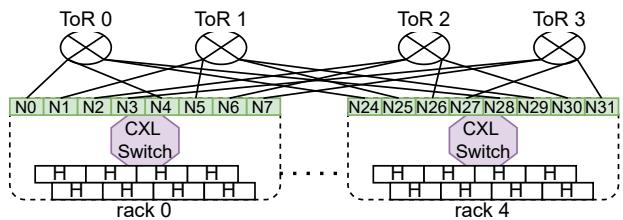  
(a) 4 racks and 8 hosts per rack. (m = 4, n = 8)

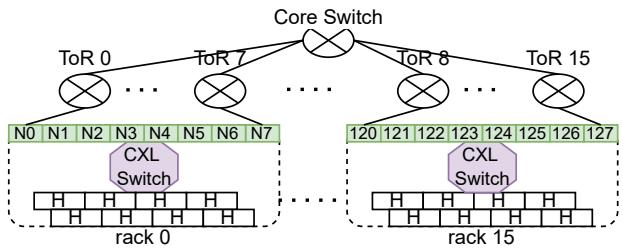  
(b) 16 racks and 8 hosts per rack. (m = 16, n = 8)  
Figure 12: Example topology with DRack. Host(H), NIC(N).

As shown in Figure 12, there exist two system configurations leading to two different topologies.

➀ DRack topology has more hosts (n) than racks $( m ) , n >$ m. As shown in Figure 12(a), n = 8 and m = 4, every rack can connect with all aggregated switches (or ToR switches in original ToR-based architecture). Recall, NIC i is linked with the aggregated switch (i mod m), where $0 \leq i < m n$ . Thus, NIC 0, 4, 8,.., is linked to switch 0, NIC $1 , 5 , 9 , . . . ,$ is linked to switch 1, etc..

➁ DRack has less hosts than racks, $m > n$ As shown in Figure 12(b), n = 8 and $m = 1 6 ,$ a rack can only connect with part switches. In this case, every rack connect with 8 ToR switches, rack $0 , 2 , 4 , . . . ,$ connects with ToR switch 0 to 7, while rack $1 , 3 , 5 , \ldots$ connects with ToR 8 to 15. They both form two pods, respectively. The two pods are interconnected via one or more core switches, with the pod-to-core wiring topology preserving the conventional structure employed in ToR-based architectures. The wiring between NICs of a DRack and ToR switches still follows the principle, i.e., NIC i is linked with the aggregated switch (i mod m), where $0 \leq i < m n$

## A.2 Application semantics

Table 3 provides more application examples that can result in irrgular computation and skewed data accessing.

## A.3 An Example of NIC Pool Accessing

When a MPSoC0’s application calls send, its driver classifies whether it targets MPSoC1 (i.e., intra-rack), or the one across racks (e.g., MPSoC3) based on the IP. For the across-rack case, the server’s CPU is notified via a CXL-DoCE transaction carrying an interrupt, sent by the driver. Then, it DMA reads the data to the $^ { \bullet \bullet } \mathbf { V } \mathbf { N } \mathbf { I } \mathbf { C } ^ { \bullet \bullet }$ software queue from the MP-SoC0’s memory via CXL.io. Packets are then sent to the emulated network queue, delaying for propagation\_delay + queueing\_ $\begin{array} { r } { d e l a y + \frac { p a c k e t \_ s i z e } { b a n d w i d t h } } \end{array}$ before writing it to the software queue of the other $^ { 6 6 } \mathrm { v N I C } ^ { \mathrm { , } }$ , which emulates the network delay. For the intra-rack case, the driver stores data descriptors into the reference queues of MPSoC1 with a CXL-like MemWr. This also embeds interrupt within the CXL transaction to notify MPSoC1’s CPU. Upon receiving the interrupt, the CPU initiates a CXL-like memory read (MemRd) to retrieve the data from the memory pool.

Table 3: Application Semantics
<table><tr><td rowspan=1 colspan=1>ApplicationCategory</td><td rowspan=1 colspan=1>Example</td><td rowspan=1 colspan=1>Causes</td></tr><tr><td rowspan=1 colspan=1>GraphComputing</td><td rowspan=1 colspan=1>Evolvinggraphs [98]</td><td rowspan=1 colspan=1>Different subgraphsrunning on each hostcontribute varyingcompute time</td></tr><tr><td rowspan=1 colspan=1>Database &amp;KV Store</td><td rowspan=1 colspan=1>Redis [85]</td><td rowspan=1 colspan=1>Imbalanced Hot keysdistribution &amp;Varied value size</td></tr><tr><td rowspan=1 colspan=1>ModelTraining</td><td rowspan=1 colspan=1>MoEExpert Parallelism</td><td rowspan=1 colspan=1>Skewed token loadon experts[99]</td></tr><tr><td rowspan=1 colspan=1>DLRMTrainingInference</td><td rowspan=1 colspan=1>Embeddinglayer [48]</td><td rowspan=1 colspan=1>Imbalanced HotEmbedding lookupson Embedding tables</td></tr></table>

## A.4 Communication Efficiency

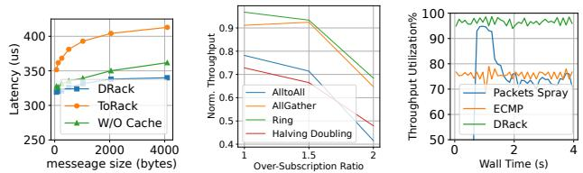  
(a) DRack reduces intra- (b) Throughput of 4 col- (c) MPTCP outperforms rack delay via pass-by- lective operations across ECMP and packet spray. reference and DRAM network settings Cache.  
Figure 13: Key designs’ impact on DRack’s performance.

In this section, we eliminate computations and focus on studying the maximum communication efficiency that DRack can boost, as well as the impact of each individual component. Intra-rack communication. In the rack, DRack eliminates one memory copy by using pass-by-reference, and hides the remote memory latency via DRAM Cache. We evaluate the latency reduction achieved by DRack for intra-rack communication including reliable validation of TCP stack. We conducted the TCP transaction latency test using lmbench [95], which involves repeatedly sending a packet filled with dummy data in a ping-pong fashion. The latency for DRack is measured from the moment the sender stores the packet’s reference until the receiver receives the reference, loads its data, and completes its TCP stack processing. As shown in Figure 13(a), DRack achieves an average of 15.9% lower latency than ToRack’s pass-by-value. The DRAM cache accounts for 6% of the latency reduction, as the CPU will load a packet’s header for multiple times during TCP stack processing that presents high cache locality. Note that the major latency of pass-by-value comes from the TCP protocol stack and controlling DMA for data copy, while DRack eliminates the later one.

Inter-rack Throughput. DRack facilitates a range of collective communications at full capacity, irrespective of the network configuration, i.e., network-oblivious communication. This property frees application designers to tailor communication collectives across network settings (e.g., oversubscription ratio). As shown in Figure 13(b), we run four collective communication operations using Gloo over 8 hosts and increase the rack size, the number of hosts in a rack, from 2 to 4, to have an over-subscription ratio from 1 to 2. As DRack uses the NIC pool as the ToR layer, it provides full-bisectional bandwidth across racks, consistently offering throughput gains for all collectives compared to ToRack. ToRack limits the throughput of collectives with intensive cross-rack traffic due to the ToR’s uplinks (e.g., AlltoAll), while it cannot fully utilize the uplink bandwidth for collectives with reduced cross-rack traffic (e.g., ring and halving doubling).

We evaluate the necessity of MPTCP in bandwidth efficiency. DRack leverages MPTCP to balance the inter-rack traffic load between 2 available NICs. We first evaluate the throughput with three popular traffic distribution mechanisms (with the other DRack’s component enabled): 1) Packets spray: scattering packets between all NICs [100], 2) ECMP: hashing a flow to a NIC [101], 3) MPTCP. We run Gloo AlltoAll with the above mechanisms, respectively. As shown in Figure 13(c), MPTCP fully utilizes the NIC pool capacity, while ECMP cannot utilize the bandwidth efficiently as a single flow can only use one NIC, even if the other NIC is free, packet spray can result in out-of-order packet arrivals, causing TCP congestion control that actively slows down the throughput.