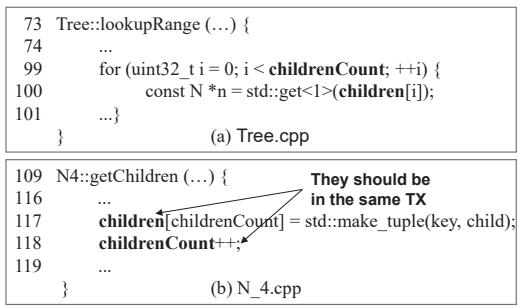
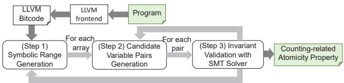
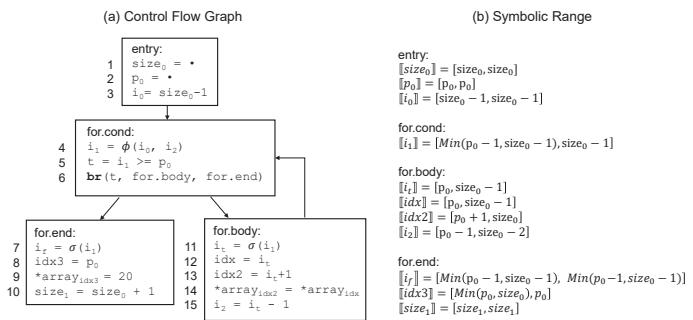
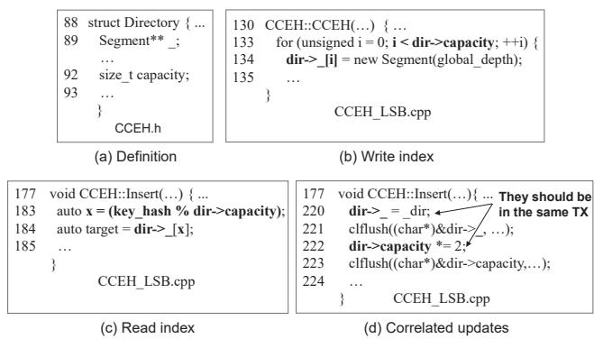

①

USENIX

THE ADVANCED COMPUTING SYSTEMS ASSOCIATION

# Inferring Likely Counting-related Atomicity Program Properties for Persistent Memory

Yunmo Zhang and Junqiao Qiu, City University of Hong Kong; Hong Xu, The Chinese University of Hong Kong; Chun Jason Xue, MBZUAI

https://www.usenix.org/conference/atc25/presentation/zhang-yunmo

# This paper is included in the Proceedings of the 2025 USENIX Annual Technical Conference.

July 7–9, 2025 • Boston, MA, USA ISBN 978-1-939133-48-9

Open access to the Proceedings of the 2025 USENIX Annual Technical Conference is sponsored by

P--r.h £Es/sL.

auuJl9 PgleU

King Abdullah University of

Science and Technology

# Inferring Likely Counting-related Atomicity Program Properties for Persistent Memory

Yunmo Zhang City University of Hong Kong

Hong Xu The Chinese University of Hong Kong

Junqiao Qiu City University of Hong Kong

Chun Jason Xue MBZUAI

## Abstract

Persistent Memory (PM) technologies provide fast, byteaddressable access to durable storage but face crash consistency challenges, motivating extensive work of testing and verification of PM programs. Central to PM testing tools is the specification of program properties for object persistence order and atomicity. Although several methods have been proposed for inferring PM program properties, most focus on ordering properties, offering limited support for atomicity properties. This paper explores a class of important atomicity properties between the container-like arrays and their logical size variables, referred to as the counting correlation, which are common in PM programs but exceed the capability of existing approaches. We propose invariants to capture the necessary behaviors of counting-correlated variables, utilize symbolic range analysis to extract PM program behaviors, and encode them into SMT constraints. These constraints are checked against the invariants to infer likely PM program properties. We demonstrate the utility of the inferred properties by leveraging them for PM bug detection, which discovers 14 atomicity bugs (including 11 new bugs) in real-world PM programs.

## 1 Introduction

DRAM technology is facing significant challenges in density scaling and power leakage [37]. Alternatively, Persistent Memory (PM) technologies, such as Intel Optane [18] and CXL-SSD [2, 35], open a new paradigm that allows for byteaddressable interfaces like DRAM and avoids the overhead of the storage stack. However, PM-based systems are errorprone due to the crash consistency issue. A store to PM is first written to a volatile cache and then flushed to the durable media, during which data is reordered [32, 33]. Programmers need to explicitly use hardware instructions like clflush and sfence, or transaction interfaces provided by libraries to ensure crash consistency. Yet appropriate usage of these instructions or interfaces demands expertise, beyond the reach of most programmers. As a result, PM programs are found to have many crash consistency bugs by emerging PM testing tools [9, 11, 15, 24, 30].

Due to the explosive program state and the arbitrary crashes that need to be explored, most existing PM testing tools rely on manual annotation [5, 5, 16, 23, 24], which can be tedious, or PM program properties specified by developers [9, 30] to inject crashes in a way that efficiently triggers potential bugs. Consequently, there is a persistent need for specifying PM program properties to detect crash consistency violations. To relieve the burden of programmers, PM program property inference approaches, such as Witcher [9] and Huang et al. [15], have been proposed to infer likely program properties based on control and data dependencies. While these methods show promise in ordering properties, they face challenges when dealing with the diverse atomicity properties of common PM data structures.

This paper examines a crucial category of atomicity properties that pertain to the relationship between container-like PM data structures and the integer variables that represent their semantic sizes–a relationship we refer to as counting. For instance, in a tree node, the children array is countingcorrelated with its length variable, which records the number of appended pointers to child nodes. Without ensuring atomic persistence of updates to the children array and its length variable, the crash could result in the program reading a dangling pointer or losing ingested data. This counting correlation is also present in other persistent data structures and PM-based systems, such as hash tables [22, 28, 41] and ring buffers [14, 36, 39]. Unfortunately, systematically inferring properties related to counting correlation is out of reach of dependency-based atomicity property inference approaches, which rely on assumptions about access patterns rather than directly analyzing the program semantics of counting.

This paper studies the inference approach of the countingrelated atomicity properties, aiming to complement the existing atomicity inference methods and thereby expand the scope of violations that the PM testing tools can detect. However, identifying the counting correlation among variables is not as straightforward as its simple definition suggests. The semantic sizes, as a logical concept derived from the programmer’s intent, are not explicitly revealed through program behavior. To handle it, we first propose the invariants for describing the necessary behaviors of counting-correlated variables based on their access ranges. We leverage symbolic range lattice [29] to extract these behaviors from the program, then encode them into SMT (Satisfiability Modulo Theories) [4] constraints, which are checked against the invariant with an SMT solver, thereby validating the likely counting-related atomicity properties. To show the effectiveness of the proposed inference approach, we leverage the inferred properties to detect PM bugs and successfully detect 14 atomicity violations, including 11 previously unknown bugs.

In summary, this paper makes the following contributions.

• We identify an important class of atomicity properties, termed counting, which are crucial for ensuring the crash consistency of PM programs. We also propose invariants to capture the behaviors of counting-correlated variables.

• We propose a framework that infers the counting correlation in PM programs by combining the symbolic range analysis with SMT constraint solving to validate the invariant.

• We evaluated the effectiveness of our approaches on realworld PM programs and found 14 atomicity bugs.

## 2 Background and Motivation

## 2.1 Background

Applications accessing PM could directly perform byteaddressable load/store operations, instead of system calls, as with traditional storage devices. Store requests to PM are first buffered in a volatile cache and then wait an arbitrary amount of time before the cacheline containing the data is evicted to PM. As a result, the reordering of writes to different memory locations may occur [34], causing the data persistence order may differ from the original execution order in the program. When a crash occurs, durable data in PM is prone to unexpected inconsistency.

PM programming delegates the task of ensuring crash consistency to the programmers, by using low-level instructions like clflush (or clwb) to flush cache lines and sfence to enforce the order, as well as high-level transaction (TX) interfaces [17, 19, 38] to provide all-or-nothing semantics. Despite these explicit flush and fence instructions, PM programs suffer from crash consistency issues [5, 9, 24, 30], including correctness bugs (e.g., improper or missed flush/fence) and performance bugs (e.g., extra flush/fence). This work focuses on the correctness issues.

## 2.2 Related Work

While earlier PM testing tools discussed the detection of durability bugs (i.e., missing flush for a particular store)–the simplest form of correctness bug in PM programs [20, 24, 30], recent works focus more on discovering application-specific bugs that require an understanding of the program logic. In particular, application-specific testing frameworks are designed to detect (i) ordering bugs that violate the must persistbefore requirements between writes, i.e., without properly using fences, and (ii) atomicity bugs that violate the must persist-together requirements of writes, i.e., without enclosing the writes in a transaction.

The main challenge faced by application-specific PM testing tools is the explosive PM state space [12, 20, 30] due to the arbitrary write reordering and crash point in PM programs. To overcome it, existing tools use manual annotation [5, 5, 16, 23, 24], known bug pattern [10, 30], or in a more general way, PM program properties specified by developers [9, 30] to inject crashes such that potential bugs are triggered efficiently.

However, relying on manual efforts to specify the PM properties is time-consuming and demands expert knowledge of program semantics and the PM hardware model, making it not within reach of most developers. Although a blackbox approach [11] has been proposed to bypass the need for program properties by focusing on the recovery procedure– specifically, examining whether the crashed program states are recoverable–the recovery code itself is often buggy and unreliable [24]. As a result, existing PM testing tools still have a common requirement for PM program properties to identify violations effectively.

To help programmers specify PM program properties, Witcher [9] and Huang et al. [15] propose to infer likely program properties based on the control dependency and data dependency patterns. For example, from a single control dependency relationship if(x) then y=0, where the write to y is control dependent on the read from x, an ordering PM program property is inferred that a store of x should be persisted before an update of y to ensure crash consistency. Through static analysis or dynamic analysis of data and control dependencies in program traces, Witcher and Huang et al. have demonstrated their ability to infer several ordering and atomicity PM program properties and detected potential bugs by checking whether these properties are satisfied.

Limitations. While dependency analysis can easily infer a persist-before requirement from a single data or control dependency relationship, it is limited to capturing the persisttogether requirements for common data structures in PM programs. Table 1 presents the control dependency patterns that two existing works rely on to infer the potential atomicity properties in PM programs. Witcher observes that the updates of two or more guardians should be persisted atomically; the guardian is the flag variable at the condition statement controlling the access to other variables, e.g., x in if(x). In contrast, Huang et al. regard a set of guardians that guard each other as atomic variables. The logic is that since each guarding relationship produces an ordering requirement, the only way to reconcile the conflicting requirements between interdependent variables is to persist them together.

<table><tr><td rowspan=1 colspan=1></td><td rowspan=1 colspan=1>Witcher[9]</td><td rowspan=1 colspan=1>Huang et al. [15]</td></tr><tr><td rowspan=1 colspan=1>Dependency Pattern</td><td rowspan=1 colspan=1>if(x）then $\overbrace { \mathrm { m } \cdot \mathrm { ~ \cdot ~ } \left( \mathrm { m } \frac { \mathrm { c t r l } } { \mathrm { d e p } } \mathrm { ~ \times ~ } \right) } ^ { \mathrm { c t r l } }$  $\mathrm { i f ~ ( y ) }$ then $\boldsymbol { \mathrm { n } } { \cdot } \cdot \cdot ~ ( \mathrm { n } \xrightarrow [ \mathrm { d e p } ] { \mathrm { c t r l } } )$ </td><td rowspan=1 colspan=1>if(x）then $\overline { { { \mathrm { y } } \cdots { \mathrm { ( y } } \xrightarrow [ ] { } } \mathrm { x } \mathrm { ) } }$  $\mathrm { i f ~ ( y ) }$ then $\mathrm { x } \cdot \cdot \cdot ( \mathrm { x } { \xrightarrow [ { \mathrm { d e p } } ] { \mathrm { c t r l } } } \mathrm { y } )$ </td></tr><tr><td rowspan=1 colspan=1>Inferred LikelyAtomicity Property</td><td rowspan=1 colspan=1>ATOMICITY(x，y)</td><td rowspan=1 colspan=1>ATOMICITY(x，y)</td></tr></table>

Table 1: Existing dependency-based atomicity PM program property inference approaches.

Consider an atomicity bug found by our work from P-ART [22], a persistent adaptive radix tree (ART), shown in Figure 1 (b). In this code, a children array that collects the valid elements from the node\_4 of ART, along with a variable childrenCount that indicates the size of valid elements in children, are expected to update atomically. Failing to ensure atomicity upon crash could result in irrecoverable data loss if only the array update is persisted, or the return of stale values if only the size update is persisted.

However, neither of the aforementioned dependency patterns could be identified in the accesses to children and childrenCount. In Figure 1 (a), childrenCount guards the access to children, but the testing tools fail to detect any instances where children guards childrenCount (to form the pattern in Huang et al.) or other variables (to form the pattern in Witcher). Unlike a single variable acting as a guardian, the children array functions as a container with different semantics. It stores multiple user data and ensures their durability in PM to serve future queries. These container-like structures are common in PM use cases, such as database indexes [22, 27, 28, 41] and file systems [7, 40]. Without a guardian role, these structures are hardly captured by the dependency analysis to infer their related atomicity properties.

Besides, work on detecting atomicity violations in concurrent programs [25, 31], such as MUVI [25], might potentially uncover certain counting-related bugs. However, these methods lack the capability for systematic detection and employ runtime techniques that are not straightforward for adoption in PM. For instance, controlling thread interleaving [31] is challenging in the context of PM due to the costly PM writes, as well as arbitrary crashes, which alter the interleaving space.

## 2.3 Counting-related Atomicity Property

We now introduce the counting relationships between container-like structures and their size attributes commonly found in PM programs. These relationships form a new atomicity property pattern, complementing existing dependencybased ones. Formally, an integer variable SZ tracks a numerical value about the logical size1 of one or multiple arrays ARRs in the following three scenarios:

  
Figure 1: An example atomicity bug outside the reach of dependency-based inference approaches.

• the logical size of an array, and

• the sum of the logical sizes of multiple arrays, and

• the complementary size of an array to a constant.

If a SZ and one or more ARRs exhibit any of the above relationships, an atomicity property ATOMICITY(SZ, ARR) should be satisfied in PM programs to ensure the crash consistency.

Despite their intuitive semantics, counting-related atomicity properties are often violated in many software storage stacks, which are among the primary targets PM is expected to reshape. For example, in btrfs, i\_size that indicates the file size was found to be inconsistent with the actual file size when appending data. This inconsistency arises when the log of i\_size is delayed as improper flags are set by other operations, and then a fsync flushes the data with the value of i\_size smaller than the actual data size [26]. And in ext4, i\_disksize indicating the size of data stored on disk is found inconsistent with the real data size when a delayed end-of-file write back meets a crash while a direct non-end-of-file write succeeds [13]. Although only a limited number of atomicity PM bugs are found due to the lack of testing tools aside from Witcher [9] and Huang et al. [15], there is a counting-related PM atomicity bug [6]. In this bug, size that indicates the allocated size of an array becomes inconsistent with the array when a crash happens between their updates.

## 3 Property Inference

## 3.1 Overview

This work aims to infer counting-related atomicity properties from PM programs. Rather than relying on causation relationships, as dependency-based inference approaches do, we resort to a correlation relationship, in which variables maintain a semantic relation throughout the program. We expect our approach to complement the work of Witcher [9] and Huang et al. [15], thereby broadening the range of inferred atomicity properties and related bugs covered by testing tools.

Problem. Although the concept of counting is intuitive, discovering the counting correlation is not straightforward. As a programmer’s intent, an array’s logical size, which indicates the number of valid elements in its allocated space, is unknown to the analysis tools. Furthermore, the variable that represents the array’s logical size may not consistently align with the array’s true size throughout the program’s execution. Consider an array insertion example in List 1. After executing lines 2 to 5, which insert an element into the middle of the array, the real size of array after line 2 is size+1, different from the value of size until its update at line 6. Here, size is intended to be counting-correlated with array. But the definitions of counting cannot be used to identify countingcorrelated variables.

```perl
// insert an element at position p
2 for(i = size - 1; i >= p; i--){
3 array[i + 1] = array[i];
4 }
5 array[p] = 20;
6 size += 1;
Listing 1: Array insertion example $( 0 \ < = \ \mathtt { p } \ < \ \mathtt { s i z e } )$
```

Main Idea. Our solution to the above problem is based on our observation that the read access to the array must remain within the range of valid elements constrained by the real size, where the range of valid elements is accessible by analyzing program behaviors. As a result, we propose that the likely PM atomicity property ATOMICITY(array, size) is identified if any read access to array could be proved to be restricted by size. We refer to this as the read range invariant. Later, we will show why write access to the array may be beyond the valid element range and how to leverage this fact to form an (optional) write range invariant.

Inference Approach. To infer the counting-related atomicity property, we need to discover the counting-correlated variable pairs that satisfy the above access range invariants. A possible solution is to employ dynamical analysis such as Daikon [8], which monitors the indices of all pointer accesses and the values of all integers, subsequently verifying each pair in traces against the invariant individually. However, due to the inequalities in access range invariants, dynamic analysis often yields highly inaccurate results and is hard to scale in the presence of loops. Instead, we resort to Symbolic Range Analysis (SRA) [29], which over-approximates the access ranges for array indices and offers a more reliable analysis of program behaviors.

## 3.2 Invariants for Counting Correlation

Since the definition of counting about the logical/real size of an array does not characterize the real behaviors of correlated variables, we propose two access range invariants as the necessary conditions to infer likely counting-related atomicity properties. The invariant refers to the assertion about the correlated variables that are always held to be true in the program. We denote the program with P in this section.

Invariant 1: Read Range. We observe that a read access, which incorporates the programmer’s intent for acquiring the valid elements of a container, has its index always lie in the region restricted by the container’s logical size. Thus, we propose to use read range invariants to capture the relationship between the access behavior to an array and its countingcorrelated size variable. We first introduce the invariant for the first correlation pattern, which is the base of the two other correlation patterns, as shown below:

$$
\forall \boldsymbol { \rho } \in P , R e a d _ { \boldsymbol { \rho } } ( A R R , i d x ) \Longrightarrow i d x < V a l _ { \boldsymbol { \rho } } ( S Z ) .\tag{1}
$$

$R e a d _ { \rho } ( A R R , i d x )$ indicates there is a read to ARR at line ρ with access index being $i d x ,$ and $V a l _ { \rho } ( S Z )$ is the value of the logical size variable SZ at line ρ. We assume $i d x \ge 0$ Consider the example in Listing 1, where the program shifts all elements starting from the insertion position towards the right, the index of read to array is $[ p , s i z e - 1 ]$ , which could be proved to be contained by the range [0, size).

We also motivate the access range invariants by demonstrating an alternative class of correlation-based atomicity invariants based on access-together-times (MUVI [25]). This invariant is originally designed for testing concurrent programming atomicity bugs, in which accessed-together times exceeding a threshold should be updated atomically. From Listing 1, we notice the access-together-times invariant does not hold unless a tiny threshold is set, since this piece of code accesses array size− p+1 times, while accessing size once.

By leveraging the basic read range invariant defined in Eq. (1), our approach could be extended to handle the two additional correlation patterns related to the logical size, given certain specifications from users. In the second pattern, the variable SZs tracks the cumulative logical sizes of multiple arrays. Provided N, the number of arrays considered by the user, the read range invariant is:

$$
\forall \pmb { \rho } \in P , \sum _ { \substack { i \in [ 1 , N ] \wedge R e a d _ { \mathsf { \rho } } ( A R R _ { i } , i d x _ { i } ) } } i d x _ { i } < V a l _ { \mathsf { \rho } } ( S Z _ { s } ) .\tag{2}
$$

Here, the sum of the indices of accesses to a number of ARRs at line ρ is compared against the integer value of $V a l _ { \rho } ( S Z _ { s } )$ ， enabling the inference of the cumulative size variable by programmer intent. We set N = 2 as the default configuration. In the third correlation pattern, the variable $S Z _ { c }$ is used to represent the complementary size of the array relative to a constant. Provided the constant C from the user, the read range invariant under this scenario is:

$$
\forall \mathsf { p } \in P , R e a d _ { \mathsf { p } } ( A R R , i d x ) \Longrightarrow i d x < C - V a l _ { \mathsf { p } } ( S Z _ { c } ) .\tag{3}
$$

Here, the read access index is checked against the complementary value $C - V a l _ { \rho } ( S Z _ { c } )$

We use the read index to establish the range invariant because writes may exceed the region restricted by the logical size variable, e.g., during insertion. In Listing 1, the write indices to array are within the range $[ p , s i z e ]$ . As the insertion extends the logical size at the final step, writes access the index outside of the existing valid element region intended to be represented by size to include new elements.

  
Figure 2: The workflow of our work.

Invariant 2: Write Range. According to the above observation regarding the write behaviors of arrays in programs, the write access range cannot be directly used for inferring the programmer’s intent concerning the logical size of arrays. However, we can refine this approach by relaxing the condition on the maximum allowable write index. This adjustment allows us to incorporate an optional invariant, thereby enhancing the accuracy of our inferences. For example, under the assumption that each insertion function only adds one element, the write range invariant for the first pattern is:

$$
\forall \mathsf { p } \in P , W r i t e _ { \mathsf { p } } ( A R R , i d x ) \Longrightarrow i d x \leq V a l _ { \mathsf { p } } ( S Z ) ,\tag{4}
$$

where $W r i t e _ { \rho } ( A R R , i d x )$ indicates there is a write to ARR at line ρ with index idx. A constant term c could be added after the integer variable value to allow for different index relaxation limit assumptions. We set c as 0 by default.

## 3.3 Atomicity Property Inference

The workflow of inferring counting-related atomicity properties is shown in Figure 2. Our tool accepts the programs in C and translates them into LLVM bitcode IR [21]. We employ a symbolic range lattice [29] to abstract the symbolic access indices (Step 1) and identify candidate variable pairs for invariant validation (Step 2). Finally, we encode the symbolic information of array indices and the integer variables into SMT constraints and use an SMT solver to verify whether the invariants are satisfied (Step 3). For each variable pair that satisfies the invariant, an atomicity property is generated.

Step 1. Symbolic Range Generation. Before generating symbolic accesses to arrays, we first prepare all the candidate arrays. We use an LLVM pass to identify all pointer variables, including those that are members of structures. Since C conflates arrays with pointers, we differentiate the array variables from regular pointers by checking the pointer’s operand. We collect the pointers that represent arrays into the set $\{ p t r \}$ For each ptr, the symbolic range analysis is then employed to compute symbolic bounds for all accesses to $p t r .$ Formally, the symbolic range of an access index $i n t _ { \nu } .$ , denoted as $[ [ i n t _ { \nu } ] ]$ consists of a pair of symbolic bounds denoted by $[ l , r ] .$ , where $l \leq r .$ . Here, l represents the lower bound, denoted as $[ [ x _ { \nu } ] ] _ { \downarrow }$ ， and r represents the upper bound, denoted as $[ [ x _ { \nu } ] ] _ { \uparrow }$ . If the symbolic value is undecidable, the range is [None, None].

  
Figure 3: The control flow graph and the symbolic ranges of integer variables in Listing 1.

Example. We use the program in Listing 1 to illustrate the computed symbolic ranges of integer variables, including the access indices. We show the control flow graph in Figure 3 (a). The program is transformed to Extended SSA form [1] before the analysis, where a φ-function is created when the value of a variable depends on multiple predecessor blocks, and a σ-function is a copy created for the splitting at a conditional. Before the analysis, all integer variables are initialized with a degenerate-interval symbolic range, i.e., $\mathbb { [ \cdot ] = [ \cdot , \cdot ] }$ . The program inputs, which include the potential integer variables, are treated as symbols during SRA, also known as the symbolic kernel [29], to compute other symbolic ranges.

SRA computes the symbolic ranges of integer variables as follows. The assignment instructions after reads rewrite both bounds of the symbolic range, e.g., i0 is assigned $[ [ s i z e _ { 0 } ] ] - 1 = [ s i z e _ { 0 } - 1 , s i z e _ { 0 } - 1 ]$ . Besides, the φ-function computes a union of two symbolic ranges from two blocks. In Line 4, $, [ i _ { 1 } ] ] = [ M i n ( [ [ i _ { 0 } ] ] _ { \downarrow } , [ [ i _ { 2 } ] ] _ { \downarrow } ) , M a x ( [ [ i _ { 0 } ] ] _ { \uparrow } , [ [ i _ { 2 } ] ] _ { \uparrow } ) ]$ And σ- function computes the interval intersection of the operand’s symbolic range and the condition. For example, it is in the condition $i _ { 1 } \geq p _ { 0 }$ satisfied branch; its symbolic value becomes $[ M a x ( p _ { 0 } , [ [ i _ { 1 } ] ] _ { \downarrow } ) , [ [ i _ { 1 } ] ] _ { \uparrow } ]$ . Following these rules, SRA converges after iterations and finally yields the results in Figure 3 (b). Note that the symbolic range results provide over-approximation of the variable ranges [29], which means the actual values during program execution must fall within these ranges.

Step 2. Candidate Variable Pairs Generation. The next step is generating the candidate variable pairs to be checked against the counting invariants. The naive method enumerates all integers to form a pair with a candidate array. Instead, we only select the integer variables that appear in the symbolic range of any accesses to $p t r$ . Specifically, we collect all integer-type IR instructions but exclude the integers unrelated to the computed symbolic ranges into the set {int}. The candidate variable pairs are $\{ ( p t r , i n t ) \} = \{ p t r \} \times \{ i n i \}$ . We then validate the invariant for each candidate pair.

<table><tr><td rowspan=1 colspan=1>PMPrograms</td><td rowspan=1 colspan=1>Description</td><td rowspan=1 colspan=1>Versions</td></tr><tr><td rowspan=1 colspan=1>P-ART[22]</td><td rowspan=1 colspan=1>Persistent Adaptive Radix Tree</td><td rowspan=1 colspan=1>fOb891a</td></tr><tr><td rowspan=1 colspan=1>P-BwTree [22]</td><td rowspan=1 colspan=1>Persistent BwTree</td><td rowspan=1 colspan=1>fOb891a</td></tr><tr><td rowspan=1 colspan=1>CCEH[28]</td><td rowspan=1 colspan=1>Dynamic Hashing for PM</td><td rowspan=1 colspan=1>b62a9c8</td></tr><tr><td rowspan=1 colspan=1>Level-Hashing [41]</td><td rowspan=1 colspan=1>Hash Indexing forPM</td><td rowspan=1 colspan=1>28eca31</td></tr></table>

Table 2: Tested PM Programs.

Step 3. Constraint-based Invariant Validation. To determine whether an integer variable int is counting-correlated with ptr, we encode int and the accesses to ptr into the SMT constraints of the invariant, e.g., the invariants shown in Eq. (1) and Eq. (4) for the first correlation pattern. Then, the SMT solver is used to check if the constraints are always satisfied, representing that the accesses to ptr are restricted by int across user (function) inputs. Specifically, for each access index idx to ptr, an SMT constraint $[ [ i d x ] ] _ { \uparrow } < [ [ i n t _ { \nu } ] ] _ { \downarrow }$ is built for read invariant, and $[ [ i d x ] ] _ { \uparrow } \leq [ [ i n t _ { \nu } ] ] _ { \downarrow }$ is built for write invariant. For the read index range that is undecidable or has an infinite value in any of the bounds, we directly add False to the constraints set. Then we make the conjunction of constraints for all accesses to form the invariant constraint.

Taking the first counting correlation pattern as an illustrative example, if we let all SSA forms of int constitute $V _ { i n t }$ and the read indices to ptr forms $U _ { p t r }$ , a read invariant INV is:

$$
\bigwedge _ { i d x \in U _ { p t r } } \bigvee _ { \nu \in V _ { i n t } } [ [ i d x ] ] _ { \uparrow } < i n t _ { \nu } .\tag{5}
$$

Here, the disjunction among multiple SSAs of int ensures that the indexes are checked against a specific assignment of int. Thus, we don’t need to distinguish which assignment manually. An SMT solver Z3 [3] is utilized to check whether the constraints are satisfied across all possible values of int. Since SMT solvers only find a specific satisfaction for given constraints, we make the negation of Eq. (5) ( INV) and ask the solver to prove its UNSAT, i.e., no values could be found to make the invariant unsatisfied. If the proving is successful, a likely counting-related atomicity property ATOMIC-ITY(ptr, int) is generated.

To encode the invariant in the second correlation pattern, the sum of indices to each accessed ptri is checked. Similarly, encoding the invariant in the third scenario requires only replacing an SSA of the integer variable intv with $C - i n t _ { \nu }$

## 4 Evaluation

## 4.1 Methodology

The program analysis stage of our work is implemented as LLVM [21] compiler passes with a symbolic range analysis pass modified from the open-source Nazaré et al. [29] 2. The invariant validation is implemented in Python with Z3 [3] as the SMT solver.

Experimental Setup. We conduct all experiments on a machine equipped with 2 Intel Xeon Gold 5317 CPUs, 128GB DRAM, and 512GB Intel Optane DC Persistent Memory. The PM consists of four 128GB Optane memory through interleaved mode. To demonstrate the utility of our countingrelated atomicity property inference approach, we leverage the inferred properties to detect PM bugs. For each identified property, ATOMICITY $\mathrm { \prime ( x , y ) }$ , we confirm the atomicity violations by manually checking whether the updates of x and y are protected by a transaction, e.g., between TX\_BEGIN and TX\_END of libpmemobj [17]. Integrating our property inference approach into an established property-checking procedure to confirm bugs through trace analysis (e.g., Huang et al. [15]) is left in our future work. Table 2 shows the tested real-world PM programs in this evaluation, including popular PM data structures such as hash tables (CCEH and Levelhashing) and trees (P-ART and P-BwTree).

## 4.2 Results

Table 3 summarizes 14 atomicity violations in the tested problems, where 11 of them are new bugs, and the rest have been reported [9]. Among the detected bugs, 4 bugs (#10, #12, #13, and #14) violate the atomicity properties between an array and its correlated allocation size (a special case of logical size), producing a fault when the post-crash program reads the unallocated memory space. All the rest of the bugs violate the atomicity property between an array with its logical size. The impact of these bugs varies due to the diverse element types within the array. Bug #8 involves a value array failing to update atomically with its logical size, causing invalid reads or user data loss after a crash. In other bugs, the pointer arrays are not atomically updated with the integer variable indicating the number of valid pointers, leading to stale pointer reads in post-recovery programs. These different impacts of atomicity violations highlight the varied scenarios where an atomicity bug can occur.

Next, we compare our tool with a correlation inference tool MUVI [25]. Since Huang et al. [15] relies on the dualdependent relationship that does not exist in any pair of array and integer, we compare with another dependency-based atomicity property inference approach Witcher [9]. Among the 14 bugs detected by our tool, MUVI successfully identified 4 of them, while Witcher identified 3. MUVI works effectively when the array and the size variable are closely tied to each other. We observe that this detection strategy struggles to identify counting-correlated variables in two main scenarios. First, when an array has more than one size variable, e.g., one for allocated size and one for logical size, the frequency of access to the array and its size variable tends to be random. Second, when the elements of the array are structures with multiple variables that might be accessed individually, the program has more frequent access to the array than to its size variable. Witcher is unable to detect most counting-related atomicity violations, since few arrays serve as guardians within condition statements. However, there are three exceptions: bugs #2, #6, and #13, in which the pointer element in the array is used to control the read of the pointed-to structure.

<table><tr><td rowspan=1 colspan=3>PMProgram</td><td rowspan=1 colspan=1>D</td><td rowspan=1 colspan=1>New</td><td rowspan=1 colspan=1>Code</td><td rowspan=1 colspan=1>Description</td><td rowspan=1 colspan=1>Impact</td><td rowspan=1 colspan=1>MUVI</td><td rowspan=1 colspan=1>Witcher</td></tr><tr><td rowspan=9 colspan=3>P-ART</td><td rowspan=1 colspan=1>1</td><td rowspan=1 colspan=1>√</td><td rowspan=1 colspan=1>N4.cpp:117</td><td rowspan=1 colspan=1>Creating an array of valid nodes</td><td rowspan=1 colspan=1>Fault or data loss</td><td rowspan=1 colspan=1></td><td rowspan=1 colspan=1></td></tr><tr><td rowspan=1 colspan=1>2</td><td rowspan=1 colspan=1></td><td rowspan=1 colspan=1>N4.cpp:22</td><td rowspan=1 colspan=1>Inserting a node to an array of children nodes</td><td rowspan=1 colspan=1>Fault or data loss</td><td rowspan=1 colspan=1></td><td rowspan=1 colspan=1>√</td></tr><tr><td rowspan=1 colspan=1>3</td><td rowspan=1 colspan=1>√</td><td rowspan=1 colspan=1>N16.cpp:124</td><td rowspan=1 colspan=1>Creating an array of valid nodes</td><td rowspan=1 colspan=1>Fault or data loss</td><td rowspan=1 colspan=1></td><td rowspan=1 colspan=1></td></tr><tr><td rowspan=1 colspan=1>4</td><td rowspan=1 colspan=1>√</td><td rowspan=1 colspan=1>N48.cpp:120</td><td rowspan=1 colspan=1>Creating an array of valid nodes</td><td rowspan=1 colspan=1>Fault or data loss</td><td rowspan=1 colspan=1></td><td rowspan=1 colspan=1></td></tr><tr><td rowspan=1 colspan=2></td><td></td><td></td><td></td><td></td><td></td><td></td><td></td></tr><tr><td></td><td></td><td></td><td></td><td></td><td></td><td></td></tr><tr><td rowspan=1 colspan=1>5</td><td rowspan=1 colspan=1>√</td><td rowspan=1 colspan=1>N256.cpp:81</td><td rowspan=1 colspan=1>Creating an array of valid nodes</td><td rowspan=1 colspan=1>Fault or data loss</td><td rowspan=1 colspan=1></td><td rowspan=1 colspan=1></td></tr><tr><td rowspan=1 colspan=2></td><td rowspan=1 colspan=1>6</td><td rowspan=1 colspan=1></td><td rowspan=1 colspan=1>N16.cpp:13</td><td rowspan=1 colspan=1>Inserting a node to anarray of children nodes</td><td rowspan=1 colspan=1>Fault or data loss</td><td rowspan=1 colspan=1></td><td rowspan=1 colspan=1>√</td></tr><tr><td rowspan=1 colspan=1>7</td><td rowspan=1 colspan=1>√</td><td rowspan=1 colspan=1>Epoch.cpp:57</td><td rowspan=1 colspan=1>Adding to an array of fixed size arrays</td><td rowspan=1 colspan=1>Fault or data loss</td><td rowspan=1 colspan=1>√</td><td rowspan=1 colspan=1></td></tr><tr><td rowspan=1 colspan=3>P-BwTree</td><td rowspan=1 colspan=1>8</td><td rowspan=1 colspan=1>√</td><td rowspan=1 colspan=1>bloom_filter.h:143</td><td rowspan=1 colspan=1>Inserting an element to a “ValueType”array</td><td rowspan=1 colspan=1>Stale read or data loss</td><td rowspan=1 colspan=1>√</td><td rowspan=1 colspan=1></td></tr><tr><td rowspan=4 colspan=3>CCEH</td><td rowspan=1 colspan=1>9</td><td rowspan=1 colspan=1>√</td><td rowspan=1 colspan=1>CCEH_LSB.cpp:220</td><td rowspan=1 colspan=1>Resizing an array before insertions.</td><td rowspan=1 colspan=1>Fault or data loss</td><td rowspan=1 colspan=1>√</td><td rowspan=1 colspan=1></td></tr><tr><td rowspan=1 colspan=1>10</td><td rowspan=1 colspan=1>√</td><td rowspan=1 colspan=1>linear_probing.cpp:151</td><td rowspan=1 colspan=1>Resizea hash table</td><td rowspan=1 colspan=1>Memory corruption</td><td rowspan=1 colspan=1></td><td rowspan=1 colspan=1></td></tr><tr><td rowspan=1 colspan=2></td><td rowspan=1 colspan=1>11</td><td rowspan=1 colspan=1>√</td><td rowspan=1 colspan=1>extendible_hash.cpp:329</td><td rowspan=1 colspan=1>Resizing an array before insertions.</td><td rowspan=1 colspan=1>Fault or data loss</td><td rowspan=1 colspan=1>√</td><td rowspan=1 colspan=1></td></tr><tr><td rowspan=1 colspan=2></td><td rowspan=1 colspan=1>12</td><td rowspan=1 colspan=1>√</td><td rowspan=1 colspan=1>cuckoo_hash.cpp:295</td><td rowspan=1 colspan=1>Resizing a “tablearray</td><td rowspan=1 colspan=1>Memory corruption</td><td rowspan=1 colspan=1></td><td rowspan=1 colspan=1></td></tr><tr><td rowspan=2 colspan=3>Level-Hashing</td><td rowspan=1 colspan=1>一</td><td rowspan=1 colspan=1>13</td><td rowspan=1 colspan=1></td><td rowspan=1 colspan=1>level_hashing.c:112</td><td rowspan=1 colspan=3>Expanding a level hash table</td></tr><tr><td rowspan=1 colspan=1>14</td><td rowspan=1 colspan=1>√</td><td rowspan=1 colspan=1>level_hashing.c:226</td><td rowspan=1 colspan=1>Shrinking a level hash table</td><td rowspan=1 colspan=1>Corruption or data</td><td rowspan=1 colspan=1></td><td rowspan=1 colspan=1></td></tr></table>

Table 3: Atomicity bug detection results of our tool and related work.

  
Figure 4: An example of a pair of counting-correlated variables (a), the example write to the array (b), the example read to the array (c), and an atomicity bug detected by our tool (d).

False Positives. Our approach may produce false positives by incorrectly identifying variable pairs as counting-correlated. We have manually inspected the inferred properties and found the existence of such incorrect properties around the misidentified temporary loop variables. The temporary loop variables that control the instructions for accessing the array have the same analyzed behaviors as the logical size variable, leading to the wrong inference. Fortunately, such cases can be easily filtered by manual post-processing (e.g., checking whether the reported integer variable is in PM or DRAM).

A detected bug example. Figure 4 shows the bug #9, where a pointer array dir->\_ and its logical size variable dir->capacity is counting-correlated. Our tool could detect this atomicity property, as the read and write access to dir->\_ are restricted by dir->capacity. MUVI could detect it due to the symmetric access to the array and the size variable, while Witcher fails since dir->\_ is not a guardian.

Running Time of Property Inference. We recorded the runtime overhead of our tool’s workflow on the benchmark programs for inferring PM properties, finding it is between 0.2 and 0.6 seconds. Our tool’s static analysis method avoids exploring program states, resulting in a short analysis time. In contrast, Witcher spends 11 minutes to more than 1 hour to detect ordering and atomicity bugs [9]. Yet SMT solvers may become the bottleneck when applying our approach to largescale PM systems with complex constraints to be checked. This issue could be mitigated by restricting the checked SSAs of an integer variable to the ones in the same block as the array access, reducing the number of constraints. Additionally, optimizations like constraint caching or lightweight approximations could prevent worst-case SMT solver behavior in larger PM systems, which we plan to explore in future work.

## 5 Conclusion

This paper presents an observation and inference approach for a class of important atomicity properties about the counting relationship between the array and its logical size variable in PM programs. We first propose the necessary conditions for the behaviors of counting-correlated variables among diverse array operations as invariants. We then use symbolic range analysis combined with an SMT solver to discover the variables satisfying the invariants, generating likely atomicity properties. The evaluation shows that using our inference method, 14 bugs are detected in real-world PM programs.

## Acknowledgment

We are grateful to the anonymous reviewers and our shepherd Haris Volos for their constructive comments and suggestions. The work was supported in part by City University of Hong Kong internal and donation fundings (No. 9610598 and No. 9220148), and the National Science Foundation (NSF) Grant (No. 2105006).

## References

[1] Rastislav Bodik, Rajiv Gupta, and Vivek Sarkar. Abcd: eliminating array bounds checks on demand. In Proceedings of the ACM SIGPLAN conference on Programming language design and implementation, pages 321–333, 2000.

[2] CXL Consortium. Compute Express Link™: The Breakthrough CPU-to-Device Interconnect. https: //www.computeexpresslink.org/, 2020.

[3] Leonardo De Moura and Nikolaj Bjørner. Z3: An Efficient SMT Solver. In International Conference on Tools and Algorithms for the Construction and Analysis of Systems, pages 337–340. Springer, 2008.

[4] Leonardo De Moura and Nikolaj Bjørner. Satisfiability Modulo Theories: Introduction and Applications. Communications of the ACM, 54(9):69–77, 2011.

[5] Bang Di, Jiawen Liu, Hao Chen, and Dong Li. Fast, flexible, and comprehensive bug detection for persistent memory programs. In Proceedings of the 26th ACM International Conference on Architectural Support for Programming Languages and Operating Systems, pages 503–516, 2021.

[6] dibang2008. ISSUE: Inconsistency bugs in array example for libpmemobj. https://github.com/pmem/ pmdk/issues/4927, 2020.

[7] Subramanya R Dulloor, Sanjay Kumar, Anil Keshavamurthy, Philip Lantz, Dheeraj Reddy, Rajesh Sankaran, and Jeff Jackson. System software for persistent memory. In Proceedings of the Ninth European Conference on Computer Systems, pages 1–15, 2014.

[8] Michael D Ernst, Jeff H Perkins, Philip J Guo, Stephen McCamant, Carlos Pacheco, Matthew S Tschantz, and Chen Xiao. The daikon system for dynamic detection of likely invariants. Science of computer programming, 69(1-3):35–45, 2007.

[9] Xinwei Fu, Wook-Hee Kim, Ajay Paddayuru Shreepathi, Mohannad Ismail, Sunny Wadkar, Dongyoon Lee, and Changwoo Min. Witcher: Systematic crash consistency testing for non-volatile memory key-value stores. In Proceedings of the ACM SIGOPS 28th Symposium on Operating Systems Principles, pages 100–115, 2021.

[10] Xinwei Fu, Dongyoon Lee, and Changwoo Min. Durinn: Adversarial memory and thread interleaving for detecting durable linearizability bugs. In 16th USENIX Symposium on Operating Systems Design and Implementation (OSDI), pages 195–211, 2022.

[11] João Gonçalves, Miguel Matos, and Rodrigo Rodrigues. Mumak: Efficient and black-box bug detection for persistent memory. In Proceedings of the Eighteenth European Conference on Computer Systems, pages 734–750, 2023.

[12] Hamed Gorjiara, Guoqing Harry Xu, and Brian Demsky. Jaaru: Efficiently model checking persistent memory programs. In Proceedings of the 26th ACM International Conference on Architectural Support for Programming Languages and Operating Systems, pages 415–428, 2021.

[13] Eryu Guan. ext4: update i\_disksize if direct write past ondisk size. https://marc.info/?l=linuxext4&m=151669669030547&w=2, 2018.

[14] Shashank Gugnani, Arjun Kashyap, and Xiaoyi Lu. Understanding the idiosyncrasies of real persistent memory. Proceedings of the VLDB Endowment, 14(4):626–639, 2020.

[15] Zunchen Huang, Srivatsan Ravi, and Chao Wang. Discovering likely program invariants for persistent memory. In Proceedings of the 39th IEEE/ACM International Conference on Automated Software Engineering, pages 1795–1807, 2024.

[16] Intel. How to Detect Persistent Memory Programming Errors Using Intel® Inspector - Persistence Inspector. https://www.intel.com/content/www/ us/en/developer/articles/technical/detectpersistent-memory-programming-errors-withintel-inspector-persistence-inspector.html, 2018.

[17] Intel. PMDK Introduction. https://docs.pmem.io/ persistent-memory/getting-started-guide/ what-is-pmdk, 2019.

[18] Intel. Next generation Intel® Optane™ Persistent Memory. https://community.intel.com/t5/Blogs/ Products-and-Solutions/Memory-Storage/Nextgeneration-Intel-Optane-Persistent-Memorybringing-more/post/1334979, 2020.

[19] Aasheesh Kolli, Steven Pelley, Ali Saidi, Peter M Chen, and Thomas F Wenisch. High-performance Transactions for Persistent Memories. In Proc. ACM ASPLOS, 2016.

[20] Philip Lantz, Subramanya Dulloor, Sanjay Kumar, Rajesh Sankaran, and Jeff Jackson. Yat: A validation framework for persistent memory software. In 2014 USENIX Annual Technical Conference (ATC), pages 433–438, 2014.

[21] Chris Lattner and Vikram Adve. LLVM: A Compilation Framework for Lifelong Program Analysis & Transformation. In International Symposium on Code Generation and Optimization., pages 75–86. IEEE, 2004.

[22] Se Kwon Lee, Jayashree Mohan, Sanidhya Kashyap, Taesoo Kim, and Vijay Chidambaram. Recipe: Converting concurrent dram indexes to persistent-memory indexes. In Proceedings of the 27th ACM Symposium on Operating Systems Principles, pages 462–477, 2019.

[23] Sihang Liu, Korakit Seemakhupt, Yizhou Wei, Thomas Wenisch, Aasheesh Kolli, and Samira Khan. Crossfailure bug detection in persistent memory programs. In Proceedings of the Twenty-Fifth International Conference on Architectural Support for Programming Languages and Operating Systems, pages 1187–1202, 2020.

[24] Sihang Liu, Yizhou Wei, Jishen Zhao, Aasheesh Kolli, and Samira Khan. Pmtest: A fast and flexible testing framework for persistent memory programs. In Proceedings of the Twenty-Fourth International Conference on Architectural Support for Programming Languages and Operating Systems, pages 411–425, 2019.

[25] Shan Lu, Soyeon Park, Chongfeng Hu, Xiao Ma, Weihang Jiang, Zhenmin Li, Raluca A Popa, and Yuanyuan Zhou. Muvi: Automatically inferring multi-variable access correlations and detecting related semantic and concurrency bugs. In Proceedings of twenty-first ACM SIGOPS symposium on Operating systems principles, pages 103–116, 2007.

[26] Filipe Manana. Btrfs: fix fsync data loss after append write. https://patchwork.kernel.org/project/ linux-btrfs/patch/1434541763-23753-1-gitsend-email-fdmanana@kernel.org/, 2015.

[27] Virendra J Marathe, Margo Seltzer, Steve Byan, and Tim Harris. Persistent memcached: Bringing legacy code to {Byte-Addressable} persistent memory. In 9th USENIX Workshop on Hot Topics in Storage and File Systems (HotStorage 17), 2017.

[28] Moohyeon Nam, Hokeun Cha, Young-ri Choi, Sam H Noh, and Beomseok Nam. Write-optimized dynamic hashing for persistent memory. In 17th USENIX Conference on File and Storage Technologies (FAST 19), pages 31–44, 2019.

[29] Henrique Nazaré, Izabela Maffra, Willer Santos, Leonardo Barbosa, Laure Gonnord, and Fernando Magno Quintão Pereira. Validation of memory accesses through symbolic analyses. In Proceedings of the 2014 ACM International Conference on Object Oriented Programming Systems Languages & Applications, pages 791–809, 2014.

[30] Ian Neal, Ben Reeves, Ben Stoler, Andrew Quinn, Youngjin Kwon, Simon Peter, and Baris Kasikci. {AGAMOTTO}: How persistent is your persistent memory application? In 14th USENIX Symposium on Operating Systems Design and Implementation (OSDI 20), pages 1047–1064, 2020.

[31] Soyeon Park, Shan Lu, and Yuanyuan Zhou. Ctrigger: exposing atomicity violation bugs from their hiding places. In Proceedings of the 14th international conference on Architectural support for programming languages and operating systems, pages 25–36, 2009.

[32] Azalea Raad, John Wickerson, Gil Neiger, and Viktor Vafeiadis. Persistency semantics of the intel-x86 architecture. Proceedings of the ACM on Programming Languages, 4(POPL):1–31, 2019.

[33] Andy Rudoff. Persistent memory programming. Login: The Usenix Magazine, 42(2):34–40, 2017.

[34] Steve Scargall. Programming Persistent Memory: A Comprehensive Guide for Developers. 2020.

[35] Anton Shilov. Samsung’s Memory-Semantic CXL SSD Brings a 20X Performance Uplift. https://www.tomshardware.com/news/ samsung-memory-semantic-cxl-ssd-brings-20x-performance-uplift, 2022.

[36] Yongseok Son, Hara Kang, Heon Young Yeom, and Hyuck Han. A log-structured buffer for database systems using non-volatile memory. In Proceedings of the Symposium on Applied Computing, pages 880–886, 2017.

[37] Shyamkumar Thoziyoor, Jung Ho Ahn, Matteo Monchiero, Jay B Brockman, and Norman P Jouppi. A Comprehensive Memory Modeling Tool and Its Application to the Design and Analysis of Future Memory Hierarchies. ACM SIGARCH Computer Architecture News, 36(3):51–62, 2008.

[38] Haris Volos, Andres Jaan Tack, and Michael M Swift. Mnemosyne: Lightweight Persistent Memory. ACM SIGARCH Computer Architecture News, 2011.

[39] Rui Wang, Shuibing He, Weixu Zong, Yongkun Li, and Yinlong Xu. Xpgraph: Xpline-friendly persistent memory graph stores for large-scale evolving graphs. In 2022 55th IEEE/ACM International Symposium on Microarchitecture (MICRO), pages 1308–1325. IEEE, 2022.

[40] Jian Xu and Steven Swanson. Nova: A log-structured file system for hybrid volatile/non-volatile main memories. In 14th USENIX Conference on File and Storage Technologies (FAST 16), pages 323–338, 2016.

[41] Pengfei Zuo, Yu Hua, and Jie Wu. Write-optimized and high-performance hashing index scheme for persistent memory. In 13th USENIX Symposium on Operating Systems Design and Implementation (OSDI 18), pages 461–476, 2018.