USENIX

THE ADVANCED COMPUTING SYSTEMS ASSOCIATION

# FlexPipe: Maximizing Training Efficiency for Transformer-based Models with Variable-Length Inputs

Hairui Zhao, Jilin University and University of California, Riverside; Qi Tian, and   
Hongliang Li, Jilin University and Key Laboratory of Symbolic Computation and Knowledge Engineering of the Ministry of Education, China; Zizhong Chen, University of California, Riverside https://www.usenix.org/conference/atc25/presentation/zhao-hairui

This paper is included in the Proceedings of the 2025 USENIX Annual Technical Conference.

July 7–9, 2025 • Boston, MA, USA ISBN 978-1-939133-48-9

Open access to the Proceedings of the 2025 USENIX Annual Technical Conference is sponsored by

P=-r.h mEesL

auuuJl9 PgleU

King Abdullah University of

Science and Technology

# FlexPipe: Maximizing Training Efficiency for Transformer-based Models with Variable-Length Inputs

Hairui Zhao1,2+, Qi Tian1+, Hongliang Li1,3∗, and Zizhong Chen2

1 College of Computer Science and Technology, Jilin University, China.

2 Department of Computer Science and Engineering, University of California, Riverside, USA.

of the Ministry of Education, China.

## Abstract

Transformer achieves promising results among various deep learning architectures. Training transformer-based models (transformers) typically involves various parallelisms, such as data parallelism and pipeline parallelism (PP). Variable-length datasets have been adopted to facilitate multi-task training of transformers, which degrades training efficiency. Though many efforts have significantly improved the variable-length training, these efforts primarily focus on optimizations within a single iteration. However, substantial fluctuations of computation and memory requirements across iterations can also lead to inefficiency overall due to the static partitioning of distributed frameworks. Thus, this paper proposes FlexPipe from the perspective of a distributed system to enable high throughput variable-length training of transformers. To our knowledge, FlexPipe is the first flexible pipeline framework that dynamically adjusts PP by a live flexibility mechanism without training loss. We introduce a novel problem which aims at maximizing training throughput by adjusting the parallel configurations, along with an efficient heuristic algorithm to solve the problem. Extensive experiments show that Flex-Pipe achieves an average 1.25× training throughput compared to state-of-the-art methods.

## 1 Introduction

Recently, deep learning (DL) has shown tremendous success across a range of applications [22, 44, 52, 56]. Among various deep neural networks (DNNs), transformer-based models [43] (transformers) have emerged as the foundation for large language models (LLMs) due to their exceptional sequence modeling capabilities and scalability.

In pursuit of unprecedented accuracy, both data volume and model parameters of transformers are scaling rapidly, making it impossible to complete training on a single device. For example, GPT-4 [4], a 1.8 trillion parameters model, which required approximately 2 years to train on 1024 H100 GPUs. Thus, various parallelisms have been proposed, including data parallelism (DP) [25], tensor parallelism (TP) [17], pipeline parallelism (PP) [29, 41], and sequence parallelism (SP) [26].

Current training is mostly accommodated for traditional DNN models, presuming that they would have fixed-length inputs. However, it is not often the case for transformers, such as T5 [38], GPT [37] that are commonly trained on mixture datasets for effective multi-task learning [31, 40]. This inherently introduces variable-length inputs, e.g., the averaged 977.93 tokens per input for summarization [13], and 51.59 tokens for textual entailment [47]. The variable-length inputs significantly degrade the training efficiency of existing frameworks (i.e., padding) due to the considerable amount of wasted computations, which has attracted substantial attention [10, 16, 34, 38, 54]. Packing approach [8, 38] concatenates multiple shorter samples into a longer sample. Bucketing [34] sorts the dataset before constructing mini-batches. FlashAttention-2 [1] enables block diagonal attention by skipping irrelevant computations.

However, despite extensive efforts made by existing work, there still remains potential for further improving the variablelength training throughput. Fig. 1 shows the training throughput using different approaches, which highlights a significant performance reduction when training on a variable-length dataset compared to a fixed-length dataset. The main reason is that existing approaches focus on optimizing variable-length training within a single iteration. However, substantial fluctuations across iterations driven by variable-length inputs also lead to resource under-utilization of the overall system due to the static partitioning of existing distributed frameworks.

Existing distributed frameworks [14, 29, 32] typically launch a fixed number of devices with a static parallel strategy (i.e., combinations of different parallelism degrees) to maximize training throughput based on the memory requirements of the maximum sequence length. To alleviate resource under-utilization from fluctuations across iterations in variable-length training, the parallel strategy should be dynamically reconfigured based on sequence length. This enables the “redundant’ devices (i.e., freed when handling shorter sequences) to be exploited for increasing the degree of DP, thereby improving overall efficiency.

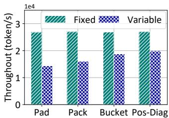  
(a) BERT-large on 8 GPUs

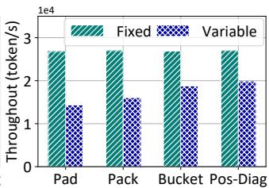  
(b) GPT (6.7B) on 16 GPUs  
Figure 1: Throughput comparison between fixed-length and variable-length training.

Thus, this paper proposes FlexPipe from the perspective of a distributed system to enable high-throughput variablelength training of transformers. FlexPipe dynamically adjusts PP to meet both the computation and memory demands across iterations while maintaining the semantics of training. Then, FlexPipe utilizes “redundant” GPUs to enhance both resource utilization and training efficiency. Specifically, two main challenges are tackled when designing FlexPipe. The first challenge is how to achieve live (i.e., no termination) and efficient (i.e., minimize the GPU stalls) adjustment during the training. We introduce a live flexibility mechanism (LFM) in FlexPipe to minimize the overhead of the adjustment. The second challenge lies in determining when to perform the LFM and how to identify an appropriate new parallel strategy. We design a heuristic bound searching algorithm (HBSA) by efficiently balancing the trade-off between computational and memory usage by comprehensively considering the overhead of the LFM and other memory optimization approaches.

We make the following contributions in this paper:

• We first introduce a flexible PP framework, FlexPipe, that improves the efficiency of variable-length training by enabling the LFM of PP.

• We propose a novel flexible memory optimization problem aiming at maximizing the training efficiency by dynamically reconfiguring the parallel strategy and utilizing the “redundant” GPUs across different iterations.

• We design HBSA to solve the optimization problem while striking a good trade-off between computational efficiency and memory usage by comprehensively considering the overhead of the LFM and other memory optimization approaches.

• We implement FlexPipe 1 on Pytorch. Extensive experiments are conducted to evaluate the efficiency of Flex-Pipe. The results show that FlexPipe achieves an average 1.25× training throughput compared with state-of-theart (SOTA) frameworks.

## 2 Background and Motivation

In this section, we first introduce the background of distributed transformer training, and then we illustrate this paper’s motivation.

## 2.1 Background

Transformers have achieved impressive performance in a variety of deep learning applications. Their architecture is typically based on encoders and decoders, which consists of multiple homogeneous encoder and decoder layers, such as BERT [7] (encoder-only) and GPT-3 [37] (decoder-only), where each layer has similar training resource consumption. As reported [16, 31], to perform multiple tasks, transformers enable training on a mixture of datasets with variable-length inputs. Self-attention is responsible for focusing on different positions of variable-length inputs. Fig. 2(a) shows the high variation in sequence lengths of a mixed dataset FLANv2 [30], the difference of sample lengths can be up to 60000 across different iterations when random sampling. Note that FlexPipe can be generalized to models beyond transformers. This paper focuses on the challenges posed by variable-length sequences, for which transformers are the most representative.

With the exponential growth of computation and memory demands, distributed training of transformers has become indispensable. Transformer training generally involves a combination of various parallelisms, including DP, TP, PP, and SP. This paper mainly focuses on the elasticity of PP, which is widely adopted in both commercial and academic DL clusters due to its considerably lower communication [12, 16, 54]. With PP, model parameter of DNN is partitioned into multiple stages at layer level. In each iteration, a mini-batch is fed into the first stage for forward propagation (FP), and the intermediate activations are transferred to the next stages. Then, during the backward propagation, the gradients are computed based on the FP activations and passed following the reverse order of FP. To increase training concurrency, PP splits the mini-batch into multiple micro-batches [9,14,16] or injects multiple minibatches [32]. Finally, the model parameters are updated by the gradients synchronously or asynchronously with an optimizer, e.g., adaptive moment estimation (Adam) [19]. Note that while our optimization targets variable-length sequence training through a dynamic PP framework and leverages DP to enhance throughput, the resources freed by short sequences can likewise be repurposed for TP or even 3D parallelism to further improve scalability.

## 2.2 Motivation

We conduct two experiments to analyze the observations that motivate this paper.

Observation 1: Variable-length training leads to underutilization of both computational and memory resources across different iterations. To accommodate the variablelength inputs into the traditional training frameworks [3, 35], the inputs are typically zero-padded to a fixed-length. However, this introduces extra memory consumption and wastes computation on zero tokens [16, 54]. To improve the training efficiency, the packing approach [8,38] concatenates multiple shorter samples into longer ones, aligning its length with the maximum sequence length of input. However, it introduces computational and memory overhead, as self-attention scales quadratically with sequence length [26]. It also introduces truncation and cross-contamination, putting the training accuracy at risk. Bucketing [34] constructs mini-batches with similar sequence lengths while it destroys randomness of sample batches. Block diagonal attention [20] addresses this with position IDs and masks, and some works leverage fusion [6, 54] reduce memory usage.

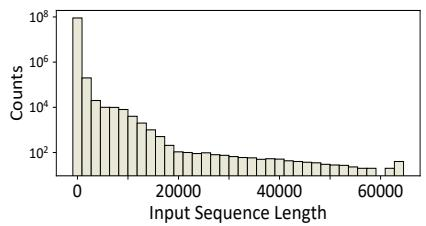  
(a) The sequence length distribution in FLANv2 [30].

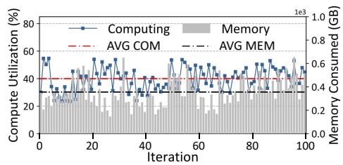

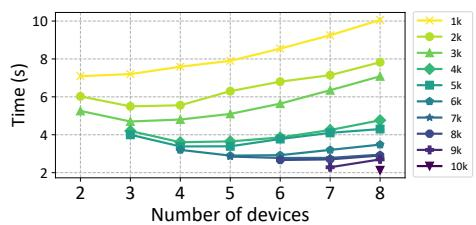  
(c) The training time under different sequence lengths when trained on different number of GPUs.  
Figure 2: The observations when training GPT (3.35B) with variable-length inputs.

Despite the forward strides made by existing work, they still suffer from significant fluctuations in both computational and memory requirements across different iterations. Fig. 2(b) illustrates the training throughput and memory usage of training GPT (3.35B) on variable-length inputs under the packing method. Such high variance in sample lengths incurs under-utilization of most iterations, their average computation throughput and memory utilizations are below 55% and 39%, respectively. Because most iterations have shorter samples but are processed using the devices designed for handling the longest samples.

The fundamental reason can be attributed to the fact that existing methods typically focus on the operator-level optimizations within a single iteration (e.g., kernel fusion, nonmatmul FLOPs reduction). However, the substantial fluctuations in both computational and memory requirements across iterations also lead to under-utilization. This opens up an inter-iteration opportunity from the distributed systems perspective.

Observation 2: Static partitioning of PP leads to inefficient variable-length training. Though PP is widely used in training large-scale transformers [18, 29, 36, 41, 57], variablelength training still poses challenges to existing methods. To maximize memory usage and throughput for traditional DNN, PP frameworks (PPs) typically initialize the PP configurations (e.g., batch size, number of stages) to maximize the occupation of device memory. These configurations will not be adjusted during the entire training process. While for variable-length training, current PPs still rely on static partitioning based on the longest sequence length in the dataset to avoid out-of-memory (OOM) errors, which degrades the system efficiency.

Fig. 2(c) shows the training time of GPT (3.35B) on datasets with different fixed lengths using different numbers of GPUs. We observe that the number of devices required for efficient training varies with sample length. For instance, when training a dataset with a sample length of 3k, using 3 GPUs achieves 4.7s per iteration, the shortest training time. However, when utilizing 8 GPUs, the throughput decreases, resulting in a training time as high as 7.08s/iteration. This is because smaller samples lead to significant communication overhead and poor utilization of GPU resources due to overly fine-grained partitioning [14]. Such static strategies (i.e., based on the maximum device requirement) significantly degrades the overall training throughput. Moreover, in variable-length training, the majority of iterations are typically composed of short data samples. For example, when random sampling in FLANv2, 95% of iterations have a maximum sample length under 4k, which exacerbates the performance degradation. This motivates us to explore dynamically reconfiguring the parallel strategy across different iterations and utilizing the “redundant" GPUs to accelerate variable-length training.

Besides efficient variable-length training, there is also a growing demand for flexible training in large-scale distributed frameworks. This includes optimizing cluster utilization through dynamic scheduling [42] and meeting jobspecific service level objectives [45]. In addition, flexible frameworks are crucial for addressing the challenges of heterogeneous cloud environments with fluctuating resource availability. They can also provide lower-cost fault recovery mechanisms [15, 48–51].

## 2.3 Challenges

Though the flexibility of PP shows its potential when dealing with variable-length and dynamic training, two challenges must be tackled to design an efficient flexible PP framework.

Firstly, dynamically adjusting PP introduces a huge overhead during training. Existing distributed frameworks utilize the suspend-resume or iteration stalling mechanism, which leads to a long stall due to initialization and communication overhead, usually longer than the duration of an iteration [57].

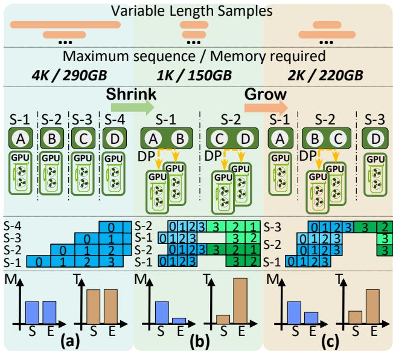  
Figure 3: An example of FlexPipe when growing and shrinking. The bars (bottom of the figures) illustrate a comparison of memory usage (M) and training throughput (T). The label E represents training using FlexPipe, and S represents using the static partitioning based on a sequence length of 4K (i.e., Fig. 3(a)).

Although flexible PP could utilize “redundant" GPUs to improve the training throughput, frequent reconfiguration or an improper parallel strategy would still degrade its performance. This raises the second challenge about when to adjust PP and how to search for an appropriate parallel strategy to maximize throughput for variable-length training.

## 3 FlexPipe

## 3.1 Overview

The key insight of FlexPipe is to dynamically adjust the parallel strategy during training, adapting to the variable-length of transformers at each iteration. FlexPipe introduces a novel flexible PP framework, while previous PP frameworks rely on a fixed number of stages and static PP configurations during the whole training process, which misses opportunities to improve the variable-length training efficiency. Specifically, FlexPipe selects an appropriate number of devices used and configures PP, taking into account the computation and memory demands across iterations. Additionally, FlexPipe utilizes any idle GPUs to increase the degree of DP, enhancing both resource utilization and training efficiency.

Fig. 3 illustrates an example of flexible training with Flex-Pipe using four A100 GPUs to train GPT (3.35B) on a variable-length dataset with a maximum sample length of 4k. Fig. 3(a) shows that when processing a 4k sequence length mini-batch. To satisfy the memory requirement (290 GB), the model is partitioned into four stages, with each stage typically assigned to a single device (i.e., the middle of Fig. 3(a)). In this case, FlexPipe employs an identical parallel strategy and has a similar performance to the static partitioning (i.e., the bottom of Fig. 3(a), which shows the memory occupation and corresponding training throughput of GPipe and FlexPipe). This is because the maximum sequence length in the current mini-batch equals the dataset’s overall maximum, leading to the same number of PP stages and configurations. In contrast, FlexPipe dynamically shrinks and grows PP stages as shown in Fig. 3(b) and (c) to improve throughput while meeting memory requirements. When training on a 1k sequence length mini-batch, FlexPipe adjusts the PP stages to 2 and leverages the remaining 2 GPUs for DP. For a 2k mini-batch, FlexPipe reconfigures the PP stages to 3 to satisfy the increased memory demands.

## 3.2 Design

FlexPipe is designed as an intermediary system between a typical training system (e.g., FlashAttention and Zero-Bubble) and its underlying execution engine (e.g., PyTorch [35]). Flex-Pipe dynamically adjusts the number of PP stages online and configurations for a given transformer-based model trained on a variable-length dataset. Fig. 4 shows the overview of FlexPipe architecture, which consists of three main modules.

Monitor profiles both the running system and devices to collect information, such as GPU states (e.g., TFlops and communication bandwidth), PP schemes (e.g., Zero-Bubble scheduler and partitioning), and DNN model states (e.g., hyperparameter and optimizer settings). Furthermore, it pre-fetches the future sequences from the data loader to minimize the profiling overhead. Based on the profiling results, it then estimates memory usage and throughput during training.

Planner leverages the collected data to decide whether to shrink or grow and generates the corresponding parallel strategy. Specifically, the Planner incorporates a trigger that first determines whether to apply a shrinking or growing algorithm to guarantee the memory requirements, based on the sequence length of the mini-batch in the next iteration. Then, the Planner calls the corresponding algorithm to evaluate the benefits of shrinking or growing (i.e., the trade-off between the throughput gains and the associated overhead) and makes a global decision, including a computation graph, adjustment decision, etc. As a way of alleviating memory pressure, PP may not always be the most cost-efficient approach. Other techniques such as recomputation [5, 14] or memory virtualization [39, 57], should also be considered. Further details on these algorithms are discussed in Section 5.

TwinLayer Manager receives global decisions from the Planner and refines them into detailed communication and computation operators. To enable an efficient and fast flexible PP mechanism, each server maintains a TwinLayer Manager.

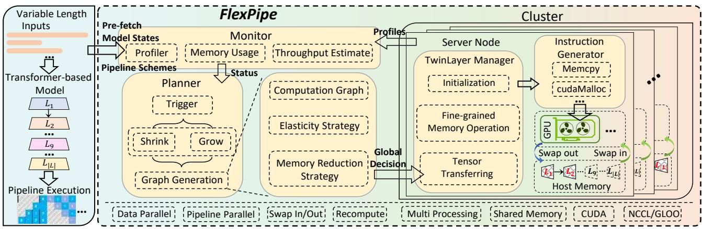  
Figure 4: The overview of FlexPipe system architecture.

Additionally, all layers assigned to this node are duplicated and are stored in the host memory of each server. This design ensures flexibility and resilience and will be elaborated on in Section 4. The TwinLayer Manager is responsible for all operations (e.g., copying, swapping, and recomputation) related to the layers within each GPU, and the duplicated layers in the host memory. Then, the instruction generator converts the high-level operations from TwinLayer Manager into specific instructions, such as cudaMalloc, cudaFree, and communication primitives like isend.

## 4 Live Flexibility Mechanism

To achieve high throughput with FlexPipe, the key challenge lies in implementing a fast and live flexibility mechanism. Existing PP frameworks [9, 29, 36] typically do not support an adjustable number of PP stages and configurations during runtime. Thus, resource managers [28, 59] in DL clusters that rely on these PP frameworks reconfigure the resource allocation of PP through a non-live suspend-resume mechanism. However, this incurs heavy overhead, including checkpointing, bootstrapping, and data loading. To address this challenge, a basic way to maintain live training without requiring a full resume is to initialize the stages on devices, transfer parameters, and modify dependencies between the iterations. However, the overhead of initialization and communication during the training of large-scale transformers cannot be ignored, which still leads to a long stall across iterations. In summary, both approaches incur immense overhead, which can severely degrade the training throughput when the adjustment is frequently triggered.

Thus, FlexPipe aims to design a Live Flexibility Mechanism (LFM) to transparently adjust the number of PP stages and configurations without stalling. The key idea behind this mechanism is to reduce the initialization overhead and overlap the communication and computation time. Specifically, FlexPipe introduces duplicated layers that are stored in the host memory of each node, containing all layers within that node and their corresponding optimizers, which brings two advantages. Firstly, TwinLayer supports a fine-grained layer granularity that reduces the overhead of initialization. Traditional PP frameworks operate at the stage of granularity during training, which prevents direct access to individual layers. When implementing flexibility, the parameters and optimizers of the stages must first be decomposed into individual layers, transmitted across devices, and then reassembled on the target devices. This process incurs significant overhead, e.g., 1.2s for GPT (3.35B). Secondly, by storing duplicated layers in the host memory, FlexPipe reduces the overhead of frequent memory allocations and deallocations.

Additionally, FlexPipe employs a TwinLayer Manager to efficiently orchestrate the communication and computation operations for each layer in the devices and host memory. To ease discussion, Figs. 5 and 6 illustrate examples of FlexPipe within a single node with four GPUs. Fig. 5(a) and Fig. 5(b) show the steps and their corresponding timeline when reducing a PP stage. The instructions are generated based on the global decision at the start of the previous iteration. To improve the training throughput, the freed GPUs will be utilized to increase the degree of DP. As shown in Fig. 5(a), a new DP instance is introduced between $\mathrm { G P U } _ { 2 }$ and $\mathrm { G P U } _ { 3 }$ . Consequently, part of the data needs to be redistributed following the instructions for data transition. The initialization steps for PP and DP are executed following the decision-making step, which is overlapped with the data transition process (Fig. 5(b)). Then, the dependencies across different microbatches (i.e., execution order) are modified after the BP step. Once the update of the previous iteration is complete, GPU2 and $\mathrm { G P U } _ { 3 }$ send their updated parameters of layers $L _ { 4 }$ and $L _ { 5 }$ to the duplicated layers. Then, they respectively copy the parameters of layers $L _ { 5 }$ and $L _ { 4 }$ from the duplicated layers. Note that these copy steps are proceeded in a pipelined manner that copy-in process begins as soon as a portion of the parameters arrives. Then, the next iteration starts with a new configuration.

Conversely, to mitigate the memory pressure caused by training on temporary longer-length sequences, the degree of DP is decreased to add the PP stages. Fig. 6(a) and Fig. 6(b)

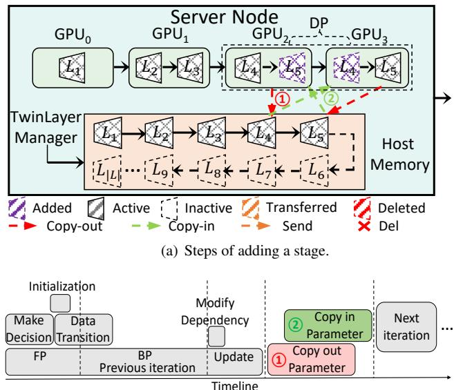  
(b) Execution timeline of adding a stage.  
Figure 5: Example of adding a stage with FlexPipe within a node with 4 GPUs.

show the steps and their corresponding timeline when adding a PP stage. The same decision-making and initialization steps are first executed. Furthermore, the data redistribution and transition step is also needed to remove a worker of DP. Then, after the BP, the parameters of layers $L _ { 5 }$ and $L _ { 4 }$ can be directly deleted from devices $\mathrm { G P U } _ { 2 }$ and $\mathrm { G P U } _ { 3 } ,$ , respectively. This is because all instances in DP maintain identical model parameters in each device. Once the gradients are computed during BP, the parameters can be updated after gradient synchronization without requiring the copies of parameters (Fig. 6(b)).

FlexPipe not only adjusts the number of stages but also enables flexible repartitioning by supporting layer migration between devices. As shown in Fig. $6 , L _ { 3 }$ is migrated from $\mathrm { G P U } _ { 1 }$ to $\mathrm { G P U } _ { 2 }$ to satisfy memory requirements. By taking advantage of the characteristic of PP, where the activations generated by micro-batches in the FP are required during the BP, the transfer process can occur within the previous iteration when sufficient memory is available. After the decisionmaking step, the parameters are transferred immediately, and the activations of micro-batches already computed during the FP on $\mathrm { G P U } _ { 1 }$ are transferred to GPU2. Then, the FP and BP for the remaining micro-batches will proceed on GPU2.

In our evaluation, a non-live migration approach results in an average execution stall of 7.16s, while FlexPipe requires only 0.79s. The specific overhead will be discussed in Section 7. Due to space limitations, we omit the discussion of inter-server LFM, which is similar to the intra-server. The key difference lies in the overhead of transferring the Twin-Layer across nodes due to lower inter-node bandwidth. This poses challenges for FlexPipe, particularly when migrating stages with large intermediate tensors. To address this, Flex-Pipe minimizes inter-node transfers by prioritizing intra-node remapping and pre-transferring critical data when necessary.

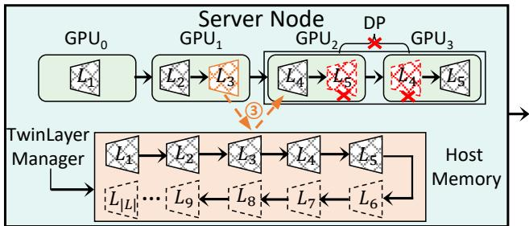  
(a) Steps of removing a stage.

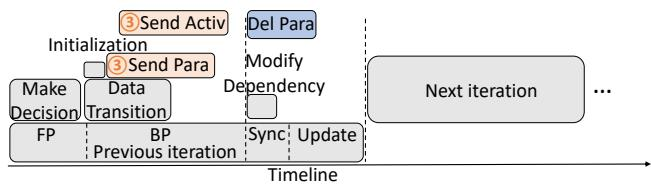  
(b) Execution timeline of removing a stage.  
Figure 6: Example of removing a stage with FlexPipe within a node with 4 GPUs.

## 5 Efficient Variable-length Training

Although the LFM reduces the overhead of individual PP adjustments, frequent reconfigurations, and an improper parallel strategy can still degrade the training throughput. Therefore, an efficient algorithm is urgently needed to determine when to trigger the LFM and identify an appropriate parallel strategy. We formulate a new optimization problem, flexible memory optimization problem, which considers multiple memory optimization techniques and flexibility mechanisms to avoid unnecessary reconfigurations. To address this problem, we design a Heuristic Bound Search Algorithm (HBSA) that strikes a balance between flexibility and training efficiency.

## 5.1 Problem Formulation

We consider a transformer-based model trained on a mixture of datasets with variable-length samples. The model is deployed to a DL cluster and trained synchronously using PP across the device set.

System Model. With PP, the model that consists of $L =$ $\{ l _ { 1 } , l _ { 2 } , . . . , l _ { | L | } \}$ transformer layers is divided into multiple stages ${ \cal { S } } = \{ s _ { 1 } , s _ { 2 } , . . . , s _ { | S | } ) \}$ }. Each stage consists of a consecutive set of layers (at least one layer, and $s _ { i } \cap s _ { j } \emptyset )$ , and the last layer of stage $s _ { n }$ is the predecessor of the first layer of stage $s _ { n + 1 }$ 1. For ease of formulation, homogeneous GPUs on several physical servers D are available for the training model, which is divided into multiple device groups $G = \left\{ g _ { 1 } , g _ { 2 } , . . . , g _ { | G | } \right\}$ $( g _ { i } \cap g _ { j } = \mathcal { O }$ and $| | G | | = | | S | | ,$ . Note that ||S|| does not necessarily have to be divisible by the number of total available GPUs ||D||, i.e., $( | | S | | \mathcal { I } _ { \boldsymbol { o } } | | D | | ) \in N$ . Since “redundant” GPUs can be used to accelerate DP for part of the pipeline, as illustrated in Fig. 3(c) that has been widely adopted in hybrid

parallelisms [9].

Training Time Estimation. To estimate the training time of pipeline execution, we utilize an estimation function based on the existing work [36]. Given a mapping of stages to device groups $s \Pi _ { G } = \{ s _ { 1 } \to g _ { 1 } , . . . , s _ { | S | } \to g _ { | G | } \}$ , the training time $T ( s \Pi _ { G } , n _ { m i c r o } )$ can be represented by,

$$
T ( s \Pi _ { G } , n _ { m i c r o } ) = \sum _ { i = 1 } ^ { | | S | | } t _ { i } + ( n _ { m i c r o } - | | S | | + 1 ) \times \operatorname* { m a x } _ { 1 \leq j \leq | | S | | } t _ { j } ,\tag{1}
$$

where $n _ { m i c r o }$ is the number of micro-batches, ti represents the time taken for a single operation of PP, including FP and BP computation, and the communication across devices (for PP and DP), which is proportional to $\mu .$

Memory Usage. To efficiently leverage the “redundant” GPUs, we estimate the peak memory consumption of each iteration to calculate the maximum required device number for PP. Let $B , \mu ,$ and M denote the global batch size, maximum sequence length, and memory capacity of a single GPU, respectively.

$$
M _ { p e a k } ( L , B , \mu ) = M _ { p , g , o } ( | | L | | , \mu ) + M _ { a c t } ( | | L | | , B , \mu ) + M _ { b u f } ,\tag{2}
$$

where $M _ { p , g , o }$ represents the memory of parameters, gradients, and optimizer states, $M _ { a c t }$ and $M _ { b u f }$ represent the memory of activation and other buffers.

The above runtime data (e.g., training time, communication time, batch size, and memory usage) is collected by Flex-Pipe’s profiler during initial training iterations. Cost modeling for distributed training has been extensively studied in prior works [42], especially in DP [23] and PP [55]. Further modeling details were excluded for brevity.

Flexible Memory Optimization Problem. As a way of alleviating memory pressure, a flexibility mechanism may not always be the most cost-efficient approach. Other memory optimization approaches should also be comprehensively considered, such as recomputation [5, 14] or memory virtualization [39, 57]. Let $O _ { p l a n }$ represent the memory-optimized scheme utilized in the FlexPipe, including identifying layers for activation recomputation [41], portions of the optimizer to offload [27], and estimating memory savings for each action. $M _ { O p } ( \ l _ { S } \Pi _ { G } , O _ { p l a n } , B , \mu )$ represents the memory consumption following optimized scheme $O _ { p l a n } . \ T ( \ l _ { S ^ { ' } } \Pi _ { G ^ { ' } } \to s \Pi _ { G } )$ represents the overhead of the LFM from $s ^ { \prime \Pi } { } _ { G ^ { \prime } }$ to $s \Pi _ { G }$ . Let $T _ { r c } ( O _ { p l a n } )$ and $T _ { s w a p } ( O _ { p l a n } )$ represent the time of recomputing and offloading (swap-in, swap-out), respectively. Let $M _ { G }$ denote the total memory capacity of the current device groups G for PP and $M _ { G } = M \times | | G | |$ , naively comparing the $M _ { G }$ and $M _ { p e a k }$ to decide whether to use the LFM may lead to inefficient adjustment, more details will be discussed in Sec. 5.2. Therefore, elaborate conditions are necessary to determine which mechanism to apply.

The memory of current $s ^ { \prime \Pi } { } _ { G ^ { \prime } }$ is less than or equal to the total memory capacity of the current device groups $G ^ { ' }$ , which

is set as

$$
c o n d i t i o n \mathcal { A } : M _ { p e a k } ( L , B , \mu ) \leq M _ { G ^ { \prime } } .\tag{3}
$$

The overhead of live flexibility from $s ^ { \prime \Pi } { } _ { G ^ { \prime } }$ to $s \Pi _ { G }$ and the computation time of $s \Pi _ { G }$ are greater than or equal the computation time of $s ^ { \prime \Pi } { } _ { G ^ { \prime } }$ , which is set as

condition B : $T ( s \Pi _ { G } ) + T ( { } _ { S ^ { ' } } \Pi _ { G ^ { ' } }  s \Pi _ { G } ) \geq T ( { } _ { S ^ { ' } } \Pi _ { G ^ { ' } } ) .$

(4)

Under $s ^ { \prime \Pi } { } _ { G ^ { ' } }$ , the memory after using $O _ { p l a n }$ is less than or equal the total memory capacity of the current device groups $G ^ { ' }$ , which is set as

$$
c o n d i t i o n \quad C : M o p ( { } _ { S ^ { \prime } } \Pi _ { G ^ { \prime } } , O _ { p l a n } , B , \mu ) \leq M _ { G ^ { \prime } } .\tag{5}
$$

The overhead of the LFM from $s ^ { \prime \Pi } { } _ { G ^ { \prime } }$ to $s \Pi _ { G }$ and the computation time of $s \Pi _ { G }$ greater than or equal the sum of computation time of $s ^ { \prime } { } ^ { \Pi } \scriptscriptstyle { G ^ { \prime } }$ , the time of recomputing $T _ { r c } ( O _ { p l a n } )$ and the time of offloading $T _ { s w a p } ( O _ { p l a n } )$ , which is set as

$$
\begin{array} { r l } & { c o n d i t i o n \mathcal { D } : T ( s \Pi _ { G } ) + T ( { \bf \Pi } _ { S ^ { \prime } } \Pi _ { G ^ { \prime } }  s \Pi _ { G } ) \geq T ( { \bf \Pi } _ { S ^ { \prime } } \Pi _ { G ^ { \prime } } ) } \\ & { \qquad + T _ { r c } ( O _ { p l a n } ) + T _ { s w a p } ( O _ { p l a n } ) . } \end{array}\tag{6}
$$

We use $\mathcal { T }$ to represent the iteration time of the model on the GPU cluster $D _ { \colon }$

$$
\mathcal { T } = \left\{ \begin{array} { l l } { T ( \boldsymbol { \mathbf { \rho } } _ { S ^ { \prime } } \boldsymbol { \Pi } _ { G ^ { \prime } } ) , } & { \mathcal { A } \wedge \mathcal { B } } \\ { T ( \boldsymbol { \mathbf { \rho } } _ { S ^ { \prime } } \boldsymbol { \Pi } _ { G ^ { \prime } } ) + T _ { r c } ( O _ { p l a n } ) + T _ { s w a p } ( O _ { p l a n } ) , } & { \neg \mathcal { A } \wedge C \wedge \mathcal { D } } \\ { T ( s \boldsymbol { \Pi } _ { G } ) + T ( \boldsymbol { \mathbf { \rho } } _ { S ^ { \prime } } \boldsymbol { \Pi } _ { G ^ { \prime } } \to s \boldsymbol { \Pi } _ { G } ) , } & { \mathcal { Z } } \end{array} \right.
$$

where condition $\mathcal { Z } = ( \neg \mathcal { A } \land \neg \mathcal { D } ) \lor ( \mathcal { A } \land \neg \mathcal { B } )$

(7)

Definition1. Flexible Memory Optimization Problem (FMOP). Given a transformer-base model L, a GPU cluster D, a current mapping of stages S  to device groups G $\left( _ { S ^ { ' } } \Pi _ { G ^ { ' } } \right)$ and the maximum sequence length for the next iteration $\mu ,$ FMOP seeks an appropriate the memory optimized scheme $O _ { p l a n }$ and mapping of stages to device groups $s \Pi _ { G }$ with minimum T considering variable-length data inputs, as:

$$
\begin{array} { c } { { m i n i m i z e \mathrm { \mathcal { T } } } } \\ { { O _ { p l a n } , s \mathrm { I I } _ { G } } } \\ { { } } \\ { { \mathrm { s . t . } \quad ( 1 ) , ( 2 ) , ( 3 ) , ( 4 ) , ( 5 ) , ( 6 ) , ( 7 ) } } \end{array}\tag{8}
$$

## 5.2 Algorithm

The FMOP can be formally shown as an NP-hard problem due to the extremely large search space. Moreover, frequent reconfiguration can still lead to significant performance degradation. To identify an appropriate parallel strategy and efficiently perform the LFM, we propose a Heuristic Bound Search Algorithm (HBSA), which consists of three parts: 1) computing the bounds of layer numbers in each stage and GPU numbers in each device group (Lines 3-11), 2) utilizing the bounds to navigate efficient mapping of stages and device groups (Lines 14-26), 3) exploiting the above conditions to determine when to trigger the LFM (Lines 28-37).

Algorithm 1 Heuristic Bound Search Algorithm (HBSA)   
Input: Model L, GPU cluster ${ \overline { { D , } } }$ time estimation functions.   
memory estimation functions, maximum sequence length   
$\mu .$ Current state: $s ^ { \prime \Pi } { } _ { G ^ { \prime } } , \mu ^ { ' }$   
Output: Memory optimization scheme $O _ { p l a n } ,$ , Mapping of   
stages to groups ${ \mathrm { } } _ { S } \Pi _ { G } .$   
1: Initialize: $\cdot O _ { p l a n } = \varnothing , S = \varnothing , G = \varnothing .$   
2: // Exhaustive search.   
3: for $i = 1$ to $| | D | |$ do   
4: if $M _ { p e a k } ( B , \mu ) < i \times M$ then   
5: $N _ { s t a g e } = i$   
6: break   
7: // Computing the bounds.   
8: if $N _ { s t a g e } \neq | | \overline { { S } } ^ { ' } | |$ then   
9: $n _ { l o w } ^ { l ^ { - } } = \ddot { | } | | L \ddot { | } | / N _ { s t a g e } | , \quad n _ { l o w } ^ { g } = | | | D | | / N _ { s t a g e } \rfloor $   
10: $n _ { u p } ^ { l } = m i n ( \lvert | L \rvert | / N _ { s t a g e } \lvert + ( \lvert | L \rvert | \mathcal { H } N _ { s t a g e } ) , n _ { m a x } ^ { l } )$   
11: $n _ { u p } ^ { g } = \lfloor | D | | / N _ { s t a g e } \rfloor + ( | | L | | \% N _ { s t a g e } )$   
12: $S e a r c h ( L , D , S , G , \nu )$   
13: // Navigating efficient mapping.   
14: function Search $\iota ( L , D , S _ { t } , G _ { t } , \mathbf { v } )$   
15: for $i = n _ { l o w } ^ { l } t o n _ { u p } ^ { l }$ do   
16: for $j = n _ { l o w } ^ { g } \ : t o \ : n _ { u p } ^ { g }$ do   
17: $s _ { t } = P$ artition(L, i), gt = Partition(D, j)   
18: $L _ { t } = L - s _ { t } , \quad D _ { t } = D - g _ { t }$   
19: $\mathbf { i f } \ \lvert | L _ { t } \rvert | > n _ { u p } ^ { l } \land \lvert | D _ { t } \rvert | > n _ { u p } ^ { g }$ then   
20: $S e a r c h { ( \dot { L } _ { t } , D _ { t } , S _ { t } \cup \{ s _ { t } \} , G _ { t } \cup \{ g _ { t } \} , \mathbf { v } ) }$   
21: $\mathbf { i f } \ \lvert | L _ { t } \rvert | \in [ n _ { l o w } ^ { l } , n _ { u p } ^ { l } ] \land \lvert | D _ { t } \rvert | \in [ n _ { l o w } ^ { g } , n _ { u p } ^ { g } ]$ then   
22: $\hat { S } = S _ { t } \cup \{ s _ { t } \} \cup \{ L _ { t } \}$   
23: $\hat { G } = G _ { t } \cup \{ g _ { t } \} \cup \{ D _ { t } \}$   
24: $\mathbf { f } T ( \hat { \varsigma } \Pi _ { \hat { G } } ) + T ( \varsigma ^ { \prime } \Pi _ { G ^ { \prime } } \to \varsigma \Pi _ { \hat { G } } ) < \mathbf { v }$ then   
25: $S = \hat { S } , G = \hat { G }$   
26: $\mathsf { v } = T ( _ { \hat { S } } \Pi _ { \hat { G } } ) + T ( _ { S ^ { ' } } \Pi _ { G ^ { ' } }  _ { \hat { S } } \Pi _ { \hat { G } } )$   
27: // Determining the triggering timing.   
28: if A ∧ B then   
29: return $O _ { p l a n } , _ { S ^ { ' } } \Pi _ { G ^ { ' } }$ B①   
30: else if $\mathcal { A } \wedge \neg \mathcal { B }$ then   
31: return $O _ { p l a n } , s \Pi _ { G }$ B④   
32: $\mathbf { i f } \neg \mathcal { A } \land \neg \mathcal { B }$ then   
33: $O _ { p l a n } = i n i t ( L , _ { S ^ { ' } } \Pi _ { G ^ { ' } } )$   
34: if $C \wedge \mathcal { D } \mathrm { \bf ~ t h e n }$   
35: $\mathbf { r e t u r n } O _ { p l a n } , _ { S ^ { ' } } \Pi _ { G ^ { ' } }$ B②   
36: else $\mathbf { i f } \neg \mathcal { D } \mathbf { t h e n }$   
37: return $O _ { p l a n } , s \Pi _ { G }$ B③

Bounds Computation. To complete the training of LLMs, it is crucial to ensure that PP can be executed without OOM errors. Therefore, the first step is to determine the minimum number of devices required to accommodate $M _ { p e a k } ( L , B , \mu )$ ， which corresponds to the number of stages. The HBSA can identify the minimum number of devices through an exhaustive search (Lines $3 \substack { - 6 } ) .$ . To reduce the frequency and space of searching the mapping, we compare the number of stages in the next iteration $N _ { s t a g e }$ with the current configuration $| | \boldsymbol { S } ^ { \prime } | |$ Based on this comparison, we compute the bounds for the number of layers in each stage $( \mathrm { i . e . , ~ } | | s _ { i } | | ~ ( 0 < i \leq | | S | | ) )$ and the number of GPUs in each device group (i.e., ||gi|| $( 0 < i \leq | | G | | )$ ). HBSA leverages bounds to filter out a large number of invalid stage partitions and device combinations. The calculation of these bounds is based on the characteristics of transformer-based models and key observations.

The homogeneity of transformers allows us to easily predict the memory consumption of each layer, and stages with the same number of layers typically exhibit similar memory consumption. A key observation is that the variance in $\left| \left| s _ { i } \right| \right|$ $( 0 < i \leq | | S | | )$ and $\left| \left| g _ { i } \right| \right| ( 0 < i \leq | | G | | )$ is not significant in the optimal solution. Based on the heuristic, we should aim to keep the $\left| \left| s _ { i } \right| \right|$ and the ||gi|| as consistent as possible. Therefore, we use $\dot { \lfloor \left. L \right. \rvert / N _ { s t a g e } } \rfloor$ and $\lfloor \lvert D \rvert \rvert / N _ { s t a g e } \rfloor$ as the lower bounds for the $\left| \left| s _ { i } \right| \right|$ and the $\left| \left| g _ { i } \right| \right|$ , respectively (Line 9).

Since the total number of model layers and GPUs cannot always be evenly divided by the number of stages $N _ { s t a g e } ,$ , the upper bound for the ||gi|| is $\dot { n } _ { u p } ^ { g } = \dot { \underline { | } } \dot { | } D \dot { | } \rvert / N _ { s t a g e } \dot { \underline { | } } + ( \lvert \lvert L \rvert \rvert \% N _ { s t a g e } ) \dot { e }$ (Line 11). Moreover, as the number of model layers per stage is also constrained by the GPU memory capacity $M ,$ where $n _ { m a x } ^ { l }$ represents the maximum number of layers that can be accommodated in a single GPU, the minimum value between $\lfloor \lvert L \rvert \rvert / N _ { s t a g e } \rfloor + ( \lvert \lvert L \rvert \rvert \% N _ { s t a g e } )$ and $n _ { m a x } ^ { l }$ (Line 10) is the upper bound of layers.

Navigating mapping. To accelerate the search for efficient mapping of stages to device groups, HBSA uses the upper and lower bounds of layers and GPUs as the starting and stopping conditions for recursion. This effectively reduces the search cost by avoiding invalid and inefficient mappings caused by OOM or excessive overhead of the LFM.

In the Search function, we begin by using bounds to partition L and $D$ (Lines 15-17). We then check if both remaining $\left| \left| L _ { t } \right| \right|$ and $\left| \left| D _ { t } \right| \right|$ exceed their upper bounds. If so, we recursively invoke the Search function with the remaining $L _ { t }$ and $D _ { t }$ (Lines 19-20). Conversely, if $\left| \left| L _ { t } \right| \right|$ and $\left| \left| D _ { t } \right| \right|$ are both within the defined bounds, we identify $\hat { s } ^ { \Pi } \hat { G }$ as a valid mapping and assess whether it is the shortest in terms of time (Lines 21-26). Any other cases where $\left| \left| L _ { t } \right| \right|$ and $\left| \left| D _ { t } \right| \right|$ fall outside the bounds are deemed invalid mappings.

The introduction of the bound constraints effectively prevents extreme model-device partition (e.g., inefficient mappings with an excessively high degree of DP, causing communication overhead explosions). For candidate mappings within the bounds, we perform comprehensive cost modeling through Eq. 1 to estimate the training time, further searching for the most efficient mapping.

Determining triggering. Once an effective mapping is identified, it is essential to decide whether to trigger the LFM. Therefore, we use the conditions in Sec. 5 to guide this decision. As shown in Fig. 7, we summarize four types of solutions in the HBSA, including ① maintaining the original mapping without memory optimization, ② applying current popular memory optimization techniques under the original mapping, ③ grow, which involves forming more stages and ④ shrink, which entails reducing the number of stages.

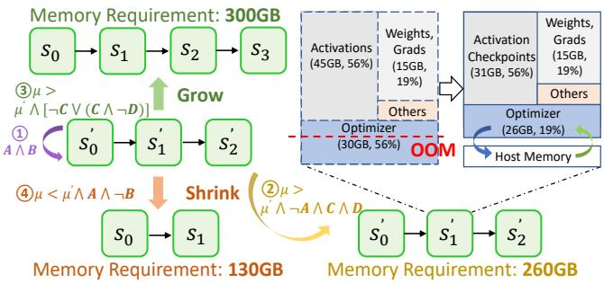  
Figure 7: The trigger condition of flexibility by combining with recomputing and memory virtualization.

When both conditions A and B are satisfied, no action is necessary, meaning that neither memory optimization nor triggering flexibility is needed (①, Lines 28-29). If condition A is satisfied but condition B is not, then flexibility should be triggered (④, Lines30-31). When condition A is false, condition B must also be false. In such cases, it is necessary to employ memory optimization techniques (②, Lines 32-33). When both conditions C and D are true, triggering flexibility is unnecessary, and only memory optimization techniques should be utilized (Lines 34-35). If condition D is not met, flexibility should be activated (③, Lines 36-37). For example, as shown in Fig.7, increasing the maximum sequence length pushes GPU memory usage to 260GB, triggering an OOM error. Under condition D, reconfiguration overhead exceeds that of memory optimization, thus FlexPipe prioritizes the memory optimization strategies (②). Specifically, in stage S 1, the recomputation reduces activation memory by 14GB, coupled with memory swapping that decreases optimizer memory by 4GB. Comprehensive reconfiguration details and examples are provided in Sec. 7, Tab. 2.

Here, reconfiguration is not required at every iteration during variable-length training. According to the input distribution, where the vast majority of sequences are short, only about 3% of the iterations contain long sequences. Thus, most training iterations fall within a relatively narrow resource range. Furthermore, HBSA provides a tolerant adjustment mechanism to avoid unnecessary reconfigurations by selectively combining reconfiguration with other lightweight memory optimization strategies. Empirical observations demonstrate that during training of the GPT-3.35B model on a 16- A100 GPU cluster, the system triggers grow (③) or shrink (④) at an average period of 37 iterations due to the symmetry. Memory optimization techniques (②) serve as the principal optimization methodology at an average period of 4 iterations.

## 6 System Implementation

FlexPipe is implemented using 8K LoC in Python and 2K LoC C++/CUDA code, a distributed DL runtime. Communication in PP and DP is implemented based on PyTorch’s DDP with NCCL backend. We further describe the implementation of some of the unique aspects of FlexPipe.

Data preprocessing. To prevent delays between iterations and ensure efficient training, it is essential to preprocess the data before the training begins. Specifically, we implement a data prefetching strategy where the data loader not only fetches the current batch but also samples the next global batch in advance based on the training workflow feature. This advanced sampling process involves calculating the maximum sequence length, which ensures that the data is padded or truncated appropriately. The prepared data also prevents bottlenecks caused by input data stalls.

Model reconstruction. We designed a TwinLayer by reconstructing the original model layer. The TwinLayer minimizes the overhead of managing tensors by referencing their addresses directly rather than duplicating the tensors themselves, thereby reducing memory usage and improving computational efficiency. The TwinLayer Manager is implemented as an independent process on each server, where it runs multiple computational and communication threads using the C++ thread interface to avoid the Global Interpreter Lock limitations in Python’s multithreading. Based on the timeline and current communication efficiency of the server, it generates effective orchestration strategies.

Communication transferring. We use DDP to transmit tensor between GPU-GPU and GPU-host. To leverage the duplicate channels between GPUs and the host, the weights and gradients are partitioned and transferred in a pipelined manner, which effectively reduces communication delays. To eliminate the potential disruption of training caused by live flexibility, we implemented asynchronous transfer operations using specific asynchronous interfaces, cudaMemcpyAsync and isend, which enable non-blocking data transmission.

## 7 Evaluation

We conduct comprehensive tests to evaluate the efficiency of FlexPipe. The results show that FlexPipe achieves 1.25× training throughput over SOTA methods on average.

## 7.1 Experimental Setup

Testbed. We evaluate FlexPipe in an environment consisting of 8 NVIDIA SXM4 servers. Each node is equipped with 4 NVIDIA A100 GPUs (Ampere architecture) with 80GB of on-chip memory and is connected to a 64-core AMD EPYC 7763 CPU. The GPUs are interconnected using NVLink, providing a communication bandwidth of 300GB/s. GPU-to-CPU communication uses PCIe 4.0, offering a bandwidth of 64GB/s. These servers are connected by Infiniband with 50GB/s.The testbed runs on 64-bit SUSE Linux Enterprise Server 15 SP4 with CUDA 12.1 and PyTorch 2.1.1. As a middleware, FlexPipe is compatible with FlashAttention [6] and Zero-Bubble [36], which are incorporated to enhance the efficiency of the transformer-based model.

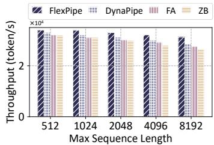  
(a) BERT24 on 4 GPUs.

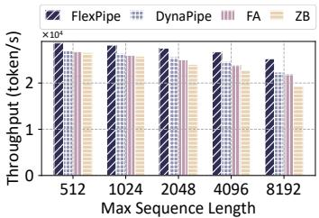  
(b) BERT96 on 8 GPUs.

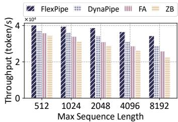  
(c) GPT (3.35B) on 16 GPUs.

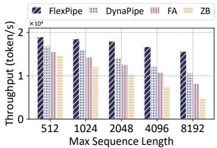  
(d) GPT (13B) on 32 GPUs.

Figure 8: The average training throughput under different maximum sequence lengths.  
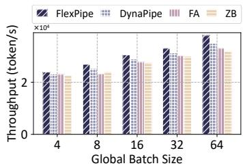  
(a) BERT24 on 4 GPUs.

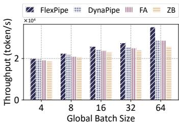  
(b) BERT96 on 8 GPUs.

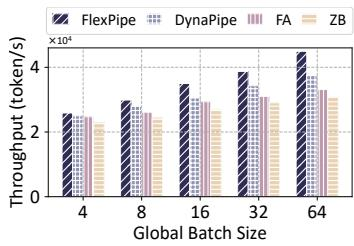  
(c) GPT (3.35B) on 16 GPUs.

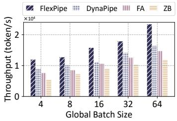  
(d) GPT (13B) on 32 GPUs.  
Figure 9: The average training throughput under different global batch sizes.

Table 1: Transformer-based models for evaluation
<table><tr><td rowspan=1 colspan=1>Model</td><td rowspan=1 colspan=1>#Layers</td><td rowspan=1 colspan=1>#Heads</td><td rowspan=1 colspan=1>#ModelDim</td><td rowspan=1 colspan=1>#Params</td></tr><tr><td rowspan=1 colspan=1>BERT</td><td rowspan=1 colspan=1>24</td><td rowspan=1 colspan=1>16</td><td rowspan=1 colspan=1>1024</td><td rowspan=1 colspan=1>340M</td></tr><tr><td rowspan=2 colspan=1>BERTGPT</td><td rowspan=2 colspan=1>9616</td><td rowspan=1 colspan=1>16</td><td rowspan=2 colspan=1>10244096</td><td rowspan=2 colspan=1>1.36B3.35B</td></tr><tr><td rowspan=1 colspan=1>32</td></tr><tr><td rowspan=1 colspan=1>GPT</td><td rowspan=1 colspan=1>40</td><td rowspan=1 colspan=1>40</td><td rowspan=1 colspan=1>5140</td><td rowspan=1 colspan=1>13B</td></tr></table>

Baselines. FlexPipe is compared with three representative methods from different perspectives. (1) Zero-Bubble (ZB) [36] is currently the most effective PP training framework. We implement it by using padding to enable variablelength training. (2) FlashAttention (FA) [1] is widely used for optimizing LLMs from the kernel perspective, which reduces the computation time and memory footprint of attention. FlashAttention supports efficient variable-length training by packing methods and utilizes the default PP provided by Py-Torch for distributed training. (3) DynaPipe [16] optimizes the variable-length training from the system perspective by supporting variable sizes of micro-batches to increase the padding efficiency.

Transformer-based models. Two transformer-based models are used in the experiments, including the variants of the GPT and BERT models. The details are shown in the Tab. 1. Both of them are trained on the FLANv2 dataset [30], one of the largest publicly available multi-task training datasets. The number of micro-batches for Zero-Bubble and FlashAttention is configured per model to maximize training throughput, while for FlexPipe and DynaPipe, it is dynamically adjusted.

Metrics. The average training throughput of actual tokens is used as the main metric, which is calculated by dividing the total number of tokens by the duration of one epoch. Moreover, we utilize the overhead of PP adjustment as a metric to evaluate the proposed flexibility mechanism.

## 7.2 Performance Comparison

## 7.2.1 Different Maximum Sequence Lengths

The average training throughput by using different methods under different maximum sequence lengths is shown in Fig. 8. We train BERT24, BERT96, GPT (3.35B), and GPT (13B) models with a global batch size of 4 on 1, 2, 4, and 8 nodes, respectively. The number of training devices is determined by the method with the highest peak memory requirement (i.e., ZA). For other methods with memory optimization techniques, the idle GPUs are utilized to accelerate training by launching DP, similar to FlexPipe. We could see that FlexPipe achieves 40.4% and 22.7% than Zero-Bubble and FlashAttention, respectively. Since Zero-Bubble and FlashAttention optimize variable-length training from a single perspective, either focusing solely on distributed systems or kernel optimization. In contrast, FlexPipe serves as a middleware system, enabling a holistic optimization approach to variable-length training. FlexPipe outperforms DynaPipe by 13.9%, as it takes accounts for fluctuations across iterations and utilizes “redundant” GPUs to further accelerate variable-length training, enhancing both performance and resource efficiency.

Moreover, as the maximum sequence length increases, throughput decreases due to a higher proportion of wasted tokens within each iteration. However, FlexPipe experiences a moderate decline in performance compared with other methods. This is because a larger maximum sequence length also amplifies the fluctuation between iterations, which FlexPipe is designed to handle more effectively.

## 7.2.2 Different Global Batch Sizes

Fig. 9 illustrates the average training throughput under different global batch sizes, where the maximum sequence length is set to 2048. The performance of all methods improves with the global batch size, as larger global batch sizes enable efficient parallelism in computations and reduce per-batch overhead (e.g., gradient aggregation). FlexPipe and DynaPipe increase faster than other methods because they both support dynamic distributed training according to the variable lengths across multiple iterations. The overhead of such adjustments becomes relatively smaller as the duration of each iteration increases (i.e., larger global batch size).

Furthermore, we observe that FlexPipe exhibits better performance as the model size increases. For instance, it improves an average performance by 9% over other algorithms with BERT24 and 57% performance improvement with GPT (13B). This can be attributed to the following two reasons: (1) larger models exhibit larger fluctuations due to variablelength inputs, providing FlexPipe with greater optimization opportunities. (2) more devices are required for training larger models, which allows FlexPipe to explore stage-to-device mappings more comprehensively. On the other hand, the flexibility mechanism heavily relies on communication, which intuitively suggests a declined performance for larger models. While FlexPipe mitigates this by overlapping the computation and communication. This optimization leverages a higher computation-to-communication ratio, enabling FlexPipe to achieve better performance with larger models.

Based on the above analysis, FlexPipe achieves an average throughput of 1.25 × than SOTA methods across different maximum sequence lengths and global batch sizes. Additionally, FlexPipe demonstrates better performance in the context of large models and large-scale setups.

## 7.2.3 Overhead

We also evaluate the flexibility overhead of FlexPipe by comparing it against two common methods for adjusting PP: (1) Suspend-Resume is a non-live mechanism that suspends the training and saves the current status as a checkpoint, then restarts by loading the checkpoint with a new configuration. (2) Iteration Stalling supports live adjustment between iterations by transferring the model states without overlapping. Furthermore, to evaluate the effectiveness of TwinLayer, a degraded FlexPipe is implemented as Flex w/o TL by removing TwinLayer from the host memory.

Fig. 10(a) and 10(b) show the training time using different flexibility mechanisms under different maximum sequence lengths. We could see that FlexPipe significantly reduces

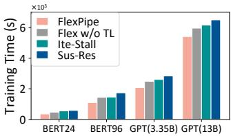  
(a) Max\_sequence length is 1024.

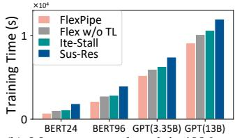  
(b) Max\_sequence length is 4096.

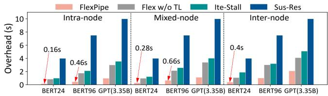  
(c) The detailed overhead under different envionments: intra-node consists of one node with 4 GPUs, inter-node consists of 4 nodes across 4 nodes, mixed-node consists of 2 nodes, each with 2 GPUs.

Figure 10: The flexibility overhead comparison with two common methods and a degraded FlexPipe.

35%, 23.1%, and 18.8% of the training time compared with Suspend-Resume, Iteration Stalling, and Flex w/o TL, respectively. This is because FlexPipe optimizes the initialization time required for dynamically adjusting pipelines by introducing the TwinLayer mechanism and designing elaborate finegrained computation and communication overlap, enabling rapid flexibility and improving overall efficiency. As the maximum sequence length increases, FlexPipe demonstrates better performance compared to other methods, as discussed in Sec. 7.2.1 and 7.2.2, a larger maximum sequence length leads to more frequent fluctuations. Additionally, a larger maximum sequence length with a higher computation-to-communication ratio further reduces the flexibility overhead of FlexPipe.

Fig 10(c) further presents the detailed overhead of a single flexibility operation under different environments, including intra-node, mixed-node, and inter-node. Suspend-Resume has a stable overhead under different environments. The other methods perform better within a single node, but experience degraded performance across nodes due to their dependency on communication bandwidth. Notably, FlexPipe maintains a minimal increase in overhead across nodes, attributed to its elaborate overlap of computation and communication.

For cases where new stages are added under the GPT (3.35B), we estimate the communication overhead per reconfiguration to be approximately 0.95s, measured as the interval between completing one iteration’s update and beginning the next. The performance of FlexPipe comes with the overhead of each component, typically involving a trade-off between memory, computation, and communication. However, as discussed in Sec. 5.2, reconfiguration is infrequent during variable-length training, and each adjustment yields performance benefits that persist over multiple iterations. Furthermore, FlexPipe’s profiling overhead is primarily confined to early iterations, where extensive sampling is required. Therefore, as demonstrated by the above experiments, the cost of a single adjustment is justified when amortized across the subsequent gains in throughput.

<table><tr><td rowspan=1 colspan=1>Model</td><td rowspan=1 colspan=1>μ</td><td rowspan=1 colspan=1>Parallel Strategy</td><td rowspan=1 colspan=1> $M _ { p e a k }$ </td><td rowspan=1 colspan=1> $O _ { p l a n }$ </td></tr><tr><td rowspan=1 colspan=1>BERT96</td><td rowspan=1 colspan=1>5121024204840968192</td><td rowspan=1 colspan=1>(4,4)(4,4)(3,3,2)(2,2,2,2)(1,1,2,1,1,1,1)</td><td rowspan=1 colspan=1>140175238352596</td><td rowspan=1 colspan=1>(0,0)(10,5)(0,0)(20,12)(18,18)</td></tr><tr><td rowspan=1 colspan=1>GPT(3.35B)</td><td rowspan=1 colspan=1>5122048256030722560</td><td rowspan=1 colspan=1>(8,8)(4,4,4,4)(4,4,4,4)(3,3,3,4,3)(3,3,3,4,3)</td><td rowspan=1 colspan=1>185315358397358</td><td rowspan=1 colspan=1>(15,10)(0,0)(25,13)(0,0))(0,0)</td></tr></table>

Table 2: The configuration and training details of BERT96 and GPT (3.35B) by using FlexPipe, where µ and $M _ { p e a k }$ denote the sequence length and peak memory usage, respectively. The parallel strategy denotes the DP degree of each stage of PP, e.g., BERT96 is divided into 7 stages, and the degree of the third stage is 2. $O _ { p l a n }$ (r, s) denotes r GB activations recomputed, and s GB tensors offloaded during the training.

Furthermore, no significant performance degradation was observed from the compiler. According to our analysis, this is likely because FlexPipe’s stage migration only remaps model stages across devices without altering the model structure or operator definitions, thus avoiding costly recompilation.

## 7.3 Discussion

## 7.3.1 Parallel Strategies of FlexPipe

To demonstrate how FlexPipe works, we train BERT96 and GPT (13B) on 2 and 8 nodes, respectively. Tab. 2 samples several representative iterations and illustrates their corresponding details. Unlike traditional training frameworks that rely on a fixed maximum number of GPUs (e.g., 16 GPUs for training GPT (3.35B)) to handle the variable sequence lengths across different iterations, FlexPipe dynamically adapts its parallel strategies according to the memory requirement to accommodate these fluctuations (e.g., 8 pipeline stages for a sequence length of 8192 and 4 stages for 512). Moreover, it effectively utilizes the “redundant” GPUs to boost the training throughput, leading to a significant performance improvement.

Note that the number of pipeline stages may vary even when the peak memory requirements are identical. For example, when training GPT (3.35B) with a sequence length of 2560, FlexPipe employed different parallel strategies across two iterations, which are influenced by the state of their previous iteration. This is because FlexPipe incorporates additional memory optimization techniques, such as recomputation and swapping, when adjusting its flexibility. FlexPipe balances the throughput improvements gained from these optimizations against their corresponding overheads.

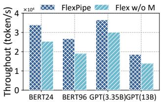  
(a) Throughput comparison.

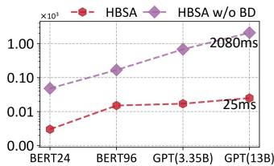  
(b) Overhead comparision.  
Figure 11: The ablation study of the algorithm.

Here, the number of iterations required for model convergence remains nearly identical with or without reconfiguration. FlexPipe is designed to accelerate each training iteration while maintaining strong training semantics. Therefore, even with long training runs, the reconfigurations in FlexPipe do not compromise training stability. With higher training throughput, the training tends to finish sooner. We omitted a detailed convergence analysis due to space constraints.

## 7.3.2 Effectiveness of Algorithm

To evaluate the effectiveness of HBSA, an ablation study is conducted by comparing FlexPipe with its modified versions. Fig. 11(a) shows the training throughput of different models using FlexPipe and Flex w/o M (only implements the flexibility mechanism, excluding recomputation and memory virtualization). We could see FlexPipe achieves an average 32.3% higher performance than Flex w/o M. When memory fluctuations are moderate, the overhead introduced by activation checkpointing and memory swapping is lower than the cost of flexibility adjustments. This mitigates the overhead caused by frequent adjustments. Furthermore, FlexPipe demonstrates even better performance advantages for larger models. This is because as the model size increases, Flex-Pipe w/o M requires more frequent PP adjustment, leading to greater overhead.

On the other hand, we compare the overhead of HBSA with HBSA w/o BD, which employs brute-force search based on the global solution space to determine the partitioning strategy. As shown in Fig. 11(b), HBSA achieves a significant reduction in overhead, with an average overhead of 15ms, compared to the 745ms for HBSA w/o BD. Although the overhead of HBSA increases with model size, the growth remains both reasonable and manageable.

As a heuristic algorithm, the computational overhead of HBSA is expected to grow linearly with the scale of the system. Compared to more complex methods, such as dynamic programming, HBSA remains relatively lightweight and incurs acceptable overhead. Moreover, FlexPipe’s monitor performs sequence-length prefetching from the dataloader, allowing HBSA to be executed ahead of time and overlap with other computations. This further reduces the latency of reconfiguration decisions to the acceptable numbers of 15ms.

## 8 Related Work

Parallel Techniques. To deal with the explosive growth of both data volume and model complexity, a surge of studies have been proposed by researchers focused on various parallelisms [24,26,29,33,36]. With DP [24,25], multiple instances (i.e., worker) are launched by DL job, and each worker trains an identical DNN model with different parts of datasets. Thus, DP is commonly used to speed up large data training for the models that could fit on a single device. As the increasing of the model parameter, TP [17, 46] splits individual layers (operation) into different devices to reduce the memory requirements. While each partition of operation requires two synchronous communication that slows down the training. Different from TP, PP [14, 18, 29, 36] spits layers of the model into different stages, where each stage consists of a consecutive set of layers. Only transferring intermediate activations between the border layers of neighbor stages results in lower communication overhead. Recently, SP [26] aims at long sequence training by splitting the input into different devices and uses a ring-style communication, which is orthogonal to other parallelisms. This paper mainly focuses on the PP, which is indispensable in both commercial and academic DL clusters [29, 33, 53].

Pipeline Parallelism. Among the earliest PPs was GPipe [14], which reduces the bubble ratio by spitting a minibatch into multiple micro-batches. Dapple [9] efficiently reduces this memory issue with a one-forward-one-backward scheduling policy, but it is not efficient enough. Hanayo [29] further improves the training throughput by utilizing a bidirectional pipeline without introducing additional memory copy. Zero-Bubble [36] nearly achieves zero bubbles by splitting the BP into two parts: computation for gradients and parameters. However, existing PPs either rely on static strategies (e.g., layer partitioning, micro-batch size) during training or reconfigure the parallel scheme based on suspendresume [21, 42, 58] that brings huge overhead. vPipe [57] addresses the OOM issue when performing neural network search by dynamically partitioning layers. However, it cannot dynamically adjust the number of PP stages. PipeTransformer [12] improves the training efficiency of transformers by progressively freezing some layers during the training process while supporting elastic pipelines that dynamically allocate resources to the remaining active layers. However, PipeTransformer does not maintain the semantics of pipeline training, which is lossy. Though these works allow or support flexible pipelines, they do not take the variable-length training of transformers into account.

The optimizations of PPs often come at the expense of additional memory usage [18, 41, 57]. Therefore, they are typically combined with memory optimization techniques, which involve two widely used mechanisms. Memory virtualization [2, 39] synchronously swaps in/out from GPU to host memory, which brings extra communication overhead. Chen et al. [5] propose recomputation that drops activations during the FP and later recomputes them when needed in BP, which reduces the memory footprint approximately to the square root of the total activations but incurs 33% extra computation.

Variable-length Training. The variable-length training of transformers has attracted lots of attention [8, 34, 38]. Traditionally, a straightforward solution is to pad all short samples with zeros to the length of the longest sequence. The naïve padding brings in redundant computations and wasted memory on padded tokens. Packing [8, 38] can efficiently reduce the number of padding tokens by concatenating multiple short samples to form a long sample. However, packing is also memory inefficient because self-attention suffers from quadratic memory requirements with respect to the sequence length. Some libraries [34] sort the dataset so that each minibatch contains samples with similar sequence lengths, which destroys the randomness and degrades the model performance (i.e., accuracy) [11].

Recently, a few DL frameworks have employed explicit designs for reducing the redundant computation caused by variable-length inputs [10, 16, 54]. ByteTransformer [54] proposes architecture-level optimization on multi-head attention and designs a padding-free algorithm for efficient variablelength training for transformers. DynaPipe [16] tackles the sequence length variation by advocating PP with variable-length micro-batches and optimizing micro-batch construction using dynamic programming. In contrast, FlexPipe mainly focuses on the trade-off between computational efficiency and memory usage.

## 9 Conclusion

This paper presents FlexPipe, a flexible PP framework that improves the efficiency of variable-length training by enabling the live flexibility mechanism (LFM) of PP. We propose a novel flexible memory optimization problem (FMOP) aiming at maximizing the training efficiency by dynamically reconfiguring parallel strategies and utilizing “redundant” GPUs across different iterations. We design an efficient heuristic bound searching algorithm to solve the optimization problem by comprehensively considering the overhead of the LFM and other memory optimization approaches. Experiments show that FlexPipe achieves an average 1.25× improvement in training throughput compared to existing SOTA frameworks.

## Acknowledgment

This work is supported by the Natural Science Foundation of Jilin Province (Grant 20230101062JC), the National Key Research and Development Plan of China (Grant 2017YFC1502306), and the National Natural Science Foundation of China (Grant 62272190).

## References

[1] FlashAttention Packing, Retrieved: 12/01/2024. https: //huggingface.co/blog/packing-with-FA2/.

[2] NVIDIA Unified Memory, Retrieved: 10/08/2024. https://developer.nvidia.com/blog/ unified-memory-cuda-beginners/.

[3] Martín Abadi, Paul Barham, Jianmin Chen, Zhifeng Chen, Andy Davis, Jeffrey Dean, Matthieu Devin, Sanjay Ghemawat, Geoffrey Irving, Michael Isard, Manjunath Kudlur, Josh Levenberg, Rajat Monga, Sherry Moore, Derek Gordon Murray, Benoit Steiner, Paul A. Tucker, Vijay Vasudevan, Pete Warden, Martin Wicke, Yuan Yu, and Xiaoqiang Zheng. Tensorflow: A system for large-scale machine learning. 12th USENIX Symposium on Operating Systems Design and Implementation, OSDI 2016, pages 265–283, 2016.

[4] OpenAI Josh Achiam, Steven Adler, Sandhini Agarwal, Lama Ahmad, and Ilge Akkaya. Gpt-4 technical report. 2023.

[5] Tianqi Chen, Bing Xu, Chiyuan Zhang, and Carlos Guestrin. Training deep nets with sublinear memory cost. CoRR, abs/1604.06174, 2016.

[6] Tri Dao. Flashattention-2: Faster attention with better parallelism and work partitioning. The Twelfth International Conference on Learning Representations, ICLR 2024, 2024.

[7] Jacob Devlin, Ming-Wei Chang, Kenton Lee, and Kristina Toutanova. BERT: pre-training of deep bidirectional transformers for language understanding. Proceedings of the 2019 Conference of the North American Chapter of the Association for Computational Linguistics: Human Language Technologies, NAACL-HLT 2019, pages 4171–4186, 2019.

[8] Hantian Ding, Zijian Wang, Giovanni Paolini, Varun Kumar, Anoop Deoras, Dan Roth, and Stefano Soatto. Fewer truncations improve language modeling. Fortyfirst International Conference on Machine Learning, ICML 2024, 2024.

[9] Shiqing Fan, Yi Rong, Chen Meng, Zongyan Cao, Siyu Wang, Zhen Zheng, Chuan Wu, Guoping Long, Jun Yang, Lixue Xia, Lansong Diao, Xiaoyong Liu, and Wei Lin. DAPPLE: a pipelined data parallel approach for training large models. 26th ACM SIGPLAN Symposium on Principles and Practice of Parallel Programming,PPoPP 2021, pages 431–445, 2021.

[10] Jiarui Fang, Yang Yu, Chengduo Zhao, and Jie Zhou. Turbotransformers: an efficient GPU serving system for

transformer models. 26th ACM SIGPLAN Symposium on Principles and Practice of Parallel Programming, PPoPP 2021, pages 389–402, 2021.

[11] Ananth Gottumukkala, Dheeru Dua, Sameer Singh, and Matt Gardner. Dynamic sampling strategies for multitask reading comprehension. Proceedings of the 58th Annual Meeting of the Association for Computational Linguistics, ACL 2020, pages 920–924, 2020.

[12] Chaoyang He, Shen Li, Mahdi Soltanolkotabi, and Salman Avestimehr. Pipetransformer: Automated elastic pipelining for distributed training of large-scale models. Proceedings of the 38th International Conference on Machine Learning, ICML 2021, 139:4150–4159, 2021.

[13] Karl Moritz Hermann, Tomás Kociský, Edward Grefenstette, Lasse Espeholt, Will Kay, Mustafa Suleyman, and Phil Blunsom. Teaching machines to read and comprehend. Advances in Neural Information Processing Systems 28: Annual Conference on Neural Information Processing Systems 2015,, pages 1693–1701, 2015.

[14] Yanping Huang, Youlong Cheng, Ankur Bapna, Orhan Firat, Dehao Chen, Mia Xu Chen, HyoukJoong Lee, Jiquan Ngiam, Quoc V. Le, Yonghui Wu, and Zhifeng Chen. Gpipe: Efficient training of giant neural networks using pipeline parallelism. Advances in Neural Information Processing Systems 32: Annual Conference on Neural Information Processing Systems 2019, NeurIPS 2019, pages 103–112, 2019.

[15] Insu Jang, Zhenning Yang, Zhen Zhang, Xin Jin, and Mosharaf Chowdhury. Oobleck: Resilient distributed training of large models using pipeline templates. Proceedings of the 29th Symposium on Operating Systems Principles, 2023.

[16] Chenyu Jiang, Zhen Jia, Shuai Zheng, Yida Wang, and Chuan Wu. Dynapipe: Optimizing multi-task training through dynamic pipelines. Proceedings of the Nineteenth European Conference on Computer Systems, EuroSys 2024, pages 542–559, 2024.

[17] Ziheng Jiang, Haibin Lin, Yinmin Zhong, Qi Huang, Yangrui Chen, Zhi Zhang, Yanghua Peng, Xiang Li, Cong Xie, Shibiao Nong, Yulu Jia, Sun He, Hongmin Chen, Zhihao Bai, Qi Hou, Shipeng Yan, Ding Zhou, Yiyao Sheng, Zhuo Jiang, Haohan Xu, Haoran Wei, Zhang Zhang, Pengfei Nie, Leqi Zou, Sida Zhao, Liang Xiang, Zherui Liu, Zhe Li, Xiaoying Jia, Jianxi Ye, Xin Jin, and Xin Liu. Megascale: Scaling large language model training to more than 10, 000 gpus. 21st USENIX Symposium on Networked Systems Design and Implementation, NSDI 2024, pages 745–760, 2024.

[18] Taebum Kim, Hyoungjoo Kim, Gyeong-In Yu, and Byung-Gon Chun. Bpipe: Memory-balanced pipeline parallelism for training large language models. International Conference on Machine Learning, ICML 2023, 202:16639–16653, 2023.

[19] Diederik P. Kingma and Jimmy Ba. Adam: A method for stochastic optimization. 3rd International Conference on Learning Representations, ICLR 2015, 2015.

[20] Achintya Kundu, Rhui Dih Lee, Laura Wynter, Raghu Kiran Ganti, and Mayank Mishra. Enhancing training efficiency using packing with flash attention. CoRR, abs/2407.09105, 2024.

[21] Zhiquan Lai, Shengwei Li, Xudong Tang, Keshi Ge, Weijie Liu, Yabo Duan, Linbo Qiao, and Dongsheng Li. Merak: An efficient distributed DNN training framework with automated 3d parallelism for giant foundation models. IEEE Trans. Parallel Distributed Syst., 34(5):1466–1478, 2023.

[22] Haoran Li, Zhanming Jie, and Wei Lu. Nonautoregressive machine translation as constrained HMM. Findings of the Association for Computational Linguistics, ACL 2024,, pages 12361–12372, 2024.

[23] Hongliang Li, Hairui Zhao, Ting Sun, Xiang Li, Haixiao Xu, and Keqin Li. Interference-aware opportunistic job placement for shared distributed deep learning clusters. Journal of Parallel and Distributed Computing, 183:104776, 2024.

[24] Hongliang Li, Hairui Zhao, Zhewen Xu, Xiang Li, and Haixiao Xu. Explsched: Maximizing deep learning cluster efficiency for exploratory jobs. IEEE International Conference on Cluster Computing, CLUSTER 2023,, pages 173–184, 2023.

[25] Mingzhen Li, Wencong Xiao, Hailong Yang, Biao Sun, Hanyu Zhao, Shiru Ren, Zhongzhi Luan, Xianyan Jia, Yi Liu, Yong Li, Wei Lin, and Depei Qian. Easyscale: Elastic training with consistent accuracy and improved utilization on gpus. Proceedings of the International Conference for High Performance Computing, Networking, Storage and Analysis, SC 2023, pages 55:1–55:14, 2023.

[26] Shenggui Li, Fuzhao Xue, Chaitanya Baranwal, Yongbin Li, and Yang You. Sequence parallelism: Long sequence training from system perspective. Proceedings of the 61st Annual Meeting of the Association for Computational Linguistics (Volume 1: Long Papers), ACL 2023, pages 2391–2404, 2023.

[27] Youjie Li, Amar Phanishayee, Derek Gordon Murray, Jakub Tarnawski, and Nam Sung Kim. Harmony: Overcoming the hurdles of gpu memory capacity to train

massive dnn models on commodity servers. Proc. VLDB Endow., 15:2747–2760, 2022.

[28] Guodong Liu, Youshan Miao, Zhiqi Lin, Xiaoxiang Shi, Saeed Maleki, Fan Yang, Yungang Bao, and Sa Wang. Aceso: Efficient parallel DNN training through iterative bottleneck alleviation. Proceedings of the Nineteenth European Conference on Computer Systems, EuroSys 2024, pages 163–181, 2024.

[29] Ziming Liu, Shenggan Cheng, Haotian Zhou, and Yang You. Hanayo: Harnessing wave-like pipeline parallelism for enhanced large model training efficiency. Proceedings of the International Conference for High Performance Computing, Networking, Storage and Analysis, SC 2023, pages 56:1–56:13, 2023.

[30] Shayne Longpre, Le Hou, Tu Vu, Albert Webson, Hyung Won Chung, Yi Tay, Denny Zhou, Quoc V. Le, Barret Zoph, Jason Wei, and Adam Roberts. The flan collection: Designing data and methods for effective instruction tuning. International Conference on Machine Learning, ICML 2023, 202:22631–22648, 2023.

[31] Swaroop Mishra, Daniel Khashabi, Chitta Baral, and Hannaneh Hajishirzi. Cross-task generalization via natural language crowdsourcing instructions. Proceedings of the 60th Annual Meeting of the Association for Computational Linguistics , ACL 2022, pages 3470–3487, 2022.

[32] Deepak Narayanan, Aaron Harlap, Amar Phanishayee, Vivek Seshadri, Nikhil R. Devanur, Gregory R. Ganger, Phillip B. Gibbons, and Matei Zaharia. Pipedream: generalized pipeline parallelism for DNN training. Proceedings of the 27th ACM Symposium on Operating Systems Principles, SOSP 2019, pages 1–15, 2019.

[33] Deepak Narayanan, Mohammad Shoeybi, Jared Casper, Patrick LeGresley, Mostofa Patwary, Vijay Korthikanti, Dmitri Vainbrand, Prethvi Kashinkunti, Julie Bernauer, Bryan Catanzaro, Amar Phanishayee, and Matei Zaharia. Efficient large-scale language model training on GPU clusters using megatron-lm. International Conference for High Performance Computing, Networking, Storage and Analysis, SC 2021, page 58, 2021.

[34] Myle Ott, Sergey Edunov, Alexei Baevski, Angela Fan, Sam Gross, Nathan Ng, David Grangier, and Michael Auli. fairseq: A fast, extensible toolkit for sequence modeling. Proceedings of the 2019 Conference of the North American Chapter of the Association for Computational Linguistics: Human Language Technologies, NAACL-HLT 2019, pages 48–53, 2019.

[35] Adam Paszke, Sam Gross, Francisco Massa, Adam Lerer, James Bradbury, Gregory Chanan, Trevor Killeen,

Zeming Lin, Natalia Gimelshein, Luca Antiga, Alban Desmaison, Andreas Köpf, Edward Z. Yang, Zachary DeVito, Martin Raison, Alykhan Tejani, Sasank Chilamkurthy, Benoit Steiner, Lu Fang, Junjie Bai, and Soumith Chintala. Pytorch: An imperative style, highperformance deep learning library. Advances in Neural Information Processing Systems 32: Annual Conference on Neural Information Processing Systems 2019, NeurIPS 2019,, pages 8024–8035, 2019.

[36] Penghui Qi, Xinyi Wan, Guangxing Huang, and Min Lin. Zero bubble (almost) pipeline parallelism. The Twelfth International Conference on Learning Representations, ICLR 2024, 2024.

[37] Alec Radford, Jeff Wu, Rewon Child, David Luan, Dario Amodei, and Ilya Sutskever. Language models are unsupervised multitask learners. OpenAI blog, 2019.

[38] Colin Raffel, Noam Shazeer, Adam Roberts, Katherine Lee, Sharan Narang, Michael Matena, Yanqi Zhou, Wei Li, and Peter J. Liu. Exploring the limits of transfer learning with a unified text-to-text transformer. J. Mach. Learn. Res., 21:140:1–140:67, 2020.

[39] Minsoo Rhu, Natalia Gimelshein, Jason Clemons, Arslan Zulfiqar, and Stephen W. Keckler. vdnn: Virtualized deep neural networks for scalable, memory-efficient neural network design. 49th Annual IEEE/ACM International Symposium on Microarchitecture, MICRO 2016, pages 18:1–18:13, 2016.

[40] Victor Sanh, Albert Webson, Colin Raffel, Stephen H. Bach, Lintang Sutawika, Zaid Alyafeai, Antoine Chaffin, Arnaud Stiegler, Arun Raja, Manan Dey, M Saiful Bari, Canwen Xu, Urmish Thakker, Shanya Sharma Sharma, Eliza Szczechla, Taewoon Kim, Gunjan Chhablani, Nihal V. Nayak, Debajyoti Datta, Jonathan Chang, Mike Tian-Jian Jiang, Han Wang, Matteo Manica, Sheng Shen, Zheng Xin Yong, Harshit Pandey, Rachel Bawden, Thomas Wang, Trishala Neeraj, Jos Rozen, Abheesht Sharma, Andrea Santilli, Thibault Févry, Jason Alan Fries, Ryan Teehan, Teven Le Scao, Stella Biderman, Leo Gao, Thomas Wolf, and Alexander M. Rush. Multitask prompted training enables zero-shot task generalization. The Tenth International Conference on Learning Representations, ICLR 2022, 2022.

[41] Zhenbo Sun, Huanqi Cao, Yuanwei Wang, Guanyu Feng, Shengqi Chen, Haojie Wang, and Wenguang Chen. Adapipe: Optimizing pipeline parallelism with adaptive recomputation and partitioning. Proceedings of the 29th ACM International Conference on Architectural Support for Programming Languages and Operating Systems, Volume 3, ASPLOS 2024, pages 86–100, 2024.

[42] Taegeon Um, Byungsoo Oh, Minyoung Kang, Woo-Yeon Lee, Goeun Kim, Dongseob Kim, Youngtaek Kim, Mohd Muzzammil, and Myeongjae Jeon. Metis: Fast automatic distributed training on heterogeneous gpus. Proceedings of the 2024 USENIX Annual Technical Conference, USENIX ATC 2024, pages 563–578, 2024.

[43] Ashish Vaswani, Noam Shazeer, Niki Parmar, Jakob Uszkoreit, Llion Jones, Aidan N. Gomez, Lukasz Kaiser, and Illia Polosukhin. Attention is all you need. Advances in Neural Information Processing Systems 30: Annual Conference on Neural Information Processing Systems 2017, pages 5998–6008, 2017.

[44] Chen Wang, Ziwei Fan, Liangwei Yang, Mingdai Yang, Xiaolong Liu, Zhiwei Liu, and Philip S. Yu. Pre-training with transferable attention for addressing market shifts in cross-market sequential recommendation. Proceedings of the 30th ACM SIGKDD Conference on Knowledge Discovery and Data Mining, KDD 2024, pages 2970–2979, 2024.

[45] Haoyu Wang, Zetian Liu, and Haiying Shen. Machine learning feature based job scheduling for distributed machine learning clusters. IEEE/ACM Transactions on Networking, 31:58–73, 2023.

[46] Minjie Wang, Chien-Chin Huang, and Jinyang Li. Supporting very large models using automatic dataflow graph partitioning. Proceedings of the Fourteenth EuroSys Conference 2019, Dresden, pages 26:1–26:17, 2019.

[47] Adina Williams, Nikita Nangia, and Samuel R. Bowman. A broad-coverage challenge corpus for sentence understanding through inference. Proceedings of the 2018 Conference of the North American Chapter of the Association for Computational Linguistics: Human Language Technologies, NAACL-HLT 2018, pages 1112– 1122, 2018.

[48] Shixun Wu, Yitong Ding, Yujia Zhai, Jinyang Liu, Jiajun Huang, Zizhe Jian, Huangliang Dai, Sheng Di, Bryan M Wong, Zizhong Chen, et al. Ft k-means: A high-performance k-means on gpu with fault tolerance. In 2024 IEEE International Conference on Cluster Computing (CLUSTER), pages 322–334. IEEE, 2024.

[49] Shixun Wu, Yujia Zhai, Jiajun Huang, Zizhe Jian, and Zizhong Chen. Ft-gemm: A fault tolerant high performance gemm implementation on x86 cpus. In Proceedings of the 32nd International Symposium on High-Performance Parallel and Distributed Computing, pages 323–324, 2023.

[50] Shixun Wu, Yujia Zhai, Jinyang Liu, Jiajun Huang, Zizhe Jian, Huangliang Dai, Sheng Di, Franck Cap-

pello, and Zizhong Chen. Turbofft: Co-designed highperformance and fault-tolerant fast fourier transform on gpus. In Proceedings of the 30th ACM SIGPLAN Annual Symposium on Principles and Practice of Parallel Programming, pages 70–84, 2025.

[51] Shixun Wu, Yujia Zhai, Jinyang Liu, Jiajun Huang, Zizhe Jian, Bryan Wong, and Zizhong Chen. Anatomy of high-performance gemm with online fault tolerance on gpus. In Proceedings of the 37th International Conference on Supercomputing, pages 360–372, 2023.

[52] Yisheng Xiao, Lijun Wu, Junliang Guo, Juntao Li, M. Zhang, Tao Qin, and Tie-Yan Liu. A survey on nonautoregressive generation for neural machine translation and beyond. IEEE Transactions on Pattern Analysis and Machine Intelligence, pages 11407–11427, 2022.

[53] Tailing Yuan, Yuliang Liu, Xucheng Ye, Shenglong Zhang, Jianchao Tan, Bin Chen, Chengru Song, and Di Zhang. Accelerating the training of large language models using efficient activation rematerialization and optimal hybrid parallelism. Proceedings of the 2024 USENIX Annual Technical Conference, USENIX ATC 2024, pages 545–561, 2024.

[54] Yujia Zhai, Chengquan Jiang, Leyuan Wang, Xiaoying Jia, Shang Zhang, Zizhong Chen, Xin Liu, and Yibo Zhu. Bytetransformer: A high-performance transformer boosted for variable-length inputs. IEEE International Parallel and Distributed Processing Symposium, IPDPS 2023, pages 344–355, 2023.

[55] Hairui Zhao, Hongliang Li, Qi Tian, Jie Wu, Meng Zhang, Z Xu, X Li, and H Xu. Arraypipe: Introducing job-array pipeline parallelism for high throughput model exploration. In Proc. of the IEEE International Conference on Computer Communications (INFOCOM), 2025.

[56] Hairui Zhao, Xinyu Li, and Hongliang Li. Visage: Visual-aware generation of adversarial examples in black-box for text classification. In CCF International Conference on Natural Language Processing and Chinese Computing, pages 440–453. Springer, 2024.

[57] Shixiong Zhao, Fanxin Li, Xusheng Chen, Xiuxian Guan, Jianyu Jiang, Dong Huang, Yuhao Qing, Sen Wang, Peng Wang, Gong Zhang, Cheng Li, Ping Luo, and Heming Cui. vpipe: A virtualized acceleration system for achieving efficient and scalable pipeline parallel DNN training. IEEE Trans. Parallel Distributed Syst., 33(3):489–506, 2022.

[58] Lianmin Zheng, Zhuohan Li, Hao Zhang, Yonghao Zhuang, Zhifeng Chen, Yanping Huang, Yida Wang, Yuanzhong Xu, Danyang Zhuo, Eric P. Xing, Joseph E. Gonzalez, and Ion Stoica. Alpa: Automating inter- and

intra-operator parallelism for distributed deep learning. 16th USENIX Symposium on Operating Systems Design and Implementation, OSDI 2022, pages 559–578, 2022.

[59] Quan Zhou, Haiquan Wang, Xiaoyan Yu, Cheng Li, Youhui Bai, Feng Yan, and Yinlong Xu. Mpress: Democratizing billion-scale model training on multi-gpu servers via memory-saving inter-operator parallelism. IEEE International Symposium on High-Performance Computer Architecture, HPCA 2023, pages 556–569, 2023.