①

USENIX

THE ADVANCED COMPUTING SYSTEMS ASSOCIATION

# Towards High-Performance Transactional Stateful Serverless Workflows with Affinity-Aware Leasing

Jianjun Zhao, Haikun Liu, Shuhao Zhang, and Haodi Lu, Huazhong University of Science and Technology; Yancan Mao, School of Computing, National University of Singapore; Zhuohui Duan, Xiaofei Liao, and Hai Jin, Huazhong University of Science and Technology

https://www.usenix.org/conference/atc25/presentation/zhao-jianjun

# This paper is included in the Proceedings of the 2025 USENIX Annual Technical Conference.

July 7–9, 2025 • Boston, MA, USA ISBN 978-1-939133-48-9

Open access to the Proceedings of the 2025 USENIX Annual Technical Conference is sponsored by

P=-r.h mEesL

auuuJl9 PgleU

King Abdullah University of

Science and Technology

# Towards High-Performance Transactional Stateful Serverless Workflows with Affinity-Aware Leasing

Jianjun Zhao†, Haikun Liu†∗, Shuhao Zhang†, Haodi Lu†, Yancan Mao‡, Zhuohui Duan† Xiaofei Liao†, Hai Jin†

†National Engineering Research Center for Big Data Technology and System, Service Computing Technology and System Lab/Cluster and Grid Computing Lab, School of Computer Science and Technology, Huazhong University of Science and Technology, China ‡School of Computing, National University of Singapore, Singapore

## Abstract

Function-as-a-Service (FaaS) is the most prevalent serverless computing paradigm, offering significant flexibility to develop, deploy, and operate cloud applications. However, traditional FaaS frameworks face significant challenges in operating transactional stateful workflows, which often involve multiple functions with shared state. Previous solutions rely on external datastores to manage shared state, suffering from high communication overhead to guarantee transactional consistency for stateful workflows.

In this paper, we present RTSFaaS, an RDMA-capable transactional stateful FaaS framework that achieves high performance while guaranteeing transactional consistency. RTS-FaaS exploits a lease-based concurrency control protocol to dynamically assign and transfer leases among workers to achieve concurrency control. Specifically, RTSFaaS incorporates two key designs: (1) an affinity-aware lease assignment mechanism that improves the benefit of caching by dynamically assigning data leases to selected workers according to the data function affinity, and (2) an RDMA-capable dynamic lease transferring mechanism to reduce the cost of locking by serializing concurrent data accesses with one-sided RDMA primitives. Experimental results show that RTSFaaS achieves up to 5× and 20× performance speedup compared with state-of-the-art transactional stateful FaaS platforms–Boki and Beldi, and up to 1.7× and 2.1× performance improvement when their concurrency control protocols implemented for RDMA networks are applied to RTSFaaS.

## 1 Introduction

Serverless computing [12, 22, 27] has gained increasing popularity since it promises to simplify the programming, deploying, and operating scalable cloud applications, particularly through the function-as-a-service (FaaS) paradigm [11, 17, 37, 45]. This paradigm is widely adopted by mainstream vendors, including AWS Step Functions [45], AWS

Lambda [46], Azure Durable Functions [37], Alibaba Function Compute [11], and Huawei Cloud Functions [17]. FaaS simplifies cloud deployment by reducing the operational complexity of managing servers while providing scalability and elasticity [33]. Developers only need to program cloud applications with functions that can be executed elastically by FaaS platforms. To support complex applications, FaaS platforms allow developers to compose functions into workflows [32, 66], typically abstracted as directed acyclic graphs [33] (DAGs).

Although the mainstream FaaS paradigm is stateless, we argue that FaaS platforms should support state management for the stateful applications built with functions [25, 60]. For example, in a banking service scenario [23], a transfer business can be implemented with multiple functions and executed in a workflow (i.e., withdraw ⇒ deposit). Because the application state is shared, these functions should be processed within a single transaction to guarantee serializable consistency when concurrent transactions access the shared state. Current stateful FaaS platforms [24, 36, 48] rely on external datastores like Amazon DynamoDB [20, 43] and S3 [44] to manage the application state. While the disaggregation of compute and storage enables shared state management, it often introduces substantial performance overhead from frequent remote state accesses [30, 48], which challenges stateful FaaS platforms in achieving strong consistency without sacrificing performance.

First, the concurrency control usually leads to high communication overhead due to frequent remote accesses to the lock status. To guarantee transactional consistency for stateful workflows, state-of-the-art stateful FaaS platforms like Boki [25], Beldi [60], and T-Statefun [15] rely on a remote datastore to implement concurrency control protocols such as two-phase locking (2PL) [21, 49] and optimistic concurrency control (OCC) [1,25]. However, these protocols require frequent remote communications for acquiring and releasing locks, as well as validating conflicts between concurrent function executions. This results in high latency, particularly in high-contention environments, since the communication overhead associated with remote memory access (RMA), lock management, and conflict validation becomes a significant bottleneck. As illustrated in Figure 1, these overheads remain the major performance bottleneck of stateful FaaS workflows even using RDMA networks.

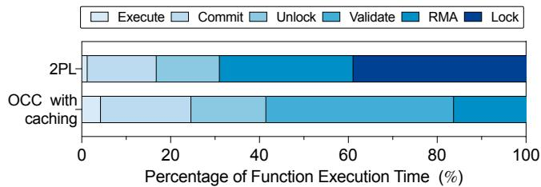  
Figure 1: Breakdown of function execution time for the banking service workload. Both 2PL [60] and OCC with caching [25] are optimized using one-sided RDMA verbs.

Second, concurrency control protocols often undermine the efficiency of caching in stateful FaaS platforms. To reduce the performance overhead of remote state accesses, many stateful FaaS platforms adopt caching mechanisms that store frequently-accessed data locally [34, 48, 57, 61]. However, the benefit of caching is often limited when applications require strong consistency guarantees. In 2PL, the necessity of acquiring locks from a remote datastore diminishes the effectiveness of local caches since functions must acquire remote locks even when the cache is valid. Moreover, frequent state updates may invalidate the local cache, further reducing its efficiency. In OCC, while functions can read and modify the local cache optimistically, they must validate whether the original data has been modified by other transactions before committing a transaction. If conflicts are detected, the transaction is aborted and retried, offsetting the benefit of caching.

In this paper, we present RTSFaaS, an RDMA-capable transactional stateful FaaS framework that achieves high performance while guaranteeing strong consistency. RTSFaaS exploits a lease-based concurrency control protocol to dynamically assign and transfer leases1 among workers. Unlike traditional leasing mechanisms, our approach allows a worker to cache and control access to specific objects in a distributed cache with exclusive rights. Thus, there is only one replica of an object that is exclusively cached by a single worker from a global perspective. In this way, RTSFaaS allows a large majority of transactions to be executed with a strong affinity for cached objects, and thus reduces remote communication overhead and improves the benefit of caching. Specifically, RTSFaaS incorporates two key designs to address the aforementioned challenges of handling transactional stateful serverless workflows in current FaaS platforms.

First, we propose an affinity-aware lease assignment mechanism to enhance the benefit of caching by assigning a group of interdependent objects to a single worker with an exclusive lease. RTSFaaS maintains a statistical table to count the total number of requests and data access frequency for each worker. Upon each request, RTSFaaS exploits a scorebased scheduling policy to assign it to a worker who has the strongest data affinity for the request according to the statistical table. After assigning a batch of requests to different workers, RTSFaaS uses the latest statistics to designate workers as leaseholders for each object. If a worker has the highest access frequency to an object, it becomes the leaseholder of the object. In this way, RTSFaaS allows more functions to execute with the local cache, thereby significantly enhancing the benefit of caching and reducing remote memory accesses.

Second, we propose an RDMA-capable dynamic lease transferring mechanism to significantly reduce the network communication overhead of locking. For each batch of requests, RTSFaaS decouples the function execution and the consistency guarantee into two non-overlapping phases: planning and execution. During the planning phase, workers identify data dependencies among functions to collaboratively construct a global task precedence graph (TPG), which is used to serialize the function execution. During the execution phase, RTSFaaS allows leaseholders to cache and control the access to specific objects with exclusive rights. These leaseholders independently prefetch the corresponding objects into their local caches. Then, they execute functions and dynamically transfer the lease of objects to others according to the global TPG, which ensures sequential data accesses. When a worker has to access objects that are not cached locally, the worker checks the lease of remote objects and directly accesses other workers’ caches using one-sided RDMA verbs.

We implement RTSFaaS [42] using a cluster connected with RDMA networks and evaluate it with commonly-used microservice benchmarks [23, 25, 60]. Experimental results show that RTSFaaS improves the throughput of applications by up to 5× and 20× compared with the state-of-the-art stateful FaaS platform–Boki [25] and Beldi [60]. To further evaluate the efficiency of our lease-based concurrency control protocol, we implement their concurrency control protocols in an RDMA-enabled environment for comparison. Experimental results show that RTSFaaS achieves up to 1.7× and 2.1× performance speedup over these RDMA-based implementations.

In summary, we make the following contributions:

• We design RTSFaaS, an RDMA-capable transactional stateful FaaS framework that significantly improves the performance while guaranteeing strong consistency for transactional stateful serverless workflows.

• We propose an affinity-aware lease assignment mechanism that improves the benefit of caching by dynamically assigning data leases to selected workers according to the data-function affinity.

• We propose RDMA-capable dynamic lease transferring to reduce the cost of locking by serializing concurrent data accesses with one-sided RDMA primitives.

• Experimental results show that RTSFaaS outperforms state-of-the-art stateful FaaS platforms, achieving up to 5× and 20× higher throughput than Boki [25] and Beldi [60], respectively. Even when their concurrency control protocols are adapted to RDMA networks and integrated into RTSFaaS, our design still yields up to 1.7× and 2.1× performance improvements.

## 2 Background and Motivation

In this section, we present the background of transactional stateful FaaS workflows, discuss the limitations of existing solutions, and explore the potential of using remote direct memory access (RDMA) in FaaS platforms.

## 2.1 Transactional Stateful FaaS Workflows

The FaaS paradigm [4, 25, 30, 36, 48, 57, 60] has become increasingly popular for developing, deploying, and operating cloud applications. However, because of the stateless nature of functions [25], existing FaaS platforms can not efficiently support stateful applications that require state sharing and transactional processing, such as payment processing [30], travel reservation [60], inventory management [25], and business services [23].

To support these complex applications, multiple functions can be composed into a workflow, represented as a directed acyclic graph (DAG) [33, 45]. Each node in this graph corresponds to an individual function, while edges denote the execution order and the transfer of intermediate results between functions. For instance, in the banking service scenario as shown in Figure 2, several services such as payment (pay), saving (save), and transfer (withdraw ⇒ deposit) are provided. Despite the distinctiveness of these functions, they share the same application state, such as the balance of users’ accounts. Additionally, the transactional semantics are crucial to ensure that the transfer service is registered simultaneously on both the recipient and sender accounts. Consequently, these functions in the workflow (withdraw ⇒ deposit) must be executed with a transaction. This requirement mandates FaaS platforms to guarantee transactional consistency, i.e., the results of concurrent transactions are conflict-equivalent to some serial execution of these transactions [25, 60].

## 2.2 Limitations of Existing Solutions

Current stateful FaaS platforms [24, 36, 48] rely on external datastores like Amazon DynamoDB [20, 43] and S3 [44] to manage the application state. While the disaggregation of computing and storage facilitates the shared state management, it makes the stateful FaaS platform struggles to achieve strong consistency while maintaining high performance. Existing stateful FaaS platforms either support weak consistency [34, 48, 57] or cause high performance overhead to ensure transactional consistency [15, 25, 30, 60]. None of them provides an efficient way to guarantee transactional consistency for transactional stateful serverless workflows.

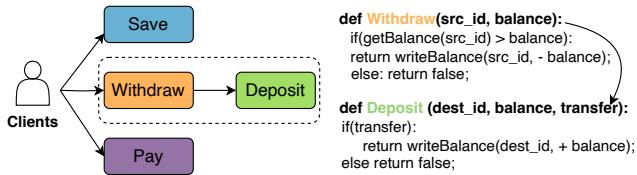  
Figure 2: An example of the banking service workflow [23]

Weak Consistency. A number of FaaS platforms have been designed on the basis of causal consistency principles, including Cloudbust [48], HydroCache [57], FaaSTCC [34], and CausalMesh [61]. These FaaS platforms exploit local caches on each computing node to achieve high performance. However, these platforms only guarantee weak consistency, such as transactional causal consistency (TCC) for workflows. To guarantee TCC, a workflow reads from a causal snapshot [34], and other workflows cannot observe its results until it is entirely completed. However, TCC allows anomalies such as stale reads and write-write conflicts, which do not satisfy the requirements of transactional stateful FaaS applications.

Transactional Consistency. To guarantee transactional consistency, stateful FaaS platforms like Beldi [60], Boki [25] and T-Statefun [15] rely on a remote datastore to implement concurrency control protocols, such as two-phase locking (2PL) and optimistic concurrency control (OCC). In 2PL, transactions ensure serializable execution by acquiring/releasing locks. In contrast, OCC allows transactions to read and modify the local cache optimistically, but conflicting operations must be checked before committing transactions. Unfortunately, these protocols lead to high communication overhead due to frequent remote accesses for lock management and conflict validation. Additionally, they often undermine caching benefits by invalidating cached data or causing frequent transaction retries.

## 2.3 Remote Direct Memory Access

RDMA is a networking technology that enables direct access to the main memory of a remote node over networks [6,28,67]. Unlike the TCP/IP protocol, RDMA can eliminate memory copying among buffers (zero-copy) via bypassing the OS kernel. Thus, it achieves high-bandwidth and low-latency network transmission with minimal CPU involvement. RDMA supports two types of verbs for remote memory accesses: onesided and two-sided verbs [28]. Two-sided verbs (send, recv) use channel semantics in which the sender should interrupt the receiver’s CPU to process network messages. In contrast, one-sided verbs (read, write, and atomic verbs) use memory semantics. The sender should first register a remote memory region on the receiver to perform RDMA operations. Then, the receiver’s RDMA network interface card (RNIC) exploits the direct memory access (DMA) mechanism to access data without involving its CPUs.

RDMA in the FaaS platforms. RDMA has been widely used in high-performance computing (HPC) and cloud computing scenarios, supporting distributed transactions [7, 19, 29, 53], disaggregated memory systems [31, 47, 52, 62, 63], and other data center environments [7, 13, 16, 54]. RDMA also offers new possibilities in the FaaS domain. Recent RDMA-based FaaS frameworks such as rFaaS [13], MITO-SIS [54], and RMMAP [33] have exploited RDMA technologies for various application scenarios, including rapid remote forking [13], fast remote container initialization [54], and serialization-free state transfer [33]. Although these proposals have demonstrated the significant potential of using RDMA technologies for optimizing the performance of FaaS platforms, no effort has been made on transactional stateful serverless workflows using RDMA networks.

## 3 RTSFaaS Design

We first present the RTSFaaS architecture, and then describe the lease assignment and transfer mechanisms.

## 3.1 System Overview

Figure 3 illustrates the RTSFaaS architecture, designed for elastic autoscaling by disaggregating storage and compute resources [25, 48, 60]. RTSFaaS consists of three main components: the RTSFaaS driver, workers, and a key-value (KV) store using TiKV [39, 51], which supports geo-distributed replication mechanisms for high availability. The RTSFaaS driver and workers run in individual Docker containers [18]. Client requests, received by the API gateway, are routed by the RTSFaaS driver to appropriate workers. Each worker consists of a function scheduler, a set of executors, and a local data cache shared by all executors. The scheduler invokes a set of functions to execute the workflow within these executors according to the global task precedence graph (TPG). To eliminate the cost of data synchronization among multiple replicas and to save memory space, each KV object is exclusively cached by only one worker (i.e., a leaseholder), and can be accessed by another worker via RDMA operations when its lease is transferred to the remote executor. All workers’ local data caches construct a global shared memory pool which serves as an intermediary between these executors and the KV store. In this architecture, RTSFaaS should address two key problems as follows.

(1) How to exclusively cache objects in multiple workers to enhance the data-function affinity? If objects are randomly or on-demand cached by different workers, executors usually have to frequently access objects from remote shared caches, causing significant network communication overhead. Thus, we propose an affinity-aware lease assignment mechanism to enhance the benefit of caching (Section 3.2).

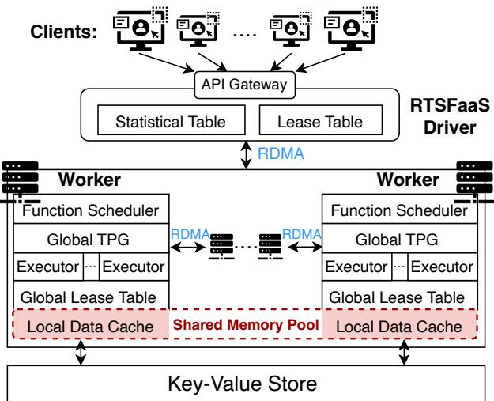  
Figure 3: RTSFaaS architecture

(2) How to access remote shared caches efficiently while maintaining data consistency when objects required by executors are missing in the local data cache? In traditional concurrency control mechanisms, the data access is tightly coupled with the locking operation. They may suffer from high-latency data accesses when the contention for locks is intensive. Thus, we construct a TPG for functions with data dependencies to serialize the function execution, and dynamically transfer the lease of objects to other workers so that they can access these objects temporarily via one-sided RDMA operations (Section 3.3).

## 3.2 Affinity-aware Lease Assignment

To assign an incoming request to a worker so that they have the strongest data-function affinity, the RTSFaaS driver maintains a statistical table to record the following information for each worker: 1) the total number of functions Ni assigned to worker i; 2) for each KV object j, the total number of accesses $N _ { i } ( j )$ introduced by all functions in worker i.

When a request arrives, the driver identifies its read-write sets, denoted as $K = \{ k _ { 1 } , \ldots , k _ { n } \}$ , which includes all data items required by all functions in the current workflow. The affinity score Ai for worker i is calculated as the sum of access counts $N _ { i } ( k _ { j } )$ for each key in K:

$$
A _ { i } = \sum _ { k _ { j } \in K } N _ { i } ( k _ { j } )
$$

The affinity score reflects how frequently the worker accesses all keys involved in the request. Thus, this request is preferentially assigned to a worker who has a strong datafunction affinity. However, load balancing is also critical to prevent worker overloading. To achieve this goal, the total number of functions assigned to each worker $( N _ { i } )$ , is used to compute a load balancing score $S _ { i }$ , which favors workers with fewer assigned functions. The load balancing score is calculated using the following linear formula:

$$
S _ { i } = 1 - ( N _ { i } - m i n ) / ( m a x - m i n )
$$

where min and max represent the minimum and maximum number of functions assigned to a worker. Thus, workers with lighter loads have higher scores.

To make a trade-off between data-function affinity and load balancing, the affinity score is also normalized using a linear mapping similar to the load balancing score. Let min′ and max′ be the minimum and maximum affinity scores among all workers. The normalized affinity score $A _ { i } ^ { \prime }$ for worker i is calculated by:

$$
A _ { i } ^ { \prime } = ( A _ { i } - m i n ^ { \prime } ) / ( m a x ^ { \prime } - m i n ^ { \prime } )
$$

The final score is calculated as the weighted sum of $S _ { i }$ and $A _ { i } ^ { \prime } .$ By default, the RTSFaaS driver assigns equal weight to each score. Then, the driver forwards the request to the worker with the highest score and updates the statistical table. After a batch of requests is dispatched, a lease table is instantiated based on the statistics table, designating the worker with the highest affinity score as the leaseholder. If multiple workers get the same score, RTSFaaS assigns the lease to the one with the smallest worker ID.

## 3.3 RDMA-capable Dynamic Lease Transfer

RTSFaaS decouples the consistency guarantee and the function execution into two non-overlapping phases: planning and execution. In the planning phase, RTSFaaS constructs a task precedence graph (TPG) for functions with data dependencies to serialize the function execution. In the execution phase, RTSFaaS schedules the execution of functions based on the TPG, and dynamically transfers the lease of objects to other workers for concurrent state accesses.

## 3.3.1 Task Precedence Graph Construction

In the planning phase, workers identify fine-grained data dependencies within a batch of requests assigned to them and collaboratively construct a global TPG. Before delving into details, we first formally define the following terms:

Definition 1 (Workflow). A workflow is defined as a set of functions $f _ { 1 } , f _ { 2 } , \ldots , f _ { n }$ triggered by a client request. Each function $f _ { i }$ in the workflow accesses exactly one key. To satisfy this constraint, RTSFaaS decomposes any function that accesses multiple keys into a sequence of smaller functions, each operating on a single key, while preserving the original execution dependencies.

Definition 2 (Function Timestamp). The function timestamp represents the time when a request invokes it. The driver is responsible for assigning a global timestamp to each request, ensuring a consistent ordering of requests across all workers.

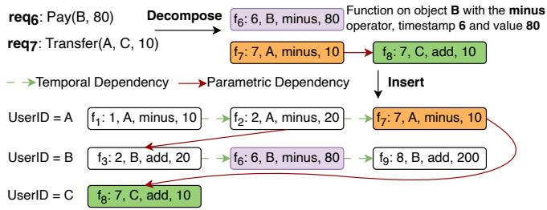  
Figure 4: Dependencies and local TPG construction

For each workflow, all functions in the same workflow share the same timestamp. In this context, we define the timestamp of function $f _ { i }$ as $t ( i )$ .

Definition 3 (Temporal Dependency). fi temporally depends on $f _ { j }$ if they access the same state but are not invoked by the same workflow request, and $f _ { i }$ has a larger timestamp.

Definition 4 (Parametric Dependency). fi parametrically depends on $f _ { j }$ if they belong to the same workflow, and $f _ { i }$ needs the output of $f _ { j }$

For example, in Figure 4, $( f _ { 6 } : 6 , B$ , minus, 80) is a function that operates on object B using the minus operator and a value 80 when the function timestamp is $6 . \ f _ { 6 }$ temporally depends on $f _ { 3 }$ as they access the same object B with different timestamps. Taking $f _ { 7 }$ and $f _ { 8 }$ as another example, they are triggered by a workflow request req7 and $f _ { 8 }$ needs the outputs of $f _ { 7 }$ . Thus, $f _ { 8 }$ parametrically depends on $f _ { 7 }$

Definition 5 (Task Precedence Graph). Given a batch of requests, the task precedence graph (TPG) abstracts functions as vertexes, and edges as temporal and parametric dependencies. Without losing generality, we represent the edge from $f _ { i }$ to $f _ { j } \mathrm { a s } < f _ { i }  f _ { j } >$ , which means $f _ { j }$ depends on $f _ { i } .$

Lemma 1 (Transactional Consistency). If all functions invoked by a batch of requests Q are processed according to temporal and parametric dependencies, the transactional consistency is guaranteed.

Proof Sketch: The task precedence graph is a schedule of functions and we now prove it is conflict-serializable. According to the conflict serializability theorem [5, 38, 56], the schedule is conflict-serializable if and only if its conflict graph is acyclic. For temporal dependencies, if there is a direct edge from $f _ { i }$ to $f _ { j } , t ( j )$ is larger than t(i). We assume that there is a cycle in the dependency graph, i.e., there is a set of edges: $< f _ { 1 }  f _ { 2 } > , < f _ { 3 }  f _ { 4 } > , \ldots < f _ { n - 1 }  f _ { n } > , < f _ { n }  f _ { 1 } >$ This implies that the timestamps increase sequentially from t(1) to t(n), and $t ( n )$ is less than t(1). Such an assumption leads to contradictions. Thus, there must be no cycles in the dependency graph if we only consider temporal dependencies. Since parametric dependencies among functions only exist within the same workflow, they inherently avoid the cyclic pattern. Therefore, the conflict serializability is guaranteed, if all functions are scheduled according to temporal and parametric dependencies.

Local TPG Construction. Each worker identifies finegrained temporal and parametric dependencies within a batch of requests assigned to them and constructs a local TPG. Figure 4 illustrates how a worker constructs a local TPG for the banking service. At first, requests req6 and req7 are decomposed into individual functions $f _ { 6 } , f _ { 7 } ,$ , and $f _ { 8 } ,$ , which represent vertexes in the local TPG. During this decomposition, parametric dependencies among functions in the same workflow can be identified. For instance, $f _ { 8 }$ parametrically depends on $f _ { 7 }$ . To identify temporal dependencies among functions that may arrive out-of-order, workers insert newly arrived functions into key-partitioned sorted lists. In these lists, functions related to the same KV object are ordered by their timestamps. For example, even though $f _ { 9 }$ arrives before $f _ { 6 } ,$ , the worker inserts $f _ { 6 }$ before $f _ { 9 }$ because $f _ { 6 }$ has an earlier timestamp. Consequently, for a batch of requests, the worker sorts the functions related to the same object according to their timestamps. Then, temporal dependencies are identified by iterating through all functions in these sorted lists.

Global TPG Construction. When each worker has constructed its local TPG individually, all workers collaboratively build a global TPG based on the lease table provided by the RTSFaaS driver. As illustrated in Figure 5, node 1 has the lease of objects A and B, while node 2 owns objects C and D. RTSFaaS distinguishes local functions which access only locally cached data, and remote functions which have to access remote data. Using the lease table, each worker dispatches metadata associated with remote functions to the workers who are the leaseholders of the required data. For example, node 1 sends metadata of $f _ { 8 }$ to node 2, and node 2 sends metadata of $f _ { 1 2 }$ to node 1. Workers collect these metadata from other nodes as virtual vertexes and integrate them with their initial local TPG to detect temporal dependencies. For instance, the virtual vertex $( N _ { 1 } , 7 , C )$ contains the metadata of $f _ { 8 }$ from node 1 with timestamp 7 and accessing data item C. Thus, node 2 inserts $( N _ { 1 } , 7 , C )$ before $f _ { 1 0 }$ because $f _ { 8 }$ has an earlier timestamp. In this way, each worker constructs a global TPG for a batch of functions that interact with objects stored in its local data cache.

## 3.3.2 Dynamic Lease Transferring

In the execution phase, each worker maintains a global lease table to facilitate dynamic lease transferring, and a local data cache accessible to other workers. The global lease table is used to determine which worker is the leaseholder of specific objects and the storage order of these objects on each worker. RTSFaaS restricts data prefetching and access control management to leaseholders. These leaseholders fetch the required objects from the KV store in advance to construct the local data cache, ensuring that the data is readily available for subsequent processing.

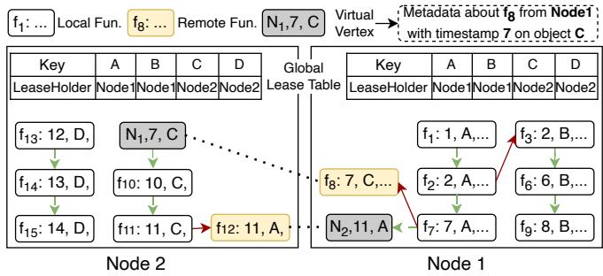  
Figure 5: Global TPG construction

Local Cache. Workers share the local data cache by maintaining KV objects in the order of their keys. Each worker sorts KV objects based on the numerical values represented by their keys. When a worker is the leaseholder of a key, it proactively fetches the corresponding values from remote storage and writes them sequentially into pre-allocated memory regions. Additionally, each value is augmented with a 16-bit lease flag at the beginning to reflect its lease status. Initially, the lease of each value is assigned according to the lease specified in the global lease table. After processing a batch of requests, each worker writes back updates from its local cache to the remote KV store, ensuring a consistent view for the next batch and enabling fault tolerance (see Section 4.2).

Function Execution. RTSFaaS exploits a dynamic lease transferring mechanism to guarantee data consistency across local data caches. Functions are executed sequentially according to the global TPG generated during the planning phase. When a worker encounters a normal vertex (local or remote function), it first checks the global lease table to determine the data’s location. For a local function, the worker accesses data directly using the starting address of its local memory region and calculates the value’s offset based on the key index and value size. For a remote function, the worker calculates the memory address based on the starting address of the remote memory region and the key’s index, retrieving data using onesided RDMA verbs without involvement in remote CPUs.

Regardless of whether the data is cached locally or remotely, the worker must verify whether it has the current lease of the object by comparing its worker ID with the lease flag. The worker can continue to access data and execute functions only when the lease of the object has been transferred to it. This ensures that the worker can safely access or update the object only if it holds the data lease. After completing the data access, the remote worker then transfers the lease to the original leaseholder based on the global lease table. The leaseholder then continues to transfer data leases according to the global TPG. The leaseholder transfers the lease to other workers based on the virtual vertex, which contains metadata about the source worker and the object required. When a virtual vertex is scheduled, the leaseholder transfers the data lease to the corresponding worker by updating lease flags in its local data cache.

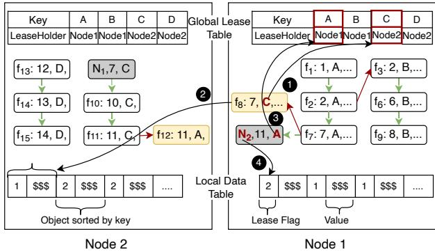  
Figure 6: Dynamic lease transferring

As shown in Figure 6, workers adopt a breadth-first exploration mechanism to schedule functions based on the global TPG. Node 1 first picks an executor for $f _ { 1 }$ , as it has no unresolved dependencies. Once $f _ { 1 }$ completes, $f _ { 2 }$ becomes eligible for execution. After $f _ { 2 }$ has been processed, $f _ { 7 }$ and $f _ { 3 }$ can be scheduled on different executors in parallel, as their data dependencies are resolved. $f _ { 8 }$ presents a more complex case, as it is a remote function that requires access objects cached on other workers. To execute $f _ { 8 } ,$ , the executor first checks the global lease table to locate the object in Node 2 and get its index (0) in Node $2 \mathrm { { } s }$ local data cache ( 1 ). It then uses one-sided RDMA verbs to fetch the remote object and checks the lease flag to ensure that Node 1 is the current leaseholder before performing any updates ( 2 ). When scheduling the virtual vertex (N2, 11, A), Node 1 checks the global lease table to get the index of the object (key = A) ( 3 ). Then, it transfers the lease to Node 2 by updating the lease flag from 1 to 2 ( 4 ). This indicates that once all dependencies of $f _ { 1 2 }$ are resolved, Node 2 can execute $f _ { 1 2 }$ by directly accessing object A from Node 1’s cache.

Handling Transaction Aborts. To address transaction aborts, we adopt an approach inspired by Yao et al. [58], which effectively eliminates cascading aborts during transaction execution. While RTSFaaS resolves transactional conflicts before execution to ensure that no abort occurs due to such conflicts. However, transaction aborts may still result from constraints of database fields, such as non-negative balance. To handle this, RTSFaaS introduces a condition-variable check as the initial function within each transactional workflow. All subsequent functions in the transaction are parametrically dependent on this initial check. If the condition-variable check fails, it propagates disabled signals to the interdependent functions in the workflow, thereby avoiding cascading aborts and reducing their associated overhead during execution.

## 4 Implementation

In this section, we describe the RDMA-based data transfer protocol and fault tolerance mechanisms.

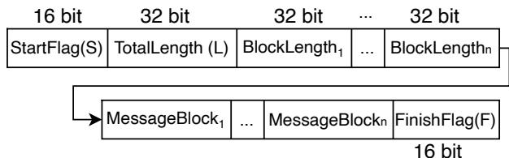  
Figure 7: Data layout of RDMA messages

## 4.1 RDMA-based Data Transfer

## 4.1.1 RDMA Channel

The RDMA channel in RTSFaaS enables efficient communication between the driver and workers, as well as two workers. RTSFaaS employs a push-based data transfer model with RDMA write and a structured message layout to ensure reliability and parallel processing.

RDMA Verbs. RTSFaaS adopts RDMA write instead of RDMA read to achieve the push-based transfer model due to the following reasons: 1) First, since workers are usually computing intensive, the push-based transfer model empowered by RDMA write is preferable. This approach allows the driver to write the workers’ memory directly, enabling workers to poll local memory efficiently. In contrast, using RDMA reads, the driver would continuously read the remote memory till the requested data is available, leading to additional network traffic and higher latency. 2) Second, the RDMA read entails a round-trip message, and results in higher latency and CPU utilization [16]. In contrast, one-sided RDMA write requires only a single trip per message.

Data Layout of RDMA Messages. We carefully design the data layout of RDMA messages to ensure data integrity and to support parallel processing. As illustrated in Figure 7, the message comprises several elements: a short start-flag S indicating the beginning of the message, the total message length $L ,$ and the length of each message block. The number of message blocks n corresponds to the number of parallel instances in the receiver, i.e., n is the number of its function executors for each worker. Subsequently, a set of message blocks follows, with each block containing a portion of the messages slated for processing. At last, a short finish-flag F denotes the end of the message.

## 4.1.2 RDMA Communication Protocol

Connection Establishment. In RTSFaaS, each worker establishes connections with the RTSFaaS driver and other workers, facilitated by a configuration file that specifies the network addresses of all nodes. During the initialization, each worker configures its RDMA resources, including memory regions for data transfer, completion queues, and queue pairs. Simultaneously, the driver sets up a listening endpoint to await connection requests from workers.

When a worker sends a connection request, the RTSFaaS driver responds by performing a handshake to exchange information about memory regions. Simultaneously, workers exchange connection requests to establish direct connections with one another. During this process, the driver and workers exchange RegionTokens, which encapsulate details of shared memory regions, such as base addresses and sizes. These tokens enable direct memory access during RDMA operations.

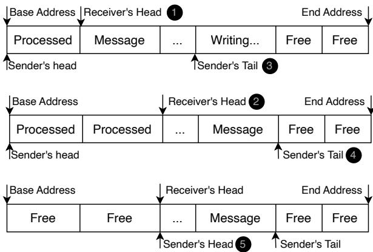  
Figure 8: Circular buffer for data transfer

Data Transfer. RTSFaaS achieves the RDMA-based data transfer using circular buffer [16, 19], as shown in Figure 8. As RTSFaaS adopts a push-based transfer model, the circular buffer is initialized in the receiver, and there is one buffer for each sender/receiver pair. The receiver periodically polls the buffer at the "Head" position to detect new messages ( 1 ). As shown in the message layout, any start-flag value S in the head indicates a new message. Then, the receiver polls the message trailer based on the total message length L. When it becomes the finish-flag F, the entire message has been received because RDMA writes are performed in a FIFO order. Finally, the receiver advances the head pointer ( 2 ).

The sender utilizes RDMA write to transfer messages to the buffer tail ( 3 ), incrementing the tail pointer with each transmission ( 4 ). It maintains a local copy of the receiver’s head pointer and ensures that messages are only written up to that point. The receiver, on the other hand, lazily updates the sender’s copy of the head pointer by writing the current head value via RDMA ( 5 ). To minimize overhead, the receiver updates the sender’s copy only after processing at least half of the buffer [19]. Consequently, the sender’s head pointer always lags behind the receiver’s, guaranteeing that unprocessed messages are never overwritten.

RTSFaaS employs a mechanism similar to the Chandy-Lamport algorithm [9] to ensure a consistent transition between the planning and execution phases for workers. In RTSFaaS, the driver maintains the global lease table, which records the current leaseholder for each data item. For each batch of requests, the driver assigns new leases for each data item and updates the lease table accordingly. After the driver has finished sending the requests for a batch, it broadcasts the updated global lease table along with a unique transitionflag message. Each worker then maintains a local copy of the lease table, synchronized with the driver’s decisions, ensuring consistent lease ownership across all workers during the execution of the batch.

When workers receive requests, they first build a local TPG during the planning phase. Upon receiving the transition-flag and global lease table, workers collaboratively construct the global TPG. Once the global TPG is completed, workers move to the execution phase. The driver periodically injects the transition-flag to process requests in batches. The interval between injections is determined by the local cache capacity, as workers need to prefetch data items for each batch.

## 4.2 Fault Tolerance

For the storage layer, we rely on TiKV [39, 51]’s replication scheme for k-fault tolerance. In the computing tier, we adopt the standard fault tolerance approach commonly used in many FaaS platforms: if a machine fails, all machines reload the necessary data and re-execute the batch of requests to ensure that no task is lost. Once compute nodes have completed the transactions, their data caches are written back to the storage layer in batches, as discussed in Section 3.3. To ensure consistency and reliability during this write-back phase, we adopt a snapshot-based recovery mechanism combined with log-assisted tracking for efficient failure recovery.

After a batch of requests is completed, each compute node creates a snapshot of its local cache, which captures the latest state and is used for recovery in case of failures. Once all compute nodes successfully generate snapshots, they proceed to write back their local cache to TiKV [39, 51]. To assist the recovery, RTSFaaS maintains a lightweight log that tracks the progress of snapshot creation and write-back operations, recording the current operation and its status (e.g., “snapshot created,” “write-back successfully”). If a failure occurs during snapshot creation, RTSFaaS reloads the original data for the failed nodes from TiKV [39, 51], re-executes the batch of requests, and regenerates the snapshot. For failures during the write-back process, RTSFaaS restores the failed node’s local cache from its snapshot and reattempts the write-back.

This recovery mechanism ensures reliable failure handling in the compute layer. For example, when a write-back is completed before failure, RTSFaaS continues processing with zero downtime. If a failure occurs after snapshot creation but before write-back, the snapshot enables a retry within 233 ms. In cases of complete data loss, RTSFaaS can reload the original data, re-execute the batch, and regenerate the snapshot in 729 ms under a snapshot interval of 500 ms with a workload of 5,000 queries per second. In addition, the Docker startup and reconnection times for a cluster of one driver and four workers are 20.31s and 15.66s, which remains the dominant recovery overhead. Further improvements, such as RDMAbased optimizations used in MITOSIS [54], can be applied to reduce cold start latency.

## 4.3 Limitations

Handling Dependent Reads. Our lease assignment mechanism depends on knowing the full read/write set of each transaction, which becomes challenging in the presence of dependent reads. RTSFaaS follows a strategy similar to deterministic databases [35,50,65], where the driver performs early reads to resolve dependencies and determine the complete access set before assigning leases. While this approach ensures correctness, it introduces additional communication overhead due to the extra round-trip required for these early reads. Moreover, during the construction of the TPG, unresolved dependent reads are conservatively assumed to potentially interact with any prior or future operation. As a result, their metadata must be broadcast to all workers to capture possible global dependencies. This pessimistic strategy ensures correctness but incurs a non-negligible communication cost. Given the inherent difficulty of resolving dependencies for non-deterministic functions [41], developing more efficient solutions remains an important direction for future research.

Hotspot Contention on Remote Keys. Our affinity-aware lease assignment mechanism aims to reduce contention on remote keys by co-locating related functions and data. In large-scale deployments, it is still possible for tons of concurrent functions to acquire the lease on the same remote key. Our current design adopts a single logical leaseholder model per data item in the local data cache, which may become a bottleneck under high contention. Inspired by industrial systems such as PolarDB [8], one promising extension is to adopt a replicated-state model, where multiple read-only replicas are colocated with compute nodes to absorb read traffic, while a single primary replica coordinates updates. Such an approach could further improve scalability by mitigating lease contention hotspots.

## 5 Evaluation

In this section, we conduct a comprehensive evaluation of the design of RTSFaaS using a set of end-to-end experiments across several representative benchmarks. The source code is available on GitHub at https://github.com/ CGCL-codes/RTSFaaS [42]. Our experimental studies aim to answer the following questions:

Q1: How well is the performance of RTSFaaS compared with the state-of-the-art transactional FaaS system using representative workloads? (Section 5.2)

Q2: Does the concurrency control protocol in RTSFaaS outperform those used in Boki [25] and Beldi [60] when all protocols are implemented in an RDMA-enabled environment, and how do varying workload characteristics influence their performance? (Section 5.3)

Q3: What is the performance overhead of RTSFaaS, and how different system configurations affect the performance of RTSFaaS? (Section 5.4)

## 5.1 Experimental Setup

We deploy RTSFaaS [42] in a cluster with five physical machines, each equipped with Intel Xeon Gold 6230 processors and 128 GB DDR-4 memory. These machines are interconnected via Mellanox ConnectX-3 40/56 GbE network controllers, delivering a round-trip time of 7 µs for an RDMA operation. Within the cluster, one machine is designated as the RTSFaaS driver, while the remaining four serve as compute nodes that execute serverless functions. The driver and each worker operate in individual Docker [18] containers, each configured with 8 CPUs and 32 GB of memory. Each worker reserves 2 GB memory used for the local data cache.

RTSFaaS use TiKV [39,51], a highly scalable, low-latency, and easy-to-use key-value database for database management. The TiKV cluster configuration consists of three placement drivers to manage the metadata and maintain consistent partitions across the database, along with three TiKV nodes to store and manage KV objects.

This setup reflects the two-tier data organization in RTS-FaaS. The first tier consists of the local data cache maintained by compute nodes within the same data center to enable lowlatency RDMA access, with each data item having a single in-memory replica. The second tier is the TiKV-backed storage, which supports geo-distributed replication mechanisms for high availability.

## 5.2 Comparing to Transactional FaaS Systems

## 5.2.1 Baselines

In this evaluation, we compare RTSFaaS with the following stateful FaaS systems that guarantee transactional consistency. Beldi [60] is a recent transactional FaaS system that leverages Nightcore [26] as its function runtime and uses a two-phase locking (2PL) protocol to ensure serializable consistency. In this experiment, Beldi [60] uses DynamoDB as its storage backend and operates on 8 function nodes.

Boki [25] adopts the optimistic concurrency control (OCC) protocol, leveraging a log-based conflict window for conflict validation. Boki [25] also uses a local cache on compute nodes to enhance read locality. We follow the experimental setup described in the Boki paper [25] to deploy 3 storage nodes, 3 sequence nodes, and 8 worker nodes.

For both Beldi [60] and Boki [25], each node runs on a c5d.2xlarge instance with 8 vCPUs, 16GB of DRAM, and hyper-threading enabled. The round-trip time between VMs ranges from 100 to 120 microseconds. To match these baseline conditions, we configure RTSFaaS with four workers, each of them provisioned with 8 cores and 32 GB of DRAM. In this experiment, we fix the batch interval at 500 ms to assess RTSFaaS’s performance under stable conditions. We further explore the effects of varying batch sizes in Section 5.4.

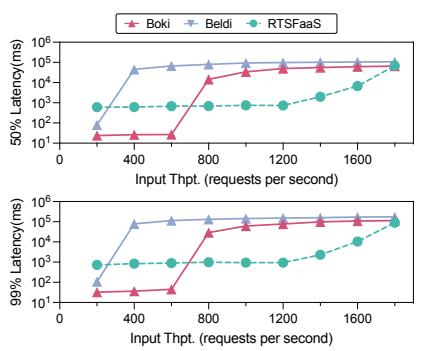  
(a) Movie Review

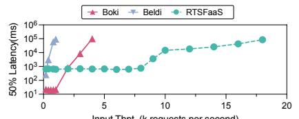

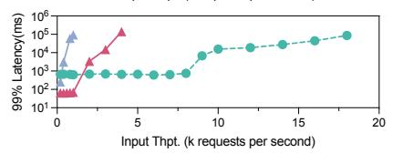  
(b) Travel Reservation

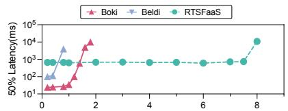

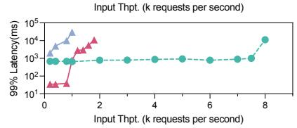  
(c) Bank Service  
Figure 9: Latency vs. throughput for RTSFaaS, Boki, and Beldi on movie review, travel reservation, and banking service

## 5.2.2 Workloads

To make a comprehensive evaluation, we adapt and extend the following workloads from prior works [23, 25, 60].

1) The Movie Review workload simulates a movie review service where users write reviews for movies.

2) The Travel Reservation workload simulates a travel reservation service and consists of two main workflows that we implement: the search workflow, where users read and sort hotel and flight options by criteria such as rating and price, and the reservation workflow, which involves writing reservation details to secure hotel rooms and flights. These workflows are executed independently, maintaining a balanced 1:1 ratio between search and reservation requests.

3) The Banking Service workload simulates transfer operations between users. The withdraw function first reads the balance of the source account to verify sufficient funds, then writes the new balance by deducting the specified amount. Upon successful completion of the withdrawal, the deposit function is invoked to read the balance of the target account and update it by adding the specified amount.

## 5.2.3 Latency vs. Input Throughput

This section evaluates how the input throughput impacts latency for Boki [25], Beldi [60], and RTSFaaS across multiple workloads. Specifically, input throughput is defined as the rate of incoming requests per second to each system under test, while latency represents the total time taken from a user’s request submission to the final receipt of execution results. As shown in Figure 9, RTSFaaS demonstrates superior performance compared to Boki [25] and Beldi [60] by maintaining consistently lower latency across increasing input throughput. When the median latency is 700 ms, RTSFaaS improves throughput by $2 . 0 \times ( 6 . 0 \times )$ in movie review workload, 4.0× ( 20×) in travel reservation workload, and 5.0× ( 17×) in banking service workload compared to Boki [25] (Beldi [60]).

Beldi [60] experiences higher latency even at lower input throughputs compared to Boki [25] and RTSFaaS because transactions may need to wait for locks. Since Beldi [60] uses remote locks, the overhead of acquiring and releasing locks is inherently higher due to network communication. Benefiting from the local cache and OCC, Boki [25] starts with lower latency at low input throughput because conflicts are infrequent. However, as the input throughput increases, more conflicts are detected during the commit phase, leading to more transaction rollbacks and retries, which could explain the steeper rise in both median and tail latency.

In comparison, RTSFaaS proposes a lease-based concurrency control mechanism that optimizes data locality and executes transactions without any concurrency-related aborts. Thus, RTSFaaS outperforms the other two systems as input throughput increases. Notably, RTSFaaS also exhibits constant latency even when the input throughput is low. This is because RTSFaaS commits a batch every 500ms, which introduces a fixed waiting time regardless of the input throughput.

## 5.3 RDMA-enable CC Mechanisms

In this section, we evaluate the effectiveness of RTSFaaS by comparing it to concurrency control protocols that rely on remote storage, as used in Boki [25] and Beldi [60]. To ensure a fair comparison and isolate the impact of network performance, we reimplement the concurrency control protocols from these platforms in an RDMA-enabled environment.

Approaches for Comparison. We compare RTSFaaS with 1) Remote Lock: Belid [60] ensures transactional consistency based on a variant of 2PL with wait-die lock. We enhance it by using RDMA atomic operations [59], such as compareand-swap (CAS) and fetch-and-add (FAA) to implement lock management, including exclusive lock and share lock [10].

2) Remote OCC + Local Cache: As mentioned before, Boki [25] supports transactional consistency based on optimistic concurrency control (OCC). In addition to enhancing lock management with RDMA [53], we also implement local data caching. Thus, transactions can read and modify the local cache optimistically but must check whether any conflicting operations occur before committing transactions.

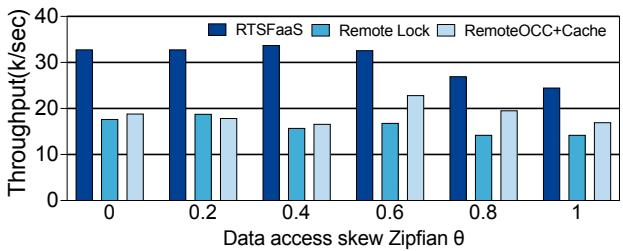  
Figure 10: Impact of state access skewness

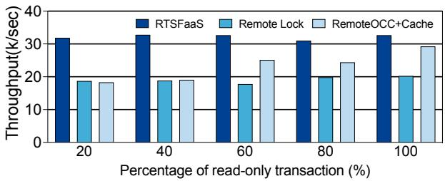  
Figure 11: Impact of read-only transactions

Microbenchmark and Testbed Setup. We use a microbenchmark that reads or updates the values associated with a set of keys. The dataset contains 20,000 items, and we vary the data access skew, percentage of read-only transactions, and transactional workflow length to conduct a comprehensive evaluation. This section uses a simple RDMA-based key-value store to implement traditional concurrency control protocols. We evaluate RTSFaaS and other approaches using four workers, each equipped with twenty cores and 64 GB DRAM.

## 5.3.1 Impact of Data Access Skew

In this evaluation, we compare the throughput performance of RTSFaaS, remote lock, and the remote optimistic concurrency control under varying data access skew (Zipfian θ). To isolate the impact of data access skew, we configure the microbenchmark to consist entirely of write transactions, each with a transaction length of two. As shown in Figure 10, RTS-FaaS consistently achieves the highest throughput across all skew levels. This robust performance is due to RTSFaaS’s separation of consistency guarantees from execution, which reduces the overhead of remote locking during execution. Additionally, the affinity-aware lease assignment mechanism optimizes data locality, further enhancing throughput.

In contrast, the remote lock protocol consistently delivers the lowest throughput, primarily due to the high overhead associated with lock management. The throughput of using optimistic concurrency control exhibits a two-phase performance trend: initially, as the skew increases, its performance improves due to the effectiveness of caching, reaching around 23k/sec at θ=0.6. However, as the skew continues to increase, the performance declines sharply to about 16k/sec at θ=1. This decline is caused by higher contention, which leads to increased aborts and retries. As a result, the cache becomes less effective, further reducing performance.

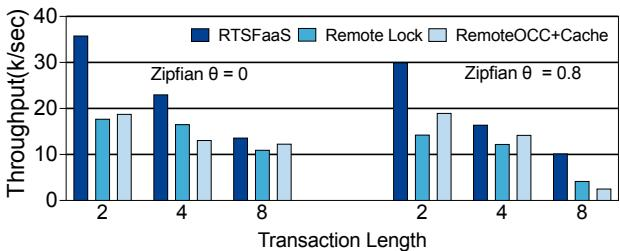  
Figure 12: Impact of transactional workflow length

## 5.3.2 Impact of Read-Only Transactions

Figure 11 illustrates the throughput of RTSFaaS, remote lock, and the remote optimistic concurrency control as the percentage of read-only transactions changes. The remote optimistic concurrency control shows better performance at higher readonly transaction percentages due to effective caching. However, as the read-only percentage decreases, its performance drops because frequent non-local reads are needed to update the cache in the presence of writes, increasing contention and reducing cache effectiveness.

In contrast, RTSFaaS consistently outperforms other mechanisms, especially when the percentage of read-only transactions is low. This is because RTSFaaS improves data locality by assigning groups of interdependent data items to a single worker under the exclusive lease. Additionally, RTSFaaS allows workers to access each other’s local caches directly using one-sided RDMA verbs, thereby avoiding the overhead of contacting the storage multiple times to obtain a fresh version. Since RTSFaaS processes read and write operations in the order of their dependencies, its performance advantage remains stable as the percentage of read-only transactions increases.

## 5.3.3 Impact of Transactional Workflow Length

As shown in Figure 12, we compare throughput across various transactional workflow lengths, which is defined as the number of atomic functions within a single workflow. As the transactional workflow length increases, the performance of all mechanisms declines. This performance decrease is attributed to the increased number of operations each request needs to process, which naturally leads to lower throughput.

For the remote optimistic concurrency control, throughput declines sharply with longer transactional workflows, especially at Zipfian θ = 0.8. The decline is caused by the increased probability of conflicts as the length of each transactional workflow grows, which raises the likelihood of aborts and re-executions during the validation phase. The aborts and re-executions lead to wasted computational resources and a significant reduction in the effectiveness of caching. Similarly, remote lock consistently shows lower performance due to the increased lock contention in longer transactional workflows, which leads to more frequent remote lock acquisitions and increased communication overhead.

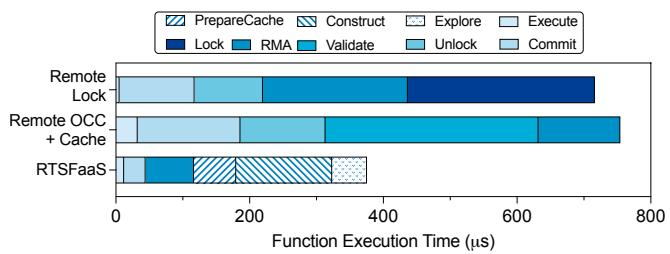  
Figure 13: Function execution time breakdown

In contrast, RTSFaaS achieves superior throughput compared to others by serializing function execution through a global TPG, which significantly reduces the network communication overhead associated with lock operations.

## 5.4 Performance Influencing Factors

## 5.4.1 Factor Analysis

To further investigate the performance differences between RTSFaaS and directly implement the concurrency control protocols used by Boki [25] and Beldi [60] in the RDMAenabled environment, this section decomposes the execution time of the function to perform a factor analysis. As depicted in Figure 13, both the remote lock and optimistic concurrency control protocols incur substantial overhead due to frequent interactions with remote storage, including operations such as locking, unlocking, and validation. This result highlights that merely adding RDMA on top of existing protocols designed for transactional consistency does not effectively alleviate the overhead of remote communication. RTSFaaS spends a substantial portion of time on the construction and exploration phases, where it constructs the global TPG and explores this graph to select functions for execution. Despite this additional task, RTSFaaS significantly reduces the communication overhead associated with frequent interactions with remote storage. Thus, RTSFaaS presents an overall improvement in performance compared to the other two protocols.

## 5.4.2 Impact of Batch Size

In this section, we evaluate the impact of batch size on the performance of RTSFaaS. The batch size, defined as the number of workflows handled between two consecutive punctuations, plays a critical role in RTSFaaS’s performance. Figure 14 shows the throughput and latency of RTSFaaS under increasing batch size. The results indicate that throughput initially increases with the batch size, reaching a plateau at n = 25600 when the computational resources on each machine are fully utilized. However, this improvement comes at the cost of higher latency, particularly at the 99th percentile. This is because, in RTSFaaS, the function executor must wait for all requests in a batch to arrive before constructing the global TPG, which is done sequentially based on dependencies. As a result, earlier requests in the batch have to wait for later ones to arrive, delaying the execution of earlier requests. Additionally, as the batch size increases, the time required to construct the global TPG also increases, further contributing to higher waiting times and higher latency at the 99th percentile.

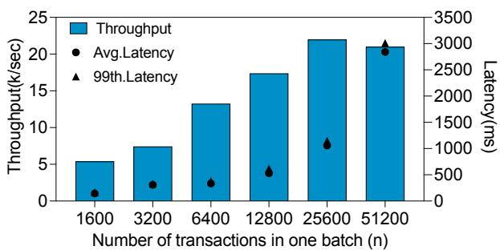  
Figure 14: Effects of batch size on performance of RTSFaaS

## 6 Related Work

Stateful Serverless Computing. As growing data-centric applications are apt to deploy in cloud data centers, both industry and academia have made significant efforts to enhance the performance and functionality of FaaS platforms. Various stateful FaaS platforms have been developed, some offering weak consistency [34, 48, 57], while others incur high-performance overhead [25,30,60] to ensure transactional consistency. Apiary [30] co-locates function logic and data management by wrapping a distributed transactional database management system like VoltDB [14], while Styx [40] colocates the function execution with application states using a streaming dataflow execution model. Although Apiary [30] and Styx [40] support transactional consistency, they tightly couple storage and computation, making their system architectures fundamentally different from RTSFaaS. Other works, such as Shredder [64], propose cloud datastores that allow functions to execute directly on storage nodes. LambdaObjects [36] co-locates storage and computing by encapsulating data as objects tied to specific functions, inspired by objectoriented principles. However, none of these solutions supports serializable transactions with multiple functions. In contrast, RTSFaaS supports transactional stateful serverless workflows, and further exploits a lease-based concurrency control protocol to achieve high performance.

RDMA-capable Serverless Computing. RDMA technologies offer vast opportunities in the realm of serverless computing. Recent RDMA-based FaaS frameworks have different motivations, including remote fork [54], function scheduling [13], and state transfer [33]. MITOSIS [54] introduces an operating system primitive that aims to facilitate rapid remote fork by integrating the RDMA driver into the OS kernel. Similarly, rFaaS [13] introduces new RDMA abstractions that simplify the network stack for serverless computing, along with a decentralized resource allocation mechanism, which allows function invocations at the microsecond level. In addition, RMMAP [33] proposes a new OS primitive that maps a remote memory region into a local process using RDMA, and thus can streamline the process of transferring states between any pair of functions, thereby eliminating the need for serialization and deserialization. Unlike these proposes that incorporate RDMA into serverless computing, our work attempts to address a different challenge. RTSFaaS focuses on improving transactional stateful serverless workflows to achieve high performance and strong consistency.

RDMA-enabled KV Stores and Transactional Storage. Existing RDMA-enabled KV stores, such as ROLEX [31] and LOLKV [2], provide strong consistency for individual operations, particularly through RDMA-friendly replication protocols. Thus, these RDMA-based key-value stores cannot be directly applied to FaaS platforms because FaaS requires transactional consistency for workflows, often involving multiple interdependent functions.

RDMA-enabled transactional storage systems exhibit a significant performance improvement for transaction processing [19, 29, 53, 62, 63]. FaRM [19], FaSST [29], DrTM [55], and DrTM-H [53] can support strong consistency for distributed transactions via 2PC/OCC RDMA-based approach. They are effective in monolithic architectures, whereas RTSFaaS is designed for the disaggregated architecture widely adopted in FaaS platforms. More importantly, RTSFaaS reduces remote communication overhead by employing a lease-based concurrency control protocol at the computation layer.

In addition, FORD [63] and Motor [62] further optimize distributed transactions through advanced techniques in disaggregated memory environments. FORD [63] accelerates distributed transactions by utilizing fast one-sided RDMA operations and consolidating operations such as reads and locks into a single RTT. On the other hand, Motor [62] leverages the consecutive version tuple (CVT) and one-sided RDMA operations to efficiently support multi-version distributed transactions, and thus reduces network round trips and improves concurrency. While FORD [63] and Motor [62] optimize the performance of individual transactions, they primarily focus on enhancing single RDMA operations. In contrast, transactional workflows involve a sequence of interdependent operations, where the outcome of one function may affect others. These transactional workflows should guarantee strong consistency and coordinate all functions. RTSFaaS addresses this problem by resolving the dependencies among chained functions, and guaranteeing transactional consistency via dynamic lease assignment and transfer, rather than just optimizing individual transactions.

To address communication overhead in RDMA environments, recent efforts such as ALock [3] enable local memory access without relying on RPCs or loopback, significantly improving synchronization efficiency. While ALock [3] targets fine-grained synchronization for low-level memory access, our lease mechanism emphasizes enhancing caching efficiency and managing dependencies among concurrent transactional workflows. Nevertheless, integrating ALock [3] into our dynamic lease transfer protocol could further improve coordination efficiency between local and remote memory accesses in disaggregated FaaS systems.

Deterministic Transactional System. Deterministic systems such as Calvin [50] avoid coordination overhead by predefining a global transaction execution order, thereby eliminating the need for distributed locks or optimistic validation. However, these approaches face limitations when applied to the disaggregated, dynamic nature of FaaS platforms. Specifically, Calvin [50] focuses on read-write conflicts over the same key, whereas transactional workflows in FaaS often involve complex data dependencies, such as parametric dependencies between functions, which may span multiple keys and require fine-grained coordination. Moreover, deterministic systems typically rely on static data partitioning, which constrains their ability to adapt to runtime function placement and workload variations. In contrast, our system introduces an affinity-aware lease assignment mechanism that dynamically adapts data ownership and placement according to functiondata affinity, improving both load balancing and execution locality in distributed FaaS environments.

## 7 Conclusion

In this paper, we present RTSFaaS, an RDMA-capable transactional stateful FaaS framework that achieves high performance while guaranteeing transactional consistency. RTS-FaaS exploits a lease-based concurrency control protocol to dynamically assign and transfer leases among workers to achieve concurrency control. Specifically, RTSFaaS incorporates two key designs to address the aforementioned limitations of current systems: an affinity-aware lease assignment mechanism and an RDMA-capable dynamic lease transferring mechanism. Experimental results show that RTSFaaS outperforms the state-of-the-art stateful FaaS platforms, achieving up to 5× and 20× higher throughput than Boki [25] and Beldi [60], respectively. Even when their concurrency control protocols are adapted to RDMA networks and integrated into RTSFaaS, our design still yields up to 1.7× and 2.1× performance improvements.

## Acknowledgments

We appreciate our shepherd, Mr. Haonan Lu, and the anonymous reviewers’ constructive comments for improving the quality of this paper. This work is supported jointly by the National Key Research and Development Program of China under grant 2022YFB4500303, National Natural Science Foundation of China (NSFC) under grants 62332011, 62302178, NSFC-RGC under grant 62461160333, and Natural Science Foundation of Hubei Province under grant 2021CFA037.

## References

[1] Atul Adya, Robert Gruber, Barbara Liskov, and Umesh Maheshwari. Efficient Optimistic Concurrency Control Using Loosely Synchronized Clocks. ACM SIGMOD Record, 24(2):23–34, 1995.

[2] Ahmed Alquraan, Sreeharsha Udayashankar, Virendra Marathe, Bernard Wong, and Samer Al-Kiswany. LoLKV: The Logless, Linearizable, RDMA-based Key-Value Storage System. In Proceedings of the 21st USENIX Symposium on Networked Systems Design and Implementation (NSDI), pages 41–54, 2024.

[3] Amanda Baran, Jacob Nelson-Slivon, Lewis Tseng, and Roberto Palmieri. ALock: Asymmetric Lock Primitive for RDMA Systems. In Proceedings of the 36th ACM Symposium on Parallelism in Algorithms and Architectures (SPAA), pages 15–26, 2024.

[4] Daniel Barcelona-Pons, Marc Sánchez-Artigas, Gerard París, Pierre Sutra, and Pedro García-López. On the FaaS Track: Building Stateful Distributed Applications with Serverless Architectures. In Proceedings of the 20th International Middleware Conference (Middleware), pages 41–54, 2019.

[5] Philip A. Bernstein, David W. Shipman, and Wing S. Wong. Formal Aspects of Serializability in Database Concurrency Control. IEEE Transactions on Software Engineering, 5(3):203–216, 1979.

[6] Carsten Binnig, Andrew Crotty, Alex Galakatos, Tim Kraska, and Erfan Zamanian. The End of Slow Networks: It’s Time for a Redesign. Proceedings of the VLDB Endowment, 9(7):528–539, 2016.

[7] Qingchao Cai, Wentian Guo, Hao Zhang, Divyakant Agrawal, Gang Chen, Beng Chin Ooi, Kian-Lee Tan, Yong Meng Teo, and Sheng Wang. Efficient Distributed Memory Management with RDMA and Caching. Proceedings of the VLDB Endowment, 11(11):1604–1617, 2018.

[8] Wei Cao, Yingqiang Zhang, Xinjun Yang, Feifei Li, Sheng Wang, Qingda Hu, Xuntao Cheng, Zongzhi Chen, Zhenjun Liu, Jing Fang, Bo Wang, Yuhui Wang, Haiqing Sun, Ze Yang, Zhushi Cheng, Sen Chen, Jian Wu, Wei Hu, Jianwei Zhao, Yusong Gao, Songlu Cai, Yunyang Zhang, and Jiawang Tong. PolarDB Serverless: A Cloud Native Database for Disaggregated Data Centers. In Proceedings of the 2021 International Conference on Management of Data (SIGMOD), pages 2477–2489, 2021.

[9] K. Mani Chandy and Leslie Lamport. Distributed Snapshots: Determining Global States of Distributed Systems. ACM Transactions on Computer Systems, 3(1):63–75, 1985.

[10] Yeounoh Chung and Erfan Zamanian. Using RDMA for Lock Management. arXiv preprint arXiv:1507.03274, 2015.

[11] Alibaba Cloud. Function Compute. https: //www.alibabacloud.com/en/product/ function-compute [Accessed: April 16, 2024].

[12] Knative Community. Knative is an Open-Source Enterprise-level Solution to Build Serverless and Event Driven Applications. https://knative.dev/docs/ [Accessed: April 16, 2024].

[13] Marcin Copik, Konstantin Taranov, Alexandru Calotoiu, and Torsten Hoefler. rFaaS: Enabling High Performance Serverless with RDMA and Leases. In Proceedings of the 2023 IEEE International Parallel and Distributed Processing Symposium (IPDPS), pages 897–907, 2023.

[14] Volt Active Data. VoltDB. https://www.voltdb. com/ [Accessed: April 16, 2024].

[15] Martijn de Heus, Kyriakos Psarakis, Marios Fragkoulis, and Asterios Katsifodimos. Distributed Transactions on Serverless Stateful Functions. In Proceedings of the 15th ACM International Conference on Distributed and Event-based Systems (DEBS), pages 31–42, 2021.

[16] Bonaventura Del Monte, Steffen Zeuch, Tilmann Rabl, and Volker Markl. Rethinking Stateful Stream Processing with RDMA. In Proceedings of the 2022 International Conference on Management of Data (SIGMOD), pages 1078–1092, 2022.

[17] HUAWEI Developers. Cloud Functions Documents. https://developer.huawei.com/consumer/en/ agconnect/cloud-function/ [Accessed: April 16, 2024].

[18] Docker. Develop Faster. Run Anywhere. https://www. docker.com [Accessed: April 16, 2024].

[19] Aleksandar Dragojevic, Dushyanth Narayanan, Miguel ´ Castro, and Orion Hodson. FaRM: Fast Remote Memory. In Proceedings of the 11th USENIX Symposium on Networked Systems Design and Implementation (NSDI), pages 401–414, 2014.

[20] Mostafa Elhemali, Niall Gallagher, Nick Gordon, Joseph Idziorek, Richard Krog, Colin Lazier, Erben Mo, Akhilesh Mritunjai, Somasundaram Perianayagam, Tim Rath, Swami Sivasubramanian, James Christopher Sorenson III, Sroaj Sosothikul, Doug Terry, and Akshat Vig. Amazon DynamoDB: A Scalable, Predictably Performant, and Fully Managed NoSQL Database Service. In Proceedings of the 2022 USENIX Annual Technical Conference (USENIX ATC), pages 1037–1048, 2022.

[21] Kapali P. Eswaran, Jim N. Gray, Raymond A. Lorie, and Irving L. Traiger. The Notions of Consistency and Predicate Locks in a Database System. Communications of the ACM, 19(11):624–633, 1976.

[22] Apache Software Foundation. Open Source Serverless Cloud Platform. https://openwhisk.apache.org/ [Accessed: April 16, 2024].

[23] Yu Gan, Yanqi Zhang, Dailun Cheng, Ankitha Shetty, Priyal Rathi, Nayan Katarki, Ariana Bruno, Justin Hu, Brian Ritchken, Brendon Jackson, Kelvin Hu, Meghna Pancholi, Yuan He, Brett Clancy, Chris Colen, Fukang Wen, Catherine Leung, Siyuan Wang, Leon Zaruvinsky, Mateo Espinosa, Rick Lin, Zhongling Liu, Jake Padilla, and Christina Delimitrou. An Open-source Benchmark Suite for Microservices and Their Hardware-Software Implications for Cloud & Edge Systems. In Proceedings of the Twenty-Fourth International Conference on Architectural Support for Programming Languages and Operating Systems (ASPLOS), pages 3–18, 2019.

[24] Joseph M. Hellerstein, Jose Faleiro, Joseph E. Gonzalez, Johann Schleier-Smith, Vikram Sreekanti, Alexey Tumanov, and Chenggang Wu. Serverless Computing: One Step Forward, Two Steps Back. arXiv preprint arXiv:1812.03651, 2018.

[25] Zhipeng Jia and Emmett Witchel. Boki: Stateful Serverless Computing with Shared Logs. In Proceedings of the 28th Symposium on Operating Systems Principles (SOSP), pages 691–707, 2021.

[26] Zhipeng Jia and Emmett Witchel. Nightcore: Efficient and Scalable Serverless Computing for Latency-Sensitive, Interactive Microservices. In Proceedings of the 26th ACM International Conference on Architectural Support for Programming Languages and Operating Systems (ASPLOS), pages 152–166, 2021.

[27] Eric Jonas, Johann Schleier-Smith, Vikram Sreekanti, Chia-Che Tsai, Anurag Khandelwal, Qifan Pu, Vaishaal Shankar, Joao Carreira, Karl Krauth, Neeraja Yadwadkar, Joseph E. Gonzalez, Raluca Ada Popa, Ion Stoica, and David A. Patterson. Cloud Programming Simplified: A Berkeley View on Serverless Computing. arXiv preprint arXiv:1902.03383, 2019.

[28] Anuj Kalia, Michael Kaminsky, and David G. Andersen. Design Guidelines for High Performance RDMA Systems. In Proceedings of the 2016 USENIX Annual Technical Conference (USENIX ATC), pages 437–450, 2016.

[29] Anuj Kalia, Michael Kaminsky, and David G. Andersen. FaSST: Fast, Scalable and Simple Distributed Transactions with Two-Sided RDMA Datagram RPCs. In

Proceedings of the 12th USENIX Symposium on Operating Systems Design and Implementation (OSDI), pages 185–201, 2016.

[30] Peter Kraft, Qian Li, Kostis Kaffes, Athinagoras Skiadopoulos, Deeptaanshu Kumar, Danny Cho, Jason Li, Robert Redmond, Nathan Weckwerth, Brian Xia, Peter Bailis, Michael Cafarella, Goetz Graefe, Jeremy Kepner, Christos Kozyrakis, Michael Stonebraker, Lalith Suresh, Xiangyao Yu, and Matei Zaharia. Apiary: A DBMS-Backed Transactional Function-as-a-Service Framework. arXiv preprint arXiv:2208.13068, 2022.

[31] Pengfei Li, Yu Hua, Pengfei Zuo, Zhangyu Chen, and Jiajie Sheng. ROLEX: A Scalable RDMA-oriented Learned Key-Value Store for Disaggregated Memory Systems. In Proceedings of the 21st USENIX Conference on File and Storage Technologies (FAST), pages 99–114, 2023.

[32] Zijun Li, Chuhao Xu, Quan Chen, Jieru Zhao, Chen Chen, and Minyi Guo. DataFlower: Exploiting the Dataflow Paradigm for Serverless Workflow Orchestration. In Proceedings of the 28th ACM International Conference on Architectural Support for Programming Languages and Operating Systems (ASPLOS), pages 57–72, 2023.

[33] Fangming Lu, Xingda Wei, Zhuobin Huang, Rong Chen, Minyu Wu, and Haibo Chen. Serialization/Deserialization-Free State Transfer in Serverless Workflows. In Proceedings of the Nineteenth European Conference on Computer Systems (EuroSys), pages 132–147, 2024.

[34] Taras Lykhenko, Rafael Soares, and Luis Rodrigues. FaaSTCC: Efficient Transactional Causal Consistency for Serverless Computing. In Proceedings of the 22nd International Middleware Conference (Middleware), pages 159–171, 2021.

[35] Yancan Mao, Jianjun Zhao, Shuhao Zhang, Haikun Liu, and Volker Markl. MorphStream: Adaptive Scheduling for Scalable Transactional Stream Processing on Multicores. In Proceedings of the 2023 International Conference on Management of Data (SIGMOD), pages 1–26, 2023.

[36] Kai Mast, Andrea C. Arpaci-Dusseau, and Remzi H. Arpaci-Dusseau. LambdaObjects: Re-Aggregating Storage and Execution for Cloud Computing. In Proceedings of the 14th ACM Workshop on Hot Topics in Storage and File Systems (HotStorage), pages 15–22, 2022.

[37] Microsoft. Azure Durable Functions Documentation. https://docs.microsoft.com/ en-us/azure/azure-functions/durable/

durable-functions-overview [Accessed: April 16, 2024].

[38] Christos H. Papadimitriou. The Serializability of Concurrent Database Updates. Journal of the ACM, 26(4):631–653, 1979.

[39] PingCAP. TiKV. https://tikv.org/ [Accessed: April 16, 2024].

[40] Kyriakos Psarakis, George Christodoulou, George Siachamis, Marios Fragkoulis, and Asterios Katsifodimos. Styx: Transactional Stateful Functions on Streaming Dataflows. arXiv preprint arXiv:2312.06893, 2023.

[41] Kun Ren, Alexander Thomson, and Daniel J. Abadi. An Evaluation of the Advantages and Disadvantages of Deterministic Database Systems. Proceedings of the VLDB Endowment, 7(10):821–832, June 2014.

[42] RTSFaaS, 2025. https://github.com/CGCL-codes/ RTSFaaS.

[43] Amazon Web Services. Amazon DynamoDB. https: //aws.amazon.com/dynamodb [Accessed: April 16, 2024].

[44] Amazon Web Services. Amazon Simple Storage Service (Amazon S3). https://aws.amazon.com/s3 [Accessed: April 16, 2024].

[45] Amazon Web Services. AWS Step Functions. https://aws.amazon.com/step-functions/ [Accessed: April 16, 2024].

[46] Amazon Web Services. Serverless Computing - AWS Lambda. https://aws.amazon.com/pm/lambda/ [Accessed: April 16, 2024].

[47] Jiacheng Shen, Pengfei Zuo, Xuchuan Luo, Tianyi Yang, Yuxin Su, Yangfan Zhou, and Michael R. Lyu. FUSEE: A Fully Memory-Disaggregated Key-Value Store. In Proceedings of the 21st USENIX Conference on File and Storage Technologies (FAST), pages 81–98, 2023.

[48] Vikram Sreekanti, Chenggang Wu, Xiayue Charles Lin, Johann Schleier-Smith, Jose M. Faleiro, Joseph E. Gonzalez, Joseph M. Hellerstein, and Alexey Tumanov. Cloudburst: Stateful Functions-as-a-Service. Proceedings of the VLDB Endowment, 13(12):2438–2452, 2020.

[49] Alexander Thomasian. Two-Phase Locking Performance and its Thrashing Behavior. ACM Transactions on Database Systems, 18(4):579–625, 1993.

[50] Alexander Thomson, Thaddeus Diamond, Shu-Chun Weng, Kun Ren, Philip Shao, and Daniel J. Abadi. Calvin: Fast Distributed Transactions for Partitioned

Database Systems. In Proceedings of the 2012 International Conference on Management of Data (SIGMOD), pages 1–12, 2012.

[51] Yangyang Wang, Zikai Wang, Yunpeng Chai, and Xin Wang. Rethink the Linearizability Constraints of Raft for Distributed Key-Value Stores. In Proceedings of the 2021 IEEE 37th International Conference on Data Engineering (ICDE), pages 1877–1882, 2021.

[52] Xingda Wei, Rong Chen, and Haibo Chen. Fast RDMAbased Ordered Key-Value Store Using Remote Learned Cache. In Proceedings of the 14th USENIX Symposium on Operating Systems Design and Implementation (OSDI), pages 117–135, 2020.

[53] Xingda Wei, Zhiyuan Dong, Rong Chen, and Haibo Chen. Deconstructing RDMA-enabled Distributed Transactions: Hybrid is Better! In Proceedings of the 13th USENIX Symposium on Operating Systems Design and Implementation (OSDI), pages 233–251, 2018.

[54] Xingda Wei, Fangming Lu, Tianxia Wang, Jinyu Gu, Yuhan Yang, Rong Chen, and Haibo Chen. No Provisioned Concurrency: Fast RDMA-Codesigned Remote Fork for Serverless Computing. In Proceedings of the 17th USENIX Symposium on Operating Systems Design and Implementation (OSDI), pages 497–517, 2023.

[55] Xingda Wei, Jiaxin Shi, Yanzhe Chen, Rong Chen, and Haibo Chen. Fast In-memory Transaction Processing Using RDMA and HTM. In Proceedings of the 25th Symposium on Operating Systems Principles (SOSP), pages 87–104, 2015.

[56] Gerhard Weikum and Gottfried Vossen. Transactional Information Systems: Theory, Algorithms, and the Practice of Concurrency Control and Recovery. Morgan Kaufmann Publishers Inc., San Francisco, CA, USA, 2001.

[57] Chenggang Wu, Vikram Sreekanti, and Joseph M. Hellerstein. Transactional Causal Consistency for Serverless Computing. In Proceedings of the 2020 International Conference on Management of Data (SIG-MOD), pages 83–97, 2020.

[58] Chang Yao, Divyakant Agrawal, Gang Chen, Qian Lin, Beng Chin Ooi, Weng-Fai Wong, and Meihui Zhang. Exploiting Single-Threaded Model in Multi-Core In-Memory Systems. IEEE Transactions on Knowledge and Data Engineering, 28(10):2635–2650, 2016.

[59] Dong Young Yoon, Mosharaf Chowdhury, and Barzan Mozafari. Distributed Lock Management with RDMA: Decentralization without Starvation. In Proceedings of the 2018 International Conference on Management of Data (SIGMOD), pages 1571–1586, 2018.

[60] Haoran Zhang, Adney Cardoza, Peter Baile Chen, Sebastian Angel, and Vincent Liu. Fault-Tolerant and Transactional Stateful Serverless Workflows. In Proceedings of the 14th USENIX Symposium on Operating Systems Design and Implementation (OSDI), pages 1187–1204, 2020.

[61] Haoran Zhang, Shuai Mu, Sebastian Angel, and Vincent Liu. CausalMesh: A Causal Cache for Stateful Serverless Computing. Proceedings of the VLDB Endowment, 17(13):4599–4613, 2024.

[62] Ming Zhang, Yu Hua, and Zhijun Yang. Motor: Enabling Multi-Versioning for Distributed Transactions on Disaggregated Memory. In Proceedings of the 18th USENIX Symposium on Operating Systems Design and Implementation (OSDI), pages 801–819, 2024.

[63] Ming Zhang, Yu Hua, Pengfei Zuo, and Lurong Liu. FORD: Fast One-sided RDMA-based Distributed Transactions for Disaggregated Persistent Memory. In Proceedings of the 20th USENIX Conference on File and Storage Technologies (FAST), pages 51–68, 2022.

[64] Tian Zhang, Dong Xie, Feifei Li, and Ryan Stutsman. Narrowing the Gap Between Serverless and its State with Storage Functions. In Proceedings of the ACM Symposium on Cloud Computing (SoCC), pages 1–12, 2019.

[65] Jianjun Zhao, Haikun Liu, Shuhao Zhang, Zhuohui Duan, Xiaofei Liao, Hai Jin, and Yu Zhang. Fast Parallel Recovery for Transactional Stream Processing on Multicores. In 2024 IEEE 40th International Conference on Data Engineering (ICDE), pages 1478–1491. IEEE, 2024.

[66] Zhuangzhuang Zhou, Yanqi Zhang, and Christina Delimitrou. AQUATOPE: QoS-and-Uncertainty-Aware Resource Management for Multi-stage Serverless Workflows. In Proceedings of the 28th ACM International Conference on Architectural Support for Programming Languages and Operating Systems (ASPLOS), pages 1–14, 2023.

[67] Tobias Ziegler, Jacob Nelson-Slivon, Viktor Leis, and Carsten Binnig. Design Guidelines for Correct, Efficient, and Scalable Synchronization Using One-Sided RDMA. In Proceedings of the 2023 International Conference on Management of Data (SIGMOD), pages 1–26, 2023.