①

USENIX

THE ADVANCED COMPUTING SYSTEMS ASSOCIATION

# MARC: Motion-Aware Rate Control for Mobile E-commerce Cloud Rendering

Yuankang Zhao, Alibaba Group; University of Chinese Academy of Sciences;   
Furong Yang, Alibaba Group; Gerui Lv, University of Chinese Academy of Sciences; Qinghua Wu, University of Chinese Academy of Sciences and Purple Mountain Laboratories; Yanmei Liu, Jiuhai Zhang, Yutang Peng, Feng Peng, Hongyu Guo,   
and Ying Chen, Alibaba Group; Zhenyu Li, University of Chinese Academy of Sciences   
and Purple Mountain Laboratories; Gaogang Xie, University of Chinese Academy of   
Sciences and Computer Network Information Center, Chinese Academy of Sciences https://www.usenix.org/conference/atc25/presentation/zhao-yuankang

# This paper is included in the Proceedings of the 2025 USENIX Annual Technical Conference.

July 7–9, 2025 • Boston, MA, USA ISBN 978-1-939133-48-9

Open access to the Proceedings of the 2025 USENIX Annual Technical Conference is sponsored by

P-Lr.h £Es/sL.

auuuJl9 PgleU

King Abdullah University of

Science and Technology

# MARC: Motion-Aware Rate Control for Mobile E-commerce Cloud Rendering

Yuankang ZhaoA§∗, Furong YangA∗, Gerui Lv§∗, Qinghua Wu§‡†, Yanmei LiuA†, Jiuhai ZhangA, Yutang PengA,

Feng PengA, Hongyu GuoA, Ying ChenA, Zhenyu Li§‡, Gaogang Xie§¶†

A Alibaba Group § University of Chinese Academy of Sciences ‡ Purple Mountain Laboratories

¶ Computer Network Information Center, Chinese Academy of Sciences

## Abstract

Mobile e-commerce platforms increasingly integrate cloud rendering to deliver immersive 3D shopping experiences, where users interact with the rendered scenes through the network. Our large-scale online measurements reveal that users’ Quality of Experience (QoE) preferences dynamically evolve with user motions in cloud rendering sessions. However, latency spikes occur more frequently during peak periods of user engagement, resulting in early session abandonment. To address this issue, we propose MARC, a motion-aware rate control framework that aligns bitrate decisions with user QoE preferences in real-time. MARC sets dynamic QoE objectives based on real-world user engagement behavior, captures the different latency and quality requirements for motion and non-motion frames, and employs stochastic optimization to maximize QoE. Extensive deployment of over 1 million user sessions demonstrates that MARC reduces session freeze rates by 71% and increases user interaction time by 20%, significantly improving user engagement for e-commerce cloud rendering.

## 1 Introduction

As mobile e-commerce continues to flourish, an increasing number of merchants are turning to 3D rendering to deliver immersive product experiences [22,41,50]. By enabling users to interact with high-fidelity 3D models in real-time on their local devices, these technologies increase user engagement and purchase conversions [5, 67]. However, rendering 3D content locally requires substantial computing power, which conflicts with the limited performance and battery capacity of mobile devices. Additionally, downloading high-fidelity models imposes significant storage requirements and introduces considerable loading times. Cloud rendering has emerged as an attractive solution by offloading the computationally intensive rendering tasks to powerful remote servers and transmitting only the resulting video frames to the user. As a result, cloud rendering reduces the client’s processing load and improves the overall user experience.

A key determinant of this user experience is the balance between motion-to-photon (MTP) latency and visual quality. Increasing the bitrate improves quality, but can also inflate

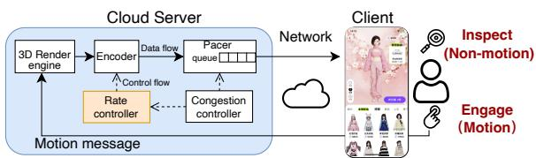  
Figure 1: Architecture of the cloud rendering system. User behavior, including engage (motion) and inspect (non-motion) actions, follows an on-off pattern.

MTP latency by causing network congestion. To this end, cloud rendering systems often use real-time communication (RTC) protocols such as WebRTC [6, 45]. Central to such systems is the rate controller [20, 37, 68], which adjusts the encoding bitrate based on estimated network bandwidth.

Although the cloud rendering system (Fig. 1) shares a similar technical framework with cloud gaming [53, 60, 69], our measurement on Taobao’s mobile cloud rendering platform involving more than 100,000 users reveals unique QoE requirements for cloud rendering (§ 2.2). The results indicate that even with advanced optimization techniques, users experience excessively high latency precisely when they are most actively engaged, leading to early session abandonment. Specifically, user behavior follows an on-off pattern, alternating between “motion” phases (e.g., rotating or zooming in on a 3D product) and “non-motion” phases (e.g., inspection without manipulation). During motion phases, when users are most sensitive to high latency, video frames tend to be larger (22% on average) and tail latency increases significantly (1.9 times higher at the 99th percentile). Nevertheless, existing rate controllers, which use the same decision logic for both motion and non-motion phases, fail to distinguish between the different behaviors and QoE preferences of the two. Therefore, these solutions cannot optimize QoE for cloud rendering systems (§ 2.3).

Our observations highlight a key insight: QoE requirements change dynamically with user motion, necessitating "motionaware" rate control strategies. Despite its simplicity, translating this insight into a practical system presents several design challenges:

(i) Mapping user engagement to QoE preference. As observed in § 2.2, users prioritize low latency over high quality during motion phases, characterized by user engagement (e.g., session duration) decreasing more rapidly as latency increases.

However, how to quantify this human-involved engagement pattern as a guideline for rate control remains unclear.

(ii) Striking a dynamic balance in bitrate adaptation. The primary challenge in rate control is resolving the conflict between minimizing latency and maximizing quality under network dynamics. In addition, our measurements show that user behavior introduces QoE preference dynamics. These two types of system dynamics make it much more difficult to optimize QoE in e-commerce cloud rendering.

(iii) Enabling frame-level fine-grained decision. Since user behavior exhibits an on-off pattern across frames, the rate controller must operate at the frame level, e.g., within 33.3 ms at a frame rate of 30 fps. This requirement imposes a severe time constraint on the decision logic.

To address the above challenges, we propose MARC, a dynamic QoE-driven Motion-Aware Rate Control framework for e-commerce cloud rendering. MARC sets a dynamic QoE objective function, which derives the importance of motion and non-motion frames directly from our measurements of user engagement as QoE preferences. MARC further models the dynamic QoE evolution of multiple future frames and utilizes stochastic optimization techniques to maximize cumulative QoE. In doing so, MARC incorporates a state predictor to predict user behavior and network conditions. Furthermore, MARC employs an efficient gradient-based method to determine the bitrate at the frame level.

We have implemented MARC in the WebRTC framework and deployed it in our real-world system. Extensive experiments based on simulation and large-scale A/B tests involving over 1 million user sessions demonstrate that MARC outperforms the state-of-the-art RTC rate control methods [6, 26, 28,48]. Specifically, compared to baselines, MARC reduces the tail send duration and queueing latency for motion frames by 30% to 55%, tail frame latency by 22% to 60%, and session freeze rate by 71%. MARC also improves user engagement, with session durations increasing by 9% and interaction rates (i.e., the ratio of motion frames in all frames) rising by 20%. Moreover, MARC incurs no overhead on the client side and adds only a modest 1.3% CPU usage per session on the server side. These results confirm that MARC can achieve effective bitrate control in large-scale e-commerce cloud rendering systems.

To summarize, the main contributions of this paper are:

• Identifying unique dynamic QoE requirements that evolve with user motion in e-commerce cloud rendering through a large-scale measurement study;

• Proposing a dynamic QoE-driven motion-aware rate control framework MARC, which integrates user-behavior modeling and multi-frame QoE optimization;

• Implementing MARC in production, ensuring frame-level bitrate adaptation under strict time constraints;

• Extensively evaluating MARC in a real-world cloud rendering system and demonstrating its efficiency.

Claim: This work does not raise any ethical issues. All data collected in this research are desensitized and include performance-related information only.

## 2 Background and Motivation

## 2.1 Background: Cloud Rendering in Mobile E-commerce Applications

Cloud rendering is an emerging technology adopted by e-commerce platforms to deliver interactive 3D visuals on mobile devices [22, 41, 50]. This technology increases user engagement by allowing users to interact with their favorite products and avatars in real-time, potentially boosting the revenue of e-commerce companies [5, 67].

Cloud rendering system architecture. A typical cloud rendering architecture is illustrated in Fig. 1. The mobile device acts as the client, capturing user motions for the server. Here, motion denotes intentional interaction events such as tap, pinch-to-zoom, or drag gestures that generate explicit control commands. The cloud server deploys a powerful 3D rendering engine (e.g., Unreal Engine [14]) to generate highquality 3D graphics, which are then compressed into a video stream and transmitted to the client for playout. Inside the server, the encoder converts the rendered graphics into video frames that are further packaged into media packets. These packets are queued at the pacer, awaiting transmission over the network. The pacer follows the transport rate set by the congestion controller (e.g., GCC [6], Copa [3], Pudica [53], or SQP [48]), which estimates available bandwidth to avoid network congestion. The rate controller decides the target encoding bitrate based on the bandwidth estimation from the congestion controller.

Rate control for real-time communications. Video rate control significantly affects user experience [10, 68]. While higher bitrates can improve video quality and thus user satisfaction [10], they may result in increased latency due to inflating the send queue, especially when a sudden drop in bandwidth causes the encoder’s output rate to surpass the transmission rate. To maintain low latency, current encoder rate controllers typically reserve a fixed portion of the available bandwidth as headroom. For example, commercial interactive video applications set the target bitrate 11% to 28% lower than the estimated bandwidth [28], which, however, sacrifices video quality. Therefore, video rate control must be carefully designed to balance quality and latency, which further relies on a deep understanding of the relationship between these QoE metrics and user engagement.

## 2.2 Characterizing User Behavior and QoE Preferences in the Wild

To investigate how the above QoE metrics affect user engagement in real-world cloud rendering systems, we conduct a large-scale QoE study on Taobao’s mobile cloud rendering platform.

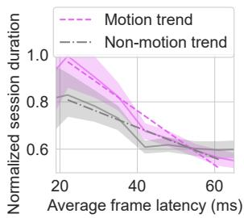  
(a) Frame latency vs. session duration.

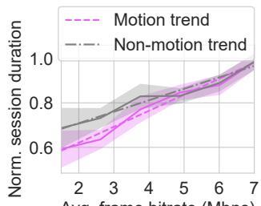  
Avg. frame bitrate (Mbps)  
(b) Frame bitrate vs. session duration.  
Figure 2: Large-scale QoE study: Relationship between QoE metrics and session duration.

System setup. Our cloud rendering system allows users to dress up their 3D avatars, create dresses, and change background scenes. The server employs Unreal Engine (UE) [14] to render 3D graphics and leverages Pixel Streaming [15], a UE plugin, to stream these graphics to the client via WebRTC [45]. We use WebRTC because it is the de facto infrastructure for real-time video streaming [21] and is widely supported by major web browsers and platforms [58], facilitating large-scale production deployments. When users access the service, they are assigned to the nearest rendering server and then connected by WebRTC. Users can interact with the virtual characters on the screen, and their actions (e.g., motions like zooming in and out or changing viewpoints) are sent to the server via the WebRTC Datachannel using the SCTP [1].

Video encoding. Following common practice [34], our system operates at a fixed video resolution of 1560x720 with a frame rate of 30 fps and a maximum bitrate of 8 Mbps. The encoder works in CBR (constant bitrate) mode. We employ an infinite Group of Pictures (GOP) size, resulting in 99.9% of the frames being P-frames (non-keyframes). P-frames rely on preceding frames for decoding, which reduces redundancy and ensures efficient compression. Only 0.1% of the frames are I-frames (keyframes), which typically appear at the start of the session to initialize decoding. The stream is encoded in H.264 format, which is preferred for its superior decoding performance and energy efficiency, leveraging client-side hardware decoders.

Incorporating advanced optimization. Our cloud rendering system shares a similar technical infrastructure with cloud gaming [53, 60, 69]. Therefore, this system uses the same cutting-edge optimization techniques as cloud gaming. Specifically, edge servers strategically deployed near users [60], equipped with industry-leading hardware encoders [39] that support ultra-low latency and constant bitrate encoding modes [2]. The online configuration also includes pacing-based sending [56] (discussion in § 6) and forward error correction (FEC) [4]. Furthermore, the RTC framework incorporates the standard low-latency congestion control algorithm and rate controller [6], as well as innovative client-side buffer management [67].

Measurement methodology. We measure user engagement by two behavioral interaction metrics [42]: (i) session duration, which quantifies how much time a user spends on the service in a session; and (ii) motion phase duration, which is equal to the total duration of motion frames. A frame is marked as a motion frame whenever the server receives a user motion command from the client (see § 4.1 for details). Therefore, each motion phase contains a single frame or a series of consecutive motion frames1. In addition, other frame-level metrics are also collected, including the target bitrate, actual frame size, and send duration (the time taken from sending the first packet to sending the last packet of the frame). All metrics are collected on the server side and do not include any user-related or content-related information.

Dataset description. The measurement spanned from February 23 to March 27, 2024, covering 1.8 billion frames across 200,846 sessions, accumulating over 16,000 hours of video, and involving more than 100,000 users. To the best of our knowledge, this dataset represents the first large-scale and comprehensive measurement of a real-world cloud rendering system, uniquely capturing both video stream metrics and complex user motion behavior. By analyzing the dataset, we have made the following observations.

Observation 1: In motion phases, frame latency has a greater impact on user engagement than bitrate.

We first focus on the relationship between QoE metrics (i.e., frame latency and bitrate) and user engagement in both the motion and non-motion phases, as illustrated in Fig. 2, where translucent areas represent 95% confidence intervals.

(i) Frame latency. It is defined as the time it takes for a frame to be sent from the server to be fully received by the client, namely the send duration plus the one-way delay (OWD), where OWD is estimated as half the round-trip time (RTT) on the server side. Although MTP latency also includes components from the rendering engine and client side, prior work [67] and our measurements indicate that client-side optimizations reduce its contribution to only 22% of total MTP. Consequently, the frame latency remains the dominant contributor.

In Fig. 2a, the trend lines represent linear regressions of the session duration data. It can be seen that session duration decreases as latency increases, which is consistent with the previous studies [53]. Additionally, the slope of the trend line is 75.7% steeper in motion phases than in non-motion phases. Looking deeper, increasing the latency of motion frames consistently decreases session duration. In contrast, once the latency of non-motion frames reaches a certain point (i.e., 42 ms in Fig. 2a), the session duration remains relatively stable.

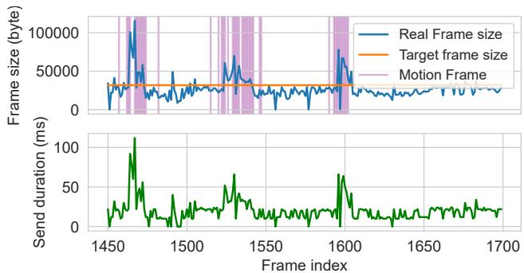  
Figure 3: The on-off pattern of user motions.

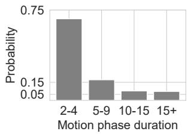  
(a) Motion phase.

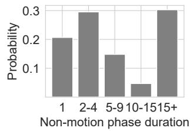  
(b) Non-motion phase.  
Figure 4: The probability distribution of consecutive motion/non-motion frames.

These results suggest that users are much more sensitive to the high latency of motion frames.

(ii) Frame bitrate. As shown in Fig. 2b, session duration increases with frame bitrate. Overall, the slope is 37.8% steeper in motion phases than in non-motion phases. However, it is worth noting that when the frame bitrate is high enough (i.e., over 5 Mbps), session duration is hardly affected by user motion.

Observation 2: User behavior exhibits an “on-off” pattern, with short “on” (motion) and long “off” (non-motion) periods.

Fig. 3 illustrates the “on-off” pattern of user behavior, where the “on” phase indicates successive motion frames while the “off” phase corresponds to the intervals between non-motion frames. Fig. 4 depicts the duration distribution of motion and non-motion phases. Motion phases are relatively short: 74% of them last 2-4 frames, while 15% last 5-9 frames (Fig. 4a). A non-motion phase may appear between two adjacent motion phases. 70% of non-motion phases are brief pauses (no more than 15 frames, i.e., 0.5 seconds), and 30% are prolonged stops (over 15 frames), as shown in Fig. 4b. This behavior pattern is typical in e-commerce applications, where users frequently change viewpoints and then pause to view their avatars or products.

Observation 3: Despite the same target bitrate given by the rate controller, motion frames tend to have larger sizes and longer send durations than non-motion frames.

As defined, frame latency contains the send duration and OWD. In cloud rendering systems, OWD is typically very low, with a 95th percentile of only 29.5 ms in our measurements. This result is consistent with previous studies [60, 61], which can be explained by the fact that servers are edge-deployed and thus close to users. Nevertheless, the send duration is significantly longer, with a 95th percentile of 59 ms, which is 2 times the OWD. Therefore, we next examine the send duration, which is directly affected by the rate controller.

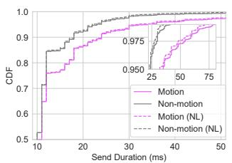  
(a) CDF of send duration.

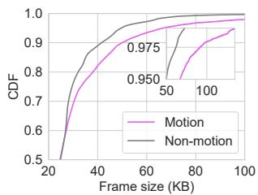  
(b) CDF of frame size.  
Figure 5: Send duration and frame size distributions for motion and non-motion frames. Motion increases the tail frame size and the send duration.

As shown in Fig. 3, the send duration generally increases with the actual frame size, which is different for motion and non-motion frames. The statistical results in Fig. 5 further support this intuition. Fig. 5a shows that the send duration of motion frames is consistently longer than that of non-motion frames after the 50th percentile (P50). In particular, the P99 send duration of motion frames can reach up to 82 ms, which is 1.9 times longer than that of non-motion frames, resulting in significant latency during motion phases.

Essentially, the root cause of increased send duration during motion phases is that motion frames tend to generate more data than expected. As a result, the actual bitrate of motion frames is more likely to exceed the congestion controller’s pacing rate, causing packets to queue up at the sender and ultimately increasing the send duration. Fig. 5b indicates that motion frames are significantly larger than non-motion frames after the P50. Remember that both motion and nonmotion frames use CBR encoding, and most of them are not keyframes. Therefore, the difference in their sizes is because motion frames have more variable content and require more bits to encode2, as reported in previous work [47]. Notably, packet loss is not the main factor affecting send duration. Even in no-loss (NL) sessions, the tail (P99) send duration of motion frames can still reach 72 ms, which is 87.8% of the 82 ms in packet-loss sessions.

Unfortunately, existing rate controllers use the same decision logic to determine the target bitrate for both motion and non-motion frames, and thus cannot distinguish between their different behaviors and QoE requirements.

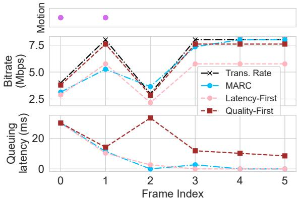  
Figure 6: Frame bitrate and queuing latency. Queuing latency is the waiting time before transmission, determined by queue length, previous frame size, and pacing rate.

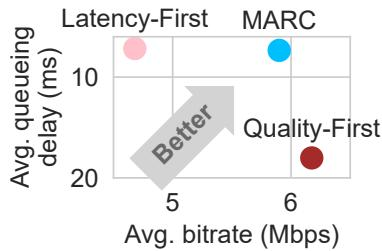  
Figure 7: QoE performance comparison of MARC vs. existing rate controllers.

## 2.3 Pitfalls of Existing Rate Controllers

We provide a case study to illustrate how existing solutions fail to optimize QoE in the cloud rendering system due to ignorance of user motion.

Existing rate controllers typically use a fixed portion of estimated available bandwidth as video bitrate [28]. Two baseline strategies are considered in this controlled experiment (details in § 5.1): (i) Latency-First strategy, which allocates 72% of bandwidth as video bitrate (based on the measurement of a commercial video application in [28]); and (ii) Quality-First strategy, which uses 95% of bandwidth as video bitrate (an estimated value of GCC’s [6] decision).

We also introduce our proposed method MARC (§ 3) as a comparison. To eliminate the effect of network conditions, we feed all strategies with the exact future bandwidth in the trace. In addition, all strategies begin with the same state, including user motion sequences and an initial sender buffer length of 15 KB (implying that a packet queue already exists on the sender). The performance is evaluated based on both bitrate allocation and frame queuing latency. Frame queuing latency is affected by the send duration of previous frames, referring to the time a frame spends waiting in the send queue before it is transmitted.

Fig. 6 illustrates the decision-making traces of these strategies. Note that frames #0 and #1 are motion frames. The Quality-First strategy outputs frames at higher bitrates and therefore struggles to drain the send queue quickly, especially when bandwidth suddenly drops (frame #2). On the other hand, the Latency-First strategy reduces queuing latency but does not effectively utilize the available bandwidth. While the queue is empty (frame #2), the Latency-First strategy still outputs low-level bitrates that reduce perceived quality.

Unlike the above, MARC maintains awareness of user motion. If the queueing latency is high, MARC timely reduces the bitrate/bandwidth ratio for motion frames (frames #0 and #1). Otherwise, for non-motion frames with low queueing latency, MARC chooses higher bitrates to improve quality (frames #2 to #5). As a result, MARC achieves the best balance between latency control and bandwidth utilization. Fig. 7 shows that compared to the Latency-First strategy, MARC improves the average bitrate by 26.1% for a similar average latency (2.5% higher). MARC also reduces queueing latency by 59.2% over the Quality-First strategy with only a 4.5% bitrate reduction.

## 2.4 Implications for Video Rate Control

As described above, we have identified characteristics of user behavior and factors that impact user engagement in mobile e-commerce cloud rendering systems. All three observations have important implications for rate control:

Requirement 1: Awareness of user motion. Users are more sensitive to the latency of motion frames (Observation 1). Hence, the rate controller should be able to sense the motion phase, in order to dynamically adjust the bitrate based on the user’s preferences.

Requirement 2: Frame-level decision. Observation 2 indicates that the duration of the motion phase is typically short. Consequently, a fine-grained, frame-level rate control mechanism is essential to swiftly adapt to the short motion intervals and avoid unnecessary quality reductions or latency buildups.

Requirement 3: Differentiated bitrate assignment. Given that motion frames are generally larger than non-motion frames (Observation 3), the rate controller should assign lower bitrates to motion frames to avoid excessive latency.

Summary. The technical framework of e-commerce cloud rendering system seems similar to that of mobile cloud gaming [18, 53], which typically needs a consistently low latency of 50 ms to 150 ms [9, 23] for all video frames. However, our large-scale QoE study reveals that the QoE requirements of cloud rendering are quite unique. Specifically, a cloud rendering session can be divided into alternating motion and nonmotion phases. Users’ QoE preferences differ significantly in these two phases. Therefore, the rate controller should be motion-aware to optimize dynamic QoE objectives. Unfortunately, existing solutions [8,26,28,48] overlook this principle, which motivates our work in this paper.

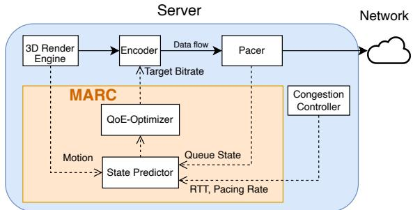  
Figure 8: MARC system overview.

## 3 MARC System Design

Based on our insights in § 2, we propose a Motion-Aware Rate Controller (MARC) for mobile e-commerce cloud rendering systems. MARC aims to maximize QoE by controlling the video encoding bitrate based on dynamic user preferences for quality and latency.

## 3.1 System Overview

Fig. 8 illustrates the high-level system architecture of MARC, which integrates several key components. First, the Dynamic QoE Optimizer (§ 3.5) determines the video bitrate on a per-frame basis, leveraging our time-based sending model (§ 3.3) and dynamic QoE objectives (§ 3.4). Second, the State Predictor (§ 3.6) provides short-horizon forecasts of user motion, pacing rate, and propagation delay.

Together, these components fulfill the three design requirements identified in § 2.4. Specifically, MARC is aware of user motion and makes frame-level decisions to optimize dynamic QoE preferences according to different user behaviors.

## 3.2 Mapping User Engagement to QoE Preference

Our analysis derives frame importance based on detailed online user interaction observations. We measure user engagement via session duration and study its relationship with latency and visual quality (bitrate). Specifically, we bin frames by latency/bitrate ranges, compute the average session duration in each bin, and then perform linear regressions separately for motion and non-motion frames, see Fig. 2.

Key findings. We observe that motion frames exflhibit higher sensitivity to latency, with a slope ratio (non-motion : motion) $\approx 1 : 1 . 7 5 7$ . Similarly, they also show moderately higher sensitivity to quality (1 : 1.378). This indicates that minimizing latency is particularly critical during motion phases, while maintaining adequate quality remains important for overall engagement.

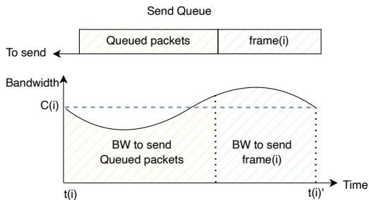  
Figure 9: The relationship of frame enqueue time t(i), frame departure time $t ( i ) ^ { \prime }$ , and avg. pacing rate $C ( i )$

## 3.3 Time-Based Formulation for Frame Sending Process

Our frame-level model captures the entire process from frame generation to transmission, accounting for encoding decisions, queuing, and transmission.

Frame generation and encoding. Video frames are generated at a nearly constant interval (e.g., 33 ms at 30 fps), denoted as I. For the i-th encoded frame, the encoding bitrate $R _ { i }$ is defined as Eq. (1). The encoded frame size is denoted by $d ( R _ { i } )$ . Unlike typical VoD or live streaming scenarios [63, 68] that have a set of discrete bitrates, MARC operates over a continuous bitrate space.

$$
R _ { i } \in \mathcal R , \quad \forall i = 1 , \cdots , N .\tag{1}
$$

In our implementation, we empirically derive $d ( R _ { i } )$ by performing separate linear regressions for motion and nonmotion frames, based on real encoder output data. This approach more accurately captures the typically larger size of motion frames for the same bitrate, while still preserving a continuous domain for optimization.

Queuing and transmission. Fig. 9 illustrates the queueing and transmission process. The encoded frame(i) is packetized and added to the transmission queue, where the queue length is $b ( i )$ . We mark the moment of enqueueing as time $t ( i )$ . The frame(i) waits in the send queue until the previously queued packets have been transmitted. The time when the frame(i) finishes sending is marked as $t ( i ) ^ { \prime }$ . The duration from t(i) to $t ( i ) ^ { \prime }$ , denoted as $s ( i )$ , corresponds to an average pacing rate $C ( i )$ as defined in Eq. (4). This process is formulated in Eq. (2) and (3).

$$
t ( i ) ^ { \prime } = t ( i ) + s ( i )\tag{2}
$$

$$
s ( i ) = \frac { b ( i ) + d ( R _ { i } ) } { C ( i ) }\tag{3}
$$

$$
C ( i ) = \frac { 1 } { t ( i ) ^ { \prime } - t _ { i } } \int _ { t _ { i } } ^ { t ( i ) ^ { \prime } } C _ { t } d t ,\tag{4}
$$

Buffer state dynamics. We formulate send-buffer evolution by modeling the residual queue length $b ( i )$ , as shown in

Eq. (5). Here, (x)+ means max(x, 0), ensuring a non-negative queue size.

$$
b ( i ) = \bigg ( b ( i - 1 ) + d ( R _ { i - 1 } ) - \int _ { t _ { i - 1 } } ^ { t _ { i } } C _ { t } d t \bigg ) _ { + }\tag{5}
$$

Total frame latency. The total frame latency includes queuing delay, send duration, and network propagation latency (denoted as $O W D ( i ) )$ as defined in Eq. (6). Note that this differs from the “frame latency” defined in § 2, which does not account for queueing delay.

$$
\mathrm { L } ( i ) = O W D ( i ) + s ( i )\tag{6}
$$

## 3.4 Dynamic QoE Objective Function

Based on the linear regression slopes in § 3.2, we normalize the base non-motion quality weight to 1.0, then we derive a motion-to-non-motion latency ratio of 1.275 (i.e., 1.7571.378 ). Concretely, for each frame i, we define:

$$
\mathrm { Q o E } ( i ) = q _ { R } \big ( R _ { i } \big ) - \gamma ( i ) \cdot q _ { L } \big ( L ( i ) \big ) ,
$$

where $q _ { R } ( \cdot )$ and $q _ { L } ( \cdot )$ are the respective quality and latency scoring functions. The latency penalty coefficient γ(i) depends on whether the frame is non-motion $( M ( i ) = 0 )$ or motion $( M ( i ) = 1 )$ ):

$$
\gamma ( i ) = { \left\{ \begin{array} { l l } { 1 } & { { \mathrm { i f } } M ( i ) = 0 } \\ { 1 . 2 7 5 } & { { \mathrm { i f } } M ( i ) = 1 } \end{array} \right. }\tag{7}
$$

Equivalently, we may write $\gamma ( i ) = \lambda _ { s } + M ( i ) \cdot \lambda _ { m }$ with $\lambda _ { s } = 1$ and $\lambda _ { m } = 0 . 2 7 5$ . (The impact of the two parameters is evaluated in § 5.2.)

To capture overall QoE across N consecutive frames, we sum the single-frame QoE as in Eq. (8):

$$
Q o E _ { 1 } ^ { N } = \sum _ { i = 1 } ^ { i = N } q _ { R } ( R _ { i } ) - \sum _ { i = 1 } ^ { i = N } ( \lambda _ { s } + M ( i ) \times \lambda _ { m } ) \times q _ { L } ( L ( i ) )\tag{8}
$$

This formulation dynamically places more weight on latency reduction in motion frames, aligning with users’ observed engagement patterns.

## 3.5 Maximizing QoE with Stochastic Optimization

Given the constraints imposed by the frame-sending model and the QoE objective, we formulate the rate control problem as a QoE maximization problem:

$$
\begin{array} { r l } & { \underset { R _ { 1 } , \cdots , R _ { N } } { \operatorname* { m a x } } Q o E _ { 1 } ^ { N } } \\ & { s . t . \mathrm { E q u a t i o n } ( 1 ) \mathrm { t o } ( 6 ) } \end{array}\tag{9}
$$

The MARC algorithm. The algorithm 1 shows a highlevel overview of the MARC. Tab. 1 lists the key variables in the algorithm. The algorithm runs whenever a frame is encoded. It determines the target bitrate for the next frame. Thus, the decision time for the algorithm is about a frame interval (e.g., 33 ms in 30 fps). The algorithm employs an N-step lookahead strategy (moving horizon) to address a specific QoE maximization problem. The window size is set to $N = 1 0 .$ a fine-tuned parameter striking a good balance between performance and overhead, as evaluated in § 5.4 and Appendix A. This involves predicting motion $( \hat { M } _ { [ i , i + N ] } )$ ， propagation latency $( O \hat { W } D _ { [ i , i + N ] } )$ , and pacing rate $( \hat { C } _ { [ i , i + N ] } )$ by the state predictor.

Table 1: Key Variables of the Model  
```powershell
Notation Meaning
$\overline { { q _ { R } ( R ) } }$ Quality evaluation function
$q _ { L } ( L )$ Latency evaluation function
$\lambda _ { m }$ Weight for motion frames
$\lambda _ { s }$ Weight for non-motion frames
$I$ Frame interval (ms)
$d ( R _ { i } )$ Size of frame i
$b ( i )$ Size of send queue when at $t ( i )$
$t ( i )$ Time when frame i is packetized
$s ( i )$ Send time of frame i
$t ( i ) ^ { \prime }$ Time when frame i departs from the send queue
$C ( i )$ Average pacing rate from t(i) to t(i)′
$L ( i )$ Motion-to-photon latency of frame i
$\overline { { M ( i ) } }$ Whether frame i is a motion frame (0 or 1)
$C _ { t }$ Pacing rate at time t
$O W D ( i )$ One way delay while sending frame i
```

Algorithm 1 MARC: Motion-aware Rate Control   
input $\ : M _ { [ i - N , i ] } , O W D _ { [ i - N , i ] } , C _ { [ i - N , i ] } , \lambda _ { s } , \lambda _ { m } , b ( i )$   
output: $R _ { i + 1 } { : }$ Encoder target bitrate for the next frame   
On frame encoded   
1: $\hat { M } _ { [ i , i + N ] } =$ MotionPredict $( M _ { [ i - N , i ] } )$   
2: $\begin{array} { r } { O \hat { W } D _ { [ i , i + N ] } = \tt O \hat { W } D P r e d i c t { ( O W D _ { [ i - N , i ] } ) } } \end{array}$   
3: $\hat { C } _ { [ i , i + N ] } = \mathrm { { 1 } }$ PacingRatePredict $( C _ { [ i - N , i ] } )$   
4: $R _ { i + 1 } = f _ { M A R C } ( b ( i ) , \hat { M } _ { [ i , i + N ] } , O \hat { W } D _ { [ i , i + N ] } , \hat { C } _ { [ i , i + N ] } )$

In Algorithm 1, four functions act as the core building blocks. MotionPredict(·) takes the observed motion labels from the past N frames and predicts future labels $( \hat { M } [ i , i + N ] )$ . OWDPredict(·) uses recent RTT measurements to forecast propagation delay $( O \hat { W } D [ i , i + N ] )$ . PacingRatePredict(·) analyzes pacing rates from the previous N frames to estimate upcoming sending rates $( \hat { C } [ i , i + N ] )$ . Finally, $f _ { M A R C } ( \cdot )$ combines these predictions with the current queue state $b ( i )$ to determine the next-frame bitrate $R _ { i + 1 }$ , maximizing QoE by balancing latency and visual quality while adjusting to user motion.

## 3.6 State Predictor

The state predictor is crucial for forecasting user motion, pacing rate, and propagation delay, which are essential inputs for the MARC system.

User motion predictor. We have developed a Markovian model that predicts the motion sequence of user frames based on the types of the previous M frames. The model forecasts whether the next frame will be of type 0 or 1 and continues this prediction for future N frames. Its state transition probabilities are derived from statistical data observed online, as observed in § 2.2. Since each frame type is binary, the model encompasses $2 ^ { M }$ states. We evaluate the M and the prediction accuracy in § 5.3.

Pacing rate predictor. While Eq. (4) provide a theoretical definition of the average pacing rate C(i), obtaining an exact solution for Eq. (4) in a real-time system is non-trivial. In our implementation, we approximate C(i) by the current sending rate of recent pacing rates. This approximation assumes that over the short interval, the pacing rate does not fluctuate dramatically. Since our system primarily targets short pacer queues and a relatively stable sending rate, such approximation provides sufficient accuracy (see § 5.3).

Propagation delay predictor. We use the smoothed RTT to estimate the propagation delay (which is 1/2 RTT). Similar to predicting the pacing rate, as the RTT variation within a short period is stable as evaluated in § 5.3. Note that the completion time of a frame may be delayed by packet disorder or jitter. We verified that 99.8% of disordered packets experience delays of less than 16 milliseconds. Therefore, packet disorders within a frame are less likely to severely increase the completion time. Thus, we can disregard the impact of the disorder.

## 4 System Implementation

## 4.1 Motion Frame Identification

The Unreal-Engine Pixel Streaming plugin [15] bridges the cloud renderer and its WebRTC transport. It passes video frames from the rendering application down to WebRTC for transmission and forwards user inputs received via WebRTC up to the rendering application. Among these inputs, each motion event is handled by our modified plugin, which forwards the event to a helper function added to WebRTC’s PeerConnectionInterface [57]. The helper then notifies MARC, which marks the next encoded frame as a motion frame.

## 4.2 MARC System Implementation

The dynamic QoE optimization model is the core of the MARC system. It involves carefully designed QoE functions and an efficient solving process for real-time optimization. We implemented MARC within the PixelStreaming [15] and the WebRTC framework, using 1,246 lines of C++ code.

QoE functions. The principles for designing QoE objective functions are (i) they should be continuous and differentiable to allow adjustments in the continuous action space, and (ii) they should reflect the user’s subjective experience.

Following these principles, we designed a non-linear quality QoE function as in Eq. (10). The first term in this function $\begin{array} { r } { ( \dot { 1 } - \frac { 1 } { R / a + 1 } ) } \end{array}$ characterizes the diminishing marginal effects of increasing bitrate on improving video quality, as observed in Vantage [49]. The second term $\big ( \frac { R _ { M a x } + a } { R _ { M a x } } \big )$ normalizes the QoE score to the [0,1] range. In our setting, $\overset { \cdot } { a } = 2 , R _ { m a x } = 8 \ : ( M b p s )$ We evaluate the impact of QoE functions in Appendix B.

$$
q _ { R } ( R ) = ( 1 - \frac { 1 } { R / a + 1 } ) \times \frac { R _ { M a x } + a } { R _ { M a x } }\tag{10}
$$

Similarly, the latency QoE function is defined as Eq. (11), following the same principles. It imposes minimal penalties for low-latency regions but increases progressively at highlatency regions, consistent with findings in the study [36]. In our setting, we normalize the maximum allowable latency with $L _ { m a x } = 1 5 0$ ms.

$$
q _ { L } ( L ) = ( \frac { L } { L _ { m a x } } ) ^ { 2 }\tag{11}
$$

Continuous rate optimizer. To solve the problem in Eq. (9), we employ the NLopt [25] optimization library in C++. The optimizer treats the bitrates of the next N (default $N = 1 0 )$ frames as real-valued decision variables, each box-constrained to the application-defined range $[ R _ { \mathrm { m i n } } , R _ { \mathrm { m a x } } ]$ ([0, 8] Mbps in our setting). Each call is warm-started with the optimal solution from the preceding frame, while the first frame is initialised with an initial bitrate of 1 Mbps. Optimization terminates when the relative change of all variables falls below 10−4.

Reducing computing overhead. The primary computational cost arises from solving the N-step look-ahead optimization problem, which has a time complexity of O(KN), where K is the number of iterations per step. To improve performance, we (i) select a relatively small prediction window of N=10 (determined experimentally as the parameter that best balances overhead and solution quality; the computing overhead is evaluated in § 5.4, the quality is verified in Appendix A); and (ii) using NLopt’s gradient-based SLSQP [13] backend to reduce the number of iterations required per step (a comparison of different non-linear optimization solvers and their computational overhead is presented in § 5.4). Additionally, we further reduce computing overhead by designing a simple motion state predictor.

Motion state predictor. We represent the state of the M historical frames as the key by encoding the binary sequence $( S _ { t - M } , \ldots , S _ { t - 1 } )$ into an integer $k = \Sigma _ { j = 1 } ^ { \check { M } } S _ { t - j } \cdot 2 ^ { j - 1 }$ and the probability of the next frame being a motion frame as the value, denoted as $p _ { t }$ , storing this data in a C++ map. The probability is built offline from a large dataset of interaction traces: for each context key k we compute $p _ { t } = \mathrm { P r } ( S _ { t } = 1 \mid$ $\begin{array} { r } { k ) = \frac { N ( k , S _ { t } = 1 ) } { N ( k ) } } \end{array}$ , where N(·) counts occurrences in the dataset, thus $p _ { t }$ is the estimated conditional probability that a motion frame follows this context. Predicting the next frame involves a simple hash lookup for the probability, followed by a Bernoulli draw with parameter $p _ { t }$ . This approach reduces computing overhead for online deployment.

The space complexity of storing the statistical user motion model is $O ( 2 ^ { M } )$ , where M is the number of historical frames. Each frame state is encoded as 1 bit (1 for motion, 0 for nonmotion). The memory used for the map can be shared across multiple sessions, preventing linear scaling of costs as the number of concurrent sessions increases. The storage overhead for a single process is minimal, representing only a 3% increase in memory usage compared to the overall process.

## 5 Evaluation

This section comprehensively evaluates MARC using both trace-driven simulations and large-scale real-world deployments on mobile networks.

## 5.1 Evaluation Setup

Trace driven evaluation setup. To accurately compare and replicate the bitrate control algorithms, we implemented the simulation environment based on the architecture depicted in Figure 1. This setup allows us to replay traces representing user behavior and network conditions.

Trace collection. We collect traces from our online system. These traces record the application, encoder, and transport models’ behaviors. Specifically, the application layer data encompasses the user motions (as measured in § 4.1). The encoder model provides the encoding bitrate of each frame, the frame intervals, and the frame sizes. The transport layer information includes the pacing rate and the Round-Trip Time (RTT) for each of the frame’s packets. Our dataset, collected from February 23 to March 27, 2024, comprises over 200,000 sessions and 1.8 billion frames.

Online evaluation setup. We deployed MARC in a production environment as described in § 2.2 to assess its real-world performance. To conduct an A/B test, the online experiment randomly assigns each user request to either WebRTC’s default rate control algorithm or the proposed MARC algorithm.

Baselines. We compare MARC with the following bitrate control algorithm as baselines:

• WebRTC [45]. The default transmission framework in our environment. It contains the EncoderBitrateAdjuster [8] module. The encoder bitrate adjuster dynamically adjusts the target bitrate of the encoder based on the observed average network utilization over a specified period, typically reducing the bitrate if the actual frame sizes exceed expected values.

• SQP [48]. SQP uses 90% of available bandwidth as the target bitrate to prioritize low transmission latency. Note that we only compare the rate control strategy of SQP, while we keep the bandwidth estimation strategy the same as WebRTC.

• Vidaptive [26]. Vidaptive’s rate control logic dynamically adjusts the encoder’s rate discount factor α to ensure that the $\lambda ^ { t h }$ percentile of frame send durations over a defined time window T is closely aligned with the target send duration ∆. We use $\lambda = 9 0 , T = 1 s , \Delta = 3 3 m s$ in the evaluation. To ensure fairness, the Vidaptive frame-skipping strategy is disabled because frame rate control and rate control are orthogonal.

• Commercial video applications models. We utilize the inferred rate control models from the study [28]. Specifically, we employ the video bitrate control model represented by the parameters $\gamma$ and $\mu .$ . The parameter $\gamma$ is a scaling factor that indicates the ratio of video bitrate to available bandwidth, while $\mu$ is a constant with units of kbps. We evaluated the performance of all the six application models in the study and selected three representative applications for demonstration: Zoom $( \gamma = 0 . 8 8 , \mu = - 1 . 5 7 )$ , Duo $( \gamma = 0 . 7 2 , \mu = - 1 . 9 1 )$ and GoTo Meeting (abbreviated as GoTo) $( \gamma = 0 . 7 8 , \mu = - 1 . 3 6 )$ . The other models exhibit performance similar to that of these applications.

• MARC derivatives. We vary the weight of motion frames $\lambda _ { m }$ and non-motion frames $\lambda _ { s }$

Metrics. We evaluate the quality by the target bitrate of each frame and the visual quality metrics like peak-signal-tonoise-ratio (PSNR), structural similarity index (SSIM) [55], and VMAF [29]. We evaluate latency by the send duration and frame latency.

## 5.2 Performance Improvement

We evaluate the performance of MARC and the baselines in the trace-driven simulation environment. MARC extends the performance boundary compared to the baseline algorithms.

Improving performance for motion frames. MARC achieves significantly lower motion frame latency compared to multiple baseline algorithms (e.g., Zoom, Duo, WebRTC, Vidaptive, etc.) under similar visual quality conditions. In particular, MARC reduces the 95th-percentile (P95) send duration plus queueing latency (shown in Fig. 10a) by 30% to 55% relative to the baselines, thanks to proactively allocating bitrate to consecutive motion frames and thus avoiding excessive queue buildup.

Additionally, MARC achieves better visual quality than the baseline under similar latency conditions. For instance, the optimal MARC configuration $( \lambda _ { s } = 1 , \lambda _ { m } = 0 . 2 7 5 )$ boosts the average bitrate by 35% over Duo (see Fig. 10a), while simultaneously reducing the P95 frame latency (Fig. 10b) of motion frames by 33–101 ms relative to various baselines. We also examined MARC’s derivatives with $\lambda _ { s } = 0 . 0 5$ (chosen for its high visual quality in Fig. 11b) and varied $\lambda _ { m }$ from 0 to 1, these variations are connected by dashed lines. Even without explicit motion awareness $( \lambda _ { m } = 0 )$ , MARC achieves the highest average bitrate among all tested methods, while maintaining a markedly lower P95 tail latency than most baselines.

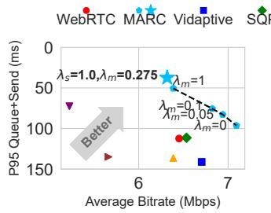  
(a) P95 send duration + queueing latency of motion frames.

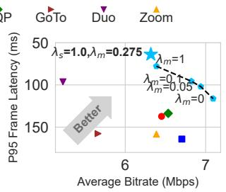  
(b) P95 frame latency of motion frames.

Figure 10: Bitrate and tail latency of motion frames.  
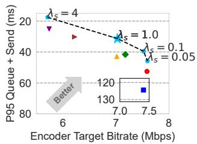  
(a) P95 queueing latency and send duration of sessions.

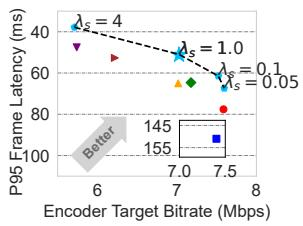  
(b) P95 frame latency of sessions.  
Figure 11: Encoder target bitrate and tail latency.

The gain arises from MARC’s queue-responsive optimization: a large frame inflates the queue length $b ( i )$ , increasing both its own send time (Eq. (3)) and the buffered data for subsequent frames (Eq. (5)). The larger send buffer lengthens the queueing delay of those later frames, which lowers the cumulative QoE in Eq. (8). To maximize QoE, MARC therefore lowers the bitrate of the upcoming frames. Because motion frames are typically large and arrive consecutively (see § 2.2), this mechanism implicitly prioritises motion phases even when $\lambda _ { m } = 0 .$ As $\lambda _ { m }$ grows, MARC realizes better Pareto tradeoffs between quality and latency (i.e., moving closer to the lower-right corner in Fig. 10a and Fig. 10b), surpassing the baselines in both dimensions.

This indicates that MARC’s dynamic bitrate adjustment method utilizes bandwidth more effectively and reduces latency better than fixed-rate allocation methods or purely reactive methods. Compared to the Vidaptive method, which also adjusts the bitrate dynamically, MARC achieves lower motion frame latency. This is because MARC uses a motion predictor to allocate bitrate for motion frames ahead of time, whereas Vidaptive only reduces the bitrate upon detecting a latency increase. These results align with our analysis in § 2.4.

Improving performance across all sessions. To evaluate MARC’s overall performance, we collect the P95 queue+send latency and frame latency for each session and average these tail metrics across all sessions. Fig. 11(a) and (b) show the resulting tradeoffs between encoder target bitrate (x-axis) and tail latency (y-axis). By varying $\lambda _ { s }$ from 0.05 to 4, MARC traces out a Pareto frontier that clearly outperforms the baselines (Zoom, Duo, WebRTC, Vidaptive, etc.). At comparable target bitrates, MARC achieves 22%–60% lower P95 frame latency than other algorithms. This performance gain arises primarily from $\lambda _ { s } ,$ which governs all frames, whereas $\lambda _ { m }$ specifically targets motion frames $( \lambda _ { m }$ is fixed at 0.275 in this experiment).

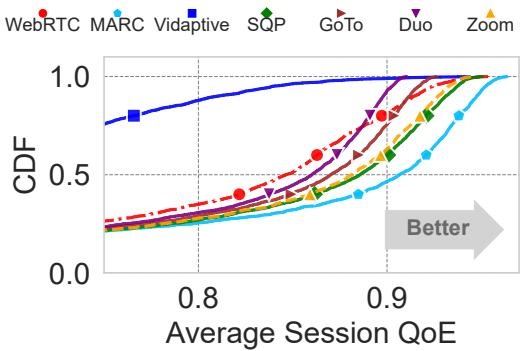  
Figure 12: CDF of average session QoE across all sessions.

When $\lambda _ { s } = 0 . 0 5 , M A R C$ achieves the best quality, while $\lambda _ { s } = 4$ results in the lowest latency (Fig. 11b). Meanwhile, Vidaptive exhibits higher P95 latency because its control logic focuses on keeping P90 send duration below 33 ms; thus, the top 10% of frames can exceed the frame interval. Additionally, Vidaptive’s frame-skipping mechanism was disabled to ensure a fair comparison. As a result, Vidaptive’s more aggressive utilization of probed bandwidth, compared to other algorithms, leads to prolonged queueing delays and consequently the lowest overall QoE, as shown in Fig. 12. Overall, MARC’s approach provides a distinct advantage in both latency and video quality, validating our design hypothesis.

To further illustrate these QoE differences, Fig. 12 summarizes the overall QoE achieved by each algorithm. For every session, we first compute the per-frame QoE using the definitions in § 3.4, Eq. (10), and Eq. (11), and then average these values to obtain the average session QoE. The MARC curve corresponds to the default configuration of $\lambda _ { s } = 1$ and $\lambda _ { m } = 0 . 2 7 5$ . As shown in Fig. 12, MARC’s curve is farthest to the right, indicating consistently higher QoE. Its median exceeds the baselines by 3%–36%, and its tail QoE at P95 is 1.3%–21% higher. The steeper rise of MARC’s CDF further suggests a smaller QoE variance across sessions.

## 5.3 MARC Deep Dive

The MPC algorithm’s performance is influenced by (i) prediction accuracy [32, 62, 63] and (ii) QoE objectives [33, 63]. Therefore, we validate the impact of the state predictor and QoE functions on MARC’s performance.

Motion frame predictor. We first verify the accuracy of the motion frame predictor, followed by an analysis of its impact on the accuracy of the MARC algorithm.

To evaluate the accuracy of the predictor, we divided the dataset of user sessions collected online, allocating 80% of the sessions for training and the remaining 20% for prediction. Within each session, frames were sequentially organized into samples, where each sample consisted of M historical frames followed by a single prediction frame.

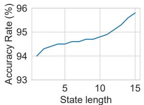  
Figure 13: Accuracy rate of predicting the next frame’s type.

The accuracy of the motion frame predictor is affected by the state lengths (historical frame lengths). Fig. 13 illustrates the relationship between state length and prediction accuracy for the next frame type. As the state length increases, the accuracy of predicting the next frame type improves from 94% to 96%. The high accuracy is because most frames are nonmotion frames, with motion frames constituting only 3.4% of all frames. However, the accuracy of predicting the start of a motion is relatively low, with a maximum of 36.8% and a recall of 36.7%. This is because the timing of the user’s motions is random and therefore difficult to predict. Nonetheless, motion sequences tend to occur consecutively as observed in § 2.2, leading to a 72% improvement in the accuracy of predicting frames following an initial motion. This ensures the accuracy of MARC’s optimization for motion sequences.

To further evaluate the predictor’s impact, we compared MARC’s performance under three scenarios: using groundtruth user motion sequences, predicted motion sequences, and without motion prediction (treating all frames as non-motion frames). Fig. 14a shows the CDF of send duration for these scenarios. The performance with predicted motion sequences closely matches that of ground-truth sequences, reflecting the high accuracy of our predictor. Without motion prediction, the median send duration doubles, emphasizing the importance of motion-aware rate control.

Fig. 14b compares the target bitrates for motion frames under these three strategies. Without motion frame prediction, the target bitrate is highest, increasing the likelihood of encoder overshooting and longer send durations. Using motion prediction results in a median target bitrate 5% lower than with ground truth, due to prediction errors.

We also examined the impact on non-motion frames, as shown in Fig. 15. The send duration distribution remains consistent across all three strategies (Fig. 15a). However, the median target bitrate with motion prediction is 3% lower than with ground truth or no-motion strategies (Fig. 15b), as approximately 2% of non-motion frames are misclassified as motion frames, resulting in more conservative bitrate control.

Pacing rate and RTT predictor. We analyze the pacing rate and RTT for each frame in the motion sequence. Fig. 16a illustrates the mean pacing rate for each frame position in motion sequences. The results show remarkable consistency, with the standard deviation remaining below 0.08 for the first four frames. This stability supports our strategy of using historical pacing rates to estimate future rates accurately. Similarly, in Fig. 16b, the mean RTT of consecutive frames remains stable with little variance, this consistency justifies our use of smoothed RTT values for future RTT estimation.

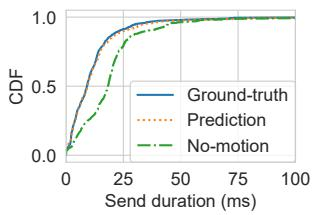  
(a) Send duration

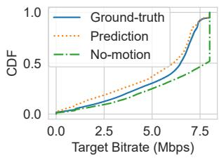  
(b) Target bitrate

Figure 14: Performance of motion prediction model.  
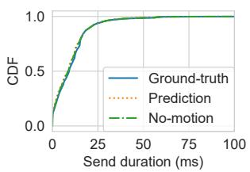  
(a) Send duration

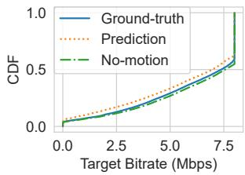  
(b) Target bitrate  
Figure 15: Performance evaluation of the prediction model on non-motion frames.

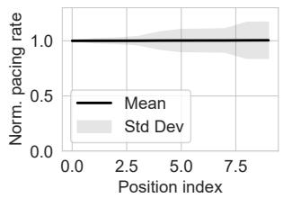  
(a) Pacing rate

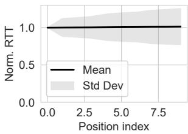  
(b) RTT  
Figure 16: Stable pacing rate and RTT in motion phases.

## 5.4 Overhead Evaluation

Zero client-side overhead. MARC achieves efficiency with all functionalities implemented server-side, eliminating any impact on mobile device energy, storage, or computation, making it ready for large-scale deployment.

Minimal server-side overhead. We measure the inference time of two non-linear optimization solvers, SLSQP [13] and COBYLA [44], on our testbed server equipped with an Intel i9-13900KF CPU. In this experiment, the prediction window size was varied from 5 to 20 frames in increments of 5 frames.

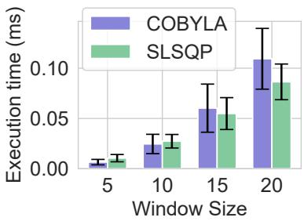  
Figure 17: Per-frame execution time of two optimization solvers with different window sizes.

We varied the input transport rate from 0.1 to 8 Mbps in steps of 0.1 Mbps, and the send queue size from 0 to 150 KB in steps of 1.5 KB, as different inputs affect the execution time. Each input state was tested 1000 times, and the average execution time was recorded.

The results are presented in Fig. 17. COBYLA’s execution time is lower than SLSQP’s when the window size is 10 frames or fewer. However, the computation time of the COBYLA algorithm increases faster than SLSQP, resulting in longer execution times for COBYLA when the window size exceeds 15. During testing, we observed that COBYLA may reach its iteration limit without finding a solution for certain inputs when the prediction window is large. For these reasons, we choose to use SLSQP. Its average per-frame inference time is 24.6 µs, and the maximum time is 5.4 ms, both well within the frame interval (33 ms in our setting), with a prediction window size of 10. Furthermore, this results in only a 1.3% increase in absolute CPU utilization per session, making it suitable for multiple concurrent sessions in mobile cloud rendering scenarios. In practice, a rendering node already limits itself to about ten sessions per GPU, so server capacity remains GPU-bound; MARC’s extra CPU demand is well below the point where CPU becomes the scaling bottleneck.

## 5.5 Video Quality Evaluation

We assessed MARC’s impact on video quality by comparing original renderer output with received frames on a local testbed. The test uses 500-frame videos under various network traces. We employed three video quality metrics: PSNR, Structural Similarity Index (SSIM), and VMAF phone model. Tab. 2 shows that MARC has only a 1% decrease in PSNR (48.13 vs. 47.74) and VMAF (96.4 vs. 95.7) compared to WebRTC, while its average throughput demand differs by less than 3% from the baseline, indicating minimal perceived quality loss. MARC has a higher standard deviation in PSNR because MARC adjusts the bitrate for motion frames, resulting in minor quality fluctuations during the adjustment process.

Table 2: Video quality of MARC vs. WebRTC.
<table><tr><td></td><td>PSNR</td><td>SSIM</td><td>VMAF</td></tr><tr><td>WebRTC</td><td> $4 8 . 1 3 ( \pm 0 . 8 2 ) $ </td><td>0.9937</td><td>96.4</td></tr><tr><td>MARC</td><td> $4 7 . 7 4 ( \pm 0 . 9 6 )$ </td><td>0.9933</td><td>95.7</td></tr></table>

## 5.6 Large Scale Evaluation in the Wild

We deployed MARC in the online environment as described in § 5.1. MARC was compared with WebRTC in an A/B test. The test was conducted from April 4, 2024, to April 11, 2024, encompassing over 1 million sessions.

Metrics. Both latency and user engagement are evaluated. Latency measurements include the send duration of motion frames, the proportion of motion frames with an MTP latency exceeding 150ms, and the session freeze rate, which is the ratio of sessions that experience at least one freeze event. The freeze event count is provided by WebRTC [59]. User engagement is assessed using two behavioral interaction metrics [42]: session duration, which measures the total time each user spends on the service, and the ratio of interaction time to the session duration, which measures the user activity level.

Reducing latency. MARC reduces the frame latency by 20% at the tail (P99) and 29% at the median, as shown in Fig. 18a. Consequently, the proportion of motion frames with an MTP latency exceeding 150ms decreased by 20%. Additionally, the session freeze rate variance decreased, as illustrated in Fig. 18b, where the whiskers represent the 5th and 95th percentile values, and the average session freeze rate (denoted by a blue dot in the box) is reduced by 71%.

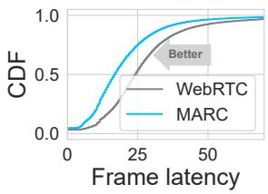  
(a) Frame latency

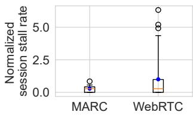  
(b) Session freeze rate  
Figure 18: Latency evaluation in online environment.

Improving user engagement. The latency reduction translates to improved user engagement. The session duration increased by 9%. The ratio of interaction time relative to the session duration increased by 20%, indicating that users were more willing to interact with the service under the MARC strategy. Such improvements in user engagement can potentially lead to increased profitability for e-commerce platforms [5].

Table 3: Comparison of user engagement metrics.
<table><tr><td></td><td>Session Duration</td><td>Interaction Ratio</td></tr><tr><td>WebRTC</td><td>1</td><td>1</td></tr><tr><td>MARC</td><td>1.09</td><td>1.20</td></tr></table>

## 6 Discussion

Generalizability. MARC’s motion-aware bitrate adaptation extends beyond mobile e-commerce to interactive RTC workloads that alternate between active manipulation and passive viewing, such as cloud desktops, and remote VR/AR streaming. Porting MARC merely requires recalibrating the QoE mapping (Fig. 2, Eq. (7)) with engagement studies from the target application.

QoE function. In this study, we adopt a simplified QoE model that emphasizes two core elements of user experience: video quality and frame latency. Our results in Appendix B show that, even with this simplified model, the specific QoE formulation notably influences algorithm performance. Expanding beyond this formulation, a more sophisticated QoE model could integrate additional factors such as content complexity [47] and user expectations [19,31]. Metrics like bitrate switching could be explored under multi-dimensional QoE objectives to refine the framework further.

Controlling frame size. Our system uses existing encoder APIs to regulate encoding parameters, deliberately avoiding alterations to internal logic [17]. Certain frameworks offer the possibility of fine-grained frame size control by adjusting QP values [11] or through iterative re-encoding [12, 40], MARC can extend its action space to incorporate these techniques. However, even with a perfect encoder that can encode frames at the exact target bitrate, users may still have different QoE requirements for motion and non-motion frames, which existing rate controllers cannot meet.

Paced sending and state predictors. Paced sending was employed to mitigate risks of queue buildup and network congestion when handling oversized frames [56]. Although pacing smooths network load, our simplified prediction of pacing rates may introduce latency estimation errors under extreme network bandwidth variations or prolonged queues. Several prediction modules, including pacing rate prediction, can still be improved by incorporating advanced time-series forecasting methods, such as those based on transformer [30]. We leave this part for future work.

Integrating other optimizations. Other techniques exist that target different components of the end-to-end pipeline in RTC systems, including loss recovery [36, 51] and last-mile latency optimization [35]. While these techniques are promising to be combined with MARC to improve QoE performance, applying them in e-commerce cloud rendering systems may require further investigation.

QoE fairness. QoE fairness concerns dividing shared network resources so that users experience comparable satisfaction. Minerva [38] explores this for video-on-demand streams, a non-interactive setting where visual quality dominates and latency is largely secondary. In contrast, MARC’s measurements show that in interactive RTC workloads QoE priorities shift with the user’s interaction phase § 2.2. This statedependent insight provides a useful lever for future studies on fairness in multi-user interactive systems.

## 7 Related Work

QoE-related factors and metrics in video streaming. A substantial body of work has examined the impact of network conditions and video quality metrics on user engagement in streaming applications [10,27,53]. Building on these findings, MARC firstly correlates user engagement with user behavior and derives dynamic QoE preferences to guide rate control.

Rate control methods. Various rate control methods have been developed to optimize different aspects of Quality of Experience (QoE) in video streaming. For example, research has focused on dynamically adjusting bitrate based on factors such as dynamic network [52, 64, 65, 68], content complexity [47], quality sensitivity [43, 66], smoothness requirement [7] and visual attention [16, 37, 46, 54]. However, these rate control methods typically rely on a fixed QoE model or predefined trade-offs. In contrast, MARC addresses intrasession QoE preference changes, continuously adjusting bitrate according to user behavior within the same session.

Congestion control for RTC. In RTC systems, congestion control algorithms (CCAs) aim to maximize bandwidth utilization and avoid network overloading [6, 24, 48, 53]. CCAs typically probe bandwidth and adjust video sending rates based on delay, loss, or other congestion signals, but do not directly optimize for QoE objectives. Therefore, existing CCAs cannot solve the observed issue in § 2.

## 8 Conclusion

We have conducted a large-scale QoE study and identified that user behavior in mobile e-commerce cloud rendering exhibits unique QoE requirements, particularly in motion phases. Existing rate controllers often overlook the rapid QoE preference shifts in motion and non-motion phases, resulting in excessive latency exactly when users most value interactive responsiveness. To tackle this, we developed MARC, a dynamic QoE-driven motion-aware rate control framework that integrates user-behavior modeling and network dynamics, adjusting the bitrate at the frame level to optimize QoE. We implemented MARC and deployed it on Taobao’s mobile cloud rendering platform. Millions of sessions demonstrated the efficiency of MARC in improving tail latency and user engagement.

## Acknowledgments

We thank our shepherd, Jaehong Kim, and the anonymous reviewers for their insightful feedback. This work is supported by the National Key R&D Program of China (2022YFB2901800) and Alibaba Group through Alibaba Research Fellowship Program.

## References

[1] Rfc 4960: Stream control transmission protocol. https://datatrac ker.ietf.org/doc/html/rfc4960, September 2007.

[2] NVIDIA NVENC Video Encoder API Programming Guide: Constant Bitrate (CBR) Mode. https://docs.nvidia.com/video- tec hnologies/video-codec-sdk/11.1/nvenc-video-encoder-a pi-prog-guide/index.html#rate-control, 2024. Accessed: 2024-08-20.

[3] Venkat Arun and Hari Balakrishnan. Copa: Practical {Delay-Based} congestion control for the internet. In 15th USENIX Symposium on Networked Systems Design and Implementation (NSDI 18), pages 329– 342, 2018.

[4] Ali C. Begen and Jonathan Lennox. Rtp payload format for flexible forward error correction (fec). https://datatracker.ietf.org/d oc/html/rfc8627, July 2019. Internet Engineering Task Force.

[5] Abdelsalam H Busalim, Fahad Ghabban, et al. Customer engagement behaviour on social commerce platforms: An empirical study. Technology in society, 64:101437, 2021.

[6] G. Carlucci, L. De Cicco, S. Holmer, and S. Mascolo. Analysis and design of the google congestion control for web real-time communication (webrtc). In Proceedings of the 7th International Conference on Multimedia Systems, pages 1–12, May 2016.

[7] Tianyu Chen, Yiheng Lin, Nicolas Christianson, Zahaib Akhtar, Sharath Dharmaji, Mohammad Hajiesmaili, Adam Wierman, and Ramesh K Sitaraman. Soda: An adaptive bitrate controller for consistent highquality video streaming. In Proceedings of the ACM SIGCOMM 2024 Conference, pages 613–644, 2024.

[8] Chromium Project. WebRTC Video Encoder Bitrate Adjuster Source Code. https://source.chromium.org/chromium/chromium/sr c/+/main:third\_party/webrtc/video/encoder\_bitrate\_adj uster.h, April 2024. Accessed: 2024-04-02.

[9] Mark Claypool and Kajal Claypool. Latency and player actions in online games. Communications of the ACM, 49(11):40–45, 2006.

[10] Florin Dobrian, Vyas Sekar, Asad Awan, Ion Stoica, Dilip Joseph, Aditya Ganjam, Jibin Zhan, and Hui Zhang. Understanding the impact of video quality on user engagement. ACM SIGCOMM computer communication review, 41(4):362–373, 2011.

[11] FFmpeg Developers. libavcodec. https://github.com/FFmpeg/FF mpeg/tree/master/libavcodec, 2024. Accessed: 2024-05-06.

[12] Sadjad Fouladi, John Emmons, Emre Orbay, Catherine Wu, Riad S Wahby, and Keith Winstein. Salsify:{Low-Latency} network video through tighter integration between a video codec and a transport protocol. In 15th USENIX Symposium on Networked Systems Design and Implementation (NSDI 18), pages 267–282, 2018.

[13] Zhengqing Fu, Goulin Liu, and Lanlan Guo. Sequential quadratic programming method for nonlinear least squares estimation and its application. Mathematical problems in engineering, 2019(1):3087949, 2019.

[14] Epic Games. Unreal engine. https://www.unrealengine.com, 2019.

[15] Epic Games. Unreal engine pixelstreaming docs. https://docs.unr ealengine.com/5.0/en-US/pixel-streaming-in-unreal-eng ine/, 2024. Accessed: 2024-02-03.

[16] Yu Guan, Chengyuan Zheng, Xinggong Zhang, Zongming Guo, and Junchen Jiang. Pano: Optimizing 360 video streaming with a better understanding of quality perception. In Proceedings of the ACM Special Interest Group on Data Communication, pages 394–407, 2019.

[17] Mohamed Hegazy, Khaled Diab, Mehdi Saeedi, Boris Ivanovic, Ihab Amer, Yang Liu, Gabor Sines, and Mohamed Hefeeda. Content-aware video encoding for cloud gaming. In Proceedings of the 10th ACM multimedia systems conference, pages 60–73, 2019.

[18] Chun-Ying Huang, Cheng-Hsin Hsu, Yu-Chun Chang, and Kuan-Ta Chen. Gaminganywhere: An open cloud gaming system. In Proceedings of the 4th ACM multimedia systems conference, pages 36–47, 2013.

[19] Tianchi Huang, Rui-Xiao Zhang, Chenglei Wu, and Lifeng Sun. Optimizing adaptive video streaming with human feedback. In Proceedings of the 31st ACM International Conference on Multimedia, pages 1707– 1718, 2023.

[20] Tianchi Huang, Rui-Xiao Zhang, Chao Zhou, and Lifeng Sun. Qarc: Video quality aware rate control for real-time video streaming based on deep reinforcement learning. In Proceedings of the 26th ACM international conference on Multimedia, pages 1208–1216, 2018.

[21] IETF. Real-time communication in web-browsers (rtcweb). https: //datatracker.ietf.org/wg/rtcweb/about/, 2023.

[22] IKEA. Ikea planners and design tools. https://www.ikea.com/us/ en/planners/, 2024. Accessed: 2024-05-21.

[23] Zenja Ivkovic, Ian Stavness, Carl Gutwin, and Steven Sutcliffe. Quantifying and mitigating the negative effects of local latencies on aiming in 3d shooter games. In Proceedings of the 33rd annual acm conference on human factors in computing systems, pages 135–144, 2015.

[24] Zhidong Jia, Yihang Zhang, Qingyang Li, and Xinggong Zhang. Burstrtc: Harnessing variable bit-rate of rtc through frame-bursting congestion control. In Proceedings of the 8th Asia-Pacific Workshop on Networking, pages 213–214, 2024.

[25] Steven G. Johnson. NLopt: Nonlinear-optimization package. https: //github.com/stevengj/nlopt.

[26] Pantea Karimi, Sadjad Fouladi, Vibhaalakshmi Sivaraman, and Mohammad Alizadeh. Vidaptive: Efficient and responsive rate control for real-time video on variable networks. arXiv preprint arXiv:2309.16869, 2023.

[27] S Shunmuga Krishnan and Ramesh K Sitaraman. Video stream quality impacts viewer behavior: inferring causality using quasi-experimental designs. In Proceedings of the 2012 Internet Measurement Conference, pages 211–224, 2012.

[28] Insoo Lee, Jinsung Lee, Kyunghan Lee, Dirk Grunwald, and Sangtae Ha. Demystifying commercial video conferencing applications. In Proceedings of the 29th ACM international conference on multimedia, pages 3583–3591, 2021.

[29] Zhi Li, Anne Aaron, Ioannis Katsavounidis, Anush Moorthy, Megha Manohara, et al. Toward a practical perceptual video quality metric. The Netflix Tech Blog, 6(2):2, 2016.

[30] Bryan Lim, Sercan Ö Arık, Nicolas Loeff, and Tomas Pfister. Temporal fusion transformers for interpretable multi-horizon time series forecasting. International Journal of Forecasting, 37(4):1748–1764, 2021.

[31] Shengmei Liu and Mark Claypool. The impact of latency on navigation in a first-person perspective game. In Proceedings of the 2022 CHI Conference on Human Factors in Computing Systems, pages 1–11, 2022.

[32] Gerui Lv, Qinghua Wu, Weiran Wang, Zhenyu Li, and Gaogang Xie. Lumos: towards better video streaming qoe through accurate throughput prediction. In IEEE INFOCOM 2022 - IEEE Conference on Computer Communications, pages 650–659, 2022.

[33] H. Mao, R. Netravali, and M. Alizadeh. Neural adaptive video streaming with pensieve. In Proceedings of the conference of the ACM special interest group on data communication, pages 197–210, August 2017.

[34] Z. Meng, T. Wang, Y. Shen, B. Wang, M. Xu, R. Han, et al. Enabling high quality Real-Time communications with adaptive Frame-Rate. In 20th USENIX Symposium on Networked Systems Design and Implementation (NSDI 23), pages 1429–1450, 2023.

[35] Zili Meng, Yaning Guo, Chen Sun, Bo Wang, Justine Sherry, Hongqiang Harry Liu, and Mingwei Xu. Achieving consistent low latency for wireless real-time communications with the shortest control loop. In Proceedings of the ACM SIGCOMM 2022 Conference, SIG-COMM ’22, page 193–206, New York, NY, USA, 2022. Association for Computing Machinery.

[36] Zili Meng, Xiao Kong, Jing Chen, Bo Wang, Mingwei Xu, Rui Han, Honghao Liu, Venkat Arun, Hongxin Hu, and Xue Wei. Hairpin: Rethinking packet loss recovery in edge-based interactive video streaming. In USENIX NSDI, 2024.

[37] Omar Mossad, Khaled Diab, Ihab Amer, and Mohamed Hefeeda. Deepgame: Efficient video encoding for cloud gaming. In Proceedings of the 29th ACM International Conference on Multimedia, pages 1387–1395, 2021.

[38] Vikram Nathan, Vibhaalakshmi Sivaraman, Ravichandra Addanki, Mehrdad Khani, Prateesh Goyal, and Mohammad Alizadeh. End-toend transport for video qoe fairness. In Proceedings of the ACM Special Interest Group on Data Communication, pages 408–423. 2019.

[39] NVIDIA. Video codec sdk. https://developer.nvidia.com/vid eo-codec-sdk, 2024. Accessed: 2024-05-21.

[40] NVIDIA Corporation. NVIDIA NVENC Video Encoder API Programming Guide, 2024. Accessed: 2024-05-21.

[41] Obsess. Obsess - virtual store platform. https://obsessar.com/, 2024. Accessed: 2024-05-21.

[42] Jeeyun Oh, Saraswathi Bellur, and S Shyam Sundar. Clicking, assessing, immersing, and sharing: An empirical model of user engagement with interactive media. Communication Research, 45(5):737–763, 2018.

[43] Mirko Palmer, Malte Appel, Kevin Spiteri, Balakrishnan Chandrasekaran, Anja Feldmann, and Ramesh K Sitaraman. Voxel: Crosslayer optimization for video streaming with imperfect transmission. In Proceedings of the 17th International Conference on emerging Networking EXperiments and Technologies, pages 359–374, 2021.

[44] Michael JD Powell. A direct search optimization method that models the objective and constraint functions by linear interpolation. Springer, 1994.

[45] WebRTC project. https://webrtc.org/, 2024. Accessed: 2024-02- 03.

[46] Feng Qian, Bo Han, Qingyang Xiao, and Vijay Gopalakrishnan. Flare: Practical viewport-adaptive 360-degree video streaming for mobile devices. In Proceedings of the 24th Annual International Conference on Mobile Computing and Networking, pages 99–114, 2018.

[47] Yanyuan Qin, Shuai Hao, K. R. Pattipati, Feng Qian, Subhabrata Sen, Bing Wang, and Chaoqun Yue. Abr streaming of vbr-encoded videos: characterization, challenges, and solutions. In Proceedings of the 14th International Conference on Emerging Networking EXperiments and Technologies, CoNEXT ’18, page 366–378, New York, NY, USA, 2018. Association for Computing Machinery.

[48] D. Ray, C. Smith, T. Wei, D. Chu, and S. Seshan. Sqp: Congestion control for low-latency interactive video streaming. arXiv preprint arXiv:2207.11857, 2022.

[49] Devdeep Ray, Jack Kosaian, KV Rashmi, and Srinivasan Seshan. Vantage: optimizing video upload for time-shifted viewing of social live streams. In Proceedings of the ACM Special Interest Group on Data Communication, pages 380–393. 2019.

[50] rooom. rooom - 3d solutions for e-commerce, 2024. Accessed: 2024- 05-21.

[51] M. Rudow, F. Y. Yan, A. Kumar, G. Ananthanarayanan, M. Ellis, and K. V. Rashmi. Tambur: Efficient loss recovery for videoconferencing via streaming codes. In 20th USENIX Symposium on Networked Systems Design and Implementation (NSDI 23), pages 953–971, 2023.

[52] Haiping Wang, Zhenhua Yu, Ruixiao Zhang, Siping Tao, Hebin Yu, and Shu Shi. Twinstar: A practical multi-path transmission framework for ultra-low latency video delivery. In Proceedings of the 31st ACM International Conference on Multimedia, pages 9234–9242, 2023.

[53] Shibo Wang, Shusen Yang, Xiao Kong, Chenglei Wu, Longwei Jiang, Chenren Xu, Cong Zhao, Xuesong Yang, Jianjun Xiao, Xin Liu, et al. Pudica: Toward {Near-Zero} queuing delay in congestion control for cloud gaming. In 21st USENIX Symposium on Networked Systems Design and Implementation (NSDI 24), pages 113–129, 2024.

[54] Shibo Wang, Shusen Yang, Hailiang Li, Xiaodan Zhang, Chen Zhou, Chenren Xu, Feng Qian, Nanbin Wang, and Zongben Xu. Salientvr: Saliency-driven mobile 360-degree video streaming with gaze information. In Proceedings of the 28th Annual International Conference on Mobile Computing And Networking, pages 542–555, 2022.

[55] Zhou Wang, Alan C Bovik, Hamid R Sheikh, and Eero P Simoncelli. Image quality assessment: from error visibility to structural similarity. IEEE transactions on image processing, 13(4):600–612, 2004.

[56] WebRTC. Pacing module, 2024. Accessed: 2024-04-29.

[57] WebRTC Project. Peerconnection interface. https://source.chrom ium.org/chromium/chromium/src/+/main:third\_party/webr tc/api/peer\_connection\_interface.h. Accessed: 2024-05-21.

[58] Wikipedia contributors. Webrtc - wikipedia, the free encyclopedia. https://en.wikipedia.org/wiki/WebRTC#Support, 2024. Accessed: 2024-02-02.

[59] World Wide Web Consortium. Webrtc statistics api: Freeze count definition. https://www.w3.org/TR/webrtc-stats/#dom-rtcin boundrtpstreamstats-freezecount, 2024. Accessed: 2024-08-13.

[60] M. Xu, Z. Fu, X. Ma, L. Zhang, Y. Li, F. Qian, et al. From cloud to edge: a first look at public edge platforms. In Proceedings of the 21st ACM Internet Measurement Conference, pages 37–53, November 2021.

[61] Xiaokun Xu and Mark Claypool. Measurement of cloud-based game streaming system response to competing tcp cubic or tcp bbr flows. In Proceedings of the 22nd ACM Internet Measurement Conference, pages 305–316, 2022.

[62] Francis Y. Yan, Hudson Ayers, Chenzhi Zhu, Sadjad Fouladi, James Hong, Keyi Zhang, Philip Levis, and Keith Winstein. Learning in situ: a randomized experiment in video streaming. In 17th USENIX Symposium on Networked Systems Design and Implementation (NSDI 20), pages 495–511, Santa Clara, CA, February 2020. USENIX Association.

[63] Xiaoqi Yin, Abhishek Jindal, Vyas Sekar, and Bruno Sinopoli. A control-theoretic approach for dynamic adaptive video streaming over http. In Proceedings of the 2015 ACM Conference on Special Interest Group on Data Communication, pages 325–338, 2015.

[64] H. Zhang, A. Zhou, Y. Hu, C. Li, G. Wang, X. Zhang, et al. Loki: improving long tail performance of learning-based real-time video adaptation by fusing rule-based models. In Proceedings of the 27th Annual International Conference on Mobile Computing and Networking, pages 775–788, October 2021.

[65] H. Zhang, A. Zhou, J. Lu, R. Ma, Y. Hu, C. Li, et al. Onrl: improving mobile video telephony via online reinforcement learning. In Proceedings of the 26th Annual International Conference on Mobile Computing and Networking, pages 1–14, September 2020.

[66] Xu Zhang, Yiyang Ou, Siddhartha Sen, and Junchen Jiang. SENSEI: Aligning video streaming quality with dynamic user sensitivity. In 18th USENIX Symposium on Networked Systems Design and Implementation (NSDI 21), pages 303–320. USENIX Association, April 2021.

[67] Yuankang Zhao, Qinghua Wu, Gerui Lv, Furong Yang, Jiuhai Zhang, Feng Peng, Yanmei Liu, Zhenyu Li, Ying Chen, Hongyu Guo, et al. Jitbright: towards low-latency mobile cloud rendering through jitter buffer optimization. In Proceedings of the 34th edition of the Workshop on Network and Operating System Support for Digital Audio and Video, pages 36–42, 2024.

[68] A. Zhou, H. Zhang, G. Su, L. Wu, R. Ma, Z. Meng, et al. Learning to coordinate video codec with transport protocol for mobile video telephony. In The 25th Annual International Conference on Mobile Computing and Networking, pages 1–16, October 2019.

[69] Yuhan Zhou, Tingfeng Wang, Liying Wang, Nian Wen, Rui Han, Jing Wang, Chenglei Wu, Jiafeng Chen, Longwei Jiang, Shibo Wang, et al. Augur: Practical mobile multipath transport service for low tail latency in real-time streaming. In USENIX NSDI, 2024.

## Appendix

## A Finding the Best Prediction Horizon

In this section, we evaluate how different prediction horizon sizes (N) affect the performance of MARC. We vary N from 1 to 15 frames, measuring both the QoE gains (Fig. 19) and the additional computational overhead (Fig. 17). As shown in Fig. 19, using a horizon smaller than 10 frames can lead to suboptimal decisions that degrade tail latency (99.9 percentile), whereas increasing N beyond 10 frames yields only marginal QoE improvements at the cost of higher runtime overhead. Therefore, we select N = 10 as the default prediction horizon for MARC, striking a good balance between performance and complexity.

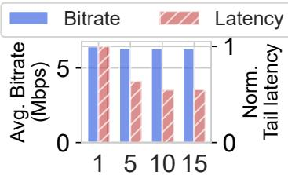  
Prediction Horizon Length  
Figure 19: Impact of different prediction horizon sizes on overall QoE. Increasing N from 1 to 10 significantly reduces tail latency. Further increasing N yields diminishing returns.

## B QoE Object Sensitivity

Sensitivity to QoE object. The QoE function defines the optimization objective and plays a crucial role in influencing MARC’s decisions. We investigate the impact of different QoE functions $q _ { R }$ on MARC’s bitrate selection by comparing the concave QoE function Eq. (10) with the linear QoE function Eq. (12). In our controlled experiments, we varied the send queue size and transport rate as follows: the transport rate ranged from 0.1 to 8 Mbps in increments of 0.1 Mbps, and the send queue size ranged from 0 to 150 KB in increments of 1500 bytes. The one-way delay was kept at 0, focusing solely on the impact of queuing delay on MARC’s decision-making. The delay QoE function $q _ { L }$ (Eq. (11)) remains unchanged with $\lambda _ { s } = 0 . 1$ , and motion frames are not considered.

$$
q _ { R } ( R ) = \frac { R } { R _ { \mathrm { m a x } } }\tag{12}
$$

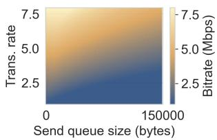

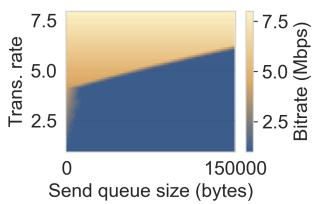  
(a) qR (Eq. (10)).  
(b) Linear qR (Eq. (12)).  
Figure 20: The impact of different QoE object functions $q _ { R }$ on MARC’s bitrate decision (represented by color).

As shown in Fig. 20, both objective functions reduce the bitrate as the send queue increases. However, the algorithm using $q _ { R }$ makes more continuous bitrate decisions (Fig. 20a), while the algorithm using a linear $q _ { R }$ exhibits abrupt changes in bitrate (Fig. 20b). Such abrupt decision changes negatively impact the algorithm’s overall performance. We evaluate the performance of these QoE objective functions on frame latency in our trace-driven evaluation environment. As shown in Fig. 21, the Pareto frontier of $q _ { R }$ outperforms that of Linear-$q _ { R }$

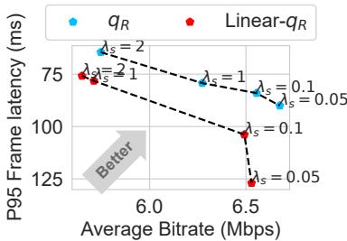  
Figure 21: Comparison of the P95 frame latency with different $q _ { R }$ objective functions.