①

USENIX

THE ADVANCED COMPUTING SYSTEMS ASSOCIATION

# SAVE: Software-Implemented Fault Tolerance for Model Inference against GPU Memory Bit Flips

Wenxin Zheng, Bin Xu, Jinyu Gu, and Haibo Chen, Shanghai Jiao Tong University https://www.usenix.org/conference/atc25/presentation/zheng

# This paper is included in the Proceedings of the 2025 USENIX Annual Technical Conference.

July 7–9, 2025 • Boston, MA, USA ISBN 978-1-939133-48-9

Open access to the Proceedings of the 2025 USENIX Annual Technical Conference is sponsored by

P--r.h £Es/sL.

auuJl9 PgleU

King Abdullah University of

Science and Technology

# SAVE: Software-Implemented Fault Tolerance for Model Inference against GPU Memory Bit Flips

Wenxin Zheng, Bin Xu, Jinyu Gu, Haibo Chen

Institute of Parallel and Distributed Systems, School of Computer Science, Shanghai Jiao Tong University

## Abstract

Machine learning models are used in safety-critical edge applications such as autonomous driving, industrial robots, and satellites. However, GPU memory bit flips can significantly reduce the model accuracy. Existing mitigations either compromise accuracy or introduce substantial overhead.

Our insight is that not all hardware bits are created equal and bit flips vary in their impact on model inference. Specifically, for the GPU memory, modern AI accelerators provide bit-flip-free but small reliable memory. For the model inference, due to nonlinear activation functions in the model, some bits are naturally robust against flips, while other vulnerable bits can silently corrupt results. Thus, we prioritize the allocation of vulnerable bits’ computations in the reliable memory to enhance the robustness of the model inference.

We propose SAVE, a software-implemented fault tolerance system that protects model inference without modifying the model and with minimal performance impact. SAVE operates in four stages: Selection to identify vulnerable bits based on the intrinsic characteristics of model inference, Allocation to prioritize computations related to more vulnerable bits in reliable memory, Verification to efficiently detect errors through asynchronous CPU checks, and Edit to recover from detected faults. Evaluation across computer vision, robotics, and decision-making models shows that SAVE maintains model accuracy even under 4K bit flips while incurring less than 9% performance overhead.

## 1 Introduction

Machine learning models already play an important role in safety-critical edge scenarios including autonomous driving [2, 54, 71], financial systems [6, 43], combat operations [10, 82], and military satellites [32]. The models on local edge devices handle a large amount of data, e.g., 20TB per day for one satellite [89] and 30TB per day for one autonomous driving car [1]. These on-device edge GPUs are more likely to have memory bits unintentionally flip due to unstable voltage in Unmanned Aerial Vehicles (UAVs), changing temperatures in cars, or radiation in space. Protecting inference safety against memory bit flips on these edge devices is crucial while challenging. For example, one satellite may experience approximately 16 million bit flips daily [89], and traditional Error Correction Code (ECC) [35, 68] proves insufficient, as it provides only single bit errors correction [68] while even a single escaped bit flip can cause complete accuracy loss and false decisions [29].

Current approaches to protect model inference against bit flips on edge accelerators fall into two categories based on whether they modify the model structure. The first category modifies the model structure to enhance model robustness, including specialized activation functions [89], compression [37, 76], and quantization [40]. However, these methods often compromise accuracy and lack generality across different models. The second category preserves model structure while implementing protection through redundancy, such as Triple Modular Redundancy (TMR) [5, 13, 57, 60, 79] and ECC [35, 68]. Although these approaches preserve accuracy and generality, they either incur substantial overhead (2× for TMR) or provide limited error correction capabilities (ECC).

In this paper, we focus on the second category and propose an efficient software mitigation named SAVE against bit flips in GPU memory, which improves the reliability of model inference results without retraining the model or sacrificing accuracy.

Our first insight is that not all hardware bits are created equal. Modern edge-deployed AI accelerators like NVIDIA Orin provide bit-flip-free safety islands [67], while hardware manufacturers [25, 52] implement SRAM soft error detection in e.MMC [26] for L1 cache protection. SAVE leverages these reliable memory regions for reliable model inference.

However, these reliable memory regions are limited (only around 5-6MB in Orin [67]). Relying solely on them requires frequent CPU-GPU memory swapping, which inevitably increases performance overhead. Our evaluation shows it introduces more than 1,000 performance overhead for both computer vision and robotics decision-making models.

Our second insight is that not all bit flips in software are fatal or silent, which offers the chance to hybridly use reliable memory and normal memory for model inference computation. During computation, the bits can be classified into three categories: robust bits that don’t affect inference results, ranging bits that can be verified through simple range checks (e.g., the Sigmoid function’s sign bit must be zero as outputs range from 0 to 1), and vulnerable bits that silently corrupt the model. SAVE strategically allocates computations involving vulnerable bits to reliable memory while computing robust bits in normal memory, efficiently minimizing memory swapping while maintaining result correctness.

Specifically, SAVE contains four stages to enhance the reliability of model inference against GPU memory bit flips, namely, Selection stage, Allocation stage, Verification stage, and Edit stage.

Selection stage: robustness analysis and output range analysis. Machine learning models are programs that are easier to analyze data and control flow compared to general software. Thus, SAVE analyzes the model with data flow, control flow, and mathematical properties to identify robust bits in each value. For example, activation functions like ReLU [64] and GELU [38] yield outputs close to zero for negative inputs, meaning changes to the significand of its input will have little impact. Additionally, SAVE assesses each layer’s output range to find ranging bits. For example, for image classification models, the image pixel value gives the range of the input value. The known input range, together with the model parameters, gives the output range of each layer. Some of the exponent bits or sign bits can be verified by these ranges without recomputation. SAVE sets all remaining bits as vulnerable bits. The findings are stored in a bit attribution cache to accelerate further verification.

Allocation stage: robustness-aware GPU memory management. Based on offline robustness analysis, SAVE prioritizes allocating reliable memory to computations with more vulnerable bits. To optimize the use of limited reliable memory, SAVE employs in-place computation techniques, including overwriting input tensors with output results during matrix multiplication. Model parameters are intentionally placed in normal memory because they have copies stored in CPU memory, allowing for bit flip detection through CPU-GPU consistency checks during verification.

Verification stage: lightweight runtime verification. SAVE implements distinct verification mechanisms to accelerate the runtime verification. Values in reliable memory are considered correct and do not require verification. For values in normal memory, SAVE verifies the correctness differently according to their roles. For model parameters, it uses DMA to copy them back to the CPU during runtime for doublechecking without impacting model inference. For other values, SAVE verifies the correctness of ranging bits using the valid output range. To reduce the performance overhead, it verifies vulnerability bits with integer computation using the integer computation resources to avoid heavy floating-point recomputation.

Table 1: Model degradation due to bit flips. (1): The models with softmax. (2): ResNet, VGG. (3): 8-bit quantization models. (4): ASR: Attack Success Rate.
<table><tr><td rowspan=1 colspan=1></td><td rowspan=1 colspan=1>Model</td><td rowspan=1 colspan=1>FlippedBits</td><td rowspan=1 colspan=1>AccuracyDegradation</td></tr><tr><td rowspan=1 colspan=1>NaN [29]</td><td rowspan=1 colspan=1>EffcientNet</td><td rowspan=1 colspan=1>3</td><td rowspan=1 colspan=1>82.00% → 0%</td></tr><tr><td rowspan=1 colspan=1>FIASM [46]</td><td rowspan=1 colspan=1> $\overline { { \mathrm { S o f t m a x } ^ { ( 1 ) } } }$ </td><td rowspan=1 colspan=1>1</td><td rowspan=1 colspan=1>97.4%→ 62%</td></tr><tr><td rowspan=1 colspan=1>TBD [40]</td><td rowspan=1 colspan=1>cv(2)</td><td rowspan=1 colspan=1>1</td><td rowspan=1 colspan=1>Up to 99% drop</td></tr><tr><td rowspan=1 colspan=1>BFA [73]</td><td rowspan=1 colspan=1>ResNet18(3)</td><td rowspan=1 colspan=1>13</td><td rowspan=1 colspan=1>69.8%→ 0.1%</td></tr><tr><td rowspan=1 colspan=1>DHB [37]</td><td rowspan=1 colspan=1>ResNet20(3)</td><td rowspan=1 colspan=1>28</td><td rowspan=1 colspan=1>81.39% drop</td></tr><tr><td rowspan=1 colspan=1>TBT[74]</td><td rowspan=1 colspan=1>ResNet18(3)</td><td rowspan=1 colspan=1>84</td><td rowspan=1 colspan=1>92% ASR(4)</td></tr><tr><td rowspan=1 colspan=1>TA-LBF [9]</td><td rowspan=1 colspan=1>ResNet18(3)</td><td rowspan=1 colspan=1>1507</td><td rowspan=1 colspan=1>100% ASR(4)</td></tr><tr><td rowspan=1 colspan=1>T-BFA [75]</td><td rowspan=1 colspan=1> $\overline { { { \mathrm { R e s N e t 1 } } 8 ^ { ( 3 ) } } }$ </td><td rowspan=1 colspan=1>27</td><td rowspan=1 colspan=1>100% ASR(4)</td></tr><tr><td rowspan=3 colspan=1>OurExperiments</td><td rowspan=1 colspan=1>ResNet</td><td rowspan=3 colspan=1>1</td><td rowspan=3 colspan=1>Up to 99% Drop</td></tr><tr><td rowspan=1 colspan=1>ViT</td></tr><tr><td rowspan=1 colspan=1>CogACT</td></tr></table>

Edit stage: eliminating bit flips. When an error is detected, SAVE simply restarts the inference computation from the faulting model layer.

To demonstrate the efficiency and effectiveness of bit flip mitigation, we test SAVE across various computer vision, robotics, and decision-making models. The results show that SAVE incurs less than 9% performance overhead for end-toend latency in model inference and maintains the model’s accuracy even in the case of 4K bit. To compare existing approaches, we propose a new metric, AccurateLatency, which penalizes high latency and low accuracy in inference. SAVE is 90% lower than state-of-the-art methods under Accurate-Latency.

In summary, our contributions are as follows:

• An idea of arranging computation related to vulnerable bits in reliable memory to improve the reliability of model inference.

• A prototype system, SAVE, to mitigate GPU memory bit flips by using robustness-aware GPU memory management and lightweight runtime verification and recomputation.

• An intensive evaluation that demonstrates the efficiency and effectiveness of SAVE.

## 2 Background

## 2.1 GPU Bit Flips on Edge Inference

Machine learning models greatly improve decision and recognition accuracy. So, many on-device edge scenarios like autonomous cars [2, 54, 71] and satellite image recognition [32] use these models for local inference. To support these applications, GPUs are widely used for model inference due to their high parallelism and efficiency. These GPUs are often deployed in edge devices, such as drones and satellites, where they can process data locally and make real-time decisions. However, the GPU memory reliability in the edge device can be easily compromised by physical factors such as unstable cell voltage, radiation, and temperature fluctuations. Such decreased reliability will result in unintended bit changes in GPU memory, commonly referred to as bit flips. Bit flips are a common occurrence across various edge-deployed GPU devices [90]. For instance, the memory flip rate in UAVs operating under low voltage conditions can reach 3.5% [86]. In space devices, radiation exposure can cause flip rates as high as 10%, with multiple cells potentially flipping simultaneously [89]. On some lower-end devices, an average of 3,900 bit flips may occur per day [80]. One satellite can experience 16 million bit flips per day due to cosmic rays [89].

These bit flips can significantly degrade model accuracy. Research indicates that even a single bit flip can reduce model accuracy by more than 60%, as demonstrated in Table 1. Such accuracy degradation can have severe consequences for downstream applications. In financial systems, erroneous results can silently affect stock trading volumes or target prices. In aerospace applications, corrupted decisions or navigation calculations can result in mission failures.

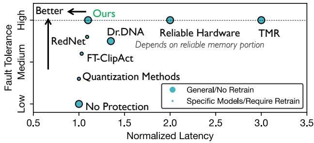  
Figure 1: Comparison of different bit flip mitigation methods.

## 2.2 Existing Approaches

Existing approaches to safeguard inference safety on edge devices against bit flips can be categorized into two types based on whether they modify the AI model. A comparison of these approaches is shown in Figure 1.

The first category involves modifying the model structure or its outputs to enhance model robustness. Some methods [33, 47, 53, 89] employ hashing-based techniques to generate weight group signatures and verify parameters. Other approaches propose using quantization [37, 40, 76] and specialized activation functions, such as FT-ClipAct [39], Red-Net [89], and Ranger [16], to mitigate the impact of bit flips. Additionally, Dr.DNA [61] leverages the distribution of activation results to detect and correct bit flips. However, these methods often require retraining the models or result in reduced accuracy.

The second category preserves the original model structure while implementing protection mechanisms through software or hardware redundancy. For instance, ECC can detect and correct limited bit errors. However, ECC is typically deployed only in high-end devices [4, 51] and is unavailable on many off-the-shelf GPUs. Moreover, it incurs additional costs, including a 10% to 20% increase in memory usage and a 2% to 3% reduction in performance [20, 24]. Furthermore, in extreme scenarios such as those involving cosmic ray impacts [89], a large number of bits may flip simultaneously, exceeding the error correction capacity of ECC and causing it to fail. Triple Modular Redundancy (TMR) [60, 79] is a general software solution to improve computational reliability. However, it requires threefold computation, rendering it prohibitively expensive for many scenarios [89].

## 2.3 Reliable Memory Exists on GPUs

We observe that “not all bits are created equal” on GPUs. Specifically, certain portions of GPU memory exhibit higher reliability, presenting opportunities for reliable computing. This observation is supported by the following two facts.

First, NVIDIA Orin, a widely-used edge AI accelerator, provides safety islands [67], which account for only 0.009% of the total memory and are guaranteed to be free of bit flips. Additionally, hardware manufacturers [25] offer soft error detection features for SRAM in e.MMC [26], enabling hardware-based protection for L1 cache. Second, similar to bit flips observed in DRAM on CPUs [8, 49, 50], a significant portion of GPU memory bits may be prone to flipping, while others remain stable and never flip (effectively functioning as safety islands). The properties of these bits are determined during manufacturing and are influenced by factors such as the chip fabrication process, memory cell voltage stability, and resistance to environmental stress. Defective bits prone to flipping can be identified through experiments using rowhammer-like tools [84, 96, 97] or through environmental testing [12, 19, 34, 87, 89]. Bits that are not prone to flipping can be treated as reliable memory and leveraged during inference.

## 2.4 Fault Model and Goal

Our work attempts to leverage the reliable memory on GPUs to improve the robustness of model inference against GPU memory bit flips under the following assumptions: 1) initial model parameters and inputs on the CPU side do not experience bit flips, as they are protected by orthogonal reliable methods on CPU-side memory; 2) registers, cache, and a small portion of memory on the GPU are free from bit flips; 3) the GPU reliable memory can be detected by environmental testing like Rowhammer-like tools [11, 14, 22, 51]; 4) the remaining GPU memory may experience random bit flips, including both single-bit and multi-bit flips; 5) the GPU kernel binary could fit within the reliable memory because of its small size after pruning [69].

It is important to note that the goal of SAVE is to enhance the robustness of model inference under GPU bit flip conditions, rather than strictly guarantee inference correctness under all possible flip scenarios.

## 3 Basic Idea and Insights

## 3.1 Basic Idea

A strawman solution is making all the computation conducted within the reliable GPU memory. However, the size of reliable memory is typically too small (e.g., less than 10MB) to accommodate GPU kernel computation with large matrices. Thus, we need to partition the kernel computation so that the input, model parameters, and output can fit into the small reliable memory. This involves continuously transferring data between the CPU and GPU reliable memory. According to our tests on both one visual model [23] and one decision model [15], this approach would result in a more than 1000 increase in model inference latency, which is unacceptable.

Our basic idea is also utilizing only the reliable GPU memory for improving the reliability of model inference. The key difference from the strawman solution lies in that our system (SAVE) hybridly uses reliable memory and unreliable memory on the GPU.

We first find that it is feasible to pre-load all the model parameters into unreliable memory, which can save more reliable memory for accommodating the kernel input and output. This is because 1) there exists an intact copy of model parameters on the CPU side; 2) the parameters in the unreliable memory can be copied back to the CPU side for verifying consistency, by using the free CPU-GPU PCIe path with the dedicated memory copy engine during kernel execution without hurting performance.

When executing the first layer’s kernel computation of the model, SAVE copies the input matrix to reliable memory and launches the kernel for computation. After the first layer completes, it pulls the kernel’s parameters back to the CPU and compares them with CPU-side parameters to verify that no bit flips occurred in the unreliable memory during kernel computation. This procedure is overlapped with the kernel execution of the next layer. While there exists an extreme edge case where a bit might flip before computation and revert before CPU verification, this time window is negligibly small, and we do not consider such extreme cases.

The output of the first layer’s kernel computation is also placed in reliable memory, in-place overwriting the input to serve as input for the next layer’s computation with another copied version to serve as the last reliable output. This process continues layer by layer until completion. During this process, if the total memory required for input/output in any layer’s kernel computation exceeds the size of reliable memory, SAVE still partitions the kernel’s input to ensure each computation fits within reliable memory capacity, and swaps intermediate results to CPU memory for temporary storage.

Besides model parameters, we also find that some parts of the kernel input can also be placed on the unreliable memory without sacrificing the model inference accuracy, which helps to minimize the needed partition of kernel computation. Next, we introduce our insights on how to select data for computation in unreliable memory and vice versa.

## 3.2 Insights on Bit Robustness

When placing computation data in unreliable memory, we need to detect the correctness of computation results, specifically to identify errors in computation results caused by bit flips. While detection can be simply achieved through recomputation and result comparison, this would incur significant performance overhead or require double the computing resources.

We discovered that not all bit flips have equal impact on model accuracy, which presents an opportunity to reduce the fault detection overhead. Different from general-purpose computing, the non-linearity of model computation makes some bit flips have little impact on model accuracy. We conduct an experiment with the ResNet-50 model, flipping each bit in every kernel’s input values individually and measuring the impact on model accuracy. The experiment results show that there exist robust bits whose flips have no impact on model accuracy; the remaining non-robust bits affect the accuracy and can be further categorized into ranging bits and vulnerable bits. The former ones may cause NaN and reduce model accuracy to 0, while the latter causes gradual accuracy degradation. Additionally, we found that some values consist entirely of robust bits and ranging bits (type-1 values), while others contain vulnerable bits (type-2 values).

For computations involving type-1 values, we compare results against pre-computed result thresholds; if ranging bits flip, results will fall outside these thresholds, which eases the fault detection. For type-2 values, recomputation is necessary to verify result correctness. We designed an asynchronous CPU-based verification method that doesn’t impact GPU model inference, which is detailed in §4.4. For reliable memory allocation, we prioritize matrices with more type-2 values to minimize recomputation needs.

<table><tr><td></td><td></td><td rowspan=1 colspan=17>Robust Bit   Ranging Bit    Vulnerable Bit</td></tr><tr><td></td><td></td><td rowspan=1 colspan=1>S</td><td rowspan=1 colspan=6>Exponent</td><td rowspan=1 colspan=10>Significand</td></tr><tr><td></td><td></td><td rowspan=1 colspan=1>0</td><td rowspan=1 colspan=2>00</td><td rowspan=1 colspan=2>000</td><td rowspan=1 colspan=1>00</td><td></td><td rowspan=1 colspan=2>000</td><td></td><td rowspan=1 colspan=1>00</td><td></td><td rowspan=1 colspan=1>0</td><td rowspan=1 colspan=1>0</td><td rowspan=1 colspan=1>00</td><td></td><td rowspan=1 colspan=1>00</td></tr><tr><td></td><td></td><td rowspan=1 colspan=2>00</td><td rowspan=1 colspan=1>0</td><td></td><td rowspan=1 colspan=1>0</td><td></td><td rowspan=1 colspan=1>0</td><td></td><td></td><td></td><td></td><td rowspan=1 colspan=1>0</td><td rowspan=1 colspan=1>0</td><td rowspan=1 colspan=1>0</td><td></td><td></td><td rowspan=1 colspan=1>0</td></tr><tr><td rowspan=1 colspan=1>0.15</td><td rowspan=1 colspan=7>001111100...</td><td rowspan=1 colspan=2>0.16</td><td rowspan=1 colspan=4>001111100...</td><td rowspan=1 colspan=1>0.17</td><td rowspan=1 colspan=4>001111100...</td></tr><tr><td rowspan=1 colspan=1>0.18</td><td rowspan=1 colspan=7>001111100...</td><td rowspan=1 colspan=2>0.19</td><td rowspan=1 colspan=4>001111100...</td><td rowspan=1 colspan=1>0.20</td><td rowspan=1 colspan=4>001111100...</td></tr><tr><td rowspan=1 colspan=1>0.21</td><td rowspan=1 colspan=7>001111100...</td><td rowspan=1 colspan=2>0.22</td><td rowspan=1 colspan=4>001111100...</td><td rowspan=1 colspan=1>0.23</td><td rowspan=1 colspan=4>001111100...</td></tr><tr><td rowspan=1 colspan=1>0.24</td><td rowspan=1 colspan=7>001111100...</td><td rowspan=1 colspan=2>0.25</td><td rowspan=1 colspan=4>001111101...</td><td rowspan=1 colspan=1>0.26</td><td rowspan=1 colspan=4>001111101...</td></tr></table>

Type-2 0 0 0 0 0 0 0 0 0 0 0 0 0 0 0 0 0 0 0 0 0 0 0 0 0 0 0 0 0 0 0 0 Vulnerable bit flips can only be detected by recomputation.  
Figure 2: The classification of bits and its mapping.

Finding all the robust bits and ranging bits by testing all the bits is impractical due to the large number of bits. At the same time, the robustness of a single bit cannot be directly extended to multiple bits. Thus, we explore the mathematical properties of the model to quickly find the robust bits and ranging bits and find a method to extend the single bit robustness to multiple bits. We found that the impact of bit flips on results depends on how big perturbation a model calculation can tolerate. If the change from the bit flip stays within this range, accuracy is not affected. We choose 10−5 for perturbation as it is a conservative estimation, ensuring common models remain unaffected by perturbations [3, 44, 72]. Such bit robustness comes from the mathematical properties of the model computation, and thus, we design an offline analysis method of bit identification (§4.2).

Ranging Bits. Current machine learning models rely on nonlinear activation functions. These functions, in combination with the input data range, produce a small, valid output range. This reduces the cost of numerical validation, as values outside this range can be identified as errors without computation, as shown in Figure 3(a, b). It is important to note that the input data range is also predefined. For example, pixel values typically fall within the range of 0-255 or 0-1 (a model program often maps pixel values to this smaller range). These output range constraints can be mapped to the specific bits of the number, reducing the number of bits that need to be verified, as illustrated in Figure 3(c).

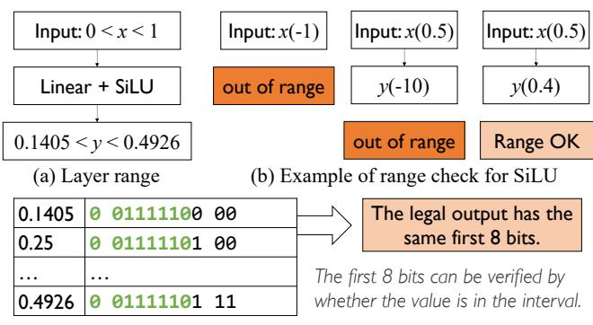  
Figure 3: The ranging bits of the value and its fast verification.

Robust Bits. Robust bits can be identified based on the floating-point representation and the model structure. As shown in Figure 4(a), the last few bits of the significand have minimal impact on the results [27, 30, 63, 83], and can, therefore, be directly designated as robust bits. Additionally, the model structure contributes to robust bits. For instance, the negative input of a ReLU function does not affect the output as long as the input remains less than 0, as illustrated in Figure 4(b). These bits are marked as robust bits based on specific input conditions.

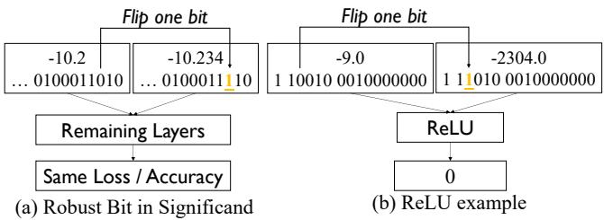  
Figure 4: The flipped robust bits and their effects.

## 4 Design

## 4.1 Workflow Overview

SAVE is built on PyTorch, a widely used machine learning inference framework. Figure 5 illustrates its entire workflow, which consists of four key stages working together to achieve reliable inference:

Selection Stage performs a one-time offline static analysis to identify three types of bits: robust bits with minimal impact on accuracy, ranging bits that can be verified through range checks, and vulnerable bits identified conservatively as the remaining bits. The analysis results guide runtime memory allocation and verification.

Allocation Stage manages the placement of data between reliable and unreliable memory. Based on the analysis of the prior stage, it prioritizes placing computations with more vulnerable bits (more type-2 values) in reliable memory while assigning computations with more robust bits and ranging bits (more type-1 values) to unreliable memory. An eviction mechanism is also implemented to optimize the use of limited reliable memory resources.

Verification Stage detects faults caused by bit flips. It employs asynchronous CPU-GPU verification along with output range analysis results to minimize fault detection overhead.

Edit Stage addresses error recovery when faults are detected. It ensures that the latency of model inference remains unaffected in normal cases without bit flips. For cases where faults occur, SAVE restarts the inference process from the faulting model layer.

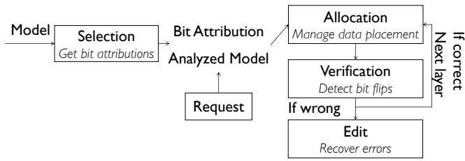  
Figure 5: The overview of SAVE.

## 4.2 Selection Stage

This stage performs static analysis to classify three types of bits in each value: ranging bits that can be verified through range checks, robust bits with minimal impact on accuracy, and vulnerable bits requiring strict protection. The analysis comprises two phases: range analysis and bit attribution analysis.

Phase 1: Range Analysis. SAVE determines the valid range for each value by propagating ranges through the model’s computational graph layer by layer. Since the model structure is a directed acyclic graph (DAG) with deterministic operators (purely computational), this analysis can be performed statically. For simplicity, we assume each layer contains a single operator corresponding to one kernel.

Figure 6 illustrates this process with a concrete example: 1) SAVE initializes the input range as [0, 1] for the input layer. 2) This range is propagated to the next layer’s operator (Op), which performs matrix multiplication. Since the weight matrix is fixed (model parameters), SAVE knows the relationship between input X and output Y of the Op. Based on the propagated input range, SAVE determines that the output range will be [-0.75, -0.1]. 3) The subsequent ReLU operator, which outputs zero for negative inputs, allows SAVE to determine that its output range is exactly 0. 4) For the final Add operator, one input is known to be 0 (from ReLU) and the other is the original input X ([0 to 1]), resulting in a final output range of [0 to 1]. The code snippet of this example is shown in Appendix B.

Phase 2: Bit Attribution Analysis. Using the ranges calculated in Phase 1, SAVE identifies ranging bits and robust bits.

Ranging Bits Identification. For each value, SAVE identifies ranging bits as those that must have the same value for all possible values within the computed range. These typically include the sign bit (e.g., must be 1 for range [-0.75 to -0.1]) and exponent bits constrained by the range bounds.

Robust Bits Identification. SAVE identifies two types of robust bits: 1) Value-based robust bits: For both upper and lower bounds of each range, if flipping a bit in the significand causes a numeric difference less than 10−5, it is considered robust. The common robust bits between both bounds become the robust bits for that range. 2) Operator-induced robust bits: Some operators, particularly activation functions, create additional robust bits. For example, with ReLU and negative inputs, only the sign bit needs verification since all outputs will be zero regardless of the input’s exact value.

Fine-Grained Analysis Results. Some operators, such as Op in the example above, exhibit points where the monotonicity of the input-output relationship changes. Some other operators may have extremely wide output ranges. In these situations, SAVE partitions the output range into multiple intervals and performs separate ranging and robust bit analyses for each interval. This approach enables more precise bit attribution during runtime based on actual values. To reuse the analyzed bit attribution results efficiently, SAVE stores the analyzed results in a bit attribution cache.

To manage cache pressure caused by storing bit properties across numerous intervals, SAVE optimizes memory usage by combining each linear operator with its subsequent nonlinear operator into a single composite operator. The cache then stores the ranging and robust bits for these combined operators instead of for individual ones.

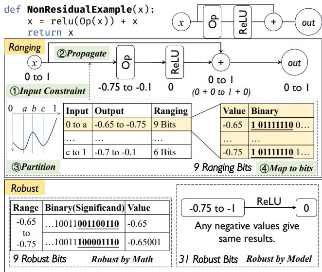  
Figure 6: The process of range analysis in Selection stage.

## 4.3 Allocation Stage

While bit attributes can help reduce reliable memory usage in theory, existing computing and memory management interfaces do not support bit-level management. To address this limitation, SAVE employs matrix partitioning to manage memory allocation based on the proportion of vulnerable bits in each computation block after partitioning.

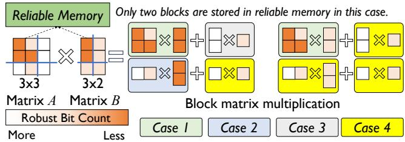  
Figure 7: Blocking matrices multiplication examples and partitioning. Both matrix A and B in the figure are non-parameter matrices.

Specifically, when executing GPU kernels, SAVE partitions the input matrices into four sub-matrices, with the partitioning strategy designed to create significant differences in the proportion of vulnerable bits across blocks, as shown in Figure 7. During memory allocation, sub-matrices with higher proportions of vulnerable bits are prioritized for placement in reliable memory, and sub-matrices with lower proportions of vulnerable bits are preferentially allocated to unreliable memory. The weight matrices of kernels (model parameters) are always allocated in the unreliable memory. To implement this, SAVE maintains two separate memory pools for reliable and unreliable (normal) memory, and hooks into the memory management interface in the framework.

The allocation strategy also carefully considers the output memory placement for each sub-matrix computation. For example, computation results containing more ranging bits and robust bits are preferentially allocated to unreliable memory, as they can be efficiently verified through range checks. This creates four distinct scenarios for each partitioned matrix, depending on the input and output memory placements, as illustrated in Figure 7:

• Case 1: Both input and output in reliable memory.

• Case 2: Input in reliable memory, output in unreliable memory.

• Case 3: Input in unreliable memory, output in reliable memory.

• Case 4: Both input and output in unreliable memory.

For the cases above, SAVE adheres to the rules of in-place modification after the CPU has stored the values. Specifically, SAVE transfers a copy of the output to the CPU.

For computations with output stored in reliable memory (Cases 1 and 3), in-place modification significantly reduces memory usage. However, since SAVE needs to maintain a reliable result on the CPU, immediately performing in-place modifications would erase the trace of reliable computations, impacting subsequent verification. To address this, SAVE retains a copy in reliable memory until the CPU has fully received the result. For computations with output stored in unreliable memory (Cases 2 and 4), SAVE transfers the output to the CPU for verification. Once the CPU verifies the output, it is deemed reliable, and the corresponding data in unreliable memory is in-place modified. For input values stored in unreliable memory (Cases 3 and 4), SAVE verifies their correctness by comparing the input with the recorded reliable input.

## 4.4 Verification Stage

SAVE requires fault detection for computations involving unreliable memory. A straightforward approach would be to recompute each kernel and verify result consistency, as shown in Figure 8(a). However, since both recomputation and verification would occur on the GPU, subsequent kernel computations would be blocked until verification is completed, significantly impacting model inference time.

Instead, SAVE introduces an efficient verification mechanism that offloads most verification work to the CPU through PCIe and unified memory, minimizing the overhead on model inference latency. This mechanism handles two distinct cases:

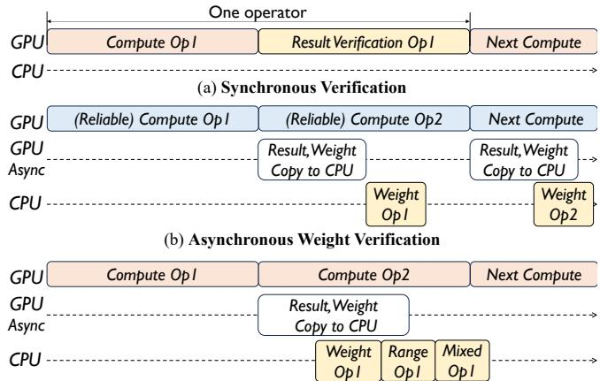  
(c) Asynchronous Weight, Range and Value (Mixed in figure) Verification  
Figure 8: The overview of verification stage. The computation in red means the input is in unreliable memory. The computation in blue means the input is in reliable memory. The weight matrices are in unreliable memory.

Case 1: Kernel Input in Reliable Memory. When input matrices are placed in reliable memory (some partitioned matrices can fit in the reliable memory owing to the allocation stage), only the model parameters (weights) stored in unreliable memory need verification. SAVE asynchronously copies weights from GPU memory to CPU after each computation and uses parallel CPU threads to compare against the original CPU-side copy. As illustrated in Figure 8(b), weight transfers occur through the GPU’s DMA engine without blocking kernel execution, allowing weight verification to run concurrently with the next kernel’s computation.

Case 2: Kernel Input in Unreliable Memory. When input matrices reside in unreliable memory, SAVE performs three types of verification: weight verification as described above, range verification for ranging bits, and lightweight recomputation for vulnerable bits.

Range Verification. To verify numerical ranges efficiently, SAVE splits the work between GPU and CPU. Specifically, SAVE implements a range verification kernel as shown in Appendix C. It retrieves valid ranges for each value from the selection stage cache and launches the kernel. The kernel computes the differences between the value and its range bounds, uses the signbit function to get the sign bits of these differences, and performs OR on the sign bits to produce the output (where a zero indicates the value falls within range). After the kernel completes, the output matrix is transferred to CPU memory, where multiple CPU cores verify that all elements equal zero, confirming no ranging bit flips occurred.

This GPU-CPU split design is intentional because performing all verification on the CPU would introduce significant latency that would impact end-to-end model inference time. By dividing the work between GPU (numerical operations)

and CPU (final verification), SAVE achieves better overall performance. During the whole verification, the bandwidth of PCIe is not the bottleneck since not all values need to be verified on the CPU. To further minimize overhead, the range verification kernel is fused with its corresponding computation kernel.

Mixed Precision Recomputation Verification. Recomputation is required to verify the calculated results involving vulnerable bits. Directly recomputing multiplication or division kernels on the CPU would be highly time-consuming. To address this, SAVE aims to minimize the recomputation burden, enabling it to be conducted asynchronously on the CPU without introducing significant performance overhead.

Since ranging bits are verified by their ranges and robust bits are ignored, the number of bits requiring verification is reduced to less than half of the original count. This reduction allows the verification process to shift from high-precision computation (heavyweight) to low-precision computation (lightweight). Figure 9 illustrates the conversion process.

Specifically, for multiplication or division of x and y, the sign bit of the result can be obtained by XORing the sign bits of x and y. The exponent bits of the result can be obtained by adding or subtracting the exponent parts of x and y. Once the new exponent bits are determined, SAVE re-estimates the robust bits and removes the robust bits for further low-precision verification. The significand of the result can be computed by converting the significand of x and y (excluding robust bits) into 16-bit or 8-bit integers (low and mixed precision), then performing multiplication or division. CPU SIMD instructions are leveraged to accelerate these low-precision integer operations in parallel.

Appendix D presents the pseudocode for multiplication recomputation running on CPU. Lines 7 and 11 extract the significand of x and y. Since normalized floating-point numbers (1.significand) omit the leading 1 in their integer part, lines 24-25 restore this implicit 1. Then, robust bits are removed through shift operations before performing the final multiplication.

Bit Mapping   
0 00000000 00000000000000000000000 0 00000000 00000000000000000000000   
x = signx → 2expx → significandx y = signy → 2expy → significandy   
Sign Bit signx XOR signy When Sign bits are same, output 0 else 1   
Exp Bit expx + expy for multiply expx → expy for division   
Significant Bit • Find robust bit under new exponent bits with <10-5   
• Remove robust bits   
• Using int to calculate significand significand   
significandx ÷ significandy  
Figure 9: The verification process of multiplication and division.

The addition and subtraction kernels are very lightweight on GPU (and are hard to efficiently implement on CPU)

thereby, their recomputation does not incur much overhead on the overall model inference latency. So, SAVE verifies the results by simply recomputing them.

## 5 Evaluation

To show the effectiveness of SAVE, we evaluate it by answering the following questions:

• What is the overhead of SAVE for normal execution?

• How effective is SAVE in protecting against bit flips?

• What is the overhead of each part of SAVE?

## 5.1 Evaluation Setup

We evaluate the effectiveness of our method through the approach of simulated flipping. We use GPUs for desktop PCs and embedded devices as the platform to evaluate the performance of SAVE. We follow our fault model, wherein the registers, cache, and a specific portion of memory (exactly 6MB) are assumed to be free from bit flips, and the CPU is considered free from bit flips. Our bit flip setting aligns with previous work [89], using real satellite flip characteristics from RedNet [89] to build a physical flip bit trace to test SAVE’s effectiveness.

Baseline. To demonstrate the effectiveness of SAVE, we compare it against the unmodified original model (Original), Triple Modular Redundancy (TMR), and state-of-the-art protection methods (Dr.DNA [61] and RedNet [89]). Since Red-Net cannot be directly applied to models, we retrain the model with RedNet, ensuring that the training configurations match those of the original model. For Dr.DNA, which includes several mitigation methods outlined in the original paper, we adopt the fastest mitigation strategy to evaluate end-to-end performance without errors. For TMR, we employ its mitigation strategy to measure recovery accuracy.

## 5.2 Metrics: AccurateLatency

In a fault-tolerant system, maintaining model correctness is crucial. To evaluate model performance, we propose a new metric, AccurateLatency, defined as: AccurateLatency = Latency × (1 + ErrorRate).

This metric represents the average inference time under the assumption that a second inference is always correct when given an ErrorRate. If the error rate is 0%, the AccurateLatency is equal to the original latency. Instead, if the error rate is 100%, the AccurateLatency is equal to double the original latency, meaning the first inference does not produce any correct results. It shows the optimal average correct inference time. For a system with inference protection, an increase in the ErrorRate suggests that some errors have slipped through the system or that there has been an impact on the accuracy rate compared to the original model.

## 5.3 End-to-end Performance

We first evaluate the overall performance impact of adding SAVE and analyze the time overhead required for model inference. Normalized latency is used to present performance across different models and datasets.

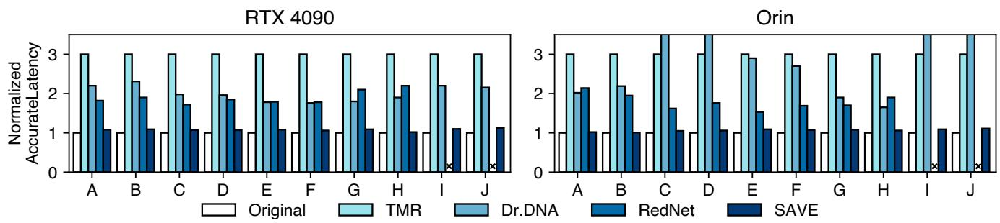  
Figure 10: The accurate latency of several models with SAVE. ×: RedNet cannot apply to CogACT and RDT due to the activation function changes. The models used in this evaluation are shown in Table 2.

Table 2: The models used in our evaluation. \*: We evaluate the validness of the model output by checking whether the output action is reachable.
<table><tr><td rowspan=1 colspan=1></td><td rowspan=1 colspan=1>Model</td><td rowspan=1 colspan=1>Dataset</td></tr><tr><td rowspan=1 colspan=1>A</td><td rowspan=1 colspan=1>ViT [23]</td><td rowspan=1 colspan=1>ImageNet-1K [21]</td></tr><tr><td rowspan=1 colspan=1>B</td><td rowspan=1 colspan=1>ViT[23]</td><td rowspan=1 colspan=1>AID [93]</td></tr><tr><td rowspan=1 colspan=1>C</td><td rowspan=1 colspan=1>ResNet-50 [36]</td><td rowspan=1 colspan=1>ImageNet-1K [21]</td></tr><tr><td rowspan=1 colspan=1>D</td><td rowspan=1 colspan=1>ResNet-50 [36]</td><td rowspan=1 colspan=1>AID [93]</td></tr><tr><td rowspan=1 colspan=1>E</td><td rowspan=1 colspan=1>MobileNetV2[42]</td><td rowspan=1 colspan=1>ImageNet-1K [21]</td></tr><tr><td rowspan=1 colspan=1>F</td><td rowspan=1 colspan=1>MobileNetV2 [42]</td><td rowspan=1 colspan=1>AID [93]</td></tr><tr><td rowspan=1 colspan=1>G</td><td rowspan=1 colspan=1>Decision Transformer [15]</td><td rowspan=1 colspan=1>ValidCheck*</td></tr><tr><td rowspan=1 colspan=1>H</td><td rowspan=1 colspan=1>Decision Transformer-M[15]</td><td rowspan=1 colspan=1>ValidCheck*</td></tr><tr><td rowspan=1 colspan=1>1</td><td rowspan=1 colspan=1>CogACT[55]</td><td rowspan=1 colspan=1>ValidCheck*</td></tr><tr><td rowspan=1 colspan=1>J</td><td rowspan=1 colspan=1>RDT [59]</td><td rowspan=1 colspan=1>ValidCheck*</td></tr></table>

As shown in Figure 10, SAVE introduces minimal overhead compared to the original model execution while maintaining high accuracy. On average, SAVE adds only 8% latency overhead across various models and datasets, which is significantly lower than that of TMR (3 ). This low overhead is achieved through our efficient vulnerable bit identification and selective protection strategy. For vision models such as ViT, the overhead is slightly higher (8–10%) due to the increased number of matrix operations requiring protection. Compared to other state-of-the-art methods, SAVE achieves better accuracy. For Decision and Embodied AI models, RedNet’s accuracy drops by more than half due to changes in activation functions, leading to substantial performance degradation.

## 5.4 Accuracy under Bit Flips

We evaluate the fault tolerance capability of SAVE under two bit flip patterns with varying bit flip probabilities. The flip patterns are virtual consecutive address flips and physically contiguous region flips. The first pattern is more likely to occur during memory access, while the second pattern is typically caused by physical interference. We test the overall inference accuracy and inference time after attacks with different bit flip probabilities. The accuracy refers to the correctness rate after flipping bits across 100 consecutive inferences at the same position. Additionally, the correctness of Dr.DNA is comparable to SAVE in our tests under the fastest mitigation selecting strategy. We also examine single-bit error correction using ECC, noting that when two-bit errors occur, ECC fails to repair them. This results in program termination or inference failure. We mark this situation as 0% accuracy. If ECC’s correction capability is extended to n-bit errors, the accuracy curve will shift to the right by n bits.

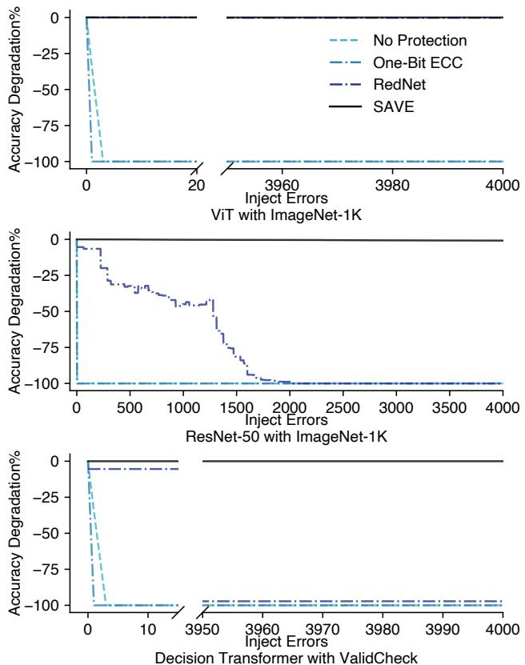  
Figure 11: The accuracy degradation under virtual consecutive address flips.

## 5.4.1 Virtual Consecutive Address Flips

We simulate virtual address consecutive memory flips by randomly modifying the bits on the addresses, and we test the accuracy after attacks involving selecting random flips among all bits. As shown in Figure 11, SAVE maintains high accuracy for up to 4096 consecutive bit flips for both ResNet-50 model and Decision Transformer. In contrast, the original model’s accuracy drops significantly to below 5% with just 3 consecutive bit flips. Due to the activation function changes, RedNet’s accuracy on Decision Transformer quickly drops below 10% after 32 bit flips, while on ResNet-50 with ImageNet-1K, RedNet’s truncation effect causes the accuracy to continuously decline, dropping below 10% after 1600 bit flips. Due to error value detection and repair mechanisms, both Dr.DNA and SAVE maintain zero accuracy degradation. The results demonstrate that SAVE’s selective protection strategy effectively preserves model accuracy under bit flip attacks while introducing minimal overhead.

## 5.4.2 Physically Contiguous Region Flips

When facing the physical interference, the bit flip impact is not continuous in a row but continuous in the physical space. This makes the impact of the model appear to be flipped at intervals. For this, SAVE tests the physical flip pattern given in RedNet with exactly the same proportion and simulation setup.

As shown in Figure 12, The physically contiguous bit flips cause changes in values at multiple-spaced positions, which differs from virtual consecutive address flips, where 32 consecutive bits need to be flipped to affect a single value. The results also show the same trend. RedNet, which employs modified activation functions, experiences significantly faster accuracy degradation under physically contiguous flips compared to virtual consecutive flips, with the model becoming almost completely ineffective after 1500 bit flips. For the Decision Transformer, due to the non-adjacency between flipped bits and spatial bits, errors rapidly propagate throughout the entire model, causing complete model failure with just 6 bit flips. Both Dr.DNA and SAVE maintain accuracy fluctuations within 1% across all models, which can be attributed to normal performance variations.

## 5.5 Sensitivity Analysis

## 5.5.1 Performance of different reliable memory sizes

One important part of SAVE is the size of reliable memory. To evaluate this, we test the performance overhead for different models with various working sets under different sizes of reliable memory. The results are shown in Figure 13. When the working set size is smaller than the reliable memory, reliability is guaranteed with nearly zero overhead, and SAVE shows almost no noticeable overhead. When the working set size exceeds the reliable memory, extra computation is required to ensure reliability in inference. By combining bit properties with ranging properties, the verification cost is reduced by 71%. The reduced calculations come mainly from skipping the validation of robust bits, and using the properties of the range to assess the results.

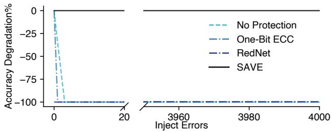

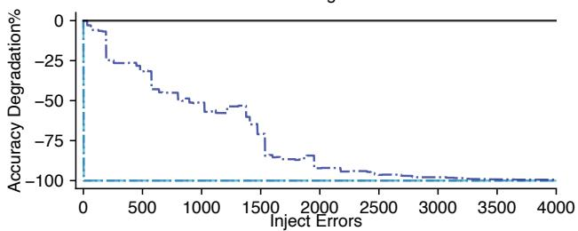  
ResNet-50 with ImageNet-1K

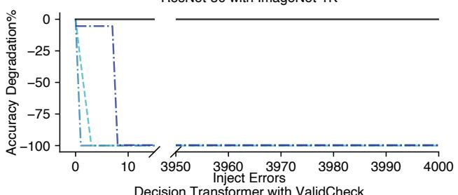  
Decision Transformer with ValidCheck  
Figure 12: The accuracy degradation under physical contiguous region flips.

## 5.5.2 Performance of different GPUs

Different GPUs produce different performance due to their varying computing capability. We test the performance overhead of SAVE on different GPUs by measuring their overhead on latency. As shown in Figure 14, the additional overhead generated by the model on all platforms is less than 9%. The error rate of the model does not increase during our test.

## 5.6 Ablation Study

To show the detailed characteristics of each stage in SAVE, we analyze the effect of each stage.

## 5.6.1 Selection Stage: Analysis Time.

Model analysis in SAVE is a one-time task. Identical models do not require re-analysis. If a model is updated, re-analysis is necessary. A full analysis is required if the model’s structure changes or all parameters are replaced. If only some parameters change, only the affected parts need analysis. To evaluate this, we test the time required for the same type of model to analyze different data sizes. As shown in Figure 15, the analysis time is under 10 seconds for all models when a full model change occurs. As the size of the modified parameters decreases, the analysis time in SAVE correspondingly decreases.

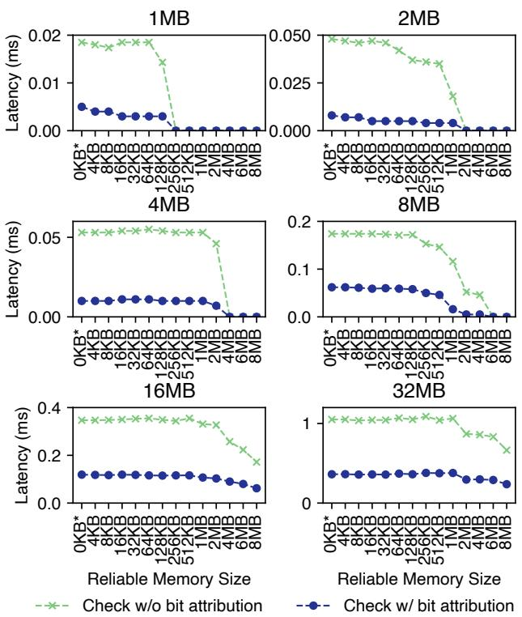  
Figure 13: The performance overhead over different size working sets and reliable memory. 0KB means that the reliable memory is not used.

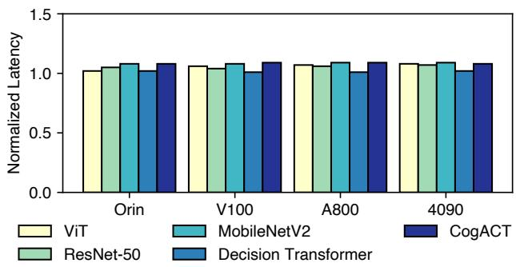  
Figure 14: The performance overhead of different GPUs.

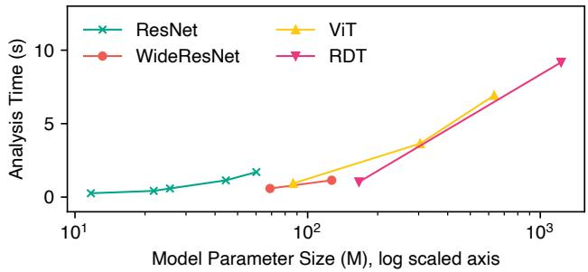  
Figure 15: The analysis time of different models.

## 5.6.2 Selection Stage: Correctness Rate.

The key to the result reliability comes from the selection stage of SAVE. If there are too many false negatives, SAVE will fail to protect the model due to ignoring too many vulnerable bits. If there are too many false positives, SAVE will incur significant extra overhead due to protecting too many robust bits. To show the correctness, we scan all 374,372,224 weight bits in ResNet-18 model with ImageNet-1K dataset and count the number of bits that are correctly identified as robust or nonrobust, as shown in Table 3. This robustness property refers to single bit flip effects. Although the proportion of robust bits exceeds 76.5%, they are widely distributed throughout the entire region, which means it is infeasible to drop the 76.5% robust bits.

Table 3: The correctness rate of bit analysis in the selection stage.
<table><tr><td rowspan=1 colspan=1></td><td rowspan=1 colspan=1>True Robust</td><td rowspan=1 colspan=1>False Robust</td></tr><tr><td rowspan=1 colspan=1>Predicted Non-Robust</td><td rowspan=1 colspan=1>40,866,57610.9%</td><td rowspan=1 colspan=1>47,061,57312.5%</td></tr><tr><td rowspan=1 colspan=1>Predicted Robust</td><td rowspan=1 colspan=1>286,444,07576.5%</td><td rowspan=1 colspan=1>00.0%</td></tr></table>

The distribution of different bits is highly related to the operator. For matrix multiplication of ViT, each number has at least one ranging bit, with a total of 90% robust bits. For the normalization operator, each number has at least three vulnerable bits, with a total of only 55% robust bits. We show the bit attribution distribution for some outputs after ResNet’s activation function and for ViT’s output after normalization, as shown in Figure 16.

## 5.6.3 Allocation Stage: Memory Movement Size.

SAVE reduces the number of bits to be protected by identifying robust bits in the previous step, thereby reducing the number of times data is transferred using reliable memory and thus reducing memory transfer overhead. We conducted an experiment with the ViT model and showed the amount of reliable memory used under different configurations of SAVE.

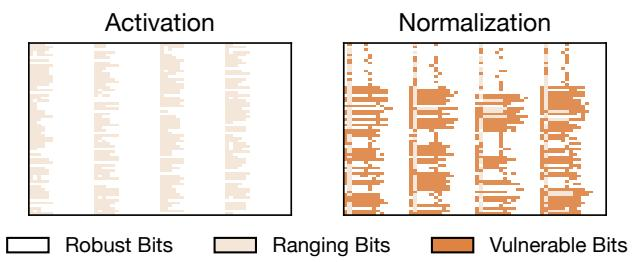

Figure 16: The distribution of different bits.  
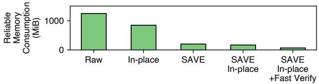  
Figure 17: The reliable memory consumption of SAVE.

After completing the selection stage offline, SAVE places only 17% of the original inference memory into reliable memory, significantly reducing the memory footprint, as shown in Figure 17. Moreover, since many values only have the sign bit and the highest bit of the exponent being unreliable, SAVE uses range check to fast verify the correctness, thus replacing reliable memory calculation with judgment. This fast path can further reduce the memory footprint by 95% compared to the model’s single inference, as shown in Figure 17.

## 5.6.4 Verification Stage: Verification Efficiency.

SAVE uses asynchronous verification on the CPU to reduce the overhead of verification. We first test the performance of using the CPU for mixed precision verification, as shown in Figure 18. Through fully utilizing the SIMD and dedicated copy engine on GPU, the matrix multiplication of 1024 1024 only takes 38ms, which is 98.2% less overhead compared to direct CPU floating-point multiplication. We also test the performance of asynchronous verification, as shown in Figure 19. We execute 100 times of verification and calculate the total time to reduce the fluctuation. The results show that the asynchronous verification incurs 0.05% overhead of frontend computation. Compared with synchronous verification, the overhead is reduced by 22%.

Resource Overhead. SAVE uses asynchronous verification, which requires additional CPU resources for verification. We test the CPU overhead of SAVE and found that it incurs 20% additional CPU resource overhead compared to the original model. For the host memory, SAVE only incurs an additional size exactly the same as the model parameter size.

## 5.6.5 Edit Stage: Recovery Time.

The recovery time is also important after an error occurs. We inject a single bit flip to trigger NaN value to test the recovery

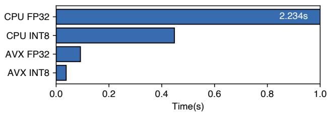  
Figure 18: The mixed precision verification performance of SAVE.

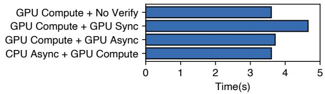  
Figure 19: The asynchronous verification performance of SAVE.

time of different methods.

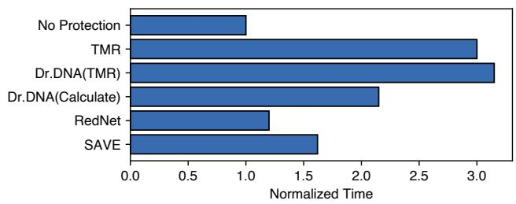  
Figure 20: The recovery time of different methods.

As shown in Figure 20, the recovery time of SAVE is higher than that of RedNet since RedNet simply clips out-of-range values, whereas SAVE must synchronize valid values and perform partial recomputation in reliable memory. The major difference in recovery time between SAVE and RedNet is the overhead of recomputation. In the correct method system comparison, the recovery time of SAVE is 24% less than Dr.DNA and 46% less than TMR, which is due to SAVE’s reduced computation, only recomputing the range where the error occurs.

## 5.6.6 Support for lower precision models

When performing inference on the edge, fp16 or even 8-bit integer quantization is often used. SAVE is not bound to the model precision, so it can be directly applied to other precision models. In other precision models, the total number of robust bits will decrease due to the reduction in the model’s overall bit length, leading to increased overhead. To show the performance of SAVE in lower precision models, we test the ViT model with ImageNet-1K dataset. Since we cannot remove the quantization effects on the accuracy and neither Dr.DNA nor RedNet can be applied to lower precision models, we only show the latency of SAVE. As shown in Figure 21, SAVE achieves 10% to 15% overhead compared to the original model.

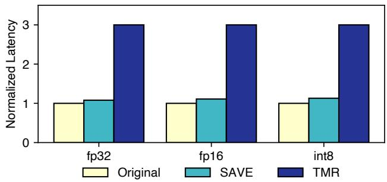  
Figure 21: The performance of SAVE in lower precision models.

## 6 Discussion

We are currently focusing on small-scale edge models because they are more safety-critical in scenarios like decision-making on self-driving vehicles, drones, industrial robotic arms, or satellites. In contrast, large language models supporting chat systems or multi-modal generation systems may tolerate occasional inference errors, as users can easily detect irrelevant responses or generated images with minor imperfections (which may not even affect user experience). The design of SAVE is flexible across different models and can withstand multiple bit flips as long as the changes of these bits are smaller than the model’s allowed perturbation. While SAVE could potentially be applied to large language models, additional work would be needed, such as protecting KV Cache, which we leave as future work.

SAVE relies on a portion of reliable memory to enhance model inference reliability, which can be much smaller than the average memory usage during model inference. We believe this research has important implications for hardwaresoftware co-design supporting reliable model inference in space and other extreme environments. To our knowledge, there are currently no GPU computing cards that can fully resist cosmic radiation. Our design demonstrates that through the combination of hardware-implemented small reliable memory and software-implemented fault tolerance, we can effectively improve inference reliability against bit flips.

## 7 Related Work

Hardware based protection. Various hardware mechanisms have been proposed to mitigate bit flip attacks efficiently. Some work [49, 70, 78, 81, 95] increase DRAM refresh rate or limit row access times within one refresh interval to protect potential victim rows. ZebRAM [50], GuardION [85] and

CATT [11] protect sensitive data from vulnerable rows. DE-ACT [31] prevents vulnerable rows from being accessed further. Some work [77,91,92,100] leverage in-DRAM swapping to shuffle the DRAM rows. AEP [98] uses masks on hardware to protect the model. DNN-Defender [99] use gradients to detect critical bit and swap the rows in DRAM. HARDeNN [48] adds three-module redundancy for weights and activation layers. Compared to SAVE, these work requires complex hardware implementation, focusing on bit flips by RowHammer attack. They support for specific-structured models. SAVE provides a general solution to all models without hardware or model modification. Hardware-based ECC also serves as a hardware bit flip mitigation method. RowHammer [22, 49] states ECC is useful to defend RowHammer attack despite of the expensive cost. However, some work [14, 18] show that carefully-designed ECC-aware RowHammer could bypass these ECC mechanisms and the ECC can only correct one bit and detect two bits typically [66] and GPUs [65]. SAVE can tolerant multiple bit flips.

Software based protection. Some software-implemented solutions have been proposed to reduce the impact of bit flips on the entire model. Software Error Resilience [45] use TMR for protecting silent data corruption. TBD [40] proposes quantization to restrict the bound of DNN parameters. Parameter binarization [37, 76] construct binarized DNN to flatten the bit flip’s impact to parameter’s neighbors. Some work [17, 56, 62, 94] enhance the ability of models to resist adversarial attacks. Some work [7, 28, 41, 58, 88] use different encoding schemes to protect the model parameters. Modelshield [33], Hashtag [47] and RADAR [53] introduce hashing-based methods to generate weights group signature and make verification for parameter. RedNet [89] gives the first systematic study of bit flips in DNNs in space and proposes a software-based solution to mitigate bit flips in DNNs. Compared to these work, SAVE keeps the model accuracy and ensures the inference latency by introducing fast verification.

## 8 Conclusion

SAVE provides a software-based inference fault tolerance solution, which preserves model structure to provide the largest compatibility with existing models. It uses GPU memory management and lightweight runtime verification to mitigate bit flips with acceptable overhead. The results show that SAVE incurs less than 9% performance overhead for end-to-end latency in model inference while maintaining accuracy.

## Acknowledgments

We sincerely thank our shepherd, Jongyul Kim, and the anonymous reviewers of ATC 2025 and SOSP 2024, whose reviews, feedbacks, and suggestions have significantly strengthened our work. This research was supported in part by the National Natural Science Foundation of China (No. 62432010,62132014,62202292). Corresponding author: Jinyu Gu (gujinyu@sjtu.edu.cn).

## References

[1] Training ai for self-driving vehicles: the challenge of scale.

[2] Designing an optimal ai inference pipeline for autonomous driving | nvidia technical blog. https: //developer.nvidia.com/blog/designing-a n-optimal-ai-inference-pipeline-for-aut onomous- driving/, March 2022. (Accessed on 04/04/2024).

[3] Abulikemu Abuduweili and Changliu Liu. Estimating neural network robustness via lipschitz constant and architecture sensitivity. arXiv preprint arXiv:2410.23382, 2024.

[4] Shahanur Alam, Chris Yakopcic, Qing Wu, Mark Barnell, Simon Khan, and Tarek M Taha. Survey of deep learning accelerators for edge and emerging computing. Electronics, 13(15):2988, 2024.

[5] Tooba Arifeen, Abdus Sami Hassan, and Jeong-A Lee. Approximate triple modular redundancy: A survey. IEEE Access, 8:139851–139867, 2020.

[6] Sahar Arshad, Seemab Latif, Ahmad Salman, and Saadia Irfan. Increasing profitability and confidence by using interpretable model for investment decisions. ArXiv, abs/2312.16223, 2023.

[7] Ali Asgari Khoshouyeh, Florian Geissler, Syed Qutub, Michael Paulitsch, Prashant Nair, and Karthik Pattabiraman. Structural Coding: A Low-Cost Scheme to Protect CNNs from Large-Granularity Memory Faults. In Proceedings of the International Conference for High Performance Computing, Networking, Storage and Analysis, pages 1–17, Denver CO USA, November 2023. ACM.

[8] Fatemeh Ayatolahi, Behrooz Sangchoolie, Roger Johansson, and Johan Karlsson. A study of the impact of single bit-flip and double bit-flip errors on program execution. In Friedemann Bitsch, Jérémie Guiochet, and Mohamed Kaâniche, editors, Computer Safety, Reliability, and Security - 32nd International Conference, SAFECOMP 2013, Toulouse, France, September 24-27, 2013. Proceedings, volume 8153 of Lecture Notes in Computer Science, pages 265–276. Springer, 2013.

[9] Jiawang Bai, Baoyuan Wu, Yong Zhang, Yiming Li, Zhifeng Li, and Shu-Tao Xia. Targeted attack against deep neural networks via flipping limited weight bits. arXiv preprint arXiv:2102.10496, 2021.

[10] Scotty Black and Christian Darken. Scaling artificial intelligence for digital wargaming in support of decisionmaking. arXiv preprint arXiv:2402.06075, 2024.

[11] Ferdinand Brasser, Lucas Davi, David Gens, Christopher Liebchen, and Ahmad-Reza Sadeghi. Can’t touch this: Practical and generic software-only defenses against rowhammer attacks. arXiv preprint arXiv:1611.08396, 2016.

[12] Jakub Breier, Xiaolu Hou, Dirmanto Jap, Lei Ma, Shivam Bhasin, and Yang Liu. DeepLaser: Practical Fault Attack on Deep Neural Networks, September 2018. arXiv:1806.05859 [cs].

[13] Martí Caro, Axel Brando, and Jaume Abella. Softwareonly semantic diverse redundancy for high-integrity ai-based functionalities. In ERTS2024, 2024.

[14] Anirban Chakraborty, Sarani Bhattacharya, Sayandeep Saha, and Debdeep Mukhopdhyay. Rowhammer induced intermittent fault attack on ecc-hardened memory. Cryptology ePrint Archive, 2020.

[15] Lili Chen, Kevin Lu, Aravind Rajeswaran, Kimin Lee, Aditya Grover, Michael Laskin, Pieter Abbeel, Aravind Srinivas, and Igor Mordatch. Decision transformer: Reinforcement learning via sequence modeling. In Marc’Aurelio Ranzato, Alina Beygelzimer, Yann N. Dauphin, Percy Liang, and Jennifer Wortman Vaughan, editors, Advances in Neural Information Processing Systems 34: Annual Conference on Neural Information Processing Systems 2021, NeurIPS 2021, December 6-14, 2021, virtual, pages 15084–15097, 2021.

[16] Zitao Chen, Guanpeng Li, and Karthik Pattabiraman. A low-cost fault corrector for deep neural networks through range restriction. In 51st Annual IEEE/IFIP International Conference on Dependable Systems and Networks, DSN 2021, Taipei, Taiwan, June 21-24, 2021, pages 1–13. IEEE, 2021.

[17] Moustapha Cisse, Piotr Bojanowski, Edouard Grave, Yann Dauphin, and Nicolas Usunier. Parseval networks: Improving robustness to adversarial examples, 2017.

[18] Lucian Cojocar, Kaveh Razavi, Cristiano Giuffrida, and Herbert Bos. Exploiting correcting codes: On the effectiveness of ecc memory against rowhammer attacks. In 2019 IEEE Symposium on Security and Privacy (SP), pages 55–71. IEEE, 2019.

[19] U.S. Election Assistance Commission Darrick Forester. Environmental hardware test plan, October 2018. [Online; accessed 2025-01-12].

[20] David. What is ecc memory? ecc memory benefits - assured systems, 3 2019. [Online; accessed 2025-01- 08].

[21] Jia Deng, Wei Dong, Richard Socher, Li-Jia Li, Kai Li, and Li Fei-Fei. Imagenet: A large-scale hierarchical image database. In 2009 IEEE Conference on Computer Vision and Pattern Recognition, pages 248–255, 2009.

[22] Andrea Di Dio, Koen Koning, Herbert Bos, and Cristiano Giuffrida. Copy-on-flip: Hardening ecc memory against rowhammer attacks. In NDSS, 2023.

[23] Alexey Dosovitskiy, Lucas Beyer, Alexander Kolesnikov, Dirk Weissenborn, Xiaohua Zhai, Thomas Unterthiner, Mostafa Dehghani, Matthias Minderer, Georg Heigold, Sylvain Gelly, Jakob Uszkoreit, and Neil Houlsby. An image is worth 16x16 words: Transformers for image recognition at scale. In International Conference on Learning Representations, 2021.

[24] Douglas Eadline. Close to the edge: If i don’t use ecc, have i made an error? | edge computing series | edge computing, 6 2019. [Online; accessed 2025-01-08].

[25] ATP Electronic. Blog list | atp electronics, April 2020. [Online; accessed 2025-01-02].

[26] ATP Electronics. Sram soft error detection feature in e.mmc | atp electronics, April 2020. [Online; accessed 2025-01-02].

[27] Parisa Eslami and Houbing Song. Stability analysis of deep neural networks under adversarial attacks and noise perturbations. In 2024 International Wireless Communications and Mobile Computing (IWCMC), pages 150–155. IEEE, 2024.

[28] Xianglong Feng, Mengmei Ye, Ke Xia, and Sheng Wei. Runtime fault injection detection for fpga-based dnn execution using siamese path verification. In 2021 Design, Automation & Test in Europe Conference & Exhibition (DATE), pages 786–789. IEEE, 2021.

[29] Ninnart Fuengfusin and Hakaru Tamukoh. NaN Attacks: Bit-Flipping Deep Neural Network Parameters to NaN or Infinity. In 2024 1st International Conference on Robotics, Engineering, Science, and Technology (RESTCON), pages 33–37, Pattaya, Thailand, February 2024. IEEE.

[30] Ido Galil and Ran El-Yaniv. Disrupting deep uncertainty estimation without harming accuracy. Advances in Neural Information Processing Systems, 34:21285– 21296, 2021.

[31] Tesfamichael Gebregziabher Gebrehiwot, Fitsum Assamnew Andargie, and Mohammed Ismail. DEACT: Hardware Solution to Rowhammer Attacks. Journal of Computer Science, 19(7):861–876, July 2023.

[32] Max Ghiglione and Vittorio Serra. Opportunities and challenges of ai on satellite processing units. In Proceedings of the 19th ACM international conference on computing Frontiers, pages 221–224, 2022.

[33] Yanan Guo, Liang Liu, Yueqiang Cheng, Youtao Zhang, and Jun Yang. ModelShield: A Generic and Portable Framework Extension for Defending Bit-Flip based Adversarial Weight Attacks. In 2021 IEEE 39th International Conference on Computer Design (ICCD), pages 559–562, Storrs, CT, USA, October 2021. IEEE.

[34] Jon Duncan Hagar. Iot test planning and strategy for hardware and software. In IoT System Testing: An IoT Journey from Devices to Analytics and the Edge, pages 83–113. Springer, 2022.

[35] Richard W Hamming. Error detecting and error correcting codes. The Bell system technical journal, 29(2):147–160, 1950.

[36] Kaiming He, Xiangyu Zhang, Shaoqing Ren, and Jian Sun. Deep residual learning for image recognition, 2015.

[37] Zhezhi He, Adnan Siraj Rakin, Jingtao Li, Chaitali Chakrabarti, and Deliang Fan. Defending and Harnessing the Bit-Flip Based Adversarial Weight Attack. In 2020 IEEE/CVF Conference on Computer Vision and Pattern Recognition (CVPR), pages 14083–14091, Seattle, WA, USA, June 2020. IEEE.

[38] Dan Hendrycks and Kevin Gimpel. Bridging nonlinearities and stochastic regularizers with gaussian error linear units. CoRR, abs/1606.08415, 2016.

[39] Le Ha Hoang, Muhammad Abdullah Hanif, and Muhammad Shafique. Ft-clipact: Resilience analysis of deep neural networks and improving their fault tolerance using clipped activation. In 2020 Design, Automation & Test in Europe Conference & Exhibition, DATE 2020, Grenoble, France, March 9-13, 2020, pages 1241–1246. IEEE, 2020.

[40] Sanghyun Hong, Pietro Frigo, Yigitcan Kaya, Cristiano Giuffrida, and Tudor Dumitras. Terminal brain damage: Exposing the graceless degradation in deep neural networks under hardware fault attacks. pages 497–514, August 2019.

[41] Fateme S Hosseini, Qi Liu, Fanruo Meng, Chengmo Yang, and Wujie Wen. Safeguarding the intelligence of neural networks with built-in light-weight integrity marks (lima). In 2021 IEEE International Symposium on Hardware Oriented Security and Trust (HOST), pages 1–12. IEEE, 2021.

[42] Andrew G. Howard, Menglong Zhu, Bo Chen, Dmitry Kalenichenko, Weijun Wang, Tobias Weyand, Marco Andreetto, and Hartwig Adam. Mobilenets: Efficient convolutional neural networks for mobile vision applications, 2017.

[43] Boming Huang, Yuxiang Huan, Li Da Xu, Lirong Zheng, and Zhuo Zou. Automated trading systems statistical and machine learning methods and hardware implementation: a survey. Enterprise Information Systems, 13(1):132–144, 2019.

[44] Xiaowei Huang, Daniel Kroening, Wenjie Ruan, James Sharp, Youcheng Sun, Emese Thamo, Min Wu, and Xinping Yi. A survey of safety and trustworthiness of deep neural networks: Verification, testing, adversarial attack and defence, and interpretability. Computer Science Review, 37:100270, 2020.

[45] Younis Ibrahim, Haibin Wang, Man Bai, Zhi Liu, Jianan Wang, Zhiming Yang, and Zhengming Chen. Soft error resilience of deep residual networks for object recognition. IEEE Access, 8:19490–19503, 2020.

[46] Dirmanto Jap, Yoo-Seung Won, and Shivam Bhasin. Fault injection attacks on softmax function in deep neural networks. In Proceedings of the 18th ACM International Conference on Computing Frontiers, pages 238–240, 2021.

[47] Mojan Javaheripi and Farinaz Koushanfar. Hashtag: Hash signatures for online detection of fault-injection attacks on deep neural networks. In 2021 IEEE/ACM International Conference On Computer Aided Design (ICCAD), pages 1–9. IEEE, 2021.

[48] Navid Khoshavi, Mohammad Maghsoudloo, Arman Roohi, Saman Sargolzaei, and Yu Bi. Hardenn: Hardware-assisted attack-resilient deep neural network architectures. Microprocessors and Microsystems, 95:104710, 2022.

[49] Yoongu Kim, Ross Daly, Jeremie Kim, Chris Fallin, Ji Hye Lee, Donghyuk Lee, Chris Wilkerson, Konrad Lai, and Onur Mutlu. Flipping bits in memory without accessing them: An experimental study of dram disturbance errors. ACM SIGARCH Computer Architecture News, 42(3):361–372, 2014.

[50] Radhesh Krishnan Konoth, Marco Oliverio, Andrei Tatar, Dennis Andriesse, Herbert Bos, Cristiano Giuffrida, and Kaveh Razavi. {ZebRAM}: Comprehensive and compatible software protection against rowhammer attacks. In 13th USENIX Symposium on Operating Systems Design and Implementation (OSDI 18), pages 697–710, 2018.

[51] Jingwen Leng, Alper Buyuktosunoglu, Ramon Bertran, Pradip Bose, and Vijay Janapa Reddi. Asymmetric resilience for accelerator-rich systems. IEEE Computer Architecture Letters, 18(1):83–86, 2019.

[52] Hannu Leppinen. Current use of linux in spacecraft flight software. IEEE Aerospace and Electronic Systems Magazine, 32(10):4–13, 2017.

[53] Jingtao Li, Adnan Siraj Rakin, Zhezhi He, Deliang Fan, and Chaitali Chakrabarti. RADAR: Run-time Adversarial Weight Attack Detection and Accuracy Recovery. In 2021 Design, Automation & Test in Europe Conference & Exhibition (DATE), pages 790–795, February 2021. arXiv:2101.08254 [cs].

[54] Jingtao Li, Adnan Siraj Rakin, Yan Xiong, Liangliang Chang, Zhezhi He, Deliang Fan, and Chaitali Chakrabarti. Defending Bit-Flip Attack through DNN Weight Reconstruction. In 2020 57th ACM/IEEE Design Automation Conference (DAC), pages 1–6, San Francisco, CA, USA, July 2020. IEEE.

[55] Qixiu Li, Yaobo Liang, Zeyu Wang, Lin Luo, Xi Chen, Mozheng Liao, Fangyun Wei, Yu Deng, Sicheng Xu, Yizhong Zhang, et al. Cogact: A foundational vision-language-action model for synergizing cognition and action in robotic manipulation. arXiv preprint arXiv:2411.19650, 2024.

[56] Fangzhou Liao, Ming Liang, Yinpeng Dong, Tianyu Pang, Jun Zhu, and Xiaolin Hu. Defense against adversarial attacks using high-level representation guided denoiser. CoRR, abs/1712.02976, 2017.

[57] Fabiano Libano, Brittany Wilson, J Anderson, Michael J Wirthlin, Carlo Cazzaniga, Christopher Frost, and Paolo Rech. Selective hardening for neural networks in fpgas. IEEE Transactions on Nuclear Science, 66(1):216–222, 2018.

[58] Liang Liu, Yanan Guo, Yueqiang Cheng, Youtao Zhang, and Jun Yang. Generating Robust DNN With Resistance to Bit-Flip Based Adversarial Weight Attack. IEEE Transactions on Computers, 72(2):401– 413, February 2023.

[59] Songming Liu, Lingxuan Wu, Bangguo Li, Hengkai Tan, Huayu Chen, Zhengyi Wang, Ke Xu, Hang Su, and Jun Zhu. Rdt-1b: a diffusion foundation model for bimanual manipulation. arXiv preprint arXiv:2410.07864, 2024.

[60] Robert E Lyons and Wouter Vanderkulk. The use of triple-modular redundancy to improve computer reliability. IBM journal of research and development, 6(2):200–209, 1962.

[61] Dongning Ma, Fan Fred Lin, Alban Desmaison, Joel Coburn, Daniel Moore, Sriram Sankar, and Xun Jiao. Dr. DNA: combating silent data corruptions in deep learning using distribution of neuron activations. In Rajiv Gupta, Nael B. Abu-Ghazaleh, Madan Musuvathi, and Dan Tsafrir, editors, Proceedings of the 29th ACM International Conference on Architectural Support for Programming Languages and Operating Systems, Volume 3, ASPLOS 2024, La Jolla, CA, USA, 27 April 2024- 1 May 2024, pages 239–252. ACM, 2024.

[62] Aleksander Madry, Aleksandar Makelov, Ludwig Schmidt, Dimitris Tsipras, and Adrian Vladu. Towards deep learning models resistant to adversarial attacks. In 6th International Conference on Learning Representations, ICLR 2018, Vancouver, BC, Canada, April 30 - May 3, 2018, Conference Track Proceedings. OpenReview.net, 2018.

[63] Naman Maheshwari, Nicholas Malaya, Scott Moe, Jaydeep P. Kulkarni, and Sudhanva Gurumurthi. An estimator for the sensitivity to perturbations of deep neural networks, 2023.

[64] Vinod Nair and Geoffrey E. Hinton. Rectified linear units improve restricted boltzmann machines. In Johannes Fürnkranz and Thorsten Joachims, editors, Proceedings of the 27th International Conference on Machine Learning (ICML-10), June 21-24, 2010, Haifa, Israel, pages 807–814. Omnipress, 2010.

[65] NVIDIA. Computing the probability of ecc errors on a gtx gpu - cuda / cuda programming and performance - nvidia developer forums. https://forums.develop er.nvidia.com/t/computing-the-probability -of-ecc-errors-on-a-gtx-gpu/40938, January 2016. (Accessed on 04/17/2024).

[66] NVIDIA. Dram error-correcting code memory on the platform. https://docs.nvidia.com/drive/ drive\_os\_5.1.6.1L/nvvib\_docs/index.html, November 2019. (Accessed on 04/17/2024).

[67] NVIDIA. Functional safety island (fsi) | nvidia docs, December 2023. [Online; accessed 2025-01-02].

[68] NVIDIA. 1. overview — nvidia gpu memory error management r555 documentation, May 2024. [Online; accessed 2025-01-12].

[69] NVIDIA. Cuda binary utilities, November 2024. [Online; accessed 2025-01-13].

[70] Ataberk Olgun, Yahya Can Tugrul, Nisa Bostanci, Ismail Emir Yuksel, Haocong Luo, Steve Rhyner, Abdullah Giray Yaglikci, Geraldo F. Oliveira, and Onur Mutlu. ABACuS: All-Bank Activation Counters for

Scalable and Low Overhead RowHammer Mitigation, December 2023. arXiv:2310.09977 [cs].

[71] Ashish Pandharipande, Chih-Hong Cheng, Justin Dauwels, Sevgi Z Gurbuz, Javier Ibanez-Guzman, Guofa Li, Andrea Piazzoni, Pu Wang, and Avik Santra. Sensing and machine learning for automotive perception: A review. IEEE Sensors Journal, 23(11):11097– 11115, 2023.

[72] Jonathan Peck, Joris Roels, Bart Goossens, and Yvan Saeys. Lower bounds on the robustness to adversarial perturbations. Advances in Neural Information Processing Systems, 30, 2017.

[73] Adnan Siraj Rakin, Zhezhi He, and Deliang Fan. Bitflip attack: Crushing neural network with progressive bit search. In Proceedings of the IEEE/CVF International Conference on Computer Vision, pages 1211– 1220, 2019.

[74] Adnan Siraj Rakin, Zhezhi He, and Deliang Fan. Tbt: Targeted neural network attack with bit trojan. In Proceedings of the IEEE/CVF Conference on Computer Vision and Pattern Recognition, pages 13198–13207, 2020.

[75] Adnan Siraj Rakin, Zhezhi He, Jingtao Li, Fan Yao, Chaitali Chakrabarti, and Deliang Fan. T-BFA: Targeted Bit-Flip Adversarial Weight Attack, January 2021. arXiv:2007.12336 [cs, stat].

[76] Adnan Siraj Rakin, Li Yang, Jingtao Li, Fan Yao, Chaitali Chakrabarti, Yu Cao, Jae-sun Seo, and Deliang Fan. RA-BNN: Constructing Robust & Accurate Binary Neural Network to Simultaneously Defend Adversarial Bit-Flip Attack and Improve Accuracy, March 2021. arXiv:2103.13813 [cs, eess].

[77] Gururaj Saileshwar, Bolin Wang, Moinuddin Qureshi, and Prashant J. Nair. Randomized row-swap: mitigating Row Hammer by breaking spatial correlation between aggressor and victim rows. In Proceedings of the 27th ACM International Conference on Architectural Support for Programming Languages and Operating Systems, pages 1056–1069, Lausanne Switzerland, February 2022. ACM.

[78] André Schaller, Wenjie Xiong, Nikolaos Athanasios Anagnostopoulos, Muhammad Umair Saleem, Sebastian Gabmeyer, Stefan Katzenbeisser, and Jakub Szefer. Intrinsic rowhammer pufs: Leveraging the rowhammer effect for improved security. CoRR, abs/1902.04444, 2019.

[79] Christoph Schorn, Andre Guntoro, and Gerd Ascheid. Accurate neuron resilience prediction for a flexible reliability management in neural network accelerators. In

2018 Design, Automation & Test in Europe Conference & Exhibition (DATE), pages 979–984. IEEE, 2018.

[80] Bianca Schroeder, Eduardo Pinheiro, and Wolf-Dietrich Weber. Dram errors in the wild: a large-scale field study. ACM SIGMETRICS Performance Evaluation Review, 37(1):193–204, 2009.

[81] Seyed Mohammad Seyedzadeh, Alex K. Jones, and Rami Melhem. Counter-Based Tree Structure for Row Hammering Mitigation in DRAM. IEEE Computer Architecture Letters, 16(1):18–21, January 2017.

[82] David Silver, Julian Schrittwieser, Karen Simonyan, Ioannis Antonoglou, Aja Huang, Arthur Guez, Thomas Hubert, Lucas Baker, Matthew Lai, Adrian Bolton, et al. Mastering the game of go without human knowledge. nature, 550(7676):354–359, 2017.

[83] Yusuke Tsuzuku, Issei Sato, and Masashi Sugiyama. Lipschitz-margin training: Scalable certification of perturbation invariance for deep neural networks. In S. Bengio, H. Wallach, H. Larochelle, K. Grauman, N. Cesa-Bianchi, and R. Garnett, editors, Advances in Neural Information Processing Systems, volume 31. Curran Associates, Inc., 2018.

[84] Victor van der Veen, Yanick Fratantonio, Martina Lindorfer, Daniel Gruss, Clémentine Maurice, Giovanni Vigna, Herbert Bos, Kaveh Razavi, and Cristiano Giuffrida. Drammer: Deterministic rowhammer attacks on mobile platforms. In Edgar R. Weippl, Stefan Katzenbeisser, Christopher Kruegel, Andrew C. Myers, and Shai Halevi, editors, Proceedings of the 2016 ACM SIGSAC Conference on Computer and Communications Security, Vienna, Austria, October 24-28, 2016, pages 1675–1689. ACM, 2016.

[85] Victor Van der Veen, Martina Lindorfer, Yanick Fratantonio, Harikrishnan Padmanabha Pillai, Giovanni Vigna, Christopher Kruegel, Herbert Bos, and Kaveh Razavi. Guardion: Practical mitigation of dma-based rowhammer attacks on arm. In Detection of Intrusions and Malware, and Vulnerability Assessment: 15th International Conference, DIMVA 2018, Saclay, France, June 28–29, 2018, Proceedings 15, pages 92– 113. Springer, 2018.

[86] Zishen Wan, Nandhini Chandramoorthy, Karthik Swaminathan, Pin-Yu Chen, Kshitij Bhardwaj, Vijay Janapa Reddi, and Arijit Raychowdhury. Mulberry: Enabling bit-error robustness for energy-efficient multiagent autonomous systems. In Rajiv Gupta, Nael B. Abu-Ghazaleh, Madan Musuvathi, and Dan Tsafrir, editors, Proceedings of the 29th ACM International Conference on Architectural Support for Programming Languages and Operating Systems, Volume 2, ASPLOS

2024, La Jolla, CA, USA, 27 April 2024- 1 May 2024, pages 746–762. ACM, 2024.

[87] Haoda Wang, Steven Myint, Vandi Verma, Yonatan Winetraub, Junfeng Yang, and Asaf Cidon. Mars attacks!: Software protection against space radiation. In Proceedings of the 22nd ACM Workshop on Hot Topics in Networks, HotNets 2023, Cambridge, MA, USA, November 28-29, 2023, pages 245–253. ACM, 2023.

[88] Jialai Wang, Ziyuan Zhang, Meiqi Wang, Han Qiu, Tianwei Zhang, Qi Li, Zongpeng Li, Tao Wei, and Chao Zhang. Aegis: Mitigating targeted bit-flip attacks against deep neural networks. pages 2329–2346, 2023.

[89] Meiqi Wang, Han Qiu, Longnv Xu, Di Wang, Yuanjie Li, Tianwei Zhang, Jun Liu, and Hewu Li. A case for application-aware space radiation tolerance in orbital computing. arXiv preprint arXiv:2407.11853, 2024.

[90] Shaobu Wang, Guangyan Zhang, Junyu Wei, Yang Wang, Jiesheng Wu, and Qingchao Luo. Understanding silent data corruptions in a large production cpu population. In Proceedings of the 29th Symposium on Operating Systems Principles, pages 216–230, 2023.

[91] Minbok Wi, Jaehyun Park, Seoyoung Ko, Michael Jaemin Kim, Nam Sung Kim, Eojin Lee, and Jung Ho Ahn. SHADOW: Preventing Row Hammer in DRAM with Intra-Subarray Row Shuffling. In 2023 IEEE International Symposium on High-Performance Computer Architecture (HPCA), pages 333–346, Montreal, QC, Canada, February 2023. IEEE.

[92] Steven C. Woo, Wendy Elsasser, Mike Hamburg, Eric Linstadt, Michael R. Miller, Taeksang Song, and James Tringali. Rampart: Rowhammer mitigation and repair for server memory systems. October 2023.

[93] Gui-Song Xia, Jingwen Hu, Fan Hu, Baoguang Shi, Xiang Bai, Yanfei Zhong, Liangpei Zhang, and Xiaoqiang Lu. Aid: A benchmark data set for performance evaluation of aerial scene classification. IEEE Transactions on Geoscience and Remote Sensing, 55(7):3965–3981, July 2017.

[94] Weilin Xu, David Evans, and Yanjun Qi. Feature squeezing: Detecting adversarial examples in deep neural networks. CoRR, abs/1704.01155, 2017.

[95] A. Giray Yaglikci, Minesh Patel, Jeremie S. Kim, Roknoddin Azizi, Ataberk Olgun, Lois Orosa, Hasan Hassan, Jisung Park, Konstantinos Kanellopoulos, Taha Shahroodi, Saugata Ghose, and Onur Mutlu. Block-Hammer: Preventing RowHammer at Low Cost by

[96] Shaza Zeitouni, David Gens, and Ahmad-Reza Sadeghi. It’s hammer time: how to attack (rowhammer-based) dram-pufs. In Proceedings of the 55th Annual Design Automation Conference, DAC 2018, San Francisco, CA, USA, June 24-29, 2018, pages 65:1–65:6. ACM, 2018.

[97] Zhi Zhang, Wei He, Yueqiang Cheng, Wenhao Wang, Yansong Gao, Minghua Wang, Kang Li, Surya Nepal, and Yang Xiang. Bitmine: An end-to-end tool for detecting rowhammer vulnerability. IEEE Trans. Inf. Forensics Secur., 16:5167–5181, 2021.

[98] Lei Zhao, Youtao Zhang, and Jun Yang. AEP: an error-bearing neural network accelerator for energy efficiency and model protection. In Sri Parameswaran, editor, 2017 IEEE/ACM International Conference on Computer-Aided Design, ICCAD 2017, Irvine, CA, USA, November 13-16, 2017, pages 765–771. IEEE, 2017.

[100] Ranyang Zhou, Sabbir Ahmed, Arman Roohi, Adnan Siraj Rakin, and Shaahin Angizi. DRAM-Locker: A General-Purpose DRAM Protection Mechanism against Adversarial DNN Weight Attacks, December 2023. arXiv:2312.09027 [cs].

## Appendix

## A Artifact Appendix

This artifact provides the source code of SAVE, a detailed readme, and scripts to reproduce the main experimental results of the USENIX ATC 2025 paper—“SAVE: Software-Implemented Fault Tolerance for Model Inference against GPU Memory Bit Flips” by Wenxin Zheng, Bin Xu, Jinyu Gu, Haibo Chen. SAVE is a software-based solution that enhances the reliability of GPU-based model inference. We provide instructions to build the software package and run experiments. Our artifact obtained the “Artifacts Available”, “Artifacts Functional” and “Results Reproduced” badges from the Artifact Evaluation process of USENIX ATC 2025.

Artifact repository. All project source code, along with comprehensive instructions for building and running the main experiments on SAVE, is available in the following git repository: https://github.com/peterzheng98/gpu-memory.

## B Example Code Snippet for Figure 6

```python
import struct
from typing import Callable, Tuple, List
class Interval:
def __init__(self, lo: float, hi: float):
self.lo, self.hi = min(lo, hi), max(lo, hi)
# affine
def affine(self, w: float, b: float = 0.0) -> "Interval
,→ ":
lo, hi = w * self.lo + b, w * self.hi + b
return Interval(min(lo, hi), max(lo, hi))
# ReLU
def relu(self) -> "Interval":
return Interval(max(self.lo, 0.0), max(self.hi,
,→ 0.0))
# element-wise +
def __add__(self, other: "Interval") -> "Interval":
return Interval(self.lo + other.lo, self.hi + other
, .hi)
def __repr__(self) -> str:
return f"[{self.lo:.6g}, {self.hi:.6g}]"
def _float_to_bits(f: float) -> str:
return "".join(f"{b:08b}" for b in struct.pack(">f", f)
,→ )
def robust_bits(interval: Interval, dtype_bits: int = 32):
if interval.lo == interval.hi:
bits = _float_to_bits(interval.lo)[:dtype_bits]
return dtype_bits - 1, bits, bits
lo_bits, hi_bits = _float_to_bits(interval.lo),
,→ _float_to_bits(interval.hi)
robust = sum(b1 == b2 for b1, b2 in zip(lo_bits,
, hi_bits))
return robust, lo_bits, hi_bits
# x in [0, 1]
x = Interval(0.0, 1.0)
op_out = x.affine(-0.65, -0.1)
relu_out = op_out.relu()
sum_out = relu_out + x # out = ReLU(Op(x)) + x
for name, iv in [("Op(x)", op_out), ("ReLU", relu_out), ("
,→ Final", sum_out)]:
n, lo_b, hi_b = robust_bits(iv)
```

## C Example Code Snippet for range verification of GPU kernel

\_\_global\_\_ void Ranging(const float \*input,   
const float \*cache\_low,   
const float \*cache\_high,   
int \*output) {   
int idx = blockIdx.x \* blockDim.x + threadIdx.x;   
output[idx] = signbit(input[idx] - cache\_low[idx])   
| signbit(cache\_high[idx] - input[idx]);   
}

## D Example Code Snippet for mixed precision verification

```c
float x, y;
2 uint32_t x_bits = *(uint32_t*)&x;
3 uint32_t y_bits = *(uint32_t*)&y;
4 // Extract the bit of x
5 uint32_t S_x = (x_bits >> 31) & 0x1;
6 uint32_t E_x = (x_bits >> 23) & 0xFF;
7 uint32_t F_x = x_bits & 0x7FFFFF;
8 // Extract the bit of y
9 uint32_t S_y = (y_bits >> 31) & 0x1;
10 uint32_t E_y = (y_bits >> 23) & 0xFF;
11 uint32_t F_y = y_bits & 0x7FFFFF;
12 // If it is smaller than 2^(-20),
13 // It is smaller than 1e-6, it is all robust bits.
14 if (E_x <= 108) return 0.0f;
15 if (E_y <= 108) return 0.0f;
16 // Compute the exponent of the result
17 int32_t E_r = (int32_t)(E_x) +
18 (int32_t)(E_y) - 127;
19 // Here value must greater than 2^(-20)
20 // Since both E_x and E_y are greater than 2^(-20)
21 // Compute the sign of the result
22 uint32_t S_r = S_x ^ S_y;
23 // Reconstruct the full significand bits
24 uint8_t M_x = ((1U << 23) | F_x) >> ROBUST_BIT_COUNT;
25 uint8_t M_y = ((1U << 23) | F_y) >> ROBUST_BIT_COUNT;
26
27 // Multiply the significand
28 uint16_t M_r = M_x * M_y;
```