USENIX

THE ADVANCED COMPUTING SYSTEMS ASSOCIATION

# Accelerating Model Training on Ascend Chips: An Industrial System for Profiling, Analysis and Optimization

Yuhang Zhou, Zibo Wang, Zhibin Wang, Ruyi Zhang, Chen Tian, Xiaoliang Wang, Wanchun Dou, and Guihai Chen, Nanjing University; Bingqiang Wang,   
Yonghong Tian, Yan Zhang, and Hui Wang, Peng Cheng Laboratory; Fuchun Wei, Boquan Sun, Jingyi Zhang, Bin She, Teng Su, Yifan Yao, Chunsheng Li, Ziyang Zhang, and Yaoyuan Wang, Huawei; Bin Zhou, Shandong University; Guyue Liu, Peking University https://www.usenix.org/conference/atc25/presentation/zhou

This paper is included in the Proceedings of the 2025 USENIX Annual Technical Conference.

July 7–9, 2025 • Boston, MA, USA ISBN 978-1-939133-48-9

Open access to the Proceedings of the 2025 USENIX Annual Technical Conference is sponsored by

P=-r.h mFs/sL

auuuJl9 PgleU

King Abdullah University of Science and Technology

# Accelerating Model Training on Ascend Chips: An Industrial System for Profiling, Analysis and Optimization

Yuhang Zhou1, Zibo Wang1, Zhibin Wang1∗, Ruyi Zhang1, Chen Tian1, Xiaoliang Wang1, Wanchun Dou1, Guihai Chen1, Bingqiang Wang2, Yonghong Tian2, Yan Zhang2, Hui Wang2, Fuchun Wei3, Boquan Sun3, Jingyi Zhang3, Bin She3, Teng Su3, Yifan Yao3, Chunsheng Li3, Ziyang Zhang3, Yaoyuan Wang3, Bin Zhou4, Guyue Liu5

1 State Key Laboratory for Novel Software Technology, Nanjing University 2 Peng Cheng Laboratory 3 Huawei 4 Shandong University 5 Peking University

## Abstract

Training large-scale deep learning (DL) models is a resourceintensive and time-consuming endeavor, yet optimizing training efficiency poses significant challenges. The sporadic performance fluctuations during long training require advanced profiling capabilities. It is not easy to perform comprehensive and accurate bottleneck analysis amidst numerous influencing factors. Selecting effective optimization strategies without proper guidance further complicates the process. This paper shares our practical insights on optimizing training on Huawei Ascend chips based on three years of experience with 135 typical cases. We propose a systematic optimization system, Hermes, including a lightweight profiling approach, a hierarchical bottleneck analysis framework, and an optimization advisor. Our real-world experiments demonstrate significant acceleration in training for models like PanGu-α, MobileNetV1, and MoE (Mixture of Experts), with respective speedups of 3.05 , 1.91 , and 1.19 .

## 1 Introduction

Large-scale deep learning model training is notoriously costly and time-consuming. For example, training a GPT-3 model with 100.8 billion parameters using 3,072 NVIDIA A100 GPUs took 84 days [41]. Similarly, training the BLOOM-176B model with 384 A100 GPUs required approximately 3.5 months [60]. Even the optimized M6 model with 10 trillion parameters took 10 days on 512 V100 GPUs [32].

In optimizing large-scale training, various roles are involved, including developers, deployers, and maintainers. Developers must precisely identify bottlenecks hindering training efficiency to develop targeted optimization strategies. Deployers, on the other hand, are responsible for efficiently deploying models on hardware. However, as models and hardware evolve, bottlenecks also shift, requiring precise identification and appropriate optimization choices. Meanwhile, maintainers confront random performance fluctuations [27] during long training and require the ability to accurately capture the underlying causes to maintain stable training. Overall, there is an urgent need for a comprehensive and systematic approach to profile, analyze, and optimize training.

However, existing solutions for profiling, analysis, and optimization face significant limitations. First, capturing transient performance fluctuations requires continuous monitoring. However, mainstream profiling tools like Pytorch Profiler [50] not only incur substantial overhead but also frequently interrupt training because users must manually adjust the profiling granularity. Second, existing bottleneck analysis relies largely on manual effort, with available tools focusing solely on specific bottlenecks (PRESTO [24] for I/O, R-Pingmesh [34] and Meta’s work [19] for RDMA), leaving out a comprehensive analysis. Last, current optimization heavily depends on the expertise of users, and the few available optimization tools are limited to particular scenarios, such as DayDream [70] and dPRO [22] designed for data parallelism. The lack of guidance makes selecting the appropriate optimizations challenging.

In this paper, we share our 3 years of experience in bottleneck optimization of deep learning model training on Ascend chips (NPUs) [31]. From January 2022 to December 2024, we resolved 223 performance anomalies for over 40 clients and summarized 135 key cases. Our practice reveals several critical lessons that have guided our optimization efforts (§3.1). CPU bottlenecks are prevalent but often overlooked. Computation bottlenecks are mainly due to underutilization, which requires joint software and hardware optimization. We also found that overlapping computation and communication may degrade performance due to resource contention. I/O bottlenecks primarily result from CPU-side data reading overhead, and minimizing remote access is crucial. Hardware faults like port flapping and link failures usually cause network issues.

To address the complex and diverse bottlenecks in production, we introduce Hermes, a system based on these lessons to guide the optimization of DL model training on Ascend NPUs. Hermes supports the common DL frameworks PyTorch [2] and MindSpore [39] and tackles the following problems. (i)

Besides profiling common performance anomalies, how can we effectively detect performance fluctuations in large-scale training, a newly emerging issue? (ii) For the vast and complex bottleneck space in training, how do we achieve systematic and accurate bottleneck analysis? (iii) Finally, how do we select effective optimizations for identified bottlenecks or potential new arising bottlenecks?

Our contributions can be summarized as follows.

Coarse-to-fine profiling (§4.1): We propose a lightweight monitor to collect critical metrics and identify problematic steps and devices, as well as a detailed profiler to further capture the performance of each operator1 for bottleneck analysis in problematic steps and devices. These two tools work together to provide a complete view of the training process with minimal overhead. Combined with our dynamic profiling mechanism, they enable efficient profiling of performance fluctuations without interrupting the training.

Hierarchical bottleneck analysis framework (§4.2): We observe that the training pipeline operates hierarchically, with different types of bottlenecks occurring in the corresponding components (host, device, and network). Thus, we propose a hierarchical analysis that first considers the inter-operator parallelism and then delves into the intra-operator implementation. The inter-operator analysis verifies the existence of a poor overlap between components and further identifies the bottleneck operators with the critical path when the overlap is sufficient. In the intra-operator analysis, we delve into the execution process of each component (e.g., data processing, dispatch of operators, memory and compute competition, network communication) to identify the root cause.

Bottleneck cause-optimization match (§4.3): Based on 3 years of training optimization experience and 135 typical bottleneck cases, we have matched different bottleneck causes with possible optimization strategies (Table 4). We also developed an automatic optimization tool, mindstudio training tool (mstt) advisor [6]. Based on its built-in optimization rules learned from practice, it can automatically detect the causes of bottlenecks and provide optimization suggestions.

To show how to use Hermes for optimization, we present numerous cases, covering optimizations of classic bottlenecks and production tasks (§5). Our real-world cases include optimizing the 100B PanGu-α model [65], deploying MobileNetV1-SSD [35], and addressing performance fluctuations in MoE model training across over 9000 NPUs. These case studies show how to apply optimization based on bottleneck analysis and achieve speedups of 3.05 , 1.91 , and 1.19 , respectively, confirming the effectiveness of Hermes.

## 2 Background and Motivation

In this section, we present the goals and problems faced by different users in training and compare the differences and

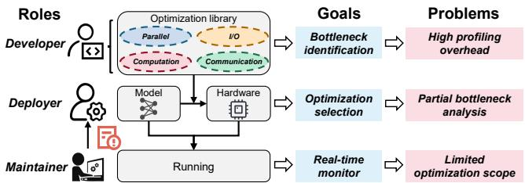  
Figure 1: Different roles in model training.

connections between Ascend NPU and NVIDIA GPU, which together motivate our systematic analysis and optimization.

## 2.1 Roles in Real-World Model Training

As shown in Figure 1, in real-world model training, three roles of users are involved: developers, deployers, and maintainers. Each role has specific responsibilities, challenges, and goals in optimizing training performance. (i) Developers are responsible for developing optimizations for different bottlenecks, such as I/O [24], computation [38],communication [46], or parallelism [25, 57, 67]. Therefore, developers must first identify specific bottlenecks that limit training efficiency, and then design targeted optimizations to mitigate them. (ii) Deployers deploy models on hardware and achieve high training efficiency. However, in practical deployment, users face constantly evolving models and hardware, leading to shifting training bottlenecks and rendering previous optimizations potentially unsuitable. Therefore, deployers must analyze bottlenecks and select appropriate optimizations to achieve the expected training performance. (iii) Maintainers monitor model training, ensuring smooth progress. However, in large-scale training, performance fluctuations [27] occur frequently and undermine training efficiency. In a 5-month cluster observation, an average of 2.4 incidents were recorded per month. In an 18,000-card cluster, single-card throughput ranged from 10 to 106 TFLOPs/s, with an average of only 85 TFLOPs/s, achieving only 84% of the expected throughput. Therefore, maintainers must accurately capture performance fluctuations and identify the underlying causes.

Training optimization usually consists of three key steps: 1) Profiling to collect key performance metrics; 2) Analyzing to identify training bottlenecks; and 3) Optimizing by applying suitable optimizations. Combining the goals of different roles, we summarize the requirements for training optimization.

• Detailed but lightweight profiling. Users should be able to collect detailed performance metrics, while profiling should be lightweight to monitor performance fluctuations.

• Locating various bottlenecks accurately. Users should be able to accurately identify I/O, computation, communication, and parallel bottlenecks.

• Efficient optimization suggestions. Users should be able to choose effective optimizations based on bottleneck causes. Although many technologies have been proposed to meet these requirements, there are still some significant challenges. Profiling: To capture transient performance fluctuations in long-term training, maintainers need to continuously monitor and collect detailed performance data for each step/NPU [50]. As shown in §4.1.3, simply profiling the single-step training of an 8B Llama-3 model on 8 NPUs incurs an overhead of 1.77× the original cost. Given the high per-step overhead, the cumulative cost of continuous profiling over thousands of steps in large model training becomes intolerable.

Analysis: Existing bottlenecks analysis are largely manual, users must explore all potential bottlenecks and compare the profiling results with the expertise [44]. Even if some auto-analysis can help users identify bottlenecks, they are limited to specific types, such as I/O [24] and RDMA bottlenecks [19, 34]. However, isolated analyses often miss the interdependencies between bottlenecks. For example, synchronization issues in communication bottlenecks may stem from uneven computational loads, while long computation times could result from slow operator compilation or dispatch on the CPU side. Therefore, the challenge lies in comprehensively identifying different types of bottlenecks.

Optimization: Although some tools like DayDream [70] and dPRO [22] can predict optimization effects based on task dependencies, their application is restricted to data parallelism [36]. In most cases, developers select optimizations without knowing the causes of bottlenecks, which can render the proposed optimization less effective. However, due to the complexity of the root causes and the diversity of optimizations, it is also challenging to match effective optimizations to different bottlenecks.

## 2.2 Comparison of NPU and GPU

Before addressing these challenges, it is necessary to learn the background of Ascend NPUs, especially the similarities and differences with NVIDIA GPUs.

Similar to GPUs, Ascend NPUs also follow the same hierarchical training paradigm. And NCCL, CUDA, and NVLink for GPUs correspond to HCCL (Huawei Collective Communication Library) [10], CANN (Compute Architecture for Neural Networks) [3], and HCCS (Huawei Cache Coherent System) [20] in Ascend, respectively. As shown in Figure 2, the training process on Ascend NPUs can be divided into the following layers: (i) Application. Users can train different types of models according to their needs, such as NLP, vision, recommendation, and multimodal. (ii) Framework. Ascend can support mainstream deep learning frameworks such as PyTorch, MindSpore, and TensorFlow [1] to convert model code into computation graphs. (iii) Communication. HCCL provides parallel communication in distributed training, supporting algorithms such as Ring and Mesh, and primitives such as AllReduce and AlltoAll. (iv) Platform. CANN is responsible for converting the computation graph into executable operators on Ascend NPUs, consisting of the operator library, compiler, and runtime (task scheduling). (v) Hardware. Finally, the operators are dispatched to NPUs for execution, while PCIe and HCCS for intra-node communication, and RDMA for inter-node communication. The detailed topology is given in Appendix A.

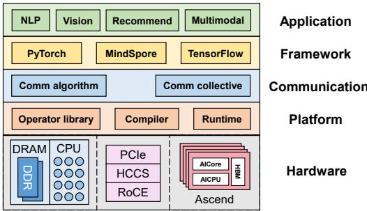  
Figure 2: The training paradigm on Ascend NPUs.

It is worth noting that there are some differences between the two in terms of chip architecture. In NPUs, AICore [31] is the computing core (similar to CUDA Core and Tensor Core in GPUs), responsible for performing computation-intensive tasks such as matrix and vector operations. However, unlike the GPU, there is another computing unit with slightly lower performance, AICPU [31], which is responsible for non-matrix computing tasks that AICore does not support.

Taking these into account, we can categorize training bottlenecks into two groups: (i) Hardware-agnostic bottlenecks. Since the consistent training paradigm and behaviors (data preprocessing, forward and backward computation, gradient update, and parallel strategies), common training bottlenecks, such as low parallelism, high I/O delays, inefficient computation, and slow communication synchronization, are universal regardless of whether the hardware is NVIDIA GPU or Ascend NPU. (ii) Hardware-specific bottlenecks refers to performance bottlenecks introduced due to Ascend’s architecture characteristics that need to be analyzed separately, such as the inefficient AICPU operators, the overhead of private format for AICore, and the byte alignment requirements in HCCS.

Therefore, different bottleneck types lead to different profiling requirements. Compared to NVIDIA GPUs, the profiling of Ascend NPUs differs in two key aspects: (i) First, considering differences in architecture such as AICore, AICPU, and HCCS, dedicated profiling interfaces for these units are necessary to capture their performance metrics. (ii) Second, while NVIDIA Nsight [44] provides granular profiling interfaces for GPU kernels, network communication, storage, and more, it primarily treats these as isolated bottlenecks. The profiling of Ascend needs a holistic bottleneck analysis and actionable optimization recommendations.

## 3 Lessons and Insights

In this section, we will share the lessons learned from our practices and insights to achieve a holistic bottleneck analysis.

## 3.1 Lessons

We have summarized the following lessons from 135 training optimization cases on Ascend NPUs, including I/O, CPU, parallel, computation, and communication bottlenecks.

CPU scheduling bottlenecks dominate in practice but are often overlooked. As shown in Table 4, among all our optimization cases, host bottlenecks account for 45.9%, with CPU bottlenecks reaching 37.0%. This problem exists on both GPUs and NPUs. Although the executing streams of the CPU and device can operate asynchronously, synchronization and data transfers between the CPU and device can severely impact training efficiency. For example, recompilation of the operators can introduce the CPU bottleneck. Specifically, in the Pytorch framework, operators follow this compilation and execution logic. When an operator is invoked, the CPU first checks if it has been pre-compiled. If not, it undergoes just-intime (JIT) compilation [49] to generate a binary executable dispatched to the device, which will introduce extra overhead.

Underutilization dominates computation bottlenecks. The computation bottleneck analysis reveals a significantly higher proportion of underutilized operators, ranging from 61.48% in 100B PanGu-α to 97.8% in ResNet50. And smaller models tend to exhibit a higher percentage of underutilization. When optimizing underutilized operators, it is essential to consider the characteristics of the Ascend hardware. The first possible cause is the AICPU operators. Due to the input type (not supported by AICore) or an implementation problem, the operators can only be executed on poorly performing AICPUs. In such cases, we should eliminate AICPU operators by converting data types (supported by AICore) or other substitutions. Similarly, replacing operators with better hardware affinity for AICore is another method to improve model FLOPs utilization (MFU). We define "good affinity" as whether the operator’s shape meets the hardware’s memory layout and alignment requirements (e.g., whether the inner axes of Cube computation are divisible by 256).

Contention between computation and communication. Parallel computing and communication can boost performance, but we observe that their concurrent execution may degrade performance in some situations. The root cause lies in resource contention, particularly the contention for HBM bandwidth. Specifically, communication tasks such as HCCS can access HBM via Direct Memory Access (DMA), whereas the primary computation matrix multiplication (MatMul) is often memory-bound. This leads to HBM bandwidth contention, resulting in lower-than-expected computing performance, often a drop of 20% to 40%. For example, in tensor parallelism, splitting the serial GEMM computation and communication into chunks [13, 27] can enable fine-grained overlap and greatly improve performance. However, overlapping computation and communication chunks can compete for HBM bandwidth, which affects individual performance. Thus, setting fine-grained priorities for HBM access can prevent such contention and further accelerate training.

Minimize remote access to alleviate I/O bottlenecks. I/O bottlenecks stem mainly from high data reading and processing overhead on the CPU side, which cannot overlap with NPU computations. In large-scale training, data reading bottlenecks are particularly prominent due to read/write on remote storage, including other remote access except for training data, such as checking file paths or writing logs. Therefore, unnecessary remote accesses should be minimized, for instance, by reading data only from the local card or DP domain. When unavoidable, like logging, data can be written to local storage first and periodically flushed to remote storage. Port flapping and link failures dominate network issues. Based on our experience, network problems are mainly due to hardware, such as port flapping and link failures. Moreover, the closer these issues occur to the compute nodes, the greater their impact on the training performance of clusters. Thus, it is essential to promptly clean and replace optical modules and repair links with packet loss or error.

## 3.2 Insights

Based on these lessons, we have the following insights to achieve a holistic bottleneck analysis.

The training pipeline operates hierarchically, with different types of bottlenecks occurring in the corresponding components. As shown in Figure 2, the framework converts the program into a computational graph, with parallel strategies organized by HCCL, and finally, the graph is converted into executable operators on the hardware through the CANN. Specifically, data preparation is executed by CPU and DRAM storage on the host, while computation operators are mainly executed by AICore and AICPU on the device, and communication operators involve HCCS and RDMA on the network. Therefore, operator bottlenecks typically manifest in specific components, stemming from (i) issues in the operator’s implementation and (ii) poor hardware efficiency.

In addition to bottlenecks in operators, the parallelism between operators can also become a training bottleneck. For example, Ascend supports multi-stream parallel execution in Pytorch, with the parallel efficiency between streams directly affecting the training. This includes not only the computationcommunication parallel bottlenecks that the well-known parallel strategies (DP, TP, PP) aim to solve but also the parallelism between I/O and computation, as well as CPU and computation. Parallel bottlenecks, in turn, affect the execution of specific I/O, computation, and communication.

Considering parallel bottlenecks between operators and performance bottlenecks within each operator, we propose a hierarchical analysis. Specifically, bottleneck analysis is divided into two layers: inter-operator parallel analysis and intra-operator bottleneck analysis, covering all host, device, and network components. In this way, it provides a structured framework that can systematically decompose the complex training process into different layers and accurately identify bottlenecks in the most common locations.

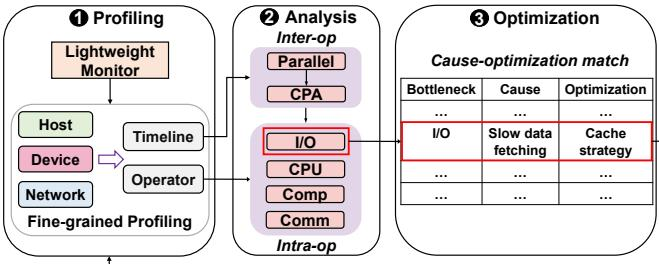  
Figure 3: The workflow of Hermes.

## 4 System Design

In this section, we first introduce the main workflow of Hermes, then dive into the design of each core module. As shown in Figure 3, the main workflow consists of the following steps. Coarse-to-fine profiling(§4.1): We observe that it only requires a few key metrics to determine the presence of performance fluctuations. Therefore, we propose a lightweight but fine-grained profiler to identify the problematic steps/devices and capture the necessary metrics.

Hierarchical bottleneck analysis(§4.2): We propose a hierarchical analysis model that first considers the inter-operator parallelism and then delves into the intra-operator implementation. In addition to identifying the bottleneck, we provide a set of mechanisms to trace the root causes.

Experience-guided optimization(§4.3): Based on our experience in bottleneck optimization, we propose an optimization advisor that automatically provides effective recommendations by establishing a match between bottleneck causes and corresponding optimizations.

Users can select the necessary steps based on their goals, e.g., the developer only needs to perform the profiling and analysis, and then directly develop their optimization strategy. The optimization workflow is iterative. After optimizing the current bottleneck, users can repeat the process until the desired performance is achieved.

## 4.1 Coarse-to-fine Profiling

As illustrated in Figure 3, the profiling module comprises a lightweight monitor and fine-grained profiling. The former collects key metrics in real-time to quickly identify problematic steps and devices with little overhead. Next, fine-grained profiling focuses on the problematic steps and devices, collecting detailed performance data without interrupting training while minimizing storage requirements and parsing times.

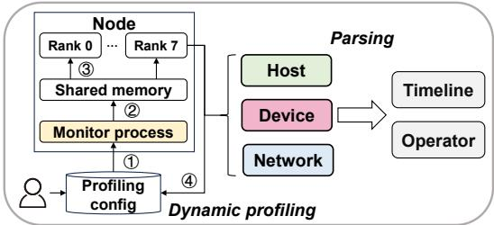  
Figure 4: Fine-grained profiling.

## 4.1.1 Lightweight Monitor

For model developers and deployers, it suffices to profile a selected step offline to analyze persistent slowdowns, as the performance of each training step is consistent. However, continuous online profiling is the only viable approach for maintainers who aim to pinpoint transient performance fluctuations. Therefore, to minimize the overhead of online profiling, this monitor collects only some coarse-grained key metrics during the whole training, including (i) the execution time of each step and (ii) overall performance such as throughput, MFU, and communication bandwidth, which are also the indicator of performance fluctuation.

Cluster Analysis. Based on the monitoring data, we use two steps to identify problematic steps and devices. (i) The first is to compare the execution time of the current step with the historical ones. If the current step is significantly slower, it indicates a performance fluctuation. (ii) We further need to determine which devices are experiencing issues in this step. Considering the various parallel strategies in training (e.g., data parallelism [30], tensor parallelism [41], and pipeline parallelism [23, 40]), the whole cluster is divided into different communication domains (devices involved in the same synchronization). Devices within the same communication domain theoretically have the same execution time. Therefore, we compare the execution times of devices within each communication domain to identify the slowest device, which is often the problem device and requires further profiling.

## 4.1.2 Fine-grained Profiling

After identifying the problematic steps and devices, we perform fine-grained profiling. We first profile the operator (the smallest execution unit) and collect metrics from various components: (i) host operator, including I/O operator queues, and CPU operator metrics related to the Pytorch framework and the CANN operator library; (ii) computation operator, computation performance (precision, frequency, FLOPs), and memory access performance (byte and bandwidth) on NPUs; (iii) communication operator, transfer time and bandwidth of PCIe, HCCS, and RDMA interconnect. Furthermore, we profile the timeline to illustrate the timing dependencies of operators across different components. However, there are two challenges when fine-grained profiling is applied.

Table 1: Profiling cost comparison of end-to-end training.
<table><tr><td rowspan=2 colspan=1>Model</td><td rowspan=2 colspan=1>#Para</td><td rowspan=2 colspan=1>#NPU</td><td rowspan=1 colspan=2>Time</td><td rowspan=1 colspan=2>Memory</td><td rowspan=1 colspan=2>CPU usage</td></tr><tr><td rowspan=1 colspan=1>Before</td><td rowspan=1 colspan=1>After</td><td rowspan=1 colspan=1>Before</td><td rowspan=1 colspan=1>After</td><td rowspan=1 colspan=1>Before</td><td rowspan=1 colspan=1>After</td></tr><tr><td rowspan=1 colspan=1>Bloom</td><td rowspan=1 colspan=1>7B</td><td rowspan=1 colspan=1>8</td><td rowspan=1 colspan=1>1300 s</td><td rowspan=1 colspan=1>1000 s</td><td rowspan=1 colspan=1>1650MB</td><td rowspan=1 colspan=1>1800MB</td><td rowspan=1 colspan=1>1%</td><td rowspan=1 colspan=1>5%</td></tr><tr><td rowspan=1 colspan=1>PanGu</td><td rowspan=1 colspan=1>230B</td><td rowspan=1 colspan=1>128</td><td rowspan=1 colspan=1>120 min</td><td rowspan=1 colspan=1>102 min</td><td rowspan=1 colspan=1>13.8 GB</td><td rowspan=1 colspan=1>16.2 GB</td><td rowspan=1 colspan=1>1%</td><td rowspan=1 colspan=1>5%</td></tr></table>

Dynamic profiling. Common profiling tools such as PyTorch Profiler [50] require users to pre-configure monitoring parameters (e.g., via torch.profiler.schedule) before training begins. This intrusive approach requires interrupting training, which incurs prohibitive overhead for large-scale jobs due to checkpoint reloading and warm-up costs. Recent works like Llama-3 [17] have recognized this limitation and enabled onthe-fly configuration changes [55]. On this basis, we propose a more specialized and lightweight dynamic profiling framework with the following features: (i) fully decoupled from the program; (ii) faster synchronization based on shared memory and thread-level updates; (iii) automatically perceives the context to activate profiling and adapts to Ascend-specific metrics. As shown in Figure 4, after modifying the configuration, each node uses a dedicated thread to monitor configuration changes (①) and places it in shared memory (②). Before the next step starts, each rank reads the updated configuration and begins executing profiling (③). Once the step ends, each rank outputs the profiling results for subsequent parsing and configuration adjustments (④). In addition, dynamic profiling can seamlessly integrate with the lightweight monitor, automatically triggering when performance fluctuations are detected.

Efficient parsing. Fine-grained profiling data must go through several parsing steps before being presented to users, including reading, calculating, and visualizing. Considering a cluster with 10,000 NPUs, the profiling data can reach several TBs, potentially requiring days for processing and causing visualization tools such as TensorBoard [21] and Chrome Trace Viewer [16] to slow down or crash. Therefore, we standardize the database format for all metrics, resulting in a 75% reduction in memory usage. We not only leverage multithreading and high I/O concurrency to accelerate parsing but also utilize idle CPU resources across multiple machines like Canopy [28]. In addition, we can hide the parsing latency within the training phase by transitioning from synchronous to asynchronous parsing. Finally, the MindStudio Insight tool [5] can handle extremely large datasets (more than 10 GB) and reduce latency to under 30 seconds, even with 10,000 cards.

## 4.1.3 Profiling Cost

Our design balances the overhead associated with the lightweight monitor and fine-grained profiling. When training the 8B Llama-3 model on 8 NPUs, each step takes 85.19 s without profiling and 150.58 s with detailed profiling. With a lightweight monitor, the time is only 85.20 s. After end-to-end validation, our profiling significantly reduced training time compared to existing profiling methods, with minimal impact on resources. As shown in Table 1, when using coarse-to-fine profiling compared to detailed profiling, the end-to-end training time is reduced by 23% for the 7B Bloom model with 8 NPUs and 15% for the 230B PanGu model with 128 NPUs. Meanwhile, memory usage increased by only 9% and 5%, respectively, while CPU usage increased by only 4%.

## 4.2 Hierarchical Bottleneck Analysis

Hermes employs a hierarchical analysis, which begins with a parallel analysis across different operators and then delves deeper into each operator to identify its bottleneck causes.

## 4.2.1 Inter-operator Analysis

Inter-operator analysis consists of two steps: (i) identifying parallel bottlenecks among operators by multi-component parallel analysis; (ii) pinpointing bottleneck operators by critical path analysis [29]. The overlap between host, computation, and communication will directly affect the composition of operators on the critical path, causing shifts in the bottleneck operators. Consequently, two steps work together to first resolve parallel bottlenecks before optimizing specific operators (I/O, CPU, computation, or communication).

Multi-component Parallel Analysis. Since components can run in parallel, different types of operators can overlap to accelerate training. Conversely, shorter overlaps reduce component utilization, causing parallel bottlenecks. However, existing works (such as Syndicate [37]) focus solely on the overlap between computation and communication without considering the host operators. We perform a parallel analysis of operators across all components. A typical step time is divided into several segments: overlap, where computation and communication/host operators run simultaneously; non-overlap computation/communication/host; and free time. Therefore, if the overlap ratio is significantly lower than the threshold, it indicates the presence of parallel bottlenecks. Further, for the non-overlapping parts, we should identify the critical operators that are truly slowing down the training.

Critical Path Analysis. We extract the critical path [29] composed of operators from different components along the timeline, and accelerate training by reducing the execution time of operators on it. Specifically, we infer a dependency between two operators across different components when the completion time of one operator aligns with the start time of the subsequent operator. We validate this by the inter-operator relationships defined in the computation graph. Accordingly, we develop a traversal algorithm starting from the last operator and searching backward to identify the longest sequence of dependent operators that leads back to the initial operator. In this way, we can pinpoint the critical operators that significantly influence the execution time, reducing the number of operators to be analyzed by more than half. We then rank these critical operators by their execution times to identify the most time-consuming ones for cause analysis.

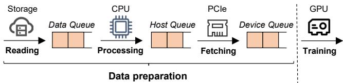  
Figure 5: Queue-based I/O analysis.

## 4.2.2 Intra-operator Analysis

Based on practical experience, we have summarized the causes and detection mechanisms of various types of bottlenecks for critical operators, including host-side I/O and CPU, computation, and communication.

Queue-based I/O Analysis. To provide training data for computation, I/O usually consists of the following stages. As shown in Figure 5, the data first needs to be read from the storage (data reading) and then transferred to the CPU for processing (data processing). For example, the processing in language models involves tokenization, padding & truncation, and word vectorization [12]. Then, the processed data will queue up on the host side, waiting to be transferred to the devices (data fetching). All stages can lead to bottlenecks, and we can use the corresponding queue states to identify them. The Device Queue stores data transferred from the host to the device. If the device queue is not empty, it indicates that there is enough data to continue training, which does not happen in I/O bottlenecks. Conversely, we then move to the Host Queue, which stores processed data. If the host queue is not empty, it indicates a fetching bottleneck, often due to slow transfer between the host and device. Conversely, we need to trace back to the Data Queue, which holds the reading data. If the data queue is not empty, it indicates a processing bottleneck. Otherwise, it points to a reading bottleneck.

Based on Meta’s I/O analysis [66], considering that data processing is mainly CPU-based in our practice, we have summarized the following common causes of I/O bottlenecks: (i) Data reading. Low disk I/O bandwidth, or restricted network bandwidth to access remote storage. (ii) Data processing. Extra overhead from data format conversions, such as with compressed files like zip and tar; no multiprocessing in the dataloader (num\_worker = 1); other multiprocessing operations that may affect the dataloader, like the taskset command [33] for process CPU binding. (iii) Data fetching. PCIe transfer from host to device becomes a bottleneck. In this case, consider enabling the pin\_memory option to transfer data directly to the device through DMA. Faced with complex causes of I/O bottlenecks, Hermes only lists potential causes corresponding to the current bottleneck to guide users in inspecting the targeted configurations manually.

CPU Causes Analysis. The CPU handles the compilation of operators and dispatches them to the device, and its performance directly impacts overall training. Based on extensive practice experience, we observe that various causes may result in CPU bottleneck and summarize their reasons in Table 2.

Table 2: CPU bottleneck causes.
<table><tr><td rowspan=1 colspan=1>Cause</td><td rowspan=1 colspan=1>Reason</td></tr><tr><td rowspan=1 colspan=1>Operator Compilation</td><td rowspan=1 colspan=1>Dynamic shape operators require recompilation</td></tr><tr><td rowspan=1 colspan=1>OperatorDispatch</td><td rowspan=1 colspan=1>Excessive dispatch or synchronous operations</td></tr><tr><td rowspan=1 colspan=1>Garbage Collection</td><td rowspan=1 colspan=1>Frequent garbage collection events</td></tr><tr><td rowspan=1 colspan=1>CPU Resource Contention</td><td rowspan=1 colspan=1>Interference of external CPU process</td></tr><tr><td rowspan=1 colspan=1>Environment Configuration</td><td rowspan=1 colspan=1>Unsuitable hardware or software configurations</td></tr></table>

• Operator Compilation. Operators must be compiled on the CPU to generate NPU-executable code. If an operator’s shape changes, JIT compilation is triggered, adding extra compile time and causing a CPU bottleneck. Thus, Hermes detects compilation timeout operators, especially dynamic shape operators, and advises users to replace them or disable JIT compilation.

• Operator Dispatch. Dispatching compiled operators from the CPU to the NPU for execution can cause a CPU bottleneck. First, numerous small operators may be dispatched frequently. Thus, Hermes provides fusible operator analysis to show the sequence of operators with fusion value. It advises users to fuse these small operators into one, reducing dispatch times. Second, although dispatch is asynchronous, developers might introduce synchronous operations between CPU and NPU streams like SyncBatchNorm, tensor.item, and reduce\_all, which slow down the process. Thus, Hermes detects the time-consuming synchronous streams and displays their stack, which helps users modify the code to eliminate these sync streams.

• Garbage Collection (GC). Python’s garbage collection mechanism can automatically detect and free up memory that is no longer in use. However, during large-scale training, the significant fluctuation in memory usage can trigger garbage collection more frequently, which in turn leads to drastic performance degradation. Thus, Hermes provides a GC analysis to record the occurrences and durations of abnormal GC events. It suggests that users address GC problems by adjusting the threshold using gc.set\_threshold() or disabling GC using gc.disable().

• CPU Resource Contention. Other CPU processes unrelated to training may compete for resources, which affects the training performance. In our experience, performance monitoring tools like Prometheus [18] often preempt CPU resources. So, Hermes periodically checks the CPU usage of common processes to prevent such contention.

Environment Configuration. Both hardware and software configurations during training can affect performance. Hardware factors like the number of CPU cores, frequency, and computational power may be at play. Potential software issues include OS bugs, high logging levels, memory usage, and inconsistent driver versions. Hermes provides self-test scripts to troubleshoot these potential problems.

Computation Cause Analysis. We use the Roofline model [59, 64] to evaluate the computation performance. As shown in Figure 6, the solid line represents the peak performance that an operator can achieve with a given arithmetic intensity. The height of the line reflects the arithmetic performance, while the slope of the line reflects the memory bandwidth. We add two dashed lines for the thresholds: the left one marks the bandwidth utilization threshold, and the right one marks the arithmetic utilization threshold. The red area upon the left threshold shows memory bound, while the green area upon the right threshold shows compute bound. The blue area below the two thresholds represents the underutilization. The operator’s performance point falling in a specific region determines its computation bottleneck (Appendix B).

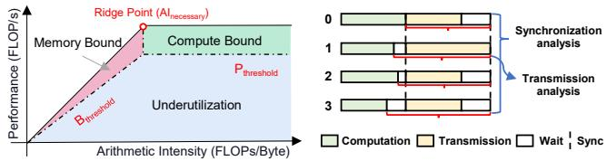  
Figure 6: Roofline-based com- Figure 7: Time breakdown of putation Analysis. AllReduce operator.

Different computation bottlenecks often have different causes. When compute bound, Hermes will check whether the node is downclocked over the threshold (often 5%) or has poor intrinsic arithmetic. When memory bound, Hermes will suggest operator fusion [43, 68], quantization [38, 56, 63], or using memory optimization techniques like ZeRO [51, 52]. In practice, most operators are underutilized due to various reasons, such as inefficient AICPU operators, operators with suboptimal hardware affinity with Ascend, or private data formats causing extra conversion overhead. For all of these, Hermes has the corresponding detection and optimization rules. For a more detailed analysis of operator performance, refer to [69] and the Ascend Optimization Engine [9].

Communication Cause Analysis. As shown in Figure 7, we analyze the causes of communication bottlenecks using the AllReduce operator as an example. Its execution consists of two synchronizations and one transmission. First, it waits for all devices to complete their computations before starting transmission, and synchronization occurs again after all devices have finished transmitting. Consequently, both synchronization and transmission can lead to communication bottlenecks, necessitating a separate analysis of each.

Synchronization analysis examines the wasted time when a device waits for others to complete. For example, in posttransmission synchronization2 among n devices, we use $T _ { i }$ to denote the transmission time of i-th device. As each device needs to wait for the slowest device to finish its transmission, we use $T _ { \mathrm { m a x } } = \mathrm { m a x } _ { i = 1 } ^ { n } T _ { i }$ to denote the slowest transmission time. Accordingly, the overall wait time can be modeled as:

$$
T _ { \mathrm { w a i t } } = \sum _ { i = 1 } ^ { n } \left( T _ { \mathrm { m a x } } - T _ { i } \right) = n \left( T _ { \mathrm { m a x } } - { \frac { 1 } { n } } \sum _ { i = 1 } ^ { n } T _ { i } \right) = n ( T _ { \mathrm { m a x } } - T _ { \mathrm { a v g } } )\tag{1}
$$

Table 3: Communication bottleneck causes.
<table><tr><td rowspan=1 colspan=1>Cause</td><td rowspan=1 colspan=1>Reason</td></tr><tr><td rowspan=1 colspan=1>Bandwidth Contention</td><td rowspan=1 colspan=1>Intra-node bandwidth contention forparallel computing and communication</td></tr><tr><td rowspan=1 colspan=1>RDMARetransmission</td><td rowspan=1 colspan=1>Frequent RDMA timeout retransmission</td></tr><tr><td rowspan=1 colspan=1>Small Packet</td><td rowspan=1 colspan=1>Underutilization of bandwidth by small packet</td></tr><tr><td rowspan=1 colspan=1>Byte Alignment</td><td rowspan=1 colspan=1>HCCS data size misalignment</td></tr><tr><td rowspan=1 colspan=1>Network Configuration</td><td rowspan=1 colspan=1>Switch congestion or UDP port hash collisions</td></tr></table>

In addition, we have total time, where each device needs $T _ { \mathrm { m a x } }$ including transmission and wait time, by summing them up, we obtain:

$$
T _ { \mathrm { t o t a l } } = n \cdot T _ { \mathrm { m a x } } , \quad R _ { \mathrm { w a i t } } = \frac { T _ { \mathrm { w a i t } } } { T _ { \mathrm { t o t a l } } } = 1 - \frac { T _ { \mathrm { a v g } } } { T _ { \mathrm { m a x } } } ,\tag{2}
$$

where $R _ { \mathrm { w a i t } }$ is the ratio of wasted wait time. We set a threshold to determine whether slow synchronization is the cause.

Transmission analysis aims to identify the causes affecting transmission efficiency, including PCIe, HCCS, and RDMA links. Hermes first confirms whether the link bandwidth meets the expected threshold. If all links have reached their physical limit, it will advise users to upgrade the network. Otherwise, it will detect all the problems summarized in Table 3 to determine the true cause of the suboptimal bandwidth.

• Bandwidth Contention. The transmission of communication operators can be affected by computation operators, particularly due to the bandwidth contention from the intranode interconnect (HCCS and PCIe). This problem is particularly pronounced when memory-intensive operators, such as MatMul, are executed concurrently. Hermes monitors whether the communication operator’s intra-node bandwidth falls below the threshold. If so, it will recommend users to re-schedule operators.

RDMA Retransmission. For inter-node transmissions, RDMA retransmissions are a significant cause of bandwidth degradation. Hermes compares the RDMA transmission time of communication operators to a retransmission threshold (often 4 seconds). If a retransmission occurs, Hermes will advise users to verify the retransmission duration and the network configuration of switches and servers.

Small Packet. Small packet sizes can lead to multiple transmissions, reducing bandwidth utilization. Hermes has determined the packet size thresholds at which each link reaches its bandwidth limit in practice. Thus, Hermes checks for an excess of packets much smaller than the threshold. If found, it will advise increasing the batch size, gradient fusion [26, 46], or operator fusion.

• Byte Alignment. HCCS communication requires memory alignment; the data size must be a multiple of 512 bytes to avoid a drop in the transmission bandwidth. Hermes offers a byte alignment analysis for communication operators. It detects operators that do not meet this requirement and suggests adjusting their data size.

• Network Configuration. Other network misconfigurations can also seriously affect communication. Hermes summarizes and automatically detects common ones, such as anomalies in HCCL environment variables, congestion from switch settings, or UDP port hash conflicts. Unfortunately, if these analyses fail to reveal the problem, manual intervention is essential.

## 4.3 Bottleneck Cause-Optimization Match

As of December 2024, we have addressed 223 training performance issues for over 40 clients, identifying 135 key cases for analysis and summarization. Among these, both CPU and computation bottlenecks account for over 30%. The former is often caused by system, hardware, or implementation issues and can be overlooked. The latter is mainly due to poor operator implementation, insufficient hardware affinity, and a lack of operator fusion. Based on these cases, we developed the mstt advisor [6]. By inputting profiling data, it will automatically identify the bottleneck through hierarchical bottleneck analysis. As shown in Table 4, the advisor has established many analytical rules for each bottleneck cause and provides all applicable optimization suggestions. Notably, the optimizations provided by the advisor mainly target hardwareagnostic bottlenecks, including parallel, CPU, and most communication bottlenecks. These bottlenecks inherently stem from unified training paradigms and frameworks, allowing the optimizations to be extended to other hardware platforms. However, bottlenecks directly tied to Ascend features, such as AICPU operators, API affinity conflicts, private data formats, and HCCS byte misalignment, cannot be extended.

In summary, using profiling data as input, the advisor can automatically generate a complete analysis report in HTML showing bottlenecks in current training. For example, when detecting AICPU operators whose execution time exceeds the threshold, the advisor will output AICPU issues and provide the following optimization suggestions: (i) Convert the data type to those supported by AICore. AICPU only executes operators if their data formats are not supported by AICore. Therefore, the advisor lists common operators’ supported data formats on both AICPU and AICore. If the target operator is on the list, the advisor will recommend that users reformat the input to AICore compatible type, such as converting the Mul operator’s input from int16 to int32. (ii) Modify code to avoid AICPU operators. For AICPU operators that cannot convert the format, the advisor suggests replacing them with equivalent operators in AICore or avoiding their use.

## 5 Case Study

In this section, we provide extensive case studies, including classic bottlenecks and real-world production problems, to demonstrate how Hermes guides optimizations.

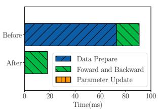  
(a) Time breakdown.

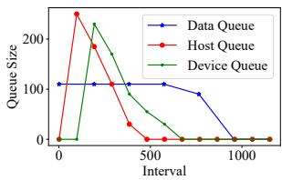  
(b) Queue size distribution.  
Figure 8: I/O analysis and optimization of ResNet50.

## 5.1 Case Study of Classic Bottlenecks

Here, we present typical optimization cases for I/O, CPU, and communication bottlenecks, explaining the reasons behind the optimizations (more cases are in Appendix C and D).

## 5.1.1 Case Study of I/O Optimization

The single-card ResNet50 model training is an example of experiencing an I/O bottleneck. As revealed in Figure 8(a), before optimization, the execution time per step is approximately 90 ms, with data preparation taking around 72.8 ms, indicating an I/O bottleneck. Therefore, the advisor performed a queue-based I/O analysis, where the data distribution in different queues is shown in Figure 8(b). As training begins, the data, host, and device queues peak in sequence. Over time, the device and host queues gradually empty, while the data queue remains full. And the advisor concluded that the I/O bottleneck was attributed to slow data processing.

Optimization: Based on the suggestion of the mstt advisor, we found that only one CPU core was active during processing (num\_worker = 1). To address this, we increased the number of concurrent threads to 12 to better utilize CPU parallelism. Results: Although the parallelism only increased by 12×, this optimization enables overlap between data processing and subsequent NPU computation, allowing the processing time to be almost completely hidden within the computation time. As shown in Figure 8(a), the explicit data preparation time was reduced to 0.25 ms. The step time was reduced to 18.07 ms, achieving a speedup of 5.34 .

## 5.1.2 Case Study of CPU Optimization

During GPT-3 training on a single node with 8 NPUs, we observed an average step time of 444.40 ms, accompanied by significant performance fluctuations, with many steps exceeding 1000 ms and a maximum of 3027.6 ms. Cluster analysis identified the 153rd step as a major performance degradation, pinpointing rank-3 NPU as the slowest card. Further bottleneck analysis revealed a long non-overlap host time of 130.86 ms, indicating a severe host bottleneck, primarily due to the excessive execution time of the aten :: mul operator.

Optimization: Hermes analyzed the CPU performance and found no issues with operator compilation, dispatch, synchronization, garbage collection, or SW/HW configurations.

Table 4: Cause-optimization match.
<table><tr><td rowspan=1 colspan=1>Bottleneck</td><td rowspan=1 colspan=2>Cause</td><td rowspan=1 colspan=1>Optimization</td><td rowspan=1 colspan=1>Ratio</td></tr><tr><td rowspan=1 colspan=1>Parallel</td><td rowspan=1 colspan=2>Poor Parallelism</td><td rowspan=1 colspan=1>Auto hybrid parallel [67] /Multi-shard parallel</td><td rowspan=1 colspan=1>5.2%</td></tr><tr><td rowspan=5 colspan=1>I/O</td><td rowspan=1 colspan=2>Slow Data Reading</td><td rowspan=1 colspan=1>Increase I/O bandwidth /Remote to local storage</td><td rowspan=5 colspan=1>8.9%</td></tr><tr><td rowspan=2 colspan=2>Slow Data Processing</td><td rowspan=1 colspan=1>Improve CPU parallelism (num_workers)</td></tr><tr><td rowspan=1 colspan=1></td><td rowspan=1 colspan=1>Avoid compression formats (zip, tar)</td></tr><tr><td rowspan=1 colspan=2></td><td rowspan=1 colspan=1>Cancel the taskset process binding [33]</td></tr><tr><td rowspan=1 colspan=2>Slow Data Fetching</td><td rowspan=1 colspan=1>Cache strategy (pin_memory,data prefetcher) [24,66]</td></tr><tr><td rowspan=5 colspan=1>CPU</td><td rowspan=1 colspan=2>Operator Complication</td><td rowspan=1 colspan=1>Replace dynamic shape operators /Disable JIT compilation</td><td rowspan=5 colspan=1>37.0%</td></tr><tr><td rowspan=1 colspan=2>Operator Dispatch</td><td rowspan=1 colspan=1>Operator fusion [43,68]/ Eliminate synchronization operations</td></tr><tr><td rowspan=1 colspan=2>Garbage Collection</td><td rowspan=1 colspan=1>Disable gc /Increase gc threshold</td></tr><tr><td rowspan=1 colspan=2>CPU Resources Contention</td><td rowspan=1 colspan=1>Disable other CPU process</td></tr><tr><td rowspan=1 colspan=2>Environment Configuration</td><td rowspan=1 colspan=1>Align software versions /Reduce logging level</td></tr><tr><td rowspan=5 colspan=1>Computation</td><td rowspan=1 colspan=2>Compute Bound</td><td rowspan=1 colspan=1> Avoid decreasing computing frequency / Isolate slow nodes</td><td rowspan=5 colspan=1>31.9%</td></tr><tr><td rowspan=1 colspan=2>Memory Bound</td><td rowspan=1 colspan=1>Operator fusion [43,68]/Quantization [38,56,63]/ ZeRO [51,52]</td></tr><tr><td rowspan=3 colspan=2>Underutilization</td><td rowspan=1 colspan=1>Eliminate AICPU operators</td></tr><tr><td rowspan=1 colspan=1></td><td rowspan=1 colspan=1>Replace operators with affinity APIs</td></tr><tr><td rowspan=1 colspan=1>Forbid private format</td></tr><tr><td rowspan=3 colspan=1>Communication</td><td rowspan=1 colspan=2>Bandwidth Contention</td><td rowspan=1 colspan=1>Avoid bandwidth contention by re-scheduling operators</td><td rowspan=5 colspan=1>17.0%</td></tr><tr><td rowspan=1 colspan=2>RDMA Retransmission</td><td rowspan=1 colspan=1>Adjust RDMA network configurations of switch and server</td></tr><tr><td rowspan=1 colspan=2>Small Packet</td><td rowspan=1 colspan=1>Increase batch size/Gradient fusion [26,46]/Operator fusion</td></tr><tr><td rowspan=2 colspan=1></td><td rowspan=1 colspan=2>Byte Alignment</td><td rowspan=1 colspan=1>Align HCCS data size</td></tr><tr><td rowspan=1 colspan=2>Network Configuration</td><td rowspan=1 colspan=1>HCCL environment variables /Switch congestion control /UDP hashing collision</td></tr></table>

Table 5: Gradient fusion optimization of VGG16.
<table><tr><td rowspan=1 colspan=1></td><td rowspan=1 colspan=1>Computation (ms)</td><td rowspan=1 colspan=1>Non-overlapCommunication (ms)</td><td rowspan=1 colspan=1>Free (ms)</td><td rowspan=1 colspan=1>Total (ms)</td></tr><tr><td rowspan=1 colspan=1>Before</td><td rowspan=1 colspan=1>54.555</td><td rowspan=1 colspan=1>21.760</td><td rowspan=1 colspan=1>0.177</td><td rowspan=1 colspan=1>76.492</td></tr><tr><td rowspan=1 colspan=1>After</td><td rowspan=1 colspan=1>52.907</td><td rowspan=1 colspan=1>3.594</td><td rowspan=1 colspan=1>0.139</td><td rowspan=1 colspan=1>56.640</td></tr></table>

Eventually, CPU usage shows that a Prometheus monitoring program was deployed on this machine, consuming a massive 4000% of CPU resources. This plugin was originally intended for the master node but was mistakenly deployed on the worker node, leading to performance degradation.

Result. After terminating the Prometheus process, the average step time for GPT-3 training decreased to 374.88 ms, with only 4 of 4989 steps exhibiting performance fluctuations exceeding 10%, marking a significant improvement in stability compared to the original 128 steps.

## 5.1.3 Case Study of Communication Optimization

As shown in Table 5, the step time of VGG16 8-card training is 76.492 ms, with the non-overlap AllReduce operators taking 21.760 ms, resulting in a communication bottleneck. According to the synchronization analysis, the maximum value of $R _ { \mathrm { w a i t } }$ is 0.3 and exceeds the threshold. Therefore, the bottleneck is caused by the slow transmission from Rank 7 NPU. This operator only involves HCCS communication, with a bandwidth utilization of only 53%. The average size of HCCS packets is only 12.81 MB, which is too small compared to the 32 MB threshold, resulting in bandwidth underutilization.

Optimization: Faced with this problem, Hermes suggests using gradient fusion [11] to improve bandwidth utilization, which fuses the gradients of multiple backward computations. However, existing frameworks like Pytorch and Horovod [53] only allow for fixed capacity or manual configuration. As shown in Figure 9, undersized capacity (BucketSize=1) cannot improve bandwidth utilization, while oversized capacity (BucketSize=3) can result in long-tail latency. Thus, we further integrate the profiling result to guide our fusion. Specifically, we simulate the AllReduce fusion for gradients of different sizes, which reveals the benefit (time reduction/bandwidth improvement). In addition, we collect execution information to predict the tail latency for a given fusion strategy, including 1) the size of each gradient, 2) the dependencies between operators, and 3) the duration of each computation operator. We model an optimization problem and introduce a greedy forward search algorithm to find a solution by maximizing bandwidth and minimizing tail latency. As shown in Figure 10, we can adaptively fuse the gradients according to the search algorithm. The details can be found in Appendix E.

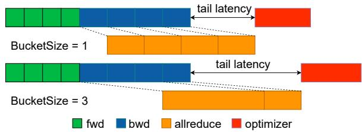  
Figure 9: Inappropriate bucket size setting.

Results. After this optimization, the non-overlap communication time decreased to 3.594 ms, and the step time subsequently dropped to 56.64 ms with a 1.35× speedup. In addition, we also evaluated common vision, NLP, and recommendation models. Figure 11 shows the speedup of non-overlap communication and step time before and after optimization. Specifically, 1) if a small packet size is not the root cause pinpointing by Hermes, then the corresponding optimization is limited. DLRM [42] exhibits a limited improvement in Figure 11(a) because the packet size is large enough. 2) if one is not identified as a bottleneck by Hermes, then the improvement is limited. For instance, in ResNet50, the optimization brings a significant reduction in non-overlap communication in Figure 11(a), but the step time is not significantly improved in Figure 11(b), since communication is not the bottleneck.

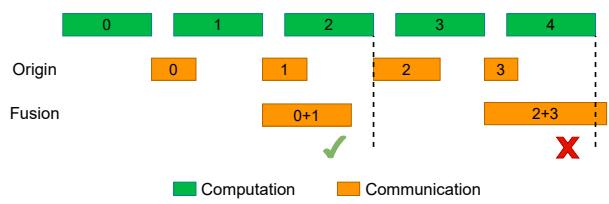  
Figure 10: Forward search fusion.

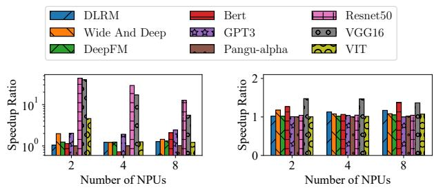  
(a) Non-overlap communication.  
(b) Step time.  
Figure 11: Speedup of communication optimization.

## 5.2 Case Study of Real-world Model Training

Our practices are conducted on the Ascend training clusters shown in Appendix A. Here, we present three real-world cases in diverse task scenarios, sharing our practical insights.

## 5.2.1 Iterative Optimization Development for PanGu

We present the iterative analysis and optimization by Hermes on the 100B PanGu-α model training. The process consists of three iterations corresponding to bottlenecks: (i) computation, (ii) parallel, and (iii) communication. We can address these bottlenecks by applying optimization recommendations, resulting in the 3.05× speedup in the overall training time.

Baseline: The 100 billion parameters PanGu-α language model is deployed on 128 Ascend NPUs. We selected 50 billion tokens from the original 1.1TB Chinese text corpus from [65] as the training dataset. The baseline configuration is from MindSpore’s official SOTA models [4], which employs a re-computation and hybrid parallelism strategy, with data parallelism is 2, tensor parallelism is 8, and pipeline parallelism is 8. The batch\_size is 512, while the micro batch\_size is 32. As shown in Figure 12, the total training time is 2856 hours, achieving a throughput of 4839 tokens/s.

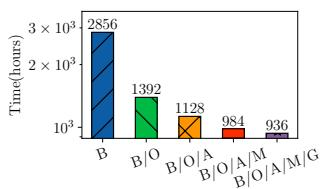  
(a) Overall training time.

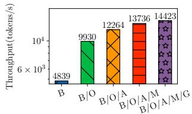  
(b) Overall training throughput.

Figure 12: PanGu-α overall training performance, where B denotes Baseline, O denotes Operator optimization, P denotes Auto hybrid parallelism, M denotes Multi-shard parallelism, and G denotes Gradient fusion.  
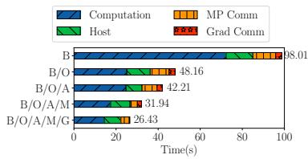

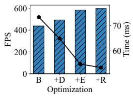  
Figure 13: Step time of PanGu-α Figure 14: Deploy optimodel. mization.

Iteration 1: Computation Bottleneck. In the inter-operator analysis, the step time consists of three parts: computation (including overlap), non-overlap communication, and host. Considering the parallel strategy, non-overlap communication can be divided into model parallel communication (Send/Receive) and gradient communication (AllReduce). As shown in Figure 13, the computation time in the baseline accounts for a staggering 73.5% of the iteration time. Thus, even with a satisfactory overlap ratio (8.76%), the computation remains a bottleneck. According to the intra-operator analysis, the top 10 time-consuming computation operators totally consume 59.59 s, accounting for 83.57% of all computation operators. Therefore, addressing these operators is our top priority.

Facing the computation bottleneck, we have identified the primary cause of underutilization by Roofline analysis. Following the suggestions from Hermes, we have adopted operator optimization, such as replacing high-performance operator, operator fusion [43], and forbidding private formats to accelerate computations. The details can be found in Appendix C. Based on Figure 12, the operator optimizations reduce the step time from 98.01 to 48.16 s and the total time from 2,856 to 1,392 hours, a speedup of 2.05×.

Iteration 2: Parallel Bottleneck. After addressing the computation bottleneck, we observed a reduced computation ratio to a reasonable level of 52.2%. However, we noticed that the overlap between computation and communication only accounted for 2.66% of the step time. The bottleneck has moved to a significant parallel bottleneck.

Based on the advice of the advisor, we have adopted two different optimizations to improve parallelism. (i) Auto hybrid parallelism. Encouraged by auto parallelism [67], we propose the pipeline parallel simulation to identify a more optimal parallel configuration. Based on the simulation results, we find that incremental micro batch\_size within a certain range improves throughput, especially at higher pipeline parallelism. Furthermore, if the LayerNorm operator is used for data parallelism, reducing the tensor parallelism can enhance computation performance. Consequently, we adjust the parallel configuration by increasing micro batch\_size from 32 to 64, setting the pipeline parallelism to 16, and halving the tensor parallelism. By applying the better parallel configuration, the step time decreased from 48.16 to 42.21 s. (ii) Multi-shard parallelism. In brief, we divide the task executed within an NPU into two parallel parts: one for computation and the other for communication (details in Appendix D). This approach has improved the overlap ratio and reduced the step time to 31.94 s. Together, the two optimizations accelerated the total time from 1,392 to 984 hours, a speedup of 1.41 . Iteration 3: Communication Bottleneck. After enhancing the parallelism to 11.19%, we further analyzed the nonoverlap communication, including Send, Receive, AllGather, and AllReduce. Among these, AllReduce accounts for 46.83% of the communication time and 22.55% of the step time. Therefore, we must focus on the communication bottleneck from AllReduce operators.

Through the communication analysis of AllReduce, Hermes has identified that the bottleneck originates from the small packet. Thus, we applied the adaptive gradient fusion in §5.1.3 to address it. As depicted in Figure 12 and Figure 13, the optimization reduced the step time from 31.94 to 26.43 s, with a 1.05 speedup in total time to 936 hours.

## 5.2.2 MobileNetv1 Deployment Optimization

The MobileNetv1-SSD [35] vision model is applied to object detection in autonomous driving. When migrating this model from an NVIDIA A800 GPU to Ascend NPU directly, users observed significant performance degradation (only achieved 43% of the former), requiring deployment optimization.

To simplify the analysis, we start with single-card training to identify bottlenecks in NPUs. In the baseline, the model already incorporates the hardware-affinity optimizer (Npu-FusedSGD [8]) and mixed precision optimization [38], achieving a step time of 73.24 ms and 436.942 FPS (Frame Per Second) as shown in Figure 14. Using Hermes for analysis, the results indicate the presence of significant CPU bottlenecks and provide the following suggestions.

Disable JIT compilation. Hermes reveals that operator compilation time on the CPU is high, with a total of 762 operators, which consume a staggering 57.862 ms. This issue stems primarily from the dynamic shape [48] of operators. If the input and output shapes of an operator remain constant during training, enabling JIT compilation allows for fusion optimization based on existing operator information, generating more efficient operators online. However, the dynamic shape will invalidate prior operator information and bring re-compilation costs. Thus, the advisor recommends disabling online compilation $( j i t \_ c o m p i l e = f a l s e )$ and dispatching the compiled binary operators to reduce time. After this, the step time decreased to 64.87 ms and the FPS increased to 493.332.

Eliminate synchronization. Secondly, a total of 18 synchronization operations between CPU and NPU were detected, and the two slowest operations accounted for 24.136 ms. The frequent synchronizations are often attributed to certain synchronous operators and environment variable settings. Eventually, the advisor shows that it is due to the frequent use of tensor.item(). By replacing this function, we achieved a step time of 54.82 ms and an FPS of 583.695.

Replace affinity APIs. The advisor suggests that some APIs can be replaced with more hardware-friendly ones for Ascend. Specifically, tensor reshape and transpose functions in Py-Torch like view, permute, transpose, and contiguous can be replaced with npu\_con f usion\_transpose [7]. This optimization brings a step time of 53.45 ms and an FPS of 598.716.

Unbind CPU process. When scaled up to 8-NPU training, we observed too high step time in the early steps of each epoch. Hermes revealed that there is an I/O bottleneck caused by a slow dataloader with 2857.845 ms, attributed to the taskset command that binds the CPU. This command is used to bind a process to specific CPU cores, reducing context-switching overhead, and improving cache utilization. However, incorrect CPU binding can cause the dataloader and other processes to be bound to the same core, resulting in memory bandwidth contention. Following the advice of the advisor, we unbind the CPU processes, recovering stabilized 8-NPU training performance. The training time decreased from 11.10 to 5.81 ms (1.91 speedup), and the FPS reached 90% of the GPU’s performance (5921), meeting the performance goal.

Summary. Table 6 also summarizes the optimization results in deploying other models. Leveraging the optimization suggestions, we have achieved training speedups ranging from 1.08 to 5.34 for these vision, NLP, and recommendation models, demonstrating the effectiveness of Hermes.

## 5.2.3 Performance Fluctuation in Large-scale Training

When training a large model, even minor disturbances can lead to significant performance fluctuations, such as the decrease in MFU within MegaScale [27]. However, pinpointing the underlying causes is far from straightforward. Similarly, we frequently encounter performance fluctuations in largescale training based on Ascend NPUs. Notably, 25% of our analyzed performance fluctuation cases were attributed to Python’s garbage collection (GC) [47]. Here, we use a case study of 9,000-card MoE model training to share our experience in optimizing garbage collection.

Table 6: Model deployment optimization results
<table><tr><td rowspan=2 colspan=1>Type</td><td rowspan=2 colspan=1>Model</td><td rowspan=2 colspan=1>Parameter</td><td rowspan=1 colspan=1>0</td><td rowspan=1 colspan=5>Optimization Speedup (-: not optimizable)</td><td rowspan=2 colspan=1># of NPUs</td><td rowspan=2 colspan=1>Dataset</td></tr><tr><td rowspan=1 colspan=1>I/0</td><td rowspan=1 colspan=1>CPU</td><td rowspan=1 colspan=1>Para.</td><td rowspan=1 colspan=1>Compu.</td><td rowspan=1 colspan=1>Comm.</td><td rowspan=1 colspan=1>Total</td></tr><tr><td rowspan=4 colspan=1>Vision</td><td rowspan=1 colspan=1>ResNet50</td><td rowspan=1 colspan=1>25.6M</td><td rowspan=1 colspan=1>5.03</td><td rowspan=1 colspan=1>:</td><td rowspan=1 colspan=1>1</td><td rowspan=1 colspan=1>1.02</td><td rowspan=1 colspan=1>1.04</td><td rowspan=1 colspan=1>5.34</td><td rowspan=2 colspan=1>8</td><td rowspan=2 colspan=1>ImageNet2012</td></tr><tr><td rowspan=1 colspan=1>VGG16</td><td rowspan=1 colspan=1>138.4M</td><td rowspan=1 colspan=1>-</td><td rowspan=1 colspan=1>1</td><td rowspan=1 colspan=1>-</td><td rowspan=1 colspan=1>1.08</td><td rowspan=1 colspan=1>1.35</td><td rowspan=1 colspan=1>1.46</td></tr><tr><td rowspan=2 colspan=1>MobileNetV1-SSD</td><td rowspan=2 colspan=1>4.2M</td><td rowspan=1 colspan=1>1</td><td rowspan=1 colspan=1>1.37</td><td rowspan=1 colspan=1>-</td><td rowspan=1 colspan=1>-</td><td rowspan=1 colspan=1>-</td><td rowspan=1 colspan=1>1.37</td><td rowspan=1 colspan=1>1</td><td rowspan=2 colspan=1>VOC2012</td></tr><tr><td rowspan=1 colspan=1>1.08</td><td rowspan=1 colspan=1>1.91</td><td rowspan=1 colspan=1>-</td><td rowspan=1 colspan=1>1</td><td rowspan=1 colspan=1>1</td><td rowspan=1 colspan=1>2.07</td><td rowspan=1 colspan=1>8</td></tr><tr><td rowspan=3 colspan=1>NLP</td><td rowspan=1 colspan=1>Bert-Large</td><td rowspan=1 colspan=1>330M</td><td rowspan=1 colspan=1>1</td><td rowspan=1 colspan=1>二</td><td rowspan=1 colspan=1>1</td><td rowspan=1 colspan=1>1.63</td><td rowspan=1 colspan=1>1.38</td><td rowspan=1 colspan=1>2.49</td><td rowspan=3 colspan=1>8</td><td rowspan=3 colspan=1>Wiki</td></tr><tr><td rowspan=1 colspan=1>PanGu-α</td><td rowspan=1 colspan=1>1.3B</td><td rowspan=1 colspan=1>1</td><td rowspan=1 colspan=1>二</td><td rowspan=1 colspan=1>-</td><td rowspan=1 colspan=1>1.18</td><td rowspan=1 colspan=1>1.02</td><td rowspan=1 colspan=1>1.20</td></tr><tr><td rowspan=1 colspan=1>GPT3-13B</td><td rowspan=1 colspan=1>13B</td><td rowspan=1 colspan=1>:</td><td rowspan=1 colspan=1>-</td><td rowspan=1 colspan=1>1.08</td><td rowspan=1 colspan=1>-</td><td rowspan=1 colspan=1>-</td><td rowspan=1 colspan=1>1.08</td></tr><tr><td rowspan=2 colspan=1>Recommend</td><td rowspan=1 colspan=1>DeepFM</td><td rowspan=1 colspan=1>16.5M</td><td rowspan=1 colspan=1></td><td rowspan=1 colspan=1>-</td><td rowspan=1 colspan=1>-</td><td rowspan=1 colspan=1>-</td><td rowspan=1 colspan=1>1.08</td><td rowspan=1 colspan=1>1.08</td><td rowspan=2 colspan=1>8</td><td rowspan=2 colspan=1>Criteo</td></tr><tr><td rowspan=1 colspan=1>DLRM</td><td rowspan=1 colspan=1>540M</td><td rowspan=1 colspan=1>1</td><td rowspan=1 colspan=1>1</td><td rowspan=1 colspan=1>-</td><td rowspan=1 colspan=1>1</td><td rowspan=1 colspan=1>1.17</td><td rowspan=1 colspan=1>1.17</td></tr></table>

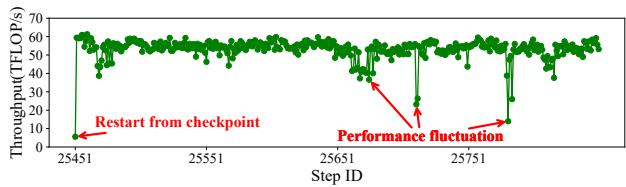  
(a) Performance before optimization.

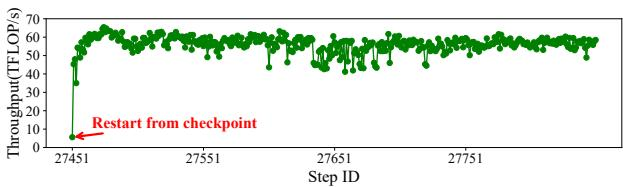  
(b) Performance after optimization.  
Figure 15: Performance fluctuations optimization.

As shown in Figure 15(a), after resuming training from the checkpoint, the throughput gradually increases to about 60 TFLOPs/s. However, during the 400 training steps, there are several significant performance fluctuations, dropping to a low of only 14.0 TFLOPs/s. Each of these drops persists for several steps, severely impacting overall performance. Bottleneck analysis revealed that, within the timeline of the slowest NPU, the non-overlap host time significantly exceeds that of other NPUs. Additionally, Hermes offers a GC detection interface to record its occurrences. The results indicated that the number of GC events far exceeded the threshold and performance fluctuations occurred whenever the GC was cleared. If the GCs are not synchronized between each stream, all GCs will execute sequentially within a step, slowing down training.

Although this issue stems from Python’s GC mechanism and is currently unresolvable, Hermes provides alternative solutions to mitigate it. Firstly, disabling GC (gc.disable()) can prevent performance fluctuations but lightly increases training time (based on experience with 7B Llama-2, the cost is about 1%). Secondly, by using the set\_threshold interface to appropriately increase the threshold, we can reduce the occurrence of fluctuations (with a cost of only 0.02%). Given the relatively low cost of the latter, this approach is commonly adopted in practice. Therefore, we appropriately increased the GC threshold and implemented periodic calls to the gc.collect() in the code (typically after saving checkpoints). The results of continued training after optimization, as shown in Figure 15(b), indicate a significant reduction in performance fluctuations. During the same 400 steps, the average throughput improved from 53.33 to 56.23 TFLOPs/s (1.05× speedup).

In addition to software issues, we also detected hardwareinduced performance fluctuations when training models in the 18,000-card cluster. Training throughput ranged between 10 and 106 TFLOPs/s, with a high variance of 291, and an average of only 85 TFLOPs/s. Following the recommendations from Hermes, we made several optimizations, including switching log writes from remote storage to local storage, repairing four spine-leaf links, and isolating 30 compute nodes (due to port flapping, NPU memory failures, etc.). After these optimizations, training throughput stabilized between 63 and 108 TFLOPs/s, with a variance of 31, and the average improved to 101 TFLOPs/s (1.19× speedup).

## 6 Limitations and Future Work

We discuss the limitations and future directions of Hermes. More model training techniques. Currently, Hermes is mainly used to analyze and optimize the training performance of the Transformer and MoE models. In fact, many new techniques are widely applied in the training of large models such as ChatGPT and Llama, including reinforcement learning (e.g. RLHF [15, 45]) and multimodal techniques [61]. However, Hermes currently cannot effectively analyze and optimize the bottlenecks introduced by them. For example, in RLHF, there are potential performance issues in iterative reward modeling, policy optimization, and environment interaction. In multimodal models, cross-modal data alignment (such as image-text fusion) is likely a performance bottleneck. Therefore, we plan to expand Hermes to support these emerging

model training technologies.

Diagnosing complex bottlenecks. In complex scenarios, it is still challenging for Hermes to diagnose the causes of bottlenecks. For example, in MoE model training, when the AlltoAll communication is severely unbalanced, a simple synchronization analysis is not sufficient to accurately determine whether it is a slow card or slow communication. There are also CPU bottlenecks caused by external environmental changes, which heavily rely on our current troubleshooting experience, currently limited to common monitoring software. As parallel strategies become more complex, including not only DP, PP, and TP but also expert parallelism and context parallelism, how to more accurately identify slow and fast cards becomes a challenge. Therefore, our goal is to improve Hermes’s ability to handle these complex situations, provide visualization functions, and more accurately identify bottlenecks.

Evolving cause-optimization mapping. Hermes has summarized the causes of bottlenecks and optimization mappings (Table 4) based on 135 actual cases, which already cover most of the bottlenecks and optimizations. However, it is foreseeable that new model training technologies and changing runtime environments will introduce new bottlenecks, and the corresponding new optimization techniques will continue to emerge. The existing mappings of Hermes cannot meet the needs and need to be continuously updated. In addition, we plan to move beyond rule-based heuristics by integrating training logs and even LLM-based agents to assist in more accurate root cause analysis and optimization suggestions.

## 7 Related Work

Performance Profiling. The most convenient way for users to obtain training performance is the built-in profiler of frameworks, such as PyTorch Profiler [50]. These profilers mainly collect information on specific operations within the training framework (e.g., execution time), but their support for hardware profiling is relatively limited (e.g., only GPU utilization and estimated SM efficiency). Furthermore, system-level performance analysis tools, such as Nsight Systems [44] for NVIDIA GPUs, not only provide detailed profiling metrics at the GPU kernel level but also capture the execution and resource utilization of the entire system in real-time, including CPU, GPU, NIC, and storage. However, with the popularity of large-scale training, frequent performance fluctuations [27] and the huge cost of long-term monitoring make it difficult for a single profiling tool to meet demand. In contrast, Hermes not only takes into account the architectural features of Ascend but also implements lightweight and online profiling similar to the Llama-3 training [17].

Bottleneck Analysis. After obtaining profiling data, users often need to manually identify bottlenecks based on their own experience. Although there are some automated analysis tools, they only target specific types of bottlenecks. For example, PRESTO [24] only focuses on I/O bottlenecks,

SketchDLC [62] only focuses on communication bottlenecks, and some works [19, 34] only focus on RDMA bottlenecks. Even the most powerful Nsight System [44], which provides Expert Systems Analysis to automatically discover performance issues, only covers six rules, such as CUDA synchronous operation and low GPU utilization. In comparison, Hermes covers a wide range of common bottlenecks, not only saving a lot of time but also considering the relationships between different bottlenecks to find the real causes.

Training Optimization. Numerous optimizations have been developed to tackle the corresponding training bottlenecks. For example, PRESTO [24] accelerates data preparation by balancing storage capacity and I/O throughput. Mixed precision operation [38] speeds up the computation by reducing the input through compression. Schedulers such as ByteScheduler [46] enhance communication efficiency by controlling tensor splitting and fusion. Hybrid parallelism [57] and auto parallelism [25, 67] achieve a better overlap of computation and communication. When facing bottlenecks, it is also challenging to choose appropriate optimizations. Although tools such as DayDream [70] and dPRO [22] can predict optimization effects based on task dependencies, they are limited to data-parallel scenarios. The Expert Analysis of Nsight System [44] also provides only optimization suggestions for six rules. In contrast, Hermes can offer comprehensive optimization suggestions based on the root causes of bottlenecks.

## 8 Conclusion

In conclusion, Hermes addresses the critical issues of performance fluctuation detection, bottleneck analysis, and optimization strategy recommendation. By offering a lightweight profiler, a thorough hierarchical analysis framework, and matching bottleneck causes with optimizations, Hermes allows efficient training optimization. Our real-world case studies demonstrate the effectiveness of Hermes, leading to substantial improvements in training speed and stability. We believe that our insights from Hermes will help the community toward more efficient and stable large-scale model training.

## Acknowledgments

The authors thank the shepherd, Yang Wang, and the anonymous reviewers for their insightful comments. This work was supported by the Key Program of the Natural Science Foundation of Jiangsu Province under Grant No. BK20243053, the National Natural Science Foundation of China under Grant Numbers 62325205 and 62172204, the National Natural Science Fund for the Excellent Young Scientists Fund Program (Overseas), the Nanjing University-China Mobile Communications Group Co., Ltd. Joint Institute, and the Postgraduate Research & Practice Innovation Program of Jiangsu Province.

## References

[1] Martín Abadi, Paul Barham, Jianmin Chen, Zhifeng Chen, Andy Davis, Jeffrey Dean, Matthieu Devin, Sanjay Ghemawat, Geoffrey Irving, Michael Isard, Manjunath Kudlur, Josh Levenberg, Rajat Monga, Sherry Moore, Derek G. Murray, Benoit Steiner, Paul Tucker, Vijay Vasudevan, Pete Warden, Martin Wicke, Yuan Yu, and Xiaoqiang Zheng. Tensorflow: A system for largescale machine learning. In Proceedings of the 12th USENIX Conference on Operating Systems Design and Implementation, OSDI’16, page 265–283, USA, 2016. USENIX Association.

[2] Ascend. Ascend pytorch adapter, Jan 2024. https: //gitee.com/ascend/pytorch.

[3] Ascend. Cann: Compute architecture for neural networks, 2024. https://www.hiascend.com/en/software/ cann.

[4] Ascend. Mindspore modelzoo, 2024. https://gitee. com/mindspore/models/blob/master/README.md.

[5] Ascend. Mindstudio insight, 2024. https: //www.hiascend.com/document/detail/en/mindstudio/ 600/msug/msug\_000212.html.

[6] Ascend. Mindstudio training tools, 2024. https://gitee.com/ascend/mstt/tree/master/ profiler/msprof\_analyze/advisor.

[7] Ascend. torch\_npu.npu\_confusion\_transpose, 2024. https://www.hiascend.com/document/detail/en/ canncommercial/700/modeldevpt/ptmigr/ptaoplist\_ 000638.html.

[8] Ascend. torch\_npu.optim.npufusedsgd, 2024. https://www.hiascend.com/document/detail/en/ canncommercial/700/modeldevpt/ptmigr/ptaoplist\_ 000776.html.

[9] Ascend. Ascend optimization engine. https://www.hiascend.com/document/detail/ zh/CANNCommunityEdition/800alpha002/devaids/ devtools/aoe/aoeep\_16\_001.html, dec 2025.

[10] Ascend. Huawei collective communication library, 2025. https://gitee.com/ascend/cann-hccl.

[11] Horovod authors. Tensor fusion. https: //horovod.readthedocs.io/en/stable/tensor-fusion\_ include.html, 2019.

[12] Erik Cambria and Bebo White. Jumping nlp curves: A review of natural language processing research. IEEE Computational intelligence magazine, 9(2):48–57, 2014.

[13] Li-Wen Chang, Wenlei Bao, Qi Hou, Chengquan Jiang, Ningxin Zheng, Yinmin Zhong, Xuanrun Zhang, Zuquan Song, Chengji Yao, Ziheng Jiang, Haibin Lin, Xin Jin, and Xin Liu. Flux: Fast software-based communication overlap on gpus through kernel fusion, 2024.

[14] Chang Chen, Xiuhong Li, Qianchao Zhu, Jiangfei Duan, Peng Sun, Xingcheng Zhang, and Chao Yang. Centauri: Enabling efficient scheduling for communicationcomputation overlap in large model training via communication partitioning. In Proceedings of the 29th ACM International Conference on Architectural Support for Programming Languages and Operating Systems, Volume 3, ASPLOS ’24, page 178–191, New York, NY, USA, 2024. Association for Computing Machinery.

[15] Paul F Christiano, Jan Leike, Tom Brown, Miljan Martic, Shane Legg, and Dario Amodei. Deep reinforcement learning from human preferences. Advances in neural information processing systems, 30, 2017.

[16] Chrome. The trace event profiling tool (about:tracing), 2024. https://www.chromium.org/developers/ how-tos/trace-event-profiling-tool/.

[17] Abhimanyu Dubey, Abhinav Jauhri, Abhinav Pandey, Abhishek Kadian, Ahmad Al-Dahle, Aiesha Letman, Akhil Mathur, Alan Schelten, Amy Yang, Angela Fan, et al. The llama 3 herd of models. arXiv preprint arXiv:2407.21783, 2024.

[18] The Linux Foundation. Prometheus. https: //prometheus.io/docs/introduction/overview/, dec 2025.

[19] Adithya Gangidi, Rui Miao, Shengbao Zheng, Sai Jayesh Bondu, Guilherme Goes, Hany Morsy, Rohit Puri, Mohammad Riftadi, Ashmitha Jeevaraj Shetty, Jingyi Yang, et al. Rdma over ethernet for distributed training at meta scale. In Proceedings of the ACM SIGCOMM 2024 Conference, pages 57–70, 2024.

[20] Wan-Rong Gao, Jian-Bin Fang, Chun Huang, Chuan-Fu Xu, and Zheng Wang. Wrbench: comparing cache architectures and coherency protocols on armv8 many-core systems. Journal of Computer Science and Technology, 38(6):1323–1338, 2023.

[21] Google. Tensorboard, 2024. https://www.tensorflow. org/tensorboard.

[22] Hanpeng Hu, Chenyu Jiang, Yuchen Zhong, Yanghua Peng, Chuan Wu, Yibo Zhu, Haibin Lin, and Chuanxiong Guo. dpro: A generic performance diagnosis and optimization toolkit for expediting distributed dnn training. Proceedings of Machine Learning and Systems, 4:623–637, 2022.

[23] Yanping Huang, Youlong Cheng, Ankur Bapna, Orhan Firat, Dehao Chen, Mia Chen, HyoukJoong Lee, Jiquan Ngiam, Quoc V Le, Yonghui Wu, et al. Gpipe: Efficient training of giant neural networks using pipeline parallelism. Advances in neural information processing systems, 32, 2019.

[24] Alexander Isenko, Ruben Mayer, Jeffrey Jedele, and Hans-Arno Jacobsen. Where is my training bottleneck? hidden trade-offs in deep learning preprocessing pipelines. In Proceedings of the 2022 International Conference on Management of Data, SIGMOD ’22, page 1825–1839, New York, NY, USA, 2022. Association for Computing Machinery.

[25] Zhihao Jia, Matei Zaharia, and Alex Aiken. Beyond data and model parallelism for deep neural networks. In A. Talwalkar, V. Smith, and M. Zaharia, editors, Proceedings of Machine Learning and Systems, volume 1, pages 1–13, 2019.

[26] Yimin Jiang, Yibo Zhu, Chang Lan, Bairen Yi, Yong Cui, and Chuanxiong Guo. A unified architecture for accelerating distributed DNN training in heterogeneous GPU/CPU clusters. In 14th USENIX Symposium on Operating Systems Design and Implementation (OSDI 20), pages 463–479. USENIX Association, November 2020.

[27] Ziheng Jiang, Haibin Lin, Yinmin Zhong, Qi Huang, Yangrui Chen, Zhi Zhang, Yanghua Peng, Xiang Li, Cong Xie, Shibiao Nong, et al. Megascale: Scaling large language model training to more than 10,000 gpus. In 21st USENIX Symposium on Networked Systems Design and Implementation (NSDI 24), pages 745–760, 2024.

[28] Jonathan Kaldor, Jonathan Mace, Michał Bejda, Edison Gao, Wiktor Kuropatwa, Joe O’Neill, Kian Win Ong, Bill Schaller, Pingjia Shan, Brendan Viscomi, Vinod Venkataraman, Kaushik Veeraraghavan, and Yee Jiun Song. Canopy: An end-to-end performance tracing and analysis system. In Proceedings of the 26th Symposium on Operating Systems Principles, SOSP ’17, page 34–50, New York, NY, USA, 2017. Association for Computing Machinery.

[29] James E. Kelley. Critical-path planning and scheduling: Mathematical basis. Oper. Res., 9(3):296–320, jun 1961.

[30] Shen Li, Yanli Zhao, Rohan Varma, Omkar Salpekar, Pieter Noordhuis, Teng Li, Adam Paszke, Jeff Smith, Brian Vaughan, Pritam Damania, and Soumith Chintala. Pytorch distributed: Experiences on accelerating data parallel training. Proc. VLDB Endow., 13(12):3005–3018, aug 2020.

[31] Heng Liao, Jiajin Tu, Jing Xia, Hu Liu, Xiping Zhou, Honghui Yuan, and Yuxing Hu. Ascend: a scalable and unified architecture for ubiquitous deep neural network computing : Industry track paper. In 2021 IEEE International Symposium on High-Performance Computer Architecture (HPCA), pages 789–801, 2021.

[32] Junyang Lin, An Yang, Jinze Bai, Chang Zhou, Le Jiang, Xianyan Jia, Ang Wang, Jie Zhang, Yong Li, Wei Lin, Jingren Zhou, and Hongxia Yang. M6-10t: A sharingdelinking paradigm for efficient multi-trillion parameter pretraining, 2021.

[33] Linux. Taskset manual, 2024. https://www.linux.org/ docs/man1/taskset.html.

[34] Kefei Liu, Zhuo Jiang, Jiao Zhang, Shixian Guo, Xuan Zhang, Yangyang Bai, Yongbin Dong, Feng Luo, Zhang Zhang, Lei Wang, et al. R-pingmesh: A service-aware roce network monitoring and diagnostic system. In Proceedings of the ACM SIGCOMM 2024 Conference, pages 554–567, 2024.

[35] Wei Liu, Dragomir Anguelov, Dumitru Erhan, Christian Szegedy, Scott Reed, Cheng-Yang Fu, and Alexander C Berg. Ssd: Single shot multibox detector. In Computer Vision–ECCV 2016: 14th European Conference, Amsterdam, The Netherlands, October 11–14, 2016, Proceedings, Part I 14, pages 21–37. Springer, 2016.

[36] Guandong Lu, Runzhe Chen, Yakai Wang, Yangjie Zhou, Rui Zhang, Zheng Hu, Yanming Miao, Zhifang Cai, Li Li, Jingwen Leng, et al. Distsim: A performance model of large-scale hybrid distributed dnn training. arXiv preprint arXiv:2306.08423, 2023.

[37] Kshiteej Mahajan, Ching-Hsiang Chu, Srinivas Sridharan, and Aditya Akella. Better together: Jointly optimizing ML collective scheduling and execution planning using SYNDICATE. In 20th USENIX Symposium on Networked Systems Design and Implementation (NSDI 23), pages 809–824, Boston, MA, April 2023. USENIX Association.

[38] Paulius Micikevicius, Sharan Narang, Jonah Alben, Gregory Diamos, Erich Elsen, David Garcia, Boris Ginsburg, Michael Houston, Oleksii Kuchaiev, Ganesh Venkatesh, and Hao Wu. Mixed precision training. In International Conference on Learning Representations, 2018.

[39] MindSpore. Mindspore, Jan 2024. https://www. mindspore.cn/en.

[40] Deepak Narayanan, Aaron Harlap, Amar Phanishayee, Vivek Seshadri, Nikhil R. Devanur, Gregory R. Ganger, Phillip B. Gibbons, and Matei Zaharia. Pipedream: Generalized pipeline parallelism for dnn training. In Proceedings of the 27th ACM Symposium on Operating

Systems Principles, SOSP ’19, page 1–15, New York, NY, USA, 2019. Association for Computing Machinery.

[41] Deepak Narayanan, Mohammad Shoeybi, Jared Casper, Patrick LeGresley, Mostofa Patwary, Vijay Korthikanti, Dmitri Vainbrand, Prethvi Kashinkunti, Julie Bernauer, Bryan Catanzaro, Amar Phanishayee, and Matei Zaharia. Efficient large-scale language model training on gpu clusters using megatron-lm. In Proceedings of the International Conference for High Performance Computing, Networking, Storage and Analysis, SC ’21, New York, NY, USA, 2021. Association for Computing Machinery.

[42] Maxim Naumov, Dheevatsa Mudigere, Hao-Jun Michael Shi, Jianyu Huang, Narayanan Sundaraman, Jongsoo Park, Xiaodong Wang, Udit Gupta, Carole-Jean Wu, Alisson G. Azzolini, Dmytro Dzhulgakov, Andrey Mallevich, Ilia Cherniavskii, Yinghai Lu, Raghuraman Krishnamoorthi, Ansha Yu, Volodymyr Kondratenko, Stephanie Pereira, Xianjie Chen, Wenlin Chen, Vijay Rao, Bill Jia, Liang Xiong, and Misha Smelyanskiy. Deep learning recommendation model for personalization and recommendation systems, 2019.

[43] Wei Niu, Jiexiong Guan, Yanzhi Wang, Gagan Agrawal, and Bin Ren. Dnnfusion: Accelerating deep neural networks execution with advanced operator fusion. In Proceedings of the 42nd ACM SIGPLAN International Conference on Programming Language Design and Implementation, PLDI 2021, page 883–898, New York, NY, USA, 2021. Association for Computing Machinery.

[44] Nvidia. Nvidia nsight systems, 2024. https:// developer.nvidia.com/nsight-systems.

[45] Long Ouyang, Jeffrey Wu, Xu Jiang, Diogo Almeida, Carroll Wainwright, Pamela Mishkin, Chong Zhang, Sandhini Agarwal, Katarina Slama, Alex Ray, et al. Training language models to follow instructions with human feedback. Advances in neural information processing systems, 35:27730–27744, 2022.

[46] Yanghua Peng, Yibo Zhu, Yangrui Chen, Yixin Bao, Bairen Yi, Chang Lan, Chuan Wu, and Chuanxiong Guo. A generic communication scheduler for distributed dnn training acceleration. In Proceedings of the 27th ACM Symposium on Operating Systems Principles, SOSP ’19, page 16–29, New York, NY, USA, 2019. Association for Computing Machinery.

[47] Python. gc — garbage collector interface, 2024. https: //docs.python.org/3/library/gc.html.

[48] Pytorch. Dynamic shapes, 2024. https://pytorch.org/ docs/stable/torch.compiler\_dynamic\_shapes.html.

[49] Pytorch. Jit, 2024. https://residentmario.github.io/ pytorch-training-performance-guide/jit.html.

[50] Pytorch. Pytroch profiler, 2024. https://pytorch.org/ tutorials/recipes/recipes/profiler\_recipe.html.

[51] Samyam Rajbhandari, Jeff Rasley, Olatunji Ruwase, and Yuxiong He. Zero: Memory optimizations toward training trillion parameter models. In Proceedings of the International Conference for High Performance Computing, Networking, Storage and Analysis, SC ’20. IEEE Press, 2020.

[52] Jie Ren, Samyam Rajbhandari, Reza Yazdani Aminabadi, Olatunji Ruwase, Shuangyan Yang, Minjia Zhang, Dong Li, and Yuxiong He. ZeRO-Offload: Democratizing Billion-Scale model training. In 2021 USENIX Annual Technical Conference (USENIX ATC 21), pages 551–564. USENIX Association, July 2021.

[53] Alexander Sergeev and Mike Del Balso. Horovod: fast and easy distributed deep learning in tensorflow. arXiv preprint arXiv:1802.05799, 2018.

[54] Mohammad Shoeybi, Mostofa Patwary, Raul Puri, Patrick LeGresley, Jared Casper, and Bryan Catanzaro. Megatron-lm: Training multi-billion parameter language models using model parallelism. arXiv preprint arXiv:1909.08053, 2019.

[55] Chunqiang Tang, Thawan Kooburat, Pradeep Venkatachalam, Akshay Chander, Zhe Wen, Aravind Narayanan, Patrick Dowell, and Robert Karl. Holistic configuration management at facebook. In Proceedings of the 25th Symposium on Operating Systems Principles, SOSP ’15, page 328–343, New York, NY, USA, 2015. Association for Computing Machinery.

[56] Stefan Uhlich, Lukas Mauch, Fabien Cardinaux, Kazuki Yoshiyama, Javier Alonso Garcia, Stephen Tiedemann, Thomas Kemp, and Akira Nakamura. Mixed precision dnns: All you need is a good parametrization. arXiv preprint arXiv:1905.11452, 2019.

[57] Minjie Wang, Chien chin Huang, and Jinyang Li. Unifying data, model and hybrid parallelism in deep learning via tensor tiling, 2018.

[58] Shibo Wang, Jinliang Wei, Amit Sabne, Andy Davis, Berkin Ilbeyi, Blake Hechtman, Dehao Chen, Karthik Srinivasa Murthy, Marcello Maggioni, Qiao Zhang, Sameer Kumar, Tongfei Guo, Yuanzhong Xu, and Zongwei Zhou. Overlap communication with dependent computation via decomposition in large deep learning models. In Proceedings of the 28th ACM International Conference on Architectural Support for Programming Languages and Operating Systems, Volume 1, ASPLOS 2023, page 93–106, New York, NY, USA, 2022. Association for Computing Machinery.

[59] Samuel Williams, Andrew Waterman, and David Patterson. Roofline: An insightful visual performance model for multicore architectures. Commun. ACM, 52(4):65–76, apr 2009.

[60] BigScience Workshop, :, Teven Le Scao, Angela Fan, Christopher Akiki, Ellie Pavlick, Suzana Ilic, Daniel ´ Hesslow, Roman Castagné, Alexandra Sasha Luccioni, François Yvon, Matthias Gallé, Jonathan Tow, Alexander M. Rush, Stella Biderman, Albert Webson, Pawan Sasanka Ammanamanchi, Thomas Wang, Benoît Sagot, Niklas Muennighoff, Albert Villanova del Moral, Olatunji Ruwase, Rachel Bawden, Stas Bekman, Angelina McMillan-Major, Iz Beltagy, Huu Nguyen, Lucile Saulnier, Samson Tan, Pedro Ortiz Suarez, Victor Sanh, Hugo Laurençon, Yacine Jernite, Julien Launay, Margaret Mitchell, Colin Raffel, Aaron Gokaslan, Adi Simhi, Aitor Soroa, Alham Fikri Aji, Amit Alfassy, Anna Rogers, Ariel Kreisberg Nitzav, Canwen Xu, Chenghao Mou, Chris Emezue, Christopher Klamm, Colin Leong, Daniel van Strien, David Ifeoluwa Adelani, Dragomir Radev, Eduardo González Ponferrada, Efrat Levkovizh, Ethan Kim, Eyal Bar Natan, Francesco De Toni, Gérard Dupont, Germán Kruszewski, Giada Pistilli, Hady Elsahar, Hamza Benyamina, Hieu Tran, Ian Yu, Idris Abdulmumin, Isaac Johnson, Itziar Gonzalez-Dios, Javier de la Rosa, Jenny Chim, Jesse Dodge, Jian Zhu, Jonathan Chang, Jörg Frohberg, Joseph Tobing, Joydeep Bhattacharjee, Khalid Almubarak, Kimbo Chen, Kyle Lo, Leandro Von Werra, Leon Weber, Long Phan, Loubna Ben allal, Ludovic Tanguy, Manan Dey, Manuel Romero Muñoz, Maraim Masoud, María Grandury, Mario Šaško, Max Huang, Maximin Coavoux, Mayank Singh, Mike Tian-Jian Jiang, Minh Chien Vu, Mohammad A. Jauhar, Mustafa Ghaleb, Nishant Subramani, Nora Kassner, Nurulaqilla Khamis, Olivier Nguyen, Omar Espejel, Ona de Gibert, Paulo Villegas, Peter Henderson, Pierre Colombo, Priscilla Amuok, Quentin Lhoest, Rheza Harliman, Rishi Bommasani, Roberto Luis López, Rui Ribeiro, Salomey Osei, Sampo Pyysalo, Sebastian Nagel, Shamik Bose, Shamsuddeen Hassan Muhammad, Shanya Sharma, Shayne Longpre, Somaieh Nikpoor, Stanislav Silberberg, Suhas Pai, Sydney Zink, Tiago Timponi Torrent, Timo Schick, Tristan Thrush, Valentin Danchev, Vassilina Nikoulina, Veronika Laippala, Violette Lepercq, Vrinda Prabhu, Zaid Alyafeai, Zeerak Talat, Arun Raja, Benjamin Heinzerling, Chenglei Si, Davut Emre Ta¸sar, Elizabeth Salesky, Sabrina J. Mielke, Wilson Y. Lee, Abheesht Sharma, Andrea Santilli, Antoine Chaffin, Arnaud Stiegler, Debajyoti Datta, Eliza Szczechla, Gunjan Chhablani, Han Wang, Harshit Pandey, Hendrik Strobelt, Jason Alan Fries, Jos Rozen, Leo Gao, Lintang Sutawika, M Saiful Bari, Maged S. Al-shaibani, Matteo

Manica, Nihal Nayak, Ryan Teehan, Samuel Albanie, Sheng Shen, Srulik Ben-David, Stephen H. Bach, Taewoon Kim, Tali Bers, Thibault Fevry, Trishala Neeraj, Urmish Thakker, Vikas Raunak, Xiangru Tang, Zheng-Xin Yong, Zhiqing Sun, Shaked Brody, Yallow Uri, Hadar Tojarieh, Adam Roberts, Hyung Won Chung, Jaesung Tae, Jason Phang, Ofir Press, Conglong Li, Deepak Narayanan, Hatim Bourfoune, Jared Casper, Jeff Rasley, Max Ryabinin, Mayank Mishra, Minjia Zhang, Mohammad Shoeybi, Myriam Peyrounette, Nicolas Patry, Nouamane Tazi, Omar Sanseviero, Patrick von Platen, Pierre Cornette, Pierre François Lavallée, Rémi Lacroix, Samyam Rajbhandari, Sanchit Gandhi, Shaden Smith, Stéphane Requena, Suraj Patil, Tim Dettmers, Ahmed Baruwa, Amanpreet Singh, Anastasia Cheveleva, Anne-Laure Ligozat, Arjun Subramonian, Aurélie Névéol, Charles Lovering, Dan Garrette, Deepak Tunuguntla, Ehud Reiter, Ekaterina Taktasheva, Ekaterina Voloshina, Eli Bogdanov, Genta Indra Winata, Hailey Schoelkopf, Jan-Christoph Kalo, Jekaterina Novikova, Jessica Zosa Forde, Jordan Clive, Jungo Kasai, Ken Kawamura, Liam Hazan, Marine Carpuat, Miruna Clinciu, Najoung Kim, Newton Cheng, Oleg Serikov, Omer Antverg, Oskar van der Wal, Rui Zhang, Ruochen Zhang, Sebastian Gehrmann, Shachar Mirkin, Shani Pais, Tatiana Shavrina, Thomas Scialom, Tian Yun, Tomasz Limisiewicz, Verena Rieser, Vitaly Protasov, Vladislav Mikhailov, Yada Pruksachatkun, Yonatan Belinkov, Zachary Bamberger, Zdenek Kasner, Alice Rueda, Amanda Pestana, ˇ Amir Feizpour, Ammar Khan, Amy Faranak, Ana Santos, Anthony Hevia, Antigona Unldreaj, Arash Aghagol, Arezoo Abdollahi, Aycha Tammour, Azadeh HajiHosseini, Bahareh Behroozi, Benjamin Ajibade, Bharat Saxena, Carlos Muñoz Ferrandis, Daniel McDuff, Danish Contractor, David Lansky, Davis David, Douwe Kiela, Duong A. Nguyen, Edward Tan, Emi Baylor, Ezinwanne Ozoani, Fatima Mirza, Frankline Ononiwu, Habib Rezanejad, Hessie Jones, Indrani Bhattacharya, Irene Solaiman, Irina Sedenko, Isar Nejadgholi, Jesse Passmore, Josh Seltzer, Julio Bonis Sanz, Livia Dutra, Mairon Samagaio, Maraim Elbadri, Margot Mieskes, Marissa Gerchick, Martha Akinlolu, Michael McKenna, Mike Qiu, Muhammed Ghauri, Mykola Burynok, Nafis Abrar, Nazneen Rajani, Nour Elkott, Nour Fahmy, Olanrewaju Samuel, Ran An, Rasmus Kromann, Ryan Hao, Samira Alizadeh, Sarmad Shubber, Silas Wang, Sourav Roy, Sylvain Viguier, Thanh Le, Tobi Oyebade, Trieu Le, Yoyo Yang, Zach Nguyen, Abhinav Ramesh Kashyap, Alfredo Palasciano, Alison Callahan, Anima Shukla, Antonio Miranda-Escalada, Ayush Singh, Benjamin Beilharz, Bo Wang, Caio Brito, Chenxi Zhou, Chirag Jain, Chuxin Xu, Clémentine Fourrier, Daniel León Periñán, Daniel Molano, Dian Yu, Enrique Manjavacas, Fabio Barth, Florian Fuhrimann, Gabriel Altay,

Giyaseddin Bayrak, Gully Burns, Helena U. Vrabec, Imane Bello, Ishani Dash, Jihyun Kang, John Giorgi, Jonas Golde, Jose David Posada, Karthik Rangasai Sivaraman, Lokesh Bulchandani, Lu Liu, Luisa Shinzato, Madeleine Hahn de Bykhovetz, Maiko Takeuchi, Marc Pàmies, Maria A Castillo, Marianna Nezhurina, Mario Sänger, Matthias Samwald, Michael Cullan, Michael Weinberg, Michiel De Wolf, Mina Mihaljcic, Minna Liu, Moritz Freidank, Myungsun Kang, Natasha Seelam, Nathan Dahlberg, Nicholas Michio Broad, Nikolaus Muellner, Pascale Fung, Patrick Haller, Ramya Chandrasekhar, Renata Eisenberg, Robert Martin, Rodrigo Canalli, Rosaline Su, Ruisi Su, Samuel Cahyawijaya, Samuele Garda, Shlok S Deshmukh, Shubhanshu Mishra, Sid Kiblawi, Simon Ott, Sinee Sang-aroonsiri, Srishti Kumar, Stefan Schweter, Sushil Bharati, Tanmay Laud, Théo Gigant, Tomoya Kainuma, Wojciech Kusa, Yanis Labrak, Yash Shailesh Bajaj, Yash Venkatraman, Yifan Xu, Yingxin Xu, Yu Xu, Zhe Tan, Zhongli Xie, Zifan Ye, Mathilde Bras, Younes Belkada, and Thomas Wolf. Bloom: A 176b-parameter open-access multilingual language model, 2023.

[61] Peng Xu, Xiatian Zhu, and David A Clifton. Multimodal learning with transformers: A survey. IEEE Transactions on Pattern Analysis and Machine Intelligence, 45(10):12113–12132, 2023.

[62] Yemao Xu, Dezun Dong, Weixia Xu, and Xiangke Liao. Sketchdlc: A sketch on distributed deep learning communication via trace capturing. ACM Trans. Archit. Code Optim., 16(2), apr 2019.

[63] Yuhui Xu, Yongzhuang Wang, Aojun Zhou, Weiyao Lin, and Hongkai Xiong. Deep neural network compression with single and multiple level quantization. In Proceedings of the AAAI conference on artificial intelligence, volume 32, 2018.

[64] Charlene Yang, Thorsten Kurth, and Samuel Williams. Hierarchical roofline analysis for gpus: Accelerating performance optimization for the nersc-9 perlmutter system. Concurrency and Computation: Practice and Experience, 32, 2019.

[65] Wei Zeng, Xiaozhe Ren, Teng Su, Hui Wang, Yi Liao, Zhiwei Wang, Xin Jiang, ZhenZhang Yang, Kaisheng Wang, Xiaoda Zhang, Chen Li, Ziyan Gong, Yifan Yao, Xinjing Huang, Jun Wang, Jianfeng Yu, Qi Guo, Yue Yu, Yan Zhang, Jin Wang, Hengtao Tao, Dasen Yan, Zexuan Yi, Fang Peng, Fangqing Jiang, Han Zhang, Lingfeng Deng, Yehong Zhang, Zhe Lin, Chao Zhang, Shaojie Zhang, Mingyue Guo, Shanzhi Gu, Gaojun Fan, Yaowei Wang, Xuefeng Jin, Qun Liu, and Yonghong Tian. Pangu: Large-scale autoregressive pretrained chi-

nese language models with auto-parallel computation, 2021.

[66] Mark Zhao, Niket Agarwal, Aarti Basant, Bugra Gedik, ˘ Satadru Pan, Mustafa Ozdal, Rakesh Komuravelli, Jerry Pan, Tianshu Bao, Haowei Lu, Sundaram Narayanan, Jack Langman, Kevin Wilfong, Harsha Rastogi, Carole-Jean Wu, Christos Kozyrakis, and Parik Pol. Understanding data storage and ingestion for large-scale deep recommendation model training: Industrial product. In Proceedings of the 49th Annual International Symposium on Computer Architecture, ISCA ’22, page 1042–1057, New York, NY, USA, 2022. Association for Computing Machinery.

[67] Lianmin Zheng, Zhuohan Li, Hao Zhang, Yonghao Zhuang, Zhifeng Chen, Yanping Huang, Yida Wang, Yuanzhong Xu, Danyang Zhuo, Eric P. Xing, Joseph E. Gonzalez, and Ion Stoica. Alpa: Automating inter- and Intra-Operator parallelism for distributed deep learning. In 16th USENIX Symposium on Operating Systems Design and Implementation (OSDI 22), pages 559–578, Carlsbad, CA, July 2022. USENIX Association.

[68] Zhen Zheng, Xuanda Yang, Pengzhan Zhao, Guoping Long, Kai Zhu, Feiwen Zhu, Wenyi Zhao, Xiaoyong Liu, Jun Yang, Jidong Zhai, Shuaiwen Leon Song, and Wei Lin. Astitch: enabling a new multi-dimensional optimization space for memory-intensive ML training and inference on modern SIMT architectures. In Babak Falsafi, Michael Ferdman, Shan Lu, and Thomas F. Wenisch, editors, ASPLOS ’22: 27th ACM International Conference on Architectural Support for Programming Languages and Operating Systems, Lausanne, Switzerland, 28 February 2022 - 4 March 2022, pages 359–373. ACM, 2022.

[69] Yuhang Zhou, Zhibin Wang, Guyue Liu, Shipeng Li, Xi Lin, Zibo Wang, Yongzhong Wang, Fuchun Wei, Jingyi Zhang, Zhiheng Hu, Yanlin Liu, Chunsheng Li, Ziyang Zhang, Yaoyuan Wang, Bin Zhou, Wanchun Dou, Guihai Chen, and Chen Tian. Squeezing operator performance potential for the ascend architecture. In Proceedings of the 30th ACM International Conference on Architectural Support for Programming Languages and Operating Systems, Volume 2, ASPLOS ’25, page 1156–1171, New York, NY, USA, 2025. Association for Computing Machinery.

[70] Hongyu Zhu, Amar Phanishayee, and Gennady Pekhimenko. Daydream: Accurately estimating the efficacy of optimizations for DNN training. In 2020 USENIX Annual Technical Conference (USENIX ATC 20), pages 337–352. USENIX Association, July 2020.

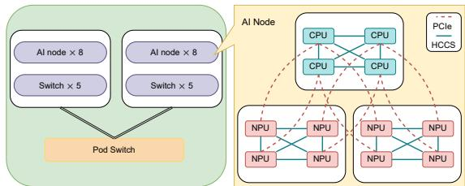  
Figure 16: AI computing node topology.

Table 7: Per-node specification.
<table><tr><td rowspan=1 colspan=1>CPU Compute (TOPs)</td><td rowspan=1 colspan=1>1.96 (FP64) / 3.92 (FP32)</td></tr><tr><td rowspan=1 colspan=1>NPU Compute (TFLOPs)</td><td rowspan=1 colspan=1>2048 (FP16)/ 4096 (INT8)</td></tr><tr><td rowspan=1 colspan=1>HBM</td><td rowspan=1 colspan=1>256 GB</td></tr><tr><td rowspan=1 colspan=1>DDR</td><td rowspan=1 colspan=1>2 TB</td></tr><tr><td rowspan=1 colspan=1>HCCS bandwidth</td><td rowspan=1 colspan=1>32 GB/s (uni-directional)</td></tr><tr><td rowspan=1 colspan=1>PCIe bandwidth</td><td rowspan=1 colspan=1>30 GB/s (uni-directional)</td></tr><tr><td rowspan=1 colspan=1>Network bandwidth</td><td rowspan=1 colspan=1>8 ×100 Gbps</td></tr></table>

## A Environment details

Figure 16 shows the topology of the Ascend AI computing cluster in our experiments. Each cluster contains 16 NPU Pods, which are interconnected through high-speed aggregation switches. Each NPU pod comprises 8 AI compute nodes interconnected via high-speed access switches. In the singlenode topology, every four NPUs are interconnected via HCCS, forming an intra-node cluster with a unidirectional bandwidth of 30 GB/s. The intra-node cluster and NPUs are connected to the CPUs through PCIe 4.0 with a unidirectional bandwidth of 32 GB/s. Each NPU has a 100G RoCE v2 direct outboard network port to establish interconnections with NPUs in other nodes.

Table 7 summarizes the aggregated capabilities of a single node with 4 CPUs and 8 NPUs. The 8 NPUs can provide 2048 FLOPs of half-precision peak computing power, 4096 TOPs of integer-precision peak computing power, and 256 GB of HBM. The four CPUs offer a total of 1.96 TOPs of single-precision peak computing power and 3.92 TOPs of double-precision peak computing power and share 2 TB of DDR4.0 general-purpose memory.

## B Roofline Analysis

We define compute Arithmetic Utilization $U _ { \mathrm { a r i t h m e t i c } } ( \mathrm { M e m o r y }$ Bandwidth Utilization $U _ { \mathrm { m e m o r y } } )$ to measure the ratio of actual computational performance $P _ { \mathrm { a c t u a l } }$ (bandwidth $B _ { \mathrm { a c t u a l } } )$ to peak performance $P _ { \mathrm { p e a k } }$ (bandwidth $B _ { \mathrm { p e a k } } )$ . A utilization threshold $U _ { \mathrm { t h r e s h o l d } }$ is first established based on practical experience to delineate underutilization. This leads to the establishment of performance threshold $P _ { \mathrm { t h r e s h o l d } } = U _ { \mathrm { t h r e s h o l d } } * P _ { \mathrm { p e a k } }$ and bandwidth threshold $B _ { \mathrm { t h r e s h o l d } } = U _ { \mathrm { t h r e s h o l d } } * B _ { \mathrm { p e a k } }$ . We then introduce the following classification function.

$$
\begin{array} { r } { f ( P _ { \mathrm { a c t u a l } } , B _ { \mathrm { a c t u a l } } ) = \left\{ \begin{array} { l l } { \mathrm { m e m o r y ~ b o u n d , } } & { \mathrm { i f ~ } A I _ { \mathrm { a c t u a l } } \leq A I _ { \mathrm { n e c e s s a r y } } } \\ & { \mathrm { a n d } B _ { \mathrm { a c t u a l } } \geq B _ { \mathrm { t h r e s h o l d } } , } \\ { \mathrm { c o m p u t e ~ b o u n d , } } & { \mathrm { i f ~ } A I _ { \mathrm { a c t u a l } } > A I _ { \mathrm { n e c e s s a r y } } } \\ & { \mathrm { a n d } P _ { \mathrm { a c t u a l } } \geq P _ { \mathrm { t h r e s h o l d } } , } \\ { \mathrm { u n d e r u t i l i z a t i o n , } } & { \mathrm { o t h e r w i s e . } } \end{array} \right. } \end{array}\tag{3}
$$

Following the roofline model, we use $A I _ { \mathrm { n e c e s s a r y } } = P _ { \mathrm { p e a k } } / B _ { \mathrm { p e a k } }$ in ridge point to classify the memory bound and compute bound. Operators that fail to meet either memory or compute thresholds fall into the underutilization category.

Referring back to Figure 6, the height of the line reflects the compute performance, while the slope of the line reflects the memory bandwidth. To visualize thresholds, two dashed lines can be added: the left line for $B _ { \mathrm { t h r e s h o l d } }$ and the right line for $P _ { \mathrm { t h r e s h o l d } }$ . The area between these two threshold lines is shaded blue in the figure, marking the underutilization zone.

## C Case Study of Computation Optimization

In 100B PanGu-α, the top 10 time-consuming computation operators mainly include MatMul/BatchMatMul, format conversion operators (TransData and Cast), and element-wise operators (Mul and Add). The roofline analysis shows that 61.48% of the bottlenecks were underutilized, while 34.02% were memory-bound, with compute-bound only 4.50%.

Optimization: For the underutilized operators, we chose the following optimization. 1) FastGeLU. We replace the inefficient GeLU operator with FastGeLU, which is a highperformance operator. 2) Operator Fusion. We fuse inefficient element-wise operators such as Mul and Add into the LayerNorm operator, which is suitable for parallel acceleration. We can also perform fusion on time-consuming MatMul operators, such as FastGeLU with MatMul or BatchMatMul with Add. 3) Format Conversion: Ascend’s matrix compute unit (Cube [31]) only supports private formats (Appendix F), while tensor inputs often do not, leading to frequent format conversions during training. So we defaulted to using the private format to reduce the need for format conversion operators.

Results. After the optimizations, the computation time per step decreased from 72.31 s to 25.16 s. Specifically, regarding the distribution of computation bottlenecks, the ratio of underutilized operators decreased to 46.32%, and most of them shifted to the memory-bound.

## D Case Study of Parallel Optimization

Taking the GPT3-13B model with 8-card 8-way tensor parallel training as an example, as shown in Figure 17(a), the single step time is 890.92 ms, ’Host’, ’Comp’ and ’Comm’ are non-overlapping parts. The multi-component parallel analysis shows that the overlap time between computation and communication is only 38.149 ms, suggesting a parallel bottleneck.

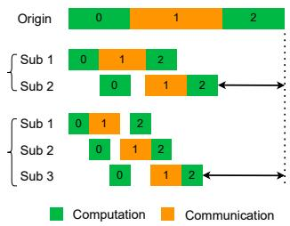

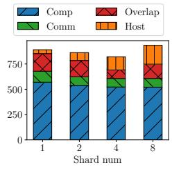  
(a) Multi-shard parallelism.  
(b) Results on GPT3.  
Figure 17: New optimization for parallel bottleneck.

Optimization: Inspired by finer-grained parallelism [14, 58], we propose the multi-shard parallel strategy to divide the computation and communication tasks within the same NPU, further enhancing the overlap. According to Figure $^ { 1 7 ( \mathrm { a ) , } }$ the computation and communication tasks are sequential and independently executed in the origin training, resulting in only one component being utilized while the other is idle. Our optimization tries to parallelize the computation and communication components by splitting the task along the batch\_size dimension into two shorter tasks. Within the same device, one task focuses on communication, while the other performs computation. Moreover, increasing the number of partitions can theoretically achieve higher parallelism, but it also introduces additional overhead, which is a trade-off. Notice that multi-shard parallelism can be used as a standalone parallel strategy or combined with others like tensor parallelism.

Results: During tensor parallelism, AllReduce (AllGather and ReduceScatter) communication is typically involved before and after the computation of the self-attention and linear layers [54], which is consistent with multi-shard parallelism. As shown in Figure 17(a), we evaluated with shard numbers 2, 4, and 8. When num=2 or 4, the overlap time ratio increases, resulting in more overlapped computation and communication, and the step time decreases to 860.46 ms (1.04 ) and 821.375 ms (1.08 ), respectively. Surprisingly, when num=8, although the overlap time continues to increase, the step time increases instead of decreasing, reaching 933.968 ms. The reasons include the total computation time exceeding the computation time of the original task after partitioning, and the additional communication overhead. Therefore, we should better keep the number of partitions within a small range.

## E Adaptive Gradient Fusion

Actually, the dual problem of fusion is how to segment a sequence of gradient synchronization operators. The origin is equal to that each operator constitutes a segment. Formally, we have a sequence of operator $O = [ o _ { 1 } , o _ { 2 } , . . . , o _ { n } ]$ . For the operator $o _ { i } ,$ we use $\nu _ { i }$ to denote the volume of gradients. As the gradients for the synchronization operator $o _ { i }$ will be generated from the corresponding computation operator, we use $d _ { c o m p u t e , i }$ to denote the corresponding duration time of computation. The segmentation is defined as ${ \cal S } = [ S _ { 1 } , S _ { 2 } , \ldots , S _ { n } ]$ where $S _ { i } = \left[ o _ { l } , o _ { l + 1 } , o _ { r } \right]$ denotes a segment of the operator sequence. The optimization problem can be formulated as:

$$
\begin{array} { r l } { \underset { S } { \arg \operatorname* { m i n } } } & { e _ { c o m m , m } } \\ { \mathrm { s . t . } } & { S _ { 1 } \cup S _ { 2 } \cup \dots \cup S _ { m } = O , } \\ & { \forall 1 \leq i < j \leq m , \quad S _ { i } \cap S _ { j } = \emptyset , } \end{array}\tag{4}
$$

where $e _ { c o m m , m }$ denotes that the communication end time of m-th fused gradients. The end time of i-th fused gradients can be obtained from the following recursive equation:

$$
\begin{array} { r l r } {  { e _ { c o m p u t e , 1 } = \sum _ { \sigma _ { i } \in S _ { 1 } } d _ { c o m p u t e , i } } } \\ & { } & \\ & { } & { e _ { c o m m , 1 } = e _ { c o m p u t e , 1 } + f ( \sum _ { \sigma _ { i } \in S _ { 1 } } \nu _ { i } ) , } \\ & { } & \\ & { e _ { c o m p u t e , k } = e _ { c o m p u t e , k - 1 } + \sum _ { \sigma _ { i } \in S _ { k } } d _ { c o m p u t e , i } } \\ & { } & \\ & { } & { e _ { c o m m , k } = \operatorname* { m a x } ( e _ { c o m p u t e , k } , e _ { c o m m , k - 1 } ) + f ( \sum _ { \sigma _ { i } \in S _ { k } } \nu _ { i } ) , } \end{array}\tag{5}
$$

where $f : \mathbb { R } \to \mathbb { R }$ maps volume to communication time according to our benchmark.

Forward search fusion is illustrated in Figure 10. Once the gradient computation is completed, the current AllReduce operator starts executing. At the same time, the next gradient computation continues until it is completed, triggering the next AllReduce. The algorithm aims to merge as many AllReduce operators as possible without increasing the overall communication time. The process begins by attempting to fuse the first and second AllReduce operators. It calculates the end time of the fused AllReduce and compares it with the start time of the next one. If the end time does not exceed the start time, the fusion is successful, and the fused operator is included in the strategy. Conversely, when attempting to fuse the third and fourth AllReduce operators, the end time of the fused operator exceeds the start time of the next AllReduce. Therefore, the fusion is abandoned, and the current operator is added to the strategy. This process is repeated, and ultimately, all the fused AllReduce operators are obtained.

## F Private Data format

ND and NZ formats are common data formats in Ascend chips. The former is the arbitrary format that supports exofficio Tensor data storage. It defaults to the NCHW format in Pytorch and MindSpore, while it defaults to the NHWC format in Tensorflow, where N is the batch size, C is the number of input channels, and H and W are the sizes of the input feature maps. Figure 18 shows a schematic of this data format and the mapping of its logical arrangement to its physical arrangement in memory.

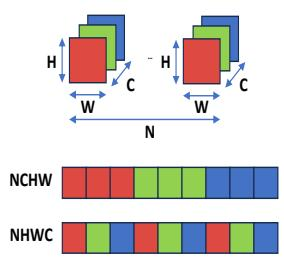  
Figure 18: ND format.

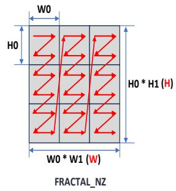  
Figure 19: NZ format.

The NZ format (FRACTAL\_NZ) is an Ascend-specific fractal format, such as the data storage of featuremap. The data format, as shown in Figure 19 of the output matrix, is NW 1H1H0W 0 during cube unit calculation. The whole matrix is divided into (H1 W 1) fractals, which are arranged according to column-major and have the shape of N, and (H0 ∗W 0) elements inside each fractal, which are arranged according to row-major and have the shape of z. Considering the format of the data layout, the NW 1H1H0W 0 data format is called the Nz format, where H0 and W0 indicate the size of a fractal.