①

USENIX

THE ADVANCED COMPUTING SYSTEMS ASSOCIATION

## Accelerating Nested Virtualization with HyperTurtle

Ori Ben Zur and Jakob Krebs, Technion - Israel Institute of Technology; Shai Aviram Bergman, Huawei Zurich Research Center; Mark Silberstein, Technion - Israel Institute of Technology

https://www.usenix.org/conference/atc25/presentation/zur

# This paper is included in the Proceedings of the 2025 USENIX Annual Technical Conference.

July 7–9, 2025 • Boston, MA, USA

ISBN 978-1-939133-48-9

Open access to the Proceedings of the 2025 USENIX Annual Technical Conference is sponsored by

P-Lr.h £Es/sL.

auuuJl9 PgleU

King Abdullah University of

Science and Technology

# Accelerating Nested Virtualization with HyperTurtle

Ori Ben Zur1, Jakob Krebs1, Shai Aviram Bergman2, and Mark Silberstein1

1Technion - Israel Institute of Technology 2Huawei Zurich Research Center

## Abstract

Nested virtualization provides strong isolation but incurs non-trivial performance costs. Prior works alleviate some overheads but suffer from limitations such as intrusive code changes or reduced control over nested virtual environments. We present HyperTurtle, a general approach to accelerate nested virtualization. It reduces the number of costly world switches between the virtualization layers, the primary source of performance overheads. HyperTurtle offloads the execution of certain parts on the critical path of the virtualized hypervisor, encapsulating them as eBPF programs and executing them safely in the context of the bare-metal hypervisor. Thus, HyperTurtle reduces the performance cost of world switches whilst retaining control over nested VMs. We show that HyperTurtle can be used to optimize a variety of OS subsystems and apply it to memory management, networking, and application profiling. HyperTurtle achieves significant performance improvements in micro and macro-benchmarks, for example, 5× faster EPT fault handling, which translates to up to 27% faster boot-time of Kata containers, without requiring intrusive code changes to the virtualization infrastructure.

## 1 Introduction

Virtual machine-based containers that rely on CPU virtualization capabilities to achieve isolation offer a more secure alternative to process-level containers. For example, Kata containers, used by several cloud vendors [1, 42, 64], are lightweight VMs that expose the Kubernetes management interface to facilitate adoption. Kata containers offer strong isolation to allow tenants to execute untrusted third-party code, which is a central requirement of serverless runtimes [1] in cloud computing systems.

In practice, VM-based containers are often deployed as nested VMs [31, 50, 57, 58], which is convenient for consolidating workloads and provides more flexibility. In such a nested virtualization scenario, a guest VM (L1) runs its own hypervisor to manage container VMs (L2).

Unfortunately, nested virtualization incurs substantial performance overheads [11], mainly due to the excessive number of transitions between the virtualization layers, commonly called world switches [11]. The transitions are necessary since the hypervisor running in a virtual machine needs to execute privileged instructions to manage the nested VMs, but it cannot do so without the bare-metal hypervisor [11].

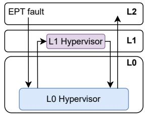

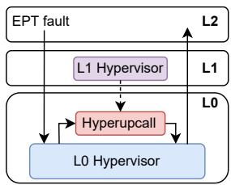  
(a) Vanilla nested virtualization  
(b) Nested virtualization with Hyper-Turtle  
Figure 1: The world switch problem in nested virtualization. When a nested virtual machine (L2) performs a vmexit, the virtualized hypervisor (L1) must handle it. However, since it is virtualized itself, the event handling is forwarded to L0, forcing an additional world switch. HyperTurtle reduces the number of the world switches by offloading the handling of such events as eBPF programs to L0.

Fig. 1a illustrates the world switch problem. Every time the execution of the nested VM (L2) requires the hypervisor’s intervention (e.g., EPT faults, emulation of hardware features), L2 transitions to the virtualized hypervisor (L1). This transition requires forwarding of the vm-exit to the bare-metal hypervisor (L0). Hence, there are at least four world switches overall. In contrast, non-nested virtualization requires only two world switches. Moreover, in some common performance-critical cases, the number of world switches is higher. For example, EPT fault handling requires six world switches if the physical memory of L2 is not present (see §4.3), vs. only two switches in the non-nested case.

These additional world switches cause substantial performance degradations. For example, prior work has shown that each world switch takes about 1µs, and comprises about 33% of the total vm-exit handling time [60].

Moreover, as we explain in §3, some of L0’s vm-exit handlers are much more expensive in the nested scenario vs. the non-nested one, e.g., 3.3× (0.78µs vs. 2.77µs) and 2.9× (5.7µs vs. 16.7µs) for cpuid hypercall and non-maskable interrupt handling respectively (see Tab. 1), thus their negative impact on the nested VM performance is even higher.

Prior work has explored several techniques for reducing nested virtualization overheads [11, 31, 45, 58, 60]. Direct Virtual Hardware (DVH) [45] bypasses L1’s I/O stack by exposing virtual devices from L0 directly to L2, similar to passthrough in non-nested setups. DVH improves I/O performance, but retains other nesting overheads and prevents L1 from enforcing policies on I/O paths such as traffic shaping [17]. Other systems that use hardware-assisted virtualization, such as SVT [60], reduce switching overheads by co-scheduling L1 and L2 on sibling hyperthreads, but rely on simultaneous multithreading (SMT), which is being phased out and becoming unavailable [2,36]. Software-based systems like PVM [31], X-Containers [57], and CKI [58] decouple L0 from nested execution through syscall redirection, library OSes, or hardware-isolated compartments within L1, but introduce compatibility and performance issues or require hardware changes. Finally, Peer-Pods [5], Free-The-Turtles [63], and Dichotomy [62] sidestep nesting entirely, at the cost of hypervisor-level control and orchestration flexibility.

We present HyperTurtle, a general approach to accelerating nested virtualization with minimal code modifications to both L0 and L1. HyperTurtle reduces the number and cost of world switches by offloading certain parts of the L2 vm-exit handling logic from L1 to L0 (see Fig. 1b). Notably, it encapsulates relevant functionality as an eBPF program loaded into and executed by L0 when handling L2’s vm-exits. To achieve this, HyperTurtle enables L1 to hook into L0’s vm-exit handling logic, which executes the eBPF that implements the relevant functionality of the L1 hypervisor, such as EPT fault handling. Not only does this mechanism eliminate the respective world switches, but it also obviates the need for emulating CPU virtualization features necessary for handling the event in L1. The eBPF bytecode undergoes the standard kernel verification when loaded by L0 to ensure safe execution. Thus, HyperTurtle improves the performance of nested virtualization with minor changes to L0 and L1 hypervisors, it is hardware agnostic, and keeps L1 in full control of L2.

The idea of offloading guest functionality to a hypervisor via eBPF was first introduced in Hyperupcalls [4]. However, adopting it to accelerate nested virtualization poses a few non-trivial challenges. First, eBPF programs cannot use locks or unbounded loops and cannot perform arbitrary memory accesses due to safety constraints, complicating the implementation of complex functionality such as EPT fault handling. Second, L1’s address space and data structures are not accessible to eBPFs running in L0. Last, a naive approach where L0 may host eBPFs that belong to different L1 hypervisors may compromise isolation. For example, attaching a L1’s eBPF program to L0’s physical network interface enables it to receive the network traffic of L0 as well as other L1’s.

HyperTurtle solves these challenges, demonstrating how eBPFs can be used to accelerate three specific subsystems of high practical importance where nested virtualization incurs particularly high overheads: EPT fault handling, network I/O, and application performance profiling. In each case, we show how to expose the relevant L1’s state to an eBPF program via eBPF maps, develop helper functions that enable direct and safe access to L1’s data structures from the eBPF context, implement the respective eBPF program, and leverage HyperTurtle infrastructure to safely attach it to the appropriate hooks in the L0 kernel.

We show that HyperTurtle offers substantial performance benefits in all three scenarios, and provides a generic way to reduce both vm-exits and I/O overheads. Specifically, moving the EPT fault handling into L0 allows L2 physical memory to be paged in without trapping to L1, resulting in a 5.1× reduction in EPT fault handling latency on average. This reduction accelerates Kata container launch times by an average of 27%.

Running L1-controlled networking with eBPF in L0 enables the usage of DVH without compromising L1’s control over L2 networking. This enables 33% average latency reduction compared to the two-level network virtualization previously required to achieve the same level of control over L2 network stack. Thus, HyperTurtle achieves a 72% throughput increase at 500µs in the memcached latency-throughput benchmark, making the performance of nested Kata containers on par with regular containers, while retaining full compatibility with the Kubernetes Container Network Interface despite the use of DVH. Lastly, HyperTurtle enables profiling nested virtual machines from L1 with a reduction in sampling latency by 7×.

Importantly, HyperTurtle is practical and easy to maintain, as it achieves high performance with modest modifications limited mostly to the KVM module, and its most complex EPT fault handling hyperupcall is only 560 LOC.

The HyperTurtle source code and evaluation scripts are available at https://github.com/acsl-technion/hype rturtle.

## 2 Background

This section introduces the necessary background in nested virtualization and the previous work we build upon.

## 2.1 Nested Virtualization

We refer to a bare-metal hypervisor, a virtualized hypervisor running in a virtual machine, and a guest virtual machine managed by the virtual hypervisor as L0, L1, and L2, respectively.

In nested virtualization, L1 cannot directly access the CPU’s virtualization hardware extensions, which are only available to L0. Thus, L0 emulates these features for L1 by trapping virtualization-related instructions executed by L1.

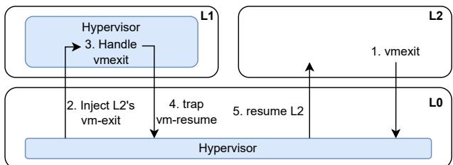  
Figure 2: L0 runs the nested VM on L1’s behalf. L0 injects all events that cause L2 to exit into L1.

Effectively, this results in L0 running L2-related procedures on L1’s behalf, forwarding all virtualization-related events to L1. This process is entirely transparent to L1 and L2. When L2 triggers a vm-exit, the CPU exits to L0, which injects the event to L1. This emulation doubles the number of world switches compared to non-nested virtualization. Fig. 2 illustrates the event forwarding. Often, the number of world switches may be higher (as, for example, in the case of EPT faults), and their costs may differ. We discuss this in §3.

Memory management in nested virtualization is also more complex. In non-nested virtualization, L0 maintains L1’s physical memory space, mapping guest physical addresses (gPA) memory to host physical (hPA). However, an additional level of indirection is necessary for nested virtualization, as L2 addresses are mapped to L1 addresses, which are then mapped to L0 addresses. The guest’s memory can be backed by anonymous, or file-backed memory via a shared-memory file system such as shmem. File-backed memory enables the Virtual Machine Monitor (VMM) to share the memory of the guest with another process. Kata containers utilize this with virtiofsd [61] for file system virtualization, providing a shared file system between the containers and the host.

Similarly, device virtualization adds another level of indirection. Consider, for example, the virtualization of a Network Interface Card (NIC). VirtIO [56] is a popular choice of the network para-virtualized device in non-nested virtual systems, as it facilitates VM migration and network changes without the guest’s cooperation. L0 exposes the NIC backed by VirtIO to L1 VMs. This para-virtual approach requires the translation of I/O events from physical devices in the host to virtual devices. In the nested virtualization scenario, there are two layers of para-virtual devices, one managed by L0 exposed to L1, and another by L1 exposed to L2.

## 2.2 eBPF

eBPF (extended Berkeley Packet Filter) allows users to dynamically load and safely run code in the kernel. To use eBPF, the user compiles restricted C code into eBPF bytecode. An object file with the bytecode can be loaded into the kernel and linked (or attached) to pre-existing function calls, hooks, in the kernel. The Linux kernel exposes many hooks. In particular, eXpressDataPath (XDP) and Traffic Control (TC) are popular hooks in the network stack, used, for example, to implement DDoS protection [21], load balancing [49], and observability [14]. eBPF uses key-value data structures, called shared maps, to share data between eBPF programs and userspace applications. The eBPF program defines the maps and the kernel allocates them when loading the program.

The kernel has a built-in verifier that checks the safety of eBPF programs. However, the verification restricts the expressiveness of eBPF programs. The verifier checks the bounds of memory accesses, disallows unbounded loops, and restricts the use of locks, e.g., by non-root users.

Helper functions allow the eBPF programs to request services from the kernel or query its data structures [46]. The Linux kernel exposes a limited set of functions to eBPF programs, which can be divided to 5 main types: (i) map access (bpf\_map\_lookup\_elem()) (ii) time & perf utilities (bpf\_ktime\_get\_ns(), bpf\_perf\_event\_read\_value()) (iii) network stack integration (bpf\_redirect()) (iv) syscall– like services (bpf\_get\_current\_pid\_tgid()) (v) arbitrary data access (bpf\_probe\_read()).

Not all functions are available to every eBPF program. E.g., a networking-related helper function is not available to a tracing-type eBPF program. Moreover, a program’s set of available functions can be restricted with the Linux capability system [47], and some helper functions require special permissions (e.g., arbitrary data access helper functions).

## 2.3 Kata Containers

Tenants of public cloud systems may serve as service providers to third-party users [3]. While containers are common and the most convenient way to manage computational resources for such services, their isolation guarantees are often insufficient to run third-party code. Kata containers solve this issue. They offer the level of isolation of hardware virtualization but retain the same control interface as regular containers. They execute an application in a lightweight virtual machine, yet run a special agent to allow access to that application and maintain the management interface compatible with popular container management systems such as Kubernetes [42].

From the cloud provider’s perspective, Kata containers run as nested virtual machines. Unfortunately, the overheads associated with such deployments are too high, up to 3× slower [45, 57] than non-nested setups, forcing users to sacrifice stronger isolation advantages for better performance. Thus, HyperTurtle’s primary goal is to improve the performance of nested virtualization and make it an attractive alternative to containers.

## 3 Analysis

We first analyze the latency of world switches in isolation, and then show their performance impact in three important practical cases: EPT fault handling, networking and profiling. We use the same evaluation setup as in §5.

<table><tr><td>Exit Reason</td><td>L1 →L0 [us]</td><td>L2 →L0 [us]</td></tr><tr><td>nop hypercall</td><td>0.85</td><td>2.82</td></tr><tr><td>vm-write</td><td>1.1</td><td>一</td></tr><tr><td>vm-enter</td><td>8.0</td><td>丨</td></tr><tr><td>cpuid</td><td>0.78</td><td>2.77</td></tr><tr><td>EPT Fault</td><td>4.8</td><td> $3 . 7 \pm 0 . 8$ </td></tr><tr><td>Non-maskable interrupt</td><td>5.7</td><td>16.7</td></tr></table>

Table 1: L0 vm-exit handling duration, measured from vm-exit of the VM to the next vm-enter. All measurements are with $\mathrm { C o V } < 1 \%$ , except for EPT fault from L2.

## 3.1 Understanding World Switch Costs

World switches between L0, L1 and L2 may occur in a variety of execution scenarios, such as the invocation of privileged CPU instructions by L2 or L1. Notably, L2 always traps into L0, which forwards the event to L1. Some world switches are voluntary, i.e., when para-virtual I/O devices notify the L0 to perform an I/O event. This notification is implemented as a hypercall, which initiates a voluntary world switch.

At the CPU level, world switches require flushing of the CPU execution pipeline, saving the VM’s registers into the Virtual Machine Control Structure (VMCS) data structure, and loading the hypervisor registers from the VMCS structure. These operations lead to non-negligible overheads. Vilanova et al. [60] show that these overheads amount to about 33% of a 10µs-long emulation of the cpuid instruction.

Moreover, the handling latency of the vm-exit associated with each world switch may vary significantly depending on the cause of vm-exit, due to the execution of different code paths. Tab. 1 shows the latency of handling vm-exits in a few different scenarios. For example, handling a non-maskable interrupts is the most expensive. Notably, most transitions from L2 to L0 are more expensive than those from L1. This is caused by the need to inject the vm-exit from L0 to L1 and the manipulation of many of L0’s own data structures.

Takeaway: World switches are expensive, and their latency varies depending on their cause. They are more expensive when triggered from L2 than from L1.

So far, we have discussed the costs of world switches in isolation. Next, we focus on three specific scenarios to show how world switches affect their end-to-end performance in a nested virtual machine.

## 3.2 EPT Faults

Memory management is a key culprit of the nested virtualization tax, as the additional virtualization layer triples the number of world switches required to handle Extended Page Table (EPT) faults. To understand the origin of this overhead, we detail the implementation of the EPT fault mechanism for a nested guest in KVM.

Fig. 3 illustrates the hierarchy of page tables in nested virtualization. As with the non-nested virtualization, L0 maintains an EPT, called $\mathrm { E P T } _ { 0 \to 1 } \ ^ { 1 }$ , from L1 physical addresses (L1- PA) to L0 physical addresses (L0-PA). However, unlike nonnested virtualization, L1 maintains an EPT, called $\mathrm { E P T } _ { 1  2 }$ , from L2 physical addresses (L2-PA) to L1 physical addresses (L1-PA). As CPUs do not support a 3-dimensional page-walk, L0 shadows $\mathrm { E P T } _ { 1  2 }$ and maintains $\mathrm { E P T } _ { 0  2 }$ which translates L2-PAs directly to L0-PAs. L0 lazily creates $\mathrm { E P T } _ { 0  2 }$ while running L2.

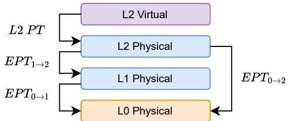  
Figure 3: Page table hierarchy in nested virtualization

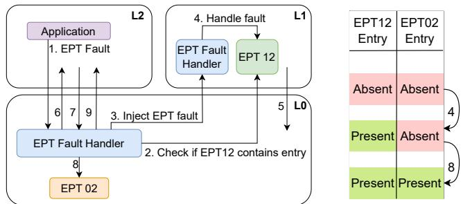  
(a) EPT fault handling in nested virtualization, see the text for details.  
Figure 4: EPT fault handling in nested virtualization

Fig. 4a walks through the EPT fault handler, while Fig. 4b illustrates the state of $\mathrm { E P T } _ { 1  2 }$ and $\mathrm { E P T } _ { 0  2 }$ throughout. L2 encounters an EPT fault due to a missing $\mathrm { E P T } _ { 0  2 }$ entry, which triggers a vm-exit to L0 1 . L0 checks if a valid mapping appears in $\mathrm { E P T } _ { 1  2 }$ 2 . If it is missing, L0 injects the EPT fault into L1, and enters L1 immediately thereafter 3 . L1 handles the EPT fault by mapping the address in $\mathrm { E P T } _ { 1  2 } \bullet$ L1 tries to resume L2, trapping again into L0 5 . L0 enters L2 6 , which re-executes the instruction that triggered the EPT fault. Since $\mathrm { E P T } _ { 0  2 }$ still contains a non-present entry, another vm-exit occurs 7 . L0 once again walks $\operatorname { E P T } _ { 1 \to 2 } \oplus .$ finds the entry, and fixes $\mathrm { E P T } _ { 0  2 }$ with the value from $\mathrm { E P T } _ { 1  2 } .$ L0 then re-enters L2 9 , resuming execution. This procedure requires a total of six world switches, compared to only two in non-nested virtualization.

We measure the EPT fault latencies incurred by a VM when faulting in 1GiB of consecutive memory with and without nesting. Tab. 2 shows the results. We observe that nested EPT faults experience 5.1× and 5.3× latency increase over the non-nested scenario for the average and 99p latencies, respectively, demonstrating the costs of additional world switches.

<table><tr><td></td><td>L2 VM</td><td>L1 VM</td><td>Slowdown</td></tr><tr><td>Average Latency [us] ↓</td><td>28.39</td><td>5.58</td><td>5.1×</td></tr><tr><td>99p Latency [us]↓</td><td>49.13</td><td>9.35</td><td>5.3×</td></tr></table>

Table 2: EPT-fault Latencies in demand paging (lower is better).

Impact on startup time. EPT faults occur most frequently early in the VM’s life cycle because memory has not been allocated yet. Therefore, the EPT fault handling performance directly impacts the startup time. In the context of nested virtualization, this metric is particularly important for Kata containers, as their usage scenarios are identical to regular containers, i.e., short lifetime and on-demand dynamic deployment [1], thus requiring low startup latency.

To demonstrate the impact of the EPT fault handling on the boot time of a nested VM, we measure the startup time of a Node.js application with a Linux Ubuntu image in a Kata container. We define startup time as the time from issuing the startup command until the application responds to a network request. Starting the Kata container in a non-nested scenario takes 0.7 seconds, compared to 1.5 seconds as a nested VM. The latency breakdown shows that the EPT faults account for 14% (0.1 seconds) and 46% (0.69 seconds) in the non-nested and nested cases respectively, highlighting the importance of reducing the EPT fault handling costs.

Takeaway: World switches cause large overheads in EPT fault handling in nested virtual machines, with a significant end-to-end impact, e.g., on the startup time.

## 3.3 Networking

Network I/O from L2 to the world outside the physical server must be performed via L0 which manages physical NICs. In a simple approach, called Nested-VirtIO, L1 mediates between L2 and L0. L0 exposes a virtual NIC to L1 $\left( \mathrm { v N I C } _ { 0 1 } \right)$ , which in turn creates its own vNIC $\left( \mathrm { v N I C } _ { 1 2 } \right)$ and exposes it to L2. Under the hood, L1 connects and forwards traffic between $\mathrm { \ v N I C _ { 0 1 } }$ and $\mathrm { v N I C } _ { 1 2 }$ . Both vNICs are virtioNICs.

A more sophisticated approach, called Direct Virtual Hardware, Direct-Assignment [45], utilizes QEMU’s IOMMU emulation, where L0 exposes multiple vNICs to L1, allowing it to connect $\mathrm { \ v N I C _ { 0 1 } }$ directly to L2, effectively removing L1 from the L2 network data path. Indeed, Tab. 3 shows significant performance benefits of Direct-Assignment over Nested-VirtIO - with latency reduced by 40% and 37% for mean and 99p respectively, and throughput increased by 44%. Both setups utilize the vhost-net [59] driver in the hypervisors.

To understand this performance gap, we review the chain of events when L2 sends a single packet via Nested-VirtIO and via Direct-Assignment in Fig. 5a and Fig. 5b respectively.

In Nested-VirtIO, 1 L2 executes an MMIO write to notify $\mathrm { v N I C } _ { 1 2 }$ of the pending packet, which triggers vm-exit to L0. 2 L0 injects vm-exit to L1’s hypervisor, which forwards L2’s request to $\big ( \mathrm { v N I C } _ { 1 2 } \big ) ^ { \gamma } \mathrm { s }$ virtio worker thread 3 . The latter tries to transmit the packet 4 , triggering a vm-exit from L1 to L0 due to a similar MMIO write. L0’s hypervisor forwards the request to vNIC01’s virtio worker 5 which sends it via the physical NIC 6 .

<table><tr><td></td><td>Nested- Virtio</td><td>Direct- Assignment</td><td>Relative</td></tr><tr><td>Avg Latency [us] ↓</td><td>90.21</td><td>54.52</td><td>0.60×</td></tr><tr><td>99p Latency [us] ↓</td><td>106</td><td>67</td><td>0.63×</td></tr><tr><td>Throughput [Gb/s] ↑</td><td>12.1</td><td>17.4</td><td>1.44×</td></tr><tr><td>CPU Usage [%]↓</td><td>100</td><td>196</td><td>1.96×</td></tr></table>

Table 3: UDP round-trip latency of packets with 1-Byte payload using netperf; TCP throughput with iperf3.

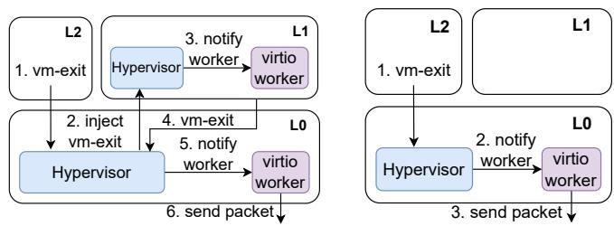  
(a) First packet transmission with (b) First packet transmission Nested-VirtIO with Direct-Assignment  
Figure 5: Comparison of single packet transmission in Nested-VirtIO and Direct-Assignment

This process is much shorter in Direct-Assignment: 1 L2 executes an MMIO write to notify (vNIC02), which triggers a vm-exit to L0. L0’s virtio worker sends the packet 2 via the physical NIC.

The overheads of Nested-VirtIO stem from the higher number of world switches: we observe a total of three world switches to transmit a packet using Nested-VirtIO compared to one world switch with Direct-Assignment.

Unfortunately, Direct-Assignment effectively disables the control of L1 over L2 networking, by removing L1 from the L2 network control path. Thus, L1 cannot affect the policies of network management operations for its L2 guests, such as routing, monitoring, and traffic shaping, which are essential for the proper operation of containers.

Takeaway: World switches in L2 network stack cause significant overheads. Direct-Assignment reduces the overheads, but it does not allow L1 to control L2’s network policies.

## 3.4 Application Profiling

Profiling is broadly used to find bottlenecks in development and production systems, with some vendors, such as Netflix [30] and Google [55] continuously profiling their production applications. Moreover, all large cloud providers, such as AWS, Google Cloud, and Azure [8, 20, 27, 28] offer profiling utilities to their tenants.

<table><tr><td>Setup</td><td>L0 →L1</td><td>L1→L1</td><td>L1 → L2</td></tr><tr><td>Latency [us] ↓</td><td>5.66</td><td>25.63</td><td>60.68</td></tr></table>

Table 4: Profiler sampling latency in different settings.

Sampling profilers periodically interrupt a program and sample the programs state, as well as hardware performance monitoring counters (PMCs). Notably, sampling-based profilers are popular because they introduce minimal execution overhead, causing between 1% − 3% slowdown for most applications [20, 38].

Each sampling event begins with an interrupt, caused by the overflow of a PMC, which counts cycles since the last event and ends when the profiled program resumes execution. During the event, the state of the running program is sampled and the PMC is reprogrammed. From a performance perspective, profiling an application inside a container and running on bare-metal hardware is the same as profiling a regular application. Profiling an L1 from L0 requires a single vm-exit for each sampling event.

However, profiling inside a VM causes a dramatic slowdown. Tab. 4 compares the average latency of handling a sampling event when profiling L1 from L0 (L0 → L1), a container from L1 (L1 → L1) and a nested VM from L1 (L1 → L2). We observe that the latency of (L1 → L2) is about twice as large as the latency of (L1 → L1), and almost 8× higher than profiling a VM from L0.

We now analyze the sequence of events that occur when profiling a container (Fig. 6a) and a nested VM (Fig. 6b) from L1. In the former case, KVM emulates the HW counters by exposing virtual registers. L0 traps the L1 when the latter tries to access them. The flow is as follows: 1 The HW counter triggers an interrupt, which triggers a vm-exit to the host (L0). 2 The host injects a similar interrupt to the L1, and enters L1. 3 As part of the interrupt handling routine, L1 reprograms the HW counter and performs multiple accesses to MSRs, bringing the total world switch count to 18.

Profiling an application in a nested virtual machine incurs higher overheads. 1 The HW counter triggers an interrupt, which triggers an exit from L2 to L0. 2 L0 injects a similar interrupt to L1, and enters L1. 3 As part of the interrupt handling routine, L1 reprograms the HW counter, accesses MSRs and performs the vmread and vmwrite, which access the VMCS, overall triggering 22 world switches. 4 L1 executes the vm-enter instruction, which triggers an exit to L1. 5 L0 emulates the vm-enter instruction and enters L2, which brings the total number of world switches to 26.

Interestingly, the performance discrepancy between profiling a nested VM or a container stems not only from the number of world switches but also from their higher costs for the nested case. Our measurements show that 7.8 µs are spent by L0 injecting the NMI into L1, additional 8µs on the emulation of L1’s execution of the vm-enter instruction.

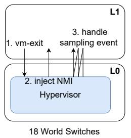

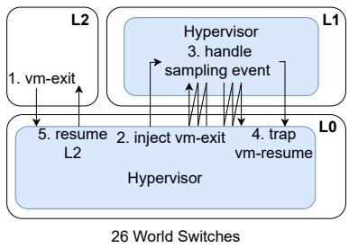  
(a) Profiling a container in L1  
(b) Profiling a Kata container in L1  
Figure 6: Comparison of world switches when profiling a standard container versus a Kata container from L1.

Takeaway: Excessive world switches and their increased cost cause high overhead when profiling an L2 VM from L1.

These diverse examples motivate us to build a generic infrastructure to reduce the aforementioned overheads of nested virtualization, as we describe next.

## 4 Design & Implementation

HyperTurtle pursues the following design goals:

1. Performance: Eliminate excessive world switches,

2. Control: Retain L1’s ability to enforce policies on L2,

3. Non-intrusiveness: Minimize L0 modifications,

4. Generality: Provide a hardware-agnostic approach generalizable to optimize different OS subsystems.

HyperTurtle offloads a subset of L1 hypervisor functionality into L0 thus minimizing excessive world switches (Goal 1). HyperTurtle leverages hyperupcalls, i.e., eBPF programs, to safely execute L1’s code in L0. Thus, L1 fully controls the offloaded logic executed in L0, implying that it retains full control over L2 (Goal 2). As the eBPF subsystem already exists in L0’s kernel, the only L0 modifications required are the export of nested virtualization-related information to be accessible to the hyperupcall eBPF function via helper functions, and the addition of an installation mechanism for eBPF programs from L1, achieving Goal 3. Last, HyperTurtle’s implementation is modular, making it applicable to accelerate different subsystems according to the user’s choice, as we empirically demonstrate in the rest of the paper (Goal 4).

We focus our efforts on KVM, as the da-facto standard for virtualization in Linux, however, we believe that the design principles are applicable to Xen-based VMs. Additionally, we limit our design to a single level of nesting, leaving further design choices, such as the choice of the layer to which a hyperupcall should be installed for future work.

## 4.1 Design Overview

HyperTurtle comprises the eBPF offloading infrastructure, new hooks in L0, new eBPF helper functions and the mechanisms for sharing data between L1 and eBPFs.

The offloading mechanism allows L1 to install the relevant eBPF in L0 via a hypercall. It exposes two main features: load a program into L0 and link the program to the hook.

A program is first loaded into L0 and verified by its eBPF verifier. L1 then attaches the hyperupcall to a hook in L0, which is invoked as part of L0’s logic for handling L2 events.

Design recipe. Each subsystem requires its own design to reduce the associated world switch overheads via eBPFs. However, each such design follows a general recipe which comprises three key steps:

1. Sharing information: Exposing necessary information between L1 and the eBPF program for its operation. L1 might need to be modified and L0 might need to expose new helper functions to assist the hyperupcall.

2. Hook into L0: Implementing a hook in the L0 hypervisor to intercept and handle specific events.

3. Develop eBPF program: Writing the desired functionality as an eBPF program that will run in its own isolated context from L0.

We now explain the infrastructure shared by all hyperupcalls and then delve into the eBPFs for accelerating EPT fault handling, network control of L1, and application profiling.

## 4.2 Hyperupcalls Infrastructure

eBPF maps and L1 memory access. HyperTurtle employs shared eBPF maps for L0-L1 data sharing, instead of the packet-based communications in Hyperupcalls, to support concurrent access to shared data. To achieve this, HyperTurtle adds a new hypercall to create a shared-memory PCI device which exposes array eBPF maps from L0 to L1.

In addition, we introduce a new helper function in L0, bpf\_probe\_read\_hyperupcall, to enable eBPFs to access L1’s physical memory. This function is safe, in that it verifies that the address is valid and mapped to L1. In addition, it guarantees isolation between the eBPFs installed by different L1 VMs, ensuring that each eBPF can only access the memory regions of the L1 to which it belongs.

Hyperupcall registration. An L1 guest registers a hyperupcall to the L0 hypervisor via a hypercall interface. L1 provides the compiled eBPF program and the hook to attach it. L0 uses the existing eBPF registration mechanism in the Linux kernel to verify, load and link the hyperupcall. For improved security, L1 might also request to install an eBPF from a set of eBPFs vetted by L0 in advance.

In contrast to the original hyperupcall infrastructure where the registration is implemented in a single hypercall, we separate the loading and linking into two hypercalls. This allows linking a single hyperupcall to multiple hooks and avoids duplicate loading, e.g., for networking-related hyperupcalls.

Security. HyperTurtle may be used with two security models: 1. L1-provided eBPFs secured by L0’s eBPF verifier or stricter alternatives such as Prevail [25]. 2. Cloud vendor-vetted eBPFs, loaded only if signed and verified (e.g., via Hornet [13]). The latter model provides more strict security where necessary. With both models, HyperTurtle ensures eBPFs can access only their own L2s and memory; and subsystem-specific isolation mechanisms are detailed in the following sections.

## 4.3 EPT Fault Handling

To combat high EPT fault latencies, we implement a hyperupcall which can map a non-present $\mathrm { E P T } _ { 1  2 }$ entry during a nested guest’s EPT fault. Our implementation targets the filebacked memory virtualization backend, which is commonly used in QEMU and Cloud Hypervisor [33], and adopted by Kata Containers [42]. It relies on the shmem virtual file system, and enables shared memory between the host and guest. This backend typically works in conjunction with a user-space daemon, such as virtiofsd [61], to support shared file systems outside the VMM (see §2.1).

## 4.3.1 Sharing Information

The key design challenge of the EPT fault hyperupcall is managing the shared state between L1 and the hyperupcall running in L0. The design must account for L1 physical memory allocation, race conditions, as well as the consistency of L2’s physical memory mappings that may arise as the VMM and other processes access L2’s memory (e.g., virtiofsd [61]).

Memory allocation. Since allocating memory from the hyperupcall’s eBPF context is too complex, we use a preallocated memory pool. Specifically, L1 maintains a pool of allocated frames in an eBPF map which is accessible from the hyperupcall. The hyperupcall falls back to the traditional EPT fault mechanism if the pool is empty. L1 replenishes the memory pool either asynchronously using a background kernel thread or synchronously in batches when L1 is called to serve a vm-exit. Our experiments show that using a pool size of 4096 frames suffices to avoid synchronous replenishment. We therefore use a 4096 frame pool size throughout the paper.

Consistency with L1. The hyperupcall must prevent potential inconsistencies between $\mathrm { E P T } _ { 1  2 }$ and other data structures in L1, such as the VMM’s page table and L1’s KVM internal data structures. For example, due to races on L1 virtual addresses (L1-VA) which correspond to an L2-PAs.

To notify L1 of changes the hyperupcall makes to $\mathrm { E P T } _ { 1  2 } .$ it exposes a cyclic fault log called the hyperupcall fault log to L1 via a shared map, to which it logs the L2-PA it maps. On the next vm-exit entering L1, L1’s KVM faults the L1-VAs corresponding to the entries in the fault log into the VMM’s address space. If the log is full, the hyperupcall falls back to the original EPT fault mechanism. To make the hyperupcall aware of mappings performed by the VMM, the VMM’s cr3 register is copied to a shared map. Access to the cr3 enables the hyperupcall to walk the VMM’s page table using the bpf\_probe\_read\_hyperupcall helper function and check whether the faulted address has a preexisting mapping.

To prevent race conditions, we wrap the hyperupcall with a lock. A failure to acquire the lock results in a fallback to the traditional EPT fault mechanism due to the limitations of eBPF lock implementations (see §2.2).

The lock is exposed to L1 via a shared map, allowing L1’s KVM to acquire the lock when handling an EPT fault in L1.

Finally, to create a coherent memory mapping between the hyperupcall and users of the L2’s file backed memory (e.g., L1’s hypervisor and the virtiofsd daemon), we wrap the shmem page fault handler with the following logic: (1) Acquire the hyperupcall’s lock (spinning if necessary). (2) Walk $\mathrm { E P T } _ { 1  2 }$ to check if the hyperupcall already mapped this page. If it has, map it to L1. (3) Call the original page fault handler. (4) Log the L2-PA which corresponds to the fault to a cyclic buffer, called page fault log, which is also a shared map. Step (2) is necessary because the hyperupcall might have created a mapping that is not yet visible from L1 (because an exit from L2 to L1 hasn’t occurred yet). To minimize its size, the VMM purges the log on the next vm-exit from L2. The maximal log size is equal to the number of L2 frames to prevent overflows. Future work may optimize this design.

## 4.3.2 L0 Hook

We place the hyperupcall hook in L0’s handling of L2’s EPT fault, during step 2 from Fig. 4a, which allows L0 to call the hyperupcall upon the discovery of a non-present entry in $\mathrm { E P T } _ { 1  2 }$ . The hyperupcall then maps a new L1 frame to L2, and allows L0 to finish the fault handling and resume the execution of L2, avoiding excessive world switches.

## 4.3.3 eBPF Program

The hyperupcall receives the faulting L2-PA as well as the fault type (read or write), and then performs the following steps, wrapped within the hyperupcall lock:

1. Walk L1’s VMM’s page table to check if a mapping exists for the L1-VA that corresponds to the L2-PA that triggered the fault. If a mapping exists, return an EPT entry pointing to the appropriate L1-PA.

2. If the L2-PA is in the page fault log (faulted in by an external process in L1), fall back to the traditional EPT fault mechanism.

3. Create a new EPT entry using a frame from the hyperupcall’s memory pool.

4. Write the new entry into $\mathrm { E P T } _ { 1  2 }$ and the fault log. After the hyperupcall returns, L0 continues to handle the EPT fault as $\mathrm { E P T } _ { 1  2 }$ is now present.

## 4.4 Fast L2 Networking with L1-Controlled Policies

The Direct-Assignment method, introduced by DVH [45], improves performance, but takes away L1’s control over L2’s network traffic. HyperTurtle allows L1 to install eBPF programs on L0’s network interfaces, enabling it to regain control by attaching hyperupcalls to the virtual devices used by L2. While this represents a relatively simple use case for hyperupcalls, it demonstrates how HyperTurtle can restore control without sacrificing performance.

Fig. 7 explains the operation of the networking subsystem using Direct-Assignment with eBPFs in the L2’s network data path. As per the general recipe (see §4.1) — we share information via shared maps and hooks are supplied by L0’s eBPF infrastructure [15]. We implement the following proofof-concept eBPF programs to showcase L1’s ability to control L2 network policies.

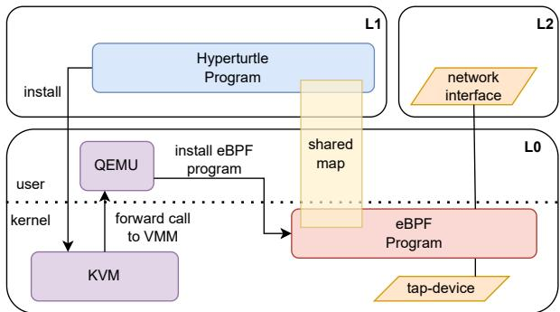  
Figure 7: Networking eBPF in the L2 data path

• Pass simple eBPF program that does not perform any processing,

• Stateless Firewall filters packets based on their source IP address,

• Rate Limiter caps the rate of L2’s incoming traffic based on data throughput and packet count. The limit can be dynamically configured at runtime by L1,

• TCP-Top allows L1 to monitor all TCP connections of L2. It is a modified version of inspector-gadget’s tcptop program [34].

Isolation & Multiple L2s. HyperTurtle ensures that the eBPF programs can run on the data path of virtual interfaces owned by the L1 VM that installed them. Thus, it guarantees that L1 cannot interpose on the traffic on the interfaces it does not own. Moreover, HyperTurtle utilizes the available per-vNIC hooks to allow L1 to load a different eBPF program to each L2 it manages.

## 4.4.1 Compatibility Layer with Container Management

Kubernetes (k8s) is a prime candidate as a cluster management tool for nested VMs [23, 42]. In particular, Kata containers support management by k8s, but using Direct-Assignment breaks the compatibility with k8s and prevents L1’s control over the k8s network required for monitoring and policing with tools such as Clilium [14].

To deploy HyperTurtle in k8s clusters, we integrate dynamic Direct-Assignment interface management via a custom Container Network Interface (CNI) plugin [7]. The plugin implements configuration of a k8s network by creating and configuring network interfaces as requested by k8s in the initialization process of a k8s pod (management unit of k8s). The L1 administrator may then install the eBPFs to implement the network functions explained before.

Fig. 8 presents the dynamic interface creation. In step 1 , the user requests k8s to create a new pod. To create the pod, K8s requests new NIC from the CNI plugin 2 which internally requests it from L0 via a hypercall interface 3 .

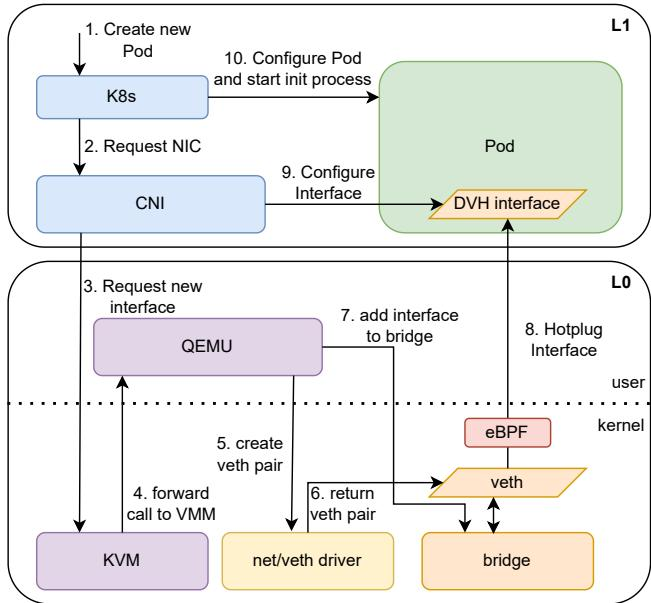  
Figure 8: Dynamic virtual interface creation with k8s for spawning a new pod with a DVH network interface. The pod in L1 may be a regular container or a Kata container.

KVM receives the hypercall and forwards it to QEMU 4 , which creates the new vNIC 5 . The L0 kernel creates the interface 6 , such that QEMU attaches it to a predefined bridge 7 , and dynamically hotplugs the interface to L1 via the standard QEMU mechanisms 8 . Meanwhile, the CNI plugin waits for the new interface to appear, and then assigns the correct network namespace and configures the addresses according to k8s’ request 9 . Finally, after CNI plugin returns, and k8s starts the pod’s init process 10 .

Due to the modular design of the CNI plugin, it also allows the management of VM interfaces and is compatible with other projects without additional implementation efforts.

## 4.5 Profiling

The hyperupcall to accelerate profiling does not require any information from L1, but it needs to share the samples with the application running in L1. Following the recipe from §4.1, we adopt an approach similar to perf [59] and share information via a shared map as a ring buffer which holds the samples. The buffer must be emptied periodically by L1 to allow the profiler to continuously log samples. Additionally, we added a new eBPF helper function, vcpu\_probe which reads L2’s registers, allowing L1 to easily view it’s L2 state from within the hyperupcall.

We utilize the preexisting profiling hook in Linux to define the hyperupcall, using perf’s system call interface to register the hyperupcall’s eBPF program as a sampling event. When L1 registers the hyperupcall, is specifies the frequency at which it wants the profiler to run.

After registration, the eBPF program is the periodically called and can sample the guest. Our proof-of-concept profiler implementation samples the guest’s instruction pointer via new helper function, and logs them onto the ring buffer.

Isolation. We inherit the isolation guarantees from the perf’s system call, as it allows us to control the sampler only when the process currently running is in the guest mode.

## 4.6 Summary of Code Modifications

Tab. 5 highlights the modest code modifications in the respective subsystems required to implement HyperTurtle infrastructure and the hyperupcalls to accelerate the described subsystems. Specifically, the L0 VMM, e.g., QEMU, implements the registration process, requiring the addition of the registration hypercalls. HyperTurtle’s EPT fault handling mechanism requires additional eBPF hooks in the L0 kernel that expose the EPT handler routine to the eBPF subsystem. The L0 kernel modifications are limited to exporting additional functions in the memory subsystem and addition of hooks. Lastly, the implementation requires minor additions to the L1 kernel, almost exclusively to the KVM kernel module and the eBPF framework. The implementations of all three hyperupcalls in eBPF are minimal.

In summary, HyperTurtle requires modest changes to the kernel and relatively small amount of eBPF code to achieve its goal of significantly reducing the number of world switches.

## 4.7 Other usecases

We briefly outline a number of other scenarios where Hyper-Turtle’s approach can be beneficial.

Faster Networking. It is possible to utilize XDP’s AF-XDP socket to route traffic directly from the network driver network functions from L2 VMs to L0 to further improve performance.

Storage Devices. Similarly to networking, storage devices may be directly assigned from L0 to L2. By allowing eBPF function that run on L0 to access the file mapping information on L1, files could be read into L2 directly from L0.

SmartNICs. Offloading eBPF programs from L1 to smart NICs can significantly improve performance, thereby completely removing network virtualization logic from the CPU and boosting the performance of nested virtual machines.

Direct Execution and Scheduling. DVH [45] implemented direct execution of nested guests from an idle state of both L1’s and L2’s vCPU. This can be expanded upon and generalized with hyperupcalls, as L1 may ask L0 to run the L2 vCPU without entering and exiting L1. This is most relevant on over-commited systems running latency sensitive applications such as memcached, as well as when L2 is running co-routines on different vCPUs.

## 4.8 Limitations

Complex functions, e.g., access to L1’s file system, are difficult to implement using eBPFs due to the complexity of synchronizing concurrent access with L1. For the same reason it is unclear how to implement full-offloading without a fallback to L1.

<table><tr><td>Level</td><td>Codebase</td><td>Size [LoC]</td><td>Description</td></tr><tr><td>L0</td><td>Kernel/KVM</td><td>151</td><td>Hyperupcall Infrastructure (see β4.2) and EPT fault hook (see $4.3)</td></tr><tr><td>LO</td><td>Kernel/eBPF</td><td>119</td><td>Addition of new helper functions (see §4.5 and §4.2)</td></tr><tr><td>LO</td><td>QEMU</td><td>616</td><td>Installer for Hyperupcall programs (see §4.2)</td></tr><tr><td>L0</td><td>QEMU</td><td>159</td><td>Dynamic Direct-Assignment interface creation (see §4.4.1)</td></tr><tr><td>L1</td><td>Kernel/mm</td><td>32</td><td>Support shmem backed memory (see §4.3)</td></tr><tr><td>L1</td><td>Kernel/KVM</td><td>653</td><td>Exposing data to hyperupcalls (see $4.3)</td></tr><tr><td>L0</td><td>eBPF</td><td>566</td><td>EPT fault hyperupcall (see $4.3)</td></tr><tr><td>LO</td><td>eBPF</td><td>263</td><td>Networking hyperupcalls (see §4.4)</td></tr><tr><td>L0</td><td>eBPF</td><td>59</td><td>Profiler hyperupcall (see $4.5)</td></tr></table>

Table 5: Code changes necessary to implement HyperTurtle

Our EPT fault hyperupcall implementation does not support allocating huge pages. EPT faults of huge pages are scarce, and therefore accelerating the faults with a hyperupcall has no big performance impact. Additionally, the hyperupcall cannot map pages from L1’s page cache unless they are already mapped to L1’s VMM page table. Last, it does not yet support multiple EPT-fault hyperupcalls simultaneously. Thus, only one L1 may use the hyperupcall for a single L2. This limitation stems from using a global L0 eBPF hook, but can be eliminated by storing a per-L2 handler in L0’s KVM. We leave the implementation for future work.

## 5 Evaluation

Setup. Tab. 6 describes the setup in all the experiments unless stated otherwise. We pin vCPUs and vhost threads to different physical cores in a single NUMA node, and only one vhost thread is used in each hypervisor. We report average results of ten benchmark iterations. For some benchmarks, we describe the underlying distribution; however, for some microbenchmarks, we only receive statistical aggregates from the tooling and thus cannot report more detailed information. As discussed in §4.2, our modifications in L1 are limited to its kernel, which makes HyperTurtle compatible with different VMMs. As in prior work [32] we use Cloud-Hypervisor [33] as the Kata container’s VMM for its high performance and support for pass-through devices. These are not supported by competing VMMs such as Firecracker [1]. Cloud-Hypervisor has better startup times and higher networking performance compared to QEMU. All nested virtualization benchmarks are conducted inside Kata containers [18, 31, 64]. For the network benchmarks, the load generator runs on a bare-metal machine connected directly via a network cable to the system under test. While all presented empirical results use Kata containers, HyperTurtle is fully compatible with classical VMMs on L1 and classical VMs as L2.

## 5.1 Microbenchmarks

EPT Fault Handling. We evaluate the EPT fault hyperupcall by creating a Kata container, faulting in 1GiB of memory and measuring the latencies of the EPT fault. We compare 3 configurations: (1) L2 VM: a vanilla nested VM, (2) L2 +

<table><tr><td rowspan=1 colspan=1>Component</td><td rowspan=1 colspan=1>Specification</td></tr><tr><td rowspan=1 colspan=1>Bare-MetalHypervisor (L0)</td><td rowspan=1 colspan=1>2×Xeon Silver 4216 (16-core,2.1GHz);512GiB RAM; Nvidia MT27710; SMToff;</td></tr><tr><td rowspan=1 colspan=1>NestedHypervisor (L1)</td><td rowspan=1 colspan=1>12 vCPUs; 64GiB RAM; QEMU VMM</td></tr><tr><td rowspan=1 colspan=1>L1/L2 Baseline(Kata Container)</td><td rowspan=1 colspan=1>1 vCPU; 2GiB RAM; Cloud-HypervisorVMM</td></tr><tr><td rowspan=1 colspan=1>Networking</td><td rowspan=1 colspan=1>virtio+vhost; tx zero-copy enabled</td></tr><tr><td rowspan=1 colspan=1>Boot Parameters</td><td rowspan=1 colspan=1> idle=poll; nopti</td></tr></table>

Table 6: Evaluation Setup

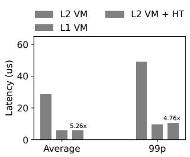

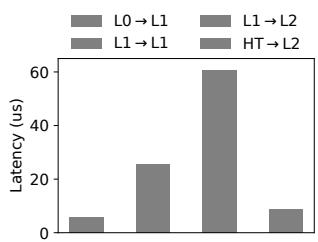  
(a) Average and 99p EPT fault latencies. (lower is better).  
(b) Latency of a profiler sampling event time in different configurations (lower is better).  
Figure 9: EPT Fault and profiling latency microbenchmarks (lower is better). HT = HyperTurtle.

HyperTurtle: a nested VM with the EPT fault hyperupcall, (3) L1 VM: a non-nested VM – the performance upper bound.

§5.1 compares the average and 99p EPT fault latencies across the listed configurations. HyperTurtle reduces the latency of an EPT fault of the vanilla nested VM by a factor of 5.25× and 4.76× for the average and 99p latency respectively. Furthermore, it has the same average latency of an EPT fault for the non-nested L1 VM, and is only 8% slower in the 99p.

Networking. HyperTurtle enables the use of DVH with the same level of control as Nested-VirtIO. However, its design introduces additional computation on each packet due to the execution of the respective eBPF programs in L1’s data path.

We measure the UDP round-trip-time latency and TCP throughput, and compare the following configurations: (1) Nested-VirtIO: vanilla nested VM, (2) Direct-Assignment: best-case performance with DVH but without L1’s control, (3) HyperTurtle + Pass: nested VM with HyperTurtle’s hyperupcalls mechanism, but with an empty hyperupcall, (4) HyperTurtle + Firewall: nested VM with HyperTurtle with a firewall hyperupcall, which allows L1 to enforce a firewall policy on L2’s network.. The pass and firewall hyperupcalls are detailed in §4.

All configurations utilize a single vhost thread in L0, and Nested-VirtIO utilizes another vhost thread in L1.

We use Netperf’s UDP\_RR benchmark with 1-byte UDP payload to measure network latency [41]. We measure the maximum achievable throughput with iperf3 [40]. As our goal has been to stress the eBPF code the most, we need 3 vCPUs in the Kata container for the throughput testing to saturate the vhost thread. With a single vhost thread it becomes the bottleneck without achieving line rate. Similar throughput limits have been observed by Firecracker [1].

Tab. 7 compares the average and $9 9 p$ network latency and throughput. HyperTurtle + Firewall has a 11% higher average latency than Direct-Assignment (60.53µs vs 54.5µs) and 33% lower average latency than Nested-VirtIO (60.53µs vs. 90.2µs). The eBPF firewall itself causes this overhead, as HyperTurtle + Pass has near identical $( p = 0 . 5 \% )$ performance to Direct-Assignment (55µs vs. 54.5µs). Thus, HyperTurtle’s infrastructure only has a minor impact on network latency, and the major source of overhead is the eBPF program itself.

Profiling. We profile GUPS application with a 4MiB working set running in the Kata container on top of L1. We set the profiler sampling frequency to 1000Hz (default in Intel VTune) and compare the following configurations:

1. $L O \to L l { \mathrm { : } }$ Perf profiler profiling a Kata container running in L0. Represents optimal performance.

2. $L l  L l \colon$ Perf profiler profiling a container running in L1 from L1.

3. $L l \to L 2 \colon$ Perf profiling L2 from L1 (vanilla baseline).

4. HyperTurtle → L2: HyperTurtle profiler profiling L2.

§5.1 presents the profiling sampling event handle times. Compared to $L l \to L 2 ,$ , HyperTurtle → L2 reduces the handling time by 7.15×, and is only 16% slower than the optimal.

## 5.2 Macrobenchmarks

Kata container startup time. We measure the time it takes a web server invoked in a Kata container to boot and respond to a single request. We evaluate different container images, as these may have a significant effect on the startup time [19], as well as both 4KiB and 2MiB page sizes. Importantly, even when 2MiB pages are used, the Kata runtime in L1 still maps the L2’s kernel to its physical address space using 4KiB pages, hence HyperTurtle improves performance by lazily mapping these pages. The page sizes in L1 and L2 are identical, such that an L2 frame corresponds to a single L1 page. We discuss the challenges of huge pages in §4.3.

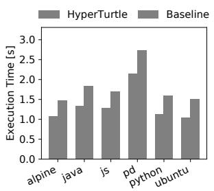  
(a) 4KiB Pages

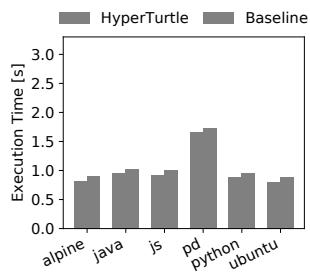  
(b) 2MiB Pages  
Figure 10: Kata container startup latencies for different applications, with and without HyperTurtle (lower is better). pd = Python with pandas, $C o V < 5 \%$

Fig. 10 compares the startup time of a nested VM with and without HyperTurtle. We observe that HyperTurtle reduces the L2 startup time by 27% and 8% on average when running with 4KiB and 2MiB pages respectively.

Next, we compare the behavior of larger applications - an instance of Redis with a 1GiB persistent snapshot, and the TextService application from the DeathStarBench suite [24]. Fig. 11 shows 55% and 35% performance improvements respectively. Running other micro services from the DeathStar-Bench resulted in similar performance (not shown).

Nginx. To evaluate web server performance, we deploy Nginx [52] and serve the GCC manuals with 10 concurrent connections using ApacheBench [22], following DVH’s methodology [45]. We compare the performance of different hyperupcalls and include Direct-Assignment as an upper bound of performance. Fig. 12a shows that HyperTurtle increases throughput by 45% when using the TCP-Top and the rate limiter hyperupcalls - from 1.24KQPS to 1.8KQS, with nearidentical performance to Direct-Assignment.

Redis. We evaluate HyperTurtle’s impact on Redis’s [53] throughput, using memtier\_benchmark [54], under its default mixed GET/SET workload. Fig. 12b shows that HyperTurtle increases throughput by up to 65% compared to Nested-VirtIO, while all non-Nested-VirtIO are within 6% of each other.

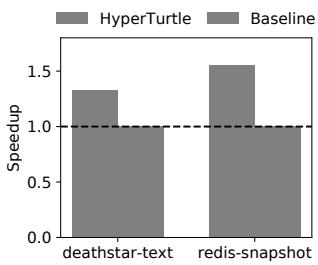  
Figure 11: The launch time of a Kata containers running Redis with a 1GiB persistent snapshot, and a TextService microservice from the Deathstar suite (higher is better). $C o V < 5 \%$

<table><tr><td>Metric</td><td>Nested-VirtIO</td><td></td><td></td><td>Direct-AssignmentHyperTurtle + PassHyperTurtle + Firewall</td></tr><tr><td>Average Latency [us]↓</td><td>90.2</td><td>54.52 (x1.6)</td><td> $5 5 . 0 ( \times 1 . 6 )$ </td><td> $6 0 . 5 \ : ( \times 1 . 5 )$ </td></tr><tr><td>99p Latency [us]↓</td><td>106.0</td><td> $6 7 . 0 \left( \times 1 . 6 \right)$ </td><td> $6 7 . 0 \left( \times 1 . 6 \right)$ </td><td> $7 3 . 0 \left( \times 1 . 4 \right)$ </td></tr><tr><td>Throughput [Gb/s]↑</td><td>12.1</td><td>17.4 (x1.4)</td><td> $1 7 . 3 \ : ( \times 1 . 4 )$ </td><td>17.1 (x1.4)</td></tr></table>

Table 7: Network latency and throughput. Values in parentheses are improvements relative to Nested-VirtIO. The CoV is below 10% in all the experiments.  
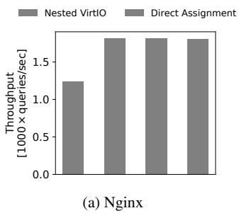

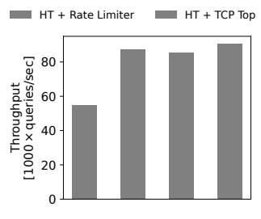  
(b) Redis

Figure 12: Evaluation of throughput in NGINX and Redis. Other Hyperupcalls show similar performance and are thus omitted.  
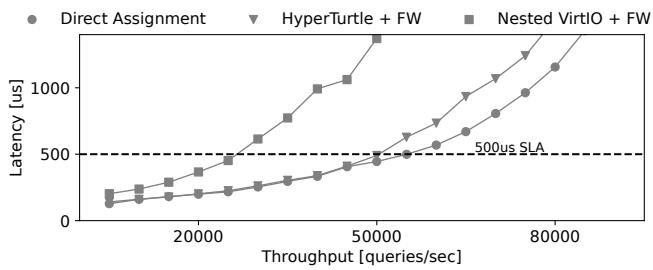  
Figure 13: Memcached throughput-99p latency.

Memcached. We use Memcached to show HyperTurtle’s effect on latency-sensitive applications. We use mutilate [43] as a load generator and Facebook’s ETC load [6] as query distribution. We examine HyperTurtle with a Firewall eBPF, and then compare the effects of profiling Memcached from L0 and L1. All reported results are the average of 10 runs, and have a standard deviation less than 0.1. Fig. 13 compares the 99th p latency in throughput-latency plot following the methodology of the IX project [10].

HyperTurtle provides consistent throughput improvements, notably at the 500µs SLA from 29KQPS to 50KQPS. All while supporting L1-controlled network functions. HyperTurtle’s throughput is only 9% lower than Direct-Assignment at 500µs (50KQPS vs 55KQPS), which we attribute to the eBPF firewall application itself. We conclude that HyperTurtle enables the usage of L1-controlled eBPF network functions, such as firewalls, with performance on par with DVH.

We use the same setup to evaluate the HyperTurtle profiler, as the tail latency of Memcached is sensitive to samplingbased profilers. Fig. 14 compares Memcached performance when profiling at frequencies of 1000Hz (Intel Vtune profiler’s recommendation [38]) and 4000Hz (Linux perf’s default [59]). At a rate of 4000Hz, HyperTurtle profiler achieves 26% higher throughput (42KQPS to 53KQPS) at 500µs query latency. Decreasing the sampling rate to 1000Hz reduces the throughput gain to 12% (49KQPS to 55KQPS). We conclude that HyperTurtle is effective in reducing the overhead of profiling of applications running in nested virtual machines.

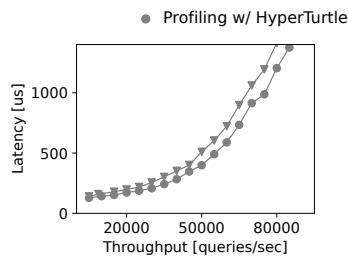  
(a) 1000Hz

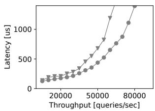  
(b) 4000Hz  
Figure 14: 99p latencies of Memcached get requests during profiling with 1KHz and 4KHz sampling rates. Both setup use Direct-Assignment networking.

## 6 Related Work

Hyperupcalls [4] suggested the idea of safely executing L1 code in L0. It was suggested as a mechanism which facilitates complex communication between the L1 and L0, which increased performance and flexibility.

Nested virtualization. The overheads of nested virtualization are a well-known problem, exposed since the first implementation by the Turtles project [11].

There have been several efforts to reduce the number of world switches to improve the nested virtualization performance. NEVE [44] proposed a series of architectural changes to the ARM architecture, aimed at reducing the overhead of nested virtualization by reducing the number of vm-exits. Intel introduced VMCS shadowing [35] with their Haswell lineup of processors, allowing L0 to not trap L1 on every execution of vm-write and vm-read instructions.

DVH [45] is a collection of optimizations, including direct assignment of L0’s virtual I/O devices and timers to L2. This effectively removes L1 from the control and data path. However, it limits deployment scenarios because L1 can no longer enforce policies on L2 I/O operations.

SVT [60] suggested utilizing SMT to run L0, L1 and L2 each in a different hardware thread. This approach allows for fast world-switching, which improves performance.

However, it does not reduce the increased handle times which are present in nested virtualization. Moreover, SVT requires CPU support for simultaneous multi-threading, which is often missing [2, 16], and will likely become unavailable in future CPUs [36, 37]

Virtualization-based containers. Kata containers [42] is a container runtime which utilizes microVMs for improved sandboxing. This allows the creation, destruction, and overall management of micro-VMs based on standard container images. By complying with the Open Container Initiative (OCI) interface, it achieves compatibility with Kubernetes.

Multiple works have suggested software virtualization as a cloud-native container sandboxing mechanism. LightVM [48] and X-Containers [57] propose to use Xen-based virtualization. While LightVM relies on Unikernels for container images, X-Containers uses a Linux-based Library OS. PVM [31] presents a hypervisor for software-virtualization, specially built for nested virtualization. It utilizes shadow paging and runs a para-virtual Linux guest These approaches, however, suffer from the known shortcomings of software virtualization, which has declined in popularity [9]. X-Containers [57] require the nested guest to use a specialized library OS, and PVM [31] utilizes syscall redirection and shadow paging for the nested guest, which lead to poor performance in syscallintensive applications such as Redis and SQLite [58].

CKI [58] suggested an addition to the Protection Keys for Supervisor hardware extension, to create an isolated environment within the L1 kernel. With this approach, L2’s kernel runs in a sandbox within L1’s kernel, improving performance compared to traditional software-based solutions. This approach requires hardware modifications, so it cannot be used with existing systems. gVisor [29] takes a different approach to container isolation. It intercepts and handles system calls in a separate userspace process, which provides stronger isolation between containrs at the cost of higher overheads compared to traditional container runtimes.

HyperTurtle can be used to accelerate these approaches as well, as they all suffer from increased overheads from the multiple virtualization layers present in the cloud.

Avoiding nested virtualization. Some systems aim to avoid nested virtualization entirely. Peer-Pods [5] leverage cloud APIs to deploy Kata containers without nesting, while Free-The-Turtles [63] and Hyper-V [51] expose guest-level VM management interfaces. These approaches, however, give up hypervisor-level resource control, such as memory overcommitment across L2s within a single L1 VM — reducing deployment flexibility. Dichotomy [62] sidesteps nesting overhead by rapidly migrating the L2 VM between a minimal host hypervisor and a full-featured user hypervisor using memory remapping. However, it is incompatible with scenarios where L1 must remain continuously active, such as those involving Kubernetes orchestration. Out-of-Hypervisor [12] proposes exposing hardware virtualization features directly to the guest OS to support advanced tasks like checkpointing.

HyperTurtle offers the convenience of full compatibility with existing deployments and tooling, while enabling significant performance gains.

eBPF. There exists a variety of eBPF applications, especially in the form of network functions. HyperTurtle enables the compatibility of DVH with many eBPF network functions: BMC [26] implements eBPF Memcached read-cache. Cilium [14] provides powerful observability for Kubernetes clusters as eBPF programs. HyperTurtle provides the compatibility between Direct-Assignment and Kubernetes network introspection through Cillium. XDP [39] present an eBPF hook in the network device driver, enabling packet processing early in the kernel’s network stack. Similarly, XRP [65] used eBPF to offload storage lookups from user space to the kernel, reducing the overhead of the kernel storage stack.

## 7 Conclusion

HyperTurtle proposes a general approach to accelerating nested virtualization by reducing the number of world switches. The idea is to use hyperupcalls, small eBPF programs, that encapsulate the relevant L1 hypervisor functionality and are invoked by L0 without transitioning to L1 when handing L2’s vm-exit. We demonstrate the effectiveness of HyperTurtle to reduce the overheads and the startup time of applications in nested Kata conatiners. We show substantial performance gains enabled by relatively modest code changes, and believe that HyperTurtle is a practical solution that can be further effective in many nested virtualization scenarios.

## 8 Acknowledgments

We thank our shepherd Stella Bitchebe and the reviewers for their helpful comments and feedback. This work was partially supported by IBM – Technion Research Collaboration. We gratefully acknowledge the generous support of the Israeli Science Foundation (Grant 1998/22).

## References

[1] Alexandru Agache, Marc Brooker, Alexandra Iordache, Anthony Liguori, Rolf Neugebauer, Phil Piwonka, and Diana-Maria Popa. Firecracker: Lightweight virtualization for serverless applications. In 17th USENIX Symposium on Networked Systems Design and Implementation (NSDI 20), pages 419–434, Santa Clara, CA, February 2020. USENIX Association.

[2] Amazon. AWS Graviton Performance Testing: Tips for Independent Software Vendors. https://docs.a ws.amazon.com/pdfs/whitepapers/latest/aws-g raviton-performance-testing/aws-graviton-p erformance-testing.pdf#what-is-aws-graviton, 2024. Online; Last accessed 14-Jan-2025.

[3] Amazon. What is a Private Cloud? https://aws.am azon.com/what-is/private-cloud/, 2024. Online; Last accessed 13-Jan-2025.

[4] Nadav Amit and Michael Wei. The Design and Implementation of Hyperupcalls. In 2018 USENIX Annual Technical Conference (USENIX ATC 18), pages 97–112, Boston, MA, July 2018. USENIX Association.

[5] Pradipta Banerjee Ariel Adam. Red hat openshift sandboxed containers: Peer-pods solution overview. https://www.redhat.com/en/blog/red-hat-o penshift-sandboxed-containers-peer-pods-s olution-overview, 2023. Online; Last accessed 12-May-2025.

[6] Berk Atikoglu, Yuehai Xu, Eitan Frachtenberg, Song Jiang, and Mike Paleczny. Workload analysis of a large-scale key-value store. In Proceedings of the 12th ACM SIGMETRICS/PERFORMANCE Joint International Conference on Measurement and Modeling of Computer Systems, SIGMETRICS ’12, page 53–64, New York, NY, USA, 2012. ACM.

[7] CNI Authors. Cni. https://www.cni.dev/. Online; Last accessed 2024-May-06.

[8] AWS. Amazon CodeGuru Security. https://aws.am azon.com/codeguru/, 2024. Online; Last accessed 2024-Dec-21.

[9] Jeff Barr. Now Available – Compute-Intensive C5 Instances for Amazon EC2. https://aws.amazon.c om/blogs/aws/now-available-compute-intensi ve-c5-instances-for-amazon-ec2/, 2025. Online; Last accessed 14-Jan-2025.

[10] Adam Belay, George Prekas, Ana Klimovic, Samuel Grossman, Christos Kozyrakis, and Edouard Bugnion. IX: A Protected Dataplane Operating System for High Throughput and Low Latency. In 11th USENIX Symposium on Operating Systems Design and Implementation (OSDI 14), pages 49–65, Broomfield, CO, October 2014. USENIX Association.

[11] Muli Ben-Yehuda, Michael D. Day, Zvi Dubitzky, Michael Factor, Nadav Har’El, Abel Gordon, Anthony Liguori, Orit Wasserman, and Ben-Ami Yassour. The Turtles Project: Design and Implementation of Nested Virtualization. In Proceedings of the 9th USENIX Conference on Operating Systems Design and Implementation, OSDI’10, page 423–436, USA, 2010. USENIX Association.

[12] Stella Bitchebe and Alain Tchana. Out of hypervisor (ooh): efficient dirty page tracking in userspace using hardware virtualization features. In Proceedings of the

International Conference on High Performance Computing, Networking, Storage and Analysis, SC ’22. IEEE Press, 2022.

[13] Blaise Boscaccy. Introducing hornet lsm. https: //lore.kernel.org/lkml/20250321164537.16 719-1-bboscaccy@linux.microsoft.com/, 2025. Online; Last accessed 11-May-2025.

[14] Cilium. eBPF-based Networking, Observability, Security. https://cilium.io/. Online; Last accessed 2024-Feb-05.

[15] cilium. Bpf and xdp reference guide. https://docs.c ilium.io/en/latest/reference-guides/bpf/in dex.html, 2026. Online; Last accessed 2025-May-11.

[16] Ampere Computing. Designed For The Modern Cloud. https://amperecomputing.com/products/proce ssors, 2025. Online; Last accessed 14-Jan-2025.

[17] containernetworking. plugins. https://github.com /containernetworking/plugins/tree/main, 2025. Online; Last accessed 14-Jan-2025.

[18] Docker. Alternative container runtimes. https://do cs.docker.com/engine/daemon/alternative-run times/, 2024. Online; Last accessed 2024-Dec-31.

[19] Dong Du, Tianyi Yu, Yubin Xia, Binyu Zang, Guanglu Yan, Chenggang Qin, Qixuan Wu, and Haibo Chen. Catalyzer: Sub-Millisecond Startup for Serverless Computing with Initialization-Less Booting. In Proceedings of the Twenty-Fifth International Conference on Architectural Support for Programming Languages and Operating Systems, ASPLOS ’20, page 467–481, New York, NY, USA, 2020. ACM.

[20] Elastic. Universal profiling. https://www.elasti c.co/observability/universal-profiling, 2024. Online; Last accessed 2024-Dec-21.

[21] Arthur Fabre. L4Drop: XDP DDoS Mitigations. https: //blog.cloudflare.com/l4drop-xdp-ebpf-based -ddos-mitigations, 2018. Online; Last accessed 2024-Apr-07.

[22] The Apache Software Foundation. ab - apache http server benchmarking tool. https://httpd.apache.o rg/docs/2.4/programs/ab.html, 2015. Online; Last accessed 02-June-2025.

[23] The Linux Foundation. Kubevirt. https://kubevirt .io, 2024.

[24] Yu Gan, Yanqi Zhang, Dailun Cheng, Ankitha Shetty, Priyal Rathi, Nayan Katarki, Ariana Bruno, Justin Hu, Brian Ritchken, Brendon Jackson, Kelvin Hu, Meghna

Pancholi, Yuan He, Brett Clancy, Chris Colen, Fukang Wen, Catherine Leung, Siyuan Wang, Leon Zaruvinsky, Mateo Espinosa, Rick Lin, Zhongling Liu, Jake Padilla, and Christina Delimitrou. An Open-Source Benchmark Suite for Microservices and Their Hardware-Software Implications for Cloud & Edge Systems. In Proceedings of the Twenty-Fourth International Conference on Architectural Support for Programming Languages and Operating Systems, ASPLOS ’19, page 3–18, New York, NY, USA, 2019. ACM.

[25] Elazar Gershuni, Nadav Amit, Arie Gurfinkel, Nina Narodytska, Jorge A. Navas, Noam Rinetzky, Leonid Ryzhyk, and Mooly Sagiv. Simple and precise static analysis of untrusted linux kernel extensions. In Proceedings of the 40th ACM SIGPLAN Conference on Programming Language Design and Implementation, PLDI 2019, page 1069–1084, New York, NY, USA, 2019. ACM.

[26] Yoann Ghigoff, Julien Sopena, Kahina Lazri, Antoine Blin, and Gilles Muller. BMC: Accelerating Memcached using Safe In-kernel Caching and Pre-stack Processing. In 18th USENIX Symposium on Networked Systems Design and Implementation (NSDI 21), pages 487–501. USENIX Association, April 2021.

[27] Google. Cloud Profiler documentation. https://clou d.google.com/profiler/docs, 2024. Online; Last accessed 2024-Dec-21.

[28] Google. Profile production applications in Azure with Application Insights Profiler for .NET. https://lear n.microsoft.com/en-us/azure/azure-monitor/p rofiler/profiler-overview, 2024. Online; Last accessed 2024-Dec-21.

[29] Google. gvisor. https://github.com/google/gvis or, 2025. Online; Last accessed 14-Jan-2025.

[30] Brendan Gregg. Bpf performance analysis at netflix. https://rnx.gobailia.uk/Slides/reInvent201 9\_BPF\_Performance\_Analysis.pdf, 2019.

[31] Hang Huang, Jiangshan Lai, Jia Rao, Hui Lu, Wenlong Hou, Hang Su, Quan Xu, Jiang Zhong, Jiahao Zeng, Xu Wang, Zhengyu He, Weidong Han, Jiang Liu, Tao Ma, and Song Wu. PVM: Efficient Shadow Paging for Deploying Secure Containers in Cloud-native Environment. In Proceedings of the 29th Symposium on Operating Systems Principles, SOSP ’23, page 515–530, New York, NY, USA, 2023. ACM.

[32] Hang Huang, Jiangshan Lai, Jia Rao, Hui Lu, Wenlong Hou, Hang Su, Quan Xu, Jiang Zhong, Jiahao Zeng, Xu Wang, Zhengyu He, Weidong Han, Jiang Liu, Tao Ma, and Song Wu. PVM Source Code. https://gith

ub.com/virt-pvm/misc, 2024. Online; Last accessed 13-Jan-2025.

[33] Cloud Hypervisor. Cloud Hypervisor. https://www. cloudhypervisor.org/, 2023. Online; Last accessed 30-Nov-2024.

[34] inspektor gadget. inspektor-gadget. https://gith ub.com/inspektor-gadget/inspektor-gadget. Online; Last accessed 2024-Apr-16.

[35] Intel. 4th Generation Intel® Core™ vPro™ Processors with Intel® VMCS Shadowing. https://www.intel. com/content/dam/www/public/us/en/documents /white-papers/intel-vmcs-shadowing-paper.p df, 2013. Online; Last accessed 2023-Jan-23.

[36] Intel. Architecture All Access: Live at Lunar Lake ITT: Next Gen P-core Lion Cove. https://www.youtub e.com/watch?v=FcBRRiQuzNU, 2024. Online; Last accessed 14-Jan-2025.

[37] Intel. Intel® Core™ Ultra 9 Processor 285K. https: //www.intel.com/content/www/us/en/products /sku/241060/intel-core-ultra-9-processor-2 85k-36m-cache-up-to-5-70-ghz/specification s.html, 2024. Online; Last accessed 14-Jan-2025.

[38] Intel. Intel® vtune™ profiler user guide. https: //www.intel.com/content/www/us/en/docs/vtu ne-profiler/user-guide/, 2024. Online; Last accessed 30-Nov-2024.

[39] iovisor. xdp. https://www.iovisor.org/technolo gy/xdp, 2016. Online; Last accessed 2024-Dec-31.

[40] iperf3. iperf3. https://iperf.fr, 2024. Online; Last accessed 2025-Jan-05.

[41] Rick Jones. netperf. https://github.com/Hewlett Packard/netperf. Online; Last accessed 2024-Apr-19.

[42] Kata Containers. https://github.com/kata-con tainers/kata-containers. Online; Last accessed 2024-Apr-07.

[43] Jacob Leverich. Mutilate: High-Performance Memcached Load Generator. https://github.com/lever ich/mutilate. Online; Last accessed 2024-Feb-05.

[44] Jin Tack Lim, Christoffer Dall, Shih-Wei Li, Jason Nieh, and Marc Zyngier. NEVE: Nested Virtualization Extensions for ARM. In Proceedings of the 26th Symposium on Operating Systems Principles, SOSP ’17, page 201–217, New York, NY, USA, 2017. ACM.

[45] Jin Tack Lim and Jason Nieh. Optimizing Nested Virtualization Performance Using Direct Virtual Hardware. In Proceedings of the Twenty-Fifth International Conference on Architectural Support for Programming Languages and Operating Systems, ASPLOS ’20, page 557–574, New York, NY, USA, 2020. ACM.

[46] Linux. bpf-helpers(7) — linux manual page. https: //man7.org/linux/man-pages/man7/bpf-helpers .7.html. Online; Last accessed 2024-May-13.

[47] Linux. capabilities(7) — linux manual page. https: //man7.org/linux/man-pages/man7/capabiliti es.7.html. Online; Last accessed 2024-May-13.

[48] Filipe Manco, Costin Lupu, Florian Schmidt, Jose Mendes, Simon Kuenzer, Sumit Sati, Kenichi Yasukata, Costin Raiciu, and Felipe Huici. My VM is Lighter (and Safer) than your Container. In Proceedings of the 26th Symposium on Operating Systems Principles, SOSP ’17, page 218–233, New York, NY, USA, 2017. ACM.

[49] Meta. Katran. https://github.com/facebookinc ubator/katran. Online; Last accessed 2024-Feb-05.

[50] Microsoft. Preview support for kata vm isolated containers on aks for pod sandboxing. https://techco mmunity.microsoft.com/t5/apps-on-azure-blo g/preview-support-for-kata-vm-isolated-con tainers-on-aks-for-pod/ba-p/3751557. Online; Last accessed 2024-Feb-05.

[51] Microsoft. Windows hypervisor platform api definitions. https://learn.microsoft.com/en-us/virtuali zation/api/hypervisor-platform/hypervisor-p latform, 2025. Online; Last accessed 13-May-2025.

[52] nginx. https://nginx.org/. Online; Last accessed 2025-May-14.

[53] Redis - the real-time data platform. https://redis. io/. Online; Last accessed 2025-May-14.

[54] RedisLabs. memtier\_benchmark. https://github .com/RedisLabs/memtier\_benchmark. Online; Last accessed 2025-May-14.

[55] Gang Ren, Eric Tune, Tipp Moseley, Yixin Shi, Silvius Rus, and Robert Hundt. Google-Wide Profiling: A Continuous Profiling Infrastructure for Data Centers. IEEE Micro, 30(4):65–79, 2010.

[56] Rusty Russell. virtio: towards a de-facto standard for virtual i/o devices. SIGOPS Oper. Syst. Rev., 42(5):95–103, jul 2008.

[57] Zhiming Shen, Zhen Sun, Gur-Eyal Sela, Eugene Bagdasaryan, Christina Delimitrou, Robbert Van Renesse,

and Hakim Weatherspoon. X-Containers: Breaking Down Barriers to Improve Performance and Isolation of Cloud-Native Containers. In Proceedings of the Twenty-Fourth International Conference on Architectural Support for Programming Languages and Operating Systems, ASPLOS ’19, page 121–135, New York, NY, USA, 2019. ACM.

[58] Jiacheng Shi, Yang Yu, Jinyu Gu, and Yubin Xia. A hardware-software co-design for efficient secure containers. In Proceedings of the Twentieth European Conference on Computer Systems, EuroSys ’25, page 1229–1245, New York, NY, USA, 2025. ACM.

[59] Linus Torvalds. Linux. https://github.com/tor valds/linux/tree/master. Online; Last accessed 2024-Nov-30.

[60] Lluís Vilanova, Nadav Amit, and Yoav Etsion. Using smt to accelerate nested virtualization. In Proceedings of the 46th International Symposium on Computer Architecture, pages 750–761, 2019.

[61] virtiofsd project. virtiofsd. https://virtio-fs.gitl ab.io/. Online; Last accessed 2024-May-09.

[62] Dan Williams, Yaohui Hu, Umesh Deshpande, Piush K. Sinha, Nilton Bila, Kartik Gopalan, and Hani Jamjoom. Enabling efficient hypervisor-as-a-service clouds with ephemeral virtualization. In Proceedings of The12th ACM SIGPLAN/SIGOPS International Conference on Virtual Execution Environments, VEE ’16, page 79–92, New York, NY, USA, 2016. ACM.

[63] Mengmei Ye, Angelo Ruocco, Daniele Buono, James Bottomley, and Hubertus Franke. Free the turtles: Removing nested virtualization for performance and confidentiality in the cloud. In 2023 IEEE 16th International Conference on Cloud Computing (CLOUD), pages 275– 281, 2023.

[64] Zhang Yu. The Application of Kata Containers in Baidu AI Cloud. Technical report, Baidu, 2019. Online; Last accessed 08-April-2023.

[65] Yuhong Zhong, Haoyu Li, Yu Jian Wu, Ioannis Zarkadas, Jeffrey Tao, Evan Mesterhazy, Michael Makris, Junfeng Yang, Amy Tai, Ryan Stutsman, and Asaf Cidon. XRP: In-Kernel Storage Functions with eBPF. In 16th USENIX Symposium on Operating Systems Design and Implementation (OSDI 22), pages 375– 393, Carlsbad, CA, July 2022. USENIX Association.