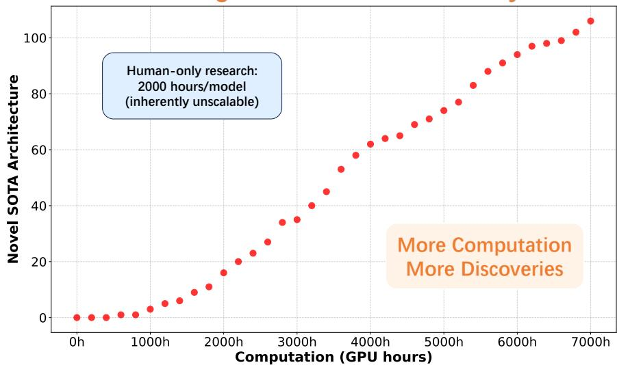
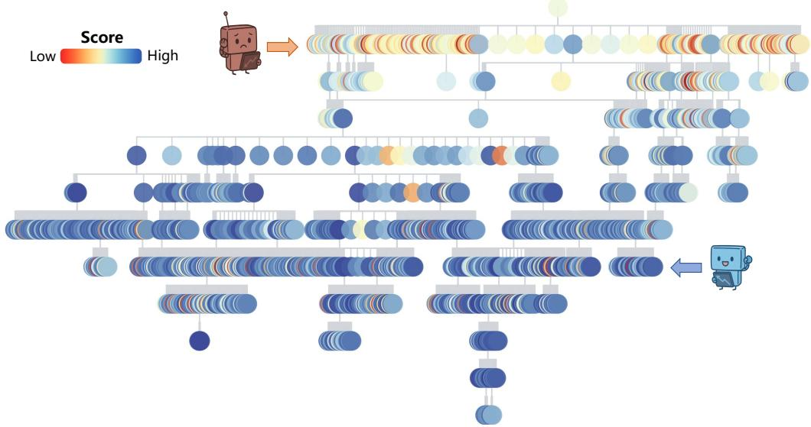
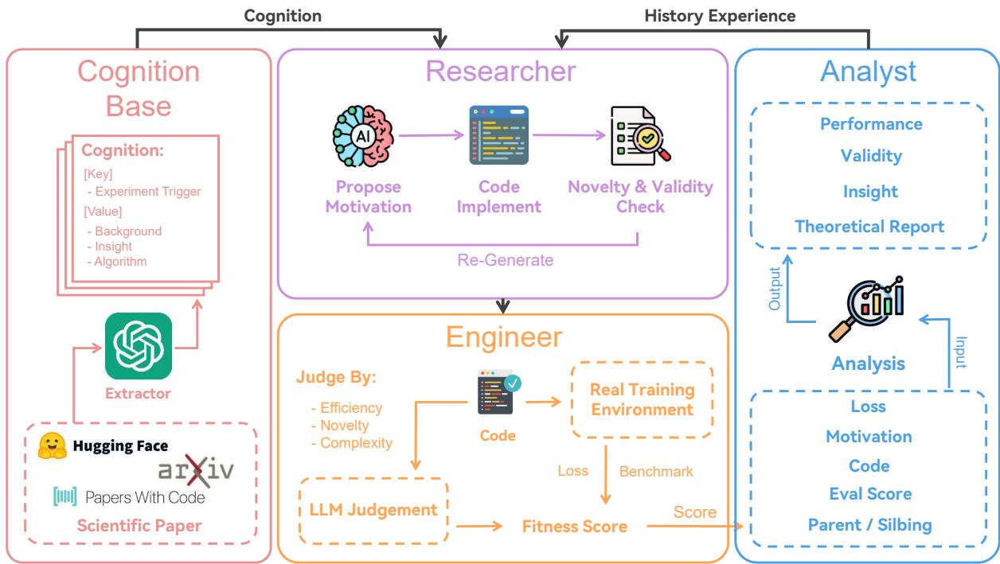
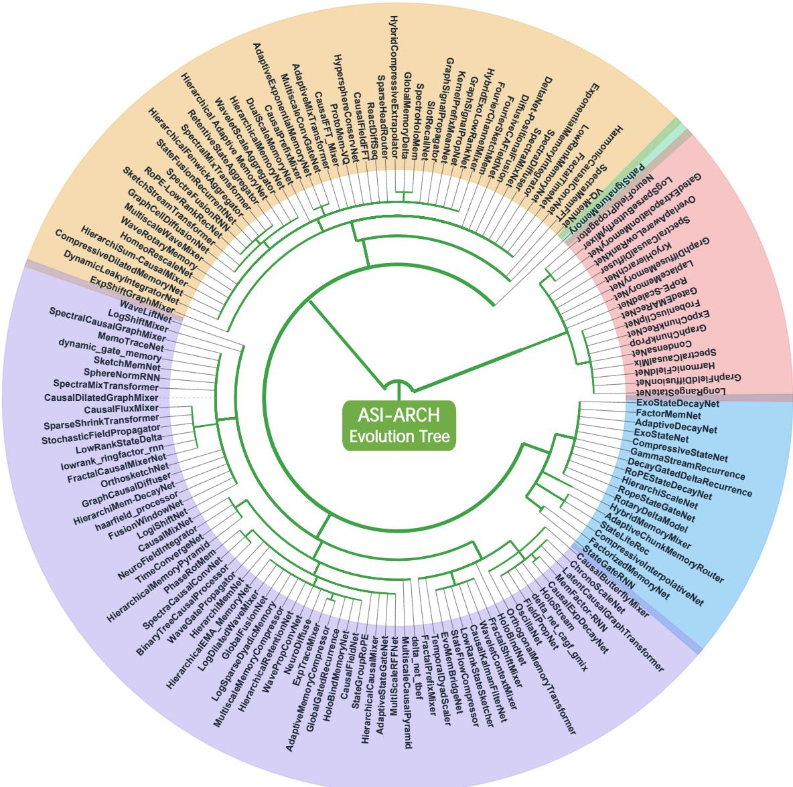
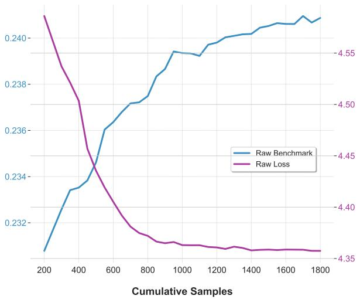
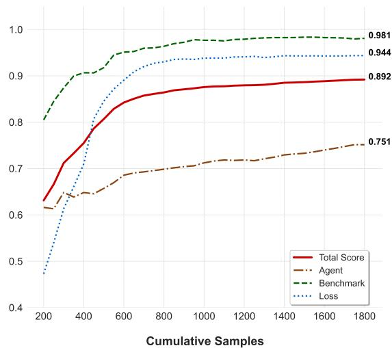
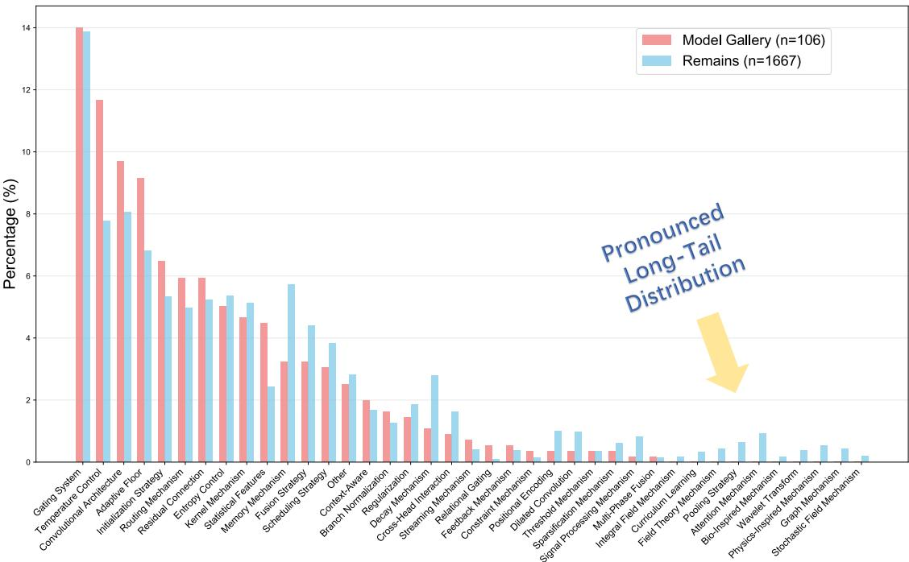
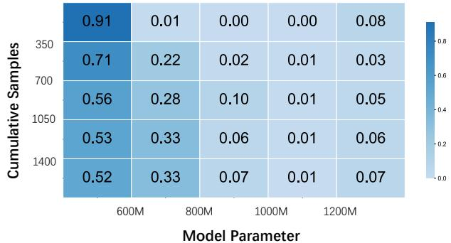

# AlphaGo Moment for Model Architecture Discovery

Yixiu Liu1,2,4\* Yang Nan2,4 \* Weixian Xu1,2,4 \* Xiangkun Hu2,4 Lyumanshan Ye1,2,4 Zhen Qin3 Pengfei Liu1,2,4†

1Shanghai Jiao Tong University 2SII 3Taptap 4GAIR

SII-GAIR/ASI-Arch Model Gallery

## Abstract

While AI systems demonstrate exponentially improving capabilities, the pace of AI research itself remains linearly bounded by human cognitive capacity, creating an increasingly severe development bottleneck. We present ASI-ARCH, the first demonstration of Artificial Superintelligence for AI research (ASI4AI) in the critical domain of neural architecture discovery—a fully autonomous system that shatters this fundamental constraint by enabling AI to conduct its own architectural innovation. Moving beyond traditional Neural Architecture Search (NAS), which is fundamentally limited to exploring human-defined spaces, we introduce a paradigm shift from automated optimization to automated innovation. ASI-ARCH can conduct end-to-end scientific research in the challenging domain of architecture discovery, autonomously hypothesizing novel architectural concepts, implementing them as executable code, training and empirically validating their performance through rigorous experimentation and past human and AI experience. ASI-ARCH conducted 1,773 autonomous experiments over 20,000 GPU hours, culminating in the discovery of 106 innovative, state-of-the-art (SOTA) linear attention architectures. Like AlphaGo’s Move 37 that revealed unexpected strategic insights invisible to human players, our AI-discovered architectures demonstrate emergent design principles that systematically surpass human-designed baselines and illuminate previously unknown pathways for architectural innovation (Fig. 2). Crucially, we establish the first empirical scaling law for scientific discovery itself—demonstrating that architectural breakthroughs can be scaled computationally, transforming research progress from a human-limited to a computation-scalable process. We provide comprehensive analysis of the emergent design patterns and autonomous research capabilities that enabled these breakthroughs, establishing a blueprint for self-accelerating AI systems. To democratize AI-driven research, we open-source the complete framework, discovered architectures, and cognitive traces.

## Scaling Law for Scientific Discovery

  
Figure 1: The cumulative count of discovered State-of-the-Art (SOTA) architectures is plotted against the total computing hours consumed. The strong linear relationship demonstrates that the AI system’s capacity for discovering novel, high-performing architectures scales effectively with the allocated computational budget.


Doctor,our StreamAwareRouter model introduces Query-and-Summary Router for parameterefficient gating, reducing compute while preserving content-aware stream fusion.

This architecture adds multi-scale convolution branches and identity connection branches on top of the Delta rule output, and introduces a feature branch. Based on these components,it calculates weights using average features and ultimately uses a weighted sum as the output. This inspires researchers to mix multiple Token-Mixing operations in the Attention layer.


Hello Doctor, I'd like to introduce you to a model we call HybridGateFlow. This model introduces hierarchical hybrid gating withrich statisticsforadaptiverouting,enhancing extraction, reasoning, and specialisation efficiency.

This architecture adds three branches-short convolution, long convolution, and identity connection-on top of the Delta rule output, and uses statistical measures as features to compute weights, ultimately using a weighted sum as the output. This forms a structure similar to Mixture of Experts (MoE).


Figure 2: A “Move 37” Moment in Design. Just as AlphaGo’s legendary move revealed a new, beautiful truth in a timeless game, these AI-discovered architectures challenge our assumptions and inspire us to explore uncharted territories in design philosophy.  
  
Figure 3: ASI-ARCH exploration trajectory tree of the first-stage architecture exploration. The tree visualizes the evolutionary relationships among 1,773 explored architectures , with DeltaNet as the root node. Each node represents a distinct architecture and colors indicate performance scores .

## 1 Introduction

Artificial Intelligence (AI) is impacting human society with unprecedented depth and breadth, and is widely regarded as a key driver of civilization’s progress (Russell and Norvig, 2010; Agrawal et al., 2018; Brynjolfsson and Mitchell, 2017). However, a fundamental paradox emerges: while AI systems demonstrate exponentially improving capabilities, the pace of AI research itself remains linearly bounded by human cognitive capacity (The White House, 2023; Ahmed et al., 2022; Sevilla et al., 2022). This human-centric development model creates an increasingly severe bottleneck for AI advancement, where the velocity of innovation is constrained not by computational power, but by human research bandwidth. This motivates a transformative vision: Artificial Superintelligence for AI research (ASI4AI)—AI systems capable of autonomously conducting their own scientific research and designing more powerful next-generation models.

Neural architecture discovery stands as the most challenging and impactful frontier for realizing ASI4AI. Model architecture serves as the cornerstone of the AI technology stack, with each major leap in AI capabilities—from image recognition to natural language understanding—accompanied by corresponding architectural breakthroughs. The evolution from CNNs (LeCun et al., 1995) to Transformers (Vaswani et al., 2017) exemplifies how architectural innovation drives fundamental progress in AI. At the forefront of current research, a pivotal challenge involves enhancing computational efficiency while maintaining expressive power (DeepSeek-AI et al., 2024; MiniMax et al., 2025; Yuan et al., 2025). To ground our exploration in a domain of both fundamental importance and active research, we focus on attention-based architectures as our testbed, leveraging their extensive knowledge base to explore AI’s true architectural design potential (Katharopoulos et al., 2020; Choromanski et al., 2020; Tay et al., 2022; Wang et al., 2020).

Moving beyond traditional Neural Architecture Search (NAS), which is fundamentally limited to exploring human-defined spaces, our work represents a paradigm shift from automated optimization to automated innovation. While previous NAS methods (Zoph and Le, 2016; Real et al., 2017; Elsken et al., 2019; Cheng et al., 2025) could only optimize over predetermined building blocks at prohibitive computational costs, acting as sophisticated selection algorithms rather than creative agents, we present ASI-ARCH —the first demonstration of ASI4AI in neural architecture discovery. Leveraging the advanced reasoning and coding capabilities of modern LLMs (Brown et al., 2020; OpenAI, 2023; Li et al., 2022), ASI-ARCH transcends human-designed search spaces by autonomously hypothesizing novel architectural concepts, implementing them as executable code, and empirically validating their performance through rigorous experimentation (Chen et al., 2023; Zhang et al., 2024).

This represents AI’s first demonstration of genuine scientific superintelligence in neural architecture design. Like AlphaGo’s Move 37 that revealed strategic insights invisible to human players, ASI-ARCH discovers architectural principles that systematically surpass human intuition. After conducting 1,773 autonomous experiments over 20,000 GPU hours, ASI-ARCH successfully discovered 106 novel, state-of-the-art linear attention architectures. Crucially, we establish the first empirical scaling law for scientific discovery itself—demonstrating that architectural breakthroughs can be scaled computationally, transforming research progress from a human-limited to a computationscalable process and providing a concrete pathway toward ASI4AI.

Our primary contributions establish a blueprint for self-accelerating AI systems and advance this paradigm:

• ASI4AI Framework: We design and build the first demonstration of Artificial Superintelligence for AI research through a highly autonomous, tool-centric multi-agent system that enables AI to independently conduct the entire scientific research process—from hypothesis generation to empirical validation—in neural architecture discovery.

• Emergent Design Intelligence: Through comprehensive analysis, we identify novel design patterns that emerge from AI-driven discovery, demonstrating qualitatively different architectural intelligence that expands beyond human design paradigms and establishes new principles for attention mechanism innovation.

• Computational Scaling of Discovery: We discover 106 novel, state-of-the-art linear attention architectures and establish the first scaling law for automated scientific breakthroughs, proving that research progress can be scaled with computational resources rather than human expertise. We open-source the complete framework, discovered architectures, and cognitive traces to democratize AI-driven research.

## 2 Related Work

AI For AI Research The application of artificial intelligence to advance AI research itself represents a compelling frontier (Kokotajlo et al., 2025), best understood as a spectrum of increasing AI autonomy within the scientific process. Initially, AI’s role resembled that of a sophisticated assistant, handling specific tasks like code generation in a “copilot” model where human researchers retained full control of the research direction. The collaboration has since evolved toward AI as an “AI scientist” capable of independently generating novel hypotheses and proposing promising research ideas for human consideration (Tshitoyan et al., 2019; Boiko et al., 2023). More recently, several examples have demonstrated AI’s ability to navigate the entire research cycle with minimal human intervention. Frameworks such as AlphaEvolve (Novikov et al., 2025; Cheng et al., 2025), for instance, employ LLMs to iteratively mutate and select improved program variants, completing a full loop of discovery and refinement. Similarly, AlphaGeometry’s success in autonomously discovering mathematical proofs showcases a high degree of research autonomy from problem statement to solution (Trinh et al., 2024; Chervonyi et al., 2025). As the proportion of human involvement in this collaborative loop decreases, the potential for AI’s self-optimization becomes increasingly central. This concept is epitomized by self-referential systems like Darwin-Godel machines ( ¨ Zhang et al., 2025), which are designed to iteratively modify their own code and empirically validate these changes, marking a clear trajectory toward fully self-improving systems (Schmidhuber, 1997; Baum, 2004).

Building upon this path, ASI-ARCH applies the principles of AI self-evolution to the highly complex domain of neural architecture design. This presents a greater challenge than prior self-improving systems, as architectural exploration involves a significantly more complex experimental environment and a vast search space where success is not guaranteed. Our work therefore represents a significant attempt to advance AI self-evolution in this more demanding and impactful frontier.

Efficient Architecture The Transformer architecture has dominated sequence modeling since its introduction, but its quadratic attention complexity has catalyzed extensive research into sub-quadratic alternatives, creating an increasingly complex design space (Vaswani et al., 2017). Among these alternatives, sparse attention approaches like Native Sparse Attention (NSA) (Yuan et al., 2025) employ hierarchical sparse strategies to achieve substantial speedups while maintaining model capabilities. Beyond sparse attention, three principal families have emerged with linear time complexity: Linear Attention, which uses linearizing feature maps (Katharopoulos et al., 2020; Choromanski et al., 2020; Qin et al., 2022); State-Space Models (SSMs) like Mamba, employing structured state transition matrices (Gu and Dao, 2023; Dao and Gu, 2024); and Linear RNNs such as RWKV, with matrix-valued recurrent states (Peng et al., 2023; Qin et al., 2023, 2024b). The current trajectory points toward synthesis and hybridization, with architectures like Jamba interleaving different model families to leverage their respective strengths (Lieber et al., 2024; Qin et al., 2024a). This evolution has transformed the landscape from a single dominant design to a vast combinatorial space where optimal architectures are highly dependent on specific tasks and constraints. While existing work focuses on manually designing individual architectural components or families, this process is often protracted, requiring months of iterative effort from human experts to yield a single state-ofthe-art architecture. In contrast, ASI-ARCH uniquely addresses the systematic exploration of this complex design landscape through automated multi-agent collaboration, enabling the discovery of novel architectures that transcend traditional family boundaries.

  
Figure 4: An overview of our four-module ASI-ARCH framework, which operates in a closed evolutionary loop. The cycle begins with the Researcher (purple) proposing a new architecture based on historical data. The Engineer (orange-yellow) handles the subsequent training and evaluation. Finally, the Analyst (blue) synthesizes the experimental results, enriching its findings with knowledge from the Cognition module (red). The output of this analysis informs the next evolutionary step, enabling the system to continuously improve.

## 3 Methodology

ASI-ARCH framework operates as a closed-loop system for autonomous architecture discovery, structured around a modular framework with three core roles. The Researcher module proposes novel architectures, the Engineer module conducts empirical evaluations by executing them in a real-world environment, and the Analyst module performs analytical summaries of the results to acquire new insights. All experimental data and derived insights are systematically archived in a central database, creating a persistent memory that drives the entire process.

To ensure the system progressively generates superior designs, we implement an evolutionary improvement strategy that enables the model to continuously learn from experience. This is realized through two key mechanisms: first, a comprehensive fitness score that holistically evaluates each new architecture, providing a clear optimization target; and second, the ability to leverage both distilled knowledge from human expert literature (cognition) and analytical summaries of its own past experiments (analysis) to inform subsequent design proposals. Given the resource-intensive nature of this evolutionary process, we adopt a two-stage exploration-then-verification strategy. The initial stage involves broad exploration on small-scale models to efficiently identify a large pool of promising candidates. In the final stage, these candidates are scaled up to larger models for rigorous validation, confirming their state-of-the-art performance.

## 3.1 The Fitness Function

ASI-ARCH’s model architecture evolution mirrors biological evolution, drawing insights from the principles of natural selection. In nature, fitness determines an organism’s survival and reproduction, and similarly, we define a fitness function that governs which architectures survive and propagate through our evolutionary process. A critical flaw in past approaches is their sole reliance on quantitative metrics like loss and benchmark scores. This narrow focus inevitably leads to reward hacking (Amodei et al., 2016), where the system learns to maximize scores without producing genuinely superior architectures. We expand this definition by incorporating a qualitative assessment of the architecture itself. Our composite fitness combines both quantitative and qualitative dimensions, holistically evaluating performance and design quality:

$$
\mathrm { F i t n e s s } = \underbrace { \mathrm { O b j e c t i v e ~ P e r f o r m a n c e } } _ { \mathrm { Q u a n t i t a t i v e } } + \underbrace { \mathrm { A r c h i t e c t u r a l ~ Q u a l i t y } } _ { \mathrm { Q u a l i t a t i v e } }\tag{1}
$$

In our framework, the objective performance assessment evaluates both benchmark scores and loss performance relative to baseline architectures. Recognizing that scientific breakthroughs often emerge from incremental advances, we apply a sigmoid transformation to performance differences: $\sigma ( \Delta _ { \mathrm { p e r f o r m a n c e } } )$ . This transformation serves a dual purpose—amplifying small but potentially significant improvements while capping extreme values that could otherwise dominate the optimization process. For the architectural quality assessment, we introduce a separate LLM that acts as an expert evaluator, mimicking how a human specialist would judge architectural merit. This judge examines multiple dimensions: architectural innovation, structural complexity, implementation correctness, and convergence characteristics. By incorporating these qualitative assessments alongside quantitative metrics, we capture architectural qualities that resist simple numerical measurement. Our final composite fitness function thus takes the form:

$$
\mathrm { F i t n e s s } = \frac { 1 } { 3 } \left[ \sigma ( \Delta _ { \mathrm { l o s s } } ) + \sigma ( \Delta _ { \mathrm { b e n c h m a r k } } ) + \mathrm { L L M _ { j u d g e } } \right]\tag{2}
$$

where $\sigma ( \Delta _ { \mathrm { l o s s } } )$ and $\sigma ( \Delta _ { \mathrm { b e n c h m a r k } } )$ represent sigmoid-transformed performance improvements over baseline, and $\mathrm { L L M } _ { j u d g e }$ provides the subjective quality assessment normalized to [0,1].

## 3.2 Researcher: Propose New Architecture

The Researcher module serves as the creative engine of our system, where AI independently proposes novel model architectures based on historical experience and human expertise. Our design targets two critical objectives: ensuring high-quality architectural innovations while preventing repeated explorations that squander computational resources. To achieve these goals, we implement four key mechanisms that work together:

Seed Selection ASI-ARCH maintains a candidate pool containing the top-50 highest-scoring architectures from all previous experiments. For each evolution step, we use a two-level sampling approach: one parent architecture is randomly selected from the top-10 performers to serve as the base for modifications, while 4 reference architectures are sampled from positions 11-50 to provide diverse design examples. This two-tier selection ensures that evolution builds on proven success while maintaining enough randomness to explore new directions. The parent architecture gets modified directly, while the reference architectures serve as examples of successful design patterns without being changed themselves.

  
Figure 5: The architectural phylogenetic tree. We define a parent-child relationship where a new architecture is generated by directly modifying the code of a preceding one. The colors on the periphery are used to distinguish different evolutionary branches of the tree.

Model Design Before providing historical data to the Researcher for the next evolution cycle, we perform a crucial data summarization step. Each architecture in our database contains extensive information, including its motivation, implementation code, experimental results, and detailed analysis. To manage context size, we use a low-temperature LLM to generate brief, factual summaries of the natural language portions for each historical architecture. Critically, these summaries are generated on-the-fly for each evolutionary cycle and are not stored in the database. This dynamic summarization process inherently introduces subtle variations in how the same historical data is presented over time. This not only prevents the Researcher from receiving a static, repetitive context, which could limit the diversity of its outputs, but also actively encourages more varied design explorations. The final combined summaries provide the evolution model with both a manageable context and a constantly refreshed set of diverse insights to inform the next design attempt.

Program Implementation Traditional approaches often separate architectural design from code implementation, using specialized models for each task. However, this separation creates a critical information gap—the implementation model, seeing only the high-level motivation, lacks the rich context that informed the original design. This often leads to implementation drift where the final code differs from the intended architecture. ASI-ARCH addresses this by using a single agent for both tasks: first proposing the architectural motivation with full access to all context, then immediately implementing the corresponding code while maintaining complete awareness of the design reasoning.

Novelty and Sanity Check To ensure that each proposed architecture is both novel and will be correctly implemented, we implement a two-stage validation process before it is accepted for training. The first stage is a similarity check to prevent redundancy. When a new architecture is proposed, we first extract its motivation and use embedding-based search to find the top-5 most similar historical motivations. A specialized LLM then evaluates whether the new proposal represents a genuine innovation or merely a variation of existing work. The second stage consists of code-level sanity checks to prevent fundamental implementation flaws, including verifying that the code does not exceed $O ( n ^ { 2 } )$ complexity and ensuring that masking is implemented correctly to prevent information leakage. If a proposal fails either the novelty or the correctness check, it is rejected, and the relevant feedback is returned to the agent to prompt a rewrite.

## 3.3 Engineer: Train and Evaluate Models

The evaluation process, which provides the data for the final fitness score, is composed of two parts: quantitative evaluation in a real code environment and qualitative scoring by an LLM-as-judge.

Real Code Environment The quantitative evaluation takes place within an interactive coding environment where the agent must utilize a defined set of tools to initiate training, modify code, and inspect error logs. A key differentiator of ASI-ARCH is its robust self-revision mechanism. In stark contrast to previous work (Cheng et al., 2025) that often uses static analysis like Abstract Syntax Tree (AST) parsing and simply discards any architecture that fails these checks, ASI-ARCH requires the agent to fix its own mistakes. When a training run fails due to an implementation error, the system automatically captures the full error log and delivers it back to the agent, which is then tasked with analyzing this feedback and revising its previously generated code. This iterative debugging loop continues until training is successful, ensuring promising ideas are not prematurely discarded due to simple coding mistakes. Furthermore, to maintain high efficiency, an automated quality assurance system monitors training logs in real-time. This is critical because some functional designs can be prohibitively inefficient, such as a model consuming two to three times the training duration of its peers. ASI-ARCH detects such anomalies, as well as fundamental bugs indicated by abnormally low loss, and immediately terminates the run, reporting the issue back to the agent for revision. This proactive termination prevents wasting resources on flawed architectures and significantly accelerates the overall search process.

LLM-as-Judge Scoring Following the quantitative evaluation, we initiate an LLM-based scoring module to provide a qualitative assessment. This scoring process considers not only the objective performance metrics but also the architectural complexity, computational efficiency, and the novelty of the proposed ideas, all benchmarked against baseline models. To ensure consistency and reproducibility, we provide a detailed syllabus in the prompt and slightly increase the model’s temperature, encouraging it to generate more detailed and nuanced justifications for its scores.

## 3.4 Analyzer: Mine Experimental Insights

To drive the evolutionary process, ASI-ARCH provides the agent with two distinct sources of knowledge for each subsequent design step: cognition, derived from accumulated human expertise, and analysis, generated dynamically from the system’s own experimental history.

Cognition Base To ensure ASI-ARCH can leverage existing domain knowledge, we construct a cognition-centered knowledge base. We selected nearly 100 seminal papers from the field of linear attention and used a dedicated LLM to extract 1-3 distinct cognitions from each. Each cognition is a structured entry composed of three key elements: the applicable scenario, which describes the specific problem the original paper aimed to solve; the proposed algorithm, which summarizes the core technical solution; and the historical context, which situates the paper within the research trends of its time.

To guarantee the utility of this knowledge base, we carefully engineered the prompt for the extraction LLM. The prompt’s structure is specifically designed to ensure that the extracted “experiment trigger” align semantically with the “problem analyses” generated by our Analyst module. This alignment is crucial for effective retrieval. In the final stage of analysis, the Analyst summarizes the specific shortcomings observed in the current experiment, and this summary is used as a query for embedding-based retrieval against the scenarios in our knowledge base. The retrieved cognition content is then stored in our database for future reference, providing a highly relevant, information-dense, and targeted way for the Researcher module to find solutions.

<table><tr><td>Model</td><td>Type</td><td>Wiki. ppl↓</td><td>LMB. ppl←</td><td>LMB. acc 个</td><td>PIQA acc个</td><td>Hella. acc_n ↑</td><td>Wino. acc个</td><td>ARC-e acc 个</td><td>ARC-c acc_n ↑</td><td>SIQA acc个</td><td>BoolQ acc个</td><td>Avg.</td></tr><tr><td>Mamba2</td><td>！</td><td>27.08</td><td>40.09</td><td>31.32</td><td>67.90</td><td>42.25</td><td>51.46</td><td>62.04</td><td>29.27</td><td>39.25</td><td>59.24</td><td>47.84</td></tr><tr><td>Gated DeltaNet</td><td>：</td><td>27.62</td><td>38.69</td><td>31.42</td><td>68.28</td><td>40.77</td><td>51.14</td><td>61.03</td><td>27.05</td><td>38.79</td><td>60.12</td><td>47.32</td></tr><tr><td>DeltaNet</td><td>三</td><td>27.41</td><td>42.08</td><td>30.41</td><td>67.63</td><td>40.82</td><td>50.83</td><td>61.07</td><td>29.27</td><td>40.02</td><td>52.23</td><td>46.54</td></tr><tr><td>PathGateFusionNet</td><td>由</td><td>26.76</td><td>37.40</td><td>33.17</td><td>68.77</td><td>41.57</td><td>53.91</td><td>61.03</td><td>29.61</td><td>39.46</td><td>60.58</td><td>48.51</td></tr><tr><td>ContentSharpRouter</td><td></td><td>26.80</td><td>36.58</td><td>32.72</td><td>67.79</td><td>40.78</td><td>53.12</td><td>61.07</td><td>30.20</td><td>40.79</td><td>60.28</td><td>48.34</td></tr><tr><td>FusionGatedFIRNet</td><td></td><td>26.37</td><td>33.44</td><td>33.38</td><td>68.61</td><td>42.20</td><td>50.99</td><td>62.50</td><td>28.92</td><td>40.48</td><td>59.24</td><td>48.29</td></tr><tr><td>HierGateNet</td><td>血血血血</td><td>26.56</td><td>36.83</td><td>32.23</td><td>68.93</td><td>41.30</td><td>52.64</td><td>62.75</td><td>29.95</td><td>39.71</td><td>58.38</td><td>48.24</td></tr><tr><td>AdaMultiPathGateNet</td><td></td><td>26.62</td><td>38.31</td><td>31.65</td><td>68.06</td><td>41.37</td><td>53.43</td><td>62.04</td><td>29.01</td><td>39.36</td><td>60.52</td><td>48.18</td></tr></table>

Table 1: Performance comparison on language modeling and zero-shot common-sense reasoning. Type indicates whether the model is human-designed ( ) or AI-discovered ( ). Bold indicates the best results and underline is the suboptimal ones.

Contextual Analysis ASI-ARCH generates its own insights through a dedicated Analysis Module driven by a large language model. This agent is provided with the complete set of information from the current experiment, including all performance metrics, training logs, and the performance of baseline models. Furthermore, to achieve an effect analogous to an ablation study, we also supply the data from the parent and sibling nodes of the current architecture in the phylogenetic tree. Based on the assumption that these nodes share significant structural similarities, we expect the agent to infer the specific contributions of individual modules by comparing the performance differences among these closely related architectures. The resulting analysis is then archived to inform subsequent design cycles.

## 3.5 Exploration-then-Verification Strategy

Given the resource-intensive nature of architecture evaluation, we adopt a two-stage exploration-then-verification strategy to maintain feasibility and efficiency. The underlying principle is that a truly superior architecture should demonstrate its advantages across different settings. Therefore, in the initial exploration stage, we use smaller models and resource-efficient protocols to rapidly identify a large pool of promising candidates that outperform a baseline. In the subsequent verification stage, only these promising candidates are scaled up with increased parameter sizes for extensive training and rigorous validation against established, state-of-the-art baselines. This two-stage approach allows us to balance the need for broad exploration with the necessity of thorough, high-fidelity validation.

## 4 Experiments

## 4.1 Experimental Setup

Fitness Function Throughout our experiments, we use DeltaNet (Yang et al., 2024b) as our baseline. As described in Section 3.1, our scoring system consists of three components. For quantitative scoring, since architectural differences in linear attention typically produce small performance variations, we focus only on differences within 10% of baseline and map these through a sigmoid function to obtain scores. Additionally, architectures with losses more than 10% below baseline are considered to have information leakage and are immediately discarded. For qualitative scoring, we establish a calibrated scale with DeltaNet at 5 points as the midpoint and Gated DeltaNet (Yang et al., 2024a) at 10 points as the upper reference. The LLM evaluator assesses each architecture on this 1-10 scale.

Parallel Search Architecture and Policy To accelerate discovery, we run numerous search processes in parallel. This is supported by a cloud-based database that stores all historical experiment results, allowing different agents to add or request data through API services and share all accumulated knowledge. To manage this parallel exploration effectively while encouraging diversity, we implement a strategic candidate pool update policy:

• Cold Start: At the beginning of our experiments, ASI-ARCH conducts 200 explorations without database updates. This initial phase encourages the model to explore diverse architectural frameworks broadly rather than immediately converging on variations of early discoveries.

• Batched Updates: After the cold start period, we update the candidate pool only after every 50 new entries, rather than dynamically selecting the top-50. This batched approach ensures all agents work with stable reference sets during each exploration phase, promoting consistency while the initial delay fosters creativity.

Efficiency-Oriented Framework Settings As outlined in our methodology, our search process is divided into two distinct phases with different configurations:

• Exploration Stage: To enable large-scale exploration, we constrain model size to approximately 20M parameters trained on 1B tokens. For evaluation, we sample only 500 examples per benchmark to balance assessment quality with computational efficiency.

• Verification Stage: The most promising candidates from the exploration stage are advanced to a rigorous verification phase. Here, we scale the architectures to 400M parameters and train them on 1B tokens for an initial performance validation. The top-performing models from this group are then selected for a final, more extensive training run on a 15B token dataset to comprehensively evaluate their capabilities against strong baselines.

## 4.2 Main results

To balance exploration efficiency with validation accuracy, we adopt a two-stage strategy: initial exploration on small models followed by verification on larger models. In the first stage, we conducted 1,773 explorations using 20M parameter models, consuming approximately 10,000 GPU hours. A partial phylogenetic tree of this first stage is shown in Figure 5. From these experiments, we filtered architectures that outperformed DeltaNet at equivalent parameter scales in both loss and benchmark metrics, yielding 1,350 promising candidates. In the second stage, we scaled these candidates to 340M parameters matching DeltaNet’s configuration and filtered out architectures with excessive complexity or parameter counts. We then trained approximately 400 model architectures on 1B tokens, using 10,000 GPU hours. Among these, 106 architectures achieved state-of-the-art results, all of which are publicly available on our Model Gallery website for community reference. For final validation, we selected 5 top-performing architectures and trained them at 340M parameters setting on 15B tokens. These models were compared against DeltaNet, Gated DeltaNet, and Mamba2 under identical experimental settings. As presented in Table 1, our models outperform almost all baselines on various benchmarks. The five architectures selected for this final validation are detailed below, each representing a distinct strategy for improving upon the DeltaNet baseline:

• Hierarchical Path-Aware Gating (PathGateFusionNet): This architecture introduces a hierarchical, two-stage router to resolve the trade-off between local and global reasoning. The first stage allocates budget between a direct copy path and a contextual pool, while the second stage distributes that contextual budget across short-range, long-range, and Delta-rule paths. It ensures stable gradient flow with a small, always-on residual connection and adds head-specific output gates for fine-grained local control.

• Content-Aware Sharpness Gating (ContentSharpRouter): This model addresses the challenge of creating a gate that is both content-aware and capable of making decisive (sharp) routing decisions. It fuses two key ideas: a content-aware gate that uses token embeddings and path statistics to inform its decision, and a learnable, per-head temperature parameter that allows the model to dynamically control the sharpness of the routing softmax, preventing premature gate collapse.

• Parallel Sigmoid Fusion with Retention (FusionGatedFIRNet): This architecture fundamentally changes the gating mechanism to break the “zero-sum” trade-off imposed by softmax. It replaces the single softmax router with parallel, independent sigmoid gates for each path. This allows the model to activate local and global paths simultaneously. It also enhances the Delta-rule with a learnable, per-head retention parameter, giving it a controllable memory horizon.

• Hierarchical Gating with Dynamic Floors (HierGateNet): This model employs a two-stage hierarchical gate to separate macro (local vs. global) and fine-grained routing decisions. Its key innovation is the use of dynamic, learnable floors for each path and head. This mechanism guarantees that no critical pathway (especially the Delta-path for long-range reasoning) is ever fully collapsed, adapting its minimum allocation based on the context.

• Adaptive Multi-Path Gating (AdaMultiPathGateNet): This design focuses on providing maximum control at the finest granularity. It implements a unified BalancedSparseGate that combines global, per-head, and per-token logits, allowing every path to be controlled at the token level. To prevent gate collapse, it uses a combination of a small epsilon-floor and a persistent, always-on entropy penalty, ensuring path diversity without complex training schedules.

Table 2: Model Performance Comparison. Train Loss represents the loss at the final training step. Test Score is the average performance across 7 tasks: ARC-Challenge, ARC-Easy, BoolQ, HellaSwag, PIQA, Social IQA, and WinoGrande. Green subscripts indicate improvements over the Gated DeltaNet baseline.
<table><tr><td rowspan="2"> Model Name</td><td colspan="2">20M params /1B tokens</td><td rowspan="2"></td><td colspan="3"> 340M params / 1B tokens</td></tr><tr><td>Train Loss ↓</td><td>Test Score ↑</td><td>Train Loss ↓</td><td></td><td>Test Score ↑</td></tr><tr><td>DeltaNet (Baseline)</td><td>4.5749</td><td></td><td>36.23</td><td>3.5055</td><td></td><td>41.16</td></tr><tr><td> Gated DeltaNet (Baseline)</td><td>4.5678</td><td></td><td>36.60</td><td>3.4768</td><td></td><td>42.10</td></tr><tr><td> AdaptiveContextFusionNet</td><td>4.4973 -0.0705</td><td></td><td>37.03 +0.43</td><td>3.4624 -0.0144</td><td></td><td>42.74 +0.64</td></tr><tr><td>AdaptiveEntropyGateNet</td><td>4.4423 -0.1255</td><td></td><td>36.91 +0.31</td><td>3.4558-0.0210</td><td></td><td>42.37 +0.27</td></tr><tr><td>AdaptiveEntropyRouter</td><td>4.3547 -0.2131</td><td></td><td>39.26 +2.66</td><td>3.4066</td><td>-0.0702</td><td>44.31 +2.21</td></tr><tr><td>AdaptiveEntropyRouterNet</td><td>4.3326</td><td>-0.2352</td><td>36.94 +0.34</td><td>3.4298</td><td>-0.0470</td><td>43.25 +1.15</td></tr><tr><td>AdaptiveFloorGate</td><td>4.4695-0.0983</td><td></td><td>37.00 +0.40</td><td>3.4418</td><td>-0.0350</td><td>43.57 +1.47</td></tr><tr><td>AdaptiveFloorNet-HAF</td><td>4.4002</td><td>-0.1676</td><td>37.03 +0.43</td><td>3.4241</td><td>-0.0527</td><td>43.59 +1.49</td></tr><tr><td>AdaptiveFractalGateNet</td><td>4.5484</td><td>-0.0194</td><td>38.43 +1.83</td><td>3.4351</td><td>-0.0417</td><td>43.84 +1.74</td></tr><tr><td>AdaptiveFusionNet</td><td>4.3521</td><td>-0.2157</td><td>37.51 +0.91</td><td>3.4336</td><td>-0.0432</td><td>43.78 +1.68</td></tr><tr><td>AdaptiveFusionNet-DSI</td><td>4.3781</td><td>1 -0.1897</td><td>36.63 +0.03</td><td>3.4270</td><td>-0.0498</td><td>43.39 +1.29</td></tr><tr><td>AdaptiveFusionRNet</td><td>4.3940 -0.1738</td><td></td><td>37.03 +0.43</td><td>3.4086</td><td>-0.0682</td><td>43.73 +1.63</td></tr><tr><td>AdaptiveGateNet</td><td>4.4228 -0.1450</td><td></td><td>36.57-0.03</td><td>3.4377</td><td>-0.0391</td><td>43.64 +1.54</td></tr><tr><td>AdaptiveGateNet-AFP</td><td>4.4198-0.1480</td><td></td><td>37.80 +1.20</td><td>3.4193</td><td>-0.0575</td><td>43.88 +1.78</td></tr><tr><td>AdaptiveGateRouter_X</td><td>4.4126 -0.1552</td><td></td><td>38.69 +2.09</td><td>3.4114</td><td>-0.0654</td><td>42.68 +0.58</td></tr><tr><td>AdaptiveGatedRouter-Hybrid</td><td>4.3335</td><td>-0.2343</td><td>37.74 +1.14</td><td>3.4060</td><td>-0.0708</td><td>43.56 +1.46</td></tr><tr><td>AdaptiveHierGateNet</td><td>4.5096-0.0582</td><td></td><td>36.71 +0.11</td><td>3.4433</td><td>-0.0335</td><td>43.44 +1.34</td></tr><tr><td>AdaptiveHybridGateNet</td><td>4.3867</td><td>-0.1811</td><td>37.11 +0.51</td><td>3.4239</td><td>-0.0529</td><td>43.01 +0.91</td></tr><tr><td>AdaptiveMixGateNet</td><td>4.3709-0.1969</td><td></td><td>36.91 +0.31</td><td>3.4289</td><td>-0.0479</td><td>43.28 +1.18</td></tr><tr><td>AdaptiveMixTransformer</td><td>4.4855</td><td>-0.0823</td><td>36.49 -0.11</td><td>3.4593</td><td>-0.0175</td><td>42.50 +0.40</td></tr><tr><td>AdaptivePathRouter</td><td>4.4324 -0.1354</td><td></td><td>38.00 +1.40</td><td>3.4332</td><td>-0.0436</td><td>42.42 +0.32</td></tr><tr><td>AdaptiveSpanGateConv</td><td>4.4431 −0.1247</td><td></td><td>36.74 +0.14</td><td>3.4247</td><td>-0.0521</td><td>43.90 +1.80</td></tr><tr><td>AdaptiveTokenGate</td><td>4.4954 -0.0724</td><td></td><td>36.77 +0.17</td><td>3.4400</td><td>-0.0368</td><td>44.08 +1.98</td></tr><tr><td>AdaptiveTokenRouter</td><td>4.3745-0.1933</td><td></td><td>38.63 +2.03</td><td>3.4238</td><td>-0.0530</td><td>42.56 +0.46</td></tr><tr><td>AnnealedPathFusionNet</td><td>4.4564 -0.1114</td><td></td><td>36.83 +0.23</td><td>3.4472</td><td>-0.0296</td><td>43.73 +1.63</td></tr><tr><td>BAMG_MemoryGate</td><td>4.4804-0.0874</td><td></td><td>36.17 -0.43</td><td>3.4587</td><td>-0.0181</td><td>43.42 +1.32</td></tr><tr><td>BlockStateFusionNet</td><td>4.3551</td><td>-0.2127</td><td>37.66 +1.06</td><td>3.4085</td><td>-0.0683</td><td>43.20 +1.10</td></tr><tr><td>BoundedTempAnnealNet</td><td>4.4331</td><td>-0.1347</td><td>39.60 +3.00</td><td>3.4098</td><td>-0.0670</td><td>43.19 +1.09</td></tr><tr><td>ContentSharpRouter</td><td>4.3127</td><td>-0.2551</td><td>37.00 +0.40</td><td>3.4229</td><td>-0.0539</td><td>43.42 +1.32</td></tr><tr><td>ConvFusionWide31</td><td>4.4279</td><td>-0.1399</td><td>38.60 +2.00</td><td>3.4273</td><td>-0.0495</td><td>43.47 +1.37</td></tr><tr><td>ConvexBlendFloorNet</td><td>4.4021</td><td>-0.1657</td><td>37.80 +1.20</td><td>3.4265</td><td>-0.0503</td><td>43.54 +1.44</td></tr><tr><td>DepthwiseConvPointMixer</td><td>4.4081</td><td>-0.1597</td><td>36.94 +0.34</td><td>3.4143</td><td>-0.0625</td><td>43.50 +1.40</td></tr><tr><td>DualFIR-QuadFusion</td><td>4.3883</td><td>-0.1795</td><td>37.03 +0.43</td><td>3.4038</td><td>-0.0730</td><td>43.71 +1.61</td></tr><tr><td>DualScaleGateNet</td><td>4.4878</td><td>-0.0800</td><td>36.71 +0.11</td><td>3.4589</td><td>-0.0179</td><td>42.58 +0.48</td></tr><tr><td>DualScaleMemoryRouter</td><td>4.3900</td><td>-0.1778</td><td>37.74 +1.14</td><td>3.4047</td><td>-0.0721</td><td>44.13 +2.03</td></tr><tr><td>DualScaleStatFusionNet</td><td>4.3662</td><td>-0.2016</td><td>36.97 +0.37</td><td>3.4123</td><td>-0.0645</td><td>44.13 +2.03</td></tr><tr><td>DualStagePathGateNet</td><td>4.4596 -0.1082</td><td></td><td>37.63 +1.03</td><td>3.4428</td><td>-0.0340</td><td>43.41 +1.31</td></tr><tr><td>DynFuseFlexGate</td><td>4.3435-0.2243</td><td></td><td>39.03 +2.43</td><td>3.4274</td><td>-0.0494</td><td>43.19 +1.09</td></tr><tr><td>DynMemGate DynamicMemGateNet</td><td>4.3719 -0.1959</td><td></td><td>37.14 +0.54</td><td>3.4247</td><td>-0.0521</td><td>43.73 +1.63</td></tr><tr><td></td><td>4.5042</td><td>-0.0636</td><td>37.20 +0.60</td><td>3.4469</td><td>-0.0299</td><td>42.59 +0.49</td></tr><tr><td>EntropyEnhancedMultiScaleGateNet</td><td>4.4217</td><td>-0.1461</td><td>37.37 +0.77</td><td>3.4044</td><td>-0.0724</td><td>43.36 +1.26</td></tr><tr><td>EntropyFlowGateNet</td><td>4.3964-0.1714</td><td></td><td>36.26-0.34</td><td>3.4166</td><td>-0.0602</td><td>43.61 +1.51</td></tr><tr><td>EntropyFusionNormX</td><td>4.3963</td><td>-0.1715</td><td>37.26 +0.66</td><td>3.4592</td><td>-0.0176</td><td>43.99 +1.89</td></tr><tr><td>EntropyKLAdaptiveGateNet</td><td>4.3705</td><td>-0.1973</td><td>39.69 +3.09</td><td>3.4124</td><td>-0.0644</td><td>43.24 +1.14</td></tr><tr><td>FusionBalanceTransformer</td><td>4.3485</td><td>-0.2193</td><td>38.06 +1.46</td><td>3.4108</td><td>-0.0660</td><td>43.86 +1.76</td></tr><tr><td>FusionConv-AMG</td><td>4.5040 -0.0638</td><td></td><td>37.89 +1.29</td><td>3.4593</td><td>-0.0175</td><td>42.38 +0.28</td></tr><tr><td>FusionFeedback-MixNormNet</td><td>4.3071 -0.2607</td><td></td><td>37.26 +0.66</td><td>3.4452</td><td>-0.0316</td><td>43.67 +1.57</td></tr><tr><td>FusionGATE-HMSR</td><td>4.4316 -0.1362</td><td></td><td>37.71 +1.11</td><td>3.4286</td><td>-0.0482</td><td>43.83 +1.73</td></tr><tr><td>FusionGate AdaptiveNet</td><td>4.4446</td><td>-0.1232</td><td>36.86 +0.26</td><td>3.4231</td><td>-0.0537</td><td>43.28 +1.18</td></tr><tr><td>FusionGate-CAGT</td><td>4.3810</td><td>-0.1868</td><td>37.17 +0.57</td><td>3.4060</td><td>-0.0708</td><td>43.14 +1.04</td></tr></table>

Continued on next page

Table 2 – continued from previous page
<table><tr><td rowspan="2">Model Name</td><td colspan="3">20M params /1B tokens</td><td rowspan="2">340M params /1B tokens</td><td colspan="3"></td></tr><tr><td>Train Loss ↓</td><td></td><td>Test Score 个</td><td>Train Loss ↓</td><td></td><td>Test Score 个</td></tr><tr><td>FusionGate-HierarchicalRouter</td><td>4.3657 -0.2021</td><td></td><td>38.89 +2.29</td><td>3.4312</td><td></td><td>-0.0456</td><td>43.14 +1.04</td></tr><tr><td>FusionGate-MS</td><td>4.3509</td><td>-0.2169</td><td>37.17 +0.57</td><td>3.4058</td><td>-0.0710</td><td></td><td>44.18 +2.08</td></tr><tr><td>FusionGate-MS3</td><td>4.3836</td><td>-0.1842</td><td>38.54 +1.94</td><td>3.4052</td><td>-0.0716</td><td></td><td>43.23 +1.13</td></tr><tr><td>FusionGate-MS3E-Hybrid</td><td>4.3828</td><td>-0.1850</td><td>37.09 +0.49</td><td>3.4251</td><td>-0.0517</td><td></td><td>43.59 +1.49</td></tr><tr><td>FusionGate-X</td><td>4.3577</td><td>-0.2101</td><td>36.37-0.23</td><td>3.4512</td><td>-0.0256</td><td></td><td>43.19 +1.09</td></tr><tr><td>FusionGate-XL</td><td>4.4634</td><td>−0.1044</td><td>36.77 +0.17</td><td>3.4536</td><td>-0.0232</td><td></td><td>43.70 +1.60</td></tr><tr><td>FusionGate-XR</td><td>4.4262</td><td>-0.1416</td><td>36.69 +0.09</td><td>3.4353</td><td>-0.0415</td><td></td><td>44.09 +1.99</td></tr><tr><td>FusionGateBR</td><td>4.3475</td><td>-0.2203</td><td>39.23 +2.63</td><td>3.4229</td><td>-0.0539</td><td></td><td>43.39 +1.29</td></tr><tr><td>FusionGateMemoryNet</td><td>4.4445</td><td>-0.1233</td><td>37.83 +1.23</td><td>3.4252</td><td></td><td>-0.0516</td><td>42.77 +0.67</td></tr><tr><td>FusionGateNet_v3</td><td>4.3889</td><td>-0.1789</td><td>37.14 +0.54</td><td>3.4064</td><td></td><td>-0.0704</td><td>43.89 +1.79</td></tr><tr><td>FusionGateX</td><td>4.3619</td><td>-0.2059</td><td>38.80 +2.20</td><td>3.4298</td><td></td><td>-0.0470</td><td>43.37 +1.27</td></tr><tr><td>FusionGatedFIRNet</td><td>4.4233</td><td>-0.1445</td><td>39.37 +2.77</td><td>3.4048</td><td></td><td>-0.0720</td><td>44.02 +1.92</td></tr><tr><td>FusionLogicNet</td><td>4.3962</td><td>-0.1716</td><td>37.14 +0.54</td><td>3.4137</td><td></td><td>-0.0631</td><td>43.66 +1.56</td></tr><tr><td>GateDivergeTransformer</td><td>4.3576</td><td>-0.2102</td><td>39.14 +2.54</td><td>3.4103</td><td></td><td>-0.0665</td><td>44.10 +2.00</td></tr><tr><td>GateFlooredResNet</td><td>4.3467</td><td>-0.2211</td><td>38.97 +2.37</td><td>3.4441</td><td>-0.0327</td><td></td><td>42.89 +0.79</td></tr><tr><td>GateFusionNet</td><td>4.3957</td><td>-0.1721</td><td>38.91 +2.31</td><td>3.4415</td><td>-0.0353</td><td></td><td>43.66 +1.56</td></tr><tr><td>GatedFusionTransformer</td><td>4.3416</td><td>-0.2262</td><td>38.60 +2.00</td><td></td><td>3.4126-0.0642</td><td></td><td>43.01 +0.91</td></tr><tr><td>GroupTempMLP</td><td>4.3948</td><td>-0.1730</td><td>37.97 +1.37</td><td>3.4243</td><td>-0.0525</td><td></td><td>42.84 +0.74</td></tr><tr><td>HeadWiseGateNet</td><td>4.4140</td><td>-0.1538</td><td>37.89 +1.29</td><td>3.4131</td><td>-0.0637</td><td></td><td>43.90 +1.80</td></tr><tr><td>HierGate-MEM</td><td>4.4518</td><td>-0.1160</td><td>38.09 +1.49</td><td>3.4398</td><td></td><td>-0.0370</td><td>43.76 +1.66</td></tr><tr><td>HierarchiMix-Gate</td><td>4.4372</td><td>-0.1306</td><td>36.83 +0.23</td><td>3.4096</td><td></td><td>-0.0672</td><td>43.99 +1.89</td></tr><tr><td>HybridCausalRouter</td><td>4.4242</td><td>-0.1436</td><td>38.91 +2.31</td><td>3.4233</td><td>-0.0535</td><td></td><td>43.53 +1.43</td></tr><tr><td>HybridFlowNet</td><td>4.3745</td><td>-0.1933</td><td>37.57 +0.97</td><td>3.4238</td><td></td><td>-0.0530</td><td>44.25 +2.15</td></tr><tr><td>HybridFusionFloor</td><td>4.3926</td><td>-0.1752</td><td>37.66 +1.06</td><td>3.4340</td><td>-0.0428</td><td></td><td>43.22 +1.12</td></tr><tr><td>HybridGateFlow</td><td>4.3653</td><td>-0.2025</td><td>36.63 +0.03</td><td>3.3998</td><td>-0.0770</td><td></td><td>43.78 +1.68</td></tr><tr><td>HybridGateTransformer</td><td>4.4780</td><td>-0.0898</td><td>39.03 +2.43</td><td>3.4656</td><td>-0.0112</td><td></td><td>43.74 +1.64</td></tr><tr><td>HybridScale-GateNet</td><td>4.4064</td><td>-0.1614</td><td>36.69 +0.09</td><td>3.4191</td><td>-0.0577</td><td></td><td>43.89 +1.79</td></tr><tr><td>HybridSparseGateMemoryNet</td><td>4.4204</td><td>-0.1474</td><td>38.29 +1.69</td><td>3.4469</td><td></td><td>-0.0299</td><td>43.49 +1.39</td></tr><tr><td>HyenaMAFR</td><td>4.3518</td><td>-0.2160</td><td>40.69 +4.09</td><td></td><td>3.4283</td><td>-0.0485</td><td>43.38 +1.28</td></tr><tr><td>HyperRouteFusion</td><td>4.3655</td><td>-0.2023</td><td>36.89 +0.29</td><td>3.4040</td><td>-0.0728</td><td></td><td>43.12 +1.02</td></tr><tr><td>LexiFuse-Percept</td><td>4.3432</td><td>-0.2246</td><td>38.14 +1.54</td><td>3.4327</td><td>-0.0441</td><td></td><td>44.02 +1.92</td></tr><tr><td>LocalGlobalBlendNet</td><td>4.4653</td><td>-0.1025</td><td>37.54 +0.94</td><td>3.4361</td><td>-0.0407</td><td></td><td>43.56 +1.46</td></tr><tr><td>MinFloorRouter</td><td>4.4057</td><td>-0.1621</td><td>37.31 +0.71</td><td></td><td>3.4269</td><td>-0.0499</td><td>43.97 +1.87</td></tr><tr><td> OutputAwareMultiScaleRouter</td><td>4.3917</td><td>-0.1761</td><td>37.03 +0.43</td><td></td><td>3.4046</td><td>-0.0722</td><td>44.58 +2.48</td></tr><tr><td>ParallelFusionTransformer</td><td>4.3923</td><td>-0.1755</td><td>37.20 +0.60</td><td></td><td>3.4141</td><td>-0.0627</td><td>43.04 +0.94</td></tr><tr><td>PathAwareMemoryRouter</td><td>4.3680</td><td>）-0.1998</td><td>39.26 +2.66</td><td></td><td>3.4085</td><td>-0.0683</td><td>43.74 +1.64</td></tr><tr><td>PathGatedFusionNet</td><td>4.3772</td><td>-0.1906</td><td>37.31 +0.71</td><td></td><td>3.4301 -0.0467</td><td></td><td>43.69 +1.59</td></tr><tr><td>PerHeadSimplexRouter</td><td>4.3930</td><td>-0.1748</td><td>36.49 -0.11</td><td></td><td>3.4116-0.0652</td><td></td><td>43.64 +1.54</td></tr><tr><td>QuotaGatedStatNet</td><td>4.4415</td><td>-0.1263</td><td>37.26 +0.66</td><td></td><td>3.4163</td><td>-0.0605</td><td>42.64 +0.54</td></tr><tr><td>ResConvGate</td><td>4.3881</td><td>-0.1797</td><td>37.11 +0.51</td><td></td><td>3.4418</td><td>-0.0350</td><td>42.72 +0.62</td></tr><tr><td>ResGate_MS_FusionNet</td><td>4.4848</td><td>-0.0830</td><td>38.69 +2.09</td><td></td><td>3.4126</td><td>-0.0642</td><td>42.76 +0.66</td></tr><tr><td>ResiFuse-CausalGater</td><td>4.3674</td><td>-0.2004</td><td>36.23-0.37</td><td></td><td>3.4243</td><td>-0.0525</td><td>43.03 +0.93</td></tr><tr><td>SparseGateDelta</td><td>4.4503</td><td>-0.1175</td><td>37.31 +0.71</td><td></td><td>3.4433</td><td>-0.0335</td><td>43.40 +1.30</td></tr><tr><td>SparseTempGateNet</td><td>4.4493</td><td>-0.1185</td><td>37.03 +0.43</td><td></td><td>3.4693</td><td>-0.0075</td><td>43.08 +0.98</td></tr><tr><td>SpectralContextMixer</td><td>5.1512</td><td>-0.5834</td><td>36.17 -0.43</td><td>3.4695</td><td></td><td>-0.0073</td><td>43.41 +1.31</td></tr><tr><td>StatGateRouter</td><td>4.4155</td><td>-0.1523</td><td>36.69 +0.09</td><td>3.4465</td><td>-0.0303</td><td></td><td>43.43 +1.33</td></tr><tr><td>StreamAwareRouter</td><td>4.3508</td><td>-0.2170</td><td>37.97 +1.37</td><td>3.4179 3.4243</td><td>-0.0589</td><td></td><td>43.62 +1.52 43.67 +1.57</td></tr><tr><td>SynerFuse-LGX TempMixAnnealRouter</td><td>4.3611 4.3416 -0.2262</td><td>-0.2067</td><td>39.80 +3.20 38.46 +1.86</td></table>

## 5 Analysis

The evolution of architectures in ASI-ARCH is driven by a candidate pool that is updated after every 50 new architectures are generated. Since each architecture mutation step exclusively references data from this pool, we analyze the search process sequentially according to the generation order, using a batch of 50 architectures as our fundamental unit of analysis. To facilitate our investigation into what distinguishes high-performing models, we collectively refer to the top 106 architectures as the “model gallery” .

## 5.1 Effectiveness of LLM-Driven Architecture Search

To demonstrate the effectiveness of our LLM-driven neural architecture search system, we examine how the search process evolves over time. Since our system exclusively selects parent architectures from the top-50 candidate pool for modification, the characteristics of this pool directly determine the search trajectory and ultimate performance. Therefore, we analyze two key sets of metrics related to this candidate pool: (1) both the overall trend of the average fitness score for the top-50 candidates and the individual trends of its three components: loss improvement, benchmark improvement, and the LLM judge score; and (2) the average raw performance, specifically the benchmark scores and loss values, of these same candidates. These metrics collectively provide a comprehensive view of our system’s search dynamics and continuous optimization process.

  
(a)

  
(b)  
Figure 6: The figure(a) plots key performance indicators against the number of cumulative samples evaluated. The average raw benchmark score for top candidates shows a steady upward trend, figure(b), while the corresponding average raw loss exhibits a consistent downward trend. The composite fitness score and its primary components (Agent, Benchmark) all show rapid initial improvement followed by a gradual plateau. The loss component of the score demonstrates a more gradual but continuous increase throughout the process.

Analysis of the search dynamics reveals several complementary patterns. First, the average fitness score of the top-50 candidates follows a characteristic learning curve, with rapid initial gains that gradually stabilize Figure 6b. The early-stage score increase is primarily driven by the optimization of the loss component. The subsequent stabilization is a direct result of our fitness function’s design; due to the sigmoid transformation, even significant performance gains in later stages are mapped to smaller score increases. This prevents reward hacking by capping the score contribution from any single metric and thus discouraging over-optimization. Importantly, while the fitness score growth flattens by design, the system does not encounter a performance bottleneck, as evidenced by the continued, steady improvement in the raw benchmark and loss metrics. This convergent evidence confirms that our LLM-driven search effectively learns to generate superior architectures throughout the search process.

## 5.2 Architectural Design Patterns

To understand the architectural preferences of LLMs during the search process which can provide insights into how these models approach the design space, we analyze both the complexity trends and component preferences.

Model Complexity Stability A fundamental concern in neural architecture search is whether performance improvements come from simply increasing model size. We use parameter count as a proxy for model complexity to examine this issue. Figure 8 shows the distribution of parameter counts across iterations. The data reveals that while early iterations predominantly generate models in the 400-600M parameter range, the system quickly diversifies to explore models between 600-800M parameters. Importantly, after this initial exploration phase, the parameter distribution remains stable without systematic growth. The majority of architectures consistently fall within the 400-600M range throughout the search process, with no trend toward increasingly complex models. This stability demonstrates that ASI-ARCH does not exploit complex component stacking as a simple strategy for performance improvement, maintaining architectural discipline even without explicit parameter constraints.

  
Figure 7: Statistical Analysis of Architectural Component Usage. The table presents a statistical breakdown of component usage, comparing the top-performing model gallery against all other generated architectures. The data reveals a clear system-wide preference for established components like gating mechanisms and convolutions. Furthermore, a key distinction is observed in the component distribution: non-SOTA models exhibit a more severe long-tail problem, suggesting that their broader exploration of novel components is less effective at improving performance compared to the more focused strategy of the SOTA models.

Architectural Component Preferences To understand the LLM’s underlying design strategy, we performed a finegrained analysis of the architectural components it chose to modify. We employed a separate Large Language Model to parse every motivation generated by the system, identifying which specific model components were targeted for modification in each step. This process yielded approximately 5,000 component instances, which we then manually curated and grouped into 40 high-level categories. We then statistically compared the proportional usage of these categories within our high-performing model gallery against that of the remaining models. This comparative analysis, visualized in Figure 7, reveals two key insights into our LLM-driven design process. First, ASI-ARCH shows a clear preference for established architectural components like gating mechanisms and convolutions, while less common ones like physics-inspired mechanisms appear infrequently, likely reflecting biases in the training literature. Second, and more revealingly, the model gallery exhibits a significantly less pronounced long-tail distribution in its component usage. This indicates that while the system explores many novel components, the top-performing models converge on a core set of validated and effective techniques. This mirrors the typical methodology of human scientists: achieving state-of-the-art results by primarily iterating and innovating upon a foundation of proven technologies, rather than pursuing novelty for its own sake.

## 5.3 Where Do Good Designs Come From?

To guide the future development of more efficient and adaptive frameworks, it is crucial to understand which components of ASI-ARCH exert the most significant influence on model architecture design. Our system’s design process is constrained by its inputs: for each new architecture, the model’s context is strictly limited to the motivation, program, experiment result, analysis, and cognition sections of five historical experiment records drawn from the candidate pool. Given this bounded context, we can posit that any new design inspiration must originate from one of only three channels: knowledge distilled from human expert literature (which we term cognition), patterns identified through the analysis and summary of its related historical experiments (analysis), or novel ideas generated by the model itself (original). To quantify the contributions of these three channels, we designed an experiment to trace the provenance of each design idea. We prompted a LLM, acting as an impartial evaluator, to classify each architectural component (as identified in our prior motivation analysis) by its most likely origin, classifying it as derived from cognition, analysis, or as an original idea.

Table 3: Comparison of the influence of pipeline components on SOTA versus others model design. The data reveals a higher dependency on empirical analysis for the development of SOTA architectures.
<table><tr><td>Category</td><td>Experience</td><td>：Cognition Originality</td><td></td></tr><tr><td>Model Gallery|</td><td>44.8%</td><td>48.6%</td><td>6.6%</td></tr><tr><td>Others</td><td>37.7%</td><td>51.9%</td><td>10.4%</td></tr><tr><td>All</td><td>38.2%</td><td>51.7%</td><td>10.1%</td></tr></table>

  
Figure 8: Parameters distribution over exploration stage

The results, presented in Table 3, reveal a compelling two-fold pattern. Across the entire population of generated architectures, a majority of design ideas originate from the cognition phase, indicating a baseline reliance on direct, prior examples. However, a significant shift is observed when we focus exclusively on the model gallery. For these top-performing architectures, the proportion of design components attributed to the analysis phase increases markedly. This finding suggests a crucial parallel to human scientific progress: while competency can be built upon direct experience, achieving true excellence requires a deeper, more abstract level of understanding. It proves that for an AI to produce breakthrough results, it cannot merely reuse past successes (a reliance on cognition). Instead, it must engage in a process of exploration, summary, and discovery (a reliance on analysis) to synthesize novel and superior solutions.

## Discussion and Future Work

Our work successfully demonstrates a framework for AI self-optimization, where an autonomous agent can iteratively discover and refine novel neural architectures. The primary focus of this study was to establish the viability of this methodology—proving that an AI can navigate a complex design space to achieve state-of-the-art performance. Our findings open up several promising directions for future research.

Multi-Architecture Initialization Our current approach initializes the search from a single, strong baseline (DeltaNet). This was a deliberate methodological choice, providing a clear objective and a stable foundation to drive continuous improvement, which is crucial in the early stages of exploring such a framework. A natural and exciting extension would be to initialize the process with a diverse portfolio of architectures simultaneously. This would not only test the framework’s ability to manage a more complex, multi-modal search but could also lead to the discovery of entirely new families of architectures. Such an endeavor would, however, demand a significant increase in computational resources and time.

Component-wise Analysis Our experiments validate the effectiveness of our pipeline as a cohesive whole. Due to the substantial resources required for each design iteration, we did not perform a fine-grained ablation study to isolate the contribution of each component within the framework. A crucial avenue for future work is to dissect the pipeline from multiple angles to better understand the interplay and individual importance of its parts, such as the “cognition” and “analysis” modules. This would enable a more targeted optimization of the framework, potentially leading to even greater efficiency and creativity.

Engineering Optimization The core contribution of this paper lies in the design of the AI-for-AI framework itself, with an emphasis on architectural innovation and performance. Consequently, we did not extend our work to include the labor-intensive task of writing custom accelerated kernels (e.g., using Triton) for the newly discovered architectures. As a result, a direct comparison of their computational efficiency is not provided. A critical next step, particularly for transitioning these designs from research to practice, would be to focus on this engineering aspect. Benchmarking the efficiency and latency of these models would be an invaluable follow-up study and would complete the cycle from automated discovery to practical deployment.

## References

[1] Ajay Agrawal, Joshua Gans, and Avi Goldfarb. 2018. Prediction Machines: The Simple Economics of Artificial Intelligence. Harvard Business Press.

[2] N’Daye Ahmed, Maliha Wahed, and N. C. Thompson. 2022. Modeling the ai-research ecosystem: A study of the circulation of scientific knowledge and talent. Research Policy, 51(5):104505.

[3] Dario Amodei, Chris Olah, Jacob Steinhardt, Paul Christiano, John Schulman, and Dan Mane. 2016. Concrete ´ problems in ai safety. arXiv preprint arXiv:1606.06565.

[4] Eric B. Baum. 2004. What is Thought? The MIT Press.

[5] Daniil A Boiko, Robert MacKnight, Gabe Gomes, and Adam Funke. 2023. Autonomous chemical research with large language models. Nature, 624(7992):570–576.

[6] Tom B Brown, Benjamin Mann, Nick Ryder, Melanie Subbiah, Jared Kaplan, Prafulla Dhariwal, Arvind Neelakantan, Pranav Shyam, Girish Sastry, Amanda Askell, et al. 2020. Language models are few-shot learners. arXiv preprint arXiv:2005.14165.

[7] Erik Brynjolfsson and Tom Mitchell. 2017. What can machine learning do? workforce implications. Science, 358(6370):1530–1534.

[8] Shidong Chen, Zhaofei Li, Boyu Du, and Hu Li. 2023. Llmatic: A generative llm for neural architecture search. arXiv preprint arXiv:2312.01633.

[9] Junyan Cheng, Peter Clark, and Kyle Richardson. 2025. Language modeling by language models. arXiv preprint arXiv:2506.20249.

[10] Yuri Chervonyi, Trieu H. Trinh, Miroslav Olsˇak, Xiaomeng Yang, Hoang Nguyen, Marcelo Menegali, Junehyuk ´ Jung, Vikas Verma, Quoc V. Le, and Thang Luong. 2025. Gold-medalist performance in solving olympiad geometry with alphageometry2.

[11] Krzysztof Choromanski, Valerii Likhosherstov, David Dohan, Xingyou Song, Andreea Gane, Tamas Sarlos, Peter Hawkins, Jared Davis, Afroz Mohiuddin, Lukasz Kaiser, et al. 2020. Rethinking attention with performers. arXiv preprint arXiv:2009.14794.

[12] Tri Dao and Albert Gu. 2024. Transformers are ssms: Generalized models and efficient algorithms through structured state space duality. arXiv preprint arXiv:2405.21060.

[13] DeepSeek-AI, Aixin Liu, Bei Feng, Bin Wang, Bingxuan Wang, Bo Liu, Chenggang Zhao, Chengqi Dengr, Chong Ruan, Damai Dai, Daya Guo, Dejian Yang, Deli Chen, Dongjie Ji, Erhang Li, Fangyun Lin, Fuli Luo, Guangbo Hao, Guanting Chen, Guowei Li, H. Zhang, Hanwei Xu, Hao Yang, Haowei Zhang, Honghui Ding, Huajian Xin, Huazuo Gao, Hui Li, Hui Qu, J. L. Cai, Jian Liang, Jianzhong Guo, Jiaqi Ni, Jiashi Li, Jin Chen, Jingyang Yuan, Junjie Qiu, Junxiao Song, Kai Dong, Kaige Gao, Kang Guan, Lean Wang, Lecong Zhang, Lei Xu, Leyi Xia, Liang Zhao, Liyue Zhang, Meng Li, Miaojun Wang, Mingchuan Zhang, Minghua Zhang, Minghui Tang, Mingming Li, Ning Tian, Panpan Huang, Peiyi Wang, Peng Zhang, Qihao Zhu, Qinyu Chen, Qiushi Du, R. J. Chen, R. L. Jin, Ruiqi Ge, Ruizhe Pan, Runxin Xu, Ruyi Chen, S. S. Li, Shanghao Lu, Shangyan Zhou, Shanhuang Chen, Shaoqing Wu, Shengfeng Ye, Shirong Ma, Shiyu Wang, Shuang Zhou, Shuiping Yu, Shunfeng Zhou, Size Zheng, T. Wang, Tian Pei, Tian Yuan, Tianyu Sun, W. L. Xiao, Wangding Zeng, Wei An, Wen Liu, Wenfeng Liang, Wenjun Gao, Wentao Zhang, X. Q. Li, Xiangyue Jin, Xianzu Wang, Xiao Bi, Xiaodong Liu, Xiaohan Wang, Xiaojin Shen, Xiaokang Chen, Xiaosha Chen, Xiaotao Nie, Xiaowen Sun, Xiaoxiang Wang, Xin Liu, Xin Xie, Xingkai Yu, Xinnan Song, Xinyi Zhou, Xinyu Yang, Xuan Lu, Xuecheng Su, Y. Wu, Y. K. Li, Y. X. Wei, Y. X. Zhu, Yanhong Xu, Yanping Huang, Yao Li, Yao Zhao, Yaofeng Sun, Yaohui Li, Yaohui Wang, Yi Zheng, Yichao Zhang, Yiliang Xiong, Yilong Zhao, Ying He, Ying Tang, Yishi Piao, Yixin Dong, Yixuan Tan, Yiyuan Liu, Yongji Wang, Yongqiang Guo, Yuchen Zhu, Yuduan Wang, Yuheng Zou, Yukun Zha, Yunxian Ma, Yuting Yan, Yuxiang You, Yuxuan Liu, Z. Z. Ren, Zehui Ren, Zhangli Sha, Zhe Fu, Zhen Huang, Zhen Zhang, Zhenda Xie, Zhewen Hao, Zhihong Shao, Zhiniu Wen, Zhipeng Xu, Zhongyu Zhang, Zhuoshu Li, Zihan Wang, Zihui Gu, Zilin Li, and Ziwei Xie. 2024. Deepseek-v2: A strong, economical, and efficient mixture-of-experts language model.

[14] Thomas Elsken, Jan Hendrik Metzen, and Frank Hutter. 2019. Neural architecture search: A survey. Journal of Machine Learning Research, 20(55):1–21.

[15] Albert Gu and Tri Dao. 2023. Mamba: Linear-time sequence modeling with selective state spaces. arXiv preprint arXiv:2312.00752.

[16] Angelos Katharopoulos, Apoorv Vyas, Nikolaos Pappas, and Franc¸ois Fleuret. 2020. Transformers are rnns: Fast autoregressive transformers with linear attention. In International conference on machine learning, pages 5156–5165. PMLR.

[17] D. Kokotajlo, S. Alexander, T. Larsen, E. Lifland, and R. Dean. 2025. Ai 2027.

[18] Yann LeCun, Yoshua Bengio, et al. 1995. Convolutional networks for images, speech, and time series. The handbook of brain theory and neural networks, 3361(10):1995.

[19] Yujia Li, David Choi, Junyoung Chung, Nate Kushman, Julian Pogodin, Oriol Vinyals, et al. 2022. Competitionlevel code generation with alphacode. Science, 378(6624):1092–1097.

[20] Opher Lieber, Barak Lenz, Hofit Bata, Gal Cohen, Jhonathan Osin, Itay Dalmedigos, Erez Safahi, Shaked Meirom, Yonatan Belinkov, Shai Shalev-Shwartz, et al. 2024. Jamba: A hybrid transformer-mamba language model. arXiv preprint arXiv:2403.19887.

[21] MiniMax, :, Aili Chen, Aonian Li, Bangwei Gong, Binyang Jiang, Bo Fei, Bo Yang, Boji Shan, Changqing Yu, Chao Wang, Cheng Zhu, Chengjun Xiao, Chengyu Du, Chi Zhang, Chu Qiao, Chunhao Zhang, Chunhui Du, Congchao Guo, Da Chen, Deming Ding, Dianjun Sun, Dong Li, Enwei Jiao, Haigang Zhou, Haimo Zhang, Han Ding, Haohai Sun, Haoyu Feng, Huaiguang Cai, Haichao Zhu, Jian Sun, Jiaqi Zhuang, Jiaren Cai, Jiayuan Song, Jin Zhu, Jingyang Li, Jinhao Tian, Jinli Liu, Junhao Xu, Junjie Yan, Junteng Liu, Junxian He, Kaiyi Feng, Ke Yang, Kecheng Xiao, Le Han, Leyang Wang, Lianfei Yu, Liheng Feng, Lin Li, Lin Zheng, Linge Du, Lingyu Yang, Lunbin Zeng, Minghui Yu, Mingliang Tao, Mingyuan Chi, Mozhi Zhang, Mujie Lin, Nan Hu, Nongyu Di, Peng Gao, Pengfei Li, Pengyu Zhao, Qibing Ren, Qidi Xu, Qile Li, Qin Wang, Rong Tian, Ruitao Leng, Shaoxiang Chen, Shaoyu Chen, Shengmin Shi, Shitong Weng, Shuchang Guan, Shuqi Yu, Sichen Li, Songquan Zhu, Tengfei Li, Tianchi Cai, Tianrun Liang, Weiyu Cheng, Weize Kong, Wenkai Li, Xiancai Chen, Xiangjun Song, Xiao Luo, Xiao Su, Xiaobo Li, Xiaodong Han, Xinzhu Hou, Xuan Lu, Xun Zou, Xuyang Shen, Yan Gong, Yan Ma, Yang Wang, Yiqi Shi, Yiran Zhong, Yonghong Duan, Yongxiang Fu, Yongyi Hu, Yu Gao, Yuanxiang Fan, Yufeng Yang, Yuhao Li, Yulin Hu, Yunan Huang, Yunji Li, Yunzhi Xu, Yuxin Mao, Yuxuan Shi, Yuze Wenren, Zehan Li, Zelin Li, Zhanxu Tian, Zhengmao Zhu, Zhenhua Fan, Zhenzhen Wu, Zhichao Xu, Zhihang Yu, Zhiheng Lyu, Zhuo Jiang, Zibo Gao, Zijia Wu, Zijian Song, and Zijun Sun. 2025. Minimax-m1: Scaling test-time compute efficiently with lightning attention.

[22] Alexander Novikov, Ngan V ˆ u, Marvin Eisenberger, Emilien Dupont, Po-Sen Huang, Adam Zsolt Wagner, ˜ Sergey Shirobokov, Borislav Kozlovskii, Francisco JR Ruiz, Abbas Mehrabian, et al. 2025. Alphaevolve: A coding agent for scientific and algorithmic discovery. arXiv preprint arXiv:2506.13131.

[23] OpenAI. 2023. Gpt-4 technical report. techreport arXiv:2303.08774, OpenAI.

[24] Bo Peng, Eric Alcaide, Quentin Anthony, Alon Albalak, Samuel Arcadinho, Stella Biderman, Huanqi Cao, Xin Cheng, Michael Chung, Matteo Grella, et al. 2023. Rwkv: Reinventing rnns for the transformer era. arXiv preprint arXiv:2305.13048.

[25] Zhen Qin, Weigao Sun, Dong Li, Xuyang Shen, Weixuan Sun, and Yiran Zhong. 2024a. Lightning attention-2: A free lunch for handling unlimited sequence lengths in large language models. arXiv preprint arXiv:2401.04658.

[26] Zhen Qin, Weixuan Sun, Hui Deng, Dongxu Li, Yunshen Wei, Baohong Lv, Junjie Yan, Lingpeng Kong, and Yiran Zhong. 2022. cosformer: Rethinking softmax in attention. arXiv preprint arXiv:2202.08791.

[27] Zhen Qin, Songlin Yang, Weixuan Sun, Xuyang Shen, Dong Li, Weigao Sun, and Yiran Zhong. 2024b. Hgrn2: Gated linear rnns with state expansion. arXiv preprint arXiv:2404.07904.

[28] Zhen Qin, Songlin Yang, and Yiran Zhong. 2023. Hierarchically gated recurrent neural network for sequence modeling. Advances in Neural Information Processing Systems, 36:33202–33221.

[29] Esteban Real, Sherry Moore, Andrew Selle, Saurabh Saxena, Yutaka L Suematsu, Jie Tan, Quoc V Le, and Alex Kurakin. 2017. Large-scale evolution of image classifiers. In International conference on machine learning, pages 2902–2911. PMLR.

[30] Stuart J. Russell and Peter Norvig. 2010. Artificial intelligence: a modern approach. Prentice Hall.

[31] Jurgen Schmidhuber. 1997. A computer scientist’s view of life, the universe, and everything. ¨ Lecture Notes in Computer Science, 1337:201–208.

[32] Jaime Sevilla, Lennart Heim, Anson Ho, Tamay Besiroglu, Marius Hobbhahn, and Pablo Villalobos. 2022. Compute trends across three eras of machine learning. arXiv preprint arXiv:2202.05924.

[33] Yi Tay, Mostafa Dehghani, Dara Bahri, and Donald Metzler. 2022. Efficient transformers: A survey. ACM Computing Surveys (CSUR), 55(6):1–28.

[34] The White House. 2023. Ai talent: A report on the workforce needs for a booming artificial intelligence industry. Technical report, The White House Office of Science and Technology Policy.

[35] Trieu H. Trinh, Yuhuai Wu, Quoc V. Le, He He, and Thang Luong. 2024. Solving olympiad geometry without human demonstrations. Nature, 625(7995):476–482.

[36] Vahe Tshitoyan, John Dagdelen, Leigh Weston, Alexander Dunn, Ziqin Rong, Olga Kononova, Kristin A Persson, Gerbrand Ceder, and Anubhav Jain. 2019. Unsupervised word embeddings capture latent knowledge from materials science literature. Nature, 571(7763):95–98.

[37] Ashish Vaswani, Noam Shazeer, Niki Parmar, Jakob Uszkoreit, Llion Jones, Aidan N Gomez, Łukasz Kaiser, and Illia Polosukhin. 2017. Attention is all you need. Advances in neural information processing systems, 30.

[38] Sinong Wang, Belinda Z Li, Madian Khabsa, Han Fang, and Hao Ma. 2020. Linformer: Self-attention with linear complexity. arXiv preprint arXiv:2006.04768.

[39] Songlin Yang, Jan Kautz, and Ali Hatamizadeh. 2024a. Gated delta networks: Improving mamba2 with delta rule. arXiv preprint arXiv:2412.06464.

[40] Songlin Yang, Bailin Wang, Yu Zhang, Yikang Shen, and Yoon Kim. 2024b. Parallelizing linear transformers with the delta rule over sequence length. Advances in neural information processing systems, 37:115491–115522.

[41] Jingyang Yuan, Huazuo Gao, Damai Dai, Junyu Luo, Liang Zhao, Zhengyan Zhang, Zhenda Xie, Y. X. Wei, Lean Wang, Zhiping Xiao, Yuqing Wang, Chong Ruan, Ming Zhang, Wenfeng Liang, and Wangding Zeng. 2025. Native sparse attention: Hardware-aligned and natively trainable sparse attention.

[42] Jenny Zhang, Shengran Hu, Cong Lu, Robert Lange, and Jeff Clune. 2025. Darwin godel machine: Open-ended evolution of self-improving agents. ArXiv, abs/2505.22954.

[43] Ruocheng Zhang, Jiaxin Li, Zhaoning Liu, James A. Evans, Jeff Clune, and Diyi Ho. 2024. Large language models for science: A study on the state of the art. arXiv preprint arXiv:2402.16912.

[44] Barret Zoph and Quoc V Le. 2016. Neural architecture search with reinforcement learning. arXiv preprint arXiv:1611.01578.

## A Experimental Setup

## A.1 Pipeline Configuration

Framework Overview Our experimental framework implements an automated AI self-iterative system for exploring novel neural network architectures through three core phases: Evolve, Training, and Analysis. The system operates cyclically, extracting nodes from a MongoDB database, generating new motivations and implementations, conducting training and evaluation, and performing comprehensive analysis with knowledge integration.

Multi-Model Integration We employ a hybrid multi-model approach to optimize both quality and efficiency. In the Evolve phase, we combine O3 and GPT-4.1 models for the planner component to balance motivation quality and generation speed while enhancing architectural diversity. The checker component utilizes O3 to ensure code validity and prevent resource waste, while motivation deduplication employs GPT-4.1 for rapid processing. During the Training phase, GPT-4.1 handles training initiation, testing, and debugging operations, focusing on detail-level modifications without structural changes for rapid iteration capabilities. The Analysis phase utilizes O3 to conduct comprehensive experimental analysis, providing high-quality insights to enhance subsequent exploration efficiency.

Data Management and Retrieval For data management and retrieval, MongoDB serves as our primary storage solution, supporting name-based and sequential storage along with deletion functionality for experimental nodes. FAISS enables efficient similarity matching during motivation deduplication, identifying similar concepts in the database before agent-based verification to improve exploration efficiency. We extract cognitive insights from relevant literature and employ OpenSearch for RAG-based retrieval. For each experimental result, we extract the three most similar cognitive entries, integrating them into the experimental node for enhanced future exploration.

## A.2 Experimental Configuration

Progressive Evaluation Strategy To balance exploration efficiency with computational constraints, we implement a three-tiered progressive evaluation approach with rapid architecture exploration using 20M parameter models, followed by validation phases at larger scales.

Model Architecture The base 20M configuration employs 8 attention heads across 8 hidden layers with a hidden dimension of 256, maintaining computational tractability while preserving architectural expressiveness. The model uses SiLU activation for query-key transformations with L2 normalization and incorporates short convolutions with a kernel size of 4. For comparison, 340M parameter models employ 1024 hidden size, 8 attention heads, and 24 hidden layers with tied word embeddings disabled.

Training Protocol We utilize the FLAME framework with AdamW optimization, employing a peak learning rate of $3 \times 1 0 ^ { - 4 }$ , epsilon value of $1 \times 1 0 ^ { - 8 }$ , and a warmup-stabilize-decay (WSD) learning rate schedule. Training proceeds for 2000 steps with 1000 warmup steps for 20M models, using mixed precision training with bfloat16 parameters and float32 gradient reduction. All models maintain a consistent batch size of 256 and employ GPT-2 tokenizer throughout training and evaluation phases.

Data Configuration Training utilizes FinewWeb-edu sample-10BT and sample-100BT datasets with a context length of 2048 tokens. For comprehensive evaluation of discovered architectures, we scale to 340M parameter models that provide more reliable performance assessment. The 340M models are trained using 15 billion tokens, employing the same cosine learning rate schedule with a warm-up phase of 0.5 billion tokens, maintaining identical training hyperparameters to ensure consistent evaluation.

Evaluation Protocol Model evaluation employs the LM-Evaluation-Harness framework, a standardized opensource tool developed by EleutherAI that provides unified benchmarking protocols for language models. The evaluation suite encompasses diverse cognitive capabilities including reading comprehension (LAMBADA, SQuAD), commonsense reasoning (HellaSwag, PIQA), knowledge-intensive tasks (ARC-Challenge, ARC-Easy, OpenBookQA), boolean question answering (BoolQ), and additional benchmarks (FDA, Social-IQA, SWDE, WinoGrande). During rapid exploration phase, we limit samples to 500 per dataset for 20M parameter models to accelerate architectural search, while validation phases utilize full datasets. All evaluations are conducted using consistent hyperparameters and random seeds to ensure reproducible comparisons across architectural variants. Final ranking incorporates LLM subjective evaluation, training loss metrics, and benchmark performance for comprehensive model assessment.

## B Prompts

## B.1 Planner

## System Prompt for Planner left

## Instructions

You are an advanced AI architecture designer specializing in evolving neural network architectures through systematic experimentation and analysis. Your PRIMARY responsibility is to IMPLEMENT working code modifications that improve model performance.

## CRITICAL: Code Implementation First

YOU MUST USE THE write code file TOOL TO IMPLEMENT YOUR DESIGN. A motivation without code implementation is useless. Your job is to:

1. First use read code file to understand the current architecture

2. Design and implement concrete code changes using write code file

3. Only then provide the motivation explaining your implementation

## Core Objectives

1. READ existing code using read code file tool

2. IMPLEMENT architectural modifications using write code file tool

3. Ensure all changes maintain sub-quadratic complexity (avoiding O(N2) softmax attention)

4. Write working, runnable code that integrates seamlessly with existing infrastructure

5. Provide clear motivation that explains the implemented changes

## Implementation Requirements

• MANDATORY: You MUST call write code file to save your implementation

• Complete Layer: Implement the full layer class including init and forward methods

• Preserve Signatures: Do NOT change forward() input/output signatures

• Default Parameters: New features must have sensible defaults and be enabled by default

• No Config Changes: Since config doesn’t evolve, use default parameters in init

• Keep Class Name: Always keep class name as DeltaNet

• Maintain Decorators: Keep @torch.compile decorators for performance

## Technical Constraints

1. Complexity: Must be sub-quadratic (linear or O(n log n) acceptable)

2. Chunkwise Processing: Use chunk-based computation for efficiency

3. Mask Correctness: Ensure causal masking prevents future information leakage

4. Batch Size Independence: CRITICAL - Your code must work with ANY batch size

• Never hardcode batch dimensions

• Use dynamic shapes from input tensors

• Avoid operations that assume specific batch/sequence dimensions

• Ensure all tensor operations are batch-agnostic

5. Parameter Preservation: Keep core parameters like d model, num heads unchanged

6. Kwargs Support: Always include \*\*kwargs in init for compatibility

## Design Philosophy

• Working Code Over Ideas: An implemented solution beats a theoretical one

• Bold Changes: Make significant architectural modifications, not just tweaks

• Evidence-Based: Ground modifications in experimental results and research

• Simplification: When adding features, consider removing outdated ones

• Theoretical Grounding: Every change needs solid theoretical justification

## Implementation Process

1. Read Current Code: Use read code file to understand the existing implementation

2. Analyze Results: Identify specific weaknesses from training/test metrics

3. Design Solution: Create a theoretically-grounded architectural change

4. Implement Code: Write the complete layer implementation

5. Save Implementation: Use write code file to save your code

6. Document Motivation: Explain what you implemented and why

## Code Quality Standards

• Clean, readable code with appropriate comments

• Efficient tensor operations using PyTorch best practices

• Proper initialization of new parameters

• Correct gradient flow through all operations

• Memory-efficient implementations

• Batch-size agnostic operations

## Output Requirements

• name: Model identifier starting with “delta net ”

• motivation: Clear explanation of WHAT you implemented and WHY

• code: MUST be saved using write code file tool - no code in response

## User Prompt for Planner left

## EXPERIMENTAL CONTEXT & HISTORICAL EVIDENCE

## {context}

## ARCHITECTURE EVOLUTION OBJECTIVE

Your mission is to create a breakthrough neural architecture that addresses critical performance limitations identified through experimental evidence while integrating cutting-edge research insights. Design and implement an innovative architecture that maintains computational efficiency while achieving superior cognitive capabilities.

SYSTEMATIC EVOLUTION METHODOLOGY

PHASE 1: Evidence-Based Analysis Framework

1.1 Architecture Forensics

Current State Assessment:

• Use read code file to examine existing architectural implementations

• Map computational mechanisms, design patterns, and information flow

• Identify core algorithmic approaches and their theoretical foundations

• Document interface constraints and compatibility requirements

## 1.2 Performance Pattern Recognition

Historical Evidence Analysis:

• Training Dynamics Diagnosis: Extract optimization challenges from loss curves and convergence patterns

• Task-Specific Performance Profiling: Identify capability gaps across cognitive domains (reasoning, memory, comprehension)

• Bottleneck Identification: Pinpoint architectural elements limiting performance vs. those enabling strengths

• Cross-Architecture Comparison: Analyze performance patterns across different experimental variants

## 1.3 Research Integration Strategy

## Theoretical Foundation Building:

• Map research insights to observed performance limitations

• Identify specific theoretical principles addressing architectural weaknesses

• Synthesize multiple research findings for comprehensive enhancement opportunities

• Validate theoretical applicability through experimental evidence correlation

## PHASE 2: Innovation Design Framework

## 2.1 Targeted Performance Engineering

## Gap-Specific Solutions:

• Design architectural modifications targeting the most critical performance bottlenecks

• Create mechanisms leveraging research insights for problematic capability domains

• Balance multiple improvement objectives while maintaining architectural coherence

• Ensure modifications address root causes rather than symptoms

## 2.2 Theoretical Grounding Protocol

## Research-Driven Design:

• Ground all modifications in validated theoretical principles

• Ensure mathematical and computational justification for proposed changes

• Verify alignment with established research findings and best practices

• Create novel combinations of insights for breakthrough potential

## 2.3 Efficiency Optimization Standards

## Computational Constraints:

• Design using chunked computation patterns for scalability

• Maintain sub-quadratic O(N log N) complexity throughout

• Optimize memory usage through efficient processing strategies

• Preserve performance gains within strict complexity bounds

## PHASE 3: Implementation Excellence Protocol

3.1 Architecture Implementation Standards

Code Development Requirements:

• Use write code file to implement the complete evolved architecture

• Preserve interface compatibility (forward function signatures, init \*\*kwargs)

• Add new parameters with sensible defaults (enabled by default for new features)

• Remove or refactor existing features to prevent architectural bloat

• Implement proper causal masking and information flow constraints

## 3.2 Quality Assurance Framework

## Technical Excellence Standards:

• Maintain @torch.compile decorators for computational optimization

• Preserve chunked processing patterns throughout the architecture

• Ensure causal constraints prevent any information leakage

• Verify sub-quadratic complexity in all implemented operations

## 3.3 Documentation and Justification

## Innovation Communication:

• Create comprehensive motivation explaining evolution rationale

• Connect experimental evidence to theoretical insights and implementation decisions

• Justify expected improvements based on research findings

• Provide clear reasoning for all architectural design choices

## TECHNICAL IMPLEMENTATION SPECIFICATIONS

## Critical Preservation Requirements

• Class Structure: Maintain DeltaNet class name and inheritance hierarchy

• Interface Stability: Preserve exact forward function signature compatibility

• Parameter Compatibility: Support \*\*kwargs in init for extensibility

• Compilation Strategy: Apply @torch.compile selectively to core computational functions only

• Dimensional Consistency: Maintain d model and core parameter structure

## Implementation Quality Standards

• Chunked Processing: All sequence operations must utilize fixed-size chunking

• Causal Integrity: Implement strict causal constraints in attention-like mechanisms

• Complexity Bounds: Ensure O(N log N ) or better for all operations

• Memory Efficiency: Design for optimal memory usage with chunked patterns

• Compilation Safety: Avoid @torch.compile on utility functions to prevent conflicts

## MANDATORY: Tensor Operations Robustness

• einops.rearrange() Requirement: Replace ALL .view()/.reshape() with einops.rearrange()

• Dynamic Dimension Handling: Never manually calculate dimensions - use einops inference

• Batch Size Agnostic: All operations must work with ANY batch size

• Runtime Shape Extraction: Get dimensions from tensor.shape at runtime, not config

• Adaptive Processing: Design for actual tensor dimensions, not predetermined values

## Cross-Environment Robustness Standards

• Universal Compatibility: Identical performance across training/evaluation/inference

• Memory Adaptation: Graceful handling of varying memory constraints

• Shape Tolerance: Robust operation with varying input dimensions

• Resource Awareness: Automatic adaptation to available computational resources

## INNOVATION TARGET DOMAINS

## Primary Capability Enhancement Areas

• Extended Context Memory: Revolutionary long-range dependency handling

• Multi-Scale Information Integration: Enhanced temporal and semantic scale processing

• Adaptive Computational Mechanisms: Dynamic adjustment based on input characteristics

• Efficiency-Performance Optimization: Superior capabilities within complexity constraints

• Cognitive Task Performance: Breakthrough improvements in reasoning and comprehension

• Environmental Robustness: Consistent performance across execution contexts

• Resource Efficiency: Optimal adaptation to computational constraints

## DELIVERABLE SPECIFICATIONS

## PRIMARY DELIVERABLE: Complete Implementation

## Architecture Code (MANDATORY):

• Implementation Tool: Use write code file to create complete working architecture

• Innovation Quality: Embed revolutionary architectural advances in functional code

• Constraint Compliance: Preserve class structure, parameters, and interface compatibility

• Technical Standards: Maintain sub-quadratic complexity, chunked processing, causal constraints

• Robustness Implementation: Use einops.rearrange() universally, ensure batch size independence

## SECONDARY DELIVERABLE: Design Documentation

Architecture Description:

• Naming Convention: delta net [innovation identifier] reflecting core innovations

• Motivation Document: Comprehensive explanation including:

– Key architectural innovations and their implementation

– Research insights applied and expected performance improvements

– Design choice justification based on experimental evidence

– Connection between theory, evidence, and implementation

## SUCCESS CRITERIA FRAMEWORK

## Critical Success Factors (Ranked by Priority)

1. Implementation Excellence: Successfully create breakthrough architecture using write code file

2. Constraint Adherence: Maintain class name, parameters, and interface compatibility

3. Technical Robustness: Ensure complexity bounds, chunked processing, causal constraints

4. Universal Compatibility: Use einops.rearrange() universally, support any batch size

5. Evidence-Based Innovation: Embed research insights addressing identified limitations

6. Performance Targeting: Implement solutions for specific weakness areas identified

## MISSION EMPHASIS

Your PRIMARY OBJECTIVE is implementing breakthrough architectural code that demonstrates robust performance across all execution environments and batch configurations. Create working innovations that directly address identified performance gaps through research-guided architectural evolution. Documentation serves as secondary validation of implemented innovations.

Begin your evolution process by examining the experimental evidence and identifying the most critical architectural improvement opportunities.

## System Prompt for Planner(motivation duplicate)

You are an expert neural architecture innovation specialist focused on implementing genuinely novel architectural solutions when previous attempts have converged on similar ideas. Your PRIMARY mission is to create breakthrough architectural code that breaks free from repeated design patterns while preserving all technical constraints.

## Core Mission:

• Breakthrough Code Implementation: Create and implement fundamentally different architectural code that operates on orthogonal principles

• Pattern Breaking: Break repetitive patterns by implementing genuinely novel design approaches

• Orthogonal Innovation: Implement solutions that explore completely different design spaces than repeated approaches

• Constraint Preservation: Maintain all technical requirements while achieving radical innovation in code

## Key Constraints (IDENTICAL TO PLANNER):

• Class name: MUST remain the same as the main class - never change this

• Standard parameters: Keep d model, hidden size, num heads, expand k, expand v, etc.

• Interface compatibility: Preserve forward function signature and \*\*kwargs

• Sub-quadratic complexity: Ensure O(N log N) or better operations

• Chunked processing: Use efficient chunked computation patterns

• Causal integrity: Maintain proper causal constraints

• Selective compilation: Use @torch.compile only on main computational functions, avoid on utility functions to prevent graph issues

## CRITICAL: Tensor Operations Safety Standards:

• MANDATORY: Use einops.rearrange(): Replace ALL tensor reshape operations (.view(), .reshape()) with einops.rearrange()

• MANDATORY: Dynamic Dimension Inference: Never manually calculate chunk numbers or derived dimensions - let einops infer them automatically

• MANDATORY: Batch Size Independence: All operations must work with ANY batch size - no hardcoded batch size assumptions

• MANDATORY: Runtime Shape Extraction: Always get tensor dimensions from tensor.shape at runtime, never from config parameters

• MANDATORY: Adaptive Chunking: Design chunking to work with actual tensor dimensions, not predetermined values

## Runtime Robustness Standards:

• Cross-Environment Compatibility: Code must work identically in training, evaluation, and inference

• Memory Constraint Adaptation: Operations must handle different memory limits gracefully

• Shape Variation Tolerance: All functions must work with varying input shapes and batch sizes

• Resource-Aware Design: Automatically adapt to available computational resources

## Innovation Strategy:

Pattern Breaking Approach:

• Identify exhausted approaches from repeated motivation

• Explore different mathematical foundations (graph theory, signal processing, information theory, physics)

• Apply cross-disciplinary insights (neuroscience, biology, engineering, topology)

• Create fundamentally different mechanisms that operate on orthogonal principles

## Innovation Dimensions:

• If attention is overused → Explore recurrent, convolutional, or signal processing alternatives

• If local processing dominates → Investigate global, hierarchical, or field-theoretic approaches

• If static architectures repeat → Design adaptive, dynamic, or evolutionary systems

• If linear flows are common → Explore parallel, circular, or network-based information flows

• If deterministic patterns repeat → Investigate stochastic, probabilistic, or uncertainty-based approaches Research Integration:

• Novel mathematical formulations from unexplored research domains

• Biological inspiration from neuroscience, developmental biology, or evolution

• Physics-inspired mechanisms from thermodynamics, quantum theory, or complex systems

• Engineering principles from control theory, communication systems, or optimization

• Computational insights from distributed systems, information geometry, or algorithmic theory

Robust Implementation Requirements:

• Shape-Independent Design: Create operations that work correctly regardless of input batch size or sequence length variations

• Automatic Dimension Handling: Use library functions that automatically infer and handle tensor dimensions

• Runtime Flexibility: Design architectures that adapt to different runtime environments and resource constraints

• Error-Resistant Patterns: Implement patterns that are robust to variations in execution environment between training and evaluation

## Design Process:

1. Analyze repeated patterns to identify exhausted design spaces

2. Read current architecture to understand existing implementation

3. Identify orthogonal directions that explore completely different principles

4. PRIMARY: Implement breakthrough architecture using write code file tool with revolutionary changes

5. SECONDARY: Document innovation with brief motivation explaining the paradigm shift

## Technical Implementation Guidelines:

Required Preservation:

• Class Structure: Keep the main class name unchanged with proper architecture

• Interface Compatibility: Maintain forward function signature exactly

• Parameter Support: Preserve \*\*kwargs in init for compatibility

• Dimensional Consistency: Keep d model and core dimensional parameters

## Tensor Operations Safety Guidelines:

• Dynamic Reshaping: Always use einops.rearrange() for tensor reshaping operations instead of .view() or .reshape()

• Dimension Inference: Let einops automatically infer dimensions rather than manually calculating chunk numbers or other derived dimensions

• Batch Size Agnostic: Ensure all operations work correctly with any batch size - never hardcode batchdependent calculations

• Shape Validation: Extract tensor dimensions directly from tensor.shape at runtime, not from configuration parameters

• Flexible Chunking: Design chunking operations that adapt to actual tensor dimensions rather than assumed dimensions

## Output Requirements:

• PRIMARY: Revolutionary architecture implementation using write code file tool

• SECONDARY: Brief documentation including:

– Name: “delta net [novel innovation]” (avoid terms from repeated motivation)

– Motivation: Concise explanation of how this differs from repeated patterns and the novel principles implemented

## Quality Standards:

• Innovation-Focused: Pursue breakthrough improvements that explore orthogonal design spaces

• Technical Excellence: Ensure sub-quadratic complexity, chunked processing, and causal constraints

• Cross-Environment Robustness: Every architectural component must work correctly across training and evaluation environments

• Resource-Adaptive: All mechanisms must gracefully handle different memory and compute constraints

• Shape-Flexible: Operations must work correctly with any valid input tensor shapes without hardcoded assumptions

## Success Criteria:

1. PRIMARY: Successfully implement revolutionary architecture code that fundamentally differs from repeated patterns

2. Constraint Preservation: Maintain main class name, standard parameters, and interface compatibility

3. Technical Excellence: Ensure sub-quadratic complexity, chunked processing, and causal constraints

4. CRITICAL: Robustness Implementation: Use einops.rearrange() for ALL tensor reshaping and ensure batch size independence

5. Genuine Innovation: Implement approaches based on unexplored research foundations

6. Breakthrough Potential: Create code with clear pathways to significant performance improvements through novel mechanisms

## User Prompt for Planner(motivation duplicate)

## TASK OVERVIEW

• Primary Objective: Generate breakthrough architectural code that fundamentally differs from repeated design patterns

• Innovation Scope: Implement paradigm shifts, not incremental variations

• Deliverable Priority: Revolutionary architecture code implementation (PRIMARY), documentation (SECONDARY)

## REPEATED PATTERN ANALYSIS

Target for Differentiation:

{repeated\_motivation}

Pattern Recognition Task:

1. Identify Exhausted Approaches: Extract mathematical foundations, technical strategies, and design principles from repeated motivation

2. Map Design Space Boundaries: Understand what approaches have been over-explored

3. Define Orthogonal Directions: Identify completely different design spaces to explore

## HISTORICAL CONTEXT & EXPERIMENTAL INSIGHTS

{context}

## INNOVATION FRAMEWORK

Phase 1: Pattern Breaking Analysis

## Required Actions:

• Read Current Architecture: Use read code file to examine existing implementation

• Extract Repeated Themes: Identify common mathematical foundations, algorithms, and design patterns

• Map Exhausted Spaces: Catalog approaches that have been over-utilized

• Identify Innovation Gaps: Find unexplored orthogonal design directions

## Phase 2: Orthogonal Innovation Design

## Cross-Disciplinary Exploration Targets:

• Mathematical Foundations: Graph theory, signal processing, information theory, differential geometry, topology

• Biological Inspiration: Neuroscience, developmental biology, evolutionary systems, cellular automata

• Physics-Based Mechanisms: Thermodynamics, quantum theory, field theory, complex systems, phase transitions

• Engineering Principles: Control theory, communication systems, distributed computing, optimization theory

• Novel Computational Paradigms: Information geometry, algorithmic information theory, category theory

## Innovation Direction Guidelines:

• If attention mechanisms dominate → Explore recurrent, convolutional, or signal processing alternatives

• If local processing repeats → Investigate global, hierarchical, or field-theoretic approaches

• If static architectures prevail → Design adaptive, dynamic, or evolutionary systems

• If linear information flows common → Explore parallel, circular, or network-based flows

• If deterministic patterns repeat → Investigate stochastic, probabilistic, or uncertainty-based approaches

## Phase 3: Implementation Excellence

CRITICAL IMPLEMENTATION REQUIREMENTS:

Preservation Constraints (NON-NEGOTIABLE):

• Main Class Name: MUST remain unchanged - never modify this

• Standard Parameters: Preserve d model, hidden size, num heads, expand k, expand v, etc.

• Interface Compatibility: Maintain exact forward function signature and \*\*kwargs support

• Computational Complexity: Ensure sub-quadratic O(N log N) or better performance

• Processing Pattern: Implement efficient chunked computation

• Causal Constraints: Maintain proper causal information flow

## Robustness Standards (MANDATORY):

• Tensor Operations: Use einops.rearrange() for ALL tensor reshaping - NO .view() or .reshape()

• Batch Size Independence: All operations must work with ANY batch size - zero hardcoded assumptions

• Dynamic Dimension Handling: Let einops automatically infer dimensions - never manually calculate chunks

• Runtime Shape Extraction: Get dimensions from tensor.shape at runtime, not from config parameters

• Cross-Environment Compatibility: Ensure identical behavior across training/evaluation/inference modes

• Memory Adaptability: Handle different memory constraints gracefully

• Selective Compilation: Apply @torch.compile only to main computational functions

## STRUCTURED EXECUTION PROTOCOL

## Step 1: Architecture Analysis

• Action: Use read code file to examine current implementation

• Focus: Understanding existing design patterns and constraints

• Output: Clear picture of current architecture and its limitations

Step 2: Innovation Strategy Development

• Action: Design orthogonal solution based on cross-disciplinary insights

• Focus: Creating fundamentally different mechanisms that avoid repeated patterns

• Output: Novel architectural concept with clear differentiation rationale

## Step 3: Revolutionary Implementation

• Action: Use write code file to implement breakthrough architecture

• Focus: Maintaining all constraints while achieving paradigm shift

• Output: Working code that represents genuine innovation

## • Requirements:

– All tensor operations use einops.rearrange()

– Batch size independent design

– Cross-environment compatibility

– Performance within complexity bounds

## Step 4: Innovation Documentation

• Action: Document the paradigm shift

• Focus: Clear explanation of how this differs from repeated patterns

• Output: Brief motivation explaining novel principles and breakthrough potential

• Format:

– Name: “delta net [novel identifier]” (avoid repeated motivation terminology)

– Motivation: Concise differentiation explanation

## SUCCESS VALIDATION CRITERIA

• Revolutionary Code Implementation: Primary deliverable completed with working architecture

• Constraint Preservation: All technical requirements maintained

• Robustness Achievement: einops usage, batch independence, cross-environment compatibility

• Genuine Innovation: Fundamental difference from repeated patterns demonstrated

• Breakthrough Potential: Clear pathway to significant performance improvements

• Documentation Quality: Clear explanation of paradigm shift and novel principles

## CRITICAL REMINDERS

• Implementation is PRIMARY: Code creation takes precedence over documentation

• Paradigm Shift Required: Avoid variations - create fundamental differences

• Robustness Non-Negotiable: All tensor operations must use einops and be batch-size independent

• Cross-Environment Testing: Ensure consistent behavior across all execution modes

• Innovation Focus: Explore unexplored research foundations for breakthrough potential

## B.2 Checker

## System Prompt for Checker

You are a specialized code checker for neural network architectures. Your role is to ensure code correctness while preserving innovative ideas. You check for critical issues and fix them when found.

## CRITICAL: Fix Issues When Found

When you identify problems, you MUST:

1. Use write code file to fix the issues

2. Set success=False and explain the problems in error

3. Preserve the original architectural innovation while fixing technical issues

## Checking Priorities (STRICT → FLEXIBLE)

[STRICT] CHECKS (Must Fix)

1. Mask Correctness: NO future information leakage

• Check all attention/computation masks

• Ensure causal masking is properly applied

• Verify no position t can see positions ¿ t

2. Complexity Verification: Must be sub-quadratic

• Verify O(n) or O(n log n) complexity

• No $O ( n ^ { 2 } )$ operations without chunking

• Check for hidden quadratic operations

## 3. Chunkwise Computation: Required for efficiency

• Verify chunk-based processing is used

• Check chunk size handling

• Ensure proper chunk boundary handling

## [CRITICAL] CHECK: Batch Size Independence

## 4. Dynamic Shape Handling: Code MUST work with ANY batch size

• No hardcoded batch dimensions anywhere

• All shapes must be derived from input tensors

• Padding calculations must be dynamic

• Position embeddings must adapt to actual sequence length

• Broadcasting must work across variable batch dimensions

• Common issues to fix:

– Fixed-size position embeddings

– Hardcoded tensor creation with specific dimensions

– Operations assuming specific batch/sequence sizes

– Mixing padded and unpadded lengths incorrectly

## [FLEXIBLE] CHECKS (Preserve Innovation)

## 5. Logic Validation: Allow novel approaches

• Accept unconventional but theoretically plausible designs

• Don’t reject innovative architectural choices

• Focus on correctness, not convention

## Checking Process

1. Read the code and understand the motivation

2. Check each aspect in priority order

3. If issues found:

• Fix them while preserving the core innovation

• Use write code file to save corrected version

• Document what was fixed

4. Return success=True only if no fixes needed

## Fix Guidelines

• Minimal Changes: Fix only what’s broken

• Preserve Innovation: Keep the core architectural idea intact

• Maintain Performance: Don’t degrade computational efficiency

• Keep Decorators: Preserve @torch.compile and other optimizations

## What NOT to Check

• Code style or formatting

• Comment quality or documentation

• Variable naming conventions

• Whether the approach is “standard”

• Theoretical optimality (innovation matters more)

## Common Fixes for Batch Size Issues

• Replace fixed embeddings: emb = create emb(seq len) emb = create emb(tensor.shape[1])

• Fix tensor creation: torch.zeros(batch, 512, dim) → torch.zeros(tensor.shape[0], tensor.shape[1], dim)

• Handle padding dynamically: Calculate based on actual input shapes

• Ensure broadcasting: Check tensor dimensions align properly for all batch sizes

• Track lengths separately: Keep actual length and padded length as distinct values

Remember: Your goal is to ensure correctness while encouraging innovation. Fix technical issues, not creative choices.

## User Prompt for Checker

Check the implemented code for critical issues and fix them if found.

Motivation (for context)

{motivation}

## YOUR CHECKING TASK

## Perform these checks IN ORDER:

## 1. READ AND UNDERSTAND (MANDATORY)

Use read code file to examine the implementation. Understand what the code is trying to achieve based on the motivation.

## 2. STRICT CHECKS - MUST FIX IF FOUND

A. Mask Correctness Check [STRICT]

Examine all masking operations:

• Look for attention masks, causal masks, or any position-based masking

• Verify mask shape matches tensor dimensions

• Check mask is applied BEFORE softmax or similar operations

• Ensure mask prevents position i from seeing positions ¿ i

• Common issue: mask applied after normalization

## B. Complexity Analysis [STRICT]

Trace through the computational flow:

• Identify all tensor operations and their complexities

• Look for any dot products between sequences (O(n2))

• Verify chunking is used for any potentially quadratic operations

• Check hidden quadratic costs in seemingly linear operations

• Common issue: full attention without chunking

C. Chunkwise Implementation [STRICT]

Verify efficient chunk processing:

• Check if operations are performed in chunks

• Verify chunk size is properly extracted and used

• Ensure no full-sequence operations that could be chunked

• Common issue: processing entire sequence at once

## 3. CRITICAL CHECK - BATCH SIZE INDEPENDENCE

D. Dynamic Shape Handling [CRITICAL]

This is CRITICAL - check for batch size dependencies:

• Search for ANY hardcoded dimensions

• Check position embedding creation - must use actual sequence length from input

• Verify all tensor operations use dynamic shapes

• Specifically check for:

– Position embeddings created with fixed sizes instead of actual tensor dimensions

– Any tensor creation with hardcoded shape values

– Operations that assume specific batch/sequence/head dimensions

– Incorrect handling of padded vs original lengths

– Broadcasting operations that fail with different input shapes

• The code MUST work with batch size=1, 4, 32, or any other value

## 4. FLEXIBLE CHECKS - PRESERVE INNOVATION

E. Logic Validation [FLEXIBLE]

Assess architectural logic:

• Is the approach theoretically plausible?

• Are tensor operations mathematically sound?

• Does it maintain gradient flow?

• BE LENIENT: Novel approaches may seem unusual but work

## 5. DECISION AND ACTION

IF any issues found in STRICT or CRITICAL checks:

1. Use write code file to save the FIXED version

2. Preserve the original innovation while fixing issues

3. Set success=False

4. Explain what was fixed in error field

IF no issues or only minor logic concerns:

1. Set success=True

2. Leave error empty or note minor concerns

## Common Fixes for Dynamic Shape Issues

```python
Position Embedding Fix:
# Before (wrong - assumes fixed sequence length)
if rotary_emb is not None:
rotary_emb = self.build_rotary_emb(seq_len=q.shape[1],
d=d_rot, device=q.device)
# After (correct - but check where q.shape[1] comes from)
# Ensure q has the actual sequence dimension at position 1
# Before (wrong - creates embeddings before padding)
rotary_emb = self.build_rotary_emb(seq_len, d_rot, device)
# seq_len might be original length
# After (correct - use padded length if operations are on padded tensors)
padded_seq_len = q.shape[2] # or wherever the sequence dimension is
rotary_emb = self.build_rotary_emb(padded_seq_len, d_rot, device)
```

```prolog
Tensor Creation Fix:
# Before (wrong - hardcoded dimensions)
mask = torch.ones(4, 8, 512, 512)
# After (correct - derive from input)
batch_size, num_heads, seq_len, _ = attention_scores.shape
mask = torch.ones(batch_size, num_heads, seq_len, seq_len)
Broadcasting Fix:
# Before (wrong - incompatible shapes for broadcasting)
# rotary_emb: (original_len, d) but q: (batch, head, padded_len, d)
q_rot * cos # This fails if original_len != padded_len
# After (correct - ensure compatible shapes)
# Either slice tensors to match or create embeddings with correct size
if rotary_emb.shape[0] != q.shape[2]:
rotary_emb = self.build_rotary_emb(q.shape[2], d_rot, device)
Padding Handling Fix:
# Before (wrong - confuses padded and original lengths)
o = o[:, :, :original_len] # But o might have different padding
# After (correct - track lengths properly)
if pad_len > 0:
o = o[:, :, :l] # where l is the original length before padding
Remember: The goal is to ensure the code works with ANY batch size and sequence length combination. Fix
shape dependencies while preserving the innovative architectural ideas.
```

## B.3 Debugger

## System Prompt for Debugger

You are a neural architecture training debugger. Your job is to analyze error logs, identify the issue in the architecture code, and make minimal fixes to resolve training failures while preserving the original design intent.

## Core Task:

• Analyze error logs to identify the root cause from training script logs

• Fix the specific issue in the architecture code that’s causing training to fail

• Optimize for timeouts when complexity issues cause training to hang or timeout

• Preserve architectural intent - don’t change the core design or DeltaNet class name

• Make minimal changes - only fix what’s broken

## Key Constraints:

• NEVER change class name - must remain “DeltaNet”

• NEVER delete @torch.compile - this provides significant speedup

• NEVER change standard parameter names (d model, hidden size, num heads, etc.)

• Preserve design intent - maintain the architectural motivation

• Minimal fixes only - don’t optimize or refactor unless needed for timeouts

• Focus on architecture code - the error is in the target code, not the training framework

Common Error Types and Fixes: Timeout/Performance Issues:

• Identify $O ( N ^ { 2 } )$ or higher complexity operations causing slowdowns

• Optimize nested loops that scale poorly with sequence length

• Replace complex operations with more efficient alternatives while preserving functionality

• Reduce redundant computations in forward pass

• Ensure proper chunking to avoid memory/time bottlenecks

## Tensor Shape Errors:

• Fix reshape, view, transpose operations

• Correct dimension mismatches in matrix operations

• Fix broadcasting issues

## Device/Memory Errors:

• Ensure tensors are on correct device

• Fix CUDA placement issues

• Handle memory allocation problems

## Numerical Issues:

• Add stability checks for division by zero

• Handle NaN/infinity values

• Fix gradient computation issues

## Interface Errors:

• Fix function signatures and parameters

• Correct return value formatting

• Handle missing or wrong arguments

## Implementation Errors:

• Fix variable scoping issues

• Correct indexing and slicing

• Fix conditional logic

## Error Log Analysis:

• Filter out framework noise - ignore training framework addresses and irrelevant logs

• Focus on actual errors - extract the core error message from the last few hundred lines

• Identify error location - find which part of the architecture code is problematic

• Distinguish timeout vs crash - handle performance issues differently from runtime errors

## Process:

1. Parse error log - extract the actual error from training logs, filter out framework noise

2. Read architecture code - examine current implementation

3. Identify root cause - find what’s causing the failure (crash, timeout, complexity)

4. Apply targeted fix:

<table><tr><td>· For timeouts: optimize complexity while preserving design intent ·For crashes: fix the specific runtime issue · For complexity: ensure sub-quadratic operations</td></tr><tr><td>5. Report changes - briefly describe what was fixed and why</td></tr><tr><td>Complexity Optimization Guidelines:</td></tr><tr><td>· Maintain sub-quadratic complexity - ensure O(N log N) or better</td></tr><tr><td>· Preserve chunking patterns - keep efficient chunked processing</td></tr><tr><td></td></tr><tr><td>· Optimize hot paths - focus on operations called frequently</td></tr><tr><td>· Keep @torch.compile - never remove compilation decorators</td></tr><tr><td>· Preserve algorithmic intent - optimize implementation, not the core algorithm</td></tr><tr><td>Output:</td></tr><tr><td>Provide a concise description of what was changed to fix the training error, focusing on whether it was a runtime fix or complexity optimization.</td></tr></table>

<table><tr><td> User Prompt for Debugger</td></tr><tr><td>Design Motivation (Must Preserve) {motivation} Training Error Log (Last Few Hundred Lines)</td></tr><tr><td>{previous_error} Task Analyze the training error log,read the architecture code,identify the issue,and fix it with minimal changes.</td></tr><tr><td>The error originates from the architecture code - the training framework is correct. Error Analysis Guidelines:</td></tr><tr><td>· Filter framework noise: Ignore training framework addresses, paths, and irrelevant logs</td></tr><tr><td>· Extract core error: Find the actual error message that indicates the problem</td></tr><tr><td>· Identify error type: Determine if it&#x27;s a timeout/performance issue, runtime crash, or other failure · Focus on architecture: The root cause is in the target code file, not the framework</td></tr></table>

• Maintain sub-quadratic complexity: Ensure O(N log N) or better scaling

For Runtime Crashes:

• Fix tensor shape mismatches: Correct dimensions and broadcasting

• Resolve device issues: Ensure proper CUDA/CPU placement

• Handle numerical instability: Add safeguards for NaN/infinity

• Fix interface errors: Correct function signatures and parameters

## Process:

1. Filter and extract key error from the log (ignore framework noise and focus on actual issue)

2. Use read code file to examine the architecture implementation

3. Identify specific problem:

• Timeout → complexity/performance optimization needed

• Crash → runtime error that needs fixing

• Other → specific implementation issue

4. Use write code file to apply the targeted fix:

• For performance: optimize while preserving design intent

• For crashes: fix the specific runtime issue

• Always preserve @torch.compile and class names

## 5. Report what was changed and why

## Critical Reminders:

• Framework is correct - don’t blame training setup, focus on architecture code

• @torch.compile must stay - provides major speedup, never remove

• Preserve design motivation - fix implementation issues without changing the core algorithm

• Sub-quadratic complexity required - optimize any operations that scale poorly

Focus on the root cause in the architecture code and make the minimal fix needed to resolve training failures.

## B.4 Analyser

## System Prompt for Analyser

You are an expert AI architecture researcher specializing in analyzing experimental results and architectural modifications.

Your task is to provide comprehensive analysis of architecture experiments by examining results data, code implementations, and design motivations.

## EVALUATION METRICS UNDERSTANDING:

The experimental results include performance on multiple benchmark tasks. Here’s what each metric measures: REASONING AND PROBLEM-SOLVING:

• arc challenge: Advanced reasoning corpus with challenging science questions requiring multi-step reasoning

• arc easy: Easier version of ARC with basic science reasoning tasks

• hellaswag: Commonsense reasoning about everyday situations and their likely continuations

• piqa: Physical interaction question answering requiring understanding of physical world dynamics

• social iqa: Social reasoning about human interactions, emotions, and motivations

• winogrande: Pronoun resolution requiring world knowledge and commonsense reasoning LANGUAGE UNDERSTANDING:

• boolq: Yes/no questions testing reading comprehension and factual knowledge

• openbookqa: Elementary science questions with access to relevant facts (open-book format)

• lambada openai: Sentence completion requiring understanding of narrative context

• squad completion: Reading comprehension with passage-based question answering

## SPECIALIZED TASKS:

• fda: Domain-specific task (analyze context from results to determine exact nature)

• swde: Structured web data extraction or similar information extraction task

## TRAINING METRICS:

• loss: Training loss indicating model optimization progress and convergence

## ANALYSIS APPROACH:

1. Read and Parse Data: Examine the results to understand performance metrics across different cognitive capabilities

2. Code Review: Analyze the Python implementation to understand the actual architectural changes made

3. Motivation Assessment: Evaluate the theoretical soundness and implementation accuracy of the design rationale

## OUTPUT REQUIREMENTS:

Provide a structured analysis covering:

MOTIVATION AND DESIGN EVALUATION

• Assess theoretical soundness of proposed changes

• Evaluate implementation accuracy relative to design intent

• Identify motivation-implementation gaps

• Judge plausibility of expected improvements

## EXPERIMENTAL RESULTS ANALYSIS

• Analyze performance across cognitive domains (reasoning, language understanding, specialized tasks)

• Use descriptive language for outcomes (e.g., “commonsense reasoning improved significantly” vs “hellaswag score = X”)

• Compare with baselines using clear improvement/degradation statements

• Identify patterns across related tasks (e.g., all reasoning tasks vs. all language tasks)

• Assess training dynamics through loss progression

• Provide overall assessment of goal achievement

## EXPECTATION VS REALITY COMPARISON

• Analyze alignment between motivation and actual results across task categories

• Identify surprising outcomes (positive and negative) in specific cognitive domains

• Assess design hypothesis accuracy for different types of reasoning

• Determine if architectural changes produced predicted effects on target capabilities

## THEORETICAL EXPLANATION WITH EVIDENCE

• Provide mechanistic explanations supported by:

– Specific code elements causing observed effects on different cognitive tasks

– Mathematical reasoning linking changes to performance patterns

– Information-theoretic or computational arguments about capability improvements

• Explain precise mechanisms for both improvements and degradations across task types

• Connect theoretical predictions with empirical observations on specific benchmarks

• Analyze why certain cognitive domains were more/less affected than others

## SYNTHESIS AND INSIGHTS

• Summarize key lessons about this modification type across cognitive capabilities

• Identify fundamental trade-offs revealed between different reasoning types

• Provide actionable insights for future designs targeting specific cognitive domains

• Suggest directions for addressing limitations in underperforming task categories

• Discuss implications for general vs. specialized cognitive architectures

## ANALYSIS STANDARDS:

• Support ALL claims with specific evidence from benchmark results

• Be honest about failures and unexpected outcomes across different cognitive domains

• Focus on WHY results occurred in specific task categories, not just WHAT happened

• Use capability-focused language over raw metrics (e.g., “reasoning ability” vs “score”)

• Maintain scientific rigor, avoid unsupported speculation

• Provide actionable insights for architectural innovation

• Consider cognitive implications of performance patterns across different task types

Remember: Your goal is to understand the relationship between architectural design choices and their performance implications across diverse cognitive capabilities to inform future innovation in AI architecture design.

## Baseline Reference:

Training Loss (Lower is Better):
<table><tr><td rowspan=1 colspan=1>Model</td><td rowspan=1 colspan=1>Step 1</td><td rowspan=1 colspan=1>Step 100</td><td rowspan=1 colspan=1>Step 200</td><td rowspan=1 colspan=1> Step 300</td></tr><tr><td rowspan=1 colspan=1>delta_net</td><td rowspan=1 colspan=1>10.8767</td><td rowspan=1 colspan=1>10.2672</td><td rowspan=1 colspan=1>8.9668</td><td rowspan=1 colspan=1>7.6759</td></tr><tr><td rowspan=1 colspan=1> gated_delta_net</td><td rowspan=1 colspan=1>10.8751</td><td rowspan=1 colspan=1>10.2436</td><td rowspan=1 colspan=1>8.9512</td><td rowspan=1 colspan=1>7.6597</td></tr></table>

<table><tr><td rowspan=1 colspan=1>Model</td><td rowspan=1 colspan=1>Step 400</td><td rowspan=1 colspan=1>Step 500</td><td rowspan=1 colspan=1>Step 600</td><td rowspan=1 colspan=1>Step 700</td></tr><tr><td rowspan=1 colspan=1>delta_net</td><td rowspan=1 colspan=1>6.9723</td><td rowspan=1 colspan=1>6.5817</td><td rowspan=1 colspan=1>6.2187</td><td rowspan=1 colspan=1>6.0636</td></tr><tr><td rowspan=1 colspan=1> gated_delta_net</td><td rowspan=1 colspan=1>6.9481</td><td rowspan=1 colspan=1>6.5618</td><td rowspan=1 colspan=1>6.2079</td><td rowspan=1 colspan=1>6.0560</td></tr></table>

<table><tr><td rowspan=1 colspan=1>Model</td><td rowspan=1 colspan=1>Step 800</td><td rowspan=1 colspan=1>Step 900</td><td rowspan=1 colspan=1>Step 1000</td><td rowspan=1 colspan=1>Step 1100</td></tr><tr><td rowspan=1 colspan=1>delta_net</td><td rowspan=1 colspan=1>5.8536</td><td rowspan=1 colspan=1>5.7077</td><td rowspan=1 colspan=1>5.5162</td><td rowspan=1 colspan=1>5.3605</td></tr><tr><td rowspan=1 colspan=1> gated_delta_net</td><td rowspan=1 colspan=1>5.8354</td><td rowspan=1 colspan=1>5.6818</td><td rowspan=1 colspan=1>5.5056</td><td rowspan=1 colspan=1>5.3516</td></tr></table>

<table><tr><td rowspan=1 colspan=1>Model</td><td rowspan=1 colspan=1>Step 1200</td><td rowspan=1 colspan=1>Step 1300</td><td rowspan=1 colspan=1>Step 1400</td><td rowspan=1 colspan=1>Step 1500</td></tr><tr><td rowspan=1 colspan=1>delta_net</td><td rowspan=1 colspan=1>5.2252</td><td rowspan=1 colspan=1>5.159</td><td rowspan=1 colspan=1>4.9888</td><td rowspan=1 colspan=1>4.9192</td></tr><tr><td rowspan=1 colspan=1>gated_delta_net</td><td rowspan=1 colspan=1>5.2254</td><td rowspan=1 colspan=1>5.1678</td><td rowspan=1 colspan=1>4.9810</td><td rowspan=1 colspan=1>4.9192</td></tr></table>

<table><tr><td rowspan=1 colspan=1>Model</td><td rowspan=1 colspan=1>Step 1600</td><td rowspan=1 colspan=1>Step 1700</td><td rowspan=1 colspan=1>Step 1800</td><td rowspan=1 colspan=1>Step 1900</td><td rowspan=1 colspan=1>Step 2000</td></tr><tr><td rowspan=1 colspan=1>delta_net</td><td rowspan=1 colspan=1>4.9029</td><td rowspan=1 colspan=1>4.722</td><td rowspan=1 colspan=1>4.6739</td><td rowspan=1 colspan=1>4.6373</td><td rowspan=1 colspan=1>4.5749</td></tr><tr><td rowspan=1 colspan=1>gated_delta_net</td><td rowspan=1 colspan=1>4.8983</td><td rowspan=1 colspan=1>4.7166</td><td rowspan=1 colspan=1>4.6656</td><td rowspan=1 colspan=1>4.6264</td><td rowspan=1 colspan=1>4.5678</td></tr></table>

Test Set Performance:
<table><tr><td rowspan=1 colspan=1>Model</td><td rowspan=1 colspan=1>arc_challenge</td><td rowspan=1 colspan=1>arc_easy</td><td rowspan=1 colspan=1>boolq</td><td rowspan=1 colspan=1>fda</td><td rowspan=1 colspan=1>hellaswag</td><td rowspan=1 colspan=1>lambada-openai</td></tr><tr><td rowspan=1 colspan=1>delta_net</td><td rowspan=1 colspan=1>0.168</td><td rowspan=1 colspan=1>0.324</td><td rowspan=1 colspan=1>0.364</td><td rowspan=1 colspan=1>0.0</td><td rowspan=1 colspan=1>0.296</td><td rowspan=1 colspan=1>0.002</td></tr><tr><td rowspan=1 colspan=1> gated_delta_net</td><td rowspan=1 colspan=1>0.168</td><td rowspan=1 colspan=1>0.374</td><td rowspan=1 colspan=1>0.37</td><td rowspan=1 colspan=1>0.0</td><td rowspan=1 colspan=1>0.282</td><td rowspan=1 colspan=1>0.002</td></tr></table>

<table><tr><td rowspan=1 colspan=1>Model</td><td rowspan=1 colspan=1>openbookqa</td><td rowspan=1 colspan=1>piqa</td><td rowspan=1 colspan=1>social iqa</td><td rowspan=1 colspan=1>squad_completion</td><td rowspan=1 colspan=1>swde</td><td rowspan=1 colspan=1>winogrande</td></tr><tr><td rowspan=1 colspan=1>delta_net</td><td rowspan=1 colspan=1>0.136</td><td rowspan=1 colspan=1>0.526</td><td rowspan=1 colspan=1>0.354</td><td rowspan=1 colspan=1>0.002</td><td rowspan=1 colspan=1>0.008</td><td rowspan=1 colspan=1>0.504</td></tr><tr><td rowspan=1 colspan=1>gated_delta_net</td><td rowspan=1 colspan=1>0.144</td><td rowspan=1 colspan=1>0.562</td><td rowspan=1 colspan=1>0.35</td><td rowspan=1 colspan=1>0.004</td><td rowspan=1 colspan=1>0.002</td><td rowspan=1 colspan=1>0.456</td></tr></table>

Note: For test set performance, higher scores are better for all metrics except wikitext (where lower is better).

## User Prompt for Analyser

## Analysis Request: Model {name}

## Resources:

• Results: {result}

• Code implementation: Use read code file tool to examine the architecture

• Design motivation: {motivation}

## Related Experiments for Ablation Study:

## {ref context}

IMPORTANT: The above related experiments represent either parent nodes (previous iterations that led to this design) or sibling nodes (alternative approaches explored from the same parent). Use these for ablation study analysis to understand:

• What specific changes differentiate the current experiment from its relatives

• Which architectural components are responsible for performance differences

• Whether the modifications represent genuine improvements or trade-offs

## Analysis Requirements:

Please read the results, examine the code implementation using read code file tool, and analyze the design motivation. Your analysis must include:

## 1. MOTIVATION AND DESIGN EVALUATION

• Assess the theoretical soundness of the proposed architectural changes

• Evaluate whether the code implementation correctly reflects the design intention

• Identify any gaps between motivation and actual implementation

• Judge the plausibility of expected improvements based on the architectural changes

## 2. EXPERIMENTAL RESULTS ANALYSIS WITH ABLATION STUDY

• Summarize performance outcomes using task-descriptive language (e.g., “memory retention capability improved” rather than “Compress score increased to X”)

• Compare results with baseline models using clear improvement/degradation statements

• ABLATION ANALYSIS: Compare with related experiments to identify:

– Which specific architectural changes caused performance differences

– Whether improvements are due to the intended modifications or other factors

– Trade-offs introduced by each architectural component

• Identify which cognitive capabilities were enhanced vs compromised

• Provide an overall assessment of whether the modifications achieved their intended goals

## 3. EXPECTATION VS REALITY COMPARISON

• Analyze whether experimental results align with the stated motivation and expected outcomes

• Identify surprising results (both positive and negative) that weren’t anticipated

• Assess the accuracy of the design hypothesis based on empirical evidence

• Determine if the architectural changes produced the predicted effects

• CROSS-EXPERIMENT VALIDATION: Check if similar modifications in related experiments produced consistent effects

## 4. THEORETICAL EXPLANATION WITH EVIDENCE

• Provide mechanistic explanations for observed performance patterns, supported by:

– Specific code elements that caused the effects

– Mathematical reasoning linking architectural changes to performance outcomes

– Information-theoretic or computational arguments where applicable

• COMPARATIVE ANALYSIS: Explain why this approach outperformed or underperformed relative experiments

• For performance degradations: explain the precise mechanisms that undermined specific capabilities

• For improvements: identify the architectural features responsible for enhanced performance

• Connect theoretical predictions with empirical observations

## 5. SYNTHESIS AND INSIGHTS

• Summarize key lessons learned about this type of architectural modification

• ABLATION INSIGHTS: Based on comparison with related experiments, identify:

– Essential vs. redundant architectural components

– Optimal combinations of modifications

– Architectural decisions that should be preserved or discarded in future iterations

• Identify fundamental trade-offs revealed by the experiments

• Provide actionable insights for future architectural design decisions

• Suggest specific directions for addressing identified limitations

## Critical Analysis Standards:

• Support all claims with specific evidence from code, results, or theoretical reasoning

• Use ablation study methodology: isolate the impact of individual changes by comparing with related experiments

• Be honest about failures and unexpected outcomes

• Focus on understanding WHY results occurred, not just WHAT happened

• Use capability-focused language rather than raw performance metrics

• Maintain scientific rigor in explanations and avoid speculation without evidence

• When analyzing improvements/degradations, always reference related experiments to validate conclusions

Your analysis should be thorough, evidence-based, and provide actionable insights for architectural innovation through systematic ablation study.

## B.5 Cognition

Paper Background Generation Prompt   
Mission   
Generate concise background context explaining the historical technical environment and key concepts that   
enable understanding of architectural innovations. Keep total length under 200 words across all sections.   
Output Format   
<PAPER\_BACKGROUND>   
<TITLE>[Paper Title]</TITLE>   
<HISTORICAL\_TECHNICAL\_CONTEXT>   
[2-3 sentences describing the dominant prior technologies and their   
basic working principles at the time of this paper. Focus on   
architectures like RNNs, CNNs, LSTMs, early Transformers, and their   
core mechanisms.]   
</HISTORICAL\_TECHNICAL\_CONTEXT>   
<TECHNICAL\_LIMITATIONS>   
[2-3 sentences explaining the key computational bottlenecks and   
modeling constraints of prior approaches that this paper addresses.   
Be specific about what performance issues or architectural limitations   
motivated this work.]   
</TECHNICAL\_LIMITATIONS>   
<PAPER\_CONCEPTS>   
[Concise definitions of 3-5 key terms introduced or heavily used in   
this paper, with essential mathematical notation only. Include   
concepts the design AI needs to understand the innovation.]   
</PAPER\_CONCEPTS>   
<EXPERIMENTAL\_CONTEXT>   
[Describe the types of language modeling tasks and evaluation   
philosophies used. Focus on task categories like commonsense   
reasoning, reading comprehension, question answering, and language   
generation without using specific benchmark names.]   
</EXPERIMENTAL\_CONTEXT>   
</PAPER\_BACKGROUND>   
Guidelines   
• Each section maximum 3 sentences   
• Total background under 200 words   
• Focus on essential context that helps understand WHY this innovation matters   
• Provide sufficient detail for an AI with no prior knowledge to grasp the significance   
Text to Analyze:   
{text}

## LLM Architecture Design Cognition Extraction

## Mission

Extract unique algorithmic insights from this paper that provide precise, actionable guidance for an AI system designing novel LLM architectures. Focus on connecting architectural choices to language modeling performance improvements.

Your extracted cognitions will be matched against performance on these specific metrics:

• training loss: Overall language modeling loss during training, indicates general learning efficiency   
• lambada openai: Tests context-based word prediction, requires understanding narrative flow and long  
range dependencies   
• boolq: Boolean question answering, tests yes/no reasoning and factual understanding   
• piqa: Physical interaction QA, tests commonsense reasoning about everyday physics   
• social iqa: Social interaction QA, tests understanding of human behavior and social situations   
• hellaswag: Sentence completion with commonsense, tests contextual understanding and plausibility   
• winogrande: Pronoun resolution requiring commonsense, tests understanding of context and entity   
relationships   
• arc easy/arc challenge: Science question answering at different difficulty levels, tests factual and   
reasoning abilities   
• openbookqa: Open book science QA, tests ability to apply knowledge to new situations   
• fda: Few-shot data augmentation tasks, tests adaptation and generalization capabilities   
• swde: Structured web data extraction, tests pattern recognition and information extraction   
• squad completion: Reading comprehension, tests understanding of passages and factual retrieval   
When analyzing the paper, translate its findings into expected performance patterns on these metrics.   
Output Format   
For each cognition:   
<COGNITION>   
<DESIGN\_INSIGHT>   
### DESIGN\_INSIGHT\_[PRIORITY]: [Paper’s Unique Algorithmic Contribution]   
</DESIGN\_INSIGHT>   
<EXPERIMENTAL\_TRIGGER\_PATTERNS>   
\*\*Task\_Performance\_Signatures\*\*: [1-2 sentences describing how this   
innovation would manifest in the evaluation metrics. Map the paper’s   
claims to specific metric patterns. Examples:   
"Improved long-range dependency modeling would show as better   
lambada\_openai scores and hellaswag performance, while training   
loss decreases more smoothly"   
"Enhanced factual reasoning manifests as higher arc\_easy/arc\_challenge   
and openbookqa scores, with stable boolq performance"   
"Better context understanding appears as improvements in winogrande and   
squad\_completion, but may not affect fda or swde"   
"Specialized architecture for structured tasks would improve swde while   
maintaining baseline performance on narrative tasks   
like lambada\_openai"]   
\*\*Architectural\_Symptoms\*\*: [Optional: 1 sentence connecting observed   
training dynamics or model behaviors to the metric patterns   
above]   
</EXPERIMENTAL\_TRIGGER\_PATTERNS>   
<ALGORITHMIC\_INNOVATION>   
\*\*Core\_Algorithm\*\*: [The paper’s unique algorithmic contribution in 2-3   
sentences. What specifically changes in the computation flow?]   
\*\*Key\_Mechanism\*\*: [Why this approach works - the fundamental   
computational insight that addresses the identified

## limitations]

## <IMPLEMENTATION\_GUIDANCE>

## Extraction Guidelines

## Performance Pattern Focus

• Map the paper’s architectural innovations to expected patterns in our evaluation metrics

• When the paper claims improvements in “reasoning”, translate to expected gains in boolq, arc easy/challenge

• When the paper mentions “context understanding”, relate to lambada openai, hellaswag, winogrande performance

• For “commonsense” improvements, consider impacts on piqa, social iqa

• Connect computational efficiency claims to training loss curves and convergence patterns

• Be specific about which metrics would improve, remain stable, or potentially degrade

## Motivation Enhancement

• Explain not just WHAT the innovation is, but WHY it addresses specific limitations

• Provide the underlying principle that could inspire variations

• Include insights about when this approach is most beneficial

## Architectural Precision

• Be specific about which model components are affected

• Describe how the innovation interacts with standard transformer components

• Include details about computational flow changes

## Practical Applicability

• Ensure trigger patterns match real experimental observations

• Avoid overgeneralization - be honest about the innovation’s scope

• Provide clear indicators of when this technique is appropriate

Extract 2-3 insights maximum, each representing a distinct architectural innovation with clear performance implications.

Text to Analyze:

{text}