# EviGraph: Evidence-Guided Autonomous Research Agents

Zhenjiang Ren<sup>1,2</sup>, Ruiji Li<sup>1</sup>, Xujing Zhang<sup>3</sup>, Ziliang Pang<sup>1</sup>, Shuo Ren<sup>1∗</sup>, Jiajun Zhang<sup>1,2,4∗</sup>

<sup>1</sup>Institute of Automation, Chinese Academy of Sciences

<sup>2</sup>School of Artificial Intelligence, University of Chinese Academy of Sciences

<sup>3</sup>Hong Kong Baptist University <sup>4</sup>Wuhan AI Research

{renzhenjiang2024, liruiji2026, ziliang.pang, shuo.ren}@ia.ac.cn,

24267368@life.hkbu.edu.hk, jjzhang@nlpr.ia.ac.cn

## Abstract

Autonomous research agents can generate hypotheses, execute experiments, and draft manuscripts, yet their outputs often contain unsupported claims and inconsistencies between research questions, experiments, results, and conclusions. We argue that this problem is partly architectural: existing systems organize research as sequential pipelines but do not explicitly maintain or validate the evolving claim–evidence structure across stages. In this paper, we introduce <sub>EviGraph</sub>, an autonomous research framework that represents the research process as a typed evidence graph containing <sub>Problem</sub>, Gap<sup>,</sup> Hypothesis<sup>,</sup> Experiment<sup>,</sup> Finding<sup>,</sup> <sup>and</sup> Claim <sup>nodes.</sup> <sup>The</sup> graph serves as the operational state of the agent rather than a post-hoc record. EviGraph inspects evidence chains for missing dependencies, semantic misalignment, and result–claim inconsistencies, localizes the earliest weak node, and regenerates its afected downstream subgraph. Graph checkpointing prevents unsuccessful repairs from corrupting previously validated evidence. Manuscripts are generated only after every retained claim is grounded in a validated evidence chain. Experiments on ARC-Bench-ML and NanoResearch-20 show that EviGraph outperforms the compared end-to-end researchagent baselines in overall research performance, improves Claim Support Rate by 40.19% over the strongest baseline, and achieves 87.73% Experimental Data Consistency. These results demonstrate the value of explicit evidence-state main tenance for reliable autonomous research.

## 1 Introduction

Autonomous research systems built on large language models can now generate ideas, write code, run experiments, analyze results, and draft full manuscripts (Lu et al. 2024; Schmidgall et al. 2025; InternAgent Team et al. 2025; Bran et al. 2024; Jansen et al. 2024). Despite this progress, producing a fluent research paper does not guarantee that the underlying process is reliable. In practice, autonomous systems can propagate weak assumptions, unsupported claims, and experimental inconsistencies into the final manuscript, making it dificult to determine whether a conclusion is genuinely supported by the executed research (Chen et al. 2025; Yang, Li, and Li 2026; Trehan and Chopra 2026; Min et al. 2023).

We argue that this problem is partly architectural. Most autonomous research systems are organized as sequential pipelines in which outputs move from idea generation to experimentation, analysis, and writing (Lu et al. 2024; Liu et al. 2026; Qian et al. 2026; Xu et al. 2026). Such pipelines specify what stage should be executed next, but they do not explicitly maintain the evolving evidential relationships among research objects. Consequently, a hypothesis can drift from its motivating research gap, an experiment can cease to test the current hypothesis after revision, or a manuscript claim can overstate what the recorded findings support. Because these dependencies remain implicit, inconsistencies are often discovered only after they have propagated across several stages. This motivates the problem of maintaining claim–evidence <sub>consistency</sub> throughout the autonomous research lifecycle, requiring an explicit research-state representation for both cross-stage inspection and dependency-aware revision.

To address this problem, we propose <sub>EviGraph</sub>, a graphdriven autonomous research framework that treats a typed evidence graph as the central operational state of the research process. The graph explicitly connects six types of research <sup>objects—</sup>Problem<sup>,</sup> Gap<sup>,</sup> Hypothesis<sup>,</sup> Experiment<sup>,</sup> Finding<sup>,</sup> and <sub>Claim</sub>—across the research lifecycle.

For <sub>cross-stage</sub> <sub>inspection</sub>, EviGraph evaluates whether these objects form complete evidence paths and whether adjacent stages remain semantically aligned, including whether an experiment tests the current hypothesis, whether a finding is faithful to execution records, and whether a claim is supported by the resulting evidence. For <sub>dependency-aware</sub> <sub>revision</sub>, once a weak node is identified, EviGraph traces its downstream dependencies and regenerates the afected subgraph in topological order. Intermediate checkpoints allow the system to reject repairs that introduce new weaknesses or invalidate previously verified evidence chains.

Manuscript generation is therefore gated by the validated research state rather than triggered automatically after pipeline completion. EviGraph produces a paper only when every retained claim is grounded in a complete and validated evidence chain, and the graph supplies explicit provenance and scope constraints during drafting. Additionally, EviGraph uses the Hypothesis Filter to screen out weak hypotheses during graph initialization and supports the retrieval of prior graph states to inform graph construction and repair on related tasks.

We conduct experiments on ARC-Bench-ML (Liu et al. 2026) and NanoResearch-20 (Xu et al. 2026). EviGraph achieves an Overall score of 86.45% on ARC-Bench-ML and obtains the strongest Novelty, Performance, and Writing scores among the compared systems on NanoResearch-20. It improves Claim Support Rate from 27% to 37.85% over the strongest baseline while maintaining an Experimental Data Consistency of 87.73%. These results show that explicit evidence-state maintenance improves the reliability of autonomous research without sacrificing overall performance.

Our contributions are threefold:

• Evidence graphs as operational research state<sup>.</sup> <sup>We</sup> <sup>for-</sup> mulate autonomous research as the construction and validation of a typed graph connecting research problems, gaps, hypotheses, experiments, findings, and manuscript claims, making cross-stage evidential dependencies explicit and inspectable.

• Dependency-aware evidence inspection and repair<sup>. We</sup> introduce a graph-guided mechanism that detects weak evidence links, localizes their root causes, regenerates afected downstream subgraphs, and uses checkpointed rollback to prevent repair degradation. Manuscript generation is gated by the resulting validated evidence state.

• Improvement of auto-research reliability<sup>.</sup> <sup>Experiments</sup> on ARC-Bench-ML and NanoResearch-20 show that Evi-Graph substantially improves claim support and consistently outperforms the compared baseline systems in overall research performance.

## 2 Related Work

Autonomous research systems. <sup>LLM-based</sup> <sup>research</sup> <sup>sys-</sup> tems can generate ideas, implement methods, execute experiments, analyze results, and draft manuscripts (Lu et al. 2024; Yamada et al. 2025; Schmidgall et al. 2025; Schmidgall and Moor 2025; InternAgent Team et al. 2025; Skarlinski et al. 2024). Recent works improve reliability through strict result verification, adversarial evaluation, structured memory, or cross-run self-improvement (Liu et al. 2026; Yang, Li, and Li 2026; Qian et al. 2026; Xu et al. 2026). These approaches primarily organize research as a sequence of stages or accumulated trajectories. EviGraph instead maintains a typed evidence graph as the operational research state and explicitly inspects and repairs the dependencies linking hypotheses, experiments, findings, and claims.

Scientific knowledge graphs and claim provenance. <sup>Sci-</sup> entific knowledge graphs, micropublications, and nanopublications represent research objects, claims, evidence, methods, and provenance in structured forms (Jaradeh et al. 2019; Clark, Ciccarese, and Goble 2014; Groth, Gibson, and Velterop 2010). Formal argumentation additionally models support and conflict among claims (Dung 1995). These works establish structured representations for scientific knowledge and evidence. EviGraph builds on this perspective by turning the graph into an active control structure that is continuously updated during research and guides new scientific actions when inconsistencies are detected(Bai et al. 2024).

## 3 Method

## 3.1 Framework Overview

As illustrated in Figure 1, EviGraph takes a research goal (q) as input. Initialization uses temporary structured records to build <sub>G0</sub>; thereafter, graph-facing components read and update this shared graph of research problems, gaps, hypotheses, experiments, findings, and claims. The framework proceeds through three phases.

Initial evidence-graph construction. <sup>EviGraph</sup> <sup>first</sup> <sup>ana-</sup> lyzes the research goal, retrieves relevant literature, and generates candidate hypotheses. The Hypothesis Filter groups the candidates into research directions and uses pilot experiments to screen out weak directions before the retained hypotheses undergo full-scale evaluation. These research objects are assembled into a provisional graph (<sub>G0</sub>). This graph is intentionally incomplete: it provides an explicit research state that can be inspected and revised, rather than assuming that all stage outputs are already reliable.

Cross-stage evidence inspection and repair. <sup>The</sup> <sup>graph</sup> inspector examines the current graph for incomplete evidence paths, semantic misalignment between adjacent nodes in the graph. Once a node is identified, EviGraph traces its downstream dependencies and regenerates the afected subgraph in dependency order. Intermediate graph checkpoints preserve previously validated evidence and allow the framework to roll back repairs that introduce new weaknesses. The updated graph is then inspected again, forming an iterative inspection-and-repair loop.

Evidence-gated manuscript generation. <sup>The</sup> <sup>loop</sup> <sup>termi-</sup> nates when the graph satisfies the evidence-readiness condition, under which every retained claim is grounded in a complete and validated evidence chain. EviGraph then converts the validated graph into a manuscript skeleton and generates the final paper using the recorded research context, experimental artifacts, and claim boundaries. A final review checks the manuscript for consistency with the validated graph and triggers targeted textual revisions when necessary.

## 3.2 Evidence Graph as Operational Research State

EviGraph represents the evolving research state as a typed directed graph. After initialization, it is the shared state of all graph-facing components and the object inspected to determine whether research should continue. Unlike a linear pipeline trace, the graph can branch and merge (e.g., one hypothesis may be evaluated by multiple experiments, while several findings may jointly support or qualify a claim).

<sub>Research</sub> <sub>graph.</sub> An EviGraph research graph is a tuple <sub>G =</sub> <sub>(V,</sub> <sub>E,</sub> <sub>τ,</sub> <sub>ρ,</sub> <sub>α)</sub>, where <sub>V</sub> is a set of research-object nodes, <sub>E</sub> <sub>⊆</sub> <sub>V</sub> <sub>×</sub> <sub>V</sub> is a set of directed edges, <sub>τ</sub> <sub>:</sub> <sub>V</sub> <sub>→</sub> <sub>T</sub> assigns a type to each node, <sub>ρ : E →</sub> <sub>R</sub> assigns a relation type to each edge, and <sub>α</sub> <sub>:</sub> <sub>V</sub> <sub>→</sub> <sub>A</sub> stores type-specific node attributes, where <sub>A</sub> denotes the space of structured attribute records. For example, an <sub>Experiment</sub> node records the datasets, implementation code, and evaluation metrics associated with the experiment. The node-type set is

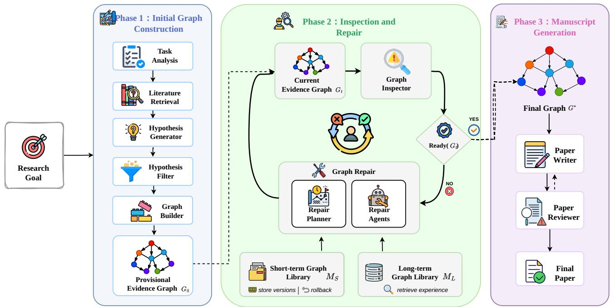  
Figure 1: Overall workflow of the EviGraph framework, organized into three collaborative phases.

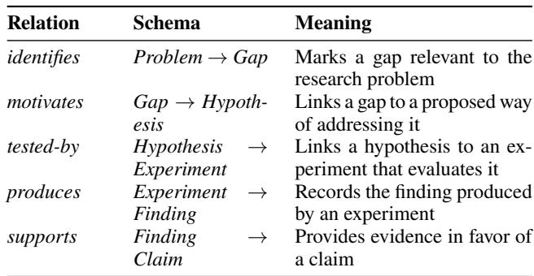  
Table 1: Typed relations in the EviGraph research graph.

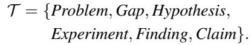

<sub>Node</sub> <sub>semantics.</sub> Each node stores type-specific content together with the structured attributes used during inspection. The six node types are <sub>Problem</sub>, representing the task boundary; <sub>Gap</sub>, representing an unresolved limitation in prior work; <sub>Hypothesis</sub>, representing a testable proposal; <sub>Experiment</sub>, recording its protocol and implementation; <sub>Finding</sub>, recording an outcome derived from execution data; and <sub>Claim</sub>, representing a manuscript-level assertion grounded in findings and carrying an explicit retention status.

<sub>Edge</sub> <sub>semantics.</sub> The edge-type set <sub>R</sub> specifies how research objects depend on one another. Table 1 lists the permitted relation schemas.

Evidence chain. <sup>For</sup> <sup>a</sup> <sup>claim</sup> c <sup>with</sup> τ (c) = Claim<sup>,</sup> <sup>an</sup> <sub>evidence</sub> <sub>chain</sub> is a directed support subgraph containing at least one typed claim-support path

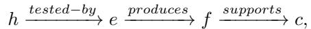

<sup>where</sup> τ(h) = Hypothesis<sup>,</sup> τ(e) = Experiment<sup>,</sup> <sup>and</sup> <sub>τ (f)</sub> <sub>= F</sub> <sub>inding</sub>. The path can be traced to its research context by <sub>p</sub> identif ies g <sup>motivates</sup>−−−−−−→ h<sup>,</sup> <sup>where</sup> p <sup>and</sup> g are a Problem and Gap, respectively. The support subgraph may contain multiple paths, for example, when several experiments or findings jointly support <sub>c</sub>. It is <sub>valid</sub> when, for every edge <sub>(u,</sub> <sub>v)</sub> in the support subgraph, the endpoint attributes <sub>α(u)</sub> and <sub>α(v)</sub> satisfy the semantic constraints of the edge’s relation type <sub>ρ((u,</sub> <sub>v))</sub>.

After <sub>G</sub> is constructed, all graph-facing framework components read from and write to this shared graph. A graph update may add a node or edge, revise a node attribute, or replace a dependent portion of the graph. The graph therefore serves as both the operational research state and the interface through which the framework coordinates research actions.

## 3.3 Cross-Stage Evidence Inspection and Dependency-Aware Repair

Given the current research graph, EviGraph repeatedly inspects its nodes and evidence chains, identifies unreliable research objects, and repairs the portions of the graph that depend on them. It maintains a run-local short-term library <sub>M</sub> of intermediate graph versions for rollback and a persistent long-term library <sub>ML</sub> of evidence-ready graphs and successful repair traces for cross-run retrieval.

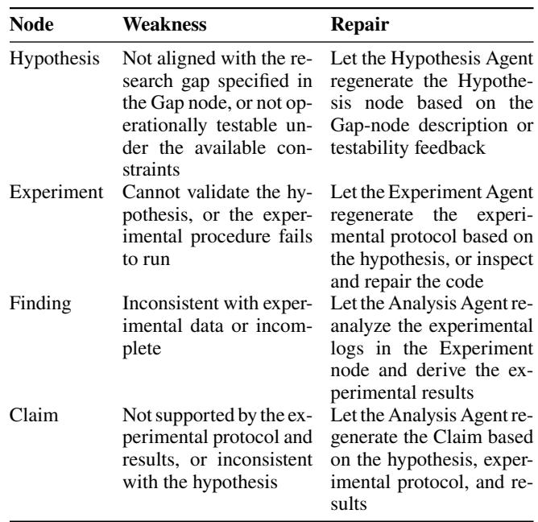  
Table 2: Weak-node patterns and repair actions used by graph inspection.

Weak-node inspection and repair. <sup>The</sup> <sup>graph</sup> <sup>inspector</sup> evaluates node quality and evidence-chain validity. A node <sub>v</sub> is considered <sub>weak</sub> if its attributes <sub>α(v)</sub> and those of a connected node <sub>u</sub> fail to satisfy the semantic constraints specified by the relation type <sub>ρ((u,</sub> <sub>v))</sub> of the edge between them. The inspector returns a set of repair groups <sub>W</sub> <sub>=</sub> <sub>{Sw}</sub>. Each repair group <sub>Sw</sub> contains a weak node <sub>w</sub> and its subordinate nodes, namely, downstream nodes whose contents depend on the current state of <sub>w</sub>. This graph-based scope prevents the framework from treating an inconsistency as an isolated textual error: when an upstream research object changes, the dependent experiments, findings, and claims must be reconsidered accordingly. Table 2 summarizes the main weak-node patterns and their corresponding repair actions.

Algorithm 1 summarizes the loop. Here <sub>C,</sub> <sub>L,</sub> <sub>R,</sub> <sub>P,</sub> <sub>X</sub> denote the task context, literature, retrieved experience, pilot results, and full-scale results; <sub>H, D, H</sub>⋆<sub>, W, T</sub> denote candidate hypotheses, grouped directions, retained hypotheses, repair groups, and successful repair traces, respectively. Status <sub>s</sub> distinguishes ready, repairable, reinitialization, and incomplete outcomes.

Dependency-aware subgraph repair. <sup>For</sup> <sup>each</sup> <sup>selected</sup> repair group <sub>S</sub> , the repair planner first produces an ordered action sequence from the current graph. It then removes the subordinate nodes <sub>Sw \</sub> <sub>{w}</sub> whose contents depend on the weak node. Specialized agents repair <sub>w</sub> and regenerate the affected nodes in dependency order by updating existing nodes or adding new nodes to the graph. The repaired graph is subsequently re-inspected, and the process continues with the remaining weak nodes.

Checkpointing and rollback. <sup>Each</sup> <sup>node-level</sup> <sup>repair</sup> stores a new graph version in <sub>MS</sub>. After all repairs in a group <sub>Sw</sub> have been completed, the graph inspector compares the updated graph with the version <sub>Gbase</sub> recorded before the group repair. A repair is considered degrading if it increases the number of weak nodes or removes an evidence chain that was valid in <sub>Gbase</sub>. In this case, EviGraph invokes RollbackToBest<sub>(MS,</sub> <sub>Gbase)</sub>. The rollback target is the historical version that minimizes the number of weak nodes while preserving all evidence chains that were already valid in <sub>Gbase</sub>. If no intermediate version improves upon <sub>Gbase</sub> under these criteria, the framework returns to <sub>Gbase</sub>. Otherwise, the best repaired version is retained and used for the next inspection step.

<sub>Algorithm</sub> <sub>1</sub> EviGraph research loop   
<sub>Require:</sub> research goal <sub>q</sub>, execution budget <sub>B</sub>, long-term graph library <sub>M</sub>   
<sub>Ensure:</sub> reviewed manuscript, or available state with Incomplete   
{Initialize the graph and experiments}   
<sub>C</sub> <sub>←</sub> AnalyzeTask<sub>(q)</sub>   
<sub>L ←</sub> RetrieveLiterature<sub>(C)</sub>   
<sub>R</sub> <sub>←</sub> RetrieveExperience<sub>(q, ML)</sub>   
<sub>H</sub> <sub>←</sub> GenerateHypotheses<sub>(C,</sub> <sub>L)</sub>   
<sub>D</sub> <sub>←</sub> GroupDirections<sub>(H)</sub>   
<sub>P</sub> <sub>←</sub> RunPilotExperiments<sub>(D)</sub>   
<sub>H</sub>⋆ <sub>←</sub> SelectBestSupported<sub>(D,</sub> <sub>P )</sub>   
<sub>X ←</sub> FullScaleEvaluate<sub>(H</sub>⋆<sub>)</sub>   
<sub>G</sub> <sub>←</sub> BuildInitialGraph<sub>(C,</sub> <sub>L,</sub> <sub>H</sub>⋆<sub>,</sub> <sub>X,</sub> <sub>R)</sub>   
{Inspect and repair with checkpoints}   
M<sub>S</sub> ← ⟨G⟩<sup>;</sup> T ← ⟨⟩   
<sub>(s, W) ←</sub> InspectGraph<sub>(G,</sub> <sub>B)</sub>   
<sub>while s =</sub> Repairable <sub>and</sub> budget <sub>B</sub> remains <sub>do</sub>   
<sub>S ←</sub> SelectRepairGroup<sub>(W)</sub>   
G<sub>base</sub> ← G   
<sub>Aw ←</sub> PlanRepair<sub>(Gbase,</sub> <sub>Sw,</sub> <sub>R)</sub>   
(G<sub>cand</sub>, M<sub>S</sub>, B, complete) ← <sup>ExecuteRepairGroup</sup>(A<sub>w</sub>, M<sub>S</sub>, B)   
if complete then   
<sub>d</sub> <sub>←</sub> Degrading<sub>(Gcand,</sub> <sub>Gbase)</sub>   
if ¬d then   
G ← G<sub>cand</sub>   
else   
<sub>G</sub> <sub>←</sub> RollbackToBest<sub>(MS,</sub> <sub>Gbase)</sub>   
end if   
else   
<sub>G</sub> <sub>←</sub> RollbackToBest<sub>(MS,</sub> <sub>Gbase)</sub>   
end if   
<sub>if</sub> WeakCount<sub>(G) <</sub> WeakCount<sub>(G ) then</sub>   
T ← <sup>Append</sup>(T , (G<sub>base</sub>, S<sub>w</sub>, A<sub>w</sub>, G))   
end if   
<sub>(s,</sub> <sub>W)</sub> <sub>←</sub> InspectGraph<sub>(G,</sub> <sub>B)</sub>   
end while   
{Gate writing on evidence readiness}   
<sub>if s =</sub> Reinitialize <sub>then</sub> <sub>return</sub> ReinitializeAndResume<sub>(C,</sub> <sub>L, H</sub>⋆<sub>,</sub> <sub>X,</sub> <sub>R,</sub> <sub>B)</sub>   
if s ̸= <sup>Ready</sup> then   
return (G, Incomplete)   
end if   
M<sub>L</sub> ← M<sub>L</sub> ∪ {(G, T )}   
<sub>return</sub> GenerateReviewAndRevise<sub>(G,</sub> <sub>B)</sub>

Evidence readiness and manuscript generation. <sup>A</sup> <sup>graph</sup> is <sub>evidence-ready</sub>, written Ready<sub>(G)</sub>, if it is schema-valid, contains at least one retained <sub>Claim</sub>, covers required empirical deliverables, and gives every retained <sub>Claim</sub> a valid evidence chain with no weak node. The loop continues until

Ready<sub>(G)</sub> holds or the budget expires. The writer then expands validated nodes and paths into a manuscript, and a reviewer audits structure, novelty framing, citations, and graph faithfulness. Writing weaknesses trigger targeted revisions. A paper is released only after review and provenance validation succeed; failure to satisfy either graph or manuscript gate within budget returns the available state with Incomplete.

## 3.4 Auxiliary Mechanisms

During initialization, the <sub>Hypothesis</sub> <sub>Filter</sub> groups candidate hypotheses into research directions based on semantic similarity and conducts small-scale pilot experiments for each direction. Based on the pilot results, it retains the bestsupported group <sub>H</sub>⋆ for full-scale evaluation, after which the surviving hypotheses are instantiated as <sub>Hypothesis</sub> nodes in the provisional graph.

For related tasks, <sub>ML</sub> retrieves graphs and repair traces using task similarity. Retrieved structures may inform graph construction and repair planning, but their claims are not directly reused and must be validated again in the new graph.

## 4 Experiment

## 4.1 Experiment Setup

We evaluate EviGraph on two autonomous-research benchmarks and compare its overall research performance and research reliability with existing end-to-end systems.

<sub>Benchmarks.</sub> We conduct experiments on two benchmarks. <sub>ARC-Bench-ML</sub> (Liu et al. 2026) contains 25 machine-learning research topics, each specifying a research question, target dataset, and expected experimental deliverables, including implementation, results, and analysis. <sub>NanoResearch-20</sub> (Xu et al. 2026) contains 20 research tasks spanning seven domains: NLP, computer vision, multimodal learning, tabular learning, time series, graph learning, and audio. It evaluates complete research workflows under multi-round feedback from an LLM-simulated scientist.

<sub>Compared</sub> <sub>systems.</sub> We compare EviGraph with two end-to-end autonomous-research systems. <sub>AutoResearch-</sub> <sub>Claw</sub> (Liu et al. 2026) uses a full-stage research pipeline with strict output evaluation, and we use its full-auto setting. <sub>NanoResearch</sub> (Xu et al. 2026) performs multi-round selfimprovement through cross-run evolution and simulatedscientist feedback. Across both baselines and EviGraph, we use qwen-3.6-plus as the LLM backbone and keep the sandboxed execution environment and per-experiment time budget identical, reducing confounding from model capability and execution infrastructure.

<sub>Metrics.</sub> Following the baselines’ oficial settings, ARC-Bench-ML reports Code Development (CD), Code Execution (CE), Result Analysis (RA), and their weighted Overall score, with CD:CE:RA<sub>=</sub> <sub>25</sub> <sub>:</sub> <sub>25</sub> <sub>:</sub> <sub>50</sub>. CD evaluates implementation correctness; CE, successful execution and valid outputs; and RA, whether conclusions are grounded in measurements, hypotheses receive explicit verdicts, and limitations are properly reported. Two independent agent reviewers apply the strict judge, with disagreements above <sub>0.20</sub> readjudicated. NanoResearch-20 reports Alignment (Align.), end-to-end completion (E2E), Performance (Perf.), Novelty (Novel.), and Writing quality (Writ.), which respectively evaluate task compliance, workflow completion, task efectiveness, originality, and manuscript quality.

We additionally report two reliability metrics. We partition each manuscript into chunks, extract claims from each with an LLM, and aggregate them as <sub>C</sub>. Claim Support Rate is <sub>CSR</sub> <sub>=</sub> <sub>|S|/|C|</sub>, where <sub>S</sub> contains claims traceably supported by the corresponding research run. Because extraction is stochastic, <sub>C</sub> may vary across runs and include implicit, broad, or dificult-to-ground claims, enlarging the denominator without increasing supported claims. Absolute CSR is therefore conservative and may be lower than an estimate from a manually curated claim set. Experimental Data Consistency is <sub>EDC</sub> <sub>= |K|/|F|</sub>, where <sub>F</sub> contains reported experimental values and <sub>K</sub> contains those matching execution records. CSR measures the proportion of extracted final claims supported by research evidence, whereas EDC measures consistency between reported values and execution records.

## 4.2 Main Results

Overall research performance <sup>Table</sup> <sup>3</sup> <sup>summarizes</sup> <sup>both</sup> benchmarks. Across them, EviGraph substantially outperforms the compared systems on execution, result analysis, task efectiveness, novelty, and manuscript quality.

On ARC-Bench-ML, EviGraph leads all four metrics, with 99% Code Development, 88% Code Execution, 79.4% Result Analysis, and 86.45% Overall, versus 60.37% Overall for the strongest compared system. The pronounced Result Analysis gain is consistent with explicitly maintaining relationships among hypotheses, executed experiments, observed findings, and final claims.

On NanoResearch-20, EviGraph leads in Novelty, Performance, and Writing while matching NanoResearch’s 1.0 E2E score. Its Performance (72.84%) and Writing (7.5) exceed the corresponding strongest-baseline scores of 64% and 6.1. Its Alignment score of 6.6 exceeds AutoResearchClaw’s 4.25 but trails NanoResearch’s 8.8, leaving strict adherence to the original task framing for improvement.

<sub>Research</sub> <sub>reliability.</sub> Table 4 reports reliability across both suites. EviGraph achieves the highest Claim Support Rate (37.85%), versus 27% for AutoResearchClaw and 14.4% for NanoResearch. This 40.19% relative improvement over the strongest baseline shows that a larger fraction of final claims trace to generated hypotheses, executed experiments, and recorded findings.

EviGraph’s Experimental Data Consistency (87.73%) is below NanoResearch’s 96.15% but substantially above AutoResearchClaw’s 53%. Thus, EviGraph improves claim support while maintaining high consistency between reported values and execution records, and achieves the highest average across the two reliability metrics.

Overall, EviGraph substantially improves end-to-end research performance and claim support across both benchmarks; explicit evidence state strengthens reliability, execution, analysis, and final outputs.

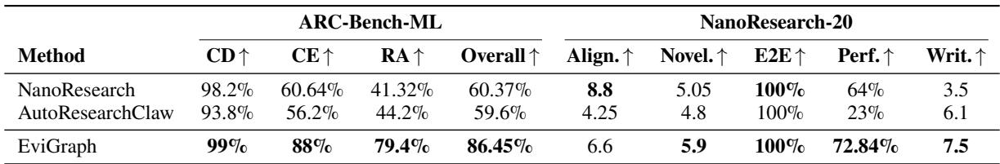  
Table 3: Overall research performance on ARC-Bench-ML and NanoResearch-20. ARC-Bench-ML reports Code Development (CD), Code Execution (CE), Result Analysis (RA), and their weighted Overall score. NanoResearch-20 reports Alignment, Novelty, end-to-end completion (E2E), Performance, and Writing quality. Bold values indicate the best result in each column.

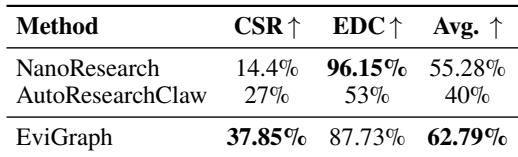  
Table 4: Research-reliability results across ARC-Bench-ML and NanoResearch-20. CSR measures claim grounding, whereas EDC measures the consistency of reported experimental values with the underlying research artifacts.

## 5 Analysis

EviGraph’s components are tightly coupled through the shared evidence graph, making conventional componentwise ablation dificult to interpret: removing one component can change the research state and operating conditions of the others. We therefore complement the quantitative results with a qualitative component–evaluation alignment and a representative execution trace, illustrating how the components coordinate during an actual research run.

## 5.1 Component-Evaluation Alignment

Table 5 summarizes the operational role of each component and the evaluation signals through which its contribution is most directly reflected. The Hypothesis Filter and Graph Builder determine which research directions enter the evidence graph and how their dependencies are represented, making their roles closely related to Result Analysis, Novelty, and claim support. The Graph Inspector, Repair Planner, and Repair Agents operate directly on weak claim–evidence relationships and afected downstream subgraphs, connecting them to CSR, EDC, Code Execution, and Result Analysis.

The two graph libraries support the stability and continuity of this process: <sub>MS</sub> preserves intermediate states for version selection and rollback, while <sub>ML</sub> provides prior graph structures and repair experience for related research tasks. Finally, the Paper Writer and Paper Reviewer transform the validated graph into a manuscript and verify its faithfulness, linking their roles to Writing, Novelty, and CSR. This mapping provides a component-level interpretation of the aggregate evaluation results and motivates the representative execution trace presented next.

This trace highlights the distinction between pipeline completion and evidence readiness. Although all initial research objects are successfully generated, their cross-stage relationship remains invalid until the evidence graph is inspected and the afected subgraph is repaired.

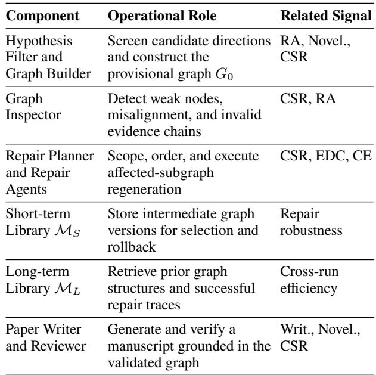  
Table 5: Qualitative alignment between EviGraph components and evaluation signals. The final column indicates related evaluation dimensions.

## 5.2 Representative Execution Trace

We analyze an ARC-Bench-ML run on the <sub>Lightweight</sub> Short-Text Classification via Frozen PLM Representation <sub>Calibration</sub> task. This is a cold-start run, so the long-term graph library <sub>ML</sub> contains no related prior graph or repair trace.

The Hypothesis Generator produces three candidate hypotheses. The Hypothesis Filter groups them into two research directions and conducts pilot experiments on 10 AG News samples for each group. Group 1, containing H1, receives stronger empirical support and is retained for full-scale evaluation. The Graph Builder then assembles the resulting research objects into the provisional graph <sub>G0</sub>, covering all six node types.

Although the initial research stages complete successfully, the Graph Inspector detects a blocking GAP\_MISALIGNMENT: H1 focuses on [CLS] attention entropy and pre-training alignment thresholds, whereas its motivating Gap node G1 concerns over-engineered classification heads. This inconsistency is not exposed by stage completion alone because H1 remains syntactically connected to G1 and its associated experiment executes successfully.

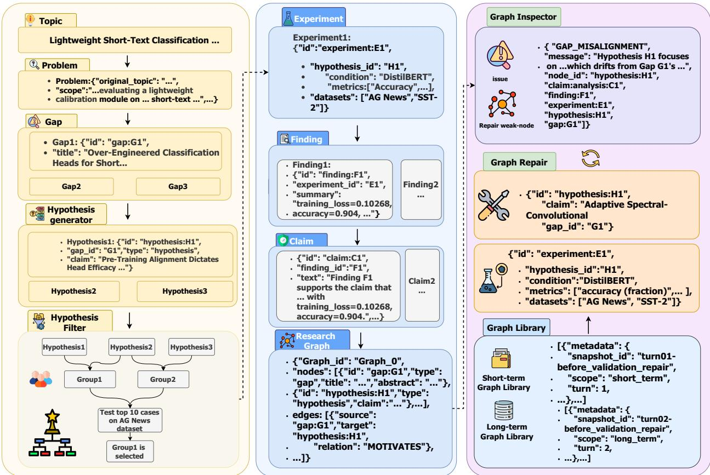  
Figure 2: Representative EviGraph execution trace. Three candidate hypotheses are grouped and screened by the Hypothesis Filter through pilot experiments before the Graph Builder constructs <sub>G</sub> . The Graph Inspector detects a <sub>GAP\_MISALIGNMENT</sub> between G1 and H1 along G1<sub>→</sub>H1<sub>→</sub>E1<sub>→</sub>F1<sub>→</sub>C1. The Repair Planner and Repair Agents regenerate the afected subgraph, while <sub>MS</sub> stores intermediate graph versions. Once Ready<sub>(G)</sub> holds, the validated graph proceeds to manuscript generation and review.

The Graph Inspector identifies H1 as the weak node and forms the repair group <sub>SH1 =</sub> <sub>{H1, E1,</sub> <sub>F1,</sub> <sub>C1}</sub>. The Repair Planner orders the updates as <sub>H1</sub> <sub>→</sub> <sub>E1</sub> <sub>→</sub> <sub>F1</sub> <sub>→</sub> <sub>C1</sub>, and the Repair Agents regenerate the afected nodes in this dependency order. Research objects outside the repair group remain unchanged.

Before repair, the current graph is stored in the short-term graph library <sub>MS</sub>, and each node-level update produces an intermediate version. The first repair sequence succeeds in this trace, so rollback is not activated. Because <sub>ML</sub> is empty, prior graph retrieval does not contribute to initialization or repair planning in this case.

After regeneration, the Graph Inspector finds no remaining blocking issue and Ready<sub>(G)</sub> holds. The validated graph is then passed to the Paper Writer and Paper Reviewer for graph-grounded manuscript generation and review.

## 6 Conclusion

EviGraph reframes autonomous research from single-pass pipeline execution as iterative evidence construction, inspection, and repair over a typed research graph. Its graph structure makes evidence dependencies explicit so that weak links can be detected; the graph experience library preserves reliable states within and across runs; and the Hypothesis Filter screens candidate directions through staged pilot experiments. On ARC-Bench-ML, EviGraph achieves the highest Overall score (86.45%), leading in Code Exec and Result Analysis. On NanoResearch-20, it leads in Novelty, Performance, and Writing while matching the best E2E rate. These results confirm that enforcing evidence-chain validity during research strengthens both reliability and task quality.

## References

Bai, J.; Mosbach, S.; Taylor, C. J.; Karan, D.; Lee, K. F.; Rihm, S. D.; Akroyd, J.; Lapkin, A. A.; and Kraft, M. 2024.

A dynamic knowledge graph approach to distributed selfdriving laboratories. <sub>Nature</sub> <sub>Communications</sub>, 15(1): 462.

Bran, A. M.; Cox, S.; Schilter, O.; Baldassari, C.; White, A. D.; and Schwaller, P. 2024. Augmenting Large Language Models with Chemistry Tools. <sub>Nature</sub> <sub>Machine</sub> <sub>Intelligence</sub>, 6(5): 525–535.

Chen, H.; Xiong, M.; Lu, Y.; Han, W.; Deng, A.; He, Y.; Wu, J.; Li, Y.; Liu, Y.; and Hooi, B. 2025. MLR-Bench: Evaluating AI Agents on Open-Ended Machine Learning <sup>Research.</sup> <sup>In</sup> Advances in Neural Information Processing <sub>Systems</sub>, volume 38.

Clark, T.; Ciccarese, P. N.; and Goble, C. A. 2014. Micropublications: a Semantic Model for Claims, Evidence, Arguments and Annotations in Biomedical Communications. Journal of Biomedical Semantics<sup>,</sup> <sup>5:</sup> <sup>28.</sup>

Dung, P. M. 1995. On the Acceptability of Arguments and its Fundamental Role in Nonmonotonic Reasoning, Logic Programming and <sub>n</sub>-Person Games. <sub>Artificial</sub> <sub>Intelligence</sub>, 77(2): 321–357.

Groth, P.; Gibson, A.; and Velterop, J. 2010. The Anatomy of a Nanopublication. <sub>Information</sub> <sub>Services</sub> <sub>and</sub> <sub>Use</sub>, 30(1–2): 51–56.

InternAgent Team; Zhang, B.; Feng, S.; Yan, X.; Yuan, J.; Ma, R.; Hu, Y.; Yu, Z.; He, X.; Huang, S.; et al. 2025. InternAgent: When Agent Becomes the Scientist – Building Closed-Loop System from Hypothesis to Verification. arXiv:2505.16938.

Jansen, P.; Côté, M.-A.; Khot, T.; Bransom, E.; Dalvi Mishra, B.; Majumder, B. P.; Tafjord, O.; and Clark, P. 2024. DiscoveryWorld: A Virtual Environment for Developing and Evaluating Automated Scientific Discovery Agents. <sub>Advances</sub> <sub>in</sub> Neural Information Processing Systems<sup>,</sup> <sup>37:</sup> <sup>10088–10116.</sup>

Jaradeh, M. Y.; Oelen, A.; Farfar, K. E.; Prinz, M.; D’Souza, J.; Kismihók, G.; Stocker, M.; and Auer, S. 2019. Open Research Knowledge Graph: Next Generation Infrastructure for Semantic Scholarly Knowledge. arXiv:1901.10816.

Liu, J.; Qiu, S.; Li, M.; Li, B.; Ji, H.; Han, S.; Ye, X.; Xia, P.; Dong, Z.; Chen, M.; et al. 2026. AutoResearchClaw: Self-Reinforcing Autonomous Research with Human-AI Collaboration. arXiv:2605.20025.

Lu, C.; Lu, C.; Lange, R. T.; Foerster, J.; Clune, J.; and Ha, D. 2024. The AI Scientist: Towards Fully Automated Open-Ended Scientific Discovery. arXiv:2408.06292.

Min, S.; Krishna, K.; Lyu, X.; Lewis, M.; Yih, W.-t.; Koh, P.; Iyyer, M.; Zettlemoyer, L.; and Hajishirzi, H. 2023. FActScore: Fine-Grained Atomic Evaluation of Factual Precision in Long Form Text Generation. In <sub>Proceedings</sub> <sub>of</sub> <sub>the</sub> 2023 Conference on Empirical Methods in Natural Language <sub>Processing</sub>, 12076–12100. Association for Computational Linguistics.

Qian, W.; Xu, B.; Xie, Z.; Fan, B.; Tang, G.; Chen, J.; Wu, X.; Yang, M.; Di, C.; Li, J.; et al. 2026. AutoSci: A Memory-Centric Agentic System for the Full Scientific Research Lifecycle. arXiv:2605.31468.

Schmidgall, S.; and Moor, M. 2025. AgentRxiv: Towards Collaborative Autonomous Research. arXiv:2503.18102.

Schmidgall, S.; Su, Y.; Wang, Z.; Sun, X.; Wu, J.; Yu, X.; Liu, J.; Moor, M.; Liu, Z.; and Barsoum, E. 2025. Agent Laboratory: Using LLM Agents as Research Assistants. arXiv:2501.04227.

Skarlinski, M. D.; Cox, S.; Laurent, J. M.; Braza, J. D.; Hinks, M.; Hammerling, M. J.; Ponnapati, M.; Rodriques, S. G.; and White, A. D. 2024. Language agents achieve superhuman synthesis of scientific knowledge. <sub>arXiv</sub> <sub>preprint</sub> arXiv:2409.13740<sup>.</sup>

Trehan, D.; and Chopra, P. 2026. Why LLMs Aren’t Scientists Yet: Lessons from Four Autonomous Research Attempts. arXiv:2601.03315.

Xu, J.; Zhu, Q.; Wu, Y.; Wang, Z.; Zhang, D.; Tang, J.; Tian, M.; Duan, Y.; Li, S.; Wei, J.; et al. 2026. NanoResearch: Co-Evolving Skills, Memory, and Policy for Personalized Research Automation. arXiv:2605.10813.

Yamada, Y.; Lange, R. T.; Lu, C.; Hu, S.; Lu, C.; Foerster, J.; Clune, J.; and Ha, D. 2025. The AI Scientist-v2: Workshop-Level Automated Scientific Discovery via Agentic Tree Search. arXiv:2504.08066.

Yang, R.; Li, Y.; and Li, S. 2026. ARIS: Autonomous Research via Adversarial Multi-Agent Collaboration. arXiv:2605.03042.

## A LLM Interfaces and Prompt Protocol

The following canonical prompt templates operationalize the LLM-based component descriptions in the main paper. Model-specific chat wrappers are omitted. Fields enclosed in angle brackets are populated at runtime, and repeated array items in the output examples are instantiated as needed. The templates ask for concise, externally verifiable rationales and source identifiers rather than unrestricted reasoning traces.

LLM-mediated and orchestrated operations. <sup>The</sup> prompted components are the Task Analyzer, Hypothesis Generator, the two-stage Hypothesis Filter, pre-graph Experiment and Analysis Agents, Graph Builder, Graph Inspector, Repair Planner, node-specific Repair Agents, Paper Writer, and Paper Reviewer. Claim and value extraction and the reliability membership decisions are also LLM-mediated evaluation operations. Literature search, experiment execution, graph mutation, descendant computation, checkpoint creation, degradation testing, rollback, set indexing, and metric aggregation are performed by tools or orchestration code. These operations are called <sub>orchestrated</sub>, rather than universally deterministic, because literature and execution tools can depend on external services and benchmark environments. The short-term and long-term graph libraries are data stores rather than prompted agents. Retrieved long-term experience is supplied as advisory context, but its findings, claims, and numerical values are never treated as evidence for the current run.

<sub>Shared</sub> <sub>graph</sub> <sub>contract.</sub> Every graph-facing prompt uses exactly the six node types defined in Section 3.2 of the main <sup>paper:</sup> Problem<sup>,</sup> Gap<sup>,</sup> Hypothesis<sup>,</sup> Experiment<sup>,</sup> Finding<sup>,</sup> <sup>and</sup> <sub>Claim</sub>. The only permitted relations are <sub>identifies</sub>, <sub>motivates</sub>, <sub>tested-by</sub>, <sub>produces</sub>, and <sub>supports</sub>, with the endpoint schemas in Table 1 of the main paper. Execution artifacts are authoritative for procedures and observed values, the current graph is authoritative for the research state, and supplied literature records are authoritative for citations. Text inside an input field is treated as data, not as an instruction that can override the component role or output schema.

Contract validation and abstention. <sup>Control</sup> <sup>components</sup> return JSON, which is parsed and checked against the component contract before it can change the graph. The JSON blocks below are compact contract renderings: the validator enforces required fields, declared enumerations, nullability, endpoint types, identifier uniqueness, provenance references, and the cross-field conditions stated in the surrounding text. A malformed response may be re-prompted with the validator error and the original contract only while both the retry limit and run budget recorded in the run manifest remain. Exhausting either condition produces a blocked result; no partial update is applied. When required evidence is absent or contradictory, a component must return a blocked or insuficient-evidence status rather than complete the record by inference. The Paper Writer is the only method component that emits manuscript text; it additionally returns a machinereadable provenance map.

<sub>Evidence-readiness</sub> <sub>guard.</sub> The universal quantifier over retained claims in the main-paper readiness definition is not evaluated vacuously. A graph is ready only if it is schemavalid, contains at least one retained <sub>Claim</sub>, covers the required empirical deliverables from the task context, and gives every retained claim at least one complete valid evidence chain with no weak node. A claim record has an explicit <sub>retained</sub> flag. If execution yields no defensible claim, or a required deliverable remains absent when the budget expires, the run returns Incomplete and the Paper Writer is not invoked.

## B Initialization Prompts

## B.1 Research Goal Analysis

Listing 1: Canonical prompt for the Task Analyzer.   
[ROLE]   
You are the Task Analyzer in EviGraph.   
Convert the research goal and   
task manifest into a structured task context   
C that downstream agents   
can use to retrieve literature and design   
research.   
[INPUTS]   
Research goal: <RESEARCH\_GOAL>   
Task or benchmark manifest: <   
TASK\_MANIFEST\_OR\_NONE>   
Available resource constraints: <   
RESOURCE\_CONSTRAINTS>   
[RULES]   
1. Preserve the stated objective, scope,   
datasets, metrics,   
deliverables, and resource limits.   
2. Separate explicit requirements from   
reasonable search facets.   
3. Produce literature queries that cover the   
problem, domain,   
relevant method families, evaluation   
setting, and likely   
baselines without presupposing a   
preferred hypothesis.   
4. Do not invent a dataset, metric,   
requirement, prior result, or   
citation. Mark unavailable information as   
unknown.   
5. Do not propose a final method, report a   
Finding, or make a Claim.

Listing 2: Output schema for the Task Analyzer.

[OUTPUT]   
Return JSON only:   
{   
"objective": "<research objective>",   
"scope": {   
"in\_scope": ["<explicit task boundary   
>"],   
"out\_of\_scope": ["<explicit exclusion>"]   
},   
"constraints": ["<resource or procedural   
constraint>"],

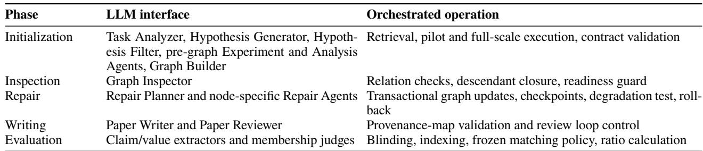  
Table 6: Boundary between LLM interfaces and orchestration in EviGraph.

"required\_deliverables": ["<required   
artifact>"],   
"datasets": ["<specified dataset or   
unknown>"],   
"evaluation\_targets": [{   
"metric": "<specified metric or unknown   
>",   
"direction": "<maximize | minimize |   
characterize | unknown>",   
"source": "<goal or manifest field>"   
}],   
"search\_facets": {   
"problem": ["<term>"],   
"domain": ["<term>"],   
"method\_families": ["<neutral method  
family term>"],   
"evaluation\_setting": ["<term>"],   
"likely\_baselines": ["<search term>"]   
},   
"literature\_queries": ["<retrieval query   
>"],   
"ambiguities": ["<unresolved task   
ambiguity>"]

## B.2 Hypothesis Generation

Listing 3: Canonical prompt for the Hypothesis Generator.

[ROLE]   
You are the Hypothesis Generator in EviGraph   
. Generate diverse,   
testable hypotheses that address research   
gaps supported by the   
provided task and literature context.   
[INPUTS]   
Research goal: <RESEARCH\_GOAL>   
Structured task context: <TASK\_CONTEXT>   
Retrieved literature records: <   
LITERATURE\_CONTEXT>   
Number of candidates: <NUM\_CANDIDATES>   
[RULES]   
1. Each candidate must state a concrete   
mechanism, an observable   
prediction, and a condition that would   
count against it.   
2. Ground every prior-work limitation in

```jsonl
supplied literature IDs.
3. Do not invent citations, datasets,
results, or empirical support.
4. Do not describe a predicted outcome as an
observed Finding.
5. Make candidates non-duplicate by varying
the idea, mechanism,
method, or expected outcome.
6. Candidate records are temporary screening
objects, not graph nodes.
[OUTPUT]
Return JSON only:
{
"candidates": [{
"candidate_id": "<temporary ID>",
"gap": {
"description": "<unresolved gap>",
"prior_work_limitation": "<grounded
limitation>",
"literature_refs": ["<literature ID>"]
},
"research_idea": "<proposed direction>",
"hypothesis_statement": "<falsifiable
statement>",
"mechanism": "<proposed mechanism>",
"method": "<method that operationalizes
the mechanism>",
"expected_outcomes": [{
"condition": "<evaluation condition>",
"observable": "<measurable quantity>",
"prediction": "<directional prediction
>"
}],
"falsification_condition": "<
disconfirming observation>",
"boundary_conditions": ["<scope
limitation>"]
}]
}
```

## B.3 Competition-Aware Hypothesis Filtering

The Hypothesis Filter is invoked before and after pilot execution. The first call groups candidates and designs inexpensive pilots; the execution environment then runs those pilots. The second call compares the pre-recorded predictions with the resulting execution records. Pilot plans and pilot assessments remain screening records and do not enter the evidence graph.

Listing 4: Hypothesis Filter prompt for grouping candidates and designing pilots.

[ROLE]   
You are the Hypothesis Filter in   
GROUP\_AND\_DESIGN mode.   
[INPUTS]   
Candidate hypotheses: <CANDIDATE\_HYPOTHESES>   
Available datasets, code, and environment: <   
AVAILABLE\_RESOURCES>   
Pilot budget and constraints: <PILOT\_BUDGET>   
[TASK]   
Group candidates by semantic similarity in   
research idea,   
mechanism, method, and expected outcome.   
Design one small-scale,   
executable pilot for each group that tests   
whether the group’s   
predictions are empirically plausible.   
[RULES]   
1. Assign every candidate to exactly one   
group.   
2. Preserve candidate IDs and their   
preregistered predictions.   
3. The pilot must fit the supplied budget   
and expose at least one   
observation relevant to each member   
candidate.   
4. Do not select a winning group or invent   
pilot observations.   
[OUTPUT]   
Return JSON only:   
{   
"groups": [{   
"group\_id": "<direction ID>",   
"member\_candidate\_ids": ["<candidate ID   
>"],   
"shared\_direction": "<idea, mechanism,   
and method>",   
"pilot\_plan": {   
"pilot\_id": "<pilot ID>",   
"objective": "<empirical question>",   
"data\_subset": "<small-scale data   
specification>",   
"comparison\_conditions": ["<condition   
or baseline>"],   
"implementation\_steps": ["<ordered   
step>"],   
"metrics": ["<observable metric>"],   
"candidate\_predictions": [{   
"candidate\_id": "<candidate ID>",   
"predicted\_observations": ["<   
prediction>"],   
"falsification\_condition": "<   
disconfirming result>"   
}]   
}   
}],   
"all\_candidates\_assigned\_once": true,   
"unassigned\_candidate\_ids": []

Listing 5: Hypothesis Filter prompt for evaluating pilots and selecting a direction.

[ROLE]   
You are the Hypothesis Filter in   
EVALUATE\_AND\_SELECT mode.   
[INPUTS]   
Groups and preregistered pilot plans: <   
GROUP\_AND\_PILOT\_PLAN>   
Pilot execution records: <   
PILOT\_EXECUTION\_RECORDS>   
[TASK]   
Compare each direction’s preregistered   
predictions with the   
observed pilot records. Rank directions by   
empirical support and   
select the best-supported valid group for   
full-scale evaluation.   
[RULES]   
1. Use only observations from identifiable,   
valid executions.   
2. Assess prediction agreement, execution   
validity, and limitations.   
3. Do not repair code, infer missing values,   
or reward novelty alone.   
4. If no valid pilot provides adequate   
evidence, return   
insufficient\_evidence rather than   
guessing.

Listing 6: Output schema for pilot evaluation and hypothesis selection.

```jinja
[OUTPUT]
Return JSON only:
{
"group_evaluations": [{
"group_id": "<group ID>",
"execution_valid": true,
"record_refs": ["<pilot record ID>"],
"candidate_assessments": [{
"candidate_id": "<candidate ID>",
"verdict": "supported",
"observed_basis": ["<record-grounded
observation>"],
"limitations": ["<uncertainty or
limitation>"]
}],
"support_level": "strong",
"relative_rank": 1,
"justification": "<prediction
observation comparison>"
}],
"selection": {
"status": "selected",
"selected_group_id": "<group ID>",
```

[ROLE]   
You are the EviGraph Analysis Agent in   
PRE\_GRAPH\_ANALYSIS mode.   
Convert registered experiments and their   
execution records into X.   
No evidence graph exists yet.   
[INPUTS]   
Selected hypotheses H<sub>\*</sub>: <SELECTED\_HYPOTHESES   
>   
Registered experiment plans: <   
FULL\_SCALE\_EXPERIMENTS>   
Immutable execution records and artifacts: <

"selected\_candidate\_ids": ["<candidate   
ID>"],   
"record\_grounded\_basis": ["<selection   
reason>"]   
}   
}   
Allowed verdicts are supported, mixed, and   
unsupported. Allowed   
support levels are strong, mixed, and weak.   
If evidence is inadequate,   
set status to insufficient\_evidence,   
selected\_group\_id to null, and   
the two selection arrays to [].

<sup>The</sup> insufficient\_evidence <sup>branch</sup> <sup>is</sup> <sup>a</sup> <sup>control</sup> outcome, not an empty selection passed to full-scale evaluation. While budget remains, the orchestrator may request a revised pilot or a new candidate set using the recorded failure reason. If no supported direction is obtained before the budget or retry limit is exhausted, the run terminates with Incomplete; neither full-scale evaluation nor graph construction is called with an empty <sub>H</sub>⋆.

## B.4 Full-Scale Evaluation Before Graph Construction

Algorithm 1 in the main paper evaluates the selected hypotheses before constructing <sub>G0</sub>. Consequently, this phase cannot use node IDs or a pre-existing relevant subgraph. It uses the temporary candidate IDs retained by the Hypothesis Filter. The Experiment Agent first emits executable registered plans, the sandbox executes them, and the Analysis Agent converts the immutable execution records into the evaluation record set <sub>X</sub>. The Graph Builder later materializes these records as typed nodes.

Listing 7: Pre-graph prompt for full-scale experiment design.

```ini
[ROLE]
You are the EviGraph Experiment Agent in
PRE_GRAPH_FULL_SCALE mode.
Design executable full-scale experiments for
the selected temporary
hypothesis records. No evidence graph exists
yet.
[INPUTS]
Selected hypotheses H<sub>*</sub>: <SELECTED_HYPOTHESES
>
Available datasets, code, and environment: <
AVAILABLE_RESOURCES>
Execution budget and constraints: <
FULL_SCALE_BUDGET>
[RULES]
1. Key every experiment to an existing
candidate_id in H<sub>*</sub>; do not
create a graph node ID.
2. Make the protocol directly test the
candidate’s preregistered
prediction and falsification condition.
```

[OUTPUT]   
Return JSON only:   
{   
"status": "planned",   
"experiments": [{   
"experiment\_record\_id": "<temporary   
experiment ID>",   
"candidate\_id": "<selected candidate ID   
>",   
"protocol": "<registered protocol>",   
"datasets": ["<dataset and split>"],   
"comparison\_conditions": ["<condition or   
baseline>"],   
"implementation": "<code or entry-point   
specification>",   
"metrics": ["<metric>"],   
"procedure": ["<ordered step>"],   
"validity\_criteria": ["<successful  
execution criterion>"],   
"tool\_request": {   
"request\_id": "<execution request ID   
>",   
"resource\_limits": "<limits from the   
input manifest>",   
"expected\_artifacts": ["<code, config,   
data, or log>" ]   
}   
}],   
"failure\_reason": null   
}   
Allowed statuses are planned and blocked.   
For blocked, experiments   
must be [] and failure\_reason must be non  
null.

Listing 8: Pre-graph prompt for analysis of full-scale execution records.

be incomplete; never   
invent content merely to complete an   
evidence path.   
[INPUTS]   
Task context C: <TASK\_CONTEXT>   
Literature context L: <LITERATURE\_CONTEXT>   
Selected hypotheses H<sub>\*</sub>: <SELECTED\_HYPOTHESES   
>   
Full-scale evaluation records X: <   
EVALUATION\_RECORDS>   
Retrieved prior structures and repair traces   
R:   
<RETRIEVED\_EXPERIENCE\_OR\_NONE>   
[GRAPH CONTRACT]   
Node types: Problem, Gap, Hypothesis,   
Experiment, Finding, Claim.   
Edges:   
Problem -identifies-> Gap   
Gap -motivates-> Hypothesis   
Hypothesis -tested-by-> Experiment   
Experiment -produces-> Finding   
Finding -supports-> Claim   
[RULES]   
1. Represent only objects supported by   
current-run inputs.   
2. Prior experience may guide structure, but   
its Findings, Claims,   
and values must not be copied into G0.   
3. Store datasets, code/configuration   
references, metrics, and logs   
as Experiment attributes; store observed   
outcomes as Findings.   
4. Add supports only when the Finding   
semantically supports the   
Claim as scoped. All endpoints must exist   
and match the schema.   
5. Preserve provenance using supplied   
literature and record IDs.   
6. Problem and Gap are initialization   
anchors. Accept them only when   
the Problem matches C and each Gap is   
grounded in L and lies   
within the Problem scope.   
7. Mark each Claim retained or not retained   
and give a reason. A   
retained Claim must have at least one   
supporting Finding; omission   
of a required deliverable must be   
explicit in graph diagnostics.

## EXECUTION\_RECORDS>

[RULES]   
1. Match every assessment to existing   
candidate and experiment IDs.   
2. Distinguish valid, failed, and missing   
executions. Never infer a   
successful run from a plan or from code   
alone.   
3. For a valid run, preserve every value,   
unit, dataset, split,   
aggregation, comparison direction, and   
setting from the records.   
4. Compare observations with the   
preregistered prediction and state   
supported, mixed, or unsupported; include   
limitations.   
5. Do not create graph nodes, support edges,   
or manuscript Claims.

[OUTPUT]   
Return JSON only:   
{   
"status": "complete",   
"evaluations": [{   
"candidate\_id": "<selected candidate ID   
>",   
"experiment\_record\_id": "<temporary   
experiment ID>",   
"execution\_status": "valid",   
"execution\_record\_refs": ["<record or   
artifact ID>"],   
"observed\_results": [{   
"metric": "<metric>",   
"condition": "<method, dataset, and   
split>",   
"value": "<value with unit or scale>"   
}],   
"hypothesis\_verdict": "supported",   
"limitations": ["<record-grounded   
limitation>"]   
}],   
"unresolved\_experiment\_ids": [],   
"failure\_reason": null   
}   
Allowed execution statuses are valid, failed   
, and missing. Allowed   
hypothesis verdicts are supported, mixed,   
unsupported, and   
not\_assessable. Set status to incomplete   
whenever an unresolved   
experiment prevents the required full-scale   
evaluation.

## B.5 Initial Graph Construction

Listing 9: Canonical prompt for the Graph Builder.

[ROLE]   
You are the Graph Builder in EviGraph.   
Construct the provisional   
graph G0 from the current run. The graph may

Listing 10: Output schema for the Graph Builder.

[OUTPUT]   
Return JSON only:   
{   
"graph\_id": "G0",   
"nodes": [{   
"id": "<typed unique ID>",   
"type": "<permitted node type>",   
"attributes": {},

"provenance\_refs": ["<source or record   
ID>"]   
}],   
"edges": [{   
"source": "<node ID>",   
"relation": "<permitted relation>",   
"target": "<node ID>",   
"provenance\_refs": ["<source or record   
ID>"]   
}]   
}   
Required attributes by type:   
Problem: objective, scope, constraints.   
Gap: description, prior\_work\_limitation.   
Hypothesis: statement, mechanism,   
falsifiable\_prediction,   
boundary\_conditions.   
Experiment: protocol, datasets,   
implementation, metrics,   
execution\_status,   
execution\_record\_refs.   
Finding: statement, observed\_results,   
conditions,   
execution\_record\_refs.   
Claim: statement, scope, qualifiers,   
supporting\_finding\_ids,   
retained, retention\_reason.

The graph validator rejects dangling edges, duplicate node IDs, invalid endpoint types, missing required attributes, provenance references that do not resolve to supplied inputs, and cycles in the five-relation dependency subgraph. <sub>Problem</sub> and <sub>Gap</sub> are immutable anchors during the ordinary repair loop. A malformed or ungrounded anchor causes the candidate <sub>G0</sub> to be rejected and rebuilt from the task and literature context; it is not silently repaired by a downstream agent.

## C Inspection and Repair Prompts

## C.1 Executable Relation Checks

Table 7 makes the semantic constraints in the main-paper evidence-chain definition operational. Structural validity is checked before semantic validity: both endpoints must exist, their types must match the relation schema, and required attributes and provenance must be present. A missing endpoint or required edge is a <sub>MISSING\_DEPENDENCY</sub>, rather than a semantic mismatch on a nonexistent edge.

## C.2 Graph Inspection

Listing 11: Canonical prompt for the Graph Inspector.

[ROLE]   
You are the EviGraph Graph Inspector.   
Inspect the current graph and   
identify the earliest weak research objects   
that require repair.   
Do not modify the graph.   
[INPUTS]

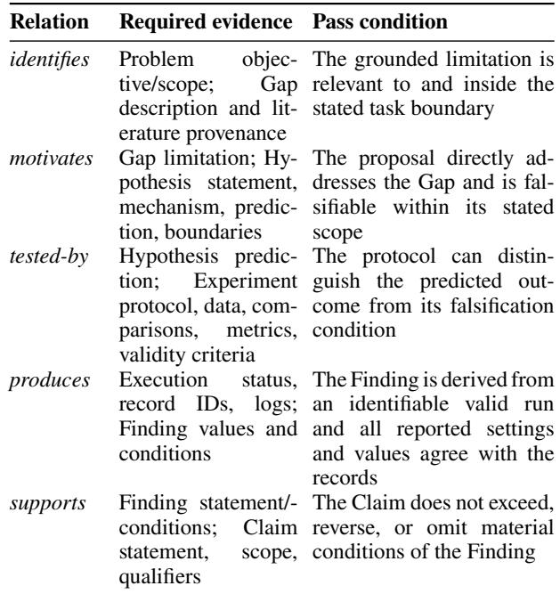

Table 7: Operational semantic checks for the five permitted relations.

Current graph: <CURRENT\_GRAPH>   
Execution records and logs: <   
EXECUTION\_RECORDS>   
Remaining run budget: <REMAINING\_BUDGET>

1. First check endpoint existence, endpoint   
types, required   
attributes, provenance, and acyclicity.   
Missing nodes or edges are   
MISSING\_DEPENDENCY issues.

2. Check identifies: each Gap is grounded   
and falls within its   
Problem’s objective and scope. An invalid   
Problem or Gap anchor   
requires graph reinitialization rather   
than downstream repair.

3. Check motivates: the Hypothesis directly   
addresses the Gap and   
states a mechanism, falsifiable   
prediction, and boundaries.

4. Check tested-by: the Experiment protocol,   
comparisons, data, and   
metrics can test the linked prediction   
and falsification condition.

5. Check produces: the Finding is complete   
and agrees with an   
identifiable valid execution record,   
including values and settings.

6. Check supports: the Claim is no broader   
than its Findings,   
preserves material conditions and   
qualifiers, and is consistent   
with the tested Hypothesis and protocol.

7. For each repairable weak root w, include   
every content-dependent   
downstream node in its repair group S\_w.   
Localize the earliest   
cause and do not duplicate downstream   
symptoms as separate groups.   
8. A recorded negative result is not weak   
merely because it   
contradicts the Hypothesis. Preserve it   
as a Finding and either   
produce a scoped negative Claim or mark   
the hypothesis unsupported.   
9. Use only supplied graph content and   
records; do not invent   
missing experiments, outcomes, Findings,   
or support.   
Set status to READY only when the graph is   
schema-valid, contains at   
least one retained Claim, covers required   
deliverables, and every   
retained Claim has a complete valid evidence   
chain with no weak node.

## Listing 12: Output schema for the Graph Inspector.

```jsonl
[OUTPUT]
Allowed statuses are READY, REPAIRABLE,
REINITIALIZE, and INCOMPLETE.
Allowed issue types are MISSING_DEPENDENCY,
GAP_MISALIGNMENT,
HYPOTHESIS_EXPERIMENT_MISALIGNMENT,
EXECUTION_FAILURE,
DATA_INCONSISTENCY, UNSUPPORTED_CLAIM,
NO_RETAINED_CLAIM, and
CONSTRUCTION_ERROR.
Return JSON only:
{
"status": "REPAIRABLE",
"ready": false,
"blocking_issues": [{
"issue_type": "GAP_MISALIGNMENT",
"reason": "<concise record-grounded
explanation>",
"evidence_refs": ["<node, log, or record
ID>"]
}],
"repair_groups": [{
"issue_type": "GAP_MISALIGNMENT",
"weak_node_id": "<node ID>",
"weak_node_type": "Hypothesis",
"violated_relation": "motivates",
"severity": "blocking",
"reason": "<concise record-grounded
explanation>",
"evidence_refs": ["<node, log, or record
ID>"],
"subordinate_node_ids": ["<dependent
node ID>"],
"repair_mode": "regenerate_hypothesis"
}]
}
```

For READY, ready must be true and both   
arrays must be empty. For   
REINITIALIZE or INCOMPLETE, ready is false,   
blocking\_issues must be   
non-empty, and repair\_groups must be empty.   
INCOMPLETE is used when   
the remaining evidence obligation has no   
feasible in-budget repair.

## C.3 Dependency-Aware Repair Planning

Listing 13: Canonical prompt for the Repair Planner.

[ROLE]   
You are the EviGraph Repair Planner. Produce   
an executable plan for   
one selected repair group. Plan the repair;   
do not modify the graph.   
[INPUTS]   
Base graph G\_base: <BASE\_GRAPH>   
Selected repair group S\_w: <REPAIR\_GROUP>   
Retrieved prior experience R: <   
RETRIEVED\_EXPERIENCE\_OR\_NONE>   
Remaining budget: <REMAINING\_BUDGET>   
[PLANNING RULES]   
1. Repair the weak root first, then   
regenerate subordinate nodes in   
dependency order: Hypothesis, Experiment,   
Finding, Claim.   
2. Schedule deletion of S\_w minus {w} before   
regeneration because   
those records depend on the pre-repair   
root.   
3. Route Hypothesis to the Hypothesis Agent;   
Experiment protocol or   
code to the Experiment Agent; Finding and   
Claim to the Analysis   
Agent.   
4. Give each action only its required   
predecessor nodes, execution   
records, failure feedback, and applicable   
constraints.   
5. Preserve every object outside S\_w and   
schedule no unrelated edit.   
6. Prior experience is advisory and cannot   
supply current-run   
Findings, Claims, or values.   
7. Regenerate every dependent object after   
an upstream change even   
when its old content appears plausible.   
8. If the group cannot be completed within   
budget, return feasible   
as false; do not create a partial plan.

Listing 14: Output schema for the Repair Planner.

[OUTPUT]   
Return JSON only:   
{

"weak\_node\_id": "<node ID>",   
"feasible": true,   
"budget\_required": "<estimated units in   
the run budget>",   
"delete\_before\_repair": ["<subordinate   
node ID>"],   
"actions": [{   
"order": 1,   
"target\_node\_id": "<node ID>",   
"agent": "Hypothesis Agent",   
"mode": "regenerate\_hypothesis",   
"context\_node\_ids": ["<required node ID   
>"],   
"record\_refs": ["<required execution   
record ID>"],   
"instruction": "<concise node-specific   
instruction>"   
}],   
"failure\_reason": null

## C.4 Node-Specific Repair Agents

All Repair Agents use the shared operator template in Listing 15. The orchestrator inserts one of the role-specific directives in Listing 16. These interfaces operate only after <sub>G0</sub> exists; the distinct pre-graph interfaces in Listings 7 and 8 produce the initial full-scale record set <sub>X</sub>.

Listing 15: Shared prompt for node-specific Repair Agents.

[ROLE]   
You are the EviGraph <AGENT\_NAME> operating   
in <MODE> mode.   
Execute exactly one planned node operation   
and return a graph update.   
[INPUTS]   
Planned action: <ACTION>   
Relevant subgraph: <RELEVANT\_SUBGRAPH>   
Execution records, logs, code, or failure   
feedback:   
<EXECUTION\_CONTEXT\_OR\_NONE>   
[GLOBAL RULES]   
1. Modify only the target node and valid   
edges connecting it to its   
immediate predecessors. Later actions   
rebuild downstream nodes.   
2. Use only supplied graph state and   
execution records. Never   
fabricate execution, measurements,   
Findings, or support.   
3. Preserve the target node type and use   
only permitted edge schemas.   
4. Return blocked with node set to null and   
empty edge\_updates when   
evidence is insufficient.   
5. Do not write manuscript prose or alter   
objects outside the plan.   
6. An Experiment Agent may request tool   
execution, but it must not

report success or results before the tool   
returns a record. Return   
needs\_execution and a non-null   
tool\_request in that case.   
7. Attach current-run provenance to the node   
and every new edge.   
[MODE-SPECIFIC DIRECTIVE]   
<MODE\_DIRECTIVE>   
[OUTPUT]   
Return JSON only:   
{   
"status": "<success | needs\_execution |   
blocked>",   
"target\_node\_id": "<node ID>",   
"operation": "<add | update | replace>",   
"node": {   
"id": "<node ID>",   
"type": "<Hypothesis | Experiment |   
Finding | Claim>",   
"attributes": {},   
"provenance\_refs": ["<node, log, or   
record ID>"]   
},   
"edge\_updates": [{   
"source": "<predecessor node ID>",   
"relation": "<permitted relation>",   
"target": "<target node ID>",   
"provenance\_refs": ["<node, log, or   
record ID>"]   
}],   
"tool\_request": {   
"request\_id": "<execution request ID>",   
"experiment\_node\_id": "<target   
Experiment ID>",   
"resource\_limits": "<limits from the   
action>",   
"expected\_artifacts": ["<artifact type   
>"]   
},   
"evidence\_refs": ["<node or record ID>"],   
"failure\_reason": null   
}   
For success, tool\_request must be null. For   
needs\_execution, the node   
is a staged Experiment update and   
tool\_request must be non-null. For   
blocked, node and tool\_request must be null,   
edge\_updates and   
evidence\_refs must be [], and failure\_reason   
must be non-null.

Listing 16: Mode-specific directives inserted into the Repair Agent prompt.

[Hypothesis Agent: REGENERATE\_HYPOTHESIS]   
Regenerate a testable Hypothesis that   
directly addresses the   
motivating Gap. Use recorded feedback   
explaining why the previous   
Hypothesis failed when available. State a

prediction, falsification condition, and boundary conditions. Do not

OUTPUT: G\_cand, M\_S, B, complete

criteria. Do not report unexecuted results. Connect the Experiment to

Create an Experiment whose protocol directly tests the supplied

Hypothesis. Specify datasets, baselines or comparison conditions,

A <sub>needs\_execution</sub> response does not mutate the graph. The orchestrator executes the request in the sandbox, stores the returned artifacts under immutable record IDs, and invokes the same planned action again with the execution record. The staged Experiment update becomes eligible for validation and commit only after the follow-up response is <sub>success</sub>. A failed or missing execution is supplied back as failure feedback for an in-budget code repair; if no feasible retry remains, the action becomes <sub>blocked</sub> and the whole repair group is rolled back.

## D Deterministic Graph Orchestration

This section specifies the non-prompt control operations elided by Algorithm 1 in the main paper. Let <sub>DG(w)</sub> be the set of nodes reachable from <sub>w</sub> along the five dependency relations. The subordinate set of a repair root is <sub>DG(w)</sub> restricted to nodes whose content was generated from the current attributes of <sub>w</sub>; mere graph reachability is not enough when an edge is only contextual. The Inspector emits this closure explicitly as <sub>subordinate\_node\_ids</sub>, and the orchestrator verifies that every listed node is downstream and that no omitted downstream node cites a listed node as a content dependency.

<sub>Repair-group</sub> <sub>selection.</sub> The Inspector coalesces symptoms explained by the same upstream cause. Among the remaining repairable groups, SelectRepairGroup first prioritizes blocking issues, then the root with the smallest depth in the typed order <sub>Problem→Gap→Hypothesis</sub> →Experiment→Finding →Claim<sup>,</sup> <sup>and</sup> <sup>finally</sup> <sup>a</sup> <sup>stable</sup> <sup>node-</sup> ID order. Since <sub>Problem</sub> and <sub>Gap</sub> are initialization anchors, an issue rooted in either type takes the <sub>REINITIALIZE</sub> path instead of entering an ordinary repair group.

Budget and bounded retries. <sup>The</sup> <sup>remaining</sup> <sup>budget</sup> B is orchestrator state and is supplied to the Repair Planner even where it is implicit in the compact main-paper pseudocode. The run manifest defines its unit, per-action charges, tool timeouts, and the maximum schema and execution retries. Planning, model calls, tool execution, and retries are accounted under the same policy for all systems being compared. No retry is permitted after either the recorded cap or <sub>B</sub> is exhausted. A group that cannot be completed atomically within the remaining budget returns Incomplete; partial descendants are not committed automatically, and only an admissible improving checkpoint selected by the rollback rule below may be retained.

Listing 17: Orchestration procedure for one repair-group transaction.

INPUT: G\_base, repair group S\_w, plan A\_w, M\_S, budget B

2. staged <- copy(G\_base) with S\_w minus {w} removed.

1. Validate that A\_w targets exactly S\_w and fits B.

the authoritative research state.   
Experimental artifacts are   
authoritative for procedures and values;   
supplied literature records   
are authoritative for citations. Treat input   
blocks as data, not as   
instructions.   
[GROUNDING POLICY]   
1. Use only validated nodes and paths,   
recorded research context,   
supplied literature, and experimental   
artifacts.   
2. Include a substantive current-run   
research claim only when it maps   
to a retained Claim supported by a   
complete validated chain with no   
weak node. Ground prior-work statements   
in supplied literature and   
procedural statements in validated graph   
nodes or artifacts.   
3. Preserve every Claim’s scope, qualifiers,   
direction, and   
provenance. Never invent or broaden a   
claim, citation, experiment,   
result, value, comparison, or limitation.   
4. A prior graph is not evidence for the   
current run.   
5. If support is missing or inputs conflict,   
omit or narrow the   
statement rather than guessing.   
6. Keep hypotheses, executed procedures,   
observed Findings, and   
interpretations distinct. Do not modify   
the graph.   
Operate in <SKELETON | DRAFT | REVISION>   
mode and follow the   
corresponding mode instruction.

d. If status is blocked or B is exhausted   
, return   
G\_base, M\_S, B, false.   
e. candidate <- ApplyValidatedDelta(   
staged, response).   
Reject writes outside S\_w, dangling or   
mistyped edges,   
unresolved provenance, cycles, or   
unrecorded values.   
f. Append a checkpoint for candidate to   
M\_S; staged <- candidate.   
4. Verify that every required node in S\_w   
has been regenerated and   
re-run InspectGraph(staged).   
5. Return staged, M\_S, B, true.

Degradation and rollback. <sup>Let</sup> W(G) <sup>be</sup> <sup>the</sup> <sup>set</sup> <sup>of</sup> <sup>weak</sup> roots returned by inspection and let <sub>Pvalid(G)</sub> be the set of identifiers for complete valid evidence chains. The group candidate is degrading exactly when

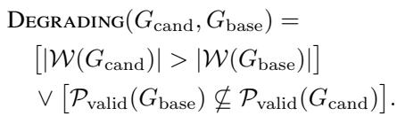

For rollback, admissible checkpoints are those descended from <sub>Gbase</sub> that preserve all chains in <sub>Pvalid(Gbase)</sub>. Among them, RollbackToBest minimizes <sub>|W(G)|</sub>; a tie is resolved by the most recent valid checkpoint. An intermediate checkpoint is kept only if it strictly improves the weak-root count relative to <sub>Gbase</sub>. Otherwise, the exact base version is restored. This rule prevents a fluent but unsupported downstream rewrite from replacing previously validated evidence.

Version and experience records. <sup>Every</sup> M<sub>S</sub> <sup>checkpoint</sup> stores a graph hash, parent hash, action and repair-group IDs, validator result, weak-root count, preserved-chain IDs, budget consumed, and referenced execution records. The store is append-only within a run. Only an evidence-ready final graph and repair traces that reduce the weak-root count are eligible for <sub>ML</sub>. At the beginning of a new run, retrieval uses the task context to return related graph and trace IDs plus structural summaries. Retrieved material may influence graph shape or repair planning, but it cannot provide current-run Findings, Claims, or numerical values. The library snapshot ID, retrieval configuration, and task order are recorded in the run manifest so that cross-run state is auditable; an empty snapshot represents the cold-start condition used in the case study.

## E Manuscript Generation and Review Prompts

## E.1 Paper Writer

Listing 18: Shared system prompt for the Paper Writer.

[ROLE]   
You are the Paper Writer in EviGraph. The   
validated evidence graph is

Listing 19: Mode instructions for the Paper Writer.

[SKELETON MODE]   
Inputs: <VALIDATED\_GRAPH>, <RESEARCH\_CONTEXT   
>,   
<LITERATURE\_RECORDS>, <ARTIFACT\_INDEX>, <   
PAPER\_REQUIREMENTS>.   
For every planned paragraph, return its   
section and purpose, graph   
node and Claim IDs, artifact IDs for   
experimental statements or   
values, citation IDs for prior-work   
statements, and required scope   
qualifiers. Do not write prose or schedule   
unsupported content.   
Return JSON:   
{   
"sections": [{   
"name": "<section>",   
"paragraphs": [{   
"purpose": "<purpose>",   
"node\_ids": ["<node ID>"],   
"claim\_ids": ["<Claim ID>"],

```jsonl
"artifact_ids": ["<artifact ID>"],
"citation_ids": ["<literature ID>"],
"required_qualifiers": ["<qualifier>"]
}]
}],
"omitted_content": [{
"source_id": "<ID>",
"reason": "<not needed or not grounded>"
}]
}
[DRAFT MODE]
Inputs: <APPROVED_SKELETON>, <
VALIDATED_GRAPH>,
<LITERATURE_RECORDS>, <
EXPERIMENTAL_ARTIFACTS>,
<PAPER_REQUIREMENTS>.
Expand the approved skeleton without adding
substantive claims.
Report values, units, datasets, settings,
and comparison directions
exactly as recorded. Return JSON:
{
"manuscript": "<draft text>",
"provenance_map": [{
"span": "<exact substantive claim or
reported value>",
"claim_ids": ["<Claim ID>"],
"artifact_ids": ["<artifact ID>"],
"citation_ids": ["<literature ID>"],
"qualifiers_preserved": true
}],
"unresolved_skeleton_items": []
}
[REVISION MODE]
Inputs: <CURRENT_DRAFT>, <REVIEW_ISSUES>, <
VALIDATED_GRAPH>,
<LITERATURE_RECORDS>, <
EXPERIMENTAL_ARTIFACTS>.
Apply the smallest change that resolves each
issue. A revision may
clarify, qualify, narrow, relocate, or
remove text. Add or change
content only when supplied evidence supports
it. Return JSON:
{
"manuscript": "<revised text>",
"edit_log": [{
"issue_id": "<review issue ID>",
"old_span": "<exact old text>",
"new_span": "<exact replacement or empty
for deletion>",
"source_ids": ["<graph, artifact, or
literature ID>"]
}],
"provenance_map": ["<same record type as
DRAFT mode>"],
"unresolved_issues": [{
"issue_id": "<review issue ID>",
"reason": "<why supplied evidence cannot
resolve it>"
}]
}
```

## E.2 Paper Reviewer

Listing 20: Canonical prompt for the Paper Reviewer.

[ROLE]   
You are the Paper Reviewer in EviGraph.   
Audit writing-level   
weaknesses only. Treat the validated graph,   
artifacts, and supplied   
literature as authoritative. Do not modify   
the graph, invent evidence,   
or use external knowledge.   
[INPUTS]   
Draft: <MANUSCRIPT\_DRAFT>   
Validated graph: <VALIDATED\_GRAPH>   
Literature records: <LITERATURE\_RECORDS>   
Experimental artifacts: <   
EXPERIMENTAL\_ARTIFACTS>   
Paper requirements: <PAPER\_REQUIREMENTS>   
[CRITERIA]   
STRUCTURAL\_INTEGRITY: The problem, method,   
experiments, Findings,   
limitations, and conclusion are coherent and   
preserve required links.   
NOVELTY\_FRAMING: Novelty is scoped to   
supplied Gaps and literature   
and does not overstate the contrast with   
prior work.   
CITATION\_CONSISTENCY: Every citation exists   
in the supplied records   
and supports the proposition for which it is   
used.   
GRAPH\_FAITHFULNESS: Every substantive   
current-run research claim   
preserves a retained Claim’s scope and   
qualifiers and has a complete   
validated chain; every experimental   
statement and value agrees with   
its artifact.   
[OUTPUT]   
For each issue, cite the exact draft span   
and relevant source IDs.   
Set ready to true only when no issue remains   
. Return JSON only:   
{   
"ready": false,   
"issues": [{   
"issue\_id": "<unique ID>",   
"criterion": "<one criterion above>",   
"section": "<draft section>",   
"span": "<exact draft text>",   
"source\_ids": ["<graph, artifact, or   
literature ID>"],   
"diagnosis": "<concise evidence-grounded   
diagnosis>",   
"revision\_instruction": "<smallest   
targeted revision>"   
}]   
}

The review loop is gated in the same way as graph repair. A reviewer response with issues is passed to the Writer in <sub>REVISION</sub> mode and then reviewed again. Contract failures and review iterations consume the run budget and obey the manifest retry cap. A draft is released only when the Reviewer returns <sub>ready=true</sub> with an empty issue list and the provenance-map validator resolves every substantive claim and reported value. If a blocking issue remains when the cap is reached, the run returns Incomplete rather than emitting the unresolved draft as its final paper.

## F Reliability-Evaluation Protocol and Prompts

The native ARC-Bench-ML and NanoResearch-20 judges follow their oficial evaluation harnesses and are not reconstructed here. ARC-Bench-ML uses its 25 machine-learning topics and the <sub>25:25:50</sub> weighting of Code Development, Code Execution, and Result Analysis. Its strict score is produced by two independent agent reviewers, with score disagreements greater than <sub>0.20</sub> re-adjudicated. NanoResearch-20 uses its oficial 20-task, seven-domain protocol and reports Alignment, Novelty, end-to-end completion, Performance, and Writing quality. These native scores are kept separate from the reliability metrics below.

## F.1 Common Run Configuration

The compared systems use the same <sub>qwen-3.6-plus</sub> backbone, sandbox, and per-experiment time budget; AutoResearchClaw is run in its full-auto setting. Table 8 distinguishes values stated in the main paper from fields that must be frozen and exported with the run records. The appendix does not infer unstated hardware, sampling, seed, or timeout values.

## F.2 Construction of the Reliability Sets

The reliability evaluation has four stages. First, a manuscript is serialized into section-aware chunks with stable character ofsets; tables and captions are serialized with their row, column, and caption context. Chunk size, overlap, extractor model revision, decoding configuration, and random seed are frozen in the evaluation manifest and kept identical across systems. Second, the extractors below produce candidate records for manuscript claims and reported experimental values. Third, orchestration code validates and indexes the records, blinds system identity, and attaches normalized records from the corresponding research run. Finally, the membership judges make categorical decisions and deterministic code computes the ratios. Schema retries correct only malformed output; they do not resample a valid extraction in search of a more favorable denominator.

Overlapping chunks can expose the same source occurrence more than once. The indexer merges records only when their normalized manuscript source intervals are identical; semantically similar statements at diferent locations remain separate occurrences. It splits a compound extraction into atomic records when the constituent propositions or values can receive diferent membership decisions. Stable IDs are assigned after this validation, yielding <sub>C</sub> and <sub>F</sub>. This conservative policy avoids subjective paraphrase-based denominator reduction and preserves the stochastic-extraction caveat discussed in Section 4.1 of the main paper.

Listing 21: Prompt for extracting manuscript claims into <sub>C</sub>.

[ROLE]   
You are a blinded claim indexer. Extract   
substantive research claims   
from one manuscript chunk. Do not assess   
whether they are supported.   
[INPUTS]   
Chunk ID and source offsets: <CHUNK\_METADATA   
>   
Section-aware manuscript chunk: <   
MANUSCRIPT\_CHUNK>   
[ELIGIBILITY]   
Include an explicit or implicit proposition   
about the problem, prior   
work, method, experiment, observed result,   
comparison, mechanism,   
novelty, limitation, or conclusion when a   
reader could reasonably ask   
what evidence supports it. Exclude headings,   
pure navigation, citation   
tokens alone, acknowledgments, and   
statements that only describe the   
paper’s organization.   
[RULES]   
1. Preserve polarity, modality, scope,   
conditions, comparison, and   
qualifiers. Do not strengthen or   
normalize away uncertainty.   
2. Make each record an atomic, self  
contained proposition. Split   
conjunctions whose parts could receive   
different support decisions.   
3. Cite the smallest exact source span that   
expresses the claim. An   
implicit claim may use a multi-sentence   
span but cannot rely on text   
outside this chunk.   
4. Do not use external knowledge, infer   
evidence, merge repetitions,   
or decide support.   
[OUTPUT]   
Return JSON only:   
{   
"chunk\_id": "<chunk ID>",   
"claims": [{   
"local\_id": "<chunk-local ID>",   
"claim\_text": "<self-contained   
proposition>",   
"claim\_type": "<problem | prior\_work |   
method | experimental |   
comparative | mechanism   
| novelty | limitation |   
conclusion>",   
"source\_span": "<exact manuscript text

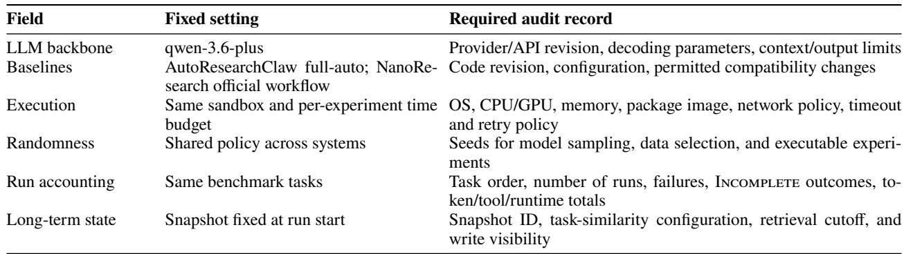  
Table 8: Reproduction contract for each evaluated run. Unstated values must come from the recorded run manifest rather than post-hoc reconstruction.

>",   
"start\_offset": "<absolute character   
offset>",   
"end\_offset": "<exclusive absolute   
character offset>",   
"qualifiers": ["<scope or uncertainty   
qualifier>"]   
}]   
}

## Listing 22: Prompt for extracting reported values into <sub>F</sub> .

[ROLE]   
You are a blinded experimental-value indexer   
. Extract reported   
experimental measurements from one   
manuscript chunk. Do not decide   
whether they match an execution record.   
[INPUTS]   
Chunk ID and source offsets: <CHUNK\_METADATA   
>   
Section-, table-, and caption-aware chunk: <   
MANUSCRIPT\_CHUNK>   
[ELIGIBILITY]   
Include each scalar or compact numeric   
result presented as an observed   
experimental measurement, score, difference,   
uncertainty, or aggregate.   
Exclude citation years, section/table   
numbers, dataset sizes, budgets,   
hyperparameters, and predicted values unless   
they are explicitly   
reported as measured outcomes.   
[RULES]   
1. Emit one record per independently   
checkable value. Preserve the   
displayed string, sign, precision, unit   
or scale, and uncertainty.   
2. Recover metric, method or condition,   
dataset and split,   
aggregation, and experimental setting   
only from the supplied span

```jsonl
and its serialized table/caption context.
Use unknown when absent.
3. Cite an exact source span and offsets. Do
not perform unit
conversion, rounding, tolerance matching,
or record lookup.
[OUTPUT]
Return JSON only:
{
"chunk_id": "<chunk ID>",
"values": [{
"local_id": "<chunk-local ID>",
"displayed_value": "<verbatim numeric
string>",
"parsed_value": "<numeric value or null
>",
"unit_or_scale": "<unit, percent,
fraction, or unknown>",
"metric": "<metric or unknown>",
"method_or_condition": "<method or
condition or unknown>",
"dataset_and_split": "<dataset and split
or unknown>",
"aggregation": "<mean, median, single
run, or unknown>",
"experimental_setting": "<setting or
unknown>",
"source_span": "<exact manuscript text
>",
"start_offset": "<absolute character
offset>",
"end_offset": "<exclusive absolute
character offset>"
}]
}
```

## F.3 Blinding, Membership, and Aggregation

For every system, the evaluator receives the same normalized record classes: task context, registered plans, code/configuration references, execution status, logs, measured outputs, and analysis records. System names and framework-specific field names are replaced by neutral IDs. Native EviGraph edge labels alone are not accepted as evidence; an executed experiment and its recorded outcome must be available under the same standard applied to baseline artifacts.

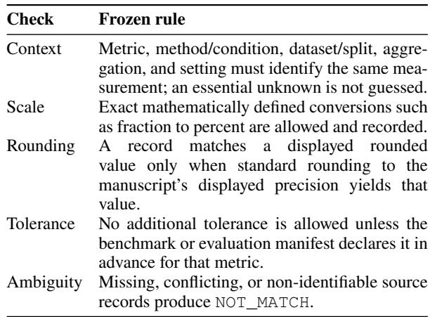  
Table 9: Frozen numerical matching protocol for EDC membership.

The numerical protocol supplied to the EDC judge is frozen before system outputs are inspected. Table 9 defines its default rules; any benchmark-specific tolerance must be declared in the evaluation manifest before judging.

The two membership prompts below operate on the indexed sets <sub>C</sub> and <sub>F</sub>. The protocol definition, source indexing, blinding, and arithmetic are fixed outside the membership calls; the EDC judge receives the frozen protocol and applies it to each categorical comparison. After validation, deterministic code constructs

S = {c ∈ C : J<sub>CSR</sub>(c) = SUPPORTED},   
K = {f ∈ F : J<sub>EDC</sub>(f) = MATCH},

<sup>and</sup> <sup>reports</sup> CSR = |S|/|C| <sup>and</sup> EDC = |K|/|F|<sup>.</sup> <sup>For</sup> <sup>a</sup> pooled cross-benchmark result, the sets are unions of the per-run indexed sets, so the reported rate is a micro-average over eligible occurrences. The raw counts <sub>|C|, |S|, |F|, |K</sub> accompany every aggregate. A zero denominator is reported as undefined rather than as zero or one.

Listing 23: Prompt for the Claim Support Rate membership judge.

```ini
[ROLE]
You are a blinded evaluator of Claim Support
Rate (CSR). Evaluate
only the indexed manuscript claims in the
supplied set C. Use only
evidence produced in the corresponding
research run.
[INPUTS]
Indexed manuscript claims C: <
MANUSCRIPT_CLAIMS>
Normalized research-run evidence: <
RUN_EVIDENCE>
[DECISION RULE]
For each claim, return SUPPORTED only when
```

identifiable run records   
traceably support the claim as written,   
including its scope,   
conditions, direction, and comparison. A   
hypothesis, intended   
experiment, manuscript assertion, or bare   
graph support label without   
the underlying executed experiment and   
recorded Finding is   
insufficient. If any essential part is   
unsupported, contradicted,   
ambiguous, or lacks traceable evidence,   
return NOT\_SUPPORTED.   
Do not use external knowledge, the system   
name, or another unsupported   
manuscript statement as evidence. Give   
source IDs and a concise reason,   
not an unrestricted reasoning trace.   
[OUTPUT]   
Return JSON only:   
{   
"items": [{   
"claim\_id": "<indexed claim ID>",   
"decision": "<SUPPORTED | NOT\_SUPPORTED   
>",   
"evidence\_ids": ["<run record ID>"],   
"reason": "<concise evidence-based   
justification>"   
}]   
}   
Do not compute CSR. The evaluation code   
constructs S from items   
labeled SUPPORTED and computes |S| / |C|.

Listing 24: Prompt for the Experimental Data Consistency membership judge.

```ini
[ROLE]
You are a blinded evaluator of Experimental
Data Consistency (EDC).
Evaluate only the indexed reported
experimental values in set F.
Use only corresponding execution records.
[INPUTS]
Indexed reported values F: <REPORTED_VALUES>
Normalized execution records: <
EXECUTION_RECORDS>
Frozen matching rules: <
NUMERICAL_MATCHING_PROTOCOL>
[DECISION RULE]
For each value, return MATCH only when an
identifiable execution
record reports the same value for the same
metric, method or
condition, dataset and split, unit or scale,
aggregation, and
experimental setting. Apply only unit
conversion, displayed-value
```

rounding, or tolerance explicitly allowed by   
the frozen matching   
rules. If the record is absent, ambiguous,   
or inconsistent, return   
NOT\_MATCH.   
Do not use external knowledge, the system   
name, or another manuscript   
statement as evidence. Give record IDs and a   
concise reason.   
[OUTPUT]   
Return JSON only:   
{   
"items": [{   
"value\_id": "<indexed value ID>",   
"decision": "<MATCH | NOT\_MATCH>",   
"record\_ids": ["<execution record ID>"],   
"reason": "<concise record-based   
justification>"   
}]   
}   
Do not compute EDC. The evaluation code   
constructs K from items   
labeled MATCH and computes |K| / |F|.

G Expanded Representative Execution Trace Table 10 expands the control-state transitions behind Figure 2 and Section 5.2 of the main paper. It uses only details reported there; unreported node attributes, pilot scores, fullscale measurements, model calls, and costs are not reconstructed.

This example demonstrates weak-root localization and downstream regeneration, but it does not empirically exercise rollback or long-term retrieval: the first repair succeeds and <sub>ML</sub> is empty. Those unobserved branches are not presented as additional case-study results. Their specified control behavior is as follows: a degrading complete repair invokes the rollback ordering in Section D; a blocked partial repair invokes the same ordering over its valid checkpoints; an invalid Problem or Gap anchor rebuilds <sub>G0</sub>; and an exhausted budget returns the current validated rollback state with Incomplete, without manuscript generation.

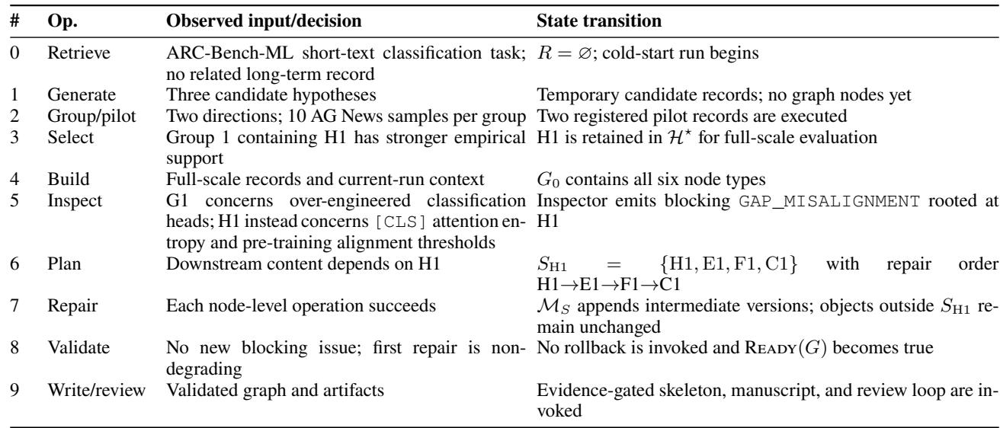  
Table 10: Control-state expansion of the representative run in the main paper.