# Advancing Mathematics Research with AI-Driven Formal Proof Search

George Tsoukalas1† , Anton Kovsharov1† , Sergey Shirobokov1† , Anja Surina1, Moritz Firsching1, Gergely   
Bérczi2, Francisco J. R. Ruiz1, Arun Suggala1, Adam Zsolt Wagner1, Eric Wieser1, Lei Yu1, Aja Huang1, Miklós   
Z. Horváth1, Andrew Ferrauiolo1, Henryk Michalewski1, Codrut Grosu3, Thomas Hubert1, Matej Balog1,   
Pushmeet Kohli1 and Swarat Chaudhuri1†   
1Google DeepMind1, 2Aarhus University, 3Google

Large language models (LLMs) increasingly excel at mathematical reasoning, but their unreliability limits their utility in mathematics research. A mitigation is using LLMs to generate formal proofs in languages like Lean. We perform the first large-scale evaluation of this method’s ability to solve open problems. Our most capable agent autonomously resolved 9 of 353 open Erdős problems at the per-problem cost of a few hundred dollars, proved 44/492 OEIS conjectures, and is being deployed in combinatorics, optimization, graph theory, algebraic geometry, and quantum optics research. A basic agent alternating LLM-based generation with Lean-based verification replicated the Erdős successes but proved costlier on the hardest problems. These findings demonstrate the power of AI-aided formal proof search and shed light on the agent designs that enable it.

## 1. Introduction

Large language models (LLMs) have recently shown remarkable promise in solving complex mathematics problems [21, 65], but unreliability remains a primary barrier to their integration into mathematics research. Because LLM-generated natural language proofs can contain subtle logical errors, or “hallucinations,” they require expensive expert review. Mistakes in unreviewed intermediate steps can cascade through a proof, limiting the complexity of tasks that can be delegated to AI.

Recent efforts [29, 1] mitigate these issues by using AI to generate proofs in formal languages like Lean [43], in which a compiler automatically verifies every logical step. So far, successes of this paradigm have been concentrated in competition mathematics and the human-aided formalization of natural language arguments [28]. In this paper, we demonstrate its broader potential through a large-scale evaluation on open research-level problems.

To this end, we developed a framework, AlphaProof Nexus, for LLM-aided proof generation and used it to build a basic agent in which a set of subagents independently searches for proofs with feedback from the Lean compiler. We also developed a “full-featured” agent in which subagents are coordinated using an evolutionary algorithm [46] and can use AlphaProof [29], a system for olympiad-level Lean theorem-proving based on reinforcement learning, as a focused proof tool.

Our full-featured agent autonomously solved 9 Erdős problems out of 353 attempted, including two questions that had been open for 56 years [54, 7, 17], at the inference cost of a few hundred dollars per problem. It also proved 44/492 open conjectures from the Online Encyclopedia of Integer Sequences (OEIS), resolved a 15-year-old open question on Hilbert functions in algebraic geometry, improved an open bound in convex optimization by discovering a novel algorithmic parameter schedule, identified several misformalizations in the literature, helped resolve an open problem from Ben Green’s well-known list [27], and is aiding ongoing research efforts on quantum optics and graph theory.

To understand the impact of the agent design on these results, we did a post-hoc analysis of the performance of the full-featured and basic agents, as well as two agents with intermediate capabilities, on the 9 Erdős problems solved by the full-featured agent. Remarkably, the basic agent solved all 9 problems, though at a higher cost on the harder problems.

Overall, our results demonstrate the utility of LLM-powered formal proof search as a tool for mathematics research, and point to an ongoing shift from specialized trained systems toward simple agentic loops as LLMs become more capable. All Lean proofs and select natural-language proofs are available in https://www.github.com/google-deepmind/ alphaproof-nexus-results.

## 2. AlphaProof Nexus

Lean. Lean [43] is a proof assistant in which definitions, theorems, and proofs are all mechanically verified code. Proofs are constructed via a sequence of applications of tactics, or elementary proof steps. Lean’s compiler “executes” a proof tactic-by-tactic, tracking the proof goals pending after every tactic. A proof is correct if it leads the compiler to a state with no pending goals.

Lean includes a special sorry tactic, which immediately closes pending goals while passing the type checker. Proving a theorem thus amounts to the generation of type-safe code without sorry tactics.

Input and Output. AlphaProof Nexus is a new framework for agents that query frontier LLMs and the Lean compiler. The agents take as input a Lean file consisting of a target theorem with sorry in place of a proof, along with definitions and library imports on which the theorem depends (we refer to such a file as a proof sketch). Optionally, the user may input additional natural-language context and domain knowledge encoded in Lean.

The input sketch is annotated with user-provided markers that delineate which code segments the agent may modify (see Fig. 1). Within EVOLVE-BLOCK markers, the agent can introduce helper lemmas, definitions, and proof steps. EVOLVE-VALUE markers are used to enclose expressions (e.g., parameters) whose values the agent can change. On successful termination, the agent outputs a sorry-free proof of the target theorem.

Agent Architecture. The basic agent in AlphaProof Nexus (agent (A)) consists of a set of prover subagents that execute independently with no shared state. Each subagent is a “Ralph loop” [31] consisting of a sequence of episodes: multi-turn LLM inference loops (based on Gemini 3.1 Pro) in which the subagent can reason via chain-of-thought and refine the sketch using a search-and-replace tool. After each turn, the subagent uses Lean to check that the current proof sketch compiles; if it does not, Lean’s error message is used to direct the next turn. If the sketch contains sorry when the episode terminates, the subagent adds a comment to the sketch summarizing the lessons learned from the episode. The resulting sketch is the input to the next episode.

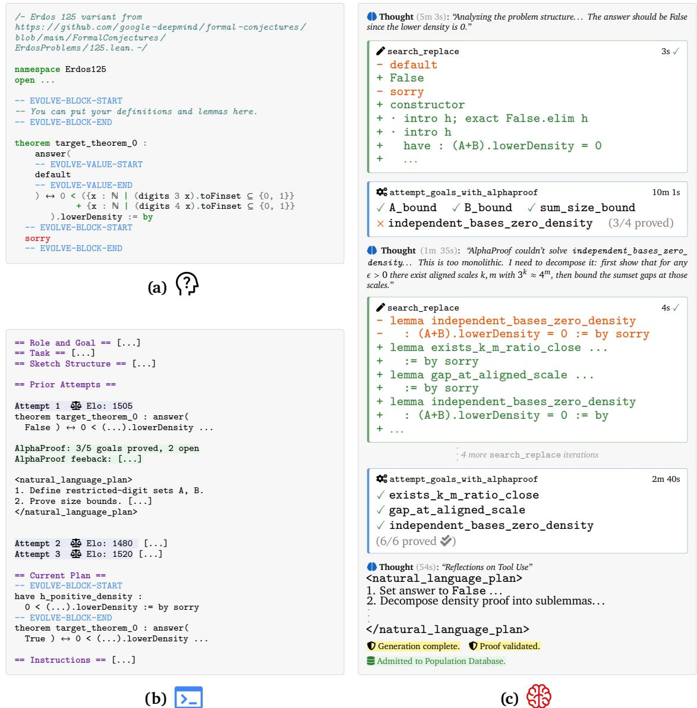  
Figure 1 | Example inputs/outputs for an AlphaProof-equipped agent (applied to Erdős #125). The user provides a Lean file with a specification of the problem, and an empty proof body replaced with the sorry placeholder. (a) Modifications are permitted only within EVOLVE-BLOCK and EVOLVE-VALUE markers. (b) During sketch refinement, the prover subagent is shown an assembled prompt template with the current proof, and optionally prior attempts/sketches, their Elo ratings, and feedback from AlphaProof’s attempts on unsolved goals. (c) The prover reasons about the problem informally and invokes tools. In this example, the prover invoked AlphaProof which resolved all but one goal. The prover then decomposed that goal into three simpler lemmas, and called AlphaProof again, which then resolved all remaining goals. The agent also produced a natural language summary of its attempt at the end of generation.

We extended the basic agent into one (B) that can query AlphaProof [29] to fill out missing parts of sketches. Queries to AlphaProof can return a proof, disproof (a proof that the submitted subgoal is false), or a failure message; proofs are directly substituted into the sketch, while disproofs and failure messages are fed into the prover’s prompt.

Separately, we developed an evolutionary agent (C), inspired by AlphaEvolve [46], in which prover subagents sample from and contribute to a shared population database of sketches. A challenge here is the mismatch between evolutionary algorithms, which typically assume a graduated fitness landscape, and formal proof evaluation, which is inherently binary. To bridge this gap, we used a pool of rating agents (based on the less expensive Gemini 3.0 Flash) to construct relative rankings of sketches based on their plausibility, clarity, and novelty. We aggregated these rankings into Elo ratings for the sketches and used a sampling procedure based on the P-UCB formula [30, 55] to drive the search.

Finally, we combined the AlphaProof and evolution capabilities into a “full-featured” agent (D; see Fig. 2) in which prover subagents can use AlphaProof as well as evolutionary search. We used this agent as the instrument in our exploration of open research problems.

## 3. Systematic Evaluation on Open Problems

Erdős Problems. Bloom maintains an online catalog [8] of over 1200 open problems posed by Paul Erdős and his collaborators. The open-source Formal Conjectures repository [23] contains Lean formalizations of a subset of these problems. We ran Agent (D) on all these formal statements (353 at the time of the run), terminating the search if no proof was found within 3000 episodes. The agent solved 9/353 problems (Table 1 and supplementary text); after each solve, experts on our team validated that the Lean statement faithfully captured the original conjecture. We have publicly shared the proofs, and our results have been logged on Terence Tao’s wiki on AI contributions to Erdős problems [59].

Several proofs require sophisticated constructions and the synthesis of distinct mathematical arguments. For example, problem #12(i), posed by Erdős and Sárközy in 1970 [18], asks if there is an infinite set ?? that satisfies a restrictive divisibility constraint – no element may divide the sum of two larger elements – and which satisfies the density condition lim inf??→∞ |??∩[1,??] |√ > 0; this problem had received attention in multiple prior works ?? [17, 54, 7]. Our agent constructed ?? as an infinite union of disjoint “blocks” ???? ⊆ [????, 1.1????] for a suitably rapidly growing sequence (????). To satisfy the local divisibility conditions, the proof integrates the Chinese Remainder Theorem with the properties of sets that avoid length-3 arithmetic progressions.

Problem #125 concerns the sumset ?? + ??, where ?? is the set of non-negative integers whose base-3 representation uses only the digits 0 and 1, and ?? is the analogous set in base 4. The question of whether the lower density of (?? + ??) is positive was open since 1996 [12]. Our agent resolved the conjecture by synthesizing an inductive thinning argument that exploits the Diophantine proximity of the two multiplicatively independent bases (3?? ≈ 4??).

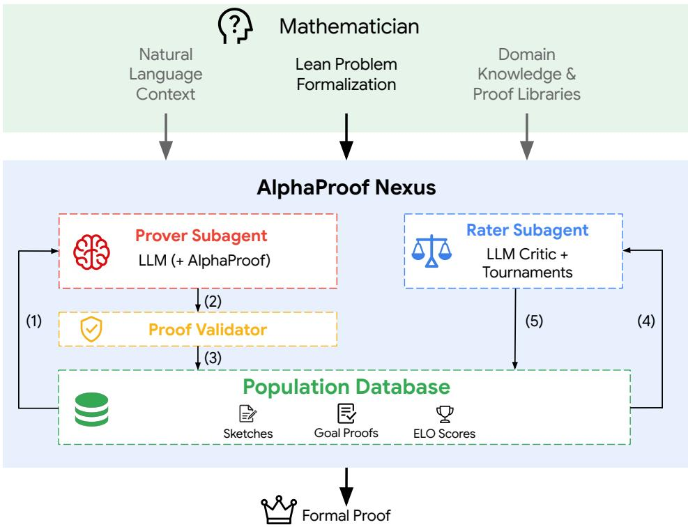  
Figure 2 | Design of the full-featured AlphaProof Nexus agent. The mathematician provides as input a Lean theorem with sorry for a proof, and optionally, natural language context and additional domain knowledge encoded in Lean. The agent architecture consists of a basic generation-validation pipeline and an optional evolutionary framework. An LLM-based prover subagent attempts to solve the problem by refining proof sketches (2). The subagent may optionally call AlphaProof as a tool; each invocation of AlphaProof on a goal returns whether a proof or disproof was found, or whether it was unsuccessful in resolving the goal. The sketch produced in the end is checked by a validator to ensure the problem statement was not changed unsafely and the proof compiles. If all goals are successfully proved, the agent outputs the final Lean proof. This basic pipeline can be extended with an evolutionary population database and rating mechanism. In this configuration, validated sketches are admitted into the Population Database (3). Simultaneously, rater subagents sample previous attempts (4), which are then ranked by an LLM critic in matches. The match results are admitted back into the database (5) to update the Elo scores of the sketches. These scores are then used by the evolutionary algorithm to sample prior sketches from the database, constructing an overall prompt – which includes any optional inputs from the mathematician – to condition new episodes (1).

The agent also served as a tool for detecting and fixing misformalizations. For example, in Erdős problems #125 and #741(i), the interpretation of “density” in the original informal statements was amended to “lower density” and “upper density” respectively, after our full-featured agent found proofs using density as “natural density.” Following the correction of the ambiguity, the agent was still able to resolve the questions.

Failure Analysis. We analyzed the highest-scoring sketches (measured by Elo) across a random sample of problems on which our agent failed. First, the agent frequently offloaded a problem’s core difficulty into a single sorry within a helper lemma that reiterated the target statement in a slightly different form. Explicitly prompting against this behavior failed to prevent it. Second, for several problems, the top sketches relied on lemmas marked with sorry that the agent claimed were established results in the mathematical literature. Upon manual inspection, these lemmas proved to be hallucinations. These failure modes underscore the value of end-to-end formal verification.

OEIS. We also applied the agent to systematically explore open problems in the OEIS [56], a massive repository of integer sequences and their known and open properties. We used Gemini to autoformalize 492 open questions from the OEIS and applied the agent to the resulting Lean statements. As a guard against misformalization, the agent was required to prove “test lemmas” verifying the first few terms of each sequence against its formal definition before attempting the target conjectures. The agent found proofs for 44 conjectures that a manual review found to be correctly formalized and previously unproven. Two of the proofs appear in the supplementary material.

## 4. Deployment in Mathematics Research

Optimization Theory. Agent (D) resolved an open question in optimization: proving an exact O (1/??) convergence rate for the Anchored Gradient Descent-Ascent (GDA) algorithm for min-max convex-concave optimization, thereby tightening the slower bound established by [52]. The proof departs from continuous-time ordinary differential equations (ODE) analysis used in previous work, instead using a discrete-time recurrence-based approach. The agent did not merely verify a fixed algorithm: we marked the learning schedule as a parameter within an EVOLVE-VALUE block in the input file, allowing the agent to simultaneously search for the schedule and the proof, ultimately discovering a novel parameter choice that yields the stronger guarantee. We previously released a deformalized version of the proof as a preprint [58]. Subsequent work [13] has extended this result.

Graph Theory. The graph reconstruction conjecture [61] is one of the oldest open problems in combinatorics. It asserts that every finite simple graph with at least three vertices is determined, up to isomorphism, by the multiset of its vertex-deleted subgraphs, known as its deck. AlphaEvolve [46] experiments helped us formulate two bipartite variants of the graph reconstruction conjecture, along with a proposed full reconstruction algorithm. For one of these variants, our agent produced a complete proof. For the full algorithmic reconstruction statement, the agent generated proof sketches and strategies that helped clarify the structure of the problem and led to simplified reformulations of the conjectures originally suggested by AlphaEvolve. A paper based on the results of this collaboration is currently in preparation.

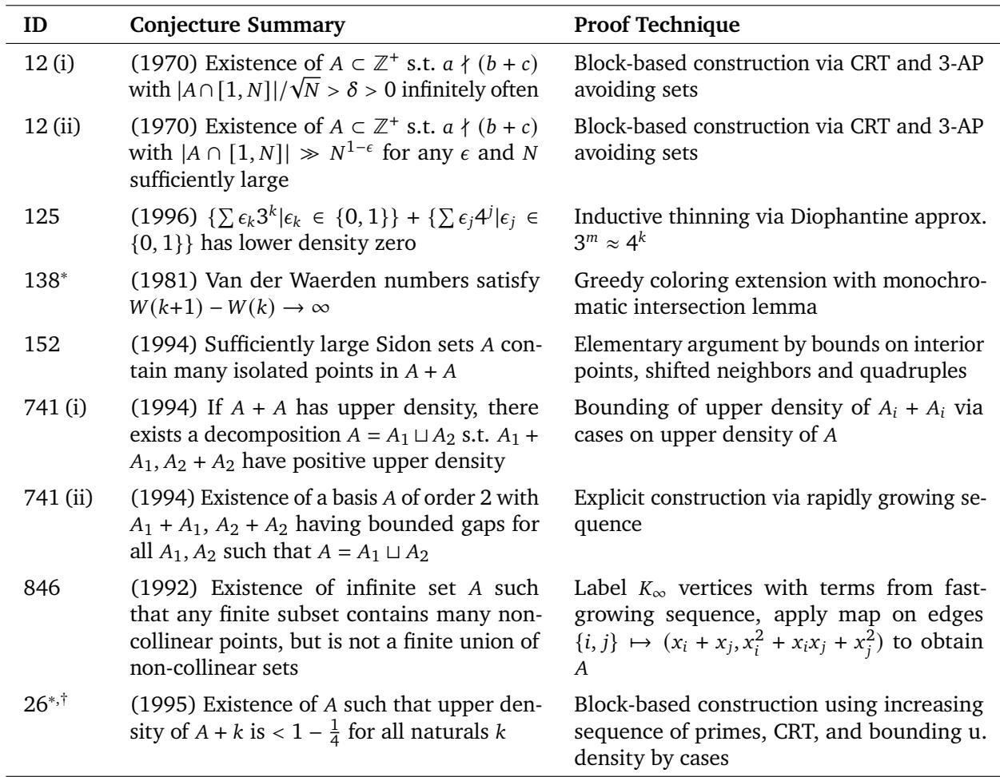  
Table 1 | Open problems from the ErdosProblems repository autonomously resolved by our full-featured agent. The asterisk indicates a variant of the main problem with this number. Problem #26 (annotated with †) is a more general variant of a question posed by Erdős, but was not posed by Erdős himself.

Separately, the agent proved an open graph theory conjecture regarding a bound on the maximum number of leaves over all spanning trees of a graph ??, relating it to the maximum number, over all vertices ?? ∈ ??, of independent sets in the neighborhood of ??. The problem was posed by Graffiti [19], an automated conjecturing system, in 1996, and points to an interesting future opportunity to close the loop between AI-based conjecturing and proof.

Algebraic Geometry. We evaluated our full-featured agent on eight algebraic geometry problems, from textbook-style exercises to open research questions on Hilbert functions, solving two of the four open problems. One of these problems had been a well-known open question for approximately fifteen years. This problem concerned pure ??-sequences, equivalently the Hilbert functions of monomial Artinian level algebras [57]. Their shape and positivity properties have been studied intensively in recent years [9]. Although logconcavity fails for broad families of pure ??-sequences, the case of codimension 3 and type 2 was identified as the principal remaining open case [68]. The agent’s proof establishes log-concavity in this case; the argument is substantial, using a nontrivial reformulation of the Hilbert function and a detailed case analysis of the resulting second-difference inequalities.

Additive Combinatorics. Our agent helped resolve problem #57 from Green’s well-known list of open conjectures [27]. The problem asks whether two specific quadratically structured function spaces coincide. The functions of interest map elements of an Abelian group ?? to the complex numbers. Here, our agent autonomously solved a variant of the problem in which the functions are real-valued, but a personal communication from Green clarified that the complex-valued case was the intended challenge. While the agent could not immediately prove the intended version of the problem, numerical heuristics using floating-point arithmetic provided a candidate counterexample (the cyclic group ℤ/3ℤ and a specific separating functional). We formalized the problem of whether this counterexample disproves the correct conjecture, and the agent autonomously proved that it indeed does. A paper on the result is in the works [22].

Quantum Optics. With Mario Krenn, we investigated a set of quantum optics problems concerning the existence of monochromatic quantum graphs with ?? vertices and ?? colors drawn from domains such as the reals, the complex numbers, and {−1, 0, 1}. These constructions correspond to ??-particle quantum states with local Hilbert space dimension ?? – in particular, high-dimensional Greenberger–Horne–Zeilinger (GHZ) states realizable via linear optics [39]. Our agent resolved multiple conjectures of this form, in particular with ?? = ?? ∈ {4, 6, 10}. A paper on these results is in preparation [38].

## 5. Impact of Agent Architecture and Model

Exploration of a large space of open problems is expensive, and we chose the full-featured agent (agent (D)) for this based on its strong performance on competition benchmarks. To understand which architectural components are necessary for its successes, we compared its performance against agents (A), (B), and (C) on the Erdős problem set in Table 1.

We compared the agents by analyzing the solve rate against the cost (in US dollars) per successfully proven problem. We report computational cost in USD because it directly measures the barrier to reproducing this work and provides a natural common currency for comparing agents that allocate compute differently (e.g., agent (D) uses Gemini 3.0 Flash for rater subagents and Gemini 3.1 Pro for provers). We do not intend USD as a comparison of AI and human mathematical labor.

For agents (C) and (D), in which a single proof attempt requires 10 subagents, we executed 10 attempts per problem. In contrast, for the basic Agent (A) and its AlphaProof-equipped extension (B), we ran 100 independent attempts, each with a single subagent.

Because (A) and (B) consist of independent subagents, we simulated scenarios where they have ?? subagents by grouping the attempts into chunks of size 100/??; a chunk was considered successful if any attempt included in the chunk proved the statement. The overall solve rate was defined to be the fraction of successful chunks. To calculate the monetary cost for these successful chunks, we identified the earliest timestamp ?? of a successful attempt and summed the costs of all attempts within that chunk up to ??. Since agents (C) and (D) are more expensive, we used the independent attempts to obtain a single point estimate.

Fig. 3 compares the agents across six Erdős problems (results for the rest are in the supplementary material). Agents (A) and (B) perform similarly – within the margin of error – on four of the problems, though agent (B) is more efficient on problems 12(ii) and 125. Agent (D) outperforms (A) and (B) on problems 138 and 125, offering significant monetary savings (2x to 5x), but is roughly half as cost-efficient on the remaining problems. We also compared agents (A), (B), and (D) on the wall-clock time needed to solve the problems. The results broadly followed the inference cost trends, with (B) offering savings over (A) in several of the problems, and (D) substantially outperforming both (A) and (B) on problems 138 and 125.

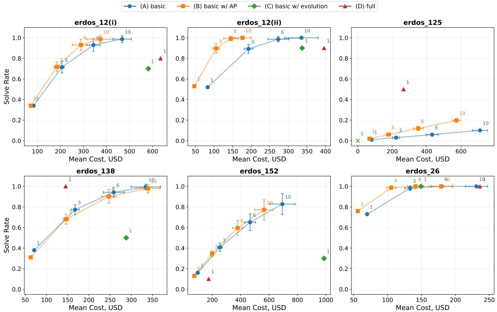  
Figure 3 | Solve rate versus mean inference cost (USD) across six Erdős problem instances. The solve rates are evaluated for the four agents: (A) basic (blue circles), (B) basic with AlphaProof (orange squares), (C) basic with evolution (green diamonds), and (D) full-featured (red triangles). Numeric annotations denote the number of independent attempts ?? ∈ {1, 3, 6, 10} grouped together; error bars indicate one standard error interval. Due to their higher costs, agents (C) and (D) lack variance estimates, as independent attempts were used to obtain a single point estimate (see main text for details). For agents (A) and (B), each curve traces the cost–performance Pareto frontier as ?? increases, revealing diminishing marginal returns at higher budgets. Agent (B) generally matches or exceeds the solve rate of the basic configuration at comparable cost. Costs reported for (B) and (D) do not include the inference cost of AlphaProof. While for most problems configuration (A) or (B) is the best, for some challenging problems like Erdős #125, the full-featured configuration (D) performs significantly better. Note that accounting for the estimated AlphaProof cost of 60 USD does not change the above outcomes beyond the margin of error.

Finally, we evaluated AlphaProof in standalone tree-search mode and versions of agent (A) based on smaller models (Gemini 3.0 Flash, Gemini 3.1 Flash-Lite). These systems could not solve any of the problems.

Cost and Variance. Per-problem inference costs exhibit high variance due to the stochastic nature of our agents. The reported costs also do not capture the full cost of discovery: we applied the full-featured agent to all 353 Erdős problems in Formal Conjectures, and identifying tractable problems was itself a significant computational investment. AlphaProof cost approximately 27.5 TPU hours (\$60 USD) per problem on v6e TPUs.

## 6. Discussion

We have provided a large-scale demonstration of the value of formal proof search agents on research-level mathematical problems. Recently, some natural-language reasoning systems have been shown to succeed in research-level mathematical tasks, including Erdős problems [20, 4]. However, the use of AI-generated informal proofs, either as standalone products or as inputs to a subsequent formalization stage, requires careful validation by human experts. Formal verification can serve as a filter for determining which proofs merit human review.

The effectiveness of our basic agent in our post-hoc analysis was surprising. At the time we were planning our large-scale exploration, simpler agentic loops did not show strong performance on competition-level benchmarks, and this informed our decision to use the full-featured agent. The LLM landscape has since shifted substantially. We attribute the basic agent’s success to both this shift and the power of compiler feedback in grounding LLM reasoning. The full-featured agent retains an advantage on the hardest problems for now. However, as LLM capabilities grow, this advantage may diminish.

At present, our agents’ successes are concentrated in areas such as combinatorics, convex optimization, and number theory, where Lean’s mathematics library [60] is mature and tasks often decompose into tractable subgoals. Even most Erdős problems remain out of reach, let alone problems that require extensive new theory. Additionally, our agents inherit the biases of their underlying LLMs and exhibit high search variance. Characterizing the agents’ boundaries and expanding them is an important direction for future work.

We built AlphaProof Nexus with the belief that the future of mathematics lies in humanmachine partnership, where interactive AI tools serve to expand a mathematician’s creative capacity. Our results support this vision. Our mathematician collaborators found that proof attempts by our agents enhanced their understanding of a problem, even when an agent could not prove the claim at hand. Because the sketches were formal, experts could focus on the unresolved subgoals rather than re-verifying the entire argument. Moreover, the agents were powerful tools for detecting misformalizations. These experiences suggest that AI-driven formal proof search can serve not only to solve problems but to deepen human understanding.

## References

[1] Tudor Achim, Alex Best, Alberto Bietti, Kevin Der, Mathïs Fédérico, Sergei Gukov, Daniel Halpern-Leistner, Kirsten Henningsgard, Yury Kudryashov, Alexander Meiburg, et al. Aristotle: IMO-level automated theorem proving. arXiv preprint arXiv:2510.01346, 2025.

[2] Boris Alexeev, Kevin Barreto, Yanyang Li, Jared Duker Lichtman, Liam Price, Jibran Iqbal Shah, Quanyu Tang, and Terence Tao. Primitive sets and von mangoldt chains: Erdős problem #1196 and beyond, 2026.

[3] Boris Alexeev, Moe Putterman, Mehtaab Sawhney, Mark Sellke, and Gregory Valiant. Short proofs in combinatorics and number theory. arXiv preprint arXiv:2603.29961, 2026.

[4] Boris Alexeev, Moe Putterman, Mehtaab Sawhney, Mark Sellke, and Gregory Valiant. Short proofs in combinatorics, probability and number theory ii. arXiv preprint arXiv:2604.06609, 2026.

[5] Leni Aniva, Chuyue Sun, Brando Miranda, Clark Barrett, and Sanmi Koyejo. Pantograph: A machine-to-machine interaction interface for advanced theorem proving, high level reasoning, and data extraction in lean 4, 2025.

[6] Axiom. AXLE: Axiom lean engine, 2025. Accessed: 2025.

[7] Stephan Baier. A note on p-sets. 2004.

[8] Thomas Bloom. Erdosproblems.com. https://www.erdosproblems.com, 2026.

[9] Mats Boij, Juan C. Migliore, Rosa M. Miró-Roig, Uwe Nagel, and Fabrizio Zanello. On the Shape of a Pure O-Sequence, volume 218 of Memoirs of the American Mathematical Society. American Mathematical Society, Providence, RI, 2012.

[10] J. A. Bondy and R. L. Hemminger. Graph reconstruction–a survey. Journal of Graph Theory, 1(3):227–268, 1977.

[11] Jim Bryan, Balázs Elek, Freddie Manners, George Salafatinos, and Ravi Vakil. The motivic class of the space of genus 0 maps to the flag variety. arXiv preprint arXiv:2601.07222, 2026.

[12] S. A. Burr, P. Erdős, R. L. Graham, and W. Wen-Ching Li. Complete sequences of sets of integer powers. Acta Arithmetica, 77(2):133–138, 1996.

[13] Yang Cai and Weiqiang Zheng. Last-iterate convergence of anchored gradient descent. arXiv preprint arXiv:2604.12235, 2026.

[14] François Caron and Arnaud Doucet. Efficient Bayesian inference for generalized Bradley–Terry models. Journal of Computational and Graphical Statistics, 21(1):174– 196, 2012.

[15] Jiangjie Chen, Wenxiang Chen, Jiacheng Du, Jinyi Hu, Zhicheng Jiang, Allan Jie, Xiaoran Jin, Xing Jin, Chenggang Li, Wenlei Shi, et al. Seed-prover 1.5: Mastering undergraduate-level theorem proving via learning from experience. arXiv preprint arXiv:2512.17260, 2025.

[16] DeepSeek-AI. Deepseek-v2: A strong, economical, and efficient mixture-of-experts language model, 2024.

[17] Christian Elsholtz and Stefan Planitzer. On erdős and sárközy’s sequences with property p. arXiv preprint arXiv:1609.07935, 2016.

[18] Paul Erdős and Alice Sárközi. On the divisibility properties of sequences of integers. Proceedings of The London Mathematical Society, pages 97–101, 1970.

[19] Siemion Fajtlowicz. On conjectures of graffiti. In J. Akiyama, Y. Egawa, and H. Enomoto, editors, Graph Theory and Applications, volume 38 of Annals of Discrete Mathematics, pages 113–118. Elsevier, 1988.

[20] Tony Feng, Junehyuk Jung, Sang-hyun Kim, Carlo Pagano, Sergei Gukov, Chiang-Chiang Tsai, David Woodruff, Adel Javanmard, Aryan Mokhtari, Dawsen Hwang, et al. Aletheia tackles firstproof autonomously. arXiv preprint arXiv:2602.21201, 2026.

[21] Tony Feng, Trieu H. Trinh, Garrett Bingham, Dawsen Hwang, Yuri Chervonyi, Junehyuk Jung, Joonkyung Lee, Carlo Pagano, Sang hyun Kim, Federico Pasqualotto, Sergei Gukov, Jonathan N. Lee, Junsu Kim, Kaiying Hou, Golnaz Ghiasi, Yi Tay, YaGuang Li, Chenkai Kuang, Yuan Liu, Hanzhao Lin, Evan Zheran Liu, Nigamaa Nayakanti, Xiaomeng Yang, Heng-Tze Cheng, Demis Hassabis, Koray Kavukcuoglu, Quoc V. Le, and Thang Luong. Towards autonomous mathematics research. arXiv preprint 2602.10177, 2026.

[22] Moritz Firsching and Bogdan Georgiev. A strict separation between two notions of quadratically structured functions. In preparation, 2026.

[23] Moritz Firsching, Paul Lezeau, Salvatore Mercuri, Miklós Z. Horváth, Yaël Dillies, Calle Sönne, Eric Wieser, Fred Zhang, Thomas Hubert, Blaise Agüera y Arcas, and Pushmeet Kohli. Formal conjectures: An open and evolving benchmark for verified discovery in mathematics, 2026.

[24] GasStationManager. Safeverify. https://github.com/GasStationManager/Saf eVerify, 2025. [Accessed: 2026-05-12].

[25] Bogdan Georgiev, Javier Gómez-Serrano, Terence Tao, and Adam Zsolt Wagner. Mathematical exploration and discovery at scale. arXiv preprint arXiv:2511.02864, 2025.

[26] Google DeepMind. Gemini 3.1 deep think, 2026. Accessed: 2026-04-30.

[27] Ben Green. 100 open problems. https://people.maths.ox.ac.uk/greenbj/papers/openproblems.pdf, 2024.

[28] Sidharth Hariharan, Christopher Birkbeck, Seewoo Lee, Ho Kiu Gareth Ma, Bhavik Mehta, Auguste Poiroux, and Maryna Viazovska. A milestone in formalization: The sphere packing problem in dimension 8. arXiv preprint arXiv:2604.23468, 2026.

[29] Thomas Hubert, Rishi Mehta, Laurent Sartran, Miklós Z Horváth, Goran Žužić, Eric Wieser, Aja Huang, Julian Schrittwieser, Yannick Schroecker, Hussain Masoom, Ottavia Bertolli, Tom Zahavy, Amol Mandhane, Jessica Yung, Iuliya Beloshapka, Borja Ibarz, Vivek Veeriah, Lei Yu, Oliver Nash, Paul Lezeau, Salvatore Mercuri, Calle Sönne, Bhavik Mehta, Alex Davies, Daniel Zheng, Fabian Pedregosa, Yin Li, Ingrid von Glehn, Mark Rowland, Samuel Albanie, Ameya Velingker, Simon Schmitt, Edward Lockhart, Edward Hughes, Henryk Michalewski, Nicolas Sonnerat, Demis Hassabis, Pushmeet Kohli, and David Silver. Olympiad-level formal mathematical reasoning with reinforcement learning. Nature, pages 1–3, 2025.

[30] Thomas Hubert, Julian Schrittwieser, Ioannis Antonoglou, Mohammadamin Barekatain, Simon Schmitt, and David Silver. Learning and planning in complex action spaces. In International Conference on Machine Learning, 2021.

[31] Geoffrey Huntley. Ralph wiggum as a "software engineer". https://ghuntley.com /ralph, 2025. Blog post.

[32] Vishesh Jain and Clayton Mizgerd. Equality in fill’s spectral gap problem. arXiv preprint arXiv:2604.03937, 2026.

[33] Uijeong Jang and Ernest K Ryu. Point convergence of nesterov’s accelerated gradient method: An ai-assisted proof. arXiv preprint arXiv:2510.23513, 2025.

[34] Albert Q Jiang, Sean Welleck, Jin Peng Zhou, Wenda Li, Jiacheng Liu, Mateja Jamnik, Timothée Lacroix, Yuhuai Wu, and Guillaume Lample. Draft, sketch, and prove: Guiding formal theorem provers with informal proofs. arXiv preprint arXiv:2210.12283, 2022.

[35] Albert Qiaochu Jiang, Wenda Li, Szymon Tworkowski, Konrad Czechowski, Tomasz Odrzygóźdź, Piotr Miłoś, Yuhuai Wu, and Mateja Jamnik. Thor: Wielding hammers to integrate language models and automated theorem provers. Advances in Neural Information Processing Systems, 35:8360–8373, 2022.

[36] Paul J. Kelly. A congruence theorem for trees. Pacific Journal of Mathematics, 7(1):961– 968, 1957.

[37] John R. Koza. Genetic programming as a means for programming computers by natural selection. Statistics and Computing, 4(2):87–112, 1994.

[38] Mario Krenn, Moritz Firsching, George Tsoukalas, Rishikesh Gajjala, Xuemei Gu, and Swarat Chaudhuri. A Tensor-Algebraic No-Go Theorem for High-Dimensional Photonic GHZ States. In preparation, 2026.

[39] Mario Krenn, Xuemei Gu, and Anton Zeilinger. Quantum experiments and graphs: Multiparty states as coherent superpositions of perfect matchings. Physical Review Letters, 119(24), December 2017.

[40] Yong Lin, Shange Tang, Bohan Lyu, Ziran Yang, Jui-Hui Chung, Haoyu Zhao, Lai Jiang, Yihan Geng, Jiawei Ge, Jingruo Sun, et al. Goedel-prover-v2: Scaling formal theorem proving with scaffolded data synthesis and self-correction. arXiv preprint arXiv:2508.03613, 2025.

[41] R.D. Luce. Individual Choice Behavior: A Theoretical Analysis. Wiley, 1959.

[42] Math Inc. Gauss: An agent for autoformalization, 2026. Accessed: 2026.

[43] Leonardo de Moura and Sebastian Ullrich. The lean 4 theorem prover and programming language. In International Conference on Automated Deduction, pages 625–635. Springer, 2021.

[44] Ansh Nagda, Prabhakar Raghavan, and Abhradeep Thakurta. Reinforced generation of combinatorial structures: Hardness of approximation. arXiv preprint arXiv:2509.18057, 2025.

[45] Ansh Nagda, Prabhakar Raghavan, and Abhradeep Thakurta. Reinforced generation of combinatorial structures: Ramsey numbers. arXiv preprint arXiv:2603.09172, 2026.

[46] Alexander Novikov, Ngân Vu, Marvin Eisenberger, Emilien Dupont, Po-Sen Huang, ˜ Adam Zsolt Wagner, Sergey Shirobokov, Borislav Kozlovskii, Francisco J. R. Ruiz, Abbas Mehrabian, M. Pawan Kumar, Abigail See, Swarat Chaudhuri, George Holland, Alex Davies, Sebastian Nowozin, Pushmeet Kohli, and Matej Balog. Alphaevolve: A coding agent for scientific and algorithmic discovery. arXiv preprint 2506.13131, 2025.

[47] R. L. Plackett. The analysis of permutations. Journal of the Royal Statistical Society. Series C (Applied Statistics), 24(2):193–202, 1975.

[48] Stanislas Polu and Ilya Sutskever. Generative language modeling for automated theorem proving. arXiv preprint arXiv:2009.03393, 2020.

[49] Moe Putterman, Mehtaab Sawhney, and Gregory Valiant. On infinite sets with no 3 on a line. arXiv preprint arXiv:2602.21275, 2026.

[50] Christian Reiher, Vojtěch Rödl, and Marcelo Sales. Colouring versus density in integers and hales–jewett cubes. Journal of the London Mathematical Society, 110(5):e12987, 2024.

[51] Bernardino Romera-Paredes, Mohammadamin Barekatain, Alexander Novikov, Matej Balog, M. Pawan Kumar, Emilien Dupont, Francisco J. R. Ruiz, Jordan S. Ellenberg, Pengming Wang, Omar Fawzi, Pushmeet Kohli, and Alhussein Fawzi. Mathematical discoveries from program search with large language models. Nature, 625(7995):468– 475, 2024.

[52] Ernest K. Ryu, Kun Yuan, and Wotao Yin. Ode analysis of stochastic gradient methods with optimism and anchoring for minimax problems. arXiv preprint arXiv:1905.10899, 2019.

[53] Johannes Schmitt. Extremal descendant integrals on moduli spaces of curves: An inequality discovered and proved in collaboration with ai. arXiv preprint arXiv:2512.14575, 2025.

[54] Tomasz Schoen. On a problem of erdős and sárközy. Journal of Combinatorial Theory, Series A, 94(1):191–195, 2001.

[55] David Silver, Thomas Hubert, Julian Schrittwieser, Ioannis Antonoglou, Matthew Lai, Arthur Guez, Marc Lanctot, Laurent Sifre, Dharshan Kumaran, Thore Graepel, et al. A general reinforcement learning algorithm that masters chess, shogi, and go through self-play, 2018.

[56] Neil J. Sloane. The on-line encyclopedia of integer sequences. In Proceedings of the 14th Symposium on Towards Mechanized Mathematical Assistants: 6th International Conference, Calculemus ’07 / MKM ’07, page 130, Berlin, Heidelberg, 2007. Springer-Verlag.

[57] Richard P. Stanley. Hilbert functions of graded algebras. Advances in Mathematics, 28(1):57–83, 1978.

[58] Anja Surina, Arun Suggala, George Tsoukalas, Anton Kovsharov, Sergey Shirobokov, Francisco JR Ruiz, Pushmeet Kohli, and Swarat Chaudhuri. An improved last-iterate convergence rate for anchored gradient descent ascent. arXiv preprint arXiv:2604.03782, 2026.

[59] Terence Tao and contributors. Ai contributions to Erdős problems. https://github .com/teorth/erdosproblems/wiki/AI-contributions-to-Erd%C5%91s-p roblems, 2026. Accessed: 2026-04-23.

[60] The Mathlib Community. The Lean Mathematical Library. In Proceedings of the 9th ACM SIGPLAN International Conference on Certified Programs and Proofs, CPP 2020, New Orleans, LA, USA, 2020. ACM.

[61] Stanislaw M. Ulam. A collection of mathematical problems. New York and London: Interscience Publishers, 1960.

[62] Stanislaw M. Ulam. A Collection of Mathematical Problems, volume 8 of Interscience Tracts in Pure and Applied Mathematics. Interscience Publishers, New York, 1960.

[63] Sumanth Varambally, Thomas Voice, Yanchao Sun, Zhifeng Chen, Rose Yu, and Ke Ye. Hilbert: Recursively building formal proofs with informal reasoning. arXiv preprint arXiv:2509.22819, 2025.

[64] Haiming Wang, Mert Unsal, Xiaohan Lin, Mantas Baksys, Junqi Liu, Marco Dos Santos, Flood Sung, Marina Vinyes, Zhenzhe Ying, Zekai Zhu, et al. Kimina-prover preview: Towards large formal reasoning models with reinforcement learning. arXiv preprint arXiv:2504.11354, 2025.

[65] David P Woodruff, Vincent Cohen-Addad, Lalit Jain, Jieming Mao, Song Zuo, MohammadHossein Bateni, Simina Branzei, Michael P Brenner, Lin Chen, Ying Feng, et al.

Accelerating scientific research with gemini: Case studies and common techniques. arXiv preprint arXiv:2602.03837, 2026.

[66] Kaiyu Yang, Gabriel Poesia, Jingxuan He, Wenda Li, Kristin Lauter, Swarat Chaudhuri, and Dawn Song. Formal mathematical reasoning: A new frontier in ai. arXiv preprint 2412.16075, 2024.

[67] Kaiyu Yang, Aidan Swope, Alex Gu, Rahul Chalamala, Peiyang Song, Shixing Yu, Saad Godil, Ryan J Prenger, and Animashree Anandkumar. Leandojo: Theorem proving with retrieval-augmented language models. Advances in Neural Information Processing Systems, 36:21573–21612, 2023.

[68] Fabrizio Zanello. Log-concavity of level Hilbert functions and pure o-sequences. Journal of Commutative Algebra, 16(2):245–256, 2024.

[69] Daniel Zheng, Ingrid von Glehn, Yori Zwols, Iuliya Beloshapka, Lars Buesing, Daniel M. Roy, Martin Wattenberg, Bogdan Georgiev, Tatiana Schmidt, Andrew Cowie, Fernanda Viegas, Dimitri Kanevsky, Vineet Kahlon, Hartmut Maennel, Sophia Alj, George Holland, Alex Davies, and Pushmeet Kohli. AI Co-Mathematician: Accelerating mathematicians with agentic AI. arXiv preprint 2605.06651, 2026.

## Acknowledgments

We thank Emilien Dupont, Dan Roy, and Daniel Zheng for their careful feedback on the paper, Alexander Novikov for help with LLM infrastructure, Katerina Hristova for help with Lean formalization, and Sebastian Nowozin and Taylan Cemgil for their guidance on designing an Elo scoring mechanism for proof sketches.

Author contributions: SC, SS, and GT conceptualized and implemented the first version of AlphaProof Nexus. AK led the engineering and infrastructure decisions. AK, SS, GT, and A.Surina developed the final version of AlphaProof Nexus with inputs from FJR, AF, and SC. AK and SS maintained the underlying infrastructure of AlphaProof Nexus.

GT initiated and led the use of the system in mathematics research tasks. AK, SS, GT, A.Surina, LY, and SC coordinated the large-scale runs on open research problems. GT, MF, GB, A.Suggala and AZW identified problems to solve and validated the generated solutions. GB, in particular, was the first research mathematician to use AlphaProof Nexus. MF, GT, A.Surina, FJR, HM, SC, and EW contributed to Lean formalizations of problems. SS led the systematic evaluation of our agents, with additional contributions from AK, MZH and AH.

SC, SS, GT, FJR, and A.Surina wrote the paper with inputs from MF, AZW, HM, and AF. SS, AF, and EW created the figures with inputs from SC, GT, A.Surina and FJR. GB, AZW, MF, GT, A.Surina and CG wrote the natural language proofs, with HM providing agent-generated drafts to facilitate the writing process. MZH and EW assisted with Lean setup and integration with AlphaProof. AF coordinated the creation of the accompanying Github repository.

MB and TH provided technical advice throughout the project. SC led the overall effort, with PK providing sponsorship and technical and strategic direction.

Competing interests: There are no competing interests to declare.

Data and materials availability: All Lean proofs are available in the accompanying repository https://www.github.com/google-deepmind/alphaproof-nexus-results. Natural language proofs of some key results are provided in the repository and the supplementary text.

## A. Materials and Methods

## A.1. Further Details on AlphaProof Nexus Agents

```python
1 # Main Loop
2 initial_sketch = lean_compiler.check(initial_file)
3 final_sketch = prover_subagent(initial_sketch)
4
5 # Basic prover subagent
6 def prover_step(sketch):
7 session = LlmSketcher(sketch) # Start an LLM session
8 while tool_call := session.recv():
9 if tool_call.is_search_replace():
10 sketch, feedback = search_replace_then_compile(sketch, tool_call)
11 session.send(feedback)
12
13 if lean_compiler.verify_integrity(sketch): # Check for hacks
14 return sketch
15
16 def prover_subagent(initial_sketch):
17 sketch = initial_sketch
18 while within_budget() and sketch.contains_sorry():
19 if new_sketch := prover_step(sketch):
20 sketch = new_sketch
21 return sketch
```  
Figure 4 | Pseudocode for the basic agent (A). A prover subagent executes a sequence of steps in a loop. Each step is a conversation with a LLM instance (Gemini 3.1 Pro). During this conversation, the subagent can view a Lean file and apply search-replace edits. After each change, the Lean compiler provides feedback, such as compilation errors. As for agent (D), we check for the integrity of the final sketch once the conversation is over. ?? subagents run independently in parallel and stop as soon as one of them found a valid proof.

Basic Agent. The pseudocode for the basic agent (A) is shown in Figure 4. The agent operates ?? independent subagents that share no state. All subagents start with the same initial proof sketch. As soon as one subagent finds a proof, all others are terminated.

Each subagent implements a Ralph loop [31] consisting of a sequence of episodes. The full prompt is shown in Figure 8. Within each episode, the subagent runs a multi-turn session with an access to a search\_replace tool. After each edit, the Lean code is compiled and compiler feedback is passed back to the model. When the subagent ends an episode, 2the code is validated using SafeVerify [24], which checks the proof against the theorem specification and guards against environment exploits (e.g., axiom injection). If validation succeeds and the proof is sorry-free, the proof is returned. If sorry remains, the subagent summarizes lessons learned in a comment and begins the next episode from the current sketch. If validation fails, the subagent reverts to the previous sketch.

Full-featured Agent. The pseudocode for the full-featured agent (D) is shown in Figure 5. The evolutionary process is orchestrated by a controller, which executes a continuous, asynchronous loop. At each step, the controller performs the following stages:

1 # Main Loop   
2 initial\_sketch = lean\_compiler.check(initial\_file)   
3 population.initialize(initial\_sketch)   
4 launch prover\_subagents(N, population) # Create prover agents   
5 launch rater\_subagents(M, population) # Create rater agents   
6 await population.contains\_sorry\_free\_proof()   
7   
8 # Prover subagent, run asynchronously   
9 def prover\_step(sketch):   
10 session = LlmSketcher(sketch) # Start an LLM session   
11 while tool\_call := session.recv():   
12 if tool\_call.is\_alphaproof(): # Call AlphaProof   
13 proofs = [alphaproof.solve(g) for g in unsolved\_goals(sketch)]   
14 sketch, feedback = incorporate\_proofs(proofs, sketch)   
15 elif tool\_call.is\_search\_replace(): # Call search-and-replace   
16 sketch, feedback = search\_replace\_then\_compile(sketch, tool\_call)   
17 session.send(feedback)   
18 if lean\_compiler.verify\_integrity(sketch): # Check for hacks   
19 population.add(sketch)   
20 return not sketch.contains\_sorry()   
21 return False   
22   
23 def prover\_subagent():   
24 while within\_budget():   
25 sketch = population.sample(strategy=p\_ucb) # Sample a sketch   
26 if prover\_step(sketch):   
27 break   
28   
29 # Rater agent, run asynchronously   
30 def rater\_subagent():   
31 s1, ..., sP = sketch\_db.get\_sketches\_for\_ranking()   
32 ranks = llm\_rater.rank(s1, ..., sP)   
33 sketch\_db.update\_elo(ranks)  
Figure 1: Pseudocode for ’s main components. The main loop creates a pool of asynchronous sketchersFigure 5 | Pseudocode for the main components of the full-featured agent (Agent (D)). and raters and awaits the creation of a full (sorry-free) proof. Each prover subagent samples a parentThe main loop creates a pool of asynchronous prover subagents and raters and awaits the sketch from the population using the P-UCB strategy and creates a stateful conversation session with ancreation of a full (sorry-free) proof. At each step, a prover subagent uses the P-UCB strategy LLM (Gemini 3.1 Pro) instance. In this conversation, it receives instructions to perform tool calls from theto sample a parent sketch from the population and initiates a stateful conversation with a LLM instance (Gemini 3.1 Pro). The agent has access to two tools: AlphaProof and a compiles and the original theorem is uncompromised. Each rater subagent samples a set of sketches, usesstructured search-and-replace operation. The results of these tool calls provide context for an LLM to rank them, and updates the Elo scores used by P-UCB sampling.the subsequent turn. Once the conversation concludes, the resulting sketch is added to the population only if it compiles successfully and the original theorem remains uncompromised. Concurrently, each rater\_agent samples ?? sketches, uses a LLM (Gemini 3.0 Flash) to determine which is the most promising, and updates the Elo scores used for P-UCB sampling. We set ?? = 7 in all the experiments.

1. Database sampling: The controller selects a root proof sketch ??root by sampling from the database, along with ?? = 2 auxiliary inspiration sketches ??insp. The selection strategy balances exploitation of high-rated sketches with exploration of diverse candidates (see “Population Database and Matchmaking”).

2. Prompt construction: A prompt X is assembled to guide the LLM. It integrates the formal problem specification, the Lean source code and natural language plan of ??root, and structured feedback derived from AlphaProof’s previous attempts on {??insp}. As in AlphaEvolve, the controller encourages diversity by stochastically injecting instructions such as “decompose unsolved goals,” “combine ideas from prior attempts,” or “try a completely new approach.”

3. Prover subagent: The assembled prompt X is dispatched to the LLM (Gemini 3.1 Pro), initiating a multi-turn episode. To scale to large Lean files, the subagent outputs mutations via a search\_replace tool in a compact diff format rather than rewriting the entire file. The subagent can also query AlphaProof to test specific subgoals midepisode; the feedback indicates whether the goal was proven, disproven, or unresolved. To manage compute, each episode is restricted to a maximum of 5 AlphaProof queries and 90 search-and-replace edits. At the conclusion of the episode, the generated sketch undergoes a sandbox check that permits sorry placeholders but verifies that the original target theorem statement was not altered.

4. Validation: Once the candidate sketch ??′ passes the sandbox check, it undergoes formal validation. The system extracts all remaining sorry subgoals and cross-references them against a global goal cache using a deep hash of their exact Lean state (see “Global Goal Caching”). If a subgoal was previously resolved, the proof is retrieved immediately; otherwise, it is dispatched to AlphaProof. If AlphaProof closes all remaining goals, the fully assembled, sorry-free proof is passed to SafeVerify [24] for final validation, ensuring the proof compiles and that no disallowed axioms (including sorryAx) were introduced. If any subgoals remain unresolved, ??′ is registered with its remaining sorry placeholders.

5. Database registration: The candidate ??′, along with per-subgoal feedback from AlphaProof, is registered in the database. Its fitness is then determined asynchronously via Elo matchmaking.

AlphaProof has a Test-Time Reinforcement Learning (TTRL) mode in which it learns to solve a problem by solving its AI-generated variants at inference time; however, we prioritize the use of compute for LLM inference and run AlphaProof in its low-compute tree search inference mode.

Population Database and Matchmaking. Unlike systems where numerical fitness can be directly computed (e.g., empirical runtime), formal proof evaluation yields only discrete signals: whether the code compiles and whether the proof is complete. Agent (D) overcomes this by decoupling generation from fitness assignment, using LLM-based relative review to evaluate the promise of incomplete sketches.

Elo-based Rating. Asynchronous rater agents (Gemini 3.0 Flash) continuously sample sets of ?? = 7 sketches from the database for pairwise “matches.” We found ?? = 7 to provide a good trade-off between information per LLM call and input context size. Each rater produces a relative ranking by evaluating the clarity of the proof strategy, the plausibility of remaining goals, and the mathematical novelty of the approach.

We model match outcomes using a Plackett-Luce distribution [47, 41], in which each sketch ?? has a latent strength parameter ????. We place a hierarchical prior ??(????|????) = Gamma(1, ????) with rate parameter ???? distributed as ??(????) = Gamma(1, 1). This distribution has heavier tails than a simple Gamma over ???? while keeping the distributions conditionally conjugate; we expect the choice of hyperparameters to have a relatively small impact.

We infer sketches’ posterior strengths using a Gibbs sampling procedure [14]. For each sketch ??, we draw ?? Gibbs samples {?? (??)?? }????=1 from the posterior distribution of that sketch’s strength parameter, obtained after drawing ?? burn-in samples (we set ?? = 1000 and ?? = 200 based on an experiment with synthetic data). We then use the posterior sample mean ??mean?? = 1?? Í?? ?? (??)?? to obtain the sketch’s Elo score as

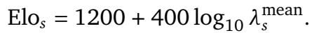

To obtain the set of ?? sketches for each match, we use a Thompson sampling strategy that repeatedly takes an independent sample ???? for each sketch and chooses the sketch with the highest value. In practice, we obtain the independent samples via Gibbs sampling, retaining only every 25-th sample in order to mitigate in-chain correlation. This is sampling with replacement, so the same sketch may appear more than once. After sampling exactly ?? times, we remove duplicate sketches from the chosen set, replacing them with the sketches with the highest posterior sample variance ??var?? .

Occasionally the LLM raters may output ties between the input sketches. Since the Plackett-Luce model does not consider ties, we break ties randomly by sampling from the model.

Evolutionary Selection. During the sampling phase, the controller selects “parent” sketches using the Predictor + Upper Confidence Bound (P-UCB) formula. To focus the search and reduce computational overhead, the sampler first filters the population to the top 64 highestscoring sketches based on their current Elo ratings. For these top candidates, the Elo ratings are normalized to a range of [0, 1] to yield a base score ??. The final P-UCB score for each sketch is then computed as:

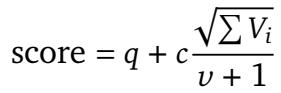

where ?? is the number of times the specific sketch has been visited (sampled), Í ???? is the total number of visits across the filtered population, and ?? is a tunable exploration constant (set at 0.2 for this work). This mechanism prioritizes the exploitation of the most promising sketches – those within the elite top-64 threshold – while the UCB exploration bonus ensures adequate exploration of newly promoted or infrequently sampled candidates within that elite tier, preventing the search from collapsing into a single, suboptimal lineage. The values ?? = 0.2 and top-64 were chosen empirically based on observed performance.

Global Goal Caching and Incorporation. Independent proving agents can generate the same goals to dispatch to AlphaProof. For efficiency, Agent (D) implements a global goal cache within the database. When a sketch is parsed, the system computes a deep hash of the exact formal Lean context and target for every generated subgoal (the goal\_id). Before querying AlphaProof, the validator checks this cache. If a specific subgoal’s state was already proved or formally disproved in any prior sketch across the population, the result – along with the specific tactic sequence or value function – is retrieved and incorporated into the current sketch. Novel subgoals are batched and dispatched concurrently to AlphaProof via non-blocking remote procedure calls (RPCs), and their subsequent results are cached to accelerate future generations.

AlphaProof Budget. When a novel subgoal is evaluated, AlphaProof executes a formal tree search to discover a proof or disproof. To prevent the system from stalling on intractable or hallucinated goals, AlphaProof operates under a strict computational budget, typically restricted to 400 simulations and bounded by a hard RPC timeout. We compile AlphaProof’s response into textual feedback in case it cannot solve a subgoal. This feedback is then associated with this particular subgoal and rendered in the corresponding prompt sketches.

Implementation. The entire AlphaProof Nexus infrastructure is implemented in Python, utilizing the asyncio framework. The evolutionary controller in Agent (D) runs an event loop that distributes work across asynchronous threads for generation, validation, and Elo rating. Formal validation and compilation are executed inside isolated sandboxes (Docker instances) running Lean v4.27 and Pantograph [5]. This ensures that generated code is type-checked in a secure, stateful environment without risking execution of malicious code. The LLM backend leverages an ensemble of models: Gemini 3.1 Pro is used for the complex reasoning required in the multi-turn proving agent, while the faster Gemini 3.0 Flash is deployed for high-throughput match rating and evaluation synthesis.

## A.2. Prompts

Figure 6 shows the main pieces of the prompt used for prover subagents in the full-featured agent (D). Figure 7 shows the prompt for the rating subagents in the full-featured agent (D). Figure 8 shows the full prompt for the basic agent (A).

## B. Supplementary Text

## B.1. Related Work

Formal Theorem Proving with LLMs. There is a large literature on neural-network-guided search over machine-checkable formal proofs [66, 15, 16, 64, 40]. Early work such as GPT- ?? [48] established the viability of language models in this setting; subsequent systems improved tactic generation, premise selection, and interaction with external provers [35, 67]. The Draft-Sketch-Prove system [34] introduced the hierarchical approach of generating informal sketches before translating them into formal steps, and recent systems such as Hilbert [63] and Aristotle [1] further separate high-level proof planning from low-level elaboration. AlphaProof [29] first showed that reinforcement learning (RL) could elevate formal theorem-proving to the Math Olympiad level. Some of the successes of that system came from using test-time RL; however, the system also supports a lower-cost tree search inference mode that we leverage. Subsequently, several other systems have demonstrated strong performance in competition mathematics [1, 15, 40, 6].

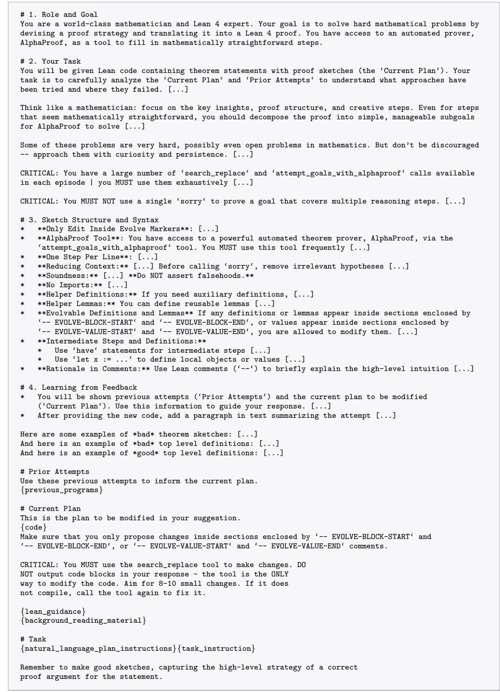  
Figure 4: Sketcher agent prompt (condensed). Elided text is represented by [...]. Text in bracesFigure 6 | Prompt for prover subagents in the full-featured agent (D) (condensed). denotes template variables populated at runtime. For example, {code} is replaced by the current Lean file.Elided text is represented by [...]. Text in braces denotes template variables populated at 5runtime. For example, {code} is replaced by the current Lean file.

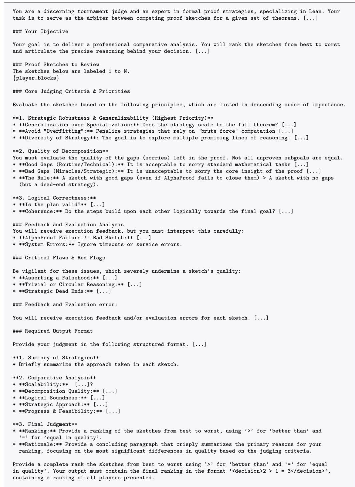  
Figure 3: Rater agent prompt (condensed). Elided text is represented by [...]. Text in braces denotesFigure 7 | Prompt for raters in the full-featured agent (D) (condensed). Elided text is template variables populated at runtime. For example, {player blocks} is replaced by the sketches to berepresented by [...]. Text in braces denotes template variables populated at runtime. For compared.example, {player\_blocks} is replaced by the sketches to be compared.

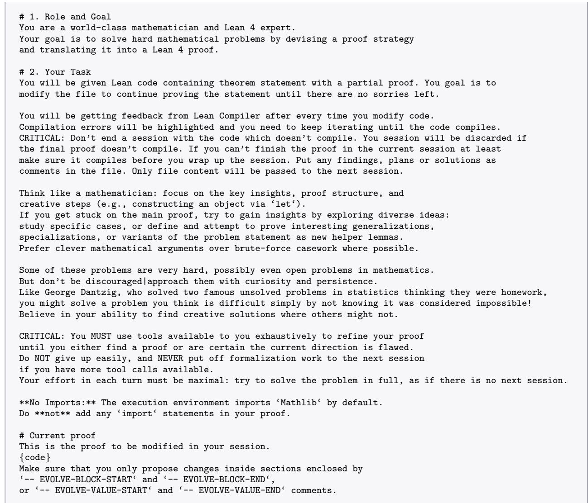  
Figure 8 | Full prompt for the basic agent (A). Text in braces denotes template variables populated at runtime. For example, {code} is replaced by the current Lean file.

At the research level, AI-aided formal proofs have been used primarily to verify results derived in natural language (either by human mathematicians or AI systems), rather than to discover new ones. In particular, Aristotle [1] was used to formalize AI-generated natural language proofs of several Erdős problems – see Tao’s wiki [59] for more details. Gauss [42] was used to produce a formalization of Viazovska’s proof of sphere packing in dimension 8 [28]. Our work differs in that we use Lean as a medium of novel mathematical discovery.

Evolution for Mathematical Discovery. The use of evolutionary algorithms to search over programs has a long history in AI [37]. FunSearch [51] introduced the idea of using LLMguided evolution to search for mathematical constructions represented as code. FunSearch was later extended into AlphaEvolve [46], which has been used to improve bounds and find novel constructions in numerous distinct areas of mathematics [25, 45, 44]. Our implementation of agent (D) reuses several components of AlphaEvolve. However, the fundamental difference between the two systems is that AlphaEvolve aims to find programs that optimize a quantitative reward function, while the goal of our agents is to find proofs that pass a boolean formal verification criterion.

Natural Language Proof Discovery. A large body of recent work explores whether LLMs can perform research-level mathematical tasks in natural language, as evidenced in the AI Co-Mathematician [69]. Focusing on theorem proving, Aletheia [21] exemplifies this approach via heavy test-time compute with interleaved generation and revision. Other provers include FullProof [11] and DeepThink [26]. A proprietary model developed by OpenAI resolved several Erdős conjectures [3, 4]. Subsequently, Erdős problem #1196 was resolved informally through community experimentation using GPT-5.4 [2]. Many proofs and partial results discovered this way have been subsequently autoformalized with the help of agents such as Aristotle [1] and Gauss [42]. Further collaborations between mathematicians and AI models have yielded results in optimization theory [33], algebraic geometry [53, 11], and spectral theory [32].

## B.2. Selection of Erdős and OEIS Problems

For the Erdős evaluation, we ran our agent on all Lean statements of Erdős problems available in the Formal Conjectures repository [23] as of early February 2026 – 353 problems in total. We did not select which problems to attempt; the set was determined entirely by what the open-source community had formalized from the 1200+ problems catalogued on the ErdosProblems site. We recognize that this process has a bias toward problems amenable to formalization in Lean.

For the OEIS evaluation, we began with a corpus of 2649 open conjectures drawn from the OEIS [56]. We prompted Gemini to select 500 problems that are non-trivial, mathematically interesting, not famous open problems, and good candidates for automated theorem-proving, and used a Gemini-based agent to formalize them. Of the 500 problems, 8 were excluded due to incompatibilities introduced by a Lean version upgrade, yielding a final set of 492 problems.

## B.3. Details on Comparisons across Agent Architectures and Models

Figure 9 reports, for each Erdős problem, the distribution of computational costs for successful runs, along with the solve rate for each agent. We note a large variance in the cost for most problems and methods, which highlights the stochastic nature of the agent. This is especially noticeable on problems such as Erdős 12(ii) and 152.

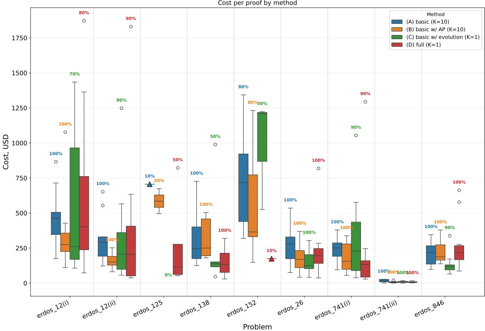  
Figure 9 | Box plots illustrating the distribution of a cost for successful proof for the Erdős problems. Four distinct experimental configurations are compared: basic@K=10 (blue), basic with AlphaProof @K=10 (orange), basic with evolution (green), and full (red). The solid horizontal line within each box denotes the median cost, while the upper and lower box boundaries represent the third and first quartiles, respectively. Whiskers extend to the rest of the distribution, and individual circles indicate outlier data points. Triangular markers denote instances with a single data point where only one proof attempt was successful.

Figure 10 shows the solve rate versus mean inference cost (in USD) for all nine Erdős problems. In addition to the plot in the main text, it also presents results for the full method when run with varying numbers of asynchronous LLM agents. Interestingly, running the full method with only one generator, but sampling from the database (instead of taking the previous session’s output), underperformed in comparison to the basic setup. This suggests that sampling is not beneficial unless one has an asynchronous pipeline and uses the database as a way of coordinating agents. Having three or six asynchronous agents did not outperform the full configuration with 10 agents on the most challenging problems; however, these configurations were more efficient on the easier tasks. Given the high variance in the observed results, one can conclude that setting ?? = 10 is a strong default for the system.

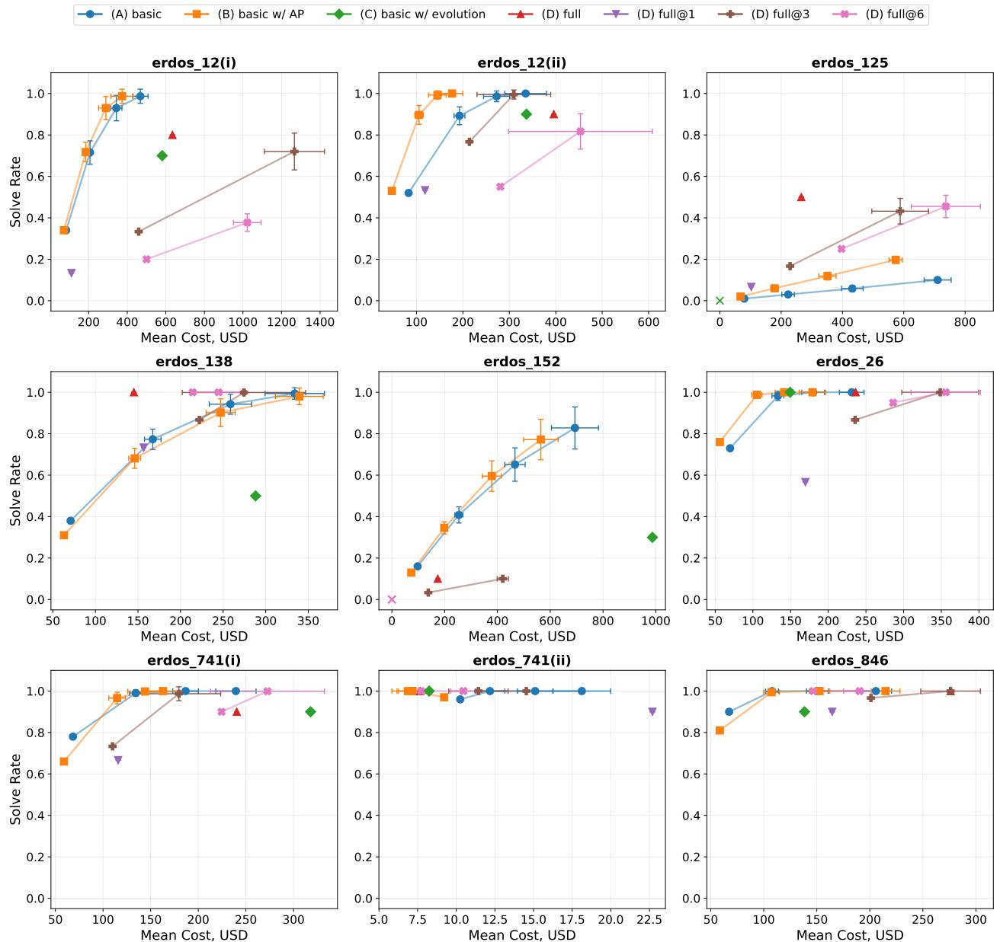  
Figure 10 | Solve rate versus mean inference cost (USD) across nine Erdős problem instances. Seven system configurations shown: basic (blue circles), basic with AlphaProof (AP) (orange squares), basic with evolution (green diamonds), full (red triangles), full@1 (purple downward triangles), full@3 (brown pluses), and full@6 (pink x), where @S are the variants of full system with a given number of parallel LLM generation threads. Connected curves denote the number of independent attempts ??. Error bars indicate one standard error interval. For the basic and basic with AlphaProof configurations, each curve traces the cost–performance Pareto frontier as ?? increases, revealing diminishing marginal returns at higher budgets. Note that basic with AlphaProof and full do not include the inference cost of AlphaProof.

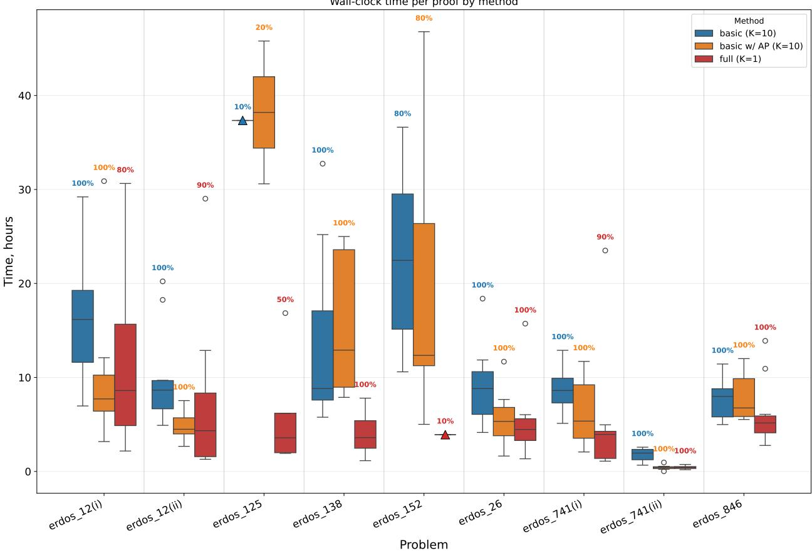  
Figure 11 | Box plots illustrating the distribution of a wall-clock time for a successful proof for the Erdős problems. Three distinct experimental configurations are compared: basic@K=10 (blue), basic with AlphaProof @K=10 (orange), and full (red). The solid horizontal line within each box denotes the median time, while the upper and lower box boundaries represent the third and first quartiles, respectively. Whiskers extend to the rest of the distribution, and individual circles indicate outlier data points. Triangular markers denote instances with a single data point where only one proof attempt was successful. A cut-off of 48 hours applied to all experiments.

We conducted two additional runs of our basic agent (A), differing only in the proving LLMs used: Gemini 3.0 Flash and Gemini 3.1 Flash-Lite. We also ran the basic setup with AlphaProof as a tool using Gemini 3.0 Flash as the prover model. All runs were executed with ?? = 100 and a 24-hour time budget. None of the three runs were able to solve any of the Erdős problems.

To evaluate AlphaProof as a standalone baseline, we ran it in tree search inference mode on all 9 Erdős problems. Even though we allowed a compute budget of approximately 64 v6e TPU hours per problem, the system could not resolve any of them. TPU pricing can be found at https://cloud.google.com/tpu/pricing.

The LLM cost for each agent was computed as follows:

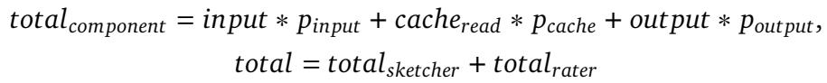

where ?????????? includes user prompt, agent session prefix, thoughts and tool calls outputs and excludes cached tokens, ??????ℎ?????????? accounts for the input tokens read from cache and ?????? ?????? includes model output and thoughts. ?? is the corresponding standard price per token as per https://ai.google.dev/gemini-api/docs/pricing. Note that for all agent price estimates, we applied the rate for prompts of 200k tokens or fewer.

## B.4. Deformalized Lean Proofs

Next, we give deformalized versions of the Lean proofs discovered by our full-featured Agent (D).

## Erdős #12-(i)

First, we give the proof of the first question under Erdős problem #12, as classified on the ErdosProblems site (https://www.erdosproblems.com).

Theorem (i). There is an infinite set ?? ⊆ ℕ satisfying that there are no distinct ??, ??, ?? ∈ ?? with ?? < ??, ?? satisfying ??|?? + ?? and

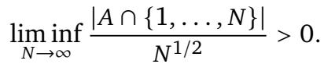

Proof. We will construct a sequence of "blocks" that individually cannot contain such ??, ??, ??, and with a careful choice of parameters, their union forms the desired set. By precisely controlling the growth and modular residues of these blocks, we ensure the set remains dense enough to satisfy the lim inf condition while avoiding all forbidden divisibility relations.

Let ?? : ℕ → ℕ be defined by ?? (0) = 0 and ?? (??) = 3 ?? ( ⌊??/2⌋) + (?? mod 2). The function ?? takes a number represented in base 2 and outputs the number given by the same representation but read in base 3. In particular, the base 3 representation of ?? (??) will contain only 0s and 1s. For this reason, ?? (??) + ?? (??) = 2 ?? (??) implies ?? = ?? = ??, ensuring the sequence ( ?? (??))??∈ℕ contains no 3-APs.

Next, let ???? be the ??-th odd prime, and write ???? = Î ??<?? ?? ?? and ???? = ???? ????. By Bertrand’s postulate, we have ???? ≤ 2??+2. By the Chinese Remainder Theorem, for each ??, let ???? < ???? be the unique integer such that ???? ≡ 0 (mod ????) and ???? ≡ 1 (mod ????).

Now we define the parameters for the blocks (????). Let

• ???? = 3(??+20)3 be the exponential bounding scale to control the distance between blocks.

• ???? = 10???????? + ???? be the starting coordinate of block ??.

• ???? = ⌊√????+1⌋ be the element capacity of block ??. Note that the capacity of ???? is directly tied to the starting point of the next block ???? 1.

Formally, define ???? = {???? + ???? ?? ( ??) | ?? < ????}. The purpose of ???? is to keep the blocks relatively narrow while ensuring they are well-spaced. Note that if ?? < 2??, then ?? ( ??) < 3??. Letting ?? = (?? + 20)3, we want to guarantee that for any ?? < ????, we have ?? ( ??) < ???? = 3??. To do this, it suffices to show ???? ≤ √???? 1 < 2??, which is equivalent to ???? 1 ≤ 4??.

Observe that ????+1 ≤ 11????+1????+1 ≤ 11 · 2(??+4)2 · 3(??+21)3 , following from the bound on ????. This is asymptotically strictly smaller than 4?? = 4(??+20)3. By adding the shift of 20, the inequality 11 · 2(??+4)2 · 3(??+21)3 ≤ 4(??+20)3 holds universally for all ?? ≥ 1.

Set ?? = Ð?? ℕ ????. Clearly, ?? is an infinite set. Suppose, for the sake of contradiction, that there exist distinct ??, ??, ?? ∈ ?? with ?? < ??, ?? such that ?? | (?? + ??). Let ?? ∈ ????. We analyze two cases:

• (Case 1: Cross-block) Suppose at least one of ??, ?? is not in ????. Without loss of generality, assume ?? ∈ ???? for some ?? > ?? (since ?? > ??). Since ?? ∈ ????, we have ?? ≡ 0 (mod ????), and thus ?? + ?? ≡ 0 (mod ????) by the divisibility condition. However, by our CRT construction, ?? ≡ 1 (mod ????). The element ?? must belong to some block ???? with ?? ≥ ??, so ?? ≡ 0 (mod ????) (if ?? = ??) or ?? ≡ 1 (mod ????) (if ?? > ??). Therefore, ?? + ?? ≡ 1 (mod ????) or ?? + ?? ≡ 2 (mod ????). Since ???? ≥ 3, this directly contradicts ?? + ?? ≡ 0 (mod ????).

• (Case 2: Same block) Suppose ??, ?? ∈ ????. They must be tightly clustered around ????. Because ?? < ????, we have ?? ( ??) < ????. The maximum "noise" added to any block element is ????????. Since ???? > 10????????, any ?? ∈ ???? must satisfy ?? ∈ [????, 1.1????]. The divisibility condition ?? | (?? + ??) implies ???? = ?? + ?? for some integer ??. Because ?? + ?? ∈ [2????, 2.2????] and ?? ∈ [????, 1.1????], it must be that ?? = 2, implying 2?? = ?? + ??.

Writing the elements as ?? = ???? + ???? ?? (??′), ?? = ???? + ???? ?? (??′), and ?? = ???? + ???? ?? (??′), substitution and cancellation yield 2 ?? (??′) = ?? (??′) + ?? (??′). This is impossible for distinct ??′, ??′, ??′ because the image of ?? avoids 3-APs, contradicting the assumption that ??, ??, ?? are distinct.

Finally, we show that ?? (??) = | ?? ∩ {1, . . . , ?? }| ≥ ??√?? for some constant ?? > 0. We split into two cases:

1. ?? falls in the gap between ???? and ???? 1; precisely, ???? + ???????? ≤ ?? < ???? 1. Here, ??(??) counts at least all elements in ????, meaning ??(??) ≥ ???? = ⌊√???? 1⌋. Since ?? ≤ ???? 1, we have √?? ≤ √????+1. Thus, ??(??)√?? ⌊√????+1⌋√?? ≈ 1.

2. ?? is inside the block ????; precisely, ???? ≤ ?? < ???? + ????????. A pessimistic lower bound counts only the elements up to the previous block, giving ??(??) ≥ ???? 1 = ⌊√????⌋. Observe that ???????? ≤ 0.1????, so ?? ≤ 1.1???? < 2????. Consequently, √???? > √︁??/2, which implies ??(??)√ ≥ 1√2 . 1 ??

In both cases, lim inf??→∞ ??(??)??1/2 ≥ 1√ > 0.

Erdős #12-(ii)

Next, we give a proof for the second question of the three listed in Erdős #12.

Theorem (ii). There exists an infinite set ?? ⊂ ℤ+ with no distinct ??, ??, ?? ∈ ?? with ??, ?? > ??,

and ??|?? + ??, yet for any ?? > 0 and all sufficiently large ??:

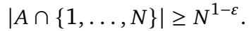

Consequently, there is no absolute constant ?? > 0 such that every such set ?? satisfies | ?? ∩ {1, . . . , ?? }| < ??1−?? for infinitely many ??.

Proof. The proof is similar to the previous one for Erdős #12(i), differing mainly in the use of a Behrend-style construction to produce a dense 3-AP-free set.

Let ?? ∈ (0, 1), and let (????) be a sequence of pairwise coprime integers with ???? ≥ 3 and ???? ≤ 4??+2 (for example, we can choose ???? to be the ??-th odd prime). Next, define the running product ???? = Î????= ????. As before, we have ???? ≤ 4(??+2)2. By the Chinese Remainder Theorem, there are integers ???? < ???? satisfying ???? ≡ 0 (mod ????) and ???? ≡ 1 (mod ????) for all ?? < ??.

Choose an integer ?? ≥ 2 satisfying ?? > (2?? +1)1−??/2 and define the dimension ???? = (?? + 10)4. We use a construction of Behrend to generate dense sets free of 3-term arithmetic progressions. Consider the grid of vectors {1, . . . , ??}????−1. Let ?? = (??0, . . . , ??????−2) be such a vector. The squared norm ∥??∥2 takes integer values in the range [???? − 1, (???? − 1)??2]. By the pigeonhole principle, there exists an integer radius ?? such that the number of vectors on this sphere satisfies |{?? ∈ {1, . . . , ??}????−1 | ∥??∥2 = ??}| ≥ ??????−1/(??????2 + 1).

Define ???? as the set of integers formed by evaluating these vectors in base 2?? + 1, strictly offset by adding a massive leading digit ?? 2??  1 ????−1:

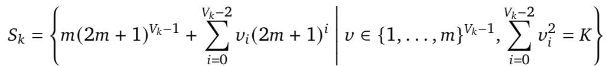

Because the digits are bounded by ??, adding two elements in base 2?? + 1 involves no carrying. The restriction to the sphere of radius √?? ensures ???? contains no 3-APs. Furthermore, because the vectors use digits strictly between 1 and ??, every element ?? ∈ ???? satisfies ??(2?? + 1)????−1 ≤ ?? < (?? + 1) (2?? + 1)????−1, ensuring the set is tightly clustered.

We define the blocks ???? = {?????? + ???? | ?? ∈ ????}, and set ?? = Ð?? ℕ ????. Clearly, ?? is an infinite set. We verify ?? contains no distinct ??, ??, ?? such that ?? | (?? + ??) with ??, ?? > ??. If ??, ??, ?? are in different blocks, a similar modular arithmetic argument as before using the CRT conditions yields a contradiction. If they are in the same block, the tightness of ???? guarantees ?? + ?? < 3??, forcing the divisibility multiplier to be exactly 2 (i.e., 2?? = ?? + ??), which contradicts the fact that ???? is 3-AP-free. To ensure the blocks ???? do not overlap, we bound their elements. The maximum element in ???? is bounded above by:

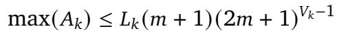

The minimum element in the next block ???? 1 is bounded below by:

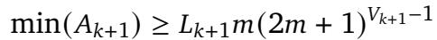

Because the dimension ???? 1 = (?? + 11)4 is significantly larger than ???? = (?? + 10)4, the base exponent strictly dominates, separating the blocks.

We now show that | ?? ∩ {1, . . . , ??}| ≥ ??1−?? for sufficiently large ??. The density drops the most in the empty gaps between blocks, with the absolute minimum occurring immediately before block ???? 1 begins. At this point, ?? = min( ???? 1) − 1, and our total element count is strictly greater than | ???? |. Thus, it suffices to prove:

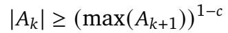

Substituting our parameter bounds into this inequality yields, and since ?? was chosen to satisfy ?? > (2?? + 1)1−??/2, it remains to prove

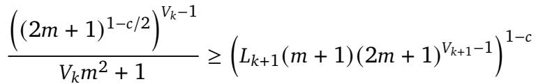

Ignoring the polynomial denominator and constant multipliers, we compare the asymptotic growth of the exponents on the base 2?? + 1:

• On the left hand side, the exponent is (1 − ??/2) (???? − 1) = (1 − ??/2)??4 + ??(??3).

• On the right hand side, the exponent is (1 − ??) (????+1 − 1) = (1 − ??) (?? + 11)4 = (1 − ??)??4 + ??(??3).

The contribution of the running product ???? 1 ≤ 4(??+3)2 and the constant (?? + 1) to the right hand side is only ??(??2), which is safely absorbed into the ??(??3) error term. Because ?? > 0, the ??4 coefficient on the left hand side (1 − ??/2) is strictly greater than the ??4 coefficient on the right hand side (1 − ??). Thus, for sufficiently large ??, the left hand side asymptotically dominates, and the inequality holds. □

These questions were posed in 1970 [18], and saw attention from multiple human mathematicians, achieving partial results towards the questions [54, 7, 17]. We thank Thomas Bloom for summarizing the history regarding these questions on the ErdosProblems site (https://www.erdosproblems.com).

Note that the answer to the (ii) implies the answer to (i). Nevertheless, we included both proofs as the agent found them independently, as each question was separately formalized as a theorem in Formal Conjectures. Originally, the agent located multiple proofs for the second question, though we chose the first proof to informalize for presentation. It also happened to differ the most in the construction, which otherwise is quite similar to the proof for (i). After sharing the solutions publicly, it was noted that a minor adjustment could be performed on the construction from the original paper to answer the questions. The third and final question, asking whether such a set ?? could satisfy Í?? ?? 1/?? = ∞, is still open and seems difficult.

We provide the Lean proof discovered for (i) at https://github.com/google-dee pmind/alphaproof-nexus-results/blob/main/APNOutputs/ErdosProblems/er dos\_12.parts.i.lean and for (ii) at https://github.com/google-deepmind/alph aproof-nexus-results/blob/main/APNOutputs/ErdosProblems/erdos\_12.par ts.ii.lean. Our original communication of the result can be found at the problem thread of the ErdosProblems site: https://www.erdosproblems.com/forum/thread/12.

## Erdős #125

Question. Let ?? = {Í ????3?? : ???? ∈ {0, 1}} be the set of integers which have only the digits 0,1 when written base 3, and ?? = {Í ????4?? : ???? ∈ {0, 1}} be the set of integers which have only the digits 0, 1 when written base 4. Does ?? + ?? have positive lower density?

Proof. We show that the answer is no: the lower density is zero. Let ?? and ?? be defined as the sets of integers whose base 3 and base 4 representations, respectively, contain only the digits 0 and 1. We will show that the lower density of ?? + ?? is zero.

For any integer ?? ∈ ??, we can decompose it at the ??-th digit into a top and bottom part, writing ?? = 3?????????? + ????????. Because ?? uses only the digits 0 and 1, both ???????? and ???????? must also belong to ??. Furthermore, the maximum possible value for ???????? is the integer consisting of ?? ones in base 3, which provides the strict upper bound ???????? ≤ (3?? − 1)/2. By applying the exact same logic to any ?? ∈ ?? at scale ??, we can write ?? = 4?????????? + ????????, yielding the analogous bound ???????? 4??  1 3.

To evaluate the density of ?? + ?? up to a large scale, we define a threshold ?? · ??0, where ?? = min(3??, 4??) for some integers ?? and ??. Consider any element ?? ∈ ?? + ?? such that ?? < ?? · ??0. By definition, ?? = ?? + ?? for some ?? ∈ ?? and ?? ∈ ??. Using the previously established decompositions, we can express this sum as ?? = 3?????????? + ???????? + 4?????????? + ????????. Assume without loss of generality that 3?? ≤ 4??, so ?? = 3??. We can rewrite this expression to factor out ??, yielding ?? = 3?? (???????? + ????????) + ??, where the remainder term is ?? = (4?? − 3??)???????? + ???????? + ????????.

Let ?? = ???????? + ????????. Since ???????? ∈ ?? and ???????? ∈ ??, it naturally follows that ?? ∈ ?? + ??. Furthermore, because ?? < 3????0, we must have ?? < ??0, which in turn dictates that ???????? ≤ ??0. Applying our bounds for the bottom parts, we can bound the remainder ?? by a maximum value ??, defined as ?? = |4?? − 3??|??0 + (3?? − 1)/2 + (4?? − 1)/3.

This shows that any valid sum ?? < ?? · ??0 is uniquely determined by choosing a base value ?? ∈ (?? + ??) ∩ [0, ??0) and a remainder ?? ∈ [0, ??]. Therefore, the total number of elements in ?? + ?? strictly less than ?? · ??0 is bounded by the product of the number of choices for ?? and the number of choices for ??. Dividing by the interval length ?? · ??0 yields an upper bound on the density at this new scale: the density up to ?? · ??0 is less than or equal to the density up to ??0 multiplied by the factor (?? + 1)/??.

To force the density to drop, we require this multiplying factor to be strictly less than 1. Because the ratio of logarithms ln(4)/ln(3) is irrational, Dirichlet’s Approximation Theorem guarantees that we can find arbitrarily large integers ?? and ?? such that the ratio 4??/3?? is arbitrarily close to 1. By choosing ?? and ?? carefully, the absolute difference |4?? − 3??| becomes extremely small relative to ??. Consequently, for any given ??0, we can select ?? and ?? large enough such that (?? + 1)/?? ≤ 0.99.

We can now apply this bounding process iteratively. Starting from an arbitrary scale ??0, we can find a larger scale ??1 = ??1??0 where the density of ?? + ?? drops by a factor of at least 0.99. Taking ??1 as our new baseline, we find a still larger scale ??2 = ??2??1 where the density drops by another factor of 0.99. After ?? iterations, the density of the set up to the scale ???? is bounded by (0.99)??. As ?? → ∞, this bound approaches 0. This demonstrates the existence of a sequence of arbitrarily large scales where the density tends to 0, proving that the lower density of ?? + ?? is 0. □

We originally communicated the result in https://www.erdosproblems.com/fo rum/thread/125#post-5110. The Lean proof is at https://github.com/google-d eepmind/alphaproof-nexus-results/blob/main/APNOutputs/ErdosProblem s/erdos\_125.variants.positive\_lower\_density.lean. In the discussion at the ErdosProblems site, it was pointed out that this leaves two possibilities regarding the set ?? + ??:

1. ?? + ?? has zero upper and lower density (and hence also zero density), or

2. ?? + ?? has zero lower density, but positive upper density (and hence no density).

## Erdős #138, Differences Variant

Question. Let the van der Waerden number ??(??) be such that whenever ?? ≥ ??(??) and {1, . . . , ??} is 2-coloured there must exist a monochromatic ??-term arithmetic progression. Is it true that ??(?? + 1) − ?? (??) → ∞?

Proof. We will show that ?? (?? + 1) ≥ ?? (??) + ??, which establishes that ?? (?? + 1) − ?? (??) → ∞. Given a 2-coloring of the first ?? (??) − 1 integers without a monochromatic ??-AP, we can extend it by ?? further elements without creating a monochromatic (?? + 1)-AP by proceeding greedily. Adding new elements one by one, suppose we have validly colored up to ?? (where ?? < ?? (??) − 1 + ??); we simply color ?? + 1 red if doing so doesn’t create a red (?? + 1)-AP, and blue otherwise.

The only way this algorithm could result in an invalid coloring is if both choices are blocked, meaning there is already a red ??-AP with some step size ???? and a blue ??-AP with some step size ???? such that the (??+1)-th element for both progressions lands exactly on ?? +1. But this is impossible. Because our original interval up to ?? (??) − 1 has no monochromatic ??-APs, these progressions must contain at least one newly added element, which bounds their step sizes to ????, ???? ≤ ?? − 1. Hence, if we step backward ???? times along the red progression and ???? times along the blue progression, both calculations land exactly on the positive integer ?? + 1 − ????????, meaning this single point would have to be simultaneously colored red and blue, which is a contradiction. □

We originally communicated the result in https://www.erdosproblems.com/foru m/thread/138#post-5314, and share the Lean proof at https://github.com/googl e-deepmind/alphaproof-nexus-results/blob/main/APNOutputs/ErdosProbl ems/erdos\_138.variants.difference.lean. In the discussion at the ErdosProblems site, Thomas Bloom pointed out that the obvious generalization of this argument gives ?? (?? + 1, ?? + 1) ≥ ?? (??, ??) + min(??, ??), and asked what this kind of argument can prove for the ??-color variant ???? (??).

## Erdős #741-(i)

Question. Let ?? ⊆ ℕ be such that ??+ ?? has positive upper density. Can one always decompose ?? = ??1 ⊔ ??2 such that ??1 + ??1 and ??2 + ??2 both have positive upper density?

Proof. We show that the answer is yes. We use an alternating block partition. Given a rapidly

growing sequence ??0 < ??1 < ??2 < · · · , we define

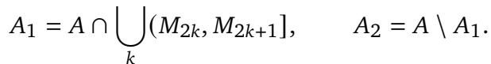

In odd-indexed intervals (??2??, ??2?? 1], all elements of ?? belong to ??1; in even-indexed intervals (??2?? 1, ??2?? 2], they all belong to ??2. The sequence ?? is chosen to grow fast enough that each block dwarfs all previous ones. We split into two cases.

Case 1: ?? has positive upper density. There exist a constant ?? > 0 and a strictly increasing sequence of scales along which |?? ∩ [1, ??] | ≥ ?? · ??. Using a dependent-choice argument, we extract a rapidly growing sequence ???? such that for each ??:

• | ?? ∩ [1, ???? 1] | ≥ ?? · ???? 1 (density is retained at the next scale),

• | ?? ∩ [1, ????] | ≤ ?? · ???? 1 (the “past” is negligible relative to the “future”).

Because each new block contains all the “fresh” elements of ??, looking at scale ??2?? 1 shows that ??1 has positive upper density, and looking at scale ??2?? 2 shows the same for ??2. A short argument then lifts this: if a set has positive upper density, so does its sumset with itself.

Case 2: ?? has zero upper density but ?? + ?? has positive upper density. This is the harder case, since ?? is too sparse to guarantee positive density for the parts directly. Instead, we argue about the sumsets themselves. Since ?? + ?? has positive upper density, there exist ?? > 0 and a sequence of scales along which | (?? + ??) ∩ [1, ??] | ≥ ?? · ??. Since ?? has zero upper density, |?? ∩ [1, ??] | = ??(??), so for any fixed ?? there are arbitrarily large ?? where (?? + 1) · | ?? ∩ [1, ??] | ≤ ??4 · ??. By dependent choice, we extract a rapidly growing ???? such that for each ??:

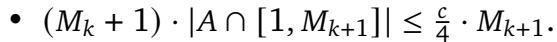

The key ingredient is a combinatorial sumset bound: if ?? = ??1 ∪ ??2 and every element of ??2 in 1, ?? is at most ??, then

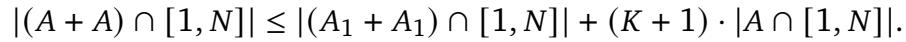

The idea is that any sum involving an element of ??2 has one summand bounded by ??, giving at most (?? + 1) · | ?? ∩ [1, ??] | such sums. Applying this bound at alternating scales:

• At scale ?? = ??2?? 1: all elements of ??2 in [1, ??] lie below ??2??, so the bound with ?? = ??2?? gives | ( ??1 + ??1) ∩ [1, ??] | ≥ 3??4 · ??.

• At scale ?? = ??2??+2: symmetrically, all elements of ??1 in [1, ??] lie below ??2??+1, giving | ( ??2 + ??2) ∩ [1, ??] | ≥ 3??4 · ??.

Since these bounds hold for infinitely many ??, both sumsets have positive upper density. □

The agent also initially disproved a strict “natural density” formulation of this problem (where the density must exist as a limit), which served as a diagnostic for the correct interpretation of Erdős’ original phrasing. Following Thomas Bloom’s observation that Erdős likely meant “positive upper density,” the formulation was amended and the agent resolved the corrected version as described above. The Lean proof for the upper density variant is available at https://github.com/google-deepmind/alphaproof-nexus-results /blob/main/APNOutputs/ErdosProblems/erdos\_741.parts.i.lean.

## Erdős #741-(ii)

Question. Is there a basis ?? of order 2 such that if ?? = ??1 ⊔ ??2 then ??1 + ??1 and ??2 + ??2 cannot both have bounded gaps?

Proof. We show that the answer is yes by constructing a pathological basis ?? with “forbidden zones” that force any partition to create arbitrarily large gaps in at least one component sumset.

Step 1: The construction. Choose a sequence of rapidly growing scales ???? = 100??. For each ?? ≥ 1, define a forbidden zone ????, which is a broad interval of integers running roughly from 11 ???? to 11???? + ??. In the middle of this zone, we leave a single “oasis” — an isolated element ???? = 10????. The set ?? consists of all natural numbers that avoid every forbidden zone, together with the oases ????. In visual terms, ?? is made of clumps of consecutive integers separated by large empty gaps, each containing a single survivor ????.

Step 2: ?? ∪ {0} is a basis of order 2. We must show every natural number ?? can be written as ?? + ?? with ??, ?? ∈ ?? ∪ {0}:

• If ?? ∉ ???? for any ??, then ?? ∈ ?? and we use ?? + 0 = ??.

• If ?? ∈ ???? and ?? lies in the lower half of ????, we use ⌊??/2⌋ + ⌈??/2⌉. Because ?? is small enough, neither half lands in ????, and both are large enough to avoid the previous zone ????−1.

• If ?? ∈ ???? and ?? lies in the upper half, we use the oasis: ?? = ???? + (?? − ????). The difference ?? − ???? is small enough that it falls safely before the forbidden zone ????.

Step 3: No syndetic partition exists. Suppose ?? = ??1 ⊔ ??2. Consider a target sum ?? ∈ [11????, 11???? + ??]. To write ?? = ?? + ?? with ??, ?? ∈ ??, the algebra forces the larger operand ?? to land inside the forbidden range [ 112 ????, 11???? + ??]. But the only element of ?? in this range is ????. Therefore, representing any sum in [11????, 11???? + ??] requires ????.

By the pigeonhole principle, ???? belongs to exactly one partition component, say ??1. Then ??1 + ??1 can cover the interval [11????, 11???? + ??] using ????, but ??2 + ??2 is completely locked out — it cannot represent any element in that interval. This leaves a gap of length ?? in ??2 + ??2. Since ?? can be made arbitrarily large, the gaps in one component’s sumset are unbounded, proving it is impossible to partition ?? so that both sumsets have bounded gaps. □

The Lean proof for part (ii) is available at https://github.com/google-deepmind/ alphaproof-nexus-results/blob/main/APNOutputs/ErdosProblems/erdos\_12 .parts.ii.lean. Our original communication of both results can be found in the problem thread on the ErdosProblems site (https://www.erdosproblems.com/forum/thread /741).

## Erdős #26, More General Variant

Theorem. Let M (??) denote the set of multiples of a subset ?? ⊆ ℕ, and let ??(??) denote the upper asymptotic density of a set ??. There exists a sequence ?? : ℕ → ℕ satisfying Í?? ℕ 1/??(??) = ∞, such that for ?? = 1/4 and for all ?? ≥ 1, we have ??(M ( ?? + ??)) < 1 − ??.

Proof. We construct the sequence iteratively in finite blocks and show that for any arbitrary shift ??, we can bound the upper density of the shifted sequence by analyzing three distinct cases, the third case relying on the construction being similar to the simple counterexample of Ruzsa which resolved the original question Erdős #26.

Let (????)∞??=1 be a strictly increasing sequence of primes satisfying ??1 ≥ 29 (chosen large enough to cause small enough density in the infinite tail of the sequence). We define a strictly increasing sequence of indices (or “jumps”) ( ????)∞??=0 recursively, starting with ??0 = 0. Suppose ???? has been defined, and the sequence ??(??) has been constructed for all ?? < ????. We define the parameters for the ??-th block as follows.

First, define the step size ???? = Î10??????=1 ????. Next, by the Chinese Remainder Theorem, we can choose a base size ???? satisfying the following system of congruences

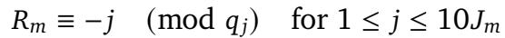

as well as the strict monotonicity condition ???? > ??(???? − 1) (where we set ??(−1) = 0), by adding enough multiples of ????.

With ???? and ???? fixed, the series Í∞??=1 1????+?????? 1 diverges. Thus, we can compute a block length ???? ≥ 1 such that the partial sum satisfies:

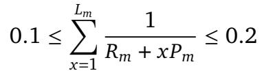

We then set ???? 1 = ???? + ????. Now that the bounds of the block are properly defined, for indices ?? ∈ [????, ???? 1), we set:

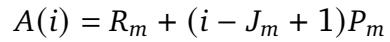

Since each block contributes at least 0.1 to the total harmonic sum, the overall sum Í 1/??(??) diverges. Pick an arbitrary shift ?? ≥ 1; we must now show that ??(M (?? + ??)) stays bounded below 3/4. Let ??0 be the unique integer satisfying:

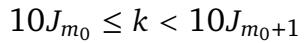

We partition the shifted sequence ?? + ?? into three regimes and bound the upper density of the multiples generated by each:

• (Case 1: ?? < ????0) The upper density of the multiples generated by this finite set is bounded by the sum of their reciprocals. Because ??(??) > 0, we have ??(??) + ?? > ??, yielding:

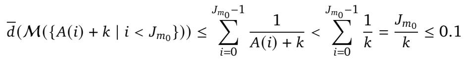

• (Case 2: ????0 ≤ ?? < ????0 1) Shifting by a positive ?? strictly decreases the reciprocals, so the upper density of the multiples from this critical block satisfies:

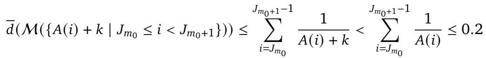

• (Case 3: ?? ≥ ???? 1) Consider any element ??(??) where ?? belongs to some block ?? ≥ ??0 +1, meaning 10???? ≥ 10???? 1 > ??. Recall the construction of the ??-th block:

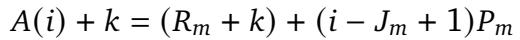

Because 10???? ≥ ??, we have ???? | ????. By construction, we also have ???? | (???? + ??). Consequently, ???? | ( ??(??) + ??) for every element in this infinite tail. The set of multiples generated by Case 3 is therefore entirely contained within the multiples of the prime ????. Expressing this with the upper density notation:

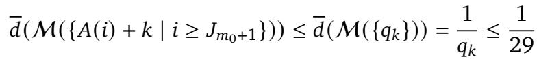

By the union bound, the total upper density of the multiples of ?? + ?? is bounded above by:

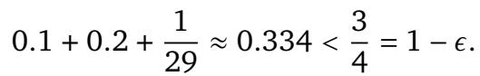

This problem is a more general variant to the original question stating that “For all ??  ℕ, does there exist ?? ≥ 1 such that almost all integers have a divisor of the form ?? + ?? for some ??  ???”. A simple counterexample to this question can be produced using the Chinese Remainder Theorem. In the more general variant we resolve, note the Chinese Remainder Theorem is still used to construct a counterexample, but with additional constraints to make the upper density of ?? ?? small, for all ??. We originally communicated the result in https://www.erdosproblems.com/forum/thread/26, and share the Lean proof at https://github.com/google-deepmind/alphaproof-nexus-results/blob/main /APNOutputs/ErdosProblems/erdos\_26.variants.tenenbaum.lean.

## Erdős #846

Theorem. Let ?? ⊂ ℝ2 be an infinite set for which there exists some ?? > 0 such that in any subset of ?? of size ?? there are always at least ???? with no three on a line.

Is it true that ?? is the union of a finite number of sets where no three are on a line?

Proof. We will show that there exists an infinite set ?? ⊂ ℝ2 for which any ??-element subset contains at least ??/2 points with no three on a line, but ?? is not the union of a finite number of sets where no three are on a line.

Let ?? be the countably infinite complete graph with vertex set ?? = {??1, ??2, . . . }. We choose the sequence of real numbers (????)∞??=1 such that it grows sufficiently fast to avoid

any accidental roots of polynomials that will arise in our collinearity condition, by setting ???? = 1004??.

We construct our point set ?? ⊂ ℝ2 by mapping each edge ?? = {????, ?? ??} of ??∞ to a point ???? as follows:

$$
\tag{1}
$$

Let ?? = {???? | ?? ∈ ??(?? )}.

Lemma. Three points in ?? are collinear if and only if their corresponding edges form a triangle in ??∞.

Proof of Lemma. First, assume three edges form a triangle in ?? with vertices ??, ??, ?? ∈ ??. The corresponding points in ?? are:

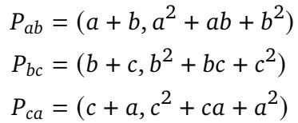

The slope ?? of the line connecting ?????? and ?????? is given by:

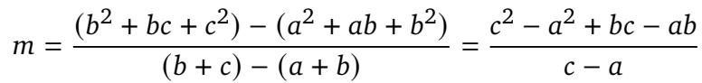

Factoring the numerator yields:

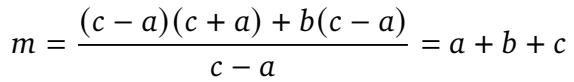

By symmetry, the slope of the line connecting ?????? and ?????? is also ?? + ?? + ??. Because the slopes are equal, the three points are collinear.

Conversely, suppose three distinct edges do not form a triangle. We must show their corresponding points are not collinear. The condition that these points are collinear is equivalent to the determinant of their 3 × 3 augmented coordinate matrix evaluating to zero.

Because the sequence (????)∞??=1 grows quickly enough, any polynomial evaluated on its terms is strictly dominated by the highest power of its largest variable. By sorting the endpoints of the three edges, we can group the expanded determinant into three topological cases based on whether the largest vertex is present in one, two, or all three of the edges. In every case, because the edges are distinct and do not form a triangle, the coefficient of the dominant highest-degree term is bounded strictly away from zero. Furthermore, the massive gap between consecutive terms in the sequence ensures that the lower-degree terms are strictly bounded and cannot sum to cancel the leading term out. Therefore, the determinant never evaluates to zero, and no accidental collinearities occur. □

Lemma. Any ??-element subset of ?? contains at least ??/2 points with no three on a line.

Proof of Lemma. Let ?? ⊂ ?? be an arbitrary subset of size ??. The elements of ?? correspond to a subgraph ???? ⊂ ?? containing exactly ?? edges. Every graph with ?? edges contains a bipartite subgraph ???? with at least ??/2 edges. Because ???? is bipartite, it contains no odd cycles and is therefore triangle-free. By the previous lemma, the corresponding points in ?? contain no collinear triplets. This provides a subset of at least ⌈??/2⌉ points with no three on a line, satisfying the condition with ?? = 1/2. □

To complete the proof of the theorem, assume for contradiction that ?? can be covered by a finite number of sets where no three are on a line; that is, ?? = Ð????=1 ????.

This partition naturally induces an ??-coloring on the edges of ??∞. By the infinite Ramsey Theorem, any finite coloring of the edges of the infinite complete graph must contain a monochromatic triangle. Consequently, there exists some color class ?? containing three edges that form a triangle. By the lemma, these three edges map to three collinear points in ????. This contradicts the assumption that ???? contains no three collinear points.

Therefore, ?? cannot be covered by finitely many sets with no three on a line.

We originally communicated the result in https://www.erdosproblems.com/fo rum/thread/846#post-4447 to the ErdosProblems site, and share the Lean proof at https://github.com/google-deepmind/alphaproof-nexus-results/blob/ma in/APNOutputs/ErdosProblems/erdos\_846.lean. This result was independently discovered by an internal model at OpenAI [49]. In the discussion at the ErdosProblems site, it was pointed out that this result also follows from a projection argument of Reiher, Rödl and Sales [50].

## Erdős #152

Theorem. For a Sidon set ?? ⊂ ℕ of size ??, let ??( ?? + ??) count the isolated elements of the sumset — those ?? ∈ ?? + ?? with ?? ± 1 ∉ ?? + ??. Define ?? (??) as the minimum of ?? ( ?? + ??) over all Sidon sets of size ??. Then ?? (??) ≥ (??2 − 100?? − 16)/16, so in particular ?? (??) → ∞.

Proof. The proof establishes, for every Sidon set ?? of size ??:

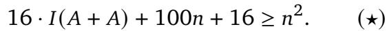

Let ?? = {?? − ?? : ??, ?? ∈ ??} denote the difference set and ?? = ?? + ?? the sumset. For any set ?? ⊆ ℤ, let ????(??) := |?? ∈ ?? : ?? + ?? ∈ ?? | be the number of pairs at distance ??, ??2(??) := |?? ∈ ?? : ?? ± 1 ∈ ?? | be the number of interior points, and ?? (??) be the isolated points .

Let ?? ⊂ ℤ. We will employ the following three facts:

1. ??(??) + 2??1(??) = |?? | + ??2(??), by partitioning elements by neighbor count.

2. 4??1(??) + ??3(??) ≤ 3|?? | + 2??2(??), which follows from writing ????(??) = Í?? ℤ 1?? (??)1?? (?? + ??) and a pointwise check of the indicator function 1?? across all 4-point windows (??, ?? + 1, ?? + 2, ?? + 3); that is, summing the local inequality 1?? (??) + 1?? (?? + 1) + 1?? (?? + 2) + 1?? (??)1?? (?? + 2) + 1?? (?? + 1)1?? (?? + 3) ≥ 1?? (??)1?? (?? + 1) + 21?? (?? + 1)1?? (?? + 2) + 1?? (?? + 2)1?? (?? + 3) + 1?? (??)1?? (?? + 3) and then summing over all ?? ∈ ℤ.

3. 2??2(??) ≤ ??3(??) + 2??2(??) + 2??(??). Consider each pair (??, ?? + 2) ∈ ??2 and we proceed by cases on ?? + 1. Let ?? = {?? ∈ ?? | ?? + 1 ∉ ?? ∧ ?? + 2 ∈ ?? }. If ?? + 1 ∈ ??, then the pair is counted exactly by ??2, so ??2(??) = ??2(??) + |??|. If ?? + 1 ∉ ??, then

• If ?? − 1 ∈ ??, then (?? − 1, ?? + 2) is a pair counted in ??3(??).

• If ?? + 3 ∈ ??, then (??, ?? + 3) is a pair counted in ??3(??).

• If ?? − 1 ∉ ?? , then ?? is an isolated point in ?? (?? ), and if ?? + 3 ∉ ?? , then ?? + 2 is an isolated point in ?? (?? ).

Since each ??3 pair can be counted by two different gaps, while isolated points are distinct in this construction, we have 2|??| ≤ ??3(??) + 2??(??).

Next, for each ?? ≥ 1, count quadruples (??, ??, ??, ??) ∈ ??4 with ?? + ?? + ?? = ?? + ??. Rewriting as ?? − ?? = ?? − ?? − ?? and partitioning by ?? = ?? − ?? yields the following two quadruple transfer bounds:

1. The cases ?? = 0 and ?? = ?? each contribute ?? (one coordinate determines the rest). For any ?? ∉ {0, −??}, the Sidon property ensures that there is at most one pair (??, ??) with ?? − ?? = ?? and at most one pair (??, ??) with ?? − ?? = ?? + ??. Consequently, each gap of size ?? in ?? identifies exactly one quadruple. Thus |quad??| ≤ ????(??) + 2??.

2. Each "good" element ?? ∈ ?? with ?? + ?? ∈ ?? (excluding ≤ 2?? doubles of the form 2??) produces ≥ 4 quadruples, giving 4????(??) ≤ |quad??| + 8??.

Combining these bounds shows that ???? (??) and ???? (??) are related up to ??(??) error. Applying fact (2) to ?? = ?? − ?? gives

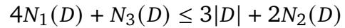

and then substitute the above two quadruple transfer bounds for ?? = 1, 2, 3 and collecting all ??(??) terms gives

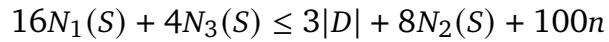

Then, using fact (3) on ?? we obtain

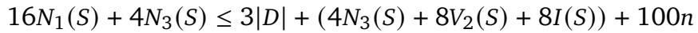

and notice that the 4??3(??) terms cancel. Then applying fact (1) we obtain

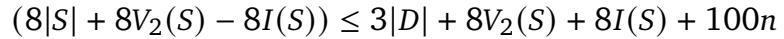

and see that the 8??2(??) terms now cancel, leaving

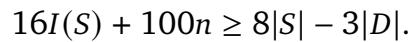

The standard Sidon estimates ?? ??2 2 and ?? ??2 then give 16?? ?? 100??  4??2 3??2 = ??2, accounting for a boundary correction of +16 at zero yields (★). □

We include the Lean proof at https://github.com/google-deepmind/alphapro of-nexus-results/blob/main/APNOutputs/ErdosProblems/erdos\_152.lean.

## OEIS Conjectures

Theorem. (A conjecture of OEIS A051293, 2002) Let ???? denote the number of nonempty subsets of {1, 2, 3, . . . , ??} whose elements have an integer average. Then

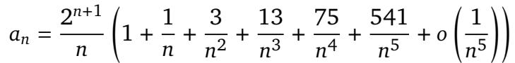

Proof. A subset ?? 1, 2, . . . , ?? has an integer average if and only if the sum of its elements is divisible by its cardinality |??|. Let ?? (??, ??) denote the number of subsets of size ?? whose sum is divisible by ??. We can express the total number of such subsets as ???? = Í????=1 ?? (??, ??) To isolate equals 1 if ?? divides ??, and 0 otherwise. Thus, the indicator function for divisibility by ?? is the condition that ?? divides the sum of the elements in ??, we utilize the orthogonality of rootsof unity. Let ????, ?? = exp  2???? ???? . By the standard orthogonality relation, the sum 1?? Í??−1??=0 ??????, ?? 1?? Í −??= 1 ?? 10 ??Í??∈?? ????, ?? . Summing this over all ???? subsets of size ?? yields

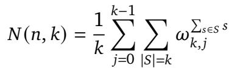

We isolate the principal term corresponding to ?? = 0, which evaluates trivially to 1?? ????. Let the remainder term be ????,??, defined as

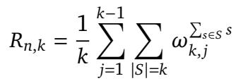

Thus, ?? (??, ??) = 1?? ???? + ????,??. Summing over all possible subset sizes ??, we obtain

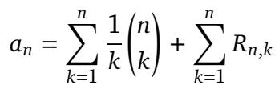

Using the well-known identity Í????=1 1?? ???? = Í????=1 2??−1?? , we separate this into two sums: ???? =Í????=1 2???? and the harmonic number ???? = Í????=1 1?? . This yields our fundamental decomposition

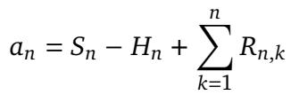

Next, we establish that the sum of the remainders Í????=1 ????,?? is asymptotically negligible. Consider the inner sum Í|??|=?? ??Í??∈?? ????, ?? . This sum is exactly the coefficient of ???? in the polynomial ????,??, ??(??) = Î????=1(1 + ????????, ??). By standard coefficient bounds, the magnitude of the ??-th coefficient of a polynomial is bounded by its maximum modulus on the unit circle |??| = 1:

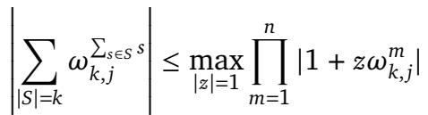

For a fixed ?? and ?? ∈ {1, . . . , ?? − 1}, the sequence of roots ??????, ?? is periodic with period ?? = ??gcd ??,??  ≥ 2. The product over a full period ?? can be evaluated algebraically: the roots of ?? ?? − 1 dictate that Î??+??−1??=?? (1 + ????????, ??) = 1 − (−??)??. For any ?? on the unit circle, the magnitude |1 − (−??)??| is strictly bounded by 2. When taking the product over all ?? terms, we group them into ⌊??/??⌋ full periods, leaving ?? mod ?? residual terms. For |??| = 1, each full period contributes at most a factor of 2, and by the triangle inequality |1 + ????????, ??| ≤ 2, each residual term also contributes at most a factor of 2. Therefore, the total product is bounded by

2⌊??/??⌋+(?? mod ??). Because ?? ≥ 2, we have ⌊??/??⌋ + (?? mod ??) ≤ ??2 + 1. Thus, for any ?? on the unit circle, we have

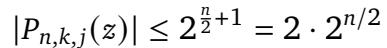

Consequently, the magnitude of the coefficient is bounded by 2 · 2??/2. Applying this to our remainder definition yields |????,?? | ≤ ??−1?? 2 · 2??/2 ≤ 2 · 2??/2. Summing over ?? ∈ {1, . . . , ??} gives the strict bound

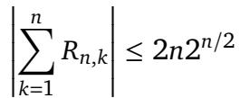

We must now evaluate the asymptotics of ???? = Í????=1 2???? . We propose the asymptotic approximation ????, defined as

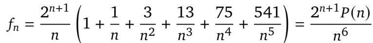

where ??(??) = ??5 + ??4 + 3??3 + 13??2 + 75?? + 541. To demonstrate that ???? is a highly accurate approximation of ????, we analyze the discrepancy in their consecutive differences. Let ???? be the discrete derivative error given by


By telescoping summation, ???? − ???? = ??1 − ??1 − Í????=2 ?? ??. To bound ?? ??, we expand ???? − ????−1 algebraically to obtain


Let ??(??) = 2??(??) (?? − 1)6 − ??(?? − 1)??6 − ??5(?? − 1)6. Expanding ??(??) leaves a polynomial of strictly degree 5:


In particular, it is easy to show that | ??( ??) | ≤ 100000 ??5 for ?? ≥ 2. Substituting this back into the error term yields


Summing these errors up to ??, the sum is dominated by its largest terms, giving Í????=2 |?? ??| = O  2????7 . Recall our decomposition ???? = ???? + (???? − ????) − ???? + Í????=1 ????,??. To prove the theorem, it suffices to show that the combined error terms are ??  2 ??+1  ??6 :

1. ?? ?? − ?? ?? = O  2 ???? 7  = ??  2 ??+1?? 6  .

2. ???? ∼ ln ?? = ??  2??+1 ??6

3. Í ????,?? ≤ 2??2??/2 = ??  2??+1 ??6

Since all residual terms are bounded by ??  2??+1??6 , we conclude that


This establishes the conjectured asymptotic expansion.

Theorem. (A conjecture of OEIS A228143, 2018) Let ???? = Í????=0 ???? 2 ??+???? 2 be the sequence A005259. Let ???? denote the determinant of the (?? + 1) × (?? + 1) Hankel-type matrix whose (??, ??)-entry is ????+ ?? for all ??, ?? = 0, . . . , ??. Let ??(??) = Í∞??=0 ???? ???? = 1 + 48?? + 161856??2 + . . . denote the ordinary generating function of ????. Then ??(??/3)1/8 has integer coefficients.

Proof. We proceed in three main stages: analyzing the matrix entries modulo 3, analyzing them modulo 4, and using the resulting divisibility properties of the determinant ???? to construct the required eighth root as a formal power series over the integers.

First, we determine the residues of ???? modulo 3. By writing ?? in base 3, Kummer’s Theorem dictates that the highest power of 3 dividing 2????  equals the number of carries when evaluating ?? + ?? in base 3. If ?? contains the digit 2, a carry occurs, so 2????  ≡ 0 (mod 3). Alternatively, if ?? consists only of the digits 0 and 1, there are no carries. Applying Lucas’s Theorem digit-by-digit to 2????  yields a product of terms 00 = 1 and 21 = 2 ≡ −1 (mod 3). Thus, 2????  ≡ (−1)?? (mod 3), where ?? is the number of 1s in the base-3 representation of ??. Since ?? shares the same parity as ??, we obtain 2????  ≡ (−1)?? (mod 3).

We can rewrite the squared product of binomial coefficients as:


When 2?? . 0 (mod 3), the base-3 digits of 2?? are strictly 0s and 2s. Applying Lucas’s Theorem to ??+??2?? , each digit of the evaluation takes the form ????0  = 1 or ????2  ∈ {0, 1}. Thus, ??+??2??  ≡ 0 or 1 (mod 3). Since values in {0, 1} are invariant under squaring,  ??+??2?? 2 ≡ ≡ ??+??2??  (mod 3). Furthermore, since 2?? ∈ {0, (−1)??} (mod 3), squaring it absorbs the parity: 2???? 2 ≡ (−1)?? 2????  (mod 3). Combining these pieces, we find that for all ?? and ??:


Summing this equivalence over ?? = 0, . . . , ?? yields ???? ≡ Í????=0 (−1)?? ????  ??+????  (mod 3). By a standard alternating binomial sum identity, Í????=0 (−1)?? ????  ??+????  = (−1)??. Consequently, ) (d:) ???? ≡ (−1)?? (mod 3).

Using this congruence, we apply row operations to the matrix ??(??) to establish that 3?? | ????. Let ???? be the lower-triangular matrix with ones on the main diagonal, ????,0 = −(−1)?? for ?? ≥ 1, and zeros elsewhere. The matrix product ??????(??) replaces each row ?? ≥ 1 with the ??-th row

minus (−1)?? times the 0-th row. Visually, the modified matrix takes the form:


The new (??, ??)-entry for ?? ≥ 1 is ???? ?? − (−1)???? ??. By our previous congruence, ???? ?? − (−1)???? ?? ≡ (−1)??+?? − (−1)?? (−1) ?? ≡ 0 (mod 3). Thus, every entry in rows 1 through ?? of the new matrix is divisible by 3. Factoring a 3 out of each of these ?? rows gives a factor of 3??. Because det(????) = 1, we conclude that 3?? | det(??(??)) = ????.

Second, we analyze ???? modulo 4. For any ?? ≥ 1, the product ????  ??+????  is always even, which implies its square is divisible by 4. Thus,  ????  ??+????  2 ≡ 0 (mod 4) for all ?? ≥ 1. The ?? = 0 term evaluates to 1, yielding ???? ≡ 1 (mod 4) for all ??.

We apply a similar matrix transformation to establish divisibility by 4??. Let ??′?? be the lower-triangular matrix with ones on the diagonal, ??′??,0 = −1 for ?? ≥ 1, and zeros elsewhere. The product ??′????(??) subtracts the 0-th row from every subsequent row ?? ≥ 1:


For ?? ≥ 1, the (??, ??)-entry becomes ???? ?? − ?? ??. Since ???? ≡ 1 (mod 4) for all ??, this difference evaluates to 1 − 1 ≡ 0 (mod 4). Factoring 4 out of the ?? modified rows shows that 4?? | det(?? (??)) = ????.

Now we combine these divisibility properties. We explicitly compute ??1 = 48. For ?? ≥ 1, we know 4?? | ????, and since 4?? ≥ 16 for ?? ≥ 2, it follows that 16 | ???? for all ?? ≥ 1 (as 16 | 48 for ?? = 1). Because 16 and 3?? are coprime, their respective divisibilities imply 16 · 3?? | ???? for all ?? ≥ 1.

We consider the scaled generating function ??(??/3) = Í∞??=0 ????3?? ????. Let ???? = ????/3?? denote the coefficients of this series. Since ??0 = 1, we have ??0 = 1. For ?? ≥ 1, our divisibility result yields 16 | ????. Therefore, we can write ??(??/3) = 1 + 16?? (??), where ?? (??) = Í∞??=1 ???????? is a formal power series with integer coefficients and zero constant term (?? (0) = 0).

Finally, we construct the eighth root ??(??) = ??(??/3)1/8 ∈ ℤ⟦??⟧. We seek a series of the form ??(??) = 1 + 2?? (??) where ?? (??) ∈ ℤ⟦??⟧ has no constant term. Expanding the eighth power yields


Factoring out 16 from the higher degree terms, we define the polynomial


Thus, (1 + 2?? (??))8 = 1 + 16(?? (??) + ??(?? (??))). To satisfy ??(??)8 = ??(??/3), we must solve the equation 1 + 16(?? (??) + ??(?? (??))) = 1 + 16?? (??), which simplifies to ?? (??) + ??(?? (??)) = ?? (??).

We determine the coefficients ???? of ?? (??) = Í∞??=1 ???????? inductively. We set ??0 = 0. For the inductive step, the coefficient of ????+1 in the equation is


Because every term in ??(??) has degree at least 2, and ?? (??) has no constant term, the ????+1 coefficient of ??(?? (??)) depends only on the terms ??1, . . . , ????. Therefore, we can uniquely solve for the integers ????+1 as


This well-defined recurrence provides an integer sequence (????)?? 1 giving a formal power series ?? (??) ∈ ℤ⟦??⟧ that satisfies ?? (??) + ??(?? (??)) = ?? (??). Substituting this back into our expansion yields (1 + 2?? (??))8 = 1 + 16?? (??) = ??(??/3). Setting ??(??) = 1 + 2?? (??), we have established the existence of the desired integer power series ??(??) = ??(??/3)1/8. □

These OEIS problems were added as conjectures in 2022 (https://oeis.org/A0512 93) and 2018 (https://oeis.org/A228143). Though neither problem has likely received much attention, the ability to provide a guarantee on the correctness of the statement that an expert conjectured serves value. For example, it appears that a good part of the work is done in identifying the asymptotic formula to be conjectured in OEIS A051293. In this case, ensuring the formula holds with a rigorous proof is a matter of validating intuition without carrying out potentially tedious proof steps, which our agent can handle. The Lean proofs for the two problems can be found at https://github.com/google-deepmind/alphap roof-nexus-results/blob/main/APNOutputs/OEIS.

## A variant of the Graph Reconstruction Conjecture

The Kelly-Ulam graph reconstruction program aims to recover a graph from its deck of one-vertex-deleted subgraphs [62, 36]. A standard bipartite version was formulated by Bondy and Hemminger as the problem of showing that bipartite graphs are reconstructible [10]. The following theorem proves a structured incidence-deletion analogue under strong type-distinguishability assumptions.

Terminology Let Ω = ?? ⊔ ?? be a finite vertex set with a partition into the disjoint parts ??, ?? ⊆ Ω. A graph ?? is bipartite with respect to (??, ??) if every edge of ?? has one endpoint in ?? and one endpoint in ??. We say ?? is 2-connected if ?? is connected and, for every vertex ??, the induced graph on Ω \ {??} is connected. For a graph ?? and a vertex ??, write ?? \inc ?? for the graph obtained from ?? by deleting all edges incident to ??, while leaving the vertex set unchanged. Thus


A bipartite isomorphism ?? ?? ??′ is a graph isomorphism whose underlying bijection preserves both parts ?? and ??. The bipartite deck is the multiset


where [·]?? denotes bipartite-isomorphism class. Let ???? (??) be the neighbor set of ?? in ??. The degree profile and type of ?? are


The type profile of ?? is the multiset of the types of its neighbors:


Finally, for a type ?? = (??, ??) ∈ ℕ × Multiset(ℕ) and ?? ∈ ℕ, define


where ?? \ {??} means deletion of one occurrence of ?? from the multiset ??. In the applications below, ???? is applied to neighbor-types, whose first coordinate is positive, so max(?? − 1, 0) = ?? − 1 there. We write #?? ?? for the multiplicity of ?? in a multiset ??.

Theorem (Weak bipartite graph reconstruction) Let ?? and ?? be finite simple graphs on the same finite vertex set Ω, both bipartite with respect to the same parts Ω = ?? ⊔ ?? and |Ω| ≥ 3. Assume that ?? is 2-connected and all vertex types of ?? are pairwise distinct, that is, ???? (??) ≠ ???? ( ??) if ?? ≠ ??. If D??(??) = D??(??), then ?? and ?? are bipartite-isomorphic.

Proof. Write ?? = |Ω| and ??(??) = |??(??)|. Since bipartite isomorphisms preserve edge counts, the deck determines the multiset


For every vertex ??,

$$
\tag{1}
$$

because ?? \inc ?? removes exactly the edges incident to ??. Also,

$$
\tag{2}
$$

because each edge of ?? remains in precisely the cards indexed by the ?? − 2 vertices not incident to that edge. Since ?? ≥ 3, equation (2) shows that the deck determines ??(??). Applying this to the equal decks of ?? and ?? gives

$$
\tag{3}
$$

and then equation (1) shows that the degree multisets of ?? and ?? are equal.

Equality of the two decks also gives a bijection ?? : Ω → Ω such that, for every ?? ∈ Ω, there is a bipartite isomorphism

$$
\tag{4}
$$

For this matched pair of cards, edge counts are equal. Combining this with (1) and (3) yields

$$
\tag{5}
$$

for every ??.

Next, ?? has minimum degree at least 2. Indeed, if a vertex had degree 0, then ?? would not be connected; if a vertex ?? had the unique neighbor ??, then the induced graph on Ω \ {??} would contain the isolated vertex ??, contradicting 2-connectivity. Since the degree multisets of ?? and ?? are equal, ?? also has minimum degree at least 2.

Therefore, in any graph ?? with minimum degree at least 2, the card ?? \inc ?? has a unique isolated vertex, namely ??. Indeed, the vertex ?? is isolated because all its incident edges have been removed. On the other hand, if ?? ≠ ??, then ?? has at least two neighbors in ??, at most one of which is ??; hence ?? has a neighbor ?? ≠ ??, and the edge ?? ?? remains in ?? \inc ??.

Applying this uniqueness to (4), the isomorphism ???? sends the unique isolated vertex of ?? \inc ?? to the unique isolated vertex of ?? \inc ?? (??). Hence

$$
\tag{6}
$$

Since ???? preserves ?? and ??, (6) implies that ?? preserves the two parts:

$$
\tag{7}
$$

We now prove that ?? preserves vertex types. It remains, in view of (5), to compare degree profiles. For a graph ?? and vertex ??, put


and


Counting vertices of degree ?? before and after deleting the incidence set of ?? gives, for every ?? ≥ 0,

$$
\tag{8}
$$

Indeed, in ?? \inc ??, every non-neighbor of ?? keeps its degree, while every neighbor of ?? has its degree lowered by 1. Hence the vertices of degree ?? in ?? \inc ?? are precisely the old non-neighbors of degree ??, the old neighbors of degree ?? + 1, and additionally ?? itself if ?? = 0. Therefore


Since the global degree multisets are equal, ???? (??) = ???? (??). Since ???? is an isomorphism between the matched cards, ????,?? (??) = ????, ?? ?? (??). By (5), the final indicator in (8) is also the same for ?? and ??. Finally, ????,?? (0) = 0, because a neighbor always has positive degree. Induction on ?? in (8) gives


Thus


and together with (5) this proves

$$
\tag{9}
$$

for every ?? ∈ Ω. We next prove equality of type profiles:

$$
\tag{10}
$$

for every ??. Fix ??. If ?? ∈ ??, take ?? = ??, otherwise take ?? = ?? (thus ?? is the opposite side from ??). By (7) and (9), the multisets of global types on ?? agree:

$$
\tag{11}
$$

The card isomorphism ???? also preserves ??, and therefore the multisets of local types on ?? agree:

$$
\tag{12}
$$

For ?? ∈ ??, bipartiteness gives the local-type formula

$$
\tag{13}
$$

Indeed, if ?? is adjacent to ??, then deleting the incidence set of ?? removes the edge ????, lowering deg?? (??) by one and deleting one occurrence of deg?? (??) from the degree profile of ??. If ?? is not adjacent to ??, then any neighbor of ?? lies on the same side of the bipartition as ??, and therefore cannot be adjacent to ??; hence the type of ?? is unchanged. The same formula holds for ?? and ?? (??).

Taking the number of occurrences of an arbitrary type ?? in (13) gives

$$
\tag{14}
$$

There is an identical identity for ??. The first terms on the two sides of (14) agree by (12), and the global-type terms agree by (11). Also deg?? (??) = deg?? ( ?? (??)) by (5). Hence equality of the type-profile counts can be proved by descending induction on the first coordinate of ??. The base case is that no type in a type profile can have first coordinate at least ??, since every vertex degree is < ??. For the induction step, the only types ?? with ??deg?? (??) (??) = ?? have first coordinate ??1 + 1; moreover every ?? occurring in a type profile has positive first coordinate. Thus the rightmost term in (14) is already equal for ?? and ?? by the induction hypothesis, and subtracting the two versions of (14) yields equality of the number of occurrences of ?? in ???? (??) and in ???? ( ?? (??)). This proves (10).

The distinctness of types transfers from ?? to ??: if ???? (??) = ???? ( ??), then by applying (9) to ?? −1(??) and ?? −1( ??) we obtain equality of the corresponding ??-types, so ?? = ??.

Since types are pairwise distinct, adjacency is determined by type profiles: for every graph ?? among ??, ?? and every pair of vertices ??, ??,

$$
\tag{15}
$$

The forward implication is the definition of ???? (??). Conversely, if ???? (??) occurs in ???? (??), then some neighbor ?? of ?? has ???? (??) = ???? (??), and distinctness of types gives ?? = ??.

Finally, for any ??, ?? ∈ Ω, equations (9), (10), and (15) give

?? has edge ???? ⇐⇒ ???? (??) ∈ ???? (??) ⇐⇒ ???? ( ?? (??)) ∈ ???? ( ?? (??)) ⇐⇒ ?? has edge ?? (??) ?? (??).

Thus ?? is a graph isomorphism ??  ??. By (7), it preserves the two bipartition parts, so it is a bipartite isomorphism. □

The Lean proof discovered for this problem is at https://github.com/google-dee pmind/alphaproof-nexus-results/blob/main/APNOutputs/AICollaborator/G raphs/bipartite\_graph\_reconstruction\_conjecture\_2.lean.

## Log-Concavity of Hilbert Sequences

Pure ??-sequences, introduced in the context of Stanley’s work on Hilbert functions of monomial level algebras in the late 1970s, have been studied intensively over the last fifteen years [57]. They exhibit surprisingly strong positivity phenomena, especially in small codimension and type. Although pure ??-sequences are not log-concave in general, the case of codimension 3 and type 2 remained open for over a decade [9, 68]. The following theorem establishes log-concavity in precisely this remaining case.

Theorem. Every pure ??-sequence of codimension 3 and type 2 is log-concave.

Terminology. A monomial ????(0)0 ????(1)1 ????(2)2 in three variables is identified with its exponent X1 vector ?? = (??(0), ??(1), ??(2)) ∈ ℕ3. We write ??′ ≤ ?? for coordinate-wise inequality and |??| = ??(0) + ??(1) + ??(2) for total degree. A finite order ideal Γ ⊂ ℕ3 is a finite set closed downward under this order: if ?? ∈ Γ and ?? ≤ ??, then ?? ∈ Γ.

A monomial ?? ∈ Γ is maximal if every ?? ∈ Γ with ?? ≤ ?? also satisfies ?? ≤ ??. The ideal is pure if all maximal monomials have the same total degree; this common degree is the socle degree. The type is the number of maximal monomials. The pure ??-sequence of Γ is


For a monomial ??, we simply write ℎ?? (??) = #{?? ≤ ?? : |??| = ??}. The ??-sequence is log-concave if


where ?? is the socle degree of Γ. We write 1?? for the indicator of the condition ??.

Proof. Let Γ be a pure order ideal in three variables and suppose that its two maximal monomials are ??1 ≠ ??2. Since Γ is pure, |??1| = |??2| = ??. Every element of a finite order ideal lies below a maximal element, so


After possibly interchanging ??1 and ??2, there is a coordinate ?? ∈ {0, 1, 2} such that

$$
\tag{1}
$$

Indeed, the three integers ??1(??) − ??2(??) sum to zero and are not all zero, hence one sign occurs in a minority position; if necessary we swap the two monomials so that the minority sign is negative.

Let ?? = ??1(??) + 1, and define


Then |??red| = ?? − ??. For ?? ≤ ??2, condition (1) implies


If ?? ≥ ??, the map ?? ↦→ ?? − ?????? bijects {?? ≤ ??2 : |??| = ??, ??(??) ≥ ??} with {?? ≤ ??red : |??| = ?? − ??}. If ?? < ??, the first set is empty. Hence the ?? sequence of Γ can be written as

$$
\tag{2}
$$

We need to prove that ??(?? − 1)??(?? + 1) ≤ ??(??)2 holds for 0 < ?? < ??.

For an integer-valued sequence ?? : ℕ → ℤ, define the first and scond difference sequences as


We first prove an elementary divisor-count formula for a single monomial. Let ?? = (??, ??, ??) be a monomial. For ??, ?? ∈ ℕ, set


Thus ????,?? (??) counts the number of pairs (??, ??) with 0 ≤ ?? < ??, 0 ≤ ?? < ??, and ?? + ?? = ??. A direct box count gives


With the convention Δ??(0) = ??(0), the first-difference identities are


and hence


Taking one more difference gives, for every ?? > 0,

$$
\tag{3}
$$

In particular, Δ2ℎ?? (??) ≤ 1. The same bound holds for the shifted sequence ?? ↦−→ 1??≥??ℎ??red (??−??), because below the shift its second difference is zero, and from the shift onward it is the second difference of the principal sequence of ??red. Therefore Δ2??(??) ≤ 2.

Formula (3) also implies the following useful dichotomy. If ?? > 0 and Δ2ℎ??(??) = 1, then either

$$
\tag{L}
$$

or

$$
\tag{U}
$$

We refer to these as the lower and upper alternatives. For ?? = 0, the lower alternative is automatic.

We shall also use the following elementary consequences of the same box count.

1. If ??  ?? ?? for all ??, then

$$
\tag{5}
$$

2. If ?? ≥ ??(??) + ??( ??) for every pair {??, ??}, and ?? ≤ |??| + 2, then,

$$
\tag{6}
$$

3. If ?? ≥ ??(??) + ??( ??) + 1 for every pair {??, ??}, and ?? ≤ |??| + 2, then

$$
\tag{7}
$$

4. For all ??,

$$
\tag{8}
$$

5. If 2?? ≥ |??| + 1, then

$$
\tag{9}
$$

Now fix 0 < ?? < ?? = |??1| = |??2|. Using ??(??) = ??(?? − 1) + Δ??(??) and Δ??(?? + 1) = Δ??(??) + Δ2??(?? + 1) gives

$$
\tag{10}
$$

Since ??(?? − 1) ≥ 0 and Δ2??(?? + 1) ≤ 2, it is enough to prove the following two statements:

$$
\tag{11}
$$

and

$$
\tag{12}
$$

Indeed, if Δ2?? (?? + 1) ≤ 0, equation (10) is immediate; if it is 1 or 2, then (11) or (12) applies.

Write ?? (??) = ℎ?? (??) and ??(??) = 1?? ??ℎ?? (?? − ??), so that ?? = ?? + ??. Since Δ2 ?? ≤ 1 and Δ2?? ≤ 1, if Δ2 ?? (?? + 1) = 1, then either

$$
\tag{A}
$$

or

$$
\tag{B}
$$

If Δ2 ?? (?? + 1) = 2, then

$$
\tag{C}
$$

Case A1: (A)+(L) for ?? . Suppose equation (A) holds and the lower alternative (L) holds for ?? with ?? = ?? + 1. Then in particular ?? + 1 ≤ ??1(??) < ??, thus ??(?? − 1) = ??(??) = 0, hence Δ??(??) = 0 and therefore


By (5), 2 ?? (?? − 1) = ?? (?? + 1) and Δ ?? (??) = ?? + 1. Therefore


This proves (11) in this case.

Case A2: (A)+(U) for ?? . Assume equation (A) holds and the upper alternative (U) holds for ?? with ?? = ?? + 1. Let us introduce the shorthand notation ?? = ?? − ??. Then (U) gives ?? ≥ −1. Applying (6) and (7) gives

$$
\tag{13}
$$

The shifted summand satisfies

$$
\tag{14}
$$

Indeed, the two inequalities for ??(?? − 1) and ??(??) follow from the universal upper bound (8), applied to the shifted sequence. For the sign of Δ??(??), if ?? < ??, then Δ??(??) = 0. If ?? ≥ ??, then the upper alternative for ?? implies


where {??, ??, ??} = {0, 1, 2}. Adding these inequalities gives


Since ?? = ??1(??) + 1 and |??red| = ?? − ??, this is equivalent to 2(?? − ??) ≥ |??red| + 1. Thus the midpoint monotonicity (9) applies to the shifted ??red-sequence and gives Δ??(??) ≤ 0.

To prove (11), by (13) it remains to show


By (13) and (14), this follows from

$$
\tag{15}
$$

Since ??(??) = ??(?? − 1) + Δ??(??), the third inequality in (14) gives


Therefore the difference between the right-hand side and the left-hand side of (15) is at least


This is nonnegative because Δ??(??) ≤ 0, ?? ≥ −1, and hence


Thus (11) holds in this case, and we completed the (A) case.

For the two cases when (B) holds, that is Δ2??(?? + 1) = 1, we use the following shift reduction. If


then

$$
\tag{16}
$$

Indeed, Δ??(??) = Δ??(?? + 1) − 1 and ??(?? − 1) = ??(?? + 1) − Δ??(?? + 1) − Δ??(??). Therefore


Case B1: (B)+(L) for ??. Assume equation (B) holds and the lower alternative (L) holds for ?? with ?? = ?? + 1. Let ?? = ?? + 1. Since Δ2??(??) = 1, necessarily ?? ≥ ??, and Δ2ℎ??red (?? − ??) = 1. In the lower subcase ?? − ?? ≤ ??red(??) for every ??. Then ?? − ?? + 1 ≥ 1, and the lower formula (5) gives

$$
\tag{17}
$$

We next prove two bounds for ?? at ??:

$$
\tag{18}
$$

First, since Δ2 ?? ( ??) = 0, the explicit formula (3), together with the lower inequalities for ??red, implies

$$
\tag{19}
$$

Indeed, the two pair inequalities involving ?? follow directly from ?? − ?? ≤ ??red( ??) ≤ ??1( ??) for ?? ≠ ??. The remaining pair inequality follows from (3): if it failed, then the corresponding two single indicators would be zero; since ?? ≥ ?? = ??1(??) + 1, the ??-single indicator is also zero, and the right-hand side of (3) would be negative, contradicting Δ2 ?? (??) = 0.

Thus, in (3) for ?? at ??, all three pair indicators and the triple indicator are equal to 1. Since Δ2 ?? (??) = 0, exactly two of the three single indicators are equal to 1. Moreover the ??-single indicator is zero, because ?? ≥ ??1(??) + 1. Hence the two remaining single indicators are equal to 1.

It follows that for every 1 ≤ ?? ≤ ??, the same two single indicators are still equal to 1, while the three pair indicators and the triple indicator are also equal to 1. Therefore


Thus the first differences Δ ?? (??) are nondecreasing on {0, 1, . . . , ??}. Since


we get


This proves the first inequality in (18).

For the second inequality in (18), relabel the two coordinates different from ?? as ??, ??, and write


and recall ?? = ??1 ?? 1. Using the box-count formula with ?? as the third coordinate, the first-difference formula gives


because ?? ≥ ??. From the preceding paragraph, ?? < ?? and ?? < ??, hence


Therefore


proving (18). Using (17) and (18), we have


Also, by (17),


Thus it is enough to show


Since ?? + 1 = (?? − ?? + 1) + ??, the difference between the right-hand side and the left-hand side is


This is nonnegative because Δ ?? (??) ≥ ?? and ?? − ?? + 1 ≥ 1. Therefore ??(??) ≤ (Δ??(??))2. By the shift reduction (16), this proves (11).

Case B2: (B)+(U) for ??. Again let ?? = ?? + 1 and put ?? = ?? − ??. The upper alternative for ℎ??red at ?? − ?? gives ?? ≥ −2. Since |??red| = ?? − ??, formulas (6) and (7) give

$$
\tag{20}
$$

For the first summand, the universal upper bound (8) gives

$$
\tag{21}
$$

It remains to justify the sign of Δ ?? (??). Since ?? is in the upper alternative at ??, we have


Adding these three inequalities gives


Hence


because |??red| ≥ 0. Therefore


By midpoint monotonicity (9), applied to ?? = ℎ??1, we get Δ ?? (??) ≤ 0. Using (20), (21), we get


Since ?? ≥ −2 and Δ ?? (??) ≤ 0, we have


giving the desired ?? (??) ≤ (Δ?? (??))2. By the shift reduction (16), this proves (11).

Case C: (C) holds. So here Δ2??(?? + 1) = 2 and hence Δ2 ?? (?? + 1) = Δ2??(?? + 1) = 1. Since Δ2?? ??  1 = 1, necessarily ??  1  ??. Therefore the lower alternative (L) for ?? is impossible, because it would imply ?? + 1 ≤ ??1(??) < ??. Hence ?? is in its upper alternative, that is, (U) holds for ?? . The lower alternative (L) for ?? is also impossible. Indeed, if ?? + 1 − ?? ≤ ??red(??) for every ??, then, choosing any ?? ≠ ??, we get


But the upper alternative for ?? gives ?? + 1 ≥ ??1(??) + ??1( ??) + 2, a contradiction. Thus ?? is also in its upper alternative, and (U) holds for ??. Put ?? = ?? − ?? again. Since |??red| = ?? − ??, we also have |??red| − (?? − ??) = ?? − ?? = ??. The upper formulas (6) and (7), applied to ?? and to the shifted summand ??, give


and


Therefore


Since the upper alternative for ?? gives ?? ≥ −1, we have


which proves (12). This completes the proof of (11) and (12), and hence by (10) ??(?? − 1) ?? (?? + 1) ≤ ?? (??)2. Since 0 < ?? < ?? was arbitrary and ?? is the pure ??-sequence of Γ by (2), the theorem follows. □

The Lean proof for the problem can be found at https://github.com/google-dee pmind/alphaproof-nexus-results/tree/main/APNOutputs/AICollaborator/A lgebraicGeometry.

## A Convergence Proof of Modified Anchored Gradient Descent-Ascent

A natural-language version of the convergence proof we discovered can be found in Surina et al. [58]. The Lean proof is at https://github.com/google-deepmind/alphaproof-n exus-results/blob/main/APNOutputs/Optimization/LastIterateConvergence. lean.

## Written on the Wall, Conjecture 2

For a graph ??, let ?? (??) be the set of vertices and ??(??) the set of edges. For ?? ∈ ?? (??), write ??(??) for the degree of ??, and let ?? (??) be the set of vertices adjacent to ?? in ??. Let ??(??) be the local independence number of ??: the size of the largest independent set in ??[?? (??)]. Let ℓ(??) := 1?? Í?? ??(??) be the average of the local independence numbers, and let ???? (??) be the maximum number of leaves in a spanning tree of ??, or 0 if ?? is not connected.

Theorem. If ?? is a simple connected graph on ?? vertices, then


Proof. Let ?? := ?? (??). For every vertex ?? ∈ ??, fix a maximum independent set ??(??) in ??[?? (??)].   
Then ??(??) = |??(??)|.

Now take two copies of ??, and add edges ???? from ?? ∈ ?? on the left to ?? ∈ ??(??) on the right. This forms a bipartite graph, where vertices on the left side have degree ??(??). The key idea is to look at the degrees of the vertices on the right side, and formulate the entire proof in terms of them. Formally, put ??(??) := |?? ∈ ?? (??) : ?? ∈ ??(??)| as the degree of a vertex ?? on the right side.

Note that ??(??) ≤ ?? (??), for all ?? ∈ ??. Because Í?? ??(??) = Í?? ??(??), it is enough to show that Í?? ??(??) ≤ ??(???? (??)/2 + 1). To simplify the notation, we set ?? := ???? (??)/2 + 1, and so the goal is to show Í?? ??(??) ≤ ????.

Lemma 1. For every edge ???? ∈ ??(??) we have ??(??) + ??(??) ≤ |?? (??) ∪ ?? (??)|.

Proof of Lemma 1. For every vertex ?? ∈ ??(??) ∪ ??(??), at most one of ?? and ?? can be part of ??(??), otherwise the edge ???? would contradict the fact that ??(??) is independent. On the other hand, if ?? ∈ ?? is such that ?? or ?? is in ??(??), then ?? must be part of ?? (??) ∪ ?? (??). Then ??(??) + ??(??) is at most the size of ?? (??) ∪ ?? (??). □

Lemma 2. For every edge ???? ∈ ??(??) we have |?? (??) ∪ ?? (??)| ≤ ???? (??) + 2.

Proof of Lemma 2. We construct a spanning tree in ?? with at least |?? (??) ∪ ?? (??)| − 2 leaves.

Start with the edge ???? and add all the vertices in ?? (??) ∪ ?? (??) \ {??, ??} as pendant vertices of degree 1. There are ?? ?? ?? ?? 2 leaves in this tree ??′. Because ?? is connected, we can expand ??′ to a spanning tree ?? of ?? by adding edges until no more can be added. Then from every leaf in ??′ there is a path to a leaf in ?? that doesn’t cross ????. All these leaves must be distinct, since they are contained in distinct subtrees of ??. Then ?? has at least |?? (??) ∪ ?? (??)| −2 leaves. □

Lemmas 1 and 2 show that for every edge ???? ∈ ??(??),


Next, we observe that Í?? ??(??) ≤ ???? trivially holds if every ??(??) ≤ ??. So assume this is not the case. Then we can split the vertices into "heavy" vertices with ??(??) > ??, and "light" vertices with ??(??) ≤ ??. Let ?? be the set of heavy vertices.

?? must be an independent set, since the above equation shows that for any edge ????, at most one of ?? or ?? can be heavy. Less obvious is that light vertices cannot have many neighbors in ??.

Lemma 3. If ?? is a light vertex, then |?? (??) ∩ ??| < ??.

Proof of Lemma 3. Let ?? ∈ ?? (??) ∩ ??. Since ?? is independent, all neighbours of ?? are outside ?? (??) ∩ ??. So |?? (??) ∪ ?? (??)| ≥ |?? (??) ∩ ??| + |?? (??)|. Using Lemma 2 we get


As ??(??) ≥ ??(??) > ??, we obtain |?? (??) ∩ ??| < ???? (??) + 2 − ?? = ??. □

Then the theorem follows from the following more general statement: Claim. Let ?? : ?? → ℝ and ?? ≥ 0 satisfy:

1. ??(??) ≤ ?? (??) for all ??,

2. ??(??) + ??(??) ≤ 2?? for every edge ????,

3. ?? := {?? : ??(??) > ??} is an independent set,

4. |?? (??) ∩ ??| < ?? for every ?? ∉ ??.

Then Í?? ??(??) ≤ ????.

Proof of Claim. We assume ?? is non-empty, otherwise the claim is trivially true. The proof uses a discharging argument: it sends the excess ??(??) − ?? from a heavy vertex ?? ∈ ?? to its neighbors. The redistribution keeps the total sum Í?? ??(??) constant. However, the amount sent to a light vertex ?? is less than the slack ?? − ??(??), so the overall sum can’t exceed ????. Precisely, define a weight function that transfers excess from heavy to light vertices:


Because ?? is independent, the weight flows only from heavy to light vertices. We now show two statements.

Each heavy vertex sends out enough weight. If ?? ∈ ?? and ???? is an edge, then ??(??)+??(??) ≤ 2?? by condition 2. So ?? − ??(??) ≥ ??(??) − ??. Then


Each light vertex absorbs at most its slack. Let ?? ∉ ??. Then ?? receives weight from vertices in ?? := ?? (??) ∩ ??.

Let ?? ∈ ??. From conditions (1) and (4), we have |??| < ?? < ??(??) ≤ ??(??). Then the total weight received is


These two statements together show that


Re-arranging the terms gives Í?? ??(??) < ???? as desired.

The discovered lean proof for this is available at https://github.com/google-dee pmind/alphaproof-nexus-results/blob/main/APNOutputs/OEIS/GraphConjec ture2.lean.