This is the author’s version of the work accepted in Nature.   
Nature doi: 10.1038/s41586-023-06924-6.

# Mathematical discoveries from program search with large language models

Bernardino Romera-Paredes1∗ Mohammadamin Barekatain1∗ Alexander Novikov1∗ Matej Balog1∗ M. Pawan Kumar1∗ Emilien Dupont1∗ Francisco J. R. Ruiz1∗ Jordan S. Ellenberg2 Pengming Wang1 Omar Fawzi3 Pushmeet Kohli1 Alhussein Fawzi1∗

1Google DeepMind, London, UK 2University of Wisconsin-Madison, Madison, Wisconsin, USA 3Universit´e de Lyon (Inria, ENS Lyon, UCBL, LIP), Lyon, France

## Abstract

Large Language Models (LLMs) have demonstrated tremendous capabilities in solving complex tasks, from quantitative reasoning to understanding natural language. However, LLMs sometimes suffer from confabulations (or hallucinations) which can result in them making plausible but incorrect statements (Bang et al., 2023; Borji, 2023). This hinders the use of current large models in scientific discovery. Here we introduce FunSearch (short for searching in the function space), an evolutionary procedure based on pairing a pre-trained LLM with a systematic evaluator. We demonstrate the effectiveness of this approach to surpass the best known results in important problems, pushing the boundary of existing LLM-based approaches (Lehman et al., 2022). Applying FunSearch to a central problem in extremal combinatorics — the cap set problem — we discover new constructions of large cap sets going beyond the best known ones, both in finite dimensional and asymptotic cases. This represents the first discoveries made for established open problems using LLMs. We showcase the generality of FunSearch by applying it to an algorithmic problem, online bin packing, finding new heuristics that improve upon widely used baselines. In contrast to most computer search approaches, FunSearch searches for programs that describe how to solve a problem, rather than what the solution is. Beyond being an effective and scalable strategy, discovered programs tend to be more interpretable than raw solutions, enabling feedback loops between domain experts and FunSearch, and the deployment of such programs in real-world applications.

Many problems in mathematical sciences are “easy to evaluate,” despite being typically “hard to solve.” For example, in computer science, NP-complete optimization problems admit a polynomialtime evaluation procedure (measuring the quality of the solution), despite the widespread belief that no polynomial-time algorithms to solve such problems exist. We focus in this paper on problems admitting an efficient evaluate function, which measures the quality of a candidate solution. Prominent examples include the maximum independent set problem and maximum constraint satisfaction problems (such as finding the ground state energy of a Hamiltonian). Our goal is to generate a solve program, such that its outputs receive high scores from evaluate (when executed on inputs of interest), and ultimately improve over the best known solutions.

While Large Language Models (LLMs) have recently seen dramatic improvements in their coding capabilities [5–9], with applications including debugging [10, 11], solving code competitions [12, 13] and improving code performance [14], synthesizing solve programs for open problems requires finding new ideas that are verifiably correct. This is very hard for LLMs, as they tend to confabulate or ultimately fall short of going beyond existing results. To surpass the “nominal” capabilities of LLMs, recent works [3] have combined them with evolutionary algorithms [15, 16], leading to important improvements on diverse synthetic problems [17], searching for neural network architectures [18–20], and solving puzzles [21]. Our proposed method, FunSearch, pushes the boundary of LLM-guided evolutionary procedures to a new level: the discovery of new scientific results for established open problems, and the discovery of new algorithms. Surpassing state-of-the-art results on established open problems provides a clear indication that the discoveries are truly new, as opposed to being retrieved from the LLM’s training data.

FunSearch (short for searching in the function space) combines a pre-trained (frozen) Large Language Model, whose goal is to provide creative solutions, with an evaluator, which guards against confabulations and incorrect ideas. FunSearch iterates over these two components, evolving initial low-scoring programs into high-scoring ones discovering new knowledge. Key to the success of this simple procedure is a combination of multiple essential ingredients. First, we sample best performing programs and feed them back into prompts for the LLM to improve on; we refer to this as best-shot prompting. Second, we start with a program in the form of a skeleton (containing boilerplate code and potentially prior structure about the problem), and only evolve the part governing the critical program logic. For example, by setting a greedy program skeleton, we evolve a priority function used to make decisions at every step. Third, we maintain a large pool of diverse programs by using an island-based evolutionary method that encourages exploration and avoids local optima. Finally, leveraging the highly parallel nature of FunSearch, we scale it asynchronously, considerably broadening the scope of this approach to find new results, while keeping the overall cost of experiments low.

We show the surprising effectiveness of FunSearch on several use-cases. We consider a fundamental problem in extremal combinatorics, namely, the cap set problem [22, 23]. FunSearch demonstrates the existence of hitherto unknown constructions that go beyond existing ones, including the largest improvement in 20 years to the asymptotic lower bound. To the best of our knowledge, this shows the first scientific discovery — a new piece of verifiable knowledge about a notorious scientific problem — using an LLM. Using FunSearch, we also find new algorithms for the online bin packing problem that improve upon traditional ones on well-studied distributions of interest [24, 25], with potential applications to improving job scheduling algorithms.

While most computer search techniques output directly what the solution is (e.g., a list of vectors forming a cap set), FunSearch produces programs generating the solution. For structured problems, such programs tend to be more interpretable — facilitating interactions with domain experts — and concise — making it possible to scale to large instances — compared to a mere enumeration of the solution. In addition, decision procedures (such as for bin packing) described by code in a standard programming language are crucially easier to deploy compared to other types of descriptions (e.g., neural networks), which typically require specialized hardware and for which verifying design specifications is notoriously hard.

## 1 FunSearch

An overview of FunSearch is shown in Figure 1, and its components are described in more detail below. For more details and ablations showing the importance of each component, see Methods and

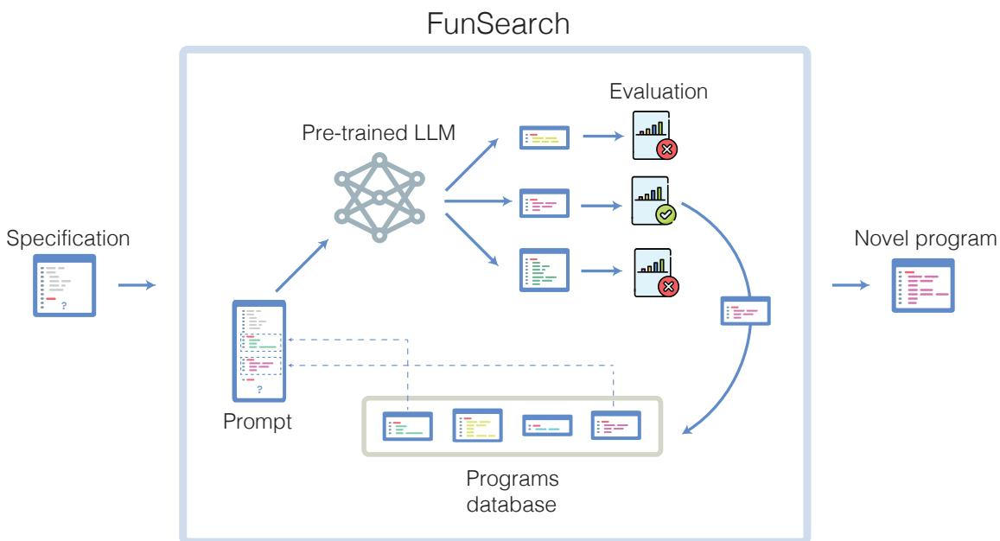  
Figure 1: Overview of FunSearch. The input to FunSearch is a specification of the problem in the form of an evaluate function, an initial implementation of the function to evolve, which can be trivial, and potentially a skeleton. At each iteration, FunSearch builds a prompt by combining several programs sampled from the programs database (favouring high-scoring ones). The prompt is then fed to the pre-trained LLM, and new programs are created. Newly created programs are then scored and stored in the programs database (if correct), thus closing the loop. The user can at any point retrieve the highest-scoring programs discovered so far.

## Appendix A in Supplementary Information.

Specification. The input to FunSearch is a specification of the problem in the form of an evaluate function, which scores candidate solutions. In addition, we provide an initial program (which can be trivial) to evolve. While in principle these are the minimum requirements, we found that performance tends to improve significantly if we write the initial solve program in the form of a skeleton (containing boilerplate code and prior knowledge of the problem in the form of a program structure), and only use FunSearch to evolve the critical part that governs its logic. Figure 2 (a) shows an example where the skeleton takes the form of a simple greedy algorithm, and the crucial part to evolve by FunSearch is the priority function that is used to make the greedy decision at every step. This delegates to FunSearch precisely the part that is usually the hardest to come up with. While a fixed skeleton may constrain the space of programs that can be discovered, we find it improves overall results because it focuses the LLM resources on evolving the critical part only, instead of also using the LLM to recreate already known program structures (with more opportunities for mistakes that would render the entire program incorrect). If available, the user can optionally provide additional known information about the problem at hand, in the form of docstrings, relevant primitive functions, or import packages, which FunSearch may use.

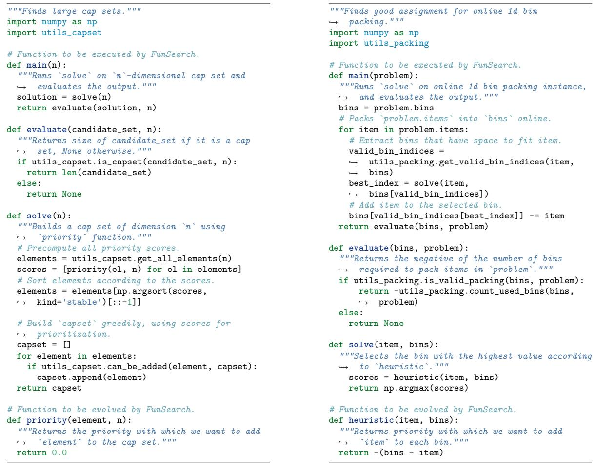  
(a) Cap set.  
(b) Online bin packing.  
Figure 2: Examples of FunSearch specifications for two problems. The evaluate function takes as input a candidate solution to the problem, and returns a score assessing it. The solve function contains the algorithm skeleton, which calls the function to evolve that contains the crucial logic. For (a), the function to evolve is called priority, and for (b) it is called heuristic. The main function implements the evaluation procedure by connecting the pieces together. Specifically, it uses the solve function to solve the problem, and then scores the resulting solutions using evaluate. In simplest cases, main just executes solve once and uses evaluate to score the output, e.g., see (a). In specific settings such as online algorithms, the main function implements some additional logic, e.g., see (b).

Pre-trained LLM. The LLM is the creative core of FunSearch, in charge of coming up with improvements to the functions presented in the prompt and sending these for evaluation. Perhaps surprisingly, we obtain our results with a pre-trained model, i.e., without any fine-tuning on our problems. We use Codey, an LLM built on top of the PaLM2 model family [26], which has been finetuned on a large corpus of code and is publicly accessible through its API [27]. Because FunSearch relies on sampling from an LLM extensively, an important performance-defining tradeoff is between the quality of the samples and the inference speed of the LLM. In practice, we have chosen to work with a fast-inference model (rather than slower-inference, higher-quality), and the results in the paper are obtained using a total number of samples on the order of 106. Beyond this tradeoff, we have empirically observed that the results obtained in this paper are not too sensitive to the exact choice of LLM, as long as it has been trained on a large enough corpus of code. See Appendix A in Supplementary Information for a comparison to StarCoder [7], a state-of-the-art open-source LLM for code.

Evaluation. Programs generated by the LLM are evaluated and scored on a set of inputs. For example, in the cap set problem (Section 2.1) the inputs are the values of the dimensionality n that we are interested in, and in combinatorial optimization (Section 2.2), the inputs correspond to different bin packing instances. The scores across different inputs are then combined into an overall score of the program using an aggregation function, such as the mean. The scored programs are then sent to the programs database. Programs that were incorrect (did not execute within the imposed time and memory limits, or produced invalid outputs) are discarded, and the remaining scored programs are then sent to the programs database.

Programs database. The programs database keeps a population of correct programs, which are then sampled to create prompts. Preserving and encouraging diversity of programs in the database is crucial to enable exploration and avoid being stuck in local optima. To encourage diversity we adopt an islands model, also known as multiple population and multiple-deme model [28, 29], a genetic algorithm approach. A number of islands, or subpopulations, are created and evolved independently. To sample from the program database, we first sample an island and then sample a program within that island, favoring higher-scoring and shorter programs (see Methods for the exact mechanism). Crucially, we let information flow between the islands by periodically discarding the programs in the worst half of the islands (corresponding to the ones whose best individuals have the lowest scores). We replace the programs in those islands with a new population, initialized by cloning one of the best individuals from the surviving islands.

Prompt. New prompts are created by “best-shot prompting” from the programs database, and are then fed to the LLM to generate a new program. We first sample k programs from a single island in the programs database, according to the procedure described above. Sampled programs are then sorted according to their score, and a version is assigned to each (v0 for the lowest scoring program, v1 for the second lowest scoring, etc.). These programs are then combined into a single prompt — with the version appended as a suffix to the function name; e.g., in the case of Figure 2 (a), this would be priority v0, priority v1, ... — and the header of the function we wish to generate (e.g., priority vk) is added to the end of the prompt. In practice, we set k = 2, as two functions lead to better results compared to just one, with diminishing returns beyond that. Constructing a prompt by combining several programs (as opposed to only one) enables the LLM to spot patterns across the different programs and generalize those. Related approaches to prompt building have been recently considered; e.g., [17], and were shown to perform well on different domains.

Distributed approach. We implement FunSearch as a distributed system that has three types of workers: a programs database, samplers, and evaluators, which communicate asynchronously. The programs database stores and serves programs, samplers generate new functions using the pre-trained LLM, while evaluators assess programs, as shown in Figure F.26 in Supplementary Information. In the example of Figure 2 (a), the programs database stores priority functions, samplers generate new implementations of priority, while evaluators score the proposals by executing the main function on user-specified inputs. Our distributed system offers several advantages: first, it naturally leverages parallelism across different tasks, e.g., LLM sampling and evaluation are performed concurrently. Second, it enables scaling to more than one sampler and evaluator, which would be a very limiting setup, considering that evaluation can take minutes for many problems of interest. Running evaluators in parallel considerably broadens the scope of this approach to such problems. The distributed setting enables running many evaluator nodes on inexpensive CPU hardware, while few samplers run on machines with accelerators for fast LLM inference; this keeps the overall cost and energy usage of experiments low. In our experiments, we typically use 15 samplers and 150 CPU evaluators (can be served on 5 CPU servers each running 32 evaluators in parallel). See Appendix A in Supplementary Information for more details. Also, due to the randomness of LLM sampling and of the evolutionary procedure, for some problems we run several experiments to get the best reported results. See Methods and Appendix A.3 in Supplementary Information for a full statistical analysis.

## 2 Results

We now describe some of the new discoveries made by FunSearch in two different fields: pure mathematics and applied computer science. Additional discoveries on other problems (namely, corners problem and Shannon capacity of cycle graphs) are presented in Appendix B in Supplementary Information. Full discovered programs are available in Appendix C in Supplementary Information.

## 2.1 Extremal combinatorics

We apply FunSearch to two related problems in extremal combinatorics — a branch of mathematics that studies the maximal (or minimal) possible sizes of sets satisfying certain properties.

Cap sets. The cap set problem [22], once described by Terence Tao as “perhaps my favourite open question” [30], refers to the task of finding the largest possible set of vectors in $\mathbb { Z } _ { 3 } ^ { n }$ (known as a cap set) such that no three vectors sum to zero. Geometrically, no three points of a cap set lie on a line (see Figure 3 for an example with $n = 2 )$ .

The problem has drawn much interest for a variety of reasons. For one, it is an analogue of the classical number theory problem of finding large subsets of primes in which no three are in arithmetic progression. For another, it differs from many problems in combinatorics in that there is no consensus among mathematicians regarding what the right answer should be. Finally, the problem serves as a model for the many other problems involving “three-way interactions.” For instance, progress towards improved upper bounds for the cap set problem [31, 32] immediately led to a series of other combinatorial results, e.g., on the Erd¨os-Radio sunflower problem [33].

The exact size of the largest possible cap set in n dimensions is known only for $n \leq 6 .$ . A brute force approach is not practical as the search space quickly becomes enormous with growing n, e.g., around $3 ^ { 1 6 0 0 }$ for $n = 8$ . Previous methods impose potentially suboptimal restrictions on the search space [34, 35]. In contrast, we search the full space via an algorithm skeleton that utilises a function priority : $\mathbb { Z } _ { 3 } ^ { n } \to \mathbb { R }$ . Intuitively, this function provides a priority with which each $x \in \mathbb { Z } _ { 3 } ^ { n }$ should be included in the cap set. Our algorithm starts with an empty set and iteratively adds the vector $x \in \mathbb { Z } _ { 3 } ^ { n }$ with the highest priority that does not violate the cap set constraint; see Figure 2 (a). Starting from a trivial constant function, we evolve the crucial priority component of our approach to result in large cap sets.

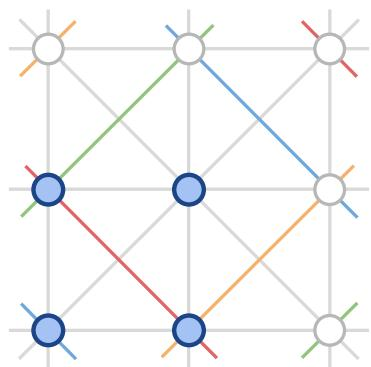  
Figure 3: Diagram of a cap set of size 4 in $\mathbb { Z } _ { 3 } ^ { 2 } .$ . The circles are the elements of $\mathbb { Z } _ { 3 } ^ { 2 }$ with the ones belonging to the cap set shown in blue. The possible lines in $\mathbb { Z } _ { 3 } ^ { 2 }$ are also shown (with colors indicating lines that wrap around in arithmetic modulo 3). No three elements of the cap set are in a line.

Using this approach we discovered cap sets of sizes shown in Figure 4 (a). Notably, in dimension $n = 8 .$ , FunSearch found a larger cap set than what was previously known, thus illustrating the power of FunSearch to discover novel constructions. This also shows the scalability of FunSearch to larger dimensions, where the previously best known construction relied on a complex combination of cap sets in lower dimensions [34, 35]. In contrast, FunSearch discovered a larger cap set from scratch, without having to be explicitly taught any way of combining cap sets. Moreover, we do not just discover the set of 512 8-dimensional vectors in itself, but a program that generates it: we show this program in Figure 4 (b). Through inspecting the code, we obtain a degree of understanding of what this set is: specifically, manual simplification of Figure 4 (b) provides the construction in Figure 4 (c). Some properties of this construction are strikingly similar to the construction of the Hill cap [36, 37], which results in the optimal 112-cap in $\mathbb { Z } _ { 3 } ^ { 6 }$

Admissible sets. Beyond finding the size of the largest cap set $c _ { n }$ in dimension $n ,$ a fundamental problem in additive combinatorics [23] is determining the capacity $C = \operatorname* { s u p } _ { n } c _ { n } ^ { 1 / n }$ . The breakthrough result of [32] established an upper bound of $C \leq 2 . 7 5 6$ . In this work, we are interested in lower bounds on C. To this end, we use the framework of constant weight admissible sets (or admissible sets for short) [35], which has established the current state-of-the-art.

Formally, admissible sets ${ \mathcal { A } } ( n , w )$ are collections of vectors in $\{ 0 , 1 , 2 \} ^ { n }$ satisfying two properties: i) each vector has the same number w of non-zero elements but a unique support (thereby implying $| { \cal { A } } | \le ( { n } _ { w } ) )$ ; ii) for any three distinct vectors there is a coordinate in which their three respective values are $\{ 0 , 1 , 2 \} , \{ 0 , 0 , 1 \}$ , or {0, 0, 2}. Informally, an admissible set describes how to combine cap sets in smaller dimensions into large cap sets in higher dimensions [35]. We denote the set of full-size admissible sets (with $| A | = { \binom { n } { w } } )$ as $\scriptstyle { \mathcal { T } } ( n , w )$ . The current state-of-the-art [39] has relied on SAT solvers to construct large admissible sets.

As before, we evolve a function priority $: \{ 0 , 1 , 2 \} ^ { n } \to \mathbb { R }$ , which is used to iteratively grow admissible sets. Starting from a trivial constant function, we discover one that provides us with an $\mathcal { T } ( 1 2 , 7 )$ admissible set; the discovered program is shown in Figure 5 (b). This discovery alone already improves the lower bound on the cap set capacity from 2.2180 [39] to 2.2184. Yet, interpreting the program found by FunSearch (Figure 5 b) helps us significantly push the boundaries of what admissible sets we can construct. Specifically, we notice that the discovered priority function treats the n coordinates in a highly symmetric way, and indeed it turns out that the admissible set it constructs is preserved under independent cyclic permutations of coordinates within four disjoint groups of coordinate triples. Hereinafter we call such admissible sets symmetric (see Appendix D in Supplementary Information for a formal definition).

<table><tr><td>n</td><td>3</td><td>4</td><td>5</td><td>6</td><td>7</td><td>8</td></tr><tr><td> Best known</td><td>9</td><td>20</td><td>45</td><td>112</td><td>236</td><td>496</td></tr><tr><td>FunSearch</td><td>9</td><td>20</td><td>45</td><td>112</td><td>236</td><td>512</td></tr></table>

(a)  
```python
def priority(el: tuple[int, ...], def build_512_cap() -> list[tuple[int, ...]]:
, n: int) -> float: """Returns a cap set of size 512 in `n=8` dimensions."""
score = n n = 8
in_el = 0 V = np.array(list(itertools.product(range(3), repeat=n)), dtype=np.int32)
el_count = el.count(0) support = lambda v: tuple(i for i in range(n) if v[i] != 0)
reflections = lambda v: sum(1 for i in range(1, n // 2) if v[i] == v[-i])
if el_count == 0:
score += n ** 2 # Add all 128 weight-8 vectors that have >= 2 reflections.
if el[1] == el[-1]: weight8_vectors = [v for v in V
score *= 1.5 if np.count_nonzero(v) == 8 # Weight is 8.
if el[2] == el[-2]: and reflections(v) >= 2] # At least 2 reflections.
score *= 1.5
if el[3] == el[-3]: # Add all 128 weight-4 vectors that have specific support.
score *= 1.5 supports_16 = [(0, 1, 2, 3), (0, 1, 2, 5), (0, 3, 6, 7), (0, 5, 6, 7),
else: (1, 3, 4, 6), (1, 4, 5, 6), (2, 3, 4, 7), (2, 4, 5, 7)]
if el[1] == el[-1]: weight4_vectors = [v for v in V
score *= 0.5 if support(v) in supports_16]
if el[2] == el[-2]:
score *= 0.5 # Add all 128 weight-4 vectors with specific support and 1 reflection.
supports_8 = [(0, 1, 2, 7), (0, 1, 2, 6), (0, 1, 3, 7), (0, 1, 6, 7),
for e in el: (0, 1, 5, 7), (0, 2, 3, 6), (0, 2, 6, 7), (0, 2, 5, 6),
if e == 0: (1, 2, 4, 7), (1, 2, 4, 6), (1, 3, 4, 7), (1, 4, 6, 7),
if in_el == 0: (1, 4, 5, 7), (2, 3, 4, 6), (2, 4, 6, 7), (2, 4, 5, 6)]
score *= n * 0.5 weight4_vectors_2 = [v for v in V
elif in_el == el_count - 1: if support(v) in supports_8
score *= 0.5 and reflections(v) == 1] # Exactly 1 reflection.
else:
score *= n * 0.5 ** in_el # Add 128 weight-5 vectors with <= 1 reflections and one more condition.
in_el += 1 allowed_zeros = [(0, 4, 7), (0, 2, 4), (0, 1, 4), (0, 4, 6),
else: (1, 2, 6), (2, 6, 7), (1, 2, 7), (1, 6, 7)]
score += 1 weight5_vectors = [
v for v in V
if el[1] == el[-1]: if tuple(i for i in range(n) if v[i] == 0) in allowed_zeros
score *= 1.5 and reflections(v) <= 1 # At most 1 reflection.
if el[2] == el[-2]: and (v[1] * v[7]) % 3 != 1 and (v[2] * v[6]) % 3 != 1]
score *= 1.5
return weight8_vectors + weight4_vectors + weight4_vectors_2 +
return score ,→ weight5_vectors
(b) (c)
```  
Figure 4: Result of applying FunSearch to the cap set problem. (a) Size of the largest cap set in Zn3 for different dimensions n. (b) The function priority : $\mathbb { Z } _ { 3 } ^ { n } \to \mathbb { R }$ discovered by FunSearch that results in a cap set of size 512 in n = 8 dimensions. One feature to note is that the priority is affected by whether the same entry appears in positions i and -i (-i denotes the i-th position counting from the end). This motivates the notion of reflections, used in (c). (c) An explicit construction of this new 512-cap, which we were able to manually construct thanks to having discovered the cap set by searching in function space. See Appendix E.2 in Supplementary Information for more details and for relation to Hill cap.

<table><tr><td>onCi</td><td>Bound Admissible set ingredient</td><td>Source</td></tr><tr><td>2.2101</td><td>I(90,89)</td><td>(Calderbank and Fishburn, 1994)</td></tr><tr><td>2.2173</td><td>I(10,5)</td><td>(Edel, 2004)</td></tr><tr><td>2.2180</td><td>I(11,7)</td><td>(Tyrrell, 2022)</td></tr><tr><td>2.2184</td><td>I(12,7)</td><td>FunSearch</td></tr><tr><td>2.2194</td><td>I(15,10)</td><td>FunSearch</td></tr><tr><td>2.2202</td><td>A(24,17)</td><td>FunSearch</td></tr></table>

(a)

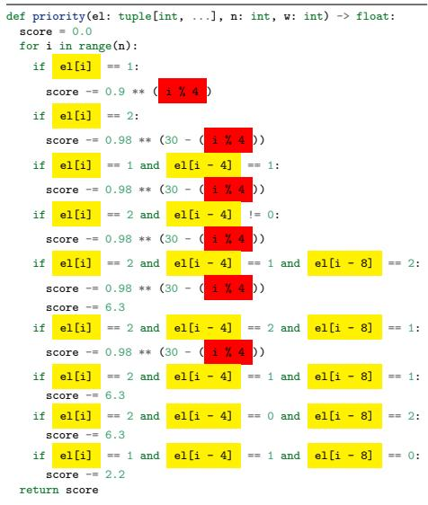  
(b)  
Figure 5: Results on the cap set problem via admissible sets. (a) Summary of lower bounds on the cap set capacity C. (b) The priority function $\{ 0 , 1 , 2 \} ^ { n } \to \mathbb { R }$ discovered by FunSearch that results in an I(12, 7) admissible set. The source code reveals that when n = 12, the function treats the four triples of coordinates {0, 4, 8}, {1, 5, 9}, {2, 6, 10}, and {3, 7, 11} together. We then checked that the admissible set is in fact symmetric under independent cyclic permutations of coordinates within each of these four triples. See Appendix D and Appendix E.3 in Supplementary Information for more details.

We now use FunSearch to directly search for symmetric admissible sets. Note that this is a more restricted but also much smaller search space, which allows for significantly higher dimensions and weights than were previously possible. This led us to discovering a full-size I(15, 10) admissible set (implying $C \geq 2 . 2 1 9 4 8 6 )$ and a partial admissible set in A(24, 17) of size 237 984, which implies a new lower bound on the cap set capacity of 2.2202 (see Figure 5 a). While this is the largest improvement to the lower bound in the last 20 years, we note it is still far from the upper bound, and we hope our results inspire future work on this problem.

Not only does FunSearch scale to much larger instances than traditional combinatorial solvers (see Appendix A.4 in Supplementary Information), it is a unique feature of searching in function space that we were able to inspect the code discovered by FunSearch and infer a new insight into the problem, in the form of a new symmetry. The procedure we followed in this section is a concrete example of how LLM-based approaches can be used in mathematical sciences: FunSearch suggests a solution, which is examined by researchers, who may note features of interest. These features are used to refine the search, leading to better solutions. This process can be iterated, with both human and search consistently in the loop.

## 2.2 Bin packing

Combinatorial optimization is a subfield of mathematics which plays an important role across a wide range of areas, from theoretical computer science to practical problems in logistics and scheduling.

<table><tr><td></td><td>OR1</td><td>OR2</td><td>OR3</td><td>OR4</td><td>Weibull 5k</td><td>Weibull 10k</td><td>Weibull 100k</td></tr><tr><td>First Fit</td><td>6.42%</td><td>6.45%</td><td> 5.74%</td><td> 5.23%</td><td>4.23%</td><td>4.20%</td><td>4.00%</td></tr><tr><td>Best Fit</td><td>5.81%</td><td>6.06%</td><td>5.37%</td><td>4.94%</td><td>3.98%</td><td>3.90%</td><td>3.79%</td></tr><tr><td> FunSearch</td><td> 5.30%</td><td>4.19%</td><td> 3.11%</td><td>2.47%</td><td>0.68%</td><td>0.32%</td><td>0.03%</td></tr></table>

Table 1: Fraction of excess bins (lower is better) for various bin packing heuristics on the OR and Weibull datasets. FunSearch outperforms first fit and best fit across problems and instance sizes.

While many combinatorial optimization problems are provably hard to solve for large instances, it is typically possible to achieve strong performance using heuristics to guide the search algorithm. The choice of a heuristic is crucial for obtaining strong performance, but designing a good heuristic is difficult in practice. In this section, we show that FunSearch can be used to discover effective heuristics for one of the central problems in combinatorial optimization: bin packing [4].

The goal of bin packing is to pack a set of items of various sizes into the smallest number of fixed-sized bins. Bin packing finds applications in many areas, from cutting materials to scheduling jobs on compute clusters. We focus on the online setting where we pack an item as soon as it is received (as opposed to the offline setting where we have access to all items in advance). Solving online bin packing problems then requires designing a heuristic for deciding which bin to assign an incoming item to.

Heuristics for online bin packing are well studied and several variants exist with strong worst case performance [40–45]. However, they often exhibit poor performance in practice [4]. Instead, the most commonly used heuristics for bin packing are first fit and best fit. First fit places the incoming item in the first bin with enough available space, while best fit places the item in the bin with least available space where the item still fits. Here, we show that FunSearch discovers better heuristics than first fit and best fit on simulated data.

To achieve this, we define a heuristic as a program that takes as input an item and an array of bins (containing the remaining capacity of each bin) and returns a priority score for each bin. The solve function picks the bin with the highest score according to the heuristic (see Figure 2 b). FunSearch is then used to evolve this heuristic, starting from best fit.

We first evaluate FunSearch on the well-known OR-Library bin packing benchmarks [24], consisting of four datasets, OR1 to OR4, containing bin packing instances with an increasing number of items (see Appendix E.4 in Supplementary Information for details). We evolve our heuristic on a training set of generated bin packing instances with the same number of items as those in OR1 and, after the evolutionary process is concluded, test it on the OR1 to OR4 datasets. We measure performance as the fraction of excess bins used over the L2 lower bound [46] of the optimal offline packing solution (which is generally not achievable in the online setting).

As can be seen in Table 1, FunSearch outperforms both first fit and best fit across all datasets. Further, the learned heuristic generalizes: even though it has only seen instances of the same size as OR1 during training, it generalizes across problem sizes, performing even better on large instances and widening the gap to best fit. In addition to the OR benchmarks, we also use FunSearch to evolve heuristics on bin packing instances sampled from a Weibull distribution, as these closely follow many real-world scheduling problems [25, 47] (see Appendix E.4 in Supplementary Information for details). As shown in Table 1, the performance of FunSearch is very strong on this dataset, significantly outperforming first fit and best fit across instances, as well as scaling gracefully to large instances (being only 0.03% off the lower bound on the optimum for 100 000 items). In addition, FunSearch is robust and consistently outperforms these baselines as shown in the statistical analysis in Appendix A.3 in Supplementary Information.

```python
def heuristic(item: float, bins: np.ndarray) -> np.ndarray:
"""Online bin packing heuristic discovered with FunSearch."""
score = 1000 * np.ones(bins.shape)
# Penalize bins with large capacities.
score -= bins * (bins - item)
# Extract index of bin with best fit.
index = np.argmin(bins)
# Scale score of best fit bin by item size.
score[index] *= item
# Penalize best fit bin if fit is not tight.
score[index] -= (bins[index] - item)**4
return score
```  
Figure 6: Example of a short online bin packing heuristic discovered by FunSearch for the OR dataset. This example illustrates frequently observed behavior: instead of always packing items into the best fit bin, the heuristic encourages packing the item only if the fit is tight (line 11). Comments in the code were manually added. See Appendix C in Supplementary Information for more discovered heuristics.

We observed that several heuristics discovered by FunSearch use the same general strategy for bin packing (see Figure 6 for an example). Instead of packing items into bins with the least capacity (like best fit), the FunSearch heuristics assign items to least capacity bins only if the fit is very tight after placing the item. Otherwise, the item is typically placed in another bin which would leave more space after the item is placed. This strategy avoids leaving small gaps in bins that are unlikely to ever be filled (see Appendix E.5 in Supplementary Information for example visualizations of such packings).

As this example demonstrates, the benefits of FunSearch extend beyond theoretical and mathematical results to practical problems like bin packing. Indeed, bin packing, and related combinatorial optimization problems, are ubiquitous and find applications across a range of industries. We are optimistic that FunSearch could be applied to several such use-cases with potential for real-world impact.

## 3 Discussion

The effectiveness of FunSearch in discovering new knowledge for hard problems might seem intriguing. We believe that the LLM used within FunSearch does not use much context about the problem; the LLM should instead be seen as a source of diverse (syntactically correct) programs with occasionally interesting ideas. When further constrained to operate on the crucial part of the algorithm with a program skeleton, the LLM provides suggestions that marginally improve over existing ones in the population, which ultimately results in discovering new knowledge on open problems when combined with the evolutionary algorithm. Another crucial component of the effectiveness of Fun-Search is that it operates in the space of programs: rather than directly searching for constructions (which is typically an enormous list of numbers), FunSearch searches for programs generating those constructions. Because most problems we care about are structured (highly non-random), we hypothesize that solutions are described more concisely with a computer program, compared to other representations. For example, the trivial representation of the admissible set A(24, 17) consists of more than 200 000 vectors, but the program generating this set consists only of a few lines of code. Because FunSearch implicitly encourages concise programs, it scales to much larger instances compared to traditional search approaches in structured problems. In a loose sense, FunSearch attempts to find solutions that have low Kolmogorov complexity [48–50] (which is the length of the shortest computer program that produces a given object as output), while traditional search procedures have a very different inductive bias. We believe that such Kolmogorov-compressed inductive bias is key to FunSearch scaling up to the large instances in our use-cases. In addition to scale, we have empirically observed that FunSearch outputs programs that tend to be interpretable — that is, they are clearly easier to read and understand compared to a list of numbers. For example, by scrutinizing FunSearch’s output for the admissible set problem, we found a new symmetry, which was then subsequently used to improve the results even further. Despite the rarity of symmetric solutions, we observe that FunSearch preferred symmetric ones, as these are more parsimonious (that is, they require less information to specify), in addition to the natural bias of LLMs (trained on human-produced code) in outputting code with similar traits to human code. This is in contrast to traditional genetic programming which do not have this bias (and in addition require hand-tuning the mutation operators [51]).

We note that FunSearch currently works best for problems having the following characteristics: a) availability of an efficient evaluator; b) a “rich” scoring feedback quantifying the improvements (as opposed to a binary signal); c) ability to provide a skeleton with an isolated part to be evolved. For example, the problem of generating proofs for theorems [52–54] falls outside this scope, since it is unclear how to provide a rich enough scoring signal. In contrast, for MAX-SAT, the number of satisfied clauses can be used as a scoring signal. In this paper, we have explicitly striven for simplicity and we are confident that FunSearch can be further extended to improve its performance and be applicable to more classes of problems. In addition, the rapid development of LLMs is likely to result in samples of far superior quality at a fraction of the cost, making FunSearch more effective at tackling a broad range of problems. As a result, we envision that automatically-tailored algorithms will soon become common practice and deployed in real-world applications.

## References

[1] Y. Bang, S. Cahyawijaya, N. Lee, W. Dai, D. Su, B. Wilie, H. Lovenia, Z. Ji, T. Yu, W. Chung, et al., A multitask, multilingual, multimodal evaluation of ChatGPT on reasoning, hallucination, and interactivity, arXiv preprint arXiv:2302.04023 (2023).

[2] A. Borji, A categorical archive of ChatGPT failures, arXiv preprint arXiv:2302.03494 (2023).

[3] J. Lehman, J. Gordon, S. Jain, K. Ndousse, C. Yeh, K. O. Stanley, Evolution through large models, arXiv preprint arXiv:2206.08896 (2022).

[4] E. G. Coffman, M. R. Garey, D. S. Johnson, Approximation algorithms for bin-packing—an updated survey, Algorithm design for computer system design (1984) 49–106.

[5] M. Chen, J. Tworek, H. Jun, Q. Yuan, H. P. d. O. Pinto, J. Kaplan, H. Edwards, Y. Burda, N. Joseph, G. Brockman, et al., Evaluating large language models trained on code, arXiv preprint arXiv:2107.03374 (2021).

[6] J. Austin, A. Odena, M. Nye, M. Bosma, H. Michalewski, D. Dohan, E. Jiang, C. Cai, M. Terry, Q. Le, et al., Program synthesis with large language models, arXiv preprint arXiv:2108.07732 (2021).

[7] R. Li, L. B. Allal, Y. Zi, N. Muennighoff, D. Kocetkov, C. Mou, M. Marone, C. Akiki, J. Li, J. Chim, et al., StarCoder: may the source be with you!, arXiv preprint arXiv:2305.06161 (2023).

[8] D. Fried, A. Aghajanyan, J. Lin, S. Wang, E. Wallace, F. Shi, R. Zhong, W.-t. Yih, L. Zettlemoyer, M. Lewis, Incoder: A generative model for code infilling and synthesis, in: International Conference on Learning Representations, 2022.

[9] E. Nijkamp, B. Pang, H. Hayashi, L. Tu, H. Wang, Y. Zhou, S. Savarese, C. Xiong, CodeGen: An open large language model for code with multi-turn program synthesis, in: International Conference on Learning Representations, 2022.

[10] X. Chen, M. Lin, N. Sch¨arli, D. Zhou, Teaching large language models to self-debug, arXiv preprint arXiv:2304.05128 (2023).

[11] V. Liventsev, A. Grishina, A. H¨arm¨a, L. Moonen, Fully autonomous programming with large language models, arXiv preprint arXiv:2304.10423 (2023).

[12] Y. Li, D. Choi, J. Chung, N. Kushman, J. Schrittwieser, R. Leblond, T. Eccles, J. Keeling, F. Gimeno, A. Dal Lago, et al., Competition-level code generation with alphacode, Science 378 (2022) 1092–1097.

[13] E. Zelikman, Q. Huang, G. Poesia, N. D. Goodman, N. Haber, Parsel: A (de-) compositional framework for algorithmic reasoning with language models, arXiv preprint arXiv:2212.10561 (2023).

[14] A. Madaan, A. Shypula, U. Alon, M. Hashemi, P. Ranganathan, Y. Yang, G. Neubig, A. Yazdanbakhsh, Learning performance-improving code edits, arXiv preprint arXiv:2302.07867 (2023).

[15] D. E. Goldberg, Optimization and machine learning, 1989.

[16] J. R. Koza, Genetic programming as a means for programming computers by natural selection, Statistics and computing 4 (1994) 87–112.

[17] E. Meyerson, M. J. Nelson, H. Bradley, A. Moradi, A. K. Hoover, J. Lehman, Language model crossover: Variation through few-shot prompting, arXiv preprint arXiv:2302.12170 (2023).

[18] A. Chen, D. M. Dohan, D. R. So, EvoPrompting: Language models for code-level neural architecture search, arXiv preprint arXiv:2302.14838 (2023).

[19] M. Zheng, X. Su, S. You, F. Wang, C. Qian, C. Xu, S. Albanie, Can GPT-4 perform neural architecture search?, arXiv preprint arXiv:2304.10970 (2023).

[20] M. U. Nasir, S. Earle, J. Togelius, S. James, C. Cleghorn, LLMatic: Neural architecture search via large language models and quality-diversity optimization, arXiv preprint arXiv:2306.01102 (2023).

[21] P. Haluptzok, M. Bowers, A. T. Kalai, Language models can teach themselves to program better (2022).

[22] J. Grochow, New applications of the polynomial method: the cap set conjecture and beyond, Bulletin of the American Mathematical Society 56 (2019) 29–64.

[23] T. Tao, V. H. Vu, Additive combinatorics, volume 105, Cambridge University Press, 2006.

[24] J. E. Beasley, Or-library: distributing test problems by electronic mail, Journal of the operational research society 41 (1990) 1069–1072.

[25] I. Casti˜neiras, M. De Cauwer, B. O’Sullivan, Weibull-based benchmarks for bin packing, in: International Conference on Principles and Practice of Constraint Programming, Springer, 2012, pp. 207–222.

[26] R. Anil, A. M. Dai, O. Firat, M. Johnson, D. Lepikhin, A. Passos, S. Shakeri, E. Taropa, P. Bailey, Z. Chen, et al., Palm 2 technical report, arXiv preprint arXiv:2305.10403 (2023).

[27] Code models overview, https://cloud.google.com/vertex-ai/docs/generative-ai/code/ code-models-overview, 2023. [Online; accessed July-2023].

[28] R. Tanese, Distributed genetic algorithms for function optimization, University of Michigan, 1989.

[29] E. Cant´u-Paz, A survey of parallel genetic algorithms, Calculateurs paralleles, reseaux et systems repartis 10 (1998) 141–171.

[30] T. Tao, Open question: best bounds for cap sets, https://terrytao.wordpress.com/2007/ 02/23/open-question-best-bounds-for-cap-sets/, 2009.

[31] E. Croot, V. F. Lev, P. P. Pach, Progression-free sets in are exponentially small, Annals of Mathematics (2017) 331–337.

[32] J. S. Ellenberg, D. Gijswijt, On large subsets of F nq with no three-term arithmetic progression, Annals of Mathematics (2017) 339–343.

[33] E. Naslund, W. Sawin, Upper bounds for sunflower-free sets, in: Forum of Mathematics, Sigma, volume 5, Cambridge University Press, 2017, p. e15.

[34] Y. Edel, J. Bierbrauer, Large caps in small spaces, Designs, Codes and Cryptography 23 (2001) 197–212.

[35] Y. Edel, Extensions of generalized product caps, Designs, Codes and Cryptography 31 (2004) 5–14.

[36] R. Hill, On the largest size of cap in $S _ { 5 , 3 } ,$ , Atti della Accademia Nazionale dei Lincei. Classe di Scienze Fisiche, Matematiche e Naturali. Rendiconti 54 (1973) 378–384.

[37] P. J. Cameron, J. H. Van Lint, Designs, graphs, codes and their links, volume 3, Cambridge University Press Cambridge, 1991.

[38] A. R. Calderbank, P. C. Fishburn, Maximal three-independent subsets of {0, 1, 2} n, Designs, Codes and Cryptography 4 (1994) 203–211.

[39] F. Tyrrell, New lower bounds for cap sets, arXiv preprint arXiv:2209.10045 (2022).

[40] C. C. Lee, D. T. Lee, A simple on-line bin-packing algorithm, Journal of the ACM (JACM) 32 (1985) 562–572.

[41] P. Ramanan, D. J. Brown, C.-C. Lee, D.-T. Lee, On-line bin packing in linear time, Journal of Algorithms 10 (1989) 305–326.

[42] S. S. Seiden, On the online bin packing problem, Journal of the ACM (JACM) 49 (2002) 640–671.

[43] J. Balogh, J. B´ek´esi, G. D´osa, J. Sgall, R. v. Stee, The optimal absolute ratio for online bin packing, in: Proceedings of the twenty-sixth annual ACM-SIAM symposium on discrete algorithms, SIAM, 2014, pp. 1425–1438.

[44] J. Balogh, J. B´ek´esi, G. D´osa, L. Epstein, A. Levin, A new and improved algorithm for online bin packing, in: 26th Annual European Symposium on Algorithms (ESA 2018), Schloss Dagstuhl–Leibniz-Zentrum fuer Informatik, 2018, pp. 5:1–5:14.

[45] E. G. Coffman, J. Csirik, G. Galambos, S. Martello, D. Vigo, Bin packing approximation algorithms: survey and classification, Handbook of combinatorial optimization (2013) 455–531.

[46] S. Martello, P. Toth, Lower bounds and reduction procedures for the bin packing problem, Discrete applied mathematics 28 (1990) 59–70.

[47] S. Angelopoulos, S. Kamali, K. Shadkami, Online bin packing with predictions 36 (2022) 4574–4580.

[48] G. J. Chaitin, On the length of programs for computing finite binary sequences, Journal of the ACM (JACM) 13 (1966) 547–569.

[49] M. Li, P. Vit´anyi, et al., An introduction to Kolmogorov complexity and its applications, volume 3, Springer, 2008.

[50] R. J. Solomonoff, A formal theory of inductive inference. part i, Information and control 7 (1964) 1–22.

[51] M. O’Neill, L. Vanneschi, S. Gustafson, W. Banzhaf, Open issues in genetic programming, Genetic Programming and Evolvable Machines 11 (2010) 339–363.

[52] S. Polu, I. Sutskever, Generative language modeling for automated theorem proving, arXiv preprint arXiv:2009.03393 (2020).

[53] S. Polu, J. M. Han, K. Zheng, M. Baksys, I. Babuschkin, I. Sutskever, Formal mathematics statement curriculum learning, arXiv preprint arXiv:2202.01344 (2022).

[54] A. Q. Jiang, W. Li, S. Tworkowski, K. Czechowski, T. Odrzyg´o´zd´z, P. Mi lo´s, Y. Wu, M. Jamnik, Thor: Wielding hammers to integrate language models and automated theorem provers, Advances in Neural Information Processing Systems 35 (2022) 8360–8373.

## A Methods

## A.1 Implementation details of FunSearch

Distributed system. We implement FunSearch as a distributed system that has three types of workers: a programs database, samplers, and evaluators. The programs database stores the initial user-provided program, as well as all programs received from the evaluators. The samplers are in charge of performing the LLM inference step; to do so they repeatedly query the programs database for prompts. To achieve higher sampling throughput, samplers generate multiple samples from each prompt. The samples from the LLM (i.e., the generated programs) are sent to the evaluators, which score programs by executing them on inputs of interest and assessing the outputs using evaluate. Programs that are correct are sent to the programs database to be stored. Each of the three FunSearch components is provided as both Python code and pseudocode (Appendix F in Supplementary Information).

Prompt building. When queried for a prompt, the programs database samples k programs to encourage the LLM to merge ideas from them (we typically set $k = 2 ;$ see Appendix E.1 in Supplementary Information). Programs are sorted according to their score in increasing order, starting from “version $0 ^ { \mathfrak { n } } \ \left( \mathfrak { v } 0 \right)$ . Using these k programs, the prompt is built as explained next.

For the sake of clarity, we use here the problem specification from Figure 2 (a) to precisely describe the prompting mechanism. The overall structure of the prompt mimics the structure of the program skeleton, with the following differences: (i) The priority function is stripped out, and replaced with the $k = 2$ programs sampled, first priority v0 and then priority v1. (ii) After that, a priority v2 function with no body is appended — the LLM will be in charge of completing the body of that function. (iii) All other functions that appear before priority v0 are removed. See Extended Data Figure 1 for an example of the structure of a prompt.

Evolutionary method and program selection. Another key feature of FunSearch is the method used for evolution of the population of programs from the programs database, as well as for program selection, i.e., how the programs database samples programs when queried for a prompt. For this, we use the islands model, a parallel genetic algorithm [28, 29]. Specifically, we split the population into m separate groups, or islands. Each island is initialized with a copy of the user-provided initial program and is evolved separately. That is, whenever a prompt is required, we first uniformly sample an island and then sample $k = 2$ programs from that island to build the prompt. The programs generated from the LLM based on that prompt will later be stored in the same island. Every four hours, we discard all the programs from the $m / 2$ islands whose best instances have the lowest score. Each of these islands is then seeded with a single program, obtained by first choosing one of the surviving $m / 2$ islands uniformly at random, and then retrieving the highest-scoring program from that island (breaking ties in favour of older programs). The evolutionary process is then restarted from this state, in which the reset islands contain one high-performing program each (see Extended Data Figure 2).

This method has several advantages. First, drawing the analogy where an island corresponds to an experiment, this approach effectively allows us to run several smaller experiments in parallel, instead of a single large experiment. This is beneficial because single experiments can get stuck in local minima, where the majority of programs in the population are not easily mutated and combined into stronger programs. The multiple island approach allows us to bypass this and effectively kill off such experiments to make space for new ones starting from more promising programs. Second, promising experiments are run for longer, since the islands that survive a reset are the ones with higher scores.

Within each island, we further cluster programs according to their signature. We define the signature of a program as the tuple containing the program’s scores on each of the inputs (e.g., the cap set size for each input n). Programs with the same signature are clustered together. When sampling a program within an island, we first sample an island’s cluster, and then a program within that cluster (see Extended Data Figure 3). This approach, which aims at preserving diversity [55, 56], is related to Lexicase [57] in that both approaches consider a set of test cases for scoring an individual, and it is related to fitness uniform optimization [58], which also clusters individuals based on their fitness value, however we sample the clusters based on their score instead of uniformly, as detailed next.

When sampling a cluster, we favor those with larger score values. Specifically, let $s _ { i }$ denote the score of the i-th cluster, defined as an aggregation (e.g., mean) of all the scores in the signature that characterizes that cluster. The probability $p _ { i }$ of choosing cluster i is

$$
p _ { i } = { \frac { \exp \left( s _ { i } / T _ { \mathrm { c l u s t e r } } \right) } { \sum _ { i ^ { \prime } } \exp \left( s _ { i ^ { \prime } } / T _ { \mathrm { c l u s t e r } } \right) } } , \quad T _ { \mathrm { c l u s t e r } } = T _ { 0 } \cdot \left( 1 - { \frac { n \ \mathrm { m o d } \ N } { N } } \right) ,\tag{1}
$$

where $T _ { \mathrm { c l u s t e r } }$ is the temperature parameter, n is the current number of programs in the island, and $T _ { 0 }$ and N are hyperparameters (given in Appendix E.1 in Supplementary Information). This approach is sometimes referred to as the Boltzmann selection procedure [59].

When sampling a program within a cluster, we favor shorter programs. In particular, let $\ell _ { i }$ denote the negative length of the i-th program within the chosen cluster (measured as the number of characters), and let $\begin{array} { r } { \breve { \tilde { \ell } } _ { i } = \frac { \ell _ { i } - \operatorname* { m i n } _ { i ^ { \prime } } \ell _ { i ^ { \prime } } } { \operatorname* { m a x } _ { i ^ { \prime } } \ell _ { i ^ { \prime } } + 1 0 - 6 } } \end{array}$ . We set the probability of each program proportional to $\mathrm { e x p } ( \widetilde { \ell } _ { i } / T _ { \mathrm { p r o g r a m } } )$ , where $T _ { \mathrm { p r o g r a m } }$ is a temperature hyperparameter.

Robustness. Due to randomness in LLM sampling and in the evolutionary procedure, repeating an experiment can lead to different results. For some problems (e.g. cap set through the admissible set problem, and online bin packing) every single run of FunSearch surpasses the baseline, with only some variation in the magnitude of the difference. For example, all experiments on admissible sets improve upon the previous best capacity lower bound, with 60% of experiments on I(12, 7) finding a full-size admissible set. For other problems, multiple independent repetitions of an experiment may be necessary to improve upon prior best results. In particular, the case of cap set by direct construction in $n = 8$ dimensions is particularly challenging, with only 4 out of 140 experiments discovering a cap set of size 512. See Appendix A.3 in Supplementary Information for more details.

## A.2 Related work

Large Language Models. The rise of powerful LLMs such as [60] has been followed by systems in which an LLM core is enveloped by a “programmatic scaffold” [61], and multiple LLM calls are connected together in some way to accomplish larger and more intricate tasks beyond what would be possible using a single prompt and the raw LLM, possibly using external tools or external memory streams [62–66]. LLMs have also been paired with evaluators; for example, [21, 67] fine-tune an LLM on data that has been previously generated by the LLM itself (respectively on puzzle problems and solutions, and on justifications/explanations for answers to questions), and use an evaluator to assess the correctness of this data, ensuring that the fine-tuning dataset contains correct solutions/explanations only. More related to our approach is the use of LLMs as a mutation operator on code. [3] was the first work to show that coupling an LLM with a programatic way of scoring a solution can lead to a self-improvement loop. In [17–20], the LLM is used as a crossover operator rather than a mutation one, i.e., the LLM prompts are composed of several functions, similarly to FunSearch. In [3, 17], the task is to improve code that generates bidimensional virtual robots that can move as far as possible in a given simulated terrain ([17] additionally considers the tasks of symbolic regression, natural language sentences, and image generation), in [18–20] the task is to find neural network architectures (described with Python code), and in [68] the task is continuous exploration in the game of Minecraft. In contrast, in this paper we tackle open problems in mathematics and algorithm design, and we surpass human-designed constructions. We achieve that by combining multiple ingredients together: a distributed system with multiple samplers and evaluators that communicate asynchronously, a user-provided program specification and skeleton, as well as an evolutionary mechanism based on islands that preserves the diversity of programs. FunSearch achieves that using an off-the-shelf LLM without fine-tuning.

More broadly, LLMs have been used for program synthesis as one of its main applications [5–9]. There are many use cases being explored, such as automatically editing code to improve performance [14], automatically debugging code [10, 11], generating code from natural language descriptions [69– 71], and doing so to solve problems in code competitions [12, 13]. Unlike the above approaches which provide tools to increase the productivity of software engineers, we combine in this paper the creativity of LLMs with the power of evolutionary procedures to push the boundaries of human knowledge through solving open hard problems. Another line of research uses LLMs to guide the search for formal proofs for automatic theorem proving [52–54]. While this approach has the potential of eventually finding new knowledge, the achievements of these methods still lag behind the frontier of human knowledge.

Genetic programming. Genetic programming (GP) is a subfield of computer science concerned with automatically generating or discovering computer programs using evolutionary methods [16, 72, 73] and is employed for symbolic regression applications [74, 75] and discovery of optimization algorithms [76] among others. In this broad sense, combining LLMs with evolution can be seen as an instance of GP with the LLM acting as a mutation and crossover operator. However, using an LLM mitigates several issues in traditional GP [51], as shown in Appendix A in Supplementary Information and discussed in [3]. Indeed, GP methods require defining a number of parameters, chief among them the set of allowed mutation operations (or primitives) [16]. Designing such a set of operations is non-trivial and problem-specific, requiring domain knowledge about the problem at hand or its plausible solution [51]. While research has been done to mitigate this limitation, through for example the reuse of subprograms [77] or modeling the distribution of high-performing programs [78], designing effective and general code mutation operators remains difficult. In contrast, LLMs have been trained on vast amounts of code and as such have learned about common patterns and routines from human-designed code. The LLM can leverage this, as well as the context given in the prompt, to generate more effective suggestions than the random ones typically used in GP.

Related to GP, the field of hyper-heuristics [79, 80] seeks to design learning methods for generating heuristics applied to combinatorial optimization problems. In practice, these heuristics are often programs discovered through GP, typically by evolving a heuristic on a set of instances of a given combinatorial optimization problem, such as bin packing [81]. Indeed, like FunSearch, hyperheuristics have also been applied to online bin packing, with the learned heuristics able to match the performance of first fit [82] and best fit [83] on a set of generated bin packing instances. Augmenting the heuristics with memory of previously seen items can even lead to heuristics outperforming best fit [84]. In addition, these evolved heuristics can sometimes generalize to larger instances than the ones they were trained on [85], similar to the learned FunSearch heuristics. However, as is the case with GP, one of the fundamental limitations of hyper-heuristics is that the components of the evolved heuristic must be manually defined by the user and often need to be tailored to a specific problem to be effective. The LLM in FunSearch allows us to bypass this limitation and learn heuristics for bin packing and job scheduling as well as discovering novel mathematical constructions, all within a single pipeline without problem specific tuning.

Program superoptimization and software engineering. Searching for the best way of modifying source code is a task that appears in multiple branches of computer science and software development. These occurrences can be broadly classified into two groups: first, where the goal is to find semantic-preserving modifications (this arises in program optimization and superoptimization, where the aim is to modify the program so that it executes faster while maintaining its input-output behaviour), and second, where the goal is to find programs with different semantics (this arises, e.g., in automatic program repair and mutation testing). With some exceptions discussed below, most of these areas use relatively simple and hard-coded mutation operators on either the source code directly (such as deleting or swapping lines) or on the abstract syntax tree (AST).

Machine learning approaches have been used for program superoptimization. For example, [86] used reinforcement learning to learn the sampling probabilities used within a hierarchical probabilistic model of simple program edits introduced by STOKE [87]. Neural networks have also been proposed as a mutation operator for program optimization in [88]. These works operated on code written in Assembly (perhaps because designing meaningful and rich edit distributions on programs in higher-level languages is challenging). More recently, [14] used LLMs to find performanceimproving edits to code written in C++ or Python. We also note that reinforcement learning has recently been applied to discover new faster algorithms for fundamental operations such as matrix multiplication [89] and sorting [90].

In this paper, we have not explicitly explored semantic-preserving applications such as discovering performance-improving code edits, but we believe that FunSearch could be an effective method for that setting too. In both use cases presented in Section 2, the goal is to evolve programs with new semantics, but the application is different from program repair or mutation testing: in Section 2.1 we used FunSearch to discover a program that constructs a previously unknown mathematical object, and in Section 2.2 we used FunSearch to discover a program that corresponds to a more efficient heuristic for online bin packing.

Data availability. The experiments carried out in this paper do not require any data corpus other than the publicly available OR-Library bin packing benchmarks [24]. The output functions of interest produced by FunSearch are shown across the main paper and in text files in the Supplementary Information.

Code availability. The discovered functions as well as the evolutionary algorithm, code manipulation routines, and a single-threaded implementation of the FunSearch pipeline are available as Python code in the Supplementary information and at https://github.com/google-deepmind/funsearch. Additionally, the software library launchpad [91], and a sandbox for safely executing generated code on our internal distributed system were used. No training or fine-tuning of a large language model is required; API access for inference is sufficient. We used Codey [27], which is available through its API, and StarCoder [7], which is open source.

## References

[55] J.-B. Mouret, S. Doncieux, Overcoming the bootstrap problem in evolutionary robotics using behavioral diversity, in: 2009 IEEE Congress on Evolutionary Computation, 2009, pp. 1161– 1168.

[56] J. K. Pugh, L. B. Soros, K. O. Stanley, Quality diversity: A new frontier for evolutionary computation, Frontiers in Robotics and AI 3 (2016) 40.

[57] T. Helmuth, L. Spector, J. Matheson, Solving uncompromising problems with lexicase selection, IEEE Transactions on Evolutionary Computation 19 (2015) 630–643.

[58] M. Hutter, S. Legg, Fitness uniform optimization, IEEE Transactions on Evolutionary Computation 10 (2006) 568–589.

[59] M. de la Maza, An analysis of selection procedures with particular attention paid to proportional and boltzmann selection, in: Proceedings of the fifth international conference on genetic algorithms, 1993, Morgan Kaufmann, 1993.

[60] OpenAI, GPT-4 technical report, 2023. arXiv:2303.08774.

[61] B. Millidge, Scaffolded LLMs as natural language computers, https://www.beren.io/ 2023-04-11-Scaffolded-LLMs-natural-language-computers, 2023. [Online; accessed July-2023].

[62] T. Schick, J. Dwivedi-Yu, R. Dess\`ı, R. Raileanu, M. Lomeli, L. Zettlemoyer, N. Cancedda, T. Scialom, Toolformer: Language models can teach themselves to use tools, arXiv preprint arXiv:2302.04761 (2023).

[63] J. S. Park, J. C. O’Brien, C. J. Cai, M. R. Morris, P. Liang, M. S. Bernstein, Generative agents: Interactive simulacra of human behavior, arXiv preprint arXiv:2304.03442 (2023).

[64] J. Wu, L. Ouyang, D. M. Ziegler, N. Stiennon, R. Lowe, J. Leike, P. Christiano, Recursively summarizing books with human feedback, arXiv preprint arXiv:2109.10862 (2021).

[65] M. Nye, A. J. Andreassen, G. Gur-Ari, H. Michalewski, J. Austin, D. Bieber, D. Dohan, A. Lewkowycz, M. Bosma, D. Luan, C. Sutton, A. Odena, Show your work: Scratchpads for intermediate computation with language models, arXiv preprint arXiv:2112.00114 (2021).

[66] S. Yao, J. Zhao, D. Yu, N. Du, I. Shafran, K. R. Narasimhan, Y. Cao, ReAct: Synergizing reasoning and acting in language models, in: International Conference on Learning Representations, 2023.

[67] E. Zelikman, Y. Wu, J. Mu, N. Goodman, Star: Bootstrapping reasoning with reasoning, Advances in Neural Information Processing Systems 35 (2022) 15476–15488.

[68] G. Wang, Y. Xie, Y. Jiang, A. Mandlekar, C. Xiao, Y. Zhu, L. Fan, A. Anandkumar, Voyager: An open-ended embodied agent with large language models, arXiv preprint arXiv:2305.16291 (2023).

[69] P. Yin, W.-D. Li, K. Xiao, A. Rao, Y. Wen, K. Shi, J. Howland, P. Bailey, M. Catasta, H. Michalewski, et al., Natural language to code generation in interactive data science notebooks, arXiv preprint arXiv:2212.09248 (2022).

[70] A. Ni, S. Iyer, D. Radev, V. Stoyanov, W.-t. Yih, S. Wang, X. V. Lin, Lever: Learning to verify language-to-code generation with execution, in: International Conference on Machine Learning, PMLR, 2023, pp. 26106–26128.

[71] S. Zhou, U. Alon, F. F. Xu, Z. Jiang, G. Neubig, Docprompting: Generating code by retrieving the docs, in: International Conference on Learning Representations, 2022.

[72] W. Banzhaf, P. Nordin, R. E. Keller, F. D. Francone, Genetic programming: an introduction: on the automatic evolution of computer programs and its applications, Morgan Kaufmann Publishers Inc., 1998.

[73] W. B. Langdon, R. Poli, Foundations of genetic programming, Springer Science & Business Media, 2013.

[74] H. Ma, A. Narayanaswamy, P. Riley, L. Li, Evolving symbolic density functionals, Science Advances 8 (2022).

[75] M. Schmidt, H. Lipson, Distilling free-form natural laws from experimental data, science 324 (2009) 81–85.

[76] X. Chen, C. Liang, D. Huang, E. Real, K. Wang, Y. Liu, H. Pham, X. Dong, T. Luong, C.-J. Hsieh, et al., Symbolic discovery of optimization algorithms, arXiv preprint arXiv:2302.06675 (2023).

[77] J. R. Koza, Genetic programming II: automatic discovery of reusable programs, MIT press, 1994.

[78] R. Salustowicz, J. Schmidhuber, Probabilistic incremental program evolution, Evolutionary computation 5 (1997) 123–141.

[79] E. Burke, G. Kendall, J. Newall, E. Hart, P. Ross, S. Schulenburg, Hyper-heuristics: An emerging direction in modern search technology, Handbook of metaheuristics (2003) 457–474.

[80] P. Ross, Hyper-heuristics, Search methodologies: introductory tutorials in optimization and decision support techniques (2005) 529–556.

[81] E. K. Burke, M. Gendreau, M. Hyde, G. Kendall, G. Ochoa, E. Ozcan, R. Qu, Hyper-heuristics: ¨ A survey of the state of the art, Journal of the Operational Research Society 64 (2013) 1695– 1724.

[82] E. K. Burke, M. R. Hyde, G. Kendall, Evolving bin packing heuristics with genetic programming, in: International Conference on Parallel Problem Solving from Nature, Springer, 2006, pp. 860–869.

[83] E. K. Burke, M. R. Hyde, G. Kendall, J. Woodward, Automatic heuristic generation with genetic programming: evolving a jack-of-all-trades or a master of one, in: Proceedings of the 9th annual conference on Genetic and evolutionary computation, 2007, pp. 1559–1565.

[84] E. K. Burke, M. R. Hyde, G. Kendall, Providing a memory mechanism to enhance the evolutionary design of heuristics, in: IEEE Congress on Evolutionary Computation, IEEE, 2010, pp. 1–8.

[85] E. K. Burke, M. Hyde, G. Kendall, J. R. Woodward, The scalability of evolved on line bin packing heuristics, in: 2007 IEEE Congress on Evolutionary Computation, IEEE, 2007, pp. 2530–2537.

[86] R. Bunel, A. Desmaison, P. Kohli, P. H. Torr, M. P. Kumar, Learning to superoptimize programs, in: International Conference on Learning Representations, 2017.

[87] E. Schkufza, R. Sharma, A. Aiken, Stochastic superoptimization, ACM SIGARCH Computer Architecture News 41 (2013) 305–316.

[88] A. Shypula, P. Yin, J. Lacomis, C. L. Goues, E. Schwartz, G. Neubig, Learning to superoptimize real-world programs, in: Deep Learning for Code Workshop (ICLR 2022 Workshop), 2022.

[89] A. Fawzi, M. Balog, A. Huang, T. Hubert, B. Romera-Paredes, M. Barekatain, A. Novikov, F. J. R Ruiz, J. Schrittwieser, G. Swirszcz, et al., Discovering faster matrix multiplication algorithms with reinforcement learning, Nature 610 (2022) 47–53.

[90] D. J. Mankowitz, A. Michi, A. Zhernov, M. Gelmi, M. Selvi, C. Paduraru, E. Leurent, S. Iqbal, J.-B. Lespiau, A. Ahern, et al., Faster sorting algorithms discovered using deep reinforcement learning, Nature 618 (2023) 257–263.

[91] F. Yang, G. Barth-Maron, P. Sta´nczyk, M. Hoffman, S. Liu, M. Kroiss, A. Pope, A. Rrustemi, Launchpad: a programming model for distributed machine learning research, arXiv preprint arXiv:2106.04516 (2021).

Acknowledgments. We would like to thank Rohan Anil, Vlad Feinberg, Emanuel Taropa, Thomas Hubert, Julian Schrittwieser, Sebastian Nowozin for their LLM support; Tom Schaul, Chrisantha Fernando, Andre Barreto, Prateek Gupta for discussions on evolutionary algorithms; Michael Figurnov and Taylan Cemgil for reviewing the paper; Federico Piccinini, Sultan Kenjeyev for their support on job scheduling, Sam Blackwell for technical support; Olaf Ronneberger, Felix Gimeno, Blanca Huergo, Abbas Mehrabian and Ankit Anand for useful advice; George Holland for program management support.

Contributions. BRP conceived the project with help from AF and PK. AF scoped problems and developed project vision. BRP and AN developed the initial FunSearch codebase. AN, BRP, M. Balog, FR, M. Barekatain, ED, AF implemented and refined the different components of the system. M. Barekatain, AN imported and experimented with LLMs. M. Barekatain, AN, M. Balog worked on evaluating, debugging, and improving the efficiency of experiments. M. Balog, M. Barekatain, BRP, AN, AF, OF, JE contributed to the cap set problem. MPK, M. Balog, JE researched and analyzed results about the admissible sets problem. ED, M. Barekatain, PW contributed to the online bin packing problem. FR, OF researched and did experiments on other problems (Shannon capacity and corners problem), PK contributed technical advice and ideas. AF, BRP, ED, FR, MPK, M. Balog, AN, JE, M. Barekatain wrote the paper. These authors contributed equally: BRP, M. Barekatain, AN, M. Balog, MPK, ED, FR, AF.

Corresponding authors. Correspondence to Bernardino Romera-Paredes, Pushmeet Kohli or Alhussein Fawzi.

Competing interests. The authors of the paper are planning to file a patent application relating to subject matter contained in this paper in the name of Google DeepMind.

Additional information. Supplementary Information is available for this paper.

```python
"""Finds large cap sets."""
import numpy as np
import utils_capset
def priority_v0(element, n):
"""Returns the priority with which we want to add `element` to the cap set."""
#######
# Code from lowest-scoring sampled program.
return
#######
def priority_v1(element, n):
"""Improved version of `priority_v0`."""
#######
# Code from highest-scoring sampled program.
return
#######
def priority_v2(element, n):
"""Improved version of `priority_v1`."""
```  
Extended Data Figure 1: Example of best-shot prompting, based on the skeleton from Figure 2 (a). The prompt includes k = 2 implementations sampled from the programs database, with higherscoring implementations being more likely to be included.

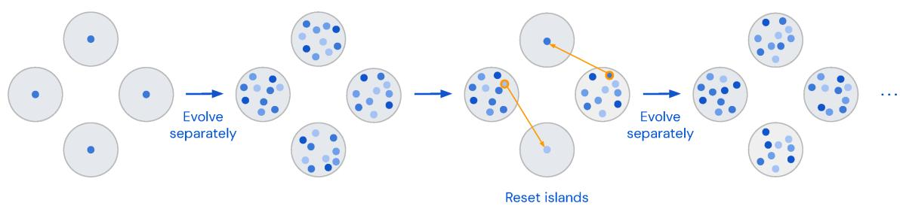  
Extended Data Figure 2: Evolutionary method. The initial programs are separated into islands and each of them are evolved separately. After a number of iterations, the islands with the worst score are wiped and the best program from the islands with the best score are placed in the empty islands. Evolution then proceeds separately again until the next reset. This process is repeated until termination.

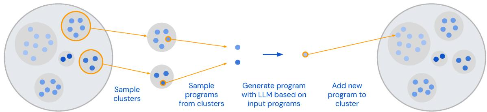  
Extended Data Figure 3: Program clusters within islands. Within each island, programs are grouped into clusters based on their signature (i.e., their scores on several inputs). We first sample clusters, favoring the ones with higher score. Within the chosen clusters, we sample a program, favoring shorter programs. The sampled programs are used to prompt the LLM which generates a new program. If the new program is correct, it is added to the island, either in an existing cluster or a new one if its signature was not yet present.

Mathematical discoveries from program search with large language models (Supplementary material)

## Contents

A Analysis 2   
A.1 Ablations 2   
A.2 Choice of LLM 3   
A.3 Statistical analysis 5   
A.4 Comparison with traditional solvers 6   
A.5 Distributed setup and energy usage 7   
B Other results 7   
B.1 Shannon capacity of cycle graphs 7   
B.2 Corners problem 8   
C Skeletons and discovered programs 9   
C.1 Cap sets . 9   
C.2 Admissible sets 10   
C.3 Combinatorial optimization 14   
C.4 Shannon capacity of cycle graphs 16   
C.5 Corners problem 18   
D Symmetric admissible sets and pre-admissible sets 20   
E More details 23   
E.1 Hyperparameters 23   
E.2 Explicit construction of a size-512 cap set in Z83 24   
E.3 Conception of symmetric admissible sets 27   
E.4 Bin packing datasets . 28   
E.5 Bin packing visualizations 29   
F Implementation of FunSearch 29   
F.1 Sampler . . 30   
F.2 Evaluator . 31   
F.3 ProgramsDB 31   
F.3.1 Island 34   
F.3.2 Cluster 36

## A Analysis

Here we present an analysis of FunSearch, focusing on five aspects:

1. Importance of methodological choices in the design of FunSearch, showcased through ablations of individual components (Appendix A.1).

2. Effect of the choice of LLM, together with a comparison to a non-LLM based mutation operator (Appendix A.2).

3. Robustness of FunSearch, specifically the frequency with which it discovers the best results on both extremal combinatorics and combinatorial optimization (Appendix A.3).

4. Scalability of FunSearch, specifically its ability to solve larger problem instances than traditional approaches. We illustrate this by comparing to the SAT-based approach for finding large admissible sets (Appendix A.4).

5. Distributed nature of FunSearch, and the resulting cost and energy usage of running an experiment with FunSearch (Appendix A.5).

## A.1 Ablations

We carry out ablations on the task of finding the full-sized symmetric admissible set I(15, 10). Recall that FunSearch consists of the following components, whose efficacy we wish to understand via the means of ablation.

• Skeleton-based approach. In order to improve the chances of FunSearch to find the fullsized I(15, 10), we provide a program skeleton that isolates the part of the code that needs to be improved, namely, the priority function (see Figure C.10). The priority function assigns a priority to include each potential vector in the admissible set. In order to understand the importance of the skeleton-based approach, we use an alternative problem specification where FunSearch is required to produce code that directly outputs an ordered list of all the potential vectors. The symmetric admissible set is then constructed in a greedy fashion by considering the vectors in the order provided and including the current one if it does not violate any constraints with respect to the previously added vectors. We refer to this approach as W/O Skeleton.

• Evolutionary approach. FunSearch keeps a population of correctly generated programs in the programs database, and then combines them in a prompt to obtain new programs. In order to understand the importance of evolving the prompts, we consider an alternative method where only the initial (user-provided) prompt is used to generate a large number of programs, which are then analyzed to identify the best one. We refer to this approach as W/O Evolution.

• Maintaining population diversity. FunSearch adopts an approach based on an islands model, where the islands with the lowest scoring programs are periodically killed and reinitialized using the higher scoring ones. This encourages diversity among the programs generated as each island evolves programs independently, while also allowing them to communicate with each other periodically. In order to understand the importance of maintaining population diversity, we consider an alternative method that has only a single island. We refer to this approach as Less Diversity (as some diversity is still maintained through clustering within the island).

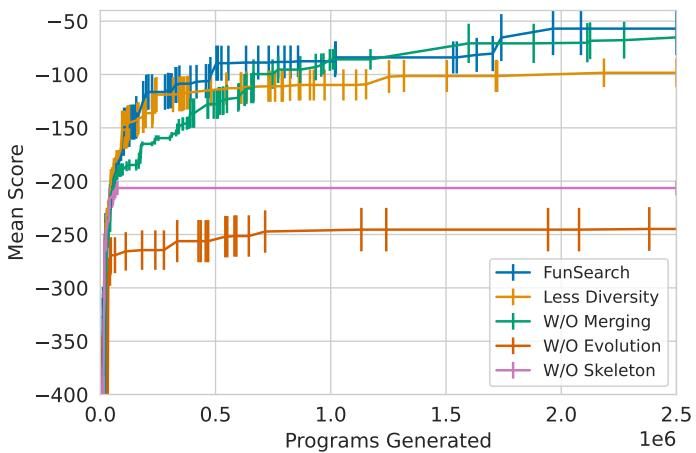  
Figure A.1: Ablation study of FunSearch for finding the full-sized admissible set I(15, 10). The x-axis shows the number of programs generated, while the y-axis shows the difference between the size of the largest admissible set computed thus far, and the size of I(15, 10) (equal to ${ \binom { 1 5 } { 1 0 } } \big )$ averaged over 5 random seeds (higher is better), as well as the corresponding standard error bars. The curve ‘FunSearch’ refers to the overall FunSearch approach, while the other curves correspond to its ablated variants (see text for details). As can be seen, the use of a skeleton and the evolution of prompts are particularly critical for finding a good solution. With less diversity in the prompts, we are able to obtain large but not a full-sized admissible set in any of the five runs.

• Prompt building. When constructing a new prompt, FunSearch samples k = 2 programs from the programs database in order to allow the LLM to merge information from multiple programs when creating a new one. To understand the importance of using multiple programs in a single prompt, we consider an alternative approach where only a single program is used to construct the prompt $( \mathrm { i . e . , } k = 1 )$ . We refer to this approach as W/O Merging.

None of the variants were able to discover a full-sized I(15, 10) admissible set, with the exception of the W/O Merging variant, which found it in 1 out of 5 runs. In comparison, FunSearch found it in 2 out of 5 runs, and achieved a higher average size of the largest admissible set found than other variants (see Figure A.1). We also note that in other tasks, such as computing cap sets in dimensions n = 8, the W/O Merging variant was less successful at obtaining the best results compared to FunSearch.

## A.2 Choice of LLM

A key part of FunSearch is the use of an LLM to generate programs. This raises two important questions. First, is the choice of the LLM critical to its performance? Second, is an LLM even needed?

In order to answer the first question, we compare the performance of two LLMs: Codey [1], which is the default model used in our experiments, and StarCoder [2], which is an open-sourced model with 15 billion parameters available for free to all researchers.

In order to answer the second question, we compare the performance of FunSearch (which uses LLMs to propose program improvements), with an alternative approach that does not use LLMs, but instead relies on evolving programs via a hand-designed distribution of random mutations. To this end, we use mutations similar to [3]. In particular, we define a list of possible binary operations (addition, multiplication, division, integer division, exponentiation, and modulo) and a list of unary operations (indexing of arrays and several common NumPy functions [4]: np.log(x), np.sum(x), np.argmin(x), np.argmax(x), np.median(x), np.exp(x), np.cumsum(x), np.max(x), np.min(x), np.abs(x), np.sign(x), np.negative(x), np.square(x), and np.sqrt(x)) that can be used. To produce a single mutation we parse the input program with the AST Python parser [5] and insert a new variable at a location chosen at random, assigning to it the result of a new operation constructed as follows. We pick a unary or a binary operation uniformly at random, and for each of its arguments we choose either an already existing variable or a constant (which we draw from either the N (0, 1) normal distribution, or uniformly from $\{ - 1 0 , \ldots , 1 0 \} )$ ). Additionally, for every existing operation we delete it with probability 0.1, and for every existing binary operation we change it to another one from the list with probability 0.2, or change one of its arguments (to a randomly chosen existing variable or a random constant) with probability 0.2. We tuned this mutation process trying to make it possible to reproduce some of the best programs discovered by FunSearch, but even with reference solutions in mind we were always discovering additional corner cases or unsupported operations which we would have to manually add, which emphasizes how much problem-specific effort the LLM is saving.

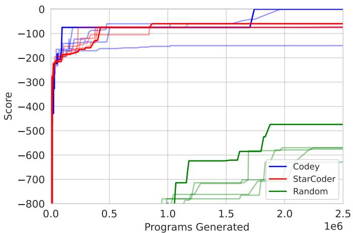  
Figure A.2: Ablation study of FunSearch for finding the full-sized admissible set I(15, 10). The x-axis shows the number of programs generated, while the y-axis shows the difference in the size of the largest admissible set found so far and I(15, 10) (higher is better). Five independent runs are shown for each model, with the best run amongst each five (i.e., the one that provides the largest admissible set the fastest) highlighted as a solid non-translucent line. Note that two of the five runs for ‘Codey’ result in a full-sized admissible set. While ‘StarCoder’ is not able to find the full-sized admissible set in any of the five runs, it still finds large admissible sets that improve upon the previous state of the art lower bound on the cap set capacity. This illustrates that FunSearch is robust to the choice of the model as long as it has been trained sufficiently well to generate code.

Figure A.2 shows the results of the two LLMs and random program mutations, in five different runs of each on the I(15, 10) problem. Note that StarCoder performs slightly worse compared to Codey: in particular, unlike Codey, the StarCoder-based FunSearch is not able to find the fullsized admissible set in any of the runs. However, it is still able to find very large admissible sets that yield an improvement over the previous state-of-the-art cap set capacity lower bound. The use of an LLM is however clearly critical, as evidenced by the worse performance of the random mutations approach.1 That said, even though random mutations were clearly inferior to LLMs in results and required a lot more manual tweaking to make them work, their results still exceeded our expectations, indicating the power of other ingredients of FunSearch (e.g., the skeleton structure and the evolution pipeline).

## A.3 Statistical analysis

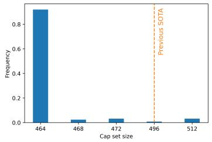  
(a) Cap set in 8 dimensions. Higher is better.

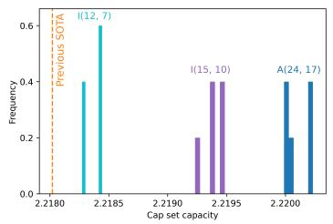  
(b) Admissible sets (n, w) of various dimensions n and weights w. Higher is better.

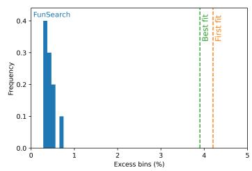  
(c) Online bin packing for the Weibull distribution. Lower is better.

Figure A.3: Results across multiple runs of FunSearch. (a) Histogram of the size of the cap set of dimension n = 8 found across 140 experiments. The task is highly challenging, as demonstrated by the fact that only 4 out of the 140 experiments yield the new state of the art result of size 512. (b) Histogram of the lower bound of the capacity for the cap set problem, computed using various admissible sets. The light blue histogram corresponds to 5 runs for computing I(12, 7) without imposing symmetry. Note that 3 out of the 5 runs find the complete admissible set. The purple histogram corresponds to 5 runs for computing the symmetric I(15, 10). In this case, 2 out of the 5 runs find the complete admissible set. Finally, the dark blue histogram corresponds to 5 runs for computing the partial A(24, 17), which establishes the new state of the art for the lower bound of the capacity. (c) Histogram of the excess bins percentage across 10 runs of the online bin packing problem. In all 10 runs, FunSearch finds a better heuristic than the two standard ones used in the literature, namely, first fit and best fit.

The use of an LLM as well as our strategy of sampling the prompts from the database makes the overall FunSearch approach stochastic in nature. It is therefore natural to ask how frequently it can provide us with the state of the art results. To answer this, we run FunSearch multiple times on the following problems.

• Finding large cap sets in n = 8 dimensions. Recall that FunSearch obtains a cap set of size 512, thereby establishing a new state of the art for this task.

• Computing the full admissible set I(12, 7) without explicitly imposing symmetry (which were in fact discovered by analyzing the I(12, 7) obtained), the full symmetric admissible set I(15, 10), and the partial admissible set A(24, 17), which provides the new state of the art lower bound on the cap set capacity.

• Generating a heuristic for online bin packing for the Weibull datasets. In the main paper, we demonstrated that FunSearch can surpass long established baselines such as first fit and best fit on this task.

Figure A.3 shows the results obtained by FunSearch across the multiple runs. As can be seen, the problem of computing large cap sets appears to be particularly challenging, with less than 1/30 experiments providing a new state of the art cap set of size 512 of dimensionality 8. The difficulty of this problem is also reflected in the fact that the lower bound of capacity of the cap set problem has been typically established indirectly by computing large admissible sets instead. Indeed, even for FunSearch, the problem of finding large admissible sets turns out to be significantly easier. In particular, all 15 runs across the various dimensionalities and weights provide a better lower bound than the previous state of the art. It is worth noting that for the problem of finding I(12, 7) without imposing symmetry, all 3 runs that provide the full admissible set do so by computing a symmetric one. This is not due to a large majority of admissible sets being symmetric by nature. In fact, it is quite the opposite with less than 1% of full I(12, 7) sets satisfying the symmetry property. This can be seen by the fact that, given an admissible set such that the k-th coordinate of its i-th and j-th elements are 1 and 2 respectively, one can swap these coordinate values while still maintaining admissibility. The fact that FunSearch consistently finds these rare admissible sets shows its propensity to exploit problem symmetry where available. Finally, FunSearch is also highly effective for finding accurate heuristics for online bin packing. Across the 10 runs shown in Figure A.3c, the excess bins percentage obtained using the heuristic found by FunSearch is 0.44%±0.11% when evaluated on the Weibull 10k dataset2. In comparison, the excess bins percentage for first fit and best first are 4.20% and 3.90% respectively. These results confirm that FunSearch is able to discover the reported new results repeatedly.

## A.4 Comparison with traditional solvers

As mentioned in the main paper, one of the advantages of FunSearch is its scalability, that is, its ability to solve problems with enormous search spaces. In order to illustrate this advantage, we compare FunSearch with a traditional solver for finding large admissible sets. As noted by [6], this can be achieved by formulating the problem as a SAT instance, which enables the use of off-the-shelf solvers. In our comparison, we use the state of the art CP-SAT solver [7], which is publicly available.

We tested two different versions of SAT formulation for admissible sets: (i) the natural encoding of the problem as a SAT instance without any additional constraints, and (ii) an encoding with additional, restrictive constraints handcrafted in [6] “by studying smaller examples of admissible sets, heuristic arguments and a healthy dose of educated guesswork”. (There are three such sets of constraints in [6], and we report the best results across the three.) For every admissible set size and SAT formulation we picked 10 random (binary) variables and ran 210 different instances of CP-SAT in parallel, each fixing the variables in one of the 210 possible ways, and running the solvers for at least 50 hours each.

Table A.4 shows the results. As can be seen, while the SAT solver can be used successfully to address small to medium sized problems, it is unable to handle larger problems. The reason for the success of FunSearch is two-fold: (i) searching in the program space instead of attempting to compute the optimal value of a large number of variables in a mathematical optimization program; and (ii) the interpretability of the resulting programs, which enables the further restriction of the search to more concise spaces such as symmetric admissible sets.

<table><tr><td rowspan="2">Method</td><td rowspan="2">Method variant</td><td colspan="4">Admissible set  $\scriptstyle { \mathcal { T } } ( n , w )$ </td></tr><tr><td>(9,5)</td><td>(10,6) (11,7)</td><td>(12,7)</td><td>(15,10)</td></tr><tr><td>Parallelized SAT</td><td>out of the box</td><td>√</td><td>× ×</td><td>×</td><td>×</td></tr><tr><td>FunSearch</td><td>out of the box</td><td>√</td><td>√ √</td><td>√</td><td>×</td></tr><tr><td>Parallelized SAT</td><td>w/handcrafted constraints of [6]</td><td>√</td><td>√ √</td><td>×</td><td>×</td></tr><tr><td>FunSearch</td><td>w/ FunSearch-discovered symmetry</td><td>√</td><td>√ √</td><td>√</td><td>√</td></tr></table>

Figure A.4: Comparison of a parallelized SAT solver and FunSearch on the problem of finding admissible sets I(n, w). In both regimes – with and without additional constraints – FunSearch scales to significantly larger instances.

## A.5 Distributed setup and energy usage

Finally, we note the importance of employing a distributed approach within FunSearch. Finding the full-sized symmetric admissible set I(15, 10) required the generation and analysis of approximately two million programs. Without parallelization of both the samplers and the evaluators, it would not have been possible to realize this result. It is worth noting, however, that parallelization does not make FunSearch prohibitively expensive. To reproduce admissible set experiments done above (generating 2 million samples) one would have to use 15 instances of StarCoder-15B running on A100 40 GB GPU each and 5 CPU servers (each running 32 evaluators in parallel) for two days. We estimate that when running on Google Cloud, the price of an experiment is around \$800 – \$1400, and the energy usage around 250 – 500 kWh; i.e., 0.5% of the energy used for training StarCoder [2]. With further engineering, we believe this cost and energy usage can be reduced significantly. Moreover, in the upcoming years, advancements in LLMs as well as new inference hardware will lower the cost even further.

## B Other results

## B.1 Shannon capacity of cycle graphs

The problems studied in Section 2.1 are tightly related to the problem of finding the Shannon capacity of a graph. The Shannon capacity of a graph is an important quantity from Information Theory as it indicates the amount of information that can be transmitted over a noisy channel with zero probability of error [8–11]. Consider a discrete noisy communication channel in which certain symbols can be confused with each other, with a graph describing these confusion patterns. The vertices of the graph correspond to symbols (inputs of the channel), and the edges indicate which symbols can be confused with each other at the receiver side of the communication channel. Formally, the Shannon capacity of a graph G is defined as $\Theta ( { \mathcal G } ) = \operatorname* { s u p } _ { n } \ \sqrt [ n ] { \alpha ( { \mathcal G } ^ { \boxtimes n } ) }$ , where $\mathcal { G } ^ { \boxtimes n }$ denotes the n-th strong product of the graph, and $\alpha ( \mathcal { G } ^ { \boxtimes n } )$ denotes its independence number (i.e., the size of the largest independent set).

One of the most studied graphs with unknown Shannon capacity is the cycle $\mathcal { C } _ { m }$ , i.e., the graph with m nodes and m edges consisting of a single cycle. Determining the Shannon capacity of cycle graphs is a notorious open problem in extremal combinatorics [12, 13]. For even values of m, the Shannon capacity of $\mathcal { C } _ { m }$ is $m / 2 ;$ however for odd values of m, only the capacity for the cycle graph of 5 nodes is known: Shannon showed the lower bound $\Theta ( \mathcal { C } _ { 5 } ) \ge \sqrt { 5 }$ in 1956 [8] and L´ovasz proved the upper bound $\Theta ( \mathcal { C } _ { 5 } ) \le \sqrt { 5 }$ in 1979 [14], therefore concluding $\Theta ( \mathcal { C } _ { 5 } ) = \sqrt { 5 }$ . The Shannon capacity of the cycle graph $\mathcal { C } _ { m }$ for odd values of $m \geq 7$ remains unknown, although numerous bounds have been proved [12, 14–20].

We apply FunSearch to find a function priority $\mathbf { \Phi } : \{ 0 , 1 , \dots , m - 1 \} ^ { n } \to \mathbb { R }$ , with the aim of constructing large independent set in powers of cycle graphs $\mathcal { C } _ { m } ^ { \boxtimes n }$ , thereby finding lower bounds on the Shannon capacity of cycle graphs. We discover the following results:

• For the cycle graph of 7 nodes, we find a program that outputs an independent set of size 367 for $\mathcal { C } _ { 7 } ^ { \boxtimes 5 }$ , therefore recovering the best known lower bound $\Theta ( \mathcal { C } _ { 7 } ) \ge \sqrt [ 5 ] { 3 6 7 } [ 2 0 ]$ . Unlike the method from [20], which finds a large independent set on a related circular graph and then uses some heuristics to project it down to an independent set in $\mathcal { C } _ { 7 } ^ { \boxtimes 5 }$ , the program discovered by FunSearch is simpler as it operates directly in $\bar { \mathcal { C } } _ { 7 } ^ { \boxtimes 5 }$ , thus opening the door for easier interpretability of this construction.

• For the cycle graph of 9 nodes, we find a single program that outputs independent sets achieving the best known lower bounds of $\alpha ( \mathcal { C } _ { 9 } ^ { \boxtimes n } )$ for $n = 3 , \dots , 7 , \mathrm { ~ i . e . , ~ } \alpha ( \mathcal { C } _ { 9 } ^ { \boxtimes 3 } ) \ge 8 1 , \alpha ( \mathcal { C } _ { 9 } ^ { \boxtimes 4 } ) \ge 3 2 4$ $\alpha ( \mathcal { C } _ { 9 } ^ { \boxtimes 5 } ) \ge 1 4 5 8 , \alpha ( \mathcal { C } _ { 9 } ^ { \boxtimes 6 } ) \ge 6 5 6 1$ 1, and $\stackrel { \smile } { \alpha } ( \acute { C } _ { 9 } ^ { \boxtimes \daleth } ) \geq 2 6 2 4 4$ . (These bounds are taken from [19] and extrapolated for $n = 6$ and $n = 7$ by taking products of smaller powers of the graph.) The program discovered by FunSearch is surprisingly simple —just a couple of lines of code— and provides the state-of-the-art results for multiple powers of the graph. Again, we believe this provides an opportunity for mathematicians for further analysis, understanding, and possibly improvement of the solutions.

• For the cycle graph of 11 nodes, we find a program that provides an independent set of size 754 on $\mathcal { C } _ { 1 1 } ^ { \breve { \boxtimes } 4 }$ , therefore improving upon the best existing lower bound, $\alpha ( \mathcal { C } _ { 1 1 } ^ { \boxtimes _ { 4 } } ) \ge 7 4 8 [ 1 6 , 1 9 ]$ The programs achieving these results are listed in Appendix C.

## B.2 Corners problem

The corners problem is a related problem in extremal combinatorics, with connections to communication complexity [21–28]. The problem is to find the largest corner-free set in $\mathbb { Z } _ { p } ^ { n } \times \mathbb { Z } _ { p } ^ { n } , ^ { 3 }$ where a corner is a triple of elements $( x , y ) , ( x + \lambda , y ) , ( x , y + \lambda )$ (in arithmetic modulo $p )$ , with $\mathbf { \Phi } _ { \boldsymbol { x } , y , \lambda \in \mathbb { Z } _ { p } ^ { n } }$ and $\lambda \neq 0$ . As for many other problems in mathematics and extremal combinatorics such as the cap set problem, the main quantity of interest is the capacity — the asymptotic rate of growth of the largest corner-free set in $\mathbb { Z } _ { p } ^ { n } \times \mathbb { Z } _ { p } ^ { n }$ as $n \to \infty$

The best known asymptotic lower bounds for the corners problem on $\mathbb { Z } _ { 2 } ^ { n } \times \mathbb { Z } _ { 2 } ^ { n }$ and $\mathbb { Z } _ { 3 } ^ { n } \times \mathbb { Z } _ { 3 } ^ { n }$ were obtained using the method of combinatorial degenerations [27]. The combinatorial degenerations method attempts to find the largest set of vertices in a specific hypergraph (i.e., a generalization of a graph in which edges can connect to more than two vertices) describing the problem, such that vertices in the set satisfy certain feasibility constraints [27, Section 2.3]. Any set S of vertices satisfying those constraints implies a lower bound on the capacity of the corners problem, $C \geq \sqrt [ n ] { | S | }$ ， which in turn means that the size of the largest corner-free set in $\mathbb { Z } _ { p } ^ { n } \times \mathbb { Z } _ { p } ^ { n }$ grows asymptotically at least as $C ^ { n } / \mathrm { p o l y } ( n )$ when $n \to \infty$

We use FunSearch to guide a greedy search approach to find the largest possible set of vertices in the hypergraph that satisfy the combinatorial degeneration constraints. Similarly to the previous sections, we attempt to find a function priority : $\mathbb { Z } _ { p } ^ { n } \times \mathbb { Z } _ { p } ^ { n } \to \mathbb { R }$ that assigns a priority score to each candidate vertex of the hypergraph. The greedy approach starts with an empty list of indices (each representing a vertex), and at each iteration it adds the valid index (i.e., guaranteeing the combinatorial degeneration constraints) with the highest priority, until it is not possible to add more. The priority heuristic found by FunSearch directly leads to new lower bounds on the capacity√ for the corners problem; see Table B.1. In particular, we find $C \geq { \sqrt [ { 4 } ] { 1 3 7 } } \approx 3 . 4 2 1$ for $\mathbb { Z } _ { 2 }$ and

<table><tr><td rowspan="2">n</td><td colspan="2">Best known [27]</td><td colspan="2">FunSearch</td></tr><tr><td>size</td><td>capacity</td><td>size</td><td>capacity</td></tr><tr><td>1</td><td>3</td><td>3</td><td>3</td><td>3</td></tr><tr><td>2</td><td>11</td><td>3.317</td><td>11</td><td>3.317</td></tr><tr><td>3</td><td>39</td><td>3.391</td><td>39</td><td>3.391</td></tr><tr><td>4</td><td>1</td><td>1</td><td>137</td><td>3.421</td></tr></table>

(a) Results in $\mathbb { Z } _ { 2 } .$

<table><tr><td rowspan="2">n</td><td colspan="2">Best known [27]</td><td colspan="2">FunSearch</td></tr><tr><td>size</td><td>capacity</td><td>size</td><td>capacity</td></tr><tr><td>1</td><td>7</td><td>7</td><td>7</td><td>7</td></tr><tr><td>2</td><td>1</td><td>1</td><td>53</td><td>7.280</td></tr><tr><td>3</td><td>1</td><td>1</td><td>370</td><td>7.179</td></tr></table>

(b) Results in $\mathbb { Z } _ { 3 }$  
Table B.1: FunSearch improves the best known capacity for the corners problem. The table shows the largest set of vertices satisfying the combinatorial degenerations constraints for multiple powers n of the corners hypergraph, as well as the implied lower bounds on the capacity.

$C \geq \sqrt { 5 3 } \approx 7 . 2 8 0$ for $\mathbb { Z } _ { 3 }$ , which improve upon the previously best lower bounds of 3.391 and 7, respectively.

## C Skeletons and discovered programs

This section shows functions discovered by FunSearch for different problems described in the paper. Note that we have lightly edited these functions by removing unused lines, renaming some variables, and adding comments, in order to increase their readability.

Throughout this section, the decorators @funsearch.run and @funsearch.evolve are just a way to indicate the main entry point of the program and the function that FunSearch should evolve, respectively.

## C.1 Cap sets

In Figure C.6 below we show the full version of the program skeleton in Figure 2 (a). One point to note is that in case the priority function leads to ties between elements of Zn3 , these ties are broken by using the lexicographical order of the elements. Another point to note is that it is perhaps surprising that we can obtain good cap set constructions using priority functions that do not explicitly take into account which specific elements have already been added to the cap set. When choosing the next element of Zn3 to add, the current state is taken into account only to give a yes or no answer as to whether the element next in line is allowable. Searching this simple class of programs yields surprisingly good results, and at least for now we were not able to do any better by allowing programs that take the current state into account in a more sophisticated way.

```python
def priority(el: tuple[int, ...], n: int) -> float:
"""Returns the priority with which we want to add `el` to the cap set."""
el = np.array(el, dtype=np.float32)
weight = (el @ el) % 3 # Weight (mod 3) of the full vector.
a = n // 3
b = n - n // 3
s_1 = (el[:b] @ el[:b]) % 3 # Weight (mod 3) of first two thirds.
s_3 = (2 * (el[:a] @ el[:a])) % 3 # Double norm of first third.
s_4 = (el[:a] @ el[a:b]) % 3 # Cross correlation.
s_5 = np.sum(el[:a] == el[-1]) % 3
return - 3 ** 3 * s_1 + 3 ** 2 * weight + 3 ** 3 * s_3 + 3 ** 2 * s_4 + s_5
```

Figure C.5: Priority function that yields a cap set of size 1082 in n = 9 dimensions. For each el ∈ Zn3 it returns the priority with which we should include el in the cap set. Similarly to the priority function yielding a 512-cap in Z83 shown in Figure 4 (a), this priority function also partitions the coordinates into multiple groups, in this case three groups of size three each.  
```python
"""Finds large cap sets."""
import itertools
import numpy as np
@funsearch.run
def evaluate(n: int) -> int:
"""Returns the size of an `n`-dimensional cap set."""
capset = solve(n)
return len(capset)
def solve(n: int) -> np.ndarray:
"""Returns a large cap set in `n` dimensions."""
all_vectors = np.array(list(itertools.product((0, 1, 2), repeat=n)), dtype=np.int32)
# Powers in decreasing order for compatibility with `itertools.product`, so
# that the relationship `i = all_vectors[i] @ powers` holds for all `i`.
powers = np.array([3 ** i for i in range(n - 1, -1, -1)], dtype=np.int32)
# Precompute all priorities.
priorities = np.array([priority(tuple(vector), n) for vector in all_vectors])
# Build `capset` greedily, using priorities for prioritization.
capset = np.empty(shape=(0, n), dtype=np.int32)
while np.any(priorities != -np.inf):
# Add a vector with maximum priority to `capset`, and set priorities of
# invalidated vectors to `-inf`, so that they never get selected.
max_index = np.argmax(priorities)
vector = all_vectors[None, max_index] # [1, n]
blocking = np.einsum('cn,n->c', (- capset - vector) % 3, powers) # [C]
priorities[blocking] = -np.inf
priorities[max_index] = -np.inf
capset = np.concatenate([capset, vector], axis=0)
return capset
@funsearch.evolve
def priority(el: tuple[int, ...], n: int) -> float:
"""Returns the priority with which we want to add `el` to the cap set."""
return 0.0
```  
Figure C.6: The full version of the program skeleton shown in Figure 2 (a), used to discover large cap sets.

## C.2 Admissible sets

In Figure 5 (b) we have seen a priority function discovered by FunSearch that not only yielded a full-size I(12, 7) admissible set, but also inspired us to conceive the notion of symmetric admissible sets (see Appendix D for more details). Here we show priority functions discovered by FunSearch that directly construct large symmetric admissible sets. See also Figure C.10 below for the program skeleton.

```python
def priority(el: tuple[int, ...], n: int, w: int) -> float:
"""Returns the priority with which we want to add `el` to the set."""
score = 0.0
```

```python
for i in range(n):
if el[i] < el[i - 1]:
score += 1
elif el[i] < el[i - 2]:
score += 0.05
elif el[i] < el[i - 3]:
score -= 0.05
elif el[i] < el[i - 4]:
score += 0.01
elif el[i] < el[i - 5]:
score -= 0.01
elif el[i] < el[i - 6]:
score += 0.001
else:
score += 0.005
for i in range(n):
if el[i] == el[i - 1]:
score -= w
elif el[i] == 0 and i != n - 1 and el[i + 1] != 0:
score += w
if el[i] != el[i - 1]:
score += w
for i in range(n):
if el[i] < el[i - 1]:
if el[i] == 0:
score -= w
return score
```

Figure C.7: A priority function that leads to a full-size constant-weight symmetric admissible set I(15, 10).

```python
def priority(el: tuple[int, ...], n: int, w: int) -> float:
"""Returns the priority with which we want to add `el` to the set."""
score = 0
coeff = 0
for pos, x in zip(range(n), el):
y = (el[(pos + 1) % n] - el[(pos)]) % n
z = (el[(pos + 2) % n] - el[(pos)]) % n
p = (el[(pos - 1) % n] + 1) % n
u = (el[(pos - 2) % n] + 1) % n
v = (el[(pos + 3) % n] + 1) % n
score += 3 * p * (p + coeff) * (p + w) + (p + coeff)**2 * (w + 1)
score += 2 * p * v * (p + w) + v * z * (-1 + w) - (p + coeff) * (-1 + w)
score += v * (u + w) + u + 3 * u * y * (1 + w) + u * z * (w - 1) - (p + coeff) * (w - 1)
score += (1 + w)**6 * 3 * coeff**2
return score
```

Figure C.8: A priority function that leads to a constant-weight symmetric admissible set of size 43 596 in A(21, 15). The existence of such a set implies the cap set capacity lower bound of 2.2200.

```python
def priority(el: tuple[int, ...], n: int, w: int) -> float:
"""Returns the priority with which we want to add `el` to the set."""
result = 0.0
for i in range(n):
n_violations = 0
if el[i] < el[i - 1]:
result += (el[i - 1] ** 0.5) * w ** 2 / (6 * 6)
n_violations += 1
if el[i] < el[i - 2]:
result += el[i - 2] ** 0.5
```

n\_violations += 1   
if el[i - 1] != 0:   
result -= (el[i] - el[i - 1]) \* w \*\* 2 / (6 \* 3)   
n\_violations += 2   
if el[i - 2] != 0:   
result -= (el[i] - el[i - 2]) \* w \*\* 2 / (6 \* 6) \* (0.95 \*\* n\_violations)   
n\_violations += 1   
result -= (0.02 \*\* el[i]) \* (el[i] - el[i - 8])   
return result

Figure C.9: A priority function that leads to a constant-weight symmetric admissible set of size 237 984 in A(24, 17). The existence of such a set implies the cap set capacity lower bound of 2.2202.

```python
"""Finds large symmetric admissible sets."""
import itertools
import numpy as np
TRIPLES = [(0, 0, 0), (0, 0, 1), (0, 0, 2), (0, 1, 2), (0, 2, 1), (1, 1, 1), (2, 2, 2)]
INT_TO_WEIGHT = [0, 1, 1, 2, 2, 3, 3]
def expand_admissible_set(
pre_admissible_set: list[tuple[int, ...]]) -> list[tuple[int, ...]]:
"""Expands a pre-admissible set into an admissible set."""
num_groups = len(pre_admissible_set[0])
admissible_set = []
for row in pre_admissible_set:
rotations = [[] for _ in range(num_groups)]
for i in range(num_groups):
x, y, z = TRIPLES[row[i]]
rotations[i].append((x, y, z))
if not x == y == z:
rotations[i].append((z, x, y))
rotations[i].append((y, z, x))
product = list(itertools.product(*rotations))
concatenated = [sum(xs, ()) for xs in product]
admissible_set.extend(concatenated)
return admissible_set
def get_surviving_children(extant_elements, new_element, valid_children):
"""Returns the indices of `valid_children` that remain valid after adding `new_element` to `extant_elements`."""
bad_triples = set([
(0, 0, 0), (0, 1, 1), (0, 2, 2), (0, 3, 3), (0, 4, 4), (0, 5, 5),
(0, 6, 6), (1, 1, 1), (1, 1, 2), (1, 2, 2), (1, 2, 3), (1, 2, 4),
(1, 3, 3), (1, 4, 4), (1, 5, 5), (1, 6, 6), (2, 2, 2), (2, 3, 3),
(2, 4, 4), (2, 5, 5), (2, 6, 6), (3, 3, 3), (3, 3, 4), (3, 4, 4),
(3, 4, 5), (3, 4, 6), (3, 5, 5), (3, 6, 6), (4, 4, 4), (4, 5, 5),
(4, 6, 6), (5, 5, 5), (5, 5, 6), (5, 6, 6), (6, 6, 6)])
# Compute.
valid_indices = []
for index, child in enumerate(valid_children):
# Invalidate based on 2 elements from `new_element` and 1 element from a
# potential child.
if all(INT_TO_WEIGHT[x] <= INT_TO_WEIGHT[y]
for x, y in zip(new_element, child)):
continue
# Invalidate based on 1 element from `new_element` and 2 elements from a
# potential child.
if all(INT_TO_WEIGHT[x] >= INT_TO_WEIGHT[y]
for x, y in zip(new_element, child)):
continue
# Invalidate based on 1 element from `extant_elements`, 1 element from
# `new_element`, and 1 element from a potential child.
is_invalid = False
for extant_element in extant_elements:
if all(tuple(sorted((x, y, z))) in bad_triples
for x, y, z in zip(extant_element, new_element, child)):
```

```python
is_invalid = True
break
if is_invalid:
continue
valid_indices.append(index)
return valid_indices
def solve(n: int, w: int) -> list[tuple[int, ...]]:
"""Generates a symmetric constant-weight admissible set I(n, w)."""
num_groups = n // 3
assert 3 * num_groups == n
# Compute the scores of all valid (weight w) children.
valid_children = []
for child in itertools.product(range(7), repeat=num_groups):
weight = sum(INT_TO_WEIGHT[x] for x in child)
if weight == w:
valid_children.append(np.array(child, dtype=np.int32))
valid_scores = np.array([
priority(sum([TRIPLES[x] for x in xs], ()), n, w)
for xs in valid_children])
# Greedy search guided by the scores.
pre_admissible_set = np.empty((0, num_groups), dtype=np.int32)
while valid_children:
max_index = np.argmax(valid_scores)
max_child = valid_children[max_index]
surviving_indices = get_surviving_children(pre_admissible_set, max_child,
valid_children)
valid_children = [valid_children[i] for i in surviving_indices]
valid_scores = valid_scores[surviving_indices]
pre_admissible_set = np.concatenate([pre_admissible_set, max_child[None]],
axis=0)
return expand_admissible_set(pre_admissible_set)
@funsearch.run
def evaluate(n: int, w: int) -> int:
"""Returns the size of the expanded admissible set."""
return len(solve(n, w))
@funsearch.evolve
def priority(el: tuple[int, ...], n: int, w: int) -> float:
"""Returns the priority with which we want to add `el` to the set."""
return 0.0
```

Figure C.10: The program skeleton used to search directly for symmetric admissible sets. See Appendix D for more details on this setting.

```python
"""Finds large admissible sets."""
import itertools
import numpy as np
def block_children(scores: np.ndarray,
admissible_set: np.ndarray,
new_element: np.ndarray) -> None:
"""Modifies `scores` to -inf for elements blocked by `new_element`."""
n = admissible_set.shape[-1]
powers = np.array([3 ** i for i in range(n - 1, -1, -1)], dtype=np.int32)
invalid_vals_raw = {
(0, 0): (0,),
(0, 1): (1,),
```

```python
(0, 2): (2,),
(1, 0): (1,),
(1, 1): (0, 1, 2),
(1, 2): (1, 2),
(2, 0): (2,),
(2, 1): (1, 2),
(2, 2): (0, 1, 2),
}
invalid_vals = [[np.array(invalid_vals_raw[(i, j)], dtype=np.int32)
for j in range(3)] for i in range(3)]
# Block 2**w elements with the same support as `new_element`.
w = np.count_nonzero(new_element)
all_12s = np.array(list(itertools.product((1, 2), repeat=w)), dtype=np.int32)
blocking = np.einsum('aw,w->a', all_12s, powers[new_element != 0])
scores[blocking] = -np.inf
# Block elements disallowed by a pair of an extant point and `new_element`.
for extant_element in admissible_set:
blocking = np.zeros(shape=(1,), dtype=np.int32)
for e1, e2, power in zip(extant_element, new_element, powers):
blocking = (blocking[:, None] + (invalid_vals[e1][e2] * power)[None, :]
).ravel()
scores[blocking] = -np.inf
def solve(n: int, w: int) -> list[tuple[int, ...]]:
"""Generates a constant-weight admissible set I(n, w)."""
children = np.array(list(itertools.product((0, 1, 2), repeat=n)),
dtype=np.int32)
scores = -np.inf * np.ones((3 ** n,), dtype=np.float32)
for child_index, child in enumerate(children):
if sum(child == 0) == n - w:
scores[child_index] = priority(np.array(child), n, w)
max_admissible_set = np.empty((0, n), dtype=np.int32)
while np.any(scores != -np.inf):
# Find element with largest score.
max_index = np.argmax(scores)
child = children[max_index]
block_children(scores, max_admissible_set, child)
max_admissible_set = np.concatenate([max_admissible_set, child[None]],
axis=0)
return [tuple(map(int, el)) for el in max_admissible_set]
@funsearch.run
def evaluate(n: int, w: int) -> int:
"""Returns the size of the constructed admissible set."""
return len(solve(n, w))
@funsearch.evolve
def priority(el: tuple[int, ...], n: int, w: int) -> float:
"""Returns the priority with which we want to add `el` to the set."""
return 0.0
```

Figure C.11: The program skeleton used to search for general (non-symmetric) admissible sets.

## C.3 Combinatorial optimization

def heuristic(item: float, bins: np.ndarray) -> np.ndarray:   
"""Returns priority with which we want to add item to each bin.   
Args:   
item: Size of item to be added to the bin.

bins: Array of capacities for each bin.   
Return:   
Array of same size as bins with priority score of each bin.   
"""   
def s(bin, item):   
if bin - item <= 2:   
return 4   
elif (bin - item) <= 3:   
return 3   
elif (bin - item) <= 5:   
return 2   
elif (bin - item) <= 7:   
return 1   
elif (bin - item) <= 9:   
return 0.9   
elif (bin - item) <= 12:   
return 0.95   
elif (bin - item) <= 15:   
return 0.97   
elif (bin - item) <= 18:   
return 0.98   
elif (bin - item) <= 20:   
return 0.98   
elif (bin - item) <= 21:   
return 0.98   
else:   
return 0.99   
return np.array([s(bin, item) for bin in bins])

Figure C.12: Best performing heuristic for the OR datasets.

def heuristic(item: float, bins: np.ndarray) -> np.ndarray:   
"""Returns priority with which we want to add item to each bin.   
Args:   
item: Size of item to be added to the bin.   
bins: Array of capacities for each bin.   
Return:   
Array of same size as bins with priority score of each bin.   
score = 1.56 \* bins - item - 4 \* np.log(bins) + 0.16   
score[score > item] = item \* 0.56   
return -score

Figure C.13: Simple heuristic for the OR datasets. While the performance of this heuristic is slightly worse than the best, it still significantly outperforms first fit and best fit across datasets.

```python
def heuristic(item: float, bins: np.ndarray) -> np.ndarray:
"""Returns priority with which we want to add item to each bin.
Args:
item: Size of item to be added to the bin.
bins: Array of capacities for each bin.
Return:
Array of same size as bins with priority score of each bin.
"""
score = (bins - max(bins))**2 / item + bins**2 / item**2 + bins**2 / item**3
score[bins > item] *= -1
score[1:] -= score[:-1]
return score
```

Figure C.14: Best performing discovered heuristic for the Weibull datasets.

## C.4 Shannon capacity of cycle graphs

See Appendix B.1 for a description of this problem, and the obtained results.

```python
"""Obtains maximal independent sets."""
import funsearch
import itertools
import numpy as np
@funsearch.run
def evaluate(num_nodes: int, n: int) -> int:
"""Returns the size of an independent set."""
independent_set = solve(num_nodes, n)
return len(independent_set)
def solve(num_nodes: int, n: int) -> list[tuple[int, ...]]:
"""Gets independent set with maximal size.
Args:
num_nodes: The number of nodes of the base cyclic graph.
n: The power we raise the graph to.
Returns:
A list of `n`-tuples in `{0, 1, 2, .., num_nodes - 1}`.
to_block = np.array(list(itertools.product([-1, 0, 1], repeat=n)))
# Powers in decreasing order for compatibility with `itertools.product`, so
# that the relationship `i = children[i] @ powers` holds for all `i`.
powers = np.array(
[num_nodes ** i for i in range(n - 1, -1, -1)], dtype=np.int32)
# Precompute the priority scores.
children = np.array(
list(itertools.product(range(num_nodes), repeat=n)), dtype=np.int32)
scores = np.array([priority(tuple(child), num_nodes, n)
for child in children])
# Build `max_set` greedily, using scores for prioritization.
max_set = np.empty(shape=(0, n), dtype=np.int32)
while np.any(scores != -np.inf):
# Add a child with a maximum score to `max_set`, and set scores of
# invalidated children to -inf, so that they never get selected.
max_index = np.argmax(scores)
child = children[None, max_index] # [1, n]
blocking = np.einsum(
'cn,n->c', (to_block + child) % num_nodes, powers) # [C]
scores[blocking] = -np.inf
max_set = np.concatenate([max_set, child], axis=0)
return [tuple(map(int, el)) for el in max_set]
@funsearch.evolve
def priority(el: tuple[int, ...], num_nodes: int, n: int) -> float:
"""Returns the priority with which we want to add `el` to the set.
Args:
el: an n-tuple representing the element to consider whether to add.
num_nodes: the number of nodes of the base graph.
n: an integer, power of the graph.
```

Returns:   
A number reflecting the priority with which we want to add \`el\` to the   
independent set.   
"""   
return 0.

Figure C.15: User-provided problem specification for the Shannon capacity of cycle graphs problem (Appendix B.1). The initial priority function returns 0 regardless of the inputs.

```python
def priority(el: tuple[int, ...], num_nodes: int, n: int) -> float:
"""Returns the priority with which we want to add `el` to the set.
Args:
el: an n-tuple representing the element to consider whether to add.
num_nodes: the number of nodes of the base graph.
n: an integer, power of the graph.
Returns:
A number reflecting the priority with which we want to add `el` to the
independent set.
score = 0.
for i in range(n):
if el[i] == el[(i + 2) % n]:
score += 1
else:
score -= 1
x = ((n - 2) * el[i] - el[(i + 1) % n]
- el[(i + 2) % n] - (n + 1) * el[(i + 3) % n]) % num_nodes
score -= 0.5 * (x - el[(i + 1) % n]) ** 2
score += 0.1 * (num_nodes - 1 - (x - 1) % num_nodes) ** 2
score += 0.2 * (num_nodes - 1 - (x - 2) % num_nodes) ** 2
return score
```

Figure C.16: A priority function that leads to an independent set of size 367 in $\mathcal { C } _ { 7 } ^ { \boxtimes 5 }$

```python
def priority(el: tuple[int, ...], num_nodes: int, n: int) -> float:
"""Returns the priority with which we want to add `el` to the set.
Args:
el: an n-tuple representing the element to consider whether to add.
num_nodes: the number of nodes of the base graph.
n: an integer, power of the graph.
Returns:
A number reflecting the priority with which we want to add `el` to the
independent set.
s = 0.
for i in range(n):
s += el[i] << i
s %= num_nodes
return (2 * el[2] - 4 * el[0] + el[1]) % num_nodes + s
```

Figure C.17: A priority function that leads to independent sets of size 81, 324, 1458, 6561, and 26244 in ${ \mathcal { C } } _ { 9 } ^ { \boxtimes n }$ , for n = 3, 4, 5, 6, 7, respectively.

```python
def priority(el: tuple[int, ...], num_nodes: int, n: int) -> float:
"""Returns the priority with which we want to add `el` to the set.
Args:
el: an n-tuple representing the element to consider whether to add.
```

```python
num_nodes: the number of nodes of the base graph.
n: an integer, power of the graph.
Returns:
A number reflecting the priority with which we want to add `el` to the
independent set.
el_clipped = np.clip(el, a_min=None, a_max=num_nodes - 3)
values = 2 * np.array(list(itertools.product(range(1, n), repeat=n)))
multipliers = np.array(
[num_nodes ** i for i in range(n - 1, -1, -1)], dtype=np.int32)
x = np.sum((1 + values + el_clipped) * multipliers, axis=-1)
return np.sum(x % (num_nodes - 2), dtype=float)
```  
Figure C.18: A priority function that leads to an independent set of size 754 in $\mathcal { C } _ { 1 1 } ^ { \boxtimes { 4 } }$

## C.5 Corners problem

For the corners problem (see Appendix B.2), we search for the largest set of indices in $\{ 0 , 1 , \ldots , 2 ^ { 2 n } \}$ (for $\mathbb { Z } _ { 2 } ^ { n } \times \mathbb { Z } _ { 2 } ^ { n } )$ or $\{ 0 , 1 , \ldots , 3 ^ { 2 n } \}$ (for $\mathbb { Z } _ { 3 } ^ { n } \times \mathbb { Z } _ { 3 } ^ { n } )$ satisfying the combinatorial degeneration constraints. These constraints are given in [27, Eq. 3]. For each candidate set of indices, we check if the combinatorial degeneration constraints are met, which can be done via a linear program that we implement in C++.

With FunSearch, we search for a priority function that we use to guide a greedy procedure, where we iteratively add the next valid node (index) with highest priority score, until it is not possible to add more valid nodes.

```python
"""Corners problem via combinatorial degenerations."""
import corners
import funsearch
import itertools
import numpy as np
@funsearch.run
def evaluate(n: int) -> int:
"""Returns the size of the maximum set of indices found by DFS."""
return len(solve(n))
def solve(n: int) -> list[tuple[int, ...]]:
"""Runs DFS to find a large set of indices."""
# Obtain the priority scores.
scores = np.array(
[priority(el, n) for el in itertools.product(range(2), repeat=2 * n)]
)
all_indices = np.arange(len(scores), dtype=np.int32)
# Run a greedy a approach that iteratively adds the next highest-priority
# index that guarantees the combinatorial degeneration property.
return corners.greedy(all_indices, scores)
@funsearch.evolve
def priority(el: tuple[int, ...], n: int) -> float:
"""Returns the priority with which we want to add `el`.
Args:
el: A candidate element to be considered, as a tuple of length `2 * n` with
elements in {0, 1}.
n: Power of the graph.
Returns:
A number reflecting the priority with which we want to add `el` to the set.
```

Figure C.19: User-provided problem specification for the corners problem (Appendix B.2) in $\mathbb { Z } _ { 2 } ^ { n } \times \mathbb { Z } _ { 2 } ^ { n }$ (it is analogous for the case $\mathbb { Z } _ { 3 } ^ { n } \times \mathbb { Z } _ { 3 } ^ { n } )$ . The initial priority function returns 0 regardless of the inputs.

```python
def priority(el: tuple[int, ...], n: int) -> float:
"""Returns the priority with which we want to add `el`.
Args:
el: A candidate element to be considered, as a tuple of length `2 * n` with
elements in {0, 1}.
n: Power of the graph.
Returns:
A number reflecting the priority with which we want to add `el` to the set.
s0 = 0
s1 = 0
for i in range(1, 2 * n - 1):
cur = el[i] ^ el[i - 1] ^ el[i + 1]
if i < n - 1:
if cur != 1:
s0 += 1
if i > n:
if cur != 1:
s1 += 1
t1 = - ((s1 - s0) ** 6 - 3 * (s1 - s0) ** 3 + (s1 - s0))
t2 = (el[0] + el[2 * n - 1]) ** 6
t3 = - 3 * (el[0] + el[2 * n - 1]) ** 3
t4 = el[0] + el[2 * n - 1]
t5 = 0.01 * (
el[0] ^ el[n - 1] + el[0] ^ el[2 * n - 1] - el[n - 1] ^ el[2 * n - 1])
t6 = 0.04 * min(el[n - 1], el[n]) ** 6
return t1 + t2 + t3 + t4 + t5 + t6
```

Figure C.20: A priority function that leads to a set of indices of size 137 satisfying the combinatorial degeneration constraints for $\mathbb { Z } _ { 2 } ^ { n } \times \mathbb { Z } _ { 2 } ^ { n }$ when $n = 4$

```python
def priority(el: tuple[int, ...], n: int) -> float:
"""Returns the priority with which we want to add `el`.
Args:
el: A candidate element to be considered, as a tuple of length `2 * n` with
elements in {0, 1, 2}.
n: Power of the graph.
Returns:
A number reflecting the priority with which we want to add `el` to the set.
def aux_fn(a: float) -> float:
return (int(np.absolute(a) // 3) + 1) * 3 - np.absolute(a)
num = 0
m = 0
c = 0
s = 0
for i, (a, b) in enumerate(itertools.zip_longest(el, el[1:], fillvalue=3)):
if i % 2:
continue
s += max(0, np.absolute(a - b) - 1)
num += aux_fn(a + b)
m += aux_fn((a + b) / 3)
c += aux_fn(a - b)
```

```lisp
s += (num // 3 + m) ** 2 / 3 + (num + m) ** 2 - (num + m + c) ** 2
return -s / (1 + max(0.0, (num - 1) // 3))
```

Figure C.21: A priority function that leads to a set of indices of size 53 satisfying the combinatorial degeneration constraints for $\mathbb { Z } _ { 3 } ^ { n } \times \mathbb { Z } _ { 3 } ^ { n }$ when $n = 2$

```python
def priority(el: tuple[int, ...], n: int) -> float:
"""Returns the priority with which we want to add `el`.
Args:
el: A candidate element to be considered, as a tuple of length $- 2 * n ^ { \ast }$ with
elements in {0, 1, 2}.
n: Power of the graph.
Returns:
A number reflecting the priority with which we want to add `el` to the set.
"""
t = 0
t2 = 0
x = 0
x2 = 0
for i in range(n):
t += el[2 * i] + el[2 * i + 1]
if el[2 * i] > el[2 * i + 1]:
t += 1
if el[2 * i + 1] == el[2 * i]:
t2 += 2
else:
t2 -= 1
if i > 0 and (el[2 * i - 1] == el[2 * i] == 2):
t2 += 1
if i < n - 1 and (el[2 * (i + 1)] == el[2 * i] == 2):
t2 += 1
x += el[2 * i]
x2 += el[2 * i] ** 2
return -t + 2 * t2 + 0.1 * el[-1] - 2 * (n - x) + n - 2. + 2 * t / n - x2 / n
```

Figure C.22: A priority function that leads to a set of indices of size 370 satisfying the combinatorial degeneration constraints for $\mathbb { Z } _ { 3 } ^ { n } \times \mathbb { Z } _ { 3 } ^ { n }$ when $n = 3$

## D Symmetric admissible sets and pre-admissible sets

This section formally describes the notion of symmetric admissible sets, a notion which was inspired by inspecting the source code discovered by FunSearch for constructing an $\mathcal { T } ( 1 2 , 7 )$ admissible set (see Appendix E.3 for more details). Afterwards this section describes how we can directly search for symmetric admissible sets, by searching for “generators” of symmetric admissible sets – we call these generators pre-admissible sets. This is the method we used to obtain our best lower bounds on the cap set capacity.

First we recall the definition of an admissible set, as it appears in [6]. Note that this definition can be traced back to [29], which however used a different nomenclature.

## Definition 1. A set $A \subseteq \{ 0 , 1 , 2 \} ^ { n }$ is called admissible if

1. for all ordered pairs of distinct vectors $( \mathbf { x } , \mathbf { y } ) \in A ^ { 2 }$ there is a coordinate $1 \leq i \leq n$ such that $x _ { i } = 0 \neq y _ { i }$ ，

2. for all triples of distinct vectors $\mathbf { x } , \mathbf { y } , \mathbf { z } \in A$ there is a coordinate $1 \leq i \leq n$ such that

$$
\{ x _ { i } , y _ { i } , z _ { i } \} \in \{ \{ 0 , 1 , 2 \} , \{ 0 , 0 , 1 \} , \{ 0 , 0 , 2 \} \} ,\tag{1}
$$

where $\{ \cdot , \cdot , \cdot \}$ is used to denote a multiset of three elements here.

The following definition is constructed by us, after being inspired by one of the functions discovered by FunSearch.

Definition 2. We call an admissible set $A \subseteq \{ 0 , 1 , 2 \} ^ { n }$ in $n = 3 k$ dimensions symmetric if it is preserved (as a set, i.e. up to reordering) under all $3 ^ { \bar { k } }$ cyclic permutations of coordinates within the k disjoint consecutive triples of coordinates $[ 0 , 1 , 2 ] , \ldots , [ 3 ( k - 1 ) , 3 ( k - 1 ) + 1 , 3 ( k - 1 ) + 2 ]$ . In other words, it is preserved as a set under the group action $\mathbb { Z } _ { 3 } ^ { k }$ , with the action $f _ { c }$ of a group element $g = ( g _ { 1 } , \ldots , g _ { k } ) \in \mathbb { Z } _ { 3 } ^ { k }$ on a vector $\mathbf { x } \in A$ given by

$$
\begin{array} { l } { f _ { c } ( g , { \bf x } ) = f _ { c } \big ( ( g _ { 1 } , \dots , g _ { k } ) , ( x _ { 0 } , x _ { 1 } , x _ { 2 } , \dots , x _ { 3 ( k - 1 ) + 0 , 3 ( k - 1 ) + 1 , 3 ( k - 1 ) + 2 } ) \big ) } \\ { = \big ( x _ { g _ { 1 } ( 0 ) } , x _ { g _ { 1 } ( 1 ) } , x _ { g _ { 1 } ( 2 ) } , \dots , x _ { 3 ( k - 1 ) + g _ { k - 1 } ( 0 ) } , x _ { 3 ( k - 1 ) + g _ { k - 1 } ( 1 ) } , x _ { 3 ( k - 1 ) + g _ { k - 1 } ( 2 ) } \big ) , } \end{array}\tag{2}
$$

where $g _ { i } ( j ) = ( i + j )$ mod 3.

Remark 1. Inspecting the definition of admissible sets, it is easy to see that if we arbitrarily permute (relabel) the n coordinates of a valid admissible set $A \subseteq \{ 0 , 1 , 2 \} ^ { n }$ , the resulting set is still admissible. However, Definition 2 of symmetric admissible set states a stronger requirement – under specific permutations of coordinates, the resulting admissible set must remain the same (as a set, i.e. up to reordering of its A elements).

We’ll be searching directly for symmetric admissible sets. To set up this restricted search space, we’ll make use of the following definitions.

Definition 3. Let $S : = \{ 0 , 1 , \ldots , 6 \}$ and define a decoding function $\phi : \mathcal { S }  \{ 0 , 1 , 2 \} ^ { 3 }$ as

$$
\phi ( a ) = \left\{ \begin{array} { l l } { ( 0 , 0 , 0 ) } & { \mathrm { i f ~ } a = 0 } \\ { ( 0 , 0 , 1 ) } & { \mathrm { i f ~ } a = 1 } \\ { ( 0 , 0 , 2 ) } & { \mathrm { i f ~ } a = 2 } \\ { ( 0 , 1 , 2 ) } & { \mathrm { i f ~ } a = 3 } \\ { ( 0 , 2 , 1 ) } & { \mathrm { i f ~ } a = 4 } \\ { ( 1 , 1 , 1 ) } & { \mathrm { i f ~ } a = 5 } \\ { ( 2 , 2 , 2 ) } & { \mathrm { i f ~ } a = 6 } \end{array} \right.\tag{3}
$$

Definition 4. The orbit of $( x , y , z ) \in \operatorname { I m } ( \phi )$ is the (deduplicated) set

$$
O ( ( x , y , z ) ) : = \{ ( x , y , z ) , ( y , z , x ) , ( z , x , y ) \} ,\tag{4}
$$

i.e. the orbit of $( x , y , z )$ under the action of cyclically permuting its elements. The orbit length $l : \operatorname { I m } ( \phi )  \{ 1 , 3 \}$ is defined to be the size of this set:

$$
l ( \phi ( a ) ) : = | O ( \phi ( a ) ) | = { \left\{ \begin{array} { l l } { 1 } & { { \mathrm { i f ~ } } a \in \{ 0 , 5 , 6 \} } \\ { 3 } & { { \mathrm { i f ~ } } a \in \{ 1 , 2 , 3 , 4 \} } \end{array} \right. }\tag{5}
$$

Remark 2. The decoded elements Im(ϕ) are precisely the elements of $\{ 0 , 1 , 2 \} ^ { 3 }$ (up to cyclic permutations) whose orbits form a valid admissible set. For example, (0, 0, 2) generates the admissible set $\{ ( 0 , 0 , 2 ) , ( 0 , 2 , 0 ) , ( 2 , 0 , 0 ) \}$ , whereas {1, 1, 2} ̸∈ Im(ϕ) would generate the set $\{ ( 1 , 1 , 2 ) , ( 1 , 2 , 1 ) , ( 2 , 1 , 1 ) \}$ which is not admissible.

Definition 5. The weight of an element in $S = \{ 0 , 1 , \ldots , 6 \}$ is given by w $: S  \{ 0 , 1 , 2 , 3 \}$ defined as

$$
w ( a ) = \# \{ { \mathrm { n o n z e r o s ~ i n ~ } } \phi ( a ) \} = { \left\{ \begin{array} { l l } { 0 } & { { \mathrm { i f ~ } } a = 0 } \\ { 1 } & { { \mathrm { i f ~ } } a \in \{ 1 , 2 \} } \\ { 2 } & { { \mathrm { i f ~ } } a \in \{ 3 , 4 \} } \\ { 3 } & { { \mathrm { i f ~ } } a \in \{ 5 , 6 \} } \end{array} \right. }\tag{6}
$$

Definition 6. For $k \in \mathbb N$ , a k-dimensional pre-admissible set is a set $P \subseteq \{ 0 , 1 , \ldots , 6 \} ^ { k }$ such that

1. for any ordered pair of distinct vectors $( { \bf x } , { \bf y } ) \in P ^ { 2 }$ there is a column $1 \leq i \leq k$ such that $w ( x _ { i } ) < w ( y _ { i } )$ ，

2. for any triple of distinct vectors $\mathbf { x } , \mathbf { y } , \mathbf { z } \in P$ there is a column $1 \leq i \leq k$ such that

{xk, yk, zk} ∈ {{0, 0, 1}, {0, 0, 2}, {0, 0, 3}, {0, 0, 4}, {0, 0, 5}, {0, 0, 6}, {0, 1, 2}, {0, 1, 3}, {0, 1, 4}, {0, 1, 5}, {0, 1, 6}, {0, 2, 3}, {0, 2, 4}, {0, 2, 5}, {0, 2, 6}, {0, 3, 4}, {0, 3, 5}, {0, 3, 6}, {0, 4, 5}, {0, 4, 6}, {0, 5, 6}, {1, 1, 3}, {1, 1, 4}, {1, 1, 5}, {1, 1, 6}, {1, 2, 5}, {1, 2, 6}, {1, 3, 4}, {1, 3, 5}, {1, 3, 6}, {1, 4, 5}, {1, 4, 6}, {1, 5, 6}, {2, 2, 3}, {2, 2, 4}, {2, 2, 5}, {2, 2, 6}, {2, 3, 4}, {2, 3, 5}, {2, 3, 6}, {2, 4, 5}, {2, 4, 6}, {2, 5, 6}, {3, 3, 5}, {3, 3, 6}, {3, 5, 6}, {4, 4, 5}, {4, 4, 6}, {4, 5, 6}} (7)

where $\{ \cdot , \cdot , \cdot \}$ is used to denote a multi-set of 3 elements here.

As the naming suggests, the point of a pre-admissible set is that the orbits of its elements automatically yield an admissible set. This is captured by the following theorem.

Theorem D.1. Given a k-dimensional pre-admissible set $P ,$ the set

$$
A : = \bigcup _ { \mathbf { x } \in P } ^ { k } { \bigotimes _ { i = 1 } ^ { k } } O ( \phi ( x _ { k } ) )\tag{8}
$$

is a symmetric admissible set in $n = 3 k$ dimensions, of size $\textstyle \sum _ { \mathbf { x } \in P } \prod _ { i = 1 } ^ { k } l ( x _ { i } )$

Remark 3. In the statement of Theorem D.1 we slightly abuse notation by identifying elements of $\otimes _ { i = 1 } ^ { k } O ( \phi ( x _ { k } ) ) \subseteq ( \{ 0 , 1 , 2 \} ^ { 3 } ) ^ { k }$ with the corresponding flattened elements of $\{ 0 , 1 , 2 \} ^ { 3 k }$

Remark 4. Theorem D.1 works for general admissible sets, not just constant-weight.

Proof of Theorem D.1. We need to verify the two defining conditions of an admissible set. Before that, we start with a simple observation: since P is a set, it doesn’t contain duplicates, and therefore it is easy to verify that the union in the definition of A is a disjoint union. In particular, each vector $\mathbf { x } \in A$ stems from a single (well-defined) element $\hat { \bf x } \in P$ , which we call its generator.

Condition 1 Suppose x, y is an ordered pair of vectors from A. There are two cases we need to consider:

1. x, y come from the same generator ${ \hat { \mathbf { x } } } \in P$

Since x, y are distinct, there must be a coordinate $1 \leq i \leq k$ in xˆ such that $\mathbf { x } _ { 3 i : 3 ( i + 1 ) } \neq$ y3i:3(i+1). In this case $l ( \hat { x } _ { i } ) \neq 1$ 1, so $\hat { x } _ { i } \in \{ 1 , 2 , 3 , 4 \}$ , and it is easy to check that one of $j \in \{ 3 i , 3 i + 1 , 3 i + 2 \}$ must be such that $x _ { j } = 0 \neq y _ { j }$

2. x, y come from different generators xˆ, $\hat { \mathbf { y } } \in P$

By the first defining condition of pre-admissible set, there is a coordinate $1 \leq i \leq k$ such that $w ( { \hat { x } } _ { i } ) < w ( { \hat { y } } _ { i } )$ This means there are strictly more zero coordinates in $\phi ( \hat { x } _ { i } )$ than in $\phi ( { \hat { y } } _ { i } )$ ， which implies that at least one of $j \in \{ 3 i , 3 i + 1 , 3 i + 2 \}$ is such that $x _ { j } = 0 \neq y _ { j }$

Condition 2 Suppose $\mathbf x , \mathbf y , \mathbf z$ is a triple of distinct vectors from A. Without loss of generality, there are just three cases we need to consider:

1. $\mathbf { x } , \mathbf { y } ,$ z come from the same generator ${ \hat { \mathbf { x } } } \in P$

Since $\mathbf x , \mathbf y , \mathbf z$ are distinct, there must be a coordinate $1 \leq i \leq k$ in xˆ such that $\mathbf { x } _ { 3 i : 3 ( i + 1 ) }$ , $\mathbf { y } _ { 3 i : 3 ( i + 1 ) }$ , and $\mathbf { z } _ { 3 i : 3 ( i + 1 ) }$ are not all the same. In this case $l ( \hat { x } _ { i } ) \neq 1$ , so $\hat { x } _ { i } \in \{ 1 , 2 , 3 , 4 \}$ , and it is easy to check that one of $j \in \{ 3 i , 3 i + 1 , 3 i + 2 \}$ must be such that $\{ x _ { j } , y _ { j } , z _ { j } \}$ equals one of $\{ \{ 0 , 0 , 1 \} , \{ 0 , 0 , 2 \} , \{ 0 , 1 , 2 \} \}$ as a multi-set.

2. x, y come from the same generator ${ \hat { \mathbf { x } } } \in P .$ , and z comes from a different generator $\hat { \mathbf { z } } \in P$

By the first defining condition of pre-admissible set, there is a coordinate $1 \leq i \leq k$ such that $w ( { \hat { x } } _ { i } ) < w ( { \hat { z } } _ { i } )$ . This means there are strictly more zero coordinates in $\phi ( \hat { x } _ { i } )$ than in $\phi \big ( \hat { z } _ { i } \big )$ . A simple case analysis then shows that one of $j \in \{ 3 i , 3 i + 1 , 3 i + 2 \}$ must be such that $\{ x _ { j } , y _ { j } , z _ { j } \}$ equals one of $\{ \{ 0 , 0 , 1 \} , \{ 0 , 0 , 2 \} , \{ 0 , 1 , 2 \} \}$ as a multi-set. Specifically:

$w ( \hat { z } _ { i } ) = 0$ is impossible as $0 \leq w ( \hat { x } _ { i } ) < w ( \hat { z } _ { i } )$

$w ( \hat { z } _ { i } ) = 1$ implies that ${ \hat { x } } _ { i } = 0$ and $\hat { z } _ { i } \in \{ 1 , 2 \}$ , so there will be a coordinate with values $\{ 0 , 0 , 1 \} \ \mathrm { o r } \ \{ 0 , 0 , 2 \}$ ;

• w(ˆzi) = 2 implies that $\hat { x } _ { i } \in \{ 0 , 1 , 2 \}$ and $\hat { z } _ { i } \in \{ 3 , 4 \}$ , and it is easy to check that there will be a coordinate with values {0, 0, 1}, {0, 0, 2}, or {0, 1, 2};

$w ( \hat { z } _ { i } ) = 3$ implies that $\hat { x } _ { i } \in \{ 0 , 1 , 2 , 3 , 4 \}$ and $\hat { z } _ { i } \in \{ 5 , 6 \}$ . If $\mathbf { x } _ { 3 i : 3 ( i + 1 ) }$ and $\mathbf { y } _ { 3 i : 3 ( i + 1 ) }$ both equal 0 in some coordinate j, in that coordinate we have $\{ x _ { j } , y _ { j } , z _ { j } \} \in \{ \{ 0 , 0 , 1 \} , \{ 0 , 0 , 2 \} \}$ Otherwise we will always have a coordinate in which $\{ x _ { j } , y _ { j } , z _ { j } \} = \{ 0 , 1 , 2 \}$

3. x, y, z come from different generators xˆ, ${ \hat { \mathbf { y } } } , { \hat { \mathbf { z } } } \in P$

By the second defining condition of pre-admissible set, there is a coordinate $1 \leq i \leq k$ such that $\{ \hat { x } _ { k } , \hat { y } _ { k } , \hat { z } _ { k } \}$ equals (as a multi-set) one of the 49 possibilities in Equation 7. It is a routine (but tedious unless automated) check to verify that in each of the 49 possibilities, taking any three elements from the three respective orbits guarantees a coordinate whose elements equal one of $\{ \{ 0 , 0 , 1 \} , \{ 0 , 0 , 2 \} , \{ 0 , 1 , 2 \} \}$ as a multi-set.

## E More details

## E.1 Hyperparameters

Table E.2 provides the values of all the hyperparameters in FunSearch. Only the evaluator parameters are problem-dependent, as evaluating a candidate solution requires a different amount of resources in different problems. The values of evaluator hyperparameters provided in Table E.2 are the default values used for the cap set problem; we set some of them differently for some of the other problems:

• For admissible sets (Section 2.1), we set the timeout to 120 seconds and the memory limit to 5 GB.

• For bin packing (Section 2.2), the timeout is 300 seconds and the memory limit is 5 GB.

• For the problem of Shannon capacity of cycle graphs (Appendix B.1), the timeout is 90 seconds. For the experiments on C9, the timeout is 900 seconds, the memory limit is 64 GB, and the number of evaluators is 280.

• For the corners problem (Appendix B.2), the timeout is 200 seconds and the number of evaluators is 420.

<table><tr><td></td><td>Hyperparameter</td><td>Value</td></tr><tr><td rowspan="4">Samplers</td><td>Number of samplers</td><td>15</td></tr><tr><td>Number of generated samples per prompt</td><td>4</td></tr><tr><td>LLM sampling temperature</td><td>1.0</td></tr><tr><td>LLM nucleus sampling probability</td><td>0.95</td></tr><tr><td rowspan="3">Evaluators</td><td>Number of evaluators</td><td>140</td></tr><tr><td>Timeout (in seconds)</td><td>30</td></tr><tr><td>Memory limit (in GB)</td><td>2</td></tr><tr><td rowspan="6">Evolutionary algorithm</td><td>Number of previous programs per prompt (k in Section 1)</td><td>2</td></tr><tr><td>Number of islands (m in Appendix A.1)</td><td>10</td></tr><tr><td>Reset time for islands (in hours)</td><td>4</td></tr><tr><td>Initial temperature for cluster probabilities (To in Eq.1)</td><td>0.1</td></tr><tr><td>Temperature period for cluster probabilities (N in Eq.1)</td><td>30000</td></tr><tr><td>Temperature for program probabilities (Tprogram in Appendix A.1)</td><td>1.0</td></tr></table>

Table E.2: FunSearch hyperparameters.

## E.2 Explicit construction of a size-512 cap set in Z83

Once FunSearch discovered a priority function Z83 → R that leads to a size-512 cap set in Z83 (see Figure 4 b) we also looked at the cap set itself, as a sequence of 512 length-8 vectors over Z3. To our surprise this set of vectors exhibited some obvious regularities: most apparently, the first 128 vectors contained no 0 entries. Note that a cap set is in principle an unordered set, and it is only thanks to searching in function space that in the particular ordering found by FunSearch these full-weight vectors appeared as the first 128 entries, rather than being scattered throughout the set. This initial observation prompted us to analyse the set further. It was straightforward to determine that the aforementioned 128 full-weight vectors were followed by 256 vectors of weight 4, and the set was completed by 128 vectors of weight 5 (the weight of a vector is its number of nonzero entries).

In all three cases w ∈ {8, 4, 5} of weight-w vectors, the cap set does not contain all possible vectors of that weight; for example it contains precisely half of all possible full weight (w = 8) vectors. It was a natural question to understand what half this is. If we only had the set of 128 vectors to look at, this might be a more difficult question to answer (likely requiring open-ended exploratory analysis on these vectors to understand which are included and which are not). However, we also had the option to refer back to the priority function discovered by FunSearch in order to get a hint of what rules are being used in determining which vector to include and which to exclude. (This is only complicated by the fact that we also exclude high-priority vectors that would invalidate the cap set). The source code of Figure 4 (b) reveals that the priority of a vector el heavily depends on which of the “reflection” equalities el[1] == el[-1], el[2] == el[-2], el[3] == el[-3] hold.

This prompted us to introduce the notion of reflections, which counts how many of these equalities hold, and we found that the cap set contains precisely those full-weight vectors that have at least two reflections.

We then noticed that the notion of reflections is also useful to describe which vectors are included in the weight-4 and weight-5 portions of the cap set, although in those cases additional conditions needed to be added (we obtained these by further analysing the included vectors). Figure 4 (c) shows the resulting stand-alone function that explicitly describes the 512 vectors that form a cap se t in Z 83 .

The construction reveals that the cap set can be constructed as the union of four 128-element sets, each with a different defining property. For example, the first set contains a specific half of all vectors without a 0 entry, whereas the second set contains all vectors whose nonzero entries appear in 4 specific coordinates. These ideas are strikingly similar to the construction of the Hill cap [30, 31], which results in the optimal 112-cap in Z63. See Figure E.23 for a comparison of these constructions in source code space. This observation offers the prospect of studying whether constructions like these generalize to higher dimensions n.

```csv
def get_capset(n: int) -> list[tuple[int, ...]]: def get_capset(n: int) -> list[tuple[int, ...]]:
"""Build a size-112 cap set in n=6 dimensions.""" """Build a size-512 cap set in n=8 dimensions."""
V = np.array(list(itertools.product(range(3), V = np.array(list(itertools.product(range(3),
,→ repeat=n)), dtype=np.int32) ,→ repeat=n)), dtype=np.int32)
reflections = lambda v: sum(1 for i in range(n // reflections = lambda v: sum(1 for i in range(1, n
,→ 2) if v[i] == v[n - 1 - i]) ,→ // 2) if v[i] == v[-i])
# First we list 2^(n-1) full-weight vectors with 1 # First we list 2^(n-1) full-weight vectors with 2
,→ or 3 reflections. ,→ or 3 reflections.
full_support_vectors = [ full_support_vectors = [
v for v in V v for v in V
if np.count_nonzero(v) == n # Full weight. if np.count_nonzero(v) == n # Full weight.
and reflections(v) in [1, 3]] and reflections(v) in [2, 3]]
# Then we list half-support vectors with allowed # Then we list half-support vectors with allowed
,→ support. ,→ support and <= 1 reflections.
allowed_supports = [ allowed_supports = [
(0, 1, 2), (0, 1, 3), (0, 2, 4), (0, 3, 5), (0, 1, 2, 3), (0, 1, 2, 5), (0, 1, 2, 7),
(0, 4, 5), (1, 2, 5), (1, 3, 4), (1, 4, 5), (0, 1, 2, 6), (0, 1, 3, 7), (0, 1, 6, 7),
(2, 3, 4), (2, 3, 5)] (0, 3, 6, 7), (0, 5, 6, 7), (0, 1, 5, 7),
(1, 3, 4, 6), (1, 4, 5, 6), (0, 2, 3, 6),
(2, 3, 4, 7), (2, 4, 5, 7), (0, 2, 6, 7),
(0, 2, 5, 6), (1, 2, 4, 7), (1, 2, 4, 6),
(1, 3, 4, 7), (1, 4, 6, 7), (1, 4, 5, 7),
(2, 3, 4, 6), (2, 4, 6, 7), (2, 4, 5, 6)]
half_support_vectors = [ half_support_vectors = [
v for v in V v for v in V
if tuple(i for i in range(n) if v[i] != 0) in if tuple(i for i in range(n) if v[i] != 0) in
,→ allowed_supports] ,→ allowed_supports
and reflections(v) <= 1]
# Finally we add 128 weight-5 vectors with <= 1
,→ reflections.
allowed_zeros = [
(0, 4, 7), (0, 2, 4), (0, 1, 4), (0, 4, 6),
(1, 2, 6), (2, 6, 7), (1, 2, 7), (1, 6, 7)]
weight5_vectors = [
v for v in V
if np.count_nonzero(v) == 5 # Weight is 5.
and tuple(i for i in range(n) if v[i] == 0) in
,→ allowed_zeros
and reflections(v) <= 1
and (v[1]*v[7]) % 3 != 1 and (v[2]*v[6]) % 3
,→ != 1]
return full_support_vectors + half_support_vectors return full_support_vectors + half_support_vectors
,→ + weight5_vectors
```  
Figure E.23: Juxtaposition of explicit constructions of largest known cap sets in n = 6 dimensions (left) and n = 8 dimensions (right). The construction on the left was hand-constructed based on descriptions of the Hill cap in the literature [31]. The cap set of size 512 in n = 8 dimensions was discovered by FunSearch, and the cleaned up explicit construction showed on the right was obtained by us through the process described in Appendix E.2.

## E.3 Conception of symmetric admissible sets

```python
def priority(el: tuple[int, ...], n: int, w: int) -> float:
score = 0.0
for i in range(n):
if el[i] == 1:
score -= 0.9 ** ( i % 4 )
if el[i] == 2:
score -= 0.98 ** (30 - ( i % 4 ))
if el[i] == 1 and el[i - 4] == 1:
score -= 0.98 ** (30 - ( i % 4 ))
if el[i] == 2 and el[i - 4] != 0:
score -= 0.98 ** (30 - ( i % 4 ))
return score
```  
(a) First discovered function.

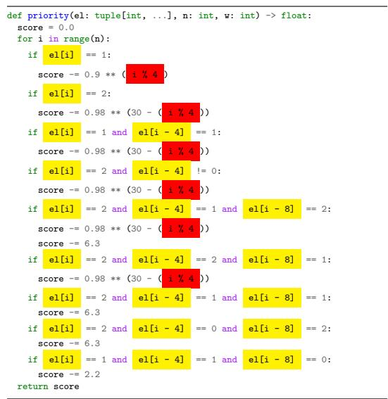  
(b) Further evolved to increase interpretabilty.  
Figure E.24: Two priority functions discovered by FunSearch, both of which yield a full-size I(12, 7) admissible set. The function on the left was discovered first. Afterwards we used FunSearch to evolve this function further, using a modified scoring function that we hypothesised would lead to better interpretability. This resulted in the function shown on the right. This longer function reveals more clearly the regularities of how the function uses the loop index i and which entries of el are accessed jointly.

Once FunSearch discovered a priority function $\{ 0 , 1 , 2 \} ^ { 1 2 } \to \mathbb { R }$ that leads to a full-size $\mathcal { T } ( 1 2 , 7 )$ admissible set A (see Figure E.24a), we were curious to understand what this function is doing. We proceeded in two interconnected ways. First, we visually inspected the source code, and started noticing a few interesting features (more on these below). Second, we leveraged the flexibility of FunSearch to optimise an arbitrary numerical property of the program, and used FunSearch to further evolve the discovered program in such a way that it becomes more interpretable. Specifically, we quantified interpretability as the negative of the number of high-scoring elements el that do not get included in the constructed admissible set A (because they would violate a defining condition of admissible set). More formally, the interpretability score $s _ { I } ( A )$ and total score $s ( A )$ of a program producing an admissible set A in this modified setting was

$$
\begin{array} { r l } & { s _ { I } ( A ) : = \left| \left\{ \mathbf { e } 1 \in \{ 0 , 1 , 2 \} ^ { n } \mid \mathbf { e } 1 \notin A \land \exists x \in A \mathrm { ~ s . t . ~ p r i o r i t y } ( x , n , w ) < \mathrm { p r i o r i t y } ( \mathbf { e } 1 , n , w ) \right\} \right| } \\ & { \ s ( A ) : = \left| A \right| - 1 0 ^ { - 6 } s _ { I } ( A ) } \end{array}\tag{9}
$$

(10)

The intuition was that a priority function that describes the admissible set A more tightly, relying less on filtering away high-scoring but invalid elements, would be more interpretable. The resulting function is shown in Figure E.24b, and visually inspecting it has helped us notice more easily the following features of this program:

1. As the function loops through the n coordinates $\mathbf { i } \in \{ 0 , 1 , \ldots , 1 1 \}$ , apart from indexing into the vector el the value of i is only accessed through its modulus i % 4, which is constant within each of the four coordinate groups {0, 4, 8}, {1, 5, 9}, {2, 6, 10}, {3, 7, 11}.

2. Each if condition in the function accesses between one and three entries of el, and thanks to how negative indices wrap around in Python, the set of accessed elements is always contained in one of the four coordinate groups {0, 4, 8}, {1, 5, 9}, {2, 6, 10}, {3, 7, 11}.

3. Since the priority is computed by i looping through all n coordinates, the resulting priority is actually invariant under cyclically permuting entries of el within any of the aforementioned four coordinate groups (cf. Appendix D).

The final observation may not automatically guarantee that our discovered $\mathcal { T } ( 1 2 , 7 )$ admissible set A is invariant under cyclically permuting coordinates within each four coordinate groups, as some highpriority elements could still potentially get skipped due to violating the admissible set condition, and thus breaking the invariance. However, this turned out not to be the case here — we verified that A is in fact invariant under this symmetry, which we formalized as Definition 2, calling admissible sets possessing this invariance symmetric.

We then hypothesised that large symmetric admissible sets may exist for other values of $n = 3 k$ and $1 \leq w < n$ We modified the program skeleton in the program specification that we pass to FunSearch such that it directly searches for symmetric admissible sets only (see Figure C.10). This is a more restricted but also much smaller search space, and we quickly discovered that symmetric admissible sets do in fact exist for all choices of $n \in \{ 3 , 6 , 9 , 1 2 \}$ and each $1 \leq w < n$ . This encouraged us to try searching for even larger symmetric admissible sets, resulting in a full-size I(15, 10) and a non-full-size admissible set in A(21, 15). These imply further improvements to the lower bound on the cap set capacity, as described in the main paper.

## E.4 Bin packing datasets

OR-Library datasets. We evaluate FunSearch on the well-known OR-Library bin packing benchmarks [32], using the binpack1, binpack2, binpack3 and binpack4 datasets, each containing 20 bin packing instances, with 120, 250, 500, and 1 000 items, respectively. These instances were generated by sampling item sizes uniformly from the interval [20, 100]. For all datasets, the capacity of the bins is set to 150. To evolve a heuristic with FunSearch, we generated a training dataset of 20 instances each with 120 items sampled from [20, 100] (similarly to the binpack1 instances). To evaluate our heuristic during training, we also generated a validation dataset of 20 instances of 250 items sampled from [20, 100] (similarly to the binpack2 instances). We then select the best heuristics with respect to the validation dataset and test them on the binpack1 to binpack4 instances.

Weibull datasets. The Weibull datasets were generated by sampling from a Weibull(45, 3) distribution. The parameters of this distribution were chosen based on standard values in the literature [33]. We further clipped the samples at 100 and rounded all items sizes to the nearest integer in $\{ 1 , 2 , \ldots , 1 0 0 \}$ . We generated a training dataset containing 5 instances each with 5 000 items and a validation dataset with the same number of instances and items. To test our learned heuristics, we generated test sets of 5 instances with 5 000 items, 5 instances of 10 000 items and 1 instance of 100 000 items (referred to as Weibull 5k, Weibull 10k and Weibull 100k respectively).

## E.5 Bin packing visualizations

As noted in the main paper, instead of packing items into bins with the least capacity (like best fit), the FunSearch heuristics typically assign items to least capacity bins only if the fit is very tight after placing the item. Otherwise, the item is placed in another bin which would leave more space after the item is placed. This strategy avoids leaving small gaps in bins that are unlikely to ever be filled. For example, for the OR datasets, the minimum item size is 20 and the best fit heuristic may leave gaps of size 18 and 19 which will never be filled. In contrast, FunSearch tends to avoid such gaps (see Figure E.25 for a visualization of an example).

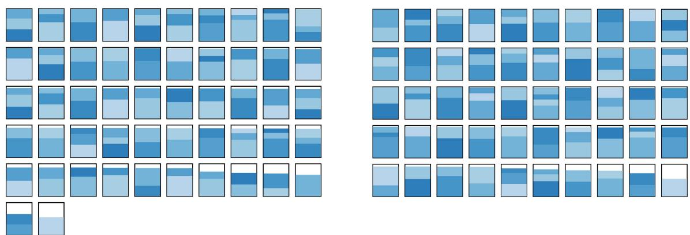  
Figure E.25: Packing solutions on u120 07 from the OR1 bin packing dataset sorted by remaining capacity. Left: Best fit. Right: FunSearch (the heuristic in Figure C.13). As can be seen, best fit leaves several gaps that are slightly smaller than the smallest items, leading to worse performance.

## F Implementation of FunSearch

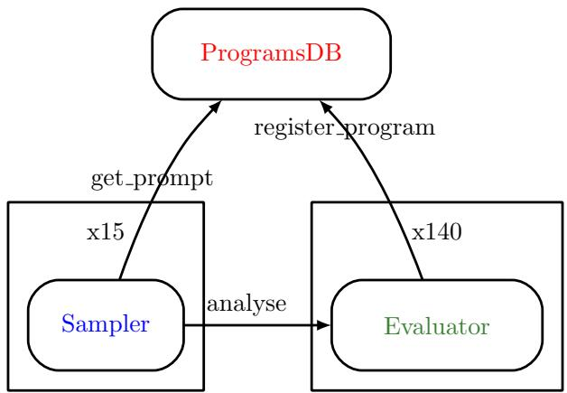  
Figure F.26: FunSearch graph.

In this section we present a pseudocode implementation of FunSearch. The function in Algorithm F.1 constructs the graph in Figure F.26 and starts the whole procedure.

Algorithm F.1 Function that launches a FunSearch experiment.   
def main (specification, tests inputs, num samplers = 15, num evaluators = 140)   
1: function to evolve, function to run = extract function names (specification)   
# We create a singleton ProgramsDB.   
2: programs db = ProgramsDB (function to evolve)   
# We create a set of evaluators.   
3: evaluators = []   
4: for i ∈ {1, . . . , num evaluators} do   
5: evaluators. append (Evaluator (programs db, function to run, tests inputs))   
# And we create a set of samplers.   
6: samplers = []   
7: for i ∈ {1, . . . , num samplers} do   
8: samplers. append (Sampler (programs db, evaluators))   
# We send the initial implementation in the specification for analysis by one of the evaluators.   
9: evaluators[0] . analyse (specification)   
# Finally we start calling the sample function of all samplers in parallel.   
10: for sampler ∈ samplers do   
11: sampler. sample ()

This function uses 3 classes of objects: Sampler, Evaluator and ProgramDB. For each of those, we present its pseudocode implementation in Appendix F.1, Appendix F.2 and Appendix F.3 respectively.

## F.1 Sampler

Class for sampling using an LLM.

```python
Algorithm F.2 Constructor of the Sampler class.
def constructor (self, programs db, evaluators, samples per prompt = 4)
1: self. programs db = programs db
2: self. evaluators = evaluators
3: self. llm = LLM (samples per prompt)
```

Algorithm F.3 Getting prompts and sampling in an endless loop.   
def sample (self)   
1: while True do   
2: prompt, island id = self. programs db. get prompt ()   
3: samples = self. llm. draw samples (prompt)   
4: for sample ∈ samples do   
5: pick at random (self. evaluators) . analyse (sample, island id)

## F.2 Evaluator

Class that analyses functions generated by LLMs and send the results to the Programs Database. The Evaluator has access to a sandbox to run programs. The sandbox is needed for two reasons. The first reason is to prevent the given program doing things we do not want it to do, like connecting to the internet or using too much memory. The second is to stop the program after a given timeout, so that we do not need to wait for a program that takes too long, or even infinity. The sandbox returns two outputs. The first one is the actual output obtained when running the given program, and the second one is a boolean that indicates weather the program runs correctly, i.e. if it did not contain syntactic or runtime errors. If the program executed correctly, its actual output is assumed to be the numerical score of the corresponding solution, or ∅ if the solution was invalid (cf the main functions in Figure 2).

Algorithm F.4 Constructor of the Evaluator class.   
def constructor (self, programs db, function to run, test inputs, timeout seconds = 30)   
1: self. programs db = programs db   
2: self. function to run = function to run   
3: self. test inputs = test inputs   
4: self. T = timeout seconds

Algorithm F.5 Analyses a given program.   
def analyse (self, program, island id)   
1: scores per test = {}   
2: for test input ∈ self. test inputs do   
3: test output, runs ok = sandbox run (program, self. function to run, test input, self. T )   
4: if runs ok and not calls ancestor (program) and test output ̸= ∅ then   
5: scores per test[test input] = test output   
# If at least it passed one test, we send it to the ProgramsDB.   
6: if scores per test ̸= {} then   
7: self. programs db. register program (program, island id, scores per test)

## F.3 ProgramsDB

Class that stores and serves the programs. It uses a set of instances from the class Island whose pseudocode is shown in Appendix F.3.1. In turn, that class relies on using instances of the class Cluster, whose pseudocode is in Appendix F.3.2.

Algorithm F.6 Constructor of the ProgramsDB class.   
def constructor(self, function to evolve, number islands = 10, reset period = 4 ∗ 60 ∗   
60, functions per prompt = 2, temperature = 0.1, temperature period = 30000)   
1: self. k = functions per prompt   
2: self. T0 = temperature   
3: self. N = temperature period   
4: self. function to evolve = function to evolve   
5: self . islands = []   
6: for i ∈ {1, . . . , number islands} do   
7: self. islands. append (Island (self. function to evolve, self. k, self. T0, self. N ))   
8: self. islands to reset = number islands /2   
9: self. best score per island = [−∞] ∗ number islands   
10: self. best program per island = [∅] ∗ number islands   
11: self. best scores per test per island = [∅] ∗ number islands   
12: self. reset period = reset period   
13: self. last reset time = time now ()

Algorithm F.7 Returns a new prompt.   
def get prompt (self)   
1: island id = pick at random ({0, . . . , | self. islands | − 1})   
2: return self. islands[island id]. get prompt () , island id

Algorithm F.8 Registers the given program into the given island.   
def register program in island (self, program, island id, scores per test)   
1: self. islands[island id]. register program (program, scores per test)   
2: score = reduce score (scores per test)   
3: if score > self. best score per island[island id] then   
4: self. best program per island[island id] = program   
5: self. best score per island[island id] = score   
6: self. best scores per test per island[island id] = scores per test

Algorithm F.9 Registers the given program into the database.   
def register program (self, program, island id, scores per test)   
1: if island id = ∅ then   
# This is a program added at the beginning, so adding to all islands   
2: for island id ∈ {0, . . . , | self . islands | − 1} do   
3: self. register program in island (program, island id, scores per test)   
4: else   
5: self. register program in island (program, island id, scores per test)   
# Check whether it is time to reset some islands   
6: if time now () − self. last reset time > self. reset period then   
7: last reset time = time now ()   
8: self. reset islands ()

Algorithm F.10 Restarts the population of a proportion of the islands. g

def reset islands (self)   
# We sort best scores after adding minor noise to break ties.   
1: sorted islands scores = argsort add gaussian noise self. best score per island, 10−6   
2: reset islands ids = []   
3: keep islands ids = []   
4: for i ∈ 0, . . . , | sorted islands scores | − 1 do   
5: if i < self. islands to reset then   
6: reset islands ids. apppend (sorted islands scores[i])   
7: else   
8: keep islands ids. append (sorted islands scores[i])   
9: for island id ∈ reset islands ids do   
10: self. islands[island id] = Island (self. function to evolve, self. k, self. T0, self. N )   
11: self. best score per island[island id] = −∞   
12: founder island id = pick at random (keep islands ids)   
13: founder = self. best program per island[founder island id]   
14: founder scores = self. best scores per test per island[founder island id]   
15: self. register program in island (founder, island id, founder scores)

## F.3.1 Island

```python
Algorithm F.11 Constructor of the Island class.
def constructor (self, function to evolve, functions per prompt, temperature, temperature period)
1: self. function to evolve = function to evolve
2: self. functions per prompt = functions per prompt
3: self. clusters = {}
4: self. T0 = temperature
5: self. N = temperature period
6: self. template = ∅
# Total number of programs registered on this island.
7: self. n = 0
```

Algorithm F.12 Adds the given program into the island.   
def register program (self, program, scores per test)   
1: if not self. template then   
2: self. template = extract template from program (program)   
3: if scores per test ∈/ self. clusters then   
4: score = reduce score (scores per test)   
5: self. clusters[scores per test] = Cluster (score, program)   
6: else   
7: self. clusters[scores per test]. programs. append (program)   
8: self . n = self . n + 1

Algorithm F.13 Builds and returns a prompt.   
def get prompt (self)   
1: s = []   
2: for cluster ∈ self. clusters do   
3: s . append (cluster. score)   
4: Tcluster = self . T0 · 1 − self. n mod self. N  self. N   
5: pi = Pi′ exp(si′ /Tcluster) exp(si/Tcluster)   
# At the beginning we might not have enough clusters.   
6: functions per prompt = min (| self. clusters |, self. functions per prompt)   
7: chosen clusters = pick at random (self. clusters, p, functions per prompt)   
8: programs = []   
9: scores = []   
10: for cluster ∈ chosen clusters do   
11: programs. append (cluster. sample program ())   
12: scores. append (cluster. score)   
13: sorted programs = []   
14: indices = argsort (scores)   
15: for index ∈ indices do   
16: sorted programs. append (programs[index])   
17: return self. generate prompt (sorted programs)

Algorithm F.14 Creates a prompt containing a sequence of function implementations.   
def generate prompt (self, implementations)   
1: prompt = self. template   
2: for i ∈ {0, . . . , | implementations | − 1} do   
3: new function name = get versioned function name (self. function to evolve, i)   
# Rename the function, including any internal recursive calls, and update its docstring.   
4: new implementation = rename function (implementations[i], new function name)   
5: prompt = string concatenation ([prompt, new implementation], double line)   
# Create the header of the function to be generated by the LLM.   
6: version generated = | implementations   
7: new function name = get versioned function name (self. function to evolve, version generated)   
8: header = make header like (implementations[0], new function name)   
# Rename the call to the target function.   
9: prompt = rename function calls (prompt, self. function to evolve, new function name)   
10: prompt = string concatenation ([prompt, implementation], double line)   
11: return prompt

## F.3.2 Cluster

Algorithm F.15 Constructor of a Cluster.   
def constructor (self, score, first program)   
1: self. score = score   
2: self. programs = [first program]

```latex
Algorithm F.16 Samples a program giving higher probability to shorter programs.
def sample program (self, Tprogram = 1)
1: ℓ = []
2: for program ∈ self. programs do
3: ℓ . append (− length (program))
4: $\begin{array} { r } { \widetilde { \ell } _ { i } = \frac { \ell _ { i } - \operatorname* { m i n } _ { i ^ { \prime } } \ell _ { i ^ { \prime } } } { \operatorname* { m a x } _ { i ^ { \prime } } \ell _ { i ^ { \prime } } + 1 0 ^ { - 6 } } } \end{array}$
5: $p _ { i } = \frac { \exp \left( \ell _ { i } / T _ { \mathrm { p r o g r a m } } \right) } { \sum _ { i ^ { \prime } } \exp \left( \widetilde { \ell } _ { i ^ { \prime } } / T _ { \mathrm { p r o g r a m } } \right) }$
6: return pick at random (self. programs, p)
```

## References

[1] Code models overview. https://cloud.google.com/vertex-ai/docs/generative-ai/code/ code-models-overview, 2023. [Online; accessed July-2023].

[2] Raymond Li, Loubna Ben Allal, Yangtian Zi, Niklas Muennighoff, Denis Kocetkov, Chenghao Mou, Marc Marone, Christopher Akiki, Jia Li, Jenny Chim, et al. StarCoder: may the source be with you! arXiv preprint arXiv:2305.06161, 2023.

[3] X. Chen, C. Liang, D. Huang, E. Real, K. Wang, Y. Liu, H. Pham, X. Dong, T. Luong, C.-J. Hsieh, Y. Lu, and Q. V. Le. Symbolic discovery of optimization algorithms. arXiv preprint arXiv:2302.06675, 2023.

[4] Charles R. Harris, K. Jarrod Millman, St´efan J. van der Walt, Ralf Gommers, Pauli Virtanen, David Cournapeau, Eric Wieser, Julian Taylor, Sebastian Berg, Nathaniel J. Smith, Robert Kern, Matti Picus, Stephan Hoyer, Marten H. van Kerkwijk, Matthew Brett, Allan Haldane, Jaime Fern´andez del R´ıo, Mark Wiebe, Pearu Peterson, Pierre G´erard-Marchant, Kevin Sheppard, Tyler Reddy, Warren Weckesser, Hameer Abbasi, Christoph Gohlke, and Travis E. Oliphant. Array programming with NumPy. Nature, 585(7825):357–362, September 2020.

[5] Guido Van Rossum and Fred L. Drake. Python 3 Reference Manual. CreateSpace, Scotts Valley, CA, 2009.

[6] Fred Tyrrell. New lower bounds for cap sets. arXiv preprint arXiv:2209.10045, 2022.

[7] Laurent Perron and Fr´ed´eric Didier. Cp-sat.

[8] C. E. Shannon. The zero error capacity of a noisy channel. IRE Transactions on Information Theory, IT-2(3):8–16, 1956.

[9] J. K¨orner and A. Orlitsky. Zero-error information theory. IEEE Transactions on Information Theory, (44):2207–2229, 1998.

[10] N. Alon. The Shannon capacity of a union. Combinatorica, (18):301–310, 1998.

[11] J. Zuiddam. The asymptotic spectrum of graphs and the Shannon capacity. Combinatorica, (39):1173–1184, 2019.

[12] T. Bohman. A limit theorem for the Shannon capacities of odd cycles I. Proceedings of the American Mathematical Society, (131):3559–3569, 2003.

[13] C. D. Godsil. Problems in algebraic combinatorics. Electronic Journal of Combinatorics, (2):1– 20, 1995.

[14] L. Lov´asz. On the Shannon capacity of a graph. IEEE Transactions on Information Theory, IT-25(1):1–7, 1979.

[15] W. H. Haemers. An upper bound for the Shannon capacity of a graph. Colloquia Mathematica Societatis J´anos Bolyai, 25:267–272, 1978.

[16] L. Baumert. A combinatorial packing problem. In SIAM-AMS Proceedings, number 131, pages 97–108, 1971.

[17] A. Vesel and J. Zerovnik. Improved lower bound on the Shannon capacity of C7. Information Processing Letters, 81(5):277–282, 2002.

[18] F. J. R. Ruiz and F. Perez-Cruz. Zero-error codes for the noisy-typewriter channel. In IEEE Information Theory Workshop, pages 495–497, 2011.

[19] K. A. Mathew and R. J. Osterg˚ard. New lower bounds for the Shannon capacity of odd cycles. ¨ Designs, Codes and Cryptography, (84):13–22, 2016.

[20] S. C. Polak and A. Schrijver. New lower bound on the Shannon capacity of C7 from circular graphs. Information Processing Letters, 143:37–40, 2019.

[21] Ben Green. Finite field models in additive combinatorics. arXiv preprint math/0409420, 2004.

[22] A. K. Chandra, M. L. Furst, and R. J. Lipton. Multi-party protocols. In Proceedings of the 15th Annual ACM Symposium on Theory of Computing, pages 94–99, 1983.

[23] A. Shraibman. A note on multiparty communication complexity and the Hales-Jewett theorem. Information Processing Letters, 139:44–48, 2018.

[24] N. Linial, T. Pitassi, and A. Shraibman. On the communication complexity of high-dimensional permutations. In Innovations in Theoretical Computer Science Conference, volume 124 of Leibniz International Proceedings in Informatics, pages 54:1–54:20, 2018.

[25] N. Alon and A. Shraibman. Algorithmic number on the forehead protocols yielding dense Ruzsa-Szemer´edi graphs and hypergraphs. arXiv preprint arXiv:2001.00387, 2020.

[26] N. Linial and A. Shraibman. Larger corner-free sets from better NOF exactly-n protocols. arXiv preprint arXiv:2102.00421, 2021.

[27] M. Christandl, O. Fawzi, H. Ta, and J. Zuiddam. Larger corner-free sets from combinatorial degenerations. arXiv preprint arXiv:2111.08262, 2021.

[28] Ben Green. Lower bounds for corner-free sets. arXiv preprint arXiv:2102.11702, 2021.

[29] Yves Edel. Extensions of generalized product caps. Designs, Codes and Cryptography, 31:5–14, 2004.

[30] Raymond Hill. On the largest size of cap in S5,3. Atti della Accademia Nazionale dei Lincei. Classe di Scienze Fisiche, Matematiche e Naturali. Rendiconti, 54(3):378–384, 1973.

[31] Peter Jephson Cameron and Jacobus Hendricus Van Lint. Designs, graphs, codes and their links, volume 3. Cambridge University Press Cambridge, 1991.

[32] John E Beasley. Or-library: distributing test problems by electronic mail. Journal of the operational research society, 41(11):1069–1072, 1990.

[33] Spyros Angelopoulos, Shahin Kamali, and Kimia Shadkami. Online bin packing with predictions. arXiv preprint arXiv:2102.03311, 2021.