# CAUSALEVOLVE: TOWARDS OPEN-ENDED DISCOVERY WITH CAUSAL SCRATCHPAD

Yongqiang Chen∗1,2 Chenxi Liu ∗3 Zhenhao Chen1 Tongliang Liu4,1 Bo Han3 Kun Zhang1,2

1MBZUAI 2Carnegie Mellon University 3TMLR Group, Hong Kong Baptist University

4SAIC Centre, The University of Sydney

yqchen24@gmail.com cscxliu@comp.hkbu.edu.hk

## ABSTRACT

Evolve-based agent such as AlphaEvolve is one of the notable successes in using Large Language Models (LLMs) to build AI Scientists. These agents tackle open-ended scientific problems by iteratively improving and evolving programs, leveraging the prior knowledge and reasoning capabilities of LLMs. Despite the success, existing evolve-based agents lack targeted guidance for evolution and effective mechanisms for organizing and utilizing knowledge acquired from past evolutionary experience. Consequently, they suffer from decreasing evolution efficiency and exhibit oscillatory behavior when approaching known performance boundaries. To mitigate the gap, we develop CausalEvolve, equipped with a causal scratchpad that leverages LLMs to identify and reason about guiding factors for evolution. At the beginning, CausalEvolve first identifies outcome-level factors that offers complementary inspirations in improving the target objective. During the evolution, CausalEvolve also inspects surprise patterns during the evolution and abductive reasoning to hypothesize new factors, which in turn offer novel directions. Through comprehensive experiments, we show that CausalEvolve effectively improve the evolutionary efficiency and discovers better solutions in 4 challenging open-ended scientific tasks.

## 1 INTRODUCTION

As large language model (LLMs) demonstrate increasing capabilities in complex and challenging reasoning tasks (Guo et al., 2025; Li et al., 2025e), the community seeks to build LLM-based agents to facilitate a number of downstream applications (Plaat et al., 2025). One of the most notable and promising applications is the AI Scientist agents (ZHENG et al., 2025), where the LLM-based agent is expected to automate the scientific discovery process ranging from conducting literature surveys (Wan et al., 2026), hypothesis generation (Khemakhem et al., 2020), data-driven analysis (Chan et al., 2024) to experiment design (Li et al., 2025c), etc. In fact, when incorporated into the agentic framework, LLMs have demonstrated great promise. Lu et al. (2024); Gottweis et al. (2025); Mitchener et al. (2025) show that LLMs can come up with new research hypotheses and proposals based on the existing literature and automate the full scientific discovery pipeline (Yamada et al., 2025). Recent advances in using LLMs to assist with scientific discovery shows LLMs can accelerate the idea iteration and deep literature search (Bubeck et al., 2025; Woodruff et al., 2026).

One of the most representative AI Scientist agents is the evolutionary coding agent, like AlphaEvolve (Novikov et al., 2025; Lange et al., 2025b). In the iterative evolutionary framework, LLMs demonstrate great capabilities in proposing, evaluating, and refining iteratively better solutions to a number of scientific problems (Sharma, 2025; Georgiev et al., 2025; Cheng et al., 2025). Despite the success, the evolution process in the existing frameworks is mainly driven by the evolution algorithm or derived from correlational studies. In contrast, human scientists can design purposeful experiments and summarize scientific insights from observational data (Kuhn & Hawkins, 1963; Kaelbling et al., 1998; Glymour). The gap that emerges between the uncontrolled evolutionary process of evolve-based agents and the guided discovery process of humans raises a challenging research question:

## How can we develop evolution-based agents to perform guided scientific discovery like humans?

To tackle the question, we resort to causality, which summarizes the practice of scientific discovery of humans (Spirtes et al., 2000b; Pearl, 2009). Essentially, scientific discovery is about revealing the underlying causal mechanism of the interested problem (Wallace, 1981; Glymour). Hence, we can formulate the evolution based scientific discovery process as a Partially Observable Markov Decision Process (POMDP) (Kaelbling et al., 1998), where the agent needs to uncover the underlying causal mechanism through purposeful actions and interventions (Sec. 3). With the POMDP formulation, we demonstrate that accumulating and guiding the evolution with causal knowledge is crucial to both the efficiency and effectiveness of the discovery process. Without the incorporation of causality, the evolution can easily oscillate or get stuck at local optimal solutions.

To this end, we develop a new evolutionary AI Scientist framework, termed CausalEvolve, where we introduce a causal scratchpad to the evolution-based agent. The guidance provided by CausalEvolve is built upon the interventional factors identified before and during the evolution process. As the evolution-based agent primarily focuses on optimizing a target objective, such as the objective value of a combinatorial optimization problem or the accuracy of a machine learning problem (Lange et al., 2025b), CausalEvolve first identifies a set of outcome-level factors to provide complementary views of the target objective. During the evolution, CausalEvolve leverages a multi-arm bandit (MAB) to adaptively determine the desired intervention with respect to a selected outcome-level factor.

In addition, CausalEvolve also identifies procedure-level factors from the accumulated trials with LLMs (Liu et al., 2024). Intuitively, the procedure-level factors are useful interventions to the solutions that explain the objective value changes. For example, the optimization technique used to solve a combinatorial optimization problem. Nevertheless, some combinations of apparently useful factors may lead to decreased scores, which we term as “surprise patterns”. Understanding and explaining the “surprise patterns” is critical to reveal new scientific insights (Wallace, 1981). Hence, CausalEvolve also performs abductive reasoning to come up with new factors and hypothesis that will be suggested to evaluate in the future experiments to better explain all the observed patterns (Douven, 2025).

Empirically, we show that CausalEvolve significantly improves the evolution efficiency and achieves better results compared to the existing state-of-the-art ShinkaEvolve (Lange et al., 2025b) across 4 open-ended discovery problems. Our contributions can be summarized as follows:

• We propose a theoretical formulation of evolution-based open-ended discovery, and demonstrate the necessity of causality (Sec. 3);

• We propose a new framework CausalEvolve to realize the accumulation and guidance of causal knowledge by identifying outcome-based and procedure-based factors;

• CausalEvolve is shown to improve both the evolution efficiency and effectiveness across 4 open-ended discovery problems.

## 2 RELATED WORK

AI Scientist Agents. With the significant advancement in LLM capacity and the development of Agentic system, there is a rising number of works on developing agents for helping scientific discoveries (Lu et al., 2024; Yamada et al., 2025; Gottweis et al., 2025). One research line is to automating the pipelines in scientific activities, including literature review (Huang et al., 2025b), hypothesis generation (Li et al., 2024a; Yang et al., 2024; Wang et al., 2024; Yang et al., 2025), hypothesis verification (Li et al., 2024b; Huang et al., 2025a), and assistance in scientific reports (Liang et al., 2024). Another research line is to integrating the knowledge and reasoning ability of LLMs to conduct computational intensive evolution or iteration on specific scientific problems (Shojaee et al., 2025; Romera-Paredes et al., 2024; Novikov et al., 2025; Sharma, 2025; Lange et al., 2025a). There are also works on automated tabular data analysis with machine learning workflows (Zha et al., 2023; Li et al., 2023; Zhang et al., 2023; Li et al., 2025b), or embodied agents that can conduct real-world experiments (Roch et al., 2020; Zhu et al., 2022; Tom et al., 2024; Mandal et al., 2025). The impact of these lines of work has been made on scientific fields includes chemistry (Yang et al., 2026; Boiko et al., 2023), earth science (Feng et al., 2025), and biology (Swanson et al., 2025; Truhn et al., 2026).

Causality for Scientific Discovery. There has been a long history for the discussions on how to understand world through observations (Greenland et al., 1999; Spirtes et al., 2000a; Pearl, 2009). One research line is causal discovery for structured data, where algorithms are designed to learn directed acyclic graphs among the random variables as causal structure, including constrained-based methods (Spirtes et al., 1995; 2000a), methods with constrained functional (Shimizu et al., 2006; Zhang & Hyvarinen, 2012; Hoyer et al., 2008), non-stationarity (Malinsky & Spirtes, 2019; Huang et al., 2019; 2020; Liu & Kuang, 2023), the incorporation with multiple domain data (Huang et al., 2020; Yang et al., 2018; Brouillard et al., 2020; Mooij et al., 2020; Perry et al., 2022), and handling latent variables with the pure children assumption (Li et al., 2025d; Li & Liu, 2025). Recently, there are works to integrating causality with large language models. One direction is to empower the causal methods with the knowledge of LLMs, which includes constructing priors based on variable descriptions (Long et al., 2023; Li et al., 2024c), adjusting the causal structure searching process (Ban et al., 2023; Vashishtha et al., 2023; Jiralerspong et al., 2024), constructing structured variables out of unstructured data (Liu et al., 2025; Li et al., 2025a), and finding valid adjustment sets for treatment effect estimation (Dhawan et al., 2024; Liu et al., 2025; Sheth et al.). Another direction is to empower LLM-based agent with causal tools for tabular data analysis (Abdulaal et al., 2023; Khatibi et al., 2024; Shen et al., 2024; Wang et al., 2025a; Verma et al., 2025), revealing insights from data in an autonomous pipeline.

## 3 SCIENTIFIC DISCOVERY VIA OBJECTIVE OPTIMIZATION

## 3.1 FORMULATION OF SCIENTIFIC DISCOVERY

Scientific discovery aims to uncover the underlying scientific knowledge or the causal mechanisms from interactions with the world (Kuhn & Hawkins, 1963), which can be formulated as a Partially Observed Markov Decision Process (POMDP) (Kaelbling et al., 1998).

Scientific knowledge. The primary objective of an AI Scientist is to uncover the underlying scientific knowledge about the task-world, represented by a latent variable Θ ∈ Θ, where Θ may encode causal structure, mechanisms, inductive biases, constraints, etc. Specifically, Θsci = θsci can be parameterized as a Structural Causal Model (SCM) θsci = (G, F , PU ) (Spirtes et al., 2000a), where G = (V, E) is a directed graph whose nodes V represent variables of interest and whose edges E encode direct causal dependencies; F = {fv}v∈V is a collection of structural equations v = fv(Pa(v), uv), where Pa(v) denotes the parents of v in G and uv is an exogenous noise variable; PU is a distribution over the exogenous variables U = {uv}v∈V .

POMDP process. Given θ , as shown in Fig. 1, the AI Scientist agent, implemented via the evolutionary coding framework such as AlphaEvolve (Novikov et al., 2025), will interact with the environment by proposing candidate programs pt ∈ P (at turn t) to gain observations, yt = F (pt, θsci), where F : P ×Θ → R is the objective that the agent aims to optimize. Then, the scientific discovery process can be formulated as a POMDP M = (S, A, Ω, T , O, R, γ) with a static hidden parameter as θsci of the underlying scientific knowledge. The hidden state st = θsci is the scientific knowledge θsci that does not change over turns. The action is at = pt representing the choice of which program to evaluate. The observation ot = yt is the evaluation outcome. The transition kernel T can be simply considered as identity, and the observation kernel is O(ot | st, at) = P (yt | θsci, pt). Given a finite experiment budget T , the agent chooses p0, . . . , pT −1 and gain observations y0, . . . , yT −1, so as to find pˆ = arg max F (p, θsci) and the scientific knowledge θsci.

  
Figure 1: The iterative scientific discovery loop. Left: Conceptual flow of the agent. The agent maintains a scratchpad memory (m), proposes a program (p), and observes the outcome (y) which is constrained by the unknown world state (θsci). The outcome feeds back into the memory for the next step. Right: The diagram illustrates how the AI Scientist probes the unknown world state θsci. By proposing a candidate program pt, the agent triggers an experiment yielding outcome yt. This observation provides evidence about θsci, which is integrated into the agent’s scratchpad memory mt+1. Over time steps t, t + 1, . . . , this recurrent process allows the agent to navigate the performance landscape and converge towards optimal programs despite the static but unknown nature of θsci.

Evaluation as intervention on SCM. Given the SCM parametrization of θsci, we can consider that a program p ∈ P is encoded as a particular configuration of design variables X = xp. Then, F can be implemented as

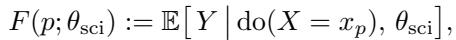

(1)

i.e., the expected outcome under the intervention do(X = xp) in the true causal model θsci. Typical implementations of F can be the objective value of a combinatorial optimization problem, the efficiency of a kernel program, or the performance of a machine learning model (Novikov et al., 2025).

Belief as a probability distribution over Θ. We define bt as the agent’s Bayesian belief after history ht = {(p0, y0), . . . , (pt−1, yt−1)}, i.e. a probability distribution on Θ:

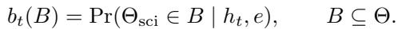

(2)

In the ideal Bayesian formalism, the belief b (θ) is a sufficient statistic for decision-making (Kaelbling et al., 1998). In practice, the AI Scientist maintains an internal belief, which is usually implemented as memory mt = Φ(ht) for some (possibly learnable) summarization function Φ (Lange et al., 2025a), to represent the approximate representation of its knowledge about θsci and the landscape of F (·; θsci). Each evaluation step (pt, yt) thus updates mt, which in turn updates the agent’s effective belief about θsci. In this sense, each step reveals part of the underlying scientific knowledge, which in turn determines the next action pt+1.

## 3.2 ESSENTIALITY OF CAUSAL KNOWLEDGE FOR AI SCIENTISTS

If the objective function F is static universally, then with more experiment turns, the optimized solution pt and the agent’s revealed scientific knowledge can also be applied universally. However, the observation from the evaluation is usually only given by a proxy knowledge θe about the scientific knowledge Θsci at some specific environment e ∈ E. For example, the performance of a machine learning model is usually assessed on finite samples from the test distribution, and there also exist distribution shifts from the test distribution when deploying the model in the real world (Quinonero-Candela et al., 2008). Different from Θsci that characterizes the complete causal structure about the scientific problem, optimization under environment θe may introduce some spurious correlations that maximize the objective value Fe (Chen et al., 2023). Therefore, without loss of generality, to retain the optimality of pˆ beyond the source environment esrc to some target etgt, it is essential to reveal the causal knowledge and answer causal questions for an AI Scientist.

Definition 3.1 (Causal AI Scientist). A Causal AI Scientist is an agent specified by: (i) a policy πt(· | θt, esrc) selecting pt, (ii) a counterfactual / explanatory operator CF, that answer interventional queries (e, p) via CF(θt; e, p) as an “explanation” of predicted performance, where θt is the knowledge revealed at turn t.

Without the revealing of the causal knowledge, the discovery process suffers from significant inefficiency and suboptimality issues. We discuss the two issues more concretely below.

Evolutionary efficiency of Causal AI Scientist. We begin by considering a static environment and finite P = {p1, . . . , pK}. For θsci, we assume each program p has a known feature vector xp ∈ Rd with ∥xp∥2 ≤ 1, and the unknown scientific parameter is a weight vector w⋆ ∈ Rd and F (p) = ⟨xp, w⋆⟩. Each evaluation returns a noisy observation yt = F (pt) + εt where εt ∼ N (0, σ2) i.i.d.. A Causal AI Scientist in this environment can be implemented via estimating the w⋆ and optimizing for pˆ from the history.

In addition, we also consider a black-box baseline that does not consider the interactions between the historical observations. It can be characterized as the following θbb := nµ : P → Ro where each program has an unrelated unknown mean F (p; µ) = µ(p), and yt = µ(pt) + εt, where εt is the same Gaussian noise.

Theorem 3.2 (Informal). Under the given environment, there exists a policy πcausal such that with probability at least 1 − δ, F (ˆp; θ ) obtains less than 2ϵ error than the optimal value, with O(d log(K)) turns; In contrast, the black-box baseline needs O(K).

The formal description of the sample efficiency issue and the proof are given in Appendix B. Theorem 3.2 shows that, when K ≫ d, which is usually the case as the space for all programs is significantly larger than the underlying SCM, encoding (correct) causal structure yields an exponential (or at least multiplicative) gain in sample efficiency under finite budgets.

Generalizability of Causal AI Scientist. To show the necessity of capturing θsci, we have the following: Theorem 3.3. Consider the esrc, etgt ∈ E and θ0, θ1 ∈ Θ such that Fe (· | p, θ0) = Fe (· | p, θ1) ∀p ∈ P, and ∃ p, p′ ∈ P s.t. Fetgt (p; θ0) − Fetgt (p′; θ0) ≥ ∆ and Fetgt (p′; θ1) − Fetgt (p; θ1) ≥ ∆, for some ∆ > 0, then for any policy π that can interact only with esrc, there exists i ∈ {0, 1} such that for every budget T , maxp∈P Fetgt (p; θi) − Fetgt (ˆp; θi) ≥ ∆/2.

The formal description of the generalizability issue and the proof are given in Appendix C. Intuitively, Theorem 3.3 imply that if the source environment does not distinguish the corresponding θsci among {θ0, θ1}, then the solution pˆ solved given source environment is always suboptimal. In the real world, it is usually the case that two machine learning models will have similar performances under the public test benchmarks, but exhibit significantly different behaviors when generalizing to distributions from other environments.

## 4 CAUSAL SCRATCHPAD FOR EVOLUTIONARY CODING AGENT

Given the limitations shown in Sec. 3.2, it is essential to explicitly incorporate the causal knowledge into the evolutionary process. Hence, we present CausalEvolve, which incorporates a causal scratchpad to identify critical factors and exploit their causal relations with the objective variables to guide the evolution process. Specifically, we consider incorporating the outcome-level factors and the procedure-level factors to tackle the efficiency and the suboptimality issues, respectively.

## 4.1 OUTCOME-LEVEL FACTOR

Essentially, the underlying configurations of the program can be reflected and recognized from task-dependent, real-valued descriptors extracted from the observable outcomes of program execution. As shown in Theo rem 3.2, intervening on the underlying configuration variables provides significantly higher sample efficiency.

Factor construction. For a given task, a set of outcome-based factors m := (m1, m2, . . . , mK ) is specified by LLMs before the evolution. An LLM would be prompted with the basic task description, which is the same as the system prompt used in evolution, and the expected output of each program, e.g., a list of coordinates, or an n × n matrix. For each of the outcome-based factors, the LLM would define the factor name and also a excitable code that maps the program output to the factor value. We list the outcome-based factors used in our tasks in Appendix D.

Causal Planner with outcome-level factors. With outcome-based factors m, we develop CausalPlanner. Specifically, we define the action space A := ∪m∈m(m, +1), (m, −1)	. When applying an action (m, d), the existing programs would be sorted in descending order according to m × d, and then the inspiration programs would be selected from the top of them. In t-th generation, after generating each child program from its parent and the inspiration programs with action a ∈ A, the reward Ra could be calculated. Let the yc be the child’s main target that is to be maximized, and vt be the best-so-far value of the main target. We define the reward as Ra := (yc − τ · vt)+, where τ ∈ (0, 1). We introduce this discounter τ because improving the best-so-far result could be a rare event, and therefore cannot be fairly estimated by only a few iterations. In practice, we alternate between exploration and exploitation: random actions are taken for K iterations, followed by choosing the currently best action for the next K iterations.

## 4.2 PROCEDURE-LEVEL FACTORS

To better capture important designs of the programs and uncover their associated causal knowledge, we also introduce procedure-level factors identified from the programs.

Factor construction. We construct the procedure-level factors based on the COAT framework (Liu et al., 2025) that leverages LLMs to identify useful procedure factors from unstructured data. As LLMs are considered incapable of understanding causality, Liu et al. (2025) constructs feedback to regularize the identified factors by LLMs. Similarly, we prompt LLMs to identify factors that explain the performance differences of the performances of different programs. Then, CausalEvolve estimates an approximated average treatment effect of different factors with respect to the target objective value to provide a holistic view of the usefulness of the identified procedure-level factors. Due to the limited sample size and the existence of hidden confounders, the estimated treatment effects may contain biases, while empirically, we do not need an accurate estimation, but order-preserved quantities to provide insights.

Abductive reasoning. As mainly explaining the performance differences is insufficient for revealing all factors, we also incorporate a surprise detection module and leverage LLMs to perform abductive reasoning on the potentially existing factors and hypotheses that explain the surprise patterns (Douven, 2025). The detection of surprise patterns relies on the estimated treatment effects. Since the estimation can contain biases, we focus on detecting significant shifts in the estimated effects, including the signal inverses, i.e., a positively correlated factor produces negative effects, and significant quantity shifts, i.e., a minor correlated factor produces negative effects. By explaining the surprise patterns, we are able to find the underlying confounder and better reveal the underlying θsci.

## 5 EXPERIMENTS

## 5.1 EXPERIMENTAL SETTING

Baselines. We mainly compare CausalEvolve with the state-of-the-art evolve-based agent ShinkaEvolve (Lange et al., 2025a) that produces the best or competitive results as AlphaEvolve (Novikov et al., 2025) in an sample-efficient manner. As ShinkaEvolve also incorporates a memory module to summarize the insights from h , we also consider two additional variants, CausalPlanner with meta summary module from ShinkaEvolve, and COAT, to ablate the effects of two modules in CausalEvolve. For the LLMs, we fix to using Grok-4.1-fast-reasoning (xAI, 2025) for fair comparisons.

Tasks. We evaluate our framework on four scientific discovery tasks that require optimizing code for different objectives:

Hadamard Matrix (n = 29). The goal is to construct an n×n matrix H with entries in {±1} that maximizes the absolute determinant | det(H)|. For n = 29, the best-known solution achieves | det(H)| = 228 · 712 · 320, which we use to normalize scores to [0, 1] for comparability with prior work (Wang et al., 2025b). This discrete optimization problem requires balancing matrix properties including row orthogonality, element balance, and determinant magnitude.

Second Autocorrelation Inequality. We seek a step function f : [−1, 1] → R≥0 (discretized into n = 256 steps) that minimizes the ratio

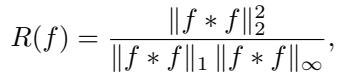

where f ∗f denotes linear autoconvolution. The optimal value R(f) ≥ 1.1547 . . . remains an open conjecture. This continuous optimization task requires carefully shaping the function’s smoothness, concentration, and sparsity.

Circle Packing (N = 26). The objective is to place N circles with radii ri and centers Ci = (xi, yi) in a unit square [0, 1]2 such that: (i) no circles overlap (∥Ci − Cj ∥ ≥ ri + rj for all i ̸= j), (ii) all circles remain within the square (ri ≤ Cxi , Cyi ≤ 1 − ri), and (iii) the sum of radii P ri is maximized. This geometric optimization task requires spatial reasoning about density, distribution, and boundary constraints.

AIME Mathematical Problem Solving. We evaluate on the 2024 American Invitational Mathematics Examination (AIME), a challenging competition consisting of 15 problems requiring integer answers in [000, 999]. The task is to build an LLM-based agent that solves these problems efficiently. Performance is measured by accuracy, while auxiliary metrics track format compliance (e.g., \boxed{} format), cost efficiency, and stability across problems.

Evaluation metrics. We run every method using 3 random seeds (1, 2, 3) to accommodate the randomness. To compare the efficiency and the optimality, we inspect the stepwise averaged results as well as the best result from the 3 runs, at 4 intermediate steps. Given the difficulty of different tasks, we inspect steps 50, 100, 150, 200 for Second Autocorrelation Inequality and Circle Packing, steps 20, 40, 80, 100 for Hadamard Matrix, and steps 20, 40, 60, 80 for AIME agent.

Table 1: Main results across four scientific discovery tasks. Performance is reported at training steps 1 through 4. For each step, we report the mean performance (Mean) and the best-so-far value (Best). All tasks are maximization objectives.  
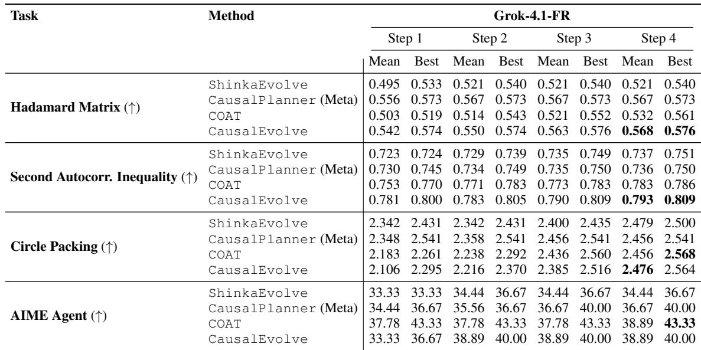

## 5.2 EXPERIMENTAL RESULTS

The results of the experiments are given in Table 1. From the results, we can find that across all tasks, CausalEvolve produce significantly better averaged results than ShinkaEvolve across different tasks and steps, demonstrating the effectiveness of CausalEvolve. Notably, in AIME, CausalEvolve achieves 38.89% results based on the same scaffolding agent as in ShinkaEvolve. While in the orig inal paper of ShinkaEvolve, even with a more sophisticated ensemble of multiple frontier reasoning models, ShinkaEvolve can only achieve a performance of 34.4%, demonstrating the effectiveness of CausalEvolve in breaking the state-of-the-art results in the open-ended discovery.

When comparing different variants and CausalEvolve, we can find that, across 4 tasks, CausalEvolve maintain the overall best performances, verifying that each module is essential to the success of CausalEvolve. Interestingly, in the majority of tasks, COAT can already produce an impressive best result, demonstrating the effectiveness of procedure-level factors for optimality. When comparing results with and without CausalPlanner, we can also find that with CausalPlanner, we can achieve better results already at early steps, demonstrating the effectiveness of outcome-based factors in sample efficiency.

## 6 CONCLUSIONS

In this work, we studied the evolutionary coding agent for scientific discovery. With the POMDP formulation of the discovery process, we demonstrate the necessity of incorporating causal knowledge. Then, we propose CausalEvolve that uses a causal scratchpad to identify and exploit outcome-based and procedure-based factors and the associated causal knowledge to guide the evolution process. Empirical results with 4 discovery tasks verified the improved efficiency and optimality of CausalEvolve.

## ACKNOWLEDGMENTS

We thank the reviewers for their constructive comments and suggestions.

## REFERENCES

Ahmed Abdulaal, Nina Montana-Brown, Tiantian He, Ayodeji Ijishakin, Ivana Drobnjak, Daniel C Castro, Daniel C Alexander, et al. Causal modelling agents: Causal graph discovery through synergising metadataand data-driven reasoning. In The Twelfth International Conference on Learning Representations, 2023. (Cited on page 3)

Taiyu Ban, Lyuzhou Chen, Derui Lyu, Xiangyu Wang, and Huanhuan Chen. Causal structure learning supervised by large language model. arXiv preprint arXiv:2311.11689, 2023. (Cited on page 3)

Daniil A Boiko, Robert MacKnight, Ben Kline, and Gabe Gomes. Autonomous chemical research with large language models. Nature, 624(7992):570–578, 2023. (Cited on page 3)

Philippe Brouillard, Sebastien Lachapelle, Alexandre Lacoste, Simon Lacoste-Julien, and Alexandre Drouin.´ Differentiable causal discovery from interventional data. Advances in Neural Information Processing Systems, 33:21865–21877, 2020. (Cited on page 3)

Sebastien Bubeck, Christian Coester, Ronen Eldan, Timothy Gowers, Yin Tat Lee, Alexandru Lupsasca,´ Mehtaab Sawhney, Robert Scherrer, Mark Sellke, Brian K. Spears, Derya Unutmaz, Kevin Weil, Steven Yin, and Nikita Zhivotovskiy. Early science acceleration experiments with gpt-5. ArXiv, abs/2511.16072, 2025. (Cited on page 1)

Jun Shern Chan, Neil Chowdhury, Oliver Jaffe, James Aung, Dane Sherburn, Evan Mays, Giulio Starace, Kevin Liu, Leon Maksin, Tejal Patwardhan, Lilian Weng, and Aleksander Madry. Mle-bench: Evaluating machine learning agents on machine learning engineering. 2024. URL https://arxiv.org/abs/ 2410.07095. (Cited on page 1)

Yongqiang Chen, Wei Huang, Kaiwen Zhou, Yatao Bian, Bo Han, and James Cheng. Understanding and improving feature learning for out-of-distribution generalization. In Advances in Neural Information Processing Systems, 2023. (Cited on page 5)

Audrey Cheng, Shu Liu, Melissa Z. Pan, Zhifei Li, Bowen Wang, Alexander Krentsel, Tian Xia, Mert Cemri, Jongseok Park, Shuo Yang, Jeff Chen, Lakshya A Agrawal, Aditya Desai, Jiarong Xing, Koushik Sen, Matei Zaharia, and Ion Stoica. Barbarians at the gate: How ai is upending systems research. ArXiv, abs/2510.06189, 2025. (Cited on page 1)

Nikita Dhawan, Leonardo Cotta, Karen Ullrich, Rahul G Krishnan, and Chris J Maddison. End-to-end causal effect estimation from unstructured natural language data. Advances in Neural Information Processing Systems, 37:77165–77199, 2024. (Cited on page 3)

Igor Douven. Abduction. In Edward N. Zalta and Uri Nodelman (eds.), The Stanford Encyclopedia of Philosophy. Metaphysics Research Lab, Stanford University, Winter 2025 edition, 2025. (Cited on pages 2 and 7)

Peilin Feng, Zhutao Lv, Junyan Ye, Xiaolei Wang, Xinjie Huo, Jinhua Yu, Wanghan Xu, Wenlong Zhang, Lei Bai, Conghui He, et al. Earth-agent: Unlocking the full landscape of earth observation with agents. arXiv preprint arXiv:2509.23141, 2025. (Cited on page 3)

Bogdan Georgiev, Javier G’omez-Serrano, Terence Tao, and Adam Zsolt Wagner. Mathematical exploration and discovery at scale. ArXiv, abs/2511.02864, 2025. (Cited on page 1)

Clark Glymour. An outline of the history of methods of discovering causality. URL https://www.cmu.edu/dietrich/philosophy/docs/glymour/ an-outline-of-the-history-of-methods-of-discovering-causality.pdf. Accessed: 2026-01-29. (Cited on page 2)

Juraj Gottweis, Wei-Hung Weng, Alexander Daryin, Tao Tu, Anil Palepu, Petar Sirkovic, Artiom Myaskovsky, Felix Weissenberger, Keran Rong, Ryutaro Tanno, et al. Towards an ai co-scientist. arXiv preprint arXiv:2502.18864, 2025. (Cited on pages 1 and 2)

Sander Greenland, Judea Pearl, and James M Robins. Causal diagrams for epidemiologic research. Epidemiology, 10(1):37–48, 1999. (Cited on page 3)

Daya Guo, Dejian Yang, Haowei Zhang, Junxiao Song, Ruoyu Zhang, Runxin Xu, Qihao Zhu, Shirong Ma, Peiyi Wang, Xiao Bi, et al. Deepseek-r1: Incentivizing reasoning capability in llms via reinforcement learning. arXiv preprint arXiv:2501.12948, 2025. (Cited on page 1)

Patrik Hoyer, Dominik Janzing, Joris M Mooij, Jonas Peters, and Bernhard Scholkopf. Nonlinear causal¨ discovery with additive noise models. Advances in neural information processing systems, 21, 2008. (Cited on page 3)

Biwei Huang, Kun Zhang, Mingming Gong, and Clark Glymour. Causal discovery and forecasting in nonstationary environments with state-space models. In International conference on machine learning, pp. 2901–2910. Pmlr, 2019. (Cited on page 3)

Biwei Huang, Kun Zhang, Jiji Zhang, Joseph Ramsey, Ruben Sanchez-Romero, Clark Glymour, and Bernhard Scholkopf. Causal discovery from heterogeneous/nonstationary data. ¨ Journal of Machine Learning Research, 21(89):1–53, 2020. (Cited on page 3)

Kexin Huang, Ying Jin, Ryan Li, Michael Y Li, Emmanuel Candes, and Jure Leskovec. Automated hypothesis validation with agentic sequential falsifications. In ICML, 2025a. (Cited on page 3)

Yuxuan Huang, Yihang Chen, Haozheng Zhang, Kang Li, Huichi Zhou, Meng Fang, Linyi Yang, Xiaoguang Li, Lifeng Shang, Songcen Xu, et al. Deep research agents: A systematic examination and roadmap. arXiv preprint arXiv:2506.18096, 2025b. (Cited on page 3)

Krittanut Jiralerspong et al. Efficient causal graph discovery using large language models. arXiv preprint arXiv:2402.01207, 2024. (Cited on page 3)

Leslie Pack Kaelbling, Michael L Littman, and Anthony R Cassandra. Planning and acting in partially observable stochastic domains. Artificial intelligence, 101(1-2):99–134, 1998. (Cited on pages 2, 3 and 4)

Elahe Khatibi, Mahyar Abbasian, Zhongqi Yang, Iman Azimi, and Amir M Rahmani. Alcm: Autonomous llm-augmented causal discovery framework. arXiv preprint arXiv:2405.01744, 2024. (Cited on page 3)

Ilyes Khemakhem, Ricardo Monti, Diederik Kingma, and Aapo Hyvarinen. Ice-beem: Identifiable conditional energy-based deep models based on nonlinear ica. Conference and Workshop on Neural Information Processing Systems, 33:12768–12778, 2020. (Cited on page 1)

Thomas S. Kuhn and David Hawkins. The structure of scientific revolutions. American Journal of Physics, 31:554–555, 1963. (Cited on pages 2 and 3)

Robert Lange et al. Towards open-ended and sample-efficient program evolution. arXiv preprint arXiv:2509.19349, 2025a. (Cited on pages 3, 4 and 7)

Robert Tjarko Lange, Yuki Imajuku, and Edoardo Cetin. Shinkaevolve: Towards open-ended and sampleefficient program evolution. ArXiv, abs/2509.19349, 2025b. (Cited on pages 1 and 2)

Hongxin Li, Jingran Su, Yuntao Chen, Qing Li, and Zhao-Xiang Zhang. Sheetcopilot: Bringing software productivity to the next level through large language models. Advances in Neural Information Processing Systems, 36:4952–4984, 2023. (Cited on page 3)

Jin Li, Shoujin Wang, Qi Zhang, Feng Liu, Tongliang Liu, Longbing Cao, Shui Yu, and Fang Chen. Revealing multimodal causality with large language models. In The Thirty-ninth Annual Conference on Neural Information Processing Systems, 2025a. (Cited on page 3)

Jinyang Li, Nan Huo, Yan Gao, Jiayi Shi, Yingxiu Zhao, Ge Qu, Bowen Qin, Yurong Wu, Xiaodong Li, Chenhao Ma, et al. Are large language models ready for multi-turn tabular data analysis? In Forty-second International Conference on Machine Learning, 2025b. (Cited on page 3)

Junyi Li, Yongqiang Chen, Chenxi Liu, Qianyi Cai, Tongliang Liu, Bo Han, Kun Zhang, and Hui Xiong. Can large language models help experimental design for causal discovery? ArXiv, abs/2503.01139, 2025c. URL https://arxiv.org/abs/2503.01139. (Cited on page 1)

Long Li, Weiwen Xu, Jiayan Guo, Ruochen Zhao, Xingxuan Li, Yuqian Yuan, Boqiang Zhang, Yuming Jiang, Yifei Xin, Ronghao Dang, et al. Chain of ideas: Revolutionizing research via novel idea development with llm agents. arXiv preprint arXiv:2410.13185, 2024a. (Cited on page 3)

Michael Y Li, Vivek Vajipey, Noah D Goodman, and Emily B Fox. Critical: Critic automation with language models. arXiv preprint arXiv:2411.06590, 2024b. (Cited on page 3)

Peiwen Li, Xin Wang, Zeyang Zhang, Yuan Meng, Fang Shen, Yue Li, Jialong Wang, Yang Li, and Wenwu Zhu. Realtcd: Temporal causal discovery from interventional data with large language model. In Proceedings of the 33rd ACM International Conference on Information and Knowledge Management, pp. 4669–4677, 2024c. (Cited on page 3)

Xiu-Chuan Li and Tongliang Liu. Efficient and trustworthy causal discovery with latent variables and complex relations. In The Thirteenth International Conference on Learning Representations, 2025. (Cited on page 3)

Xiu-Chuan Li, Jun Wang, and Tongliang Liu. Recovery of causal graph involving latent variables via homologous surrogates. In The Thirteenth International Conference on Learning Representations, 2025d. (Cited on page 3)

Zhong-Zhi Li, Duzhen Zhang, Ming-Liang Zhang, Jiaxin Zhang, Zengyan Liu, Yuxuan Yao, Haotian Xu, Junhao Zheng, Pei-Jie Wang, Xiuyi Chen, et al. From system 1 to system 2: A survey of reasoning large language models. arXiv preprint arXiv:2502.17419, 2025e. (Cited on page 1)

Weixin Liang, Yuhui Zhang, Hancheng Cao, Binglu Wang, Daisy Yi Ding, Xinyu Yang, Kailas Vodrahalli, Siyu He, Daniel Scott Smith, Yian Yin, et al. Can large language models provide useful feedback on research papers? a large-scale empirical analysis. NEJM AI, 1(8):AIoa2400196, 2024. (Cited on page 3)

Chenxi Liu and Kun Kuang. Causal structure learning for latent intervened non-stationary data. In International Conference on Machine Learning, pp. 21756–21777. PMLR, 2023. (Cited on page 3)

Chenxi Liu, Yongqiang Chen, Tongliang Liu, Mingming Gong, James Cheng, Bo Han, and Kun Zhang. Discovery of the hidden world with large language models. In A. Globerson, L. Mackey, D. Belgrave, A. Fan, U. Paquet, J. Tomczak, and C. Zhang (eds.), Advances in Neural Information Processing Systems, volume 37, pp. 102307–102365. Curran Associates, Inc., 2024. URL https://proceedings.neurips.cc/paper\_files/paper/2024/file/ b99a07486702417d3b1bd64ec2cf74ad-Paper-Conference.pdf. (Cited on page 2)

Chenxi Liu, Yongqiang Chen, Tongliang Liu, Mingming Gong, James Cheng, Bo Han, and Kun Zhang. Discovering and reasoning of causality in the hidden world with large language models, 2025. URL https://arxiv.org/abs/2402.03941. (Cited on pages 3 and 6)

Stephanie Long, Alexandre Piche, Valentina Zantedeschi, Tibor Schuster, and Alexandre Drouin. Causal´ discovery with language models as imperfect experts. arXiv preprint arXiv:2307.02390, 2023. (Cited on page 3)

Chris Lu, Cong Lu, Robert Tjarko Lange, Jakob Foerster, Jeff Clune, and David Ha. The ai scientist: Towards fully automated open-ended scientific discovery. arXiv preprint arXiv:2408.06292, 2024. (Cited on pages 1 and 2)

Daniel Malinsky and Peter Spirtes. Learning the structure of a nonstationary vector autoregression. In The 22nd International Conference on Artificial Intelligence and Statistics, pp. 2986–2994. PMLR, 2019. (Cited on page 3)

Shubham Mandal et al. Artificially intelligent lab assistant for automated experimentation. Nature Communications, 16:1234, 2025. (Cited on page 3)

Ludovico Mitchener, Angela Yiu, Benjamin Chang, Mathieu Bourdenx, Tyler Nadolski, Arvis Sulovari, Eric C. Landsness, Daniel L. Barab´ asi, Siddharth Narayanan, Nicky Evans, Shriya Reddy, Martha S. Foiani,´ Aizad Kamal, Leah P. Shriver, Fang Cao, Asmamaw T. Wassie, Jon M. Laurent, Edwin Melville-Green, Mayk Caldas Ramos, Albert Bou, Kaleigh F. Roberts, Sladjana Zagorac, Timothy C. Orr, Miranda E. Orr, Kevin J. Zwezdaryk, Ali E. Ghareeb, Laurie McCoy, Bruna Gomes, Euan A Ashley, Karen E. Duff, Tonio Buonassisi, Tom Rainforth, Randall J. Bateman, Michael Skarlinski, Samuel G. Rodriques, Michaela M. Hinks, and Andrew D. White. Kosmos: An ai scientist for autonomous discovery. ArXiv, abs/2511.02824, 2025. (Cited on page 1)

Joris M Mooij, Sara Magliacane, and Tom Claassen. Joint causal inference from multiple contexts. Journal of machine learning research, 21(99):1–108, 2020. (Cited on page 3)

Alexander Novikov, Ngan V ˆ u, Marvin Eisenberger, Emilien Dupont, Po-Sen Huang, Adam Zsolt Wagner, ˜ Sergey Shirobokov, Borislav Kozlovskii, Francisco JR Ruiz, Abbas Mehrabian, et al. Alphaevolve: A coding agent for scientific and algorithmic discovery. arXiv preprint arXiv:2506.13131, 2025. (Cited on pages 1, 3, 4 and 7)

Judea Pearl. Causality. Cambridge university press, 2009. (Cited on pages 2 and 3)

Ronan Perry, Julius Von Kugelgen, and Bernhard Sch¨ olkopf. Causal discovery in heterogeneous environments¨ under the sparse mechanism shift hypothesis. Advances in Neural Information Processing Systems, 35: 10904–10917, 2022. (Cited on page 3)

Aske Plaat, Max van Duijn, Niki van Stein, Mike Preuss, Peter van der Putten, and Kees Joost Batenburg. Agentic large language models, a survey. arXiv preprint arXiv:2503.23037, 2025. (Cited on page 1)

Joaquin Quinonero-Candela, Masashi Sugiyama, Anton Schwaighofer, and Neil D Lawrence. Dataset shift in machine learning. Mit Press, 2008. (Cited on page 5)

Lo¨ıc M. Roch et al. Chemos: An orchestration software to democratize autonomous discovery. PLOS ONE, 15(4):e0229862, 2020. (Cited on page 3)

Bernardino Romera-Paredes et al. Mathematical discoveries from program search with large language models. Nature, 625:468–475, 2024. (Cited on page 3)

Asankhaya Sharma. Openevolve: an open-source evolutionary coding agent, 2025. URL https:// github.com/algorithmicsuperintelligence/openevolve. (Cited on pages 1 and 3)

C Shen, Zhengzhang Chen, Dongsheng Luo, Dongkuan Xu, Haifeng Chen, and Jingchao Ni. Exploring multi-modal integration with tool-augmented llm agents for precise causal discovery. arXiv preprint arXiv:2412.13667, 1(3), 2024. (Cited on page 3)

Ivaxi Sheth, Zhijing Jin, Bryan Wilder, Dominik Janzing, and Mario Fritz. Can llms propose instrumental variables for causal reasoning? In NeurIPS 2025 Workshop on CauScien: Uncovering Causality in Science. (Cited on page 3)

Shohei Shimizu, Patrik O Hoyer, Aapo Hyvarinen, Antti Kerminen, and Michael Jordan. A linear non-¨ gaussian acyclic model for causal discovery. Journal of Machine Learning Research, 7(10), 2006. (Cited on page 3)

Parshin Shojaee et al. Scientific equation discovery via programming with large language models. arXiv preprint arXiv:2404.18400, 2025. (Cited on page 3)

Peter Spirtes, Christopher Meek, and Thomas Richardson. Causal inference in the presence of latent variables and selection bias. In Proceedings of the Eleventh conference on Uncertainty in artificial intelligence, pp. 499–506, 1995. (Cited on page 3)

Peter Spirtes, Clark N Glymour, and Richard Scheines. Causation, prediction, and search. MIT press, 2000a. (Cited on page 3)

Peter Spirtes, Clark N Glymour, and Richard Scheines. Causation, prediction, and search. MIT press, 2000b. (Cited on page 2)

Kyle Swanson, Wesley Wu, Nash L Bulaong, John E Pak, and James Zou. The virtual lab of ai agents designs new sars-cov-2 nanobodies. Nature, 646(8085):716–723, 2025. (Cited on page 3)

Gary Tom, Stefan P Schmid, Sterling G Baird, Yang Cao, Kourosh Darvish, Han Hao, Stanley Lo, Sergio Pablo-Garc´ıa, Ella M Rajaonson, Marta Skreta, et al. Self-driving laboratories for chemistry and materials science. Chemical Reviews, 124(16):9633–9732, 2024. (Cited on page 3)

Daniel Truhn, Shekoofeh Azizi, James Zou, Leonor Cerda-Alberich, Faisal Mahmood, and Jakob Nikolas Kather. Artificial intelligence agents in cancer research and oncology. Nature Reviews Cancer, pp. 1–14, 2026. (Cited on page 3)

Siddharth Vashishtha et al. Causal ordering as a robust interface for integrating expert knowledge. Advances in Neural Information Processing Systems, 2023. (Cited on page 3)

Vishal Verma, Sawal Acharya, Devansh Bhardwaj, Samuel Simko, Yongjin Yang, Anahita Haghighat, Dominik Janzing, Mrinmaya Sachan, Bernhard Scholkopf, and Zhijing Jin. Causal AI scientist: Facilitating¨ causal data science with large language models. In NeurIPS 2025 Workshop on CauScien: Uncovering Causality in Science, 2025. URL https://openreview.net/forum?id=EDWTHMVOCj. (Cited on page 3)

W.A. Wallace. Causality and Scientific Explanation. Number v. 2 in Causality and Scientific Explanation. University Press of America, 1981. ISBN 9780819114815. (Cited on page 2)

Haiyuan Wan, Chen Yang, Junchi Yu, Meiqi Tu, Jiaxuan Lu, Di Yu, Jianbao Cao, Ben Gao, Jiaqing Xie, Aoran Wang, et al. Deepresearch arena: The first exam of llms’ research abilities via seminar-grounded tasks. AAAI, 2026. (Cited on page 1)

Qingyun Wang, Doug Downey, Heng Ji, and Tom Hope. Scimon: Scientific inspiration machines optimized for novelty. In Proceedings of the 62nd Annual Meeting of the Association for Computational Linguistics (Volume 1: Long Papers), pp. 279–299, 2024. (Cited on page 3)

Xinyue Wang, Kun Zhou, Wenyi Wu, Har Simrat Singh, Fang Nan, Songyao Jin, Aryan Philip, Saloni Patnaik, Hou Zhu, Shivam Singh, et al. Causal-copilot: An autonomous causal analysis agent. arXiv preprint arXiv:2504.13263, 2025a. (Cited on page 3)

Yiping Wang, Shao-Rong Su, Zhiyuan Zeng, Eva Xu, Liliang Ren, Xinyu Yang, Zeyi Huang, Xuehai He, Luyao Ma, Baolin Peng, Hao Cheng, Pengcheng He, Weizhu Chen, Shuohang Wang, Simon Shaolei Du, and Yelong Shen. Thetaevolve: Test-time learning on open problems. ArXiv, abs/2511.23473, 2025b. (Cited on page 7)

David P. Woodruff, Vincent Cohen-Addad, Lalit Jain, Jieming Mao, Song Zuo, Mohammad Rez Bateni, Simina Branzei, Michael P. Brenner, Lin Chen, Ying Feng, Lance Fortnow, Gang Fu, Ziyi Guan, Zahraˆ Hadizadeh, Mohammad Taghi Hajiaghayi, Mahdi JafariRaviz, Adel Javanmard, S. KarthikC., Ken ichi Kawarabayashi, Ravi Kumar, Silvio Lattanzi, Euiwoong Lee, Yi Li, Ioannis Panageas, Dimitris Paparas, Benjamin Przybocki, Bernardo Subercaseaux, Ola Svensson, Shayan Taherijam, Xuan Wu, Eylon Yogev, Morteza Zadimoghaddam, Samson Zhou, and Vahab S. Mirrokni. Accelerating scientific research with gemini: Case studies and common techniques. ArXiv, abs/2602.03837, 2026. (Cited on page 1)

xAI. Grok 4.1 fast and agent tools api, 2025. URL https://x.ai/news/grok-4-1-fast. Accessed: 2026-02-10. (Cited on page 7)

Yutaro Yamada, Robert Tjarko Lange, Cong Lu, Shengran Hu, Chris Lu, Jakob Foerster, Jeff Clune, and David Ha. The ai scientist-v2: Workshop-level automated scientific discovery via agentic tree search. arXiv preprint arXiv:2504.08066, 2025. (Cited on pages 1 and 2)

Cheng Yang, Jiaxuan Lu, Haiyuan Wan, Junchi Yu, and Feiwei Qin. From what to why: A multi-agent system for evidence-based chemical reaction condition reasoning. ICLR, 2026. (Cited on page 3)

Karren Yang, Abigail Katcoff, and Caroline Uhler. Characterizing and learning equivalence classes of causal dags under interventions. In International Conference on Machine Learning, pp. 5541–5550. PMLR, 2018. (Cited on page 3)

Zonglin Yang, Xinya Du, Junxian Li, Jie Zheng, Soujanya Poria, and Erik Cambria. Large language models for automated open-domain scientific hypotheses discovery. In Findings of the Association for Computational Linguistics: ACL 2024, pp. 13545–13565, 2024. (Cited on page 3)

Zonglin Yang, Wanhao Liu, Ben Gao, Tong Xie, Yuqiang Li, Wanli Ouyang, Soujanya Poria, Erik Cambria, and Dongzhan Zhou. Moose-chem: Large language models for rediscovering unseen chemistry scientific hypotheses. In ICLR, 2025. (Cited on page 3)

Liangyu Zha, Junlin Zhou, Liyao Li, Rui Wang, Qingyi Huang, Saisai Yang, Jing Yuan, Changbao Su, Xiang Li, Aofeng Su, et al. Tablegpt: Towards unifying tables, nature language and commands into one gpt. arXiv preprint arXiv:2307.08674, 2023. (Cited on page 3)

Kun Zhang and Aapo Hyvarinen. On the identifiability of the post-nonlinear causal model. arXiv preprint arXiv:1205.2599, 2012. (Cited on page 3)

Wenqi Zhang, Yongliang Shen, Weiming Lu, and Yueting Zhuang. Data-copilot: Bridging billions of data and humans with autonomous workflow. arXiv preprint arXiv:2306.07209, 2023. (Cited on page 3)

Tianshi ZHENG, Zheye Deng, Hong Ting Tsang, Weiqi Wang, Jiaxin Bai, Zihao Wang, and Yangqiu Song. From automation to autonomy: A survey on large language models in scientific discovery. ArXiv, abs/2505.13259, 2025. (Cited on page 1)

Qing Zhu, Fei Zhang, Yan Huang, Hengyu Xiao, LuYuan Zhao, XuChun Zhang, Tao Song, XinSheng Tang, Xiang Li, Guo He, et al. An all-round ai-chemist with a scientific mind. National Science Review, 9(10): nwac190, 2022. (Cited on page 3)

## LLM USE STATEMENT

From the research side, this work studies the use of LLMs for automated scientific discovery. From the paper writing side, we use LLMs to assist with improving the writing of this work.

## ETHICS STATEMENT

We study using LLMs to automate scientific discovery that will benefit the whole humanity and society. This work does not involve human subjects or personally identifiable information beyond public benchmarks used under their licenses.

## A ADDITIONAL TECHNICAL DETAILS

## A.1 NOTATION

Table 2: Notation used in the formulation and theorems.  
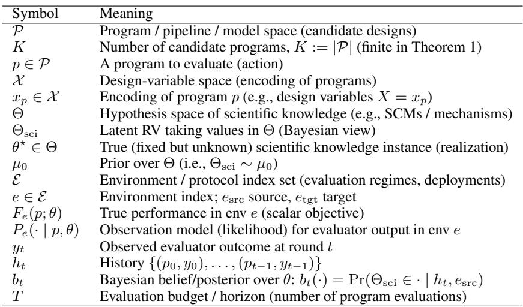

## A.2 RANDOM VARIABLE, SPACE, AND REALIZATION (TO AVOID NOTATION CONFUSION)

We use the following (standard) convention.

(i) Hypothesis space. Θ is a set that contains all candidate scientific-knowledge hypotheses.

(ii) True but unknown instance. The real world is governed by a fixed but unknown θ⋆ ∈ Θ.

(iii) Bayesian view (optional but convenient). A Bayesian agent models uncertainty by treating θ⋆ as a realization of a latent random variable Θsci with prior µ0, i.e. Θsci ∼ µ0 and θ⋆ is one draw from it. The belief bt is simply the posterior distribution of Θsci after seeing history ht.

(iv) Does scientific knowledge change across environments? In our formulation, the underlying scientific knowledge θ⋆ is static across rounds. Different environments e ∈ E represent different evaluation/deployment protocols (distribution shifts, constraint changes, measurement noise, private vs public tests, etc.). Formally,

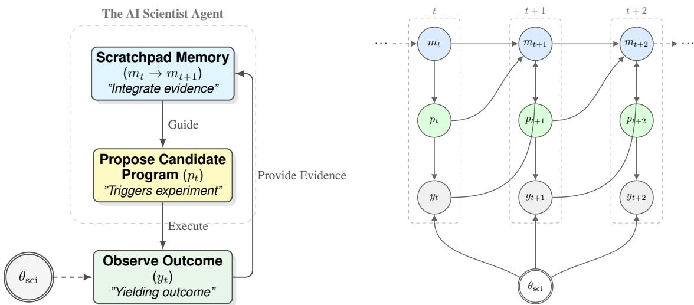  
Figure 2: The iterative scientific discovery loop. Left: Conceptual flow of the agent. The agent maintains a scratchpad memory (m), proposes a program (p), and observes the outcome (y) which is constrained by the unknown world state (θsci). The outcome feeds back into the memory for the next step. Right: The diagram illustrates how the AI Scientist probes the unknown world state θsci. By proposing a candidate program pt, the agent triggers an experiment yielding outcome yt. This observation provides evidence about θsci, which is integrated into the agent’s scratchpad memory mt+1. Over time steps t, t + 1, . . . , this recurrent process allows the agent to navigate the performance landscape and converge towards optimal programs despite the static but unknown nature of θsci.

environments affect either the true performance map Fe(·; θ) and/or the observation kernel Pe(· | p, θ), while θ⋆ itself remains the same hidden instance.

## A.3 EVALUATOR AS AN OBSERVATION MODEL (COVERS DETERMINISTIC AND STOCHASTIC EVALUATORS)

Fix an environment e ∈ E. When the agent evaluates program p, it receives an observation y ∈ Y drawn from

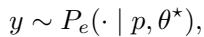

where Pe(· | p, θ) is a conditional distribution on Y.

Deterministic evaluator. A deterministic evaluator is the special case where there exists a function ge such that

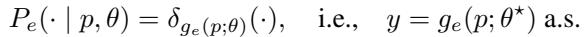

In many program-evolution settings, the evaluator is designed to deterministically check validity and compute an objective score (e.g., via a verifier and a scoring routine).

Stochastic/noisy evaluator. A common instantiation is additive noise:

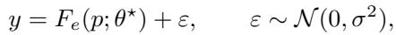

but our proofs only rely on the specific Gaussian form in Theorem 1.

## A.4 BELIEF AND BAYES UPDATE: KERNEL FORM AND UNDERGRADUATE-FRIENDLY SPECIAL CASES

Let ht = {(p0, y0), . . . , (pt−1, yt−1)} be the history. The Bayesian belief (posterior) is

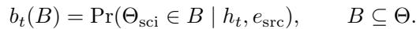

General Bayes update (kernel form). After choosing pt and observing yt in esrc, the posterior is

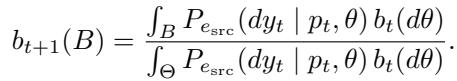

(3)

Finite hypothesis space (sum form). If Θ = {θ1, . . . , θN } is finite and the likelihood has a pmf Pe (yt | pt, θi), then

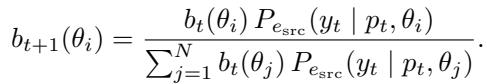

Continuous hypothesis space (density form). If Pe (dy | p, θ) has a density pe (y | p, θ), then

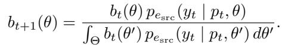

Deterministic evaluator (indicator/filter form). If y = ge (p; θ) deterministically, then the update becomes

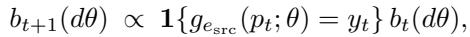

i.e. the posterior is the prior restricted to hypotheses consistent with the observed outcome.

## B PROOF OF THEOREM 3.2 (STATIC SAMPLE-EFFICIENCY GAP)

Throughout this section we fix a single static environment (drop e from notation), and assume P = {p1, . . . , pK } is finite.

## B.1 PROTOCOL AND PERFORMANCE CRITERION

Experiment–then–commit protocol. A policy π interacts for T rounds. At each round t = 0, . . . , T − 1 it selects a program p ∈ P (possibly randomized) based on the past history h , then observes y ∈ R. After T evaluations it outputs a final recommendation pˆ ∈ P.

Simple regret. Let f(p) denote the true mean performance of program p in this environment. Define the (random) simple regret

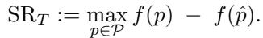

(4)

(ϵ, δ)-correctness (uniform). Fix ϵ > 0 and δ ∈ (0, 1). We say a policy π is (ϵ, δ)-correct uniformly on a hypothesis class H if for every instance in H,

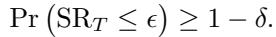

“Uniformly” means the guarantee must hold for all instances in the class, not only on average.

## B.2 TWO HYPOTHESIS CLASSES

(1) Structured (causal/scientific) linear class. Each program p has a known feature vector xp ∈ Rd with ∥xp∥2 ≤ 1. The unknown instance is a weight vector w⋆ ∈ Rd and

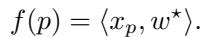

(5)

Observations follow a Gaussian noise model

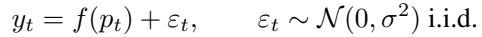

(6)

Assume there exist d basis programs p(1), . . . , p(d) whose feature vectors are the standard basis:

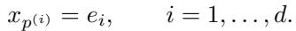

(7)

(2) Unstructured black-box class (baseline). The unknown instance is an arbitrary vector of means

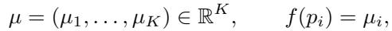

and observations are

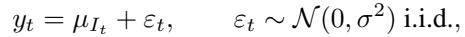

(8)

where It ∈ {1, . . . , K} is the index of the chosen program pt = pI . Crucially, there is no assumed relation between µi and µj for i ̸= j.

## B.3 FORMAL STATEMENT AND PROOF

Theorem B.1 (Formal version of Theorem 3.2). Fix ϵ > 0 and δ ∈ (0, 1/4).

1. (Upper bound under the structured linear class). Under equation 5–equation 7 and equation 6, there exists a policy πlin such that

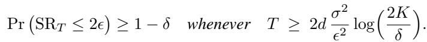

2. (Lower bound for the unstructured black-box class). For the black-box class equation 8, any policy that is (ϵ, δ)-correct uniformly for all µ ∈ RK must satisfy

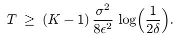

Proof. We prove the two parts separately.

Part (1): constructive upper bound (estimate w⋆ then commit). Evaluate each basis program p(i) exactly (i)

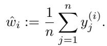

By equation 5–equation 7, f(p(i)) = w⋆. By equation 6, wˆi ∼ N (w⋆, σ2/n) and these coordinates are independent.

Define for any program p:

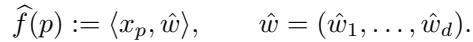

Then

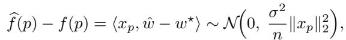

so since ∥xp∥2 ≤ 1,

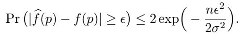

Union bound over K programs gives

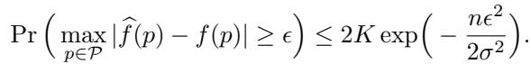

Choose

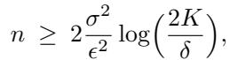

so that with probability at least 1 − δ we have maxp |f (p) − f (p)| ≤ ϵ.

Now output pˆ := arg maxp∈P f(p). Let p⋆ := arg maxp f(p). On the above high-probability event,

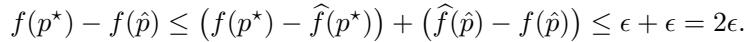

Thus Pr(SRT ≤ 2ϵ) ≥ 1 − δ for T = nd as stated.

Part (2): lower bound for the black-box class. We construct K hard instances and lower bound any uniformly (ϵ, δ)-correct policy.

Let the programs be p1, . . . , pK. Define a base instance µ(0) ∈ RK:

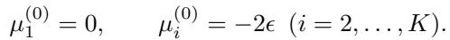

For each i ∈ {2, . . . , K}, define an alternative instance µ(i):

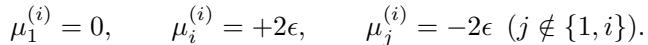

Under µ(0), the unique best program is p1, and choosing any pi with i ≥ 2 incurs regret 2ϵ > ϵ. Under µ(i), the unique best program is pi, and choosing p1 incurs regret 2ϵ > ϵ.

Let P0 be the distribution of the full transcript T := (p0:T −1, y0:T −1, pˆ) under µ(0), and Pi the analogous distribution under µ(i). Uniform (ϵ, δ)-correctness implies

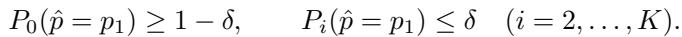

Step 1: a KL lower bound from an event. For any event A and distributions P, Q, one has

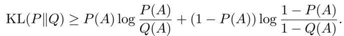

Apply it with A = {pˆ = p1}, P = P0, Q = Pi. Let p := P0(A) ≥ 1 − δ and q := Pi(A) ≤ δ. For δ ∈ (0, 1/4) this yields

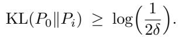

(9)

Step 2: compute KL(P0∥Pi) via number of pulls of arm i. Under µ(0) and µ(i), the policy is identical; only observations when playing pi differ:

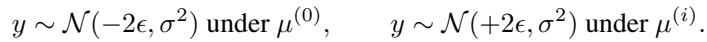

For Gaussians with equal variance, KL(N (m0, σ2)∥N (m1, σ2)) = (m0−m1)22 , so each pull of pi contributes KL (4ϵ)2 2σ2 = 8ϵ2 σ2 .

Let Ni be the (random) number of times pi is evaluated in T rounds. Additivity of log-likelihood ratios over independent Gaussian samples yields

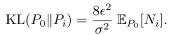

(10)

Step 3: conclude the lower bound on T . Combine equation 9 and equation 10:

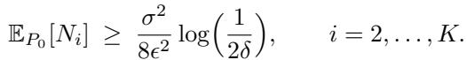

Summing over i = 2, . . . , K gives

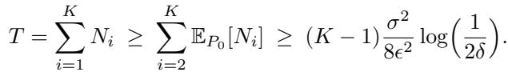

This completes the proof.

Remark (deterministic evaluator). If σ = 0, the structured linear class can recover w⋆ exactly from d basis evaluations and achieve SRT = 0, while in the unstructured black-box class a uniform worst-case guarantee requires evaluating all K programs at least once.

Reference for the black-box lower bound. The above is a standard change-of-measure/KL argument for best-arm identification in K-armed Gaussian bandits (e.g., see classical treatments of best-arm identification lower bounds).

## C PROOF OF THEOREM 3.3 (NON-IDENTIFIABILITY UNDER ENVIRONMENT SHIFTS)

## C.1 SETUP: SOURCE INTERACTION, TARGET EVALUATION, AND TARGET REGRET

The agent can only interact with the source environment esrc:

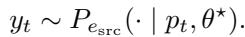

After T rounds it outputs a final program pˆ. Performance is judged in a target environment etgt via Fetgt (p; θ⋆). Define the target (simple) regret:

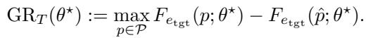

## C.2 FORMAL STATEMENT AND PROOF

Theorem C.1 (Non-identifiability barrier under shifts). Fix esrc, etgt ∈ E. Assume there exist two hypotheses θ0, θ1 ∈ Θ such that:

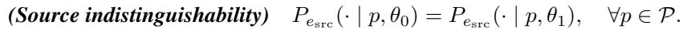

(11)

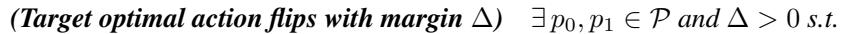

(12)

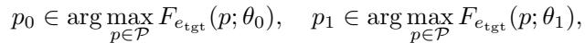

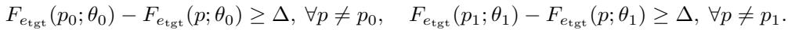

(13)

Then for any policy π that can interact only with esrc, there exists i ∈ {0, 1} such that for every budget T ,

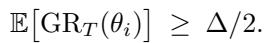

This impossibility holds whether the evaluator is stochastic or deterministic, since equation 11 is stated at the level of the full observation model Pesrc .

Proof. Let Pi be the distribution over the full transcript

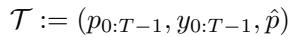

when the true hypothesis is θi and interaction is only with esrc.

By equation 11, for any history and any chosen action pt, the conditional distribution of yt is identical under θ and θ . By induction on t, the entire transcript distribution is identical:

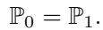

In particular, the marginal distribution of the final output pˆ is the same under θ and θ . Let this common distribution be denoted by Q on P.

Now consider the expected target regret under θ0: by equation 13, any output pˆ ̸= p0 incurs regret at least ∆ under θ0:

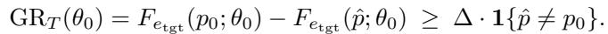

Taking expectation w.r.t. Q yields

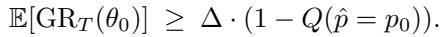

Similarly,

Since Q(ˆp = p0) + Q(ˆp = p1) ≤ 1, at least one of these probabilities is at most 1/2, so at least one of the two expected regrets is at least ∆/2:

This proves the claim.

## C.3 CONCRETE EXAMPLES SATISFYING THE CONDITIONS

We give two illustrative examples where source data cannot distinguish two hypotheses, yet the target-optimal decision differs.

Example 1: public test vs private (distribution shift / shortcut feature). Let θ ∈ {θ0, θ1} encode which feature is truly stable/causal. Programs correspond to two model families: p0 uses a stable causal feature; p1 uses a shortcut feature. In the source environment (public benchmark), the shortcut feature is perfectly correlated with labels, so both hypotheses yield the same evaluator distribution for every program, satisfying equation 11. In the target environment (deployment/private), the shortcut correlation breaks: under θ0, p0 is uniquely optimal; under θ1, p1 is uniquely optimal, with margin ∆, satisfying equation 13. No amount of interaction with e can identify which world holds.

Table 3: Mathematical definitions of auxiliary metrics across tasks. All metrics are deterministic outcomelevel functionals of the program outputs. For subset-defined metrics (e.g., large circle margin), if the index set is empty, the metric value is defined as 0.  

Example 2: relaxed verification (slack) vs exact verification (constraint shift). In combinatorial optimization, it is common to evaluate candidate programs using a relaxed verifier (e.g., allowing numerical slack), then validate with an exact verifier. For instance, in circle packing, one may verify non-overlap with a numerical slack such as 10−6, and later validate with an exact checker; converting a relaxed-feasible solution into an exact-feasible one may require tiny but nonzero modifications, and rankings can change when switching verifiers. This is explicitly discussed in the context of circle packing verification with slack vs exact validation. The source environment esrc can correspond to the relaxed evaluator, while the target environment etgt corresponds to the exact evaluator. Then two hypotheses θ0, θ1 can be constructed so that they are indistinguishable under the relaxed evaluator for all queried programs, yet the exact evaluator reverses which program is truly best (with gap ∆), matching Theorem C.1.

## D MORE DETAILS ON OUTCOME-LEVEL FACTORS