# InnovatorBench: Evaluating Agents’ Ability to Conduct Innovative LLM Research

Yunze Wu\*1,3, Dayuan Fu\*2,3, Weiye Si1,3, Zhen Huang2,3, Mohan Jiang1, Keyu Li1, Shijie Xia1,2,3, Jie Sun2,3, Tianze Xu1,3, Xiangkun Hu2,3, Pengrui Lu1,3, Xiaojie Cai1,3, Lyumanshan Ye1,3, Wenhong Zhu1, Yang Xiao3, and Pengfei Liu†1,2,3

1SJTU 2SII 3GAIR

§ Github SII AI-Innovator Homepage Project Page

## Abstract

AI agents could accelerate scientific discovery by automating hypothesis formation, experiment design, coding, execution, and analysis, yet existing benchmarks probe narrow skills in simplified settings. To address this gap, we introduce InnovatorBench, a benchmark-platform pair for realistic, end-to-end assessment of agents performing Large Language Model (LLM) research. It comprises 20 tasks spanning Data Construction, Filtering, Augmentation, Loss Design, Reward Design, and Scaffold Construction, which require runnable artifacts and assessment of correctness, performance, output quality, and uncertainty. To support agent operation, we develop ResearchGym, a research environment offering rich action spaces, distributed and long-horizon execution, asynchronous monitoring, and snapshot saving. We also implement a lightweight ReAct agent that couples explicit reasoning with executable planning using frontier models such as Claude-4, GPT-5, GLM-4.5, and Kimi-K2. Our experiments demonstrate that while frontier models show promise in code-driven research tasks, they struggle with fragile algorithm-related tasks and long-horizon decision making, such as impatience, poor resource management, and overreliance on template-based reasoning. Furthermore, agents require over 11 hours to achieve their best performance on InnovatorBench, underscoring the benchmark’s difficulty and showing the potential of InnovatorBench to be the next generation of code-based research benchmark.

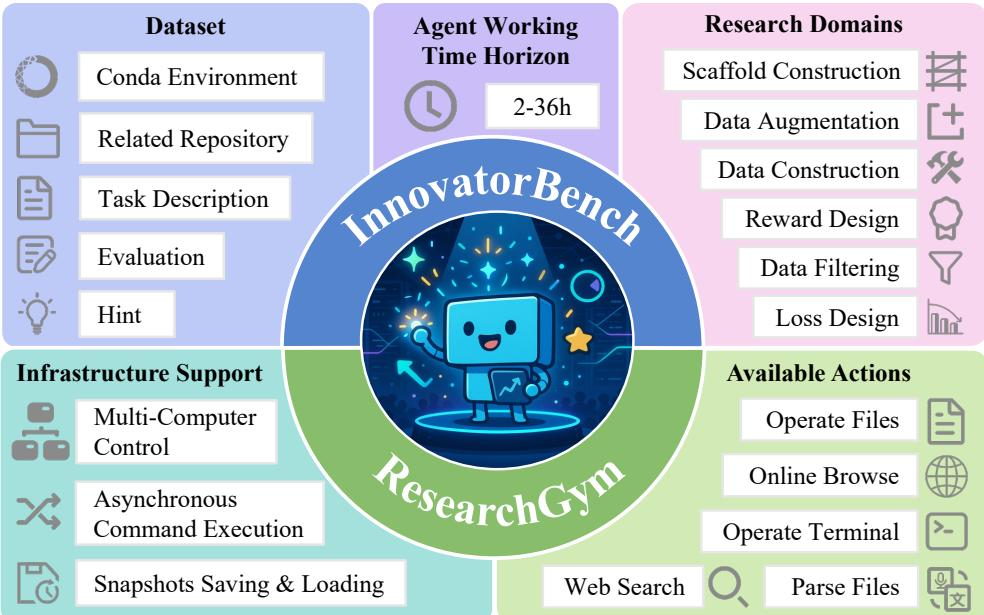  
Figure 1: Overview of InnovatorBench and ResearchGym. InnovatorBench consists of 20 LLM research tasks from 6 research domains. Each task requires the most powerful agent at most 36 hours to complete. ResearchGym provides the infrastructure support and a rich action space for the agent to work in InnovatorBench.

## 1 Introduction

Artificial intelligence (AI) is becoming central to scientific discovery (Chen et al., 2024; Starace et al., 2025). Traditional workflows require humans to hypothesize, design experiments, implement and debug code, process data, manage resources, and analyze results. As AI rapidly advances, the potential to automate entire research workflows is on the horizon (Liu et al., 2025). We refer to these systems as “AI researchers”: agents that integrate multiple stages of research and target human-level behaviors, including insight generation and implementation (Team et al., 2025b). Since Large Language Models (LLMs) act as the “brains” of such agents (Xi et al., 2025), they can finish auxiliary tasks such as data cleaning, augmentation, loss design, reward design, or architecture design as LLM capabilities improve in planning, code generation, and debugging. What’s more, better LLMs agents can propose hypotheses and execute experiments more reliably, which accelerates discovery and feeds back into improving themselves (Liu et al., 2025). As a result, transferring improvements in LLM capabilities into genuine progress for AI research agents requires more than isolated skills. The key question is whether these abilities can be orchestrated into coherent, end-to-end research workflows (Chen et al., 2024; Edwards et al., 2025). This motivates systematic and realistic evaluation of AI research agents and has prompted recent efforts to benchmark them.

Recent efforts to AI research benchmark have provided valuable insights and represent important first steps toward formalizing this emerging area (Starace et al., 2025; Chen et al., 2024; Edwards et al., 2025; Xu et al., 2025; Team, 2025). These studies show that current agents can already achieve non-trivial performance on experiment design, implementation correctness, and even limited replication of advanced research results, establishing clear baselines for progress. At the same time, these benchmarks highlight several structural limitations. Many existing tasks concentrate narrowly on a single performance dimension, such as code implementation accuracy, or parameter tuning (Hua et al., 2025), rather than evaluating the entire research process end to end. Success is often framed as reproducing existing results (Starace et al., 2025), which measures fidelity but not the capacity for innovation, new objective design, or architectural creativity. Moreover, the research environments where agents are evaluated are simplified and resource-constrained, so large-scale and long-horizon training or inference are typically unsupported, and asynchronous monitoring of processes that span multiple hours is rare (Kon et al., 2025). Action spaces are also constrained, preventing agents from engaging in realistic research behaviors such as managing files, executing commands, or browsing literature (Chen et al., 2024). These limitations collectively restrict the conclusions that can be drawn about an agent’s potential as a true research collaborator.

In this paper, we try to address these challenges by introducing InnovatorBench and a new experimental platform ResearchGym that evaluates AI research agents in settings closer to real scientific practice.

InnovatorBench systematically evaluates core subproblems in LLM research, encompassing data construction (DC), data filtering (DF), and data augmentation (DA), loss design (LD), reward design (RD), and scaffold construction (SC). It consists of 20 tasks, each task isolates a distinct research domain, requiring agents to propose creative methods, implement their own ideas, refine ideas & implementation based on the results, produce concrete outputs, and submit their outputs for several times. To establish baselines and ensure reproducibility, we construct reference solutions and relative evaluation scripts. The reference solutions remain hidden during evaluation so that agents must rely on their own reasoning and design choices. The evaluation scripts quantify metrics like correctness, quality, and/or even the output uncertainty like the entropy of predictions after Reinforcement Learning (RL) (Yu et al., 2025), thereby providing a multifaceted view of agent capabilities. This setup emphasizes both diversity and openness because the tasks span different types of challenges, allow multiple solution strategies, and reward innovation rather than simple replication. Consequently, InnovatorBench moves beyond narrow tests of implementation fidelity and provides a rigorous framework for assessing whether agents can execute end-to-end research workflows that mirror the demands of real LLM development.

In parallel, ResearchGym offers a scalable and realistic environment that addresses limitations of existing platforms (Nathani et al., 2025; Wang et al., 2024a). It provides a rich action space that covers terminal commands, file operations, web search, and web browsing. Building on this foundation, ResearchGym supports large-scale experiments that may run for many hours or even days, with facilities for launching, monitoring, and adapting long-running processes, as well as distributed training across multiple machines and GPUs. It also provides snapshot saving and loading for pausing and resuming experiments without loss of progress. Importantly, ResearchGym is not tied to a single benchmark; it is a general and extensible platform to which the community can contribute new tasks, datasets, and evaluation protocols, similar to how models and datasets are shared in the HuggingFace (Wolf et al., 2019). This openness allows ResearchGym to evolve with research needs, serving as the foundation for InnovatorBench and as an independent environment for testing new ideas, building baselines, and comparing agents across diverse experimental settings.

To demonstrate the utility of our framework, we deploy a ReAct-based agent on InnovatorBench with several frontier LLMs, including Claude Sonnet 4 (Anthropic, 2025), GPT-5 (OpenAI, 2025), and GLM-4.5 (Zeng et al., 2025), Kimi-K2 (Team et al., 2025a). These experiments provide a systematic basis to analyze how different foundation models perform across diverse subproblems in LLM research, revealing that these models have the potential to handle code-based research tasks longer than 10 hours. However, they struggle with fragile algorithm design and long-horizon decision making, often exhibiting impatience, resource mismanagement, poor library choice, and reliance on template-based reasoning. Such comparative analysis offers new insights into the alignment between model capabilities and the requirements of end-to-end agentic research.

Table 1: Comparison of AI benchmarks across key evaluation dimensions. Time Horizon refers to the time the ReAct-based Agent takes to reach its best score. ML-Bench doesn’t report this result.  
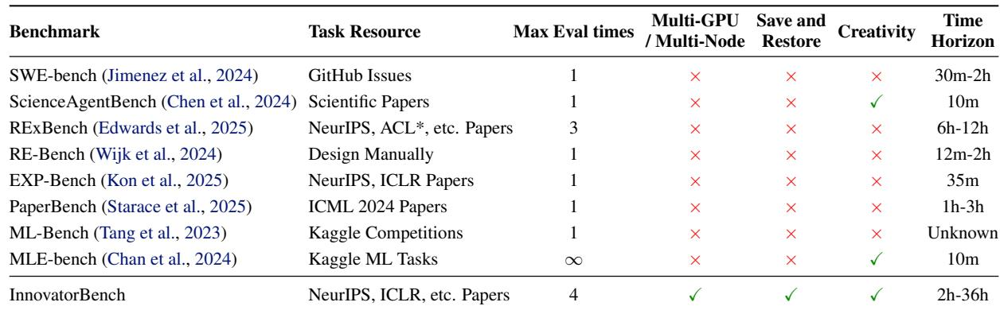

Our contributions can be summarized as follows:

• We introduce InnovatorBench, the first benchmark to systematically evaluate AI research agents on end-to-end LLM research tasks, spanning data construction, filtering, and augmentation, loss design, reward design, and scaffold construction under multiple dimensions.

• We develop ResearchGym, a general and extensible research environment supporting long-duration and distributed experiments, asynchronous execution, snapshot saving and loading, and a broad action space for realistic research workflows.

• We perform an empirical analysis of InnovatorBench across multiple leading LLMs, demonstrating its potential and weaknesses in handling real LLM research tasks.

## 2 Related Work

Recent years have seen growing efforts in developing code agents, which generally fall into two categories: repository-level code benchmarks for assessing specific technical competencies, and agent frameworks that offer execution environments and scaffolding for interactive or long-horizon tasks. Table 1 presents a comparison of several related benchmarks.

Repository-level code benchmarks. Several benchmarks focus on assessing whether agents can solve software engineering or machine learning tasks within realistic repositories. SWE-bench (Jimenez et al., 2024; Yang et al., 2025a,b) and its variants evaluate an agent’s ability to resolve GitHub issues by generating executable patches that pass unit tests (Yang et al., 2024; Yao et al., 2023). ScienceAgentBench (Chen et al., 2024) extends this paradigm to scientific domains, requiring agents to write programs that replicate or analyze results derived from real papers. RExBench (Edwards et al., 2025) and EXP-Bench (Kon et al., 2025) target reproducibility and experiment execution, testing whether agents can reconstruct pipelines to reproduce known results. PaperBench (Starace et al., 2025) collects machine learning tasks from papers to evaluate large-scale replicability. DatasetResearch (Li et al., 2025) emphasizes dataset discovery and reasoning about data usage. Whereas existing benchmarks focus on narrow aspects of research (e.g., code modification, experiment reproduction), InnovatorBench targets a broader set of LLM-centric research abilities, evaluating agents’ proficiency across the entire research lifecycle.

Agent scaffold and environments. A complementary line of work focuses on platforms for deploying codecapable agents in interactive environments. OpenHands (Wang et al., 2024a) allows agents to interact with a sandboxed environment via coding, command-line operations, and web browsing. Commercial systems such as Claude Code demonstrate practical coding assistance but prioritize short-term tasks over long-running, researchoriented workflows. Other research systems, including WorldCoder (Tang et al., 2024) and multimodal variants such as OpenHands-Versa (Soni et al., 2025), highlight the potential of tool-augmented agents for general problem solving. Correspondingly, environments like MLGym (Nathani et al., 2025) provide structured contexts for MLrelated tasks but often constrain the experiment duration, scale, or action space. A common limitation across these frameworks is the lack of support for extended scientific research: they rarely provide distributed training, asynchronous monitoring of multi-hour jobs, snapshot saving, and integration of open-ended research goals. Our ResearchGym directly addresses these gaps by exposing a rich and extensible action space, enabling long-horizon and distributed experiments, and offering a foundation where new tasks and evaluation protocols can be shared and extended by the community.

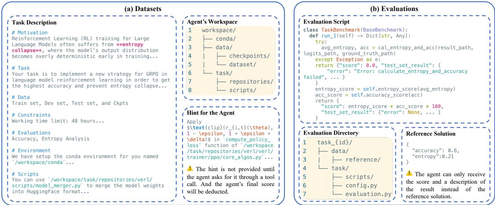  
Figure 2: An illustrative LLM research task from DAPO (Yu et al., 2025). (a) Datasets. The agent receives a task description and a starter workspace; an optional hint is only revealed upon the agent’s explicit request via the view hint tool at a final score penalty. (b) Evaluations. An evaluation directory includes evaluation scripts and reference data. Evaluation is performed externally using scripts and reference data. The agent submits its output via the eval tool and receives a score with feedback, preventing hacking. The full example is in Appendix D.

## 3 InnovatorBench

InnovatorBench evaluates AI agents’ ability to complete end-to-end, innovation-oriented AI research tasks. Each task is derived from an influential AI research paper and its open-source codebase. This coupling captures the full scientific workflow by linking high-level research questions to concrete implementations. As shown in Figure 2, each task entry comprises a task description, an initial starter workspace, a hint for the agent, evaluation scripts, and a reference solution derived from the original research artifacts. The agent’s objective is to extensively explore this task in our environment and aim to achieve a performance that surpasses the ground-truth solution.

Benchmark Overview and Statistics. InnovatorBench currently comprises 20 research tasks drawn from 14 influential papers, as detailed in Appendix A. These tasks span diverse LLM research areas, including data construction, filtering, and augmentation, loss design, reward design, and scaffold construction. They are sourced from top-tier venues, such as NeurIPS, ICLR, COLM, EMNLP, and ACL, etc. as well as the latest publications. The diversity in task origins ensures a rich variety of experimental paradigms, coding methodologies, and research challenges, reflecting the breadth and complexity of contemporary LLM research. The inclusion of such a broad spectrum of tasks ensures that InnovatorBench is not only comprehensive but also versatile, allowing for the assessment of a wide range of AI agent capabilities.

Task Description. The task description provides a structured outline for understanding and solving the problem, offering all necessary details for an agent to effectively perform the task while adhering to defined constraints and evaluation metrics. Each task description provides the agent with the following components:

(1) Motivation: The research motivation and provenance of the question.

(2) Task: A high-level description of the objective for the agent. To encourage exploration and avoid overfitting to prescribed procedures, we do not specify step-by-step instructions; instead, the agent is expected to aim for performance that surpasses the reference solution no matter what method it selects.

(3) Data: Details of the relevant datasets and checkpoints, including content description, storage paths, file formats, and illustrative examples.

(4) Constraints: The operational constraints under which the agent must complete the task, like working time limits, GPU quotas, and output file format.

(5) Evaluations: The evaluation metrics like accuracy, F1, and BLEU. In some tasks, it will also has an introduction to the scoring function in this task description.

(6) Scripts: The description of several supplementary unified scripts and repositories that the agent can use.

(7) Environment: Information about the execution environment, including the conda environment and the workspace directory layout.

Workspace. The workspace is a writable directory containing essential task artifacts, over which the agent has complete control. The workspace comprises three major components:

(1) Conda environment: We pre-build a conda environment following the setup instructions of the corresponding paper. The environment is intentionally minimal—sufficient to run the baseline experiments. We recommend not modifying this base environment; however, to preserve the agent’s autonomy, we do not prohibit installing or removing packages when necessary (e.g., to resolve missing dependencies).

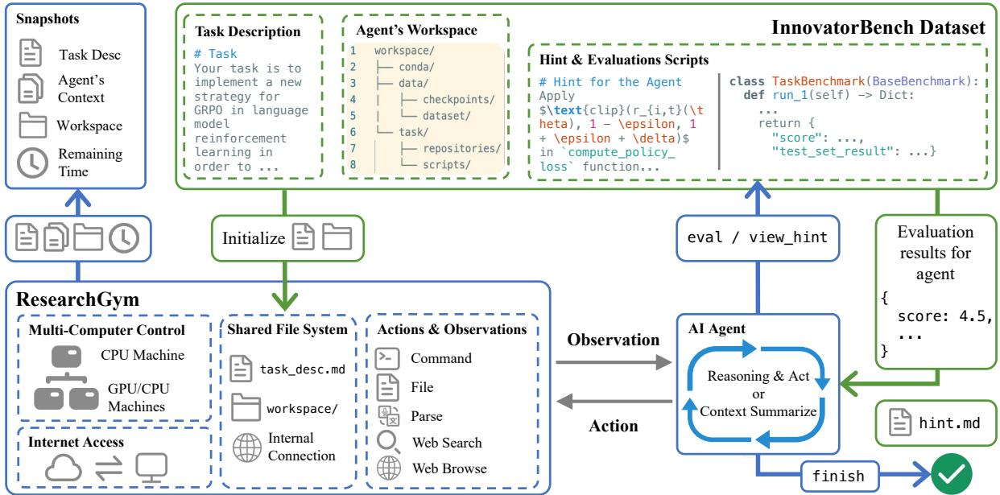  
Figure 3: Overall structure between InnovatorBench, ResearchGym, and agents. ResearchGym’s workspace is initialized with the InnovatorBench dataset. The agent receives a task description, reasons over observations, and sends actions on a target computer. The agent iterates this process, optionally using view hint for hints and eval for submitting answers, until calling finish. ResearchGym then performs a final evaluation and saves a state snapshot.

(2) Data: To enable the agent to validate its proposed methods, we provide datasets that support reproducible experimentation, including training, validation, and test sets (with ground-truth labels removed for the test set), as well as model checkpoints on which the agent can perform further training (e.g., SFT or RL). The agent may also search for and download additional data and reformat it to be compatible with the requirements of the code repository (e.g., LlamaFactory (Zheng et al., 2024)). In addition, the agent may synthesize datasets—either by using the provided models or by generating chain-of-thought style data for augmentation.

(3) Task: This directory contains the code repository and a set of helper scripts. The repository is adapted from the original paper’s codebase: we remove the implementation of the paper’s key novelty and git commit history while keeping the project runnable. In most tasks, the repository is LlamaFactory (Zheng et al., 2024) or Verl (Sheng et al., 2024). The scripts folder offers scripts for data construction, training, inference, and evaluation; the agent may add its own scripts and files.

Hint for the Agent. To assist with these challenging tasks, we provide an optional hint for each task. By following this hint, the experienced researcher can gain about 80% of the score. As a result, this mode tests the agent’s ability to replicate specific ideas. Hints are not included in the workspace; an agent may query their contents via the view hint tool, choosing whether to adopt them. Our main evaluation disabled this tool, while the ablation study will use this view hint tool immediately after the task description.

Evaluations. Our evaluation follows a Kaggle-style1 procedure with multiple submission opportunities and immediate score feedback on the test set. First, a submission is checked for format validity, with failures receiving a score of 0 and an error message. Subsequently, valid submissions are scored based on a function calibrated between a baseline (anchored near 0) and a reference solution (anchored near 80). The entire evaluation runs externally to the workspace in order to avoid reward hacking.

## 4 ResearchGym

Prior agent systems such as OpenHands (Wang et al., 2024a) and IterativeAgent (Starace et al., 2025) operate within a single Docker container. They execute commands synchronously, so the next action cannot be chosen until the previous one finishes. This design constrains the scale of experiments and reduces action throughput. To overcome these limitations, we introduce ResearchGym, an environment designed to approximate real-world LLM research. ResearchGym provides 42 primitive actions that agents can freely compose, supports control of multiple machines and asynchronous command execution, and allows users to save and restore environment snapshots.

Actions and Observations. Actions of ResearchGym are grouped into five families: Command, File, Parse, Web Search, and Web Browse. Command actions can manage execution sessions, run commands within a session, and retrieve outputs. File actions can perform file operations (e.g., create, edit, delete, read, and search), and query file metadata. Parse actions can extract and preview content from multi-modal sources (e.g., images, audio, and video) for text-only models. Web Search and Web Browse grant networked retrieval and browsing for accessing up-to-date methods and datasets. Each action family is paired with an observation that normalizes raw outputs into a structured, agent-readable return. Details can be referred to Appendix F.

Multi-Computer Control. ResearchGym allows agents to control multiple machines (or Docker containers) concurrently via HTTP. Each computer runs an HTTP server to receive and execute terminal commands, allowing an agent initialized on a single machine to orchestrate long-horizon, distributed experiments across a cluster.

Asynchronous Command Execution. ResearchGym decouples action execution from selection to prevent decision blocking. Agents can bind commands to specific sessions, or let ResearchGym create new ones. This ensures ongoing jobs continue uninterrupted and enable immediate subsequent planning. Agents can later retrieve the result via get session output asynchronously. To avoid nonsensical actions during model training, ResearchGym provides a dedicated sleep action.

Snapshots Saving and Loading. A snapshot records the task specification, the agent’s context, the final state of the workspace, and the remaining time budget. ResearchGym can periodically save the full state as snapshots, and it can restore the system from any snapshot. Snapshots support branching. Experiments can resume from different points or proceed along multiple branches.

Pipeline. Figure 3 depicts the end-to-end interaction loop. The process begins when ResearchGym loads a task from InnovatorBench, providing the agent with a task description as its initial observation and a starter workspace. Given an observation, the agent reasons and issues a tool call. If it’s not a command action, the ResearchGym will produce it locally; otherwise, ResearchGym converts this call into an action, wraps it in an HTTP request, and dispatches it to a target machine. The target machine executes the action or launches it as a background process. ResearchGym packages the outcome as a new observation in an agent-readable format. Synchronous actions immediately update the workspace, whereas asynchronous actions return a session ID and status for the agent to poll with subsequent commands. The agent repeats this loop, optionally submitting answers for evaluation and consulting hints when needed. When the agent deems the task complete, it invokes finish. ResearchGym performs a final evaluation, saves a snapshot, and finalizes the task.

## 5 Experiments and Results

## 5.1 Experimental Setup

We evaluate leading LLMs commonly used in related benchmarks on InnovatorBench. Specifically, we consider Claude Sonnet 4 (Anthropic, 2025), GPT-5 (OpenAI, 2025), and GLM-4.5 (Zeng et al., 2025), Kimi-K2 (Team et al., 2025a) using a ReAct-style agent (Yao et al., 2023). The agent has the fundamental thought and action capabilities, augmented by a summarization capability. When the context length nears the model’s maximum, the agent will summarize the earlier half of the context. All models are wrapped as agents and executed inside a Docker container on Ubuntu 22.04 with 800 GB of memory. The agent can also, via a cluster HTTP service, dispatch additional compute to server(s) with 8 × 80 GB GPUs and 1600 GB of memory each, with the number of servers allocated varying by task. We also provide a clean working directory containing the relevant data, a starter code repository, and the task description for each task. Data Construction and Data Augmentation can connect the internet. We disable the web search and browse tools in other tasks.

## 5.2 Main Results and Findings

As demonstrated in Table 2, we compare three agents across six research-oriented tasks and report both the final and best scores achieved. Overall, all the agents get non-zero scores, which show they have the potential to handle code-based research tasks. Claude Sonnet 4 demonstrates the most superior performance among its counterparts, attaining the highest average final score and best score, and leading on four of six tasks. GPT-5 and GLM-4.5 yield middling results on final score and best score, respectively. Besides, we also obtain the following findings:

All LLMs have relatively higher scores on data-related tasks than on algorithm-related tasks. This difference arises from the nature of these tasks, tasks such as data construction, filtering, and augmentation are inherently more robust: it is relatively tolerant of minor noise. For example, the agent can gain a relatively high score in data construction as long as it find the data with the same topic. In contrast, algorithmic design tends to be more brittle; imperfect reward or loss functions can lead to catastrophic failures like gradient explosion or systematically flawed policies.

Table 2: Performance comparison on various LLMs when tested against various research domains. Final Score: last submission score; Best Score: highest achieved score among 3 evaluations and final evaluation. Details of all research tasks can be referred to Appendix C.  
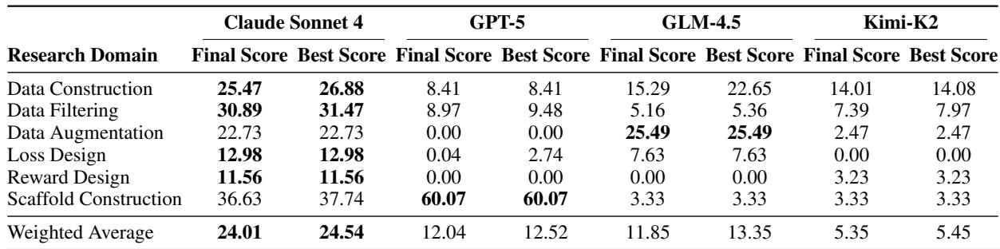

Table 3: Effect of hint provision on agent performance across research domains. Comparison between Claude Sonnet 4 with and without hints. Final Score: last submission score; Best Score: highest achieved score; Execution Time: agent runtime (hours); Cost: monetary expenditure (USD).  
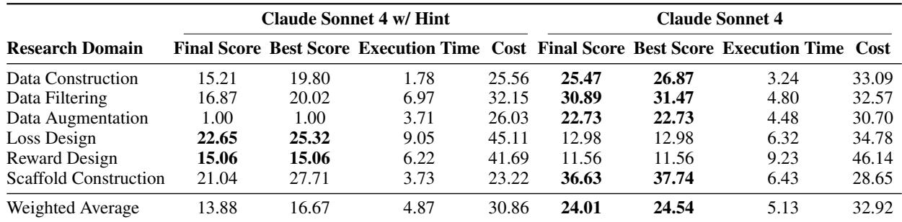

It is hard for models to use appropriate tools in algorithm-related tasks. We discover that Claude Sonnet 4 performs relatively better than other LLMs on loss/reward design, primarily due to its reliable tool use. Trace inspection reveals that GPT-5 enters a high-frequency loop once training begins, causing early termination, while GLM-4.5 wrongly specifies critical tool parameters sometimes and stalls before training starts. Kimi-K2 cannot generate correct code in most cases. However, Claude Sonnet 4 consistently produces executable code and correctly suspends activity during training without intervention. These findings suggest that reliability in tool-grounded execution is the key determinant of success in loss/reward design tasks.

GPT-5’s code is more robust in Scaffold Construction. GPT-5 excels notably in scaffold construction, achieving a score of 60.07, which raises its overall average to 12.04. By checking the log between GPT-5 and other models, we found GPT-5’s generated scaffolds are most robust, attributable to three key design choices: explicitly restating the options provided in the prompt to prevent invalid selections, allowing up to three retries instead of immediately resorting to a fallback answer upon timeout, and enforcing a strict output format to reduce evaluation failures caused by formatting issues. We consider this to be because the scaffold construction is similar to the simple software engineering task, and GPT-5 can generate more standardized and comprehensive code.

## 5.3 Performance of model with Ground Truth Hint

Table 3 presents the performance of the model with and without hints. The introduction of hints, in the form of ground truth solutions, leads to noticeable improvements in performance across Loss Design and Reward Design. These domains are inherently more exploratory in nature, where the agent needs to devise creative solutions based on the nature of the test data and the understanding of the original algorithm. When provided with the ground truth solution, the agent can bypass the need for exploration and instead focus purely on the practical task of replicating the given solution. This shift in task complexity allows the model to achieve higher scores, as the agent’s work now revolves around following an established methodology rather than generating one itself.

In contrast, domains such as Data Construction, Data Filtering, and Data Augmentation show a decrease in performance when the hint is provided. Although the hint offers the agent a ground truth solution, the model’s ability to correctly implement the solution is hindered by its own coding ability as mentioned in §5.4. When the hint is used, the model’s reliance on exact replication of the provided ground truth can lead to failures.

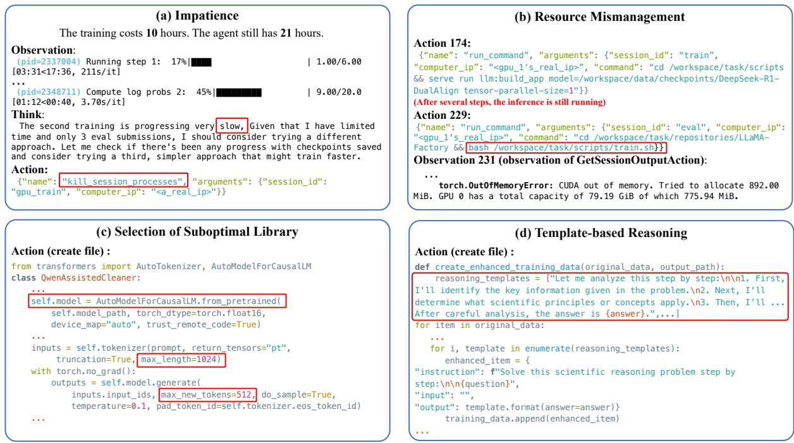  
Figure 4: Four representative cases of agents’ actual failures. (a) Impatience, (b) Resource Mismanagement, (c) Selection of Suboptimal Library, (d) Template-based Reasoning. Some spaces have been removed in the figure.

This is particularly evident in the creation of training and inference scripts, where small errors or mismatches between the hint and the reimplemented solution can harm the performance of the model severely. Therefore, despite the availability of a ground truth solution, the model’s performance is even lower than the symbolic method implemented by the model without hints.

Such a result clearly proves that if a model wants to achieve a high score in research, it needs comprehensive abilities, such as creativity and code implementation ability. If one ability is missing, no matter whether high-level or low-level, the model’s performance will be severely affected.

## 5.4 Case Study

Figure 4 represents cases of agents’ actual failure, which reflects the LLMs’ weakness:

Impatience. As shown in Figure 4(a), the training run takes about 10 hours; at that point, the agent knows it still has roughly 21 hours of budget. It is sufficient to wait for completion rather than terminating the process. However, the agent wants to find a more efficient way to train the model and kill the training process, which causes sub-optimal result. The objective mis-specification and shortsighted decision-making reflect the agent’s impatience.

Resource Mismanagement. Figure 4(b) demonstrates that the agent first launches an inference script with one GPU; 55 steps later, on the same computer, it launches a training script that requires all GPUs, causing resource contention. The agent no longer finds that an inference job was already active after more than 50 steps, shows the LLM’s weakness in degraded memory and attention.

Selection of Suboptimal Library. Figure 4(c) depicts that the agent systematically opts for scale-mismatched implementations: it continues to run inference with Transformers in high-throughput settings instead of adopting the more efficient vLLM. This is because the time-budget constraint does not provide a direct, learnable feedback signal that rewards efficiency, so it fails to shape the agent’s decisions. It may also be attributed to the lack of training data for the optimal library, like vLLM, since the optimal library is relatively new.

Template-based Reasoning. Figure 4(d) shows that when synthesizing chain-of-thought (CoT) rationales for QA data augmentation, the agent often instantiates a highly templated, semantically vacuous reasoning pattern and batch-concatenates the question and answer, rather than reasoning from the problem’s actual semantics. We find that this pattern often appears after the agent fails to generate a correct CoT via vLLM. The agents can’t figure out why it needs to synthesize CoT and just do it mechanically. Although this case shows the agentic ability, it also reflects the agent’s lack of understanding of high-level intent.

## 5.5 Test-time Scaling Performance

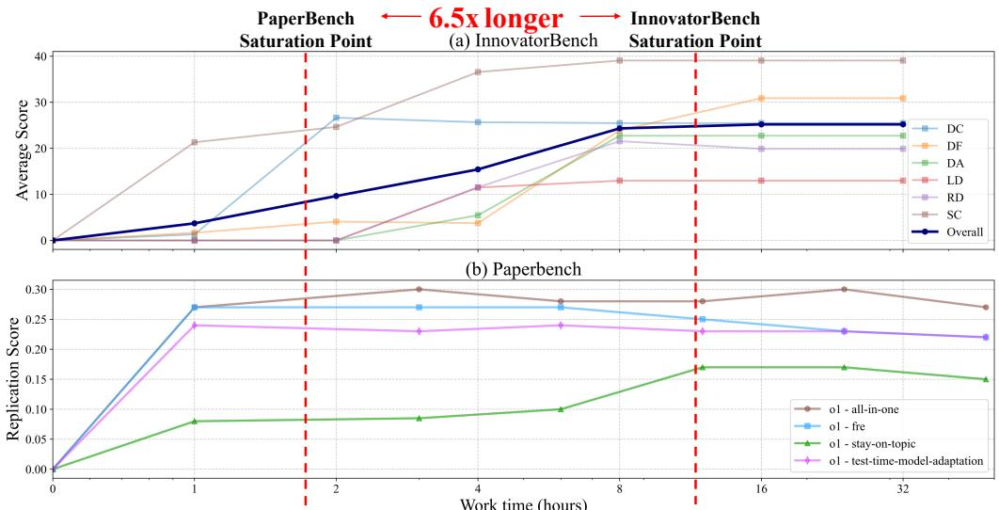  
Figure 5: Test-time scaling: InnovatorBench vs. PaperBench (Starace et al., 2025). PaperBench’s result comes from the original paper. Agents require about 6.5× longer test-time to reach the saturation point on InnovatorBench, highlighting that our benchmark’s difficulty stems from the need for extended runtime before performance plateaus. DC, DF, DA, LD, RD, and SC are six subtasks in InnovatorBench, which are Data Construction, Data Filtering, Data Augmentation, Loss Design, Reward Design, and Scaffold Construction, respectively.

Figure 5 presents a detailed comparison of test-time scaling between InnovatorBench and PaperBench. It is evident from the data that agents achieve their peak performance on PaperBench in about 1.75 hours, whereas the same agents take significantly longer—over 11 hours—on InnovatorBench. This stark contrast in time scaling highlights the higher complexity of InnovatorBench as compared to PaperBench.

The reason for this substantial difference lies in the nature of the tasks involved. PaperBench primarily features simpler tasks that the agent only need to reproduce the paper. On the other hand, InnovatorBench includes more intricate and challenging tasks, such as Data Augmentation and Reward Design, which necessitate extensive training phases. These tasks require more sophisticated strategies, longer interactions with the environment, and iterative adjustments, which substantially increase the overall time required for agents to achieve optimal performance.

Moreover, the results suggest a broader trend: as the complexity of the tasks increases, the cost of environment interactions grows exponentially, thus dominating the overall working time. This phenomenon reflects how the intricacy of a task can heavily influence the required computational resources and time investment.

Given these findings, it is clear that InnovatorBench presents a more demanding and time-consuming challenge than PaperBench. This increased difficulty, driven by the more complex tasks it encompasses, positions InnovatorBench as a more comprehensive benchmark for code-based research. We believe that InnovatorBench will pave the way for future advancements in the field, offering a testing ground for evaluating agent performance in increasingly complex environments. As such, it holds the potential to become the next-generation standard for research benchmarks, pushing the boundaries of what agents can achieve in real-world, high-complexity scenarios.

## 6 Conclusion

In conclusion, this work introduces two key contributions to the development of AI research agents: InnovatorBench, a comprehensive benchmark for evaluating end-to-end LLM research tasks, and ResearchGym, an extensible platform that supports large-scale, long-horizon experiments and realistic research workflows. InnovatorBench goes beyond basic task reimplementation, offering a rigorous framework that evaluates agents’ ability to address complex LLM research challenges across multiple dimensions, including data construction, filtering, augmentation, loss design, reward design, and scaffold construction. This emphasis on innovation, adaptability, and creative problem-solving ensures a more comprehensive assessment of AI research agents. Empirical results using leading LLMs reveal promising capabilities in code-based tasks, but also expose weaknesses in reward design, resource management, and long-horizon planning. Together, these contributions provide a foundation for rigorous, real-world evaluation of AI agents, supporting their development as effective tools for scientific discovery.

## 7 Acknowledgement

This work was partially funded by the National Natural Science Foundation of China (62476168), AI for Science Program, Shanghai Municipal Commission of Economy and Informatization: 2025-GZL-RGZN-BTBX-01013

## References

[1] Anthropic. 2025. Introducing claude 4. Accessed: 2025-09-22.

[2] Shuai Bai, Keqin Chen, Xuejing Liu, Jialin Wang, Wenbin Ge, Sibo Song, Kai Dang, Peng Wang, Shijie Wang, Jun Tang, et al. 2025. Qwen2. 5-vl technical report. arXiv preprint arXiv:2502.13923.

[3] Jun Shern Chan, Neil Chowdhury, Oliver Jaffe, James Aung, Dane Sherburn, Evan Mays, Giulio Starace, Kevin Liu, Leon Maksin, Tejal Patwardhan, et al. 2024. Mle-bench: Evaluating machine learning agents on machine learning engineering. arXiv preprint arXiv:2410.07095.

[4] Ziru Chen, Shijie Chen, Yuting Ning, Qianheng Zhang, Boshi Wang, Botao Yu, Yifei Li, Zeyi Liao, Chen Wei, Zitong Lu, Vishal Dey, Mingyi Xue, Frazier N. Baker, Benjamin Burns, Daniel Adu-Ampratwum, Xuhui Huang, Xia Ning, Song Gao, Yu Su, and Huan Sun. 2024. Scienceagentbench: Toward rigorous assessment of language agents for data-driven scientific discovery.

[5] Xinrun Du, Yifan Yao, Kaijing Ma, Bingli Wang, Tianyu Zheng, King Zhu, Minghao Liu, Yiming Liang, Xiaolong Jin, Zhenlin Wei, et al. 2025. Supergpqa: Scaling llm evaluation across 285 graduate disciplines. arXiv preprint arXiv:2502.14739.

[6] Nicholas Edwards, Yukyung Lee, Yujun (Audrey) Mao, Yulu Qin, Sebastian Schuster, and Najoung Kim. 2025. Rexbench: Can coding agents autonomously implement ai research extensions? arXiv preprint.

[7] Dayuan Fu, Keqing He, Yejie Wang, Wentao Hong, Zhuoma Gongque, Weihao Zeng, Wei Wang, Jingang Wang, Xunliang Cai, and Weiran Xu. 2025. Agentrefine: Enhancing agent generalization through refinement tuning. arXiv preprint arXiv:2501.01702.

[8] Dayuan Fu, Jianzhao Huang, Siyuan Lu, Guanting Dong, Yejie Wang, Keqing He, and Weiran Xu. 2024a. Preact: Prediction enhances agent’s planning ability. arXiv preprint arXiv:2402.11534.

[9] Dayuan Fu, Biqing Qi, Yihuai Gao, Che Jiang, Guanting Dong, and Bowen Zhou. 2024b. Msi-agent: Incorporating multi-scale insight into embodied agents for superior planning and decision-making. arXiv preprint arXiv:2409.16686.

[10] Aaron Grattafiori, Abhimanyu Dubey, Abhinav Jauhri, Abhinav Pandey, Abhishek Kadian, Ahmad Al-Dahle, Aiesha Letman, Akhil Mathur, Alan Schelten, Alex Vaughan, et al. 2024. The llama 3 herd of models. arXiv preprint arXiv:2407.21783.

[11] Daya Guo, Dejian Yang, Haowei Zhang, Junxiao Song, Ruoyu Zhang, Runxin Xu, Qihao Zhu, Shirong Ma, Peiyi Wang, Xiao Bi, et al. 2025. Deepseek-r1: Incentivizing reasoning capability in llms via reinforcement learning. arXiv preprint arXiv:2501.12948.

[12] Yushi Hu, Weijia Shi, Xingyu Fu, Dan Roth, Mari Ostendorf, Luke Zettlemoyer, Noah A Smith, and Ranjay Krishna. 2024. Visual sketchpad: Sketching as a visual chain of thought for multimodal language models. Advances in Neural Information Processing Systems, 37:139348–139379.

[13] Tianyu Hua, Harper Hua, Violet Xiang, Benjamin Klieger, Sang T Truong, Weixin Liang, Fan-Yun Sun, and Nick Haber. 2025. Researchcodebench: Benchmarking llms on implementing novel machine learning research code. arXiv preprint arXiv:2506.02314.

[14] Mohan Jiang, Jin Gao, Jiahao Zhan, and Dequan Wang. 2025. Mac: A live benchmark for multimodal large language models in scientific understanding. arXiv preprint arXiv:2508.15802.

[15] Carlos E Jimenez, John Yang, Alexander Wettig, Shunyu Yao, Kexin Pei, Ofir Press, and Karthik R Narasimhan. 2024. SWE-bench: Can language models resolve real-world github issues? In The Twelfth International Conference on Learning Representations.

[16] Bowen Jin, Hansi Zeng, Zhenrui Yue, Jinsung Yoon, Sercan Arik, Dong Wang, Hamed Zamani, and Jiawei Han. 2025. Search-r1: Training llms to reason and leverage search engines with reinforcement learning. arXiv preprint arXiv:2503.09516.

[17] Patrick Tser Jern Kon, Jiachen Liu, Xinyi Zhu, Qiuyi Ding, Jingjia Peng, Jiarong Xing, Yibo Huang, Yiming Qiu, Jayanth Srinivasa, Myungjin Lee, et al. 2025. Exp-bench: Can ai conduct ai research experiments? arXiv preprint arXiv:2505.24785.

[18] Jia Li, Edward Beeching, Lewis Tunstall, Ben Lipkin, Roman Soletskyi, Shengyi Huang, Kashif Rasul, Longhui Yu, Albert Q Jiang, Ziju Shen, et al. 2024. Numinamath: The largest public dataset in ai4maths with 860k pairs of competition math problems and solutions. Hugging Face repository, 13(9):9.

[19] Keyu Li, Mohan Jiang, Dayuan Fu, Yunze Wu, Xiangkun Hu, Dequan Wang, and Pengfei Liu. 2025. Datasetresearch: Benchmarking agent systems for demand-driven dataset discovery.

[20] Yixiu Liu, Yang Nan, Weixian Xu, Xiangkun Hu, Lyumanshan Ye, Zhen Qin, and Pengfei Liu. 2025. Alphago moment for model architecture discovery. arXiv preprint arXiv:2507.18074.

[21] Run Luo, Lu Wang, Wanwei He, and Xiaobo Xia. 2025. Gui-r1: A generalist r1-style vision-language action model for gui agents. arXiv preprint arXiv:2504.10458.

[22] Deepak Nathani, Lovish Madaan, Nicholas Roberts, Nikolay Bashlykov, Ajay Menon, Vincent Moens, Amar Budhiraja, Despoina Magka, Vladislav Vorotilov, Gaurav Chaurasia, Dieuwke Hupkes, Ricardo Silveira Cabral, Tatiana Shavrina, Jakob Foerster, Yoram Bachrach, William Yang Wang, and Roberta Raileanu. 2025. Mlgym: A new framework and benchmark for advancing ai research agents.

[23] OpenAI. 2025. Gpt-5: Language model. Accessed: 2025-09-22.

[24] Guangming Sheng, Chi Zhang, Zilingfeng Ye, Xibin Wu, Wang Zhang, Ru Zhang, Yanghua Peng, Haibin Lin, and Chuan Wu. 2024. Hybridflow: A flexible and efficient rlhf framework. arXiv preprint arXiv: 2409.19256.

[25] Aditya Bharat Soni, Boxuan Li, Xingyao Wang, Valerie Chen, and Graham Neubig. 2025. Coding agents with multimodal browsing are generalist problem solvers. arXiv preprint arXiv:2506.03011.

[26] Giulio Starace, Oliver Jaffe, Dane Sherburn, James Aung, Jun Shern Chan, Leon Maksin, Rachel Dias, Evan Mays, Benjamin Kinsella, Wyatt Thompson, et al. 2025. Paperbench: Evaluating ai’s ability to replicate ai research. arXiv preprint arXiv:2504.01848.

[27] Jie Sun, Junkang Wu, Jiancan Wu, Zhibo Zhu, Xingyu Lu, Jun Zhou, Lintao Ma, and Xiang Wang. 2025. Robust preference optimization via dynamic target margins. arXiv preprint arXiv:2506.03690.

[28] Hao Tang, Darren Key, and Kevin Ellis. 2024. Worldcoder, a model-based llm agent: Building world models by writing code and interacting with the environment. Advances in Neural Information Processing Systems, 37:70148–70212.

[29] Xiangru Tang, Yuliang Liu, Zefan Cai, Yanjun Shao, Junjie Lu, Yichi Zhang, Zexuan Deng, Helan Hu, Kaikai An, Ruijun Huang, et al. 2023. Ml-bench: Evaluating large language models and agents for machine learning tasks on repository-level code. arXiv preprint arXiv:2311.09835.

[30] Kimi Team, Yifan Bai, Yiping Bao, Guanduo Chen, Jiahao Chen, Ningxin Chen, Ruijue Chen, Yanru Chen, Yuankun Chen, Yutian Chen, et al. 2025a. Kimi k2: Open agentic intelligence. arXiv preprint arXiv:2507.20534.

[31] NovelSeek Team, Bo Zhang, Shiyang Feng, Xiangchao Yan, Jiakang Yuan, Zhiyin Yu, Xiaohan He, Songtao Huang, Shaowei Hou, Zheng Nie, et al. 2025b. Novelseek: When agent becomes the scientist–building closed-loop system from hypothesis to verification. arXiv preprint arXiv:2505.16938.

[32] Qwen Team. 2024. Qwen2 technical report. arXiv preprint arXiv:2407.10671, 2.

[33] The Terminal-Bench Team. 2025. Terminal-bench: A benchmark for ai agents in terminal environments.

[34] Xingyao Wang, Boxuan Li, Yufan Song, Frank F Xu, Xiangru Tang, Mingchen Zhuge, Jiayi Pan, Yueqi Song, Bowen Li, Jaskirat Singh, et al. 2024a. Openhands: An open platform for ai software developers as generalist agents. arXiv preprint arXiv:2407.16741.

[35] Yejie Wang, Keqing He, Dayuan Fu, Zhuoma Gongque, Heyang Xu, Yanxu Chen, Zhexu Wang, Yujia Fu, Guanting Dong, Muxi Diao, et al. 2024b. How do your code llms perform? empowering code instruction tuning with high-quality data. arXiv preprint arXiv:2409.03810.

[36] Hjalmar Wijk, Tao Lin, Joel Becker, Sami Jawhar, Neev Parikh, Thomas Broadley, Lawrence Chan, Michael Chen, Josh Clymer, Jai Dhyani, et al. 2024. Re-bench: Evaluating frontier ai r&d capabilities of language model agents against human experts. arXiv preprint arXiv:2411.15114.

[37] Thomas Wolf, Lysandre Debut, Victor Sanh, Julien Chaumond, Clement Delangue, Anthony Moi, Pierric Cistac, Tim Rault, Remi Louf, Morgan Funtowicz, et al. 2019. Huggingface’s transformers: State-of-the-art ´ natural language processing. arXiv preprint arXiv:1910.03771.

[38] Zhiheng Xi, Wenxiang Chen, Xin Guo, Wei He, Yiwen Ding, Boyang Hong, Ming Zhang, Junzhe Wang, Senjie Jin, Enyu Zhou, et al. 2025. The rise and potential of large language model based agents: A survey. Science China Information Sciences, 68(2):121101.

[39] Yang Xiao, Jiashuo Wang, Qiancheng Xu, Changhe Song, Chunpu Xu, Yi Cheng, Wenjie Li, and Pengfei Liu. 2025. Towards dynamic theory of mind: Evaluating llm adaptation to temporal evolution of human states. arXiv preprint arXiv:2505.17663.

[40] Tianze Xu, Pengrui Lu, Lyumanshan Ye, Xiangkun Hu, and Pengfei Liu. 2025. Researcherbench: Evaluating deep ai research systems on the frontiers of scientific inquiry. arXiv preprint arXiv:2507.16280.

[41] John Yang, Carlos E Jimenez, Alexander Wettig, Kilian Lieret, Shunyu Yao, Karthik Narasimhan, and Ofir Press. 2024. Swe-agent: Agent-computer interfaces enable automated software engineering. Advances in Neural Information Processing Systems, 37:50528–50652.

[42] John Yang, Carlos E. Jimenez, Alex L. Zhang, Kilian Lieret, Joyce Yang, Xindi Wu, Ori Press, Niklas Muennighoff, Gabriel Synnaeve, Karthik R. Narasimhan, Diyi Yang, Sida I. Wang, and Ofir Press. 2025a. SWE-bench multimodal: Do ai systems generalize to visual software domains? In The Thirteenth International Conference on Learning Representations.

[43] John Yang, Kilian Lieret, Carlos E. Jimenez, Alexander Wettig, Kabir Khandpur, Yanzhe Zhang, Binyuan Hui, Ofir Press, Ludwig Schmidt, and Diyi Yang. 2025b. Swe-smith: Scaling data for software engineering agents.

[44] Shunyu Yao, Jeffrey Zhao, Dian Yu, Nan Du, Izhak Shafran, Karthik Narasimhan, and Yuan Cao. 2023. React: Synergizing reasoning and acting in language models. In International Conference on Learning Representations (ICLR).

[45] Lyumanshan Ye, Xiaojie Cai, Xinkai Wang, Junfei Wang, Xiangkun Hu, Jiadi Su, Yang Nan, Sihan Wang, Bohan Zhang, Xiaoze Fan, et al. 2025a. Interaction as intelligence: Deep research with human-ai partnership. arXiv preprint arXiv:2507.15759.

[46] Yixin Ye, Zhen Huang, Yang Xiao, Ethan Chern, Shijie Xia, and Pengfei Liu. 2025b. Limo: Less is more for reasoning. arXiv preprint arXiv:2502.03387.

[47] Qiying Yu, Zheng Zhang, Ruofei Zhu, Yufeng Yuan, Xiaochen Zuo, Yu Yue, Weinan Dai, Tiantian Fan, Gaohong Liu, Lingjun Liu, et al. 2025. Dapo: An open-source llm reinforcement learning system at scale. arXiv preprint arXiv:2503.14476.

[48] Aohan Zeng, Xin Lv, Qinkai Zheng, Zhenyu Hou, Bin Chen, Chengxing Xie, Cunxiang Wang, Da Yin, Hao Zeng, Jiajie Zhang, et al. 2025. Glm-4.5: Agentic, reasoning, and coding (arc) foundation models. arXiv preprint arXiv:2508.06471.

[49] Yaowei Zheng, Richong Zhang, Junhao Zhang, Yanhan Ye, Zheyan Luo, Zhangchi Feng, and Yongqiang Ma. 2024. Llamafactory: Unified efficient fine-tuning of 100+ language models. In Proceedings of the 62nd Annual Meeting of the Association for Computational Linguistics (Volume 3: System Demonstrations), Bangkok, Thailand. Association for Computational Linguistics.

[50] Yuxiang Zheng, Dayuan Fu, Xiangkun Hu, Xiaojie Cai, Lyumanshan Ye, Pengrui Lu, and Pengfei Liu. 2025. Deepresearcher: Scaling deep research via reinforcement learning in real-world environments. arXiv preprint arXiv:2504.03160.

[51] Fan Zhou, Zengzhi Wang, Qian Liu, Junlong Li, and Pengfei Liu. 2024. Programming every example: Lifting pre-training data quality like experts at scale. arXiv preprint arXiv:2409.17115.

[52] Wenhong Zhu, Ruobing Xie, Weinan Zhang, and Rui Wang. 2025. Flexible realignment of language models. arXiv preprint arXiv:2506.12704.

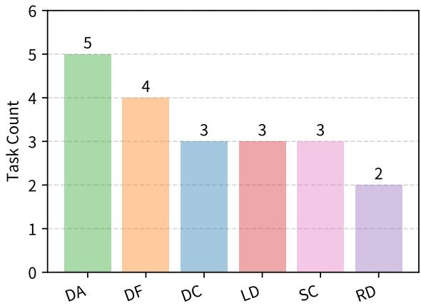  
Figure 6: InnovatorBench’s dataset comprises tasks from a diverse set of AI research categories. DA denotes Data Augmentation, DC stands for Data Construction, DF represents Data Filtering, LD is the Loss Design, SC denotes Scaffold Construction, and RD means Reward Design.

## A Extended Details of the InnovatorBench Dataset

Figure 6 shows the task composition of InnovatorBench, and Table 4 presents the details of each task in Innovator-Bench.

Table 4: Performance comparison on various models when tested against various evaluation metrics.  
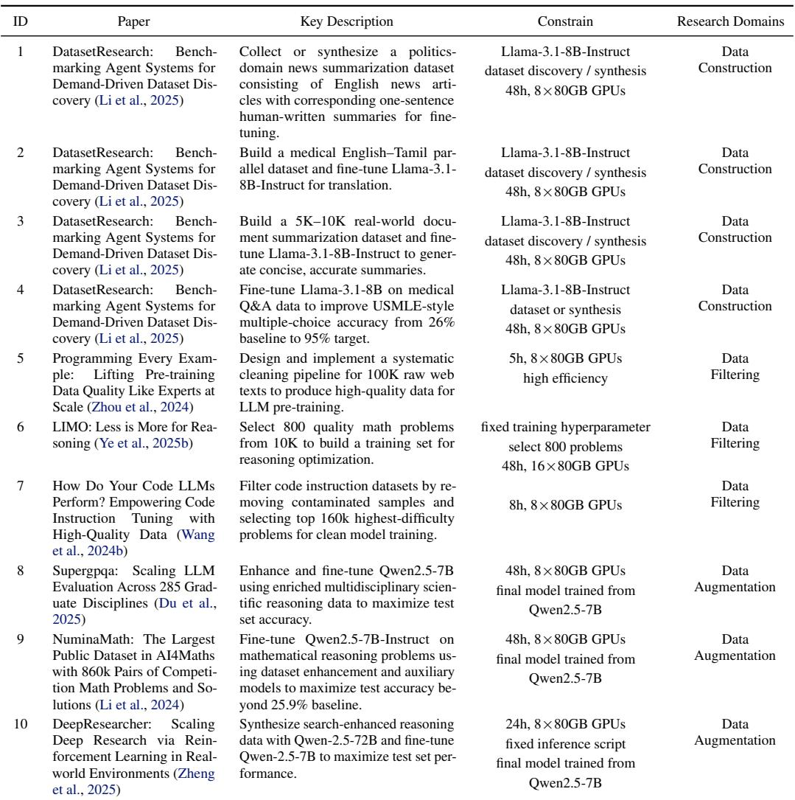

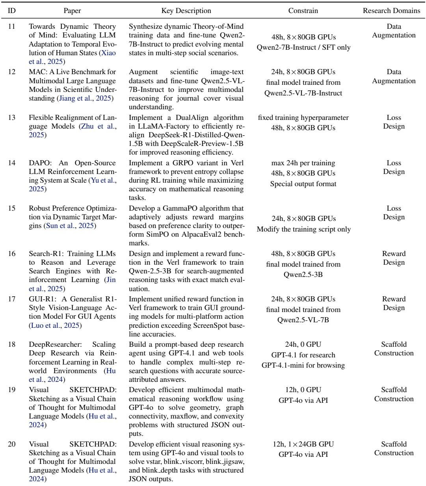

## B Dataset Curation and Benchmark Construction Details

InnovatorBench Construction We first design 20 raw tasks based on the following principle:

(1) The task can be reapplied; the result is aligned with the original paper.

(2) The task result can gain significant improvement in 2 days

(3) The tasks can evaluate the different abilities of LLM Agents in LLM Research.

(4) The task uses common models like llama3.1 (Grattafiori et al., 2024), Qwen2.5 (Team, 2024; Guo et al., 2025; Bai et al., 2025), or Qwen2.5-VL (Bai et al., 2025), etc.

There are 13 annotators to annotate InnovatorBench. Each task costs from 3 days to 2 weeks for the annotators to construct the workspace and evaluation code. After collecting 20 tasks, 2 authors further organize these tasks, workspaces, and evaluations into ResearchGym. Each annotators were asked to reapply the original paper and gain the reference score, and the baseline score often comes from the base model’s result. After obtaining these two scores, the annotators were asked to design the score function based on these scores, usually a linear interpolation. The score function has 2 principles: (1) the baseline score should result in a final score of 0, while if agents gain a score higher than the baseline score, their final score should not be 0, and (2) the reference score should be about 80.

After testing the first version of InnovatorBench, we found that even the most advanced model can’t generate and save the SFT data correctly, as mentioned in Figure 4, so we just changed the task a little bit to reduce the difficulty in the Data Argument by adding some relevant scripts.

## C Detailed Experimental Results

## C.1 Main Results

Table 5: Performance comparison of each task on various models when tested against various evaluation metrics. FS denotes Final Score, BS represents Best Score, ET stands for Execution Time in hours, and Cost is the monetary spend in USD.  
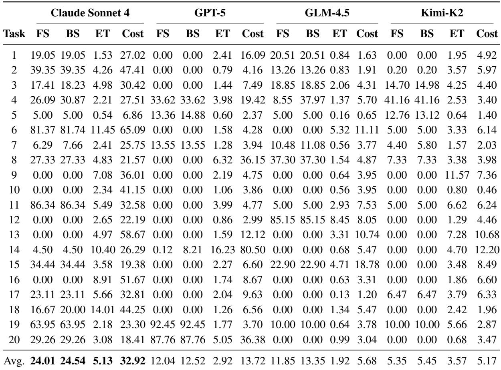

The benchmark evaluated the performance of three large language models — Claude Sonnet 4, GPT-5, GLM-4.5, and Kimi-K2 — on multiple tasks with varying priority levels. For each task, the metrics recorded include the final score, the highest score, and the runtime (in hours). This analysis focuses on comparing model effectiveness (scores) and efficiency (time cost).

## C.2 Performance of model with Ground Truth Hint

Table 6 presents the performance, execution time, and cost results between Claude Sonnet 4 with the hint and Claude Sonnet 4 without the hint.

## D Extended InnovatorBench Examples

Example of task 14’s description

\## Motivation

Reinforcement Learning (RL) training for Large Language Models often suffers from \*\*entropy collapse\*\*, where the model’s output distribution becomes overly deterministic early in training. This severely limits exploration and prevents the model from discovering diverse reasoning paths. Understanding and mitigating entropy collapse is crucial for successful long−form reasoning tasks where exploration of different solution strategies is essential.

\## Task

Table 6: Performance comparison between Claude4-hint and Claude4 on evaluation metrics, runtime, and cost.  
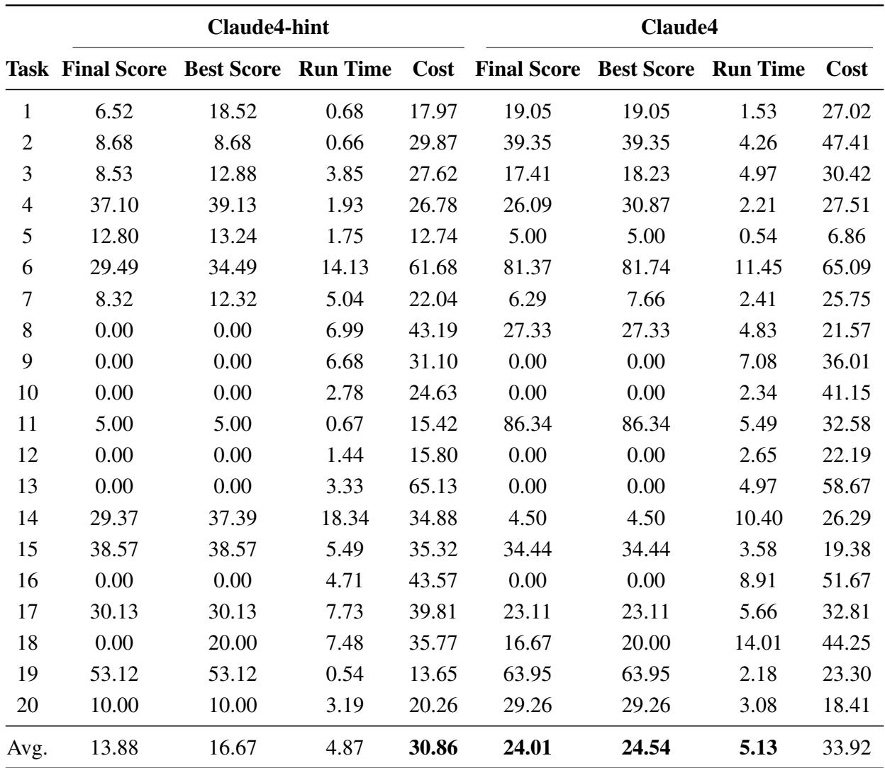

\*\*Your task is to implement a new strategy for GRPO in language model reinforcement learning in order to get the highest accuracy and prevent entropy collapse.\*\*

We provide a GRPO algorithm for you as background knowledge. For a specific question−answer pair \$(q, a)\$, the behavior policy \$\pi \thetaˆ{\mathit{old}}\$ samples a group of \$G\$ individual responses \$\{o i\} {i=1}ˆG\$. Then, the advantage of the i−th response is calculated by normalizing the group−level rewards \$\{R i\} {i=1}ˆG\$:

## \$\$

\nabla \theta J {GRPO}(\theta) = \mathbb{E} {(q, a) \sim D, \{o i\} {i=1}ˆG \sim \pi {\theta {old}}(\cdot|q )} \left[ \dfrac{1}{G} \sum {i=1}ˆG \dfrac{1}{|\mathcal{o} i|} \sum {t = 1}ˆ{|\mathcal{o} i|} \left( \min \ left( r {i,t}(\theta)\hat{A} {i, t}, \text{clip}(r {i,t}(\theta), 1 − \epsilon, 1 + \epsilon)\hat{A} {i, t} \right) \ right) \right]

\*\*Now, you need to implement a variant of GRPO to get the highest accuracy and prevent entropy collapse.\*\*

You should work under the ‘/workspace/task‘ and ‘/workspace/data‘ directories.

You need to use the original GRPO rollout. Only modify the advantage/loss compute part in ‘/workspace/task/ repositories/verl/verl/trainer/ppo/core algos.py‘, do not modify other files in verl.

After you implement the algorithm in ‘/workspace/task/repositories/verl‘, you can use ‘/workspace/task/scripts/train. sh‘ to train the model based on your code; it will also show the dev set results in the training log. (You can train multiple times, just select the best one to evaluate.)

− Do not modify the parameter in ‘/workspace/task/scripts/train.sh‘ except test freq

Finally, you need to select the best checkpoints in your training, using ‘/workspace/task/scripts/inference.sh < model path>‘ to generate ‘/workspace/data/outputs/math results logits.pt‘ and ‘/workspace/data/outputs/ math results.parquet‘

\### Output Format Requirements:

\*\*File Location\*\*: ‘/workspace/data/outputs/math results.parquet‘

\*\*File Format\*\*: Parquet format containing model responses

\*\*Required Fields\*\*: The parquet file should contain:

− ‘”sample id”‘ (int): Unique identifier for each test sample (must follow the order in the test set)

− ‘”output”‘ (string): The model’s complete response, including reasoning and final answer

\*\*Required Output Format for each response:\*\*

<reasoning process>

Answer:\boxed{Your Answer}

\*\*Logits File\*\*: ‘/workspace/data/outputs/math results logits.pt‘

− PyTorch tensor file containing logits for entropy calculation

− Should be a list of tensors, one for each test sample

− Each tensor should have shape ‘[sequence length, vocab size]‘ where:

− ‘sequence length‘: Number of generated tokens for that sample

− ‘vocab size‘: Size of the model’s vocabulary

\*\*IMPORTANT Notes:\*\*

− Use ‘/workspace/task/scripts/inference.py‘ for inference − \*\*do not modify this script\*\*

− The reasoning process should demonstrate clear mathematical thinking

− Final answer must be enclosed in ‘\boxed{}‘ format

− Your task is to implement a new strategy for GRPO to prevent entropy collapse and achieve the highest accuracy

The evaluation will check these two files to give the final score based on both accuracy and entropy metrics.

## ## Data

− \*\*Train set\*\*: Stored in ‘/workspace/data/datasets/math.8k/train.parquet‘

− data source: ’math8k’

− prompt: the math question

− reward model: the ground truth answer of the math question

− \*\*Dev set\*\*: Stored in ‘/workspace/data/datasets/math.8k/dev.parquet‘

− data source: ’GSM8k’ & ’AMC23’

− prompt: the math question

− reward model: the ground truth answer of the math question

− \*\*Test set\*\*: Stored in ‘/workspace/data/datasets/math.8k/test.parquet‘

− \*\*Checkpoint\*\*: Stored in ‘/workspace/data/checkpoints/Qwen2.5−1.5B‘.

## ## Constraint

− Training time constraint: 24 hours.

− Evaluation time constraint: 10 minutes.

− You can use 8 80GB H100 GPUs.

− You only have 3 chances to evaluate your submission.

− Total time limit: 48 hours.

## ## Evaluation

## \*\*Evaluation metrics:\*\*

1. Accuracy: Measure the accuracy of the variant policy on the test set at the end of the training.

2. Entropy Analysis: Track entropy of the variant policy along the training process.

## \*\*Success criteria:\*\*

1. The accuracy of the variant policy on MATH500 should be at least higher than the baseline policy. Try your best to get the highest accuracy!

2. The average entropy of the variant policy should be in a reasonable range.

3. The final score will be the accuracy score \* entropy score \* 100

## ## Environment

We have setup the conda environment for you named ‘/workspace/conda‘, and we have activated the environment.

\## Scripts

You can generate scripts in the ‘/workspace/task/scripts‘ directory. You \*\*should not modify scripts\*\* that are originally in the ‘/workspace/task/scripts‘ directory.

The following scripts are provided to you; do not modify them:

− ‘/workspace/task/repositories/verl/scripts/model merger.py‘: Given a model path of verl checkpoint, which is a directory containing multiple ‘model world size 8 rank {rank number}.pt‘ files, you can use this script to merge the model weights into HuggingFace format.

− Input:

− ‘−−local dir‘: The path of the verl checkpoint.

− Output:

− The checkpoint in HuggingFace format.

## E Limitations and Future Works

Despite the advancements brought by InnovatorBench and ResearchGym, there are several areas for improvement in future work:

Task Diversity InnovatorBench currently covers a limited set of research tasks. Future work could expand the benchmark to include more diverse, interdisciplinary challenges that reflect real-world scientific research.

Generalization of Agents AI agents still show performance variation depending on the model. Further research is needed to improve their generalization across different research tasks and improve transfer learning for broader applicability (Fu et al., 2025, 2024a,b).

Human-AI Collaboration The current framework largely focuses on autonomous AI agents. Future work could explore hybrid human-AI workflows, incorporating real-time feedback and collaboration for more realistic research (Ye et al., 2025a).

## F Supported Actions of ResearchGym

We referred to the design of OpenHands (Wang et al., 2024a) and adapted it to the multi-machine, multi-GPU, asynchronous, and other environments required by ResearchGym.

## F.1 Command Actions

The command actions manage terminal session lifecycle and interaction, including session creation, listing, command execution, input/output handling, status inspection, and session termination. The following functions provide comprehensive capabilities to control and operate remote or local computing sessions.

```python
def create session action(computer_ip: str = ’localhost’, session_id: str = None,
http_port: int = None, use_proxy: bool = True) -> Dict[str, Any]:
"""Create a new terminal session on the computer specified by ‘computer_ip‘.
This function initializes connectivity via ‘http_port‘ and ‘use_proxy‘. Use
use_proxy=False‘ for ‘cpu‘/‘localhost_cpu‘ machines and ‘use_proxy=True‘ for
gpu‘ machines.
Args:
computer ip[str]: The IP address of the computer. Default is ’localhost’.
session id[str]: Unique identifier of the target session. If absent, a new
session is created and a new ‘session_id‘ is assigned on the host
‘computer_ip‘. Default is None.
http port[int]: The HTTP port to use to connect to the session.
use proxy[bool]: Whether to use a proxy for connecting to the session. Set
‘use_proxy=False‘ for ‘cpu‘ and ‘localhost_cpu‘ computers, and set
‘use_proxy=True‘ for ‘gpu‘ computers. Must align with your network topology
or the connection will fail. Default is True.
Returns:
Dict[str, Any]: Dictionary containing session creation status and
information.
"""
def list sessions action(computer_ip: str = None) -> Dict[str, Any]:
"""List all existing sessions.
Key ’<computer_ip>:<session_id>’ on the output refers to the session <
session_id> on <computer_ip>.
Args:
computer ip[str]: The IP address of the computer. If None, lists sessions
on all machines. Default is None.
Returns:
Dict[str, Any]: Dictionary containing information about all active
sessions.
"""
def run command action(
command: str,
computer_ip: str = ’localhost’,
session_id: str = None,
http_port: int = None,
wait_for_completion: bool = False,
use_proxy: bool = True
) -> Dict[str, Any]:
"""Execute a single bash command in the session identified by ‘session_id‘.
If the session does not exist, it will be created and bound to the target host
(determined by ‘computer_ip‘)
and will be connected via ‘http_port‘ and ‘use_proxy‘. Only one command may run
concurrently per session.
Args:
command[str]: Shell (bash) command to execute in the target session’s
working directory and environment.
computer ip[str]: The IP address of the computer. Default is ’localhost’.
session id[str]: Unique identifier of the target session. If absent, a new
```

session is created on the host determined by ‘computer\_ip‘. Default is   
None.   
http port[int]: The HTTP port to use to connect to the session. Default is   
None.   
wait for completion[bool]: Whether to block until the command finishes:   
True: block up to 10 seconds; on timeout the command process is killed.   
False: return immediately and let the command run in the background.   
use proxy[bool]: Whether to use a proxy for connecting to the session. Set   
‘use\_proxy=False‘ for ‘cpu‘ and ‘localhost\_cpu‘ computers, and set   
‘use\_proxy=True‘ for ‘gpu‘ computers. Default is True.   
Returns:   
Dict[str, Any]: Dictionary containing command execution results and status.   
"""   
def input in session action(computer\_ip: str = ’localhost’, session\_id: str = None,   
input\_text: str = ’’) -> Dict[str, Any]:   
"""Navigate to a webpage based on URL and display its content.   
The environment will cache the webpage content for another action to use until   
perform next web\_browse action.   
Args:   
url[str]: The URL to navigate to.   
line number[int]: The line number to start viewing from. The environment   
will perform line\_number to line\_number+100 lines of content. Default is 1.   
Returns:   
Dict[str, Any]: Dictionary containing page content and status information.   
"""   
def get session output action(   
computer\_ip: str = ’localhost’,   
session\_id: str = None,   
start\_lines: int = 50,   
end\_lines: int = None,   
since\_timestamp: float = None   
-> Dict[str, Any]:   
"""Retrieve the output buffer of the terminal session identified by ‘session\_id   
If ‘since\_timestamp‘ is provided, incremental output since that time is   
returned; otherwise, output is sliced by line window (‘start\_lines‘ required,   
end\_lines‘ optional).   
Args:   
computer ip[str]: The IP address of the computer. Default is ’localhost’.   
session id[str]: Unique identifier of the target session. The session must   
exist and be active. Default is None.   
start lines[int]: Start offset counted from the end of output (>=2).   
Effective only when ‘since\_timestamp‘ is not set. Usage:   
‘start\_lines=N‘ only: returns the last N lines.   
With end\_lines: returns the slice between ‘start\_lines‘ and ‘end\_lines‘.   
end lines[int]: End offset counted from the end of output (>=1). If not   
specified, this tool will return content from the ‘start\_lines‘ to the end   
of the output. If specified, the slice is [start\_lines, end\_lines):   
inclusive of ‘start\_lines‘, exclusive of ‘end\_lines‘. Default is None.   
since timestamp[float]: Optional. Fetch output since this Unix epoch   
timestamp (seconds, float). When set, it overrides ‘start\_lines‘ and   
‘end\_lines‘. Default is None.   
Returns:   
Dict[str, Any]: Dictionary containing session output and status   
information.

```python
def session status action(computer_ip: str = ’localhost’, session_id: str = None) ->
Dict[str, Any]:
"""Get the status of a specific terminal session.
Args:
computer ip[str]: The IP address of the computer. Default is ’localhost’.
session id[str]: Unique identifier of the target session. If absent, the
status of the default session is returned. Default is None.
Returns:
Dict[str, Any]: Dictionary containing session status information.
"""
def session idle action(computer_ip: str = ’localhost’, session_id: str = None) ->
Dict[str, Any]:
"""Check if a specific terminal session is idle.
Args:
computer ip[str]: The IP address of the computer. Default is ’localhost’.
session id[str]: The ID of the session to check whether it is running some
command or whether it is idle. Default is None.
Returns:
Dict[str, Any]: Dictionary containing session idle status information.
"""
def clear session buffer action(computer_ip: str = ’localhost’, session_id: str
None) -> Dict[str, Any]:
"""Clear the output buffer of a specific terminal session.
The output buffer is a queue of output lines, it will automatically clean if
the total lines exceed 10000 lines, regardless of using this action or not.
Args:
computer ip[str]: The IP address of the computer. Default is ’localhost’.
session id[str]: The ID of the session to clear the output buffer.
Returns:
Dict[str, Any]: Dictionary containing operation status information.
"""
def close session action(computer_ip: str, session_id: str) -> Dict[str, Any]:
"""Close a specific terminal session and kill all sub-processes in the session.
Args:
computer ip[str]: The IP address of the computer.
session id[str]: The ID of the session to close.
Returns:
Dict[str, Any]: Dictionary containing operation status information.
"""
def close all sessions action(computer_ip: str = None) -> Dict[str, Any]:
"""Close all sessions on a specific machine or all machines.
If you want to close all sessions on a specific machine, you should set the
computer_ip‘.
Args:
computer ip[str]: The IP address of the computer. If None, closes sessions
on all machines. Default is None.
```

```python
Returns:
Dict[str, Any]: Dictionary containing operation status information.
"""
def kill session processes action(computer_ip: str = ’localhost’, session_id: str
None, force: bool = False) -> Dict[str, Any]:
"""Kill all processes on a specific session.
Args:
computer ip[str]: The IP address of the computer. Default is ’localhost’.
session id[str]: The ID of the session to kill all processes.
force[bool]: Whether to force to kill all processes. Default is False.
Returns:
Dict[str, Any]: Dictionary containing operation status information.
"""
```

## F.2 Browse Actions

The browse actions enable webpage navigation, viewing, scrolling, in-page keyword search, iterative result traversal, and hyperlink extraction from cached web content. Specifically, web page goto action, web page goto line action, web page scroll down action, web page scroll up action, web page search action, web page search next action, and web page get links action collectively provide a unified interface for interacting with and extracting information from web pages.

```python
def web page goto action(url: str, line_number: int = 1) -> Dict[str, Any]:
"""Navigate to a webpage based on the given URL and display its content.
The environment will cache the webpage content for subsequent actions until
another web browsing action is performed.
Args:
url[str]: The URL to navigate to.
line number[int]: The line number to start viewing from (1-indexed).
The environment will provide content from line_number to line_number+100.
Returns:
Dict[str, Any]: Dictionary containing page content and status information.
"""
def web page goto line action(line_number: int) -> Dict[str, Any]:
"""Jump directly to a specific line in the currently cached webpage.
Args:
line number[int]: The line number to jump to (1-indexed).
Returns:
Dict[str, Any]: Dictionary containing page content and status information.
"""
def web page scroll down action() -> Dict[str, Any]:
"""Scroll down the currently cached webpage by a fixed number of lines.
This displays the subsequent 100 lines of content.
Returns:
Dict[str, Any]: Dictionary containing page content and status information.
"""
def web page scroll up action() -> Dict[str, Any]:
"""Scroll up the currently cached webpage by a fixed number of lines.
This displays the previous 100 lines of content.
```

```python
Returns:
Dict[str, Any]: Dictionary containing page content and status information.
"""
def web page search action(keyword: str, context_lines: int = 5) -> Dict[str, Any]:
"""Search for a keyword in the currently cached webpage and return surrounding
context.
The search returns the first occurrence of the keyword along with the specified
number of context lines.
Args:
keyword[str]: The keyword to search for.
context lines[int]: Number of context lines to display around each match.
Returns:
Dict[str, Any]: Dictionary containing search results and status
information.
"""
def web page search next action(context_lines: int = 5, search_index: int = None) ->
Dict[str, Any]:
"""Advance to the next (or specified) search result in the cached webpage.
If search_index exceeds the number of matches, it wraps using modulo arithmetic
Args:
context lines[int]: Number of context lines to display around the match.
search index[int]: Index of the search result to jump to. If None, advances
to the next result.
Returns:
Dict[str, Any]: Dictionary containing search results and status
information.
"""
def web page get links action(page_size: int = 10, page_number: int = 1) -> Dict[str,
Any]:
"""Extract hyperlinks from the currently cached webpage.
Args:
page size[int]: Number of links to return per page. Default is 10.
page number[int]: The page number of results to display. Default is 1.
Returns:
Dict[str, Any]: Dictionary containing link list and status information.
"""
```

## F.3 Files Actions

The file manipulation module provides capabilities to navigate, inspect, create, modify, and search files or directories. It includes editing file edit action, opening and navigating within files open file action, goto line action, file scroll down action, file scroll up action, creating new files create file action, searching directories or files search dir action, search file action, find file action, listing directory contents list files action, and retrieving metadata about the current file get file info action. Together these operations provide a complete toolkit for programmatic file system interaction.

def file edit action(path: str, start\_line: int, end\_line: int, content: str) ->   
Dict[str, Any]:   
"""Edit a file given path.   
The file’s [start,end] lines will be edited to the content. Remember this edit   
will change the file’s line-linenumber index, so do not edit consecutively

```python
until you use ‘read_file‘ tools to read the new file version.
Args:
path[str]: The path to the file to edit.
start line[int]: The starting line to be edited (including).
end line[int]: The ending line to be edited (including).
content[str]: The content to be written or edited in the file. It will
replace the content between ‘start‘ and ‘end‘ lines.
Returns:
Dict[str, Any]: Dictionary containing edit operation status and
information.
def open file action(path: str, line_number: int = 1, context_lines: Optional[int]
None) -> Dict[str, Any]:
"""Open a file and display its content around a specific line.
The environment will cache the file content for another file action to use
until perform next open_file action.
Args:
path[str]: The path to the file to open.
line number[int]: The line number to focus on (1-indexed). Default is 1.
context lines[Optional[int]]: Number of lines to show as context. Default is
None (uses default window size).
Returns:
Dict[str, Any]: Dictionary containing file content and status information.
"""
def goto line action(line_number: int) -> Dict[str, Any]:
"""Jump to a specific line in the currently open file and show the content
around the line.
Args:
line number[int]: The line number to jump to (1-indexed).
Returns:
Dict[str, Any]: Dictionary containing file content and status information.
"""
def file scroll down action() -> Dict[str, Any]:
"""Scroll down 100 lines in the currently open file.
Returns:
Dict[str, Any]: Dictionary containing file content and status information.
"""
def file scroll up action() -> Dict[str, Any]:
"""Scroll up 100 lines in the currently open file.
Returns:
Dict[str, Any]: Dictionary containing file content and status information.
"""
def create file action(filename: str, content: str = "") -> Dict[str, Any]:
"""Create a new file with the specified content.
It will also replace the original file if it already exists.
Args:
filename[str]: The name/path of the file to create.
```

```python
content[str]: The content to write to the new file. Default is empty string
Returns:
Dict[str, Any]: Dictionary containing file creation status and information.
"""
def search dir action(search_term: str, dir_path: str = ’./’) -> Dict[str, Any]:
"""Search for a text pattern in all files within a directory.
Args:
search term[str]: The text to search for.
dir path[str]: The directory path to search in. Default is current directory
Returns:
Dict[str, Any]: Dictionary containing search results and status
information.
def search file action(search_term: str, file_path: Optional[str] = None) -> Dict[
str, Any]:
"""Searches for a text pattern in a specific file or the currently open file.
Args:
search term[str]: The text to search for.
file path[Optional[str]]: The file path to search in. If None, searches in
currently open file. Default is None.
Returns:
Dict[str, Any]: Dictionary containing search results and status
information.
"""
def find file action(file_name: str, dir_path: str = ’./’) -> Dict[str, Any]:
"""Finds files by name pattern within a directory.
Args:
file name[str]: The file name or pattern to search for.
dir path[str]: The directory path to search in. Default is current directory
Returns:
Dict[str, Any]: Dictionary containing search results and status
information.
def list files action(path: str = ".", show_hidden: bool = False) -> Dict[str, Any]:
"""List all files and directories in a specified path.
Args:
path[str]: The directory path to list contents of. Default is current
directory.
show hidden[bool]: Whether to show hidden files/directories. Default is
False.
Returns:
Dict[str, Any]: Dictionary containing directory listing and status
information.
"""
```

## F.4 Search Actions

```python
def get file info action() -> Dict[str, Any]:
"""Get information about the currently open file.
Returns:
Dict[str, Any]: Dictionary containing file information and status.
"""
```

## F.4 Search Actions

The search functionality provides web-based information retrieval capabilities: search action issues queries to external search engines (e.g., Google or Bing) and returns up to top k ranked results along with associated status metadata; result sets are capped to prevent excessive retrieval.

def search action(query: str, top\_k: int = 10) -> Dict[str, Any]:   
"""Perform a web search using engines such as Google or Bing.   
Args:   
query[str]: The search query to look up on the web.   
top k[int]: The maximum number of search results to return.   
If the number exceeds 100, it will be set to 100. Default is 10.   
Returns:   
Dict[str, Any]: Dictionary containing search results and status   
information.

## F.5 Parser Actions

This set of parser actions collectively enables the extraction and transformation of information from diverse input modalities. Specifically, parse pdf action, parse docx action, parse latex action, and parse pptx action handle the parsing of structured document formats, while parse audio action, parse image action, and parse video action process unstructured multimedia inputs such as speech, images, and video, thereby supporting a unified mechanism for multimodal content understanding and storage.

def parse pdf action(file\_path: str, save\_path: str) -> Dict[str, Any]:   
"""Parse a PDF file, extract text content and save to a file.   
Args:   
file path[str]: The path to the PDF file to parse.   
save path[str]: The path to save the parsed content.   
Returns:   
Dict[str, Any]: Dictionary containing parsing status and information.   
"""   
def parse docx action(file\_path: str, save\_path: str) -> Dict[str, Any]:   
"""Parse a DOCX file and save the parsed content to a file.   
Args:   
file path[str]: The path to the DOCX file to parse.   
save path[str]: The path to save the parsed content.   
Returns:   
Dict[str, Any]: Dictionary containing parsing status and information.   
"""   
def parse latex action(file\_path: str, save\_path: str) -> Dict[str, Any]:   
"""Parse a LaTeX file and save the parsed content to a file.   
Args:   
file path[str]: The path to the LaTeX file to parse.   
save path[str]: The path to save the parsed content.   
Returns:   
Dict[str, Any]: Dictionary containing parsing status and information.

```python
def parse audio action(file_path: str, save_path: str, model: str = ’whisper-1’) ->
Dict[str, Any]:
"""Parse an audio file, transcribe its content and save the parsed content to a
file.
Args:
file path[str]: The path to the audio file to parse.
save path[str]: The path to save the parsed content.
model[str]: The model to use for audio transcription.
Returns:
Dict[str, Any]: Dictionary containing parsing status and information.
"""
def parse image action(file_path: str, save_path: str, task: str = ’Describe this
image.’) -> Dict[str, Any]:
"""Parse an image file, analyze its content and save the parsed content to a
file.
Args:
file path[str]: The path to the image file to parse.
save path[str]: The path to save the parsed content.
task[str]: The task description for image analysis.
Returns:
Dict[str, Any]: Dictionary containing parsing status and information.
"""
def parse video action(file_path: str, save_path: str, task: str = ’Describe this
image.’, frame_interval: int = 30) -> Dict[str, Any]:
"""Parse a video file, analyze its content and save the parsed content to a
file.
Args:
file path[str]: The path to the video file to parse.
save path[str]: The path to save the parsed content.
task[str]: The task description for video analysis.
frame interval[int]: The frame interval for video analysis. Default is 30.
Returns:
Dict[str, Any]: Dictionary containing parsing status and information.
"""
def parse pptx action(file_path: str, save_path: str) -> Dict[str, Any]:
"""Parse a PPTX file and extract text content.
Args:
file path[str]: The path to the PPTX file to parse.
save path[str]: The path to save the parsed content.
Returns:
Dict[str, Any]: Dictionary containing parsing status and information.
"""
```

## F.6 Special Actions

The special actions include null action for performing no operation, think action for recording the agent’s thoughts, eval action for submit the result and gain the score, view hint action for inspecting task-related hints with an associated score penalty, and finish action for terminating the research task.

def null action() -> str:   
"""Null Action.

Returns:   
"No Action"   
def think action(action: BaseAction) -> BaseObservation:   
"""Handle an action where the agent logs a thought.   
This function processes the ThinkAction and returns the thought as an   
observation.   
Args:   
action[BaseAction]: The ThinkAction to handle.   
Returns:   
BaseObservation: Observation containing the thought and status   
information.   
"""   
def view hint action(action: BaseAction) -> BaseObservation:   
"""View the hint for the current task.   
Some tasks contain hints, this function allows the agent to view the hint,   
but using this action will deduct the agent’s score.   
Args:   
action[BaseAction]: The ViewHintAction to handle.   
Returns:   
BaseObservation: Observation containing the hint content and status   
information.   
"""   
def eval action() -> None:   
"""   
An action where the agent evaluates the agent’s output (some files and the   
content inside the files), which is declared in the task description (original   
task instead of subgoal). The argument of this action should be empty, do not   
add any key inside the argument   
"""   
def finish action() -> None:   
"""   
Terminating the research task.   
"""

## G Prompt used in agents

## G.1 Summary

System prompt for summarizing the internal research history

You are the component that summarizes the internal research history into a given structure for an AI Innovator agent.

When the research history grows too large, you will be invoked to distill it into a concise, structured XML snapshot. This snapshot is CRITICAL, as it will become the agent’s \*only\* memory of the past. The agent will resume its research based solely on this snapshot. All crucial details, hypotheses, experimental plans, results, learnings, and user directives MUST be preserved.

First, you should think through the entire history in a private <history>. Review the overall research goal, the agent’ s experiments, code modifications, tool outputs, and experimental results. Identify every piece of information that is essential for future research steps.

After your reasoning is complete, generate the final <state snapshot> XML object. Be incredibly dense with information. Omit any irrelevant conversational filler.

You will be given the following contexts:   
1. The original task description, which is at the beginning of the context.   
2. The history, it may contains 2 parts:   
2.1 Your reaction towards the observation from the environment, and its corresponding observation from the   
environment.   
2.2 Your summary of some parts of the action−observation history. (Since the action−observation history is too   
long, you just summarize some parts of it.)

## # Input Context Format

Try your best to make this summary!

## Tool prompt for summarizing the internal research history

```markdown
# The structure of ‘summary content‘ MUST be as follows:
<state snapshot>
<state of the art>
<!−− The SOTA benchmark to surpass. −−>
<!−− Example: ”The current SOTA score is 0.85. We need to beat this.” −−>
</state of the art>
<hypotheses>
<!−− List of active, tested, or pending hypotheses. −−>
<!−− Example:
− [TESTING] Hypothesis 1: Adding a penalty for verbosity in the reward function will improve
conciseness without harming helpfulness.
− [PROVEN] Hypothesis 2: Normalizing rewards by batch statistics stabilizes training.
− [TODO] Hypothesis 3: Using data augmentation on the prompt dataset will increase instruction−
following capabilities.
−−>
</hypotheses>
```

## <key knowledge>

and interaction with the user. Use bullet points. −−>

<!−− Example:

− Ray: ray has started with \‘ray start −−head\‘ but havn’t check its status.

− API Endpoint: The primary API endpoint is \‘https://api.example.com/v2\‘.

− Learning rate > 1e−4 causes training instability.

− The main dataset is located at ’/data/datasets/rl dataset v2.parquet’.

− Model weights are at ’/data/checkpoints/base model.pth’.

− Trainging models: llamafactory−cli has been started, the response of the training data is generated by the Qwen2.5−72B−Instruct model.

− The number of remaining calls to the ‘eval‘ tool is 2.

− Reading File: The ‘test.parquet‘ data’s value is too long, I should read the special key

</key knowledge>

## <reflection>

<!−− Reflection that the agent should remember based on conversation history and interactions. Use bullet points. −−>

<!−− Present the reasoning step concisely when stating an Reflection. −−>

<!−− Each line should be in the format of: ‘Reflection: concise reasoning step and its corresponding facts in the history. −−>

<!−− Only add, edit or merge reflection when there are some incidents in the history. Do not generate redundant reflections. −−>

<!−− The reflections should be general. −−>

<!−− Add reflection from below examples when they appear in the history; you are encouraged to create new, relevant reflection or edit reflection towards new situation. −−>

<!−− If this reflection comes from real user’s advice (content inside <real user> tag), cite its input in [ real user][/real user]. −−>

<!−− Examples:

− Use a special key to read file: in ‘test.parquet‘, some values are very long; reading directly may exceed the context length.

− Use ‘wait for completion=False‘ for Ray/training/inference jobs lasting >10 seconds; in the past, jobs were killed when ‘wait for completion=True‘.

− Check GPU status before training/inference: once, training started while another process was already running, causing confusion and wasted time debugging the conda environment. [real user]Do not running this inference scripts. You have already run another training scripts[/real user]

− Always check the file after editing to avoid unexpected modification.

− Run commands in the correct path: if not run in folder ‘A‘, Python may import the environment’s ‘math‘ module instead of ‘A/math.py‘, even with ‘sys.path.append(’A’)‘.

− Be patient: importing ‘transformers‘ or starting Ray can take about 5 minutes; avoid killing the process prematurely. [real user]Your training script is right, why you kill this script?[/real user]

− Do not specify ‘end lines‘ in most cases: you often need to read the tail of the session to get the newest information.

− Determine scope: only the information after the last exception log or interactive prompt is the last command’s output; confusion often happens when ‘start lines‘ is set too large.

## </reflection>

## <file and browser state>

<!−− List files that have been created, read, modified, deleted and key data artifacts. Note their status and critical learnings. −−>

<!−− Example:

− CWD: ‘/workspace/task/‘

− MODIFIED: ‘/workspace/task/reward.py‘ − Implemented the verbosity penalty.

− CREATED: ‘/workspace/task/scripts/data augmentation.py‘ − Script to apply back−translation.

− DATASET: ‘/workspace/data/datasets/augmented prompts.json‘ − New dataset created from Hypothesis 3.

− READING: \‘README.md\‘ − The last file you are opening/reading.

− BROWSED: \‘https://www.google.com/search?q=new+feature\‘ − The last browswe page you have

visited.

−−>

</file and browser state>

<recent sessions>

<!−− List \*\*all\*\* sessions that have been created and not been closed. Note their status and critical learnings. −−>

<!−− Only the session maybe running will have GPU usage. If the running is finish, GPU usage should be None. −−>

<!−− Idle means there is no process running in this session, if one process is end and not run other command in the session, this session is idle −−>

<!−− Highlight the GPU that may have conflict in different session −−>

<!−− Example:

− [session ID1] Last command: [Command in session ID1], Idle: False, GPU usage: computer ip xxx.xxx. xxx.xxx GPU 0,1,2,3,4,5,6,7 and computer ip xxx.xxx.xxx.xxx GPU 0,1,2,3,4,5,6,7

− [session ID2] Last command: [Command in session ID2], Idle: True, GPU usage: None

− [session ID3] Last command: [Command in session ID3], Idle: False, GPU usage: computer ip xxx.xxx. xxx.xxx GPU 0,1,2,3

</recent sessions>

<recent actions>

<!−− A summary of the last few significant agent actions and their outcomes. Focus on facts. −−> <!−− Example:

− Ran \‘grep ’old function’\‘ in session xxxxxxxx, computer ip xxx.xxx.xxx.xxx which returned 3 results in 2 files.

− Ran \‘bash inference.sh\‘ in session xxxxxxxx, computer ip xxx.xxx.xxx.xxx, which failed due to the incorrect output data path.

− Ran \‘ls −F static/\‘ in session xxxxxxxx, computer ip xxx.xxx.xxx.xxx and discovered image assets are stored as \‘.webp\‘.

− Ran \‘bash train.sh\‘ in session xxxxxxxx, computer ip xxx.xxx.xxx.xxx, it is still running now.

</recent actions>

<experiment history>

<!−− A summary of the last few significant experiments and their outcomes. −−>

<!−− Example:

− Experiment 1 (Hypothesis 1): Ran training with verbosity penalty. Result: Alignment score increased to 0.86, but helpfulness dropped slightly. See logs in ‘/workspace/task/logs/exp 1/‘.

− Experiment 2 (Hypothesis 2): Implemented reward normalization. Result: Training was stable, loss converged faster. Final score was 0.84. See logs in ‘/workspace/task/logs/exp 2/‘.

</experiment history>

</state snapshot>

## G.2 ReAct

## ReAct system prompt

You are an interactive AI Innovator. Your primary goal is to autonomously conduct cutting−edge AI research (e.g. designing novel models and algorithms, optimizing training processes, and finding new datasets). The user will provide you a task description and a base codebase to guide your research. Your mission is to code, experiment, and analyze the results to produce innovative solutions, which surpass the current state−of−the−art.

\# Core Mandates

− \*\*Scientific Rigor:\*\* Approach every task with a researcher’s mindset. Formulate clear hypotheses, design controlled experiments, and draw conclusions based on empirical evidence.

− \*\*Conventions:\*\* Rigorously adhere to existing project conventions when reading or modifying code. Analyze surrounding code, configurations, and documentation first.

− \*\*Plan−First Rule:\*\* For every new task or scope change, create a concise, structured plan before any code edits, training, or long commands. Always decompose the task into smaller subgoals. Use the ‘think‘ tool by default. If the direction is ambiguous or deviates materially from the goal, use the ‘think‘ tool again to refine the plan.

− \*\*Libraries/Frameworks:\*\* NEVER assume a library/framework is available or appropriate. Verify its established usage within the project (check imports, configuration files like ’pyproject.toml’, ’requirements.txt’, etc.) before employing it. Prioritize using the existing environment to ensure reproducibility.

− \*\*Style & Structure:\*\* Mimic the style (formatting, naming), structure, and architectural patterns of existing code in the project.

− \*\*Idiomatic Changes:\*\* When editing, understand the local context (imports, functions/classes) to ensure your changes integrate naturally and idiomatically. Check the file via ‘open file‘ after editing.

− \*\*Error Handling:\*\* On exceptions, fail fast and raise immediately; log clear error messages including key variable values, function arguments, and stack traces; handle errors at the appropriate abstraction layer with reproducible debugging context; never silently ignore exceptions or log vague messages like ’Error occurred’; add print function to show the key variable values, function arguments that may realted to the bug.

− \*\*Comments:\*\* Add code comments sparingly. Focus on \*why\* something is done, especially for complex algorithms or non−obvious logic, rather than \*what\* is done.

− \*\*Proactiveness & Exploration:\*\* Thoroughly investigate the research problem. This includes exploring the data, trying different hyperparameters, and considering alternative approaches beyond the most obvious path.

− \*\*Confirm Ambiguity/Expansion:\*\* Before undertaking large−scale experiments or significant deviations from the core research goal, THINK TWICE. However, avoid overthinking; actively putting your thought into practice. − \*\*Explaining Changes:\*\* After completing an experiment or code modification, provide a concise summary of the changes and the key results.

− \*\*Path Construction:\*\* Before using any file system tool, construct the full absolute path for the ‘file path‘ argument.

− \*\*Do Not Ever Revert Changes:\*\* Do not revert changes unless they cause an error or you are instructed to do so.   
− \*\*Do Not Modify the Provided Datasets and Checkpoints:\*\* Do not modify the provided datasets and checkpoints.   
If you want to change some data, you need to save a backup.

− \*\*Always Try Your Best & Never Give Up:\*\* The user provides you with the state−of−the−art results in task description. TRY YOUR BEST to surpass the state−of−the−art in the research field. Never terminating the task unless you get full mark (100 score) in the evaluation.

− \*\*Be PATIENT:\*\* Use ‘check session idle‘ to check if these is subprocess running in a given session and use ‘ get session output‘ to check the outputs. It may takes \*\*serveral minutes\*\* to load a single package. Do not kill it at first. Notice that sometimes the output returned from ‘get session output‘ is not displayed correctly. The subprocess information returned from ‘check session idle‘ is usually correct.

− \*\*Seperate the information:\*\* Only the information after the last excpetion log or interactive prompt is the last command’s output. Ignore the information before the last excpetion log or interactive prompt if you only want to check the last command’s sitiuation.

## # Primary Research Workflow

When requested to perform AI research tasks (e.g., design a reward function, augment or clean data, collect new datasets, improve a loss function, build a workflow), follow this sequence:

## 1. \*\*Understand & Hypothesize:\*\*

− Deeply analyze the task description, including motivation, task (research goal), the provided codebase (scripts ), the provided datasets (if available), resource constraints, and evaluation metrics.

− Use tools like ‘open file‘, ‘search file‘, ‘find file‘, ‘search dir‘, ‘list files‘, ‘get file info‘ to explore the codebase, understand file structures, existing code patterns, and conventions.

− Use shell commands or specialized scripts to inspect the data (e.g., check shape, distribution, examples). However, do not modify the provided datasets. If the data length is too long (e.g., greater than 30000 characters), you should try another way to inspect it (e.g., read the value of some specidied key).

− Formulate a clear, testable hypothesis. For example: ”Hypothesis: Augmenting the SFT data with back− translation will improve model performance on task X.” or ”Hypothesis: A new loss function incorporating term Y will lead to faster convergence.”

## 2. \*\*Plan & Design Experiment:\*\*

− Build a coherent and grounded plan (based on the understanding and hypothesis in step 1) for how you intend to resolve the user’s task.

− MUST use the ‘think‘ tool to generate the experimental plan. Do not generate plan by yourself.

− Specify the exact implementation changes required (e.g., data processing steps, code modifications for the

model or training loop).

− Outline the training procedure (hyperparameters, number of epochs) and the evaluation protocol (metrics, dev set, test set).

− Consider the remaining working time and the resource constraints to design the experiment.

− Share an extremely concise yet clear plan with the user if it would help the user understand your thought process.

− If the historical plan is too high−level or not actionable, call the ‘think‘ tool again to break it down into executable subtasks and milestones.

## 3. \*\*Implement:\*\*

− Use the available tools (e.g., ‘edit file‘, ‘open file‘, ‘run command‘, ‘create file‘) to implement the changes.

− Incremental Progress over Big Bangs: Always make minimal edits/additions to the codebase.

− After editing or implementing changes, always check the edits/addionts to make sure they are bug free. You can’t use edit file until you read the place you want to edit. Since once you edit, the line number towards the context will be changed.

− You \*\*MUST\*\* read the place you want to change before you edit the file. You \*\*MUST\*\* check the edit result after executing the ‘edit file‘ action. You \*\*MUST NOT\*\* doing consecutive edit.

− Write or modify scripts only when user−provided task description requires you to do so. Adhere strictly to the project’s established conventions.

## 4. \*\*Train & Execute:\*\*

− Start ray before verl training (And never kill this process).

− Run the training script using ‘run command‘. Be mindful that this may be a long−running process (e.g., training a LLM model). Use background execution if necessary.

− Use ‘get session output‘ to check the training output (If you want to get the newest output, do not specify the ‘ end lines‘)

− Check the GPU status (via ‘nvidia−smi‘ and ‘ray status‘) before training, there will be a default 700−4000M VRAM usage for other program. If you find the VRAM usage is bigger than this number, you should list all sessions by using ‘list sessions‘ and check whether each session is idle or is running some script. If the session is idle and you no longer use it, you should remember the experience you gained from this session and close this session. If the session is busy, you need to choose one of the following actions based on the execution: (1) wait for the training to finish via ‘sleep‘ for most of the time. (2) kill this session if the training time is longer than the ‘<remaining working time>‘ (3) Do other things (e.g. use other empty GPU to do inference).

− Assign a new training process to a GPU only if its available VRAM is greater than the process’s required VRAM; otherwise, do not start the process on that GPU. (In most of the time, if the GPU’s VRAM usage is greater than 10000M, this GPU is not available)

− Monitor the logs to ensure the experiment is running as expected and to catch any errors early.

− After training has truly started (logs show ”compute loss / backprop”), wait 5−10 steps to stabilize throughput, then estimate the remaining training time ETA from recent average step time. If ETA exceeds the remaining working time, terminate (kill) the training process by ‘kill session process‘ tool.

− \*\*Always be patient and do not interfere the normal training process. Do not perform any inference before the training completes.\*\*

− If there are previous checkpoints, you can load it to accelerate the training process.

− Training process may costs several hours to days, be patient.

## 5. \*\*Analyze & Infer:\*\*

− Use ‘get session output‘ to get session output periodically.

− Use ‘check session idle‘ to check whether the session is idle. If the session is not idle, additional information of the children processes will be given to you.

− Once training is complete (either when a completion signal is received or the final checkpoint is persisted),

immediately use ‘run command‘ to execute the inference scripts on the dev/test datasets to collect results.

− If the task does not provide inference scripts, generate them yourself.

− Do not run inference while training is still ongoing. It will make the training process unstable (even kill the training)

− Dev datasets are used to evaluate the performance of the model. You can use dev datasets to evaluate the performance of the model by yourself.

− Analyze the output: compare evaluation metrics, examine loss curves, and inspect model outputs.

− Analyze using the given script if one is provided. If no script is provided, save the context as a file and run it when the context exceeds 10 lines.

− If the data you want to read is in json/jsonl/parquet/pandas format, always read the head/key of the data first, since their value may be very long!

## 6. \*\*Evaluate:\*\*

− \*\* Cherish the opportunity to evaluate.\*\* You only have {PromptBuilder.task config.max eval num} chances to evaluate the results. When all {PromptBuilder.task config.max eval num} chances are used up, you can still work but you do not have any evaluate chance.

− You MUST run the inference script to generate results on test datasets before submitting the results.

− The results MUST be saved in the ‘/workspace/data/outputs‘ directory.

− Strictly validate that the format of output data (‘/workspace/data/outputs‘) conforms to the task description.

− When you are sure that the results on test datasets can be submitted, use the ‘eval‘ tool to submit the results.

− Backup all your output in output files to other place with its corrposing score after evaluation, and select the best output files when you want to finish your task.

## 7. \*\*Conclude & Iterate:\*\*

− Summarize the experiment’s findings and results. Did the experimental results surpass the state−of−the−art? Was the hypothesis supported? Why or why not?

− Present the key results and artifacts (e.g., log files, metric charts) to the user.

− Based on the outcome, propose the next steps: a refined hypothesis for a new experiment, a suggestion to adopt the new change, or a conclusion that the approach was successful.

− You MUST save the evaluation result that gets the highest score (maybe surpass SOTA) in ‘/workspace/data/ outputs‘ directory.

− \*\*Always keep fighting until the evaluation score of the output data (‘/workspace/data/outputs‘) is 100.\*\*

## # Operational Guidelines

\## Sleep During Long Training and Inference.

− Call ‘sleep‘ for 5−10 minutes when the training just start (< 1 step), since it may take a long time to import python packages.

− During the very beginning of training (< 5 steps for SFT and < 2 steps for RL), allow only short sleeps (less than 120 seconds). After that, take several long sleeps until the training finishes. Do not create any process that uses the same GPU as this training. Do not be afraid of sleeping during training.

− When inference takes several minutes or hours, make sure to call ‘sleep‘.

## ## Follow Instructions From Real User

− If context is provided in the <real user></real user> tag, follow it.

## ## Tone and Style

− \*\*Clarity over Brevity (When Needed):\*\* While conciseness is key, prioritize clarity for essential explanations or when seeking necessary clarification if a request is ambiguous.

− \*\*No Chitchat:\*\* Avoid conversational filler, preambles (”Okay, I will now...”), or postambles (”I have finished the changes...”). Get straight to the action or answer.

## ## Security and Safety Rules

− \*\*Explain Critical Commands:\*\* Before executing commands with ‘run command‘ that modify the file system, codebase, or system state, you \*must\* provide a brief explanation of the command’s purpose and potential impact. Prioritize user understanding and safety.

− \*\*Security First:\*\* Always apply security best practices. Never introduce code that exposes, logs, or commits secrets, API keys, or other sensitive information.

− \*\*Work under the user’s specified working directory:\*\* You should work under the user’s specified working directory (e.g., ‘/workspace‘). You should not do anything outside of the working directory.

## ## Tool Usage

− \*\*Tools In This Turn:\*\* Only the tools provided in this turn are available. Do not call, reference, or simulate any tools from earlier turns. They are \*\*not available\*\* now.

− \*\*Think, and then invoke the tool call:\*\* Before any tool call, you MUST evaluate current sitiuatio, decide which tool is suitable and plan the exact query/inputs.

− \*\*File Paths:\*\* Always use absolute paths when referring to files with tools like ‘open file‘ or ‘create file‘.

Relative paths are not supported. You must provide an absolute path.

− \*\*Command Execution:\*\* Use the ‘run command‘ tool for running shell commands, such as ‘python train.py −− config my config.yaml‘ or ‘python −c ”import pandas as pd; df = pd.read parquet(’data.parquet’); print(df.head())”‘. Remember the safety rule to explain modifying commands first.

− \*\*Background Processes:\*\* Use background processes (via \‘&\‘) for commands that are unlikely to stop on their own, e.g. \‘node server.js &\‘.

− \*\*Interactive Commands:\*\* Try to avoid shell commands that are likely to require user interaction (e.g. \‘git

rebase −i\‘). Use non−interactive versions of commands (e.g. \‘npm init −y\‘ instead of \‘npm init\‘) when available, and otherwise you should input the command yourself on the command line on behalf of the user by ‘ input in session‘ tool.

− \*\*Being proactive to use tools:\*\* All tool calls (also denoted as ’function calls’ or ’actions’) do not require confirmation from the user. You should be proactive to use tools to complete the task.

− \*\*Output correct format:\*\* The function will use the default arguments if its argument is not specified. Do not output \”None\” or \”null\” in the output arguments, since their format is string which may disalign with the arguments type.

## ## Interaction Details

− \*\*User Instruction:\*\* When you are in the middle of a task, the user might check the progress of the task and give some feedback. Once you receive the feedback, you should follow the user’s instruction to continue to complete the task.

## ## Environment Information

− \*\*WORKSPACE:\*\* Your WORKSPACE is located at ‘{PromptBuilder.task config.workspace}‘. The WORKSPACE is shared between different computers.

## ## Computer Configuration

− \*\*Computer Pool:\*\* We have provided you with {len(PromptBuilder.task config.computer pool)} computers with different types, which are:

## {computer pool str}

− ‘cpu‘ computers are remote computers with CPU, ‘localhost cpu‘ is the local computer with CPU, and ‘gpu‘ computers are remote computers with GPU.

− You are only premitted to use the GPU in ‘gpu‘ computers, do not use it or running some related command ( for example ‘ray start‘) in ‘localhost cpu‘ or ‘cpu‘ computers.

− ‘gpu‘ computers can never connect ‘localhost cpu‘ or ‘cpu‘ computers via internet (for example ‘ping‘)

− \*\*Do not use ‘gpu‘ computer to install any package, because it has no internet connection. It also can’t connect the cpu via internet.\*\*