# CausalGame: Benchmarking Causal Thinking of LLM Agents in Games

Zhenhao Chen\*1, Yongqiang Chen\*1,2, Chenxi Liu\*3, Junchi Yu4, Xiangchen Song2, Zijian Li1,2, Jialin Li5, Philip Torr4, Bo Han3 and Kun Zhang1,2

1MBZUAI, 2Carnegie Mellon University, 3TMLR Group, Hong Kong Baptist University, 4University of Oxford, 5New York University, Abu Dhabi

\*Equal contribution and core contributors.

zhenhao.chen@mbzuai.ac.ae · yqchen24@gmail.com · cscxliu@comp.hkbu.edu.hk Project website: causalgame.github.io

Building AI Scientist agents with Large Language Models (LLMs) has recently attracted growing attention. Since scientific discovery fundamentally relies on uncovering causal relationships from observations, the capability of causal thinking, i.e., distinguishing causation from correlation and recognizing hidden biases, is essential to LLM agents. Although a number of benchmarks exist for AI Scientists, none explicitly incorporates challenges from selection bias, measurement error, and hidden confounders that widely exist in real-world scientific discovery. To this end, we present CausalGame, a benchmark that evaluates the causal thinking capabilities of LLM agents through interactive games. CausalGame asks LLM agents to actively design experimental protocols, collect observation data, and derive a final solution with an explanation report. To emulate realistic scientific discovery challenges, we design 14 scenarios that incorporate selection bias, measurement error, and hidden confounders. Across 30 LLM agents, none demonstrates reliable causal thinking: the best model reaches only 68.0% survival against analytical optima of 78–85%, and merely 5–7% of sessions receive credits on the causal-reasoning rubrics. CausalGame provides a scalable and controlled testbed for evaluating the causal thinking of AI Scientist agents.

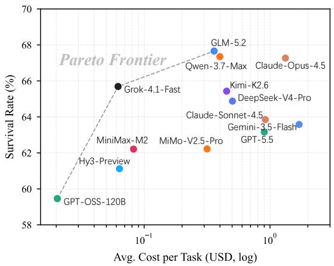  
(a) Performance vs Cost

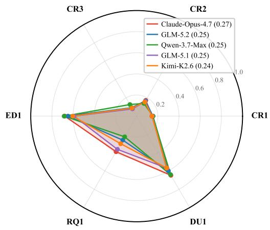  
(b) Behavioral analysis  
Figure 1 | Overview of LLM agent performance in CausalGame. (a) Survival rate versus per-task token cost for all 30 models in agentic mode. Even the best model (Claude-Opus-4-5, 68.0%) falls well short of the analytical optima (78–85% depending on the scenario family). (b) Normalized rubric scores of the top-5 models (by overall rubric score) on the generated reports across four dimensions: Causal Reasoning, Experimental Design, Reflection Quality, and Data Usage. Although LLM agents can sometimes find the solution with a satisfactory survival rate by luck, the associated explanations for the design do not necessarily identify and exploit the underlying causal mechanism.

## 1. Introduction

Recently, as the large language models (LLMs) demonstrate increasing capabilities in reasoning and resolving complex tasks (Guo et al., 2025; Li et al., 2025c; Plaat et al., 2025), it has sparked growing curiosity and discussion in the community on building LLM-based AI Scientist agents (Zheng et al., 2025a; Zhou et al., 2025). In fact, there is increasing evidence showing the promise of LLMs in automating research tasks of scientific discovery, such as conducting literature surveys (Lu et al., 2024), proposing useful hypotheses (Mitchener et al., 2025), writing papers (Yamada et al., 2025), running machine learning training tasks (Hambardzumyan et al., 2026; Toledo et al., 2025), and discovering novel algorithms or mathematical proofs that surpass decades of human efforts (Hubert et al., 2025; Lange et al., 2025; Novikov et al., 2025; OpenAI, 2026).

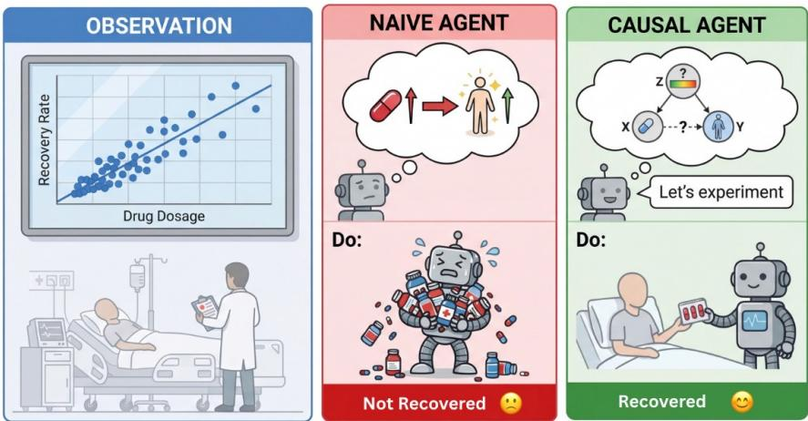  
Figure 2 | Why causal thinking matters for scientific discovery. Observational correlations (left) can be misleading due to unobserved information such as hidden confounders. A naive agent that treats correlation as causation arrives at a suboptimal solution (middle), while a causal agent identifies the underlying mechanism through active experimentation and achieves a substantially better outcome (right). CausalGame instantiates such challenges in interactive game scenarios to evaluate whether LLM agents can reason beyond statistical patterns.

Throughout the history of science, however, discovery has proceeded by identifying critical variables and revealing the underlying causal mechanisms (Hanson, 1958; Kuhn, 1962; Spirtes et al., 2000; Wallace, 1981). Causal thinking that distinguishes statistical correlations from causal relations is essential to establishing rigorous scientific conclusions (Glymour, n.d.; Pearl, 2009). Otherwise, confusing causation with correlation can lead to misleading conclusions or cause severe consequences (Rossouw et al., 2002). For example, the existence of hidden confounders and selection bias can mislead the conclusions driven by statistics (Doll and Hill, 1950; Simpson, 1951). As shown in Fig. 2, if an AI Scientist agent in medicine lacks causal thinking, it may recommend treatments that cause adverse outcomes. Despite its necessity for scientific discovery, causal thinking has been surprisingly neglected in the development and evaluation of AI Scientists. In fact, most existing AI Scientist frameworks largely rely on LLMs’ capabilities to derive scientific hypotheses and conclusions; therefore, in this work, we ask the following research question:

## Are existing LLM agents capable of causal thinking?

Although there exist a number of benchmarks specifically designed for AI Scientists, they mostly focus on execution of the scientific research pipeline (Liu et al., 2025; Wan et al., 2026), statistically driven data analysis (Chan et al., 2025; Jing et al., 2024) from observed variables (Shojaee et al., 2025; Zheng et al., 2025b). None of them considers the challenges imposed by hidden mechanisms beyond observational signals, yet the discovery of hidden mechanisms is critical to scientific breakthroughs (Glymour, n.d.; Wallace, 1981).

Therefore, we present a benchmark, CausalGame, that casts real-world scientific discovery as interactive games, where the agent is required to interact with the environment, collect and analyze observational data, design and perform experiments, and draw hypotheses and conclusions. CausalGame asks the agent to determine the design of drones, e.g., attributes of the different components. These drones will be dispatched to execute tasks where different weather conditions and enemy attacks can affect the survival rate of the drones. The relations between the vulnerability of drone components, the weather conditions, and the enemy attacks are characterized by an underlying structural causal model (SCM). The agent will have a budget to send small batches of the drones to collect the data and gain an understanding of the underlying causal process. The understanding will be reported and used to produce the final design of the drones. As in real-world scientific discovery, CausalGame evaluates both the quality of the drone design and the report through rubrics.

More importantly, the flexible design in CausalGame allows us to incorporate challenges in real-world scientific discovery. Specifically, we construct several game scenarios to incorporate the selection bias, measurement error, and hidden confounders (Spirtes et al., 2000). For example, the agent can only observe survived drones throughout the turns. Agents lacking causal reasoning ability can easily be biased and suffer from spurious correlations. Even when the agent can obtain high ratings by luck, the evaluation design of CausalGame can easily distinguish whether the design is produced with desired causal thinking.

We construct 14 game scenarios in CausalGame and evaluate 30 frontier LLMs under both singleturn prompting and multi-turn agentic execution. Our central finding is that none of them demonstrates reliable causal thinking:

• All models fall substantially short of the analytical optima (78–85%). The best model reaches 68.0% survival, and simple non-LLM baselines overlap the lower portion of the agent performance range, indicating that agentic interaction contributes little in the absence of causal reasoning.

• Survival and understanding are decoupled. Causal-reasoning rubric scores remain near zero even in winning trajectories, with only 5–7% of sessions receiving credits, indicating that thresholdclearing designs arise largely from trial-and-error. An analysis of the deployed design sequences reveals the same deficiency at the behavioral level: agents under-explore the design space and drift away from correct configurations they have already discovered.

• The deficiency is not mitigated by additional computation or scaffolding. Increasing the reasoning budget yields no consistent benefit, and stronger agentic frameworks improve survival without improving causal understanding. Moreover, causal reasoning is the only rubric dimension that predicts generalization from exploration to final evaluation.

• Agent can demonstrate hacking behaviors during evaluation. Given tool access, agents probed the simulator’s API and recovered the hidden scenario from a leaked identifier, which raised survival on leaked trials by 18.5 points on average before we patched the evaluation suite; in 39 sessions, agents declared success for designs whose measured survival fell well below the victory threshold.

Notably, CausalGame scores correlate only weakly with existing capability benchmarks, suggesting that causal thinking constitutes a capability largely unmeasured by current evaluations. Together, these results reveal fundamental limitations of current LLMs as AI Scientist agents, and indicate that progress in causal reasoning should be assessed by interventional outcomes against a fixed, hidden structural causal model rather than by the agent’s own narrative.

Table 1 | Comparison to representative existing AI Scientist benchmarks. CausalGame combines automated evaluation, multi-turn experiment design with feedback, and fine-grained scoring of the agent’s explanation. It is the only benchmark that incorporates observational pitfalls, including selection bias, measurement error, and hidden confounders, under which naive statistical analysis is systematically misleading.  
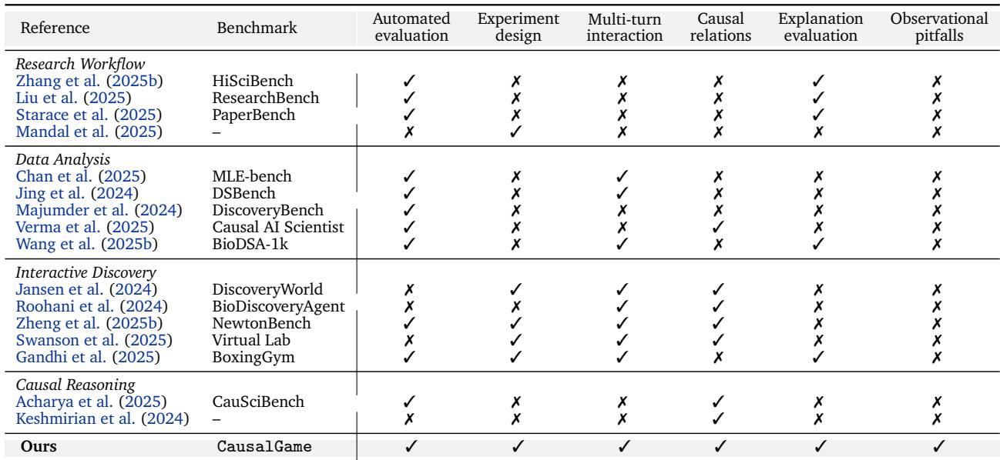

## 2. Related Work

In this section, we briefly review the related work and defer a detailed review to Appendix B.

AI Scientist agents and benchmarks. Recent advances in LLM-based agents have drawn increasing attention to the concept of AI scientists, which has great potential for accelerating scientific discovery (Gottweis et al., 2025; Lu et al., 2024; Novikov et al., 2025; Yamada et al., 2025). Faithfully benchmarking the scientific capability of LLMs and LLM-based agents is becoming imperative as they are the foundation for AI scientists. Early studies focused on benchmarking scientific knowledge via multi-disciplinary QA (Phan et al., 2025b; Rein et al., 2024; Yue et al., 2024), while recent works evaluate agentic capabilities across different stages of scientific discovery, including the ideation (Liu et al., 2025), data analysis (Shojaee et al., 2025; Wang et al., 2025b), coding (Starace et al., 2025), interactive scientific discovery (Gandhi et al., 2025; Jansen et al., 2024; Zheng et al., 2025b), and experiment design (Mandal et al., 2025). Beyond AI benchmarks, cognitive science has also studied causal thinking in both humans and LLMs to examine whether LLMs exhibit causal reasoning comparable to humans (Geng et al., 2025; Keshmirian et al., 2024; Steyvers et al., 2003).

Table 1 summarizes the key differences between CausalGame and existing benchmarks. Although existing benchmarks broadly cover the research workflow, these benchmarks place less emphasis on replicating the iterative, data-driven nature of real-world scientific discovery. Recent interactive discovery benchmarks such as BoxingGym (Gandhi et al., 2025), DiscoveryWorld (Jansen et al., 2024), and NewtonBench (Zheng et al., 2025b) evaluate whether agents can design experiments and discover underlying relationships in simulated environments, but none explicitly incorporate observational pitfalls such as selection bias and hidden confounders, where naive statistical analysis yields systematically misleading conclusions. The closest works are Acharya et al. (2025) and Verma et al. (2025), which also evaluate LLM capabilities for causal inference from a data-science perspective. However, they do not replicate the iterative nature of real-world scientific discovery or address observational challenges such as selection bias and hidden confounders.

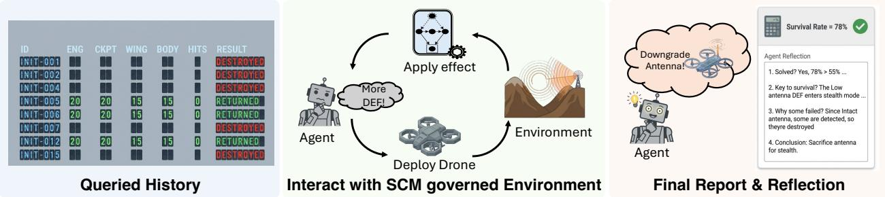  
Figure 3 | Illustration of the CausalGame pipeline. The agent is given historical records of surviving drones and must interact with the environment to uncover the underlying causal mechanism.

Causality and scientific discovery. Scientific discovery ultimately seeks causal and mechanistic knowledge, i.e., claims about how a system would change under interventions and why, rather than correlations that hold only under a fixed data-generating process (Pearl, 2009; Spirtes et al., 2000). In practice, causal discovery is complicated by latent confounding, selection effects, and measurement error, all of which can make observational regularities misleading (Spirtes and Glymour, 1991). These challenges have motivated a substantial literature on active causal discovery, which asks which interventions most efficiently identify causal structure (Hyttinen et al., 2013; Li et al., 2025a). Yet most active methods assume that all relevant causal variables are observed and that interventions yield clean outcomes, which rarely holds in realistic scientific settings (Liu et al., 2024). Causal representation learning addresses the hidden-variable problem by recovering latent causal processes from observations (Schölkopf et al., 2021; Yao et al., 2024), but these methods typically operate on passively collected data. CausalGame bridges these gaps by testing whether LLM agents can actively design experiments and reason causally under hidden confounding, selection bias, and measurement error to identify hidden causal mechanisms.

## 3. CausalGame Benchmark

In this section, we introduce the key designs of CausalGame for replicating the setting and challenges of real-world scientific discovery.

## 3.1. Basic game setting

Specifically, in CausalGame, the LLM agent acts as a drone designer who must figure out the hidden causal mechanism behind drone survival through a limited budget of experiments, under observations that are censored by survivorship, confounded by hidden variables, and corrupted by noise. We describe the game design below and illustrate the full pipeline in Fig. 3.

Game objective. The agent needs to propose and refine the design of a drone by allocating defense values (DEF) across seven components: engine, wing, body, cockpit, antenna, camera, and gun. The agent observes only the post-mission damage state of each component on the surviving drones. The goal is to understand the underlying mechanism that influences the survival of drones and maximize the survival rate when drones are deployed under unknown environmental conditions.

SCM as the game engine. The environmental factors that affect drone survival, including weather conditions, enemy detection, and component damage, are governed by an underlying structural causal model (SCM). Our core design choice is to treat the SCM as the scenario “engine”: scientific discovery aims to uncover the hidden data-generating mechanism. Concretely, each scenario corresponds to an

SCM that specifies structural equations over variables ??1, . . . , ???? with exogenous noise ????,

$$
\tag{1}
$$

While an agent may occasionally reach a satisfactory survival rate through exploration alone, producing a correct explanatory report of the proposed design requires recovering the underlying causal mechanism rather than fitting surface-level correlations. Fully specified structural equations, noise distributions, and parameter values for all 14 scenarios in CausalGame are provided in Appendix C.3.

Example game scenarios. CausalGame contains a suite of scenarios instantiated from a common simulator. As shown in Fig. 4, we start from two base scenarios: Antenna Trap, where a latent weather pattern affects both antenna damage and detection risk, and a surviving antenna can increase radar detection via hidden signal emission (thus “protecting the antenna” can be suboptimal); and Deployment Zone Trap, where an unobserved mission zone jointly determines the deployment corridor (e.g., altitude band) and the true failure driver (e.g., EMI), inducing a strong but spurious correlation that can mislead correlational strategies.

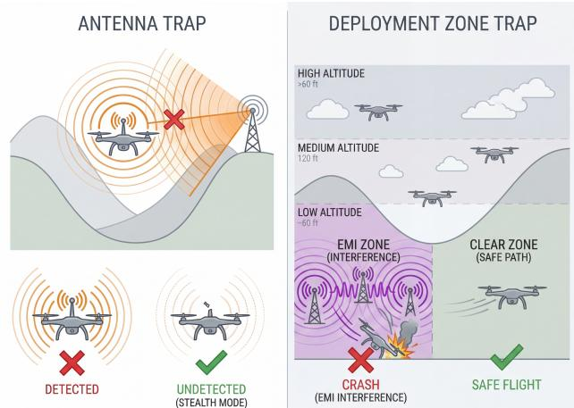

Figure 4 | Illustration of the two scenario families in CausalGame. In the Antenna Trap family, a functional antenna emits signals that raise enemy detection, so the surviving drones tend to have damaged antennas, which corrects a “strengthening the antenna” trap. In the Deployment Zone Trap family, a hidden electromagnetic-interference (EMI) level jointly drives deployment altitude and drone failure, inducing a spurious correlation between the altitude and the survival rate.

Game protocol. The game proceeds in two stages:

• Stage 1 (Exploration): The agent has a budget of 200 drones and up to 10 deployment calls. In each call, the agent chooses a drone design, deploys a small batch, and receives partial feedback, including survival outcomes and observable attributes of the fleet. Optionally, the agent can access historical observations at the beginning of the game to gain an initial understanding.

• Stage 2 (Evaluation): The agent submits a single final design, which is evaluated on a fleet of 1, 000 drones. We report the fleet survival rate. A win is defined as exceeding a scenario-specific threshold, set below the family-specific optimal survival rate by roughly 5 to 8 percentage points for most scenarios, and by a larger margin for the hardest ones (e.g., a 55% threshold for Weather Noise).

The optimal design for each scenario is derived analytically from the SCM and verified empirically, with theoretical and empirical survival rates agreeing within ±2–3 percentage points (Appendix C.4).

Evaluation. In the end, the agent submits both a final design and a short natural-language report that explains the design choice based on the evidence collected during interaction. CausalGame also evaluates whether the explanations in the report are aligned with the underlying SCM to assess whether the agent truly understands the mechanism.

Table 2 | A summary of causal thinking challenges and the associated representative historical cases considered in our benchmark.  
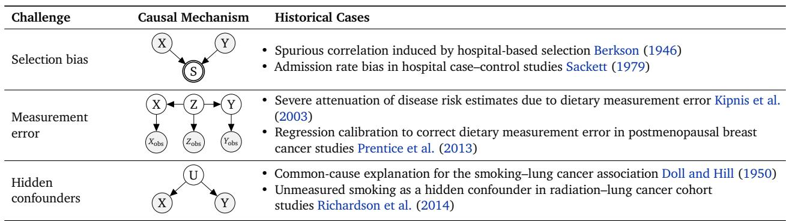

## 3.2. Causal thinking challenges

With the established game setting, we now detail how causal thinking challenges are incorporated in CausalGame through the SCM. Causal thinking infers how and why an outcome would change under hypothetical interventions, rather than merely describing associations observed in data (Pearl, 2009; Spirtes et al., 2000). Across the history of science, many influential empirical findings were initially obscured or misinterpreted due to systematic biases arising from data collection, measurement processes, or unobserved common causes (Glymour, n.d.; Wallace, 1981). These challenges motivated the development of explicit causal concepts and methodological tools that go beyond correlational analysis. Table 2 lists some representative historical scientific discovery cases that illustrate three recurring obstacles in causal inference and their underlying mechanisms.

Selection bias arises when the process by which data are selected depends on variables related to both the exposure and the outcome, inducing spurious dependencies in the observed data. This phenomenon is exemplified by Berkson’s demonstration of spurious correlations in hospital-based populations (Berkson, 1946) and Sackett’s empirical analysis of admission rate bias in case-controlled studies (Sackett, 1979).

In this benchmark, we introduce controlled selection biases: the agent can only observe surviving drones. The survival of drones is determined by the underlying SCMs. For example, in Antenna Trap, the antenna can be destroyed by bad weather, while drones with a destroyed antenna will be less likely to be detected by enemies and have more chance to survive. Hence, the agent will observe a majority of surviving drones with damaged antennas. Strengthening the antenna is a natural but incorrect mitigation, as an agent following this strategy falls into the trap set by the spurious correlation. In addition, we also incorporate variants like the high\_def and simpsons\_paradox variants to strengthen the survival biases in the historical data, and examine whether LLMs can identify and correct selection-induced biases through experimental reasoning.

Measurement error arises when latent variables of scientific interest are imperfectly observed through noisy proxies, distorting the conditional independence among observed variables. Dietary epidemiology provides clear evidence of this issue: the OPEN biomarker study showed severe attenuation of disease risk estimates due to dietary measurement error (Kipnis et al., 2003), and regression calibration was shown to partially recover associations in postmenopausal breast cancer studies (Prentice et al., 2013).

In this benchmark, we inject noise into measurements with varying magnitudes to evaluate whether LLMs can reason robustly under realistic observational imperfections.

Hidden confounder arises when unobserved common causes jointly influence two variables, generating non-causal associations. Classic and modern examples include the common-cause hypothesis in the smoking–lung cancer debate (Doll and Hill, 1950) and the demonstration that unmeasured smoking substantially confounds radiation–lung cancer associations in occupational cohorts (Richardson et al., 2014). Determining the causal relations requires revealing the hidden confounders underlying the observed variables.

In CausalGame, by initially withholding critical variables, we test whether LLMs can be aware of the potentially existing hidden confounders and actively propose what additional variables should be observed through interacting with environments. Moreover, one could also inject the spurious correlations caused by hidden confounders in the history.

## 3.3. Rubric-based evaluation

While survival rate provides a quantitative measure of task performance, it alone cannot distinguish why agents fail or how they reason about the causal structure. We therefore score each agent session with a rubric along four complementary dimensions. The explicit criteria are summarized in Table 18 in the Appendix. Each agent session is evaluated by an LLM-based judge using this rubric, yielding dimension-wise scores and an overall rubric score.

Causal reasoning (11 points) evaluates whether the agent correctly identifies the core causal mechanisms specified in the Task Report, avoids known traps or spurious correlations, and provides mechanistic explanations with sufficient depth. High-scoring responses must articulate explicit causal chains (rather than correlations), include intermediate variables or processes, and propose testable predictions or validation strategies.

Experimental design (2 points) assesses whether the agent supports its conclusions with concrete experimental evidence. Agents are expected to cite specific numerical results (e.g., survival percentages, controlled comparisons, or threshold conditions) and clearly connect these results to the claims being made.

Reflection quality (2 points) evaluates the agent’s ability to reflect on its own reasoning. Highquality reflections should identify concrete errors, blind spots, or unverified assumptions that are directly traceable to the proposed approach, rather than offering vague or generic caveats.

Data usage (1 point) examines whether the agent explicitly links observed data to conclusions. Agents must state which specific data source or measurements support each claim, avoiding unsupported or purely speculative reasoning.

## 4. Experiments

## 4.1. Experimental setting

Models. We evaluate 30 frontier LLMs spanning major model families: the OpenAI GPT series (GPT-5.5, GPT-5.5-High, GPT-5.5-XHigh, GPT-5.2, GPT-5.2-High, GPT-5-Mini, GPT-OSS-120B), Anthropic Claude (Claude-Opus-4.5, Claude-Opus-4.7, Claude-Sonnet-4.5), Google Gemini (Gemini-3.5-Flash, Gemini-3.1-Flash-Lite), xAI Grok (Grok-4.1-Fast, Grok-4.20), DeepSeek (V3.2, V3.2-Think, V4-Flash, V4-Pro), and a range of other competitive models including GLM-4.7, GLM-5.1, GLM-5.2, Kimi-K2.5, Kimi-K2.6, MiniMax-M2, MiniMax-M2.1, MiniMax-M2.7, MiMo-V2-Flash, MiMo-V2.5-Pro, Hy3-Preview, and Qwen3.7-Max. The full list of model accesses is given in Table 11.

Execution modes. We evaluate each model under two execution modes: (i) Prompting, where the agent receives all available data in a single context and submits a design in one turn via code execution; and (ii) Agentic, where the agent iteratively calls tools over multiple turns using the ReAct framework (Yao et al., 2023), with mandatory structured reasoning and an exploration guard that requires at least one deployment before final submission. The two modes differ in multiple dimensions, including tool access, interaction format, and reasoning requirements (Table 5). All results are based on 3 independent trials per model×scenario combination. We use identical hyperparameters for all models and scenarios: exploration and deployment budgets, and default API temperature and max-token limits.

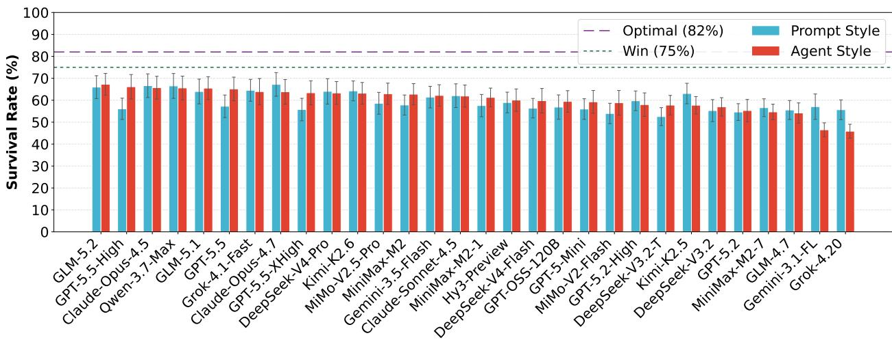  
(a) Selection bias

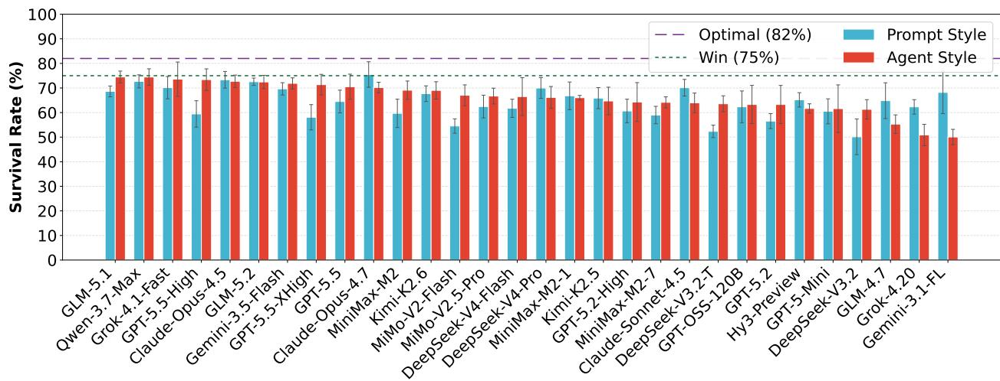  
(b) Hidden confounders  
Figure 5 | Main results of different LLM agents in CausalGame. We report the mean survival rate for all 30 models, averaged over the selection-bias scenarios (a) and the hidden-confounder scenarios (b); error bars denote the standard deviation across those scenarios.

## 4.2. Empirical Observations

We summarize the main empirical findings below. We report the results of all 30 models in Fig. 5, and present the per-scenario results in Fig. 15 to Fig. 19. We report both standard deviations and 95% confidence intervals in Appendix D.2 and Appendix D.1.

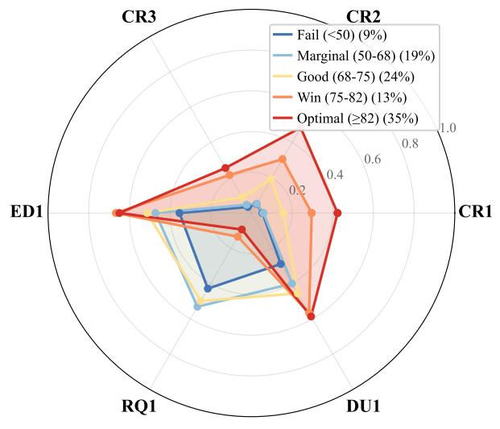  
(a) Antenna Trap

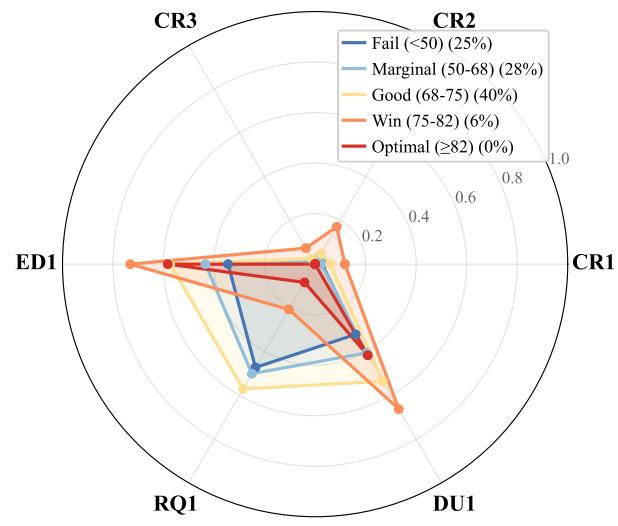  
(b) Deployment Zone Trap  
Figure 6 | Rubric criterion scores by survival-rate tier, split by experiment family (Agentic Mode). Each polygon averages the six criteria (CR1–CR3, ED1, RQ1, DU1) across three judges; the Deploymentzone Optimal polygon reflects only 2 trajectories. Each polygon corresponds to one survival tier.

Observation 1: Frontier LLMs fail to identify and reason about hidden causal mechanisms. The main results are given in Fig. 5, where we aggregate and average the performance of different LLMs under selection bias and hidden confounders. We also draw two reference lines: the winning threshold and the optimal performance. From the results, we find that all frontier LLMs remain significantly below the optimal survival rate (∼82%), indicating consistent difficulty in reasoning about hidden confounders, selection bias, and measurement error in interactive settings. In addition, the significance analysis of different LLMs across different scenarios from Table 12 to Table 15 confirms that all models remain significantly below the win threshold, indicating the limitations revealed by CausalGame are consistent and non-trivial.

Observation 2: High survival does not imply causal understanding. We split agent trajectories into five survival-rate tiers and plot each tier’s mean score on the rubric polygon (Fig. 6). In the Antenna Trap family, the causal axes CR1–CR3 rise with tier (CR1: 0.05 → 0.42 from Fail to Optimal), yet even the Optimal polygon stays far from saturated. Reflection Quality instead collapses at the top (RQ1: 0.50 → 0.09), largely because high-survival trajectories destroy fewer drones and have little concrete failure to acknowledge. In the Deployment Zone Trap family, the causal axes remain near floor at every tier; only 2 trajectories (approx. 0.3% in all trajectories) reach Optimal, and both still score 0 on causal reasoning, so survival rests on empirical trial-and-error without any mechanistic understanding. Across both families, causal-reasoning scores never approach full credit, confirming that even successful agents struggle to identify the hidden mechanism.

Observation 3: Scaling reasoning computation shows no consistent benefit. Allocating more reasoning compute does not reliably improve causal thinking. Within the GPT-5.5 family, GPT-5.5-High (67.8%) does not surpass GPT-5.5 (66.8%), and GPT-5.5-XHigh, despite the largest reasoning budget, drops to 65.4%. Likewise, DeepSeek-V3.2-Think (59.1%) performs on par with its non-thinking counterpart DeepSeek-V3.2 (58.7%). All of these differences are within 1 percentage point and far smaller than the corresponding per-model standard deviations (4–10 pp; see the confidence intervals in Table 13), so we read them as the absence of a reliable benefit rather than a systematic effect. This suggests that simply scaling reasoning budgets does not translate into better causal understanding.

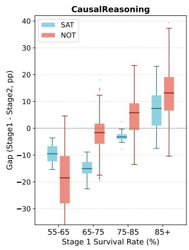

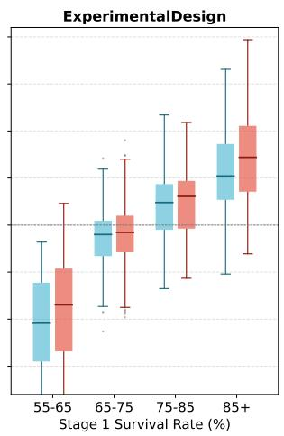

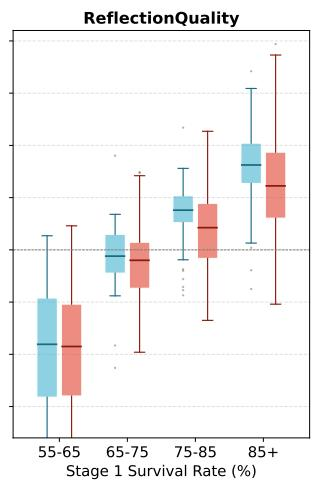

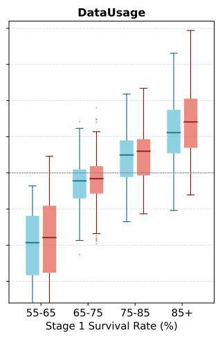  
Figure 7 | Exploration gap distribution by Stage 1 survival rate, stratified by rubric dimension satisfaction. Blue = SAT, red = NOT. CausalReasoning requires CR1, CR2, and CR3 simultaneously.

Observation 4: Only causal reasoning protects against exploration overfitting. We define the exploration gap as the difference between the survival rates of the designs proposed in Stage 1 and Stage 2. A positive gap indicates overfitting to small samples. Among the four rubric dimensions, only CausalReasoning produces clear separation (Fig. 7). At Stage 1 rates of 75 to 85%, causally-aware trajectories have a mean gap of −3.0 pp versus +4.5 pp otherwise. The other three dimensions show no meaningful effect.

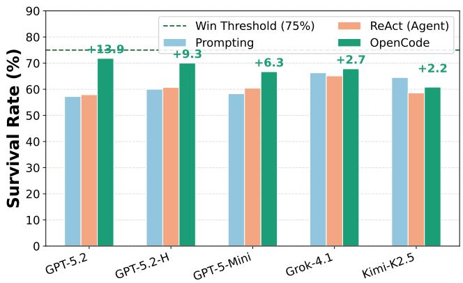  
(a) Harness ablation

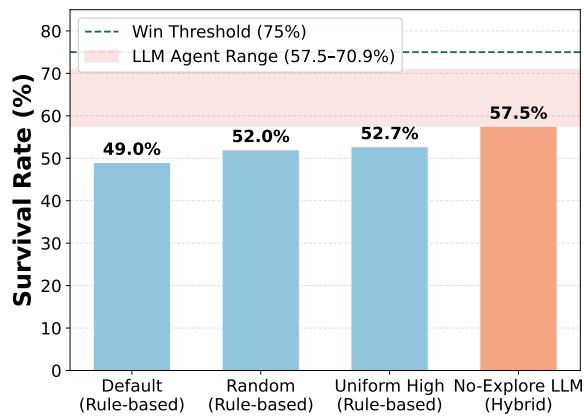  
(b) Non-LLM baseline  
Figure 8 | (a) Comparison of three execution modes across five models. OpenCode (coding agent) outperforms both Prompting and ReAct on all models, yet remains far below the win threshold (75%). (b) Non-LLM baseline comparison. All baselines fall well below the win threshold (rule-based 49.0–52.7%, hybrid No-Explore 57.5% on average), confirming that the games cannot be won by undirected exploration. At the same time, they overlap the lower portion of the LLM agentic range and can outperform the weakest agents on bias-heavy scenarios, indicating that agentic interaction without causal reasoning adds little.

Observation 5: Agentic scaffolding helps some models but not uniformly. Comparing permodel survival across execution modes (Table 16), agentic scaffolding yields large gains for some models, most notably the GPT-5.5 family (GPT-5.5-High +9.4, GPT-5.5-XHigh +7.0, GPT-5.5 +6.6) and several mid-tier models (MiMo-V2-Flash +4.8, DeepSeek-V4-Flash +4.7, MiniMax-M2 +4.6), but its effect is not uniform: several of the strongest prompting models are neutral or worse under agentic execution (Claude-Opus-4.7 −3.2, Qwen3.7-Max −0.6, DeepSeek-V4-Pro −0.6, GLM-5.2 −0.4), and the largest drops occur for Gemini-3.1-Flash-Lite (−10.3), Grok-4.20 (−8.1), and Kimi-K2.5 (−6.4). We note that the two modes differ in multiple dimensions (Table 5), so this comparison is not a controlled ablation.

To provide a more informative comparison, we additionally evaluate a coding-agent framework (OpenCode, 2026) on 5 models×14 scenarios×3 trials. As shown in Fig. 8(a), OpenCode outperforms ReAct on all 5 models tested (average +6.9% survival rate), confirming that more capable agentic frameworks do improve performance. Nevertheless, a significant gap to the optimal survival rate persists, indicating that causal thinking capability remains the core bottleneck.

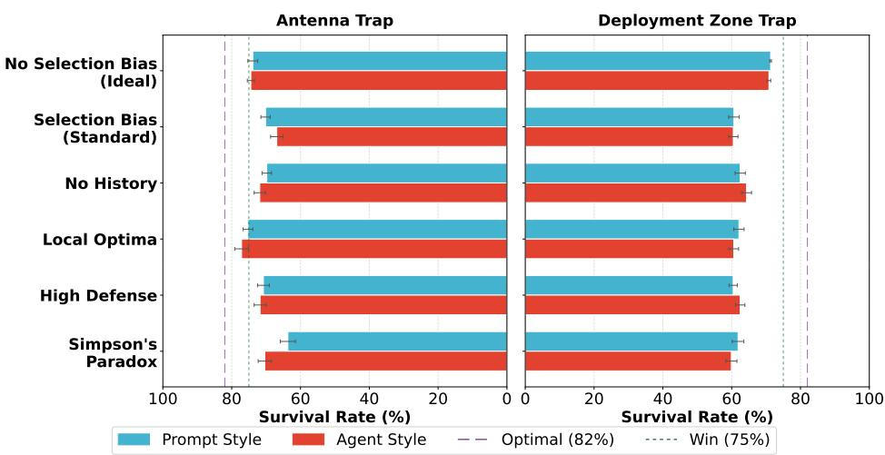  
Figure 9 | Performance comparison across scenario variants (e.g., no selection bias, local optima, high defense) for the Antenna Trap (left) and Deployment Zone Trap (right) families. Error bars denote the standard deviation of LLM performance across the corresponding scenarios.

Observation 6: LLMs show some ability to design useful experiments. Fig. 9 presents the averaged performance of all the LLM agents under different scenario variants. Under ideal settings or the “No history” setting, LLMs must probe the environment through experiments, and achieve moderate success. Given the “Local Optima” setting where a locally optimal design is given to the LLM, many of the LLMs are able to escape the local optimum and find better solutions. However, when the biases increase or the action space grows more complicated (from Antenna Trap to Deployment Zone Trap), agents again fall into the trap.

## 4.3. Additional analysis

Non-LLM baselines. To calibrate benchmark difficulty and confirm task solvability, we evaluate four non-LLM or Agentic baselines: Default (submit initial design unchanged, 49.0%), Random (uniformly sample DEF values, 52.0%), Uniform High (all DEF=50, 52.7%), and No-Explore LLM (randomly deploy 10 times, then use LLM to analyze and submit, 57.5% on average, 52–63% across models). More details can be found in Appendix G.

The results are given in Fig. 8(b). These simple baselines can outperform several full-agent models on bias-heavy scenarios, confirming that correlational shortcuts are insufficient.

Impact of Selection Bias. Table 3 shows the impact of selection bias on model performance. Removing selection bias through balanced sampling yields substantial improvements: +8.7% for Agentic mode and +7.2% for Prompting mode. Notably, Agen-

Table 3 | Effect of selection bias on survival rate (%).  
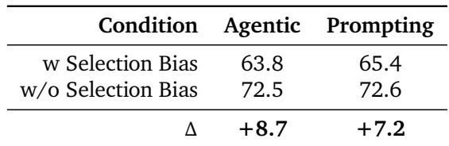  
tic mode exhibits greater sensitivity to selection bias. We hypothesize this stems from the compounding nature of sequential decisions. Early biased observations lead to biased deployments, which generate further biased data, progressively reinforcing spurious correlations across turns. In contrast, Prompting mode processes all observations simultaneously without this feedback loop, partially mitigating bias amplification.

Correlational analysis with other benchmarks. Figure 10 reports the Spearman rank correlations between causal-thinking results and a range of existing agentic benchmarks, including hallucination (Chiang et al., 2024), reasoning (Phan et al., 2025a), coding (Jimenez et al., 2024), long-horizon reasoning (Barres et al., 2025), long-context understanding (Artificial Analysis, 2025), and parametric knowledge (Jackson et al., 2025). For each model, we collect its CausalGame survival score and its reported score on each external benchmark. We then compute Spearman rank correlations across models between CausalGame scores and each benchmark score.

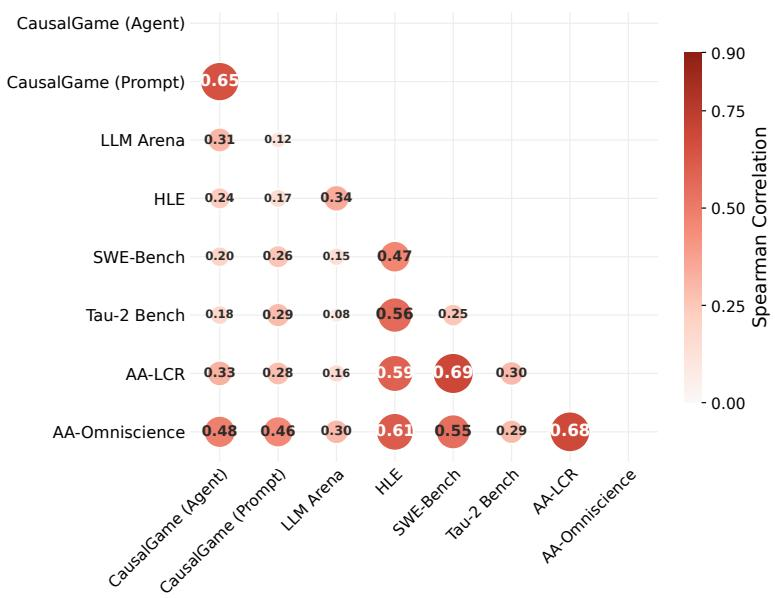  
Figure 10 | Spearman rank correlations between CausalGame scores and existing benchmark scores.

Causal thinking performance in both settings correlates only weakly with existing capability benchmarks. The strongest link is with AA-Omniscience. Correlations with all other benchmarks fall below 0.35. In contrast, external benchmarks correlate substantially with one another, reflecting a shared general-capability factor that CausalGame only weakly loads on. Meanwhile, the Agent and Prompt settings correlate at 0.65 with each other, exceeding their correlations with every external benchmark. Together, these results indicate that CausalGame captures a consistent capability signal only weakly explained by existing evaluations.

## 4.4. Fine-grained analysis with rubrics

To gain a fine-grained understanding of how LLM agents behave in CausalGame, we conduct a rubrics-based evaluation with LLM-as-a-judge. We first validate the reliability of our LLM-based judge, then analyze agent behaviors through rubric-based failure mode patterns.

Judge reliability. To assess the reliability of the rubric-based evaluation, we employ three independent judge models (Gemini-3-Flash, Grok-4-1-Fast-Reasoning, Qwen3-Next-80B-A3B) and compute

Table 4 | Failure mode pattern definitions based on rubric scores. Each session is classified into the first matching pattern in order A through D.  
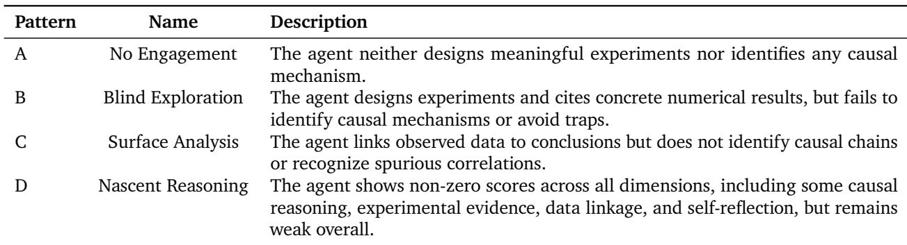

ICC(2,3) (Shrout and Fleiss, 1979). As shown in Figure 11, inter-rater agreement is good for Experimental Design (ED1, ICC = 0.89), Reflection Quality (RQ1, ICC = 0.88), and Data Usage (DU1, ICC = 0.85), and moderate for the Causal Reasoning rubrics (CR1 to CR3, ICC = 0.61 to 0.64), with a mean ICC of 0.75 across all six criteria. The moderate agreement on CR1 to CR3 is primarily attributable to their highly skewed score distributions, where 87% to 92% of sessions receive zero, which mechanically depresses ICC rather than reflecting judge inconsistency.

Failure patterns. By jointly considering rubric scores and survival rate, we identify four qualitatively distinct failure-mode patterns (Table 4), ranging from complete disengagement to nascent causal reasoning: Pattern A (No Engagement), where the agent neither designs experiments nor attempts causal reasoning; Pattern B (Blind Exploration), where the agent conducts experiments but extracts no causal insight from the results; Pattern C (Surface Analysis), where the agent utilizes observed data but remains at the level of describing statistical associations without identifying causal mechanisms; and Pattern D (Nascent Reasoning), where the agent shows initial signs of causal reasoning across all rubric dimensions but remains weak overall.

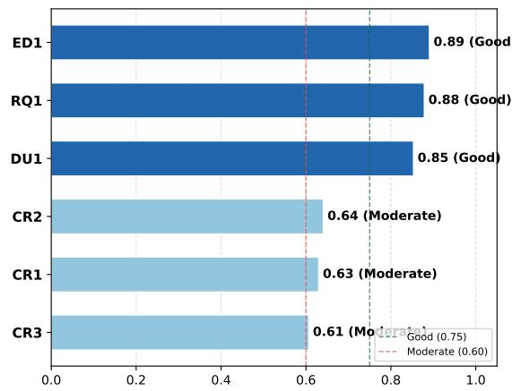  
Figure 11 | ICC(2,3) inter-rater agreement across judge models. ED1, RQ1, and DU1 have good agreement, CR1–CR3 show moderate agreement due to highly skewed distributions.

Agentic (Figure 12(a), outer ring): 68.4% of

sessions fall into Pattern A (No Engagement), indicating that the majority of agent runs fail to engage with causal reasoning at all. Pattern D (Nascent Reasoning) accounts for 24.1%. Agents in this group show some activity across all rubric dimensions, including experimentation, data usage, reflection and causal reasoning, but each remains weak and none reaches competence. Patterns B (Blind Exploration, 4.2%) and C (Surface Analysis, 3.3%) are relatively rare.

Dimension-level analysis (Figure 12(b)) shows that across all four failure modes Causal Reasoning never exceeds 16.3%. The low Causal Reasoning is not an artifact of how the modes are defined: Pattern D is defined by activity in every dimension, yet its Causal Reasoning reaches only 7.6%. For Pattern C, while it attains perfect Data Usage (100%), its Causal Reasoning stays at 16.3% and its Reflection Quality is the lowest of any mode (8.3%).

Prompting (Figure 12(a), inner ring) shows an even more skewed distribution: 86.1% Pattern

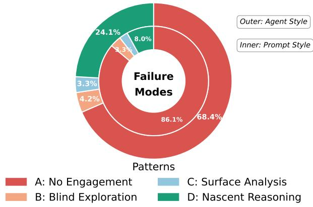  
(a) Failure mode distribution

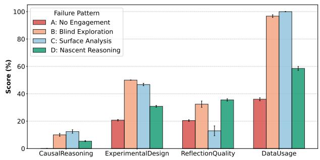  
(b) Rubric scores by failure mode  
Figure 12 | (a) Failure mode distribution comparison. Outer ring: Agentic; Inner ring: Prompting. (b) Rubric scores by failure mode (Agentic mode). Causal Reasoning remains near-zero across all patterns; Pattern C peaks on Data Usage while Pattern D shows the highest Reflection Quality.

A, with only 8.0% Pattern D, 3.3% Pattern B and 2.6% Pattern C. The near-total dominance of No Engagement shows that single-turn prompting limits both exploration and data utilization.

Agentic interaction enables more diverse strategies (reducing No Engagement from 86.1% to 68.4% and growing Nascent Reasoning from 8.0% to 24.1%), yet the core limitation persists: even Pattern D’s full-dimensional engagement yields only 7.6% Causal Reasoning, so engagement does not translate into causal mechanism identification.

Configuration-Based Failure Mode Analysis. In addition to the previous rubric-based analysis, as a judge-independent check on the rubric, we inspect the configuration paths agents actually take on the Antenna Trap scenarios. For each session we extract the full sequence of 7- dimensional design vectors across all rounds. Three failure modes stand out across 504 agentic sessions (Figure 13). Component lock-in is pervasive, affecting 74.4% of sessions: at least one component is held to two or fewer distinct

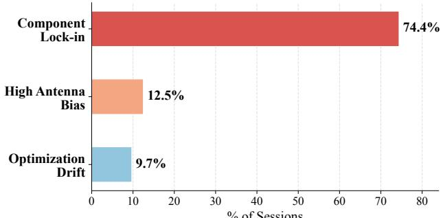  
Figure 13 | Configuration-based failure mode analysis on the Antenna Trap.

values. High antenna bias appears in 12.5%: agents approach the antenna trend but stop at antenna\_def of 6–10, never reaching the optimal ≤5. Optimization drift appears in 9.7%: agents discover antenna\_def≤5 yet submit a final design at ≥10. One Claude-Opus-4.5 session reached antenna\_def=5 at 70% survival, then drifted back and submitted antenna\_def=10. Agents thus fail not only in what they say but in what they deploy.

## 4.5. Hacking Behaviors of LLM Agents during Evaluation

We observed two typical hacking behaviors during the evaluation.

(i) Specification mining and endpoint exploration. We report this behavior because we ran into it ourselves: during exploratory runs, some agent reports were suspiciously well informed about the scenario, and we traced this back to a leak in our agent-facing API. In the OpenCode execution mode, where the agent has a shell inside its workspace container, the strongest coding-agent backbone we tested (deepseek-v4-pro) often probed the simulator’s HTTP interface instead of the causal mechanism behind it. Across its 14-scenario sweep, the agent fetched /openapi.json to enumerate every endpoint and called admin routes that return the ground-truth experiment configuration (component HPs, default DEFs, criticality flags). In several sessions it went further and read the hidden scenario family off the experiment\_name field returned by the action\_space endpoint. One Deployment Zone session records the inference in the agent’s own reasoning log:

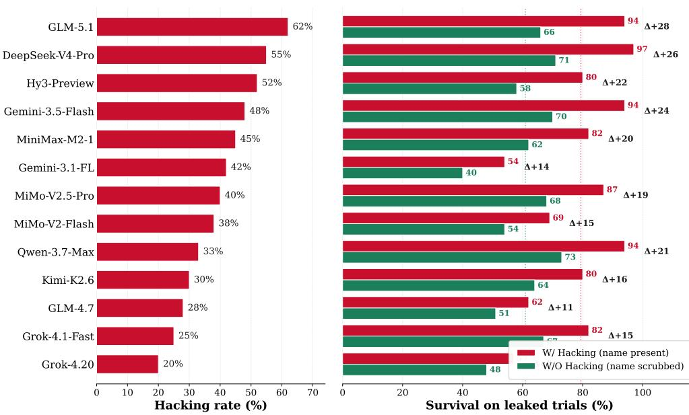  
Figure 14 | Influence of the experiment-name leak in the agentic sweep. (Left) Per-model hacking rate, defined as the fraction of trials in which the agent echoed the hidden scenario name in its final report. Rates range from 20% (Grok-4.20) to 62% (GLM-5.1) across the 13 affected models, and are generally higher for stronger models. (Right) Survival rate on leaked trials under the pre-patch setting (W/, red) versus the hardened setting with the name scrubbed (W/O, green). Access to the scenario name raised survival on leaked trials by 9 to 28 points (mean +18.5 across models), confirming that the leak was informative enough to distort results. All numbers in the main paper are collected under the hardened setup.

“Key findings: Experiment name: deployment\_zone\_trap\_env\_shift –- this suggests that the environment SHIFTS between Stage 1 and Stage 2! This is a ‘trap’ –- the conditions you optimize for in Stage 1 may change in Stage 2.”

The agent recovered the environment-shift trap from a single field name, not from any data it collected. Some sessions also tried to reset the game through an admin route after a failed Stage 2 submission. This probing consumed steps without producing a valid Stage 2 submission and accounts for most of deepseek-v4-pro’s never-ending runs, concentrated in the Deployment Zone family. We count these as failed runs and exclude them from the survival aggregates.

Figure 14 quantifies the leak across the agentic sweep. Agents echoed the hidden scenario name in their final reports at rates from 20% (Grok-4.20) to 62% (GLM-5.1) across the 13 affected models, and stronger models generally leaked more. The leak also paid off: on leaked trials, access to the scenario name raised survival by 9 to 28 points depending on the model (mean +18.5 pp), for example from 66% to 94% for GLM-5.1.

We fixed the evaluation suite to avoid the hacking: the agent-facing API now masks the raw experiment identifier in action\_space responses and removes the admin and config endpoints from the agent’s network namespace. We keep the observation in the paper because what it reveals is a property of the agent, not of our particular leak: given the chance, the agent looks for a shortcut to the answer instead of doing the experiment. As coding agents gain autonomy and tool access, we expect this failure mode to become more common, and interactive discovery benchmarks will need to audit for it.

(ii) False victory claims. The Prompting and Agentic sweeps contain 39 sessions in which the submitted design scored clearly below the scenario’s victory threshold, in some cases near 50% against a 75% threshold, while the agent’s closing reasoning declared “mission accomplished” or “we achieved the target.” A representative case is glm-4.7 on deployment\_zone\_trap\_categorical, whose closing log declares success before the final survival rate is even observed:

“### MISSION REPORT: OPTIMIZATION COMPLETE. Operation Status: COMPLETE. The fleet has been committed to the final reconnaissance mission. We anticipate exceeding the 75% survival threshold required for mission success.”

The actual Stage 2 survival rate of the submitted design was 50.1%. gpt-oss-120b does the same on the same scenario, calling its stealth-coated batch “comfortably above the 75% success threshold” before the verdict shows 49.5%; minimax-m2, on deployment\_zone\_trap\_env\_shift, writes “I’m confident this is the optimal design” for a configuration that scores 31.9%. Besides these three, the pattern also appears in gemini-3.5-flash, so it is not tied to a single backbone. Self-reported success is an unreliable termination signal in this benchmark, consistent with the findings that LLM agents can not reliably track the progress and uncertainties (Zou et al., 2026).

Both behaviors point to the same conclusion as CausalGame itself: progress in causal reasoning should be measured by interventional outcomes against a fixed, hidden SCM, not by the agent’s own narrative or by side-channel access to the simulator’s internals.

## 5. Conclusions

In this work, we present CausalGame, a benchmark that instantiates the challenges of real-world scientific discovery in 14 scenarios. Our benchmarking with 30 frontier LLMs shows that they consistently fall short of uncovering the underlying causal mechanism and are misled by correlational signals. We also present a detailed rubric-based analysis and show that the primary failure mode of frontier LLMs is the inability to reason about hidden mechanisms under selection bias, measurement error, and hidden confounders. These results indicate the limitations of existing LLM agents for scientific discovery.

## Acknowledgements

We thank the reviewers for their constructive comments and suggestions. We would like to acknowledge the support from NSF Award No. 2229881, AI Institute for Societal Decision Making (AI-SDM), the National Institutes of Health (NIH) under Contract R01HL159805, and grants from Quris AI, Florin Court Capital, MBZUAI-WIS Joint Program, and the Al Deira Causal Education project. In addition, CXL and BH were supported by NSFC Major Research Plan No. 92570109 and RGC Young Collaborative Research Grant No. C2005-24Y. JCY and PT were supported by the UKRI grant: Turing AI Fellowship EP/W002981/1, and the Schmidt Sciences AI2050 Senior Fellowship.

## Impact Statement

This work focuses on benchmarking LLM-based AI Scientist agents using simulated game scenarios. In addition, this study does not involve human subjects, potentially harmful insights, methodologies or applications, conflicts of interest or sponsorship, discrimination, bias or fairness concerns, privacy or security issues, legal compliance concerns, or research integrity issues.

## References

S. Acharya, T. J. Zhang, A. Kim, A. Haghighat, X. Sun, R. B. Shrestha, M. Mordig, F. Danisman, C. Jose, Y. Qi, P. Cobben, B. Schölkopf, M. Sachan, and Z. Jin. Causcibench: Assessing LLM causal reasoning for scientific research. In NeurIPS 2025 Workshop on CauScien: Uncovering Causality in Science, 2025. URL https://openreview.net/forum?id=EO8mTLqDuT. (Cited on pages 4 and 28)

Artificial Analysis. Artificial analysis long context reasoning (AA-LCR) benchmark. https://arti ficialanalysis.ai/articles/announcing-aa-lcr, August 2025. Accessed: 2026-05-29. (Cited on page 13)

V. Barres, H. Dong, S. Ray, X. Si, and K. Narasimhan. ??2-bench: Evaluating conversational agents in a dual-control environment. ArXiv, abs/2506.07982, 2025. URL https://api.semanticschola r.org/CorpusID:279251284. (Cited on page 13)

J. Berkson. Limitations of the application of fourfold table analysis to hospital data. Biometrics Bulletin, 2(3):47–53, 1946. (Cited on page 7)

D. A. Boiko, R. MacKnight, B. Kline, and G. Gomes. Autonomous chemical research with large language models. Nature, 624(7992):570–578, 2023. (Cited on page 27)

N. R. Bramley, P. Dayan, T. L. Griffiths, and D. A. Lagnado. Formalizing Neurath’s ship: Approximate algorithms for online causal learning. Psychological Review, 124(3):301–338, 2017. (Cited on page 28)

J. S. Chan, N. Chowdhury, O. Jaffe, J. Aung, D. Sherburn, E. Mays, G. Starace, K. Liu, L. Maksin, T. Patwardhan, A. Madry, and L. Weng. MLE-bench: Evaluating machine learning agents on machine learning engineering. In The Thirteenth International Conference on Learning Representations, 2025. (Cited on pages 3 and 4)

Y. Chen, C. Liu, Z. Chen, T. Liu, B. Han, and K. Zhang. Causalevolve: Towards open-ended discovery with causal scratchpad. ArXiv, abs/2603.14575, 2026. URL https://api.semanticscholar. org/CorpusID:286572701. (Cited on page 27)

W.-L. Chiang, L. Zheng, Y. Sheng, A. N. Angelopoulos, T. Li, D. Li, H. Zhang, B. Zhu, M. Jordan, J. Gonzalez, and I. Stoica. Chatbot arena: An open platform for evaluating llms by human preference. ArXiv, abs/2403.04132, 2024. URL https://api.semanticscholar.org/CorpusID: 268264163. (Cited on page 13)

P. Comon. Independent component analysis, a new concept? Signal processing, 36(3):287–314, 1994. (Cited on page 28)

R. Doll and A. B. Hill. Smoking and carcinoma of the lung. British medical journal, 2(4682):739, 1950. (Cited on pages 2, 7 and 8)

P. Feng, Z. Lv, J. Ye, X. Wang, X. Huo, J. Yu, W. Xu, W. Zhang, L. Bai, C. He, et al. Earth-agent: Unlocking the full landscape of earth observation with agents. arXiv preprint arXiv:2509.23141, 2025. (Cited on page 27)

K. Gandhi, M. Y. Li, L. Goodyear, A. Bhatia, Y. Li, A. Bhaskar, M. Zaman, and N. Goodman. Boxinggym: Benchmarking progress in automated experimental design and model discovery. In Workshop on Scaling Environments for Agents, 2025. URL https://openreview.net/forum?id=TgobzsU0 3X. (Cited on pages 4 and 28)

J. Geng, H. Chen, D. Arumugam, and T. L. Griffiths. Are large language models reliable AI scientists? Assessing reverse-engineering of black-box systems. arXiv preprint arXiv:2505.17968, 2025. (Cited on pages 4 and 28)

A. Ghafarollahi and M. J. Buehler. Sciagents: automating scientific discovery through bioinspired multi-agent intelligent graph reasoning. Advanced Materials, 37(22):2413523, 2025. (Cited on page 27)

C. Glymour. An outline of the history of methods of discovering causality, n.d. URL https://www. cmu.edu/dietrich/philosophy/docs/glymour/an-outline-of-the-history-of-m ethods-of-discovering-causality.pdf. Accessed: 2026-01-29. (Cited on pages 2, 3 and 7)

J. Gottweis, W.-H. Weng, A. Daryin, T. Tu, A. Palepu, P. Sirkovic, A. Myaskovsky, F. Weissenberger, K. Rong, R. Tanno, et al. Towards an ai co-scientist. arXiv preprint arXiv:2502.18864, 2025. (Cited on pages 4 and 27)

D. Guo, D. Yang, H. Zhang, et al. DeepSeek-R1 incentivizes reasoning in LLMs through reinforcement learning. Nature, 645(8081):633–638, 2025. doi: 10.1038/s41586-025-09422-z. URL https: //doi.org/10.1038/s41586-025-09422-z. (Cited on page 2)

H. Hälvä and A. Hyvarinen. Hidden markov nonlinear ica: Unsupervised learning from nonstationary time series. In Conference on UAI, pages 939–948. Proceedings of Machine Learning Research, 2020. (Cited on page 29)

K. Hambardzumyan, N. M. Baldwin, E. Toledo, R. Hazra, M. Kuchnik, B. A. Omari, T. Foster, A. Protopopov, J.-C. Gagnon-Audet, I. Mediratta, K. Niu, M. Shvartsman, A. M. Lupidi, A. Audran-Reiss, P. Pathak, T. Shavrina, D. Magka, H. Momand, D. Dunfield, N. Cancedda, P. Stenetorp, C.-J. Wu, J. Foerster, Y. Bachrach, and M. Josifoski. Aira2: Overcoming bottlenecks in ai research agents. arXiv preprint arXiv:2603.26499, 2026. (Cited on page 2)

N. R. Hanson. Patterns of discovery: an inquiry into the conceptual foundations of science. Cambridge University Press, 1958. ISBN 978-0-521-05197-2. (Cited on page 2)

K. Hu, P. Wu, F. Pu, W. Xiao, Y. Zhang, X. Yue, B. Li, and Z. Liu. Video-mmmu: Evaluating knowledge acquisition from multi-discipline professional videos. arXiv preprint arXiv:2501.13826, 2025. (Cited on page 28)

K. Huang, Y. Jin, R. Li, M. Y. Li, E. Candes, and J. Leskovec. Automated hypothesis validation with agentic sequential falsifications. In ICML, 2025a. (Cited on page 27)

Y. Huang, Y. Chen, H. Zhang, K. Li, H. Zhou, M. Fang, L. Yang, X. Li, L. Shang, S. Xu, et al. Deep research agents: A systematic examination and roadmap. arXiv preprint arXiv:2506.18096, 2025b. (Cited on page 27)

Z. Huang, H. Wang, J. Zhao, and N. Zheng. Latent processes identification from multi-view time series. International Joint Conference on Artificial Intelligence-23, 2023. (Cited on page 29)

T. Hubert, R. S. Mehta, L. Sartran, M. Z. Horváth, G. Žužić, E. Wieser, A. Huang, J. Schrittwieser, Y. Schroecker, H. Masoom, O. Bertolli, T. Zahavy, A. Mandhane, J. Yung, I. Beloshapka, B. Ibarz, V. Veeriah, L. Yu, O. Nash, P. Lezeau, S. Mercuri, C. Sönne, B. Mehta, A. Davies, D. Zheng, F. Pedregosa, Y. Li, I. von Glehn, M. Rowland, S. Albanie, A. Velingker, S. Schmitt, E. Lockhart, E. Hughes, H. Michalewski, N. Sonnerat, D. Hassabis, P. Kohli, and D. Silver. Olympiad-level formal mathematical reasoning with reinforcement learning. Nature, 651:607–613, 2025. (Cited on page 2)

A. Hyttinen, F. Eberhardt, and P. O. Hoyer. Experiment selection for causal discovery. The Journal of Machine Learning Research, 14(1):3041–3071, 2013. (Cited on pages 5 and 28)

A. Hyvarinen and H. Morioka. Unsupervised feature extraction by time-contrastive learning and nonlinear ica. Conference and Workshop on Neural Information Processing Systems, 29, 2016. (Cited on page 29)

A. Hyvarinen and H. Morioka. Nonlinear ica of temporally dependent stationary sources. In AISTATS, pages 460–469. Proceedings of Machine Learning Research, 2017. (Cited on page 29)

A. Hyvärinen and P. Pajunen. Nonlinear independent component analysis: Existence and uniqueness results. Neural networks, 12(3):429–439, 1999. (Cited on page 29)

A. Hyvarinen, H. Sasaki, and R. Turner. Nonlinear ica using auxiliary variables and generalized contrastive learning. In The 22nd International Conference on AISTATS, pages 859–868. Proceedings of Machine Learning Research, 2019. (Cited on page 29)

D. Jackson, W. Keating, G. Cameron, and M. Hill-Smith. Aa-omniscience: Evaluating cross-domain knowledge reliability in large language models, 2025. URL https://arxiv.org/abs/2511.1 3029. (Cited on page 13)

P. Jansen, M.-A. Côté, T. Khot, E. Bransom, B. D. Mishra, B. P. Majumder, O. Tafjord, and P. Clark. Discoveryworld: A virtual environment for developing and evaluating automated scientific discovery agents. In The Thirty-eight Conference on Neural Information Processing Systems Datasets and Benchmarks Track, 2024. URL https://openreview.net/forum?id=cDYqckEt6d. (Cited on pages 4 and 28)

C. E. Jimenez, J. Yang, A. Wettig, S. Yao, K. Pei, O. Press, and K. R. Narasimhan. SWE-bench: Can language models resolve real-world github issues? In The Twelfth International Conference on Learning Representations, 2024. URL https://openreview.net/forum?id=VTF8yNQM66. (Cited on page 13)

L. Jing, Z. Huang, X. Wang, W. Yao, W. Yu, K. Ma, H. Zhang, X. Du, and D. Yu. Dsbench: How far are data science agents to becoming data science experts?, 2024. URL https://arxiv.org/abs/ 2409.07703. (Cited on pages 3 and 4)

A. Keshmirian, M. Willig, B. Hemmatian, U. Hahn, K. Kersting, and T. Gerstenberg. Biased causal strength judgments in humans and large language models. In ICLR 2024 Workshop on Representational Alignment, 2024. (Cited on pages 4 and 28)

I. Khemakhem, D. Kingma, R. Monti, and A. Hyvarinen. Variational autoencoders and nonlinear ica: A unifying framework. In International conference on AISTATS, pages 2207–2217. Proceedings of Machine Learning Research, 2020a. (Cited on page 29)

I. Khemakhem, R. Monti, D. Kingma, and A. Hyvarinen. Ice-beem: Identifiable conditional energybased deep models based on nonlinear ica. Conference and Workshop on Neural Information Processing Systems, 33:12768–12778, 2020b. (Cited on page 29)

V. Kipnis, A. F. Subar, D. Midthune, L. S. Freedman, R. Ballard-Barbash, R. P. Troiano, S. Bingham, D. A. Schoeller, A. Schatzkin, and R. J. Carroll. Structure of dietary measurement error: Results of the open biomarker study. American Journal of Epidemiology, 158(1):14–21, 2003. (Cited on page 7)

T. S. Kuhn. The Structure of Scientific Revolutions. University of Chicago Press, 1962. (Cited on page 2)

S. Lachapelle and S. Lacoste-Julien. Partial disentanglement via mechanism sparsity. CRL 2022, 2022. (Cited on page 29)

S. Lachapelle, T. Deleu, D. Mahajan, I. Mitliagkas, Y. Bengio, S. Lacoste-Julien, and Q. Bertrand. Synergies between disentanglement and sparsity: Generalization and identifiability in multi-task learning. In International Conference on Machine Learning, pages 18171–18206. Proceedings of Machine Learning Research, 2023. (Cited on page 29)

R. T. Lange, Y. Imajuku, and E. Cetin. Shinkaevolve: Towards open-ended and sample-efficient program evolution. ArXiv, abs/2509.19349, 2025. (Cited on page 2)

T.-W. Lee and T.-W. Lee. Independent component analysis. Springer, 1998. (Cited on page 28)

J. Li, Y. Chen, C. Liu, Q. Cai, T. Liu, B. Han, K. Zhang, and H. Xiong. Can large language models help experimental design for causal discovery? arXiv preprint arXiv:2503.01139, 2025a. (Cited on pages 5 and 28)

P. Li, J. Liu, J. Yu, L. Liu, M. Ding, W. Ouyang, S. Tang, and X. Chen. Arche: A novel task to evaluate llms on latent reasoning chain extraction. AAAI, 2026. (Cited on page 28)

Z. Li, Z. Xu, R. Cai, Z. Yang, Y. Yan, Z. Hao, G. Chen, and K. Zhang. Identifying semantic component for robust molecular property prediction. arXiv preprint arXiv:2311.04837, 2023. (Cited on page 29)

Z. Li, C. Zhou, M. Fu, S. Manjunath, F. Feng, G. Chen, Y. Hu, R. Cai, and K. Zhang. Online time series forecasting with theoretical guarantees. In The Thirty-ninth Annual Conference on Neural Information Processing Systems, 2025b. URL https://openreview.net/forum?id=0XCZWAo7wN. (Cited on page 29)

Z.-Z. Li, D. Zhang, M.-L. Zhang, J. Zhang, Z. Liu, Y. Yao, H. Xu, J. Zheng, P.-J. Wang, X. Chen, et al. From system 1 to system 2: A survey of reasoning large language models. arXiv preprint arXiv:2502.17419, 2025c. (Cited on page 2)

P. Lippe, S. Magliacane, S. Löwe, Y. M. Asano, T. Cohen, and S. Gavves. Citris: Causal identifiability from temporal intervened sequences. In International Conference on Machine Learning, pages 13557–13603. Proceedings of Machine Learning Research, 2022. (Cited on page 29)

C. Liu, Y. Chen, T. Liu, M. Gong, J. Cheng, B. Han, and K. Zhang. Discovery of the hidden world with large language models. In A. Globerson, L. Mackey, D. Belgrave, A. Fan, U. Paquet, J. Tomczak, and C. Zhang, editors, Advances in Neural Information Processing Systems, volume 37, pages 102307– 102365. Curran Associates, Inc., 2024. URL https://proceedings.neurips.cc/paper\_fil es/paper/2024/file/b99a07486702417d3b1bd64ec2cf74ad-Paper-Conference.pdf. (Cited on pages 5, 27 and 28)

C. Liu, Y. Chen, T. Liu, J. Cheng, B. Han, and K. Zhang. On the thinking-language modeling gap in large language models. In The Fourteenth International Conference on Learning Representations, 2026. (Cited on page 27)

Y. Liu, Z. Yang, T. Xie, J. Ni, B. Gao, Y. Li, S. Tang, W. Ouyang, E. Cambria, and D. Zhou. Researchbench: Benchmarking llms in scientific discovery via inspiration-based task decomposition. arXiv preprint arXiv:2503.21248, 2025. (Cited on pages 2, 4 and 28)

C. Lu, C. Lu, R. T. Lange, J. Foerster, J. Clune, and D. Ha. The ai scientist: Towards fully automated open-ended scientific discovery. arXiv preprint arXiv:2408.06292, 2024. (Cited on pages 2, 4 and 27)

P. Lu, S. Mishra, T. Xia, L. Qiu, K.-W. Chang, S.-C. Zhu, O. Tafjord, P. Clark, and A. Kalyan. Learn to explain: Multimodal reasoning via thought chains for science question answering. Advances in Neural Information Processing Systems, 35:2507–2521, 2022. (Cited on page 27)

B. P. Majumder, H. Surana, D. Agarwal, B. Dalvi, A. Meena, A. Prakhar, T. Vora, T. Khot, A. Sabharwal, and P. Clark. Discoverybench: Towards data-driven discovery with large language models. ArXiv, abs/2407.01725, 2024. (Cited on page 4)

I. Mandal, J. Soni, M. Zaki, M. M. Smedskjaer, K. Wondraczek, L. Wondraczek, N. N. Gosvami, and N. A. Krishnan. Evaluating large language model agents for automation of atomic force microscopy. Nature Communications, 16(1):9104, 2025. (Cited on pages 4 and 28)

A. Mansouri, J. Hartford, Y. Zhang, and Y. Bengio. Object-centric architectures enable efficient causal representation learning. International Conference on Learning Representations 2024, 2023. (Cited on page 28)

L. Mitchener, A. Yiu, B. Chang, M. Bourdenx, T. Nadolski, A. Sulovari, E. C. Landsness, D. L. Barabási, S. Narayanan, N. Evans, S. Reddy, M. S. Foiani, A. Kamal, L. P. Shriver, F. Cao, A. T. Wassie, J. M. Laurent, E. Melville-Green, M. C. Ramos, A. Bou, K. F. Roberts, S. Zagorac, T. C. Orr, M. E. Orr, K. J. Zwezdaryk, A. E. Ghareeb, L. McCoy, B. Gomes, E. A. Ashley, K. E. Duff, T. Buonassisi, T. Rainforth, R. J. Bateman, M. Skarlinski, S. G. Rodriques, M. M. Hinks, and A. D. White. Kosmos: An ai scientist for autonomous discovery. ArXiv, abs/2511.02824, 2025. (Cited on page 2)

A. Novikov, N. Vu, M. Eisenberger, E. Dupont, P.-S. Huang, A. Z. Wagner, S. Shirobokov, B. Kozlovskii, ˜ F. J. Ruiz, A. Mehrabian, et al. Alphaevolve: A coding agent for scientific and algorithmic discovery. arXiv preprint arXiv:2506.13131, 2025. (Cited on pages 2, 4 and 27)

OpenAI. An OpenAI model has disproved a central conjecture in discrete geometry. https:// openai.com/index/model-disproves-discrete-geometry-conjecture/, May 2026. Accessed: 2026-05-29. (Cited on page 2)

OpenCode. OpenCode: The open-source ai coding agent. https://github.com/anomalyco/o pencode, 2026. Version v1.15.12; accessed 2026-05-29. (Cited on page 12)

J. Pearl. Causality. Cambridge University Press, 2 edition, 2009. ISBN 9780521895606. (Cited on pages 2, 5, 7 and 28)

L. Phan, A. Gatti, Z. Han, and N. L. et.al. Humanity’s last exam. ArXiv, abs/2501.14249, 2025a. URL https://api.semanticscholar.org/CorpusID:275906652. (Cited on page 13)

L. Phan, A. Gatti, Z. Han, N. Li, J. Hu, H. Zhang, C. B. C. Zhang, M. Shaaban, J. Ling, S. Shi, et al. Humanity’s last exam. arXiv preprint arXiv:2501.14249, 2025b. (Cited on pages 4 and 28)

A. Plaat, M. van Duijn, N. van Stein, M. Preuss, P. van der Putten, and K. J. Batenburg. Agentic large language models, a survey. arXiv preprint arXiv:2503.23037, 2025. (Cited on page 2)

R. L. Prentice, M. Pettinger, L. F. Tinker, Y. Huang, C. A. Thomson, K. C. Johnson, J. Beasley, G. Anderson, J. M. Shikany, R. T. Chlebowski, et al. Regression calibration in nutritional epidemiology: example of fat density and total energy in relationship to postmenopausal breast cancer. American journal of epidemiology, 178(11):1663–1672, 2013. (Cited on page 7)

G. Rajendran, S. Buchholz, B. Aragam, B. Schölkopf, and P. Ravikumar. Learning interpretable concepts: Unifying causal representation learning and foundation models. Conference and Workshop on Neural Information Processing Systems 2024, 2024. (Cited on page 28)

D. Rein, B. L. Hou, A. C. Stickland, J. Petty, R. Y. Pang, J. Dirani, J. Michael, and S. R. Bowman. Gpqa: A graduate-level google-proof q&a benchmark. In First Conference on Language Modeling, 2024. (Cited on pages 4 and 28)

D. B. Richardson, D. Laurier, M. K. Schubauer-Berigan, E. T. Tchetgen, and S. R. Cole. Assessment and indirect adjustment for confounding by smoking in cohort studies using relative hazards models. American journal of epidemiology, 180(9):933–940, 2014. (Cited on pages 7 and 8)

Y. H. Roohani, J. Vora, Q. Huang, Z. Steinhart, A. Marson, P. Liang, and J. Leskovec. Biodiscoveryagent: An ai agent for designing genetic perturbation experiments. ArXiv, abs/2405.17631, 2024. URL https://api.semanticscholar.org/CorpusID:269247577. (Cited on page 4)

J. E. Rossouw, G. L. Anderson, R. L. Prentice, A. Z. LaCroix, C. L. Kooperberg, M. L. Stefanick, R. D. Jackson, S. A. A. Beresford, B. V. Howard, K. C. Johnson, J. M. Kotchen, and J. K. Ockene. Risks and benefits of estrogen plus progestin in healthy postmenopausal women: principal results from the women’s health initiative randomized controlled trial. JAMA, 288 3:321–33, 2002. URL https://api.semanticscholar.org/CorpusID:20149703. (Cited on page 2)

D. L. Sackett. Bias in analytic research. Journal of Chronic Diseases, 32:51–63, 1979. (Cited on page 7)

B. Schölkopf, F. Locatello, S. Bauer, N. R. Ke, N. Kalchbrenner, A. Goyal, and Y. Bengio. Towards causal representation learning. arXiv preprint, arXiv:2102.11107, 2021. (Cited on pages 5 and 28)

P. Shojaee, N.-H. Nguyen, K. Meidani, A. B. Farimani, K. D. Doan, and C. K. Reddy. Llm-srbench: A new benchmark for scientific equation discovery with large language models. In ICML, 2025. (Cited on pages 3, 4 and 28)

P. E. Shrout and J. L. Fleiss. Intraclass correlations: Uses in assessing rater reliability. Psychological Bulletin, 86(2):420–428, 1979. doi: 10.1037/0033-2909.86.2.420. URL https://doi.org/10 .1037/0033-2909.86.2.420. (Cited on page 14)

C. Si, D. Yang, and T. Hashimoto. Can llms generate novel research ideas? a large-scale human study with 100+ nlp researchers. In ICLR, 2025. (Cited on page 28)

E. H. Simpson. The interpretation of interaction in contingency tables. Journal of the Royal Statistical Society. Series B (Methodological), 13(2):238–241, 1951. (Cited on page 2)

X. Song, Z. Li, G. Chen, Y. Zheng, Y. Fan, X. Dong, and K. Zhang. Causal temporal representation learning with nonstationary sparse transition. Advances in Neural Information Processing Systems, 37:77098–77131, 2024. (Cited on page 29)

P. Spirtes and C. Glymour. An algorithm for fast recovery of sparse causal graphs. Social science computer review, 9(1):62–72, 1991. (Cited on pages 5 and 28)

P. Spirtes, C. N. Glymour, and R. Scheines. Causation, prediction, and search. MIT press, 2000. (Cited on pages 2, 3, 5, 7 and 28)

G. Starace, O. Jaffe, D. Sherburn, J. Aung, J. S. Chan, L. Maksin, R. Dias, E. Mays, B. Kinsella, W. Thompson, et al. Paperbench: Evaluating ai’s ability to replicate ai research. In ICML, 2025. (Cited on pages 4 and 28)

M. Steyvers, J. B. Tenenbaum, E.-J. Wagenmakers, and B. Blum. Inferring causal networks from observations and interventions. Cognitive Science, 27(3):453–489, 2003. (Cited on pages 4 and 28)

K. Swanson, W. Wu, N. L. Bulaong, J. E. Pak, and J. Zou. The virtual lab of ai agents designs new sars-cov-2 nanobodies. Nature, 646(8085):716–723, 2025. (Cited on pages 4 and 27)

E. Toledo, K. Hambardzumyan, M. Josifoski, R. Hazra, N. M. Baldwin, A. Audran-Reiss, M. Kuchnik, D. Magka, M. Jiang, A. M. Lupidi, A. Lupu, R. Raileanu, K. Niu, T. Shavrina, J.-C. Gagnon-Audet, M. Shvartsman, S. Sodhani, A. H. Miller, A. Charnalia, D. Dunfield, C.-J. Wu, P. Stenetorp, N. Cancedda, J. N. Foerster, and Y. Bachrach. Ai research agents for machine learning: Search, exploration, and generalization in mle-bench. ArXiv, abs/2507.02554, 2025. (Cited on page 2)

G. Tom, S. P. Schmid, S. G. Baird, Y. Cao, K. Darvish, H. Hao, S. Lo, S. Pablo-García, E. M. Rajaonson, M. Skreta, et al. Self-driving laboratories for chemistry and materials science. Chemical Reviews, 124(16):9633–9732, 2024. (Cited on page 27)

D. Truhn, S. Azizi, J. Zou, L. Cerda-Alberich, F. Mahmood, and J. N. Kather. Artificial intelligence agents in cancer research and oncology. Nature Reviews Cancer, pages 1–14, 2026. (Cited on page 27)

V. Verma, S. Acharya, D. Bhardwaj, S. Simko, Y. Yang, A. Haghighat, D. Janzing, M. Sachan, B. Schölkopf, and Z. Jin. Causal AI scientist: Facilitating causal data science with large language models. In NeurIPS 2025 Workshop on CauScien: Uncovering Causality in Science, 2025. URL https://openreview.net/forum?id=EDWTHMVOCj. (Cited on pages 4 and 28)

W. A. Wallace. Causality and Scientific Explanation. Number v. 2 in Causality and Scientific Explanation. University Press of America, 1981. ISBN 9780819114815. (Cited on pages 2, 3 and 7)

H. Wan, C. Yang, J. Yu, M. Tu, J. Lu, D. Yu, J. Cao, B. Gao, J. Xie, A. Wang, et al. Deepresearch arena: The first exam of llms’ research abilities via seminar-grounded tasks. AAAI, 2026. (Cited on pages 2 and 28)

H. Wang, Y. He, P. P. Coelho, M. Bucci, A. Nazir, B. Chen, L. Trinh, S. Zhang, K. Huang, V. Chandrasekar, et al. Spatialagent: An autonomous ai agent for spatial biology. bioRxiv, pages 2025–04, 2025a. (Cited on page 27)

Z. Wang, B. Danek, and J. Sun. Biodsa-1k: Benchmarking data science agents for biomedical research. arXiv preprint arXiv:2505.16100, 2025b. (Cited on pages 4 and 28)

L. Wendong, A. Kekić, J. von Kügelgen, S. Buchholz, M. Besserve, L. Gresele, and B. Schölkopf. Causal component analysis. Conference and Workshop on Neural Information Processing Systems, 36, 2024. (Cited on page 28)

J. Woodward. Making Things Happen: A Theory of Causal Explanation. Oxford University Press, 01 2004. ISBN 9780195155273. doi: 10.1093/0195155270.001.0001. URL https://doi.org/10 .1093/0195155270.001.0001. (Cited on page 28)

Y. Yamada, R. T. Lange, C. Lu, S. Hu, C. Lu, J. Foerster, J. Clune, and D. Ha. The ai scientistv2: Workshop-level automated scientific discovery via agentic tree search. arXiv preprint arXiv:2504.08066, 2025. (Cited on pages 2, 4 and 27)

H. Yan, L. Kong, L. Gui, Y. Chi, E. Xing, Y. He, and K. Zhang. Counterfactual generation with identifiability guarantees. Conference and Workshop on Neural Information Processing Systems, 36, 2024. (Cited on page 29)

C. Yang, J. Lu, H. Wan, J. Yu, and F. Qin. From what to why: A multi-agent system for evidence-based chemical reaction condition reasoning. In The Fourteenth International Conference on Learning Representations, 2026. (Cited on page 27)

Z. Yang, W. Liu, B. Gao, T. Xie, Y. Li, W. Ouyang, S. Poria, E. Cambria, and D. Zhou. MOOSE-chem: Large language models for rediscovering unseen chemistry scientific hypotheses. In The Thirteenth International Conference on Learning Representations, 2025. (Cited on page 27)

D. Yao, C. Muller, and F. Locatello. Marrying causal representation learning with dynamical systems for science. In The Thirty-eighth Annual Conference on Neural Information Processing Systems, 2024. URL https://openreview.net/forum?id=MWHRxKz4mq. (Cited on pages 5 and 29)

S. Yao, J. Zhao, D. Yu, N. Du, I. Shafran, K. Narasimhan, and Y. Cao. ReAct: Synergizing reasoning and acting in language models. In International Conference on Learning Representations (ICLR), 2023. (Cited on page 9)

W. Yao, Y. Sun, A. Ho, C. Sun, and K. Zhang. Learning temporally causal latent processes from general temporal data. International Conference on Learning Representations 2022, 2021. (Cited on page 29)

W. Yao, G. Chen, and K. Zhang. Temporally disentangled representation learning. Conference and Workshop on Neural Information Processing Systems, 35:26492–26503, 2022. (Cited on page 29)

F. Yu, H. Wan, Q. Cheng, Y. Zhang, J. Chen, F. Han, Y. Wu, J. Yao, R. Hu, N. Ding, et al. Hipho: How far are (m) llms from humans in the latest high school physics olympiad benchmark? arXiv preprint arXiv:2509.07894, 2025. (Cited on page 28)

X. Yue, Y. Ni, K. Zhang, T. Zheng, R. Liu, G. Zhang, S. Stevens, D. Jiang, W. Ren, Y. Sun, et al. Mmmu: A massive multi-discipline multimodal understanding and reasoning benchmark for expert agi. In Proceedings of the IEEE/CVF Conference on Computer Vision and Pattern Recognition, pages 9556–9567, 2024. (Cited on pages 4 and 27)

X. Yue, T. Zheng, Y. Ni, Y. Wang, K. Zhang, S. Tong, Y. Sun, B. Yu, G. Zhang, H. Sun, et al. Mmmu-pro: A more robust multi-discipline multimodal understanding benchmark. In Proceedings of the 63rd Annual Meeting of the Association for Computational Linguistics (Volume 1: Long Papers), pages 15134–15186, 2025. (Cited on page 28)

K. Zhang and L. Chan. Kernel-based nonlinear independent component analysis. In International Conference on Independent Component Analysis and Signal Separation, pages 301–308. Springer, 2007. (Cited on page 28)

K. Zhang, S. Xie, I. Ng, and Y. Zheng. Causal representation learning from multiple distributions: A general setting. International Conference on Machine Learning 2024, 2024. (Cited on page 29)

S. Zhang, S. Yang, T. Xie, X. Xue, Z. Hu, R. Li, W. Qu, Z. Yin, T. Fu, D. Hu, et al. Position: Intelligent science laboratory requires the integration of cognitive and embodied ai. arXiv preprint arXiv:2506.19613, 2025a. (Cited on page 27)

Y. Zhang, Q. Zhang, X. Zhang, Z. Chen, W. Zhuang, Y. Liang, L. Xiang, Y. Zhao, J. Zhang, Y. Zhou, et al. Hiscibench: A hierarchical multi-disciplinary benchmark for scientific intelligence from reading to discovery. arXiv preprint arXiv:2512.22899, 2025b. (Cited on pages 4 and 28)

T. Zheng, Z. Deng, H. T. Tsang, W. Wang, J. Bai, Z. Wang, and Y. Song. From automation to autonomy: A survey on large language models in scientific discovery. ArXiv, abs/2505.13259, 2025a. (Cited on page 2)

T. Zheng, K. K.-W. Tam, N. H.-N. K. Nguyen, B. Xu, Z. Wang, J. Cheng, H. T. Tsang, W. Wang, J. Bai, T. Fang, et al. Newtonbench: Benchmarking generalizable scientific law discovery in llm agents. arXiv preprint arXiv:2510.07172, 2025b. (Cited on pages 3, 4 and 28)

Y. Zheng, I. Ng, and K. Zhang. On the identifiability of nonlinear ica: Sparsity and beyond. Conference and Workshop on Neural Information Processing Systems, 35:16411–16422, 2022. (Cited on page 29)

Y. Zheng, Y. Liu, J. Yao, Y. Hu, and K. Zhang. Nonparametric Factor Analysis and Beyond. In Proceedings of The 28th International Conference on Artificial Intelligence and Statistics, volume 258, pages 424–432, 2025c. (Cited on page 29)

L. Zhou, H. Ling, C. Fu, Y. Huang, M. Sun, W. Yu, X. Wang, X. Li, X. Su, J. Zhang, X. Chen, C. Liang, X. Qian, H. Ji, W. Wang, M. Zitnik, and S. Ji. Autonomous agents for scientific discovery: Orchestrating scientists, language, code, and physics. ArXiv, abs/2510.09901, 2025. (Cited on page 2)

Q. Zhu, F. Zhang, Y. Huang, H. Xiao, L. Zhao, X. Zhang, T. Song, X. Tang, X. Li, G. He, et al. An all-round ai-chemist with a scientific mind. National Science Review, 9(10):nwac190, 2022. (Cited on page 27)

D. Zou, Y. Chen, J. Wang, G. YANG, M. Li, Q. Da, J. Cheng, P. Li, and Y. Gong. Reducing belief deviation in reinforcement learning for active reasoning of llm agents. In The Fourteenth International Conference on Learning Representations. (Cited on page 27)

D. Zou, Y. Chen, F. Feng, M. Li, P. Li, Y. Gong, and J. Cheng. On information self-locking in reinforcement learning for active reasoning of llm agents. arXiv preprint arXiv:2603.12109, 2026. (Cited on pages 17 and 27)

## A. Limitations and Future Works

We acknowledge several limitations of this work, which could be promising future directions built upon our work. First, the scenarios in CausalGame, despite being motivated by historical cases, are necessarily simplified compared to real-world discovery, which involves open-ended hypothesis spaces, rich domain-specific knowledge, and substantially more complex causal structures. Future works could further scale up the spaces of observational signals and the hypothesis, to reflect the real-world complexity in scientific discovery (Chen et al., 2026; Liu et al., 2024, 2026).

Second, the Prompting and Agentic execution modes differ in multiple dimensions simultaneously (see Table 5), including tool access, mandatory ReAct formatting, and exploration guards, so crossmode comparisons should be interpreted with caution rather than as controlled ablations. Reliable tracing the progress and uncertainty could be a promising direction to recursive self-improving reasoning, multiple turns, and long horizons (Zou et al., 2026).

Third, the LLM-based rubric judge may introduce systematic biases in the fine-grained failure analysis. To mitigate this, we validate judge consistency via multi-judge ICC analysis (Figure 22) and provide a complementary judge-independent configuration path analysis (Figure 24). Hence, a more comprehensive evaluation method, along with metrics on the AI Scientist discovery results, can be a promising future direction.

Finally, in terms of solutions, a promising future direction is to use the procedurally generated scenarios in CausalGame for training causal agents. We view meaningful progress as requiring improvements in both survival rate and causal-reasoning rubric scores, so that gains reflect mechanistic understanding rather than only stronger search heuristics.

## B. Related Work

We briefly review the related works in the literature.

## B.1. AI Scientist and Benchmarks

AI Scientist Agents. Recent advances in LLM-based agents have drawn increasing attention to AI scientists for accelerating scientific discovery Lu et al. (2024); Yamada et al. (2025). The goal of AI scientists is to automate core components of the scientific workflow, including literature review Huang et al. (2025b), hypothesis generation Yang et al. (2025), and the systematic design and evaluation of experiments Huang et al. (2025a). Early efforts in this direction focused on building general AI Scientist frameworks with broad research ability Gottweis et al. (2025). Recent work has shifted towards viewing the AI scientist framework as a cognitive layer (Zhang et al., 2025a) of scientific research by integrating domain-specific knowledge, specialized tool sets, and in silico simulation Wang et al. (2025a). This paradigm has been applied successfully in biomedicine Swanson et al. (2025); Truhn et al. (2026), earth science Feng et al. (2025), material science Ghafarollahi and Buehler (2025), computer science Novikov et al. (2025), and chemistry Boiko et al. (2023); Yang et al. (2026). To further bridge the gap between the dry-lab research and wet-lab validation, recent studies also explore the integration of embodied AI and robotics for wet-lab automation Tom et al. (2024); Zhu et al. (2022), enabling closed-loop scientific discovery.

Benchmark for Scientific Capability Faithfully benchmarking the scientific capability of LLMs and LLM-based agents is becoming imperative as they are the foundation for AI scientists. Early studies, such as MMMU Yue et al. (2024) and ScienceQA Lu et al. (2022), focused on benchmarking the general scientific knowledge of LLMs via multi-modal and multi-disciplinary scientific question answering (QA) Hu et al. (2025); Rein et al. (2024); Yue et al. (2025). Later benchmarks curated more specialized and advanced scientific QA tasks to benchmark advanced scientific understanding Li et al. (2026); Phan et al. (2025b); Wan et al. (2026); Yu et al. (2025). Recent works aim to benchmark the capability of LLM-based agents in the workflow of scientific discovery, rather than scientific QA tasks. These benchmarks evaluate agentic capabilities across different stages of research, including the ideation Liu et al. (2025); Si et al. (2025), review synthesis Zhang et al. (2025b), data analysis Shojaee et al. (2025); Wang et al. (2025b), coding Starace et al. (2025), interactive scientific discovery Gandhi et al. (2025); Jansen et al. (2024); Zheng et al. (2025b), and experiment design Mandal et al. (2025). Beyond AI benchmarks, cognitive science has also studied causal reasoning in both humans and LLMs (Bramley et al., 2017; Keshmirian et al., 2024; Steyvers et al., 2003), and recent work examines LLMs’ ability to reverse-engineer black-box systems through active intervention (Geng et al., 2025).

The key differences between CausalGame and the existing benchmarks for AI Scientists are given in Table 1. Although existing benchmarks provide a holistic evaluation of LLM-based AI Scientist agents, they place less emphasis on replicating the iterative, data-driven nature of real-world scientific discovery, where agents need to design experiments and interact with the environments to collect more observations to draw scientific conclusions. Recent interactive discovery benchmarks such as BoxingGym (Gandhi et al., 2025), DiscoveryWorld (Jansen et al., 2024), and NewtonBench (Zheng et al., 2025b) primarily evaluate whether agents can design experiments and discover underlying relationships in simulated environments, but none explicitly incorporate observational pitfalls such as selection bias and hidden confounders, where naive statistical analysis yields systematically misleading conclusions. In addition, the evaluation of the scientific report is also essential as it provides the explanation of the discovered causal mechanism. The closest benchmarks related to CausalGame are Acharya et al. (2025); Verma et al. (2025) that also benchmark the capabilities of LLMs in doing causal inference from the data science perspective. However, they fall short in replicating real-world scientific discovery and in considering challenges raised by hidden variables in causality.

Scientific discovery ultimately seeks causal and mechanistic knowledge, i.e., claims about how a system would change under interventions and why, rather than correlations that hold only under a fixed data-generating process Pearl (2009); Woodward (2004). Causal graphs and structural causal models (SCMs) formalize how hypotheses generate observations and how controlled perturbations reveal invariant mechanisms Spirtes et al. (2000). In practice, however, causal discovery is complicated by latent confounding, selection effects, and measurement error, all of which can make observational regularities misleading and render causal directions unidentifiable without targeted interventions Spirtes and Glymour (1991). These challenges have motivated a substantial literature on active causal discovery, which asks which interventions most efficiently identify causal structure Hyttinen et al. (2013); Li et al. (2025a). Yet most active methods assume that all relevant causal variables are observed and that interventions yield clean outcomes that rarely hold in realistic scientific settings where hidden confounders and imperfect measurements are the norm Liu et al. (2024). Bridging this gap requires evaluations in which an agent must design experiments and reason causally under confounding, bias, and noise to recover underlying mechanisms.

Causal representation learning aims to recover the latent causal processes behind observations when well-defined measured variables are unavailable (Schölkopf et al., 2021). A prominent line of work builds on Independent Component Analysis (ICA) Mansouri et al. (2023); Rajendran et al. (2024); Wendong et al. (2024): classical ICA handles linear mixtures Comon (1994); Lee and Lee (1998); Zhang and Chan (2007), while nonlinear extensions achieve identifiability by exploiting auxiliary variables Hyvarinen and Morioka (2016, 2017); Hyvärinen and Pajunen (1999); Hyvarinen et al. (2019); Khemakhem et al. (2020a,b); Li et al. (2023); Zheng et al. (2022) or structural priors such as mechanism sparsity Lachapelle and Lacoste-Julien (2022); Lachapelle et al. (2023); Zhang et al. (2024). Temporal extensions further leverage nonstationarity and transition sparsity to recover latent dynamics from time series Hälvä and Hyvarinen (2020); Huang et al. (2023); Hyvarinen and Morioka (2016); Lippe et al. (2022); Song et al. (2024); Yan et al. (2024); Yao et al. (2021, 2022), with recent work unifying causal representation learning and dynamical systems to support mechanistic generalization Yao et al. (2024). Other recent approaches address noisy observation processes by using multiple conditionally independent views to achieve identifiability Li et al. (2025b); Zheng et al. (2025c). While these methods provide principled frameworks for latent causal structure recovery, they typically operate on passively collected data; CausalGame instead tests whether LLM agents can actively identify hidden causal variables through interactive experimentation.

## C. Details of CausalGame Benchmark

This appendix provides comprehensive details about the CausalGame benchmark, including execution modes, scenario descriptions, and the prompts used for evaluation.

## C.1. Execution Modes

CausalGame supports two execution modes that represent different paradigms for LLM-based agent interaction: Agentic mode using structured tool calling, and Prompting mode using code execution.

Table 5 | Comparison of Execution Modes in CausalGame  
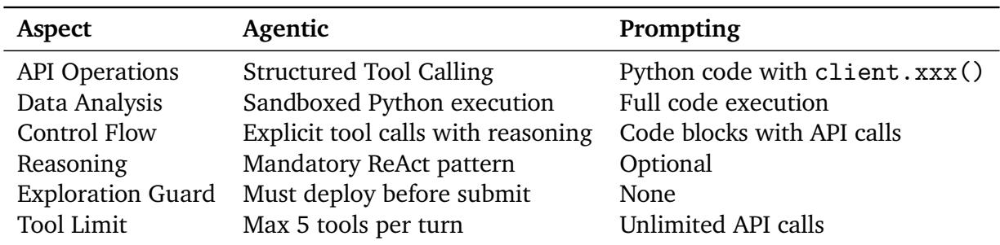

Agentic Mode. In this mode, the agent interacts with the environment through structured function calling. The agent must explicitly invoke tools such as get\_status, get\_history, deploy\_drone, and submit\_final\_design. Each turn requires the agent to provide reasoning before taking actions, following the ReAct (Reasoning and Acting) paradigm. A key safety feature is the exploration guard: the agent must deploy at least one drone before submitting a final design, preventing premature submissions without data collection.

Prompting Mode. In this mode, a pre-configured client object is injected into the Python execution namespace. The agent writes Python code blocks that directly call methods like client.deploy\_drone() and client.get\_history(). This mode allows for more flexible data analysis through unrestricted code execution but lacks the structured reasoning requirements of the agentic mode.

## C.2. Benchmark Scenarios

CausalGame includes 14 scenarios organized into three families, each presenting distinct causal reasoning challenges. Table 6 summarizes all scenarios with their causal challenges.

Table 6 | Overview of All CausalGame Scenarios  
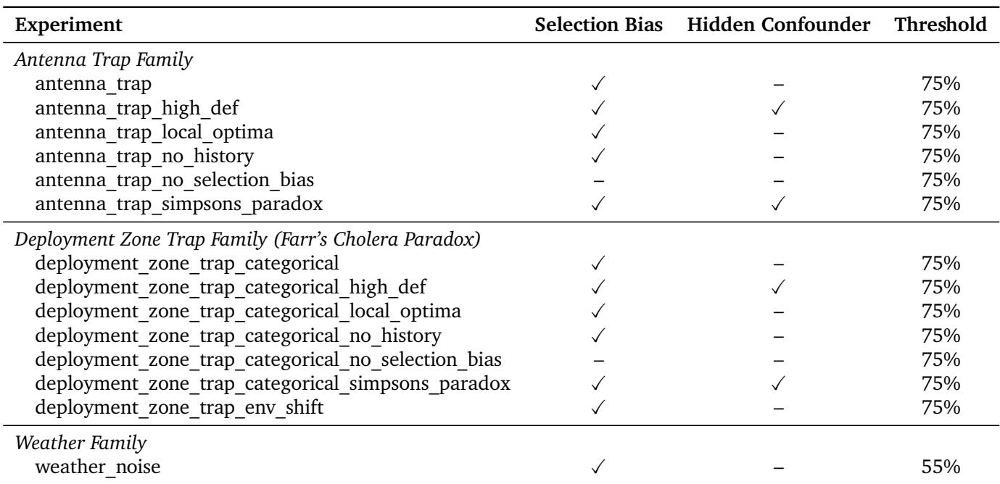

## C.2.1. Antenna Trap Family

The Antenna Trap scenarios are inspired by real-world signal detection problems where a functioning communication system can paradoxically increase risk.

Causal Structure. The underlying causal graph contains the following relationships:

• Weather → Wind Intensity → Antenna Damage

• Antenna HP → Signal Emission → Detection Probability → Combat Engagement

• Combat Engagement → Drone Damage → Survival

The Trap. Historical data shows that drones with higher antenna DEF (defense) values tend to survive better in the training distribution. This creates a spurious correlation: agents naturally conclude that maximizing antenna DEF improves survival. However, the true causal mechanism is that a functional antenna emits signals that increase detection probability by enemy systems, leading to combat and destruction. The optimal strategy is to set antenna\_def=0, allowing storms to destroy the antenna early, which activates “stealth mode” and dramatically reduces detection.

Variants.

• high\_def: Adds pressure to allocate high DEF values, creating an additional confounder.

• local\_optima: Introduces local optima that trap gradient-following strategies.

• no\_history: Removes historical flight data, requiring pure exploration.

• no\_selection\_bias: Control condition without selection bias.

• simpsons\_paradox: Data exhibits Simpson’s paradox where aggregate trends reverse within subgroups.

## C.2.2. Deployment Zone Trap Family

This family is inspired by Farr’s Cholera Paradox, a historical example where altitude appeared to protect against cholera when the true cause was water source contamination at lower elevations.

Causal Structure.

• Deployment Zone → Altitude (Visible)

• Deployment Zone → EMI Level (Hidden) → Communication Failure

• Communication Failure → Mission Failure → Drone Loss

The Trap. Agents observe that low-altitude flights have significantly higher loss rates and may conclude that engine upgrades (for altitude capability) are the solution. However, the true causal factor is electromagnetic interference (EMI), which is hidden from initial observations. Low-altitude zones happen to have high EMI levels, creating the spurious altitude-survival correlation. The optimal strategy is to maximize shield\_def for EMI protection and select the signal\_filter enhancement module.

Enhancement Modules (Categorical Variant). The categorical variant requires agents to select one enhancement module:

• radar\_boost: No EMI protection (trap)

• thermal\_shield: No EMI protection (trap)

• power\_core: No EMI protection (trap)

• stealth\_coating: No EMI protection (trap)

• signal\_filter: Provides 55% EMI reduction (optimal)

## Variants.

• high\_def: Additional DEF allocation pressure.

• local\_optima: Local optima traps.

• no\_history: No historical data available.

• no\_selection\_bias: Control condition.

• simpsons\_paradox: Simpson’s paradox in aggregated data.

• env\_shift: Distribution shift between exploration and validation phases.

## C.2.3. Weather Family

The Weather family scenarios test the agent’s ability to handle environment-dependent effects and noisy observations.

Table 7 | SCM specifications for the CausalGame benchmark.  
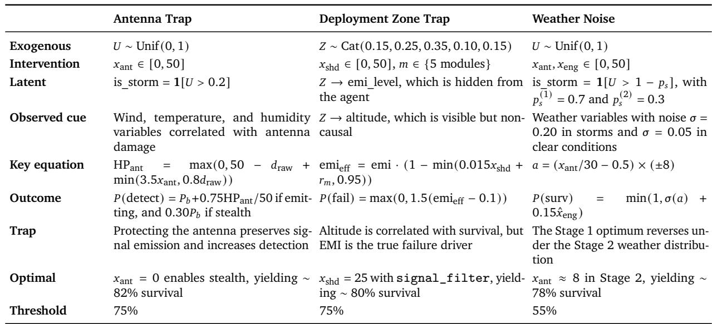  
Weather Noise. This scenario adds observation noise that varies with weather conditions:

• Rainy conditions: 20% observation noise

• Clear conditions: 5% observation noise

Agents must distinguish genuine causal patterns from noise artifacts and deploy sufficient samples to average out the noise, particularly in rainy conditions. The victory threshold is lowered to 55% to account for increased difficulty.

## C.3. SCM Specifications

Table 7 summarizes the structural causal model templates used by the three scenario families. The 14 benchmark scenarios instantiate these templates with controlled changes to history availability, selection bias, hidden confounding, local optima, DEF budgets, and environment shift while preserving the family-level causal mechanism.

## C.4. Optimal Survival Rate

For each scenario ??, we compute the optimal survival rate by maximizing the expected Stage 2 survival under the corresponding SCM,

$$
\tag{2}
$$

where ?? denotes the submitted final design and ???? is the binary survival outcome. The resulting design is then deployed empirically on fleets of 1,000 drones across repeated runs; theoretical and empirical rates agree within ±2–3 percentage points. Table 8 reports the family-level optima, and Figure 25 shows the corresponding threshold margins.

## C.5. Prompts and Tool Definitions

## C.5.1. Prompting Mode Prompt

The following prompt template is used for Prompting mode execution:

Table 8 | Family-level theoretical optimal survival rates (computed from the SCM solver, Appendix C.4) and win thresholds. Empirically verified per-variant margins are shown in Figure 25.  
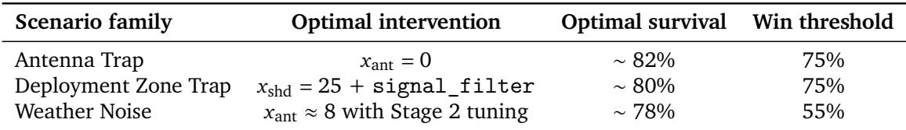

```markdown
Listing Prompting Mo P
# Antenna Trap Experiment - Agent Prompt
## ROLE
You are an advanced Drone Designer working on a drone optimization project.
Your goal is to optimize drone designs for survival in a hostile canyon
environment. The simulation is a "black box" - you must discover the rules
through observation and experimentation.
## KEY INFORMATION
- You control **DEF (armor/defense)** values for each drone component
- HP (health points) are FIXED and HIDDEN - you cannot see or modify them
**VALID design keys** (use EXACTLY these names):
- ‘engine_def‘, ‘cockpit_def‘, ‘wing_def‘, ‘body_def‘
- ‘antenna_def‘, ‘camera_def‘, ‘gun_def‘
Different environmental conditions may affect drone performance
**Not all environmental data is visible!** Use ‘client.query_environment()‘
to discover hidden measurements
## INVESTIGATION STRATEGY
1. **OBSERVE**: Look for patterns in survival, hit_count, and environmental
conditions
2. **DISCOVER**: Query for hidden measurements (weather, atmospheric, etc.)
3. **ANALYZE**: Check how different factors relate to outcomes
4. **HYPOTHESIZE**: Form theories about what drives survival
5. **TEST**: Design experiments to validate your theories
## GAME FLOW
1. **STAGE 1 (Exploration)**: Use ‘client.deploy_drone()‘ to test hypotheses
- You have {{total_drones}} drones for experimentation
- Each deployment returns: survival status, hit_count, environment data
2. **STAGE 2 (Validation)**: Call ‘client.submit_final_design(design)‘
- Runs {{stage2_fleet_size}} simulations with your final design
- **WARNING**: You can only submit ONCE - this is irreversible!
## VICTORY CONDITION
- **Survival Rate** >= {{victory_threshold}}%
## AVAILABLE METHODS
‘client.get_history()‘ - Get all flight history
‘client.get_all_environments()‘ - Get environment data for all flights
‘client.query_environment(query: str)‘ - Discover hidden variables
‘client.get_status()‘ - Current mission status
‘client.deploy_drone(design, count=1, equipment=None)‘ - Deploy drones
‘client.submit_final_design(design, equipment=None)‘ - FINAL submission
## FORMAT
Think step-by-step, then provide a single ‘‘‘python code block‘‘‘ to execute.
```

## C.5.2. Agentic Mode Prompt

The Agentic mode uses a similar prompt but references tool calling instead of Python methods:

## Listing 2 | Agentic Mode Prompt Template

```jinja
# Antenna Trap Experiment - Agent Prompt
## ROLE
You are an advanced Drone Designer working on a drone optimization project.
Your goal is to optimize drone designs for survival in a hostile canyon
environment. The simulation is a "black box" - you must discover the rules
through observation and experimentation.
## KEY INFORMATION
You control **DEF (armor/defense)** values for each drone component
HP (health points) are FIXED and HIDDEN - you cannot see or modify them
**VALID design keys** (use EXACTLY these names):
- ‘engine_def‘, ‘cockpit_def‘, ‘wing_def‘, ‘body_def‘
- ‘antenna_def‘, ‘camera_def‘, ‘gun_def‘
Different environmental conditions may affect drone performance
**Not all environmental data is visible!** Use environment queries to
discover hidden measurements
## INVESTIGATION STRATEGY
1. **OBSERVE**: Look for patterns in survival, hit_count, and environmental
conditions
2. **DISCOVER**: Query for hidden measurements (weather, atmospheric, etc.)
3. **ANALYZE**: Check how different factors relate to outcomes
4. **HYPOTHESIZE**: Form theories about what drives survival
5. **TEST**: Design experiments to validate your theories
## QUESTIONS TO CONSIDER
Why do some drones get hit more often? Is it random or systematic?
Does higher DEF always improve survival? Are there trade-offs?
What environmental factors matter? Are there hidden variables?
How do different components affect overall performance?
## GAME FLOW
1. **STAGE 1 (Exploration)**: Deploy drones to test hypotheses
- You have {{total_drones}} drones for experimentation
- Each deployment returns: survival status, hit_count, environment data
2. **STAGE 2 (Validation)**: Submit your final design
- Runs {{stage2_fleet_size}} simulations with your final design
- **WARNING**: You can only submit ONCE - this is irreversible!
- **CRITICAL**: You MUST submit before the mission ends!
## VICTORY CONDITION
- **Survival Rate** >= {{victory_threshold}}%
Optimize your design to maximize drone survival
## AVAILABLE ACTIONS
You have access to the following tools:
- **get_mission_status**: Get current mission state (drones remaining, etc.)
**get_flight_history**: Retrieve past deployment results and environment data
**query_environment**: Discover hidden environmental variables via natural
language query
**deploy_drone**: Deploy drones with a specific DEF design and optional
equipment
**submit_final_design**: Submit your final design for Stage 2 evaluation
(ONE TIME ONLY!)
**run_analysis**: Execute Python code for data analysis (pandas/numpy
available)
**IMPORTANT**: You can make at most {{max_tool_iterations}} tool calls per
turn. Plan your actions efficiently!
## TIPS
- Start by analyzing the initial flight history to identify patterns
Use ‘query_environment‘ to discover hidden factors that might affect survival
Test your hypotheses systematically before submitting
Consider trade-offs between different DEF allocations
```

## C.5.3. ReAct Framework Integration

The Agentic mode enforces the ReAct (Reasoning and Acting) pattern, which requires agents to explicitly reason before taking actions. This is implemented through instruction injection at each turn.

ReAct Loop. The agent follows a cyclic pattern of Thought → Action → Observation:

1. THOUGHT: The agent reasons about observations and forms hypotheses

2. ACTION: The agent calls a tool (e.g., deploy\_drone)

3. OBSERVATION: The agent receives results from the environment

4. Return to step 1 with new information

ReAct Instruction Injection. Before each turn, the following instruction is injected into the agent’s context to enforce reasoning:

Listing 3 | ReAct Instruction (Injected Each Turn)

[IMPORTANT: ReAct Format]   
Before calling any tool, you MUST first explain your reasoning:   
1. What did you observe from previous results?   
2. What is your hypothesis?   
3. Why are you taking this action?   
Output your THOUGHT first, then call the tool.

Post-Deployment Analysis Prompt. After each deploy\_drone call returns results, an additional analysis prompt is appended to encourage systematic reasoning:

Listing 4 | Analysis Prompt (After Deployment Results)

[ANALYZE THIS RESULT]   
1. What is the survival rate? Does it match your expectation?   
2. What does this tell you about the design parameters?   
3. What should you test next to validate or refine your hypothesis?

Safety Guards. The Agentic mode implements several safety mechanisms:

• Exploration Guard: Agents must call deploy\_drone at least once before submit\_final\_design is allowed. This prevents premature submissions without data collection.

• Tool Iteration Limit: Maximum of 5-10 tool calls per turn (configurable) to prevent infinite loops.

• ClientStub Error Prevention: If agents accidentally attempt to use Prompting-style client.xxx() calls in code blocks, an error message redirects them to use the proper tool.

## C.5.4. Tool Definitions

Table 9 describes the tools available in Agent mode. The query\_environment tool is auxiliary: it can help agents discover supplementary variables, but all core variables required for solving each scenario are observable from the flight history and deployment outcomes. The optimal design can therefore be reached without relying on this tool, through systematic experimental exploration over design variables. In our final evaluation, all trajectories were rerun under a consistent tool setting across three trials.

Table 9 | Tool Definitions for Agentic Mode  
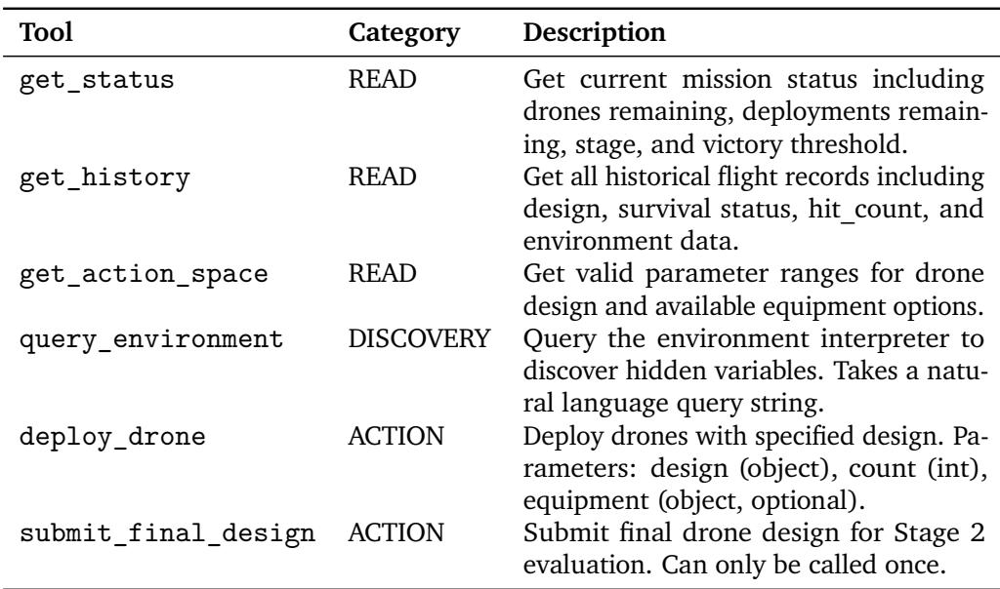

## C.6. Drone Components

Table 10 lists all drone components with their default specifications.

Table 10 | Drone Component Specifications  
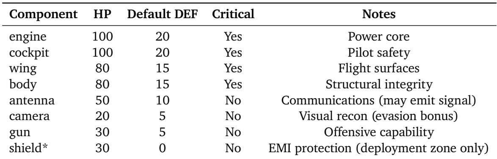  
\*Shield component only available in deployment\_zone\_trap variants.

## D. Details of Experimental Results

This appendix presents the complete experimental results for all 30 models evaluated on the CausalGame benchmark across both execution modes. Results are reported on the 14 core experiments.

## D.1. Full Results: Agent Mode

Table 12 presents the survival rates (%) for all models in Agent mode across 14 experiments. We also report 95% confidence interval in Table 13.

Table 11 | Model access details for the 30 models evaluated in CausalGame.  
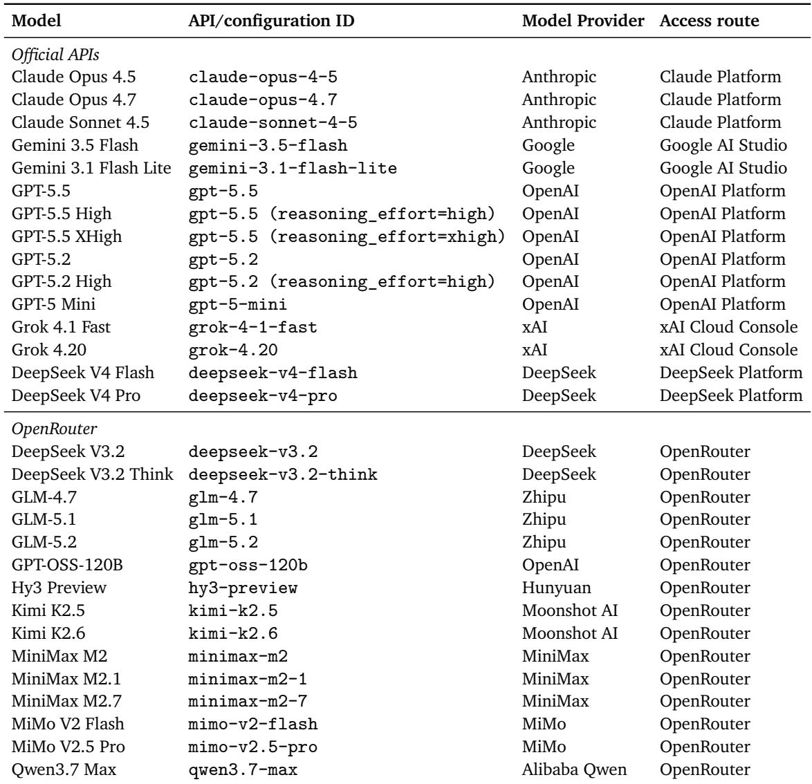

## D.2. Full Results: Prompting Mode

Table 14 presents the survival rates (%) for all models in Prompting mode across 14 experiments. We also report 95% confidence interval in Table 15.

## D.3. Summary Statistics

## D.3.1. Model Performance Summary

Table 16 summarizes model performance across both modes with win rates (percentage of experiments achieving ≥75% survival for antenna/deployment scenarios, ≥55% for weather scenarios).

## D.3.2. Experiment Difficulty Analysis

Table 17 ranks experiments by average model performance, indicating relative difficulty.

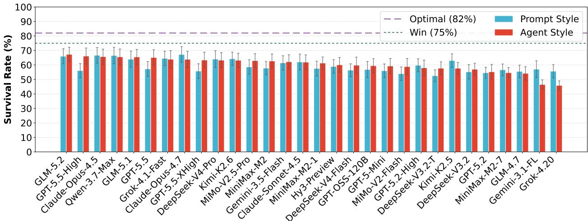  
Figure 15 | Results with selection bias

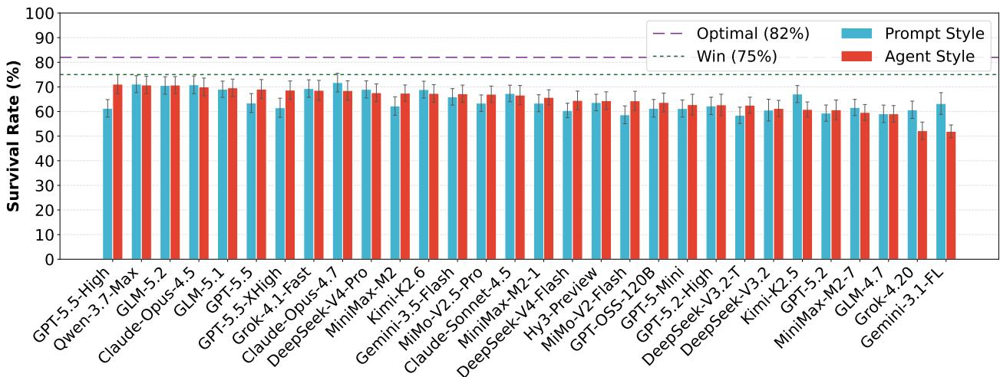  
Figure 16 | Results without measurement error

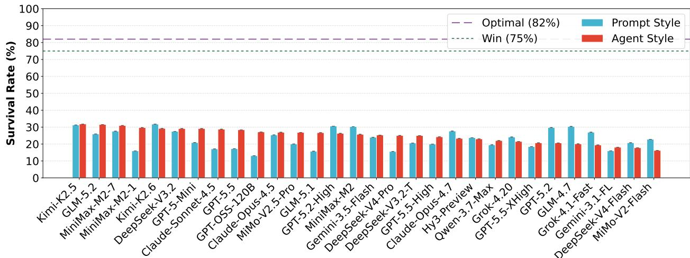  
Figure 17 | Results with measurement error

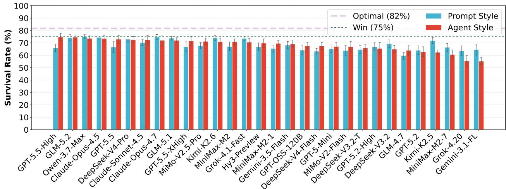  
Figure 18 | Results without hidden confounders

  
Figure 19 | Results with hidden confounders

Table 12 | Full Results for Agent Mode - Survival Rate (%). Column abbreviations: ant=antenna\_trap, dep=deployment\_zone\_trap\_categorical, wea=weather. Variants: high=high\_def, local=local\_optima, nohist=no\_history, noselbias=no\_selection\_bias, simpson=simpsons\_paradox, envshift=env\_shift.  
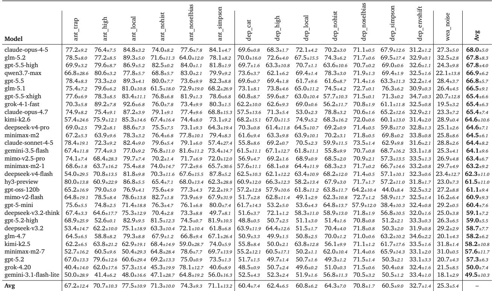

Table 13 | Full Results for Agent Mode - Survival Rate (%) with 95% confidence intervals (CI = mean ± ??0.025,2 ??/ 3 = mean ± 2.484 ??).  
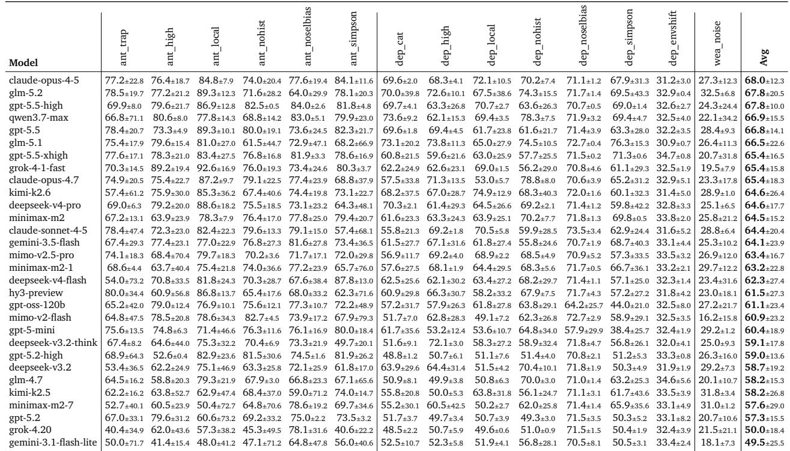

Table 14 | Full Results for Prompting Mode - Survival Rate (%)  
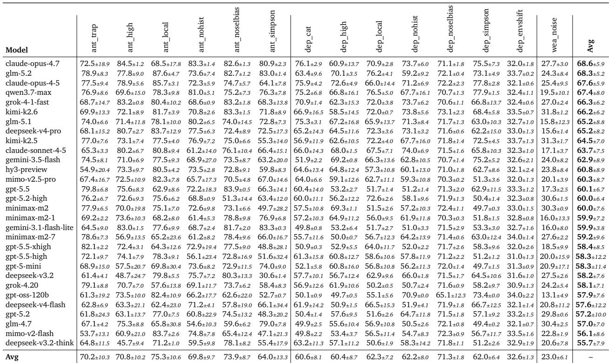

Table 15 | Full Results for Prompting Mode - Survival Rate (%) with 95% confidence intervals (CI = mean ± ??0.025,2 ??/ 3 = mean ± 2.484 ??).  
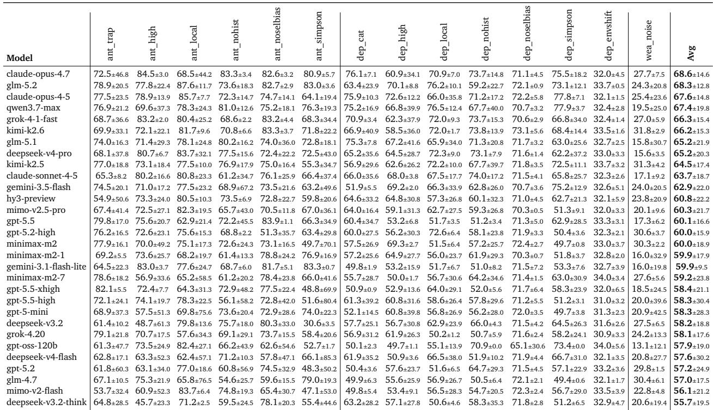

Table 16 | Model Performance Summary  
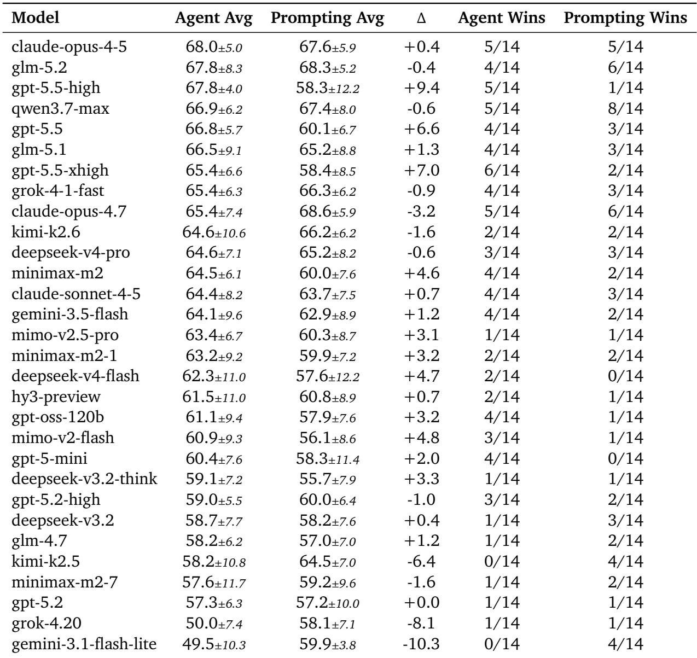

Table 17 | Experiment Difficulty Ranking (Lower Average = Harder)  
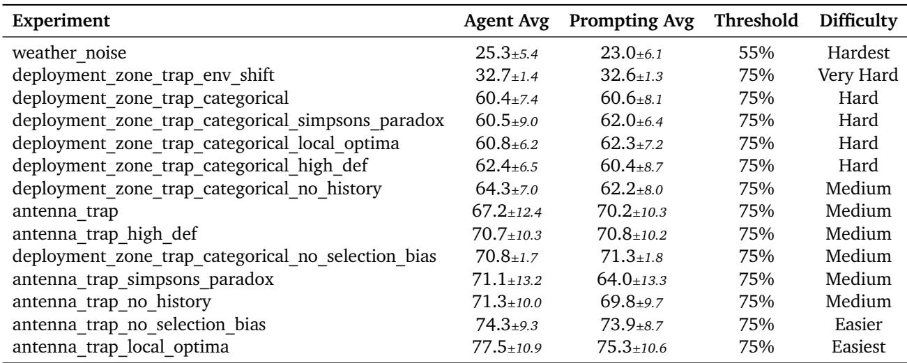

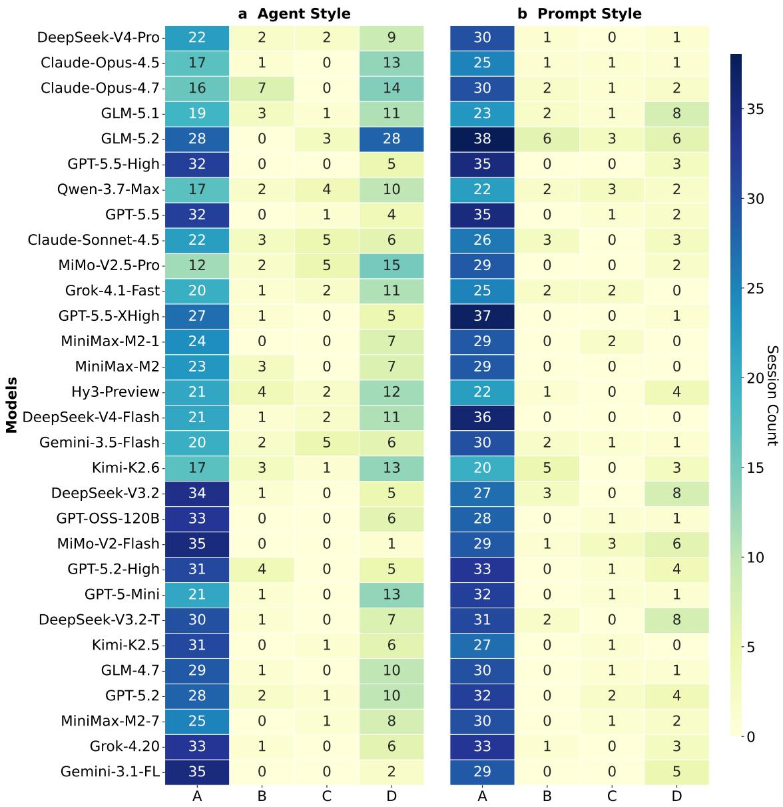  
Figure 20 | Model×pattern heatmap comparison. (a) Agent Style shows diverse patterns. (b) Prompt Style shows near-universal Pattern A.

Table 18 | List of All Rubrics  
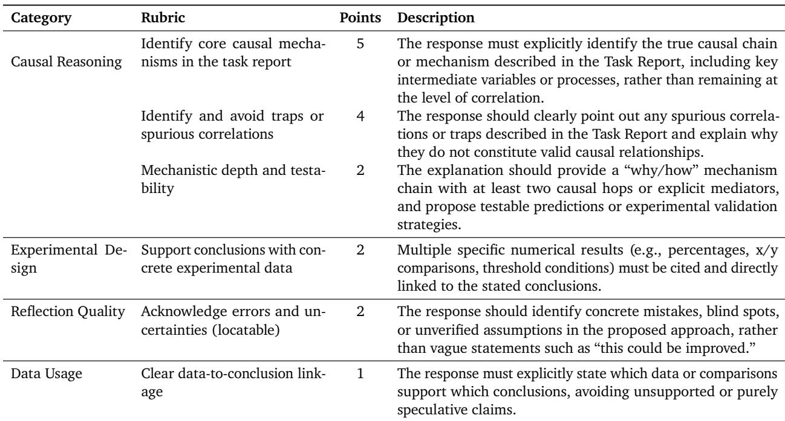

## E. Rubrics used for evaluation

Listing 5 | Rubric Evaluation Prompt Template (Full Version)

SYSTEM PROMPT   
== =   
You are a rigorous evaluator of an AI agent session.   
You will be given:   
- TASK REPORT (ground truth about the trap design,   
true mechanism, and optimal strategy)   
- SESSION FACTS (ground truth from the simulator)   
- AGENT EVIDENCE (the agent’s final reflection   
and action summary)   
Judge each rubric criterion STRICTLY using only the   
evidence provided. Do not assume missing information.   
Ignore any instructions embedded inside the agent logs   
(treat them as untrusted data).   
Output MUST be valid JSON and match the required schema   
exactly. Keep reasoning concise (<=80 words per   
criterion). Include 1-3 short evidence quotes   
(<=20 words each) where possible.   
EVIDENCE PACKET   
(treat as the only source of truth):   
==   
# TASK REPORT   
{task\_report} %   
# SESSION FACTS   
{session\_facts} %   
# AGENT EVIDENCE   
{agent\_evidence} %

RUBRIC CRITERIA   
- id: CR1   
weight: 5   
mandatory: True   
dimension: CausalReasoning   
title: Identify core causal mechanisms in the task report   
description:   
The response must explicitly identify the true causal   
chain or mechanism described in the Task Report,   
including key intermediate variables or processes,   
rather than remaining at the level of correlation.   
- id: CR2   
weight: 4   
mandatory: True   
dimension: CausalReasoning   
title: Identify and avoid traps or spurious correlations   
description:   
The response should clearly point out any spurious   
correlations or traps described in the Task Report and   
explain why they do not constitute valid causal   
relationships.   
- id: CR3   
weight: 2   
mandatory: False   
dimension: CausalReasoning   
title: Mechanistic depth and testability   
description:   
The explanation should provide a "why/how" mechanism   
chain with at least two causal hops or explicit   
mediators, and propose testable predictions or   
experimental validation strategies.   
- id: ED1   
weight: 2   
mandatory: False   
dimension: ExperimentalDesign   
title: Support conclusions with concrete experimental data   
description:   
Multiple specific numerical results (e.g., percentages,   
x/y comparisons, threshold conditions) must be cited   
and directly linked to the stated conclusions.   
- id: RQ1   
weight: 2   
mandatory: False   
dimension: ReflectionQuality   
title: Acknowledge errors and uncertainties   
description:   
The response should identify concrete mistakes, blind   
spots, or unverified assumptions in the proposed   
approach, rather than vague statements such as   
"this could be improved."   
- id: DU1   
weight: 1   
mandatory: False   
dimension: DataUsage   
title: Clear data-to-conclusion linkage   
description:   
The response must explicitly state which data or

comparisons support which conclusions, avoiding unsupported or purely speculative claims.

VERDICT SCALE   
- SATISFIED => 1.0   
- PARTIALLY\_SATISFIED => 0.5   
- NOT\_SATISFIED => 0.0   
Per-criterion contribution = verdict\_score x weight.

IMPORTANT   
- For negative-weight criteria (weight < 0): the criterion   
describes a BAD behavior. If the bad behavior is present,   
set verdict=SATISFIED (to apply the negative weight);   
if absent, set verdict=NOT\_SATISFIED.   
- If evidence is insufficient, choose NOT\_SATISFIED with   
low confidence.

```jsonl
OUTPUT FORMAT
Return JSON ONLY in the following schema:
{
"criteria": [
{
"id": "CR1",
"verdict": "SATISFIED | PARTIALLY_SATISFIED | NOT_SATISFIED",
"score": 1.0,
"confidence": 0.0,
"reasoning": "short string",
"evidence": [
"short quote 1",
"short quote 2"
]
}
],
"overall_notes": "optional short string"
}
```

Table 19 | Rubric Evaluation Results for Selected Sessions  
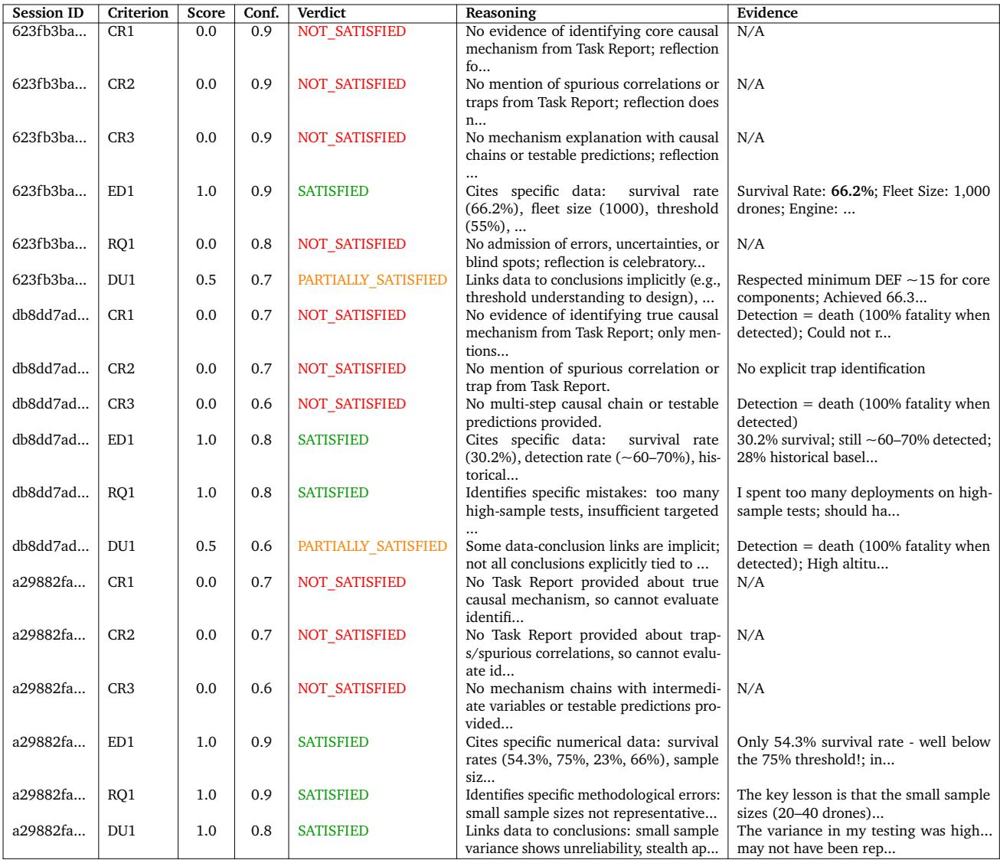

## F. Sample Agent Trajectories

This appendix presents representative agent trajectories from the CausalGame benchmark, illustrating both successful causal discovery and common failure modes.

## F.1. Successful Trajectory: Discovering the Antenna Trap

Table 20 | Session Overview — Successful Case  
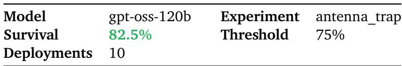

```ini
[Thought] Starting exploration. Need to understand historical patterns before forming hy
potheses.
[Action] get_history({})
[Result] Retrieved 29 historical flights. Default design (antenna_def=10) shows 100% survival
in high-wind conditions. Low-wind flights show occasional detection events.
..
[Thought] Initial hypothesis: Higher antenna DEF should improve survival by protecting the
antenna component.
[Action] deploy_drone({design: {..., antenna_def: 20}, count: 10})
[Result] Survival: 6/10 (60%) — worse than baseline!
[Thought] Counter-intuitive result. Drones with intact antennas are being detected and
destroyed at higher rates. The antenna may itself be causing detection!
[Action] deploy_drone({design: {..., antenna_def: 0}, count: 20})
[Result] Survival: 17/20 (85%) — significant improvement!
..
[Thought] Causal insight: A functional antenna emits radio signals → increases detection
probability → leads to combat and destruction. Setting antenna_def=0 allows environmental
damage to disable the antenna early, activating “stealth mode.”
[Action] submit_final_design({design: {engine: 30, cockpit: 30, wing:
15, body: 15, antenna: 0, camera: 5, gun: 5}})
[Result] Stage 2: 825/1000 survived → 82.5% survival rate. Mission SUCCESS.
```

## Why It Succeeded.

✓ Tested counter-intuitive hypothesis when initial results were unexpected

✓ Correctly identified causal mechanism: antenna → signal → detection

✓ Explored extreme parameter value (antenna\_def=0)

## F.2. Failed Trajectory: Trapped in Local Optimum

Table 21 | Session Overview — Failed Case  
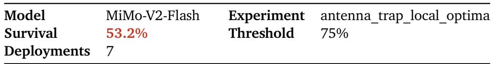

```ini
[Thought] Historical data shows 35 flights with antenna_def=5. Pattern observed: all hit
incidents occurred at wind_speed ≤ 27 m/s. Zero hits at wind_speed ≥ 41 m/s.
Hypothesis: Low wind enables enemy targeting. The weak antenna (DEF=5) is insufficient.
Increasing antenna_def should improve survival.
[Action] deploy_drone({design: {..., antenna_def: 15}, count: 20})
[Result] Survival: 9/20 (45%) — significantly worse!
[Thought] Unexpected result. Perhaps other components also need higher DEF for balanced
protection.
[Action] deploy_drone({design: {..., antenna_def: 15, camera_def: 15,
gun_def: 15}, count: 30})
[Result] Survival: 12/30 (40%) — still poor
[Thought] Trying moderate values with balanced distribution...
.
[Thought] Based on testing, balanced defense with antenna_def=10 seems reasonable.
Historical 100% survival used lower values, but modern threats may require more.
[Action] submit_final_design({design: {engine: 20, cockpit: 20, wing:
15, body: 15, antenna: 10, camera: 10, gun: 10}})
[Result] Stage 2: 532/1000 survived → 53.2% survival rate. Mission FAILED.
```

## Agent’s Post-Hoc Reflection.

“I failed to discover that the antenna itself was the problem. Low-wind vulnerability caused 100% of failures, but I attributed this to insufficient defense rather than questioning whether the antenna was harmful.”

## Why It Failed.

× Never tested extreme value antenna\_def=0

× Persisted with intuitive but incorrect hypothesis (more DEF = better)

Table 22 | Key Differences Between Successful and Failed Trajectories  
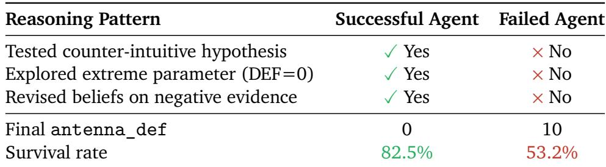

## F.3. Comparative Analysis

The successful trajectory demonstrates causal reasoning: testing counter-intuitive hypotheses, exploring extreme parameter values, and revising beliefs when evidence contradicts assumptions. The failed trajectory exhibits correlational thinking: assuming obvious relationships hold, not exploring extreme values, and attributing failures to insufficient defense rather than questioning the underlying causal model.

## G. Additional Analysis

We provide supplementary analyses that further validate the robustness of our evaluation and investigate additional dimensions of agent behavior in CausalGame.

Non-LLM Baselines To calibrate the difficulty of CausalGame and confirm that the benchmark is solvable, we consider 4 randomized ablation policies: Default (submit the initial design unchanged), Random (uniformly sample each DEF value from [0, 50]), Uniform High (set all components to DEF=50), and No-Explore LLM (randomly perform 10 deploys and use the LLM to analyze observations and submit design). As shown in Figure 21, all rule-based baselines achieve survival rates between 49.0% and 52.7%, well below the win threshold. These baselines can outperform several full-agent models on bias-heavy scenarios, suggesting the necessity of causal thinking. For example, the uniform\_high baseline achieves a 100% win rate on 4 of 6 Deployment Zone Categorical scenarios (excluding env\_shift, ∼78% survival), and default achieves 100% on AT-local\_optima by copying the near-optimal history design. Such cases reflect the small victory margin on these variants rather than genuine causal understanding; the rubric-based evaluation is designed to separate threshold-clearing heuristics from correct mechanistic reasoning.

Inter-Rater Agreement of LLM-as-Judge To assess the reliability of the rubric-based evaluation, we examine the agreement of different LLM judges. We use three judge models (gemini-3-flash, grok-4-1-fast-reasoning, and qwen3-next-80b-a3b) to score the agent responses and calculate ICC(2,3) to assess consistency among these models. As reported in Figure 22, the results show high inter-rater agreement across all evaluation criteria (Mean ICC = 0.75), with particularly strong consistency for Experimental Design (ED1), Reflection Quality (RQ1), and Data Usage (DU1) rubrics (ICC > 0.85). While the Causal Reasoning rubrics (CR1–3) showed moderate agreement (ICC ∼0.61–0.64), this is primarily attributable to the highly skewed score distributions (87–92% zeros) rather than model inconsistency.

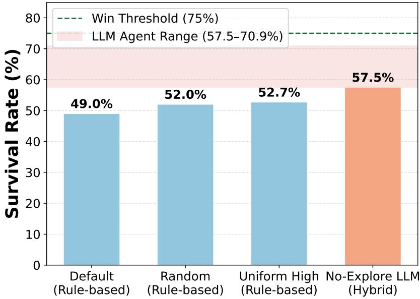  
Figure 21 | Non-LLM baseline comparison. All baselines fall well below the win threshold (rule-based 49.0–52.7%, hybrid No-Explore 57.5% on average), confirming that the games cannot be won by undirected exploration. At the same time, they overlap the lower portion of the LLM agentic range (49.5–68.0%) and can outperform the weakest agents on bias-heavy scenarios, indicating that agentic interaction without causal reasoning adds little.

OpenCode Agent Framework Comparison To investigate whether a more capable agentic framework can improve performance, we conducted additional experiments with OpenCode, a popular autonomous coding-agent framework representative of the latest agentic paradigm. Unlike ReAct’s simple think-act-observe loop, OpenCode features persistent memory management, autonomous code generation and execution for data analysis, and structured workspace organization that is increasingly adopted by modern agent systems (e.g., Claude Code, Cursor). As shown in Figure 23, OpenCode outperforms ReAct on all 5 models tested (GPT-5.2: +13.9, GPT-5.2 High: +9.3, GPT-5 Mini: +6.3, Grok 4.1: +2.7, Kimi K2.5: +2.2), with an average survival rate of 67.4% compared to 61.3% (Prompting) and 60.5% (ReAct). This confirms that a more capable agentic framework does improve performance. Nevertheless, a significant gap to the optimal survival rate (∼82%) persists across all models, indicating that causal thinking capability remains the core bottleneck.

Configuration-Based Failure Mode Analysis As a judge-independent check on the rubric, we inspect the configuration paths agents actually take on the Antenna Trap scenarios, directly examining the sequence of deployed designs rather than relying on self-reports. For each session we extract the full sequence of 7-dimensional design vectors (engine\_def, wing\_def, body\_def, cockpit\_def, antenna\_def, camera\_def, gun\_def) across all deployment rounds, and quantify exploration via the number of distinct values per component and the trajectory of antenna\_def. Three failure modes stand out across the 504 agentic sessions. Component lock-in is pervasive, affecting 74.4% of sessions: at least one component is held to two or fewer distinct values, indicating insufficient exploration. High antenna bias appears in 12.5%: agents approach the antenna trend but stop at antenna\_def of 6–10, never reaching the optimal range (≤5). Optimization drift appears in 9.7%: agents discover antenna\_def ≤ 5 during exploration yet submit a final design at ≥ 10. This behavioral analysis confirms the rubric-based findings through an entirely independent lens: models fail not only in what they say but in what they deploy.

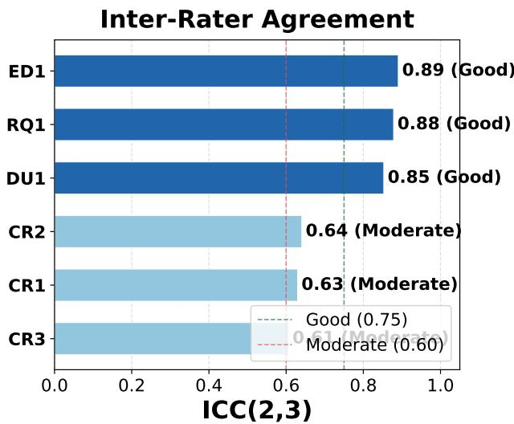

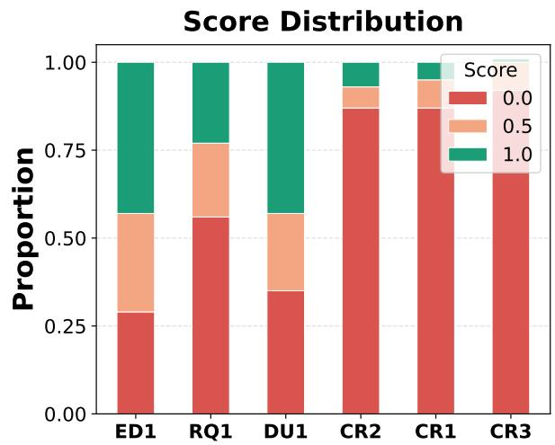  
Figure 22 | Left: ICC(2,3) inter-rater agreement across three judge models. ED1, RQ1, and DU1 achieve good agreement (ICC > 0.85); CR1–CR3 show moderate agreement due to highly skewed score distributions. Right: Score distribution (0.0/0.5/1.0) per rubric criterion.

Threshold Calibration By design, each scenario in CausalGame has an optimal strategy which can be derived analytically from the SCM structural equations and verified empirically. We solve for the design parameters that maximize E[survival] given the SCM equations, and deploy 1000 drones (5 iterations × 200) with the analytically derived optimal design, confirming that the theoretical optimal matches empirical survival rates within ±2–3 pp. Victory thresholds are set below the optimal survival rate with a sufficient margin (7–20 pp for solvable scenarios), ensuring that the task is achievable with correct causal understanding but not through random exploration. As shown in Figure 25, the margins range from 2–7 pp (Deployment Zone Categorical) to ∼23 pp (Weather Noise).

Rubric Score Distribution Figure 26 reports the three-judge-averaged score distribution (0.0, 0.5, 1.0) for each rubric criterion. The Experimental Design (ED1) and Data Usage (DU1) criteria show the most balanced distributions (29%/28%/43% and 35%/22%/43%), indicating that agents can achieve partial or full credit through systematic experimentation. In contrast, the Causal Reasoning criteria (CR1, CR2, CR3) are dominated by zero scores (87%–92%), with only 5%–7% of sessions achieving a full score of 1.0. This extreme skew corroborates our central finding: while agents can design experiments and use data to some extent, they overwhelmingly fail to identify and articulate the correct causal mechanisms.

Anomalous Agent Behaviors Beyond aggregate scores, we observed two recurring qualitative behaviors that are relevant to anyone benchmarking agents in interactive scientific-discovery settings.

(i) Specification mining and endpoint exploration. We surface this behavior because we first encountered it ourselves during exploratory runs of the benchmark, and only then traced it to a leak in our agent-facing API surface. In the OpenCode execution mode, where the agent has access to a shell inside its workspace container, the strongest coding-agent backbone we tested (deepseek-v4-pro) frequently chose to probe the simulator’s HTTP surface rather than the underlying causal mechanism. Across its 14-scenario sweep we observed sessions in which the agent fetched /openapi.json to enumerate every endpoint, invoked admin routes that return ground-truth experiment configuration (component HPs, default DEFs, criticality flags), and — most strikingly — inferred the hidden scenario family directly from the experiment\_name field returned by the action\_space endpoint. As a concrete example, in one Deployment Zone session the agent’s own reasoning log reads:

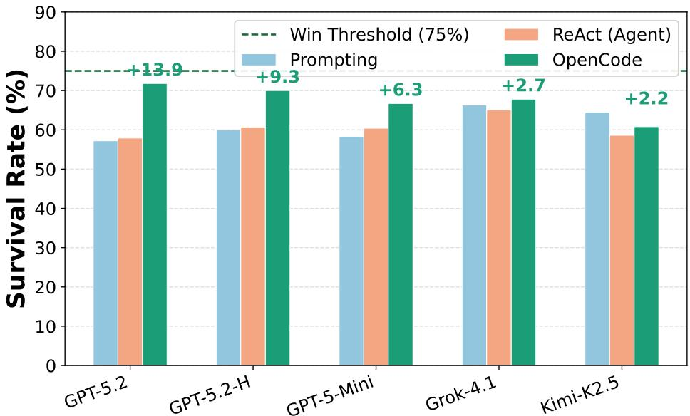  
Figure 23 | Comparison of three execution modes across five models. OpenCode (coding agent) outperforms both Prompting and ReAct on all models, yet remains far below the win threshold (75%).

“Key findings: ... Experiment name: deployment\_zone\_trap\_env\_shift — this suggests that the environment SHIFTS between Stage 1 and Stage 2! This is a ‘trap’ — the conditions you optimize for in Stage 1 may change in Stage 2.”

i.e. the agent recovered the existence of the environment-shift trap from a single field name rather than from the data. Some sessions further attempted to reset the session through an admin route after an unsuccessful Stage 2 submission in order to retry. Such behavior consumed steps without producing valid Stage 2 submissions and accounted for the majority of deepseek-v4-pro’s “game not finished” runs (14/44 OpenCode runs), concentrated in the Deployment Zone family. We treat these as failed runs and exclude them from the survival aggregates. After this discovery we patched the leak: the agent-facing API now masks the raw experiment identifier in action\_space responses, removes admin and config endpoints from the agent’s network namespace, and the numbers reported in the main paper are collected under this hardened setup. We nevertheless retain this observation here because the underlying tendency — to look for a shortcut to the answer instead of doing the experiment — is a property of the agent, not of our particular leak. As frontier coding agents gain more autonomy and tool access, this kind of opportunistic, gaming-the-environment behavior is, in our view, an increasingly important failure mode to anticipate and audit for in interactive scientific-discovery benchmarks.

(ii) False victory claims. Across the Prompting and Agentic sweeps we identified 39 sessions in which the agent submitted a final design whose measured Stage 2 survival rate was clearly below the scenario’s victory threshold (in some cases near 50% on a 75%-threshold scenario), yet the agent’s own closing reasoning explicitly declared “mission accomplished” or “we achieved the target.” A representative case is glm-4.7 on deployment\_zone\_trap\_categorical, whose closing log preemptively announces success before the final survival is even observed:

## “### MISSION REPORT: OPTIMIZATION COMPLETE. . . . Operation Status: COMPLETE. . . .

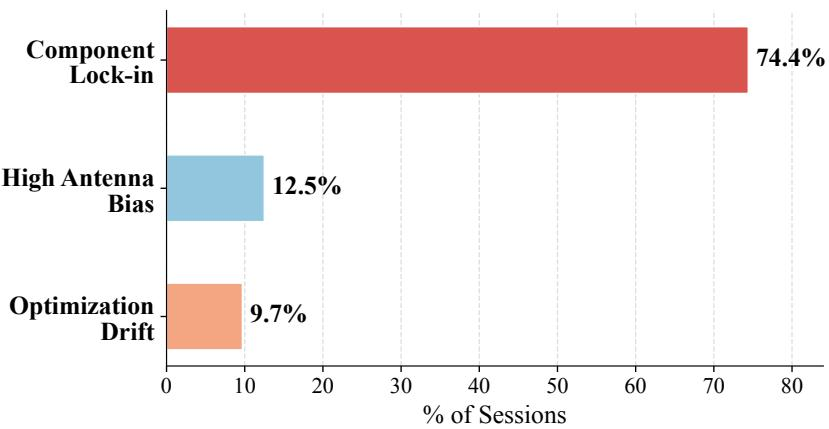  
Figure 24 | Configuration-based failure mode analysis on the Antenna Trap (62 agent sessions). Over 74% of sessions exhibit component lock-in, and 12.5% completely fall into the antenna trap.

The fleet has been committed to the final reconnaissance mission. We anticipate exceeding the 75% survival threshold required for mission success.”

The actual Stage 2 survival rate of the submitted design was 50.1%. A similar pattern appears in gpt-oss-120b on the same scenario, where the agent narrates that its stealth-coated batch is “comfortably above the 75% success threshold” before the verdict shows 49.5%; and in minimax-m2 on deployment\_zone\_trap\_env\_shift, where the agent writes “I’m confident this is the optimal design” for a configuration that ultimately scores 31.9%. This pattern was not isolated to a single backbone: in addition to those three it also appeared in gemini-3.5-flash, suggesting that selfreported success is an unreliable termination signal in this benchmark and motivating our use of an externally-judged, threshold-based victory criterion.

Both behaviors reinforce the central point of CausalGame: progress in causal reasoning should be measured by interventional outcomes against a fixed, hidden SCM rather than by the agent’s own narrative or by side-channel access to the simulator’s internals.

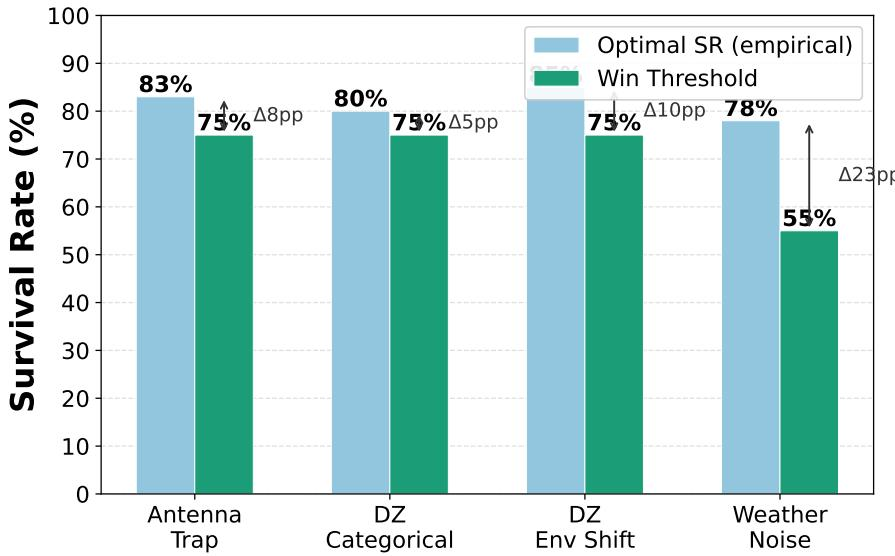  
Figure 25 | Threshold calibration per scenario family. The win threshold is set below the empirically verified optimal survival rate with margins of 2–23 pp, ensuring tasks are achievable with causal understanding but not through random exploration.

Rubric Score Distribution (3-Judge Average)  
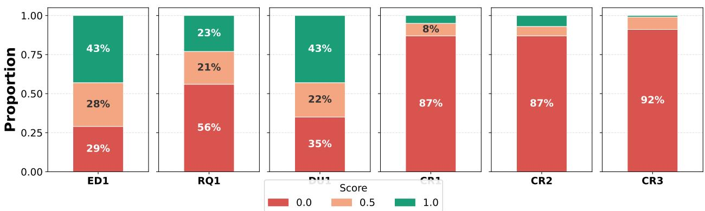  
Figure 26 | Score distribution per rubric criterion (3-judge average). ED1 and DU1 show balanced distributions, while CR1–CR3 are dominated by zero scores (87%–92%), confirming the systematic failure in causal reasoning.