# Hunt Instead of Wait: Evaluating Deep Data Research on Large Language Models

Wei Liu♠, Peijie Yu♡, Michele Orini♠, Yali Du♠♣, Yulan He♠♣ ♠King’s College London, ♡Tencent, ♣The Alan Turing Institute

Abstract: The agency expected of Agentic Large Language Models goes beyond answering correctly, requiring autonomy to set goals and decide what to explore. We term this investigatory intelligence, distinguishing it from executional intelligence, which merely completes assigned tasks. Data Science provides a natural testbed, as real-world analysis starts from raw data rather than explicit queries, yet few benchmarks focus on it. To address this, we introduce Deep Data Research (DDR), an open-ended task where LLMs autonomously extract key insights from databases, and DDR-Bench, a large-scale, checklist-based benchmark that enables verifiable evaluation. Results show that while frontier models display emerging agency, long-horizon exploration remains challenging. Our analysis highlights that effective investigatory intelligence depends not only on agent scaffolding or merely scaling, but also on intrinsic strategies of agentic models.

Project: https://huggingface.co/spaces/thinkwee/DDR\_Bench Correspondence: wei.4.liu@kcl.ac.uk, yulan.he@kcl.ac.uk

The LONDON Tenceni InslanTuringg

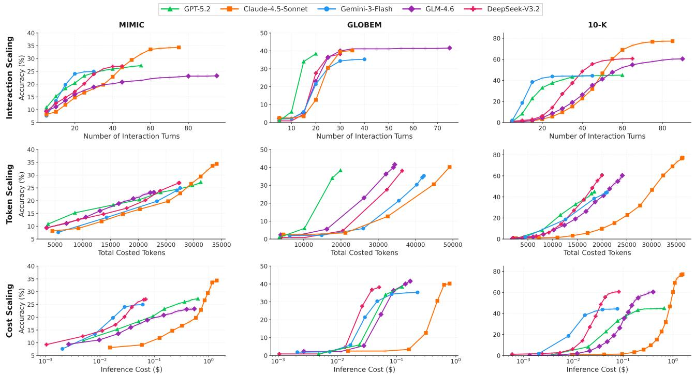  
Figure 1: Inference-time scaling performance in DDR-Bench across different dimensions. The y-axis reports checklist accuracy. Beyond final accuracy, DDR-Bench provides rich test-time exploration information from different scaling dimensions, enabling detailed analysis of model agency behaviour. See details in §4.

## 1. Introduction

Agentic large language models (Agentic LLMs) (Zhang et al., 2025b) extend conventional LLMs (Brown et al.,

2020; OpenAI, 2022; 2023; 2025) from reactive response to interactive decision making. By integrating models with tools and memory, recent agentic systems are able to complete complex real-world tasks involving long-horizon behaviour. (Plaat et al., 2025; Wang et al., 2025a; Yao et al., 2023; Xu et al., 2024; Wang et al., 2025b; Yehudai et al., 2025). However, most existing evaluations of agentic LLMs implicitly assume that the task objective or research question is specified in advance. Models are primarily assessed on their ability to execute predefined goals.

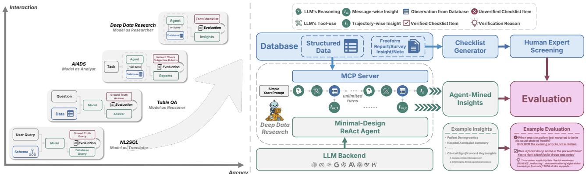  
Figure 2. Left: Compared with previous tasks, DDR maximises exploration openness and agency, focusing on the direct evaluation of insight quality. Right: Overview of the DDR-Bench. Details of the trajectory samples are shown in Appendix I.

This framing conflates two qualitatively different forms of intelligence: executional intelligence, which concerns how well an agent carries out a given task, and investigatory intelligence, which concerns whether the agent can autonomously decide what is worth investigating. Yet, current evaluation frameworks rarely assess this capability directly.

AI for Data Science provides a natural benchmark for this form of intelligence. Human analysts typically begin with structured data, without predefined questions or tasks. They examine the data for irregularities, form tentative hypotheses, and iteratively refine them as new patterns emerge. They will not assume questions or targets before accessing the data. In contrast, much of the existing research on large language models for data science (LLM4DS) remains be evaluating executional intelligence, treating a pre-defined, user-posed question as the primary objective for agentic models (Tang et al., 2025; Chen et al., 2025a; Zhou et al., 2025; Sun et al., 2025; Hong et al., 2025). Recent studies have started to move towards more autonomous data analysis by enabling agentic LLMs to carry out open-ended data explorations and produce high-level insight reports (Zhang et al., 2025c; Sundar et al., 2025). Evaluation in these settings, however, still largely relies on a combination of low-level correctness checks and subjective assessments of report quality (Nascimento et al., 2024; Chen et al., 2025b; Zhang et al., 2025c), and even without explicit questions, it also includes detailed instructions on what to investigate in the prompt. What’s more, such settings are often small in scale, with agents’ interactions with databases typically limited to fewer than dozens of steps.

In parallel, deep research benchmarks require agents to perform open-ended web search by coordinating search and browsing tools and generating reports (Wong et al., 2025; Wan et al., 2025; Zhang et al., 2025d). While these benchmarks also aim to evaluate the agency of agentic LLMs, they operate on unstructured web content and largely limit tooluse to issuing search queries. Moreover, they continue to face significant evaluation challenges, as assessments often depend on subjective rubrics, frequently implemented via LLM-as-a-Judge or on measuring faithfulness to reference websites as a proxy for quality (Du et al., 2025).

In this paper, motivated by this gap, we formalise Deep Data Research (DDR), an open-ended setting in which an agent is given only a structured database and a generic toolset, without predefined questions, objectives, or interaction limits. Models are required to autonomously carry out long-horizon tool-use to explore the data, formulate and test hypotheses, decide when to terminate exploration, and ultimately report the insights they uncover. Evaluation is performed based on a checklist derived from the free-form text components of the database, which is used to verify the factual claims in the generated report, supporting an interpretable, objective, and scalable evaluation. Compared with prior work on table question answering (Lu et al., 2025a) or report generation in the LLM4DS research (Zhang et al., 2025c), DDR enables fully open-ended data exploration while retaining rigorous and verifiable evaluation. To make DDR evaluable at scale, we introduce DDR-Bench, a benchmark that instantiates Deep Data Research over large real-world databases. As shown in Figure 2, DDR-Bench critically challenges models’ long-horizon interaction competence and their ability to exhibit sustained, autonomous agency in open-ended investigative settings. Beyond reporting evaluation outcomes, we conduct a systematic analysis of models’ long-horizon interaction patterns, examining from multiple perspectives how agency steers models through the Deep Data Research (as shown in Figure 1). Together with other systematic analyses on model behaviour and module design, we provide a focused empirical examination of current mainstream LLMs, shedding light on the gap between existing agentic AI systems and truly effective investigatory intelligence. In summary, this paper makes the following contributions:

1. We formalise Deep Data Research (DDR). This openended agentic setting isolates investigatory intelligence in structured data environments, requiring models to autonomously explore data, generate and validate hypotheses, and determine when exploration should terminate, without predefined questions or objectives.

2. We introduce DDR-Bench, the first large-scale benchmark for DDR, which enables fully open-ended and long-horizon data exploration while supporting objective and interpretable evaluation through checklistbased verification of claims grounded in the database.

3. We systematically evaluate mainstream LLMs on DDR-Bench and reveal persistent limitations in current frontier models. Our findings indicate that progress in agentic LLMs requires not only longer error-free trajectories but also effective use of agency to reliably identify information gaps, adaptively resolve uncertainty during long-horizon exploration, and maintain a globally stable exploration policy.

## 2. Method

## 2.1. Deep Data Research

As shown in Figure 2, the task of Deep Data Research can be formalised as I = DDR(LLM, D, T ), where, given a database D, an LLM iteratively queries the database using a tool set T (e.g., SQL and Python), with no predefined limit on the number of interaction rounds. The process terminates only when the model judges that sufficient information has been gathered to produce a report comprising multiple insights I. Notably, the LLM is not provided with an explicit question or a predefined objective. Instead, it receives a simple start prompt specifying the task entity, which serves as the entry key for database exploration, for example, “Start analysing the user with userid=2048.” In the first interaction round, the LLM is given basic metadata about the database, including the available tables and a brief description of each. In each subsequent round, the model observes all previous results and then generates reasoning tokens r and tool invocation tokens t. Then, these tool calls are executed on the database, and the resulting observations are returned to the model, denoted as o. Through this ReAct-style (Yao et al., 2023) interaction sequence (r, t, o) over multiple rounds, agentic models have access to the full reasoning and action trajectory, with interleaved thinking and execution.

The model autonomously determines when to stop exploration and produces two types of insights I = (Im, It). The first is message-wise insight Im, in which the model is prompted (see Appendix H.2) to interpret the (r, t, o) of each ReAct round as an insight paragraph. The second is trajectory-wise insight It, where the model self-terminates and reviews the whole history (ri, ti, oi)Mi=1 and synthesises it into a single report as the last step of the trajectory, where M is the length of the trajectory. While the former emphasises process-level insight extraction through incremental interpretations, the latter operates at the outcome level, aggregating global context and applying higher-level reasoning to generate a coherent and comprehensive summary. This formulation allows the LLM to autonomously set investigative directions and conduct data exploration in a manner analogous to a human data scientist, ultimately generating data insights I = (Im, It). These insights can be viewed as a model-reconstructed context of the task entity within the database. The precise notion of context is database-dependent. For instance, in an electronic health record (EHR) database, the context encompasses the patient’s longitudinal healthcare trajectory and health status.

## 2.2. Implementation Details of Agent

We then construct DDR-BENCH, a benchmark and evaluation suite for deep data research. It adopts a simple agent scaffold that imposes minimal constraints on model behaviour. Its design is guided by three core principles. First, no query or question is provided. The benchmark is not structured as conventional input-output pairs; instead, it consists of a database paired with multiple prompt-checklist instances. Models are given only a minimal start prompt1, such as “Explore the database and derive insights for task entity”, together with a checklist associated with that entity. Second, the agent framework is deliberately minimal. The system prompt follows a lightweight ReAct style and excludes explicit workflow, memory, or planning modules. Only two fundamental data analysis tools are exposed through the standard Model Context Protocol (Anthropic, 2024), which are SQL and Python. Although complex agent frameworks have demonstrated strong performance on particular tasks, recent advances in agentic LLMs (Zhang et al., 2025b) suggest that many scaffolded capabilities can be internalised within the models themselves. This motivates the need for benchmarks that provide objective and reliable evaluation signals for intrinsic model capabilities, rather than for auxiliary frameworks. Accordingly, DDR-Bench focuses on assessing model capabilities such as tool-use or longhorizon reasoning, without confounding effects from external scaffolding. Third, exploration is unrestricted. No upper bound is imposed on the number of interaction rounds, and termination is determined autonomously by the model. Together, these design choices maximise model agency and position DDR-BENCH as a robust and faithful testbed for evaluating emerging agentic LLMs.

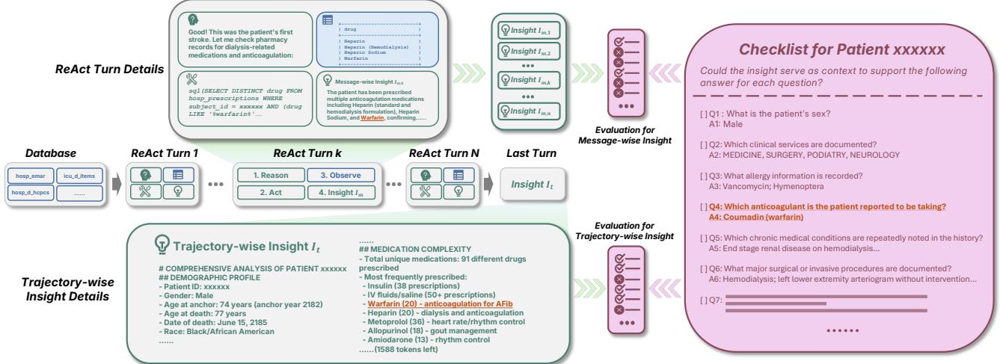  
Figure 3. A case of Claude Sonnet 4.5’s trajectory and evaluation checklist in the MIMIC scenario of DDR-Bench. Verified fact and supporting insights are underlined. See details of this trajectory in Figure A16. The patient id is anonymised.

## 2.3. Data Collection and Construction

In constructing DDR-BENCH, we select three fundamentally distinct scenarios, each built on a large-scale real-world database and characterised by its own unique analytical challenges. All databases in the three scenarios have structured data and unstructured text. This integration enables the derivation of reliable checklists from the unstructured components, which are then used to assess the quality of insights obtained through autonomous exploration of the structured data.To produce reports containing high-quality insights, models need to observe the data, adaptively set investigative goals based on the underlying data patterns, and conduct in-depth analysis and interpretation of the phenomena represented by the data. This process goes well beyond simple data retrieval, aggregation, or question answering. Scenarios in DDR-Bench include: 1) MIMIC-IV (Johnson et al., 2023), which is a large-scale deidentified EHR database covering patients admitted to the emergency department or intensive care units at Beth Israel Deaconess Medical Centre in Boston, MA. The Hosp and ICU modules are retained as structured tables, while the unstructured clinical narratives in the note module are used to derive checklists. A total of 100 patients are uniformly sampled with stratification by note count, ensuring coverage of both simple and highly complex clinical courses. This setting requires LLMs to reason across multiple tables, perform multi-step analyses to reconstruct complete care trajectories while distilling clinically meaningful insights. 2) GLOBEM (Xu et al., 2022), which is a Sport and Exercise Psychology database that combines structured wearable sensor signals with participant surveys on social well-being and mental health. The database contains rich longitudinal records and provides a representative setting for time series analysis. Agents are required to identify temporal patterns across heterogeneous modalities, including Bluetooth, walking activity, Wi-Fi, and sleep signals, and to perform cross-domain reasoning that links behavioural regularities to psychological states. Only daily-level raw data are used, as other wearable data in the database are aggregated or derived from these raw signals. After sampling and filtering, 91 users with nontrivial temporal behaviour patterns are retained as task entities. Although GLOBEM does not include unstructured text, insight-level facts can still be derived from survey responses, such as comparisons of psychological and social well-being before and after the intervention. This transformed data construction challenges whether an LLM genuinely understands activity data and can reason across domains about participants’ mental states, rather than merely fitting numerical values through simple regression. 3) 10-K, which is constructed from annual reports of publicly listed United States companies obtained through the official publicly available SEC API 2. The structured component comprises XBRLformatted financial statements, while the unstructured component consists of cleaned textual sections that are closely aligned with the financial data, such as Business Description, Selected Financial Data, and Quantitative and Qualitative Disclosures About Market Risk (Items 1, 6, 7A, 8 and others). A total of 100 representative companies are selected, each with complex financial statements and more than 5, 800 distinct financial facts. In this domain, LLMs are required to implicitly build financial models through explorative analysis and synthesise their findings into coherent natural language assessments of firms’ economic conditions. Across the three domains, there are 291 task entities in total (shown in Table 1). DDR-BENCH prevents data contamination by separating trajectory generation from evaluation, as no questions are posed to the LLM during data exploration. Data are further anonymised by rewriting column names and metadata without altering their meaning. Empirical analysis shows that hallucinations (see details in Section 7), where the models perform poor database interactions yet produce correct insights from memorised knowledge, are extremely rare, and the hallucination ratio and evaluation accuracy are not statistically correlated.

Table 1. Key statistics of the DDR-Bench. A checklist item denotes a fact that is used to evaluate the quality of model-mined insights.  
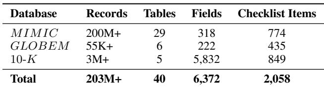

## 2.4. Evaluation

Evaluating deep data research presents a fundamental challenge because models are expected to generate unconstrained insights through exploratory interaction rather than produce fixed responses to predefined questions. Traditional evaluation paradigms for data exploration and report generation exhibit several shortcomings. First, they rely on constructed questions with corresponding answers and assess correctness, which fails to capture the complex relationships among data, reports, and insights. Second, they embed multiple implicit research objectives within detailed instruction prompts, which undermines the open setting and prevents a proper assessment of model agency in investigative intelligence. Third, they depend on subjective report level scores or indirect factual checks, such as validating code execution results, neither of which directly examines whether the reported insights are faithful to the underlying data. To overcome these limitations, we adopt a checklist evaluation framework over hybrid structured databases. For each database, verifiable factual statements are extracted from unstructured components using GPT-5 mini (OpenAI, 2025) and organised into a fact checklist. We apply GPT-5 mini and use this checklist to evaluate whether an insight offers sufficient contextual evidence to support each fact (See details in Appendix H.4). Human expert screening is performed to ensure that the mapping from the data domain to the fact domain is surjective, meaning that every checklist item can be supported by analysing some subset of the database. More than fifty domain experts participate in screening to confirm that each fact is reasonably explorable and inferable from the corresponding data. Each fact is subsequently further evaluated through both manual verification and LLM-based checking. This process results in three data domains comprising 291 task entities and 2,058 verified checklist items, each linked to one or more queryable database components, ensuring that the checklist is objective, verifiable, and defined at the level of individual samples rather than through global subjective judgements. In evaluation, for open-ended checklists such as MIMIC and 10-K, GPT-5-mini assesses whether collected insights support each fact, and accuracy is computed as the proportion of supported items. For closed-form checklists such as GLOBEM, GPT-5-mini answers checklist questions using the collected insights as context, and the responses are compared against ground truth to compute accuracy. Checklist categories and representative examples from each domain are presented in Section A and C, and an evaluation example is shown in Figure 3. By relying on objective checklists rather than subjective rubrics, the evaluation avoids disagreement among human judges and directly targets verifiable data exploration and insight interpretation.

## 3. Benchmark Results

We benchmark a broad set of proprietary LLMs (Anthropic, 2025; OpenAI, 2025; Comanici et al., 2025) and opensource LLMs (team, 2025; Team, 2025a;b; MiniMax AI, 2025; Yang et al., 2025a; Qwen et al., 2025; Grattafiori et al., 2024). We report both accuracy (§3.1) and novelty (§3.2).

## 3.1. Overall Performance

We report four types of accuracy, combining the average over all task entities (Sample-Averaged) or all checklist fact items (Item-Averaged) with message-wise insights Im and trajectory-wise insights It, as shown in Table 2. Multiple proprietary and open-source models were evaluated, and to date, only Claude 4.5 Sonnet achieves an average accuracy above 40%. While leading proprietary LLMs show broadly similar performance across most benchmarks, Claude stands out on DDR-Bench, where its agentic capabilities enable it to surpass models such as GPT and Gemini. Top open-source models, including GLM, Kimi, and Minimax, approach the performance of proprietary LLMs. These findings indicate that deep data research tasks, which closely resemble real-world exploratory behaviour, remain far from saturated by current models. DDR-Bench reduces test-set contamination, even though many of the underlying databases are likely to contain data previously seen by mainstream LLMs. This is achieved by separating execution from evaluation: during execution, models analyse the data without access to any evaluation questions, while evaluation is performed post hoc using checklists that verify the factual support of the generated insights. As the benchmark contains no question-answer-formatted data, it is inherently resistant to data leakage and training-time overfitting. Additionally, the results show that model performance does not necessarily align between Im and It. While Im captures the model’s immediate analysis after each turn of interaction, It reflects its ability to integrate context across the entire trajectory and engage in higher-level global reasoning.

Table 2. Benchmarking results. The best results are highlighted in bold. Accuracy is defined as the proportion of checklist items verifiable from the model-mined insights, reported as either sample-averaged (over task entities) or item-averaged (over checklist items).  
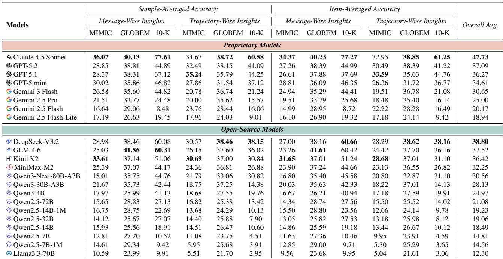

## 3.2. Novelty Analysis

Although DDR-Bench provides a more objective and systematic evaluation than prior open-ended data research benchmarks that rely heavily on subjective LLM-as-a-Judge (Zhang et al., 2025c; Pérez et al., 2025; Zhang et al., 2025a), the inherent nature of open-ended tasks inevitably gives rise to false positive cases. A predefined checklist can never exhaustively enumerate all valid or meaningful insights that a model may generate. Manually annotating every output from every evaluation run would be prohibitively expensive and operationally infeasible, and would also introduce substantial subjective bias. Rather than attempting to eliminate such cases, we analyse these false positive novel insights in a pairwise manner.

For each model and each task entity pair, we extract the message-wise insight Im that are not used in the evaluation of any checklist item and treat them as novel insights. Then we employ GPT-5-mini to perform pairwise comparisons between two models on the same task and entity, determining which model produces more useful novel insights (see prompts in H.3), with ties allowed. To mitigate position and identity bias, model identities are anonymised, and the order of presentation is randomly swapped. The resulting pairwise comparison outcomes are then aggregated into a global ranking using the Bradley-Terry model (Bradley & Terry, 1952). This novelty-based ranking is subsequently compared with the ranking derived from checklist accuracy. Crucially, we frame novelty evaluation as a pairwise comparison of usefulness rather than a pointwise assessment of novelty. Absolute novelty scores are inherently subjective and difficult to define consistently, whereas relative usefulness judgments are more stable and interpretable.

As shown in Figure 4, across all three evaluation scenarios, the ranking induced by novel insight usefulness closely aligns with the ranking based on checklist accuracy. Differences between the two rankings are small, especially among the top-performing models. Further analysis on the number and length of novel insights reveals no systematic relation with these differences. Strong models consistently achieve high checklist accuracy and produce more useful novel insights, regardless of their quantity. This finding highlights a key property of the DDR-Bench evaluation framework. Although checklist-based assessment necessarily covers only a subset of all valid insights, it does not systematically undervalue models that attend to aspects beyond the checklist.

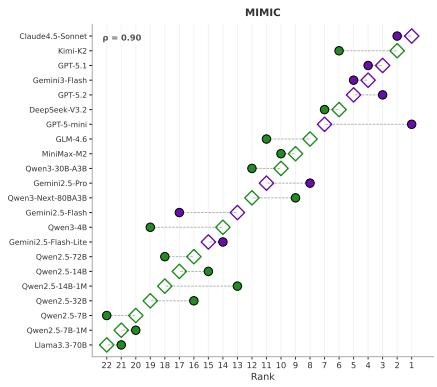

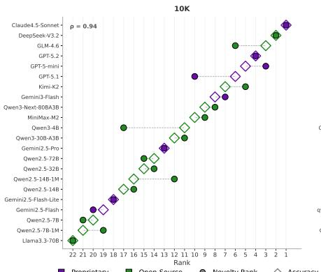

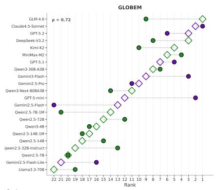  
Figure 4. Ranking correlation between novelty and accuracy on Proprietary and Open-Source LLMs. Circles denote the novelty rank, and diamonds denote the accuracy rank. Models are ordered by accuracy rank in the figure. All three scenarios present high correlation.

Instead, DDR-Bench captures the dominant insight signal. Models with higher checklist scores also tend to generate novel insights that are judged to be more useful.

## 4. Investigatory Dynamics

We study investigatory dynamics in this section, which characterise how models behave under agentic test-time scaling in deep data research. This includes how sustained, multi-step interactions influence performance and capability growth (§4.1), the structure and evolution of exploration patterns that emerge during extended investigations (§4.2), and when models decide to terminate an investigation (§4.3).

## 4.1. Scaling Analysis

## Takeaway

LLMs extract more accurate insights from delaying commitment, and they concentrate reasoning into a small number of highly valuable late-stage interactions. These targeted interactions are built upon longer early exploration.

We analysed model performance under test-time scaling using message-wise insights Im. Each interaction round produces some message-wise insights Im, so the quantity of available insights grows and accuracy gradually increases. As no fixed limit is imposed on the number of interaction rounds, leaving the decision of when to stop exploration entirely to the model, the resulting scaling curves also reflect each model’s own assessment of exploration completeness. Some models terminate exploration prematurely despite clear potential for further improvement. The final scaling curves represent the results averaged over all task entities, while the distribution of trajectory lengths (interaction turns) is provided in Appendix D. Test-time scaling is examined from three perspectives: interaction scaling, token scaling, and cost scaling, as shown in Figure 1.

Interaction Scaling. Model performance generally follows a sigmoid-shaped trajectory, eventually reaching saturation. While this overall pattern is expected, substantial variation appears in the timing and ceiling of improvement across models. Notably, higher-ceiling models often delay entry into the rapid improvement phase, avoiding early collection of practical information, as seen in Claude, GLM, and DeepSeek. Such patterns resemble a plan-then-act strategy, but examination of trajectories indicates that this behaviour does not arise from explicit planning, since DDR-Bench adopts a minimalism design with no planning prompts; also, the databases are typically too large for comprehensive upfront planning. Instead, it reflects implicit planning manifested through interaction dynamics: although no single response explicitly articulates a plan, the sequence of reasoning steps and function calls unfolds as if guided by a predefined plan. Although each action depends on incrementally acquired observations from the database, and is subject to contingencies such as missing values or tool call failures, strong models navigate these uncertainties while preserving the overall exploratory trajectory consistent with an implicit plan.

Token Scaling Scaling by costed tokens, encompassing all LLM input and output tokens along the exploration trajectory, reveals a different perspective. Token consumption per interaction varies across exploration stages. Under this view, scaling curves shift from a sigmoid shape to one that is initially flat, and then sharply increasing, without clear saturation, highlighting the disproportionately high value of tokens in the final stage. Early broad queries capture readily accessible insights, whereas later-stage gains depend on synthesising accumulated experience and issuing a few highly effective queries. These final tokens signal a shift from breadth-oriented to depth-first exploration. Notably, token consumption is dominated by environmental feedback, specifically, tool execution results from the database. Therefore, the most valuable late-stage tokens are few, indicating that performance gains arise from deep, targeted queries rather than exhaustive search. Analysis of concrete cases shows that top-tier models intensively explore and verify specific hypotheses, issuing complex tool parameters while receiving minimal feedback, often binary responses, since the query or code itself encodes the verification logic. This effect is also indirectly reflected in tool call latency, where the best performing models do not exhibit the longest average tool invocation time, but instead maintain a moderate level (see details in Appendix F).

Cost Scaling Model cost is determined by input and output token unit prices, and partly correlated with training and serving expenses. This perspective allows all scaling curves to be fairly compared by accounting for the cost of intelligence. Claude is the most expensive but consistently achieves the highest performance, whereas DeepSeek demonstrates particularly strong cost-effectiveness. A nonuniform horizontal axis illustrates that intelligence gains frequently entail exponential cost increases. Effective model optimisation, through reduced training costs and improved inference-time scaling efficiency, can shift the entire cost scaling curve leftward by multiple orders of magnitude. For example, in the 10-K scenario, both model pairs show similar scaling trends, but at comparable performance levels, Gemini is an order of magnitude cheaper than GPT, and so is DeepSeek compared to GLM. Moreover, efficient models maintain a high rate of effective exploration while producing sufficient exploration steps and insights. This is defined as the valid insight ratio, namely the proportion of interaction rounds that genuinely yield insights among all interactions. See Appendix E for details.

## 4.2. Exploration Patterns

## Takeaway

Advanced LLMs tend to operate in a balanced exploration regime that combines adequate coverage with focused access. Such a regime is consistently observed across different scenarios.

To examine interaction behaviour in greater detail, we visualise model exploration patterns, as shown in Figure 5. The vertical axis reports database coverage, defined as the proportion of distinct fields accessed relative to the total number of available fields. The horizontal axis represents exploration entropy, which captures how uniformly a model distributes its access across fields during exploration. To make this quantity comparable across databases of different sizes, we adopt Normalised Exploration Entropy. Let F = f1, f2, . . . , fn denote the set of n distinct fields accessed by a model, and let ci be the number of times field fi is accessed. The total number of accesses is N = Pni=1 ci, yielding an access probability pi = ci/N for each field. The entropy of this access distribution is H = − Pni=1 pi log2 pi . We normalise this value by the maximum possible entropy Hmax = log2 n, which is attained under uniform access, obtaining a normalised exploration entropy in the range (0, 1]:

$$
\tag{1}
$$

This visualisation jointly characterises exploration breadth and depth. Higher coverage indicates broader exploration across the database, whereas lower entropy reflects more concentrated access patterns, corresponding to deeper, more targeted exploration. Each point represents a single task entity, and point transparency encodes the checklist accuracy achieved for that instance. We omit GLOBEM here since it prioritises algorithm generation, and all models almost always access all fields, which obscures meaningful analysis on exploration patterns from a field-access perspective.

Despite substantial variation in task settings and database scales, most models exhibit remarkably consistent exploration patterns. Claude and GPT, in particular, show balanced behaviour with low variance across instances, suggesting stable internal exploration strategies. In contrast, GLM displays remarkably higher variance, indicating strong heterogeneity across trajectories. For weaker models, the visualisation directly exposes the mechanisms underlying their inferior performance. Qwen and Gemini, for example, tend to access a limited subset of fields, reflecting insufficient exploration breadth, while simultaneously exhibiting high entropy, indicating a lack of focused, selective access even within the fields they explore. The colour gradient further reveals a clear and robust trend, especially on MIMIC. Instances with balanced exploration patterns that avoid extreme coverage or entropy are consistently associated with higher checklist accuracy across all models. This finding provides empirical support for the implicit planning hypothesis discussed in Section §4.1. Strong LLMs can maintain a coherent and robust internal exploration plan across diverse observations, whereas weaker models fail either by exploring too narrowly or by distributing attention too diffusely.

## 4.3. Self-Termination

We further examine the model’s self-termination behaviour, namely the point at which an LLM judges that sufficient information has been gathered and exploration should cease. All trajectories generated by the Qwen family are collected, and the probability of directly emitting exploration termination tokens after different numbers of turns is measured as 1N PNi=1 log P (ti | t1, t2, . . . , ti−1, Tpartial), where N 1 denotes the length of the finish tokens and Tpartial is a trajectory prefix containing varying numbers of turns. The results are shown in Figure 6. Clear differences emerge across model generations. Qwen3 and Qwen3-Next exhibit a consistently increasing probability, indicating growing confidence that a complete report can be produced as more information is accumulated, whereas the Qwen2.5 series shows pronounced fluctuations and remains uncertain about whether exploration can be terminated at the current step. Moreover, Qwen3-Next maintains higher confidence with lower variance throughout, suggesting that it has more confidence that exploration is progressing towards a more comprehensive and deeper report.

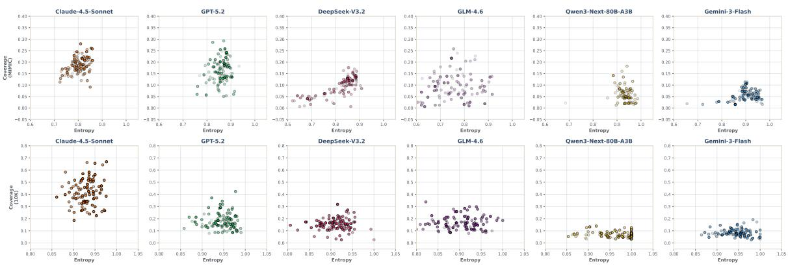  
Figure 5. Exploration patterns of different models. The x-axis denotes exploration entropy, reflecting the depth of the model’s search over the database, while the y-axis represents database coverage, indicating the breadth of the search.

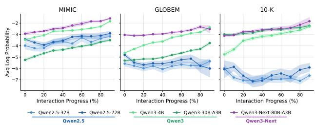  
Figure 6. Self-termination visualisation on the Qwen family.

## 5. Module Analysis

Third, we examine how various module choices shape behaviour, including training techniques (§5.1) and different agent designs (§5.2).

## 5.1. Study on Training Factors

## Takeaway

Scaling is not enough. Meaningful agency require a systematic agentic-first training strategy, including targeted pre-training and reinforcement learning.

We further analyse how different training-time technical choices would affect the model’s investigatory intelligence in the Qwen family (Qwen et al., 2025; Yang et al., 2025a). Qwen offers a wide range of open-source models across multiple versions and scales, which makes it suitable for analysing within a single model family. The results are shown in Figure 7.

We first examine the effect of parameter scaling. Increasing model size yields only marginal improvements in accuracy. Even a tenfold increase in the number of parameters results in less than a 3% gain in final accuracy, and in several settings, smaller models even outperform their larger counterparts. In the case of Qwen2.5 models without explicit agent-oriented training, scaling parameters alone do not enhance proactive exploration and therefore fail to meaningfully strengthen agency.

We then compare the long-context variants of Qwen2.5 at the 7B and 14B scales. Extending the context window does not consistently improve overall performance, nor does it lead to a systematic increase in the number of interaction rounds. Combined with the parameter scaling results above, this suggests that although larger model sizes and longer context lengths are often assumed to facilitate multi-turn agent behaviour, neither factor plays a decisive role in determining agentic capability in deep data research.

Finally, we examine models from different generations, namely Qwen3 and Qwen3-Next, with activated parameter sizes of 4B and 3B, respectively. Despite having fewer activated parameters, both models exhibit a clear increase in the number of exploration rounds on both MIMIC and 10-K. On GLOBEM, the number of exploration rounds remains largely unchanged; however, the models achieve a higher performance ceiling. Taken together, these cross-generation results indicate that improvements in agentic behaviour are primarily driven not by scale, but by a systematic emphasis on reasoning and agentic ability throughout the training pipeline, encompassing both pre-training and post-training stages (Yang et al., 2025a).

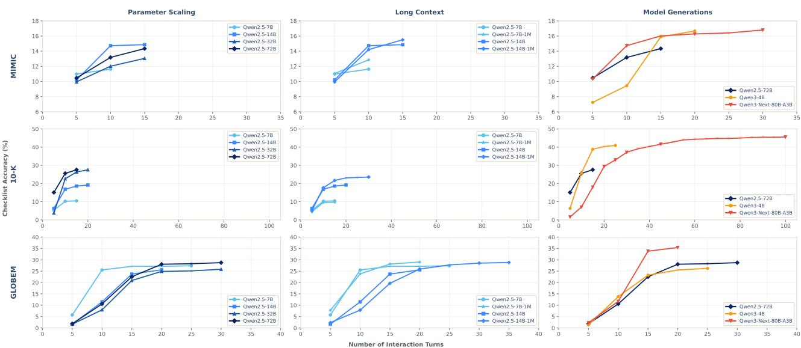  
Figure 7. Training-time factors study within the Qwen family. From left to right, the three columns examine inference-time scaling performance across all scenarios for models with different parameter scales, different context optimisation methods, and different model generations with different training strategies.

## 5.2. Agent Module Analysis

## Takeaway

Agent modules mainly reshape interaction patterns rather than reliably enhancing insight discovery. Agency in deep data research emerges from stable, implicit coordination between reasoning and open-ended exploration.

We conduct an empirical analysis of several agent modules to examine how these capabilities interact with agentic LLMs to maximise effective agency in deep data research.

Reasoning We increase the reasoning budget of Qwen3- Next-80B-A3B, making it generate more reasoning tokens per interaction round, and evaluate the resulting performance changes. Examination of individual trajectories shows that in many cases the model produces explicit reasoning tokens primarily in the initial rounds, after which it mainly issues tool invocations. Parts of the reasoning are instead implicitly encoded in tool call arguments, such as comments embedded in generated code. This results in an extremely low average number of explicit reasoning tokens, particularly on 10-K and GLOBEM. As reported in Table 3, increasing the reasoning budget substantially raises the average number of reasoning tokens while remarkably reducing the number of interaction rounds. This pattern aligns with expectations, as more detailed reasoning in each round enables more comprehensive data queries, thereby improving efficiency and lowering the total number of interactions. Nonetheless, the final performance metrics show significant fluctuations, indicating a trade-off between reasoning depth and interaction frequency, where neither extreme achieves optimal performance. Information loss can occur when shifting between increased reasoning and increased interaction, suggesting that reasoning and interaction should be treated as dynamically adaptive capabilities of LLMs rather than fixed settings in agent scaffolding.

Table 3. Comparison of reasoning-token usage, interaction efficiency, and performance under different reasoning budgets for Qwen3-Next-80B-A3B.  
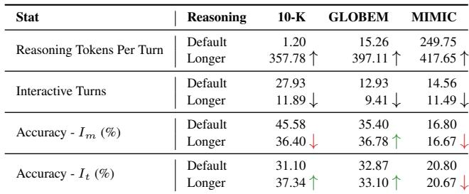

Memory DDR-Bench adopts a minimal ReAct Agent design to benchmark a base model’s intrinsic capabilities without interference from external agent frameworks. It operates without any memory mechanism, instead providing the full agent trajectory to the LLM without omission. To examine the effectiveness of memory, comparative experiments on Qwen3-Next-80B-A3B were conducted using a commonly adopted memory mechanism that summarises long trajectories into a local note. This note can be read and updated by the LLM as long-term memory, while retaining only the most recent turns as short-term memory. As shown in Table 4, this long-short-term memory setup makes model behaviour highly unpredictable. Although the note offers a denoised summary and reduces long-context interference, properties that might be expected to encourage more effective exploration, analysis of trajectories reveals that it often induces more aggressive tool-use. In particular, the model tends to read more data per interaction and terminate exploration earlier. This explains several counter-intuitive patterns, such as the reduction in the number of interaction rounds when memory is enabled on 10-K and MIMIC. Moreover, despite access to a summarised history, the agent frequently consumes more tokens overall due to extended exploration within individual rounds and an aggressive datareading strategy. This accounts for the increased token usage in the 10-K scenario, even when the number of exploration rounds does not increase. Overall, the memory mechanism does not consistently improve final accuracy. While agent frameworks can provide training-free performance gains, their effectiveness is highly sensitive to design choices and typically requires careful, case-specific design.

Table 4. Effect of a long–short-term memory mechanism on the behaviour and performance for Qwen3-Next-80B-A3B.  
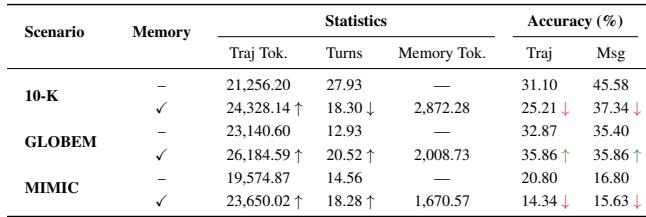

Reactive vs. Proactive DDR-Bench adopts a query-free, proactive exploration paradigm to assess LLM agency. We additionally implement a conventional reactive variant, in which each checklist item is converted into an explicit user query, resulting in goal-directed and reactive data exploration. Experiments with this variant on Qwen3-Next-80B-A3B, reported in Table 5, show a substantial improvement in accuracy in most settings, indicating that the model performs markedly better when provided with clearly specified objectives. This contrast highlights that requiring the model to autonomously identify and prioritise goals poses a significantly more demanding challenge, and thus more directly probes its agentic capabilities. At the same time, the observed gains suggest that, under explicit objectives, the underlying tasks are in principle solvable rather than ill-defined or artificial. Nevertheless, the improvements do not reach full correctness, and performance even degrades in certain cases, reflecting inherent model limitations, as the presence of a clearly defined goal does not guarantee successful task completion.

Table 5. Comparison of proactive (query-free) and reactive (goaldirected) exploration on Qwen3-Next-80B-A3B.  
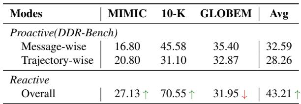

## 6. Failure Modes

In this section, we sampled and manually analysed the failure modes of models. We collect evaluation results from all models across all scenarios, then extract them at the granularity of checklist items. From the items evaluated as incorrectly supported by the model’s insight, we randomly sampled instances and linked each item to its corresponding trajectory, It, and Im. We then manually annotated the reasons why the insights didn’t correctly support the fact item. In total, 206 items were annotated.

We categorise the main errors into eight primary classes, which are discussed below. 1) Failure in Exploration, such as errors arising from insufficient breadth or insufficient depth during database exploration. Limited breadth means that the model did not cover the necessary data sources, such as relevant tables or key data fields. It is mainly caused by premature self-termination of the exploration. Limited depth, by contrast, occurs when the model finds relevant data but does not delve deeper and develop more complex queries to extract more complex insights. 2) Poor Data-to-Insight Ability, which reflects the deficiencies in the pipeline from raw data to statistics and ultimately to insights. The LLMs may stop at descriptive statistics without further interpretation (superficial analysis), draw wrong conclusions from the statistics (insight misinterpretation), or, on the contrary, engage in over-reasoning, imposing strong assumptions or causal claims that are not supported by the data. 3) Lost in the Context is particularly prevalent among smaller LLMs, that trajectories are polluted by repetitive or unproductive behaviours, such as repeated debugging in function calls, failures in instruction following, or making summaries in It but missing key points discovered during exploration (fail in summarisation).

As shown in Figure 8, our findings revealed that 58% of errors stemmed from insufficient exploration, both in terms of breadth and depth. This imbalance in exploration often leads to suboptimal results, regardless of the model’s overall capability. Additionally, around 40% of the errors were attributed to other factors. For more powerful models, overreasoning was common, where the model made assumptions not fully supported by the data. In other cases, models misinterpreted the insights, such as mistaking a downward trend for an upward one. Less capable models, on the other hand, tended to make more fundamental errors, such as repeatedly debugging or struggling with missing data, which could disrupt the overall coherence of the analysis.

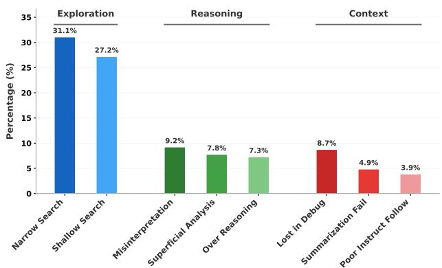  
Figure 8. Distribution of manually annotated error types across models and task scenarios.

## 7. Hallucination Evaluation

Table 6. Hallucination rates (%) across models in DDR-Bench, measured as the proportion of insights containing factual but unfaithful information that are not derivable from the provided inputs.  
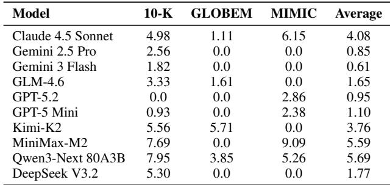

We conducted sampling at the granularity of insights for labelling the possible hallucination, namely, the model generates a factually correct insight with limited or wrong observations from the database. We select from the most recently released models within each model family, as these models are most likely to contain data contamination that could lead to hallucinations. In total, 1,850 insights were randomly sampled for annotation. We pair these insights with all inputs used to produce them, namely the system prompt, model reasoning, function calls, and the database results returned after execution, and checked whether any insight contained facts that were correct but could not be inferred from the available inputs. If a model had memorised relevant information due to data contamination, such cases would manifest as unfaithful but factual hallucinations, thereby distorting benchmarking results. We computed the proportion of insights exhibiting this behaviour, as reported in Table 6.

For most models, the hallucination rate is zero, while for the remaining models it stays below 5%. Many of these cases involve highly fine-grained entity-level hallucinations that do not affect overall insight judgment or benchmarking outcomes. A common pattern in the 10-K setting is the attribution of financial changes to real-world background events such as acquisitions, even when such information is not supported by the input data. This does not affect evaluation because scoring is based solely on conclusions derivable from the data, and external real-world associations receive no additional credit. Another frequent pattern appears in the MIMIC setting, where medication lists are incomplete due to the use of LIMIT in SQL outputs, and models infer additional drugs based on the diagnosed condition and common treatment combinations. While this behaviour likewise does not change evaluation scores, it poses potential risks in healthcare contexts. To mitigate such risks, each insight in DDR-Bench is explicitly linked to its full ReAct trace, including reasoning, tool calls, and execution results. This enables practitioners to verify references for each insight in real-world deployments.

We observe that hallucinations are largely absent in the GLOBEM dataset, likely because its structured and unstructured components originate from distinct domains, namely wearable data and psychological surveys, making crossdomain memorisation less applicable. Overall, hallucination rates on DDR-Bench are very low and have minimal impact on benchmarking results. Although larger models may theoretically retain more memorised knowledge, they also exhibit stronger instruction following and adhere more reliably to system prompts that restrict analysis to patterns observable in the provided data. Moreover, when considered alongside final accuracy, higher hallucination rates do not translate into gains in accuracy. Hallucination rates show extremely weak and non-significant correlations with accuracy (see details in Section G).

## 8. Trustworthiness on the LLM-as-a-Checker

Table 7. Stability and reliability of LLM-as-a-Checker evaluation in DDR-Bench across repeated runs and scenarios.  
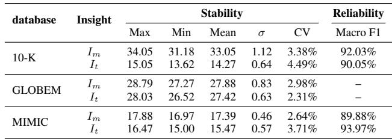

Because DDR-Bench adopts an LLM-as-a-Checker evaluation paradigm, we follow a methodology closely aligned with HealthBench (Arora et al., 2025) and conduct a systematic assessment of its stability and reliability. We emphasise that, in DDR-Bench, the LLM evaluates model-generated insights by matching them against objective ground truth. It does not operate as an LLM-as-a-Judge in settings without ground truth, nor does it rely on subjective, rubric-based criteria. This design choice is intentional and ensures a high degree of objectivity and fairness in the evaluation process.

Specifically, we randomly sample about 10% of the data across all models and scenarios and repeat the evaluation five times. As reported in Table 7, the coefficients of variation across all settings are consistently below 5% for both insight types, demonstrating strong score stability under repeated evaluation. To further assess reliability, we manually annotate sampled trajectories from the MIMIC and 10-K scenarios and compare human annotations with LLM-generated scores. We do not conduct this comparison for GLOBEM, as it involves a closed-form evaluation and does not require an additional reliability check. The resulting macro F1 scores are consistently around 90%. These results provide strong empirical evidence that the LLM-as-a-Checker employed in DDR-Bench is both stable and reliable.

We further analyse the remaining discrepancies between LLM-as-a-Checker and human judgment. Two primary sources of inconsistency are identified. First, the LLM tends to apply overly strict criteria, requiring insights to explicitly include specific numerical values or statistics. Although these numbers are correctly retrieved by the models, they are often omitted in the final insights because the models are instructed to describe the underlying phenomena rather than enumerate individual figures. Second, in a small number of cases, the LLM produces correct intermediate reasoning but arrives at an incorrect final judgement.

## 9. Related Work

LLM and Agent for Data Intelligence LLMs are increasingly positioned as data analysts and data science agents, reshaping how humans query and manipulate data (Tang et al., 2025; Chen et al., 2025a; Zhou et al., 2025; Sun et al., 2025; Qiao et al., 2025; Qiu et al., 2026). Early work mainly treats data intelligence as answering user specified queries, through table question answering and text to SQL over benchmarks such as WikiTableQuestions, FeTaQA, HybridQA, Spider, and BIRD (Pasupat & Liang, 2015; Nan et al., 2022; Chen et al., 2020; Yu et al., 2018; Li et al., 2023). Subsequent systems move from answers to executable analysis code and visualisations, as in DS 1000 and LLM4DS (Lai et al., 2023; Nascimento et al., 2024), and introduce agents specialised for plotting and database interaction (Yang et al., 2024; Xue et al., 2023; Wang et al., 2020; Pan et al., 2025). More recent work begins to automate broader data science workflows and proposes agent based benchmarks such as LAMBDA, DataSciBench, and DABStep to evaluate endto-end behaviour (Li et al., 2025; Hong et al., 2025; Zhang et al., 2025a; Salemi et al., 2025; Egg et al., 2025; Guo et al., 2024a; Hollmann et al., 2023; Testini et al., 2025). Systems like DeepAnalyze and I2I STRADA go further by letting an agentic LLM conduct open-ended workflows over databases and produce narrative reports (Zhang et al., 2025c; Sundar et al., 2025). Across this line of work, however, either the data problem is still typically posed in advance and evaluation emphasises subjective metrics of report quality, or the report evaluation is transformed into closed-form questions by prompting LLMs. In contrast, DDR-Bench starts from the data alone and asks what an agent can discover, measuring its ability to mine concrete, fact-checked insights rather than simply data statistics.

Proactive Agentic AI Agentic AI studies language model agents that reason, plan, and act through tools and multistep control, with frameworks such as ReAct and survey work systematising architectures and evaluation (Yao et al., 2023; Plaat et al., 2025; Wang et al., 2025a; 2024; Guo et al., 2024b; Yehudai et al., 2025). Within this space, a significant theme is proactivity. User-facing agents in visual analytics, mobile interaction, video viewing, and professional workflows monitor activity streams and decide when to intervene to anticipate needs while avoiding unnecessary disruption (Zhao et al., 2025; Wen et al., 2025; Yang et al., 2025b; Wang et al., 2025c; Lu et al., 2025b; Zhang et al., 2024). In these settings, the environment is a user-centred trace. Proactivity is defined as the inference and fulfilment of the user’s immediate goals. From a more abstract perspective, however, a user activity stream is just one kind of data, and “user intent” is just one kind of latent insight that can be inferred from it. A complementary line of work pushes toward open-ended investigation: curiosity inspired and intrinsically motivated methods encourage agents to seek novel states or patterns, and deep research benchmarks ask agents to conduct unconstrained research over the web using search and browsing tools (Dai et al., 2025; Wong et al., 2025; Wan et al., 2025; Yao et al., 2025; Zheng et al., 2025). These efforts implicitly adopt a more general notion of proactivity as autonomous insight seeking. Still, their evaluations usually collapse behaviour into global scores for answers or long reports, often using language models as judges. DDR-Bench builds on this generalised view. It treats any data environment, rather than the user alone, as the primary object of investigation, views user intent inference as just one special case of insight discovery, and instantiates this perspective in a setting where agents must decide for themselves what to investigate and are scored by a checklist-based, per-sample fact-checking of the insights they claim to have found.

Open-Ended Data Analysis Prior work has explored the use of LLMs for open-ended data analysis, yet a principled methodology for benchmark construction remains largely absent. Vykhopen et al. (2025) relies on indirect evaluation signals, such as report writing time and qualitative comparisons against a human expert’s report, but it does not introduce automated and direct metrics for assessing the quality of extracted insights. Lei et al. (2025) adopts subjective evaluation by LLMs together with multi-level rubrics, and additionally collects baseline reports to compute GSB. However, it still does not directly evaluate insight quality. More importantly, it specifies detailed data exploration objectives for each test case, which means the setting is not truly open-ended data analysis. Sahu et al. (2024) alters the data distribution by manually injecting anomalous patterns as predefined insights to be discovered, resulting in a setup that more closely resembles information retrieval than genuine open-ended analysis. Egg et al. (2025); Zhang et al. (2025c) employ LLM-as-a-Judge and relies on subjective or indirect checklists, such as content relevance, professionalism of organisation and formatting, and the presence of data visualisations. Islam et al. (2024) similarly uses LLM-as-a-Judge to conduct pairwise comparisons along dimensions such as Informativeness, Clarity and Coherence. Gupta et al. (2025) automatically generates questions using LLMs, and then applies LLMs as judges for scoring, which again falls short of a fully open-ended setting. Overall, existing benchmarks exhibit varying degrees of limitation in terms of openness, data scale, and whether insight quality is evaluated directly. Their analyses also concentrate primarily on final accuracy, and therefore cannot provide fine-grained analyses of exploration trajectories in the way that DDR-Bench does.

## 10. Conclusion

DDR-Bench establishes a rigorous framework for evaluating investigatory intelligence, revealing that the transition from reactive execution to proactive discovery relies less on external scaffolding or simple parameter scaling, and more on intrinsic exploration strategies that balance breadth with targeted reasoning. Our findings highlight a critical distinction between executional and investigatory capabilities, observing that effective agency emerges from implicit planning and the autonomous determination of termination criteria rather than rigid workflows. As the field advances, this underscores the necessity of moving beyond query-response alignment toward training paradigms that cultivate end-toend autonomy, enabling agentic LLMs to not only answer but proactively define goals and pursue them to derive useful insights from large-scale data.

## 11. Impact Statement

This paper introduces DDR-Bench to advance the field of autonomous data science and investigatory intelligence.

Data Compliance and Privacy. Our benchmark integrates diverse real-world datasets. We strictly adhere to all relevant data use agreements and ethical regulations, particularly for the medical subset, which utilises fully deidentified data accessed under credentialed requirements. No personally identifiable information is processed, ensuring compliance with standard privacy protocols. To ensure openness and transparency, we provide the complete code for running the agents and performing evaluation in the supplementary materials, and we will release this code publicly in the future. Sensitive datasets such as MIMIC and GLOBEM will be made available securely via their hosting platform, PhysioNet, in the form of derived datasets, with access granted only to researchers who have completed the required security certification.

Reliability and Traceability. We conducted a comprehensive analysis of model hallucinations, finding them to be low in our experimental settings (see §7). To further mitigate risks associated with autonomous analysis, DDR-Bench is designed with full traceability as a core principle. Every generated insight is explicitly linked to a specific analysis turn, mapping the claim directly to the executable query (SQL/Python) and the raw environment observation. This structure ensures that all agent-derived conclusions are verifiable and grounded in factual evidence.

Societal Implications. While this work aims to democratize data science, we acknowledge the risk of automation bias. These agents are designed to assist human experts by handling laborious exploration, not to replace human judgment in high-stakes decision-making.

## Acknowledgments

This work was supported in part by the UK Engineering and Physical Sciences Research Council through a Turing AI Fellowship (grant no. EP/V020579/1, EP/V020579/2) and the Prosperity Partnership scheme (grant no. UKRI566). Wei is supported by a PhD studentship provided by King’s College London (KCL). The authors acknowledge the use of Computational Research, Engineering and Technology Environment (CREATE) at KCL, and Inkfish through the EMBRACE research programme.

## References

Anthropic. Model context protocol specification. https: //modelcontextprotocol.io/spec, 2024.

Anthropic. Claude 4.5. https://www.anthropic. com/news/claude-sonnet-4-5, 2025. Introducing Claude Sonnet 4.5, released 29 Sep 2025.

Arora, R. K., Wei, J., Hicks, R. S., Bowman, P., Quiñonero-Candela, J., Tsimpourlas, F., Sharman, M., Shah, M., Vallone, A., Beutel, A., et al. Healthbench: Evaluating large language models towards improved human health. arXiv preprint arXiv:2505.08775, 2025.

Bradley, R. A. and Terry, M. E. Rank analysis of incomplete block designs: I. the method of paired comparisons. Biometrika, 39(3/4):324–345, 1952.

Brown, T., Mann, B., Ryder, N., Subbiah, M., Kaplan, J. D., Dhariwal, P., Neelakantan, A., Shyam, P., Sastry, G., Askell, A., et al. Language models are few-shot learners. Advances in neural information processing systems, 33: 1877–1901, 2020.

Chen, K., Wang, P., Yu, Y., Zhan, X., and Wang, H. Large language model-based data science agent: A survey, 2025a. URL https://arxiv.org/abs/ 2508.02744.

Chen, W., Zha, H., Chen, Z., Xiong, W., Wang, H., and Wang, W. Y. HybridQA: A Dataset of Multi-hop Question Answering over Tabular and Textual Data. In Cohn, T., He, Y., and Liu, Y. (eds.), Findings of the Association for Computational Linguistics: EMNLP 2020, pp. 1026–1036, Online, November 2020. Association for Computational Linguistics. doi: 10.18653/v1/2020. findings-emnlp.91. URL https://aclanthology. org/2020.findings-emnlp.91/.

Chen, Z., Chen, S., Ning, Y., Zhang, Q., Wang, B., Yu, B., Li, Y., Liao, Z., Wei, C., Lu, Z., Dey, V., Xue, M., Baker, F. N., Burns, B., Adu-Ampratwum, D., Huang, X., Ning, X., Gao, S., Su, Y., and Sun, H. ScienceAgentBench: Toward Rigorous Assessment of Language Agents for Data-driven Scientific Discovery. In The Thirteenth International Conference on Learning Representations, ICLR 2025, Singapore, April 24-28, 2025. OpenReview.net, 2025b. URL https://openreview.net/forum? id=6z4YKr0GK6.

Comanici, G., Bieber, E., Schaekermann, M., Pasupat, I., Sachdeva, N., Dhillon, I., Blistein, M., Ram, O., Zhang, D., Rosen, E., et al. Gemini 2.5: Pushing the frontier with advanced reasoning, multimodality, long context, and next generation agentic capabilities, 2025.

Dai, R., Song, L., Liu, H., Liang, Z., Yu, D., Mi, H., Tu, Z., Liu, R., Zheng, T., Zhu, H., and Yu, D. CDE: Curiositydriven Exploration for Efficient Reinforcement Learning in Large Language Models. CoRR, abs/2509.09675, 2025. doi: 10.48550/ARXIV.2509.09675. URL https:// doi.org/10.48550/arXiv.2509.09675.

Du, M., Xu, B., Zhu, C., Wang, X., and Mao, Z. Deepresearch bench: A comprehensive benchmark for deep research agents. arXiv preprint arXiv:2506.11763, 2025.

Egg, A., Goyanes, M. I., Kingma, F., Mora, A., von Werra, L., and Wolf, T. DABstep: Data Agent Benchmark for Multi-step Reasoning. CoRR, abs/2506.23719, 2025. doi: 10.48550/ARXIV.2506.23719. URL https://doi. org/10.48550/arXiv.2506.23719.

Grattafiori, A., Dubey, A., Jauhri, A., Pandey, A., Kadian, A., Al-Dahle, A., Letman, A., Mathur, A., Schelten, A., Vaughan, A., et al. The llama 3 herd of models. arXiv preprint arXiv:2407.21783, 2024.

Guo, S., Deng, C., Wen, Y., Chen, H., Chang, Y., and Wang, J. Ds-agent: Automated data science by empowering large language models with case-based reasoning, 2024a. URL https://arxiv.org/abs/2402.17453.

Guo, T., Chen, X., Wang, Y., Chang, R., Pei, S., Chawla, N. V., Wiest, O., and Zhang, X. Large language model based multi-agents: A survey of progress and challenges, 2024b. URL https://arxiv.org/abs/ 2402.01680.

Gupta, A., Aggarwal, A., Bithel, S., and Agarwal, A. Bibench: A comprehensive benchmark dataset and unsupervised evaluation for bi systems. In Proceedings of the 63rd Annual Meeting of the Association for Computational Linguistics (Volume 6: Industry Track), pp. 1287–1299, 2025.

Hollmann, N., Müller, S., and Hutter, F. Large language models for automated data science: Introducing caafe for context-aware automated feature engineering. Advances in Neural Information Processing Systems, 36:44753– 44775, 2023.

Hong, S., Lin, Y., Liu, B., Liu, B., Wu, B., Zhang, C., Li, D., Chen, J., Zhang, J., Wang, J., Zhang, L., Zhang, L., Yang, M., Zhuge, M., Guo, T., Zhou, T., Tao, W., Tang, R., Lu, X., Zheng, X., Liang, X., Fei, Y., Cheng, Y., Ni, Y., Gou, Z., Xu, Z., Luo, Y., and Wu, C. Data Interpreter: An LLM Agent for Data Science. In Che, W., Nabende, J., Shutova, E., and Pilehvar, M. T. (eds.), Findings of the Association for Computational Linguistics, ACL 2025, Vienna, Austria, July 27 - August 1, 2025, pp. 19796–19821. Association for Computational Linguistics, 2025. URL https://aclanthology.org/2025. findings-acl.1016/.

Islam, M. S., Laskar, M. T. R., Parvez, M. R., Hoque, E., and Joty, S. Datanarrative: Automated data-driven storytelling with visualizations and texts. arXiv preprint arXiv:2408.05346, 2024.

Johnson, A. E., Bulgarelli, L., Shen, L., Gayles, A., Shammout, A., Horng, S., Pollard, T. J., Hao, S., Moody, B., Gow, B., et al. Mimic-iv, a freely accessible electronic health record dataset. Scientific data, 10(1):1, 2023.

Lai, Y., Li, C., Wang, Y., Zhang, T., Zhong, R., Zettlemoyer, L., Yih, W.-t., Fried, D., Wang, S., and Yu, T. Ds-1000: a natural and reliable benchmark for data science code generation, 2023.

Lei, F., Meng, J., Huang, Y., Zhao, J., Zhang, Y., Luo, J., Zou, X., Yang, R., Shi, W., Gao, Y., et al. Dacomp: Benchmarking data agents across the full data intelligence lifecycle. arXiv preprint arXiv:2512.04324, 2025.

Li, J., Hui, B., Qu, G., Yang, J., Li, B., Li, B., Wang, B., Qin, B., Geng, R., Huo, N., Zhou, X., Ma, C., Li, G., Chang, K. C., Huang, F., Cheng, R., and Li, Y. Can llm already serve as a database interface? a big bench for large-scale database grounded text-to-sqls. 2023.

Li, L., Fang, L., Ludäscher, B., and Torvik, V. I. AutoD-CWorkflow: LLM-based data cleaning workflow autogeneration and benchmark. In Christodoulopoulos, C., Chakraborty, T., Rose, C., and Peng, V. (eds.), Findings of the Association for Computational Linguistics: EMNLP 2025, pp. 7766–7780, Suzhou, China, November 2025. Association for Computational Linguistics. ISBN 979- 8-89176-335-7. doi: 10.18653/v1/2025.findings-emnlp. 410. URL https://aclanthology.org/2025. findings-emnlp.410/.

Lu, W., Zhang, J., Fan, J., Fu, Z., Chen, Y., and Du, X. Large language model for table processing: a survey. Frontiers Comput. Sci., 19(2):192350, 2025a. doi: 10.1007/S11704-024-40763-6. URL https://doi. org/10.1007/s11704-024-40763-6.

Lu, Y., Yang, S., Qian, C., Chen, G., Luo, Q., Wu, Y., Wang, H., Cong, X., Zhang, Z., Lin, Y., Liu, W., Wang, Y., Liu, Z., Liu, F., and Sun, M. Proactive Agent: Shifting LLM Agents from Reactive Responses to Active Assistance. In The Thirteenth International Conference on Learning Representations, ICLR 2025, Singapore, April 24-28, 2025. OpenReview.net, 2025b. URL https: //openreview.net/forum?id=sRIU6k2TcU.

MiniMax AI. Minimax m2: An open-weight moe language model for coding and agentic workflows. https:// github.com/MiniMax-AI/MiniMax-M2, 2025. Open-source model; 230B total parameters (10B active), sparse MoE transformer, released 27 Oct 2025.

Nan, L., Hsieh, C., Mao, Z., Lin, X. V., Verma, N., Zhang, R., Krysci ´ nski, W., Schoelkopf, H., Kong, R., Tang, X., ´ Mutuma, M., Rosand, B., Trindade, I., Bandaru, R., Cunningham, J., Xiong, C., and Radev, D. FeTaQA: Free-form table question answering. Transactions of the Association for Computational Linguistics, 10:35– 49, 2022. doi: 10.1162/tacl\_a\_00446. URL https: //aclanthology.org/2022.tacl-1.3/.

Nascimento, N., Guimaraes, E., Chintakunta, S. S., and Boominathan, S. A. Llm4ds: Evaluating large language models for data science code generation, 2024. URL https://arxiv.org/abs/2411.11908.

OpenAI. Introducing ChatGPT, 2022. URL https:// openai.com/blog/chatgpt.

OpenAI. GPT-4 Technical Report. CoRR, abs/2303.08774, 2023. doi: 10.48550/ARXIV.2303.08774. URL https: //doi.org/10.48550/arXiv.2303.08774.

OpenAI. Gpt-5 system card. Technical report, OpenAI, August 2025. URL https://cdn.openai.com/ gpt-5-system-card.pdf.

Pan, B., Fu, Y., Wang, K., Lu, J., Pan, L., Qian, Z., Chen, Y., Wang, G., Zhou, Y., Zheng, L., Tang, Y., Wen, Z., Wu, Y., Lu, J., Zhu, B., Zhu, M., Zhang, B., and Chen, W. VIS-Shepherd: Constructing Critic for LLM-based Data Visualization Generation. CoRR, abs/2506.13326, 2025. doi: 10.48550/ARXIV.2506.13326. URL https: //doi.org/10.48550/arXiv.2506.13326.

Pasupat, P. and Liang, P. Compositional semantic parsing on semi-structured tables. In Zong, C. and Strube, M. (eds.), Proceedings of the 53rd Annual Meeting of the Association for Computational Linguistics and the 7th International Joint Conference on Natural Language Processing (Volume 1: Long Papers), pp. 1470–1480, Beijing, China, July 2015. Association for Computational Linguistics. doi: 10.3115/v1/P15-1142. URL https://aclanthology.org/P15-1142/.

Pérez, A. S., Boukhary, A., Papotti, P., Lozano, L. C., and Elwood, A. An llm-based approach for insight generation in data analysis. arXiv preprint arXiv:2503.11664, 2025.

Plaat, A., van Duijn, M. J., van Stein, N., Preuss, M., van der Putten, P., and Batenburg, K. J. Agentic Large Language Models, a survey. CoRR, abs/2503.23037, 2025. doi: 10.48550/ARXIV.2503.23037. URL https://doi. org/10.48550/arXiv.2503.23037.

Qiao, S., Zhao, Y., Qiu, Z., Wang, X., Zhang, J., Bin, Z., Zhang, N., Jiang, Y., Xie, P., Huang, F., et al. Scaling generalist data-analytic agents. arXiv preprint arXiv:2509.25084, 2025.

Qiu, Z., Qiao, S., Xu, K., Zhu, Y., Du, L., Zhang, N., and Chen, H. Rewarding the scientific process: Process-level reward modeling for agentic data analysis. arXiv preprint arXiv:2604.24198, 2026.

Qwen, :, Yang, A., Yang, B., Zhang, B., Hui, B., Zheng, B., Yu, B., Li, C., Liu, D., Huang, F., Wei, H., Lin, H., Yang, J., Tu, J., Zhang, J., Yang, J., Yang, J., Zhou, J., Lin, J., Dang, K., Lu, K., Bao, K., Yang, K., Yu, L., Li, M., Xue, M., Zhang, P., Zhu, Q., Men, R., Lin, R., Li, T., Tang, T., Xia, T., Ren, X., Ren, X., Fan, Y., Su, Y., Zhang, Y., Wan, Y., Liu, Y., Cui, Z., Zhang, Z., and Qiu, Z. Qwen2.5 technical report, 2025. URL https: //arxiv.org/abs/2412.15115.

Sahu, G., Puri, A., Rodriguez, J., Abaskohi, A., Chegini, M., Drouin, A., Taslakian, P., Zantedeschi, V., Lacoste, A., Vazquez, D., et al. Insightbench: Evaluating business analytics agents through multi-step insight generation. arXiv preprint arXiv:2407.06423, 2024.

Salemi, A., Parmar, M., Goyal, P., Song, Y., Yoon, J., Zamani, H., Palangi, H., and Pfister, T. LLM-based Multi-agent Blackboard System for Information Discovery in Data Science. CoRR, abs/2510.01285, 2025. doi: 10.48550/ARXIV.2510.01285. URL https://doi. org/10.48550/arXiv.2510.01285.

Sumers, T., Yao, S., Narasimhan, K. R., and Griffiths, T. L. Cognitive architectures for language agents. Transactions on Machine Learning Research, 2023.

Sun, Z., Wang, J., Zhao, X., Wang, J., and Li, G. Data Agent: A Holistic Architecture for Orchestrating Data+AI Ecosystems. CoRR, abs/2507.01599, 2025. doi: 10.48550/ARXIV.2507.01599. URL https://doi. org/10.48550/arXiv.2507.01599.

Sundar, S., Satheesan, P., and Avadhanam, U. I2i-strada – information to insights via structured reasoning agent for data analysis, 2025. URL https://arxiv.org/ abs/2507.17874.

Tang, Z., Wang, W., Zhou, Z., Jiao, Y., Xu, B., Niu, B., Zhou, D., Zhou, X., Li, G., He, Y., Zhou, W., Song, Y., Tan, C., Yang, X., Liu, C., Wang, B., He, C., Wang, X., and Wu, F. Llm/agent-as-data-analyst: A survey, 2025. URL https://arxiv.org/abs/2509.23988.

team, D.-A. Deepseek-v3.2: Pushing the frontier of open large language models, 2025. URL https://arxiv. org/abs/2512.02556.

Team, G. Glm-4.5: Agentic, reasoning, and coding (arc) foundation models, 2025a. URL https://arxiv. org/abs/2508.06471.

Team, K. Kimi k2: Open agentic intelligence, 2025b. URL https://arxiv.org/abs/2507.20534.

Testini, I., Hernández-Orallo, J., and Pacchiardi, L. Measuring data science automation: A survey of evaluation tools for ai assistants and agents, 2025. URL https://arxiv.org/abs/2506.08800.

Vykhopen, O., Skorik, V., Tereschenko, M., and Solopova, V. Beyond text-to-sql: Autonomous researchdriven database exploration with dar. arXiv preprint arXiv:2512.14622, 2025.

Wan, H., Yang, C., Yu, J., Tu, M., Lu, J., Yu, D., Cao, J., Gao, B., Xie, J., Wang, A., Zhang, W., Torr, P., and Zhou, D. Deepresearch arena: The first exam of llms’ research abilities via seminar-grounded tasks, 2025. URL https://arxiv.org/abs/2509.01396.

Wang, H., Gong, J., Zhang, H., Xu, J., and Wang, Z. Ai agentic programming: A survey of techniques, challenges, and opportunities, 2025a. URL https://arxiv.org/ abs/2508.11126.

Wang, L., Xu, W., Lan, Y., Hu, Z., Lan, Y., Lee, R. K.-W., and Lim, E.-P. Plan-and-solve prompting: Improving zero-shot chain-of-thought reasoning by large language models. In Proceedings of the 61st annual meeting of the association for computational linguistics (volume 1: long papers), pp. 2609–2634, 2023.

Wang, L., Ma, C., Feng, X., Zhang, Z., Yang, H., Zhang, J., Chen, Z., Tang, J., Chen, X., Lin, Y., Zhao, W. X., Wei, Z., and Wen, J. A survey on large language model based autonomous agents. Frontiers of Computer Science, 18(6), March 2024. ISSN 2095-2236. doi: 10.1007/ s11704-024-40231-1. URL http://dx.doi.org/ 10.1007/s11704-024-40231-1.

Wang, W., Han, D., Diaz, D. M., Xu, J., Rühle, V., and Rajmohan, S. Odysseybench: Evaluating llm agents on long-horizon complex office application workflows. arXiv preprint arXiv:2508.09124, 2025b.

Wang, Y., Sun, Z., Zhang, H., Cui, W., Xu, K., Ma, X., and Zhang, D. Datashot: Automatic generation of fact sheets from tabular data. IEEE Transactions on Visualization and Computer Graphics, 26(1):895–905, 2020. doi: 10. 1109/TVCG.2019.2934398.

Wang, Y., Meng, X., Wang, Y., Zhang, H., and Zhao, D. Proactivevideoqa: A comprehensive benchmark evaluating proactive interactions in video large language models, 2025c. URL https://arxiv.org/abs/2507. 09313.

Wen, Z., Wang, Y., Liao, C., Yang, B., Li, J., Liu, W., He, H., Feng, B., Liu, X., Lyu, Y., Zheng, X., Hu, X., and Zhang, L. Ai for service: Proactive assistance with ai glasses, 2025. URL https://arxiv.org/abs/ 2510.14359.

Wong, R., Wang, J., Zhao, J., Chen, L., Gao, Y., Zhang, L., Zhou, X., Wang, Z., Xiang, K., Zhang, G., Huang, W., Wang, Y., and Wang, K. Widesearch: Benchmarking agentic broad info-seeking, 2025. URL https: //arxiv.org/abs/2508.07999.

Wu, Q., Bansal, G., Zhang, J., Wu, Y., Li, B., Zhu, E., Jiang, L., Zhang, X., Zhang, S., Liu, J., et al. Autogen: Enabling next-gen llm applications via multi-agent conversations. In First conference on language modeling, 2024.

Xu, F. F., Song, Y., Li, B., Tang, Y., Jain, K., Bao, M., Wang, Z. Z., Zhou, X., Guo, Z., Cao, M., Yang, M., Lu, H. Y., Martin, A., Su, Z., Maben, L., Mehta, R., Chi, W., Jang, L. K., Xie, Y., Zhou, S., and Neubig, G. TheAgentCompany: Benchmarking LLM Agents on Consequential Real World Tasks. CoRR, abs/2412.14161, 2024. doi: 10.48550/ARXIV.2412.14161. URL https: //doi.org/10.48550/arXiv.2412.14161.

Xu, X., Zhang, H., Sefidgar, Y., Ren, Y., Liu, X., Seo, W., Brown, J., Kuehn, K., Merrill, M., Nurius, P., et al. Globem dataset: multi-year datasets for longitudinal human behavior modeling generalization. Advances in neural information processing systems, 35:24655–24692, 2022.

Xue, S., Jiang, C., Shi, W., Cheng, F., Chen, K., Yang, H., Zhang, Z., He, J., Zhang, H., Wei, G., Zhao, W., Zhou, F., Qi, D., Yi, H., Liu, S., and Chen, F. DB-GPT: empowering database interactions with private large language models, 2023. URL https://doi.org/ 10.48550/arXiv.2312.17449.

Yang, A., Li, A., Yang, B., Zhang, B., Hui, B., Zheng, B., Yu, B., Gao, C., Huang, C., Lv, C., Zheng, C., Liu, D., Zhou, F., Huang, F., Hu, F., Ge, H., Wei, H., Lin, H., Tang, J., Yang, J., Tu, J., Zhang, J., Yang, J., Yang, J., Zhou, J., Zhou, J., Lin, J., Dang, K., Bao, K., Yang, K., Yu, L., Deng, L., Li, M., Xue, M., Li, M., Zhang, P., Wang, P., Zhu, Q., Men, R., Gao, R., Liu, S., Luo, S., Li, T., Tang, T., Yin, W., Ren, X., Wang, X., Zhang, X., Ren, X., Fan, Y., Su, Y., Zhang, Y., Zhang, Y., Wan, Y., Liu, Y., Wang, Z., Cui, Z., Zhang, Z., Zhou, Z., and Qiu, Z. Qwen3 technical report, 2025a. URL https: //arxiv.org/abs/2505.09388.

Yang, Q., Li, H., Zhao, H., Yan, X., Ding, J., Xu, F., and Li, Y. Fingertip 20k: A benchmark for proactive and personalized mobile llm agents, 2025b. URL https: //arxiv.org/abs/2507.21071.

Yang, Z., Zhou, Z., Wang, S., Cong, X., Han, X., Yan, Y., Liu, Z., Tan, Z., Liu, P., Yu, D., Liu, Z., Shi, X., and Sun, M. MatPlotAgent: Method and Evaluation for LLM-based Agentic Scientific Data Visualization. In Ku, L., Martins, A., and Srikumar, V. (eds.), Findings of the Association for Computational Linguistics, ACL 2024, Bangkok, Thailand and virtual meeting, August 11-16, 2024, pp. 11789–11804. Association for Computational Linguistics, 2024. doi: 10.18653/V1/2024. FINDINGS-ACL.701. URL https://doi.org/10. 18653/v1/2024.findings-acl.701.

Yao, S., Zhao, J., Yu, D., Du, N., Shafran, I., Narasimhan, K. R., and Cao, Y. ReAct: Synergizing Reasoning and Acting in Language Models. In The Eleventh International Conference on Learning Representations, ICLR 2023, Kigali, Rwanda, May 1-5, 2023. OpenReview.net, 2023. URL https://openreview.net/forum? id=WE\_vluYUL-X.

Yao, Y., Wang, Y., Zhang, Y., Lu, Y., Gu, T., Li, L., Zhao, D., Wu, K., Wang, H., Nie, P., Teng, Y., and Wang, Y. A rigorous benchmark with multidimensional evaluation for deep research agents: From answers to reports, 2025. URL https://arxiv.org/abs/2510.02190.

Yehudai, A., Eden, L., Li, A., Uziel, G., Zhao, Y., Bar-Haim, R., Cohan, A., and Shmueli-Scheuer, M. Survey on Evaluation of LLM-based Agents. CoRR, abs/2503.16416, 2025. doi: 10.48550/ARXIV.2503.16416. URL https: //doi.org/10.48550/arXiv.2503.16416.

Yu, T., Zhang, R., Yang, K., Yasunaga, M., Wang, D., Li, Z., Ma, J., Li, I., Yao, Q., Roman, S., Zhang, Z., and Radev, D. R. Spider: A Large-scale Human-labeled Dataset for Complex and Cross-domain Semantic Parsing and Textto-SQL Task. In Riloff, E., Chiang, D., Hockenmaier, J., and Tsujii, J. (eds.), Proceedings of the 2018 Conference on Empirical Methods in Natural Language Processing, Brussels, Belgium, October 31 - November 4, 2018, pp. 3911–3921. Association for Computational Linguistics, 2018. doi: 10.18653/V1/D18-1425. URL https:// doi.org/10.18653/v1/d18-1425.

Zhang, C., Yang, K., Hu, S., Wang, Z., Li, G., Sun, Y., Zhang, C., Zhang, Z., Liu, A., Zhu, S.-C., Chang, X., Zhang, J., Yin, F., Liang, Y., and Yang, Y. Proagent: Building proactive cooperative agents with large language models, 2024. URL https://arxiv.org/ abs/2308.11339.

Zhang, D., Zhoubian, S., Cai, M., Li, F., Yang, L., Wang, W., Dong, T., Hu, Z., Tang, J., and Yue, Y. Datascibench: An llm agent benchmark for data science. arXiv preprint arXiv:2502.13897, 2025a.

Zhang, G., Geng, H., Yu, X., Yin, Z., Zhang, Z., Tan, Z., Zhou, H., Li, Z., Xue, X., Li, Y., Zhou, Y., Chen, Y., Zhang, C., Fan, Y., Wang, Z., Huang, S., Piedrahita-Velez, F., Liao, Y., Wang, H., Yang, M., Ji, H., Wang, J., Yan, S., Torr, P., and Bai, L. The landscape of agentic reinforcement learning for llms: A survey, 2025b. URL https://arxiv.org/abs/2509.02547.

Zhang, S., Fan, J., Fan, M., Li, G., and Du, X. DeepAnalyze: Agentic Large Language Models for Autonomous Data Science. arXiv preprint arXiv:2510.16872, 2025c.

Zhang, W., Li, X., Zhang, Y., Jia, P., Wang, Y., Guo, H., Liu, Y., and Zhao, X. Deep research: A survey of autonomous research agents, 2025d. URL https://arxiv.org/ abs/2508.12752.

Zhao, Y., Shu, X., Fan, L., Gao, L., Zhang, Y., and Chen, S. ProactiveVA: Proactive Visual Analytics with LLMbased UI Agent. CoRR, abs/2507.18165, 2025. doi: 10.48550/ARXIV.2507.18165. URL https://doi. org/10.48550/arXiv.2507.18165.

Zheng, Y., Fu, D., Hu, X., Cai, X., Ye, L., Lu, P., and Liu, P. Deepresearcher: Scaling deep research via reinforcement learning in real-world environments, 2025. URL https: //arxiv.org/abs/2504.03160.

Zhou, X., He, J., Zhou, W., Chen, H., Tang, Z., Zhao, H., Tong, X., Li, G., Chen, Y., Zhou, J., Sun, Z., Hui, B., Wang, S., He, C., Liu, Z., Zhou, J., and Wu, F. A survey of llm × data, 2025. URL https://arxiv.org/ abs/2505.18458.

## A. Checklist Statistics

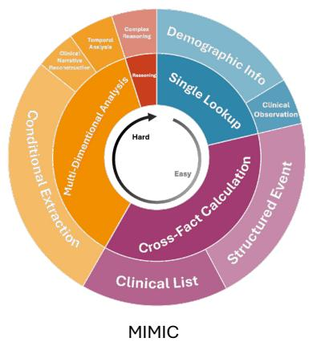

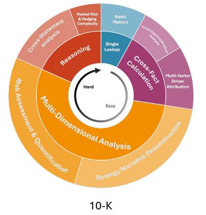

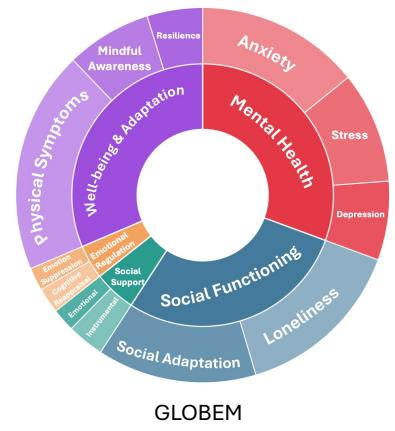  
Figure A1. Distribution of checklist items.

Figure A1 shows the distribution of checklist items across the three DDR-Bench scenarios. For MIMIC and 10-K, the checklists are free-form. The outer ring groups items by question type, while the inner ring categorises the data analysis capabilities required of LLMs. Simple items, such as demographic information extraction in MIMIC or basic metric extraction in 10-K, require only a single lookup that can be completed with a straightforward SQL SELECT, without complex instructions or computation. In contrast, the most demanding items, such as analysing a patient’s pathology by integrating multiple surgeries, diagnoses, and medications across departments, or assessing market risk by combining ten year financial trends with recent capital flows, require multi-table reasoning at the highest level of complexity. For GLOBEM, the checklist items are closed-formed. Numerical responses are extracted from each user’s surveys, and questions are constructed by comparing changes in the same items before and after the wearable experiment, for example, whether the user’s depression status improved after the experiment. The answers are closed-formed, with three options indicating improvement, no improvement, or no substantial change. When sufficient insights are derived from the wearable data, the LLM checker can answer these trend questions correctly based on the inferred evidence. This temporal comparison avoids pointwise prediction of absolute survey scores for social well-being or psychological status, which are highly subjective and exhibit large variance, and also avoids framing the task as numerical regression, which is not the aim of insight report generation. For GLOBEM, the outer and inner rings correspond to major and minor categories of survey questions. Required data modelling capabilities are not shown in the inner ring, as there is no ground truth modelling approach, and LLMs may flexibly analyse wearable data using Python code and any suitable algorithms.

## B. Agent Framework Ablations

We intentionally simplify the agent to evaluate model capabilities in a clean testbed; optimising agent scaffolding for high scores would confound assessment. DDR-Bench supports flexible tool extensions via the Model Context Protocol (MCP) for future agent benchmarking.

We presents agent ablations, where memory modules often destabilise performance. Table A1 provides additional experiments on Qwen3-30B-A3B, Qwen3-4B, and GPT-5-mini across three framework configurations: Planning (Plan-and-Execute (Wang et al., 2023)), Memory (CoALA (Sumers et al., 2023)), and Multi-agent (AutoGen (Wu et al., 2024)). Results reveal that complex agents mostly degrade performance relative to the ReAct baseline, except for minor planning benefits in certain settings. Analysis suggests that complex frameworks affect model confidence, leading to premature self-termination or over-/under-thinking.

## C. Checklist Example

Figure A2, A3 and A4 each present a checklist sample from one of the three scenarios in DDR-Bench, namely MIMIC, 10-K, and GLOBEM. MIMIC and 10-K involve open-ended question answering, whereas GLOBEM adopts a multiple-choice format with three fixed options: better, worse, and remained the same. Notably, for open-ended questions, we do not ask a judge LLM to first answer the question based on the agent’s collected insights and then compare the answer with the ground truth. Instead, as illustrated in Figure 3, we provide the checker LLM with the insights, the question, and the ground truth, and ask it to assess whether the insights can support the given ground truth. This design serves two purposes. First, it avoids the difficulty of normalising open-ended answers for direct comparison. Second, it shifts the focus to whether the collected insights substantively support the underlying facts, rather than relying on exact matching of surface descriptions.

Table A1. Performance comparison of agent framework configurations across datasets and models. Scores are reported for ReAct (baseline), Plan-and-Execute (+Plan (Wang et al., 2023)), CoALA (+Memory (Sumers et al., 2023)), and AutoGen (+Multi-Agent (Wu et al., 2024)). Higher is better.  
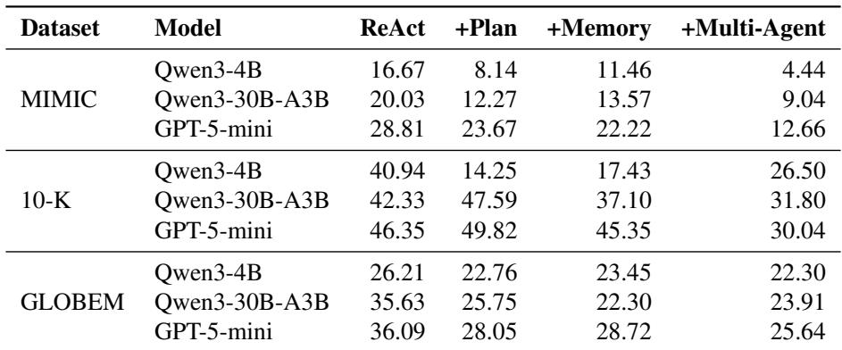

## D. Interaction Turn Distribution

Figure A5, A6 and A7 show the distributions of interaction rounds across models and scenarios. Almost all distributions are approximately normal, except for a small number of runs in which exploration failed to terminate, and the models repeatedly entered debugging loops. This behaviour was observed for a few models, such as Qwen3-30B-A3B and GLM4.6, and these runs were forcibly stopped at 100 rounds. We ignore these abnormal data points when drawing figures.

Stronger models tend to explore for more rounds without external prompting. Knowledge-intensive databases such as 10-K and MIMIC induce more interaction rounds than signal-based datasets such as GLOBEM, and the resulting distributions are also more uniform.

## E. Valid Insight Ratio

When generating message-wise insights, the LLM is prompted to decide autonomously whether the outcome of the current interaction is meaningful, as shown in Figure A12. If it is not, the model outputs “NO INSIGHT”. An interaction is treated as uninformative and marked as “NO INSIGHT” only when the content is:

1. insufficient to support any insight

2. failed function call

3. when the interaction only invokes descriptive tools such as list\_files, describe\_table, get\_database\_info, or get\_field\_description

The proportion of meaningful insights is then computed over all generated message-wise insights. In practice, at least two to three interactions are expected to involve descriptive tool calls and therefore produce no insight, which implies that the effective insight ratio cannot reach 100%.

As shown in Figure A8, the height of each bar indicates the total number of message-wise insights generated, while the solid segment represents the number of valid insights. Stronger LLMs, including Claude 4.5 Sonnet, DeepSeek, and GLM, sustain a high effective insight ratio while generating a large volume of insights, which denotes that these models maintain high information density during the exploration.

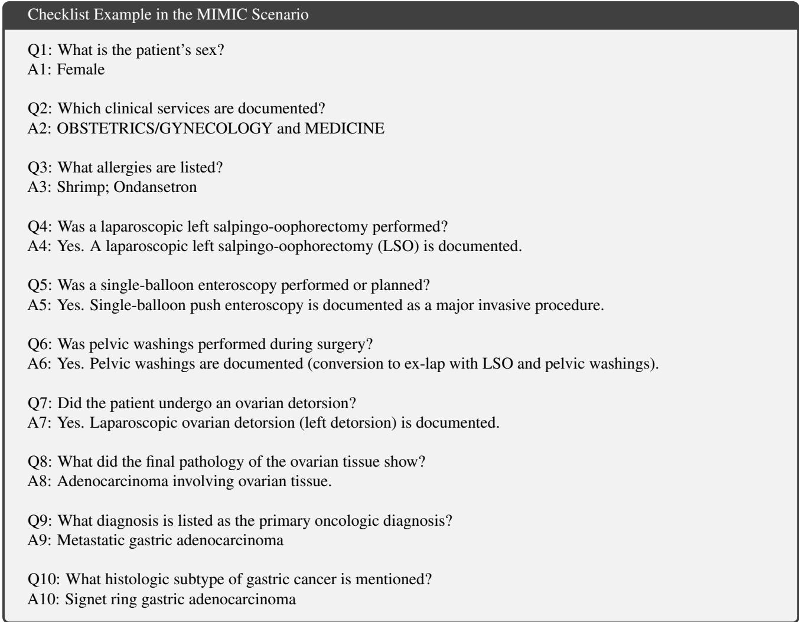  
Figure A2. Checklist Example in the MIMIC Scenario.

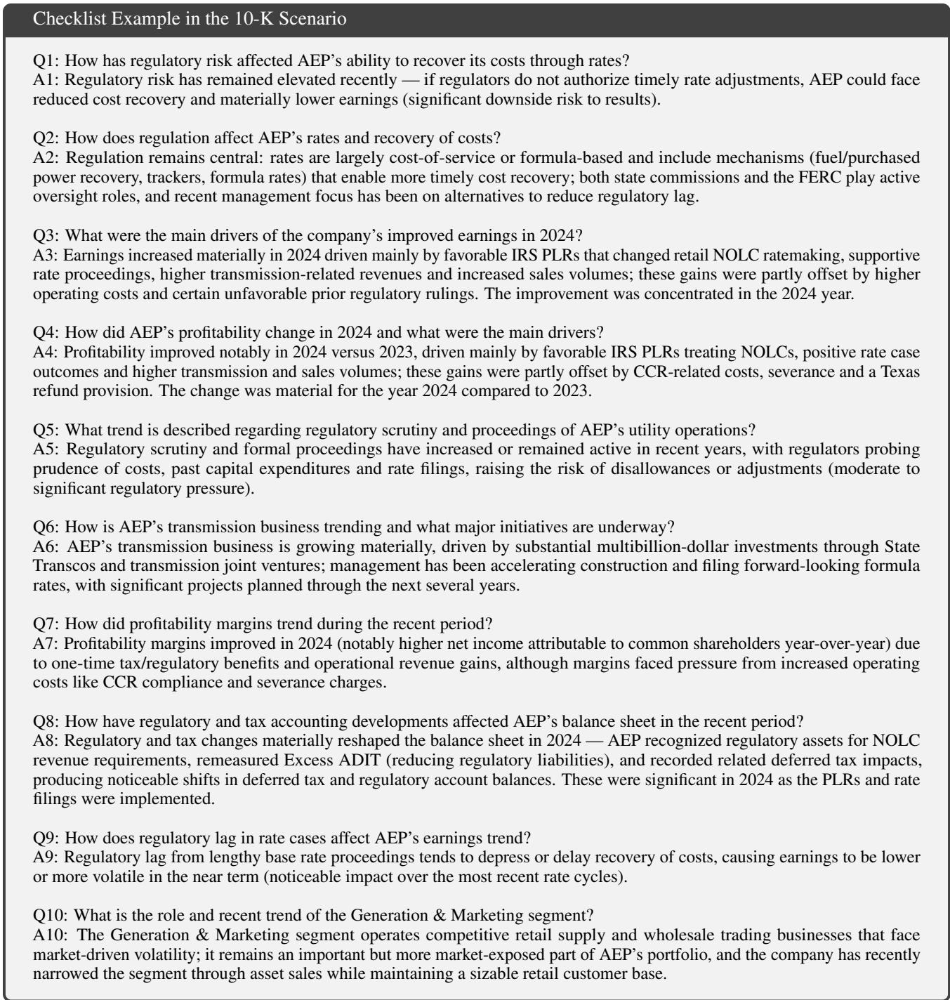  
Figure A3. Checklist Example in the 10-K Scenario.

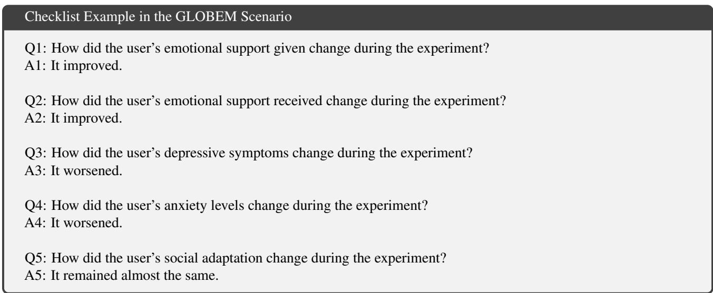  
Figure A4. Checklist Example in the GLOBEM Scenario.

## F. Tool Execution Time Distribution

As shown in Figure A9, the tool execution times of different models vary across scenarios. The duration of tool calls partially reflects the complexity of tool usage by each LLM. We report only the tool execution time, as the total runtime, including LLM generation, is affected by multiple factors such as API service stability and local GPU performance. Presenting the tool execution time allows for a fair comparison across different LLMs.

In the MIMIC scenario, GPT-5-mini and Qwen3-30B-A3B exhibit significantly longer tool execution times than other models, yet their overall performance does not surpass them. This indicates that complex queries do not necessarily yield more meaningful insights. Efficient and precise database interaction will be a crucial metric for evaluating a model’s data insight capabilities, encompassing high query efficiency (useful information returned per unit execution time), extraction of more information in fewer interaction rounds, and derivation of more meaningful insights from the same data.

## G. Hallucination-Accuracy Correlation

Figure A10 shows that in the 10K and MIMIC settings, hallucination rates show extremely weak and non-significant positive correlations with accuracy, with correlation coefficients of 0.125 and 0.056, and p-values of 0.8779 and 0.7305, respectively. In the GLOBEM setting, the hallucination rate exhibits an extremely weak and non-significant negative correlation with accuracy, with a correlation coefficient of -0.046 and a p-value of 0.9001. Overall, the hallucination rate is essentially uncorrelated with final accuracy. It indicates that there is a very low risk that data contamination causes models to disregard actual database interaction results and inflate performance metrics.

## H. Prompts

## H.1. System Prompt

Figure A11 shows the system prompt used in DDR-Bench. It mainly enforces a ReAct-style multi-turn interaction and specifies strict requirements on the output format. Some constraints are repeatedly emphasised in uppercase, as smaller models otherwise struggle to follow the instructions and conduct reasonable multi-step agentic exploration. For larger models, the system prompt could be further simplified; however, for a fair comparison, we apply the same system prompt to all models.

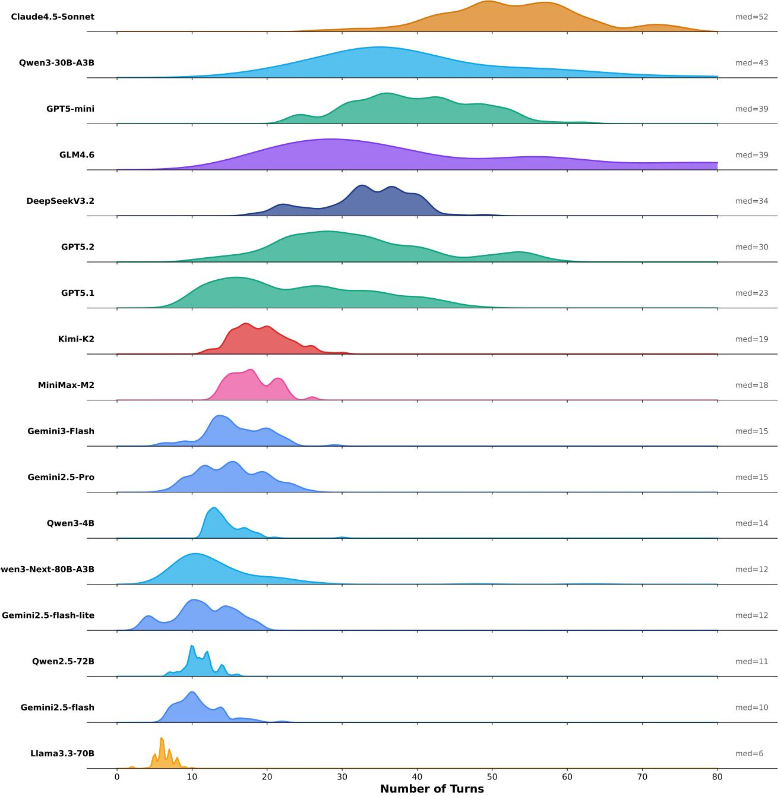  
Figure A5. Interaction turn distribution on MIMIC scenario.

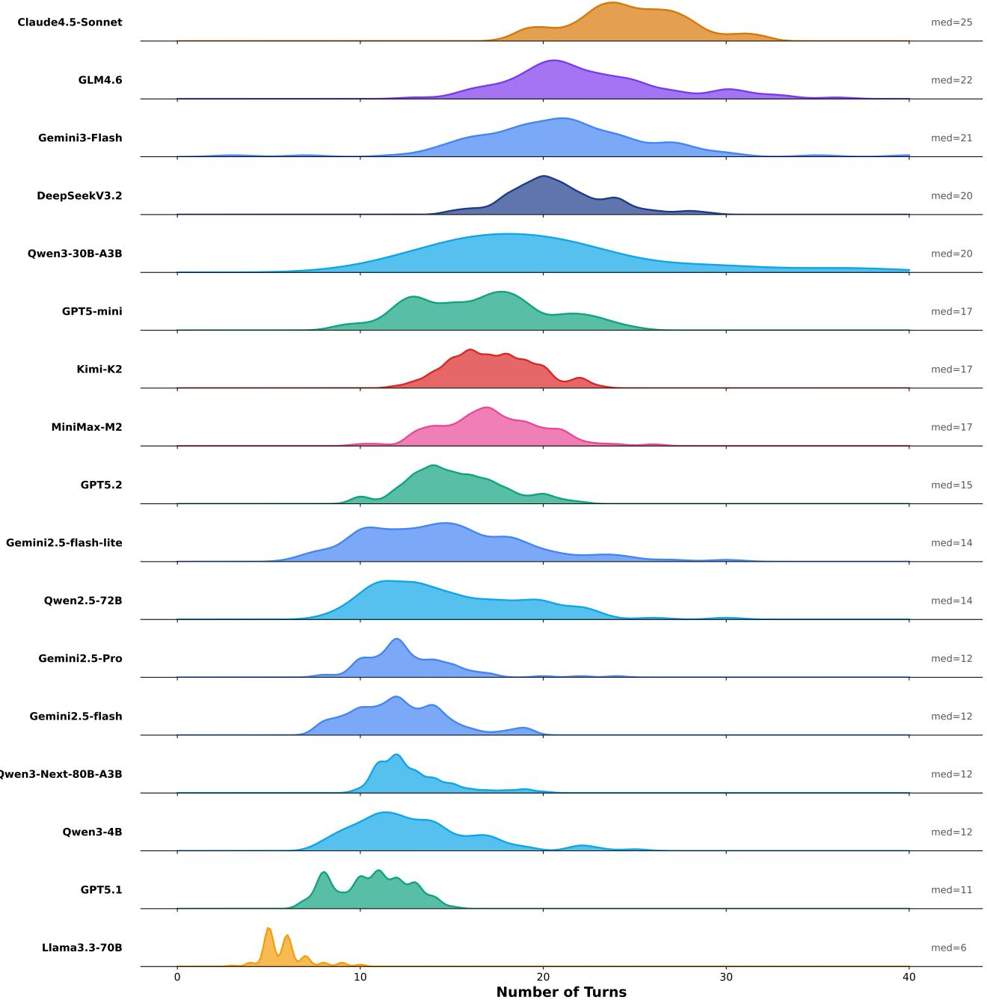  
Figure A6. Interaction turn distribution on GLOBEM scenario.

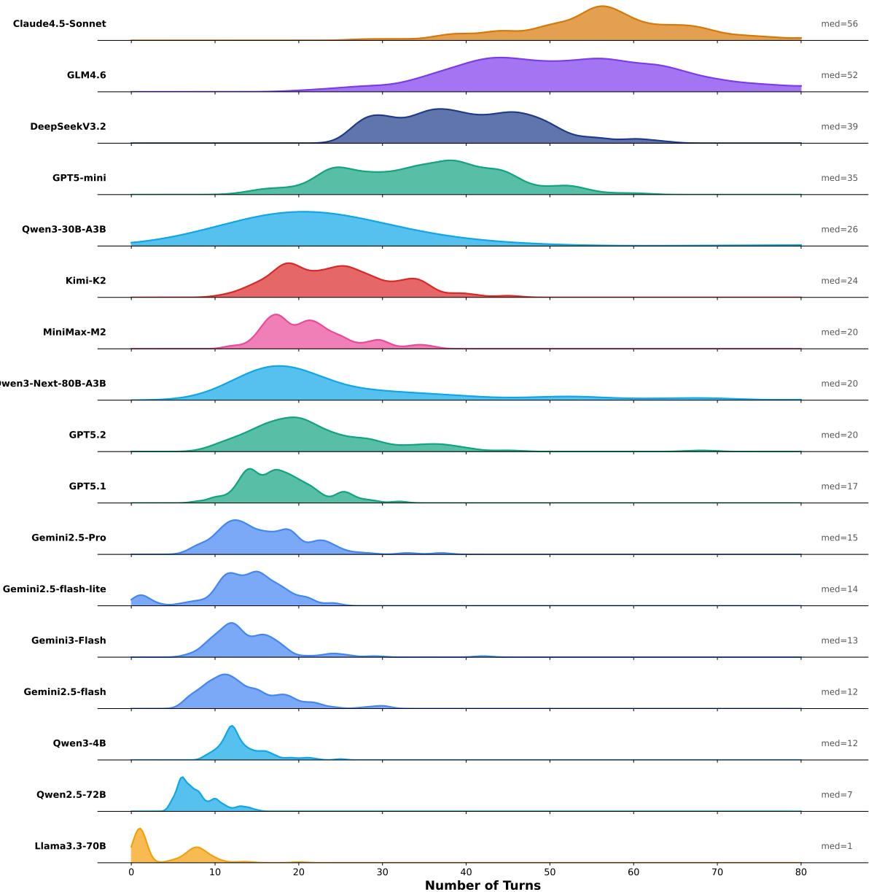  
Figure A7. Interaction turn distribution on 10-K scenario.

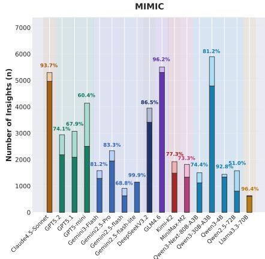

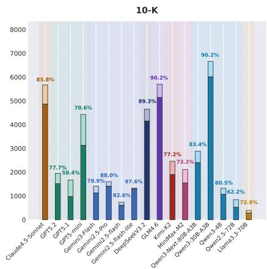  
Figure A8. Valid insight ratio distribution.

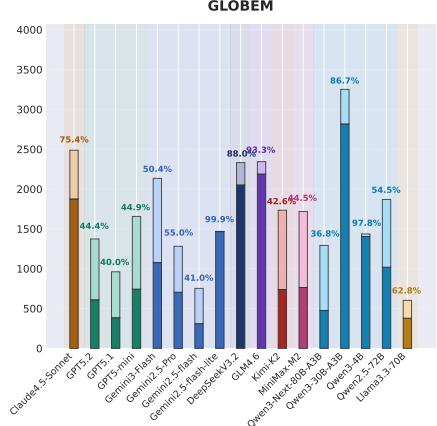

Tool Execution Time Distribution - All Scenarios  
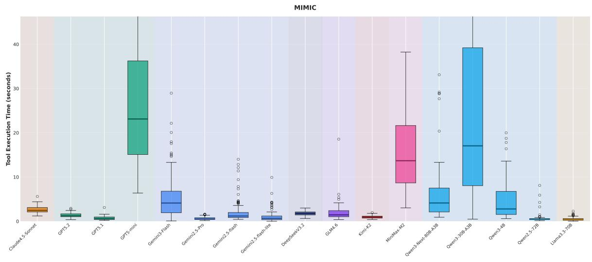

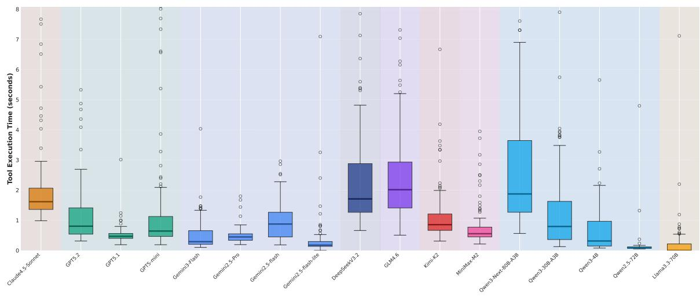

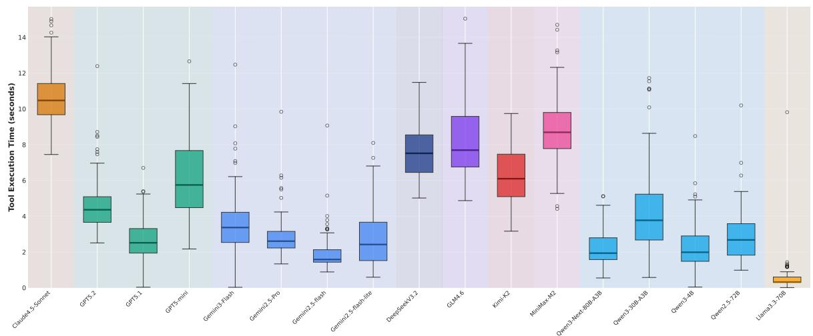  
Figure A9. Average tool execution time per trajectory.

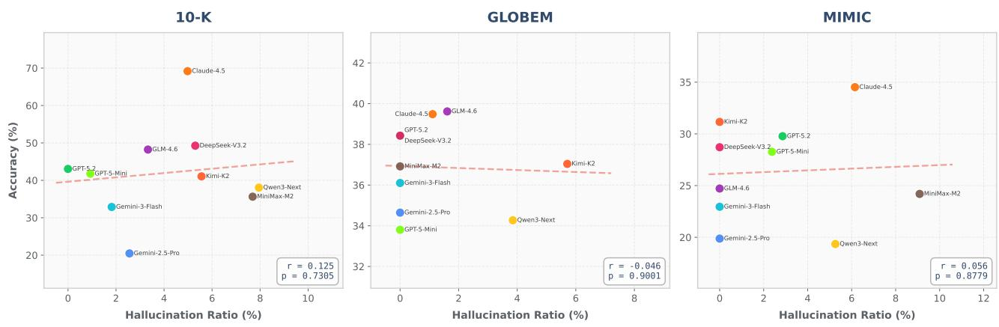  
Figure A10. Hallucination-Accuracy Correlation.

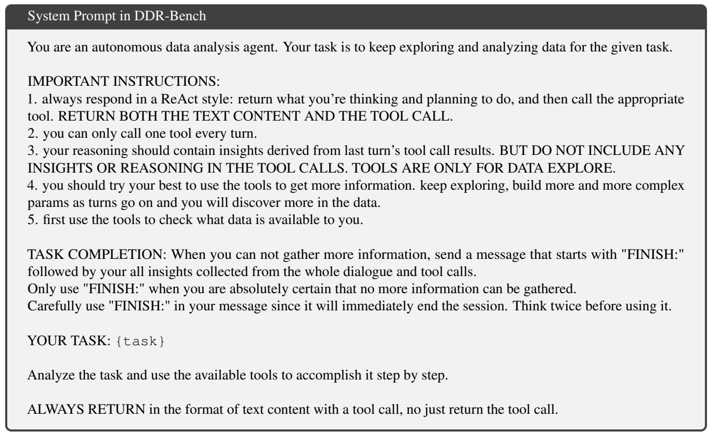  
Figure A11. System prompt in DDR-Bench. The system prompt give a detailed guideline to ensure that the LLMs follow the ReAct style for exploration, but it does not mention any specific question, task or goals. The task placeholder in this prompt denotes the simple start prompt part, like “start analysis {entity\_id}”.

## H.2. Message-wise Insight Generation Prompt

Figure A12 shows the prompt used to generate message-wise insights. This prompt is independent from the agent trajectory: message-wise insight generation is not part of the agent’s ReAct trace. Instead, at each ReAct turn, we invoke this prompt to produce an insight and then continue the trajectory, while all calls are made to the same underlying model. The model only observes the agent’s ReAct content from the current turn and the corresponding environment execution results. Since we organise the multi-turn interaction between the agent and the environment in a dialogue format, the agent corresponds to the assistant and the environment to the user, which explains the use of the placeholders assistant\_content and user\_content.

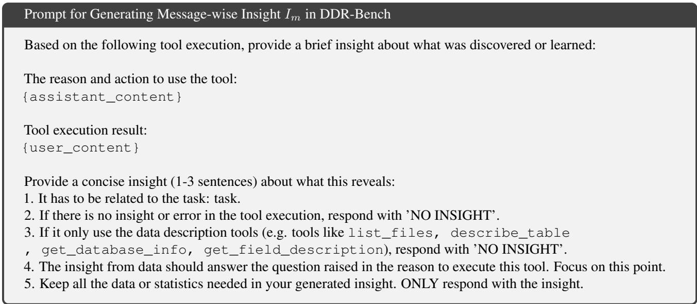  
Figure A12. Prompt for Generating Message-wise Insight Im in DDR-Bench.

## H.3. Novelty Pairwise Judge Prompts

Figure A13, A14, and A15 provide the prompt for the pairwise novelty judge in the scenario of MIMIC, 10-K and GLOBEM, respectively.

## H.4. LLM-as-a-Checker Prompts

Across the three scenarios, the LLM is prompted to act as a checker according to the same principle, namely, to assess whether the provided insights are sufficient to support answering the questions specified in the checklist items, including

1. Determine if the messages can provide evidence to support the answer

2. Identify which specific message(s) by their index numbers [Message X] support or contradict the answer

3. Extract the evidence text from the relevant message(s)

4. Classify the context quality into one of three categories: CORRECT\_INFO: Messages contain information that serves as evidence or support for the answer; INCORRECT\_INFO: Messages contain information that contradicts the answer; INSUFFICIENT\_INFO: Messages lack sufficient information to answer the question.

The proportion of CORRECT\_INFO is calculated as the final accuracy. In addition, the GLOBEM scenario uses a closedform checklist and therefore does not require the LLM for checking. Instead, the LLM directly answers the questions based on the insights, and accuracy is computed by exact match against the ground truth. The reason that GLOBEM and 10 K do not adopt a sampling-based checking procedure is that answers to open-ended questions are difficult to normalise.

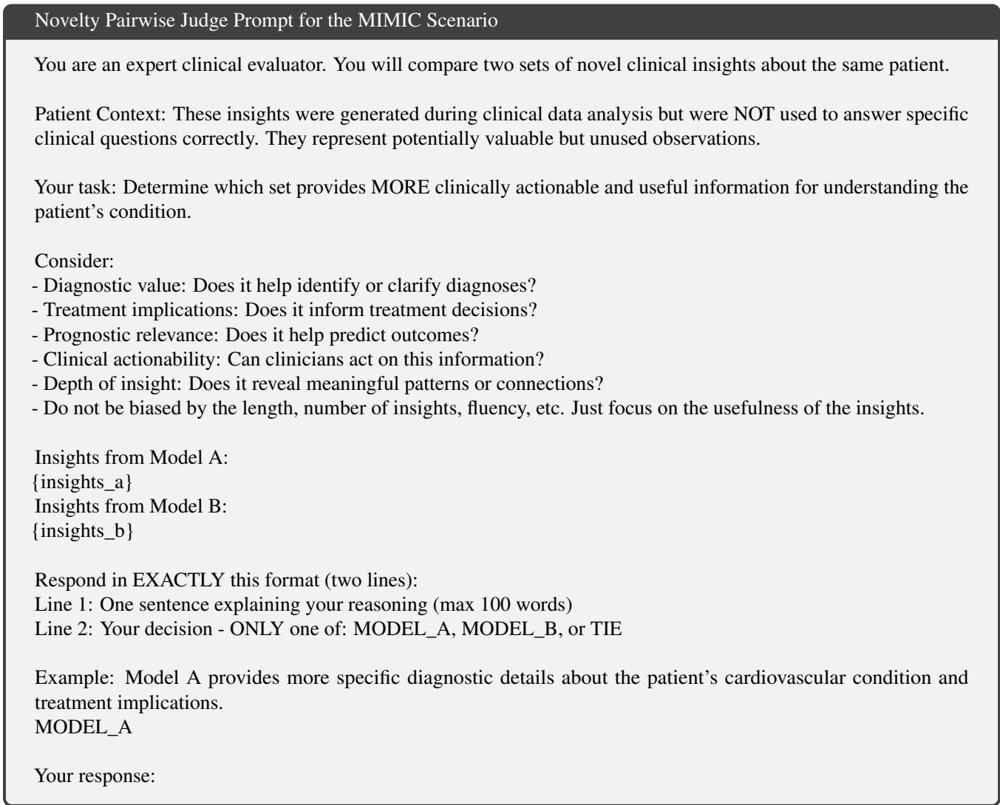  
Figure A13. Novelty Pairwise Judge Prompt for the MIMIC Scenario.

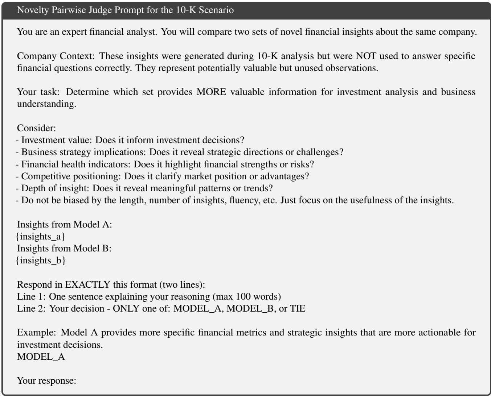  
Figure A14. Novelty Pairwise Judge Prompt for the 10-K Scenario.

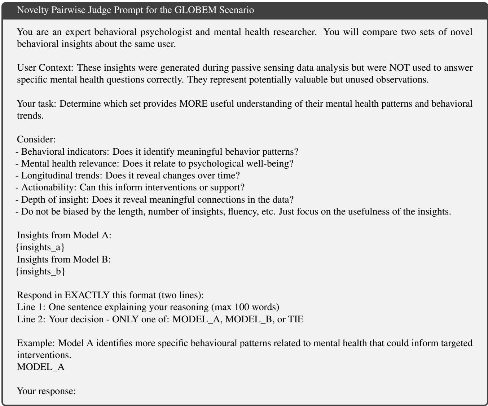  
Figure A15. Novelty Pairwise Judge Prompt for the GLOBEM Scenario.

Furthermore, the prompt includes scenario-specific evaluation criteria as well as JSON return fields to facilitate downstream data processing. Details can be found in the project code at evaluate/prompts.py.

## I. Trajectory Sample

Figure A16, A18, and A17 provide a trajectory sample in the scenario of MIMIC, 10-K and GLOBEM, respectively. The trajectory includes the reasoning, action, observation (execution results from the database environment) and two kinds of insights, message-wise insight Im and trajectory-wise insight It. We anonymise the task entity id in the MIMIC and GLOBEM.

Trajectory Sample on MIMIC   
Agent: I’ll help you analyze patient xxxxxx. Let me start by exploring what data is available in the database.   
execute: {"tool": "get\_database\_info", "arguments": {}}   
Environment: {’database\_path’: ’dataset/mimic.db’, ’table\_count’: 27, ’tables’:[’hosp\_a   
dmissions’, ’hosp\_d\_hcpcs’......], ’tables\_info’: [{’name’: ’hosp\_admissions’,   
’comment’: "Hospital admissions for each patient. Defines......   
Agent: Good! I can see this is a MIMIC database with 27 tables containing patient medical data. Now let me search for   
patient xxxxxx starting with the patient demographics table.   
execute: {"tool": "execute\_query", "arguments": {"query": "SELECT \* FROM hosp\_patients   
WHERE subject\_id = xxxxxx"}   
Environment: {’cols’: [’subject\_id’, ’gender’, ’anchor\_age’, ’anchor\_year’, ’anchor\_year\_group’, ’dod’], ’data’: [[’xxxxxx’, ’M’, ’74’, ’2182’, ’2008 - 2010’,   
’2185-06-15’]], ’count’: 1}   
Agent Message-wise Insight: Patient xxxxxx is a 74-year-old male with an anchor year of 2182 (corresponding to the   
real-world period 2008-2010) who died on June 15, 2185, indicating he survived approximately 3 years beyond the anchor year   
recorded in this database.   
...(46 interactions)   
Agent: No prior TIA documented. Let me check CHA2DS2-VASc risk factors systematically for stroke risk with AFib.   
execute: {"tool": "execute\_query", "arguments": {"query": "SELECT \n ’Has CHF’ as   
risk\_factor, COUNT(DISTINCT d.hadm\_id) as admissions\_with\_dx\nFROM hosp\_diagnoses\_icd   
d\nWHERE d.subject\_id = xxxxxx AND d.icd\_code LIKE ’428%’\nUNION ALL\nSELECT ’Has HTN’,   
COUNT(DISTINCT d.hadm\_id)\nFROM hosp\_diagnoses\_icd d\nWHERE d.subject\_id =......   
Environment: {’cols’: [’risk\_factor’, ’admissions\_with\_dx’], ’data’: [[’Has CHF’, ’15’],[’Has HTN’, ’18’], [’Has DM’, ’17’], [’Has Vascular Dz’, ’9’], [’Has AFib’, ’16’]],   
’count’: 5}   
Agent Message-wise Insight: This patient (ID: xxxxxx) has documented atrial fibrillation and multiple CHA2DS2-VASc   
admissions), and vascular disease (9 admissions), indicating a high stroke risk profile that would warrant anticoagulation therapy   
consideration.   
...(12 interactions)   
Agent Trajectory-wise Insight: Excellent! I now have a comprehensive understanding of Patient xxxxxx. Let me compile all the insights. FINISH:   
## COMPREHENSIVE ANALYSIS OF PATIENT xxxxxx   
### DEMOGRAPHIC PROFILE   
\*\*Patient ID\*\*: xxxxxx   
- \*\*Gender\*\*: Male   
- \*\*Age at anchor\*\*: 74 years (anchor year 2182)   
\*\*Age at death\*\*: 77 years   
- \*\*Date of death\*\*: June 15, 2185   
......   
This patient exemplifies the challenges of managing elderly patients with multiple,   
severe chronic conditions and the high mortality risk associated with acute stroke   
in the setting of advanced multi-organ disease.  
Figure A16. Trajectory Sample on MIMIC

Trajectory Sample on GLOBEM   
Agent: I’ll help you analyze how user behavior patterns change over time for user xxxxxx...   
execute: {"tool": "list\_files", "arguments": {}}   
Environment: {’files’: [{’name’: ’activity\_allday\_raw.csv’, ’path’: ’   
activity\_allday\_raw.csv’, ’type’: ’file’, ’size’: 2067543, ’modified’:   
’2025-11-21T20:08:33’, ’description’: ’Daily activity metrics including movement and   
exercise patterns.’}......], ’count’: 6, ’pattern’: None, ’recursive’: True}   
...(19 interactions)   
Agent: Excellent! I can see a clear behavioral shift starting April 30th. Let me now examine circadian rhythm patterns and   
correlate multiple behavioral dimensions.   
execute:   
import pandas as pd   
import numpy as np   
user\_pid = ’xxxxxx’   
# Merge multiple data sources for correlation analysis   
phone\_df = pd.read\_csv(’phone\_usage\_allday\_raw.csv’)   
loc\_df = pd.read\_csv(’location\_allday\_raw.csv’)   
conn\_df = pd.read\_csv(’connectivity\_allday\_raw.csv’)   
# .(66 lines)   
for label, (metric, before\_val, after\_val) in metrics.items():   
if pd.notna(before\_val) and pd.notna(after\_val) and before\_val != 0:   
change = ((after\_val - before\_val) / before\_val \* 100)   
print(f\"{label:<30}:{change:>+7.1f}%\")   
Environment: Critical Behavioral Shift: Day 28 (April 30, 2018) BEFORE SHIFT   
(Days 1-27):   
Phone unlocks: 34.3 per day   
Screen time: 87.7 minutes   
...   
Distance traveled : +211.2\%   
Location transitions : +66.4\%   
Social proximity scans : +51.6\%   
Agent Message-wise Insight: A dramatic behavioral shift occurred on Day 28 (April 30, 2018) for user xxxxxx, indicating a   
potential psychological status change. Phone unlocks increased 197.7% (34.3→102.1/day), screen time rose 134% (87.7→205.3   
min/day), first phone use shifted 77.4% earlier (434→98 min after midnight), distance traveled surged 211.2% ......   
...(6 interactions)   
Agent Trajectory-wise Insight: Excellent! I have completed a comprehensive analysis. I have gathered extensive informationabout the user’s behavioral patterns and their changes over time. Let me now provide a final comprehensive summary. FINISH:   
# COMPREHENSIVE BEHAVIORAL ANALYSIS: USER xxxxxx   
## Overview   
I analyzed 92 days of multimodal behavioral data (April 3 - July 3, 2018) for   
user xxxxxx, examining patterns across 6 behavioral domains......User xxxxxx exhibited   
a \*\*statistically significant, clinically meaningful, multi-dimensional behavioral   
transformation\*\* starting precisely on Day 28 (April 30, 2018). The pattern...  
Figure A17. Trajectory Sample on GLOBEM

Trajectory Sample on 10-K   
Agent: I’ll analyze the structured financial data from Phillips 66 (CIK: 1534701). Let me start by exploring what data is   
available in the database.   
execute: {’database\_path’: ’dataset/10-k.db’, ’table\_count’: 4, ’tables’: [’companies’,   
’company\_addresses’, ’company\_tickers’, ’financial\_facts’..., ’filtered\_out\_count’: 5}}   
...(8 interactions)   
Agent: Perfect! Now I can see the pattern. For fiscal year 2024, the end\_date is 2024-12-31, and the revenue is \$143.153   
billion. The highest value shown (like \$169.99B for end\_date 2022-12-31) are historical comparatives. Let me now get a clean   
view of annual revenues and net income by matching fiscal\_year to end\_date year.   
execute: {"tool": "execute\_query", "arguments": {"query": "SELECT fiscal\_year, fact\_name,   
fact\_value, end\_date FROM financial\_facts WHERE cik = ’1534701’ AND fiscal\_period =   
’FY’ AND fact\_name IN (’RevenueFromContractWithCustomerExcludingAssessedTax’,   
’NetIncomeLoss’) AND CAST(strftime(’%Y’, end\_date) AS INTEGER) = fiscal\_year ORDER BY   
fiscal\_year DESC, fact\_name", "limit": 50}   
Environment: {’cols’: [’fiscal\_year’, ’fact\_name’, ’fact\_value’, ’end\_date’], ’data’:   
[[’2024’, ’NetIncomeLoss’, ’2117000000.0’, ’2024-12-31’], [’2024’,   
’RevenueFromContractWithCustomerExcludingAssessedTax’, ’143153000000.0’, ’2024-12-31’],   
[’2023’, ’NetIncomeLoss’, ’7015000000.0’, ’2023-12-31’], [’2023’,   
’RevenueFromContractWithCustomerExcludingAssessedTax’, ’147399000000.0’, ’2023-12-31’]   
...], ’count’: 50}   
Agent Message-wise Insight: Phillips 66 experienced significant revenue volatility over the past five years, with revenuespeaking at \$170.0 billion in 2022 before declining 15.8% to \$143.2 billion in 2024. More concerning is the sharp decline...   
...(70 interactions)   
Agent Trajectory-wise Insight: Perfect! Now I have a complete picture of Phillips 66’s financial data. I have gathered   
(2012-2024) - Quarterly trends (2023-2025 Q2) - Key metrics like EPS, dividends, share repurchases, debt, working capital, etc.   
Now I can provide comprehensive insights based on this data. FINISH: Based on my comprehensive analysis of Phillips 66’s   
(CIK: 1534701) structured financial data from 2012-2025 (through Q2 2025), here are the material quantitative patterns, trends,   
and relationships that investors should consider:   
# REVENUE AND PROFITABILITY TRENDS   
\*\*Revenue Volatility Pattern (2018-2024):\*\*   
- Peak: \$169.99B in 2022 (+52.5% from 2021’s \$111.48B)   
Decline: \$147.40B in 2023 (-13.3% YoY)   
Further decline: \$143.15B in 2024 (-2.9% YoY)   
This reveals significant sensitivity to commodity price cycles, with 2022 benefiting   
from energy price spikes post-pandemic   
\*\*Net Income Cyclicality:\*\*   
- 2020: -\$539M (loss year during pandemic)   
- 2021: \$1.32B (recovery but weak)   
......   
The data reveals Phillips 66 is in a challenged operating environment with compressed   
margins, declining profitability, and aggressive capital returns that may not be   
sustainable at current earnings levels. The company is drawing on balance sheet   
strength built during 2022’s exceptional year, but with declining cash, rising   
leverage, and deteriorating coverage ratios, financial flexibility is eroding.   
Investors should assess whether the current 27.8x P/E ratio appropriately reflects both   
cyclical risks and the company’s strategic positioning in a potentially structurally   
challenged refining industry.  
Figure A18. Trajectory Sample on 10-K