# A multi-agent system for automating scientific discovery

https://doi.org/10.1038/s41586-026-10652-y

Received: 23 May 2025

Accepted: 12 May 2026

Published online: 19 May 2026

Open access

Check for updates

Ali E. Ghareeb1,4, Benjamin Chang1,2,4, Ludovico Mitchener1, Angela Yiu1, Caralyn J. Szostkiewicz1, Dmytro Shved3, Gavin J. Gyimesi3, Jon M. Laurent1, Samantha M. Wright1, Muhammed T. Razzak1, Andrew D. White1,5 ✉, Silvia C. Finnemann3, Michaela M. Hinks1,5 ✉ & Samuel G. Rodriques1,5 ✉

Scientifc discovery is driven by the iterative process of observation, hypothesis generation, experimentation and data analysis. Despite recent advancements in applying artifcial intelligence (AI) to biology, no system has yet automated all these stages1–3. Here we introduce Robin, a multi-agent system capable of fully automating both hypothesis generation and data analysis for experimental biology. By integrating literature search agents with data analysis agents, Robin can generate hypotheses, propose experiments, interpret experimental results and generate updated hypotheses, achieving a semi-autonomous approach to scientifc discovery. By applying this system, we were able to identify promising therapeutic candidates for dry age-related macular degeneration, the major cause of blindness in the developed world4,5. Robin proposed enhancing retinal pigment epithelium phagocytosis as a therapeutic strategy, and identifed and confrmed in vitro efcacy for ripasudil and KL001. Ripasudil is a clinically used Rho kinase inhibitor that, to our knowledge, has never previously been proposed for the treatment of dry age-related macular degeneration. To elucidate the mechanism of ripasudil-induced upregulation of phagocytosis, Robin then proposed and analysed a follow-up RNA sequencing experiment, which revealed upregulation of ABCA1, which encodes a lipid efux pump and represents a possible novel target. All hypotheses, experimental directions, data analyses and data fgures in the main text of this report were produced by Robin. As one of the frst AI systems to autonomously discover and validate novel therapeutic candidates within an iterative lab-in-the-loop framework, Robin establishes a new paradigm for AI-driven scientifc discovery.

Advances in our ability to measure, perturb and model biological systems have resulted in rapid growth of our collective scientific knowledge6. Yet complementary technologies to interpret, synthesize and generate hypotheses from this knowledge have lagged behind7. AI systems based on large language models (LLMs) show promise for automating this knowledge synthesis process and accelerating scientific discovery. As a primary goal of biomedical research is the development of new treatments for disease, our ability to produce new therapeutics may be the ultimate beneficiary of these approaches. Drug development heavily relies on a confluence of biological, clinical and pharmaceutical expertise, and is limited by the rate at which these experts can synthesize the scientific literature8.

The repurposing of existing drugs for new indications presents a promising application space for LLM systems. The history of drug repurposing often shows a pattern: although insights often existed in scientific literature, only after a substantial lag did that knowledge crystallize into a new treatment. For example, dabrafenib, an inhibitor of BRAF kinase that is used in various cancers with mitogenic mutations in BRAF, is being repurposed to prevent hearing loss9,10. Although its molecular action was well characterized by 2010 (refs. 11–13), the otoprotective effects of dabrafenib were only discovered 10 years later via unbiased high-throughput screening. This delayed discovery occurred despite the otoprotective effects of dabrafenib being a direct result of its known inhibition of BRAF9,10,14, suggesting that more repurposing opportunities could be identified through logical connection of existing biological insights in the literature. Further cases across medicine from ketamine (22-year lag)15,16 to leucovorin (5-year lag)17,18 to KarXT (13-year lag)19,20 underscore how repurposing efforts are frequently realized years after core insights are documented. Such delays in connecting existing insights to new therapeutic applications highlight the challenge of synthesizing disparate scientific knowledge. Trained on data across many fields, LLMs can store and recall information on a wide variety of scientific topics and thus transcend the limitations of individual human knowledge. Previous work has shown that fine-tuned LLMs and specialized retrieval-augmented generation systems can exceed human performance on retrieving and summarizing information from the scientific literature. These advances raise the possibility that LLM systems could be used for novel hypothesis generation21–25.

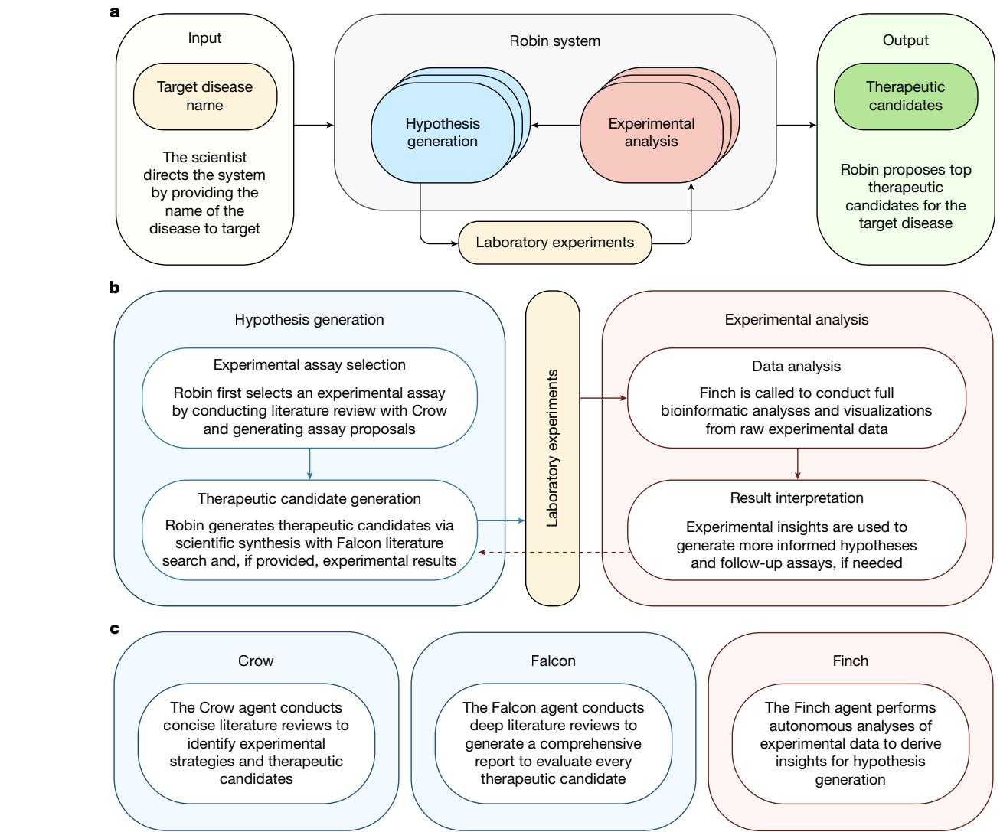  
Fig. 1 | Architecture and workflow of the Robin system. a, When given the name of a target disease, Robin generates hypotheses and selects the top therapeutic candidates to test experimentally. Robin can autonomously analyse raw data from these experiments to synthesize scientific insights and generate updated therapeutic hypotheses. b, Robin interacts with language agents to  
generate hypotheses and analyse the experimental data. c, Crow and Falcon are used to conduct concise and deep literature searches, respectively, to gather information to guide hypothesis generation. Finch performs analyses of experimental data, which Robin uses to derive insights to inform the next round of hypothesis generation.

Several LLM systems have recently been developed to automate hypothesis generation1–3,26–29. Specialized systems have also been developed to automate specific tasks in drug discovery, such as prediction of pharmacological properties and safety profiles3,27. These systems have demonstrated that they can generate reasonable hypotheses by utilizing multi-agent architectures that decompose scientific reasoning into discrete manageable sub-tasks3, domain-specific fine-tuning2,30, integration of external tools2,3 and incorporation of human feedback3. However, none of these systems have automated all of the key intellectual steps of the scientific process, including generating hypotheses and experimental strategies, analysing results from laboratory experiments and refining hypotheses in light of new data.

Here we introduce Robin, a multi-agent system for discovery in biology that integrates novel hypothesis generation with experimental data analysis in one continuous workflow (Fig. 1a,b). Robin utilizes specialized language agents for literature search (Crow and Falcon) and data analysis (Finch) to enable semi-autonomous scientific discovery25,31 (Fig. 1c). Although this system could be applicable to scientific discovery across disciplines, in this article, we focus on its potential in therapeutics. After giving Robin a disease of interest, Robin automatically identified relevant in vitro assays that model key disease mechanisms and proposed specific drug candidates to evaluate in these experimental models. We then conducted the experiments and provided the resulting data to Robin for autonomous analysis. Robin then interpreted the results of this analysis to generate a new round of therapeutic candidates. Through this process, Robin drove an iterative therapeutics development cycle during which hypotheses were generated, tested, analysed and refined on the basis of experimental results. The key intellectual steps of the scientific method were thus automated while coordinating with scientists throughout the experimental loop. Robin represents one of the first systems to connect literature-based hypothesis generation with autonomous analysis of biological laboratory data in a continuous feedback system.

To demonstrate the ability of Robin to generate and refine novel therapeutic hypotheses, we attempted to identify potential new treatments for dry age-related macular degeneration (dAMD). dAMD is the leading cause of irreversible sight loss in developed countries, yet limited treatment options are available. In the USA alone, 1.5 million people have vision-threatening dAMD, and 600,000 are legally blind due to AMD, a figure projected to almost triple by 2050 due to an ageing population4,5. By applying Robin to discover novel therapeutic candidates for dAMD, this work represents a step towards AI-generated discovery in scientific research.

Table 1 | Estimated time-on-task comparison: human versus Robin-assisted discovery  
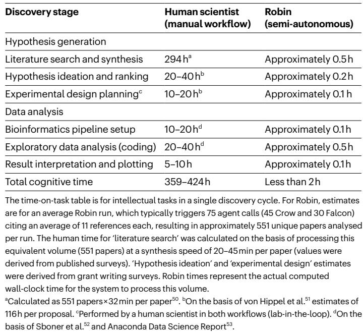

## Robin: a multi-agent system for scientific discovery

Robin integrates multiple language agents in a structured workflow to generate therapeutic candidates for a given disease (Fig. 1a,b). Crow and Falcon are literature search agents based on PaperQA2 that conduct concise and deep literature summaries, respectively25. PaperQA2 achieves expert-level performance in information retrieval and summarization, with access to scientific literature, clinical trial reports and the Open Targets Platform32. Finch is a scientific data analysis agent that performs analyses of experimental data from assays, such as RNA sequencing (RNA-seq) and flow cytometry31 (Fig. 1c). By coordinating these agents to identify novel and readily laboratory-testable therapeutic strategies, we used Robin to enable an experimentally guided system that drives the process of scientific discovery. An example of the Robin hypothesis generation workflow is shown in Supplementary Fig. 1. In the workflow described in this paper, Robin analysed 551 papers in 30 min compared with an estimated time of 294 h for a human. Using estimates derived from published surveys, we estimate a 200-fold reduction in time spent completing the entire scientific workflow manually (Table 1).

Therapeutic hypothesis generation. When provided with the disease of interest (dAMD), Robin formulated a series of general questions about the disease pathology and queried Crow to answer each question. Using the reports from Crow as context, Robin then identified ten potential causal disease mechanisms. For each mechanism, Robin deployed Crow to prepare a detailed report describing an in vitro model of the disease mechanism that could be used to test drug efficacy. Robin then used an LLM judge to make pairwise comparisons between reports, which were used to calculate their relative rankings (see Methods). The top-ranked in vitro model was used by Robin to define the experimental strategy for therapeutic candidate hypothesis generation.

Once an in vitro model was selected, Robin conducted a similar sequence of general literature review and hypothesis generation steps to propose 30 therapeutic candidates for experimental testing. Robin then queried Falcon to generate a detailed report to evaluate each candidate. These reports contained both justification for why each drug is suitable for mitigating the disease mechanism represented in the in vitro model and potential limitations that the drug may pose. The drug candidates were ranked by an LLM-judged tournament according to the strength of the scientific rationale, pharmacological profile and methodology of the supporting literature. This ranked list was then reviewed by human scientists, and the top drug candidates were tested in the laboratory by executing a human-generated experimental protocol based on the assay suggested by Robin.

Experimental data analysis. Once the experiments were complete, we uploaded raw or semi-processed data (in this case, .FCS files from flow cytometry or gene counts for RNA-seq) and prompted Robin with a desired analysis approach, for example, ‘flow cytometry’ or ‘differential expression analysis’. Robin then deployed Finch to carry out the desired analysis. This analysis step presents unique challenges due to the inherently ambiguous nature of biological data interpretation. For example, the gating choices in flow cytometry analysis or the filters used in RNA-seq analyses will vary between human scientists and may affect the final conclusions. Similarly, the analysis results from Finch can vary between runs, even when given identical prompts and data, due to the stochasticity of the language agent. To leverage this diversity, we configured Robin to launch eight Finch analysis trajectories, each of which independently analysed the experimental data. In each trajectory, Finch executed analysis code in a Jupyter notebook and provided an interpretable and reproducible summary of its findings. After all trajectories were completed, a meta-analysis was conducted to synthesize all outputs into a consensus-driven conclusion. In this way, Finch explored diverse analytical trajectories while delivering highly consistent end results based on consensus (see Methods)33.

Finally, Robin distilled actionable scientific insights from these processed experimental results. Robin also has the ability to propose targeted follow-up assays to explore or confirm importantor unexpected findings. These experimental insights were used to inform the next cycle of therapeutic hypothesis generation. The cycle continues until a human has a satisfactory drug candidate.

## Robin expedites hypothesis generation

We applied Robin to generate therapeutic candidates for dAMD as an initial proof of concept (Fig. 2a and Supplementary Figs. 1–11). Robin began the therapeutic hypothesis generation workflow by identifying and reviewing 151 papers to propose 10 biologically relevant dAMD mechanisms to assay. After ranking the disease mechanisms and corresponding experimental strategies, Robin proposed treating dAMD by increasing retinal pigment epithelium (RPE) cell phagocytosis, and suggested testing how well drugs increase the phagocytic capacity of either patient-derived or stem cell-derived RPE cells in a flow cytometry assay.

Robin then called Crow (Supplementary Fig. 4) to conduct a literature review of about 400 papers relating to RPE phagocytosis and the therapeutic landscape of dAMD and synthesized the results to propose 30 existing drug candidates for experimental testing in the phagocytosis assay. Robin called Falcon to produce comprehensive evaluation reports on each of these molecules (Supplementary Fig. 9), which were ranked in an LLM-judged tournament.

We calculated the cost of a Robin workflow under the same configuration that was run in the paper: num\_queries = 5, num\_assays = 10 and num\_candidates = 30. This configuration would lead to 45 Crow calls and 30 Falcon calls, at a cost, on average, of US\$4.33 and US\$6.43, respectively, or US\$10.76 for a total run.

Our time-on-task analysis (Table 1) demonstrates that the Robin framework reduces the total cognitive labour of a discovery cycle from an estimated 359–424 human hours to less than 2 h. Of note, the system synthesized approximately 551 references in roughly 30 min, a task that would require approximately 294 h of manual processing, on the basis of established literature benchmarks for scholarly reading.

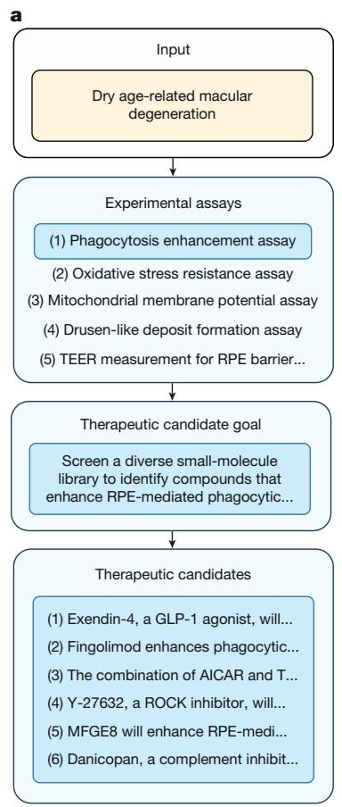  
b

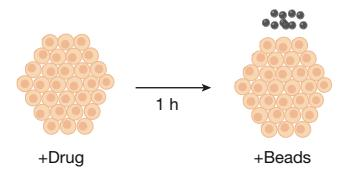

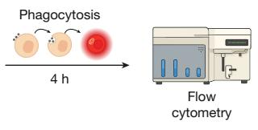

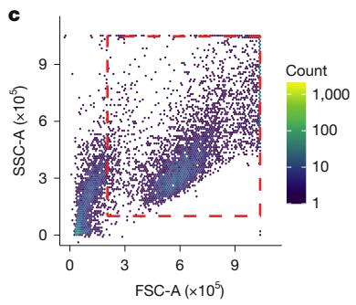

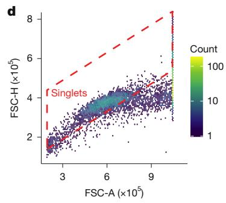

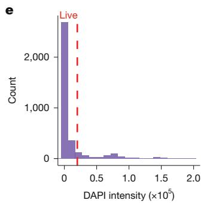

f  
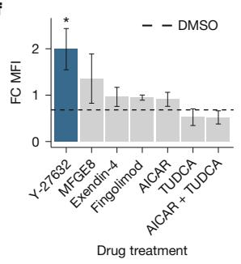  
Fig. 2 | Robin generates therapeutic candidate hypotheses for dAMD and analyses experimental data from in vitro experiments. a, Robin proposes several experimental assays and ultimately decides to use an RPE phagocytosis enhancement assay. Robin synthesizes this strategy into an overall goal and then generates several novel therapeutic candidates to enhance RPE phagocytosis. TEER, transepithelial electrical resistance. Text in panel a generated by Robin. b, Schematic representation of the phagocytosis assay. RPE cells are incubated with the drug for 1 h before pHrodo-labelled beads or ROSs are added. The cells are incubated with the beads or ROSs for 3 h and phagocytic activity is measured via flow cytometry. Schematic created in BioRender; Ghareeb, A. https://biorender.com/yf9q8b1 (2026). c–f, Example  
plots from a Finch flow cytometry analysis trajectory, formatted for readability in publication by a human. c, Finch performs gating to discard debris using a forward-scatter area (FSC-A) versus side-scatter area (SSC-A) plot. d, Finch gates singlet cells from the forward-scatter height (FSC-H) versus FSC-A plot. Red outlined area (c,d) indicates cell population. e, Finch identifies the 4′,6-diamidino-2-phenylindole (DAPI) signal and excludes dead cells. f, Finch performs statistical tests to compare candidate drugs to the DMSO control and plots the results. This bar plot shows the fold change in mean fluorescence intensity (FC MFI) relative to the DMSO control (n = 3 wells; error bars are s.e.m.; significance was determined using Dunnett’s test: \*P < 0.05).

ROCK inhibitor enhances phagocytosis. We then selected the top five candidates from this ranking for experimental testing: exendin-4, fingolimod, MFGE8, Y-27632 and the combination of 5-aminoimidazole-4-carboxamide ribonucleotide (AICAR) and tauroursodeoxycholic acid (TUDCA). MFGE8 is known to increase phagocytosis in cultured RPE cells34, so we included it to serve as a positive control. Although Robin suggested using fluorescently labelled photoreceptor outer segments as a substrate for RPE phagocytosis, we initially decided to use pHrodo beads due to availability. In addition, Robin suggested using primary or stem cell-derived RPE, but we used ARPE-19 cells for the initial drug screen to expedite our evaluation of the hypotheses by Robin. pHrodo beads are fluorescently activated in the low pH environment of the lysosome, allowing detection of phagocytosis in single cells using flow cytometry (Fig. 2b; see Supplementary Fig. 12 for microscopy validation). After testing these therapeutic candidates in the RPE phagocytosis assay, the raw flow cytometry data, associated metadata and an analysis prompt were uploaded to Robin. Robin called the data analysis agent Finch, which developed a Jupyter notebook to quantify the effect of each compound on RPE phagocytosis by gating the flow cytometry data and performing statistical tests. Plots from a representative individual Finch trajectory are shown in Fig. 2c–e. These results were confirmed by a human analysis of the same data (Supplementary Table 3 and Supplementary Fig. 13). Preclinical models have demonstrated that Y-27632 can restore phagocytic efficiency in RPE cells35, confirming the literature-based rationale by Robin for suggesting this candidate.

Automated RNA-seq analysis. After analysing the initial flow cytometry results, Robin recommended RNA-seq of Y-27632-treated RPE cells to investigate the transcriptional effects of ROCK inhibition (Fig. 3a). We conducted a second RPE phagocytosis experiment with Y-27632 and profiled the samples using bulk RNA-seq. Finch conducted differential gene expression (DGE) analysis and summarized results in a volcano plot (Fig. 3b). Although previous studies have shown that Y-27632 enhances phagocytic cup formation through post-translational regulation of F-actin dynamics35–37, the DGE analysis by Finch revealed that Y-27632 treatment also induced rapid transcriptional changes in RPE cells during phagocytosis. The consensus analysis by Finch demonstrated that Finch identified the same genes as significantly differentially expressed in over 50% of trajectories (Fig. 3c). Finch next performed Gene Ontology enrichment analysis and found that Y-27632 significantly altered the expression of genes involved in actin filament organization, small GTPase-mediated signal-transduction and autophagy pathways after phagocytosis (Fig. 3d). These results suggest that Y-27632 could enhance the initial uptake phase of phagocytosis through cytoskeletal rearrangement and promote clearance of internalized material through transcriptional regulation of autophagy; however, further work is necessary to validate any effects on autophagy. The human version of this analysis is like that of Finch and is shown in Supplementary Fig. 14.

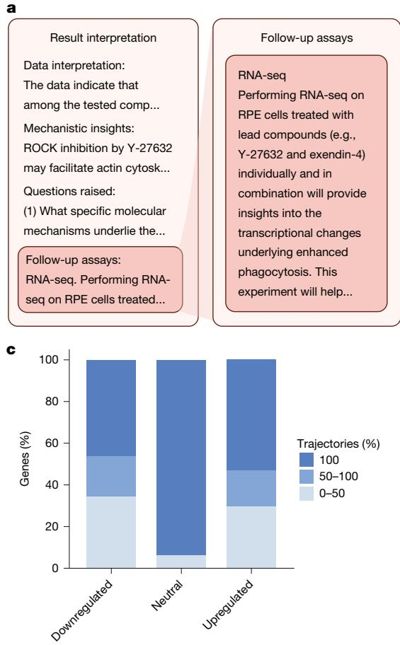  
b

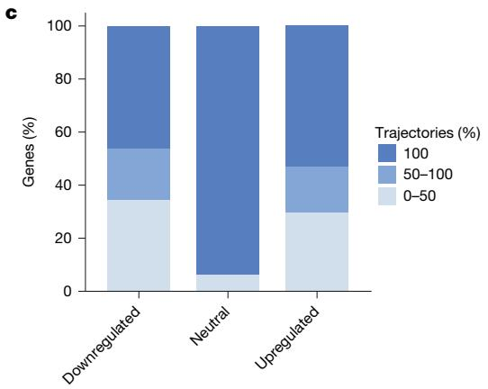  
Fig. 3 | RNA-seq analysis of ARPE-19 cells treated with the ROCK inhibitor Y-27632. a, Robin interprets results from the first experiment and proposes follow-up assays. Text in panel a generated by Robin. b–d, Example plots from a Finch RNA-seq analysis, formatted for readability in publication by a human. b, A Finch-made volcano plot showing differentially expressed genes between

The DGE analysis identified a threefold upregulation (adjusted P = 2.13 × 10−83) of ABCA1, which encodes a critical lipid efflux pump, in Y-27632-treated cells. Differential expression of ABCA1 after ROCK inhibitor-induced phagocytosis has potential implications for dAMD, as ABCA1 is essential for healthy RPE function. ABCA1 facilitates the active transport of cholesterol and phospholipids from the plasma membrane to acceptor proteins before their ejection from the cell. Further connecting these findings to dAMD pathology, apolipoprotein E, a lipid acceptor for ABCA1, has been identified in multiple studies as a genetic susceptibility allele for macular degeneration38–40.

These mechanistic insights, derived from experiments proposed by Robin and analysed by Finch, demonstrate how AI-driven scientific discovery can not only expedite the generation of in vitro data for candidate therapeutic compounds but also reveal novel molecular targets within disease pathways that might have otherwise remained unexplored.

A repurposed drug for dAMD. In addition to suggesting RNA-seq analysis on Y-27632, Robin also conducted a subsequent iteration of candidate drug hypotheses (Fig. 4a). We tested ten of these drugs experimentally and provided the data to Finch for analysis. Analysis by Finch showed that ripasudil, a ROCK inhibitor approved for treatment of glaucoma in Japan, outperformed Y-27632 and increased RPE cell phagocytosis 1.89-fold compared with dimethyl sulfoxide (DMSO) controls (Fig. 4b; human analysis showed a 1.75-fold increase; see Supplementary Table 4 and Supplementary Fig. 15). A dose–response experiment in ARPE-19 cells confirmed the greater potency of ripasudil than Y-27632 (Fig. 4c). In addition, as an approved drug, ripasudil has a known safety profile, providing an advantage over Y-27632 (a research compound) in clinical translation.

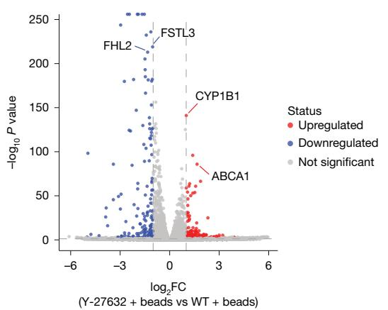

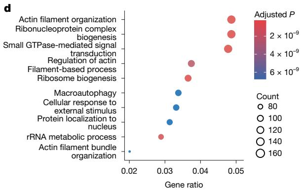  
Y-27632-treated and wild-type (WT) cells after phagocytosis. c, Finch-made consensus findings from eight RNA-seq analysis trajectories, showing the percentage of analyses that identified the same genes as consistently upregulated or downregulated. d, Finch-made Gene Ontology term enrichment of differentially expressed genes; n = 3 wells.

Validation in primary human RPE cells. RPE stem cells (RPE-SCs) are a subpopulation of the human RPE cells that retains limited mitotic potential, allowing cultivation in vitro. When expanded into a confluent monolayer and allowed to mature in vitro, RPE-SCs are known to express canonical RPE genes, retain polarized barrier function and morphologically resemble native human RPE cells41. In addition, ROCK inhibitors are not required in the culture of RPE-SCs, unlike induced pluripotent stem cell-derived RPE cells42. We obtained RPE-SCs isolated from a patient older than 60 years of age from the Eye-Bank for Sight Restoration (New York) and expanded them into a confluent monolayer. We validated their RPE phenotype through immunocytochemistry of canonical RPE markers and phagocytosis machinery43 (Extended Data Figs. 1 and 2).

We re-screened all drugs suggested by Robin, this time using RPE-SCs in place of ARPE-19 cells, and fluorescently labelled bovine rod outer segments (ROSs) in place of beads. Once again, ripasudil and Y-27632 were identified as hits, with ripasudil again showing higher

a

Data interpretation: The data indicate that among the tested comp... Mechanistic insights: ROCK inhibition by Y-27632 may facilitate actin cytosk... Questions raised: (1) What specic molecular mechanisms underlie the... Follow-up assays: RNA-seq. Performing RNAseq on RPE cells treated...

Therapeutic candidate goal

Screen a diverse small-molecule   
library to identify compounds that enhance RPE-mediated phagocytic...

Experimentally informed literature review

Experimental tests have been conducted previously to identify therapeutic compounds to treat dry age-related macular degeneration. Here is a summary of the results...

Ripasudil offers improved selectivity and pharmacokinetics compared with traditional ROCK inhibitors such as Y-27632. By facilitating cytoskeletal relaxation, ripasudil may allow for greater membrane exibility and phagocytic cup formation in RPE cells. Given the experimental data suggesting that ROCK inhibition signicantly...

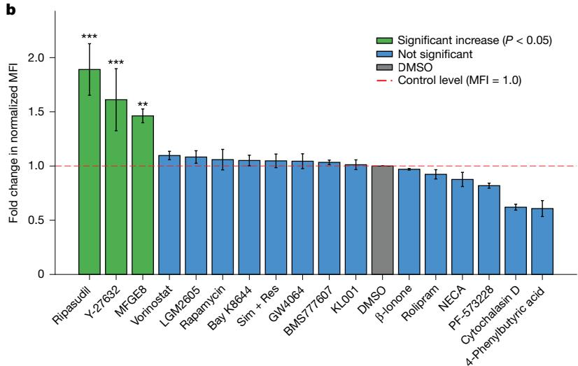

c  
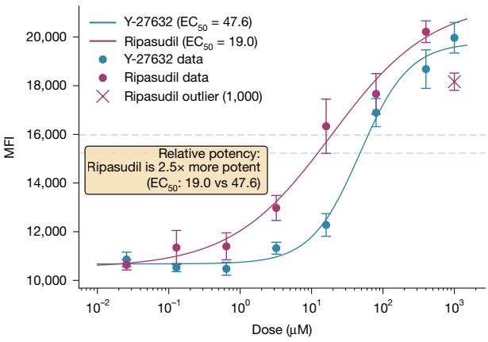

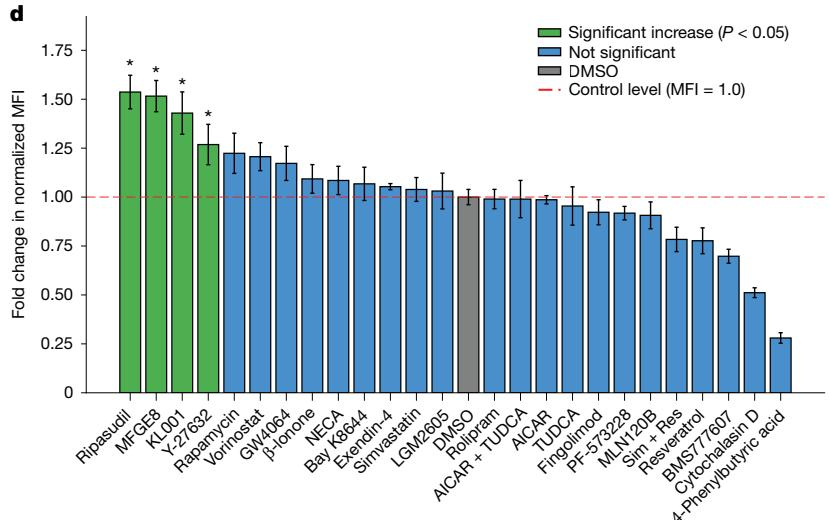  
Fig. 4 | Ripasudil and KL001 enhance RPE phagocytosis. a, Excerpt of the proposal by Robin for ripasudil. Drawing from the insights from the first round of experimental analysis, Robin proposes ripasudil as a therapeutic candidate for treating dAMD. For result interpretation, a JSON-structured output is generated from the Finch results by an LLM (see experimental insights app ENDAGE in prompts.py in the Robin GitHub repository; see Code availability). NECA, 5′-N-ethylcarboxamidoadenosine. Text in panel a generated by Robin. b, Analysed flow cytometry data from the second round of experiments in ARPE-19 cells show that ripasudil significantly enhances phagocytosis

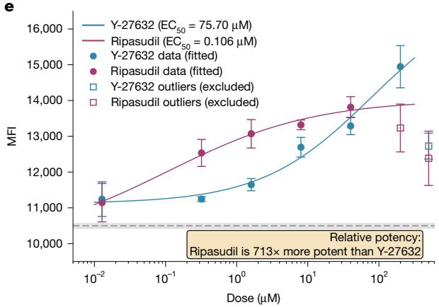  
(n = 3 wells). c, Dose–response curves for ripasudil and Y-27632 in ARPE-19 cells. Ripasudil is more potent than Y-27632 at stimulating phagocytosis in ARPE-19 cells (n = 3 wells). Dashed horizontal lines indicate half-maximal effective concentration (EC ) for ripasudil (purple) and Y-27632 (blue). d, Validation of ripasudil in geriatric primary human RPE cells (RPE-SCs) recapitulates the phagocytosis-enhancing effect of Y-27632 and ripasudil (n = 4 wells). e, Ripasudil is more potent than Y-27632 in RPE-SCs (n = 4 wells). Dashed horizontal line with grey shading indicates the MFI of the DMSO control. Error bars show the s.e.m. on all plots. Significance was determined by Dunnett’s test: \*P < 0.05.

potency (Fig. 4d; see also the human analysis in Supplementary Table 5 and Supplementary Fig. 16). There is a dose-dependent increase in phagocytosis with both ROCK inhibitors, with ripasudil being more potent than Y-27632 (Fig. 4e). Supernatants from this dose–response experiment were assayed for cytotoxicity. There was no relationship between Y-27632 dose and lactate dehydrogenase (LDH) release from RPE-SCs. Ripasudil showed a negative relationship with LDH release, with higher drug concentrations reducing LDH release (Extended Data Fig. 3).

KL001, a circadian clock modulator that works by preventing the ubiquitin-dependent degradation of CRY proteins, was also identified as a hit in RPE-SCs. Robin suggested this drug on the basis of the circadian control of RPE phagocytosis43 and, to our knowledge, no one has previously proposed KL001 as an enhancer of phagocytosis.

To further validate the ABCA1 finding, we performed RNA-seq on RPE-SCs treated with ripasudil or vehicle control (with or without ROSs). ABCA1 was also upregulated in RPE-SCs in response to ripasudil exposure, with or without ROSs (Supplementary Fig. 17).

Although in vivo validation of both drugs would be necessary for definitive comparison, the initial superior performance of ripasudil over Y-27632 in this in vitro assay demonstrates the ability of Robin to progressively refine therapeutic hypotheses through iterative experimentation and feedback.

## Validation of the Robin architecture

We started by ablating the literature search agents Crow and Falcon, replacing them with calls to OpenAI’s o4-mini. We then assessed the performance of Robin (wild type) versus its ablated version by asking both to generate 50 drug candidate proposals for dAMD and then assessing the quality of a sampled subset of these proposals.

We manually assessed their quality by performing a human reference check. As expected, this showed that ablation of Falcon, or of both Crow and Falcon, but not of Crow alone, led to a dramatic increase in hallucinated references (Extended Data Fig. 4a and Supplementary Tables 6–8, respectively). (Crow is responsible for producing the literature searches that guide Falcon in producing the final drug candidate report, and so any references hallucinated during the Crow literature search phase could be corrected by Falcon in producing its final report.) To confirm that Falcon was indeed masking the hallucinated LLM-generated references in the Crow-only ablation, we generated 15 assay proposals from wild-type and Crow-ablated Robin (Crow, not Falcon, produces final assay reports; see Supplementary Fig. 1). We then performed a human reference check and, as expected, Crow produced no hallucinated references, whereas 44.5 ± 6.37% (mean ± s.e.m., n = 15 assay proposals) of the references from o4-mini were hallucinated (Extended Data Fig. 4b and Supplementary Table 9).

To probe whether Crow and Falcon literature searches produced higher-quality proposals over those produced by o4-mini, we compared the 50 wild-type and 50 ablated proposals in a head-to-head tournament adjudicated by an LLM judge (Claude Sonnet 3.7; see judge prompts in Supplementary Fig. 11). Ablation of Crow, Falcon or Crow, and Falcon always led to a reduction in the quality of the final drug proposals (Extended Data Fig. 4c).

Next, we assessed the performance of Finch on the flow cytometry and RNA-seq tasks performed in round two of the dAMD drug screen. Finch was given the task-specific prompts and data from round two and performance was measured by assessing the adherence of Finch to expert-generated rubrics (Supplementary Figs. 18 and 19). Finch demonstrated consistent performance on RNA-seq (86 ± 0% (mean ± s.e.m.); n = 3 runs) and flow cytometry (100 ± 0% (mean ± s.e.m.); n = 3 runs; Extended Data Fig. 5a).

To probe the failure mode of Finch on a range of more difficult data analysis tasks without the task-specific multistep prompting given in the Robin workflow, we curated an expert-generated panel of 170 question–answer pairs from BixBench that span bioinformatics and statistics tasks relevant to drug discovery31 (Extended Data Fig. 5b and Supplementary Table 10). The overall performance of Finch was 22.8 ± 1.7% compared with 1.6 ± 1.2% (mean ± s.e.m.) for Sonnet 3.7 alone without the agent harness (n = 3; Extended Data Fig. 5c,d). Finch performed better on the statistics subset (47.9 ± 1.5%) than the bioinformatics subset (15.3 ± 2.0%). Typically, the bioinformatics subset required executing multi-step pipelines, which are sensitive to parameterization, whereas the biostatistics questions required only single-step computations on clean, tabular data. These results demonstrate a clear utility for agent harnesses such as Finch, which augment LLMs with the tools necessary to engage with data sources, but also point out room for substantial performance improvement on multi-step problems.

To confirm that the identification of ROCK inhibitors in the phagocytosis assay by Robin could not be trivially recapitulated by a general purpose LLM-based agent, we gave the same candidate generation prompt (Supplementary Fig. 8) to Deep Research by OpenAI, an agent designed to conduct multi-step research on complex tasks. Like Robin, Deep Research was asked to generate 19 novel drug candidates (equal to the total number of Robin drug candidates in round one and round two), which we screened in RPE-SCs. Deep Research generated 17 unique candidates (duplicating 2 drug candidates). None of the suggested drugs by Deep Research were hits in this assay, and notably, Deep Research did not suggest ROCK inhibition as a means of enhancing RPE phagocytosis (Extended Data Fig. 6).

## Discussion

In this report, we present Robin, a multi-agent system integrating automated hypothesis generation and experimental data analysis for scientific discovery. When tasked with identifying novel therapeutics for dAMD, Robin proposed phagocytosis enhancement as a therapeutic strategy for dAMD and identified ripasudil and KL001 as enhancers of RPE phagocytosis among tested compounds through an iterative lab-in-the-loop discovery cycle. The established safety profile of ripasudil and its clinical approval for ocular use present a promising drug repurposing opportunity, whereas KL001 represents, to our knowledge, a novel approach to phagocytosis enhancement in RPE cells.

Of note, although ROCK inhibitors have been previously suggested for treatment of wet AMD and other retinal diseases of neovascularization, Robin is one of the first to propose their therapeutic application in dAMD via a mechanism of phagocytosis enhancement44. This approach is supported by several lines of evidence. RPE phagocytic dysfunction is observed not only with normal ageing but is also pronounced in patients with AMD45–47. In addition, the ability of ROCK inhibition to enhance phagocytosis in RPE cells is already known35–37. This hypothesis would of course require validation in a suitable disease model and ultimately in a randomized, placebo-controlled trial to confirm clinical validity.

Together, these results demonstrate the ability of Robin to effectively generate novel, testable hypotheses by synthesizing insights already present in the scientific literature. By focusing on ‘combinatorial synthesis’ (identifying non-obvious connections between disparate fields), Robin effectively targets ‘low-hanging fruit’ that human experts may overlook due to the compartmentalization of scientific knowledge. This paradigm of reliable, literature-grounded synthesis is applicable beyond drug repurposing and could be readily extended to fields such as materials science48.

Beyond the specific application of dAMD, Robin addresses a broader challenge in therapeutic development. With US Food and Drug Adminis tration approvals stagnating at approximately 50 novel drugs annually over the past decade49, new approaches to scale therapeutic discovery are urgently needed. As one of the first systems to automate both literature-grounded hypothesis generation and experimental biology data analysis, Robin is poised to accelerate the pace of drug discovery compared with traditional approaches.

40. McKay, G. J. et al. Evidence of association of APOE with age-related macular degeneration—a pooled analysis of 15 studies. Hum. Mutat. 32, 1407–1416 (2011)

In light of the potential for automated discovery systems to identify potent biological agents, we have implemented guardrails within the Robin framework. First, the system prioritizes candidates with established safety profiles and searches for known toxicities or off-target interactions. Second, as a lab-in-the-loop system, the outputs of Robin are treated as therapeutic hypotheses that must undergo standard pre-clinical validation, ensuring that any unintended toxicity is identified through traditional in vitro and in vivo safety filters before clinical translation. Regarding dual-use concerns, Robin utilizes 'off-the-shelf' LLMs that have undergone extensive safety alignment (via red-teaming and reinforcement learning from human feedback) to prevent the generation of malicious biological protocols. In addition, all queries to our platform are run through an LLM classifier that checks against unsafe topics.

In its current implementation, Robin has several opportunities for continued development. For example, although Robin generates experimental outlines, it does not yet produce precise, executable protocols; future iterations aim to provide detailed methodologies that require minimal human translation for laboratory execution. The Finch data analysis agent is also reliant on prompt engineering by domain experts to produce reliable analytical results. Adapting Finch to independently generate or adapt prompts to specific data modalities would enable a more autonomous discovery pipeline. Finally, although the results in this article rely on frontier LLMs available in early 2025, the model-agnostic architecture of Robin ensures that its capabilities will scale alongside advances in underlying foundation models. Although the rapidly advancing baseline capabilities of general-purpose coding agents may achieve parity with specialized harnesses such as Finch on standard computational tasks, domainspecific architectures remain crucial for strictly enforcing experimental constraints and reliably orchestrating specialized bioinformatics toolchains.

By automating hypothesis generation, experimental planning and data analysis in an integrated system, Robin represents a powerful new paradigm for AI-driven scientific discovery. This approach can be used to not only reshape therapeutic development but also fundamentally accelerate the scientific process to drive a greater understanding of the natural world.

## Online content

Any methods, additional references, Nature Portfolio reporting summaries, source data, extended data, supplementary information, acknowledgements, peer review information; details of author contributions and competing interests; and statements of data and code availability are available at https://doi.org/10.1038/s41586-026-10652-y.

1. Boiko, D. A., MacKnight, R., Kline, B. & Gomes, G. Autonomous chemical research with large language models. Nature 624, 570–578 (2023).

2. Wang, E. et al. TxGemma: efficient and agentic LLMs for therapeutics. Preprint at https:// doi.org/10.48550/arxiv.2504.06196 (2025).

3. Gottweis, J. et al. Towards an AI co-scientist. Preprint at https://doi.org/10.48550 arxiv.2502.18864 (2025).

4. Fleckenstein, M., Schmitz-Valckenberg, S. & Chakravarthy, U. Age-related macular degeneration: a review. JAMA 331, 147–157 (2024).

5. Rein, D. B. et al. Forecasting age-related macular degeneration through the year 2050: the potential impact of new treatments. Arch. Ophthalmol. 127, 533–540 (2009).

6. Stephens, Z. D. et al. Big data: astronomical or genomical? PLoS Biol. 13, e1002195 (2015).

7. Nurse, P. Biology must generate ideas as well as data. Nature 597, 305 (2021).

8. Cheng, F., Ma, Y., Uzzi, B. & Loscalzo, J. Importance of scientific collaboration in contemporary drug discovery and development: a detailed network analysis. BMC Biol. 18, 138 (2020).

9. Ingersoll, M. A. et al. BRAF inhibition protects against hearing loss in mice. Sci. Adv. 6, eabd0561 (2020).

10. Ingersoll, M. A. et al. Dabrafenib protects from cisplatin-induced hearing loss in a clinically relevant mouse model. JCI Insight 8, e171140 (2023).

11. GlaxoSmithKline. Clinical trial results: a phase II (BRF113710) single-arm, open-label study of dabrafenib (GSK2118436) in previously treated BRAF mutant metastatic melanoma. EU Clinical Trials Register https://www.clinicaltrialsregister.eu/ctr-search/trial/2009- 015297-36/results (2017).

12. US National Library of Medicine. ClinicalTrials.gov https://clinicaltrials.gov/study/ NCT01153763 (2017).

13. Ribas, A. & Flaherty, K. T. BRAF targeted therapy changes the treatment paradigm in melanoma. Nat. Rev. Clin. Oncol. 8, 426–433 (2011).

14. Lahne, M. & Gale, J. E. Damage-induced activation of ERK1/2 in cochlear supporting cells is a hair cell death-promoting signal that depends on extracellular ATP and calcium. J. Neurosci. 28, 4918–4928 (2008)

15. Berman, R. M. et al. Antidepressant effects of ketamine in depressed patients. Biol. Psychiatry 47, 351–354 (2000).

16. Petersen, R. C. & Stillman, R. C. (eds) Phencyclidine (PCP) Abuse: an Appraisal (National Institute on Drug Abuse, 1978).

17. Frye, R. E., Sequeira, J. M., Quadros, E. V., James, S. J. & Rossignol, D. A. Cerebral folate receptor autoantibodies in autism spectrum disorder. Mol. Psychiatry 18, 369–381 (2013).

18. Ramaekers, V. T., Blau, N., Sequeira, J. M., Nassogne, M.-C. & Quadros, E. V. Folate receptor autoimmunity and cerebral folate deficiency in low-functioning autism with neurological deficits. Neuropediatrics 38, 276–281 (2008).

19. Sauerberg, P. et al. Novel functional M1 selective muscarinic agonists. Synthesis and structure-activity relationships of 3-(1,2,5-thiadiazolyl)-1,2,5,6-tetrahydro-1-methylpyridines. J. Med. Chem. 35, 2274–2283 (1992).

20. Karuna Therapeutics, Inc. Form 10-K: annual report for the fiscal year ended December 31, 2019. U.S. Securities and Exchange Commission https://www.sec.gov/Archives/edgar/ data/1771917/000156459020012311/krtx-10k\_20191231.htm (2020).

21. Taylor, R. et al. Galactica: a large language model for science. Preprint at https://doi.org/ 10.48550/arxiv.2211.09085 (2022).

22. Giglou, H. B., D'Souza, J., & Auer, S. LLMs4Synthesis: Leveraging large language models for scientific synthesis. In Proc. 24th ACM/IEEE Joint Conference on Digital Libraries (JCDL) https://doi.org/10.1145/3677389.3702565 (Association for Computing Machinery, 2025).

23. Agarwal, S. et al. LitLLM: a toolkit for scientific literature review. Preprint at https://doi. org/10.48550/arxiv.2402.01788 (2025).

24. Wang, Z. P., Bhandary, P., Wang, Y. & Moore, J. H. Using GPT-4 to write a scientific review article: a pilot evaluation study. BioData Min. 17, 16 (2024).

25. Skarlinski, M. D. et al. Language agents achieve superhuman synthesis of scientific knowledge. Preprint at https://doi.org/10.48550/arxiv.2409.13740 (2024).

26. Huang, K. et al. Automated hypothesis validation with agentic sequential falsifications. In Proc. 42nd International Conference on Machine Learning (ICML) Vol. 267 (eds Singh, A. et al.) 25372–25437 (PMLR, 2025).

27. Lu, C. et al. Towards end-to-end automation of AI research. Nature 651, 914–919 (2026).

28. Ifargan, T., Hafner, L., Kern, M., Alcalay, O. & Kishony, R. Autonomous LLM-driven research from data to human-verifiable research papers. NEJM AI https://doi.org/10.1056/ AIoa2400555 (2024).

29. Yamada, Y. et al. The AI Scientist-v2: workshop-level automated scientific discovery via agentic tree search. Preprint at https://doi.org/10.48550/arxiv.2504.08066 (2025).

30. Chaves, J. M. Z. et al. Tx-LLM: a large language model for therapeutics. Preprint at https://doi.org/10.48550/arxiv.2406.06316 (2024).

31. Mitchener, L. et al. Bixbench: a comprehensive benchmark for LLM-based agents in computational biology. Preprint at https://doi.org/10.48550/arxiv.2503.00096 (2025).

32. Buniello, A. et al. Open Targets Platform: facilitating therapeutic hypotheses building in drug discovery. Nucleic Acids Res. 53, D1467–D1475 (2024).

33. Narayanan, S. et al. Aviary: training language agents on challenging scientific tasks. Preprint at https://doi.org/10.48550/arxiv.2412.21154 (2024).

34. Nandrot, E. F. et al. Essential role for MFG-E8 as ligand for α β integrin in diurnal retina phagocytosis. Proc. Natl Acad. Sci. USA 104, 12005–12010 (2007).

35. Mao, Y. & Finnemann, S. C. Acute RhoA/Rho kinase inhibition is sufficient to restore phagocytic capacity to retinal pigment epithelium lacking the engulfment receptor MerTK. Cells 10, 1927 (2021).

36. Müller, C., Charniga, C., Temple, S. & Finnemann, S. C. Quantified F-actin morphology is predictive of phagocytic capacity of stem cell-derived retinal pigment epithelium. Stem Cell Rep. 10, 1075–1087 (2018).

37. Kozyrina, A. N. et al. Laminin-defined mechanical status modulates retinal pigment epithelium phagocytosis. EMBO Rep. 26, 3357–3383 (2025).

38. Malek, G. et al. Apolipoprotein E allele-dependent pathogenesis: a model for age-related retinal degeneration. Proc. Natl Acad. Sci. USA 102, 11900–11905 (2005).

39. Klaver, C. C. et al. Genetic association of apolipoprotein E with age-related macular degeneration. Am. J. Hum. Genet. 63, 200–206 (1998).

41. Blenkinsop, T. A. et al. Human adult retinal pigment epithelial stem cell-derived RPE monolayers exhibit key physiological characteristics of native tissue. Invest. Ophthalmol. Vis. Sci. 56, 7085–7099 (2015).

42. Croze, R. H. et al. ROCK inhibition extends passage of pluripotent stem cell-derived retinal pigmented epithelium. Stem Cells Transl. Med. 3, 1066–1078 (2014).

43. Lieffrig, S. A., Gyimesi, G., Mao, Y. & Finnemann, S. C. Clearance phagocytosis by the retinal pigment epithelial during photoreceptor outer segment renewal: molecular mechanisms and relation to retinal inflammation. Immunol. Rev. 319, 81–99 (2023).

44. Halasz, E. & Townes-Anderson, E. Rock inhibitors in ocular disease. ADMET DMPK 4, 280–301 (2016).

45. Inana, G. et al. RPE phagocytic function declines in age-related macular degeneration and is rescued by human umbilical tissue derived cells. J. Transl. Med. 16, 63 (2018).

46. Si, Z., Zheng, Y. & Zhao, J. The role of retinal pigment epithelial cells in age-related macular degeneration: phagocytosis and autophagy. Biomolecules 13, 901 (2023).

47. Kaarniranta, K. et al. Autophagy and heterophagy dysregulation leads to retinal pigment epithelium dysfunction and development of age-related macular degeneration. Autophagy 9, 973–984 (2013).

48. Gregoire, J. M., Zhou, L. & Haber, J. A. Combinatorial synthesis for AI-driven materials discovery. Nat. Synth. 2, 493–504 (2023).

49. Baedeker, M., Ringel, M. S. & Möller, C. C. 2024 FDA approvals exceed average number but have lower sales projections. Nat. Rev. Drug Discov. 24, 85–85 (2025).

50. Tenopir, C., King, D. W., Christian, L. & Volentine, R. Scholarly article seeking, reading, and use: a continuing evolution from print to electronic in the sciences and social sciences. Learn. Publ. 28, 93–105 (2015).

51. Hippel, T. V. & Hippel, C. V. To apply or not to apply: a survey analysis of grant writing costs and benefits. PLoS ONE 10, e0118494 (2015).

52. Sboner, A., Mu, X. J., Greenbaum, D., Auerbach, R. K. & Gerstein, M. B. The real cost o sequencing: higher than you think! Genome Biol. 12, 125 (2011).

53. Anaconda. State of data science 2024 report. Anaconda https://www.anaconda.com/ resources/report/state-of-data-science-report-2024 (2024).

Publisher’s note Springer Nature remains neutral with regard to jurisdictional claims in published maps and institutional affiliations.

Open Access This article is licensed under a Creative Commons Attribution-NonCommercial-NoDerivatives 4.0 International License, which permits any non-commercial use, sharing, distribution and reproduction in any medium o format, as long as you give appropriate credit to the original author(s) and the source, provide a link to the Creative Commons licence, and indicate if you modified the licensed material. You do not have permission under this licence to share adapted material derived from this article or parts of it. The images or other third party material in this article are included in the article’s Creative Commons licence, unless indicated otherwise in a credit line to the material. If material is not included in the article’s Creative Commons licence and your intended use is not permitted by statutory regulation or exceeds the permitted use, you will need to obtain permission directly from the copyright holder. To view a copy of this licence, visit http:// creativecommons.org/licenses/by-nc-nd/4.0/.

© The Author(s) 2026

## Methods

## Robin implementation

Robin was implemented as a Jupyter notebook using the Aviary framework to instantiate and call agents33. Robin utilizes the OpenAI o4-mini model to synthesize literature and generate hypotheses, and the Anthropic Claude 3.7 Sonnet model as the judge for pairwise comparisons to rank hypotheses. Prompts used for agents and LLMs called in Robin are shown in Supplementary Figs. 2–11.

Of note, although the experiments in this paper were conducted using an agentic implementation of Robin, we observed that Robin almost always called tools in the same order, leading to a deterministic workflow. Therefore, we translated Robin into a streamlined Jupyter notebook to improve stability and ease of use.

The ranking of hypotheses was calculated via a series of pairwise comparisons adjudicated by the LLM judge. When ranking 25 or fewer hypotheses, all possible pairs were compared in a round robin tournament. When considering more than 25 hypotheses, 300 pairwise comparisons were randomly selected to achieve a comprehensive assessment within reasonable computational and time constraints. The outcomes from these comparisons were used to estimate strength parameters via the Bradley–Terry–Luce (BTL) model, which subsequently informed the relative ranking of each hypothesis54. Although there is no clear consensus on the optimal strategy for LLM-judge-based rankings, we opted for pairwise comparisons rather than pointwise. Some literature55,56 has shown pairwise comparisons to be more robust than pointwise grading, as pointwise grading may be unable to distinguish nuanced differences between similar pairs. Position bias in the pairwise comparisons is addressed by utilizing a highly distributed tournament paired with the BTL model, rather than relying on simple win–loss tallies, which are highly susceptible to positional bias. To generate the prompt for this LLM judge, domain experts were asked to conduct pairwise comparisons of the therapeutic candidate hypotheses in Robin. The results of these expert evaluations were given to Google’s Gemini 2.5 Pro Preview model to generate a prompt for the LLM judge in Robin. This approach was designed to elicit decision-making from the LLM judge consistent with expert preferences and criteria.

When comparing the preferences of the LLM judge with the preferences of the experts, the LLM judge demonstrated high concordance with expert preferences, with an average of 7.25 of its top 10 hypotheses matching those in the experts’ top 10 (Supplementary Fig. 20a). This concordance is more than double that expected from random selection. Furthermore, the LLM judge exhibited higher intra-rater consistency than human experts (Supplementary Fig. 20b). When presented with identical pairwise comparisons, the LLM judge selected the same hypothesis in 88% of comparisons, as compared with human experts who selected the same hypothesis 61% of the time.

## Finch implementation

Finch is an autonomous, Jupyter-native data analysis agent designed using the Aviary framework33. Finch systematically processes bioinformatics workflows, such as RNA-seq differential expression analysis or flow cytometry, based on a provided dataset and research question.

Rather than retrieving static templates from a codebase, the agent operates as a generative reasoning engine that writes original, executable Python or R code line by line in real time, ensuring that the analytical logic is dynamically adapted to the data distribution rather than constrained by hard-coded subroutines. The agent operates within a structured execution environment provided by the Aviary framework; an extensible gymnasium tailored for language agent evaluation and iterative problem-solving33. Aviary was selected specifically for its controlled environment, supporting reproducible evaluations through standardized software environments, consistent tool access and structured multi-step reasoning.

Finch leverages an agentic prompting strategy based on the ReAct approach, balancing logical reasoning and practical execution effectively57. Each Finch trajectory unfolds within a pre-built Docker container (BixBench-env:v1.0), containing extensive bioinformatics-oriented Python, R and Bash libraries. This standardized container ensures reproducibility and isolates evaluation strictly to the analytical capability of Finch rather than software installation or dependency management. That being said, Finch is capable of installing new dependencies when needed and does so competently.

Tools and environment. Finch interacts exclusively via two tools enabled by the Aviary framework:

• edit\_cell: The agent can select, modify and execute cells within a Jupyter notebook.

• submit\_answer: Finalizes and submits the analytical conclusion by the agent.

Prompt engineering was thoroughly explored to optimize the initial instructions of Finch, with an example provided in Supplementary Fig. 10. All Finch trajectories are available through the FutureHouse platform.

Finch evaluation. We evaluated Finch and its base model (Claude 3.7 Sonnet) without agent capabilities on 170 questions relevant to drug discovery from the BixBench bioinformatics benchmark31. After excluding low-quality categories and categories not relevant to human drug discovery, 170 questions across 38 data capsules were retained and classified into two categories: bioinformatics (n = 131 questions), comprising RNA-seq, genomics, epigenomics, functional enrichment and sequence analysis tasks; and biostatistics (n = 39 questions), comprising image analysis tasks and general statistical analysis tasks. Each question was assigned to its first listed category in the BixBench category mapping to avoid double-counting across multi-label assignments. Both Finch and the base LLM were run in triplicate. Mean accuracy was calculated per category per replicate, and error bars represent the standard error of the mean across replicates. For failure mode analysis, each non-correct Finch response was classified as wrong answer (agent produced a specific incorrect value), distractor match (response matched a provided distractor), formatting (correct value in wrong format), unsure (agent declined to answer) or empty/failed (no response produced), aggregated across all three replicas.

Each BixBench question consists of a natural language prompt, which references data files packaged in a capsule (ZIP archive), an expected answer, three distractor options and a designated evaluation method. Finch receives both the question and the access to the capsule data and may write and execute code (Python or R) over up to ten steps to produce an answer. The base LLM receives only the question text with no data access or code execution capability. Responses were evaluated using one of three methods specified per question: exact match (string or numeric equality), range match (numeric answer within a specified interval) or LLM judge (semantic equivalence assessed by a separate model for free-text answers). A response was scored as correct only if it passed its designated evaluation; all other outcomes, including valid analyses that produced wrong values, formatting mismatches and refusals, were scored as incorrect.

## Robin validation

Crow and Falcon ablation experiments. Calls to the FutureHouse platform agents Crow and Falcon were replaced with calls to o4-mini via the OpenAI API using the same system and user prompt. For the human reference check, a scientist blinded to the source was provided with ten randomly chosen proposals from the wild-type and ablated versions of Robin. Each time a citation or reference was encountered in a proposal, the scientist attempted to find the original article online. If the original article could not confidently be identified from the citation or reference (including the available context from the proposal), the reference was labelled as hallucinated. Otherwise, the reference was labelled legitimate.

For the LLM judge comparison, 50 wild-type and 50 ablated proposals were submitted to a head-to-head tournament adjudicated by Claude Sonnet 3.7 and the outcomes from these comparisons were used to generate a proposal ranking via the BTL model (as implemented in the Robin internal ranking system). Statistical significance of differences in mean ranks between groups was assessed using a permutation test. The observed test statistic was the difference in mean ranks between the ablated and wild-type groups (mean rank of ablated minus mean rank of wild type). Under the null hypothesis of no difference between groups, the null distribution was generated by randomly permuting group labels 10,000 times and recalculating the test statistic for each permutation. The P value was calculated as the proportion of permuted differences greater than or equal to the observed difference (one-tailed test). All analyses were performed using Python (v3.12.10) with NumPy and pandas.

Comparison with OpenAI’s Deep Research. For the comparison with Deep Research, Deep Research was given the system and user prompt shown in Supplementary Fig. 8 via the ChatGPT user interface. As of the time that these queries were submitted to Deep Research ( June 2025), Deep Research typically followed up a user prompt with 2–3 questions, the purpose of which was to clarify and delineate the search query. We answered these questions as helpfully as possible for each query. Once we had 18 complete queries, we ordered the drugs and formulated drug stocks, the details of which are in Supplementary Table 1. The phagocytosis assay was performed on RPE-SCs in the same experiment that we validated the Robin findings.

Cost analysis. We tracked the costs of LLM calls through litellm (https://docs.litellm.ai/docs/providers/github) and calculated mean costs for Crow and Falcon (US\$0.0963 and US\$0.2142, respectively; n = 52 runs). The cost of a typical Robin run, C , was estimated by assuming 45 Crow and 30 Falcon runs:

(1)

Finch is excluded from this estimate as it is only run once per iteration, making its cost contribution negligible.

## Cell culture

ARPE-19 cells were obtained from the American Type Culture Collection (CRL-2302), expanded for three passages, aliquoted and frozen. These aliquots were used for all ARPE-19 experiments in this paper. In culture, the ARPE-19 cells were maintained in DMEM/F12 (15-090-CV, Corning), with 10% fetal bovine serum (FBS; 10082-147, Gibco), 2 mM l-glutamine (25030-081, Gibco), 1 mM sodium pyruvate (11360-070, Gibco) and 1% penicillin–streptomycin (15140-122, Gibco) at 37 °C at 5% CO . For phagocytosis assays, cells were seeded in 96-well tissue culture plates (10861-666, VWR) at a density of 1 × 104 cells per well with 100 µl of complete cell media. The cells were grown to confluence and then incubated for a further 7 days, during which the culture medium was not changed. At this point, the cells had formed a monolayer and showed signs of differentiation (melanin granule expression and cobblestone morphology)58.

Primary RPE-SCs were harvested from a single donor, older than 60 years of age with no known ocular conditions, by the Eye-Bank for Sight Restoration. RPE-SCs were thawed, seeded and cultured as per the protocols previously described59. In brief, patient RPE-SCs were thawed immediately on arrival and plated on 24-well tissue-culture plastic plates (3470, Corning) coated with Synthemax II (3535, Corning) for 5 h in cell media containing 10% heat-inactivated FBS. After 7 days, the media were changed to one containing 2% heat-inactivated FBS.

As an amendment to the Fernandes et al. protocol59, media were changed three times per week on Monday, Wednesday and Friday by removing two thirds of the medium and replacing it with fresh medium. Cells were split into 96-well plates or transwell inserts (3470, Corning) 4 weeks after seeding and then allowed to mature for a further 4 weeks before ELISA was performed.

The RPE-SC medium consisted of a 1:1 mixture of DMEM/F12 (D8062, Sigma-Aldrich) and αMEM (M4526, Sigma-Aldrich) as the basal medium. The medium was supplemented with 1X penicillin– streptomycin (15140-163, Life Technologies), 1X Glutamax (35050- 079, Life Technologies), 1X non-essential amino acids (11140-076, Life Technologies) and 1X sodium pyruvate (11360-070, Life Technologies). Additional supplements were 2% or 10% (v/v) heat-inactivated FBS (F4135, Sigma-Aldrich), 10 mM nicotinamide (N5535, Sigma-Aldrich), N1 medium supplement at 50% of the manufacturer’s recommended concentration (N6530, Sigma-Aldrich), 0.25 mg ml−1 taurine (T0625, Sigma-Aldrich), 0.02 µg ml−1 hydrocortisone (H4001, Sigma-Aldrich) and 0.013 ng ml−1 3,3′,5-triiodo-l-thyronine (T5516, Sigma-Aldrich)59. All cell lines tested negative for mycoplasma contamination.

## Phagocytosis drug screen

Drug library preparation. Optimal cell culture concentrations for the drugs proposed by Robin were found in the literature, and if multiple concentrations were proposed, the highest was selected for use in the phagocytosis assay. On the day of the phagocytosis experiment, drug stocks were used to prepare working stocks in complete media at 2X working concentration.

pHrodo bead preparation. To specifically detect phagocytosed particles, we utilized pHrodo beads (A10010, Thermo Fisher) which are fluorescent only in the low pH of the lysosome. Deep red Escheri chia coli pHrodo beads were thawed and resuspended in 2 ml PBS as per the manufacturer’s instructions. The resuspended beads were then sonicated for 10 min in a water bath at room temperature before addition to the cell culture plate.

Bovine ROS preparation. Bovine ROSs were used in place of phrodo beads for the RPE-SC validation experiments. Bovine ROSs were obtained from Invision BioResources (98740) and received as a frozen pellet. This pellet was resuspended in cold sterile PBS to a concentration of 1 × 107 ROSs per 100 µl and aliquots were stored at −80 °C. On the day of the experiments, ROS aliquots were thawed on ice and conjugated with pHrodo red dye SE (P36600, Thermo Fisher). The pHrodo red dye was reconstituted in DMSO to a concentration of 10 mM as per the manufacturer’s instructions. ROSs were centrifuged for 7 min at 6,500g at 4 °C and then resuspended in sterile cold conjugation buffer (0.2 mM sodium bicarbonate buffer, pH 9.2) to achieve a concentration of 1 × 106 ROSs per 100 µl (tenfold dilution of the aliquots). For each 100 µl of diluted ROSs (1 × 106 ROSs), 1 µl of 10 mM pHrodo SE was added and mixed by pipetting. ROSs were then incubated in a shaking bead bath at 21 °C and 500 rpm in the dark. After incubation, the pHrodo redconjugated ROSs were washed to remove excess dye by centrifugation and resuspension in cold sterile PBS. Before adding conjugated ROSs to cells, the ROSs were resuspended to 1 × 107 ROSs per 100 µl (in cell media) and 4 µl (10 ROSs per cell) was added to each well of a 96-well plate. ROSs were distributed over the well by pipetting and visually inspected to ensure even coverage.

Phagocytosis assay. For the phagocytosis assays, before bead addition, cells were treated with test compounds or vehicle control (0.5% DMSO) for 60 min at 37 °C at 5% CO by adding 100 µl of 2X drug stock in complete media to the cells. At 60 min of incubation, 10 µl of 1 µg µl−1 pHrodo beads was added to each well. After bead addition, plates were incubated at 37 °C for 3 h. Cells were then resuspended using TrypLE Express (12604-013, Gibco) for 10 min and diluted in

FACS buffer (1% bovine serum albumin (BSA) and either 500 ng ml−1 4′,6-diamidino-2-phenylindole (DAPI) or 5 µM Hoechst 33342 in calcium and magnesium-free PBS) to achieve a cell suspension suitable for flow cytometry.

For the RPE-SC validation experiments, we replaced pHrodo beads with pHrodo red SE (Thermo Fisher) labelled bovine ROSs (Invision BioResources) and replaced DAPI with Hoechst 33342 (BP-42012, Broad-Pharm). In addition, the ROSs were resuspended in cell media before adding to the cells. We performed the RPE-SC screen with four technical replicates (one more than the ARPE-19 screen) due to the availability of extra donor cells. Otherwise, the RPE-SC drug screen was performed in the same way as the ARPE-19 screen.

Flow cytometry. ARPE-19 or RPE-SCs suspended in FACS buffer in 96-well cell culture plates were immediately transferred to an Attune NxT flow cytometer (A24858, Thermo Fisher) equipped with an Autosampler. For the ARPE19 experiments, fluorescence from the pHrodo beads and DAPI was stimulated using the 637-nm and 405-nm lasers, respectively, and detected using the 670/14 and 450/40 filters, respectively. For the RPE-SC experiments, pHrodo red dye and Hoechst 33342 were stimulated using the 532-nm and 405-nm lasers, respectively, and detected using the 585/16 and 450/40 filters, respectively. The cell population was delineated from trial wells and then a cell gate was used to limit each well to 5,000 events in the cell population. This was necessary as the majority of events detected are bovine ROSs.

RNA-seq. ARPE-19 cells were seeded in 24-well tissue culture plates in triplicate and cells were lysed and RNA extracted using the Maxwell RSC 48 (AS8500, Promega) and Maxwell RSC SimplyTissue kit (AS1340, Promega) as per the manufacturer’s guidelines. Total RNA was quantified using a Qubit instrument (Q33327, Thermo Fisher) and Qubit high-sensitivity RNA kit (Q10210, Thermo Fisher). Using 1 µg of total RNA as input, polyA-tailed mRNA was isolated using the NEBNext Poly(A) mRNA Magnetic Isolation Module (E7490, New England Biolabs) and then prepared for sequencing using the NEBNext Ultra II Directional RNA Library Prep Kit for Illumina (E7760, New England Biolabs). Quality control was performed using an Agilent Bioanalyzer. Libraries (with 1% PhiX spiked in) were sequenced on an Illumina NextSeq 2000 with 75 base-pair paired-end reads using a P3 flow cell.

Immunocytochemistry. Cells were fixed with 4% paraformaldehyde for 25 min at room temperature and subsequently washed three times with PBS for 5 min each. Nonspecific antibody binding was blocked by incubating the cells with a blocking buffer (1% BSA and 22.52 mg ml−1 glycine in PBST (PBS + 0.1% Tween 20)) for 30 min. Cells were then incubated overnight at 4 °C with the primary antibody diluted in 1% BSA in PBST. Following this, cells were incubated with the secondary antibody in 1% BSA for 1 h at room temperature in the dark, and finally, incubated with DAPI before a final wash step. Supplementary Table 2 lists the antibodies used in this study.

ELISA. RPE-SCs were seeded on 6.5-mm transwell inserts with a 0.4-µm pore polyester membrane insert (3470, Corning) at 15,000 cells per insert and cultured for a further 4 weeks. VEGF ELISA was performed using the Invitrogen Novex VEGF Human ELISA Kit (KHG0111, Thermo Fisher). Cell media from the apical and basolateral compartments were sampled 48 h after media change and diluted 1:10 in sample diluent buffer before performing ELISA according to the manufacturer’s instructions.

LDH assay. Supernatants from the RPE-SC dose–response experiment were stored at −80 °C immediately after the experiment. The LDH assay was conducted according to the manufacturer’s protocol using the LDH-Glo Cytotoxicity Assay (J2381, Promega). To measure the maximal LDH activity, a positive control was created by lysing cells with

Triton X-100 (X100, Sigma-Aldrich), enabling calculation of relative cytotoxicity.

## Data analysis

Flow cytometry. Finch, the data analysis agent, performed end-to-end analysis of our flow cytometry data. Debris and cell aggregates were excluded from the analysis on the basis of forward and side scatter parameters. In general, Finch clusters the forward scatter versus side scatter plot by using the flowMeans package for the R programming language to apply a k-means clustering before choosing the cluster most likely to contain the main cell population. For subsequent gates, Finch generated scatter plots and then used the plots to define gates. Single cells were gated on the basis of pulse width and area parameters. The mean fluorescence intensity of the pHrodo signal was quantified for each well to assess the extent of phagocytosis.

Flow cytometry data were also analysed by a human scientist (Supplementary Figs. 13, 15 and 16). The human flow cytometry analysis was like Finch’s, except that the human analysis had the additional step of using the no-bead control to remove background signal in the Alexa 647 channel, which proved minimal. The human analysis started by identifying the main cell population in the forward versus side scatter plot. Next, singlets were identified. Dead cells were then removed using the DAPI channel before finally removing the Alexa 647 background signal using the no-bead control.

RNA-seq. Read demultiplexing and alignment was performed by a human, and subsequent differential gene expression analysis was performed by Finch (code available on the Robin GitHub repository; see Code availability).

Read alignment and processing. Raw paired-end RNA-seq reads (2 × 150 bp) for 12 samples (including Y27632-treated, vehicle control and bead-treated conditions) were processed using a custom Bash pipeline. Sequencing files (\*\_R1\_001.fastq.gz and \*\_R2\_001.fastq.gz) were retrieved from the FASTQ directory and aligned individually to the GRCh38 human reference genome (HISAT2 index built from GEN-CODE v44) using HISAT2 with the –dta flag to retain splice junction information for downstream transcriptome assembly. Alignments were performed with eight CPU threads (-p 8) and output in SAM format. Each SAM file was converted to BAM with samtools view -bS, then sorted (samtools sort) and indexed (samtools index) to produce compressed, coordinate-sorted BAMs. Intermediate SAM and unsorted BAM files were removed to conserve disk space. This procedure ensured that all alignments were uniformly processed and ready for quantitative analysis.

Gene-level quantification. Gene counts were obtained with the featureCounts tool from the Subread package, using the GENCODE v44 GTF annotation file. Paired-end mode (-p) was specified to correctly handle fragment counting, and eight threads (-T 8) were used to acceler ate processing. All the indexed, sorted BAM files were supplied simultaneously, and read assignment to genes was performed according to the provided exon features. The resulting raw gene-level count matrix was written to gene\_counts.txt, serving as the input for subsequent normalization and differential expression analyses. This workflow provides a reproducible framework for high-throughput RNA-seq data processing from raw reads through gene-level quantification.

Differential gene expression analysis. Raw gene counts were imported into R (v4.2.0) and filtered to remove non-count columns, yielding a matrix of six samples across two conditions (Y-27632 and untreated). The count matrix and metadata were encapsulated in a DESeqDataSet object (DESeq2 v1.36.0)60. Normalization, dispersion estimation and Wald tests were performed to detect differential expression. Transcript identifiers were mapped to gene symbols using biomaRt, and one pairwise contrast was defined (Y-27632 versus untreated)61. Results were ordered by adjusted P value, exported to CSV, and volcano plots were generated with EnhancedVolcano (v1.14.0) using thresholds of |log FC| > 1 and adjusted P < 0.05 (ref. 62).

RPE-SC RNA-seq validation. For this experiment, which was designed to validate the ABCA1 finding from the ARPE-19 RNA-seq experiment, total RNA was prepared using the Maxwell RSC simplyRNA Cells Kit (AS1390, Promega) and submitted to Plasmidsaurus (plasmidsaurus. com) for library preparation and sequencing using their ultrafast RNA-seq service. Library generation utilized a high-throughput 3′ end counting strategy targeting polyadenylated transcripts. In brief, polyA+ mRNA was captured from the total RNA input and reverse transcribed into cDNA using oligo-dT primers containing sample-specific barcodes, unique molecular identifiers and Illumina read 1 sequences. Following second strand synthesis, the cDNA underwent tagmentation to simultaneously fragment the molecules and incorporate read 2 sequences. Libraries were completed via amplification to attach P5/P7 adapters and unique dual indices (i5 and i7). Sequencing was conducted on an Illumina platform to a depth of approximately 10 million deduplicated reads (20 million raw reads) per sample. Raw reads were processed by clustering unique molecular identifier sequences to remove PCR duplicates, and gene counts were generated from the resulting deduplicated, aligned reads.

## Reporting summary

Further information on research design is available in the Nature Portfolio Reporting Summary linked to this article.

## Data availability

The raw RNA-seq data generated in this study have been deposited in the NCBI Sequence Read Archive under BioProject accession code PRJNA1464762.

## Code availability

Sample trajectories and the code for Robin (https://github.com/Future-House/robin), and the Finch code (https://github.com/Future-House/ finch) are available on GitHub.

54. Bradley, R. A. & Terry, M. E. Rank analysis of incomplete block designs: I. The method of paired comparisons. Biometrika 39, 324–345 (1952).

55. Zheng, L. et al. Judging LLM-as-a-judge with MT-Bench and Chatbot Arena. In Advances in Neural Information Processing Systems (NeurIPS) (eds Oh, A. et al.) 46595–46623 (Curran Associates, 2023).

56. Liu, Y. et al. Aligning with human judgement: the role of pairwise preference in large language model evaluators. Preprint at https://doi.org/10.48550/arxiv.2403.16950 (2025).

57. Yao, S. et al. ReAct: synergizing reasoning and acting in language models. In Proc. 11th International Conference on Learning Representations (ICLR) (2023).

58. Dunn, K. C., Aotaki-Keen, A. E., Putkey, F. R. & Hjelmeland, L. M. ARPE-19, a human retinal pigment epithelial cell line with differentiated properties. Exp. Eye Res. 62, 155–169 (1996).

59. Fernandes, M., McArdle, B., Schiff, L. & Blenkinsop, T. A. Stem cell-derived retinal pigment epithelial layer model from adult human globes donated for corneal transplants. Curr. Protoc. Stem Cell Biol. 45, e53 (2018).

60. Love, M. I., Huber, W. & Anders, S. Moderated estimation of fold change and dispersion for RNA-seq data with DESeq2. Genome Biol. 15, 550 (2014).

61. Durinck, S., Spellman, P. T., Birney, E. & Huber, W. Mapping identifiers for the integration of genomic datasets with the R/Bioconductor package biomaRt. Nat. Protoc. 4, 1184–1191 (2009).

62. EnhancedVolcano: publication-ready volcano plots with enhanced colouring and labeling. Bioconductor https://bioconductor.org/packages/release/bioc/vignettes EnhancedVolcano/inst/doc/EnhancedVolcano.html (2026).

Acknowledgements We acknowledge L. McCoy, M. Skarlinski, M. Caldas, T. Nadolski, J. Braza and S. Narayanan for help in supporting this research and reviewing the manuscript; all our colleagues at FutureHouse and Edison Scientific for support; and D. Steel and M. Lako for invaluable advice.

Author contributions A.E.G., S.C.F., M.M.H. and S.G.R. conceived the project and designed the experiments. B.C., A.E.G. and M.T.R. developed the Robin architecture, wrote the code and implemented the AI agents. L.M. and A.Y. developed the Finch data analysis agent. A.E.G., C.J.S. and M.M.H. performed the cell culture, phagocytosis assays and RNA-seq preparations. A.E.G., A.Y., D.S. and G.J.G. analysed the experimental data, validated the Finch outputs and performed the human analysis workflows. S.M.W. and J.M.L. performed benchmarking of Finch on BixBench. A.E.G. performed the Robin validations. A.E.G. wrote the initial draft of the manuscript. A.E.G., B.C., L.M., A.Y., C.J.S., D.S., G.J.G., J.M.L., S.M.W., M.T.R., A.D.W., S.C.F., M.M.H. and S.G.R. discussed the results, provided critical feedback and edited the manuscript. S.G.R. acquired the financial support for this project. A.D.W., M.M.H. and S.G.R. jointly supervised this work. A.E.G. and B.C. contributed equally to the project.

Funding We acknowledge generous support from Eric and Wendy Schmidt.

Competing interests A.E.G., L.M., A.Y., C.J.S., J.M.L., S.M.W., A.D.W., M.M.H. and S.G.R. all hold shares in Edison Scientific, a spin-out of FutureHouse. The remaining authors declare no competing interests.

## Additional information

Supplementary information The online version contains supplementary material available at https://doi.org/10.1038/s41586-026-10652-y.

Correspondence and requests for materials should be addressed to Andrew D. White, Michaela M. Hinks or Samuel G. Rodriques.

Peer review information Nature thanks Olivier Elemento and the other, anonymous, reviewer(s) for their contribution to the peer review of this work. Peer reviewer reports are available.

Reprints and permissions information is available at http://www.nature.com/reprints.

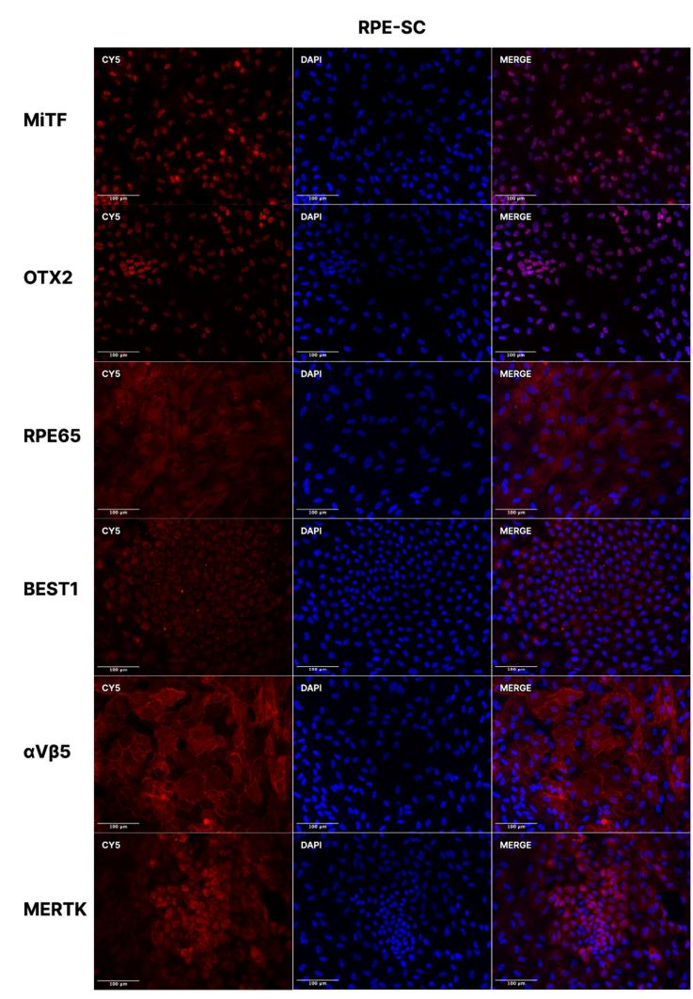  
Extended Data Fig. 1 | RPE-SC and ARPE-19 express canonical RPE markers and phagocytic machinery. Images shown are immunostaining (Cy5, red) for the canonical RPE markers MiTF, OTX2, RPE65, and BEST1, and the phagocytosis

ARPE-19  
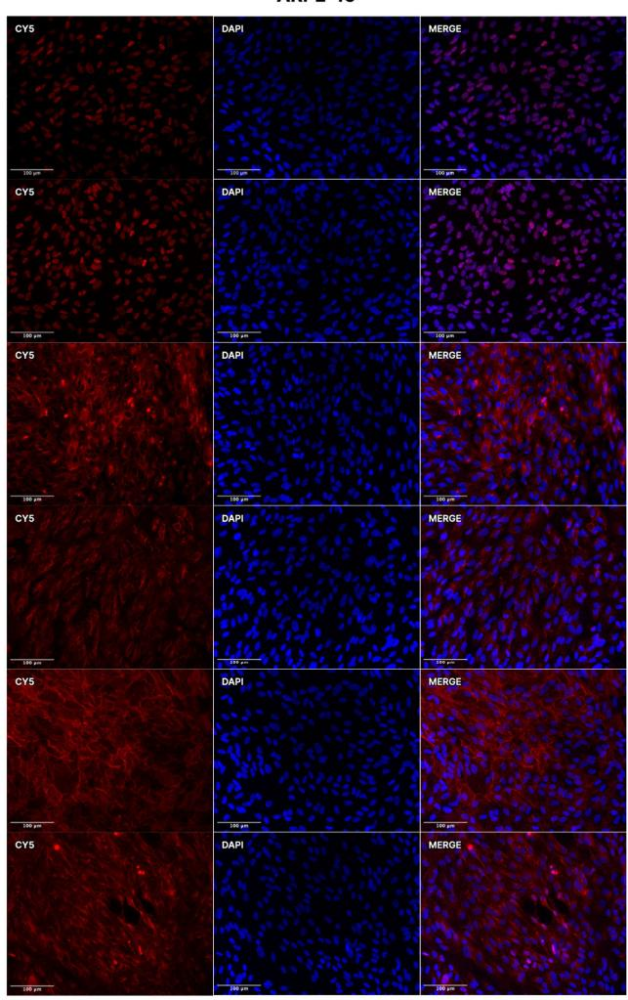  
machinery Integrin αv β5 and the MER proto-oncogene tyrosine kinase (MERTK). Nuclei are stained with DAPI.

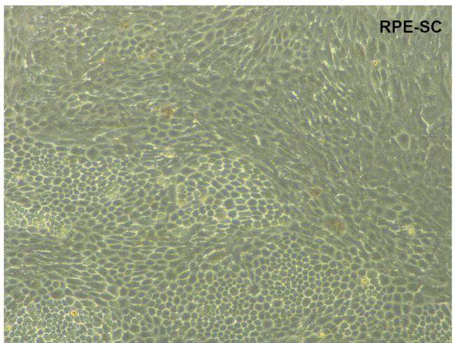

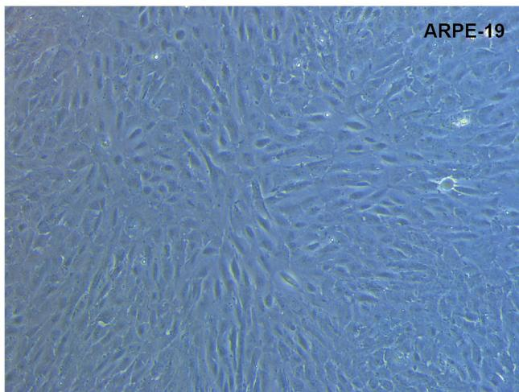

b  
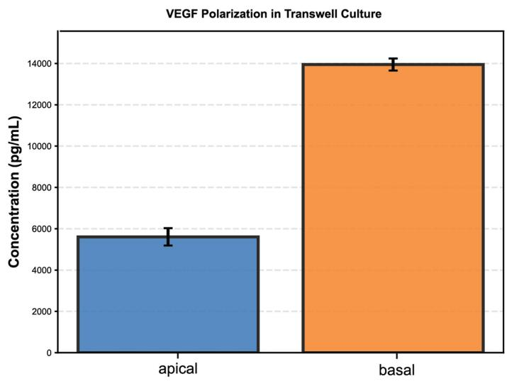  
Extended Data Fig. 2 | Functional validation of the RPE-SC and ARPE-19 retinal pigment epithelium phenotype. (a) Brightfield images of RPE-SC cells and ARPE-19 cells grown to confluency demonstrating a more regular  
cobblestone morphology in RPE-SC cells. (b) RPE-SC cells cultured on transwell inserts for 1 month polarize secretion of VEGF towards the basolateral compartment (basal), a hallmark of human RPE cells.

b  
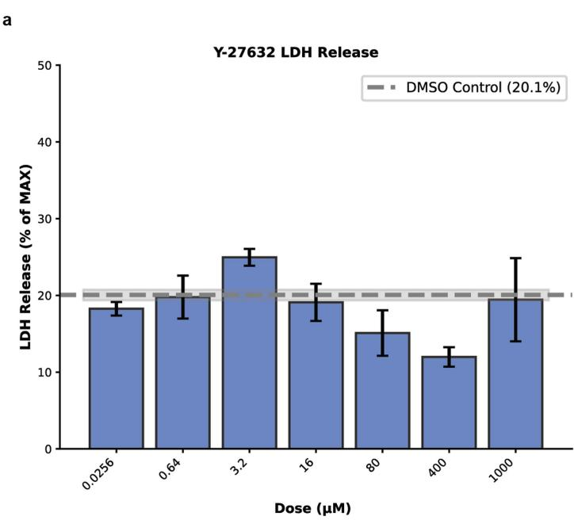  
Extended Data Fig. 3 | Cytotoxicity assays of Y-27632 and ripasudil in RPE-SC. (a) There is no relationship between Y-27632 dose and LDH release (n = 4 wells; One-way ANOVA: F = 2.07, p = 0.12). (b) LDH release decreases with

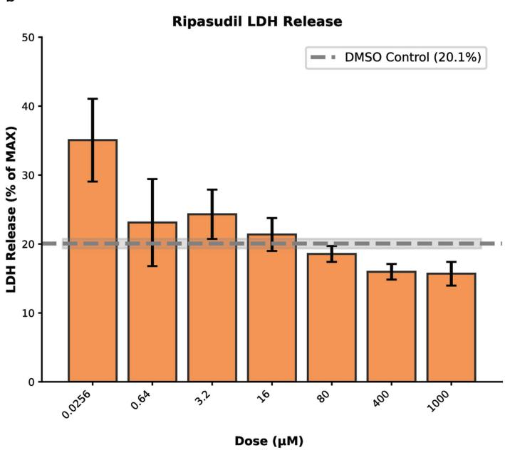  
increasing ripasudil dose (n = 4 wells; One-way ANOVA: F = 3.10, p = 0.038; Spearman correlation (log dose vs LDH): ρ = −0.73, p = 0.0002). Error bars show the s.e.m.

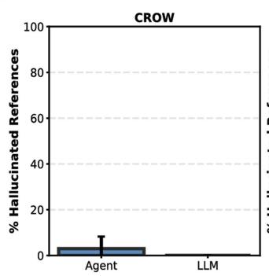

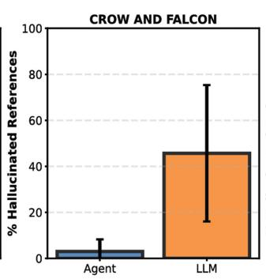

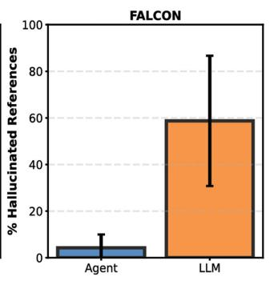

b  
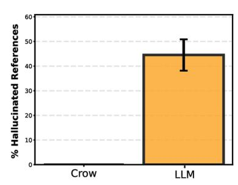

C  
(i)  
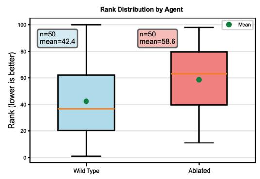

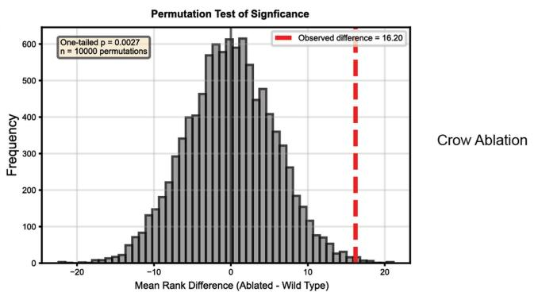

(ii)  
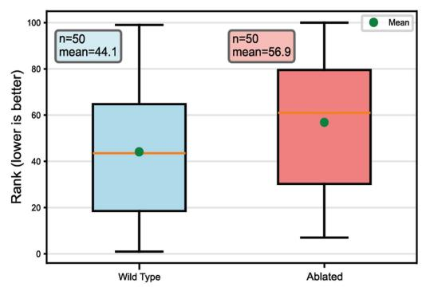

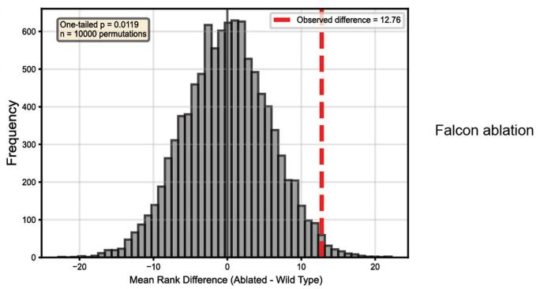

(iii)  
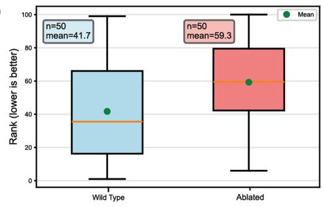

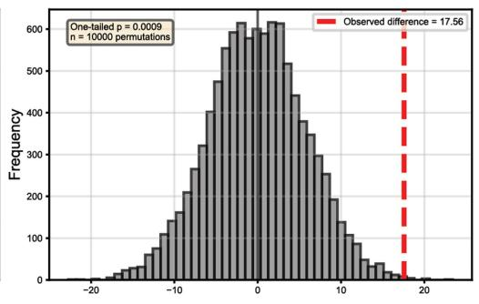  
Extended Data Fig. 4 | Crow and Falcon ablation experiments. (a) Human evaluation of reference veracity. Bar plots show mean percentage hallucinated references from 10 randomly chosen wild type or ablated drug candidate proposals. Plot titles show which agent is being ablated. (b) Human evaluation of references in assay proposals generated by either wild type Robin or Robin with Crow ablated. (c) Box plots showing the performance of wild type (blue)  
and ablated (red) Robin in an LLM-judged competition (lower rank indicates better performance). Histograms show the permutation test null distribution (n = 10,000 permutations) of mean rank differences (ablated rank minus wild type rank). The red dashed line indicates the observed difference. All three ablated conditions show significantly worse performance (one-tailed p-values shown). Error bars show the s.e.m.

Extended Data Fig. 5 | Accuracy of Finch analysis. (a) Finch’s adherence to an expert-curated rubric on the RNA-seq and flow cytometry analysis tasks from round 2 of the dAMD drug screen when given the prompts from the Robin workflow (n = 3 answers) (b) A subset of BixBench questions, most relevant for drug discovery (n = 170 questions) were used to test Finch’s capabilities. BixBench questions are given subject labels by the expert who wrote them.

Mean accuracy on 170 BixBench questions  
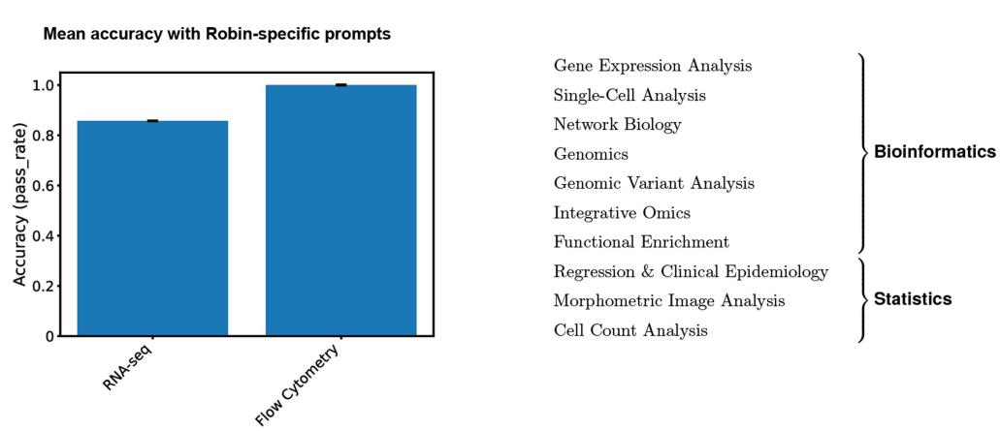

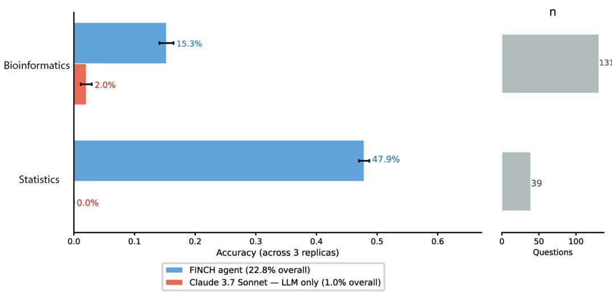

Modes of failure on BixBench  
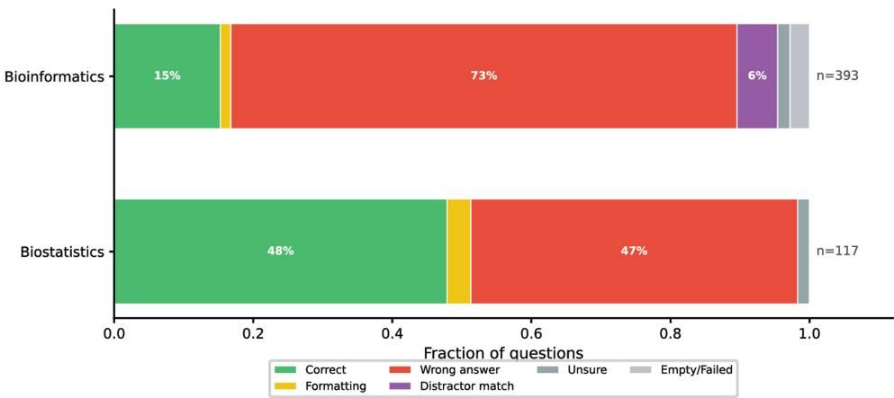  
We divided 170 of these questions into two groups: Bioinformatics and Biostatistics. (c) Accuracy of Finch and Claude Sonnet 3.7 (no-harness control) on a variety of challenging bioinformatics and biostatistics tasks (n = 3). Error bars show the standard error of the mean. (D) Failure modes of Finch on Bioinformatics and Biostatistics questions from BixBench (3 replicates of 170 questions).

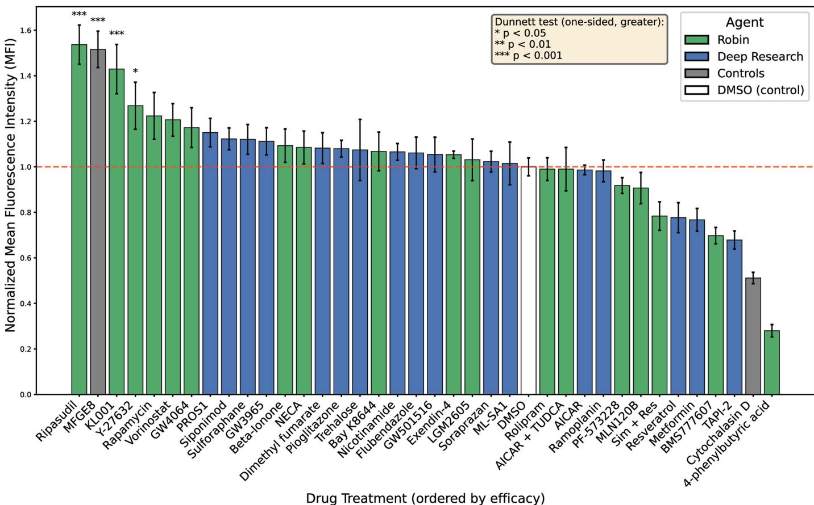  
Extended Data Fig. 6 | Comparison to a OpenAI’s Deep Research. Performance of all 19 drug candidates generated by Robin and 17 unique drug candidates generated by OpenAI’s Deep Research (Deep Research suggested Resveratrol  
and GW3965 twice) in the phagocytosis assay using RPE-SC cells. Error bars show the s.e.m. (n = 4).

# natureportfolio

Double-anonymous peer review submissions: write DAPR and your manuscript number here Corresponding author(s): instead of author names.

Last updated by author(s): YYYY-MM-DD

## Reporting Summary

Nature Portfolio wishes to improve the reproducibility of the work that we publish. This form provides structure for consistency and transparency in reporting. For further information on Nature Portfolio policies, see our Editorial Policies and the Editorial Policy Checklist.

## Statistics

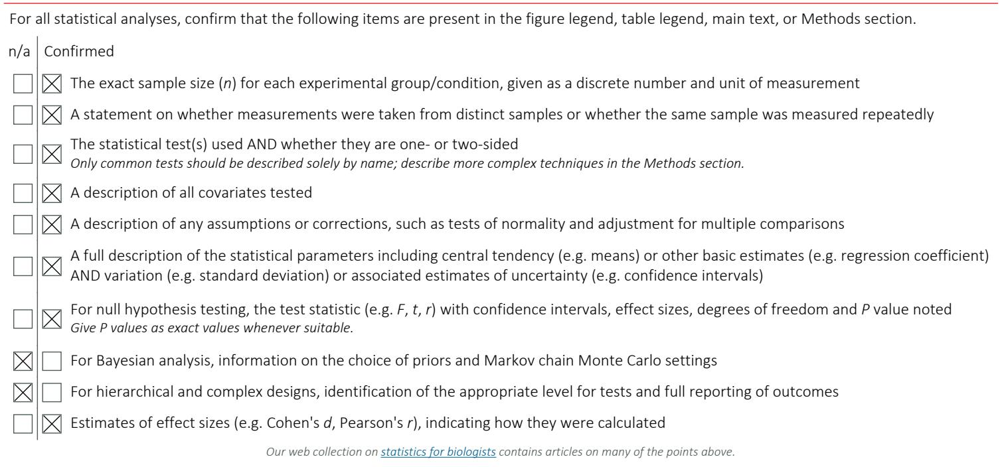

## Software and code

Policy information about availability of computer code

Data collection

Paper retrieval relies on FutureHouse's PaperQA2: https://github.com/Future-House/paper-qa.

The commercial Large Language Models (LLMs) and their versions used in this study are:

OpenAI 04-mini

Anthropic Claude 3.7 Sonnet

Google's Gemini 2.5 Pro Preview

Data analysis

Autonomous data analysis is performed using our in-house agent, Finch. The code is publicly available here: https://github.com/Future-House/finch.

For manuscripts utilizing custom algorithms or software that are central to the research but not yet described in published literature, software must be made available to editors and reviewers. We strongly encourage code deposition in a community repository (e.g. GitHub). See the Nature Portfolio guidelines for submitting code & software for further information.

## Data

Policy information about availability of data All manuscripts must include a data availability statement. This statement should provide the following information, where applicable: - Accession codes, unique identifiers, or web links for publicly available datasets - A description of any restrictions on data availability - For clinical datasets or third party data, please ensure that the statement adheres to our policy

"Sample trajectories for Robin and Finch, as well as the code for Robin and ablated versions of Robin, will be available at https://github.com/Future-House/robin"

## Research involving human participants, their data, or biological material

Policy information about studies with human participants or human data. See also policy information about sex, gender (identity/presentation),   
and sexual orientation and race, ethnicity and racism. Reporting on sex and gender The following information was received from the Eye Bank for Sight Restoration (New York) regarding the single patient who contributed tissue which was used in this study: sex, age, race, medical history, smoking history, date and time of death, date and time of tissue preservation. The following information was reported about this patient in our manuscript: "Primary RPE-SC cells were harvested from a single aged donor (>60 years old) with no known ocular conditions by the Eye-Bank for Sight Restoration, Inc. (New York)." Reporting on race, ethnicity, or We use the term "aged" and define this as >60 years old. Samples from older patients are necessary as we are studying a other socially relevant disease of aging in this manuscript (age-related macular degeneration). groupings Population characteristics For studying age-related macular degeneration, the most important variable is age. The next most important is genetic background (specifically complement factor H, CFH, and ARMS2/HTRA1 genes). Other variables thought to play a role in pathogenesis: smoking status, obesity, hypertension. Recruitment We were presented with a list of available tissue samples with no patient information other than age. We chose this sample based only on the age of the patient. Ethics oversight The project was reviewed by the Scientific Committee at the Eye Bank For Sight Restoration (New York) before samples were approved for shipping.

## Field-specific reporting

## Life sciences study design

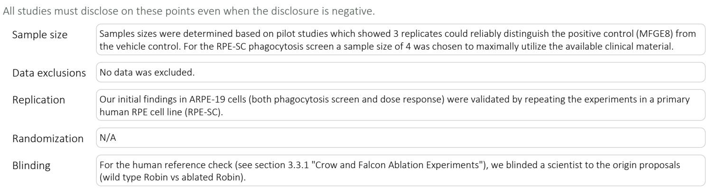

## Reporting for specific materials, systems and methods

We require information from authors about some types of materials, experimental systems and methods used in many studies. Here, indicate whether each material, system or method listed is relevant to your study. If you are not sure if a list item applies to your research, read the appropriate section before selecting a response.

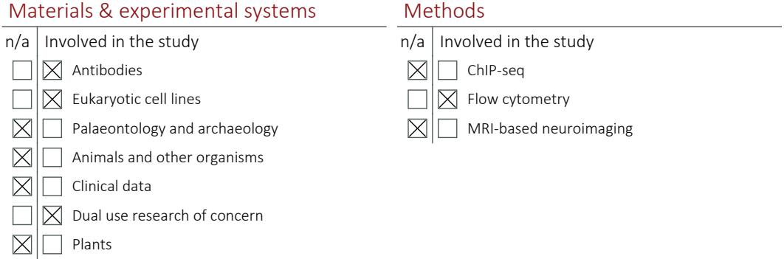

## Antibodies

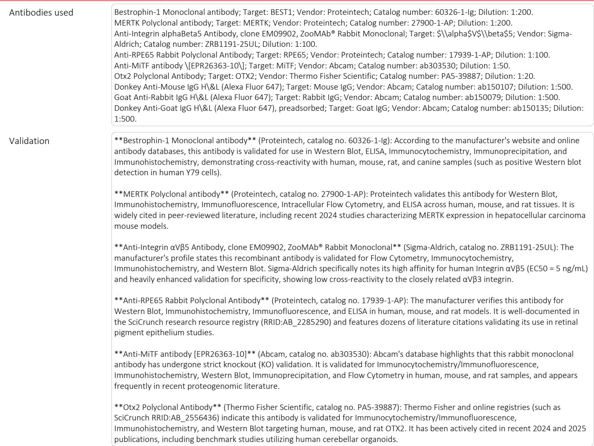

## Eukaryotic cell lines

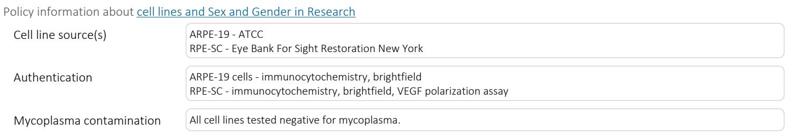

## Plants

Seed stocks

N/A

Novel plant genotypes

N/A

Authentication

N/A

## Flow Cytometry

## Plots

Confirm that:

The axis labels state the marker and fluorochrome used (e.g. CD4-FITC).

The axis scales are clearly visible. Include numbers along axes only for bottom left plot of group (a 'group' is an analysis of identical markers).

All plots are contour plots with outliers or pseudocolor plots.

A numerical value for number of cells or percentage (with statistics) is provided.

## Methodology

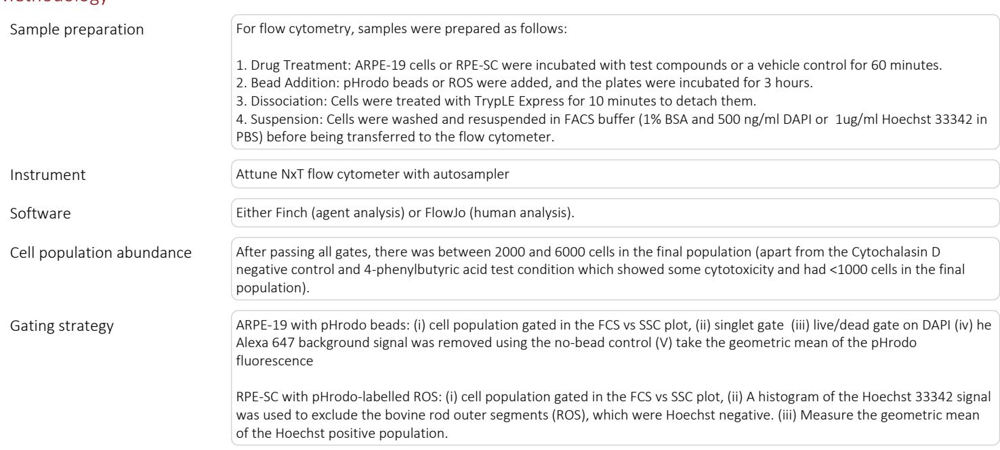

Tick this box to confirm that a figure exemplifying the gating strategy is provided in the Supplementary Information.