# Liquid-State Drive: A Case for DNA Block Device for Enormous Data

Jiahao Zhou, Mingkai Dong, Fei Wang, Jingyao Zeng, Lei Zhao, Chunhai Fan, and Haibo Chen, Shanghai Jiao Tong University https://www.usenix.org/conference/fast25/presentation/zhou-jiahao

This paper is included in the Proceedings of the 23rd USENIX Conference on File and Storage Technologies. February 25–27, 2025 • Santa Clara, CA, USA ISBN 978-1-939133-45-8

Open access to the Proceedings of the 23rd USENIX Conference on File and Storage Technologies is sponsored by

nNetApp

# Liquid-State Drive: A Case for DNA Block Device for Enormous Data

Jiahao Zhou♢, Mingkai Dong♢, Fei Wang♣, Jingyao Zeng♢, Lei Zhao♣, Chunhai Fan♣, Haibo Chen♢

♢Institute of Parallel and Distributed Systems, SEIEE, Shanghai Jiao Tong University

♣ School of Chemistry and Chemical Engineering, New Cornerstone Science Laboratory, Frontiers Science Center for Transformative Molecules, National Center for Translational Medicine, Shanghai Jiao Tong University

## Abstract

The rapid development of DNA synthesis and sequencing technologies is making the ultra-high-density storage medium DNA to meet the rising demand for enormous data storage. The block storage interface, which is massively employed in storage systems, is the critical abstraction to integrate DNA storage into silicon-based computer systems. In this paper, we explore building block devices on DNA and identify the challenges of petabyte-scale metadata management and high DNA access costs. We propose a holistic DNA block device design called LIQUID-STATE DRIVE to provide low-cost block access to exabyte-scale data with the help of small yet fast SSDs. We adopt the dual-layer translation table to leverage SSDs to decrease the metadata updating cost. We introduce symbiotic metadata and delayed invalidation to reduce the cost of garbage collection and block updating. Our evaluation demonstrates that in microbenchmarks and real-world traces, the write cost reduces up to seven orders of magnitude and 2,927×, and the read cost reduces up to 6,206× and 7×, respectively. We expect our exploration and experience in building DNA block devices to be useful in expediting the advancement of DNA storage and bridging the gap between information technology and biotechnology.

## 1 Introduction

The global data volume is experiencing exponential growth with the advancement of big data and AI. 64.2 zettabytes (ZB) of data were generated in 2020, and it was projected that 181 ZB of data would be generated in 2025 [12,40]. However, the installed base of the total storage capacity is only 6.7 ZB in 2020 [39] due to the limited density of traditional storage media. The lack of sufficient storage volume has thus caused numerous valuable data to dissipate without being effectively captured, stored, and utilized.

To mitigate data dissipation, DNA is emerging as an extremely high-density storage medium. DNA has a density of 109 GB/mm3, eight orders of magnitude higher than tapes, which makes DNA a promising candidate for storing ZBscale data [10, 14, 25, 26, 45]. Moreover, the storage lifespan of DNA can extend up to centuries with low maintenance costs [10, 18, 26]. Such enticing advantages have catalyzed an abundance of efforts from both the industry and academia, focusing on DNA storage techniques such as DNA sequencing, synthesis and encode/decode. These efforts have significantly accelerated the progress of DNA storage, advancing it at a rate akin to that of Moore’s Law [10, 45].

DNA’s promising features have attracted numerous research efforts on key-value-style DNA storage [10, 26, 28, 46]. However, these systems store only the values in DNA while maintaining the keys and key-value mappings in traditional storage, making it difficult to scale to large amounts of data. Confronted with the difficulties of maintaining complex keyvalue mapping (i.e., indexing) for varying-length keys in DNA, we find that the simpler, yet general and widespread block-style storage of DNA storage remain under-explored.

Block storage can be seen as a simplified key-value store, where the keys are integers (i.e., the block numbers) within a fixed range and the values (i.e., the blocks) are data of a fixed size. Unlike key-value stores accessing data in objects, blockstyle storage enables fine-grained block access to the stored data, which can reduce access amplification for enormous data. Moreover, the block storage interface is simple and universal. Sophisticated storage systems (e.g., key-value stores, file systems) can be directly used or re-built upon it [38]. Thus, the exploration of building DNA block devices is beneficial for the integration of silicon-based computer systems and carbon-based DNA storage.

Although DNA sequencing and synthesis techniques can support block read and write accordingly, implementing block updates is challenging. Due to the immaturity of the DNA modification technique [11, 29, 35], the block update is achieved by removing the old DNA strands (i.e., the erase operation) and creating new strands. This incurs significant costs due to amplification, because the erase granularity is 103× larger than read, and read granularity is 106× larger than write (further explained in §3.1).

A common method is to involve out-of-place updates, maintaining a table that translates the logical block address (LBA)

to the physical block address (PBA). However, adapting the translation table to DNA is non-trivial and faces the following challenges. ❶ The frequently updated translation table requires to be stored in DNA, but updating it in DNA is costly. The size of the translation table, called DNA Translation Layer (DTL), reaches petabyte (PB) scale for storing exabyte (EB) scale data, making it necessary to store DTL in DNA. However, the DTL is updated every write, and both in-place and out-of-place updates are costly for DTL, making updating the DTL in DNA problematic. ❷ GC is necessary, but the overhead of managing in-DNA GC metadata is substantial. Performing garbage collection (GC) to reclaim stale data is necessary for the out-of-place update. However, it also requires PB-scale GC metadata to be stored in DNA, incurring substantial management overhead to GC and updates.

We propose LIQUID-STATE DRIVE, referred to as LiqSD, a general purpose DNA block device design that solves these challenges. LiqSD organizes the translation table into dual DTL, storing the lightweight one in the fast SSD, enabling updating the DTL at a low cost. We store the PB-scale GC metadata symbiotically with each physical block to minimize the metadata management overhead in GC. We delay invalidating the old block until reading to decrease the management overhead in updates. Besides, we customize the GC and cache to tolerate the inconsistency caused by delayed invalidation. LiqSD is a general purpose DNA block device that can be used in diverse scenarios including, but not limited to, cloud storage, multimedia storage, and archival storage.

We have implemented LiqSD based on a DNA storage simulator and evaluated the read and write cost of LiqSD in several real-world scenarios. We show that in microbenchmarks and real-world traces, LiqSD achieves the best performance compared to baseline. The write cost reduces up to seven orders of magnitude and 2,927×, and the read cost reduces up to 6, 206× and 7×, respectively.

In summary, our contributions include:

• We explore the holistic DNA block device design and analyze and identify the associated challenges.

• We design LiqSD to address the challenges through dual DTL, symbiotic metadata, and delayed invalidation, which lead to substantial performance improvement.

## 2 Background and Motivation

This section introduces the basics and development trends of DNA storage, the block device, and the out-of-place update.

## 2.1 DNA Basics

DNA composition. DNA comprises two strands twisted together in a double helix. Each strand consists of a sequence of nucleotides, which have four types according to their bases: adenine (A), thymine (T), cytosine (C), and guanine (G). Two DNA strands are twisted together with hydrogen bonds according to the Watson–Crick complementary base pairing rule [44] (A with T, C with G). In the following context, we use the terms base and nucleotide interchangeably. In DNA storage, the nucleotide sequence of a strand in a DNA molecule is used to present information.

Polymerase chain reaction (PCR). PCR is a widely used method to amplify strands to millions of replications selectively [30]. PCR amplifies the DNA strands by thermal cycling and selectively amplifies strands where the two ends can bind to the given short single strands called primer by the complementary base pairing rule. In each thermal cycle, the number of selected strands is doubled, so we can amplify them exponentially and filter out other strands by PCR.

DNA sequencing. DNA sequencing is used to determine the exact nucleotide sequences of DNA molecules. We sequence the DNA by next-generation sequencing (NGS) [7], a widely commercialized sequencing method. In NGS, we perform PCR to amplify target strands beforehand to avoid sequencing the irrelevant strands. The sequencing process outputs massive amounts of data but with high latency. For example, the state-of-the-art sequencing machine can output up to 16 Tbases in 48 hours, with a throughput of about 100 Mbit/s [21]. In addition, nanopore sequencing is another prevalent method. Compared to NGS, it enables real-time latency but reduces throughput to about 51 Mbases/s [3].

DNA synthesis. DNA synthesis is a technique to construct and assemble DNA strands from nucleotides. Microarray synthesis is a mature approach to parallelly synthesize numerous short (≤ 300 nucleotides) DNA strands rapidly and inexpensively [8]. A microarray contains numerous electrodes, and each electrode synthesizes a strand by sequentially adding nucleotides to its end. By controlling the voltage of each electrode, different nucleotides are added to the end of each strand to synthesize distinct strands. After that, we selectively release certain strands from designated electrodes while retaining others, allowing for discrete transfer into separate vessels [41]. By controlling the strand concentration, new strands can be easily, safely and precisely combined with the original strands in vessel [38]. To maximize the synthesis throughput, it is a common practice to synthesize tens of thousands of strands in a batch. Besides, researchers are miniaturizing the electrodes for synthesizing more strands per unit area simultaneously. Nguyen et al. deployed millions of nanoelectrodes in an area under one µm2, improving synthesis throughput to kB/s [32].

DNA encode/decode. To store/retrieve information in DNA, we encode/decode data in digital/DNA. A naïve method maps two bits to one nucleotide. This method causes many errors due to the violations of synthesis and sequencing constraints and is considered impractical. Other methods, such as rotation code, fountain code and collision aware code [16, 18, 45], were proposed to fulfill the constraints with a trade-off in density. The encoding step usually adds redundancy, e.g., Reed-Solomon Code [36], so the decoding step can use the redundancy to tolerate errors.

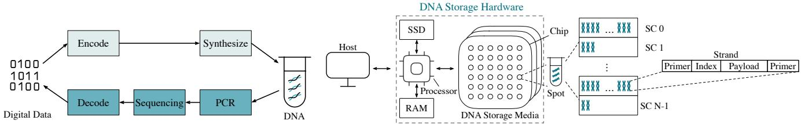  
Figure 1: DNA storage and retrieval workflow.  
Figure 2: DNA storage hardware overview.

DNA storage/retrieval workflow. Putting the operations together, we can have a picture of basic workflows of DNA storage. As shown in Figure 1, to store digital data in DNA, we encode digital data into DNA sequences, synthesize the sequences into DNA strands, and store the stands in the vessel. To retrieve data in DNA, we perform PCR to amplify the target strands, sequence strands into nucleotide sequences, and decode the sequences into digital data.

It is worth clarifying that the retrieval process is not destructive. In each retrieval process, it is a prevalent method to consume a minuscule quantity of the stored DNA for sequencing. Experimental evidence substantiates that the retrieval process can guarantee reading data more than 2.28 quadrillion times without corruption [16]. Furthermore, random PCR can be employed to replenish the consumed DNA strands [42].

## 2.2 Rapid Development of DNA Storage

The actualization of DNA-based data storage remains a complex endeavor, impeded by the limitations of current techniques. However, the capacity and total cost of ownership (TCO) of DNA is superior and the rapid evolution of DNA storage performance is noteworthy, spurring optimism for their practical application within the forthcoming decades.

DNA’s extremely high density and long lifespan make capacity and TCO far superior to traditional media. DNA has a density of 109 GB/mm3, eight orders of magnitude higher than tape. The extraordinary density makes DNA a promis ing candidate for storing the world’s data [17, 26]. DNA also has superior longevity and stability compared to traditional storage media. The lifespan of DNA can be centuries, compared to about five years for HDD and 15 to 30 years for tape [10, 15]. The remarkable stability of DNA makes data almost maintenance-free, whereas the traditional media need costly maintenance, such as periodic refresh, data migration, thermal and humidity management [6, 18]. Therefore, these advantages make the TCO of DNA lower than traditional media. The TCO for storing 1 PB data in tape for 10 years is three times (and twenty times for 100 years) higher com pared to DNA storage if the writing cost of DNA becomes \$25/TB [4, 6].

The TCO will be further reduced as the cost and performance of DNA storage evolve rapidly in a trajectory eclipsed Moore’s Law [10]. The synthesis cost is projected to decrease from \$0.1/base in 2005 [13] to \$1/TB in 2030 [6], and the sequencing cost has reduced at least 1,000,000× [6] to under \$0.1/Mbase [21, 22]. On the contrary, the traditional storage media are evolving slowly. For example, the cost of HDD slowly reduces from \$0.033/GB in 2017 to \$0.014/GB in 2022, decreasing by 56% in 5 years [24]. The cost of tape is also slowly reduces from \$7.18 in 2012 to \$5.72/TB in 2023, decreasing by 20% in 11 years [1, 5]. For performance, Microsoft [32] has developed the nanoscale DNA storage writer, enabling write throughput to reach MB/s, and the throughput of sequencing has reached MB/s [21, 22].

Considering the enticing advantages and rapid advancement, DNA storage is highly probable to become a reality within the approaching decades. Consequently, exploring the approaches to integrating DNA storage into computer systems is critically important.

## 2.3 Block Device

The block device, characterized by random access to data organized in fixed-size blocks (e.g., 4 KiB) [23], is widely applied in computer systems. A block device provides an abstraction that the storage space is a continuous array of blocks. Each block has a unique address (i.e., the block number) so that data written to the block can be retrieved given the address.

The block device empowers us to access data with fine granularity and construct sophisticated storage systems atop it. Li et al. [26] proposed a block-based mapping scheme for DNA storage. However, this work primarily focuses on mapping blocks to strands in tubes and lacks support for updates. Sharma et al. [38] built block interface semantics in DNA storage to enable efficient data access at block granularity. Nevertheless, they mainly focus on the specific elongated PCR technique and lack designs, such as metadata management, garbage collection, data caching, and crash consistency, which are essential for a holistic block device. For example, due to the lack of metadata management, writing a block requires reading the block initially to seek the precise update place, and reading a block may trigger an unbounded cascade of reads.

To summarize, the holistic design of DNA block device remains to be explored.

## 2.4 Out-of-Place Update

Out-of-place update is an extensively used technique to reduce the high cost of in-place updates effectively. Widely used block devices (e.g., SSD and HDD) read and write data in

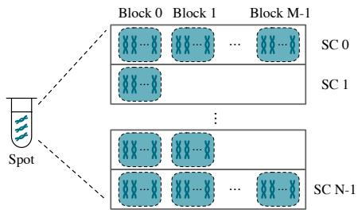  
Figure 3: Partition in DNA block device.

4 KiB block granularity. However, some storage media require extra effort to update a block. Take the flash as an example. In-place update (i.e., overwrite) of a 4 KiB page requires erasing the 2 MiB block containing the page. Note that in flash terminology, a 4 KiB block is commonly known as a “page”, and the erasure unit, typically 2 MiB in size, is often referred to as a “block”. To preserve other data within the 2 MiB block, we read other pages within the same block, erase the block, and write the new page and other pages back. These cumbersome steps make updates expensive.

To address this problem, SSD maintains a Flash Translation Layer (FTL) that maps logical page address (LPA) to physical page address (PPA) and updates a logical page in an out-of-place way [20]. In detail, when updating a logical page, SSD selects a newly erased physical page, writes data to it, modifies the FTL entry to map the LPA to the new PPA, and finally invalidates the old PPA.

Garbage collection (GC) reclaims space occupied by stale data (i.e., the garbage) and is necessary for out-of-place updates. Out-of-place update effectively reduces the update costs but leaves the stale data as is, which accumulates and crowds out available space as updates increase. Garbage collection addresses the issue by periodically identifying stale data in a block, migrating useful data of valid physical pages in the block, and erasing the whole block for future writes.

An efficient GC usually relies on a valid bitmap and a reverse translation table. GC needs to recognize and relocate valid physical pages before erasing the blocks. A naïve approach is traversing the FTL to check the page validity and find the corresponding entry of a physical page, which is expensive. Therefore, SSD usually maintains a valid bitmap to record the validity of each physical page and a reverse translation table to record the LPA of each PPA, avoiding the costly FTL traversal and accelerating the GC process significantly.

## 3 A Naïve DNA Block Device

In this section, we introduce the DNA storage hardware and the problems and challenges of a naïve DNA block device.

## 3.1 DNA Storage Hardware

Grounded on the DNA storage basics, we can build the DNA storage hardware shown in Figure 2. DNA storage hardware consists of DNA storage media, processor, RAM, and SSD.

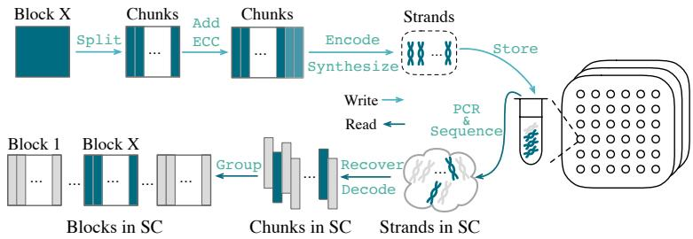  
Figure 4: Write and read workflow of a naïve DNA block device.

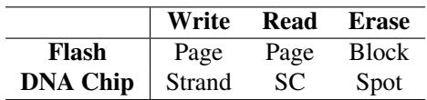  
Table 1: Granularity of DNA chip and flash.

DNA storage media. DNA storage media are responsible for storing data, which is a counterpart to the flash for SSD. DNA storage media are organized into many chips. Each chip contains a matrix of spots, each of which is a container storing billions of DNA strands. Unlike the gates in flash memory, the DNA strand in liquid or powder has no fixed physical location. Thus, the addressing information is usually included in the strand itself [26]. The right side of Figure 2 shows an encoding format of a DNA strand. There is a pair of primers at both ends of the strand, which is the identifier in PCR because PCR only amplifies the strands with the given primer pair. We logically organize all strands with the same primer pair as a strand collection (SC). We use the index within the strand to identify strands in the same SC and store data in the payload. Quantitatively, a single spot can contain several thousand SCs [26, 33] due to the constraints of synthesis and sequencing, and a single SC contains up to several million strands [9, 26, 33]. The strand length is about 300 nt (i.e., nucleotide), the primer length is about 20 nt, the index length is about 10 nt, and the payload length is about 250 nt.

As the storage medium, a DNA chip provides write and read operations to store and retrieve information. Because DNA modification technologies have many constraints [11, 29, 35], such as lack of generality, the DNA chip does not support modifying the existing strands. Instead, the DNA chip provides erase to wipe data before writing, similar to flash memory. The granularity of each operation is different in DNA chips. Table 1 compares the DNA chip and flash memory in the granularity of operations. In flash, both read and write granularity is a page (4 KiB), and erase granularity is a block (typically 2 MiB). In DNA, we write by synthesizing and storing multiple copies of the same DNA strand in the spot, read by amplifying and sequencing strands with the same primer (i.e., an SC) in the spot, and erase by dropping all strands in the spot. Hence, the write granularity is a strand, the read granularity is an SC containing millions of strands, and the erase granularity is a spot containing billions of strands.

Processor, RAM, and SSD. The processor is responsible for processing data (e.g., encoding and decoding data), the random access memory (RAM) is used for immediate data storage and retrieval, and the SSD is responsible for storing some persistent lightweight metadata and caching data.

Measuring with amplification. The read/write amplification is a suitable metric to measure the cost and performance of the DNA storage hardware. Despite the DNA access cost is high, there has been significant progress in reducing access costs in recent years, even surpassing the pace of Moore’s Law [10, 37]. Due to the rapid evolvement, we measure the performance of DNA block devices by read/write amplification, which is the ratio of requested and actual read/write data volume. This metric serves as a pertinent metric for evaluating the cost and performance of DNA storage systems, independent of the advancement in synthesis and sequencing.

## 3.2 The Design of Naïve DNA Block Device

We need to provide the fixed-sized block abstraction to build the DNA storage hardware into a block device. A straightforward approach is to designate strands in DNA storage media as blocks and expose them to users [26]. In this section, we will first examine a naïve DNA block device’s design and workflow, then glimpse its problems and challenges.

Block partition. We divide the storage space of DNA storage media into blocks by mapping consecutive strands into a block. Every strand has an index within it (see Figure 2) to index itself in SC. We designate a group of strands with the same primer and consecutive indexes (e.g., index ∈ [0,160)) as one block. The strands only exist after the data is written to the block. Figure 3 shows there are N × M blocks in a spot, where N is the SC number in a spot, and M is the block number in an SC. Each block is associated with a unique number called physical block address (PBA), and we can locate the corresponding chip, spot, SC, and block with a given PBA.

Operation workflows. Figure 4 illustrates the operation workflows. To write data into a previously unwritten block, we split the data into chunks that can be stored in a single strand. After that, we apply an error-correction code (ECC) to the data by adding redundant chunks [36]. Then, we encode chunks into DNA sequences and synthesize DNA strands. Finally, we store the strands in the spot indicated by the PBA.

Updating a block written previously is more complicated (not shown in the figure). Before updating, we must remove the old strands containing the block’s original data via the erase operation to prevent mixing the old and new strands. However, an erase operation will remove all strands within the spot due to the erase granularity. To prevent the loss of other blocks in the spot, we must read them before erasing and write them back afterward. Hence, to update a block, we locate the spot based on the PBA, read all blocks in the spot, erase the spot, and write back the new block and other blocks.

Reading a block (in Figure 4) requires to locate the chip, spot, and SC by its PBA first. Then, we get a sample from the spot and perform PCR and sequencing to get the sequences of all strands in the SC. Next, we tolerate errors in sequences by ECC and decode sequences into digital chunks. Finally, we group chunks back into blocks based on the index within the strand and get the desired block.

## 3.3 Problems and Challenges

Despite its simplicity, the naïve DNA block device design is impractical. In the naïve design, update is expensive. However, contemporary storage systems inherently necessitate frequent updates, e.g., key-value store updates and file system metadata modifications. Therefore, the naïve design incurs unacceptable synthesis and sequencing costs (as our evaluation results show in §6.2) and thus is impractical.

The fundamental cause of the high-cost update is the conflict between the erase-before-write nature in DNA and the in-place update. The erase-before-write nature makes an overwrite operation expensive, and the in-place update enforces every write of the same position become an overwrite. We introduce the out-of-place update with DNA Translation Layer (DTL) to avoid the in-place update, bypassing the conflict. However, introducing DTL to DNA faces two challenges.

Firstly, the frequently updated DTL requires to be stored in DNA, but updating the in-DNA DTL is costly. In DTL, each logical block is indexed by an 8-byte entry, meaning the size of DTL is entrysize/blocksize = 8/4, 096 = 1/512 of the data. Thus, the DTL of an EB-scale DNA block device requires PBscale storage space, comparable to the total storage capacity of a contemporary data center [19]. Therefore, storing the PB-scale DTL in traditional storage media is impractical. A reasonable approach is storing the PB-scale DTL in DNA. However, the DTL is frequently updated as we need to update the translation entry in every write, and an update is expensive in DNA, incurring unacceptable costs. This problem is similar to the problem encountered with updating blocks, but the outof-place update cannot solve it. In out-of-place updates, we need an 8-byte entry to index a DTL entry, which means a PB-scale DTL requires a PB-scale translation table to index itself, reintroducing the PB-scale storage problem. Thus, the naïve design of nested translation layers does not work, and frequently updating the DTL in DNA remains challenging.

Secondly, DTL involves GC, but the overhead of managing in-DNA GC metadata is substantial. To prevent stale data from occupying storage space indefinitely, periodic GC is necessary for reclaiming the space. However, both the reverse translation table and valid bitmap, critical for GC performance as described in §2.4, are at the PB scale. Storing these PBscale structures in DNA incurs substantial overhead in two ways. First, these structures are frequently accessed in GC, but accessing DNA is costly. Second, maintaining these in-DNA structures increases the cost of block updates significantly. For instance, we need to mark the old block as invalid in the valid bitmap for every update. However, to index the old block in the valid bitmap, we have to read the in-DNA DTL to get the PBA of the old block, further amplifying the update costs.

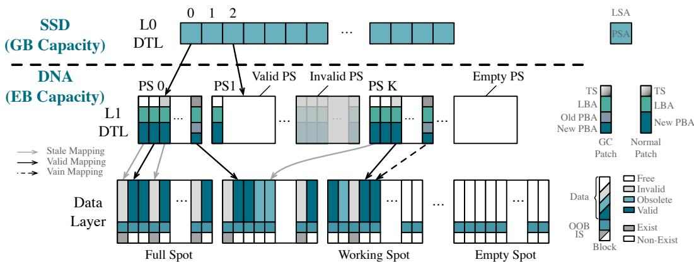  
Figure 5: LiqSD overview. LiqSD is divided into three layers. The EB-scale data layer stores physical blocks, the PB-scale L1 DTL indexes the physical blocks, and the GB-scale L0 DTL indexes the L1 DTL.

LiqSD solves the challenges by three techniques: dual DTL, symbiotic metadata, and delayed invalidation. For the first challenge, we organize the DTL into GB-scale L0 DTL and PB-scale L1 DTL and update the L1 DTL at a low cost by inserting patches. For the second one, to minimize the access overhead in GC, we store the reverse translation table and valid bitmap with physical blocks symbiotically; to decrease the maintenance overhead in updating, we delay invalidating the stale data until reading the L1 DTL and customize GC and cache to tolerate the resultant inconsistency.

## 4 LiqSD

This section details the design and workflow of LiqSD and elaborates on three key techniques that solve the challenges.

## 4.1 Dual DTL

To solve the challenge of costly DTL updating, we propose the structure of dual DTL. With dual DTL, the storage of LiqSD is divided into three layers, including the data layer, L1 DTL, and L0 DTL, as shown in Figure 5.

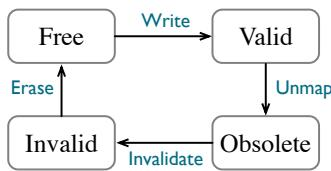  
Figure 6: Block state transition.

Data Layer. The data layer contains numerous blocks to store data. Like the naïve DNA block device introduced in §3.2, we designate consecutive strands into a block, presented by a column in the data layer in Figure 5.

Each data block in the data layer is in one of four possible states: Free, Valid, Obsolete, and Invalid. As Figure 6 shows, a free block contains no data and becomes valid if we write data and map it in the DTL. Note that from the hardware’s perspective, a free block means that no strand belongs to the block in the spot, and writing to the data indicates synthesizing and storing the corresponding strands in the spot. A valid block becomes obsolete if we unmap it from the DTL and finally becomes invalid if we mark it as invalid in the valid bitmap. The obsolete state is transient for delayed invalidation, which we will elaborate on §4.3. The erase operation turns all blocks in the spot to free blocks as all strands are dropped.

We write blocks into the data layer in a log-structured approach. In detail, we append the blocks to the working spot in sequential manner. If a working spot is full, we mark it as a full spot and select an empty spot as the new working spot. The erase operation turns a full spot into an empty spot.

L1 DTL. L1 DTL is a PB-scale in-DNA structure that maps logical block addresses (LBAs) to physical block addresses (PBAs). L1 DTL consists of several physical sections (PS), e.g., PS 0 to PS K in Figure 5. Each physical section contains translation entries (e.g., columns in PS 0 in the figure) for a consecutive LBA range. Each physical section is stored in an SC so that we can read the whole physical section in one DNA chip read. Each entry is stored as a single DNA strand and updated by inserting a new strand (called a patch) presenting the updated entry. The entry size conforms to the minimal write granularity of the DNA storage media, allowing us to update an entry with a single DNA chip write. We ensure the number of LBAs in a physical section is smaller than its capacity so that we can update entries multiple times by inserting patches before the physical section is full.

Both normal block write operations and GC will update entries in L1 DTL. We use normal patches and GC patches, respectively, to distinguish the updates. A normal block write will allocate a new physical block to store the new data and change the mapping by inserting a normal patch that records the LBA, the new block’s PBA, and timestamp (TS). The timestamp is the time of writing the patch and is used to identify the latest update to the entry. A GC patch contains an extra old PBA, which will be explained in §4.3.1.

Each physical section is in one of the three states: empty, valid, and invalid. An empty physical section contains no patches (i.e., entries) and is unused. It becomes a valid physical section after we insert patches into it. When a valid physical section is full, we read all entries in it, merge them, store merged entries in a new physical section, and turn the old physical section into an invalid physical section. Erasing the spot will turn all invalid physical sections into empty ones.

L0 DTL. L0 DTL is a GB-scale array storing the mapping from logical section addresses (LSAs) to physical section addresses (PSAs). The whole block address space of LiqSD is divided into many logical sections (LSs), each presenting a consecutive LBA range. By involving logical sections and the mapping from LSAs to PSAs, we can efficiently merge patches in a full PS and migrate merged entries to a new PS.

To access a block specified by an LBA, we calculate the corresponding LSA (e.g., LSA is equal to LBA divided by the maximal number of entries in a PS) and then look up the L0 DTL to get the location of the PS. For example, LSA 2 maps to PS 1 in Figure 5. The resulting PS (in L1 DTL) contains the entry for translating the LBA to PBA so that we can finally access the block with the PBA. We will elaborate on the complete read/write workflow in §4.4.

As we use an SC (usually 24 MiB) as the PS, the size of L0 DTL is at GB scale, and we can store L0 DTL in traditional storage devices (e.g., SSD in our implementation). We do not need to be concerned about updating the L0 DTL because the overhead of accessing SSD is negligible compared to DNA.

Compared to the naïve design of nested translation layers in §3.3, dual DTL leverages the asymmetric read and write granularity of DNA chips to design L0 and L1 DTL. Specifi cally, we use a strand to present the entry and an SC for the PS, exploiting the strand-level write granularity and SC-level read granularity. Updating entries in patches and co-locating patches within the same SC help reduce the write and read amplification, respectively. Reducing the size of L0 DTL to store it in SSD also significantly reduces the access to DNA.

Lightweight metadata in SSD. We maintain lightweight metadata in SSD. The write pointer records the position of the next to-be-written block in the data layer, and the written patch counter counts patches written into each physical section. Besides, to accelerate GC, the valid SC bitmap maintains a validity bit for each SC, and the valid PS bitmap maintains a validity bit for each physical section. The free/full/work spot list records the state of each spot. The latest TS recorder records the last invalidating time of each logical section. All the above metadata is small enough (e.g., only about 5 GiB for 1 EB data) to be stored in SSD.

## 4.2 Symbiotic Metadata

To address the challenge of significant accessing overhead in GC, we propose symbiotic metadata that co-locates the oversized GC-related metadata, including the reverse translation table and the valid bitmap, with the physical data blocks in DNA. As illustrated in the penultimate row of the data layer in Figure 5, we store the reverse translation table entry into the out-of-block (OOB) space. OOB is the unused 32-byte space in the payload area (shown on the right side of Figure 2) of the last strand in the physical block. The reverse translation entry stored in OOB can be accessed along with the block data, eliminating the overhead of accessing it during GC.

We store the valid bitmap bit into the invalid strand (IS), shown by the last row of the data layer in Figure 5. The invalid strand is a reserved strand carrying no data in a physical block. It is not synthesized along with the data strands of the physical block, but rather when the physical block is invalidated. Hence, the existence of the invalid strand indicates the invalidity of the physical block. We store the valid bit in the reserved strand instead of in OOB, because the validity of a physical block needs to be modified on update, but we cannot modify the OOB stored in an existing strand. With symbiotic metadata, we eliminate extra metadata accesses in GC.

## 4.3 Delayed Invalidation

To solve the challenge of substantial invalidating overhead of the update, we propose delayed invalidation. In the out-ofplace update, we need to invalidate the old physical block in the valid bitmap during updating. To index the old physical block in the valid bitmap, we need to read the L1 DTL in DNA to get the PBA, incurring substantial overhead to updates. In delayed invalidation, we do not invalidate the old block during the update. Instead, we invalidate them at the time of reading the L1 DTL. The delayed invalidation accelerates the update since we do not need to read the DTL to get the old block’s PBA. When reading the L1 DTL, we need to find out these blocks and invalidate them, which is elaborated in §4.4.

However, the delayed invalidation turns the old physical block into an obsolete block, causing problems with GC and cache. The obsolete block may be mistaken for a valid block because the invalid strand is non-existent. This mistake makes GC and cache problematic. During GC, we may mistakenly migrate an obsolete block and map it in the L1 DTL. During caching, we may cache obsolete blocks when reading blocks. That is because to exploit the workload locality, we usually add all non-invalid blocks within the SC, which are read together and include valid and obsolete blocks, into the cache. This may cause users to read the obsolete blocks when the cache hits. To address these problems, we customize the GC and cache and elaborate in §4.3.1 and §4.3.2, respectively.

## 4.3.1 Garbage Collection

Garbage collection reclaims stale data and replenishes available space. To prevent data loss in case of a crash, all data read from DNA is persisted in SSD during GC. To tolerate the inconsistency introduced by delayed invalidation, we customize the design of the GC below.

Data Layer GC. The data layer GC takes the following steps. First, we select spots containing the least valid SCs (A valid SC contains at least one non-invalid block.) according to the valid SC bitmap in SSD. We then read all non-invalid blocks (i.e., valid and obsolete blocks) in these valid SCs and migrate data in these blocks. At last, we erase the selected spots and clean the corresponding metadata in SSD.

To migrate data of a non-invalid physical block (indicated by the old PBA), we first read the reverse translation entry in OOB to get its LBA. We then store the block data into the address (i.e., the new PBA) indicated by the write pointer. Finally, we write a GC patch recording the old PBA, new PBA, LBA, and timestamp to the corresponding physical section.

Notably, both valid and obsolete blocks may be migrated since we cannot distinguish the two kinds of blocks due to delayed invalidation. Given that the only difference between the two kinds of blocks is whether there is a mapping in DTL, migrating obsolete blocks may cause errors because the migration will update the entry in the DTL (via the GC patch), turning the obsolete block into a valid block by mistake.

To avoid reading the obsolete blocks as valid ones, we carefully designed the GC patch to store both old PBA and new PBA, enabling us to recover the migration traces of blocks. In each read process, we merge patches to recover the migration trace and identify whether the block before a series of migrations is obsolete, which is elaborated in §4.4. Migrating data in obsolete blocks increases the GC overhead, but we expect the number of migrated obsolete blocks to be low as we always select spots with the least non-invalid blocks.

L1 DTL GC. The L1 DTL also requires GC to reclaim invalid physical sections. During GC, we ① traverse the valid PS bitmap in SSD to select spots containing the most invalid physical sections; ② read all valid physical sections in these spots; ③ find all entries for each valid physical section; ④ relocate them to empty physical sections; ⑤ update L0 DTL entries to record new PSAs; and ⑥ erase the selected spots.

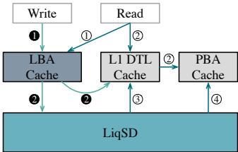  
Figure 7: Customized cache design. The LBA cache is write-back data cache indexed by LBA; the L1 DTL cache is write-through cache for the L1 DTL entries; the PBA cache is read-only data cache indexed by PBA.

## 4.3.2 Cache

Adding a cache to LiqSD is non-trivial. To fully exploit workload locality, we usually add all non-invalid blocks within the SC, which are read together into the cache. However, due to the potential inconsistency between the L1 DTL and the data layer, we cannot distinguish the obsolete and valid blocks without traversing the L1 DTL. Placing an obsolete block into the cache may cause a failure to read the latest, correct data.

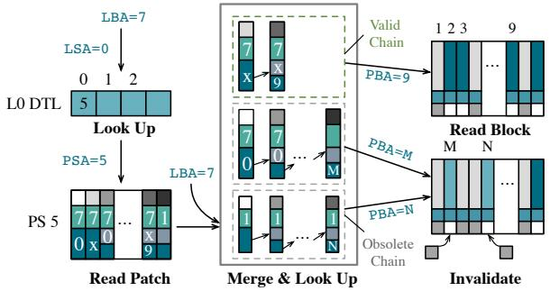  
Figure 8: LiqSD read workflow. We first look up L0 DTL to get the PSA, then read and merge patches in the physical section to get the PBA. Last, we read the physical block and invalidate obsolete blocks.

To address this problem, we customize the cache, depicted in Figure 7. The LBA cache is a write buffer for block writes, indexed by LBA. The L1 DTL cache is a write-through cache for L1 DTL entries, accelerating L1 DTL reads. The PBA cache is a read-only cache for block data indexed by PBA. All caches are stored in SSD and managed with LRU.

For write operations, ❶ we write the data in the LBA cache. ❷ If the cache is full, we write back the evicted logical block and update the entry in the L1 DTL cache if exists. For read operations, ① we search the logical block in the LBA cache. ② If the LBA cache misses, we search the L1 DTL entry in the L1 DTL cache to get the PBA, then search the physical block in the PBA cache. ③ If the L1 DTL cache misses, we read the corresponding physical section in DNA and add all entries that map to valid blocks into the L1 DTL cache. ④ If the PBA cache misses, we read the SC containing the physical block and add all non-invalid blocks within the SC into the PBA cache. When GC relocates blocks whose L1 DTL entries or data are cached, we remove them from the cache.

By separating the LBA and PBA cache, we will never falsely read obsolete blocks even if they are in the PBA cache because there is no L1 DTL entry pointing to them.

## 4.4 Read/Write Workflow

After describing all components of LiqSD, we elaborate on the procedures of reading and writing logical blocks.

Read. As presented in Figure 8, to read a logical block whose LBA is 7, we use its LBA to calculate the LSA value as 0. We then look up the L0 DTL based on LSA 0 to obtain the PSA, which is 5. After that, we read patches in the physical section. Later, we merge them to get the DTL entries and look up the entries based on the LBA 7 to get the PBA, which is 9. At last, we read the block based on the PBA.

We merge the patches by the following steps. ① We identify all normal patches. ② We chain all GC patches to normal patches to form chains, where a chain consists of one normal patch and a series of GC patches with the same LBA. This is done by assigning the normal patches to each empty chain, and then adding all GC patches to chains in ascending timestamp order. For each GC patch, we chain it to the last patch in a chain, where the last patch should have a smaller timestamp and equal LBA, and the new PBA should equal the old PBA of the to-be-added GC patch. ③ After chaining all patches, for chains with the same LBA, we mark the chain with the latest normal patch as the valid chain and others as obsolete. After merging all patches, we can get the DTL entry in the last patch of the valid chain, and thus, we can get the PBA of the logical block. Concurrently, we invalidate the obsolete blocks identified during merge. For each obsolete chain, we invalidate the obsolete block by inserting the invalid strand into the PBA indicated by the new PBA of the last patch in the obsolete chain (the PBAs are M and N in Figure 8). To prevent double invalidating a block, we only invalidate obsolete blocks whose patches are inserted after the timestamp in the latest TS recorder and refresh the timestamp after invalidation.

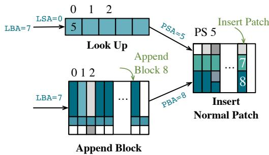  
Figure 9: LiqSD write workflow. We get PSA from L0 DTL, append the block to data layer, and insert a normal patch into physical section.

Write. As shown in Figure 9, to write a logical block whose LBA is 7, we first append the block (including the block data and the reverse translation entry) into the new PBA value as 8 indicated by the write pointer. Then, we use the LBA to calculate the LSA values as 0, obtain the PSA value as 5 by looking up the L0 DTL, and insert a normal patch with the LBA 7, the new PBA 8, and the timestamp into the physical section. At last, we update the related metadata in SSD.

If the PSA is null, which means none of the logical blocks mapped by the logical section have ever been written before, we need to find an empty physical section and update the L0 DTL entry to map the logical section to it. If the physical section is full, we need to read the physical section, merge patches, write all entries (indicated by the last patch in the valid chains) to an empty physical section, invalidate the old physical section, and update the entry in L0 DTL. Besides, we invalidate the obsolete blocks discovered in merging patches.

It is worth mentioning that we do not read the L1 DTL and invalidate the old block in write, resulting in the old block becoming obsolete block. We delay invalidating the obsolete blocks until reading the L1 DTL, which occurs in reading blocks and relocating physical sections. When reading the L1 DTL, we can distinguish the latest normal patch based on the timestamp and recover the data relocation trace by chaining the GC patches. Therefore, we can correctly get the PBA of the logical block and discover the obsolete blocks and the blocks that are relocated mistakenly by GC.

## 4.5 Crash Consistency

Crash consistency ensures the state of the storage device is consistent under crash and is the key to achieving reliability. LiqSD guarantees crash consistency by writing redo-logs in SSD before each DNA operation, and redoing the operation during recovery. Redo-logging is suitable for LiqSD due to the idempotence of DNA operations: repeated reads and erases do not affect stored data and repeated writes merely increase the copy number of strands.

## 4.6 The Implications of SSD’s Short Lifespan

The limited lifespan of SSDs will not impact the longevity of LiqSD. SSDs used for storing L0-DTL typically have a lifespan of around five years, whereas DNA storage can last for centuries. To minimize the risk of L0-DTL data loss, we regularly migrate lightweight metadata from SSDs, such as every three years. Additionally, employing RAID can reduce the likelihood of data loss due to sudden SSD failures. Finally, even if L0 DTL is completely lost from SSDs, it can be reconstructed from the L1 DTL stored in DNA. Specifically, we first identify which LS a PS belongs to by examining the LBA range of strands in L1-DTL. We then identify the valid PS by the latest timestamp of strands if multiple PSs match the same LS due to invalid PSs in the L1-DTL. After that, we obtain the LS to PS mapping and hence recover the L0-DTL.

## 4.7 Discussion

In LiqSD, we update blocks and perform GC at a low cost. We update the L1 DTL and data layer by writing the normal patch and data without reads, thus enabling low-cost updates. Moreover, we eliminate extra metadata access overhead of GC by symbiotically storing GC metadata with blocks. We also avoid the overhead of reading the L1 DTL in updates by delaying invalidating blocks.

The advantages come at the cost of extra read and space overhead compared to the naïve design. We need an extra L1 DTL read to get the PBA when reading a block and extra DNA space to store the L1 DTL and GC metadata. However, we will show that the benefits are tremendous in §6, while the space overhead is about 3.1% (2.5% for L1 DTL and 0.6% for GC metadata) and the read overhead is about 48%.

Note that our design is orthogonal to DNA coding methods, and we have employed coding methods to ensure reliability, which is detailed in §5.

## 5 Implementation

We simulate DNA storage media and implement LiqSD based on the simulator. The simulator accurately reflects the performance of the actual system on the read/write amplification metrics. The source code of the simulator is available at https://ipads.se.sjtu.edu.cn/projects/liqsd. Our design only relies on well-established DNA manipulation techniques and is orthotropic to their improvements, so we did not perform wetlab experiments on LiqSD.

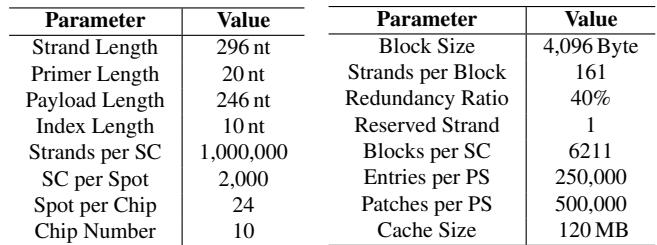  
(a) Setup of hardware simulator.  
(b) Setup of LiqSD.

DNA storage media simulator. The simulator provides interfaces to read an SC, write a strand, and erase a spot. Internally, we simulate sequencing and synthesizing strands with errors and counts the strands number. Specifically, we inject nucleotide substitution, deletion, and insertion to the strands based on the probability from an open-source DNA simulator [2]. Table 2(a) shows the simulator’s main setup.

LiqSD. We implement LiqSD based on the simulator, providing interfaces for reading and writing logical blocks. We employ a Reed-Solomon Code with a redundancy ratio of 40% to tolerate errors and the rotation code to fulfill the bioconstraints. We validate the reliability of LiqSD by successfully running Vim in the storage stack of a lightweight Ext4 + FUSE + LiqSD. Table 2(b) shows LiqSD’s main setup.

## 6 Evaluation

Our evaluation aims to answer the following questions:

1. What is the performance and overhead of LiqSD com pared to other DNA block device designs?

2. What is the overhead of GC?

3. What is the performance and overhead of delayed invalidation compared to eager invalidation?

## 6.1 Setup

Hardware configuration. We run all experiments on the simulator described in §5. The system runs on a server with two Intel(R) Xeon(R) Gold 5317 24-core CPUs running at 3.00 GHz, 188 GB of DRAM, and 7 TB NVMe SSD.

Compared systems. In our evaluation, we compare the following systems, all of which have identical cache sizes and adopt the LRU cache strategy (if there is a cache).

• LiqSD is the complete block device implementation with the dual DTL, symbiotic metadata, delayed invalidation, and customized cache.

• LiqSD-naïveCache is a LiqSD variant that adopts a naïve implementation of the cache, which caches only the target block, rather than all blocks in the SC, upon a read request.

• LiqSD-noCache disables the cache in LiqSD.

Table 2: Setup of hardware simulator and LiqSD  
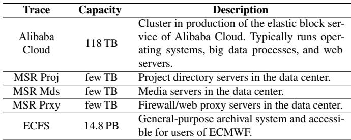  
Table 3: Real-world trace description.

• Coarse-DTL is a block device implementation using a coarse DTL with 24 MiB block size (i.e., the SC size). The cache is enabled, and the GB-scale DTL is stored in SSD.

• No-DTL is the naïve DNA block device mentioned in §3.2 without the cache.

Workloads. We evaluate the above systems in microbenchmarks and real-world traces. In microbenchmarks, we evaluate the performance of sequential write, random write, sequential read, random read, and random update. We directly conduct the read/write/update operations on all logical blocks for the sequential and random write experiments. For other experiments, we first populate all logical blocks by sequential writes and then conduct the read/write/update operations. In real-world traces, as shown in Table 3, we use block device traces from Alibaba Cloud [27, 43] and MSR Cambridge [31]. We also replay an archival file system trace from the European Centre for Medium-Range Weather Forecasts (ECMWF) [19] on ext4 and record the block device trace with blktrace. Like in the microbenchmarks, we populate all logical blocks by sequential writes before replaying the real-world traces. Note that in evaluation, due to the traces’ large size, we utilized the simulator to count the number of synthesized and sequenced strands without actually storing the data.

Metrics. Since DNA storage is in the early development stage, and the cost and speed of synthesis and sequencing (i.e., writes and reads) are improving rapidly, traditional metrics, such as throughput, latency, and expense, may not be informative to measure DNA block devices. We use the following relative metrics instead. SSD access cost is not considered in the evaluation, because its millisecond latency is negligible compared to the tens of minutes latency of DNA.

• Read amplification. The ratio of the requested read data volume to the actual read data volume in DNA.

• Write amplification. The ratio of the requested write data volume to the actual write data volume in DNA.

• Extra Read Ratio. The ratio of extra read data volume caused by write to the requested write data volume in DNA.

## 6.2 General Performance & Overhead

We evaluate the general performance and overhead of LiqSD in microbenchmarks and real-world traces.

Coarse-DTL  
LiqSD  
LiqSD-naïveCache  
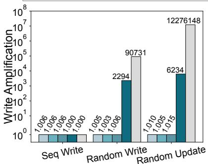  
(a) Write amplification.

LiqSD-noCache  
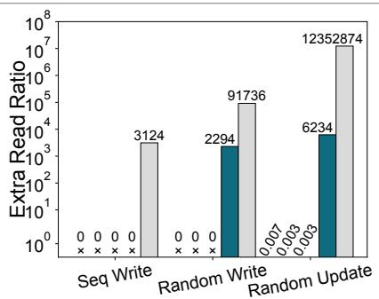  
(b) Extra read ratio.

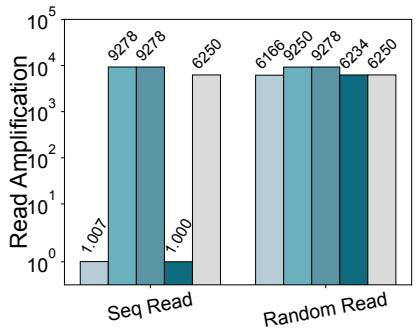  
(c) Read amplification.

Figure 10: Performance in microbenchmarks.  
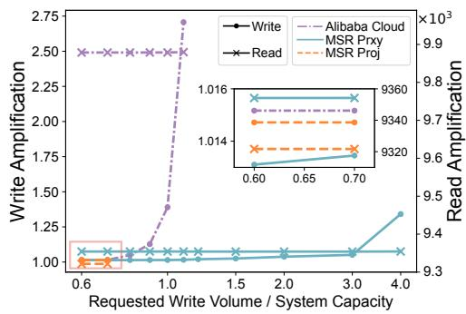  
Figure 11: LiqSD-noCache performance with GC.

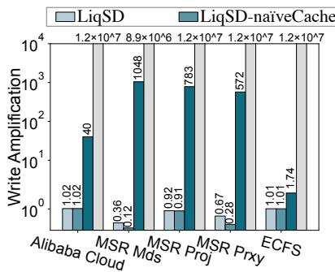  
(a) Write amplification.

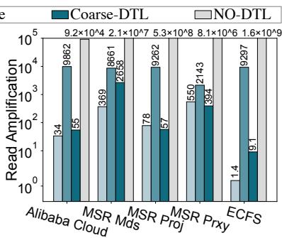  
(b) Read amplification.  
Figure 12: Performance of real-world traces.

Performance in microbenchmarks. Figure 10 shows the write and read performance in microbenchmarks. Regarding write amplification, Figure 10(a) shows that the write amplification of systems with LiqSD is slightly above 1 in all tests as we only write a patch and block data in write. In sequential write, Coarse-DTL and No-DTL show a write amplification of precisely 1 as they write only the block data and not the L1 DTL. In random write and random update, Coarse-DTL exhibits a high write amplification because of the coarse 24 MiB block granularity. Specifically, to write 4 KiB data, we need to read 24 MiB data in the block, update the data, and write them back, thus incurring significant overhead. The No-DTL shows a write amplification of 90,731 in random write and 12,276,148 in random update due to the in-place update.

Regarding the extra read ratio, Figure 10(b) shows the extra read ratio of systems employing LiqSD is zero in sequential and random write and negligible in random update because we eliminate the read in writing blocks. The negligible extra read ratio is caused by migrating full physical sections in the L1 DTL to empty ones. However, Coarse-DTL exhibits a high extra read ratio in random write and random update due to the coarse block granularity. The extra read ratio of No-DTL is enormous because we need to read the SC to check the existence of the block in updates, and if the block exists, we need to read all data within the spot.

Figure 10(c) shows the read performance in microbenchmarks. For sequential read, the read amplification is slightly above 1 in LiqSD and precisely 1 in Coarse-DTL. For random read, LiqSD-naïveCache and LiqSD-noCache demonstrate a read amplification of near 9,250 since we need to read the DTL and data block. LiqSD exhibits a read amplification of around 6,200 since the L1 DTL reads are almost cached.

Performance in real-world traces. Figure 12 presents the read and write performance of three systems. We omit LiqSD-noCache since its performance is similar to LiqSDnaïveCache. Regarding the write amplification, Figure 12(a) shows the write amplification of systems with LiqSD is significantly lower than Coarse-DTL and No-DTL in all traces. The write amplification of LiqSD is nearly identical to LiqSDnaïveCache except in MSR Mds and MSR Prxy. The exception occurs because the smaller write cache of LiqSD leads to a lower cache hit rate.

Regarding read amplification, Figure 12(b) shows the read amplification of LiqSD-naïveCache and No-DTL is substantially higher than others, as the naïve cache can not leverage the workload locality and No-DTL requires to read all blocks in the spot when updating. The read amplification of LiqSD is lower than Coarse-DTL in the majority except in MSR Proj and MSR Prxy. The exceptions occur for two reasons. First, MSR Proj and MSR Prxy are not write-intensive, and fewer writes lead to fewer extra reads in Coarse-DTL. Second, the read cache is smaller in LiqSD, causing a lower cache hit rate.

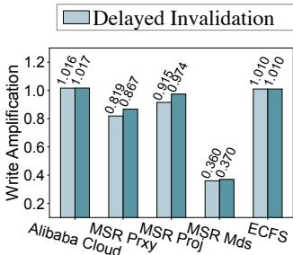  
(a) Write amplification.

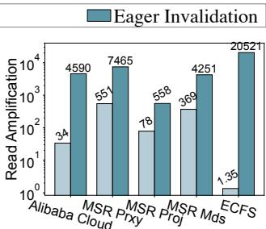  
Figure 13: Evaluation of delayed invalidation  
(b) Read amplification.

## 6.3 GC Overhead

We evaluate the effect of GC on the read and the write ampli fication of LiqSD-noCache in real-world traces. The results of MSR Proj, MSR Mds and ECFS are similar, so we only analyze MSR Proj.

Figure 11 illustrates the relationship between the read/write amplification and the ratio of the requested write volume to the system capacity. We decrease the system capacity to increase the ratio, which makes GC perform more frequently. In MSR Proj, the plotted line remains steady until it discontinues when the ratio reaches 0.8, at which point the capacity of the block device is exhausted. This is primarily because the requested written data is mostly valid, resulting in little stale data and due to the ineffectiveness of garbage collection. In the other two traces, the read amplification remains stable, while the write amplification increases by about 2.7× in Alibaba Cloud and 1.3× in MSR Prxy. The read amplification is rarely affected by GC because the amount of requested read is far larger than that of GC read. Conversely, GC has a significant effect on write amplification. Compared to MSR Prxy, in Alibaba Cloud, the increase of write amplification is more pronounced and the system capacity is exhausted much earlier due to the higher valid block percentage.

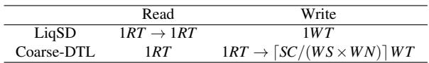  
Table 4: Read and write latency analysis. RT /W T : one read/write time; SC: strand number in an SC; W S: batch size of one write; W N: writer number; →: operation dependency.

## 6.4 Delayed Invalidation

We evaluate the effect of delayed invalidation in real-world traces. Delayed invalidation in Figure 13 corresponds to LiqSD, while eager invalidation revokes LiqSD’s delayed invalidation strategy, immediately invalidating old blocks in updating.

Figure 13 shows the write amplification is slightly lower in delayed invalidation due to its slightly higher cache hit rate. The read amplification of eager invalidation is about 15,194× and 7× higher than delayed invalidation in the worst and best case, as the eager invalidation must read the L1 DTL in writes.

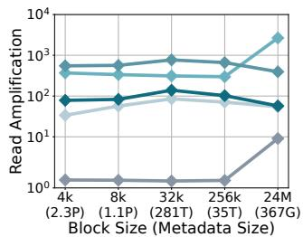

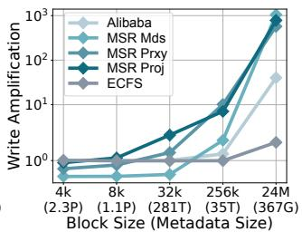  
Figure 14: Performance of different block size.

## 6.5 Performance of Different Block Size

We evaluated the impact of varying block sizes on read and write amplification performance using real-world traces. In Figure 14, the x-axis represents various block sizes and their corresponding metadata sizes when the storage capacity is 1 EB (in parentheses). When the block size is 24 MB, all metadata is stored on the SSD (i.e., the Coarse-DTL design). The others represent LiqSD at different block sizes. Overall, a block size of 4 kB generally achieves the best read and write performance.

## 6.6 Latency Analysis

We conduct an analysis and comparison of the latency between LiqSD and Coarse-DTL. Due to the tens of minutes latency of DNA read and write [26], running simulators with real-world traces (typically with request intervals within milliseconds) would yield distorted results. Hence, we qualitatively analyze the operation latency in Table 4. In a block read operation, LiqSD requires two dependent reads, including reading L1 DTL and block data, while Coarse-DTL requires only one. Fortunately, more than 99.3% L1 DTL reads are cached in real-world traces. In a block write operation, LiqSD requires only one write while Coarse-DTL requires one read and several writes depending on the read. The read of Coarse-DTL is hard to cache because it requires reading all 6,250 blocks in the SC and any cache miss leads to the DNA read. Besides, the queuing latency is significantly higher in Coarse-DTL, because its subsequent write data volume is 6,250× larger than LiqSD at worst, which means the write throughput bottlenecks earlier and the GC is triggered more frequently.

We estimate the absolute read and write latency for LiqSD under the current technology. The current read throughput is \~51 MBases/s and with real-time latency [3]. LiqSD takes an average of \~49 minutes to read a block. The current write throughput is in MBytes/s, with a latency about 74 minutes [32, 34]. LiqSD takes \~74 minutes to write a block.

## 7 Conclusion

To conclude, we proposed LiqSD, the first block device based on DNA storage. We explored and addressed the challenges encountered by DNA block devices, by providing low-cost access at the expense of a slight space overhead. Evaluation shows that LiqSD improves the write performance by up to 6,206× and the read performance by up to 7× with only 3.1% space overhead using real-world traces.

## 8 Future Work

Based on our experiences, we propose some prospects and suggestions for DNA storage. First, prioritizing increasing the sequencing throughput and decreasing the synthesis expense. Our real-world evaluation indicates that sequencing is the performance bottleneck and synthesis is the expense bottleneck with current technology. Second, scaling DNA storage capacity by scaling chips and spots is a priority over scaling primers and strands. Scaling the primers and strands impairs the performance as it enlarges the granularity of erase and read, incurring more unnecessary sequencing and synthesis. Third, exploring the fine-grained erase operation. We plan to explore the fine-grained erase operation at the SC granularity by utilizing biochemical techniques.

There are also some system directions that we can explore in the future. First, we can categorize data into groups and apply different policies to them based on their characteristics, such as hot and cold, read-only and read-write. Second, we can explore building more sophisticated storage systems for different scenarios on the top of LiqSD, including a file system, a key-value store, etc.

## Acknowledgments

We sincerely thank our shepherd Erez Zadok and the anonymous reviewers for the constructive comments and suggestions. This work is supported in part by the National Natural Science Foundation of China (No. T2188102, 61925206, 62141219). Mingkai Dong (mingkaidong@sjtu.edu.cn) is the corresponding author.

## References

[1] Disk Prices (US). https://diskprices.com.

[2] MESA - DNA synthesis, storage and sequencing simulator. https://mesa.mosla.de/.

[3] PromethION - Oxford Nanopore Technologies. https://nanoporetech.com/products/sequence/ promethion-24-48.

[4] TCO calculator for data storage | Fujifilm. https: //www.fujifilm.com/us/en/business/datastorage/resources/tco-tool,.

[5] LTO Ultrium Data Cartridge. https: //www.fujifilm.com/de/en/business/datamanagement/datastorage/ltotape/downloads, 2024.

[6] DNA Storage Alliance. AN INTRODUCTION TO DNA DATA STORAGE. June 2021.

[7] Sam Behjati and Patrick Tarpey. What is next generation sequencing? Archives of Disease in Childhoodeducation and Practice Edition, 98(6):236–238, Aug 2013.

[8] Twist Bioscience. Oligo pools for high throughput screens - twist bioscience. https://www. twistbioscience.com/products/oligopools.

[9] Meinolf Blawat, Klaus Gaedke, Ingo Hütter, Xiao-Ming Chen, Brian Turczyk, Samuel Inverso, Benjamin W. Pruitt, and George M. Church. Forward error correction for DNA data storage. Procedia Computer Science, 80:1011–1022, 2016. International Conference on Computational Science 2016, ICCS 2016, 6-8 June 2016, San Diego, California, USA.

[10] James Bornholt, Randolph Lopez, Douglas M. Carmean, Luis Ceze, Georg Seelig, and Karin Strauss. A DNAbased archival storage system. In Proceedings of the Twenty-First International Conference on Architectural Support for Programming Languages and Operating Systems, ASPLOS ’16, pages 637–649, New York, NY, USA, 2016. Association for Computing Machinery.

[11] Anton V. Bryksin. Overlap extension PCR cloning: a simple and reliable way to create recombinant plasmids | BioTechniques.

[12] Eric Burgener and John Rydning. High data growth and modern applications drive new storage requirements in digitally transformed enterprises. https://www.delltechnologies.com/asset/enmy/products/storage/industry-market/h19267- wp-idc-storage-reqs-digital-enterprise.pdf, Jul 2022.

[13] Robert Carlson. The changing economics of dna synthesis. Nature Biotechnology, 27(12):1091–1094, December 2009.

[14] George M. Church, Yuan Gao, and Sriram Kosuri. Nextgeneration digital information storage in DNA. Science, 337(6102):1628, Sep 2012.

[15] Delphine Coudy, Marthe Colotte, Aurélie Luis, Sophie Tuffet, and Jacques Bonnet. Long term conservation of dna at ambient temperature. implications for dna data storage. PloS One, 16(11):e0259868, November 2021.

[16] Yaniv Erlich and Dina Zielinski. DNA fountain enables a robust and efficient storage architecture. Science, 355(6328):950–954, Mar 2017.

[17] Andy Extance. How dna could store all the world’s data. Nature, 537(7618):22–24, August 2016.

[18] Nick Goldman, Paul Bertone, Siyuan Chen, Christophe Dessimoz, Emily LeProust, Botond Sipos, and Ewan Birney. Towards practical, high-capacity, low-maintenance information storage in synthesized DNA. Nature, 494(7435):77–80, Jan 2013.

[19] Matthias Grawinkel, Lars Nagel, Markus Mäsker, Federico Padua, Andre Brinkmann, and Lennart Sorth. Analysis of the ECMWF storage landscape. In 13th USENIX Conference on File and Storage Technologies (FAST 15), pages 15–27, Santa Clara, CA, February 2015. USENIX Association.

[20] Aayush Gupta, Youngjae Kim, and Bhuvan Urgaonkar. DFTL: a flash translation layer employing demandbased selective caching of page-level address mappings. In Mary Lou Soffa and Mary Jane Irwin, editors, Proceedings of the 14th International Conference on Architectural Support for Programming Languages and Operating Systems, ASPLOS 2009, Washington, DC, USA, March 7-11, 2009, pages 229–240. ACM, 2009.

[21] Illumina. Novaseq X Plus specifications. https://www. illumina.com/systems/sequencing-platforms/ novaseq-x-plus/specifications.html, Aug 2023.

[22] National Human Genome Research Institute. Dna sequencing costs: data. https: //www.genome.gov/about-genomics/factsheets/DNA-Sequencing-Costs-Data.

[23] The kernel development community. Block device drivers — the linux kernel documentation. https: //linux-kernel-labs.github.io/refs/heads/ master/labs/block\_device\_drivers.html, Aug 2023.

[24] Andy Klein. The cost of hard drives over time. https://www.backblaze.com/blog/harddrive-cost-per-gigabyte/, December 2022.

[25] Bingzhe Li, Li Ou, and David Du. Dp-dna: A digital pattern-aware dna storage system to improve encoding density, 2021.

[26] Bingzhe Li, Nae Young Song, Li Ou, and David H.C. Du. Can we store the whole world’s data in DNA storage? In 12th USENIX Workshop on Hot Topics in Storage and File Systems (HotStorage 20). USENIX Association, July 2020.

[27] Jinhong Li, Qiuping Wang, Patrick P. C. Lee, and Chao Shi. An in-depth analysis of cloud block storage workloads in large-scale production. In 2020 IEEE International Symposium on Workload Characterization (IISWC), pages 37–47, 2020.

[28] Yi-Syuan Lin, Yu-Pei Liang, Tseng-Yi Chen, Yuan-Hao Chang, Shuo-Han Chen, Hsin-Wen Wei, and Wei-Kuan Shih. How to enable index scheme for reducing the writing cost of DNA storage on insertion and deletion. ACM Trans. Embed. Comput. Syst., 21(3), may 2022.

[29] Weigui Luo, Liu Huizhen, Wenxiong Lin, Md. Humayun Kabir, and Yi Su. Simultaneous splicing of multiple DNA fragments in one PCR reaction. Biological Procedures Online, 15(1), Sep 2013.

[30] Kary B. Mullis, F Faloona, Stephen J. Scharf, Randall K. Saiki, Glenn T. Horn, and Henry A. Erlich. Specific en zymatic amplification of DNA in vitro: The polymerase chain reaction. Cold Spring Harbor Symposia on Quantitative Biology, 51(0):263–273, Jan 1986.

[31] Dushyanth Narayanan, Austin Donnelly, and Antony Rowstron. Write Off-Loading: Practical power management for enterprise storage. In 6th USENIX Conference on File and Storage Technologies (FAST 08), San Jose, CA, February 2008. USENIX Association.

[32] Bichlien H. Nguyen, Christopher N. Takahashi, Gagan Gupta, Jake A. Smith, Richard Rouse, Paul Berndt, Sergey Yekhanin, David Ward, Siena Dumas Ang, Patrick Garvan, Hsing-Yeh Parker, Robert H. Carlson, Douglas M. Carmean, Luis Ceze, and Karin Strauss. Scaling DNA data storage with nanoscale electrode wells. Science Advances, 7(48), Nov 2021.

[33] Lee Organick, Siena Dumas Ang, Yuan Jyue Chen, Randolph Lopez, Sergey Yekhanin, Konstantin Makarychev, Miklos Z. Racz, Govinda M. Kamath, Parikshit Gopalan, Bichlien H. Nguyen, Christopher N. Takahashi, Sharon Newman, Hsing Yeh Parker, Cyrus Rashtchian, Kendall Stewart, Gagan Gupta, Robert H. Carlson, John Mulligan, Douglas M. Carmean, Georg Seelig, Luis Ceze, and Karin Strauss. Random access in large-scale DNA data storage. Nature Biotechnology, 36(3):242–248, Feb 2018.

[34] Sebastian Palluk, Daniel H Arlow, Tristan De Rond, Sebastian Barthel, Justine S Kang, Rathin Bector, Hratch M Baghdassarian, Alisa N Truong, Peter W Kim, Anup K Singh, Nathan J Hillson, and Jay D Keasling. De novo DNA synthesis using polymerase-nucleotide conjugates. Nature Biotechnology, 36(7):645–650, June 2018.

[35] F. Ann Ran, Patrick Hsu, Jason Wright, Vineeta Agarwala, David Scott, and Feng Zhang. Genome engineering using the CRISPR-Cas9 system. Nature Protocols, 8(11):2281–2308, Oct 2013.

[36] Irving S. Reed and Glenn S. Solomon. Polynomial codes over certain finite fields. Journal of the Society for Industrial and Applied Mathematics, 8(2):300–304, Jun 1960.

[37] Robert. On DNA and transistors. http: //www.synthesis.cc/synthesis/category/ Carlson+Curves, Mar 2016.

[38] Puru Sharma, Cheng-Kai Lim, Dehui Lin, Yash Pote, and Djordje Jevdjic. Efficiently enabling block seman tics and data updates in dna storage. In Proceedings of the 56th Annual IEEE/ACM International Symposium on Microarchitecture, MICRO ’23, pages 555–568, New York, NY, USA, 2023. Association for Computing Machinery.

[39] Statista. Total installed base of data storage capacity in global datasphere 2020-2025. https://www.statista.com/statistics/ 1185900/worldwide-datasphere-storagecapacity-installed-base/, Sep 2022.

[40] Statista. Amount of data created, consumed, and stored 2010-2020, with forecasts to 2025. https://www.statista.com/statistics/871513/ worldwide-data-created/, Aug 2023.

[41] Karin Strauss. Wo2020131588a1 - selectively controllable cleavable linkers - google patents. https://patents.google.com/patent/ WO2020131588A1/en.

[42] Ferdinand Von Eggeling and H Spielvogel. Applications of random pcr. PubMed, 41(5):653–70, July 1995.

[43] Qiuping Wang, Jinhong Li, Patrick P. C. Lee, Tao Ouyang, Chao Shi, and Lilong Huang. Separating data via block invalidation time inference for write amplification reduction in Log-Structured storage. In 20th USENIX Conference on File and Storage Technologies (FAST 22), pages 429–444, Santa Clara, CA, February 2022. USENIX Association.

[44] James D. Watson and Francis Crick. Molecular structure of nucleic acids: A structure for deoxyribose nucleic acid. Nature, 171(4356):737–738, Apr 1953.

[45] Yixun Wei, Bingzhe Li, and David H. C. Du. An encoding scheme to enlarge practical dna storage capacity by reducing primer-payload collisions. In Proceedings of the 29th ACM International Conference on Architectural Support for Programming Languages and Operating Systems, Volume 2, ASPLOS ’24, page 71–84, New York, NY, USA, 2024. Association for Computing Machinery.

[46] S. M. Hossein Tabatabaei Yazdi, Yongbo Yuan, Jian Ma, Huimin Zhao, and Olgica Milenkovic. A rewritable, random-access DNA-based storage system. Scientific Reports, 5(1), Sep 2015.