①

USENIX

THE ADVANCED COMPUTING SYSTEMS ASSOCIATION

# ScaleSwap: A Scalable OS Swap System for All-Flash Swap Arrays

Taehwan Ahn, Chanhyeong Yu, Sangjin Lee, and Yongseok Son, Chung-Ang University

## https://www.usenix.org/conference/fast26/presentation/ahn

This paper is included in the Proceedings of the 24th USENIX Conference on File and Storage Technologies.

February 24–26, 2026 • Santa Clara, CA, USA

ISBN 978-1-939133-53-3

Open access to the Proceedings of the 24th USENIX Conference on File and Storage Technologies is sponsored by

# ScaleSwap: A Scalable OS Swap System for All-Flash Swap Arrays

Taehwan Ahn, Chanhyeong Yu, Sangjin Lee, and Yongseok Son

Systems and Storage Laboratory, Chung-Ang University

## Abstract

This paper presents a scalable OS swap system, ScaleSwap, designed to enhance core and SSD scalability on all-flash swap arrays. Specifically, ScaleSwap first enables a one-toone swap model where each core exclusively manages its own swap resources, enabling core-centric swap in/out operations. Second, ScaleSwap devises opportunistic inter-core swap assistance, allowing each core to delegate swap metadata access to other cores as needed. Finally, ScaleSwap adopts core-affinity page and LRU management to mitigate LRU lock contention during swap in/out operations. We implement ScaleSwap in the Linux kernel and evaluate its performance on a 128-core machine with an all-flash swap array comprising eight NVMe SSDs. Our evaluation shows that ScaleSwap achieves up to 3.4× higher throughput and up to 11.5× lower average latency than the Linux swap system. Furthermore, ScaleSwap outperforms two prior systems, TMO and ExtMEM, by up to 64% and 5×, respectively.

## 1 Introduction

Prominence of OS swap: A swap system in an operating system (OS) is a key system component essential for maintaining overall system stability by reclaiming memory (i.e., anonymous page) to prevent application failure (i.e., out-of-memory) caused by memory demands exceeding the available memory capacity [8, 11, 33, 42, 46]. Recently, emerging large, memory-intensive applications such as machine learning [26, 77, 95], big-data processing [6, 25], graph processing [19,32], scientific and mathematical applications [14, 16, 44, 93], virtual machines (VMs) [17, 43, 84], and containers [37, 82, 96] may process unprecedented amounts of data [18, 20, 28, 39, 48, 53, 61, 90]. Thus, the applications can place an immense pressure on the OS swap system [11, 66, 74, 87]. Accordingly, Alibaba Cloud provides a backend asynchronous reclaim feature for memory cgroups to solve the performance issue affected by direct reclamation [21]. Meta Inc. introduces a Linux kernel component that measures application sensitivity to memory access slowdowns [88], targeting kernel-driven swapping for latencysensitive datacenter applications and designed to be transparently applicable without requiring modifications. This trend highlights the importance of OS swap system, which is regaining interest from academia, industry, and kernel communities [11, 23, 27, 38, 63, 65, 66, 87, 88] due to its significant impact on application performance and stability.

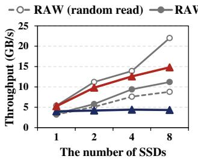  
(a) SSD scalability.

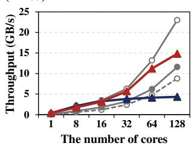  
(b) Core scalability.  
Figure 1: Scalability of Linux swap, ScaleSwap, and raw device.

Need for all-flash swap array: The advancement of fast flash-based storage has revitalized OS swap memory extension since it enables larger available memory space while minimizing performance degradation [11,60,74]. Meanwhile, modern memory-intensive applications such as graph processing (e.g., BFS [10,91] and PageRank [15]) on large-scale web crawl datasets (e.g., WebGraph [12] and Common Crawl [83]) require several terabytes of memory [13, 31, 50, 62, 64, 71, 86, 94]. Accordingly, we argue that leveraging an all-flash array composed of multiple SSDs as swap space—referred to as the all-flash swap arrays—can be a practical solution to (1) accommodate large memory footprints while reducing total cost of ownership (TCO) (e.g., DRAM or node cost [34]), (2) reduce the risk of out-of-memory (OOM) failures under heavy workloads (e.g., web servers with a burst of concurrent client requests [58]), and (3) prevent sharp performance degradation during swap operations. To meet these demands, the current Linux swap subsystem provides a striping technique [45] to swap in or swap out the pages across multiple storage devices.

Challenges: Figure 1 depicts the scalability limitation of the existing Linux swap system using the striping technique under a memory-intensive workload generated by a microbenchmark (i.e., stress tool [4]) on an all-flash swap array consisting of eight NVMe SSDs. The raw device performance is measured by FIO [7]. The results indicate that the Linux swap system does not scale well with an increasing number of SSDs or CPU cores. It is because the swap system adopts an all-toall model, where each core can access any swap and memory resources through centralized management and locking mechanisms. Although it allows shared access across all cores, it incurs high lock contention on many cores and underutilizes the high bandwidth of all-flash swap arrays, especially when accessing shared resources such as 1) swap metadata and 2) least recently used (LRU) list.

Prior studies: Previous studies have investigated the swap system to enhance performance and extend the memory capacity with SSDs. ZNSwap [11] is a swap subsystem for Zoned Namespace (ZNS) SSDs by leveraging the ZNS interface to overcome the swap performance issues with block-interface SSDs. TMO [88] introduces an offloading mechanism to control the amount of memory offloaded to heterogeneous devices based on the device performance characteristics and application sensitivity. ExtMEM [41] is designed for applicationbased memory management by delegating memory policies to user space from kernel. Our study is in line with these studies in terms of investigating the swap performance. In contrast, we focus on designing a highly concurrent OS swap system to maximize the core and SSD scalability.

Contributions: In this paper, we present ScaleSwap, a decentralized, scalable swap system designed to scale swap performance on many-core and all-flash architectures, thereby enabling sustained memory capacity extension. Our key idea is to orchestrate swap resources and swap in/out operations in a core-centric manner as fully as possible, thereby unleashing the full bandwidth potential of all-flash swap arrays. Specifically, ScaleSwap first proposes core-centric swap resource management, in which each core exclusively manages its own swap resources (e.g., swap metadata, swap cache, and swap space) and performs swap in/out operations in a core-centric manner. This design enables a one(core)-to-one(resource) swap model, in contrast to the all-to-all model used in the Linux swap system.

Second, ScaleSwap devises opportunistic inter-core swap assistance that enables cores to delegate swap metadata access to one another as needed, leveraging a lightweight and cooperative mechanism. This approach resolves potential conflicts over swap resources across cores without compromising memory consistency. Finally, ScaleSwap adopts core-affinity page and LRU management to increase page locality and mitigate LRU lock contention. This enables swap out and in operations based on core-centric LRU management by maintaining separate LRU lists for each core, rather than relying on a per-node LRU list.

We implement ScaleSwap in Linux kernel 6.6.8 and evaluate its performance on a 128-core machine with an all flash swap array consisting of eight NVMe SSDs [75] with various memory-intensive workloads and applications. The experimental results demonstrate that ScaleSwap achieves up to 3.4× higher throughput and up to 11.5× lower average latency compared with the Linux swap system. Furthermore, ScaleSwap outperforms two prior swap systems, TMO [88] and ExtMEM [41] by up to 64% and 5×, respectively. To the best of our knowledge, ScaleSwap is the first highly concurrent and core-centric OS swap system designed for all-flash swap arrays. Finally, we open the source code at https://github.com/syslab-CAU/ScaleSwap.

## 2 Motivation

Revisiting OS swap systems for emerging memory architectures: Recent memory-intensive applications demand increasingly large amounts of main memory, with memory footprints that far exceed the physical memory capacity of modern systems, while also requiring high throughput and low latency. To support these applications, emerging memory architectures such as disaggregated memory [2, 36, 72] and tiered memory systems with byte-addressable devices (e.g., CXL and PM) [71,85,88,89] have been proposed for memory extension. Our work is also motivated by these efforts, particularly in highlighting the importance of scalable memory extension. Meanwhile, for more stable individual servers [41], we focus on the OS swap system since it is essential for preventing application failures at the OS level of each server. Accordingly, we believe that the SSD-based OS swap system can enhance the stability of emerging memory architectures since the tiered/remote memory capacities may also be limited as described in HeMem [71] and TeRM [92], respectively. As a result, the OS swap system can extend the memory or prevent application failures even in a disaggregated or tiered memory servers as an additional last memory tier.

Necessity of all-flash swap arrays: Despite advances in emerging memory systems, increasing DRAM capacity for memory-intensive applications is often limited by the rising total cost of ownership (TCO). This has a significant impact on cloud and data center economics [60, 85]; for instance, memory accounts for about 37% of cloud server cost at Meta [56] and 50% at Microsoft Azure [59]. Furthermore, if the server is already equipped with its full DRAM capacity, the system memory can be extended by deploying additional servers, resulting in higher TCO. As a more cost-effective approach, we can adopt alternative memory technologies such as NVMe SSDs to reduce costs since they offer a much larger memory footprint per server compared with DRAM, at a substantially lower cost [88]. For example, the unit price of DDR4 DRAM (\$4.22/GB) [78] is about 26× higher than that of a PCIe 4.0 NVMe SSD (\$0.16/GB) [73]. In addition, multiple SSDs can mitigate the performance degradation by leveraging their aggregated SSD bandwidth. Accordingly, all-flash swap arrays can be a practical choice for memory-intensive applications, offering benefits in both capacity and cost.

Practical and potential usage of all-flash swap arrays: Google Cloud [35, 40] supports up to eight 375 GB local SSDs per virtual machine instance, providing a total of 3 TB of local SSDs for swap space, and processes around 82 PB of data for scientific and mathematical computation applications [52, 69, 79, 80, 93]. Similarly, a storage lab [1, 70] utilizes 30 Solidigm SSDs (a total of 921.6 TB) as swap space to accelerate or support the computation workload while demonstrating a high-performance computing infrastructure. It reports that swap performance is the single biggest bottleneck in these computations. In addition, all-flash swap arrays can effectively facilitate VM memory ballooning [3, 53] and container memory overcommit [61, 63], supporting elastic memory provisioning in virtualized systems. Lastly, web analytics and graph processing can be target applications. For instance, Common Crawl [29] has recently collected approximately 455 TB of web data over two weeks, amounting to an average of 32 TB of content per day [55, 83]. To efficiently process such massive volumes of data, Apache Spark as an in-memory processing framework performs computations by loading data into memory and executing operations in parallel, which inherently requires terabyte-scale memory capacity.

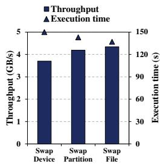  
(a) Various swap settings.

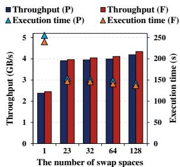  
(b) Various swap spaces.

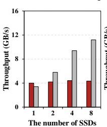  
Figure 2: Various swap space configurations (P: swap partition, F: swap file).

Case study in Apache Spark: Apache Spark does not rely on the kernel’s swapping mechanism to support tasks that demand large amounts of memory. Instead, Spark’s operators spill data to the storage device when it does not fit in memory, allowing it to process datasets of any size [5]. However, in our evaluation with the Common Crawl dataset (see Section 5.4), Spark preprocessing via PySpark which reads and parses data files causes an OOM error before Spark’s spill management begins. Specifically, in the preprocessing phase, each file requires approximately 300GB of memory to process 20,000 records; when using 128 files, the memory demand reaches the terabyte scale. In such scenarios, employing OS-level swapping with an all-flash swap array is essential for handling high anonymous page demands and enhancing system reliability.

## 3 Scalability Analysis

To understand the scalability, we have conducted a memory stress test using stress tool [4] with an all-flash swap array with our configuration and testbed described in Section 5.1.

Figure 3: Scalability analysis.

## 3.1 Various Configurations for Swap Space

The current Linux system supports three types of swap space: 1) swap partition, 2) swap file on a mounted file system, and 3) swap device. We conduct experiments to evaluate the performance difference across swap space types and varying numbers of swap spaces. In Figure 2a, we compare their performance using the stress tool with 128 threads on 8 devices. In this experiment, we configure 8 swap devices and 128 swap partitions/files on 8 devices. As expected, using 128 swap files/partitions offers better performance than using 8 swap devices, as the swap system chooses the next swap space in a round-robin manner, and a larger number of files/partitions enables parallel access across a broader storage area.

In Figure 2b, we analyze how the number of swap spaces affects performance for swap file and partition configurations. We vary the number of swap spaces to 1, 23, 32, 64, and

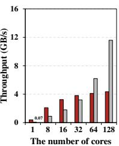  
(a) SSD scalability. (b) Core scalability.

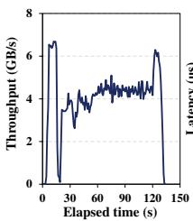  
(a) Throughput.

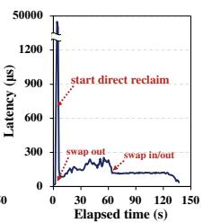  
Figure 4: Timeline results.  
(b) Latency.

128 (by default, the maximum number of swap spaces is 23). We observe that using multiple swap spaces improves performance; however, the gains tend to saturate beyond 23 swap spaces. In all cases, the performance difference between swap files and partitions is similar. Consequently, this result indicates that swap files provide comparable performance to partitions while offering greater flexibility (e.g., resizing or creating swap files easily) [68, 81]. Therefore, we focus on the swap file configuration in this paper.

## 3.2 SSD and Core Scalability

SSD scalability: Figure 3a shows how throughput changes as the number of SSDs increases with 128 threads/cores and 128 swap files. In the figure, a mix of random read/write workload on the raw devices (measured with FIO) exhibits near-linear scalability, with throughput increasing from 3.4 to 5.8, 9.4, and 11.2 GB/s as the number of SSDs increases from 1 to 2, 4, and 8. In contrast, the Linux swap system exhibits almost the same throughput (around 4 GB/s) regardless of the number of SSDs. This result shows the swap system has limited scalability and cannot fully exploit SSD parallelism. Core scalability: Figure 3b shows the core scalability using 128 swap files with 8 SSDs, as the number of threads/cores increases from 1 to 128. Up to 32 cores, the Linux swap system achieves higher throughput than the mixed read/write performance measured on raw devices. This is because the swap system alternates between swap out, swap in, or both with relatively lower lock contention while the FIO benchmark always performs read and write operations simultaneously. However, at 64 and 128 cores, the Linux swap system exhibits 1.5× and 2.6× lower throughput than the raw device. This result shows its scalability limitations under high core counts.

## 3.3 Direct Reclaim

In the Linux swap system, each node has a dedicated kswapd process responsible for swapping out dirty pages when free pages fall below the high watermark. When free pages fall below the minimum watermark, direct reclaim is triggered for fast page reclamation [22]. During direct reclaim, application threads directly perform page reclamation, thereby providing high parallelism. Figure 4 shows the throughput and latency timeline during swap operations using 128 threads/cores, 128 swap files, and 8 SSDs. Especially, when direct reclaim occurs, latency spikes and throughput decreases significantly, since application threads contend on the LRU lock (see Section 3.4.1) to reclaim pages from the LRU list. As page reclamation continues, latency and throughput gradually stabilize. After 60 seconds, swap-in operations begin alongside swapout operations as the stress tool starts to read the swapped-out pages. Finally, swap-in operations dominate after 120 seconds. Consequently, this indicates that direct reclaim can provide high parallelism assisted by application threads but may suffer from limited concurrency.

## 3.4 Identifying Root Causes

## 3.4.1 Scalability Issue on Per-node LRU

The Linux memory system maintains least recently used (LRU) list per node to enforce the LRU eviction policy for efficient page management. When swapping out a page, the swap system fetches and removes the least recently used page in the LRU list and evicts it to SSDs. When swapping in, the swap system reads the page from SSDs and re-inserts it into the LRU list. However, per-node LRU significantly incurs lock contention on the LRU lock (lru\_lock). Especially, when the direct reclaim occurs as shown in Figure 4 and Table 5, resulting in low core/SSD scalability. As a result, many cores contend for the lock on the per-node LRU list during swap out/in operations.

Insight #1: As the number of cores per node increases, lock contention on the LRU list significantly increases. This decelerates the swap out/in process.

## 3.4.2 Lock Contention on Swap Metadata

As described in Section 3.1, the swap spaces can be configured as devices/files/partitions [11]. Each swap space has its own swap metadata (swap\_info), which is protected by a spin lock (si\_lock). Thus, multiple swap spaces provide more fine-grained access, but cannot provide high concurrency since all cores can access all the swap spaces (i.e., allto-all model) with the global locking mechanism. The swap metadata includes a swap map (swap\_map) which records the swap-out page location in the swap space, the number of swap-out pages (inuse\_pages), first empty bit, last empty bit, etc. For example, when swapping out a page, the swap system retrieves the swap map, scans an available space for the page, and updates the swap map. When swapping in a page, the swap system retrieves the swap map associated with the page and updates the swap map. As a result, even if the LRU lock contention issue is addressed, analyzed in Section 3.4.1, frequent access to swap metadata during swap in/out operations incurs high lock contention (si\_lock) due to global swap metadata management as shown in Table 5.

Insight #2: High lock contention on swap metadata hampers the scalability of the swap system on many cores, thereby limiting SSD scalability.

## 4 Design and Implementation

ScaleSwap embodies the key principle of decentralized, corecentric orchestration of swap resources and swap in/out operations, unleashing the bandwidth potential of all-flash swap ar-

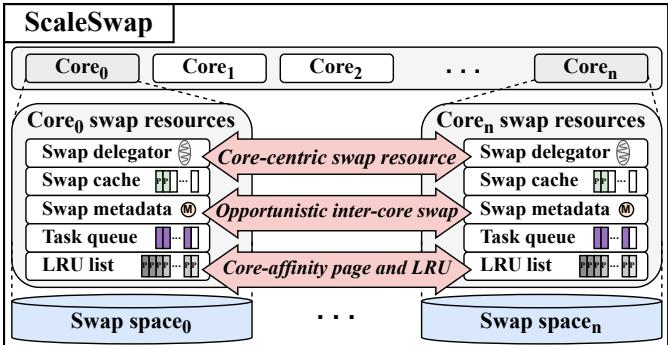  
Figure 5: Overall architecture of ScaleSwap.

rays. Based on the principle, we establish design goals (§4.1) and present three strategies (§4.2) to achieve the goals.

## 4.1 Design Goals

We design ScaleSwap to meet the following goals:

• Managing exclusive and independent swap resources. To design a scalable swap system, holistically, ScaleSwap should provide exclusive and independent access to swap resources per core, reducing the swap resource contention among cores.

• Supporting efficient cooperation across cores. To support inter-core swapping among cores when necessary, ScaleSwap should enable efficient cross-core cooperation while maintaining memory consistency.

• Minimizing LRU lock contention during swapping. To fully exploit the high bandwidth of all-flash swap arrays, ScaleSwap should minimize LRU lock contention during swapping operations without compromising correctness.

## 4.2 Strategies of ScaleSwap

We present the three key strategies and explain how they meet the design goals of ScaleSwap.

• Strategy 1: Core-centric swap resource management. To scale swap resource management, ScaleSwap adopts a one(core)-to-one(resource) model which localizes swap resources (swap metadata, swap cache, and swap space) within each core. By doing so, ScaleSwap ensures that each core accesses its own swap resources as much as possible.

• Strategy 2: Opportunistic inter-core swap assistance. To support swapping across cores when necessary (e.g., due to inevitable swap space sharing or shared pages), ScaleSwap allows each core to opportunistically delegate swap tasks (e.g., accessing swap metadata) to another core, thereby eliminating lock contention on swap metadata. This delegation enables efficient inter-core cooperation without compromising memory consistency.

• Strategy 3: Core-affinity page and LRU management. To mitigate lock contention on the per-node LRU lists during page allocation and swapping, ScaleSwap adopts per-core LRU lists and assigns pages to these lists based on core affinity. This approach allows each page to be swapped in or out exclusively by the LRU list of the core where it was allocated, thereby enhancing core locality and reducing synchronization overhead.

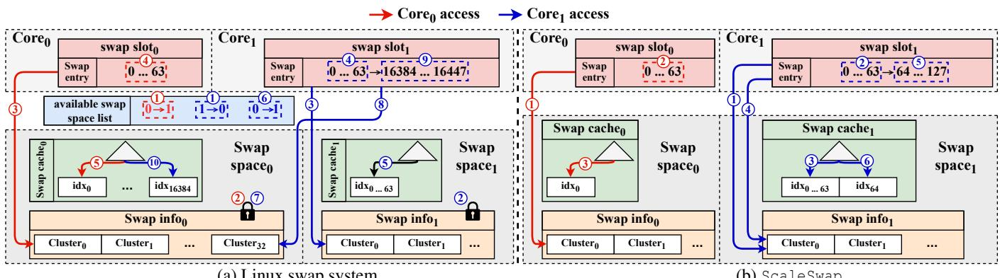  
Figure 6: Swap space allocation mechanism in Linux swap system and ScaleSwap.

## 4.3 Overall Architecture of ScaleSwap

Figure 5 illustrates the overall architecture of ScaleSwap. ScaleSwap introduces a decentralized, core-centric design, enabling each core to utilize its own swap resources and LRU lists (one-to-one model) instead of a centralized design (all-toall model). Additionally, ScaleSwap devises a per-core swap delegator that facilitates inter-core swapping via a swap task and task queue when needed. This architecture establishes an independent yet cooperative swap system that exploits the high degree of concurrency and parallelism inherent in many cores and all-flash swap arrays.

## 4.4 Core-centric Swap Resource Management 4.4.1 Swap metadata and swap space allocation

The swap metadata (e.g., swap information) is the most critical element in the swap system since it manages swap spaces and determines the location of pages on the storage device. To manage swap space in a fine-grained manner, the current Linux system maintains swap metadata per swap space to improve concurrency. However, this swap metadata is still protected by locking mechanisms (e.g., swap information lock: si\_lock) since the swap space is shared among cores according to the allocation policy. Figure 6 illustrates the comparison of space allocation with swap metadata between the Linux swap system and ScaleSwap during the swap-out process. In this example, there are two cores and two swap spaces in both systems.

Space allocation in Linux swap system: As shown in Figure 6a, overall, the Linux swap system selects swap spaces in a round-robin manner to increase parallelism in accessing them. Specifically, when core0 needs to swap out a page, it first checks the swap entry count in its swap slot (swap slot0) to determine whether an available swap entry exists. If there is no swap entry, the core attempts to fill the swap slot with available swap entries by selecting a swap space from the available swap space list. The list includes all available swap spaces in the system globally. In this case, core0 selects the currently available swap space (swap space0) and changes the available swap space to swap space1 ( 1 ). Subsequently, the core tries to obtain a cluster from the cluster list maintained by the swap information (swap info0) by acquiring the corresponding lock (si\_lock0) ( 2 ). In this case, the core selects cluster0 ( 3 ) and retrieves a swap slot including 64 (0-63) swap entries within the cluster; a cluster has 512 swap entries. Then, the swap entries are loaded into the swap slots ( 4 ), and the swap entry count is incremented by 64. Finally, by consuming a swap entry (decrementing its count by one) for the page to be swapped, the page is inserted into swap cache0 at index0 before being swapped out ( 5 ).

Meanwhile, core1 also attempts to retrieve a swap slot as core0 does ( 1 - 5 ). In this case, since the currently available swap space is swap space1, core1 selects swap space1 and changes the available swap space to swap space0. It then fills its swap slot (swap slot1) with swap entries within cluster0 of swap info1 under si\_lock1. After consuming the swap entries, core1 tries to fill its swap slot again. Since the currently available swap space is swap space0, core1 tries to fill the swap slot from swap space0 ( 6 ). We note that this process illustrates a round-robin space allocation; however, since core1 should acquire si\_lock0, this leads to lock contention with core0 ( 7 , 2 ). After acquiring si\_lock0, core1 selects cluster32 ( 8 ) as the next cluster ( 9 ) since the Linux swap system obtains a new cluster with a stride of 32 to maximize parallelism across internal SSD channels [54]. Then, the page to be swapped is inserted to the swap cache at index16384 ( 10 ). Consequently, in the Linux swap system, the round-robin allocation policy across swap spaces incurs lock contention (si\_lock), limiting concurrency and parallelism.

Space allocation in ScaleSwap: To further decouple swap resources, ScaleSwap allocates the swap spaces independently across cores. Figure 6b illustrates how ScaleSwap allocates these swap slots. Similar to the Linux swap system, each core (i.e., core0 and core1) first checks its swap entry count in its swap slot to determine whether an available swap entry exists. If there is no available swap entry, each core fills its swap slot with available swap entries by directly accessing the cluster within its swap info in its own swap space without accessing the available swap space list or the locking mechanism (si\_lock) ( 1 - 2 , 1 - 2 ). As a result, each core retrieves 64 swap entries and inserts its page to be swapped into its own swap cache ( 3 , 3 ). After consuming the swap entries (i.e., swap entry count is 0), core1 fills its swap slot by retrieving the swap entries the same cluster within its swap info ( 4 , 5 ), and finally the swap entry will be consumed ( 6 ). Consequently, ScaleSwap achieves scalable swap allocation and resource management by minimizing conflicts and eliminating lock contention (si\_lock).

<table><tr><td rowspan=1 colspan=4>Linux swap</td></tr><tr><td rowspan=1 colspan=1>type</td><td rowspan=1 colspan=2>offset</td><td rowspan=1 colspan=1>flags</td></tr><tr><td rowspan=1 colspan=3>←5bits                   50bits</td><td rowspan=1 colspan=1>9bits   ?</td></tr><tr><td rowspan=1 colspan=3></td><td rowspan=1 colspan=1>ScaleSwap</td></tr><tr><td rowspan=1 colspan=2>type</td><td rowspan=1 colspan=1>offset</td><td rowspan=1 colspan=1>flags</td></tr><tr><td rowspan=1 colspan=3>+  8bits  ?             47bits</td><td rowspan=1 colspan=1>9bits</td></tr></table>

Figure 7: Swap entry layout.

## 4.4.2 Supporting core-dedicated swap space

ScaleSwap dedicates an independent swap space represented by a swap file to each core for scalable and independent swap space management. However, the current Linux swap system supports at most 23 swap spaces. Specifically, in Figure 7, the existing swap entry (swp\_entry\_t) is composed of 64 bits: 5 bits for the type field (which includes the index representing a selected swap file), 50 bits for the file offset within the selected swap file, and 9 bits for other flags. Meanwhile, the 5-bit type field supports 32 values, but 9 are reserved for other operations (e.g., hardware-poisoned pages for failure handling). Thus, the number of usable swap files is limited to 23 (32–9). This indicates that even in a many-core system with more than 23 cores, the current swap system supports only up to 23 swap spaces, limiting parallel and independent operations. To overcome this limitation as shown in Figure 7, ScaleSwap extends the type field by 3 additional bits (using 8 bits in total), allowing up to 247 (256–9) dedicated swap spaces while reducing the offset from 50 to 47 bits. Meanwhile, the offset still permits representing up to 128 TB (47 bits) of dedicated swap space (i.e., a swap file) per core. We believe this decision is reasonable since, to our knowledge, the current maximum capacity of a storage device is 128 TB [57], and most devices have capacities below 15 TB [73, 76]. Consequently, to support core-centric swap resource management more efficiently, ScaleSwap increases the number of dedicated swap spaces while limiting the size of each per-core swap space.

## 4.5 Opportunistic Inter-core Swap Assistance

ScaleSwap primarily localizes swap operations at the percore level. Thus, ScaleSwap allows kswapds or application threads to perform swap in/out operations using their own swap dedicated resources within their cores. Meanwhile, when they need to access a different core’s swap space, ScaleSwap performs opportunistic swap delegation. For example, delegation occurs in two cases: 1) Swap-out: if a dedicated swap space is full, delegation occurs to utilize a different swap space that is not full, or 2) Swap-in: if a page is located in a different swap space (e.g., shared pages and process migration), delegation occurs to retrieve the page from the swap space. To support this delegation, ScaleSwap adopts per-core delegators. Instead of requesting threads, the delegator accesses the swap metadata of its own swap space when a delegation request is received. Note that delegation operates only to access or update another core’s swap metadata (i.e., memory operation). Thus, threads requesting delegation directly read from or write their pages to the swap location predetermined in the swap metadata via delegation, thereby improving parallelism and reducing delegation overhead (see Section 5.7).

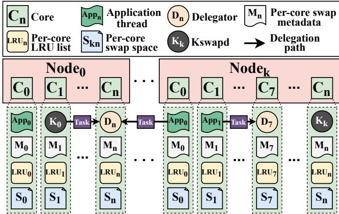  
Figure 8: Opportunistic inter-core swap assistance.

Figure 8 depicts opportunistic swap delegation among nodes and cores. ScaleSwap maintains per-node kswapd $( \mathrm { K } _ { 0 }$ and $\mathrm { K } _ { \mathrm { k } } )$ for swap management as the current Linux swap system does. Unlike the Linux swap system, if $\mathrm { K } _ { 0 }$ tries to swap out or in a page on $\textstyle \mathrm { c o r e } _ { \mathrm { n } }$ in node0, it delegates a swap task (i.e., accessing swap metadata) for the page to delegatorn $\left( \mathrm { D } _ { \mathrm { n } } \right)$ on $\textstyle \mathrm { c o r e } _ { \mathrm { n } }$ in node0. When direct reclaim occurs, the application threads (app0 and app1) in nodek try to swap in or out their pages on $\textstyle \mathrm { c o r e } _ { \mathrm { n } }$ in node0 and core7 in nodek and delegate their tasks to the delegators $( \mathrm { D } _ { \mathrm { n } }$ in node0 and $\mathrm { D } _ { 7 }$ in nodek), respectively. In addition, when swapping out with delegation, each core first searches for available space among cores within the same node in a round-robin manner. If no local space is available, it then searches in the next node to minimize NUMA overhead. Consequently, ScaleSwap can fully utilize the swap spaces even if some swap spaces become full and also support access to shared pages.

Swap task and task queue: As described, to facilitate communication between 1) swap delegators and 2) kswapds or application threads, ScaleSwap uses a 96-byte swap task structure that contains the swap request type, swap location information, etc. This structure is managed by a configurable pre-allocated memory pool to avoid allocation failures under high memory pressure. If the pre-allocated memory is exhausted, ScaleSwap waits until memory becomes available. In addition, ScaleSwap adopts a per-core task queue implemented using a concurrent list [47] to mitigate potential contention between enqueue and dequeue operations. Each delegator retrieves tasks from its queue and processes them according to the swap request type.

<table><tr><td colspan="7">Linux swap</td></tr><tr><td>Flags (PG_##)</td><td>padding</td><td colspan="2">Last CPUPID</td><td>Zone</td><td colspan="2">Node</td></tr><tr><td>? 26bits</td><td>4bits</td><td>21bits</td><td colspan="2">3bits</td><td>10bits</td></tr><tr><td>ScaleSwap</td><td colspan="4"></td></tr><tr><td>Flags (PG_##)</td><td>cpuid</td><td>Last_CPUPID</td><td>Zone</td><td>Node</td></tr><tr><td>? -26bits</td><td>7bits→</td><td>-21bits</td><td>3bits7bits-</td><td></td></tr></table>

Figure 9: Page flag layout.

Ordering and consistency: During delegation, while kswapds or application threads as multiple producers insert tasks to the task queue of a different core, the associated per-core delegator as a single consumer can fetch and delete the tasks in the task queue. This logic simplifies the delegation path and ensures that task order is preserved since the per-core delegator processes the tasks in a FIFO manner. Furthermore, the threads cannot access or update different cores’ swap metadata without the assistance of per-core delegators. By doing so, since only a single delegator per core can access and update the swap metadata, ScaleSwap prevents any consistency issues.

Cooperative swapping: When a thread performs a swap delegation, ScaleSwap allows the thread to perform busy waiting until receiving the information of swap metadata instead of blocking the thread since the delegation does not involve any I/O operations (i.e., the average delegation time is 29.99 ns). However, in some cases, the waiting time may increase. For example, if the delegator is in a sleep state and needs to be woken up, the delegation time is prolonged, thereby increasing the waiting time. To mitigate the waste of CPU cycles, we adopt cooperative swapping between delegator and kswapd/application thread. For example, after an application thread requests a delegation task to a per-core delegator, the thread checks if there are tasks in its core’s task queue. If they exist, the thread processes the task of accessing or updating its core’s swap metadata on behalf of the core’s delegator until receiving the response from the delegator. This strategy avoids both wasting the CPU utilization due to spinning and context switching overhead caused by blocking.

## 4.6 Core-affinity Page and LRU Management

Core-affinity LRU list: To maintain a page eviction policy, the current Linux memory system manages LRU list on a per-node basis. However, as described in insight #2 in Section 3.4.1, cores within a node can incur high contention on the node’s LRU lock (lru\_lock) during the swap process. To mitigate the LRU lock contention and enhance core locality, ScaleSwap adopts per-core shared LRU list. Each of these LRU lists is protected by a separate (per core) spinlock, reducing unnecessary resource contention in the swap process. As a result, ScaleSwap evicts pages based on the LRU policy localized to each core.

Core-affinity page allocation: For core-affinity page man-

Application thread  
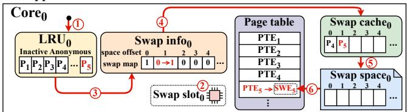

(a) Swap-out procedure.  
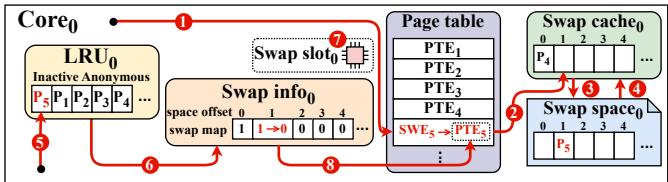  
(b) Swap-in procedure.

Figure 10: Procedure of swap out/in without delegation (PTE: Page Table Entry, SWE: Swap Entry).

agement, when a thread allocates a page, ScaleSwap enables the thread to insert the page into the corresponding core-local LRU list. This improves memory access performance due to core/cache friendliness and minimizes the LRU lock contention due to the high likelihood that the thread will re-access the page. To do this, we modify the page flag as shown in Figure 9 to record the page’s core number in the flag. We utilize the unused 4 bits within the page flag and extend it by 3 bits while reducing the node bits from 10 bits to 7 bits. This modification supports 128 cores (7 bits) for the core-affinity page allocation while still supporting 64 nodes, which is a sufficient number of nodes within a single server. During page allocation, ScaleSwap allocates the page and tracks the page’s LRU list by recording its core number into the unused/extended space in its page flag, enabling swapping with per-core LRU list as much as possible. As a result, ScaleSwap provides core-affinity page allocation to mitigate LRU lock contention and enhance core/cache locality, thereby reducing the number of page faults (see Section 5.2).

Swap out/in with per-core LRU list: ScaleSwap performs swap out/in processes with the per-core LRU list. When swapping out a page, ScaleSwap allows application threads to fetch a page in its own core LRU list and swap out the page. Thus, when swapping out, each core accesses only its own LRU list, avoiding access to other cores’ LRU lists. When swapping in a page, ScaleSwap allows the thread to recognize the page’s core number from the page flag, enabling it to re-insert the page into its original LRU list. As a result, ScaleSwap enables swapping out/in the pages within their core’s LRU list, mitigating the LRU lock.

## 4.7 ScaleSwap Procedure

## 4.7.1 Swap process without delegation

Swap-out process: Figure 10a depicts the swap-out process of ScaleSwap when delegation is not required under direct reclaim. To determine which page to swap out, the application thread in core0 fetches a page (page5) in the LRU list0 ( 1 ). Then, the thread obtains a swap entry through the swap slot, as described in Figure 6b, in order to swap out the page ( 2 ).

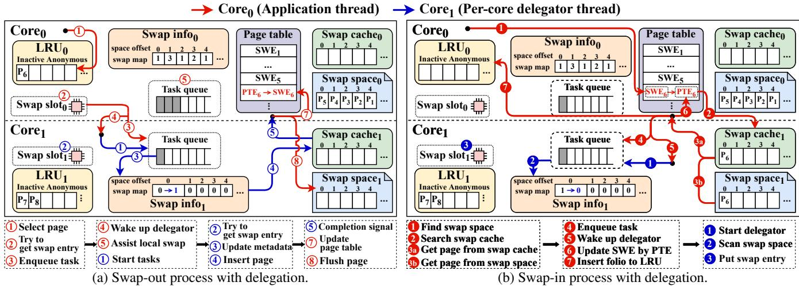  
Figure 11: Procedure of swap-out and swap-in with delegation.

Subsequently, the thread obtains the space offset (i.e., page’s location) from the swap entry, updates the page usage from 0 to 1 at the space offset in the swap map ( 3 ), and inserts the page into the swap cache ( 4 ). Afterward, the thread flushes the page to the swap space and evicts the page from the swap cache ( 5 ). After swapping out, to track the swap-out page’s location within the swap space, the page table entry is replaced by the swap entry (SWE5) ( 6 ). Since the swap entry contains the page’s location in the swap space, it allows the page to be swapped back in from the swap space.

Swap-in process: Figure 10b presents the swap-in process of ScaleSwap without delegation. When an application thread needs to read a swap-out page (page5), it identifies that the page was swap out by referencing its corresponding swap entry (SWE5) in the page table ( 1 ). Once, the thread tries to read the page5 from swap cache0 ( 2 ). If the page is not present in the swap cache, the thread reads the page from swap space0 via the location information in the swap entry ( 3 ). Subsequently, the thread inserts the page into swap cache0 ( 4 ). In this case, the thread can re-insert the page into its dedicated LRU list by identifying the recorded core number in the page flag ( 5 ). Then, the thread updates the page’s usage within the swap map from 1 to 0 ( 6 ). Finally, it returns the swap entry to the swap slot ( 7 ) and replaces SWE5 by PTE5 in the page table ( 8 ). By doing so, in both the swap-out and swap-in processes, ScaleSwap can achieve significant core localization and concurrency for many cores and multiple SSDs.

## 4.7.2 Swap process with delegation

Swap-out process with delegation: Figure 11a shows the swap-out process of ScaleSwap when delegation occurs under direct reclaim. First, an application thread in core0 accesses its LRU list to select the LRU page for swap-out ( 1 ). If the thread cannot fill swap slot with the swap entries (the swap space is full) ( 2 ), it requests delegation to a target core (core1) by inserting the swap-out task into the task queue of core1 ( 3 ) and waking up the delegator in core1 ( 4 ). We note that while waiting for a response from the delegator, the application thread processes tasks accumulated in its core’s task queue to assist its core’s delegator for cooperative swapping (Section 4.5) ( 5 ).

After the delegator wakes up, it dequeues the task from the task queue ( 1 ). The delegator recognizes that the task is a swap-out task and tries to retrieve swap entry through a swap slot ( 2 ). If the swap space is full, the delegator then returns a failure response to the application thread, which then searches for a new core in a round-robin fashion, as described in Section 4.5. If the space is available, the delegator updates the swap map ( 3 ) and inserts the requested page into its swap cache ( 4 ) and sends a completion signal to the application thread ( 5 ). After receiving the response, the thread updates its page table from PTE6 to SWE6 ( 7 ) and flushes the page to the target swap space ( 8 ). We note that the application thread directly flushes to the target swap space1 to minimize delegation time (Section 4.5). Furthermore, this does not compromise consistency between threads accessing the swap space, since each swap space is protected by its own lock (e.g., a file lock).

Swap-in process with delegation: Figure 11b depicts the swap-in process with delegation. When accessing the swapout page, an application thread first accesses its page table to find the page’s location ( 1 ). Then, the thread recognizes the entry as a swap entry and tries to read the page by checking the swap cache ( 2 ). If the swap cache has the page, the thread directly can obtain the page from the swap cache1 ( 3a ). Otherwise, the thread reads it from the swap space1 ( 3b ) Subsequently, since the swap-in process is performed in a different core’s swap space, a delegation request is sent to the core to update the swap metadata. Thus, the thread inserts a swap-in task into the task queue in the target core (core1) ( 4 ) and wakes up the core’s delegator ( 5 ). Then, the application thread replaces its page table by PTE6 instead of SWP6 ( 6 ) and inserts the page into its own LRU list ( 7 ). After the delegator wakes up, it checks the task queue and processes the swap-in task ( 1 ). Then, the delegator reduces the usage count in the swap map for the corresponding offset ( 2 ) and puts the swap entry to the swap slot1 ( 3 ).

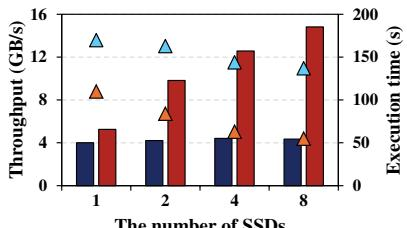  
(a) SSD scalability.

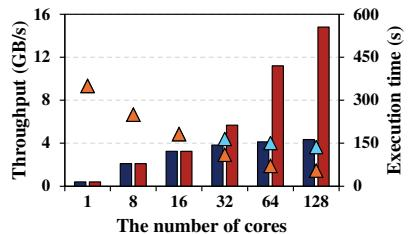  
(b) Core scalability.

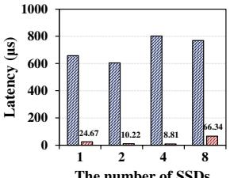  
The number of SSDs

(c) SSD scalability (Lat.)  
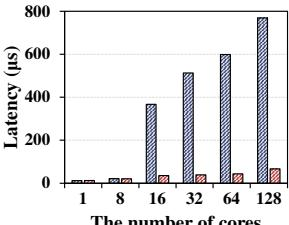  
(d) Core scalability (Lat.)  
Figure 12: Throughput, execution time and latency with varying numbers of SSDs and cores (Lat: Average latency).

Note that, due to asynchronous nature, the swap-in process in core0 may already have completed, while the delegation process in core1 is still in progress. As a result, the system may temporarily report insufficient space even when space is available; however, it never incorrectly indicates that space is available when none exists. It is because the application thread always completes the swap in operation and then wakes up the delegator. Likewise, the Linux swap system also completes the swap-in operation and then updates the swap metadata. Therefore, ScaleSwap maintains the same level of consistency as the existing Linux swap system.

## 5 Evaluation

## 5.1 Experimental Setup

We have conducted all experiments on a 128-core machine equipped with two AMD EPYC 7713 64-core processors and 96 GB of DRAM. For the all-flash swap array, the machine is equipped with eight FireCuda 530 NVMe SSDs [75] (each SSD has a capacity of 2 TB and shows a stable random write, read, and mixture of read/write throughput: 4.5 GB/s, 3.2 GB/s, and 3.5 GB/s). When the eight devices are configured in raw RAID-0, the aggregated throughput reaches the mixture of read/write throughput of 11.4 GB/s by using the FIO [7] benchmark. The machine runs Ubuntu 22.04 LTS with the Linux kernel 6.6.8. To evaluate the Linux swap system, ScaleSwap, and recent swap systems, TMO [88], ExtMEM [41], we utilize 128 swap files on an EXT4 file system. We use a stress tool [4] as a micro-benchmark which allocates a specified memory size and performs byte-level write/read operations. For real-world evaluation, we use six memory-intensive applications [51]. We run each test ten times and report the average result.

## 5.2 Micro-benchmark

We run the stress tool using 128 threads and eight SSDs, writing and reading 2.25 GB of memory per thread (total 288 GB memory). We use this configuration in all cases unless stated otherwise.

SSD scalability: Figure 12a shows the SSD scalability of ScaleSwap and the Linux swap system. As the number of SSDs increases from 1 to 8, ScaleSwap achieves up to 1.31×, 2.34×, 2.85×, 3.41× higher throughput than the Linux swap system. In terms of execution time, ScaleSwap also achieves lower execution times compared with the Linux swap system, showing relative values of 1.55×, 1.94×, 2.29×, and 2.49×. These results indicate that the Linux swap system suffers from limited scalability beyond two SSDs due to low concurrency, while ScaleSwap effectively scales under high memory pressure by high concurrency and parallel swapping on the all-flash swap array.

<table><tr><td rowspan=1 colspan=1>#of SSDsSwap system</td><td rowspan=1 colspan=1>1</td><td rowspan=1 colspan=1>2</td><td rowspan=1 colspan=1>4</td><td rowspan=1 colspan=1>8</td></tr><tr><td rowspan=1 colspan=1>Linux swap</td><td rowspan=1 colspan=1>2265.25 μs</td><td rowspan=1 colspan=1>3334.04 μs</td><td rowspan=1 colspan=1>2882.08 μs</td><td rowspan=1 colspan=1>2395.20 μs</td></tr><tr><td rowspan=1 colspan=1>ScaleSwap</td><td rowspan=1 colspan=1>801.37 μs</td><td rowspan=1 colspan=1>524.75 μs</td><td rowspan=1 colspan=1>445.61 μs</td><td rowspan=1 colspan=1>87.94 us</td></tr></table>

Table 1: Tail latency (99.9th) with varying numbers of SSDs.

<table><tr><td rowspan=1 colspan=2>#of SSDsSwap system</td><td rowspan=1 colspan=1>1</td><td rowspan=1 colspan=1>2</td><td rowspan=1 colspan=1>4</td><td rowspan=1 colspan=1>8</td></tr><tr><td rowspan=4 colspan=1>Linux swap</td><td rowspan=1 colspan=1>user</td><td rowspan=1 colspan=1>0.2%</td><td rowspan=1 colspan=1>0.21%</td><td rowspan=1 colspan=1>0.46%</td><td rowspan=1 colspan=1>0.29%</td></tr><tr><td rowspan=1 colspan=1>system</td><td rowspan=1 colspan=1>14.49 %</td><td rowspan=1 colspan=1>79.32 %</td><td rowspan=1 colspan=1>86.91 %</td><td rowspan=1 colspan=1>92.41 %</td></tr><tr><td rowspan=1 colspan=1>iowait</td><td rowspan=1 colspan=1>70.02 %</td><td rowspan=1 colspan=1>17.61 %</td><td rowspan=1 colspan=1>10.32 %</td><td rowspan=1 colspan=1>4.58 %</td></tr><tr><td rowspan=1 colspan=1>idle</td><td rowspan=1 colspan=1>15.29 %</td><td rowspan=1 colspan=1>2.75 %</td><td rowspan=1 colspan=1>2.31 %</td><td rowspan=1 colspan=1>2.72 %</td></tr><tr><td rowspan=4 colspan=1>ScaleSwap</td><td rowspan=1 colspan=1>user</td><td rowspan=1 colspan=1>0.22%</td><td rowspan=1 colspan=1>0.28%</td><td rowspan=1 colspan=1>0.88%</td><td rowspan=1 colspan=1>1.07 %</td></tr><tr><td rowspan=1 colspan=1>system</td><td rowspan=1 colspan=1>9.23%</td><td rowspan=1 colspan=1>14.01 %</td><td rowspan=1 colspan=1>65.71 %</td><td rowspan=1 colspan=1>83.06 %</td></tr><tr><td rowspan=1 colspan=1>iowait</td><td rowspan=1 colspan=1>77.36 %</td><td rowspan=1 colspan=1>66.82%</td><td rowspan=1 colspan=1>18.95 %</td><td rowspan=1 colspan=1>6.45%</td></tr><tr><td rowspan=1 colspan=1>idle</td><td rowspan=1 colspan=1>13.2 %</td><td rowspan=1 colspan=1>18.89 %</td><td rowspan=1 colspan=1>14.46 %</td><td rowspan=1 colspan=1>9.42 %</td></tr></table>

Table 2: CPU utilization with varying numbers of SSDs.

Core scalability: As shown in Figure 12b, we measure the performance of the Linux swap system and ScaleSwap as the number of cores increases. In this case, the number of threads and swap files equals the number of cores. ScaleSwap demonstrates linear scalability with an increasing number of cores, whereas the Linux swap system shows no significant performance improvement when the number of cores is more than 32. Consequently, ScaleSwap improves many-core scalability in the swap process by using its core-centric swap resource management and concurrency techniques.

Average and tail latency: Figure 12c and Figure 12d show average latency on varying SSDs and cores, respectively. Table 1 shows the 99.9th percentile latencies of the Linux swap system and ScaleSwap. As shown in the figures and table, ScaleSwap achieves up to 11.5× and 27.2× lower average and tail latency compared with the Linux swap system, respectively. Although the Linux swap system performs swapping in parallel assisted by multiple application threads, the application threads suffer lock contention during direct reclamation, significantly increasing average and tail latency. In contrast, ScaleSwap mitigates this contention with a dedicated and delegation model.

CPU utilization: We measure CPU utilization using eight SSDs under memory pressure as shown in Table 2. ScaleSwap reduces kernel (system) CPU usage by an average of 25%, allowing for more efficient use of CPU resources. This optimization not only increases user-level CPU utilization but also results in idle time increasing by up to 16%. It is because the application threads in the Linux system already perform swap-out/in operations in parallel, but incur high CPU utilization and lock contention. Meanwhile, ScaleSwap performs swap-out/in operations in parallel similar to the Linux system but reduces the lock contention. The result indicates that ScaleSwap accelerates the swap-out/in processing and makes CPU resources more available. In summary, ScaleSwap enables the system to better handle additional workloads while improving swap performance.

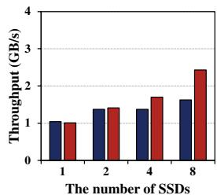  
(a) BFS.

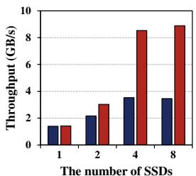  
(b) DNA visualization.

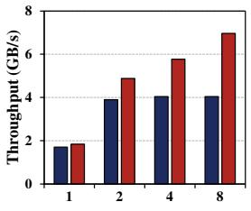  
(c) Python list.

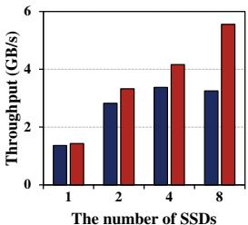  
(d) Image (gray-scale).

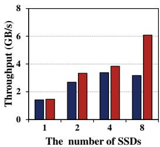  
(e) Image (flip).

Figure 13: Throughput of memory-intensive applications with varying numbers of SSDs.
<table><tr><td rowspan=1 colspan=1>Swapsystem</td><td rowspan=1 colspan=1>Mainmemoryusage</td><td rowspan=1 colspan=1>Swapmemoryusage</td><td rowspan=1 colspan=1>Total memoryusage</td></tr><tr><td rowspan=1 colspan=1>Linux swap</td><td rowspan=1 colspan=1>93.18 GB</td><td rowspan=1 colspan=1>274.61 GB</td><td rowspan=1 colspan=1>367.79 GB</td></tr><tr><td rowspan=1 colspan=1>ScaleSwap</td><td rowspan=1 colspan=1>93.26GB</td><td rowspan=1 colspan=1>274.52 GB</td><td rowspan=1 colspan=1>367.78 GB</td></tr></table>

Memory consumption: Table 3 shows the peak memory consumption of the Linux swap system and ScaleSwap. ScaleSwap preallocates 1,500 swap tasks per core for delegation, with each structure being 96 bytes in size. These tasks are reserved to avoid potential memory allocation delays. In the experiment with the stress tool and 128 cores/threads, the total number of tasks is 192,000, totaling 17.57 MB. During the experiment, the peak usage of swap tasks varies between 66,000 and 150,000, corresponding to approximately 6.0 MB to 13.7 MB of memory. This result indicates that the memory overhead is minimal; therefore, the peak memory usage of ScaleSwap remains nearly identical to that of the Linux swap system. Finally, we note that the amount of preallocation is configurable and can be adjusted according to memory traffic and workload characteristics.

Page fault: To better understand the costs and memory efficiency, we measure page faults. The Linux swap system incurs approximately 100,827,862 page faults, while ScaleSwap incurs 92,280,466, corresponding to a 9.15% reduction. This is because our per-core LRU approach localizes the pages to their cores, thereby reducing page faults. Consequently, ScaleSwap minimizes interference from other cores and the eviction of frequently accessed pages on each core.

## 5.3 Memory-intensive Applications

We evaluate ScaleSwap using five memory-intensive applications, including breadth-first search (BFS), DNA visualization,

<table><tr><td rowspan=1 colspan=1>Application</td><td rowspan=1 colspan=1>Description</td></tr><tr><td rowspan=1 colspan=1>DNA Visualization</td><td rowspan=1 colspan=1>Transforming and visualizing DNA sequences froma large FASTA file.Total memory usage = 640GB</td></tr><tr><td rowspan=1 colspan=1>Python List</td><td rowspan=1 colspan=1>Creating and traversing a large Python list.Total memory usage = 256GB</td></tr><tr><td rowspan=1 colspan=1>BFS</td><td rowspan=1 colspan=1>Graph traversal using Breadth-First Search (BFS).Total memory usage = 184GB</td></tr><tr><td rowspan=1 colspan=1>Gray-Scale</td><td rowspan=1 colspan=1>Converting images to gray-scale.Total memory usage = 384GB</td></tr><tr><td rowspan=1 colspan=1>Flip</td><td rowspan=1 colspan=1>Performing horizontal flipping of images.Total memory usage = 384GB</td></tr></table>

Python list, and image processing (gray-scale and flip) from the previous study [51] as described in Table 4. As shown in Figure 13, overall, ScaleSwap scales the performance for each application especially more than four SSDs. As similar to the microbenchmark results, since the Linux swap system already performs swap out/in operations in parallel, the performance of the swap system with one SSD is similar to ScaleSwap. Meanwhile, with the higher bandwidth supported by using more than two SSDs, ScaleSwap gradually demonstrates higher performance compared with the Linux swap system. With 8 SSDs, ScaleSwap achieves throughput improvements of 2.4×, 2.57×, 1.70×, 1.72×, and 1.91× in the case of BFS, DNA visualization, Python list, gray-scale, and flip, compared with the Linux swap system, respectively. Especially, ScaleSwap can exhibit the highest performance gap in DNA visualization, since it involves the most frequent memory access. As a result, ScaleSwap delivers high scalability even for these end-to-end applications.

When comparing the performance gains of microbenchmarks and end-to-end applications, ScaleSwap achieves higher gains in the microbenchmark. This is because applications perform a larger proportion of computational operations compared with the micro-benchmark (stress tool). The stress tool accounts for only 0.29% of user-level CPU utilization. Meanwhile, BFS, DNA, Python List, Gray, and Flip account for 23.29%, 2.91%, 42.91%, 45.21%, and 41.56% of userlevel CPU utilization, respectively. Therefore, ScaleSwap exhibits a greater performance gap under more memoryintensive workloads, as increased memory access leads to more frequent swap-in and swap-out operations.

## 5.4 Apache Spark

We evaluate ScaleSwap using Apache Spark, a widely adopted framework for large-scale, in-memory data processing. Spark is particularly suitable for evaluating swap performance because it performs intensive memory operations and often exceeds available DRAM capacity when working with large datasets. We use 128 WARC files from the Common Crawl dataset (CC-MAIN-2025-13), each approximately 1GB in size. Parsing these files requires significantly more memory than their raw size; for instance, processing 20,000 records per file can consume over 300GB of total memory and swap. We vary the workload by adjusting the number of input records per core. Figure 14 illustrates that ScaleSwap outperforms the Linux swap system across all input sizes, achieving both higher throughput and lower execution time. At the largest workload (100,000 records per core), ScaleSwap reaches 6.3 GB/s and achieves a 1.75× higher throughput than the Linux swap system. These results demonstrate that ScaleSwap maintains strong scalability and performance advantages even in realistic, high-pressure data analytics workloads.

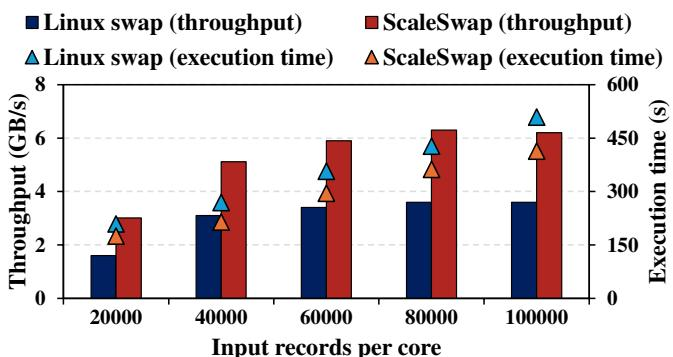

Figure 14: Apache Spark results under varying input sizes.  
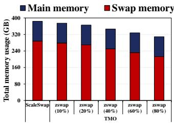  
(a) Memory usage.

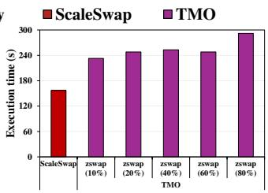  
Figure 15: Comparison with TMO.  
(b) Execution time.

## 5.5 Comparison with Prior Studies

Transparent memory offloading (TMO): We compare ScaleSwap with TMO [88] by running three applications simultaneously: DNA visualization, gray-scale, and flip. TMO utilizes compressed memory to free up space and minimizes performance degradation caused by swap memory usage through PSI-based real-time monitoring. To consider the TMO feature, we evaluate TMO and ScaleSwap according to memory compression ratios. Figure 15 illustrates the performance comparison between TMO and ScaleSwap at different compression ratios, where ScaleSwap outperforms TMO by up to 64%. This gap tends to widen as the compression ratio increases. The primary reasons for this performance gap are as follows: TMO introduces CPU overhead during the memory compression and decompression processes, leading to performance degradation. When the maximum compression ratio is reached and workloads still demand more memory, swapping occurs, leading to additional performance loss. TMO focuses on reducing DRAM costs and improving memory utilization while minimizing performance degradation through PSI-based real-time monitoring. In contrast, ScaleSwap is designed to maximize swap performance for memory-intensive applications.

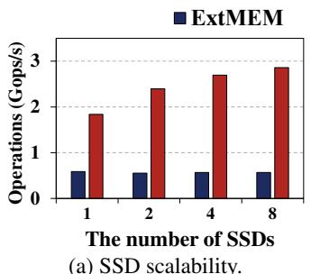

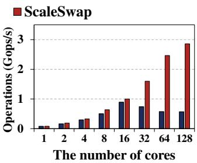  
(b) Core scalability.

Figure 16: Comparison with ExtMEM.
<table><tr><td rowspan=1 colspan=1>Swapsystem</td><td rowspan=1 colspan=1>Throughput</td><td rowspan=1 colspan=1>Avg latency</td><td rowspan=1 colspan=1>Iru_lock</td><td rowspan=1 colspan=1>si_lock</td><td rowspan=1 colspan=1>Others</td></tr><tr><td rowspan=1 colspan=1>Linux swap</td><td rowspan=1 colspan=1>4.34 GB/s</td><td rowspan=1 colspan=1>768.67 μs</td><td rowspan=1 colspan=1>53.27%</td><td rowspan=1 colspan=1>1.43%</td><td rowspan=1 colspan=1>45.3%</td></tr><tr><td rowspan=1 colspan=1>ScaleSwap(LRU)</td><td rowspan=1 colspan=1>8.13 GB/s</td><td rowspan=1 colspan=1>172.15 μs</td><td rowspan=1 colspan=1>0.15%</td><td rowspan=1 colspan=1>5.03%</td><td rowspan=1 colspan=1>94.82 %</td></tr><tr><td rowspan=1 colspan=1>ScaleSwap</td><td rowspan=1 colspan=1>14.81 GB/s</td><td rowspan=1 colspan=1>66.34 μs</td><td rowspan=1 colspan=1>0.16%</td><td rowspan=1 colspan=1>0%</td><td rowspan=1 colspan=1>99.84 %</td></tr></table>

Table 5: Performance breakdown of Linux swap and ScaleSwap.

<table><tr><td rowspan=1 colspan=1>#of full swap files</td><td rowspan=1 colspan=1>0 files</td><td rowspan=1 colspan=1>16 files</td><td rowspan=1 colspan=1>32 files</td><td rowspan=1 colspan=1>64 files</td><td rowspan=1 colspan=1>96files</td></tr><tr><td rowspan=1 colspan=1>Avail swapspace</td><td rowspan=1 colspan=1>16 TB</td><td rowspan=1 colspan=1>14 TB</td><td rowspan=1 colspan=1>12 TB</td><td rowspan=1 colspan=1>8TB</td><td rowspan=1 colspan=1>4 TB</td></tr><tr><td rowspan=1 colspan=1>Throughput</td><td rowspan=1 colspan=1>14.81 GB/s</td><td rowspan=1 colspan=1>13.93 GB/s</td><td rowspan=1 colspan=1>13.88 GB/s</td><td rowspan=1 colspan=1>13.33 GB/s</td><td rowspan=1 colspan=1>12.48 GB/s</td></tr><tr><td rowspan=1 colspan=1>Total exec time</td><td rowspan=1 colspan=1>52 s</td><td rowspan=1 colspan=1>54 s</td><td rowspan=1 colspan=1>55s</td><td rowspan=1 colspan=1>57s</td><td rowspan=1 colspan=1>63s</td></tr><tr><td rowspan=1 colspan=1>Dlg count</td><td rowspan=1 colspan=1>70,078,564</td><td rowspan=1 colspan=1>88,329,031</td><td rowspan=1 colspan=1>104,703,628</td><td rowspan=1 colspan=1>155,130,438</td><td rowspan=1 colspan=1>202,714,836</td></tr><tr><td rowspan=1 colspan=1>Total dlg time</td><td rowspan=1 colspan=1>2.102 s</td><td rowspan=1 colspan=1>4.47 s</td><td rowspan=1 colspan=1>5.974 s</td><td rowspan=1 colspan=1>11.212 s</td><td rowspan=1 colspan=1>16.574 s</td></tr><tr><td rowspan=1 colspan=1>Avg dlg time</td><td rowspan=1 colspan=1>29.99 ns</td><td rowspan=1 colspan=1>50.60 ns</td><td rowspan=1 colspan=1>57.05 ns</td><td rowspan=1 colspan=1>72.27 ns</td><td rowspan=1 colspan=1>81.76 ns</td></tr></table>

Table 6: Delegation overhead (Avail: available, Exec: execution, Dlg: delegation, Avg: average).

ExtMEM: We compare ScaleSwap with ExtMEM [41]. ExtMEM is a memory management framework designed to implement application-specific page management policies in user space. To ensure a fair evaluation, we use mmapbench [24] for this experiment, as it is employed in ExtMEM. Figure 16a shows the throughput as the number of SSDs increases (from 1 to 8) with the thread count fixed at 128, while Figure 16b evaluates their throughput under increasing thread/core counts (from 1 to 128) with 8 SSDs. Figure 16a further demonstrates that ExtMEM exhibits almost no performance improvement as more SSDs are added, whereas ScaleSwap shows consistent performance gains with each additional SSD. With 8 SSDs, ScaleSwap achieves up to 5.02× higher operations per second compared to ExtMEM. As shown in Figure 16b, both systems initially scale with the number of threads up to 16. However, beyond 32 threads, the performance of ExtMEM saturates or drops, while ScaleSwap continues to scale steadily until 128 threads. These results demonstrate that ScaleSwap can deliver better performance compared with a framework for applicationbased memory management.

## 5.6 Performance Breakdown

Table 5 shows the performance breakdown by measuring the time spent on major locks using a kernel time function for higher accuracy and lower overhead. We use 8 SSDs with 128 cores by running the stress tool with the same configuration. In the Linux swap system, the lru\_lock—used to synchronize LRU lists—accounts for 53.27% of the total execution time, making it the most significant bottleneck. Our coreaffinity page and LRU management significantly reduce the contention on lru\_lock. However, the bottleneck is moved to si\_lock, which protects the swap metadata. To resolve this, our core-centric swap resource management and opportunistic inter-core swap assistance eliminate the lock contention (si\_lock) while supporting inter-core swap operations. By doing so, ScaleSwap achieves swap scalability on many cores and all-flash swap arrays.

## 5.7 Delegation Overhead

Table 6 presents the overhead of inter-core swap delegation in ScaleSwap. Once a core’s dedicated swap file becomes full, ScaleSwap delegates swap-out operations to other cores with available swap space. It also delegates swap-in operations to the cores that store the pages because each thread writes a page and later reads back that same page in the stress workload. Thus, the results include both swap-out and swap-in delegation overheads. To trigger delegation more frequently, we deliberately exhaust the capacities of 0, 16, 32, 64, and 96 dedicated swap files, rendering them unavailable, and then measure the delegation overhead. Even if we increase the number of unavailable swap files to 96 extremely (only 32 swap files), increasing the average delegation time, ScaleSwap sustains approximately 84% of the peak throughput while the execution time increases modestly from 52 to 63 seconds. This result indicates that the delegation overhead in ScaleSwap is marginal when few swap files are unavailable, while it sustains performance even with an extreme number of unavailable swap files. This is because delegation accesses swap metadata, which involves only memory operations.

## 6 Related Work

Scaling systems with all-flash arrays: ScaleCache [67] presents a scalable file-backed page cache for multiple SSDs using concurrent data structures to eliminate XArray lock contention. Falcon [49] targets a single flush thread per volume and presents per-drive parallel I/O processing on multiple SSDs. However, swap overhead mainly stems from locking in the LRU and swap metadata, and Linux swap already supports multiple application threads issuing striped swap I/O. Inspired by these works [49, 67], we instead focus on improving swap scalability via core-centric resource management.

Disaggregated/remote memory and swap systems: Infiniswap [36] presents an RDMA-based remote paging system that distributes unused memory across multiple machines to applications. AIFM [72] presents application-integrated far memory to make far memory available to applications through a simple API. TeRM [92] extends RDMA-attached memory with SSD by eliminating page faults of RDMA NIC and CPU from the critical path. Our study is inspired by these studies [36, 72, 92] and aligns with them in terms of extending main memory and devising a swap system. Meanwhile, we focus on developing a scalable swap system at the OS level.

Furthermore, our swap system can also be applied to the individual disaggregated/remote servers in an additional memory tier when their memory capacity is limited.

Tiered memory systems: NOMAD [89] presents a mechanism that features transactional page migration and page shadowing for tiered memory. Colloid [85] is a memory management mechanism to optimize application performance independently of the latency and bandwidth characteristics of individual memory tiers. Our work is in line with these studies [85, 89] in placing pages in the different tiers. Meanwhile, we focus on scaling the OS swap system, which can also be incorporated into the tiered systems.

Scaling memory systems: Hydra [30] is a page-table management that enables partial page-table replication across NUMA nodes. Kogan et al. [47] propose scalable range locks to accelerate non-conflicting virtual address space operations. ExtMEM [41] presents a user-space framework for application-based memory management, delegating memory management policies from the kernel to user space. Our work aligns with these studies [30, 41, 47] in scaling memory systems. In contrast, we design a concurrent OS swap memory system via per-core and delegation mechanisms.

OS-based swap systems: FlashVM [74] is a virtual memory system that uses flash for swapping and optimizes GC with flash-specific techniques. SSDAlloc [9] presents a DRAM/flash memory manager and runtime library that enables applications to allocate memory on flash, but it requires application modifications via a special API. TMO [88] is a Linux kernel offload or swap mechanism that adjusts how much memory to offload or swap to heterogeneous devices. ZNSwap [11] leverages the ZNS interface and enables codesign between host side GC and Linux swap system. Our study aligns with these studies [9, 11, 74, 88] in terms of OSbased swap systems. In contrast, we focus on scaling the swap system across multiple SSDs by enhancing core concurrency with a per-core dedicated and delegation model.

## 7 Conclusion

This paper introduces ScaleSwap, a scalable OS swap system designed to enhance SSD/core scalability. ScaleSwap embodies the key principle of orchestrating swap resources and swap in/out operations in a core-centric manner. Based on this key principle, ScaleSwap adopts three strategies: corecentric swap resource management, opportunistic inter-core swap assistance, and core-affinity page and LRU management. Our evaluation demonstrates that ScaleSwap achieves up to 3.4× higher throughput and up to 11.5× lower latency compared with the Linux swap system.

## Acknowledgments

We sincerely thank our shepherd, Sudarsun Kannan, and the anonymous reviewers for their invaluable feedback. This work was supported by the National Research Foundation of Korea (NRF) (No. RS-2025-00554650) (Corresponding Author: Yongseok Son).

## References

[1] 105 trillion pi digits: The journey to a new pi calculation record. https://www.storagereview.com/review /breaking-records-storagereviews-105-trill ion-digit-pi-calculation, 2024.

[2] Emmanuel Amaro, Christopher Branner-Augmon, Zhihong Luo, Amy Ousterhout, Marcos K Aguilera, Aurojit Panda, Sylvia Ratnasamy, and Scott Shenker. Can far memory improve job throughput? In Proceedings of the Fifteenth European Conference on Computer Systems (EuroSys’20), pages 1–16, 2020.

[3] Nadav Amit, Dan Tsafrir, and Assaf Schuster. Vswapper: A memory swapper for virtualized environments. Acm Sigplan Notices, 49(4):349–366, 2014.

[4] Vratislav Bendel Amos Waterland, Joao Eriberto Mota Filho. stress. https://github.com/resur recting-open-source-projects/stress, 2021.

[5] Apache Spark. Apache Spark FAQ. https://spark. apache.org/faq.html, 2024.

[6] Michael Armbrust, Reynold S Xin, Cheng Lian, Yin Huai, Davies Liu, Joseph K Bradley, Xiangrui Meng, Tomer Kaftan, Michael J Franklin, Ali Ghodsi, et al. Spark sql: Relational data processing in spark. In Proceedings of the 2015 ACM SIGMOD international conference on management of data, pages 1383–1394, 2015.

[7] Jens Axboe. Flexible i/o tester. https://github.com /axboe/fio, 2005.

[8] Özalp Babaoglu and William Joy. Converting a swapbased system to do paging in an architecture lacking page-referenced bits. ACM SIGOPS Operating Systems Review, 15(5):78–86, 1981.

[9] Anirudh Badam and Vivek S Pai. SSDAlloc: Hybrid SSD/RAM memory management made easy. In 8th USENIX Symposium on Networked Systems Design and Implementation (NSDI 11), 2011.

[10] Scott Beamer, Krste Asanovic, and David Patterson. ´ Direction-optimizing breadth-first search. In Proceedings of the International Conference on High Performance Computing, Networking, Storage and Analysis, SC ’12, Washington, DC, USA, 2012. IEEE Computer Society Press.

[11] Shai Bergman, Niklas Cassel, Matias Bjørling, and Mark Silberstein. ZNSwap: un-block your swap. In 2020 USENIX Annual Technical Conference (USENIX ATC 22), pages 1–18, 2022.

[12] P. Boldi and S. Vigna. The webgraph framework i: compression techniques. In Proceedings of the 13th International Conference on World Wide Web, WWW ’04, page 595–602, New York, NY, USA, 2004. Association for Computing Machinery.

[13] Dhruba Borthakur. Petabyte scale databases and storage systems at facebook. In Proceedings of the 2013 ACM SIGMOD International Conference on Management of Data, pages 1267–1268, 2013.

[14] Kevin J Bowers, Brian James Albright, Lilan Yin, B Bergen, and Thomas JT Kwan. Ultrahigh performance three-dimensional electromagnetic relativistic kinetic plasma simulation. Physics of Plasmas, 15(5), 2008.

[15] Sergey Brin and Lawrence Page. The anatomy of a large-scale hypertextual web search engine. Computer networks and ISDN systems, 30(1-7):107–117, 1998.

[16] Suren Byna, Houjun Tang, Quincey Koziol, Tony Li, John Ravi, Scot Breitenfield, and Jean Luca Bez. h5bench: a parallel i/o benchmark suite for hdf5. https: //h5bench.readthedocs.io/en/latest//, 2021.

[17] Jiahao Chen, Dingji Li, Zeyu Mi, Yuxuan Liu, Binyu Zang, Haibing Guan, and Haibo Chen. Security and performance in the delegated user-level virtualization. In 17th USENIX Symposium on Operating Systems Design and Implementation (OSDI 23), pages 209–226, 2023.

[18] Wei Chen, Aidi Pi, Shaoqi Wang, and Xiaobo Zhou. Osaugmented oversubscription of opportunistic memory with a user-assisted oom killer. In Proceedings of the 20th International Middleware Conference, pages 28– 40, 2019.

[19] Raymond Cheng, Ji Hong, Aapo Kyrola, Youshan Miao, Xuetian Weng, Ming Wu, Fan Yang, Lidong Zhou, Feng Zhao, and Enhong Chen. Kineograph: taking the pulse of a fast-changing and connected world. In Proceedings of the 7th ACM european conference on Computer Systems (EuroSys’12), pages 85–98, 2012.

[20] Avery Ching, Sergey Edunov, Maja Kabiljo, Dionysios Logothetis, and Sambavi Muthukrishnan. One trillion edges: Graph processing at facebook-scale. Proceedings of the VLDB Endowment, 8(12):1804–1815, 2015.

[21] Alibaba Cloud. Memcg backend asynchronous reclaim. https://www.alibabacloud.com/help/en/alinu x/user-guide/memcg-backend-asynchronous-r eclaim, 2015.

[22] Jonathan Corbet. Fixing writeback from direct reclaim. https://lwn.net/Articles/396561/, 2010.

[23] Jonathan Corbet. A new swap abstraction layer for the kernel. https://lwn.net/Articles/974587/, 2024.

[24] Andrew Crotty, Viktor Leis, and Andrew Pavlo. Are you sure you want to use mmap in your database management system? In CIDR, 2022.

[25] Jeffrey Dean and Sanjay Ghemawat. Mapreduce: simplified data processing on large clusters. Communications of the ACM, 51(1):107–113, 2008.

[26] Mingjiang Duan, Tongya Zheng, Yang Gao, Gang Wang, Zunlei Feng, and Xinyu Wang. Dga-gnn: Dynamic grouping aggregation gnn for fraud detection. In Proceedings of the AAAI Conference on Artificial Intelligence, volume 38, pages 11820–11828, 2024.

[27] Jake Edge. Large folios, swap, and fs-cache. https: //lwn.net/Articles/982887/, 2024.

[28] Michael Ferdman, Almutaz Adileh, Onur Kocberber, Stavros Volos, Mohammad Alisafaee, Djordje Jevdjic, Cansu Kaynak, Adrian Daniel Popescu, Anastasia Ailamaki, and Babak Falsafi. Clearing the clouds: a study of emerging scale-out workloads on modern hardware. In Proceedings of the 17th International Conference on Architectural Support for Programming Languages and Operating Systems (ASPLOS 12), 2012.

[29] Common Crawl Foundation. Common crawl. https: //commoncrawl.org/, nov 2007.

[30] Bin Gao, Qingxuan Kang, Hao-Wei Tee, Kyle Timothy Ng Chu, Alireza Sanaee, and Djordje Jevdjic. Scalable and effective page-table and TLB management on NUMA systems. In 2024 USENIX Annual Technical Conference (USENIX ATC 24), pages 445–461, 2024.

[31] Gurbinder Gill, Roshan Dathathri, Loc Hoang, Ramesh Peri, and Keshav Pingali. Single machine graph analytics on massive datasets using intel optane dc persistent memory. arXiv preprint arXiv:1904.07162, 2019.

[32] Joseph E Gonzalez, Yucheng Low, Haijie Gu, Danny Bickson, and Carlos Guestrin. PowerGraph: Distributed Graph-Parallel computation on natural graphs. In 10th USENIX symposium on operating systems design and implementation (OSDI 12), pages 17–30, 2012.

[33] Mel Gorman. Understanding the Linux virtual memory manager, volume 352. Prentice Hall Upper Saddle River, 2004.

[34] Albert Greenberg, James Hamilton, David A. Maltz, and Parveen Patel. The cost of a cloud: research problems in data center networks. SIGCOMM Comput. Commun. Rev., 39(1):68–73, December 2009.

[35] Ray Tsang Greg Wilson. Calculating and searching 500 billion digits of pi. https://cloud.google.com/blo g/products/gcp/calculating-and-searching-5 00-billion-digits-of-pi, 2016.

[36] Juncheng Gu, Youngmoon Lee, Yiwen Zhang, Mosharaf Chowdhury, and Kang G Shin. Efficient memory disaggregation with infiniswap. In 14th USENIX Symposium on Networked Systems Design and Implementation (NSDI 17), pages 649–667, 2017.

[37] Tyler Harter, Brandon Salmon, Rose Liu, Andrea C Arpaci-Dusseau, and Remzi H Arpaci-Dusseau. Slacker: Fast distribution with lazy docker containers. In 14th USENIX Conference on File and Storage Technologies (FAST 16), pages 181–195, 2016.

[38] Itamar Holder. Kubernetes 1.28: Beta support for using swap on linux. https://kubernetes.io/blog/202 3/08/24/swap-linux-beta/, 2023.

[39] Alexander Isenko, Ruben Mayer, Jeffrey Jedele, and Hans-Arno Jacobsen. Where is my training bottleneck? hidden trade-offs in deep learning preprocessing pipelines. In Proceedings of the 2022 International Conference on Management of Data, pages 1825–1839, 2022.

[40] Emma Haruka Iwao. Even more pi in the sky: Calculating 100 trillion digits of pi on google cloud. https: //cloud.google.com/blog/products/compute/c alculating-100-trillion-digits-of-pi-on-g oogle-cloud, 2024.

[41] Sepehr Jalalian, Shaurya Patel, Milad Rezaei Hajidehi, Margo Seltzer, and Alexandra Fedorova. ExtMem: Enabling Application-Aware virtual memory management for Data-Intensive applications. In 2024 USENIX Annual Technical Conference (USENIX ATC 24), pages 397–408, 2024.

[42] Dawoon Jung, Jin-soo Kim, Seon-yeong Park, Jeonguk Kang, and Joonwon Lee. Fass: A flash-aware swap system. In Proc. of International Workshop on Software Support for Portable Storage (IWSSPS), 2005.

[43] Sanidhya Kashyap. Vbench. https://github.com/s slab-gatech/vbench, 2015.

[44] Thomas Keller, Michael Burch, and Heiko Rölke. A methodology for computing irrational numbers. In 2024 23rd International Symposium on Parallel and Distributed Computing (ISPDC), pages 1–8. IEEE, 2024.

[45] Michael Kerrisk. swapon(2) — linux manual page. ht tps://man7.org/linux/man-pages/man2/swapon .2.html, 2024.

[46] Sohyang Ko, Seonsoo Jun, Yeonseung Ryu, Ohhoon Kwon, and Kern Koh. A new linux swap system for flash memory storage devices. In 2008 International Conference on Computational Sciences and Its Applications, pages 151–156. IEEE, 2008.

[47] Alex Kogan, Dave Dice, and Shady Issa. Scalable range locks for scalable address spaces and beyond. In Proceedings of the Fifteenth European Conference on Computer Systems (EuroSys’20), pages 1–15, 2020.

[48] Iacovos G Kolokasis, Giannos Evdorou, Shoaib Akram, Christos Kozanitis, Anastasios Papagiannis, Foivos S Zakkak, Polyvios Pratikakis, and Angelos Bilas. Teraheap: Exploiting flash storage for mitigating dram pressure in managed big data frameworks. ACM Transactions on Programming Languages and Systems, 2023.

[49] Pradeep Kumar and H Howie Huang. Falcon: Scaling IO performance in Multi-SSD volumes. In 2017 USENIX Annual Technical Conference (USENIX ATC 17), pages 41–53, 2017.

[50] Hugo Laurençon, Lucile Saulnier, Thomas Wang, Christopher Akiki, Albert Villanova del Moral, Teven Le Scao, Leandro Von Werra, Chenghao Mou, Eduardo González Ponferrada, Huu Nguyen, Jörg Frohberg, Mario Šaško, Quentin Lhoest, Angelina McMillan-Major, Gerard Dupont, Stella Biderman, Anna Rogers, Loubna Ben allal, Francesco De Toni, Giada Pistilli, Olivier Nguyen, Somaieh Nikpoor, Maraim Masoud, Pierre Colombo, Javier de la Rosa, Paulo Villegas, Tristan Thrush, Shayne Longpre, Sebastian Nagel, Leon Weber, Manuel Muñoz, Jian Zhu, Daniel Van Strien, Zaid Alyafeai, Khalid Almubarak, Minh Chien Vu, Itziar Gonzalez-Dios, Aitor Soroa, Kyle Lo, Manan Dey, Pedro Ortiz Suarez, Aaron Gokaslan, Shamik Bose, David Adelani, Long Phan, Hieu Tran, Ian Yu, Suhas Pai, Jenny Chim, Violette Lepercq, Suzana Ilic, Margaret Mitchell, Sasha Alexandra Luccioni, and Yacine Jernite. The bigscience roots corpus: A 1.6tb composite multilingual dataset. In S. Koyejo, S. Mohamed, A. Agarwal, D. Belgrave, K. Cho, and A. Oh, editors, Advances in Neural Information Processing Systems, volume 35, pages 31809–31826. Curran Associates, Inc., 2022.

[51] Nikita Lazarev, Varun Gohil, James Tsai, Andy Anderson, Bhushan Chitlur, Zhiru Zhang, and Christina Delimitrou. Sabre:Hardware-Accelerated snapshot compression for serverless MicroVMs. In 18th USENIX Symposium on Operating Systems Design and Implementation (OSDI 24), pages 1–18, 2024.

[52] Hong-Wei Li, Yu-Sung Wu, Yi-Yung Chen, Chieh-Min Wang, and Yen-Nun Huang. Application execution time

prediction for effective cpu provisioning in virtualization environment. IEEE Transactions on Parallel and Distributed Systems, 28(11):3074–3088, 2017.

[53] Haikun Liu, Hai Jin, Xiaofei Liao, Wei Deng, Bingsheng He, and Cheng-zhong Xu. Hotplug or ballooning: A comparative study on dynamic memory management techniques for virtual machines. IEEE Transactions on parallel and distributed systems, 26(5):1350–1363, 2014.

[54] Xin Liu, Yutong Lu, Jie Yu, and Ying Lu. Optimizing read and write performance based on deep understanding of ssd. In 2017 3rd IEEE International Conference on Computer and Communications (ICCC), pages 2607– 2616, 2017.

[55] Alexandra Sasha Luccioni and Joseph D Viviano. What’s in the box? a preliminary analysis of undesirable content in the common crawl corpus. arXiv preprint arXiv:2105.02732, 2021.

[56] Hasan Al Maruf, Hao Wang, Abhishek Dhanotia, Johannes Weiner, Niket Agarwal, Pallab Bhattacharya, Chris Petersen, Mosharaf Chowdhury, Shobhit Kanaujia, and Prakash Chauhan. Tpp: Transparent page placement for cxl-enabled tiered-memory. In Proceedings of the 28th ACM International Conference on Architectural Support for Programming Languages and Operating Systems, Volume 3, ASPLOS 2023, page 742–755, New York, NY, USA, 2023. Association for Computing Machinery.

[57] Chris Mellor. Ssd capacities set to surge as industry eyes 128 tb drives. https://blocksandfiles.com/2 024/08/16/the-128tb-ssd/, aug 2024.

[58] Ningfang Mi, Giuliano Casale, Ludmila Cherkasova, and Evgenia Smirni. Injecting realistic burstiness to a traditional client-server benchmark. In Proceedings of the 6th international conference on Autonomic computing, pages 149–158, 2009.

[59] Timothy Prickett Morgan. CXL and Gen-z Iron Out A Coherent Interconnect Strategy. https://www.nextpl atform.com/2020/04/03/cxl-and-gen-z-iron-o ut-a-coherent-interconnect-strategy/, 2020.

[60] Alan Nair, Sandeep Kumar, Aravinda Prasad, Ying Huang, Andy Rudoff, and Sreenivas Subramoney. Telescope: Telemetry for gargantuan memory footprint applications. In 2024 USENIX Annual Technical Conference (USENIX ATC 24), pages 409–424, 2024.

[61] Rina Nakazawa, Kazunori Ogata, Seetharami Seelam, and Tamiya Onodera. Taming performance degradation of containers in the case of extreme memory overcommitment. In 2017 IEEE 10th International Conference

on Cloud Computing (CLOUD), pages 196–204. IEEE, 2017.

[62] Dushyanth Narayanan, Austin Donnelly, and Antony Rowstron. Write off-loading: Practical power management for enterprise storage. ACM Transactions on Storage (TOS), 4(3):1–23, 2008.

[63] OpenStack. Overcommitting cpu and ram. https: //docs.openstack.org/arch-design/design-c ompute/design-compute-overcommit.html, 2023.

[64] Arnold Overwijk, Chenyan Xiong, and Jamie Callan. Clueweb22: 10 billion web documents with rich information. In Proceedings of the 45th international ACM SIGIR conference on research and development in information retrieval, pages 3360–3362, 2022.

[65] Anastasios Papagiannis, Giorgos Xanthakis, Giorgos Saloustros, Manolis Marazakis, and Angelos Bilas. Optimizing memory-mapped I/O for fast storage devices. In 2020 USENIX Annual Technical Conference (USENIX ATC 20), pages 813–827, 2020.

[66] SeongJae Park, Yunjae Lee, Moonsub Kim, and Heon Y Yeom. Automating Context-Based access pattern hint injection for system performance and swap storage durability. In 11th USENIX Workshop on Hot Topics in Storage and File Systems (HotStorage 19), 2019.

[67] Kiet Tuan Pham, Seokjoo Cho, Sangjin Lee, Lan Anh Nguyen, Hyeongi Yeo, Ipoom Jeong, Sungjin Lee, Nam Sung Kim, and Yongseok Son. ScaleCache: A scalable page cache for multiple solid-state drives. In Proceedings of the Nineteenth European Conference on Computer Systems(EuroSys’24), pages 641–656, 2024.

[68] phoenixnap. Swap partition vs. swap file. https: //phoenixnap.com/glossary/swap-partition-v s-swap-file, August 2025.

[69] Gal Raayoni, Shahar Gottlieb, Yahel Manor, George Pisha, Yoav Harris, Uri Mendlovic, Doron Haviv, Yaron Hadad, and Ido Kaminer. Generating conjectures on fundamental constants with the ramanujan machine. Nature, 590(7844):67–73, 2021.

[70] Jordan Ranous. Storagereview lab breaks pi calculation world record with over 202 trillion digits, june 2024.

[71] Amanda Raybuck, Tim Stamler, Wei Zhang, Mattan Erez, and Simon Peter. Hemem: Scalable tiered memory management for big data applications and real nvm. In Proceedings of the ACM SIGOPS 28th Symposium on Operating Systems Principles, pages 392–407, 2021.

[72] Zhenyuan Ruan, Malte Schwarzkopf, Marcos K Aguilera, and Adam Belay. AIFM:High-Performance,Application-Integrated far memory. In 14th USENIX Symposium on Operating Systems Design and Implementation (OSDI 20), pages 315–332, 2020.

[73] SAMSUNG. Samsung pm9a3 ssd. https://www.am azon.com/SAMSUNG-PM9A3-SSD-NVME-1-92TB/dp /B0B6RMVJ52, nov 2024.

[74] Mohit Saxena and Michael M Swift. FlashVM: Virtual memory management on flash. In 2010 USENIX Annual Technical Conference (USENIX ATC 10), 2010.

[75] Inc. Seagate. Seagate firecuda 530. https://www.se agate.com/products/gaming-drives/pc-gaming/ firecuda-530-ssd/, nov 2022.

[76] Inc. Seagate. Nytro series ssd. https://www.seagat e.com/products/enterprise-drives/nytro/, oct 2024.

[77] Yuheng Shi, Naiyan Wang, and Xiaojie Guo. Yolov: Making still image object detectors great at video object detection. In Proceedings of the AAAI conference on artificial intelligence, volume 37, pages 2254–2262, 2023.

[78] Statista. Dynamic random access memory (dram) spot prices. https://www.statista.com/statistics/ 298821/dram-average-unit-price/, nov 2024.

[79] Orathai Sukwong and Hyong S Kim. Dpack: Disk scheduler for highly consolidated cloud. In 2013 Proceedings IEEE INFOCOM, pages 30–34. IEEE, 2013.

[80] Boris Teabe, Vlad Nitu, Alain Tchana, and Daniel Hagimont. The lock holder and the lock waiter pre-emption problems: Nip them in the bud using informed spinlocks (i-spinlock). In Proceedings of the Twelfth European Conference on Computer Systems (EuroSys’17), pages 286–297, 2017.

[81] tecadmin. A detailed comparison between swapfile vs swap partition. https://tecadmin.net/swapfile-v s-swap-partition/, April 2025.

[82] Alexander Van’t Hof and Jason Nieh. BlackBox: a container security monitor for protecting containers on untrusted operating systems. In 16th USENIX Symposium on Operating Systems Design and Implementation (OSDI 22), pages 683–700, 2022.

[83] Thom Vaughan. March 2025 crawl archive now available. https://commoncrawl.org/blog/march-202 5-crawl-archive-now-available, Apr 2025.

[84] VMware. Vmmark 4. https://www.vmware.com/p roducts/vmmark, 2024.

[85] Midhul Vuppalapati and Rachit Agarwal. Tiered memory management: Access latency is the key! In Proceedings of the ACM SIGOPS 30th Symposium on Operating Systems Principles, pages 79–94, 2024.

[86] Rui Wang, Weixu Zong, Shuibing He, Xinyu Chen, Zhenxin Li, and Zheng Dang. Efficient large graph processing with Chunk-Based graph representation model. In 2024 USENIX Annual Technical Conference (USENIX ATC 24), pages 1239–1255, Santa Clara, CA, July 2024. USENIX Association.

[87] Zhuohao Wang, Lei Liu, and Limin Xiao. iswap: A new memory page swap mechanism for reducing ineffective i/o operations in cloud environments. ACM Transactions on Architecture and Code Optimization, 21(3):1–24, 2024.

[88] Johannes Weiner, Niket Agarwal, Dan Schatzberg, Leon Yang, Hao Wang, Blaise Sanouillet, Bikash Sharma, Tejun Heo, Mayank Jain, Chunqiang Tang, et al. Tmo: Transparent memory offloading in datacenters. In Proceedings of the 27th ACM International Conference on Architectural Support for Programming Languages and Operating Systems (ASPLOS 22), pages 609–621, 2022.

[89] Lingfeng Xiang, Zhen Lin, Weishu Deng, Hui Lu, Jia Rao, Yifan Yuan, and Ren Wang. Nomad:Non-Exclusive memory tiering via transactional page migration. In 18th USENIX Symposium on Operating Systems Design and Implementation (OSDI 24), pages 19–35, 2024.

[90] Minhui Xie, Kai Ren, Youyou Lu, Guangxu Yang, Qingxing Xu, Bihai Wu, Jiazhen Lin, Hongbo Ao, Wanhong Xu, and Jiwu Shu. Kraken: memory-efficient continual learning for large-scale real-time recommendations. In SC20: International Conference for High Performance Computing, Networking, Storage and Analysis, pages 1–17. IEEE, 2020.

[91] Tsun-Yu Yang, Yuhong Liang, and Ming-Chang Yang. Practicably boosting the processing performance of BFS-like algorithms on Semi-External graph system via I/O-Efficient graph ordering. In 20th USENIX Conference on File and Storage Technologies (FAST 22), pages 381–396, Santa Clara, CA, February 2022. USENIX Association.

[92] Zhe Yang, Qing Wang, Xiaojian Liao, Youyou Lu, Keji Huang, and Jiwu Shu. TeRM: Extending RDMA-Attached memory with SSD. In 22nd USENIX Conference on File and Storage Technologies (FAST 24), pages 1–16, 2024.

[93] Alexander J. Yee. y-cruncher - A Multi-Threaded Pi-Program. http://www.numberworld.org/y-crunc her/, 2024.

[94] Yun Zhang, Faisal N Abu-Khzam, Nicole E Baldwin, Elissa J Chesler, Michael A Langston, and Nagiza F Samatova. Genome-scale computational approaches to memory-intensive applications in systems biology. In SC’05: Proceedings of the 2005 ACM/IEEE Conference on Supercomputing, pages 12–12. IEEE, 2005.

[95] Zixiao Zhang, Xiaoqiang Lu, Guojin Cao, Yuting Yang, Licheng Jiao, and Fang Liu. Vit-yolo: Transformerbased yolo for object detection. In Proceedings of the IEEE/CVF international conference on computer vision, pages 2799–2808, 2021.

[96] Danyang Zhuo, Kaiyuan Zhang, Yibo Zhu, Hongqiang Harry Liu, Matthew Rockett, Arvind Krishnamurthy, and Thomas Anderson. Slim:OS kernel support for a Low-Overhead container overlay network. In 16th USENIX Symposium on Networked Systems Design and Implementation (NSDI 19), pages 331–344, 2019.