①

USENIX

THE ADVANCED COMPUTING SYSTEMS ASSOCIATION

## Xerxes: Extensive Exploration of Scalable Hardware Systems with CXL-Based Simulation Framework

Yuda An and Shushu Yi, Peking University; Bo Mao, Xiamen University; Qiao Li, Mohamed bin Zayed University of Artificial Intelligence; Mingzhe Zhang, Institute of Information Engineering, Chinese Academy of Sciences; Diyu Zhou, Peking University;

Ke Zhou, Huazhong University of Science and Technology (HUST); Nong Xiao, Sun Yat-sen University; Guangyu Sun, Yingwei Luo, and Jie Zhang, Peking University

# https://www.usenix.org/conference/fast26/presentation/an

This paper is included in the Proceedings of the 24th USENIX Conference on File and Storage Technologies.

February 24–26, 2026 • Santa Clara, CA, USA

ISBN 978-1-939133-53-3

Open access to the Proceedings of the 24th USENIX Conference on File and Storage Technologies is sponsored by

# Xerxes: Extensive Exploration of Scalable Hardware Systems with CXL-Based Simulation Framework

Computer Hardware and System Evolution Laboratory

Peking University∗, Xiamen University†, Mohamed bin Zayed University of Artificial Intelligence‡ Institute of Information Engineering, Chinese Academy of Sciences♢ Huazhong University of Science and Technology¶, Sun Yat-sen University♯ https://www.chaselab.wiki

## Abstract

Compute Express Link (CXL) is an emerging industry standard that offers high-performance cache-coherent interconnects to heterogeneous devices, including host CPUs, computation accelerators, and memory devices. It aims to support high system scalability, peer-to-peer communication, and high-speed data transmission. To this end, the latest version of the CXL protocol introduces several new features, including port-based routing, device-managed coherence, and PCIe 6.0 support. However, the absence of CXL hardware and the methodological limitations of existing simulators hinder the exploration of these new architectures. To bridge this gap, we propose Xerxes, a novel simulation framework designed from the ground up to faithfully model the emerging features in the latest CXL protocol. It employs a dedicated interconnect layer to support interconnection within diverse system topologies. It also implements important components to conduct specific functions required by these features. Utilizing Xerxes, we comprehensively explore multiple aspects of CXL systems, including system topologies, device-managed coherences, and impacts of PCIe characteristics, and derive key observations that can inspire new designs of high-performance CXL systems. The codes of Xerxes are open-sourced and available at https://github.com/ChaseLab-PKU/Xerxes.

## 1 Introduction

With the prevalence of large-scale data-intensive applications such as artificial intelligence, life science, and climate modelling [18, 23, 25, 31, 39, 42, 47, 48, 65], there are increasing demands to aggregate tons of computation and memory resources into a uniform system. Peripheral component interconnect express (PCIe) [4, 7], as one of the most popular interconnect standards, has been widely adopted in the computing system to connect between the host CPU and diverse peripheral devices including graph processing units (GPUs) and solid-state drives (SSDs) [35, 38, 49, 58, 66].

Compared to other types of interconnects (e.g., Ethernet [1], SATA [3], and DDR [12]), PCIe can deliver much higher aggregated throughput (e.g., 256 GB/s in 16 PCIe 6.0 lanes [7]). In addition, PCIe supports various communication protocols (e.g., NVMe [2]), exhibiting high compatibility. However, PCIe fails to extend the host local memory with external PCIe memory devices due to the lack of coherence mechanisms [38]. Specifically, the memory accesses that target PCIe device memory address space are required to be noncachable. CPU cores must directly access the PCIe device memory and are not allowed to store copies of data from the device memory within their internal caches. Software involvement is necessary to maintain data coherence. This limitation significantly worsens the memory access performance. Thus, building computation and memory pools atop PCIe cannot satisfy the demands of large-scale data-intensive applications.

Compute eXpress Link (CXL) is an emerging industry standard that offers high-performance cache-coherent interconnect capability to heterogeneous devices, including host CPUs, computational accelerators, and memory devices [8,53]. Built upon the existing PCIe physical and electrical infrastructure, CXL combines high performance and backward compatibility of PCIe with its own novel features for cache coherency and memory semantics. This allows it to seamlessly extend the host-side processor and memory with the external CXL accelerators and memory devices. Thus, CXL enables efficient communication within computation and memory pools.

To evolve CXL into a true rack-scale fabric for large-scale systems, the latest specification introduces transformative architectural features, notably Port-Based Routing (PBR) and Device-Managed Coherence (DMC). PBR replaces the strict, hierarchical topology with support for arbitrary non-tree fabrics, while DMC offloads coherence management from a central host to the devices themselves. Together, these features enable a truly scalable, peer-to-peer communication system. This architectural shift, however, poses a significant challenge for system exploration. Although hardware and simulators for the early stage of CXL have gradually become available [9, 10], the introduction of these emerging CXL features undermines the common assumptions of most existing tools, which are not designed to handle the complexities of large-scale non-tree topologies and distributed, device-driven coherence management, leading to a critical research obstacle.

Tackling this challenge, we propose Xerxes, an extensible simulation framework that is built atop the CXL backbone. Xerxes introduces two function layers for an accurate simulation of highly scalable CXL systems, namely interconnect layer and device layer. The interconnect layer provides a flexible, topology-aware framework to accurately model arbitrary, non-tree topologies enabled by PBR, a capability critical for large-scale CXL system simulation. Meanwhile, the device layer moves beyond behavioral modeling and achieves predictiveness by simulating the underlying mechanisms of CXL features like device-managed coherence. Its modular and composable design allows for the faithful simulation of peer-topeer coherence and enables the straightforward integration of diverse components, including most existing simulators. The tight collaboration of these two layers ensures Xerxes to accurately simulate a highly scalable system defined by the CXL standard. The validation experiment proves the accuracy of Xerxes with errors ranging from 0.1% to 10%. Xerxes can uncover several issues that the existing simulators are unable to figure out, including the performance impacts of diverse system topologies and the design choices for device-managed coherence. To the best of our knowledge, this is the first work that can comprehensively simulate large-scale CXL systems.

## Our main contributions can be summarized as follows:

• CXL simulation challenge analysis of existing research tools: The CXL standard is aimed at supporting rack-level systems with scalable performance, which requires complicated non-tree system topology and coherent peer-to-peer communication. To meet these requirements, the CXL protocol introduces several novel features, including port-based routing, device-managed coherence, and the adoption of highgeneration PCIe physical links. Unfortunately, existing simulation and emulation tools face challenges in accurately reflecting these critical features. We conduct a systematic analysis of existing simulation methodologies and identify the fundamental architectural and protocol-level challenges posed by the latest CXL specification. This analysis establishes a clear set of requirements for any high-fidelity CXL fabric simulator, guiding the principles of our design.

• Novel simulation framework customized for CXL systems: To address the challenges in existing tools comprehensively, we propose Xerxes, a customized simulation framework consisting of two fundamental layers, namely the interconnect layer and the device layer. While the interconnect layer is dedicated to providing interconnection and scalability of the simulated system, the device layer performs device-specific functions, such as coherence management. Xerxes carefully implements a set of components to model the essential features of CXL. Firstly, Xerxes provides a switch component that supports PBR. Secondly, Xerxes implements a deviceside inclusive snoop filter as an example of device coherency agent (DCOH). Lastly, Xerxes implements the bus components while considering unique characteristics of PCIe buses to accurately reflect the behaviors of real CXL platforms.

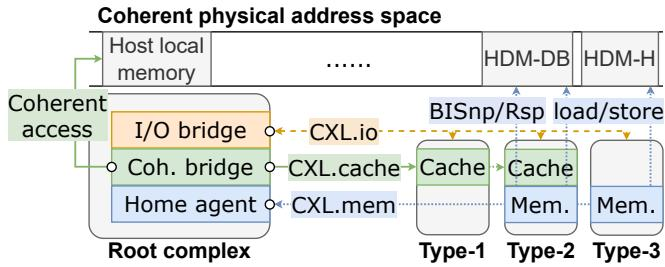  
Figure 1: CXL sub-protocols, endpoints, and root complex.

• Exploration on the performance impacts of multiple new CXL features: We perform a set of experiments to explore the performance impacts of emerging CXL features in multiple representative systems implemented with Xerxes. Our investigation focuses on three main aspects: (1) the impacts of different system topologies; (2) the impacts of device-managed coherence; and (3) the unique full-duplex feature of PCIe transmission. From the experimental results, we derive three key observations. First, the traditional tree-like system topology experiences severe bandwidth and latency bottlenecks at the root, leading to potential performance degradation similar to systems with a chain-like topology. Second, the deviceside inclusive snoop filter receives unique request patterns because most of the requests that reach the snoop filter are cache misses. Therefore, a customized structure is essential for the snoop filter to achieve optimal performance. Third, we observe from read-write mixed workloads that full-duplex transmission of PCIe results in a bandwidth improvement compared to those with a single type of access pattern. These observations pave the road to future CXL system designs.

## 2 Background, Motivation and Challenges

## 2.1 Basic Features in CXL Protocol

Computer eXpress Link (CXL) [8, 53] is an emerging standard built upon the PCIe physical layer. It is designed to provide high-bandwidth, low-latency, and cache-coherent interconnects for heterogeneous devices ranging from host CPUs to memory devices. As illustrated in Figure 1, CXL defines three sub-protocols and three device types that collectively ensure PCIe backward compatibility while providing new functions. First, CXL.io protocol provides fundamental I/O and configuration capabilities and is supported by all device types. Second, CXL.cache protocol enables devices to coherently access data that resides in host memory. Compared to traditional DMA mechanisms [50, 55], this hardware-assisted coherence allows cacheline-grained access and eliminates software coherence-management overheads. CXL.cache is supported by type-1 and type-2 devices, which perform as accelerators in a CXL system. Third, CXL.mem protocol exposes the internal memory of a CXL device to the host as a coherent memory space. It provides byte-addressable memory semantics, allowing the host to access the device memory via load/store instructions. This protocol is supported by type-2 and type-3 devices, which expand the coherent physical memory space through PCIe ports. On the root side, the various CXL functions are managed by Root Complex.

Besides the basic sub-protocols and device types, CXL standard also introduces CXL Switch as the key component for large-scale interconnection. The CXL switches specified in CXL 2.0 and earlier, illustrated in Figures 2a and 2b, can operate in either Single Virtual CXL Switch (VCS) or Multiple VCS mode. A VCS consists of one or more Upstream Port (USP) and Downstream Ports (DSP), connected via multiple virtual PCI-to-PCI bridges (vPPB). Each USP is connected to a root port, leading to a host or another switch. Each DSP links to a CXL or legacy PCIe device. In addition, multiple VCS mode allows the dynamic binding of vPPBs to other vPPBs or devices, which supports exposing a single physical device as multiple logical devices for resource pooling. In both modes, the VCS operates in a manner compatible with the PCIe, behaving similarly to a traditional PCIe switch.

## 2.2 Advanced CXL Features

The demands of emerging large-scale applications (e.g., machine learning [23, 42, 48], life science [18, 25, 39] and climate modelling [31, 47, 65]) necessitate the aggregation of vast computational and memory resources, often beyond the confines of a single node. This trend is driving innovations towards more distributed and device-centric computing models, including peer-to-peer communication and near-memory computing. However, the architecture defined in early CXL specifications presented two fundamental barriers to this vision. First, its adherence to a tree-based topology (i.e., HBR) derived from PCIe created inherent communication bottlenecks at the root and prevented direct, efficient communication between devices on different branches. Second, its hostmanaged coherence mechanism was not designed to scale to a large fabric of intelligent, peer devices, limiting the potential for true device-to-device collaboration. To overcome these limitations, CXL 3.0 specification and its successors introduced a suite of advanced features, evolving CXL into a scalable, rack-level fabric. Among these, Device-Managed Coherence and Multi-level switching are the two particularly significant architectural shifts.

Device-managed coherence. To enable seamless memory expansion, CXL allows devices to expose their local memory to the host. This device memory is integrated into the host’s coherent physical address space, as shown in Figure 1, and is referred to as Host-managed Device Memory (HDM). As HDM must remain coherent with the rest of the system, CXL defines several mechanisms for managing its data consistency. The most straightforward approach is the Host-Managed (HDM-

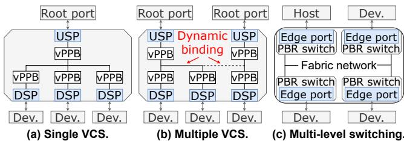  
Figure 2: CXL system switching configuration examples.

H) mode, where the host’s coherence engine remains fully responsible for the coherence of the HDM, continuing a hostcentric model. To support more scalable, peer-to-peer communication, CXL also provides advanced approaches, known as Device-Managed Coherence (DMC). DMC enables the offloading of coherence management to the CXL devices themselves, thereby reducing the coherence management overhead on the host processor. The primary implementation of DMC is the Device-Managed with Back-Invalidate (HDM-DB) mode. In this mode, a specialized component on the device, named Device Coherency Agent (DCOH), is responsible for managing the coherence of the device’s local memory. When a peer, including host and device, requests exclusive access to a cacheline that is previously cached by other peers, the DCOH initiates the Back-Invalidation process. It utilizes dedicated channels within the CXL.mem protocol to send a Back-Invalidate Snoop (BISnp) request to all tracked sharers or owners. Upon receiving the BISnp, a peer must invalidate its local copy of the corresponding cacheline and return a Back-Invalidate Response (BIRsp) to the DCOH. If the peer has modified the line, the BIRsp must also carry the up-todate data back to the DCOH. The DCOH grants ownership to the original requester only after collecting the necessary responses. This device-based snoop mechanism is key to enabling direct, coherent peer-to-peer data sharing without an intermediary host. Specifically, to ensure high performance, the device that leverages HDM-DB must operate over a PCIe 6.0 physical layer, which offers up to 64 GT/s per lane. The DMC framework also includes a legacy Device Coherent (HDM-D) mode for backward compatibility with devices that use the CXL.cache protocol for their coherence management. Multi-level switching with port-based routing. To overcome the topological limitations of tree-like hierarchy, CXL 3.0 introduces multi-level switching on top of a new routing mechanism known as Port-Based Routing (PBR). Unlike the HBR, where packets are forwarded strictly between USPs and DSPs, PBR enables switches to make forwarding decisions based on the source and destination ports using an internal routing table. This mechanism allows a CXL fabric to be constructed with arbitrary, non-tree topologies, such as mesh or spine-leaf. These advanced topologies, commonly employed in high-performance computing interconnects, can offer significant improvements in system bandwidth and latency by providing shorter, more direct communication paths. As illustrated in Figure 2c, each edge port (i.e., a port connecting to a host or a device) in a PBR-enabled fabric is assigned a 12-bit port ID, supporting up to 4096 endpoints in a single system. When a request arrives at a switch, the switch uses the source port ID to look up the corresponding destination port in its internal routing table and forwards the packet accordingly. This powerful routing scheme is the key to enabling direct, efficient peer-to-peer communication between any two devices in the fabric, as traffic no longer needs to traverse a common root. By supporting flexible, non-hierarchical interconnects, PBR lays the architectural foundation for building large-scale systems with high bandwidth and low latency.

## 2.3 Challenges in CXL System Simulation

As hardware that supports the full feature set of CXL 3.0 and beyond is currently not available, simulation and emulation are essential for early-stage system research. However, the advanced features introduced in the latest CXL specification present significant challenges to existing methodologies, which were largely designed for host-centric interconnects.

Limitations of NUMA-based emulation. A common approach in prior works to emulate CXL-attached memory has been to leverage the remote NUMA nodes [19, 41, 46]. While this method can provide a rough approximation of remote memory access latency, it suffers from significant limitations. As reported in prior studies [56], critical differences exist between NUMA interconnects, such as Intel’s UPI, and real CXL devices. This protocol-level mismatch will be further exacerbated with the new features proposed in the latest CXL, making the emulation inaccuracy more severe. Furthermore, a NUMA-based system is highly limited by its physical scalability. The number of available CPU sockets is small, making it impossible to emulate the large-scale CXL fabrics of up to 4096 endpoints. Consequently, NUMA-based emulation is unsuitable for exploring the key architectural characteristics of modern, large-scale CXL systems.

Limitations of traditional architectural simulators. Beyond emulation, traditional architectural simulators, while offering high fidelity for their intended architectural domains, also face fundamental challenges in modeling CXL 3.1 systems. These simulators typically fall into two categories: computation-centric and network-centric. Computation-centric simulators, such as gem5 [22, 34] and GPGPUsim [20], are built around a host-centric architectural model. Their memory systems are typically modeled as a strict hierarchy of components tightly coupled to the CPU, lacking a flexible interconnect layer capable of modeling a scalable CXL fabric. Furthermore, their coherence protocols are managed by a centralized engine (e.g., a directory controller). This centralized design is incompatible with the peer-to-peer coherence proposed in device-managed coherence, where devices directly manage their own memory. Moreover, many of these simulators provide poor or outdated support for modern peripheral interconnects. For instance, gem5’s native support is limited to legacy PCI, lacking a detailed model for high-speed PCIe simulation. As a result, it is difficult to add new, intelligent CXL devices that can actively initiate coherence requests without significant and complex code modifications to these simulators. On the other hand, network-centric simulators like BookSim [37] and Garnet [17,21] are specifically designed to simulate complex network topologies and routing algorithms. However, these frameworks are fundamentally unaware of memory and coherence semantics, as they model the flow of generic packets rather than the stateful, protocol-driven interactions of memory requests. Consequently, neither category of traditional simulators possesses the necessary combination of a flexible, fabric-aware interconnect and distributed, coherence-aware devices required to simulate CXL systems. Limitations of recent CXL simulators. Recently, several CXL-specific simulation tools, such as MESS [28] and CXLMemSim [64], have emerged to address the need for faster, more accessible CXL performance estimation. These tools introduce a behavioral simulation methodology, where the complex memory subsystem is abstracted into a latencybandwidth (Lat-BW) model. However, their approach is fundamentally reproductive rather than predictive, which limits their applicability for architectural design space exploration. The core mechanism of these simulators is to use a pre-characterized Lat-BW curve as an input. During simulation, they inject delays into the application’s execution to ensure its memory access behavior conforms to the provided curve. Consequently, they are well-suited for evaluating the performance impact of a known CXL device on an application, but they cannot predict the performance of a new or hypothetical CXL topology or device, as they lack a first-principles model of the underlying hardware. This behavioral approach is inherently limited when modeling advanced CXL features whose performance emerges from complex, underlying interactions. For example, they cannot model the performance implications of multi-path routing in PBR or the network latency of snoop messages in DMC. Therefore, while valuable for application-level performance studies, these behavioral simulators are not suited for the architectural exploration of novel, large-scale CXL fabrics.

## 3 Modelling Details

## 3.1 Design Principles

In this work, we present Xerxes, a novel simulation framework developed from scratch to support accurate simulation of the aforementioned critical CXL features. To bridge the gap between existing simulators and emerging CXL systems, Xerxes is guided by three core design principles:

• Modularized design. Xerxes explicitly decouples the interconnect fabric simulation from the device functional logic. This modularity allows the physical transport layers and endpoint protocols to be developed and validated independently, enabling the flexible integration of diverse device models.

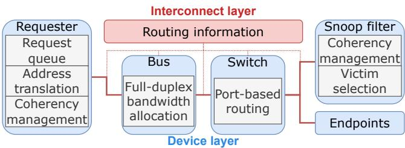  
Figure 3: Overview of Xerxes architecture and components.

• Graph-based connectivity. To overcome the limitations of rigid tree-based hierarchies found in traditional computationcentric simulators, Xerxes constructs the system interconnect as a graph. This design provides native support for arbitrary, non-tree topologies, satisfying the requirements of PBR.

• Peer-centric device model. Unlike traditional host-centric approaches, where peripheral devices are passive responders, Xerxes models all components, whether hosts or accelerators, as active peers. This manner is essential for simulating DMC, where devices must actively initiate snoop requests and manage state transitions independently.

These design principles shape Xerxes into an extensible and composable framework, allowing users to faithfully model the sophisticated behaviors of CXL systems while maintaining high simulation efficiency, as detailed in the architectural breakdown below.

## 3.2 Architectural Overview

As illustrated in Figure 3, Xerxes consists of two primary layers. The first layer is the interconnect layer. Motivated by the need to model PBR-enabled systems, this layer is dedicated to managing the system’s physical connectivity and routing. Upon initialization, it constructs a graph representation of the system topology and provides a default, shortest-path-based routing strategy [29, 54] to all components. During the simulation, this layer serves as the central provider of routing information. While most endpoint devices can simply utilize this default routing, more complex components, such as switches, can query the topology graph directly to implement customized or more advanced routing policies. This dedicated layer allows Xerxes to simulate diverse interconnect structures and peer-to-peer communication between any two endpoints in a fabric, a fundamental ability traditional simulators lack.

The second layer is the device layer. This layer focuses on modeling the behavior of individual components, such as hosts, accelerators, and memory modules. It implements a unified model where all devices are treated as agents. The agents actively operate without involving any central devices, such as a host CPU. This approach directly addresses the need to simulate distributed mechanisms like device-managed coherence. By decoupling device logic from the interconnect, this architecture offers high extensibility. Researchers can not only integrate existing simulators in the device layer, but also prototype emerging or custom CXL device models with minimal effort. Since the device logic is decoupled from the interconnect, these modifications are self-contained and do not require any changes to the underlying network simulation.

Xerxes is primarily written in C++ and implements a suite of important components to model key CXL functionalities, including PBR and DMC. By default, users can simply prepare configuration files to set up and simulate a proposed system. Furthermore, Xerxes provides essential abstractions and interfaces in both layers, allowing researchers to easily extend the framework and implement customized components for their own purposes.

## 3.3 Computational Components

To support the peer-to-peer nature of modern CXL systems, Xerxes abstracts all computational entities, such as hosts and accelerators, into a unified component, namely the Requester. This component is designed to act as an independent operator, capable of independently generating traffic and managing its own coherent state. Each requester consists of three primary units: request queue, address translation unit, and cache coherence management unit. A request queue is defined by the queue depth and the issuing interval. It models the number of on-the-fly requests the requesters can issue to other devices. An address translation unit simulates various interleaving policies. It can adjust the strategy of interleaving requests among multiple memory endpoints to improve system bandwidth [8, 40, 62]. The cache coherent management unit maintains the requester’s internal cache state and is responsible for responding to external coherence requests (i.e., back-invalidate snoop). Upon receiving a BISnp, it performs the necessary cache lookups and state transitions. It then sends the response. The requester can also be configured to run in various modes, from generating synthetic traffic patterns to replaying application traces.

## 3.4 Interconnective Components

Xerxes provides two fundamental interconnective components: the bus and the switch. The bus component simulates the physical links between devices. To capture the performance characteristics of the PCIe 6.0 physical layer leveraged by CXL 3.1, the bus component implements a detailed full-duplex transmission model. It tracks simultaneous data transfers in both directions with the assistance of the interconnect layer. It then allocates full bandwidth for each direction (cf. the bandwidth allocation unit shown in Figure 3). These details in physical layer modeling are crucial for accurately predicting the performance impact of bidirectional traffic. Furthermore, the bus component is highly configurable, allowing researchers to evaluate different hardware implementations by adjusting parameters such as bandwidth, latency, and even operating in a half-duplex mode with configurable turnaround overheads. The switch component is the core for building complex, non-tree topologies. Unlike the simple, hierarchical routing found in many computation-centric simulators [20, 22], Xerxes switch component implements the full functionality of a PBR-enabled switch. During initialization, it leverages the routing information provided by the interconnect layer to construct its internal forwarding tables. When a packet arrives, the switch uses these tables to forward it to the correct port, enabling efficient routing in arbitrary fabric topologies. The tight collaboration between the high-fidelity bus components and the flexible, PBR-aware switch components allows Xerxes to simulate the end-to-end performance of complex CXL fabrics from the ground up.

<table><tr><td>Supported simulators</td><td>Features</td><td>Simulated components</td></tr><tr><td>gem5</td><td>Event</td><td>Processor micro-architecture</td></tr><tr><td>DRAMsim3</td><td>Cycle</td><td>DRAM endpoint (DDRx,HBM, etc.)</td></tr><tr><td>SimpleSSD</td><td>Event</td><td>SSD endpoint</td></tr></table>

Table 1: List of simulators integrated with Xerxes.

## 3.5 Device-Side Snoop Filter

To provide a concrete implementation for simulating DMC, Xerxes includes a detailed model of a device-side snoop filter (SF), which is implemented as a standalone, fully-associative buffer module. Each entry in the SF tracks the coherence metadata (e.g., state and owner list) for lines cached by peer agents. Upon receiving a coherent request, the SF automatically handles entry allocation and metadata updates. In cases of conflicts for cacheline ownership, the SF issues BISnp requests to the original owners before proceeding with the new request. Also, when the buffer runs out of new entries, the SF selects a victim entry and sends the corresponding BISnp requests to clear the entry before serving the new request. The BISnp sending procedure uses the default routing strategy provided by the interconnect layer. Once all the BIRsps are collected, the corresponding entry is cleared for reuse. The dirty lines will be written back to the corresponding endpoint. Xerxes also modularizes the victim selection procedure to allow the researchers to evaluate various policies.

## 3.6 Integration with Existing Simulators

To leverage the rich ecosystem of existing simulation tools and to demonstrate the extensibility of Xerxes, we integrate Xerxes with several mature simulators.

Table 1 provides an overview of these simulators. The first integrated simulator is gem5 [22, 34]. As a widely adopted simulator, gem5 models processors and memory systems with extensive details. We integrate Xerxes with gem5 to take advantage of its processor simulation and to enable the endto-end evaluation of real-world applications. Specifically, the gem5 memory system contains three major layers (i.e., cache, memory controller, and underlying memory). Among the three layers, the memory controller performs as an interconnect level similar to the level of CXL protocol, which passes the memory accesses from caches to the underlying memory. It also manages different types of memories and provides a general view of memory to the CPU.

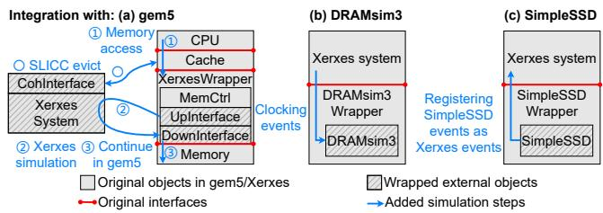  
Figure 4: Integration of Xerxes and other simulators.

To cooperate with gem5’s native memory system, Xerxes extends gem5 MemCtrl with Xerxes interfaces to add CXL interconnection into the simulation. Specifically, as shown in Figure 4a, we implemented an Xerxes Wrapper object, which utilizes the memory management functions of the MemCtrl. Each wrapper is integrated with two Xerxes devices, namely UpInterface and DownInterface. To interact with an eventdriven simulator (e.g., gem5), the wrapper translates gem5’s native memory packets into Xerxes’ requests and schedules completion events by reusing gem5’s own event queue. These operations are conducted by the UpInterface and DownInterface. When a memory packet arrives, it is first passed to the UpInterface to be transformed into an Xerxes packet and passed to the DownInterface through a standalone Xerxes simulation, simulating the additional latency of the CXL system. The DownInterface translates the packet back to the gem5 memory packet and passes it to the original gem5 MemCtrl. After the procedure in the underlying memory, the packet is passed back from DownInterface to UpInterface to simulate the response procedure. One advantage of this implementation is that the Xerxes wrapper can utilize the underlying memory objects from the original gem5, enhancing its extensibility. To support DMC functionality, we also implement a coherence interface using gem5’s native tool SLICC. When the DCOH in Xerxes system issues a back-invalidation request, it will be forwarded to the CohInterface. The interface will use gem5 native events to invalidate corresponding cachelines in the cache hierarchy to simulate the DMC function.

We also integrate Xerxes with two representative memory and storage simulators, namely DRAMsim3 [43] and SimpleSSD [32]. Xerxes contributes a high accuracy of the CXL unique features, while these specialized simulators provide validated and detailed models of the underlying endpoint devices (e.g., DDR DRAM and SSD), enabling end-to-end simulation. In particular, we implemented wrappers for these simulators. For a cycle-based simulator (i.e., DRAMsim3, cf. Figure 4b), the wrapper periodically registers a clocking event to make progress in DRAMsim3 simulation. For the event-driven simulator (i.e., SimpleSSD, cf. Figure 4c), the wrapper transforms the event format and registers them in Xerxes event engine. In summary, Xerxes is capable of evaluating CXL-based processors and endpoints by leveraging the existing simulators, provided as a unified research wheel for researchers who are interested in different fields.

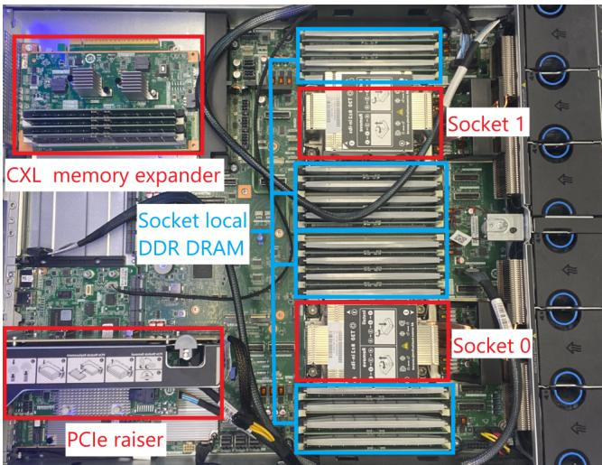

Figure 5: Top view of the hardware platform.
<table><tr><td>Requester process time</td><td>10ns</td><td>PCIe port delay</td><td>25ns</td></tr><tr><td>Cache access/invalidate time</td><td>12 ns</td><td>Bus time</td><td>1ns</td></tr><tr><td>Device controller process time</td><td>40ns</td><td>Switch port-to-port time</td><td>25ns</td></tr></table>

Table 2: Latency configurations in validation. Values are derived from typical parameters reported in public sources.

## 4 Validation

Methodology. We validate Xerxes using a dual-socket platform with commercially available CXL hardware. Figure 5 shows the top view of our platform (CXL memory expander is unplugged for a better view). Each socket is equipped with an Intel Xeon Gold 6416H CPU [11] and eight DDR5-4800 DRAM DIMMs, offering a peak bandwidth of 76.8 GB/s and providing 512 GB of main memory. One of the sockets is attached by a CXL memory expander with a CXL memory expander controller (MXC) from Montage Technology [9], supporting up to CXL 2.0 and PCIe 5.0 × 16 interconnections. The memory expander consists of four DDR5-4800 DRAM DIMMs, providing 128 GB of CXL HDM-H memory. Specifically, the CXL memory expander connects to its local CPU socket via PCIe lanes and to the remote socket via a separate MCIO cable. This cable exclusively consumes half of the expander’s physical lanes. Thus, each CPU socket can only utilize half of the total available bandwidth, similar to PCIe 5.0 × 8, which provides a theoretical 32 GB/s and practical 24 GB/s bandwidth. Similar CXL bandwidth characteristics were also witnessed in prior work [61].

To simulate the CXL system, we construct an example system in Xerxes, which includes a requester, an interconnect bus, and four memory endpoints. For Xerxes simulation, we use the integrated DRAMsim3 [43] as the default endpoint components for an accurate DRAM simulation. The detailed configurations used for calibrating Xerxes against real hardware are listed in Table 2, with latency parameters derived from empirical data reported in multiple prior works [5, 27, 33, 41, 46, 52, 56].

We examine several platforms for comparison. A NUMAbased emulation platform is set up by using the remote socket of the server. For a fair comparison, we adjust the number of DRAM DIMMs in each NUMA node to four, which is equal to the number of DIMMs in the CXL memory expander. Our comparison also includes two state-of-the-art behavioral simulators, MESS [28] and CXLMemSim [64]. As these are behavioral simulators, the detailed latency-bandwidth inputs they require are derived directly from measurements on our hardware platform. This method provides them with a groundtruth basis, allowing them to perform at their best-case accuracy. Finally, we include gem5-garnet [21, 22] as a representative of detailed architectural simulators.

The validation is structured into three stages. For baseline validation, we measure three major metrics: idle latency, peak bandwidth under different read-write ratios, and loaded latency under different request intensity. To measure these metrics on hardware platforms, including local memory, NUMA remote memory, and CXL memory expander, we use the Intel Memory Latency Checker (MLC) [6], a widely used tool, to generate traffic with varying read-write ratios and intensities. For Xerxes, we directly generate memory accesses from the Xerxes requester component to measure these metrics. By adjusting the queue size and issuing delay between requests, we can modify the request intensity to evaluate the loaded-latency. The idle latency and peak bandwidth are measured under fixed low and high system loads, respectively. The MESS and CXLMemSim are configured with the hardware’s empirical data and driven with equivalent synthetic traffic. For all simulations, we run a sufficient number of requests in a warm-up phase to ensure steady-state results.

Since hardware is unavailable for validation of CXL 3.1 features (e.g., PBR and DMC), we verify Xerxes’ correctness by comparing its simulation results against established theoretical performance models. For PBR, we simulate communication paths with varying hop counts across different fabric topologies. The theoretical latency for each path is calculated by summing the pre-calibrated delays of the traversed bus links and switch hops. We then compare these calculated values against the latency measured in single-request simulations within Xerxes. For DMC, we validate the performance overhead of the back-invalidation mechanism. We measure the latency difference between a “clean write” to a non-cached line and a “dirty write” that requires a snoop to a peer device. This measured overhead is then compared against the theoretical round-trip time of the BISnp/BIRsp messages, which is calculated based on the fabric path.

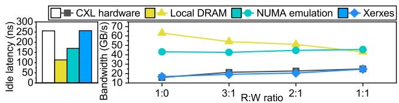  
Figure 6: Idle latency and bandwidth of different platforms.

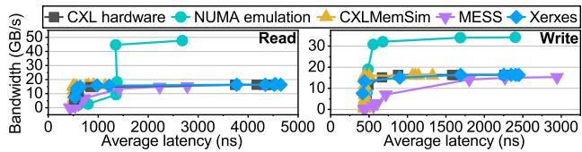  
Figure 7: Latency-bandwidth curves of different platforms.

For end-to-end workload validation, we compare the simulation accuracy and speed of Xerxes (both standalone and gem-integration modes) with other counterparts by running two example workloads from SPEC CPU2017 [24]. The cache hierarchy is configured to match our hardware platform (i.e., 1.7 MB L1D cache, 72 MB L2 cache, and 96 MB L3 cache). For hardware platforms, the workloads are directly executed by specifying the used socket and memory with numactl. For Xerxes-standalone mode, the memory access traces of the workloads are first collected with Intel PIN tool [15] and filtered with a simulated cache hierarchy, then passed to Xerxes. For gem5-integrated simulators (i.e., gem5- Xerxes, gem5-garnet, and gem5-MESS), the workloads are run in gem5 SE mode. For CXLMemSim, application binaries are directly run under the supervision of CXLMemSim, which monitors and injects delays at runtime.

Results. Figure 6 presents the results of idle latency and bandwidth. As can be observed, after calibration, Xerxes exhibits an outstanding latency accuracy compared to NUMAbased emulators using remote DRAM. Regarding bandwidth, Xerxes shows acceptable errors ranging from 0.1% to 10% when compared to CXL hardware, while the remote DRAM modules do not accurately reflect the absolute value of CXL hardware. Note that we omit the results of the behavioral simulators (i.e., MESS and CXLMemSim) here, as their models are calibrated with exact hardware measurements, making them inherently accurate for these two specific data points (i.e., idle latency and peak bandwidth).

We also observe the impact of read-write mixing on bandwidth. Both the CXL hardware and Xerxes show a significant bandwidth increase as the read-write ratio of the traffic increases. While the remote NUMA emulation also shows a minor improvement, the magnitude of this effect is substantially smaller than that observed with CXL. This suggests a distinct performance characteristic of the CXL physical layer, which we will further explore with Xerxes in § 5. We also conduct loaded-latency tests with the results shown as latency-bandwidth curves in Figure 7. These tests measure the average memory access latency across a range of background system loads, starting from a basic load up to the point of bandwidth saturation. The imposed loads result in queuing effects that increase the measured latency beyond the idle value across the entire curve, with the magnitude of the additional latency varying based on the load intensity. The curves of Xerxes can accurately align with those of CXL hardware for both read and write requests, with an average error of 4.3%. In both low and high-intensity scenarios, Xerxes closely reflects the average latency observed on the CXL hardware platform. In contrast, the NUMA-based emulator presents curves that are completely apart from those of CXL hardware. The behavioral simulators, MESS and CXLMemSim, both achieve a reasonable level of accuracy by leveraging empirical hardware data, with average errors of 9.3% and 16.6%, respectively. While their accuracy demonstrates the effectiveness of a reproductive, delay-injection approach given a known hardware profile, Xerxes achieves its high fidelity (4.3%) through a fundamentally different, predictive methodology, deriving performance from component-level models without requiring the full curve as an input.

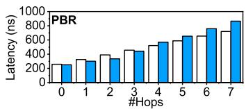

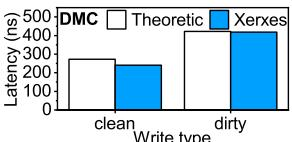  
n Write type  
Figure 8: Simulation validation of advanced CXL features.

Figure 8 presents the validation of Xerxes’ advanced feature simulation against theoretical performance models. As observed in the figure, the simulated results from Xerxes closely align with the theoretical calculations. For PBR, our simulations of communication paths with various switch hop counts (from 0 to 7) show high accuracy with theoretical models, resulting in an average latency prediction error of 10.4% across all configurations. Meanwhile, for a dirty write requiring a DMC BISnp/BIRsp round-trip, the latency measured in Xerxes closely matches the calculated theoretical number with an error of 1.4%. In summary, these results demonstrate that Xerxes can accurately model the performance characteristics of advanced CXL architectural features.

Table 3 demonstrates the accuracy of different platforms on SPEC CPU2017 workloads. Since the performance of real-world applications is highly related to the exact microarchitecture of hardware CPUs, which is unknown and cannot be accurately simulated, we, instead, use the execution time overheads incurred by CXL memory as the metric. This approach excludes the influence of CPU micro-architecture, allowing us to concentrate only on the memory systems. As observed, both Xerxes-standalone and gem5-Xerxes can accurately reflect CXL overhead in real-world workloads, with errors as low as 0.7% compared to hardware results. In comparison, the behavioral simulators, MESS and CXLMemSim, while fed with ground-truth latency-bandwidth curves, exhibit higher errors, reaching up to 28.3% and 16.5%, respectively. This is likely because their models apply latency as an averaged aggregate, failing to capture the precise timing of individual memory accesses that are critical to application performance. Meanwhile, NUMA-emulation and gem5-garnet demonstrate errors up to 9.2% and 9.0%, respectively. In summary, Xerxes exhibits surpassing simulation accuracy compared to the prior approaches.

<table><tr><td rowspan="2">Compared platforms</td><td colspan="2">SPECCPU2017 workloads</td></tr><tr><td>gcc</td><td>mcf</td></tr><tr><td>CXLHardware</td><td>18.0% (0%)</td><td>24.2% (0%)</td></tr><tr><td>Xerxes standalone</td><td>18.7%(+0.7%)</td><td>29.8% (+5.6%)</td></tr><tr><td>gem5-Xerxes</td><td>15.6% (-2.4%)</td><td>19.8% (-4.4%)</td></tr><tr><td>NUMA emulation</td><td>20.0% (+2.0%)</td><td>15.0% (-9.2%)</td></tr><tr><td>gem5-garnet</td><td>12.2% (-5.8%)</td><td>15.2% (-9.0%)</td></tr><tr><td>gem5-MESS</td><td>24.0% (+6.0%)</td><td>-4.1% (-28.3%)</td></tr><tr><td>CXLMemSim</td><td>1.5% (-16.5%)</td><td>35.4% (+11.2%)</td></tr></table>

Table 3: Simulated execution time incurred by CXL memory of applications on different platforms.
<table><tr><td rowspan="2">Workloads</td><td colspan="3">Compared platforms</td></tr><tr><td>gem5-Xerxes</td><td>gem5-garnet</td><td>gem5-MESS</td></tr><tr><td>gcc</td><td>1.7%</td><td>21.5%</td><td>-2.0%</td></tr><tr><td>mcf</td><td>2.7%</td><td>24.5%</td><td>-8.0%</td></tr></table>

Table 4: Simulation time overhead incurred to vanilla gem5.

We also compare the simulation speed overhead of different interconnect models when integrated with gem5. For a fair comparison, we compare gem5-garnet, gem5-MESS, and gem5-Xerxes against a baseline of vanilla gem5 to exclude the influence of gem5. As shown in Table 4, the gem5-MESS integration is the fastest, reducing the simulation time by 6.0% on average. This is because its behavioral model bypasses gem5’s native and detailed DRAM simulation, enabling faster simulation even compared to vanilla gem5. Xerxes adds only a 2% simulation time overhead on average by efficiently modeling the CXL fabric. In contrast, gem5-garnet incurs the highest penalty at 22.5%. While gem5-MESS offers a fast simulation speed, as demonstrated in our end-to-end validation, Xerxes provides a higher accuracy by co-simulating both the interconnect fabric and the detailed backend memory model. This result indicates that Xerxes strikes a balance between simulation speed and accuracy.

## 5 Design Space Exploration

After establishing the fidelity of Xerxes in § 4, we now shift our focus from validation to demonstrating its capabilities as a tool for design space exploration. The following studies leverage Xerxes to investigate the performance implications of the key architectural features introduced in the latest version of CXL specification, such as advanced topologies and coherence mechanisms. Each case study is designed to showcase how Xerxes enables the exploration of next-generation system designs that are currently infeasible to build or simulate with other tools, ultimately deriving critical insights that can enlighten the development of future CXL-based systems.

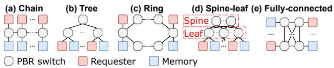

Figure 9: Examples of different system topologies.  
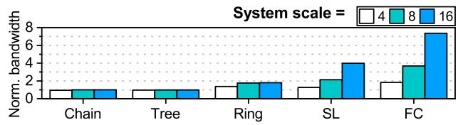  
Figure 10: System bandwidth of different system topologies and scales, normalized to the max bandwidth of switch port.

## 5.1 Analysis of System Scalability

As discussed in § 2.2, the CXL protocol introduces PBR to support high scalability, which allows non-tree system topologies. While PBR enables diverse topologies, their quantitative performance in a large-scale CXL system is not well examined due to a lack of flexible simulation tools. To understand the impact on performance of system topologies, we perform a set of experiments using systems with N requesters (i.e., hosts and accelerators) and N memory devices. The setup of a N-N system is denoted as “system scale = 2N". In these experiments, the requesters issue random memory requests to all the memory devices. Different requesters and memory devices are connected via multiple PBR switches with different topologies. The bandwidth of a PBR switch port is constrained to a constant value. We investigated five types of topologies: (1) chain, (2) tree, (3) ring, (4) spine-leaf (SL), and (5) fully-connected (FC). Figure 9 shows the example diagrams of these topologies.

Figure 10 illustrates the aggregated bandwidth in different systems. The bandwidth values are normalized to the maximum port bandwidth. The results highlight the bandwidth bottlenecks in different topologies. Both the chain and tree include “bridge" routes (i.e., all routes between switches in chain and routes directly connected to the root switch in tree), which are shared by all the requesters, limiting the system bandwidth to the maximum capacity of a single switch port. Scaling up the system with these topologies cannot improve the performance. The ring can provide an extra route in addition to chain and tree. Thus, by scaling up the system, the bandwidth can reach 2× of the port capacity. Compared to the former topologies, spine-leaf and fully-connected exhibit high scalability. The spine-leaf achieves this by replacing the bottleneck routes with a high-performance interconnect network (i.e., the “spine"). However, the competition among requesters on ports in “leaf” switches still exists. Thus, the spine-leaf can only provide N2 × bandwidth of the port capacity. The fully-connected overcomes this limitation with direct communication between each pair of devices. As a result, each requester is provided with full port bandwidth, achieving a system bandwidth of N× port capacity.

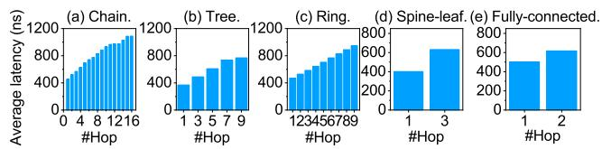  
Figure 11: Latency of different system topologies under isobisection bandwidth condition, grouped by hop counts.

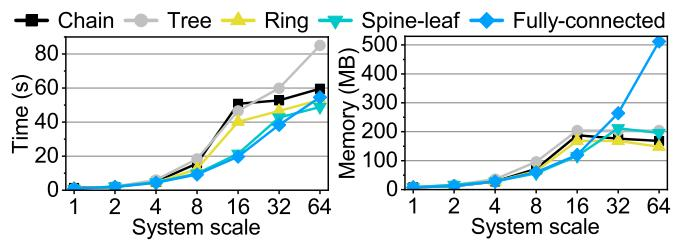  
Figure 12: Simulation overhead of Xerxes with increasing system scale across different topologies.

Synthetic performance analysis. Figure 11 depicts the average latency of requests across various topologies with a system scale of 16. The results are collected under ISO-bisection bandwidth configurations, and are grouped by the number of hops the requests experienced. It can be observed that as the number of hops increases, the latency increases, harming the performance. The bottleneck of “bridge” routes can heavily impact the latency, as shown in Figures 11a, 11b and 11c. This is because requests will congest on the critical paths, which cannot provide enough bandwidth. This incurs significant latency overhead, making the latency with the highest hop number 2× longer in chain and 1× longer in tree and ring, compared to the latency with the lowest hop number. Such overhead also introduces latency unpredictability. In contrast, since spine-leaf and fully-connected require fewer hops due to their specific network structures, they can provide high stability for latency values and achieve high system scalability.

Simulation scalability. We also leverage the same system configurations to evaluate the simulation cost of running Xerxes. Figure 12 presents the simulation time and memory usage of Xerxes as the system scale grows from 1 to 64. As shown in the figure, the simulation overhead exhibits distinct scaling patterns depending on the topology complexity. The simulation time exhibits a moderate growth trend, which is primarily driven by the higher aggregate volume of traffic and component interactions handled by the event engine. Despite this growth, the absolute runtime remains within a practical range (under 90 s), demonstrating that Xerxes incurs low computational overhead for large-scale exploration. Regarding memory usage, Xerxes maintains a highly efficient footprint (under 200 MB) for most topologies, such as chain, tree, and spine-leaf, even at a scale of 64 nodes. In contrast, the fully-connected topology exhibits a steeper growth curve. This is expected as the number of physical links increases quadratically in a fully connected network, requiring more memory objects to model the interconnects. Despite the increased cost for dense topologies, Xerxes successfully scales to 64 nodes within a reasonable runtime and memory budget, proving its capability to explore the design space of future rack-scale CXL fabrics.

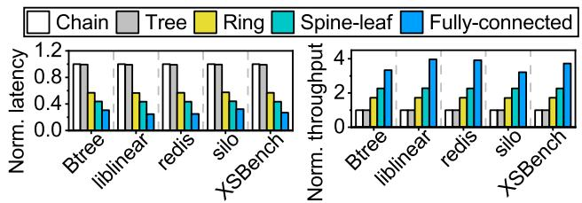  
Figure 13: Average latency and throughput comparisons of different system topologies, normalized to Chain.

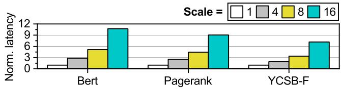  
Figure 14: Latency of data-intensive workloads under varied scales with a tree-like topology, normalized to scale = 1.

Performance on real-world workloads. To validate the micro-benchmark findings on more realistic access patterns, we further investigate the impact of system topology on five representative real-world workloads by replaying their memory traces. The traces, including BTree [16], liblinear [30], redis [26,45], silo [60] and XSBench [59], are collected using the methodology described in § 4. Figure 13 demonstrates the evaluated results of these workloads. The system topology significantly impacts the performance of all real-world workloads, confirming our observations from the synthetic tests. Both the chain and the tree topologies exhibit the lowest throughput and the highest average memory latency. In contrast, by providing alternative routing paths, the ring achieves up to 1.72× higher throughput, while the highly-connected spine-leaf and fully-connected topologies boost throughput by up to 3.63× by eliminating central bottlenecks. These results confirm that the choice of topology critically affects the performance of CXL memory systems under realistic workloads.

Moreover, considering the increasing demand for dataintensive computing, which is one of the primary targets for CXL adoption, we extend our evaluation to include AI and data analytics workloads. We evaluate Bert (AI inference), Pagerank (graph analytics), and YCSB-F (in-memory database). The memory traces for these workloads are derived from [51,63]. Unlike the topology comparison above, here we focus on the performance of memory expansion under a standard tree-like topology, which represents the most common architecture for CXL memory expanders. This setup consists of a single requester connected to varying numbers of memory endpoints (from 1 to 16) via one or multiple switches. Figure 14 illustrates the normalized latency of these applications under different degrees of memory expansion. As observed, Xerxes successfully captures the latency characteristics of these complex workloads. The results reflect the impact of congestion on the critical paths as the memory pool scales up. Specifically, as the system scales from 1 to 16 endpoints, the average latency increases by about 9× due to the internal routing logic and port contention within the switches.

Takeaway: Xerxes enables quantitative analyses of largescale CXL systems with high simulation efficiency. Our evaluation reveals that while traditional tree-based topologies create a scalability barrier, advanced fabrics like spine-leaf can significantly unlock system potential. Moreover, the framework demonstrates robust capabilities in modeling diverse workloads, ranging from standard benchmarks to emerging AI applications, while maintaining a manageable simulation overhead that scales effectively with system size.

## 5.2 Analysis of Back-Invalidation Mechanism

The performance of device-managed coherence is critically dependent on the efficiency of its back-invalidation mechanism. Optimizing this process requires careful consideration of both the device’s internal microarchitectural policies and the specialized commands available in the CXL protocol. We leverage Xerxes’ ability to model these fine-grained details and explore design space at policy and protocol levels.

First, we investigate the impact of the snoop filter’s victim selection policy. As mentioned in § 2, CXL protocol requires devices with DMC to implement an inclusive SF. Due to the inclusive nature of SF, in cases of insufficient buffer entries, the SF will acquire new clear entries by selecting victims and issuing BISnp requests to their current owners. These BISnp requests will clear the lines in the owners’ local cache, impacting the system performance. Therefore, a goal of SF victim selection policy is to reduce the frequency of BISnp.

To investigate the impact of different victim selection policies in SF, we test five basic policies. The tested system includes a requester, which issues coherent requests in a skewed pattern with 90% to hot data and 10% to cold data. The amount of hot data takes 10% of the total memory footprint. The requester is equipped with a local cache that filters the hit events. The size of the cache is configured to 20% of the total memory footprint, making sure it can cache all the hot data. In cases of a cache miss, the request is routed to the memory device through a bus, which is configured with infinite bandwidth to eliminate unexpected performance impact. On the device side, an SF filters the requests and issues BISnp whenever necessary. A BISnp will be sent to the requester to invalidate the corresponding cacheline. The size of the SF is set to be the same as the local cache size in order to record the states of all cached data. We test the following victim selection policies: (1) FIFO (First-In, First-Out); (2) LRU (Least Recently Used); (3) LFI (Least Frequently Inserted); (4) LIFO (Last-In, First-Out); and (5) MRU (Most Recently Used).

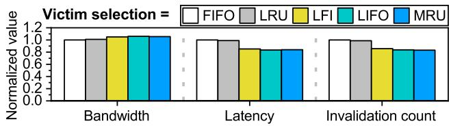  
Figure 15: Performance of different snoop filter (SF) victim selection policies, normalized to FIFO.

Figure 15 depicts the results of bandwidth, latency, and invalidation count, all normalized to FIFO. Since there is little hit event in the SF, FIFO and LRU behave similarly to LIFO and MRU, respectively. Compared to FIFO, LIFO improves the bandwidth by 5%, while decreasing the average latency and invalidation count by 15% and 16%, respectively. The difference between the SF and local cache explains these findings. As the system reaches its steady state, most of the hot data reside in the local cache, while the SF records the coherence states of these hot data. Most of the requests reaching the SF are cache misses, targeting cold data. In this scenario, the “last-in" or “most recent" entries, rather than the “first-in" or “least recent" entries, actually store information for cold data and are the suitable victims. In contrast, the FIFO and LRU are more likely to invalidate hot data, harming the system performance. To demonstrate the impact of invalidating hot data, we also propose and evaluate the LFI policy, which maintains a global counter table to record the inserted times of each cacheline. Upon invalidation, LFI selects the least frequently inserted address as the victim to avoid invalidating hot data. The results show that LFI reduces invalidation count by 15% compared to FIFO, proving that FIFO invalidates hot data more frequently. However, since the LFI leverages global information, it will periodically invalidate all the hot cachelines when their inserted times become equal. This leads to a slightly worse performance compared to LIFO and MRU.

Next, we evaluate the effectiveness of a protocol-level optimization designed to improve the efficiency of these BISnp requests. The CXL protocol proposes a set of InvBlk commands for the SF. When the SF sends a BISnp request, it can additionally send a InvBlk command, which requires the owners to invalidate a sequence of cachelines with contiguous addresses. The length of these cachelines can range from two to four. This feature is introduced to improve the efficiency of BISnp, allowing the SF to clear multiple entries with a single request. To understand the impact of InvBlk commands, we perform a set of experiments on a system with two requesters issuing sequential requests, a local cache in each requester, a bus, and a memory device with an SF. The configurations, including cache size and SF size, are the same as those used in the experiments of victim policy. To zoom in on the effects of InvBlk commands, the SF employs a block-length-prioritized victim selection policy. During victim selection, the SF chooses the longest sequence of entries with contiguous addresses. It applies LIFO policy among multiple possible victims. Our experiments limit the maximum length of entry sequences to evaluate the impact of InvBlk.

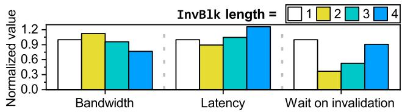  
Figure 16: Performance of different InvBlk lengths, normalized to length = 1.

Figure 16 depicts the results of bandwidth, average latency, and average waiting time for invalidation. When the InvBlk length is larger than one, a single BISnp request can clear more than one entry. As a result, subsequent coherent requests no longer need to wait on BISnp, reducing the average waiting time. When two lines are cleared in one BISnp, this benefit brings the reduction of total average latency and the increase of bandwidth. However, when the number of lines in a BISnp exceeds two, the overhead of accessing requester local caches increases, diminishing the benefit of InvBlk. Furthermore, the data within the BISnp flows compete for the transmission bandwidth. As a result, the performance of larger InvBlk length shows no improvement compared to length = 2.

Takeaway: Xerxes enables detailed cross-layer analyses of coherence mechanisms by modeling both microarchitectural policies and protocol-level details. Our findings reveal two key insights for back-invalidation optimization: (1) DCOH snoop filters require customized policies (e.g., LIFO over LRU) tailored to their unique request streams; (2) protocol commands like InvBlk exhibit non-linear performance tradeoffs between control overhead and data transmission costs. These results highlight the necessity of co-designing hardware policies and protocol features, demonstrating the value of Xerxes that can capture such complicated interactions.

## 5.3 Analysis of Full Duplex Transmission

While the bandwidth advantages of CXL’s full-duplex transmission under mixed read/write workloads are reported in prior works [56], the precise performance gains are highly sensitive to lower-level factors such as protocol overheads, which have not been systematically quantified. Existing behavioral simulators [28,64] typically abstract away these physical layer details, while prior hardware-based studies [56, 57] have often been limited to end-to-end behavior observations. We leverage Xerxes’ high-fidelity simulation to conduct a detailed, parametric analysis of how protocol efficiency and traffic balance jointly determine the practical performance boundaries of full-duplex transmission. We build a dedicated system, which includes a requester issuing random requests based on a read-write ratio setup, a bus incurring packet size overheads to the header packets, and four memory devices. Besides the bandwidth, we define two other metrics: (1) bus utility, indicating the fraction of time when the bus is busy compared to the total simulation time (average in all transmission directions); and (2) transmission efficiency, denoting the fraction of time the bus spends on payload transmission compared to total bus transmission time. We adjust the read-write ratio and the incurred header overheads to understand the impact of full-duplex transmission under different scenarios.

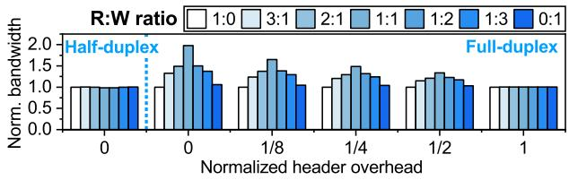  
Figure 17: Bandwidth under different R:W ratios and header overheads, normalized to read-only scenarios.

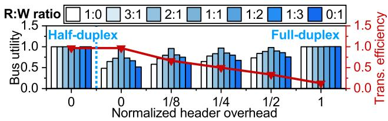  
Figure 18: Bus utility and transmission efficiency under different R:W ratios and header overheads.

Figure 17 depicts the bandwidth results. The header overheads are normalized to payload length, and the bandwidth values are respectively normalized to read-only scenarios for each header overhead setting. The figure shows that, with all other configurations unchanged, the bandwidth of a fullduplex bus system is more affected by the read-write ratio than that of a half-duplex bus system. Specifically, the system bandwidth stays almost constant for a half-duplex bus. On the other hand, mixing read and write requests enhances the bandwidth of a full-duplex bus system. These findings are consistent with the hardware platform observations discussed in Section 4 and prior works. We also conduct the tests by varying the header overhead. As can be observed, with zero header overhead, a 1:1 mix of read and write packets can nearly double the system bandwidth. As header overhead increases, the improvement of read-write mixing decreases. When the headers have the same length as the payloads, the improvement drops to zero. To better understand the underlying mechanism for these behaviors, Figure 18 depicts the bus utility and transmission efficiency metrics. In a full-duplex system, a one-way traffic stream can only utilize one of the two directional data paths, where the opposite direction is not used for payload transmission. Mixing read and write traffic allows both paths to be used concurrently, which doubles the bus utility and yields the observed bandwidth increment. However, this gain is constrained by transmission efficiency. As header overhead increases, a larger portion of bus time is spent on non-payload data, reducing efficiency. This inefficiency consumes available bus cycles, diminishing the bandwidth gain achieved from traffic mixing. In summary, with a single operation type, one direction of a full-duplex bus is wasted on zero-payload headers. Mixed traffic improves performance by engaging both directions with actual payloads. Conversely, a half-duplex bus provides only a single data path at a time, leaving no room for such improvement.

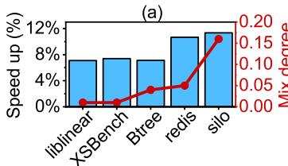

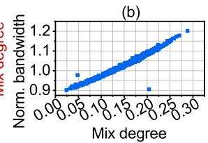  
Figure 19: (a) Execution speedup of full-duplex bus against half-duplex bus and mix degrees of different real-world traces. (b) Performance of silo with full-duplex bus, normalized to the max bandwidth of one bus direction.

To understand how this protocol-level efficiency impacts real-world applications, we further analyze the behavior of the real-world workload traces on a full-duplex bus. Figure 19 depicts the impact of PCIe full-duplex transfer on the realworld workloads. As shown in Figure 19a, increasing the mix degree (defined as min{read\_ratio,write\_ratio}) of a workload leads to greater speed-up over a half-duplex platform. Figure 19b further demonstrates the relationship between the mix degree and performance. Each point represents the bandwidth of 1,000 memory accesses, which is normalized to the maximum bandwidth of one bus direction. It can be observed that there is a highly positive correlation between the mix degree and performance. When the mix degree increases by 0.1, the overall bandwidth can be improved by 9%. This observation suggests that real-world workloads can mix memory read and write more aggressively when running on CXL memory for better performance.

Takeaway: Xerxes enables a quantitative analysis of physical layer phenomena, revealing that the bandwidth enhancement from read-write mixing in full-duplex systems is codetermined by both traffic balance and protocol efficiency. While a balanced read-write ratio is necessary to improve bus utilization, our findings show that high header-to-payload ratios can significantly diminish or even negate this benefit. Note that this interaction is one of several factors influencing end-to-end performance, yet it highlights the critical need for simulators that can model these cross-layer effects for the co-design of future CXL hardware and protocols.

## 6 Future Work

In addition to CXL, there are other interconnect protocols that support cache coherence, such as OpenCAPI [14], Gen-Z [13], and Unified Bus (UB) [36]. Some of these [13, 14] have been absorbed into CXL, forming part of its foundation. Others are similar to CXL but pursue different objectives. For example, UB [36] is a high-speed interconnect protocol designed for SuperPoD-scale deployments. It can selectively enable cache coherence for better scalability. In future work, Xerxes can be extended to support other protocols such as UB [36]. For instance, one can implement UB controllers and UB memory management unit (UMMU) in the device layer (cf. § 3.2) of Xerxes, replacing the device-side snoop filter (cf. § 3.5) to enable remote memory access. Moreover, the interconnect layer of Xerxes (cf. § 3.2) can be enhanced to support more sophisticated topologies, such as UB-Mesh [44].

## 7 Conclusion

In this work, we introduce Xerxes, a novel simulation framework that can accurately model critical features in CXL 3.1 specification, which existing emulation and simulation tools struggle to support. These features help Xerxes to simulate CXL systems with high scalability and coherent peer-to-peer communication. We validate Xerxes on a real CXL-attached hardware platform and demonstrate outstanding accuracy compared to emulators adopted by prior works. Xerxes can uncover important issues that existing tools cannot figure out, such as the performance impact of device-managed coherence. We hope Xerxes can assist in the exploration of high-performance CXL system design.

## Acknowledgement

We sincerely thank the anonymous reviewers and our shepherd, Ali Anwar, for their insightful comments and feedback. This work is mainly supported by the Natural Science Foundation of China under Grant No. 62332021, 62472007, and 624B2004. Dr. Mao is partially supported by the National Natural Science Foundation of China under Grant No. U22A2027. Dr. Sun is partially supported by Beijing Natural Science Foundation L243001 and 111 Project (B18001). Dr. Luo is partially supported by the National Natural Science Foundation of China under Grant No. 62032001. The corresponding author is Jie Zhang.

## References

[1] Ieee standard for ethernet. https:// standards.ieee.org/ieee/802.3/7071/.

[2] Nvm express link. https://nvmexpress.org/.

[3] Serial advanced technology attachment (sata). https: //sata-io.org/.

[4] Pci express® 5.0 specification. https://pcisig.com/ specifications/pciexpress, 2019.

[5] Enabling pcie® 5.0 system level testing and low latency mode for cxl™. https: //www.asteralabs.com/videos/aries-smartretimer-for-pcie-gen-5-and-cxl, 2021.

[6] Intel® memory latency checker v3.11. https: //www.intel.com/content/www/us/en/developer/ articles/tool/intelr-memory-latencychecker.html, 2021.

[7] Pcie express® 6.0 specification. https: //pcisig.com/pci-express-6.0-specification, 2022.

[8] Cxl® 3.1 specification. https:// computeexpresslink.org/cxl-specification/, 2023.

[9] Cxl® memory expander controller (mxc) m88mx5891. https://www.montage-tech.com/MXC/M88MX5891, 2023.

[10] Intel® compute express link® (cxl) fpga ip. https://www.intel.com/content/www/us/ en/products/details/fpga/intellectualproperty/interface-protocols/cxl-ip.html, 2023.

[11] Intel® xeon® gold 6416h processor. https: //www.intel.com/content/www/us/en/products/ sku/232389/intel-xeon-gold-6416h-processor-45m-cache-2-20-ghz/specifications.html, 2023.

[12] Ddr5 sdram. https://www.jedec.org/standardsdocuments/docs/jesd79-5c, 2024.

[13] Gen-z specification archive. https:// computeexpresslink.org/resource/gen-zspecification-archive/, 2024.

[14] Opencapi specification archive. https: //computeexpresslink.org/resource/opencapispecification-archive/, 2024.

[15] Pin - a dynamic binary instrumentation tool. https://www.intel.com/content/www/us/en/ developer/articles/tool/pin-a-dynamicbinary-instrumentation-tool.html, 2024.

[16] Reto Achermann, Ashish Panwar, Abhishek Bhattacharjee, Timothy Roscoe, and Jayneel Gandhi. Mitosis:

Transparently self-replicating page-tables for largememory machines. Proceedings of the Twenty-Fifth International Conference on Architectural Support for Programming Languages and Operating Systems, 2019.

[17] Niket Agarwal, Tushar Krishna, Li-Shiuan Peh, and Niraj Kumar Jha. Garnet: A detailed on-chip network model inside a full-system simulator. 2009 IEEE International Symposium on Performance Analysis of Systems and Software, pages 33–42, 2009.

[18] Shaahin Angizi, Jiao-Jin Sun, Wei Zhang, and Deliang Fan. Aligns: A processing-in-memory accelerator for dna short read alignment leveraging sot-mram. 2019 56th ACM/IEEE Design Automation Conference (DAC), pages 1–6, 2019.

[19] Moiz Arif, Kevin Assogba, Muhammad M. Rafique, and Sudharshan S. Vazhkudai. Exploiting cxl-based memory for distributed deep learning. Proceedings of the 51st International Conference on Parallel Processing, 2022.

[20] Ali Bakhoda, George L. Yuan, Wilson W. L. Fung, Henry Wong, and Tor M. Aamodt. Analyzing cuda workloads using a detailed gpu simulator. 2009 IEEE International Symposium on Performance Analysis of Systems and Software, pages 163–174, 2009.

[21] Srikant Bharadwaj, Jieming Yin, Bradford M. Beckmann, and Tushar Krishna. Kite: A family of heterogeneous interposer topologies enabled via accurate interconnect modeling. 2020 57th ACM/IEEE Design Automation Conference (DAC), pages 1–6, 2020.

[22] Nathan Binkert, Bradford Beckmann, Gabriel Black, Steven K. Reinhardt, Ali Saidi, Arkaprava Basu, Joel Hestness, Derek R. Hower, Tushar Krishna, Somayeh Sardashti, Rathijit Sen, Korey Sewell, Muhammad Shoaib, Nilay Vaish, Mark D. Hill, and David A. Wood. The gem5 simulator. SIGARCH Comput. Archit. News, 39(2):1–7, aug 2011.

[23] Tom B. Brown, Benjamin Mann, Nick Ryder, Melanie Subbiah, Jared Kaplan, Prafulla Dhariwal, Arvind Neelakantan, Pranav Shyam, Girish Sastry, Amanda Askell, Sandhini Agarwal, Ariel Herbert-Voss, Gretchen Krueger, T. J. Henighan, Rewon Child, Aditya Ramesh, Daniel M. Ziegler, Jeff Wu, Clemens Winter, Christopher Hesse, Mark Chen, Eric Sigler, Mateusz Litwin, Scott Gray, Benjamin Chess, Jack Clark, Christopher Berner, Sam McCandlish, Alec Radford, Ilya Sutskever, and Dario Amodei. Language models are few-shot learners. ArXiv, abs/2005.14165, 2020.

[24] James Bucek, Klaus-Dieter Lange, and Jóakim von Kistowski. Spec cpu2017: Next-generation compute

benchmark. Companion of the 2018 ACM/SPEC International Conference on Performance Engineering, 2018.

[25] Zamshed Iqbal Chowdhury, Masoud Zabihi, S. Karen Khatamifard, Zhengyang Zhao, Salonik Resch, Meisam Razaviyayn, Jianping Wang, Sachin S. Sapatnekar, and Ulya R. Karpuzcu. A dna read alignment accelerator based on computational ram. IEEE Journal on Exploratory Solid-State Computational Devices and Circuits, 6:80–88, 2020.

[26] Brian F. Cooper, Adam Silberstein, Erwin Tam, Raghu Ramakrishnan, and Russell Sears. Benchmarking cloud serving systems with ycsb. In ACM Symposium on Cloud Computing, 2010.

[27] Tam Do. Cxl™ use-cases driving the need for low latency performance retimers. https://www.microchip.com/en-us/about/mediacenter/blog/2020/cxl-use-cases-drivingneed-for-low-latency-performance-retimer, 2020.

[28] Pouya Esmaili-Dokht, Francesco Sgherzi, Valéria Soldera Girelli, Isaac Boixaderas, Mariana Carmin, Alireza Momeni, Adrià Armejach, Estanislao Mercadal, Germán Llort, Petar Radojkovic, Miquel Moretó, Judit ´ Giménez, Xavier Martorell, Eduard Ayguadé, Jesús Labarta, Emanuele Confalonieri, Rishabh Dubey, and Jason Adlard. A mess of memory system benchmarking, simulation and application profiling. 2024 57th IEEE/ACM International Symposium on Microarchitecture (MICRO), pages 136–152, 2024.

[29] Wade Fagen-Ulmschneider. Shortest path. In Encyclopedia of Algorithms, 2008.

[30] Rong-En Fan, Kai-Wei Chang, Cho-Jui Hsieh, Xiang-Rui Wang, and Chih-Jen Lin. Liblinear: A library for large linear classification. Journal of machine learning research, 9(Aug):1871–1874, 2008.

[31] Filippo Giorgi. Thirty years of regional climate modeling: Where are we and where are we going next? Journal of Geophysical Research: Atmospheres, 124:5696 – 5723, 2019.

[32] Donghyun Gouk, Miryeong Kwon, Jie Zhang, Sungjoon Koh, Wonil Choi, Nam Sung Kim, Mahmut T. Kandemir, and Myoungsoo Jung. Amber\*: Enabling precise full-system simulation with detailed modeling of all ssd resources. 2018 51st Annual IEEE/ACM International Symposium on Microarchitecture (MICRO), pages 469– 481, 2018.

[33] Donghyun Gouk, Sangwon Lee, Miryeong Kwon, and Myoungsoo Jung. Direct access, high-performance memory disaggregation with directcxl. In USENIX Annual Technical Conference, 2022.

[34] Andreas Hansson, Neha Agarwal, Aasheesh Kolli, Thomas Wenisch, and Aniruddha N. Udipi. Simulating dram controllers for future system architecture exploration. In 2014 IEEE International Symposium on Performance Analysis of Systems and Software (ISPASS), pages 201–210, 2014.

[35] Jeong-In Hong, Sungjun Cho, Geonwoo Park, Wonhyuk Yang, Young-Ho Gong, and Gwang Taek Kim. Bandwidth-effective dram cache for gpu s with storageclass memory. 2024 IEEE International Symposium on High-Performance Computer Architecture (HPCA), pages 139–155, 2024.

[36] Huawei. Unifiedbus. https://www.unifiedbus.com/ en, 2025.

[37] Nan Jiang, Daniel U. Becker, George Michelogiannakis, James D. Balfour, Brian Towles, David Elliot Shaw, John Kim, and William J. Dally. A detailed and flexible cycle-accurate network-on-chip simulator. 2013 IEEE International Symposium on Performance Analysis of Systems and Software (ISPASS), pages 86–96, 2013.

[38] Myoungsoo Jung. Hello bytes, bye blocks: Pcie storage meets compute express link for memory expansion (cxlssd). Proceedings of the 14th ACM Workshop on Hot Topics in Storage and File Systems, 2022.

[39] Ben Langmead, Cole Trapnell, Mihai Pop, and Steven L. Salzberg. Ultrafast and memory-efficient alignment of short dna sequences to the human genome. Genome Biology, 10:R25 – R25, 2009.

[40] Hwanjun Lee, Seunghak Lee, Yeji Jung, and Daehoon Kim. T-cat: Dynamic cache allocation for tiered memory systems with memory interleaving. IEEE Computer Architecture Letters, 22:73–76, 2023.

[41] Huaicheng Li, Daniel S. Berger, Stanko Novakovic, Lisa R. Hsu, Dan Ernst, Pantea Zardoshti, Monish Shah, Samir Rajadnya, Scott Lee, Ishwar Agarwal, Mark D. Hill, Marcus Fontoura, and Ricardo Bianchini. Pond: Cxl-based memory pooling systems for cloud platforms. Proceedings of the 28th ACM International Conference on Architectural Support for Programming Languages and Operating Systems, Volume 2, 2022.

[42] Peilong Li, Yan Luo, Ning Zhang, and Yu Cao. Heterospark: A heterogeneous cpu/gpu spark platform for machine learning algorithms. 2015 IEEE International Conference on Networking, Architecture and Storage (NAS), pages 347–348, 2015.

[43] Shun-Jie Li, Zhiyuan Yang, Dhriaj Reddy, Ankur Srivastava, and Bruce Jacob. Dramsim3: A cycle-accurate, thermal-capable dram simulator. IEEE Computer Architecture Letters, 19:106–109, 2020.

[44] Heng Liao, Bingyang Liu, Xianping Chen, Zhigang Guo, Chuanning Cheng, Jianbing Wang, Xiangyu Chen, Peng Dong, Rui Meng, Wenjie Liu, et al. Ub-mesh: a hierarchically localized nd-fullmesh datacenter network architecture. arXiv preprint arXiv:2503.20377, 2025.

[45] Redis Ltd. Redis. https://redis.io, 2024.

[46] Hasan Al Maruf, Hao Wang, Abhishek Dhanotia, Johannes Weiner, Niket Agarwal, Pallab Bhattacharya, Chris Petersen, Mosharaf Chowdhury, Shobhit O. Kanaujia, and Prakash Chauhan. Tpp: Transparent page placement for cxl-enabled tiered-memory. Proceedings of the 28th ACM International Conference on Architectural Support for Programming Languages and Operating Systems, Volume 3, 2022.

[47] Tung Nguyen, Jason Jewik, Hritik Bansal, Prakhar Sharma, and Aditya Grover. Climatelearn: Benchmarking machine learning for weather and climate modeling. ArXiv, abs/2307.01909, 2023.

[48] OpenAI. Gpt-4 technical report. ArXiv, abs/2303.08774, 2023.

[49] Li Peng, Wenbo Wu, Shushu Yi, Xianzhang Chen, Chenxi Wang, Shengwen Liang, Zhe Wang, Nong Xiao, Qiao Li, Mingzhe Zhang, et al. Xharvest: Rethinking high-performance and cost-efficient ssd architecture with cxl-driven harvesting. In Proceedings of the 52nd Annual International Symposium on Computer Architecture, pages 434–449, 2025.

[50] Minsoo Rhu, Mike O’Connor, Niladrish Chatterjee, Jeff Pool, and Stephen W. Keckler. Compressing dma engine: Leveraging activation sparsity for training deep neural networks. 2018 IEEE International Symposium on High Performance Computer Architecture (HPCA), pages 78– 91, 2017.

[51] Sanghyun Nam Shao-Peng Yang, Minjae Kim and Juhyung Park. Memory traces for the cxl-flash simulator. https://doi.org/10.5281/zenodo.7916219, 2023.

[52] Debendra Das Sharma. Compute express link®: An open industry-standard interconnect enabling heterogeneous data-centric computing. 2022 IEEE Symposium on High-Performance Interconnects (HOTI), pages 5– 12, 2022.

[53] Debendra Das Sharma and Mahesh Wagh. Introducing compute express link™ (cxl™) 3.1: Significant improvements in fabric connectivity, memory ras, security and more! https://computeexpresslink.org/ wp-content/uploads/2023/12/CXL\_3.1-White-Paper\_FINAL.pdf, 2023.

[54] Christian Sommer. Shortest-path queries in static networks. ACM Computing Surveys (CSUR), 46:1 – 31, 2014.

[55] Wen Su, Ling Wang, Menghao Su, and Su Liu. A processor-dma-based memory copy hardware accelerator. 2011 IEEE Sixth International Conference on Networking, Architecture, and Storage, pages 225–229, 2011.

[56] Yan Sun, Yifan Yuan, Zeduo Yu, Reese Kuper, Chihun Song, Jinghan Huang, Houxiang Ji, Siddharth Agarwal, Jiaqi Lou, Ipoom Jeong, Ren Wang, Jung Ho Ahn, Tianyi Xu, and Nam Sung Kim. Demystifying cxl memory with genuine cxl-ready systems and devices. 2023 56th IEEE/ACM International Symposium on Microarchitecture (MICRO), pages 105–121, 2023.

[57] Yupeng Tang, Ping Zhou, Wenhui Zhang, Henry Hu, Qirui Yang, Hao Xiang, Tongping Liu, Jiaxin Shan, Ruoyun Huang, Cheng Zhao, Cheng Chen, Hui Zhang, Fei Liu, Shuai Zhang, Xiaoning Ding, and Jianjun Chen. Exploring performance and cost optimization with asicbased cxl memory. In Proceedings of the Nineteenth European Conference on Computer Systems, EuroSys ’24, page 818–833, New York, NY, USA, 2024. Association for Computing Machinery.

[58] Arash Tavakkol, Juan Gómez-Luna, Mohammad Sadrosadati, Saugata Ghose, and Onur Mutlu. Mqsim: A framework for enabling realistic studies of modern multi-queue ssd devices. In USENIX Conference on File and Storage Technologies, 2018.

[59] John R Tramm, Andrew R Siegel, Tanzima Islam, and Martin Schulz. XSBench - the development and verification of a performance abstraction for Monte Carlo reactor analysis. In PHYSOR 2014 - The Role of Reactor Physics toward a Sustainable Future, Kyoto, 2014.

[60] Stephen Tu, Wenting Zheng, Eddie Kohler, Barbara H. Liskov, and Samuel Madden. Speedy transactions in multicore in-memory databases. Proceedings of the Twenty-Fourth ACM Symposium on Operating Systems Principles, 2013.

[61] Lingfeng Xiang, Zhen Lin, Weishu Deng, Hui Lu, Jia Rao, Yifan Yuan, and Ren Wang. Nomad: Non-exclusive memory tiering via transactional page migration. In USENIX Symposium on Operating Systems Design and Implementation, 2024.

[62] Jian Yang, Juno Kim, Morteza Hoseinzadeh, Joseph Izraelevitz, and Steven Swanson. An empirical guide to the behavior and use of scalable persistent memory. login Usenix Mag., 45, 2019.

[63] Shao-Peng Yang, Minjae Kim, Sanghyun Nam, Juhyung Park, Jin yong Choi, Eyee Hyun Nam, Eunji Lee, Sungjin Lee, and Bryan Suk Joon Kim. Overcoming the memory wall with cxl-enabled ssds. In USENIX Annual Technical Conference, 2023.

[64] Yiwei Yang, Pooneh Safayenikoo, Jiacheng Ma, Tanvir Ahmed Khan, and Andrew Quinn. Cxlmemsim: A pure software simulated cxl.mem for performance characterization. ArXiv, abs/2303.06153, 2023.

[65] Janni Yuval and Paul A. O’Gorman. Stable machinelearning parameterization of subgrid processes for climate modeling at a range of resolutions. Nature Communications, 11, 2020.

[66] Jie Zhang and Myoungsoo Jung. Zng: Architecting gpu multi-processors with new flash for scalable data analysis. 2020 ACM/IEEE 47th Annual International Symposium on Computer Architecture (ISCA), pages 1064–1075, 2020.

## A Artifact Appendix

## Abstract

This artifact contains the source code and reproduction scripts for Xerxes, the CXL-based simulation framework presented in this paper. Xerxes is designed to model advanced CXL features, including Port-Based Routing (PBR) and Device-Managed Coherence (DMC). The artifact includes the core simulator implementation in C++, configuration files for various system topologies, and trace files for real-world workloads. It provides a unified set of scripts to reproduce the key exploration results reported in the paper, verifying the performance characteristics of scalable CXL fabrics.

## Scope

The artifact allows researchers to validate the primary claims and experimental findings of the paper. Specifically, it supports the reproduction of the following results:

• Impact of System Topologies (Figures 10 to 12): Validates the performance characteristics (aggregated bandwidth and average latency) of various PBR topologies, including Chain, Tree, Ring, Spine-Leaf, and Fully-Connected, under both synthetic and real-world workloads.

• Device-Managed Coherence Optimization (Figures 15 and 16): Demonstrates the performance decomposition of the back-invalidation mechanism, validating the impact of snoop filter victim selection policies and InvBlk command lengths.

• Full-Duplex Transmission Analysis (Figures 17 to 19): Validates the bandwidth utilization and speedup analysis of PCIe full-duplex transmission under different readwrite ratios and header overheads.

## Contents

The artifact is organized as follows:

• source codes: The source codes of the Xerxes framework, including the Interconnect Layer and Device Layer implementations.

• configs/: Configuration files defining the system topologies and device parameters used in the evaluation.

• traces/: Pre-processed memory access traces for the evaluated workloads (e.g., SPEC CPU, Silo, AI benchmarks).

• AE-scripts/, output/: Python and Bash scripts to automate the compilation, execution, and data plotting for Figures 10-17.

• README.md: Detailed instructions for setting up the environment, building the simulator, and running the reproduction experiments.

## Hosting

The artifact is hosted in its GitHub repository (https:// github.com/ChaseLab-PKU/Xerxes) and is publicly available. The evaluated snapshot is located on the main branch, d0a5d0f commit version.