USENIX

THE ADVANCED COMPUTING SYSTEMS ASSOCIATION

# McQueen: Apple’s Geo-Distributed Object Store at Exabyte Scale

Benjamin Baron, Aline Bousquet, Eric Metens, Swapnil Pimpale, Nick Puz, Marc de Saint Sauveur, Varsha Muzumdar, and Vinay Ari, Apple

## https://www.usenix.org/conference/fast26/presentation/baron

This paper is included in the Proceedings of the 24th USENIX Conference on File and Storage Technologies.

February 24–26, 2026 • Santa Clara, CA, USA

ISBN 978-1-939133-53-3

Open access to the Proceedings of the 24th USENIX Conference on File and Storage Technologies is sponsored by

# McQueen: Apple’s Geo-Distributed Object Store at Exabyte Scale

Benjamin Baron∗, Aline Bousquet∗, Eric Metens∗,

Swapnil Pimpale, Nick Puz, Marc de Saint Sauveur, Varsha Muzumdar, and Vinay Ari Apple

## Abstract

Over the last two decades, with the advent of mobile computing and Internet streaming, Apple has expanded its user base and services significantly. With this growth, we have seen an increased volume and diversity of data storage, ranging from backups, personal photos and videos, to music libraries, TV shows, and live streaming. In this paper, we present McQueen, Apple’s object store designed to meet the specific requirements of user-facing and internal services, by accommodating a wide range of content and access patterns. McQueen has been in production for over a decade, storing several exabytes of objects and serving billions of requests per day. With its geo-replicated architecture using both local and regional replication mechanisms, McQueen is cost-efficient and highly scalable, available, and durable. The evaluation of our production deployment shows its throughput and latency performance as well as its resilience to hardware and data center failures. This paper presents the design and evolution of McQueen, evaluates its performance in production, and demonstrates its capacity to scale and support Apple’s current storage needs and future growth.

## 1 Introduction

Within Apple, services such as iCloud, and more recently Apple TV require a robust storage infrastructure. Hundreds of millions of users globally depend on these services daily, to create, share, and consume a wide range of digital content. As such, Apple needs a geographically distributed storage system capable of managing objects in a cost-efficient and scalable manner.

Storing and serving these objects presents unique challenges. First, the system must efficiently handle extreme variance in object sizes, ranging from small metadata and thumbnails (tens of KBs) to large videos (several GBs). Second, the growth in Apple’s user base translates into an ever-increasing amount of data stored and rate of requests. This rapid growth amplifies the need for a scalable system, able to seamlessly add capacity and throughput with minimal overhead, without performance degradation or prohibitive cost. Finally, users expect their data to be safe and always accessible, requiring the system to be secure, highly durable, and available.

Companies that need to store large amounts of objects have generally relied on large-scale object stores [3, 6, 9, 10, 16, 28, 29]. To ensure data availability and durability, these object stores rely heavily on various data replication mechanisms, including full object replication as well as erasure coding schemes such as Reed-Solomon and Local Reconstruction Codes (LRC). While most of the object stores are deployed in a single region, some large companies use geo-replication across multiple regions [9, 13, 28, 29], which provides increased availability and durability.

This paper describes the design and implementation of two consecutive versions of McQueen, Apple’s production object storage system that has operated for more than ten years, managing multiple exabytes of data while handling billions of daily requests. McQueen accommodates diverse data types, including user-generated content like photos and videos alongside internal datasets for analytics purposes. The system was engineered with three primary objectives: (i) ensuring high availability and data durability to maintain uninterrupted data access and safeguard against multiple failure scenarios, (ii) optimizing cost-effectiveness to economically manage massive data volumes while maintaining low operational overhead, and (iii) providing scalability to seamlessly handle ongoing expansion in both storage requirements and traffic demands.

McQueen 1.0 lays the foundation of the geo-replicated architecture by leveraging local and regional replication mechanisms to guarantee availability and durability of the stored objects. Local replication relies on distributed (12, 2, 2) LRC [16] — and more recently on (20, 2, 2) LRC — to ensure failure resilience to disks, hosts, and racks within a data center. Regional replication relies on full object replication to ensure resilience to data center failures. McQueen 2.0 enhances regional replication by using XOR coding, a more storage-efficient replication scheme than full object replication, resulting in an overall replication factor of 1.5. With its unified deployment architecture, McQueen 2.0 can seamlessly scale to multi-exabyte capacity and accommodate the growth of Apple services. Our contributions in this paper include:

• The design of two successive generations of McQueen, a geo-replicated object store at exabyte scale with costefficient two-layer encoding (local LRC and regional XOR parity).

• An evaluation of McQueen after a decade of production deployment, including a performance comparison between the two generations.

• Lessons learned in seamlessly migrating data between the two generations, optimizing latency, and operating an object store at scale.

We organize the remainder of this paper as follows. Section 2 provides details about the different workloads at Apple. We describe McQueen’s successive designs and implementations in Section 3 and 4. Section 5 compares the performance of 1.0 and 2.0 in terms of request latency and durability and availability mechanisms, demonstrating that McQueen meets our design goals. In Section 6, we present discussions on latency optimizations, the migration between the two McQueen generations, and the availability and durability cost tradeoff. Finally, we present the related work in Section 7 and conclude this paper in Section 8.

## 2 Workloads

Apple has end-users who use a wide range of services with diverse storage needs such as iCloud, Apple Maps, Apple TV, and Apple Music to name a few. For instance, a user might be storing photos in iCloud or streaming an Apple TV series. These different use cases are workloads of McQueen, which directly or indirectly serves content for end-users, as well as internal platforms or services.

McQueen operates in Apple’s data centers and is part of an ecosystem of cloud services that stores and distributes content to end-users as shown in Figure 1. While McQueen does not provide a caching mechanism, some requests, such as downloading an object, might go through a Content Delivery Network (CDN) and therefore, will interact only indirectly with McQueen. Other requests, such as uploading an object, e.g., a photo, will directly interact with McQueen. Additionally, some Points of Presence (PoPs) might interact with McQueen to process and serve latency-sensitive content close to the end-user, e.g., video transcoding.

As a multi-tenant system, McQueen is designed to meet the diverse needs of both user-facing and internal workloads, all of which require high availability and durability. Each of these workloads has specific object size distribution and access patterns in terms of upload (bytes), download (bytes), and delete (operations), summarized in Table 1.

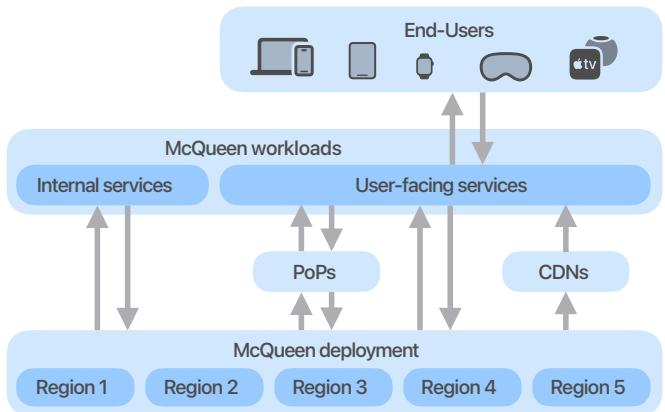  
Figure 1: Using Apple devices or a browser, end-users can access services that use McQueen either directly in data centers, or indirectly via Points of Presence (PoPs) or Content Delivery Network (CDN).

<table><tr><td rowspan="2"></td><td colspan="3">Throughput ratios</td></tr><tr><td>GET</td><td>PUT</td><td>DELETE</td></tr><tr><td>iCloud</td><td>52.0%</td><td>27.0%</td><td>81.0%</td></tr><tr><td>Media Services</td><td>11.0%</td><td>6.0%</td><td>1.0%</td></tr><tr><td>Maps</td><td>20.0%</td><td>5.0%</td><td>1.0%</td></tr><tr><td>Misc.</td><td>17.0%</td><td>62.0%</td><td>17.0%</td></tr></table>

Table 1: Relative contribution of workloads to operation type.

iCloud, a key workload of McQueen, needs to store a large amount of end-user content, including photos, videos, mail, and device backups [38]. The throughput and latency requirements vary depending on the type of content stored. For instance, device backups are asynchronously processed on the device with low throughput and latency requirements. On the other hand, photos, and especially videos, require higher throughput and lower latency. The access patterns are diurnal and also vary depending on the period of the year, with peaks across all types of content, e.g., when many photos are taken during holiday periods. Outside of these events, photos and videos have a high download and delete rate immediately when stored, while backups are less frequently downloaded.

Media services such as Apple Music and Apple TV typically store large files, of several gigabytes (GB) or more, that need to be broken down into multiple parts for efficient, concurrent upload and storage. The content stored from media services only grows with size, as new media files are added. The content is never deleted and is read infrequently since the services use CDN to cache the content and reduce the latency to the end-user.

Finally, Apple Maps has a wide variety of content, ranging from map and 3D views to analytics workloads, with different access patterns. The map and 3D views are behind a CDN, and thus downloaded infrequently and almost never deleted, while analytics workloads are deleted and downloaded frequently.

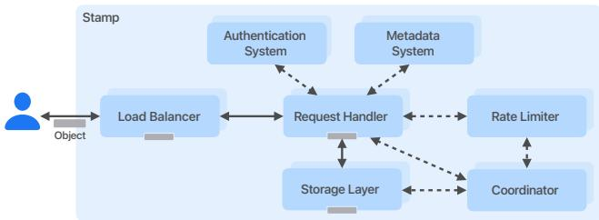  
Figure 2: Stamp layout in McQueen.

Other internal workloads range from analytics jobs to longterm storage, and so have a wide diversity of access patterns. Internal object storage at Apple stems from the necessity to store large amounts of strategic data internally with low latency within the same data center, ranging from legal documentation and manufacturing data to media data, including image thumbnails. This initial requirement drove the design of McQueen 1.0 presented in Section 3. However, in recent years, the increase in storage capacity to support Apple’s growing number of cloud services drove the need for McQueen 2.0, a unified and cost-efficient solution presented in Section 4.

## 3 McQueen 1.0

McQueen 1.0 was the first iteration of a highly available and durable object store at Apple, deployed in 2013. It exposes an AWS S3-compatible API to internal services. The store operates in paired, geographically separate regions in an active-active configuration, where either region can receive read and write requests from client applications. The system stores objects as blobs of data encrypted-at-rest on disk and distributed across many nodes in the storage layer.

## 3.1 Store Overview

A store is a collection of two stamps in different geographical regions, where each stamp is a standalone storage service deployed in a data center. A store exposes a unique endpoint for clients to store and retrieve data. The stamp consists of a collection of racks, with compute and storage hosts. The compute hosts run McQueen 1.0 applications, including request handler, coordinator application, rate limiter application, and load balancer. The storage hosts run the storage layer and are connected to JBODs. Figure 2 presents the layout of a stamp with its main components.

Different DNS endpoints target a specific stamp or both stamps. DNS load balancing distributes client requests across the load balancers. The load balancers are public-facing with public IPs, distributing traffic evenly across all request handlers in the stamp. Each load balancer acts as a public TLS termination point before routing requests to a request handler. This prevents Direct Server Return (DSR) as the request handler must send responses through the load balancer. The request handler is a stateless service that accepts a subset of AWS S3 APIs [1], responsible for checksum computation, encryption/decryption. The request handler validates request signatures against the authentication system and client quota against the rate limiter application. The rate limiter is a distributed service protecting the stamp components by enforcing per-client rate limits.

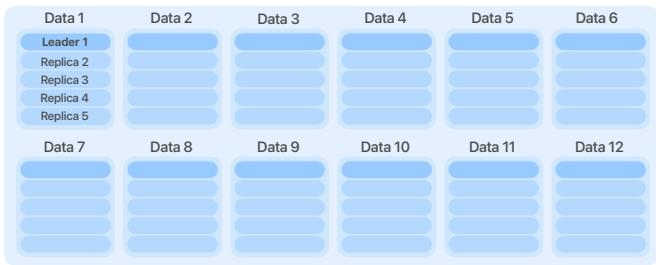

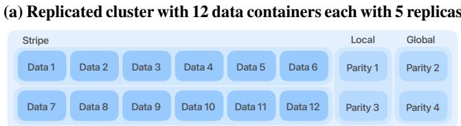  
(b) Sealed cluster with 12 data containers and 4 parities  
Figure 3: Container cluster layout in McQueen for (12, 2, 2) LRC codec layout.

The request handlers are connected to the storage layer to store and retrieve client objects. The storage layer is responsible for writing and reading data to and from the disk. It provides intra-stamp replication using erasure coding. The coordinator application is responsible for the data placement, detecting unhealthy nodes in the storage layer as well as initiating and managing repairs and garbage collection processes. Finally, the metadata system persists object metadata, including its location within a node in the storage layer, replication state, as well as client application-specific information. It is backed by Apache Cassandra [39].

The connections between McQueen 1.0 applications are encrypted using TLS, and each application maintains a connection pool to other applications. This avoids re-establishing connections and minimizes the amount of TLS handshakes that incur high CPU overhead and adds network latency.

## 3.2 Storage Layer

The storage layer provides a stateful, persistent data storage deployed on dedicated storage hosts, each attached to HDDs grouped into a JBOD.

The objects are blobs stored in containers, along with a subset of their metadata and checksum. An object is uniquely identified by a combination of client application identifier, bucket, and a path. The client application can either upload a single object without dividing it into parts, or upload a multipart object part by part. The request handler processes objects of arbitrary size, including those larger than a single container, by transparently splitting them into fixed-size parts.1 These parts are then stored in containers, abstracting the underlying storage mechanism from the client application.

A container is a large file (ranging from 4 to 32 GiB) that holds multiple objects. The containers are grouped within a cluster, as presented in Figure 3. Each container in the cluster is initially five-way replicated (Figure 3a). Objects from client PUT operations are written to a replicated cluster until it reaches capacity, after which it undergoes the sealing process. The sealing process deletes the replicas of the data containers and generates parity containers to create a sealed cluster (Figure 3b), using the Local Reconstruction Codes (LRC) erasure coding [16]. The (12, 2, 2) LRC consists of two local and two global parity containers generated for 12 data containers organized in two stripes of six data containers. After the sealing process, all containers in the cluster are immutable for writes. Replicated clusters are sealed with deleted objects to account for a delete grace period. As the intrastamp replication mechanism, the (12, 2, 2) LRC codec can recover from four container failures per cluster in 86.15% of cases and from three failures in the remaining cases. Initially, McQueen 1.0 used the (12, 2, 2) LRC codec layout for intrastamp replication. To further reduce the replication factor, we later introduced (20, 2, 2) LRC to store new objects.

The request handler receiving the client request streams the object as data chunks of size 256 KiB to the replicated containers. Replicated containers use a custom distributed transaction log based on ZAB [34] for data flow but uses Raft [30] algorithm for leader election, with optimizations specific to object storage services: (i) minimize flushes for multi-chunk objects and (ii) track aborted partially written objects. The leader replica receives the data chunks from the request handler and writes each chunk to its transaction log file, while forwarding the chunks to the other four replicas. Each replica flushes the transaction log file to disk. Once a quorum of replicas has stored the full object, the leader notifies the request handler, which stores the metadata containing the object location before completing the request.

## 3.3 Container Lifecycle

The coordinator application orchestrates the cluster lifecycle, from the creation and placement on disks, to garbage collection as well as data repairs.

Placement. The coordinator application runs the placement process that continuously creates replicated container clusters as destinations for object writes. This process maintains a stable number of writable clusters and accommodate the rate of incoming data. To maximize availability and durability, the placement process takes into account failure domains and places the containers of a given cluster on different disks, hosts, and racks, thus reducing the impact of hardware failure. To maximize disk throughput, the placement process guarantees an even spread of containers across all disks.

Compaction. Upon receiving a delete request, the request handler sets a tombstone in the object metadata. After the object’s grace period, it is considered deleted. As objects are deleted, the coordinator application runs a garbage collection process, compaction, to reclaim space. The coordinator application periodically identifies clusters for compaction, sorts them by deleted data amount, and schedules compaction for those with the most deleted data. The storage application then initiates compaction. The storage application rewrites containers into a new file, skipping deleted objects. Once complete, the storage application recomputes parity containers using LRC erasure coding, similarly to the sealing process.

Repair. Throughout the lifetime of a cluster, disks in the storage layer will fail, creating a data durability risk. To mitigate this risk, clusters undergo a repair process akin to the sealing process, which rebuilds the missing container data on a different disk. There are two main causes for container failures: (i) hardware failures and (ii) data corruptions.

Repair for hardware failures happens when a disk, host, or rack is down. Each process periodically responds to health check requests from the coordinator application. Upon the detection of a failure from a storage application, the coordinator application triggers the repair after a 30-minute grace period to avoid unnecessary repairs in case of transient failure events such as host restart or software release.

Repair for data corruptions corresponds to disk failures, commonly captured by the disk Annual Failure Rate (AFR). There are different periodic durability mechanisms in place to detect data corruptions on disks: (1) an asynchronous process scans all the metadata and verifies the full object integrity against the object checksum stored in the metadata and (2) another process on storage application scans each container on disk and verifies the segment checksum. Once a disk failure is detected, the container is immediately repaired.

## 3.4 Data Availability

Each McQueen 1.0 store relies on two stamps for data redundancy and to provide increased availability and durability of client data. To ensure data availability in case of a stamp failure, the storage application in each stamp continuously replicates the stored client data to the other stamp. As part of this asynchronous process, the storage application scans all stored containers on the disk and writes all objects pending replication to the other stamp. Once an object is replicated, the storage application updates its metadata with the replicated object location. This replication process allows us to perform stamp level maintenance operations by setting the stamp in failover. When in failover, a stamp proxies all client requests to the other stamp, ensuring continuous data availability.

The request handler handling the client GET requests leverages both intra-stamp replication using LRC, and inter-stamp asynchronous replication. The request handler first attempts to retrieve the data from the container. In case of failure or timeout, the request handler performs a degraded read of the object by attempting to read the object from different sources. It first tries to decode the object data from the local and then global LRC parities. As a last resort, the request handler falls back to retrieving the object from the other stamp, and either returns the object or an error in case of failure. As each potential data source is initiated, existing sources continue to run and resulting object data is streamed back to the client as soon as it is available regardless of its source.

## 3.5 Limitations

Although McQueen 1.0 has seen a decade of production use, its scalability was significantly hampered by several factors. Specifically, it suffers from high storage costs, a complex and difficult-to-manage store lifecycle, and a metadata system that struggles to provide strong consistency and high performance.

High storage cost. McQueen combines full cross-stamp replication with a (20, 2, 2) LRC codec, for an overall replication factor of 2.40. Leveraging the full extent of Apple’s infrastructure with more efficient encoding scheme across multiple data centers in different geographical regions could further reduce the replication factor.

Store lifecycle. As stores have a fixed, isolated storage capacity, client resources may span multiple stores, making it challenging for clients to manage multiple endpoints, credentials, capacity reservations as well as quotas. Decommissioning aging stores requires a per-object migration to another store. It is a slow and complex operation with many tedious configuration and verification steps.

Global scalability. The metadata system used in McQueen 1.0 suffers from several limitations such as hotspotting, performance of LIST operations, lack of support for operation predicates and cross-stamp consistency. These limitations make it challenging to scale McQueen into a unified data storage system across multiple data centers.

## 4 McQueen 2.0

McQueen 2.0 is an evolution of McQueen 1.0. It provides a unified endpoint and reduces the operational burden, while reducing the cost of storage per byte by decreasing the data replication factor from 2.40 to 1.50. With its scalable design, McQueen 2.0 allows the addition of storage capacity and throughput transparently for client applications. Table 2 and Figure 4 summarize the main differences between McQueen 1.0 and 2.0.

McQueen 2.0 keeps the same stamp-based structure as introduced in Section 3, and extends it to a multi-region deployment architecture. In its current production deployment, McQueen 2.0 spans five regions, close to client workloads. A region is a set of stamps hosted in a data center. A stamp can store about 500 PiB of raw data.

<table><tr><td></td><td>McQueen 1.0</td><td>McQueen 2.0</td></tr><tr><td>Architecture</td><td>Dual region</td><td>Multi region</td></tr><tr><td>Intra-region Redundancy</td><td>(20,2,2) LRC</td><td>(20,2,2) LRC</td></tr><tr><td>Inter-region Redundancy</td><td>2x replication</td><td>Bitwise XOR-5</td></tr><tr><td>Overall Replication Factor</td><td>2.40</td><td>1.50</td></tr><tr><td>Metadata System</td><td>Dual Cassandra</td><td>ClassVI</td></tr><tr><td>Scalability</td><td>Per-store</td><td>Elastic</td></tr><tr><td>Endpoint</td><td>Per-store</td><td>Unified</td></tr><tr><td>TTFB</td><td>Lower</td><td>Higher</td></tr></table>

Table 2: Comparison between McQueen 1.0 and 2.0.

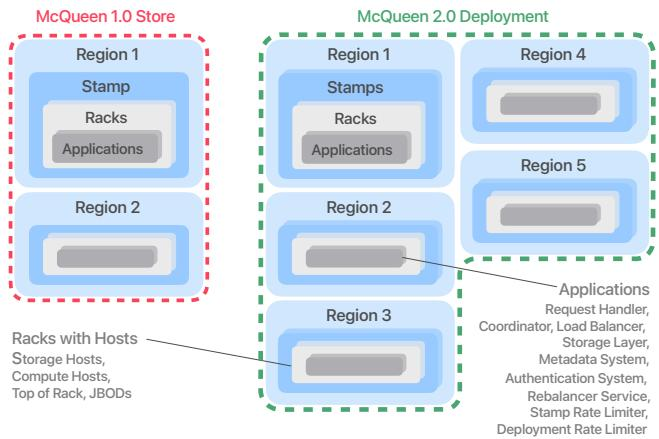  
Figure 4: McQueen 1.0 store with two regions and one stamp (left) and McQueen 2.0 multi-region deployment with five regions and several stamps per region (right).

## 4.1 Cross-Region Segmentation

Unlike McQueen 1.0, which fully replicates data between the two stamps of a store, McQueen 2.0 splits all objects into four contiguous equal-sized data segments and computes a parity segment using the bitwise XOR operation on all data segments. This operation allows the client handler to regenerate any part of any segment, including the parity segment, from the other four segments. This object segmentation results in a replication factor of 1.5, while ensuring high availability in case of a single region failure, at the expense of an increased TTFB. We provide more details about the replication factor computations in Section 4.3.

As shown in Figure 5, the client handler splits the incoming object from PUT requests into data and parity segments, distributing them to regional segment handlers in each region of the deployment. Each PUT request, including chunk encoded requests, must provide the object length as a header, so the size of a segment is known prior to the segmentation. The receiving segment handlers send their segment to the storage layer to be stored in replicated containers.

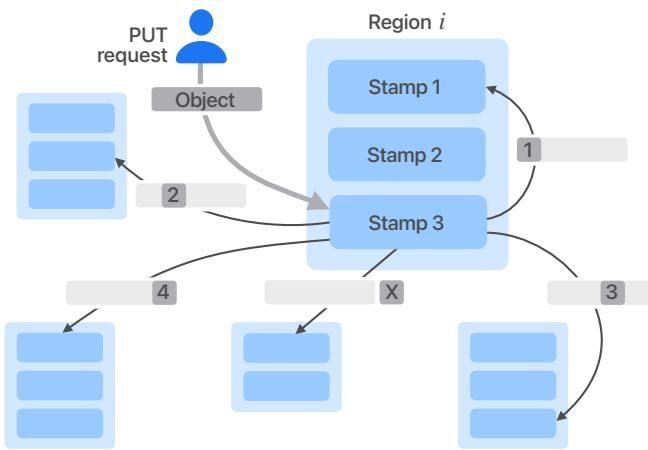  
Figure 5: McQueen 2.0 PUT request. Once the client handler in stamp 3 receives an incoming PUT request from the client, it splits the full object into four equal size segments and computes an additional segment X such that xX = x1 ⊕ x2 ⊕ x3 ⊕ x4.

For multipart objects, McQueen 2.0 considers each part as a fully independent object, mirroring McQueen 1.0’s mechanism. McQueen 2.0 splits each part into segments. The commit operation generates metadata that includes the segment locations of all associated parts.

The client handler fulfills GET requests for a full object by fetching all four data segments. If a segment is temporarily unavailable, the client handler reconstructs it using parity and the remaining data segments. This allows McQueen 2.0 to fulfill GET requests despite partial deployment outages.

For partial read GET request of an object range, the client handler first attempts to read the data segment(s) that correspond to the requested range. For example, each segment for an object of 100 bytes is 25 bytes distributed across all five regions. When a client requests a range of the first 10 bytes of that object, the client handler will only fetch the first 10 bytes of the first data segment. However, if that segment is unavailable, then the client handler fetches the first 10 bytes of each remaining segment to reconstruct the requested range.

## 4.2 Consistent metadata system

Distributing segments across regions requires a metadata system that guarantees strong consistency across regions. When a client PUT request comes into region A, the client handler serving a client GET request in any other region must access the metadata immediately.

ClassVI is the name of our custom-built metadata system, similar to BigTable [5] backing McQueen 2.0. It leverages RocksDB [25] as its local storage engine. It is deployed in the same regions as McQueen 2.0, and each region contains replicas of the metadata to ensure the same durability as the user data, and provides low latency access to metadata.

While ClassVI does not provide multi-row distributed transactional guarantees, it maintains strong consistency for all row-level read and write operations using a Raft consensus algorithm. To improve latency, ClassVI permits read operations to be performed against a single replica in the local region. However, this performance optimization comes with the trade-off of eventual consistency for single-replica reads.

When all segments are stored following a client PUT request, the client handler writes the object metadata containing all segment locations to ClassVI. A segment location consists of all the information necessary to locate the stored data on disk, including the cluster identifier, the container index, and the object offset within that container.

When the client handler receives a client GET request, the handler retrieves the object metadata from ClassVI and sends each contained segment location to the segment handler to fetch the needed segments, depending on their availability.

## 4.3 High Availability System

McQueen 1.0 provides strong availability for client GET requests such that it can sustain up to four node failures per container cluster within a stamp, or even a full region failure, with mechanisms such as degraded reads within a stamp and cross-region replicas. As described in Section 3, these mechanisms result in a replication factor of 2.40.

McQueen 2.0 handles a single region failure such that it can still fulfill both client GET and PUT requests using the parity segment. If two or more regions are unavailable, it cannot fulfill client PUT or GET requests that require the unavailable segments, in which case the client handlers return an error to the client. In this degraded mode, client handlers can still process requests that only involve the metadata system as they do not require storing or fetching any client data on the storage layer.

When a data segment is unavailable, the client handler can serve a client GET request by using the XOR operation. The client handler can reconstruct any missing data segment by fetching the four remaining segments, i.e., three data segments and one parity segment.

In the case of a client PUT request, the client handler sends the segment request to all destination regions, and completes the request successfully if at least four of the five segments are stored. The client handler still attempts to store the last segment as part of the client PUT request in a best-effort manner and will update the segment locations in the object metadata if the attempt is successful.

Each storage application has a process that asynchronously iterates on the containers to identify objects with a missing segment. The process (i) retrieves the available segment locations of the objects from the metadata system, (ii) fetches the segments’ data, (iii) regenerates the missing segment data using the XOR operation, and (iv) stores the generated segment in the remote region. To minimize the overhead associated with fetching a segment, this process runs only on two out of the five regions, which guarantees the presence of a segment. To further minimize the overhead of this asynchronous replication process, the client handler always attempts to store all segments when handling a client PUT request. In case one of the segments takes too long to be stored, e.g., when experiencing network issues or disk issues on the target storage host, the client handler completes the request and the replication process regenerates the remaining segment asynchronously.

## 4.4 Multi-tenant Scalable Design

In McQueen 1.0, when a large client application needed to expand their capacity beyond the capacity of a single store, they had to request capacity in multiple stores. This was a major pain point for our clients as they were forced to deal with multiple endpoints, credentials, rate limits. Moreover, data management, e.g., balancing, moving, and copying data across stores, was the responsibility of the client.

One of McQueen 2.0’s major improvements is its unified endpoint, a unique entry point to store and retrieve data. The endpoint is a single DNS record that answers A records targeting load balancer’s public IP address within the deployment. Our internal DNS authoritative server dynamically computes the IP address of the load balancer so as to minimize the network latency between the client and the load balancer. For instance, if a client wants to send a request to McQueen 2.0 from region A, the DNS authoritative server will serve an IP address of a load balancer in region A. We add or remove A records of the load balancer IP addresses to the main endpoint’s DNS record to reflect changes in the deployment such as adding or removing stamps.

With the scalable nature of the deployment, the number of stamps per region grows over the course of the deployment lifetime. As such, the oldest stamps will be filled with data before the newest ones. McQueen 2.0 has several mechanisms in place to balance the data across all stamps to achieve a uniform resource usage in terms of disk IOPS and space used.

When picking a stamp during a client PUT request, the client handler uses weights to determine the destination stamp for each segment. On each stamp, an asynchronous periodic job computes the available disk capacity and reports the information to the coordinator application. A separate service aggregates the disk capacity information and derives stamp weights for each region.

In addition to stamp weights, McQueen 2.0 employs a rebalancer service that moves existing data across stamps within a region. The rebalancer sends a file-level copy of sealed data and parity containers to a target storage node in the destination stamp. This process is the fastest and least I/O-intensive way to move data across stamps since it avoids both the disk

I/O of transaction log writes and the CPU cost of erasure coding during container sealing. We need the rebalancer for both on-boarding and off-boarding a stamp in the deployment: the rebalancer can move data from older stamps to newer stamps, emptying older stamps or freeing up capacity to balance the load of requests and stored data.

Finally, the rate limiter in McQueen 2.0 has a new architecture comprising two rate limiter services: (i) deployment-level used before object segmentation and (ii) stamp-level used after object segmentation. These services are similar to the rate limiter application in McQueen 1.0 described in Section 3.1. The deployment-level rate limiter protects the whole deployment from load surges by enforcing predefined client application rate limits with instances located in each stamp. The stamplevel rate limiter protects the storage resources of each stamp by throttling client and internal traffic operations, including client requests and asynchronous segment replication.

## 5 Production Results

This study evaluates the performance of the two live production systems McQueen 1.0 and McQueen 2.0 through a series of measurements. As both systems are geo-replicated, this evaluation focuses on comparing key performance metrics, specifically request latency, durability, and availability mechanisms. We gathered the results from live traffic over a onemonth period across all our hosts, capturing a large volume of real-world workloads to ensure the statistical significance of our findings.

## 5.1 Request Latency

Our evaluation uses two server-side request metrics.

• Time to first byte (TTFB). This is the time from receiving the incoming client GET request to sending the first byte of the response to the client. This includes the metadata operation delay, the time to read the first byte on disk, and the networking time to transfer the first byte.

• Full object latency. This is the time between receiving the incoming client request and sending the last byte of the response to the client. This captures the metadata operation delay, the time to read or write the data on disk, and the networking time to transfer the data.

While we measure metrics server-side, the client may have a significant impact on the full object request latency when receiving data or transmitting the response between the client handler and the client. We measure the TTFB for client GET requests as this metric is independent of the object size and the client’s and our egress networking throughput limitations.

Due to the migration of McQueen 1.0 to McQueen 2.0, the main workloads have moved to McQueen 2.0, which explains some differences between client application data across the two systems. In particular, Figure 6a provides a Cumulative Distribution Function (CDF) of the object size in bytes for PUT and GET requests in McQueen 1.0 and McQueen 2.0. Across both systems, the object request size is smaller for GET requests than for PUT requests, since workloads use range read request to retrieve a subset of the object. However, the difference in object sizes between GET and PUT requests is larger in McQueen 2.0 because of the migration of workloads.

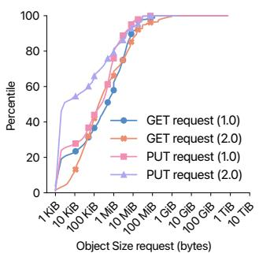  
(a) Object Size

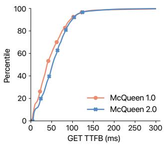  
(b) GET request TTFB

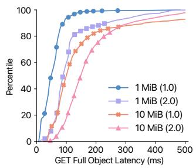  
(c) GET request latency

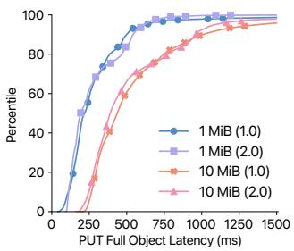  
(d) PUT request latency  
Figure 6: Key latency performance metrics measured after the latency improvements presented in Section 6.2.

In Figure 6, we also provide request latency and TTFB metrics comparing the performance of both systems. Figure 6b shows similar TTFB for GET requests between the two systems, with a slightly larger TTFB for McQueen 2.0. The observed difference is mainly due to the distributed nature of the segments of the objects in McQueen 2.0, where, due to the client location and requested range, we may need to fetch a remote segment before returning the first byte of the GET request. In McQueen 2.0, in 99.99995% of requests, fetching the metadata only requires an inconsistent read, showing no latency difference with McQueen 1.0. We provide more details about latency optimizations, including metadata prefetch, in Section 6.2.

In Figures 6c and 6d, we compare the full object GET and PUT requests between McQueen 1.0 and McQueen 2.0 for two representative object sizes, 1 MiB and 10 MiB. The latency of PUT object requests is similar between McQueen 1.0 and McQueen 2.0, since in both systems the client handler streams the client data directly to the replicated containers. In the case of McQueen 2.0, server-side buffering of the client data allows the client handler to send the PUT segment requests in parallel. Conversely, the GET request latency is greater for McQueen 2.0 to account for the time to fetch all the segment data from remote regions, where the observed latency difference of 50 ms between the two systems corresponds to the average network latency between two regions.

## 5.2 Durability and Availability

In Figure 7, we measure the performance of different availability and durability mechanisms and the impact on the GET request latency for both McQueen 1.0 and McQueen 2.0.

In both McQueen 1.0 and McQueen 2.0, replication of data between regions guarantees the durability and data availability of the system in case of a region failure. The replication process for McQueen 1.0 is done asynchronously for every object, whereas for McQueen 2.0 the replication is done as part of the PUT request flow in 99.99% of cases. As such the asynchronous replication process only concerns 0.01% of objects, with 99.8% in replicated containers and the remaining 0.2% in sealed containers. Figure 7a shows a CDF of the replication lag for both systems, i.e., the time difference between the completion of a PUT request and the successful run of the corresponding replication process. In McQueen 1.0 the replication process starts immediately after an object is stored in one stamp, and completes within 10 seconds for 90% of all objects. As we can observe in the plot, since few segments need to be replicated asynchronously, the segment replication lag in McQueen 2.0 is several magnitudes smaller than the object replication lag in McQueen 1.0, exhibiting one of the main advantages of McQueen 2.0 in terms of durability.

Figure 7b shows the impact of the inter-region availability mechanism on full object GET request latency in McQueen 2.0: (i) without segment reconstruction, (ii) with segment reconstruction, and (iii) with segment reconstruction during stamp failover. Segment reconstruction between regions incurs a computational overhead of 0.3ms at p90. Reconstruction without stamp failover shows a 10-millisecond increase on the GET latency. On the other hand, segment reconstruction during stamp failover shows an impact on GET latency up to 50 milliseconds for percentiles greater than p60, due to the fact that the client handler needs to fetch segments in regions farther away, with larger inter-data center latencies.

Figure 7c shows the impact of the intra-stamp availability mechanism on segment GET request latency in McQueen 2.0: (i) with degraded read using the parity containers to reconstruct the unavailable sealed data containers, (ii) from sealed data containers, and (iii) from replicated containers. Computational overhead for LRC reconstruction is 2ms at p90. Degraded reads using the sealed data and parity containers show a 30ms increase in GET segment latency up to p50, and a larger increase (hundreds of ms) above p50. When reconstructing the segment data using parities, the LRC mechanism favors local parities and falls back to global parities after a configured 500ms timeout. This impacts requests above the 75th percentile.

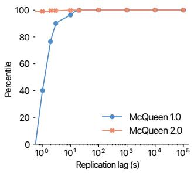  
(a) Replication lag comparison

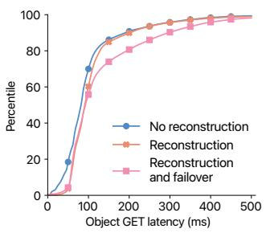  
(b) GET full object latency

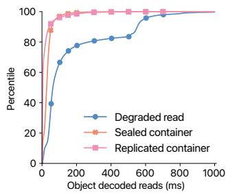  
(c) GET segment latency  
Figure 7: Durability and availability performance metrics — (b) and (c) for McQueen 2.0 only.

## 6 Discussions

This section discusses the challenges we encountered while operating a storage system at scale for more than a decade. This includes the migration of large amounts of data between systems, performance considerations, as well as availability and durability tradeoffs.

## 6.1 Migration from 1.0 to 2.0

With the introduction of McQueen 2.0 as a replacement to McQueen 1.0, we needed to migrate the data to the new deployment. While a subset of clients managed their own migration, we undertook the large-scale effort of transferring the remaining data in several stores. We planned the migration in the following successive phases.

1. Client application migration. Transfer of client-specific information to the target deployment: credentials, configuration parameters, rate limits, and storage quotas.

2. Object migration. Asynchronous transfer of individual objects to the target deployment using a storage application-based process. This process, similar to the replication process described in Section 3.4, sends each object to the new deployment to be stored as segments as described in Section 4.1. The object migration was done while the source store was handling client requests.

3. Object verification. Asynchronous storage applicationbased process that validates the integrity of migrated data. It confirms the correct transfer of each object’s data and metadata to the target deployment by computing and comparing checksums and verifying metadata fields.

4. Request proxying. Once all the existing objects have been migrated, the client handler at the source store redirects the client requests to the target deployment request handler. During this phase, the object migration and verification processes continue to run on the source store for newly ingested or modified objects.

5. DNS cutover. Once object migration and verification are complete, we update the DNS configuration for the client-facing store endpoint. This involves changing the CNAME record to point from the source store’s DNS domain to the target deployment’s DNS domain.

This migration amounted to several exabytes over the course of a few years. It was done transparently to the client applications, with no downtime, while still handling client requests, with guaranteed availability and correctness of the data at any point in time.

## 6.2 Latency Optimizations

With the geo-distributed architecture of McQueen 2.0, we observed an increase in GET request latency for full objects and TTFB compared to the previous system. Prior to the migration, we led an effort to significantly reduce server-side latency by up to 60% and client-side latency by up to 87%, minimizing the latency impact on workloads migrating from McQueen 1.0 to McQueen 2.0. We made improvements along three different stages of the client GET request: DNS georouting, metadata prefetch, and segment regional preference.

DNS geo-routing. Client requests are routed to the closest of five McQueen 2.0 data centers using DNS geo-routing. This ensures that clients have the shortest path to our servers, but results in traffic imbalance across regions. We allow imbalances as long as all regions are able to handle their traffic. When traffic in a region approaches a predefined threshold, a safety mechanism part of the DNS system routes excess traffic to other regions. In addition to our general endpoint for McQueen 2.0, we provisioned an endpoint for latencysensitive traffic, reserved for select low volume use cases, which is not affected by the safety mechanism. We also provisioned an endpoint for non-latency-sensitive traffic, which we use to balance traffic across regions in a round-robin manner.

Prefetch after inconsistent metadata read. In addition to consistent reads, ClassVI offers fast inconsistent reads, served from a replica located in the same data center in single-digit milliseconds at the 99.9th percentile. As object metadata is mutated only during a client PUT request and rebalancing, and ClassVI quickly propagates updates, an inconsistent read returns the correct metadata most of the time. We leverage this to optimistically prefetch data from disk: upon a client GET request, the request handler immediately triggers both a consistent and inconsistent metadata read. When the inconsistent metadata read completes, it then triggers segment reads. When the consistent metadata read later completes, the request handler compares both metadata. If they match, it starts streaming data back to the client. If they don’t match, which happens for about 0.001% of requests today, the request handler drops the prefetched data and sends segment GET requests with the correct metadata.

Segment regional preference. When reading an object, a request handler can choose any combination of four out of the five segments of the object. Our data centers are separated by several hundreds to thousands of miles, located on opposite sides of the North American continent. Instead of picking any four segments, the request handler selects the segments that are located in the data centers that have the smallest network round-trip time. In most cases, this means that the parity segment will be read and a XOR reconstruction will be required. This has a small CPU cost but avoids slow crosscountry network transfers.

## 6.3 Load Balancer Bypass

The increased inter-stamp throughput achieved with McQueen 2.0, resulting from object segmentation, exposed a bottleneck in the existing load balancing infrastructure. Specifically, the stamp load balancers proved insufficient to handle the amplified traffic volume.

Faced with this limitation and constrained by cost and data center space considerations, a hardware-based solution involving the addition of load balancers and top-of-rack switches was deemed infeasible. Consequently, we adopted a strategy to bypass the load balancers for inter-stamp communication, which reduced the traffic on these components. Bypassing the load balancers had some drawbacks as the request handlers had to re-implement some of the features provided by the load balancers, such as health monitoring or handling a large number of connections to the serving request handler instances. Despite these added complexities, bypassing the load balancers yielded client request latency reductions, with improvements of 22% at p50, 32% at p90, and 26% at p95.

<table><tr><td rowspan="2">Codec</td><td rowspan="2">Layout</td><td colspan="2">Durability MTTDL (years)</td><td colspan="2">Availability (seconds)</td><td rowspan="2">RF</td></tr><tr><td>Local</td><td>Regional</td><td>Degraded</td><td>Unavailable</td></tr><tr><td>(12,2,2)</td><td>1.0</td><td> $4 . 9 6 \times 1 0 ^ { 1 0 }$ </td><td> $4 . 5 1 \times 1 0 ^ { 2 3 }$ </td><td>631.15</td><td>0.0032</td><td>2.67</td></tr><tr><td>(20,2,2)</td><td>1.0</td><td> $8 . 4 9 \times 1 0 ^ { 9 }$ </td><td> $1 . 3 2 \times 1 0 ^ { 2 2 }$ </td><td>631.15</td><td>0.0032</td><td>2.40</td></tr><tr><td>(20,2,2)</td><td>XOR-3</td><td> $8 . 4 9 \times 1 0 ^ { 9 }$ </td><td> $4 . 3 8 \times 1 0 ^ { 2 1 }$ </td><td>946.71</td><td>0.0095</td><td>1.80</td></tr><tr><td>(20,2,2)</td><td>XOR-4</td><td> $8 . 4 9 \times 1 0 ^ { 9 }$ </td><td> $2 . 1 9 \times 1 0 ^ { 2 1 }$ </td><td>1,262.27</td><td>0.0189</td><td>1.60</td></tr><tr><td>(20,2,2)</td><td>XOR-5</td><td> $8 . 4 9 \times 1 0 ^ { 9 }$ </td><td> $1 . 3 1 \times 1 0 ^ { 2 1 }$ </td><td>1,577.82</td><td>0.0316</td><td>1.50</td></tr><tr><td>(20,2,2)</td><td>XOR-6</td><td> $8 . 4 9 \times 1 0 ^ { 9 }$ </td><td> $8 . 7 7 \times 1 0 ^ { 2 0 }$ </td><td>1,893.32</td><td>0.0473</td><td>1.44</td></tr></table>

Table 3: Comparison of durability, availability, and replication factor (RF) for various LRC codec and layout configurations. Availability metrics target a 99.999% SLO, with outcomes for degraded (one region failure) and unavailable (two region failures) states.

## 6.4 Durability and Availability Tradeoffs

We describe below the models and assumptions for durability, availability, and replication, summarized in Table 3 for different LRC codec and layout combinations. The table highlights the tradeoff between achieving higher durability and availability, and the storage cost overhead due to data replication.

Durability. The classic approach to compute and compare the durability of storage systems is to derive the Mean-Time-To-Data-Loss (MTTDL) from a Markov chain model, as introduced by Gibson [11] and later reproduced in many works [9,15,16,18,36]. Figure 8 shows two MTTDL Markov chain models: (i) local model with (20, 2, 2) LRC within a cluster in a stamp and (ii) regional model with XOR-5. The MTTDL is defined as the mean time to the Data Loss (DL) state from the initial state, i.e., 4 for XOR-5 and 24 for (20, 2, 2) LRC. In both models, let λ denote the failure rate of a single container or segment and let $\rho _ { i }$ denote the repair rate from one missing container or segment to a healthy state.

In the local model, states represent the number of available containers (data/parity). The failure rate λ models container failures, while $\rho _ { i }$ models the detection and repair of failed containers. (12, 2, 2) and (20, 2, 2) LRC recover four failed containers with probability $p _ { d } = 0 . 8 6 1 5$ , and three with probability $( 1 - p _ { d } )$ [16]. Container failures stem from hardware failures and data corruptions (Section 3.3).

For simplicity, the model assumes independent and identically distributed failure rates λ following an exponential distribution, a common approximation [9], despite real-world Annualized Failure Rate (AFR) variations [18]. It also assumes uncorrelated failures due to container placement across racks, mitigating shared rack-level failures. The model focuses on sealed clusters, as replicated clusters storing temporary data have a negligible impact. Repair times are modeled using an exponential distribution, assuming cross-rack bandwidth doesn’t limit repairs.

In the regional model, each state represents the number of available segments or objects in the case of McQueen 1.0. λ is the failure rate derived from the local model’s MTTDL, representing LRC protection failure within a region. $\rho _ { i }$ combines the local model’s container repair rate with the object replication rate between regions. For example, in XOR-5, initial state $s _ { 4 }$ (four segments in four regions) transitions to $s _ { 5 }$ at rate $\rho _ { 4 }$ when the fifth segment replicates.

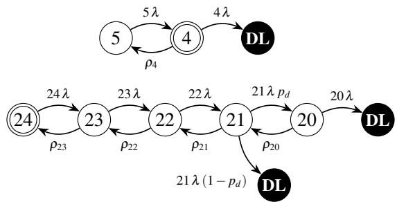  
Figure 8: Top: Regional MTTDL Markov chain model of XOR-5 layout. Bottom: Local MTTDL model of (20, 2, 2) LRC codec. The initial state has a double circle and the data loss state has the label $\mathbf { \hat { \theta } } ^ { 6 6 } \mathbf { D } \mathbf { L } ^ { 9 7 } .$

We use typical parameters to compute the durability of the system. The local model uses a conservative failure rate $\lambda = 0 . 0 2$ , compared to Backblaze’s 1.35% average disk AFR [2] and McQueen observations. The regional model uses $\lambda = 1 / M T T D L _ { \mathrm { l o c a l } }$ . Both models use a repair rate $\rho _ { i } = \rho = 1 / T$ , with $T = 3 6 5 . 2 5$ days for container/segment detection, repair, or replication, similar to [9]. Table 3 shows yearly MTTDL values. McQueen 1.0 with (12, 2, 2) LRC achieves better durability compared to McQueen 2.0 in XOR-5 with (20, 2, 2) LRC, while meeting the “11 nines” SLA [1].

Availability. The responsiveness to periodic health checks defines the operational status of one region; a region is considered unavailable if it fails to respond and remains unavailable until responsiveness is restored. McQueen transitions to an unavailable state if two or more regions become simultaneously unavailable. We model the multi-region availability assuming a target availability Ar for each individual region, $e . g . , A _ { r } = 0 . 9 9 9 9 9$ for a 99.999% Service Level Objective (SLO), a.k.a., “five nines”. The corresponding unavailability of a single region is $1 - A _ { \prime }$

Assuming region failures are independent events across the N regions comprising the system, e.g., N = 2 for McQueen 1.0 and $N = 5$ for McQueen 2.0, the number of concurrently unavailable regions k follows a binomial distribution. We distinguish between degraded and unavailable states.

Degraded State: The system is considered degraded if exactly one region is unavailable, i.e., k = 1. This state impacts access to non-fully replicated objects, and accumulates a backlog of objects and segments to replicate to the unavailable region. The probability $P _ { \mathrm { { d e g r a d e d } } }$ is given by Eq. (1):

$$
P _ { \mathrm { d e g r a d e d } } = P ( X = 1 ) = { \binom { N } { 1 } } ( 1 - A _ { r } ) ^ { 1 } \times A _ { r } ^ { N - 1 }\tag{1}
$$

Unavailable State: The system is considered unavailable if two or more regions are concurrently unavailable, $i . e . , k \ge 2$

In this state, clients do not have access to their data and cannot store new objects. The probability, $P _ { \mathrm { u n a v a i l a b l e } }$ , is the sum of probabilities for $k = 2$ through N given by Eq. (2):

$$
P _ { \mathrm { u n a v a i l a b l e } } = P ( X \geq 2 ) = \sum _ { k = 2 } ^ { N } { \binom { N } { k } } ( 1 - A _ { r } ) ^ { k } A _ { r } ^ { N - k }\tag{2}
$$

Table 3 presents the yearly durations in the degraded and unavailable states. The yearly degraded and unavailable durations increase with the number of regions used to store data.

Replication. Recall that McQueen provides high availability for client requests by using replication mechanisms at different levels, with distinct replication factors: (i) local within a stamp with replication factor $R F _ { \mathrm { l o c a l } }$ and (ii) regional across regions with replication factor $R F _ { \mathrm { r e g i o n a l } }$ . The overall replication factor of McQueen is $R F = R F _ { \mathrm { l o c a l } } \times R F _ { \mathrm { r e g i o n a l } } .$

Local replication uses $( k , l , r )$ LRC consisting of $l + r$ parities and k data containers, with an overall replication factor of $R F _ { \mathrm { l o c a l } } = ( k + l + r ) / k .$ . In our case, (12, 2, 2) LRC, used in McQueen 1.0, and (20, 2, 2) LRC, used in McQueen 1.0 and 2.0, have respective replication factors of 1.33 and 1.2.

Regional replication differs between the systems. McQueen 1.0 uses full object replication with a replication factor $R F _ { \mathrm { r e g i o n a l } } = 2$ . In contrast, McQueen 2.0 uses bitwise XOR replication with a single parity segment, with a replication factor $R F _ { \mathrm { r e g i o n a l } } = N / ( N - 1 )$ , where N is the number of regions, $e . g .$ ., $R F _ { \mathrm { r e g i o n a l , X O R - 5 } } = 1 . 2 5$

Table 3 presents the overall replication factor. McQueen 2.0 has a lower replication factor than McQueen 1.0, which influenced its design to reduce storage expenses. By using a greater number of storage regions, the replication factor decreases, directly lowering the cost per byte. In the case of McQueen 2.0 at Apple, given the workload requirements in terms of durability and availability, data center location constraints, and cost considerations, we chose to implement the (20, 2, 2) LRC codec together with the XOR-5 layout.

## 7 Related work

McQueen builds upon several decades of distributed storage systems, from foundational file systems to modern georeplicated object stores, and incorporates advancements in areas like erasure coding and metadata management.

Production object stores. Object stores vary from cloudbased commercial offerings to open-source and internal deployments. Commercial solutions like Amazon S3 [1], Google Cloud Storage [12], Azure Blob Storage [26], IBM Cloud Object Storage [17], and Oracle Cloud Infrastructure Object Storage [31] offer pay-as-you-go storage scaling from bytes to petabytes. MinIO [27] and Ceph [41] are open-source alternatives for on-premise petabyte-scale deployments. Several companies described their internal object store similar to

McQueen. LinkedIn presented Ambry [29] (geo-distributed, immutable objects) and Yahoo! described Walnut [6] (unified cloud object store). Google File System (GFS) [10], the predecessor to Google Cloud Storage (GCS) [14], demonstrated scalable storage on commodity hardware. Microsoft’s Windows Azure Storage [4] is a generic object storage service. Meta’s storage evolved from Haystack [3] (small photos) to f4 [28] (warm storage, erasure coding) and Tectonic [32] (unified exascale), highlighting large-scale challenges. Similar to Tectonic, McQueen targets unified exascale storage, while adding geo-replication.

Geo-replicated object stores. McQueen is designed for geo-replication to ensure data availability and disaster recovery. OceanStore [23] laid early groundwork of global-scale persistent storage. Ford et al. analyzed the tradeoff of maintaining availability in globally distributed environments across two regions using full replication [9]. Ambry [29] explicitly targets geo-distribution, primarily for immutable data with eventual consistency. Similar to McQueen, Meta’s f4 [28] uses a geo-replicated XOR-based erasure coding scheme for warm data over multiple regions. Pando [40] explores crossregion erasure coding for improved storage efficiency at the cost of higher latency. Finally, Mesa [13] relies on robust geo-replication strategies.

Metadata management. Although geo-replicated, McQueen provides strong consistency, similar to AWS S3, Google Cloud Storage, and MinIO. McQueen stores object metadata in ClassVI, a distributed key-value store optimized for low-latency SSD access, similar to BigTable [5] and Cassandra [24]. ClassVI is also geo-distributed and strongly consistent across regions, like Spanner [7] and Dynamo [8]. Separating metadata into a dedicated, scalable service is common, exemplified by Google’s GFS using Bigtable and later Colossus with Spanner. Our metadata database approach differs from systems like Ambry [29] and MinIO [27], where metadata is co-located with objects, resulting in different performance trade-offs for metadata-intensive workloads.

Erasure coding replication. Like many large-scale systems, McQueen uses erasure coding for high durability and storage efficiency [9]. While Reed-Solomon codes [35] are fundamental, systems often use variants like Local Reconstruction Codes (LRCs), popularized by Windows Azure Storage [16] and adopted by Meta [28,36] and Google [33]. LRCs reduce repair bandwidth and I/Os via local parity containers. McQueen employs (20, 2, 2) LRC, balancing storage overhead, durability, and repair. Prior work uses similar widestripe erasure coding to reduce replication at the cost of repair bandwidth [15, 21]. McQueen transitions data from replication to erasure coding via sealing, a common technique to optimize hot/cold data storage costs. Similar disk-adaptive coding schemes adjust redundancy based on data temperature or disk failure rates [19, 20, 22, 37].

## 8 Conclusion

This paper described McQueen, an object store designed to accommodate Apple’s specific workload demands. Operating in production for over a decade, McQueen efficiently serves requests in a geographically distributed environment, spanning multiple data centers, with low latency and high throughput. With its second generation, McQueen reduces the replication factor from 2.40 to 1.50, maintaining high durability and fault tolerance to disk, host, rack, and data center failures.

As we prepare to transition to next-generation hardware, in particular disks with larger capacity, a significant challenge lies in sustaining the continuous increase in the volume of data to store and retrieve, while minimizing the disk IOPS overhead consumed during maintenance operations.

## Acknowledgments

The authors would like to thank the reviewers at FAST’26 for their insightful feedback, our shepherd Juncheng Yang, as well as Aditya Umrani, Mohit Talwar, Suri Medapati, and P.P.S. Narayan for their thoughtful comments and discussions. We are also grateful to the founding members of McQueen — Bernard Gallet, Nick Puz, and David Hemmo — and to Bernard Gallet and Ed Nightingale for their vision for 2.0. Our thanks extend to the SRE, ClassVI, and customer success teams, as well as past contributors to McQueen and the current members of the team: Andrey Trubachev, Edward Karpovits, Guillaume Rose, Ilker Yaz, Julien Lesaint, Jun Roh, Maxime Derobillard, Mohini Borse, Nate Li, Nathan Moreau, Partha Krishnamurthy, Thomas Peyrard, and Yaniv Pessach.

## References

[1] Amazon Web Services, Inc. Amazon Simple Storage Service (S3). https://aws.amazon.com/s3, 2026.

[2] Backblaze. Disk Reliability Dataset. https: //www.backblaze.com/cloud-storage/ resources/hard-drive-test-data, 2024.

[3] Doug Beaver, Sanjeev Kumar, Harry C Li, Jason Sobel, and Peter Vajgel. Finding a Needle in Haystack: Facebook’s Photo Storage. In USENIX Symposium on Operating Systems Design and Implementation (OSDI), pages 47–60, 2010.

[4] Brad Calder, Ju Wang, Aaron Ogus, Niranjan Nilakantan, Arild Skjolsvold, Sam McKelvie, Yikang Xu, Shashwat Srivastav, Jiesheng Wu, Huseyin Simitci, Jaidev Haridas, Chakravarthy Uddaraju, Hemal Khatri, Andrew

Edwards, Vaman Bedekar, Shane Mainali, Rafay Abbasi, Arpit Agarwal, Mian Fahim ul Haq, Muhammad Ikram ul Haq, Deepali Bhardwaj, Sowmya Dayanand, Anitha Adusumilli, Marvin McNett, Sriram Sankaran, Kavitha Manivannan, and Leonidas Rigas. Windows azure storage: a highly available cloud storage service with strong consistency. In ACM Symposium on Operating Systems Principles (SOSP), page 143–157, 2011.

[5] Fay Chang, Jeffrey Dean, Sanjay Ghemawat, Wilson C. Hsieh, Deborah A. Wallach, Mike Burrows, Tushar Chandra, Andrew Fikes, and Robert E. Gruber. Bigtable: A Distributed Storage System for Structured Data. ACM Transactions on Computer Systems, 26(2), June 2008.

[6] Jianjun Chen, Chris Douglas, Michi Mutsuzaki, Patrick Quaid, Raghu Ramakrishnan, Sriram Rao, and Russell Sears. Walnut: A Unified Cloud Object Store. In ACM SIGMOD, pages 743–754, 2012.

[7] James C. Corbett, Jeffrey Dean, Michael Epstein, Andrew Fikes, Christopher Frost, JJ Furman, Sanjay Ghemawat, Andrey Gubarev, Christopher Heiser, Peter Hochschild, Wilson Hsieh, Sebastian Kanthak, Eugene Kogan, Hongyi Li, Alexander Lloyd, Sergey Melnik, David Mwaura, David Nagle, Sean Quinlan, Rajesh Rao, Lindsay Rolig, Dale Woodford, Yasushi Saito, Christopher Taylor, Michal Szymaniak, and Ruth Wang. Spanner: Google’s Globally-Distributed Database. In USENIX Symposium on Operating Systems Design and Implementation (OSDI), page 251–264, 2012.

[8] Giuseppe DeCandia, Deniz Hastorun, Madan Jampani, Gunavardhan Kakulapati, Avinash Lakshman, Alex Pilchin, Swaminathan Sivasubramanian, Peter Vosshall, and Werner Vogels. Dynamo: Amazon’s Highly Available Key-Value Store. In ACM SIGOPS Symposium on Operating Systems Principles, page 205–220, 2007.

[9] Daniel Ford, François Labelle, Florentina I Popovici, Murray Stokely, Van-Anh Truong, Luiz Barroso, Carrie Grimes, and Sean Quinlan. Availability in Globally Distributed Storage Systems. In USENIX Symposium on Operating Systems Design and Implementation (OSDI), pages 61–74, 2010.

[10] Sanjay Ghemawat, Howard Gobioff, and Shun-Tak Leung. The Google File System. In ACM Symposium on Operating Systems Principles (SOSP), pages 29–43, 2003.

[11] Garth Alan Gibson. Redundant Disk Arrays: Reliable, Parallel Secondary Storage. PhD thesis, EECS Department, University of California, Berkeley, Dec 1991.

[12] Google. Google Cloud Storage. https://cloud. google.com/storage, 2026.

[13] Ashish Gupta, Fan Yang, Jason Govig, Adam Kirsch, Kelvin Chan, Kevin Lai, Shuo Wu, Sandeep Govind Dhoot, Abhilash Rajesh Kumar, Ankur Agiwal, Sanjay Bhansali, Mingsheng Hong, Jamie Cameron, Masood Siddiqi, David Jones, Jeff Shute, Andrey Gubarev, Shivakumar Venkataraman, and Divyakant Agrawal. Mesa: Geo-Replicated, Near Real-Time, Scalable Data Warehousing. Proceedings of the VLDB Endowment, 7(12):1259–1270, March 2014.

[14] Dean Hildebrand and Denis Serenyi. Colossus under the hood: A peek into Google’s scalable storage system. https://cloud.google.com/ blog/products/storage-data-transfer/ a-peek-behind-colossus-googles-file-system, 2021.

[15] Yuchong Hu, Liangfeng Cheng, Qiaori Yao, Patrick PC Lee, Weichun Wang, and Wei Chen. Exploiting Combined Locality for Wide-Stripe Erasure Coding in Distributed Storage. In USENIX Conference on File and Storage Technologies (FAST), pages 233–248, 2021.

[16] Cheng Huang, Huseyin Simitci, Yikang Xu, Aaron Ogus, Brad Calder, Parikshit Gopalan, Jin Li, and Sergey Yekhanin. Erasure Coding in Windows Azure Storage. In USENIX Annual Technical Conference (ATC), pages 15–26, 2012.

[17] IBM. IBM Cloud Object Storage. https://www.ibm. com/products/cloud-object-storage, 2026.

[18] Saurabh Kadekodi, Francisco Maturana, Sanjith Athlur, Arif Merchant, KV Rashmi, and Gregory R Ganger. Tiger: Disk-Adaptive Redundancy Without Placement Restrictions. In USENIX Symposium on Operating Systems Design and Implementation (OSDI), pages 413– 429, 2022.

[19] Saurabh Kadekodi, Francisco Maturana, Suhas Jayaram Subramanya, Juncheng Yang, K. V. Rashmi, and Gregory R. Ganger. PACEMAKER: Avoiding HeART Attacks in Storage Clusters with Disk-Adaptive Redundancy. In USENIX Symposium on Operating Systems Design and Implementation (OSDI), 2020.

[20] Saurabh Kadekodi, KV Rashmi, and Gregory R Ganger. Cluster Storage Systems Gotta Have HeART: Improving Storage Efficiency by Exploiting Disk-Reliability Heterogeneity. In USENIX Conference on File and Storage Technologies (FAST), pages 345–358, 2019.

[21] Saurabh Kadekodi, Shashwat Silas, David Clausen, and Arif Merchant. Practical Design Considerations for Wide Locally Recoverable Codes (LRCs). ACM Transactions on Storage (TOS), 19(4), November 2023.

[22] Timothy Kim, Sanjith Athlur, Saurabh Kadekodi, Francisco Maturana, Dax Delvira, Arif Merchant, Gregory R. Ganger, and K. V. Rashmi. Morph: Efficient File-Lifetime Redundancy Management for Cluster File Systems. In ACM Symposium on Operating Systems Principles, page 330–346, 2024.

[23] John Kubiatowicz, David Bindel, Yan Chen, Steven Czerwinski, Patrick Eaton, Dennis Geels, Ramakrishan Gummadi, Sean Rhea, Hakim Weatherspoon, Westley Weimer, Chris Wells, and Ben Zhao. OceanStore: An Architecture for Global-Scale Persistent Storage. SIG-PLAN Not., 35(11):190–201, November 2000.

[24] Avinash Lakshman and Prashant Malik. Cassandra: A Decentralized Structured Storage System. ACM SIGOPS Operating Systems Review, 44(2):35–40, April 2010.

[25] Meta Platforms, Inc. RocksDB: A Persistent Key-Value Store for Flash and RAM Storage. https://rocksdb. org, 2013.

[26] Microsoft. Azure Blob Storage. https: //azure.microsoft.com/en-us/products/ storage/blobs, 2026.

[27] MinIO, Inc. MinIO: High Performance Object Storage. https://min.io, 2026.

[28] Subramanian Muralidhar, Wyatt Lloyd, Sabyasachi Roy, Cory Hill, Ernest Lin, Weiwen Liu, Satadru Pan, Shiva Shankar, Viswanath Sivakumar, Linpeng Tang, et al. f4: Facebook’s Warm BLOB Storage System. In USENIX Symposium on Operating Systems Design and Implementation (OSDI), pages 383–398, 2014.

[29] Shadi A Noghabi, Sriram Subramanian, Priyesh Narayanan, Sivabalan Narayanan, Gopalakrishna Holla, Mammad Zadeh, Tianwei Li, Indranil Gupta, and Roy H Campbell. Ambry: Linkedin’s Scalable Geo-Distributed Object Store. In ACM SIGMOD, pages 253–265, 2016.

[30] Diego Ongaro and John Ousterhout. In Search of an Understandable Consensus Algorithm. In USENIX Annual Technical Conference (ATC), page 305–320, 2014.

[31] Oracle Corporation. Oracle Cloud Infrastructure Object Storage. https://docs.oracle. com/en-us/iaas/Content/Object/Concepts/ objectstorageoverview.htm, 2026.

[32] Satadru Pan, Theano Stavrinos, Yunqiao Zhang, Atul Sikaria, Pavel Zakharov, Abhinav Sharma, Mike Shuey, Richard Wareing, Monika Gangapuram, Guanglei Cao, et al. Facebook’s tectonic filesystem: Efficiency from exascale. In USENIX Conference on File and Storage Technologies (FAST), pages 217–231, 2021.

[33] Korlakai Vinayak Rashmi, Nihar B Shah, Dikang Gu, Hairong Kuang, Dhruba Borthakur, and Kannan Ramchandran. A “hitchhiker’s” Guide to Fast and Efficient Data Reconstruction in Erasure-Coded Data Centers. In ACM SIGCOMM, pages 331–342, 2014.

[34] Benjamin Reed and Flavio P. Junqueira. A simple totally ordered broadcast protocol. In Conference on Large Scale Distributed Systems and Middleware (LADIS), pages 1–6, 2008.

[35] I. S. Reed and G. Solomon. Polynomial codes over certain finite fields. Journal of the Society for Industrial and Applied Mathematics, 8(2):300–304, 1960.

[36] Maheswaran Sathiamoorthy, Megasthenis Asteris, Dimitris Papailiopoulos, Alexandros G. Dimakis, Ramkumar Vadali, Scott Chen, and Dhruba Borthakur. XORing Elephants: Novel Erasure Codes for Big Data. Proceedings of the VLDB Endowment, 6(5):325–336, March 2013.

[37] Zhirong Shen, Yuhui Cai, Keyun Cheng, Patrick P. C. Lee, Xiaolu Li, Yuchong Hu, and Jiwu Shu. A Survey of the Past, Present, and Future of Erasure Coding for Storage Systems. ACM Transactions on Storage (TOS), 21(1), January 2025.

[38] Alexander Shraer, Alexandre Aybes, Bryan Davis, Christos Chrysafis, Dave Browning, Eric Krugler, Eric Stone, Harrison Chandler, Jacob Farkas, John Quinn, Jonathan Ruben, Michael Ford, Mike McMahon, Nathan Williams, Nicolas Favre-Felix, Nihar Sharma, Ori Herrnstadt, Paul Seligman, Raghav Pisolkar, Scott Dugas, Scott Gray, Shirley Lu, Sytze Harkema, Valentin Kravtsov, Vanessa Hong, Yizuo Tian, and Wan Ling Yih. CloudKit: Structured Storage for Mobile Applications. Proceedings of the VLDB Endowment., 11(5):540–552, January 2018.

[39] The Apache Software Foundation. Apache Cassandra. http://cassandra.apache.org/, 2026.

[40] Muhammed Uluyol, Anthony Huang, Ayush Goel, Mosharaf Chowdhury, and Harsha V. Madhyastha. Near-Optimal Latency Versus Cost Tradeoffs in Geo-Distributed Storage. In USENIX Symposium on Networked Systems Design and Implementation (NSDI), pages 157–180, February 2020.

[41] Sage Weil, Scott A Brandt, Ethan L Miller, Darrell DE Long, and Carlos Maltzahn. Ceph: A scalable, highperformance distributed file system. In USENIX Symposium on Operating Systems Design and Implementation (OSDI), pages 307–320, 2006.