USENIX

THE ADVANCED COMPUTING SYSTEMS ASSOCIATION

# Discard-Based Garbage Collection for Distributed Log-Structured Storage Systems in ByteDance

Runhua Bian, ByteDance and Tsinghua University; Liqiang Zhang, Jinxin Liu,   
Jiacheng Zhang, Jianong Zhong, and Jiahao Gu, ByteDance; Hao Guo, Tsinghua University; Zhihong Guo, Yunhao Li, Fenghao Zhang, Jiangkun Zhao,   
Yangming Chen, and Guojun Li, ByteDance; Ruwen Fan, Tsinghua University;   
Haijia Shen, Chengyu Dong, Yao Wang, and Rui Shi, ByteDance; Jiwu Shu and Youyou Lu, Tsinghua University

# https://www.usenix.org/conference/fast26/presentation/bian

This paper is included in the Proceedings of the 24th USENIX Conference on File and Storage Technologies.

February 24–26, 2026 • Santa Clara, CA, USA

ISBN 978-1-939133-53-3

Open access to the Proceedings of the 24th USENIX Conference on File and Storage Technologies is sponsored by

# Discard-Based Garbage Collection for Distributed Log-Structured Storage Systems in ByteDance

Runhua Bian1,2,† Liqiang Zhang1,† Jinxin Liu1 Jiacheng Zhang1 Jianong Zhong1 Jiahao Gu1 Hao Guo2 Zhihong Guo1 Yunhao Li1 Fenghao Zhang1 Jiangkun Zhao1 Yangming Chen1 Guojun Li1 Ruwen Fan2 Haijia Shen1 Chengyu Dong1 Yao Wang1 Rui Shi1 Jiwu Shu2 Youyou Lu2,∗

1ByteDance 2Tsinghua University

## Abstract

ByteStore is a distributed append-only storage system that serves as the foundational storage layer of the ByteDance infrastructure. Initially, storage services on ByteStore use compaction for garbage collection (GC). Additional writes induced by compaction and the SSD space occupied by stale data result in millions of dollars in extra Total Cost of Ownership (TCO) per month. Aggressive compaction releases the SSD space, but at the cost of more write operations and faster SSD wear, thus failing to reduce TCO.

Based on our analysis of the traces from the block storage service (ByteDrive) deployed on ByteStore, we propose DisCoGC, a Discard-and-Compaction combined Garbage Collection scheme, which employs a discard mechanism to reclaim the space occupied by stale data without moving valid data. Production cluster metrics monitor and offline experiments demonstrate that DisCoGC achieves approximately 20% reduction in TCO, without sacrificing performance.

## 1 Introduction

ByteStore is a distributed, SSD-based append-only storage system developed by ByteDance to provide a unified, highperformance, and reliable service for all of its storage requirements. All types of storage services, including Elastic Block Storage (ByteDrive), Tinder Object Storage Service (TOS), Network-Attached Storage (NAS), Distributed Graph Database (ByteGraph), and NewSQL Database (ByteNDB), are built upon ByteStore. In this paper, we focus on the ByteDrive + ByteStore stack. ByteDrive provides a virtual disk service for computing instances, enabling a stable and elastic compute-storage disaggregation architecture.

ByteStore provides append-only interfaces via LogFiles. As a distributed append-only storage system, ByteStore requires a periodic garbage collection (GC) process to reclaim space occupied by stale data. The GC process is triggered by upper-layer storage services such as ByteDrive. At first,

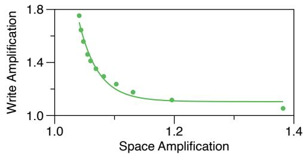  
Figure 1: Trade-off between write amplification and space amplification with compaction.

ByteDrive employs a compaction-based GC procedure operating on LogFiles. During compaction, ByteDrive collects the valid data in old LogFiles and writes them to new Log-Files, subsequently deleting the old LogFiles. As a result, the space occupied by stale data is reclaimed.

However, our early works on optimizing compaction present a fundamental trade-off (Fig. 1) between write amplification and space amplification. Write amplification arises from rewriting the valid data to new LogFiles during compaction, and space amplification stems from stale data on the SSD. To lower space amplification, we adopt a more aggressive compaction policy, which leads to higher write amplification and contention for foreground I/O. Ultimately, the space amplification and write amplification increase the Total Cost of Ownership (TCO) of the storage system by millions of dollars per month.

To motivate a more efficient GC method that improves this trade-off, we analyze the workloads from several representative types of services in ByteDance. We find that the workloads with AI model download/inference, inverted index building/updating, and distributed computing (e.g., Spark) show high write sequentiality. In these cases, over half of the writes modify contiguous ranges exceeding 256KiB. These workloads also show frequent overwrites that occur within seconds. This results in long, contiguous ranges of stale data on the LogFiles.

Based on these observations, we propose incorporating discard into the garbage collection process. Instead of moving valid data and deleting the entire LogFile, a discard request directly reclaims the space occupied by stale data on LogFiles, efficiently reclaiming long, contiguous ranges of garbage on LogFiles. This reduces space amplification without increasing write amplification, effectively lowering the TCO.

However, integrating discard into the multi-layer design of ByteDrive + ByteStore is non-trivial. First, the reclaimed ranges of the discard requests should align with the allocation units of the underlying layer, while they are usually misaligned between adjacent storage layers. For example, in the bottom data layout of ByteStore, each data block needs to store a checksum for data integrity, breaking the data alignment. This prevents discard requests from fully reclaiming garbage at the boundaries. Second, frequent discards trigger frequent metadata updates, consuming disk IOPS and causing contention with foreground I/O. Third, discard punches holes in the LogFiles, making the LogFiles sparse and thereby increasing the number of LogFiles. This increases the size of metadata in ByteStore and ByteDrive. Fourth, trim1 commands can help discard requests to reclaim physical space on SSD promptly. However, the maximum trim IOPS of SSDs varies across models. Without adequate trim IOPS, the SSD space isn’t reclaimed promptly, leading to aggressive SSD GC and degrading SSD foreground service quality.

We propose DisCoGC, a Discard-and-Compaction combined Garbage Collection scheme, to address the aforementioned challenges. To reclaim the garbage at the boundaries, DisCoGC extends the discard range to slightly overlap the adjacent, previously discarded range and aligns the allocation unit on LogFiles to the allocation unit on SSDs. To reduce the metadata modification overhead, DisCoGC batches the discard requests in the same LogFile and controls the discard parallelism/IOPS. DisCoGC executes compaction periodically to merge the fragmented LogFiles and chunks. We develop a trim filter to prioritize larger ranges and a trim merger to merge small ranges into large ones. These better utilize the SSD’s limited trim IOPS.

We deployed DisCoGC in our production clusters with mixed workloads. Configured with a 10% lower space amplification, DisCoGC reduces write amplification by 25% compared to the compaction-only GC without performance degradation. The lower space amplification and write amplification result in a 20% TCO reduction. To evaluate its effectiveness across different scenarios, we also tested DisCoGC with three different workloads from ByteDance and with the FIO [13] benchmark. For all workloads, DisCoGC demonstrates a superior trade-off between write amplification and space amplification without incurring a latency penalty, leading to a lower TCO. DisCoGC is particularly effective for highly sequential workloads with frequent overwrites, where it cuts TCO by over 25%. Random and fragmented workloads also benefit from DisCoGC for 2%-5%, demonstrating DisCoGC’s robustness and resilience.

<table><tr><td rowspan="2">Applications</td><td>FanQie Novel</td><td>TouTiao</td><td>FeiShu</td><td>DouBao</td><td></td></tr><tr><td colspan="4">Access through multi-layers via</td><td></td></tr><tr><td rowspan="2">Storage Services</td><td></td><td></td><td>different interfaces</td><td></td><td></td></tr><tr><td>ByteDrive</td><td>TOS</td><td>NAS</td><td>ByteGraph</td><td></td></tr><tr><td>Storage System</td><td colspan="4">ByteStore</td><td></td></tr></table>

Figure 2: Hierarchical storage stack in ByteDance.

Finally, we discuss several practical considerations for deploying DisCoGC. First, we recommend analyzing the write sequentiality and overwrite metrics in I/O traces to determine whether the workload is suitable for DisCoGC. Second, we describe how to tune key parameters to maximize the benefits of DisCoGC. Third, we explain how to configure trim-related optimizations based on the SSD’s maximum trim IOPS. Fourth, we share experiences on monitoring DisCoGC.

In summary, this paper makes the following contributions:

• We characterize the I/O patterns from production traces at ByteDance to guide GC optimization on the space amplification-write amplification trade-off.

• We design and implement DisCoGC, a technique that integrates discard with compaction and addresses the challenges of applying discard in a production appendonly storage system.

• We demonstrate the effectiveness of DisCoGC through monitoring the performance on production clusters and replaying traces on testbeds.

• We provide practical guidelines on when and how to apply DisCoGC in distributed append-only storage systems.

## 2 System Overview

ByteDance employs a hierarchical storage stack, as shown in Fig. 2, to manage all its data. The stack provides several storage services, such as ByteDrive, TOS and NAS, to support its upper-layer applications like DouBao [10], FeiShu [12] and TouTiao [15].

The foundation of these services is ByteStore, a distributed append-only storage system. The append-only storage systems offer several advantages over the in-place update ones. First, it seamlessly supports Erasure Coding (EC) for spaceefficient fault tolerance. Second, it simplifies data consistency as committed data remains immutable. Furthermore, preserving the history of changes simplifies implementing features like snapshot, version control, and crash recovery [18].

In this paper, we focus on ByteDrive and ByteStore. At ByteDance, ByteDrive is a critical service that manages thousands of clusters with exabyte-scale data. ByteDrive provides virtual disks for cloud computing instances, enabling a compute-storage disaggregated architecture.

## 2.1 ByteDrive

ByteDrive exposes virtual block devices (volumes) to users. To leverage the underlying ByteStore’s append-only semantics, ByteDrive converts random write requests to appendonly writes. It consists of two layers, the Volume layer and the Segment Layer, as shown in the upper part of Fig. 3.

The Volume Layer provides simple interfaces for random read, write, and trim operations at a 4KiB block granularity. Users access volumes via the BlockClient library. Internally, to enable parallelism, each volume’s Logical Block Address (LBA) space is partitioned into segments across different BlockServers. The mapping from segments to their server locations is managed by BlockMasters and cached in the BlockClients for efficient access. To ensure load balancing, data within a volume is organized into 128KiB stripes and spread across segments using a round-robin policy.

The Segment Layer converts random write requests on a segment to append-only requests on the underlying Byte-Store. When handling a write request, this layer first compresses the data at the block level to save storage space. It then adds a header to each compressed block to record compression details (e.g., LZ4 [14] or deflate [23]). Finally, these prepared blocks are written to ByteStore in an append-only manner. To keep track of the latest data location, this layer employs an LSM-Tree to map the LBA on the segment to the newest physical address in the ByteStore.

## 2.2 ByteStore

ByteStore is the foundational layer of ByteDance’s storage infrastructure, providing append-only persistence storage to higher-level storage services. ByteStore manages data in LogFiles and offers several interfaces through them, such as:

• append: append data to the end of a LogFile.

• read: read data from any offset within a LogFile.

• seal: make a LogFile immutable.

The lower part of Fig. 3 illustrates the LogFile layout.

## 2.2.1 LogFile Layout and Access

LogFiles offer a uniform, append-only view of storage to higher-level services and serve as the basic unit for GC. To enhance GC flexibility, ByteStore proposes limiting the maximum size of LogFiles to 2 GiB. Consequently, each Segment is mapped to one active data LogFile and zero or more sealed data LogFiles. The LogFile is composed of multiple chunks, each of which has multiple replicas by erasure coding or copies. The chunk size is configurable, typically ranging from tens to hundreds of MiB. This size balances two factors: smaller chunks provide greater flexibility for data migration and recovery, while larger chunks reduce metadata management overhead. Replicas of the same chunk are stored in different ChunkServers for data reliability.

The MetaServers manage two primary types of metadata: ➀ the attributes of each LogFile, such as total length, number of chunks, creation time, permissions, and redundancy policy (EC/replication); ➁ the attributes of each chunk, such as length and replica locations. The MetaServers also perform background operations for data consistency and reliability, such as reconstructing missing replicas.

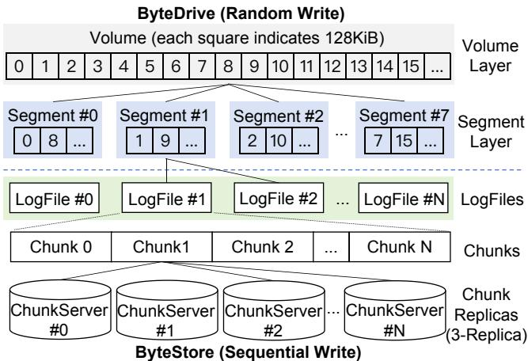  
Figure 3: The architecture of ByteDrive + ByteStore.

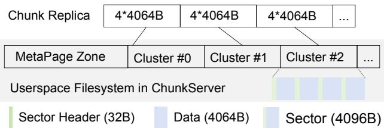  
Figure 4: Userspace filesystem (UFS) layout.

ByteStore SDK is the client library for accessing Byte-Store. To simplify fault tolerance logic on the server side, we adopt a heavyweight client SDK. The SDK is responsible not only for I/O requests processing but also for implementing the EC/replication protocols and handling client-side error recovery, such as request retries and backup reads.

## 2.2.2 Userspace Filesystem on ChunkServers

ChunkServer is designed to provide a high-performance and high-reliability chunk storage service within a single storage node. To achieve low latency and high throughput [20], we developed a userspace filesystem (UFS) for ChunkServers to replace kernel filesystems like Ext4 and XFS. Specifically, UFS avoids superfluous features (e.g., directory semantics, journaling) that incur additional write amplification, and developing a custom UFS is simpler than modifying an existing filesystem. In the UFS (Fig. 4), each chunk replica is managed as an individual file. The UFS also manages the QoS, concurrency, integrity verification, and buffer/direct I/O processing.

Self-contained chunk replica layout. To ensure both high data integrity and efficiency, the UFS uses a self-contained chunk replica layout. Specifically, each 4KiB sector is a selfcontained unit, with the first 32B reserved as a header for verification information (CRCs, data length) and the remaining 4064B2 for data. This co-location directly provides two advantages. For integrity, the UFS can validate each sector independently upon reads or recovery, ensuring write atomicity. For performance, both data and verification information can be accessed in a single, sequential I/O.

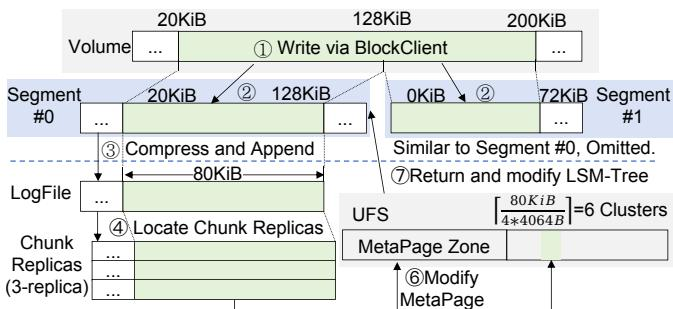  
For Each Replica ⑤Write Data with Attached Sector Headers  
Figure 5: Data flow of write on [20KiB,200KiB).

Disk layout. The UFS aggregates 4 sectors into a cluster as the allocation unit to balance the overhead of space management against internal fragmentation. The UFS maintains a MetaPage zone on the disk to store cluster allocation information and chunk-to-cluster mapping information.

## 2.3 Data Flow

This subsection uses an example (Fig. 5) to illustrate the standard data path of a user write request. In this case, the system is configured with 3-replica for fault tolerance.

Volume Layer. (§2.1) ➀ A ByteDrive user writes to the range [20KiB,200KiB) of a volume through the BlockClient. ➁ The BlockClient first determines that the range [20KiB, 128KiB) maps to the first segment as range [20KiB, 128KiB), and [128KiB, 200KiB) maps to the second segment as range [0KiB,72KiB). Then, the BlockClient sends the data of each range to the corresponding segment.

Segment Layer. (§2.1) ➂ For the first segment, after compression and the addition of block-level headers, the data size is 80KiB. The SDK then appends this 80KiB data to the end of the segment’s unsealed LogFile.

LogFile Layer. (§2.2.1) ➃ The ByteStore SDK first maps the tail of the LogFile to a target chunk. As a chunk consists of several replicas stored on different ChunkServers, the SDK then locates these servers. Finally, it issues write requests to all corresponding ChunkServers.

UFS. (§2.2.2) ➄ On each target ChunkServer, the UFS attaches sector headers (32B per 4064B data) to the 80KiB data, making it occupy 21 sectors (6 clusters). Next, the UFS allocates 6 clusters for this chunk. It then writes the data, along with its metadata and CRC, to these clusters and ➅ updates the MetaPages.

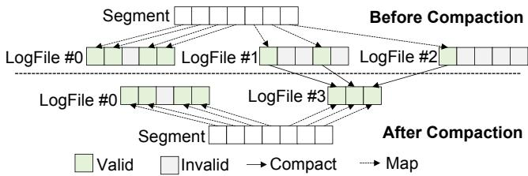  
Figure 6: Compaction process.

Returning. ➆ Finally, the result of the write operation is returned up through the layers. When the acknowledgement reaches the Segment Layer, the BlockServer updates the segment’s LSM-Tree for the latest data indexing.

## 3 Motivation

In this section, we identify the limitations of the compactiononly GC method used in early versions of ByteDrive + ByteStore. We then analyze ByteDrive volume traces from ByteDance’s production environment to guide the design of our GC optimizations.

## 3.1 Garbage Collection

LogFile compaction. The BlockServer periodically compacts LogFiles with a high garbage ratio. It determines the garbage ratio of each LogFile by scanning the LSM-tree to find stale data ranges. LogFiles will be compacted if their garbage ratio exceeds a preset threshold. This compaction process rewrites valid data from the old LogFiles to new Log-Files, and then deletes the old ones (Fig. 6).

Trade-off in compaction. Compaction-only GC has two types of overhead: write amplification and space amplification. Space amplification arises from stale data occupying space. Write amplification has two types: logical and physical. Logical write amplification (LWA) results from rewriting valid data to new LogFiles during compaction. Physical write amplification (PWA) is induced by SSD’s internal operations, such as SSD GC and wear leveling. The total write amplification (WA) is their product: WA = LWA ∗ PWA. Write amplification increases data written to NAND flash, consuming bandwidth, increasing latency, and reducing SSD lifespan.

Our early attempts at optimizing compaction-only garbage collection revealed a key challenge: write amplification and space amplification are negatively correlated. We tried to optimize space amplification by employing an aggressive GC policy. However, this not only increases Logical write amplification and accelerates SSD wear, but also degrades foreground I/O performance. The write amplification and space amplification cause millions of dollars in additional TCO every month in ByteDance.

## 3.2 Trace Analysis

Fig. 7 shows how the applications leverage the storage service. Applications require various backend services, such as recommendation, user management, and universal search.

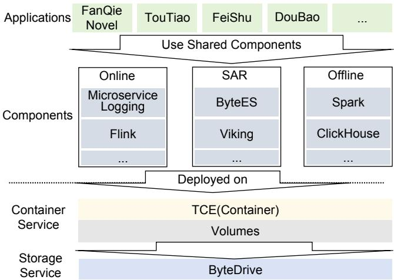  
Figure 7: Interaction between applications and ByteDrive.

Table 1: A summary of the workload characteristics.
<table><tr><td>Trace</td><td>online</td><td>SAR</td><td>offline</td></tr><tr><td>Total Write Size (TiB)</td><td>46.74</td><td>33.82</td><td>70.84</td></tr><tr><td>Write Count</td><td>5.28E+8</td><td>7.20E+7</td><td>1.38E+8</td></tr><tr><td>Total Read Size (TiB)</td><td>9.51</td><td>0.71</td><td>37.97</td></tr><tr><td>Read Count</td><td>2.21E+8</td><td>1.10E+7</td><td>6.52E+8</td></tr><tr><td>Duration (days)</td><td>2.64</td><td>1.74</td><td>2.60</td></tr><tr><td>Volume Size (TiB)</td><td>3.5</td><td>1.8</td><td>3.5</td></tr><tr><td>W:R Ratio (by Size)</td><td>4.92</td><td>47.48</td><td>1.87</td></tr><tr><td>W:R Ratio (by IOPS)</td><td>2.39</td><td>6.55</td><td>0.21</td></tr><tr><td>Writes per Day</td><td>2.00E+8</td><td>4.14E+7</td><td>5.31E+7</td></tr><tr><td>Reads per Day</td><td>8.37E+7</td><td>6.32E+6</td><td>2.51E+8</td></tr><tr><td>Write IOPS</td><td>2314.33</td><td>480.33</td><td>615.06</td></tr><tr><td>Read IOPS</td><td>968.52</td><td>73.34</td><td>2899.62</td></tr><tr><td>Write BW (MiB/s)</td><td>214.974</td><td>236.451</td><td>330.119</td></tr><tr><td>Read BW (MiB/s)</td><td>43.721</td><td>4.98</td><td>176.974</td></tr></table>

In ByteDance, each type of service can be provided by shared components. For example, both TouTiao [15] and FanQie Novel [11] require search and recommendation capabilities. Their search requirements are satisfied by ByteES and Viking [16], while the recommendation is handled by Spark [9] and Flink [8]. Each component runs as a container instance in ByteDance’s container engine (TCE). TCE uses ByteDrive’s volumes as virtual disks and formats them with the Ext4 filesystem.

These components’ workloads fall into three categories. ➀ Online: Real-time services with frequent scheduling. ➁ SAR (Search, Advertising, and Recommendation): inverted index building/updating and AI model download/ inference, scheduled at medium frequency. ➂ Offline: Long-term distributed computing jobs with infrequent scheduling.

We use blktrace [7] to capture I/O traces from the ByteDrive volumes under these three workloads. Table 1 summarizes the basic information of our traces. Our analysis focuses on write operations, as they are the primary cause of GC. We also present read statistics to inspire further research.

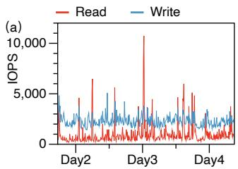

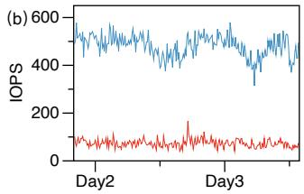

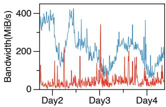

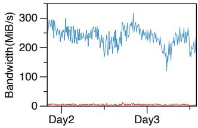

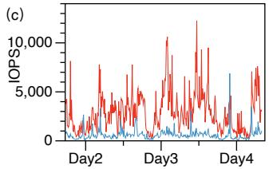

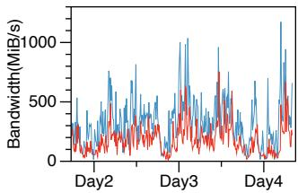  
Figure 8: IOPS & BW of (a) online (b) SAR (c) offline trace.

## 3.2.1 I/O Workload Dynamics

An analysis of the I/O traffic at 10-minute granularity shows distinct patterns for each workload (Fig. 8). ➀ Online trace (a): The write IOPS remains relatively stable with occasional bursts, while the write bandwidth exhibits a diurnal cycle. System writes may occur periodically for real-time service, while the bandwidth increases with higher user activity during the day. ➁ SAR trace (b): Both IOPS and bandwidth are stable because SAR workloads run at a constant rate. ➂ Offline trace (c): The trace shows drastic and stochastic I/O variations. This is because distributed computing jobs, which alternate between compute-intensive and I/O-intensive phases, are scheduled on demand without a fixed pattern.

Takeaway 1: Running GC during off-peak hours (e.g., at night) is unsuitable for our SAR and offline workloads, because they lack a predictable daily cycle.

## 3.2.2 I/O Size and Write Sequentiality

We profiled the size distributions for reads, writes, and sequential writes (Fig. 9). We define a sequential write as a group of one or more writes that are consecutive in time and contiguous in logical address space, since from the garbage collector’s perspective, a stream of contiguous writes effectively acts as a single large write. For example, the consecutive write requests, (offset=100, length=8), (offset=108, length=16), and (offset=124, length=8) are aggregated into a single sequential write of (offset=100, length=32).

Our key observations are as follows. ➀ Online: The trace remains fragmented after merging the sequential writes, with over 60% of writes at 4KiB and only 12% exceeding 256KiB. ➁ SAR: This trace has the best sequentiality. After merging, 65% of writes are larger than 256KiB, and just 15% are 4KiB.

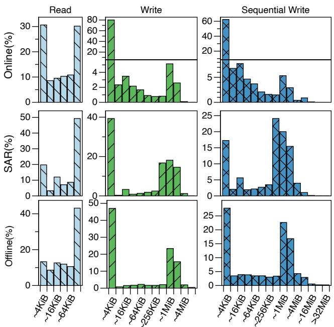  
Figure 9: Distribution of I/O size of three traces.

➂ Offline: This trace is also highly sequential but less than SAR, with 55% of writes larger than 256KiB after merging.

## 3.2.3 Fine-grained Write Analysis

We generate scatter plots (Fig. 10) to analyze hotspot shifts and overwrites in each trace. We observed ➀ Online trace (a): Most of the time, the hotspot probabilistically shifts to a new location every 5 seconds (left, 94% time). This pattern is attributed to the frequent scheduling of multiple containers with different hotspots sharing the same volume on TCE instances. Less frequently, sustained writes span the entire disk (right, 6% time). This stems from the internal GC of the user application, which also manages the virtual disk in an append-only manner. ➁ SAR trace (b): Writes are mostly sparse. However, this is interrupted by occasional bursts of dense, localized writes (left graph). These hotspots show frequent overwrites (right graph), resulting from inverted index build/update and AI model download/inference. ➂ Offline trace (c): It shows longer bursts of localized writes (left graph). Frequent overwrites also occur in these hotspots (right graph).

Takeaway 2: The SAR and offline workloads exhibit highly sequential writes and frequent overwrites. This behavior leads to large and contiguous garbage in the LogFiles. In contrast, the online workload features fragmented writes and sparse overwrites, causing fragmented garbage.

## 4 Design

In this section, we first present the insight behind the new GC mechanism, discard. A discard request reclaims an invalid range on LogFile in constant time, optimizing the trade-off between space amplification and write amplification during compaction, especially for the workload with large, contiguous garbage. Then, we discuss the challenges in integrating discard into multi-layer storage stacks like ByteDrive + Byte-Store. Finally, we propose DisCoGC, a GC mechanism combining discard and compaction to overcome the challenges.

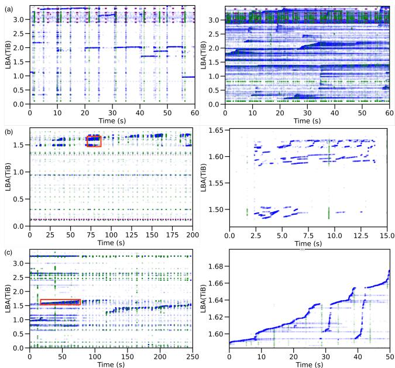  
Figure 10: Scatter plots of (a) online (b) SAR (c) offline trace. Each blue point is a data write, and each green point is a metadata write. For (b) and (c), the graph on the right is a zoomed-in view of the red box in the graph on the left.

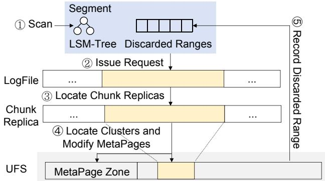  
Figure 11: Discard execution flow.

## 4.1 LogFile Discard Mechanism

Discard reclaims physical space from specified ranges in a LogFile. With discard, BlockServers avoid reading valid data from old LogFiles and rewriting it to the new ones, reducing space amplification without increasing write amplification.

The discard process is top-down and asynchronous, spanning the entire system from the Segment Layer down to the UFS Layer. The process involves five steps (Fig. 11): ➀ The BlockServer scans the LSM-tree of each segment to identify invalid LogFile ranges that have not yet been discarded. ➁ The BlockServer issues discard requests to ByteStore for each range via ByteStore SDK. ➂ The SDK maps the Log-

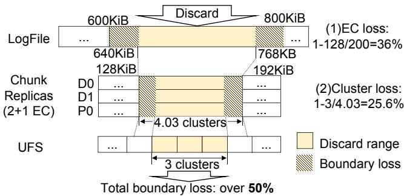  
Figure 12: Boundary loss of a discard request.

File ranges to chunk-level ranges and then locates the chunk’s replicas. ➃ The SDK notifies the respective ChunkServers to discard these ranges in their UFS. The UFS first locates the cluster corresponding to the ranges. It then modifies the MetaPage to free the clusters. ➄ Upon completion, the Block-Server records the successfully discarded ranges to prevent repeated discarding of these ranges. The reclaimed clusters can be allocated to other chunks for newly appended data.

However, deploying discard in a multi-layer storage system introduces several challenges. First, discard requests reclaim ranges aligned to allocation units in each layer. However, the allocation units between adjacent layers are often misaligned, which prevents the system from reclaiming space at the discard boundaries. Second, frequent discard operations require many metadata updates, which causes contention for disk I/O and CPU. Third, discard operations cause fragmentation in LogFiles and chunks, which in turn increases the metadata management overhead. Finally, the trim command enables the UFS to reclaim SSD space promptly. This action reduces space utilization, which in turn leads to less frequent GC and a lower physical write amplification. But the maximum trim IOPS is limited on some SSDs. To address these challenges, we propose DisCoGC, with detailed designs presented in §4.2-§4.5.

## 4.2 Mitigation of Boundary Loss

The problem of boundary loss. Boundary loss arises from inter-layer data misalignments due to mismatched allocation units and compression. It prevents the reclamation of garbage data at boundaries. Over time, such unreclaimed garbage accumulates, leading to non-negligible space waste.

Boundary loss occurs in two primary aspects (Fig. 12): (1) EC loss: When employing EC for fault tolerance, the SDK must discard data in units of complete EC stripes (e.g., multiples of 64KiB for a 4+1 EC scheme with 16KiB stripes) on the LogFile. However, discard requests issued by the Block-Server are of arbitrary sizes and may not align with EC stripes. (2) Cluster loss: The UFS must perform discards aligned to its allocation unit (cluster, each contains 4\*4064B data). However, the packet size of EC stripes is usually a multiple of 4KiB. As a result, the discard requests issued to the UFS are also of a multiple of 4KiB, which aren’t cluster-aligned.

The BlockServer cannot detect boundary loss during LSMtree scans. Moreover, tracking boundary loss information across these two layers incurs substantial memory overhead. For instance, a single EC stripe may contain multiple discarded sub-ranges, making it hard to maintain with a memoryefficient data structure.

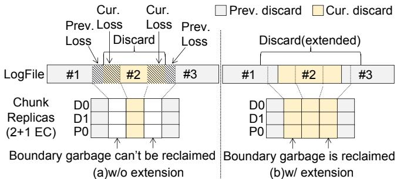  
Figure 13: Extend discard range to eliminate EC loss.

Boundary extension. The discard operation is reentrant on the same discarded range, so the BlockServer extends discard ranges to mitigate EC loss. Specifically, when the BlockServer discards a range on the LogFile, it checks if the range is adjacent to a previously discarded range. If so, the BlockServer extends the current discard range towards the adjacent discarded range by up to a few MiB. This extension not only reclaims boundary garbage from the previous discard, but also prevents a new boundary loss.

Fig. 13 illustrates an example. Two grey ranges, #1 and #3, have been previously discarded. However, this led to boundary loss for both: the right boundary of #1 and the left boundary of #3. Now, a new discard range #2 appears between them. (a) Without boundary extension, discarding range #2 causes new boundary loss on its left and right boundaries, which makes two EC stripes unreclaimable. (b) In contrast, with boundary extension, the discard range is extended to slightly overlap with ranges #1 and #3. This eliminates the boundary losses between range #2 and its neighbors at the LogFile.

Discard-friendly EC stripes. We eliminate cluster loss by aligning the stripe unit size in EC stripes with the cluster size. Specifically, we configure the stripe unit size to be n ∗ 4 ∗ 4064B. Since LogFiles accommodate arbitrary request sizes, this alignment does not impact the efficiency of write and discard operations. Fig. 14 illustrates the cluster loss caused by misaligned EC stripes (a) and its elimination with clusteraligned EC stripes (b).

## 4.3 Discard Batching and Scheduling

MetaPage update overhead on UFS. Each discard request on the UFS requires modifying the MetaPage, which entails SSD writes and consumes CPU resources. When a burst of discard requests arrives (e.g., the BlockServer issues excessive discard requests during one round of the LSM-tree scan), the foreground throughput and latency will be degraded.

Discard batching. The UFS needs to modify the MetaPage only once when multiple discard requests target the same chunk. Therefore, we introduce discard batching. The Block-Server groups multiple discard ranges of the same LogFile into one discard request to alleviate the MetaPage modification overhead. The maximum number of ranges in one discard request is configurable (between 1 and 64).

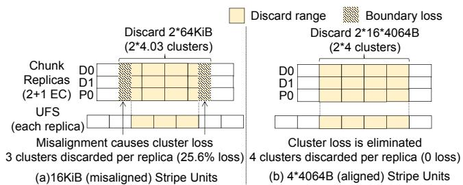  
Figure 14: Discard-friendly EC stripes eliminate cluster loss (sector headers are omitted).

Discard task scheduling mechanism. To prevent excessive discard requests from degrading overall performance, the BlockServer implements a parallelism-aware discard task scheduler that maximizes space reclamation efficiency while limiting the number of concurrent requests. Discard tasks are generated at the segment granularity, with parallelism capped at P. Periodically, the BlockServer selects the top-k segments with the largest discard ranges, where k is computed based on P and the number of ongoing tasks. For each selected segment, the BlockServer maps discard ranges to their corresponding LogFiles and batches those ranges per LogFile into a single discard request, which is then sent to ByteStore.

Flow control. Despite the use of batching and parallelism control, a large number of discardable ranges in segments still cause a burst of discard requests. We employ a discard flow control mechanism in BlockServer. It limits the maximum discard IOPS to mitigate performance variations.

## 4.4 Coordination of Compaction and Discard

Metadata overhead from fragmentation. Discard operations lead to sparse and fragmented LogFiles and chunks. While the SSD space usage in ChunkServer remains stable, the number of LogFiles and chunks increases. Consequently, this increases the metadata overhead for the BlockServer’s LogFile index, the MetaServer’s chunk index, and the UFS’s MetaPage management.

Observation: Compaction and discard have complementary effects. Compaction can prevent fragmented LogFiles and chunks by moving data, but incurs write amplification. Discard is the inverse. This observation leads to a coordinated strategy: We use lightweight, high-frequency discard operations as the primary mechanism for garbage reclamation, while employing relatively low-frequency compaction to mitigate fragmentation and alleviate metadata pressure.

Garbage ratio calculation. We define "Valid Data" as the data in a LogFile that is still referenced by the segment’s index. "Total Data" refers to all undiscarded data in the LogFile.

In the system with compaction-only GC, the BlockServer calculates the garbage ratio (GR) of a LogFile as:

$$
G R = 1 - { \frac { V a l i d ~ D a t a } { T o t a l ~ D a t a } }
$$

However, discard operations introduce boundary loss. We estimate the loss per boundary (LPB) as half of the EC stripe length and then calculate GR as:

$$
G R = 1 - \frac { V a l i d \ : D a t a } { T o t a l \ : D a t a + L P B * B o u n d a r i e s }
$$

Scheduling compaction. Compaction and discard are scheduled independently in BlockServer. BlockServer schedules compaction tasks using dual-mode, with a scheduling interval on the order of minutes. In typical scenarios, compaction selects the top-k segments with the highest garbage ratio, reclaiming space occupied by boundary losses and small undiscardable garbage fragments to further reduce space amplification. However, when the BlockServer detects that the number of LogFiles reaches a preset threshold, indicating significant metadata overhead, compaction switches to selecting the top-k segments with the most LogFiles. This strategy alleviates metadata overhead while reducing overall fragmentation. The value of k is managed by a parallelism control mechanism, similar to discard scheduling.

Compared to compaction-only GC, DisCoGC induces marginally higher fragmentation, leading to more frequent SSD garbage collection and a 2%–10% increase in physical write amplification. However, DisCoGC leverages its discard mechanism to reduce data movement during GC processes. Consequently, despite the higher physical write amplification, the total bytes written to the NAND flash are reduced, thereby extending the device’s lifespan.

## 4.5 Trim Filter and Merger

Observation: Consistent latency for sub-size-threshold trims. Through empirical observations across various SSD models and discussions with SSD vendors, we find that trim latency remains low (under 1 ms) and consistent when the trim size is below a certain threshold (e.g., 128MiB for SSD Model A in Table 2).

This stems from SSDs’ two-phase trim implementation. When the trim command arrives, the flash translation layer (FTL) writes the trim log in the foreground, invalidates the corresponding data in the SSD’s internal write cache, and signals completion to the host. Then, the FTL updates the LBA-to-PBA Table asynchronously in the background. For larger trim sizes, to avoid conflicts with the write cache, the FTL flushes the write cache before processing trim, resulting in higher latency in the foreground.

Challenge: Insufficient trim IOPS of SSD. Despite the efficient handling of small trims, we observed that trim IOPS fails to meet the system demands for frequent GC. As shown in Table 2, the trim IOPS is lower than write IOPS (e.g., 3% for SSD Model B). Two problems arise from this: (1) By default, the space in UFS is marked "released" after the trim command succeeds. Untimely trim delays space reclamation, potentially exhausting UFS capacity and causing system failures. (2) Delayed trim prolongs the retention of invalid data, hampering SSD GC efficiency. It results in a higher SSD space usage, leading to an aggressive SSD GC. Finally, the physical write amplification increases, and the SSD’s foreground service quality degrades.

Table 2: Specifications of the SSDs used in evaluation.
<table><tr><td>Model</td><td>A</td><td>B</td></tr><tr><td>Interface</td><td>PCIe 5.0</td><td>PCIe 4.0</td></tr><tr><td>Capacity (TiB)</td><td>7.68</td><td>7.5</td></tr><tr><td>Cell Type</td><td>TLC</td><td>TLC</td></tr><tr><td>R/W BW (GiB/s)</td><td>13.0/9.0</td><td>6.5/3.5</td></tr><tr><td>R/W IOPS</td><td>2800 K/400K</td><td>900 K/200 K</td></tr><tr><td>Trim IOPS</td><td>160K</td><td>6K</td></tr></table>

Approach: Trim filter and merger. Based on the observation above, we implement trim filter and merger in the UFS. Trim filter issues trim only for large ranges (e.g., ≥128KiB). This reduces the number of trims without increasing trim latency. Trim merger merges small ranges adjacent in LBA into a large range, which can be trimmed by one command. Overall, trim filter and merger reduce the number of trims at the cost of a slight increase in physical write amplification.

## 5 Deployment & Implementation

Deployment. Due to data safety implications, we deploy DisCoGC in stages. We start with the offline cluster, where business criticality is lower than online, to ensure manageable risks via progressive rollout. To further ensure data safety, we enable DisCoGC on a per-volume basis. This approach minimizes the impact of potential failures and enables targeted performance monitoring during gradual deployment.

During the canary deployment phase, we enabled mock discard in production: unlike regular discard, this mode only logs the discard status in memory without releasing actual data. This approach validated software correctness and ensured data safety. Following the successful completion of this phase, DisCoGC has been deployed on large-scale clusters.

Crash consistency. In our design, discard related metadata is maintained in the memory of BlockServer. Therefore, the discard mechanism only needs to handle the crash consistency of the metadata in BlockServer. The crash consistency of ByteStore is ensured by its original design.

BlockServer guarantees the crash consistency by using a per-segment discard LogFile with a Write-Ahead Logging (WAL) mechanism. It maintains the "issued discard ranges" in the memory and persists the ranges to the discard LogFile after step ➀ in §4.1. The "successfully discarded ranges" are maintained and persisted in a similar way after step ➄. When the system restarts, BlockServer reads logs from the discard LogFile. Then it compares the "issued" and "successfully discarded" ranges to find and retry the interrupted discard.

Memory management. BlockServers use two bitmaps to track the "issued" and "successfully discarded" ranges for each LogFile. Each bit in these bitmaps represents a 4KiB block of uncompressed data.

To decrease memory overhead, we employ two techniques. First, the garbage ranges are long and contiguous, so there are continuous "0"s and "1"s in the bitmaps. We use roaring bitmap [19] to compress the bitmaps, which reduces the bitmap size by half. Second, instead of tracking "successfully discarded ranges" directly, we record the failed ones in a "failed bitmap". The "successful bitmap (S)" can be easily derived from "issued bitmap (I)" and "failed bitmap (F)" by S = I&(∼ F). The discard failure is rare in most cases, thus the "failed bitmap" is sparser and easier to compress. This further decreases the total bitmap size by 25%-45%.

## 6 Evaluation

In this section, we will answer the following questions:

• How does DisCoGC work in production clusters in ByteDance (§6.2)?

• How does the performance of DisCoGC compare to compaction-only GC under various workloads (§6.3)?

• What is the performance impact of each design within DisCoGC (§6.4)?

• How do the SSD space usage and flow control configuration affect performance (§6.5)?

• How do the trim command and trim filter/merger affect the effectiveness of DisCoGC (§6.6)?

• How does DisCoGC affect CPU and memory consumption compared to the compaction-only approach (§6.7)?

## 6.1 Experimental Setup

In §6.2, we present performance in our production clusters. Each server in the clusters is equipped with dual 24C48T CPUs, 256 GiB of DRAM, 200 Gbps network, and 16 SSDs. To understand how DisCoGC performs variably across different workloads and parameters, we also conduct evaluations on an offline testbed in subsection §6.3-§6.7. The offline testbed is a ByteDrive + ByteStore cluster, which employs 10 servers configured identically to those in the production cluster. These evaluations are conducted using the three traces mentioned in §3.2 and the FIO benchmark. Table 2 lists the specifications of the SSDs used in our evaluation. Unless otherwise specified, all experiments use model A.

## 6.2 Production Cluster Performance

We capture some key metrics from the monitor of our production clusters. The clusters run a mixed workload comprising online, SAR, and offline workloads. The space amplification for the baseline (compaction-only) and DisCoGC is kept at 1.37 and 1.23, respectively. Our observations are as follows:

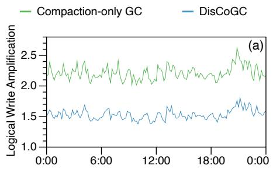

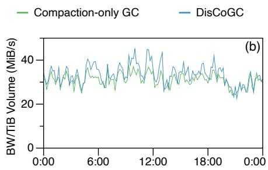

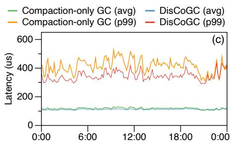

Figure 15: Production cluster performance. (a) Logical write amplification. (b) Per-TiB-volume bandwidth. (c) Latency.  
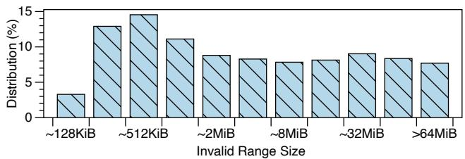  
Figure 16: Invalid range size distribution.

Invalid range size. Monitoring the invalid range size in LogFiles (Fig. 16) shows that over 90% invalid ranges are larger than 128KiB, and over 70% exceed 1MiB. This high proportion of large invalid ranges indicates that the mixed workload is well-suited for DisCoGC.

Logical write amplification. The logical write amplification remained stable throughout the observation period as Fig. 15 (a). Compared to the baseline, DisCoGC decreases the logical write amplification by 32%. This improvement is accompanied by a 10% decrease in space amplification and an increase of up to 10% in physical write amplification (total write amplification decreased by 25%). This indicates DisCoGC actually improves the trade-off between space amplification and write amplification for the mixed workload. Ultimately, DisCoGC reduces the TCO by 20% in the production clusters.

Latency and bandwidth. As Fig. 15 (b, c), DisCoGC has negligible impact on latency and per-TiB-volume bandwidth. This is because our design ensures the discard operation is lightweight.

## 6.3 Overall Performance

In this subsection, we evaluate logical write amplification and foreground write latency (avg, p99) as a function of space amplification. We use the three traces described in §3.2 and a synthetic FIO workload (random writes at 32MiB granularity using 64KiB blocks). We keep the SSD usage constant while replaying each trace. The physical write amplification, which results from the SSD’s internal operations, remains stable throughout the evaluation. We observe:

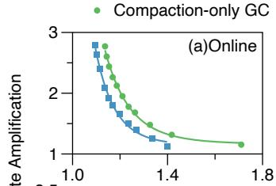

1 DisCoGC  
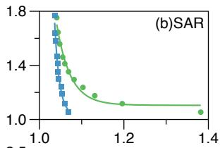

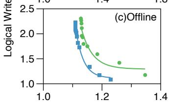

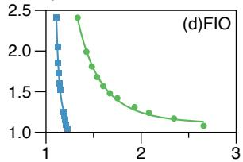  
Space Amplification  
Figure 17: Relationship between space amplification and logical write amplification.

Logical write amplification. With DisCoGC, the space amplification-logical write amplification curves for all four traces shift towards the lower-left (Fig. 17). This leads to a better trade-off between space amplification and logical write amplification and a lower TCO.

The benefits vary across workloads because the DisCoGC is most efficient for large garbage. In ByteDance’s traces, the SAR trace gains the largest improvement from DisCoGC, which generates large and contiguous garbage as mentioned in §3.2.3. We estimate that this delivers a TCO reduction of over 25%. The online workload benefits the least from DisCoGC due to fragmented garbage. This also presents the robustness of DisCoGC, because it still brings improvement for an unsuitable workload. In the worst case, DisCoGC can fall back to compaction-only. Even in this fallback mode, DisCoGC achieves a 2%-5% TCO saving. The FIO workload also shows a notable improvement from DisCoGC.

Write latency. Adopting DisCoGC has a negligible impact on foreground latency for each workload (Fig. 18). This is similar to the production cluster metrics.

## 6.4 Factor Analysis

We evaluate the individual contribution of each technique in DisCoGC. We replay the three traces using a fixed space amplification for each trace (online: 1.2, SAR: 1.05, offline: 1.2), then measure the logical write amplification and the discard ratio (the proportion of discarded ranges’ total size to the discardable data’s total size). The baseline is compactiononly GC. Fig. 19 shows the results.

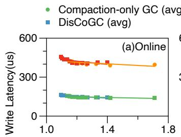

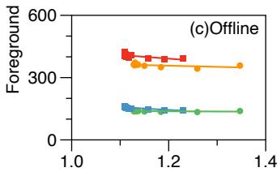

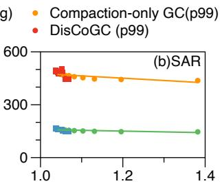

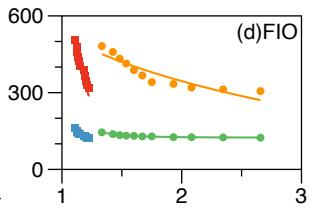  
Space Amplification

Figure 18: Relationship between space amplification and foreground write latency.  
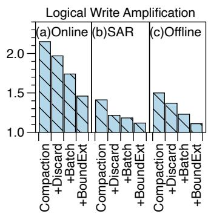

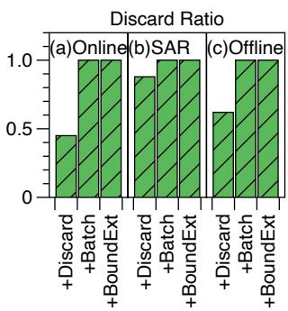  
Figure 19: Factor analysis.

+Discard. Enabling discard and flow control leads to an 8.4%-13.9% reduction in logical write amplification across all traces. The system performs fewer compactions as discard reclaims some garbage. The discard ratio is 0.45-0.88, indicating that the flow control throttles some discard requests.

+Batch. Enabling discard batching with a batch size of 64 further drops the logical write amplification by 2.7%-11.7% and increases the discard ratio to nearly 1. Batching reduces the total number of discard requests, allowing nearly all the requests to be processed, thus reducing compaction and optimizing the logical write amplification.

+BoundExt. Finally, the boundary extension completes the DisCoGC design and decreases the logical write amplification by another 5.5%-16.1%. This is because boundary extension reclaims the garbage at the boundaries, which improves the GC efficiency, thus lowering the logical write amplification at the same space amplification.

In addition, foreground bandwidth and latency remained stable across all configurations for each trace.

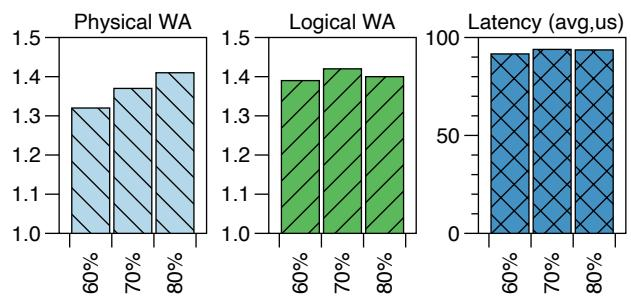  
SSD Space Usage

Figure 20: Performance with different SSD space usage.  
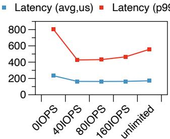

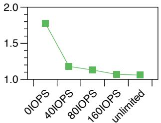  
Figure 21: Performance with different discard IOPS limit.

## 6.5 Sensitivity analysis

This subsection evaluates system performance under varying SSD space usage and flow control parameters.

## 6.5.1 SSD Space Usage

We replayed an offline trace to evaluate the performance impact of the ByteDrive SSD space usage. The space amplification is kept at 1.2. In production, ByteDrive reserves at least 20% SSD space for potential sudden large-amount data write, limiting maximum SSD space usage to 80%. Our experiments adopt the same SSD water level parameters as production. Fig. 20 shows the results. We observed a similar trend with the online and SAR traces.

We observed that a higher SSD space usage leads to a higher physical write amplification, as it triggers more aggressive SSD GC. However, the SSD space usage does not affect logical write amplification. As introduced in §4.4, the limited parallelism of compaction determines the amount of compaction writes. Foreground latency also remains unchanged, as SSD GC is not the bottleneck under this SSD space usage.

## 6.5.2 Flow Control

As described in §4.3, flow control serves as a fallback strategy for handling discard bursts by throttling the request rate. We run a heavy synthetic FIO workload (random writes at 8MiB granularity using 64KiB blocks) to evaluate the impact of the discard IOPS limit. In this experiment, a higher IOPS limit permits a higher throughput of discard operations. The "0 IOPS" disables discard, forcing the system to rely on compaction-only GC. The space amplification is kept at 1.5.

Fig. 21 illustrates that a higher discard IOPS limit results in a lower logical write amplification by collecting more garbage.

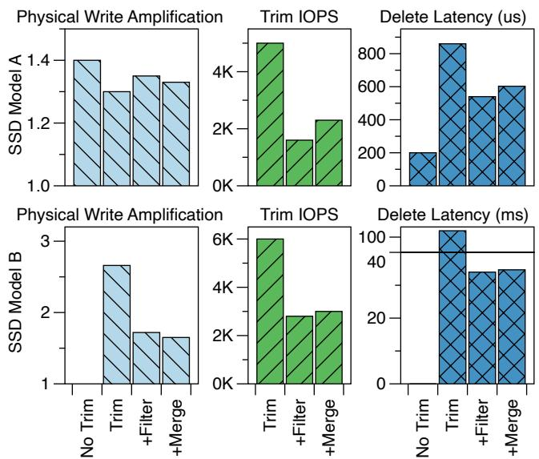  
Figure 22: The impact of trim-related optimizations across different SSD models.

However, with a non-zero discard IOPS limit, the higher discard IOPS limit leads to worse latency, because discard operations compete with foreground I/O for CPU resources.

## 6.6 Trim

We evaluate the effect of trim-related optimizations on DisCoGC using the FIO benchmark (random writes at 8MiB granularity using 64KiB blocks). The experiments are conducted on the SSD models listed in Table 2 with other optimizations, such as boundary extension, enabled.

We record physical write amplification, trim IOPS, and delete latency during the evaluation (Fig. 22). physical write amplification indicates the aggressiveness of the GC process and is a critical metric for SSD endurance. trim IOPS are used to measure the effectiveness of our trim filter and merger. "Delete latency" is the average latency of deleting a chunk (may contain several ranges to trim on SSD) during compaction. As mentioned in §3.1, the compaction process deletes all compacted LogFiles and their underlying chunks, issuing a burst of trim commands significantly denser than discard operations. Therefore, "Delete Latency" indicates trim performance under high-density conditions.

## 6.6.1 SSD Model A

Trim. Enabling trim reduces the physical write amplification from 1.4 to 1.3 by avoiding unnecessary data movement during the SSD GC. The delete latency increases by 600us, which is the cost of the trim operations. However, for SSD model A, the additional delete latency induced by trim is acceptable and does not become the performance bottleneck.

+Filter. Enabling the 128KiB filter slightly increases the physical write amplification to 1.35, as small ranges that are not trimmed cause redundant writes during GC. The trim IOPS without filter (5K/s) does not reach the SSD’s trim

IOPS limitation (160K/s), further restricting the trim IOPS by filter degrades performance.

+Merge. Merging achieves a physical write amplification of 1.33, which is lower than the trim+filter configuration, but higher than the trim-only case. The higher physical write amplification than trim-only is caused by two factors: some small ranges fail to merge, while some merged ranges may be moved multiple times before being merged and trimmed.

## 6.6.2 SSD Model B

Trim. With only the trim command enabled, we observe a very high physical write amplification and delete latency. This is because the trim IOPS on the SSDs reach the limit. Consequently, the SSD space fails to be freed in a timely manner, which leads to aggressive SSD GC, degraded foreground performance, and potential system crash (§4.5).

We didn’t evaluate the performance without trim, because the SSD GC capability is also poor. Relying only on SSD GC would cause the system to fail more quickly.

+Filter. With a 128KiB filter, physical write amplification decreases to 1.74, the trim IOPS decreases to 2.8K, and the delete latency is reduced to 34ms. The filter directs UFS to trim larger ranges, which not only relieves SSD trim burden but also decreases the SSD space usage and avoids aggressive SSD GC.

+Merge. Enabling the trim merger further reduces the physical write amplification to 1.65. This is achieved by merging small ranges into larger ones to better utilize the trim IOPS. trim IOPS and delete latency slightly increase after merging.

In conclusion, the trim command optimizes DisCoGC on all SSDs. However, for SSDs with inadequate trim IOPS, additional optimizations are required.

## 6.7 CPU and Memory Usage

We observed the CPU and memory usage by replaying the offline trace with 60% SSD space usage and space amplification=1.25. DisCoGC reduces the CPU usage to 82.9% of compaction-only GC, while slightly increasing memory usage to 102.9%. The reduction in CPU usage results from reduced compactions, which are CPU-intensive due to heavy read and write operations. While DisCoGC requires extra memory to maintain discard bitmaps, this overhead is effectively controlled by the methods in §5.

## 7 Lessons Learned

Should we adopt DisCoGC? Trace analysis can determine whether an append-only storage system benefits from DisCoGC. As shown in §3.2 and §6.3, our experience is: (1) If the workload is sequential with frequent overwrites, adopt DisCoGC without hesitation. (2) If the workload is random and fragmented, the benefits do not justify the implementation effort. (3) If the workload is mixed, we can adopt DisCoGC with confidence for its robustness.

How to set DisCoGC parameters? DisCoGC can be finetuned through several key parameters (§4.3), including ranges per discard batch, discard parallelism and maximum discard IOPS (for flow control). First, we tune the maximum batch size to 32 or 64 to prevent CPU usage bursts in ChunkServers. Second, we limit the maximum discard IOPS to ensure that the CPU overhead increases by less than 2% in the worst case. Lastly, while maintaining the average CPU overhead at 1.2%, we maximize the other parameters to the greatest possible.

After tuning, in most cases, the batch size is approximately 10, and the CPU usage of DisCoGC is about 1%. A write burst triggers a large amount of discard requests, causing garbage to initially accumulate due to the parallelism limit. This accumulation increases the stale ranges in each LogFile, which in turn enlarges the batch size to accelerate garbage reclamation. In an extreme burst, the batch size and discard IOPS both increase to the threshold. Then, discard alone cannot reclaim garbage effectively, and the garbage ratio of the LogFiles increases, then the garbage is reclaimed by compaction. Discard batching, parallelism control and flow control work in concert to cap the maximum CPU and SSD usage of DisCoGC. This ensures foreground service quality during bursts.

Do we need trim optimizations? As observed in §6.6, the effectiveness of the trim command and its related optimizations vary across different SSD models. Therefore, we can choose the target SSD models by comparing their maximum trim IOPS with the workload’s demand.

If an SSD’s maximum trim IOPS can meet the workload’s demand without extra optimizations or foreground performance degradation, we can only enable trim and disable other optimizations. For other SSDs, enabling both the trim filter and merger is more effective than using the filter alone. We can enable both optimizations and tune the filter size to constrain the trim IOPS to below 85% of the SSD’s maximum trim IOPS, thereby preventing impact on foreground services.

How to monitor DisCoGC? The monitor triggers an alert to the site reliability engineer (SRE) if the discard ratio is below 80% for more than 10 minutes while SSD space usage is above 85% and still increasing. This indicates that discard requests are being throttled by the parallelism and flow controls, and compaction cannot reclaim the garbage promptly. Consequently, the SSD is at risk of running out of space.

The SRE’s response depends on system load. If the overall I/O utility is below 70%, the SRE increases the discard task parallelism and maximum discard IOPS. Otherwise, if the cluster has offline workloads, the SRE throttles the offline I/O. If the I/O utility is high and no workload can be throttled, the SRE adds some backup ChunkServers to the ByteStore cluster or migrates some volumes to another ByteDrive cluster.

## 8 Related Work

Write and space amplification. In flash-based SSDs, the problem of write amplification from the flash translation layer (FTL) gains attention [27], as it degrades flash lifetime. In addition to the device-level write amplification, researchers identify the write amplification from the file system layer [32], which also leads to flash lifetime issues. The write amplification problem has been intensively studied since then in both file systems [30, 31, 40] and key value stores [21, 37–39]. Besides write amplification, the space amplification problem is discussed in different storage systems [22, 24–26, 36].

Cross-layer garbage collection. In flash storage, there are a number of research attempts to address the garbage collection redundancy and the conflict between the file system and FTL layers. Researchers have tried to open up the SSD for direct flash management (a.k.a., Software Managed Flash or Open-Channel SSD) with only a single-layer garbage collection [32], and also tried to coordinate the garbage collection operations between different layers [17, 33, 40].

The extension of the trim or discard command between operating systems and SSD devices was extensively discussed around 2010 [1–6, 34]. The trim or discard command allows filesystems to inform the SSD controller to invalidate an LBA range. After a range is trimmed, the corresponding space on the SSD is freed, and the stale data will no longer be migrated in the GC process, which improves the GC efficiency [28]. Slack Space Recycling [35] allows new writes to reuse the log space of stale data. The stale data is discarded through direct overwriting, a process that avoids compaction. IPLFS [29] virtualizes an unlimited logical address space of filesystems by using discard/trim commands to abandon stale data.

In comparison, DisCoGC addresses unique challenges of multi-layer garbage collection in cloud storage, and presents experiences of real production usage.

## 9 Conclusion

Guided by production trace analysis in ByteDance, we propose DisCoGC, a GC method that coordinates compaction and discard for multi-layer cloud storage systems. DisCoGC reclaims long, contiguous ranges of stale data efficiently while addressing the challenges of integrating discard into a multilayer storage system. We deploy it in real cloud storage, and online monitoring demonstrates that DisCoGC improves the space amplification-write amplification trade-off and lowers TCO by about 20% without degrading performance.

## Acknowledgments

We appreciate our shepherd, Ramnatthan Alagappan, and the anonymous reviewers for their valuable feedback. This work is supported by the National Key R&D Program of China (Grant No. 2024YFE0203300), the National Natural Science Foundation of China (Grant No. 62332011), Beijing Natural Science Foundation (Grant No. L242016), and ByteDance.

## References

[1] Block Layer Discard Requests[LWN.net], 2008. https: //lwn.net/Articles/293658/.

[2] Linux\_2\_6\_28 - Linux Kernel Newbies, 2008. https: //kernelnewbies.org/Linux\_2\_6\_28.

[3] Engineering Windows 7: Support and Q&A for Solid-State Drives, 2009. https://web.archive.org/we b/20100425050749/http://blogs.msdn.com/e 7/archive/2009/05/05/support-and-q-a-for -solid-state-drives-and.aspx.

[4] libata: Add Translation for SCSI WRITE SAME (aka TRIM Support) - kernel/git/torvalds/linux.git - Linux Kernel Source Tree, 2009. https://git.kernel.o rg/pub/scm/linux/kernel/git/torvalds/lin ux.git/commit/?id=18f0f97850059303ed73b1 f02084f55ca330a80c.

[5] Linux\_2\_6\_33 - Linux Kernel Newbies, 2010. https: //kernelnewbies.org/Linux\_2\_6\_33.

[6] Mac OS X 10.6.8 Brings TRIM Support for Apple SSDs, Graphics Improvements, 2011. https://www.macrum ors.com/2011/06/27/mac-os-x-10-6-8-bring s-trim-support-for-apple-ssds-graphics-i mprovements/.

[7] blktrace - block tracing utilities, 2015. https://gith ub.com/sdsc/blktrace.

[8] Apache Flink - Stateful Computations over Data Streams, 2025. https://flink.apache.org/.

[9] Apache Spark - Unified Engine for Large-scale Data Analytics, 2025. https://spark.apache.org/.

[10] Doubao - AI Assistant by ByteDance, 2025. https: //www.doubao.com/chat/.

[11] Fanqie Novel, 2025. https://fanqienovel.com/.

[12] Feishu | Productivity Superapp for Chat, Meetings, Docs & Projects, 2025. https://www.feishu.cn/.

[13] Flexible I/O Tester, 2025. https://github.com/axb oe/fio.

[14] LZ4 - Extremely Fast Compression, 2025. https:// github.com/lz4/lz4.

[15] Toutiao, 2025. https://www.toutiao.com/.

[16] VikingDB - BytePlus, 2025. https://www.byteplus .com/en/product/vectordatabase.

[17] Matias Bjørling, Javier Gonzalez, and Philippe Bonnet. LightNVM: The Linux Open-Channel SSD Subsystem. In 15th USENIX Conference on File and Storage Technologies, FAST’17, pages 359–374, Santa Clara, CA, USA, February 2017. USENIX Association.

[18] Brad Calder, Ju Wang, Aaron Ogus, Niranjan Nilakantan, Arild Skjolsvold, Sam McKelvie, Yikang Xu, Shashwat Srivastav, Jiesheng Wu, Huseyin Simitci, et al. Windows Azure Storage: A Highly Available Cloud Storage Service with Strong Consistency. In Proceedings of the 23rd ACM Symposium on Operating Systems Principles, SOSP’11, pages 143–157, Cascais, Portugal, October 2011. Association for Computing Machinery.

[19] Samy Chambi, Daniel Lemire, Owen Kaser, and Robert Godin. Better Bitmap Performance with Roaring Bitmaps. Software: Practice and Experience, 46(5):709– 719, 2016.

[20] Hao Chen, Chaoyi Ruan, Cheng Li, Xiaosong Ma, and Yinlong Xu. SpanDB: A Fast, Cost-Effective LSM-tree Based KV Store on Hybrid Storage. In 19th USENIX Conference on File and Storage Technologies, FAST’21, pages 17–32, Santa Clara, CA, USA, February 2021. USENIX Association.

[21] Youmin Chen, Youyou Lu, Fan Yang, Qing Wang, Yang Wang, and Jiwu Shu. FlatStore: An Efficient Log-Structured Key-Value Storage Engine for Persistent Memory. In Proceedings of the 25th International Conference on Architectural Support for Programming Languages and Operating Systems, ASPLOS’20, page 1077–1091, New York, NY, USA, March 2020. Association for Computing Machinery.

[22] Niv Dayan, Tamar Weiss, Shmuel Dashevsky, Michael Pan, Edward Bortnikov, and Moshe Twitto. Spooky: granulating LSM-tree compactions correctly. Proceedings of the VLDB Endowment, 15(11):3071–3084, 2022.

[23] Peter Deutsch. DEFLATE Compressed Data Format Specification Version 1.3. Technical report, 1996.

[24] Siying Dong, Mark Callaghan, Leonidas Galanis, Dhruba Borthakur, Tony Savor, and Michael Strum. Optimizing Space Amplification in RocksDB. In 8th Biennial Conference on Innovative Data Systems Research, CIDR ’17, volume 3, page 3, Chaminade, CA, USA, 2017. CIDR Foundation.

[25] Zhuohui Duan, Hao Feng, Haikun Liu, Xiaofei Liao, Hai Jin, and Bangyu Li. AegonKV: A High Bandwidth, Low Tail Latency, and Low Storage Cost KV-Separated LSM Store with SmartSSD-based GC Offloading. In 23rd USENIX Conference on File and Storage Technologies, FAST ’25, pages 321–335, Santa Clara, CA, USA, 2025. USENIX Association.

[26] Ruwen Fan, Minhui Xie, Haodi Jiang, and Youyou Lu. MaxEmbed: Maximizing SSD Bandwidth Utilization for Huge Embedding Models Serving. In Proceedings of the 29th ACM International Conference on Architectural Support for Programming Languages and Operating Systems, ASPLOS’24, volume 4, pages 188–202, San Diego, CA, USA, April 2024. Association for Computing Machinery.

[27] Xiaoyu Hu, Evangelos Eleftheriou, Robert Haas, Ilias Iliadis, and Roman Pletka. Write Amplification Analysis in Flash-based Solid State Drives. In The Israeli Experimental Systems Conference, SYSTOR’09, New York, NY, USA, May 2009. Association for Computing Machinery.

[28] Dong Hyun Kang and Young Ik Eom. iDiscard: Enhanced Discard() Scheme for Flash Storage Devices. In 2018 IEEE International Conference on Big Data and Smart Computing, BigComp’18, pages 360–366, Shanghai, China, January 2018. IEEE.

[29] Juwon Kim, Minsu Kim, Muhammad Danish Tehseen, Joontaek Oh, and Youjip Won. IPLFS: Log-Structured File System without Garbage Collection. In 2022 USENIX Annual Technical Conference, USENIX ATC’22, pages 739–754, Carlsbad, CA, USA, July 2022. USENIX Association.

[30] Changman Lee, Dongho Sim, Jooyoung Hwang, and Sangyeun Cho. F2FS: A New File System for Flash Storage. In 13th USENIX Conference on File and Storage Technologies, FAST’15, pages 273–286, Santa Clara, CA, USA, February 2015. USENIX Association.

[31] Youyou Lu, Jiwu Shu, and Wei Wang. ReconFS: A Reconstructable File System on Flash Storage. In 12th USENIX Conference on File and Storage Technologies, FAST’14, pages 75–88, Santa Clara, CA, USA, February 2014. USENIX Association.

[32] Youyou Lu, Jiwu Shu, and Weimin Zheng. Extending the Lifetime of Flash-based Storage through Reducing Write Amplification from File Systems. In 11th USENIX Conference on File and Storage Technologies, FAST’13, pages 257–270, San Jose, CA, USA, February 2013. USENIX Association.

[33] Youyou Lu, Jiacheng Zhang, Zhe Yang, Liyang Pan, and Jiwu Shu. OCStore: Accelerating Distributed Object Storage with Open-Channel SSDs. In 2019 IEEE 39th International Conference on Distributed Computing Systems, ICDCS’19, pages 271–281, Dallas, TX, USA, July 2019. IEEE.

[34] David Nellans, Michael Zappe, Jens Axboe, and David Flynn. ptrim() + exists(): Exposing New FTL Primitives

to Applications. In 2nd Annual Non-Volatile Memory Workshop, NVMW’11, La Jolla, CA, USA, March 2011. Center for Memory and Recording Research, UCSD.

[35] Yongseok Oh, Eunsam Kim, Jongmoo Choi, Donghee Lee, and Sam H Noh. Optimizations of LFS with Slack Space Recycling and Lazy Indirect Block Update. In Proceedings of the 3rd Annual Haifa Experimental Systems Conference, SYSTOR’10, pages 1–9, New York, NY, USA, May 2010. Association for Computing Machinery.

[36] John Ousterhout, Arjun Gopalan, Ashish Gupta, Ankita Kejriwal, Collin Lee, Behnam Montazeri, Diego Ongaro, Seo Jin Park, Henry Qin, Mendel Rosenblum, Stephen Rumble, Ryan Stutsman, and Stephen Yang. The RAM-Cloud Storage System. ACM Transactions on Computer Systems, TOCS, 33(3):1–55, August 2015.

[37] Chen Shen, Youyou Lu, Fei Li, Weidong Liu, and Jiwu Shu. NovKV: Efficient Garbage Collection for Key-Value Separated LSM-Stores. In 36th International Conference on Massive Storage Systems and Technology, MSST’20, Santa Clara, CA, USA, October 2020. IEEE.

[38] Jing Wang, Youyou Lu, Qing Wang, Minhui Xie, Keji Huang, and Jiwu Shu. Pacman: An Efficient Compaction Approach for Log-Structured Key-Value Store on Persistent Memory. In 2022 USENIX Annual Technical Conference, USENIX ATC’22, pages 773–788, Carlsbad, CA, USA, July 2022. USENIX Association.

[39] Jiacheng Zhang, Youyou Lu, Jiwu Shu, and Xiongjun Qin. FlashKV: Accelerating KV Performance with Open-Channel SSDs. ACM Transactions on Embedded Computing Systems, TECS, 16(5s):1–19, September 2017.

[40] Jiacheng Zhang, Jiwu Shu, and Youyou Lu. ParaFS: A Log-Structured File System to Exploit the Internal Parallelism of Flash Devices. In 2016 USENIX Conference on Usenix Annual Technical Conference, USENIX ATC ’16, page 87–100, Denver, CO, USA, June 2016. USENIX Association.