①

USENIX

THE ADVANCED COMPUTING SYSTEMS ASSOCIATION

# How Soon is Now? Preloading Images for Virtual Disks with ThinkAhead

Xinqi Chen, Shanghai Jiao Tong University; Yu Zhang, Alibaba Group; Erci Xu, Shanghai Jiao Tong University; Changhong Wang, Jifei Yi, Qiuping Wang, Shizhuo Sun, and Zhongyu Wang, Alibaba Group; Haonan Wu, Shanghai Jiao Tong University; Junping Wu, Hailin Peng, Rong Liu, Yinhu Wang, Jiaji Zhu, and Jiesheng Wu, Alibaba Group; Guangtao Xue, Shanghai Jiao Tong University; Shanghai Key Laboratory of Trusted Data Circulation, Governance and Web3; Patrick P. C. Lee, The Chinese University of Hong Kong

## https://www.usenix.org/conference/fast26/presentation/chen

This paper is included in the Proceedings of the 24th USENIX Conference on File and Storage Technologies.

February 24–26, 2026 • Santa Clara, CA, USA

ISBN 978-1-939133-53-3

Open access to the Proceedings of the 24th USENIX Conference on File and Storage Technologies is sponsored by

# How Soon is Now? Preloading Images for Virtual Disks with ThinkAhead

Xinqi Chen1, Yu Zhang2, Erci Xu\*1, Changhong Wang2, Jifei Yi2, Qiuping Wang2, Shizhuo Sun2, Zhongyu Wang2, Haonan Wu1, Junping Wu2, Hailin Peng2, Rong Liu2, Yinhu Wang2, Jiaji Zhu2, Jiesheng Wu2, Guangtao Xue1,3, and Patrick P. C. Lee4

1Shanghai Jiao Tong University, China 2Alibaba Group, China

3Shanghai Key Laboratory of Trusted Data Circulation, Governance and Web3, China 4The Chinese University of Hong Kong, China

## Abstract

Efficient cloud computing relies on high-performance Elastic Block Storage (EBS) services, where virtual disk (VD) image loading significantly affects user experience. While the commonly used “lazy loading” approach reduces cold-start time from minutes to sub-seconds, our trace analysis of around 160,000 real-world image loading events in Alibaba EBS reveals that slow I/Os during initial block access constitute the primary performance bottleneck, accounting for 40% of all slow I/Os. We propose ThinkAhead, a data-driven image preloading system for VDs. ThinkAhead comprises various techniques to predict efficient block preloading sequences for images with historical traces based on runtime conditions and address corner cases with limited or no historical traces. Trace-driven simulation and cluster experiments show that ThinkAhead improves the data block hit rate by up to 7.27× and reduces tail waiting time by up to 98.7% across various image types compared to lazy loading and various baselines.

## 1 Introduction

Elastic Block Storage (EBS) is a cornerstone of modern cloud computing, and provides virtual machines (VMs) and containers with high-performance, scalable, and reliable block-level virtual disks (VDs). A critical feature of EBS is to allow users to create snapshots of VDs as images for backup and recovery. Users can create and instantiate new VDs from these images.

To optimize cost, cloud vendors typically store images in a remote object storage service (OSS), such that VDs are created through the pull-and-mount process over an intercluster datacenter network. A straightforward approach for VD creation is to directly pull all data blocks from the OSS, but this clearly leads to significant delays, especially for large images. Thus, cloud vendors often adopt lazy loading, which pulls data blocks on demand to enable near-instantaneous VD access. However, lazy loading can result in waiting latency spikes when accessing data blocks that have not yet been loaded and require retrieval from the OSS.

We analyze field traces in a production EBS environment at Alibaba, which has millions of VD creation events daily. Our trace analysis, covering 160,000 VDs created from 2,500 images, indicates that lazy loading contributes to over 40% of slow I/Os (defined as end-to-end latency exceeding 1 s) in the EBS software stack and becomes a dominant contribution in service-level objective (SLO) violations. Despite various optimizations for lazy loading, such as caching [19, 27, 39], peer-to-peer cooperation [23, 41, 49], and new image abstraction [35], they face different limitations and are unsuitable for large-scale EBS production (§3.4).

Nevertheless, our trace analysis reveals strong similarities in access patterns for VDs created from the same image across both temporal and spatial dimensions. Also, the frequent VD creations in our production environment provide abundant traces for characterizing access patterns, thereby enabling highly accurate inference. Thus, we explore preloading as a promising alternative to lazy loading, by proactively fetching data blocks from the OSS based on predicted access patterns. However, enabling effective preloading faces various challenges, including inconsistent or incomplete traces due to network instability and I/O reordering, fluctuating network bandwidth caused by co-located services (e.g., LLM training [36]), and zero-shot scenarios where images may lack sufficient historical traces for accurate inference.

We propose ThinkAhead, a data-driven image preloading system designed to mitigate slow I/Os during VD creations in large-scale EBS deployment. ThinkAhead comprises three components: (i) data preprocessing, which filters outliers from I/O traces and extracts features to handle variability caused by I/O losses or reordering; (ii) score-based block selection, which uses a score-based genetic algorithm to determine efficient block preloading sequences for images with historical traces based on runtime conditions; and (iii) zeroshot prediction, which employs metadata-based similarity to preload data for images with limited or no historical traces.

We evaluate ThinkAhead using both high-fidelity simulations driven by production Alibaba EBS workloads and cluster experiments deployed in production environments. Evaluation shows that ThinkAhead effectively increases the data block hit rate (where a block is preloaded to local storage before a read) by up to 7.27× and reduces tail wait latency by 98.7% compared to lazy loading. Additional experiments, including overhead and ablation studies, confirm ThinkAhead’s adaptiveness, robustness, and lightweight design.

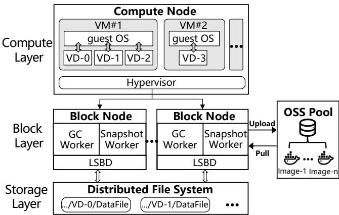  
Figure 1: Alibaba EBS architecture (§2.1).

We summarize our contributions as follows:

• Trace analysis: Our field trace analysis identifies the root causes of slow I/Os in production Alibaba EBS and provides insights applicable to general EBS snapshot services.

• ThinkAhead design: ThinkAhead adopts a data-driven image preloading design that significantly outperforms the commonly deployed lazy loading approach, evaluated with trace-driven simulations and cluster experiments.

• Artifact availability: We release our ThinkAhead prototype at https://github.com/Master-Chen-Xin-Qi/ FAST26\_AE, and the production I/O traces of image booting collected from Alibaba EBS at https://tianchi. aliyun.com/dataset/216164.

## 2 Background

## 2.1 Elastic Block Storage (EBS)

Modern EBS services (e.g., Alibaba [1], Amazon [5], Azure [8], and Google [12]) adopt a compute-storage disaggregated architecture to provide virtual disks (VDs) with high availability and flexibility. As shown in Figure 1, the Alibaba EBS architecture comprises three components: (i) compute layer, which contains multiple compute nodes that host VMs attached with user-subscribed VDs, while the hypervisor inside each compute node forwards VD requests to backend storage clusters via an inter-cluster network; (ii) block layer, which contains multiple block nodes that translate block I/O semantics into file semantics using a log-structured block device (LSBD) module and transmit requests to the storage layer via an intra-cluster network; and (iii) storage layer, which manages the storage of VD data within an underlying distributed file system (e.g., Ceph [51] and Pangu [33]).

Within the block layer, each block node employs a garbage collection (GC) worker to reclaim space from stale data. A

Snapshot Worker manages the uploads and downloads (i.e., pulls) of VD snapshots stored in a remote object storage system (OSS) (e.g., Alibaba Cloud OSS [3] and AWS S3 [7]).

## 2.2 VD Snapshots

VD snapshots are point-in-time backups of EBS VDs that persist independently of the source volume. Snapshots facilitate backups, disaster recovery, and rapid deployment, so as to ensure data consistency and mitigate service disruption in cloud environments. Each snapshot is replicated using erasure coding or 3-way replication, and stored in an OSS. To create a VD from a snapshot, data must be retrieved from the OSS and written to the EBS volume before user access.

VDs are categorized into two types: system VDs and data VDs. System VDs are instantiated from operating system (OS) images, while data VDs can be created from user snapshots or instantiated with empty data. In this paper, we use the term “images” to refer to snapshots of system VDs. Also, we focus on optimizing system VD creations, as system VDs are accessed first during OS booting and may experience performance bottlenecks (§3.3). Images are typically stored in different formats (e.g., qcow2, vhd, etc.), and classified into four types: public, user-defined, shared, and community images. Public images (e.g., Ubuntu OS) are provided by cloud vendors, while user-defined images are derived from public images by users. Shared and community images are created and shared by users via peer-to-peer or public platforms, but are seldom used in production due to security concerns. In this paper, we focus on public and user-defined images, with user-defined images accounting for 1.26× the number of VDs created from public images in our dataset (§3.1).

## 2.3 Image Loading

When a Snapshot Worker creates a system VD for a VM or container, it needs to first retrieve the system image from the remote OSS. A naïve full loading approach is to download the entire image before serving I/O requests. However, full loading incurs significant delays due to limited network bandwidth and large image sizes. For example, downloading a 40 GiB image under 20 MB/s requires around 34 minutes. This leads to unacceptable cold-start delays for users, especially in containerized environments [22, 26, 34].

Thus, EBS and similar storage services adopt a lazy loading approach [2,4,19], which enables immediate VM or container startup by fetching image data on demand as blocks are requested. While lazy loading eliminates cold-start delays by responding promptly to I/O requests, the first access to a data block still incurs waiting delays until the data is retrieved from the remote OSS. Ultimately, the entire image data must reside within the EBS cluster, regardless of whether the data is accessed by the user.

Table 1: Entries of VD creation metadata (§3.1).
<table><tr><td>Entry</td><td>Explanation</td></tr><tr><td>Creation time</td><td>Creation time of the VD</td></tr><tr><td>Image ID</td><td>ID of the accessed image</td></tr><tr><td>Image family</td><td>Name of the OSdistribution</td></tr><tr><td>Volume ID</td><td>ID of the created VD</td></tr><tr><td>User ID</td><td>ID of the user who creates the VD</td></tr><tr><td>Cluster ID</td><td>ID of the cluster where the VD is created</td></tr><tr><td>Meta info</td><td>Parameter configuration of the VD</td></tr></table>

## 3 Trace Analysis

We present a trace-driven analysis to characterize the image loading process and evaluate the impact of slow I/Os under lazy loading in production Alibaba EBS environments. We also discuss the limitations of alternative approaches.

## 3.1 Trace Overview

We collected traces from the production EBS architecture at Alibaba. Our traces comprise two parts. The first part includes per-block I/O traces collected from around 160,000 VDs created from around 2,500 distinct images across tens of Alibaba EBS clusters during the period between March 2025 and May 2025. For each VD creation, we capture the first six minutes of I/O record traces, which we collectively refer to as a trace sequence; that is, the same image may be used to create multiple VDs and hence correspond to multiple trace sequences. The initial six-minute period is critical, as over 95% of slow I/Os (i.e., operations with end-to-end latency exceeding 1 s) occur during this phase. Each trace entry includes I/O type (i.e., read or write), offset, length, and timestamp. We also record the metadata of each VD creation, such as image ID, creation time, volume ID, and image family (i.e., the OS distribution, such as Ubuntu, Debian, etc.), as shown in Table 1. Note that existing public block I/O traces from various vendors (e.g., Alibaba Cloud [16, 53], Tencent Cloud [55], and Microsoft [38]) do not include start-up I/O patterns and cannot be used in our study. The second part includes statistical data on slow I/Os observed in Alibaba EBS clusters between October 2023 and October 2024.

## 3.2 Key Characteristics in Image Loading

We analyze key characteristics of image loading in various aspects, using our collected I/O traces.

Default block size for efficient image loading. Achieving efficient network I/Os is challenging due to the overhead of handling numerous network packets [35]. In our deployment, images are partitioned into fixed-size blocks for block-level pulling. Small block sizes offer fine-grained granularity, but degrade network efficiency and increase the likelihood of I/O requests spanning block boundaries, leading to additional data pull requests. Conversely, large block sizes incur latency penalties due to the prolonged pulling process. Figure 2 depicts the percentage of reads spanning multiple blocks for various block sizes in public and user-defined images. At a block size of 2 MiB, only 2.1% of reads span multiple blocks, while the remaining reads can be served by a single block pull. We adopt a fixed 2 MiB block size as the default for the following reasons. First, this size balances network efficiency and access granularity while incurring a low cross-block read rate (2.1%). Second, although profiling-based block-size optimization can be applied to different images, it has only marginal benefits, but adds system complexity and stability risks.

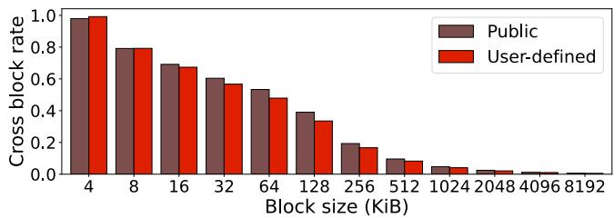  
Figure 2: Cross block rate versus block size (§3.2). With a 2 MiB block size, the rates for public and user-defined images are 2.5% and 2.1%, respectively.

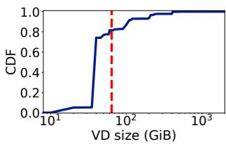

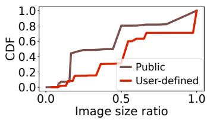  
Figure 3: System VD size dis- Figure 4: Ratios of image size to tribution (§3.2). VD size (§3.2).

Long tails in VD and image sizes. Figure 3 shows the size distribution of system VDs. We see a long-tail distribution with sizes up to 2,048 GiB, while 80% of VDs are smaller than 64 GiB (labeled as the red line). Figure 4 also shows the ratio of the exact image size to the created VD size. The median (P50) ratios for public and user-defined images are 0.5 and 0.55, respectively. This indicates that image sizes are around half the VD size. User-defined images are larger due to the inclusion of private application data.

Long tails in the number of images accessed per user. Figure 5 shows the number of images accessed for VD creations per user. It shows a long-tail distribution, with a single user using up to 60,000 images for VD creations. However, 57.9% of users access only a single image. Among these users accessing a single image, 95.0% of them only create one VD. We refer to the phenomenon with only a single VD creation as zero-shot, which indicates the absence of historical trace sequences for analyzing access patterns.

High spatial and temporal dynamics in VD creations. We examine the distribution of the number of clusters where an image is accessed; a larger number means that the access to an image is more spatially spread across clusters. Here, we focus on the top 1,000 most frequently accessed images. As shown in Figure 6, the P50 number of clusters is 21, with the peak reaching 133 clusters, accounting for nearly 40% of clusters within a region. The reason is that the EBS central controller monitors real-time cluster status and dynamically allocates VDs across clusters. This shows that image access exhibits significant spatial dynamics across clusters.

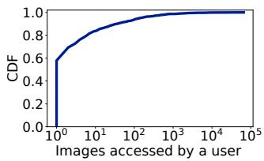  
Figure 5: Number of image accessed per user (§3.2).

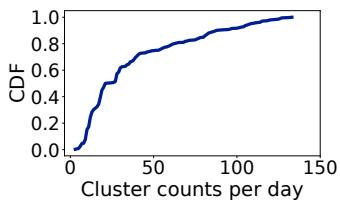  
Figure 6: Cluster counts of accessed images (§3.2).

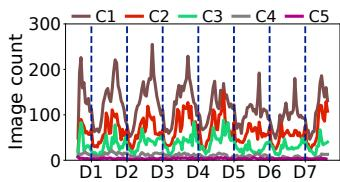

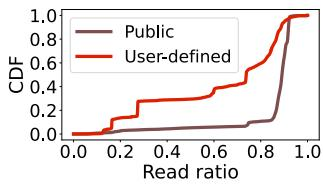  
Figure 7: Number of accessed im- Figure 8: Read ratios of differages during a week (§3.2). ent images (§3.2).

Figure 7 shows the hourly count of accessed images across seven days (D1-D7) for five representative clusters (i.e., the clusters where the number of created VDs is close to the regional average), with 12:00 noon defined as the daily start. The number of accessed images in the largest cluster can be up to 30× that of the smallest, following a diurnal pattern with a peak at around 5:00 pm and a trough at 3:00 am. Furthermore, the overlap of images accessed between consecutive days is less than 5%, indicating high temporal dynamics.

Dominant reads in image booting. Since writes can be executed directly on local storage nodes without data retrieval from the OSS, our preloading design focuses on reads. Figure 8 shows the read ratios within the first three minutes for public and user-defined images. Reads dominate during the image boot phase, with an average of 84.9% for public images and 62.3% for user-defined images. One possible reason for the difference between public and user-defined images is that many VDs of user-defined images issue OS and database maintenance updates immediately after startup.

Similar access patterns in image booting. We analyze the read patterns during the booting process for the two most commonly used images, Ubuntu 22.04 and Windows Server 2019. Figure 9 plots the block IDs (with a block size of 2 MiB) being read within the first 120 s for both images. Both images exhibit similar access patterns. First, the first read always starts at a logical block address (LBA) of 0, since the first 512 bytes of the disk header contain the Master Boot Record (MBR) or Globally Unique Identifier Partition Table (GPT) [45], which verifies the partition table and initiates OS booting after hardware self-checks. Second, the OS kernel reads the disk tail to retrieve the GPT backup for verification. Finally, the reads form distinct stripes, which access small portions of the VD’s LBA space, and frequently switch between stripes.

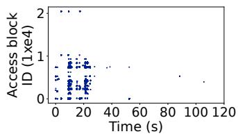  
(a) Ubuntu 22.04

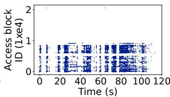  
(b) Windows Server 2019  
Figure 9: Read access patterns of two images (§3.2).

Table 2: Top five causes of slow I/Os (§3.3).
<table><tr><td>Slow I/O cause</td><td>Rate[%]</td></tr><tr><td>Lazy loading</td><td>39.35</td></tr><tr><td>BlockClient queuing</td><td>26.44</td></tr><tr><td>VD migration</td><td>7.09</td></tr><tr><td>Inside BlockClient</td><td>6.01</td></tr><tr><td>Distributed file system</td><td>2.98</td></tr></table>

## 3.3 Dominance of Slow I/Os in Lazy Loading

In the EBS deployment within Alibaba, slow I/O events occur frequently at an average rate of around 700,000 per day. We have collected slow I/Os in the production EBS clusters over a one-year period (from October 2023 to October 2024), including their root causes. Inspired by previous work [30, 47], we employ a random-forest-based approach to classify and diagnose these slow I/Os. Note that we only focus on the slow I/Os generated by the EBS software stack, excluding hardwarerelated issues such as low-performance hard disks and disk failures. Our analysis identifies over 60 distinct causes for software-induced slow I/Os.

Table 2 shows the reasons and proportions for the slow I/O events from the top five root causes. Lazy loading accounts for 39.35% of all slow I/Os, significantly exceeding the second most common cause, BlockClient queuing (26.44%). Figure 10 shows the lazy loading latency distribution, with the P99 tail latency reaching up to 7 s. Figure 11 presents the distributions of the slow I/O ratio caused by lazy loading and the proportion of clusters affected by slow I/Os from lazy loading per day. For slow I/Os caused by lazy loading, the P50 ratio is 60.3%, with a maximum of 98.3%. Also, 82.0% of clusters (P50) experience slow I/Os due to lazy loading. Such distributions, which encompass both temporal and spatial dimensions, show that lazy loading is the culprit for slow I/Os in the Alibaba EBS software stack, independent of user or application characteristics and widespread across clusters.

While lazy loading significantly reduces cold-start latency when user VMs are launched (§2.3), the access latency of OSS (averaging in milliseconds) is orders of magnitude higher than that of the EBS system (averaging in microseconds).

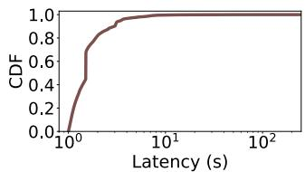  
Figure 10: Lazy loading latency (§3.3).

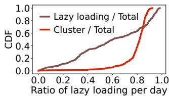  
Figure 11: Lazy loading ratios over time and clusters (§3.3).

During years of EBS deployment, we observe that the initial block-pulling process incurs a large number of slow I/Os on first-time block access. This issue is particularly severe in container computing services, where VDs are frequently created and deleted within minutes. Such slow I/Os greatly degrade user experience, so mitigating slow I/Os from lazy loading is critical for improving system performance.

## 3.4 Limitations of Existing Approaches

Some approaches can be used to mitigate slow I/Os caused by lazy loading. We classify them into three groups: (i) caching [19, 20, 39], (ii) peer-to-peer cooperation [13, 17, 41, 49], and (iii) new image abstraction [35]. However, each approach has notable limitations and is unsuitable for Alibaba EBS.

Caching stores frequently accessed images in proximal storage clusters for fast access, yet it is challenged by the dynamic nature of images in production. Over 80% of system VDs are user-defined, and such images have heterogeneous user data that makes caching ineffective. In addition, the created VDs may be distributed across dozens of distinct clusters, and the number of images created varies significantly at different times. Such spatial and temporal dynamics complicate the image caching design, especially when caching is deployed across multiple clusters subject to network bandwidth constraints. While AWS offers a cache-based snapshot acceleration service [6], it requires users to specify target regions and incurs extra costs, rendering it inadequate for large-scale production deployment.

Peer-to-peer cooperation mitigates network bandwidth constraints between EBS and OSS by accelerating VD image transfers across storage nodes. However, its effectiveness heavily depends on image popularity. Similar to caching, the spatial and temporal dynamics of VD creation make peerto-peer cooperation non-trivial. In such cases, image pulling from peers may be even slower than direct retrieval from the remote OSS. Moreover, peer-to-peer networks can face performance degradations within EBS clusters, especially when the peak single-machine traffic is excessive. Furthermore, the lack of trustworthiness in peer nodes introduces security risks.

FlacIO [35] proposes a new image abstraction using runtime page caches on host nodes to mitigate slow I/Os caused by lazy loading. However, it has two major limitations. First, it drastically alters the I/O path and image format, making it generally incompatible for large-scale production (e.g., within Alibaba). Second, it is tailored for layer-based container images, which differ inherently from the binary VD image format used in Alibaba EBS. A general optimization approach for mitigating slow I/Os is more desirable.

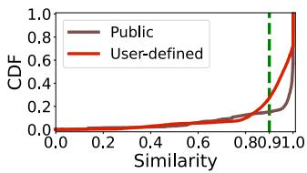  
Figure 12: Cosine similarity between two VDs of the same image (§4.1).

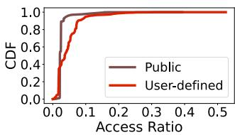  
Figure 13: Access ratios of public and user-defined images (§4.1).

## 4 Preloading: A Promising Approach?

Given the limitations of existing solutions for mitigating slow I/Os in image loading, we explore preloading as an alternative approach. Preloading aims to accurately predict which data blocks and when they will be accessed during image loading, thereby enabling proactive scheduling of data retrieval from the OSS to fully utilize network bandwidth and mitigate slow I/Os. Our analysis of production traces (§3) reveals four opportunities for designing an effective preloading approach and three challenges that must be addressed.

## 4.1 Opportunities

High similarity in access patterns within the same image. Although VD creation exhibits high spatial and temporal diversity across clusters (§3.2), we observe strong intra-image similarity during image booting. A key insight is that VDs created from the same image show significant similarity, and the I/O order of a VD creation event can be inferred from the prior creations on the same image. To quantify the similarity, we select the top 100 images, and for each image, randomly sample 50 VDs. We compute the cosine similarity [14] of their I/O patterns, using a threshold of 0.9 to indicate strong correlation. Figure 12 shows that 84.8% of public images and 72.7% of user-defined images exhibit high similarity, making data-driven preloading a promising strategy.

Strong spatial locality in image loading. Our analysis also reveals that only a small fraction of LBAs are accessed during the initial phase of image loading, indicating strong spatial locality. This is especially critical given the limited bandwidth allocated by the OSS for image downloads. Figure 13 shows the access ratios of read I/Os (i.e., the proportions of accessed LBAs over all LBAs in VDs) in the first six minutes. On average, the access ratios are 2.67% for public images and 4.55% for user-defined images. User-defined images have slightly higher access ratios due to file fragmentation and extra components (e.g., system configuration and journal files) being loaded.

Large-scale historical traces. Building a data-driven preloading mechanism requires substantial historical data for training. At Alibaba, we have analyzed extensive historical image loading records, including around 4,000 images spanning across around 200,000 VDs and around 100 clusters per day. Notably, Figure 14 shows that, even for less popular user-defined images, the top 100 of them have at least ten historical VD creations over a 10-week period.

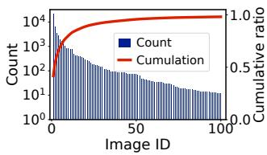  
Figure 14: VD creation counts and cumulative ratio of top 100 images (§4.1).

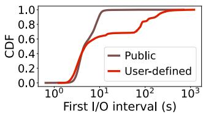  
Figure 15: Interval between a VD creation and the first read I/O (§4.1).

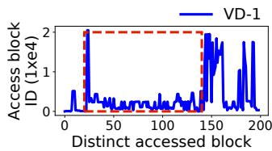

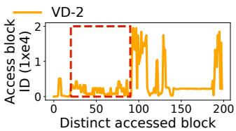  
Figure 16: Access pattern deviations for two VDs created from the same image (§4.2).

Extra grace period. An additional opportunity arises from the grace time interval between VD creation and the first read request. As shown in Figure 15, this time interval is often substantial, where the P50 interval exceeds 4 s for both public and user-defined images. The reason is that after a VD is created, there are often extra setup tasks, such as waiting for external services to become available [44, 50], before VMs or containers issue their first read. This grace period allows preloading critical data blocks from the OSS in advance.

## 4.2 Challenges

Challenge 1: Variability in I/O traces. I/O traces can be unreliable due to traffic bursts on block servers, which may cause user-issued I/Os to be lost and lead to deviations in access patterns. Figure 16 shows the accessed block IDs of the first 200 accessed data blocks for two VDs created from the same image, where the red boxes highlight the significant differences in their access patterns. Also, kernel-level operations, such as I/O reordering and merging [28, 42], introduce variability in access patterns, even for VDs created from the same images [41]. This complicates the identification of data blocks for preloading and their pulling order.

Challenge 2: Dynamic network bandwidth. Despite the limited number of accessed blocks, network bandwidth remains a bottleneck. While OSS network bandwidth is stable at second-level granularity, it shows significant hourly fluctuations. Figure 17 shows the bandwidth variations in 100 hours collected from five production Alibaba EBS clusters. While the bandwidth can reach 700 MB/s, it can also drop below 10 MB/s due to rate limiting triggered by excessive OSS download requests. In general, the OSS bandwidth ranges from 2 MB/s to 250 MB/s. Figure 18 shows that reads have small intervals (e.g., P50 = 200 µs). Thus, it is challenging to preload data blocks under limited bandwidth. Note that allocating a fixed bandwidth quota for image loading is impractical, as image loading demands vary significantly across time and space (§3.2), leading to potential overuse or underutilization.

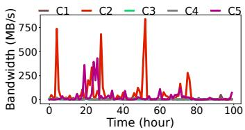  
Figure 17: OSS bandwidth of five Alibaba EBS clusters (§4.2).

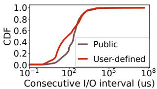  
Figure 18: Interval between two read I/Os (§4.2).

Challenge 3: Zero-shot scenarios. User-defined images, which constitute over 55.8% of all images (§2.2), pose a significant challenge for their effective preloading due to their diverse access patterns. While most images have historical traces (Figure 14), 56.9% of users only use a single image to create one VD (Figure 5) without historical I/O traces. We further analyze how various metadata metrics affect zeroshot accuracy (§5.4). This “zero-shot” scenario complicates preloading and risks SLO violations.

## 5 ThinkAhead Design

ThinkAhead aims for the following design goals:

• Adaptive: ThinkAhead is adaptive to dynamic network bandwidth and diverse image types, including those with limited historical traces.

• Accurate: ThinkAhead can precisely predict and preload access patterns, so as to limit the occurrence of slow I/Os caused by lazy loading.

• Lightweight: ThinkAhead operates with minimal resource overhead without requiring high-end hardware (e.g., GPUs) to facilitate large-scale deployment.

• Fast: ThinkAhead delivers low-latency inference to avoid significant delays during VD creation.

## 5.1 Overview

Figure 19 depicts the high-level architecture of ThinkAhead, which comprises three core components.

• Dataset preprocessing (§5.2, addressing Challenge 1). ThinkAhead takes the collected VD traces, including historical and latest records obtained from production, as input. It first filters outliers (e.g., traces with only few data points) to ensure high-quality data for training. It returns cleaned and grouped traces as output.

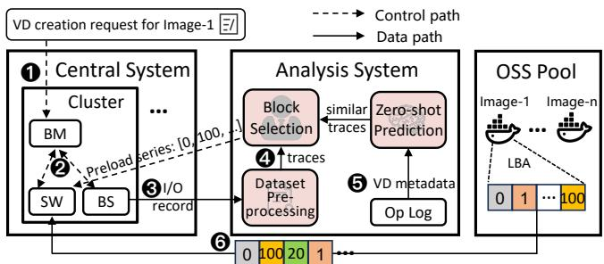  
Figure 19: Overall workflow of ThinkAhead (§5.1). SW: Snapshot Worker, BS: Block Server, BM: Block Master. The colored squares represent 2 MiB data blocks. The pink boxes are core components of ThinkAhead.

• Score-based block selection (§5.3, addressing Challenge 2). After generating the cleaned and grouped traces, ThinkAhead trains a scoring model offline for each image to comprehensively estimate the influences of multiple factors (e.g., access count and access time). Upon receiving a VD creation request, ThinkAhead uses the scoring model to predict and return the optimal data block download sequences as output. Its prediction is adaptive to runtime bandwidth variations and prediction misses on the fly.

• Zero-shot prediction (§5.4, addressing Challenge 3). To handle corner cases (e.g., images with few historical traces), ThinkAhead makes zero-shot prediction by leveraging metadata similarity computations to identify the closest traces from other images for preloading.

## 5.2 Dataset Preprocessing

ThinkAhead deploys a trace collector in each blockserver, managed by the blockmaster, to record block I/O traces during image downloading. To mitigate storage overhead, ThinkAhead retains the trace sequence, composed of the first six minutes of traces, for each VD creation (§3.1), while most slow I/Os (95%) occur within this period. For each image, ThinkAhead also collects its corresponding metadata, including image size and family.

Recall that unreliable I/O traces pose challenges for accurate training (§4.2). Simply selecting the latest trace sequence for training is insufficient, since individual I/Os can be merged differently at the block level across different trace sequences. Forming a union of all trace sequences is also inadequate, since individual I/Os can be reordered by the kernel, and a union of trace sequences would likely result in many inaccurate candidates for predicting the next data block.

ThinkAhead measures the access count of each 2 MiB block for each trace sequence, and analyzes the probability density function (PDF) distribution of the access counts over all trace sequences for each image. Our observation is that the trace sequences of an image tend to have one or a few spikes in the PDF; for example, in Figure 20, 4% and 2.5% of trace sequences of Image 1 access 400 and 500 blocks, respectively, while 7.5% for Image 2 access 900 blocks. ThinkAhead characterizes the distinct access count patterns by defining categories, each of which refers to a set of trace sequences that share similar access counts. Note that some trace sequences for Image 1 can access up to 1,500 blocks, approximately 3× its typical access count of 400-500 blocks. This anomaly is likely caused by unexpected user behaviors or system issues. Such outliers can distort the training process, so we exclude them to ensure robust category formation. ThinkAhead constructs all categories in three steps. First, it truncates the top and bottom 2.5% of access counts in the PDF to mitigate the impact of access count anomalies, as most outliers fall within these extremes. Second, it identifies all local maxima within the PDF. Finally, it detects the local minimum between each pair of consecutive local maxima, and uses the local minima to separate categories (i.e., each category contains one local maximum).

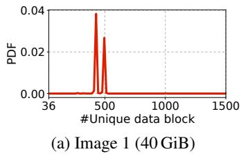

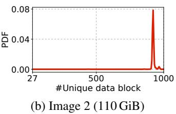  
Figure 20: Unique count of accessed data blocks (§5.2).

Since I/O traces can be reordered, ThinkAhead further divides each category into groups, where each group clusters traces that exhibit similar access patterns. To quantify the similarity between discrete sequences, we employ the Pearson Correlation Coefficient (PCC), a standard statistical method for measuring similarity [24, 29, 43]. We select PCC over other statistical measures for two main reasons. First, unlike Euclidean Distance, which is sensitive to the absolute magnitude of vectors, PCC is scale-invariant. This property enables the detection of sequences with similar access patterns even when their total access counts differ substantially. Second, alignment-based methods, such as Levenshtein Distance, provide strict sequential matching, but incur significant computational overhead, with a time complexity of O(n2) for a sequence of n samples. In contrast, PCC operates efficiently in vector space with a linear time complexity O(n), making it more scalable for large-scale system analysis.

Specifically, ThinkAhead computes the PCC between every pair of trace sequences within the same category (e.g., M2 pairwise PCCs for M trace sequences). It then applies clustering [40] to group similar trace sequences by their PCCs. For each group, it derives a centroid, the trace sequence that exhibits the highest similarity to other trace sequences within the group (used in §5.3). In short, the categories distinguish trace sequences for an image spatially by access counts, while the groups further distinguish the trace sequences within each group temporally caused by I/O reordering.

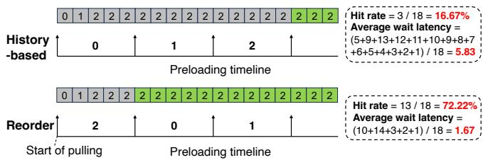  
Figure 21: Example of History-based’s poor performance (§5.3). Gray squares represent I/O misses, while green squares represent I/O hits.

## 5.3 Score-based Block Selection

While dataset preprocessing identifies similar historical trace sequences, using their access sequences directly for image preloading is sub-optimal due to runtime network bandwidth variations and potential prediction misses. Figure 21 compares two preloading strategies: History-based, which preloads blocks based on full knowledge of the exact access sequence, and Reorder, which prioritizes blocks based on access counts. Consider a scenario of constant inter-I/O interval units. Given an access sequence 0, 1, 2, History-based sequentially preloads these three blocks. However, Historybased fails to account for the I/O density of each data block, resulting in multiple I/O misses (depicted as gray squares) under constrained bandwidth, so it achieves only a 16.67% hit rate with an average wait latency of 5.83 units. In contrast, Reorder, by prioritizing high-density blocks (e.g., block 2) based on prior knowledge of access counts and current bandwidth conditions, achieves a hit rate of 72.22% and reduces the average wait latency to 1.67 units.

ThinkAhead employs score-based block selection for efficient preloading. It computes a score $S ( b _ { i } )$ for each data block $b _ { i }$ in group G. We define access time as the time difference between accessing $b _ { i }$ and the first I/O in the trace:

$$
S ( b _ { i } ) = \alpha \times a c _ { i } + \beta \times \frac { t _ { m a x } - t _ { a v g , i } } { t _ { m a x } } + ( 1 - \alpha - \beta ) \times \frac { t _ { m a x } - t _ { m i n , i } } { t _ { m a x } } ,\tag{1}
$$

where $a c _ { i }$ is the normalized access count, $t _ { a \nu g , i }$ is the average access time, $t _ { m i n , i }$ is the minimum access time, $t _ { m a x }$ is the maximum access time among all blocks in trace group $G ,$ and $\alpha$ and $\beta$ are weighting parameters. A larger score corresponds to more frequent and earlier access, implying a higher preloading priority. However, the choices of α and $\beta$ significantly impact preloading performance, and they also depend on bandwidth conditions. Figure 22 shows the standard deviations of the three metrics, where both the average and minimum access times show high variations. Further evaluation (Figure 24) demonstrates that hard-coded parameters cannot deliver optimal performance across different images and bandwidth conditions.

To this end, ThinkAhead employs a genetic algorithm [25, 48] to search for the optimal α and $\beta$ for different groups of the same image. The genetic algorithm excels in such unsupervised scenarios, as it can effectively navigate the search space to approximate the optimal solution through iterative evolution. It first divides network bandwidth into multiple bins (e.g., 2-10 MB/s, 10-30 MB/s, etc.) and initializes the parameters for each bin. Note that we bin similar network bandwidth to shorten training time and handle runtime bandwidth fluctuations. It evaluates the preloading performance of each bin, and selects the best parameters for the next generation. This training process terminates when the average performance stabilizes over five consecutive generations or the number of generations reaches a maximum limit. To handle multiple groups within a category during online inference, ThinkAhead incorporates a centroid feature switching module, which monitors actual access patterns of incoming requests, and switches the trained parameters to another group if high similarity with other centroids (e.g., PCC > 0.7) is detected. This ensures adaptability to dynamic network bandwidth changes and prediction misses, and the runtime overhead of this mechanism is masked by the block pulling process.

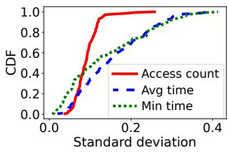  
Figure 22: Standard deviation of different metrics (§5.3).

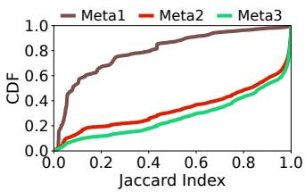  
Figure 23: Similarity of images with different metadata (§5.4).

## 5.4 Zero-shot Prediction

Score-based block selection is less effective for user-defined images with limited historical trace sequences. ThinkAhead incorporates zero-shot prediction that leverages I/O traces from similar images. It measures the similarity by computing the Jaccard Index (JI) [18]: $\begin{array} { r } { J ( s _ { 1 } , s _ { 2 } ) = \frac { \left| s _ { 1 } \cap s _ { 2 } \right| } { \left| s _ { 1 } \cup s _ { 2 } \right| } } \end{array}$ , where s1 and $s _ { 2 }$ are two accessed block sequences. Figure 23 shows that images with identical metadata configurations (denoted by Meta3) achieve the highest similarity scores (P50 JI = 0.87), as they differ only in user-specific data files. We group similar images into the same image family (i.e., the same OS distribution; see §3.1); for example, Ubuntu 18.04 and 20.04 belong to the same family. Images of the same family from the same user (denoted by Meta2) also have high similarity (P50 JI = 0.82), as each user often employs the same base image for VD creation, albeit with different configurations. However, images of the same family but from different users (denoted by Meta1) have low similarity (P50 JI = 0.08), as user-defined images of the same family may originate from different base images (e.g., Ubuntu vs. CentOS).

Based on the similarity analysis, ThinkAhead implements a three-tier selection strategy for zero-shot scenarios. First, it selects images belonging to the same image family, as they are expected to exhibit higher similarity than those from different families. Then, it prioritizes images from the same user, since they often share similar data patterns. Finally, it selects images with identical or highly similar metadata characteristics (e.g., ISO version and VD performance level). To ensure sufficient training data, if there are fewer than five trace sequences after three-tier selection, ThinkAhead progressively relaxes the selection criteria until sufficient trace sequences are obtained. This hierarchical filtering is essential in zero-shot prediction, as even images from the same family may show low similarity due to variations in image versions, system architectures, or configurations. After selection, ThinkAhead extracts the same metrics as in §5.3. To mitigate computational overhead, ThinkAhead reuses pre-trained parameters from similar images to trade model accuracy for training efficiency.

## 6 Implementation

We implement ThinkAhead’s image preloading strategy in around 1,000 lines of Python code, and the complete preloading system in around 6,000 lines of C++ code. ThinkAhead comprises two major components: a central system and an analysis system, as shown in Figure 19.

Central system. Each Alibaba EBS cluster deploys a central system, which performs two primary functions: recording block I/O traces and retrieving data blocks according to the preloading sequence generated by the analysis system. We deploy a tracing module in each blockserver for trace collecting with negligible overhead, since: (i) I/O trace is first buffered in the blockserver memory, involving only tens of bytes of memory copy; (ii) Filled buffer is flushed to local disk asynchronously, decoupled from the user I/O path; (iii) Local disks only keep recent traces to mitigate storage overhead. To manage block downloads efficiently, the central system employs three priority queues that enforce a strict retrieval hierarchy. ThinkAhead prioritizes high-priority blocks and ensures that they are fully downloaded before retrieving lower-priority blocks. The priority queues are:

• Missed block queue (high priority): It handles data blocks requested by users but not present in local EBS storage. It has the highest priority and is processed first to mitigate latency for immediate user requests.

• Preload block queue (medium priority). It manages data blocks predicted by ThinkAhead to be likely accessed soon, based on the preloading sequence.

• Left block queue (low priority). It handles the remaining data blocks to be fetched into local EBS storage.

Analysis system. The analysis system processes data to generate the preloading sequence. It performs dataset preprocessing to extract and clean training data and filter outliers to ensure quality (§5.2). It retrieves VD metadata from a log database (e.g., ElasticSearch [11] and ClickHouse [9]) and forwards the corresponding features for score-based block selection, which computes a preloading sequence using a genetic algorithm tailored for dynamic network conditions (§5.3), and implements zero-shot prediction in the zero-shot scenarios (§5.4). The resulting preloading sequence is transmitted to the Snapshot Worker, which initiates block retrieval from the remote OSS.

## 7 Evaluation

We evaluate ThinkAhead to address the following questions:

• Does ThinkAhead outperform existing schedulers across various network bandwidth settings and image types? (§7.1)

• How do ThinkAhead’s components contribute to its performance? (§7.2)

• How does ThinkAhead perform in a production cluster environment? (§7.3)

Setup. We use the traces described in §3.1 for evaluation. We split the dataset of trace sequences into 80% for training and 20% for testing. We conduct evaluation in two settings:

• High-fidelity simulator: It runs on a server with a 64- core Intel(R) Xeon(R) E5-2682 2.5 GHz CPU and 128 GiB DRAM. It replays traces under various settings, including public images, user-defined images, and a mix of both, to evaluate macrobenchmark performance.

• Experimental cluster: It is deployed in the production EBS environment at Alibaba. It comprises 20 block nodes in the block layer (Figure 1), each with an Intel(R) Xeon(R) Silver 4114 2.2 GHz CPU, 128 GiB DRAM, and a 25 Gbps NIC. It includes the full-stack Alibaba EBS implementation and the remote OSS. We use it for end-to-end performance evaluation under real network conditions.

Metrics. Our evaluation focuses on the following metrics:

• Hit rate: the proportion of reads $( N _ { h i t i o } )$ whose requested data blocks are preloaded over all reads $( N _ { i o } )$ , i.e., $\frac { { { \dot { N } } _ { h i t i o } } } { { { N } _ { i o } } } ;$ it reflects I/O performance.

• Accuracy: the proportion of preloaded data blocks that are accessed $( N _ { h i t b l k } )$ over all preloaded data blocks $( N _ { b l k } )$ , i.e., NhitblkN ; it reflects the effectiveness of block-level preloading. blk • Wait latency: the duration a user I/O waits for its corresponding data block to be loaded. Note that the wait latency may be zero under high network bandwidth (i.e., the data block is already downloaded).

• Overhead: the computational cost of the training and inference phases.

Baselines. We compare ThinkAhead against the following:

• Lazyload: the default image loading policy in Alibaba EBS, which downloads requested data blocks on demand.

• Leap [15]: a preloading policy for remote memory access, which predicts future access based on recently visited LBAs with the same stripes.

• Random: a policy that randomly selects a training trace for the same image, and preloads blocks in its I/O access order.

• DADI+: a variant of DADI [31] that computes a similarity matrix among training traces for the same image and selects the clustering center for preloading.

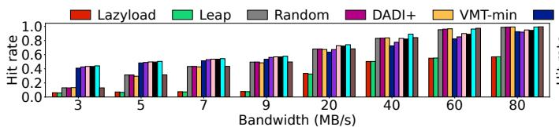  
(a) Hit rate

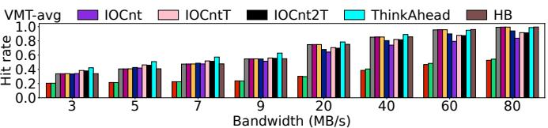

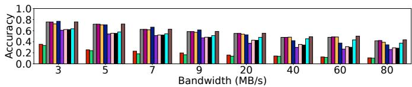

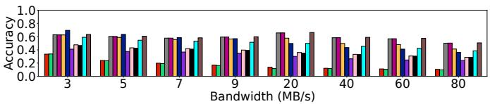

(b) Accuracy results  
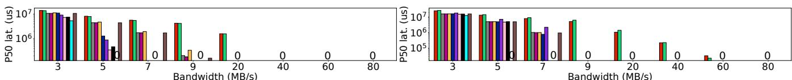

(c) P50 wait latency  
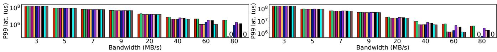  
(d) P99 wait latency

Figure 24: Performance across various network bandwidth conditions for public (left) and user-defined (right) images (§7.1).  
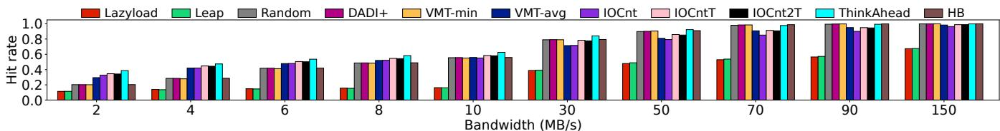  
(a) Hit rate

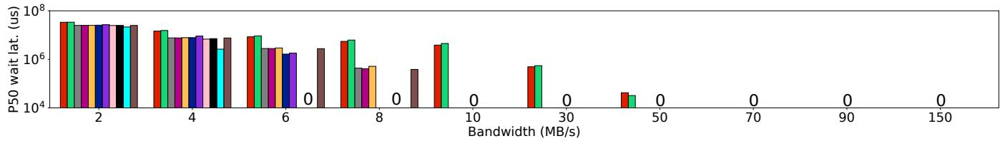  
(b) P50 wait latency  
Figure 25: Overall performance with sufficient training data (§7.1).

• VMT-min and VMT-avg [41]: two baselines that calculate time intervals (i.e., access time minus the first I/O time) for data blocks from training traces, sorted by minimum or average access time, respectively.

• IOCnt: a policy that sorts data blocks by access count from training traces.

• IOCntT and IOCnt2T: policies that sort blocks by a score combining access count and average access time (IOCntT) or both average and minimum access times (IOCnt2T); a larger score implies a higher priority for preloading.

• History-based (HB): a policy that preloads blocks in the exact access order of the test trace based on prior knowledge.

## 7.1 Macrobenchmarks

We first evaluate ThinkAhead’s performance in a controlled environment to examine its effectiveness for public and userdefined images across various network bandwidth conditions.

Hit rate. Figure 24a shows the hit rate results. Lazyload consistently has a low hit rate (around 0.1) under low bandwidth, since it does not consider the access pattern of an image. Leap also performs poorly, as data block requests are often non-sequential, making prediction based on pulled blocks difficult. Random, DADI+, VMT-min, and HB deliver low hit rates under low bandwidth (below 10 MB/s), and their performance improves as the bandwidth increases. These approaches prioritize access order over other factors (e.g., access count), which can overshadow the significance of access count in terms of improving the hit rate. VMT-avg, IOCnt, IOCntT, and IOCnt2T behave slightly worse than ThinkAhead (around 9% lower) under low bandwidth, with the gap increasing to 15% under high bandwidth, due to their inability to adapt dynamically to network conditions and the lack of key metrics for data block selection. ThinkAhead achieves up to 7.27× and 2.64× higher hit rates than Lazyload for public and user-defined images, respectively. Compared to HB, ThinkAhead achieves up to 3.40× and 1.25× higher hit rates for public and user-defined images, respectively. The key difference is that ThinkAhead incorporates access count and dynamic bandwidth adaptation. Note that ThinkAhead performs better on public images due to their stable and predictable access pattern (Figure 12).

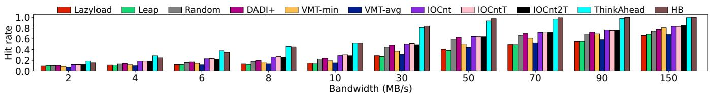  
(a) Hit rate

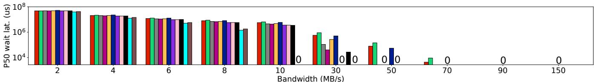  
(b) P50 wait latency  
Figure 26: Overall performance for zero-shot scenarios (§7.1).

Accuracy. Figure 24b shows the accuracy results. Overall, the accuracy decreases with increasing bandwidth due to a higher number of preloaded blocks (the denominator of the accuracy metric). Lazyload and Leap have the lowest accuracy, with only 10.6% and 10.1% at 80 MB/s, respectively. Random, DADI+, and HB show similar accuracy, as they preload data blocks based on the potential access order for an image. VMT-min and VMT-avg are only slightly less accurate, since they also reorder data blocks according to the global view of access time, while IOCnt, IOCntT, and IOCnt2T behave the worst since they overly focus on access counts of data blocks. ThinkAhead achieves an average accuracy of 44.1%, 13.0% lower than HB. Note that higher accuracy does not necessarily imply lower latency (Figures 24c and 24d), since accuracy is not calculated based on I/O granularity.

Wait latency. Figure 24c shows the wait latency results. Lazyload and Leap have a P50 wait latency of around 1.4 s for user-defined images, even when the bandwidth reaches 20 MB/s; this indicates persistent slow I/Os. Random, DADI+, and VMT-min perform poorly for public images (with a nonzero P50 wait latency under 9 MB/s) due to inadequate dataset preprocessing and inaccurate access pattern prediction. IOCnt,

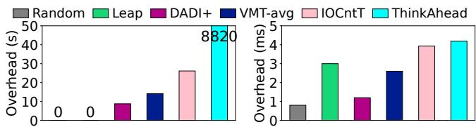  
Figure 27: Training (left) and inference (right) overhead (§7.1).

IOCntT, and IOCnt2T outperform other baselines, but still incur 4.5 s P50 wait latency at 5 MB/s as they lack dynamic adaptation to key metrics. ThinkAhead achieves zero P50 wait latency at 5 MB/s for both image types, compared to HB’s 4.6 s, since HB neglects access counts and incurs significant I/O queueing. For P99 wait latency (Figure 24d), ThinkAhead improves by up to 79.8% over Lazyload under low network bandwidth (less than 10 MB/s), and matches HB’s zero P99 wait latency above 80 MB/s.

Overall performance with sufficient training data. Figure 25 presents the overall performance when sufficient training data is available; here, we focus on those images with at least 20 historical trace sequences each. The hit rates of Lazyload, Leap, Random, DADI+, IOCntT, and IOCnt2T follow similar trends in Figure 24a. VMT-min achieves a higher hit rate than VMT-avg at bandwidth below 10 MB/s, while VMTavg outperforms VMT-min at bandwidth above 10 MB/s. The reason is that VMT-avg misses the critical initial blocks under high bandwidth, while VMT-min fetches potentially accessed blocks. IOCnt achieves 61.4% higher hit rates than VMTmin under low bandwidth, but underperforms under higher bandwidth, similar to VMT-avg. ThinkAhead consistently outperforms all baselines across all bandwidth conditions, with up to 3.83× higher hit rates than Lazyload and 1.89× higher than HB.

Figure 25b shows the P50 wait latency results. The P50 latency is more sensitive to preloading strategies. Both Lazyload and Leap have a non-zero P50 wait latency even if the bandwidth increases to 50 MB/s. Random and DADI+ have comparable performance to HB as they preload blocks based on potential access order, and all of them have around 400 ms P50 wait latency at 8 MB/s. For non-zero P50 wait latency results, ThinkAhead achieves up to 65.3% lower than HB, and 71.9% lower than Lazyload. It achieves zero P50 wait latency at 6 MB/s, while HB still incurs 384 ms.

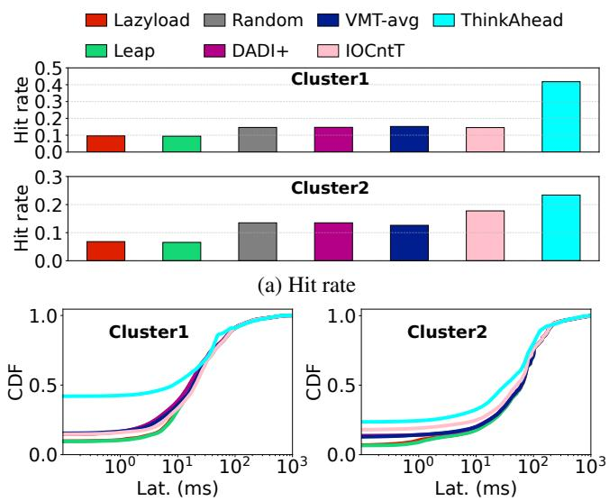  
(b) CDF of wait latency  
Figure 28: Simulations with real-world network conditions (§7.1).

In the interest of space, we omit detailed plots for accuracy and P99 latency but summarize here. Overall, ThinkAhead improves accuracy by up to 72.4% over Lazyload, and achieves almost the same P99 wait latency as HB under all network bandwidth conditions, and can be 90.9% better than Lazyload.

Zero-shot scenarios. Figure 26 shows the performance for zero-shot scenarios. Lazyload and Leap show the lowest hit rates due to their lack of access pattern awareness. Other baselines also suffer from severe performance degradation since they rely on irrelevant trace information. In contrast, ThinkAhead achieves the best performance among all, with an average hit rate of only 0.8% lower than HB, which assumes prior knowledge of test traces. For P50 wait latency, ThinkAhead outperforms HB by 20.2%. We also evaluate the accuracy and P99 wait latency. Results show that ThinkAhead improves accuracy by 64.1% and P99 wait latency by 98.7% over Lazyload, with only 1.0% worse P99 wait latency than HB under low bandwidth.

Overhead. Figure 27 shows the training and inference times. Lazyload is excluded since it pulls data on demand and requires no training or inference. Random and Leap require no training. DADI+, VMT-avg, and IOCntT have training times ranging from 8.8 s to 26.1 s due to their inclusion of additional statistical metrics. ThinkAhead’s training, which builds on a genetic algorithm, takes over two hours and is the most timeconsuming. Nevertheless, ThinkAhead’s training occurs at day-level granularity, and its trained parameters are reusable across all clusters. For inference times, all approaches operate within 5 ms, which is negligible. Thus, ThinkAhead maintains lightweight inference, which is suitable for large-scale production deployment.

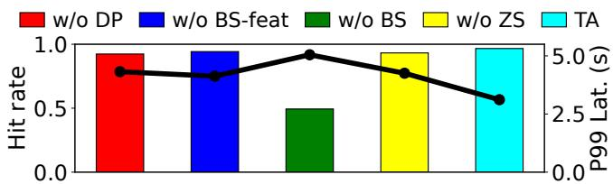  
Figure 29: Ablation study (§7.2). Bars are hit rates, and the line refers to P99 wait latency.

Simulations with real-world network conditions. We evaluate ThinkAhead’s performance based on real-world network conditions. In our trace collection (§3.1), we also collected the network bandwidth over VD creations from two production clusters over five days, totaling 21,200 VDs. We feed the network bandwidth data into our simulator and replay our traces for different image loading schemes. HB is excluded from comparison since it requires prior knowledge of test traces. Figure 28 shows the hit rate and cumulative distribution function (CDF) of wait latency results. The performance trends are consistent with our previous evaluations under controlled bandwidth settings. Both Leap and Lazyload exhibit the worst performance due to incorrect prediction. ThinkAhead achieves 4.27× and 3.44× higher hit rates, as well as 2.25× and 1.93× lower P50 wait latencies than Lazyload in the two clusters, respectively. The findings demonstrate ThinkAhead’s effectiveness in real-world environments.

## 7.2 Ablation Study

We conduct an ablation study to evaluate the effectiveness of individual components in ThinkAhead. We compare the full ThinkAhead (TA) against variants that omit key modules: ThinkAhead without dataset preprocessing (w/o DP), without the centroid feature switching module in score-based block selection (w/o BS-feat), without the whole score-based block selection (w/o BS), and without zero-shot prediction (w/o ZS). Figure 29 shows the results. The “w/o BS” variant shows 47.3% worse hit rate than ThinkAhead since it does not consider historical access patterns. The “w/o BS-feat”, “w/o DP”, and “w/o ZS” variants are 2.4%, 4.3%, and 3.4% worse than ThinkAhead on average, respectively, as they do not consider reordering-aware feature, dataset cleaning, and zero-shot similarity. Notably, the feature switching module in ThinkAhead significantly increases the hit rate from 3.0% to 97.9% when detecting reordered I/Os for test images. Overall, ThinkAhead reduces latency by up to 38.3% compared to the ablated variants.

## 7.3 End-to-end Evaluation

We conduct end-to-end evaluation on ThinkAhead using our experimental cluster in production environments. We expect that the results can be generalized to large-scale production environments. Figure 30 shows ThinkAhead’s relative performance improvements in terms of the Snapshot Worker’s wait latency and slow I/O counts over Lazyload. ThinkAhead achieves 3.20×, 1.35×, and 1.26× improvements at the P50, P99, and maximum wait latencies, respectively. The gains diminish toward the tail of the distribution, with the largest improvement at P50 and the smallest at the maximum latency. The reason is that ThinkAhead may still encounter prolonged I/Os under limited bandwidth constraints. In terms of the cold-start latency, ThinkAhead achieves 1.46× improvement by fully leveraging image-level statistics. Overall, ThinkAhead reduces slow I/Os by 5.35× compared to Lazyload. This confirms ThinkAhead’s practical performance benefits in production environments.

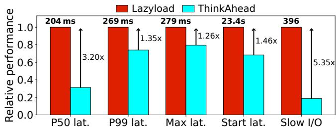  
Figure 30: Relative end-to-end performance in the experimental cluster (§7.3).

## 8 Related Work

Image cold-start mitigation. Several approaches have been proposed to mitigate cold-start delays in containerized environments. CRFS [10] implements a read-only FUSE filesystem for container image access without downloading the entire image. RainbowCake [54] uses pre-warming and keepalive techniques to mitigate memory overhead. Multi-level container reuse [56] leverages reinforcement learning to improve container reuse solutions. FlacIO [35] introduces a runtime image structure integrated with a runtime page cache to optimize container image serving. Poby [23] leverages smart-NIC acceleration for image provisioning. However, these approaches are tailored for layer-based container semantics and cannot be directly applied to VDs. Other approaches, such as peer-to-peer distribution [41, 49] and cache-based acceleration [19, 27], aim to improve download speeds, but have limitations as discussed in §3.4. ThinkAhead introduces a general preloading framework to address slow I/Os in EBS.

Data prefetching. Data prefetching has been explored to optimize I/O performance. Leap [15] is a prefetcher integrated into the Linux kernel for remote memory access, and prioritizes prefetching accuracy to avoid overhead from unused data. In contrast, in our disk prefetching scenario with all fetched data used in the future, we opt for maximizing hit rates. DADI [31] proposes block-level preloading for overlay-based iSCSI block devices by replaying I/O traces. Baleen [52] employs machine learning for admission control and prefetching in flash caches. InstaInfer [46] preloads machine learning model artifacts to mitigate latency for serverless inference. FetchBPF [21] uses eBPF to implement prefetching policies in the Linux kernel. Unlike the above approaches, ThinkAhead is specifically designed for EBS. It performs prefetching at the block level rather than the layer or file level, and operates effectively with or without historical I/O traces.

Block I/O traces. Several studies have published block I/O traces from cloud storage. Tencent [55] has published traces from around 5,000 VDs over nine days for cache allocation studies. Alibaba Cloud [16,32] has published block I/O traces for 1,000 VDs over a single day and characterized I/O access patterns. Meta’s Tectonic Bulk Storage Traces [37] contain flash cache I/O traces from production. Wu et al. [53] have published block I/O traces from 140 K VDs in Alibaba Cloud. However, these traces mainly capture steady-state operations and do not reflect the I/O patterns during the startup phase of system VDs. They have inherently different properties from our traces and are unsuitable for preloading in our context.

## 9 Conclusion

This paper introduces ThinkAhead, a data-driven I/O preloading system for virtual disks, designed to mitigate slow I/Os in Alibaba EBS. ThinkAhead comprises three key components: a dataset preprocessor, a score-based block selector, and a zero-shot predictor. Extensive evaluations demonstrate that ThinkAhead achieves high robustness, adaptiveness, and scalability. It increases the hit rate by up to 7.27× compared to the existing lazy loading approach, and introduces only microsecond-level inference overhead. Currently, ThinkAhead serves as an experimental feature within Alibaba EBS, and its production deployment is in progress.

## Acknowledgements

We thank all the anonymous reviewers and our shepherd, Yuxin Ren, for their valuable comments, and the Alibaba EBS team for their timely support. This work is supported in part by the Natural Science Foundation of China (62072306, 623B2072), Shanghai Key Laboratory of Trusted Data Circulation, Governance and Web3, Alibaba Research Fellowship (ARF), and Alibaba Innovative Research (AIR) project.

## References

[1] Alibaba Cloud elastic block storage. https://www. alibabacloud.com/product/disk, 2025.

[2] Alibaba Cloud Flink management. https: //help.aliyun.com/zh/flink/dynamicallyupdate-deployment-parameters, 2025.

[3] Alibaba Cloud OSS. https://www.alibabacloud. com/product/oss, 2025.

[4] Amazon EBS lazy loading. https://aws.amazon. com/blogs/containers/under-the-hood-lazy-

loading-container-images-with-seekableoci-and-aws-fargate/, 2025.

[5] Amazon elastic block store. https://aws.amazon. com/ebs/, 2025.

[6] Aws fast snapshot restore. https://docs.aws. amazon.com/ebs/latest/userguide/ebs-fastsnapshot-restore.html, 2025.

[7] AWS S3. https://aws.amazon.com/s3/, 2025.

[8] Azure disk storage. https://learn.microsoft. com/en-us/azure/virtual-machines/diskstypes, 2025.

[9] ClickHouse. https://clickhouse.com/, 2025.

[10] Crfs: Container registry filesystem. https://github. com/google/crfs, 2025.

[11] ElasticSearch. https://www.elastic.co/docs/ manage-data/data-store, 2025.

[12] Google persistent disks. https://cloud.google. com/persistent-disk, 2025.

[13] Kraken: A p2p-powered docker registry that focuses on scalability and availability. https://github.com/ uber/kraken, 2025.

[14] Mansour Ahmadi, Reza Mirzazade Farkhani, Ryan Williams, and Long Lu. Finding bugs using your own code: Detecting functionally-similar yet inconsistent code. In Proceedings of the 30th USENIX security symposium (USENIX Security), 2021.

[15] Hasan Al Maruf and Mosharaf Chowdhury. Effectively prefetching remote memory with Leap. In Proceedings of the 2020 USENIX Annual Technical Conference (USENIX ATC), 2020.

[16] Alibaba. Alibaba block traces. https://github.com/ alibaba/block-traces, 2022.

[17] Alibaba. Dragonfly: An open-source p2p-based image and file distribution system. https://github.com/ dragonflyoss/Dragonfly, 2025.

[18] Ulrich Bayer, Paolo Milani Comparetti, Clemens Hlauschek, Christopher Kruegel, and Engin Kirda. Scalable, behavior-based malware clustering. In Proceedings of the 16th Annual Network and Distributed System Security (NDSS), 2009.

[19] Marc Brooker, Mike Danilov, Chris Greenwood, and Phil Piwonka. On-demand container loading in AWS Lambda. In Proceedings of the 2023 USENIX Annual Technical Conference (USENIX ATC), 2023.

[20] James Cadden, Thomas Unger, Yara Awad, Han Dong, Orran Krieger, and Jonathan Appavoo. Seuss: Skip redundant paths to make serverless fast. In Proceedings of the 15th European Conference on Computer Systems (EuroSys), 2020.

[21] Xuechun Cao, Shaurya Patel, Soo Yee Lim, Xueyuan Han, and Thomas Pasquier. FetchBPF: Customizable prefetching policies in Linux with eBPF. In Proceedings of 2024 USENIX Annual Technical Conference (USENIX ATC), 2024.

[22] Xiaohu Chai, Tianyu Zhou, Keyang Hu, Jianfeng Tan, Tiwei Bie, Anqi Shen, Dawei Shen, Qi Xing, Shun Song, Tongkai Yang, Le Gao, Feng Yu, Zhengyu He, Dong Du, Yubin Xia, Kang Chen, and Yu Chen. Fork in the road: Reflections and optimizations for cold start latency in production serverless systems. In Proceedings of the 19th USENIX Symposium on Operating Systems Design and Implementation (OSDI), 2025.

[23] Zihao Chang, Jiaqi Zhu, Haifeng Sun, Yunlong Xie, Ninghui Sun, Yungang Bao, and Sa Wang. Poby: SmartNIC-accelerated image provisioning for coldstart in clouds. In Proceedings of the 2025 USENIX Annual Technical Conference (USENIX ATC), 2025.

[24] Israel Cohen, Yiteng Huang, Jingdong Chen, Jacob Benesty, Jacob Benesty, Jingdong Chen, Yiteng Huang, and Israel Cohen. Pearson correlation coefficient. Noise reduction in speech processing, 2009.

[25] Ming Fan, Wenying Wei, Wuxia Jin, Zijiang Yang, and Ting Liu. Explanation-guided fairness testing through genetic algorithm. In Proceedings of the 44th International Conference on Software Engineering (ICSE), 2022.

[26] Yao Fu, Leyang Xue, Yeqi Huang, Andrei-Octavian Brabete, Dmitrii Ustiugov, Yuvraj Patel, and Luo Mai. Serverlessllm: Low-latency serverless inference for large language models. In Proceedings of the 18th USENIX Symposium on Operating Systems Design and Implementation (OSDI), 2024.

[27] Alexander Fuerst and Prateek Sharma. Faascache: Keeping serverless computing alive with greedy-dual caching. In Proceedings of the 26th ACM international conference on architectural support for programming languages and operating systems (ASPLOS), 2021.

[28] Tejun Heo, Dan Schatzberg, Andrew Newell, Song Liu, Saravanan Dhakshinamurthy, Iyswarya Narayanan, Josef Bacik, Chris Mason, Chunqiang Tang, and Dimitrios Skarlatos. Iocost: Block IO control for containers in datacenters. In Proceedings of the 27th ACM International Conference on Architectural Support for Programming Languages and Operating Systems (ASP-LOS), 2022.

[29] Jiyao Hu, Zhenyu Zhou, and Xiaowei Yang. Characterizing physical-layer transmission errors in cable broadband networks. In Proceedings of the 19th USENIX Symposium on Networked Systems Design and Implementation (NSDI), 2022.

[30] Qinghao Hu, Meng Zhang, Peng Sun, Yonggang Wen, and Tianwei Zhang. Lucid: A non-intrusive, scalable and interpretable scheduler for deep learning training jobs. In Proceedings of the 28th ACM International Conference on Architectural Support for Programming Languages and Operating Systems (ASPLOS), 2023.

[31] Huiba Li, Yifan Yuan, Rui Du, Kai Ma, Lanzheng Liu, and Windsor Hsu. DADI: Block-level image service for agile and elastic application deployment. In Proceedings of the 2020 USENIX Annual Technical Conference (USENIX ATC), 2020.

[32] Jinhong Li, Qiuping Wang, Patrick P. C. Lee, and Chao Shi. An in-depth comparative analysis of cloud block storage workloads: Findings and implications. ACM Transactions on Storage, 19(2):1–32, 2023.

[33] Qiang Li, Qiao Xiang, Yuxin Wang, Haohao Song, Ridi Wen, Wenhui Yao, Yuanyuan Dong, Shuqi Zhao, Shuo Huang, Zhaosheng Zhu, Huayong Wang, Shanyang Liu, Lulu Chen, Zhiwu Wu, Haonan Qiu, Derui Liu, Gexiao Tian, Chao Han, Shaozong Liu, Yaohui Wu, Zicheng Luo, Yuchao Shao, Junping Wu, Zheng Cao, Zhongjie Wu, Jiaji Zhu, Jinbo Wu, Jiwu Shu, and Jiesheng Wu. More than capacity: Performance-oriented evolution of Pangu in Alibaba. In Proceedings of the 21st USENIX Conference on File and Storage Technologies (FAST), 2023.

[34] Zijun Li, Linsong Guo, Quan Chen, Jiagan Cheng, Chuhao Xu, Deze Zeng, Zhuo Song, Tao Ma, Yong Yang, Chao Li, and Minyi Guo. Help rather than recycle: Alleviating cold startup in serverless computing through inter-function container sharing. In Proceedings of the 2022 USENIX Annual Technical Conference (USENIX ATC), 2022.

[35] Yubo Liu, Hongbo Li, Mingrui Liu, Rui Jing, Jian Guo, Bo Zhang, Hanjun Guo, Yuxin Ren, and Ning Jia. FlacIO: Flat and collective I/O for container image service. In Proceedings of the 23rd USENIX Conference on File and Storage Technologies (FAST), 2025.

[36] Avinash Maurya, Robert Underwood, M Mustafa Rafique, Franck Cappello, and Bogdan Nicolae. Datastates-llm: Lazy asynchronous checkpointing for large language models. In Proceedings of the 33rd International Symposium on High-Performance Parallel and Distributed Computing (HPDC), 2024.

[37] Meta. Tectonic bulk storage traces. https://ftp.pdl. cmu.edu/pub/datasets/Baleen24/, 2024.

[38] Dushyanth Narayanan, Austin Donnelly, and Antony Rowstron. Write off-loading: Practical power management for enterprise storage. ACM Transactions on Storage (TOS), 4(3), 2008.

[39] Li Pan, Lin Wang, Shutong Chen, and Fangming Liu. Retention-aware container caching for serverless edge

computing. In Proceedings of the 2022 IEEE International Conference on Computer Communications (IN-FOCOM), 2022.

[40] Xinyu Que, Fabio Checconi, Fabrizio Petrini, and John A Gunnels. Scalable community detection with the louvain algorithm. In Proceedings of the 2015 IEEE international parallel and distributed processing symposium (IPDPS), 2015.

[41] Joshua Reich, Oren Laadan, Eli Brosh, Alex Sherman, Vishal Misra, Jason Nieh, and Dan Rubenstein. Vmtorrent: Scalable P2P virtual machine streaming. In Proceedings of the 8th ACM Conference on Emerging Networking Experiment and Technologies (CoNEXT), 2012.

[42] Alma Riska, James Larkby-Lahet, and Erik Riedel. Evaluating block-level optimization through the IO path. In Proceedings of the 2007 USENIX Annual Technical Conference (USENIX ATC), 2007.

[43] Bianca Schroeder, Raghav Lagisetty, and Arif Merchant. Flash reliability in production: The expected and the unexpected. In Proceedings of the 14th USENIX Conference on File and Storage Technologies (FAST), 2016.

[44] Jiuchen Shi, Hang Zhang, Zhixin Tong, Quan Chen, Kaihua Fu, and Minyi Guo. Nodens: Enabling resource efficient and fast QoS recovery of dynamic microservice applications in datacenters. In Proceedings of the 2023 USENIX Annual Technical Conference (USENIX ATC), 2023.

[45] B Sivaiah, TSN Murthy, and T Vandana Babu. Boot multiple operating systems from iso images using usb disk. In Proceedings of the 2014 International Conference on Electronics and Communication Systems (ICECS), 2014.

[46] Yifan Sui, Hanfei Yu, Yitao Hu, Jianxun Li, and Hao Wang. Pre-warming is not enough: Accelerating serverless inference with opportunistic pre-loading. In Proceedings of the 2024 ACM Symposium on Cloud Computing (SoCC), 2024.

[47] Difan Tan, Jiawei Li, Hua Wang, Xiaoxiao Li, Wenbo Liu, Zijin Qin, Ke Zhou, Ming Xie, and Mengling Tao. Tela: A temporal load-aware cloud virtual disk placement scheme. In Proceedings of the 30th ACM International Conference on Architectural Support for Programming Languages and Operating Systems (ASP-LOS), 2025.

[48] Haoxiang Tian, Yan Jiang, Guoquan Wu, Jiren Yan, Jun Wei, Wei Chen, Shuo Li, and Dan Ye. Mosat: Finding safety violations of autonomous driving systems using multi-objective genetic algorithm. In Proceedings of the 30th ACM Joint European Software Engineering Conference and Symposium on the Foundations of Software Engineering (ESEC/FSE), 2022.

[49] Ao Wang, Shuai Chang, Huangshi Tian, Hongqi Wang, Haoran Yang, Huiba Li, Rui Du, and Yue Cheng. FaaS-Net: Scalable and fast provisioning of custom serverless container runtimes at alibaba cloud function compute. In Proceedings of the 2021 USENIX Annual Technical Conference (USENIX ATC), 2021.

[50] Zibo Wang, Pinghe Li, Chieh-Jan Mike Liang, Feng Wu, and Francis Y Yan. Autothrottle: A practical bi-level approach to resource management for SLO-targeted microservices. In Proceedings of the 21st USENIX Symposium on Networked Systems Design and Implementation (NSDI), 2024.

[51] Sage Weil, Scott A Brandt, Ethan L Miller, Darrell DE Long, and Carlos Maltzahn. Ceph: A scalable, highperformance distributed file system. In Proceedings of the 7th Conference on Operating Systems Design and Implementation (OSDI), 2006.

[52] Daniel Lin-Kit Wong, Hao Wu, Carson Molder, Sathya Gunasekar, Jimmy Lu, Snehal Khandkar, Abhinav Sharma, Daniel S Berger, Nathan Beckmann, and Gregory R Ganger. Baleen: ML admission & prefetching for flash caches. In Proceedings of the 22nd USENIX Conference on File and Storage Technologies (FAST), 2024.

[53] Haonan Wu, Erci Xu, Ligang Wang, Yuandong Hong, Changsheng Niu, Bo Shi, Lingjun Zhu, Jinnian He, Dong Wu, Weidong Zhang, Qiuping Wang, Changhong Wang, Xinqi Chen, Guangtao Xue, Yichao Chen, and Dian Ding. Hey hey, my my, skewness is here to stay: Challenges and opportunities in cloud block store traffic. In Proceedings of the 20th European Conference on Computer Systems (EuroSys), 2025.

[54] Hanfei Yu, Rohan Basu Roy, Christian Fontenot, Devesh Tiwari, Jian Li, Hong Zhang, Hao Wang, and Seung-Jong Park. Rainbowcake: Mitigating cold-starts in serverless with layer-wise container caching and sharing. In Proceedings of the 29th ACM International Conference on Architectural Support for Programming Languages and Operating Systems (ASPLOS), 2024.

[55] Yu Zhang, Ping Huang, Ke Zhou, Hua Wang, Jianying Hu, Yongguang Ji, and Bin Cheng. OSCA: An onlinemodel based cache allocation scheme in cloud block storage systems. In Proceedings of the 2020 USENIX Annual Technical Conference (USENIX ATC), 2020.

[56] Amelie Chi Zhou, Rongzheng Huang, Zhoubin Ke, Yusen Li, Yi Wang, and Rui Mao. Tackling cold start in serverless computing with multi-level container reuse. In Proceedings of the 2024 IEEE international parallel and distributed processing symposium (IPDPS), 2024.

## A Artifact Appendix

## Abstract

ThinkAhead is a data-driven image preloading system for virtual disks. This artifact includes the ThinkAhead prototype and the dataset collected from Alibaba EBS.

## Scope

This artifact can be used to validate the production statistics and designs of ThinkAhead in the paper. We hope the production traces can facilitate future research on cloud block storage and other services.

## Contents

The dataset includes the block I/O traces collected from production Alibaba EBS clusters, the metadata of virtual disk creations, and the data used to generate figures in our paper. The source code includes the prototype of ThinkAhead and the scripts required for figure reproduction.

## Hosting

The source code of this artifact is hosted on GitHub at https: //github.com/Master-Chen-Xin-Qi/FAST26\_AE, and the I/O traces are hosted on Alibaba Tianchi platform at https://tianchi.aliyun.com/dataset/216164. Please refer to the README.md file in each site for detailed instructions.

## Requirements

This artifact requires the following requirements:

• Hardware: A single laboratory-level machine with ∼8 CPU cores and ∼64 GB memory

• Operating System: Ubuntu 20.04 LTS

• Python Environment: python 3.8.19, matplotlib 3.7.5, numpy 1.24.4, polars 1.8.2, tqdm 4.67.1