①

USENIX

THE ADVANCED COMPUTING SYSTEMS ASSOCIATION

# LESS is More for I/O-Efficient Repairs in Erasure-Coded Storage

Keyun Cheng, The Chinese University of Hong Kong; Guodong Li, Shandong University; Xiaolu Li, Huazhong University of Science and Technology; Sihuang Hu, Shandong University; Patrick P. C. Lee, The Chinese University of Hong Kong

## https://www.usenix.org/conference/fast26/presentation/cheng

This paper is included in the Proceedings of the 24th USENIX Conference on File and Storage Technologies.

February 24–26, 2026 • Santa Clara, CA, USA

ISBN 978-1-939133-53-3

Open access to the Proceedings of the 24th USENIX Conference on File and Storage Technologies is sponsored by

# LESS is More for I/O-Efficient Repairs in Erasure-Coded Storage

Keyun Cheng1∗, Guodong Li2\*, Xiaolu Li3, Sihuang Hu2, and Patrick P. C. Lee1

1The Chinese University of Hong Kong 2Shandong University

3Huazhong University of Science and Technology

## Abstract

I/O efficiency is critical for erasure-coded repair performance in modern distributed storage. We propose LESS, a family of repair-friendly erasure code constructions that reduces both the amount of data accessed and the number of I/O seeks in single-block repairs, while ensuring balanced reductions across blocks. LESS layers multiple extended sub-stripes formed by widely deployed Reed-Solomon coding, and is configurable to balance the trade-off between the amount of data accessed and I/O seeks. Evaluation shows that LESS on HDFS reduces both single-block repair and full-node recovery times compared to state-of-the-art I/O-optimal erasure codes.

## 1 Introduction

Erasure coding is widely adopted in modern distributed storage systems (e.g., [3, 5, 10, 21]) to ensure fault tolerance with significantly lower storage overhead than traditional replication [37]. However, erasure coding incurs high repair costs. Reconstructing a single failed block needs to access and transfer much more data than the block size, leading to amplified bandwidth and I/O costs. Recent surveys [1, 33] highlight extensive studies, from both coding theory and systems communities, that aim to improve repair efficiency in erasure-coded storage. These studies focus on improving access performance (e.g., optimizing degraded reads [6, 13]) and storage reliability (e.g., reducing mean-time-to-data-loss [9, 10]). In particular, extensive research has proposed repair-friendly erasure code constructions to mitigate bandwidth and I/O costs (see §2.2 for related work).

In modern distributed storage systems, I/O efficiency has become an increasingly critical design factor compared to bandwidth efficiency due to rapid advancements in network technologies (e.g., InfiniBand, RDMA, and CXL) that support high-speed interconnects. However, I/O performance cannot match such network improvements, especially under random-access workloads. This motivates us to construct repair-friendly erasure codes that make I/O efficiency a “firstclass citizen” for high repair performance.

Existing repair-friendly erasure codes often have suboptimal I/O performance in repairs (§2.2). For example, Clay codes [36] are state-of-the-art minimum-storage regenerating (MSR) codes that provably minimize the amount of data accessed from local storage in single-block repairs, while minimizing storage redundancy for fault tolerance. Their core idea is sub-packetization, which divides an erasure-coded stripe (i.e., a set of blocks encoded together) into smaller sub-stripes composed of sub-blocks at the same block offset. During a single-block repair, Clay codes retrieve a minimum number of sub-blocks across sub-stripes for reconstruction. Despite minimizing data access, Clay codes require exponential sub-packetization for optimality, and issue numerous non-contiguous I/O seeks to retrieve sub-blocks in a repair. This significantly degrades repair performance in I/O-constrained environments due to amplified I/O requests. Locally repairable codes (e.g., Azure’s LRC [10]) achieve I/Oefficient repairs, but incur higher storage redundancy. Other erasure codes support small sub-packetization with minimum storage redundancy [15, 16, 29, 35], yet they have various limitations in code constructions that lead to repair inefficiency.

We present LESS, a family of erasure code constructions designed for I/O-efficient repairs, aiming to (i) reduce both the amount of data accessed and the number of I/O seeks with small sub-packetization (as low as two sub-stripes per stripe) and (ii) maintain balanced reductions across all blocks within a stripe (i.e., all blocks have similar data access and I/O seek costs). LESS builds on the notion of layering extended sub-stripes, by strategically stacking multiple extended substripes (each with a longer stripe length) atop a regular stripe, such that a single-block repair (and some cases of multi-block repairs) can be done within an extended sub-stripe. LESS is designed with practicality in mind. It builds on the widely used Reed-Solomon (RS) codes [30] (§2.1) for a readily understandable design, and preserves the practical properties of RS codes. It further allows configurable sub-packetization to balance the trade-off between data access and I/O seeks.

We implement and evaluate LESS on HDFS [34] in a local cluster. LESS reduces the single-block repair and full-node recovery times of Clay codes by up to 83.3% and 36.6%, respectively. We release the source code of LESS at: https: //github.com/adslabcuhk/less.

## 2 Background

## 2.1 Basics of Erasure Coding

We consider distributed storage systems that organize data in large fixed-size blocks (e.g., 128 MiB in HDFS [34] and 256 MiB in Facebook’s f4 [21]) to mitigate I/O overhead. Such systems are typically I/O-bound, where network bandwidth and disk I/Os (on the order of MiB/s) are primary performance bottlenecks, rather than the computation overhead of encoding and decoding, as observed in prior work [6,9,18,19]. Erasure coding ensures fault tolerance against block failures, which is essential for maintaining high data persistence in applications such as archival storage. We focus on RS codes [30], which are widely deployed in production [3, 5, 21, 23]. RS codes are configured by two parameters n and k (where $n > k )$ . An $( n , k )$ RS code encodes k uncoded data blocks into $n - k$ coded parity blocks, forming a stripe of n blocks, and ensures that any k out of n blocks can reconstruct all k data blocks (i.e., any n − k failed blocks are tolerable). In distributed storage systems, multiple stripes are independently encoded, with each stripe distributed across n nodes for tolerating any n − k node failures.

RS codes satisfy three practical properties: (i) maximum distance separable (MDS), i.e., the redundancy $\big ( \frac { n } { k }$ times the data size) is minimized for tolerating any $n - k$ failed blocks; (ii) general, i.e., any n and k (where $n > k )$ can construct RS codes for a sufficiently large field size; and (iii) systematic, i.e., each stripe keeps k data blocks for direct access.

RS encoding and decoding use linear combinations over a Galois Field ${ \mathrm { G F } } ( 2 ^ { w } )$ with w-bit words, where $n \leq 2 ^ { w } + 1$ [25]. Each block can be expressed as a linear combination of any k blocks under Galois Field arithmetic (see §3.1 for details).

RS codes incur high repair bandwidth, defined as the amount of data transferred across nodes during a repair. Repairing a single failed block needs to retrieve k blocks of the same stripe from other nodes; we call this process conventional repair, which applies to all (n, k) MDS codes. It also incurs high repair I/O, defined as the amount of data accessed from local storage during a repair. In high-speed networks, repair I/O becomes the dominant bottleneck (§1).

## 2.2 Related Work on Repair Optimization

Prior surveys [1, 33] review extensive research on optimizing single-block repair performance in erasure-coded storage. We review several representative repair-friendly erasure codes and their limitations.

Minimum-storage regenerating (MSR) codes. MSR codes [4] minimize repair bandwidth for single-block repairs, while preserving the MDS property (i.e., minimum redundancy). They build on sub-packetization, which divides each block into $\alpha > 1$ sub-blocks and forms α sub-stripes of n subblocks at the same offset across blocks. Each sub-block is a linear combination of other nα − 1 sub-blocks in the stripe over GF(2w). A single-block repair transfers a fraction of sub-blocks, with the minimum repair bandwidth.

Traditional MSR codes [4] require nodes to read and encode all local sub-blocks, leading to high repair I/O. I/Ooptimal MSR codes minimize repair I/O, by allowing accessed data to be sent directly without encoding. For example, Functional MSR (F-MSR) codes [6, 8] require $n - k = 2$ [8] or $n - k = 3 [ 6 ]$ , with a linear $\alpha = n - k$ , but are non-systematic.

PM-RBT codes [27] are systematic but require $n \geq 2 k - 1$ while Butterfly codes [22] are also systematic but require $n - k = 2$ and incur an exponential $\alpha \stackrel { \cdot } { = } 2 ^ { k - 1 }$

Clay codes [36] are state-of-the-art I/O-optimal MSR codes that are systematic, support general $( n , k )$ , and are deployed in Ceph [38]. However, Clay codes impose an exponential $\alpha = ( n - k ) ^ { \lceil n / ( n - k ) \rceil }$ (note that exponential sub-packetization is necessary for I/O-optimal MSR codes [2]). Even though Clay codes minimize repair I/O, they access numerous noncontiguous sub-blocks and incur substantial I/O seeks, defined as the number of non-contiguous reads to local storage in a repair. This leads to sub-optimal repair performance due to the overhead of handling extensive I/O requests [35].

Locally repairable codes (LRCs). LRCs [10, 12, 14, 31] reduce repair I/O for single-block repairs. For example, Azure-LRC [10] partitions data blocks into local groups and adds a local parity block per local group. Repairing a failed data or local parity block accesses only the blocks of its local group. However, Azure-LRC encodes all data blocks of a stripe into global parity blocks, whose repairs still rely on conventional repair. Some LRC variants support local repairs for global parity blocks [14], but LRCs are non-MDS and have higher redundancy than RS codes.

MDS codes with small sub-packetization. To limit I/O seeks, some MDS codes allow a small α with reduced repair I/O. Hitchhiker codes [29] use $\alpha = 2$ sub-stripes of RS codes by combining sub-blocks across sub-stripes via piggybacking functions, and reduce repair I/O for data blocks by 25-45% compared to RS codes; however, parity-block repairs still follow conventional repair. HashTag codes [16] reduce repair I/O for data blocks with general $( n , k )$ and $\alpha \geq 2 ;$ their extended codes [15] reduce repair I/O for both data and parity blocks, but require $\alpha \geq 4$ and α as a multiple of $n - k .$

Elastic Transformation (ET) [35] converts an RS code into a repair-friendly code with a configurable $\alpha \ge 2$ . However, the transformation restricts flexibility in code construction and limits further repair improvements.

Repair-efficient algorithms. Our study focuses on erasure code construction, while some studies design repair-efficient algorithms, such as search of minimum-I/O recovery for XORbased erasure codes [13, 39] or repair parallelization [17, 18, 20, 32]. They do not minimize repair I/O due to constraints from underlying erasure codes.

## 2.3 Goals

Table 1 summarizes the repair-friendly codes and their limitations, including: non-MDS (e.g., Azure-LRC [10]), restrictive parameters (e.g., F-MSR [6, 8], PM-RBT [27], Butterfly [22]), non-systematic forms (e.g., F-MSR), exponential sub-packetization (e.g., Butterfly, Clay [36]), and data-blockonly improvements (e.g., Hitchhiker [29], HashTag [16]).

The limitations inspire LESS, a family of repair-friendly erasure codes with I/O efficiency in mind. We observe that repair performance depends on both repair I/O and I/O seeks. Minimizing repair I/O introduces an exponential α [2, 36] (and hence high I/O seeks) and can negate repair performance gains. LESS targets near-minimum repair I/O with a small and configurable α to limit I/O seeks. Its design goals include:

<table><tr><td rowspan=1 colspan=1>Codes</td><td rowspan=1 colspan=1>MDS</td><td rowspan=1 colspan=1>Parameters</td><td rowspan=1 colspan=1> Systematic</td><td rowspan=1 colspan=1>Sub-packetization</td><td rowspan=1 colspan=1>Reduced repair I/Ofor data/parity</td></tr><tr><td rowspan=1 colspan=1>F-MSR [6,8]</td><td rowspan=1 colspan=1>Yes</td><td rowspan=1 colspan=1> $n - k \leq 3$ </td><td rowspan=1 colspan=1>No</td><td rowspan=1 colspan=1> $\alpha = n - k$ </td><td rowspan=1 colspan=1>Yes</td></tr><tr><td rowspan=1 colspan=1>PM-RBT[27]</td><td rowspan=1 colspan=1>Yes</td><td rowspan=1 colspan=1> $n \geq 2 k - 1$ </td><td rowspan=1 colspan=1>Yes</td><td rowspan=1 colspan=1> $k - 1 \leq \alpha \leq n - k$ </td><td rowspan=1 colspan=1>Yes</td></tr><tr><td rowspan=1 colspan=1>Butterfly [22]</td><td rowspan=1 colspan=1>Yes</td><td rowspan=1 colspan=1> $n - k = 2$ </td><td rowspan=1 colspan=1>Yes</td><td rowspan=1 colspan=1> $\overline { { \alpha = 2 ^ { k - 1 } } }$ </td><td rowspan=1 colspan=1>Yes</td></tr><tr><td rowspan=1 colspan=1>Clay [36]</td><td rowspan=1 colspan=1>Yes</td><td rowspan=1 colspan=1>general $( n , k )$ </td><td rowspan=1 colspan=1>Yes</td><td rowspan=1 colspan=1> $\boxed { \alpha = ( n - k ) ^ { \left\lceil { \frac { n } { n - k } } \right\rceil } }$ </td><td rowspan=1 colspan=1>Yes</td></tr><tr><td rowspan=1 colspan=1>Azure-LRCs [10]</td><td rowspan=1 colspan=1>No</td><td rowspan=1 colspan=1>general $( n , k )$ </td><td rowspan=1 colspan=1>Yes</td><td rowspan=1 colspan=1> $\alpha = 1$ </td><td rowspan=1 colspan=1>No</td></tr><tr><td rowspan=1 colspan=1>Hitchhiker [29]</td><td rowspan=1 colspan=1>Yes</td><td rowspan=1 colspan=1>general $( n , k )$ </td><td rowspan=1 colspan=1>Yes</td><td rowspan=1 colspan=1> $\alpha = 2$ </td><td rowspan=1 colspan=1>No</td></tr><tr><td rowspan=1 colspan=1>HashTag [16]</td><td rowspan=1 colspan=1>Yes</td><td rowspan=1 colspan=1>general $( n , k )$ </td><td rowspan=1 colspan=1>Yes</td><td rowspan=1 colspan=1> $2 \leq \alpha \leq ( n - k ) ^ { \lceil \frac { k } { n - k } \rceil }$ </td><td rowspan=1 colspan=1>No</td></tr><tr><td rowspan=1 colspan=1>HashTag+ [15]</td><td rowspan=1 colspan=1>Yes</td><td rowspan=1 colspan=1>general $( n , k )$ </td><td rowspan=1 colspan=1>Yes</td><td rowspan=1 colspan=1> $4 \leq \alpha \leq ( n - k ) ^ { \lceil \frac { n } { { n - k } } \rceil }$ </td><td rowspan=1 colspan=1>Yes</td></tr><tr><td rowspan=1 colspan=1>ET [35]</td><td rowspan=1 colspan=1>Yes</td><td rowspan=1 colspan=1>general $( n , k )$ </td><td rowspan=1 colspan=1>Yes</td><td rowspan=1 colspan=1> $2 \leq \alpha \leq ( n - k ) ^ { \lceil \frac { n } { n - k } \rceil }$ </td><td rowspan=1 colspan=1>Yes</td></tr><tr><td rowspan=1 colspan=1>LESS</td><td rowspan=1 colspan=1>Yes</td><td rowspan=1 colspan=1>general $( n , k )$ </td><td rowspan=1 colspan=1>Yes</td><td rowspan=1 colspan=1> $2 \leq \alpha \leq n - k$ </td><td rowspan=1 colspan=1>Yes</td></tr></table>

Table 1: Comparisons of repair-efficient erasure codes.

• Preserving RS code properties: LESS is MDS, supports general (n, k), and remains systematic, as in RS codes.

• I/O-efficient repair: LESS achieves I/O-efficient repairs in three aspects: (i) reduced repair I/O, (ii) reduced I/O seeks (e.g., α = 2, 3, or 4); and (iii) balanced reductions (i.e., similar reductions in repair I/O and I/O seeks across data and parity blocks). LESS also allows α to be configurable.

• Single- and multi-block repair efficiency: Earlier studies focus on optimizing single-block repairs, which dominate in practice (e.g., 98% of failures in (14, 10)-coded stripes [28]). However, wide-stripe codes (i.e., n and k are large) emerge and make multi-block repairs more common [12]. LESS addresses both scenarios.

## 3 LESS Design

LESS is constructed with configurable parameters $( n , k , \alpha )$ where $k < n$ and $2 \leq \alpha \leq n - k$ . Its key idea is to layer multiple extended sub-stripes, each constructed from sub-blocks and encoded using Vandermonde-based RS codes, such that a single-block repair always retrieves the sub-blocks from a single extended sub-stripe. LESS also enables I/O-efficient multi-block repairs if the failed blocks share the same extended sub-stripe.

## 3.1 Vandermonde-Based RS Codes

LESS builds on Vandermonde-based RS codes. An $( n , k )$ Vandermonde-based RS code uses a parity-check matrix [24] to define the relationships between k data blocks $B _ { 1 } , B _ { 2 } , \cdots$ $B _ { k }$ and $n - k$ parity blocks $B _ { k + 1 } , \cdots , B _ { n }$ in ${ \mathrm { G F } } ( 2 ^ { w } )$ based on the parity-check equation:

$$
\begin{array} { r } { [ { \bf v } _ { 1 } , { \bf v } _ { 2 } , \ \cdots , \ { \bf v } _ { n } ] \cdot [ B _ { 1 } , B _ { 2 } , \ \cdots , B _ { n } ] ^ { T } = \sum _ { i = 1 } ^ { n } B _ { i } { \bf v } _ { i } = { \bf 0 } , } \end{array}\tag{1}
$$

where $\mathbf { v } _ { i } = [ 1 , \nu _ { i } , \nu _ { i } ^ { 2 } , \cdots , \nu _ { i } ^ { n - k - 1 } ] ^ { T }$ is a column vector of length $n - k ,$ , and $\nu _ { i }$ is a distinct coding coefficient in ${ \mathrm { G F } } ( 2 ^ { w } )$ associated with block $B _ { i } ,$ for $1 \leq i \leq n$ . In ${ \mathrm { G F } } ( 2 ^ { w } )$ , an addition is equivalent to a bitwise-XOR operation. The $( n - k ) \times n$ parity-check matrix $\left[ \mathbf { v } _ { 1 } , \mathbf { v } _ { 2 } , \mathbf { \Omega } \cdots , \mathbf { v } _ { n } \right]$ ensures that any $n - k$ out of n columns are linearly independent, so as to allow reconstruction of any n − k blocks from the remaining k blocks.

The encoding computes the n − k parity blocks from the k data blocks based on Equation (1):

$$
[ B _ { k + 1 } , \cdots , B _ { n } ] ^ { T } = [ \mathbf { v } _ { k + 1 } , \cdots , \mathbf { v } _ { n } ] ^ { - 1 } [ \mathbf { v } _ { 1 } , \cdots , \mathbf { v } _ { k } ] [ B _ { 1 } , \cdots , B _ { k } ] ^ { T } .\tag{2}
$$

The decoding of any $n - k$ blocks multiplies: (i) the inverted sub-matrix of their associated column vectors, (ii) the submatrix of the column vectors associated with the k remaining blocks, and (iii) the k remaining blocks, from Equation (1).

## 3.2 Motivating Example

We consider LESS via an example. Figure 1 depicts an $( n , k , \alpha ) = ( 6 , 4 , 2 )$ LESS stripe, where each block $B _ { i } \ ( 1 \leq$ $i \leq 6 )$ has two sub-blocks $b _ { i , 1 }$ and $b _ { i , 2 }$ . LESS organizes the 12 sub-blocks into three (8, 6) RS-coded extended sub-stripes, $X _ { 1 } , X _ { 2 } .$ , and $X _ { 3 } ,$ . Each extended sub-stripe can tolerate any two sub-block failures, and the entire stripe can tolerate any two block failures due to the MDS property.

Construction. First, we partition the 12 sub-blocks, such that each sub-block belongs to exactly two extended sub-stripes. This overlapping structure ensures that each extended substripe can be derived from the other two extended sub-stripes. For example, $X _ { 3 }$ comprises four data sub-blocks and four parity sub-blocks, each of which also belongs to either $X _ { 1 }$ or $X _ { 2 } .$ , but not both, so $X _ { 3 }$ can be derived from $X _ { 1 }$ and X2.

Next, we choose coding coefficients for the extended substripes based on Vandermonde-based RS codes. We select 12 distinct coding coefficients $\nu _ { i , j } \mathrm { ' s }$ for $b _ { i , j } \mathrm { ^ { \circ } s }$ from ${ \mathrm { G F } } ( 2 ^ { 8 } )$ $( 1 \leq i \leq 6 \mathrm { \ a n d \ } 1 \leq j \leq 2 )$

Finally, we compute the parity blocks $B _ { 5 }$ and $B _ { 6 }$ by encoding the first two extended sub-stripes $X _ { 1 }$ and $X _ { 2 }$ . We compute $b _ { 5 , 1 }$ and $b _ { 6 , 1 }$ with the six data blocks from $X _ { 1 }$ , and $b _ { 5 , 2 }$ and $b _ { 6 , 2 }$ with the other six data blocks from $X _ { 2 }$ via (8,6) Vandermonde-based RS encoding (based on Equation (1)) as:

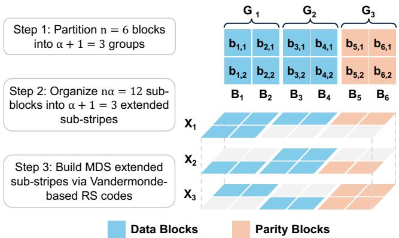  
Figure 1: Code design of an $( n , k , \alpha ) = ( 6 , 4 , 2 )$ LESS stripe.

$$
\begin{array} { r } { ( \sum _ { i = 1 } ^ { 6 } b _ { i , 1 } \mathbf { v } _ { i , 1 } ) + b _ { 1 , 2 } \mathbf { v } _ { 1 , 2 } + b _ { 2 , 2 } \mathbf { v } _ { 2 , 2 } = \mathbf { 0 } , } \\ { ( \sum _ { i = 1 } ^ { 6 } b _ { i , 2 } \mathbf { v } _ { i , 2 } ) + b _ { 3 , 1 } \mathbf { v } _ { 3 , 1 } + b _ { 4 , 1 } \mathbf { v } _ { 4 , 1 } = \mathbf { 0 } , } \end{array}
$$

where $\mathbf { v } _ { i , j } = [ 1 , \nu _ { i , j } ] ^ { T }$ . This completes the encoding process. Our coding coefficients are carefully chosen to ensure that $X _ { 3 }$ inherently forms an (8,6) Vandermonde-based RS stripe without being explicitly encoded. The reason is that $X _ { 3 }$ also satisfies the parity-check equation (Equation (1)), which is exactly the sum of the parity-check equations of $X _ { 1 }$ and $X _ { 2 } { \mathrm { : } }$

$$
\begin{array} { r l } & { \quad b _ { 1 , 1 } \mathbf { v } _ { 1 , 1 } + b _ { 2 , 1 } \mathbf { v } _ { 2 , 1 } + b _ { 3 , 2 } \mathbf { v } _ { 3 , 2 } + b _ { 4 , 2 } \mathbf { v } _ { 4 , 2 } } \\ & { + b _ { 5 , 1 } \mathbf { v } _ { 5 , 1 } + b _ { 5 , 2 } \mathbf { v } _ { 5 , 2 } + b _ { 6 , 1 } \mathbf { v } _ { 6 , 1 } + b _ { 6 , 2 } \mathbf { v } _ { 6 , 2 } = \mathbf { 0 } . } \end{array}
$$

Single-block repair. Suppose $B _ { 1 }$ fails. LESS repairs $b _ { 1 , 1 }$ 1 and $b _ { 1 , 2 }$ from X1 by retrieving six sub-blocks $b _ { 2 , 1 } , b _ { 2 , 2 } , b _ { 3 , 1 } , b _ { 4 , 1 }$ $b _ { 5 , 1 }$ , and $b _ { 6 , 1 }$ , with 25% less I/O than the conventional repair for the $^ { ( 6 , 4 ) }$ RS code (four full blocks). Note that LESS’s repair I/O reductions apply to all data and parity blocks. For any block, its sub-blocks must reside in one of the extended sub-stripes. Thus, a single-block repair always retrieves six sub-blocks.

## 3.3 Construction

We now elaborate on how to construct a LESS stripe for the configurable parameters $( n , k , \alpha )$ , where $k < n$ and $2 \leq \alpha \leq n .$ An $( n , k , \alpha )$ LESS stripe comprises n blocks $B _ { i } { } ^ { \circ } { \mathrm { s } } \ ( 1 \leq i \leq$ n), each with α sub-blocks $b _ { i , j } \mathrm { ' s } \ : ( 1 \leq j \leq \alpha )$ (i.e., α substripes). LESS organizes the sub-blocks into $\alpha + 1$ extended sub-stripes, each tolerating any $n - k$ sub-block failures. Its construction process proceeds as follows.

Step 1 (Grouping blocks). We partition n blocks into $\alpha + 1$ block groups $G _ { z } \mathrm { { ' s } } \left( 1 \leq z \leq \alpha + 1 \right)$ , whose numbers of blocks differ by at most one. The number of blocks in $G _ { z } \left( | G _ { z } | \right)$ is:

$$
| G _ { z } | = { \left\{ \begin{array} { l l } { \left\lceil { \frac { n } { \alpha + 1 } } \right\rceil } & { { \mathrm { i f } } z \leq n { \bmod { \left( \right)} } \alpha + 1  } \\ { \left\lfloor { \frac { n } { \alpha + 1 } } \right\rfloor } & { { \mathrm { o t h e r w i s e } } . } \end{array} \right. }\tag{3}
$$

In Figure 1, we divide the six blocks into three block groups: groups: $G _ { 1 } = \{ B _ { 1 } , B _ { 2 } \} , G _ { 2 } = \{ B _ { 3 } , B _ { 4 } \}$ , and ,and ${ \cal G } _ { 3 } = \{ B _ { 5 } , B _ { 6 } \}$

Step 2 (Layering extended sub-stripes). We organize nα sub-blocks into $\alpha + 1$ extended sub-stripes $X _ { z } \mathrm { ~ s ~ } ( 1 \leq z \leq$ $\alpha + 1 )$ . Let gi be the index of the block group containing block $B _ { i } \ ( \mathrm { i . e . }$ , if $B _ { i } \in G _ { z }$ , then $g _ { i } = z )$ . Each of the first α $X _ { z } \mathrm { ' s }$ (for $1 \leq z \leq \alpha )$ includes all sub-blocks in $G _ { z }$ plus all sub-blocks in the z-th sub-stripe, while $X _ { \alpha + 1 }$ includes all subblocks in $G _ { \alpha + 1 }$ and all sub-blocks $b _ { i , j } \mathrm { ^ { \circ } s }$ where $g _ { i } = j .$ . The number of sub-blocks in $X _ { z } \left( \left| X _ { z } \right| \right)$ is:

$$
| X _ { z } | = n + ( \alpha - 1 ) | G _ { z } | ,\tag{4}
$$

where n accounts for the sub-blocks in a sub-stripe, and $( \alpha -$ $1 ) | G _ { z } |$ accounts for the remaining sub-blocks in $G _ { z }$ that do not belong to the same sub-stripe. Each sub-block belongs to exactly two extended sub-stripes. In particular, $X _ { \alpha + 1 }$ includes the sub-blocks from the first α extended sub-stripes, where each sub-block appears in exactly one of the first α extended sub-stripes. In Figure 1, we organize the sub-blocks into three extended sub-stripes $( X _ { 1 } , X _ { 2 }$ and $X _ { 3 } )$ , each of which contains eight sub-blocks.

Step 3 (Building MDS extended sub-stripes). Our goal is to make each extended sub-stripe Xz $( 1 \leq z \leq \alpha + 1 )$ form an $\left( | X _ { z } | , | X _ { z } | - n + k \right)$ Vandermonde-based RS stripe that can tolerate any $n - k$ sub-block failures. The encoding process proceeds as follows. First, we select nα distinct coding coefficients $\nu _ { i , j } \mathrm { ' s } \left( 1 \leq i \leq n \right.$ and $1 \leq j \leq \alpha )$ from ${ \mathrm { G F } } ( 2 ^ { w } )$ , such that $X _ { z }$ must satisfy the parity-check equation:

$$
\begin{array} { r } { \sum _ { b _ { i , j } \in X _ { z } } b _ { i , j } { \bf v } _ { i , j } = { \bf 0 } , } \end{array}\tag{5}
$$

where $\mathbf { v } _ { i , j } = [ 1 \quad \nu _ { i , j } \quad \nu _ { i , j } ^ { 2 } \quad \cdots \quad \nu _ { i , j } ^ { n - k - 1 } ] ^ { T }$ is a Vandermonde column vector of length $n - k .$ . The linear independence of any $n - k$ Vandermonde column vectors ensures that $X _ { z }$ is an RS-coded stripe. Next, we compute the parity blocks $B _ { i } { } ^ { \ ' } \mathrm { s }$ $( k + 1 \leq i \leq n )$ by encoding the first α extended sub-stripes $X _ { z } \mathrm { ^ { * } s }$ in sequence (i.e., from $X _ { 1 }$ to $X _ { \alpha } )$ . Specifically, for each $X _ { z } \ ( 1 \leq z \leq \alpha )$ , we compute the $n - k$ parity sub-blocks $b _ { i , z }$ (k+ $1 \leq i \leq n )$ using RS encoding (based on Equations (2) and (5)). $X _ { \alpha + 1 }$ does not require explicit encoding, as it automatically forms an Vandermonde-based RS stripe after the first α extended sub-stripes are encoded. In Figure 1, we compute $B _ { 5 }$ and $B _ { 6 }$ with $X _ { 1 }$ and $X _ { 2 }$ based on Vandermonde-based RS encoding, after which $X _ { 3 }$ also forms an (8,6) Vandermondebased RS stripe.

MDS property. For a LESS stripe to tolerate any $n - k$ block failures, we must carefully select nα distinct coding coefficients $\nu _ { i , j } \mathrm { ' s }$ from a Galois Field. Theorem 1 shows that such coefficients can always be found in a sufficiently large field size. The detailed proof is in the Appendix.

Theorem 1. For $( n , k , \alpha )$ LESS, we can always find nα distinct coding coefficients $\nu _ { i , j } \ m ^ { \prime } s \left( 1 \leq i \leq n \right.$ and $1 \leq j \leq \alpha )$ in $G F ( 2 ^ { w } ) f o r M D S$ when $\textstyle 2 ^ { w } \geq n \alpha + ( n - k - 1 ) { \binom { n - 1 } { k } }$

Theorem 1 provides a sufficient condition for the Galois Field size. In practice, for typical coding parameters, the required coefficients can be found in smaller fields $( \mathrm { G F } ( 2 ^ { 8 } )$ or $\mathrm { \bar { G F } } ( 2 ^ { 1 6 } ) )$ ). In our implementation, we can generate the nα coding coefficients using a primitive element $p$ with a multiplicative approach:

$$
\nu _ { i , j } = p ^ { ( h _ { i } ( \alpha + 1 ) + g _ { i } ) \alpha + j } , 1 \le i \le n \mathrm { ~ a n d ~ } 1 \le j \le \alpha ,\tag{6}
$$

where $h _ { i } \left( 1 \leq i \leq \left| G _ { z } \right| \right)$ is the position of $B _ { i }$ in its block group $G _ { z } \ ( \mathrm { i . e . , } \ B _ { i }$ is the $h _ { i } { \mathrm { - t h } }$ block in $G _ { z } )$ . For example, in Figure $1 , B _ { 2 }$ is the second block in $G _ { 1 } ,$ , so $g _ { 2 } = 1$ and $h _ { 2 } = 2 .$ The primitive element is $p = 2$ for $( 6 , 4 , 2 )$ LESS, while $\nu _ { 2 , 1 }$ and $\nu _ { 2 , 2 }$ are $2 ^ { 1 5 }$ and $2 ^ { 1 6 }$ in GF(28), respectively. We can find the feasible primitive elements based on brute-force search $( \mathrm { i . e . }$ , checking linear independence by enumerating any possible sub-matrices of the parity-check matrix). Note that the search of feasible primitive elements is done only once for construction. In the Appendix, we show how the parity-check matrix is formed and provide the feasible primitive elements for common (n, k, α) (n − k ≤ 4 and $2 \leq \alpha \leq 4 )$

## 3.4 Repair

LESS supports efficient repair of single-block failures within an extended sub-stripe and certain multi-block failures when the failed blocks reside in the same extended sub-stripe.

Single-block repair. For a failed block $B _ { i } \ ( 1 \leq i \leq n )$ in $G _ { z } \ ( 1 \leq z \leq \alpha )$ , we repair $B _ { i }$ using sub-blocks within $X _ { z } ,$ , which contains all sub-blocks of $G _ { z } .$ Since $X _ { z }$ is an $\left( | X _ { z } | , | X _ { z } | - n + k \right)$ RS-coded stripe, it tolerates any $n - k \geq \alpha$ sub-block failures. The α failed sub-blocks can be reconstructed using the parity-check equation (Equation (5)) for $X _ { z } .$ . To reduce accessed blocks, we prioritize transferring $| G _ { z } | ( \alpha - 1 )$ available sub-blocks from $G _ { z } ,$ followed by $| X _ { z } | - n + k - | G _ { z } | ( \alpha - 1 )$ available sub-blocks from other block groups.

Multi-block repair. LESS is also beneficial for a multi-block repair, where we simultaneously repair multiple failed blocks on a single stripe. When $\textstyle \left\lfloor { \frac { n - { \bar { k } } } { \alpha } } \right\rfloor \geq 2$ , LESS can repair any $\textstyle \left\lfloor { \frac { n - k } { \alpha } } \right\rfloor$ block failures within one extended sub-stripe if all failed blocks reside in the same block group, say $G _ { z } ( 1 \leq z \leq$ $\alpha { + 1 } )$ . With all failed sub-blocks in $X _ { z } .$ , since α $\textstyle \left\lfloor { \frac { n - k } { \alpha } } \right\rfloor \leq n - k .$ the failed sub-blocks can be repaired within $X _ { z } .$ For other multi-block failure cases, LESS resorts to conventional repair (which retrieves k blocks). For example, in a (14, 10, 2) LESS stripe (Figure 2), repairing two failed blocks $B _ { 1 }$ and $B _ { 2 }$ in $G _ { 1 } \ { \mathrm { ( i . e . } }$ , the sub-blocks $b _ { 1 , 1 } , b _ { 1 , 2 } , b _ { 2 , 1 } .$ , and $b _ { 2 , 2 }$ are in $X _ { 1 } )$ can leverage $X _ { 1 } ^ { , } \mathrm { ~ s ~ } ( 1 9 , 1 5 )$ RS coding. This requires 15 subblocks, with 25% less repair I/O than the conventional repair of the (14, 10) RS code.

## 3.5 I/O-Efficient Repairs in LESS

LESS achieves I/O-efficient repairs in three aspects: (i) repair I/O, (ii) I/O seeks, and (iii) balanced I/O reductions.

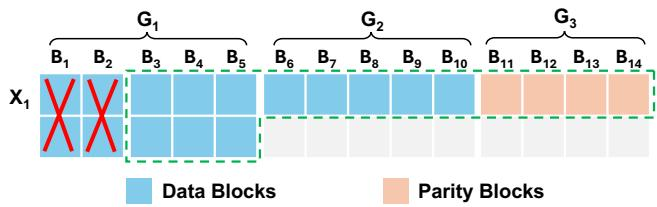  
Figure 2: Two-block repair in (n, k, α) = (14, 10, 2) LESS.

Repair I/O. For block $B _ { i } \left( 1 \leq i \leq n \right)$ in $G _ { z }$ (recall $z = g _ { i } )$ , We retrieve $\left| X _ { z } \right| - n + k$ sub-blocks, as we repair the block with the $\left( | X _ { z } | , | X _ { z } | - n + k \right)$ RS code. From Equations (3) and (4), the repair I/O (in sub-blocks) of $B _ { i }$ is:

$$
\begin{array} { r } { \mathbf { I O } _ { i } = \left\{ \begin{array} { l l } { k + \left( \alpha - 1 \right) \left\lceil \frac { n } { \alpha + 1 } \right\rceil } & { \mathrm { i f } g _ { i } \leq n \bmod ( \alpha + 1 ) } \\ { k + \left( \alpha - 1 \right) \left\lfloor \frac { n } { \alpha + 1 } \right\rfloor } & { \mathrm { o t h e r w i s e } . } \end{array} \right. } \end{array}\tag{7}
$$

This is strictly less than the I/O for the conventional repair of an $( n , k )$ RS code when $k > \left\lceil { \frac { n } { 3 } } \right\rceil$ (common in practice), as $\begin{array} { r } { \mathbf { I O } _ { i } \leq k + ( \alpha - 1 ) \left\lceil \frac { n } { \alpha + 1 } \right\rceil \leq k + ( \alpha - 1 ) \lceil \frac { n } { 3 } \rceil < k \alpha . } \end{array}$ I/O seeks. For a single-block failure, LESS limits I/O seeks to $k + \alpha - 1$ . Repairing $B _ { i }$ in $G _ { z }$ requires $\left| X _ { z } \right| - n + k$ subblocks from $X _ { z } ,$ including: (i) the $\alpha ( | G _ { z } | - 1 )$ contiguous sub-blocks from $G _ { z } ,$ which can be retrieved with $| G _ { z } | - 1$ seeks, and (ii) $| X _ { z } | - n + k - \alpha ( | G _ { z } | - 1 )$ sub-blocks from other blocks, each requiring one seek. The total number of I/O seeks is $\left( | G _ { z } | - 1 \right) + | X _ { z } | - n + k - \alpha ( | G _ { z } | - 1 ) = k + \alpha - 1$ ， from Equations (3) and (4).

Balanced I/O reductions. The repair I/O is similar for the repair of any data or parity block in a stripe, and differs by at most $\alpha - 1$ sub-blocks from Equation (7). Also, the repair incurs exactly one I/O seek from each of the $k + \alpha - 1$ available blocks. Thus, LESS balances I/O reductions.

## 4 Evaluation

We evaluate LESS via numerical analysis and testbed experiments, and address two questions: (i) Does LESS’s empirical repair performance conform to its theoretical improvements? (ii) How do system configurations affect repair performance?

## 4.1 Numerical Analysis

Exp#A1 (Single-block repair). We compare LESS against systematic MDS codes (RS, Clay, Hitchhiker, HashTag, and ET) in a single-block repair. We vary α from 2 to $n - k$ for HashTag, ET, and LESS. We measure the average, minimum, and maximum repair I/O (in blocks) and total number of I/O seeks when repairing each of the n blocks. We focus on $( n , k ) = ( 1 4 , 1 0 )$ , a default configuration in Facebook’s f4 [21]. Table 2 shows that for $\alpha \ge 3$ , LESS has less repair I/O than other codes (except Clay, which minimizes repair I/O) with limited I/O seeks. For α = 4, LESS reduces the average repair I/O of RS, Hitchhiker, HashTag $( \alpha = 4 )$ , and ET $( \alpha = 4 )$ by 53.6%, 38.1%, 23.1%, and 20.7%, respectively, and reduces the average number of I/O seeks of Clay by 95.5%.

<table><tr><td rowspan=2 colspan=1>Codes</td><td rowspan=2 colspan=1>α</td><td rowspan=1 colspan=2>Repair I/O</td><td rowspan=1 colspan=2># I/O seeks</td></tr><tr><td rowspan=1 colspan=1>Avg</td><td rowspan=1 colspan=1>Min/Max</td><td rowspan=1 colspan=1>Avg</td><td rowspan=1 colspan=1>Min/Max</td></tr><tr><td rowspan=1 colspan=1>RS</td><td rowspan=1 colspan=1>1</td><td rowspan=1 colspan=1>10.00</td><td rowspan=1 colspan=1>10.00/10.00</td><td rowspan=1 colspan=1>10.000</td><td rowspan=1 colspan=1>10/10</td></tr><tr><td rowspan=1 colspan=1>Clay</td><td rowspan=1 colspan=1>256</td><td rowspan=1 colspan=1>3.25</td><td rowspan=1 colspan=1>3.25 /3.25</td><td rowspan=1 colspan=1>286.00</td><td rowspan=1 colspan=1>13/832</td></tr><tr><td rowspan=1 colspan=1>Hitchhiker</td><td rowspan=1 colspan=1>2</td><td rowspan=1 colspan=1>7.50</td><td rowspan=1 colspan=1>6.50/10.00</td><td rowspan=1 colspan=1>10.86</td><td rowspan=1 colspan=1>10/13</td></tr><tr><td rowspan=3 colspan=1>HashTag</td><td rowspan=1 colspan=1>2</td><td rowspan=1 colspan=1>7.07</td><td rowspan=1 colspan=1>5.50/10.00</td><td rowspan=1 colspan=1>10.71</td><td rowspan=1 colspan=1>10/11</td></tr><tr><td rowspan=1 colspan=1>3</td><td rowspan=1 colspan=1>6.67</td><td rowspan=1 colspan=1>4.34/10.00</td><td rowspan=1 colspan=1>12.64</td><td rowspan=1 colspan=1>10/20</td></tr><tr><td rowspan=1 colspan=1>4</td><td rowspan=1 colspan=1>6.04</td><td rowspan=1 colspan=1>4.00/10.00</td><td rowspan=1 colspan=1>12.14</td><td rowspan=1 colspan=1>10/13</td></tr><tr><td rowspan=3 colspan=1>ET</td><td rowspan=1 colspan=1>2</td><td rowspan=1 colspan=1>7.50</td><td rowspan=1 colspan=1>7.50/7.50</td><td rowspan=1 colspan=1>11.00</td><td rowspan=1 colspan=1>11/11</td></tr><tr><td rowspan=1 colspan=1>3</td><td rowspan=1 colspan=1>7.14</td><td rowspan=1 colspan=1>6.67 /7.67</td><td rowspan=1 colspan=1>13.43</td><td rowspan=1 colspan=1>12/14</td></tr><tr><td rowspan=1 colspan=1>4</td><td rowspan=1 colspan=1>5.86</td><td rowspan=1 colspan=1>5.50/6.25</td><td rowspan=1 colspan=1>14.29</td><td rowspan=1 colspan=1>13/15</td></tr><tr><td rowspan=3 colspan=1>LESS</td><td rowspan=1 colspan=1>2</td><td rowspan=1 colspan=1>7.36</td><td rowspan=1 colspan=1>7.00/7.50</td><td rowspan=1 colspan=1>11.00</td><td rowspan=1 colspan=1>11/11</td></tr><tr><td rowspan=1 colspan=1>3</td><td rowspan=1 colspan=1>5.71</td><td rowspan=1 colspan=1>5.33 /6.00</td><td rowspan=1 colspan=1>12.00</td><td rowspan=1 colspan=1>12/12</td></tr><tr><td rowspan=1 colspan=1>4</td><td rowspan=1 colspan=1>4.64</td><td rowspan=1 colspan=1>4.00/4.75</td><td rowspan=1 colspan=1>13.00</td><td rowspan=1 colspan=1>13/13</td></tr></table>

Table 2: Analysis for a single-block repair for (14, 10).

<table><tr><td rowspan=2 colspan=1>Codes / (n,k)</td><td rowspan=1 colspan=3>Avg.Repair I/O/Avg. # of I/O seeks</td></tr><tr><td rowspan=1 colspan=1>(80,76)</td><td rowspan=1 colspan=1>(100,96)</td><td rowspan=1 colspan=1>(124,120)</td></tr><tr><td rowspan=1 colspan=1>RS</td><td rowspan=1 colspan=1>76/76</td><td rowspan=1 colspan=1>96/96</td><td rowspan=1 colspan=1>120/120</td></tr><tr><td rowspan=1 colspan=1>LESS (α=4)</td><td rowspan=1 colspan=1>31/79</td><td rowspan=1 colspan=1>39/99</td><td rowspan=1 colspan=1>48.6/123</td></tr></table>

Table 3: Analysis for a single-block repair for wide-stripe codes.

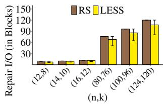  
(a) Repair I/O

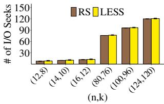  
(b) Number of I/O seeks  
Figure 3: Analysis for two-block repairs for different (n, k).

LESS also improves wide-stripe repairs. Table 3 shows the results (some parameters are studied in [9, 12]). For example, for (124, 120), LESS (α = 4) reduces the repair I/O of RS by 59.5% with limited extra I/O seeks.

Exp#A2 (Multi-block repair). We study two-block repair I/O and I/O seeks for LESS and RS codes (conventional repair) for different (n, k)’s. We average the results over all n2 block failure combinations, with minimum/maximum error bars. Figure 3 shows the results. LESS reduces repair I/O for 27.3-32.8% of two-block failure cases, with limited I/O seek overhead. For example, for (14,10), LESS (α = 2) reduces the average repair I/O of RS by 7.4% and improves repairs for 28.6% of cases. For wide stripes, say (124, 120), LESS (α = 2) reduces the average repair I/O of RS by 10.8% and improves repairs for 32.8% of cases.

## 4.2 Testbed Experiments

Implementation. We implement LESS on OpenEC (an erasure coding middleware) [19] atop Hadoop 3.3.4 HDFS [7] and use Jerasure [26] for coding operations. We also include RS, Clay, Hitchhiker, HashTag, and ET in our comparisons. Our prototype adds 8.7 K LoC to OpenEC in C++.

HDFS uses a NameNode for storage management and multiple DataNodes for storage. HDFS organizes data in fixedsize blocks, each further partitioned into multiple packets. The packets at the same block offset are encoded together, allowing pipelined coding operations across packets. Our prototype follows this packet-level pipelined implementation.

Methodology. We conduct testbed experiments in a 15- machine local cluster connected via a 10 Gbps Ethernet switch. Each machine is equipped with a quad-core 3.4 GHz Intel i5- 7500 CPU, 16 GiB RAM, a 7200 RPM 1 TB SATA HDD, and Ubuntu 22.04. We use Wondershaper [11] to configure the network bandwidth of each machine. We use one machine for the NameNode and 14 machines for DataNodes. By default, we set (n, k) = (14, 10), 64 MiB blocks, 256 KiB packets, and 1 Gbps network bandwidth as in prior work [19, 31, 35].

We evaluate the (i) single-block repair time (i.e., the average time from issuing a repair request to a failed block until the failed block is repaired, averaged over n blocks) and (ii) full-node recovery time (i.e., the total time to repair all blocks in a single failed DataNode). In full-node recovery, we repair 20 blocks from different stripes (one block per stripe) [18], where node IDs are randomly assigned in the cluster across stripes, so that the lost blocks of a failed node correspond to different block positions across stripes. We average results over 10 runs, with 95% confidence intervals based on the Student’s t-distribution.

Exp#B1 (Single-block repair). Figure 4(a) shows that LESS effectively reduces the single-block repair time due to the reductions in repair I/O and I/O seeks. For example, LESS (α = 4) reduces the single-block repair times of RS, Hitchhiker, HashTag (α = 4), ET (α = 4), and Clay by 50.8%, 35.9%, 21.5%, 21.5%, and 33.9%, respectively.

Exp#B2 (Full-node recovery). Figure 4(b) shows that LESS also reduces the full-node recovery time. For example, the reductions of LESS (α = 4) compared with RS, Hitchhiker, HashTag (α = 4), ET (α = 4), and Clay are 48.3%, 34.3%, 17.8%, 19.4%, and 36.6%, respectively.

Exp#B3 (Encoding throughput). We measure the encoding throughput (i.e., the amount of data encoded per second) on a single machine. We construct a (14,10) stripe in memory and put random bytes in the stripe for encoding. Figure 4(c) shows the results for packet sizes from 128 KiB to 1024 KiB. For 256 KiB packets, RS achieves 2.8 GiB/s, while LESS (α = 4) achieves 1.6 GiB/s. For wide stripes, say (124, 120) and 256 KiB packets, RS and LESS (α = 4) achieve 2.6 GiB/s and 1.1 GiB/s, respectively (not shown in the figure). The encoding throughput for both codes decreases with larger packet sizes, as more data needs to be fit into the CPU cache for encoding. LESS has lower encoding throughput than RS due to sub-packetization, yet its encoding throughput exceeds 1 GiB/s and its computational overhead remains limited compared to bandwidth and I/O bottlenecks (§2). Our evaluation measures single-threaded performance; the encoding throughput can be further improved via multi-threading across stripes.

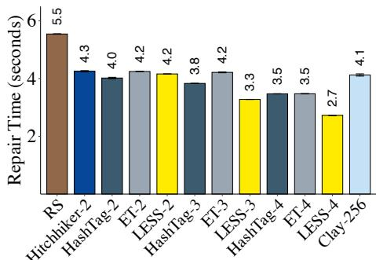  
(a) Single-block repair time

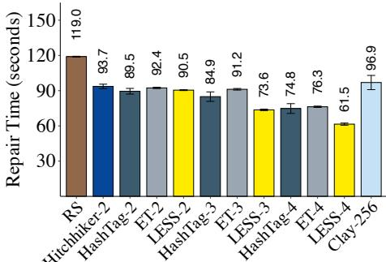  
(b) Full-node recovery time

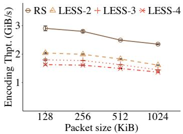  
(c) Encoding throughput

Figure 4: Repair performance for (14, 10). In figures (a) and (b), we put α next to each code (e.g., LESS-4 has α = 4).  
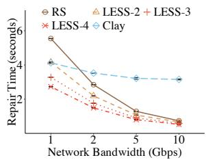

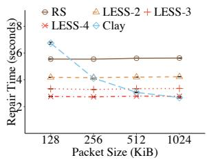  
(a) Impact of network bandwidth  
(b) Impact of packet size  
Figure 5: Impact of configurations on (14,10) single-block repair.

Exp#B4 (Impact of network bandwidth). We study the impact of network bandwidth, varied from 1 Gbps to 10 Gbps via Wondershaper, on the single-block repair time. Figure 5(a) shows that as the network bandwidth increases, Clay suffers from significant I/O seek overhead, while LESS effectively reduces the single-block repair time due to small subpacketization. For example, for 10 Gbps bandwidth, LESS (α = 4) reduces the single-block repair times of RS and Clay by 28.6% and 83.3%, respectively. Overall, LESS maintains a low single-block repair time for varying network bandwidth.

Exp#B5 (Impact of packet size). We study the impact of packet size, varied from 128 KiB to 1024 KiB. Figure 5(b) shows that for small packet sizes, Clay incurs significant I/O overhead for processing a large number of sub-blocks, while LESS keeps stable repair performance. For example, for 128 KiB packets, LESS (α = 4) reduces the single-block repair times of RS and Clay by 59.1% and 50.4%, respectively.

## 5 Conclusion

LESS is a family of erasure codes designed for I/O-efficient repairs by layering extended sub-stripes, so as to reduce both repair I/O and I/O seeks and ensure balanced reductions across blocks. It has several practical properties: MDS, general parameters, systematic, and configurable sub-packetization. Numerical analysis and testbed experiments show LESS’s repair benefits over state-of-the-art repair-friendly codes.

## Acknowledgments

We thank our shepherd, Ramnatthan Alagappan, and the anonymous reviewers for their comments. This work was supported in part by the National Key R&D Program of China (2021YFA1001000), the National Natural Science Foundation of China (12231014 and 62302175), the Postdoctoral Fellowship Program and China Postdoctoral Science Foundation (BX20250065), Research Grants Council of Hong Kong (AoE/P-404/18), and Research Matching Grant Scheme. The corresponding author is Xiaolu Li.

## References

[1] S. B. Balaji, M. Nikhil Krishnan, Myna Vajha, Vinayak Ramkumar, Birenjith Sasidharan, and P. Vijay Kumar. Erasure coding for distributed storage: an overview. Science China Information Sciences, 61(100301):100301:1–100301:45, 2018.

[2] S. B. Balaji, Myna Vajha, and P. Vijay Kumar. Lower bounds on the sub-packetization level of MSR codes and characterizing optimal-access MSR codes achieving the bound. IEEE Trans. on Information Theory, 68(10):6452–6471, 2022.

[3] Brian Beach. Backblaze Vaults: Zettabyte-scale cloud storage architecture. https://www.backblaze.co m/blog/vault-cloud-storage-architecture/, 2019.

[4] Alexandros G. Dimakis, P. Brighten Godfrey, Yunnan Wu, Martin J. Wainwright, and Kannan Ramchandran. Network coding for distributed storage systems. IEEE Trans. on Information Theory, 56(9):4539–4551, 2010.

[5] Daniel Ford, François Labelle, Florentina I. Popovici, Murray Stokely, Van-Anh Truong, Luiz Barroso, Carrie Grimes, and Sean Quinlan. Availability in globally distributed storage systems. In Proc. of USENIX OSDI, 2010.

[6] Chuang Gan, Yuchong Hu, Leyan Zhao, Xin Zhao, Pengyu Gong, and Dan Feng. Revisiting network coding for warm blob storage. In Proc. of USENIX FAST, 2025.

[7] Hadoop 3.3.4. https://hadoop.apache.org/docs /r3.3.4/, 2022.

[8] Yuchong Hu, Henry CH Chen, Patrick PC Lee, and Yang Tang. NCCloud: Applying network coding for the storage repair in a cloud-of-clouds. In Proc. of USENIX FAST, 2012.

[9] Yuchong Hu, Liangfeng Cheng, Qiaori Yao, Patrick P. C. Lee, Weichun Wang, and Wei Chen. Exploiting combined locality for Wide-Stripe erasure coding in distributed storage. In Proc. of USENIX FAST, 2021.

[10] Cheng Huang, Huseyin Simitci, Yikang Xu, Aaron Ogus, Brad Calder, Parikshit Gopalan, Jin Li, and Sergey Yekhanin. Erasure coding in Windows Azure storage. In Proc. of USENIX ATC, 2012.

[11] Bert Hubert, Jacco Geul, and Simon Séhier. Wonder Shaper. https://github.com/magnific0/wonde rshaper, 2012.

[12] Saurabh Kadekodi, Shashwat Silas, David Clausen, and Arif Merchant. Practical design considerations for wide locally recoverable codes (LRCs). In Proc. of USENIX FAST, 2023.

[13] Osama Khan, Randal Burns, James Plank, and William Pierce. Rethinking erasure codes for cloud file systems: Minimizing I/O for recovery and degraded reads. In Proc. of USENIX FAST, 2012.

[14] Oleg Kolosov, Gala Yadgar, Matan Liram, Itzhak Tamo, and Alexander Barg. On fault tolerance, locality, and optimality in locally repairable codes. In Proc. of USENIX ATC, 2018.

[15] Katina Kralevska and Danilo Gligoroski. An explicit construction of systematic MDS codes with small subpacketization for all-node repair. In Proc. of IEEE DASC/PiCom/DataCom/CyberSciTech, 2018.

[16] Katina Kralevska, Danilo Gligoroski, Rune E. Jensen, and Harald Øverby. HashTag erasure codes: From theory to practice. IEEE Trans. on Big Data, 4(4):516– 529, 2018.

[17] Runhui Li, Xiaolu Li, Patrick P. C. Lee, and Qun Huang. Repair pipelining for erasure-coded storage. In Proc. of USENIX ATC, 2017.

[18] Xiaolu Li, Keyun Cheng, Kaicheng Tang, Patrick P. C. Lee, Yuchong Hu, Dan Feng, Jie Li, and Ting-Yi Wu. ParaRC: Embracing sub-packetization for repair parallelization in MSR-coded storage. In Proc. of USENIX FAST, 2023.

[19] Xiaolu Li, Runhui Li, Patrick P. C. Lee, and Yuchong Hu. OpenEC: Toward unified and configurable erasure coding management in distributed storage systems. In Proc. of USENIX FAST, 2019.

[20] Subrata Mitra, Rajesh Panta, Moo-Ryong Ra, and Saurabh Bagchi. Partial-parallel-repair (PPR): A distributed technique for repairing erasure coded storage. In Proc. of ACM EuroSys, 2016.

[21] Subramanian Muralidhar, Wyatt Lloyd, Sabyasachi Roy, Cory Hill, Ernest Lin, Weiwen Liu, Satadru Pan, Shiva Shankar, Viswanath Sivakumar, Linpeng Tang, and Sanjeev Kumar. f4: Facebook’s warm BLOB storage system. In Proc. of USENIX OSDI, 2014.

[22] Lluis Pamies-Juarez, Filip Blagojevic, Robert Mateescu, ´ Cyril Gyuot, Eyal En Gad, and Zvonimir Bandic. Open- ´ ing the chrysalis: On the real repair performance of MSR codes. In Proc. of USENIX FAST, 2016.

[23] Andreas-Joachim Peters, Michal Kamil Simon, and Elvin Alin Sindrilaru. Erasure coding for production in the EOS open storage system. In Proc. of CHEP, 2019.

[24] James S. Plank and Cheng Huang. Tutorial: Erasure coding for storage applications. http://web.eecs.u tk.edu/\~jplank/plank/papers/FAST-2013-Tut orial.html, 2013.

[25] James S. Plank, Jianqiang Luo, Catherine D. Schuman, Lihao Xu, and Zooko Wilcox-O’Hearn. A performance evaluation and examination of open-source erasure coding libraries for storage. In Proc. of USENIX FAST, 2009.

[26] James S. Plank, Scott Simmerman, and Catherine D. Schuman. Jerasure: A library in C/C++ facilitating erasure coding for storage applications - version 2.0. Technical Report CS-08-627, 2014.

[27] K. V. Rashmi, Preetum Nakkiran, Jingyan Wang, Nihar B. Shah, and Kannan Ramchandran. Having your cake and eating it too: Jointly optimal erasure codes for I/O, storage, and network-bandwidth. In Proc. of USENIX FAST, 2015.

[28] K. V. Rashmi, Nihar B. Shah, Dikang Gu, Hairong Kuang, Dhruba Borthakur, and Kannan Ramchandran. A solution to the network challenges of data recovery in erasure-coded distributed storage systems: A study on the facebook warehouse cluster. In Proc. of USENIX HotStorage, 2013.

[29] K. V. Rashmi, Nihar B. Shah, Dikang Gu, Hairong Kuang, Dhruba Borthakur, and Kannan Ramchandran. A "hitchhiker’s" guide to fast and efficient data reconstruction in erasure-coded data centers. In Proc. of ACM SIGCOMM, 2014.

[30] Irving S Reed and Gustave Solomon. Polynomial codes over certain finite fields. Journal of the Society for Industrial and Applied Mathematics, 8(2):300–304, 1960.

[31] Maheswaran Sathiamoorthy, Megasthenis Asteris, Dimitris Papailiopoulos, Alexandros G Dimakis, Ramkumar Vadali, Scott Chen, and Dhruba Borthakur. XORing elephants: novel erasure codes for big data. In Proc. of VLDB Endowment, 2013.

[32] Yingdi Shan, Kang Chen, Tuoyu Gong, Lidong Zhou, Tai Zhou, and Yongwei Wu. Geometric partitioning:

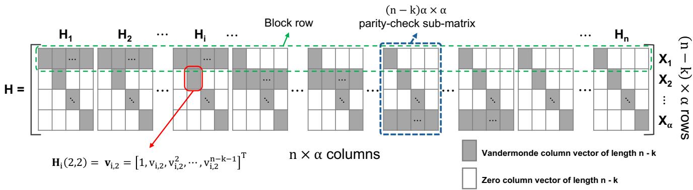  
Figure 6: Parity-check matrix of an (n, k, α) LESS stripe.

Explore the boundary of optimal erasure code repair. In Proc. of ACM SOSP, 2021.

[33] Zhirong Shen, Yuhui Cai, Keyun Cheng, Patrick P. C. Lee, Xiaolu Li, Yuchong Hu, and Jiwu Shu. A survey of the past, present, and future of erasure coding for storage systems. ACM Trans. on Storage, 21(1):1–39, 2025.

[34] Konstantin Shvachko, Hairong Kuang, Sanjay Radia, and Robert Chansler. The hadoop distributed file system. In Proc. of IEEE MSST, 2010.

[35] Kaicheng Tang, Keyun Cheng, Helen H. W. Chan, Xiaolu Li, Patrick P. C. Lee, Yuchong Hu, Jie Li, and Ting-Yi Wu. Balancing repair bandwidth and subpacketization in erasure-coded storage via elastic transformation. In Proc. of IEEE INFOCOM, 2023.

[36] Myna Vajha, Vinayak Ramkumar, Bhagyashree Puranik, Ganesh Kini, Elita Lobo, Birenjith Sasidharan, P. Vijay Kumar, Alexandar Barg, Min Ye, Srinivasan Narayanamurthy, Syed Hussain, and Siddhartha Nandi. Clay codes: Moulding MDS codes to yield an MSR code. In Proc. of USENIX FAST, 2018.

[37] Hakim Weatherspoon and John D. Kubiatowicz. Erasure coding vs. replication: A quantitative comparison. In Proc. of IPTPS, 2002.

[38] Sage A. Weil, Scott A. Brandt, Ethan L. Miller, Darrell D. E. Long, and Carlos Maltzahn. Ceph: A scalable, high-performance distributed file system. In Proc. of USENIX OSDI, 2006.

[39] Yunfeng Zhu, Patrick P. C. Lee, Yinlong Xu, Yuchong Hu, and Liping Xiang. On the speedup of recovery in large-scale erasure-coded storage systems. IEEE Trans. on Parallel and Distributed Systems, 25(7):1830–1840, 2014.

## A Appendix: Proof of MDS Property

We prove Theorem 1 that LESS is MDS for a sufficiently large field size. Our proof is based on the parity-check matrix of LESS.

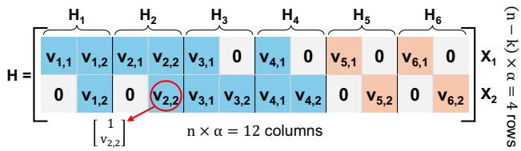  
Figure 7: Parity-check matrix of a (6, 4, 2) LESS stripe.

Parity-check matrix of LESS. The parity-check matrix (H) of an (n, k, α) LESS stripe is an (n − k)α × nα matrix. We view H as an α × nα block matrix, where each entry is a column vector of length n − k. We partition H into n paritycheck sub-matrices as $\mathbf { H } = [ \mathbf { H } _ { 1 } , \mathbf { H } _ { 2 } , \cdots , \mathbf { H } _ { n } ]$ , where each $\mathbf { H } _ { i }$ (where $1 \leq i \leq n )$ is an α × α block matrix. We define a block row as nα entries in a row of H. The entry of $\mathbf { H } _ { i }$ on the z-th block row and the j-th column (where $1 \leq z \leq \alpha$ and $1 \leq j \leq \alpha )$ is given by

$$
\mathbf { H } _ { i } ( z , j ) = \left\{ \begin{array} { l l } { \mathbf { v } _ { i , j } } & { \mathrm { i f } \ b _ { i , j } \in X _ { z } } \\ { \mathbf { 0 } } & { \mathrm { o t h e r w i s e . } } \end{array} \right.\tag{8}
$$

Figure 6 shows the parity-check matrix of LESS. We write block $B _ { i } = [ b _ { i , 1 } , b _ { i , 2 } , \cdots , b _ { i , \alpha } ] ^ { T }$ as a column vector of the subblocks. From the parity-check matrix, the α parity-check equations of the first α extended sub-stripes can be written as

$$
[ \mathbf { H } _ { 1 } , \mathbf { H } _ { 2 } , \cdots , \mathbf { H } _ { \mathbf { n } } ] [ B _ { 1 } ^ { T } , B _ { 2 } ^ { T } , \cdots , B _ { n } ^ { T } ] ^ { T } = \sum _ { i = 1 } ^ { n } \mathbf { H } _ { \mathbf { i } } B _ { i } = \mathbf { 0 } ,\tag{9}
$$

Based on Equations (5) and (9), the z-th block row can be written as the parity-check equation of the extended sub-stripe $X _ { z }$ as follows:

$$
\begin{array} { l } { { \displaystyle \sum _ { i = 1 } ^ { n } [ { \bf H } _ { i } ( z , 1 ) , { \bf H } _ { i } ( z , 2 ) , \cdots , { \bf H } _ { i } ( z , \alpha ) ] B _ { i } } } \\ { { \displaystyle = \sum _ { i = 1 } ^ { n } \left[ \sum _ { j = 1 } ^ { \alpha } ( { \bf H } _ { i } ( z , j ) b _ { i , j } ) \right] = \sum _ { b _ { i , j } \in X _ { z } } b _ { i , j } { \bf v } _ { i , j } = { \bf 0 } . } } \end{array}
$$

Figure 7 shows the parity-check matrix of (6,4,2) LESS. The 4 × 12 parity-check matrix H comprises two block rows and six parity-check sub-matrices. The first and second block rows can be derived from the parity-check equations of $X _ { 1 }$ and $X _ { 2 } .$ , respectively.

<table><tr><td rowspan=1 colspan=1>n-k</td><td rowspan=1 colspan=1>α</td><td rowspan=1 colspan=1>n</td><td rowspan=1 colspan=1>Galois Fields</td><td rowspan=1 colspan=1>P</td></tr><tr><td rowspan=1 colspan=1>2</td><td rowspan=1 colspan=1>2</td><td rowspan=1 colspan=1> $n \leq 1 2 7$ </td><td rowspan=1 colspan=1> $\overline { { \mathrm { G F } ( 2 ^ { 8 } ) } }$ </td><td rowspan=1 colspan=1>2</td></tr><tr><td rowspan=4 colspan=1>3</td><td rowspan=2 colspan=1>2</td><td rowspan=1 colspan=1> $n \leq 4 4$ </td><td rowspan=1 colspan=1> $\mathrm { G F } \left( 2 ^ { 8 } \right)$ </td><td rowspan=1 colspan=1>50</td></tr><tr><td rowspan=1 colspan=1> $n \leq 1 2 7$ </td><td rowspan=1 colspan=1> $\overline { { \mathrm { G F } ( 2 ^ { 1 6 } ) } }$ </td><td rowspan=1 colspan=1>2</td></tr><tr><td rowspan=2 colspan=1>3</td><td rowspan=1 colspan=1> $n \leq 4 0$ </td><td rowspan=1 colspan=1> $\overline { { \mathrm { G F } ( 2 ^ { 8 } ) } }$ </td><td rowspan=1 colspan=1>14</td></tr><tr><td rowspan=1 colspan=1> $n \leq 1 2 7$ </td><td rowspan=1 colspan=1> $\overline { { \mathrm { G F } ( 2 ^ { 1 6 } ) } }$ </td><td rowspan=1 colspan=1>2</td></tr><tr><td rowspan=6 colspan=1>4</td><td rowspan=2 colspan=1>2</td><td rowspan=1 colspan=1> $n \leq 2 3$ </td><td rowspan=1 colspan=1> $\mathrm { G F } \left( 2 ^ { 8 } \right)$ </td><td rowspan=1 colspan=1>6</td></tr><tr><td rowspan=1 colspan=1> $n \leq 1 2 7$ </td><td rowspan=1 colspan=1> $\overline { { \mathrm { G F } ( 2 ^ { 1 6 } ) } }$ </td><td rowspan=1 colspan=1>46</td></tr><tr><td rowspan=2 colspan=1>3</td><td rowspan=1 colspan=1> $n \leq 1 7$ </td><td rowspan=1 colspan=1> $\overline { { \mathrm { G F } ( 2 ^ { 8 } ) } }$ </td><td rowspan=1 colspan=1>2</td></tr><tr><td rowspan=1 colspan=1> $n \leq 1 2 7$ </td><td rowspan=1 colspan=1> $\overline { { \mathrm { G F } ( 2 ^ { 1 6 } ) } }$ </td><td rowspan=1 colspan=1>1362</td></tr><tr><td rowspan=2 colspan=1>4</td><td rowspan=1 colspan=1> $n \leq 1 6$ </td><td rowspan=1 colspan=1> $\overline { { \mathrm { G F } ( 2 ^ { 8 } ) } }$ </td><td rowspan=1 colspan=1>14</td></tr><tr><td rowspan=1 colspan=1> $n \leq 1 2 7$ </td><td rowspan=1 colspan=1> $\overline { { \mathrm { G F } ( 2 ^ { 1 6 } ) } }$ </td><td rowspan=1 colspan=1>635</td></tr></table>

Table 4: Feasible primitive elements for commonly used coding parameters.

Proof of Theorem 1. To ensure LESS is MDS, we can verify the parity-check matrix of LESS, such that any n − k out of n parity sub-matrices can form an $( n - k ) \alpha \times ( n - k )$ α square invertible matrix. Recall that any invertible square matrix has a non-zero determinant. To ensure that all possible square matrices from the parity-check matrix are invertible, we can multiply the determinants of the square matrices and ensure that the product is non-zero.

There are $\scriptstyle { \binom { n } { n - k } }$ cases for selecting n − k matrices out of the n parity-check sub-matrices to form a square matrix. The determinant of each square matrix can be viewed as a polynomial over the coding coefficients $\nu _ { i , j } \mathrm { ' s }$ (where $1 \leq i \leq n$ and $1 \leq j \leq \alpha )$ . Each $\nu _ { i , j }$ appears in only one parity-check submatrix $( \mathrm { i } . \mathrm { e } . , \mathbf { H } _ { i } ) .$ and there are $\binom { n - 1 } { k }$ possible square matrices that contain $\mathbf { H } _ { i } .$ Thus, the degree of $\nu _ { i , j }$ in the determinant of such a square matrix is $n - k - 1$ . By multiplying the determinants of all square matrices, the degree of each $\nu _ { i , j }$ is $( n - k - 1 ) { \binom { n - 1 } { k } }$ . We can choose nα distinct coding coefficients in $\dot { \operatorname { G F } } ( \dot { 2 } ^ { w } )$ to ensure the product of determinants is non-zero when $2 ^ { w } \geq n \alpha + ( n - \bar { k } - 1 ) { \binom { n - 1 } { k } }$ , which can be proven from Noga Alon’s Combinatorial Nullstellensatz.

Table 4 shows the feasible primitive elements for commonly used coding parameters $n \leq 1 2 7$ and $n - k \leq 4$ in $\mathrm { G F } ( \bar { 2 } ^ { \bar { 8 } } )$ and $\mathrm { G F } ( 2 ^ { 1 6 } )$ based on brute-force search.

## B Artifact Appendix

## Abstract

LESS is a family of erasure codes designed to improve repair I/O efficiency by layering extended sub-stripes, aiming to reduce both repair I/O and I/O seeks and maintain balanced reductions across all blocks. We implement LESS on OpenEC (an erasure coding middleware) atop Hadoop 3.3.4 HDFS.

## Scope

The artifact is a research-driven prototype that can be used to validate the concepts, designs, and evaluation results of LESS presented in the paper.

## Contents

The artifact has the following contents:

• src/, which includes the implementation of LESS as a patch to the OpenEC codebase.

• scripts/, which includes the evaluation scripts and configuration files to reproduce our evaluation results.

• README.md, which overviews the implementation and provides essential information to run the prototype.

• AE\_INSTRUCTION.md, which includes detailed instructions for artifact evaluation.

## Hosting

The artifact is hosted in GitHub at https://github.com /adslabcuhk/less. We use version v1.0.0 for artifact evaluation.

## Requirements

## Hardware Dependencies

We recommend 15 machines to run the experiments with our prototype and evaluation scripts. These machines need to be connected via a 10 Gbps network, such that they are reachable from each other. For each machine, we recommend a quad-core CPU, 16 GiB of memory, a 7200 RPM SATA HDD and above. We need a minimum of 15 machines to form a storage cluster for the default erasure coding parameters $( n , k ) = ( 1 4 , 1 0 )$ . In particular, we use one machine to run the HDFS NameNode and the other machines to run the HDFS DataNodes.

## Software Dependencies

The artifact is developed and tested on Ubuntu 22.04 LTS with the following software dependencies:

• OpenEC: g++, cmake, redis, hiredis, ISA-L, gf-complete

• Hadoop HDFS: openjdk-8-jdk, maven

• scripts: expect, python3, wondershaper

## Testbed Setup

Please set up the testbed with the following steps:

• Prepare the hardware dependencies as described.

• Download the artifact (version v1.0.0) from URL: ht tps://github.com/adslabcuhk/less/releases.

• Extract the files with tar -zxvf less.tar.gz; run cd less to navigate to the project directory.

• Follow AE\_INSTRUCTION.md to set up the testbed and run experiments with our provided evaluation scripts. The testbed setup takes around 5 hours, depending on the hardware specifications.

## Evaluation

## Artifact Claims

Our goal is to demonstrate LESS’s effectiveness in improving repair performance. For numerical analysis (i.e., Exp#A1 and Exp#A2), we expect the results to match those in our paper. For testbed experiments (i.e., Exp#B1 to Exp#B5), we expect that LESS reduces the single-block repair and full-node recovery times compared to the baseline erasure codes. However, the testbed experiment results may vary from those in our paper due to different factors, such as cluster sizes, machine specifications, operating systems, and software packages.

## Experiments

Exp#A1 (Single-block repair). Expected outcome: Exp#A1 produces the results as shown in Tables 2 and 3, which demonstrate that LESS reduces the average repair I/Os of RS, Hitchhiker, HashTag, and ET, and reduces the average number of I/O seeks of Clay. Approximate runtime: 2 compute minutes.

Exp#A2 (Multi-block repair). Expected outcome: Exp#A2 produces the results as shown in Figure 3, which demonstrate that LESS reduces the average repair I/O of RS, and achieves similar average numbers of I/O seeks as RS. Approximate runtime: 1 compute minute.

Exp#B1 (Single-block repair). Expected outcome: Exp#B1 produces the results as shown in Figure 4(a), which demonstrate that LESS reduces the single-block repair times of RS, Hitchhiker, HashTag, ET, and Clay. Approximate runtime: 2 compute hours.

Exp#B2 (Full-node recovery). Expected outcome: Exp#B2 produces the results as shown in Figure 4(b), which demonstrate that LESS reduces the full-node recovery times of RS, Hitchhiker, HashTag, ET, and Clay. Approximate runtime: 2 compute hours.

Exp#B3 (Encoding throughput). Expected outcome: Exp#B3 produces the results as shown in Figure 4(c), which demonstrate that LESS has lower single-stripe encoding throughput than RS, yet the coding computation overhead is limited compared to bandwidth and I/O operations. Approximate runtime: 5 compute minutes.

Exp#B4 (Impact of network bandwidth). Expected outcome: Exp#B4 produces the results as shown in Figure 5(a). It shows that when the network bandwidth increases, while Clay suffers from significant I/O seek overhead, LESS still effectively reduces the single-block repair time due to small sub-packetization. Approximate runtime: 2 compute hours.

Exp#B5 (Impact of packet size). Expected outcome: It shows that for small packet sizes, while Clay incurs significant I/O overhead for processing a large number of sub-blocks, LESS maintains stable repair performance due to small subpacketization. Approximate runtime: 2 compute hours.