①

USENIX

THE ADVANCED COMPUTING SYSTEMS ASSOCIATION

# OdinANN : Direct Insert for Consistently Stable Performance in Billion-Scale Graph-Based Vector Search

Hao Guo and Youyou Lu, Tsinghua University

## https://www.usenix.org/conference/fast26/presentation/guo

This paper is included in the Proceedings of the 24th USENIX Conference on File and Storage Technologies.

February 24–26, 2026 • Santa Clara, CA, USA

ISBN 978-1-939133-53-3

Open access to the Proceedings of the 24th USENIX Conference on File and Storage Technologies is sponsored by

# OdinANN: Direct Insert for Consistently Stable Performance in Billion-Scale Graph-Based Vector Search

Hao Guo Youyou Lu∗

Tsinghua University

## Abstract

Approximate Nearest Neighbor Search (ANNS) is widely used in various scenarios. For billion-scale ANNS, on-disk graph-based indexes, which organize the vectors as a graph and store them on disk, are favored for their performance and cost-efficiency. However, existing indexes can not maintain a stable search performance while inserting new vectors.

In this paper, we propose to use direct insert, which directly inserts vectors into the on-disk index, rather than buffering them in memory and merging them to disk in batches like existing systems. This approach can even out the interference of insert with frontend search, thus stabilizing the performance. We evaluate direct insert by integrating it into a billion-scale graph-based ANNS index named OdinANN. With a fixed insert rate, OdinANN outperforms state-of-the-art ANNS indexes in search latency and throughput, and it consistently shows stable performance in billion-scale vector datasets.

## 1 Introduction

Approximate nearest neighbor search (ANNS) is the key to multi-modal data retrieval in web search [10,17] and retrievalaugmented generation (RAG) [15]. Multi-modal data, such as texts and images, are encoded to high-dimensional vectors using neural networks [9, 19]. An ANNS index is built upon these vectors and traversed during a search to get the k nearest neighbors of the query vector. Among all types of ANNS indexes, on-disk graph-based indexes [24, 27], in which vectors are organized as a graph and stored on disk, are favored for their performance and cost-efficiency to support large-scale vector search (e.g., billions of vectors [7, 22, 29]).

There is a strong need for ANNS indexes to support vector updates because current systems generate new data continuously [16, 26, 29, 30]. Vector updates can be handled in two ways, index rebuild and index update. Index rebuild, which takes several days in billion-scale datasets [30], fails to keep search results up-to-date. Therefore, index update is favored by recent on-disk graph-based indexes [23]. They support vector inserts and deletes using buffered insert and delete, where they absorb updates into an in-memory index, and then bulk merge the in-memory index into the on-disk index periodically. This way reduces the overhead of index updates by combining disk writes during merge, thus enabling real-time vector search and online index update.

However, by experimental analysis, we find that buffered insert is inefficient when merging inserts to disk. First, merge interferes with frontend search tasks (e.g., increases their median latency to 1.54×), owing to disk bandwidth interference. Second, merge has a high memory consumption (e.g., 125GB for merging 3% of vectors into a billion-scale index [23]), which consists of the in-memory index for inserts and buffered disk writes during the merge. Third, merge gains little performance boost even with a large insert batch, whose throughput is capped at 3000 QPS in our experiment. This is because merge first finds the neighbors for the inserted vectors using on-disk ANNS. This process can not be batched efficiently and thus is executed one by one.

In this paper, we propose to use direct insert for on-disk graph-based ANNS indexes, where vectors are directly inserted into the on-disk index one by one, rather than buffered in memory and merged to disk later as in buffered insert. This approach can even out the insert cost and avoid the in-memory index used by buffered insert, thus stabilizing the frontend search performance and saving memory. Also, it is possible to make direct insert as fast as buffered insert, because buffered insert does not benefit much from batching. However, it is non-trivial to achieve efficient direct insert in graph-based indexes. There are several challenges as follows.

(1) High disk write overhead of direct insert. Direct insert updates tens or hundreds of neighbor records of the target vector. Updating them in place incurs massive disk writes. To combine these record updates for fewer disk writes, a straightforward way is to use a log-structured data layout, but it suffers from garbage collection (GC) overhead.

(2) Complex concurrency control with search. Direct insert searches the target vector to find its neighbors, which are scattered along the search path. For concurrency control, simply locking all of them before updating causes near-root lock contention. An alternative approach is to leverage the approximate features of insert and search for better concurrency, but how to do this efficiently on disk is still under-exploited.

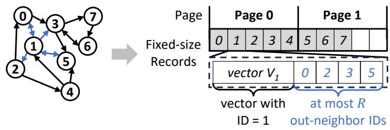  
Figure 1: On-disk layout of a graph-based ANNS index. The directed graph is stored as fixed-size records on disk. Each record contains a vector and its out-neighbor IDs (edges). The maximum out-neighbor number of each node is limited to R.

To address the challenges, we propose OdinANN, a billionscale graph-based ANNS index with direct inserts. OdinANN achieves efficient direct insert with two techniques as follows.

First, to reduce disk write overhead, we propose GC-free update combining. The key observation is that the graph index is stored as fixed-size records on disk. This enables out-ofplace record updates to be performed without garbage collection. Therefore, we do space overprovision on disk to reserve multiple free record slots in a page, where multiple record updates can be combined. The old records can be directly recycled without GC. By default, OdinANN doubles disk space to combine updates, resulting in 2× disk writes compared to a log-structured layout.

Second, to increase the concurrency of insert and search, we introduce approximate concurrency control, leveraging the approximate features of operations for better parallelism. The key idea is to ensure per-record isolations rather than peroperation ones. For vector search, only a consistent snapshot for each record is required to ensure its correctness. For vector insert, it links the target vector with an approximate neighbor snapshot. Besides, we propose two optimizations for insert, tailored for disk I/O and computing in the critical sections separately, to further improve the concurrency.

We compare OdinANN with state-of-the-art ANNS indexes supporting updates, including graph-based DiskANN [23] and cluster-based SPFresh [30]. In workloads with concurrent inserts and searches, OdinANN shows stable performance, with a median search latency fluctuation1 of only 1.07×, compared to DiskANN’s 2.44×. Compared to SPFresh, OdinANN achieves 62.1% median search latency and ∼15% higher accuracy simultaneously, because of the intrinsic advantage of graph-based indexes over cluster-based ones. In billion-scale datasets, OdinANN simultaneously reaches 5000 QPS search throughput and 1100 QPS insert throughput, with a consistently stable median search latency of ∼3ms.

Algorithm 1 Vector Search   
1: G ← graph, q ← query vector   
2: procedure Search(G, q)   
3: s ← starting vector, l ← candidate pool length   
4: candidate pool P ← {<s.ID, PQ\_distance(s, q)>}   
5: explored pool E ← ∅, i ← 0   
6: while i l do   
7: <i ← index of the first vector in P but not in E   
8: r ← record with ID = P[i].ID read from disk.   
9: E.insert(r)   
10: for nid in r.neighbors do   
11: P.insert(<nid, PQ\_distance(nid, q)>)   
12: end for   
13: P ← l nearest vectors to q PQ distance.   
14: end while   
15: L ← k nearest vectors to q in E exact distance.   
16: return E L   
,17: end procedure

In summary, this paper makes the following contributions:

• We analyze the inefficiency of buffered inserts for on-disk graph-based ANNS indexes (§2).

• We propose OdinANN, a billion-scale graph-based ANNS index with direct inserts. It achieves efficient direct inserts by two key techniques, GC-free update combining, and approximate concurrency control (§3).

• We evaluate OdinANN to show its efficacy in stabilizing the search performance and reducing memory usage during concurrent inserts and searches (§4).

## 2 Background and Motivation

In this section, we first introduce the layout and operations of on-disk graph-based ANNS indexes. Then, we show the inefficiency of buffered insert and how direct insert overcomes it. Finally, we describe the challenges of direct insert.

## 2.1 On-Disk Graph-Based ANNS Index

Graph layout. In a graph-based index, vectors are organized as a directed graph, which is stored as adjacent lists on disk, as shown in Figure 1. Each disk page contains several records. Each record consists of a vector (node) and its outneighbor IDs (edges). To ensure a fixed size for records, the nodes’ maximum out-degrees are globally limited to R, where R is a configurable parameter.

Operations. To our knowledge, DiskANN [23] is the only on-disk graph-based ANNS index supporting updates. Here, we introduce its search and buffered insert operations.

Vector search. As shown in Algorithm 1, the search process follows a best-first approach. It starts at a fixed starting vector s and maintains a candidate pool P containing the nearest vectors to the target vector (sorted by their distances). In each step, it explores one or more nearest unexplored vectors, depending on the beam width. The search terminates when all the vectors in P are explored.

Algorithm 2 Vector Insert   
1: G ← graph, q ← vector, R ← max out-degree of G   
2: Prune(N R): remove items in N until N size() ≤ R   
3: procedure Insert(G, q)   
4: E ← vectors explored in Search(G, q)  neighbors.   
5: E ← Prune(E, R)   
6: set q.neighbors to E add edges.   
7: for nbr in E do ▷ add reverse edges.   
8: N ← {nbr.neighbors, q}   
9: N ← Prune(N, R)   
10: set nbr.neighbors to N   
11: end for   
12: end procedure

Buffered insert. Algorithm 2 shows the process of inserting a vector q into a graph-based index. It first searches q and records the explored vectors in the search path, which are q’s candidate neighbors. Then, it attempts to add bi-directional edges to q and its candidate neighbors. If an edge set exceeds the out-degree limit, it is pruned according to some pre-defined rules (e.g., triangle inequality [24]).

DiskANN adopts buffered insert, in order to reduce disk I/O for neighbor updates by batching them. Specifically, inserts are first absorbed by an extra in-memory index. When searching, both the in-memory and on-disk indexes are traversed. When the in-memory index size reaches a threshold, a merge is triggered, which includes two steps. First, it inserts all the vectors in the in-memory index to the on-disk index using Algorithm 2; all the on-disk graph updates are buffered in memory (we call this step in-memory merge). Second, the on-disk updates are committed in batches.

## 2.2 Buffered Insert is Inefficient

Buffered insert is inefficient when merging to disk. We evaluate DiskANN to show this issue. We concurrently do buffered inserts and multi-thread searches in an index with 100 million vectors in the BIGANN [12] dataset. Merge is triggered when the in-memory index contains 6 million vectors (i.e., 6% of the on-disk index size). More detailed configurations are shown in §4.1. Figures 2(a) and 2(b) show the timeline, in which we find three issues.

Issue #1: fluctuated search performance. As shown in Figure 2(a), the search median latency increases to 1.54× on average during the first merge. This is because, merge needs to search the on-disk index to find the neighbors of the target vector, which causes severe read bandwidth interference with the frontend search tasks.

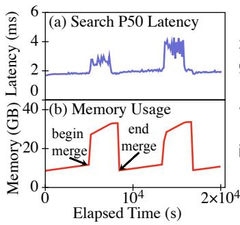

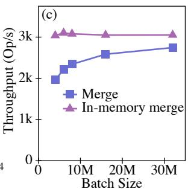  
Figure 2: Inefficient buffered insert. (a, b) Concurrent insert and search vectors in an index with 100 million vectors, merge 6 million buffered inserts each time, two merges in total. (c) The throughput of merge increases with the batch size but is bottlenecked by its first step (i.e., in-memory merge).

Issue #2: high memory consumption. As shown in Figure 2(b), when merging 6% (i.e., 6 million) vectors to disk, the peak memory usage exceeds 32GB, more than 50% of the size of the on-disk index with 100 million vectors (∼55GB). The in-memory elements include the index and buffered disk updates, whose size linearly increases with the number of buffered inserts. Therefore, larger datasets force more frequent merges due to memory capacity limits. For example, merging 3% of vectors (i.e., 30 million) into a billion-scale index requires 125GB of memory [23].

Issue #3: long merge time. In Figures 2(a) and 2(b), merge accounts for more than 30% of the whole timeline, during which the system suffers from the two issues above. In our configuration, we restrict the insert throughput to 1200 QPS and do not insert vectors during merge. Merge will account for a higher time percentage in workloads with higher insert throughput or serving inserts during the merge.

One may consider increasing the batch size to reduce the time percentage of merge. However, merge gains little performance boost even with a large batch. As shown in Figure 2(c), the throughput of merge increases with the batch size, but is bottlenecked by in-memory merge, whose throughput remains constant regardless of the batch size. This is because, although disk writes are merged, the in-memory merge is still executed one by one. For each vector, it searches the on-disk index for neighbors and incurs hundreds of disk reads.

## 2.3 Opportunity: Direct Insert

We propose to do direct insert instead of buffered insert. Using direct insert, vectors are directly inserted into the on-disk index one by one, instead of buffered in memory and merged to disk later as in buffered insert.

Direct insert can naturally solve the three issues above. First, it evens out the bandwidth interference across the whole timeline, which contributes to stable frontend search performance. Second, it avoids both the in-memory index and buffered disk writes during merge, thus saving memory. Third, it is possible for direct insert to be as efficient as buffered insert, as inserts can not be efficiently batched.

However, it is non-trivial to do direct insert efficiently. There are several challenges as follows.

Challenge 1. Each insert updates tens or hundreds of neighbor records. Applying the updates in place causes massive random SSD writes, while using a log-structured layout suffers from frequent garbage collection.

In a graph-based index, each vector connects to tens or hundreds of vectors for navigation [11, 27]. According to Algorithm 2, bi-directional edges are added to the target vector and its neighbors during insert. This process updates the neighbor records scattered randomly on tens or hundreds of pages [27], which leads to massive random SSD writes.

For fewer writes, a straightforward solution is to use a logstructured data layout. However, inserting 10% new records makes the index 12.8× larger (assuming an out-degree of 128); only 7.9% of the records are valid. Thus, garbage collection, which gathers the valid records into a new index, is frequently required. This slows down frontend search requests.

Challenge 2. Ensuring the isolation of direct insert and search harms their concurrency, due to near-root lock contention. However, the potential of using the approximate index feature for better concurrency is under-exploited.

According to Algorithm 2, insert may update all the records explored in the search path. To ensure the isolation of insert and search, a naive approach is to lock all of the involved records before updating. However, the record set contains near-root records. Locking them causes serious lock contention, blocking concurrent inserts and searches.

An alternative approach is to leverage the approximate feature of operations for fine-grained concurrency control: Atomicity and isolation of operations are not mandatory for an approximate index, so they can be relaxed for better concurrency. However, how to design an efficient concurrency control protocol for on-disk graph-based indexes, which efficiently utilizes this feature for shorter critical sections and better concurrency, is still under-exploited.

## 3 Design and Implementation

We design OdinANN, a billion-scale graph-based ANNS index supporting direct inserts and buffered deletes. OdinANN achieves efficient direct insert with the following goals.

• Reduced disk writes. Direct insert in a graph index updates tens or hundreds of neighbor records. We do space overprovision to combine these updates into fewer disk writes, while not suffering from GC overhead (§3.2).

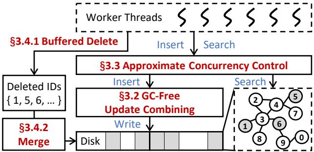  
Figure 3: OdinANN overview.

High concurrency. We leverage the approximate feature of operations to relax the isolation level of both insert and search for better concurrency (§3.3).

## 3.1 Overview

Figure 3 shows the overview of OdinANN.

Graph layout. The directed graph in OdinANN is organized as adjacent lists on disk (Figure 1), similar to previous works [24, 27]. Differently, OdinANN does space overprovision on disk for multiple free records on a page. Out-of-place record updates are combined in these pages (§3.2). In memory, PQ-compressed vectors are stored for graph navigation.

Operations. OdinANN supports three types of operations, vector search, insert, and delete.

• Vector search. OdinANN follows Algorithm 1 for vector search. Differently, OdinANN adopts a dynamic candidate pool, whose size increases with the number of deleted vectors in the pool, to ensure search quality in workloads containing deletes (§3.4.1). For better concurrency, OdinANN only ensures per-record consistency instead of the atomicity of the whole search (§3.3).

• Direct insert. OdinANN follows Algorithm 2 for direct vector insert. It updates the records out of place in the overprovisioned disk space, to combine them for less write amplification (§3.2). For concurrency control, OdinANN uses an approximate snapshot of the target vector’s neighbors during insert to reduce its critical section (§3.3).

• Buffered delete. OdinANN records the ID of deleted vectors in memory (§3.4.1) and merges delete to disk periodically (§3.4.2), similar to previous works [23, 30]. It has low runtime memory consumption (only for IDs) and little interference with frontend search tasks during the merge.

## 3.2 GC-Free Update Combining

In-place record updates suffer from massive disk writes, while the log-structured layout induces frequent garbage collection.

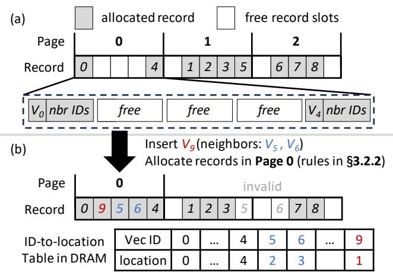  
Figure 4: (a) OdinANN does space overprovision for more free records in a page. (b) Insert a vector and update its neighbors. Multiple record updates are combined into a single page.

To solve this issue, we do space overprovision to merge multiple record updates into a single page.

## 3.2.1 Out-of-place Record Updates for Combining

We find that fixed-size records of the graph (Figure 1) enable out-of-place record updates to be GC-free: If a record is updated out-of-place, its original place can be directly reused by another update, without explicit garbage collection.

Based on this idea, we do space overprovision to combine multiple record updates within a single page write. Specifically, OdinANN reserves extra record slots on disk, creating multiple free slots per page. During an insert, instead of modifying records in their original locations, OdinANN writes the updated records to these free slots. Our allocation strategy (§3.2.2) prioritizes allocating slots on the same page, thus achieving the combination of multiple out-of-place updates into one page. The original record locations are then marked as available for subsequent inserts.

Figure 4 illustrates this process. In Figure 4(a), 9 allocated records normally require two pages; however, OdinANN provisions three, leaving three free slots on page 0. This allows for up to three record updates to be combined. When inserting $V _ { 9 }$ (Figure 4(b)), OdinANN updates $V _ { 9 }$ and its neighbors, $V _ { 5 }$ and $V _ { 6 }$ . These three record updates are combined into a single write to page 0. Then, the in-memory ID-to-location table is updated, and the original slots for $V _ { 5 }$ and $V _ { 6 }$ are marked for reuse in future inserts.

## 3.2.2 Record Allocation Rules

To maximize update combining, a straightforward way is to greedily allocate new records within pages with the most free slots. However, this approach requires read-modify-write for updating partially-filled pages, where the inherent write-read ordering leads to high latency.

We observe that vector insertion involves reading the pages containing the target vector’s candidate neighbors. Caching these pages in memory allows us to update them without read-modify-write operations. Based on this observation, we design three record allocation rules, listed in order of priority:

Rule #1: empty rule. We first allocate records in empty pages where all the records are invalid, as using them does not require extra reads. Specifically, an empty page queue is stored in memory, which is updated when recycling records. Pages in the queue are used first during allocations.

Rule #2: on-path partial-empty rule. We allocate partialempty pages only on the search path of insert, to avoid extra reads in updating them. Recall that each insert first searches the target vector for its candidate neighbors. The accessed pages are cached and directly used by neighbor updating. In this rule, only pages with less than m non-empty records are allocated, where m is a configurable parameter.

Rule #3: overprovision rule. If the two rules above can not allocate enough space for all the updated records, we allocate new pages on disk. Although this rule causes space overprovision, the overall space consumption is limited by Rules #1 and #2. We analyze it as follows.

## 3.2.3 Space Consumption and Write Amplification

Each page contains m non-empty records on average, resulting in (n m)× space consumption compared to in-place record /update, where n is #records per page. Compared to the logstructured layout, where n record updates are combined in a single page write, OdinANN combines (n − m) record updates in a single page write. This concludes a write amplification of $n / ( n - m ) \times$ . By default, OdinANN sets m to ⌊n 2⌋, so the / /space consumption and write amplification are 2×.

This analysis is based on the assumption that Rule #2 uses most pages with  m non-empty records. In §4.5, we will <show that this assumption holds in real-world datasets.

We find that such overprovisioning is cost-effective. In our billion-scale evaluation (§4.3), OdinANN uses 2× disk space (∼1TB extra) but ∼128GB less peak memory, compared to DiskANN (buffered insert). The price trend [20] shows that a 1TB SSD (∼\$100) is cheaper than 128GB DRAM ( \$200).

## 3.3 Approximate Concurrency Control

Search and insert are both approximate processes. Search returns an approximate top-k of the target vector, and insert selects an approximate neighbor set for the target vector using a top-k search. These operations are not required to be atomic and isolated, to achieve better concurrency.

We leverage such approximate features to design an efficient concurrency control protocol for search and insert. Specifically, searches see a consistent snapshot for each record instead of the whole graph, while inserts see approximate snapshots for their candidate neighbor sets.

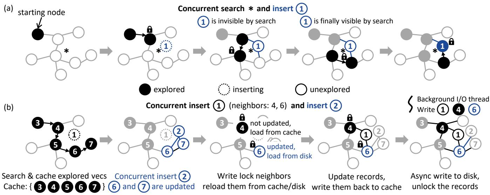  
Figure 5: Approximate concurrency control. (a) Search sees a consistent snapshot for each record instead of the whole graph (e.g., record ➀ can be invisible before Step 4 but visible after it). (b) Inserts link the target vector with an approximate snapshot of neighbors. The snapshot may not be the best neighbor set (e.g., ➁ is a better neighbor of ➀ than ➅).

Search-insert conflicts. The search thread only holds locks when it reads a record (line 8 in Algorithm 1) to avoid getting a torn record. As out-of-place record update is adopted, locking only the ID-to-location mapping item ensures a consistent record snapshot, with no need to lock the page. In other periods, no locks are held for better concurrency.

Figure 5(a) shows an example. The search process includes 5 steps. In each step, only the per-record ID-to-location lock is held for the target record. In Step 3, a new record ➀ is inserted, with updates to the records on the search path. As we do not ensure a consistent snapshot for the whole graph (i.e., atomic search operation), we allow ➀ to be invisible by the search process before Step 4 and visible after it.

Insert-insert conflicts. Insert follows the process of Algorithm 2. Figure 5(b) shows an example of concurrent inserts, where vector ➀ is inserted by executing Steps 1, 3, 4, and 5, and vector ➁ is concurrently inserted in Step 2.

To insert a vector ➀, OdinANN first searches ➀ to get the explored vectors in the search path, which are then pruned to generate ➀’s candidate neighbors (➃ and ➅, Step 1). The acquired neighbor set is not accurate but an approximate snapshot, since new records may be concurrently inserted (e.g., ➁ in Step 2). Second, it acquires the per-record write locks of the involved records, as well as the per-page write locks for pages to be updated (Step 3). Third, it validates the neighbor records by reloading them, to avoid update loss (e.g., loss of ➅’s update, Step 3). Fourth, it updates the involved records (➀, ➃, and ➅) on disk, using the approach in Section 3.2 (Step

4). Finally, it releases all the locks (Step 5).

This process seems to be similar to optimistic concurrency control (OCC). However, OCC aims to achieve atomicity in operations. It searches the index again for validation and repeats the read-lock-validate process until the result set does not change. Instead, we directly view the obtained vector set as an approximate snapshot of candidate neighbors, thus avoiding the long latency of extra search.

We observe that this method is still not efficient enough, because of costly disk I/O and neighbor pruning in the critical section. We further propose two optimizations for them.

Optimization #1: move disk I/O out of critical sections. We find that the approximate neighbor snapshot enables using a write-back page cache to avoid disk I/O in the critical section. An insert contains one batched disk read (for record reload) and one batched disk write (for record updates) in the critical section. For the read, we admit the explored vectors to the cache (Step 1), thus reloading most of them from the cache (Step 3). For the write, we only write the record back to the cache (Step 4). To limit the cache space, cached pages are immediately freed after a search. A background I/O thread is used to commit the cached writes to disk (Step 5).

Optimization #2: delta neighbor pruning. Approximate concurrency control avoids most disk I/O in the critical section, by using Optimization #1. However, pruning (line 9 in Algorithm 2) becomes the bottleneck in the critical section. In DiskANN, pruning compares all the neighbor pairs to validate triangle inequality, which results in a complexity of O(R2), where R is the maximum out-degree. Billion-scale datasets require a large R (e.g., 128) for search performance, resulting in high pruning overhead.

We reduce the complexity of most neighbor pruning in insert from $O ( R ^ { 2 } )$ to O(R). This is inspired by an observation that the original neighbors mostly follow the triangular inequality. Therefore, instead of checking all the neighbor pairs, we only check the newly inserted neighbor with all the other neighbors. The farthest neighbor that does not follow triangular inequality is pruned.

If no neighbor can be pruned, we fall back to the original $O ( R ^ { 2 } )$ pruning algorithm. We prune the first neighbor that does not follow triangular inequality, for early stopping while not breaking the characteristics of the original graph.

## 3.4 Buffered Delete and Merge

In §3.2 and §3.3, we show how OdinANN supports efficient direct inserts. In this section, we discuss how OdinANN supports buffered deletes and merging at a low cost. We choose buffered deletes instead of direct ones because they show little interference with frontend search during the merge (§4.7).

## 3.4.1 Buffered Delete

Overview. OdinANN records the IDs of deleted vectors in memory. When deleting a vector, OdinANN adds its ID to an in-memory deletion set, resulting in a low runtime memory footprint (4B or 8B per vector). Deleted vectors are excluded from the search results after the on-disk ANNS.

For concurrency control with search and insert, a global read-write lock is used. Delete operations acquire the write lock to update the delete set. After a search finishes on the disk, it acquires the read lock and excludes the deleted records from the search result. We do not use more fine-grained locks as delete has much less overhead than search and insert.

Challenge: search quality insurance. In workloads containing deletes, the on-disk search quality may be degraded by deleted vectors. Specifically, the results returned by the on-disk ANNS may contain deleted vectors, which are excluded from the results after the on-disk ANNS finishes. This process may lead to fewer than expected top-k results, even if we return more than k results in the on-disk search. In OdinANN, we should solve this issue without the assistance of the in-memory index, because it is avoided by direct insert.

Solution: dynamic candidate pool. As deleted nodes are excluded from the search result, there may be insufficient results even with a large candidate pool length l. To tackle the problem, we adapt the candidate pool size dynamically.

We find that the deleted vectors should only serve as indexing, but not contribute to the results. Motivated by this, we "ignore" the existence of deleted vectors in the candidate pool, namely, we let the candidate pool contain at most l vectors that are not deleted. To achieve it, we adjust the candidate pool size l after admitting the neighbors of the current exploring vector (line 12 in Algorithm 1).

## 3.4.2 Two-Pass Merge for Delete

When to merge. We use two metrics to decide when to merge. The first is the ratio of deleted vectors in the index. When it reaches a threshold (e.g., 10%), merging is triggered. This metric is straightforward but sometimes inaccurate. This is because vectors located in different places are not equally important. For example, near-root vectors influence every search request, while near-boundary vectors may only influence a small part. However, they are treated equally in the metric of deleted vector ratio.

We use the search I/O amplification as another metric. It is based on our observation that the disk I/O in the search process reflects the index quality. Given the same candidate pool size l, worse index quality results in a larger candidate pool, thus resulting in more disk I/O. Therefore, we record the average disk I/O during the search. Merging is triggered when the disk I/O is significantly more (e.g., 1.1×) than when no vectors are deleted.

How to merge. Merging delete in OdinANN includes two passes, in each pass OdinANN scans the whole index sequentially. This process is not as I/O intensive as merging inserts, so it shows little interference with frontend search (§4.7).

In the first pass, OdinANN scans the whole index to load the neighbor IDs of the deleted vectors into memory. Loading all of them can cause a high memory consumption (e.g., 512B for a vector with 128 neighbors). OdinANN uses a simple approach, namely loading part of the neighbors for each vector, to meet the memory budget at the cost of index quality.

In the second pass, OdinANN scans the whole index to do three things in a streaming manner. (1) Read a batch of records and replace the deleted vector IDs with their neighbor IDs in memory. (2) Prune neighbors for records whose out-degree is larger than the limit. (3) Write them back to disk.

Updates during merge. Deletes can be trivially handled in memory, so we mainly discuss inserts here. We propose two ways for inserts during merge. First, they can be absorbed by an in-memory index and digested using direct insert after the merge. Second, they can be executed with direct insert by not allocating records in the merging pages. As merge is typically short in OdinANN (§4.7), the overheads of the in-memory index and extra disk space are acceptable.

## 3.5 Discussion

Consistency. OdinANN uses snapshots and journaling for consistency. Merging creates an index snapshot. Between two merging, journaling is used to record the delta updates for the in-memory and on-disk data structures. For less overhead, journaling may be flushed to disk later than on-disk inserts. To maintain a consistent prefix for updates [28], we roll back the index by (buffered) deleting all the records with newer IDs than the journal. We store the metadata for recovery (e.g., ID and transaction ID) together with each record on disk.

GC-free. OdinANN supports GC-free inserts. Compared to the log-structured layout, OdinANN directly reuses the invalid records, eliminating the need for logical garbage collection – a process to gather valid records into a new index. Our designs target FTL-based SSDs and do not interfere with their physical garbage collection. For deletes, to recycle the space of deleted vectors, OdinANN needs the lightweight merge (§3.4.2), which is similar to a logical GC.

Insert latency. Compared to buffered insert in DiskANN, OdinANN has a higher insert latency as it directly writes the updated records to disk. This leads to a ∼11.1ms insert latency (§4.4). We believe this latency is acceptable, as real-world systems [7, 22] target indexing latencies around 10ms.

Memory usage. OdinANN stores three things in memory:

• PQ table for PQ-compressed vectors, 32 bytes per vector.

• ID-to-location and ID-to-tag hash tables contain the mapping of vector ID to 4-byte record location and 4-byte tag (the same as DiskANN [23]), 16 bytes per vector.

• Location-to-ID hash table contains the mapping of record location to vector ID, used by the first pass of a merge. We use per-page fixed-size arrays for this, requiring 4 bytes per record (including empty ones) and 4 bytes per page.

For a typical OdinANN index with 2× disk space consumption and 6 records per page, the memory usage is ∼58 bytes per vector or 58GB for billion-scale datasets. The memory usage in our evaluation is higher (83.8GB, §4.3). This is due to the memory overheads of hash tables, and free slots caused by dynamic doubling of the PQ table and hash tables.

## 4 Evaluation

We evaluate OdinANN to answer the following questions:

• How does OdinANN compare to other updatable ANNS indexes for concurrent inserts and searches? (§4.2)

• How does OdinANN perform in billion-scale datasets compared to other ANNS indexes? (§4.3)

• How do the techniques in OdinANN contribute to the performance of direct insert? (§4.4)

• How do OdinANN’s techniques for inserts impact internal metrics, e.g., disk consumption and index quality? (§4.5)

• How does the number of out-neighbors impact OdinANN’s insert and search performance? (§4.6)

• How does OdinANN perform for workloads with concurrent inserts, deletes, and searches? (§4.7)

## 4.1 Experimental Setup

Basic configuration. We use one node for evaluation, which has the following configuration:

• CPU: 2× 28-core Intel Xeon Gold 6330 @ 2.00GHz;

• RAM: 512GB (16× 32GB DDR4 2933MT/s);

• SSD: 1× Samsung PM9A3 3.84TB;

• OS: Ubuntu 22.04 LTS with Linux kernel 5.15.0.

Datasets. We use three vector datasets for evaluation:

• SIFT100M [12], a dataset containing 100 million uint8 vectors with a dimension of 128, and 10,000 query vectors.

• DEEP100M [3], a dataset containing 100 million float vectors with a dimension of 96, and 10,000 query vectors.

• SIFT1B [12], a dataset containing one billion uint8 vectors with a dimension of 128, and 10,000 query vectors.

SIFT100M and DEEP100M are subsets of SIFT1B and DEEP1B with 100 million vectors.

Compared systems. We compare OdinANN with two stateof-the-art ANNS indexes: DiskANN [23] and SPFresh [30].

DiskANN is a graph-based index using buffered inserts. OdinANN is implemented based on DiskANN. Unless otherwise stated, we use the following update configurations for them: Insert candidate pool size $l _ { i }$ is 128. Maximum outneighbors per record R is 96 for SIFT100M and DEEP100M, and 128 for SIFT1B. The maximal number of vectors to prune in delete C is 384. DiskANN merges updates when the inmemory index size reaches 6% of the on-disk index.

For search configurations, they use a beamwidth equal to 4. The default search candidate list $l _ { s }$ is set to 20 for SIFT100M, and 25 for DEEP100M and SIFT1B. The near-root neighbor cache is disabled. For efficiency, we use io\_uring [13] in replace of libaio as their I/O engine.

SPFresh is a variant of SPANN [5], a cluster-based index that divides vectors into clusters. It supports vector updates by updating the target vector in its nearest clusters. To reduce the imbalance of clusters, SPFresh splits and merges them. We configure SPFresh using the same settings as its open-source code. The maximum cluster size is set to 16KB for SIFT and 48KB for DEEP, for the same number of vectors in a cluster.

We do not compare with other on-disk ANNS systems, such as Starling [27], as they are not designed to support updates.

Metrics. OdinANN is designed for online ANNS scenarios, so we evaluate the search performance, search accuracy, and memory usage during concurrent updates. We use multiple search threads to evaluate search performance, as high search throughput is required in real-world workloads (e.g., 5000 QPS [29]). We gradually add search threads to increase throughput while keeping latency relatively low. For OdinANN and DiskANN, we use 32 search threads. For SPFresh, we use 16 search threads in SIFT and 8 threads in DEEP.

## 4.2 Overall Performance: Insert-Search

In this evaluation, we build indexes using SIFT100M and DEEP100M datasets and then insert another 100 million vectors into them. Multi-thread searches are concurrently executed to show their interference by inserts and merges.

The evaluated systems take different times in the evaluations. This is because we do not insert vectors during

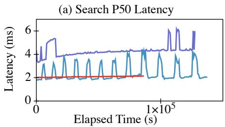

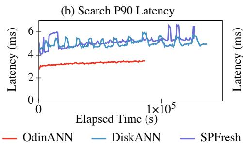

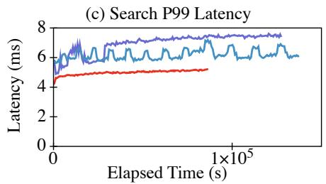

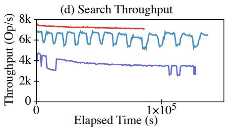

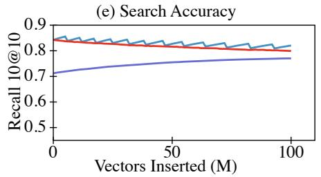

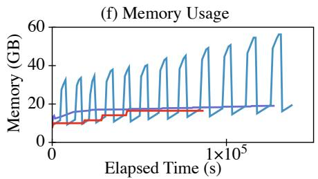  
Figure 6: Overall performance in SIFT100M dataset, insert another 100M vectors.

DiskANN’s merge, and the average insert throughputs of compared indexes are different. We set their insert throughputs to 800∼1200 QPS, similar to previous works [30].

## 4.2.1 SIFT100M

Figure 6 shows the results in the SIFT100M dataset. From the figure, we make the following observations:

Low and stable search latency. The results are shown in Figure 6(a)∼Figure 6(c). Compared with DiskANN, OdinANN shows lower P50 (median) search latency with less fluctuation (i.e., maximum P50 latency / minimum P50 latency). OdinANN has 13.3% lower P50 latency than DiskANN on average, which shows that direct insert introduces little cost for disk writes compared to merging them. Besides, the P50 latency of OdinANN fluctuates only 1.07× at most, compared to 2.44× in DiskANN. This is because merging in DiskANN causes bandwidth interference with search tasks, which increases the search latency.

Compared with DiskANN, OdinANN has 34.6%/19.5% lower P90/P99 search latency on average, more significant than the P50 latency. This is because of read-write conflicts of DiskANN’s in-memory index, which uses per-node readwrite locks for concurrency control. An insert acquires the per-node lock and blocks concurrent readers. Contrastively, OdinANN uses approximate concurrency control to reduce such blocking. Writers only block readers when they are updating the id-to-location mapping.

Compared with SPFresh, OdinANN has 51.7%/36.5%/ 28.4% lower P50/P90/P99 search latency on average. This is because fine-grained graph-based indexes (OdinANN) are advantageous in search compared to coarse-grained clusterbased indexes (SPFresh), especially in disk bandwidth consumption. On average, OdinANN reads 41 pages per search, while SPFresh reads 198 pages. Although SPFresh replicates the clusters to make disk reads mostly sequential, it still shows higher latency than OdinANN.

High search throughput. Compared with DiskANN and SPFresh, OdinANN has 1.15× and 1.99× throughput on average, as in Figure 6(d). The reason here is the same as that in latency. DiskANN needs extra search in the in-memory index, and it suffers from bandwidth interference during merge. The cluster-based SPFresh consumes more disk IOPS than OdinANN per search, which limits its throughput.

Unsacrificed search accuracy. As shown in Figure 6(e), the accuracy of OdinANN is comparable with DiskANN. The accuracy of OdinANN is 99.1%∼100% that of DiskANN when the in-memory index is empty. The accuracy gap between OdinANN and DiskANN increases along with the inmemory index size, as DiskANN finds top-k in both the inmemory and on-disk indexes for each search. However, the in-memory index forces DiskANN to merge updates to disks, which causes performance fluctuation.

OdinANN and DiskANN consistently show higher accuracy than SPFresh. This is because graph-based indexes are more advantageous than cluster-based indexes in terms of search [7]. We show that this advantage still exists even after the index is updated. In all, OdinANN maintains lower latency, higher throughput, and higher search accuracy than SPFresh.

The accuracy of OdinANN and DiskANN drops with time. This is because they use PQ to accelerate pruning in insert operations, which is less accurate than the initial graph building [23]. Another reason is that larger datasets intrinsically require a larger search L for higher accuracy.

The accuracy of SPFresh increases over time, because of its cluster split protocol. However, it comes at the cost of more pages accessed per request, which results in a throughput drop over time, as shown in Figure 6(d).

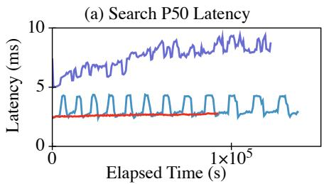

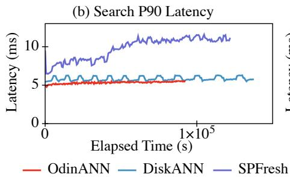

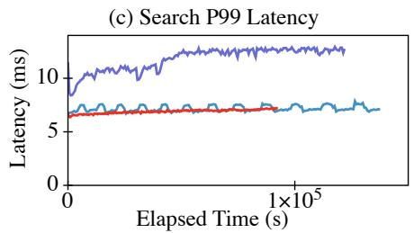

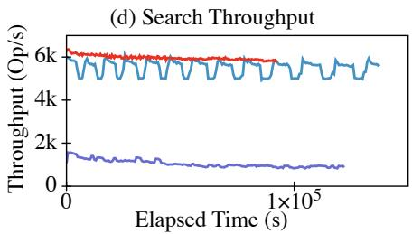

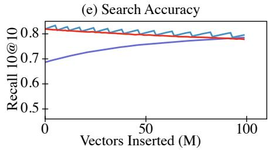

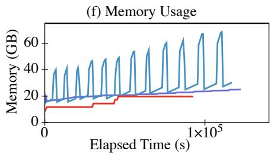  
Figure 7: Overall performance in DEEP100M dataset, insert another 100M vectors.

Low memory footprint. OdinANN’s peak memory usage is 29.3% of DiskANN. This is because OdinANN uses direct inserts. OdinANN only needs an extra ID-to-location mapping in memory to support out-of-place record updates, while DiskANN stores the in-memory index and the delta of updates for merging. They lead to a 56.3GB peak memory usage in the final index with ∼200M vectors. The in-memory data structures in DiskANN require even more memory when the on-disk index size further increases, to keep a fixed merge threshold (6% of the on-disk index size in our configuration).

Compared with SPFresh, OdinANN has 86.8% peak memory usage. SPFresh stores a navigation graph for indexing the nearby clusters of the target vector. The graph size increases when a cluster split happens.

## 4.2.2 DEEP100M

Figure 7 shows the result in the DEEP100M dataset. In this dataset, OdinANN keeps low and stable latency, and low memory usage. We make further observations:

(1) The performance boost of OdinANN in DEEP100M is less significant than in SIFT100M. This is because it benefits less from out-of-place record updates. Each vector in DEEP100M is 384B, compared to 128B in SIFT100M. Larger vectors result in fewer records on a page (5 vs. 7), and thus fewer merge opportunities for updates.

(2) The advantage of OdinANN over SPFresh is more significant in DEEP100M, due to larger vectors. OdinANN and DiskANN only use one vector per search step, whose size is smaller than a page. Therefore, large vectors have little impact on performance. Their performance drop mainly accounts for the change of search L. However, SPFresh executes a brute-force search for all the vectors in a cluster. In this configuration, we use the same number of per-cluster vectors as SIFT. Larger vectors result in more per-cluster disk I/O, which is the bottleneck of SPFresh’s search performance.

## 4.3 Overall Performance: SIFT1B

In this section, we show that OdinANN efficiently handles billion-scale datasets. We build an initial index with 800M vectors in SIFT1B. Then, we insert the other 200M vectors into it and execute concurrent searches. DiskANN merges the in-memory index to disk when it reaches 30 million vectors (∼3%), the same as its paper [23].

Figure 8 shows the results. From the figure, we find that the stable performance of OdinANN holds, so we can draw similar conclusions as in §4.2. For example, OdinANN shows 85.7% and 62.1% median latency on average compared to DiskANN and SPFresh. We make two new observations:

First, for DiskANN, although the number of vectors per merge is reduced from 6% (in §4.2) to 3% of the on-disk index, it still shows a high memory usage ( 200GB). Also, >P99 search latency spikes are observed, due to bandwidth contention when merging to disk. Second, SPFresh uses less memory than OdinANN (52.2GB vs. 83.8GB). This is because SPFresh uses a coarse-grained cross-cluster index. To achieve a higher search accuracy, SPFresh should make its clusters fine-grained, inducing higher memory usage.

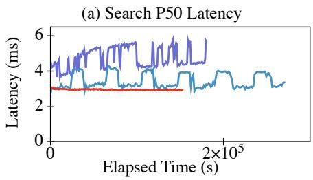

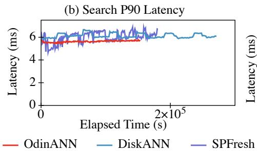

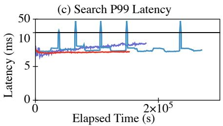

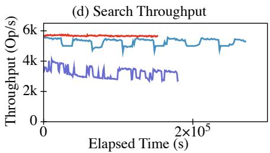

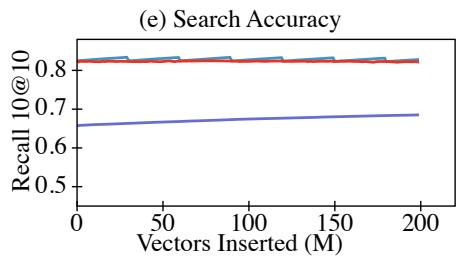

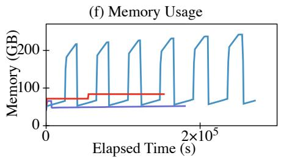

Figure 8: Overall performance in SIFT1B dataset, insert 200M vectors into an index of 800M vectors.  
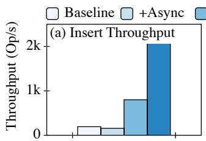

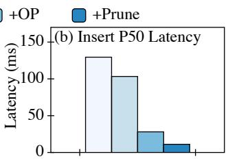  
Figure 9: Breakdown analysis of insert.

## 4.4 Breakdown Analysis

In this section, we break down the performance gap between Baseline and OdinANN, to show the contributions of the techniques to efficient direct insert. We build a base index using the SIFT100M dataset and insert 100K vectors into it. We evaluate insert latency and throughput using 27 insert threads, without concurrent search.

Baseline. We implement the Baseline based on OdinANN. It does direct inserts by updating records in place and uses the basic approximate concurrency control, without the two optimizations. We do not use two-phase locking for Baseline, as it seriously degrades the performance. Figure 9 shows that Baseline has low insert throughput, which can not meet the demands of real-world workloads (e.g., 1000 QPS [29]).

+Async. We move the disk I/O out of the critical section (Optimization #1 in §3.3). It reduces the insert latency to 80.8%. However, the insert throughput can not be increased because of the inherent cost of inserts.

+OP. We do space overprovision and out-of-place record updates (§3.2). It increases the insert throughput to 5.12× and reduces its latency to 27.1%. This is because it not only reduces the inherent cost of disk writes by combining them, but reduces contention by updating the pages with fewer records. +Prune. We use delta pruning (Optimization #2 in §3.3) to reduce the compute overhead. It further increases the throughput to 2.59× and reduces the latency to 39.7%. By adopting all the optimizations, OdinANN reaches 2000 QPS with 11.1ms median latency for insert, which meets the demands of realworld workloads better.

## 4.5 In-Depth Analysis

To further understand the tradeoffs in OdinANN, we collect statistics for the indexes in §4.2 on disk space consumption and index quality.

Disk space consumption. OdinANN does space overprovision for fewer writes. Here, we compare the disk space consumption of OdinANN and SPFresh. We exclude DiskANN as its on-disk index is immutable and thus with ideal size.

Figure 10(a) shows the disk space consumption of OdinANN and SPFresh for the final index of §4.2 with 200M vectors. (1) OdinANN has 1.98×/2.29× space amplification for SIFT/DEEP datasets, which concludes that the record allocation policy in OdinANN has near-ideal space amplification (§3.2.3). (2) OdinANN requires 84.8%/49.7% of SPFresh’s disk space for the final index. This is because SPFresh uses vector replication (8× by default) for better search accuracy, which consumes more space than the edges in OdinANN. Also, SPFresh splits clusters into half-empty ones for cluster balancing, which causes space amplification.

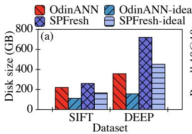

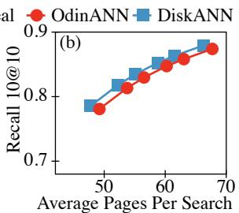  
Figure 10: (a) Disk space consumption of OdinANN and SPFresh compared to the ideal case (no overprovision and split). (b) Index quality of OdinANN and DiskANN after inserting 93 million vectors into an index of DEEP100M.

Index quality. Approximate concurrency control uses a relaxed isolation level and delta pruning for better concurrency, at the cost of index quality. Figure 10(b) shows the index quality of DEEP100M after the last merge in §4.2.2 (i.e., 93M vectors inserted). With the same recall, OdinANN accesses ∼4.5% more disk pages than DiskANN. The performance loss is acceptable considering the benefits of direct inserts, and it can be further optimized by a more accurate algorithm for delta pruning, which we leave for future work.

## 4.6 Parameter Study: Out-Neighbors

In this section, we show how the number of maximum outneighbors (R) impacts insert and search performance. We build indexes on SIFT100M using different Rs (32, 64, 96, 128), where the maximum R is used by previous works [24] and OdinANN to support billion-scale datasets. The insert candidate pool size $l _ { i }$ is set to R + 32 (e.g., 128 for R = 96). We use 10 insert threads and 32 search threads for concurrent insert and search, the same as in §4.2.1.

Figure 11 shows the results. From the figure, we observe that: (1) A large R increases search performance but reduces insert throughput. A large R contributes to better graph connectivity, which leads to reduced search latency. However, it requires a large insert candidate pool (li) to find enough neighbors. Thus, an insert requires to search more vectors, decreasing its performance. As shown in the figure, R = 96 strikes a balance between search performance and insert throughput, so we choose R = 96 as our SIFT100M configuration.

(2) The memory usage is nearly constant across different Rs, as discussed in §3.5. However, setting R to 128 results in ∼800MB (8.75%) more memory usage compared to R = 64. This is due to our implementation of the location-to-ID table, which uses per-page arrays with size 10. A larger R leads to more pages in the index, and thus a larger location-to-ID table. When R = 32, we use a larger array size of 15. It shows higher memory usage than R = 64, due to the dynamic doubling of tables during insert. We consider the difference in memory usage is not a major issue, as we can always select an appropriate per-page array size for each graph index.

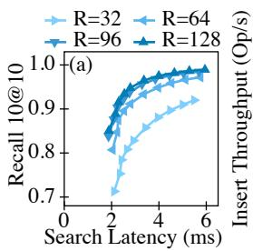

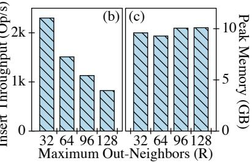  
Figure 11: The impact of maximum out-neighbors (R) on (a) search latency; (b) insert throughput; (c) memory usage. 10 insert threads and 32 search threads.

## 4.7 Workload with Deletes

In this section, we show the performance of OdinANN in workload with deletes. We build an index on SIFT100M, and then gradually replace the original 100M vectors with another 100M vectors. OdinANN merges at 20% updated vectors, while DiskANN merges at 6%. We do not update vectors during merge, to directly show the interference of merge on the frontend search. We show the results for similar durations.

The result is shown in Figure 12, in which the performance of SPFresh is similar to that in §4.2. We compare OdinANN with DiskANN and make the following observations:

(1) The merge period of OdinANN has little interference on frontend search, as merging deletes only requires two scans of the on-disk index, which is not I/O-intensive. However, merging inserts in DiskANN is I/O intensive, so it has bandwidth interference with frontend search tasks.

(2) Merging in OdinANN can be less frequent than in DiskANN because buffered deletes require much less memory than buffered inserts during runtime. Deleting a vector only records an ID in memory, while inserting records the vector and its edges in the in-memory index.

(3) OdinANN uses less memory than DiskANN during a merge. This is because OdinANN only loads 20 nearest neighbors for each deleted node into memory, while DiskANN loads all the 96 neighbors. The neighbor number can be configured to trade index quality (∼2.5% accuracy for the final index, with the same number of disk I/Os) off for memory. An accurate and memory-efficient delete method is preferred to optimize this, which we leave for future work.

(4) The search accuracy of OdinANN can be ensured between two merges, thanks to the dynamic candidate pool design. With a fixed configuration of candidate pool length, OdinANN can ensure the search accuracy regardless of deleted vectors, at the cost of more disk I/O per search.

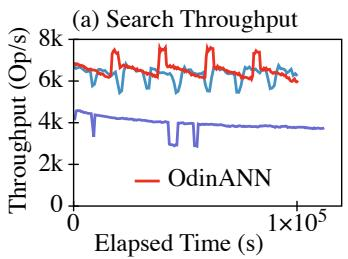

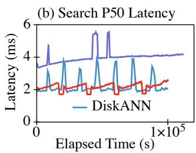

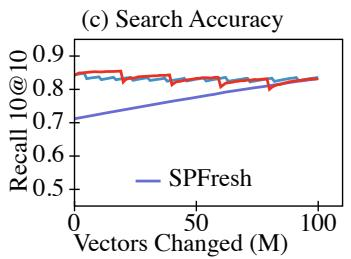

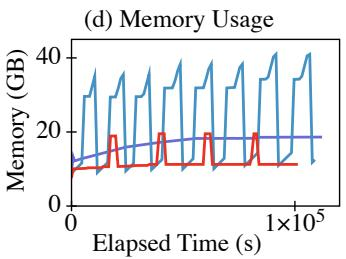  
Figure 12: Workload with deletes in SIFT100M dataset, replace the original 100M vectors with another 100M vectors. Note that OdinANN merges at 20% updated vectors, while DiskANN merges at 6% for less memory usage. With similar elapsed time in this figure, OdinANN and SPFresh finish replacing the whole 100M vectors, while DiskANN replaces 50M vectors.

## 5 Related Work

Billion-Scale ANNS indexes. Real-world workloads do vector search on billions of vectors [7, 22]. Traditional ANNS indexes are stored in memory [4, 7, 18]. To support billionscale datasets in a single node, they suffer from high prices and limited scalability. To this end, two new methods, hybrid storage and vector compression, are proposed.

Hybrid storage. Some works rely on hybrid storage media for more capacity, such as SSD and DRAM. DiskANN [24] and Starling [27] are on-disk graph-based indexes. They store the full graph on disk, and compressed vectors in memory for graph navigation. SPANN [5] is an on-disk cluster-based index. It stores the clusters on disk, and a small graph in memory to index the nearest clusters. HM-ANN [21] maintains a hierarchical graph [18] in DRAM and persistent memory.

Some other works seek performance boosts with near-data processing. CXL-ANNS [11] uses processing units near the CXL memory for distance calculation, and SmartANNS [25] uses FPGAs in SmartSSDs for graph traversal. These methods can not only reduce the CPU burden for computation, but mitigate the bandwidth bottleneck by avoiding transferring vectors between CPU and slow-speed storage media.

OdinANN uses commodity SSDs for capacity expansion. It does not rely on near-data processing for better compatibility. Vector compression. Instead of increasing capacity, some works compress vectors for smaller index sizes in memory. Product quantization (PQ) [8,14] is a popular vector compression method for ANNS. It splits vectors into equally sized chunks and does clustering for each chunk. Vectors are replaced with per-chunk IDs representing their nearest centroids. This way is used by IVF [2] indexes for less memory footprint. DiskANN [24] also stores PQ-compressed vectors in memory to reduce neighbor reads during graph navigation. LVQ [1] focuses on single-vector compression instead of cross-vector clustering. It uses scalar quantization in each vector to map floating-point vectors to bits, which improves search performance with reduced memory footprint.

OdinANN stores PQ-compressed vectors in memory for graph navigation. The designs in OdinANN are orthogonal to vector compression methods.

Updatable ANNS indexes. Graph-based DiskANN [23] uses buffered inserts, which interfere with frontend search tasks, motivating our designs for OdinANN. Cluster-based SPFresh [30] supports in-place vector updates. It is more challenging for graph-based OdinANN to support efficient updates than cluster-based SPFresh, due to the intrinsic complexity of graph neighbor maintenance. However, OdinANN benefits from better search accuracy and performance.

Reserving space for efficient updates. ALEX [6] is a learned index that also leverages reserved space (called "gaps" in its paper) for efficient updates. Unlike ALEX, which uses one gap for each new key-value pair to avoid model retraining, OdinANN uses multiple record slots for a single insert, combining record updates in the same page.

## 6 Conclusion

We argue that direct insert is more suitable for graph-based ANNS indexes and propose OdinANN. It efficiently processes inserts in the on-disk index instead of buffering them. Evaluations show that OdinANN keeps stable insert and search performance in billion-scale vector datasets. This work demonstrates that on-disk graph-based ANNS indexes can benefit from high search accuracy, stable search performance, as well as efficient updates simultaneously using direct insert.

## Acknowledgments

We sincerely thank our shepherd, Bingzhe Li, and the anonymous reviewers for their valuable feedback. This work is supported by the National Key R&D Program of China (Grant No. 2024YFE0203300), the National Natural Science Foundation of China (Grant No. 62332011), and Beijing Natural Science Foundation (Grant No. L242016).

## References

[1] Cecilia Aguerrebere, Ishwar Bhati, Mark Hildebrand, Mariano Tepper, and Ted Willke. Similarity search in the blink of an eye with compressed indices. In Proceedings of the VLDB Endowment, VLDB ’23, pages 3433–3446, Vancouver, Canada, 2023. VLDB Endowment.

[2] Artem Babenko and Victor Lempitsky. The inverted multi-index. In 2012 IEEE Conference on Computer Vision and Pattern Recognition, CVPR ’12, pages 3069– 3076, Providence, RI, USA, 2012. IEEE Computer Society.

[3] Artem Babenko and Victor S. Lempitsky. Efficient Indexing of Billion-Scale Datasets of Deep Descriptors. In 2016 IEEE Conference on Computer Vision and Pattern Recognition, CVPR ’16, pages 2055–2063, Las Vegas, NV, USA, 2016. IEEE Computer Society.

[4] Dmitry Baranchuk, Artem Babenko, and Yury Malkov. Revisiting the inverted indices for billion-scale approximate nearest neighbors. In Proceedings of the European Conference on Computer Vision, ECCV ’18, pages 202– 216, Berlin, Heidelberg, 2018. Springer-Verlag.

[5] Qi Chen, Bing Zhao, Haidong Wang, Mingqin Li, Chuanjie Liu, Zengzhong Li, Mao Yang, and Jingdong Wang. SPANN: highly-efficient billion-scale approximate nearest neighbor search. In Proceedings of the 35th International Conference on Neural Information Processing Systems, NIPS ’21, Red Hook, NY, USA, 2021. Curran Associates Inc.

[6] Jialin Ding, Umar Farooq Minhas, Jia Yu, Chi Wang, Jaeyoung Do, Yinan Li, Hantian Zhang, Badrish Chandramouli, Johannes Gehrke, Donald Kossmann, David Lomet, and Tim Kraska. ALEX: An Updatable Adaptive Learned Index. In Proceedings of the 2020 ACM SIGMOD International Conference on Management of Data, SIGMOD ’20, page 969–984, Portland, OR, USA, 2020. Association for Computing Machinery.

[7] Cong Fu, Chao Xiang, Changxu Wang, and Deng Cai. Fast approximate nearest neighbor search with the navigating spreading-out graph. In Proceedings of the VLDB Endowment, VLDB ’19, pages 461–474, Los Angeles, CA, USA, 2019. VLDB Endowment.

[8] Tiezheng Ge, Kaiming He, Qifa Ke, and Jian Sun. Optimized Product Quantization for Approximate Nearest Neighbor Search. In 2013 IEEE Conference on Computer Vision and Pattern Recognition, CVPR ’13, pages 2946–2953, Portland, OR, USA, 2013. IEEE Computer Society.

[9] Martin Grohe. word2vec, node2vec, graph2vec, X2vec: Towards a Theory of Vector Embeddings of Structured Data. In Proceedings of the 39th ACM SIGMOD-SIGACT-SIGAI Symposium on Principles of Database Systems, PODS’20, pages 1–16, New York, NY, USA, 2020. Association for Computing Machinery.

[10] Jui-Ting Huang, Ashish Sharma, Shuying Sun, Li Xia, David Zhang, Philip Pronin, Janani Padmanabhan, Giuseppe Ottaviano, and Linjun Yang. Embeddingbased Retrieval in Facebook Search. In Proceedings of the 26th ACM SIGKDD International Conference on Knowledge Discovery & Data Mining, KDD ’20, pages 2553–2561, New York, NY, USA, 2020. Association for Computing Machinery.

[11] Junhyeok Jang, Hanjin Choi, Hanyeoreum Bae, Seungjun Lee, Miryeong Kwon, and Myoungsoo Jung. CXL-ANNS: Software-Hardware Collaborative Memory Disaggregation and Computation for Billion-Scale Approximate Nearest Neighbor Search. In 2023 USENIX Annual Technical Conference, USENIX ATC ’23, pages 585–600, Boston, MA, 2023. USENIX Association.

[12] Hervé Jégou, Romain Tavenard, Matthijs Douze, and Laurent Amsaleg. Searching in one billion vectors: rerank with source coding. In 2011 IEEE International Conference on Acoustics, Speech and Signal Processing, ICASSP ’11, pages 861–864, Prague, Czech Republic, 2011. IEEE Computer Society.

[13] Kanchan Joshi, Anuj Gupta, Javier Gonzalez, Ankit Kumar, Krishna Kanth Reddy, Arun George, Simon Lund, and Jens Axboe. I/O Passthru: Upstreaming a flexible and efficient I/O Path in Linux. In 22nd USENIX Conference on File and Storage Technologies, FAST ’24, pages 107–121, Santa Clara, CA, 2024. USENIX Association.

[14] Herve Jégou, Matthijs Douze, and Cordelia Schmid. Product Quantization for Nearest Neighbor Search. IEEE Transactions on Pattern Analysis and Machine Intelligence (TPAMI), 33(1):117–128, 2011.

[15] Patrick Lewis, Ethan Perez, Aleksandra Piktus, Fabio Petroni, Vladimir Karpukhin, Naman Goyal, Heinrich Küttler, Mike Lewis, Wen-tau Yih, Tim Rocktäschel, Sebastian Riedel, and Douwe Kiela. Retrieval-augmented generation for knowledge-intensive NLP tasks. In Proceedings of the 34th International Conference on Neural Information Processing Systems, NIPS ’20, Red Hook, NY, USA, 2020. Curran Associates Inc.

[16] Jie Li, Haifeng Liu, Chuanghua Gui, Jianyu Chen, Zhenyuan Ni, Ning Wang, and Yuan Chen. The Design and Implementation of a Real Time Visual Search System on JD E-commerce Platform. In Proceedings

of the 19th International Middleware Conference Industry, Middleware ’18, pages 9–16, Rennes, France, 2018. Association for Computing Machinery.

[17] Sen Li, Fuyu Lv, Taiwei Jin, Guli Lin, Keping Yang, Xiaoyi Zeng, Xiao-Ming Wu, and Qianli Ma. Embeddingbased Product Retrieval in Taobao Search. In Proceedings of the 27th ACM SIGKDD Conference on Knowledge Discovery & Data Mining, KDD ’21, pages 3181– 3189, Virtual Event, 2021. Association for Computing Machinery.

[18] Yu A. Malkov and D. A. Yashunin. Efficient and Robust Approximate Nearest Neighbor Search Using Hierarchical Navigable Small World Graphs. IEEE Transactions on Pattern Analysis and Machine Intelligence (TPAMI), 42(4):824–836, 2020.

[19] Tomás Mikolov, Kai Chen, Greg Corrado, and Jeffrey Dean. Efficient Estimation of Word Representations in Vector Space. In 1st International Conference on Learning Representations, Workshop Track Proceedings, ICLR ’13, Scottsdale, Arizona, USA, 2013.

[20] PCPartPicker. Price Trends. https://pcpartpicker .com/trends/, 2025.

[21] Jie Ren, Minjia Zhang, and Dong Li. HM-ANN: Efficient Billion-Point Nearest Neighbor Search on Heterogeneous Memory. In H. Larochelle, M. Ranzato, R. Hadsell, M.F. Balcan, and H. Lin, editors, Advances in Neural Information Processing Systems, NIPS ’20, pages 10672–10684, Virtual Event, 2020. Curran Associates, Inc.

[22] Harsha Simhadri. Research talk: Approximate nearest neighbor search systems at scale. https://www.yout ube.com/watch?v=BnYNdSIKibQ&list=PLD7HFc N7LXReJTWFKYqwMcCc1nZKIXBo9&index=9, 2022.

[23] Aditi Singh, Suhas Jayaram Subramanya, Ravishankar Krishnaswamy, and Harsha Vardhan Simhadri. FreshDiskANN: A Fast and Accurate Graph-Based ANN Index for Streaming Similarity Search. CoRR, abs/2105.09613, 2021.

[24] Suhas Jayaram Subramanya, Devvrit, Rohan Kadekodi, Ravishankar Krishaswamy, and Harsha Vardhan Simhadri. DiskANN: fast accurate billion-point nearest neighbor search on a single node. In Proceedings of the 33rd International Conference on Neural Information Processing Systems, NIPS ’19, Red Hook, NY, USA, 2019. Curran Associates Inc.

[25] Bing Tian, Haikun Liu, Zhuohui Duan, Xiaofei Liao, Hai Jin, and Yu Zhang. Scalable Billion-point Approximate Nearest Neighbor Search Using SmartSSDs. In 2024

USENIX Annual Technical Conference, USENIX ATC ’24, pages 1135–1150, Santa Clara, CA, 2024. USENIX Association.

[26] Jianguo Wang, Xiaomeng Yi, Rentong Guo, Hai Jin, Peng Xu, Shengjun Li, Xiangyu Wang, Xiangzhou Guo, Chengming Li, Xiaohai Xu, Kun Yu, Yuxing Yuan, Yinghao Zou, Jiquan Long, Yudong Cai, Zhenxiang Li, Zhifeng Zhang, Yihua Mo, Jun Gu, Ruiyi Jiang, Yi Wei, and Charles Xie. Milvus: A Purpose-Built Vector Data Management System. In Proceedings of the 2021 International Conference on Management of Data, SIGMOD ’21, pages 2614–2627, Virtual Event, 2021. Association for Computing Machinery.

[27] Mengzhao Wang, Weizhi Xu, Xiaomeng Yi, Songlin Wu, Zhangyang Peng, Xiangyu Ke, Yunjun Gao, Xiaoliang Xu, Rentong Guo, and Charles Xie. Starling: An I/O-Efficient Disk-Resident Graph Index Framework for High-Dimensional Vector Similarity Search on Data Segment. In Proceedings of the ACM on Management of Data, SIGMOD ’24, Santiago, Chile, 2024. Association for Computing Machinery.

[28] Yang Wang, Manos Kapritsos, Zuocheng Ren, Prince Mahajan, Jeevitha Kirubanandam, Lorenzo Alvisi, and Mike Dahlin. Robustness in the salus scalable block store. In 10th USENIX Symposium on Networked Systems Design and Implementation, pages 357–370, Lombard, IL, 2013. USENIX Association.

[29] Chuangxian Wei, Bin Wu, Sheng Wang, Renjie Lou, Chaoqun Zhan, Feifei Li, and Yuanzhe Cai. AnalyticDB-V: a hybrid analytical engine towards query fusion for structured and unstructured data. In Proceedings of the VLDB Endowment, VLDB ’20, pages 3152–3165, Tokyo, Japan, 2020. VLDB Endowment.

[30] Yuming Xu, Hengyu Liang, Jin Li, Shuotao Xu, Qi Chen, Qianxi Zhang, Cheng Li, Ziyue Yang, Fan Yang, Yuqing Yang, Peng Cheng, and Mao Yang. SPFresh: Incremental In-Place Update for Billion-Scale Vector Search. In Proceedings of the 29th Symposium on Operating Systems Principles, SOSP ’23, pages 545–561, Koblenz, Germany, 2023. Association for Computing Machinery.