①

USENIX

THE ADVANCED COMPUTING SYSTEMS ASSOCIATION

## Advancing Data Integrity in Linux

Anuj Gupta, Samsung Semiconductor; Christoph Hellwig; Kanchan Joshi, Vikash Kumar, and Javier Gonzalez, Samsung Semiconductor; Roshan R Nair, EPFL; Jinyoung Choi, Samsung Semiconductor

## https://www.usenix.org/conference/fast26/presentation/gupta

This paper is included in the Proceedings of the 24th USENIX Conference on File and Storage Technologies.

February 24–26, 2026 • Santa Clara, CA, USA

ISBN 978-1-939133-53-3

Open access to the Proceedings of the 24th USENIX Conference on File and Storage Technologies is sponsored by

# Advancing Data Integrity in Linux

Anuj Gupta1, Christoph Hellwig , Kanchan Joshi1, Vikash Kumar1, Javier González1, Roshan R Nair2, and Jinyoung CHOI1

1Samsung Semiconductor 2EPFL

## Abstract

Standalone hardware-only or software-only methods fail to provide comprehensive coverage in detecting data corruption. End-to-end data protection (E2EDP) addresses this by carrying per-block protection information (PI) throughout the I/O stack, from the application through the system software to the storage device. Although devices have supported PI for more than a decade, Linux remains incomplete in its support and utilization of these capabilities.

This paper closes two fundamental gaps in the mainline Linux kernel and introduces a PI-aware filesystem design with implementation and evaluation. First, we add a new io\_uring interface that allows applications to exchange integrity metadata alongside the data. Second, we add flexible PI placement in Linux’s block-integrity enabling support for a device configuration that was otherwise rejected. Finally, we introduce Filesystem Protection Information (FS-PI), a PI-aware design direction in which filesystems generate and verify integrity metadata directly while leveraging PI-capable hardware. We implement FS-PI in two major filesystems: in XFS, FS-PI introduces native data checksumming, extending data-integrity guarantees for the first time; in BTRFS, FS-PI replaces the checksum tree with a lightweight path that reduces metadata traffic, write amplification, and device wear.

We evaluated the cost and gains of FS-PI in BTRFS and XFS. The evaluation shows that FS-PI improves BTRFS performance by 26%, reduces host CPU utilization by 58%, and reduces device writes by 52%, extending SSD lifetime by 23%.

## 1 Introduction

What is more problematic than discovering corrupted data? Failing to detect it. Storage systems face data integrity challenges arising from hardware and software errors [21]. A single instance of corruption, when undetected, can have a snowball effect and spur further corruption with far-reaching consequences [20, 36, 47, 50, 55, 56]. Both hard disk drives and flash storage devices employ Error Correction Codes (ECC) to uphold data integrity. However, data must also travel through the software stack, between the storage device and the end application, where corruption can occur during transmission. End-to-End Data Protection (E2EDP) is a collaborative approach to data integrity [5, 39]. This approach involves transferring additional metadata, known as protection information (PI) [5], alongside the data. The PI contains information such as checksums, reference tags, and application tags. Since PI follows a well-defined structure, each layer in the I/O stack can participate in ensuring the integrity of the data transfer. Enterprise SCSI and NVMe drives allow storing additional metadata using Data Integrity Field (DIF) [6] and Data Integrity Extension (DIX) [40] implementations. In DIF, metadata is interleaved with the data buffer. In DIX, metadata is passed using a separate buffer. DIF forces data buffers to be unaligned (e.g., 8 bytes of metadata appended to 4096 bytes of data). Hence, Linux’s data integrity infrastructure, also referred to as block-integrity [5], is built around DIX, which stores integrity metadata in a separate buffer. This is implemented by the block layer, which adds or removes additional integrity metadata for each I/O.

Years of development notwithstanding, Linux continues to provide only partial end-to-end protection, with noticeable gaps that are outlined below:

• Block-integrity historically assumes a single PI layout, while real devices permit multiple placements of PI within metadata. Consequently, valid device configurations are not supported.

• Linux lacks a read/write interface that can carry both data and metadata/PI buffers. This long-standing lack prevented user-space software from participating in endto-end data protection.

• Integrity stops at the block layer: filesystems neither generate nor verify PI, so coverage and policy are not expressed where data semantics live. Designs built without data checksumming (e.g., XFS [51]/Ext4 [35]) face high retrofit costs, while designs with checksum trees (e.g., BTRFS [45]) pay ongoing metadata overhead. Although

PI-capable devices provide a per-LBA metadata field that lowers this barrier, filesystems have not made use of it.

This paper closes these gaps by making the following contributions:

• We enhance block-integrity to support additional device configurations (Section 5.1). We upstream this support in the Linux Kernel.

• We introduce a new io\_uring-based interface that enables applications to leverage End-to-End Data Protection (Section 5.2.1). We enable the block device to support this interface (Section 5.2.2). We upstream these advances in the Linux Kernel.

• We implement FS-PI for BTRFS (Section 5.3.5) and demonstrate the benefits that come from using less storage for the same amount of file data.

• We implement FS-PI for XFS, enabling native data checksumming that XFS has long lacked (Section 5.3.6).

## 2 Motivation

SCSI protection format [29] defines three elements:

• Guard tag: 16-bit CRC value computed for the data block. The drive, on a write command, uses this value to check the correctness of data before persisting it. On a read command, the drive verifies the CRC before returning the data.

• Application tag: 16 bit application-defined value. This is checked in conjunction with another value that the host puts in the command (write/read) itself.

• Reference tag: optional 32 bit value that helps with addressing errors like writing the correct data but at a wrong address.

To provide more robust data protection for storage systems, NVMe extended the protection information [53, 54] support that was originally standardized for SCSI. While SCSI supported only 16-bit CRC, NVMe supports 32-bit and 64-bit CRC as well [12]. NVMe also provides fine-granular control of PI checks. This is done with a per-command level bit-field Protection Information Check (PRCHK) [12] that the host can use to enable/disable guard, application, and reference tag checking.

Block-integrity framework is implemented by the Linux block layer [5, 41]. This framework becomes operational when the kernel is built with CON-FIG\_BLK\_DEV\_INTEGRITY [2] configuration. Even when the underlying device has E2EDP capability, block-integrity makes it appear like a regular block device to its users (e.g., filesystems). Block-integrity abstracts the underlying protection format supported by the device, and autonomously handles attachment/detachment/verification of the integrity metadata buffer with each I/O. Table 3 lists four functions.

<table><tr><td rowspan=1 colspan=1>Function</td><td rowspan=1 colspan=1>Invocation</td><td rowspan=1 colspan=1>Purpose</td></tr><tr><td rowspan=1 colspan=1>generate_fn</td><td rowspan=1 colspan=1>BeforeWrite</td><td rowspan=1 colspan=1>Compute data checksum; Putthat and reftag into meta buffer</td></tr><tr><td rowspan=1 colspan=1>verify_fn</td><td rowspan=1 colspan=1>After read</td><td rowspan=1 colspan=1>Verify checksum and reftagfrom meta buffer</td></tr><tr><td rowspan=1 colspan=1>prepare_fn</td><td rowspan=1 colspan=1>BeforeWrite</td><td rowspan=1 colspan=1>Remap reftag (virtual to phys-ical) into meta buffer</td></tr><tr><td rowspan=1 colspan=1>complete_fn</td><td rowspan=1 colspan=1>After Read</td><td rowspan=1 colspan=1>Remap reftag (physical to vir-tual) into meta buffer</td></tr></table>

Table 1: Block-Integrity core functionalities

## 3 Background

## 3.1 Protection Information (PI)

Storage devices using 520-byte or 528-byte "fat-sectors" have been around for a long time, using customer specific interpretation of the additional bytes. The lack of standardization precluded a built-in mechanism for data integrity verification during read and write operations. This was remedied by SCSI Protection Information (PI), which ensured that the host and drive shared a standardized interpretation of the additional bytes—including what must be verified during read and write operations. Additionally DIX [40] provided a common way for HBAs to interpret and if needed remap the additional per-sector data, allowing for use in general purpose I/O path that require alignment for data. SCSI Protection Information format [29] defines three elements:

• Guard tag: 16-bit CRC value computed for the data block. The drive, on a write command, uses this value to check the correctness of data before persisting it. On a read command, the drive verifies the CRC before returning the data.

• Application tag: 16 bit application-defined value. This is checked in conjunction with another value that the host puts in the command (write/read) itself. Silent data corruption can occur due to a lost write—a situation where a write operation is not persisted to the storage medium, but the system incorrectly believes it has been completed. The Application tag can help detect lost writes if it includes a sequence number, version identifier, or timestamp that increments with each write.

• Reference tag: optional 32-bit value that contains the expected LBA (lower 32 bits) to help detect misplaced or misdirected writes.

<table><tr><td rowspan=1 colspan=1>PI Type</td><td rowspan=1 colspan=1>What is Checked</td></tr><tr><td rowspan=1 colspan=1>Type 0</td><td rowspan=1 colspan=1>No checking</td></tr><tr><td rowspan=1 colspan=1>Type 1</td><td rowspan=1 colspan=1>GUARD + Reference Tag (LBA)</td></tr><tr><td rowspan=1 colspan=1>Type 2</td><td rowspan=1 colspan=1>GUARD + Reference Tag(Extended Indirect LBA)</td></tr><tr><td rowspan=1 colspan=1>Type 3</td><td rowspan=1 colspan=1>GUARD</td></tr></table>

Table 2: PI Types and Tag Coverage

As defined in the T10 PI specification, different types of PI provide varying levels of data integrity checks. Table 2 represents the PI types and the tags checked in each.

To provide more robust data protection for storage systems, NVMe extended the protection information [53, 54] support that was originally standardized for SCSI. Although SCSI supported only 16-bit CRC, NVMe supports 32-bit and 64-bit CRC as well [12]. NVMe also provides fine-granular control of PI checks. This is done with a per-command level bit-field Protection Information Check (PRCHK) [12] that the host can use to enable/disable checking of the guard, application, and reference tag.

## 3.2 Block-Integrity

Block-integrity framework is implemented by the Linux block layer [5,41]. This framework becomes operational when the kernel is built with CONFIG\_BLK\_DEV\_INTEGRITY [2] configuration. Even when the underlying device has E2EDP capability, block-integrity makes it appear like a regular block device to its users (e.g., filesystems). This is because Block-integrity abstracts the underlying protection format supported by the device, and autonomously handles attachment/detachment/verification of the integrity metadata buffer with each I/O. Block-integrity is implemented through a set of functions, summarized in Table 3.

<table><tr><td rowspan=1 colspan=1>Function</td><td rowspan=1 colspan=1>Invocation</td><td rowspan=1 colspan=1>Purpose</td></tr><tr><td rowspan=1 colspan=1>generate_fn</td><td rowspan=1 colspan=1>BeforeWrite</td><td rowspan=1 colspan=1>Compute data checksum; Putthat and reftag into meta buffer</td></tr><tr><td rowspan=1 colspan=1>verify_fn</td><td rowspan=1 colspan=1>After read</td><td rowspan=1 colspan=1>Verify checksum and reftagfrom meta buffer</td></tr><tr><td rowspan=1 colspan=1>prepare_fn</td><td rowspan=1 colspan=1>BeforeWrite</td><td rowspan=1 colspan=1>Remap reftag (virtual to phys-ical) into meta buffer</td></tr><tr><td rowspan=1 colspan=1>complete_fn</td><td rowspan=1 colspan=1>AfterRead</td><td rowspan=1 colspan=1>Remap reftag (physical to vir-tual) into meta buffer</td></tr></table>

Table 3: Block-Integrity core functionalities

## 3.3 Filesystem/SSD Metrics

We use a few workload-agnostic metrics across sections. We outline them here so that later sections can reference without redefinition.

FS Write Amplification Factor (FS WAF) quantifies the amount of extra writes issued to the SSD by the filesystem, over and above the application writes, due to the filesystem’s storage management operations. FS WAF can be calculated as the ratio of the writes issued to the SSD and the application writes. For example, an application write of 4 KB resulting in the filesystem issuing 16 KB worth of writes to the SSD computes to an FS WAF of 4 (16 KB / 4 KB). A high FS WAF has adverse effects on application performance and SSD endurance.

Drive Writes Per Day (DWPD) and SSD Lifetime. DWPD [34] is an endurance metric for SSDs, defined as the number of times the entire drive capacity can be rewritten daily. For example, a 1 TB SSD with a DWPD rating of 2 supports 2 TB of host writes per day. SSDs are designed to withstand a specific DWPD over their warranty period, and exceeding this threshold accelerates failure, proportionally reducing the device’s operational lifetime. For instance, an SSD rated for 2 DWPD to achieve a 5-year lifespan will only last 2.5 years if subjected to 4 DWPD, as write intensity correlates with lifetime degradation.

## 3.4 Filesystems and Data Integrity

BTRFS

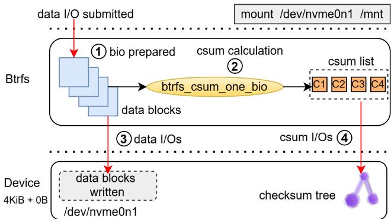  
Figure 1: BTRFS data write I/O path

BTRFS computes checksums at the logical block level just before writing the blocks to the underlying device. Checkpointing is performed at a default interval of 30 seconds, during which these checksums are persisted in the checksum tree. When part of a file is modified, the checksum recomputation is performed only for the changed blocks. However, due to the Copy-On-Write (COW) policy [45], modifications to the checksum tree cause ripple effects that propagate upward.

Figure 1 illustrates a simplified write I/O sequence when BTRFS handles a 16KiB userspace data write request. BTRFS first prepares the data blocks to be written to the device ⃝1 . It processes data in units of 4KiB blocks, computing a checksum for each block before dispatching the I/O (bio) to the block layer. The function btrfs\_csum\_one\_bio does the heavy lifting of per-block checksum computation and bookkeping ⃝2 . After computing the checksums, BTRFS issues the data I/O to the block layer ⃝3 . The computed checksum list (e.g., c1, c2,c3,c4) is then inserted into the checksum tree, which is subsequently persisted to the device ⃝4 .

## XFS

XFS [31] is a high-performance journaling filesystem designed for scalability on large storage systems. Since kernel

3.15 (2014), XFS supports self-describing metadata [23], including per-object crc32 checksums, to protect critical file system metadata structures such as superblocks, inodes, directories, and allocation group headers from silent corruption. However, XFS does not support data checksums. As a result, while XFS ensures robustness against metadata corruption, data blocks written by applications are not validated against corruption at the filesystem level. This makes XFS an ideal candidate for leveraging PI, where XFS itself generates and verifies PI on a PI-capable device, thereby extending integrity checks to data and complementing its existing metadata protection.

## 4 Motivation

Linux includes key building blocks for integrity—block-integrity in the block layer and PI support in enterprise SSDs—but some important practical obstacles remain. This section details the gaps that shaped our work.

Gap #1: Rigid PI placement in the Block layer. NVMe SSDs allow the protection information (PI) to reside in either the first bytes or the last bytes of the per-LBA metadata; this is fixed at format time via the Protection Information Location (PIL) setting. However, block-integrity assumed that PI always reside in the first bytes. This is because block-integrity was originally built for SCSI, which supported single placement of PI. This is problematic for NVMe deployments that place PI in the last bytes of the metadata, the common default when no value is specified for PIL.

Gap #2: No user interface for PI/Metadata. Today’s  
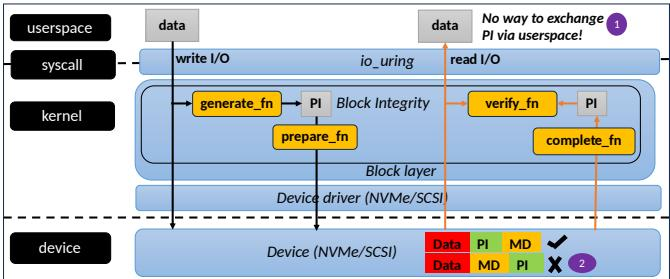  
Figure 2: Existing block integrity framework and gaps

read/write system calls can pass one or many data buffers, but there is no way to accompany them with metadata buffers. As a result, E2EDP is effectively limited to in-kernel components. User-space stacks that need PI (databases, distributed filesystems, vendor libraries) face awkward choices: forgo end-to-end protection or create custom interfaces that are to be maintained out-of-tree. For example, the Oracle Automatic Storage Management Library (ASMLib) [8, 10] needed such an interface and that forced users to install oracleasm [14, 44], a custom block driver maintained outside of the mainline kernel. This is a deployment and maintenance tax that comes in the way of adoption. Figure 2 highlights both these gaps. Gap #3: Filesystems are not PI aware. No Linux filesystem currently takes advantage of device PI. Even filesystem-level checksumming support is uneven. BTRFS [45] was designed to provide data checksums from the ground up. However, it relies on a CoW (Copy-On-Write) checksum tree. This causes extra writes and space allocation for checksum tree blocks. Table 4 shows the amount of writes in BTRFS for the mail server workload (varmail) bounded by a fixed number of operations (53 million). Disabling data checksumming reduces ∼23GiB of writes to the checksum tree and ∼31GiB of writes to other trees. Using the PI area of the device, BTRFS can eliminate the checksum tree and instead generate and verify PI directly. This approach increases usable space and reduces unnecessary writes and reads.

<table><tr><td rowspan=1 colspan=1>BTRFS  writes(GiB)</td><td rowspan=1 colspan=1>Base</td><td rowspan=1 colspan=1>No checksum</td></tr><tr><td rowspan=1 colspan=1>On checksum tree</td><td rowspan=1 colspan=1>23.31</td><td rowspan=1 colspan=1>0</td></tr><tr><td rowspan=1 colspan=1>On other trees</td><td rowspan=1 colspan=1>437.98</td><td rowspan=1 colspan=1>406.66</td></tr></table>

Table 4: BTRFS write amplification comparison

Although not part of the original design, Ext4 [4] and XFS [23] have introduced checksumming support for metadata, which required changes to their on-disk formats. The checksums are stored inside the metadata blocks, requiring a revision of the on-disk format. Retrofitting data checksums to an existing filesystem has proven difficult in practice. Storing data checksums inside the data stream would lead to byte-level misalignment of the data stream, which breaks a wide number of assumptions in the I/O path and performance expectations, and thus require additional on-disk metadata structures to store the checksums. Storing the checksums outside the data blocks need extra care to ensure that data and the checksums are updated atomically. Crucially, PI-capable devices lower the barrier of checksumming. Each LBA already carries a small per-block metadata field so integrity information can travel with the block rather than being indexed in a heavyweight structures (e.g., CoW checksum trees).

## 5 Architecture & Implementation

This section details the design and implementation to address the existing gaps (Section 4).

## 5.1 Flexible PI

All block-integrity PI processing functions (listed in Table 3) assume that PI is located at the beginning of the metadata. The left side of Figure 3 illustrates this scenario for a multi-block write I/O operation. Two data buffers, each 4KB in size, are transferred along with two metadata buffers, each 16 bytes in size. The PI size is 8 bytes. In this case, only the data block contents are used to calculate the checksum, which is then placed inside the PI.

However, complexity arises when the PI is located at the end of the metadata. In such cases, the checksum must cover both the data block and the portion of the metadata buffer excluding the PI. To address this issue, we introduce pi\_offset. The driver communicates this value to the block layer during integrity initialization. We have modified the PI processing functions to incorporate pi\_offset, ensuring that it is used to compute the checksum and correctly access the PI portion of the metadata buffer.

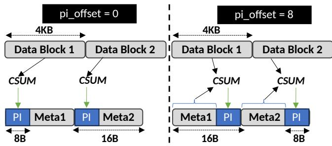  
Figure 3: Differences arising from PI location within meta

With the awareness of pi\_offset, block-integrity starts supporting flexible placement of PI within the metadata. We have upstreamed this capability in 6.9 kernel.

## 5.2 Read/Write with Integrity metadata

## 5.2.1 Coining a new user interface

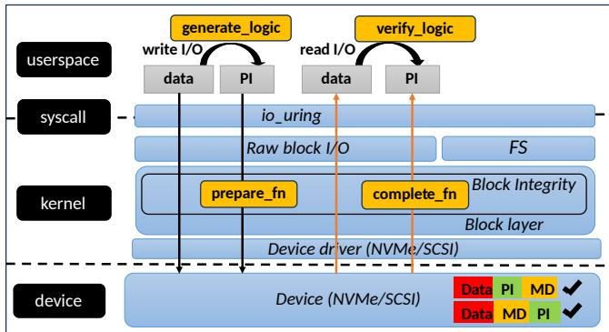  
Figure 4: New io\_uring PI interface

We chose io\_uring [18] for two reasons. First, it is highly efficient. Second, its extensibility eliminates the need to introduce a new system call. Figure 4 shows the new interface for exchanging PI with read and write I/O operations. We have integrated this into the 6.14 kernel. An important design consideration is whether to extend existing io\_uring read-/write operations or to introduce new ones that support passing metadata. The downside of the latter approach is that it would require the addition of new opcodes multiplicatively to accommodate each read/write variant supported by io\_uring, such as fixed buffers [7] and vectored I/O [32]. Therefore, we make existing read/write variants support passing 64 additional attributes by carving a new field attr\_type\_mask in SQE. The application must set it to IORING\_RW\_ATTR\_FLAG\_PI exchange PI. However, it is relevant to note that our approach creates a generic infrastructure that can be used to add other read/write attributes in the future.

To pass metadata, applications provide a 32-byte structure, io\_uring\_attr\_pi, whose address is stored in the new attr\_ptr field in the SQE. We avoid using Big SQE [33], which enlarges all SQEs to 128 bytes—even when not needed—and offers limited space for future expansion.

This interface is limited to direct I/O. Buffered I/O is incompatible due to page cache granularity and the complexity of coordinating metadata during writeback.

struct io\_uring\_attr\_pi {   
2 \_\_u16 flags ; /\* describe PI buffer checks \*/   
3 \_\_u16 app\_tag ; /\* application tag value \*/   
4 \_\_u32 len ; /\* length of PI buffer \*/   
5 \_\_u64 addr ;/\* address of PI buffer \*/   
6 \_\_u64 seed ; /\* remapping reftag \*/   
7 \_\_u64 rsvd ; /\* reserved for future use \*/   
8 };  
Listing 1: User space structure for sending PI with read/write

<table><tr><td rowspan=1 colspan=1>Flag</td><td rowspan=1 colspan=1>Purpose</td></tr><tr><td rowspan=1 colspan=1>IO_INTEGRITY_CHK_GUARD</td><td rowspan=1 colspan=1>Enforce guard check</td></tr><tr><td rowspan=1 colspan=1>IO_INTEGRITY_CHK_REFTAG</td><td rowspan=1 colspan=1>Enforce reftag check</td></tr><tr><td rowspan=1 colspan=1>IO_INTEGRITY_CHK_APPTAG</td><td rowspan=1 colspan=1>Enforce apptag check</td></tr></table>

Table 5: User space flags for integrity checks

Listing 2 shows how an application uses this interface to (i) write data and 8-byte metadata with a certain apptag value, and (ii) read data/metadata and verifies the apptag value. To exchange PI, we define a 32-byte structure, io\_uring\_attr\_pi(Listing 1), which the application must pass to the kernel. This structure cannot be put inline within a regular SQE [16], as it has only 16 bytes of free space. While using Big-SQE [33] was an option, it comes with the following drawbacks:

• Big SQE is a ring-level setting that increases all SQEs to 128 bytes, regardless of the actual needs of the operation.

• PI will consume half of the space in Big SQE, leaving limited room for future use.

Therefore, we employ a pointer-based method for passing the PI attribute. A new attr\_ptr field is added to the SQE, which contains the address of io\_uring\_attr\_pi when the application sends PI. The flags listed in Table 5 provide applications with fine-grained control over data integrity checks.

## 5.2.2 Block I/O support

The above interface enables PI exchange between the application and the kernel via io\_uring. We implemented support for this interface in the block device. We extended block-integrity to support user-generated metadata in addition to kernel-generated metadata. As shown in Figure 4, we reused reftag remapping for user-generated metadata so that the application is not forced to know the physical locations. At times, the block layer may need to complete a large I/O by splitting it into multiple smaller I/Os. We ensure that the splitting of the user meta buffer is correctly handled when this happens.

```c
#define DATA_LEN 4096
#define META_LEN 8
3
4 struct t10_pi_tuple {
5 _be16 guard ;
6 _be16 apptag ;
__be32 reftag ;
8 };
9
10 /* write/read data + protection info to/from
device */
11 int io_uring_pi_rw (void * wr_data_buf , void *
wr_pi_buf , void * rd_data_buf ,
12 void * rd_pi_buf )
13
14 struct io_uring ring ;
15 struct io_uring_sqe * sqe = NULL ;
16 struct io_uring_cqe * cqe = NULL ;
17 struct io_uring_attr_pi wr_pi_attr ,
rd_pi_attr ;
18
19 fd = open ("/dev/nvme0n1", O_WR | O_DIRECT
) ;
20 io_uring_queue_init (2 , & ring , 0) ;
21
22 sqe = io_uring_get_sqe (& ring );
23 io_uring_prep_write (sqe , fd , wr_data_buf ,
DATA_LEN , offset );
24 sqe -> attr_type_mask =
IORING_RW_ATTR_FLAG_PI ;
25 wr_pi_attr . addr = ( __u64 ) wr_pi_buf ;
26 wr_pi_attr . len = META_LEN ;
27 /* flags to ask for guard/reftag/apptag */
28 w_pi . flags = IO_INTEGRITY_CHK_APPTAG ;
29 w_pi . app_tag = 0 x1234 ;
30 sqe -> attr_ptr = ( __u64 )& wr_pi_attr ;
31 pi = (struct t10_pi_tuple *) wr_pi_buf ;
32 pi -> apptag = 0 x3412 ;
33
34 io_uring_submit (& ring );
35 io_uring_wait_cqe (& ring , & cqe );
36 io_uring_cqe_seen (& ring , cqe );
37
38 sqe = io_uring_get_sqe (& ring );
39 io_uring_prep_read (sqe , fd , rd_data_buf ,
DATA_LEN , offset );
40 sqe -> attr_type_mask =
IORING_RW_ATTR_FLAG_PI ;
41 rd_pi_attr . addr = ( __u64 ) rd_pi_buf ;
42 rd_pi_attr . len = META_LEN ;
43 rd_pi_attr . flags =
IO_INTEGRITY_CHK_APPTAG ;
```

```c
44 rd_pi_attr . app_tag = 0 x1234 ;
45
46 io_uring_submit (& ring );
47 io_uring_wait_cqe (& ring , & cqe );
48 io_uring_cqe_seen (& ring , cqe );
49
50 pi = (struct t10_pi_tuple *) rd_pi_buf ;
51 if (pi -> apptag != 0 x3412 )
52 printf ("Failure: apptag mismatch
!\n");
53 io_uring_queue_exit (& ring );
54
```  
Listing 2: read/write protection-information along with data

## 5.2.3 User space Enablement: Capability Query and FIO Support

We add a user space ioctl to discover and exercise PI. The call reports a device’s integrity layout so applications can size and format metadata buffers before issuing I/O: (i) metadata/tuple size, (ii) checksum type (e.g., CRC16/CRC64/none), (iii) PI offsets/stride, and (iv) storage/ref-tag widths.

We extend fio’s [19] io\_uring engine to attach PI alongside data.The ioctl output is plumbed into request preparation, and we add a self-contained test that validates end-to-end behavior across data/metadata sizes and guard types.

## 5.2.4 Discussion: Why Buffered I/O is Not Supported

Linux buffered I/O is built on the page cache, which manages the lifecycle and writeback of file data. Supporting user provided PI metadata in buffered I/O interface is challenging due to a host of reasons:

• If the PI is cached in page-cache (similar to data), the writeback of PI may take place without the related data. The page cache schedules writeback independently based on memory pressure and background policies. Caching metadata would require complex bidirectional mappings so that flushing one triggers the other. Therefore, one would need to stash PI in a custom structure that hangs off the page.

• Buffered I/O is byte-granular unlike direct I/O that respects the alignment to the logical block size of the underlying storage device. On each byte-granular write/overwrite, the cached PI can go stale and needs to be recomputed.

• Modification to a file can happen via memory mapping. MAP\_SHARED [11] stores bypass the file-system. After the one-time page\_mkwrite() notification [15] to filesystem, user stores modify file-backed pages directly. Any cached PI will go stale when this happens, and filesystems have no way to know it.

## 5.3 FS-PI: Filesystem-Driven Protection Information

## 5.3.1 Why move beyond block-integrity?

Block-integrity protects data once I/O requests are formed, but it does not see the decisions a filesystem makes before that point. Two practical limitations follow:

• What the filesystem changes (coverage): Filesystems frequently reshape data before it reaches the device — splitting and merging writes [49], relocating blocks, applying copy-on-write or reflink [42], or mapping across RAID stripes [43]. Block-integrity is added after these choices, so the transformations themselves are not within its protection envelope.

• When protection should happen (policy): Filesystems need to decide at which stages protection is applied: for example, only for user data (not journaled metadata [27]), during direct I/O and/or during buffered writeback, before exposing read data to the page cache, or during repair/recovery paths. These choices are filesystem policy, but block-integrity applies uniformly and cannot express them.

FS-PI closes these gaps by letting the filesystem allocate PI buffers, generate PI on writes, and verify PI on reads exactly where it defines layout and controls data visibility. With FS-PI, the protection envelope is extended as PI awareness moves higher up the I/O stack. Compared to RAID arrays connected over the network, or RAID HBAs implemented as peripherals, FS-PI also protects the entire on-the-wire transport between the host and the device, a significant source of the bit errors. Compared to software RAID or block-layer PI, FS-PI can catch software-induced or in-memory bit flips earlier, and integrate into the I/O path more efficiently. In addition, FS-PI enables creative apptag use (e.g. keeping unique apptag for each file) and, together with the user interface, provides application-visible end-to-end integrity.

We implement FS-PI in BTRFS and XFS to cover two very different filesystem designs. BTRFS already implements data checksumming using checksum trees, allowing us to evaluate the benefits of replacing out-of-place checksums with per-block PI.XFS lacks data checksumming, enabling us to assess the cost of adding data integrity to a filesystem without changing its on disk format.

## 5.3.2 Using different PI modes

In Type 1/2/3 PI modes, the device validates PI tuples (guard and/or ref tags), and FS-PI simply generates and verifies them.

Type 0 PI differs: the device reserves space for per-block metadata, but enforces no checks for it. We see this as an opportunity for the filesystem to use the entire per-block metadata/PI area to store anything. Although the NVMe specification includes CRC32c, most devices today only implement CRC16 or CRC64. With Type 0 PI, FS-PI can generate and verify CRC32c—or any other algorithm the filesystem prefers. Thus, Type 0 PI becomes a flexibility mechanism: allowing filesystems to use checksum policies beyond those implemented in hardware. Table 6 summarizes the differences.

<table><tr><td rowspan=1 colspan=1>Aspect</td><td rowspan=1 colspan=1>PI Type 1/2/3</td><td rowspan=1 colspan=1>PI Type 0</td></tr><tr><td rowspan=1 colspan=1>FS compute/verify</td><td rowspan=1 colspan=1>Yes</td><td rowspan=1 colspan=1>Yes</td></tr><tr><td rowspan=1 colspan=1>HWcompute/ver-ify</td><td rowspan=1 colspan=1>Yes</td><td rowspan=1 colspan=1>No</td></tr><tr><td rowspan=1 colspan=1>CRC algorithm</td><td rowspan=1 colspan=1>PI dependent</td><td rowspan=1 colspan=1>FS decided</td></tr></table>

Table 6: FS-PI difference for PI modes

## 5.3.3 Block-layer Helpers for Filesystems

To make Protection Information (PI) support reusable across filesystems, we extended the block layer with a set of fs\_bio\_integrity helpers. These expose a clean API for attaching and managing integrity metadata:

• fs\_bio\_integrity\_alloc() — allocate an integrity buffer for a bio,

• fs\_bio\_integrity\_generate() — compute and store PI tuples on writes,

• fs\_bio\_integrity\_verify() — verify PI on reads given a sector and size,

• fs\_bio\_integrity\_free() — release the integrity payload once processed.

With these helpers, filesystems such as XFS and BTRFS can perform PI generation and verification, while relying on the block layer for buffer management, checksum computation, and validation. Centralizing this logic ensures consistent semantics and lowers the effort needed to integrate PI into different filesystems.

## 5.3.4 Optimizing Filesystem Metadata I/O

Some filesystems already protect metadata with their own checksumming and self-describing formats. For example, XFS embeds CRCs, disk addresses, and log sequence numbers directly into each metadata block, while BTRFS stores checksums inline in B-tree node headers. This provides protection as strong as common PI formats. Checksumming of such I/O buffers in the block-layer adds computational overheads without any extra reliability gains.

To avoid this redundancy, we introduce a new request flag, REQ\_NOINTEGRITY. We modify block-integrity so that it skips checksum generation/verification when REQ\_NOINTEGRITY is set. Instead, device driver instructs the device to perform automatic insertion/stripping by setting Protection Information Action (PRACT) bit in the command [12]. This ensures on-disk format compliance. Importantly, this optimization is conditional: the flag is ignored if the device is not PI capable, or if the device format cannot perform automatic insertion and stripping. Thus, REQ\_NOINTEGRITY gives per

I/O control knob that fileystems can use to eliminate unnecessary overhead where possible, while preserving compatibility across devices.

## 5.3.5 BTRFS FS-PI

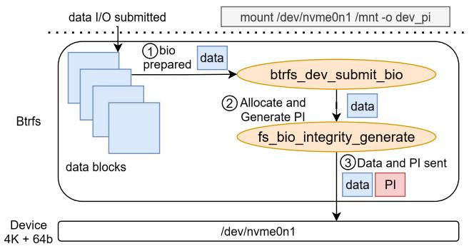  
Figure 5: BTRFS FS-PI write path

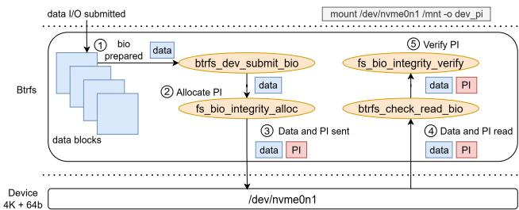  
Figure 6: BTRFS FS-PI read path

We extend BTRFS with a new mount option, dev\_pi, which switches the filesystem from its traditional checksumbased integrity scheme to one that leverages PI-capable device. When mounted with dev\_pi, BTRFS no longer maintains a separate checksum tree; instead, PI tuples are generated and verified by BTRFS.

Within btrfs\_submit\_dev\_bio(), we check the I/O operation type: for writes, BTRFS allocates a PI buffer and generates tuples before submission (Figure 5); for reads, a PI buffer is allocated, and verification is performed in process context during completion via btrfs\_check\_read\_bio() (Figure 6).

In addition, Type-0 PI mode allows BTRFS to use the reserved PI buffer for its own checksums. We add support for CRC32c generation and verification in this mode, providing equivalent protection to BTRFS’s native checksum tree, but with significantly reduced write amplification. Thus, BTRFS FS-PI reduces resource costs without compromising protection.

Failure Semantics: FS-PI protects only data blocks in BTRFS; metadata integrity handling remains unchanged. Any PI mismatch during read or write is reported as an I/O error. Although BTRFS supports redundant data copies via DUP or

RAID profiles, recovery using redundant replicas is deferred to future work. In single (non-redundant) profile used in our evaluation, no corrective action is taken.

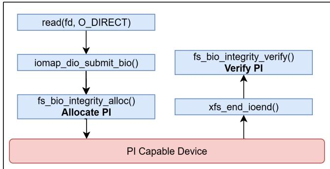  
Figure 7: XFS Direct Read

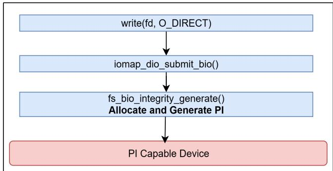  
Figure 8: XFS Direct Write

## 5.3.6 XFS FS-PI

We adopt a filesystem-driven (“FS-PI”) design for XFS data checksumming. In this model, XFS is responsible for both generating and verifying the Protection Information (PI) instead of relying on the block layer.

Integrity flag: We introduce a new IOMAP\_F\_INTEGRITY flag, which indicates that the filesystem handles integrity metadata. When this flag is set on an iomap [9, 17, 28], the iomap layer allocates and attaches PI buffers to bios and invokes the generic block layer helpers to generate tuples on writes and verify them on reads.

We handle the four main I/O paths as follows:

• Direct Read: The page cache is bypassed, and I/O is issued through iomap\_dio\_rw(). When the IOMAP\_F\_INTEGRITY flag is set, the PI buffer is allocated in the direct I/O path and attached to the bio. Verification is then performed in the bio completion path using fs\_bio\_integrity\_verify() before data is returned to the application. Figure 7 shows this flow.

• Direct Write: The page cache is bypassed, and I/O is issued through iomap\_dio\_rw(). When the IOMAP\_F\_INTEGRITY flag is set, the PI buffer is allocated, and PI metadata is generated using fs\_bio\_integrity\_generate() before the bio is submitted to the block layer. Figure 8 illustrates this flow.

• Buffered Read: On a cache miss, I/O is driven by filemap\_read(), which operates at the folio level. To support integrity in this path, iomap provides a new iomap\_read\_folio\_ops structure, allowing the filesystem to hook into bio submission for folio reads. When the IOMAP\_F\_INTEGRITY flag is set, iomap allocates and attaches the PI buffer while constructing the bio. On I/O completion, verification is performed in process context using fs\_bio\_integrity\_verify() before data is made visible to the page cache. Figure 9 illustrates this flow.

• Buffered Write: Data is first copied from the user buffer into the page cache. PI buffer allocation happens later during writeback, when bios are built. At this point, the iomap writeback path (iomap\_ioend\_writeback\_submit()) invokes fs\_bio\_integrity\_generate() just before submitting the bio to the block layer. Figure 10 illustrates this flow for buffered writes.

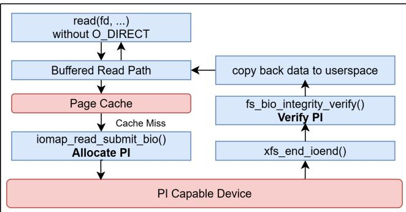  
Figure 9: XFS Buffered Read

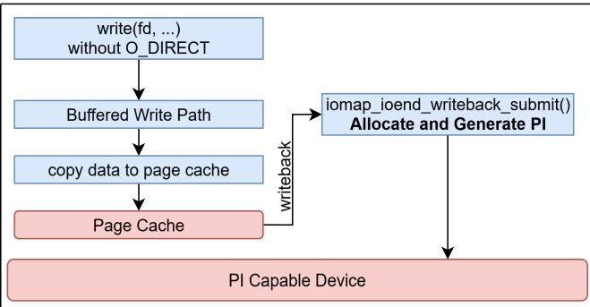  
Figure 10: XFS Buffered Write

This integrity handling is implemented entirely in the generic iomap layer, making it filesystem agnostic. Any filesystem that already uses iomap for buffered or direct I/O can enable FS-PI simply by setting the IOMAP\_F\_INTEGRITY flag.

For devices formatted with Type-0 PI, we add CRC32c support as a logical-block checksumming mode, reusing the same buffer allocation and verification flow. This enables XFS to use CRC32c data checksumming.

Failure Semantics: FS-PI in XFS protects only data blocks and does not alter existing metadata integrity mechanisms. XFS doesn’t support data redundancy; therefore any PI failure during read or write results in an I/O error being reported to the application.

## 6 Evaluation

Our evaluation is structured around two central themes: (A) BTRFS with FS-PI for reducing write amplification and preserving performance; and (B) XFS with FS-PI costs when adding data checksums in the filesystem. We conducted this evaluation to answer the following questions:

## BTRFS FS-PI:

• Does FS-PI reduce the amount of filesystem and NAND writes?

• Does FS-PI affect BTRFS performance and cpuutilisation?

• Does FS-PI lead to improved SSD Endurance?

• Does FS-PI reduce the FS WAF?

## XFS FS-PI:

• What is the overhead of PI generation/verification in XFS?

## 6.1 Setup and Workloads

Setup. For our evaluations we run experiments on an Ubuntu 22.04 machine running Linux Kernel 6.15 equipped with an AMD Ryzen 9 5900X 12-core CPU, 16 GB of DDR4 RAM, a 1.88 TB Samsung PM9D3 SSD [46]. We use the following notations to distinguish between the BTRFS configurations we experiment with: (i) basecase denotes the configuration where BTRFS maintains the checksum tree, and (ii) FS-PI denotes the configurations where BTRFS uses device PI instead of checksum tree. Similarly, we use the following notations to distinguish between the XFS configurations we experiment with: (i) basecase denotes the configuration where XFS runs without data checksumming enabled, and (ii) FS-PI denotes the configuration where XFS starts doing data checksumming using filesystem-managed PI generation and verification in the I/O path. All experiments were run four times; where applicable , we report error bars indicating standard deviation.

Workloads. We evaluated the two configurations of BTRFS and XFS against multiple workloads:

1. FIO based synthetic workloads. Specifically, we use 24 jobs, each issuing 10 GiB of I/O with a queue depth of 128 and a block size of 4 KiB.

2. Four Filebench [52] workloads: varmail, webserver, fileserver, and OLTP.

3. To evaluate per-I/O latency, we run FIO with a single job issuing 10 GiB of I/O at a queue depth of 1, using a 4 KiB block size.

## 6.2 BTRFS FS-PI

## 6.2.1 Write Amplification

We evaluate FS-PI in BTRFS using a fio random write workload. We quantify host writes using the iostat [30] tool which reports the number of bytes issued by the kernel block layer to the device. NAND writes are captured by querying the SSD controller’s log page [38, 48] that expose cumulative NAND write counts on NAND media. This way we obtain the volume of data actually written to the flash media.

## Treewise Write Amplification

Figure 11 compares the writes issued to different BTRFS trees in the base and FS-PI cases:

• FS tree: stores file and directory metadata, including inodes and file extent mappings.

• Checksum tree: stores data block checksums, used for integrity verification.

• Extent tree: tracks allocated extents and their reference counts.

• Chunk tree: maps logical filesystem addresses to physical block address.

• Root tree: maintains reference to all other filesystem trees.

• Device tree: records which parts of each physical device have been allocated.

• Free space tree: tracks unallocated space to accelerate allocation.

Note that in the FS-PI case, there are no writes to the checksum tree. The number of writes is reduced by ∼ 70% for the FS tree and by ∼ 62% for the extent tree during direct I/O. The number of writes reduce by ∼ 33% for the extent tree during buffered I/O.

Takeaway: FS-PI in BTRFS reduces the number of writes issued to every BTRFS tree [3] compared to basecase.

## FS and NAND Write Amplification

With direct random writes, FS-PI lowers host writes from 813.66 GiB to 391.14 GiB, a reduction of ∼ 52%, cutting FS-WAF from 3.39 to 1.63. For buffered random writes, host writes fall from 835.46 GiB to 666.9 GiB (∼ 20% reduction), and FS-WAF drops from 3.48 to 2.78. These results demonstrate that FS-PI substantially reduces write amplification across both I/O modes, with the strongest impact in direct

I/O.

FS-PI in BTRFS lowers NAND writes compared to the base case, achieving ∼ 52% reduction for direct random writes and ∼ 20% for buffered random writes. This highlights the effectiveness of FS-PI in reducing write amplification at the NAND/device level. Table 7 shows the comparison.

Takeaway: FS-PI in BTRFS reduces filesystem write amplification and NAND writes compared to base case.

## Read Amplification

FS-PI in BTRFS reduces the read operations issued during writes, cutting them by ∼ 53% in direct I/O and ∼ 58% in buffered I/O compared to the base case. Table 7 shows the comparison.

Takeaway: FS-PI in BTRFS reduces the amount of read operations issued compared to the basecase.

## 6.2.2 Performance

Table 8 summarizes the data on thousands of operations per second (K operations/sec) for different types of Filebench workloads. The base scenario experiences overhead from checksum computations and additional writes required for updating BTRFS trees. Because the varmail workload is fsyncintensive, it experiences the greatest improvement of ∼ 13%

Figures 12(a) and 12(b) compare basecase BTRFS against FS-PI under direct and buffered I/O. Performance is broadly similar for sequential workloads and random reads, showing that FS-PI does not introduce overhead in these cases. The key improvement comes with random writes, where eliminating the checksum tree significantly reduces metadata updates to the checksum, extent, and chunk trees. This reduction translates into measurable throughput gains compared to the basecase.

Takeaway: FS-PI in BTRFS does not degrade performance.

## 6.2.3 CPU Utilization

For measuring CPU utilization, we use fio direct I/O workloads. Since FS-PI case performs better than the basecase, it completes faster. Simply capturing the CPU utilization of the workloads will not provide an accurate picture. The rate at which I/Os are issued needs to be fixed when comparing the two cases. To address this, we use the rate\_iops [19] option when running the FS-PI workload and set it to match the base case IOPS.

Figure 13 shows the percentage of idle CPU for the FS-PI case and the base case across different I/O types. The biggest gains appear in random writes, where the idle CPU percentage rises from ∼ 12% to ∼ 70%. FS-PI eliminates BTRFS checksum tree updates reducing B-tree operations and lock contention, and thereby cutting kernel work per I/O.

Takeaway: FS-PI in BTRFS reduces Host CPU Utilization.

<table><tr><td>Workload</td><td>App Writes (GiB)</td><td>Host Writes (GiB)</td><td>NAND Writes (GiB)</td><td>Reads Issued (GiB)</td><td>FS WAF</td></tr><tr><td>Base Direct Randwrite</td><td>240</td><td>813.66</td><td>839.91</td><td>30.43</td><td>3.39</td></tr><tr><td>FS-PI Direct Randwrite</td><td>240</td><td>391.14</td><td>403.76</td><td>14.12</td><td>1.62</td></tr><tr><td>Base Buffered Randwrite</td><td>240</td><td>835.46</td><td>862.42</td><td>19.76</td><td>3.42</td></tr><tr><td>FS-PI Buffered Randwrite</td><td>240</td><td>666.90</td><td>688.42</td><td>8.19</td><td>2.77</td></tr></table>

Table 7: Evaluation of I/O metrics for BTRFS with and without FS-PI

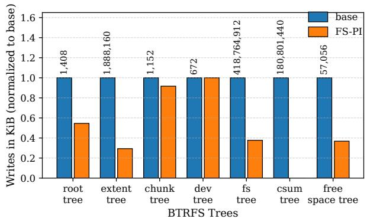  
(a) Direct I/O

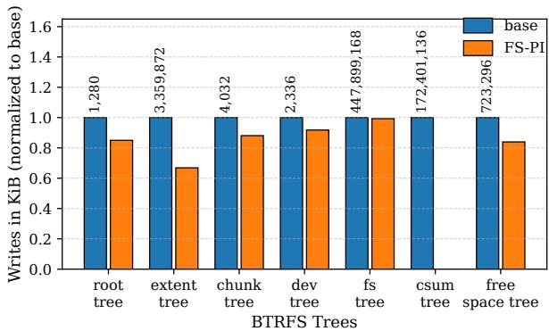  
(b) Buffered I/O

Figure 11: Tree-wise write amplification for Base vs FS-PI  
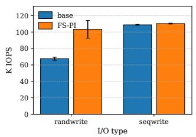

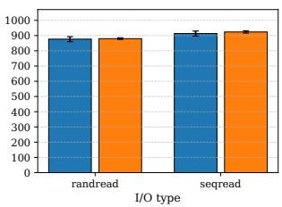  
(a) Direct I/O

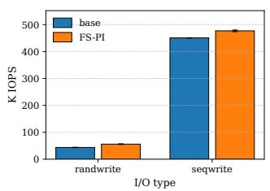

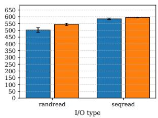  
(b) Buffered I/O

Figure 12: BTRFS throughput comparison
<table><tr><td rowspan=1 colspan=1>Workload</td><td rowspan=1 colspan=1>base K ops/s</td><td rowspan=1 colspan=1>FS-PI K ops/s</td></tr><tr><td rowspan=1 colspan=1>Varmail</td><td rowspan=1 colspan=1>83</td><td rowspan=1 colspan=1>94</td></tr><tr><td rowspan=1 colspan=1>Webserver</td><td rowspan=1 colspan=1>120</td><td rowspan=1 colspan=1>121</td></tr><tr><td rowspan=1 colspan=1>OLTP</td><td rowspan=1 colspan=1>27</td><td rowspan=1 colspan=1>27</td></tr><tr><td rowspan=1 colspan=1>Fileserver</td><td rowspan=1 colspan=1>135</td><td rowspan=1 colspan=1>136</td></tr></table>

Table 8: Filebench stats base v/s FS-PI in BTRFS

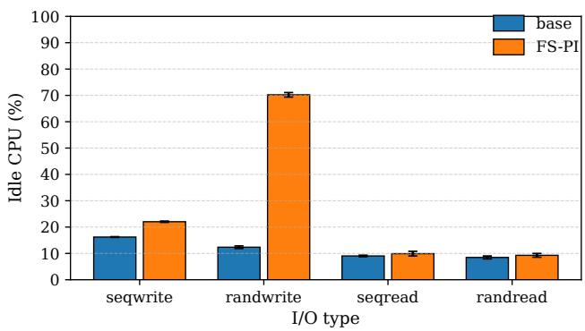  
Figure 13: BTRFS FS-PI cpu-utilization

## 6.2.4 SSD Endurance

<table><tr><td rowspan=1 colspan=1>Workload</td><td rowspan=1 colspan=1>App Writes (GiB)</td><td rowspan=1 colspan=1>Host Writes (GiB)</td><td rowspan=1 colspan=1>DWPD</td></tr><tr><td rowspan=1 colspan=1>Base</td><td rowspan=1 colspan=1>253</td><td rowspan=1 colspan=1>2192.17</td><td rowspan=1 colspan=1>27.33</td></tr><tr><td rowspan=1 colspan=1>FS-PI</td><td rowspan=1 colspan=1>253</td><td rowspan=1 colspan=1>1776.44</td><td rowspan=1 colspan=1>22.15</td></tr></table>

Table 9: Measuring SSD Endurance

To analyze the SSD endurance of the base BTRFS configuration and the FS-PI case, we rate-limit the application bandwidth to 72 MiB/s to meet the rated endurance of three drive writes per day (DWPD) of the 1.88 TiB PM9D3 SSD to achieve a 5-year SSD lifetime.

We run an FIO direct I/O random write workload for one hour, rate-limited at the 72 MiB/s mentioned above, and scale the host writes to one day to estimate the DWPD of the base BTRFS case and the FS-PI case. Table 9 summarizes the results. This experiment resulted in the base BTRFS configuration performing 2,192.17 GiB of host writes in one hour, translating to 27.33 DWPD when scaled to a full day. Under the same workload, mounting BTRFS with the FS-PI option reduced the host writes to 1,776.44 GiB per hour, or 22.15 DWPD.

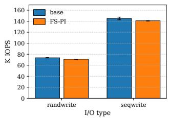

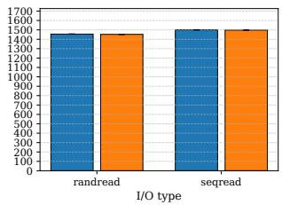  
(a) Direct I/O

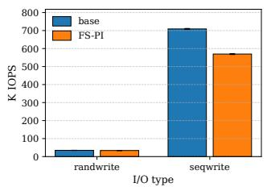

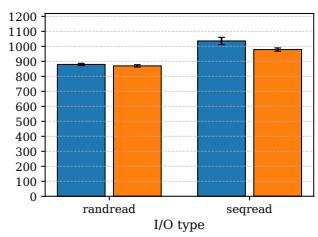  
(b) Buffered I/O  
Figure 14: XFS throughput comparison

The reduction in DWPD from 27.33 to 22.15 when using FS-PI translates to a reduction 19% in DWPD and corresponds to a 23. 4% improvement in the estimated lifetime of SSD. The reductions in filesystem-level write amplification (FS WAF), paired with the decrease in tree writes, lead to the overall reduction in DWPD when using the FS-PI in BTRFS. This demonstrates the measurable benefits of introducing the FS-PI in BTRFS to SSD endurance.

Takeaway: FS-PI in BTRFS improves SSD Endurance.

## 6.3 XFS FS-PI

<table><tr><td rowspan=1 colspan=1>Workload</td><td rowspan=1 colspan=1>base K ops/s</td><td rowspan=1 colspan=1>FS-PI K ops/s</td></tr><tr><td rowspan=1 colspan=1>Varmail</td><td rowspan=1 colspan=1>219</td><td rowspan=1 colspan=1>219</td></tr><tr><td rowspan=1 colspan=1>OLTP</td><td rowspan=1 colspan=1>181</td><td rowspan=1 colspan=1>188</td></tr><tr><td rowspan=1 colspan=1>Fileserver</td><td rowspan=1 colspan=1>162</td><td rowspan=1 colspan=1>162</td></tr><tr><td rowspan=1 colspan=1>Webserver</td><td rowspan=1 colspan=1>902</td><td rowspan=1 colspan=1>890</td></tr></table>

Table 10: Filebench stats base v/s FS-PI in XFS

## 6.3.1 Performance

Enabling filesystem-managed PI in XFS adds modest overhead for direct I/O: random write drop by roughly 4%, with negligible impact on random/sequential reads and about ∼1– 2% on sequential writes. Buffered I/O is more sensitive: both random and sequential reads incur about ∼1–6% overhead, buffered random writes about ∼1–2%, and buffered sequential writes see the largest impact at ∼20%, reflecting PI generation during writeback and associated cache/writeback processing. Overall, XFS-PI delivers stronger integrity guarantees with small costs for direct I/O and a more pronounced, but predictable, penalty in buffered write-heavy paths. Figure 14 shows the comparison.

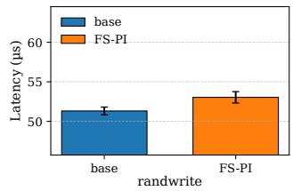

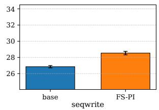

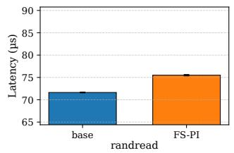

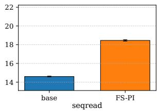  
(a) Direct I/O

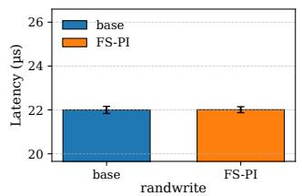

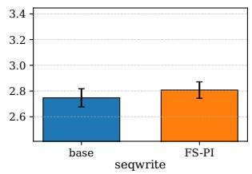

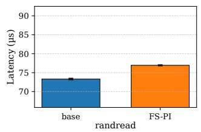

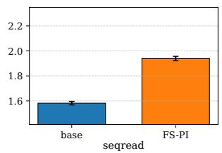  
(b) Buffered I/O  
Figure 15: XFS latency comparison

Table 10 summarizes the data on thousands of operations per second (K operations/sec) for different types of Filebench workloads. Across the set of workloads tested we observed, that XFS-PI performance is nearly identical to the basecase, with no measurable degradation. This suggests that the overhead of PI generation and verification in XFS are amortized under realistic, mixed workloads and the performance impact of enabling PI remains negligible.

Takeaway: FS-PI in XFS balances overhead and reliability.

## 6.3.2 Latency

Figure 15 compares per-I/O latency for XFS with and without FS-PI under direct and buffered I/O. FS-PI introduces small latency increases write workloads and random reads, while sequential reads exhibit a more noticeable increase in latency.

## 7 Related Work

ZFS and BTRFS employ checksumming to ensure data integrity, but both store these checksums as out-of-place metadata. ZFS stores data block checksum in the parent block, while BTRFS maintains a separate tree. When checksums are stored in file system metadata (as in ZFS and BTRFS), data updates trigger additional metadata writes, causing various forms of the "wandering tree" problem. In contrast, our FS-PI approach localizes updates since the data block itself carries integrity metadata. This explains the observed reductions in write, read, and CPU costs in BTRFS-PI. The reduction is particularly important for QLC flash storage (with limited write cycles) and rotating media, which suffer from seek latency. ZFS/BTRFS detect corruption only when data is read back, as both employ a pure software-based checksumming approach that does not leverage device-level PI. In contrast, FS-PI detects corruption early—even during write operations—by having the PI-capable device verify checksum, reftag, and apptag before persisting data. Previous studies [22, 37] have analyzed I/O amplification in filesystems and reported recursive update overhead in BTRFS. The data checksumming overhead is so prominent that BTRFS includes a mount option nodatasum to turn it off [1]. However, this risks data integrity. Our approach, FS-PI in BTRFS, does not forgo data integrity while removing the cost of checksum-tree. In the context of Metadata/PI user interface, it is possible to exchange a separate metadata buffer with NVMe passthrough commands sent via ioctl [13] or io\_uring [33]. Outside of the kernel, SPDK allows to write/read metadata along with data. However, both kernel passthrough I/O and SPDK path is limited to NVMe-aware applications. We introduce a storage-protocol independent user interface for both block and file I/O.

Prior systems either implement integrity using out-of-place checksum metadata within the filesystem (e.g. ZFS, BTRFS) or rely on protection information confined below the filesystem in block or RAID layers. To best of our knowledge, no prior general-purpose filesystem uses protection information as the primary integrity mechanism. FS-PI occupies this previously unexplored point in the design space.

In context of FS-PI, Linux device-mapper exposes two integrity facilities that sit below the filesystem: dm-verity [25] and dm-integrity [24]. Dm-verity builds a cryptographic hash tree (Merkle tree) for the block device and persists that. Every block read is checked against this Merkle tree. Since this is meant to detect tampering, data blocks becomes effectively immutable. Fs-verity [26] takes the dm-verity approach, but operates at file-level. Userspace uses an ioctl to enable verity for a file, which causes filesystem to build a Merkle tree for that file. The file is made read-only, and filesystem verifies data read from the file against the Merkle tree. FS-PI, unlike dm-verity and fs-verity, is not meant to create read-only, tamper-proof environment. Dm-integrity [24] creates a virtual integrity-enabled block device on top of an underlying physical block device. It reserves some space to store per-sector integrity tags, and also keeps a journal to ensure atomicity of data and corresponding integrity information. It is meant to create software-based integrity backend over commodity drives.

## 8 Conclusion

This paper advances on what is possible in Linux with respect to data integrity. We upstream an io\_uring interface that enables Linux applications to better protect against data corruption. By adding flexible PI placement in block-integrity, we make Linux support additional real-world devices.

Our work underscores the value of greater hardware awareness in software. Specifically, we propose and show FS-PI, filesystems leveraging PI, in practice. We implement PI support in BTRFS, which delivers notable benefits for deployments optimized to reduce write amplification. For XFS, PI support introduces a new capability that enables data checksumming within the filesystem. For future work, we aim to engage with the kernel community to upstream FS-PI across filesystems.

## Acknowledgement

We would like to thank our shepherd, Yu Liang, and the anonymous reviewers for their valuable feedback and guidance. We also thank Martin K. Petersen, Vincent Kang Fu, Keith Busch, Pavel Begunkov, and Jens Axboe for their contributions and discussions that help advance data integrity support in Linux.

## References

[1] Administration. https://typeset.io/pdf/an-efficient-nand-flash-filesystem-for-flash-memory-storage-3m9v3u4dct.pdf .

[2] Block layer data integrity support. https://cateee.net/lkd db/web-lkddb/BLK\_DEV\_INTEGRITY.html.

[3] Btrees. https://btrfs.readthedocs.io/en/latest/dev/dev-btrees.html.

[4] Data checksums ext4 documentation. https://www.kernel.org/doc/html/v6.6/filesystems/ext4/overview.html.

[5] Data integrity. https://docs.kernel.org/block/data-integrity.html.

[6] Data integrity field. https://en.wikipedia.org/wiki/Da ta\_Integrity\_Field.

[7] Fixed buffers. https://unixism.net/loti/tutorial/fi xed\_buffers.html#:\~:text=The%20idea%20with%20u sing%20fixed,to%20and%20from%20user%20space..

[8] An integrated end-to-end data integrity solution to protect against silent data corruption. https://docs.broadcom.com/doc/12356057.

[9] iomap. https://kernelnewbies.org/KernelProjects /iomap.

[10] Linux data integrity. https://oss.oracle.com/mkp/docs/lpc08-data- ˜ integrity.pdf .

[11] mmap. https://man7.org/linux/man-pages/man2/mma p.2.html.

[12] Nvm command set specification. https://nvmexpress.org/wpcontent/uploads/NVMe-NVM-Command-Set-Specification-1.0a-2021.07.26-Ratified.pdf .

[13] Nvme sync passthrough. https://manpages.debian.org/ testing/nvme-cli/nvme-io-passthru.1.en.html.

[14] Oracle asm. https://git.kernel.org/pub/scm/linux/kernel/git/mkp/linux.git/ tree/drivers/block/oracleasm?h=oracleasm.

[15] page-mkwrite. https://www.kernel.org/doc/Documen tation/filesystems/Locking.

[16] Sqe: Submission queue entry. https://unixism.net/loti/r ef-liburing/sqe.html.

[17] Vfs iomap documentation. https://docs.kernel.org/file systems/iomap/index.html.

[18] AXBOE, J. Efficient io with io\_uring. W:(15 pa´z. 2019). https: //kernel. dk/io\_uring. pdf (term. wiz. 08. 06. 2020) (2019).

[19] AXBOE, J., ET AL. Flexible i/o tester. https://github.com/a xboe/fio.

[20] BAIRAVASUNDARAM, L. N., GOODSON, G. R., PASUPATHY, S., AND SCHINDLER, J. An analysis of latent sector errors in disk drives. In Proceedings of the 2007 ACM SIGMETRICS international conference on Measurement and modeling of computer systems (2007), pp. 289– 300.

[21] BAIRAVASUNDARAM, L. N., GOODSON, G. R., SCHROEDER, B., ARPACI-DUSSEAU, A. C., AND ARPACI-DUSSEAU, R. H. An analysis of data corruption in the storage stack. In Proceedings of the 6th USENIX Conference on File and Storage Technologies (FAST’08) (San Jose, CA, USA, 2008). Field study over 1.53M disks for 41 months; reports checksum mismatches, identity discrepancies, and parity inconsistencies.

[22] CHEN, J., WANG, J., TAN, Z., AND XIE, C. Effects of recursive update in copy-on-write file systems: A btrfs case study. Canadian Journal of Electrical and Computer Engineering 37, 2 (2014), 113–122.

[23] DARRICK, W. On self describing filesystem metadata. https://blogs.oracle.com/linux/post/on-self-describing-filesystemmetadata-by-darrick-wong.

[24] DOCUMENTATION, L. K. Dm-integrity. https://docs.kernel.org/adminguide/device-mapper/dm-integrity.html.

[25] DOCUMENTATION, L. K. Dm-verity. https://docs.kernel.org/adminguide/device-mapper/verity.html.

[26] DOCUMENTATION, L. K . fs-verity. https://docs.kernel.org/filesystems/fsverity.html.

[27] DOCUMENTATION, L. K. Xfs self describing metadata. https://www.kernel.org/doc/html/v6.1/filesystems/xfs-self-describingmetadata.html (2024).

[28] EDGE, J. Filesystems and iomap. https://lwn.net/Articl es/974958/.

[29] GEORGE, P. T10/03-176 revision 9. https://www.t10.org/ ftp/t10/document.03/03-176r9.pdf.

[30] GODARD, S. ostat(1) — linux manual page. https://man7.org /linux/man-pages/man1/iostat.1.html.

[31] HELLWIG, C. XFS: The Big Storage File System for Linux. USENIX ;login, 34 (2009). https://www.usenix.org/system/files/logi n/articles/140-hellwig.pdf.

[32] IO\_URING BY EXAMPLE: PART 1 – INTRODUCTION. vectored-io. https://unixism.net/2020/04/io-uring-by-exam ple-part-1-introduction/.

[33] JOSHI, K., GUPTA, A., GONZÁLEZ, J., KUMAR, A., REDDY, K. K., GEORGE, A., LUND, S., AND AXBOE, J. {I/O} passthru: Upstreaming a flexible and efficient {I/O} path in linux. In 22nd USENIX Conference on File and Storage Technologies (FAST 24) (2024), pp. 107–121.

[34] LI, Q., LI, H., AND ZHANG, K. A survey of ssd lifecycle prediction. In 2019 IEEE 10th International Conference on Software Engineering and Service Science (ICSESS) (2019), IEEE, pp. 195–198.

[35] MATHUR, A., CAO, M., BHATTACHARYA, S., DILGER, A., TOMAS, A., AND VIVIER, L. The new ext4 filesystem: current status and future plans. In Proceedings of the Linux symposium (2007), vol. 2, Citeseer, pp. 21–33.

[36] MAY, T. C., AND WOODS, M. H. Alpha-particle-induced soft errors in dynamic memories. IEEE transactions on Electron devices 26, 1 (2005), 2–9.

[37] MOHAN, J., KADEKODI, R., AND CHIDAMBARAM, V. Analyzing io amplification in linux file systems. arXiv preprint arXiv:1707.08514 (2017).

[38] NVM EXPRESS, INC. NVM Express Base Specification, Revision 2.3, Aug. 2025. Ratified 2025-08-01.

[39] PETERSEN, M. K. Data integrity infrastructure for block i/o. https: //ww w.usenix.org/legacy/event/lsf08/tech/IO\_ petersen.pdf.

[40] PETERSEN, M. K. I/o controller data integrity extensions. https: //oss.oracle.com/\~mkp/docs/dix.pdf.

[41] PETERSEN, M. K. Linux data integrity extensions. In Linux Symposium (2008), vol. 4, p. 5.

[42] PROJECT, T. B. Reflink — btrfs documentation. https://btrfs.readthedocs.io/en/latest/Reflink.html.

[43] PROJECT, T. B. Volume management — btrfs documentation. https://btrfs.readthedocs.io/en/latest/Volume-management.html.

[44] RAJAN SHANMUGAVELU, M. P. Introduction to asmlib v3. https://blogs.oracle.com/linux/post/introduction-to-asmlib-v3 (2025). Oracle Linux blog.

[45] RODEH, O., BACIK, J., AND MASON, C. Btrfs: The linux b-tree filesystem. ACM Transactions on Storage (TOS) 9, 3 (2013), 1–32.

[46] SAMSUNG ELECTRONICS. Samsung pm9d3a solid state drive. https://semiconductor.samsung.com/news-events/tech-blog/samsungpm9d3a-solid-state-drive/ .

[47] SCHROEDER, B., PINHEIRO, E., AND WEBER, W.-D. Dram errors in the wild: a large-scale field study. ACM SIGMETRICS Performance Evaluation Review 37, 1 (2009), 193–204.

[48] SEMICONDUCTOR, S. Getting started with fdp v4. https://download.semiconductor.samsung.com/resources/whitepaper/getting-started-with-fdp-v4.pdf .

[49] SRIKANTH C. S. Extent allocation in xfs. https://blogs.oracle.com/linux/post/extent-allocation-in-xfs (2024).

[50] STAFF, I. Amd opteron bug can cause incorrect results. The Inquirer, June (2004).

[51] SWEENEY, A. Scalability in the XFS file system. In USENIX 1996 Annual Technical Conference (USENIX ATC 96) (San Diego, CA, Jan. 1996), USENIX Association. https://www.usenix.org/legacy/ publications/library/proceedings/sd96/full\_papers/swee ney.txt.

[52] VASILY, T. Filebench: A flexible framework for file system benchmarking.; login. The USENIX Magazine 41 (2016), 6.

[53] VINCENT, F. Fio end to end data protection part 1 background. https://github.com/vincentkfu/fio-blog/wiki/Fio-end-to-enddata-protection-part-1-background.

[54] VINCENT, F. Fio end to end data protection part 2 fio support. https://github.com/vincentkfu/fio-blog/wiki/Fio-end-to-end-dataprotection-part-2-fio-support.

[55] WANG, P., DEAN, D. J., AND GU, X. Understanding real world data corruptions in cloud systems. In 2015 IEEE International Conference on Cloud Engineering (IC2E) (2015), pp. 192–201. Study of 138 realworld Hadoop corruption incidents; includes replication of corrupted blocks and false alarms.

[56] ZIEGLER, J. F., AND LANFORD, W. A. Effect of cosmic rays on computer memories. Science 206, 4420 (1979), 776–788.

## A Artifact Appendix

## Abstract

The evaluated artifact is provided in a public git repository and contains the scripts and instructions required to reproduce the experimental results presented in this paper.

## Scope

The artifact enables reproduction of the data shown in Figure 11, Figure 12, Figure 13, and Figure 14. All experiments require an FS-PI enabled kernel, and links to the corresponding kernel trees are provided in the artifact repository.

## Hosting

The artifact is available at: https://github.com/anuj778 1/advancing-data-integrity-in-linux/

## Contents

The artifact includes:

• Instructions to build and install the Linux kernel.

• Links to the kernel and userspace contributions used in this work.

• Links to the BTRFS FS-PI and XFS FS-PI kernel trees used for evaluation.

• Benchmarking scripts organized in dedicated subdirectories.

• A README.md file in each subdirectory describing usage, parameters, and expected outputs.

## Requirements

Reproducing the results requires:

• A Linux system with an NVMe device supporting T10 Protection Information.

• An FS-PI enabled kernel built from the trees referenced in the artifact.