USENIX

THE ADVANCED COMPUTING SYSTEMS ASSOCIATION

# Fast Cloud Storage for AI Jobs via Grouped I/O API with Transparent Read/Write Optimizations

Yingyi Hao, Shanghai Jiao Tong University; Ting Yao, Huawei Cloud; Xingda Wei, Dingyan Zhang, and Tianle Sun, Shanghai Jiao Tong University; Yiwen Zhang, Zhiyong Fu, and Huatao Wu, Huawei Cloud; Rong Chen, Shanghai Jiao Tong University

# https://www.usenix.org/conference/fast26/presentation/hao

This paper is included in the Proceedings of the 24th USENIX Conference on File and Storage Technologies.

February 24–26, 2026 • Santa Clara, CA, USA

ISBN 978-1-939133-53-3

Open access to the Proceedings of the 24th USENIX Conference on File and Storage Technologies is sponsored by

# Fast Cloud Storage for AI Jobs via Grouped I/O API with Transparent Read/Write Optimizations

Yingyi Hao1, Ting Yao 2, Xingda Wei 1, Dingyan Zhang1, Tianle Sun1, Yiwen Zhang2, Zhiyong Fu2, Huatao Wu2, and Rong Chen1

1Institute of Parallel and Distributed Systems, Shanghai Jiao Tong University 2Huawei Cloud

## Abstract

The emergence of AI workloads has placed rigorous bandwidth requirements on cloud storage, which are challenging to meet due to inherent hardware restrictions in cost-efficient disaggregated storage architectures, as well as the non-triviality of implementing application-tailored optimizations.

This paper presents AITURBO, a cloud storage system for AI jobs with high bandwidth demands. AITURBO first utilizes the high-bandwidth compute fabric between accelerators to meet AI applications’ bandwidth demands without incurring additional storage cost. AITURBO further introduces a simple yet powerful grouped I/O API that allows AITURBO to automatically derive optimized read and write plans at the storage layer. These plans enable optimizations that are comparable or better than application-level ones, because they capture common I/O patterns in AI workloads and have a holistic view from the storage layer’s perspective. Under common AI workloads such as checkpoint reads and writes and KV-cache reads, AITURBO achieves comparable or better performance than state-of-the-art systems, with and without application-level optimizations, including systems such as Megatron, Gemini, and Mooncake, typically with minimal application-level code changes. AITURBO has been deployed in training jobs in HUAWEI’s production cloud to support efficient training workloads.

## 1 Introduction

Large AI models like GPT have revolutionized the computing industry [15, 36, 22, 37, 44], shifting cloud workloads toward AI model training and inference. This shift has changed cloud storage bandwidth usage: at HUAWEI cloud—a top-10 worldwide cloud provider—we observed that AI jobs now consume more than 10 % of cloud storage bandwidth in a local datacenter. For training, the most bandwidth-intensive storage I/Os result from writing checkpoints periodically for fault tolerance and debugging [51]. In inference, bandwidth usage mainly stems from reading checkpoints for autoscaling [21, 52] and accessing KVCache [40, 45]—the intermediate results of LLM inference—to accelerate inference performance.

A key characteristic of storage I/O in these AI jobs is the high demand for storage bandwidth. Operations such as checkpointing and KVCache access involve files of at least tens of megabytes (see §2.3). Consequently, limited storage bandwidth significantly degrades end-to-end job performance. However, meeting this bandwidth demand introduces two challenges for cloud storage systems.

First, the disaggregated storage architecture (see §2.1) employed by most modern cloud vendors makes it challenging to improve storage bandwidth in a cost-efficient way. This architecture, designed for efficiency, decouples storage from compute servers that host AI accelerators (XPUs, such as GPUs and NPUs) to a dedicated fleet of storage servers that compute servers access over a network fabric [54, 35, 30, 12]. Therefore, improving storage bandwidth requires deploying sufficient storage servers for a specific job, which increases monetary costs proportionally. Moreover, the network connecting compute and storage servers has a hard bandwidth limit that is challenging to overcome, because the cluster’s fabric prioritizes the networking between XPUs (compute fabric) rather than between compute and storage servers (storage fabric).

Second, optimizing storage time requires effectively identifying duplicate chunks in the read/write data as well as careful planning of I/O between compute and storage fabrics. Currently, this demands extensive application-level optimizations. For example, Megatron [8], the leading training framework, dedicates a quarter of its codebase to optimizing checkpoint read/write operations. However, its performance remains suboptimal because it fails to account for the complex disaggregated nature of cloud storage. Similarly, recent training frameworks for emerging workloads like multimodal training (e.g., OpenSora [48]) still lack adequate checkpointing optimizations. Since cloud providers may serve diverse AI jobs, we seek to transparently optimize I/O operations without requiring significant application modifications.

We present AITURBO—a cloud storage system that efficiently supports the large bandwidth requirements for AI jobs without extensive application-level optimizations. AITURBO builds upon existing cloud storage infrastructure and boosts common AI applications’ I/O with typically a few modifications to the application code. Our performance is comparable to or faster than that of heavily optimized application-level

I/O implementations.

AITURBO builds upon two insights. First, host DRAM and compute fabric are underutilized in AI jobs; therefore, cloud storage can holistically exploit them as a fast staging buffer to mediate data transfer between XPUs and storage servers when storage bandwidth is insufficient. Similar observations are also mentioned by other works [25], and we argue that this generally holds in AI clusters, because the clusters are designed for AI jobs with different memory and network requirements. For instance, for recommendation model serving in our production cluster, the DRAM is fully utilized. However, if we use the same hardware for training, the DRAM is underutilized. A challenge to this staging buffer design is that AI jobs stall until writes complete due to the compute-I/O dependency. Thus, the computation is still bottlenecked by slow storage. This issue can be addressed by caching writes at the buffer—trading write durability for performance. This trade-off is reasonable for write operations in common AI jobs like checkpointing: any lost data can be tolerated either through replication [51] or by the application itself, e.g., using the last checkpoint since checkpoints are written periodically.

Second, the storage system can automatically derive optimizations such as deduplication [49] and load-balanced readwrite planning through a simple yet powerful API: grouped read/write API. Inspired by group communicators commonly used in AI jobs [34], each client not only specifies the file to read or write, but also indicates the group of clients that will participate in the operation. Since the API captures more I/O patterns compared to existing singleton file reads and writes, and the API implementation provider—the cloud storage— understands its storage architecture better than the application developers, we can transparently derive an optimized I/O plan that outperforms existing application-level I/O optimizations. Moreover, we found that such APIs are easy to integrate with existing frameworks (see §5.4), e.g., with only hundreds of lines of code changes, which is orders of magnitude less than existing (less performant) application-level optimizations.

Based on these two insights, AITURBO introduces a job controller that holistically coordinates grouped I/O operations issued by a group of XPUs. This controller derives efficient deduplicated write (§4.1) and read (§4.2) plans that optimize the use of both the available storage fabric and the compute fabric bandwidth for efficient I/O between XPUs and storage servers. Specifically, a write plan specifies how writes are deduplicated, staged in the host DRAM, and flushed to storage servers. We formulate this as a bilinear programming problem and solve it using heuristics commonly found in storage systems. Conversely, a read plan specifies how reads are fetched from storage servers, staged in the host DRAM, and broadcast to XPUs. We adopt a similar planning approach as writes to first stage the data from storage servers to the host DRAM, and utilize efficient compute-fabric-based broadcast [52] to disseminate the data to requesters. We also present our design choices for supporting system mechanisms such as communication library (§4.3).

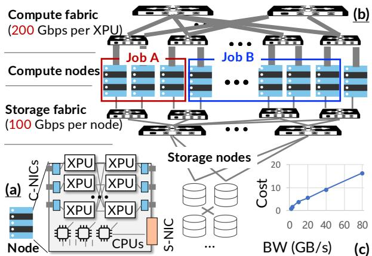  
Figure 1: (a) An overview of compute node architecture, (b) the network fabric for computation and storage, and (c) shard storage pricing across performance tiers. C-NIC: the NIC for communication between computation XPUs. S-NIC: the NIC mlinked to storage nodes.

trim = 0.25cm YY.Ycm XX.Xcm 0.25AITURBO has been deployed in HUAWEI’s production cloud to support checkpoint reading and writing for a variety of AI frameworks. Its current use case centers on training jobs, with extensions to inference workloads underway. For training jobs, AITURBO is 3.9–58.8 × faster than the current general-purpose cloud storage system—SFSTURBO (a system similar to 3FS [45]) when writing checkpoints. It further outperforms systems with extensive application optimizations like Gemini [51] by up to 5.9 ×. We have also evaluated its effectiveness for inference jobs—including autoscaling and KVCache reads—showing performance up to 1.28 × faster than specialized systems like Mooncake [40]. AITURBO achieves these improvements requiring only a few lines of code changes in different frameworks.

Discussion and limitation. First, AITURBO focuses on accelerating bulk transfers between XPUs; its techniques may not benefit small transfers. Second, we simply use the available hardware compute fabric QoS for performance isolation. More advanced isolation methods for complex scenarios— such as jobs co-located on the same XPU—are left for future work.

## 2 Cloud Storage and AI Jobs Characteristics

## 2.1 The hardware setup for AI jobs on the cloud

AITURBO operates on an AI cluster (hosted in a local datacenter) designed for running AI applications in the cloud. Existing cloud infrastructures commonly follow a computestorage disaggregated architecture [54, 35, 30, 12] with dedicated hardware for computation and storage servers. Figure 1 presents an overview with the following key components:

Compute servers. Each compute server contains several

XPUs1 (e.g., eight) for accelerating computations. These XPUs are interconnected through intra-node high-speed links (e.g., 600 GBps) such as NVLink. Each XPU communicates with the server’s CPUs via relatively low-speed PCIe (e.g., 256 Gbps).

Storage servers. The cloud infrastructure employs a dedicated server fleet for cloud storage, where each server provides a slower storage bandwidth backed by SSDs. The files of each AI job are sharded into chunks and distributed across these servers. The detailed distribution strategy depends on the bandwidth provisioned to the jobs.

Compute fabric. XPUs across servers typically communicate with a dedicated high-speed compute fabric (e.g., 200 Gbps per-XPU RDMA) [35]: a compute NIC (c-NIC) is attached to each XPU, which is linked with dedicated high-bandwidth switches.

Storage fabric. Each server also has NICs (termed S-NICs) for communicating with the storage servers. Similar to previous work like 3FS [12], it is a common setup to use RDMA for transferring data between compute and storage servers. As a disaggregated architecture, S-NICs connect to switches separate from the compute fabric, with a slower per-server bandwidth (e.g., 100 Gbps) shared by all XPUs on the server. Without loss of generality, we term the aggregated bandwidth of all S-NICs of an application as the frontend storage bandwidth, while the aggregated bandwidth of all storage servers provisioned for the application as the backend storage bandwidth.

## 2.2 Bandwidth-intensive AI jobs

There are two common types of AI jobs currently: training and inference, both of which may utilize the cloud storage bandwidth intensively. For training jobs, the AI model is deployed on a set of XPUs and these XPUs train the model through many iterations of bulk synchronous parallel computations. For inference jobs, the job deploys pre-trained models on a set of XPUs and executes computations on the requests submitted by different users. As the models used are large, each job is deployed on a dedicated set of XPUs across multiple compute servers, and no other jobs are colocated on these servers.

The detailed usage scenarios of the aforementioned jobs are as follows:

Checkpoint write. To ensure fault tolerance as well as debugging possibly improper training configurations, the training jobs periodically write the model parameters and their optimizer states (together termed checkpoints) to cloud storage [53, 49, 19]. Due to the scaling law, the model is becoming larger so is the checkpoint [26], resulting in hundreds of GBs of data written to the storage per checkpoint write.

Checkpoint read. Besides training, inference jobs may frequently read the model checkpoint to adjust the number of serving jobs based on the request load [21, 52]. For example, when the request load is higher than the capacity of the deployed serving jobs, the operators need to scale out the serving jobs by allocating more XPUs, where jobs on the newly allocated XPUs need to read the model checkpoints from the storage quickly [21, 52]. Note that checkpoint reading is also required when recovering from a failure of the training jobs.

KVCache read. Besides checkpoints, modern inference jobs also frequently read precomputed data (termed KVCache) from storage to improve serving efficiency. Specifically, for LLM inference, requests sharing the same prefix have identical computed results (KVCache). By storing precomputed KVCache in storage, the inference process can read them to skip these computations, thereby optimizing both latency and throughput [50, 40]. KVCache is typically stored in storage by vendors such as DeepSeek [45] when scarce XPU HBM or CPU DRAM is insufficient. Moreover, since requests with precomputed KVCache are less computationally expensive, vendors provide interfaces allowing users to specify which KVCache should be stored in storage [17, 38], so there are cases where jobs must read KVCache from storage.

## 2.3 I/O characteristics of AI jobs

Bulk I/O. The granularity of each I/O in AI jobs is large. Take checkpoint as an example: each checkpoint write stores at least the entire model parameters and optimizer states, with hundreds of GB of data in total (hundreds of MB to tens of GB per file). The left of Figure 3 shows the distribution of the file read and write sizes in an AI cluster of a large cloud provider, where the majority of the I/O operations are larger than 1 GB with the top-1% of the files as 326 MB. As these files are mostly sequentially written and read, the I/O characteristics of AI jobs are essentially bulk I/O, which is bottlenecked by the bandwidth of the storage fabric (see the right of Figure 3).

Asynchronous I/O. The I/O time in AI jobs can typically be hidden via asynchronous I/O. Figure 2 illustrates this for our targeted scenarios. For training, when writing checkpoints of a training iteration to the storage, the XPUs can concurrently perform the computation—i.e., the forward and backward pass—to generate the update to the checkpoint. For reading checkpoints during training or inference, since the model (and its checkpoint) is partitioned by layers, upon reading the checkpoint of layer j from the storage, the XPUs can directly compute the forward pass of layer j, while the job can asynchronously read the checkpoint of layer j+1 from the storage. Reading KVCache is similar to reading checkpoints because computing the forward pass of layer j only requires the corresponding KVCache at j.

Given the asynchronous and bulk I/O pattern of AI jobs, as long as the storage bandwidth is sufficient to finish the

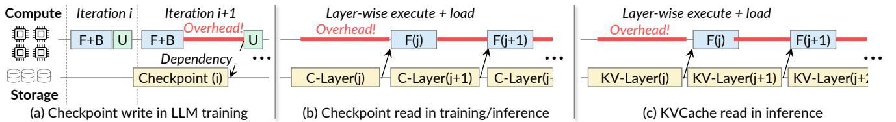  
Figure 2: An illustration of how different AI jobs interact with the cloud storage as well as possible costs introduced by insufficiently fast storage I/O. F and B states abbreviate for forward and backward pass of a training job, respectively. The i in (a) indicates the i-th iteration of a training job, while the $j$ XX.Xcmin (b) and (c) indicates the data partitioned by the model layer, e.g., C-Layer(j) indicates the checkpoint of the ${ \bar { j } } ^ { t h }$ layer.

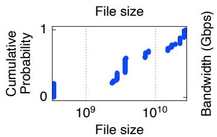

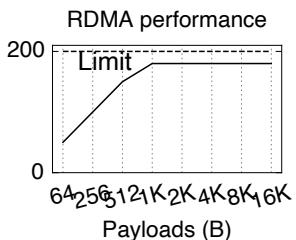  
YY NodeFigure 3: Left: A profile of the file read and write sizes of AI jobs in a cloud cluster and right: a measurement of trim = 0.25cm YY.Ycm XX.Xcthe network bandwidth utilization of RDMA with different payload sizes.

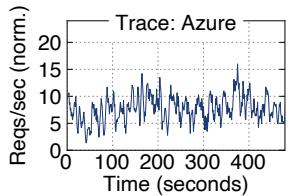

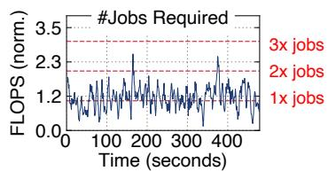  
Figure 4: Left: the request arrival pattern of a real-world inference workload, AzureConv [16]. Right: the number of inference jobs required to serve the requests within the service level objective (SLO).

I/O before the computation, e.g., the checkpoint write is done before the update, otherwise, the computation needs to wait for the I/O to finish, which incurs overhead that impacts the job completion time, e.g., a longer training iteration or a longer inference latency.

Grouped I/O. Finally, AI jobs typically perform I/O in a grouped manner, which means that many XPUs perform I/O simultaneously. For training, all the XPUs involved in the training form a group and write their data to the checkpoints, because the model parameters and their accompanying optimizer states are partitioned across XPUs.

Grouped storage I/O is also common in scaling inference jobs. For example, when using autoscaling to handle bursts, the operators may start multiple inference jobs simultaneously, where these jobs all need to read the same model checkpoint in a grouped manner. Figure 4 analyzes the number of jobs required to serve a real-world trace from Azure [16]. To measure how many jobs are needed, we follow prior work [52] that calculates the minimal number of jobs required to finish the requests within the service level agreement. We can see

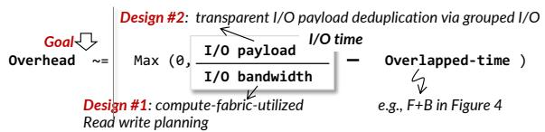  
Figure 5: Design goal and how AITURBO achieves so.

CPUs -Nthat at the $2 0 0 ^ { t h }$ second, we need to scale the number of jobs from 1 to 3, where all these three jobs need to read the same model checkpoint.

Finally, reading KVCache also exhibits a grouped I/O pattern for recently evolved agent workloads. Specifically, LLM agents are computational programs that execute specific tasks (e.g., language translation) by sending inference requests to the LLM model [29]. For each task category, the agent request scomprises a shared prefix (i.e., system prompt), followed by NItask arguments. Since the agent may spawn tasks at the same Ctime, the XPUs executing these tasks can read the KVCache msimultaneously in a grouped manner.

## 3 Design Rational and AITURBO

## trim = 0.25cm 3.1 Design rational and challenges

Goal: minimized storage overhead. We term the storage overhead as the time when computing jobs running on the XPU need to wait for the storage I/O to complete. The goal is to minimize the storage overhead, as it directly impacts the job completion time, as shown in Figure 2.

Based on our analysis of the I/O characteristics of AI jobs in §2.3, we can approximately formulate the overhead as a function directly related to the I/O time—dividing the I/O payload (e.g., the size of checkpoint or KVCache files) by the storage I/O bandwidth, as shown in Figure 5. The I/O payload is the aggregated I/O of a specific job for a given time (e.g., all the XPUs’ checkpoint writes in one iteration), while the I/O bandwidth is the minimum of the frontend storage bandwidth and the backend storage bandwidth described in the last paragraph of §2.1.

Given the above formulation, minimizing the storage overhead translates to minimizing the I/O time. Note that we can approximate storage time by the bandwidth, ignoring other storage overheads like metadata operations, because the I/O pattern is bulk read/write.

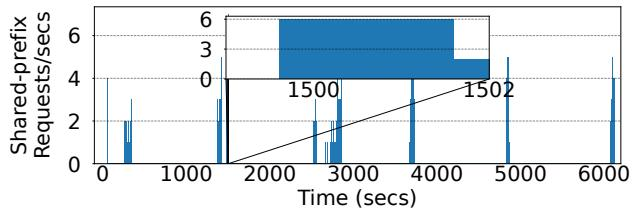  
Figure 6: An analysis of the grouped KVCache read pattern observed in a real-world agentic LLM serving trace [50].

Challenge #1: Increasing storage bandwidth without increased monetary cost and constrained frontend bandwidth. An intuitive way to increase the storage bandwidth is to purchase additional backend bandwidth from cloud vendors. Such an approach has two drawbacks: First, the increased bandwidth incurs additional monetary cost: As shown in Figure 1 (c), increasing the bandwidth from 1.6 GBps to 80 GBps results in a 16 × increase in per-GB monetary cost on HUAWEI’s cloud. The monetary cost arises from the fact that vendors need to provision more storage servers to improve the backend bandwidth for a server. Thus, one challenge tackled by AITURBO is to increase the observable storage bandwidth without increasing the monetary cost.

Even with sufficient backend bandwidth, each XPU server’s storage bandwidth is further constrained by the frontend bandwidth, i.e., the aggregated bandwidth of all its S-NICs (Figure 1 (a)). Consequently, increasing the backend bandwidth alone may remain insufficient to achieve the required performance targets. AITURBO needs to minimize the I/O time in case the frontend bandwidth becomes the bottleneck.

Challenge #2: Efficiently deduplicated I/O plan without application cooperation. Since the improvement space for the storage bandwidth is limited—either constrained by the monetary cost or the frontend bandwidth, another approach is to reduce the I/O payload. It is possible to do so in AI jobs, especially under grouped I/O, because there are duplicated payloads across XPUs. For example, in data parallel training, all XPUs share the same copy of parameters in their checkpoint [32], so we can deduplicate these parameters to reduce storage I/O during checkpointing. Reading checkpoints is similar. Interestingly, KVCache reads also exhibit duplicated I/O especially in agent workloads, i.e., due to shared system prompts for requests within the same task category. Figure 6 analyzes the shared KVCache reads in a real-world agent trace [50]. We can see that there exists batched KVCache access that could be shared with one KVCache read—without deduplication, the storage I/O time would increase proportionally to the number of involved XPUs2.

However, one particular challenge of deduplication in AI jobs is that there are diverse duplication patterns, so relying on applications to deduplicate is not always feasible, especially Ycmfor a cloud storage system that may serve arbitrary AI jobs. YYTable 1 presents the deduplication ratios for various configurations. Effectively handling all these configurations contributes to one quarter of the codebase of Megatron [8], and the support has only been recently adopted in its codebase [1]. Worse still, even knowing which payload to deduplicate, generating an efficient read/write plan—how to write the deduplicated payload to the storage—is non-trivial because we should properly distribute the I/O to all nodes to best utilize the available bandwidth.

<table><tr><td></td><td>Parameter</td><td>Optimizer</td></tr><tr><td>DP = 1</td><td>X</td><td>X</td></tr><tr><td>DP &gt;1</td><td>√(DP)</td><td>√(DP)</td></tr><tr><td>DP &gt;1 + ZeRO 1/2</td><td>√(DP)</td><td>×</td></tr><tr><td> $\mathbf { D P > 1 } + \mathbf { Z e R O } 3$ </td><td>X</td><td>X</td></tr></table>

Table 1: An analysis of the duplication in checkpoint write with different training configurations. ZeRO 1/2 and ZeRO 3 are parameter sharding strategies described in DeepSpeed [41]. DP is the abbreviation of data parallelism. ✓ and ✗ stand for whether the parameter/optimizer states are duplicated in the checkpoint write. The value in parentheses following ✓ denotes the replication factor.

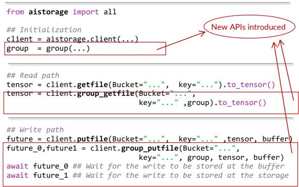  
Figure 7: AITURBO API.

## 3.2 Overview of AITURBO

Approach overview and system API. To tackle the above challenges, we argue that cloud storage can provide grouped I/O APIs to capture a complete picture of the I/O semantics of AI jobs. Afterward, the storage provider can leverage its knowledge of the underlying disaggregated storage architecture, including the utilization of compute fabric, to efficiently serve the I/O.

Figure 7 illustrates the detailed grouped read and write APIs exposed by AITURBO. Take group\_getfile as an example: its abstraction is the same as the original getfile except that the cloud storage knows that a group of clients are issuing the reads (to one or multiple files) together. This essentially informs the storage that a batch of read/write operations are issued together, so the storage can optimize the read/write plan holistically. Such planning is not possible with (a) the vanilla getfile or putfile API because the storage layer cannot predict future I/O requests in advance. Note that the group must be explicitly specified by the application using our API, and is typically trivial to set; for example, in training jobs, all processes are in the same group.

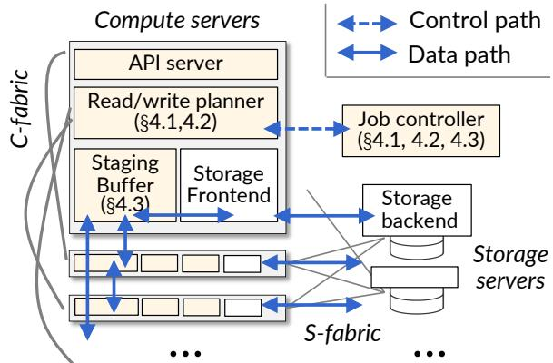  
Figure 8: System architecture of AITURBO. S-fabric and C-fabric stand for Storage and Ccompute fabric respectively.

YcBesides the group semantic, AITURBO also exposes APIs Ywith futures [4] to enable asynchronous I/O. Specifically, a future is a handle representing an event that may complete in the future, which the caller can wait for via await. AITURBO trim = 0.25cm YY.Ycm XX.Xcprovides two futures for writes: a future (future\_0) indicating that the data has been stored in the CPU DRAM buffer3 and a future (future\_1) indicating that the data has been durably stored in the backend storage. These two futures are convenient for AI jobs like writing checkpoints in training: after the checkpoint has been written to the DRAM, the XPU can proceed to the next iteration (see Figure 2 (a)).

Note that if a failure occurs before future\_1 is ready, AITURBO treats the associated files as broken, and the application needs to handle it. AITURBO covers failures as much as possible by replicating data in multiple servers’ DRAM, similar to Gemini [51], and only reports a failure when all replicas are lost. The broken files can be detected by setting a flag after AITURBO ensures that all future\_1 operations are ready for the files.

System architecture. Figure 8 presents the system architecture of AITURBO: we introduced three components to support efficient grouped I/O: a staging buffer manager holistically manages the idle DRAM across servers to store temporal data during grouped I/O operations, a communicator issues data transfers over compute fabric (§4.3), and most importantly, a job controller that plans the reads and writes (control plane) before each XPU individually conducts the actual data transfer (data plane). The data plane holistically utilizes both the storage and the compute fabric

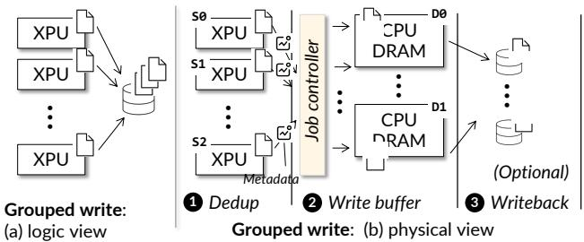  
Figure 9: (a) The logical view of grouped write I/O in AITURBO and (b) an overview of how the grouped write I/O is physically executed. S and D stand for Source and Destination respectively, e.g., S0 is the first sending node.

## XPU4 Detailed Design of AITURBO

## 4.1 Grouped write I/O

Y. CPUsNodeOverview of the physical execution of the plan. From a logical perspective for the application developers that use trim = 0.25cm YY.Ycm XX.Xcm 0.25cm, cAITURBO, the grouped write API writes a set of files stored in the compute nodes to the storage, as shown in Figure 9 (a). Behind the API, AITURBO generates a concrete physical write plan that guides the execution of how these files are written, i.e., how data chunks in files from XPUs are written to the storage servers. For ease of presentation, we assume .25cm, clip arch.pdfthat the cloud storage has done the resource allocation, a task that has been well studied [45, 11], so we focus on how the data is written to the storage servers.

To minimize I/O time, our write plan executes a three-step process: ❶ avoids duplicated storage writes by identifying duplicated chunks from the files involved in the group write, ❷ generate a load-balanced write plan that writes the deduplicated payload to the available CPU DRAM on nodes, and finally ❸ write the data from CPU DRAM back to the storage servers. Note that ❷ and ❸ may be optional: if the applications cannot proceed until the data is persistent, ❷ is skipped. Meanwhile, if the applications do not need to persist the data, e.g., they only want to write the checkpoint for fault tolerance but not debugging [51, 53]. ❸ is skipped.

(1) Deduplication. To deduplicate at the storage layer, before conducting the grouped write, our job controller first gather metadata from all involved XPUs to identify duplication, as shown in Figure 9 (❶). We leverage checksum—a classic technique in storage systems to detect duplication: the XPUs individually compute the checksums of files to be written in chunk granularity, and send the checksums along with the file metadata (e.g., tensor name) to the job controller. The job controller identifies the duplicated chunks based on the checksums, generates an appropriate write plan (described below), and sends the plan back to the XPUs.

To accelerate deduplication, we first compute BLAKE3 checksums [14] on files using optimized XPU kernels. AITURBO supports a range of detection granularities: from 4 MB file chunks to per-file detection. In general, we prefer a larger detection granularity because it reduces the complexity of finding an optimal read/write plan (described below). Thanks to our efficient kernel implementation, the time to checksum a 1 GB file from 35.6 ms on the CPU (Intel Xeon E5-2650 v4) to just 7.8 ms on an XPU (NVIDIA Tesla V100). cmSecond, observing that the duplication factor remains con-Y.stant across grouped writes in AI jobs, e.g., the parameters of models do not change across each checkpoint write, we cache the deduplication metadata at the job controller during the trim = 0.25cm YY.Ycm XX.Xcmentire job lifetime. This allows AITURBO to accept a userprovided hint to bypass repeated checksum calculations for subsequent grouped writes by reusing the cached information.

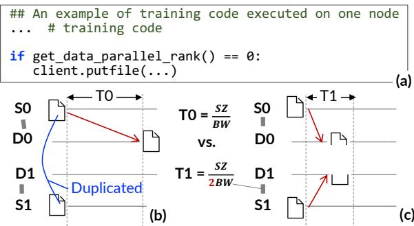  
Figure 10: (a) A code snippet of user-implemented deduplicated grouped write [48], (b) the time of its execution and (c) the improved load-balanced write plan.

(2) + (3) Generate a load-balanced write plan. Given the identified duplicated data chunks, the controller generates the write plan for (2) and (3) sequentially. A key rationale for generating an efficient plan is to minimize the I/O time by balancing write loads across source and destination nodes. Figure 10 shows a concrete example of why load balancing is important. The code in (a) is obtained from OpenSora [48], a popular training framework for multimodal models. It first deduplicates the write operation by writing checkpoints at only one node (rank 0), and then writes to the cloud storage using the standard write API. The write time is shown in (b), which doubles the time required to write the same amount of data in an optimal setup with the duplication factor of 2 (c), because (c) utilizes the storage bandwidth from both storage servers. Note that in (b), even though S0 can connect to both D0 and D1, the write time is still doubled because it is bottlenecked by the outbound bandwidth of S0. The case for the compute fabric is similar.

Both ❷ and ❸ can be formulated as the same bilinear programming problem (with two different solutions since the source and destination nodes are different). Note that for simplicity, we only formulate each phase separately. While it is possible to formulate them jointly to improve performance, e.g., allowing the data payload to be first scattered to multiple nodes and then written back to storage to fully utilize all the S-NICs, we found it is too complex and less useful in our use cases like checkpoint write, because most time the in-memory checkpoint written by $\otimes$ is sufficient to ensure fault tolerance.

We formulate the write plan generation problem as follows: Given a set of source nodes $( S _ { 0 } , S _ { 1 } , \ldots$ , indexed by i) that send data to a set of destination nodes $( D _ { 0 } , D _ { 1 } , \ldots ,$ , indexed by $j )$ . In $\otimes$ the source and destination nodes are both computing servers involved in the grouped write, while in ❸ the source nodes are the computing servers while the destinations are storage servers. The total payload has K chunks to write, and each chunk need to be replicated R times for fault tolerance. $b _ { k }$ is the size of k-th chunk, and $c _ { i k }$ is a 0-1 constant that indicates i-th node produces k-th chunk. Each source contains a set of chunks, and each chunk may be duplicated among multiple sources.

The variables determined by our bilinear programming are: $\mathrm { T x R } _ { i j k }$ , the speed of sending the k-th chunk from the i-th node to the j-th node, and t is the time to execute the grouped write plan for all nodes. Our objective is to minimize t—the end-to-end transfer time instead of the bandwidth utilization. As a result, the plan could leave some links unused, which is benign because using these links won’t make the transfer faster (otherwise the plan would use it). Optimizing this plan needs to satisfy the following constraints:

## minimize t subject to

$$
\forall k . t \cdot \sum _ { i } \sum _ { j } \mathrm { T x R } _ { i j k } = R \cdot b _ { k }\tag{1}
$$

$$
\forall i , k . \quad t \cdot \sum _ { j } \mathrm { T x R } _ { i j k } \leq R \cdot c _ { i k } \cdot b _ { k }\tag{2}
$$

$$
\forall j , k . \quad t \cdot \sum _ { i } \mathrm { T x R } _ { i j k } \leq b _ { k }\tag{3}
$$

$$
\forall i . \sum _ { j } \sum _ { k } \mathbf { T x R } _ { i j k } \leq \mathbf { B w O } _ { i }\tag{4}
$$

$$
\forall j . \sum _ { i } \sum _ { k } \mathrm { T x R } _ { i j k } \leq \mathrm { B w I } _ { j }\tag{5}
$$

$$
\forall i , j . \sum _ { k } \mathrm { T x R } _ { i j k } \leq \mathrm { B w N } _ { i j }\tag{6}
$$

$$
\forall j . \quad t \cdot \sum _ { i } \sum _ { k } \mathbf { T x R } _ { i j k } \leq \mathbf { M e m C a p } _ { j }\tag{7}
$$

(1) formulates the relationship between the time and assigned bandwidth of the write plan, ensuring that the time is sufficient to write all chunks to the buffer. Note that the strict equality avoids unnecessary duplicated transfers (up to R duplications for fault tolerance). (2) constrains that for each source, it cannot send chunks not belonging to itself. (3) ensures that for each destination, it cannot receive more than one replica, which avoids writing duplicate chunks to the same destination. (4) and (5) bound the outbound and inbound bandwidth of each device and node, where $\mathrm { B w O } _ { i }$ denotes the outbound bandwidth of device i, BwIj denotes the inbound bandwidth of node j, and $\mathrm { B w N } _ { i j }$ is the network link bandwidth between the sender/receiver pair i and j. All these are constants and known to the cloud storage provider. (6) bounds the pairwise network link bandwidth. Finally, (7) constrains that the total size of the chunks stored at one destination does not exceed its available buffer capacity. For all constraints, $b _ { k }$ and $c _ { i k }$ are constants obtained via ❶.

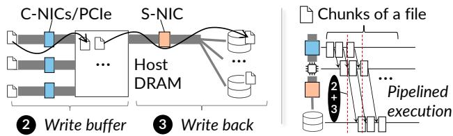  
Figure 11: Left: the hardware components of a node involved in the write plan. Right: the pipelined execution of the write plan based on the hardware components.

The problem is an instance of a bilinear programming problem [9] because it has a linear objective, with quadratic mconstraints, and all variables $( \mathrm { T x R } _ { i j k }$ and t) are non-negative .Yreal numbers. Although general bilinear programming prob-YYlems are hard to solve due to non-convexity and non-linearity, our problem can be solved efficiently in practice because: one argument of each quadratic form (i.e., (2), (3), and (7)) is $t ,$ the same scalar variable. Since t—the I/O time has a clear lower and upper bound, e.g., the lower bound is the transmission time being no less than the payload divided by the aggregated inbound/outbound bandwidth, and an upper bound can be derived from an an arbitrary write plan, e.g., randomly assigning the bandwidth to each pair of source and destination. Thus, we can iteratively fix t and solve the reduced linear feasibility (LF) problem4. If the feasible region is found (or not found), we determine a tighter upper (or lower) bound of t. This procedure is indeed the famous branch and bound algorithm [10] used to solve programming problems. In a 38 B training trace on 64 XPUs (with one merged checkpoint files written per XPU), our planning based on an unoptimized single-threaded Python solver can find the plan in 4 seconds.

Plan caching and pipelined write. Although our plan can be solved quickly, generating the plan may still take considerable time, especially for large-scale training jobs. Fortunately, since these jobs issue grouped writes iteratively and different iterations share the same write pattern, we cache the write plan generated during the first grouped write and reuse the generated plan for subsequent writes. One corner case we encountered is that even for iterative training, the cached plan cannot be reused for the first few iterations, because the optimizer states tend to be all zero, which could lead to false deduplication. Fortunately, after a few iterations, the deduplication pattern stabilizes, so the cached plan can be reused for

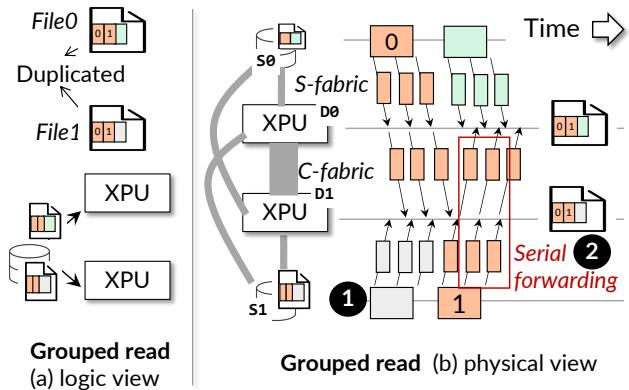  
Figure 12: (a) The logical view of grouped read I/O in AITURBO and (b) an overview of how the grouped read I/O is physically executed. S-fabric and C-fabric stand for Storage and Ccompute fabric respectively, and S and D stand for Source and Destination respectively,

Y.the remainder of the training.

Another optimization we enabled is pipelined transfer—a classic storage technique. As shown in Figure 11, when a chunk has been sent to the host DRAM, we immediately forward it to the storage to minimize the overall time, considering steps ❶ and ❷, if the plans for them are known.

Discussion: hash collisions. One potential concern of checksum-based deduplication is the possibility of hash collisions, i.e., two distinct data chunks producing the same checksum. While hash collisions are theoretically possible, their probability is negligible in practice when using cryptographically strong hash functions such as BLAKE3. For our chosen BLAKE3’s 256-bit output, the probability of observing at least one collision among n hashed objects can be approximated by $1 - e ^ { - n ( n - 1 ) / 2 ^ { 2 5 7 } }$ under the standard birthday bound. Given the scale of n in our system, this probability is vanishingly small.

## 4.2 Grouped read I/O

Grouped read method. Similar to grouped write, a grouped read API reads a set of files stored in the cloud storage to a group of XPUs, as shown in Figure 12 (a). AITURBO generates a physical plan guiding how data is read from the storage servers to the compute nodes, as well as avoiding duplicated transfers from the storage.

To reduce read time, for duplicated reads in a batch of read requests, we utilize the compute fabric to broadcast these data to all nodes that need them, which operates in two stages as illustrated in Figure 12 (b): First, we only fetch one copy of each duplicated chunk/file from the storage servers to one node to avoid duplicated storage transfer (❶), in our example, suppose block 0 and 1 is duplicated in the files, e.g., shared tensors. We only transfer 0 to S0 and 1 to S1 from the storage servers. Afterward, we utilize the compute fabric to forward the fetched chunks to all node requiring it (❷). Note that read deduplication is typically simpler than write deduplication because (1) the deduplication can be performed offline, and (2) sometimes we can directly leverage the file name for deduplication, as two clients may read the same file in a grouped read.

For the detailed plan generation method of ❶, we use a similar planning method described in §4.1, because the plan of reading chunks from sources to the destination nodes can be viewed as writing chunks from the destination nodes to the source nodes. Due to space limitations, we omit a detailed description. For ❷, we reuse the broadcast method described in BlitzScale [52] that serially forwards the data from one node to another using the computing fabric, based on the observation that a serial forwarding chain is near-optimal for large bulk data transfer like checkpoint reads. Finally, both phases are pipelined to minimize the overall read time.

Compute-fabric-utilized distributed caching. One optimization enabled by our group read API is that it provides a larger cache space for the storage. Specifically, suppose two nodes (D0 and D1) perform a grouped read. If D0’s data has been cached in D1, we can directly fetch the data from D1 through the fast compute fabric, bypassing the slow storage. Thus, we also implemented a distributed caching mechanism with our grouped read API to further enhance read performance.

## 4.3 System mechanisms for grouped I/O

Tensor-native file type. To avoid serialization and deserialization overhead when transferring data between XPUs, CPUs, and storage nodes, we provide a tensor-native file type in AITURBO that decouples the tensor metadata (shape, type) and real data (arrays of numbers) [47, 46]. This allows data to be transferred directly from XPU memory to CPU memory, or from CPU memory to storage servers without serialization and deserialization. A tensor file is sufficient for our use cases such as checkpoint and KVCache reads and writes.

Buffer managemet on CPUs. To enable compute-fabricbased transfer, AITURBO leverage host DRAM as the staging buffer to store the data to/from the storage. The size of the staging buffer can be configured by the developers or can be determined based on the job profiling: e.g., using Linux cgroup [3]. The buffer does not need to be too large as long as it can hold the staged data. For example, for checkpoint writes, it only needs to hold the checkpoint data to completely eliminate the overhead of writing to storage.

Communication library. AITURBO builds on existing cloud storage systems so we can leverage the off-the-shelf storage frontend-backend library, e.g., AWS S3 SDK [11] to utilize the storage fabric efficiently. Thus, we focus on the description of utilizing the compute fabric with our customized communication library. One intuitive design is to leverage the group communicator library provided by the XPU vendors, e.g., NCCL [34] to transfer data between XPUs and staging buffers. Though simple, such a design introduces two problems: the coldstart overhead and the lack of performance interference control.

Point-to-point (P2P) network based network connection establishment. Specifically, vendors typically implement sophisticated algorithms [42] to establish group communication between XPUs, which we found unnecessary for our use case. For example, creating an NCCL communicator from scratch takes seconds or even minutes on Megatron. This cost may be acceptable for long-running training jobs, because the creation of a communicator at the beginning of the training can be amortized over the entire training period. However, it is sub-optimal for inference cases, since the jobs that participate in the I/O can be dynamically created. For example, when scaling multiple serving jobs on XPUs, the communicator must be created from scratch, which is inefficient using NCCL.

To accelerate compute fabric network connection establishment in AITURBO, our key observation is that since the read plan is decoupled from the communicator libraries, we do not need to execute the vendor’s group communication initialization algorithms, which derive an optimized communication plan for all possible group communications (e.g., allreduce). Thus, we manually create the point-to-point connections between XPUs and CPUs that participate in the data transfer. This will dramatically reduce the connection time, because establishing RDMA connections (QPs) between two nodes is 15 ms and such time can be further overlapped with the storage initialization.

Performance isolation. Our focus is on optimizing storage performance with the computing fabric, while we acknowledge that borrowing the fabric for storage I/O may interfere with the AI jobs, causing performance degradation. To isolate network usage between the storage and computing jobs, we currently leverage a simple design that uses the available off-the-shelf hardware performance isolation mechanism provided e.g., RoCE’s QoS [7]. Specifically, RoCE QoS provides three isolation levels: Strict Priority, which prioritizes traffic strictly based on class and may cause starvation of lower-priority queues; Enhanced Transmission Selection (ETS), which guarantees a minimum bandwidth share for each traffic class; and Default policy, which does not provide performance isolation. AITURBO sets the QP used by AITURBO to the lowest priority to use the compute fabric in a best-effort manner.

One issue of using only the hardware-based solution is that, in extreme cases, the AI jobs happen to utilize most of the bandwidth of the compute fabric during the entire data transfer. In such cases, a software profile-based solution that isolates the send speed in the software [51] may address the issue, but we find the hardware solution works fine in all our cases and we leave a more advanced solution for future work.

Fault tolerance of the Job controller. Since the job controller is stateless, i.e., all its states like cached plans can be recomputed on-the-fly or persisted in the storage, we only need to restart or deploy multiple replicas of the job controller to tolerate controller failures.

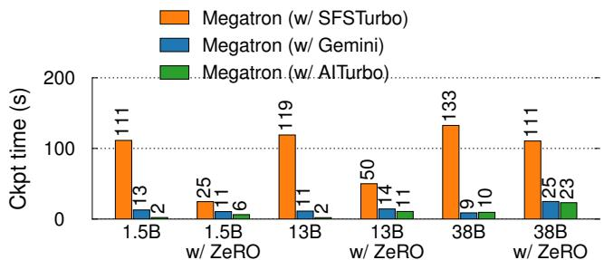  
Figure 13: The end-to-end checkpoint time when using different storage systems.

## 5 Evaluation

Testbed. We conducted our experiments on two clusters with up to 64 XPUs: one cluster is equipped with Ascend 910B NPU with 64 GB HBM, whose computational efficiency is similar to NVIDIA A100 GPU, and one cluster is equipped with NVIDIA A800 GPU with 80 GB HBM. Eight XPUs are attached to the same computing node with 192 CPU cores and 1.5 TB of host DRAM. The compute fabric supports 200 Gbps intra-node XPU interconnect while each node has one 100 Gbps S-NIC connected to the storage nodes. We provisioned up to 30 GBps backend storage bandwidth shared among XPUs.

## 5.1 Application performance: checkpoint write

Setups and baselines. We choose checkpointing in distributed training to evaluate the effectiveness of AITURBO’s grouped write. The training periodically writes the parameters and optimizer states to the XPUs. We evaluated three representative model scales: 1.5 B parameters with tensor parallelism (TP) and pipeline parallelism (PP) both set to 1; 13 B with TP=8 and PP=1; and a 38 B model with TP=8 and PP=4. Each model is trained under two configurations: either with or without ZeRO [41]. This yields a total of six different duplication configurations, allowing us to analyze how AITURBO performs under various write patterns.

We compare Megatron [32]—the widely used training framework with different storage backends. SFSTURBO is the general-purpose cloud storage system in HUAWEI that shares a similar design to 3FS [45]. Specifically, SFSTURBO adopts a full-SSD disaggregated storage architecture with an extremely efficient metadata layer to provide high throughput; as a result, a 1 MB file end-to-end read time is 0.2–1 ms, so the metadata overhead is negligible in AI workloads with GB-level I/O. Gemini [51] is the state-of-the-art checkpoint writing system with extensive framework-level optimizations. Since Gemini is closed-source and does not support our evaluated XPU, we implemented its main techniques (saving checkpoints to DRAM in compute nodes with compute fabric) on Megatron for comparison. Our baseline Megatron commit version is cac60ce, future versions do not support our XPU. Megatron has added deduplication in our evaluated commit, but it does not leverage the compute fabric as a staging buffer to mitigate the storage bandwidth bottleneck. Gemini—though it leverages the compute fabric to write checkpoints to DRAM to avoid the storage overhead, it fails to consider deduplication as well as the optimized write plan enabled by AITURBO.

Checkpoint time. Figure 13 presents the end-to-end checkpoint time for various systems under different training configurations. First, we see that both Gemini and AITURBO outperform Megatron, achieving lower checkpoint times across all evaluated scenarios (up to 58 × faster). This is primarily due to the fact that both Gemini and AITURBO leverage the compute fabric and local DRAM to conduct in-memory checkpointing, while Megatron relies solely on remote storage. Moreover, for common setups with duplicated checkpoint writes across nodes, e.g., when ZeRO is disabled, AITURBO further achieves up to 5.9 × faster performance than Gemini by effectively deduplicating and balancing writes across nodes. Gemini by default does not implement deduplication and write plan optimization.

Wasted XPU time. Since the checkpointing time does not directly reflect the end-to-end application-level overhead introduced to the training job, because developers could choose a low checkpointing frequency to amortize slow checkpointing—at the cost of extra XPU time used to recompute lost progress in case of failures. Therefore, we further evaluated the end-to-end wasted XPU time due to checkpointing under the optimal checkpoint frequency using the formula described in [23]. The formula considers both the checkpointing overhead and the recovery time due to infrequent checkpointing. We set the failure rate to one XPU per hour, which is commonly found in production clusters [53, 31].

Figure 16 presents the wasted XPU time of different systems. We can see that AITURBO consistently reduces more wasted XPU time than other baselines, whose trends are similar to the checkpoint time because a faster checkpoint typically implies reduced wasted XPU time as it could enable more frequent checkpointing. Compared with SFSTURBO, AITURBO achieves up to 6% fewer wasted XPU hours. The wasted metric is smaller than the checkpoint time because the overhead is amortized across training, and although the number is smaller, it still may save huge monetary cost for cloud users running for hours and days.

Factor analysis. Figure 14 shows a factor analysis of the contributions of each technique used by AITURBO. First, leveraging computing fabric can significantly reduce the checkpointing time because checkpointing is a bandwidth-bound operation (+Buffer). Second, adding deduplication (+Dedup)

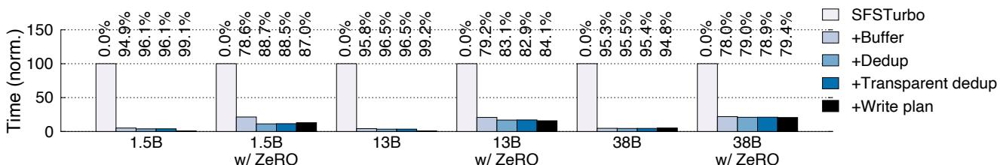  
Figure 14: A factor analysis of the contributions of each our techniques to the improved checkpoint time.

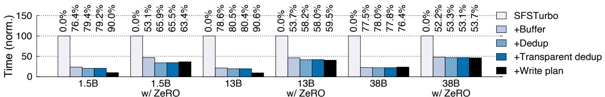  
Figure 15: A factor analysis of the contributions of each our techniques to the reduced wasted XPU time.

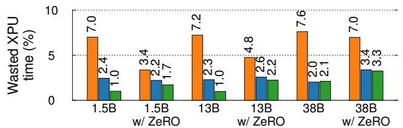  
Figure 16: The end-to-end wasted XPU time for various checkpointing systems.

further reduces the checkpointing time by 4.3–47.2% for models run with data parallelism (e.g., 1.5B without ZeRO) because it reduced the amount of data written. Moreover, detecting deduplication at the storage level (+Transparent dedup) adds negligible additional checkpoint time because it is only done at the first time in AITURBO with cached write plan. Finally, adding optimized write plan with load balance (+Write plan) further reduces the checkpointing time by up to 76 % thanks to the better utilization of the compute fabric. Like deduplication, load balancing is mostly effective when there are duplications among checkpoint files because we can holistically utilize all the bandwidth of computing nodes.

Figure 15 further reports the factor analysis of the wasted GPU time. As its trend is similar to the checkpoint time, we omit a detailed discussion for brevity.

A close look at the deduplicated content. Figure 19 shows a profile of the deduplicated content detected by our deduplication in the group write, which is the same as that detected at the framework level. The profiled setup is a 1.5B model training workload with both TP and DP set to 2 using 4 XPUs. If two blocks share the same color, they are duplicated tensors and will be optimized by AITURBO. Note that the sizes of the tensors are different.

## 5.2 Application performance: checkpoint read

Setups and baselines. We evaluate the performance of checkpoint read by comparing the speed of approaches for loading checkpoints from storage to XPUs. Such a workload is required both in training and inference as described in §2.2. We choose Qwen 72 B and 32 B QwQ—two recent advanced foundation models covering different configurations. Besides different models, we also measure the read performance with varied load instances—the minimal number of XPUs to hold a complete copy of the model and the provisioned storage bandwidth.

We compared with ServerlessLLM [21], the state-of-the-art system for optimizing checkpoint loading. AITURBO builds a customized loading pipeline, aiming to fully utilize the storage bandwidth for reading checkpoints from the storage. We configured ServerlessLLM to use our SFSTURBO as the backend since the cloud in HUAWEI is SSD-less. We have carefully tuned ServerlessLLM to ensure it can saturate the storage bandwidth provisioned on each node.

Performance. Figure 17 shows the end-to-end checkpoint read time when loading different models on different numbers of XPUs. For Qwen 72 B, a copy of the model parameters requires at least 8 XPUs, while QwQ requires four. We evaluate the storage provisioned bandwidth from 1 to 30 GBps. First, we can see that AITURBO achieves the fastest checkpoint read time when a copy of the checkpoint is cached (ServerlessLLM (AIStorage w/ cache)), i.e., the checkpoint has been read once and is cached in the host DRAM of the nodes involved. AITURBO only requires 2.25 seconds to deploy the Qwen 72B model on 64 XPUs. On the other hand, if AITURBO needs to read the checkpoint from the storage, it—like other systems—is bottlenecked by the storage: all systems read the 135 GB Qwen 72 B checkpoint on 8 XPUs in 173 seconds when the provisioned bandwidth is 1 GBps. Nevertheless, once a single copy of the checkpoint has been loaded, AITURBO leverages the compute-fabric-based broadcast to quickly distribute the checkpoint to all instances, so the load time is nearly independent of the number of XPUs because with more XPUs, the more compute fabric bandwidth is available. In comparison, ServerlessLLM still requires 1,384 seconds to distribute the checkpoints through the relative slow SFSTURBO.

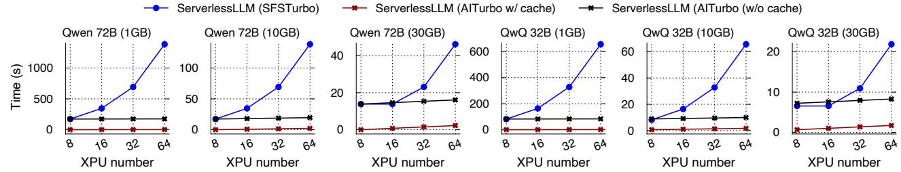  
Figure 17: A comparison of checkpoint read speed under different cloud storage bandwidth, read scale and model configurations.

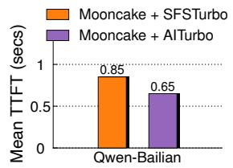

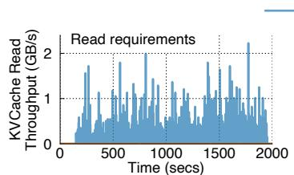

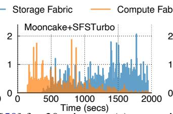

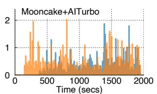  
Figure 18: Evaluation results from replaying Qwen-Bailian trace [50] for 30 minutes: (a) mean time to first token (TTFT) and (b) compute/storage fabric KVCache read throughput.

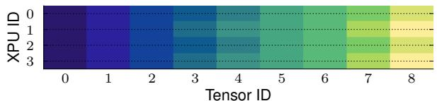  
Figure 19: A profile of the duplication detected via our grouped write.

## 5.3 Application performance: KVCache read

Setups and baselines. To evaluate the performance of AITURBO in KVCache read, we measure the KVCache read bandwidth and the mean time to first token (TTFT) of requests when serving a Qwen-14B model on 8 XPUs with a real-world KVCache trace, Qwen-Bailian [50]. TTFT is a de facto metric for measuring LLM serving performance. We choose 8 XPUs because the trace is sampled for such a scale5.

We compare AITURBO with Mooncake [40], the stateof-the-art KVCache system for LLM inference. Mooncake utilizes the compute fabric to build a distributed in-memory KVCache. Upon cache misses, it falls back to reading from storage. In its current implementation (commit 206d52e1), the KVCache data read from storage is not re-cached in the KVCache layer. Therefore, when XPUs execute requests sharing the same KVCache blocks, they still need to read from the (relatively slow) storage. We evaluate Mooncake with the following setups: (1) Mooncake + SFSTURBO—the unmodified Mooncake that utilizes a slow storage backend, and (2) Mooncake + AITURBO—which replaces the storage read

<table><tr><td></td><td>Megatron</td><td>+AITURBO</td><td>Mooncake△</td></tr><tr><td>LoC</td><td>2,228</td><td>286</td><td>44</td></tr></table>

Table 2: A comparison of the lines of code (LoC) for supporting fast checkpointing and KVCache read. ∆ means the LoC modified for Mooncake.

with AITURBO.

Performance. Figure 18 (a) shows the mean time TTFT of requests when running the 30-minute trace. Mooncake+AITURBO reduces TTFT by 23% compared to Mooncake thanks to transferring KVCache through the fast compute fabric when cache misses occur. Figure 18 (b) further plots the per-XPU KVCache read throughput of different systems, where we break down the usage into the compute fabric and storage for ease of analysis. We can see that Mooncake initially maintains relatively low storage read throughput; however, once enough KVCache blocks with long reuse distance are evicted from DRAM to the storage, storage read throughput rapidly increases and slows down the overall system throughput. In comparison, when the storage layer fully utilizes the compute fabric, the effective storage bandwidth is increased.

## 5.4 Development efforts and group coordination overhead analysis

Development efforts. Table 2 compares the lines of code (LoC) required to use AITURBO with different systems. AITURBO only requires Megatron to implement an additional 286 LoC to achieve better checkpoint performance than its original 2,228 LoC application-level optimizations, which include 1,759 LoC for distributed communication and coordination as well as 469 LoC for optimizing file system accesses. Besides, the modifications to Mooncake are also minor. Note that we should mention that for Mooncake, we do not utilize the group API because it is challenging to synchronize running inference instances; nevertheless, AITURBO still improves serving performance.

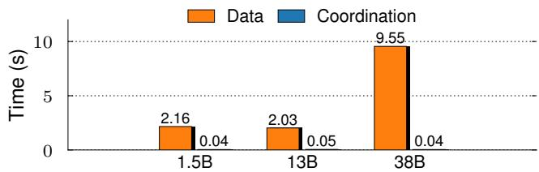  
Figure 20: A profile of the group coordination overhead.

Coordination overhead of the group API. One potential drawback of our grouped I/O API is the extra coordination overhead with the job controller. Figure 20 profiles the overhead when compared to the I/O time for writing checkpoints with various numbers of XPUs in training two models, where we evaluated the largest scale (64 XPUs). We observe a maximum of 45 ms coordination overhead for 64 XPUs, which is negligible even compared to our optimized I/O time. Note that such coordination can be skipped if the application can use the cached read/write plan, a common case especially for writing checkpoints.

## 6 Related work

Storage system for AI jobs. AITURBO continues the line of research in building a faster storage system for AI jobs [45, 12, 39, 28, 55, 13, 18, 27], with a particular focus on common bandwidth-intensive group I/O patterns. Works like Quiver [28] provide intelligent caching mechanisms to improve cache hit rates for AI jobs across jobs, while AITURBO focuses on improving the read and write bandwidth for a single job.

To the best of our knowledge, our grouped I/O API differs from parallel/collective I/O mechanisms [45, 24, 2, 5, 6] in distributed and parallel file systems in two key aspects. First, our API allows different ranks to write multiple files to capture more application-level I/O semantics and more importantly, we further transparent deduplication and load balancing optimizations to improve bandwidth utilization, which is critical for AI jobs, while collective I/O requires developers to perform them.

Framework-level I/O optimizations for AI jobs. To reduce storage overhead, many existing systems optimize storage usage at the framework-level [49, 51, 39, 31, 20, 23, 43, 21, 33, 40]. For example, Gemini [51] extended DeepSpeed [41] with Zero-3 for efficient in-memory checkpointing, but it does not support other parallel configurations and does not support optimized write plans. ByteCheckpoint [49] supports optimized write plans, but it needs to modify each framework for support. AITURBO complements these works and shows that common application-level storage optimizations, such as in-memory checkpointing [51], deduplication [49], and optimized broadcasting [52], can be transparently achieved at the storage layer with our grouped API. Moreover, being closer to the cloud storage infrastructure, AITURBO can achieve a better performance than framework-level solutions with a much lower engineering effort.

## 7 Conclusion

Cloud storage is a key pillar for various AI workloads. We present two key designs to meet the high bandwidth requirements of AI workloads: First, we holistically utilize the available DRAM and compute fabric to increase the effective storage bandwidth without incurring additional monetary costs. Second, we transparently optimize the read and write operations to improve bandwidth utilization by exposing a simple yet powerful grouped I/O API. AITURBO achieves performance comparable to or better than state-of-the-art systems, whether they require significant application modifications or not, and AITURBO has been used in HUAWEI’s production cloud supporting training jobs with support for inference jobs underway.

## Acknowledgment

We would like to thank FAST reviewers and our shepherd Haiyu Mao for the insightful feedback. This work was supported in part by the National Natural Science Foundation of China (No. 62572302, 62272291) and Fundamental and Interdisciplinary Disciplines Breakthrough Plan of the Ministry of Education of China (JYB2025XDXM113). This work was also supported by a research grant from Huawei Cloud.

## References

[1] Implement fully parallelized distopt save/load. https://github.com/NVIDIA/Megatron-LM/commit/daa7610, 2024.

[2] Ceph file system. https://docs.ceph.com/en/ reef/cephfs/, 2025.

[3] Control group v2. https://docs.kernel.org/ admin-guide/cgroup-v2.html, 2025.

[4] Futures and the async syntax. https://doc.rust-lang. org/book/ch17-01-futures-and-syntax.html, 2025.

[5] Hdfs architecture guide. https://hadoop.apache. org/docs/r1.2.1/hdfs\_design.html, 2025.

[6] Lustre file system. https://www.lustre.org, 2025.

[7] Quality of service (qos). https://docs.nvidia. com/networking/display/mlnxofedv24100700/ quality+of+service+(qos), 2025.

[8] [question] asynchronous checkpoint saving. https:// github.com/NVIDIA/Megatron-LM/issues/964, 2025.

[9] AL-KHAYYAL, F. A. Generalized bilinear programming: Part i. models, applications and linear programming relaxation. European Journal of Operational Research 60, 3 (1992), 306– 314.

[10] AL-KHAYYAL, F. A., HORST, R., AND PARDALOS, P. M. Global optimization of concave functions subject to quadratic constraints: An application in nonlinear bilevel programming. Annals of Operations Research 34, 1 (1992).

[11] AMAZON. Amazon simple storage service. https: //docs.aws.amazon.com/AmazonS3/latest/ API/Welcome.html, 2025.

[12] AN, W., BI, X., CHEN, G., CHEN, S., DENG, C., DING, H., DONG, K., DU, Q., GAO, W., GUAN, K., GUO, J., GUO, Y., FU, Z., HE, Y., HUANG, P., LI, J., LIANG, W., LIU, X., LIU, X., LIU, Y., LIU, Y., LU, S., LU, X., NIE, X., PEI, T., QIU, J., QU, H., REN, Z., SHA, Z., SU, X., SUN, X., TAN, Y., TANG, M., WANG, S., WANG, Y., WANG, Y., XIE, Z., XIONG, Y., XU, Y., YE, S., YU, S., ZHA, Y., ZHANG, L., ZHANG, H., ZHANG, M., ZHANG, W., ZHANG, Y., ZHAO, C., ZHAO, Y., ZHOU, S., ZHOU, S., AND ZOU, Y. Fire-flyer AI-HPC: A cost-effective software-hardware co-design for deep learning. In Proceedings of the International Conference for High Performance Computing, Networking, Storage, and Analysis, SC 2024, Atlanta, GA, USA, November 17-22, 2024 (2024), IEEE, p. 83.

[13] ANANTHANARAYANAN, G., GHODSI, A., WARFIELD, A., BORTHAKUR, D., KANDULA, S., SHENKER, S., AND STO-ICA, I. Pacman: Coordinated memory caching for parallel jobs. In Proceedings of the 9th USENIX Symposium on Networked Systems Design and Implementation, NSDI 2012, San Jose, CA, USA, April 25-27, 2012 (2012), S. D. Gribble and D. Katabi, Eds., USENIX Association, pp. 267–280.

[14] AUMASSON, J.-P., MEIER, W., PHAN, R. C.-W., AND HEN-ZEN, L. The hash function blake.

[15] AWS. Amazon rekognition. https://aws.amazon. com/en/rekognition/, 2024.

[16] AZURE. Azure llm inference traces. https://github. com/Azure/AzurePublicDataset, 2024.

[17] DEEPSEEK. Context caching. https://api-docs. deepseek.com/guides/kv\_cache, 2025.

[18] DRYDEN, N., BÖHRINGER, R., BEN-NUN, T., AND HOE-FLER, T. Clairvoyant prefetching for distributed machine learning I/O. In Proceedings of the International Conference for High Performance Computing, Networking, Storage, and Analysis (SC) (2021).

[19] DUBEY, A., JAUHRI, A., PANDEY, A., KADIAN, A., AL-DAHLE, A., LETMAN, A., MATHUR, A., SCHELTEN, A., YANG, A., FAN, A., GOYAL, A., HARTSHORN, A., YANG, A., MITRA, A., SRAVANKUMAR, A., KORENEV, A., HINSVARK, A., RAO, A., ZHANG, A., RODRIGUEZ, A., GREGERSON, A., SPATARU, A., ROZIÈRE, B., BIRON, B., TANG, B., CHERN, B., CAUCHETEUX, C., NAYAK, C., BI, C., MARRA, C., MCCONNELL, C., KELLER, C., TOURET, C., WU, C., WONG, C., FERRER, C. C., NIKOLAIDIS, C., ALLONSIUS, D., SONG, D., PINTZ, D., LIVSHITS, D.,

ESIOBU, D., CHOUDHARY, D., MAHAJAN, D., GARCIA-OLANO, D., PERINO, D., HUPKES, D., LAKOMKIN, E., AL-BADAWY, E., LOBANOVA, E., DINAN, E., SMITH, E. M., RADENOVIC, F., ZHANG, F., SYNNAEVE, G., LEE, G., AN-DERSON, G. L., NAIL, G., MIALON, G., PANG, G., CU-CURELL, G., NGUYEN, H., KOREVAAR, H., XU, H., TOU-VRON, H., ZAROV, I., IBARRA, I. A., KLOUMANN, I. M., MISRA, I., EVTIMOV, I., COPET, J., LEE, J., GEFFERT, J., VRANES, J., PARK, J., MAHADEOKAR, J., SHAH, J., VAN DER LINDE, J., BILLOCK, J., HONG, J., LEE, J., FU, J., CHI, J., HUANG, J., LIU, J., WANG, J., YU, J., BITTON, J., SPISAK, J., PARK, J., ROCCA, J., JOHNSTUN, J., SAXE, J., JIA, J., ALWALA, K. V., UPASANI, K., PLAWIAK, K., LI, K., HEAFIELD, K., STONE, K., AND ET AL. The llama 3 herd of models. CoRR abs/2407.21783 (2024).

[20] EISENMAN, A., MATAM, K. K., INGRAM, S., MUDIGERE, D., KRISHNAMOORTHI, R., NAIR, K., SMELYANSKIY, M., AND ANNAVARAM, M. Check-n-run: a checkpointing system for training deep learning recommendation models. In 19th USENIX Symposium on Networked Systems Design and Implementation, NSDI 2022, Renton, WA, USA, April 4-6, 2022 (2022), A. Phanishayee and V. Sekar, Eds., USENIX Association, pp. 929–943.

[21] FU, Y., XUE, L., HUANG, Y., BRABETE, A., USTIUGOV, D., PATEL, Y., AND MAI, L. Serverlessllm: Localityenhanced serverless inference for large language models. CoRR abs/2401.14351 (2024).

[22] GITHUB. Accelerate your development speed with copilot. https://copilot.github.com, 2024.

[23] GUPTA, T., KRISHNAN, S., KUMAR, R., VIJEEV, A., GULA-VANI, B. S., KWATRA, N., RAMJEE, R., AND SIVATHANU, M. Just-in-time checkpointing: Low cost error recovery from deep learning training failures. In Proceedings of the Nineteenth European Conference on Computer Systems, EuroSys 2024, Athens, Greece, April 22-25, 2024 (2024), ACM, pp. 1110–1125.

[24] HEICHLER, J. An introduction to beegfs. Introductionto BeeGFS by ThinkParQ. pdf (2014).

[25] HU, Q., YE, Z., WANG, Z., WANG, G., ZHANG, M., CHEN, Q., SUN, P., LIN, D., WANG, X., LUO, Y., WEN, Y., AND ZHANG, T. Characterization of large language model development in the datacenter. In 21st USENIX Symposium on Networked Systems Design and Implementation, NSDI 2024, Santa Clara, CA, April 15-17, 2024 (2024), L. Vanbever and I. Zhang, Eds., USENIX Association, pp. 709–729.

[26] KAPLAN, J., MCCANDLISH, S., HENIGHAN, T., BROWN, T. B., CHESS, B., CHILD, R., GRAY, S., RADFORD, A., WU, J., AND AMODEI, D. Scaling laws for neural language models. CoRR abs/2001.08361 (2020).

[27] KHAN, R. I. S., YAZDANI, A. H., FU, Y., PAUL, A. K., JI, B., JIAN, X., CHENG, Y., AND BUTT, A. R. SHADE: enable fundamental cacheability for distributed deep learning training. In 21st USENIX Conference on File and Storage Technologies, FAST 2023, Santa Clara, CA, USA, February 21-23, 2023 (2023), A. Goel and D. Naor, Eds., USENIX Association, pp. 135–152.

[28] KUMAR, A. V., AND SIVATHANU, M. Quiver: An informed storage cache for deep learning. In 18th USENIX Conference on File and Storage Technologies, FAST 2020, Santa Clara, CA, USA, February 24-27, 2020 (2020), S. H. Noh and B. Welch, Eds., USENIX Association, pp. 283–296.

[29] LUO, J., ZHANG, W., YUAN, Y., ZHAO, Y., YANG, J., GU, Y., WU, B., CHEN, B., QIAO, Z., LONG, Q., TU, R., LUO, X., JU, W., XIAO, Z., WANG, Y., XIAO, M., LIU, C., YUAN, J., ZHANG, S., JIN, Y., ZHANG, F., WU, X., ZHAO, H., TAO, D., YU, P. S., AND ZHANG, M. Large language model agent: A survey on methodology, applications and challenges. CoRR abs/2503.21460 (2025).

[30] MIAO, R., ZHU, L., MA, S., QIAN, K., ZHUANG, S., LI, B., CHENG, S., GAO, J., ZHUANG, Y., ZHANG, P., LIU, R., SHI, C., FU, B., ZHU, J., WU, J., CAI, D., AND LIU, H. H. From luna to solar: the evolutions of the compute-tostorage networks in alibaba cloud. In SIGCOMM ’22: ACM SIGCOMM 2022 Conference, Amsterdam, The Netherlands, August 22 - 26, 2022 (2022), F. Kuipers and A. Orda, Eds., ACM, pp. 753–766.

[31] MOHAN, J., PHANISHAYEE, A., AND CHIDAMBARAM, V. Checkfreq: Frequent, fine-grained DNN checkpointing. In 19th USENIX Conference on File and Storage Technologies, FAST 2021, February 23-25, 2021 (2021), M. K. Aguilera and G. Yadgar, Eds., USENIX Association, pp. 203–216.

[32] NARAYANAN, D., SHOEYBI, M., CASPER, J., LEGRES-LEY, P., PATWARY, M., KORTHIKANTI, V., VAINBRAND, D., KASHINKUNTI, P., BERNAUER, J., CATANZARO, B., ET AL. Efficient large-scale language model training on gpu clusters using megatron-lm. In Proceedings of the International Conference for High Performance Computing, Networking, Storage and Analysis (2021), pp. 1–15.

[33] NICOLAE, B., LI, J., WOZNIAK, J. M., BOSILCA, G., DORIER, M., AND CAPPELLO, F. Deepfreeze: Towards scalable asynchronous checkpointing of deep learning models. In 20th IEEE/ACM International Symposium on Cluster, Cloud and Internet Computing, CCGRID 2020, Melbourne, Australia, May 11-14, 2020 (2020), IEEE, pp. 172–181.

[34] NVIDIA. Nvidia collective communications library (nccl). https://developer.nvidia.com/nccl, 2025.

[35] NVIDIA. Nvidia dgx superpod: Next generation scalable infrastructure for ai leadership, 2025.

[36] OPENAI. Chatgpt. https://chatgpt.com, 2024.

[37] OPENAI. Creating video from text. https://openai. com/index/sora/, 2024.

[38] OPENAI. Prompt caching in the api. https://openai. com/index/api-prompt-caching/, 2025.

[39] PAN, S., STAVRINOS, T., ZHANG, Y., SIKARIA, A., ZA-KHAROV, P., SHARMA, A., P, S. S., SHUEY, M., WAREING, R., GANGAPURAM, M., CAO, G., PRESEAU, C., SINGH, P., PATIEJUNAS, K., TIPTON, J., KATZ-BASSETT, E., AND LLOYD, W. Facebook’s tectonic filesystem: Efficiency from exascale. In 19th USENIX Conference on File and Storage

Technologies (FAST 21) (Feb. 2021), USENIX Association, pp. 217–231.

[40] QIN, R., LI, Z., HE, W., CUI, J., REN, F., ZHANG, M., WU, Y., ZHENG, W., AND XU, X. Mooncake: Trading more storage for less computation — a KVCache-centric architecture for serving LLM chatbot. In 23rd USENIX Conference on File and Storage Technologies (FAST 25) (Santa Clara, CA, Feb. 2025), USENIX Association, pp. 155–170.

[41] RAJBHANDARI, S., RASLEY, J., RUWASE, O., AND HE, Y. Zero: memory optimizations toward training trillion parameter models. In Proceedings of the International Conference for High Performance Computing, Networking, Storage and Analysis, SC 2020, Virtual Event / Atlanta, Georgia, USA, November 9-19, 2020 (2020), C. Cuicchi, I. Qualters, and W. T. Kramer, Eds., IEEE/ACM, p. 20.

[42] SHAH, A., CHIDAMBARAM, V., COWAN, M., MALEKI, S., MUSUVATHI, M., MYTKOWICZ, T., NELSON, J., SAARIKIVI, O., AND SINGH, R. TACCL: Guiding collective algorithm synthesis using communication sketches. In 20th USENIX Symposium on Networked Systems Design and Implementation (NSDI 23) (Boston, MA, Apr. 2023), USENIX Association, pp. 593–612.

[43] SHUKLA, D., SIVATHANU, M., VISWANATHA, S., GULA-VANI, B. S., NEHME, R., AGRAWAL, A., CHEN, C., KWA-TRA, N., RAMJEE, R., SHARMA, P., KATIYAR, A., MODI, V., SHARMA, V., SINGH, A., SINGHAL, S., WELANKAR, K., XUN, L., ANUPINDI, R., ELANGOVAN, K., RAHMAN, H., LIN, Z., SEETHARAMAN, R., XU, C., AILIJIANG, E., KRISHNAPPA, S., AND RUSSINOVICH, M. Singularity: Planetscale, preemptive and elastic scheduling of AI workloads. CoRR abs/2202.07848 (2022).

[44] STABILITY.AI. Activating humanity’s potential through generative ai. https://stability.ai, 2024.

[45] TEAM, D. Fire-flyer file system. https://github.com/ deepseek-ai/3FS, 2025.

[46] TEAM., M. Dist checkpointing package. https: //docs.nvidia.com/megatron-core/ developer-guide/latest/api-guide/dist\_ checkpointing.html, 2024.

[47] TEAM., P. Getting started with Distributed Checkpoint (DCP). https://pytorch.org/tutorials/recipes/ distributed\_checkpoint\_recipe.html, 2023.

[48] TECH, H.-A. Open-sora: Democratizing efficient video production for all. https://github.com/hpcaitech/ Open-Sora, 2025.

[49] WAN, B., HAN, M., SHENG, Y., PENG, Y., LIN, H., ZHANG, M., LAI, Z., YU, M., ZHANG, J., SONG, Z., LIU, X., AND WU, C. Bytecheckpoint: A unified checkpointing system for large foundation model development. In 22nd USENIX Symposium on Networked Systems Design and Implementation, NSDI 2025, Philadelphia, PA, USA, April 28-30, 2025 (2025), T. A. Benson and R. N. Mysore, Eds., USENIX Association, pp. 559–578.

[50] WANG, J., HAN, J., WEI, X., SHEN, S., ZHANG, D., FANG, C., CHEN, R., YU, W., AND CHEN, H. Kvcache cache in the wild: Characterizing and optimizing kvcache cache at a large cloud provider. In Proceedings of the 2025 USENIX Annual Technical Conference, USENIX ATC 2025, Boston, MA, USA, July 7-9, 2025 (2025), D. Altinbüken and R. Stutsman, Eds., USENIX Association, pp. 465–482.

[51] WANG, Z., JIA, Z., ZHENG, S., ZHANG, Z., FU, X., NG, T. S. E., AND WANG, Y. GEMINI: fast failure recovery in distributed training with in-memory checkpoints. In Proceedings of the 29th Symposium on Operating Systems Principles, SOSP 2023, Koblenz, Germany, October 23-26, 2023 (2023), J. Flinn, M. I. Seltzer, P. Druschel, A. Kaufmann, and J. Mace, Eds., ACM, pp. 364–381.

[52] ZHANG, D., WANG, H., LIU, Y., WEI, X., SHAN, Y., CHEN, R., AND CHEN, H. Blitzscale: Fast and live large model autoscaling with O(1) host caching. In 19th USENIX Symposium on Operating Systems Design and Implementation, OSDI 2025, Boston, MA, USA, July 7-9, 2025 (2025), L. Zhou and Y. Zhou, Eds., USENIX Association, pp. 275–293.

[53] ZHANG, S., ROLLER, S., GOYAL, N., ARTETXE, M., CHEN,

M., CHEN, S., DEWAN, C., DIAB, M. T., LI, X., LIN, X. V., MIHAYLOV, T., OTT, M., SHLEIFER, S., SHUSTER, K., SIMIG, D., KOURA, P. S., SRIDHAR, A., WANG, T., AND ZETTLEMOYER, L. OPT: open pre-trained transformer language models. CoRR abs/2205.01068 (2022).

[54] ZHANG, W., XU, E., WANG, Q., ZHANG, X., GU, Y., LU, Z., OUYANG, T., DAI, G., PENG, W., XU, Z., ZHANG, S., WU, D., PENG, Y., WANG, T., ZHANG, H., WANG, J., YAN, W., DONG, Y., YAO, W., WU, Z., ZHU, L., SHI, C., WANG, Y., LIU, R., WU, J., ZHU, J., AND WU, J. What’s the story in EBS glory: Evolutions and lessons in building cloud block store. In 22nd USENIX Conference on File and Storage Technologies (FAST 24) (Santa Clara, CA, Feb. 2024), USENIX Association, pp. 277–291.

[55] ZHU, Y., CHOWDHURY, F., FU, H., MOODY, A., MOHROR, K. M., SATO, K., AND YU, W. Entropy-aware I/O pipelining for large-scale deep learning on HPC systems. In 26th IEEE International Symposium on Modeling, Analysis, and Simulation of Computer and Telecommunication Systems, MASCOTS 2018, Milwaukee, WI, USA, September 25-28, 2018 (2018), IEEE Computer Society, pp. 145–156.