USENIX

THE ADVANCED COMPUTING SYSTEMS ASSOCIATION

# Bidaw: Enhancing Key-Value Caching for Interactive LLM Serving via Bidirectional Computation–Storage Awareness

Shipeng Hu and Guangyan Zhang, Tsinghua University; Yuqi Zhou, China University of Geosciences Beijing; Yaya Wei and Ziyan Zhong, China Telecom Omni-channel Operation Center; Jike Chen, Tsinghua University

## https://www.usenix.org/conference/fast26/presentation/hu-shipeng

This paper is included in the Proceedings of the 24th USENIX Conference on File and Storage Technologies.

February 24–26, 2026 • Santa Clara, CA, USA

ISBN 978-1-939133-53-3

Open access to the Proceedings of the 24th USENIX Conference on File and Storage Technologies is sponsored by

# Bidaw: Enhancing Key-Value Caching for Interactive LLM Serving via Bidirectional Computation–Storage Awareness

Shipeng Hu†, Guangyan Zhang†∗, Yuqi Zhou‡, Yaya Wei§, Ziyan Zhong§, Jike Chen† †Tsinghua University, ‡China University of Geosciences Beijing, §China Telecom Omni-channel Operation Center

## Abstract

In interactive LLM serving, historical key–value tensors (KVs) of multi-round conversations are often cached in a two-tier storage system consisting of host memory and SSDs, which provides large capacity at low cost. However, loading KVs from two-tier storage in existing approaches increases serving latency by up to 3.8× and decreases throughput by up to 2.0× compared to an ideal large-memory setting on our interactive conversation workload. This inefficiency arises from poor coordination between compute engine and two-tier storage.

This paper proposes Bidaw, an efficient KV caching approach with two-tier storage that enables bidirectional awareness between compute and storage. Bidaw introduces two key mechanisms. First, the compute engine schedules requests with KV-loading latency awareness by separating requests whose KVs reside in different storage layers and reordering them by KV size to reduce blocking. Second, the storage system improves host memory hit rates by leveraging LLMgenerated responses to predict user access patterns during KV eviction. For further optimization, Bidaw balances storage footprint against computational savings by selectively caching storage-efficient history tensors.

Experiments on our interactive conversation workload and a public multi-round conversation workload of interactive LLM serving show that Bidaw reduces response latency by up to 3.58× and improves throughput by up to 1.83× over state-of-the-art approaches, approaching the theoretical upper bound achieved when all KVs reside entirely in host memory.

## 1 Introduction

In interactive large language model (LLM) serving, LLMs engage in multi-round, human-like conversations with human users, where both parties are expected to respond to each other’s output alternately and timely. Typical applications include virtual companions (e.g., Replika [38]), language learning (e.g., roleplay in Duolingo [10]), and intelligent customer service [18], etc. Upon receiving a user question, LLM compute engine needs historical key-value tensors (KVs) [44] from previous conversation rounds with this user to generate the corresponding answer for ensuring context coherence, as shown in Figure 1. The user will then read/listen the model answer and think about how to ask the next round’s question.

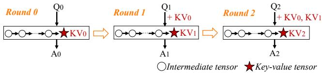  
Figure 1: Each round’s LLM answer is generated using key–value tensor(s) from previous conversation rounds.

Computation on each conversation round generates its corresponding KVs. Due to limited GPU memory, KVs are often deleted from GPU after each round’s computation finishes [23]. Thus, when next round’s user question arrives, recomputation on all previous rounds’ conversation is needed to obtain the already deleted KVs. When the number of interaction rounds increases as conversation proceeds, the amount of redundant computation on lengthy history conversation increases rapidly. Our interactive conversation workload reveals that there are an average of 22.4 conversation rounds with each user, and above redundant computation accounts for as high as 93.1% of the total computational workload.

To avoid such redundant computation, it is necessary to cache the KVs of each round’s conversation, and load KVs from all previous rounds into GPU when computing the next round’s question. This poses challenges to the capacity and bandwidth of caching media. Due to the limited capacity of local host memory, some works [36] cache KVs with distributed memory pool in large data centers. However, such a method requires specialized hardware like RDMA NICs for fast network connection, entailing high deployment cost. Since many companies in vertical domains need a low-cost solution for local LLM deployment [21,37], existing works [11,19] cache KVs in a two-tier storage system, composed of a performance layer (local host memory) and a capacity layer (SSDs), which provides large capacity at low cost, and offers high performance if most of the I/Os can hit the performance layer.

Since the GPU computation relies on the loaded KVs from two-tier storage, KV-loading efficiency is critical to overall performance. Our measurements on our interactive conversation workload show that KV loading from the two-tier storage in existing works [11, 19] is highly inefficient, severely bottlenecking the overall serving performance: the response latency is up to 3.8× higher and the serving throughput is up to 2.0× lower, compared to the ideal case where all KVs are loaded from host memory.

The root cause of such a performance gap is that in existing works, the compute engine and the two-tier storage are mutually unaware. First, the compute engine schedules requests without considering storage I/O latencies. But according to our analysis on our interactive conversation workload, KV loading latencies among requests vary significantly (§2.2) due to the KV size difference and the bandwidth gap between storage layers, which easily leads to request blocking. When a request with high I/O latency is scheduled, its computation can not start quickly, while subsequent requests with low I/O latencies are blocked and have to wait idly. Second, the twotier storage’s KV eviction strategy does not consider the user conversation patterns in compute engine, and only uses its own past KV accesses (queuing) information. But KV accesses have poor temporal locality due to the long interval between adjacent accesses according to our analysis (§2.2), leading to low hit rates of performance layer.

We propose Bidaw, an efficient KV caching approach for interactive LLM serving that boosts loading efficiency of two-tier storage, and thus the overall serving performance, via bidirectional awareness between compute and storage. In Bidaw, the compute engine schedules requests with storage I/O latency awareness. Two-tier storage evicts KVs by exploiting user conversation patterns in the compute engine.

First, on compute engine side, Bidaw performs request scheduling based on the KV-loading latency from two-tier storage, to alleviate request blocking. Upon the arrival of each request, the compute engine captures its KV’s I/O status—the storage layer it resides in and its size. The compute engine then places requests into dual queues: a “ready queue” for those with KVs in the performance layer, and a “preparing queue” for those with KVs in the capacity layer. Only requests in “ready queue” can be scheduled for GPU inference, and requests in “preparing queue” are promoted to “ready queue” after their KVs are loaded into performance layer. This ensures GPU inference can proceed quickly for requests with fast performance layer I/O, without being stalled by previous requests with slow capacity layer I/O. The compute engine further assigns different priorities to requests in the “preparing queue” according to their KV sizes and waiting times when issuing KV reads to capacity layer. In this way, we can promote the requests with shorter estimated I/O times to “ready queue” earlier for minimizing overall request queuing delays, while avoiding starvation in the meantime.

Second, on two-tier storage side, Bidaw employs a KV eviction strategy guided by the length of the model answer in compute engine. Our analyses indicate that, in interactive LLM serving, the weighted reuse distance of a KV access is positively correlated with the length of LLM’s previous answer generated by compute engine (§3.3.1). This is because, longer model answer leads to more time for the user to read/listen and comprehend the answer, and then formulate the next question, delaying the next KV access. Leveraging this insight, Bidaw captures the latest round’s model answer generated by compute engine for each user, and predicts the weighted reuse distance of the next KV access. We then estimate the hit probabilities for different weighted reuse distances by maintaining a ghost cache that uses an optimal eviction strategy (knowing the future information), leveraging the past I/O traces. Finally, Bidaw identifies KVs whose next accesses have the lowest estimated hit probabilities and evicts them to the capacity layer when the performance layer is full.

We design and implement the Bidaw system based on above techniques. Moreover, during implementation, we cache the carefully chosen history tensor by balancing computational savings and storage footprint. During GPU inference, the compute engine generates various kinds of intermediate tensors, among which the KV tensor is required as input when computing future conversation rounds. We observe that these tensors are interconvertible and differ significantly in size. Bidaw measures how much computation can be saved when incurring per-unit storage space overhead of caching different tensors, and caches the storage-efficient history tensor. Such optimization is generalizable with MHA-based [27] LLMs. For GQA-based [2] LLMs, caching KVs is more suitable.

We conduct extensive experiments using our interactive conversation workload and public multi-round conversation workload of interactive LLM serving. The experimental results show Bidaw outperforms existing state-of-the-art approaches [11, 19, 23], achieving up to a 3.58× reduction in response latency and up to a 1.83× improvement in throughput, approaching the theoretical upper bound when all history KVs are loaded from a very large host memory.

## 2 Background and Motivation

## 2.1 KV Caching with Two-tier Storage

For interactive LLM serving, existing works [11, 19] cache the KVs of history conversations in a two-tier storage system consisting of a performance layer and a capacity layer. The computation of each request in the compute engine relies on the loaded KVs from the two-tier storage, as shown in Figure 2. Thus, the KV-loading process is on the critical path of overall serving performance. Note that writing KVs to storage is not on the critical path.

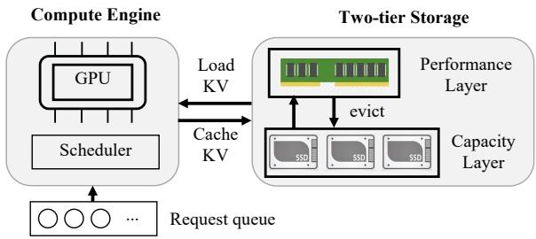  
Figure 2: Caching KVs of history conversations in the twotier storage for interactive LLM serving.

CachedAttention [11] and FlashGen [19] are the state-ofthe-art approaches that utilize a two-tier storage system for caching KVs during multi-round conversations. CachedAttention leverages the information from the waiting queue; however, in online serving scenarios, the number of queuing requests is not very large. Its two-tier storage adopts a queue-enhanced eviction strategy, which combines the past KV accesses information with the queuing information to evict KVs to the capacity layer, preventing the eviction of KVs associated with waiting requests. If the KVs of waiting requests reside in the capacity layer, they are proactively loaded into the performance layer to hide part of the loading latency. In FlashGen, first, the compute engine schedules requests by prioritizing those whose KVs can fit within the available GPU memory. Second, FlashGen adopts inclusive caching, where a copy of KVs in the performance layer is also maintained in the capacity layer, enabling fast KV eviction.

Another line of work (e.g., H2O [55], Impress [8]) adopts the lossy KV selection method, dropping some KVs during loading. This approach inevitably degrades the LLM response accuracy, particularly on long-context tasks [30], and often leads the model to generate unnecessarily lengthy answers, thereby increasing the response latency [46]. We target lossless approaches in this paper.

KV loading: a system bottleneck. For an ideal KV caching solution, all KVs would be loaded from the fast performance layer. We evaluate the KV-loading efficiency of CachedAttention and FlashGen by comparing their end-to-end serving latencies against a simulated ideal KV caching solution, on our interactive conversation workload. We utilize an A800 GPU running OPT-13B model with 200GB host memory and 1.5 GB/s SSD bandwidth, and we show serving latencies for up to 2048 history tokens in Figure 3. It is evident that there is a substantial gap between the serving performance of existing works and that of the ideal KV caching solution, with existing works’ response latency being up to 3.8× higher, and serving throughput being up to 2.0× lower. Specifically, the throughput degradation is quantified by comparing the number of users supported under similar latency conditions. When FlashGen and the ideal KV caching solution achieve comparable average latencies (4.62s for FlashGen and 4.58s for the ideal solution), the ideal KV caching solution sustains

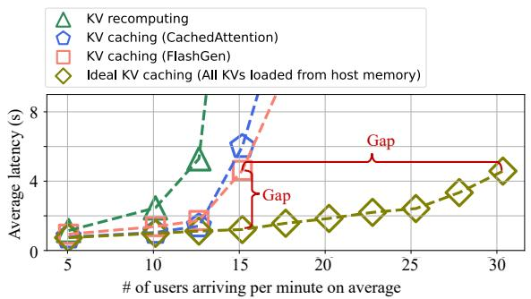  
Figure 3: Big serving performance gap between existing works with two-tier storage and the simulated ideal caching solution with all KVs loaded from the performance layer.

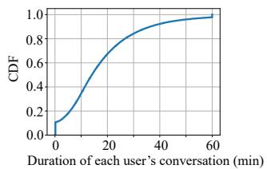  
(a) Conversation duration

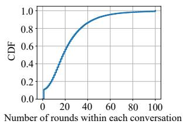  
(b) Number of interaction rounds  
Figure 4: The CDF of 1) duration, and 2) interaction rounds, of user conversations.

2.0× more users per minute than FlashGen. This indicates that KV loading from the two-tier storage constitutes a major bottleneck for overall serving performance in existing works.

## 2.2 Characterizing KV Access with Millionround Real-world Workload

To understand the inefficiency of KV loading, we collect and analyze a real-world workload from our industry partner, called interactive conversation workload, spanning more than one million conversation rounds. The average query length is 36, and the average response length is 45. The average/median/P90 round number is 22/18/45. Existing public LLM serving workloads [5,34,36,39,45] lack either conversation timestamps or user-level information, which are essential for analyzing KV access characteristics. For comparison, the ShareGPT workload [39] has an average of 5.7 conversation rounds, which is fewer than those in our interactive conversation workload. The Mooncake conversation workload [36] features much longer sequences, with an average query length of 12,035 tokens and an average response length of 343 tokens, both exceeding those of our workload. We identify three important KV-access characteristics that can significantly affect the KV-loading efficiency of the two-tier storage system.

Observation 1. Each user’s KV often resides in storage for a long period, resulting in a large volume of concurrently cached KVs.

For each user, a multi-round conversation often spans a long duration, during which this user’s KV resides in the twotier storage and is repeatedly accessed. Only when this user disconnects, can its KV be deleted from storage. Figure 4(a) shows the CDF of each user’s conversation duration. This long duration arises from the large number of interaction rounds between each user and the LLM, which are often needed to clarify intentions, capture emotional nuances, and refine responses. Figure 4(b) shows the CDF of the number of interaction rounds within each user’s conversation, with an average of 22.4 rounds.

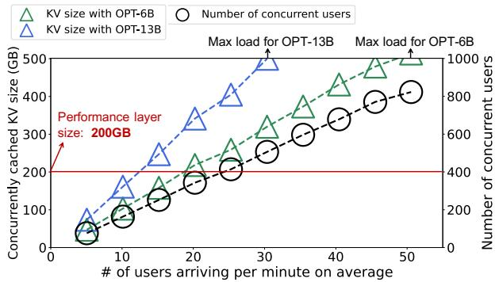  
Figure 5: The sizes of concurrently cached KVs and the number of concurrent users with increasing user arrival rates.

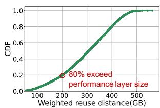

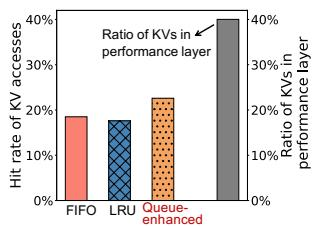  
(a) CDF of the weighted reuse distances (b) Performance layer hit rate  
Figure 6: The poor temporal locality and the low hit rate of KV accesses.

Consequently, the total volume of concurrently cached KVs grows rapidly as the workload pressure increases. Figure 5 shows (1) the average number of concurrent users and (2) the average size of concurrently cached KVs for OPT-6B and OPT-13B under increasing user arrival rates. The user arrival rate refers to the average number of new users who initiate multi-round conversations per minute. After initiating a multi-round conversation, a user typically sends many requests intermittently before disconnecting. We evaluate only user arrival rates whose computational loads can be handled by one 80GB A800 GPU after eliminating redundant computation, in order to avoid introducing a computation bottleneck.

We observe that the size of cached KVs quickly exceeds the capacity of the performance layer (200 GB in our setup, corresponding to 2.5× of GPU memory size). Note that the size of performance layer (local host memory) for current GPU servers is limited: usually 1.6× to 3.2× of GPU memory size [3,4,14,17,33]. Thus, the volume of concurrently cached KVs can reach up to 3.91× of performance layer size. Such a large KV volume necessitates careful eviction to the capacity layer in order to maximize I/O hits in the performance layer.

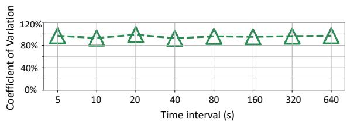  
Figure 7: The large coefficient of variation, of KV loading times among requests arriving within different time intervals. Requests arriving even within a very short time interval (e.g., 5s) have greatly varying KV loading times.

## Observation 2. KV accesses have poor temporal locality, due to the interactive nature of multi-round conversations.

To quantify the temporal locality of KV accesses, we introduce the weighted reuse distance, defined as the aggregate size of other unique KVs accessed between successive accesses to the target KV. Figure 6(a) shows the CDF of the weighted reuse distances of KV accesses with the OPT-13B model and 30 users arriving per minute. The weighted reuse distance is substantial, with 80% of KV accesses surpassing the 200 GB capacity of the performance layer.

This stems from the fact that each user sends requests intermittently, rather than sending out all the requests at once in a burst manner, due to the interactive nature of multi-round conversations. Specifically, when many users are served concurrently, after a user sends a request, this user requires time to read or listen to and comprehend the model’s answer, and then formulate the next question; during this interval, numerous requests from other users may arrive.

## Observation 3. KV loading times vary greatly across requests, due to the KV size difference and the bandwidth gap between storage layers.

We show the coefficient of variation [47] (the ratio of the standard deviation to the mean) of KV loading times among requests in Figure 7. Note that we summarize requests that arrive within time intervals of varying lengths: the first 5s, the first 10s, the first 20s, etc. We find there exists high variability: the coefficient of variation for KV loading times is higher than 90%. Moreover, such variability not only exists globally, but also exists among consecutively arrived requests: even with requests that arrive within a very short time interval (e.g., 5s), the variability remains high.

There are two reasons that contribute to such variability. First, the bandwidth gap between the two storage layers is large. Second, the sizes of loaded KVs vary greatly across requests, as requests have significantly varying history conversation lengths. Such a large KV size difference results in a large KV loading time gap when KVs are loaded from the slow capacity layer. Figure 8 shows the loaded Key/Value sizes among requests for the OPT-13B model. We can observe wide variation in Key/Value sizes.

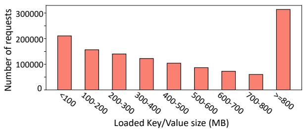  
Figure 8: Wide variation of loaded Key/Value sizes.

## 2.3 Root Cause Analysis

Based on the observed KV-access characteristics above, we find that the root cause of inefficient KV-loading of two-tier storage in existing works [11,19] is that compute engine and two-tier storage are mutually unaware. This results in the I/O-induced request blocking problem and the low hit rates of performance layer.

First, the compute engine schedules requests without considering their greatly varying KV-loading times from the two-tier storage (observation 3). When scheduling a request with long KV-loading time, its computation is delayed by the lengthy loading process as its computation relies on the loaded KV (re-computation will lead to large overhead for FlashGen [19]). Even if subsequent requests have short KVloading times such that their KVs can be quickly loaded into GPU for computation, they can only wait idly. This results in a severe request blocking problem.

Second, the two-tier storage evicts KVs ignoring the user conversation pattern in compute engine, only using its own past KV accesses (and queuing) information. But KV accesses have poor temporal locality (observation 2), resulting in low hit rates. We report the hit rates under the state-ofthe-art eviction strategy for KV caching: queue-enhanced in CachedAttention [11], and two general strategies: FIFO [9] and LRU [43]. Figure 6(b) shows that as the performance layer accommodates 40.1% of KVs on average, the hit rates are only around 20% with existing eviction strategies.

Motivation and inspiration. Our work is motivated by the big performance gap between existing KV caching solutions and the ideal KV caching solution. Above root cause analysis inspires us to enhance KV caching via bidirectional awareness between compute engine and two-tier storage.

## 3 The Bidaw Design

## 3.1 System Overview

We propose the Bidaw system, an efficient KV caching approach for interactive LLM serving via bidirectional awareness between compute engine and two-tier storage. Figure 9 shows the overview of the Bidaw system. In Bidaw, compute and storage work in mutual awareness:

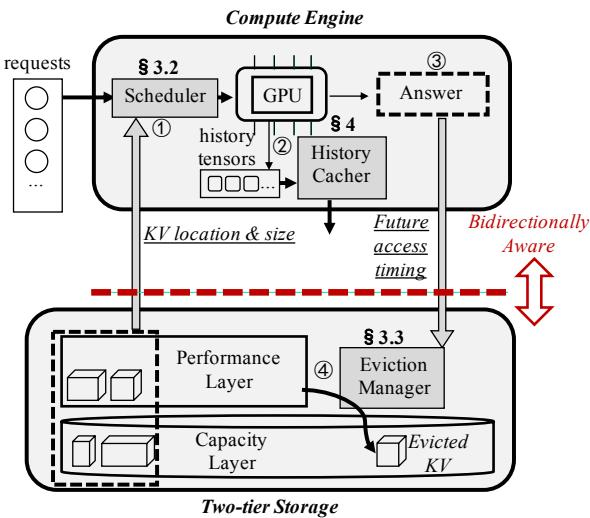  
Figure 9: System overview.

• The compute engine schedules requests for computation with awareness of storage I/O latency, by capturing the location (which storage layer) and the size of each request’s KV, reducing request blocking (§3.2).

• The two-tier storage captures the model answer generated by compute engine, and uses its length to predict the user future access timing to evict KVs from performance layer, reducing miss rates (§3.3).

Moreover, the compute engine caches the carefully picked history tensors to the two-tier storage, by considering the storage footprint (§4).

Workflow. The serving workflow is as follows (Figure 9):

(1) When a user request arrives, the compute engine schedules it for GPU computation based on its KV location and size. Note that if a request in the waiting queue has KV in the capacity layer, its KV will be first loaded into the performance layer like prior works [11, 19]. Then its KV will be loaded into GPU when scheduled for computation.

(2) During computation, the compute engine caches the generated storage-efficient tensor (still calling it KV for brevity) of current round’s conversation into storage.

(3) When a request’s computation finishes, the model answer is returned to the user, and is also captured by the eviction manager, which runs in background.

(4) When the free space of the performance layer is below a certain threshold, eviction will be triggered and the eviction manager will evict certain users’ KVs to the capacity layer, based on the captured model answer from the compute engine. Since we adopt inclusive caching like prior work [19], we will maintain a copy of KVs in the capacity layer to avoid the large write traffic during eviction.

## 3.2 I/O-aware Request Scheduling

In the compute engine, when a request with long KV-loading time is scheduled, its computation cannot begin until its I/O is finished, and subsequent requests are also blocked by it. A naive approach overlaps the computation and I/O by computing one layer while loading the next layer’s KV. However, GPU computation consists of many consecutive iterations, and the I/O can only be overlapped with the first iteration, whose duration is merely tens of milliseconds. In contrast, I/O from the slow capacity layer often takes hundreds of milliseconds. Such a large time gap renders overlapping ineffective.

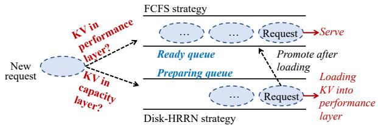  
Figure 10: I/O-aware request scheduling strategy.

To address the problem of I/O-induced request blocking, we propose an I/O-aware request scheduling strategy. Our scheduling strategy is built on two key techniques: dual-queue separation and KV-size-based request reordering, which together address the bandwidth disparity between storage layers and the variation in KV sizes across requests.

Dual queues. To address the variability in KV-loading times caused by the bandwidth gap between the two storage layers, we introduce dual queues to separate incoming requests into a “ready queue” and a “preparing queue”. For each incoming request, the compute engine identifies the storage location of its KV and dispatches the request to the “ready queue” when the KV is already in the performance layer, as shown in Figure 10, and if not in performance layer, the compute engine sends this request to the “preparing queue”. When the GPU has sufficient free memory to accommodate additional requests, only requests from the “ready queue” are scheduled for computation, and their KVs are quickly loaded from the performance layer into GPU memory. In the “preparing queue”, requests are held until their KVs are transferred from the capacity layer to the performance layer, at which point they are promoted to the “ready queue”.

By separating requests into dual queues, slow capacitylayer I/O no longer delays requests that require only performance-layer I/O, allowing them to be scheduled on the GPU in advance. This design can minimize overall queuing delays and enhance the system efficiency.

Hybrid scheduling policies. For the “ready queue”, we adopt the first-come-first-serve (FCFS [56]) policy to determine the priority of requests for GPU computation, ensuring fairness like prior works [23, 51]. The problem is that when a request is promoted from “preparing queue”, it is inserted at the end of the “ready queue” if its position is determined by its promotion time. Because this request is delayed in the “preparing queue”, placing it at the end of the “ready queue” leads to excessive latency and aggravates tail latency. Therefore, we place the request in the “ready queue” based on its original arrival time rather than its promotion time. If the first request in the “ready queue” does not fit in GPU memory, we skip it and schedule the next request that does, if available [19].

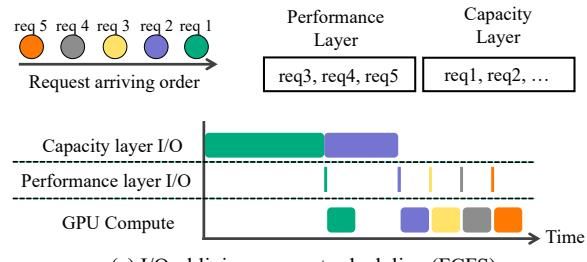  
(a) I/O-oblivious request scheduling (FCFS)

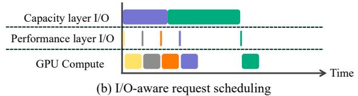  
Figure 11: I/O-aware request scheduling strategy reduces request blocking.

Scheduling for the “preparing queue” is more challenging because the variation in KV size can lead to large differences in loading times, which are further amplified by the low bandwidth of the capacity layer. To mitigate this issue, we apply two principles in scheduling. First, the compute engine should prioritize requests with smaller KVs when issuing reads to the capacity layer, allowing them to be quickly promoted to the “ready queue” without being delayed by the requests with larger KVs. Second, we must ensure that the requests with large KVs are not starved. Otherwise, requests with large KVs could experience long waits, severely impacting tail latency.

Based on these principles, we design a customized HRRN (Highest Response Ratio Next [24]) policy, which we call disk-HRRN. With disk-HRRN, the compute engine considers both the KV size of each request and its waiting time when determining the priority for issuing KV reads to the capacity layer. This policy improves efficiency and prevents starvation. Specifically, for each request in the “preparing queue”, we calculate a response ratio that incorporates both the KV size and the waiting time:

$$
R e s p o n s e r a t i o = 1 + \frac { R e q u e s t w a i t i n g t i m e } { K V s i z e }\tag{1}
$$

The compute engine issues KV reads to the capacity layer in order of highest response ratio first. In this way, we prioritize small-KV requests and progressively increase the priority of large-KV requests based on the waiting time.

Example. We use an example to illustrate the efficiency of our proposed I/O-aware request scheduler, as shown in Figure 11. Consider a scenario where GPU memory can hold only one request, and five requests have arrived. Requests 1 and 2 have KVs in the capacity layer (request 1 larger), whereas requests 3, 4, and 5 have KVs in the performance layer. Under a conventional I/O-oblivious scheduling strategy such as FCFS (Figure 11(a)), request 1—the earliest arrival—is scheduled first. Its computation is blocked until the KV is loaded from the capacity layer, leaving the GPU idle and the GPU memory underutilized. In contrast, with our I/O-aware request scheduling strategy (Figure 11(b)), requests 3, 4, and 5 are scheduled first. Thanks to the dual-queue separation, the computations of requests 3, 4, and 5 proceed quickly after their KVs are loaded from the fast performance layer, without being delayed by the slow KV-loading process of requests 1 and 2. Moreover, with our scheduling, the capacity layer I/O for request 2 begins earlier than that of request 1. Thus, when request 3 completes computation, there is a request (request 2) that can quickly start computation.

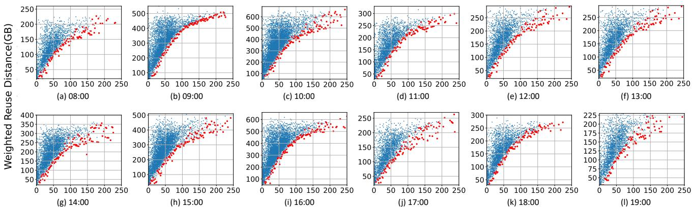  
Previous round's model answer length  
Figure 12: The weighted reuse distance and the previous round’s model answer length for requests with different times and difference user arrival rates. Each dot represents a KV access corresponding to one request. The lower bound of the weighted reuse distance is marked in red. There exists positive correlation between the lower bound of the weighted reuse distance and the previous round’s model answer length.

## 3.3 Previous-answer-based Eviction Strategy

In a two-tier storage system, when the performance layer cannot accommodate all KVs, it is necessary to carefully determine which KVs should be evicted to the capacity layer. Due to the poor temporal locality of KV accesses, naive eviction policies that rely solely on the past KV accesses information can result in a high miss rate. We design a previousanswer-based eviction strategy that further leverages the user conversation patterns from the compute engine.

## 3.3.1 Predicting the Weighted Reuse Distance based on the Model Answer in Compute Engine

We observe that, in interactive LLM serving, the lower bound of the weighted reuse distance for each KV access is positively correlated with the length of the model’s answer generated by compute engine in the previous round. In this paper, the weighted reuse distance means the total size of other unique KVs accessed between the current and previous accesses to the targeted KV. For generalizability, we evaluate ten-minute traces arriving at different hours between 8:00 and 20:00, testing each under varying user arrival rates. For each group, we record the weighted reuse distance along with the corresponding length of the previous round’s model answer for every KV access, as shown in Figure 12. To remove outliers, we adopt the IQR (Interquartile Range) method [48]. Based on this, we find that the lower bound of the weighted reuse distance increases along with the model answer length. To validate this, we extract the smallest weighted reuse distance for each value of the previous round’s model answer length. We then compute the Spearman’s rank correlation coefficient [40] between the smallest weighted reuse distance and the corresponding model answer length. Across the 12 groups, the Spearman coefficient ranges from 0.94 to 0.98 (0 indicates no correlation and 1 indicates strong positive correlation). This indicates a strong positive correlation between the smallest weighted reuse distance of a KV access and the length of the previous round’s model answer.

Generalizability. This observation reflects a fundamental property of interactive LLM serving and is thus generalizable. Because human users are directly in the loop, the response time between consecutive requests is inherently tied to human users. Longer model responses naturally require more time for users to read or listen, comprehend the content, and formulate the next question. During this extended pause, additional requests from other users may arrive, leading to an increase in the weighted reuse distance. Thus, the correlation we observe stems from the intrinsic nature of human–LLM interactions, which require active responses from both parties, like virtual companions [38], roleplay for language learning [10], etc.

Leveraging this observation, we track online statistics of the weighted reuse distance lower bounds for various previousround answer lengths. For each user, the length of the latest model answer is tracked by the compute engine and leveraged to estimate the lower bound of the weighted reuse distance for the next KV access.

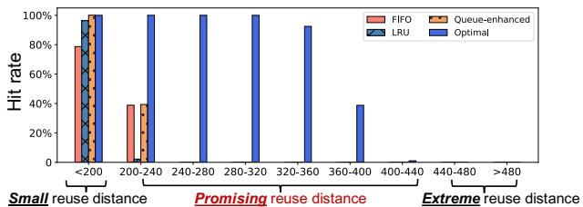  
Weighted reuse distance (GB)  
Figure 13: An example of the hit rate for KV accesses with different ranges of weighted reuse distances.

## 3.3.2 Hit Potentials with Large Weighted Reuse Distances

Although we can estimate the weighted reuse distances of future KV accesses, it remains unclear how this information should guide eviction decisions. In this subsection, we show that certain KV accesses can still result in hits, even when their weighted reuse distances are large.

To investigate this, we summarize the hit rates of requests with different weighted reuse distances, as shown in Figure 13. The optimal eviction strategy—Belady’s algorithm [7]—evicts the KV whose next access is the farthest in the future, but it requires the knowledge of the future trace and is not achievable in practice. To establish an upper bound, we simulate the hit rate of an optimal strategy by providing it with the future access trace, allowing us to evaluate the potential for each access to result in a hit. We also measure the hit rates of the state-of-the-art KV eviction strategy (queueenhanced [11]), and two general eviction strategies: FIFO [9] and LRU [43].

We observe that when the weighted reuse distance exceeds the performance layer size and continues to increase, the hit rate of the optimal strategy remains above zero and declines gradually over a wide range of distances. We refer to this range as the promising reuse distance. Beyond a certain threshold, however, even the optimal strategy yields a hit rate of zero; we call this the extreme reuse distance. These findings indicate that, even beyond the performance layer capacity, accesses with large weighted reuse distances retain the hit potential when using an optimal strategy with perfect future knowledge. We can try to exploit such potential as we can obtain a glance of the future access using the observation of lower bound prediction.

## 3.3.3 Overall Eviction Strategy

Building on the observations above, we propose selecting eviction candidates by predicting the hit potential of each user’s next KV access. Here, hit potential is defined as the hit rate under an optimal strategy with knowledge of the future. Predicting this hit potential involves two steps: 1) estimating the hit potentials for accesses across different ranges of weighted reuse distances; 2) predicting the range of the weighted reuse distance of each user’s next KV access.

For the first step, the challenge is that hit rates under the optimal strategy can vary depending on the performance layer size or the workload pressure. Consequently, statically determining these hit rates results in inaccurate estimations. To cope with this, we maintain a ghost cache adopting the optimal eviction strategy [7] in background. The ghost cache is used on traces arriving prior to a threshold, giving the “future” insight for these past traces. Another challenge is that the hit rate differs across various ranges of the promising reuse distance as shown in Figure 13, which means it is infeasible to estimate hit rates in a coarse-grained manner. To address this, we divide the promising reuse distance into multiple fine-grained buckets and the entire weighted reuse distance range is partitioned into these buckets. The hit rate for each individual bucket is summarized using the ghost cache:

• A small bucket, covering all the weighted reuse distances smaller than the performance layer size. Its hit rate is 1.0.

• m promising buckets, each covering a small range of promising reuse distances. For each promising bucket, the hit rate is hit\_promising(i) for $i \in [ 1 , m ]$

• An extreme bucket, covering all the extreme reuse distances. Its hit rate is 0.0.

In the second step, we track the weighted reuse distance distribution of each user’s past KV accesses. From the distribution, we estimate the probability of the next KV access landing in each weighted reuse distance bucket: prob\_small, prob\_promising(i) $( i \in [ 1 , m ] )$ ), prob\_extreme. We then incorporate the lower bound prediction—derived from the model answer length in the previous round (§3.3.1)—as a constraint on the weighted reuse distance of the next access. By leveraging this lower bound, we can prune implausible buckets and refine the probability distribution. For instance, if the lower bound of the next access’s weighted reuse distance falls within the promising bucket i, then prob\_small and prob\_promising( j) $( j \in [ 1 , i - 1 ] )$ are safely set to 0.0. The remaining probabilities are normalized.

Finally, we assign the hit rates under the optimal strategy, obtained via the ghost cache, as the hit potentials for different weighted reuse distance buckets. Then we compute the overall hit potential for each user’s next KV access, as shown in Equation 2. The KV with the lowest calculated hit potential is selected for eviction.

$$
\begin{array} { l } { { \displaystyle O \nu e r a l l \_ p o t e n t i a l = p r o b \_ s m a l l \times 1 . 0 + p r o b \_ e x t r e m e \times 0 . 0 } } \\ { { \displaystyle \qquad + \sum _ { i = 1 } ^ { m } p r o b \_ p r o m i s i n g ( i ) \times h i t \_ p r o m i s i n g ( i ) } } \end{array}\tag{2}
$$

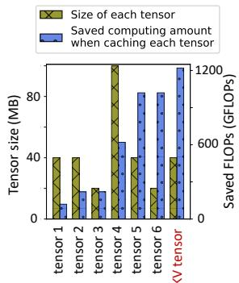  
(a) Size and saved computing

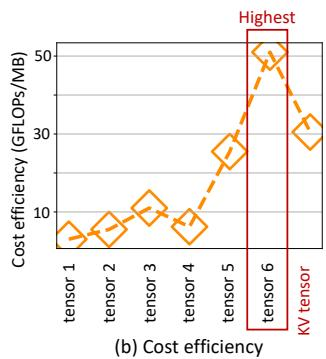  
Figure 14: The size (per decoder layer), saved computing amount (per decoder layer) and cost efficiency (saved computing amount / size) when caching each intermediate tensor for OPT-13B model with a 2048-token history conversation.

## 4 Implementation and Optimization

During implementation, we avoid evicting the data of waiting requests, and adopt inclusive caching to enable fast eviction like prior works [11, 19]. We adopt continuous request batching like prior work [51]. Under such mechanism, requests do not start computation simultaneously. Specifically, requests within the batch that finish computation early are released from GPU immediately, enabling admission of new request(s). Such batching mechanism greatly improves the efficiency of LLM serving, as it enables higher GPU utilization.

To enable efficient CPU-GPU transmission, we propose and implement a mix-grained GPU memory allocation technique. Specifically, for each request, traditional PagedAttention [23] allocates many non-contiguous small GPU memory blocks to improve GPU memory utilization. However, transmitting history KVs at such a small granularity fails to fully utilize the CPU-GPU transmission bandwidth. To this end, we maintain mix-grained GPU blocks (big blocks with 256 tokens and small blocks with 16 tokens). Then, we allocate big blocks to history conversation tokens and user query tokens, whose lengths are already known, and allocate small blocks to response tokens, whose lengths are unpredictable. Big blocks can be divided into small blocks and these small blocks can be merged back into big blocks, to avoid GPU memory fragmentation.

For further optimization, we propose storage-efficient tensor caching, by balancing storage footprint against computational savings. Existing works [11, 19] directly cache the KV tensor of history conversation, as it is required as one of the inputs during the inference of future conversation rounds. However, during GPU computation, different intermediate tensors are generated (Figure 1), and we observe that the size of these tensors varies (Figure 14(a)).

Trade-off between space overhead and saved computation. History caching technique saves redundant computation by trading off space. However, the efficiency of the above tradeoff varies when caching different intermediate tensors: different storage space overheads are incurred for saving per unit computation. When caching other tensors instead of KV tensor, the storage space overhead will change. And additional computing will be required to transform these tensors into the KV tensor, and thus the total amount of saved computing will decrease, which is shown in Figure 14(a). To measure the efficiency of the trade-off between the storage space overhead and the saved computing amount, we define the following metric for each tensor:

$$
C o s t e f f i c i e n c y = \frac { S a \nu e d c o m p u t i n g a m o u n t } { R e q u i r e d s p a c e }\tag{3}
$$

We compute the cost efficiency of each intermediate tensor in Figure 14(b). We can see that the cost efficiency among different tensors varies greatly. We can see tensor 6 exhibits the highest cost efficiency (51.0), surpassing that of the traditionally cached KV tensor (30.5). This means caching tensor 6 (i.e., the normalized activation, which only needs one step to transform into KV tensor) can achieve the most efficient tradeoff between space overhead and saved computing amount, and we call tensor 6 the storage-efficient tensor.

Caching storage-efficient tensor. We propose to cache the storage-efficient tensor identified above to reduce the space overhead, enabling the performance layer to accommodate more history tensors from additional users. When the cached storage-efficient tensor is loaded into GPU, it will be transformed into the required KV tensor. The transformation of a request’s storage-efficient tensor into KV tensor can be parallelized with the normal inference of other requests. This is feasible because we observe over 30% of GPU streaming multiprocessors (SMs) remain idle, as many redundant computations are eliminated through history caching, and inference is memory-bound in most cases. To exploit these idle SMs without affecting normal inference, we assign the transformation to a low-priority CUDA stream, separate from the stream that is used for normal inference.

Such optimization generalizes across MHA-based LLMs, including a large number of frequently used models: Llama [42], Qwen [6], Bloom [25], OPT [54], Baichuan [50], etc. However, for GQA-based LLMs [2], KV is smaller and caching the storage-efficient tensor above is no longer beneficial, and thus KV should be cached instead.

## 5 Performance Evaluation

Workload. First, we test on our interactive conversation workload. User arrival rate denotes the average number of new users that arrive and start multi-round conversations per minute; once a user starts a multi-round conversation, this user will issue multiple requests intermittently before disconnecting1. Second, we test on the popular public trace ShareGPT [39] containing multi-round conversations, and use simulation to confirm the timestamps based on Poisson distribution like previous works [1, 23, 28, 57]. We conduct warm-up before running to populate the performance layer with history tensors.

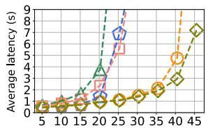  
(a) OPT-6.7B

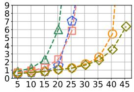  
(b) Qwen-7B

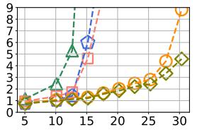  
(c) OPT-13B

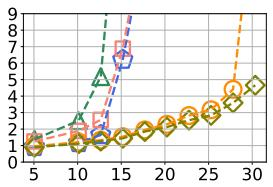  
(d) Qwen-14B

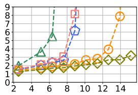  
(e) OPT-30B

Figure 15: The average response latency for each request across different models.  
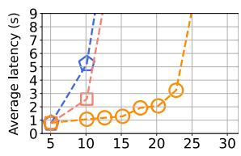  
(a) 120 GB memory

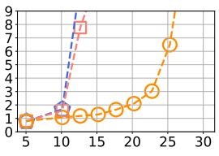  
(b) 140 GB memory

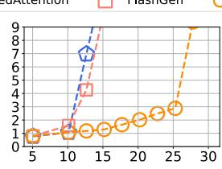  
(c) 160 GB memory

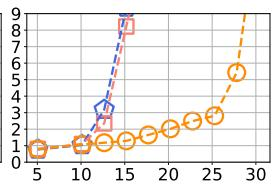  
(d) 180 GB memory

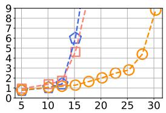  
(e) 200 GB memory  
Figure 16: The average response latency for each request with varying host memory sizes.

Comparing systems. We compare the performance of Bidaw with the state-of-the-art LLM serving systems: vLLM [23], CachedAttention [11] and FlashGen [19]. vLLM adopts paged attention for efficient GPU memory allocation, and needs to recompute all the history conversations. CachedAttention and FlashGen cache KVs of history conversations in the two-tier storage to reduce redundant computations, and will load KVs into GPU for reusing. Since CachedAttention and FlashGen are closed-source, we implement CachedAttention and FlashGen based on vLLM. We also compare with the optimal performance of the caching solution where all the KVs can be loaded from performance layer (simulated by repetitively loading the same KV from host memory).

Environment and models. All of our experiments are conducted on a server with one 80GB A800 GPU and 200GB host memory. The SSD bandwidth is 1.5GB/s with a RAID-5 array [22] consisting of 4 SATA SSDs. The GPU is connected to the host via PCIe Gen 4. We evaluate Bidaw across various popular LLM models [6,54]: OPT-6.7B, Qwen-7B, OPT-13B, Qwen-14B, and OPT-30B.

We test with PCIe 4.0 as modern GPU servers broadly adopt PCIe 4.0, whose CPU-GPU bandwidth (around 30 GB/s) is rarely a bottleneck. PCIe 5.0 is not broadly adopted and will offer higher bandwidth. In contrast, the SSD bandwidth is much lower (several GB/s), forming an I/O bottleneck.

We report the quantitative results for the simulated 5 GB/s SSD in the last paragraph of Section 5.1 to substantiate the evaluation assumptions.

## 5.1 Overall Performance

We demonstrate the average end-to-end response latency for each request with varying user arrival rates across different LLM models, as shown in Figure 15. Note that different xaxis ranges are used for different models. Smaller models require fewer computations and fewer loaded KVs, allowing them to maintain low latencies under higher user arrival rates and thus we use a wider x-axis range. In contrast, larger models incur substantially higher computation and KV-loading costs, causing the latency to increase rapidly as the workload pressure grows and limiting the supported user arrival rate to a narrower x-axis range. We can see that as the workload pressure increases, the latency of vLLM increases rapidly, due to a huge amount of redundant computations. The latencies of CachedAttention and FlashGen are lower than vLLM, but still surge when the user arrival rate increases. This is because more KVs are accumulated with heavy workloads and many slow capacity layer I/Os are induced, which constrains the performance of the whole system. The latency of FlashGen is slightly higher than that of CachedAttention on OPT-30B model because FlashGen enables re-computation on some requests, and re-computation cost is higher with larger model.

On the contrary, Bidaw can achieve much lower latency with increasing user arrival rate. For OPT-13B, Bidaw reduces the response latency by up to 3.58×. This is because Bidaw not only reduces redundant computations, but also improves the KV-loading efficiency, by enabling bidirectional awareness between compute and storage. We can see that Bidaw reduces the average response latency by up to 83.9% compared to state-of-the-art approaches across different models. Bidaw can significantly improve the throughput and sustain 1.43× to 1.83× higher user arrival rate compared to state-ofthe-art approaches across different models, while providing similar response latency.

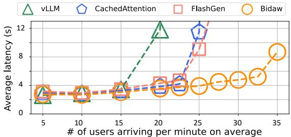  
Figure 17: The average response latency for each request on public ShareGPT workload.

Note that Bidaw is lossless in terms of accuracy. Bidaw only reorders requests with the I/O-aware request scheduler, which does not affect LLM response accuracy—computing user 1’s request or user 2’s request first does not change their LLM responses. The computational order when generating the response within each individual request is not altered.

Besides, increasing the SSD bandwidth by several GB/s does not eliminate the SSD bandwidth bottleneck on overall system performance, and Bidaw remains effective. We simulate a 5GB/s SSD by copying KVs from the host memory and injecting additional latency: the baseline’s (FlashGen) throughput increases from 15.18 users/minute (Figure 15(c)) to 20.23 users/minute, still lagging far behind Bidaw (from 27.81 to 30.35 users/minute).

## 5.2 Performance Sensitivity to Host Memory Size

We measure the response latency when the host memory (performance layer) size varies, on OPT-13B model as shown in Figure 16. We measure the serving latencies with host memory size ranging from 1.5× to 2.5× of GPU memory size (120GB to 200GB). We compare with CachedAttention and FlashGen, as the performances of vLLM and the optimal caching solution are not affected by the host memory size.

We can see that as the host memory size decreases, the response latency increases correspondingly. This is because more data have to be loaded from the slow capacity layer with a smaller host memory size. However, we can see that the performance of Bidaw is still much better than state-ofthe-art approaches with decreasing host memory size. This is because Bidaw targets at improving the KV-loading efficiency with constrained I/O resources, by reducing miss rates and alleviating the I/O-induced request blocking problem. We can see that Bidaw can sustain 1.75× to 2.19× higher user arrival rate than state-of-the-art approaches while providing the similar response latency, with varying host memory sizes.

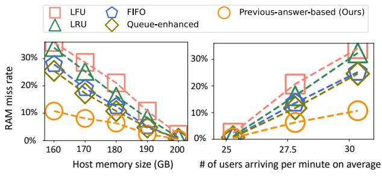  
Figure 18: The performance layer miss rate with different eviction strategies.

## 5.3 Performance on Public Workload

We demonstrate the average response latency for each user request with varying user arrival rates, on the public ShareGPT [39] workload with OPT-13B model in Figure 17. We can see that Bidaw improves the system throughput and sustains 1.40× higher user arrival rate compared to FlashGen. Specifically, when FlashGen and Bidaw achieve comparable average latencies (9.09s for FlashGen and 8.70s for Bidaw), Bidaw sustains 1.40× more users per minute than FlashGen. Bidaw can reduce the model response latency by up to 69.8%, 65.8% and 56.9% compared to vLLM, CachedAttention and FlashGen respectively. Thus, Bidaw can boost the system performance on the public workload. However, the throughput improvement decreases evidently compared to the improvement on our interactive conversation workload (Figure 15(c)). This is because the ShareGPT workload does not contain timestamps, which are simulated using Poisson distribution like prior works [1, 23, 28, 57]. Consequently, the previousanswer-based eviction strategy no longer reduces miss rates with such simulated timestamps. Besides, for ShareGPT workload, the average latency is slightly higher due to more model answer tokens in a single round, and the overall throughput is slightly higher due to the smaller number of interaction rounds with each user.

## 5.4 Performance Layer Miss Rate

We evaluate the performance layer miss rate of the OPT-13B model under varying host memory sizes and workload pressures, as shown in Figure 18. We compare our previous-answer-based eviction strategy with the state-ofthe-art eviction strategy for interactive LLM serving: queueenhanced [11], which considers the requests in the waiting queue. We also evaluate some frequently used general eviction strategies: LFU, LRU and FIFO. Note that storage-efficient tensors instead of KVs are cached.

Figure 18(a) measures the miss rate with varying host memory sizes (25 users/minute). We can see that our proposed eviction strategy can significantly reduce the miss rate, especially with smaller host memory sizes. Figure 18(b) shows that when the workload pressure increases, the miss rate increases correspondingly. However, our proposed eviction strategy maintains a low miss rate compared with the state-of-the-art eviction strategy and other general strategies. The performance of the queue-enhanced eviction strategy is unsatisfactory. This is because there are typically not many requests in the waiting queue (usually fewer than 50) to inform eviction decisions under workload pressures that are supportable for online serving. Thus, our proposed eviction strategy can significantly reduce the miss rate by up to 57.6% compared with queue-enhanced strategy, and 69.9% compared with frequently used general eviction strategies.

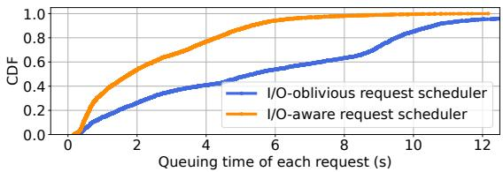  
Figure 19: CDF of the request queuing time.

## 5.5 Request Queuing Time

Figure 19 presents the CDF of the queuing time of requests before GPU computation on the OPT-13B model with 30 users/minute, comparing our proposed I/O-aware request scheduler against a typical I/O-oblivious request scheduler (the widely adopted FCFS). The average request queuing time is 2.45s with our I/O-aware request scheduler and 5.76s with the I/O-oblivious request scheduler, showing that our I/Oaware request scheduler reduces the average queuing time per request by 57.5%. This is because the current I/O-oblivious request scheduler allows requests with long history-loading times to block subsequent requests, even when their history tensors could be quickly loaded into GPU. Our I/O-aware request scheduler mitigates this blocking issue by considering the I/O latency associated with each request.

## 5.6 Overhead Analysis

We measure the overhead of Bidaw in Figure 20, on OPT-13B model with 30 users/minute. Figure 20(a) presents the CDF of the scheduling execution time. Our I/O-aware request scheduler incurs minimal overhead, averaging only 0.62ms per scheduling operation. A scheduling operation is triggered after each GPU computing iteration, and each iteration typically lasts tens of milliseconds. The scheduling time varies with the number of waiting requests. Figure 20(b) shows the average execution time of eviction operations under our previous-answer-based eviction strategy and the optimal eviction strategy within the ghost cache. The overhead is very small: 0.35ms for our strategy, and 2.86ms for the optimal eviction strategy (in background). An eviction operation is triggered when the free host memory falls below 5% of total memory capacity. Figure 20(c) reports the execution time of transforming a storage-efficient tensor into a KV tensor. The transformation incurs only tens of milliseconds, introducing negligible impact on response latency (hundreds or thousands of milliseconds). Transformation is executed on a separate low-priority CUDA stream to utilize idle GPU SMs.

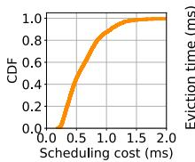

(a) Scheduling cost  
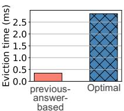  
(b) Eviction cost

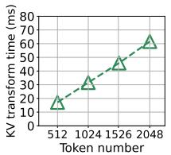  
(c) KV-transforming cost  
Figure 20: Overhead analysis. (a) The CDF of the scheduling operation cost. (b) The average time of each eviction operation under our previous-answer-based eviction strategy and the optimal eviction strategy. (c) The execution time for transforming the storage-efficient tensor into the KV tensor.

## 5.7 Effects of Individual Techniques

To isolate the improvements brought by Bidaw’s key techniques, we implement different versions of Bidaw by gradually adding each key technique, and compare them to the vanilla version. First, we add our I/O-aware request scheduling technique. Second, we further add our previous-answerbased eviction strategy. Finally, we add our storage-efficient tensor caching technique, which is the full version of Bidaw. We test these systems on the OPT-30B model, and show the average response latency in Figure 21.

We can see that adding our I/O-aware request scheduling technique reduces the average response latency by up to 1.58× compared to the vanilla version. This is because our I/O-aware request scheduler can reduce I/O-induced request blocking. Adding our previous-answer-based eviction strategy further improves the serving throughput by 1.25×. This is because our eviction strategy can use the model answer generated by compute engine to reduce miss rates. Specifically, throughput improvement is quantified by comparing the number of users supported under similar latency conditions. Adding storage-efficient tensor caching technique further improves the serving throughput by 1.10×.

## 5.8 Tail Latency

To evaluate the tail latency, we test Bidaw, CachedAttention and FlashGen on the OPT-30B model, and show the results of: (a) P90 latency, (b) P95 latency and (c) P99 latency in Figure 22. From Figure 22(a), we can see that Bidaw can reduce the P90 latency by 52.96% compared to CachedAttention, and by 66.63% compared to FlashGen. From Figure 22(b), we can see that Bidaw can reduce the P95 latency by 49.30% compared to CachedAttention, and by 62.64% compared to

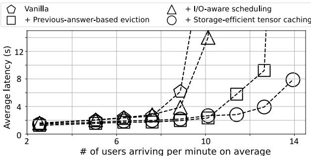  
Figure 21: Effects of individual techniques.

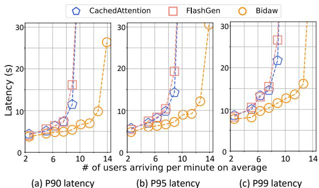  
Figure 22: Tail latency.

FlashGen. From Figure 22(c), we can see that Bidaw can reduce the P99 latency by 47.03% compared to CachedAttention, and by 56.81% compared to FlashGen. This shows that Bidaw is able to significantly reduce the tail latency of interactive LLM serving.

## 6 Related Work

General LLM serving. Many works [16, 20, 23, 29, 34, 35, 49, 51, 53, 57] optimize LLM serving in general aspects. For example, Orca [51] proposes continuous batching. vLLM [23] significantly improves the GPU memory efficiency. BlitzScale [53] boosts model autoscaling by loading parameters via the compute network. Bidaw focuses on KV caching with two-tier storage for interactive LLM serving.

Lossy KV compression. Some works [15, 31, 32, 41, 52] reduce the KV size via quantization, using fewer bits to represent KV values. Some works [8, 26, 55] propose to compress the loaded KV size via dropping certain tokens. These methods will affect the accuracy of LLM responses, and are orthogonal to Bidaw.

KV caching. Some works [11, 19] cache the KVs of history conversations in the two-tier storage, which provides large capacity at low cost. HCache [12] also chooses to buffer the intermediate activations instead of KVs. However, in existing works, compute engine and two-tier storage are mutually unaware, resulting in the KV-loading process becoming the bottleneck in overall serving performance. Caching KVs in the RDMA-based disaggregated memory pool [36] in data centers entails high deployment cost. But many non-AI companies in vertical domains have to deploy LLMs locally due to privacy concerns [21, 37], and lack the budget or expertise for such a memory pool. MeanCache [13] enables KV reusing among different users with similar prompts, while we target at KV reusing within the same user’s multi-round conversation.

## 7 Conclusion

This paper proposes Bidaw, an efficient KV caching approach for interactive LLM serving, via bidirectional awareness between compute engine and two-tier storage. The compute engine schedules requests for computation by considering the I/O latency. The two-tier storage evicts data based on the length of the model answer generated by compute engine. Our evaluation shows Bidaw outperforms state-of-theart approaches, achieving up to a 3.58× reduction in response latency and up to a 1.83× improvement in system throughput.

## Acknowledgments

We thank all reviewers for their insightful comments and helpful suggestions. We are especially grateful to our shepherd, Wen Xia, for his detailed and patient guidance during our camera-ready preparation. This work was supported by the National Natural Science Foundation of China under Grant 62025203.

## References

[1] Amey Agrawal, Nitin Kedia, Ashish Panwar, Jayashree Mohan, Nipun Kwatra, Bhargav Gulavani, Alexey Tumanov, and Ramachandran Ramjee. Taming Throughput-Latency Tradeoff in LLM Inference with Sarathi-Serve. In Proceedings of the 18th USENIX Symposium on Operating Systems Design and Implementation (OSDI’24), pages 117–134, 2024.

[2] Joshua Ainslie, James Lee-Thorp, Michiel De Jong, Yury Zemlyanskiy, Federico Lebrón, and Sumit Sanghai. GQA: Training Generalized Multi-Query Transformer Models from Multi-Head Checkpoints. arXiv preprint arXiv:2305.13245, 2023.

[3] AWS. Amazon EC2 P5 instances. https://aws. amazon.com/ec2/instance-types/p5/.

[4] Azure. NC\_A100\_v4 sizes series. https: //learn.microsoft.com/en-us/azure/ virtual-machines/sizes/gpu-accelerated/ nca100v4-series?tabs=sizebasic.

[5] Azure Team. Azure LLM inference trace 2023. https: //github.com/Azure/AzurePublicDataset/blob/ master/AzureLLMInferenceDataset2023.md.

[6] Jinze Bai, Shuai Bai, Yunfei Chu, Zeyu Cui, Kai Dang, Xiaodong Deng, Yang Fan, Wenbin Ge, Yu Han, Fei Huang, et al. Qwen Technical Report. arXiv preprint arXiv:2309.16609, 2023.

[7] Laszlo A. Belady. A study of replacement algorithms for a virtual-storage computer. IBM Systems journal, 5(2):78–101, 1966.

[8] Weijian Chen, Shuibing He, Haoyang Qu, Ruidong Zhang, Siling Yang, Ping Chen, Yi Zheng, Baoxing Huai, and Gang Chen. IMPRESS: An Importance-Informed Multi-Tier Prefix KV Storage System for Large Language Model Inference. In Proceedings of the 23rd USENIX Conference on File and Storage Technologies (FAST’25), pages 187–201, 2025.

[9] Asit Dan and Don Towsley. An Approximate Analysis of the LRU and FIFO Buffer Replacement Schemes. In Proceedings of the 1990 ACM SIGMETRICS Conference on Measurement and Modeling of Computer Systems (SIGMETRICS’24), pages 143–152, 1990.

[10] Duolingo Team. Introducing duolingo max, a learning experience powered by GPT-4. https://blog. duolingo.com/duolingo-max//.

[11] Bin Gao, Zhuomin He, Puru Sharma, Qingxuan Kang, Djordje Jevdjic, Junbo Deng, Xingkun Yang, Zhou Yu, and Pengfei Zuo. Cost-Efficient Large Language Model Serving for Multi-turn Conversations with CachedAttention. In Proceedings of the 2024 USENIX Annual Technical Conference (USENIX ATC’24), pages 111– 126, 2024.

[12] Shiwei Gao, Youmin Chen, and Jiwu Shu. Fast State Restoration in LLM Serving with HCache. In Proceedings of the 20th European Conference on Computer Systems (EuroSys’25), pages 128–143, 2025.

[13] Waris Gill, Mohamed Elidrisi, Pallavi Kalapatapu, Ammar Ahmed, Ali Anwar, and Muhammad Ali Gulzar. MeanCache: User-Centric Semantic Cache for Large Language Model Based Web Services. arXiv preprint arXiv:2403.02694, 2024.

[14] Google Cloud. A2 machine series. https://cloud. google.com/compute/docs/gpus#a100-gpus.

[15] Coleman Hooper, Sehoon Kim, Hiva Mohammadzadeh, Michael W. Mahoney, Yakun Sophia Shao, Kurt Keutzer, and Amir Gholami. KVQuant: Towards 10 Million Context Length LLM Inference with KV Cache Quantization. arXiv preprint arXiv:2401.18079.

[16] Cunchen Hu, Heyang Huang, Liangliang Xu, Xusheng Chen, Jiang Xu, Shuang Chen, Hao Feng, Chenxi Wang,

Sa Wang, Yungang Bao, et al. Inference without Interference: Disaggregate LLM Inference for Mixed Downstream Workloads. arXiv preprint arXiv:2401.11181, 2024.

[17] Qinghao Hu, Zhisheng Ye, Zerui Wang, Guoteng Wang, Meng Zhang, Qiaoling Chen, Peng Sun, Dahua Lin, Xiaolin Wang, Yingwei Luo, et al. Characterization of Large Language Model Development in the Datacenter. In Proceedings of the 21st USENIX Symposium on Networked Systems Design and Implementation (NSDI’24), pages 709–729, 2024.

[18] Ishita Kaur. Role Of LLMs In Customer Service And Support. https://www.crossml.com/ role-of-llms-in-customer-service-and-support/.

[19] Jinwoo Jeong and Jeongseob Ahn. Accelerating LLM Serving for Multi-turn Dialogues with Efficient Resource Management. In Proceedings of the 30th ACM International Conference on Architectural Support for Programming Languages and Operating Systems (ASP-LOS’25), pages 1–15, 2025.

[20] Yibo Jin, Tao Wang, Huimin Lin, Mingyang Song, Peiyang Li, Yipeng Ma, Yicheng Shan, Zhengfan Yuan, Cailong Li, Yajing Sun, et al. P/D-Serve: Serving Disaggregated Large Language Model at Scale. arXiv preprint arXiv:2408.08147, 2024.

[21] KAIRNTECH. LLM On-Premise: The guide to deploying large language models locally. https://kairntech.com/blog/articles/ llm-on-premise/.

[22] Anand Kuratti and William H. Sanders. Performance analysis of the RAID 5 disk array. In Proceedings of 1995 IEEE International Computer Performance and Dependability Symposium (IPDS’95), pages 236–245, 1995.

[23] Woosuk Kwon, Zhuohan Li, Siyuan Zhuang, Ying Sheng, Lianmin Zheng, Cody Hao Yu, Joseph E. Gonzalez, Hao Zhang, and Ion Stoica. Efficient Memory Management for Large Language Model Serving with PagedAttention. In Proceedings of the ACM SIGOPS 29th Symposium on Operating Systems Principles (SOSP’23), pages 611–626, 2023.

[24] Rohaya Latip and Zulkhairi Idris. Highest Response Ratio Next (HRRN) vs First Come First Served (FCFS) Scheduling Algorithm in Grid Environment. In Proceedings of the 2nd International Conference on Software Engineering and Computer Systems (ICSECS’11), pages 688–693. Springer, 2011.

[25] Teven Le Scao, Angela Fan, Christopher Akiki, Ellie Pavlick, Suzana Ilic, Daniel Hesslow, Roman Castagné, ´ Alexandra Sasha Luccioni, François Yvon, Matthias Gallé, et al. Bloom: A 176B-Parameter Open-Access Multilingual Language Model. arXiv preprint arXiv:2211.05100, 2023.

[26] Wonbeom Lee, Jungi Lee, Junghwan Seo, and Jaewoong Sim. InfiniGen: Efficient Generative Inference of Large Language Models with Dynamic KV Cache Management. In Proceedings of the 18th USENIX Symposium on Operating Systems Design and Implementation (OSDI’24), pages 155–172, 2024.

[27] Jian Li, Xing Wang, Zhaopeng Tu, and Michael R. Lyu. On the diversity of multi-head attention. Neurocomputing, 454:14–24, 2021.

[28] Chaofan Lin, Zhenhua Han, Chengruidong Zhang, Yuqing Yang, Fan Yang, Chen Chen, and Lili Qiu. Parrot: Efficient Serving of LLM-based Applications with Semantic Variable. In Proceedings of the 18th USENIX Symposium on Operating Systems Design and Implementation (OSDI’24), pages 929–945, 2024.

[29] Jiachen Liu, Jae-Won Chung, Zhiyu Wu, Fan Lai, Myungjin Lee, and Mosharaf Chowdhury. Andes: Defining and Enhancing Quality-of-Experience in LLM-Based Text Streaming Services. arXiv preprint arXiv:2404.16283, 2024.

[30] Xiang Liu, Zhenheng Tang, Hong Chen, Peijie Dong, Zeyu Li, Xiuze Zhou, Bo Li, Xuming Hu, and Xiaowen Chu. Can LLMs Maintain Fundamental Abilities under KV Cache Compression? arXiv preprint arXiv:2502.01941, 2025.

[31] Yuhan Liu, Hanchen Li, Yihua Cheng, Siddhant Ray, Yuyang Huang, Qizheng Zhang, Kuntai Du, Jiayi Yao, Shan Lu, Ganesh Ananthanarayanan, et al. CacheGen: KV Cache Compression and Streaming for Fast Large Language Model Serving. In Proceedings of the ACM SIGCOMM 2024 Conference (SIGCOMM’24), pages 38–56, 2024.

[32] Zirui Liu, Jiayi Yuan, Hongye Jin, Shaochen Zhong, Zhaozhuo Xu, Vladimir Braverman, Beidi Chen, and Xia Hu. KIVI: A Tuning-Free Asymmetric 2bit Quantization for KV Cache. arXiv preprint arXiv:2402.02750, 2024.

[33] NVIDIA. NVIDIA-Certified Systems Configuration Guide. https://docs.nvidia. com/certification-programs/latest/ nvidia-certified-configuration-guide.html# inference-system.

[34] Pratyush Patel, Esha Choukse, Chaojie Zhang, Aashaka Shah, Íñigo Goiri, Saeed Maleki, and Ricardo Bianchini. Splitwise: Efficient Generative LLM Inference using Phase Splitting. In Proceedings of the 2024 ACM/IEEE 51st Annual International Symposium on Computer Architecture (ISCA’24), pages 118–132, 2024.

[35] Archit Patke, Dhemath Reddy, Saurabh Jha, Haoran Qiu, Christian Pinto, Chandra Narayanaswami, Zbigniew Kalbarczyk, and Ravishankar Iyer. Queue Management for SLO-Oriented Large Language Model Serving. In Proceedings of the 2024 ACM Symposium on Cloud Computing (SoCC’24), pages 18–35, 2024.

[36] Ruoyu Qin, Zheming Li, Weiran He, Jialei Cui, Feng Ren, Mingxing Zhang, Yongwei Wu, Weimin Zheng, and Xinran Xu. MOONCAKE: Trading More Storage for Less Computation—A KVCache-centric Architecture for Serving LLM Chatbot. In Proceedings of the 23rd USENIX Conference on File and Storage Technologies (FAST’25), pages 155–170, 2025.

[37] Radicalbit Technology. Cloud vs. On-Prem LLMs: Strategic Considerations. https://radicalbit.ai/ resources/blog/cloud-onprem-llm/.

[38] Replika. The AI companion who cares. https:// replika.com/.

[39] ShareGPT Teams. ShareGPT. https://sharegpt. com.

[40] Charles Spearman. The Proof and Measurement of Association between Two Things. The American journal of psychology, 100(3/4):441–471, 1987.

[41] Zhaoyuan Su, Zeyu Zhang, Tingfeng Lan, Zirui Wang, Haiying Shen, Juncheng Yang, and Yue Cheng. MORPHSERVE: Efficient and Workload-Aware LLM Serving via Runtime Quantized Layer Swapping and KV Cache Resizing. arXiv preprint arXiv:2506.02006, 2026.

[42] Hugo Touvron, Thibaut Lavril, Gautier Izacard, Xavier Martinet, Marie-Anne Lachaux, Timothée Lacroix, Baptiste Rozière, Naman Goyal, Eric Hambro, Faisal Azhar, et al. LLaMA: Open and Efficient Foundation Language Models. arXiv preprint arXiv:2302.13971, 2023.

[43] Valentin Touzeau, Claire Maïza, David Monniaux, and Jan Reineke. Fast and exact analysis for LRU caches. In Proceedings of the ACM on Programming Languages (POPL’19), pages 1–29, 2019.

[44] Ashish Vaswani, Noam Shazeer, Niki Parmar, Jakob Uszkoreit, Llion Jones, Aidan N. Gomez, Łukasz Kaiser, and Illia Polosukhin. Attention Is All You Need. In Proceedings of the Advances in Neural Information Processing Systems (NIPS’17), 2017.

[45] Yuxin Wang, Yuhan Chen, Zeyu Li, Xueze Kang, Yuchu Fang, Yeju Zhou, Yang Zheng, Zhenheng Tang, Xin He, Rui Guo, et al. BurstGPT: A Real-World Workload Dataset to Optimize LLM Serving Systems. In Proceedings of the 31st ACM SIGKDD Conference on Knowledge Discovery and Data Mining (KDD’25), pages 5831–5841, 2025.

[46] Gao Wei, Xinyu Zhou, Peng Sun, Tianwei Zhang, and Yonggang Wen. Rethinking Key-Value Cache Compression Techniques for Large Language Model Serving. In Proceedings of the Eighth Conference on Machine Learning and Systems (MLSys’25), 2025.

[47] Wikipedia contributors. Coefficient of variation. https://en.wikipedia.org/wiki/Coefficient\_ of\_variation#cite\_note-1.

[48] Wikipedia contributors. Interquartile range. https:// en.wikipedia.org/wiki/Interquartile\_range.

[49] Bingyang Wu, Shengyu Liu, Yinmin Zhong, Peng Sun, Xuanzhe Liu, and Xin Jin. LoongServe: Efficiently Serving Long-Context Large Language Models with Elastic Sequence Parallelism. In Proceedings of the ACM SIGOPS 30th Symposium on Operating Systems Principles (SOSP’24), pages 640–654, 2024.

[50] Aiyuan Yang, Bin Xiao, Bingning Wang, Borong Zhang, Ce Bian, Chao Yin, Chenxu Lv, Da Pan, Dian Wang, Dong Yan, et al. Baichuan 2: Open Large-Scale Language Models. arXiv preprint arXiv:2309.10305, 2023.

[51] Gyeong-In Yu, Joo Seong Jeong, Geon-Woo Kim, Soojeong Kim, and Byung-Gon Chun. ORCA: A Distributed Serving System for Transformer-Based Generative Models. In Proceedings of the 16th USENIX Symposium on Operating Systems Design and Implementation (OSDI’22), pages 521–538, 2022.

[52] Yuxuan Yue, Zhihang Yuan, Haojie Duanmu, Sifan Zhou, Jianlong Wu, and Liqiang Nie. WKVQuant: Quantizing Weight and Key/Value Cache for Large Language Models Gains More. arXiv preprint arXiv:2402.12065, 2024.

[53] Dingyan Zhang, Haotian Wang, Yang Liu, Xingda Wei, Yizhou Shan, Rong Chen, and Haibo Chen. BlitzScale: Fast and Live Large Model Autoscaling with O (1) Host Caching. In Proceedings of the 19th USENIX Symposium on Operating Systems Design and Implementation (OSDI’25), pages 275–293, 2025.

[54] Susan Zhang, Stephen Roller, Naman Goyal, Mikel Artetxe, Moya Chen, Shuohui Chen, Christopher Dewan, Mona Diab, Xian Li, Xi Victoria Lin, et al. OPT: Open Pre-trained Transformer Language Models. arXiv preprint arXiv:2205.01068, 2022.

[55] Zhenyu Zhang, Ying Sheng, Tianyi Zhou, Tianlong Chen, Lianmin Zheng, Ruisi Cai, Zhao Song, Yuandong Tian, Christopher Ré, Clark Barrett, et al. H2O: Heavy-Hitter Oracle for Efficient Generative Inference of Large Language Models. In Proceedings of the Advances in Neural Information Processing Systems (NIPS’23), pages 34661–34710, 2023.

[56] Wei Zhao and John A. Stankovic. Performance Analysis of FCFS and Improved FCFS Scheduling Algorithms for Dynamic Real-Time Computer Systems. In Proceedings of the 1989 Real-Time Systems Symposium (RTSS’89), pages 156–157, 1989.

[57] Yinmin Zhong, Shengyu Liu, Junda Chen, Jianbo Hu, Yibo Zhu, Xuanzhe Liu, Xin Jin, and Hao Zhang. Dist-Serve: Disaggregating Prefill and Decoding for Goodputoptimized Large Language Model Serving. In Proceedings of the 18th USENIX Symposium on Operating Systems Design and Implementation (OSDI’24), pages 193– 210, 2024.