USENIX

THE ADVANCED COMPUTING SYSTEMS ASSOCIATION

# Towards Condensed and Efficient Read-Only File System via Sort-Enhanced Compression

Hao Huang, Yifeng Zhang, Yanqi Pan, Wen Xia, and Xiangyu Zou, and Darong Yang, Harbin Institute of Technology, Shenzhen; Jubin Zhong and Hua Liao, Huawei Technologies Co., Ltd

## https://www.usenix.org/conference/fast26/presentation/huang

This paper is included in the Proceedings of the 24th USENIX Conference on File and Storage Technologies.

February 24–26, 2026 • Santa Clara, CA, USA

ISBN 978-1-939133-53-3

Open access to the Proceedings of the 24th USENIX Conference on File and Storage Technologies is sponsored by

# Towards Condensed and Efficient Read-Only File System via Sort-Enhanced Compression

Hao Huang†, Yifeng Zhang†, Yanqi Pan†, Wen Xia† B, Xiangyu Zou†, Darong Yang†, Jubin Zhong‡, Hua Liao‡,

†Harbin Institute of Technology, Shenzhen, ‡Huawei Technologies Co., Ltd

## Abstract

Read-only compressed file systems have become increasingly popular in space-sensitive scenarios, such as IoT and Docker containers. To construct condensed images, they divide the data into blocks (e.g., 1 MB) and compress blocks separately. However, we observe that block-based compression cannot fully utilize the compression benefits due to the data mixture problem, while its performance issues hinder practical usage.

We propose RubikFS1, a sort-enhanced read-only file system. Our key idea is to solve data mixture by sorting and clustering similar data chunks in a file system-favored block granularity. This is achieved by similarity sorter, which builds a similarity graph to measure the similarity of data chunks and clusters similar chunks by subgraph partitioning. Moreover, sorting can also group data with the same hotness to minimize read amplification. We then introduce an array of techniques, including data grouper, data chunker, and hotness grouper, to implement condensed and efficient RubikFS. Experiments suggest that, compared to existing read-only compressed file systems, RubikFS increases the compression ratio by up to 42.60% and reduces unnecessary reads by up to 70.70%.

## 1 Introduction

Read-only, write-prohibited data, such as Internet of Things (IoT) kernels [1, 14, 18] and container images [5, 8, 12], are the foundation of upper-layer services. With widespread deployment, their size becomes important for cost savings and performance [72]. For example, IoT devices will reach 25.44 billion by 2030 [28], where small images enable cost-effective hardware. Moreover, container images should be pulled for startup [80], where less data enable shorter startup latency.

However, the image inevitably grows larger due to system upgrades and new features. As a result, how to shrink the image to a suitable size became a popular topic among developers and communities [4, 9, 10]. To solve the problem, the Linux community has introduced a range of technologies to reduce the kernel size [33]; The Yocto project is proposed to customize Linux images for small embedded systems [21,34].

Among these efforts, the read-only compressed file system [36, 66, 72] is one of the most promising solutions to support transparent image shrinkage, therefore mitigating the burden on developers and speeding up production deployment.

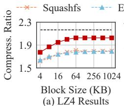

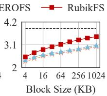  
(b) ZSTD Results

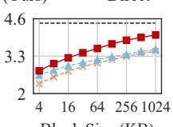  
Block Size (KB) (c) LZMA Results  
Figure 1: Compressibility of Read-Only FSes. Experiments are conducted on the openEuler image [11]. With the block size increased, EROFS and Squashfs are still far from direct, which directly compresses images without block division.

By disallowing further writes, these file systems construct a compact file system layout to maximize space utilization and reduce hardware costs. Moreover, they usually collaborate with block compression to further reduce the image size.

However, file system block compression cannot always satisfy the image shrinkage requirement. As shown in Figure 1, we conduct preliminary experiments on two read-only file systems (i.e., EROFS [72] and Squashfs [36]) and three compression algorithms (i.e., LZ4 [23], ZSTD [40], and LZMA [38]). The results suggest that, with the block size increased from 4 KB to 1 MB, their compression ratios2 have some improvement, but are still far from Direct, which directly compresses the openEuler image [11] without block division. Even worse, block compression suffers from read amplification for large blocks, hindering practical usage of read-only file systems.

We then conduct extensive experiments to demystify file system block compression (§3). We observe that data mixture is the root cause of the mismatch between file systems and block compression. Specifically, compression reduces image size by removing redundancy among similar data; however, block division inevitably mixes dissimilar data within a block. In contrast, Direct treats the image as a consecutive bitstream and constructs a large dictionary (e.g., 64 MB for XZ [2]) to find similar data, thereby mitigating the data mixture problem.

This work aims to address the data mixture problem in file system compression, thereby generating condensed and efficient images. Our key insight is sort-enhanced compression, which detects and clusters similar data chunks (i.e., the sort unit) within blocks to improve compressibility. This is achieved by building a similarity graph among chunks and partitioning it into subgraphs to cluster similar chunks. Moreover, sorting can also group chunks with the same hotness, thus mitigating read amplification caused by block compression.

We incarnate this idea by building RubikFS, a sortenhanced read-only file system. The primary challenge is that existing sorting techniques mismatch the read-only image generation due to coarse-grained similarity detection. We thus overhaul the generation workflow with four techniques: (1) data grouper to pre-group data of the same type and accelerate image generation; (2) data chunker to chunk and deduplicate data; (3) hotness grouper to group hot chunks; (4) similarity sorter to calculate similarity and sort chunks.

We implement RubikFS as a userspace image builder and a kernel file system. We evaluate RubikFS with six open source images and three compression algorithms. Experiments suggest that RubikFS can approximate, or even exceed the compression ratio of Direct while significantly mitigating the read amplification problem. Compared to existing read-only compressed file systems, it increases the compression ratio by up to 42.60% and reduces unnecessary reads by up to 70.70%.

In summary, this paper makes three contributions.

• We reveal that the read-only compressed file system becomes an urgent need to shrink image size, but the data mixture problem hinders its practical usage in terms of compression ratio and read amplification (§3).

• We propose sort-enhanced compression to address the data mixture problem in file system compression (§4). We implement RubikFS with four techniques to construct practical, condensed, and efficient file system images (§5).

• Extensive experiments on open source images suggest that RubikFS outperforms existing read-only file systems in both compression ratio and read amplification (§6).

## 2 Background

## 2.1 Read-Only Image

Read-Only Image Introduction. Read-only images have become increasingly popular due to their widespread deployments, such as IoT devices [14, 28, 36], Android smartphones [18, 72], and Docker containers [5, 8, 12, 80]. These images provide a compact read-only format for storing production data, such as the Linux kernel and domain-specific applications, to support upper-layer services. As the total number of images reaches the billion level [28, 29], it draws significant attention from both vendors and developers.

Read-Only Image Composition. To demystify them, we analyze six representative images, as shown in Figure 2a. Specifically, executable binaries usually occupy the most image capacity, while the capacity of text files (e.g., scripts and configuration files) and others (e.g., pictures, videos, and tar packages) varies according to deployment requirements.

Among executable binaries, ELF (e.g., files with extension .o, .so, and .ko) is a special file type that has a structured storage format [15]. As shown in Figure 2b, it consists of an ELF header and numerous sections, where .text section stores the program code, .rodata, .data, and .bss sections store the program data. Since other sections are small, the ELF file can be roughly divided into ELF Code and ELF Data parts. Note that the structured storage format also appears in other file types, such as PE [32].

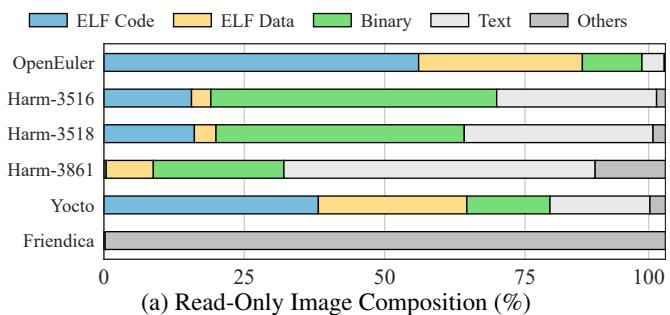

  
(b) ELF File Composition  
Figure 2: Demystifying Read-Only Image. Evaluated images are introduced in Table 1. ELF Code, ELF Data, and Binary are executable binaries, which usually occupy the most image capacity; Text includes scripts and configurations; Others include pictures, videos, audios, and tar packages.

Moreover, the container image (e.g., friendica [17]) has a special format [62, 67, 83] that mixes all types of data within tar packages. Therefore, Others occupies the most capacity. The Urgent Need for Image Reduction. Unfortunately, the image size inevitably grows larger due to system upgrades and increased features [1,14,18], whereas adapting to it could be expensive and exhausting. For example, larger embedded images require more expensive hardware, thus increasing production costs for billion-level IoT devices [28, 29]; Moreover, larger container images increase the startup latency of Docker services and become the performance bottleneck [80]. Therefore, even a slight improvement in the compression ratio can yield substantial benefits for read-only images, and how to shrink the image to a suitable size has become a popular topic [4, 9, 10]. As a result, the Linux community summarizes an array of techniques to solve the problem [21, 33, 34], including configuration options and application shrinkage.

However, applying these techniques one by one could be time-consuming and performance-sensitive, which demands a transparent solution to effectively reduce image size.

## 2.2 Read-Only File System

Read-Only File System Introduction. The read-only compressed file system [36, 66, 72, 77] is a promising solution to transparently shrink images. Unlike write-enabled file systems with compression support [13,16,35,45], it targets writeonce, read-many scenarios. By disallowing further writes, read-only file systems can construct a compact storage layout and maximize space utilization. Moreover, they also collaborate with block compression to further reduce image size.

Image Build Flow. Building a condensed and efficient readonly image is the main goal of read-only compressed file systems, and they share a similar build flow. As shown in Figure 3a, they first pack the files in a consecutive bitstream to avoid space waste (①). Then, they divide the bitstream into data blocks (②) and compress each block separately (③).

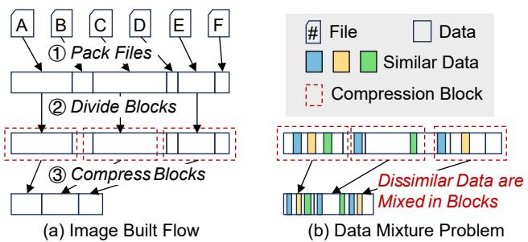  
Figure 3: Image Build Flow of Existing Read-Only FSes. They pack files and compress data in block granularity. However, the data mixture problem impairs the compression ratio.

Squashfs [36] and EROFS [72] are two read-only file systems that are still active in the industry. Their differences come from three aspects: 1. Squashfs compresses fixed-size data into variable-size blocks, while EROFS compresses data into fixed-size and page-aligned blocks to mitigate read amplification. 2. Squashfs supports file deduplication, while EROFS supports tail deduplication to remove the same data suffix of two files. 3. Squashfs supports metadata compression, while EROFS does not allow it due to performance concerns.

The Data Mixture Problem. However, compressing data with blocks cannot fully utilize the compression benefits, and the reason is data mixture. As shown in Figure 3b, when the bitstream is divided into blocks, each block mixes dissimilar data, and similar data are distributed into different blocks. Therefore, block compression cannot remove this redundancy. Moreover, block compression introduces read amplification by mixing data with different hotness. This issue is particularly severe on embedded devices, since limited memory increases block eviction, which in turn forces costly re-reads of blocks that were previously loaded but later discarded.

## 2.3 File System Block Compression

Why Compressing with Data Block? Dividing data into blocks is a trade-off between the compression ratio and file system performance. If directly compressing, the file system should load and decompress the entire image to obtain the required data. However, block division inevitably reduces the compression ratio, and existing works [36, 72] mitigate this problem by increasing the block size. In this paper, we treat direct compression (i.e., compression without block division) as a near upper bound of file system compression.

Compression Algorithm Classification. Compression algorithms can be roughly divided into two types: dictionary compression [23, 48, 63] and entropy compression [27, 47, 78].

The basic idea of dictionary compression is to remove repeated data strings, such as LZ4 [23] and FSST [63]. As shown in Figure 4, dictionary compression constructs a dictionary to find repeated data strings. Since the data string ‘ FAST, ’ is repeated, the second ‘ FAST, ’ is replaced by points that point to the first ‘ FAST, ’. Dictionary size is the maximum distance that repeated strings can be found. If the distance of two repeated strings exceeds the dictionary size, dictionary compression cannot remove their redundancy.

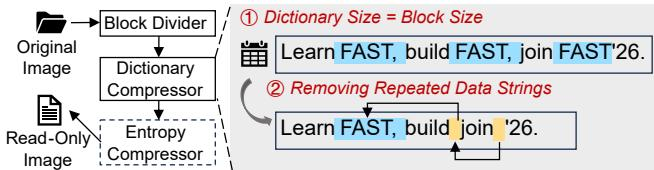  
Figure 4: Block Compression in Read-Only FSes. The original image is divided into blocks and compressed separately. Moreover, the dictionary compressor compresses data by removing repeated data strings, while the entropy compressor encodes data according to the symbol frequency.

Unlike dictionary compression, entropy compression compresses data through encoding [27,47,78]. For example, Huffman coding [27] considers the input data as a combination of one-byte symbols. To compress data, it calculates the frequency of symbols, encodes high-frequency symbols with short bits, and encodes low-frequency symbols with long bits.

Note that dictionary compression and entropy compression are two orthogonal compression algorithms. Therefore, combining these two techniques can further increase the compression ratio, such as ZSTD [40] and LZMA [38]. Moreover, this paper focuses on lossless compression, while lossy compression methods [46, 61, 71] are beyond its scope.

Generic Workflow. Figure 4 shows the generic workflow of file system block compression. Firstly, the block divider divides the input data into blocks. Then, the dictionary compressor compresses the blocks by removing repeated data strings. Finally, the entropy compressor encodes blocks to further reduce their size. Note that the dictionary size is usually configured to match the block size, and read-only file systems prefer dictionary compression over entropy compression.

## 3 Observation and Motivation

## 3.1 Observation on Block Compression

Experiment Setup. To demystify file system block compression, we conduct preliminary experiments on the openEuler image [11]. Moreover, the evaluated file system and compression algorithm are EROFS [72] and LZMA [38].

(1) We first analyze how block compression affects the compression ratio (Figure 5a), including dictionary compression and entropy compression (i.e., LZMA combines these two methods). Specifically, we configure the dictionary size of LZMA to 4 KB, 64 KB, and 1 MB, and observe the variation in the compression ratio as the block size increases.

(2) We then analyze whether data mixture impairs the compression ratio (Figure 5b). Specifically, we configure the dictionary size to be the same as the block size and observe the variation in the compression ratio. Moreover, we use EROFS to build images, where Data Mixed is built from the original data, while Data Sorted is built from the sorted image (i.e., data are divided into chunks and clustered by similarity).

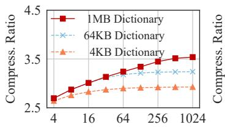  
Block Size (KB)

(a) Dictionary Compression Problem  
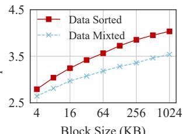  
(b) Sorting Optimization  
Figure 5: Observation on the Block Compression. Experiments are conducted on openEuler [11] with LZMA [38]. Results suggest that dictionary compression improves compression ratio with increased block and dictionary size, but cannot fully utilize compression benefits due to data mixture.

Observation 1: Dictionary Compression Accounts for the Main Benefit of the Increased Block Size. As shown in Figure 5a, when the dictionary size is 4 KB (i.e., LZMA’s dictionary compression is restricted, while entropy compression is as usual), the compression ratio exhibits slight improvement, despite increased block size. Therefore, entropy compression gets little benefit from the increased block size, and this paper mainly focuses on dictionary compression.

Observation 2: Dictionary Compression can Theoretically Remove All Redundancy among Intra-Block Similar Data. As shown in Figure 5a, the compression ratio only has a slight improvement when simply increasing the block size, and the dictionary size should also keep up with it. The reason is that the dictionary size represents the maximum distance that compression algorithms can search for repeated data. Therefore, a larger dictionary can identify similar data at a greater distance. When the dictionary size is equal to (or larger than) the block size, dictionary compression can theoretically remove all redundancy among intra-block similar data.

Observation 3: Dictionary Compression cannot Remove Redundancy among Inter-Block Similar Data due to Data Mixture, while Sorting can Solve the Problem. Although dictionary compression can theoretically remove all intra-block redundancy, the data mixture problem (Figure 3b) still exists to impair block compressibility. That is, dictionary compression will lose some compression benefits if dissimilar data are in the same block, whereas similar data are distributed across blocks. Fortunately, the problem can be solved by sorting before compression. As shown in Figure 5b, the compression ratio of Data Sorted is consistently higher than that of Data Mixed, regardless of the block size. Therefore, sorting is a promising solution to further reduce image size.

## 3.2 Motivation: Sort-Enhanced Compression

Sort-Enhanced Compression. According to the above observations, we are motivated to address the data mixture problem of block compression via sort-enhanced compression, therefore constructing condensed file system images.

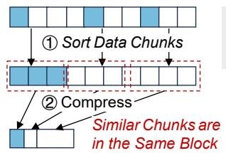  
(a) Sort-Enhanced Compression

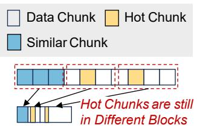  
(b) Performance Challenge  
Figure 6: Sort-Enhanced Compression. By sorting and clustering similar data chunks within a block, block compression can fully utilize the dictionary compression benefits to build condensed read-only images. Nevertheless, sorting still suffers from performance and mismatch challenges.

As shown in Figure 6a, sort-enhanced compression ensures that similar data are clustered within the same block to improve compressibility, which can be easily integrated into existing read-only file systems [36, 66, 72, 77]. Moreover, generic data compression can also benefit from it if the compressed data size is much larger than the dictionary size (i.e., the distance of similar data is larger than the dictionary size). Fortunately, compression algorithms usually restrict the dictionary size for performance and memory concerns. For example, LZ4 has a 64 KB dictionary [23], while XZ (using LZMA [2]) has a 64 MB dictionary for compression level 9. Challenges. Nevertheless, integrating sort-enhanced compression into read-only file systems is non-trivial. The challenge is that sorting is ill-suited for the original image generation workflow, resulting in mismatch and performance issues.

Challenge 1: Sorting Does not Match Read-Only File Systems. Existing similarity detection [69, 81] and sorting [75] algorithms target backup storage scenarios [60,73,74,84,85] to process large-scale data. Therefore, these techniques are mismatched for relatively small and performance-sensitive readonly file systems. For example, Finesse [81] and Odess [69] are two popular similarity detection algorithms. However, they can only find data chunks (i.e., the basic sort unit) that are highly similar, while read-only file systems can also benefit from clustering and compressing chunks that are partially similar. Although Palantir [51] mitigates the problem through hierarchical similarity detection, it still follows the traditional fine-grained deduplication workflow [49, 50, 54] to detect whether two chunks are similar or not; however, it does not quantify the similarity value between two data chunks.

Challenge 2: Poor Runtime Performance due to Sorting and Block Compression. Compressing data with large blocks (e.g., 1 MB) suffers from severe read amplification due to the random access property of real-world workloads [55, 72], and the problem could be more serious when sorting data by similarity, as shown in Figure 6b. Specifically, sorting can only reserve locality within a data chunk, leaving the inter-chunk sequence unpredictable. Unpredictable read amplification is a latent issue that hinders the practical usage of file systems.

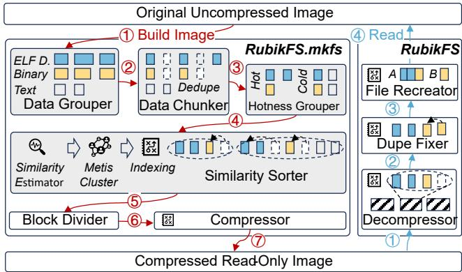  
Figure 7: RubikFS Overview. RubikFS consists of a userspace image builder (RubikFS.mkfs) and a kernel file system. The major components (colored grey) are data grouper, data chunker, hotness grouper, and similarity sorter.

Challenge 3: Long Image Build Time due to Sorting. To sort the data by similarity, we should calculate the similarity between all chunks, and the computational complexity could be $O ( N ^ { 2 } \times M ^ { 2 } )$ . N is the number of chunks, while M is the size of the chunks. It takes $O ( M ^ { 2 } )$ to quantify the similarity of two chunks and $O ( N ^ { 2 } )$ for $N \times ( N - 1 ) / 2$ chunk pairs. Therefore, sort-enhanced compression significantly increases build time and memory overhead, especially for large images.

## 4 RubikFS Design

We propose RubikFS, a sort-enhanced read-only file system. This paper aims to integrate sort-enhanced compression into read-only file systems to construct condensed and efficient images, while the other components remain unchanged.

## 4.1 Overview

RubikFS Components. Figure 7 shows the overview of RubikFS, which consists of four main components (colored grey) to overcome three challenges introduced in §3.2. Specifically, (1) data grouper pre-groups data of the same type to accelerate image generation (Challenge 3, §4.2); (2) data chunker divides data into chunks and deduplicates replicas (Challenge 1, §4.3); (3) hotness grouper groups hot chunks to mitigate read amplification (Challenge 2, §4.4); (4) similarity sorter calculates chunk similarity and sorts them by similarity (Challenge 1 & 3, §4.5). Moreover, RubikFS also generates indexing to recover file data from sorted chunks (§4.6).

Image Generation Workflow. As shown in the left part of Figure 7, RubikFS.mkfs transforms the original file system image into the compressed read-only image in seven steps. First, the image data are divided into several groups (according to Figure 2a) and processed separately to accelerate image generation (①). Then, the data chunker divides the data into chunks (i.e., the basic sort unit) and deduplicates replicas to shrink the image size (②). To mitigate the read amplification problem, hotness grouper further groups chunks into hot and cold subgroups (③). After that, similarity sorter sorts chunks in each subgroup through similarity and packs all chunks into a single data stream (④). Subsequently, RubikFS follows the traditional image generation workflow to divide the data stream into blocks (⑤) and compresses blocks separately (⑥). Finally, RubikFS constructs a sort-enhanced image (⑦).

Data Access Workflow. As shown in the right part of Figure 7, RubikFS reads the file data in three steps, which depend on indexing (generated by similarity sorter and compressor) to recreate the files. Specifically, decompressor first leverages indexing to load and decompress related compression blocks (①). Then dupe fixer leverages indexing to locate physical position of duplicate chunks (②). After that, file recreator leverages indexing to recreate file data from sorted chunks (③). Finally, file data can be normally accessed (④).

## 4.2 Data Grouper

Why Pre-Group Data Through Type? RubikFS significantly increases the image build time due to complex similarity calculation (§3.2). In this section, we attempt to address the problem by decreasing the number of calculations, while §4.5 further decreases the overall complexity. Our key insight is that data of the same type are more prone to be similar, while different types of data usually do not have repeated data strings. Therefore, to accelerate image generation, we pre-group the image data by their types and process each group separately. Data Grouper Details. We follow Figure 2a to group the image data into five types, and their details are as follows:

• ELF Code. ELF code contains the ELF header and .text section to store the program code. Since ELF header is located at the beginning of the file with a magic number, we identify whether a file is an ELF file by reading and comparing the magic number.

• ELF Data. ELF code contains .rodata, .data, and .bss sections to store the program data. To divide an ELF file into ELF code and ELF data, we choose .rodata section as the cut point, which can be easily located by libelf. Moreover, RubikFS can also cut other binaries that have a structured file format (e.g., PE [32]).

• Binary. It contains executable binaries that are not in ELF format. Therefore, if a file is an executable binary and does not have the ELF header, we identify it as the binary type.

• Text. The text group consists of readable scripts and configuration files. We identify a file as text if it has a typical file extension (e.g., .txt, .js, and .lua). Moreover, a file with > 90% printable characters (i.e., satisfying C function isprint() or isspace()) is also considered as text.

• Others. The others group contains other file types, such as pictures, videos, audios, and tar packages. We identify them by file extensions (e.g., .svg, .png, and .mp4).

Discussion on the Impact of Compression Ratio. Although pre-group reduces the image build time, it can potentially decrease the compression ratio. That is, similar data from different groups are not sorted and compressed together. However, our sensitive analysis (§6.6) suggests that this risk is negligible, demonstrating the effectiveness of data grouper.

## 4.3 Data Chunker

Fixed-Size Chunking or Content-Defined Chunking? Research on data deduplication [70] suggests that fixed-size chunking (FSC) suffers from the boundary-shift problem. That is, if one or several bytes are inserted at the beginning of a file, all cutpoints declared by FSC will be shifted, and therefore no duplicate chunks will be detected. To this end, content-defined chunking (CDC) is proposed to solve the problem by declaring chunk boundaries based on the byte contents of the data stream, resulting in variable chunk sizes.

However, the variable chunk size of the CDC worsens the worst-case performance. For example, suppose that there is a 16 KB file File A, and CDC splits the file into two chunks with 3 KB and 13 KB size. When an application sends a request to read the first 4 KB page of File A, the file system should read the two page-unaligned chunks to get the required page, resulting in read amplification. Even worse, the read amplification problem can be more serious if the two chunks are placed into different and large compression blocks.

Therefore, we use FSC as our default choice due to concerns about worst-case performance. Moreover, similarity sorter (§4.5) can compensate for the FSC deficiency by grouping and compressing partially similar chunks caused by FSC. Chunk Size Configuration. Configuring an appropriate chunk size can also be challenging. In general, a small chunk size helps RubikFS find more duplicate chunks and sort chunks in a more fine-grained manner, but it also breaks data sequentiality and increases metadata overhead. In contrast, a large chunk size preserves data sequentiality but impairs compressibility.

To this end, we configure the chunk size to be related to the block size, thus balancing the compression ratio and the data locality. We then conduct extensive experiments to find the optimal configuration. Our insight is to find the maximum chunk size that can still maintain a high compression ratio, and the result is Equation 1. Specifically, the chunk size is configured to be 1/16 of the block size by default. For block sizes less than 64 KB, 1/16 block size makes the chunk size smaller than the 4 KB page; thus, we set them to 4 KB to maintain page locality. Moreover, our sensitive analysis in §6.6 demonstrates the effectiveness of our configuration.

$$
C h u n k S i z e = m i n ( 4 K B , B l o c k S i z e / 1 6 )\tag{1}
$$

Full Dedupe or Tail Dedupe? When the data chunker completes chunking, RubikFS then removes the duplicate chunks by deduplication. Existing read-only file systems have two candidate deduplication strategies: full deduplication [36] and tail deduplication [72]. Specifically, full deduplication removes duplicate data only when the two chunks (or files) are the same; tail deduplication removes duplicate data in a more fine-grained manner: as long as the two chunks (or files) share the same suffix, resulting in variable chunk size.

We choose full deduplication as the default configuration for simplicity and efficiency. Although tail deduplication can remove more duplicate data, it worsens the worst-case performance for partially deduplicated but page-unaligned chunks. Moreover, our sensitive analysis (§6.6) suggests that similarity sorter can compensate for the full deduplication by clustering partially similar chunks, therefore achieving a compression ratio similar to that of the tail deduplication.

## 4.4 Hotness Grouper

Definition of Hotness. RubikFS attempts to address Challenge 2 (§3.2) and sustain high runtime performance by grouping chunks according to their hotness. The hot data is defined as data accessed during system startup. This definition aligns with the access pattern of embedded systems, where the vast majority of reads occur during startup, and runtime accesses rarely incur additional I/Os because most data have already been prefetched and cached during initialization [57].

Tracing Hot Chunks. RubikFS exposes a flexible interface, –trace=trace.txt, to ingest and process hot-chunk information. The trace file trace.txt adopts a simple structured format, (file\_path, offset, size), to precisely describe the location of accessed chunks. This design works well in embedded environments, where applications and I/O patterns are typically deterministic due to their fixed usage scenarios.

A key challenge is accurately capturing hot chunks. Since general I/O tracing is outside the scope of RubikFS, we only provide a practical approach consistent with prior works [55, 58, 79]. Specifically, we (1) kprobe the readpage interface to capture the file name and offset of accessed pages; (2) deploy and run the image until the system reaches steady state, ensuring that hot code and data have been fully loaded; and (3) parse the collected logs into the trace.txt file.

Grouping Hot Chunks into Subgroups. With trace.txt, data groups can be further divided into hot and cold subgroups, allowing separate processing of chunks according to their hotness. Moreover, hotness grouper has good scalability. Although it currently splits a group into only two subgroups, hotness grouper can be scaled to support multiple subgroups, thus satisfying different deployment requirements.

Discussion on the Impact of Compression Ratio. Similar to data grouper, hotness sorter can also lose potential compression benefits if similar data are distributed across hot and cold subgroups. However, our sensitive analysis (§6.6) suggests that the reduction of the compression ratio is negligible, but the speedup of runtime performance is significant (§6.4).

## 4.5 Similarity Sorter

Generic Workflow of Similarity Sorter. As shown in Figure 8, similarity sorter sorts the chunks in five steps: (a) First, RubikFS calculates the features for each chunk (e.g., Chunk A has features f1, f2, and f3, and in reality it contains more). (b) Then, RubikFS generates a similarity graph to measure the chunk similarity, where nodes represent the chunks, and edges represent the similarity between two chunks. For example, the edge value between nodes A and B is 0.67 because Chunk A and B have two identical features. (c) To cluster similar chunks, RubikFS partitions the graph into subgraphs, where each subgraph clusters similar data chunks. (d) Next, RubikFS sorts the inter-subgraph and intra-subgraph chunks via similarity. (e) Finally, RubikFS packs all data chunks into a data stream and generates indexing to recover the files.

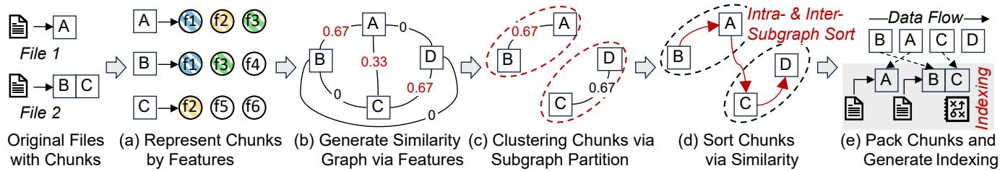  
Figure 8: Similarity Sorter Workflow. RubikFS generates a similarity graph to quantify chunk similarity. Then, it clusters similar chunks by partitioning the graph into numerous subgraphs. The success metric of the subgraph partition is that, edges (i.e., chunk similarity) of each single subgraph are at high values, while edges across two subgraphs are at low values.

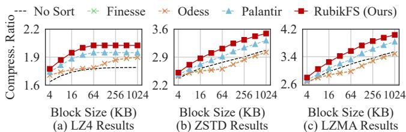  
Figure 9: Feature Extraction Algorithm Comparasion. Experiments are conducted on openEuler [11]. Results show that simply applying existing feature-extraction algorithms offers little benefit (i.e., compression ratio is similar to No Sort), highlighting the need for a dedicated algorithm.

Algorithm 1: Feature Extraction in RubikFS   
Input: Chunk In, Chunk Size N, Sampling Rate P,   
Gear Matrix Matrix   
Output: Feature Array Features   
1 max\_hash ← 0;   
2 gear\_hash ← 0;   
3 for i = 0 to N − 1 do   
4 gear\_hash ← (gear\_hash ≪ 1) + Matrix[In[i]];   
5 if gear\_hash > max\_hash then   
6 max\_hash ← gear\_hash;   
7 if (i + 1) mod 1/P = 0 then   
8 Features.append(max\_hash);   
9 max\_hash ← 0;

(a) Representing Chunks by Features. To measure the similarity between two data chunks, we represent each chunk as several features. Therefore, calculating the similarity of chunks can be seamlessly transformed into examining whether two data chunks share identical features, which is a common paradigm in the backup storage scenario [54, 74].

Deficiency of Existing Feature Extraction Algorithms. We first study whether existing works can efficiently detect the chunk similarity. Specifically, we conducted experiments with three representative algorithms, Finesse [81], Odess [69], and Palantir [51], to sort and compress chunks by fine-grained deduplication [49, 50, 54, 74]. We also evaluate No Sort as our baseline. The results are shown in Figure 9, where the compression ratios of Finesse and Odess are close to No Sort, Palantir slightly improves the compression ratio, and RubikFS (Ours) consistently achieves the highest compression ratio.

We then demystify the root cause of their deficiency. We find that (1) Finesse and Odess can only identify data chunks with high similarity, but cannot identify partially similar chunks because they are designed for traditional fine-grained deduplication. However, read-only file systems can also benefit from partially similar chunks by clustering and compressing them together. (2) Palantir can identify some partially similar chunks through hierarchical similarity detection, but still fails to minimize the image size because it can only identify whether two chunks are similar or not (i.e., similarity value is 0 or 1, following the fine-grained deduplication). However, quantifying the similarity value (i.e., 0∼1) and sorting chunks by this value can further improve the compression ratio.

Our Solution. As shown in Algorithm 1, we modify the feature extraction algorithm to fit RubikFS, and the main difference is the number of features. That is, Finesse and Odess only construct three super-features for each chunk (up to 12 for Palantir), while ours is related to the sampling rate. Specifically, RubikFS continues to scan the data chunk at the one-byte level and calculate the hash value gear\_hash (lines 3-4). Every time the scanned data size reaches the reciprocal of sampling rate (i.e., 1/P), RubikFS appends the maximum value of gear\_hash as a new feature (lines 5-9). Therefore, each feature in RubikFS represents 1/P bytes of data. If two data chunks have an identical feature, they have 1/P bytes of similar data. Note that we use gear hash [68] without N-Transform [41,42] because we find that ours can efficiently detect chunk similarity, but N-Transform significantly increases computational overhead due to linear transformations.

Configuration of Sampling Rate. In general, a higher sampling rate enables RubikFS to extract more features and find more fine-grained similarity. However, the increased number of features can also significantly increase the image build time and memory overhead. Thus, we conduct extensive experiments to find the optimal P, that is, the minimum P without reducing the compression ratio. Finally, we configure it to 1/128 by default, and the sensitive analysis is shown in §6.6. 1/128 by default, and the sensitive analysis is shown in §6.6.

(b) Generating Similarity Graph via Features. When the chunks are represented by features, we then construct a similarity graph to quantify the similarity between all chunks. Specifically, each node in the graph represents a chunk, while the edge between two nodes represents their similarity, whose value ranges from 0 to 1. However, the similarity value in fine-grained deduplication [51, 69, 81] can be only 0 or 1.

Similarity Calculation. We calculate the chunk similarity using Equation 2. That is, the similarity between two data chunks is the proportion of their identical features in their total number of features. Taking Figure 8a as an example, Chunk A and Chunk B have a total of six features, and they share identical features f1 and f2. Therefore, the chunk similarity between Chunk A and Chunk B is $2 \times 2 / 6 = 0 . 6 7$

$$
S i m i l a r i t y = I d e n t i c a l F e a t u r e s / T o t a l F e a t u r e s\tag{2}
$$

Reducing Computational Complexity. We construct a hash table to scatter the features, where each bucket has identical features shared by similar chunks. Therefore, the graph generation is optimized to scan hash table buckets and update the similarity value for chunks in each bucket. The complexity decreases from $O ( N ^ { 2 } \times M ^ { 2 } )$ to $O ( T _ { 1 } ^ { 2 } + T _ { 2 } ^ { 2 } + \ldots + T _ { k } ^ { 2 } )$ , where N is the number of chunks, M is the size of the chunk, k is the bucket number, and $T _ { k }$ is the feature number in each bucket. If k > N and the features are evenly distributed in k buckets, the complexity is reduced to $k \times O ( ( N / k ) ^ { 2 } ) = O ( N )$

(c) Clustering Chunks via subgraph Partition. When the similarity graph is constructed, the task of clustering similar chunks can be naturally formulated as a subgraph partitioning problem, where each subgraph represents a similarity cluster.

The Goal of Subgraph Partition. To cluster similar chunks within a subgraph, the edges stored in each subgraph should be of high value (i.e., high similarity), while the edges across two subgraphs should be of low value. Take Figure 8c as an example, Chunk A and Chunk B are partitioned into the same subgraph because they have two identical features (i.e., the similarity value is 0.67). In contrast, the similarity between Chunk A and Chunk C is only 0.33; therefore, they are not partitioned into the same subgraph. Note that fine-grained deduplication can be formulated as the subproblem of our subgraph partition, where the edge value is only 0 or 1.

METIS for Subgraph Partitioning. We use the METIS algorithm [39] to partition subgraphs. Specifically, METIS is a widely used software package designed to partition large and irregular graphs, meshes, and networks. The goal of graph partitioning is to divide a graph into a predefined number of balanced subgraphs while minimizing the edge cut (i.e., edges that are across two subgraphs). Therefore, METIS can cluster similar chunks by removing the cross-subgraph edges.

Reducing the Computational Complexity. The METIS complexity is $O ( V + E )$ , where V is the number of nodes (i.e., data chunk), and E is the number of edges. Therefore, if the constructed similarity graph is a complete graph (i.e., every two nodes have an edge, and $E = V \times ( V - 1 ) / 2 )$ , the computational complexity can be up to $O ( V ^ { 2 } )$ . Since the 0-value edge usually accounts for the largest proportion in all edges, we remove them from the similarity graph to accelerate subgraph partitioning. As a result, the complexity can be reduced to $O ( V )$ if the chunks share only a few identical features.

Configuration of the Subgraph Size. Partitioning the number of chunks assigned to each subgraph also affects the compression ratio, and we set the subgraph size to 64 by default. Moreover, our sensitive analysis (§6.6) suggests that our default subgraph size achieves a slight improvement in the compression ratio compared to other configurations.

(d) Sorting Chunks via Similarity. Clustering data chunks by similarity is not the end, we should also decide their sequence by sorting. Specifically, RubikFS sorts the data chunks into two phases, as shown in Figure 8d. (1) For intra-subgraph sorting, we place chunks with the most identical features at the front, allowing subsequent chunks to eliminate redundant data strings based on them. Therefore, we follow Equation 2 to calculate the similarity between a chunk and all other chunks. Then, we sort the chunks in the subgraph through their similarity. (2) The inter-subgraph sorting workflow is also similar. We follow Equation 2 to calculate the similarity between a subgraph and all other subgraphs, where a subgraph’s features are formed by aggregating the features of its chunks. With the two sortings, all data chunks are sorted by similarity.

(e) Packing Chunks and Generating the Indexing. Finally, RubikFS packs data chunks into a data stream and generates indexing to recover files from the data stream, as shown in Figure 8e. Specifically, with indexing, RubikFS can locate the actual position of the deduplicated data chunks, recreate file data by reorganizing the sorted data chunks, and provide transparent data access for upper-layer applications.

## 4.6 File System Indexing

Since sort changes the storage layout, RubikFS should use indexing for recovery. RubikFS directly reuses existing indexes to construct indexing, and the major difference between indexing and traditional indexes is the number (note that compression metadata are not considered). Specifically, existing read-only file systems [36, 72] allocate one index for each file because the file data are stored sequentially. However, RubikFS divides the file data into chunks and sorts them by similarity. Therefore, RubikFS slightly increases the index overhead, but the file system read path remains unchanged. Each chunk requires a 12 B index entry (original file offset, packed file offset, chunk size), which yields a storage overhead of 0.018%–2.93%, depending on the chunk size (Equation 1). Moreover, chunk features add no storage overhead because they are directly discarded once similarity sorting completes.

## 5 RubikFS Implementation

We implement RubikFS with a userspace image builder (i.e., RubikFS.mkfs) and a kernel file system. RubikFS is implemented based on EROFS [72] and modifies \~3.5K lines of code (LoC) to integrate sort-enhanced compression. Specifically, RubikFS.mkfs is based on erofs-utils 1.8.10 [72], a userspace tool to build, analyze, and check the correctness of the image. Moreover, RubikFS is based on the EROFS source code of Linux 6.16 [22] and has minimal modifications.

RubikFS.mkfs leverages -Esort to control whether sortenhanced compression is enabled. If not, RubikFS returns to the original EROFS workflow to build images. Similar to EROFS, RubikFS utilizes customized compression algorithms to compress data into fixed-size and page-aligned blocks. For example, xz-uilts [38] began to support the fixed-size compression block after its 5.0.0 release, and developers can utilize this feature through the library liblzma. Currently, RubikFS.mkfs only supports three widely used compression algorithms, LZ4 [23], ZSTD [40], and LZMA [38]. However, any compression algorithms that support fixed-size compression blocks can be seamlessly integrated into RubikFS.

## 6 Evaluation

Our experiments aim to answer the following questions:

• Does RubikFS improve the compression ratio? (§6.2)

• How do data chunker and similarity sorter contribute to the overall improvement in compression ratio? (§6.3)

• Can hotness grouper mitigate read amplification? (§6.4)

• Can data grouper accelerate image building? (§6.5)

• Does RubikFS choose appropriate configurations? (§6.6)

## 6.1 Evaluation Setup

Testbed. Experiments about RubikFS.mkfs are carried out on a server with a 32-core CPU and 128 GiB DRAM, running on Linux kernel 4.18. Experiments about RubikFS are carried out on FEMU [52], a QEMU-based NVMe SSD emulator that has been widely used in storage system research. The page size is configured to 4 KB, while the page read latency is configured to 75 µs, according to the embedded chip MT29F16G08CBACA [26]. Other configurations remain as default. To emulate embedded devices, FEMU runs on QEMU with 2 CPU cores, 1 GiB DRAM, and Linux kernel 6.16. Note that FEMU offers an effective and reproducible environment for measuring compression ratio and read amplification, which is sufficient for our study.

Evaluated Images. As shown in Table 1, we conduct experiments on six open source images, including an embedded kernel (i.e., openEuler [11]), four production-ready board images (i.e., Harm-3516, Harm-3518, Harm-3861, and Yocto [3, 30, 31]), and a container image (i.e., Friendica [17, 37]), to show the generality of RubikFS.

Compared File Systems. We compare with EROFS [72] and Squashfs [36], two representative read-only file systems that are still active in the industry. Due to the different compression strategies (§2.2), the Squashfs block size is the size before compression, while the RubikFS and EROFS block size is the size after compression. Moreover, we also compare with Direct, which uses the compression algorithm to directly compress images without the block division.

Table 1: Images Used in the Evaluation. The first five are embedded images, while Friendica is a container image.
<table><tr><td rowspan=1 colspan=1>Image</td><td rowspan=1 colspan=1>Size</td><td rowspan=1 colspan=1>Description</td></tr><tr><td rowspan=1 colspan=1>OpenEuler[11]</td><td rowspan=1 colspan=1>155 MB</td><td rowspan=1 colspan=1>An embedded image developedby the openEuler community.</td></tr><tr><td rowspan=1 colspan=1>Harm-3516[30,31]</td><td rowspan=1 colspan=1>667 MB</td><td rowspan=1 colspan=1>An image deployed on Hi3516 [19],developed by openHarmony.</td></tr><tr><td rowspan=1 colspan=1>Harm-3518[30,31]</td><td rowspan=1 colspan=1>440 MB</td><td rowspan=1 colspan=1>An image deployed on Hi3518 [6],developed by openHarmony.</td></tr><tr><td rowspan=1 colspan=1>Harm-3861[30,31]</td><td rowspan=1 colspan=1>42 MB</td><td rowspan=1 colspan=1>An image deployed on Hi3861 [20],developed by openHarmony.</td></tr><tr><td rowspan=1 colspan=1>Yocto[3]</td><td rowspan=1 colspan=1>374 MB</td><td rowspan=1 colspan=1>A rootfs image target STM32MP1[7], developed by the Yocto project.</td></tr><tr><td rowspan=1 colspan=1>Friendica[17,37]</td><td rowspan=1 colspan=1>771 MB</td><td rowspan=1 colspan=1>A container image with 5M+ pulls,the version number is 2024.12.</td></tr></table>

Compression Algorithms & Configurations. We evaluate three popular compression algorithms on top of RubikFS: LZ4 1.8.3 [23], ZSTD 1.4.4 [40], and LZMA 5.4.1 [38]. The compression level is configured to the highest level, that is, level 9 for LZ4, level 22 for ZSTD, and level 9 for LZMA. Nevertheless, this does not increase decompression overhead because the cost is largely insensitive to the compression level [24]. The ZSTD and LZMA dictionary sizes are configured to be the same as the block size. However, the LZ4 dictionary size is configured to be 64 KB for all block sizes, where 64 KB is the default and maximum configuration.

## 6.2 Compression Ratio Improvement

Evaluation Setup. We first evaluate whether RubikFS improves the compression ratio. Specifically, experiments are conducted on six images with three compression algorithms. we compare RubikFS with EROFS, Squashfs, and Direct. In addition, the evaluated block sizes range from 4 KB to 1 MB. Compression Ratio Analysis. The results are shown in Figure 10, where the compression ratio of RubikFS is consistently higher than that of EROFS and Squashfs. The much higher compression ratio demonstrates the effectiveness of sort-enhanced compression. Notably, RubikFS even surpasses Direct on Harm-3516, Harm-3518, and Harm-3861. In these cases, RubikFS can cluster similar data that are physically far apart in their original images, enabling the compressor to remove redundant data strings that direct compression fails to exploit. This phenomenon is more obvious for the LZ4 compressor, where the dictionary size is only 64 KB, and therefore sort-enhanced compression has more significant effects.

Moreover, we can also observe that, in Figure 10p, the compression ratio of EROFS increases suddenly when the block size increases from 512 KB to 1 MB. The reason is that Harm-3816 is a small image (i.e., 42 MB) and therefore, the physical distances of similar data are close to each other. As a result, EROFS can compress similar data together with the 1 MB block size. However, Squashfs has a much smaller compression ratio because its block size is before compression, which is smaller than that of EROFS (i.e., after compression).

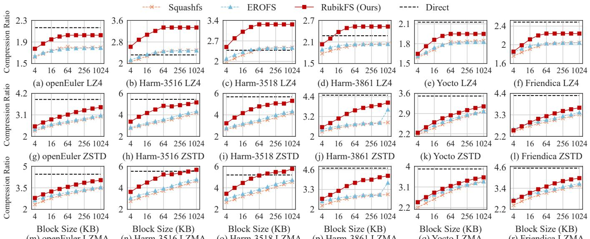  
Figure 10: Compression Ratio Results. Experiments are conducted on six images with three compression algorithms. Compared read-only file systems are Squashfs and EROFS. Moreover, Direct uses compression algorithms to directly compress images.

## 6.3 Compression Ratio Breakdown

Evaluation Setup. We then evaluate how data chunker and similarity sorter contribute to improving the compression ratio. Specifically, the experimental configurations are similar to §6.2, where Baseline builds the image without sorting; Data Chunker-Only deduplicates duplicate chunks; Data Chunker + Naive Sorter integrates fine-grained deduplication into readonly file systems, which uses Palantir [51] to maximize the compression ratio with a total of 12 super-features. RubikFS sorts chunks through our proposed subgraph partitioning.

Breakdown Analysis. The results are shown in Figure 11, where we can observe three phenomena. (1) First, the compression ratio improvement of data chunker is image sensitive, while similarity sorter improves the compression ratio for all the evaluated images. The reason is that data chunker can only remove the chunk-level redundancy, while similarity sorter can remove more fine-grained redundancy by sorting and compressing similar chunks together. (2) Second, the compression ratio of LZ4 remains stable when the block size is larger than 64 KB. Because the maximum dictionary size of LZ4 is 64 KB, LZ4 can find similar data within only a physical distance of less than 64 KB, whereas using a block size larger than 64 KB does not improve the compression ratio. (3) The compression ratio improvement of Data Chunker + Naive Sorter is unstable and sometimes even results in negative gains (i.e., smaller than that of Data Chunker-Only).

## 6.4 Read Amplification Analysis

Evaluation Setup. We evaluate whether the hotness grouper effectively mitigates read amplification. Experiments are conducted on openEuler [11] with a block size of 1 MB. We generate two trace files corresponding to 12% (18.07 MB)

Table 2: Read Amplification Analysis w/ and w/o Hotness Grouper. Experiments are conducted on openEuler [11] with 1 MB block sizes and 12%/40% hot data. RubikFS and w/o represent RubikFS with and without the hotness grouper.
<table><tr><td rowspan=2 colspan=2>Config.</td><td rowspan=2 colspan=1>Comp.</td><td rowspan=1 colspan=4>File System</td></tr><tr><td rowspan=1 colspan=1>RubikFS</td><td rowspan=1 colspan=1>w/o</td><td rowspan=1 colspan=1>EROFS</td><td rowspan=1 colspan=1>Squashfs</td></tr><tr><td rowspan=2 colspan=1>[110nth %ss</td><td rowspan=1 colspan=1>Time(s)</td><td rowspan=1 colspan=1>LZ4ZSTDLZMA</td><td rowspan=1 colspan=1>1.211.633.72</td><td rowspan=1 colspan=1>2.883.039.40</td><td rowspan=1 colspan=1>2.892.999.15</td><td rowspan=1 colspan=1>3.464.009.09</td></tr><tr><td rowspan=1 colspan=1>ReadSize(MB)</td><td rowspan=1 colspan=1>LZ4ZSTDLZMA</td><td rowspan=1 colspan=1>16.4113.3710.13</td><td rowspan=1 colspan=1>55.7236.6031.02</td><td rowspan=1 colspan=1>56.0034.8929.87</td><td rowspan=1 colspan=1>45.1325.6221.58</td></tr><tr><td rowspan=2 colspan=1>s00lh % tb</td><td rowspan=1 colspan=1>Time(s)</td><td rowspan=1 colspan=1>LZ4ZSTDLZMA</td><td rowspan=1 colspan=1>3.023.036.34</td><td rowspan=1 colspan=1>4.373.8811.01</td><td rowspan=1 colspan=1>4.854.3011.75</td><td rowspan=1 colspan=1>5.576.3913.84</td></tr><tr><td rowspan=1 colspan=1>ReadSize(MB)</td><td rowspan=1 colspan=1>LZ4ZSTDLZMA</td><td rowspan=1 colspan=1>32.1524.3920.82</td><td rowspan=1 colspan=1>72.7141.6035.00</td><td rowspan=1 colspan=1>75.4644.8839.47</td><td rowspan=1 colspan=1>66.8640.1434.83</td></tr></table>

and 40% (52.55 MB) hot data. The 12% configuration reflects typical hot data ratios observed in prior work [65] and in our deployment experience (10%–15%), while the 40% configuration represents an extreme case to evaluate whether hotness grouper impacts the overall compression ratio.

To construct the traces, we randomly select hot files. For small files (i.e., ≤ 64 KB), the entire file is marked as hot; for large files, hot data consist of randomly sampled pages. We adopt a 1 MB block size because it exhibits the strongest read amplification, making it the most challenging case for evaluation. Since the benefit of hotness grouping is straightforward, we report only the openEuler results for space efficiency.

Read Amplification Analysis. The results are shown in Table 2, where we can observe four phenomena:

(1) First, RubikFS consistently has the least runtime and data read size compared to EROFS and Squashfs. With hotness grouper, RubikFS groups hot data to minimize read amplification, therefore decreasing runtime by up to 65.03%.

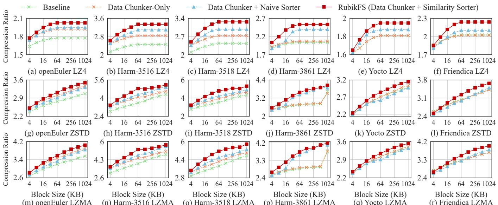  
Figure 11: Compression Ratio Breakdown. Baseline builds images via compression; Data Chunker-Only removes duplicate chunks; Naive Sorter sorts chunks by fine-grained deduplication; Similarity Sorter sorts chunks through subgraph partitioning.

(2) RubikFS still reads a bit more data due to the intrinsic properties of its baseline EROFS. Specifically, openEuler only has 18.07 MB hot data for the 12% hotness trace file, but RubikFS reads the data more than the theoretical value. That is, the compression ratio of LZ4 is 2.03× for openEuler (Figure 10), while the total read size of RubikFS is 16.40 MB. This phenomenon can also be observed in EROFS, which consistently reads more data than Squashfs. The reason is that EROFS optimizes performance with prefetch (i.e., z\_erofs\_readahead) and batch read (i.e., z\_erofs\_pcluster\_readmore). Although we have already disabled prefetch to avoid unnecessary reads, the batch read is preserved because it is necessary to improve runtime performance at the cost of reading a bit more data.

(3) Sorting does not worsen read amplification, while block compression is still the performance bottleneck in RubikFS. w/o represents RubikFS without hotness grouper, and its runtime and read size are comparable to those of EROFS. Therefore, the performance bottleneck remains block compression, and sorting only exacerbates the unpredictability.

(4) The decompression latency significantly affects the total runtime. Although LZ4 reads the most data due to its relatively low compression ratio, it still has a shorter runtime due to its low decompression latency. In contrast, LZMA reads the least data, but still has the longest runtime. Therefore, selecting an appropriate compression algorithm is the primary factor in meeting real-time requirements, whereas other configurations (e.g., compression level and block size) play a comparatively minor role, despite their impact on improving compression ratio. Moreover, RubikFS does not require high-end CPUs under any of these configurations (§7).

Table 3: Image Build Time w/ and w/o Data Grouper. Experiments are conducted on LZMA and 1 MB block size. Note that we do not show other configurations because they have a similar trend. That is, they only influence the compression time, but the additional sorting time is the same. No Sort builds images without sorting; RubikFS and No Grouper represent sorting chunks with and without data grouper.

<table><tr><td rowspan="2">Image</td><td colspan="3">File System</td></tr><tr><td>No Sort</td><td>No Grouper</td><td>RubikFS</td></tr><tr><td>openEuler</td><td>40.89 s</td><td>+ 1.90 s</td><td>+0.84 s</td></tr><tr><td>Harm-3516</td><td>163.11 s</td><td>+ 287.88 s</td><td>+ 208.37 s</td></tr><tr><td>Harm-3518</td><td>126.69 s</td><td>+ 180.45 s</td><td>+ 140.81 s</td></tr><tr><td>Harm-3861</td><td>12.69 s</td><td>- 1.05 s</td><td>- 1.78 s</td></tr><tr><td>Yocto</td><td>84.73 s</td><td>+ 16.44 s</td><td>+4.21 s</td></tr><tr><td>Friendica</td><td>212.26 s</td><td>+ 29.06 s</td><td>+ 18.71 s</td></tr></table>

## 6.5 Image Build Time

Evaluation Setup. In this section, we evaluate whether data grouper decreases the image build time. Specifically, we build images with LZMA and 1 MB block size. Moreover, No Sort builds the image without sorting; RubikFS and No Grouper represent RubikFS with and without data grouper.

Build Time Analysis. The results are shown in Table 3, where RubikFS consistently decreases the build time compared to No Grouper. Moreover, we can observe that: (1) data grouper significantly decreases the sorting time for large images with high similarity, such as Harm-3516 and Harm-3518, because data are pre-grouped into small groups (§4.2). (2) similarity sorter decreases the sorting time for images with low similarity. For example, Yocto and Friendica have a much lower compression ratio and fewer identical features compared to Harm-3516 and Harm-3518 (Figure 10). Therefore, the computational complexity of the graph generation and subgraph partition is reduced by similarity sorter (§4.5), and the two images have a small sorting time even without data grouper. (3) Sorting can speed up small image generation. Harm-3861 is a 42 MB small image with little sorting time, and sorting can group similar data to make the image easier to compress. Therefore, RubikFS and No Grouper have a generation time even shorter than No Sort. (4) data grouper has only a slight improvement on Friendica, which is a container image and the Others group occupies almost all of the capacity (Figure 2a).

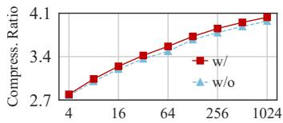

(a) Data Grouper  
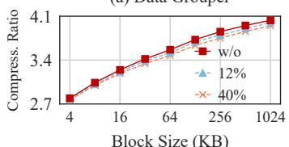

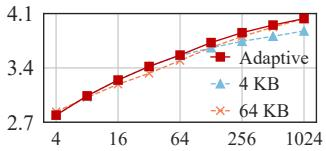

(b) Chunk Size  
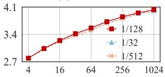  
(c) Hotness Percentage  
Block Size (KB)  
(d) Feature Sampling Rate  
Figure 12: Sensitive Analysis. Red lines are the default configurations. Note that Dedupe Type and Subgraph Size are not displayed because their results have little difference.

## 6.6 Sensitive Analysis

Evaluation Setup. Finally, we evaluate how the configurations in data grouper, data chunker, hotness sorter, and similarity sorter affect the compression ratio. Specifically, experiments are conducted on the openEuler image [11] using LZMA and block sizes ranging from 4 KB to 1 MB. Moreover, in Figure 12, we mark the default configurations with red lines.

(1) Data Grouper. We first evaluate whether data grouper decreases the compression ratio (§4.2). The results in Figure 12a suggest that the compression ratio of w/ Grouper is slightly higher than that of w/o Grouper. Therefore, different types of data usually do not have similar data, while pre-grouping via type avoids missorting and accelerates image generation.

(2) Chunk Size. We then evaluate whether the adaptive chunk size (Equation 1) improves the compression ratio. The results in Figure 12b suggest that, the compression ratio of Adaptive is slightly higher than that of 4 KB when the block size is larger than 64 KB, and that of 64 KB when the block size is lower than 1 MB. Moreover, our experiments suggest that the chunk size larger than 64 KB significantly degrades the compression ratio. Therefore, Adaptive achieves a high compression ratio and maintains data locality as much as possible.

(3) Dedupe Type. Next, we evaluate whether RubikFS retains a high compression ratio with full deduplication (§4.3). The results suggest that the compression ratio of Full Dedupe is comparable to that of Tail Dedupe. Note that we do not display these results because their compression ratio differences are less than 0.02×. Therefore, similarity sorter can compensate for the inefficiency of full deduplication and mitigate the read amplification caused by tail deduplication.

(4) Hotness Percentage. Subsequently, we evaluate whether hotness grouper decreases the compression ratio (§4.4). The results in Figure 12c suggest that, with 12% hot data, the compression ratio of RubikFS is still comparable to that of w/o Hotness. Moreover, we further evaluate 40% hot data as the (nearly) worst case, and the compression ratio differences are less than 0.11×. Therefore, hotness grouper has no significant influence on the compression ratio of RubikFS.

(5) Sampling Rate. After that, we evaluate the sampling rate in feature extraction (§4.5). The results in Figure 12d suggest that, the compression ratio of the sampling rate 1/128 is slightly higher than that of the sampling rate 1/512, and is the same as that of the sampling rate 1/32. Moreover, the sampling rate 1/128 generates fewer features compared to 1/32, resulting in a much shorter image build time.

(6) Subgraph Size. Finally, we evaluate whether the size of the subgraph (i.e., the number of chunks in a subgraph) affects the overall compression ratio (§4.5). We evaluate the size of 32, 64, and 128, and the results suggest that their compression ratio differences are less than 0.03×, where 64 is our default configuration and has a slightly higher compression ratio.

Summary. In summary, the compression ratio of RubikFS is robust among the six configurations mentioned above. Moreover, our default configurations (i.e., red lines) can reduce image build time, maintain data locality, mitigate read amplification, and slightly increase the compression ratio.

## 7 Discussion

Does RubikFS Require more Powerful CPUs? RubikFS introduces three categories of computation overheads (i.e., during system startup, runtime, and image generation), and none of these overheads necessitate more powerful CPUs.

Startup phase. Block-level decompression and read dominate the startup cost of RubikFS [57]. While startup-time decompression inevitably consumes CPU cycles, RubikFS reduces this overhead by grouping hot data to minimize read amplification, thus shrinking both the data footprint to fetch and the amount of data to decompress (Table 2). Additionally, although RubikFS uses the highest compression level by default to minimize the image size, this does not exacerbate startup-time CPU overhead because the decompression cost is insensitive to the compression level, as shown in lzbench [24].

Runtime phase. At runtime, most data have already been prefetched or cached during startup, making decompression and on-demand reads rare (§4.4). Therefore, the additional runtime cost comes from chunk-level indexing, as RubikFS replaces file-granularity indexing with finer-grained chunk indexing to enable similarity-based chunk sorting (§4.6). However, chunk indexing introduces negligible CPU overhead because it only adds a few lightweight memory accesses.

Image generation phase. Offline image generation is the only phase where RubikFS introduces noticeable computation overheads, due to similarity sorting and the highest compression level. However, these costs are mitigated by data grouper (§4.2) and similarity sorter (§4.5) and, importantly, are performed entirely offline. Therefore, they do not translate into higher CPU requirements for production deployments.

Can RubikFS Scale to Larger Images? Our evaluation uses MB-scale images (Table 1), which already span the typical size range of embedded images (i.e., 1 MB-1 GB, [14,53,72]). Beyond this range, RubikFS also scales in three dimensions.

Similarity sorting. RubikFS scales its similarity sorting to larger images by employing a feature-extraction algorithm capable of identifying similarity even across partially similar chunks (Algorithm 1), thereby enabling comprehensive detection of chunk similarity. Although the data grouper and hotness grouper may place similar chunks into separate groups, our sensitive analysis shows that the resulting reduction in compression ratio remains small, which is at most 2.19% even under extreme skew (i.e., 40% hot data in §6.6). Thus, similarity sorting remains effective as the image size increases.

Metadata overhead. The additional metadata introduced by RubikFS is small. Specifically, the chunk-level indexing requires only 12 B for an entry (original file offset, packed file offset, chunk size), which yields a storage overhead of 0.018%–2.93%, depending on the chunk size (Equation 1). Moreover, chunk features add no storage overhead because they are discarded once similarity sorting completes (§4.6).

Image generation time. Larger images naturally increase the time of image generation, but this cost does not impact runtime performance. RubikFS accelerates similarity sorting via the data grouper and a hash table, reducing generation time by 21.97%–74.39% (Table 3). Since image generation occurs entirely offline, these costs do not constrain scalability.

## 8 Related Works

Normal File System with Data Reduction. Compression is widely deployed in modern file systems to reduce storage footprint, including EXT4 [16], BtrFS [13], and F2FS [45]. Beyond them, integrating data reduction techniques into file systems remains an active research topic. For example, FPC [55] proposes file pattern-guided compression for mobile devices, which compresses SQLite files in the foreground and executable files in the background; Deduplication-based file systems [56,59,82] such as GogetaFS [76] and SmartDedup [64] remove duplicate data blocks to improve space efficiency.

However, these works mainly focus on how to quickly process new data when using data reduction, where high sorting time and frequent layout changes are unacceptable. Moreover, they cannot produce a compact layout; they cannot jointly exploit compression, deduplication, and similarity sorting to minimize image size. In contrast, RubikFS is designed specifically for read-only images, enabling one-time layout construction and aggressive layout optimization to maximize space reduction without incurring runtime overheads.

Backup Storage with Data Reduction. Data reduction is also a hot topic in backup storage [49–51, 73–75]. For example, FastCDC [70] is a fast and efficient content-defined chunking approach for data deduplication; Odess [69] is a fast resemblance detection approach to estimate chunk similarity; MeGA [74] is a high-performance fine-grained deduplication framework. However, these techniques primarily optimize the backup performance, but pay little attention to further improving the compression ratio and real-time data restoration. Although some works [85] attempt to speed up data restoration by rewriting, rewriting inevitably decreases the compression ratio and is beyond our design choice.

Among backup storage techniques, Migratory Compression (MC) [75] is the most relevant to our work, which also leverages sorting to improve compressibility. However, MC simply integrates fine-grained deduplication [51, 81] into the compression workflow, suffering from severe mismatch issues (§3.2). On the one hand, MC targets backup storage with a severe read performance penalty. On the other hand, MC generates only three super-features for each chunk and adopts a greedy matching algorithm to find similar chunks; therefore, Finesse and Odess in Figure 9 can be regarded as optimized MC, which consistently have a low compression ratio.

Page Compression Scenarios. Data compression can also be applied to page compression scenarios. For example, Archer [44] groups and compresses highly correlated pages together to minimize read amplification; ICE [43] suggests that the compressed memory area (i.e., ZRAM [25]) compresses the anonymous pages to save memory. Although page compression shares a similar purpose with read-only file systems (e.g., space reduction and read amplification), these two techniques have different bottlenecks and optimization strategies. Specifically, page compression utilizes lightweight compression algorithms (e.g., LZ4) and small block sizes for performance concerns. In contrast, read-only file systems attempt to minimize the image size with more powerful compressors (e.g., LZMA) and larger block sizes, while the sorting and compression latency are relatively insignificant.

## 9 Conclusion

This paper proposes RubikFS, a sort-enhanced read-only file system to construct condensed and efficient images. By sorting and clustering similar data within a block, RubikFS transparently improves the compression ratio. We implement RubikFS with four components: data grouper, data chunker, hotness grouper, and similarity sorter. Experiments on six open-source images show that RubikFS can efficiently reduce image size while significantly mitigating read amplification.

## Acknowledgment

We sincerely thank our shepherd, Ram Kesavan, and the anonymous reviewers for their constructive suggestions. This research was partly supported by the National Natural Science Foundation of China under Grants 62472127 and 62172124, Shenzhen Science and Technology Program under Grant RCYX20210609104510007, Guangdong Basic and Applied Basic Research Foundation under Grant 2023A1515110072.

## References

[1] Szwg Linux 26Data. https://elinux.org/Szwg\_L inux\_26Data, 2011. Accessed on 21.08.2025.

[2] xz (1). https://docs.oracle.com/cd/E86824\_0 1/html/E54763/xz-1.html, 2017. Accessed on 21.08.2025.

[3] BSP-Yocto-OpenSTLinux-STM32MP1-ALPHA1. https://download.phytec.de/Software/Linux/ BSP-Yocto-STM32MP1/BSP-Yocto-OpenSTLinux-S TM32MP1-ALPHA1/images/phycore-stm32mp1-1/, 2019. Accessed on 21.08.2025.

[4] Embedded Linux image size. https://community. tmpdir.org/t/embedded-linux-image-size/370, 2021. Accessed on 21.08.2025.

[5] EROFS, What Are We Doing Now For Containers? ht tps://static.sched.com/hosted\_files/kccncos schn21/fd/EROFS\_What\_Are\_We\_Doing\_Now\_For\_C ontainers.pdf, 2021. Accessed on 21.08.2025.

[6] Hisilicon Drivers Module. https://gitee.com/xime ibaba/device\_hisilicon\_drivers, 2021. Accessed on 21.08.2025.

[7] STM32MP1 series. https://www.st.com/en/micr ocontrollers-microprocessors/stm32mp1-seri es.html, 2021. Accessed on 21.08.2025.

[8] OpenAnolis White Paper: Using the EROFS Read-Only File System across the Cloud-Edge-End. https://ww w.alibabacloud.com/blog/openanolis-white-p aper-using-the-erofs-read-only-file-system -across-the-cloud-edge-end\_600116, 2023. Accessed on 21.08.2025.

[9] How to configure GCC for embedded firmware size optimization? https://www.omi.me/blogs/firmwar e-guides/how-to-configure-gcc-for-embedded -firmware-size-optimization, 2024. Accessed on 21.08.2025.

[10] How to fix firmware size increase issues caused by STM32 HAL in embedded projects? https://www. omi.me/blogs/firmware-guides/how-to-fix-fi rmware-size-increase-issues-caused-by-stm3 2-hal-in-embedded-projects, 2024. Accessed on 21.08.2025.

[11] Quick Startup. https://pages.openeuler.op enatom.cn/embedded/docs/build/html/openEul er-22.03-LTS-SP4/getting\_started/index.htm l, 2024. Accessed on 21.08.2025.

[12] Acceleration Framework For Container Image. https: //nydus.dev/, 2025. Accessed on 21.08.2025.

[13] BTRFS. https://docs.kernel.org/filesystems/ btrfs.html, 2025. Accessed on 21.08.2025.

[14] Download OpenWrt Firmware. https://openwrt.or g/downloads, 2025. Accessed on 21.08.2025.

[15] Executable and Linkable Format. https://en.wikip edia.org/wiki/Executable\_and\_Linkable\_Forma t, 2025. Accessed on 21.08.2025.

[16] ext4 General Information. https://www.kernel.org /doc/html/latest/admin-guide/ext4.html, 2025. Accessed on 21.08.2025.

[17] friendica. https://hub.docker.com/\_/friendica, 2025. Accessed on 21.08.2025.

[18] Generic System Image releases. https://developer. android.com/topic/generic-system-image/rel eases, 2025. Accessed on 21.08.2025.

[19] Hi3516DV500. https://www.hisilicon.com/cn/p roducts/smart-vision/machine-vision/hi3516 dv500, 2025. Accessed on 21.08.2025.

[20] Hi3861V100. https://www.hisilicon.com/en /products/connectivity/short-range-iot/wif i-nearlink-ble/hi3861v100, 2025. Accessed on 21.08.2025.

[21] Kernel Size Reduction Work. https://elinux.org /Kernel\_Size\_Reduction\_Work, 2025. Accessed on 21.08.2025.

[22] Linux Kernel. https://github.com/torvalds/li nux, 2025. Accessed on 21.08.2025.

[23] LZ4 - Extremely fast compression. https://github .com/lz4/lz4, 2025. Accessed on 21.08.2025.

[24] lzbench. https://github.com/inikep/lzbench, 2025. Accessed on 12.12.2025.

[25] METIS. https://github.com/KarypisLab/METIS, 2025. Accessed on 21.08.2025.

[26] MT29F16G08CBACA NAND Flash Memory. http s://datasheet4u.com/datasheet/Micron/MT29F 16G08CBACA-843449, 2025. Accessed on 21.08.2025.

[27] New Generation Entropy coders. https://github.c om/Cyan4973/FiniteStateEntropy, 2025. Accessed on 21.08.2025.

[28] Number of Internet of Things (IoT) Connected Devices Worldwide 2024: Breakdowns, Growth & Predictions. https://financesonline.com/number-of -internet-of-things-connected-devices/, 2025. Accessed on 21.08.2025.

[29] Number of smartphone users worldwide from 2014 to 2029. https://www.statista.com/forecasts/114 3723/smartphone-users-in-the-world, 2025. Accessed on 21.08.2025.

[30] OpenHarmony Introduction. https://www.openharm ony.cn/download/, 2025. Accessed on 21.08.2025.

[31] OpenHarmony Open-Source Project. https://gitee. com/openharmony, 2025. Accessed on 21.08.2025.

[32] Portable Executable. https://en.wikipedia.org /wiki/Portable\_Executable, 2025. Accessed on 21.08.2025.

[33] System Size. https://elinux.org/System\_Size, 2025. Accessed on 21.08.2025.

[34] The Yocto Project. https://www.yoctoproject.org /, 2025. Accessed on 21.08.2025.

[35] UBI File System. https://www.kernel.org/doc/h tml/latest/filesystems/ubifs.html, 2025. Accessed on 21.08.2025.

[36] Welcome to Squashfs-tools! https://github.com /plougher/squashfs-tools, 2025. Accessed on 21.08.2025.

[37] What is Friendica? https://github.com/friendica /docker, 2025. Accessed on 21.08.2025.

[38] XZ Utils. https://github.com/tukaani-project /xz, 2025. Accessed on 21.08.2025.

[39] zram: Compressed RAM-based block devices. http s://docs.kernel.org/admin-guide/blockdev/z ram.html, 2025. Accessed on 21.08.2025.

[40] Zstandard. https://github.com/facebook/zstd, 2025. Accessed on 21.08.2025.

[41] Andrei Z. Broder. On the resemblance and containment of documents. In Proceedings of Compression and Complexity of Sequences (SEQUENCES), pages 21–29, 1997.

[42] Andrei Z. Broder. Identifying and Filtering Near-Duplicate Documents. In Proceedings of 11th Annual Symposium on Combinatorial Pattern Matching (CPM), Montreal, Canada, June 21-23, 2000, Proceedings, volume 1848, pages 1–10, 2000.

[43] Changlong Li and Yu Liang and Rachata Ausavarungnirun and Zongwei Zhu and Liang Shi and Chuan Jason Xue. ICE: Collaborating Memory and Process Management for User Experience on Resource-limited Mobile Devices. In Proceedings of the 18th European Conference on Computer Systems (EuroSys), page 79–93, 2023.

[44] Changlong Li and Zongwei Zhu and Chao Wang and Fangming Liu and Fei Xu and Edwin H. -M. Sha and Xuehai Zhou. Archer: Adaptive Memory Compression with Page-Association-Rule Awareness for High-Speed Response of Mobile Devices. In Proceedings of the 23rd USENIX Conference on File and Storage Technologies (FAST), pages 497–511, 2025.

[45] Changman Lee and Dongho Sim and Jooyoung Hwang and Sangyeun Cho. F2FS: A New File System for Flash Storage. In Proceedings of the 13th USENIX Conference on File and Storage Technologies (FAST), pages 273– 286, 2015.

[46] Di, Sheng and Cappello, Franck. Fast Error-Bounded Lossy HPC Data Compression with SZ. In Proceedings of the 2016 IEEE International Parallel and Distributed Processing Symposium (IPDPS), pages 730–739, 2016.

[47] Glen G. Langdon. An Introduction to Arithmetic Coding. IBM Journal of Research and Development, 28(2):135–149, 1984.

[48] Hao Hu and Qiyang Zheng and Xiangyu Zou and Lisha Qin and Chengwei Zhang and Wanchuan Zhang and Zhaoheng Jiang and Dingwen Tao and Hongpeng Wang and Wen Xia. A Cost-Effective and Decompression-Transparent Compressor for OLTP-Oriented Databases. In Proceedings of the 2025 IEEE 41st International Conference on Data Engineering (ICDE), pages 405– 418, 2025.

[49] Haoliang Tan and Wen Xia and Xiangyu Zou and Cai Deng and Qing Liao and Zhaoquan Gu. The Design of Fast Delta Encoding for Delta Compression Based Storage Systems. ACM Transactions on Storage (TOS), 20(4):1–30, 2024.

[50] Haoliang Tan and Xiangyu Zou and Binzhaoshuo Wan and Zhaoquan Gu and Wen Xia. SuperDelta: Multiple Referenced Base Chunks Scheme for Fine-grained Deduplication Backup Storage System. In Proceedings of the 2024 Data Compression Conference (DCC), pages 362–371, 2024.

[51] Hongming Huang and Peng Wang and Qiang Su and Hong Xu and Chun Jason Xue and André Brinkmann. Palantir: Hierarchical Similarity Detection for Post-Deduplication Delta Compression. In Proceedings of the 29th ACM International Conference on Architectural Support for Programming Languages and Operating Systems (ASPLOS), pages 830–845, 2024.

[52] Huaicheng Li and Mingzhe Hao and Michael Hao Tong and Swaminathan Sundararaman and Matias Bjørling and Haryadi S. Gunawi. The CASE of FEMU: Cheap, Accurate, Scalable and Extensible Flash Emulator. In

Proceedings of 16th USENIX Conference on File and Storage Technologies (FAST), pages 83–90, 2018.

[53] Huang, Hao and Pan, Yanqi and Xia, Wen and Zou, Xiangyu and Yang, Darong and Shi, Liang and Du, Hongwei. Simplifying and Accelerating NOR Flash I/O Stack for RAM-Restricted Microcontrollers. In Proceedings of the 30th ACM International Conference on Architectural Support for Programming Languages and Operating Systems (ASPLOS), page 1076–1090, 2025.

[54] Huang, Hongming and Xue, Chun Jason and Guan, Nan and Xu, Hong. Is Low Similarity Threshold A Bad Idea in Delta Compression? In Proceedings of the 16th ACM Workshop on Hot Topics in Storage and File Systems (HotStorage), page 1–7, 2024.

[55] Cheng Ji, Li-Pin Chang, Riwei Pan, Chao Wu, Congming Gao, Liang Shi, Tei-Wei Kuo, and Chun Jason Xue. Pattern-Guided File Compression with User-Experience Enhancement for Log-Structured File System on Mobile Devices. In Proceedings of the 19th USENIX Conference on File and Storage Technologies (FAST), pages 127–140, 2021.

[56] Jiansheng Qiu and Yanqi Pan and Wen Xia and Xiaojia Huang and Wenjun Wu and Xiangyu Zou and Shiyi Li and Yu Hua. Light-Dedup: A Light-weight Inline Deduplication Framework for Non-Volatile Memory File Systems. In Proceedings of the 2023 USENIX Annual Technical Conference (USENIX ATC), pages 101–116, 2023.

[57] Jo, Heeseung and Kim, Hwanju and Jeong, Jinkyu and Lee, Joonwon and Maeng, Seungryoul. Optimizing the startup time of embedded systems: a case study of digital TV. IEEE Transactions on Consumer Electronics, 55(4):2242–2247, 2009.

[58] Junhee Ryu and Dongeun Lee and Kang G. Shin and Kyungtae Kang. Fast Application Launch on Personal Computing/Communication Devices. In Proceedings of the 21st USENIX Conference on File and Storage Technologies (FAST), pages 425–440, 2023.

[59] Kai-Ting Weng and Yun-Shan Hsieh and Yen-Ting Chen and Yu-Pei Liang and Yuan-Hao Chang and Po-Chun Huang and Wei-Kuan Shih. HF-Dedupe: Hierarchical Fingerprint Scheme for High Efficiency Data Deduplication on Flash-based Storage Systems. In Proceedings of the 2023 IEEE/ACM International Conference on Computer Aided Design (ICCAD), pages 1–9, 2023.

[60] Kiran Srinivasan and Timothy Bisson and Garth R. Goodson and Kaladhar Voruganti. iDedup: Latencyaware, Inline Data Deduplication for Primary Storage. In Proceedings of the 10th USENIX Conference on File and Storage Technologies (FAST), 2012.

[61] Liu, Youyuan and Jia, Wenqi and Yang, Taolue and Bo, Jiang and Yin, Miao and Jin, Sian. Advancing Scientific Data Compression via Cross-Field Prediction. In Proceedings of the 34th International Symposium on High-Performance Parallel and Distributed Computing (HPDC), 2025.

[62] Nannan Zhao and Hadeel Albahar and Subil Abraham and Keren Chen and Vasily Tarasov and Dimitrios Skourtis and Lukas Rupprecht and Ali Anwar and Ali R. Butt. DupHunter: Flexible High-Performance Deduplication for Docker Registries. In Proceedings of the 2020 USENIX Annual Technical Conference (USENIX ATC), pages 769–783, 2020.

[63] Peter Boncz and Thomas Neumann and Viktor Leis. FSST: fast random access string compression. Proceedings of the VLDB Endowment (VLDB), 13(12):2649–2661, 2020.

[64] Qirui Yang and Runyu Jin and Ming Zhao. Smartdedup: optimizing deduplication for resource-constrained devices. In Proceedings of the 2019 USENIX Conference on Usenix Annual Technical Conference (USENIX ATC), page 633–646, 2019.

[65] Razavi, Kaveh and Kielmann, Thilo. Scalable virtual machine deployment using VM image caches. In Proceedings of the International Conference on High Performance Computing (SC), 2013.

[66] Seunghwan Hyun and Hyokyung Bahn and Kern Koh. LeCramFS: an efficient compressed file system for flashbased portable consumer devices. IEEE Transactions on Consumer Electronics, 53(2):481–488, 2007.

[67] Tarasov, Vasily and Rupprecht, Lukas and Skourtis, Dimitris and Warke, Amit and Hildebrand, Dean and Mohamed, Mohamed and Mandagere, Nagapramod and Li, Wenji and Rangaswami, Raju and Zhao, Ming. In search of the ideal storage configuration for docker containers. In Proceedings of the 2017 IEEE 2nd International Workshops on Foundations and Applications of Self\* Systems (FAS\*W), pages 199–206, 2017.

[68] Wen Xia and Hong Jiang and Dan Feng and Lei Tian and Min Fu and Yukun Zhou. Ddelta: A deduplicationinspired fast delta compression approach. Performance Evaluation, pages 258–272, 2014.

[69] Wen Xia and Lifeng Pu and Xiangyu Zou and Philip Shilane and Shiyi Li and Haijun Zhang and Xuan Wang. The Design of Fast and Lightweight Resemblance Detection for Efficient Post-Deduplication Delta Compression. ACM Transactions on Storage (TOS), 19(3):1–30, 2023.

[70] Wen Xia and Yukun Zhou and Hong Jiang and Dan Feng and Yu Hua and Yuchong Hu and Yucheng Zhang and Qing Liu. FastCDC: a fast and efficient content-defined chunking approach for data deduplication. In Proceedings of the 2016 USENIX Conference on USENIX Annual Technical Conference (USENIX ATC), page 101–114, 2016.

[71] Xia, Mingze and Wang, Bei and Li, Yuxiao and Jiao, Pu and Liang, Xin and Guo, Hanqi . TspSZ: An Efficient Parallel Error-Bounded Lossy Compressor for Topological Skeleton Preservation. In Proceedings of the 2025 IEEE 41st International Conference on Data Engineering (ICDE), pages 3682–3695, 2025.

[72] Xiang Gao and Mingkai Dong and Xie Miao and Wei Du and Chao Yu and Haibo Chen. EROFS: a compressionfriendly readonly file system for resource-scarce devices. In Proceedings of the 2019 USENIX Conference on USENIX Annual Technical Conference (USENIX ATC), page 149–162, 2019.

[73] Xiangyu Zou and Jingsong Yuan and Philip Shilane and Wen Xia and Haijun Zhang and Xuan Wang. The Dilemma between Deduplication and Locality: Can Both be Achieved? In Proceedings of the 19th USENIX Conference on File and Storage Technologies (FAST), pages 171–185, 2021.

[74] Xiangyu Zou and Wen Xia and Philip Shilane and Haijun Zhang and Xuan Wang. Building a Highperformance Fine-grained Deduplication Framework for Backup Storage with High Deduplication Ratio. In Proceedings of the 2022 USENIX Annual Technical Conference (USENIX ATC), pages 19–36, 2022.

[75] Xing Lin and Guanlin Lu and Fred Douglis and Philip Shilane and Grant Wallace. Migratory Compression: Coarse-grained Data Reordering to Improve Compressibility. In Proceedings of the 12th USENIX Conference on File and Storage Technologies (FAST), pages 256– 273, 2014.

[76] Yanqi Pan and Wen Xia and Erci Xu and Hao Huang and Xiangyu Zou and Shiyi Li. Don’t Maintain Twice, It’s Alright: Merged Metadata Management in Deduplication File System with GogetaFS. In Proceedings of the 23rd USENIX Conference on File and Storage Technologies (FAST), pages 479–495, 2025.

[77] Yifan Zhao and Tong Xin and Mingkai Dong. Parer: Boosting EROFS Image Creation With Parallelism and Reproducibility. In Proceedings of the 15th Asia-Pacific Symposium on Internetware (Internetware), page 347–356, 2024.

[78] Yiming Qiao and Yihan Gao and Huanchen Zhang. Blitzcrank: Fast Semantic Compression for In-Memory Online Transaction Processing. Proceedings of the VLDB Endowment (VLDB), 17(10):2528–2540, 2024.

[79] Yu Liang and Riwei Pan and Tianyu Ren and Yufei Cui and Rachata Ausavarungnirun and Xianzhang Chen and Changlong Li and Tei-Wei Kuo and Chun Jason Xue. CacheSifter: Sifting Cache Files for Boosted Mobile Performance and Lifetime. In Proceedings of 20th USENIX Conference on File and Storage Technologies (FAST), pages 445–459, 2022.

[80] Yubo Liu and Hongbo Li and Mingrui Liu and Rui Jing and Jian Guo and Bo Zhang and Hanjun Guo and Yuxin Ren and Ning Jia. FlacIO: Flat and Collective I/O for Container Image Service. In Proceedings of the 23rd USENIX Conference on File and Storage Technologies (FAST), pages 87–101, 2025.

[81] Yucheng Zhang and Wen Xia and Dan Feng and Hong Jiang and Yu Hua and Qiang Wang. Finesse: finegrained feature locality based fast resemblance detection for post-deduplication delta compression. In Proceedings of the 17th USENIX Conference on File and Storage Technologies (FAST), page 121–128, 2019.

[82] Yunsheng Dong and Boju Chen and Yanqi Pan and Xiangyu Zou and Wen Xia. H2C-Dedup: Reducing I/O and GC Amplification for QLC SSDs from the Deduplication Metadata Perspective. In Proceedings of the 2024 ACM Symposium on Cloud Computing (SoCC), page 704–719, 2024.

[83] Zhao, Nannan and Tarasov, Vasily and Albahar, Hadeel and Anwar, Ali and Rupprecht, Lukas and Skourtis, Dimitrios and Paul, Arnab K. and Chen, Keren and Butt, Ali R. Large-Scale Analysis of Docker Images and Performance Implications for Container Storage Systems. IEEE Transactions on Parallel and Distributed Systems (TPDS), 32(4):918–930, 2021.

[84] Zhichao Cao and Hao Wen and Fenggang Wu and David H.C. Du. ALACC: Accelerating Restore Performance of Data Deduplication Systems Using Adaptive Look-Ahead Window Assisted Chunk Caching. In Proceedings of the 16th USENIX Conference on File and Storage Technologies (FAST), pages 309–324, 2018.

[85] Zhichao Cao and Shiyong Liu and Fenggang Wu and Guohua Wang and Bingzhe Li and David H.C. Du. Sliding Look-Back Window Assisted Data Chunk Rewriting for Improving Deduplication Restore Performance. In Proceedings of the 17th USENIX Conference on File and Storage Technologies (FAST), pages 129–142, 2019.