USENIX

THE ADVANCED COMPUTING SYSTEMS ASSOCIATION

# CetoFS: A High-Performance File System with Host-Server Collaboration for Remote Storage

Wenqing Jia, Dejun Jiang, and Jin Xiong, State Key Lab of Processors, Institute of Computing Technology, Chinese Academy of Sciences; and University of Chinese Academy of Sciences

## https://www.usenix.org/conference/fast26/presentation/jia

This paper is included in the Proceedings of the 24th USENIX Conference on File and Storage Technologies.

February 24–26, 2026 • Santa Clara, CA, USA

ISBN 978-1-939133-53-3

Open access to the Proceedings of the 24th USENIX Conference on File and Storage Technologies is sponsored by

# CETOFS: A High-Performance File System with Host-Server Collaboration for Remote Storage

Wenqing Jia, Dejun Jiang, Jin Xiong

State Key Lab of Processors, Institute of Computing Technology, Chinese Academy of Sciences University of Chinese Academy of Sciences

## Abstract

With the development of high-performance RDMA network and modern storage devices, disaggregated NVMe SSDs have become increasingly popular due to the high resource utilization and superior performance. Although existing kernel file systems (e.g., Ext4) can directly access the disaggregated SSD via the NVMe-over-RDMA protocol, the data path suffers from heavy kernel stack overhead and thus degraded performance. The extra networking latency introduced in accessing remote storage also prevents file system from achieving scalable concurrent accesses and efficient failure-atomic IO. In this paper, we present CETOFS, a high-performance file system with host-server collaboration for disaggregated NVMe SSD. CETOFS designs a userspace-kernel collaborative architecture to place data plane entirely in userspace meanwhile separate permission checking from in-kernel control plane. Then CETOFS exploits the processing capability of remote storage server to offload three tasks: permission checking, concurrency control, and failure-atomic IO guaranteeing. The offloading mechanisms greatly reduce the networking overhead. We implement CETOFS and evaluate it against both kernel and userspace file systems. The evaluation shows CETOFS achieves high-performance data path that reduces latency by up to 52% for single-threaded file access and improves throughput by up to 19X for concurrent accesses.

## 1 Introduction

Storage disaggregation is a well-known approach to independently scale storage and compute resources to achieve high resource utilization [24, 25]. The disaggregated hard disks or solid state drives (SSDs) are exposed as local block devices attached to hosts through remote block device protocols (e.g., iSCSI [2]). Recently, disaggregated NVMe SSD has been increasingly popular due to the rapid development of storage and network hardware. For example, modern SSDs such as Samsung Z-SSD [49] and Intel Optane SSD [15, 16] provide sub-ten microseconds of IO latency and up to 7.0 GB/s [16] of IO bandwidth. The RDMA networking also provides sub-ten microseconds of round-trip latency, enabling fast data transmission. Moreover, the adoption of NVMe-over-Fabric (NVMe-oF) protocol provides more efficient remote storage access compared to the traditional iSCSI protocol.

The disaggregated SSD introduces remote storage accessing. When accessing the remote storage, the efficiency of file systems running atop the exposed block devices is important to applications using disaggregated SSDs. Thus, we target to explore the problem in this paper: how to build a high-performance file system for accessing the disaggregated NVMe SSD. Existing kernel file systems (e.g., Ext4 [3] and F2FS [6]) can directly access disaggregated SSDs. However, we analyze the performance overhead of kernel file systems with NVMe-over-RDMA networking and find three inefficiencies as follows.

• Heavy kernel stack. The kernel file system accesses remote storage through the multi-layer kernel stack, including syscall, file system itself, NVMe driver, and NVMe-over-RDMA driver. We observe that the kernel software stack accounts for up to 66% of the total latency on data path for file operations (e.g., read and write). The overhead of kernel software stack exceeds the network and storage device time. Especially, the NVMe-over-RDMA driver occupies 36% of total latency, becoming the major performance bottleneck.

• Exacerbated serialization overhead. Concurrent file accesses of kernel file system are protected by the inode-level reader-writer lock which is performed on the host. As for concurrent file operations, the following operation cannot be processed until the preceding operation is completed. Under remote storage accessing, the serialization required by the locking suffers from extra networking latency and its overhead is exacerbated. This not only hurts the file system scalability but also leaves the RDMA network and SSD underutilized.

• Expensive data movement. Failure-atomic IO [8, 47, 51] is an important data path feature to guarantee the atomicity of multiple write operations. Existing kernel file systems employ either copy-on-write mechanism or journaling mechanism to achieve failure-atomic IO. Unfortunately, both mechanisms either require frequent metadata updates on remote storage server or incur expensive data movement of log entries between host and remote storage servers. This results in low efficiency of failure-atomic IO.

To address the inefficiencies of data path of existing kernel file systems, we explore to build userspace file system for disaggregated SSD. Although a few recent works propose userspace file systems for SSDs [5, 54] or persistent memory [19,57], there exist two non-trivial challenges for building file system for remote storage. First, previous userspace file systems only focus on locally attached storage devices, which does not take networking overhead into account for making design choices. Second, the permission checking is critical to file system, but the approaches of previous works cannot be directly applied to remote storage. Some works require specific hardware modifications [5, 54] or introduce costly CPU and communication overheads to the host [35]. Others [19, 57] rely on page table control for persistent memory, which is not applicable to control accessing to SSD.

In this paper, we propose CETOFS, a high-performance file system for the disaggregated SSD with the collaboration between host and remote storage servers. To address the aforementioned inefficiencies and challenges, we propose the following three offloading techniques.

First, we employ a userspace-kernel collaborative architecture for CETOFS. We place the data plane entirely in userspace to achieve high performance. Meanwhile, we reuse kernel file system to manage the control plane but separate permission checking from the kernel stack. We design permission checking offloading at the remote storage server. This offloading mechanism uses per-file request queue and reverse permission table to enable block-granularity access control. By doing so, CETOFS fully exploits the high performance of userspace data plane without compromising data security.

Second, we design concurrency control offloading to pass the serialization responsibility of concurrent requests to the remote storage server. CETOFS allows the host to submit conflicted requests to remote storage server in parallel, which greatly reduces the network waiting time of concurrent requests. At the remote storage server, we use request group to ensure the correctness of concurrent accessing. Meanwhile, we use merging group to accelerate the processing of the request groups without conflicts. Thus, CETOFS improves scalability without compromising correctness.

Third, we design redo logging offloading in CETOFS to process write transaction at the remote storage server. This offloading technique enables CETOFS to only write transaction data once from the host to the remote storage. The failure atomicity is guaranteed by redo logging at the remote storage server. We also adopt the transaction-aware submission and completion to reduce the CPU-initiated MMIOs of RDMA.

We implement CETOFS as a combination of a userspace library, a kernel file system, and a remote storage serversided request handler. We evaluate CETOFS using file system benchmarks and real-world applications against three file systems: Ext4, F2FS, uFS [35]. The evaluation results show that CETOFS reduces the access latency by up to 52% for single-threaded file access, and achieves up to 19X throughput improvement for concurrent accesses.

In summary, this paper makes the following contributions:

• A detailed quantification and analysis of performance overheads for using kernel file system to access the disaggregated SSD.

• A userspace-kernel collaborative file system architecture with a separated and offloaded permission checking, enabling high-performance and protected data plane.

• Two remote storage server based offloading mechanisms to perform concurrency control and redo logging separately, achieving scalable data plane to fully exploit parallelism of hardware devices and providing efficient failure-atomic IO.

• An extensive evaluation of CETOFS to show its efficiency for accessing the disaggregated SSD.

## 2 Background and Motivation

## 2.1 Disaggregated NVMe SSD

Disaggregated storage has gained wide adoption in data centers, providing flexibility to utilize storage devices such as HDDs and SSDs. This approach enhances resource utilization and reduce the total cost of ownership. Recently, disaggregated NVMe SSDs [24, 25, 33, 53, 55] have become increasingly popular due to their superior performance. As an extension from NVMe specification, NVMe over Fabrics (NVMe-oF) has emerged as a popular block storage protocol for accessing disaggregated NVMe SSDs over network fabrics. Compared to traditional iSCSI protocol [2], NVMeoF offers higher efficiency due to its low protocol overhead and high parallelism. As shown in Figure 1, NVMe-oF comprises two primary components: the initiator and the target. The target refers to the remote storage server, which has certain computation capability and is attached with a bundle of storage devices (i.e., NVMe SSDs here). The initiator, on the other hand, is the host server that issues IO requests over the network to the storage server.

NVMe-oF supports various types of network fabrics including TCP, RDMA, and others. While high-performance NVMe SSDs deliver microsecond-level latency, the traditional TCP stack operates at millisecond-level latency, making the network a performance bottleneck when using the TCP fabric. In contrast, RDMA provides microsecond-level latency, making it a better match for the low-latency NVMe SSDs. Therefore, we choose RDMA as the network fabric in this paper (i.e., NVMe-over-RDMA). NVMe-over-RDMA operates in two modes: CPU mode and offload mode. In CPU mode, the target CPU processes NVMe-oF commands through a in-kernel software stack consisting of the block layer, NVMe driver, and NVMe-over-RDMA driver. The offload mode entirely offloads the target data path to the RDMA NIC, allowing the

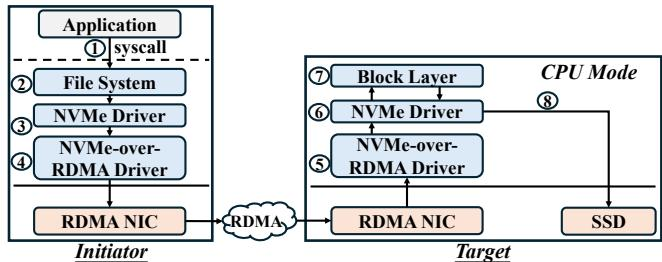  
Figure 1: Kernel File System based on NVMe-over-RDMA

NIC to directly access the SSD without CPU involvement. Although the offload mode saves target CPU resources, it suffers from significant performance degradation (up to 88% [7]) due to the NIC’s limited processing capability and inflexibility. Consequently, similar to prior studies [33, 39, 55], we focus on the CPU mode of NVMe-over-RDMA in this work.

When NVMe-oF Meets File System. The NVMe-oF protocol exposes disaggregated NVMe SSDs as local block devices attached to the initiator, applications can use file systems to manage data on disaggregated SSDs. The kernel file systems (e.g., Ext4 and F2FS) can directly access disaggregated SSDs through the existing kernel stack. Figure 1 shows the major components involved in the data path of kernel file systems. We take a write operation as an example to illustrate the workflow of them. An application thread issues a write syscall (①) on a file stored on the remote storage. The write request traverses the file system stack (②), including the virtual file system and the block layer. The request is then forwarded to the initiator-side NVMe driver (③), where it is encapsulated as an NVMe-oF command and written into a pre-registered memory buffer via RDMA\_SEND by the NVMe-over-RDMA driver (④). Upon receiving the command, the target-side NVMe-over-RDMA driver extracts the NVMe-oF command (⑤) and fetches the data for writing from the initiator via RDMA\_READ. The target then generates the IO request and writes the data to the SSD through the NVMe driver (⑥) and block layer (⑦). Once the data writing is complete, the target sends a completion response to the initiator via RDMA\_SEND. Finally, the application thread is notified about the finish of data writing. The workflow of the read operation is similar to that of the write operation. Unlike write only sending completion response to the initiator, the target needs to transfer the required data to the initiator using RDMA\_WRITE.

## 2.2 Motivation

In this section, we quantify and analyze the overhead of kernel file systems when accessing the disaggregated SSD.

## 2.2.1 Kernel Overhead of NVMe-over-RDMA Accessing

We first quantify the performance breakdown of each component on the data path. We choose Ext4 to access a disaggregated Intel Optane 4800X SSD through NVMe-over-RDMA. The RDMA NICs on both initiator and target are ConnectX-5.

<table><tr><td></td><td>Dev-L</td><td>Dev-R</td><td>Kernel-L</td><td>Kernel-R</td></tr><tr><td>Read Lat (us)</td><td>7.01</td><td>14.38</td><td>13.56</td><td>42.34</td></tr><tr><td>Write Lat (us)</td><td>7.04</td><td>14.23</td><td>14.27</td><td>40.91</td></tr></table>

Table 1: The Access Latencies of 4KB Random Read/Write. Kernel-L and Kernel-R represent the file system latencies based on local and remote SSD. Dev-L and Dev-R represent the device latency accessing local and remote SSD.

<table><tr><td></td><td>Time (us)</td><td>% of total time</td></tr><tr><td>Syscall</td><td>0.61</td><td>1.5%</td></tr><tr><td>FS stack</td><td>7.42</td><td>18.1%</td></tr><tr><td>NVMe driver</td><td>3.9</td><td>9.5%</td></tr><tr><td>NVMe-over-RDMA driver</td><td>14.75</td><td>36.1%</td></tr><tr><td>Device time</td><td>7.04</td><td>17.2%</td></tr><tr><td>Network time</td><td>7.19</td><td>17.5%</td></tr><tr><td>Total</td><td>40.91</td><td>100%</td></tr></table>

Table 2: The Average latency breakdown of 4KB random write syscall on remote Optane SSD

Table 1 shows the raw device read/write latencies (Dev-L and Dev-R) of Optane 4800X SSD accessed locally and remotely, respectively. The remote device latencies increase by about 7µs due to the RDMA networking.

We run two single-thread workloads: random read and random write with 4KB request size. When Ext4 accesses the local SSD, the total read and write latencies are 13.56µs and 14.27µs respectively as shown in Table 1. The software stack, including syscall, file system and NVMe driver, occupies 49% (read) and 51% (write) of the total latencies. Similar overhead observations are also reported in the recent study [44]. When accessing remote storage, the NVMe-over-RDMA driver on both initiator and target introduces extra latencies. As shown in Table 1, the total read and write latencies reach 42.34µs and 40.91µs, respectively. The latency of the software stack occupies 66% (read) and 65% (write) of total latencies respectively, which exceeds the hardware latency.

To further quantify the overheads of main components in the software stack, we measure the latencies spent on syscall, Ext4 (including block layer), NVMe-over-RDMA driver (on both initiator and target), and NVMe driver for write operation. Table 2 shows the latency breakdown results as well as the SSD device time and RDMA networking time. Notably, the NVMe-over-RDMA driver becomes the major overhead, occupying 36.1% of total latency.

Actually, the NVMe-over-RDMA driver employs interrupt to notify kernel threads about the the arrival of NVMe-oF commands at the target and the completion of RDMA operations (e.g., RDMA\_SEND, RDMA\_RECV, RDMA\_READ, RDMA\_WRITE). Handling RDMA interrupt brings high latency when accessing the remote storage. As for a write operation, there are two pairs of RDMA\_SEND and RDMA\_RECV for sending and receiving command and response between the initiator and the target, and one RDMA\_READ operation for the target fetching data from the initiator. Among the processing of these RDMA commands, there are three interrupt handling occurring on the critical path: 1) The interrupt handler wakes up the kernel thread at the target to receive the NVMe-oF command from the initiator. 2) Once the RDMA\_READ for fetching data completes at the target, the interrupt occurs. 3) The RDMA interrupt is triggered to notify the completion response to the application.

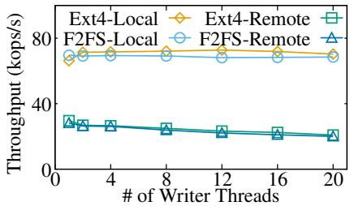  
Figure 2: Concurrent Write Throughput. Local and Remote represent accessing locally-attached SSD and remote SSD.

## 2.2.2 Exacerbated Serialization Overhead of Concurrency Control

The file system for the disaggregated SSD is expected to fully exploit the increasingly enhanced parallelism provided by RDMA and modern SSDs. However, existing kernel file systems exhibit poor scalability when accessing remote storage. We perform an experiment to measure the concurrent write throughput of Ext4 and F2FS for accessing local and remote storage. We use the same hardware configuration as in §2.2.1.

Figure 2 shows the aggregate write throughput across concurrent threads, where each thread concurrently updates a shared 10GB file. We have two observations. First, compared to accessing local storage, accessing remote storage decreases the throughput by 63% due to the network overhead. Second, the write scalability on local storage is limited, with non-increasing throughput when concurrent thread increases. Unfortunately, the write throughput on remote storage even decreases by 30% when the thread count increases from 1 to 20, exhibiting poor scalability.

The execution process of a write operation can be split into three synchronous phases. ① The initiator transmits the NVMe-oF command to the target and the target fetches the associated data. ② The target writes data into the SSD. ③ The target sends a completion response back to the initiator. The phases ① and ③ incur networking latency, and the phase ② incurs SSD write latency. To protect concurrent accessing of a shared file, the inode-level reader-writer lock is employed to serialize the executions of concurrent reads and writes. The serialization overhead is exacerbated by the phases ① and ③. Figure 3 shows an example when three threads (T1 \~ T3) write 4KB data to the same file concurrently. T1 first acquires the lock and executes the aforementioned three phases to write 4KB data. T2 and T3 have to wait and cannot transmit the NVMe-oF command until T1 and T2 release the lock. According to Table 2, T2 and T3 suffer from extra 26.6µs and 53.2µs waiting time due to the networking latency.

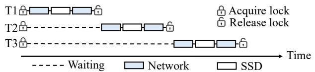

Figure 3: Serialization Overhead of Concurrency Control.  
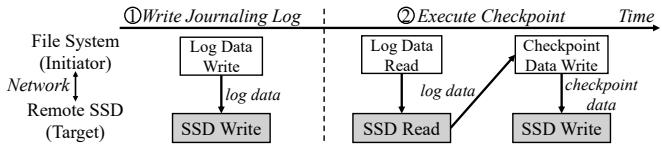  
Figure 4: Data Movement of the Journaling Mechanism.

The exacerbated serialization overhead not only hurts the file system scalability, but also under-utilizes the hardware resources. Although a few works propose to improve the concurrency efficiency using range lock [27, 57], these work either suffer from costly multiple locking due to page-level sub-lock [57] or bring extra CPU overhead due to complex lock structure [27]. Moreover, the serialization overhead still exists when accessing overlapped file ranges concurrently.

## 2.2.3 Expensive Data Movement of Failure-atomic IO

Failure-atomic IO is an important feature of file system [8, 47, 51], which is adopted by many applications to guarantee application modifications are either all or none applied after a crash occurs. Existing file systems employ two common techniques to guarantee failure-atomicity: journaling and copy-onwrite (CoW). Unfortunately, both techniques incur expensive data movement on remote storage and result in substantial performance penalties. We take journaling as an example to illustrate the data movement. As shown in Figure 4, the journaling mechanism first writes logs into the logging area on remote SSD (①). Then, the checkpoint process reads logs from remote SSD to the initiator and writes them back to the target area on remote SSD (②). Furthermore, updating journaling-related metadata requires extra IOs across network. Thus, the journaling mechanism incurs more than twice data movement across network. As for CoW, it writes duplicated data blocks for modifications, which requires frequent out-ofplace updates to the metadata index on remote storage and may incur the wandering tree problem [6]. This also causes severe network data movement.

In summary, the high overhead on the data path from the kernel stack of existing file systems motivates us to place data path entirely in userspace. Moreover, accessing remote storage introduces extra networking latency to the data path. This imposes specific challenges to concurrent accesses and failure-atomic IO, which degrades file system performance and scalability. Thus, we are motivated to address the aforementioned inefficiencies for building high-performance file system towards remote storage.

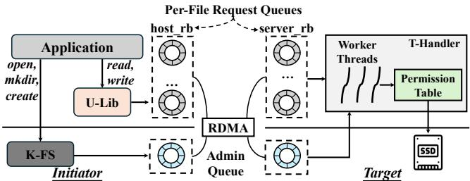  
Figure 5: CETOFS Architecture and Key Components

## 3 CETOFS Architecture

## 3.1 Design Overview

Inspired by the performance breakdown in §2.2.1, we design CETOFS by placing its data plane entirely in userspace to avoid kernel stack overhead. By doing so, applications can directly access disaggregated SSDs via userspace driver without kernel involvement. In addition, we propose two techniques: concurrency control offloading and redo logging offloading to address the extra networking latency issue occurred on the data path of concurrent access and failure-atomic IO.

As for the control plane of CETOFS, it mainly involves metadata operations and permission checking. CETOFS reuses existing kernel file systems for metadata operations as previous works do [10, 19]. However, the userspace data plane poses specific challenges for permission checking. Since application threads use the userspace driver to issue IO commands, applications can send requests with arbitrary device addresses to remote storage, which may corrupt the file system (e.g., modifying the metadata). Some works enforce permission checking inside SSD [5] or extend IOMMU to provide access protection [54] but at the cost of specific hardware modifications. Other work [35] consolidates all file system functionalities into a trusted process and enforce permission checking in this trusted entity. However, this tripartite structure [28, 45] brings extra CPU overhead and communication overhead, leading to sub-optimal performance [17, 54].

To address the permission checking issue, we split the permission checking into two parts in CETOFS. On one hand, the kernel file system is responsible for maintaining permission metadata, including process credentials, file permissions and access-control lists. When a file is opened, the kernel file system checks whether the application has the access permission. On the other hand, we offload the permission checking for data plane operations into the target. The target is commonly a storage appliance provided by the storage hardware vendor, which we assume to be a trusted entity. By doing so, CETOFS achieves high performance from the userspace data plane but without compromising security.

## 3.2 CETOFS Components

Figure 5 shows the cross-layered architecture of CETOFS. It consists of a userspace library (U-Lib), a kernel file system (K-FS), and a target-side request handler (T-Handler).

Userspace Library (U-Lib). U-Lib is a shim library linked to applications, which is responsible for handling the data plane operations (i.e., read/write) directly in userspace and forwarding the metadata operations (e.g., open, mkdir) to K-FS. It also intercepts system calls to avoid application modifications. U-Lib relies on per-file request queue for submitting file requests. A request queue is created by K-FS in RDMA memory regions and assigned to each opened file. Each request queue consists of two pre-registered ring buffers: one for sending file requests from the initiator to the target (called server\_rb) and one for sending file operation responses from the target back to the initiator (called host\_rb). T-Handler is designed to support up to 64K request queues similar to the NVMe-oF driver [43]. Since each opened file requires a request queue, CETOFS currently supports 64K concurrently opened files. In large-scale systems where the opened files may exceed 64K, one can group files with the same permission [9] to share the same request queue to mitigate the 64K limitation. Note that per-file queues are not RDMA QPs. CETOFS assigns one RDMA QP to each initiator thread instead of each opened file, thus the scalability issue [52] of QPs does not affect opened files.

When an application thread accesses files, U-Lib leverages the RDMA\_WRITE\_WITH\_IMM command to submit IO requests to the server\_rb. This command uses the immediate data field to carry the memory address of submitted request in the server\_rb. T-Handler can immediately locate the request via the embedded server\_rb address, which avoids polling all queues (i.e., server\_rb) when opening a larger number of files. Meanwhile, U-Lib polls the completion flag on host\_rb for detecting the request completion.

Since the offset-to-block indexing of a file is managed by K-FS, it is costly for U-Lib to inquiry K-FS for each file access. To reduce the interactions with K-FS, U-Lib maintains an address translation table for translating file offsets (the parameters of read and write) into the device block address in userspace for each opened file. The translation table has one entry for per file extent and is organized as an in-memory extent tree. Since K-FS maintains the latest offset-to-block indexing, if a lookup fails to find an extent for a file offset, U-Lib uses the fiemap ioctl to retrieve the indexing information and populates the table on demand. CETOFS enforces a concurrent reads or exclusive write file sharing policy as previous work [48, 57]. Thus, no table synchronization is required for the same file under concurrent accessing as a U-Lib is the only writer or the file is read-only.

Kernel File System (K-FS). K-FS is a kernel file system (e.g., Ext4 in this paper) used by CETOFS to manage all metadata (e.g., inodes, directory trees, offset-to-block index, and access permissions) and serves all metadata operations. K-FS is also responsible for checking permissions whenever a file is opened by a process. After that, CETOFS relies on T-Handler to perform permission checking for direct userspace accesses. K-FS maintains an administration queue to support communication between T-Handler and itself.

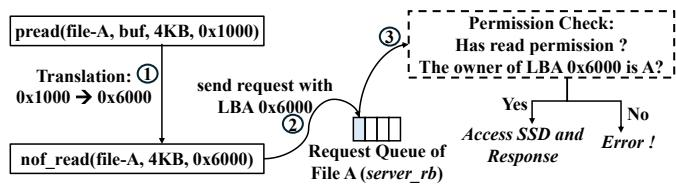  
Figure 6: The Process of CETOFS Read Operation

Target Request Handler (T-Handler). T-Handler operates as a userspace process designed to receive IO requests and access underlying SSDs directly in userspace at the target. One reverse permission table is maintained in T-Handler for offloaded permission checking (as detailed in §3.3). T-Handler contains a configurable number of worker threads, and each thread runs by iterating three tasks: ① fetching IO requests from server\_rb. ② performing permission checking for each IO request via the reverse permission table, and only legal requests are allowed to access the SSD. ③ polling the SSD for completion, and setting completion flag of the corresponding request in host\_rb.

The Workflow of Serving File Requests. To illustrate the collaboration of CETOFS components for processing file requests, we take the open operation as an example. During the initialization of U-Lib, the application first establishes a RDMA queue pair (QP) with T-Handler, which is used to submit RDMA verbs via userspace library (i.e., libibverbs [1]). Once U-Lib intercepts an open syscall, it creates a host\_rb at the initiator, then turns to invoke a new system call ceto\_open provided K-FS with the accessing information (rkey and raddr) of host\_rb. After receiving ceto\_open, K-FS checks whether the application has the right access permission (read-only, write-only, read/write) to the target file. If so, K-FS notifies T-Handler to create server\_rb at the target. The accessing information of host\_rb and server\_rb are exchanged to T-Handler and U-Lib respectively through K-FS. After the execution of open, the application can write IO requests of read and write to server\_rb in userspace directly. Meanwhile, T-Handler can also write completion notifications to host\_rb directly.

## 3.3 Permission Check Offloading

The key idea of permission checking offloading is to let the target check whether the block address of an IO request is legal. To achieve this, we design a block-granularity reverse permission table at the target and introduce how to utilize it for permission checking as follows.

Reverse Permission Table. We divide the blocks of a file system into three types: free blocks, blocks for storing metadata, and blocks for storing file data. We define an owner for each block and use the owner ID to identify it. We set the owner of any free block and any metadata block to be K-FS, and the owner ID is zero. The owner of one data block is its corresponding file. Its owner ID is set to be the file inode number. The owner ID of each block composes an entry of the reverse permission table, which are organized according to the order of block addresses. We store the permission table in a reserved area of the SSD. The size of an owner ID is 8 bytes and one device block can store 512 owner IDs. Given a 1TB SSD, the total size of the reverse permission table is 2GB, which occupies less than 0.2% of the whole device size.

To accelerate the lookup performance of the reverse permission table, T-Handler can cache either the whole table or frequently-accessed entries in memory. We use an in-memory radix tree for indexing cached owner IDs and the granularity for caching is the device block (512 owner ids). When new blocks are allocated to a file or stale blocks are de-allocated, K-FS is responsible for updating the permission table. K-FS first journals the modifications to the reverse permission table as part of the file system journaling to ensure consistency. Then, K-FS notifies T-Handler to update the cached permission table. Permission Check Rule. Since each opened file has a request queue (host\_rb and server\_rb), we assign the queue’s owner as its corresponding file. Each server\_rb is attached with an access permission flag to indicate the legal operations (read-only, write-only or read/write) for the accessing process. T-Handler perform the permission checking according to the following two rules:① the owner of a requested block should match with the owner of the submitting request queue. ② the requested operation type should match with the permission flag of the submitting request queue. This rule can prevent application threads from accessing illegal addresses.

The workflow of target-side permission checking is executed as follows. T-Handler first extracts the operation type (read or write) and block address from an IO request. Then, T-Handler queries the block’s owner from the reverse permission table, and compares the owner IDs of the block and the submitting queue. Meanwhile, T-Handler checks whether the access permission flag of the submitting queue matches the request operation. If both rules are matched, the IO request can be processed. Otherwise, the request is considered as an illegal one and T-Handler returns error without serving it.

Handling Appends. Unlike the overwrite operation, the append operation writes new data and does not have offsetto-block indexing and permission entries before it executes. Thus, U-Lib splits the append operation into two stages. First, U-Lib uses fallocate to let K-FS allocate new blocks and sets the permission entries. Then, U-Lib can still write data in userspace to achieve high-performance data path. To further improve the performance of append-only workloads, one optimization is to use a background thread to perform preallocation, which converts incoming append operations into overwrite ones. As for the crash consistency guarantee of append, CETOFS keeps the same level as XFS/Ext4 in the metadata-journaling/write-back mode [34].

Put It Together. We take the read operation as an example to show how CETOFS performs permission checking for userspace data plane operations as shown in Figure 6. When an application thread issues pread operation to file A, U-

Lib first translates (①) the file offset (0x1000) into the device address (0x6000). Then it sends the IO request (②) to the target server. U-Lib subsequently polls host\_rb for detecting request completion. The worker thread in T-Handler receives the request and extracts the request block address. Then it checks the permission flag of the request queue and the owner of the requested block (③). If matched, the worker thread issues the NVMe commands to the underlying SSD and then polls for completion. Otherwise, this IO request is reported to incur illegal permission error.

## 4 Scalable Concurrent Data Accessing

Concurrent accessing to remote storage incurs request serialization at the initiator, which introduces extra networking latency to the waiting process for concurrent threads to acquire locking. To reduce the network waiting time, we propose concurrency control offloading technique. The key idea is allowing the initiator to send IO requests in parallel even conflicted requests exist, meanwhile letting the target perform request serialization to guarantee correct concurrency.

To achieve this, we design Request Group to control the ordering of IO requests at the target. A request group consists of adjacent IO requests accessing the same file but without having conflict with each other. Specifically, the basic group policy is: each write request constitutes an individual group, and adjacent read requests also constitute a group. The request group is created by U-Lib at the initiator and used by T-Handler at the target to process requests in order. In this section, we first introduce the basic group policy and then extend it to the merging group policy for high concurrency.

Creating Request Groups at Initiator. At the initiator, once a file is opened, U-Lib generates a monotonically increasing group ID for the opened file, staring for zero. When concurrent threads access the opened file, U-Lib determines the group for each incoming request using a per-file spin-lock as follows. For a write request, the issuing thread first tries to acquire the spin-lock. After acquiring the lock, the thread increases the group ID and embeds the ID into the request. This group ID represents the group that the request belongs to. Meanwhile, the thread assigns a monotonically increasing request ID to each request, also starting from zero. When a group is created, the first request ID within this group is recorded and passed the subsequent requests in the same group. Both the request ID and the first request ID within a group are embedded into the request. Then, the thread obtains a queue slot from the tail of the server\_rb but not submit the request yet. Finally, the thread releases the spin-lock. The processing of read requests follow the same procedure but without increasing the group ID. After releasing the spin-lock, the thread can submit the request into the server\_rb without waiting for other conflicted requests. The spin-lock consumes little time and does not introduce a bottleneck.

Figure 7 shows an example of request group creation. There are six threads (T1\~T6) that issue read or write requests simultaneously. They all try to acquire the spin-lock and the order of acquiring lock is R1 (T1), R2 (T5), W1 (T2), R3 (T3), R4 (T6), and W2 (T4). Thus, there are four request groups totally. Then these requests can be submitted to the server\_rb concurrently, which greatly saves their waiting time.

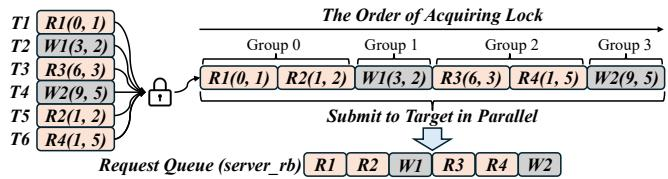

Figure 7: The Procedure of Creating Request Groups. R/W(X, Y) means the request access the LBA X and its length is Y.
<table><tr><td>T1</td><td>R10,1)</td><td colspan="6">R2 Request Queue at Target</td></tr><tr><td>T2 T3</td><td>W1(3,2) R3(6,3</td><td>R3 R4</td><td></td><td></td><td></td><td></td><td></td></tr><tr><td></td><td>W2(9, 5)</td><td rowspan="4">RDMA Write InFlight : R2,R3,R4</td><td rowspan="4">R1 R2</td><td rowspan="4">W1</td><td rowspan="4">R3</td><td rowspan="4">R4</td><td rowspan="4">W2 Arrive Order:R1→W1→W2</td></tr><tr><td>T4 T5</td><td>R2(1,2)</td></tr><tr><td></td><td></td></tr><tr><td>T6</td><td>R4(1,5)</td></tr></table>

Figure 8: Request Queue State After Submitting IO Requests.

Perform Ordering at Target. T-Handler must process intergroup requests with strict ordering as their conflicts may lead to incorrectness (e.g., writing to the same block of one file). Although each IO request is assigned a group ID at the initiator, the initiator does not submit requests according to the sequence of group IDs. When processing a request, T-Handler should examine whether its preceding request group is finished. This is challenging if only using the group ID. Figure 8 shows one possible state of the server\_rb after T1\~T6 creates request groups and submit R1\~R4 and W1\~W2 in parallel. The requests R1, W1, and W2 arrive at the target in turn and enter into the pre-obtained queue slots of server\_rb. Meanwhile, the requests R2, R3, and R4 are still in-flight. As a result, upon the arrival of W1 or W2, T-Handler cannot determine whether to process W1 or W2 as it has no information about the completion of previous groups.

To guarantee the ordering of inter-group requests, we propose a collaborative mechanism between the initiator and the target to record five additional status of the concurrent request processing for each request queue. ① curr\_gid: the group ID currently being processed. ② first\_rid\_table: a hash table that records the first request ID of each arrival group. ③ curr\_fin\_reqs: the count of requests that have been completed. ④ curr\_max\_rid: the largest request ID that T-Handler has received so far. ⑤ rid\_to\_queue\_pos: a hash table than maps request IDs to slots in the server\_rb.

Each worker thread of T-Handler performs alternate execution of two tasks: poller task for polling and handling arrived requests and finisher task for handling the completion of an IO request. Initially, the poller executes. Once there is no request arrival, the finisher runs to check the request completion. Then, the poller runs again when there is no request completion. Algorithm 1 shows the executions of them for guaranteeing the ordering of inter-group requests. We explain

Algorithm 1: Algorithms of Polling and Completion Tasks for Concurrency Control Offloading.

1 def cetofs\_poller ( worker )   
2 req = poll\_cq ()   
3 gid = req -> group\_id   
4 rid = req -> request\_id ;   
5 first\_rid\_group = req -> first\_rid\_group   
6 if gid == queue -> curr\_gid :   
7 submit\_command\_to\_ssd ()   
8 else if gid > queue -> curr\_gid   
9 curr\_max\_rid = max ( curr\_max\_rid , rid )   
10 if gid == queue -> curr\_gid + 1 and   
first\_rid\_group == queue -> curr\_fin\_reqs   
11 queue -> curr\_gid = gid ;   
12 submit\_command\_to\_ssd ()   
13 else   
14 first\_rid\_table [ gid ] = first\_rid\_group   
15 rid\_to\_queue\_pos [ rid ] = current\_queue\_pos   
16   
17 def cetofs\_finisher ( req )   
18 queue -> curr\_fin\_reqs = queue -> curr\_fin\_reqs + 1   
19 gid = req -> group\_id   
20 rid = req -> request\_id   
21 nextgid = gid + 1   
22 first\_rid\_nextgroup = first\_rid\_table [ nextgid ]   
23 if first\_rid\_nextgroup != 0 and   
first\_rid\_nextgroup == queue -> curr\_fin\_reqs   
24 queue -> curr\_gid = next\_gid   
25 for rid in ( first\_rid\_nextgroup , curr\_max\_rid )   
26 next\_req = queue [ rid\_to\_queue\_pos [ rid ]]   
27 if next\_req -> group\_id > queue -> curr\_gid   
28 break   
29 if next\_req is not null   
30 submit\_command\_to\_ssd ()

the algorithms as follows. When receiving a new request, the poller first extracts its group ID (gid), request ID (rid), and the first request ID (first\_rid\_group) of its group (Line 2∼5). If gid matches curr\_gid, the poller can directly process this request (Line 6∼7) as this request belongs to the current group. If gid is greater than curr\_gid (Line 8), there exist two cases. Case I: The group of the incoming request just happens to be in the next group (i.e., curr\_gid + 1), and meanwhile all requests from previous groups have been completed (Line 10). Then the poller updates curr\_gid to the incoming gid (Line 11) and submits this request to SSD immediately (Line 12). Case II: If the requests from previous groups are still pending, the poller updates the first\_rid\_table (Line 14) and rid\_to\_queue\_pos (Line 15) without processing this request. As for both cases, the poller updates curr\_max\_rid (Line 9). By executing the above algorithm, the poller can determine whether to process incoming requests.

When an SSD IO request is completed, the finisher first updates curr\_fin\_reqs (Line 18). Then the finisher calculates the next group ID (nextgid) (Line 21). Using nextgid, the finisher checks whether any request of the next group arrives and whether all request within current group are completed (Line 22 ∼ 23). If so, the finisher starts to submit the requests of the next group that already arrive at the target to the SSD (Line 25 ∼ 30). Note that the finisher stops request processing once it detects a larger group ID (Line 27 ∼ 28) as the submitted requests of the group nextgid may not all complete yet. The finisher must guarantee the ordering between inter-group requests by first waiting for all request completions within one group on SSD and then submitting the requests of next group. Merging Group. T-Handler processes requests group by group, which inherently restricts concurrent accesses to disjoint portions of a file from different groups, thereby limiting concurrency. To address this limitation, we propose a merging group policy at the initiator, which allows adjacent groups without access conflicts to be merged with low overhead. Instead of relying on complex range locks, U-Lib employs two simple red-black trees (rb-tree) for each file: one for read operations and the other for write operations. The rb-tree records the access ranges sorted by their starting addresses. Both the read and write rb-trees are initially empty when a file is opened. When receiving a new request, U-Lib decides its group as follows. For a read request, U-Lib checks for range conflicts by querying the write tree. If detecting a conflict, U-Lib creates a new group for this request. Otherwise, U-Lib inserts the request’s range into the read tree and merge this request into current group. For a write request, U-Lib checks the range conflicts by querying both the read and write trees. If detecting a conflict in either tree, U-Lib creates a new group for this request. Otherwise, U-Lib inserts its range to the write tree and merge this request into current group. Whenever a new group is created, it indicates that the current group has merged all non-conflict requests. Thus U-Lib removes all ranges within the two trees and prepare empty rb-trees for the merging process of the new group. By leveraging this approach, CETOFS can further enhance its concurrency and scalability.

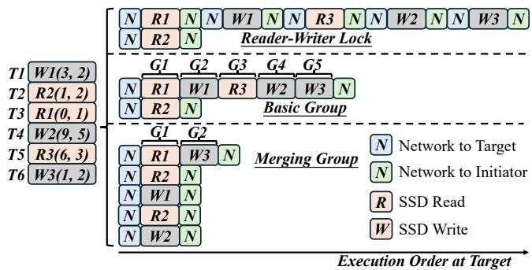  
Figure 9: Different Concurrency Control Policies. R/W(X, Y) means the request access the LBA X and its length is Y.

We summarize the basic request group and merging group policies in Figure 9. We also show the original case without using concurrency control offloading (i.e., using reader-writer lock). There are six threads (T1\~T6) issuing read or write requests. We assume these threads acquire the reader-writer lock (in original case) or the spin-lock (in CETOFS) with the following order: R1 (T3), R2 (T2), W1 (T1), R3 (T5),

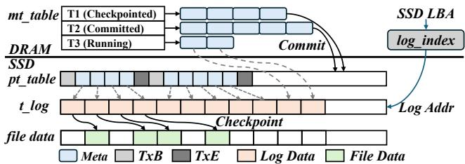  
Figure 10: Transaction Management in T-Handler.

W2 (T4), and W3 (T6). The reader-writer locking suffers from severe network waiting time as these requests are serialized at the initiator. Note that R2 acquires the reader lock after R1, and they can be executed concurrently at the target. As for the basic group policy, R1 and R2 successively acquire the spin-lock. Thus, they belong to the same group G1. The subsequent requests form the other four groups. G1\~G5 can be submitted to the target in parallel, which saves the networking time. However, they are executed sequentially at the target to guarantee the inter-group ordering. As for the merging group policy, all requests except W3 are merged into the same group G1 as they have no range conflicts. As a result, they can not only be submitted in parallel, but also be executed in parallel at the target. This greatly improves concurrency and the hardware utilization.

## 5 Failure-Atomic IO

CETOFS introduces three APIs in U-Lib to enforce atomicity, which guarantees a set of write operations is either fully persisted or entirely discarded. After opening a file, the application thread can initiate an atomic write via atomic\_write\_start. Then it can write data to file via write. Finally, it uses atomic\_write\_commit to commit the writing data for atomicity. If required, the atomic operation can be aborted by atomic\_write\_abort. To minimize data movement overhead from writing the disaggregated SSD, CETOFS offloads the failure-atomic IO support to the target. Logging Policy. CETOFS utilizes the processing capability of the target to perform target-side logging to atomically persist data to the disaggregated SSD. There are two common logging mechanisms: redo logging and undo logging. As for the undo logging, data updates should be performed synchronously: first writing the old data and then writing the new data. The twice data movement brings significant latency in the critical execution path. Thus, we choose the redo logging: first writing the new data to the log area and the second write (i.e., checkpoint) can be executed asynchronously in the background. To ensure atomicity, all data writes are first persisted to the SSD log area via T-Handler, which are later checkpointed to their original file positions, enabling transparency to applications. When crash occurs during writing to the log area, the data is discarded. When crash occurs after committing, the data can be recovered. Specially, with offloading, CETOFS only requires one data movement through network to guarantee the atomicity and minimize overhead.

Transaction Management. As shown in Figure 10, the transaction management comprises four components: an inmemory transaction table (mt\_table), a persistent recovery transaction table (pt\_table), the transaction logs (t\_log), and an in-memory log index (log\_index). mt\_table keeps the metadata of transactions which consists of the mapping entries from the address of t\_log to the original address of data. t\_log contains multiple device blocks as the log data area. log\_index maintains the mapping entries from the original address of data to the address of t\_log for each request queue, which is used to serve the read operation. When atomic\_write\_start comes, T-Handler creates a new entry in mt\_table. T-Handler supports concurrent transactions by maintaining distinct entries in mt\_table. Initially, the status of one transaction is running, which means it can be discarded when meeting crash. When a subsequent write arrives, T-Handler writes its data into the t\_log, records its mapping between its address in t\_log and writing address to mt\_table, then updates the log\_index. After receiving atomic\_write\_commit, T-Handler only requires flushes the transaction metadata to pt\_table. After committing, T-Handler can perform checkpoint in the background. Upon the completion of checkpoint, the transaction status is changed into checkpointed, allowing the reclamation of transaction metadata and log entries. Flushing pt\_table incurs small writes to SSD, which brings write amplification. One can optimize it by utilizing the new NVMe feature persistent memory region (PMR) [42], which leaves as future work.

Transaction-Aware Submission and Completion. One transaction consists of one or more write requests. At the initiator, each request triggers one RDMA operation, which necessitates multiple CPU-initiated Memory-Mapped IO (MMIO) operations (i.e., ring the doorbell) and incurs non-trivial PCIe overhead. The same overhead exists at the target when T-Handler notifies the initiator. To mitigate such overhead, we adopts a transaction-aware submission and completion mechanism [20, 32]. Specifically, U-Lib employs a delayed submission strategy, dispatching the requests either upon the full arrival of all requests within a transaction or when accumulated requests exceed a predefined threshold. Meanwhile, T-Handler adopts a batch processing approach that handles all transaction requests and notifies their completion to the initiator in batch.

## 6 Evaluation

In this section, we present evaluation results for CETOFS. We first use a set of micro-benchmarks to evaluate the singlethreaded performance of CETOFS. Then, we show the scalability of CETOFS under concurrent accessing. We also evaluate CETOFS using the macro-benchmark Filebench [12] and the real-world application LevelDB [13]. Finally, we conduct a performance breakdown for CETOFS.

Experiment Setup. We conduct all experiments on two servers with two 24-core Intel(R) Xeon(R) Platinum 8260

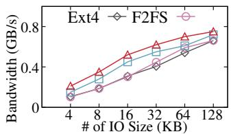  
(a) Seq Read

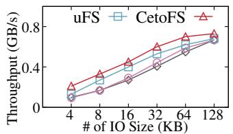  
(b) Rand Read

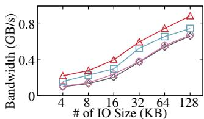  
(c) Seq Write

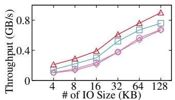  
(d) Rand Write

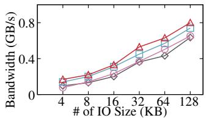  
(e) Append

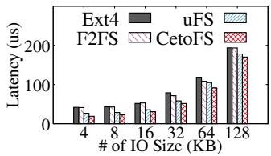  
(f) Rand Read  
Figure 11: Single-Threaded Throughput

CPUs, which run Ubuntu 20.04 with Linux kernel version 5.5.0. They are equipped with a dual-port Mellanox ConnextX-5 RDMA NIC. Hyper-threading is disabled. For all experiments, we issue direct IO (O\_DIRECT) like previous works [54, 56]. The target server is equipped with 256GB DRAM and a 375GB Intel Optane P4800X SSD (2.3GB/s for peak read and write).

Compared Systems. We compare CETOFS against Ext4, F2FS, and uFS. Ext4 and F2FS are widely-used journaling and log-structured kernel file system respectively that can directly run on the disaggregated SSD. uFS is a state-of-theart high-performance userspace file systems for local modern SSD. We extend it to support the disaggregated SSD.

## 6.1 Single-Threaded Performance

We use five synthetic micro-benckmarks: sequential read-/write, random read/write, and append to measure singlethreaded throughput. Each workload runs with different IO sizes and one million operations on a 4GB file.

Read. Figure 11(a) and 11(b) show the results for sequential and random reads. CETOFS places its data plane entirely in userspace and avoids kernel stack overheads. Thus, compared to Ext4, CETOFS achieves 10% to 1.12X higher throughput for all IO sizes. Similarly, CETOFS outperforms F2FS by achieving 9% to 1.23X higher throughput. uFS is a fully userspace file system. Its read throughputs are close to CETOFS with an average 16% degradation. The performance degradation mainly comes from the frequent communications between its client and uServer threads. Figure 11(f) shows the latency results of random read. CETOFS spends about 19µs to read 4KB data, which mainly consists of RDMA networking latency (about 7µs), SSD read latency (about 7µs) and other software latencies (the offset translation, permission checking, etc.). Ext4 and F2FS spend extra time (about 26µs) in the kernel stack. uFS instead incurs extra latency (about 5µs) for inter-process communication and copying data.

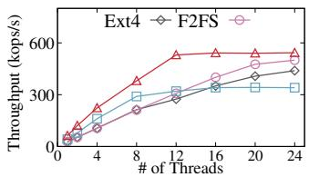  
(a) DRBL

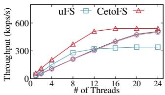  
(b) DRBM

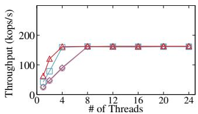

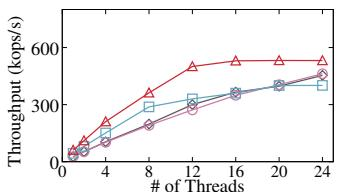  
(c) DRBH

(d) DWOL  
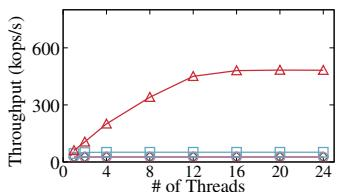  
(e) DWOM

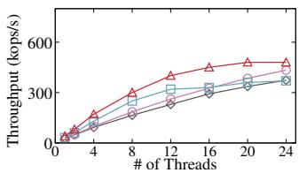  
(f) DWAL  
Figure 12: Concurrent Throughput with FxMark

Overwrite. Figure 11(c) and 11(d) show the results of sequential and random overwrites with pre-allocated data blocks. We use the direct IO mode for all tested systems to eliminate the potential interference from data caching (e.g., page cache) that might absorb data writes and perform batch flushing. Similar to the read results, CETOFS benefits from its userspace data plane, it exhibits higher throughput across all IO sizes (4KB to 128KB). On average, CETOFS outperforms Ext4, F2FS, and uFS by about 74%, 65%, and 24%, respectively.

Append. Figure 11(e) shows the results of the append operation performed on an empty file. To handle the append operation, CETOFS adopts a two-stage approach to first let K-FS allocate blocks and then write data in userspace. This enables CETOFS to still benefit from userspace data plane, achieving average throughput improvements of 52%, 50%, and 12% compared to Ext4, F2FS, and uFS. Although uFS also performs the append operation in userspace entirely, it suffers from severe data copy overhead when the IO size increases. Consequently, uFS shows comparable performance with CETOFS before the IO size reaches 32KB. After that, uFS behaves worse than CETOFS. Both Ext4 and F2FS still incur heavy kernel stack overhead and behave poorly.

## 6.2 Concurrent Accessing Performance

We use FxMark [37] to evaluate the data path scalability under concurrent accessing. We select six workloads of FxMark:

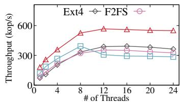  
(a) Fileserver

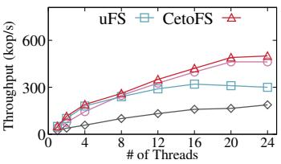  
(b) Varmail

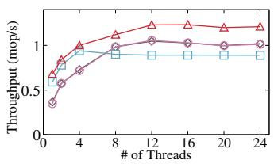  
(c) Webserver

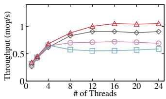  
(d) Webproxy  
Figure 13: Performance of Filebench

DRBL and DRBM read a private block in a private and a shared file respectively. DRBH reads a shared block in a shared file. DWOL and DWOM overwrite a private block in a private and a shared file respectively. DWAL appends data to a private file. Figure 12 shows the aggregated throughput results with increasing concurrent threads.

As for the read results shown in Figure 12(a) and 12(b), both Ext4 and F2FS scale with the increasing threads. However, they achieve lower throughput than CETOFS due to their costly kernel stack. uFS scales before reaching 8 threads (client threads in uFS). After that, the throughput of uFS increases little as its uServer is designed to have a limited number of worker threads for saving CPUs. Since CETOFS accesses the data in userspace and has no extra communication overhead, it exhibits good scalability and achieves the full bandwidth of hardware quickly (12 threads). Figure 12(c) shows the DRBH result. All tested file systems only scale to 160 Kops/s as all threads read the same SSD block and cannot fully utilize the SSD internal parallelism. Figure 12(d) and 12(f) show the throughput when concurrent threads overwrite and append private files separately. Since there is no thread contention, all tested file systems behave similarly to those under read workloads. CETOFS still achieves best scalability. On average, CETOFS outperforms Ext4, F2FS and uFS by 72%, 76% and 38% for DWOL, and by 61%, 48%, and 29% for DWAL, respectively.

As for the DWOM workload, concurrent threads have high contention for writing the same shared file. Only CETOFS scales well as shown in Figure 12(d). CETOFS offloads the concurrency control to the target server to mitigate the serialization overhead. Moreover, CETOFS merges the request groups without conflicts to allow concurrent accessing to disjoint portions of a file, which improves its scalability significantly. On the contrary, other file systems can only execute concurrent writes sequentially and obtain poor scalability.

## 6.3 Macro-benchmark: Filebench

We use a set of workloads from the Filebench [12] as the macro-benchmarks to evaluate CETOFS. We select four representative workloads: Fileserver, Varmail, Webserver, and Webproxy. The data read to write ratios for these workloads are set as follows: Fileserver (1:2), Varmail (1:1), Webserver (10:1), and Webproxy (5:1). Figure 13 shows the results with increasing concurrent threads. Generally, CETOFS exhibits superior performance for all four workloads. For Fileserver, it issues intensive concurrent writes. CETOFS outperforms Ext4, F2FS, and uFS by 75%, 72%, and 64% on average due to its lightweight data plane and offloaded concurrency control. For Webserver and Webproxy, they are readintensive workloads and less thread contentions occur compared to Fileserver. CETOFS still outperforms other file systems but achieves smaller throughput improvement. Specifically, CETOFS improves throughput by 25% to 33% for Webserver, and 14% to 50% for Webproxy. CETOFS and F2FS achieve similar throughput for Varmail. This is because Varmail contains more metadata operations and handles a large number of small files, which brings frequent kernel interactions for CETOFS. Notably, F2FS outperforms Ext4 under Varmail as it employs an efficient roll-forward recovery mechanism to enhance fsync performance that only writes data blocks and the direct node blocks.

<table><tr><td>Workloads</td><td>Ext4</td><td>F2FS</td><td>uFS</td><td>CETOFS</td></tr><tr><td>Write sync.</td><td>196.29</td><td>120.78</td><td>92.34</td><td>84.38</td></tr><tr><td>Write seq.</td><td>3.55</td><td>3.27</td><td>3.09</td><td>2.82</td></tr><tr><td>Write rand.</td><td>35.98</td><td>31.99</td><td>29.34</td><td>26.38</td></tr><tr><td>Overwrite.</td><td>45.58</td><td>41.07</td><td>35.91</td><td>31.23</td></tr><tr><td>Read seq.</td><td>2.37</td><td>2.47</td><td>2.33</td><td>2.31</td></tr><tr><td>Read rand.</td><td>4.03</td><td>4.03</td><td>3.89</td><td>3.62</td></tr><tr><td>Read hot.</td><td>1.27</td><td>1.29</td><td>1.23</td><td>1.18</td></tr><tr><td>Delete rand.</td><td>2.72</td><td>2.57</td><td>2.39</td><td>2.22</td></tr></table>

Table 3: Latency (µs) Results of LevelDB under db\_bench. The Read hot contains 1% of hot key-value pairs.

## 6.4 Real-World Applications: LevelDB

We evaluate CETOFS using the real-world application LevelDB [13], which is a widely-used key-value store and uses file system to persist data. We run a number of workloads from the db\_bench benchmark as shown in Table 3. We run LevelDB by performing 3 million operations with a fixed value size of 1KB. Since LevelDB is single-threaded, we measure the average latencies under different workloads. Table 3 shows the results. Compared to Ext4 and F2FS, CETOFS reduces the latencies of write sync by 57% and 30% separately. This is because CETOFS reduces the kernel stack overhead significantly. As for other write operations, CETOFS reduces latencies by up to 31% and 23% compared to Ext4 and F2FS. As for read operations, the latency improvement of CETOFS is relatively small as the block cache in LevelDB serves a portion of requests. uFS achieves comparable performance with CETOFS due to its userspace design. Moreover, the singlethreaded LevelDB poses low pressure to the inter-process communication with uServer. However, the write sync latency of uFS is still 8% higher than that of CETOFS as each request must be persisted to the SSD without batching, resulting in high communication and data copy overhead to uServer.

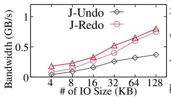  
(a) Single-Thread Throughput

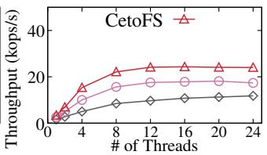  
(b) Multi-Thread Throughput  
Figure 14: Performance of Atomic Write

## 6.5 Performance of Atomic Write

We now evaluate the atomic write performance using three different approaches: J-Undo (journaling with undo log), J-Redo (journaling with redo log), CETOFS (offloaded atomic write). J-Undo first writes the old data to the log area and then writes the new data. J-Redo first writes the new data to the log area and then checkpoints the data in the background. We first vary the IO sizes of individual atomic writes using singlethreaded run. Each atomic write with the IO size larger than 4 KB is actually divided into multiple 4KB write operations. The results are shown in Figure 14(a). CETOFS averagely outperforms J-Undo and J-Redo by 1.8X and 58% respectively. The log writes of J-Undo execute on the critical path and brings twice data movements for one atomic write (one for writing old data and the other for writing new data), achieving the worst performance. J-Redo is performed by writing a journal description block, journal blocks, and a commit block to the remote storage. Although writing the description and commit blocks bring extra IO requests, these IO requests are small-sized and their impact on the performance gradually diminishes with the increasing IO size. CETOFS uses atomic\_write\_start and atomic\_write\_commit to notify T-Handler to perform redo logging at the target, which avoids the transmission of the description and commit blocks. Thus, CETOFS outperforms J-Redo with small IO size but the performance improvement narrows when IO size increases. Then we fix the atomic write size to be 64KB and vary the number of concurrent threads. Figure 14(b) shows the results. CETOFS achieves the highest throughput as it reduces the data movement overhead. Although J-Redo performs the checkpoint in the background, it still executes the checkpoint at the initiator, which first fetches the logs to the initiator and then sends them back to the target. This results in expensive data movement. J-Undo performs worst as it suffers twice data movement to the target on the critical path. Note that

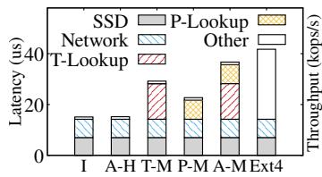  
(a) Random Read

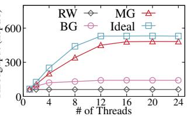  
(b) DWOM  
Figure 15: Performance Breakdown

CETOFS stops scaling around 12 threads as the SSD bandwidth is saturated.

## 6.6 Understanding the Performance

In this section, we first conduct performance breakdown for single-threaded read operation to evaluate the overheads of the address translation table and permission checking offloading. Then we evaluate concurrent write performance using different concurrency control policies.

Read Latency Breakdown. When serving a read request, CETOFS needs to lookup the address translation table at the initiator and lets the target perform permission check for each block access. We split the latency of a read operation into five components: T-Lookup (lookup address translation table), P-Lookup (lookup reverse permission table), SSD (read data), Network (transfer data), and other latency. Figure 15(a) shows the latency of each component. There are five cases: 1) Ideal case (I): without permission checking. 2) All hit (A-H): the translation table entry and the permission entry are in memory. 3) Translation table miss (T-M): the translation table entry should be read from the SSD. 4) Permission table miss (P-M): the permission table entry should be read from the SSD. 5) All miss (A-M): both table entries should be read from SSD. Compared to the case I, the case A-H has extra 0.2µs latency for permission checking at the target when it only queries the in-memory permission table. The latency of translation entry miss is higher than that of permission entry miss as U-Lib should retrieve the offset-to-block indexing from the target. For the worst case (A-M), CETOFS still has a lower latency (36.7µs) than Ext4 (42.34µs).

Performance Contributions of Concurrent Write. We evaluate the write performance of CETOFS under the DWOM workload with four concurrency control policies: RW (Reader-Writer Locking), BG (Basic Group Policy), MG (Merging Group Policy), and Ideal (Without Locking). Figure 15(b) shows the results. RW performs worst due to the exacerbated serialization overhead. BG can reduce the network waiting time and improve the scalability with low thread count. But BG does not scale with high thread count as it cannot leverage the parallelism of SSD. MG employs in-DRAM red-black trees to support efficient insertion, lookup and merge with low overhead for group management. Thus, MG scales well by fully exploiting the parallelism of network and SSD.

## 7 Discussion

Overhead of File Open. The file-opening process indeed incurs extra overhead mainly from the creation of request queues, where the access information of server\_rb and host\_rb is exchanged via RDMA. We measure the extra overhead for opening varied-sized files, which introduces about 5µs latency, accounting for around 31% of the total execution time of open. The overhead is acceptable as the one-time cost before reading/writing files.

Scaling with Multiple SSDs/Targets/Initiators: On one hand, CETOFS can be built on multiple SSDs on one target or multiple targets by organizing multiple SSDs or multiple targets as a logical device (e.g., RAID-0 or dRAID [50]). On the other hand, CETOFS can scale to multiple initiators by extending to a clustered file system like OCFS2 [11] (i.e., adding distributed lock management). We leave them as future work. Adopting to Data Processing Unit (DPU)/SmartNIC: One can port CETOFS to DPU/SmartNIC based disaggregated storage [38]. The DPU [4, 40, 41] usually consists of 8 \~ 16 ARM cores and a set of hardware accelerators. The ARM cores can run the NVMe-oF stack as well as the offloading mechanisms in CETOFS. Moreover, a few operations like compression and encryption can be offloaded to the hardware accelerators. We leave the adoption as our future work.

## 8 Related Work

Remote Storage Systems. Klimovic et al. [24] and i10 [14] optimize the in-kernel remote storage stack to achieve high throughput. ReFlex [25] proposes a kernel-bypass data plane to closely integrate network and storage processing for low latency. Gimbal [38] presents a software switch that enables multi-tenant storage disaggregation on the SmartNIC JBOFs. RubbleDB [29] utilizes the offload mode of NVMe-over-RDMA to reduce the CPU overhead of replication. RIO [33] and Volley [55] focus on the storage order of remote storage access. However, these works pay little attention to the efficiency of file systems on disaggregated SSDs. They are orthogonal with CETOFS and can be applied to CETOFS to further improve the performance and QoS guarantee.

Userspace File System. To reduce the kernel software overhead, many userspace file systems for SSD are proposed. Arrakis [46] virtualizes the SSD then each application can directly manage the virtualized device, requiring the SR-IOV [26] support. BypassD [54] adopts a hardware-based approach by offloading permission checks into IOMMU for local storage, but it cannot be directly applied to RDMA-based remote storage. This is because translating virtual addresses in RDMA requires the collaboration of the memory translation table (MTT) in NIC and IOMMU, requiring further RDMA NIC modifications. Moneta-D [5] offloads the permission check into SSD, requiring modifications to commercial hardware. Device-level file systems such as DevFS [22] and CrossFS [48] place most FS functionalities into the device firmware, but the efficiency is limited by the constrained CPU and memory resources inside the device. uFS [35] places the whole FS into a trusted process, which incurs extra CPU and communication overhead. Both SplitFS [19] and CETOFS employ userspace-kernel collaborative architecture, but SplitFS targets persistent memory and it perform permission checking using page table, which cannot be applied to SSD.

Storage Service Offloading: Many works leverage emerging DPU/SmartNIC to offload storage services. iPipe [36] proposes the actor programming model for offloading applications like KV stores, distributed transaction systems, and real-time analytics to SoC-based SmartNICs. LineFS [23] offloads a PM-optimized DFS to SmartNICs, including CPUintensive DFS tasks (replication, compression, index, and consistency management). LeapIO [30] proposes that ARM cores in SmartNICs can run a complex cloud storage stack. OS2G [18] offloads the object storage client to the DPU for GPU-based deep learning applications. Similar to these works, the offloading mechanisms in CETOFS can also be applied to DPU/SmartNIC.

Scalable File Access. Several file systems explore the data scalability issue. Similar to server\_rb used in CETOFS, CrossFS [48] maps each file descriptor to one hardware IO queue (FD-queue) and uses the interval-tree to detect conflicts for accessing the same file. However, CrossFS only orders the write requests via the interval tree. CrossFS relaxes the concurrency control of traditional file systems (e.g., Ext4) as it may read a mix of old and new data. Trio [57] adopts the range lock that allocates a lock for each page, which suffers from high overhead when meeting a large range. A few works focus on the scalability of accessing shared resources (e.g., journal [21] and metadata structures [17, 31]), while CETOFS mainly addresses the serialization overhead from accessing remote storage.

## 9 Conclusion

This paper presents CETOFS, a high-performance file system for disaggregated SSDs with the target to reduce both kernel stack overhead and networking time. To provide highperformance data path and data protection, CETOFS handles data operations entirely in userspace and offloads permission checking to the remote storage server to avoid the arbitrary reads/writes from the userspace. Moreover, CETOFS designs two offloading mechanisms for concurrency control and failure-atomic IO to reduce networking overhead. The evaluation results show that CETOFS achieves scalable data performance and efficient failure-atomic IO.

## Acknowledgments

We sincerely thank our shepherd, Mingkai Dong, and the anonymous reviewers for their insightful feedback. This work is supported by the Major Research Plan of the National Natural Science Foundation of China (Grant No. 92270202).

## References

[1] RDMACore Userspace Libraries and Daemons. https: //github.com/linux-rdma/rdma-core.

[2] Internet Small Computer Systems Interface (iSCSI), 2004. https://www.ietf.org/rfc/rfc3720.txt.

[3] Avantika Mathur, Mingming Cao, Suparna Bhattacharya, Andreas Dilger, Alex Tomas, and Laurent Vivier. The New Ext4 Filesystem: Current Status and Future Plans. In Proc. of the Linux Symposium, 2021.

[4] Broadcom. Broadcom Stingray PS1100R SmartNIC. https://www.broadcom.com/products/storage/ethernet -storage-adapters-ics/ps1100r.

[5] Adrian M Caulfield, Todor I Mollov, Louis Alex Eisner, Arup De, Joel Coburn, and Steven Swanson. Providing Safe, User Space Access to Fast, Solid State Disks. In Proc. of ACM ASPLOS, 2012.

[6] Changman Lee, Dongho Sim, Joo Young Hwang, and Sangyeun Cho. F2FS: A New File System for Flash Storage. In Proc. of USENIX FAST, 2015.

[7] Yiquan Chen, Jinlong Chen, Yijing Wang, Yi Chen, Zhen Jin, Jiexiong Xu, Guoju Fang, Wenhai Lin, Chengkun Wei, and Wenzhi Chen. Hyq: Hybrid I/O queue architecture for nvme over fabrics to enable high- performance hardware offloading. In Proc. of IEEE/ACM CCGrid, 2023.

[8] Jungsik Choi, Jaewan Hong, Youngjin Kwon, and Hwansoo Han. Libnvmmio: Reconstructing software IO path with Failure-Atomic Memory-Mapped interface. In Proc. of USENIX ATC, 2020.

[9] Mingkai Dong, Heng Bu, Jifei Yi, Benchao Dong, and Haibo Chen. Performance and Protection in the ZoFS User-Space NVM File System. In Proc. of ACM SOSP, 2019.

[10] Dawson R Engler, M Frans Kaashoek, and James O’Toole Jr. Exokernel: An Operating System Architecture for Application-Level Resource Management. In Proc. of IEEE SOSP, 1995.

[11] Mark Fasheh. OCFS2: The Oracle Clustered File System, Version 2. In Proc. of Linux Symposium, 2006.

[12] Filebench. Filebench 1.4.9.1. https://github.com/fileb ench/filebench.

[13] Google. LevelDB. https://github.com/google/leveldb.

[14] Jaehyun Hwang, Qizhe Cai, Ao Tang, and Rachit Agarwal. TCP≈RDMA:CPU-efficientRemote Storage Access with i10. In In Proc. of USENIX NSDI, 2020.

[15] Intel. Intel Optane SSD P4800X Specification. https://www.intel.com/content/www/us/en/products/s ku/129969/intel-optane-ssd-dc-d4800x-series-375g b-2-5in-pcie-2x2-3d-xpoint/specifications.html.

[16] Intel. Intel® Optane™ SSD P5800X Series. https://www.intel.com/content/www/us/en/products/d ocs/memory-storage/solid-state-drives/data-center-ssd s/optane-ssd-p5800x-p5801x-brief.html.

[17] Wenqing Jia, Dejun Jiang, and Jin Xiong. AugeFS: A Scalable Userspace Log-Structured File System for Modern SSDs. In Proc. of IEEE MSST, 2024.

[18] Zhen Jin, Yiquan Chen, Mingxu Liang, Yijing Wang, Guoju Fang, Ao Zhou, Keyao Zhang, Jiexiong Xu, Wenhai Lin, Yiquan Lin, et al. OS2G: A High-Performance DPU Offloading Architecture for GPU-based Deep Learning with Object Storage. In Proc. of ACM AS-PLOS, 2025.

[19] Rohan Kadekodi, Se Kwon Lee, Sanidhya Kashyap, Taesoo Kim, Aasheesh Kolli, and Vijay Chidambaram. SplitFS: Reducing Software Overhead in File Systems for Persistent Memory. In Proc. of ACM SOSP, 2019.

[20] Anuj Kalia, Michael Kaminsky, and David G Andersen. Design Guidelines for High Performance RDMA Systems. In Proc. of USENIX ATC, 2016.

[21] Junbin Kang, Benlong Zhang, Tianyu Wo, Weiren Yu, Lian Du, Shuai Ma, and Jinpeng Huai. SpanFS: A Scalable File System on Fast Storage Devices. In Proc. of USENIX ATC, 2015.

[22] Sudarsun Kannan, Andrea C Arpaci-Dusseau, Remzi H Arpaci-Dusseau, Yuangang Wang, Jun Xu, and Gopinath Palani. Designing a True Direct-Access File System with DevFS. In Proc. of USENIX FAST, 2018.

[23] Jongyul Kim, Insu Jang, Waleed Reda, Jaeseong Im, Marco Canini, Dejan Kostic, Youngjin Kwon, Simon ´ Peter, and Emmett Witchel. Linefs: Efficient Smartnic Offload of a Distributed File System with Pipeline Parallelism. In Proc. of ACM SOSP, 2021.

[24] Ana Klimovic, Christos Kozyrakis, Eno Thereska, Binu John, and Sanjeev Kumar. Flash Storage Disaggregation. In Proc. of ACM EuroSys, 2016.

[25] Ana Klimovic, Heiner Litz, and Christos Kozyrakis. Reflex: Remote Flash ≈ Local Flash. In Proc. of ACM ASPLOS, 2017.

[26] P. Kutch. PCI-SIG SR-IOV Primer: An Introduction to SR-IOV Technology, 2011. https://cdrdv2-public.intel.com/321211/pci-sig-s r-iov-primer-sr-iov-technology-paper.pdf.

[27] Chang-Gyu Lee, Hyunki Byun, Sunghyun Noh, Hyeongu Kang, and Youngjae Kim. Write Optimization of Log-Structured Flash File System for Parallel I/O on Manycore Servers. In Proc. of ACM Systor, 2019.

[28] Seung-seob Lee, Yanpeng Yu, Yupeng Tang, Anurag Khandelwal, Lin Zhong, and Abhishek Bhattacharjee. Mind: In-Network Memory Management for Disaggregated Data Centers. In Proc. of ACM ASPLOS, 2021.

[29] Haoyu Li, Sheng Jiang, Chen Chen, Ashwini Raina, Xingyu Zhu, Changxu Luo, and Asaf Cidon. RubbleDB: CPU-Efficient Replication with NVMe-oF. In Proc. of USENIX ATC, 2023.

[30] Huaicheng Li, Mingzhe Hao, Stanko Novakovic, Vaibhav Gogte, Sriram Govindan, Dan RK Ports, Irene Zhang, Ricardo Bianchini, Haryadi S Gunawi, and Anirudh Badam. Leapio: Efficient and Portable Virtual Nvme Storage on ARM SoCs. In Proc. of ACM ASPLOS, 2020.

[31] Xiaojian Liao, Youyou Lu, Erci Xu, and Jiwu Shu. Max: A Multicore-Accelerated File System for Flash Storage. In Proc. of USENIX ATC, 2021.

[32] Xiaojian Liao, Youyou Lu, Zhe Yang, and Jiwu Shu. Efficient Crash Consistency for NVMe over PCIe and RDMA. ACM Transactions on Storage, 2023.

[33] Xiaojian Liao, Zhe Yang, and Jiwu Shu. RIO: Order-Preserving and CPU-Efficient Remote Storage Access. In Proc. of ACM EuroSys, 2023.

[34] Linux. Ext4 Filesystem. https://www.kernel.org/doc/D ocumentation/filesystems/ext4.txt.

[35] Jing Liu, Anthony Rebello, Yifan Dai, Chenhao Ye, Sudarsun Kannan, Andrea C Arpaci-Dusseau, and Remzi H Arpaci-Dusseau. Scale and Performance in a Filesystem Semi-Microkernel. In Proc. of ACM SOSP, 2021.

[36] Ming Liu, Tianyi Cui, Henry Schuh, Arvind Krishnamurthy, Simon Peter, and Karan Gupta. Offloading Distributed Applications onto Smartnics using iPipe. In Proc. of ACM SIGCOMM, 2019.

[37] Changwoo Min, Sanidhya Kashyap, Steffen Maass, and Taesoo Kim. Understanding Manycore Scalability of File Systems. In Proc. of USENIX ATC, 2016.

[38] Jaehong Min, Ming Liu, Tapan Chugh, Chenxingyu Zhao, Andrew Wei, In Hwan Doh, and Arvind Krishnamurthy. Gimbal: Enabling Multi-tenant Storage Disaggregation on SmartNIC JBOFs. In Proc. of ACM SIGCOMM, 2021.

[39] Darren Ng, Andrew Lin, Arjun Kashyap, Guanpeng Li, and Xiaoyi Lu. NVMe-oPF: Designing Efficient Priority Schemes for NVMe-over-Fabrics with Multi-Tenancy Support. In Proc. of IEEE IPDPS, 2024.

[40] NVIDIA. NVIDIA BLUEFIELD-2 DPU. https://www. nvidia.com/content/dam/en-zz/Solutions/Data-Center/ documents/datasheet-nvidia-bluefield-2-dpu.pdf.

[41] NVIDIA. NVIDIA BLUEFIELD-3 DPU. https://www. nvidia.com/content/dam/en-zz/Solutions/Data-Center/ documents/datasheet-nvidia-bluefield-3-dpu.pdf.

[42] NVMe. NVMe 1.4 Spec Revision 1.4c. https://nvmexpress.org/wp-content/uploads/NVM -Express-1\_4c-2021.06.28-Ratified.pdf.

[43] NVMe. NVMe Over Fabrics. //https://nvmexpress.org /wp-content/uploads/NVMe\_Over\_Fabrics.pdf, 2019.

[44] Chanyoung Park, Minu Chung, and Hyungon Moon. Selective On-Device Execution of Data-Dependent Read I/Os. In Proc. of USENIX FAST, 2025.

[45] Li Peng, Yuda An, You Zhou, Chenxi Wang, Qiao Li, Chuanning Cheng, and Jie Zhang. ScalaCache: Scalable User-Space Page Cache Management with Software-Hardware Coordination. In Proc. of USENIX ATC, 2024.

[46] Simon Peter, Jialin Li, Irene Zhang, Dan RK Ports, Doug Woos, Arvind Krishnamurthy, Thomas Anderson, and Timothy Roscoe. Arrakis: The Operating System is the Control Plane. In Proc. of USENIX OSDI, 2014.

[47] Hongwei Qin, Dan Feng, Wei Tong, Yutong Zhao, Sheng Qiu, Fei Liu, and Shu Li. Better Atomic Writes by Exposing the Flash Out-of-Band Area to File Systems. In Proc. of ACM LCTES, 2021.

[48] Yujie Ren, Changwoo Min, and Sudarsun Kannan. CrossFS: A Cross-Layered Direct-Access File System. In Proc. of USENIX OSDI, 2020.

[49] SAMSUNG. Ultra-Low Latency with Samsung Z-NAND SSD. https://www.samsung.com/us/labs/pdfs /collateral/Samsung\_Z-NAND\_Technology\_Brief\_v5. pdf.

[50] Junyi Shu, Ruidong Zhu, Yun Ma, Gang Huang, Hong Mei, Xuanzhe Liu, and Xin Jin. Disaggregated RAID Storage in Modern Datacenters. In Proc. of ACM ASP-LOS, 2023.

[51] Rajat Verma, Anton Ajay Mendez, Stan Park, Sandya Srivilliputtur Mannarswamy, Terence P Kelly, and Charles B Morrey III. Failure-Atomic Updates of Application Data in a Linux File System. In Proc. of USENIX FAST, 2015.

[52] Zilong Wang, Layong Luo, Qingsong Ning, Chaoliang Zeng, Wenxue Li, Xinchen Wan, Peng Xie, Tao Feng, Ke Cheng, Xiongfei Geng, et al. SRNIC: A scalable architecture for RDMA NICs. In Proc. of USENIX NSDI, 2023.

[53] Jiexiong Xu, Yiquan Chen, Yijing Wang, Wenhui Shi, Guoju Fang, Yi Chen, Huasheng Liao, Yang Wang, Hai Lin, Zhen Jin, et al. Lightpool: A NVMe-oF-Based High-Performance and Lightweight Storage Pool Architecture for Cloud-Native Distributed Database. In Proc. of IEEE HPCA, 2024.

[54] Sujay Yadalam, Chloe Alverti, Vasileios Karakostas, Jayneel Gandhi, and Michael Swift. BypassD: Enabling Fast Userspace Access to Shared SSDs. In Proc. of ACM ASPLOS, 2024.

[55] Shaoxun Zeng, Xiaojian Liao, Hao Guo, and Youyou Lu. Volley: Accelerating Write-Read Orders in Disaggregated Storage. In Proc. of ACM EuroSys, 2024.

[56] Yuhong Zhong, Haoyu Li, Yu Jian Wu, Ioannis Zarkadas, Jeffrey Tao, Evan Mesterhazy, Michael Makris, Junfeng Yang, Amy Tai, Ryan Stutsman, et al. XRP: In-Kernel Storage Functions with EBPF. In Proc. of USENIX OSDI, 2022.

[57] Diyu Zhou, Vojtech Aschenbrenner, Tao Lyu, Jian Zhang, Sudarsun Kannan, and Sanidhya Kashyap. Enabling High-Performance and Secure Userspace NVM File Systems with the Trio Architecture. In Proc. of ACM SOSP, 2023.