①

USENIX

THE ADVANCED COMPUTING SYSTEMS ASSOCIATION

# DOGI: Data Placement with Oracle-Guided Insights for Log-Structured Systems

Jeeyun Kim, Pohang University of Science and Technology (POSTECH); Seonggyun Oh and Jungwoo Kim, Daegu Gyeongbuk Institute of Science and   
Technology; Jisung Park, Pohang University of Science and Technology (POSTECH);   
Jaeho Kim, Gyeongsang National University; Sungjin Lee, Pohang University of Science and Technology (POSTECH); Sam H. Noh, Virginia Tech

## https://www.usenix.org/conference/fast26/presentation/kim-jeeyun

This paper is included in the Proceedings of the 24th USENIX Conference on File and Storage Technologies.

February 24–26, 2026 • Santa Clara, CA, USA

ISBN 978-1-939133-53-3

Open access to the Proceedings of the 24th USENIX Conference on File and Storage Technologies is sponsored by

# DOGI: Data Placement with Oracle-Guided Insights for Log-Structured Systems

Jeeyun Kim∗ POSTECH

Seonggyun Oh∗ DGIST

Jaeho Kim Gyeongsang National University

Jungwoo Kim DGIST

Sungjin Lee POSTECH

Jisung Park POSTECH

Sam H. Noh Virginia Tech

## Abstract

Log-structured systems have become the backbone of modern data-intensive applications thanks to their high write throughput. Their efficiency, however, is deteriorated by the write amplification factor (WAF) induced by garbage collection. Despite extensive studies, there still exists a wide gap between practice and optimality. In this paper, we bridge this gap with two key contributions. We first design NoDaP, a near-optimal oracle baseline that sets the upper bound for WAF reduction. Then, guided by insights from NoDaP, we propose DOGI, an oracle-inspired data placement technique that combines simple yet effective heuristics with lightweight machine learning. DOGI predicts invalidation times for data blocks with high accuracy, dynamically tunes group configurations, and finds the sweet spot between fine-grained data placement and misprediction penalty. Our experiments, using simulations and a prototype on a zoned device, show that DOGI reduces WAF by up to 23.2% while improving write throughput by up to 13.3% over the best-performing baseline.

## 1 Introduction

Log-structured storage systems (LSSs) are widely deployed in various domains, such as storage firmware [3, 20, 28], keyvalue stores [16, 44, 49], and distributed file systems [10, 31, 46]. By transforming many small-sized random updates to sequential append-only writes, LSSs achieve high write throughput across a wide range of storage media, including HDDs [1, 2], SSDs [6, 8], and zoned devices [7, 22, 40].

However, the append-only write design of LSSs inevitably produces invalid data, making garbage collection (GC) indispensable. When a data block needs to be updated, LSSs write the new data in the next available block, leaving the invalid block with obsolete data. GC reclaims these invalid blocks that unnecessarily occupy storage space. LSSs partition the storage space into segments, each comprising thousands to millions of 4KiB data blocks, and perform GC at a segment granularity. When free segments run out, GC selects a victim segment to reclaim, relocates valid blocks to other segments, and returns the victim to the free pool. The more valid blocks a victim segment contains, the more data must be relocated, which results in substantial operations [21]. This overhead is expressed by the write-amplification factor (WAF), defined as the ratio of the total bytes written by the storage system to the bytes originally requested by the user [15, 48].

Due to its high impact on performance, minimizing WAF is a key challenge in LSS design [3, 12, 39]. Many prior studies have attempted to address this challenge by proposing various data placement techniques that co-locate blocks with similar lifetimes so that GC can proceed more efficiently [11, 23, 25, 27, 30, 39, 43, 51, 52, 54].

Despite extensive research, a wide gap remains between practical techniques and the theoretical optimum. To measure how close existing techniques come to the best achievable WAF, we design NoDaP, Near-optimal, oracle-guided Data Placement, a baseline that exploits blocks’ future lifetimes to set the near-optimal bound of WAF. While NoDaP is an offline algorithm and cannot serve as a practical policy, it presents a useful upper bound and design target. Through comparative analysis with NoDaP, we discover three key limitations in current state-of-the-art (SOTA) techniques.

First, for incoming blocks written by the user, existing heuristic-based techniques are inaccurate to achieve substantial WAF reduction. Using ML improves accuracy but incurs long inference latencies, degrading write throughput. Second, for blocks that are copied during GC, the lifetime prediction accuracy is also low. Those blocks exhibit a wide, diverse distribution of lifetimes, which cannot be predicted by existing techniques. Third, prior techniques fix the number of groups (collections for co-placing blocks with similar predicted lifetimes), ignoring its impact on WAF. More groups allow finer separation, but also raise the risk of prediction errors. Ignoring this granularity-accuracy trade-off degrades performance.

Based on these observations, we present DOGI, oracleguided data placement. DOGI is built around three key design components. First, for the blocks written by user, DOGI employs a hybrid prediction mechanism that takes the strengths of fast performance of lightweight heuristics and high accuracy of ML models. Second, DOGI leverages historical information, combined with ML models, to estimate the diversity of valid blocks copied at GC and thus better relocates them into the appropriate group. Third, DOGI dynamically adapts the group organization, balancing the benefits of finer-grained block separation against the penalties of misprediction.

We conduct a simulation study using I/O traces collected from various benchmarks and carry out experiments on a realworld prototype with a zoned device. We compare DOGI with SOTA techniques: SepBIT [54], MiDAS [43], PHFTL [52], and ML-DT [11]. DOGI reduces WAF by 15.5%, improving write throughput by 9.2%, on average, across various workloads compared to the best-performing baseline. This is achieved by improving the accuracy of predicting the lifetimes of blocks – 0.9–8.1% higher accuracy than the SOTA techniques – with accurate calibration of group organization.

## 2 Background and Related Work

We first discuss how data placement should be done for optimal GC, referred to as OGC. We then review prior techniques that attempt to realize OGC.

## 2.1 Data Placement for Optimal GC

Data placement plays a critical role in deciding GC efficiency. All valid blocks in a victim segment must migrate to other segments during GC. If incoming data blocks expected to be invalidated around the same time are strategically placed within the same segment, victim segments are likely to contain fewer valid blocks when selected for GC [35]. This, in turn, improves GC efficiency, reducing overall WAF.

OGC, which does not incur any data copying and realizes a WAF of 1.0, is attainable under two conditions: (i) when invalidation times (i.e., the times at which blocks become invalidated by subsequent writes) of blocks are known and (ii) when a “sufficient” number of segments are available [11]. Given these conditions, we not only place blocks with nearly identical invalidation times in the same segment, but also defer GC until the segment is fully invalidated, becoming a dead segment, while sending new blocks to segments with free space. As in prior studies [11,43,45], we consider time to be logical, incremented by one for each incoming block. Thus, the block’s invalidation time denotes the number of incoming blocks written between when the block is written and when it is invalidated. This notion is used throughout the paper.

OGC is impractical for two reasons. First, it is impossible to know exact invalidation times of blocks because future information is unavailable. Second, postponing GC until a segment becomes dead is technically impossible, as, in real life, the number of segments available for new writes is limited by the storage capacity. Wang et al. show that, even with perfect knowledge of the blocks’ invalidation times, it is impossible to guarantee all victim segments to be dead segments before GC, unless the over-provisioning space is set to an impractically large size equal to the system’s user capacity [54].

Many prior studies aim to imitate OGC in real-world environments. In the following subsection, we explain common strategies that existing SOTA techniques take [11, 43, 52, 54].

## 2.2 Existing Data Placement Techniques

Various data placement techniques have been proposed, but most of them behave similarly, sharing three common strategies. First, they organize segments into multiple groups, aiming to cluster data blocks with similar invalidation times in the same group. This group-based space management is reasonable, as manipulating individual segments for separating blocks is complex and also leads to space waste due to internal fragmentation [40]. Existing techniques typically maintain a fixed number of groups (e.g., 2–20), but some adjust the number of groups according to workload characteristics.

Table 1: Comparison of SOTA techniques  
Group configuration Invalidation time prediction method
<table><tr><td rowspan=1 colspan=1></td><td rowspan=1 colspan=1>User</td><td rowspan=1 colspan=1>GC</td><td rowspan=1 colspan=1>User-written</td><td rowspan=1 colspan=1>GC-written</td></tr><tr><td rowspan=1 colspan=1>SepBIT</td><td rowspan=1 colspan=1>2</td><td rowspan=1 colspan=1>4</td><td rowspan=1 colspan=1>Latest invalidation time</td><td rowspan=1 colspan=1>Age</td></tr><tr><td rowspan=1 colspan=1>MiDAS</td><td rowspan=1 colspan=1>2</td><td rowspan=1 colspan=1>N-2</td><td rowspan=1 colspan=1>Latest invalidation time</td><td rowspan=1 colspan=1>Age</td></tr><tr><td rowspan=1 colspan=1>PHFTL</td><td rowspan=1 colspan=1>2</td><td rowspan=1 colspan=1>5</td><td rowspan=1 colspan=1>ML model (GRU)</td><td rowspan=1 colspan=1>Age</td></tr><tr><td rowspan=1 colspan=1>ML-DT</td><td rowspan=1 colspan=1>19</td><td rowspan=1 colspan=1>1</td><td rowspan=1 colspan=1>ML model (TCN)</td><td rowspan=1 colspan=1>-</td></tr></table>

Second, existing techniques employ a data placement policy for data blocks written by users, which are referred to as user-written blocks. They first estimate the expected invalidation times of user-written blocks and then assign them to appropriate groups that contain blocks with similar invalidation times. Many estimate the invalidation time of a block by referring to its latest invalidation time. To further improve accuracy, some utilize machine learning (ML) models [11, 52].

Third, existing techniques adopt a data relocation policy that reassigns live blocks found valid during GC to appropriate groups. Those blocks are referred to as GC-written blocks. To estimate their invalidation times, many utilize another metric, age, which denotes the duration a block has remained valid since its initial write until it is chosen as a victim.

Despite a large body of prior studies, we focus on four SOTA techniques, SepBIT [54], MiDAS [43], PHFTL [52], and ML-DT [11], as they demonstrate substantial WAF reduction compared to earlier work. We describe how these organize the storage space and manage data blocks. The key strategies of the techniques are summarized in Table 1.

SepBIT organizes blocks into six groups: two for user-written blocks and four for GC-written blocks [54]. Hereafter, we refer to the groups for user-written and GC-written blocks as user groups and GC groups, respectively. For userwritten blocks, SepBIT classifies them as hot or non-hot by their latest invalidation times. Then, it assigns hot blocks to a hot user group, while sending the others to a cold user group.

For GC-written blocks, SepBIT uses a block’s age to estimate its invalidation time. If a block assigned to the user group remains live at GC, the block becomes a GC-written block and is moved to one of the GC groups. Since this is the first time the block is copied by GC, SepBIT classifies it as short-aged and relocates it to the hottest GC group. If the block continues to remain valid and is selected as a victim again, SepBIT cascades it to the next GC group. Through this process, blocks are partitioned into distinct GC groups by age, and the last group accumulates the oldest blocks.

MiDAS [43] has a similar design as SepBIT. It partitions storage into two user groups and several GC groups, and also uses the latest invalidation time and age to estimate future invalidation times. MiDAS differs in its systematic approach to group organization. While SepBIT fixes the number of groups and adjusts their sizes in an ad-hoc manner, MiDAS dynamically configures both the best number and size of groups by adapting to workloads using a Markov-chain model.

PHFTL uses a similar group organization as SepBIT and MiDAS, but employs an ML model to predict the invalidation times of user-written blocks [52]. Specifically, it uses a gated recurrent unit (GRU), a sequence model suitable for capturing temporal regularity of data blocks. For GC-written blocks, PHFTL uses the age of the blocks and assigns them to one of five GC groups, similar to SepBIT and MiDAS.

ML-DT is different from the above techniques in that it manages multiple user groups, 19 by default [11]. Similar to PHFTL, ML-DT makes use of an ML model, specifically a temporal convolutional network (TCN), which is another type of sequence model. For more accurate invalidation time predictions, the TCN model is configured with more layers and neurons than the model used in PHFTL. Another difference is in how it relocates GC-written blocks. Specifically, all GC-written blocks are sent to the single GC group, under the assumption that these blocks are cold enough and should be isolated from user-written blocks, which are relatively warm.

## 3 Motivation: A Quantitative Approach

We perform a quantitative evaluation of the four SOTA techniques to analyze the impact of the three strategies in data placement: the placement of user-written blocks, the relocation of GC-written blocks, and the group configuration. To understand how closely existing techniques approach OGC, we design NoDaP, near-optimal data placement achievable under practical setups, and use it as a baseline for comparison.

## 3.1 Near-Optimal Baseline for Data Placement

NoDaP is a practical reference design that provides guidance toward OGC under a realistic setup. Like OGC, NoDaP assumes to have exact knowledge of blocks’ invalidation times and thus can optimally assign blocks to the appropriate segment group. NoDaP, however, operates under limited storage capacity. Hence, unlike OGC that simply chooses only dead segments as victims, NoDaP must consider two practical issues: (i) how to organize segment groups to minimize the number of valid blocks remaining in victim segments and (ii) how to select victim segments when no dead segments are available. We design NoDaP to address the above two issues, which result in WAFs slightly greater than 1.

NoDaP organization: Fig. 1 depicts how NoDaP works. It consists of ?? groups, $G _ { 1 } \mathrm { t o } G _ { N }$ , where each group comprises a number of segments, and is assigned a specific block invalidation time range (BIR) which represents the range of block invalidation times the group is intended to accommodate (e.g., [1,10] for $G _ { 1 }$ in Fig. 1). $G _ { 1 }$ holds the hottest blocks, while $G _ { N }$ contains the coldest blocks. Similar to earlier work, the said combination of the number of groups, group sizes (i.e., the number of segments per group), and their BIRs will be referred to as a group configuration [43].

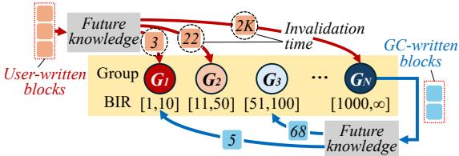  
Fig. 1. Overview of NoDaP

To identify the most suitable group configuration of NoDaPfor a given target workload, we perform exhaustive offline analysis. Specifically, we use a trace-driven LSS simulator to measure WAF for various group configurations and select the configuration whose WAF is close to 1 (see details of the simulator in §5.1). Starting from ??=2, we first search for the combination of BIRs and group sizes for $G _ { 1 }$ and $G _ { 2 }$ that minimizes WAF. Then, ?? is incremented by one, and the above process is repeated until no significant WAF reduction (less than 5%) is observed. At that point, we consider WAF to have converged and use the resulting group configuration for the given workload. While we do not provide a formal proof of optimality, this search mechanism efficiently identifies a near-optimal configuration with WAF close to 1.

NoDaP operations: For placement of user-written blocks (red lines in Fig. 1), NoDaP leverages the perfect knowledge of the block’s invalidation time to place it into the appropriate segment group whose BIR covers the invalidation time of the block. Similarly, NoDaP uses future knowledge to estimate the block’s invalidation time to relocate the GC-written blocks (blue lines) to the group with the matching BIR.

When selecting a victim, NoDaP scans groups from $G _ { 1 }$ to $G _ { N - 1 }$ to identify an expired segment, i.e., one whose residence time exceeds the upper bound of the group’s BIR. Here, a segment’s residence time is defined as the elapsed time since a block was first written into the segment. To this end, NoDaP maintains an in-memory timestamp that records the segment’s first write. As NoDaP has future knowledge, any expired segment will have all its blocks invalidated. If no expired segment is found, NoDaP instead selects the segment with the fewest valid blocks from $G _ { N }$ . This strategy grants the hotter groups $\left( G _ { 1 } { - } G _ { N - 1 } \right)$ more time to accumulate invalid blocks, thereby reducing the overhead of the next GC.

There have been several attempts to derive near-optimal data placement [11, 43, 54], but they do not consider key factors that impact WAF reduction. FK [54] and Oracle-DT [11] fix the group count to 6 or 20. They also rely on heuristics (e.g., cost-benefit) for victim selection without considering the optimality of the choice. ORA [43] adopts a strategy akin to ours for group configuration, but it does not consider the optimal relocation of GC-written blocks; instead, it applies the age-based policy. In a separate line of work, Lange et al. [32–34] propose near-optimal offline algorithms and theoretically prove a worst-case upper bound on their WAF. These algorithms are primarily designed to minimize WAF, so they achieve a WAF closer to 1 than other near-optimal placements, including NoDaP. Unlike this work, our study focuses on isolating and quantifying the effects of three individual strategies in data placement (mentioned in §2.2). Therefore, we design NoDaP as a near-optimal baseline tailored to this purpose.

Table 2: BIRs for $G _ { 1 } { - } G _ { 7 }$ on NoDaP
<table><tr><td rowspan=1 colspan=1></td><td rowspan=1 colspan=1> $\overline { { G _ { 1 } } }$ </td><td rowspan=1 colspan=1> $\overline { { G _ { 2 } } }$ </td><td rowspan=1 colspan=1> $\overline { { G _ { 3 } } }$ </td><td rowspan=1 colspan=1> $\overline { { G _ { 4 } } }$ </td><td rowspan=1 colspan=1> $G _ { 5 }$ </td><td rowspan=1 colspan=1> $G _ { 6 }$ </td><td rowspan=1 colspan=1> $\overline { { G _ { 7 } } }$ </td></tr><tr><td rowspan=1 colspan=1>BIR (block)</td><td rowspan=1 colspan=1>&lt;200K</td><td rowspan=1 colspan=1>200K-9M</td><td rowspan=1 colspan=1>9-17M</td><td rowspan=1 colspan=1>17-27M</td><td rowspan=1 colspan=1>27-42M</td><td rowspan=1 colspan=1>42-51M</td><td rowspan=1 colspan=1>&gt;51M</td></tr><tr><td rowspan=1 colspan=1>Size (segment)</td><td rowspan=1 colspan=1>4</td><td rowspan=1 colspan=1>18</td><td rowspan=1 colspan=1>9</td><td rowspan=1 colspan=1>15</td><td rowspan=1 colspan=1>23</td><td rowspan=1 colspan=1>15</td><td rowspan=1 colspan=1>435</td></tr></table>

## 3.2 Oracle-guided Insights

Experimental setup. We now evaluate the four SOTA techniques exposing their limitations relative to our oracle, NoDaP. We implement all techniques in a LSS simulator configured with 128GiB storage, 256MiB segments, and a 10% overprovisioning ratio. We run the YCSB-A [13] workload on MySQL [41], generating 4.1TiB of writes with 4KiB blocks and collecting the block I/O traces to drive the simulator. Other details are provided in §5.1. The group configuration of NoDaP is obtained via the offline analysis: it consists of seven groups, with each group’s BIR and size listed in Table 2. For the SOTAs, we follow their original designs. For MiDAS, the group configuration varies depending on workload patterns; for YCSB-A, the number of groups is maintained at five.

Impact of user-written block placement. We analyze the impact of the placement policy on WAF. To isolate the effect of each policy, we enable one policy at a time while keeping the others fixed to NoDaP’s settings. That is, we apply the invalidation time prediction policy of each technique into NoDaP, while retaining NoDaP’s policies for the other components. The modified NoDaP versions are denoted as NoDaP+SeU, NoDaP+MiU, NoDaP+PHU, and NoDaP+MLU (each corresponding to the User-written block placement of SepBIT, MiDAS, PHFTL, and ML-DT, respectively).

Our results are shown in Fig. 2(a). Compared to NoDaP, the SOTA policies suffer from higher WAF values ranging from 1.72 to 1.88. These results show that the placement policy for user-written blocks alone has a substantial impact on WAF. This inefficiency is attributed to the inaccurate invalidation time prediction as quantified in Fig. 2(b). NoDaP achieves 100% accuracy, but the other techniques show accuracies ranging from 76% to 87%. The ML-based techniques, PHFTL and ML-DT, consistently show higher accuracy than the heuristic-based ones, SepBIT and MiDAS, but they still show much lower accuracy than NoDaP. This implies that there still exists room for further improvement.

Fig. 2(c) further analyzes the prediction accuracies across segment groups. The ML-based techniques provide higher accuracy across all groups than the heuristic-based ones. However, for the hottest $( G _ { 1 } )$ and coldest $( G _ { 7 } )$ groups, even the heuristic-based ones show accuracies comparable to the MLbased ones. Blocks in $G _ { 1 }$ are frequently overwritten, while those in $G _ { 7 }$ are rarely updated. These distinct characteristics make it easier to classify blocks in $G _ { 1 }$ and $G _ { 7 }$

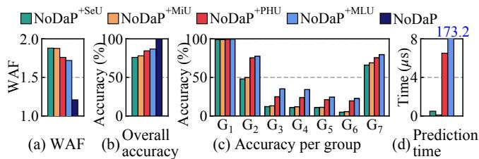  
Fig. 2. Impact of block invalidation time prediction accuracy

The improved accuracy of the ML-based techniques comes at the cost of computational overhead. To quantify this, we carry out experiments in a real-world storage setup (details in §5.1). As shown in Fig. 2(d), while SepBIT and MiDAS decide the target group in less than 0.5??s, PHFTL and ML-DT require over 6.5??s and 173??s, respectively. These long latencies result in a huge performance drop. According to our measurements, the maximum write throughput reduces to 571MB/s and 22.6MB/s for PHFTL and ML-DT, respectively. In contrast, SepBIT and MiDAS achieve higher write throughputs of 968MB/s and 1,137MB/s, respectively.

Impact of GC-written block relocation. We now analyze the impact of the relocation policy for GC-written blocks. As noted in §2.2, there exist two primary ways for relocating live blocks: (i) age-based relocation by SepBIT, MiDAS, and PHFTL and (ii) live-block isolation by ML-DT. The former assumes that live blocks in the victim are likely to have longer invalidation time and thus, relocates them to the next colder GC group. The latter treats these blocks as very cold and places them into a single, isolated GC group.

We take a different approach from the earlier analysis. Specifically, we modify the SOTA techniques to adopt the relocation policy of NoDaP, while keeping their original userwritten block placement policies and group configuration. Due to space, we show results from two representatives: Mi-DAS (age-based relocation) and ML-DT (live-block isolation). Including user and GC groups, MiDAS and ML-DT have 5 and 20 groups, respectively. They are modified to assign GCwritten blocks to one of the groups by NoDaP’s relocation policy. Unlike NoDaP, MiDAS and ML-DT do not assign BIR to each group. To compensate for missing BIRs, we analyze the range of invalidation times of blocks within each group in MiDAS and ML-DT and use this range as the group’s BIR.

Fig. 3(a) compares the WAF of the two SOTA techniques against their modified versions (denoted by +NGC standing for NoDaP GC relocation). Adopting NoDaP’s relocation strategy reduces WAF by 46%, on average. This implies that the SOTA techniques inaccurately estimate invalidation times of GC-written blocks, relocating them to improper groups.

To further understand why the SOTAs fail, we examine the relocation trends of GC-written blocks under NoDaP’s strategy. Fig. 3(b) presents the distribution of destination groups, broken down by the source group from which each

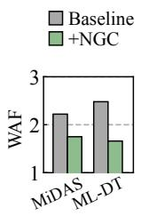  
(a)

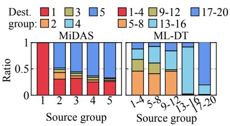  
(b)  
Fig. 3. Impact of GC-written block relocation: (a) overall WAF and (b) destination group distribution of GC-written blocks under oracle-informed relocation

GC-written block originated. GC-written blocks exhibit a wide range of invalidation times. However, the original SOTA policies fail to capture this diversity.

In MiDAS, live blocks are relocated into the subsequent colder group $( G _ { i } \to G _ { i + 1 } )$ . However, many live blocks actually have relatively short invalidation times and should be relocated to the current or an even hotter group (e.g., the red-marked portions of source groups 2 to 5 in Fig. 3(b)). Conversely, some blocks are likely to have longer invalidation times than assumed (e.g., the blue-marked portions of source groups 2 and 3 in Fig. 3(b)). Even after being moved to the next group, those long-lived blocks remain valid until they are chosen as victims and thus will be moved to the next colder group. We observe similar results with ML-DT. Fig. 3(b) shows that it fails to distinguish hot blocks, misplacing them in the sole GC group along with real cold blocks.

Impact of group configuration. Finally, we evaluate the impact of group configuration. We use ML-DT as it is the only technique that assigns user-written blocks into multiple groups as in NoDaP. The others classify blocks only into hot or non-hot, which makes it difficult to support a multi-group design without altering their basic design. We modify ML-DT to operate with the NoDaP’s group configuration, which we denote as $\mathbf { M L - D T ^ { + N G r p } }$ (for NoDaP Group configuration), while keeping the other policies unchanged.

Fig. 4(a) shows the WAF of the original ML-DT and ML-$\mathrm { D T ^ { + N G r p } }$ . Surprisingly, $\mathbf { M } \mathbf { L } \mathbf { - D } \mathbf { T } ^ { + \mathrm { N G r p } }$ increases WAF by 52% over the original ML-DT. The primary difference between the two lies in the accuracy of invalidation time prediction. That is, whereas NoDaP leverages perfect invalidation time knowledge, $\mathbf { M } \mathbf { L } \mathbf { - D } \mathbf { T } ^ { + \mathrm { N G r p } }$ relies on less accurate ML models when deciding which group to place a block. This implies that the best group configuration may change depending on the invalidation time prediction accuracy.

To verify this, we evaluate how the prediction accuracy affects the selection of the group configuration. To this end, we introduce two other variants of ML-DT, ML-$\mathrm { D T ^ { + N U + N G r p } }$ (with NoDaP User-written block placement) and ML-DT+NGC+NGrp (with NoDaP GC relocation). We compare the WAFs of the three ML-DT variants to NoDaP, whose number of groups is fixed to 7, while varying the group count.

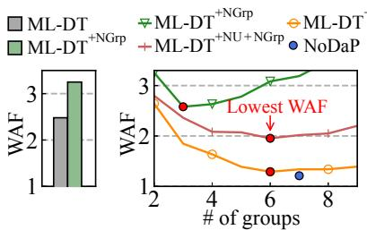  
(a)

(b)  
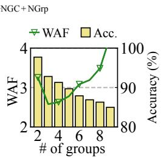  
(c)  
Fig. 4. Impact of group configuration: (a) overall WAF, (b) WAF by varying group count, and (c) WAF and prediction accuracy of $\mathbf { M } \mathbf { L } \mathbf { - D } \mathbf { T } ^ { + \mathrm { N G r p } }$ by varying group count

Fig. 4(b) shows the results. $\mathbf { M L - D T ^ { + N U + N G r p } }$ and ML-DT+NGC+NGrp achieve the lowest WAF values, 1.96 and 1.29, respectively, when the number of groups is six. This indicates that their reduced prediction accuracy affects the choice of the best group configuration. ML- ${ \bf \cdot D T ^ { \bf + N G r p } }$ reaches its lowest WAF of 2.57 with three groups, as the increase from two to three groups allows for finer-grained separation based on their invalidation times. However, beyond this point, the overhead caused by misprediction dominates, resulting in higher WAF.

To illustrate the misprediction overhead, consider the case where blocks that should reside in $G _ { 2 }$ are incorrectly placed in $G _ { 1 }$ . This misplacement mixes blocks of differing hotness within the same segments. As a result, such segments remain in $G _ { 1 }$ far longer than anticipated and are eventually selected as victims, incurring additional live-block copies. One way to mitigate this misprediction overhead is to reduce the number of groups by merging adjacent ones. For example, if $G _ { 1 }$ and $G _ { 2 }$ are merged into a single $G _ { 1 }$ , the total number of groups decreases by one and the size of $G _ { 1 }$ increases. In this configuration, the misclassified blocks now have sufficient time to be invalidated within the merged $G _ { 1 }$ , thereby reducing unnecessary live-block copies.

However, reducing the number of groups is not always an ideal solution, as it introduces side effects when prediction accuracy is sufficiently high. Reconsider the earlier example with more accurate predictors. Without merging, hot blocks are isolated in $G _ { 1 }$ and quickly invalidated, generating many expired segments. After merging $G _ { 1 }$ and $G _ { 2 }$ into a single $G _ { 1 }$ , these hot blocks are mixed with colder ones, reducing the number of expired segments. In the absence of expired segments, the system must instead select victims from other groups, which entails copying a larger number of valid blocks.

Fig. 4(c) illustrates the trade-off between prediction accuracy and WAF as the number of groups varies. Observe that when the group count increases from two to three, WAF decreases due to finer block separation. However, recall that while increasing the group count enables finer block separation, because the model prediction capability is fixed, accuracy inevitably declines as the number of target groups grows. As a result, beyond three groups, WAF rises sharply as the penalty of mispredictions due to lower prediction accuracy outweighs the benefit of finer separations. These results underscore the need to carefully configure the number of groups to balance the gains of finer block separation against the penalties of reduced prediction accuracy.

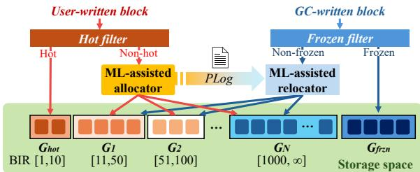  
Fig. 5. Design overview of DOGI

## 4 Design of DOGI

In this section, we present DOGI, a data placement technique designed following oracle-guided insights from §3. DOGI is built around three key design components:

• Hybrid prediction mechanism for user-written block placement. The ML-based techniques exhibit higher accuracy than the heuristic-based ones in predicting invalidation times of user-written blocks, but at the cost of computation overhead. Conversely, the heuristic-based techniques are less accurate overall, but exhibit fairly good accuracy for short- and long-lived blocks with negligible overhead. Based on these, we propose a hybrid prediction mechanism that leverages the strengths of both approaches. We further improve the accuracy and performance of ML models by optimizing input features and model designs.

• ML-assisted GC-written block relocation. GC-written blocks exhibit a wide range of invalidation times, which cannot be efficiently identified by the existing age-based and live-block isolation policies. To this end, we develop an ML-assisted prediction model that leverages ML models and historical information to predict the remaining invalidation times of GC-written blocks. Guided by our prediction model, our relocation policy places GC-written blocks into appropriate groups with full awareness of their diversity.

• Prediction accuracy-aware group configuration. Achieving a near-optimal group configuration requires balancing the benefits of precise block separation against the penalties of misprediction. By keeping this in mind, we design a new group organization mechanism that quantifies the prediction accuracy of our models and outputs the most suitable group configuration, including each group’s BIR, that minimizes overall WAF. By dynamically adapting the configuration to input workloads, we can provide consistently low WAF and stable performance.

## 4.1 Design Overview

Fig. 5 shows the overall architecture of DOGI. DOGI organizes the storage space into ?? + 2 segment groups: one hot group $( G _ { h o t } )$ , one frozen group $( G _ { f r z n } )$ , and ?? intermediate groups $\left( G _ { 1 }  – G _ { N } \right)$ , ordered from warm to cold. $G _ { h o t }$ stores user-written blocks with the shortest invalidation times, while $\boldsymbol { G } _ { f r z n }$ keeps GC-written blocks with the longest invalidation times. The intermediate groups accommodate both user-written and GC-written blocks. The number of intermediate groups ?? is dynamically adjusted according to the characteristics of the workload. Each group, except for $G _ { f r z n } .$ is assigned a specific BIR and stores blocks whose expected invalidation times fall within that range. $\boldsymbol { G } _ { f r z n }$ has no BIR, as only selected, inactive blocks are stored on it. At the end of each segment (a segment footer), we reserve metadata space to store the information needed to manage the contained blocks.

DOGI consists of four main components: a Hot Filter (HF) and an ML-assisted Allocator (ML-Alloc) for managing user-written blocks, and a Frozen Filter (FF) and an ML-assisted Relocator (ML-Reloc) for managing GC-written blocks. When a user-written block arrives, HF sees if the block is hot or non-hot based on its latest invalidation time (see §4.2.1). If it is hot, HF assigns the block to $G _ { h o t }$ . Otherwise, the ML-Alloc predicts its invalidation time again using a lightweight yet more accurate ML model and places it into one of the intermediate groups whose BIR covers the predicted invalidation time (see §4.2.2 and §4.2.3). For a GC-written block, FF checks whether it is a frozen block (i.e., extremely cold) and, if so, it relocates the block to $G _ { f r z n }$ . Otherwise, ML-Reloc places it in one of the intermediate groups based on the remaining invalidation times of GC-written blocks which are estimated by using a Prediction Log (PLog) (see §4.4).

DOGI triggers GC when no free space remains. Similar to NoDaP, it tries to find an expired segment from $G _ { h o t }$ to $G _ { N - 1 }$ . If none is found, it looks up $G _ { N }$ or $\boldsymbol { G } _ { f r z n }$ to choose the segment with the fewest valid blocks. DOGI reclaims expired segments even if they have live blocks to copy. Owing to its limited prediction accuracy, it cannot guarantee all expired segments to have only invalidated blocks. By removing expired segments, it can prevent some groups from growing too large, which enables us to automatically balance group sizes without explicit size enforcement.

Finally, DOGI periodically reorganizes the group configuration to decide the best number of groups and their BIRs in a way that minimizes the overall WAF (§4.3). This is achieved by evaluating various candidate configurations through exhaustive search with mathematical models (i.e., Markov-chain) and the information from PLog.

## 4.2 User-written Data Placement

## 4.2.1 Separating Hot Blocks through Hot Filter

We first describe how HF identifies hot blocks. Our goal is to isolate the hottest blocks within $G _ { h o t }$ , facilitating only dead segments to be generated from the group. To this end, HF uses a simple yet effective heuristic that assigns a user-written block to $G _ { h o t }$ if its latest invalidation time falls within the BIR of $G _ { h o t } , \mathbf { B I R } _ { G _ { h o t } }$ . The latest invalidation time of each block is estimated using the method proposed in [50] 1 .

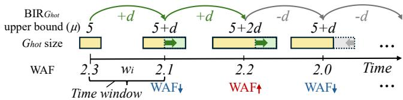  
Fig. 6. Algorithm to decide $\mathrm { B I R } _ { G _ { h o t } }$ upper bound

The challenge is how to determine the upper bound $\mu$ of $\mathrm { B I R } _ { G _ { h o t } }$ as the lower bound is simply 1 because $G _ { h o t }$ contains the hottest blocks. As determining the hot blocks is crucial, $\mu$ should be decided carefully, large enough to capture as many of the hot blocks as possible, yet as tight as possible.

HF uses a lightweight, iterative algorithm, which is illustrated in Fig. 6. HF divides time into fixed-length time windows, $w _ { 0 } , w _ { 1 } , w _ { 2 } , \ldots$ . The number of user-written blocks that arrive during a single time window is fixed to ?? because a user-written block is used as the unit of time. For each time window $w _ { i } .$ , HF measures the average WAF value, ${ \mathrm { W A F } } ( w _ { i } )$ If $\mathbf { W A F } ( w _ { i } ) < \mathbf { W A F } ( w _ { i - 1 } )$ , HF increases $\mu$ by $d ,$ expecting that accepting more hot blocks will lead to a reduction of future WAF, ${ \mathrm { W A F } } ( w _ { i + 1 } )$ . HF keeps increasing $\mu$ if ${ \mathrm { W A F } } ( w _ { i + 1 } )$ $< \mathrm { W A F } ( w _ { i } )$ . Otherwise, it returns to the previous $\mu$ by subtracting ?? since our decision was wrong. To avoid repeated oscillation around similar values of $\mu ,$ if the difference between ${ \mathrm { W A F } } ( w _ { i + 1 } )$ and ${ \mathrm { W A F } } ( w _ { i } )$ is less than 5%, we continue using the current $\mu .$ . Based on empirical observations, $\mu$ is initialized to 200K, while ?? and ?? are set to 65K and 10M, respectively, independent of the workload.

## 4.2.2 Designing ML Model

We now describe how ML-Alloc predicts invalidation times of non-hot blocks using ML models. The key challenges are twofold: (i) designing accurate ML models with reasonable training time, and (ii) ensuring fast inference time. We explain the design of our ML model here and then explain our strategies to accelerate the inference in the next section (§4.2.3).

To estimate invalidation time of non-hot blocks, ML-Alloc utilizes a multi-class classification model. Given an input block, our model returns one of ten categories, $c _ { 1 } { - } c _ { 1 0 } { . }$ , according to the length of its invalidation time. That is, $c _ { 1 }$ corresponds to the shortest invalidation time and $c _ { 1 0 }$ to the longest. The number of categories is set to ten as there is no need to separate blocks more finely. As shown in Fig. 4, the reduction in WAF is maximized for NoDaP and all SOTA techniques when the group count is within ten. After the model predicts the category $c _ { i }$ of a block, the block is assigned to a group $G _ { j }$ How to map categories to groups will be discussed in §4.3.

To build the model, we should carefully choose input features that can capture meaningful characteristics associated with the block’s invalidation time. The choice of a proper classification model is also crucial, as it directly impacts accuracy, computation cost, and training time. We discuss them now. Selection of input features. We derive 11 candidate features known to be effective by referring to prior work [11, 52]. To reduce the computation cost resulting from irrelevant features

Table 3: Input features and their properties

<table><tr><td rowspan=1 colspan=1>Feature</td><td rowspan=1 colspan=1>Description</td><td rowspan=1 colspan=1>PCCscore</td><td rowspan=1 colspan=1>MIscore</td></tr><tr><td rowspan=1 colspan=1>LBA</td><td rowspan=1 colspan=1>Logicalblockaddress</td><td rowspan=1 colspan=1>0.410</td><td rowspan=1 colspan=1>0.799</td></tr><tr><td rowspan=1 colspan=1>Previouslyaccessed LBA</td><td rowspan=1 colspan=1>LBA of the block written immediatelybefore this one</td><td rowspan=1 colspan=1>0.335</td><td rowspan=1 colspan=1>0.615</td></tr><tr><td rowspan=1 colspan=1>Frequency</td><td rowspan=1 colspan=1>#ofaccessestothisLBAinatimewindow</td><td rowspan=1 colspan=1>0.657</td><td rowspan=1 colspan=1>0.376</td></tr><tr><td rowspan=1 colspan=1>Frequency per chunk</td><td rowspan=1 colspan=1>Access count per 2MB chunk that includesthis LBA</td><td rowspan=1 colspan=1>0.586</td><td rowspan=1 colspan=1>0.476</td></tr><tr><td rowspan=1 colspan=1>Recency-weightedfrequency</td><td rowspan=1 colspan=1>Weighted frequencybased on recentaccesses,encoded asan 8-bit value</td><td rowspan=1 colspan=1>0.727</td><td rowspan=1 colspan=1>0.371</td></tr><tr><td rowspan=1 colspan=1>Latestinvalidationtime</td><td rowspan=1 colspan=1>Latest invalidation time Time since the last update to this LBA</td><td rowspan=1 colspan=1>0.616</td><td rowspan=1 colspan=1>0.425</td></tr></table>

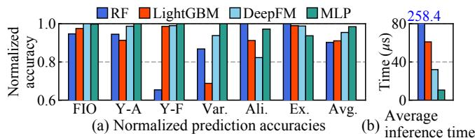  
Fig. 7. Evaluation of four models across workloads

without sacrificing accuracy, we select key features using two standard measures, specifically, the Pearson correlation coefficient (PCC) and mutual information (MI) [17], which tell us the importance of features in classification tasks. We perform this analysis across all workloads listed in Table 4 and choose the six features listed in Table 3, four with high PCC scores and two with high MI scores2.

Selection of model. Sequence models, TCN or GRU, used by prior studies [11, 52] are reasonable candidates. However, these are effective at capturing temporal characteristics of input data, which is useful for identifying hot blocks with distinct temporal behaviors (e.g., frequent occurrence in the timeline and repeated updates within short intervals). As noted in §3.2, such behaviors can be effectively detected by even simpler heuristics, and thus sequence models are not attractive to our case. Instead, we consider lightweight classifiers as they efficiently capture the feature interactions and simple statistical cues that characterize cold data. By considering representative models from neural and tree-based families, we choose four lightweight classifiers, specifically, Multi-Layer Perceptron (MLP) [47], DeepFM [19], RandomForest (RF) [9], and LightGBM [26], for further evaluation as follows.

We conduct an extensive exploration study to derive optimized architectures for the four models and evaluate their accuracies and inference latencies. For this study, we use a 64-core 2.4GHz AMD EPYC Genoa processor and perform training and inference on a single CPU core with a batch size of 128. Fig. 7 shows that MLP achieves the highest average accuracy across all workloads and reduces latency by more than 3× compared with DeepFM, which leads us to choose MLP as our ML model. The resulting MLP architecture is simple and lightweight, consisting of only 1.6K parameters and two fully-connected layers.

Training ML model. To train the model, ML-Alloc first collects a training dataset of 300K samples online. For every ten non-hot blocks, it samples one block and records the six features (listed in Table 3) with its ground-truth label (i.e., its actual invalidation time). The six features are collected for inference (see §4.2.3) since every non-hot block already passes through inference to determine its category. Thus, collecting these features for sampling introduces no additional computation. The estimated category of each block is also kept together for later use in $P L o g$ (details in §4.3). The groundtruth label, however, is available when the block is actually invalidated. To handle this, ML-Alloc maintains a hash table to track sampled blocks by their LBAs. When a non-hot block is overwritten, ML-Alloc checks the hash table and updates the invalidation time if the block was sampled. Using the collected dataset, ML-Alloc trains its ML model for ten epochs, where one epoch corresponds to a full pass over the training dataset. Thanks to its lightweight architecture, training completes in about 30 seconds on average.

To maintain high prediction accuracy over time, ML-Alloc periodically retrains the model every 26M user-written blocks (i.e., after 100GiB of writes), and writing 100GiB takes 305 seconds on average, in our evaluation setup (see §5.1). The retraining process is performed on a dedicated CPU core to avoid interfering with foreground I/O tasks. We confirm that the retraining overhead remains negligible even in the worstcase scenario: a write-heavy workload that fully saturates device bandwidth and triggers retraining every 90 seconds.

## 4.2.3 Inference using ML Model

For every incoming non-hot block, ML-Alloc performs inference using the trained model. To run the inference, we feed the six features (see Table 3) to the model. First, we obtain the LBA directly from the user request and keep the previous LBA in a single 4-byte global variable. The latest invalidation time is mentioned in §4.2.1. We obtain it using a 1-byte counter per block. For frequency per chunk, we maintain a 4-byte counter per 2MiB chunk and increment the counter by one for each write to any LBA in that chunk. The other two features (frequency and recency-weighted frequency) share a 1-byte bitmap per block, where each bit indicates whether the block has been accessed within a fixed-size window of 40M blocks. Recency-weighted frequency is applied by assigning exponentially increasing weights $( \mathrm { e } . \mathrm { g } . , 2 ^ { i } )$ to more recent bits. Overall, these six structures require 64MiB of memory for a system with 128GiB of storage capacity.

Despite its lightweight architecture, our model still requires $1 0 . 6 \mu \mathrm { s }$ per block for inference, which is prohibitively high. To mitigate this cost, ML-Alloc employs batch inference, where multiple blocks (128 blocks, 512KiB in our setup) are processed in a single inference step. This requires us to buffer incoming blocks in memory. Fortunately, LSSs already employ a write buffer to maximize write throughput, which makes it easier to apply batch inference. With this optimization, ML-Alloc reduces the average inference time to $0 . 9 \mu \mathrm { s }$ per block.

To further mask the inference latency, we adopt double buffering with two 4MiB buffers: while one absorbs incoming blocks and performs batch inference, the other flushes pending data to the disk. Once the I/O completes, the two buffers swap roles. This design ensures continuous utilization of compute and I/O, effectively hiding inference overhead entirely.

## 4.3 Applying Suitable Group Configuration

We explained how the ML model classifies data blocks into one of ten categories $\left( c _ { 1 } \mathrm { - } c _ { 1 0 } \right)$ based on invalidation times. We now turn to the question of how to organize groups and assign blocks from different categories.

Initially, DOGI maintains ten groups, $G _ { 1 } { - } G _ { 1 0 }$ , each with its own BIR. The BIRs are initialized from $G _ { 1 }$ , whose lower bound is determined by the upper bound of $\mathrm { B I R } _ { G _ { h o t } }$ (65K blocks in this example), while its upper bound is set to 1% of the storage capacity in blocks (e.g., 335K blocks for 128GiB storage). The upper bound then successively doubles for the subsequent groups (e.g., [335K,770K], ..., [86M,∞]). With these groups and their BIRs, each group $G _ { i }$ can be mapped into category $c _ { i }$ in a one-to-one manner. This seems reasonable, but maintaining too many groups incurs significant GC cost due to misprediction.

As discussed in §3.2, the number of groups must be tuned to minimize overall WAF by balancing the penalty of misprediction against the benefit of finer block separation. Estimating the expected WAFs, however, is challenging because changing the group count simultaneously alters the resulting accuracy of our model and the WAF of individual groups (see Fig. 4). To address this, we combine $P L o g ,$ described below, with Markov-chain (MC) models. Given a group’s BIR, PLog supplies the actual invalidation times of blocks categorized by the model, which tells us how many blocks are mispredicted. The MC model then uses this information to estimate the WAF of systems with multiple groups.

Estimating misprediction ratio using PLog. PLog is a collection of records, each consisting of a pair <predicted category, actual invalidation time> for a previously written nonhot user block. We can construct $P L o g$ from the training dataset for the ML model as it contains both actual invalidation times and predicted categories for sampled blocks.

By extracting records for specific categories $( \mathrm { e } . \mathrm { g } . , c _ { 1 }$ and $_ { c _ { 2 } ) }$ we are interested in from $P L o g .$ , DOGI can characterize the actual invalidation time distribution of a given group $G _ { i } .$ For example, Fig. 8 shows the distribution for $G _ { 1 }$ where $c _ { 1 }$ and $c _ { 2 }$ blocks are assigned to $G _ { 1 }$ . The ??-axis is the actual invalidation time and the ??-axis is the number of $c _ { 1 }$ and $c _ { 2 }$ blocks with that invalidation time. This graph shows how many blocks exceed the upper bound of $\mathbf { B I R } _ { G _ { i } }$ . If the upper bound of $\mathrm { B I R } _ { G _ { 1 } }$ is 50, the misprediction ratio (or the accuracy) for $G _ { 1 }$ is the fraction of blocks whose actual invalidation times exceed 50 (highlighted in red in Fig. 8). This fraction also represents the proportion of blocks that remain valid in $G _ { 1 }$ beyond the bound and are copied to another group during GC. Finding group configuration using MC model. To predict the WAF of a given group configuration, we use existing MC models for log-structured systems [15, 43], which are modified for DOGI (the details omitted due to space). The MC model estimates WAF by simulating the movement of blocks across groups. It takes three parameters (see Fig. 8): $\left( { { p } _ { i } } \right)$ the number of groups, $( p _ { i i } )$ the fraction of user-written blocks assigned to each group, and $( p _ { i i i } )$ the ratio of valid blocks copied from one group to another (i.e., the misprediction ratio). The first is user-defined, while the latter two can be derived from $P L o g .$ . Given the mapping between $c _ { i }$ to $G _ { i } ,$ the fraction of user-written blocks destined for a specific group can be obtained from $P L o g$ . As explained before, for each group, the number of valid blocks to be copied is obtained by analyzing its invalidation time distribution using ????????.

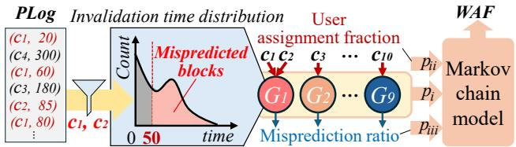  
Fig. 8. Estimating WAF using PLog and MC model

Our MC model gives us the expected WAF given a specific group configuration. The next step is to find one that can minimize WAF by exploring various group configurations. We use a brute-force search algorithm that evaluates all 512 $( = 2 ^ { 9 } )$ possible configurations and chooses one with the lowest WAF. While this seems so naïve, it is a feasible solution as it only takes 10 seconds to complete as there are only 10 groups.

Once the configuration is decided, we should assign the new groups’ BIRs, which is straightforward. Suppose that the number of groups is reduced from 10 to 9, and $G _ { 1 }$ and $G _ { 2 }$ are merged into a new group, $G _ { 1 } ^ { \prime }$ . The BIR of $G _ { 1 } ^ { \prime }$ is simply set by merging the BIRs for $G _ { 1 }$ and $G _ { 2 } .$ , i.e., [65K, 335K] for $G _ { 1 }$ and [335K, 770K] for $G _ { 2 }$ become [65K, 770K] for $G _ { 1 } ^ { \prime }$

Updating group configuration at runtime. Finally, we discuss how DOGI changes the group configuration adapting to workloads. DOGI regularly collects a new dataset and trains a new model. Once the training is complete, DOGI updates PLog using the latest dataset, searches for a suitable group configuration, and applies it. The prediction accuracy of the ML model may degrade if the workload pattern changes significantly. When the overall prediction accuracy falls below a threshold (e.g., 10%), DOGI disables the ML model and reverts to the baseline design that maintains two user groups for separating hot and non-hot blocks and two GC groups following prior work [43, 45, 52, 54]. Once the prediction accuracy recovers, it resumes using the new group configuration.

## 4.4 GC-written Block Relocation

We now describe how DOGI predicts the invalidation time of GC-written blocks and how it relocates them to appropriate groups by FF and the ML-Reloc. To overcome the limitations of the existing age-based relocation and live-block isolation, FF isolates truly cold blocks into a dedicated group. For the remaining blocks, ML-Reloc makes use of the historical information of PLog and exploits this to guide relocation.

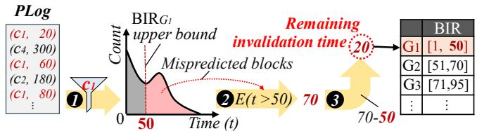  
Fig. 9. GC-written block relocation using PLog

Frozen filter (FF) for isolating cold blocks. $F F$ proactively isolates rarely-updated blocks in $\textit { G } _ { f r z n } .$ . It maintains a 1- bit flag per block to record whether the block has ever been updated. The flag is initialized to 0 and is set to 1 upon the block’s first update. When live blocks are relocated during GC, FF checks their flags; if the flag is 0 (i.e., it has never been updated), the block is classified as extremely cold and relocated directly to $\boldsymbol { G } _ { f r z n }$ . Maintaining one bit per block incurs only about 4MiB of memory for a 128GiB capacity. To further capture blocks that become inactive after bursty writes, FF employs a clock algorithm that periodically clears the flags over a fixed period (every 200M writes).

Relocating GC-written blocks using PLog. For GC-written blocks that are not filtered by FF, ML-Reloc utilizes the PLog introduced in §4.3 to estimate the group in which each block is most likely to become invalid at the next GC, and relocates it accordingly. Depending on the invalidation time category (??1–??10) of a block, ML-Reloc estimates the block’s time remaining until it becomes invalid (i.e., the remaining invalidation time) and relocates the block to the group whose BIR matches the estimated remaining invalidation time.

Fig. 9 illustrates how ML-Reloc relocates GC-written blocks using $P L o g$ under the same group configuration as in Fig. 8. In the example of Fig. 9, we consider the relocation of GC-written blocks that were categorized as $c _ { 1 }$ and thus written to $G _ { 1 }$ , but that remain valid and are chosen by GC as their invalidation times exceed the upper bound of $\mathsf { B I R } _ { G _ { 1 } }$

Using PLog, ML-Reloc first generates the actual invalidation time distribution of user-written blocks that were categorized as $c _ { 1 }$ (see 1 in Fig. 9). Using this distribution, ML-Reloc identifies the proportion of mispredicted blocks (highlighted in red in Fig. 9). Then, it computes the average expected invalidation time of mispredicted blocks that can be obtained by taking the average of their actual invalidation times ( 2 ). In our example, it is estimated as 70. The next step is to compute the average remaining invalidation time of the mispredicted blocks for $c _ { 1 }$ ( 3 ). These blocks were assigned to $G _ { 1 }$ and stayed there for 50 blocks when they were chosen as victims. Thus, the remaining invalidation time is expected to be 20 (=70−50), on average. Finally, ML-Reloc compares the remaining invalidation time against the BIRs of all groups and relocates the blocks to the appropriate group. In this case, since the $\mathrm { B I R } _ { G _ { 1 } }$ is [1,50], GC-written blocks (categorized as $c _ { 1 }$ before) are relocated back to $G _ { 1 }$

Table 4: Characteristics of each workload
<table><tr><td rowspan=1 colspan=1>Workload</td><td rowspan=1 colspan=1>FIO</td><td rowspan=1 colspan=1>YCSB-A&amp;-F</td><td rowspan=1 colspan=1>Varmail</td><td rowspan=1 colspan=1>Alibaba</td><td rowspan=1 colspan=1>Exchange</td></tr><tr><td rowspan=1 colspan=1>Write traffic (TiB)</td><td rowspan=1 colspan=1>4</td><td rowspan=1 colspan=1>4.1</td><td rowspan=1 colspan=1>3.5</td><td rowspan=1 colspan=1>up to 13.7</td><td rowspan=1 colspan=1>up to 1.9</td></tr><tr><td rowspan=1 colspan=1>Storage capacity (GiB)</td><td rowspan=1 colspan=3>132</td><td rowspan=1 colspan=1>55-132</td><td rowspan=1 colspan=1>41</td></tr></table>

Taking the above steps for relocating every GC-written block is costly. Thus, ML-Reloc computes the remaining invalidation times for all the categories (??1-??10) when PLog is updated. When relocating a GC-written block, ML-Reloc quickly decides which group it should be relocated to by referring to the block’s category and the remaining invalidation time for that category. Note that, for GC-written blocks, their categories are recorded in their segment footer, and the remaining invalidation times for the categories are kept in memory thanks to their small size. In the worst case, relocated GC-written blocks could remain valid again in their new groups until being chosen by GC. In such cases, DOGI falls back to a conservative policy by applying the age-based relocation, simply migrating the block to the next group.

## 5 Evaluation

In this section, we evaluate our approach along with three key questions: (i) Does DOGI effectively reduce GC overhead? (ii) What is the impact of DOGI’s design components? (iii) How much overhead does DOGI introduce?

## 5.1 Experimental Setup

Evaluation Platform. We evaluate DOGI using both a real prototype and an LSS simulator. We implement DOGI in a prototype log-structured system built on zoned storage [7, 55]. The prototype runs on a Western Digital ZN540 2TB SSD [55] backend via ZenFS [7], mapping each segment oneto-one to a ZoneFile. The platform has a 64-core 2.4GHz AMD EPYC-Genoa processor with six 64GB DDR4 DIMMs (384GB total). Our prototype sustains a peak 4KiB sequentialwrite throughput of 1.1GiB/s. We also build a trace-driven simulator for rapid evaluation and component-level analysis of DOGI. Unlike the prototype, it does not submit I/O requests to a physical ZNS device. Except for this difference, it shares the same implementations of core algorithms (e.g., GC and data placement), and therefore produces nearly identical WAF and accuracy results. We use the simulator for WAF, accuracy, and per-component analysis in §5.2 and §5.3, and the prototype for throughput and latency evaluations in §5.4.

Unless otherwise stated, we use the following parameters in both the simulator and prototype: segment size of 256MiB, logical block size of 4KiB, over-provisioning (OP) ratio fixed at 10%, and GC triggered when the number of free segments falls below a threshold (0.1% of the total capacity). To ensure that both the simulator and prototype quickly reach a steady state and to clearly observe the effect of data placement, we pre-fill the entire storage space (excluding the overprovisioning space) before starting each workload.

Comparison Targets. For comparison, we implement the four SOTA techniques: SepBIT, MiDAS, PHFTL, and ML-DT discussed in §2.2. For victim selection, PHFTL, SepBIT, and ML-DT adopt the cost-benefit policy, whereas MiDAS uses its own policy based on FIFO combined with the cost–benefit. We also implement NoDaP introduced in §3, to evaluate how close DOGI is to near-optimal performance.

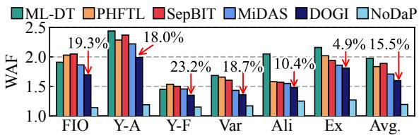  
Fig. 10. Overall WAF of each technique

Workloads. We use six write-intensive workloads. Specifically, we use the FIO [4] workload with a Zipf distribution (?? = 1.0), which generates 4KiB write requests skewed toward a narrow region, and Varmail [53] (denoted as Var) from the Filebench benchmark, which models a mail server with highly write-intensive access patterns. We also use YCSB-A and YCSB-F [13] (denoted as Y-A and Y-F, respectively), two YCSB workloads running on MySQL that exhibit heavy write operations. In addition, we include six write-intensive traces from the Alibaba [36] Cloud I/O dataset (denoted as Ali) and nine Exchange [42] traces from the Microsoft Enterprise dataset (denoted as Ex). For Alibaba and Exchange, consisting of multiple sub-traces, we run each sub-trace and report the average result across them. The details of the workload, including storage capacity, are summarized in Table 4. Here, the storage capacity of each workload is set to match the size of its working set, which differs across workloads.

## 5.2 GC Efficiency

We first evaluate GC efficiency by comparing WAF between existing techniques and DOGI on our simulator. Fig. 10 shows the results. The number above each DOGI bar indicates the WAF reduction (%) relative to the best-performing baseline, MiDAS. DOGI reduces WAF by an average of 25.1% across all workloads and by 15.5% over MiDAS.

To further understand the results, we categorize workloads into two types based on their access patterns. S-type workloads (FIO, YCSB-A and YCSB-F) exhibit skewed and relatively static access patterns [4, 14, 18], which make invalidation time prediction easier (invalidation time prediction accuracy of 78–84% in DOGI for user-written blocks). Dtype workloads (Varmail, Alibaba, and Exchange), in contrast, show more dynamic access patterns [5, 37, 38], posing greater challenges for the model to capture (prediction accuracy of 56–64%). A detailed accuracy analysis is presented in §5.3.

For S-type workloads, DOGI reduces WAF by 19.7% compared to MiDAS. This improvement comes from two factors: (i) HF and our ML model predict the invalidation times of user-written blocks with high accuracy, reducing penalties from mispredictions, and (ii) this in turn allows more groups to be maintained without mixing blocks of different hotness, which improves GC efficiency. In FIO, DOGI maintains seven groups: $G _ { h o t }$ and $G _ { f r z n }$ with five intermediate groups $\left( G _ { 1 } { - } G _ { 5 } \right)$ . Also, part of the WAF reduction comes from the proper relocation of GC-written blocks; in particular, for FIO, the prediction accuracy of GC-written block relocation improves by 7.8% compared to the age-based policy.

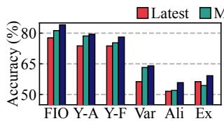  
(a) Overall accuracy

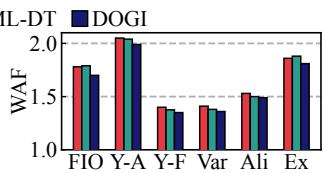  
(b) WAF  
Fig. 11. Comparison of user-written block placement policy

For D-type workloads, the prediction accuracy is lower, so DOGI adapts by reducing the number of groups, typically maintaining only two intermediate groups, thereby mitigating the penalties by mispredictions. As a result, DOGI reduces WAF by 10.3% on average compared to MiDAS. Specifically, for Varmail, DOGI effectively isolates warm blocks from cold blocks into two intermediate groups and ensures that they remain valid until expiration within each group’s BIR, achieving an 18.7% lower WAF than MiDAS. For Alibaba and Exchange, however, the workload characteristics change rapidly over time, causing the model’s prediction accuracy to drop significantly during certain phases. In this case, DOGI triggers the fallback mechanism described in §4.3, which immediately disables the low-accuracy ML model and stabilizes WAF. Afterward, DOGI retrains the model to recover prediction accuracy. With this adaptive design, DOGI consistently outperforms MiDAS, reducing WAF by 4.9–10.4% on Alibaba and Exchange.

Compared to NoDaP, DOGI exhibits a higher WAF across all workloads. This indicates that, although DOGI reduces WAF over SOTA techniques, it still has a non-trivial gap from the near-optimal and leaves room for improvement.

## 5.3 Analysis of DOGI’s Components

We analyze the three key components of DOGI and conduct an ablation study to quantify each component’s contribution. Prediction capability for user-written blocks. We evaluate how accurately DOGI predicts the invalidation time of userwritten blocks and analyze how this prediction impacts GC efficiency. To this end, we leverage the future knowledge used in NoDaP to obtain the actual invalidation time of all blocks and compare it against the predictions on our simulator.

We compare three methods for predicting the invalidation time of user-written blocks: the latest invalidation timebased (denoted as Latest), an ML-based, and DOGI’s hybrid method. As the ML baseline, we adopt the model used in ML-DT, which provides the highest accuracy among prior work. For a fair comparison, we modify only the mechanism for predicting the invalidation times of user-written blocks within DOGI, while keeping all other components unchanged, and measure both prediction accuracy and WAF. Here, the prediction accuracy is evaluated by checking whether the class of predicted invalidation time, defined as either ℎ???? or one of the invalidation time categories $\left( c _ { 1 } \mathrm { - } c _ { 1 0 } \right)$ , matches the actual invalidation time of each block.

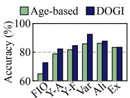  
(a)

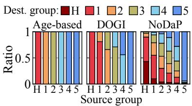  
(b)  
Fig. 12. Comparison of GC-written block relocation policy: (a) overall accuracy across all workloads and (b) destination group distribution of GC-written blocks on FIO

Fig. 11(a) shows the prediction accuracy across workloads. Latest is the worst; as discussed in §3.2, it fails to accurately predict warm and cold blocks. Consequently, as shown in Fig. 11(b), its low accuracy leads to misprediction overheads and higher WAF. Both ML-DT and DOGI achieve higher accuracy, with DOGI outperforming ML-DT. The improvement of DOGI comes from three factors: (i) hot blocks are separated with very high accuracy (e.g., 98.27% and 99.0% for FIO and Varmail, respectively) using the latest invalidation time of each block, (ii) with hot blocks separated, the ML model is trained with a focus on the remaining warm and cold blocks, whose invalidation times are relatively more difficult to predict, and (iii) the our model is designed to accommodate the carefully selected input features to learn wram and cold blocks more effectively. In contrast, ML-DT relies on a single ML model to predict the invalidation time of all user-written blocks, resulting in lower accuracy. This is particularly noteworthy because ML-DT requires 66.5× longer inference time than the lightweight model employed in DOGI.

Prediction capability for GC-written blocks. We now evaluate the ability to predict the invalidation time of GC-written blocks by comparing DOGI against age-based GC relocation. As in the previous experiment, we change only the relocation policy in the design of DOGI and measure the prediction accuracy. A prediction is considered correct if the actual invalidation time of a GC-written block falls within the BIR of the group to which it is relocated.

Fig. 12(a) shows the prediction accuracy of GC-written blocks. Across all workloads except for Exchange, our policy achieves higher accuracy than the age-based relocation policy. This improvement directly leads to the WAF reduction observed between +Grp and +GC in §5.2.

For a more detailed analysis, we examine how GC-written blocks are relocated under each policy. Fig. 12(b) presents the distribution of destination groups, broken down by the source group from which each GC-written block originated, for FIO where our relocation policy achieved the largest WAF reduction. For comparison, we also include the distribution under NoDaP’s policy, which has future knowledge.

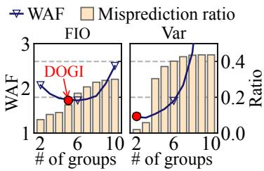  
Fig. 13. Impact of group count

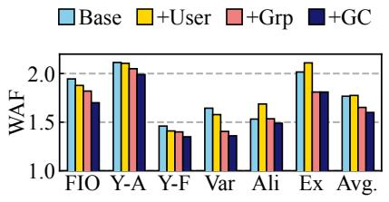  
Fig. 14. Impact of DOGI’s component

Compared to the age-based policy, DOGI can relocate blocks into a more diverse set of groups. When compared with NoDaP, the effectiveness of our approach becomes clear. For instance, when the source group is $G _ { 1 }$ , NoDaP relocates about 45% of blocks back to $G _ { 1 }$ , while the age-based policy moves all of them to $G _ { 2 } .$ , which results in the mixture of blocks with different hotness in $G _ { 2 }$ . In contrast, DOGI relocates most of these blocks back to $G _ { 1 }$ , thereby avoiding this inefficiency. It is worthwhile to mention that even our method has a lot of room for improvement.

Group configuration analysis. We evaluate how group configuration affects GC efficiency and whether DOGI chooses a near-optimal configuration. To this end, we evaluate the misprediction ratio and WAF of all possible configurations in our simulator (up to $2 ^ { 9 } = 5 1 2 )$ ). We focus on two different types of workloads: FIO (S-type) and Varmail (D-type). For ?? such that $2 \leq N \leq 1 0$ , where ?? is the number of intermediate groups, we exhaustively explore all configurations and report the one that achieves the lowest WAF along with its misprediction ratio. Here, the misprediction ratio is measured as the fraction of user-written blocks whose invalidation times exceed the BIR upper bound of their assigned group.

Fig. 13 shows the results. For FIO, the benefit of finer block separation initially outweighs the added misprediction penalty; WAF decreases up to $N = 5$ . Beyond that point, the misprediction penalty begins to dominate, and WAF rises gradually (at $N = 1 0 .$ , WAF becomes 2.1× the minimum). In contrast, for Varmail, the misprediction ratio is low at ?? = 2 and 3 but climbs sharply for $N \geq 4 ,$ inflating the penalty and driving WAF up quickly. Interestingly, when $N \geq 7 ,$ , the misprediction ratio remains nearly unchanged, but WAF increases sharply. This is because the later groups have excessively long BIR upper bounds, leaving segments unselected as GC victims until they expire. As a result, under DOGI’s victim selection policy, GC is frequently triggered in $G _ { N }$ and $\boldsymbol { G } _ { f r z n }$ , where many cold and still valid blocks reside.

The red dots in Fig. 13 represent the configurations chosen by DOGI, which consistently lie near the WAF minima. This indicates that DOGI identifies configurations that are nearoptimal, balancing the benefits of block separation against the misprediction penalties across workloads.

Impact of individual components. We analyze the contribution of key components of DOGI by incrementally adding them to the baseline design. Following the design principles of SepBIT and MiDAS, our baseline design has two user groups for hot and non-hot blocks, classified by latest invalidation times, and two GC groups that organize blocks by age. Starting from the baseline, we add each component one by one; (i) user-written block placement (§4.2.2–§4.2.3), (ii) group configuration (§4.3), and (iii) GC-written block relocation (§4.4), denoted as +User, +Grp, and +GC, respectively.

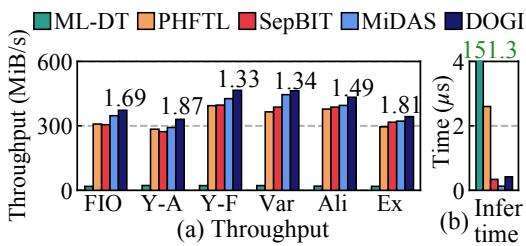  
Fig. 15. Prototype evaluation

Fig. 14 shows how WAF changes across the designs. First, +User represents the base design extended with DOGI’s userwritten block placement. In +User, hot blocks are filtered by HF and placed into the hot group, while non-hot blocks are separated into ten groups according to the invalidation time categories $\left( c _ { 1 } { - } c _ { 1 0 } \right)$ predicted by our ML model. All other design elements remain unchanged from the base design.

The yellow bars in Fig. 14 indicate that the impact of +User on GC efficiency varies across workloads. For FIO and YCSB-F, where prediction accuracy is high and misprediction overhead is relatively low even with many groups, WAF decreases. For YCSB-A, however, the benefit of finer block separation is marginal, since the dominant effect comes from separating hot blocks. Varmail shows an interesting trade-off: although a large number of groups incur misprediction penalties, as discussed in §5.2, the benefit of warm block separation dominates, eventually reducing WAF. In contrast, for Alibaba and Exchange, lower prediction accuracy increases misprediction overhead, even worsening WAF.

+Grp extends +User by determining the number of groups and their BIRs while taking into account the prediction accuracy of the ML model. This results in WAF reductions across all workloads, with the most substantial gains observed on D-type workloads. As shown in Fig. 11, the prediction accuracy for user-written blocks is relatively low, which may incur significant misprediction overheads. Therefore, by merging groups with high misprediction ratios, DOGI improves GC efficiency. The key insight here is that relying solely on prediction accuracy is insufficient; group configuration must also reflect the prediction accuracy of the model.

Finally, adding the +GC component, which makes it the DOGI policy, improves GC efficiency across all workloads. In particular, on FIO, DOGI significantly enhances GC efficiency by estimating the invalidation time of GC-written blocks more accurately than the age-based policy. On the other hand, Exchange shows limited improvement, as its dynamic access pattern reduces the accuracy of predicting the invalidation time of GC-written blocks. Overall, +GC reduces WAF by 8.1% over the age-based policy used in +Grp.

Table 5: Read latency of MiDAS and DOGI (unit: ??s)
<table><tr><td rowspan=1 colspan=1></td><td rowspan=1 colspan=1>Y-A</td><td rowspan=1 colspan=1>Y-F</td><td rowspan=1 colspan=1>Var</td><td rowspan=1 colspan=1>Ali</td><td rowspan=1 colspan=1>Ex</td></tr><tr><td rowspan=1 colspan=1></td><td rowspan=1 colspan=1>50th99th</td><td rowspan=1 colspan=1>50th99th</td><td rowspan=1 colspan=1>50th99th</td><td rowspan=1 colspan=1>50th99th</td><td rowspan=1 colspan=1>50th99th</td></tr><tr><td rowspan=1 colspan=1>MiDAS</td><td rowspan=1 colspan=1>257549</td><td rowspan=1 colspan=1>234507</td><td rowspan=1 colspan=1>241520</td><td rowspan=1 colspan=1>216498</td><td rowspan=1 colspan=1>247523</td></tr><tr><td rowspan=1 colspan=1>DOGI</td><td rowspan=1 colspan=1>254538</td><td rowspan=1 colspan=1>233507</td><td rowspan=1 colspan=1>234516</td><td rowspan=1 colspan=1>220493</td><td rowspan=1 colspan=1>251520</td></tr></table>

## 5.4 Prototype Evaluation

To evaluate throughput, inference (i.e., prediction) overhead and latency, we implement a proof-of-concept prototype of DOGI, along with four SOTA techniques, in a real LSS. Recall that we adopt double buffering to hide inference latency while writes are being issued to storage (see §4.2.3). For a fair comparison, we incorporate double buffering into all the techniques. Through this, all techniques, except for ML-DT, can hide the prediction overhead for user-written blocks.

Fig. 15(a) shows the throughput results. The numbers on the bars indicate the WAF of DOGI measured on the prototype, which align well with the simulation results. On average, DOGI achieves 19.4×, 1.19×, 1.17×, and 1.09× higher throughput compared to ML-DT, PHFTL, SepBIT, and Mi-DAS, respectively. This shows that DOGI effectively reduces write traffic caused by block copies during GC, without significant prediction overhead. ML-DT delivers the lowest throughput (18.3–22.2MiB/s), far below the system peak of 1.1GiB/s, reflecting the combined impact of higher WAF and the compute overhead of its invalidation time prediction.

To quantify the overhead of each technique’s prediction policy, we measure inference time on our prototype while running FIO, using a single CPU core for inference. Fig. 15(b) reports the average inference time of each technique. DOGI achieves substantially lower inference overhead than other ML-based techniques and performs on par with SepBIT. This efficiency stems from the fact that, unlike PHFTL and ML-DT, DOGI classifies hot blocks directly based on their latest invalidation times, leaving a smaller fraction of the blocks (24.7% of all user-written blocks in FIO) to be processed by the ML model. As a result, classifying hot blocks using HF incurs an average latency of only 0.13??s, while classifying the remaining non-hot blocks using the ML model takes 0.94??s on average, resulting in an overall average inference latency of 0.39??s. This shows that DOGI has minimal overhead and can thus be practically deployed in real-world LSSs.

We also evaluate the impact of DOGI on read latency to examine whether it interferes with other I/O tasks. We compare DOGI against MiDAS, which incurs the lowest computational overhead among existing techniques. Table 5 reports the median (50th) and 99th-percentile (tail) read latency across all workloads, excluding FIO, which does not issue reads. Overall, DOGI exhibits similar or slightly lower latencies than MiDAS for every workload. As discussed earlier, this indicates that the computational overhead of DOGI is effectively hidden and does not disrupt foreground reads. Moreover, by effectively reducing WAF, DOGI mitigates I/O delays by GC, which further contributes to its lower tail latency.

## 6 Discussion

In this section, we discuss the scalability implications of DOGI as device capacity increases, focusing on its memory and computational overhead.

Memory overhead. DOGI’s memory overhead mainly comes from ML-Alloc and FF, which incur 68MiB on a 128GiB device (0.05% of the storage capacity). Compared to prior work (MiDAS: 9MiB, PHFTL: 12MiB, SepBIT: up to 70MiB, ML-DT: 128MiB), this overhead is moderate. However, DOGI’s memory usage scales linearly with storage capacity because it maintains per-block metadata, and can become significant at scale (e.g., 34GiB for 64TiB).

To reduce memory overhead, we consider maintaining metadata at a coarser granularity (e.g., one entry per 4 blocks), based on the observation that adjacent blocks exhibit similar behavior [56]. This reduces memory overhead by 4×, but it may introduce additional error in predicting a block’s invalidation time. To quantify this, we evaluate DOGI using one metadata entry per four adjacent blocks and observe a 0.6– 5.2% accuracy drop across workloads in Table 4. This shows a clear trade-off, as reducing memory usage comes at the cost of prediction accuracy. We leave a deeper evaluation and an optimized design that exploits this trade-off for future work. Computational overhead. DOGI’s computational overhead arises from ML-Alloc and the group-configuration search algorithm. Their costs depend on the ML model structure (e.g., the number of parameters) and the size of the groupconfiguration search space (fixed at 512 configurations, as described in §4.3), respectively. Importantly, neither the model architecture nor the search space changes as storage capacity increases; therefore, the computational overhead does not scale with storage capacity.

## 7 Conclusion

In this paper, we presented DOGI, an oracle-guided data placement technique. We first introduced NoDaP, a nearoptimal oracle baseline that set achievable upper bound for WAF reduction. Guided by NoDaP, DOGI combined simple heuristics with the ML model to predict block invalidation times accurately at low overhead, and dynamically selected group configurations to minimize WAF. Our results showed that DOGI reduced WAF by 15.5% and achieved 9.2% higher write throughput, on average, compared to MiDAS.

## Acknowledgments

We thank our shepherd, Gala Yadgar, and the anonymous reviewers for all their helpful comments. This work was supported by the National Research Foundation (NRF) of Korea (RS-2023-00283799, RS-2024-00352607, RS-2025- 00519994), Institute of Information & communications Technology Planning & Evaluation (IITP) grant funded by the Korea government (MSIT) (RS-2023-00229849, RS-2024- 00459026, RS-2025-02215256), and NSF grant (2312785). (Corresponding author: Sungjin Lee)

## References

[1] Abutalib Aghayev and Peter Desnoyers. Skylight—A Window on Shingled Disk Operation. In Proceedings of the USENIX Conference on File and Storage Technologies, pages 135–149, 2015.

[2] Abutalib Aghayev, Theodore Ts’o, Garth Gibson, and Peter Desnoyers. Evolving Ext4 for Shingled Disks. In Proceedings of the USENIX Conference on File and Storage Technologies, pages 105–120, 2017.

[3] Nitin Agrawal, Vijayan Prabhakaran, Ted Wobber, John D Davis, Mark S Manasse, and Rina Panigrahy. Design Tradeoffs for SSD Performance. In Proceedings of the USENIX Annual Technical Conference, pages 57– 70, 2008.

[4] Jens Axboe. FIO: Flexible I/O Tester Synthetic Benchmark. https://github.com/axboe/fio, 2025.

[5] Jayanta Basak and Madhumita Bharde. Dynamic Provisioning of Storage Workloads. In Proceedings of the Large Installation System Administration Conference, pages 13–24, 2015.

[6] Roberto Bez, Emilio Camerlenghi, Alberto Modelli, and Angelo Visconti. Introduction to Flash Memory. Proceedings of the IEEE, 91(4):489–502, 2003.

[7] Matias Bjørling, Abutalib Aghayev, Hans Holmberg, Aravind Ramesh, Damien Le Moal, Gregory R Ganger, and George Amvrosiadis. ZNS: Avoiding the Block Interface Tax for Flash-Based SSDs. In Proceedings of the USENIX Annual Technical Conference, pages 689– 703, 2021.

[8] Simona Boboila and Peter Desnoyers. Write Endurance in Flash Drives: Measurements and Analysis. In Proceedings of the USENIX Conference on File and Storage Technologies, 2010.

[9] Leo Breiman. Random Forests. Machine learning, 45(1):5–32, 2001.

[10] Michael J. Brim, Adam T. Moody, Seung-Hwan Lim, Ross Miller, Swen Boehm, Cameron Stanavige, Kathryn M. Mohror, and Sarp Oral. UnifyFS: A Userlevel Shared File System for Unified Access to Distributed Local Storage. In Proceedings of the International Parallel and Distributed Processing Symposium, pages 290–300, 2023.

[11] Chandranil Chakraborttii and Heiner Litz. Reducing Write Amplification in Flash by Death-Time Prediction of Logical Block Addresses. In Proceedings of the International Conference on Systems and Storage, pages 1–12, 2021.

[12] Feng Chen, Tian Luo, and Xiaodong Zhang. CAFTL: A Content-Aware Flash Translation Layer Enhancing the Lifespan of Flash Memory Based Solid State Drives. In Proceedings of the USENIX Conference on File and Storage Technologies, 2011.

[13] Brian F Cooper, Adam Silberstein, Erwin Tam, Raghu Ramakrishnan, and Russell Sears. Benchmarking Cloud Serving Systems with YCSB. In Proceedings of the Symposium on Cloud Computing, pages 143–154, 2010.

[14] Yifan Dai, Jing Liu, Andrea Arpaci-Dusseau, and Remzi Arpaci-Dusseau. Symbiosis: The Art of Application and Kernel Cache Cooperation. In Proceedings of the USENIX Conference on File and Storage Technologies, pages 51–69, 2024.

[15] Peter Desnoyers. Analytic Models of SSD Write Performance. ACM Transactions on Storage, 10(2), 2014.

[16] Siying Dong, Andrew Kryczka, Yanqin Jin, and Michael Stumm. RocksDB: Evolution of Development Priorities in a Key-Value Store Serving Large-Scale Applications. ACM Transactions on Storage, 17(4):1–32, 2021.

[17] Huanhuan Gong, Yanying Li, Jiaoni Zhang, Baoshuang Zhang, and Xialin Wang. A New Filter Feature Selection Algorithm for Classification Task by Ensembling Pearson Correlation Coefficient and Mutual Information. Engineering Applications of Artificial Intelligence, 131:107865, 2024.

[18] Paul Grubbs, Anurag Khandelwal, Marie-Sarah Lacharité, Lloyd Brown, Lucy Li, Rachit Agarwal, and Thomas Ristenpart. Pancake: Frequency Smoothing for Encrypted Data Stores. In Proceedings of the USENIX Conference on Security Symposium, pages 2451–2468, 2020.

[19] Huifeng Guo, Ruiming Tang, Yunming Ye, Zhenguo Li, and Xiuqiang He. DeepFM: A Factorization-Machine Based Neural Network for CTR Prediction. In Proceedings of the International Joint Conference on Artificial Intelligence, page 1725–1731, 2017.

[20] Aayush Gupta, Youngjae Kim, and Bhuvan Urgaonkar. DFTL: A Flash Translation Layer Employing Demand-Based Selective Caching of Page-Level Address Mappings. In Proceedings of the International Conference on Architectural Support for Programming Languages and Operating Systems, pages 229–240, 2009.

[21] Jin Yong Ha, Sangjin Lee, Hyeonsang Eom, and Yongseok Son. ScaleLFS: A Log-Structured File System with Scalable Garbage Collection for Commodity SSDs. In Proceedings of the USENIX Conference on File and Storage Technologies, pages 53–67, 2025.

[22] Kyuhwa Han, Hyunho Gwak, Dongkun Shin, and Jooyoung Hwang. ZNS+: Advanced Zoned Namespace Interface for Supporting In-Storage Zone Compaction. In Proceedings of the USENIX Conference on Operating Systems Design and Implementation, pages 147–162, 2021.

[23] Jun He, Sudarsun Kannan, Andrea C. Arpaci-Dusseau, and Remzi H. Arpaci-Dusseau. The Unwritten Contract of Solid State Drives. In Proceedings of the European Conference on Computer Systems, page 127–144, 2017.

[24] Jeeyun Kim, Seonggyun Oh, Jungwoo Kim, Jisung Park, Jaeho Kim, Sungjin Lee, and Sam H. Noh. Supplemental Material of DOGI. https://github.com/dgist-datalab/DOGI/ blob/main/DOGI\_supplemental\_material.pdf, 2026.

[25] Jeong-Uk Kang, Jeeseok Hyun, Hyunjoo Maeng, and Sangyeun Cho. The Multi-Streamed Solid-State Drive. In Proceedings of the USENIX Workshop on Hot Topics in Storage and File Systems, page 13, 2014.

[26] Guolin Ke, Qi Meng, Thomas Finley, Taifeng Wang, Wei Chen, Weidong Ma, Qiwei Ye, and Tie-Yan Liu. Light-GBM: A Highly Efficient Gradient Boosting Decision Tree. In Advances in Neural Information Processing Systems, 2017.

[27] Jaeho Kim, Kwanghyun Lim, Youngdon Jung, Sungjin Lee, Changwoo Min, and Sam H Noh. Alleviating Garbage Collection Interference Through Spatial Separation in All Flash Arrays. In Proceedings of the USENIX Annual Technical Conference, pages 799–812, 2019.

[28] Jesung Kim, Jong Min Kim, Sam H. Noh, Sang Lyul Min, and Yookun Cho. A Space-Efficient Flash Translation Layer for CompactFlash Systems. IEEE Transactions on Consumer Electronics, 48(2):366–375, 2002.

[29] Sang-Hoon Kim, Jaehoon Shim, Euidong Lee, Seongyeop Jeong, Ilkueon Kang, and Jin-Soo Kim. NVMeVirt: A Versatile Software-defined Virtual NVMe Device. In Proceedings of the USENIX Conference on File and Storage Technologies, pages 379–394, 2023.

[30] Taejin Kim, Duwon Hong, Sangwook Shane Hahn, Myoungjun Chun, Sungjin Lee, Jooyoung Hwang, Jongyoul Lee, and Jihong Kim. Fully Automatic Stream Management for Multi-Streamed SSDs Using Program Contexts. In Proceedings of the USENIX Conference on File and Storage Technologies, pages 295–308, 2019.

[31] Jinhyung Koo, Junsu Im, Jooyoung Song, Juhyung Park, Eunji Lee, Bryan S. Kim, and Sungjin Lee. Modernizing

File System through In-Storage Indexing. In Proceedings of the USENIX Conference on Operating Systems Design and Implementation, pages 75–92, 2021.

[32] Tomer Lange, Joseph Naor, and Gala Yadgar. Offline and Online Algorithms for SSD Management. ACM on Measurement and Analysis of Computing Systems, 5(3):1–28, 2021.

[33] Tomer Lange, Joseph Naor, and Gala Yadgar. Offline and Online Algorithms for SSD Management. Communications of the ACM, 66(7):129–137, 2023.

[34] Tomer Lange, Joseph Naor, and Gala Yadgar. Optimal SSD Management with Predictions. ACM on Measurement and Analysis of Computing Systems, 9(2):1–28, 2025.

[35] Changman Lee, Dongho Sim, Joo Young Hwang, and Sangyeun Cho. F2FS: A New File System for Flash Storage. In Proceedings of the USENIX Conference on File and Storage Technologies, pages 273–286, 2015.

[36] Jinhong Li, Qiuping Wang, Patrick P. C. Lee, and Chao Shi. An In-Depth Analysis of Cloud Block Storage Workloads in Large-Scale Production. In Proceedings of the International Symposium on Workload Characterization, pages 37–47, 2020.

[37] Jinhong Li, Qiuping Wang, Patrick PC Lee, and Chao Shi. An In-Depth Comparative Analysis of Cloud Block Storage Workloads: Findings and Implications. ACM Transactions on Storage, 19(2):1–32, 2023.

[38] Shaobo Li, Yirui Zhou, Hao Ren, and Jian Huang. ByteFS: System Support for (CXL-based) Memory-Semantic Solid-State Drives. In Proceedings of the International Conference on Architectural Support for Programming Languages and Operating Systems, pages 116–132, 2025.

[39] Changwoo Min, Kangnyeon Kim, Hyunjin Cho, Sang-Won Lee, and Young Ik Eom. SFS: Random Write Considered Harmful in Solid State Drives. In Proceedings of the USENIX Conference on File and Storage Technologies, pages 1–16, 2012.

[40] Jaehong Min, Chenxingyu Zhao, Ming Liu, and Arvind Krishnamurthy. eZNS: An Elastic Zoned Namespace for Commodity ZNS SSDs. In Proceedings of the USENIX Conference on Operating Systems Design and Implementation, pages 461–477, 2023.

[41] MySQL. MySQL Documentation. https://dev. mysql.com/doc/, 2025.

[42] Dushyanth Narayanan, Eno Thereska, Austin Donnelly, Sameh Elnikety, and Antony Rowstron. Migrating

Server Storage to SSDs: Analysis of Tradeoffs. In Proceedings of the European Conference on Computer Systems, pages 145–158, 2009.

[43] Seonggyun Oh, Jeeyun Kim, Soyoung Han, Jaeho Kim, Sungjin Lee, and Sam H Noh. MIDAS: Minimizing Write Amplification in Log-Structured Systems through Adaptive Group Number and Size Configuration. In Proceedings of the USENIX Conference on File and Storage Technologies, pages 259–275, 2024.

[44] Patrick O’Neil, Edward Cheng, Dieter Gawlick, and Elizabeth O’Neil. The Log-Structured Merge-Tree (LSMtree). Acta Informatica, 33(4):351–385, 1996.

[45] Hyunseung Park, Eunjae Lee, Jaeho Kim, and Sam H. Noh. Lightweight Data Lifetime Classification Using Migration Counts to Improve Performance and Lifetime of Flash-Based SSDs. In Proceedings of the Asia-Pacific Workshop on Systems, pages 25–33, 2021.

[46] Kai Ren, Qing Zheng, Swapnil Patil, and Garth Gibson. IndexFS: Scaling File System Metadata Performance with Stateless Caching and Bulk Insertion. In Proceedings of the International Conference for High Performance Computing, Networking, Storage and Analysis, pages 237–248, 2014.

[47] Frank Rosenblatt. The Perceptron: A Probabilistic Model for Information Storage and Organization in the Brain. Psychological Review, 65(6):386, 1958.

[48] Mendel Rosenblum and John K Ousterhout. The Design and Implementation of a Log-Structured File System. ACM Transactions on Computer Systems, 10(1):26–52, 1992.

[49] Russell Sears and Raghu Ramakrishnan. bLSM: A General Purpose Log Structured Merge Tree. In Proceedings of the International Conference on Management of Data, pages 217–228, 2012.

[50] Subhash Sethumurugan, Jieming Yin, and John Sartori. Designing a Cost-Effective Cache Replacement Policy Using Machine Learning. In Proceedings of the International Symposium on High-Performance Computer Architecture, pages 291–303, 2021.

[51] Radu Stoica and Anastasia Ailamaki. Improving Flash Write Performance by Using Update Frequency. In Proceedings of the VLDB Endowment, pages 733–744, 2013.

[52] Penghao Sun, Litong You, Shengan Zheng, Wanru Zhang, Ruoyan Ma, Jie Yang, Guanzhong Wang, Feng Zhu, Shu Li, and Linpeng Huang. Learning-Based Data Separation for Write Amplification Reduction in Solid State Drives. In Proceedings of the Design Automation Conference, pages 1–6, 2023.

[53] Vasily Tarasov, Erez Zadok, and Spencer Shepler. Filebench: A Flexible Framework for File System Benchmarking. The USENIX Magazine, 41, 2016.

[54] Qiuping Wang, Jinhong Li, Patrick PC Lee, Tao Ouyang, Chao Shi, and Lilong Huang. Separating Data via Block Invalidation Time Inference for Write Amplification Reduction in Log-Structured Storage. In Proceedings of the USENIX Conference on File and Storage Technologies, pages 429–444, 2022.

[55] Western Digital. Western Digital Ultrastar DC ZN540 Data Sheet. https://documents.westerndigital. com/content/dam/doc-library/en\_us/assets/ public/western-digital/collateral/datasheet/data-sheet-ultrastar-dc-zn540.pdf, 2021.

[56] Jingpei Yang, Rajinikanth Pandurangan, Changho Choi, and Vijay Balakrishnan. AutoStream: Automatic stream management for multi-streamed SSDs. In Proceedings of the International Systems and Storage Conference, pages 1–11, 2017.

## A Artifact Appendix

## Abstract

DOGI is an oracle-inspired data placement technique that combines simple yet effective heuristics with lightweight machine learning in various log-structured storage systems. DOGI predicts invalidation times for data blocks with high accuracy using an ML model and dynamically adjusts group configurations. DOGI is implemented in a prototype logstructured system built on zoned storage (i.e., ZNS-SSD), which enables us to measure WAF, I/O performance, and CPU overheads of the system. For artifact evaluation, we provide our source code and the trace file. Please refer to the README file at https://github.com/dgist-datalab/DOGI.

## Scope

The artifact includes all the source code required to run DOGI as well as the FIO-based workload trace file used in this study. You can quickly test DOGI using this trace.

## Contents

We provide a Git repository for DOGI, a prototype logstructured storage system implemented on zoned storage devices. Following the README file in the repository, you can measure the WAFs and accuracy of predicting the invalidation time of data blocks. Furthermore, you can measure I/O performance (e.g., write throughput) and the overhead associated with the CPU and memory usage for system execution. The implementation of DOGI mainly spans the app/ and src/ directories. Below, we summarize the key components required to run the system.

## Initialization and data placement.

• app/main.cc initializes the execution environment, loads and replays workload traces, and orchestrates the overall execution of the system, including model training and inference.

• app/classifier.cc classifies incoming data blocks into hot and frozen blocks based on their access characteristics.

• src/placement/dogi.cc places non-hot blocks into appropriate groups according to the categories inferred by the trained ML model.

## Model training and inference.

• app/freq\_features.cc collects frequency-related features used for training block invalidation behavior.

• app/model\_train.cc builds training datasets and triggers the model training pipeline.

• DOGI-Train/model\_trainer.py trains an ML model used for predicting block invalidation times.

• app/mlp\_inference.cc performs inference at block invalidation time using the trained model.

Group configuration and GC.

• group\_optimizer.cc determines the group configuration and the GC relocation policy based on the block invalidation characteristics.

• group\_config.cc applies the selected group configuration to the running system.

• src/selection/dogiselect.cc selects GC victims to satisfy the target block invalidation time range (BIR) under the configured groups.

## Hosting

We provide the public Git URL, and the commit hash for the repository used during artifact evaluation. Additionally, we provide a public Zenodo URL for downloading the trace file of the FIO benchmark used in our evaluation.

• Prototype implementation

• FIO-based workload trace file https://zenodo.org/record/10409599

## Requirements

Hardware requirements. We use the Western Digital ZN540 2TB ZNS NVMe SSD for evaluation. Alternatively, DOGI can be evaluated using an emulated ZNS-SSD based on NVMeVirt [29], which emulates various types of SSDs, including commercial SSDs, key-value SSDs, and ZNS-SSDs, using DRAM. When emulating a ZNS-SSD with NVMeVirt, DRAM capacity must be larger than the device size specified in the trace files, specifically an additional 10% of the device size to accommodate in-memory data structures and the over-provisioning (OP) region used during trace replay. For example, running a trace with a 128GiB device size requires at least 140GiB of DRAM. We also recommend a CPU with at least six cores.

Software requirements. Our prototype is implemented in a log-structured storage environment based on ZenFS, which is implemented as a plugin for RocksDB. Accordingly, the execution environment must support RocksDB and ZenFS, as well as NVMeVirt when ZNS-SSD emulation is used. The following software versions are required to correctly build and run the DOGI prototype. Specifically, the prototype uses RocksDB v6.25.3 and ZenFS v0.2.0. All required packages and dependencies can be installed using standard apt commands. The README file in the repository provides detailed instructions for setting up the software environment and running the DOGI prototype.