USENIX

THE ADVANCED COMPUTING SYSTEMS ASSOCIATION

# Unleashing Zoned UFS: Cross-Layer Optimizations for Next-Generation Mobile Storage

Jungae Kim, SK hynix Inc.; Jaegeuk Kim, Google; Kyu-Jin Cho, Seoul National University; Sungjin Park, Jinwoo Kim, Jieun Kim, and Iksung Oh, SK hynix Inc.; Chul Lee, Bart Van Assche, Daeho Jeong, and Konstantin Vyshetsky, Google; Jin-Soo Kim, Seoul National University

## https://www.usenix.org/conference/fast26/presentation/kim-jungae

This paper is included in the Proceedings of the 24th USENIX Conference on File and Storage Technologies.

February 24–26, 2026 • Santa Clara, CA, USA

ISBN 978-1-939133-53-3

Open access to the Proceedings of the 24th USENIX Conference on File and Storage Technologies is sponsored by

# Unleashing Zoned UFS: Cross-Layer Optimizations for Next-Generation Mobile Storage

Jungae Kim1∗, Jaegeuk Kim2∗, Kyu-Jin Cho3∗, Sungjin Park1, Jinwoo Kim1, Jieun Kim1, Iksung Oh1, Chul Lee2, Bart Van Assche2, Daeho Jeong2, Konstantin Vyshetsky2, and Jin-Soo Kim3

1SK hynix Inc., 2Google, 3Seoul National University

## Abstract

Zoned UFS (ZUFS) has emerged as a next-generation mobile storage technology that reduces the logical-to-physical (L2P) mapping overhead of conventional UFS (CUFS) by enforcing sequential writes within fixed-size zones. While the concept appears straightforward, deploying ZUFS in commercial smartphones introduces non-trivial challenges across the mobile storage stack. In this paper, we identify three key obstacles: managing limited SRAM across multiple open zones, ensuring end-to-end write ordering guarantees, and mitigating severe garbage collection overhead caused by large zones.

We address these challenges through cross-layer optimizations spanning device firmware, the SCSI/UFS driver, the block layer, F2FS, and Android framework: a dynamic deviceside buffer management scheme that opportunistically shares SRAM, a write ordering mechanism that eliminates reordering hazards, and a proactive garbage collection framework that reclaims free space in the background. Evaluation on a commercial smartphone shows that ZUFS sustains over 2x higher write throughput under fragmentation and reduces mobile game loading time by 14% compared to CUFS, while maintaining stable read performance. These results demonstrate that ZUFS’s full potential can only be realized through coordinated redesign across the entire mobile storage stack.

## 1 Introduction

The explosive growth of mobile phones has redefined the computing landscape, making smartphones the dominant computing platform for billions of users worldwide. As of the end of 2024, over 5.8 billion people–more than 70% of the global population–were subscribed to a mobile service, with smartphones accounting for 80% of all mobile connections [15]. In 2024 alone, global smartphone shipments exceeded 1.2 billion units [22], highlighting the ever-increasing demand for high-performance mobile computing.

As smartphones continue to consolidate functions traditionally handled by desktops and laptops, storage has become a critical performance bottleneck [17, 26–29, 38, 39, 45, 47], directly influencing user experience and overall system performance. To meet this demand, Universal Flash Storage (UFS) has become the de facto standard in mobile storage, offering high bandwidth, low latency, and energy efficiency under tight physical and power constraints. However, as mobile workloads continue to grow in complexity and intensity–now including emerging on-device AI features such as real-time image enhancement, speech recognition, and personal assistant tasks–conventional UFS architectures face severe challenges in sustaining performance, especially under limited SRAM budgets and resource-constrained SoCs.

To address the growing limitations of conventional UFS (CUFS) architectures, many industry stakeholders, including SoC vendors, smartphone manufacturers, storage device makers, and platform providers, have collaborated to standardize Zoned UFS (ZUFS) as part of the JEDEC specification [23]. ZUFS introduces a zoned storage model [3] into the UFS interface, requiring that all writes within a zone be sequential. This restriction enables the device to maintain a significantly smaller logical-to-physical (L2P) mapping table, thereby reducing its reliance on large SRAM capacity, which is difficult to scale within the strict area and power budgets of mobile systems. Despite exposing a different interface from traditional block devices, ZUFS is well aligned with the log-structured design of the F2FS filesystem [33] widely deployed on Android-based smartphones. As a result, ZUFS can be adopted with minimal or even no software modifications in the host storage stack, providing a seamless transition path while delivering a simpler and more efficient data placement model that fits the area, power, and thermal constraints of smartphones.

While ZUFS appears to be a straightforward extension of UFS at first glance, fully exploiting its potential in mobile platforms is far from trivial. The introduction of the zoned storage model reshapes fundamental assumptions throughout the storage stack, requiring careful rethinking of interactions between the Android framework, filesystem, block layer, SCSI/UFS driver, and device firmware. This paper focuses on three key challenges that arise in this context. First, unlike CUFS, ZUFS mandates multiple concurrently open zones to allow F2FS to physically separate data and metadata according to their hotness. This, however, requires a sophisticated device-side write buffer management scheme; whereas CUFS could rely on a single write buffer for a single logical stream, ZUFS must juggle several concurrent write streams without incurring excessive buffer thrashing or performance loss. Second, ZUFS requires that the ordering of writes be preserved end-to-end across the filesystem, block layer, and SCSI/UFS driver. Yet existing stacks contain multiple corner cases–from power management mechanisms to requeue handling–that can silently break this guarantee. Finally, ZUFS’s large zone size, while beneficial for throughput and device parallelism, significantly increases garbage collection (GC) overhead at the filesystem level, since reclaiming a single zone may involve migrating a large amount of live data.

These issues highlight that realizing the benefits of ZUFS in practice requires cross-layer optimization across the entire storage stack. Specifically, for write buffer management, we depart from static buffer allocation and introduce a finegrained, dynamic buffer management scheme assisted by the device controller. To ensure correctness under the aggressive power management policies of mobile devices, we establish end-to-end write ordering guarantees throughout the block layer and SCSI/UFS driver. Finally, to mitigate the high overhead of large-zone GC, we design a proactive GC mechanism that adaptively reclaims space in the background. These techniques enable ZUFS to deliver both performance and robustness in real smartphone deployments.

Our evaluations on a real smartphone equipped with a 512 GB ZUFS device show that ZUFS sustains more than twice the write throughput of CUFS and maintains stable read performance even under heavily fragmented conditions. At the application level, experiments with Genshin Impact, a resource-intensive mobile game, demonstrate that ZUFS reduces game verification and loading time by 14% compared to CUFS, directly translating into improved user-perceived responsiveness. This paper makes the following contributions.

• User study of fragmentation in smartphones. We analyze storage statistics from 10,000 smartphones, revealing severe fragmentation in F2FS that persists even at low utilization and directly impacts I/O performance.

• New challenges in adopting ZUFS and their solutions. We identify key obstacles to deploying ZUFS in mobile platforms, proposing device-side buffer management, end-to-end write ordering guarantees, and proactive GC mechanisms.

• Comprehensive evaluation on real devices. We implement our design in a commercial smartphone and demonstrate its effectiveness through both microbenchmarks and application-level experiments.

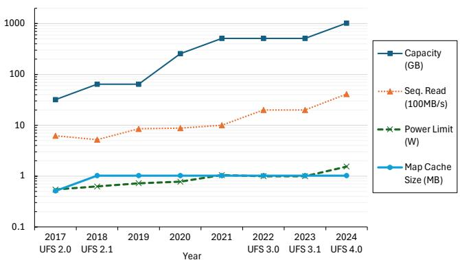  
Figure 1: Recent trends in commercial UFS devices

• Open-sourcing artifacts. We made all the changes to Android frameworks and Linux kernel upstreamed and publicly available to facilitate further research on ZUFS.

This work is the culmination of several years of joint research and engineering effort, spanning device and firmware development, Linux kernel modifications, and Android framework integration. New flagship Google Pixel 10 Pro series smartphones incorporating the features described in this paper were publicly released to the market in 2025. To our knowledge, this is the first deployment of zoned storage technology in commercial high-end smartphones, exemplifying how industry-wide collaboration can successfully transform research ideas into production systems.

The rest of the paper is organized as follows. Section 2 presents the background and Section 3 highlights the key challenges of adopting ZUFS in production systems. Section 4 describes the cross-layer optimizations we propose for ZUFS. We provide our evaluation results in Section 5 and conclude the paper in Section 6.

## 2 Background

## 2.1 Universal Flash Storage (UFS)

Universal Flash Storage (UFS) has emerged as the dominant storage interface for modern smartphones, replacing the legacy embedded MultiMediaCard (eMMC) technology. This transition was driven by the increasing demand for higher performance, improved responsiveness, and better scalability, where mobile workloads have grown rapidly due to highresolution imaging, complex applications, and fast wireless connectivity. eMMC was originally designed as a low-cost, low-power solution and relied on an 8-bit parallel bus that operates in a half-duplex mode, meaning that data transfers could only occur in one direction at a time. As a result, reads and writes were serialized, limiting overall throughput, especially under mixed I/O workloads. Furthermore, eMMC supported only a single outstanding command, making it difficult to utilize the inherent parallelism of modern NAND flash chips that can access multiple dies and planes simultaneously.

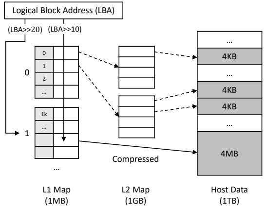  
Figure 2: Hierarchical L2P mapping table in UFS

UFS was introduced to overcome these limitations by adopting a high-speed serial interface, enabling full-duplex communication where reads and writes can proceed concurrently. It also adopts an SCSI-based command set with command queueing [19], allowing multiple I/O requests to be issued and dynamically scheduled to leverage the internal parallelism of NAND flash-based storage devices.

Figure 1 shows the evolution of commercially shipped UFS devices from 2017 to 2024 in terms of capacity, sequential read throughput, power limit, and on-device SRAM allocated for the L2P mapping table. Over this period, UFS storage has experienced exponential growth in capacity from 32 GB in early UFS 2.0 devices to 1 TB with UFS 4.0, accompanied by a near doubling of sequential read performance with each major UFS generation, ultimately reaching 4.1 GB/s in the latest UFS 4.0. These advancements have been achieved under a tightly constrained power envelope that has remained close to 1 W, only modestly rising to 1.5 W in the recent specification.

## 2.2 Logical-to-Physical Mappings in UFS

Modern NAND flash-based devices cannot overwrite data in place due to the erase-before-write constraint [12]. To provide the abstraction of a conventional block device interface, flash-based storage systems rely on a Flash Translation Layer (FTL) that maintains a mapping table from logical block addresses (LBAs) to physical page addresses (PPAs). The most common approach is page-level mapping, where each 4 KB logical page is mapped to a physical page in NAND flash. This scheme enables maximum flexibility: any LBA can be redirected to any physical page, which is essential for sustaining high random write performance and efficient garbage collection (GC). However, the main drawback is the sheer size of the L2P mapping table. Since each mapping entry requires at least 4 bytes, the table consumes 0.1% of the total device capacity. For example, a 1 TB flash device requires roughly 1 GB of memory to hold the full mapping table [43, 44].

While this overhead is manageable in server-class SSDs equipped with large DRAM, it becomes prohibitive in mobile UFS devices with their stringent silicon area and power budgets. UFS controllers typically integrate only a few megabytes of SRAM, which must also accommodate firmware code and runtime metadata. As illustrated in Figure 1, the SRAM allocated for the L2P mapping table in UFS devices has remained at around 1 MB or less since 2017, despite the exponential growth in device capacity during the same period.

Since UFS devices cannot afford to keep a full page-level mapping table in SRAM, they traditionally employed a map cache mechanism [16] that stores only small working set of mapping entries in limited SRAM. To reduce the table size, UFS adopts a hierarchical two-level mapping scheme, conceptually similar to a two-level page table in virtual memory systems. For example, for a 1 TB UFS device with 4 KB logical pages, the first-level (L1) map requires 1 MB of storage, as shown in Figure 2. Each L1 entry points to a second-level (L2) map table, which holds the page-level mappings for a contiguous logical address range. However, because even the L1 map is too large to be permanently pinned in SRAM, both L1 and L2 maps must be dynamically cached in a small SRAM-based map cache, which is only about 1 MB in total.

Upon an I/O request, the FTL first consults the cache for the required L1 and L2 entries. If either entry is missing, it must be fetched from NAND flash, causing a map cache miss. These misses are especially costly under random I/O workloads, where the access pattern exceeds the cache capacity and results in frequent additional flash reads before servicing user requests [31, 36].

To further reduce the mapping overhead, UFS devices may employ a compressed mapping scheme [42]. In this design, an L1 map entry directly encodes the physical location of a large, logically contiguous region (e.g., 4 MB), eliminating the need to reference L2 map entries. This is analogous to the notion of a huge page in virtual memory systems, where a single entry covers a large contiguous range of addresses. When such contiguity holds, the mapping table size can be drastically reduced, and fewer entries need to be cached in SRAM. However, the effectiveness of compressed mapping is inherently conditional. The assumption of logical-physical contiguity is often violated in the presence of random writes, which fragment the mapping space. In such cases, FTL must fall back to the original hierarchical mapping scheme, where both L1 and L2 entries are needed.

## 2.3 Zoned UFS (ZUFS)

The widening gap between soaring device capacities and the stagnant map cache size highlights a fundamental scalability challenge in current UFS architectures. This has prompted the development of Zoned UFS, which relaxes mapping table requirements while still sustaining high random read performance. In November 2023, JEDEC ratified the Zoned UFS (ZUFS) specification, extending the UFS 3.1/4.0 standard with support for the Zoned Block Commands (ZBC) interface [23]. Unlike conventional UFS (CUFS), which manages each Logical Unit (LU) at a 4 KB page granularity, ZUFS introduces Zoned Logical Units, where the address space is divided into multiple fixed-size zones, each representing a contiguous, non-overlapping range of LBAs. Writes to a zone must follow a strict sequential order, and the starting LBA of each write must match the zone’s write pointer, which records the next writable position within the zone.

<table><tr><td rowspan="4">Userspace Android</td><td colspan="2">Applications</td></tr><tr><td colspan="2">Android Frameworks</td></tr><tr><td colspan="2">Virtual File System (VFS)</td></tr><tr><td>F2FS</td><td>LFS Mode</td></tr><tr><td rowspan="4">Kernel Hardware</td><td> Block Layer</td><td>mq-deadline</td></tr><tr><td> SCSI/UFS Driver[</td><td>ZBD/ZBC Support</td></tr><tr><td> ZUFS Device</td><td>Conv, Zoned LU</td></tr><tr><td colspan="2">NAND Flash</td></tr></table>

Figure 3: Android storage stack for ZUFS

Each zone sits on one of four states–EMPTY, OPEN, CLOSED, or FULL. An EMPTY becomes OPEN once data is written to it; OPEN zones can continue to accept sequential writes until the zone is fully written, at which point it transitions to FULL. When a power cycle occurs, zones in the OPEN state implicitly transition to CLOSED. These zones are restored to OPEN when a new write request comes after the power cycle is complete. A zone becomes EMPTY from any precedent state by resetting its write pointer. Zones in either OPEN or CLOSED state are collectively considered open zones, and the standard requires that at least six open zones be supported simultaneously to ensure reasonable performance.

Although the zoned storage model has been widely explored in the context of Zoned NameSpace (ZNS) SSDs [9, 10, 18, 35], their deployment in commodity systems has been limited. In the mobile domain, however, ZUFS offers unique advantages over CUFS. First, ZUFS reduces the L2P mapping table size by several orders of magnitude, since only one entry per zone is required rather than one per page. This allows the entire mapping table to fit easily within a small SRAM budget, eliminating map cache misses, and thereby delivering stable random read performance. Second, ZUFS can significantly reduce the write amplification factor (WAF). When the zone size is aligned to a NAND erase block (or its multiple), the sequential-write rule obviates device-level garbage collection, effectively shifting GC responsibilities to the host [11]. The resulting reduction in WAF directly translates to lower energy consumption, improved endurance, and more predictable latency–properties that are especially critical in mobile storage environments where area, power, and responsiveness are tightly constrained [21, 24, 25, 34, 46, 48].

## 2.4 Android Storage Stack for ZUFS

To bridge the gap between the conventional block interface and the zoned interface, Android1 extends its storage stack with support for ZUFS. This support builds on the Zoned Block Device (ZBD) abstraction, originally introduced in the Linux kernel for Shingled Magnetic Recording (SMR) HDDs [13]. Figure 3 depicts the overall architecture of the Android storage stack for ZUFS.

During device boot, the Android framework configures ZUFS by first probing for a Zoned block device. If one is detected, it is handed off to filesystem management services—namely the Volume Daemon (vold) and the filesystem manager library (fsmgr). These services handle initial lowlevel tasks, such as formatting the disk. Additionally, they perform routine filesystem maintenance. An fsck is automatically triggered to verify and repair filesystem consistency if the device was not shut down cleanly or if a check has not been performed in over a month. For ZUFS, this fsck also includes the critical step of correcting the write pointer for any open zones.

At the filesystem level, Android employs F2FS [33], the default filesystem for mobile devices. F2FS is inherently logstructured; it writes all updates sequentially, dividing the volume into fixed-size segments (the basic allocation unit), which are further grouped into sections. File data and metadata are stored in 4 KB blocks and written sequentially within segments. For ZUFS, F2FS utilizes two types of logical units (LUs): a conventional LU, used for metadata areas that require random updates, and a zoned LU, which stores user data and other sequentially written metadata. When free segments run low, F2FS performs garbage collection (GC) at section granularity to reclaim invalid data. Note that traditional F2FS selectively performs In-Place Updates (IPU) to optimize small synchronous file updates, such as those generated by fsync(), to reduce write amplification. However, because overwrites are disallowed in zoned devices, IPUs cannot be applied in ZUFS. Consequently, F2FS must operate in a strict log-structured (LFS) mode, where all writes are sequential, thereby ensuring compliance with ZUFS constraints.

At the block layer, ordering guarantees are essential to preserve sequentiality required by zoned devices. Although F2FS generates sequential writes, the Linux block layer may still reorder them during dispatch. To address this, the mq-deadline scheduler is employed as the default I/O scheduler for zoned storage because it balances fairness with strict ordering. The scheduler maintains per-direction queues sorted by logical block addresses and deadline, and at dispatch time enforces that only one write per zone is in flight. This mechanism, known as Zone Write Locking (ZWL) [3], serializes writes within each zone and thereby upholds the ordering constraints imposed by ZUFS. Below the block layer, each dispatched request is translated into a zoned command by the SCSI and UFS driver layers, where ordering must also be preserved.

This end-to-end integration–from the Android framework through F2FS and the block layer down to the SCSI/UFS driver–ensures that Android’s storage stack fully complies with ZUFS semantics while leveraging its benefits.

## 2.5 Related Work

The zoned storage model, first introduced for Shingled Magnetic Recording (SMR) HDDs [13], has since been extensively explored in the context of server-class SSDs, giving rise to Zoned NameSpace (ZNS) SSDs as a way to overcome the limitations of conventional block-based designs. A series of studies have shown that ZNS SSDs can build more cost-efficient systems by resolving the fundamental mismatch between the block interface and NAND flash characteristics. Matias et al. [10] point out that conventional SSDs incur the block interface tax, which includes excessive overprovisioning space, substantial DRAM to maintain page-level L2P mappings, and costly device-level GC. Building on this observation, ZNS+ [18] adds in-device support to reduce filesystemlevel GC overhead in F2FS by enabling data migration between zones within the device, while eZNS [35] introduces adaptive zone sizing to provide predictable performance in multi-tenant environments. More recently, ZNSwap [9] shows that ZNS SSDs can also stabilize Linux swap performance by inherently avoiding device-level GC.

Recently, the zone abstraction has also gained traction in mobile storage, motivating several JEDEC members to propose the standardization of ZUFS. While ZUFS and ZNS SSDs share the same core idea of coarse, zone-granularity mapping that avoids page-level L2P mapping, the key challenge in mobile is the resource budget: datacenter-class ZNS SSDs often have GB-scale DRAM to retain mapping metadata and multiple per-open-zone write buffers, whereas ZUFS must provide similar functionality within a UFS controller with only scarce on-chip SRAM. In this context, Yan et al. [46] integrate ZNS principles into UFS by relocating major FTL functionality to the host: a host-side FTL performs logical-to-physical translation and orchestrates zonelevel space management (including GC decisions), reducing on-chip SRAM pressure at the cost of additional host CPU/DRAM overhead and a substantially more intrusive host control path. In contrast, our approach is to keep the FTL ondevice and focus on making zoned mapping practical under UFS-class constraints.

The most closely related work to ours is ZMS [21], which extends the zone concept into UFS-based mobile storage systems and identifies two key challenges in realizing zone abstraction for UFS. The first challenge, write buffer thrashing, arises because UFS devices lack sufficient memory to dedicate a write buffer to every open zone. To address this, ZMS introduces an intermediate I/O reshaping layer, IOTailer, between the filesystem and block layer. It reformats write requests from filesystem on a per-zone basis to match the NAND program unit size, thereby reducing unaligned flushes. However, IO-Tailor requires detailed device-geometry and buffering/flush information (e.g., superpage size, parallelism, alignment constraints) that current JEDEC ZUFS interfaces do not expose. IOTailor also introduces a host-side control path to buffer, merge, and repack writes while coordinating flushes, increasing CPU/DRAM overhead and adding queueing delay on the write-path. In addition, Android per-file encryption assigns distinct keys per file, which limits safe cross-file merging in practice. Overall, ZMS complicates upstream integration and long-term maintenance by requiring coordinated cross-layer changes and device-dependent host policies.

The second challenge, tiny synchronous file updates, stems from frequent small writes with fsync(), a common pattern in SQLite [2, 24]. In such workloads, F2FS typically relies on in-place updates (IPUs) to avoid extra metadata writes. ZMS supports these updates through a budget-based IPU mechanism at the device level, which leverages the SLC buffer to temporarily hold the data under pre-defined budgets before migrating them to TLC during GC. However, this approach violates the JEDEC ZUFS specification [23], which mandates that all zones be write-required and thus disallows overwrites. Moreover, the relevance of IPU acceleration has diminished in practice; modern SQLite already leverages the atomic\_write [30] interface in F2FS, which guarantees multi-block atomicity at the filesystem level. Since atomic\_write must support rollback for recovery, F2FS cannot rely on IPU in these cases. Instead, data written via atomic\_write can be accelerated using the Write-Booster [32] feature in UFS, which internally utilizes SLC buffer (or SLC zone) to deliver fast persistence.

## 3 Motivation

Despite being well-standardized, the practical deployment of ZUFS in commercial smartphones is non-trivial. In this section, we discuss the motivations for adopting ZUFS in mobile devices and highlight the necessity of cross-layer optimizations within the Android storage stack.

## 3.1 Fragmentation in Smartphone Storage

To motivate the need for ZUFS, we first investigate how storage fragmentation manifests in real smartphones. Fragmentation is a critical issue in mobile storage, as it directly impacts performance by increasing the burden on GC and degrading random read latency. To quantify this effect, we define a new metric, fragmentation level, as the ratio of the number of dirty segments to the total number of dirty and free segments in F2FS. This metric effectively reflects the relative cost for GC to produce new free segments, with values approaching 1 indicating severe fragmentation.

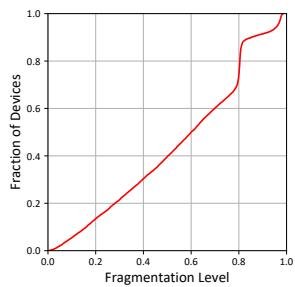  
(a) Fragmentation level

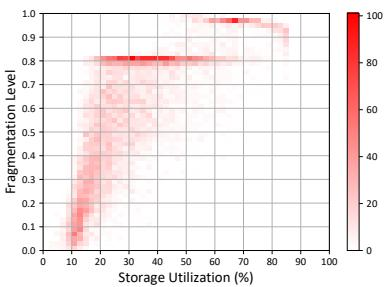  
(b) Utilization vs. Fragmentation

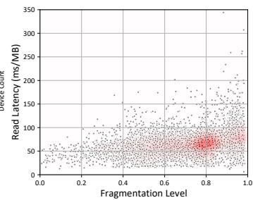  
(c) Read latency

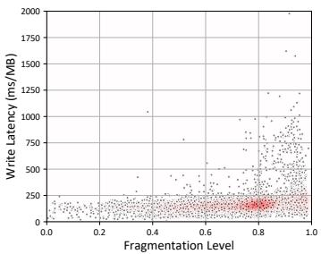  
(d) Write latency  
Figure 4: Fragmentation characteristics and performance impact in real smartphones

For our study, we collected storage statistics from 10,000 devices of a previous-generation flagship smartphone model equipped with 128 GB UFS storage. The model had been on the market for about a year at the time of measurement, so the dataset naturally reflects varying usage times across devices depending on purchase time. Storage utilization was relatively evenly distributed, ranging from 3% to 86%, with an average around 32%. Nearly half of the devices use less than 27% (35 GB) of their 128 GB capacity, while roughly 5% of devices exceed 70% utilization, where space scarcity becomes an obvious concern.

Figure 4a shows the cumulative distribution function (CDF) of fragmentation levels across devices. The distribution increases almost linearly up to about 0.7, then rises sharply, with two noticeable knees around 0.8 and 1.0. Overall, about 30% of devices already suffer from severe fragmentation (levels exceeding 0.7), indicating that a substantial portion of realworld smartphones already operate under conditions where few clean segments remain available. Figure 4b presents a heatmap illustrating the number of devices for each combination of storage utilization and fragmentation level. While higher utilization generally correlates with higher fragmentation, a substantial number of devices with low utilization also exhibit severe fragmentation. The strong correlation between utilization and fragmentation (r ≈ 0.74) shows that capacity pressure exacerbates the problem, but the presence of highly fragmented devices at low utilization highlights fragmentation as a fundamental challenge rather than a mere byproduct of fullness.

High fragmentation levels represent situations where almost no clean segments remain available, making future reads and writes increasingly inefficient. Figure 4c and 4d show the impact of fragmentation on read and write latency, measured at the Linux block layer as the average time to complete

1 MB I/O. The values were derived from the statistics exposed in /sys/block/<dev>/stat, specifically the fields for read ticks, write ticks, read sectors, and write sectors. Each scatter plot is overlaid with a kernel density estimation (KDE) curve (in red) to emphasize the distribution of devices. For reads, the average latency is about 66 ms/MB, while the worst case reaches 344 ms/MB. Notably, the variance of read latency increases significantly once the fragmentation level exceeds 0.4, indicating that even moderate fragmentation can destabilize read performance. For writes, the average latency is about 175 ms/MB, yet the tail latency is far worse: the 99th percentile reaches 678 ms/MB, and the worst case approaches 2 s/MB. Write performance degrades sharply when the fragmentation level exceeds 0.8, underscoring how severely fragmented devices experience unpredictable and prolonged delays. Taken together, these results show that severe fragmentation directly translates to degraded user experience, causing slower random reads, unstable latency, and costly GC. This motivates the need for ZUFS, which addresses the limitations of map caching and enables more efficient GC, leading to stable performance even under fragmented workloads.

## 3.2 Write Buffer Thrashing

The challenge of managing write buffers across multiple open zones has been recognized in prior work such as ZMS [21]. The root cause stems from the ZUFS specification, which mandates support for at least six concurrently open zones. This requirement aligns with F2FS, which by default maintains six open zones to segregate data and metadata according to their hotness [33]. In our ZUFS device, programming a full superpage–the unit spanning all dies and planes in a zone– requires a 768 KB write buffer. Supporting six zones therefore demands 4,608 KB of buffer space (See Section 4.1 for details). In addition, conventional LU requires its own dedicated buffer, increasing the total requirement to 7×768 KB.

To mitigate this memory pressure, ZMS provisions only two write buffers for the Zoned LU at the device level, allowing superpage writes to at most two zones concurrently. To reduce premature flushes caused by this limitation, ZMS introduces a kernel module called IOTailor, positioned between the filesystem and block layer. IOTailor coalesces filesystem writes into superpage-sized units and dispatches them to the two available buffers, thereby minimizing unaligned and premature flushes.

In contrast, our approach tackles the same problem entirely inside the device by employing dynamic and fine-grained buffer allocation. This design eliminates the need for hostside customization, provides greater flexibility in serving multiple open zones, and enables efficient use of limited SRAM without requiring intrusive changes to the host storage stack. We present the detailed design of this solution in Section 4.2.

## 3.3 Write Ordering Violations

Ensuring strict write ordering turns out to be more challenging in mobile UFS devices than in datacenter ZNS SSDs, largely due to the aggressive power management policies employed in mobile environments. In particular, UFS controllers make extensive use of clock gating [40], a technique that disables the device clock when idle to save power and ungates it only when new requests arrive. While effective for reducing energy consumption in smartphones, this mechanism complicates I/O ordering: when the clock is gated, incoming requests are requeued until the clock is restored, potentially altering their dispatch order. This behavior reveals a fundamental mismatch between UFS power management mechanisms and the ordering guarantees required by zoned storage, posing a significant obstacle to sustaining correct ZUFS semantics in production systems.

To address this challenge we found it unavoidable to modify both the SCSI core and the UFS driver so that UFS power management no longer undermines the sequential write semantics required by zoned storage. At a high level, our changes ensure that power-saving mechanisms such as clock gating preserve write ordering rather than breaking it. Beyond these UFSspecific issues, we also identified and resolved several corner cases in the Linux block layer where ordering guarantees could fail. These cross-layer enhancements are essential to bridge the gap between mobile power management policies and the strict ordering guarantees required by ZUFS devices, and their detailed design is presented in Section 4.3.

## 3.4 Intense Garbage Collection Overhead

F2FS follows a log-structured design in which garbage collection (GC) is indispensable for reclaiming invalid blocks and maintaining a pool of free space. GC operates at the granularity of sections and can be invoked in either background or foreground mode. Background GC is triggered opportunistically to recycle free sections without interfering with user I/O, while foreground GC is invoked when the number of free sections falls below a threshold. Foreground GC directly delays user I/O and degrades system responsiveness, making its frequency a critical performance factor.

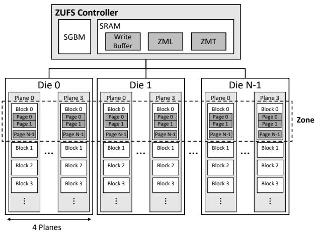  
Figure 5: Overall architecture of the ZUFS device

In ZUFS, sections are aligned with physical zones, so the zone size directly influences GC behavior. Large zones offer clear advantages: they exploit device-level parallelism and, when aligned with NAND erase units, can eliminate devicelevel GC entirely. However, large zones also introduce new challenges at the F2FS level. A victim section may contain many valid segments, requiring a single GC round to migrate a substantial amount of live data. This greatly increases migration costs and exacerbates write amplification. Furthermore, because the number of allocatable sections decreases as the zone size grows, the pool of free sections is exhausted more quickly, causing foreground GC to be triggered more often.

Thus, while large zones are desirable for maximizing sequential throughput, they also intensify GC overhead at the filesystem level. This trade-off highlights the need for new GC strategies in ZUFS that can manage free sections efficiently without compromising performance. We describe our solution in detail in Section 4.4.

## 4 Design

## 4.1 Overall Architecture of ZUFS Device

Figure 5 depicts the overall architecture of the ZUFS device evaluated in this paper. The device is composed of multiple TLC NAND dies, each organized into four planes of blocks and pages. Each page has a size of 16 KB. ZUFS logically aggregates blocks across dies and their planes to form zones. In our device, this aggregation yields an effective zone size of 1,056 MB. This configuration aligns the zone size with the physical superblock granularity and enables ZUFS to fully exploit device-level parallelism under sequential I/Os.

At the core of the device, the ZUFS controller manages operations with a small on-chip SRAM, which is primarily allocated to write buffers, the Zone Mapping Table (ZMT), and the Zone Mapping Log (ZML), along with other metadata structures. Unlike CUFS, which relies on fine-grained pagelevel mappings, ZUFS maintains mappings at zone granularity. Each ZMT entry consists of an 8-byte record: a 4-byte starting physical address and a 4-byte length field representing the amount of valid data in the zone. While the device internally tracks the position of the last programmed page in each zone, the length field in the ZMT records the last valid data location at 4 KB granularity, corresponding to the write pointer visible to the host. This allows ZUFS to correctly serve read requests for the data that remains buffered but not yet programmed, and it provides accurate recovery information in the event of a sudden power-off while data is still resident in the write buffer. Thanks to this coarse-grained mapping, the ZMT is compact enough to be fully cached in SRAM. For example, a 1 TB ZUFS requires only 8 KB to store the entire ZMT, whereas an equivalent CUFS device requires nearly 1 GB for page-level mappings. By eliminating map cache misses, ZUFS provides stable random read performance even under stringent SRAM constraints.

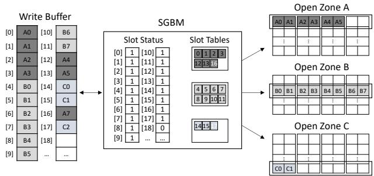  
Figure 6: Zone-aware dynamic buffer management. For simplicity, this figure assumes that ZUFS consists of two planes per die and that the minimum programming unit size equals the size of two slots.

To handle updates efficiently, ZUFS does not modify ZMT entries directly. Instead, changes are first staged in the ZML, which batches updates before checkpointing them into the ZMT. This design simplifies consistency management between zone-level mapping and system metadata such as valid page counts and L2P references. The ZML is also used in exceptional cases where device-level zone remapping is unavoidable. For example, during read reclaim or wear-leveling, valid data must be migrated from a victim zone to a new destination zone. In such cases, the ZML temporarily records the starting address and length of the destination zone until the migration completes, after which the ZMT is updated. By retaining the victim zone’s ZMT entry during zone remapping, ZUFS ensures that read requests to the victim zone can still be served seamlessly while migration is in progress.

## 4.2 Dynamic Write Buffer Management

Supporting multiple open zones in ZUFS requires careful management of scarce on-chip SRAM. Provisioning a full superpage-sized buffer for every open zone would consume several megabytes of SRAM, which is infeasible in mobile devices. A naïve design, in which the number of write buffers is smaller than the number of open zones, leads to excessive unaligned flushes whenever the device is forced to switch buffers prematurely. One possible mitigation is to aggressively use the SLC buffer to temporarily hold unaligned data, but this approach requires additional page-level mappings into the SLC region until enough data accumulate for migration into the TLC region. Such SLC-to-TLC migration significantly increases the write amplification factor (WAF), negating one of the key advantages of ZUFS.

To address this challenge, we propose a Zone-Aware Buffer Management (ZABM) scheme that efficiently provisions write buffers across open zones. Central to ZABM is the Scatter-Gather Buffer Manager (SGBM), a dedicated hardware controller module that partitions the reserved SRAM into 4 KB slots and tracks their allocation. When zones are opened, SGBM allocates per-zone slot tables in its internal memory, each recording the indices of slots assigned to that zone.

Figure 6 illustrates how SGBM manages slots and slot tables when three zones are open. When a write request arrives for an open zone, SGBM stores the data in free slots and appends the slot indices to the corresponding slot table. Because ZUFS enforces strictly sequential writes within each zone, the slot table only needs to maintain a simple linear record of indices. Once enough data are buffered to program a page in a single die, SGBM immediately flushes the data to NAND. If sufficient data accumulate across all dies to form a complete superpage, SGBM schedules a parallel flush, fully exploiting device-level parallelism, as shown for open zone B.

This fine-grained slot management enables ZUFS to expose logical write buffers for each open zone without dedicating a full superpage-sized buffer. Each open zone is guaranteed a minimal buffer footprint, while zones with heavier I/O workloads can dynamically acquire more slots. By decoupling buffer allocation from fixed superpage boundaries, SGBM minimizes unaligned flushes, reduces write amplification, and ensures efficient utilization of limited SRAM resources. In contrast, ZMS relies on a host-side IOTailor layer that reshapes I/O traffic by aggregating small writes until a full superpage can be constructed and issued. While this reduces premature flushes, it requires active host involvement, whereas ZUFS performs buffer management entirely inside the device, keeping complexity localized to the UFS controller. This indevice approach is lightweight and cost-effective since ZABM occupied only about 0.4% of the controller chip area, making its hardware overhead negligible.

## 4.3 End-to-End Write Ordering Guarantees

Ensuring end-to-end write ordering guarantees in ZUFS proved to be a particularly challenging task because potential violations can arise at multiple points in the storage stack, from the block layer down to the UFS driver. Unlike CUFS, zoned semantics demand strict sequentiality, making even minor deviations unacceptable.

<table><tr><td>Knob</td><td>Description</td><td>Value</td></tr><tr><td>migration_window_granularity reserved_segments</td><td>Size of the scanning window granularity for GC migration in a unit of segment The number of reserved segments for GC</td><td>3 6336</td></tr><tr><td>gc_no_zoned_gc_percent</td><td>Ratio of free sections beyond which F2FS disables GC for zoned devices through background GC thread</td><td>60%</td></tr><tr><td></td><td>Ratio of free sections below which F2FS boosts GC for zoned devices through background GC thread</td><td></td></tr><tr><td>gc_boost_zoned_gc_percent</td><td></td><td>25%</td></tr><tr><td>gc_valid_thresh_ratio</td><td>Valid block ratio in a section not to trigger a GC for zoned devices</td><td>95%</td></tr><tr><td>gc_boost_gc_multiple</td><td>Multiplier for a background GC migration window when F2FS GC is boosted</td><td>5</td></tr><tr><td>gc_boost_gc_greedy</td><td>GC algorithm for boosted GC (O: cost-benefit,1: greedy)</td><td>1</td></tr></table>

Table 1: Tunable knobs for F2FS background garbage collection on ZUFS

A key source of ordering violations in UFS arises when the device controller enters a clock-gated state. In the baseline Linux UFS stack, I/O requests submitted while the clocks are gated are rejected temporarily and pushed back to the SCSI mid-layer for requeueing. While harmless for CUFS, this behavior can reorder writes and thereby break the sequential semantics required by ZUFS. To address this, we replaced the handling of requeue operations with a synchronous ungating mechanism [8] in the UFS driver. When a new I/O arrives, the driver waits until the clocks are fully restored before dispatching requests to the device, thereby ensuring that requests are processed strictly in the order issued by the filesystem.

We have also identified several corner cases in the mq-deadline scheduler that can compromise ordering guarantees. First, when requests are requeued at the I/O scheduler level (e.g., because a zone is temporarily busy), mq-deadline previously relied on a pointer called next\_rq to track the next request for dispatch. However, this pointer could become stale once requests were requeued, causing the scheduler to pick a different request from the queue and thus break sequential ordering. Second, requests with the FUA (Force Unit Access) flag were not properly routed through the scheduler’s ordering path, allowing them to bypass serialization and reorder relative to other zoned writes. Finally, we observed that I/O priorities–set either via the ionice command or the blk-ioprio cgroup policy–can cause the scheduler to submit zoned writes in the wrong order and hence to trigger unaligned write errors. It mainly stems from a semantic mismatch between priority-driven write reordering and sequential write constraint in ZUFS. To guarantee correctness in ZUFS, we addressed these issues and incorporated the necessary fixes, ensuring that the block layer fully preserves the sequential semantics required by zoned writes [4–7].

## 4.4 Proactive Garbage Collection

As discussed in Section 3.4, F2FS on ZUFS is vulnerable to severe GC overhead because its large section size both reduces the number of available sections and increases the amount of valid data that must be relocated during each GC round. To mitigate this, we introduce several tunable knobs that make background GC proactive and adaptive, rather than deferring reclamation until costly foreground GC is triggered. These knobs are summarized in Table 1 and implemented as F2FS kernel parameters, exposed through the /sys/fs/f2fs/<dev>/ path. This interface allows system integrators to tune background GC behavior according to diverse zone sizes and workload characteristics without requiring changes in the Android framework.

These new knobs divide background GC into three phases that control its intensity: No-GC, Normal-GC and Boosted-GC. When the ratio of free sections exceeds gc\_no\_zoned\_gc\_percent (60% by default), F2FS enters the No-GC phase, disabling background GC threads to maximize I/O responsiveness. If the ratio falls below this threshold, F2FS transitions into the Normal-GC phase, where background GC threads are enabled. In this phase, a victim section is selected if its valid block ratio is below gc\_valid\_thresh\_ratio, and each GC round scans migration\_window\_granularity segments of the victim section. When free sections fall below gc\_boost\_zoned\_gc\_percent (25% by default), F2FS switches to the Boosted-GC phase to reclaim free space more aggressively. In this phase, the migration window is scaled by the multiplier gc\_boost\_gc\_multiple, allowing more segments to be examined in each GC round. Moreover, while Normal-GC employs the cost-benefit algorithm [41], Boosted-GC adopts a greedy algorithm [41] to accelerate the reclamation of free sections.

F2FS reserves a filesystem-level over-provisioning (OP) space to ensure that GC threads always have sufficient room for block migration. In CUFS, this space was controlled by the reserved\_sections knob, which allocated OP space in coarse section-sized units. However, for ZUFS, where a single section can be as large as 1 GB, this granularity is impractically coarse. To address this, we introduce the reserved\_segments knob, which enables finer-grained OP space reservation at the segment level. We set this knob to 6336 by default, corresponding to twice the number of segments needed to accommodate six open zones. Furthermore, because ZUFS eliminates the need for device-level GC, the OP space that CUFS previously reserved inside the device is no longer required. This space is now reclaimed and exposed to F2FS, providing additional OP capacity for filesystem-level GC.

By leveraging these knobs for fine-grained and proactive background GC, F2FS on ZUFS can maintain sufficient free sections even under heavy I/O traffic. To further improve responsiveness, background GC is immediately paused whenever user read requests are issued, ensuring that read I/O is always prioritized over reclamation. All of these knobs and policy changes have been incorporated into the upstream Linux kernel for zoned devices.

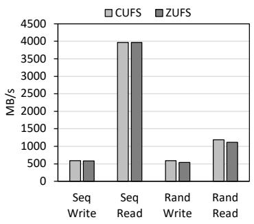  
(a) I/O throughput

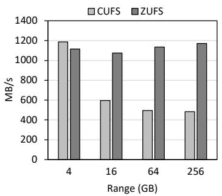  
(b) Wide range random read

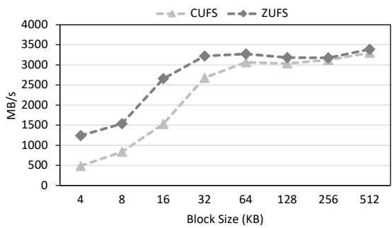  
(c) Random read with varying block size

Figure 7: Throughput of CUFS and ZUFS  
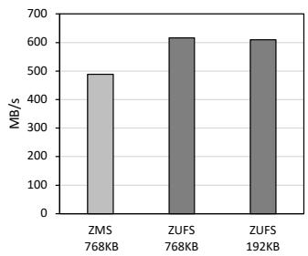  
Figure 8: Write throughput under different buffer management schemes and chunk sizes

## 5 Evaluation

## 5.1 Experimental Setup

We conduct our experiments on a Google Pixel 10 Pro smartphone equipped with 12 GB LPDDR5X SDRAM and 512 GB ZUFS. For the baseline, we configure conventional UFS (CUFS) by assigning the conventional LU in ZUFS to span the entire storage volume, thereby ensuring a fair comparison under identical hardware conditions except for the storage mode. The device runs Android OS 16 with the Android kernel version 6.6 [14], and F2FS is used as the filesystem for both CUFS and ZUFS. For ZUFS, F2FS is mounted in pure LFS mode to comply with the sequential-write requirement.

## 5.2 I/O Throughput

To compare the baseline performance of CUFS and ZUFS, we measure sequential and random I/O throughput using the fio [1] benchmark. For sequential workloads, we configure a single thread with a request size of 512 KB, while for random workloads, we employ four threads with a request size of 4 KB. All experiments operate on a 4 GB test file. Write workloads are executed as buffered I/O followed by an fsync() at the end of the run, while read workloads use the libaio engine with a queue depth of 64 and the direct I/O option enabled.

Figure 7a presents the throughput of CUFS and ZUFS across these workloads. We observe that ZUFS achieves throughput comparable to CUFS for both sequential and random reads and writes. This result is expected, as the measurements are conducted on a clean device where neither the filesystem nor the device suffers from fragmentation. Under these conditions, garbage collection is not triggered, allowing both CUFS and ZUFS to fully utilize the raw bandwidth of the underlying NAND media.

## 5.3 Wide Range Random Read

We evaluate random read throughput while varying the access range from 4 GB to 256 GB in order to study the impact of map cache misses. The results are shown in Figure 7b. At small access ranges (e.g., 4 GB), CUFS and ZUFS perform comparably, with CUFS showing slightly higher throughput. We attribute this minor difference to measurement noise, since few map cache misses occur at such small ranges on CUFS and both systems are capable of fully utilizing the device bandwidth. As the access range expands, however, the performance gap becomes clear. CUFS exhibits degraded throughput due to frequent map cache misses; its large page-level mapping table cannot fit into the limited on-device SRAM, forcing portions of the table to be repeatedly loaded from NAND flash. In contrast, ZUFS sustains stable throughput across all access ranges because its compact zone-level mapping table (ZMT) fits entirely in SRAM, thereby eliminating the penalty of cache misses.

To further analyze the impact of map cache misses, we measure random read throughput on a 256 GB file while varying the block size from 4 KB to 512 KB. As shown in Figure 7c, ZUFS consistently outperforms CUFS for small to medium block sizes, with the gap most pronounced below

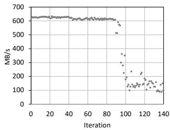  
(a) CUFS Write

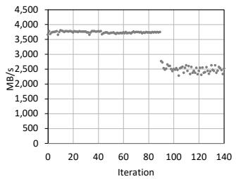  
(b) CUFS Read

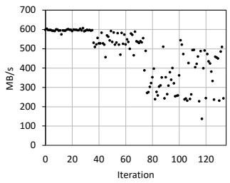  
(c) ZUFS Write

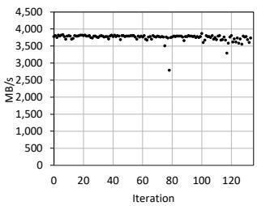  
(d) ZUFS Read  
Figure 9: I/O performance variation on incremental fragmentation

128 KB. This gap arises because the large page-level mapping table in CUFS does not fit in SRAM, forcing frequent map cache lookups from NAND that inflate access latency. When the block size exceeds 128 KB, however, the relative cost of these map cache operations becomes less significant, and the performance difference between CUFS and ZUFS narrows.

## 5.4 Fine-grained Write Buffer Management

We next evaluate the effectiveness of ZUFS’s fine-grained Zone-Aware Buffer Management (ZABM) using a synthetic workload that writes data to a single zone, comparing its throughput against ZMS. Since the source code of ZMS is not publicly available, we emulate the behavior of its IOTailor layer and write buffer scheme by issuing fixed-size writes aligned with the buffer size directly to the device. In this experiment, we define chunk size as the flush unit of a write buffer: 768 KB represents a full superpage across all dies as in ZMS, while 192 KB corresponds to the program unit size of a single die, which is the natural flush granularity in ZUFS.

In Figure 8, ZUFS with a 192 KB chunk size achieves 26% higher throughput than ZMS with a 768 KB chunk size. This difference arises because ZMS delays flushing until its entire 768 KB buffer is accumulated and written to NAND, stalling subsequent requests in the meantime. By contrast, ZUFS flushes data as soon as 192 KB of data are available to program a single die, immediately releasing buffer slots. This finer granularity allows ZUFS to overlap host writes with NAND programming, allowing deeper pipelining and more efficient utilization of internal bandwidth.

Moreover, while ZMS provisions a single fixed-size buffer per zone, ZUFS can dynamically allocate additional slots through SGBM to zones experiencing heavier write traffic, further improving bandwidth utilization. This is why ZUFS continues to outperform ZMS even when its chunk size is restricted to 768 KB. Equally important, the throughput difference between 192 KB and 768 KB chunk sizes in ZUFS is negligible. This demonstrates that die-level flushing introduces no performance penalty, while enabling more flexible and efficient use of SRAM resources through fine-grained buffer management.

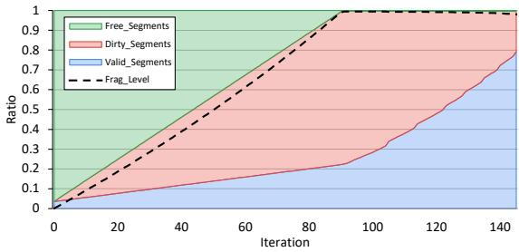

(a) CUFS  
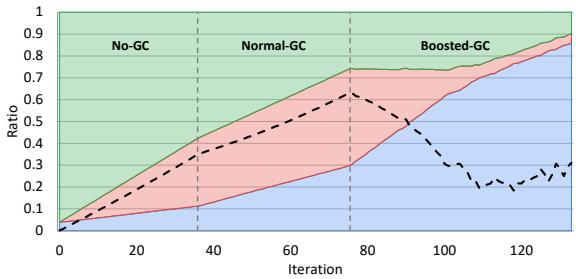  
(b) ZUFS  
Figure 10: Changes in F2FS segments and fragmentation level across iterations

## 5.5 Impact of Fragmentation

Fragmentation is one of the major factors that degrades mobile storage performance. To evaluate its impact, we progressively increase the degree of fragmentation in F2FS on both ZUFS and CUFS. Fragmentation is simulated by an iterative process in which we create 32,768 files of 128 KB each and immediately delete every second file created, leaving fragmented free space behind. We then write a separate 1 GB test file and read it back in full to measure sequential write and read throughput in each iteration. This procedure is repeated until the device’s free space drops below 1 GB.

Figure 9 depicts the variation in sequential write and read throughput for CUFS and ZUFS, measured at the end of each iteration. In Figure 9a and Figure 9b, CUFS shows severe performance degradation around the 90th iteration, where the write throughput drops to nearly 100 MB/s and read throughput decreases by about 35%. By contrast, Figure 9c shows that although ZUFS experiences dips in write throughput around the 40th and 80th iterations, it consistently sustains more than 200 MB/s. Moreover, as shown in Figure 9d, ZUFS maintains stable read throughput across iterations, in stark contrast to CUFS.

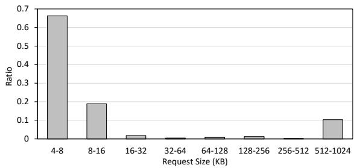

(a) CUFS  
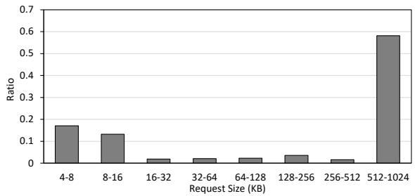  
(b) ZUFS  
Figure 11: Read request size distribution during loading game application

To investigate the factors underlying these performance behaviors, we analyze the allocation status of F2FS segments and the corresponding fragmentation level across iterations, as shown in Figure 10. The figure classifies segments into three categories: free segments available for new allocations, dirty segments containing at least one invalid block, and valid segments occupied by live data. In Figure 10a, CUFS exhibits a near-linear increase in fragmentation level and the free segments are exhausted by the 90th iteration. This exhaustion triggers foreground GC, which runs in the context of user threads and directly impacts I/O throughput, consistent with the drastic performance degradation observed for CUFS in Figure 9a and Figure 9b.

On the other hand, Figure 10b shows that ZUFS sustains sufficient free segments throughout the iterations. The iterations can be divided into three phases of background GC, governed by the tunable knobs described in Table 1. Around the 40th iteration, ZUFS transitions from the No-GC phase to the Normal-GC phase, activating background GC. At higher fragmentation levels, it further shifts into the Boosted-GC phase, where the reclamation of free sections is accelerated. These phase transitions are clearly reflected in the fragmentation trend: during the Normal-GC phase, the growth of fragmentation is slowed down, while in the Boosted-GC phase, aggressive background GC leads to a significant reduction in fragmentation level. Although background GC incurs nonnegligible overhead, ZUFS amortizes its cost by performing reclamation proactively and thus maintains a higher lower bound on write throughput compared to CUFS. Furthermore, by prioritizing user read requests, ZUFS ensures stable maximum read throughput even under heavy GC activity, which is critical for maintaining user-perceived responsiveness.

## 5.6 Application-Level Performance

To assess the impact of ZUFS on user-perceived performance, we evaluate two representative application-level workloads.

## 5.6.1 Game Resource Verification

We evaluate the resource verification time of a game application using Genshin Impact [20], a popular open-world RPG developed by HoYoverse. This application includes approximately 40 GB of massive game resource files, which undergo a verification process immediately after initial installation to ensure data integrity. The verification phase issues a large number of sequential and fragmented read requests, making it a representative workload for stressing mobile storage. Because verification must be completed before the game can be launched, its latency directly affects user experience.

To emulate realistic fragmented conditions prior to installation, we age the device in two stages. The first stage fills the device with 1 GB files until the remaining free space is reduced to half of the storage capacity. We then delete every second file created in this stage, leaving fragmented gaps in free space. The second stage creates 16 files of 64 MB each and repeatedly overwrites 4 KiB blocks randomly within them, amounting to about 12 MB of updates per file. This process continues until the available free space falls below 40 GB, the minimum required to install Genshin Impact.

Under these conditions, ZUFS completes the verification and game loading in 30 seconds, achieving a 14% improvement over CUFS, which requires 35 seconds. The distribution of read request sizes, shown in Figure 11, highlights the source of this difference. In CUFS, 66.3% of read requests fall in the 4∼8 KB range, caused by the Selective Segment Reuse (SSR) [37] feature of F2FS, which reduces GC overhead by reusing invalid blocks in dirty segments but scatters data placement and results in small fragmented reads. In contrast, ZUFS enforces sequential writes, preventing such scattering. Consequently, the majority of read requests in ZUFS exceed 512 KB, allowing the device to sustain raw sequential bandwidth and thereby shorten the verification time.

## 5.6.2 Photo Gallery Scrolling

We conduct a user scrolling test on a photo gallery application with 1,300 still photos, with an average file size of approximately 4.5 MB. The photos are stored on aged CUFS and ZUFS devices, where the aged condition is simulated using the same methodology as in Section 5.5. We perform 30 consecutive "swipe up" gestures to load and render photo previews from the storage and add a 100 ms delay between each gesture. We then measure the percentage of janky frames that exceed the rendering time limit on the devices.

<table><tr><td>Metric</td><td>CUFS</td><td>ZUFS</td></tr><tr><td>Jank Rate (%)</td><td>0.60</td><td>0.26</td></tr><tr><td>Avg Fragments/File</td><td>46.29</td><td>2.31</td></tr><tr><td>Avg Fragment Length (KB)</td><td>99</td><td>1,979</td></tr><tr><td>p99 Frame Time (ms)</td><td>16</td><td>11</td></tr></table>

Table 2: Performance data from the photo scrolling test

Table 2 reports performance metrics measured during the photo scrolling test for CUFS and ZUFS. We observe that ZUFS provides visibly smoother browsing and reduces the jank rate from 0.60% on CUFS to 0.26%. Because of the SSR feature, CUFS scatters photo data across the device, leading to a large number of small fragmented reads when loading photos. In contrast, ZUFS stores the photo data in a more sequential manner, resulting in 20× fewer number of fragments per file and a 20× larger fragment length than CUFS. As a result, ZUFS performs fewer small fragmented reads and thus achieves a lower jank rate than CUFS.

## 6 Conclusion

This paper presents our efforts to adopt Zoned UFS (ZUFS) technology into commercial flagship smartphones. We show that realizing ZUFS’s benefits in practice requires coordinated, cross-layer optimizations across the Android framework, filesystem, block layer, SCSI/UFS driver, and device firmware. Our contributions include a dynamic write buffer management scheme that efficiently provisions scarce onchip SRAM, end-to-end ordering guarantees that eliminate various tricky violations, and proactive garbage collection mechanisms that mitigate the heavy costs of large zones. Through microbenchmarks and application-level evaluation, we demonstrated that ZUFS sustains stable random read performance under fragmentation and delivers tangible improvements in user-perceived responsiveness compared to conventional UFS.

We do not see this work as the end, but rather as the beginning of a broader effort to establish ZUFS as a mature and deployable storage technology. As ZUFS moves deeper into production systems, we expect additional research and engineering challenges to emerge, requiring continuous refinement across the entire mobile storage stack.

## Acknowledgments

We would like to thank our shepherd, Ming-Chang Yang, and the anonymous reviewers for their valuable feedback.

Kyu-Jin Cho and Jin-Soo Kim were supported in part by the Institute of Information & Communications Technology Planning & Evaluation (IITP) grant (No. RS-2021-II211363) funded by the Korean government (MSIT). Jin-Soo Kim is the corresponding author (jinsoo.kim@snu.ac.kr).

## References

[1] fio: Flexible I/O tester. https://fio.readthedocs. io/en/latest/fio\_doc.html.

[2] Room Persistence Library. https://developer. android.com/training/data-storage/room, 2025.

[3] Zoned Storage. https://zonedstorage.io, 2025.

[4] Bart Van Assche. Add support for zoned block devices. https://git.kernel.dk/cgit/fio/commit/?id= bfbdd35b3e8f7de1bf1f48e7087c04a6b37e9c61, 2018.

[5] Bart Van Assche. Less special casing for flush requests v2. https://lore.kernel.org/linux-block/ 20230519044050.107790-1-hch@lst.de/, 2023.

[6] Bart Van Assche. mq-deadline: Improve support for zoned block devices. http://lore. kernel.org/linux-block/20230517174230. 897144-1-bvanassche@acm.org/, 2023.

[7] Bart Van Assche. block: Do not set the I/O priority for zoned writes. https://android-review. googlesource.com/c/kernel/common/+/3092159, 2024.

[8] Bart Van Assche. Do not requeue while ungating the clock: Linux kernel patchset. https://lore.kernel.org/linux-scsi/ 20230529202640.11883-1-bvanassche@acm.org/, 2024.

[9] Shai Bergman, Niklas Cassel, Matias Bjørling, and Mark Silberstein. ZNSwap: Un-block your swap. ACM Transactions on Storage, 19(2):1–25, 2023.

[10] Matias Bjørling, Abutalib Aghayev, Hans Holmberg, Aravind Ramesh, Damien Le Moal, Gregory R Ganger, and George Amvrosiadis. ZNS: Avoiding the block interface tax for flash-based SSDs. In 2021 USENIX annual technical conference (USENIX ATC 21), pages 689–703, 2021.

[11] Gunhee Choi, Kwanghee Lee, Myunghoon Oh, Jongmoo Choi, Jhuyeong Jhin, and Yongseok Oh. A new LSM-style garbage collection scheme for ZNS SSDs. In 12th USENIX Workshop on Hot Topics in Storage and File Systems (HotStorage 20), 2020.

[12] Peter Desnoyers. Empirical evaluation of NAND flash memory performance. ACM SIGOPS Operating Systems Review, 44(1):50–54, 2010.

[13] Garth Gibson and Greg Ganger. Principles of operation for shingled disk devices. Canregie Mellon Parallel Data Laboratory, CMU-PDL-11-107, 2011.

[14] Google. android15-6.6 release builds. https:// source.android.com/docs/core/architecture/ kernel/gki-android15-6\_6-release-builds, 2025.

[15] GSMA. The Mobile Economy 2025. https: //www.gsma.com/solutions-and-impact/ connectivity-for-good/mobile-economy/, 2025.

[16] Aayush Gupta, Youngjae Kim, and Bhuvan Urgaonkar. DFTL: a flash translation layer employing demandbased selective caching of page-level address mappings. Acm Sigplan Notices, 44(3):229–240, 2009.

[17] Sangwook Shane Hahn, Sungjin Lee, Cheng Ji, Li-Pin Chang, Inhyuk Yee, Liang Shi, Chun Jason Xue, and Jihong Kim. Improving file system performance of mobile storage systems using a decoupled defragmenter. In 2017 USENIX Annual Technical Conference (USENIX ATC 17), pages 759–771, 2017.

[18] Kyuhwa Han, Hyunho Gwak, Dongkun Shin, and Jooyoung Hwang. ZNS+: Advanced zoned namespace interface for supporting in-storage zone compaction. In 15th USENIX Symposium on Operating Systems Design and Implementation (OSDI 21), pages 147–162, 2021.

[19] Kyuhwa Han and Dongkun Shin. Command queueaware host I/O stack for mobile flash storage. Journal of Systems Architecture, 109, 2020.

[20] Hoyoverse. Genshin Impact. https://genshin. hoyoverse.com/, 2025.

[21] Joo-Young Hwang, Seokhwan Kim, Daejun Park, Yong-Gil Song, Junyoung Han, Seunghyun Choi, Sangyeun Cho, and Youjip Won. ZMS: Zone abstraction for mobile flash storage. In 2024 USENIX Annual Technical Conference (USENIX ATC 24), pages 173–189, 2024.

[22] IDC. Worldwide Smartphone Shipments Grew 6.4% in 2024, Despite Macro Challenges according to IDC. https://my.idc.com/getdoc.jsp? containerId=prUS53072325, 2025.

[23] JEDEC. Zoned Storage for UFS. https://www.jedec. org/standards-documents/docs/jesd220-5, 2023.

[24] Sooman Jeong, Kisung Lee, Seongjin Lee, Seoungbum Son, and Youjip Won. I/O Stack Optimization for Smartphones. In 2013 USENIX Annual Technical Conference (USENIX ATC 13), pages 309–320, 2013.

[25] Cheng Ji, Li-Pin Chang, Riwei Pan, Chao Wu, Congming Gao, Liang Shi, Tei-Wei Kuo, and Chun Jason Xue. Pattern-Guided File Compression with User-Experience Enhancement for Log-Structured File System on Mobile Devices. In 19th USENIX Conference on File and Storage Technologies (FAST 21), pages 127–140, 2021.

[26] Cheng Ji, Li-Pin Chang, Liang Shi, Chao Wu, Qiao Li, and Chun Jason Xue. An empirical study of File-System fragmentation in mobile storage systems. In 8th USENIX Workshop on Hot Topics in Storage and File Systems (HotStorage 16), 2016.

[27] Yuhun Jun, Shinhyun Park, Jeong-Uk Kang, Sang-Hoon Kim, and Euiseong Seo. We Ain’t Afraid of No File Fragmentation: Causes and Prevention of Its Performance Impact on Modern Flash SSDs. In 22nd USENIX Conference on File and Storage Technologies (FAST 24), pages 193–208, 2024.

[28] Saurabh Kadekodi, Vaishnavh Nagarajan, and Gregory R Ganger. Geriatrix: Aging what you see and what you don’t see. a file system aging approach for modern storage systems. In 2018 USENIX Annual Technical Conference (USENIX ATC 18), pages 691–704, 2018.

[29] Hyojun Kim, Nitin Agrawal, and Cristian Ungureanu. Revisiting storage for smartphones. ACM Transactions on Storage (TOS), 8(4):1–25, 2012.

[30] Jaegeuk Kim. f2fs: support atomic\_write feature for database. https://lkml.org/lkml/2014/9/26/19, 2014.

[31] Kyusik Kim and Taeseok Kim. HMB in DRAM-less NVMe SSDs: Their usage and effects on performance. PloS one, 15(3):e0229645, 2020.

[32] KIOXIA Corporation. Understanding the WriteBooster Feature. https://americas.kioxia.com/content/ dam/kioxia/en-us/business/memory/mlc-nand/ asset/KIOXIA\_WriteBooster\_Feature\_Tech\_ Brief.pdf, 2022.

[33] Changman Lee, Dongho Sim, Jooyoung Hwang, and Sangyeun Cho. F2FS: A new file system for flash storage. In 13th USENIX Conference on File and Storage Technologies (FAST 15), pages 273–286, 2015.

[34] Jing Li, Anirudh Badam, Ranveer Chandra, Steven Swanson, Bruce Worthington, and Qi Zhang. On the energy overhead of mobile storage systems. In 12th

USENIX Conference on File and Storage Technologies (FAST 14), pages 105–118, 2014.

[35] Jaehong Min, Chenxingyu Zhao, Ming Liu, and Arvind Krishnamurthy. eZNS: An elastic zoned namespace for commodity ZNS SSDs. In 17th USENIX Symposium on Operating Systems Design and Implementation (OSDI 23), pages 461–477, 2023.

[36] Jayashree Mohan, Dhathri Purohith, Matthew Halpern, Vijay Chidambaram, and Vijay Janapa Reddi. Storage on Your SmartPhone Uses More Energy Than You Think. In 9th USENIX Workshop on Hot Topics in Storage and File Systems (HotStorage 17), 2017.

[37] Yongseok Oh, Eunsam Kim, Jongmoo Choi, Donghee Lee, and Sam H Noh. Optimizations of LFS with slack space recycling and lazy indirect block update. In Proceedings of the 3rd Annual Haifa Experimental Systems Conference, pages 1–9, 2010.

[38] Jonggyu Park and Young Ik Eom. Fragpicker: A new defragmentation tool for modern storage devices. In Proceedings of the ACM SIGOPS 28th Symposium on Operating Systems Principles, pages 280–294, 2021.

[39] Jonggyu Park and Young Ik Eom. Filesystem fragmentation on modern storage systems. ACM Transactions on Computer Systems, 41(1-4):1–27, 2023.

[40] Qualcomm. Modify UFS Device Power Management States. https://docs.qualcomm.com/ bundle/publicresource/topics/80-70018-6/ power-management-states.html, 2025.

[41] Mendel Rosenblum and John K Ousterhout. The design and implementation of a log-structured file system. ACM Transactions on Computer Systems (TOCS), 10(1):26– 52, 1992.

[42] Liangkuan Su, Mingwei Lin, Jianpeng Zhang, and Yubiao Pan. CCFTL: A novel continuity compressed pagelevel flash address mapping method for SSDs. Journal of Parallel and Distributed Computing, 191:104917, 2024.

[43] TechPowerUp. SK Hynix Gold P31 1 TB. https://www.techpowerup.com/ssd-specs/ sk-hynix-gold-p31-1-tb.d444, 2022.

[44] TechPowerUp. SK Hynix Platinum P41 1 TB. https://www.techpowerup.com/ssd-specs/ sk-hynix-platinum-p41-1-tb.d588, 2022.

[45] Wenxin Wang, Yaqi Li, Liang Shi, and Edwin H-M Sha. Eliminate critical fragmentation of f2fs in mobile devices with controller co-design. In 2024 13th Non-Volatile Memory Systems and Applications Symposium (NVMSA), pages 1–6. IEEE, 2024.

[46] Pengbo Yan, Bohong Zhu, Zhirong Shen, Jiwu Shu, and Jiadong Yang. ZUFS: Enhancing Stability and Endurance in Mobile Devices with Integrated Zoned Namespaces in Universal Flash Storage. In 2024 IEEE 24th International Symposium on Cluster, Cloud and Internet Computing (CCGrid), pages 609–615. IEEE, 2024.

[47] Lihua Yang, Zhipeng Tan, Fang Wang, Dan Feng, Hongwei Qin, Shiyun Tu, Jiaxing Qian, and Yuting Zhao. Improving f2fs performance in mobile devices with adaptive reserved space based on traceback. IEEE Transactions on Computer-Aided Design of Integrated Circuits and Systems, 41(1):169–182, 2021.

[48] Tao Zhang, Aviad Zuck, Donald E Porter, and Dan Tsafrir. Flash drive lifespan\* is\* a problem. In Proceedings of the 16th Workshop on Hot Topics in Operating Systems, pages 42–49, 2017.