USENIX

THE ADVANCED COMPUTING SYSTEMS ASSOCIATION

# AdaCheck: An Adaptive Checkpointing System for Efficient LLM Training with Redundancy Utilization

Weijie Liu, Shengwei Li, Zhiquan Lai, and Keshi Ge, National University of Defense Technology; Qiaoling Chen, Nanyang Technological University; Peng Sun, Shanghai AI Laboratory; Dongsheng Li and Kai Lu, National University of Defense Technology

# https://www.usenix.org/conference/fast26/presentation/liu-weijie

This paper is included in the Proceedings of the 24th USENIX Conference on File and Storage Technologies.

February 24–26, 2026 • Santa Clara, CA, USA

ISBN 978-1-939133-53-3

Open access to the Proceedings of the 24th USENIX Conference on File and Storage Technologies is sponsored by

# AdaCheck: An Adaptive Checkpointing System for Efficient LLM Training with Redundancy Utilization

Weijie Liu\*1, Shengwei Li\*1, Zhiquan Lai1, Keshi Ge1, Qiaoling Chen2, Peng Sun3 Dongsheng Li1, Kai Lu1

1National Key Laboratory of Parallel and Distributed Computing, College of Computer Science and Technology, National University of Defense Technology 2Nanyang Technological University 3Shanghai AI Laboratory

## Abstract

The development of large language models (LLMs) relies on sophisticated parallel training techniques, involving prolonged training runs with thousands of workers. Checkpointing systems are essential for handling failures in large-scale training. However, existing checkpointing systems are almost offline solutions tailored to specific parallelisms or model architectures. They lack adaptability to diverse parallel strategies and fail to recognize that most model states can be excluded from checkpoints, missing optimization opportunities.

In this paper, we present AdaCheck, an adaptive checkpointing system that achieves minimized checkpoint size by characterizing and exploiting state redundancy across various parallelisms, model architectures, and training iterations. We model the state redundancy induced by parallelisms and model architectures using the abstraction tensor redundancy, and propose an offline redundancy utilization method to create checkpoints with a reduced set of states. To fully identify tensor redundancy, we design an efficient redundancy detector, which employs a hash-based data consistency check method and a ring-based communication algorithm. Besides, we introduce a novel online redundancy utilization method, which further reduces checkpoint size by exploiting the state redundancy across training iterations.

Experimental results demonstrate that AdaCheck is adaptable to various parallelisms, including irregular parallelisms generated by automatic planners, as well as diverse model architectures, encompassing both dense and sparse architectures. Compared with state-of-the-art checkpointing approaches, AdaCheck can reduce checkpoint size by 6.00–896×, increase the checkpointing frequency by 1.46–111×, and incur almost no overhead on training throughput for LLM training.

## 1 Introduction

Large language models (LLMs) [1, 4, 10, 19, 33, 48, 49, 67] have demonstrated impressive performance across various intelligence tasks [88]. Due to their extensive parameter and data size, LLMs require prolonged large-scale distributed training processes [25,35] with sophisticated parallelisms [30, 31, 41, 65, 86] and parallel training frameworks [8, 12, 34, 38, 42, 47, 57, 87]. While state redundancy, the duplication of model states arising from parallelisms, model architectures, and training iterations, facilitates this process, the training time remains considerable.

Large-scale and lengthy training is coupled with failures [23, 26, 77]. For instance, the 54-day training of LLaMA 3.1 [19] on 16K GPUs encounters 419 failures, with training failing on average every three hours. The core of failure recovery is checkpointing [13, 46, 56, 72, 75], which periodically saves model state checkpoints, enabling the resumption of training progress from the latest checkpoint. To guarantee model quality and reproducibility, state-of-the-art (SOTA) LLMs use bulk synchronous parallel [17] mode. This requires all workers to revert to the same checkpoint in response to failures, resulting in a notable waste of training resources, e.g., about 2M GPU hours are wasted in the training of LLaMA 3.1.

Current checkpointing systems [34,53,56,56,59,66,72–75, 80] are designed with offline solutions tailored for specific parallelisms or model architectures. These systems lack the flexibility to accommodate various parallelisms, and fail to leverage the state redundancy across training iterations. Moreover, they necessitate the storage of at least one complete model replica, most of which are not necessary to save according to our study. Asynchronous saving systems [34, 53, 56, 56, 80] and I/O optimizing systems [66, 72, 73] decouple the checkpoints saving process into multiple stages, overlapping these stages to accelerate the transmission of checkpoints. These systems reduce checkpointing storage by limiting only rank 0 worker saves in data parallelism, which is unsuitable for other parallelisms. In-memory checkpointing systems [59, 74, 75] enable saving checkpoints with faster networks, by saving local model states in each worker to the memory of other workers. However, these systems overlook the state redundancy, resulting in significant checkpointing overhead due to the storage of redundant states.

The primary approach to optimize checkpointing systems involves the identification of state redundancy during parallel training. However, identifying precise state redundancy presents challenges stemming from two primary aspects: (i) Various parallelisms. As illustrated in Figure 1(a), recent advancements have introduced new parallelisms such as MiCS [85] and even irregular parallelisms generated by automatic planners [47], designed to enhance training performance. (ii) Diverse model architectures. As illustrated in Figure 1(b), to improve LLM performance, researchers keep introducing new model architectures such as using mixture of experts (MoE) [39] and multi-latent attention (MLA) [48]. Consequently, to achieve an adaptive and efficient checkpointing system, the core problem becomes: how to identify precise state redundancy across various parallel training methods and model architectures?

In this paper, we present AdaCheck, an adaptive and efficient checkpointing system for LLM training. To adapt to parallelisms and model architectures, AdaCheck models the state redundancy across these dimensions with the abstraction tensor redundancy, which describes the distribution of each tensor. Since model states are tensor-based, AdaCheck can get the precise state redundancy by analyzing tensor redundancy. Subsequently, AdaCheck proposes an offline redundancy utilization method. This method determines which states require checkpointing by assessing the state redundancy of both parameters and their associated optimizer states within model states, as both are essential for resumable checkpoints.

Based on the offline redundancy utilization, AdaCheck has three key issues to address for checkpointing. First, obtaining tensor redundancy efficiently. It is challenging to detect redundancy among many workers. A naive solution involves each worker comparing its states with all others, which would take over 30 days when training with more than 1000 workers. Second, even with the offline redundancy utilization, storing the necessary model states can still be costly. The optimal frequency of checkpointing is one step one checkpoint (1S1C), which involves saving checkpoints after every iteration. Such a high rate necessitates further optimization to reduce checkpointing overhead. Third, building a transparent and reliable system. Users might enable parallel training in distinct ways [78], with training scales differing, e.g., the LLaMA 3 models of different sizes use the number of GPUs from 1K to 16K.

To address these challenges, AdaCheck firstly designs an efficient redundancy detector, which incorporates a three-stage communication reduction technique. By mitigating the data size of consistency check, narrowing the comparison scope, and parallelizing operation execution, AdaCheck can get accurate tensor redundancy with acceptable overhead (within 3 minutes among 128 workers) at the beginning of training (§6). Second, we propose a novel online redundancy utilization method for AdaCheck to enable 1S1C. By analyzing the parameter updating patterns in LLM training, we can identify the difference between the checkpoints in adjacent iterations is the half-precision gradient. We therefore store the gradient instead of complete model states, further reducing the checkpoint size by up to 1/7 (§7). Third, AdaCheck provides a non-intrusive API and makes no assumptions about the user’s training script, parallel training methods, and model architectures (§8).

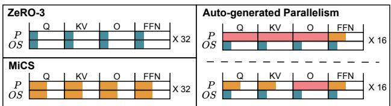

(a) GPT-7B training in 128 3090 GPUs.  
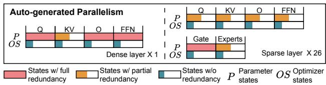  
(b) DeepSeek-V2-Lite training in 32 A800 GPUs.  
Figure 1: State redundancy across diverse parallelisms and model architectures. The number following the symbol "X" denotes the number of model layers. The parallel training performance ranked as follows: Auto-generated parallelism > MiCS > ZeRO-3.

We conduct extensive experiments on AdaCheck with different clusters, model architectures, and parallel strategies. The results show that AdaCheck is adaptable to various parallelisms, including irregular parallelisms generated by automatic planners, as well as diverse model architectures, encompassing both dense and sparse architectures. Compared to the SOTA checkpointing approach GEMINI, AdaCheck reduces checkpointing overhead by up to 130× and increases checkpoint frequency by up to 3.64×. A prototype of AdaCheck has been integrated into and open-sourced with Merak1.

## 2 Background

## 2.1 LLM Training

LLM is iteratively trained on datasets with trillions of tokens. A typical training iteration involves a forward pass (FP), backward pass (BP), and parameter updating with an optimizer such as Adam [36]. The iterations refine models to achieve better performance.

LLM Structures. Popular dense LLMs [4, 69, 79, 84] scale to many billions of parameters by stacking transformer layers [71]. Each transformer layer contains an attention block (e.g., MHA [71], GQA [54], and MLA [48]) and a feedforward network (FFN) block. All weights of dense models are activated for each data token. LLMs can integrate Mixture of Expert (MoE) architecture [5, 39] by extending the FFN blocks with multiple expert networks, allowing to activate only parts of weights for each token in MoE modes (or sparse LLMs) [1, 10, 11, 15, 33].

Complex Distributed LLM Training. Distributed LLM training mainly involves data parallelism (DP), model parallelism (MP), and expert parallelism (EP). DP [41, 64] is the most common way to scale training, where each worker holds a model replica. A single worker cannot hold a complete LLM. Zero Redundancy Optimizer (ZeRO) [9,61,85,86] techniques reduce the memory usage of DP by partitioning selective model states. Specifically, ZeRO-1 partitions optimizer states, and ZeRO-3 additionally partitions model parameters. MP [28,31,32,65] divides model states among worker groups to parallelize the training on the same data. Tailored for MoE models, EP [30, 39, 48, 58, 60] distributes expert blocks of transformer layer to distinct worker groups while it copies other parts of the model (e.g., gate networks and attention blocks).

Parallel training methods can be used simultaneously, with different tradeoffs between memory, communication, and computation. LLM training systems [7,8,27,32,38, 42, 47, 50, 57,70,87] orchestrate them to formulate sophisticated parallel training with the goal of high model flops utilization (MFU). However, the sharding and replication strategies are distinct among parallel training methods, resulting in complexity in state redundancy.

## 2.2 Checkpointing in LLM Training

LLM training is a prolonged process on large-scale clusters, encountering frequent failures [23, 26]. Checkpointing can preserve the training process by building checkpoints of model states, which typically include model parameters, optimizer states, and training metadata such as training arguments, dataset progress, and random states. When a failure is encountered, training can be resumed from the nearest checkpoint without restarting the training from scratch.

The overhead of each failure includes the training stalls from checkpointing and the lost computation after the nearest state. Let $t _ { \mathrm { c k p t } }$ be the training pauses from checkpointing, and f be the checkpointing frequency. Assuming failures are evenly distributed between two consecutive checkpoints, the lost training process can be estimated by 1/2 f [75]. The failures overhead $T _ { \mathrm { f } }$ can be expressed as follows:

$$
T _ { \mathrm { f } } = t _ { \mathrm { c k p t } } + { 1 } / { 2 f } .\tag{1}
$$

Asynchronous saving [34, 56, 80] and I/O optimizing [53, 72, 73] has been extensively studied in checkpointing optimizations for reducing $t _ { \mathrm { c k p t } }$ . On this basis, the key to reducing

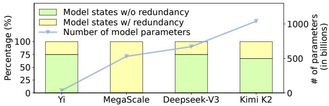  
Figure 2: The percentage of redundant states and parameter count of 4 industry models during training. Both dense models (Yi and MegaScale) and sparse models (Deepseek-V3 and Kimi K2) contain redundant states.

failure overhead in (1) is improving the frequency f , which is bounded as follows:

$$
\frac { 1 } { f } \geq \frac { s _ { \mathrm { c k p t } } } { b _ { \mathsf { s a v e } } } ,\tag{2}
$$

where $s _ { \tt c k p t }$ is the size of each checkpoint, and $b _ { \mathsf { s a v e } }$ is the bandwidth of saving. In-memory checkpointing works [74, 75] enable higher f by checkpointing over faster training networks (higher $b _ { \tt S a v e } )$ . In this study, we focus on reducing the size of checkpoints $( s _ { \tt c k p t } )$

## 3 Motivation and Opportunity

## 3.1 Complexity of State Redundancy

Diverse parallelisms and model architectures intricate the distribution of model states, exacerbating the complexity of state redundancy. As illustrated in Figure 1(a), ZeRO-3 and MiCS distribute states uniformly, with each worker holding the same number of states. However, this uniform distribution brings different state redundancy during training. Unlike ZeRO-3 and MiCS, irregular parallelisms generated by automatic planners aim to optimize the performance of each operator, leading to distinct distributions across parameters and optimizer states among operators. The combination of these distributions creates the complex state redundancy. Moreover, emerging model architectures introduce new operators, such as Gate and Expert in Figure 1(b). These operators may require a specialized distribution, further complicating the redundancy landscape.

Underdeveloped modeling of state redundancy presents a potential approach for analyzing complex redundancy patterns. A naive solution involves recording the number of replicas for each model state and exclude those with replicas from the checkpoint. However, this solution suffers from two issues: (i) It does not account for replica location. Since failures are handled at the node level, if all replicas reside on the same node, they may be lost simultaneously. (ii) It overlooks relationships between states within checkpoints. Checkpoints require both model parameters and their corresponding optimizer states, yet the redundancy of parameters may differ from that of optimizer states. For instance, when ZeRO-1 is applied, model parameters are redundant, whereas optimizer states are not. Consequently, the naive solution yields checkpoints containing only optimizer states, rendering the checkpoints inoperative.

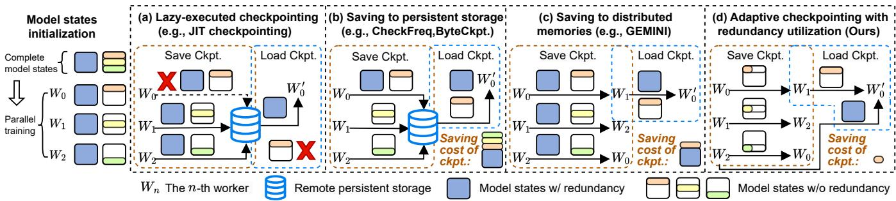  
Figure 3: Workflow of different checkpointing methods. The example model is trained with three workers in parallel, each worker Overheadhas model states with and without redundancy. Checkpoints (Ckpt.) are saved during training at specific intervals (methods $\mathbf { b } , \mathbf { c } ,$ per save:d, along with showing the saving cost of each checkpoint) or when a failure occurs (method a). Loading checkpoints only occur in response to a failure (worker $W _ { 0 }$ per save:failed in this example). (a) Building checkpoints just-in-time will lose model states without redundancy. (b) Saving checkpoints into remote persistent storage is costly. (c) Distributed in-memory checkpointing cannot identify model states with redundancy. (d) Adaptive checkpointing with redundancy utilization can significantly reduce the cost of saving checkpoints.

We aim to develop an offline redundancy utilization approach capable of analyzing the distribution of state replicas, while considering the relationships among states within checkpoints. This ensures the usability of the generated checkpoints in the event of failures.

## 3.2 Difficulty of Acquiring Fine-Grained State Redundancy

Identifying and utilizing state redundancy is the key to improving the performance of checkpoint systems, as current training methods generate substantial state redundancy. Figure 2 shows the percentage of redundant states and parameter count for 4 industry models during training. The data represented are derived from the official papers [34,49,68,82]. The training of the 34B Yi model uses ZeRO-1, which replicates model parameters but partitions optimizer states, resulting in 25% of states being redundant. The 530B MegaScale model is trained using the combination of DP, TP, and PP. Therefore, all model states are redundant as DP replicate them to a subset of GPUs. Unlike dense models Yi and MegaScale, Deepseek-V3 and Kimi K2 are sparse MoE models, with 671B and 1040B parameters, respectively. To optimize their training efficiency, the combination of ZeRO-1, EP, and PP is applied, leading to 25% and 33% of states showing redundancy. Moreover, a recent report [21] reveals the existence of state redundancy during the training of multimodal LLMs.

SOTA checkpointing systems cannot obtain fine-grained state redundancy, leading to either failures or missed opportunities for checkpoint size reduction. Figure 3 shows workflows of saving and loading checkpoints in different lines of work. The distribution of model states can represent the optimized training methods, such as ZeRO-1. Lazy-executed checkpointing methods [22] (Figure 3a) generate checkpoints only after failures occur. This approach neglects model states without redundancy in the faulted worker, resulting in unsuccessful training resumption. Remote storage checkpointing methods [34,53,56,73,80] (Figure 3b) need to save at least one complete model to remote storage, incurring significant overhead. Remote in-memory checkpointing works [74, 75] (Figure 3c) organize workers into groups, allowing each worker to save its checkpoint in the CPU memory of all other workers in the same group. This decentralized design enables checkpointing over faster intra-group connections, but results in the unnecessary saving of redundant model states among workers.

We seek a fine-grained identification of state redundancy to achieve an adaptive checkpointing system (Figure 3d). This system exploits redundancy in model states to encapsulate lossless checkpoint size reduction, thereby increasing checkpointing frequency (2) and reducing the failure overhead.

## 3.3 Offline Redundancy Utilization is Inadequate for 1S1C

The offline redundancy utilization still cannot achieve the 1S1C target. We can estimate the required saving bandwidth $b _ { \mathsf { s a v e } }$ for 1S1C, as expressed in (2), by the relation $b _ { \mathsf { s a v e } } \geq$ $\frac { s _ { \mathtt { C k p t } } } { f }$ , where $f = t _ { \mathrm { i t e r } }$ . The variables $t _ { \mathrm { i t e r } }$ and $s _ { \tt c k p t }$ are related to the model and parallel training configurations, while $s _ { \tt c k p t }$ is also affected by the checkpointing methods.

Figure 4 shows the required bandwidth for 1S1C in the training of the GPT-18.4B [57] and LLaMA-7B [69] model on a 32 A800 cluster for different checkpointing methods, with training methods including ZeRO-3, ZeRO-1 [61], and EP [39]. When training with EP, models are transformed into sparse MoE models with 32 experts, with each worker holding 1 expert. Notably, AdaCheck only applies the offline redundancy utilization method. We observe that: (i) Training systems can trade extra memory for improving training performance (e.g., using ZeRO-1) and models can adopt sparse architectures (e.g., using EP) to enhance model performance. However, as shown in Figure 4, both trades lead to an increased bandwidth requirement $b _ { \mathsf { s a v e } }$ . (ii) The bandwidth requirements $b _ { \mathsf { s a v e } }$ of current checkpointing methods are hard to meet. The persistent storage bandwidth [56,72,76] (used by PyTorch naive checkpointing and CheckFreq) is typically less than 100Gbps, and the worker interconnect bandwidth [40, 75] (used by GEMINI and AdaCheck) is typically less than 400Gbps.

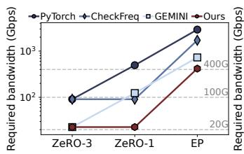  
(a) LLaMA-7B

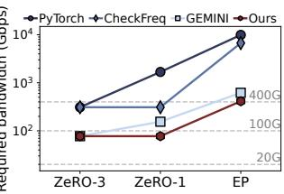  
(b) GPT-18.4B

Figure 4: Required bandwidth for 1S1C on 32 A800 GPUs. In EP training, 32 experts are added to construct MoE models. PyTorch and CheckFreq are the bandwidth requirements for remote storage, and GEMINI and ours are for the inter-worker network. Here, AdaCheck only applies the offline redundancy utilization method.  
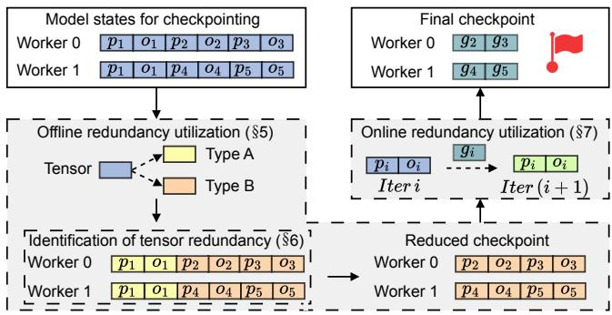  
Figure 5: AdaCheck overview.

As we should maintain the optimization on parallel LLM training, we cannot increase the iteration time. Relying solely on offline redundancy utilization is insufficient to attain the desired 1S1C target, we seek to develop an online redundancy utilization approach to further reduce the checkpoint size and lower the requirement of saving bandwidth.

## 4 AdaCheck Overview

Figure 5 shows an overview of AdaCheck, an adaptive checkpointing system for efficient LLM training with redundancy utilization. It first models the state redundancy across parallelisms and model architectures with the help of the abstraction tensor redundancy, considering the location of tensor replicas and the relationships among tensors within checkpoints (§5). To identify tensor redundancy efficiently and precisely, AdaCheck proposes a redundancy detector (§6). This detector executes two iterations at the start of training, and its results are applied to all subsequent iterations. Guided by tensor redundancy, AdaCheck selects appropriate model states to generate a reduced checkpoint (§5). It further minimizes checkpoint size with online redundancy utilization (§7), ultimately yielding a minimal-sized checkpoint.

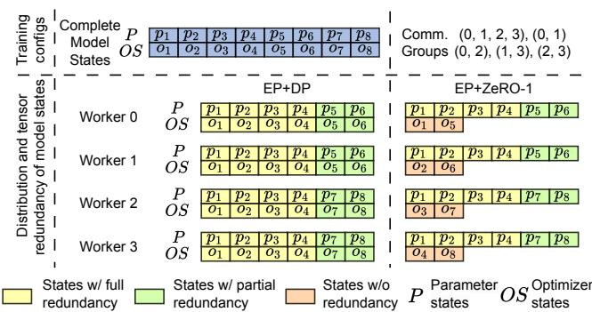  
Figure 6: The distribution of state redundancy through a case study of an MoE layer with two experts. This layer comprises 8 parameter tensors $\left( p _ { 1 } ~ \mathrm { t o } ~ p _ { 8 } \right)$ along with their associated optimizer state tensors $\left( o _ { 1 } \ t _ { 0 } o _ { 8 } \right)$ . The first 4 parameter tensors and optimizer state tensors belong to the attention block, the other 4 to the two experts. We outline the training configurations at the top of the figure, where the layer is trained on 4 workers using parallel strategies EP+DP and EP+ZeRO-1.

## 5 Offline Redundancy Utilization

To utilize the redundant model states for reducing checkpoint size, AdaCheck introduces an offline redundancy utilization method. This method identifies state redundancy across parallelisms and model architectures through the abstraction tensor redundancy, which describes the distribution of each tensor in the model states.

Assuming the set of workers for LLM training is denoted as $W = \left\{ w _ { 1 } , w _ { 2 } , . . . , w _ { | W | } \right\}$ . For worker $w _ { i } \in W$ , it possesses model states comprising a set of tensors, which can be expressed as $T _ { i } = \left\{ t _ { 1 } , t _ { 2 } , . . . , t _ { | T _ { i } | } \right\}$ . Thus, the location of a replica for tensor $t _ { k }$ on worker wi can be denoted by a tuple (m,n), where m signifies the worker index in W and n represents the tensor index in $T _ { m } .$ . Based on these definitions, we introduce the abstraction tensor redundancy, which is a list of tuples that represents the location of replicas of a tensor. Specifically, tensor redundancy for tensor $t _ { k }$ on worker $w _ { i }$ can be

represented as:

$$
R _ { i } ^ { k } = \{ ( m _ { 1 } , n _ { 1 } ) , ( m _ { 2 } , n _ { 2 } ) , . . . , ( m _ { | R _ { i } ^ { k } | } , n _ { | R _ { i } ^ { k } | } ) \} .\tag{3}
$$

Since checkpointing operates at the model state level, tensor redundancy is not well aligned. To bridge this gap, we model the state redundancy across parallelisms and model architectures. Given that a model state may consist of several tensors, we define the state redundancy for a state in worker $w _ { i }$ as $\{ R _ { i } ^ { k } , . . . , R _ { i } ^ { j } \}$ . Based on the definition, we classify state redundancy into three types. Figure 6 shows a case study using an MoE layer with two experts. The layer has 8 parameter tensors $( p _ { 1 }$ to $p _ { 8 } )$ and the corresponding optimizer state tensors $( o _ { 1 }$ to $^ { o _ { 8 } ) }$ . The first 4 parameter tensors and optimizer state tensors belong to the attention block, the subsequent 2 to the first expert, and the final 2 to the second expert. During training, these model states are distributed to workers based on the adopted parallel strategy. We analyze the distribution and characterize the state redundancy types as follows:

• States with full redundancy. A state exhibits full redundancy if any tensor $t _ { k }$ within it satisfies $\vert R _ { i } ^ { k } \vert = \vert W \vert$ and $| W | > 1$ , such as $p _ { 1 }$ under the parallel strategy EP+DP.

• States with partial redundancy. A state exhibits partial redundancy if any tensor $t _ { k }$ within it satisfies $1 < | \boldsymbol { R } _ { i } ^ { k } | < | \boldsymbol { W } |$ such as $p _ { 5 }$ under the parallel strategy EP+DP.

• States with no redundancy. A state possesses no redundancy if any tensor $t _ { k }$ within it satisfies $\vert R _ { i } ^ { k } \vert = 1$ , as seen with $o _ { 2 }$ under the parallel strategy $_ { \mathrm { E P + Z e R O - 1 } }$

There are two types of state redundancy utilization: offline and online. Offline utilization reduces checkpoint sizes based on the three types of state redundancy defined above. Given the redundancy type of model states, one could reduce checkpoint size by storing only parameters and their corresponding optimizer states that exhibit partial or no redundancy to remote memory. However, our analysis reveals that the parameter redundancy may differ from that of their optimizer states. For example, under the parallel strategy EP+ZeRO-1 in Figure $^ { 6 , }$ parameter $p _ { 1 }$ on worker 0 exhibits full redundancy, whereas its optimizer state $o _ { 1 }$ exhibits no redundancy. This discrepancy complicates checkpoint size reduction, as conflicting redundancy types exist when determining whether to retain a parameter and its associated optimizer state. To address this challenge, our offline utilization method computes the intersection of state redundancy between parameters and their corresponding optimizer states, utilizing the intersection results to determine inclusion in the checkpoint. Specifically, the intersection of full redundancy and partial redundancy yields partial redundancy; the intersection of full redundancy and no redundancy yields no redundancy; and the intersection of partial redundancy and no redundancy yields no redundancy. The output of this offline method is illustrated in §8. Compared to offline utilization, online utilization exploits state redundancy across iterations to reduce checkpoint sizes. We illustrate our online redundancy utilization in §7.

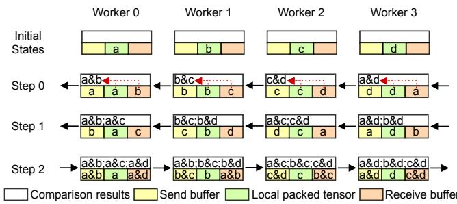  
Figure 7: An example for tensor redundancy identification in a communication group of size 4. Each worker begins with a local packed tensor. In step 0 and step 1, each worker sends and receives a packed tensor, compares the packed tensor it possesses with the received one, and takes the intersection of these two tensors as the comparison result. In step 2, each worker transmits the comparison result required by another worker, rather than transferring the packed tensor, to obtain the final results.

## 6 Identification of Tensor Redundancy

While offline redundancy utilization is straightforward, the identification of tensor redundancy, which is the core of offline utilization, remains challenging. The large number of parameters in LLMs prevents each worker from knowing the model states of others, as model states initialization occurs after model partitioning. This necessitates a distributed mechanism for identifying tensor redundancy. Transferring tensors across workers and comparing tensors owned by different workers represent a viable solution. However, the ample size and quantity of tensors in LLMs render this tensor-based approach prohibitively expensive.

Hash-based Consistency Check. We propose a hash-based check approach to identify tensor redundancy with low overhead. For worker $w _ { i } \in W$ , it maps tensors in $T _ { i }$ to their respective hash values, packs these hash values into a tensor, and maintains the correspondence between tensors and their hash values through indexes within the packed tensor. Subsequently, $w _ { i }$ transmits this packed tensor to other workers, such as worker $w _ { j } ,$ for comparison. Upon receipt of a packed tensor, $w _ { j }$ compares the hash values it possesses with those in the received tensor, recording the index and worker rank pairs with equal hash values. It then identifies the corresponding tensor for each hash value it possesses and obtains the result of tensor redundancy for each tensor, expressed as (3). This process, however, produces erroneous results in two scenarios: (i) Hash collisions, where distinct tensors generate identical hash values. (ii) Accidental equality, where tensors share the same value in the current iteration but diverge thereafter. To address this, the hash-based consistency check is employed over two iterations, and the intersection of the results from both iterations constitutes the final result. In our implementation, we employ the blake2s hash function due to its outstanding performance and sufficient hash space. Assuming that the tensors follow an independent and homogeneous distribution, the probability of hash collisions occurring in an iteration can be approximated as $2 ^ { - 2 5 6 }$ . Consequently, given that erroneous results arise when hash collisions occur in both iterations, the probability of obtaining an incorrect result is ${ ( 1 - 2 ^ { - 5 1 2 } ) }$ , which is negligible.

Reducing the Comparison Scale. The overhead of redundancy identification is proportional to the training scale, as each worker must compare its hash values with those of all other workers. This results in a substantial comparison overhead, particularly in LLM training, which typically involves many workers. Fortunately, we observe that workers possessing tensor replicas are organized into specific communication groups for synchronization during training, as shown in Figure 6. The size of these groups depends on the parallel strategies employed and is generally smaller than the training scale. Consequently, we identify all communication groups for each worker and apply our hash-based consistency check to these groups. Sometimes, these communication groups may overlap, which causes redundant comparison during redundancy identification. To address this, we remove groups that are subsets of other groups to get the non-overlapped communication groups.

Ring-based Communication Algorithm. The comparison process between workers is time-consuming. Drawing inspiration from the ring-allreduce algorithm [64], we propose a ring-based communication algorithm. As shown in step 0 of Figure 7, to mitigate this issue, each worker sends a packed tensor to its adjacent peers and engages in a comparison with the received tensor concurrently during the running of our algorithm. Besides, in step 2, a strategic optimization is implemented: since the comparison result required by workers is already available, workers elect to send and receive the comparison result instead of the packed tensor. This optimization negates the need for further comparison of packed tensors, thereby reducing the comparison overhead. Through concurrent execution and transferring comparison results, our ring-based algorithm efficiently reduces the overhead associated with comparison.

Redundancy Detector. Combining the above three optimizations, we propose the redundancy detector of AdaCheck. Figure 7 shows an example of our redundancy detector within a communication group comprising 4 workers. Initially, each worker holds a packed tensor that contains the hash values of its own tensors. In step 0, worker i sends the packed tensor it possesses to worker ((i + 3) mod 4), and simultaneously receives a packed tensor from worker ((i + 1) mod 4). It then compares the hash values within the packed tensor it possesses with those of the received tensor, identifying the intersection as the comparison result. This intersection denotes the common tensors between the two workers, pinpointing the redundancy. In step 1, worker i sends the latest received packed tensor to worker ((i + 3) mod 4), and again receives a packed tensor from worker ((i+1) mod 4), repeating the comparison process to produce a new result. In step 2, workers start to send the comparison results as described above. The detailed implementation of our redundancy detector, along with its time complexity analysis, is presented in the Appendix A.

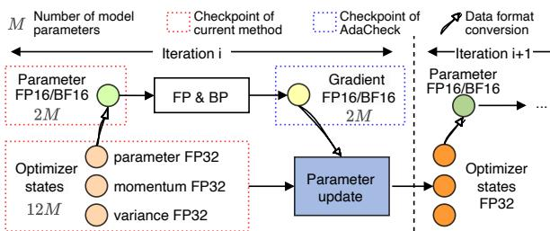  
Figure 8: Workflow of mixed-precision training in each training iteration. The FP16/BF16 parameter can be simply obtained from the FP32 parameter in optimizer states. Instead of saving all parameters and optimizer states, AdaCheck saves gradients to maintain the difference between optimizer states.

## 7 Online Redundancy Utilization

In this section, we introduce the online redundancy utilization, which mainly includes the gradient-based incremental checkpointing mechanism to further reduce the checkpoint size towards the 1S1C target.

## 7.1 State Redundancy across Iterations

The vast majority of model states in a checkpoint are the parameters (e.g., weights and biases) and optimizer states (e.g., momentum), which are modified by the parameter update operation in each training iteration. Specifically, current LLM training generally employs mixed-precision training [24, 55]. Figure 8 shows a mixed-precision training example with Adam optimizer [36]. Let the number of model parameters be M, the size of parameters in half-precision (FP16 or BF16) format will be 2M. In the mixed-precision optimizer, each parameter has three full-precision (FP32) states of parameter, momentum, and variance, making the size of optimizer states 12M. Checkpoints of existing methods will include these states with a total size of 14M. Fortunately, we can identify the difference between checkpoints as the gradients that apply to the optimizer for parameter updating operations in each iteration. Starting from a basic full state, we can use the halfprecision gradients with the size of 2M, to restore the states of the next iteration with parameter updating operations.

For optimal checkpointing frequency, we need to save checkpoints in every iteration. Following the above analysis, instead of saving full-precision optimizer states and parameters, we can only store the smaller half-precision gradients to preserve the difference of adjacent checkpoints (from adjacent iterations), which can greatly reduce each saving overhead (1/7 in mixed-precision training with Adam optimizer).

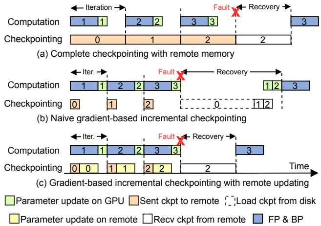  
Figure 9: Timelines of training and checkpointing of different in-memory checkpointing methods. Gradient-based incremental checkpointing can reduce communication during training, and incorporating remote updating can minimize the recovery overhead.

## 7.2 Gradient-based Incremental Checkpointing

With the intrinsic patterns in parameter updating of LLM training, we propose the gradient-based incremental checkpointing method. We are aware of the model states with insufficient tensor redundancy from the detector (§6). Each model parameter is associated with an optimizer state. We create checkpoints as follows: (i) For model parameters only, we can save them directly as saving their gradients does not reduce sizes. (ii) For optimizer states only, we save the gradients of their associated parameters, reducing the size to 1/6. (iii) For both parameters and optimizer states, we save gradients of the parameters which reduces the saving cost by 1/7. (iv) For small training metadata, we save them directly. To alleviate the communication bottleneck of persistent storage, we adopt the remote memory checkpointing technology [74,75], where workers are divided into multiple checkpoint groups (with the group size detailed in §8). Each worker saves its checkpoint to the CPU memory of other workers in the same checkpoint groups via high-speed training networks. Specifically, we assign workers to checkpoint groups according to model parallelism, ensuring workers within a group share a similar computational graph and thereby enabling the overlapping of checkpoint communication and model computation.

Compared to sending all model states to remote CPU memories, as shown in Figure 9(a), a naive gradient-based incremental checkpointing solution can reduce the communication overhead in each training iteration (Figure 9(b)). However, the recovery overhead of this naive solution is heavy. It requires a complete basic checkpoint loading from disk, and each gradient must be retrieved from the remote and applied to the parameters. Although the recovery cost can be mitigated by periodically and asynchronously saving complete checkpoints to reduce the number of updates, and by pipelining the gradient receive and parameter update operations, it remains higher than receiving full model states from remote memories.

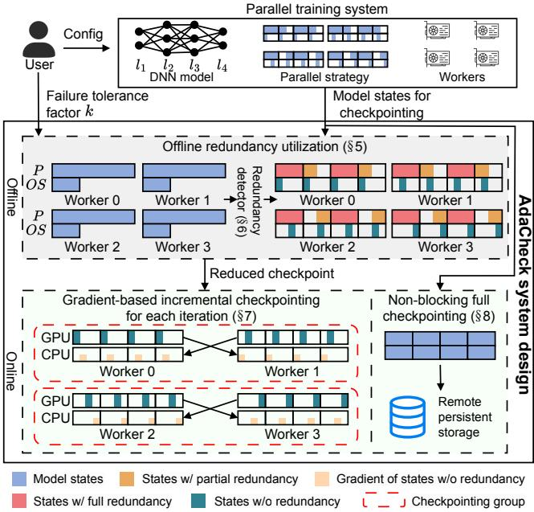  
Figure 10: Overview of AdaCheck system design.

As shown in Figure 9(c), we introduce a remote updating mechanism for gradient-based incremental checkpointing. In addition to sending checkpoints to remote workers, we employ a modified CPU optimizer [62] in the memory of remote workers from the beginning of training, serving as a backup of the local GPU optimizer. Once receiving gradients, the CPU optimizers can update their optimizer states (containing full-precision parameters) in remote memories. When failure happens, the affected worker can receive the up-to-date optimizer states from remote memories and obtain the model parameters with a lightweight data format conversion operation. This approach can achieve a similar recovery overhead as complete remote memory checkpointing methods.

## 8 AdaCheck System Design

The system design of AdaCheck is illustrated in Figure 10. Initially, the user configures the model and parallel training system to implement optimized parallel training. Subsequently, AdaCheck identifies the state redundancy across parallelisms and model architectures (§5) with the help of the redundancy detector (§6). Considering the failure tolerance factor k specified by the user, AdaCheck further divides states with partial redundancy into full and no redundancy. It then computes the intersection of state redundancy between parameters and their corresponding optimizer states, marking both for storage whenever the intersection yields no redundancy. Following these operations, AdaCheck applies the results of offline redundancy utilization for online checkpointing. Specifically, for states marked for storage, AdaCheck employs gradientbased incremental checkpointing for each iteration. Additionally, AdaCheck adopts non-blocking full checkpointing to further enhance the recovery capability in the event of failures.

Table 1: Hardware of clusters for evaluation.
<table><tr><td>Name</td><td>GPUs per node</td><td>#of GPUs</td><td>CPU mem.</td><td>Training bandwidth</td><td>Persistant storage bandwidth</td></tr><tr><td>DCN</td><td>8×A800 80G</td><td>32</td><td>2048GB</td><td>800Gbps</td><td>50Gbps</td></tr><tr><td>CMD</td><td>4×3090 24G</td><td>128</td><td>128GB</td><td>100Gbps</td><td>10Gbps</td></tr></table>

Failure Tolerance Factor k. The failure tolerance factor k denotes the maximum number of simultaneous failures that the user anticipates AdaCheck can endure. To achieve this target, AdaCheck further divides states with partial redundancy based on k, classifying states with replicas exceeding k nodes as states with full redundancy and those with k or fewer replicas as states with no redundancy. For states with no redundancy, AdaCheck applys gradient-based incremental checkpointing with a group size of k. Given a total of n workers, any remaining workers that do not form a complete group, as determined by (n mod k), are assigned to the final group. During training, workers within each group exchange checkpoints with each other. This approach enables AdaCheck to recover from failures in the majority of cases. For example, with n = 128 and k = 2, if 4 workers fail concurrently, AdaCheck can recover from failures with a probability of 95.3%. A more detailed analysis of the checkpointing reliability of AdaCheck is presented in §9.5.

Non-blocking Full Checkpointing. In response to rare catastrophic failures such as the simultaneous failure of all workers, AdaCheck introduces a non-blocking full checkpointing approach. This approach employs a dedicated background thread to manage the storage of full checkpoints, allowing the training process to proceed without interruption.

## 9 Evaluation

Implementation. We implement AdaCheck atop of PyTorch 2.0. With the transparent APIs, AdaCheck can be enabled with simple modifications to original training scripts upon the popular PyTorch-based parallel training frameworks such as DeepSpeed [63] and nnScaler [47]. These frameworks have been integrated into popular LLM model hubs such as transformers [78] and support common parallelism (e.g., DP,

Table 2: Models used for evaluation. B denotes the number of parameters in billions.
<table><tr><td>Cluster</td><td>Model</td><td>Arch.</td><td>Hidden</td><td>Intermediate</td><td>#Layers</td></tr><tr><td rowspan="3">DCN</td><td>LLaMA-7B</td><td>Dense</td><td>4096</td><td>11008</td><td>32</td></tr><tr><td>LLaMA-30B</td><td>Dense</td><td>6144</td><td>16384</td><td>60</td></tr><tr><td>DeepSeek-V2-Lite</td><td>Sparse</td><td>2048</td><td>10944</td><td>27</td></tr><tr><td rowspan="3">CMD</td><td>GPT-1.4B</td><td>Dense</td><td>1536</td><td>6144</td><td>48</td></tr><tr><td>GPT-7B</td><td>Dense</td><td>4096</td><td>14336</td><td>32</td></tr><tr><td>GPT-MoE</td><td>Sparse</td><td>1536</td><td>6144</td><td>48</td></tr></table>

MP, and EP) as well as parallel training optimizations (e.g., ZeRO [61], MiCS [85], and automatic generation of parallel strategies [47]).

## 9.1 Experimental Setups

Clusters. We evaluate AdaCheck on two clusters, represented by the datacenter (DCN) and commodity (CMD), as shown in Table 1, differing in accelerators, InfiniBand bandwidths, and scales. The software environments are identical, including CUDA 11.7, NCCL 2.14.3, and PyTorch 2.0.0 [2]. As the GPUs in each node run simultaneously, we only present the total number of GPUs used in the following experiments.

Models. We evaluate AdaCheck performance using popular dense and sparse LLMs, with detailed settings in Table 2. For the DCN cluster, we use the DeepSeek-V2-Lite with 64 experts as it can represent recent sparse LLMs, and we adopt the same model setting from their technique reports [48, 69]. For the CMD cluster, limited by the GPU memories, we use the GPT-MoE with 64 experts and 24 MoE layers, and we follow the parameter settings used in prior studies [57, 73]. Benchmark models are trained with OpenWebText [18] and Book-Corpus [89] datasets. AdaCheck does not compromise convergence accuracy, therefore we focus on comparing checkpointing performance.

Baselines. We adopt two baselines for the evaluations of AdaCheck: (i) CheckFreq [56]. CheckFreq reduces checkpointing overhead by overlapping model computation with saving checkpoints to remote persistent storage. It also tunes the checkpointing frequency using profiling to ensure continuous usage of persistent bandwidth. CheckFreq can be representative of checkpointing methods with asynchronous I/O. (ii) GEMINI [75]. GEMINI checkpoints model states to remote CPU memory of workers for utilizing high bandwidth of training networks, and interleaves checkpointing communication traffic into gaps between training communication traffic, to reduce checkpointing overheads. Unfortunately it is close-sourced, we have to reimplement it to the best of our abilities.

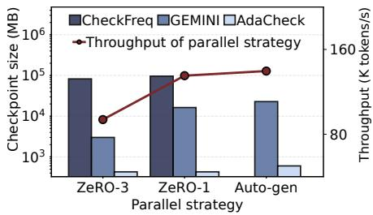  
(a) LLaMA-7B, cluster DCN

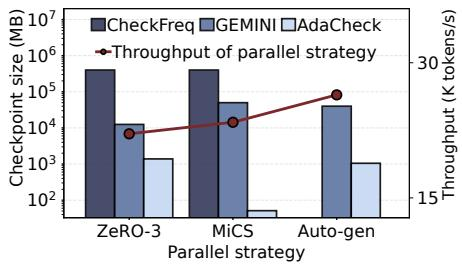  
(b) LLaMA-30B, cluster DCN

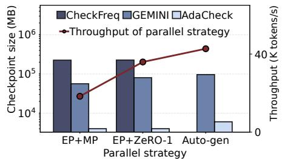  
(c) DeepSeek-V2-Lite, cluster DCN

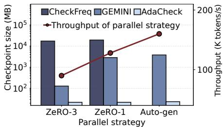  
(d) GPT-1.4B, cluster CMD

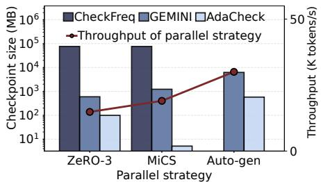  
(e) GPT-7B, cluster CMD

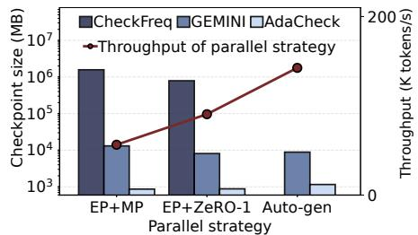  
(f) GPT-MoE, cluster CMD  
Figure 11: Checkpoint sizes of different checkpointing methods, models, and parallel strategies on datacenter (DCN) and commodity (CMD) clusters.

## 9.2 Checkpointing Efficiency

Checkpoint Sizes. We first evaluate the effectiveness of AdaCheck in checkpoint size reduction on different checkpointing methods, models, and parallel strategies. As shown in the result in cluster DCN (Figure 11(a)-(c)) and cluster CMD (Figure 11(d)-(f)), AdaCheck can significantly reduce the checkpoint size by 6.00–896×. We also present the corresponding training speeds in Figure 11. AdaCheck performs well in all parallel training scenarios.

We conduct experiments on three types of models in each cluster: (i) A relatively small dense model (LLaMA-7B in DCN and GPT-1.4B in CMD). (ii) A large dense model (LLaMA-30B in DCN and GPT-7.4B in CMD). (iii) A sparse MoE model (DeepSeek-V2-Lite in DCN and GPT-MoE in CMD). The small dense model can be trained by both the ZeRO-3 and ZeRO-1 [61], and ZeRO-1 accelerates training with redundant parameter states. For the large dense models, MiCS [85] surpasses ZeRO-3 by reducing the model partition scope. For the sparse MoE model which requires EP, more parallelisms are needed to scale out training (MP and ZeRO-1). We also train models with parallelism auto-generated by nnScaler [47], which searches the best parallel strategy for each parameter (search results are illustrated in Figure 1 and Appendix B), with a search space that includes other parallelisms in our evaluations. Thus, the auto-generated always has the best training performance. AdaCheck successfully adapts to different parallel strategies and model architectures, achieving the minimal checkpoint size. For CheckFreq, we manually reduce checkpoint size according to DP, MiCS, and ZeRO-1, but at least one complete model needs to be saved into remote storage. Unfortunately, we failed to maintain the checkpoint size of CheckFreq to one complete model in training with auto-generated parallelism, which requires checkpoint saving rules for every model parameter. This resulted in CheckFreq’s checkpoint size becoming too large to present. GEMINI performs well in parallelism without redundancy (ZeRO-3), where AdaCheck needs to save all states as well. With the help of online redundancy utilization, AdaCheck can cut down adequate checkpoint size. And GEMINI incurs checkpoint overhead increasing in parallel strategies employing redundancy (e.g., ZeRO-1).

Checkpointing Frequency. Figure 12 shows the checkpoint frequency results in efficient parallel training (MiCS for large dense models and EP+ZeRO-1 for sparse MoE models, not using Auto-gen for comparison with CheckFreq) on two clusters. AdaCheck enables checkpointing in each train iteration. Compared to CheckFreq and GEMINI, AdaCheck can increase the checkpoint frequency by 36.2–111× and 1.46–3.64×, respectively. Note that the checkpoint frequency of AdaCheck could be higher, as our checkpointing overhead is less than the training iteration time.

## 9.3 Failure Recovery Efficiency

We compute the average wasted time per failure in efficient parallel training scenarios using (1) and compare the results across different approaches. As illustrated in Figure 13, both GEMINI and AdaCheck exhibit a decrease in wasted time compared to CheckFreq, as they save checkpoints over faster training networks. AdaCheck further reduces the size of checkpoints via the offline and online redundancy utilization, resulting in an additional reduction in wasted time compared to GEMINI. Overall, AdaCheck reduces the wasted time by

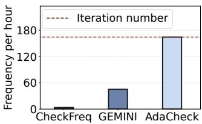  
(a) LLaMA-30B, cluster DCN

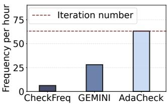  
(b) DeepSeek-V2-Lite, cluster DCN

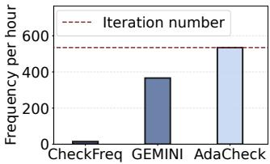  
(c) GPT-7B, cluster CMD

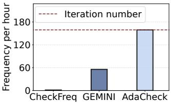  
(d) GPT-MoE, cluster CMD

Figure 12: AdaCheck achieves a higher checkpoint frequency, allowing checkpointing in every iteration.  
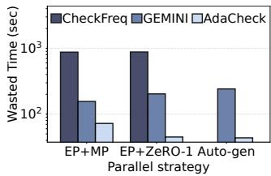  
(a) DeepSeek-V2-Lite, cluster DCN

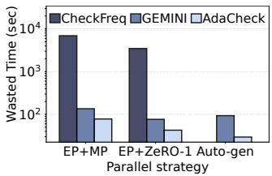  
(b) GPT-MoE, cluster CMD  
Figure 13: Comparison of the average wasted time per failure for sparse models.

12.1–88.93× compared to CheckFreq, and by 1.73–4.51× compared to GEMINI.

## 9.4 Parallel Training Efficiency

Next, we discuss the runtime overhead of AdaCheck. Figure 14 shows the iteration time of models without checkpointing and with AdaCheck on two clusters with efficient parallel training strategies. The experimental results demonstrate that AdaCheck almost incurs no overhead during training, as we enable overlapping of checkpoint communication and model computation in gradient-based incremental checkpointing. Besides, non-blocking full checkpointing leverages separate bandwidth resources for computation nodes and remote persistent storage, resulting in negligible additional overhead.

We also compare the end-to-end performance between CheckFreq, GEMINI, and AdaCheck, with different simulated failure rates. The results are depicted in Figure 15. As the number of failures increases, the effective throughput of CheckFreq decreases rapidly. GEMINI and AdaCheck get the latest checkpoints from remote CPU memory, exhibiting better tolerance for failures. However, as the number of failures continues to rise, AdaCheck achieves an end-to-end performance improvement by up to 1.12× compared to GEMINI, owing to its higher checkpoint frequency.

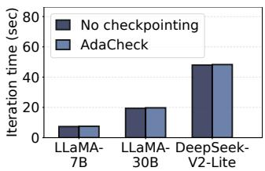  
(a) 32 GPUs, cluster DCN

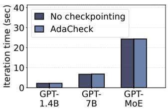  
(b) 128 GPUs, cluster CMD

Figure 14: The iteration time of models without checkpointing and with AdaCheck.  
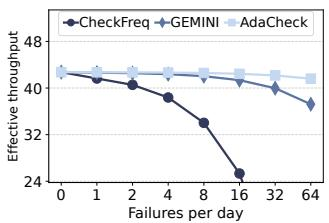

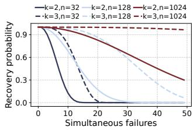  
Figure 15: Effective through- Figure 16: Recovery probabilput under different failure ity of AdaCheck in different rates for DeepSeek-V2-Lite cases of simultaneous failures. with EP+ZeRO-1.

## 9.5 Checkpointing Reliability

Following the proof style of GEMINI [75], we consider a scenario with n workers, where f workers experience simultaneous failures. The probability of AdaCheck successfully recovering from such failures with group size k is determined by the following considerations:

$$
\left\{ \begin{array} { l l } { \operatorname* { P r } ( n , f , k ) = 1 , \quad } & { \mathrm { i f ~ } f < k , } \\ { \operatorname* { P r } ( n , f , k ) = 1 - \frac { \sum _ { i = 1 } ^ { f / k } ( - 1 ) ^ { ( i + 1 ) } \cdot \binom { n / k } { i } \cdot \binom { n - i \cdot k } { f - i \cdot k } } { \binom { n } { f } } , \mathrm { i f ~ } k \le f \le n . } \end{array} \right.\tag{4}
$$

The detailed proof of (4) can be found in the Appendix C. Based on (4), Figure 16 shows the recovery probability of AdaCheck when meeting simultaneous failures. Solid lines represent the probability of AdaCheck for a group size of k = 2, while dotted lines correspond to the scenario where the group size is k = 3. The probability increases with the number of workers n and the group size k. In the worst case, characterized by a group size of k = 3 and a total of n = 32 workers, the simultaneous failures of 4 workers reduce the probability of AdaCheck recovery from gradient-based incremental checkpointing to below 90%. However, the OPT-175B [84] reports that 1.5% of workers experience failure within 24 hours. This implies that the occurrence of simultaneous failures among 4 workers within 32 workers is a rare event. Therefore, AdaCheck maintains a recovery probability above 90% even in the worst case, effectively managing failures in most instances.

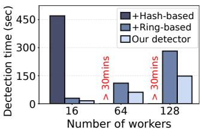  
Figure 17: Optimizations in redundancy detector.

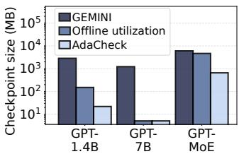  
Figure 18: Ablation study of redundancy utilization methods in AdaCheck.

## 9.6 Ablation Study

Optimizations in Redundancy Detector. We conduct the ablation study on our redundancy detector, starting with a naive approach that transfers tensors sequentially for tensor redundancy identification. Due to the huge transfer and comparison overhead caused by tensors, this naive approach fails to get the comparison results in an acceptable time. To reduce this overhead, we apply our hash-based approach to the naive approach. The comparison time is thus reduced to 8 minutes when training with 16 workers. However, it is still over 30 minutes with a large training scale. We then integrate our ring-based algorithm into it. The concurrent execution along with the transfer of comparison results significantly reduces the overhead. Finally, we reduce the comparison scale and get our detector. Experimental results show that our detector gets comparison results in 3 minutes even with 128 workers.

Redundancy Utilization. We further compare the size of checkpoints with GEMINI to show the effectiveness of our offline and online redundancy utilization methods. As shown in Figure 18, compared to GEMINI, our offline redundancy utilization method (the offline utilization bar) can reduce the size of checkpoints by only storing states with no redundancy, achieving a reduction of size by 1.30–240×. Additionally, AdaCheck applys the online redundancy utilization method to further reduce the size of checkpoints. Experimental results demonstrate that AdaCheck can achieve a further reduction of up to 7.09× in the size of checkpoints after applying the online redundancy utilization method over the offline redundancy utilization method.

## 10 Related Work

Parallel LLM Training. Data parallelism [41] distributes the dataset across workers for processing. Sharded data parallelism [9, 61, 85] further shard specific model states to reduce memory overhead. Pipeline parallelism [14, 28, 45, 51, 52] splits a model into sequential sub-modules and input data to these sub-modules in a pipeline manner. Tensor parallelism [37, 44, 65] splits specific operators across multiple workers to parallelize the matrix multiply. Tolerated to specific applications, more parallelisms are explored such as expert parallelism [30,39,58,83] for sparse MoE model training, sequence parallelism [20,31,43] for long sequence training in LLMs, and graph parallelism [27, 32] for multimodal model training. Recent LLM training system adopts auto-parallelism methods [8, 47, 50, 87], formulating the model parameter replica and partition strategy as an optimization problem and solving with algorithms. Parallel training methods focus on training performance, resulting in complex state redundancy. With offline redundancy utilization, AdaCheck can achieve efficient checkpointing in these sophisticated parallelisms.

Optimizing DNN Checkpointing. DNN training uses checkpoints as the basic mechanism for fault recovery. While naive checkpointing stalls training, asynchronous checkpointing approaches [34, 53, 56, 80] enable overlapping between saving and model computing. Exploiting the model checkpoint saving routines, some approaches [66, 72, 73, 81] improve the I/O performance in saving to remote persistent storage. Inmemory checkpointing methods such as GEMINI [75] utilize remote CPU memories, allowing checkpointing over highspeed training networks. ECCHECK [59] further optimize the resilience of in-memory checkpointing methods through erasure coding. JIT [22] checkpointing employs the complete state replicas from DP, creating checkpoints only after failures. MoC-System [6] and MOETION [16] use the locality in sparse MoE models to reduce checkpoint size, while FlowCheck [29] and CHECKMATE [3] use programmable switches to capture gradient packets in DP communications. AdaCheck benefits from existing solutions, achieves adaptive and efficient checkpointing without assumptions of model architectures, hardwares, and parallelisms.

## 11 Conclusions

We propose AdaCheck, an adaptive checkpointing system for efficient LLM training. AdaCheck models the state redundancy with the help of tensor redundancy and adopts an offline redundancy utilization method to reduce checkpoint size. Besides, AdaCheck proposes an online redundancy utilization method to minimize checkpoint size. Further, AdaCheck combines offline and online redundancy utilization methods to implement an adaptive checkpointing system. Experiments show that AdaCheck significantly reduces checkpoint size and increases the checkpoint frequency.

## Acknowledgments

We sincerely thank our shepherd, Bryan Kim, and anonymous FAST reviewers for their valuable comments on this paper. This work is sponsored in part by the National Natural Science Foundation of China under Grant No. 62025208, 62421002, and 62302512, and by the Innovation Research Foundation of National University of Defense Technology under Grant No. ZK24-02. The corresponding authors of this paper are Zhiquan Lai and Dongsheng Li.

## References

[1] Josh Achiam, Steven Adler, Sandhini Agarwal, Lama Ahmad, Ilge Akkaya, Florencia Leoni Aleman, Diogo Almeida, Janko Altenschmidt, Sam Altman, Shyamal Anadkat, et al. Gpt-4 technical report. arXiv preprint arXiv:2303.08774, 2023.

[2] Jason Ansel, Edward Yang, Horace He, Natalia Gimelshein, Animesh Jain, Michael Voznesensky, Bin Bao, Peter Bell, David Berard, Evgeni Burovski, et al. Pytorch 2: Faster machine learning through dynamic python bytecode transformation and graph compilation. In Proceedings of the 29th ACM International Conference on Architectural Support for Programming Languages and Operating Systems, Volume 2, pages 929– 947, 2024.

[3] Ankit Bhardwaj, Weiyang Wang, Jeremy Carin, Adam Belay, and Manya Ghobadi. Checkmate: Zero-overhead model checkpointing via network gradient replication. arXiv preprint arXiv:2507.13522, 2025.

[4] Tom Brown, Benjamin Mann, Nick Ryder, Melanie Subbiah, Jared D Kaplan, Prafulla Dhariwal, Arvind Neelakantan, Pranav Shyam, Girish Sastry, Amanda Askell, et al. Language models are few-shot learners. Advances in Neural Information Processing Systems, 33:1877– 1901, 2020.

[5] Weilin Cai, Juyong Jiang, Fan Wang, Jing Tang, Sunghun Kim, and Jiayi Huang. A survey on mixture of experts. arXiv preprint arXiv:2407.06204, 2024.

[6] Weilin Cai, Le Qin, and Jiayi Huang. Moc-system: Efficient fault tolerance for sparse mixture-of-experts model training. In Proceedings of the 30th ACM International Conference on Architectural Support for Programming Languages and Operating Systems, Volume 2, pages 655– 671, 2025.

[7] Hongzheng Chen, Cody Hao Yu, Shuai Zheng, Zhen Zhang, Zhiru Zhang, and Yida Wang. Slapo: A schedule language for progressive optimization of large deep learning model training. In Proceedings of the 29th ACM International Conference on Architectural Support for Programming Languages and Operating Systems, Volume 2, pages 1095–1111, 2024.

[8] Qiaoling Chen, Diandian Gu, Guoteng Wang, Xun Chen, YingTong Xiong, Ting Huang, Qinghao Hu, Xin Jin, Yonggang Wen, Tianwei Zhang, et al. Internevo: Efficient long-sequence large language model training via hybrid parallelism and redundant sharding. arXiv preprint arXiv:2401.09149, 2024.

[9] Qiaoling Chen, Qinghao Hu, Guoteng Wang, Yingtong Xiong, Ting Huang, Xun Chen, Yang Gao, Hang Yan, Yonggang Wen, Tianwei Zhang, et al. Lins: Reducing communication overhead of zero for efficient llm training. In 2024 IEEE/ACM 32nd International Symposium on Quality of Service (IWQoS), pages 1–10, 2024.

[10] Damai Dai, Chengqi Deng, Chenggang Zhao, RX Xu, Huazuo Gao, Deli Chen, Jiashi Li, Wangding Zeng, Xingkai Yu, Y Wu, et al. Deepseekmoe: Towards ultimate expert specialization in mixture-of-experts language models. arXiv preprint arXiv:2401.06066, 2024.

[11] Nan Du, Yanping Huang, Andrew M Dai, Simon Tong, Dmitry Lepikhin, Yuanzhong Xu, Maxim Krikun, Yanqi Zhou, Adams Wei Yu, Orhan Firat, et al. Glam: Efficient scaling of language models with mixture-of-experts. In International Conference on Machine Learning, pages 5547–5569, 2022.

[12] Jiangfei Duan, Shuo Zhang, Zerui Wang, Lijuan Jiang, Wenwen Qu, Qinghao Hu, Guoteng Wang, Qizhen Weng, Hang Yan, Xingcheng Zhang, et al. Efficient training of large language models on distributed infrastructures: a survey. arXiv preprint arXiv:2407.20018, 2024.

[13] Assaf Eisenman, Kiran Kumar Matam, Steven Ingram, Dheevatsa Mudigere, Raghuraman Krishnamoorthi, Krishnakumar Nair, Misha Smelyanskiy, and Murali Annavaram. Check-N-Run: A checkpointing system for training deep learning recommendation models. In 19th USENIX Symposium on Networked Systems Design and Implementation (NSDI 22), pages 929–943, 2022.

[14] Shiqing Fan, Yi Rong, Chen Meng, Zongyan Cao, Siyu Wang, Zhen Zheng, Chuan Wu, Guoping Long, Jun Yang, Lixue Xia, et al. Dapple: A pipelined data parallel approach for training large models. In Proceedings of the 26th ACM SIGPLAN Symposium on Principles and Practice of Parallel Programming, pages 431–445, 2021.

[15] William Fedus, Barret Zoph, and Noam Shazeer. Switch transformers: Scaling to trillion parameter models with simple and efficient sparsity. Journal of Machine Learning Research, 23(120):1–39, 2022.

[16] Swapnil Gandhi and Christos Kozyrakis. Moetion: Efficient and reliable sparse checkpointing for mixture-of-experts models at scale. arXiv preprint arXiv:2412.15411, 2024.

[17] Alexandros V Gerbessiotis and Leslie G Valiant. Direct bulk-synchronous parallel algorithms. Journal of parallel and distributed computing, 22(2):251–267, 1994.

[18] Aaron Gokaslan and Vanya Cohen. Openwebtext corpus. http://Skylion007.github.io/ OpenWebTextCorpus, 2019.

[19] Aaron Grattafiori, Abhimanyu Dubey, Abhinav Jauhri, Abhinav Pandey, Abhishek Kadian, Ahmad Al-Dahle, Aiesha Letman, Akhil Mathur, Alan Schelten, Alex Vaughan, et al. The llama 3 herd of models. arXiv preprint arXiv:2407.21783, 2024.

[20] Diandian Gu, Peng Sun, Qinghao Hu, Ting Huang, Xun Chen, Yingtong Xiong, Guoteng Wang, Qiaoling Chen, Shangchun Zhao, Jiarui Fang, et al. Loongtrain: Efficient training of long-sequence llms with head-context parallelism. arXiv preprint arXiv:2406.18485, 2024.

[21] Dong Guo, Faming Wu, Feida Zhu, Fuxing Leng, Guang Shi, Haobin Chen, Haoqi Fan, Jian Wang, Jianyu Jiang, Jiawei Wang, et al. Seed1. 5-vl technical report. arXiv preprint arXiv:2505.07062, 2025.

[22] Tanmaey Gupta, Sanjeev Krishnan, Rituraj Kumar, Abhishek Vijeev, Bhargav Gulavani, Nipun Kwatra, Ramachandran Ramjee, and Muthian Sivathanu. Justin-time checkpointing: Low cost error recovery from deep learning training failures. In Proceedings of the Nineteenth European Conference on Computer Systems, pages 1110–1125, 2024.

[23] Tao He, Xue Li, Zhibin Wang, Kun Qian, Jingbo Xu, Wenyuan Yu, and Jingren Zhou. Unicron: Economizing self-healing llm training at scale. arXiv preprint arXiv:2401.00134, 2023.

[24] Xin He, Jianhua Sun, Hao Chen, and Dong Li. Campo:Cost-Aware performance optimization for Mixed-Precision neural network training. In 2022 USENIX Annual Technical Conference (USENIX ATC 22), pages 505–518, 2022.

[25] Jordan Hoffmann, Sebastian Borgeaud, Arthur Mensch, Elena Buchatskaya, Trevor Cai, Eliza Rutherford, Diego de Las Casas, Lisa Anne Hendricks, Johannes Welbl, Aidan Clark, et al. An empirical analysis of computeoptimal large language model training. Advances in Neural Information Processing Systems, 35:30016–30030, 2022.

[26] Qinghao Hu, Zhisheng Ye, Zerui Wang, Guoteng Wang, Meng Zhang, Qiaoling Chen, Peng Sun, Dahua Lin, Xiaolin Wang, Yingwei Luo, et al. Characterization of large language model development in the datacenter. In 21st USENIX Symposium on Networked Systems Design and Implementation (NSDI 24), pages 709–729, 2024.

[27] Jun Huang, Zhen Zhang, Shuai Zheng, Feng Qin, and Yida Wang. DISTMM: Accelerating distributed multimodal model training. In 21st USENIX Symposium on

Networked Systems Design and Implementation (NSDI 24), pages 1157–1171, 2024.

[28] Yanping Huang, Youlong Cheng, Ankur Bapna, Orhan Firat, Dehao Chen, Mia Chen, HyoukJoong Lee, Jiquan Ngiam, Quoc V Le, Yonghui Wu, et al. Gpipe: Efficient training of giant neural networks using pipeline parallelism. Advances in Neural Information Processing Systems, 32, 2019.

[29] Zimeng Huang, Hao Nie, Haonan Jia, Bo Jiang, Junchen Guo, Jianyuan Lu, Rong Wen, Biao Lyu, Shunmin Zhu, and Xinbing Wang. Flowcheck: Decoupling checkpointing and training of large-scale models. In Proceedings of the Twentieth European Conference on Computer Systems, pages 1334–1349, 2025.

[30] Changho Hwang, Wei Cui, Yifan Xiong, Ziyue Yang, Ze Liu, Han Hu, Zilong Wang, Rafael Salas, Jithin Jose, Prabhat Ram, et al. Tutel: Adaptive mixture-of-experts at scale. Proceedings of Machine Learning and Systems, 5, 2023.

[31] Sam Ade Jacobs, Masahiro Tanaka, Chengming Zhang, Minjia Zhang, Leon Song, Samyam Rajbhandari, and Yuxiong He. Deepspeed ulysses: System optimizations for enabling training of extreme long sequence transformer models. arXiv preprint arXiv:2309.14509, 2023.

[32] Byungsoo Jeon, Mengdi Wu, Shiyi Cao, Sunghyun Kim, Sunghyun Park, Neeraj Aggarwal, Colin Unger, Daiyaan Arfeen, Peiyuan Liao, Xupeng Miao, et al. Graphpipe: Improving performance and scalability of dnn training with graph pipeline parallelism. arXiv preprint arXiv:2406.17145, 2024.

[33] Albert Q Jiang, Alexandre Sablayrolles, Antoine Roux, Arthur Mensch, Blanche Savary, Chris Bamford, Devendra Singh Chaplot, Diego de las Casas, Emma Bou Hanna, Florian Bressand, et al. Mixtral of experts. arXiv preprint arXiv:2401.04088, 2024.

[34] Ziheng Jiang, Haibin Lin, Yinmin Zhong, Qi Huang, Yangrui Chen, Zhi Zhang, Yanghua Peng, Xiang Li, Cong Xie, Shibiao Nong, et al. MegaScale: Scaling large language model training to more than 10,000 GPUs. In 21st USENIX Symposium on Networked Systems Design and Implementation (NSDI 24), pages 745–760, 2024.

[35] Jared Kaplan, Sam McCandlish, Tom Henighan, Tom B Brown, Benjamin Chess, Rewon Child, Scott Gray, Alec Radford, Jeffrey Wu, and Dario Amodei. Scaling laws for neural language models. arXiv preprint arXiv:2001.08361, 2020.

[36] Diederik P Kingma and Jimmy Ba. Adam: A method for stochastic optimization. arXiv preprint arXiv:1412.6980, 2014.

[37] Vijay Anand Korthikanti, Jared Casper, Sangkug Lym, Lawrence McAfee, Michael Andersch, Mohammad Shoeybi, and Bryan Catanzaro. Reducing activation recomputation in large transformer models. Proceedings of Machine Learning and Systems, 5, 2023.

[38] Zhiquan Lai, Shengwei Li, Xudong Tang, Keshi Ge, Weijie Liu, Yabo Duan, Linbo Qiao, and Dongsheng Li. Merak: An efficient distributed dnn training framework with automated 3d parallelism for giant foundation models. IEEE Transactions on Parallel and Distributed Systems, 34(5):1466–1478, 2023.

[39] Dmitry Lepikhin, HyoukJoong Lee, Yuanzhong Xu, Dehao Chen, Orhan Firat, Yanping Huang, Maxim Krikun, Noam Shazeer, and Zhifeng Chen. Gshard: Scaling giant models with conditional computation and automatic sharding. In International Conference on Learning Representations, 2020.

[40] Ang Li, Shuaiwen Leon Song, Jieyang Chen, Jiajia Li, Xu Liu, Nathan R Tallent, and Kevin J Barker. Evaluating modern gpu interconnect: Pcie, nvlink, nv-sli, nvswitch and gpudirect. IEEE Transactions on Parallel and Distributed Systems, 31(1):94–110, 2019.

[41] Shen Li, Yanli Zhao, Rohan Varma, Omkar Salpekar, Pieter Noordhuis, Teng Li, Adam Paszke, Jeff Smith, Brian Vaughan, Pritam Damania, and Soumith Chintala. Pytorch distributed: Experiences on accelerating data parallel training. Proc. VLDB Endow., 13(12):3005–3018, 2020.

[42] Shenggui Li, Hongxin Liu, Zhengda Bian, Jiarui Fang, Haichen Huang, Yuliang Liu, Boxiang Wang, and Yang You. Colossal-ai: A unified deep learning system for large-scale parallel training. In Proceedings of the 52nd International Conference on Parallel Processing, pages 766–775, 2023.

[43] Shenggui Li, Fuzhao Xue, Chaitanya Baranwal, Yongbin Li, and Yang You. Sequence parallelism: Long sequence training from system perspective. In Proceedings of the 61st Annual Meeting of the Association for Computational Linguistics (Volume 1: Long Papers), pages 2391–2404, 2023.

[44] Shengwei Li, Zhiquan Lai, Dongsheng Li, Yanqi Hao, Weijie Liu, Keshi Ge, Xiaoge Deng, and Kai Lu. Oases: Efficient large-scale model training on commodity servers via overlapped and automated tensor model parallelism. IEEE Transactions on Parallel and Distributed Systems, 2025.

[45] Shigang Li and Torsten Hoefler. Chimera: efficiently training large-scale neural networks with bidirectional

pipelines. In Proceedings of the International Conference for High Performance Computing, Networking, Storage and Analysis, pages 1–14, 2021.

[46] Xinyu Lian, Sam Ade Jacobs, Lev Kurilenko, Masahiro Tanaka, Stas Bekman, Olatunji Ruwase, and Minjia Zhang. Universal checkpointing: Efficient and flexible checkpointing for large scale distributed training. arXiv preprint arXiv:2406.18820, 2024.

[47] Zhiqi Lin, Youshan Miao, Quanlu Zhang, Fan Yang, Yi Zhu, Cheng Li, Saeed Maleki, Xu Cao, Ning Shang, Yilei Yang, et al. nnScaler:Constraint-Guided parallelization plan generation for deep learning training. In 18th USENIX Symposium on Operating Systems Design and Implementation (OSDI 24), pages 347–363, 2024.

[48] Aixin Liu, Bei Feng, Bin Wang, Bingxuan Wang, Bo Liu, Chenggang Zhao, Chengqi Dengr, Chong Ruan, Damai Dai, Daya Guo, et al. Deepseek-v2: A strong, economical, and efficient mixture-of-experts language model. arXiv preprint arXiv:2405.04434, 2024.

[49] Aixin Liu, Bei Feng, Bing Xue, Bingxuan Wang, Bochao Wu, Chengda Lu, Chenggang Zhao, Chengqi Deng, Chenyu Zhang, Chong Ruan, et al. Deepseek-v3 technical report. arXiv preprint arXiv:2412.19437, 2024.

[50] Guodong Liu, Youshan Miao, Zhiqi Lin, Xiaoxiang Shi, Saeed Maleki, Fan Yang, Yungang Bao, and Sa Wang. Aceso: Efficient parallel dnn training through iterative bottleneck alleviation. In Proceedings of the Nineteenth European Conference on Computer Systems, pages 163– 181, 2024.

[51] Weijie Liu, Kai Lu, Zhiquan Lai, Shengwei Li, Keshi Ge, Dongsheng Li, and Xicheng Lu. Autopipe-h: A heterogeneity-aware data-paralleled pipeline approach on commodity gpu servers. IEEE Transactions on Computers, 2024.

[52] Ziming Liu, Shenggan Cheng, Haotian Zhou, and Yang You. Hanayo: Harnessing wave-like pipeline parallelism for enhanced large model training efficiency. In Proceedings of the International Conference for High Performance Computing, Networking, Storage and Analysis, pages 1–13, 2023.

[53] Avinash Maurya, Robert Underwood, M Mustafa Rafique, Franck Cappello, and Bogdan Nicolae. Datastates-llm: Lazy asynchronous checkpointing for large language models. In Proceedings of the 33rd International Symposium on High-Performance Parallel and Distributed Computing, pages 227–239, 2024.

[54] Meta AI. Introducing meta llama 3: The most capable openly available llm to date. https://ai.meta.com/ blog/meta-llama-3/, 2024.

[55] Paulius Micikevicius, Sharan Narang, Jonah Alben, Gregory Diamos, Erich Elsen, David Garcia, Boris Ginsburg, Michael Houston, Oleksii Kuchaiev, Ganesh Venkatesh, et al. Mixed precision training. In International Conference on Learning Representations, 2018.

[56] Jayashree Mohan, Amar Phanishayee, and Vijay Chidambaram. CheckFreq: Frequent, Fine-Grained DNN checkpointing. In 19th USENIX Conference on File and Storage Technologies (FAST 21), pages 203–216, 2021.

[57] Deepak Narayanan, Mohammad Shoeybi, Jared Casper, Patrick LeGresley, Mostofa Patwary, Vijay Korthikanti, Dmitri Vainbrand, Prethvi Kashinkunti, Julie Bernauer, Bryan Catanzaro, et al. Efficient large-scale language model training on gpu clusters using megatron-lm. In Proceedings of the International Conference for High Performance Computing, Networking, Storage and Analysis, pages 1–15, 2021.

[58] Xiaonan Nie, Xupeng Miao, Zilong Wang, Zichao Yang, Jilong Xue, Lingxiao Ma, Gang Cao, and Bin Cui. Flexmoe: Scaling large-scale sparse pre-trained model training via dynamic device placement. Proceedings of the ACM on Management of Data, 1(1):1–19, 2023.

[59] Guicheng Qi, Zongpeng Li, Chuan Wu, Zhuwei Peng, and Yi Zheng. Eccheck: Enhancing in-memory checkpoint with erasure coding in distributed dnn training. In Proceedings of the 45th IEEE International Conference on Distributed Computing Systems, 2025.

[60] Samyam Rajbhandari, Conglong Li, Zhewei Yao, Minjia Zhang, Reza Yazdani Aminabadi, Ammar Ahmad Awan, Jeff Rasley, and Yuxiong He. Deepspeed-moe: Advancing mixture-of-experts inference and training to power next-generation ai scale. In International Conference on Machine Learning, pages 18332–18346, 2022.

[61] Samyam Rajbhandari, Jeff Rasley, Olatunji Ruwase, and Yuxiong He. Zero: Memory optimizations toward training trillion parameter models. In Proceedings of the International Conference for High Performance Computing, Networking, Storage and Analysis, pages 1–16, 2020.

[62] Samyam Rajbhandari, Olatunji Ruwase, Jeff Rasley, Shaden Smith, and Yuxiong He. Zero-infinity: Breaking the gpu memory wall for extreme scale deep learning. In Proceedings of the International Conference for High Performance Computing, Networking, Storage and Analysis, pages 1–14, 2021.

[63] Jeff Rasley, Samyam Rajbhandari, Olatunji Ruwase, and Yuxiong He. Deepspeed: System optimizations enable training deep learning models with over 100 billion parameters. In Proceedings of the 26th ACM SIGKDD

International Conference on Knowledge Discovery & Data Mining, pages 3505–3506, 2020.

[64] Alexander Sergeev and Mike Del Balso. Horovod: fast and easy distributed deep learning in tensorflow. arXiv preprint arXiv:1802.05799, 2018.

[65] Mohammad Shoeybi, Mostofa Patwary, Raul Puri, Patrick LeGresley, Jared Casper, and Bryan Catanzaro. Megatron-lm: Training multi-billion parameter language models using model parallelism. arXiv preprint arXiv:1909.08053, 2019.

[66] Foteini Strati, Michal Friedman, and Ana Klimovic. Pccheck: Persistent concurrent checkpointing for ml. In Proceedings of the 30th ACM International Conference on Architectural Support for Programming Languages and Operating Systems, Volume 1, pages 811–827, 2025.

[67] Gemini Team, Rohan Anil, Sebastian Borgeaud, Yonghui Wu, Jean-Baptiste Alayrac, Jiahui Yu, Radu Soricut, Johan Schalkwyk, Andrew M Dai, Anja Hauth, et al. Gemini: a family of highly capable multimodal models. arXiv preprint arXiv:2312.11805, 2023.

[68] Kimi Team, Yifan Bai, Yiping Bao, Guanduo Chen, Jiahao Chen, Ningxin Chen, Ruijue Chen, Yanru Chen, Yuankun Chen, Yutian Chen, et al. Kimi k2: Open agentic intelligence. arXiv preprint arXiv:2507.20534, 2025.

[69] Hugo Touvron, Thibaut Lavril, Gautier Izacard, Xavier Martinet, Marie-Anne Lachaux, Timothée Lacroix, Baptiste Rozière, Naman Goyal, Eric Hambro, Faisal Azhar, et al. Llama: Open and efficient foundation language models. arXiv preprint arXiv:2302.13971, 2023.

[70] Colin Unger, Zhihao Jia, Wei Wu, Sina Lin, Mandeep Baines, Carlos Efrain Quintero Narvaez, Vinay Ramakrishnaiah, Nirmal Prajapati, Pat McCormick, Jamaludin Mohd-Yusof, et al. Unity: Accelerating DNN training through joint optimization of algebraic transformations and parallelization. In 16th USENIX Symposium on Operating Systems Design and Implementation (OSDI 22), pages 267–284, 2022.

[71] Ashish Vaswani, Noam Shazeer, Niki Parmar, Jakob Uszkoreit, Llion Jones, Aidan N Gomez, Łukasz Kaiser, and Illia Polosukhin. Attention is all you need. Advances in Neural Information Processing Systems, 30, 2017.

[72] Borui Wan, Mingji Han, Yiyao Sheng, Yanghua Peng, Haibin Lin, Mofan Zhang, Zhichao Lai, Menghan Yu, Junda Zhang, Zuquan Song, et al. Bytecheckpoint: A unified checkpointing system for large foundation model development. In 22nd USENIX Symposium on Networked Systems Design and Implementation (NSDI 25), pages 559–578, 2025.

[73] Guanhua Wang, Olatunji Ruwase, Bing Xie, and Yuxiong He. Fastpersist: Accelerating model checkpointing in deep learning. arXiv preprint arXiv:2406.13768, 2024.

[74] Yuxin Wang, Shaohuai Shi, Xin He, Zhenheng Tang, Xinglin Pan, Yang Zheng, Xiaoyu Wu, Amelie Chi Zhou, Bingsheng He, and Xiaowen Chu. Reliable and efficient in-memory fault tolerance of large language model pretraining. arXiv preprint arXiv:2310.12670, 2023.

[75] Zhuang Wang, Zhen Jia, Shuai Zheng, Zhen Zhang, Xinwei Fu, TS Eugene Ng, and Yida Wang. Gemini: Fast failure recovery in distributed training with in-memory checkpoints. In Proceedings of the 29th Symposium on Operating Systems Principles, pages 364–381, 2023.

[76] Xingda Wei, Xiating Xie, Rong Chen, Haibo Chen, and Binyu Zang. Characterizing and optimizing remote persistent memory with RDMA and NVM. In 2021 USENIX Annual Technical Conference (USENIX ATC 21), pages 523–536, 2021.

[77] Qizhen Weng, Wencong Xiao, Yinghao Yu, Wei Wang, Cheng Wang, Jian He, Yong Li, Liping Zhang, Wei Lin, and Yu Ding. MLaaS in the wild: Workload analysis and scheduling in Large-Scale heterogeneous GPU clusters. In 19th USENIX Symposium on Networked Systems Design and Implementation (NSDI 22), pages 945–960, 2022.

[78] Thomas Wolf, Lysandre Debut, Victor Sanh, Julien Chaumond, Clement Delangue, Anthony Moi, Pierric Cistac, Tim Rault, Rémi Louf, Morgan Funtowicz, et al. Transformers: State-of-the-art natural language processing. In Proceedings of the 2020 Conference on Empirical Methods in Natural Language Processing: System Demonstrations, pages 38–45, 2020.

[79] BigScience Workshop, Teven Le Scao, Angela Fan, Christopher Akiki, Ellie Pavlick, Suzana Ilic, Daniel ´ Hesslow, Roman Castagné, Alexandra Sasha Luccioni, François Yvon, et al. Bloom: A 176b-parameter openaccess multilingual language model. arXiv preprint arXiv:2211.05100, 2022.

[80] Baodong Wu, Lei Xia, Qingping Li, Kangyu Li, Xu Chen, Yongqiang Guo, Tieyao Xiang, Yuheng Chen, and Shigang Li. Transom: An efficient fault-tolerant system for training llms. arXiv preprint arXiv:2310.10046, 2023.

[81] Shao-Peng Yang, Minjae Kim, Sanghyun Nam, Juhyung Park, Jin-Yong Choi, Eyee Hyun Nam, Eunji Lee, Sungjin Lee, and Bryan S Kim. Overcoming the memory wall with cxl-enabled ssds. In 2023 USENIX Annual Technical Conference (USENIX ATC 23), pages 601–617, 2023.

[82] Alex Young, Bei Chen, Chao Li, Chengen Huang, Ge Zhang, Guanwei Zhang, Guoyin Wang, Heng Li, Jiangcheng Zhu, Jianqun Chen, et al. Yi: Open foundation models by 01. ai. arXiv preprint arXiv:2403.04652, 2024.

[83] Mingshu Zhai, Jiaao He, Zixuan Ma, Zan Zong, Runqing Zhang, and Jidong Zhai. SmartMoE: Efficiently training Sparsely-Activated models through combining offline and online parallelization. In 2023 USENIX Annual Technical Conference (USENIX ATC 23), pages 961– 975, 2023.

[84] Susan Zhang, Stephen Roller, Naman Goyal, Mikel Artetxe, Moya Chen, Shuohui Chen, Christopher Dewan, Mona Diab, Xian Li, Xi Victoria Lin, et al. Opt: Open pre-trained transformer language models. arXiv preprint arXiv:2205.01068, 2022.

[85] Zhen Zhang, Shuai Zheng, Yida Wang, Justin Chiu, George Karypis, Trishul Chilimbi, Mu Li, and Xin Jin. Mics: near-linear scaling for training gigantic model on public cloud. Proceedings of the VLDB Endowment, 16(1):37–50, 2022.

[86] Yanli Zhao, Andrew Gu, Rohan Varma, Liang Luo, Chien-Chin Huang, Min Xu, Less Wright, Hamid Shojanazeri, Myle Ott, Sam Shleifer, et al. Pytorch fsdp: Experiences on scaling fully sharded data parallel. Proceedings of the VLDB Endowment, 16(12):3848–3860, 2023.

[87] Lianmin Zheng, Zhuohan Li, Hao Zhang, Yonghao Zhuang, Zhifeng Chen, Yanping Huang, Yida Wang, Yuanzhong Xu, Danyang Zhuo, Eric P Xing, et al. Alpa: Automating inter-and Intra-Operator parallelism for distributed deep learning. In 16th USENIX Symposium on Operating Systems Design and Implementation (OSDI 22), pages 559–578, 2022.

[88] Ce Zhou, Qian Li, Chen Li, Jun Yu, Yixin Liu, Guangjing Wang, Kai Zhang, Cheng Ji, Qiben Yan, Lifang He, et al. A comprehensive survey on pretrained foundation models: A history from bert to chatgpt. arXiv preprint arXiv:2302.09419, 2023.

[89] Yukun Zhu, Ryan Kiros, Rich Zemel, Ruslan Salakhutdinov, Raquel Urtasun, Antonio Torralba, and Sanja Fidler. Aligning books and movies: Towards story-like visual explanations by watching movies and reading books. In Proceedings of the IEEE international conference on computer vision, pages 19–27, 2015.

```erb
Algorithm 1 Redundancy detector of AdaCheck.
Input: The global rank r of current worker.
Output: Comparison results $C _ { r } .$
1: Get the packed tensor of worker r as $p .$
2: Initialize comparison results $C _ { r }$ as a dictionary.
3: Get communication groups of worker r as $C _ { g } .$
4: for communication group g in $C _ { g }$ do
5: Get the size of g as N.
6: trans_tensor = N/2;
7: trans_result = N mod $2 = = 0 \ : ? N / 2 - 1 { : } N / 2 ;$
8: Get index of r in g as ri;
9: send_rank = g[(ri − 1 + N) mod N];
10: recv_rank = g[(ri + 1 + N) mod N];
11: send_tensor = p;
12: recv_tensor = None;
13: for i = 0 to trans_tensor do
14: tensor_rank = g[(ri + 1 + i + N) mod N];
15: P2P.send(send_rank, send_tensor);
16: recv_tensor = P2P.recv(recv_rank);
17: if tensor_rank not in Cr then
18: Cr[tensor_rank] = intersect(p, recv_tensor);
19: send_tensor = recv_tensor;
20: for i = 0 to trans_result do
21: send_rank = g[(ri+trans_result−i + N) mod N];
22: recv_rank = g[(ri−trans_result+i + N) mod N];
23: send_tensor = Cr[send_rank];
24: P2P.send(send_rank, send_tensor);
25: recv_tensor = P2P.recv(recv_rank);
26: if recv_rank not in $C _ { r }$ then
27: Cr[recv_rank] = recv_tensor;
```

## A Implementation and Time Complexity Analysis of Redundancy Detector

The detailed implementation of our redundancy detector is presented in Algorithm 1. This algorithm takes the global rank r of current worker as input, and outputs the comparison results $C _ { r } .$ . The results $C _ { r }$ encompass the intersections between the packed tensor held by worker r and the packed tensors of other workers. The algorithm begins by getting communication groups of worker r (line 3). For each communication group $^ { g , }$ it then calculates the steps required for transferring packed tensors and for transferring comparison results, and initializes the necessary variables to facilitate peer-to-peer (P2P) communications (lines 6-12). Following this initialization, the algorithm proceeds to send and receive the corresponding packed tensors (lines 15-16) and computes intersections when appropriate (lines 17-18). The variable tensor\_rank in line 14 tracks the rank of the worker that the received packed tensor belongs to, which is instrumental in determining whether the comparison result between worker r and worker tensor\_rank already exists (line 17). Subsequently, the algorithm transfers comparison results between workers and updates local comparison results $C _ { r }$ accordingly (lines 20-27).

We further illustrate the complexity of our redundancy detector. Considering N as the number of workers, $C _ { n }$ as the size of distinct workers in all communication groups of a worker, $M _ { t }$ as the average sum of the size of tensors held by a worker, $M _ { h }$ as the average size of the packed tensor containing hash values for a worker, $M _ { c }$ as the average size of the comparison results for a worker. Typically, we have $M _ { t } > M _ { h } > M _ { c }$ The time complexity of the naive tensor-based redundancy recognition approach is $O ( N ( N - 1 ) * M _ { t } )$ , as each worker conducts redundancy recognition with other N − 1 workers, with a data transmission volume of $M _ { t }$ per recognition. By using hash values in place of the original tensors, we reduce the data transmission volume per recognition to $M _ { h }$ , altering the time complexity to $O ( N ( N - 1 ) * M _ { h } )$ . Further optimization is achieved by identifying redundancy within communication groups, reducing the number of recognitions to $C _ { n } .$ , and the time complexity becomes $O ( N * C _ { n } * M _ { h } )$ . Given that $C _ { n }$ is less than or equal to N, this optimization implies a reduction in the communication volume. Ultimately, we propose a ring-based communication algorithm that converts sequential to parallel execution, reducing the time complexity to $O ( C _ { n } * M _ { h } )$ . We further reduce the data transmission volume for each worker to $C _ { n } * \left( M _ { h } + M _ { c } \right) / 2$ by exchanging comparison results instead of the packed tensors within the algorithm, leading to the final time complexity of our redundancy detector, which is $C _ { n } * \left( M _ { h } + M _ { c } \right) / 2$

## B State Redundancy with Auto-generated Parallelism

Figure 19 illustrates the state redundancy with auto-generated parallelism in experiments for GPT-1.4B, LLaMA-7B, LLaMA-30B, and GPT-MoE. As depicted in Figure 19(a), the auto-generated strategy for GPT-1.4B partitions parameter and optimizer states in the Q, KV, and FFN operators across 8 devices, and replicates these partitioned states across 16 devices, resulting in partial redundancy. For states in the O operator, it replicates them across all devices, leading to full redundancy. For LLaMA-7B, the auto-generated strategy replicates parameter states across all devices, while partitioning the optimizer states across a subset of devices. This leads to full redundancy for parameter states and partial redundancy for optimizer states. Regarding LLaMA-30B, the auto-generated strategy uses a pipeline with 6 stages, as shown in Figure 19(b). Among these stages, 4 stages (stages 1, 2, 3, and 5) replicate parameter states and partition optimizer states across the assigned 4 devices, leading to partial redundancy for parameter states and no redundancy for optimizer states. For stage 0 and stage 4, though the distribution of optimizer states is identical to that in other stages, the distribution of parameter states differs. Both stages 0 and 4 partition parameter states in the Q, KV, and O operators across 2 devices and replicate the partitioned operators across 4 devices. For parameter states in the FFN operator, stage 0 follows the same distribution as other operators, while stage 4 replicates them across 8 devices. Figure 19(c) shows the auto-generated strategy for the GPT-MoE model. This model comprises 24 dense layers and 24 sparse layers. Optimizer states in both dense and sparse layers are partitioned across 128 devices, leading to no redundancy. For parameter states, the majority exhibit full redundancy as they are replicated across all 128 devices. However, the parameter states within the FFN operator in 7 of the 24 dense layers, and the parameter states within the Experts operator in all sparse layers, are partitioned across 128 devices, leading to no redundancy. The configurations described above can be mapped to the DCN and CMD clusters by decomposing the parallelism into three dimensions: pipeline, partition, and replication. For each pipeline stage, the number of allocated devices equals the product of its partition and replication sizes. The total number of devices used for training is the sum of the devices across all pipeline stages. Furthermore, parameter states and optimizer states require separate consideration during the mapping process.

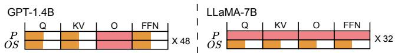  
(a) Left: GPT-1.4B training on 128 3090 GPUs. Right: LLaMA-7B trainingLLaMA-30B LLaMA-30B on 32 A800 GPUs.LLaMA-30B

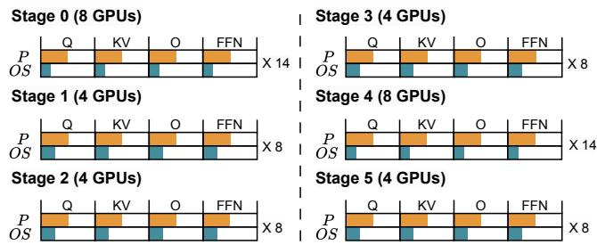

(b) LLaMA-30B training on 32 A800 GPUs.  
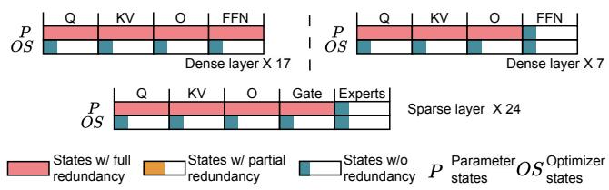  
states(c) GPT-MoE training on 128 3090 GPUs.  
Figure 19: State redundancy across diverse model architectures with the auto-generated parallelism. The number following the symbol $" \mathbf { X } "$ denotes the number of model layers.

## C Proof of the Recovery Probability

To simplify our proof, we present the recovery probability in (4) under the assumption that n is evenly divisible by k.

When $f < k ,$ , AdaCheck can certainly recover from failures using gradient-based incremental checkpointing. We then consider $f \geq k$ . Specifically, we consider the scenarios where AdaCheck cannot recover from failures using gradient-based incremental checkpointing. We begin by assuming $k \leq f < 2 k$ indicating that at most one group of workers experiences simultaneous failure. In this case, the number of combinations that cause gradient-based incremental checkpointing to fail is ${ \binom { n / k } { 1 } } \cdot { \binom { n - k } { f - k } }$ , where ${ \binom { n / k } { 1 } }$ denotes the selection of a group from the total $n / k$ groups and $\binom { n - k } { f - k }$ represents the selection of the remaining $f { - } k$ failed workers from remaining $n - k$ workers. However, this equation counts repeatedly when $f \geq 2 k$ For example, when n is 16, k is 4, and f is 8, there are 4 groups of workers, and 2 groups may fail simultaneously. Given that the indexes of the 4 groups are 0 to 3, if we select group 0 for ${ \binom { n / k } { 1 } } , { \binom { n - k } { f - k } }$ might include group 1, and similarly, if we select group 1 for ${ \binom { n / k } { 1 } } , { \binom { n - k } { f - k } }$ might include group 0, leading to double-counting of the combination of groups 0 and 1. To correct this overcounting, we formulate this problem into a combinatorial problem and solve it with the inclusionexclusion principle, leading to the expression for the number of combinations resulting in a failure of gradient-based incremental checkpointing as $\begin{array} { r } { \sum _ { i = 1 } ^ { f / k } ( - 1 ) ^ { ( i + 1 ) } \cdot { \binom { n / k } { i } } \cdot { \binom { n - i \cdot k } { f - i \cdot k } } } \end{array}$ Considering the total number of combinations for failures is (nf ), the probability that AdaCheck can recover from failures is expressed as $1 - \frac { \sum _ { i = 1 } ^ { f / k } ( - 1 ) ^ { ( i + 1 ) } \cdot \binom { n / k } { i } \cdot \binom { n - i \cdot k } { f - i \cdot k } } { \binom { n } { f } }$