①

USENIX

THE ADVANCED COMPUTING SYSTEMS ASSOCIATION

# CacheSlide: Unlocking Cross Position-Aware KV Cache Reuse for Accelerating LLM Serving

Yang Liu and Yunfei Gu, Shanghai Jiao Tong University; Liqiang Zhang, Jinan Inspur Data Technology Co., Ltd; Chentao Wu, Guangtao Xue, Jie Li, and Minyi Guo, Shanghai Jiao Tong University; Junhao Hu, Peking University; Jie Meng, Huawei Cloud

## https://www.usenix.org/conference/fast26/presentation/liu-yang

This paper is included in the Proceedings of the 24th USENIX Conference on File and Storage Technologies.

February 24–26, 2026 • Santa Clara, CA, USA

ISBN 978-1-939133-53-3

Open access to the Proceedings of the 24th USENIX Conference on File and Storage Technologies is sponsored by

# CacheSlide: Unlocking Cross Position-Aware KV Cache Reuse for Accelerating LLM Serving

Yang Liu†, Yunfei Gu†,∗, Liqiang Zhang‡, Chentao Wu†,∗, Guangtao Xue†, Jie Li†, Minyi Guo†, Junhao Hu§, Jie Meng¶

†Shanghai Jiao Tong University ‡Jinan Inspur Data Technology Co., Ltd

§Peking University ¶Huawei Cloud

∗Corresponding authors: gu.yunfei@sjtu.edu.cn, wuct@cs.sjtu.edu.cn

## Abstract

Large Language Models (LLMs) are increasingly deployed in agent-based applications with complex prompt structures comprising both invariant and dynamic segments. Existing KV cache reuse strategies—Position-Dependent Caching (PDC) and Position-Independent Caching (PIC)—inadequately address these scenarios, imposing either strict positional constraints or introducing significant computational overhead due to Positionally Misaligned KV Drift (PMKD) and window padding problems.

We identify a distinct pattern in agent workflows termed Relative-Position-Dependent Caching (RPDC), where reusable segments maintain consistent relative ordering despite absolute position shifts. To address this pattern, we propose CacheSlide, a novel KV cache management system that enhances positional-encoding similarity for fixed segments, computes attention for only a minimal subset of tokens, combines new and cached KVs using learned weights, and implements layer-wise and spill-aware KV-cache optimizations.

Our implementation extends vLLM’s KV cache management with Chunked Contextual Position Encoding and Weighted Correction Attention. Experimental evaluation across multiple LLMs and agent benchmarks demonstrates that CacheSlide significantly outperforms state-of-the-art baselines, achieving 3.11-4.3× reduction in latency and 3.5- 5.8× improvement in throughput, establishing a new efficiency frontier for agent-based LLM applications.

## 1 Introduction

The rapid advancement of Large Language Models (LLMs) has significantly boosted their adoption across diverse scenarios such as personal assistance, AI healthcare, questionanswering applications, and software engineering [24, 26, 36, 53, 62, 64]. As LLMs are increasingly integrated into realworld systems, a primary concern is ensuring high-quality, consistent, and low-latency responses. To mitigate the significant growth of prefill computation with input length, techniques such as KV cache efficiently store and retrieve precomputed attention representations for frequently occurring text segments, thereby avoiding repetitive computation and reducing inference latency. Furthermore, recent applications often employ multi-agent frameworks [6, 45, 50], leveraging techniques like chain-of-thought reasoning [23, 30, 58, 66], memory-augmented inference [11, 49], and function calling [46, 69], which in turn lead to more dynamic and complex prompt structures.

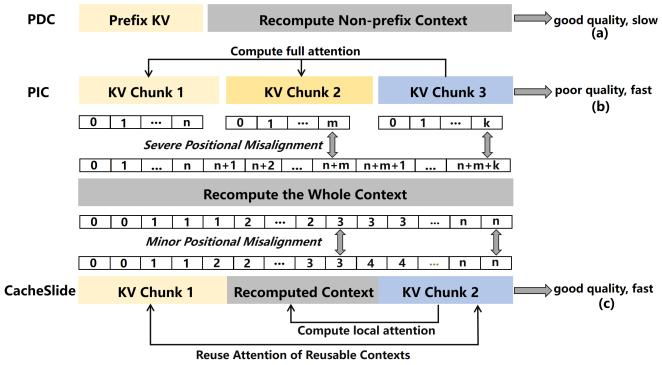  
Figure 1: Block diagram of three different KV cache schemes: (a) Position-Dependent Caching (PDC), (b) Position-Independent Caching (PIC), and (c) Relative-Position-Dependent Caching (RPDC).

However, such complex agent-based workflows drastically increase the context length and structure irregularity fed into LLMs. Typically, an input to an agent-based LLM system can be divided into fixed segments (such as system prompts and dialog histories) and dynamically updated segments (for example, function invocation content). While this modularization supports flexible generation, it also presents a challenge: every new inference, even if most of the prompt remains unchanged, forces the LLM to recompute representations over the entire input sequence from scratch. Since the computational expense of LLM inference is dominated by the prefill phase—responsible for encoding long contexts—frequent recomputation of the invariant parts leads to substantially increased time-to-first-token (TTFT) and unnecessary resource consumption [4, 19, 25, 67, 83]. Therefore, optimizing prompt processing through context reuse, specifically by reusing keyvalue (KV) caches for identical prompt segments, emerges as a vital strategy for efficient LLM deployment in agent scenarios.

To mitigate such redundancy, KV cache reuse strategies can be categorized into two distinct approaches based on their positional constraints: Position-Dependent Caching (PDC) and Position-Independent Caching (PIC) (As shown in Figure 1). PDC schemes, exemplified by ContextCache [28, 35, 81], operate under strict positional constraints, permitting KVs reuse only at predetermined positions (typically at the prompt prefix). This positional rigidity significantly limits computational efficiency when critical content appears at variable positions within the input sequence. PIC methods such as CacheBlend [76] and EPIC [22, 80] enable reuse at arbitrary positions but suffer from positional-encoding misalignment during segment reassembly, leading to unstable accuracy and higher system overhead due to the lack of intra-layer decoupling between KV cache loads and writes, as well as dirtyaware eviction(§3.1.3). Agent scenarios, however, present a distinct pattern where reusable segments maintain consistent relative ordering while their absolute positions shift due to fixed-length dynamic content between them. We define this unique paradigm for KV cache as Relative-Position-Dependent Caching(RPDC), where maintaining positional relationships between cached segments is essential for both computational efficiency and generation quality.

To implement efficient KV cache reuse in agents, we propose CacheSlide - a KV cache management system for RPDC scenarios with the following key innovations: ❶ CacheSlide employs a position-insensitive encoding that increases the similarity between cached and recomputed KVs, mitigating positional drift. ❷ When new input arrives, it only computes attention for a small subset of tokens from cached segments, significantly reducing computation compared to full-attention methods. ❸ It combines new and cached KVs using learned weights to maintain generation quality (Figure 1(c)). ❹ Unlike PDC methods that only reuse prompt prefixes, CacheSlide allows reusing multiple segments at different positions while keeping their relative order. It also avoids the positional encoding problems and unnecessary attention computations found in PIC approaches, achieving both better efficiency and higher generation quality across agent-based LLM applications.

The contributions of this paper are summarized as follows:

• We formulate and characterize the Relative-Position-Dependent Caching (RPDC) paradigm, highlighting its distinct properties from classical PDC and PIC approaches.

• We propose Chunked Contextual Position Encoding (CCPE), tailored for RPDC scenarios with variable prompt segmentation.

• We introduce Weighted Correction Attention, which efficiently blends local and cached KVs, enabling lightweight and accurate context reuse.

• We extend the existing KV cache management paradigm by proposing SLIDE: Spill awareness, Load–write decoupling (Intra-layer), and Dirty-page Eviction.

• Experimental evaluation demonstrates that CacheSlide outperforms state-of-the-art baselines across multiple LLMs and agent benchmarks, achieving 3.11∼4.3× reduction in latency and 3.5∼5.8× improvement in throughput, with negligible accuracy loss.

## 2 Background

In this section, we provide background on agent-based LLM systems and KV cache optimization techniques, then introduce representative agent paradigms, existing positional encoding strategies utilized in the transformer paradigm and the sensitivity of positional encodings.

## 2.1 Structure and Workflow of Agent Prompts

Agents extend base LLMs with autonomous decision logic, memory management, and tool integration, enabling inference to carry out multi-step tasks, maintain long-term context, and invoke external functions. We introduce the prompt structure of agents and their workflow, then summarize three representative paradigms.

Prompt Structure: every turn’s input can be abstracted as

$$
\underbrace { \mathrm { S y s t e m  p r o m p t } } _ { \mathrm { s t a t i c \ p r e f i x } } + \underbrace { \mathrm { U p d a t e d \ p r o m p t } } _ { \mathrm { r e c o m p u t e d \ e a c h \ t u r n } } + \underbrace { \mathrm { F i x e d \ p r o m p t } } _ { \mathrm { s t a t i c } }
$$

The prefix encodes the system-level prompt and the updated prompt holds the latest reflection on the current reasoning step, the most recent memory summary, or the functions required for this turn of inference and the fixed prompt persistently stores the full record of all previous reasoning steps or accumulated historical memories.

Processing:

• Initialize prompt: Send the system prompt (or function or memory schema) once at session start. For each inference turn, produce a new updated prompt and concatenate the system prompt, the updated prompt, and the existing suffix prompt to form the full prompt.

• Infer & Produce Update: Submit the full prompt to LLMs, which return both a response and the content for the next updated prompt (e.g., a Chain-of-Thought (CoT) reasoning step in Reflexion, a memory-write summary in MemGPT).

## 2.2 State-of-the-art Agent Prompts

Current LLM-based agent systems can be categorized into three primary paradigms:

Chain-of-Thought Agents (e.g., Reflexion [58], Chain-of-Tools [68], Self-Refine [39]) implement an iterative reasoning approach wherein each cognitive step serves as the updated prompt component. These agents progressively accumulate the complete reasoning transcript into an expanding suffix, while only modifying a minimal control segment during each inference iteration.

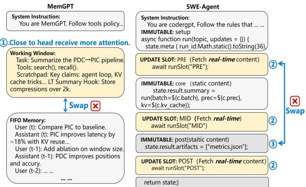  
Figure 2: Examples of multi-segment and single-segment updates.

Memory-Centric Agents (e.g., MemGPT [49], MemoryGPT [11]) employ a persistent system prefix alongside a controlled working-context buffer that can be modified through specialized memory API operations. Such agents sequentially append new dialogue interactions to a first-infirst-out (FIFO) buffer structure, maintaining all previously accumulated content in an unmodified suffix segment.

Tool-Augmented Prompting frameworks (e.g., OpenAI Function Calling [46], AutoGen [69], SWE-Agent [74]) utilize an invariant system instruction prefix and historical message suffix. These frameworks dynamically inject functioncall specifications as the variable prompt component for each inference cycle, while systematically accumulating all interaction messages within the growing suffix portion.

Examples of typical agent prompts, as shown in Figure 2, illustrate two canonical designs, namely MemGPT and SWEagent, which combine system instructions, a working window with FIFO memory, and update slots interleaved with immutable segments to fuse real-time inputs with contextual memory.

## 2.3 KV cache Reuse: PDC and PIC

Building on the analysis of GitHub repository logs and experimental validation presented agents in section 2.2, the preceding sections demonstrate that, in agent-based scenarios, as shown in Figure 3, substantial portions of text are reusable. Recomputing these segments across multiple turns incurs significant computational overhead and the prevailing practice is to reuse their KV cache. Current KV cache reuse mechanisms can be classified into two primary categories based on their position dependencies: Position-Dependent Caching (PDC) and Position-Independent Caching (PIC).

Position-Dependent Caching (PDC): PDC approaches facilitate KV cache reuse exclusively at fixed positional indices. Two representative implementations in this category are ContextCache and PromptCache [16, 48]. ContextCache operates by preserving and reusing KV values for common prefix sequences across multiple requests, computing only the KVs for non-prefix tokens during inference. In contrast, Prompt-Cache extends this concept by enabling the reuse of identical content segments that appear at consistent positions across different requests. The system assigns virtual prefixes to these shared segments, thereby providing appropriate positional embeddings for each cached context. To accommodate identical content appearing at variable positions, PromptCache must generate and maintain multiple position-specific KV cache representations within its buffer, which introduces substantial storage overhead.

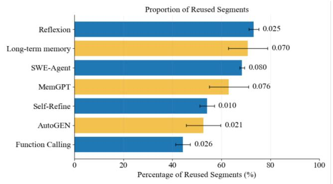  
Figure 3: For various agents, the proportion of reusable KV cache within the input prompt relative to the total input length, and the variance of this proportion.

Position-Independent Caching (PIC): PIC approaches are designed to reuse KV caches regardless of their positional placement within the sequence. Current state-of-the-art implementations include CacheBlend [76] and EPIC [22]. Both systems generate position-agnostic encodings for reusable context segments, initializing positional indices from zero for all KV caches. When incorporating these caches at arbitrary positions, both approaches selectively recompute KVs for a subset of tokens to maintain contextual coherence. In the prefill phase, CacheBlend first recomputes the entire prompt at shallow layers of model (e.g., layers 1-3) and compares it against the cached KV states. It subsequently selects a fixed proportion of tokens (e.g., 18%) with the largest discrepancies for KV recomputation. EPIC, conversely, recomputes KV states only for the boundary tokens of each cached block—namely, the first 32 and last 32 tokens, totaling 64 tokens per block.

## 2.4 Sensitivity of Positional Encodings

From the PIC/PDC analysis, KV cache reuse achieves high accuracy when the reused segments occupy consistent positions across different inputs. Otherwise, partial recomputation of a selected subset is needed to restore accuracy. The efficiency of PDC/PIC hinges on the reused segment’s sensitivity to positional encoding across different inputs. Next, we introduce positional-encoding sensitivity by two widely used encodings. RoPE(high positional sensitivity) [59] maps each absolute index p to a position-dependent rotation, so attention between positions p and q depends on their phase difference ∝ $( p - q )$ with each token assigned a unique position (one token, one position). Consequently, even small absolute shifts uniformly change token phases, altering perceived relative distances and attention.

CoPE (low positional sensitivity) [60] indexes semantic boundaries rather than individual tokens—adjacent tokens can share an index. This boundary-based scheme perturbs fewer indices when the same text segment appears at different places across inputs, reducing its effective positional change under the same absolute shift. As a result, CoPE shows low positional sensitivity, is robust to segment relocation, and still preserves the coarse order implied by the boundaries.

## 3 Limitations and Motivation

This section analyzes limitations of existing KV cache reuse approaches in agentic settings (§3.1), diagnoses their root causes through quantitative experiments (§3.2), and introduces our proposed solution—Relative-Position-Dependent Caching (RPDC) (§3.3).

## 3.1 Limitations of Existing KV cache Reuse in Agentic Prompts

In agentic prompts described in Section 2.2, current KV cache reuse techniques face significant challenges when handling multiple fixed and dynamically updated segments.

## 3.1.1 Position-Dependent Caching (PDC) Limitations

Mainstream PDC methods assume fixed absolute positions for reusable segments. Under this constraint, as update segments vary in length, ContextCache can only reuse identical prompt prefixes. One might consider reordering segments to maximize prefix sharing, but as shown in Figure 2 ❶, we cannot simply swap fixed and updated segments. Since the prompt head generally attracts more attention [34, 71], representative agent designs (e.g., MemGPT) position recent memories (Working Window) close to the head so that the latest context receives more attention instead of FIFO historical content to maintain inference quality. Similarly, in SWE-agent—a widely used code-debugging agent with multiple updated slots ❷—the updated slots cannot be swapped with immutable segments ❸, as such reordering changes program semantics and breaks data dependencies (e.g., if Updated Slot 1 produces a run-time parameter later consumed by Immutable 1, moving the slot to the suffix prevents Immutable 1 from receiving it). Therefore, simply swapping fixed and updated segments via a prefix-based caching approach cannot efficiently reuse the KV cache of the fixed segments. PromptCache, another PDC approach, must precompute and store per-segment KV caches in isolation (capturing only intra-segment attention). Upon reuse, it does not restore cross-attention either among reused segments or between reused and updated segments, thereby proliferating KV cache versions and incurring substantial storage overhead. In summary, strict absolute-position constraints render PDC of limited utility in agent scenarios.

## 3.1.2 Position-Independent Caching (PIC) Limitations

By contrast, mainstream PIC methods abandon absolute coordinates and reset reused segments’ starting indices to zero, thereby inducing positional/attention misalignment between the cached KVs and those recomputed from scratch at their intended positions in the input. To partially recover accuracy, these methods preselect a subset of tokens from the KV cache for recomputing. However, in multi-head attention of transformers, different heads attend to different tokens, and the model’s output fuses the per-head results [13, 56]. Since which tokens most affect the output becomes clear only at the decoding stage, prefill-phase token-subset preselection cannot ensure stable accuracy.

## 3.1.3 System-Level Inefficiencies

From a systems standpoint, the implementation of PIC entails loading the KV cache and writing the recomputed KVs for the selected tokens on a layer-wise basis. However, mainstream LLM inference frameworks (e.g., vLLM [29], SGLang [82], TensorRT-LLM [44]) serialize KV cache loads and writes at each layer. This leads to a load-before-write lock within the layer, eliminating intra-layer overlap and yielding I/O-bound stalls on the prefill critical path.

When capacity pressure forces KV cache pages to spill to SSDs, current mainstream systems typically evict KV blocks via LRU rather than a dirty-aware scheme. Consequently, partially updated pages incur random writes and higher write amplification (WAF) on eviction. Lacking dirty-aware eviction or write coalescing, these I/O costs propagate to the prefill path, worsening I/O-bound stalls and tail latency. Though PIC offers positional flexibility, it comes at the high cost of attention misalignment and non-trivial system overhead.

Taken together, both the accuracy degradation and the system inefficiencies of PDC/PIC stem from the same root cause: positional misalignment. In particular, when reusable segments shift in absolute position, their cached KVs no longer match the recomputed ones, leading to attention misalignment. We denote this divergence as Positionally Misaligned KV Drift (PMKD).

## 3.2 Quantifying PMKD and Window Padding

## 3.2.1 Positionally Misaligned KV Drift (PMKD)

We define Positionally Misaligned KV Drift (PMKD) as the discrepancy in KV cache similarity for the same text that is attributable to differences in positional encodings when segment positions change across requests.

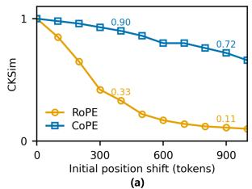

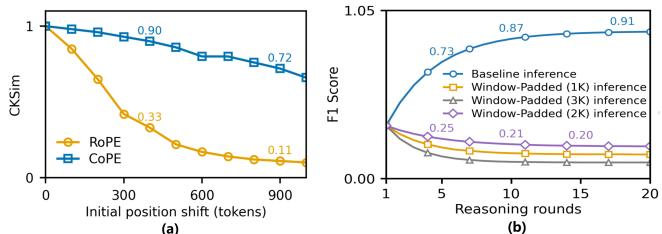

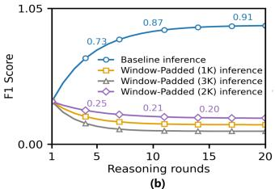  
Figure 4: (a) shows that as the positional shift increases (0–1000 tokens), CKSim with RoPE drops by > 90%, whereas CKSim with CoPE decreases by only 28%. (b) shows that applying window padding (1K/2K/3K) yields > 78.1% lower F1 score relative to baseline inference at the same reasoning rounds.

To quantify PMKD, we measure the effect of controlled positional shifts on KVs obtained by recomputation and by reuse, using two widely used positional encodings: RoPE (high positional sensitivity) and CoPE (low positional sensitivity) as discussed in Section 2.2. This contrast isolates the role of positional encoding in PMKD and shows how sensitivity governs KV drift under absolute shifts. We adopt CKSim [9, 33], the standard cosine-similarity metric for measuring the similarity between two KVs:

$$
{ \mathrm { C K S i m } } ( r e u s e , r e c o m p u t e ) = \frac { 1 } { H } \sum _ { i = 1 } ^ { H } \frac { K _ { i } ^ { ( \mathrm { r e c o m p u t e } ) } \cdot K _ { i } ^ { ( \mathrm { r e u s e } ) } } { \| K _ { i } ^ { ( \mathrm { r e c o m p u t e } ) } \| \| K _ { i } ^ { ( \mathrm { r e u s e } ) } \| }
$$

In the above definition, $K _ { i } ^ { ( \mathrm { r e c o m p u t e } ) }$ denotes the key matrix for head i obtained by recomputing and $K _ { i } ^ { ( \mathrm { r e u s e } ) }$ denotes the key matrix for head i obtained by reusing. Each key matrix K encodes positional information through the model’s positional encoding. The symbol H denotes the number of attention heads. We use CKSim to quantify the similarity between two segments’ K matrices and the corresponding similarity computed on the V matrices closely tracks that of K matrix. We evaluate CKSim using MemGPT [49] on the ShareGPT [47] dataset by constructing, for each user, a static historic memory (MemHistory). We proceed as follows:

1. Using RoPE, encode MemHistory and obtain the baseline KV cache as KV cache 0.

2. For prefix window (i.e., the length of the context preceding MemHistory) sizes $i \in \{ 1 0 0 , 2 0 0 , 3 0 0 , . . . \}$ (step size: 100 tokens), prepend a prefix of length i to MemHistory and run a partial prefill (only the positional information of MemHistory is prefilled and attention on the prefix is not computed) to obtain KV cache i.

3. Compute CKSim between KV cache i and KV cache 0.

4. Replace RoPE with CoPE and repeat steps (1)–(3).

As shown in Figure 4 (a), we observe that RoPE exhibits a more pronounced decline in CKSim, whereas CoPE maintains comparatively stable CKSim. This confirms the significance of PMKD and demonstrates its encoding-dependent nature.

Figure 5 provides further insight into this phenomenon. In panel ❶, when the length of the update segment changes, the real positional indices of the fixed segment can diverge substantially from those stored in the KV cache, because RoPE assigns a position index to every token (for example, after the update, the true starting positions in the KV cache are 251 and 451, whereas the cached positions remain at 101 and 401).

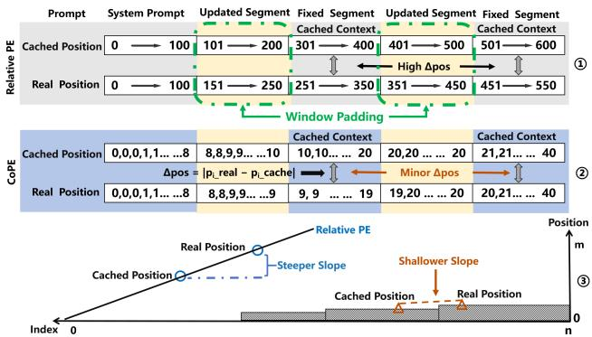  
Figure 5: Compared with RoPE, CoPE achieves better alignment between cached and real positions during KV cache reuse, yielding a shallower mapping slope and thereby substantially reducing the positional discrepancy (∆pos).

Under the same update length, CoPE markedly reduces the positional offset of the fixed segment. For example, in Figure 5 ❷, the offset ∆pos decreases, with the fixed segment’s starting positions shifting from (10, 21) to (9, 20).

At a deeper level, as shown in Figure 5 ❸, when the starting positions of one context shift, RoPE exhibits a steeper change in positional indices because it maps each token to a unique position, whereas CoPE varies more smoothly since multiple tokens can share a single position.

Since attention is jointly determined by positional information and content, if the cached tokens of a fixed segment attend either to tokens within the same segment or to tokens in other fixed segments, then maintaining a high CKSim affords a key opportunity: near-lossless reuse of both intra-segment attention within fixed segments and cross-segment attention among fixed segments. Therefore, reducing PMKD and maintaining KV consistency are crucial to achieving high-quality cache reuse.

## 3.2.2 Window Padding and Its Limitations

Given that minimizing absolute positional changes is crucial for KV cache reuse, a natural approach is to bound the variation in the length of each dynamic update segment, thereby constraining the positional drift of fixed segments at the source. We can bound positional drift by fixing the update-span length via a window padding policy.

This approach enforces a fixed-size update window for the updated segments (capping its max token count), so that the positions of the fixed segments remain invariant, as shown in Figure 5 ❶ window padding. Using the popular agent MemGPT, we fix the working window to 1K, 2K and 3K tokens. After multiple reasoning rounds (as shown in Figure 4 (b)), window-padded inference attains markedly lower accuracy than the baseline inference (without window padding), indicating that enforcing a fixed-length update segment can cause the loss of critical information across inferences (working window=1K) or larger window padding (working window=3K) increases the PMKD of the fixed segment’s KV cache.

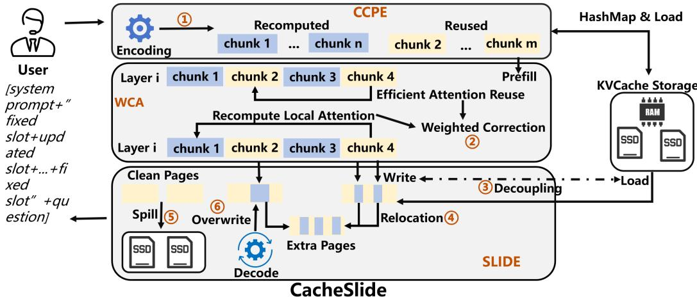  
Figure 6: Block diagram of proposed CacheSlide system workflow

In real-world agentic scenarios, it is difficult to find a suitable window size, since the token counts of the updated segments in multi-agent inputs show large and unpredictable fluctuations [18, 54, 65]. The variance in the proportion of reused segments observed in Figure 3 also provides indirect evidence for this point.

In summary, the smaller the positional misalignment between cached and recomputed KVs, the higher their similarity—enabling near-lossless reuse of both intra-segment attention within fixed segments and cross-segment attention involving fixed segments. However, window padding alone rarely achieves this objective in practice.

## 3.3 Relative-Position-Dependent Caching

Motivated by our analysis of PMKD and the limitations of existing approaches, we introduce Relative-Position-Dependent Caching (RPDC), a new KV cache reuse paradigm fundamentally distinct from PDC and PIC (§2.3).

RPDC defines a class of scenarios involving KV cache reuse where context is composed of multiple segments whose relative order must remain fixed (arbitrary reordering incurs substantial degradation), while segments between these reusable context segments are continuously updated. This approach addresses the core limitations of both PDC (position inflexibility) and PIC (attention misalignment) while maintaining the benefits of KV cache reuse.

In RPDC, we preserve the relative ordering of reusable segments so that the positional discrepancy between cached and from-scratch KVs remains small. As a result, intrasegment and cross-fixed-segment attention can be reused near-losslessly and only the cross-attention between fixed and updated segments needs to be recovered by recomputing a subset of tokens in the fixed segments, although this inherits some system-level challenges similar to those in PIC (§3.1).

Furthermore, we present CacheSlide, a system that implements RPDC efficiently while addressing the system-level challenges identified in our analysis.

## 4 CacheSlide Design

In this section, we introduce CacheSlide, a system that (i) employs a modified, low–positional-sensitivity Chunked Contextual Position Encoding; (ii) efficiently restores cross-attention between fixed and updated segments via Weighted Correction Attention; and (iii) accelerates parallelism by relocating and overwriting KV cache, while tagging dirty pages to mitigate the latency of small random writes in SSDs via SLIDE.

## 4.1 Workflow of CacheSlide

CacheSlide consists of three core components: (i) a CCPE encoding module (ii) a Weighted Correction Attention module for efficient attention recovery and (iii) SLIDE: a KV cache Manager module for parallel optimization and reduce SSDs access latency. We next describe the end-to-end workflow of CacheSlide, highlighting how these modules interact during inference. As shown in Figure 6, ❶ the CCPE encoder first processes the user input and, based on learned task-specific patterns, partitions it into reused and recomputed chunks. For the reused chunks, the CCPE module retrieves their KV caches via a hash map, and inference proceeds jointly with the recomputed chunks. ❷ During prefill, the Weighted Correction Attention module selects a subset of tokens in reused chunks for recomputing, fusing the cross attention of reused chunks to efficiently restore attention. ❸ In parallel, SLIDE increases concurrency between KV cache loading and updates by ❹ relocating selected KVs from reused chunks. ❺ If under memory pressure, it prioritizes spilling clean pages without selected tokens to SSDs, thereby reducing disk-access latency. During decode, reduce the storage footprint by overwriting KVs into pages with selected tokens. ❻ In next sections, we present each component in detail.

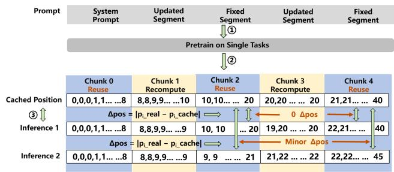  
Figure 7: Process of Chunked Contextual Position Encoding.

## 4.2 Chunked Contextual Position Encoding

To reduce positional misalignment between cached and recomputed KVs, we propose Chunked Contextual Position Encoding (CCPE). CCPE partitions the prompt into recompute chunks and reuse chunks, and assigns fixed positionalencoding ranges to the reuse chunks. We instantiate CCPE on CoPE, a widely used encoding with low positional sensitivity (§2.4) and learn these ranges via task-specific pretraining so that absolute shifts induce smoother positional changes. As shown in Figure 2, under the agentic setting the prompt can be divided into ❶, ❷ recompute chunks and ❸ reuse chunks. We next detail how positional indices are assigned to the reuse chunks to minimize the alignment gap between their cached contexts and the positions used at inference time.

Most KV cache reused in agentic scenarios occurs under a single-task mode, as discussed in section 2.2. For example in multi-round reasoning on the same question or in memory management across multiple turns of interaction with a single user. Accordingly, as shown in Figure 7 ❶ and ❷, we perform CoPE-based pre-training on a class of tasks to isolate and capture the most frequently observed encoding patterns in the reused chunks, then these patterns are subsequently assigned to the reused chunks, enabling the cached position to remain highly consistent with the actual encoding during real inference. For instance, as shown in Figure 7 ❸, in multiturn inference, the cached positional indices span 10 to 20, while those in the actual pass span 9 to 21 or 10 to 20. Thus, for token i in a reuse chunk, the different ∆pos between its cached positional encoding $p _ { i \mathrm { { \_ r e a l } } }$ and its positional encoding during actual inference $p _ { i \mathrm { \_ c a c h e } }$ is negligible. This approach is designed to maximize the CKSim in fixed segments. Next, we briefly outline the CCPE implementation workflow.

The CCPE algorithm is presented in Algorithm 1. During pretraining (lines 3-7), prompts of a single task type are encoded by CoPE, and a histogram identifies the most frequent encoding e∗. Lines 8-14 partition the prompt into K ordered chunks labeled as reuse or recompute by prompt template of agents. During prefill processing (lines 15-23), the prompts are divided using the same scheme of chunk in the same task, if chunk i is a reuse chunk and a KV cache is found via the hashmap, load it, otherwise prefill chunk i to generate KVcachei to storage. If chunk i is a recompute chunk, assign position encodings based on the CoPE encoding of the current input.

Algorithm 1 Chunked Contextual Positional Encoding   
Pretraining Phase:   
1: Require P : set of prompts for one task; K: total number   
of chunks; R : indices of chunks to reuse   
2: Initialize histogram $H  0 ^ { M }$   
3: for all $p \in \mathcal P$ do   
4: e ← CoPEencode(p)   
5: end for   
6: e∗ ← arg maxe H[e] ▷ Most frequent CoPE encoding   
7: Store $( e ^ { * } )$ for later reuse   
Chunk Role Assignment:   
8: for i = 1 to K do   
9: if $i \in \mathcal R$ then   
10: Mark chunk $c _ { i }$ as reuse ▷ by template   
11: else   
12: Mark chunk $c _ { i }$ as recompute ▷ by template   
13: end if   
14: end for   
Prefill Phase:   
15: Require new prompt $p _ { \mathrm { n e w } } , e ^ { * }$ , pos ← CoPEencode(pnew)   
16: divide $p _ { \mathrm { n e w } }$ into K chunks $\left\{ c _ { 1 } , \ldots , c _ { K } \right\} \qquad \triangleright$ by template   
17: for $i = 1$ to K do   
18: if $i \in \mathcal R$ then   
19: if KV CACHELOOKUP(content\_hash(ci)) then   
20: Load KVcachei   
21: else   
22: $c _ { i } \gets e ^ { * } [ i ]$ and then PrefillKVcachei   
23: end if   
24: else   
25: $c _ { i } \gets p o s [ \mathrm { c h u n k } _ { i } ]$   
26: end if   
27: end for

## 4.3 Weighted Correction Attention

CCPE efficiently aligns positional encodings in fixed segments, creating an opportunity to reuse attention for fixed segments, including both intra-segment attention and crossattention among fixed segments. Since for token i, the KV cache depends on tokens $0 , \ldots , i - 1$ , owing to attention sparsity [14, 23, 41, 84], only a subset of these tokens materially influences token i. When this subset lies within fixed segments, either within the segment containing token i or within other fixed segments, CCPE’s positional alignment ensures that the KV cache for those tokens is an essentially nearlossless approximation to the KVs that would be obtained by recomputing on the full input.

While the KV cache of fixed segments admits efficient reuse, it remains nontrivial to recover the cross-attention interactions between fixed segments and updated segments. Our key observation comes from analyzing KV cache behavior across model layers. As shown in Figure 8, during the prefill phase, the KVs for each token are populated layer-by-layer from layer 0 through layer i. For any given token (e.g., the i-th token), its KVs in adjacent layers exhibit similarity, and this similarity increases with layer depth, and the KVs in deeper layers become highly similar [17, 33, 73]. Leveraging this property, our goal is to make the KV cache as close as possible to the ground-truth KVs (i.e., those obtained by recomputing). Based on this analysis, we propose Weighted Correction Attention, which operates in two main stages:

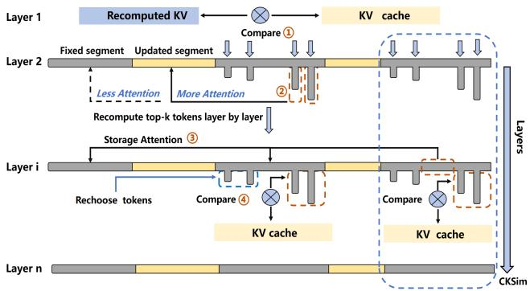  
Figure 8: Scheme of Weighted Correction Attention.

1. Select top-k tokens. In layer 1, we recompute the KVs for all segments. For each token i, we compute the squared deviation $d _ { i } = \lVert K _ { i } ^ { \mathrm { r e c o m p u t e } } - K _ { i } ^ { \mathrm { r e u s e } } \rVert ^ { 2 }$ , define the index set $S = \left\{ i \mid d _ { i } > 0 \right\}$ , rank the scores $\{ d _ { i } \} _ { i \in S }$ in descending order and select the top-k tokens, denoting their index set by $S _ { k } \subseteq S ( \mathrm { \bf ~ F i g ~ \mathrm { \bf ~ 8 ~ } } \bullet$ and ❷).

2. Similarity-Gated Weighted Fusion. For each layer $i > 1$ we recompute only the tokens in $S _ { k }$ , fuse the recomputed and cached KVs with deviation-aware weights( Fig 8 ❸), and re-evaluate their CKSim(§ 3.2). Every four layers, we set a CKSim threshold τ, if for any token $j \in S _ { k }$ its CKSim $< \tau ,$ we remove $j$ from $S _ { k }$ and S, then add to $S _ { k }$ the token $m \in S \backslash S _ { k }$ with the largest deviation score $d _ { m } ( \mathrm { \tiny ~ F i g ~ 8 ~ } \bullet )$ .

During the similarity-gated weighted fusion phase (Lines 8- 16), for each token $i \in S _ { k } ,$ , the algorithm only recomputes the KV with respect to the updated segments associated with it. The recomputed and cached KVs are then fused according to weight $\alpha _ { i } .$ , since we have computed KV cache only for selected tokens and the updated segment, we still need to fuse it with the attention over the fixed segments, in general, the KV cache of the selected tokens places greater emphasis on the updated segment. However, because the topk tokens are chosen according to a fixed proportion, some selected tokens may in fact have only small discrepancies from the ground-truth KVs. To mitigate this potential risk, we fuse the attention over the updated and fixed segments. After processing every four layers(following standard practice in similarity evaluation.), the algorithm evaluates the CKSim between recomputed and reused KVs. This CKSim quantifies the attention representation of token i has been restored. If the CKSim for token i falls below a predefined threshold τ (indicating sufficient convergence), the algorithm removes i from $S _ { k }$ and promotes to $S _ { k }$ the token from $S \backslash S _ { k }$ that exhibits the largest remaining discrepancy. Once the discrepancy between token i’s recomputed KV and its KV cache becomes negligible, inter-layer similarity implies that the discrepancy between token i’s KVs in subsequent layers and the groundtruth KVs is likewise negligible and we therefore proceed to recover other tokens. Both the CKSim threshold and the proportion of tokens selected by the top-k strategy significantly influence the generation quality, We suggest optimal values of 0.12 for the CKSim threshold and 0.26 for the topk(details show in (§ 5.5)). In summary, Weighted Correction Attention builds on CCPE to efficiently reuse attention within fixed segments, then select some tokens to recompute to recover the cross-attention between fixed and updated segments and fuses the results. By recomputing only a carefully chosen subset of tokens, it restores the necessary attention while minimizing computation.The workflow of Weighted Correction Attention is illustrated in Figure 8. In what follows, we provide a more detailed account of the process and the guiding design principles. Algorithm 2 provides additional implementation details. In the initialization phase (Lines $I { - } 6 )$ , the algorithm compares each token’s cached KV with its corresponding recomputed KV and collects the indices of all tokens with differing representations into candidate set S and then selects the k tokens with the largest discrepancies to form set $S _ { k }$ . The reason of these steps is to identify KVs that exhibit gap from the cached KVs and recompute them, thereby aligning this subset with the ground truth and KVs with small or zero discrepancies are left unchanged and, owing to inter-layer similarity, remain consistent with the real KVs.

Algorithm 2 Weighted Correction Attention   
Require: cached KV $\{ K _ { i } ^ { \mathrm { r e u s e } } , V _ { i } ^ { \mathrm { r e u s e } } \} _ { i = 1 } ^ { N } ,$ , total layers $L ,$ threshold   
τ, stability ε, compute fusion weight $\alpha _ { i }$   
1: (1) Initialization – Layer 1:   
2: for $i = 1 , \ldots , N$ do ▷ full recompute on entire prompt   
3: $d _ { i } \gets \lVert K _ { i } ^ { \mathrm { r e c o m p u t e } } - K _ { i } ^ { \mathrm { r e u s e } } \rVert _ { 2 }$ and compute $\alpha _ { i }$   
4: end for   
5: $S \gets \{ i | d _ { i } > 0 \}$ ▷ indices with positive deviation   
6: $S _ { k } \gets \mathrm { T o p } { - } k$ indices in S ranked by di   
7: (2) Similarity-Gated Weighted Fusion - Layer 2 to L:   
8: for ℓ = 2 to L do   
9: for all $i \in S _ { k }$ do   
10: $K _ { i } \gets \alpha _ { i } K _ { i } ^ { \mathrm { r e c o m p u t e } } + ( 1 - \alpha _ { i } ) K _ { i } ^ { \mathrm { r e u s e } }$ (same to $V _ { i } )$   
11: $\begin{array} { r } { \alpha _ { i } \gets \frac { \lVert K _ { i } ^ { \mathrm { r e c o m p u t e } } - K _ { i } ^ { \mathrm { r e u s e } } \rVert ^ { 2 } } { \lVert K _ { i } ^ { \mathrm { r e u s e } } \rVert ^ { 2 } } } \end{array}$   
12: if ℓ mod $4 = 0$ then ▷ every four layers, apply gating   
13: $c _ { i } \gets \mathrm { C K S i m } ( K _ { i } ^ { \mathrm { r e c o m p u t e } } , K _ { i } ^ { \mathrm { r e u s e } } )$ ▷   
14: if $c _ { i } < \tau$ then   
15: remove i from $S _ { k }$   
16: $S _ { k } \gets \{ m \in S \backslash S _ { k } \}$   
17: end if   
18: end if   
19: end for   
20: end for

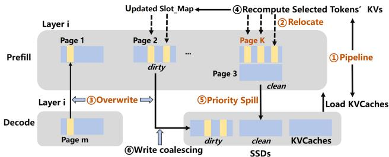  
Figure 9: Decoupled Load–Write and Spill-Aware KV cache Management in SLIDE.

## 4.4 SLIDE

Although Weighted Correction Attention (WCA) efficiently recovers attention when the KV caches slide across input positions, it introduces system-level side effects similar to PIC(§3.1). Because WCA needs load the KV cache and update the KVs of the selected tokens layer by layer leading to a load-before-write lock intra-layer, we aim to Load–write decoupling. When capacity pressure forces dirty pages(will write selected tokens’s KVs) to spill to SSDs lead to random writes and higher write amplification on SSDs.

To address these issues, we design a KV cache manager, SLIDE –Spill-aware & Load–write decoupling Intra-layer & Dirty-page Eviction. As shown in Figure 9, during prefilling, ❶ at the beginning of layer i SLIDE starts recomputation while pipelinely loading the KV cache of layer i. If recomputation finishes before the load completes, SLIDE writes the selected tokens’ KVs to newly allocated pages rather than blocking on the load, as shown in ❷, SLIDE allocates extra page K and writes the selected tokens’ KVs into page K. ❸ To prevent storage waste, decoding prioritizes to overwrite KVs the selected tokens’ original KV cache slots and then normal page allocation such as first write KVs to updated slot-map in paged 1 and then allocate page m. ❹ conversely, if the KV caches load completes first, we write the selected tokens’ KVs into updated slot-map. From layer 2 onward, SLIDE marks a page as dirty if it contains selected tokens in Weighted Correction Attention and as clean otherwise, and it maintains, for each dirty page, a count of selected tokens it contains. Once storage is constrained in prefill, the KV cache spills to SSDs, ❺ SLIDE evicts clean pages first and then ranks dirty pages by selected-token count, evicting in descending order. Prioritizing clean pages prevents fragmented write-backs on dirty pages because selected tokens are not guaranteed to cluster on fixed pages, which would otherwise increase prefill latency. Ordering dirty pages by selected-token count promotes write coalescing, reducing random writes and write amplification (WAF) when spilling dirty pages is unavoidable. During decoding, when storage becomes constrained and dirty-page spill is unavoidable, we apply the same policy: ❻ rank dirty pages by selected-token count and evict in descending order, enabling coalesced overwrites and sequential write-backs.

Implementation: we implement SLIDE builds on vLLM 0.8.5 [63].

Prefill initialization. In PagedAttention.\_init\_cache, we preallocate, for layers 2...n, additional KV pages proportional to the number of selected tokens observed at layer 1 (via KV cacheManager.append\_slot). These pages are registered into the per-request BlockTable and slot\_mapping to enable intra-layer load–write decoupling.

Relocate. During Weighted Correction Attention, we invoke KV cacheManager.promote, in the relocation phase, selected tokens’ KVs are written to the newly allocated pages, and the corresponding block\_tables and slot\_mapping are updated accordingly (layer-i entries re-point to the promoted pages).

Overwrite (Decode). In the subsequent Overwrite phase, these block\_tables and their associated slot\_mapping are reused for in-place writes until available slots are exhausted. Once full, new pages are obtained (via append\_slot) and fresh block\_tables/slot\_mapping entries are allocated.

Dirty-page marking. From layer 2 onward, a page is marked dirty if it contains any selected token. Otherwise it remains clean. For each dirty page we maintain a per-page selected-token counter, updated when slot\_mapping routes a selected token into that page.

Spill policy and coalescing. When storage becomes constrained during prefill, the KV cache spills to SSDs. SLIDE evicts clean pages first, then ranks dirty pages by their selected-token counts and evicts in descending order, dirty extents are coalesced into sequential write-backs to reduce random writes and WAF. In decoding, we likewise rank dirty pages by selected-token count (high→low) and evict in that order, which coalesces overwrites and yields near-sequential flushes.

## 5 Evaluation

## 5.1 Experimental Setup

We implement CacheSlide based on vLLM 0.8.5 [63]. Our experiments mainly run on a single NVIDIA A100 (80 GB HBM), whereas 70B models use two A100 GPUs, on a host with 500 GB DRAM, 2 TB NVMe SSDs and PCIe Gen 4 GPU interconnect, running Ubuntu 20.04 with Linux kernel 5.16.7 and CUDA 12.6.

Datasets. HotPotQA [75]:113k Wikipedia multi-hop QA set requiring cross-document reasoning, used to evaluate CoT prompts (e.g., Reflexion) with explicit intermediate reasoning. Multi-Session Chat [72]: A corpus of roughly 10 k multisession dialogues, each authored by human labelers playing a consistent persona across five sessions of a dozen messages. SWE-Agent-Bench [27]: A 2-task,12-repo Python benchmark for reproducing failing tests and patching them to pass - an end-to-end measure of code understanding and bug fixing.

Models. We evaluate CacheSlide using three state-of-theart open-source LLMs: Mistral-7B [10],MPT-30B [52] and Llama-3 70B [42], which represent diverse architectures, sizes, and training methodologies. We attain CoPE support via adapter-based continued pretraining that preserves all backbone weights while learning LoRA adapters over attention [15, 21] following industry-standard practice. This yields a backward-compatible, dual-stack design: activating CoPE and disabling them recovers the original RoPE or ALiBi behavior. We run CacheSlide with CoPE enabled, while baselines keep CoPE disabled (i.e., they use their native RoPE/ALiBi settings).

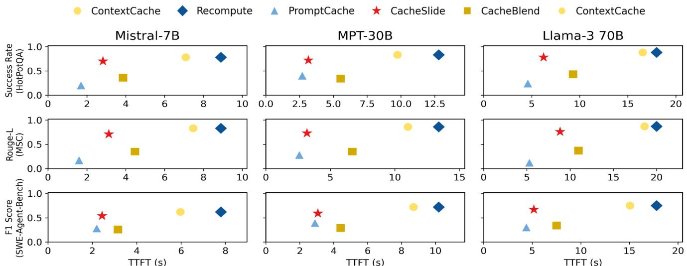  
Figure 10: Across three models and datasets, CacheSlide achieves a 2.4-3.3× reduction in TTFT with negligible accuracy loss compared to ContextCache. Compared to CacheBlend, CacheSlide achieves a 1.21-2.11× reduction in TTFT and a 1.97-2.28× improvement in accuracy. Compared to PromptCache, CacheSlide achieves a 1.12-2.45× reduction in TTFT and a 1.41-3.95× improvement in accuracy. Other systems’ metrics can be inferred from these key results.

Baselines. We compare CacheSlide with the state-of-theart implementations discussed in section 2.3 as follows: ContextCache: ContextCache reuses only the system-prompt KV cache and we evaluate it with the open-source Kimi Context Caching [5] implementation. PromptCache: We prepend a buffer to fixed segments and precompute their KV caches at all positions, enabling direct reuse during inference and we evaluate it with the open-source OpenAI Prompt Caching [48] implementation. CacheBlend: following their setup, we treat the system prompt and fixed spans as separate segments and recompute 18% of tokens, evaluating with the open-source LMCache [38]. EPIC: CacheBlend-style partition and recompute 32 boundary tokens (first and last) per fixed segment via LMCache.

Agents. We evaluate CacheSlide on three representative agents, Reflexion, MemGPT, and SWE-Agent—spanning the agents of chain-of-thought reasoning, memory management, and external tool use with multi-segment updates.

Metrics. We use the following metrics to evaluate performance and implementation accuracy: TTFT [3] measures the interval from when a user sends a request to LLMs until the first token is received and lower TTFT indicates a faster implementation. Rouge-L recall (R) [32] is used to compensate for the verbosity of model responses relative to shorter gold answers; higher values indicate that the output preserves more reference content. Success Rate [58] is QA with known ground truth, assign 1 if the model’s answer matches the reference and 0 otherwise, the metric is the average over all questions. F1 Score [40] is a single metric that balances precision(correct positives) and recall (found true positives). It’s useful on imbalanced data and when you care about missing cases and false alarms equally and it ranges from 0 to 1, and is high only when both are high.

## 5.2 Accuracy–TTFT Tradeoffs.

We evaluate the baselines on the previously described models, datasets and metrics with inference run at batch size = 1 and beam search disabled. Figure 10 plots accuracy versus TTFT for all baselines, across models and datasets, CacheSlide consistently lies on the Pareto frontier, offering a favorable accuracy-ttft trade-off. Extremely fast systems (e.g., EPIC, PromptCache and CacheBlend) suffer substantial accuracy losses, whereas methods that prioritize output quality (e.g., Recompute and ContextCache) achieve the highest accuracy at considerably higher TTFT.

CacheSlide’s advantage arises from leveraging CCPE to efficiently reuse attention among fixed segments, employs Weighted Correction Attention to effectively restore attention between fixed and updated segments, and using SLIDE to decouple loading with recomputation and implementing dirtyaware eviction. By contrast, CacheBlend and EPIC neither cache attention over fixed segments nor provide a SLIDEstyle mechanism for load–write decoupling and spill-aware KV cache eviction policy. Precompute and ContextCache incur excessive computation on fixed segments, inflating TTFT, while PromptCache demands prohibitive storage yet still underperforms because its design neglects cross-attention effects. In short, CacheSlide offers the best accuracy-ttft balance among the evaluated caching strategies.

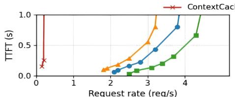  
(a)parallel generation (parallel size = 2)

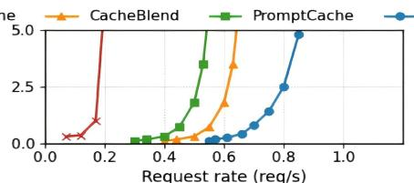  
(b)parallel generation (parallel size = 4)

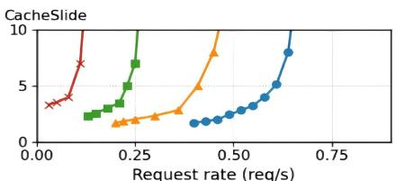

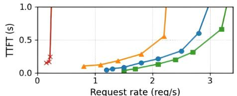  
(d) beam search (beam width = 2)

(c) parallel generation (parallel size = 6)  
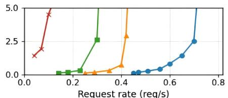  
(e) beam search (beam width = 4)

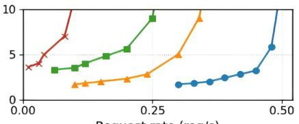  
(f) beam search (beam width = 6)  
Figure 11: Parallel inference and beam search(only share system prompt)with Mistral-7B on MemGPT with the Multi-Session Chat dataset.

## 5.3 Parallel Inference and Beam Search

To evaluate the throughput impact of SLIDE in CacheSlide using two popular strategies: parallel inference [43] and beam search [7], where the former executes multiple independent requests concurrently, while the latter explores multiple hypotheses for a single request via multipath decoding, both trigger storage pressure. We choose CacheBlend as the representative PIC, PromptCache as the representative PDC, and ContextCache as our primary comparison baseline. We first perform parallel inference with batch sizes of 2, 4 and 6, across requests, only the system prompt’s KV cache is shared. As shown in the first row of Figure 11, with a larger number of sequences to infer, CacheSlide increases TTFT less than the baselines.

The improvement of CacheSlide goes from 1.2x in batch size with 2 to 2.3x in batch size with 6 than other best baseline. Since CacheSlide reduces compute relative to ContextCache and implement load–recompute decoupling and dirty-aware eviction over CacheBlend. As batch size increases, more KV cache spills to SSDs: PromptCache with its large storage footprint—exhibits the heaviest spill, and CacheBlend also degrades. These methods do not optimize management of spilled KV caches, whereas SLIDE does(§ 4.4). Next, we extend the first–row (batched inference) setting by enabling beam search on top of it (for example, starting from batch size = 2, we also set beam width = 2 for each request). We set the beam width equal to the parallel size so the total number of concurrent decoding streams is comparable ( batch\_size × beam\_width), enabling a fair comparison between parallel sampling and beam search while stressing KV cache management without inflating latency. Similarly, the second row of Figure 11 shows the improvement of CacheSlide over best baseline goes from 1.1× in basic width of 2 to 2.1× in beam search with a width of 6. In summary, as storage pressure grows with higher degrees of parallel inference and beam search, CacheSlide demonstrates superior robustness of TTFT relative to competing methods by SLIDE.

## 5.4 Ablation of SLIDE Components

We evaluate the benefits of the SLIDE component with respect to layer-wise Load-write decouping(LWD) and KV cache spillover. As shown in Figure 12 (a), we compared the latency of loading KV cache and recomputing selected tokens with and without the SLIDE parallelization component—LWD and found that LWD component substantially reduces parallel wait time, which LWD time is much smaller than the load and recompute times. To further demonstrate the benefits of SLIDE for dirty-page eviction component, we increase the batch size and decouple the LWD component and the dirty-page eviction component from SLIDE. As shown in Figure 12 (b), as the batch size increases from 4 to 16, the dirty-page eviction component significantly reduces write stalls—that is, the post-computation time during which selected tokens wait to KV cache loaded. Since under storage constraints that force the KV cache spillS to SSDs, the dirtypage eviction component effectively mitigates disk write fragmentation compared with a standard LRU policy. To further analyze the disk affinity of the SLIDE, we quantify the Write amplification factor (WAF), as shown in Figure 12 (c), We measure the aggregate write volume under the SWE-Agent workload and observe that the SLIDE substantially reduces SSDs write traffic. Since the dirty-page eviction component prioritizes evicting clean pages, when eviction of dirty pages is unavoidable it preferentially evicts those containing a larger number of selected tokens, and then uses overwritebased aggregation to coalesce writes. Under the same setting as (c), we evaluate CacheSlide against the storage-heavy baseline PromptCache, as batch size increases, CacheSlide shows substantially lower VRAM usage, averaging a 1.71× reduction. Since CacheSlide stores a single copy of the KV cache per fixed segment, thereby reducing memory overhead. In short, LWD markedly reduces layer-wise latency, and dirtypage eviction reduces fragmented writes to the SSDs.

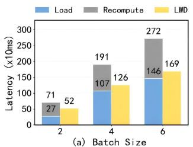  
SWE-Agents with Mistral-7B

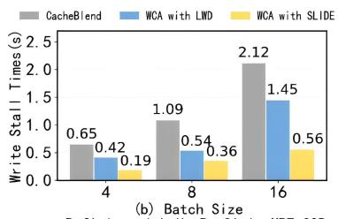  
Reflxion with HotPotQA in MPT-30B

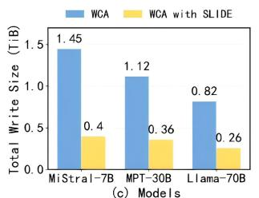  
SWE-Agents with SWE-Agent Bench

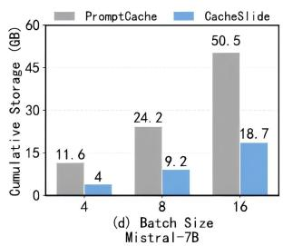  
Figure 12: Performance evaluation of CacheSlide with selected benchmarks: (a) The SLIDE component reduces layer-wise parallel latency by 26.7–51.5% as batch size increases from 2 to 6. (b) SLIDE decreases write stalls by 66.9–73.5% compared to three baselines—CacheBlend (without load–write decoupling), Weighted Correction Attention (with load–write decoupling), and WCA+SLIDE—as batch size increases from 4 to 16. (c) Across different model sizes, CacheSlide reduces SSDs write amplification by 3.11–3.62×. (d) CacheSlide achieves 1.63-1.9× reduction in GPU storage compared to PromptCache.

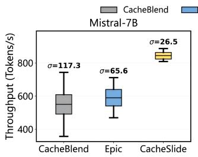

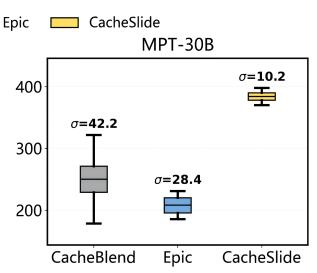

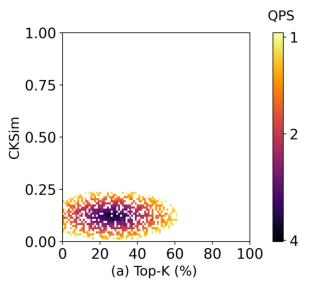  
Figure 13: Evaluate throughput efficiency on Mistral-7B and MPT-30B using Reflexion and the HotpotQA dataset and set batch size=8. CacheSlide delivers 49.6% and 45.2% higher throughput than CacheBlend and EPIC, respectively, while reducing the throughput standard deviation (σ) by 77.4-58.6%. on the MPT-30B model, CacheSlide achieves 75-82.2% higher throughput than CacheBlend and EPIC, while reducing (σ) by 75.8-64.1%.

Robustness of Throughput. To evaluate the stability of CacheSlide’s throughput performance, we set CacheBlend, EPIC as baselines. Because CacheBlend and EPIC both require updating KV cache in SSDs, thereby incurring additional latency, we treat ContextCache as the baseline. As shown in Figure 13, CacheSlide delivers, on average, 63.1% higher per-second throughput than the baselines, while the standard deviation of per-second throughput is also 68.9% lower than the baselines. Since in a large-scale parallel setting (batch size = 8), the prefill phase demands more storage, making KV cache spill to SSDs unavoidable. CacheBlend and EPIC do not effectively prevent pages that must be written from spilling to SSDs, which leads to additional disk I/Os and higher prefill latency. By employing a dirty-page eviction component, CacheSlide avoids additional disk accesses. CacheSlide’s stability advantage fundamentally reflects the advanced nature of its design in managing storage hierarchies: it not only achieves a significant boost in throughput but also minimizes performance fluctuations caused by the unpredictability of external storage I/O through its refined dirty-page management mechanism.

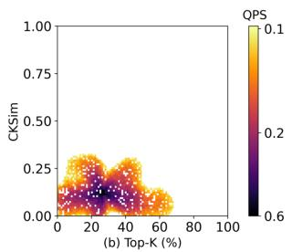  
Figure 14: Heatmap of QPS (queries served per second) as a function of top-k (x-axis) and CKSim (y-axis). (a)Mistral-7B on Reflexion with the HotPotQA with batch size = 2. (b) Llama-3 70B on SWE-Agent with the SWE-Agent-Bench dataset with batch size = 4

## 5.5 Impact of Top-k and CKSim Thresholds.

We evaluate the effect of top-k and CKSim on high-quality throughput using QPS—the number of correctly completed tasks per second (e.g., HotPotQA answers or SWE-Agent code executions). In the experiments, we set top-k from 0% to 100% and CKSim from 0 to 1, allowing us to comprehensively examine their impact on performance across different configurations. As shown in Figure 14 (a) and (b), the max QPS shows similar patterns across different datasets and models, consistently peaking near top-k ≈ 0.26 and CKSim ≈ 0.12.

This efficiency arises from the inherent sparsity of attention mechanisms, where selecting only around 26 % of key tokens suffices to preserve reasoning quality effectively. At the same time, as model depth increases, inter-layer representations typically exhibit greater similarity. By adaptively adjusting the CKSim threshold according to the number of layers, the system can more precisely identify which cached key-value pairs remain consistent with their current computed values, thereby recovering a larger proportion of exact KV states without recomputation. The effectiveness of this mechanism generally improves with deeper models. Together, these two aspects significantly enhance generation quality while maintaining high throughput. In practice, these parameters can be tuned dynamically based on specific workloads; overall, combining a small top-k with a layer-adaptive CKSim enables efficient reuse of the KV cache and balances performance with output fidelity.

## 6 Related Work

Our work formalizes RPDC(Relative-Position-Dependent Caching) and advances the state of the art in this emerging area. Below, we outline the broader design space relevant to our work.

LLM-serving optimizations. Numerous systems have recently emerged to improve LLM serving efficiency [19, 25, 70]. vLLM [29] introduces PagedAttention to achieve high throughput, while SGLang [82] provides both a domainspecific frontend language and an optimized backend runtime. DeepServe [25] integrates the advantages of existing research work into a system running on Ascend accelerators at Huawei Cloud. In addition to full systems, researchers have proposed scheduling techniques such as disaggregated prefill and decode such as DistServe [20, 51, 83], continuous batching [77], and multi-LoRA integration [31, 57]. Storage-related optimizations such as KV-cache-centric inference systems [19,55] also contribute to this space.

Context Caching (CC). Two primary types of context caching have emerged. First, Position-Dependent Caching(PDC) CC emerged in late 2023, one is prefixing caching represented by Pensieve [78], CacheGen [37], and SGLang. Recently, vendors such as Kimi [2] and Gemini [1] have begun offering explicit CC APIs. Another PDC CC is PromptCache [16] aims to support PDC, but its reuse remains position-dependent. Second, Position-Independent Caching(PIC) emerged in mid-2024 and [76] represents the first attempt to tackle the PIC challenge, although it does not formally define the challenge. EPIC [22] formally defines PIC and advance the state of the art by introducing, a lowoverhead or even zero-overhead linking algorithm.

Sparsity. Sparsity plays a crucial role in improving longcontext inference and falls into two types: dynamic and static. First, dynamic sparsity (e.g., H2O [79], Quest [61], ArkVale [12], RaaS [23]) determines important tokens at runtime. Second, static sparsity (e.g., Longformer [8], StreamingLLM [71]) relies on predefined sparse patterns. leverages dynamic sparsity while leverages static sparsity to enable efficient linking.

Agentic Generation. Agent [6, 45, 50] enhances LLMs’ capabilities by summarizing user history, analyzing reasoning chains, and accessing external tools to improve factuality and relevance. These agent systems enhance LLMs’ core competencies through three primary mechanisms: user history summarization for maintaining memory and context such as MemGPT [49] and long term memory agent [11], reasoning chain analysis to implement structured, step-by-step inference (often via Chain-of-Thought [30, 66, 68],Reflexion [58],Raas [23]), and external tool access through function calling APIs such as open function calling [46] and Auto-Gen [69]. By integrating these capabilities, agent-augmented LLMs achieve significant improvements in response factuality and contextual relevance, enabling more dynamic, reliable, and tool-aware interactions in complex tasks.

## 7 Conclusion

CacheSlide is a substantive advance over the industrystandard prefix-caching paradigm. It outperforms state-of-theart PIC/PDC baselines, cutting latency by 3.11–4.3×, boosting throughput by 3.5–5.8×, and reducing SSDs write amplification by 3.11–3.62×. On agent workloads, it delivers compute savings, storage-friendly behavior, and high-quality outputs.

## Acknowledgment

We would like to thank our shepherd, Ramesh Doddaiah, and other anonymous reviewers for their insightful comments and suggestions. This work was supported in part by the National Key R&D Program of China (Grant No. 2023YFB4502900), the project ZR2023LZH020 supported by Shandong Provincial Natural Science Foundation, Explorers Program of Shanghai (Basic Research Funding No. 25TS1410900), Inspur Storage Qinglan Foundation, and National Natural Science Foundation of China (Grant No. 625B2002). Our work is open-source and publicly available at: https://github.com/SJTU-Storage-Lab/CacheSlide.

## References

[1] Gemini context caching. https://ai.google.dev/gemini-a pi/docs/caching?lang=python.

[2] Kimi context caching. https://platform.moonshot.cn/d ocs/api/caching.

[3] Amey Agrawal, Anmol Agarwal, Nitin Kedia, Jayashree Mohan, Souvik Kundu, Nipun Kwatra, Ramachandran Ramjee, and Alexey Tumanov. Metron: Holistic performance evaluation framework for llm inference systems. arXiv preprint arXiv:2407.07000, 2024.

[4] Amey Agrawal, Ashish Panwar, Jayashree Mohan, Nipun Kwatra, Bhargav S. Gulavani, and Ramachandran Ramjee. Sarathi: Efficient llm inference by piggybacking decodes with chunked prefills. In ATC, 2023.

[5] Moonshot AI. Kimi context caching. https://platform.m oonshot.cn/docs/guide/use-context-caching-feature-o f-kimi-api., 2025.

[6] AutoGPT. Autogpt: Build, deploy, and run ai agents. https://github.com/Significant-Gravitas/AutoGPT.

[7] Dzmitry Bahdanau, Kyunghyun Cho, and Yoshua Bengio. Neural machine translation by jointly learning to align and translate. In International Conference on Learning Representations (ICLR), 2015.

[8] Iz Beltagy, Matthew E. Peters, and Arman Cohan. Longformer: The long-document transformer. CoRR, 2020.

[9] Chi-Chih Chang1, Chien-Yu Lin2, Yash Akhauri1, and Wei-Cheng Lin. xkv: Cross-layer svd for kv-cache compression. In arxiv, 2025.

[10] D. S. Chaplot, Albert q., jiang, alexandre sablayrolles, arthur mensch, chris bamford, devendra singh chaplot, diego de las casas, florian bressand, gianna lengyel, guillaume lample, lucile saulnier, lelio renard lavaud, marieanne ´ lachaux, pierre stock, teven le scao, thibaut lavril, thomas wang, timothee lacroix, and william el sayed. Mistral model. In arXiv, 2023.

[11] Harrison Chase. Long-term memory agent. https://pyth on.langchain.com/docs/versions/migrating\_memory/lo ng\_term\_memory\_agent/.

[12] Renze Chen, Zhuofeng Wang, Beiquan Cao, Tong Wu, Size Zheng, Xiuhong Li, Xuechao Wei, Shengen Yan, Meng Li, and Yun Liang. ArkVale: Efficient generative LLM inference with recallable key-value eviction. In Proceedings of the Advances in Neural Information Processing Systems, pages 113134–113155, 2024.

[13] NKevin Clark, Urvashi Khandelwal, Omer Levy, and Christopher D. Manning. What does bert look at? an analysis of bert’s attention. In ACL, 2019.

[14] Yichuan Deng, Zhao Song, and Chiwun Yang. Attention is naturally sparse with gaussian distributed input. arXiv preprint arXiv:2404.02690, 2024.

[15] Tim Dettmers, Artidoro Pagnoni, Ari Holtzman, and Luke Zettlemoyer. QLoRA: Efficient finetuning of quantized llms. arXiv preprint arXiv:2305.14314, 2023.

[16] In Gim, Guojun Chen, Seung seob Lee, Nikhil Sarda, Anurag Khandelwal, and Lin Zhong. Prompt cache: Modular attention reuse for low-latency inference. In MLSys, 2024.

[17] Jitai Hao, Yuke Zhu, Tian Wang, Jun Yu, Xin Xin, Bo Zheng, Zhaochun Ren, and Sheng Guo. Omnikv: Dynamic context selection for efficient long-context llms. In Proceedings of the International Conference on Learning Representations (ICLR), 2025.

[18] Jingkai He, Tianjian Li, Erhu Feng, Dong Du, Qian Liu, Tao Liu, Yubin Xia, and Haibo Chen. History rhymes: Accelerating llm reinforcement learning with rhymerl. arXiv preprint arXiv:2508.18588, 2025. v1 posted 2025- 08-26.

[19] Cunchen Hu, Heyang Huang, Junhao Hu, Jiang Xu, Xusheng Chen, Tao Xie, Chenxi Wang, Sa Wang, Yungang Bao, Ninghui Sun, and Yizhou Shan. MemServe: Context caching for disaggregated LLM serving with elastic memory pool. CoRR, 2024.

[20] Cunchen Hu, Heyang Huang, Liangliang Xu, Xusheng Chen, Jiang Xu, Shuang Chen, Hao Feng, Chenxi Wang, Sa Wang, Yungang Bao, Ninghui Sun, and Yizhou Shan. Inference without interference: Disaggregate LLM inference for mixed downstream workloads. CoRR, 2024.

[21] Edward J Hu, Yelong Shen, Phillip Wallis, Zeyuan Allen-Zhu, Yuanzhi Li, Shean Wang, Lu Wang, and Weizhu Chen. LoRA: Low-rank adaptation of large language models. In International Conference on Learning Representations (ICLR), 2022.

[22] Junhao Hu, Wenrui Huang, Haoyi Wang, Weidong Wang, Tiancheng Hu, Qin Zhang, Hao Feng, Xusheng Chen, Yizhou Shan, and Tao Xie. Epic: Efficient position-independent context caching for serving large language models. In ICML, pages 24391–24402, 2025.

[23] Junhao Hu, Wenrui Huang, Weidong Wang, Zhenwen Li, Tiancheng Hu, Zhixia Liu, Xusheng Chen, Tao Xie, and Yizhou Shan. RaaS: Reasoning-aware attention sparsity for efficient llm reasoning. In Proceedings of the 63rd Annual Meeting of the Association for Computational Linguistics, pages 2577–2590, 2024.

[24] Junhao Hu, Chaozheng Wang, Hailiang Huang, Huang Luo, Yu Jin, Yuetang Deng, and Tao Xie. Predicting compilation resources for adaptive build in an industrial setting. In Proceedings of the 38th IEEE/ACM International Conference on Automated Software Engineering, pages 1808–1813, 2023.

[25] Junhao Hu, Jiang Xu, Zhixia Liu, Yulong He, Yuetao Chen, Hao Xu, Jiang Liu, Jie Meng, Baoquan Zhang, Shining Wan, Gengyuan Dan, Zhiyu Dong, Zhihao Ren, Changhong Liu, Tao Xie, Dayun Lin, Qin Zhang, Yue Yu, Hao Feng, Xusheng Chen, and Yizhou Shan. Deepserve: Serverless large language model serving at scale. In USENIX Annual Technical Conference(ATC), pages 57–72, 2025.

[26] indata labs. Applications of large language models - indata labs. https://indatalabs.com/blog/large-languag e-model-apps.

[27] C. E. Jimenez, J. Yang, A. Wettig, S. Yao, K. Pei, O. Press, and K. R. Narasimhan. Swe-bench: Can language models resolve real-world github issues? in the twelfth international conference on learning representations. https://openreview.net/forum?id=VTF8yNQM66 ., 2025.

[28] Chao Jin, Zili Zhang, Xuanlin Jiang, Fangyue Liu, Xin Liu, Xuanzhe Liu, and Xin Jin. Efficiently programming large language models using sglang. In arXiv, 2024.

[29] Woosuk Kwon, Zhuohan Li, Siyuan Zhuang, Ying Sheng, Lianmin Zheng, Cody Hao Yu, Joseph Gonzalez, Hao Zhang, and Ion Stoica. Efficient memory management for large language model serving with PagedAttention. In Proceedings of the 29th Symposium on Operating Systems Principles, pages 611–626, 2023.

[30] langchain of github. langchain of agents. https://github .com/langchain-ai/langchain.

[31] Suyi Li, Hanfeng Lu, Tianyuan Wu, Minchen Yu, Qizhen Weng, Xusheng Chen, Yizhou Shan, Binhang Yuan, and Wei Wang. CaraServe: CPU-assisted and rank-aware LoRA serving for generative LLM inference. CoRR, 2024.

[32] Chin-Yew Lin. Rouge: A package for automatic evaluation of summaries. In Association for Computational Linguistics, 2004.

[33] Akide Liu, Jing Liu, Zizheng Pan, Yefei He, Gholamreza Haffari, and Bohan Zhuang. Minicache: Kv cache compression in depth dimension for large language models. In Advances in Neural Information Processing Systems 37 (NeurIPS 2024), 2024.

[34] Nelson F. Liu, Kevin Lin, John Hewitt, Ashwin Paranjape, Michele Bevilacqua, Fabio Petroni, and Percy Liang. Lost in the middle: How language models use long contexts. Transactions of the Association for Computational Linguistics, 12:157–173, 2024.

[35] Shu Liu, Asim Biswal, Audrey Cheng, Xiangxi Mo, Shiyi Cao, Joseph E. Gonzalez, Ion Stoica, , and Matei Zaharia. Optimizing llm queries in relational workloads. In arXiv, 2024.

[36] Yuchen Liu, Junhao Hu, Yingdi Shan, Ge Li, Yanzhen Zou, Yihong Dong, and Tao Xie. Llmigrate: Transforming "lazy" large language models into efficient source code migrators. CoRR, abs/2503.23791, 2025.

[37] Yuhan Liu, Hanchen Li, Yihua Cheng, Siddhant Ray, Yuyang Huang, Qizheng Zhang, Kuntai Du, Jiayi Yao, Shan Lu, Ganesh Ananthanarayanan, Michael Maire, Henry Hoffmann, Ari Holtzman, and Junchen Jiang. Cachegen: KV cache compression and streaming for fast large language model serving. In Proceedings of the ACM SIGCOMM 2024 Conference, pages 38–56, 2024.

[38] LMCache. Jiayi yao and et all. https://github.com/LMC ache/LMCache., 2025.

[39] Aman Madaan, Niket Tandon, Prakhar Gupta1, Skyler Hallinan3and Luyu Gao1, and etc. Self-refine: iterative refinement with self-feedback. In NeurIPS, 2023.

[40] Christopher D. Manning, Prabhakar Raghavan, and Hinrich Schütze. Introduction to Information Retrieval. Cambridge University Press, 2008. See Ch. 8 for precision, recall, and $\mathrm { F } _ { 1 } = 2 \mathrm { P R } / ( \mathrm { P } + \mathrm { R } )$ .

[41] André F. T. Martins and Ramón Fernandez Astudillo. From softmax to sparsemax: A sparse model of attention and multi-label classification. In Proceedings of the 33rd International Conference on Machine Learning (ICML), pages 1614–1623. PMLR, 2016.

[42] Meta. Meta llama 3.1. IntroducingLlama3.1:Ourmostc apablemodelstodate.https://ai.meta.com/blog/meta-lla ma-3-1/.

[43] NVIDIA. Fastertransformer: A transformer inference accelerator. https://github.com/NVIDIA/FasterTransfor mer, 2022.

[44] NVIDIA Corporation. Tensorrt-llm documentation, 2025. Accessed: 2025-09-15.

[45] openai. agents of openai. https://github.com/openai/op enai-agents-python.

[46] openai. openai function-calling. https://platform.openai. com/docs/guides/function-calling.

[47] OpenAI. Sharegpt: A repository of chatgpt conversations. https://sharegpt.com/, 2023.

[48] OpenAI. Openai prompt caching. https://platform.ope nai.com/docs/guides/prompt-caching., 2025.

[49] Charles Packer, Sarah Wooders, Kevin Lin, Vivian Fang, Shishir G. Patila, Ion Stoica, and Joseph E. Gonzalez. Memgpt: Towards llms as operating systems. In arXiv, 2023.

[50] Joon Sung Park, Joseph C. O’Brien, Carrie J. Cai, Meredith Ringel Morris, Percy Liang, and Michael S. Bernstein. Generative agents: Interactive simulacra of human behavior. In UIST, 2023.

[51] Pratyush Patel, Esha Choukse, Chaojie Zhang, Aashaka Shah, Íñigo Goiri, Saeed Maleki, and Ricardo Bianchini. Splitwise: Efficient generative LLM inference using phase splitting. In Proceedings of the Fifty-First Annual International Symposium on Computer Architecture, pages 118–132, 2024.

[52] Ofir Press, Noah A. Smith, and Mike Lewis. Train short, test long: Attention with linear biases enables input length extrapolation. In arxiv, 2021.

[53] projectpro. 7 top large language model use cases and applications. https://www.projectpro.io/article/large-lan guage-model-use-cases-and-applications/887.

[54] Chen Qian, Wei Liu, Hongzhang Liu, Nuo Chen, Yufan Dang, Jiahao Li, Cheng Yang, Weize Chen, Yusheng Su, Xin Cong, Juyuan Xu, Dahai Li, Zhiyuan Liu, and Maosong Sun. Chatdev: Communicative agents for software development. In Proceedings of the 62nd Annual Meeting of the Association for Computational Linguistics (Volume 1: Long Papers), pages 15174–15186, Bangkok, Thailand, August 2024. Association for Computational Linguistics.

[55] Ruoyu Qin, Zheming Li, Weiran He, Jialei Cui, Feng Ren, Mingxing Zhang, Yongwei Wu, Weimin Zheng, and Xinran Xu. Mooncake: Trading more storage for less computation - A KVCache-centric architecture for serving LLM chatbot. In Proceedings of the Twenty-Third USENIX Conference on File and Storage Technologies, pages 155–170, 2025.

[56] Anna Rogers, Olga Kovaleva, and Anna Rumshisky. A primer in bertology: What we know about how bert works. In TACL, 2020.

[57] Ying Sheng, Shiyi Cao, Dacheng Li, Coleman Hooper, Nicholas Lee, Shuo Yang, Christopher Chou, Banghua Zhu, Lianmin Zheng, Kurt Keutzer, Joseph Gonzalez, and Ion Stoica. SLoRA: Scalable serving of thousands of lora adapters. In Proceedings of the Seventh Annual Conference on Machine Learning and Systems, pages 296–311, 2024.

[58] Noah Shinn, Federico Cassano, Edward Berman, Ashwin Gopinath, Karthik Narasimhan, and Shunyu Yao. Reflexion: Language agents with verbal reinforcement learning. In NeurIPS, 2023.

[59] Jianlin Su, Murtadha Ahmed, Yu Lu, Shengfeng Pan, Wen Bo, and Yunfeng Liu. Roformer: : Enhanced transformer with rotary position embeddings. In Neurocomputing, 2023.

[60] Olga Golovneva Tianlu Wang Jason Weston Sainbayar Sukhbaatar and Meta. Contextual position encoding:learning to count what’s important. In arXiv, 2024.

[61] Jiaming Tang, Yilong Zhao, Kan Zhu, Guangxuan Xiao, Baris Kasikci, and Song Han. QUEST: query-aware sparsity for efficient long-context LLM inference. In Proceedings of the Forty-First International Conference on Machine Learning, pages 47901–47911, 2024.

[62] techopedia. 12 practical large language model (llm) applications - techopedia. https://www.techopedia.com /12-practical-large-language-model-llm-applications.

[63] vllm. vllm0.8.5. https://github.com/vllm-project/vllm/ releases/tag/v0.8.5.post1.

[64] Chaozheng Wang, Junhao Hu, Cuiyun Gao, Yu Jin, Tao Xie, Hailiang Huang, Zhenyu Lei, and Yuetang Deng. How practitioners expect code completion? In Proceedings of the 31st ACM Joint European Software Engineering Conference and Symposium on the Foundations of Software Engineering, pages 1294–1306, 2023.

[65] Qian Wang1, Zhenheng Tang2, Zichen Jiang1, and etx. Agenttaxo: Dissecting and benchmarking token distribution of llm multi-agent systems. In International Conference on Learning Representations (ICLR), 2025. oral.

[66] Jason Wei, Xuezhi Wang, Dale Schuurmans, Maarten Bosma, brian ichter, Fei Xia, Ed Chi, Quoc V Le, and Denny Zhou. Chain-of-thought prompting elicits reasoning in large language models. In NeurIPS, 2022.

[67] Bingyang Wu, Shengyu Liu, Yinmin Zhong, Peng Sun, Xuanzhe Liu, , and Xin Jin. Loongserve: Efficiently serving long-context large language models with elastic sequence parallelism. In arXiv, 2024.

[68] Mengsong Wu, Tong Zhu, Han Han, Xiang Zhang, Wenbiao Shao, and Wenliang Chen. Chain-of-tools: Utilizing massive unseen tools in the cot reasoning of frozen language models. In arXiv, 2025.

[69] Qingyun Wu, Microsoft Research, , Pennsylvania State University, University of Washington, and Xidian University . Autogen: Enabling next-gen llm applications via multi-agent conversation. In arXiv, 2023.

[70] Ao Xiao, Bangzheng He, Baoquan Zhang, Baoxing Huai, Bingji Wang, Bo Wang, Bo Xu, Boyi Hou, Chan Yang, Changhong Liu, Cheng Cui, and et al. xdeepserve: Model-as-a-service on huawei cloudmatrix384. CoRR, abs/2508.02520, 2025.

[71] Guangxuan Xiao, Yuandong Tian, Beidi Chen, Song Han, and Mike Lewis. Efficient streaming language models with attention sinks. In International Conference on Learning Representations (ICLR), 2024. Poster.

[72] Jing Xu, Arthur Szlam, and Jason Weston. Beyond goldfish memory: Long-term open-domain conversation. In arXiv, 2021.

[73] Dongjie Yang, Xiaodong Han, Yan Gao, Yao Hu, Shilin Zhang, and Hai Zhao. Pyramidinfer: Pyramid kv cache compression for high-throughput llm inference. In Lun-Wei Ku, Andre Martins, and Vivek Srikumar, editors, Findings of the Association for Computational Linguistics: ACL 2024, pages 3258–3270, Bangkok, Thailand, August 2024. Association for Computational Linguistics.

[74] John Yang, Carlos E. Jimenez, Alexander Wettig, Kilian Lieret, Shunyu Yao, Karthik Narasimhan, and Ofir Press. Swe-agent: Agent-computer interfaces enable automated software engineering. In Advances in Neural Information Processing Systems (NeurIPS), volume 37, 2024.

[75] Z. Yang, P. Qi, Y. Zhang, S.and Bengio, R.and Cohen, W. W.and Salakhutdinov, and C. D. Manning. Hotpotqa: A dataset for diverse, explainable multi-hop question answering. In EMNLP, 2018.

[76] Jiayi Yao, Hanchen Li, Yuhan Liu, Siddhant Ray, Yihua Cheng, Qizheng Zhang, Kuntai Du, Shan Lu, and Junchen Jiang. CacheBlend: Fast large language model serving for RAG with cached knowledge fusion. In Proceedings of the Twentieth European Conference on Computer Systems, pages 94–109, 2025.

[77] Gyeong-In Yu, Joo Seong Jeong, Geon-Woo Kim, Soojeong Kim, and Byung-Gon Chun. Orca: A distributed serving system for transformer-based generative models. In Proceedings of the Sixteenth USENIX Symposium on Operating Systems Design and Implementation, pages 521–538, 2022.

[78] Lingfan Yu, Jinkun Lin, and Jinyang Li. Stateful large language model serving with Pensieve. In Proceedings of the Twentieth European Conference on Computer Systems, pages 144–158, 2025.

[79] Zhenyu Zhang, Ying Sheng, Tianyi Zhou, Tianlong Chen, Lianmin Zheng, Ruisi Cai, Zhao Song, Yuandong Tian, Christopher Ré, Clark W. Barrett, Zhangyang Wang, and Beidi Chen. H2O: heavy-hitter oracle for efficient generative inference of large language models. In Proceedings of the Advances in Neural Information Processing Systems, pages 34661–34710, 2023.

[80] Shiju Zhao, Junhao Hu, Rongxiao Huang, Jiaqi Zheng, and Guihai Chen. MPIC: position-independent multimodal context caching system for efficient MLLM serving. CoRR, abs/2502.01960, 2025.

[81] Lianmin Zheng, Liangsheng Yin, Zhiqiang Xie, Jeff Huang, Chuyue Sun, Cody Hao Yu, Shiyi Cao, Christos Kozyrakis, Ion Stoica, Joseph Gonzalez, and et al. Ragcache: Efficient knowledge caching for retrievalaugmented generation. In arXiv, 2024.

[82] Lianmin Zheng, Liangsheng Yin, Zhiqiang Xie, Chuyue Sun, Jeff Huang, Cody Hao Yu, Shiyi Cao, Christos Kozyrakis, Ion Stoica, Joseph E. Gonzalez, Clark W. Barrett, and Ying Sheng. SGLang: Efficient execution of structured language model programs. In Neural Information Processing Systems, 2025.

[83] Yinmin Zhong, Shengyu Liu, Junda Chen, Jianbo Hu, Yibo Zhu, Xuanzhe Liu, Xin Jin, and Hao Zhang. Distserve: Disaggregating prefill and decoding for goodputoptimized large language model serving. In Usenix Operating Systems Design and Implementation(OSDI), 2024.

[84] Haoyi Zhou, Shanghang Zhang, Jieqi Peng, Shuai Zhang, Jianmin Li, Hui Xiong, and Wancai Zhang. Informer: Beyond efficient transformer for long sequence time-series forecasting. In AAAI, 2021.