USENIX

THE ADVANCED COMPUTING SYSTEMS ASSOCIATION

# Accelerating Model Loading in LLM Inference by Programmable Page Cache

Yubo Liu, Hongbo Li, Xiaojia Huang, Yongfeng Wang, Hanjun Guo, Hui Chen, Yuxin Ren, and Ning Jia, Huawei Technologies Co., Ltd.

## https://www.usenix.org/conference/fast26/presentation/liu-yubo

This paper is included in the Proceedings of the 24th USENIX Conference on File and Storage Technologies.

February 24–26, 2026 • Santa Clara, CA, USA

ISBN 978-1-939133-53-3

Open access to the Proceedings of the 24th USENIX Conference on File and Storage Technologies is sponsored by

# Accelerating Model Loading in LLM Inference by Programmable Page Cache

Yubo Liu, Hongbo Li, Xiaojia Huang, Yongfeng Wang, Hanjun Guo, Hui Chen,

Yuxin Ren, and Ning Jia

Huawei Technologies Co., Ltd.

## Abstract

This paper examines the model loading bottleneck during the LLM inference startup. Existing solutions often optimize model loading performance at the expense of compatibility. However, compatibility is a crucial factor determining whether a technology can be widely applied in real-world scenarios. This work achieves both high performance and strong compatibility by optimizing the cache policy of the kernel file system. We design PPC, a programmable page cache framework that allows users to customize page cache policies in a non-intrusive, flexible, and lightweight manner. Furthermore, we design MAIO, a cache policy implemented based on PPC, to optimize model loading. MAIO introduces an I/O template-based mechanism to fully utilize SSD bandwidth, XPU affinity, and data locality to enhance the efficiency of prefetching and eviction. Our evaluation shows that MAIO reduces the model loading latency by up to 79% compared to existing optimizations. In a real-world application, MAIO achieves up to 36% improvement in inference throughput over other tested solutions in the elastic deployment scenario.

## 1 Introduction

Large language models (LLMs) are widely used in many scenarios, such as chatbot [26, 32] and code generation [5, 12]. MaaS (Model-as-a-Service) [10, 15, 37] is a promising technology for large-scale LLM inference, and it enables users to directly use LLM inference services through simple APIs without being aware of the complex hardware and software architectures (e.g., OpenAI [27], ModelArts [8], Bailian [7]). The startup latency for inference services is a critical performance metric for MaaS systems, as it significantly impacts service QoS and resource utilization. Currently, the sizes of models are enormous and continue to grow, reaching hundreds of gigabytes or even terabytes. This makes model loading a major bottleneck for the startup of inference services.

To reduce the overhead of model loading, the fundamental idea is to keep the model as close to the XPU (e.g., GPU, NPU) as possible. Storing (hot) models on high-speed SSDs at inference nodes is a method that balances performance and cost, widely adopted in both industry and academia. However, simply using the local file system to store models is suboptimal, as it fails to fully leverage the performance of storage/interconnect hardware. Some existing works aim to address this shortcoming, e.g., ServerlessLLM [9] improves the bandwidth utilization of SSDs by using pipeline loading; BlitzScale [39] achieves model sharing via high-speed interconnects (NVLink [25], RDMA) between GPUs.

There is an overlooked disadvantage in the existing model loading optimizations [9, 39] – trading off compatibility for performance. They have a strong dependency on customized software and specific hardware. However, compatibility is crucial and determines whether a technology can be applied in real-world scenarios. To ensure strong compatibility for model loading optimization, we need to consider three dimensions: 1) It must be compatible with inference software ecosystems, such as frameworks and model formats. 2) It has no intrusive modifications to the OS kernel, as the cost of switching the kernel in a production environment is extremely high. 3) It has no hardware dependencies, making it suitable for a wider range of platforms.

Goal & Motivation. The goal of this work is to provide ultimate model loading acceleration on local file systems while ensuring compatibility. According to our analysis, the performance bottleneck of the kernel file system in model loading primarily stems from the inefficient cache policy of the kernel, which is mainly reflected in: 1) The prefetching policy fails to fully utilize the substantial idle bandwidth of SSDs. 2) The affinity of XPU has not been fully utilized. 3) The eviction policy cannot accurately perceive the temporal locality during model loading. Our motivation is to make the kernel page cache programmable and enable the policy to adaptively optimize for different inference services.

Programmable Page Cache (PPC). The cache programming framework must meet the requirements of being nonintrusive to the kernel, flexible, and lightweight. Although some techniques allow users to control the cache behavior to some extent, they cannot simultaneously meet these three requirements. For example, the FUSE-based solutions [6, 16] provide high flexibility for users to implement the whole file system in the userspace, but they have a heavy software stack; the eBPF-based solutions [4, 38, 41] allow users to inject customized cache policies into the kernel, but they lack flexibility (e.g., complex policies are not supported) and may involve intrusive modifications to the kernel (e.g., adding kfunc/helper).

This work proposes PPC (Programmable Page Cache) framework to meet all three requirements. PPC consists of a routing file system (RFS) in the kernel and a cache policy runtime (CPRT) in the userspace. RFS is a read-only file system that stacks on top of any kernel file system. It hijacks the file operations of the underlying file system and allows the invocation of the user-defined policy within the native I/O process without modifying existing kernel modules. CPRT provides VFS-like programming semantics for users to develop the cache policy in the userspace and is responsible for managing and efficiently executing user-defined policies. With these designs, PPC can support users in implementing advanced cache policies (e.g., MAIO) with low overhead, while it can be constructed as an independent kernel module to avoid intrusive kernel modifications.

Model-Accelerated I/O (MAIO). To enhance the efficiency of the cache policy during model loading, the policy must meet two requirements. Firstly, it must be capable of sensing the I/O characteristics of model loading. For compatibility, the policy needs to be independent of the inference framework, making model loading a black box. Additionally, different inference services have distinct I/O characteristics. Secondly, it should be able to perform targeted optimizations based on the I/O characteristics. This means it needs to fully utilize idle bandwidth, XPU affinity, and temporal locality to optimize prefetching and eviction.

We design MAIO (Model-Accelerated I/O) based on PPC, a cache policy aimed at optimizing model loading. MAIO leverages a phenomenon – the I/O pattern of model loading is the same across identical LLM inference services (i.e., model, tensor parallelism, etc., are the same). Therefore, MAIO pre-builds an I/O template for each inference service, which describes the I/O sequence of each XPU during the model loading. When the inference service starts, MAIO obtains its I/O characteristics by parsing the target I/O template. It further proposes three mechanisms – interruptible prefetching, XPU affinity loading, and “Burn-after-Reading” eviction – to optimize bandwidth utilization, host-to-device transfer efficiency, and eviction accuracy, respectively. As a result, MAIO delivers state-of-the-art I/O optimization for model loading while ensuring strong compatibility.

We evaluate MAIO (and PPC) on five mainstream models and the results show that model loading latency in MAIO is reduced by up to 79% and 74% in memory-rich and memoryconstrained scenarios, respectively, compared to existing compatible and incompatible optimization solutions. In the elastic inference scenario, MAIO achieves up to 36% improvement in throughput over other tested solutions.

This paper contains the following main contributions:

• It quantitatively analyzes the impact of cache policies on model loading in LLM inference startup.

• It designs PPC, a programmable framework that allows users to customize page cache policies of kernel file systems in a non-intrusive, flexible, and lightweight manner.

• It designs MAIO, an advanced cache policy based on PPC to accelerate model loading, and demonstrates its benefits via micro-benchmarks and real-world applications.

The rest of this paper is organized as follows: Section 2   
introduces the background and motivation; Section 3 and 4

introduce the designs of PPC and MAIO; Section 5 shows the detailed evaluation; Section 6 concludes the paper.

## 2 Background and Motivation

## 2.1 Model Loading and Goal

The MaaS (Model-as-a-Service) technology is widely used in the AI industry [10, 37] – it addresses the high complexity and high resource consumption problems associated with deploying LLM inference services by supporting one-click and on-demand deployment. The MaaS platform pre-builds templates for each inference service, which describe execution parameters such as the model and parallel strategy. It will elastically launch LLM inference services (templates) based on user requests, while providing load balancing, fault tolerance, and security guarantees.

The startup speed of the LLM inference service is a key performance metric in MaaS platforms, which can significantly affect the QoS and resource utilization of the system. However, LLM inference startup is time-consuming. The model loading stage is one of the main bottlenecks in LLM inference startup, as the size of LLM models can reach hundreds of gigabytes or even terabytes. For example, it takes about one hour to start a DeepSeek-R1-671B inference service in our MaaS platform, while loading the model from the OBS (object store) accounts for more than 70% of the total overhead.

Incompatible Optimizations. Storing (hot) models on the SSDs of the inference nodes is a mainstream practice for performance. On this basis, existing works further perform customized optimization within the inference framework to reduce the model loading latency. For example, Serverless-LLM [9] leverages multi-tier parallel loading and live migration to accelerate the model loading; BlitzScale [39] uses an O(1) caching approach, which allows the model to be directly shared between GPUs via NVLink [25] and RDMA. However, the key shortcoming of these works is the sacrifice of compatibility. Based on our production experience, the compatibility is a decisive factor in whether the technique can be widely applied across various real-world scenarios.

To maximize the compatibility of model loading optimization, we need to consider the following three aspects: 1) Transparency in the LLM inference ecosystem. The software stack for LLM inference is complex and diverse (e.g., vLLM [19], SGLang [40]), making it difficult to standardize as users select technologies based on their specific scenarios. Even from the perspective of infrastructure vendors, the LLM inference software is a black box that cannot be perceived or modified. 2) No intrusive modifications to the OS kernel. For stability and security considerations, production environments often only allow the use of upstream versions. Therefore, modifying existing kernel modules (e.g., altering memory/file system mechanisms, adding eBPF helper/kfunc) is strictly restricted and may require a long period before being upstreamed. In addition, switching the OS kernel in a production environment is a massive engineering task. For example, upgrading the kernel for hundreds of thousands of nodes in our production cluster can take years. 3) No hardware dependency. The model loading optimization must avoid relying on specific hardware features of particular chips (e.g., NVLink [25], HCCS [35]).

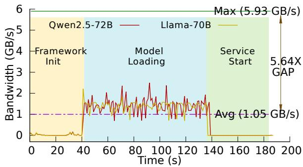  
Figure 1: SSD Bandwidth Utilization of Inference Startup.

Design Goal. This work is also dedicated to optimizing model loading on the SSDs of inference nodes, but it targets a different goal from existing works – to achieve state-of-the-art optimization of model loading while ensuring compatibility. Models are typically stored as files, and the core of optimizing model loading lies in efficiently utilizing the memory cache of the file system. This leads us to optimize the cache policy of the kernel file system based on the I/O characteristics of model loading, while ensuring compatibility with the inference framework, OS kernel, and hardware.

## 2.2 Cache Policy

The startup of the LLM inference service involves three stages: framework initialization (e.g., starting the container), model loading, and service startup (e.g., initializing KV cache). The model loading process parses the model structure and loads tensors one by one from the file system onto the XPU. The cache policy of the file system, which is the mechanism for prefetching and evicting data between the memory and SSD, significantly affects the model loading performance. However, the traditional cache policy in the kernel is inefficient for model loading. For example, the loading overhead of Qwen2.5-72B still reaches the minute level, accounting for more than 50% of the startup overhead of LLM inference service. We evaluate the I/O characteristics of model loading and discuss the shortcomings of the cache policy of the kernel, which lead to three observations:

Observation 1: The prefetching mechanism cannot fully utilize idle SSD bandwidth and effectively hide I/O overhead.

We evaluate the variation in SSD bandwidth utilization during the startup of Qwen2.5-72B and Llama-70B (the testbed is detailed in § 5). Figure 1 presents two key findings. 1) The average bandwidth during model loading is only about 17% of the maximum bandwidth. 2) The startup process involves numerous operations decoupled from I/Os, but I/Os are not adequately hidden, such as during the framework initialization phase and data post-processing in the model loading phase. This is because the prefetching in the kernel page cache is inefficient for model loading. First, the prefetching cannot fully utilize the concurrency of SSDs due to limitations in the number of kworkers. Second, the accuracy of prefetching is low, making it difficult for I/Os to be hidden by other processes during startup – the kernel cache policy simply prefetches a contiguous segment (e.g., 128KB) of data from the same file as the front-end I/O, while the I/O behavior of model loading is complex.

Observation 2: Model loading is sensitive to XPU affinity, but this dimension is overlooked by the kernel cache policy, affecting the efficiency of host-to-device data transfer.

To evaluate the impact of XPU affinity, we replicate multiple copies of the model and store them separately on tmpfs bound to different NUMA nodes, while modifying vLLM to ensure that each XPU loads the model only from the tmpfs of its respective NUMA node. Our results show that this XPU affinity approach can reduce model loading latency by about 20% compared to placing the model on a single NUMA node. However, the prefetching mechanism in the kernel cache policy cannot determine and control which XPU the data should be loaded to, so it blindly loads the data into the NUMA node of the prefetch thread (kworker), affecting the efficiency of model data transfer from host to XPUs.

Observation 3: The I/O pattern of model loading exhibits strong temporal locality, but it cannot be precisely detected by the eviction mechanism.

Memory-constrained scenarios are common in real-world workloads (e.g., reserved for the KV cache). Therefore, the eviction mechanism will significantly impact the performance of model loading. We evaluate the model loading performance of Qwen2.5-72B under different available page cache sizes. The result shows that when the available page cache space is about 45% of the model size, the model loading latency increases by 38% compared to the scenario with sufficient page cache. Model data will remain in the XPUs throughout the lifecycle of the inference service in most cases. This means that once a page of model data is loaded to XPU(s), it can be evicted from the host side page cache. The kernel cache policy monitors page popularity through sampling and uses LRU for eviction. This eviction mechanism fails to accurately predict the temporal locality of pages during model loading because it is unable to detect when pages are loaded into the XPUs. This results in invalid data not being promptly evicted, causing the eviction overhead to manifest on the critical path.

## 2.3 Motivation

The motivation of this work is to make the kernel page cache programmable and enable the policy (prefetching and eviction) to adaptively optimize for different inference services. However, this motivation faces the following challenges:

Table 1: Comparison of Techniques for Controlling Page Cache.
<table><tr><td></td><td>FUSE-based</td><td>eBPF-based</td><td>Kernel-native</td><td>PPC</td></tr><tr><td>Typical System</td><td>RFUSE [6], XFUSE [16]</td><td>PageFlex [38], FetchBPF[4]</td><td>fadvise [29]</td><td>This work</td></tr><tr><td>Non-intrusive</td><td>&lt;&lt;x</td><td>xx&gt;</td><td></td><td>&lt;&lt;&gt;</td></tr><tr><td>Flexibility</td><td></td><td></td><td>xx&gt;</td><td></td></tr><tr><td>Lightweight</td><td></td><td></td><td></td><td></td></tr></table>

Challenge 1. How to design an efficient programmable page cache framework? The framework must satisfy the following requirements simultaneously: 1) Non-intrusive – it should be an independent kernel module and compatible with existing file systems. 2) Flexibility – it needs full control over the cache policy logic (e.g., timing and scope of prefetching and eviction, memory layout) and allows different policies to be switched flexibly. 3) Lightweight – it must have a low impact on front-end I/O performance.

Table 1 compares existing techniques for controlling kernel page cache. The FUSE-based systems [2, 6, 16] allow users to customize the file system in the userspace, but they bring high overhead even with state-of-the-art optimizations. The eBPF-based systems [4, 38] allow users to inject the customized policy into the kernel, but they fail to support complex policies (e.g., parsing I/O characteristic files) and flexible policy deployment/switching (e.g., they are unable to implement directory-level policies). They may also require intrusive kernel modifications (e.g., adding helper/kfunc). The kernel-native system, fadvise [29], allows applications to explicitly prefetch/evict pages, but it cannot deeply collaborate with front-end file accesses, which makes it difficult to accurately control the logic of prefetching and eviction. This work leverages the idea of stacking file system and proposes PPC (Programmable Page Cache) framework to meet three requirements mentioned above (§ 3).

Challenge 2. How to optimize the cache policy for different LLM inference services in a “black box” manner? The policy must meet the following requirements: 1) I/O characteristics awareness – it should be capable of sensing the I/O behavior of model loading without relying on modifications to the upper-layer LLM inference system. 2) Adaptive I/O optimization – it needs to ensure strong generalization, so that it can efficiently prefetch and evict data across different LLM inference services.

Existing related works [9, 39] achieve model loading optimization by deeply coupling the I/Os and the inference system, which violates the “black-box” design principle and is not applicable here. In the MaaS system, the LLM inference service is pre-built as a template, and the template describes basic service information such as the model and parallel parameters. We found that the I/O behavior of the same template (LLM inference service) is reproducible. Taking advantage of this characteristic, we can transparently track I/Os and pre-build I/O templates at the service granularity, and then optimize model loading based on the templates. By this inspiration, this work designs MAIO (Model-Accelerated I/O), an advanced cache policy based on PPC for model loading to provide adaptive prefetching and eviction optimizations while ensuring strong ecosystem compatibility (§ 4).

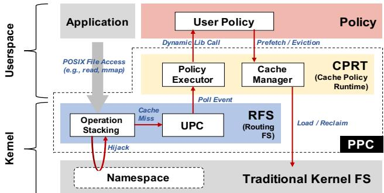  
Figure 2: Architecture of PPC. RFS stacks on top of the existing file system, hijacks its cache miss process, and calls user policy through system events; CPRT provides the policy programming framework and policy execution runtime.

## 3 Programmable Page Cache

PPC is a cache policy programming framework, which runs on top of existing kernel file systems, allowing users to customize the page cache behavior (prefetch/evict) of the target file namespace. PPC includes two key designs: 1) A routing file system (RFS) is proposed to allow the cache policy of the kernel file system to be overridden in a non-intrusive and lightweight manner (§ 3.1). 2) A cache policy runtime (CPRT) is designed to support flexible programming and efficient execution of user-customized policies (§ 3.2).

Architecture. Figure 2 shows the architecture of PPC. The RFS works in the kernel, where it hijacks the page cache miss of the underlying file system and encapsulates its contexts into a message, then triggers a special system event (UPC). In the userspace, the cache policy runtime (CPRT) provides a VFSlike programming framework, allowing users to customize cache policy by overriding the functions it offers. The usercustomized policy will be compiled into the dynamic link library and registered in CPRT. At runtime, CPRT listens to and parses events generated by RFS in a non-blocking manner, converting them into function calls within the usercustomized policy, and efficiently executes cache prefetching and eviction operations.

This architecture enables PPC to meet the requirements outlined in Table 1. First, the kernel part (RFS) in PPC is an independent kernel module, so there is no need to modify any existing components of the kernel (meets non-intrusive). Second, PPC supports policy customization at the directory granularity, and the userspace programming framework supports the implementation of complex policies (meets flexibility). Third, PPC ensures low overhead through simple stacking and non-blocking event handling (meets lightweight).

Table 2: Main APIs of PPC.
<table><tr><td>API</td><td>Parameter</td><td>Description</td></tr><tr><td>mount -ppc</td><td>ppc_path base_path</td><td>Mount PPC on the ppc_path and associate it with the base_path</td></tr><tr><td>reg_policy</td><td>ppc_path policy_path config</td><td>Register the policy (policy_path) to the ppc_path using the initial configuration from the config</td></tr><tr><td>rm_policy</td><td>ppc_path</td><td>Unload the policy on the ppc_path</td></tr></table>

APIs and Usage. Table 2 shows the main APIs for enabling user-customized cache policies using PPC. To change the cache policy on the base path (base\_path) of the kernel file system, the following two steps must be executed: First, the user calls the mount to build PPC on an empty path (ppc\_path) and uses the -ppc flag to associate the PPC path with the base path. Then, the user calls the reg\_policy with the dynamic link library of the policy and the PPC path as parameters to register the user-customized policy into the PPC. The reg\_policy also allows users to pass custom data structures and parameters (config) for its cache policy. After these two steps, the namespace under the base path will be mapped to the PPC path, and POSIX file access by users on the PPC path will follow the registered cache policy. It is worth noting that if no policy is registered, PPC will fall back to the default cache policy in the kernel. In addition, PPC provides the rm\_policy interface that allows users to remove the registered policy.

## 3.1 Routing File System

Figure 3 shows the implementation of RFS. It utilizes the stacked file system mechanism to enable the cache policy of the kernel file system (i.e., prefetching and eviction) to be changed. Stacked file systems (e.g., OverlayFS [17]) are a special type of kernel file system that hijacks the operations of underlying file systems by overriding the VFS interfaces. This allows developers to modify the native operations (e.g., open, read, write) without requiring intrusive modifications to the underlying file system.

After RFS is mounted, its file namespace is a mirror of the target file namespace of the underlying file system. The application uses the root path of RFS to replace the original working path of the underlying file system. The VFS data structures (e.g., superblock, inode, file, dentry) of RFS are mapped to the corresponding structures of the underlying file system, and these mappings are recorded in the custom fields of the VFS data structures (e.g., i\_private in inode, private\_data in file). By stacking, RFS can call and orchestrate functions implemented in the underlying file system (i.e., operations in inode/file structures) to hijack the native file access logic, then embed the user-customized policy into the native logic using the userspace procedure call (UPC).

Since model loading is a read-only scenario, the current RFS is a read-only file system and supports embedding cache policies into the read and page fault (for mmap) processes. We believe that RFS can be easily extended to support write operations for more scenarios. Additionally, RFS does not modify the native prefetching/eviction mechanisms in VFS but instead disables them via system configuration.

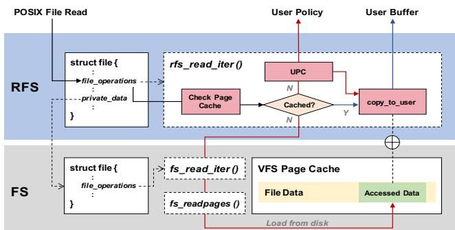  
Figure 3: Implementation of RFS. In read operation, the cache policy is triggered when a cache miss occurs (red arrow); when a hit occurs, data is directly read (blue arrow).

Operation Stacking. RFS provides standard POSIX file semantics, so applications do not require modification. It supports most read-only file operations:

mount / unmount. They are used to associate/disassociate RFS with the namespace of a given underlying file system. The mount process includes two steps: 1) RFS creates the superblock and binds it to the superblock of the underlying file system. 2) RFS initializes a device for UPC (detailed later). The unmount process is straightforward in RFS, requiring only the release of relevant metadata and devices.

open / close. The open operation includes two steps: 1) VFS performs path lookup in the dentry cache. If a component is missing, the lookup operation of RFS creates a new dentry, converts the path into the original path in the underlying file system (by using the original parent dentry recorded in the RFS’s parent dentry), calls the lookup operation in the underlying file system to create the original dentry, and then records the original dentry in the RFS’s dentry. 2) After path lookup, RFS calls the open operation of the underlying file system to create a new original file structure and records it into the file structure created by RFS. In the close operation, it only needs to reclaim the file structures of both RFS and underlying file system.

read. It includes three steps: 1) Based on the given file handle, it obtains the original inode of the underlying file system (recorded in the RFS’s inode) and checks if the target pages are in the VFS page cache by looking up the page index in the original inode. 2) If the I/O misses the page cache, RFS encapsulates the I/O miss information as an event and notifies the cache policy runtime in the userspace for processing via UPC. 3) It finally calls the read operation of the underlying file system to access the requested data.

mmap (page fault). The file mapping process of RFS is similar to the traditional kernel file systems, i.e., creating a VMA and binding it to the page fault operation of RFS.

When users access the mapped address, RFS will perform the page fault operation if the target page table is not mapped. The page fault operation is similar to the read operation in RFS and consists of three steps: 1) It retrieves the original inode recorded in the RFS’s inode and checks whether the target page is in the page cache; if so, it maps the page to the corresponding page table and completes the page fault operation. 2) If the page is missing, it sends the I/O miss event via UPC. 3) It calls the page fault operation of the underlying file system to load the page from disk, and then completes the page mapping.

Other Operations. In addition to the file operations described above, RFS also supports common read-only metadata operations, such as stat, readdir, etc. These operations only need to redirect the data structures related to the operations in RFS (e.g., inode, file, dentry) to their original data structures in the underlying file system and then execute their corresponding functions.

Userspace Procedure Call. Each RFS creates a virtual character device for UPC, and the cache policy runtime in the userspace gets I/O miss events using poll/epoll. The event body includes the original file handle, offset, length, and process ID of the missing I/Os, which will be parsed by the policy runtime in the userspace. Then, the corresponding prefetching and/or eviction functions will be called. UPC ensures performance through two aspects. First, it is non-blocking, so event sending incurs only the overhead of enqueuing. Second, it utilizes per-core queues to enhance concurrency performance. The event queue is implemented through xarray, enabling it to support dynamic length.

## 3.2 Cache Policy Runtime

CPRT adopts the programming style of VFS, i.e., users implement a cache policy by overriding functions defined in the ppc\_operation structure and register it in CPRT. It consists of two components: 1) The policy executor maintains a thread pool to listen for events from RFS’s UPC and convert the event body into function input parameters (e.g., mapping the file handle to the path, aggregating continuous miss I/Os). It is also responsible for orchestrating the user-customized function calls based on I/O miss events and memory space status. 2) The cache manager is used for efficiently loading/reclaiming pages. The programmer only needs to focus on the design of the policy itself and then return the I/Os to be prefetched/evicted to CPRT.

Policy Executor. The user needs to compile the cache policy as a dynamic library and use the reg\_policy to register it into PPC. The registration process uses dlopen to open the dynamic library and overrides the default implementation in the ppc\_operation structure with corresponding functions from the policy. PPC supports changing cache policies on the fly – when the workload changes (e.g., application switching), users can use the rm\_policy to unload the policy and register a new one. Currently, each PPC instance (file namespace) can only register one policy at a time. For scenarios requiring the coexistence of multiple policies, users can split the namespace into several independent sub-namespaces and mount PPC separately, or customize different sub-policies within a single policy based on access paths. Figure 4 shows the programming framework. There are four functions in CPRT that need to be overridden by the user.

```c
1 #include "ppc.h"
2 int init(void* private) {
3 // Initialize the policy by "private"
4 return 0;
5 }
6 int exit(void) {
7 // Clean the environment and exit
8 return 0;
9 }
10 struct prefetch_ios* prefetch(struct miss_io *mio) {
11 // Utilize "mio" to design prefetch policy
12 return ios_for_prefetch;
13 }
14 struct evict_ios* evict(struct miss_io *mio) {
15 // Utilize "mio" to design eviction policy
16 return ios_for_evict;
17 }
18 const struct ppc_operation policy = {
19 .ppc_init = init,
20 .ppc_exit = exit,
21 .ppc_prefetch = prefetch,
22 .ppc_evict = evict,
23 };
24 struct ppc_operation *register_policy() {
25 return (struct ppc_operation *)&policy;
26 }
```  
Figure 4: Pseudo Code of Programming Framework.

ppc\_init() / ppc\_exit(). The ppc\_init() is called once when the policy is registered. The typical usage is for initializing the environment and global data structures during the execution of the policy. The ppc\_exit() is called once when the policy is unloaded from PPC. Its typical usage is for gracefully terminating the cache policy, such as destroying global data structures and environments upon normal exit, and throwing exceptions upon abnormal exit.

ppc\_prefetch(). It will be called every time an I/O miss event is received from UPC, with miss I/O information as the input parameter. For scenarios where I/O behavior can be predicted (e.g., model loading), the policy can directly utilize the miss I/O information to make prefetching decisions. For scenarios where I/O behavior is unpredictable, the policy can perceive application behavior by recording and analyzing historical miss I/O information, thereby guiding its prefetching actions. The function will return a prefetch I/O list, where each element (I/O) consists of the file path, offset, size, and target XPU ID (used for affinity loading). The cache manager will parse and execute the I/Os in the prefetch I/O list.

ppc\_evict(). The policy executor checks memory usage at two points: at fixed intervals and after each I/O miss event is received (before prefetching). If the memory usage exceeds the threshold (e.g., 80%), the eviction function is called. The input parameter is the miss I/O information or NULL (for periodic eviction). Similar to ppc\_prefetch(), the programmer can perceive immediate I/O behavior and utilize it to design the policy, ultimately returning an I/O list for the cache manager to execute the page eviction.

The ppc\_init() and ppc\_exit() do not have a default implementation, and will be bypassed if the user does not define them. PPC will fall back to the eviction policy in the kernel if the ppc\_evict() is not defined. The default implementation of ppc\_prefetch is similar to the mechanism of the kernel.

Cache Manager. It is designed to ensure simple policy programming while maximizing the utilization of the idle I/O resources as much as possible. The outputs of ppc\_evict() and ppc\_prefetch() are merely “recommendations”, and the cache manager will efficiently execute page loading and eviction based on the current system conditions.

For the evictor, PPC directly uses the fadvise to inform the kernel to preemptively release the target pages (with the POSIX\_FADV\_DONTNEED flag). It will mark clean pages as reclaimable (which is not the case for dirty pages), ensuring best-effort but effective reclamation in read-only scenarios (i.e., model loading). In addition, PPC sets the eviction threshold (used memory) below the kernel’s threshold to avoid triggering the native eviction process in the kernel.

For the loader, the fadvise is not sufficient due to its lack of fine-grained I/O control. The loader maintains a core-bound thread pool to ensure full utilization of the SSD concurrency, and RFS provides an ioctl for the loading threads to efficiently call the page loading process of the underlying file system. In addition, the loader provides two important features. 1) XPU affinity awareness. The policy can specify the XPU affinity for the data to be prefetched, and the loader will parse the XPU topology and load the data into the NUMA node where the target XPU resides. 2) Interruptible. For simplicity in programming, PPC assumes that the policy is unaware of the system state, which may lead to aggressive issuance of prefetch I/O. The loader will interrupt the ongoing loading process when memory usage exceeds the threshold, I/O bandwidth is insufficient, or a new prefetch request is triggered while there are no available threads in the thread pool (e.g., in cases where prefetching is slower than front-end loading).

Programming Example. As an example, consider a simple cache policy: prefetching/evicting a contiguous segment of data behind/ahead of the cache miss location. In this policy, the ppc\_prefetch/evict function shifts the positions in the miss\_io structure rightward/leftward to calculate the positions of the data to be prefetched/evicted, and then adds these positions to the I/O list (ios\_for\_prefetch/evict). Then, PPC parses the returned I/O list and performs the corresponding prefetch/eviction operation. In addition, the core mechanism of PPC is not only applicable to traditional local file systems, but it can also be easily extended in the future to support other storage architectures, such as distributed file systems [3, 14, 34] and heterogeneous memory file systems [22, 30, 36].

## 3.3 Security and Reliability

PPC does not compromise the security of the kernel file system because it still maintains the isolation between the userspace and the kernel. CPRT and the userspace policy do not directly access or modify the metadata and data of the kernel file system but instead interact with the kernel using poll/epoll, which is the traditional mechanism for userspace-kernel communication. At the same time, the functions in the policy run entirely in the userspace. In addition, PPC ensures strong reliability from two aspects. First, it can tolerate programming faults. The policy execution is decoupled from the kernel file system and the application, and the enforcement of the policy (e.g., prefetch, eviction) is achieved through standard system calls. Therefore, programming bugs will only affect the processes running the policies and will not impact the kernel and the application. Second, it has no impact on the crash consistency. RFS does not alter the native synchronization mechanism between the memory and disk of the underlying file system.

## 4 Case Study: Model-Accelerated I/O

This section introduces MAIO (Model-Accelerated I/O), an advanced cache policy based on PPC. It can perceive the I/O characteristics of model loading across different inference services and adaptively optimize I/O behavior, while ensuring strong compatibility.

## 4.1 Model Loading Optimized Policy

The inspiration for MAIO stems from a phenomenon – the I/O pattern of model loading can be the same across identical LLM inference services, and identical services imply that the models and runtime parameters (e.g., tensor parallelism and PD disaggregation configurations) they utilize are the same. At the same time, the MaaS system typically pre-builds templates for LLM inference services to enable elastic deployment. These observations lead to our optimization principle – pre-building a template of the I/O pattern for each service, and then implementing an advanced policy that can automatically generate/parse I/O templates and perform specific I/O optimizations for different LLM inference services.

The high-level operational logic of MAIO is as follows. Before each inference service starts, the operator (e.g., MaaS platform) calls reg\_policy to launch MAIO with the MAIO dynamic library, model path, and service ID as parameters. The service ID is the hash value calculated by concatenating the runtime parameters of the inference service (e.g., model name, TP size, PD size). During initialization, MAIO checks whether the target service ID has a corresponding I/O template. If not, it executes the template generation process; otherwise, it performs the template-based cache policy.

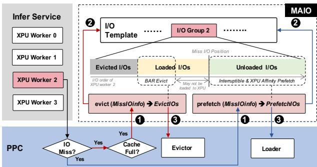  
Figure 5: Implementation of MAIO. The prefetch/eviction function first parses the I/O miss event, then identifies the I/O group to which the miss I/O belongs, and finally executes the policy logic to return the list of I/Os to be prefetched/evicted.

I/O Template Generation. As shown in Figure 5, each LLM inference service is associated with an I/O template, which records the I/O sequence of each XPU worker during the model loading. The inference framework assigns a worker (host-side process) to each XPU to load the required model weights to the device. The MaaS platform will assign an XPU list to the inference service, and the inference framework will bind each XPU worker to the XPU in the list in a round-robin manner and incrementally assign a logical ID (starting from 0). To support refined policy design and multi-node inference, the I/O template is divided into multiple I/O groups based on the XPU worker ID. Each group contains multiple tuples and each tuple contains information about an I/O operation, including the file path, offset, and size of the accessed data. MAIO stores the I/O templates as files, and they can be kept in local or shared remote storage.

MAIO performs I/O template detection within the ppc\_init() function and executes the generation process if the target template does not exist. MAIO achieves I/O template generation by implementing a special ppc\_prefetch() function. Since PPC calls ppc\_prefetch for each I/O miss and passes the I/O information as its input parameter, MAIO can utilize the parameter to generate the I/O template and simply set the return value to NULL (without performing prefetch). Specifically, MAIO establishes the mapping between the I/O and the XPU worker ID by matching the process ID (PID) in the I/O information with the processes running on the XPUs. In the MaaS platform, I/O template generation can be integrated into the pre-built process of service templates.

Template-based Cache Policy. The I/O template presents opportunities for optimizing cache policy for model loading because it allows the policy to accurately predict the I/O behavior. Figure 5 shows the execution steps. ❶ The ppc\_prefetch()/ppc\_evict() function is called by PPC. ❷ The policy identifies the XPU worker ID associated with the I/O miss event, in order to decide which I/O group should be used. It first identifies the XPU where the I/O’s PID (from the input I/O information) resides, then obtains the XPU worker ID based on the XPU topology of the inference service. ❸ MAIO performs the prefetch/eviction policy based on the I/O group corresponding to the XPU worker. MAIO proposes the following three mechanisms:

1) Interruptible Prefetching. Each time an I/O miss event triggers ppc\_prefetch(), MAIO locates the miss I/O within the I/O group and then prefetches data from that position based on the sequence in the I/O group. A challenge is determining the prefetch size. A large prefetch size may lead to competition with front-end I/Os. For example, prefetching will result in redundant data loading if it lags behind the progress of the inference framework. However, a small prefetch size will result in insufficient bandwidth utilization. Benefiting from the interruptible nature of the PPC loader, MAIO can aggressively set the prefetch size from the I/O miss location to the end of the I/O group. When a new I/O miss is triggered during the prefetch (when the front-end I/O is faster than the prefetch I/O), the ppc\_prefetch() will be called again, and the starting position of the prefetch will jump to the latest position of the front-end I/O. The PPC loader will then interrupt the old prefetch request to execute a new one, thereby avoiding redundant loading. In addition, interruptions can also be triggered when memory is insufficient.

2) XPU Affinity Loading. During the prefetching process, MAIO further controls the memory location where data is loaded to enhance the subsequent transmission efficiency between DRAM and XPUs. For each ppc\_prefetch() call, MAIO can dynamically detect the destination XPU of the data. The I/O template stores the mapping between data and logical Worker IDs (each XPU corresponds to one worker). Worker IDs are strictly increasing and are one-to-one mapped to the increasing XPU numbers (the same worker loads the same data each time). During loading, MAIO locates the target XPU based on the Worker ID to which the data belongs (because MAIO knows the XPUs being used, the new Worker ID-XPU mapping can be obtained). Then, it finds the NUMA node that is affine to the target XPU. The XPU affinity feature of the PPC loader ensures that prefetched data is loaded into the NUMA node associated with the target XPU.

3) “Burn-after-Reading” Eviction. In typical model loading, the model data remains in the devices’ HBM after being loaded to the target XPUs, after which the host-side cache holds little value. Since the front-end model loading I/Os are executed in the order of the sequence in the I/O group, the data before the miss I/O position is likely cold. MAIO designs the BAR (Burn-after-Reading) eviction policy based on this characteristic. MAIO maintains an eviction cursor to distinguish between evicted and non-evicted data. When ppc\_evict() is called, it evicts data between the current miss I/O position and the eviction cursor, and updates the cursor. However, data near the current miss I/O position may not yet have been loaded into the XPU. To reduce the possibility of cache thrashing,

MAIO maintains a distance (1GB by default) between the end of the eviction and the current miss I/O position. The BAR distance is an empirical value that ensures no cache thrashing in the scenarios we have verified.

Comparison with Other Policies. MAIO has significant advantages compared to existing cache policies for file systems:

vs. Prediction-based Policies. This is the most widely applied type of policy, including the native kernel cache policy and its various optimized versions (e.g., CrossPrefetch [11]). They often employ sampling in conjunction with traditional heat-based cache algorithms (e.g., LRU, LFU, ARC [23]) to manage cache, which fails to accurately perceive the I/O characteristics in the model loading scenario, resulting in low efficiency in prefetching and eviction. In contrast, the template-based approach of MAIO can accurately perceive the I/O characteristics of model loading, encompassing not only access timing but also XPU affinity and data lifecycle.

vs. Experience-based Policies. This type of policy employs a mechanism independent of the file system to perform prefetching/eviction based on user experience, e.g., blindly prefetching all data under the target path. For example, many container image loading optimizations [13, 20, 21] specify data priorities for precise prefetching (e.g., manually setting the priority of files). However, these policies are suboptimal for model loading. First, the I/O characteristics vary depending on the deployment form and model structure, making it difficult to be accurately perceived by the user. Second, the lack of collaboration between the prefetching process and front-end I/Os may lead to additional I/O contention. These two shortcomings are well addressed in MAIO.

vs. LLM Framework-embedded Policies. This type of policy (e.g., ServerlessLLM [9]) embeds a cache policy into the model loading logic of the inference framework, enabling it to precisely perceive the I/O characteristics. Despite their incompatibility, they still have shortcomings. First, they cannot fully utilize idle bandwidth during stages other than model loading, such as container startup and inference service initialization stages. Second, the existing works in this type lack consideration of eviction policy. Compared to these works, MAIO has higher prefetching and eviction efficiency.

## 4.2 Discussion

The following discussion arises from the design and industrial practice of MAIO:

Inference Service Dependence. Thanks to the strong compatibility of MAIO, it can be run on any hardware and any inference software stack. Its primary dependency is the specification of the LLM inference service, such as the configuration of tensor parallelism and prefill-decode disaggregation, as it affects the I/O template (i.e., data that each XPU needs to load). For a service, the I/O template and MaaS template are associated through the service ID and share the same lifecycle. The MaaS platform can sense specification changes and invoke the PPC interfaces to regenerate the I/O template, while MAIO does not need to bear the overhead of managing the lifecycle of I/O templates.

Complexity of Policy Programming. MAIO provides OS developers with an automatic optimization policy for model loading (without detailed knowledge of the model). Even without MAIO, upper-level users can also easily utilize PPC to implement policies that meet their customized needs. Unlike related technologies (e.g., eBPF, FUSE), PPC does not require programmers to be familiar with the OS and storage systems; they only need to implement the cache algorithm itself. Simplified programming can bring more possibilities for I/O optimization, e.g., model developers can directly program the cache policies based on the model structures.

Resource Contention. Since MAIO is per-service, there may be resource contention (e.g., I/O, CPU) among multiple MAIO instances when the node runs multiple inference services simultaneously. For containerized (mainstream) scenarios, each MAIO instance and its target service run in the same cgroup, which reuses the mature QoS control mechanisms of cloud platforms. For bare-metal scenarios, a feasible approach to handle resource contention is to add MAIO instances to different cgroups and achieve QoS control by configuring the cgroup parameters, which will be our future work.

Hardware-Agnostic. The designs of MAIO are suitable for mainstream accelerators (e.g., GPU, NPU). First, only the host-to-device transfer of accelerator affects model loading, while using PCIe and integrating with host’s NUMA topology is a general architecture. Second, MAIO does not rely on hardware-specific features of the accelerator.

## 4.3 Industrial Practice

MAIO has been deployed in Intelligence BooM [28], an integrated inference solution designed for enterprise private data centers. Intelligence BooM adopts the MaaS concept, providing simple APIs for customers with one-click deployment of inference services. In the customer’s cluster, each node is equipped with eight Ascend 910B3 NPUs interconnected via HCCS and four 48-core Kunpeng 920 5250 CPUs @ 2.6GHz, while nodes are interconnected through RDMA. The inference services are deployed as containers, and they are orchestrated and scheduled through Kubernetes [18] and Ray [1]. The inference framework adopts vLLM-Ascend [33], which operates on top of MindSpore [24]. In customer scenarios, they use different models for various businesses (e.g., Agentic AI), so the inference service needs to adopt elastic deployment to improve resource utilization. This makes the performance of inference startup a critical metric.

Integration & Performance. MAIO can be seamlessly integrated into this industrial solution for model loading acceleration. We run PPC on the host OS of each node, while allowing the control plane of Intelligence BooM to start/stop MAIO through the APIs of PPC. MAIO is added to the same cgroup as its accelerated inference service. The I/O templates are stored on NFS, allowing them to be shared by all nodes. We evaluate the benefit of MAIO in Intelligence BooM by launching the DeepSeek-R1-671B inference service from a cold start. The service runs on two nodes (16 NPUs), while the model is stored on the local SSDs. Compared to directly loading from the local file system, MAIO can reduce the model loading latency from 649 seconds to 452 seconds. MAIO is even faster than fully caching the model in DRAM that has a latency of 561 seconds, primarily due to the stacking of extensive I/Os and other processes of model loading (e.g., model metadata parsing), while the XPU affinity accelerates the transmission between the host and NPUs. It is noteworthy that in this customer scenario, MAIO has almost hidden the I/O overhead from model loading, with the primary cost stemming from tensor formatting in MindSpore.

(a) Model Loading Latency (no memory constraint)  
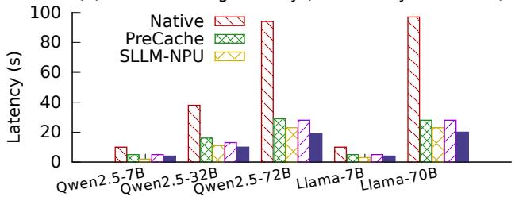

(b) Model Loading Latency (64G memory constraint)  
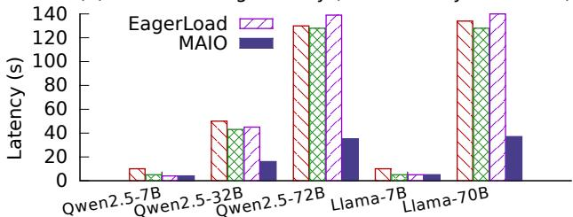  
Figure 6: Model Loading Latency of Various Models.

(a) Total Startup Latency (no memory constraint)  
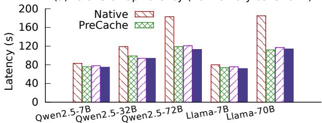

(b) Total Startup Latency (64G memory constraint)  
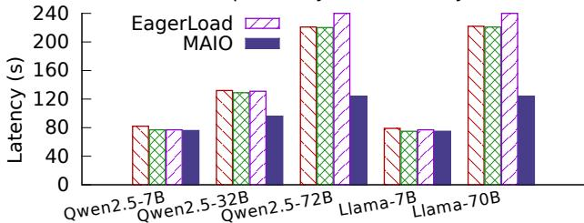  
Figure 7: Inference Startup Latency of Various Models.

## 5 Evaluation

All experiments are run on a node with four 48-core Kunpeng 920 5250 CPUs @ 2.60GHz, eight Ascend 910B2 NPUs, 1TB DRAM, and 3.75TB SSD. The software stack includes vLLM-Ascend 0.9.2, PyTorch 2.5.1, and Linux kernel 5.10. Unless otherwise specified, the inference service is deployed as a container and runs on four NPUs. We compare MAIO with typical model loading optimizations, including both compatible and incompatible optimizations.

Compatible Optimizations. Optimizations in this category do not require intrusive modifications to the kernel and/or inference framework, and they are compatible with any hardware, any inference software stack, and any model format. There are three contrasting optimizations within this category: Native – it keeps the model on the disk and uses native cache policy of the kernel file system. EagerLoad – we implement a simple policy that prefetches the model in one go when the first I/O is triggered (using UPC), without eviction optimization. PreCache – it pre-caches the entire model into memory, completely eliminating disk I/O during the model loading at the cost of significant memory capacity. It is noteworthy that MAIO also belongs to this category.

Incompatible Optimization. The optimizations in this category have a different design principle compared to MAIO. They exhibit a strong dependency on both hardware and software, and the vast majority cannot be run on our NPU-based testbed. We select ServerlessLLM [9] as the representative, which is a state-of-the-art incompatible optimization. It is noteworthy that ServerlessLLM sacrifices certain aspects in exchange for performance, which is unnecessary for the evaluated compatible optimizations. First, it requires converting the model format. Second, it requires the host’s free memory to exceed the model size and have additional HMB space, as it needs to pre-allocate and pin memory for DMA. We use SLLM-NPU for evaluation, which is the version of Serverless-LLM [9] adapted for NPU (by its authors). However, due to the high difficulty of adaptation, it has some bugs and can only run with Transformers (vLLM unsupported). Therefore, we can only evaluate the model loading performance of SLLM-NPU in scenarios with sufficient memory. Another incompatible optimization, BlitzScale [39], is not included in the comparison because it primarily optimizes model sharing between nodes (which is orthogonal to MAIO) and relies on the specific hardware.

## 5.1 Performance

## 5.1.1 Model Loading Latency

We select five popular models to evaluate the performance, including small (Qwen2.5-7B, Llama-7B), medium (Qwen2.5-32B), and large (Qwen2.5-72B, Llama-70B)

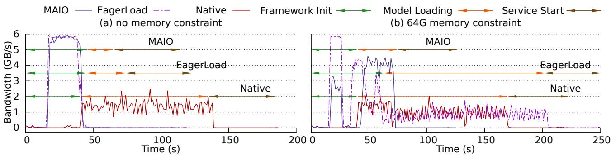  
Figure 8: SSD Bandwidth Utilization of Inference Startup.

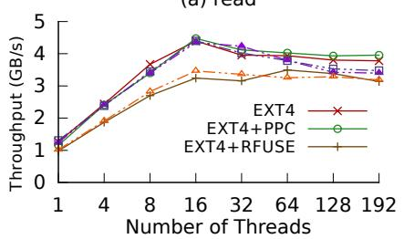

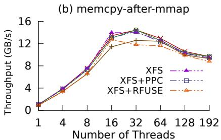  
Figure 9: Overhead of PPC.

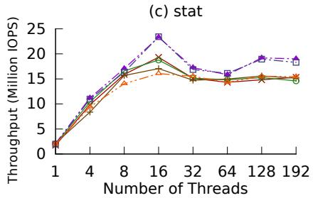

sizes. The experiments consider scenarios with both sufficient and constrained host memory. For the memory-constrained scenario, we restricted the available memory for model loading to 64GB using cgroup, a value chosen based on our experience with real-world workloads.

Figure 6(a) shows the results in the sufficient memory scenario. MAIO is up to 79% faster than Native in model loading. The primary benefit stems from the prefetch optimization in MAIO, which allows for more efficient utilization of SSD bandwidth. EagerLoad accelerates model loading compared to Native because it hides the I/O overhead to some extent. However, EagerLoad is up to 32% slower than MAIO, because it cannot perform precise prefetching. PreCache improves performance at the cost of increased memory usage (i.e., the entire model is cached in memory), but it is still up to 37% slower than MAIO, due to insufficient consideration of XPU affinity. Compared to the incompatible optimization, MAIO reduces latency by up to 17% over SLLM-NPU in the large model scenarios. The reason is that MAIO can sense and trigger prefetching during the first access of the file system by the inference framework, allowing I/O overhead to be overlapped with more processes of the inference framework (e.g., container initialization, model structure parsing). In contrast, SLLM-NPU only performs prefetching during the model loading stage (by modifying the inference framework), thus failing to fully utilize the idle SSD bandwidth.

Figure 6(b) shows the results in the memory-constrained scenario. MAIO reduces latency by up to 74% compared to other evaluated solutions. It is noteworthy that PreCache and EagerLoad do not show a significant advantage over Native. The reason lies in the fact that they cause severe cache thrashing in the memory-constrained scenario. For PreCache, the cache is pre-filled with a portion of the model data, and if the I/O for model loading incurs a cache miss, it will trigger the kernel’s native eviction mechanism to discard data that may be used in the future. For EagerLoad, simple batch prefetching leads to the eviction of data that has already been prefetched but not yet used. In contrast, the BAR eviction and interruptible prefetching in MAIO perceives the real-time state of memory usage and model loading process, thereby achieving more efficient I/O control.

## 5.1.2 Inference Startup Latency

The process of starting the inference service not only includes model loading but also involves the initialization of the inference framework (e.g., container initialization.) and the startup of the inference service (e.g., KV cache initialization). Figure 7(a) shows the results in the sufficient memory scenario. MAIO delivers up to 38% latency reduction over Native, thanks to faster model loading. Compared to PreCache and EagerLoad, MAIO offers up to 6.6% performance improvement. It is noteworthy that PreCache requires a significant amount of memory to achieve this performance, thereby reducing the available capacity of the KV cache during the inference process. Figure 7(b) shows the results in the memoryconstrained scenario. Compared to other comparative solutions, MAIO reduces latency by up to 51% due to its significant performance advantage in model loading.

## 5.1.3 Bandwidth Utilization

We analyze the benefits of MAIO by sampling the SSD bandwidth (1 second interval) during the end-to-end startup process of the inference service. The horizontal lines in Figure 8 mark the different stages, including framework initialization, model loading, and service start. The experiments are run on Qwen2.5-72B, considering both sufficient and constrained memory scenarios.

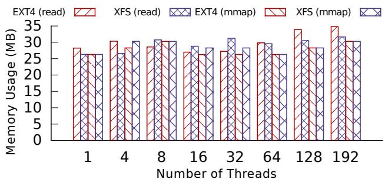  
Figure 10: Memory Overhead of PPC.

Figure 8(a) shows the results in the sufficient memory scenario. In Native, I/Os are concentrated during the model loading stages, and they cannot fully utilize the SSD bandwidth during the framework initialization and model loading stages. The reason is that the native prefetching policy of the kernel only prefetches a segment of data adjacent to the triggered I/O (within the same file), and it cannot leverage the high concurrency advantages of SSD. In contrast, the I/O operations of EagerLoad and MAIO are concentrated during the framework initialization stage and (almost) fully utilize the maximum bandwidth of the SSD, which results in nearly all I/Os during the model loading stage being cache hits. The reason is that PPC will detect and trigger user-defined prefetching functions while employing high-concurrency loading when the inference framework first accesses the file system. In this scenario, the performance advantage of MAIO over EagerLoad primarily stems from the design of XPU affinity loading.

Figure 8(b) shows the results in the memory-constrained scenario. The bandwidth utilization of Native is worse compared to when memory is sufficient, due to the overhead introduced by eviction. However, the performance of EagerLoad is the worst in this scenario. EagerLoad employs the native eviction mechanism in the kernel and lacks precise prefetching control, causing it to blindly load and evict data during the framework initialization stage. This results in more severe cache thrashing for EagerLoad during the model loading stage compared to Native. In contrast, MAIO does not utilize the full bandwidth but offers the shortest latency in this scenario, because it will evict already used data based on the current I/O position in the I/O template, while also controlling the size of the prefetching I/Os.

## 5.2 Design Analysis

## 5.2.1 Overhead of PPC

To evaluate the impact of PPC on file access, we implement an empty policy on PPC, which only receives I/O miss events from PPC without performing any operations. We run the empty policy (and PPC) on typical kernel file systems (EXT4 and XFS) and compare the file access performance differences between scenarios with and without PPC. We also compare RFUSE [6] (an optimized version of FUSE) to demonstrate the differences between PPC and existing compatibility programming framework. All comparison systems adopt the native cache policy (prefetching and eviction) of the kernel. We sequentially perform read and memcpy-after-mmap with 1MB I/Os on a 10GB file to evaluate the read performance, and perform stat on a directory containing 1K files to evaluate the metadata performance.

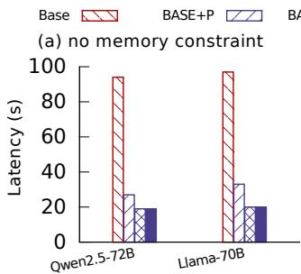

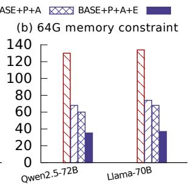  
Figure 11: Performance Breakdown of MAIO.

The overhead of PPC consists mainly of RFS and CPRT. Thanks to the lightweight stacking and non-blocking UPC mechanism, the additional overhead introduced by PPC is small. Figure 9 shows the results. Taking the memcpy-after-mmap case as an example, on EXT4 (XFS), PPC introduces an overhead of up to 3.7% (6.4%), whereas RFUSE introduces an overhead of up to 14% (15%). The results also demonstrate that PPC does not negatively impact the scalability of the underlying file system. Because RFS does not change the concurrency mechanism of the file system, while CPRT has good scalability.

## 5.2.2 Memory and CPU Overhead

We further analyze the memory and CPU overhead caused by PPC. To demonstrate memory overhead, we measure the memory usage of the PPC process (excluding the VFS page cache) under the read and memcpy-after-mmap scenarios in the experiments described in § 5.2.1. Figure 10 shows that the memory overhead of PPC is small (around 30MB), and is not significantly affected by access patterns or concurrency. This is because the memory overhead mainly comes from the metadata of RFS and event messages of UPC, which are compact in size. The CPU overhead mainly comes from UPC event listening and data loading. The overhead of UPC event listening is about 1% to 11% (varying with concurrency) in the read and memcpy-after-mmap scenarios, while the overhead of data loading is closely related to the application workload (e.g., the data volume, I/O pattern).

## 5.2.3 Performance Breakdown of MAIO

MAIO consists of three core designs: interruptible prefetching, XPU affinity loading, and BAR eviction. We incrementally enable these three designs into the baseline to demonstrate their respective contributions to performance, with the baseline being the direct use of the kernel file system. We conduct experiments using Qwen2.5-72B and Llama-70B under different memory capacities. Figure 11(a) shows the results in the sufficient memory scenario. Compared to the baseline, the model loading latency is decreased by more than 65% by enabling the interruptible prefetching (Base+P), and further enabling the XPU affinity loading (Base+P+A) can reduce the latency by more than 8.5% on this basis. However, enabling the BAR eviction (Base+P+A+E) has little impact on performance improvement, as the eviction policy is not the core bottleneck in the sufficient memory scenario. Figure 11(b) shows the results in the memory-constrained scenario. For Qwen2.5-72B (Llama-70B), gradually enabling the interruptible prefetching, XPU affinity loading, and BAR eviction brings about more than 47% (44%), 6% (4%), and 19% (23%) stacking improvements compared to the baseline, respectively, indicating that all designs have significant benefits.

Table 3: Size of I/O Template.
<table><tr><td>Model</td><td>Spec.</td><td>Model Size</td><td>I/O Temp. Size</td></tr><tr><td>Qwen2.5-7B</td><td rowspan="4">Node=1 TP=4</td><td>15GB</td><td>11KB</td></tr><tr><td>Qwen2.5-32B</td><td>62GB</td><td>32KB</td></tr><tr><td>Qwen2.5-72B</td><td>136GB</td><td>95KB</td></tr><tr><td>Llama-7B</td><td>15GB</td><td>14KB</td></tr><tr><td>Llama-70B</td><td></td><td>132GB</td><td>118KB</td></tr><tr><td>DeepSeek-R1-671B</td><td>Node=2 TP=16</td><td>662GB</td><td>545KB</td></tr></table>

## 5.2.4 Storage Overhead of I/O Template

The optimization of MAIO relies on I/O templates, which introduces additional storage overhead. Table 3 presents the I/O template sizes for several inference services. Even a model with hundreds of billions of parameters like DeepSeek-R1-671B has an I/O template size of only 545KB. This is because the information in the I/O template is highly compact, and the template generation in MAIO further consolidates consecutive I/Os. In addition, the I/O template size does not change with variations in the deployment form (e.g., different tensor parallelism sizes) of the inference service. This experiment demonstrates that the storage overhead of the I/O template is almost negligible.

## 5.3 Real-World Application

We evaluate the benefit of MAIO on end-to-end inference throughput in the elastic deployment workload, which is a critical scenario in MaaS systems. In the experiments, Qwen2.5-72B, Llama-70B, and Qwen2.5-72B are run in sequence, with each inference service going through three stages: startup, inference execution, and then destruction. We adjust the interval of the inference execution stage (from 2min to 15min) and calculate the average token throughput for the entire elastic deployment process. ShareGPT [31] is used as the input prompts for the inference execution stage.

(a) no memory constraint  
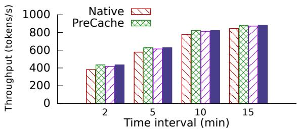

(b) 64G memory constraint  
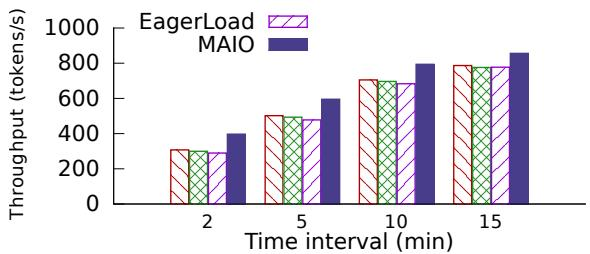  
Figure 12: Inference Throughput in the MaaS Workload.

Figure 12 shows the results. Compared to Native, MAIO can deliver up to 13% and 28% throughput improvements in scenarios with sufficient and insufficient memory, respectively. Meanwhile, the performance advantage of MAIO diminishes as the elastic interval increases, due to the reduced proportion of model loading overhead. Compared to PreCache and EagerLoad, MAIO does not show significant advantages in the sufficient memory scenario, but it offers an average performance improvement of 19% and 21% in the insufficient memory scenario. Additionally, we have gained two insights from industrial practice. Firstly, the PreCache solution is impractical in the real-world system due to the massive volume of model data. Secondly, the insufficient memory scenario is common in real-world workloads.

## 6 Conclusion

Model loading is a critical bottleneck in inference service startup. However, existing optimizations for model loading lack compatibility, thereby limiting their application scenarios. This work accelerates model loading by optimizing the page cache policy of the file system and strives to ensure compatibility with the inference ecosystem, OS, and hardware. We propose PPC, an efficient programmable page cache framework that allows users to customize the kernel’s cache policy. Furthermore, we design MAIO based on PPC, a cache policy optimized for model loading. The evaluation shows that MAIO significantly improves the model loading performance compared with the existing solutions in many scenarios.

## Acknowledgments

We thank our shepherd Uday Kiran Jonnala and the anonymous reviewers for their constructive comments and feedback. We also thank our colleagues in the Huawei OS Kernel Lab for their support. Yuxin Ren is the corresponding author.

## References

[1] Anyscale. Ray Serve: Scalable and programmable serving. https://docs.ray.io/en/latest/serve/ index.html, September 2025.

[2] Ashish Bijlani and Umakishore Ramachandran. Extension framework for file systems in user space. In Proceedings of the USENIX Annual Technical Conference (ATC), 2019.

[3] Peter Braam. The Lustre storage architecture. arXiv preprint arXiv:1903.01955, 2019.

[4] Xuechun Cao, Shaurya Patel, Soo Yee Lim, Xueyuan Han, and Thomas Pasquier. FetchBPF: Customizable prefetching policies in Linux with eBPF. In Proceedings of the USENIX Annual Technical Conference (ATC), 2024.

[5] Mark Chen, Jerry Tworek, Heewoo Jun, Qiming Yuan, Henrique Ponde de Oliveira Pinto, Jared Kaplan, Harri Edwards, Yuri Burda, Nicholas Joseph, Greg Brockman, Alex Ray, Raul Puri, Gretchen Krueger, Michael Petrov, Heidy Khlaaf, Girish Sastry, Pamela Mishkin, Brooke Chan, Scott Gray, Nick Ryder, Mikhail Pavlov, Alethea Power, Lukasz Kaiser, Mohammad Bavarian, Clemens Winter, Philippe Tillet, Felipe Petroski Such, Dave Cummings, Matthias Plappert, Fotios Chantzis, Elizabeth Barnes, Ariel Herbert-Voss, William Hebgen Guss, Alex Nichol, Alex Paino, Nikolas Tezak, Jie Tang, Igor Babuschkin, Suchir Balaji, Shantanu Jain, William Saunders, Christopher Hesse, Andrew N. Carr, Jan Leike, Josh Achiam, Vedant Misra, Evan Morikawa, Alec Radford, Matthew Knight, Miles Brundage, Mira Murati, Katie Mayer, Peter Welinder, Bob McGrew, Dario Amodei, Sam McCandlish, Ilya Sutskever, and Wojciech Zaremba. Evaluating large language models trained on code. arXiv preprint arXiv:2107.03374, 2021.

[6] Kyu-Jin Cho, Jaewon Choi, Hyungjoon Kwon, and Jin-Soo Kim. RFUSE: Modernizing userspace filesystem framework through scalable Kernel-Userspace communication. In Proceedings of the USENIX Conference on File and Storage Technologies (FAST), 2024.

[7] Alibaba Cloud. Bailian. https://bailian.console. aliyun.com/, September 2025.

[8] Huawei Cloud. ModelArts. https://www. huaweicloud.com/product/modelarts.html, September 2025.

[9] Yao Fu, Leyang Xue, Yeqi Huang, Andrei-Octavian Brabete, Dmitrii Ustiugov, Yuvraj Patel, and Luo Mai. ServerlessLLM: Low-latency serverless inference for

large language models. In Proceedings of the USENIX Symposium on Operating Systems Design and Implementation (OSDI), 2024.

[10] Wensheng Gan, Shicheng Wan, and Philip S. Yu. Modelas-a-Service (MaaS): A survey. In Proceedings of the IEEE International Conference on Big Data (BigData), 2023.

[11] Shaleen Garg, Jian Zhang, Rekha Pitchumani, Manish Parashar, Bing Xie, and Sudarsun Kannan. CrossPrefetch: Accelerating I/O prefetching for modern storage. In Proceedings of the ACM International Conference on Architectural Support for Programming Languages and Operating Systems (ASPLOS), 2024.

[12] GitHub. Copilot. https://github.com/features/ copilot, September 2025.

[13] Tyler Harter, Brandon Salmon, Rose Liu, Andrea C. Arpaci-Dusseau, and Remzi H. Arpaci-Dusseau. Slacker: Fast distribution with lazy docker containers. In Proceedings of the USENIX Conference on File and Storage Technologies (FAST), 2016.

[14] Frank Herold and Sven Breuner. An introduction to BeeGFS. https://www.beegfs.io/docs/ whitepapers/Introduction\_to\_BeeGFS\_by\_ ThinkParQ.pdf, June 2018.

[15] Junhao Hu, Jiang Xu, Zhixia Liu, Yulong He, Yuetao Chen, Hao Xu, Jiang Liu, Jie Meng, Baoquan Zhang, Shining Wan, Gengyuan Dan, Zhiyu Dong, Zhihao Ren, Changhong Liu, Tao Xie, Dayun Lin, Qin Zhang, Yue Yu, Hao Feng, Xusheng Chen, and Yizhou Shan. DeepServe: Serverless large language model serving at scale. In Proceedings of the USENIX Annual Technical Conference (ATC), 2025.

[16] Qianbo Huai, Windsor Hsu, Jiwei Lu, Hao Liang, Haobo Xu, and Wei Chen. XFUSE: An infrastructure for running filesystem services in user space. In Proceedings of the USENIX Annual Technical Conference (ATC), 2021.

[17] Linux Kernel. OverlayFS. https://docs.kernel. org/filesystems/overlayfs.html, September 2025.

[18] Kubernetes. Production-grade container orchestration. https://kubernetes.io/, September 2025.

[19] Woosuk Kwon, Zhuohan Li, Siyuan Zhuang, Ying Sheng, Lianmin Zheng, Cody Hao Yu, Joseph E. Gonzalez, Hao Zhang, and Ion Stoica. Efficient memory management for large language model serving with PagedAttention. In Proceedings of the ACM Symposium on Operating Systems Principles (SOSP), 2023.

[20] Huiba Li, Yifan Yuan, Rui Du, Kai Ma, Lanzheng Liu, and Windsor Hsu. DADI: Block-level image service for agile and elastic application deployment. In Proceedings of the USENIX Annual Technical Conference (ATC), 2020.

[21] Yubo Liu, Hongbo Li, Mingrui Liu, Rui Jing, Jian Guo, Bo Zhang, Hanjun Guo, Yuxin Ren, and Ning Jia. FlacIO: Flat and collective I/O for container image service. In Proceedings of the USENIX Conference on File and Storage Technologies (FAST), 2025.

[22] Yubo Liu, Yuxin Ren, Mingrui Liu, Hongbo Li, Hanjun Guo, Xie Miao, Xinwei Hu, and Haibo Chen. Optimizing file systems on heterogeneous memory by integrating DRAM cache with virtual memory management. In Proceedings of the USENIX Conference on File and Storage Technologies (FAST), 2024.

[23] Nimrod Megiddo and Dharmendra S. Modha. ARC: A Self-Tuning, low overhead replacement cache. In Proceedings of the USENIX Conference on File and Storage Technologies (FAST), 2003.

[24] MindSpore. Open source deep learning training/inference framework. https://www.mindspore.cn/en, September 2025.

[25] NVIDIA. NVLink. https://www.nvidia.com/ en-us/data-center/nvlink/, September 2025.

[26] OpenAI. Introducing ChatGPT. https://openai. com/blog/chatgpt/, September 2025.

[27] OpenAI. OpenAI. https://openai.com/, September 2025.

[28] openEuler. Intelligence BooM. https://atomgit. com/openeuler/llm\_solution, September 2025.

[29] Niki Rahimi. fadvise(2) - Linux man page. https:// linux.die.net/man/2/fadvise, September 2025.

[30] Yuxin Ren, Mingrui Liu, Hongbo Li, Chang Liao, Xiaojia Huang, Jianhua Zhang, Hanjun Guo, Yubo Liu, and Ning Jia. Towards rack-as-a-computer in memory interconnect era with coordinated operating system sharing. In Proceedings of the Conference on Hot Topics in Storage and File Systems (HotStorage), 2025.

[31] ShareGPT. ShareGPT. https://huggingface.co/ datasets/anon8231489123/ShareGPT\_Vicuna\_ unfiltered, September 2025.

[32] Hugo Touvron, Louis Martin, Kevin Stone, Peter Albert, Amjad Almahairi, Yasmine Babaei, Nikolay Bashlykov, Soumya Batra, Prajjwal Bhargava, Shruti Bhosale, Dan Bikel, Lukas Blecher, Cristian Canton Ferrer, Moya

Chen, Guillem Cucurull, David Esiobu, Jude Fernandes, Jeremy Fu, Wenyin Fu, Brian Fuller, Cynthia Gao, Vedanuj Goswami, Naman Goyal, Anthony Hartshorn, Saghar Hosseini, Rui Hou, Hakan Inan, Marcin Kardas, Viktor Kerkez, Madian Khabsa, Isabel Kloumann, Artem Korenev, Punit Singh Koura, Marie-Anne Lachaux, Thibaut Lavril, Jenya Lee, Diana Liskovich, Yinghai Lu, Yuning Mao, Xavier Martinet, Todor Mihaylov, Pushkar Mishra, Igor Molybog, Yixin Nie, Andrew Poulton, Jeremy Reizenstein, Rashi Rungta, Kalyan Saladi, Alan Schelten, Ruan Silva, Eric Michael Smith, Ranjan Subramanian, Xiaoqing Ellen Tan, Binh Tang, Ross Taylor, Adina Williams, Jian Xiang Kuan, Puxin Xu, Zheng Yan, Iliyan Zarov, Yuchen Zhang, Angela Fan, Melanie Kambadur, Sharan Narang, Aurelien Rodriguez, Robert Stojnic, Sergey Edunov, and Thomas Scialom. Llama 2: Open foundation and fine-tuned chat models. arXiv preprint arXiv:2307.09288, 2023.

[33] vLLM. vLLM Ascend plugin. https://github.com/ vllm-project/vllm-ascend, September 2025.

[34] Sage A. Weil, Scott A. Brandt, Ethan L. Miller, Darrell D. E. Long, and Carlos Maltzahn. Ceph: A scalable, high-performance distributed file system. In Proceedings of the USENIX Conference on Operating Systems Design and Implementation (OSDI), 2006.

[35] Jing Xia, Chuanning Cheng, Xiping Zhou, Yuxing Hu, and Peter Chun. Kunpeng 920: The first 7-nm chipletbased 64-core arm soc for cloud services. IEEE Micro, 41(5):67–75, 2021.

[36] Jian Xu and Steven Swanson. NOVA: A log-structured file system for hybrid volatile/non-volatile main memories. In Proceedings of the USENIX Conference on File and Storage Technologies (FAST), 2016.

[37] Yanan Yang, Laiping Zhao, Yiming Li, Huanyu Zhang, Jie Li, Mingyang Zhao, Xingzhen Chen, and Keqiu Li. INFless: a native serverless system for low-latency, highthroughput inference. In Proceedings of the ACM International Conference on Architectural Support for Programming Languages and Operating Systems (ASP-LOS), 2022.

[38] Anil Yelam, Kan Wu, Zhiyuan Guo, Suli Yang, Rajath Shashidhara, Wei Xu, Stanko Novakovic, Alex C. Snoeren, and Kimberly Keeton. PageFlex: Flexible and efficient user-space delegation of Linux paging policies with eBPF. In Proceedings of the USENIX Annual Technical Conference (ATC), 2025.

[39] Dingyan Zhang, Haotian Wang, Yang Liu, Xingda Wei, Yizhou Shan, Rong Chen, and Haibo Chen. BlitzScale: Fast and live large model autoscaling with O(1) host caching. In Proceedings of the USENIX Symposium on

Operating Systems Design and Implementation (OSDI), 2025.

[40] Lianmin Zheng, Liangsheng Yin, Zhiqiang Xie, Chuyue Sun, Jeff Huang, Cody Hao Yu, Shiyi Cao, Christos Kozyrakis, Ion Stoica, Joseph E. Gonzalez, Clark Barrett, and Ying Sheng. SGLang: Efficient execution of structured language model programs. In Proceedings of the Conference on Neural Information Processing Systems (NeurIPS), 2024.

[41] Tal Zussman, Ioannis Zarkadas, Jeremy Carin, Andrew Cheng, Hubertus Franke, Jonas Pfefferle, and Asaf Cidon. cache\_ext: Customizing the page cache with eBPF. In Proceedings of the ACM Symposium on Operating Systems Principles (SOSP), 2025.