USENIX

THE ADVANCED COMPUTING SYSTEMS ASSOCIATION

# uCac he: A Customizable Unikernel-based IO Cache

Ilya Meignan--Masson, Masanori Misono, Viktor Leis, and Pramod Bhatotia, Technical University of Munich

# https://www.usenix.org/conference/fast26/presentation/meignan-masson

# This paper is included in the Proceedings of the 24th USENIX Conference on File and Storage Technologies.

February 24–26, 2026 • Santa Clara, CA, USA

ISBN 978-1-939133-53-3

Open access to the Proceedings of the 24th USENIX Conference on File and Storage Technologies is sponsored by

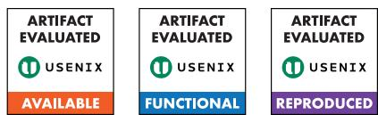

# uCache: A Customizable Unikernel-based IO Cache

Ilya Meignan--Masson, Masanori Misono, Viktor Leis, Pramod Bhatotia Technical University of Munich

## Abstract

Data-intensive cloud applications require highperformance IO caching to fully leverage modern storage systems like NVMe SSDs and cloud storage. Today’s developers face a dilemma: choose a simple, but often slow, OS-level IO cache, or a fast,but complex,userspace cache. This trade-off forces developers to sacrifice either performance or simplicity.

This paper introduces uCache, a novel IO cache that resolves this fundamental tension. Leveraging a unikernelbased libOS architecture, uCache seamlessly integrates application-specific knowledge directly into the OS-level cache. It combines an mmap-like memory surface with an explicit, conventional interface, offering fine-grained control over cache behavior. This design allows for the seamless integration of application-specific semantics within the OS-level cache itself—a capability previously confined to complex userspace solutions; thus, ensuring scalability, performance, and adaptability. The core of uCache’s flexibility is the uVFS abstraction, which enables direct adaptation to diverse IO backends while maintaining filesystem compatibility without the performance overheads of the traditional OS IO stack.

Our evaluation demonstrates that uCache effectively merges the simplicity of OS-level caches with the performance and flexibility of userspace solutions. For out-of-memory workloads, uCache achieves performance on par with kernelbypass IO libraries, proving it can eliminate the IO caching bottleneck for data-intensive applications.

## 1 Introduction

IO caching is an essential aspect of the performance of modern data-intensive applications [32, 13, 27, 45, 46, 86, 88] running in the cloud. A wide range of applications, including key-value stores, database systems, and data-processing frameworks, rely on IO caches to avoid issuing IO requests for every data access. At the same time, modern cloud applications use a variety of underlying storage options, including locally-attached high-performance NVMe SSDs [1], and cloud storage systems such as block [2] and object [3] stores. This diversity of applications and storage options requires caches that are both flexible and performant.

Historically, applications have relied on the OS for IO caching through the page cache, via mmap [50]. This approach is simple and effective for many use cases [14, 49, 62], as it abstracts the complexity of IO operations and relies on virtual memory mapping to translate memory accesses to IO operations. However, OS-level IO caching presents several limitations for data-intensive cloud applications. First, current implementations of the page cache suffer from scalability and performance issues [63]. Prior studies [71, 61, 89] have concluded that the complex IO stack, the slow page fault handling, and context switch overheads limit the performance of OSlevel caching, especially on high-performance devices such as NVMe SSDs. Furthermore, the isolation between the OS and applications in traditional architectures forces OS-level IO caches to use general-purpose semantics. Traditional OS interfaces, i.e., POSIX, only offer limited flexibility. This can lead to suboptimal performance or even undesirable decisions, e.g., like evicting a page from an uncommitted transaction [24]. Besides, OS-level caches lack native support for non-filesystembased storage systems such as cloud object stores.

Due to these limitations, the most common approach for many high-performance cloud applications is to implement IO caching logic directly in userspace [43, 30, 45, 68, 88, 46, 86]. This gives developers granular control over cache management, enabling them to tailor policies to specific application semantics and data access patterns. While this approach solves the flexibility problem, userspace caches are complex to use and often specific to a system. Additionally, these userspace solutions also typically demand exclusive control over the storage device, preventing applications from using standard IO system calls or reusing robust kernel filesystem implementations.

This prevailing dichotomy between convenience and simplicity (OS-level caches), and performance and control (userspace caches) presents a fundamental challenge for the design of modern data-intensive systems. Despite efforts to improve OS-level caching by addressing the scalability and performance issues [63, 61, 73, 19] or by integrating some application-defined logic in the kernel [90, 94, 16], existing solutions still do not achieve sufficient performance and flexibility for modern data-intensive applications. This forces developers to rely on complex userspace caches, often requiring them to re-implement custom caching libraries for their specific application.

In this paper, we thus ask the following research question: Can the OS provide a general, simple, flexible, and performant memory-mapped IO caching framework that meets the needs of modern cloud applications?

To address this question, we propose uCache, a novel OS-level caching architecture. uCache defines a new interface for OS-level caching that extends the mmap interface with flexible control over the cache policies. As an OS-level cache, uCache can leverage existing OS IO stacks, including filesystems. uCache can also be flexibly extended to use application-defined IO backends.

uCache leverages the unikernel [54] architecture to remove the isolation between the OS and the application. Unikernels, based on library OSes, co-locate all software components within a single address space without privilege isolation which offers several compelling advantages: (1) The application and the OS can directly access each other’s symbols, simplifying communication. (2) The lack of isolation leads to simpler and smaller OS implementations. (3) Modern unikernels are POSIX-compatible, allowing most existing applications to run with minimal modifications.

To this end, uCache provides a customizable OS-level cache by addressing three challenges. First, uCache addresses the limited flexibility of traditional OS-level caches and the lack of cooperation with the OS of userspace caches by sharing the Virtual Memory Area (VMA) abstraction between the application and the kernel, granting direct access to cache operations. This allows developers to customize buffer replacement policies based on application-specific needs.

Second, uCache avoids the performance bottlenecks stemming from reusing the kernel’s general-purpose memory manager, which uses global locks. Instead, it employs optimistic lock-free operations to ensure scalability, even with batch processing or non-standard buffer sizes.

Third, uCache overcomes the trade-off between the flexibility of OS-level IO stacks and the performance of userspace IO libraries. It achieves this by decoupling the control and data paths using the uVFS abstraction. This approach combines the performance of kernel-bypass IO with the broad filesystem support of OS stacks and allows for flexible use of multiple IO backends (uStore), including an NVMe-optimized one.

We implement uCache as a library in OSv [36] and demonstrate its effectiveness in three use cases. First, uCache can serve as an efficient drop-in replacement for mmap. Second, an application can infuse its semantics in the cache operations, especially for enforcing transactional safety. Finally, we show that uCache can integrate simply in data-intensive applications, using their workload knowledge to improve caching performance and their custom IO backends.

Using this prototype, we evaluate our design against both OS-level and userspace caches. Our benchmarks show that uCache improves performance by up to 55× compared to traditionalOS-level caching (mmap),and provides similar throughput to highly optimized userspace IO libraries (SPDK [83]).

In summary, we make the following contributions:

• We propose a new architecture for IO caching that makes an OS-level cache customizable by the application (§ 2).

• We design a unikernel-based caching library that combines a simple interface, scalable caching operations directed by extensible policies, and flexible IO backends (§ 3 and § 4).

• We implement a prototype of uCache and demonstrate its effectiveness through detailed evaluation and several real-world use-cases (§ 5 and § 6).

Artifact. uCache implementation is publicly available at https://github.com/TUM-DSE/uCache

## 2 Background and Motivation

In this section, we examine the two approaches for IO caching: OS-level caching and userspace caching. Based on their benefits and limitations, we motivate the need for a new IO caching tailored for data-intensive cloud applications.

## 2.1 IO Caching: OS-level Vs Userspace

IO caching is a fundamental technique for enhancing the performance of applications that frequently access persistent storage. The primary benefit is realized by reducing the volume of IO operations through the retention of frequently accessed data. In this paper, we focus on caches accessed via load/store instructions. Implementations of IO caching typically follow one of two architectural approaches—at the operating system level or in userspace—each presenting distinct advantages and limitations (Figure 1).

OS-level caching. The traditional approach to cache IO accesses is to use the OS page cache [4] via the mmap system call [50]. In the background, the kernel transparently manages the cache, using page faults as a cache miss indicator. This approach provides good cache hit performance and is completely transparent to the application [14, 49, 62].

However, mmap notoriously introduces significant performance overheads, especially with modern NVMe SSDs [73]. These performance overheads stem from several factors, including global locks in the kernel [63, 61, 24, 71], lack of asynchronous IO operations, and costly TLB shootdowns [9, 38, 10]. The OS page cache also faces limited scalability of the Virtual Memory Area (VMA) management [21, 22]. Some studies propose improvements to the kernel to address these overheads [79, 73, 19, 62, 63, 61], though it may overly specialize the OS for a use-case.

Moreover, the transparency of the virtual memory interface leaves little control of caching to the application. The POSIX’s madvise only offers limited options, and the kernel may ignore them. Some applications prefer to use non-hardwaresupported page sizes, such as 8KiB [67] or 16KiB [57], while the POSIX API only allows hardware-supported sizes. Some applications, especially database systems, require transactional cache semantics, i.e., pages modified by unlogged operations should not be evicted.POSIX’s mlock is inadequate for this due to its system call overhead and the kernel-imposed limits on the amount of lockable memory. Some propose extending madvise [19], or adding page priorities in the cache to guide the eviction policy [79, 62], but these still require costly syscalls to share application preferences.

In addition, OS-level caches are limited to the IO kernel stacks, preventing applications from using memory mapping with specialized storage systems such as AWS S3 [3]. This further restricts applications from using OS-level caches, especially as more and more applications rely on cloud-native storage solutions [72] that are not supported natively in traditional OSes.

In short, OS-level caching is simple and general, but suffers from performance overheads and a lack of flexibility.

Userspace caching. Due to the aforementioned issues, most data-intensive applications design and implement their own caching in userspace [45, 46, 86, 88, 32, 27, 13]. Existing studies realize this either by utilizing page fault notification mechanisms to the application or by preemptively checking for cache misses before accessing pages.

Userspace page fault handling uses mechanisms such as general-purpose signals [69], userfaultfd [51, 64] or upcalls [34] to transmit fault information to a user-space handler, which then instructs the kernel how to resolve the fault. However, userspace page fault handling incurs costly context switches and extra operations to exchange information between the application and the OS [34].

Most modern applications [45, 58, 30, 43, 86] instead use userspace caches with a pin/unpin interface to intercept accesses to the pages and manage the replacement of pages without page fault handling. However, this approach requires intricate integration with the application—making pin/unpin calls at the appropriate places—to benefit from its design. In particular, system developers must integrate the cache operations in their concurrency control which incurs significant complexity [45, 43]. Although Tricache [30] automatically adds pin/unpin calls in a compiler pass, this does not take into account the transactional semantics of the application.

Userspace caches can fully utilize storage devices by leveraging high-performance kernel-bypass libraries, such as SPDK [83], or specialized libraries to access object stores [29], and provide the application with full control over cache replacement. However, reaching this superior performance and control requires significant engineering effort.

Contrary to OS-level caching,userspace caching achieves optimal performance and offers fine-grained control over the cache to the application, but is complex and tends to be use-case specific.

## 2.2 Motivation: A Unikernel-based IO Cache

The missing IO caching abstraction. In this paper, we claim that the OS-level approach can overcome the performance and control limitations by specializing the OS to the application for high-performance IO caching in cloud applications. In light of the performance and flexibility of userspace caches, one could simply integrate userspace solutions with unikernel architecture. However, this would not address the lack of generality of userspace caches. Instead, our proposition aims to combine the appeal of transparent OSlevel IO caching with the performance and control over page replacement of state-of-the-art userspace caching libraries.

To reach this goal, we need to redesign the way the application interacts with the OS. We define a new OS interface for the application to control the cache and to redesign the OS-level IO cache mechanisms to address the performance overheads. To enable flexible and efficient customization of the OS IO cache, we leverage the unikernel architecture [54], which creates virtual memory images using single-address-space library OSes. Prior studies demonstrated unikernels to be promising in the context of Network Function Virtualization [55] and memory disaggregation [85].

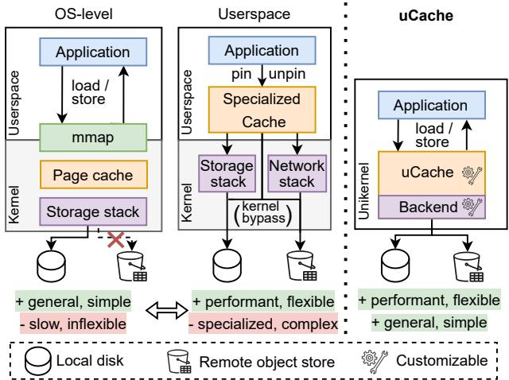  
Figure 1: Comparison with IO caching approaches. Unikernel-based IO cache (uCache) enables a performant and flexible yet general IO caching.

The unikernel architecture offers several benefits for our goal. First, unikernels directly link the application with the OS; thus, they eliminate the overhead of system calls and allow the kernel to expose specialized operations to the applications. Second, the single-address-space design allows the OS to integrate application semantics, while the hypervisor ensures strong isolation among unikernel applications. This design also makes the resulting unikernel smaller, simpler, and more predictable, as multi-process management is a major contributor to the implementation complexity in general-purpose OSes. Finally, major unikernels offer sufficient POSIX API or Linux binary compatibility [37, 36, 60], supporting diverse applications with minimal software changes.

Example use-cases enabled by uCache. We further motivate our approach by presenting several use cases.

(1) Practical memory-mapped IO: uCache makes mmapbased caching practical for data-intensive applications by enforcing application-defined semantics at the time of cache creation. Specifically, applications can statically configure cache properties, such as the page size to match its data layout or the specific IO backend to optimize interaction with the underlying storage device,allowing them to benefit from the simplicity of OS-level caching without sacrificing performance. (2) Buffer manager for DBMSs: Database systems avoid OS-level caching due to its lack of precise eviction control, which makes guarantee of transactional safety difficult [24], let alone its performance limitations. uCache addresses this by allowing the cache’s replacement policy to be integrated with the database’s concurrency control mechanism. The application can cheaply prevent the eviction of a page from the cache while leveraging the simplicity of transparent memory-mapped IO caching.

(3) Simple workload specialization: Traditional mechanisms for advising the OS (e.g., madvise), are too coarsegrained and fail to capture domain-specific knowledge. uCache enables applications to infuse knowledge about their workloads in the OS, potentially improving cache hits rate and overall application performance.

## 3 Overview

## 3.1 System Overview

We present uCache, a novel IO cache design that resolves the fundamental tension between the simplicity of OS-level caches and the performance and flexibility of userspace solutions. Our core design goal is to provide a general, flexible, and performant memory-mapped IO caching framework that meets the needs of modern data-intensive cloud applications.

Unikernel-based architecture. uCache is built upon a unikernel architecture [54]. Unlike traditional monolithic OSes, the unikernel architecture co-locates the application and the OS subsystems, including uCache, in a single address space. This single-address-space design fundamentally changes the interaction model by eliminating the need for expensive system calls and context switches, significantly reducing performance overheads. Further, the unikernel architecture allows the application and the OS to directly access each other’s symbols, simplifying the communication between the application and uCache. Crucially, it enables uCache to become “application-aware”, dedicating all hardware resources to the application.

In our architecture (Figure 2), uCache interposes between the application and the underlying storage system. The application interacts with the cache through normal load/store instructions and via a high-level API, while uCache efficiently manages the low-level IO operations and resource handling. More specifically, uCache consists of the following core system components:

uCache API. This is the interface that applications use to interact with the cache. It provides a flexible memory surface that can be mapped to storage devices using an mmap-like interface. Beyond simple memory accesses, the API also enables developers to specify custom caching policies and includes explicit cache control operations, offering a level of control previously limited to userspace solutions.

Cache manager. This internal component is the core of uCache’s logic. It is responsible for executing cache operations, such as inserting or evicting pages, and efficiently handling page faults that occur due to cache misses. The cache manager uses the application-defined policies and leverages optimistic lock-free operations to guarantee scalability and performance even under high concurrency.

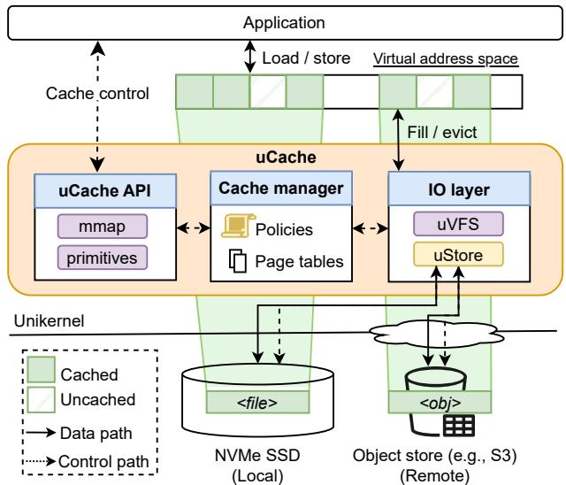  
Figure 2: uCache overview. uCache enables transparent memory-mapped IO caching for diverse storage systems (local SSDs and remote stores). It features scalable cache primitives directly accessible to the application and allows developers to customize the replacement policies.

IO layer. A minimalist IO abstraction that acts as a flexible interface between the cache manager and the underlying storage. uCache introduces a Virtual File System-like abstraction (uVFS) to decouple the caching logic from the specifics of the storage backend, allowing uCache to work transparently with a variety of storage systems. It provides a versatile interface that can be used to interact with different storage stacks (uStore), including an NVMe-optimized uStore or even an application-defined uStore.

System workflow. The general workflow of applications using uCache is as follows. First, the application maps a file in a uStore to the virtual memory space through uCache’s mmap call. The application can also specify custom policies by extending the cache with callbacks. The application then accesses the cache through regular memory accesses (load-/store) or by directly calling the cache operations (insertion, eviction, etc.). Internally, the cache manager executes the operations and handles page faults due to cache misses. When the cache needs to access the storage, the cache manager uses the uVFS functions. The uVFS uses the uStore associated with the corresponding file to handle IO operations.

## 3.2 Design Challenges and Key Ideas

## uCache strives to address the following challenges.

#1: Application-OS coordination. uCache aims to infuse an OS-level IO cache with the customizability typical of userspace caches, which derive their flexibility from tight application integration (§ 2). The application’s knowledge of its semantics and workload is crucial for optimizing cache policies; however, conveying this knowledge to a generic OS cache is challenging due to the OS’s limited understanding of application semantics. Although a unikernel allows direct OS access, forcing applications to explicitly manage the cache introduces significant implementation complexity.

To bridge this gap, uCache uses a shared Virtual Memory Area (VMA) abstraction, allowing an application to attach its semantics to specific memory regions (§ 4.1). It further allows applications to register custom policies as callbacks, which are defined directly in the application’s code and can access its symbols (§ 4.2).

#2: Performant and scalable paging. To fully exploit modern hardware like NVMe SSDs and multi-core CPUs, uCache’s cache operations must be both performant and scalable. State-of-the-art approaches (§ 2) employ either batching IO operations to optimize throughput or lock-free page table modifications to reduce TLB synchronization overhead. However, combining those two techniques is challenging as concurrent page table manipulation can happen while processing a batch.

uCache addresses this challenge by employing optimistic lock-free cache operations (§ 4.3) that maximize scalability, even when operations are processed in batches or when eviction targets are composed of multiple pages.

#3: Efficient and flexible IO operations. uCache faces two challenges regarding accessing storage devices and systems. First, modern cloud applications typically combine diverse storage backends, from high-performance locally-attached storage devices to remote object stores. A practical IO cache thus faces the challenge of flexibly adapting to these backends without sacrificing performance. Second, applications also access the same storage backend for various purposes, including cases where caching is undesirable, such as for write-ahead logs. The cache, therefore, faces challenges of maintaining compatibility with the rest of the OS storage stack while optimizing storage access for caching.

uCache addresses this challenge with the uVFS (§ 4.4), which provides a versatile IO abstraction of the underlying storage stacks, represented by the uStore abstraction. uStore enables the use of different backends transparently through the same interface. uCache also natively provides an NVMe-optimized uStore (§ 4.5) that combines the efficiency of IO userspace libraries while maintaining compatibility with existing filesystems.

## 4 Design

## 4.1 The Unikernel-based IO Cache Abstraction

uCache proposes a general abstraction designed to provide application developers with a range of interaction models with the cache, from complete transparency to explicit control. With uCache, a file is mapped into a single virtual memory area (VMA), and applications may tailor the cache operations through custom policies. uCache manages the memory mapping and handles faults in the mapped areas to transparently replace pages in the cache. uCache also offers direct access to the cache primitive operations, enabling the application to leverage knowledge about its semantics and workloads explicitly (Figure 3).

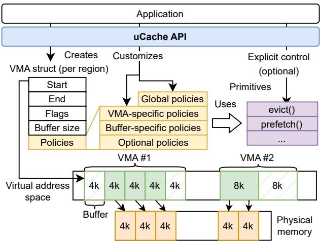  
Figure 3: uCache interface. A single VMA represents a corresponding cache region, and the application can customize a caching policy per cache. Caching is performed in the application-defined Buffer size granularity. uCache API primitives allow applications to explicitly control caches.

uCache VMAs. To bridge the semantic gap between the application and the OS, uCache introduces a shared Virtual Memory Area (VMA) abstraction. This shared VMA represents a continuous region of the virtual address space corresponding to a region of a file. In the rest of this paper, we use cache to designate a collection of VMAs. Unlike Linux, where VMAs are in-kernel structs and a single mmap region can span multiple VMAs, uCache’s shared VMA ensures that a cache region corresponds to a single VMA. This design allows the application to explicitly specify the custom policies to a specific cache region.

Each VMA is subdivided into a series of fixed-size Buffers, where each Buffer serves as a unit of cache operation. The size of the Buffer is not constrained by the hardware page sizes,and the application can choose arbitrary sizes that match their logical operations. A key design choice is that all Buffers within a VMA must be the same size, which is defined at the time of VMA creation. This uniformity simplifies memory management and ensures predictable performance for the custom operations that an application can define for each VMA.

Application interface. The application manages the cache through uCache API (Table 1). The main function is mmap, which maps a specified file into the virtual address space. The mmap call takes a mandatory argument: the filename, and three optional arguments. The application can specify the Buffer size associated with this memory-mapped region and the uStore operations, such as uRead/uWrite indicating how the file is accessed. Additionally, the application can specify a custom data structure to use as the resident set to keep track of the cached Buffers. The application may also associate cache policies on page fault handling (§ 4.2) using the setPolicy() function. Following cache initialization, the application accesses the cache using load and store instructions.

<table><tr><td>Function</td><td>Description</td></tr><tr><td colspan="2">Cachecontrol</td></tr><tr><td>mmap(file,bufSize,uStore, Optional&lt;residentSet&gt;）→addr munmap(addr)</td><td>Create a file mapping Unmapamapping</td></tr><tr><td colspan="2">setPolicy(addr，pol，func) Specify custom policy Cacheprimitives</td></tr><tr><td colspan="2">msync(addr[]) Sync Buffers to storage evict(addr[]) Evict Buffers prefetch(addr[]) Async prefetch Buffers writeback(addr[]) Async writeback Buffers</td></tr></table>

Table 1: uCache API. Policies customize page fault handling on the associated cache region. uCache also exposes primitive functions for applications that desire explicit cache control to remove any page faults and realize the optimal caching.

The uCache API also provides primitives for explicit cache control at the Buffer level. msync() writes back Buffers if modified, and evict() removes them from the cache. Other primitives such as prefetch() and writeback() perform asynchronous I/O operations to exploit performance of modern storage such as NVMe SSDs. Additionally, ensureCached() is the explicit equivalent of accessing the address of the Buffers, without triggering a page fault to ensure the caching of Buffers.

## 4.2 uCache Customizable Caching Policies

uCache aims to relieve the application developers from most of the burden of cache management. While uCache’s primitives allow developers to tailor cache operations to their applications, requiring all applications to explicitly control the cache would lead to significant complexity. To balance flexibility with usability, uCache incorporates a lightweight extensibility mechanism that enables simple customization of the cache policies. More precisely, uCache’s extensibility is centered around the page fault handling (Listing 1). This handler defines multiple hookpoints where the application can attach custom policies or simply use the default policies.

Policy hookpoints. Drawing inspiration from existing OS extensibility mechanisms like Linux’s extended Berkeley Packet Filter (eBPF) [5], uCache uses a callback mechanism to extend the cache operations. uCache defines hookpoints for each customizable policy described in Table 2. Developers implement custom policies directly in the application code and attach them to the corresponding hookpoints. Application-defined policies are compiled and linked in the unikernel, and thus, they can access any unikernel symbols.

At runtime, the custom policy is executed when uCache reaches the hookpoint. Contrary to eBPF, uCache does not require executing extensions in an isolated environment, as the unikernel architecture already co-locates the application and the kernel. Instead, uCache natively executes extensions for maximum performance.

Policy granularity. The defined hookpoints are categorized into four categories regarding the granularity of policies:

```cpp
1 void ensureCached(void* addr[]){ // Explicit control (primitive)
2 for (void* addr_: addr) {
3 Buffer buf = get_buffer(addr_);
4 if(buf.isCached()){ // is the Buffer already cached ?
5 optHook_cached(buf); d // -> e.g., to update metadata
6 continue;
7 } else {
8 handle_fault(buf); // if not, insert it
9 }
10 }
11 }
12 void handle_fault(Buffer buf) { // Page fault handling
13 while(needToEvict()){ a
14 std::vector<Buffer*> evictionCandidates;
15 // choose the VMA to evict from
16 std::vector<VMA> victims = chooseEvictionVMAs(); a
17 for(VMA v: victims){ // choose eviction candidates
18 evictionCandidates.insert(v.chooseEvictionBuffers()); b
19 // -> calls isEvictable() c with each Buffer
20 }
21 evict(evictionCandidates); // evict Buffers (primitive)
22 optHook_eviction(evictionCandidates); d
23 }
24 insert(buf); // insert Buffers in virtual address space
25 std::vector<Buffer*> candidates;
26 if(buf.vma.hasPrefetching()){ b // by default -> false
27 candidates.insert(buf.vma.choosePrefetchBuffers()); b
28 prefetch(prefetchCandidates); // prefetching Buffes (primitive)
29 }
30 optHook_insertion(prefetchCandidates); d
31 }
```  
Listing 1: uCache extensible cache policy. uCache defines several hookpoints (denoted as ) to customize the caching operation when handling page faults. Each policy has a scope, ranging from the granularity of a Buffer to cache global.

global, VMA-level, Buffer-level, and optional. The global policies a determine whether Buffers need to be evicted and which VMA to draw candidates from for eviction. Policies that select candidates for eviction and prefetching are specific to each VMA b . uCache defines a policy at the Buffer granularity to check if a Buffer c is evictable. Optional hookpoints d can be used by the application to update metadata or perform additional operations.

Those fine-grained hookpoints allow an application to selectively customize the policies, simplifying the implementation effort by reusing already defined policies. For example, application developers can customize the isEvictable() policy separately from the eviction policy (chooseEvictionBuffers()), allowing them to make existing policies aware of their specific concurrency control without having to re-implement the entire eviction policy.

Resident set customization. Cache replacement policies use various data structures to efficiently track cached buffers. For example, FIFO is optimally implemented with a queue, while the CLOCK algorithm [23] performs well with a hash table. Therefore, uCache enables applications to specify the resident data structure that is used to keep eviction candidates at cache creation (see Table 1).

## 4.3 Efficient and Scalable Memory Management

To exploit the modern high-performance storage devices (e.g., PCIe 5.0 NVMe 2.0 SSDs [35]), cache operations must be parallelized. On the other hand, to keep a consistent state of the cache, the page table entries and TLB must be synchronized across cores. However, using a global lock for the page table manipulation fails to achieve high performance. To address this issue, uCache leverages optimistic lock-free operations to reduce the synchronization overhead due to accessing the centralized page table.

<table><tr><td>Policyhookpoint</td><td>Description</td></tr><tr><td colspan="2">@ Global</td></tr><tr><td>needToEvict()→bool chooseEvictionVMAs()→VMA[]</td><td>Cache has enough space Select VMAs to evict from</td></tr><tr><td>b VMA-specific chooseEvictionBuffers()→addr[]</td><td>Select Buffers to evict</td></tr><tr><td>hasPrefetching()→bool choosePrefetchBuffers()→addr[]</td><td>VMA needs prefetching Select Buffers to prefetch</td></tr><tr><td colspan="2">C Buffer-specific</td></tr><tr><td>isEvictable()→bool</td><td>Can this Buffer be evicted</td></tr><tr><td>@ Optional</td><td></td></tr><tr><td>optHook_*()</td><td>App-specific operations</td></tr></table>

Table 2: uCache’s policy hookpoints. uCache provides different types of hooks to customize the IO caching policy in a fine-grained manner.

We note that these caching operations are especially designed for data-intensive applications that interact with high-performance devices. Applications that use a slow storage backend (e.g., remote object store) may use the prefetch() primitive to hide storage access latencies and schedule another thread during IO wait.

Lock-free cache insertion. First, we explain page insertion in the case of a 4k Buffer cache (Figure 4). First, the cache manager allocates a 4k physical page. Subsequently, it attempts to write the allocated physical address to the corresponding PTE through Compare-And-Swap (CAS) instruction with the condition that its previous PTE’s physical address is zero. This operation does not require a TLB invalidation since the VMA memory is zero-initialized. At this point, the present bit of the PTE is still kept to zero. If the CAS operation succeeds, the cache manager reads the data from the corresponding storage and loads it into the allocated memory region. The cache manager then finalizes the operation by performing another CAS operation to set the Present bit to one.

The initial CAS operation fails when another concurrent core already triggers a page fault handling on the same Buffer. In that case, the cache manager frees allocated physical memory and polls the PTE until its Present bit becomes one, then resumes the application execution. In this way, uCache ensures only one core handles page faults while removing a global lock for the page table manipulation.

This approach requires all page table entries, including intermediary levels of the page table, to be allocated in advance. Fortunately, pre-allocating the intermediary levels of a region in the page table only incurs 0.2% of memory consumption overhead for a classic 4-level page table in the x86-64 architecture.

Large buffer size. uCache’s lock-free cache operations can be naively extended for Buffer sizes of multiple pages (e.g., an 8KB Buffer consists of two 4K pages). In such a case, the cache manager first allocates physical pages for a Buffer, followed by attempting to update the first PTE of the Buffer, regardless of where the page faults occur within the Buffer. If this succeeds, the cache manager reads the data into the allocated memory and then updates PTEs in order. If the first CAS fails, meaning that the concurrent core is already handling the page fault, the cache manager polls the last PTE and waits until it becomes present.

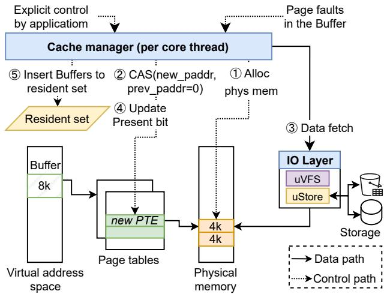  
Figure 4: uCache cache insertion flow. uCache’s lock-free cache operations ensure threads handles page faults without requiring a global lock, realizing scalable operations.

Optimistic evictions. uCache also performs cache eviction in a lock-free manner. The eviction algorithm operates as follows: the cache manager iterates over the associated pages of the eviction candidate Buffer and selects candidates. uCache then writes back dirty candidates. It then clears the present bit of each page in the Buffer and performs a global TLB invalidation via an Inter-Processor Interrupt (IPI), ensuring that any subsequent access to the Buffer from any core triggers a page fault. Next, the cache manager attempts to remove the physical addresses from the page table entry using a CAS operation. Upon successful completion of CAS operations for all associated pages, the cache manager frees the allocated physical memory.

If the CAS operation fails because another core accessed the page before the TLB invalidation, marked by the accessed bit, the cache manager aborts the eviction, reverting any page table updates and marking the pages as present again.

There is one corner case: another core accesses a page in the Buffer that causes a page fault, but the cache manager is in the middle of eviction. In this case, the page fault handler normally uses CAS to attempt to mark the Buffer as Present. If successful, the handler makes the remaining pages present; if not, indicating that the cache manager has already evicted some pages, the page fault handler waits for the eviction to complete (by polling the last page of the Buffer until it becomes zero), after which the handler inserts a new page as in the normal page fault case.

<table><tr><td>Function</td><td>Description</td></tr><tr><td>uOpen(filename)→file uClose(file) uRead/uWrite(Buffer) uAread/uAwrite(Buffer[],ring)→aio uPoll(aio,timeout)</td><td>Opena file for uCACHE Close a file Read/write in storage Async IO request Wait for async IO</td></tr></table>

Table 3: uVFS API. uVFS abstracts the underlying storage operations. The cache manager uses this API to handle cache fetches and evictions. The Buffer object contains a memory location, the file it corresponds to and the offset.

## 4.4 Flexible IO Abstraction with uVFS

Cloud-native applications involve interacting with various storage systems, ranging from high-performance local NVMe stores to remote object stores. To flexibly support those storage systems, uCache introduces the uVFS abstraction, which decouples the cache from the IO backend without compromising the performance of the IO operations (Figure 5).

uVFS interface. uVFS takes inspiration from the traditional approach to combine multiple storage stacks, the Virtual File System (VFS) abstraction. However, the VFS abstractions focuses on filesystems, whereas cloud applications also access data from storage systems that provide abstractions other than files, such as objects or blocks.

uVFS generalizes this abstraction to represent an entire storage stack, including potentially a filesystem, a block layer, and device drivers. Table 3 presents the operations offered by uVFS. uVFS functions use the Buffer abstraction instead of the combination file offset, size as used in VFS operations. uVFS operations are associated with the file, similarly to the function array of VFS, when creating a VMA with mmap (Table 1).

Application-defineduStore anduStore dispatch. uVFS dispatches operations to the corresponding implementation based on the uFile associated with the cache. In Linux, FUSE is a popular framework that allows users to develop custom filesystems without modifying the OS. However, FUSE can impose a significant performance overhead due to the communication between userspace and the OS [80]. Some studies [33, 18] addressed this issue but only bridged the gap with the performance of in-kernel filesystems. Moreover, FUSE also focuses on the filesystem abstraction, which is generally incompatible with cloud objects and block storage systems.

uCache leverages once again the unikernel architecture to directly use application-defined uStore from the uCache. Dispatching operations to an application-defined uStore simply requires calling the corresponding function instead of complex application-OS coordination in the case of FUSE.

## 4.5 NVMe uStore

Locally attached NVMe SSDs are widely used in the cloud environment for data-intensive applications that require high performance. uCache provides a dedicated NVMe uStore, customized for high-performance NVMe SSDs.

High-performance NVMe driver. Traditional OS IO stacks struggle to achieve high performance with modern devices due to three key limitations. Firstly, they require system calls to perform IO, adding a context switch overhead. Secondly, they use interrupts to wait for completion, which incurs further delays. Thirdly, application/kernel separation leads to at least one copy of the data, necessitating additional processing, let alone CPU cache-line pollutions.

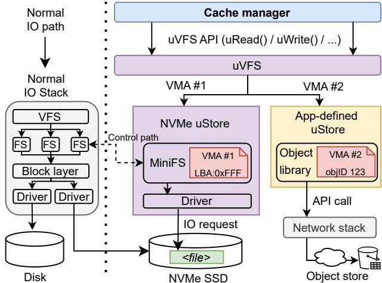  
Figure 5: The uVFS and uStore abstractions. The uVFS dispatches the operations to the corresponding uStore, chosen by the application, NVMe uStore optimizes the IO performance without compromising compatibility with existing OS stacks.

Our NVMe uStore borrows some features from userspace libraries such as SPDK [83] to overcome those limitations; NVMe uStore performs zero-copy operations and uses one NVMe queue pair per CPU core to avoid synchronizing on IO requests. Contrary to userspace libraries, the uStore supports both interrupts and polling to wait for completion for flexible CPU utilization.

Filesystem compatibility. A file system is essential for managing files on an NVMe disk. However, implementing a custom within the NVMe uStore introduces significant complexity and prevents the application from using existing filesystem implementations. To address this challenge, NVMe uStore adopts a hybrid approach: it delegates file control operations to the existing normal IO stacks, while managing the data path independently for optimized IO performance.

Compatibility with existing filesystems is preserved through a lightweight translation layer. Specifically, NVMe uStore includes MiniFS, which offloads necessary control path operations (including uOpen, uClose) to the underlying file system. In addition, MiniFS queries the underlying file system to obtain the file’s logical block addresses (LBAs) for subsequent data-path IO requests. Actual uVFS data-path operations (uRead, uWrite, etc.) are directly performed by the optimized NVMe driver.

## 5 Implementation and Use-Cases

We implement a prototype of uCache along with three use-cases.

## 5.1 uCache Implementation

We base our implementation on the OSv unikernel [36]. We implement uCache as a separate library that interacts with OSv’s physical memory manager and IO stack. Our implementation is composed of about 2,000 lines of C++ code.

Cache manager. The cache manager implements the CLOCK algorithm [23] as a default eviction policy. For physical memory management, we integrate LLFree [82], which supports memory allocations of various sizes between 4KiB and 4MiB, into the memory management library of OSv. The cache manager requests physical memory of the same size as Buffers, thus ensuring that Buffers correspond to contiguous areas of physical memory and enabling the application to leverage the CPU memory prefetching.

uVFS. We implement uVFS compatible with ext4. OSv supports ext4 with a port of the lwext library. The uVFS interacts with this library to retrieve the mapping of file offset to LBAs. The lwext library internally uses a block cache and synchronizes accesses to inodes and blocks using locks that impose significant overhead, especially when uCache only reads the file metadata. We avoid these limitations by caching the file offset to LBA mapping into an array, which only increases memory consumption by 0.2% of the size of the file. This caching limits our prototype to files with all blocks pre-allocated (i.e. no sparse file). Our prototype also does not support concurrent modifications to the structure of the file (e.g., resizing) while open by uVFS.

uStore. We modify the OSv NVMe driver to support polling to completion and asynchronous operations. Our prototype bypasses the block layer by exposing the driver functions to the uVFS layer. Our prototype uStore creates one NVMe queue pair per core to avoid any synchronization for IO operations.

## 5.2 Use-case #1: Practical Memory-Mapped IO

As a first use case, we demonstrate that uCache benefits applications that rely on mmap for IO caching. Although OS-level IO caching is appealing for developers because of its simplicity, the traditional mmap fails to exploit modern storage performance and lacks application control over page replacement (§ 2). uCache provides a high-performance mmap alternative with few application modifications.

## 5.3 Use-case #2: Buffer Manager for Database Systems

We envision uCache as a useful OS-level caching tool for database systems, enabling buffer managers directly use page tables for high-efficiency caching, eliminating indirect layers like hash tables. The primary challenge is to integrate with the database system’s concurrency control without requiring explicit control of the cache. This means cache operations must coordinate with database operations to prevent the eviction of a buffer while it is in use.

We demonstrate this use case by porting vmcache [43], a buffer manager that uses virtual memory for caching, to uCache. The original vmcache manages concurrency with guards and tracks buffer state using four states: Evicted, Unlocked, Locked, and Marked (candidates for eviction).

We port vmcache to uCache by removing around 400 lines of code (LoC) and modifying around 100 LoC. We modify the guards to use the ensureCached() function to ensure the Buffer is cached. We also ensure that the replacement policies of uCache coordinate with the concurrency manager of vmcache by specifying a custom isEvictable() policy that prevents the eviction of a Buffer if it is currently locked. Finally, we use optional hooks to update the state of Buffer in vmcache.

## 5.4 Use-case #3: Simple workload specialization

Thirdly, uCache’s customizability also enables applications to fit the cache to their use-case. In particular, we showcase how uCache can be used as the IO cache when accessing Apache Parquet files [6].

Apache Parquetis a column-oriented data file formatwidely used in modern cloud-based data lake systems [11, 25, 39, 68]. Parquet provides an efficient data representation that splits each column of the data into chunks; each chunk is compressed and stored in the file, while its metadata keeps the location of each chunk.

We integrate uCache in DuckDB, a popular embedded analytical database system. DuckDB uses a custom userspace cache that implements complex prefetching policies for Parquet files. We use uCache to cache accesses to Parquet files and customize the prefetching policy with DuckDB’s prefetching logic. On a page fault and if there is no prefetching already happening, the policy uses the metadata of the Parquet file to predict the blocks that will be accessed next. Our port modifies around 100 LoC of DuckDB.

DuckDB’s custom cache does not support remote Parquet file caching (as of v1.3.2). With uCache, DuckDB can seamlessly benefit from caching of Parquet files, local or remote, and without requiring extensive implementation efforts. In particular, one could reuse DuckDB’s HTTPFS extension that provides S3 support in the form of a filesystem by making this filesystem compatible with uVFS and using it to open and access remote files.

## 6 Evaluation

We evaluate the performance of uCache compared to OS and userspace cache solutions. First, we use microbenchmarks to investigate the performance of the cache operations (§ 6.1). We also quantify the memory footprint of uCache (§ 6.2). We further evaluate the performance of uCache’s NVMe-optimized uStore (§ 6.3). We then evaluate the performance of uCache for three use-cases (§ 6.4—§ 6.6).

Experimental setup. We run our experiments in a singlesocket server with an AMD EPYC 9654P CPU (96 cores, hyperthreading disabled), 768GB of RAM, and a Kioxia CM-7 SSD (3.8TB). All experiments are executed in virtual machines with the SSD passed through to the guest. The Linux VM uses a 6.12 kernel with transparent huge pages (THP) disabled. We execute all benchmarks by pinning application threads to a dedicated core to avoid the overhead of the OS scheduling in the results. OSv limits the maximum number of cores to 64. We run all experiments three times and report averages across runs.

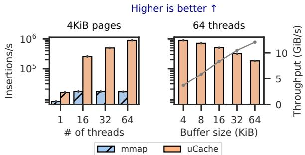  
Figure 6: uCache insertion performance. (left) uCache outperforms mmap for 4KiB page accesses (right) uCache’s throughput improves with larger Buffer sizes.

## 6.1 Cache Performance

First, we investigate the performance of the IO caching operations in uCache.

Methodology. We use a custom microbenchmark that uses a configurable number of threads to issue load/store instructions at sequentially increasing offsets within a file of 1TiB backed by the cache with 100GiB of physical memory. We run the benchmark for 120 seconds and report the last 60 seconds to focus on the worst-case performance, where all accesses trigger a page fault and require eviction. We use uCache’s NVMe uStore as the backing storage. We compare the performance of uCache to mmap.

We vary the number of threads from 1 to 64 and report the number of insertions per second. We also break down the performance of uCache for each operation required to insert a Buffer in the cache. We instrument the code of our prototype and compute the time for each operation in ??s using the frequency of the cores (2,4GHz). Additionally, we investigate the impact ofnon-hardware supported sizes forBuffers in uCache by varying the Buffer size from the default 4KiB to 64KiB.

Result. We first present the benchmark results in Figure 6. uCache outperforms mmap by up to 55× in the read-only case with 64 threads. The results highlight the lack of scalability of mmap when using more than 16 threads concurrently. In comparison, uCache scales linearly with the number of threads, with the number of operations per second per thread only dropping from 15.5k to 14k.

Performance breakdown. Next, we show the breakdown of the operations in Table 4. In general, we observe that the IO operation(s) dominate the latency of inserting a Buffer in the cache, representing 89% (respectively 98%) of the total time for the read-only (resp. read/write) workload. The TLB invalidation is the second biggest contributor to the overall latency, representing 6.84% (resp. 0.41%) of the total time. The other operations, including allocating physical memory, manipulating the page table, and choosing eviction candidates, only contribute a total of 3.66% (resp. 1.46%) of the page fault total time. We note that the TLB invalidation is faster in the read-write workload which can be explained by the lower throughput which leads to less lock contention in the IPI mechanism of the kernel and, in turn, to lower time for this operation.

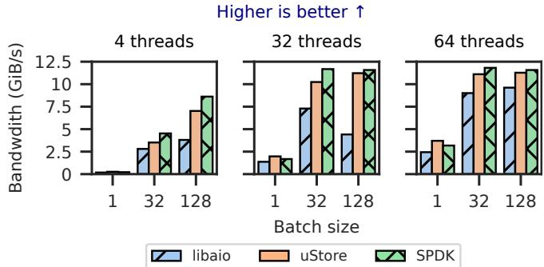  
Figure 7: NVMe uStore IO performance. NVMe uStore offers comparable performance to the user-space polling solution (SPDK).

<table><tr><td rowspan=1 colspan=2>Function</td><td rowspan=1 colspan=1>Read-only</td><td rowspan=1 colspan=1>Read-write</td></tr><tr><td rowspan=1 colspan=2>Initialchecks</td><td rowspan=1 colspan=1>1.43</td><td rowspan=1 colspan=1>1.43</td></tr><tr><td rowspan=1 colspan=2>TotalensureSpace+possibleeviction</td><td rowspan=1 colspan=1>61.32</td><td rowspan=1 colspan=1>535.28</td></tr><tr><td rowspan=4 colspan=1>Eviction(batch: 512)0.1% of invocations</td><td rowspan=1 colspan=1>Selection</td><td rowspan=1 colspan=1>15.21</td><td rowspan=1 colspan=1>8.67</td></tr><tr><td rowspan=1 colspan=1>Write</td><td rowspan=1 colspan=1>0.25</td><td rowspan=1 colspan=1>518.19</td></tr><tr><td rowspan=1 colspan=1>TLB flush</td><td rowspan=1 colspan=1>42.4</td><td rowspan=1 colspan=1>4.64</td></tr><tr><td rowspan=1 colspan=1>Unmap</td><td rowspan=1 colspan=1>3.21</td><td rowspan=1 colspan=1>3.52</td></tr><tr><td rowspan=1 colspan=2>Alloc frame</td><td rowspan=1 colspan=1>0.84</td><td rowspan=1 colspan=1>0.84</td></tr><tr><td rowspan=1 colspan=2>Map (in page table)</td><td rowspan=1 colspan=1>0.17</td><td rowspan=1 colspan=1>0.17</td></tr><tr><td rowspan=1 colspan=2>Read</td><td rowspan=1 colspan=1>554.4</td><td rowspan=1 colspan=1>579.49</td></tr><tr><td rowspan=1 colspan=2>Book keeping</td><td rowspan=1 colspan=1>1.85</td><td rowspan=1 colspan=1>1.76</td></tr></table>

Table 4: uCache’s page fault handling breakdown in total seconds (8M insertions with ≈8k evictions). uCache memory management only imposes minimal overhead and most of the time is spent performing IO operations

Variable Buffer sizes. Figure 6 further illustrates the performance of uCache when using non-hardware-supported sizes for the Buffers. Managing Buffers of size 32KiB yields more performance than managing 8×4KiB Buffers. We explain this observation by the increased time required for IO, which leads to less synchronization between threads, especially as the IO operations are completely independent per-core. We highlight this by plotting the throughput, i.e., the number of Buffers inserted per second multiplied by the size of the Buffer.

In summary, uCache imposes minimal overhead in the out-of-memory case and scales linearly with the number of threads used by the application.

## 6.2 Memory Footprint

We evaluate the memory footprint of uCache.

Methodology. We gather the size of all objects used by uCache and compute the footprint per VMA, depending on the virtual memory size, the physical memory size, and Buffer size of the VMA.

Results. uCache’s memory footprint is composed of fixed sizes, such as the VMA struct itself (144 bytes including all policy callback pointers) or the file struct (16 bytes + the file name). The default hash table-based ResidentSet allocates a region relative to the maximum number of Buffers that can be cached, to avoid potential hash collisions. This represents thus 8 bytes per Buffer that can fit in the physical memory given to the cache. Additionally, our prototype uVFS stores the complete mapping of offset in the memory region to LBAs on disk, corresponding to 8 bytes per buffer in the region. In total, with ?? as the size of the memory region, ?? as the amount of physical memory available to the cache, and $B _ { s }$ the Buffer size, and $M _ { s t r u c t s }$ the constant size of structs, uCache’s footprint is $\begin{array} { r } { M _ { f o o t p r i n t } = 8 \frac { v } { B _ { \mathrm { c } } } + 8 \frac { v } { B _ { \mathrm { c } } } + M _ { s t r u c t s } } \end{array}$

For a setup with 1TiB of memory/file size, 128GiB of physical memory size, and Buffers of 4KiB, i.e., the example described in § 6.5, this represents 2.25GiB of memory footprint, representing 1.7% increase in the required physical memory.

## 6.3 IO Performance

Next, we focus on the IO performance of uCache for locally-attached NVMe SSDs.

Methodology. uCache uses a synchronous single IO operation when inserting a Buffer and asynchronous IO operations in batches when evicting or prefetching. We evaluate the performance of the IO operations in both cases by varying the batch size (1 is synchronous, >1 is asynchronous). We use the SPDK block device performance benchmark bdevperf [74] to measure the IO performance with SPDK. We note that the SPDK results represent the upper bound of the Linux IO performance, outperforming OS-level optimized IO mechanisms such as io\_uring. We use the fio framework to measure the performance of libaio, which is the traditional OS solution for IO operations, and for the NVMe uStore. We measure random read performance by running all experiments for 90 seconds and report the performance average of the last 60 seconds.

Results. Figure 7 presents the results. The NVMe-optimized uStore of uCache only imposes 3.5% of overhead on average compared to SPDK. uStore outperforms SPDK for synchronous operations and imposes at most 30% of overhead with 4 threads and 128 of batch size. uStore outperforms libaio by 50% on average and up to 150% with 32 threads and 128 of batch size.

In summary, uCache’s NVMe-optimized uStore combines the performance of userspace IO libraries such as SPDK with the filesystem compatibility of OS-level IO stacks.

## 6.4 Memory-Mapped IO

We then investigate the benefits of using uCache as a practical replacement for mmap.

Methodology. We evaluate the performance of random accesses to a memory regions backed by uCache and we compare to the performance of mmap. We use a memory region of 200GiB and vary the physical memory available to the system between 128GiB and 16GiB. We report the throughput of the key-value store in terms of operations per second. We compare the results of uCache and mmap.

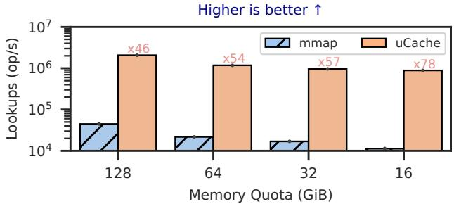  
Figure 8: Memory-Mapped IO performance. uCache significantly outperforms mmap in random lookups and degrades less the performance as memory quota reduces.

Results. Figure 8 presents the results. uCache outperforms mmap by at least ×46 at 128GiB of memory quota and up to ×78 at 16GiB of memory quota. We also observe that reducing the available physical memory for the cache has a bigger impact on mmap, with the lookups per second at 16GiB of quota representing only 25% of the performance at 128GiB of memory. In comparison, the performance of uCache at 16GiB of memory corresponds to 43% of the performance at 128GiB of quota.

In summary, uCache offers a compelling replacement to mmap even for unmodified applications.

## 6.5 Relational Database Systems

Next, we investigate the performance of uCache when the application requires the cache to enforce some semantics, e.g., transactional safety.

Methodology. We investigate the performance of using uCache in the buffer manager of a DBMS by using the vmcache buffer manager. We use TPC-C to model a transactional workload and measure the transactions per second. We compare our implementation of vmcache to the two flavors of the original vmcache design (using madvise and libaio for the POSIX variant and using the customized Kernel module for page table manipulation exmap for the exmap variant). Replacing libaio with more performance IO mechanisms, such as io\_uring, for the POSIX variant would not improve performance as the unmapping of pages is the bottleneck in this configuration [43].

Results. Figure 9 presents the results. Similarly to the results of the original evaluation of vmcache, we observe that using madvise to manipulate the page tables leads to significant overhead, only stabilizing around 90k transactions per second, compared to using the custom kernel module to control the page table, exmap, that reaches up to 121k transactions. Using uCache in vmcache also significantly outperforms using madvise, stabilizing around 118k transactions per second. Overall, using uCache leads to a low overhead, ≈ 3% compared to using exmap.

In summary, compared to specialized userspace caches, uCache has a minor performance overhead while enforcing the same application-defined semantics.

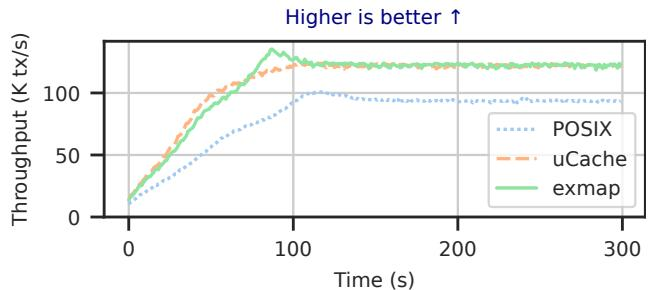  
Figure 9: Buffer management performance. uCache offers comparable performance to state-of-the-art OSspecialization solution (exmap) while maintaining transactional safety. (TPC-C size: 5000 warehouses ≈ 1TiB, 128GiB cache size, 64 threads.)

## 6.6 Query Processing

Finally, we evaluate the third use case of uCache by investigating the performance of uCache to cache Parquet files in DuckDB.

Methodology. We use the TPC-H workload. We generate the data using DuckDB’s dbgen tool and export it to Parquet files. We execute 21 of the 22 TPC-H queries, except Q15 due to a data generation issue. We run each query three times in the same invocation and report the average time of the second and third execution.

Results. Figure 10 presents the results. Our port of DuckDB outperforms the original version in most queries. In particular, our port improves the execution time by ×4.89 for Q4, by ×6.59 for Q6 and by ×3.17 for Q17. On average, uCache improves the execution time by ×1.98. uCache also executes normally Q7, Q9, Q18 and Q21 when DuckDB runs out of memory.

In summary, uCache can simply integrate into complex application and accelerate their data processing.

## 7 Additional Related Work

Besides the OS-based and userspace IO caches discussed in § 2, IO caching has been researched across various domains.

Improvements to mmap. Linux mmap limitations are wellknown [24]. While prior work optimizes eviction [79, 73] or page table management [22, 63], it fails to address the semantic gap inherent in traditional OS architectures. uCache addresses this by using a unikernel architecture to enable OS-application cache cooperation.

Co-designing IO caching in Linux. CO-PAGER [47] and exmap [52] provide a custom interface to control the page table from userspace using kernel modules, but syscall overhead still remains. Another line of work exploits kernel extensibility, namely eBPF [5], to include application semantics about caching in the OS [90, 94, 16, 84, 41]. However, eBPF cannot directly access the application, which requires designers to completely embed their semantics in the kernel. In particular, eBPF solutions generally focus on asymptotic caching policies (e.g., LRU or FIFO), but lack an efficient and secure mechanism to control cache objects individually (e.g., an equivalent to mlock). Additionally, eBPF is limited to existing hookpoints. XRP [90] focuses on in-kernel storage operations, while FetchBPF [16] focuses on prefetching. cache\_ext [95] enables customization of cache policies. Other caching parameters, such as the buffer size, are not customizable. In general, these approaches are limited by the separation between the application and the OS imposed by the Linux architecture. In contrast, uCache enables deep application-OS co-design for better flexibility and performance.

Specialized OS for IO caches. Aquila [61] and libDBOS [93] leverage virtualization [8] to allow applications to directly access specialized kernel functions while using Linux. Aquila focuses on memory-mapped IO whereas libDBOS provides buffer cache semantics for database systems. However, they are unfit for the cloud environment as they require nested virtualization [12], which incurs additional overheads [48] and is not generally available in public cloud offerings.

The challenge of the distribution of knowledge between the application and the OS is identified by several propositions [31, 85, 44]. uCache takes inspiration from these approaches and focuses on IO caching, whereas COD [31] focuses on database systems and DiLOS [85] on memory disaggregation.

IO caches for cloud storage. Several studies propose adapting IO cache replacement policies for cloud storage [40, 20, 92]. These are complementary and could be used in uCache. Other work [15, 28] provides caching libraries for cloud storage systems. Crystal [28] targets analytical databases on cloud storage,whereas LabCloud [15] integrates with existing IO caches for other types of storage via a file system interface. In contrast, uCache allows applications to specify their custom IO backends, offering broader applicability beyond cloud storage.

## 8 Discussion

## 8.1 Application Portability

Porting an application to uCache involves two primary aspects: (1) adapting the application to the unikernel architecture and (2) integrating it with the uCache interface.

Unikernel application adaptation. Modern unikernels offer a high degree of portability targeting POSIX [36, 37] or Linux binary compatibility [60], which significantly reduces the effort required for application porting. A key architectural limitation of unikernels is their typical lack of fork system call due to their single-address-space nature. However, this is often not a major hindrance for modern data-processing applications, which overwhelmingly favor a multi-threading concurrency model. A notable exception is PostgreSQL,which traditionally creates a new process for each client connection [7]. Several studies explore realizing fork in unikernels [53, 87], which could be integrated into uCache to overcome this issue.

uCache interface integration. The design of the uCache interface deliberately aligns with the existing mmap interface. This design choice ensures that porting an application that uses mmap to uCache requires minimal code changes while yielding substantial performance benefits, as shown in § 6.1. Furthermore, uCache simplifies application development by offloading complex cache management responsibilities, allowing the application to focus on its core logic.

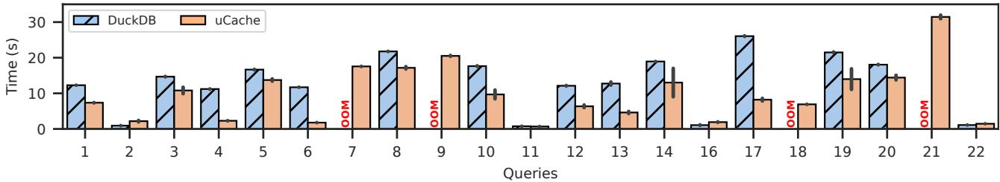  
Figure 10: Repeated query performance. uCache flexibly integrates with customized operations of complex applications, including format-aware prefetching. (TPC-H SF=300 ≈80GiB of data) on Parquet files, 64 threads, 20GiB of cache size).

## 8.2 Unikernel Safety

The unikernel architecture removes the isolation between the OS and the application and executes application code in a privileged environment. While this presents several compelling advantages that we exploit for uCache, it might also introduce potential safety issues due to bugs or malicious actions. Still, the hypervisor enforces strict isolation between the unikernel and the rest of the system. Additionally, several orthogonal studies explore lightweight intra-unikernel isolation using hardware-assisted mechanisms, such as Intel Memory Protection Keys [75, 42, 56, 59].

8.3 Hypervisor & Cloud Deployment Considerations uCache targets cloud environments. Modern cloud services, such as AWS and GCP, support booting custom images, making deploying unikernel images possible. This work primarily focuses on application-level and unikernel-based caching, leaving hypervisor-side virtual device optimizations (e.g., NVMePass [17]) as a separate, though related, area of concern.

## 8.4 Consistency

Access consistency. Modern distributed data-processing applications typically adopt a disaggregated architecture where multiple compute nodes access a shared storage layer [91, 76, 81]. These systems must maintain consistency between the data accessed in the compute nodes. uCache operates at the node level and does not provide a synchronization mechanism with other nodes. Separate processes accessing the same storage device must therefore be synchronized in the application or by relying on an external service (e.g., S3).

Crash consistency. For data-intensive applications, ensuring crash consistency—the guarantee that the storage system remains in a valid, usable state after an unexpected failure—is crucial [66, 65]. This is particularly challenging with IO caches, which buffer data in volatile memory before it is written to durable storage. uCache offers the same crash-consistency guarantees as mmap, i.e., it is the application’s responsibility to ensure durability. Nonetheless, uCache simplify the design of crash-consistent systems compared to mmap by providing two key features:

• Explicit control: uCache guarantees that explicit primitives, such as msync() and writeback(), correctly execute and directly call the IO operations. uCache does not suffer from the syscall overhead which enables applications to ensure data is persisted on storage more frequently.

• Application-aware policies: Complementary to the explicit control, an application can register custom policies through uCache API that reflect its specific transactional semantics. For example, a database system can provide an isEvictable() policy that checks if a page contains data that has not been written to the log yet. If it is, the policy can instruct uCache not to evict it, thereby adhering to the durability guarantees of the database system.

## 9 Conclusion

In this paper, we introduce uCache, a novel IO caching architecture designed to resolve the gap between the convenience of general-purpose OS-level caches and the performance and flexibility of complex userspace solutions. By leveraging a unikernel-based library OS, uCache overcomes the limitations of traditional approaches by providing a customizable and scalable framework that integrates application-specific semantics directly in the OS cache.

## Acknowledgements

We thank our shepherd, Hossein Asadi, and the anonymous reviewers for their helpful comments. We also thank Martin Lindbüchl for the help with the implementation.

This work was supported in part by an ERC Starting Grant (ID: 101077577) and the Chips Joint Undertaking (JU), European Union (EU) HORIZON-JU-IA, under grant agreement No. 101140087 (SMARTY), the Intel Trustworthy Data Center of the Future (TDCoF), and Google Research Grants. The authors acknowledge the financial support by the Federal Ministry of Research, Technology and Space of Germany in the programme of “Souverän. Digital. Vernetzt.”. Joint project 6G-life, project identification number: 16KISK002.

## References

[1] https://nvmexpress.org/specifications/. Accessed: 2025-09-12.

[2] https://aws.amazon.com/ebs/. Accessed: 2025-09- 12.

[3] https://aws.amazon.com/s3/. Accessed: 2025-09-12.

[4] https://docs.kernel.org/mm/page\_cache.html. Accessed: 2025-09-12.

[5] https://ebpf.io/. Accessed: 2025-09-12.

[6] https://parquet.apache.org/. Accessed: 2025-09- 12.

[7] https://www.postgresql.org/docs/current/ tutorial-arch.html. Accessed: 2025-09-12.

[8] Adam Belay and Andrea Bittau and Ali Mashtizadeh and David Terei and David Mazières and Christos Kozyrakis. Dune: Safe User-level Access to Privileged CPU Features. In Proceedings of the 10th USENIX Symposium on Operating Systems Design and Implementation. USENIX Association, 2012. URL: https://www.usenix.org/conference/osdi12/ technical-sessions/presentation/belay.

[9] Nadav Amit. Optimizing the TLB Shootdown Algorithm with Page Access Tracking. In Proceedings of the 2017 USENIX Annual Technical Conference. USENIX Association, 2017. URL: https://www.usenix.org/conference/atc17/ technical-sessions/presentation/amit.

[10] Nadav Amit, Amy Tai, and Michael Wei. Don’t Shoot Down TLB Shootdowns! In Proceedings of the 15th European Conference on Computer Systems, EuroSys ’20. Association for Computing Machinery, 2020. doi:10.1145/3342195.3387518.

[11] Alexander Behm, Shoumik Palkar, Utkarsh Agarwal, Timothy Armstrong,David Cashman,Ankur Dave,Todd Greenstein, Shant Hovsepian, Ryan Johnson, Arvind Sai Krishnan, Paul Leventis, Ala Luszczak, Prashanth Menon,Mostafa Mokhtar,Gene Pang,Sameer Paranjpye, Greg Rahn, Bart Samwel, Tom van Bussel, Herman van Hovell, Maryann Xue, Reynold Xin, and Matei Zaharia. Photon: A fast query engine for lakehouse systems. In Proceedings of the 2022 International Conference on Management of Data, SIGMOD ’22, page 2326–2339, New York, NY, USA, 2022. Association for Computing Machinery. doi:10.1145/3514221.3526054.

[12] Muli Ben-Yehuda, Michael D. Day, Zvi Dubitzky, Michael Factor, Nadav Har El, Abel Gordon, Anthony Liguori, Orit Wasserman, and Ben-Ami Yassour. The

Turtles Project: Design and Implementation of Nested Virtualization. In Proceedings of the 9th USENIX Symposium on Operating Systems Design and Implementation. USENIX Association, 2010. URL: https: //dl.acm.org/doi/10.5555/1924943.1924973.

[13] Timo Bingmann, Michael Axtmann, Emanuel Jöbstl, Sebastian Lamm, Huyen Chau Nguyen, Alexander Noe, Sebastian Schlag, Matthias Stumpp, Tobias Sturm, and Peter Sanders. In 2016 IEEE International Conference on Big Data (Big Data), pages 172–183. IEEE, 2016. doi:10.1109/BigData.2016.7840603.

[14] Peter A. Boncz, Martin L. Kersten, and Stefan Manegold. Breaking the memory wall in monetdb. Commun. ACM, 51(12):77–85, December 2008. doi:10.1145/1409360.1409380.

[15] Lin Cao, Lifu Huang, Kai Lei, Zhiming Zhang, and Lian-en Huang. Hybrid caching for cloud storage to support traditional application. In 2012 IEEE Asia Pacific Cloud Computing Congress (APCloudCC), pages 11–15. IEEE, 2012. doi:10.1109/APCloudCC.2012.6486503.

[16] Xuechun Cao, Shaurya Patel, Soo Yee Lim, Xueyuan Han, and Thomas Pasquier. Fetchbpf: Customizable prefetching policies in linux with ebpf. In 2024 USENIX Annual Technical Conference (USENIX ATC 24), pages 369–378, 2024. URL: https://www.usenix.org/ conference/atc24/presentation/cao.

[17] Yiquan Chen, Zhen Jin, Yijing Wang, Yi Chen, Jiexiong Xu, Hao Yu, Jinlong Chen, Wenhai Lin, Kanghua Fang, Keyao Zhang, Chengkun Wei, Qiang Liu, Yuan Xie, and Wenzhi Chen. Nvmepass: A lightweight, high-performance and scalable nvme virtualization architecture with i/o queues passthrough. In 2025 IEEE International Symposium on High Performance Computer Architecture (HPCA), pages 1395–1407, 2025. doi:10.1109/HPCA61900.2025.00105.

[18] Kyu-Jin Cho, Jaewon Choi, Hyungjoon Kwon, and Jin-Soo Kim. RFUSE: Modernizing userspace filesystem framework through scalable Kernel-Userspace communication. In 22nd USENIX Conference on File and Storage Technologies (FAST 24), pages 141–157, Santa Clara, CA, February 2024. USENIX Association. URL: https://www.usenix.org/conference/fast24/ presentation/cho.

[19] Jungsik Choi, Jiwon Kim, and Hwansoo Han. Efficient Memory Mapped File I/O for In-Memory File Systems. In 9th USENIX Workshop on Hot Topics in Storage and File Systems (HotStorage 17). USENIX Association, July 2017. URL: https://www.usenix.org/conference/ hotstorage17/program/presentation/choi.

[20] Asaf Cidon, Assaf Eisenman, Mohammad Alizadeh, and Sachin Katti. Dynacache: Dynamic cloud caching. In 7th USENIX Workshop on HotTopics in CloudComputing (Hot-Cloud 15). USENIX Association, July 2015. URL: https: //www.usenix.org/conference/hotcloud15/ workshop-program/presentation/cidon.

[21] Austin T. Clements, M. Frans Kaashoek, and Nickolai Zeldovich. Scalable address spaces using RCU balanced trees. In Proceedings of the 17th International Conference on Architectural Support for Programming Languages and Operating Systems. Association for Computing Machinery, 2012. doi:10.1145/2150976.2150998.

[22] Austin T. Clements, M. Frans Kaashoek, and Nickolai Zeldovich. RadixVM: scalable address spaces for multithreaded applications. In Proceedings of the 8th ACM European Conference on Computer Systems. Association for Computing Machinery, 2013. doi:10.1145/2465351.2465373.

[23] Fernando J Corbato. A paging experiment with the multics system. Massachusetts Institute of Technology, 1968.

[24] Andrew Crotty, Viktor Leis, and Andrew Pavlo. Are You Sure You Want to Use MMAP in Your Database Management System? In Proceedings of the 2022 Conference on Innovative Data Systems Research, 2022. URL: https://db.cs.cmu.edu/mmap-cidr2022/.

[25] Benoit Dageville, Thierry Cruanes, Marcin Zukowski, Vadim Antonov, Artin Avanes, Jon Bock, Jonathan Claybaugh, Daniel Engovatov, Martin Hentschel, Jiansheng Huang, Allison W. Lee, Ashish Motivala, Abdul Q. Munir, Steven Pelley, Peter Povinec, Greg Rahn, Spyridon Triantafyllis, and Philipp Unterbrunner. The snowflake elastic data warehouse. In Proceedings of the 2016 International Conference on Management of Data, SIGMOD ’16, page 215–226. Association for Computing Machinery, 2016. doi:10.1145/2882903.2903741.

[26] Eelco Dolstra, Merijn de Jonge, and Eelco Visser. Nix: A safe and policy-free system for software deployment. In Proceedings of the 18th Conference on Systems Administration (LISA 2004), Atlanta, USA, November 14-19, 2004. USENIX, 2004. URL: http://www.usenix.org/publications/library/ proceedings/lisa04/tech/dolstra.html.

[27] Siying Dong, Mark Callaghan, Leonidas Galanis, Dhruba Borthakur, Tony Savor, and Michael Strum. Optimizing space amplification in rocksdb. In CIDR, volume 3, page 3, 2017. URL: https://www.cidrdb. org/cidr2017/papers/p82-dong-cidr17.pdf.

[28] Dominik Durner, Badrish Chandramouli, and Yinan Li. Crystal: a unified cache storage system for analytical

databases. Proc. VLDB Endow., 14(11):2432–2444, July 2021. doi:10.14778/3476249.3476292.

[29] Dominik Durner, Viktor Leis, and Thomas Neumann. Exploiting cloud object storage for high-performance analytics. Proc. VLDB Endow., 16(11):2769–2782, July 2023. doi:10.14778/3611479.3611486.

[30] Guanyu Feng, Huanqi Cao, Xiaowei Zhu, Bowen Yu, Yuanwei Wang, Zixuan Ma, Shengqi Chen, and Wenguang Chen. TriCache: A User-Transparent Block Cache Enabling High-Performance Out-of-Core Processing with In-Memory Programs. In Proceedings of the 16th USENIX Symposium on Operating Systems Design and Implementation. USENIX Association, 2022. URL: https://www.usenix.org/conference/ osdi22/presentation/feng.

[31] Jana Giceva, Tudor-Ioan Salomie, Adrian Schüpbach, Gustavo Alonso, and Timothy Roscoe. COD: Database / Operating System Co-Design. In Proceedings of the 16th Biennial Conference on Innovative Data Systems Research, 2013. URL: https://www.cidrdb.org/ cidr2013/Papers/CIDR13\_Paper71.pdf.

[32] Joseph M Hellerstein, Michael Stonebraker, James Hamilton, et al. Architecture of a database system. Foundations and Trends® in Databases, 1(2):141–259, 2007. doi:10.1561/1900000002.

[33] Qianbo Huai, Windsor Hsu, Jiwei Lu, Hao Liang, Haobo Xu, and Wei Chen. XFUSE: An infrastructure for running filesystem services in user space. In 2021 USENIX Annual Technical Conference (USENIX ATC 21), pages 863–875. USENIX Association, July 2021. URL: https://www.usenix.org/conference/ atc21/presentation/hsu.

[34] Sepehr Jalalian, Shaurya Patel, Milad Rezaei Hajidehi, Margo Seltzer, and Alexandra Fedorova. ExtMem: Enabling Application-Aware Virtual Memory Management for Data-Intensive Applications. In 2024 USENIX annual technical conference (USENIX ATC 24), pages 397–408, 2024. URL: https://www.usenix.org/ conference/atc24/presentation/jalalian.

[35] KIOXIA. CM7-R Series (2.5-inch). https: //europe.kioxia.com/en-europe/business/ssd/ enterprise-ssd/cm7-r.html. Accessed: 2024-02-02.

[36] Avi Kivity, Dor Laor, Glauber Costa, Pekka Enberg, Nadav Har’El, Don Marti, and Vlad Zolotarov. OSv—Optimizing the Operating System for Virtual Machines. In Proceedings of the 2014 USENIX Annual Technical Conference. USENIX Association, 2014. URL: https://www.usenix.org/conference/atc14/ technical-sessions/presentation/kivity.

[37] Simon Kuenzer, Vlad-Andrei Bădoiu, Hugo Lefeuvre, Sharan Santhanam, Alexander Jung, Gaulthier Gain, Cyril Soldani, Costin Lupu, Ştefan Teodorescu, Costi Răducanu, et al. Unikraft: fast, specialized unikernels the easy way. In Proceedings of the Sixteenth European Conference on Computer Systems, pages 376–394, 2021. doi:10.1145/3447786.3456248.

[38] Mohan Kumar Kumar, Steffen Maass, Sanidhya Kashyap, Ján Veselý, Zi Yan, Taesoo Kim, Abhishek Bhattacharjee, and Tushar Krishna. LATR: Lazy Translation Coherence. In Proceedings of the 23rd International Conference on Architectural Support for Programming Languages and Operating Systems. Association for Computing Machinery. doi:10.1145/3173162.3173198.

[39] Maximilian Kuschewski, David Sauerwein, Adnan Alhomssi, and Viktor Leis. Btrblocks: Efficient columnar compression for data lakes. Proc. ACM Manag. Data, 1(2), June 2023. doi:10.1145/3589263.

[40] Nicolas Le Scouarnec, Christoph Neumann, and Gilles Straub. Cache policies for cloud-based systems: To keep or not to keep. In 2014 IEEE 7th International Conference on Cloud Computing, pages 1–8. IEEE, 2014. doi:10.1109/CLOUD.2014.11.

[41] Dusol Lee, Inhyuk Choi, Chanyoung Lee, Hyungsoo Jung, and Jihong Kim. P2cache: Enhancing data-centric applications via application-guided management of os page caches. ACM Trans. Storage, June 2025. Just Accepted. doi:10.1145/3736586.

[42] Hugo Lefeuvre, Vlad-Andrei Bădoiu, Alexander Jung, Stefan Lucian Teodorescu, Sebastian Rauch, Felipe Huici, Costin Raiciu, and Pierre Olivier. FlexOS: towards Flexible OS Isolation. In Proceedings of the 27th ACM International Conference on Architectural Support for Programming Languages and Operating Systems. Association for Computing Machinery, 2022. URL: https://doi.org/10.1145/3503222.3507759.

[43] Viktor Leis, Adnan Alhomssi, Tobias Ziegler, Yannick Loeck, and Christian Dietrich. Virtual-Memory Assisted Buffer Management. Proceedings of the ACM on Management of Data, 1(1), 2023. URL: https://dl.acm. org/doi/10.1145/3588687, doi:10.1145/3588687.

[44] Viktor Leis and Christian Dietrich. Cloudnative database systems and unikernels: Reimagining os abstractions for modern hardware. Proc. VLDB Endow., 17(8):2115–2122, 2024. doi:10.14778/3659437.3659462.

[45] Viktor Leis, Michael Haubenschild, Alfons Kemper, and Thomas Neumann. Leanstore: In-memory data

management beyond main memory. In 2018 IEEE 34th International Conference on Data Engineering (ICDE), pages 185–196. IEEE, 2018.

[46] Baptiste Lepers, Oana Balmau, Karan Gupta, and Willy Zwaenepoel. Kvell: the design and implementation of a fast persistent key-value store. In Proceedings of the 27th ACM Symposium on Operating Systems Principles, pages 447–461, 2019. doi:10.1145/3341301.3359628.

[47] Feng Li, Daniel G. Waddington, and Fengguang Song. Userland CO-PAGER: Boosting Data-intensive Applications with Non-volatile Memory, Userspace Paging. In Proceedings of the 3rd International Conference on High Performance Compilation, Computing and Communications. Association for Computing Machinery, 2019. doi:10.1145/3318265.3318272.

[48] Jin Tack Lim and Jason Nieh. Optimizing nested virtualization performance using direct virtual hardware. In Proceedings of the Twenty-Fifth International Conference on Architectural Support for Programming Languages and Operating Systems, ASPLOS ’20, page 557–574, New York, NY, USA, 2020. Association for Computing Machinery. doi:10.1145/3373376.3378467.

[49] Zhiyuan Lin, Minsuk Kahng, Kaeser Md Sabrin, Duen Horng Polo Chau, Ho Lee, and U Kang. Mmap: Fast billion-scale graph computation on a pc via memory mapping. In 2014 IEEE International Conference on Big Data (Big Data), pages 159–164. IEEE, 2014. doi:10.1109/BigData.2014.7004226.

[50] Linux Kernel Developers. mmap(2) — Linux manual page. https://man7.org/linux/man-pages/man2/ mmap.2.html. Accessed: 2025-09-12.

[51] Linux Kernel Developers. Userfaultfd: The Linux Kernel Documentation. https://www.kernel.org/doc/ html/next/admin-guide/mm/userfaultfd.html. Accessed: 2025-09-12.

[52] Yannick Loeck and Christian Dietrich. Evaluation and Refinement of an Explicit Virtual-Memory Primitive. IEEE Access, 11, 2023. doi:10.1109/ACCESS.2023.3338149.

[53] Costin Lupu, Andrei Albiundefinedoru, Radu Nichita, Doru-Florin Blânzeanu, Mihai Pogonaru, Răzvan Deaconescu, and Costin Raiciu. Nephele: Extending virtualization environments for cloning unikernel-based vms. In Proceedings of the Eighteenth European Conference on Computer Systems, EuroSys ’23, page 574–589, New York, NY, USA, 2023. Association for Computing Machinery. doi:10.1145/3552326.3587454.

[54] Anil Madhavapeddy, Richard Mortier, Charalampos Rotsos, David Scott, Balraj Singh, Thomas Gazagnaire, Steven Smith, Steven Hand, and Jon Crowcroft. Unikernels: Library Operating Systems for the Cloud. In Proceedings of the 18th International Conference on Architectural Support for Programming Languages and Operating Systems. Association for Computing Machinery, 2013. doi:10.1145/2451116.2451167.

[55] Joao Martins, Mohamed Ahmed, Costin Raiciu, Vladimir Olteanu, Michio Honda, Roberto Bifulco, and Felipe Huici. ClickOS and the art of network function virtualization. In 11th USENIX Symposium on Networked Systems Design and Implementation (NSDI 14),pages 459– 473, Seattle, WA, April 2014. USENIX Association. URL: https://www.usenix.org/conference/nsdi14/ technical-sessions/presentation/martins.

[56] Masanori Misono, Peter Okelmann, Charalampos Mainas, and Pramod Bhatotia. uIO: Lightweight and Extensible Unikernels. In Proceedings of the 2024 ACM Symposium on Cloud Computing. Association for Computing Machinery, 2024. URL: https://doi.org/10.1145/3698038.3698518.

[57] MySQL. https://dev.mysql.com/doc/refman/9. 4/en/innodb-parameters.html#sysvar\_innodb\_ page\_size. Accessed: 2025-09-12.

[58] Thomas Neumann and Michael J Freitag. Umbra: A diskbased system with in-memory performance. In CIDR, volume 20, page 29, 2020. URL: https://www.cidrdb. org/cidr2020/papers/p29-neumann-cidr20.pdf.

[59] Peter Okelmann, Ilya Meignan-Masson, Masanori Misono, and Pramod Bhatotia. MorphOS: An Extensible Networked Operating System. Proc. ACM Netw., 3(CoNEXT4), 2025. doi:10.1145/3768977.

[60] Pierre Olivier, Daniel Chiba, Stefan Lankes, Changwoo Min, and Binoy Ravindran. A Binary-compatible Unikernel. In Proceedings of the 15th ACM SIG-PLAN/SIGOPS International Conference on Virtual Execution Environments. Association for Computing Machinery, 2019. doi:10.1145/3313808.3313817.

[61] Anastasios Papagiannis, Manolis Marazakis, and Angelos Bilas. Memory-mapped I/O on steroids. In Proceedings of the 16th European Conference on Computer Systems. Association for Computing Machinery, 2021. doi:10.1145/3447786.3456242.

[62] Anastasios Papagiannis, Giorgos Saloustros, Pilar González-Férez, and Angelos Bilas. An Efficient Memory-Mapped Key-Value Store for Flash Storage. In Proceedings of the 2018 ACM Symposium on Cloud

Computing. Association for Computing Machinery, 2018. doi:10.1145/3267809.3267824.

[63] Anastasios Papagiannis, Giorgos Xanthakis, Giorgos Saloustros, Manolis Marazakis, and Angelos Bilas. Optimizing Memory-mapped I/O for Fast Storage Devices. USENIX Association, 2020. URL: https://www.usenix.org/conference/atc20/ presentation/papagiannis.

[64] Ivy B. Peng, Maya B. Gokhale, Karim Youssef, Keita Iwabuchi, and Roger Pearce. Enabling Scalable and Extensible Memory-Mapped Datastores in Userspace. IEEE Transactions on Parallel and Distributed Systems, 33(4), 2022. doi:10.1109/TPDS.2021.3086302.

[65] Thanumalayan Sankaranarayana Pillai, Ramnatthan Alagappan, Lanyue Lu, Vijay Chidambaram, Andrea C. Arpaci-Dusseau, and Remzi H. Arpaci-Dusseau. Application Crash Consistency and Performance with CCFS. In Proceedings of the 15th USENIX Conference on File and Storage Technologies. USENIX Association, 2017. URL: https://www.usenix.org/conference/fast17/ technical-sessions/presentation/pillai.

[66] Thanumalayan Sankaranarayana Pillai, Vijay Chidambaram, Ramnatthan Alagappan, Samer Al-Kiswany, Andrea C. Arpaci-Dusseau, and Remzi H. Arpaci-Dusseau. All File Systems Are Not Created Equal: On the Complexity of Crafting Crash-Consistent Applications. In Proceedings of the 11th USENIX Symposium on Operating Systems Design and Implementation. USENIX Association, 2014. URL: https://www.usenix.org/conference/osdi14/ technical-sessions/presentation/pillai.

[67] PostgreSQL. https://www.postgresql.org/docs/ current/storage-page-layout.html. Accessed: 2025-09-12.

[68] Mark Raasveldt and Hannes Mühleisen. Duckdb: an embeddable analytical database. In Proceedings of the 2019 international conference on management of data, pages 1981–1984, 2019. doi:10.1145/3299869.3320212.

[69] Sergio Rivas-Gomez, Alessandro Fanfarillo, Sebastien Valat, Christophe Laferriere, Philippe Couvee, Sai Narasimhamurthy, and Stefano Markidis. uMMAP-IO: User-Level Memory-Mapped I/O for HPC. In Proceedings of the IEEE 26th International Conference on High Performance Computing, Data, and Analytics. IEEE, 2019. doi:10.1109/HiPC.2019.00051.

[70] Casey Rodarmor. Just. https://just.systems/. Accessed: 2025-12-16.

[71] Zhenyuan Ruan, Malte Schwarzkopf, Marcos K. Aguilera, and Adam Belay. AIFM: High-Performance, Application-Integrated far memory. In 14th USENIX Symposium on Operating Systems Design and Implementation (OSDI 20), pages 315–332. USENIX Association, November 2020. URL: https://www.usenix.org/ conference/osdi20/presentation/ruan.

[72] Sambhav Satija, Chenhao Ye, Ranjitha Kosgi, Aditya Jain, Romit Kankaria, Yiwei Chen, Andrea C. Arpaci-Dusseau, Remzi H. Arpaci-Dusseau, and Kiran Srinivasan. Cloudscape: A study of storage services in modern cloud architectures. In 23rd USENIX Conference on File and Storage Technologies (FAST 25), pages 103–121, Santa Clara, CA, February 2025. USENIX Association. URL: https://www.usenix.org/conference/fast25/ presentation/satija.

[73] Nae Young Song, Yongseok Son, Hyuck Han, and Heon Young Yeom. Efficient Memory-Mapped I/O on Fast Storage Device. ACM Trans. Storage, 12(4), 2016. URL: https://doi.org/10.1145/2846100.

[74] spdk.io. SPDK Block Device Performance Benchmark. https://spdk.io/doc/bdevperf.html. Accessed: 2025-05-12.

[75] Mincheol Sung, Pierre Olivier, Stefan Lankes, and Binoy Ravindran. Intra-unikernel isolation with intel memory protection keys. In Proceedings of the 16th ACM SIGPLAN/SIGOPS International Conference on Virtual Execution Environments, VEE ’20, page 143–156, New York, NY, USA, 2020. Association for Computing Machinery. doi:10.1145/3381052.3381326.

[76] Rebecca Taft, Irfan Sharif, Andrei Matei, Nathan Van-Benschoten, Jordan Lewis, Tobias Grieger, Kai Niemi, Andy Woods, Anne Birzin, Raphael Poss, Paul Bardea, Amruta Ranade, Ben Darnell, Bram Gruneir, Justin Jaffray, Lucy Zhang, and Peter Mattis. Cockroachdb: The resilient geo-distributed sql database. In Proceedings of the 2020 ACM SIGMOD International Conference on Management of Data, SIGMOD ’20, page 1493–1509, New York, NY, USA, 2020. Association for Computing Machinery. doi:10.1145/3318464.3386134.

[77] TPC. TPC-C benchmark. https://www.tpc.org/ tpcc/default5.asp. Accessed: 2024-05-13.

[78] TPC. TPC-C benchmark. https://www.tpc.org/ tpch/default5.asp. Accessed: 2024-05-13.

[79] Brian Van Essen, Henry Hsieh, Sasha Ames, Roger Pearce, and Maya Gokhale. DI-MMAP—a scalable memory-map runtime for out-of-core dataintensive applications. Cluster Computing, 18(1), 2015. doi:10.1007/s10586-013-0309-0.

[80] Bharath Kumar Reddy Vangoor, Vasily Tarasov, and Erez Zadok. To FUSE or not to FUSE: Performance of User-Space file systems. In 15th USENIX Conference on File and Storage Technologies (FAST 17), pages 59–72, Santa Clara, CA, February 2017. USENIX Association. URL: https://www.usenix.org/conference/fast17/ technical-sessions/presentation/vangoor.

[81] Alexandre Verbitski, Anurag Gupta, Debanjan Saha, Murali Brahmadesam, Kamal Gupta, Raman Mittal, Sailesh Krishnamurthy, Sandor Maurice, Tengiz Kharatishvili, and Xiaofeng Bao. Amazon aurora: Design considerations for high throughput cloudnative relational databases. In Proceedings of the 2017 ACM International Conference on Management of Data, SIGMOD ’17, page 1041–1052, New York, NY, USA, 2017. Association for Computing Machinery. doi:10.1145/3035918.3056101.

[82] Lars Wrenger, Florian Rommel, Alexander Halbuer, Christian Dietrich, and Daniel Lohmann. LLFree: Scalable and Optionally-Persistent Page-Frame allocation. In 2023 USENIX Annual Technical Conference (USENIX ATC 23), pages 897–914, Boston, MA, July 2023. USENIX Association. URL: https://www.usenix. org/conference/atc23/presentation/wrenger.

[83] Ziye Yang, James R Harris, Benjamin Walker, Daniel Verkamp, Changpeng Liu, Cunyin Chang, Gang Cao, Jonathan Stern, Vishal Verma, and Luse E Paul. Spdk: A development kit to build high performance storage applications. In 2017 IEEE International Conference on Cloud Computing Technology and Science (CloudCom), pages 154–161. IEEE, 2017. doi:10.1109/CloudCom.2017.14.

[84] Anil Yelam, Kan Wu, Zhiyuan Guo, Suli Yang, Rajath Shashidhara, Wei Xu, Stanko Novaković, Alex C Snoeren, and Kimberly Keeton. PageFlex: Flexible and Efficient User-space Delegation of Linux Paging Policies with eBPF. In 2025 USENIX Annual Technical Conference (USENIX ATC 25), pages 291–306, 2025. URL: https://www.usenix.org/conference/atc25/ presentation/yelam.

[85] Wonsup Yoon, Jisu Ok, Jinyoung Oh, Sue Moon, and Youngjin Kwon. DiLOS: Do Not Trade Compatibility for Performance in Memory Disaggregation. In Proceedings of the 18th European Conference on Computer Systems. Association for Computing Machinery, 2023. doi:10.1145/3552326.3567488.

[86] Matei Zaharia, Reynold S Xin, Patrick Wendell, Tathagata Das, Michael Armbrust, Ankur Dave, Xiangrui Meng, Josh Rosen, Shivaram Venkataraman, Michael J Franklin, et al. Apache spark: a unified engine for

big data processing. Communications of the ACM, 59(11):56–65, 2016. doi:10.1145/2934664.

[87] Yiming Zhang, Jon Crowcroft, Dongsheng Li, Chengfen Zhang, Huiba Li, Yaozheng Wang, Kai Yu, Yongqiang Xiong, and Guihai Chen. KylinX: A Dynamic Library Operating System for Simplified and Efficient Cloud Virtualization. In Proceedings of the 2018 USENIX Annual Technical Conference. USENIX Association, 2018. URL: https://www.usenix.org/conference/ atc18/presentation/zhang-yiming.

[88] Da Zheng, Disa Mhembere, Randal Burns, Joshua Vogelstein, Carey E Priebe, and Alexander S Szalay. Flashgraph: Processing billion-node graphs on an array ofcommodity ssds. In 13thUSENIX Conference on File and Storage Technologies (FAST 15), pages 45–58, 2015. URL: https://www.usenix.org/conference/fast15/ technical-sessions/presentation/zheng.

[89] Kan Zhong, Wenlin Cui, Xin Chen, Qiao Li, Zhe Yang, Youyou Lu, Xiaodan Yan, Siwei Luo, Qizhao Yuan, and Keji Huang. Revisiting swapping in user-space with lightweight threading. IEEE Transactions on Computer-Aided Design of Integrated Circuits and Systems, 42(11):4205–4218, 2023. doi:10.1109/TCAD.2023.3274953.

[90] Yuhong Zhong, Haoyu Li, Yu Jian Wu, Ioannis Zarkadas, Jeffrey Tao, Evan Mesterhazy, Michael Makris, Junfeng Yang, Amy Tai, Ryan Stutsman, and Asaf Cidon. XRP: In-Kernel storage functions with eBPF. In 16th USENIX Symposium on Operating Systems Design and Implementation (OSDI 22). USENIX Association, July 2022. URL: https://www.usenix.org/conference/ osdi22/presentation/zhong.

[91] Jingyu Zhou, Meng Xu, Alexander Shraer, Bala Namasivayam, Alex Miller, Evan Tschannen, Steve Atherton,

Andrew J. Beamon, Rusty Sears, John Leach, Dave Rosenthal, Xin Dong, Will Wilson, Ben Collins, David Scherer, Alec Grieser, Young Liu, Alvin Moore, Bhaskar Muppana, Xiaoge Su, and Vishesh Yadav. Foundationdb: A distributed unbundled transactional key value store. In Proceedings of the 2021 International Conference on Management of Data, SIGMOD ’21, page 2653–2666, New York, NY, USA, 2021. Association for Computing Machinery. doi:10.1145/3448016.3457559.

[92] Ke Zhou, Yu Zhang, Ping Huang, Hua Wang, Yongguang Ji, Bin Cheng, and Ying Liu. Efficient ssd cache for cloud block storage via leveraging block reuse distances. IEEE Transactions on Parallel and Distributed Systems, 31(11):2496–2509, 2020. doi:10.1109/TPDS.2020.2994075.

[93] Xinjing Zhou, Viktor Leis, Jinming Hu, Xiangyao Yu, and Michael Stonebraker. Practical db-os co-design with privileged kernel bypass. Proc. ACM Manag. Data, 3(1), February 2025. doi:10.1145/3709714.

[94] Zhe Zhou, Yanxiang Bi, Junpeng Wan, Yangfan Zhou, and Zhou Li. Userspace bypass: Accelerating syscallintensive applications. In 17th USENIX Symposium on Operating Systems Design and Implementation (OSDI 23), pages 33–49, Boston, MA, July 2023. USENIX Association. URL: https://www.usenix.org/conference/ osdi23/presentation/zhou-zhe.

[95] Tal Zussman, Ioannis Zarkadas, Jeremy Carin, Andrew Cheng, Hubertus Franke, Jonas Pfefferle, and Asaf Cidon. cache\_ext: Customizing the Page Cache with eBPF. In Proceedings of the ACM SIGOPS 31st Symposium on Operating Systems Principles, SOSP ’25. Association for Computing Machinery, 2025. doi:10.1145/3731569.3764820.

## A Artifact Appendix

## Abstract

This artifact contains the implementation and scripts to reproduce the experiments and figures from the FAST26 paper: “uCache: A Customizable Unikernel-based IO Cache” by I. Meignan--Masson, M. Misono, V. Leis and P. Bhatotia. uCache leverages the unikernel architecture to infuse application semantics into an OS-level cache. Our scripts build a Linux VM image and multiple OSv VM images and evaluate uCache using four benchmarks: a microbenchmark, an IO performance benchmark, TPC-C [77], and TPC-H [78]. We automate the measurements and the scripts to reproduce the plots from the paper.

## Scope

The evaluation supports the following five key claims from the uCache paper:

• (C1): uCache’s management operations impose minimal overhead in the out-of-memory scenario and scale linearly with the number of threads used by the application (Figure 6, §6.1). We support this claim with (E1): using benchmarks/microbench.just.

• (C2): uCache enables the application to use non-hardwaresupported page sizes without incurring additional overheads (Figure 6, §6.1). We support this claim with (E1): using benchmarks/microbench.just.

• (C3): uCache’s NVMe-optimized uStore combines the performance of userspace IO libraries such as SPDK with the filesystem compatibility of OS-level IO stacks (Figure 7, §6.3). We support this claim with (E2): using benchmarks/fio.just.

• (C4): uCache provides a efficient drop-in replacement to mmap (Figure 8, §6.4). We support this claim with (E1): using benchmarks/microbench.just.

• (C5): uCache has minimal performance overhead compared to specialized userspace caches while enforcing the same application-defined semantics (Figure 9, §6.5). We support this claim with (E3): using benchmarks/vmcache.just.

• (C6): uCache can integrate into complex applications and accelerate their data processing by providing caching (Figure 10, §6.6). We support this claim with (E4): using benchmarks/duckdb.just.

## Reproducing the experiments

You can find the latest project source code on GitHub. Please refer to the README.md file included in this repository for detailed instructions on running the experiments.

## Hardware Dependencies

The evaluation requires a server with at least 64 physical cores and 200 GiB of spare RAM (to be allocated to the VM). The server should also be equipped with a spare NVMe SSD of at least 1.5 TiB that can be overwritten. In our experiments, we used a PCI 5.0 NVMe SSD [35].

For the TPC-H experiment, reviewers need to generate the data, which requires approximately 1 hours and 200GiB of memory for the scale factor used in our experiments (300). Creating Parquet files from the database data requires additional time.

## Software Dependencies

We use Nix [26] to build the Linux VM image, which includes the packages used for the baseline measurements. Our experiment scripts use just [70] for automation. Our plotting scripts use Python 3 along with pandas, seaborn, and matplotlib.

## Executing the scripts

1. Run nix develop to enter the development environment with all system dependencies (the nix package manager is installed on the server). All subsequent commands must be run inside this shell.

2. Run just -f benchmarks/init.just build\_images to build the VM images used during the experiments.

3. Run the benchmarks/\*.just scripts to execute the evaluations. For the DuckDB experiment, you first need to copy the TPC-H files to the SSD using the copy\_tpch\_files recipe in the benchmarks/init.just justfile.

4. Run the benchmarks/plots/run\_all.sh script to generate all the plots.