①

USENIX

THE ADVANCED COMPUTING SYSTEMS ASSOCIATION

# DRBoost: Boosting Degraded Read Performance in MSR-Coded Storage Clusters

Xiao Niu, Guangyan Zhang, Zhiyue Li, and Sijie Cai, Tsinghua University

# https://www.usenix.org/conference/fast26/presentation/niu

This paper is included in the Proceedings of the 24th USENIX Conference on File and Storage Technologies.

February 24–26, 2026 • Santa Clara, CA, USA

ISBN 978-1-939133-53-3

Open access to the Proceedings of the 24th USENIX Conference on File and Storage Technologies is sponsored by

# DRBoost: Boosting Degraded Read Performance in MSR-Coded Storage Clusters

Xiao Niu, Guangyan Zhang∗, Zhiyue Li, Sijie Cai Tsinghua University

## Abstract

Minimum Storage Regenerating (MSR) codes have strong potential for building efficient and reliable storage systems due to their excellent fault tolerance and low repair bandwidth. However, to meet MSR code constraints and optimize storage performance, systems often adopt large chunk sizes. This leads to significant I/O amplification during degraded reads, as entire chunks must be reconstructed to access a single object.

In this paper, we propose DRBoost, an approach that boosts degraded read performance in MSR-coded storage clusters by reducing repair bandwidth and eliminating access fragmentation for healthy data. DRBoost introduces three key techniques: (1) a partial-chunk reconstruction algorithm that reduces repair bandwidth by leveraging two forms of data reuse; (2) a reconstruction-friendly coding layout that improves reuse efficiency and accommodates objects of diverse sizes; and (3) a fragmentation-free storage layout that avoids unnecessary request splitting. Extensive experiments under various conditions and workloads show that DRBoost reduces degraded read latency by one to two orders of magnitude, significantly improving system responsiveness.

## 1 Introduction

Erasure coding is a widely used technique in object storage systems [1, 8, 38, 69], significantly reducing storage overhead compared to conventional replication techniques while ensuring fault tolerance. However, degraded reads in erasure-coded storage become critical operations due to frequent unavailability events in storage systems. First, storage devices such as HDDs [43, 52] and SSDs [36, 53] are subject to permanent errors. Second, temporary unavailability accounts for over 90% of data center failures [15]. Third, planned offline events, such as system maintenance or software updates, are ongoing activities [7, 29]. Compared with replication, the reconstruction of erasure-coded data involves additional overhead caused by read amplification and decoding computation. Therefore, ensuring efficient degraded reads is critical for the performance of erasure-coded storage systems [25, 47, 51], as excessive performance gaps between normal and degraded reads can result in long latency tails [17], leading to poor Quality of Service [54].

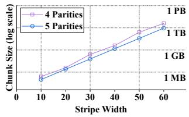  
(a) Minimum chunk size

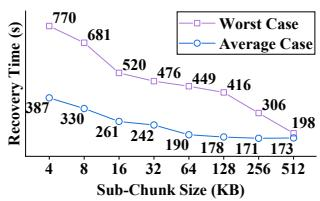  
(b) Recovery time1  
Figure 1: Chunk size explosion of MSR-coded stripes

Although two primary coding schemes are commonly utilized in production storage systems, they come with certain inherent deficiencies. Reed-Solomon (RS) codes [49] have optimal fault-tolerant properties but suffer from high repair penalties, which become pronounced with the use of wide stripes [19, 24, 62]. Locally Recoverable Codes (LRCs) [20, 24, 27] improve repair efficiency by adding extra local parities but bring about reduced fault tolerance. Benefiting from advanced coding theory, Minimum Storage Regenerating (MSR) codes have been proposed [13,18,28,41,48,57,61], offering optimal repair bandwidth (i.e., the amount of data being transferred during a repair operation) among MDS codes, which ensures optimal fault tolerance under the same storage overhead. This property makes MSR codes a highly promising option for building efficient and reliable storage systems.

However, MSR codes’ theoretical advantages are mitigated by a significant practical limitation: their large chunk size. This limitation arises from the vectorized structure of MSR codes, where each chunk comprises multiple sub-chunks encoded by well-designed linear transformations. First, as the stripe width increases while maintaining a constant parity number, the lower bound of the sub-chunk number is proven to rise exponentially [6, 58], as shown in Figure 1a. Second, larger sub-chunks are crucial for accelerating recovery, as shown in Figure 1b, because small sub-chunks cause inefficiencies such as increased seeking time in HDDs and request splitting in SSDs [39,42]. For example, switching the (20, 16) RS-coded HDD stripe used by Backblaze [26] to MSR codes will increase the recommended chunk size to at least 256MB.

Accordingly, typical objects often cannot fill an entire chunk. For instance, over 90% of objects in Alibaba Cloud Object Storage [55, 56] are smaller than 10MB, both in terms of object count and access frequency. Similar distributions are observed in IBM Cloud Object Storage [14] and Facebook F4 BLOB Storage [38]. Unfortunately, current research on MSR-coded storage systems [34, 35, 56, 61] considers the chunk as the basic repair unit. Consequently, reconstructing an entire chunk for retrieving a single object in the degraded mode exacerbates the I/O amplification problem significantly.

Traditional approaches often treat degraded reads as a specific form of failure recovery, overlooking the significance of partial-chunk reconstruction, particularly in the scenario of MSR codes. Some scalar-coded systems [20, 38] perform partial-chunk reconstruction by isolating required codewords and requesting necessary fragments corresponding to the target object’s location. However, this partial-chunk reconstruction does not work in MSR-coded systems because the hopand-couple method used in these systems [47, 61] causes objects spanning at least one full sub-chunk to be embedded across all codewords within the stripe. Geometric Partitioning [56] mitigates I/O amplification in MSR-coded storage by using chunk sizes in a geometric sequence, which has notable limitations: recovery efficiency is compromised due to the inability to fully utilize storage devices, and scalability is constrained by the increasing stripe width, which exacerbates the difficulty of a single object fully occupying an entire chunk.

In this paper, we propose DRBoost, an approach to boosting the performance of Degraded Reads in MSR-coded storage clusters by reducing repair bandwidth and preventing fragmentation of healthy data access. Specifically, we optimize degraded reads by introducing the concept of data reuse, incorporating a reconstruction-friendly coding layout and a fragmentation-free storage layout.

First, the complexity of linear transformations and the unpredictability of failure states make it challenging to maintain low repair bandwidth when handling various types of degraded read requests. To address this, we introduce sub-stripes with independent fault tolerance, allowing any node’s data loss within the sub-stripe to be reconstructed using only its remaining healthy data. Next, we further reduce repair bandwidth through two data reuse concepts: (a) multiple lost sub-chunks can be reconstructed by reusing the same set of helper sub-chunks within an appropriate sub-stripe, and (b) certain helper sub-chunks used for reconstruction can also serve as the healthy portions of the requested object. Finally, we propose a lightweight partial-chunk reconstruction algorithm by utilizing such data reuse.

Second, the asymmetric access patterns during repairing different nodes pose challenges in designing a reconstructionfriendly coding layout that ensures high reuse efficiency under any failure event. By identifying the distinct roles each subchunk takes on within sub-stripes, we introduce the concept of the data-reuse-oriented basic layout unit, as both its healthy portions and the sub-stripe it belongs to can be reused during degraded reads. Moreover, when the sub-chunk size of an MSR code matches the chunk size of a scalar code, the basic layout unit size of the MSR code aligns with the stripe size of the scalar code, thereby alleviating the mismatch issue between object and chunk sizes. Additionally, basic layout units are allocated guided by a tiered layout structure, which incorporates two intermediate levels between the basic layout unit and the entire stripe data. This structure facilitates the layout of varying-sized objects while improving load balancing and enabling the reuse of more sub-chunks.

Third, the fragmented access patterns resulting from the data-reuse-oriented layout lead to request splitting, which impairs the I/O performance. To mitigate this, we propose an inner-chunk fragmentation elimination strategy to ensure that an object’s portion within a single chunk remains unfragmented by placing sub-chunks from a basic layout unit contiguously and maintaining an appropriate order between basic layout units. Moreover, we construct a deterministic mapping table shared across all stripes with the same (n, k) configuration, enabling this fragmentation-free storage layout to work in tandem with the reconstruction-friendly coding layout. Additionally, we directly store the storage layout in object metadata and optimize the I/O process of normal reads by bypassing the coding layout translation, with translation triggered only during degraded reads. Consequently, the access sequentiality during degraded reads is optimized while avoiding potential negative impacts on normal reads.

We implement the DRBoost prototype and integrate it into Ceph [1, 63]. Due to the inadequate support for MSR codes in current production storage systems, which is caused by their simplistic alignment strategy and lack of partial-chunk reconstruction semantics, we make top-down modifications to Ceph, providing directional guidance for improved utilization of MSR codes. We evaluate DRBoost across various conditions and workloads. Our experimental results demonstrate that DRBoost reduces both the amplification ratio and the latency of degraded reads by one to two orders of magnitude.

## 2 Background and Motivation

This section provides an overview of MSR codes (§2.1), discusses the issue of large chunk sizes in MSR-coded storage (§2.2), and examines how they exacerbate I/O amplification

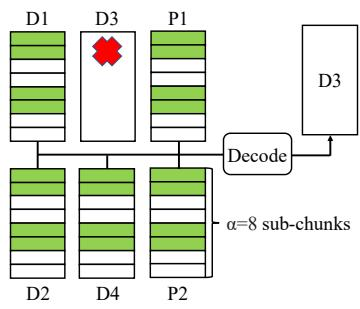  
(a) Repairing data chunk 3

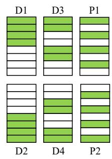  
(b) Repair patterns  
Figure 2: Repair patterns of (6,4) Clay codes

during degraded reads (§2.3).

## 2.1 Erasure Coding and Optimal Recovery

Erasure Codes. Erasure codes divide data into k equallysized chunks and encode them into m parity chunks, forming a stripe of $n = k + m$ chunks. The Maximum Distance Separable (MDS) property indicates that any m lost chunks can be recovered using any k healthy chunks.

Scalar Codes and Vector Codes. Each stripe typically comprises multiple codewords. A codeword represents the minimal collection of symbols, commonly a byte for $G F ( 2 ^ { 8 } )$ , that are encoded and decoded together [44]. Erasure codes can be classified into scalar and vector codes, depending on the number of symbols each node contributes to a codeword. In scalar codes, such as RS codes [49] and LRCs [20], each node contributes a single symbol to a codeword. In contrast, vector codes allow each node to contribute multiple symbols to a codeword. These symbols are interleaved in practice so that symbols at the same position of different codewords are stored contiguously [47,61]. As a result, each chunk of vector codes comprises several smaller symbol units, referred to as sub-chunks. For clarity, the number of sub-chunks within a chunk is defined as the sub-packetization level, denoted by α.

Optimal Recovery of MSR Codes. MSR codes are a class of vector MDS codes that have the smallest possible repair bandwidth. Compared to scalar MDS codes, which suffer significant repair penalties, MSR codes mitigate these costs by employing linear transformations between sub-chunks within vector codes [13]. To reconstruct a lost chunk, only a portion of sub-chunks from each helper chunk within the corresponding stripe is required. When all n − 1 healthy nodes participate in the recovery, each contributes only 1/m of its sub-chunks. Currently, Clay (Coupled-Layer) codes [61] represent the state-of-the-art MSR code design, so this paper adopts Clay codes as the example throughout the discussion.

Clay Codes. A layer refers to the set of sub-chunks that occupy the same position across all chunks. Sub-chunks are grouped into pairs, where coupling denotes the pairwise operation that transforms uncoupled sub-chunks into coupled ones, and uncoupling denotes the inverse operation. At a high level, Clay codes are constructed by applying an arbitrary MDS code within each layer, combined with pairwise coupling and uncoupling operations across layers.

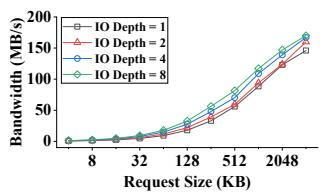  
(a) HDD

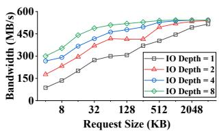  
(b) SSD  
Figure 3: Random read performance

To illustrate the mechanism, consider the (6, 4) Clay codes, where each chunk contains $\alpha = 8$ sub-chunks. As shown in Figure 2a, when data chunk 3 is lost, it can be reconstructed using sub-chunks at positions {0, 1, 4, 5} from all remaining healthy chunks through three steps: (a) Uncoupling: perform pairwise uncoupling on the highlighted sub-chunks from D1, D2, P1, and P2 to restore their uncoupled form, (b) Decoding: apply scalar MDS decoding to the uncoupled sub-chunks in layers {0,1,4,5} to reconstruct the corresponding uncoupled sub-chunks of D3 and D4, and (c) Recoupling: use the recovered uncoupled sub-chunks of D3 and D4, along with the coupled sub-chunks of D4, to reconstruct the lost subchunks in their coupled form. Notably, the helper sub-chunks are taken from the same positions across different chunks, forming what we refer to as the repair pattern, shown in Figure 2b. For example, the repair pattern for D3 specifies the sub-chunk positions required for its reconstruction, as shown in Figure 2a.

## 2.2 Large Chunk Size

Despite the theoretical optimality of MSR codes in repair efficiency, their large chunk sizes remain a major drawback. The chunk size is determined by the product of the subpacketization level and the sub-chunk size, both of which contribute to the increase in chunk size.

First, the sub-packetization level of MSR codes grows exponentially as the stripe width increases with a constant parity number. Recent consensus favors wider stripes with a higher ratio of data chunks to parity chunks to reduce storage overhead, as evidenced in studies based on scalar codes [19,24,62]. However, the sub-packetization level of Clay codes, given by $\alpha = m ^ { \left\lceil { \frac { n } { m } } \right\rceil }$ , represents the lower bound for optimal-access MSR codes [6]. For instance, the (20,16) Clay code has a sub-packetization level of $\alpha = 4 ^ { 5 } = 1 0 2 4$

Second, a larger sub-chunk size is essential for maximizing storage device bandwidth. In worst cases, as illustrated by the two parity chunks in Figure 2b, requests become random I/O operations at the sub-chunk granularity. Figure 3 illustrates the bandwidth of random reads using fio [5], which recommends I/O request sizes of at least several hundred KB for HDDs and tens of KB for SSDs. Therefore, using small sub-chunk sizes will slow down full-node recovery, as each lost node contains chunks from stripes with fragmented repair patterns in common stripe placement strategies [64, 68], which employ declustering techniques [37].

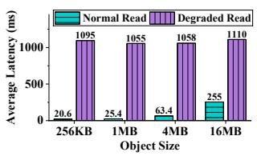

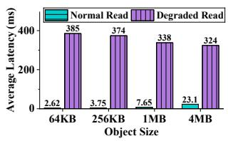  
(a) HDD  
(b) SSD  
Figure 4: Performance comparison between normal reads and degraded reads

Table 1 shows the recommended minimum chunk sizes for MSR codes with commonly used (n, k) parameters, as derived from the preceding discussion. These sizes are significantly larger than those typically used in modern storage systems, such as the default 4 KB in Ceph [11], up to 4 MB in HDFS [4], and the typical range of 32 KB to 1 MB in DAOS [21].

<table><tr><td rowspan=1 colspan=1>(n,k)</td><td rowspan=1 colspan=1>Sub-PacketizationLevel</td><td rowspan=1 colspan=1>DeviceType</td><td rowspan=1 colspan=1>Sub-ChunkSize</td><td rowspan=1 colspan=1>ChunkSize</td><td rowspan=1 colspan=1>Stripe DataSize</td></tr><tr><td rowspan=2 colspan=1>(16,12)</td><td rowspan=2 colspan=1>416/4 = 256</td><td rowspan=1 colspan=1>HDD</td><td rowspan=1 colspan=1>256KB</td><td rowspan=1 colspan=1>64MB</td><td rowspan=1 colspan=1>0.75GB</td></tr><tr><td rowspan=1 colspan=1>SSD</td><td rowspan=1 colspan=1>16KB</td><td rowspan=1 colspan=1>4MB</td><td rowspan=1 colspan=1>48MB</td></tr><tr><td rowspan=2 colspan=1>(20,16)</td><td rowspan=2 colspan=1> $4 ^ { 2 0 / 4 } = 1 0 2 4$ </td><td rowspan=1 colspan=1>HDD</td><td rowspan=1 colspan=1>256KB</td><td rowspan=1 colspan=1>256MB</td><td rowspan=1 colspan=1>4GB</td></tr><tr><td rowspan=1 colspan=1>SSD</td><td rowspan=1 colspan=1>16KB</td><td rowspan=1 colspan=1>16MB</td><td rowspan=1 colspan=1>256MB</td></tr></table>

Table 1: Recommended minimum MSR-coded chunk size

## 2.3 I/O Amplification during Degraded Read

Applying MSR codes in distributed object storage systems presents significant challenges due to the granularity mismatch between object and chunk sizes. Object sizes typically range from several KB to hundreds of MB [14, 38, 56], often preventing a single object from fully occupying an entire chunk. Existing MSR-coded systems [34,35,56,61] only support full-chunk reconstruction, which substantially increases I/O amplification. As shown in Figure 4, the average degraded read latency can rise by up to two orders of magnitude compared to normal reads, significantly impacting service quality.

Three key properties of MSR codes, which distinguish them from traditional scalar codes, contribute to these challenges:

• Interleaved Codeword Layout. Reconstructing at the codeword granularity, common in many scalar-coded storage systems [20, 38], often leads to full-chunk reconstruction for MSR codes. This occurs because the hop-and-couple technique [47, 61] groups bytes from the same position across codewords into sub-chunks, causing objects spanning at least one full sub-chunk to be distributed across all codewords within the stripe.

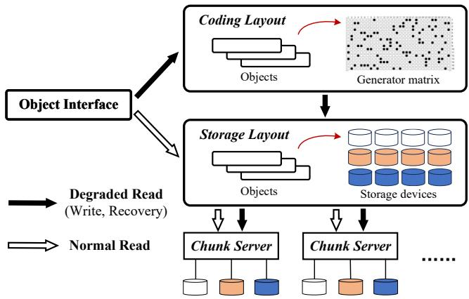  
Figure 5: DRBoost overview

• Asymmetric Repair Patterns. Splitting objects into slices and encoding them into stripes (self-encoding [45]) can enhance read parallelism and reduce repair bandwidth. However, it is challenging to design an object layout that consistently benefits all potential failed chunks, since each object occupies only a portion of the sub-chunks within the large chunk, and the positions of helper sub-chunks vary depending on which chunk is being repaired.

• Fragmented Access Patterns. Fragmented I/O negatively impacts storage system performance [39, 42]. The need for sequential access conflicts with MSR code designs, where each chunk contains multiple sub-chunks, but only part of them are needed for recovery, leading to unavoidable fragmented access.

Furthermore, current production storage systems are not well-suited to support optimizations for MSR codes. First, the chunk (e.g., Ceph’s stripe unit [11], HDFS’s striping cell [4], DAOS’s EC cell [21]) serves as the basic operation unit, which simplifies software development but hinders the incorporation of partial-chunk reconstruction. Second, aligning I/O requests to the stripe leads to I/O amplification, a long-standing issue in Ceph [12, 16] that worsens as the chunk size increases.

## 3 Approach Overview

Design Rationale. As discussed in Section 2.3, the main challenge in applying MSR codes to existing storage systems stems from the disparity between the distinct characteristics of MSR codes and the design principles of traditional storage systems. The key idea of this work is to separate the object layout into two parts: the storage layout, which maps the object space to the storage space, and the coding layout, which maps the object space to the coding space. This separation allows the storage layout to meet the storage system’s requirements while granting the coding layout the flexibility to integrate MSR-specific optimization techniques.

Figure 5 provides an overview of the DRBoost approach and demonstrates the roles of the two layouts in I/O processing. The storage layout indicates the location information of objects within the stripe, which is used for reading and writing storage devices. The coding layout shows how objects are aggregated into data chunks within a stripe, which are then encoded to construct parity chunks. Performing EC operations on stripes organized using the coding layout is essentially equivalent to applying linear transformations to the generator matrix while keeping the storage layout unchanged. Therefore, by abstracting the coding layout, we introduce a novel approach to optimizing MSR coding from a storage system perspective.

Within this framework, coding-related operations, such as degraded reads (the focus of this paper), writes, and recovery, are initially encoded or decoded under the coding layout and then transitioned into the storage layout for accessing storage devices. In contrast, for coding-irrelevant operations, particularly normal reads, the translation between object space and coding space (including reading the coding layout) can be bypassed, allowing the original operation process to remain unchanged.

Design Overview. To mitigate the I/O amplification issue during degraded reads in MSR-coded storage systems, we propose a new approach called DRBoost to boost degraded read performance. Targeting the three properties outlined in Section 2.3, DRBoost employs three key techniques:

• DRBoost mitigates the mismatch between object sizes and chunk sizes by introducing an algorithm that reconstructs only a portion of a chunk. This is accomplished through the concept of a sub-stripe offering independent fault tolerance and is further optimized by incorporating two data reuse mechanisms. (§4.1)

• DRBoost introduces a reconstruction-friendly coding layout to enhance data reuse efficiency during partialchunk reconstruction. It proposes a basic layout unit that adapts to two data reuse mechanisms at a fine granularity, along with a tiered layout structure within the stripe to accommodate objects of varying sizes. (§4.2)

• DRBoost features a fragmentation-free storage layout that optimizes access sequentiality by rearranging subchunks, ensuring that the sub-chunks occupied by an object within a chunk are stored contiguously. (§4.3)

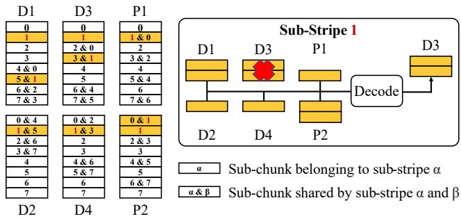  
Figure 6: Sub-stripes with independent fault tolerance

## 4 DRBoost Design

## 4.1 Efficient Partial-Chunk Reconstruction with Data Reuse

Feasibility of Partial-chunk Reconstruction. Bandwidth savings achieved by MSR codes originate from the careful design of parity-check equations, which restricts helper sub-chunks to a specific subset during full-chunk recovery. Furthermore, since each parity-check equation involves a limited number of sub-chunks, it is feasible to selectively request helper subchunks to reconstruct partial sub-chunks within a chunk.

Recall that the recovery process of Clay codes involves decoding MDS stripes and performing pairwise (un)coupling operations across layers. Therefore, we focus on the set of coupled sub-chunks that can be transformed into a layer of uncoupled sub-chunks, which collectively form a stripe of scalar MDS codes. We refer to this set as a sub-stripe 2due to its ability to independently tolerate faults. Like a regular stripe, data loss within the sub-stripe at any node can be reconstructed using its remaining healthy data. However, the sub-stripe differs from the regular stripe in that the data amount each node provides is not always equal.

Consider Figure 6 as an example, where each sub-chunk is labeled with the indices of the sub-stripes to which it belongs. Sub-stripe 1 consists of the sub-chunks required to be transformed into the uncoupled MDS stripe of layer 1. If two sub-chunks on data chunk 3 get lost, the remaining healthy sub-chunks of sub-stripe 1 can independently reconstruct lost sub-chunks. This fault-tolerant property applies to each node.

Exploiting Data Reuse. Similar to scalar MDS codes, partialchunk reconstruction can be achieved by using all sub-stripes from the layers containing the lost object and reconstructing each sub-stripe independently. However, repair bandwidth can be further reduced by exploiting data reuse in two ways.

First, when multiple lost sub-chunks need to be reconstructed, if some belong to the same sub-stripe, the healthy portion of that sub-stripe can be reused as helper data. This approach is referred to as sub-stripe reuse. For example, as shown in Figure 6, two highlighted sub-chunks on data chunk 3 can be reconstructed simultaneously through sub-stripe 1, where the other highlighted healthy sub-chunks from substripe 1 are reused to assist in the reconstruction.

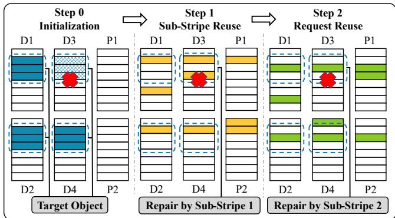  
Figure 7: Lightweight partial-chunk reconstruction (the dotted area represents the scope of the current object request, which is stored using a stripe layout designed for scalar codes)

Second, the healthy portion of the requested object can potentially serve as helper data for reconstruction, a concept referred to as request reuse. For instance, as shown in Figure 6, if an object is stored across the six highlighted sub-chunks in data chunks 1 to 4, no additional helper data is needed from these nodes during a degraded read (e.g., when data chunk 3 is lost), since these sub-chunks already contain the data portion of the sub-stripe 1, which can be used for reconstruction.

Partial-chunk Reconstruction Algorithm. The selection of sub-stripes for degraded reads affects data reuse and, consequently, repair bandwidth. However, searching for the optimal sub-stripe set requires extensive calculations and comparisons, resulting in high computational complexity.

To address this challenge, we prioritize sub-stripe reuse over request reuse for two reasons. First, sub-stripe reuse is generally more efficient, as it ensures the deterministic reuse of all healthy sub-chunks within a sub-stripe. In contrast, request reuse depends on the request location and typically reuses fewer sub-chunks. Second, sub-stripe reuse reduces computational overhead since this approach not only enables the reuse of intermediate uncoupled sub-chunks for decoding multiple lost sub-chunks, but also eliminates the need for extensive comparisons between the number of reused subchunks across different sub-stripe candidates.

Based on these considerations, we propose a lightweight partial-chunk reconstruction algorithm containing three steps:

• Step 0: Identify sub-chunks occupied by the target object, including both healthy and lost ones. As shown in Figure 7, the target object consists of 12 blue sub-chunks, with three lost ones on data chunk 3 (marked with diagonal texture). Next, count the requested but lost sub-chunks in each substripe. Following the sub-stripe structure in Figure 6, the example in Figure 7 shows that sub-stripe 1 has two lost sub-chunks being requested, while sub-stripes 0, 2, and 3 each have one.

• Step 1: Apply sub-stripe reuse to all the sub-stripes with multiple requested but lost sub-chunks. As shown in Figure 7, sub-stripe 1 is selected based on the requested-but-lost sub-chunk count from Step 0. Here, two yellow sub-chunks on data chunk 3 are reconstructed simultaneously by decoding sub-stripe 1 using the remaining yellow sub-chunks.

• Step 2: For the remaining requested but lost sub-chunks that cannot be reconstructed via sub-stripe reuse, select a sub-stripe to maximize request reuse. In Figure 7, both substripes 0 and 2 can reconstruct the green sub-chunk on data chunk 3. However, sub-stripe 2 is preferred for its higher reuse degree, as it allows reusing 3 healthy sub-chunks within the current read request (dotted area), whereas substripe 0 offers none.

## 4.2 Reconstruction-Friendly Coding Layout

Basic Layout Unit. While partial-chunk reconstruction reduces I/O amplification during degraded reads, its effectiveness is limited when applied to objects stored using traditional layout schemes native to scalar codes, such as stripe layout [40] or contiguous layout [38]. This limitation arises for two main reasons: (a) each sub-stripe contains multiple sub-chunks, but objects often span only part of them, preventing full utilization of sub-stripe reuse, and (b) the healthy portions of these objects cannot serve as helper data, thereby reducing the potential for request reuse. To address these challenges, it is essential to adopt a sub-stripe layout tailored for MSR codes, which aligns objects with sub-stripes that offer independent fault tolerance.

However, aligning the object layout with sub-stripes is both infeasible and inefficient due to the sub-chunk overlap between sub-stripes and the asymmetric distribution of subchunks across chunks. As shown in Figure 6, each sub-stripe comprises two types of nodes: nodes that contribute m subchunks and nodes that contribute only one sub-chunk. We refer to the former as major sub-chunks, as the nodes they belong to provide more repair bandwidth, while the latter are called minor sub-chunks. Besides, each sub-chunk plays a major role in one sub-stripe, and most of them, except those that are self-coupled, play a minor role in another sub-stripe.

Therefore, we introduce the concept of basic layout unit, which groups major sub-chunks while excluding minor subchunks within a single sub-stripe, as illustrated by sub-chunks labeled with the same number in the left sub-figure of Figure 8. Since each sub-chunk assumes exactly one major role within a sub-stripe and sub-stripes cover all data sub-chunks, all basic layout units can cover the entire stripe data without duplication or omission. Furthermore, objects aligned with basic layout units naturally conform to sub-stripe reuse, enabling multiple lost sub-chunks to be reconstructed together. This alignment also optimizes request reuse to some extent, as major sub-chunks, which provide higher repair bandwidth, can serve as helper data during sub-stripe reconstruction. Lastly, the granularity of basic layout units is sufficiently fine-grained as each unit contains k sub-chunks, with 1/m of all data nodes contributing m sub-chunks each. This granularity matches the stripe data size of scalar codes with the same chunk size as the MSR codes’ sub-chunk size, thereby alleviating the I/O amplification caused by increasing sub-packetization.

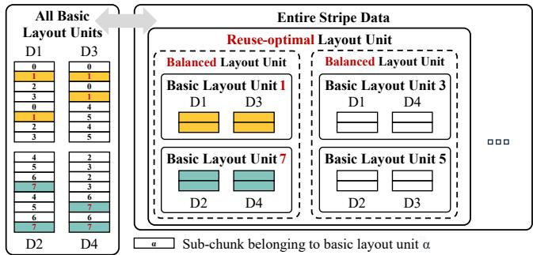  
Figure 8: Tiered layout structure of all basic layout units within a stripe (parity chunks omitted)

Tiered Layout Structure. The allocation of basic layout units affects the degraded read performance of real-world objects, which vary in size and require different numbers of units. For example, sequentially assigning the first two basic layout units in Figure 8 to an object is inefficient, as it utilizes only data nodes 1 and 3 while leaving the other two data nodes unused, thereby reducing read parallelism. The imbalance in subchunk distribution across data nodes arises because each basic layout unit contains 1/m of all data nodes, and the selected chunks are asymmetrically distributed. Furthermore, although basic layout units are designed to prioritize the reuse of major sub-chunks, there is potential for further reuse of minor subchunks, especially when objects span multiple layout units.

The size gap between the basic layout unit and the stripe data size limits the flexibility in accommodating objects of intermediate size. To address this issue, we introduce two intermediate layout units that enhance object layout efficiency and adaptability, as shown in the right sub-figure of Figure 8:

• Balanced Layout Unit: A balanced layout unit consists of m basic layout units and ensures that each data node appears exactly once, distributing data evenly across nodes. Referring to the index notation of Clay codes [61], a basic layout unit with index $z = ( z _ { 0 } , z _ { 1 } , \dots , z _ { t - 1 } )$ , where $\begin{array} { r } { t = \left\lceil \frac { n } { m } \right\rceil } \end{array}$ ， contains nodes whose indices belong to the set $\left\{ \left( z _ { y } , y \right) \left| \right. \right\} =$ $0 , 1 , \ldots , t - 2 \}$ . Thus, to prevent duplicate data nodes, the indices of basic layout units within a balanced layout unit must differ pairwise in the first t − 1 digits. For example, the basic layout unit with index $z = 1 = ( 0 , 0 , 1 )$ includes data chunks at positions $( z _ { 0 } , 0 ) = ( 0 , 0 )$ and $( z _ { 1 } , 1 ) = ( 0 , 1 )$ , corresponding to data chunks D1 and D3, respectively. Moreover, the basic layout units with indices $z = 1 = ( 0 , 0 , 1 )$ and $z = 7 = ( 1 , 1 , 1 )$ differ in their first two digits, indicating that they cover distinct data chunks and can therefore be combined into a balanced layout unit.

```latex
Algorithm 1 Layout allocation sequence generation
Input: Code parameters
Output: Sequence of basic layout units S
1: $S \gets [ ]$
2: // Iterate over Reuse-optimal Layout Units
3: for $z _ { t - 1 } = 0 , \ldots , m - 1$ do
4: // Iterate over Balanced Layout Units
5: for $z _ { [ 1 , t - 1 ) } = 0 , . . . , m ^ { t - 2 } - 1$ do
6: $z _ { [ 1 , t ) } \gets z _ { [ 1 , t - 1 ) } \times m + z _ { t - 1 }$
7: // Iterate over Basic Layout Units
8: for $z _ { 0 } = 0 , \ldots , m - 1$ do
9: $\mathbf { \alpha } _ { \mathsf { \alpha } [ 0 , t ) } \gets ( 0 , z _ { 1 } , \ldots , z _ { t - 1 } )$
10: $/ / \dot { D i g } i t  – \dot { W i s e }$ Modulo Addition
11: for $y = 0 , \ldots , t - 2$ do
12: ${ \bf { \alpha } } { \bf { \alpha } } _ { \bf { { \alpha } } } ( { \bf { \alpha } } _ { \bf { { \alpha } } } ) \gets ( { \bf { \alpha } } { \bf { \alpha } } _ { \bf { { \alpha } } } + z _ { 0 } )$ mod m
13: S .push_back(α[0,t))
14: return S
```

• Reuse-optimal Layout Unit: A reuse-optimal layout unit is a set of basic layout units where reconstruction does not require additional helper data from any data node during a node failure. Reconstructing basic layout units requires minor sub-chunks in the corresponding sub-stripe, and these minor sub-chunks can be reused when the indices of two sub-stripes differ by only one specific digit among the first t − 1 digits. Thus, all basic layout units sharing the same zt−1 index collectively form a reuse-optimal layout unit. For example, the basic layout units with indices $z = 1 = ( 0 , 0 , 1 )$ ， $z = 7 = ( 1 , 1 , 1 ) , z = 3 = ( 0 , 1 , 1 )$ , and $z = 5 = ( 1 , 0 , 1 )$ cover all basic layout units whose last digit is 1. These basic layout units can collectively form a reuse-optimal layout unit and require no additional helper data from data chunks during data reconstruction.

Coding Layout for Varying-sized Objects. When aggregating multiple objects into a stripe, their coding layouts are determined during the sub-chunk allocation process, which builds upon the basic layout unit and the hierarchical structure illustrated in Figure 8. Specifically, Algorithm 1 formalizes the generation of the basic layout unit allocation sequence, which determines the final coding layout. As an example, consider the requested object shown in Figure 7. Suppose this object arrives after four sub-chunks (i.e., one basic layout unit) have already been allocated; it is assigned to the basic layout units 6, 2, 4, according to the allocation sequence 0, 6, 2, 4, 1, 7, 3, 5 for (6, 4) Clay codes following Algorithm 1.

For clarity, we categorize the coding layout of aggregated objects within a stripe into two cases. First, for objects that span multiple basic layout units, the allocation sequence ensures their reconstruction-friendly properties. Successive basic layout units assigned to the same object are likely to form balanced or reuse-optimal layout units, improving load balance and reuse efficiency. Second, for objects smaller than a basic layout unit or with misaligned portions, they are continuously aggregated within one or more basic layout units to avoid internal fragmentation. Additionally, small objects are preferentially placed in a single chunk rather than being striped, which helps mitigate the impact of tail latencies.

## 4.3 Fragmentation-Free Storage Layout

Fragmentation Elimination. The coding layout previously discussed offers a theoretical pathway to significantly reduce the degraded read amplification ratio. However, it comprises fragmented sub-chunks within each data node, which results in performance degradation since request splitting affects the entire I/O process. Besides, maintenance costs increase due to the need for additional metadata for object locations, given the asymmetric sub-chunk distribution across data nodes.

To address this issue, we propose a fragmentation elimination method that generates storage layout schemes based on the position of basic layout units and their allocation sequence, as illustrated in Figure 9. First, sub-chunks within each data node are rearranged so that those belonging to the same basic layout unit are placed contiguously, allowing the basic layout unit to be viewed as a whole. Second, the basic layout units within each data node are adjusted to preserve their sequential order of allocation, as specified in Algorithm 1, ensuring that consecutively allocated basic layout units are placed adjacent to each other. Consequently, objects are continuously stored within each data node. For example, the requested object shown in Figure 7 is assigned to basic layout units 6, 2, 4, as described in Section 4.2. Its storage layout can be obtained from the right sub-figure of Figure 9, with its sub-chunks placed contiguously on the corresponding chunks.

Coding-storage Mapping. The reconstruction-friendly coding layout aims to reduce the theoretical amplification ratio, while the fragmentation-free storage layout is designed to meet the requirements of storage systems. To enable the coexistence of these two layouts, we propose a coding-storage mapping method that allows objects to occupy fragmented sub-chunks in the coding address space while being stored continuously in the storage address space.

We employ mapping tables to facilitate bidirectional translation between the coding and storage address spaces, with the sub-chunk serving as the basic translation unit. A common concern is the risk of increased storage costs of mapping tables, as objects may vary in size and have different coding and storage layouts across all stripes. However, the mapping relationship is deterministic because layout sequences determine the sub-chunk order, making it independent of the sizes or order of aggregated objects. Consequently, mapping tables can be shared among all stripes with the same (n, k) configuration, minimizing additional storage overhead. For instance, all (20, 16) Clay stripes can share a single mapping table, whose size is $2 \times S i z e _ { T a b l e E n t r y } \times \mathbf { \boldsymbol { \alpha } } \times \boldsymbol { k } = 2 \times 4 \boldsymbol { B } \times 1 0 2 4 \times 1 6$ = 128KB, where each entry is stored as a 4-byte integer.

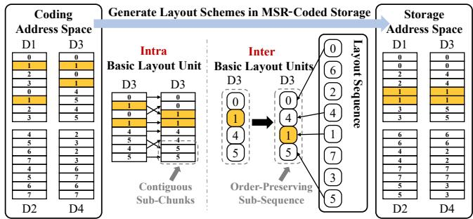  
Figure 9: Fragmentation elimination in MSR-coded storage

Metadata Management and I/O Workflow. The proposed mapping strategy enables the coexistence of coding and storage layouts. However, the way these two layouts are stored and when translations are triggered are crucial for both implementation convenience and performance efficiency.

In our metadata design, storage addresses, rather than coding addresses, are used to locate objects, which simplifies the metadata structure and ensures that normal read operations do not require additional address translation. Since aggregating objects into large stripes (e.g., Facebook F4 [38]), regardless of the coding scheme, requires necessary metadata such as offset and length to locate objects, we argue that DRBoost’s MSRspecific design does not introduce additional object metadata: its deterministic sub-chunk allocation enables locating both coding and storage layout units directly from an object’s offset and length, even for small or misaligned objects.

We isolate unnecessary translation from normal I/O operations to avoid modifications to the I/O stack and minimize adverse effects on system performance. For write operations, objects aligned with balanced layout units can be easily split into k equal-sized slices. However, for misaligned portions of objects, the data allocation across nodes must be computed based on the layout allocation sequence. During degraded reads, the process begins with translating the request’s storage address into the corresponding coding address, followed by partial-chunk reconstruction. The expanded coding addresses, along with the necessary helper data for reconstruction, are then translated back into storage addresses to interact with storage devices.

In summary, the reconstruction-friendly coding layout discussed in Section 4.2 is implemented as an extension of the coding module rather than as an additional abstraction layer, thereby minimizing its impact on the storage system.

Discussion. In the DRBoost design, we employ deterministic strategies to minimize metadata overhead associated with address translation and to reduce potential computational costs.

However, we recognize that adaptive methods, such as dynamically selecting objects for aggregation and customizing coding layouts for each stripe, have not been fully explored, and these approaches could offer additional performance benefits. We consider it a promising direction for future research.

## 5 Implementation

We implement DRBoost as a prototype system in C++ (§5.1) and integrate it into Ceph with essential modifications (§5.2).

## 5.1 Prototype System

To perform MSR coding operations, we use Intel’s Intelligent Storage Acceleration Library (ISA-L) [22]. Some MSRspecific implementation details are as follows:

Degraded Read Trigger. In traditional RS-coded storage systems, it is common to send k data chunk requests along with ∆ redundant chunk requests and decode the first k that arrive [30, 45], thereby incorporating degraded read handling into the normal read process. However, this approach is unsuitable for MSR codes due to the asymmetric nature of helper data used to reconstruct different chunks, as well as the significant bandwidth overhead associated with the redundant large chunks. As a result, monitoring mechanisms, such as heartbeat packets, are essential in MSR-coded storage systems to determine whether a degraded read should be performed based on the status of the relevant data nodes.

Two-Phase Write. Due to the large chunk and stripe sizes in MSR codes, creating or updating an object can result in significant I/O amplification if the parity chunks are updated accordingly. To mitigate this, we employ a two-phase write scheme when aggregating objects into the stripe, similar to the approach in previous work [23]. In this scheme, objects are first written to a replicated-type pool, with one replica directly placed in its intended location within the stripe of the erasurecoded pool. After all object data within a stripe is written and the corresponding parity chunks are then computed and stored on the disks, the objects are logically transitioned to the erasure-coded pool. Additionally, object updates are treated as new writes, and partially valid stripes are periodically recycled and merged when the system is idle.

## 5.2 Integration into Ceph

Ceph [1, 63] is a widely-used, open-source distributed object storage system that supports erasure coding for fault tolerance. The concept of the sub-chunk was first introduced when integrating Clay codes into Ceph [59]. However, several implementation details remain incompatible with MSR codes, posing challenges for MSR-specific optimizations: (a) Ceph aligns requests to the stripe by default, leading to I/O amplification when only a portion of the stripe is accessed [12];

<table><tr><td rowspan=1 colspan=1>Trace Name</td><td rowspan=1 colspan=1>Object Size Range</td><td rowspan=1 colspan=1>Mean</td><td rowspan=1 colspan=1>Median</td></tr><tr><td rowspan=1 colspan=1>Ali [56]</td><td rowspan=1 colspan=1>[4KB,1GB]</td><td rowspan=1 colspan=1>2.8MB</td><td rowspan=1 colspan=1>16KB</td></tr><tr><td rowspan=1 colspan=1>IBM[14]</td><td rowspan=1 colspan=1>(0,100MB]</td><td rowspan=1 colspan=1>2.6MB</td><td rowspan=1 colspan=1>26KB</td></tr><tr><td rowspan=1 colspan=1>FBPhoto [38]</td><td rowspan=1 colspan=1>[10KB,1MB]</td><td rowspan=1 colspan=1>253KB</td><td rowspan=1 colspan=1>85KB</td></tr><tr><td rowspan=1 colspan=1>FBVideo [38]</td><td rowspan=1 colspan=1>[100KB,1GB]</td><td rowspan=1 colspan=1>24MB</td><td rowspan=1 colspan=1>5.4MB</td></tr></table>

Table 2: Description of Real-World Traces

(b) Ceph recovers full chunks by default, lacking support for partial-chunk reconstruction, which also results in I/O amplification; and (c) Ceph performs online encoding when writing objects by default, which aligns small objects with large MSR stripes, leading to significant I/O amplification.

We provide a brief overview of the modifications made to Ceph and Rados [65] to enable the use of DRBoost.

Librados API. Librados provides read and write functions that only support full-stripe operations. However, an object may occupy only part of the stripe and the coding layout may divide objects into multiple slices. To enable partialstripe reads, we implement a new interface that supports batch reading of multiple slices within a stripe. For partial-stripe writes, we introduce an interface that allows appending data smaller than the chunk size in a single operation.

EC Module. Ceph’s EC modules use chunk indices as inputs to calculate helper data positions and perform decoding. However, partial-chunk reconstruction requires more detailed positional information. Currently, we implement the reconstruction logic within the prototype system, using Ceph solely for data access. Integrating the partial-chunk reconstruction algorithm into Ceph is a potential direction for future work.

EC Backend. Instead of aligning read requests with the stripe size, we first specify the exact target location using a slice map. These positions are then added to the ECSubRead structure [9] for inter-node communication. Next, we ensure that the data nodes correctly process the sub-read operations based on ECSubRead packets. Finally, we modify the callback function to properly assemble the slices into the target object.

## 6 Performance Evaluation

## 6.1 Methodology

Testbed. Our evaluations are conducted on a cluster of 40 ecs.g8i.xlarge instances [3] on Alibaba Cloud, each equipped with 4 vCPUs and 16 GiB RAM. Among them, 30 instances act as storage nodes, each hosting a 100GiB ESSD AutoPL disk [2], while the remaining 10 instances serve as client nodes, each spawning eight worker threads. All instances are connected via a 4Gbps network.

Workloads and Baselines. Since read latency is closely correlated with the object size, we use synthetic fixed-size objects as micro-benchmarks, thereby enabling clear comparisons. Moreover, we evaluate the performance of DRBoost using object size distributions derived from real-world production traces, including those from Alibaba Cloud Object Storage [56], IBM Cloud Object Storage [14], and two distinct datasets of HD photos and HD videos from Facebook’s F4 BLOB Storage [38] 3. The characteristics of objects from these traces are shown in Table 2.

The read latency is evaluated by letting all client threads send read requests simultaneously. For each workload, we load 500 GB of objects and run each test for 2 minutes. To simulate an unavailability event, we mark one OSD as down, and the degraded read performance is assessed when accessing objects located on the above offline OSD.

We use a modified version of the Clay implementation in Ceph [59, 61] as our baseline to ensure a fair comparison. First, since Ceph reconstructs the entire stripe when degraded reads occur, we enable Ceph to reconstruct a single chunk. Second, since Ceph naturally aligns objects to the stripe size, we also enable object aggregation within a stripe.

Default Settings. The default EC setting uses the (20, 16) Clay codes, with a corresponding sub-packetization level of α = 420/4 = 1024. The sub-chunk size is set to 16KB, as the instances are equipped with SSDs. Additionally, the data declustering strategy [37] is employed, with the number of placement groups [10] set to 128.

## 6.2 Overall Performance

We begin by comparing the overall performance of object reads before and after integrating DRBoost into Ceph. The results are presented in Figures 10 and 11.

Synthetic Workloads. Figure 10a and Figure 10b show the mean and P99 latency for all read requests. The results indicate that although degraded reads account for only about 3% of all read requests in our evaluation, their over-amplified latencies significantly impact overall service quality. Specifically, DRBoost reduces the mean latency by ×2.19 to ×60.7 and the P99 latency by ×4.65 to ×212.

Figure 10c and Figure 10d present a detailed view of the degraded read performance. DRBoost reduces degraded read latency by factors ranging from ×11.7 to ×213 and lowers the amplification ratios from ×16.0 to ×156.9. Performing full-chunk reconstructions indiscriminately leads to unnecessary data access and consistently high latency. However, DRBoost mitigates this issue by introducing the partial-chunk reconstruction algorithm along with a reconstruction-friendly object layout strategy. The efficiency of DRBoost is further supported by the amplification ratio results, which show that DRBoost maintains a low amplification ratio when the object size exceeds the basic layout unit (256KB).

Real-world Workloads. Figure 11 presents the overall performance results under real-world workloads. As shown in Figure 11a and Figure 11b, DRBoost reduces the mean latency by ×1.28 to ×20.2 and the P99 latency by ×1.15 to ×66.1. For objects with significantly varying sizes, such as those in Ali traces, performance degradation can be partly masked by large objects. These objects, which can span nearly entire or more stripes, have high normal read latency and the amplification in their degraded read latency is less noticeable. In contrast, for objects with consistently smaller sizes, such as those in FBPhoto traces, DRBoost significantly improves overall read performance, similar to the results observed under synthetic workloads.

When comparing the degraded read latency individually, DRBoost shows substantial improvements across all workloads, as shown in Figure 11c and Figure 11d. Specifically, DRBoost reduces the mean degraded read latency by ×2.45 to ×89.2 and the mean amplification ratio by ×24.6 to ×557. Unlike full-chunk reconstruction, DRBoost only accesses the necessary helper data, resulting in the mean latency to scale with the average object size across these traces. Additionally, the amplification ratio results indicate that DRBoost provides greater speedups for smaller objects, while maintaining low amplification ratios when object sizes are consistently large.

## 6.3 Effects of Individual Techniques

In this section, we present the evaluation results of the individual techniques’ contributions to the read performance.

Degraded Reads. Figure 12a illustrates the impact of individual techniques on the latency of degraded reads. The partial-chunk reconstruction algorithm is essential in addressing the granularity mismatch issue between object and chunk sizes, particularly for small objects, and the speedup can reach up to ×72.3. This improvement arises because only lost subchunks containing the target object, rather than the entire chunk, are reconstructed. The coding layout provides significant speedups across objects of all sizes, with speedup factors ranging from ×2.95 to ×4.90. This is due to DRBoost’s alignment of object layouts with sub-stripes and its awareness of request reuse, which reduces repair bandwidth. Notably, the coding layout’s consistent positive impact across all object sizes demonstrates the effectiveness of the tiered structure of layout units, since the reuse degree improves progressively with the object size. Finally, although the storage layout is primarily designed for normal reads, it also offers some benefits for degraded reads. By storing objects continuously within each data node, the access to their healthy parts is optimized, resulting in speedups of up to ×1.28.

Normal Reads. We also assess whether designs optimized for degraded reads negatively impact normal read performance, given that objects are split and rearranged to align with the coding layout. Figure 12b presents the results. As expected, partial reconstruction does not affect normal read performance because it does not modify the object layout. However, the coding layout does negatively impact the normal read performance. The latency increases by ×1.25 to ×1.38 due to the splitting of objects into multiple slices on each device, which causes fragmentation and leads to random I/O access delays. Nevertheless, the storage layout mitigates this issue by maintaining a fragmentation-free layout on each device and allowing normal read requests to bypass sub-chunk translation. Consequently, DRBoost enhances degraded read performance without compromising normal read performance.

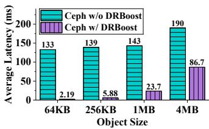  
(a) Mean latency of all reads

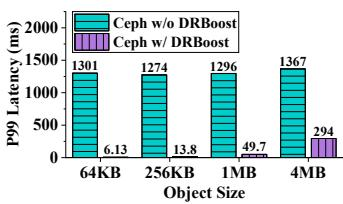  
(b) P99 latency of all reads

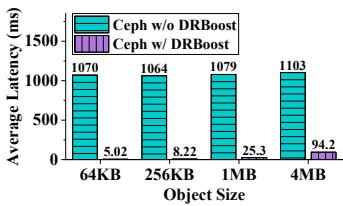  
(c) Mean latency of degraded reads

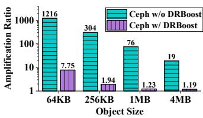  
(d) Mean AR of degraded reads

Figure 10: Overall performance under synthetic workloads  
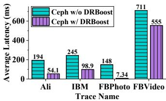  
(a) Mean latency of all reads

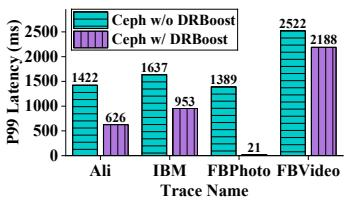  
(b) P99 latency of all reads

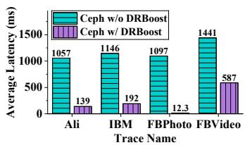  
(c) Mean latency of degraded reads

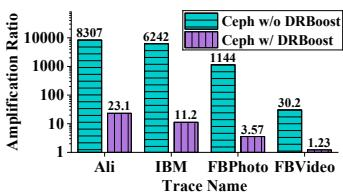  
(d) Mean AR of degraded reads

Figure 11: Overall performance under real-world workloads  
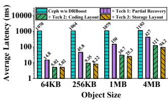  
(a) Degraded reads, log scale

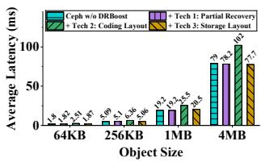  
(b) Normal reads

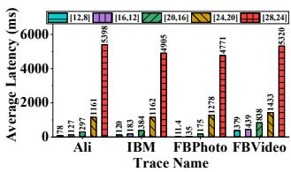  
(a) Ceph w/o DRBoost

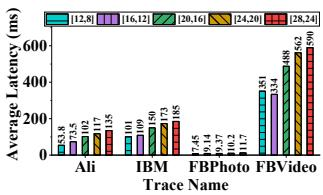  
(b) Ceph w/ DRBoost  
Figure 12: Performance contribution of individual techniques

Figure 13: Impact of data chunk count k  
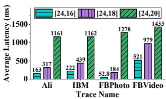

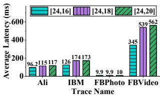  
(a) Ceph w/o DRBoost  
(b) Ceph w/ DRBoost

## 6.4 Parameter Sensitivity

Impact of (n, k) Settings. We conduct a sensitivity study on the impact of the (n, k) settings on DRBoost by varying k and m. Note that with existing MSR codes, excessively wide stripes result in impractically large chunk sizes for storage systems. For example, a (104, 100) Clay code would require a 16 EB chunk size, which far exceeds the capacity of a typical storage device. Therefore, we fix m=4 and vary k from 8 to 24, as the (28, 24) configuration represents the largest possible setup supported by Ceph due to its U\_INT\_MAX/2 (2 GiB)

Figure 14: Impact of parity chunk count m

stripe size limit, with the sub-chunk size set to 4KB.

Figure 13 illustrates the impact of k on degraded read performance before and after applying DRBoost to Ceph. Results show that as k increases, both DRBoost and baseline experience higher degraded read latency due to requiring more helper data for reconstruction. However, DRBoost shows a significantly smaller latency increase, leading to greater speedups compared to baseline. The greater speedups can be attributed to the increased sub-packetization level of MSR codes as k grows, which results in larger chunk sizes for a fixed subchunk size. Thus, for given workloads, the object sizes become relatively smaller compared to the chunk size, allowing

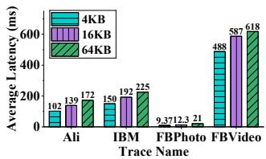  
Figure 15: Impact of sub-chunk size

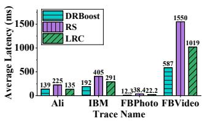  
Figure 16: Comparison with scalar codes

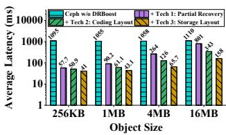  
(a) HDD, log scale

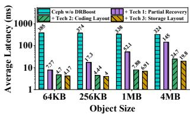  
(b) SSD, log scale  
Figure 17: Impact of storage device type

DRBoost to reduce read amplification more effectively.

A similar trend is observed when fixing n=24 and varying m from 8 to 6 to 4, as shown in Figure 14. DRBoost achieves higher speedups than baseline because object sizes become relatively smaller compared to the chunk size. Specifically, as m decreases with a fixed n, the sub-packetization level of MSR codes increases, since it is a monotonically decreasing function $m ^ { n / m }$ when m exceeds Euler’s number, e.

Impact of Sub-chunk Size. We assess the impact of subchunk size by varying it from 4KB to 64KB, with the results presented in Figure 15. As discussed in Section 2.2, larger sub-chunk sizes are essential for fully utilizing the storage device, which in turn accelerates the recovery process. However, for degraded reads, increasing the sub-chunk size leads to higher read latency. This occurs because smaller sub-chunk sizes result in object sizes that are closer to the stripe size, facilitating greater data reuse. As a result, less helper data is needed for reconstruction, which lowers the degraded read latency. Therefore, selecting an optimal sub-chunk size involves balancing the trade-off between recovery performance and degraded read performance.

Impact of Storage Device Type. Since the cloud testbed uses virtual elastic SSDs, we perform a sensitivity evaluation on the type of storage device using a local cluster with unvirtualized storage. This cluster comprises five servers, each equipped with dual Intel Xeon Silver 4310 CPUs and 128GB 3200 MHz DDR4 RAM. Four servers serve as storage nodes, each containing 5×4TB 7200RPM SATA3 HDDs and 5×1.92TB SATA3 SSDs. The fifth server functions as the client node, with eight worker threads. Servers are connected via a 100Gbps Infiniband network utilizing IPoIB. The subchunk size is set to 16 KB for SSDs and 64 KB for HDDs, as the latter represents the maximum possible size under Ceph’s

U\_INT\_MAX/2 (2 GiB) stripe size limitation.

The results, shown in Figure 17, reveal that the partial reconstruction algorithm performs effectively across different storage devices. Furthermore, since SSDs are less sensitive to random access performance, the coding layout alone provides substantial speedups. In contrast, since HDDs are sensitive to random access, although the coding layout theoretically reduces the amplification ratio, its impact on end-to-end latency is fully realized when fragmentation issues are addressed.

## 6.5 Comparison with Scalar Codes

While MSR codes typically minimize repair traffic during full-chunk recovery, their performance advantages can be limited by I/O amplification during degraded reads. Therefore, we evaluate whether DRBoost can preserve the performance advantages of MSR codes compared to RS codes and LRCs in degraded read scenarios. In these scalar codes [20, 33, 38, 67, 70], objects are grouped into fixed-size chunks, which are then encoded into stripes. We conduct a comparison with scalar codes using the default (20,16) setting and a chunk size of 16 MB. Specifically, the LRC scheme includes two local and two global parity chunks. To ensure fairness, we enable partial-chunk reconstruction at 4 KB granularity for both RS codes and LRCs in our Ceph-based environment.

As shown in Figure 16, DRBoost delivers performance comparable to that of LRCs when handling a large number of small 4 KB objects, as observed in the Alibaba traces. This results from DRBoost’s current implementation, which reconstructs data at the sub-chunk granularity of 16 KB to simplify design. Consequently, reconstructing objects smaller than the sub-chunk size incurs I/O amplification. In other cases, DRBoost improves degraded read latency by a factor of ×1.62 to ×3.12 compared to RS codes, and by ×1.52 to ×1.80 compared to LRC codes.

As a result, MSR codes, when implemented with DRBoost, become suitable not only for reliable cold storage but also for latency-sensitive warm workloads, extending the practical benefits of their optimal storage efficiency and repair bandwidth to a broader range of applications.

## 6.6 Metadata Memory Overhead

DRBoost adopts a deterministic mapping strategy, where a single mapping table is shared across all stripes with the same coding scheme and (n, k) configuration. This design keeps the memory overhead very low. Specifically, the mapping table is implemented using two integer pointer arrays in C++, resulting in an exact memory overhead of 128 KB for the (20, 16) Clay codes evaluated.

Since the mapping table size is determined by the subpacketization level and stripe width, even in large-scale clusters with tens of different coding schemes or configurations, the total memory overhead remains in the range of tens of

MBs, which is a negligible cost compared to the tens or hundreds of GBs of RAM typically available on each server.

## 7 Applicability to General MSR Codes

In this section, we discuss the applicability of DRBoost to general MSR codes.

First, DRBoost’s focus on MSR codes with a coupledlayer structure does not substantially limit its applicability. As proven in prior work [6], any disk-read-optimal MSR code that achieves the lower bound on the sub-packetization level inherently has a coupled-layer structure. Therefore, DRBoost applies to a broad class of advanced MSR codes, including those proposed in [31, 32, 50, 60, 66]. As discussed in Section 2, a higher sub-packetization level leads to larger chunk sizes, which in turn exacerbate the I/O amplification problem. We argue that minimizing the sub-packetization level is an emerging trend in recent MSR code designs, making DRBoost well-suited for these emerging approaches.

Second, for MSR codes without a coupled-layer structure, the current design of DRBoost is not directly applicable. Nevertheless, high-level optimization principles of DRBoost, which include reconstructing at the granularity of sub-stripes, aligning the object layout with sub-stripes, and eliminating storage fragmentation, may still be beneficial. In such cases, the specific algorithms would require adaptation to accommodate the structural characteristics of the target MSR code.

## 8 Related Work

Design of MSR Codes. Several designs of MSR codes have emerged since their inception [13], but early schemes pose challenges when applied to storage systems. F-MSR codes [18] incur high decoding costs when accessing healthy data. Product-Matrix MSR codes [46,48] are restricted to specific (n, k) parameters, making them unsuitable for storageefficient scenarios with high data-to-parity ratios. Butterfly codes [41], optimized for XOR operations, support only two parities and require a high sub-packetization level. Although ZigZag codes [57] and HashTag codes [28] support arbitrary (n, k) parameters, they have drawbacks: ZigZag codes are nonexplicit and require programmatic searching for coefficients, while HashTag codes need a large field size and lack efficient software support. Currently, Clay codes [61] represent the state-of-the-art MSR design, offering flexible configuration, a low field size, and the optimal sub-packetization level. Therefore, we focus on applying our designs to Clay codes.

System-level Optimizations of MSR Codes. While MSR codes offer theoretically optimal repair bandwidth, their implementation in distributed storage systems presents several system-level challenges. Therefore, several approaches have been developed to optimize full-chunk recovery. ParaRC [34] distributes and parallelizes the repair of sub-chunks across all healthy nodes, alleviating potential repair bottlenecks. G-Clay [35] reorganizes sub-chunk positions to enhance the overall continuity of sub-chunks, thereby improving disk read efficiency. Geometric Partitioning [56] targets large-object scenarios by maintaining multiple groups of stripes where sub-chunk sizes follow a geometric sequence and partitioning each object into a series of chunks, which reduces I/O amplification. In contrast, DRBoost is the first approach to propose and optimize the partial-chunk reconstruction, significantly improving the versatility and scalability of MSR codes.

## 9 Conclusion

The mismatch between object and MSR codes’ chunk sizes significantly exacerbates I/O amplification during degraded reads, as it necessitates reconstructing entire chunks to retrieve a single object. This paper proposes DRBoost, an approach to boosting the performance of degraded reads in MSRcoded storage clusters. DRBoost optimizes degraded reads by introducing the concept of data reuse, incorporating both a reconstruction-friendly coding layout and a fragmentationfree storage layout. Experimental results show that DRBoost effectively reduces the latency of degraded reads by one to two orders of magnitude.

## Acknowledgments

We thank all reviewers for their insightful comments and helpful suggestions. We are especially grateful to our shepherd, Xiaolu Li, for her detailed and patient guidance during our camera-ready preparation. This work was supported by the National Natural Science Foundation of China under Grant 62025203.

## References

[1] Abutalib Aghayev, Sage Weil, Michael Kuchnik, Mark Nelson, Gregory R Ganger, and George Amvrosiadis. File systems unfit as distributed storage backends: Lessons from 10 years of Ceph evolution. In Proceedings of the 27th ACM Symposium on Operating Systems Principles (SOSP 19), pages 353–369, 2019.

[2] Alibaba Cloud Company. User guide of ESSD AutoPL disks. https://www.alibabacloud.com/help/en /ecs/user-guide/essd-autopl-disks, 2025.

[3] Alibaba Cloud Company. User guide of general-purpose g8i instances. https://www.alibabacloud.com/h elp/en/ecs/user-guide/general-purpose-ins tance-families#g8i, 2025.

[4] Apache Software Foundation. HDFS erasure coding. https://hadoop.apache.org/docs/stable/hado

op-project-dist/hadoop-hdfs/HDFSErasureCod ing.html, 2024 (Version 3.4.1).

[5] Jens Axboe. FIO - Flexible I/O Tester. https://gith ub.com/axboe/fio, 2023 (Version 3.36).

[6] SB Balaji and P Vijay Kumar. A tight lower bound on the sub-packetization level of optimal-access MSR and MDS codes. In 2018 IEEE International Symposium on Information Theory (ISIT 18), pages 2381–2385. IEEE, 2018.

[7] Eric A Brewer. Lessons from giant-scale services. IEEE Internet Computing, 5(4):46–55, 2001.

[8] Brad Calder, Ju Wang, Aaron Ogus, Niranjan Nilakantan, Arild Skjolsvold, Sam McKelvie, Yikang Xu, Shashwat Srivastav, Jiesheng Wu, Huseyin Simitci, et al. Windows Azure storage: A highly available cloud storage service with strong consistency. In Proceedings of the Twenty-Third ACM Symposium on Operating Systems Principles (SOSP 11), pages 143–157, 2011.

[9] Ceph authors and contributors. ECSubRead struct in Ceph repository. https://github.com/ceph/ceph /blob/quincy/src/osd/ECMsgTypes.h#L105, 2022 (Version Quincy).

[10] Ceph authors and contributors. Placement Groups in Ceph. https://docs.ceph.com/en/quincy/rado s/operations/placement-groups/, 2022 (Version Quincy).

[11] Ceph authors and contributors. Pool, PG and CRUSH config reference. https://docs.ceph.com/en/qui ncy/rados/configuration/pool-pg-config-ref, 2022 (Version Quincy).

[12] Xiaofei Cui. EC partial stripe reads in Ceph. https: //github.com/ceph/ceph/pull/23138, 2019.

[13] Alexandros G Dimakis, P Brighten Godfrey, Yunnan Wu, Martin J Wainwright, and Kannan Ramchandran. Network coding for distributed storage systems. IEEE transactions on information theory (TIT), 56(9):4539– 4551, 2010.

[14] Ohad Eytan, Danny Harnik, Effi Ofer, Roy Friedman, and Ronen Kat. It’s time to revisit LRU vs. FIFO. In 12th USENIX Workshop on Hot Topics in Storage and File Systems (HotStorage 20), 2020.

[15] Daniel Ford, François Labelle, Florentina I Popovici, Murray Stokely, Van-Anh Truong, Luiz Barroso, Carrie Grimes, and Sean Quinlan. Availability in globally distributed storage systems. In 9th USENIX Symposium on Operating Systems Design and Implementation (OSDI 10), pages 61–74, 2010.

[16] Runzhou Han, Chao Shi, Tabassum Mahmud, Zeren Yang, Vladislav Esaulov, Lipeng Wan, Yong Chen, Jim Wayda, Matthew Wolf, and Mai Zheng. Revisiting erasure codes: A configuration perspective. In Proceedings of the 16th ACM Workshop on Hot Topics in Storage and File Systems (HotStorage 24), pages 93–100, 2024.

[17] Yaochen Hu, Yushi Wang, Bang Liu, Di Niu, and Cheng Huang. Latency reduction and load balancing in coded storage systems. In Proceedings of the 2017 Symposium on Cloud Computing (SoCC 17), pages 365–377, 2017.

[18] Yuchong Hu, Henry CH Chen, Patrick PC Lee, and Yang Tang. NCCloud: Applying network coding for the storage repair in a cloud-of-clouds. In 10th USENIX Conference on File and Storage Technologies (FAST 12), volume 21, 2012.

[19] Yuchong Hu, Liangfeng Cheng, Qiaori Yao, Patrick PC Lee, Weichun Wang, and Wei Chen. Exploiting combined locality for wide-stripe erasure coding in distributed storage. In 19th USENIX Conference on File and Storage Technologies (FAST 21), pages 233–248, 2021.

[20] Cheng Huang, Huseyin Simitci, Yikang Xu, Aaron Ogus, Brad Calder, Parikshit Gopalan, Jin Li, and Sergey Yekhanin. Erasure coding in Windows Azure storage. In 2012 USENIX Annual Technical Conference (USENIX ATC 12), pages 15–26, 2012.

[21] Intel Corporation. DAOS erasure coding. https:// docs.daos.io/v2.0/admin/pool\_operations/#e c-cell-size-ec\_cell\_sz, 2025 (Version 2.6.2).

[22] Intel Corporation. Intel intelligent storage acceleration library. https://github.com/intel/isa-l, 2025 (Version v2.31.1).

[23] Tianyang Jiang, Guangyan Zhang, Zican Huang, Xiaosong Ma, Junyu Wei, Zhiyue Li, and Weimin Zheng. FusionRAID: Achieving consistent low latency for commodity SSD arrays. In 19th USENIX Conference on File and Storage Technologies (FAST 21), pages 355–370, 2021.

[24] Saurabh Kadekodi, Shashwat Silas, David Clausen, and Arif Merchant. Practical design considerations for wide locally recoverable codes LRCs. In 21st USENIX Conference on File and Storage Technologies (FAST 23), pages 1–16, 2023.

[25] Osama Khan, Randal C Burns, James S Plank, William Pierce, and Cheng Huang. Rethinking erasure codes for cloud file systems: Minimizing I/O for recovery and degraded reads. In 10th USENIX Conference on File and Storage Technologies (FAST 12), page 20, 2012.

[26] Andy Klein. How Backblaze scales our storage cloud. https://www.backblaze.com/blog/how-backbla ze-scales-our-storage-cloud/, 2024.

[27] Oleg Kolosov, Gala Yadgar, Matan Liram, Itzhak Tamo, and Alexander Barg. On fault tolerance, locality, and optimality in locally repairable codes. ACM Transactions on Storage (TOS), 16(2):1–32, 2020.

[28] Katina Kralevska, Danilo Gligoroski, Rune E Jensen, and Harald Øverby. Hashtag erasure codes: From theory to practice. IEEE Transactions on Big Data (TBD), 4(4):516–529, 2017.

[29] Sangmin Lee, Zhenhua Guo, Omer Sunercan, Jun Ying, Thawan Kooburat, Suryadeep Biswal, Jun Chen, Kun Huang, Yatpang Cheung, Yiding Zhou, et al. Shard Manager: A generic shard management framework for geo-distributed applications. In Proceedings of the ACM SIGOPS 28th Symposium on Operating Systems Principles (SOSP 21), pages 553–569, 2021.

[30] Youngmoon Lee, Hasan Al Maruf, Mosharaf Chowdhury, Asaf Cidon, and Kang G Shin. Hydra: Resilient and highly available remote memory. In 20th USENIX Conference on File and Storage Technologies (FAST 22), pages 181–198, 2022.

[31] Guodong Li, Ningning Wang, Sihuang Hu, and Min Ye. Msr codes with linear field size and smallest subpacketization for any number of helper nodes. IEEE Transactions on Information Theory (TIT), 2024.

[32] Jie Li, Xiaohu Tang, and Chao Tian. A generic transformation for optimal repair bandwidth and rebuilding access in mds codes. In 2017 IEEE International Symposium on Information Theory (ISIT 17), pages 1623–1627. IEEE, 2017.

[33] Shenglong Li, Quanlu Zhang, Zhi Yang, and Yafei Dai. BCStore: Bandwidth-efficient in-memory KV-store with batch coding. 33rd International Conference on Massive Storage Systems and Technology (MSST 17), 2017.

[34] Xiaolu Li, Keyun Cheng, Kaicheng Tang, Patrick PC Lee, Yuchong Hu, Dan Feng, Jie Li, and Ting-Yi Wu. ParaRC: Embracing sub-packetization for repair parallelization in MSR-coded storage. In 21st USENIX Conference on File and Storage Technologies (FAST 23), pages 17–32, 2023.

[35] Baijian Ma, Yuchong Hu, Dan Feng, Ray Wu, and Kevin Zhang. Repair I/O optimization for Clay codes via Graycode based sub-chunk reorganization in Ceph. In 38th International Conference on Massive Storage Systems and Technology (MSST 24), 2024.

[36] Stathis Maneas, Kaveh Mahdaviani, Tim Emami, and Bianca Schroeder. A study of SSD reliability in large scale enterprise storage deployments. In 18th USENIX Conference on File and Storage Technologies (FAST 20), pages 137–149, 2020.

[37] Richard R Muntz and John CS Lui. Performance analysis of disk arrays under failure. In 16th International Conference on Very Large Data Bases (VLDB 90), pages 162–173, 1990.

[38] Subramanian Muralidhar, Wyatt Lloyd, Sabyasachi Roy, Cory Hill, Ernest Lin, Weiwen Liu, Satadru Pan, Shiva Shankar, Viswanath Sivakumar, Linpeng Tang, et al. F4: Facebook’s warm BLOB storage system. In 11th USENIX Symposium on Operating Systems Design and Implementation (OSDI 14), pages 383–398, 2014.

[39] Edmund B Nightingale, Jeremy Elson, Jinliang Fan, Owen Hofmann, Jon Howell, and Yutaka Suzue. Flat datacenter storage. In 10th USENIX Symposium on Operating Systems Design and Implementation (OSDI 12), pages 1–15, 2012.

[40] Michael Ovsiannikov, Silvius Rus, Damian Reeves, Paul Sutter, Sriram Rao, and Jim Kelly. The quantcast file system. Proceedings of the VLDB Endowment, 6(11):1092– 1101, 2013.

[41] Lluis Pamies-Juarez, Filip Blagojevic, Robert Mateescu, Cyril Gyuot, Eyal En Gad, and Zvonimir Bandic. Opening the chrysalis: On the real repair performance of MSR codes. In 14th USENIX conference on file and storage technologies (FAST 16), pages 81–94, 2016.

[42] Jonggyu Park and Young Ik Eom. FragPicker: A new defragmentation tool for modern storage devices. In Proceedings of the ACM SIGOPS 28th Symposium on Operating Systems Principles (SOSP 21), pages 280– 294, 2021.

[43] Eduardo Pinheiro, Wolf-Dietrich Weber, and Luiz André Barroso. Failure trends in a large disk drive population. In 5th USENIX Conference on File and Storage Technologies (FAST 07), pages 17–29, 2007.

[44] James S Plank. Tutorial: Erasure coding for storage applications, Part 1. Slides presented at 11th Usenix Conference on File and Storage Technologies (FAST 13). http://web.eecs.utk.edu/\~jplank/plank/ papers/FAST-2013-Tutorial.html, 2013.

[45] Korlakai Vinayak Rashmi, Mosharaf Chowdhury, Jack Kosaian, Ion Stoica, and Kannan Ramchandran. EC-Cache: Load-balanced, low-latency cluster caching with online erasure coding. In 12th USENIX Symposium on Operating Systems Design and Implementation (OSDI 16), pages 401–417, 2016.

[46] Korlakai Vinayak Rashmi, Preetum Nakkiran, Jingyan Wang, Nihar B Shah, and Kannan Ramchandran. Having your cake and eating it too: Jointly optimal erasure codes for I/O, storage, and network-bandwidth. In 13th USENIX Conference on File and Storage Technologies (FAST 15), pages 81–94, 2015.

[47] Korlakai Vinayak Rashmi, Nihar B Shah, Dikang Gu, Hairong Kuang, Dhruba Borthakur, and Kannan Ramchandran. A "hitchhiker’s" guide to fast and efficient data reconstruction in erasure-coded data centers. In Proceedings of the 2014 ACM conference on SIGCOMM (SIGCOMM 14), pages 331–342, 2014.

[48] Korlakai Vinayak Rashmi, Nihar B Shah, and P Vijay Kumar. Optimal exact-regenerating codes for distributed storage at the MSR and MBR points via a productmatrix construction. IEEE Transactions on Information Theory (TIT), 57(8):5227–5239, 2011.

[49] Irving S Reed and Gustave Solomon. Polynomial codes over certain finite fields. Journal of the society for industrial and applied mathematics, 8(2):300–304, 1960.

[50] Birenjith Sasidharan, Myna Vajha, and P Vijay Kumar. An explicit, coupled-layer construction of a high-rate msr code with low sub-packetization level, small field size and all-node repair. arXiv preprint arXiv:1607.07335, 2016.

[51] Maheswaran Sathiamoorthy, Megasthenis Asteris, Dimitris Papailiopoulos, Alexandros G Dimakis, Ramkumar Vadali, Scott Chen, and Dhruba Borthakur. XORing Elephants: Novel erasure codes for big data. In 39th International Conference on Very Large Data Bases (VLDB 13), pages 325–336, 2013.

[52] Bianca Schroeder and Garth A Gibson. Understanding disk failure rates: What does an MTTF of 1,000,000 hours mean to you? ACM Transactions on Storage (TOS), 3(3):8–es, 2007.

[53] Bianca Schroeder, Raghav Lagisetty, and Arif Merchant. Flash reliability in production: The expected and the unexpected. In 14th USENIX Conference on File and Storage Technologies (FAST 16), pages 67–80, 2016.

[54] Eric Schurman and Jake Brutlag. The user and business impact of server delays, additional bytes, and HTTP chunking in web search. In Velocity Web Performance and Operations Conference. O’Reilly Media, Inc., 2009.

[55] Yingdi Shan. Traces from Alibaba cloud object service. https://github.com/rcstor/ali- trace.git, 2021.

[56] Yingdi Shan, Kang Chen, Tuoyu Gong, Lidong Zhou, Tai Zhou, and Yongwei Wu. Geometric Partitioning: Explore the boundary of optimal erasure code repair. In Proceedings of the ACM SIGOPS 28th Symposium on Operating Systems Principles (SOSP 21), pages 457– 471, 2021.

[57] Itzhak Tamo, Zhiying Wang, and Jehoshua Bruck. Zigzag codes: MDS array codes with optimal rebuilding. IEEE Transactions on Information Theory (TIT), 59(3):1597–1616, 2012.

[58] Itzhak Tamo, Zhiying Wang, and Jehoshua Bruck. Access versus bandwidth in codes for storage. IEEE Transactions on Information Theory (TIT), 60(4):2028–2037, 2014.

[59] Myna Vajha. Add clay codes to ceph repository. https: //github.com/ceph/ceph/pull/24291, 2018.

[60] Myna Vajha, SB Balaji, and P Vijay Kumar. Small-d msr codes with optimal access, optimal sub-packetization, and linear field size. IEEE Transactions on Information Theory (TIT), 69(7):4303–4332, 2023.

[61] Myna Vajha, Vinayak Ramkumar, Bhagyashree Puranik, Ganesh Kini, Elita Lobo, Birenjith Sasidharan, P Vijay Kumar, Alexandar Barg, Min Ye, Srinivasan Narayanamurthy, et al. Clay codes: Moulding MDS codes to yield an MSR code. In 16th USENIX Conference on File and Storage Technologies (FAST 18), pages 139–154, 2018.

[62] Vast Data, Inc. Breaking resiliency trade-offs with locally decodable erasure codes. https://vastdata.c om/blog/breaking-resiliency-trade-offs-wit h-locally-decodable-erasure-codes, 2019.

[63] Sage A Weil, Scott A Brandt, Ethan L Miller, Darrell DE Long, and Carlos Maltzahn. Ceph: A scalable, highperformance distributed file system. In Proceedings of the 7th symposium on Operating systems design and implementation (OSDI 06), pages 307–320, 2006.

[64] Sage A Weil, Scott A Brandt, Ethan L Miller, and Carlos Maltzahn. CRUSH: Controlled, scalable, decentralized placement of replicated data. In Proceedings of the 2006 ACM/IEEE conference on Supercomputing (ICS 06), pages 122–es, 2006.

[65] Sage A Weil, Andrew W Leung, Scott A Brandt, and Carlos Maltzahn. RADOS: A scalable, reliable storage service for petabyte-scale storage clusters. In Proceedings of the 2nd international workshop on Petascale data storage: held in conjunction with Supercomputing’07, pages 35–44, 2007.

[66] Min Ye and Alexander Barg. Explicit constructions of optimal-access mds codes with nearly optimal subpacketization. IEEE Transactions on Information Theory (TIT), 63(10):6307–6317, 2017.

[67] Matt MT Yiu, Helen HW Chan, and Patrick PC Lee. Erasure coding for small objects in in-memory KV storage. In Proceedings of the 10th ACM International Systems and Storage Conference (ISSC 17), pages 1–12, 2017.

[68] Guangyan Zhang, Zican Huang, Xiaosong Ma, Songlin Yang, Zhufan Wang, and Weimin Zheng. RAID+: Deterministic and balanced data distribution for large disk enclosures. In 16th USENIX Conference on File and Storage Technologies (FAST 18), pages 279–294, 2018.

[69] Su Zhou, Erci Xu, Hao Wu, Yu Du, Jiacheng Cui, Wanyu Fu, Chang Liu, Yingni Wang, Wenbo Wang, Shouqu Sun, et al. SMRSTORE: A storage engine for cloud object storage on HM-SMR drives. In 21st USENIX Conference on File and Storage Technologies (FAST 23), pages 395–408, 2023.

[70] Yang Zhou, Hassan MG Wassel, Sihang Liu, Jiaqi Gao, James Mickens, Minlan Yu, Chris Kennelly, Paul Turner, David E Culler, Henry M Levy, et al. Carbink: Faulttolerant far memory. In 16th USENIX Symposium on Operating Systems Design and Implementation (OSDI 22), pages 55–71, 2022.