USENIX

THE ADVANCED COMPUTING SYSTEMS ASSOCIATION

# UnICom: A Universally High-Performant I/O Completion Mechanism for Modern Computer Systems

Riwei Pan, City University of Hong Kong; Yu Liang, ETH Zurich and Inria-Paris; Sam H. Noh, Virginia Tech; Lei Li and Nan Guan, City University of Hong Kong; Tei-Wei Kuo, Delta Electronics and National Taiwan University; Chun Jason Xue, Mohamed bin Zayed University of Artificial Intelligence (MBZUAI)

## https://www.usenix.org/conference/fast26/presentation/pan

This paper is included in the Proceedings of the 24th USENIX Conference on File and Storage Technologies.

February 24–26, 2026 • Santa Clara, CA, USA

ISBN 978-1-939133-53-3

Open access to the Proceedings of the 24th USENIX Conference on File and Storage Technologies is sponsored by

# UnICom: A Universally High-Performant I/O Completion Mechanism for Modern Computer Systems

Riwei Pan† Yu Liang∗§ Sam H. Noh∧ Lei Li† Nan Guan† Tei-Wei Kuo¶ Chun Jason Xue‡ †City University of Hong Kong §ETH Zurich & Inria-Paris ∧Virginia Tech

¶Delta Electronics and National Taiwan University

‡Mohamed bin Zayed University of Artificial Intelligence

## Abstract

Modern computer systems are increasingly equipped with dozens to hundreds of cores, while high-performance Solid-State Drives (SSDs), enabled by NVMe and emerging technologies such as CXL-SSDs, provide massive I/O bandwidth and microsecond-scale latency. Yet, software overhead in the I/O stack remains a critical bottleneck, often contributing up to 50% of total I/O latency. Existing I/O completion mechanisms fall short: polling achieves low latency but wastes CPU cycles, whereas interrupts conserve CPU resources but incur significant wake-up overhead. This paper presents UnICom (Universal I/O Completion), a new I/O completion mechanism that unifies the benefits of polling and interrupts while avoiding their drawbacks. The key insight is that a kernel trap is negligible compared to disk I/O latency, yet enables access to kernel infrastructure for efficiency and security. Building on this, UnICom introduces three core techniques: TagSched, a lightweight tag-guided scheduling mechanism that minimizes sleep and wake-up overhead; TagPoll, a centralized kernel-level I/O completion thread that consolidates polling across threads and processes; and SKIP, a kernel-assisted direct-access mechanism that eliminates complex user-space permission management. Together, these techniques enable efficient multi-process support and direct SSD access while bypassing much of the kernel I/O stack. We implement UnI-Com in the Linux kernel and evaluate it against ext4, BypassD, and io\_uring. Across all experiments, UnICom consistently delivers high I/O performance, matching or exceeding the best of polling and interrupts under both low and high CPU utilization.

## 1 Introduction

Modern computer systems are increasingly defined by increasing core counts, with processors now offering dozens to hundreds of cores to improve throughput. In parallel, advances in solid-state drive (SSD) technologies have enabled storage devices capable of delivering millions of I/O operations per second (IOPS) and sub-10-microsecond latency [9, 15, 20, 31, 33, 34, 38, 41, 42]. Despite these hardware advances, I/O performance often remains constrained by software overhead in the I/O stack, which accounts for a significant portion of end-to-end latency [8, 22, 35, 37, 44, 45]. To mitigate this limitation, numerous studies focus on reducing software overhead, either by bypassing the traditional kernel I/O stack [14, 16, 32, 37, 39, 45] or by optimizing I/O completion paths through improvements in the block and driver layers [8,37,44]. These approaches rely primarily on interruptor polling-based I/O completion mechanisms, whose strengths and weaknesses are well documented [8, 23, 35].

However, prior studies have considered these mechanisms solely from an I/O perspective, assuming that I/O threads have ample CPU resources while overlooking their impact on concurrently executing non-I/O threads. In practice, however, real-world deployments frequently combine I/O-intensive and compute-intensive workloads [1, 3, 6, 13, 25, 36], either within a single application or across co-running applications. Hence, I/O completion mechanisms must be effective under diverse conditions. Our observations reveal that existing interruptand polling-based schemes (hereafter referred to simply as interrupt and polling) each perform well only in limited scenarios. Specifically, polling delivers strong performance when system CPU utilization is low, while interrupts are less sensitive to CPU load but suffer from costly interrupt-handling overhead in lightly loaded environments. Conversely, polling wastes CPU cycles on busy-waiting, intensifying contention and degrading both I/O and compute performance when CPU utilization is high.

This paper presents UnICom (Universal I/O Completion), an I/O completion mechanism designed to be universally effective. Specifically, it achieves I/O performance on par with the best of either interrupt or polling, regardless of whether CPU utilization is high or low. The key insight behind UnI-Com is to allow the I/O completion mechanism to trap into the kernel space, leveraging existing kernel infrastructure, while bypassing much of the kernel I/O stack to minimize software overhead. To realize this mechanism, UnICom introduces three schemes: (1) tag-guided in-queue scheduling (TagSched), which manages thread sleep and wake states via lightweight tag updates; (2) tag-notify polling (TagPoll), in which a dedicated kernel-level I/O completion thread polls and handles requests on behalf of all I/O threads and processes, waking up the corresponding I/O threads upon completion; and (3) shortcut Kernel I/O Path (SKIP), including per-file extent tree design and direct NVMe queue management, which enables hardware- and memory- efficient direct I/O submission, thus bypassing much of the kernel I/O stack and reducing software latency.

We implement UnICom within ext4 and compare it with the native ext4, which by default supports the interrupt mechanism, and a state-of-the-art polling-based BypassD [37] implemented within ext4. Evaluation results using microbenchmarks, macrobenchmarks, and RocksDB with the YCSB workload show that UnICom performs best for (almost) all the CPU utilization scenarios that we considered.

This work makes the following key contributions:

• Identified the limitations of the state-of-the-art I/O completion mechanisms under mixed I/O- and computeintensive workloads;

• Proposed UnICom, a universal I/O completion mechanism that provides the best I/O performance across different CPU utilization levels, while also supporting synchronous I/O for mainstream applications;

• Designed three schemes for UnICom: TagSched for lightweight scheduling, TagPoll for efficient centralized polling-based I/O completion, and SKIP for bypassing much of the kernel I/O stack;

• Implemented UnICom within ext4 and demonstrated with extensive evaluation that it consistently outperforms existing mechanisms.

## 2 Background and Related Work

The evolution of solid-state drive (SSD) technologies has demonstrated significant potential to achieve higher I/O bandwidth, IOPS, and lower I/O latency [9, 18, 31, 33, 34, 41]. For example, the latest PCIe 5.0 NVMe SSDs can reach up to 14GB I/O bandwidth [34, 41]. The latency-optimized SSDs can provide millions of IOPS and sub-10-microsecond latency [9, 33]. Samsung is reviving this type of product to meet the storage requirements of AI data centers [5]. Nextgeneration SSD techniques, such as Compute Express Link (CXL) enabled SSDs, will further improve I/O bandwidth and latency by designing an appropriate hierarchical architecture for DRAM and flash memory [15, 20, 38, 42].

I/O Stack Overhead: With such high-performance SSDs, the software overhead of the I/O stack becomes non-negligible relative to the overall I/O latency [8, 22, 35, 37, 44, 45]. Recent works [37, 45] indicate that the software overhead could account for around 50% of total overhead when handling 4KB read requests on low-latency SSDs such as Intel Optane P5800X SSD [9]. This critical bottleneck highlights the importance of reducing software overhead to fully exploit the potential of low-latency SSDs.

Direct Access to SSD: To mitigate software overhead, bypassing the long kernel stack is a potential solution. DevFS [16] and CrossFS [32] offload file systems to storage devices, allowing applications to directly submit I/Os to devices without kernel mediation, but they both require custom SSD firmware support. SPDK pioneers a full user-space NVMe driver architecture [39]. In addition to kernel bypassing, research efforts have been made to bypass certain components of the traditional Linux I/O stack [37, 45], establishing direct interfaces with the NVMe drive. For example, BypassD [37] improves the direct I/O operations of existing file systems by directly maintaining the mapping of file offsets to physical addresses and hardware NVMe queues in user space based on extended IOMMU, allowing applications to directly submit block I/Os to the storage device. XRP [45] employs eBPF [28] to execute user-defined storage functions in the NVMe driver. io\_uring introduces I/O Passthru [14], a new NVMe passthrough I/O path that bypasses the Linux block layer.

Interrupt and Polling: Another common approach is to optimize the I/O completion procedure in the block layer and storage drivers (e.g., the NVMe driver), reducing the software overhead of these layers. blk-switch employs applicationaware I/O scheduling by differentiating between latencysensitive and throughput-sensitive workloads, mitigating the head-of-line blocking overhead when different applications submit I/Os in parallel [8]. Cinterrupts optimizes the I/O completion rate by addressing the issue of static interrupt coalescing. It introduces adaptive interrupt coalescing in the I/O completion procedure to address the issue that traditional interrupt coalescing will prolong the latency of small I/Os [35]. However, these approaches rely on interrupt-based I/O completion mechanisms. For small-sized I/Os on high-performance SSDs, they will generate a lot of interrupts, and such frequent interrupts result in notable additional software overhead in applications [4, 37, 39]. Aeolia improves this overhead by exploiting the recent Intel User Interrupt instruction [24], but this approach is only applicable to platforms equipped with Intel Sapphire Rapids and later-generation CPUs [10].

To more broadly mitigate the software overhead, pollingbased I/O completion is introduced. FlashShare develops a selective interrupt service routine that allows latency-sensitive applications to actively poll for I/O completion [44]. BypassD adopts polling as the default I/O completion mechanism and allows different applications to share the same SSD and submit I/Os to it in the user space [37]. uFS is a user-level file system process that requires I/O threads to submit I/O operations via inter-process communication (IPC) and to poll for their completion [27]. However, the CPU usage of pollingbased I/O is inefficient, which has been well discussed in the literature [8, 23, 35]. Thus, hybrid polling is proposed [40]. It employs a heuristic-based approach to reduce CPU usage by introducing a sleep period before polling begins. However, determining accurate sleep durations for each I/O request is difficult. Previous studies show that, under varying I/O thread numbers and I/O sizes, hybrid polling imposes a higher CPU overhead than interrupts, while not significantly improving I/O performance [19, 21, 35], making hybrid polling difficult to deploy. Additionally, asynchronous I/O frameworks, such as SPDK [39] and io\_uring with SQ\_POLL mode [11], employ centralized polling-based event handlers to process I/O requests in a non-blocking manner, which helps improve CPU efficiency. However, SPDK does not support traditional Linux file systems. Reusing existing kernel-dependent resources (e.g., disks formatted with ext4) thus requires implementing a full file system on its user-space I/O stack, limiting its application scenarios. In contrast, io\_uring is developed by the Linux community and is therefore well integrated with the Linux I/O stack.

## 3 Motivation and Challenges

In this section, we discuss the limitations of current I/O completion mechanisms and our insights into the mechanisms.

## 3.1 Current I/O Completion Mechanisms

In this section, we discuss the limitations of current I/O completion mechanisms, specifically, interrupts, polling, and io\_uring with SQ\_POLL mode [11], which is an approach that tries to overcome the shortcomings of interrupt and polling. We evaluated the performance of these mechanisms under two scenarios: with and without co-running non-I/O threads. Hereafter, we refer to non-I/O threads as compute threads (or simply, C-threads). We use C-threads to capture CPU-intensive computations that run concurrently with I/O-intensive threads. This also represents scenarios where heavy I/O is occurring under high CPU utilization. Previous studies have proposed numerous enhancements to interrupt and polling mechanisms, but have been studied largely in isolation under purely I/Ointensive workloads [8, 35, 37, 45].

The I/O completion mechanisms are executed in three forms: ext4 [30] (which uses interrupts natively), BypassDenabled ext4 [37] (hereafter, referred to as BypassD), and io\_uring enabled ext4 (hereafter, simply referred to as io\_uring). Polling is represented by BypassD, the state-of-theart polling scheme proposed by [37]. Thus, hereafter, ext4, BypassD, and io\_uring are used synonymously as the interrupt, polling, and io\_uring mechanisms, respectively.

To discuss the limitations, we use the results depicted in Figures 1 and 2, which show the multi-threaded random read performance when there are only I/O threads and when corunning I/O threads and C-threads, respectively, under the various mechanisms. The I/O sizes are configured to 4KB and 128KB, respectively, to represent small and large I/Os. The number of C-threads is set to 16, whose task is to continuously increment a count variable to make full use of the 16 cores in our platform (Detailed experimental setups are described in Section 6.1).

Limitations of Interrupt: We first focus on the interruptbased I/O completion mechanism. For this, we concentrate on the ext4 (IRQ) results in the figures and make two observations. First, for the I/O thread only results shown in Figure 1(a), which represents an intense I/O workload under low CPU utilization, the interrupt mechanism incurs significant per-I/O software overhead, which comes from frequent interrupt handling. The IOPS performance of ext4 is only 62.9% of BypassD on average for workloads with ≤ 8 I/O threads. However, when the SSD reaches saturation, that is, 1550k IOPS for 4KB I/O, the performance gap between ext4 and BypassD narrows. A similar observation can be made for the 128KB I/Os shown in Figure 1(b), that is, as the SSD saturates at 55k IOPS with ≥ 4 I/O threads, the performance of ext4 and BypassD becomes similar.

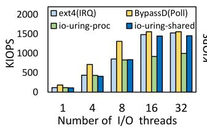  
(a) 4KB I/O

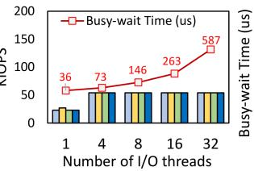  
(b) 128KB I/O  
Figure 1: Multi-threaded random read performance and busywait time with different I/O sizes.

Second, when co-running with C-threads for 4KB I/Os in Figure 2(a), which represents an intense I/O workload under high CPU utilization, ext4 performance degrades slightly compared to Figure 1(a). Furthermore, C-thread performance for ext4 (as with other mechanisms) steadily declines as the number of I/O threads increases. Both degradations arise from contention, as the CPU must be shared between the I/O threads and the C-threads. For the 128KB I/O results in Figure 2(b), however, IOPS remains virtually unchanged beyond four I/O threads, as the device is already saturated and large I/Os generate far lower intensity than small I/Os. In terms of C-threads, their performance under ext4 remains steady even as the I/O thread count increases, since more CPU resources become available while waiting for I/O completion. This result highlights ext4’s efficient CPU usage.

Limitations of Polling: Let us now turn to the BypassD (Poll) results. We make two key observations. First, BypassD, that is, polling, achieves the best performance for intense small I/O workloads, as shown in Figure 1(a). As it completes I/Os through busy-waiting and faces no resource contention, it is highly responsive in this setting. For large I/Os, however, once the device saturates, throughput becomes device-limited, as with all other mechanisms. Unlike the others, though, BypassD’s latency (denoted as Busy-wait Time in the figure) grows sharply, from 36 µs with one thread to 587 µs with 32 threads, because saturation forces I/O threads to block and queue for in-device completion. This not only inflates latency but also wastes CPU cycles in busy-waiting.

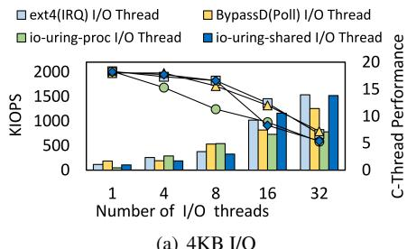  
(a) 4KB I/O

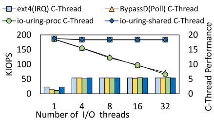  
(b) 128KB I/O  
Figure 2: Multi-threaded random read performance with 16 counting C-threads. The C-thread performance indicates the sum of counter values $( \times 1 0 ^ { 1 0 } )$ of all C-threads.

Second, when I/O threads run concurrently with C-threads, both are adversely affected by busy-waiting. As shown in Figure 2(a), the decline in 4KB I/O performance of BypassD is sharper (compared to Figure 1(a)) than that of ext4, since both I/O threads and C-threads contend for CPU cycles, each attempting to retain the processor as long as possible. For large I/Os, with the device saturated, BypassD’s prolonged busy-waiting, as discussed above, further degrades C-thread performance, as seen in Figure 2(b). With 32 threads, C-thread performance under BypassD drops to just 39.1% of ext4.

Limitations of io\_uring: We now turn to io\_uring with SQ\_POLL mode [11] (hereafter, io\_uring), which aims to address the shortcomings of interrupt- and polling-based approaches. io\_uring improves the CPU efficiency of polling by centralizing it in a dedicated submission thread. This allows I/O threads to submit requests to a single polling thread, avoiding the redundant busy-waiting that occurs when each thread polls independently. We further distinguish io\_uring into io-uring-proc and io-uring-shared in our study. The former refers to the setting where, in a multi-process setting, each process requires its own io\_uring instance and submission thread. In contrast, the latter is where multiple I/O threads share a single submission thread. We enable this feature by setting IORING\_SETUP\_ATTACH\_WQ [26]. io\_uring exhibits three fundamental limitations.

First, io\_uring is challenging to apply in mainstream applications. Applications that rely on synchronous I/O require substantial modifications of source code to adopt the asynchronous I/O paradigm that io\_uring supports. Second, io\_uring operates on per-instance interfaces, which prevents merging polling efforts across processes. When multiple processes each create their own instance and polling thread (e.g., 32 processes yielding 32 submission threads), I/O threads and submission threads interfere, leading to degraded performance, as shown by the io-uring-proc results in Figures 1(a) and 2(a). Figure 2 further shows that C-thread performance is also negatively affected due to this mutual interference. Finally, because io\_uring’s submission thread merely forwards requests and still depends on the underlying I/O completion mechanism, its performance remains bounded. Even when I/O threads share a single instance, io\_uring achieves throughput only comparable to ext4, as demonstrated by the io-uringshared results in both figures.

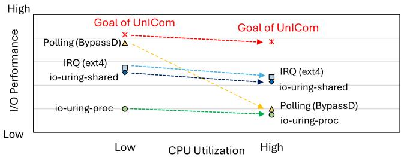  
Figure 3: General performance trends of existing I/O completion mechanisms. The depicted results are illustrative only; they do not represent exact values or scales, but rather highlight overall trends.

These observations reveal that existing I/O completion mechanisms each excel only in limited scenarios. As depicted in Figure 3, polling ensures high I/O performance under low CPU utilization but performs poorly under high CPU utilization, while interrupt is less sensitive to CPU utilization but suffers from costly interrupt-handling overhead.

The goal of this paper is to provide high I/O performance under all CPU utilization scenarios, while also supporting synchronous I/O for mainstream applications.

## 3.2 Challenges and Insights

To achieve the aforementioned goal, there are three challenges that need to be overcome.

Challenge 1: Supporting synchronous I/Os requires a sleep and wake-up scheme. Our analysis reveals that this scheme incurs substantial overhead. In particular, examining the sleep and wake-up procedure during interrupt handling shows that it accounts for roughly 33% of the total latency of a 4KB read I/O in ext4, as reported in Table 1 (denoted as ‘Interrupt handling’).

This overhead arises from three components: task deactivation (e.g., removing the task from its run queue), context switching, and task reactivation (e.g., waking the task, selecting a CPU, and reinserting it into the run queue). Among these, context switching contributes about 11% of the total latency, while deactivation and reactivation together contribute approximately 22%. This finding indicates that sleep and wake-up overhead significantly constrains the performance of synchronous I/Os.

Table 1: Average latency breakdown of a 4KB read syscall with O\_DIRECT on ext4.
<table><tr><td colspan="2"></td><td>Time</td><td>Ratio</td></tr><tr><td rowspan="3">Interrupt handling</td><td>Deactivation</td><td>710 ns</td><td>8%</td></tr><tr><td>Context switch</td><td>980 ns</td><td>11%</td></tr><tr><td>Reactivation</td><td>1240 ns</td><td>14%</td></tr><tr><td colspan="2">Storage device</td><td>4010 ns</td><td>46%</td></tr><tr><td colspan="2">Syscall for mode switching</td><td>150 ns</td><td>1.7%</td></tr><tr><td colspan="2">Others</td><td>1640 ns</td><td>19.3%</td></tr><tr><td colspan="2">Total</td><td>8730 ns</td><td></td></tr></table>

Challenge 2: To improve CPU efficiency, we seek to consolidate busy-wait loops across I/O threads. However, safely supporting multiple processes is challenging, as each process maintains its own address space, which prevents direct interception of I/O requests. Consequently, requests must be relayed through inter-process communication (IPC), incurring additional synchronization overhead. Thus, efficient multi-process support remains a key open challenge.

Challenge 3: Prior studies have consistently demonstrated the performance advantages of direct access to SSDs [32, 37, 43,45], motivating our focus on direct I/O. The key challenge, however, is to effectively integrate the solutions for the preceding two challenges with direct-access schemes to further enhance I/O performance.

The key insight to address these challenges is that the latency of a syscall for user-kernel mode switching is relatively small, about \~150 ns on our platform, and negligible compared to disk I/O latency. This observation motivates us to design an I/O completion mechanism in the kernel space, leveraging existing kernel infrastructure, while bypassing much of the kernel I/O stack to minimize software overhead. Specifically, the modest mode-switch cost enables us to exploit existing kernel infrastructure to: (1) provide an efficient sleep and wake-up scheme by reducing task enqueue and dequeue overhead; (2) support multiple processes via a system-level polling-based I/O completion thread; and (3) enable direct SSD access without complex user-space permission management or hardware modifications to ensure safe user-space I/Os. Building on this insight, we present UnICom (Universal I/O Completion) to address the challenges and achieve our goal.

## 4 UnICom Design

UnICom is a novel in-kernel I/O completion mechanism that leverages kernel infrastructure and bypasses much of the kernel I/O stack. UnICom involves several effective designs to achieve the design goal, as illustrated in Figure 4.

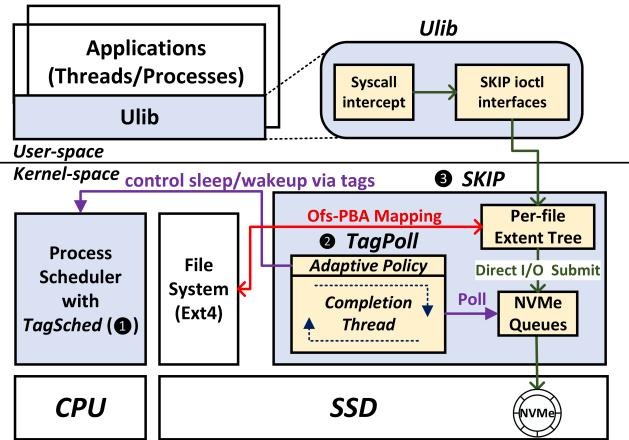  
Figure 4: UnICom architecture (shown in blue and yellow).

To overcome Challenge 1, UnICom first introduces tagguided in-queue scheduling (➊ TagSched) within the process scheduler. This design allows UnICom to control a thread’s sleep and wake-up status by simply updating a tag stored in application’s Process Control Block (PCB), mitigating the cost of the existing wake-up operation. Next, UnICom exploits these tags to address Challenge 2 via tag-notify polling (➋ TagPoll). This design creates a dedicated and centralized I/O completion thread in the kernel to handle I/O requests from both I/O threads and processes. Unlike the submission design in io\_uring, the completion thread employs an adaptive completion policy to efficiently poll for I/O completion and wake up corresponding I/O threads by simply updating their tags, achieving low-cost wake-up and high I/O responsiveness. To resolve Challenge 3, we propose the Shortcut Kernel I/O Path (➌ SKIP). SKIP is a kernel module that enables direct I/O submission for I/O threads and executes TagPoll. It directly manages hardware NVMe queues, granting Tag-Poll’s completion thread direct access to poll and handle I/O requests on these queues. Furthermore, SKIP employs a perfile extent tree design that maps file offsets to physical block addresses. This allows file requests from applications to be translated into block I/O requests and submitted directly to the disk. These requests will then be handled by the completion thread of TagPoll, bypassing most of the kernel I/O stack. UnICom transparently exposes SKIP’s functionalities to user-space applications via a Ulib, which intercepts their file operations and invokes SKIP’s ioctl interfaces to enable direct I/O submission.

## 4.1 TagSched: Tag-guided in-Queue Scheduling

Benefiting from the design that we can use the kernel infrastructure, TagSched introduces a tag-based sleep and wake-up scheme into the process scheduler to reduce the overhead of deactivation and reactivation, as shown in Figure 5. The key insight is to maintain I/O threads in the CPU run queue during I/O operations rather than frequently removing and

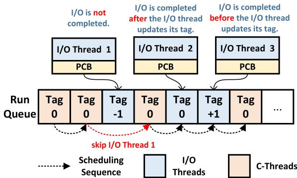  
Figure 5: TagSched tag-update scheme.

reinserting them.

The design extends the Process Control Block (PCB) with a scheduling tag that indicates a thread’s I/O status. The tag has two different values: IO-WAIT and IO-NORMAL. Each thread is initialized with a IO-NORMAL tag (i.e. = 0), which indicates that the scheduler uses the original scheduling policy. When a thread submits an I/O request, its tag transitions to IO-WAIT (i.e. = -1) before yielding the CPU (e.g., I/O Thread 1 in Figure 5). The scheduler then prioritizes IO-NORMAL threads in the same run queue for efficient CPU utilization. That is, the processes with IO-WAIT will be skipped when the scheduler picks the next task to run. Once the I/O request is completed, the tag of the corresponding I/O thread is updated to IO-NORMAL, allowing the scheduler to schedule it again (e.g., I/O Thread 2 in Figure 5).

Non-Atomic Tag Updates: A critical challenge in race conditions arises from non-atomic tag updates: an I/O may complete before the thread sets the IO-WAIT tag. As a result, the tag remains in the IO-WAIT and is never updated to IO-NORMAL, leaving the thread stuck in a dormant sleep state. TagSched addresses the atomicity challenge through careful tag state management: (1) the IO-WAIT update is designed as a tag decrement; (2) the IO-NORMAL update is designed as a tag increment. This design ensures correct behavior even when I/O completion races with tag updates. If an I/O completes before the thread attempts to set IO-WAIT, the initial increment (e.g., I/O Thread 3 in the Figure 5) and subsequent decrement will balance the tag back to IO-NORMAL. The scheduler will treat tasks with IO-NORMAL ≥ 0 as normal tasks, scheduling them based on the default policy. Only threads that properly sequence their I/O submission and tag update will remain in IO-WAIT state. Thus, TagSched avoids permanent suspension while maintaining lightweight synchronization.

C-thread Preemption: TagSched is faced with another challenge when handling mixed workloads. For example, when I/O threads and C-threads coexist in the same run queue, naive tag-based scheduling could lead to unexpectedly high I/O latencies due to head-of-line block issue. Specifically, under TagSched design, an I/O thread yields its CPU after submitting I/O requests. For high-performance SSDs that provide microsecond-level I/O latencies, the I/O thread should ideally be quickly reactivated once its I/O completes. However, the scheduler typically only triggers a pick-next-task operation after the current task consumes its full time slice. This means that if a C-thread is currently running, the I/O thread with completed I/Os must wait until the C-thread finishes its millisecond-level time slice before being rescheduled, as the case of Without Preemption shown in Figure 6. Consequently, I/O threads experience prolonged blocking times for I/O completion, significantly increasing their I/O latencies.

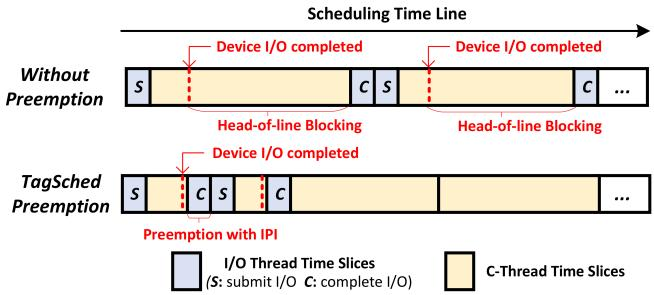  
Figure 6: TagSched preemption policy.

To address this head-of-line blocking issue, we introduce C-threads preemption. By default, TagSched dynamically classifies threads as I/O threads or C-threads based on whether they perform I/O operations. Upon I/O completion, it attempts to preempt C-threads by sending an inter-processor interrupt (IPI) to the target CPU. IPI forces an immediate pick-nexttask operation, allowing the scheduler to prioritize I/O threads with completed I/Os—without waiting for the C-threads’s full time slice to expire. Unlike traditional I/O interrupts that require task enqueue and dequeue operations, TagSched retains I/O threads within the running queue upon an IPI trigger, thus enabling highly efficient deactivation and reactivation.

Discussion: Fair CPU allocation is a critical responsibility of the scheduler. TagSched preserves scheduling fairness because it retains the original vruntime calculation approach. Its behavior resembles a task executing sched\_yield function [29] in a busy-waiting loop: although the thread frequently yields the CPU, it continues to update its vruntime upon each release, preserving scheduler fairness. In addition, since TagSched retains I/O threads in the run queue, the number of tasks within the run queue increases, thereby incurring additional management overhead. However, we observe that this overhead remains minimal due to the high efficiency of the run queue structure (i.e., red-black tree); for instance, task selection latency in the red-black tree increases by only 28 ns when the number of tasks in the run queue grows from 1 to 100.

## 4.2 TagPoll: Tag-notify Polling

To merge busy-waiting efforts due to per-thread polling, UnI-Com introduces TagPoll, an efficient I/O completion scheme based on the designs of centralized polling-based I/Os and TagSched.

Centralized Polling with TagSched: TagPoll introduces a dedicated and centralized polling-based I/O completion thread to handle all I/O requests across different I/O threads. This design aims to ensure better I/O responsiveness than interrupts via the polling-based completion thread, while reducing CPU overhead caused by per-thread polling. TagPoll is designed to operate within the kernel space, thus naturally supporting I/O requests across different processes. The key challenge lies in optimizing the efficiency of the I/O completion thread, as it serializes and handles all I/O requests, determining the system’s maximum I/O performance. Therefore, TagPoll leverages TagSched’s low-cost deactivation/reactivation scheme to support efficient sleep and wake-up for I/O threads. We illustrate TagPoll’s workflow in Figure 7.

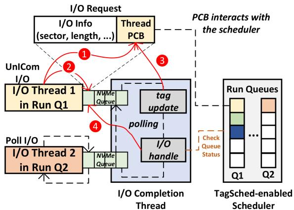  
Figure 7: TagPoll’s workflow: an efficient I/O completion scheme based on the designs of centralized polling-based I/Os and TagSched.

Specifically, since the completion thread can directly access NVMe queues and applications are allowed to submit I/O requests to these NVMe queues without traversing the entire I/O stack (see Section 4.3), I/O Thread 1 in Figure 7 embeds the pointer of its PCB into an I/O request and submits it to an NVMe queue (➊). As the PCB information includes the tag, TagPoll can take the advantage of the capability of TagSched. Next, the I/O request is enqueued in an NVMe queue slot for the completion thread to detect, and then I/O Thread 1 updates its tag to IO-WAIT and proactively yields its CPU (➋). The TagSched-enabled scheduler will skip I/O Thread 1 in subsequent scheduling rounds. Meanwhile, the completion thread polls for the I/O request submitted by I/O Thread 1. Once an I/O is completed by the device, the completion thread will update the corresponding I/O Thread 1’s tag to IO-NORMAL and send an IPI based on the I/O thread/C-thread type of the running task in the I/O Thread 1’s run queue (➌). Finally, it marks the request status as completed, allowing I/O Thread 1 to process it later (➍). This design ensures high responsiveness through a centralized polling-based completion mechanism, while minimizing wake-up latency by only requiring low-cost tag updates and C-thread preemption, and finally maximizing the completion thread’s efficiency.

Adaptive I/O Completion Policy: We enhance TagPoll with an adaptive I/O completion mechanism to further reduce the number of context switches among I/O threads. The idea is that the centralized completion thread can obtain the information of all I/O threads (e.g., the run queues provided by their PCBs), allowing it to dynamically select the optimal strategy for each I/O thread based on the system state. In particular, we introduce an additional flag in the I/O request metadata to indicate the preferred I/O completion mechanism for the next I/O request.

When receiving an I/O request, TagPoll checks the number of tasks in the corresponding I/O thread’s run queue. If the I/O thread exclusively occupies a CPU (e.g., I/O Thread 2 in Figure 7), the completion thread updates its variable to instruct the I/O thread to do polling, eliminating context-switch overhead. Otherwise, the I/O thread continues using the default TagSched-TagPoll combination for efficient CPU utilization. In addition, the indicator flag is leveraged by the completion thread to determine whether to update the tags of associated I/O threads to avoid suspending I/O threads. As checking the number of I/O threads in a run queue is a low-cost operation, the efficiency of the completion thread is guaranteed, and the overall performance is not significantly affected. Additionally, the design of next-request prediction allows it to automatically adjust the I/O completion mechanism of each I/O thread according to workloads, overcoming the limitations of existing hybrid polling approaches.

## 4.3 SKIP: Shortcut Kernel I/O Path

To further reduce software overhead in the I/O path, UnICom introduces a Shortcut Kernel I/O Path (SKIP) for direct SSD access, enabling more efficient TagSched and TagPoll. Unlike prior kernel-bypassing solutions such as BypassD and XRP, which require additional hardware or eBPF dependencies to ensure safe file permission controls, SKIP overcomes their limitations by integrating a kernel driver module (UnIDrv) with a user-space library (Ulib).

UnIDrv allocates and manages hardware NVMe queues, serving as the working environment for TagPoll. This allows TagPoll’s completion thread to poll these queues directly and handle I/O requests with the SSD. Furthermore, because I/O requests require block addresses, UnIDrv employs a per-file extent tree design to maintain a mapping from file offsets to physical block addresses (PBAs) for each file, allowing a normal file operation to be translated into an I/O request and submitted to the NVMe queues. Since these designs are effective in the kernel space, UnIDrv can easily carry out file permission checks and finally achieve safe bypassing of most of the kernel I/O stack. To transparently expose the functionalities of UnIDrv to user-space applications, Ulib is introduced, which intercepts applications’ file operations via LD\_PRELOAD and forwards their parameters to UnIDrv via an ioctl interface called user\_io\_submit, including parameters like file descriptor, offset, user buffer, and buffer length.

In addition to safe I/O-stack bypassing, UnIDrv introduces two benefits compared to the full user-space approach, as shown in Figure 8. First, UnIDrv does not map NVMe queues into I/O threads’ process address space as BypassD, because it takes into account the issue of hardware resource allocation in multiple processes: although the NVMe specification supports up to 64K queues, the number of NVMe queues on a commercial device is limited (e.g., Intel Optane SSD P5800x supports 135 NVMe hardware queues while Kingston NV3 only supports 31). Therefore, direct mapping of NVMe queues makes it difficult to determine the number of NVMe queues allocated to each process. Excessive allocation wastes scarce queue resources (e.g., App 2 in the figure), while insufficient allocation, such as App 1 which has multiple I/O threads sharing the same NVMe queue, creates performance bottlenecks due to fierce competition on queue resources or inter-process synchronization. To address this issue, UnIDrv maintains an NVMe queue pool within the kernel module and assigns NVMe queues to I/O threads by hashing their PIDs. This enables dynamic NVMe queue usage, as illustrated in the right side of Figure 8.

Second, UnIDrv employs a per-file extent tree design to map file offsets to PBAs. This tree structure provides lower indexing latency and memory usage compared to the fmap design in BypassD, which statically stores the mapping from file offsets to PBAs in a page table, attaches this page table to application’s process address space, and allows offset-to-PBA indexing in user space. This is because, to safely use the fmap design in BypassD, a custom IOMMU hardware is required, which introduces additional PCIe round-trip latency and IOMMU translation latency. Moreover, its static mapping design requires a lot of page table entries. This results in costs that scale with file size, including both additional memory consumption (\~0.2% of file size) and increased loading latency of fmap. In UnIDrv, when a file is opened, the mapping between offsets to PBAs of this file will be loaded into an extent tree. Normally, in journaling file systems like ext4 which is designed to prevent file fragmentation, a file tends to have limited file fragments (extents) and makes the extent tree’s loading and indexing efficient. The tree design also mitigates the memory usage of static mapping since it can use one 12-byte extent (4 bytes for block-aligned offset, 4 bytes for PBAs, 4 bytes for block length) to represent a large consecutive block address range. With these designs, UnIDrv achieves an indexing & memory efficient offset-to-PBA mapping to enable direct access.

## 5 Implementation

We implement the prototype of UnICom1 on Linux and run it on top of ext4, including Ulib and UnIDrv. Ulib comprises 1,089 lines of code (LOC), while UnIDrv is implemented using 3,250 LOC. We also slightly modified the source codes related to the Linux CFS scheduler to support TagSched with an additional 71 LOC.

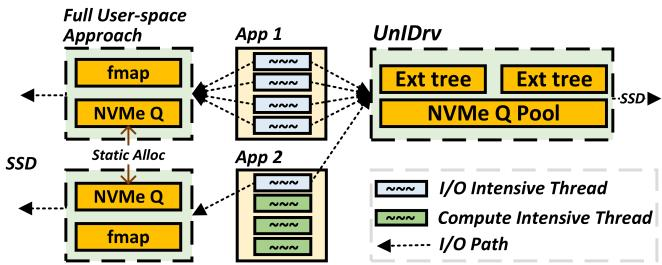  
Figure 8: SKIP scheme. The left side indicates the current user-space approach, while the right side shows UnICom solution.

TagSched: To implement TagSched, we extend the scheduler’s sched\_entity structure with two new variables: (1) a 2-bit tag for I/O status and (2) a 1-bit flag distinguishing I/O threads from C-threads. Additionally, we add a new function to the sched\_class structure, which is exposed to UnIDrv for dynamic tag updates. The TagSched scheme integrates into the pick\_next\_entity function, which includes the core logic of the CFS scheduler for task selection. By default, the CFS scheduler follows the original algorithm to select a task. TagSched applies to all task in the operating system, but it is triggered only when a task with an IO-WAIT tag is selected, ensuring minimal overhead for C-threads and other tasks.

TagPoll: TagPoll is implemented in UnIDrv as discussed in Section 4.3, where I/O threads use the user\_io\_submit interface to submit requests, update tags, and yield CPU, while a dedicated completion thread handles these requests and wakes up the corresponding I/O threads. The key implementation challenge is CPU cache false sharing in NVMe queue slots due to frequent concurrent access by both the I/O threads and the completion thread. To address this, we enforce cache alignment for all shared data structures between these threads. Per-file Extent Tree: To ensure that the per-file extent tree remains consistently and dynamically synchronized with file operations, we introduce two new interfaces integrated into the inode\_operations structure: (1) setup\_extent\_tree, responsible for constructing and destructing the extent tree, and (2) mapping\_lookup, used to index PBAs based on file offsets. To enable UnIDrv, underlying file systems are required to implement these interfaces and store a pointer to the extent tree within their private inode\_info structure. In our ext4 implementation, setup\_extent\_tree initializes the extent tree of a file by traversing all its on-disk extents stored in its ext4\_inode structure and manages the corresponding tree pointer in ext4\_inode\_info. This integration allows ext4’s core block-mapping functions (e.g., ext4\_ext\_map\_blocks and ext4\_truncate) and existing lock mechanisms to update the extent tree automatically and consistently. This guarantees strict mapping consistency between UnIDrv and the underlying file system when UnIDrv invokes mapping\_lookup.

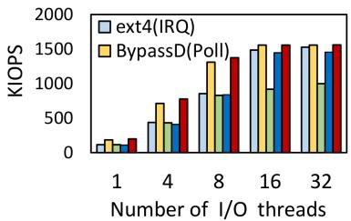  
(a) Multiple read threads.

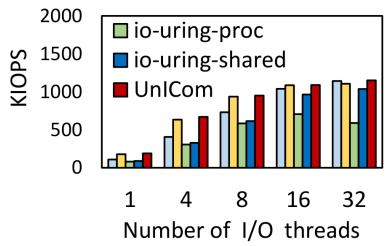  
(b) Multiple write threads.

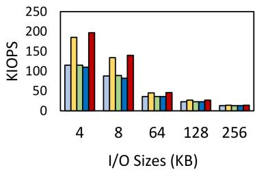  
(c) Varying read I/O sizes.  
Figure 9: Random I/O performance on (a) multiple read threads with 4KB I/O size; (b) multiple write threads with 4KB I/O size; (c) varying I/O sizes with one read I/O thread.

Read/Write Operation Workflows: When a file is opened, this file’s extent tree is also allocated along with the inode creation, and loads the offset-to-PBA mapping into the tree. When receiving a read/write request, Ulib in SKIP intercepts this request and forwards its parameters to UnIDrv by the user\_io\_submit interface. UnIDrv translates this read/write request into a block request based on the offset-to-PBA extent tree. Then it directly submits it to the NVMe queue and then updates its tag to sleep. TagPoll’s completion thread will check its completion and wake the corresponding I/O thread up once its I/O request is completed. UnICom supports fallocate, truncate, and append operations by instantly updating the extent tree. However, since UnICom bypasses the traditional Linux I/O stack and cannot use page caches, it only supports direct I/Os. For file operations not supported by UnICom, such as buffer I/Os, they are handled by traditional POSIX interfaces.

Crash Consistency: Similar to ext4 in the writeback journal mode and BypassD, UnICom ensures metadata crash consistency because it employs traditional POSIX interfaces for metadata operations (e.g., open, close, unlink).

Scalability Potential: The I/O completion thread in UnICom completes an I/O in about 550ns, including the overhead of updating tags, sending IPIs, and checking the scheduler status to determine the I/O completion method used for the subsequent I/O request. Thus, introducing this scheme is low cost, but due to the dedicated thread design, the maximum completion rate of the dedicated thread is around 1820 KIOPS and it could become a performance bottleneck as the IOPS and bandwidth of SSDs continue to scale, or when managing multiple SSDs concurrently. In such scenarios, UnICom can be further extended, for instance, by increasing the number of completion threads. By implementing appropriate routing policies, such as assigning one completion thread per SSD or per file, UnICom is well-positioned to address these scalability challenges. We leave the support of multiple completion threads as future work.

## 6 Evaluation

We first present the experimental setup, followed by evaluation results across four aspects. First, we examine UnI-

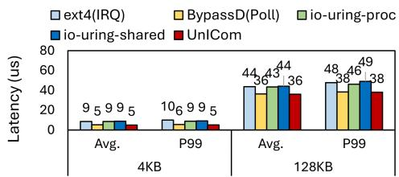  
(a) One I/O thread.

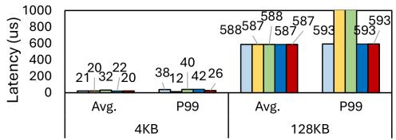  
(b) 32 I/O threads.  
Figure 10: Average and tail random read I/O latency. For BypassD and io-uring-proc with 32 I/O threads, their P99 tail latencies of 128KB I/O are 16175 us and 16233 us, respectively.

Com’s I/O throughput, latency, and overall performance on microbenchmarks with and without C-threads. Second, we provide a breakdown analysis to evaluate the effectiveness and overhead of each design component of UnICom. Third, we assess UnICom ’s performance on macrobenchmarks. Fourth, we evaluate UnICom on real-world application workloads.

## 6.1 Experimental Setup

We conduct our experiments on an Ubuntu 20.04 system running Linux kernel 6.5.1. The experimental platform features a 24-core Intel Core i9-14900K processor (8 P-cores at 3.2 GHz + 16 E-cores at 2.4 GHz), 32GB RAM, and a 400GB Intel Optane SSD P5801x and a 1TB Kingston NV3 SSD [18]. We mainly evaluate and discuss UnICom’s performance on the Optane SSD as our design goal is to support future flash memory devices with higher bandwidth and lower latency. We also include a few performance evaluations on consumer SSDs to demonstrate the generalizability of UnICom. For all the experiments, we only use the 16 E-cores and disable hyperthreading, turbo boost, following established benchmarking practices in previous works [35, 37, 45].

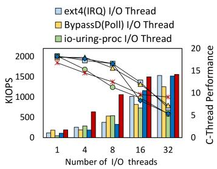  
(a) 4KB rand read I/O.

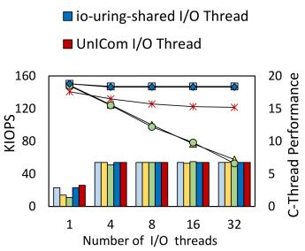  
(b) 128KB rand read I/O.

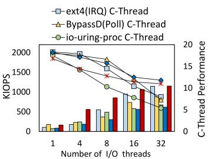  
(c) 4KB rand write I/O.

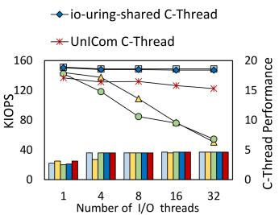  
(d) 128KB rand write I/O.  
Figure 11: Multi-threaded random read and random write performance with 16 counting C-threads.

We compare UnICom against the state-of-the-art I/O mechanisms: ext4 as the representative interrupt-based approach, BypassD as the polling-based alternative, and io\_uring with SQ\_POLL as the hybrid approach. To contrast UnICom’s centralized completion-based design with io\_uring’s centralized submission-based approach, we include io\_uring in our microbenchmarks. However, we exclude it from macrobenchmarks and real-world application evaluations. This is because our paper focuses on synchronous I/O, while io\_uring follows an asynchronous I/O design. As a result, evaluating io\_uring in marcobenchmarks and real-world applications often necessitate modifications to applications’s I/O paradigms and source code. For BypassD configuration, we enable it with all available NVMe queues to ensure maximum I/O performance and reuse its simulation settings about the overhead of its hardware-enabled fmap. In UnICom, one of the E-cores is reserved for the dedicated I/O completion thread and the remaining 15 E-cores are used for applications. Other techniques, in contrast, make full use of the 16 E-cores. All experiments are conducted based on direct I/Os and we present average results of five experimental trials.

## 6.2 Microbenchmark Performance

In this section, we evaluate UnICom’s performance with and without C-threads. To support C-threads, we develop a FIO [12]-like application as the microbenchmark tool, allowing us to create and run both I/O threads and C-threads simultaneously.

I/O Performance without C-threads: We first evaluate the random read performance of UnICom on 1GB files with I/O threads only. We vary the number of I/O threads and different I/O sizes, collecting their IOPS performance and I/O latency distribution. The evaluation results are shown in Figure 9 and Figure 10.

The 4KB IOPS performance results shown in Figure 9(a) and Figure 9(b) indicate that UnICom achieves polling-like performance on small I/Os, averagely outperforming ext4 by 43.5% and 34.9% on read and write performance, respectively. The performance of UnICom is slightly higher than that of BypassD due to the per-file extent tree design, which improves BypassD’s fmap overhead. For the results of different I/O sizes in Figure 9(c), we also have similar observations and UnICom introduces 36.6% improvement on average compared to ext4. In addition, io\_uring’s issues on per-instance designs and relying on the underlying I/O completion mechanism also limit its IOPS performance as we discussed in Section 3.1.

Figure 10 presents the average, 99th-percentile (P99) tail random read I/O latency measurements. Under singlethreaded loads (where the device remains unsaturated), UnI-Com has latency characteristics comparable to BypassD for both 4KB and 128KB operations, significantly improving ext4’s average and P99 I/O latencies. For example, UnICom reduces ext4’s average I/O latencies by 42% for 4KB and 17.4% for 128KB. This benefits from polling’s inherent responsiveness advantage when CPU resources are sufficient. At device saturation (e.g., with 32 threads), while all approaches converge in average latency, UnICom yields a 31.2% P99 tail latency improvement over ext4 for 4KB I/O because of TagSched’s optimization on the sleep and wake-up overhead. The P99 tail latency of UnICom in 4KB I/O is higher than BypassD, because it cannot eliminate context switching in multi-threaded scenarios. While for P99 tail latencies on 128KB I/Os, BypassD’s non-preemptive polling leads to extreme tail latency (e.g., 16175us v.s. \~593us in ext4 and UnICom for 128KB I/Os) as I/Os are blocked through entire scheduler timeslices. io-uring-proc also has extreme long I/O tail latency due to mutual interference between I/O threads and submission threads. Overall, UnICom achieves I/O performance close to BypassD’s performance by introducing TagSched and TagPoll, while avoiding the extremely long I/O tail latency issue that polling encounters in large-sized I/O.

I/O Performance with C-threads: Next, we examine the mutual effect between I/O threads and C-threads in UnICom. We first maintain 16 fixed C-threads while varying the number of I/O threads to study their interaction. Then, we change the number of C-threads while fixing 16 I/O threads. The C-thread performance is quantified by the sum of count values, while the performance of the I/O threads is measured in IOPS.

For random read performance reported in Figure 11(a) and Figure 11(b), UnICom achieves superior 4KB IOPS performance compared to alternative approaches, demonstrating 39.4% and 88.8% average improvements over ext4 and

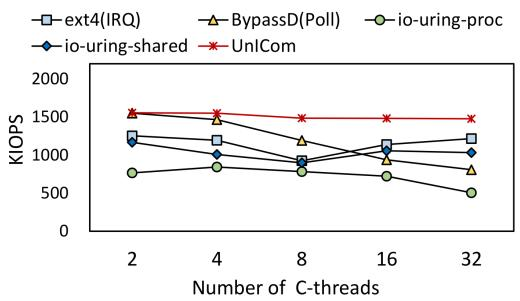  
Figure 12: Random read performance of 4KB I/Os across different number of C-threads with 16 fixed I/O threads.

BypassD, respectively. However, this comes at a C-thread performance cost of around 7.5% relative to ext4 and BypassD, attributable to dedicating a CPU core to the I/O completion thread. If I/O is intensive enough (e.g., with 32 I/O threads), the sacrificed CPU core can be fully utilized, which leads UnICom to achieve a higher C-thread performance over ext4 and BypassD by 35.8% and 26.4%, respectively. For 128KB read I/Os, as expected, the device quickly reaches saturation. TagSched prevents the progressive C-thread performance degradation observed in BypassD’s and io-uring-proc approaches, delivering an average respective improvement of 39.3% and 43.3%. Compared to ext4 and io-uring-shared, UnICom maintains a consistent 15% performance gap, primarily due to having one fewer CPU core available for C-threads and the lower utilization efficiency of the dedicated core under large I/O workloads. Similar experimental trends are observed in 4KB and 128KB random write I/O operations shown in Figure 11(c) and Figure 11(d). For instance, UnICom achieves better 4KB random write IOPS performance than ext4, while demonstrating an average improvement of 44% in C-thread performance over BypassD under 128KB I/O workloads.

Figure 12 presents 4KB I/O performance with a varying number of C-threads and 16 fixed I/O threads. UnICom consistently outperforms ext4 as the number of C-threads increases, showing an average performance improvement of 33.2%. It also mitigates the CPU contention issue inherent to polling, which causes BypassD’s performance to continuously decrease. This allows UnICom to achieve an 82.7% improvement over BypassD with 32 C-threads. These results demonstrate UnICom’s advantage across varying CPU utilization scenarios, reaching the goal outlined in Figure 3.

I/O Performance on Consumer SSD: We repeat the I/O experiment with C-threads on the consumer SSD (Kingston NV3). The 4KB results shown in Figure 13 indicate that UnICom has a limited IOPS improvement (i.e., 5.3%) compared to ext4 because for consumer SSDs, the performance bottleneck is in the I/O latency instead of the context switch overhead. The longer I/O latency makes the busy waiting in BypassD more inefficient when with C-threads, making UnICom outperform BypassD by 79.4%. On the other hand, UnICom has a similar constant gap in C-thread performance with ext4 and io-uring-shared due to the sacrifice of the CPU core, but addresses the issue of the continuous decline in BypassD’s and io-uring-proc’s C-thread performance. These results demonstrate the robustness of UnICom’s core designs on both high-performance SSDs and consumer SSDs, as well as its potential on future high-performance SSDs.

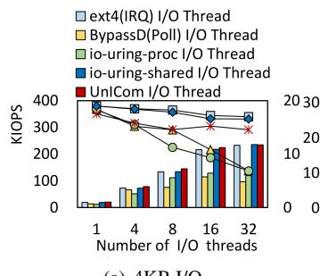  
(a) 4KB I/O.

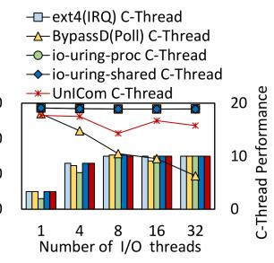  
(b) 128KB I/O.  
Figure 13: Multi-threaded random read performance with 16 counting C-threads on consumer SSD.

These experiments reveal UnICom’s fundamental tradeoff: dedicating a fixed CPU resource enables (1) significantly better small I/O performance than ext4 while maintaining comparable C-thread efficiency, and (2) prevents the continuous degradation of C-thread performance and CPU waste exhibited by BypassD during large I/O operations.

## 6.3 Design Impact Breakdown Analysis

In this section, we will discuss the impact of UnICom’s design components, including the adaptive I/O completion mechanism in TagPoll, dynamic NVMe queue management, and per-file offset-to-PBA extent tree in UnIDrv.

Adaptive I/O Completion: TagPoll introduces an adaptive I/O completion mechanism to optimize I/O performance when I/O threads have sufficient CPU resources. To investigate its impact on overall I/O performance, we repeat the I/Othread-only experiment on 4KB random read I/O as introduced in Section 6.2 without enabling adaptive I/O completion (UnICom-no-opt). The experimental results are illustrated in Figure 14(a). When I/O threads is ≤ 8, the IOPS performance of UnICom, which employs this mechanism, improves by 13.8% on average compared with UnICom-noopt. In this scenario, I/O threads adopt polling as their I/O completion mechanism, improving I/O responsiveness. When the number of I/O threads ${ \mathrm { i s } } \geq 1 6 ,$ , there are multiple threads sharing the same core and thus, they complete I/Os based on the TagSched and TagPoll approaches.

Dynamic NVMe Queue Management: In UnIDrv, we address BypassD’s static queue allocation issue by introducing dynamic NVMe queue management. To evaluate this design, we compare BypassD’s performance with varying numbers of allocated NVMe queues (1, 2, and the maximum available) using the 4KB I/O workload with I/O threads only. The results are shown in Figure 14(b). When constrained to a single NVMe queue (Q1) in BypassD, the application’s peak IOPS drops by approximately 20% compared to using all available queues (Q-max). Allocating one more queue (e.g., Q2) can alleviate this performance limitation but reduces queue availability for other applications. Given finite hardware resources, static allocation forces a trade-off between I/O performance and multi-application support. UnICom’s dynamic queue management resolves this conflict by adaptively allocating queues based on demand and therefore outperforms ext4 in all different thread counts.

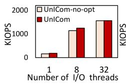  
(a)

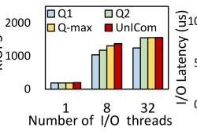  
(b)

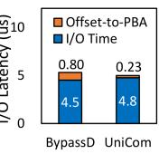  
(c)  
Figure 14: Design choice analysis: (a) impact of adaptive I/O completion policy on throughput with varying I/O threads; (b) impact of dynamic NVMe queue management on throughput with varying I/O threads; (c) impact of per-file extent tree on I/O latency breakdown for a 4KB read.

Per-file Offset-to-PBA Extent Tree: UnICom introduces the per-file offset-to-PBA design to overcome the limitations of the full user-space solutions (i.e., BypassD’s fmap). Figure 14(c) shows the latency breakdown of a 4KB read in a 1GB test file of UnICom and BypassD. The results show that the extent tree design significantly reduces the fmap’s mapping latency by 71.2% because the extended hardware introduces additional PCIe round-trip latency and IOMMU translation latency. UnICom has a modestly longer I/O time as it needs the completion thread to handle I/Os before I/O threads get their requests, while BypassD directly completes I/Os by I/O threads. The overhead of offset-to-PBA mapping in UnICom includes two parts: 150ns of syscall overhead and 80ns of tree searching overhead. Introducing syscall overhead is valuable as it facilitates subsequent optimizations, including TagSched, TagPoll, and SKIP. However, loading a file’s extents into the tree during file open operations introduces additional loading overhead. In cold opens, latency rises from approximately 7us to 28us, 57us, and 146us for files with 4, 9, and 186 extents, respectively. While for hot opens, this additional latency can be eliminated.

Task Fairness: We evaluate UnICom’s task fairness under concurrent workloads using our microbenchmark setting with 32 I/O threads and 16 C-threads performing 4KB I/Os. Figure 15 shows the performance distribution for each thread. UnICom’s IOPS distribution follows a trend similar to BypassD, as both retain I/O threads in the run queues and employ a comparable vruntime update policy (i.e., from the perspective of the scheduler, both are computationally intensive threads). For C-thread performance, UnICom’s distribution more closely resembles ext4, as both mechanisms preempt

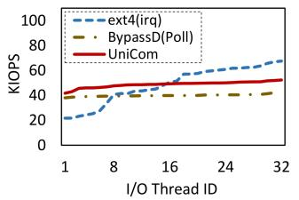  
(a) Per I/O thread.

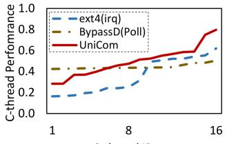  
(b) Per C-thread.  
Figure 15: Per-thread IOPS performance and per-thread Cthread performance for 32-thread 4KB random read.

C-threads to service I/O requests. Since UnICom’s C-thread performance outperforms those in ext4 on 32 I/O threads, its distribution is shifted upward. Overall, UnICom exhibits fairness characteristics akin to both ext4 and BypassD across different scenarios.

Memory Overhead: The primary memory overhead in UnICom stems from two sources: the tags introduced by TagSched and the per-file offset-to-PBA extent tree. For TagSched, UnICom allocates a single byte per thread, combining a 2-bit I/O status tag and a 1-bit I/O thread classifier. With a default maximum PID of 4194304 in our platform, this incurs a worst-case overhead of only 4 MB. The memory required for the extent trees is variable; each 12-byte extent entry scales linearly with the number of extents. Our analysis shows that this overhead is minimal in practice: a severely fragmented file (e.g., 1000 extents) requires approximately 12 KB, while the most fragmented file in all our evaluation workloads (1GB files with nine extents used in micro-benchmarks) requires only 108 bytes. Compared to the static mapping in BypassD’s fmap design, this dynamic structure reduces memory consumption by over 99.9% for the same file.

## 6.4 Macrobenchmark Performance

In this section, we evaluate UnICom’s mixed-workload performance by concurrently executing two macro-benchmarks: file restoration with destor [7] as the I/O-intensive workload and matrix computation with stress-ng [17] as the computeintensive workload. Destor is a data deduplication backup system, and we use it to restore files. We set the chunk size to 16KB and modify destor to support multi-threaded file restoration (e.g., checking the blockmap of restored files and reading data from corresponding storage containers) and evaluate its file restoration I/O bandwidth. Stress-ng is a widely used tool for matrix computation performance evaluation, particularly relevant for machine learning and scientific computing. We configure 8 or 16 fixed stress-ng threads to perform 128 × 128 matrix computation and record its operations per second (OPS) performance.

The experimental results are presented in Figure 16. We begin with the case where CPU resources are sufficient (i.e., lightly utilized), shown in the left portions of Figures 16(a)

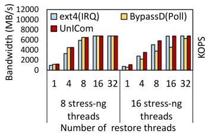  
(a) Destor Performance.

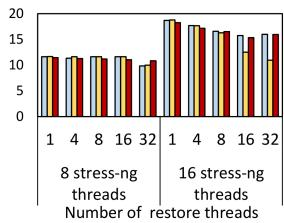  
(b) Stress-ng Performance.  
Figure 16: Destor and stress-ng co-running performance with fixed 8 and 16 stress-ng threads

and (b), where 8 stress-ng threads (making use of 16 cores) run concurrently with varying numbers of destor restore threads on the x-axis. Under light CPU load, both BypassD and UnICom perform well. The I/O-intensive restore workload (Figure 16(a)) shows almost no performance difference between the two. We also observe that UnICom achieves up to 32% higher bandwidth than ext4 before saturating the device (beyond four restore threads). For the compute-intensive stress-ng threads (Figure 16(b)), both BypassD and ext4 perform slightly better than UnICom, due to the dedicated submission thread that UnICom employs.

Next, we consider the case of high CPU utilization, where the number of stress-ng threads is increased to 16, fully occupying all cores. The results are shown on the right-hand side of Figures 16(a) and 16(b). In this setting, UnICom achieves comparable or superior I/O bandwidth to ext4 for the restore workload (Figure 16(a)), while BypassD performs consistently worse across all restore thread counts, with UnICom outperforming it by an average of 52.3%. For the computeintensive stress-ng workload (Figure 16(b)), UnICom improves performance over BypassD by 22.5% and 45.7% with 16 and 32 restore threads, respectively. Nevertheless, UnI-Com remains slightly below ext4 due to the overhead of its dedicated submission thread.

## 6.5 Real-world Application

We now evaluate UnICom with RocksDB, a widely-used keyvalue store that integrates small I/Os for key-value pairs, large I/Os and compression for background compaction. We enable direct-I/O support of RocksDB and run it with the YCSB benchmark [2] to assess its performance in real-world applications. We load 500M key-value pairs, each with 32-byte key and two different value sizes, 64 and 200 bytes. We perform 10M operations for each workload with one thread, eight threads, and 32 threads. The experimental results are shown in Figure 17. For both value sizes, we observe the expected tradeoff between ext4 and BypassD as thread count increases: BypassD generally outperforms ext4 with a single thread, whereas ext4 overtakes BypassD under heavier concurrency (e.g., 32 threads). By contrast, UnICom consistently delivers the best performance across nearly all thread counts and value sizes. On average, UnICom outperforms ext4 by 24% for 64- byte values and 28% for 200-byte values with a single thread. Although the relative benefit decreases under higher thread counts due to database contention, UnICom still achieves improvements of 9% and 18% for 64- and 200-byte values, respectively, at 32 threads. Compared to BypassD, UnICom delivers 3% overall improvement for both 64- and 200-byte values with one thread. While with 32 threads, UnICom significantly optimizes BypassD’s performance by 34% for 64-byte values and 56% for 200-byte values. The RocksDB evaluation confirms the advantages of UnICom in coping with different application scenarios.

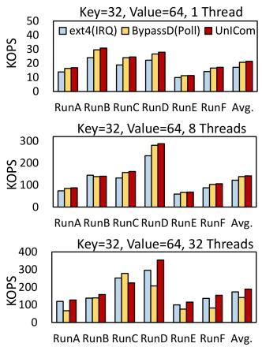

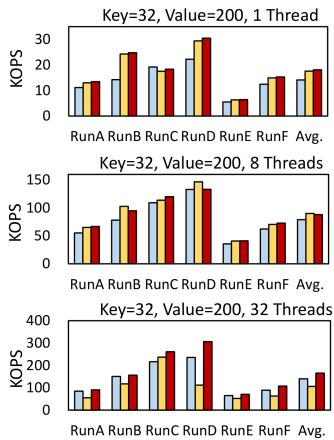  
Figure 17: YCSB workload performance across different number of threads and value sizes.

## 7 Conclusion

In this paper, we revisit the limitations of the state-of-theart I/O completion mechanisms and demonstrate their inefficiency under mixed I/O and compute-intensive workloads. To achieve universal high performance, this paper proposes UnICom, a novel I/O completion mechanism that bridges the gap between low-latency polling and CPU-efficient interrupts. UnICom introduces a centralized kernel-level completion thread with three key schemes: TagSched for lightweight sleep and wake-up control, TagPoll for efficient cross-thread polling, and SKIP for bypassing much of the kernel I/O stack. We implement UnICom in the Linux kernel and evaluate it against state-of-the-art approaches, including ext4, BypassD, and io\_uring. Our evaluations with benchmarks and realworld workloads show that UnICom consistently outperforms these approaches, making it a promising solution for nextgeneration storage systems.

## Acknowledgments

We thank our shepherd, Dong Du, and the anonymous reviewers for their valuable feedback and guidance. This research was supported by the NSF grant 2312785.

## References

[1] Inc. ClickHouse. ClickHouse. https://clickhouse. com/, 2025. [Online; accessed 22-March-2025].

[2] Brian F Cooper, Adam Silberstein, Erwin Tam, Raghu Ramakrishnan, and Russell Sears. Benchmarking cloud serving systems with ycsb. In Proceedings of the 1st ACM symposium on Cloud computing, pages 143–154, 2010.

[3] Gordon V Cormack. Data compression on a database system. Communications of the ACM, 28(12):1336– 1342, 1985.

[4] Diego Didona, Jonas Pfefferle, Nikolas Ioannou, Bernard Metzler, and Animesh Trivedi. Understanding modern storage apis: A systematic study of libaio, spdk, and io\_uring. In Proceedings of the 15th ACM International Conference on Systems and Storage, pages 120–127, 2022.

[5] DigTimes. Samsung revives Z-NAND after 7 years to supercharge AI with 15x speed gains. https: //www.digitimes.com/news/a20250808VL210/ samsung-3d-nand-technology-ai.html, 2025. [Online; accessed 06-September-2025].

[6] Siying Dong, Andrew Kryczka, Yanqin Jin, and Michael Stumm. Rocksdb: Evolution of development priorities in a key-value store serving large-scale applications. ACM Transactions on Storage (TOS), 17(4):1– 32, 2021.

[7] Min Fu, Dan Feng, Yu Hua, Xubin He, Zuoning Chen, Wen Xia, Yucheng Zhang, and Yujuan Tan. Design tradeoffs for data deduplication performance in backup workloads. In 13th USENIX Conference on File and Storage Technologies (FAST 15), pages 331–344, 2015.

[8] Jaehyun Hwang, Midhul Vuppalapati, Simon Peter, and Rachit Agarwal. Rearchitecting linux storage stack for µs latency and high throughput. In 15th USENIX Symposium on Operating Systems Design and Implementation (OSDI 21), pages 113–128, 2021.

[9] Intel. Intel Optane SSD DC P5800X Series. https://www.intel.com/ content/www/us/en/products/sku/201860/ intel-optane-ssd-dc-p5800x-series-800gb\ -2-5in-pcie-x4-3d-xpoint/specifications. html, 2020. [Online; accessed 22-March-2025].

[10] Intel. x86 User Interrupts support. https://lwn. net/Articles/869140/, 2025. [Online; accessed 22- March-2025].

[11] Jens Axboe. Efficient IO with io\_uring. https:// kernel.dk/io\_uring.pdf, 2019. [Online; accessed 13-September-2025].

[12] Jens Axboe. Flexible I/O Tester. https://github. com/axboe/fio.git, 2022. [Online; accessed 13- September-2022].

[13] Cheng Ji, Li-Pin Chang, Riwei Pan, Chao Wu, Congming Gao, Liang Shi, Tei-Wei Kuo, and Chun Jason Xue. Pattern-guided file compression with user-experience enhancement for log-structured file system on mobile devices. In 19th USENIX Conference on File and Storage Technologies (FAST 21), pages 127–140, 2021.

[14] Kanchan Joshi, Anuj Gupta, Javier González, Ankit Kumar, Krishna Kanth Reddy, Arun George, Simon Lund, and Jens Axboe. I/O Passthru: Upstreaming a Flexible and Efficient I/O Path in Linux. In 22nd USENIX Conference on File and Storage Technologies (FAST 24), pages 107–121, 2024.

[15] Myoungsoo Jung. Hello bytes, bye blocks: Pcie storage meets compute express link for memory expansion (cxlssd). In Proceedings of the 14th ACM Workshop on Hot Topics in Storage and File Systems, pages 45–51, 2022.

[16] Sudarsun Kannan, Andrea C Arpaci-Dusseau, Remzi H Arpaci-Dusseau, Yuangang Wang, Jun Xu, and Gopinath Palani. Designing a True Direct-Access File System with DevFS. In 16th USENIX Conference on File and Storage Technologies (FAST 18), pages 241–256, 2018.

[17] Colin King. stress-ng. https://github.com/ ColinIanKing/stress-ng, 2025. [Online; accessed 22-March-2025].

[18] Kingston. Kingson NV3. https://www.kingston. com/en/ssd/nv3-nvme-pcie-ssd, 2025. [Online; accessed 22-March-2025].

[19] Sungjoon Koh, Junhyeok Jang, Changrim Lee, Miryeong Kwon, Jie Zhang, and Myoungsoo Jung. Faster than Flash: An in-depth Study of System Challenges for Emerging Ultra-low Latency SSDs. In 2019 IEEE International Symposium on Workload Characterization (IISWC), pages 216–227. IEEE, 2019.

[20] Miryeong Kwon, Sangwon Lee, and Myoungsoo Jung. Cache in hand: Expander-driven cxl prefetcher for next generation cxl-ssd. In Proceedings of the 15th ACM Workshop on Hot Topics in Storage and File Systems, pages 24–30, 2023.

[21] Damien Le Moal. I/O Latency Optimization with Polling. In Vault Linux Storage and Filesystems Conference, 2017.

[22] Gyusun Lee, Seokha Shin, Wonsuk Song, Tae Jun Ham, Jae W Lee, and Jinkyu Jeong. Asynchronous I/O stack: A low-latency kernel I/O stack for Ultra-Low latency SSDs. In 2019 USENIX Annual Technical Conference (USENIX ATC 19), pages 603–616, 2019.

[23] Baptiste Lepers, Oana Balmau, Karan Gupta, and Willy Zwaenepoel. Kvell: the design and implementation of a fast persistent key-value store. In Proceedings of the 27th ACM Symposium on Operating Systems Principles, pages 447–461, 2019.

[24] Chuandong Li, Ran Yi, Zonghao Zhang, Jing Liu, Changwoo Min, Jie Zhang, Yingwei Luo, Xiaolin Wang, Zhenlin Wang, and Diyu Zhou. Aeolia: A fast and secure userspace interrupt-based storage stack. In Proceedings of the ACM SIGOPS 31st Symposium on Operating Systems Principles, pages 479–495, 2025.

[25] Mark Lillibridge, Kave Eshghi, and Deepavali Bhagwat. Improving Restore Speed for Backup Systems that use Inline Chunk-Based Deduplication. In 11th USENIX Conference on File and Storage Technologies (FAST 13), pages 183–197, 2013.

[26] Linux manual page. io\_uring\_setup(2). https://man7.org/linux/man-pages/man2/ io\_uring\_setup.2.html. [Online; accessed 13-September-2025].

[27] Jing Liu, Anthony Rebello, Yifan Dai, Chenhao Ye, Sudarsun Kannan, Andrea C Arpaci-Dusseau, and Remzi H Arpaci-Dusseau. Scale and performance in a filesystem semi-microkernel. In Proceedings of the ACM SIGOPS 28th Symposium on Operating Systems Principles, pages 819–835, 2021.

[28] LWN.net. A thorough introduction to eBPF. https: //lwn.net/Articles/740157/, 2017. [Online; accessed 22-March-2025].

[29] Linux manual page. sched\_yield(2). https: //man7.org/linux/man-pages/man2/sched yield.2.html, 2025. [Online; accessed 22-March-2025].

[30] Avantika Mathur, Mingming Cao, Suparna Bhattacharya, Andreas Dilger, Alex Tomas, and Laurent Vivier. The new ext4 filesystem: Current status and future plans. In Proceedings of the Linux symposium, volume 2, pages 21–33. Citeseer, 2007.

[31] NVM Express Orgnization. NVMe Base Specification. https://nvmexpress.org/wp-content/uploads/ NVM-Express-Base-Specification-Revision-2. 2-2025.03.11-Ratified.pdf, 2025. [Online; accessed 22-March-2025].

[32] Yujie Ren, Changwoo Min, and Sudarsun Kannan. CrossFS: A Cross-layered Direct-Access File System. In 14th USENIX Symposium on Operating Systems Design and Implementation (OSDI 20), pages 137–154, 2020.

[33] Samsung. Samsung Z-SSD SZ985. https: //semiconductor.samsung.com/news-events/ tech-blog/samsung-z-ssd-sz985/, 2020. [Online; accessed 22-March-2025].

[34] Samsung. Samsung PCIe 5.0 NVMe SSD 9100 Pro. https://semiconductor.samsung.com/ consumer-storage/internal-ssd/9100-pro/, 2025. [Online; accessed 22-March-2025].

[35] Amy Tai, Igor Smolyar, Michael Wei, and Dan Tsafrir. Optimizing storage performance with calibrated interrupts. In 15th USENIX Symposium on Operating Systems Design and Implementation (OSDI 21), pages 129–145. USENIX Association, July 2021.

[36] He Xiao, Zhenhua Li, Ennan Zhai, Tianyin Xu, Yang Li, Yunhao Liu, Quanlu Zhang, and Yao Liu. Towards web-based delta synchronization for cloud storage services. In 16th USENIX Conference on File and Storage Technologies (FAST 18), pages 155–168, 2018.

[37] Sujay Yadalam, Chloe Alverti, Vasileios Karakostas, Jayneel Gandhi, and Michael Swift. Bypassd: Enabling fast userspace access to shared ssds. In Proceedings of the 29th ACM International Conference on Architectural Support for Programming Languages and Operating Systems, Volume 1, pages 35–51, 2024.

[38] Shao-Peng Yang, Minjae Kim, Sanghyun Nam, Juhyung Park, Jin-yong Choi, Eyee Hyun Nam, Eunji Lee, Sungjin Lee, and Bryan S Kim. Overcoming the Memory Wall with CXL-Enabled SSDs. In 2023 USENIX Annual Technical Conference (USENIX ATC 23), pages 601–617, 2023.

[39] Ziye Yang, James R Harris, Benjamin Walker, Daniel Verkamp, Changpeng Liu, Cunyin Chang, Gang Cao, Jonathan Stern, Vishal Verma, and Luse E Paul. Spdk: A development kit to build high performance storage applications. In 2017 IEEE International Conference on Cloud Computing Technology and Science (CloudCom), pages 154–161. IEEE, 2017.

[40] Tim Yates. Improvements in the Block Layer. https: //lwn.net/Articles/735275/, 2017. [Online; accessed 22-March-2025].

[41] YMTC. Zhitai TiPro9000 Specs. https: //www.techpowerup.com/ssd-specs/ zhitai-tipro9000-2-tb.d2267, 2025. [Online; accessed 22-March-2025].

[42] Yekang Zhan, Haichuan Hu, Xiangrui Yang, Shaohua Wang, Qiang Cao, Hong Jiang, and Jie Yao. Romefs: A cxl-ssd aware file system exploiting synergy of memory-block dual paths. In Proceedings of the 2024 ACM Symposium on Cloud Computing, pages 720– 736, 2024.

[43] Jian Zhang, Yujie Ren, and Sudarsun Kannan. FusionFS: Fusing I/O Operations using CISCOps in Firmware File Systems. In 20th USENIX Conference on File and Storage Technologies (FAST 22), pages 297–312, 2022.

[44] Jie Zhang, Miryeong Kwon, Donghyun Gouk, Sungjoon Koh, Changlim Lee, Mohammad Alian, Myoungjun Chun, Mahmut Taylan Kandemir, Nam Sung Kim, Jihong Kim, et al. FlashShare: Punching Through Server Storage Stack from Kernel to Firmware for Ultra-Low Latency SSDs. In 13th USENIX Symposium on Operating Systems Design and Implementation (OSDI 18), pages 477–492, 2018.

[45] Yuhong Zhong, Haoyu Li, Yu Jian Wu, Ioannis Zarkadas, Jeffrey Tao, Evan Mesterhazy, Michael Makris, Junfeng Yang, Amy Tai, Ryan Stutsman, et al. XRP: In-Kernel Storage Functions with eBPF. In 16th USENIX Symposium on Operating Systems Design and Implementation (OSDI 22), pages 375–393, 2022.