①

USENIX

THE ADVANCED COMPUTING SYSTEMS ASSOCIATION

# Lockify: Understanding Linux Distributed Lock Management Overheads in Shared Storage

Taeyoung Park, Yunjae Jo, Daegyu Han, Beomseok Nam, and Jaehyun Hwang, Sungkyunkwan University

## https://www.usenix.org/conference/fast26/presentation/park

This paper is included in the Proceedings of the 24th USENIX Conference on File and Storage Technologies.

February 24–26, 2026 • Santa Clara, CA, USA

ISBN 978-1-939133-53-3

Open access to the Proceedings of the 24th USENIX Conference on File and Storage Technologies is sponsored by

# Lockify: Understanding Linux Distributed Lock Management Overheads in Shared Storage

Taeyoung Park, Yunjae Jo, Daegyu Han, Beomseok Nam, and Jaehyun Hwang Sungkyunkwan University

## Abstract

This paper presents Lockify, a novel distributed lock manager (DLM) for shared-disk file systems. Our key observation in shared-storage scenarios is that, for file or directory creation, lock acquisition overhead in the Linux kernel DLM increases with the number of clients, even in low-contention scenarios. Lockify minimizes this lock acquisition latency by avoiding unnecessary communication with remote directory nodes through self-owner notifications and asynchronous ownership management. We implement Lockify in the Linux kernel and evaluate its performance on real-world workloads using two representative shared-disk file systems, GFS2 and OCFS2. Our experimental results demonstrate that Lockify improves overall throughput by ∼6.4× compared to the kernel DLM and O2CB, consistently across different numbers of clients.

## 1 Introduction

Storage disaggregation has attracted significant attention in cloud datacenters for its ability to manage storage resources elastically through remote storage access technologies like NVMe-over-Fabrics (NVMe-oF) [6, 23, 24, 28, 38]. These technologies enable efficient and flexible resource utilization across various services, including databases [8, 22, 25], storage sharing [29, 34], and highavailability systems [32,36,37]. To support these services, cloud providers deploy shared-disk file systems such as GFS2 [41], OCFS2 [19], and VMFS [30], which allow multiple clients to access shared storage simultaneously through a distributed lock manager (DLM) to coordinate locks across clients.

Distributed locks in these file systems can degrade overall performance under high lock contention. Hence, they are typically used in scenarios where contention is well-managed. For example, in high-availability systems, storage is shared between a primary node and backup nodes, allowing services to be seamlessly migrated to backup nodes in the event of a system failure. However, during normal operation, only the primary node actively requires locks [32, 36, 37]. Given this, previous studies report that 76.1%–97.1% of files are rarely accessed by more than one client [29]. Therefore, DLMs are expected to be effective and avoid lock contention. However, our measurements reveal that it often degrades file system performance even in low-contention scenarios (§3). Our key observations are:

Limited scalability. Shared-disk file systems face scalability challenges under workloads that frequently create files and directories, even though they scale well for other normal I/O operations. This limitation persists even when only a single client is active among multiple clients.

Bottlenecks in DLM operations. The bottleneck originates from DLM operations: before creating new files or directories, the DLM must look up and access the lock-owner node to acquire the necessary locks. This process introduces communication latency across clients, creating a performance bottleneck.

We confirm that these performance issues occur across different DLM designs (e.g., Linux kernel DLM [1] and O2CB [7]), as DLMs manage lock-owner nodes in a distributed manner.

This paper presents Lockify, a novel distributed lock manager for shared-disk file systems. While looking up the owner node is a fundamental process in DLMs, our key insight is that when creating new files or directories, the node initiating the creation can designate itself as the owner, rather than querying other nodes. Based on this insight, Lockify introduces two novel mechanisms: selfowner notification and asynchronous ownership management. Self-owner notification allows a node that creates files or directories to immediately declare their ownership.

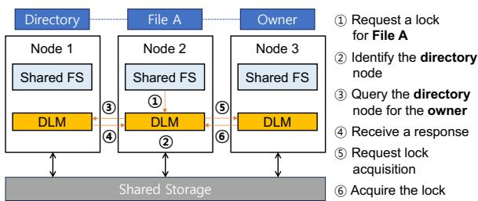  
Figure 1: DLM operation example for shared file I/O. Note that when creating files or directories, the directory node assigns the requester as the owner node since no ownership exists yet, allowing steps 5 and 6 to be handled locally on Node 2.

This mechanism notifies relevant nodes (e.g., the corresponding directory node maintaining the owner-node list) and acquires the lock instantly, eliminating the need to wait for a response from the directory node (§4.1). To ensure that the directory node is correctly updated, Lockify maintains a wait-list, enabling the node to resend the notification if a timer expires. This asynchronous ownership management approach reduces communication latency while preserving the consistency of shared-disk file systems (§4.3). We implement Lockify in the Linux kernel and evaluate it using two representative shared-disk file systems, GFS2 and OCFS2, under both low- and highcontention scenarios. Experimental results demonstrate that our simple approach significantly improves file system throughput by ∼6.4× compared to existing DLMs across microbenchmarks and real-world workloads (§5).

## 2 Background

This section provides key background on distributed lock managers in shared and parallel file systems, and outlines our target systems.

Linux kernel DLM. Linux provides an in-kernel DLM service [1] for shared-disk file systems (e.g., GFS2, OCFS2), cluster logical volume manager (LVM), and cluster multi-device (MD). Shared-disk file systems rely on this DLM to manage locks in a distributed manner through “owner” and “directory” nodes. Each lock object is assigned an owner node and a directory node. The directory node is determined based on a hash function and tracks which node currently serves as the owner for each lock object and helps route lock requests. The owner node is responsible for granting access and revoking locks as needed. Figure 1 illustrates a DLM operation example where Node 2 acquires a lock on file ‘A’. Initially, Node 2 determines the appropriate directory node by hashing the lock object’s name (step 2). It then asks the directory node (Node 1) for the current owner of the lock object (step 3). After looking up its lock table, the directory sends a response (step 4), and then Node 2 requests and acquires the lock from the owner node, Node 3 (steps 5–6). We note that when creating files or directories, no ownership has been established yet. In such cases, the directory node may assign the requesting node as the owner node, allowing lock acquisition (steps 5–6) to be handled locally (on Node 2).

Other DLM designs. In high-performance computing (HPC) systems, file systems have introduced “clientcache” to address the imbalance between high-speed computation and relatively slower storage devices [14, 40]. Accordingly, parallel file systems (PFS) such as Clustered XFS (CXFS) [20] and Lustre [4] employ DLMs and owner nodes to ensure client-cache coherence under high-contention workloads, with a focus on reducing lock conflict resolution overhead [14, 17]. Some recent studies [18,21,33,39,42] proposed to leverage hardwareassisted solutions, such as Remote Direct Memory Access (RDMA), to access shared objects in distributed systems. In particular, recent DLM designs [21,42] incorporate one-sided RDMA to eliminate server-side CPU involvement and enable CPU-efficient operations in highcontention scenarios.

Target DLM. This paper focuses on fully distributed DLMs, such as the Linux kernel DLM, which coordinate lock management across client nodes in shared-disk file systems. These DLMs avoid a single point of failure by eliminating centralized metadata servers (e.g., directory nodes) and can even bypass coordination overhead when the local client holds lock ownership. However, as demonstrated in §3, they often encounter scalability challenges due to directory-node lookups. In contrast, centralized architectures like Lustre [4] or Ceph [40] do not face this specific challenge, as their design lacks distributed directory nodes entirely. While such systems may introduce other scalability issues (e.g., single points of contention), those are outside the scope of this work.

## 3 Motivation: Understanding Linux DLM Overheads in Low-Contention Scenarios

This section presents the performance evaluation of the Linux kernel DLM with two representative shared-disk file systems, GFS2 and OCFS2, to examine how DLM operations impact overall file system performance. While we explore a range of workloads and contention configurations in §5, this section focuses on a low-contention scenario where a single active application process operates among multiple clients (up to 5) sharing the same storage via shared file systems. In our setup, each client connects to a shared NVMe SSD via NVMe-over-TCP [10], and the kernel DLM also communicates over TCP connections. The active client then executes test workloads involving 35, 000 file or directory creations and 4KB (sequential and random) reads and writes for a 1GB file using IOR [3]. Additional testbed configurations are detailed in §5. We discuss key observations in the following paragraphs.

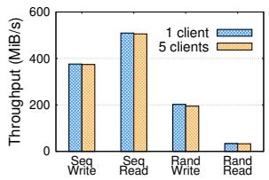  
(a) File I/Os.

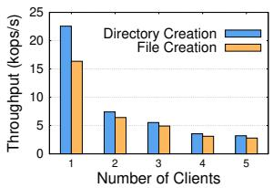  
(b) Directory/file creations.

Figure 2: GFS2 performance with the kernel DLM in a low-contention scenario. (a) While file I/O throughput remains almost unchanged regardless of the number of clients, (b) directory and file creation operations are significantly impacted, even when only a single client is active.  
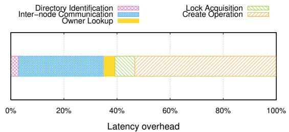  
Figure 3: Latency breakdown for the 5-client case. All DLM operations together contribute 47% of the total latency overhead during directory creation in Figure 2.

Low contention does not always translate to high throughput. Figure 2 presents the throughput of GFS2 with our test workloads as the number of clients increases, with only a single active client running the IOR process while the others remain idle. We observe that normal file I/O operations, such as reads and writes, remain unaffected by the number of clients (Figure 2(a)). This is because I/O overhead is much higher than lock acquisition overhead, as only one client requires locks. The throughput of normal I/O operations is only affected in scenarios with high-lock contention, which have been the focus of previous studies [16, 17, 21]. In contrast, when creating a large number of files or directories, throughput drops significantly by up to 86%, even in the absence of high lock contention, as shown in Figure 2(b). Our latency breakdown analysis in Figure 3 reveals that, under this workload, DLM operations (corresponding to steps 2–6 in Figure 1) account for 47% of the total latency, while the file system (create) operation contributes the remaining 53%. The lock acquisition time, excluding the communication latency with the directory node and owner node, accounts for only 15%. This indicates that the communication latency is the main bottleneck.

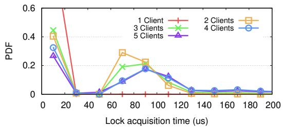

Figure 4: PDF of lock acquisition time distribution. As the number of clients increases, the probability of assigning a remote directory node also increases, leading to longer lock acquisition latency.  
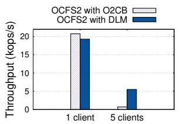  
(a) Directory creation.

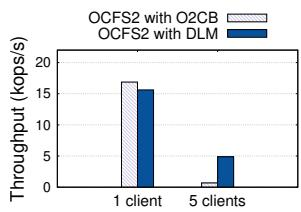  
(b) File creation.  
Figure 5: OCFS2 with O2CB and the kernel DLM performance. The performance trend is consistent with Figure 2, showing lower throughput with more clients.

We note that this bottleneck can be mitigated when fewer clients are present, increasing the likelihood that the local node serves as the directory or owner node. For example, in an extreme scenario where only a single client exists, that client would always act as both the directory node and the owner node for all newly created files and directories, allowing lock acquisitions to be handled locally. Figure 4 illustrates the PDF of lock acquisition time distribution; in the single-client case, lock acquisition latency consistently remains below 20µs while maintaining high throughput (as shown in Figure 2). However, as the number of client nodes increases, the probability of the hashing function assigning a remote client as the directory node also increases, leading to longer lock acquisition latency and lower throughput. This explains reason behind GFS2’s poor throughput in low-contention scenarios.

Similar trends are observed across different file systems and DLMs. To verify that this phenomenon is not specific to a particular file system-DLM combination (i.e., GFS2 with the kernel DLM), we run the same experiments using OCFS2 with both O2CB (OCFS2’s native DLM) and the kernel DLM, as shown in Figure 5. The overall trend remains consistent with Figure 2; throughput in the 5-client case is much lower than in the singleclient case for both directory and file creation.

We observe that O2CB performs significantly worse than the kernel DLM in the 5-client case (Figures 5(a) and (b)). The primary reason is that O2CB lacks a “directory node” in its design. As a result, it must communicate with all clients to determine the owner node for a new lock object, whereas the kernel DLM requires at most a single interaction with the corresponding directory node. This additional communication overhead leads to lower performance in workloads involving frequent directory or file creation.

## 4 Lockify: Minimizing Lock Acquisition Overheads

Based on the observations from §3, we introduce Lockify, a simple yet effective approach to minimizing lock acquisition overhead. Figure 6 provides an overview of Lockify: since the DLM designates the creator of a new file or directory as its initial owner, Lockify explicitly declares self-ownership during create operations. The notification and response exchange is then handled asynchronously. We describe the three key components of Lockify in the following subsections (§4.1–§4.3), followed by case studies on DLM consistency (§4.4).

## 4.1 Self-Owner Notifications

Lockify introduces self-owner notification for file and directory creation, leveraging the fact that the DLM does not track the lock owner of non-existent files or directories. Therefore, Lockify notifies the directory node of self-ownership rather than querying it (step 3 in Figure 6). It then returns control to the file system immediately without waiting for a confirmation from the directory node (step 4). This mechanism eliminates DLM overhead by allowing the node creating the file to declare the selfownership. Meanwhile, upon receiving the notification, the directory node updates the lock-owner table and responds with a confirmation message (step 5). We note that this approach bypasses table lookup overhead, making it more CPU-efficient.

## 4.2 Extended Lock Acquisition Interface

Lockify is beneficial in scenarios where self-ownership is applicable, particularly when a new lock object is initiated by file or directory creation. For other operations, if the file already exists, its ownership is likely already assigned, which necessitates a lookup to identify the owner.

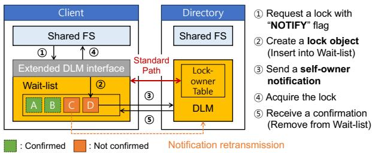  
Figure 6: Lockify overview. When creating new files or directories, the file system (Shared FS) can request a lock with the NOTIFY flag enabled via the extended DLM interface. It then acquires the lock immediately after sending the self-owner notification to the corresponding directory node. See §4 for more details.

Therefore, the standard lock acquisition steps need to be followed. Nonetheless, the communication latency is relatively small compared to I/O overhead (§3). Since file systems have the necessary context to determine when self-ownership applies, Lockify introduces an extended lock acquisition interface with “NOTIFY” flag. Specifically, by using dlm\_lock(..., NOTIFY), a file system can explicitly inform the DLM that the lock request pertains to a newly created object (step 1 in Figure 6). This approach minimizes the required modifications to file systems. Without the NOTIFY flag, Lockify follows the conventional procedure: it sends a request to the directory node, following the standard path in Figure 6, which then searches the lock-owner table to identify the owner node.

## 4.3 Asynchronous Ownership Management

As explained above, Lockify receives an asynchronous confirmation for the notification from the directory node. While effective, Lockify still needs to ensure that the directory node has been updated with the notification to maintain DLM-level consistent lock ownership across clients. To achieve this, Lockify introduces a wait-list, where an entry is inserted for each lock request to track whether a corresponding confirmation message has been received (step 2 in Figure 6). If a confirmation is not received within a specified time due to node or network failures, Lockify resends the notification to the corresponding directory node. Once the confirmation is received, the corresponding wait-list entry is removed (step 5). Note that if another node takes over the role of the directory node (e.g., due to node crash recovery or mount/unmount operations), Lockify can resend any unconfirmed notifications to the new directory node (see §4.4). Furthermore, this design does not compromise file system-level consistency, as demonstrated in §5.4.

## 4.4 Case Studies on DLM Consistency

This subsection examines how Lockify maintains DLMlevel consistency in crash recovery and lock contention scenarios.

Crash recovery. Lockify extends the standard DLM recovery mechanism, where each client transmits ownership information to newly reassigned directory nodes after a crash. During recovery, Lockify also checks its wait-list and resends any unconfirmed self-ownership notifications to the new directory nodes. This design ensures consistency without adding communication overhead beyond that of the standard DLM.

Parent directory lock contention. A non-trivial corner case may arise when multiple clients (DLMs) simultaneously send self-owner notifications for the same object name under a shared parent directory. In shared-disk file systems, the parent directory must be exclusively locked before creating any child entity. Accordingly, Lockify assumes this lock is already held when initiating selfownership. To maintain consistency with standard DLM behavior, Lockify releases the parent directory lock only after both (1) the ownership update and (2) the corresponding file operation (i.e., creating new child files or directories) are complete. The key difference is that Lockify executes these steps concurrently, performing the file operation while the ownership update is still in progress. This design introduces no further communication overhead beyond that of the standard DLM.

## 5 Evaluation

We implement Lockify1 in Linux kernel 6.6.23, on top of the kernel DLM, and evaluate it against the vanilla kernel DLM2 using OCFS2 and GFS2 file systems with NVMeover-TCP [10]. We exclude O2CB since the kernel DLM outperforms it with OCFS2 in our evaluation scenarios. We also compare Lockify with NFS [35], which is a widely used shared file system but operates independently of DLM.

## 5.1 Evaluation Setup

Testbed setup. We use a 5-server testbed, as five servers are sufficient to demonstrate our scalability problem. Each server is equipped with dual Intel Xeon Gold 5115 (2.40GHz) CPUs with 20 cores per socket, hyperthreading enabled, 64GB RAM, and a 250GB Samsung 970 EVO Plus NVMe SSD. All servers are connected via 56Gbps links and run Ubuntu 18.04 (kernel 6.6.23).

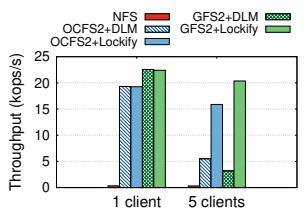

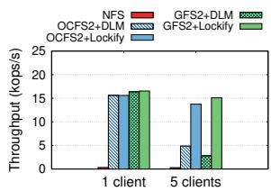  
(a) Directory creation.  
(b) File creation.  
Figure 7: Low-contention performance. While Lockify does not provide any performance gain over the kernel DLM in the 1-client case, it significantly improves throughput in the 5-client case by eliminating bottlenecks.

Unless stated otherwise, default system configurations are used.

Workloads. For microbenchmarks, we use mdtest provided by IOR [5] to evaluate file system metadata performance by creating a tree structure of files and directories. Our mdtest workload generates a total of 35,000 files and directories. To evaluate real-world workloads, we use Postmark [26] and Filebench [2]. Postmark is widely used to measure file system performance under e-mail and web-based service workloads. Our Filebench tests include the fileserver and webproxy workloads, emulating a broader range of real-world usage scenarios.

## 5.2 Microbenchmarks

This section extends the evaluation from §3 by incorporating Lockify, now considering two scenarios: (1) a lowcontention scenario, where only one client among multiple clients runs the workload, and (2) a high-contention scenario, where all clients run the same application workload concurrently under a shared parent directory.

Low-contention scenario. In Figure 7, we compare mdtest throughput between the 1-client and 5-client cases. Similar to Figure 2, the 1-client case represents the ideal scenario, with no communication overhead, as the client acts as both the directory and owner node for every lock object. Consequently, Lockify provides no performance gain in this case. In contrast, the 5-client case shows a significant throughput drop for OCFS2 and GFS2 with the kernel DLM due to high communication latency, as revealed in Figure 3. By eliminating this overhead, Lockify improves OCFS2 throughput by ∼2.9× and GFS2 throughput by ∼6.4×, as shown in Figures 7(a) and 7(b). We also observe that NFS shows distinctly different performance characteristics compared to OCFS2 and GFS2, achieving extremely low throughput. Since NFS follows a client-server model, increasing the number of clients does not impact its performance. However, it consistently shows low throughput, even in the 1-client case, indicating that file system-side overhead is the dominant factor.

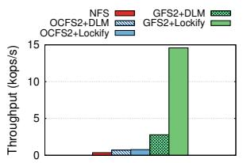  
(a) Directory creation.

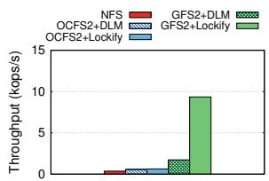  
(b) File creation.  
Figure 8: High-contention performance. GFS2 implements an optimization that reduces the number of parent directory lock acquisitions, enabling Lockify to further improve throughput via self-owner notifications.

High-contention scenario. To evaluate Lockify’s effectiveness under high-contention, each of the 5 clients runs the mdtest workload, with all clients creating files and directories under the same parent directory. Unlike in lowcontention scenarios, this setup further increases communication overhead due to frequent parent directory lock acquisitions. Since ownership of the parent directory lock is already assigned, Lockify cannot mitigate this overhead. As a result, in Figure 8, we observe that Lockify provides only a minor throughput improvement for OCFS2 (1.09–1.11×). This is because, even though Lockify reduces lock acquisition overhead for new files and directories, the owner identification process for the parent directory remains a major bottleneck.

On the other hand, Lockify significantly improves GFS2 throughput, achieving 5.2× and 5.4× speedups for directory and file creations, respectively (Figure 8). This improvement is due to GFS2’s optimization: GFS2 maintains an internal queue for lock requests and checks for duplicate requests before issuing a new one. Therefore, if clients concurrently request a lock for the same parent directory, communication with the owner node is significantly reduced. At the same time, Lockify continues to minimize lock acquisition overhead for new files and directories.

Latency overhead. To understand Lockify’s throughput gains, we compare DLM-side and file system-side latencies in the low-contention scenario, as shown in Figure 9. We evaluate three configurations: GFS2 (1 client), GFS2 (5 clients), and GFS2 with Lockify (5 clients). Similar to the throughput results, the GFS2 (1-client) case represents the performance upper bound, where DLM latency accounts for only 4.4% of total latency. However, with 5 clients, the DLM latency jumps to 46.7%, leading to a significant drop in overall performance. Lockify reduces this DLM latency to 8%, nearly matching the singleclient baseline, leading to a substantial increase in total throughput. This result also indicates that Lockify’s waitlist incurs negligible overhead—comparable to the GFS2 (1-client) case, where no wait-list is maintained. Importantly, this is observed under a stress scenario involving 35, 000 file and directory creations, confirming that waitlist maintenance does not introduce measurable penalty. Lastly, we note that the evaluation was conducted without background network traffic. Under network congestion, the kernel DLM’s communication latency would likely increase, further degrading its performance. In contrast, Lockify is less sensitive to such congestion, as it can proceed with file system operations while asynchronously awaiting confirmation.

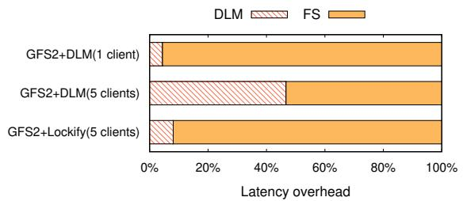  
Figure 9: Latency overhead comparison: DLM vs. File System. Lockify effectively reduces DLM-side latency in the 5-client case, approaching the ideal 1-client scenario.

## 5.3 Real-world Workloads

This subsection evaluates Lockify using real-world workloads for 1-client and 5-client cases. Following common low-contention scenarios observed in real-world deployments (§1), we configure one active client to run the workload, while the others remain idle.

Postmark. Our Postmark configuration consists of 500 files, with file sizes ranging from 1KB to 4KB, and a total of 500, 000 transactions to simulate a realistic workload. Figure 10(a) presents the throughput of the active client, which aligns with our microbenchmark results (§5.2). In the 5-client case, Lockify improves throughput by 1.7× for OCFS2 and 2.0× for GFS2, compared to the kernel DLM, while achieving 93–96% of the ideal 1- client throughput.

Filebench. Our Filebench configuration incorporates two representative workloads: fileserver and webproxy. The fileserver workload generates 10,000 files within directories, each containing an average of 20 entries. File sizes follow a gamma distribution with a 128KB mean. We use 50 threads, with each I/O operation handling 1MB of data and append operations averaging 16KB. The webproxy workload performs file creation, modification, deletion, as well as reading and logging. Our setup includes 10, 000 files distributed across a directory structure with an average width of 1, 000, 000 and a mean file size of 16KB. We use 100 threads, with a mean I/O size of 16KB and an overall I/O size of 1MB, which are the default settings in Filebench.

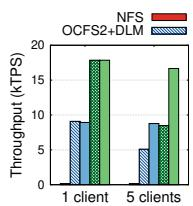  
(a) Postmark.

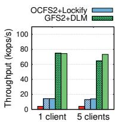  
(b) Fileserver.

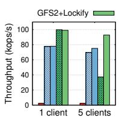  
(c) Webproxy.  
Figure 10: Performance with real-world workloads. In the 5 client cases, Lockify consistently improves throughput over the kernel DLM, achieving performance comparable to the ideal 1-client throughput.

Figure 10(b) presents the fileserver throughput. While this workload primarily consists of file I/Os, where DLM communication overhead is masked by high I/O overhead, the results show that Lockify still achieves 1.07– 1.14× throughput improvements over the kernel DLM for OCFS2 and GFS2 in the 5-client case. In contrast, as shown in Figure 10(c), Lockify significantly improves GFS2 throughput by 2.5× compared to the kernel DLM, while its throughput gains on OCFS2 are relatively modest (1.08× improvement), indicating a need for further file system-level optimizations.

## 5.4 Crash Consistency Tests

Xfstests [12] is a file system testing suite used to evaluate stability and compliance. Following the approach in [13, 15, 27], we conduct 75 generic tests suggested for NFS [11] on GFS2 and OCFS2, using both the kernel DLM and Lockify. Our results show that GFS2 with DLM passes 70 out of 75 tests, while GFS2 with Lockify achieves the same results. Similarly, OCFS2 produces identical results for both DLM and Lockify, passing 67 out of 75 tests. These results confirm that Lockify’s integration does not negatively impact compliance with shared-disk file system standards.

## 5.5 Comparison with RDMA-based DLM

Finally, this subsection presents an indirect comparison using an emulated RDMA-based DLM with NVMe-over-RDMA [9]. Since an RDMA-based kernel DLM implementation is currently unavailable, we emulate it by running the kernel DLM in a single-client scenario with no communication latency, assuming RDMA latency remains below 1µs in low-contention scenarios [31]. In addition, storage is connected via NVMe-over-RDMA to ensure a fair comparison between TCP- and RDMAbased solutions. The goal of this indirect comparison is to evaluate how well Lockify bridges the performance gap with recent hardware-assisted solutions [16, 21, 39, 42], even though Lockify is primarily designed for cluster environments where TCP is the only available option for network communication.

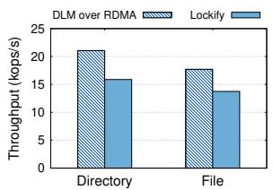  
(a) OCFS2.

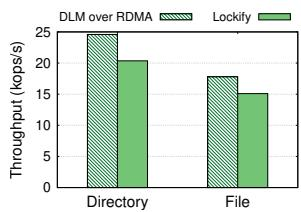  
(b) GFS2.  
Figure 11: Comparison with RDMA-based DLM. The results show that Lockify achieves performance comparable to the RDMA-based DLM.

We repeat the low-contention scenario from Figure 7 using mdtest, which involves creating a large number of directories and files, and compare Lockify (5-client case) with the emulated RDMA-based DLM (DLM over RDMA) on both OCFS2 and GFS2, as shown in Figure 11. Overall, Lockify achieves 87–88% of DLM-over-RDMA throughput across all results, demonstrating that Lockify delivers performance comparable to an RDMAbased solution, without specialized hardware support.

## 6 Conclusion

This paper presents Lockify, a novel DLM for shareddisk file systems. Based on the observation that existing DLMs suffer from high lock acquisition overhead even in low-contention scenarios, Lockify minimizes lock acquisition latency by avoiding unnecessary communication with remote nodes. The evaluation results from our Linux kernel implementation show that Lockify improves overall throughput by ∼6.4× compared to existing DLMs across microbenchmarks and real-world workloads, while achieving performance comparable to an RDMA-based solution.

## Acknowledgments

We would like to thank our shepherd, Yu Liang, and the anonymous reviewers for their insightful feedback. This work was supported in part by Institute of Information & communications Technology Planning & Evaluation (IITP) grant funded by the Korea government (MSIT) (RS-2024-00459026), in part by the National Research Foundation of Korea (NRF) grant funded by the Korea government (MSIT) (NRF-2022R1A2C1011090), and also in part by Samsung Electronics. The corresponding author is Jaehyun Hwang.

## References

[1] Distributed Lock Manager (DLM). https://do cumentation.suse.com/sle-ha/15-SP6/htm l/SLE-HA-all/cha-ha-storage-dlm.html.

[2] Filebench: A Model-based File System Benchmark. https://github.com/filebench/fileben ch.

[3] HPC IO Benchmark Repository. IOR and mdtest. https://github.com/hpc/ior.

[4] Lustre filesystem. https://www.lustre.org/.

[5] mdtest: MPI Metadata Benchmark. https://gi thub.com/LLNL/mdtest.

[6] NVMe over Fabrics (oF) Specification. https: //nvmexpress.org/specification/nvme-o f-specification/.

[7] o2cb - Default cluster stack of the OCFS2 file system. https://manpages.debian.org/unstab le/ocfs2-tools/o2cb.7.en.html.

[8] Oracle Real Application Clusters. https://www. oracle.com/database/real-application-c lusters/.

[9] RDMA Transport Specification. https://nvme xpress.org/specification/rdma-transpo rt-specification/.

[10] TCP Transport Specification. https://nvmexpre ss.org/specification/tcp-transport-spe cification/.

[11] Xfstests - Linux NFS Wiki. https://wiki.lin ux-nfs.org/wiki/index.php/Xfstests.

[12] xfstests: Filesystem Test Suite. https://github .com/kdave/xfstests.

[13] Thomas E. Anderson, Marco Canini, Jongyul Kim, Dejan Kostic, Youngjin Kwon, Simon Peter, Waleed ´ Reda, Henry N. Schuh, and Emmett Witchel. Assise: Performance and Availability via Client-local NVM in a Distributed File System. In USENIX OSDI, 2020.

[14] Peter J. Braam. Scalable Locking and Recovery for Network File Systems. In PDSW, 2007.

[15] Ming Chen, Erez Zadok, Arun Olappamanna Vasudevan, and Kelong Wang. SeMiNAS: A Secure Middleware for Wide-Area Network-Attached Storage. In ACM SYSTOR, 2016.

[16] Qi Chen, Shaonan Ma, Kang Chen, Teng Ma, Xin Liu, Dexun Chen, Yongwei Wu, and Zuoning Chen. SeqDLM: A Sequencer-Based Distributed Lock Manager for Efficient Shared File Access in a Parallel File System. In ACM/IEEE SC, 2022.

[17] Avery Ching, Wei-keng Liao, Alok Choudhary, Robert Ross, and Lee Ward. Noncontiguous Locking Techniques for Parallel File Systems. In ACM/IEEE SC, 2007.

[18] Ananth Devulapalli. Distributed Queue-based Locking using Advanced Network Features. In IEEE ICPP, 2005.

[19] Mark Fasheh. OCFS2: The Oracle Clustered File System, Version 2. In Proceedings of the 2006 Linux Symposium, 2006.

[20] Brian Gaffey. SGI’s Cluster File System - CXFS. https://msstconference.org/MSST-histo ry/2000/presentations/A04VG.PDF.

[21] Jian Gao, Youyou Lu, Minhui Xie, Qing Wang, and Jiwu Shu. Citron: Distributed Range Lock Management with One-sided RDMA. In USENIX FAST, 2023.

[22] Sanjay Ghemawat and Jeff Dean. LevelDB. https: //github.com/google/leveldb.

[23] Zvika Guz, Harry (Huan) Li, Anahita Shayesteh, and Vijay Balakrishnan. NVMe-over-Fabrics Performance Characterization and the Path to Low-Overhead Flash Disaggregation. In ACM SYSTOR, 2017.

[24] Jaehyun Hwang, Qizhe Cai, Ao Tang, and Rachit Agarwal. TCP ≈ RDMA: CPU-efficient Remote Storage Access with i10. In USENIX NSDI, 2020.

[25] Facebook Inc. RocksDB: A persistent key-value store for fast storage environments. https://ro cksdb.org/.

[26] J. Katcher. Postmark: A new file system benchmark. Technical Report TR3022, Network Appliance, 1997.

[27] Jongyul Kim, Insu Jang, Waleed Reda, Jaeseong Im, Marco Canini, Dejan Kostic, Youngjin Kwon, Si- ´ mon Peter, and Emmett Witchel. LineFS: Efficient SmartNIC Offload of a Distributed File System with Pipeline Parallelism. In ACM SOSP, 2021.

[28] Ana Klimovic, Christos Kozyrakis, Eno Thereska, Binu John, and Sanjeev Kumar. Flash Storage Disaggregation. In ACM Eurosys, 2016.

[29] Andrew W. Leung, Shankar Pasupathy, Garth Goodson, and Ethan L. Miller. Measurement and Analysis of Large-Scale Network File System Workloads. In USENIX ATC, 2008.

[30] VMware LLC. VMware vSphere VMFS. https: //www.vmware.com/docs/vmware-vsphere-v mfs.

[31] Youyou Lu, Jiwu Shu, Youmin Chen, and Tao Li. Octopus: an RDMA-enabled Distributed Persistent Memory File System. In USENIX ATC, 2017.

[32] Christopher Madden. Building a shared GFS2 filesystem with Hyperdisk Balanced HA multiwriter. https://www.beginswithdata.com/2 024/10/08/hyperdisk-shared-gfs2/, 2024.

[33] S. Narravula, A. Marnidala, A. Vishnu, K. Vaidyanathan, and D. K. Panda. High Performance Distributed Lock Management Services using Network-based Remote Atomic Operations. In IEEE/ACM CCGRID, 2007.

[34] Tuan Anh Nguyen, Hyeongjun Jeon, Daegyu Han, Duck-Ho Bae, Young Jin Yu, Kyeungpyo Kim, Sungsoon Park, Jinkyu Jeong, and Beomseok Nam. NVMe-Driven Lazy Cache Coherence for Immutable Data with NVMe over Fabrics. In IEEE CLOUD, 2023.

[35] Brian Pawlowski, Chet Juszczak, Peter Staubach, Carl Smith, Diane Lebel, and David Hitz. NFS Version 3: Design and Implementation. In USENIX Summer, 1994.

[36] Suney Sharma and Andrew Boyer. Clustered storage simplified: GFS2 on Amazon EBS Multi-Attach enabled volumes. https://aws.amazon .com/blogs/storage/clustered-storage-s implified-gfs2-on-amazon-ebs-multi-a ttach-enabled-volumes/, 2021.

[37] Yen Sheng. Setting up Multi-attach EBS Disk Across Multiple ECS Instances with GFS2 File System. https://www.alibabacloud.com/blog/ setting-up-multi-attach-ebs-disk-acr oss-multiple-ecs-instances-with-gfs 2-file-system\_599696, 2023.

[38] Midhul Vuppalapati, Justin Miron, Rachit Agarwal, Dan Truong, Ashish Motivala, and Thierry Cruanes. Building An Elastic Query Engine on Disaggregated Storage. In USENIX NSDI, 2020.

[39] Xingda Wei, Jiaxin Shi, Yanzhe Chen, Rong Chen, and Haibo Chen. Fast In-memory Transaction Processing using RDMA and HTM. In ACM SOSP, 2015.

[40] Sage A. Weil, Scott A. Brandt, Ethan L. Miller, Darrell D. E. Long, and Carlos Maltzahn. Ceph: A Scalable, High-Performance Distributed File System. In USENIX OSDI, 2006.

[41] Steven Whitehouse. The GFS2 Filesystem. In Proceedings of the Linux Symposium, 2007.

[42] Dong Young Yoon, Mosharaf Chowdhury, and Barzan Mozafari. Distributed Lock Management with RDMA: Decentralization without Starvation. In ACM SIGMOD, 2018.

## A Artifact Appendix

## Abstract

This artifact package provides all necessary components to reproduce the evaluation results of Lockify. It includes the Lockify prototype implemented in the Linux kernel, modifications to the GFS2 and OCFS2 file systems to support Lockify, and a comprehensive set of scripts for automating the experiments.

## Scope

This artifact enables reproduction of the key results presented in both the Motivation and Evaluation sections, focusing on evaluating the GFS2 and OCFS2 file systems under different DLM modules, including the kernel DLM, O2CB, and Lockify, as described in §3 and §5:

• Motivation (Figures 2, 4, and 5): IOR throughput results and kernel trace–based analysis that illustrate the scalability challenge in shared-disk file systems.

• Evaluation (Figures 7, 8, 9, and 10): Microbenchmarks and real-world workloads using the provided mdtest, Postmark, and Filebench scripts, demonstrating Lockify’s effectiveness.

We note that the artifact also includes scripts for NFS, as it is evaluated in §5 for comparison.

## Contents

The artifact repository includes the following components:

• README.md: Provides detailed instructions for configuring the Linux kernel, shared-disk file systems, and NVMe-over-TCP. Users may adapt these configurations to their own testbed environments.

• fs/: Contains the Lockify implementation (dlm/) and small modifications to GFS2 (gfs2/) and

OCFS2 (ocfs2/).

• include/: Contains modifications to Linux kernel header files required for the Lockify implementation.

• fast26ae/: Includes scripts and instructions for reproducing the key results in the paper. Users can refer to fast26ae/README.md.

## Hosting

The complete artifact is hosted on GitHub:

• Repository: https://github.com/skku-sys lab/lockify

• Branch: main

• Commit version: 2447e2f

We recommend using the latest commit, as future updates or bug fixes may be applied.

## Requirements

This artifact has the following requirements:

• Linux kernel 6.6.23: The artifact relies on Linux kernel version 6.6.23. Applying it to other kernel versions may require additional porting effort.

• Shared storage: All nodes must have access to a shared storage device over the network, such as via NVMe-over-TCP, iSCSI, or other similar protocols.

• Multi-node setup: To evaluate Lockify’s effectiveness, at least two network-connected nodes are required. A single-node setup does not reproduce the scalability issues discussed in the paper (e.g., Figure 4) and thus cannot demonstrate the benefits of Lockify.