USENIX

THE ADVANCED COMPUTING SYSTEMS ASSOCIATION

# RosenBridge: A Framework for Enabling Express I/O Paths Across the Virtualization Boundary

Shi Qiu, Xiamen University; Li Wang, KylinSoft; Jianqin Yan and Ruofan Xiong, Xiamen University; Leping Yang, Shanghai Jiao Tong University; Xin Yao,   
Renhai Chen, and Gong Zhang, Huawei; Dongsheng Li, The National University of   
Defense Technology; Jiwu Shu, Tsinghua University; Yiming Zhang, Shanghai Jiao Tong University and Xiamen University

## https://www.usenix.org/conference/fast26/presentation/qiu

This paper is included in the Proceedings of the 24th USENIX Conference on File and Storage Technologies.

February 24–26, 2026 • Santa Clara, CA, USA

ISBN 978-1-939133-53-3

Open access to the Proceedings of the 24th USENIX Conference on File and Storage Technologies is sponsored by

# RosenBridge: A Framework for Enabling Express I/O Paths Across the Virtualization Boundary

Shi Qiu1∗, Li Wang3∗, Jianqin Yan1, Ruofan Xiong1, Leping Yang2, Xin Yao4, Renhai Chen4 Gong Zhang4,Dongsheng Li5, Jiwu Shu6, Yiming Zhang2,1†

1NICE Lab, XMU, 2SJTU, 3KylinSoft, 4Huawei Theory Lab, 5NUDT, 6THU

## Abstract

With the emergence of high-performance storage devices, the overhead of the storage stack has become a major I/O performance bottleneck. To alleviate this problem, a number of express I/O paths have been proposed based on the concept of near-data processing (NDP), such as query I/O resubmission (XRP) and GPU-direct storage (GDS). Unfortunately, in virtualized environments, none of these bare-metal express I/O paths can cross the virtualization boundary between the guest virtual machines (VMs) and the host, leaving applications inside guest VMs unable to benefit from them.

This paper presents RosenBridge, a framework for enabling express I/O paths across the virtualization boundary. At the core of RosenBridge is a new paravirtualized I/O device called virtio-ndp, which allows the guest to offload NDP optimizations to the hypervisor in the host userspace based on uBPF (userspace Berkeley Packet Filter). We connect the virtio-ndp backend with the host kernel’s asynchronous I/O stack for efficient I/O scheduling, and provide a set of helper functions for convenient guest-host address translation. We strictly limit the memory access scope of uBPF programs to guaranty security and collaboratively throttle the multi-path I/O to ensure fairness among guest VMs. We demonstrate the effectiveness of RosenBridge through two use cases, respectively supporting XRP and GDS in virtualized environments. Evaluation shows that RosenBridge significantly outperforms the state-of-theart I/O paravirtualization frameworks (virtio and vhost) in I/O performance, while effectively reducing CPU usage. Compared to the bare-metal express I/O paths (XRP and GDS), RosenBridge only incurs a slight performance degradation.

## 1 Introduction

With the emergence of high-performance storage techniques [37, 78], commercial off-the-shelf (COTS) NVMe solid-state drives (SSDs) can now deliver million-scale IOPS and µsscale latency. With such high performance of the hardware, the software processing overhead of the kernel storage stack not only results in a waste of valuable CPU resources, but also becomes a major performance bottleneck for I/O-intensive applications [59, 78]. To alleviate this problem, several optimizations have been proposed to establish express I/O paths for various scenarios, based on the concept of near-data processing or near-device processing (NDP) [9,18,34,49,54,83], offloading computation near/on storage devices [21, 56, 80] to shorten the distance between computation and data sources.

Virtualization is the cornerstone of cloud computing. Through I/O paravirtualization frameworks such as virtio [58] and vhost [32], cloud vendors can provide paravirtualized I/O devices to guest virtual machines (VMs) to enhance flexibility, efficiency, and security. For instance, local disk services in the cloud [82], including AWS I3/P5 [4, 5], Azure Lsv3 [47], and Alibaba Cloud I3 [13], provide high-performance storage to a variety of applications such as relational databases, large-scale deep learning (DL), and high-performance computing (HPC). They directly attach physical storage devices to the compute servers and virtualize them to provide virtual block devices to the VMs. On the downside, virtualization increases the complexity of I/O processing and degrades I/O performance, making it difficult to fully benefit from high-performance storage devices. As reported by [42, 50, 53], data-intensive applications in VMs can spend up to 70% of their execution time and consume non-negligible CPU resources for data I/O.

Virtualization creates an isolated execution environment for each guest VM by establishing a virtualization boundary between the guests and the host. This boundary, spanning CPU execution, memory access, and disk I/O, prevents a malicious guest from compromising other guests as well as the host. In the standard KVM/QEMU virtualization architecture [27], a guest VM can only perceive the hypervisor-provided virtualized I/O devices (e.g., virtio-blk), being agnostic to the host’s backend physical devices. As a result, traditional bare-metal NDP-optimized express I/O paths [48,74,80,81] cannot cross the virtualization boundary, leaving applications inside guest

VMs unable to benefit from them.

To address this problem, this paper presents RosenBridge, a novel framework that enables bare-metal express I/O paths across the virtualization boundary. As shown in Fig. 1, we leverage uBPF (userspace Berkeley Packet Filter) [51] to create a userspace execution runtime in the host where guests can offload and execute NDP optimizations. Unlike traditional eBPF [66] which offloads user programs to the kernel, uBPF allows running BPF programs in userspace , thus being more secure and appropriate for virtualized environments.

To the best of our knowledge, RosenBridge is the first framework that supports NDP-optimized express I/O paths. In designing RosenBridge, we address the following challenges.

First, how to execute guest NDP optimizations in the host? Guests need to securely run their NDP programs in a runtime environment in the host, crossing the CPU boundary. To achieve this, we introduce virtio-ndp, a virtio device that extends the virtio protocol with BPF semantics and allows the guest to leverage uBPF to offload NDP optimizations to the hypervisor (QEMU) in the host userspace.

Second, how to achieve efficient I/O dispatching? The standard BPF model is event-driven, triggering only once when execution reaches a predefined hook point. This makes it difficult for BPF to support complex NDP workload patterns such as I/O resubmission [80]. To address this, we connect the virtio-ndp backend with the host kernel’s asynchronous I/O stack, enabling NDP optimizations to be triggered on either I/O submission or completion. This allows I/O requests to be submitted from within the BPF programs, facilitating flexible NDP I/O scheduling. In addition, to avoid the kernel-related overhead, we employ I/O passthrough [38] for I/O requests passing between the uBPF program and the driver.

Third, how to bridge the semantic gap between the guest and the host? In a virtualized environment, the guestperceived memory addresses and disk block addresses are remapped by the hypervisor. When an NDP optimization is offloaded to the host, it needs to cross the memory and I/O boundaries and operate on the host. To achieve this, Rosen-Bridge uses a guest-host shared memory region to serve as the communication context for program-dependent information (e.g., guest file system metadata). Further, it also provides a set of simple uBPF helper functions for convenient guest-host address translation and secure access to host metadata.

Last but not least, how to guarantee security and fairness among guest VMs? ⃝1 A malicious uBPF program might change pointers to access critical data of QEMU. To address this, RosenBridge creates special, isolated shared memory areas for uBPF, and uses the uBPF verifier [23] (at compile time) to limit uBPF programs’ memory access scope. ⃝2 A malicious uBPF program might submit I/O at very high rates, bypassing QEMU’s resource limits. To guarantee fairness among VMs, we propose a multi-path I/O throttling mechanism that collaboratively performs throttling on all I/O submission paths, and shares throttling-related data structures to enforce the total resource quota.

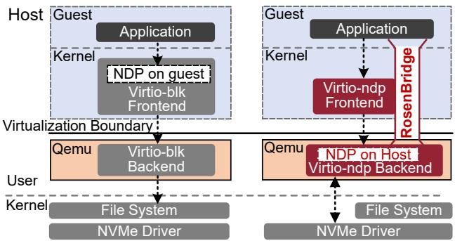  
Figure 1: Express I/O path for virtualization. There are three options to offload NDP optimizations. ⃝1 Offloading NDP to the guest kernel (left), which is inefficient due to the semantic gap. ⃝2 Offloading NDP to QEMU in the host userspace (right), which is adopted by RosenBridge. ⃝3 Offloading NDP to the NVMe driver in the host kernel (not shown here), which compromises security thus being unrealistic for the cloud.

We demonstrate the effectiveness of RosenBridge through two use cases, respectively supporting query I/O resubmission (XRP [80]) and GPU-direct storage (GDS [48]) in virtualized environments. Evaluation shows that RosenBridge significantly outperforms the state-of-the-art I/O paravirtualization frameworks (virtio [33], vhost-kernel [52], and vhostuser [26]) in I/O performance, while effectively reducing CPU usage. Compared to the original bare-metal express I/O paths (XRP and GDS), RosenBridge only incurs a slight performance degradation due to intrinsic virtualization overhead.

## 2 Background and Motivation

## 2.1 Virtualization

The hypervisor [61], a.k.a. VMM (VM monitor), is crucial for virtualization, which enables multiple guest VMs to run on a physical host machine. By virtualizing and allocating hardware resources including CPU, memory, and storage, the hypervisor allows each VM to operate as if it were on a dedicated machine isolated with the virtualization boundary.

## 2.1.1 Resource Virtualization

CPU Virtualization: CPU virtualization technologies such as Intel VT-x [35] and AMD-V [1] establish a boundary between the guest VMs and the host by providing two operational modes: a privileged root mode for the hypervisor and a restricted non-root mode for the VMs. When a VM runs in non-root mode and attempts to execute a sensitive instruction (e.g., an I/O operation), the CPU triggers a VM-exit.

Then, the VM’s state will be saved, and control will be transferred to the hypervisor in root mode. The boundary of CPU execution ensures that VMs cannot directly access hardware and the host is isolated from malicious VMs.

Memory Virtualization: At VM startup, the hypervisor allocates a region of host virtual memory as the guest’s physical memory. The guest-host address translation relies on Second Level Address Translation (SLAT) [69], which includes two stages. First, the guest OS uses its own page tables to translate the Guest Virtual Address (GVA) into the Guest Physical Address (GPA). Second, the hypervisor translates the GPA into the Physical Address (HPA) using dedicated hardware registers such as Intel EPT (Extended Page Tables) [36] and AMD NPT (Nested Page Tables) [2]. The memory boundary is enforced through hardware-based address redirection.

Storage Paravirtualization: The hypervisor typically provides the VM with a virtualized block I/O device, which acts as a proxy for interactions between the VM and the physical disk. The virtio framework [58] is the de-facto standard for I/O virtualization on Linux [29, 40, 41, 53], relying on the hypervisor (QEMU) to provide a set of paravirtualized I/O devices such as virtio-blk for block storage virtualization. Through I/O interposition [53], the hypervisor translates guest block addresses into host block addresses to enforce the block I/O boundary, allowing a host file or block device to be abstracted as a guest virtual disk. I/O interposition also allows rich management features such as fine-grained allocation, sharing, monitoring, and rate limiting.

Hardware passthrough [11] (VFIO [70] and SR-IOV [63]) directly bind a physical device to a VM for performance purposes. The I/O device uses IOMMU (Input-Output Memory Management Unit) to translate the guest PCIe address into the host PCIe address. However, hardware passthrough requires special and expensive hardware design to statically virtualize I/O devices at the hardware level. Additionally, physical resources (e.g., capacity, hardware queues, and interrupts) are directly assigned to the VM via VFIO. Since this assignment is exclusive, the device loses flexibility and shareability. Furthermore, SR-IOV cannot support over-provisioning or live migration, which are critical features for virtualization management. Consequently, this approach suffers from poor manageability and scalability [53, 83].

## 2.1.2 Overhead of Storage Paravirtualization

Unlike CPU/memory virtualization that can be efficiently accelerated by hardware, the performance of storage paravirtualization is severely affected by software stack overhead, especially as the latency/throughput performance of NVMe storage devices has greatly improved in recent years.

To better understand the impact of storage paravirtualization on I/O performance, we have conducted a breakdown analysis on I/O processing of virtio-blk. Fig. 2(left) illustrates the I/O path of virtio-blk from the guest application to the host storage device: ⃝1 In the guest VM, the application issues a request through read() or write(). The request passes through the guest’s storage stack before reaching the virtio frontend driver, which enqueues the request into the ring buffer of the virtio queue (virtqueue or VQ). ⃝2 The guest traps into the host kernel (KVM) via VM-exit. ⃝3 KVM notifies QEMU to handle the request in the ring buffer of VQ. QEMU emulates the processing of the virtual block device and gets the host block address of the request. ⃝4 QEMU invokes a system call for the request (with the host block address), which is handled by the host storage stack. ⃝5 The request reaches the storage device, where the NVMe device processes it and returns.

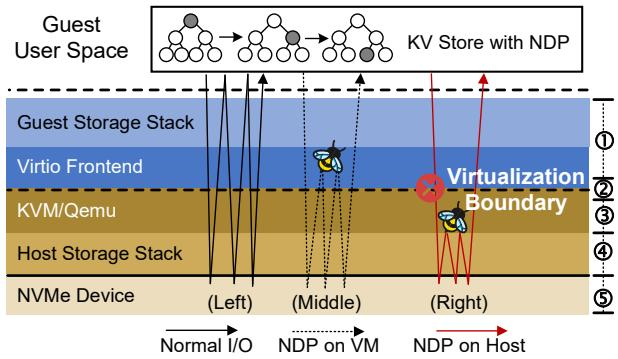

Figure 2: Comparison of I/O paths of an NDP-accelerated KV store in virtualized environments. The latencies of different layers (labeled on the right-hand side) are listed in Table 1.
<table><tr><td>①Guest ②Guest/KVM ③KVM/QEMU ④Host Storage Stack ③Storage Device</td><td>7.4(us) 2.8(us) 5.1(us) 3.1(us) 4.6(us)</td><td>20.8% 7.9% 49.6% 8.7% 13.0%</td></tr><tr><td>Total</td><td>35.5(us)</td><td>100.0%</td></tr></table>

Table 1: Breakdown of the mean latency of a 4KB random read of a guest VM with virtio-blk. Software overhead accounts for as high as 87% of the total latency.

Table 1 shows the time spent on different stages of processing a 4KB random read request from the guest VM. We provide the virtual block device in the raw format using virtioblk [33]. The physical disk is an Optane P5800X [37]. We conduct the experiments on a server with two 64-core CPUs. This experiment shows that the software overhead is substantial, accounting for as high as 87.0% (steps ⃝∼1 ⃝5 ) of the total latency.

We further compare the consumptions of CPU cycles when achieving the same throughput (2GB/sec, 4GB/sec, and 8GB/sec) by a VM (with virtio-blk) and by a physical machine, using I/O sizes of 16KB, 32KB, and 64KB, respectively. Fig. 3 shows that the VM consumes 498.3%, 630.4%, and 581.0% more CPU resources than the physical machine, respectively for 2GB/sec, 4GB/sec, and 8GB/sec, which is quite expensive.

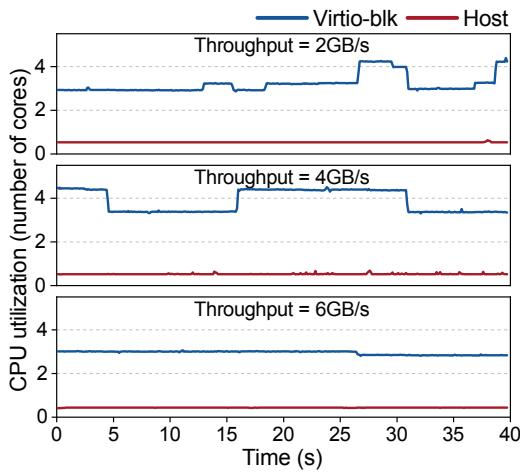  
Figure 3: Comparison of CPU utilizations performing I/O in the virtio-blk and in the host, respectively.

## 2.2 NDP-Optimized Express I/O Paths

Currently, the performance bottleneck of I/O-intensive applications has shifted from physical devices to the movement of data within the Linux kernel storage stack. To reduce the overhead of data movement, several optimizations [6, 49, 74] have been proposed to establish express I/O paths for various scenarios based on the concept of near data processing (NDP), which moves computation closer to the data.

Recently, eBPF [22, 66] has become a key tool for implementing NDP. Its in-kernel programs execute at the most privileged level of the operating system, giving them direct, low-latency access to kernel data and system events. This provides an ideal foundation for an NDP environment, making the Linux eBPF mechanism a popular computational engine for NDP systems [8,34,39,74,80,81]. For instance, XRP [80] leverages BPF to offload specific read functions to the NVMe driver for query applications and resubmit intermediate auxiliary read requests directly from the BPF program (instead of a sequence of system calls from the user space) to bypass the block, file system and system call layers of the kernel.

## 2.2.1 BPF Primer.

eBPF. The extended Berkeley Packet Filter (eBPF) [66] is a secure and efficient bytecode engine in the Linux kernel [22]. It enables users to safely run sandboxed programs within the kernel without changing its source code or loading modules. eBPF uses an event-driven execution model. Programs are attached to preset hook points in the kernel and are triggered whenever the kernel’s execution path traverses these points. For safety, a verifier checks every instruction before it is loaded. It ensures the program will finish running and won’t create any security problems.

uBPF. The userspace BPF (uBPF) is an implementation of the eBPF instruction set that runs in user space rather than in the kernel. It includes a complete toolchain for eBPF programs, featuring an assembler, disassembler, interpreter, helper functions registrar, and a Just-In-Time (JIT) compiler. In contrast to in-kernel eBPF, uBPF executes within a standard, unprivileged user process. A uBPF program inherits all the permissions and restrictions of its host application. It has no direct access to kernel memory or hardware and must interact with the operating system through the standard system call interface, just like any other application code. This model is inherently less privileged and, by extension, has a more constrained view of the system.

Current uBPF implementations rely on an external verifier like PREVAIL [23]. It uses abstract interpretation to analyze a program’s behavior across all possible inputs. This guarantees memory safety and ensures the program will eventually terminate. With this method, it can provide the same security guarantees as the Linux verifier [10].

## 2.2.2 Enabling NDP in Virtualized Environments

The virtualization boundary isolates the guest and the host, preventing them from being aware of each other. This means that BPF functions can only be offloaded to virtualized I/O devices, and therefore, existing NDP-based express I/O paths cannot be pushed down to lower-level physical storage drivers. The benefits are limited because each NDP I/O request still needs to traverse the full kernel stack.

Take an NDP-accelerated key-value (KV) store as an example, where high-performance NVMe devices on the host are virtualized as block devices using virtio-blk for VM. Fig. 2 depicts the I/O path for a normal user-space dispatch alongside two possible paths for an NDP implementation: one in the virtio frontend driver and another in the host’s NVMe driver. The guest/host storage stacks significantly prolong the I/O paths (Fig. 2(left)). Even with NDP implemented at the VM virtio driver, the guest application still suffers from long I/O paths in the host storage stack as well as costly context switches (Fig. 2(middle)). To maximize the benefit of NDP, a simple idea is to offload guest NDP functions to the host to enable express I/O paths across the virtualization boundary (Fig. 2(right)).

To realize this idea, we must overcome the following technical challenges: First, we must cross the CPU boundary and attach the guest-side BPF program to a hook point on the host. This program must then be triggerable by the guest application so it can execute the NDP optimization.

Second, NDP optimizations follow a data-driven paradigm, which submits I/O based on data content. This paradigm requires flexible and effective I/O dispatching to achieve significant benefits. However, the standard BPF model is eventdriven, triggering only once when program execution traverses a pre-defined hook point. This makes it difficult for the original BPF mechanism to support complex NDP workload patterns.

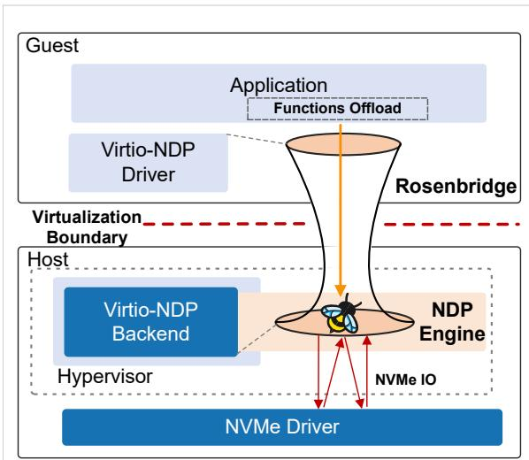  
Figure 4: Overview of RosenBridge.

Third, NDP programs offloaded to the host also cross the memory and I/O boundaries, directly interacting with the memory address space and storage devices abstracted by the host OS. Therefore, we must bridge the semantic gap between the guest and the host to ensure that the offloaded NDP programs can correctly interact with host resources.

Finally, we must ensure that the offloading of NDP optimizations does not endanger the host or other tenants, as virtualization platforms have much stricter security requirements. Offloading a BPF program from a potentially malicious VM to the host is dangerous, as it could lead to a full host compromise or the theft of additional virtualized resources.

## 3 RosenBridge Design

To address the aforementioned challenges, we propose a new I/O virtualization framework called RosenBridge. As shown in Fig. 4, RosenBridge allows VMs to offload the NDP optimizations to QEMU in the host userspace and execute them correctly in an isolated sandbox.

This section presents RosenBridge’s design with uBPF and virtio. We describe the integration with Linux’s asynchronous I/O stack that enables flexible I/O scheduling for different workload patterns. We also explain how to bridge the semantic gap between the guest and the offloaded NDP optimization. Finally, we present how to guarantee the security of QEMU and fairness among multiple tenants.

```c
enum attach_point {
IO_URING_SQ;
IO_URING_CQ;
};
struct bpf_info {
const char *path;
enum attach_point location;
};
int ioctl(int dev_fd, BPF_HOST_ATTACH,
struct bpf_info *inf);
int ioctl(int dev_fd, BPF_HOST_DETACH,
int bpf_fd);
int read_nd(int fd, void *buf, off_t offset,
size_t len,
int bpf_fd, void* buf2, size_t len2);
int write_nd(int fd, void *buf, off_t offset,
size_t len,
int bpf_fd, void* buf2, size_t len2);
```  
Listing 1: Interface provided by the virtio-ndp frontend.

## 3.1 Cross-Boundary Express I/O path

In order to allow guests to offload NDP optimizations to host, RosenBridge introduces a paravirtualized device called virtiondp, which consists of a frontend driver in the guest kernel and a backend driver in QEMU. Specifically, the frontend is implemented as an extension to the virtio-blk with bpf semantics, exposed as a standard virtio device inside VMs. The backend driver is implemented as an extension to QEMU’s virtio backend driver.

## 3.1.1 Guest-Side Interface

Listing 1 shows the interface provided by the virtio-ndp front end for guests to offload BPF programs. The first API is an ioctl interface for the virtio disk device file (e.g., /dev/vdb) within the virtual machine. The parameter BPF\_HOST\_ATTACH indicates loading the BPF program on the host, while the parameter inf specifies the file path of the BPF programs, and its attach point on the host. The optional attach points are IO\_URING\_SQ and IO\_URING\_CQ, as detailed in Section 3.2. The return value is a file descriptor bpf\_fd of the attached BPF program. The second API is to unload an attached BPF program. The third API, read\_nd, is an extension of the standard read system call. Its first four parameters are identical to those of read. The parameter bpf\_fd is the file descriptor of the BPF program returned by the ioctl interface. The parameter buf2 is a pointer to an additional buffer and len2 is its length, for passing application-specific information. The last API, write\_nd, is an extension of the standard write system call, and the meanings of the additional parameters are analogous to those of read\_nd.

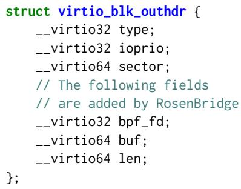  
Listing 2: Extended header of Virtio request.

## 3.1.2 BPF Program Registration in QEMU

RosenBridge extends the header of the virtio-blk I/O request, which is placed at the beginning of each read/write request, as shown in Listing 2. The last three fields are newly added. Additionally, the “type” field indicates the request type. For example, VIRTIO\_BLK\_T\_OUT indicates that it is a write operation, and RosenBridge has extended it by introducing custom commands. Specifically, VIRTIO\_BLK\_T\_LOAD indicates that this is a BPF program loading request, VIRTIO\_BLK\_T\_READ\_ND denotes a read\_nd request (corresponding to the read\_nd interface), VIRTIO\_BLK\_T\_WRITE\_ND signifies a write\_nd request, and VIRTIO\_BLK\_T\_UNLOAD represents a BPF program unloading request.

The workflow of the ioctl interface in Listing 1 is illustrated in Figure 5. First, the frontend driver allocates a memory region within the guest kernel, copies the BPF file into this region, and then constructs a custom virtio request, setting the “type” field to VIRTIO\_BLK\_T\_LOAD, and setting the “buf” and “len” fields to the address and length of the memory region, respectively. This request is subsequently sent to the host via the virtio-blk device. The backend driver in QEMU parses the virtio request, copies the BPF file from the guest memory, and then invokes the uBPF interface to load it. It sends the returned BPF file descriptor bpf\_fd as the result of the virtio request back to the guest.

## 3.1.3 NDP I/O Submission

The implementation of the read\_nd API in Listing 1 constructs a custom virtio request, sets the type field to VIR-TIO\_BLK\_T\_READ\_ND, copies the guest metadata from userspace buffer to guest kernel, sets the ’buf’ field to the memory region, and sends the request to the host via the RosenBridge device. After receiving the request, the QEMU backend on the host parses the virtio request and routes it based on its type field to a dedicated worker thread introduced by RosenBridge. In order to execute the NDP optimizations, the worker thread triggers the uBPF program corresponding to bpf\_fd. The worker then completes the virtio request based on the program’s execution result. The implementation of the write\_nd interface is analogous to read\_nd.

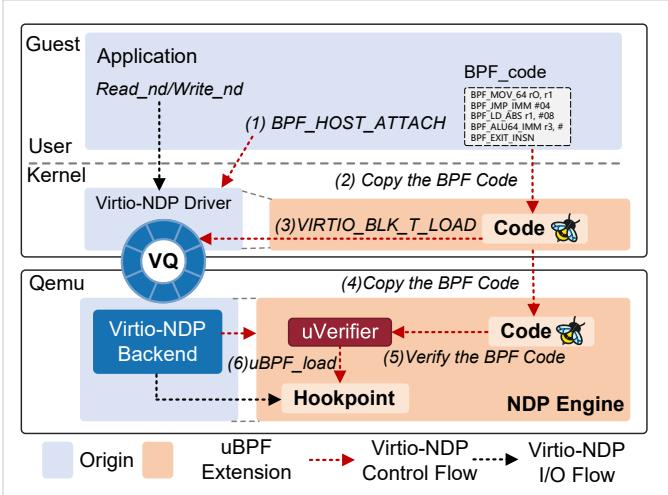  
Figure 5: Workflow of virtio-ndp APIs.

Additionally, the virtio-ndp leverages io\_uring passthrough [38] to establish a direct I/O path with the host’s NVMe device driver, bypassing most parts of the kernel I/O stacks. This allows uBPF programs running in user space to achieve NDP performance comparable to that of eBPF.

## 3.2 IO\_uring-Based NDP I/O Scheduling

Current NDP implementations typically involve two main workload patterns. The first is on-path processing, used in tasks like compression [68], encryption [71], GDS [48], and pre-processing [77]. This pattern requires modifying the original data or memory addresses before I/O submission. The second is content-based I/O scheduling, such as in data mining [45, 65] and database lookups [67, 80]. In this pattern, the NDP optimizations may resubmit I/O based on the content of the data that was read. Prior NDP optimizations, such as XRP, rely on hooking the NVMe driver’s interrupt handler in the host kernel. It operates in a privileged context with direct access to I/O queues. RosenBridge offloads NDP optimizations to the host user space. However, it lacks mechanisms for interposing processing logic between I/O completion and subsequent submission.

To address this issue, RosenBridge extends IO\_uring to incorporate two hook points to invoke BPF programs when submitting requests and receiving results, its workflow is shown in Fig. 6. IO\_uring is a high-performance asynchronous I/O framework introduced in the latest Linux kernel. It creates a pair of ring buffers, Submission Queue (SQ)/Completion Queue (CQ), shared between user-space and kernel. Each entry in the queue is called Submission Queue Entry (SQE) or Completion Queue Entry (CQE). An SQE contains the necessary information to submit an I/O request, such as a file descriptor, memory address, and block offset, and is used for submission. A CQE is used to reap a completed I/O request and its result.

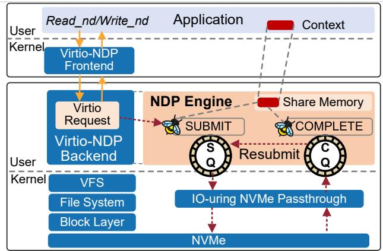  
Figure 6: Io\_uring based NDP I/O Scheduling

The standard process for submitting requests and receiving results by invoking the liburing library is illustrated as follows. (1) The io\_uring\_get\_sqe() gets the next available submission queue entry from the submission queue belonging to the ring. (2) The io\_uring\_prep\_read() populates the SQE to use the file descriptor to read nbytes into the buffer at the specified offset. (3) The io\_uring\_submit() notifies the kernel thread to handle newly submitted I/O.

For receiving I/O results, the io\_uring\_wait\_cqe() function waits for a completed I/O operation, indicated by a completion queue entry. The io\_uring\_cqe\_seen() function marks the completion queue entry as consumed, allowing the kernel to reuse the entry.

To implement the two primary NDP patterns: computation prior to I/O submission and content-based I/O resubmission after completion. RosenBridge modifies the io\_uring\_prep\_read() and io\_uring\_cqe\_seen() functions by adding two uBPF hook points. The modified io\_uring\_prep\_read() function first populates the SQE and then runs the uBPF program. This allows the uBPF program to access and modify the SQE. After the uBPF program finishes, the worker thread submits the I/O using the modified SQE. In io\_uring\_cqe\_seen(), the worker thread checks the result from the uBPF program to decide the virtio request’s return value. If the uBPF program returns RESUBMIT, the worker will not complete the I/O. Instead, it will call io\_uring\_submit() to submit the new I/O request.

To facilitate secure interaction between io\_uring and uBPF, we introduced a set of SQE related interfaces as uBPF helper functions (Listing 3). The BPF\_uring\_get\_sqe() is used to obtain copies of the current SQE when submit I/O. This allows the uBPF program to access information such as the current I/O’s file handle, memory address, and block address. Based on its computation results, the program can // uBPF helper functions for io\_uring void BPF\_uring\_get\_sqe(struct io\_uring\_sqe \* sqe); void BPF\_uring\_get\_new\_sqe(struct io\_uring\_sqe \* sqe); void BPF\_uring\_set\_sqe(struct io\_uring\_sqe \* sqe);

Listing 3: uBPF helper functions for asynchronous I/O dispatch.

then easily modify the I/O’s disk block or memory address. BPF\_uring\_get\_new\_sqe() is used to get a new SQE in io\_uring for I/O resubmission. And the BPF\_uring\_set\_sqe() is used to modify the SQE entries according to the parameters. It also transparently replaces the file or block device address in an SQE with an NVMe block address, which allows uBPF to interact directly with the NVMe driver.

Note that, these helper functions must perform parameter checks to ensure that all memory and storage addresses are within the bounds of the resources allocated by QEMU.

## 3.3 Bridging the Semantic Gap

## 3.3.1 Guest Metadata and Data Access

To enable the host to access guest metadata across the virtualization boundary, RosenBridge introduces a communication mechanism based on shared memory.

When QEMU starts a VM, it allocates a host memory region and configures the PCIe BAR (base address register) of the virtio-ndp device inside the VM to map this memory region to the VM. The VM can directly access this shared memory region as if it were local memory. The guest application informs the guest kernel of the metadata location in userspace through the “buf2” parameter in the read\_nd/write\_nd interfaces. The guest kernel manages the shared memory region, allocates an area within it, and copies the metadata to this area.

It then fills the “buf” and “len” fields of a custom virtio read\_nd or write\_nd request to point to this memory region. When the QEMU backend driver on the host receives the virtio request, it performs pointer translation, converting the “buf” pointer from a GPA (guest physical address) to an HVA (host virtual address). This HVA is then passed as the “meta” field of the “rosenbridge\_md” entry parameter (Listing 4) to the BPF program, allowing it to access the memory region and retrieve the guest metadata. The guest application is responsible for ensuring metadata consistency.

Inspired by XDP [34], the “ctx” entry parameter structure passed to the BPF program is defined as shown in Listing 4, the “meta” field points to guest metadata located in the shared metadata region between the guest and host. The “data” field points to the data to be written (for write\_nd requests) at the submission queue hook point, and to the returned data (for read\_nd requests) at the completion queue hook point. The BPF verifier ensures that BPF program accesses to the

```c
struct rosenbridge_md {
void *meta;
void *meta_end;
void *data;
void *data_end;
};
int BPF_PROG_TYPE_ROSENBRIDGE(
struct rosenbridge_md *ctx);
```

Listing 4: The signature of BPF programs that can be loaded by RosenBridge.

```c
uint64_t BPF_disk_trans(uint64_t g_phy_off);
uint64_t BPF_mem_trans(uint64_t g_phy_ptr);
```

Listing 5: uBPF helper functions for translating guestphysical address into a host-side virtual address.

memory region pointed to by meta do not exceed “meta\_end”, and accesses to the memory region pointed to by data do not exceed “data\_end”. Furthermore, access to the meta region is read-only, while the data regions are read-write.

## 3.3.2 Host Metadata Access

In addition to accessing data, BPF programs may need to read and modify metadata associated with io\_uring entries. For example, in the case of GDS, the I/O buffer address must be translated based on host-specific information, and the offset must be converted from a virtual disk offset to an NVMe device offset. As shown in Listing 5, RosenBridge provides helper functions for BPF programs to invoke, which enables these transformations.

## 3.4 Security

Modern x86 virtualization separates Guest(non-root) and Host(root) execution, both with Ring-3 and ring-0 [84]. Rosen-Bridge offloads uBPF-based NDP-optimizations from Guest Ring-0 to Host Ring-3. Potential adversaries might (i) bypass hardware-assisted virtualization (e.g., Intel VT-x [35]), i.e., instruction privilege escalation; (ii) bypass EPT [36] restrictions, i.e., out-of-bounds memory access to QEMU data structures; and (iii) access other’s files or flooding during disk I/O. RosenBridge’s security-model addresses them at the following levels.

## 3.4.1 Instruction Execution Limitation

RosenBridge encapsulates NDP functionality as uBPF programs. At load-time, these uBPF programs undergo strict static analysis via an open-source BPF verifier called PRE-VAIL [10], ensuring execution in a restricted, unprivileged sandbox in Host Ring-3 (much more secure than containers). The verifier permits only authorized helper functions and prohibits system calls or infinite loops. This ensures that QEMU’s execution remains stable and unaffected.

## 3.4.2 Memory Access Limitation

A uBPF program naturally inherits the memory and storage boundaries of its host application. This helps us prevent a malicious VM from damaging or spying on the host kernel. To provide even stronger protection, RosenBridge also prevents uBPF programs from modifying the hypervisor itself, such as its rate-limiting data structures. It does this by using the BPF framework to enforce security through sandboxed execution and runtime verification.

In traditional eBPF, each BPF function type defines a callback function, is\_valid\_access(), to perform additional checks on context accesses and to return the value type of the context field. This approach passes boundary information (such as a length) as a separate parameter to the eBPF program, allowing the program to perform explicit bounds checking internally and achieve a similar capability to the in-kernel eBPF verifier.

For RosenBridge, we only allow the uBPF program to access the context corresponding to the rosenbridge\_md structure. RosenBridge introduces a new BPF type BPF\_PROG\_TYPE\_ROSENBRIDGE with the signature shown in Listing 4. Before the program is loaded, virtiondp passes the sizes of the data and metadata buffers, defined in the BPF\_PROG\_TYPE\_ROSENBRIDGE context, to the PREVAIL verifier so that it can perform the boundary check. PREVAIL verifies every memory access to ensure that the uBPF program does not access unauthorized memory. It strictly confines the memory access scope to the VM’s allocated memory regions.

PREVAIL-based analysis and memory constraints occur at load-time, causing zero runtime overhead. Runtime I/O safety check involves only simple address range comparisons, negligible compared to microsecond-level (µs) I/O operations.

## 3.4.3 I/O Security Assurance

Parameter Check: To enforce I/O security, Rosen-Bridge validates each I/O request submitted by uBPF via BPF\_uring\_set\_sqe. It verifies the memory address of each SQE in io\_uring. It ensures that the address resides within the rosenbridge\_md context and the memory allocated to the VM. Additionally, it confines I/O access to the address range of the VM’s allocated virtual disk. This guarantees that NDP I/O parameters remain within the Guest Ring-3 to Guest Ring-0 scope.

I/O Throttling: In general, the VMM (virtual machine monitor) implements an I/O throttling algorithm for VMs to ensure fairness. For example, QEMU adopts the leaky bucket algorithm. For the throttling algorithm to work, all VM I/O operations must pass through the VMM and be submitted by it. As explained in Section, RosenBridge introduces a new I/O path that operates independently of the existing QEMU I/O submission path. As a result, a VM may consume more resources than designated by the SLA set by the VMM, thus potentially breaking the QoS and fairness guarantees.

RosenBridge introduces a multi-path collaborative I/O throttling mechanism. The key idea is to ensure throttling at the io\_uring submission path and share the throttling related data structures to respect the total resource quota. Specifically, RosenBridge reuses QEMU’s Leaky-Bucket for fine-grained I/O throttling by adding a throttling path. After the uBPF program is triggered, RosenBridge calculates the total size of queued requests, which is passed to QEMU’s ‘throttle\_group\_co\_io\_limits\_intercept‘ before calling ‘io\_uring\_enter‘ to submit I/O. This approach enforces I/O limits and shared group quotas (including burst support) on both uBPF-issued and standard VM I/O requests. As a result, it effectively prevents resource monopolization while maintaining responsiveness during legitimate performance spikes.

## 4 Case Studies

RosenBridge aligns with SNIA’s Computational Storage Architectural Abstractions [64] by providing the necessary CSD components, including the engine, environment, and resources. By hooking I/O submission and completion, Rosen-Bridge supports the two CSD usage models defined by SNIA, the direct model (e.g., data compression) and the indirect model (e.g., data mining), thus covering most NDPoptimizations. Users can leverage the resubmission logic to implement BPF program chaining while preserving context in VM memory. This approach bypasses the instruction limits of a single uBPF program, enabling iterative computations and multi-stage processing pipelines.

In this section, we will elaborate on how to leverage Rosen-Bridge to apply the bare-metal I/O path optimizations (introduced in §2.2) in virtualized environments. Pseudocode is provided in Listing 6 and Listing 7 .

## 4.1 RosenXRP

eXpress Resubmission Path (XRP): XRP [80] is an BPFbased framework that allows applications to offload userdefined storage functions such as index lookups or aggregations. XRP uses a self-defined NVMe driver’s interrupt handler, allowing XRP to trigger BPF functions directly from the NVMe driver as each I/O completes. XRP utilizes a custom system call (read\_xrp) to apply a specific BPF function to the read request, carrying with it the necessary input information, e.g., the key to be queried and its corresponding memory pointer. Further, a component called metadata digest is used to access the file system metadata to transfer logical

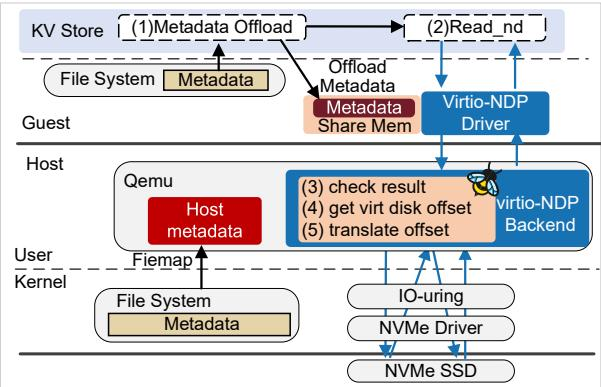  
Figure 7: Integrating RosenBridge with XRP.

```c
int XRP(struct rosenbridge_md *ctx){
int find = check_result(ctx->data);
if (find) return OK;
// get the next req addr
u64 next_addr = decode(ctx->data);
// get virt disk offset
int g_dev_offset = metadata_digest(next_addr,
ctx->meta);
// translate virt offset to host dev offset
int h_disk_offset = BPF_disk_trans(g_dev_offset);
// get a sqe and modified its entry
struct io_uring_sqe sqe;
BPF_uring_get_new_sqe(&sqe);
sqe->off = h_disk_offset;
sqe->len = len;
sqe->ptr = ctx->data;
...
BPF_uring_set_sqe(fd,h_disk_offset,ctx->data,len);
return RESUBMIT;
}
```

## Listing 6: The BPF program of RosenXRP.

file addresses to disk offsets. It checks the file system mapping state to safely perform I/O resubmissions that traverse more disk blocks bypassing the kernel’s block, file system, and system call layers.

For XRP, to implement the I/O resubmission logic in Rosen-Bridge, we attach the Rosen\_XRP BPF program to the I/O completion hook point. The workflow of Rosen\_XRP is illustrated in Fig. 7. For each time it is triggered, the program checks if the final result has been found. If not, it proceeds to submit the next I/O request. To correctly operate on the host storage device, we perform a two-step address translation. First, the metadata\_digest component converts the file system offset into a guest-physical address. Second, bpf\_disk\_trans translates this guest-physical address into a host-side file address.

To ensure consistency between guest kernel metadata and host NDP I/O, we preserve XRP’s versioning mechanism in virtio-ndp. The system compares the version number of the current request with the latest version. If they match, the request proceeds.

```c
uint64_t GDS(struct rosenbridge_md *ctx) {
// find the phony buffer mapping
g_gpu_ptr = gds_map_find(h_ptr,ctx->meta);
struct io_uring_sqe sqe;
BPF_uring_get_sqe(&sqe);
//remap to virt GPU mem
result_addr = BPF_mem_trans(g_gpu_ptr);
sqe->ptr = result_addr;
BPF_uring_set_sqe(sqe);
return OK;
}
```

Listing 7: The BPF program of RosenGDS.  
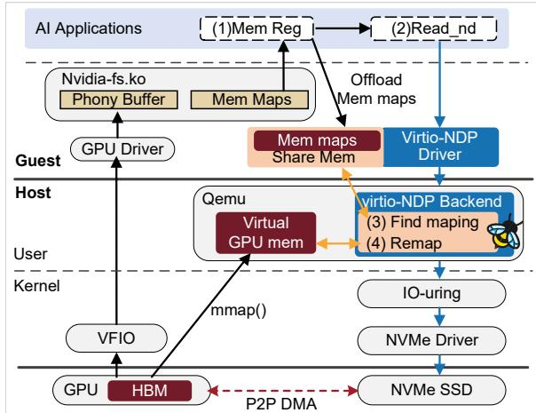  
Figure 8: Integrating RosenBridge with GDS.

## 4.2 RosenGDS

GPU Direct Storage (GDS): GPU direct storage [48] establishes a data path for peer-to-peer DMA (direct memory access) transfers between GPU memory and storage, bypassing the CPU. In a bare-metal environment, the native GDS workflow operates in several steps. First, it allocates GPU memory using cudaMalloc. Next, it registers this GPU address with cuFileBufRegister, which in turn allocates a corresponding “phony” buffer of the same size in host memory. The nvidia-fs.ko kernel module then pins the GPU buffer’s pages and establishes a mapping between the phony buffer and the actual GPU buffer. Finally, when the application issues an I/O operation, a customized NVMe driver replaces the phony buffer address with the real GPU memory address and performs a direct DMA transfer between the GPU and the storage device. Clearly, this is a special case of on-path NDP optimization.

However, in a virtualization environment, device addresses within a VM are remapped by the hypervisor. To handle this, we attach our RosenGDS program to the I/O submission function. As illustrated in Fig. 8, we employ the same GPU virtualization approach as mainstream cloud providers [12, 14], i.e., passing the GPU through to the VM using VFIO. For storage devices, we utilize the virtual block device provided by virtioblk. We refer to RosenBridge-supported GDS for virtualized environments as RosenGDS. The details of major modifications are as follows: Upon each I/O submission, the program first queries the memory map offloaded to the shared context. It then uses the helper function BPF\_mem\_trans to translate the pointer to the corresponding host address, enabling Peerto-Peer DMA between virtual disks and virtual GPU device. It should be noted that the host addresses used here adopt the GPU memory mapping method from the state-of-the-art GDS implementation [72], which remaps GPU HBM to the host address space and allows I/O to be submitted directly through the standard host interface.

## 5 Evaluation

## 5.1 Configuration

In this section, we will demonstrate the benefits of utilizing RosenBridge for the I/O path optimizations (XRP and GDS) in virtualized environments. The evaluation metrics include I/O performance and CPU resource utilization, which are of essential importance for the cloud.

System settings. We conduct all experiments on a server with two 64-core CPUs and 512GB of memory, running Ubuntu 20.04 with Linux v6.1.0, with the guest OS using the same kernel. The server was equipped with a GPU [17] with 48GB GDDR6 DRAM, which is PCI-passthrough to the VM via VFIO. Moreover, the server is configured with an Intel P5800x [37] as the underlying storage device. The version of QEMU is 7.1.50 and all experiments use O\_DIRECT to bypass page cache.

Baselines. For RosenXRP, we use the key value store benchmark BPF-KV [80] used by XRP to measure the effectiveness of RosenXRP in virtualization environments. We compare the following configurations: RosenXRP, virtioblk [33], as well as vhost-kernel-blk [52] and vhost-userblk [26] (two variations of virtio-blk). For RosenGDS, we used virtio-blk as the baseline, which reads data from the disk into the VM memory and then performs cudaMemcpy [15] operations to transfer the data to GPU memory. In addition, we also ran XRP and GDS on the bare-metal environment as a comparison.

## 5.2 RosenXRP Performance

We run BPF-KV to perform one million operations, including random key lookup and range query. The level of B-tree is 6 in our experiments. For the virtio-blk, vhost-kernel-blk and vhost-user-blk, they use POSIX pread() system call to read data from virtual disk and traverse B-tree to perform the corresponding query operations, while the RosenXRP uses read\_rs() system call extended from XRP to do so. In addition, we also ran XRP on the host as a comparison.

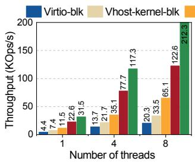

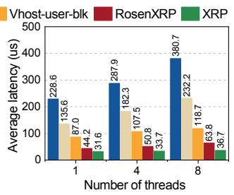  
Figure 9: Throughput and average latency using different number of threads with random key lookups

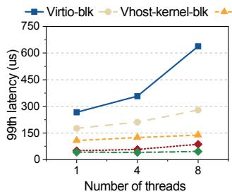

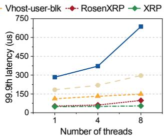  
Figure 10: Tail latency using different number of threads with random key lookups

Key Lookup. Fig. 9 demonstrates the throughput and average latency of key lookup, under single-thread, 4-thread and 8-thread settings. Compared to virtio-blk, as described and analyzed in Section 2.1, RosenXRP significantly increases the throughput by 461.8% and reduces the average latency by 82.1%. This is because RosenXRP re-submits BPF-KV’s I/O requests at the host NVMe driver, effectively eliminating most of the overhead of traversing the guest kernel storage stack and VM exits. Compared to vhost-kernel-blk and vhost-userblk, the throughput has increased by 243.5%, and 102.1%. Meanwhile, the average latency has been reduced by 70.7%, and 49.4%, respectively. In addition, compared to XRP running in a bare-metal environment, RosenXRP achieves an average bandwidth of 65% compared to XRP, while incurring a 55% increase in average latency. This is because, although RosenXRP performs re-submission in QEMU, each operation still needs to traverse the full virtualized storage stack at least once. Fig. 10 shows the 99th and 99.9th latencies under singlethread, 4-thread and 8-thread, respectively, where RosenXRP achieves the lowest tail latency at all percentiles, except for XRP.

Range Query. Fig. 11 demonstrates the throughput and average latency of range queries, with varying lengths. Compared to other configurations in virtualization environments,

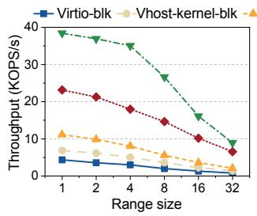

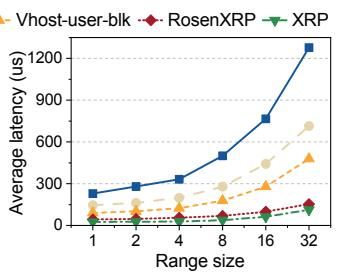  
Figure 11: Average read latency and throughput when performing range queries with various range sizes. RosenXRP is close to XRP and much better than others.

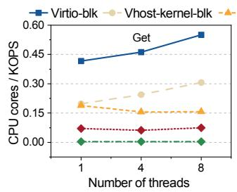

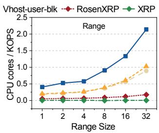  
Figure 12: CPU utilization per KOPS when performing key lookups and range queries.

RosenXRP consistently achieves higher performance across all query lengths. Furthermore, as the range query length increases, RosenXRP shows a more gradual increase in average latency compared to other configurations , since a single range query operation (less than 32 keys) only requires one traversal of the guest/host storage stacks. In particular, the performance of RosenXRP steadily approaches that of XRP, which runs in non-virtualized environments. This is because the time spent on re-submitting requests increases with longer queries, thus the proportion of time attributed to virtualization overhead decreases.

CPU Utilization. Fig. 12 shows the CPU resource consumption across different configurations for both key lookup and range query operations. Note that we use CPU cores per KOPS as a metric to normalize CPU utilization across different throughput levels. In the key lookup test, the CPU consumption of RosenXRP is only 14.73%, 28.69%, and 41.85% of that of virtio-blk, vhost-kernel-blk, and vhost-user-blk, respectively. While in the range query test, the CPU consumption of RosenXRP is 10.19%, 23.96%, and 22.39% of that of the three, respectively. Compared to virtualized setups, the host shows the lowest CPU consumption in both tests, as it incurs no virtualization overhead.

I/O Throttling. RosenBridge provides an I/O throttling mechanism to prevent it from violating the QoS of co-located virtual machines in multi-tenant scenarios. We verified its effectiveness using XRP and compare the QoS of other VMs with and without throttling enabled in RosenBridge. Specifically, the bandwidth of the VMs is limited to 1300 MB/sec (One quarter of the total bandwidth) to evaluate the impact under both conditions.

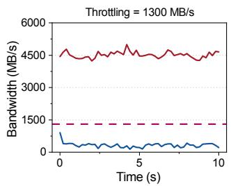

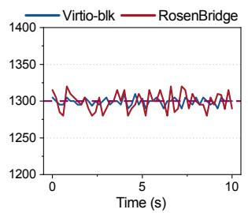  
Figure 13: Bandwidth without and with I/O throttling in a multi-tenant environment.

Fig. 13 illustrates the impact of RosenBridge on other virtual machines without and with I/O throttling enabled. When I/O throttling is disabled, the I/O performance of the VM using virtio-blk drops to only 30% of its configured limit due to interference from XRP. In contrast, with throttling enabled, both VMs maintain bandwidth close to their limitations, respectively.

## 5.3 RosenGDS Performance

We compare the performance and CPU overhead of loading data from a virtual block device to GPU memory between virtio-blk and RosenGDS. The I/O granularity ranges from 4KB to 4MB. For virtio-blk, it uses the pread() system call to read data from the disk into memory, and then uses cudaMemcpy() to transfer the data to GPU memory. In contrast, Rosen-GDS calls cuFileRead to submit GDS I/O. In addition, we also issue GDS I/O requests on the host using cuFileRead().

Latency. Fig. 14 illustrates the average latency and CPU utilization under different I/O sizes in a single-thread setup. Compared to virtio-blk, RosenGDS reduces the latency by 27.5% to 56.4% and the CPU utilization by at least 35.2%. The reduction in latency is primarily because RosenGDS enables Peer-to-Peer DMA between the virtual block device and the GPU memory, which eliminates the need for a cudaMemcpy() call and thus avoids communication and memory copy between the virtual machine and the GPU. Compared to GDS, RosenGDS incurs an average of 30% higher latency due to virtualization overhead.

Throughput. Fig. 15 shows the bandwidth and the associated CPU utilization during read operations performed with four threads. Compared to virtio-blk, RosenGDS achieves higher bandwidth as the I/O granularity increases from 4KB to 256KB, and delivers only 26% lower average bandwidth compared to GDS. The disk bandwidth saturates as the block size increases to 256KB. Furthermore, even at disk bandwidth saturation, RosenGDS maintains lower CPU consumption, using only 45.2% and 79.7% of the CPU resources required by virtio-blk for 1MB and 4MB I/O granularities, respectively. GDS on the host incurs the least CPU usage overall, as it does not traverse the virtualized storage stack.

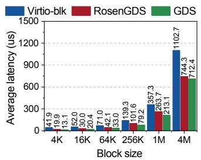

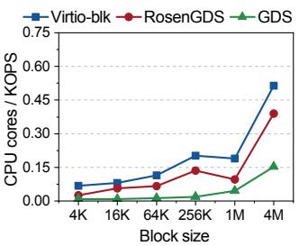  
Figure 14: Average read latency and CPU utilization when performing GDS and normal path under a single thread. Rosen-GDS is close to GDS and better than virtio-blk.

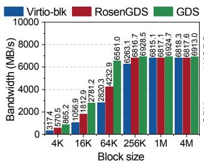

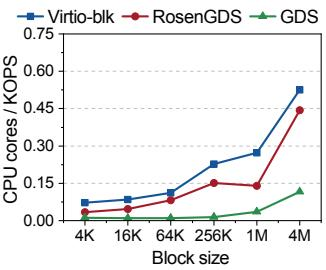  
Figure 15: Bandwidth and CPU utilization when performing GDS and normal path under four threads.

## 6 Related Work

## 6.1 I/O Path Optimizations

In recent years, there has been a growing interest in near-data computing, which brings computation closer to data, thereby reducing the overhead of moving data in software and networks. This concept has been applied in areas such as big data computing [25, 79], databases or key-value stores [44, 73], cloud computing [20], serverless computing [46], and distributed network protocols [83]. Additionally, some research provides general frameworks to apply near-data concepts in kernel bypass [28], storage stacks [21,24,57,74], and network stacks [19, 55, 60, 62]. However, to the best of our knowledge, there is currently no solution designed to reduce I/O path overhead in virtualization environments.

## 6.2 BPF for I/O

BPF has also been used to speed up storage I/O [8, 39, 74, 80, 81] and enhance paravirtualization [3] [43] . Apart from the previously mentioned XRP, there are also other examples like: EXTOS [7] uses BPF to merge database I/O on the kernel I/O path to improve the performance of database primitives. EXTFUSE [8] allows user-space file systems to load BPF functions into the kernel, which can serve low-level requests and eliminate unnecessary context switches.

None of these solutions is specifically designed for virtualization environments, and thus the logic offloading cannot address the virtualized I/O path. Most recently, EXO [53] is proposed as the first eBPF-based solution for accelerating KVM/QEMU-based storage paravirtualization. EXO notices that no matter how complex the QEMU backend’ processing is, to handle a guest I/O request, the host storage stack only needs to know the request’s guest-to-host address mapping. On the downside, however, it covers only part of the virtualized I/O path and cannot eliminate the overhead of VM exits during I/O operations. The extended version of RosenBridge, RosenXRP, can offload XRP to the host. This eliminates VMexits within a KV store operation issued in VMs, effectively reducing virtualization overhead.

## 6.3 Extensible Paravirtualization

Bridging the semantic gap is critical for the hypervisor to provide advanced services to guests. Recently, some research has also demonstrated the potential of eBPF programs in paravirtualization extension. Hyperupcall [3] is a technique which enables a hypervisor to communicate with a guest without a context switch using eBPF. The hypervisor can execute a hyperupcall to perform actions such as locating free guest pages or running guest interrupt handlers without switching into the guest after guest registers it. However, hyperupcall is mainly used by hosts to intervene virtual machines. Its complex address translation and predefined event-driven mechanism prevents guests from loading eBPF programs to hosts flexibly. Besides, it does not support consistent access to guest metadata protected by locks, due to the lock implementation in guest kernel does not support locking by an external entity, different from any vCPU.

Leonardi et al. [43] transfer eBPF programs between host and guest systems using socket communication. Then, by mounting the eBPF programs through a daemon thread, it implements optimization features such as Virtual CPU Pinning and Virtual Hyper-thread Pinning to improve virtual machine performance. This approach offers greater flexibility. However, the cost of sharing information such as eBPF map by socket communication is large. Furthermore, they lack consideration in terms of fairness and security.

Virtio [58] is a series of well-maintained Linux drivers for general I/O device virtualization. The hypervisor can provide a common set of emulated devices, such as virtio-blk, virtio-scsi, virtio-nvme, and virtio-net, to virtual machines by customizing the APIs offered by virtio.

In addition, virtio can implement a fully featured block layer through I/O intervention, which allows for constructing complex storage topologies stacked across multiple layers, supporting redirection, networking, snapshots, and migration [30].

On the downside, unfortunately, it also prolongs the I/O path, and data replication between the guest and the host can decrease performance.

Vhost [33] was proposed to accelerate virtio, which offloads the data plane to the kernel. However, a variation of vhost in the network direction, vhost-net, is more successful than vhost-blk because it can naturally leverage the Open Virtual Switch in the kernel, which is a software switch that enables packet forwarding within the kernel and provides rich functionality [31]. Vhost-blk has not been integrated into the QEMU mainline till now. SPDK vhost-user [75, 76] is a widely adopted solution. It achieves kernel bypass through the user-space NVMe driver and provides ultra-high I/O performance for virtual machines by employing optimization techniques such as zero-copy using shared memory. However, polling-based solutions can increase storage overhead and incur performance degradation because of CPU contention.

## 7 Conclusion and Future Work

This paper proposes RosenBridge, a novel framework designed to enable express I/O paths across the virtualization boundary and synchronize metadata efficiently and safely. We introduce RosenXRP/RosenGDS, showcasing the effectiveness of RosenBridge in virtualized environments.

In our future work, we will explore more storage I/O optimization use cases for RosenBridge, further demonstrating the importance of bridging the semantic gap to improve I/O performance in virtualized environments. RosenBridge exclusively offloads NDP programs to the host user space. Although offloading to the host kernel may yield higher performance, it widens the semantic gap and necessitates significant kernel modifications. It also complicates implementation correctness. For example, since user and kernel spaces cannot share locks, maintaining bucket consistency for I/O throttling is challenging and may introduce vulnerabilities. We plan to explore use cases suitable for host kernel offloading, such as network I/O, in future work.

Last but not least, we plan to integrate RosenBridge with DPUs (data processing units) [16]. We aim to leverage the flexibility of RosenBridge to address incompatibilities between DPU devices and existing GPU environments. Rosen-Bridge will enable I/O requests initiated by storage programs on the DPU to transfer data directly to GPU HBM, bypassing both the host CPU and host memory.

## Acknowledgment

We thank our shepherd, Matias Bjørling, and the anonymous reviewers for their valuable feedback and suggestions. The work is supported by the National Natural Science Foundation of China (grant no. 62441220). Shi Qiu and Li Wang are the co-first authors. Yiming Zhang is the corresponding author.

## References

[1] AMD. Amd-v. https://www.amd.com/en/solutio ns/hci-and-virtualization.html.

[2] AMD. Amd npt. https://www.amd.com/content/da m/amd/en/documents/archived-tech-docs/data sheets/33954.pdf, 2007.

[3] Nadav Amit and Michael Wei. The design and implementation of hyperupcalls. In 2018 USENIX Annual Technical Conference (USENIX ATC 18), pages 97–112, Boston, MA, July 2018. USENIX Association.

[4] AWS. Amazon ec2 i3 instances. https://aws.amazon.com/ec2/instance-types/i3, 2022.

[5] AWS. Amazon ec2 p5 instances. https://aws.amazon.com/cn/ec2/instance-types/p5/, 2024.

[6] Antonio Barbalace, Anthony Iliopoulos, Holm Rauchfuss, and Goetz Brasche. It’s time to think about an operating system for near data processing architectures. In Proceedings of the 16th Workshop on Hot Topics in Operating Systems, pages 56–61, 2017.

[7] Antonio Barbalace, Javier Picorel, and Pramod Bhatotia. Extos: Data-centric extensible os. In Proceedings of the 10th ACM SIGOPS Asia-Pacific Workshop on Systems, pages 31–39, 2019.

[8] Ashish Bijlani and Umakishore Ramachandran. Extension framework for file systems in user space. In 2019 USENIX Annual Technical Conference (USENIX ATC 19), pages 121–134, 2019.

[9] Marco Spaziani Brunella, Giacomo Belocchi, Marco Bonola, Salvatore Pontarelli, Giuseppe Siracusano, Giuseppe Bianchi, Aniello Cammarano, Alessandro Palumbo, Luca Petrucci, and Roberto Bifulco. hxdp: Efficient software packet processing on fpga nics. Communications of the ACM, 65(8):92–100, 2022.

[10] Paul Chaignon. Prevail: Understanding the windows ebpf verifier. https://pchaigno.github.io/ebpf/ 2023/09/06/prevail-understanding-the-windo ws-ebpf-verifier.html, 2023.

[11] Yiquan Chen, Zhen Jin, Yijing Wang, Yi Chen, Hao Yu, Jiexiong Xu, Jinlong Chen, Wenhai Lin, Kanghua Fang, Chengkun Wei, et al. High-performance and scalable software-based nvme virtualization mechanism with i/o queues passthrough. arXiv preprint arXiv:2304.05148, 2023.

[12] Alibaba cloud. Elastic gpu service. https://help.aliyun.com/zh/ecs/user-guide/gpuaccelerated-compute-optimized-and-vgpu-acceleratedinstance-families-1.

[13] Alibaba Cloud. i4g, instance family with local ssds. https://www.alibabacloud.com/help/en/ecs/userguide/instance-families-with-local-ssds, 2024.

[14] Amazon cloud. Amazon ec2 g6e instancese. https://aws.amazon.com/ec2/instance-types/g6e/.

[15] NVIDIA Corporation. Cuda toolkit documentation. https://docs.nvidia.com/cuda/cuda-runtimeapi/group\_\_CUDART\_\_MEMORY.html.

[16] NVIDIA Corporation. Nvidia bluefield networking platform. https://www.nvidia.com/enus/networking/products/data-processing-unit/.

[17] NVIDIA Corporation. Nvidia l40s. https://www.nvidia.com/en-us/data-center/l40s/.

[18] Pekka Enberg, Ashwin Rao, and Sasu Tarkoma. Partition-aware packet steering using xdp and ebpf for improving application-level parallelism. In Proceedings of the 1st ACM CoNEXT Workshop on Emerging in-Network Computing Paradigms, pages 27–33, 2019.

[19] Haggai Eran, Lior Zeno, Maroun Tork, Gabi Malka, and Mark Silberstein. NICA: An infrastructure for inline acceleration of network applications. In 2019 USENIX Annual Technical Conference (USENIX ATC 19), pages 345–362, Renton, WA, July 2019. USENIX Association.

[20] Joshua Fried, Gohar Irfan Chaudhry, Enrique Saurez, Esha Choukse, Inigo Goiri, Sameh Elnikety, Rodrigo Fonseca, and Adam Belay. Making kernel bypass practical for the cloud with junction. In 21st USENIX Symposium on Networked Systems Design and Implementation (NSDI 24), pages 55–73, Santa Clara, CA, April 2024. USENIX Association.

[21] Congming Gao, Xin Xin, Youyou Lu, Youtao Zhang, Jun Yang, and Jiwu Shu. Parabit: processing parallel bitwise operations in nand flash memory based ssds. In MICRO-54: 54th Annual IEEE/ACM International Symposium on Microarchitecture, pages 59–70, 2021.

[22] Bolaji Gbadamosi, Luigi Leonardi, Tobias Pulls, Toke Høiland-Jørgensen, Simone Ferlin-Reiter, Simo Sorce, and Anna Brunström. The ebpf runtime in the linux kernel. arXiv preprint arXiv:2410.00026, 2024.

[23] Elazar Gershuni, Nadav Amit, Arie Gurfinkel, Nina Narodytska, Jorge A Navas, Noam Rinetzky, Leonid Ryzhyk, and Mooly Sagiv. Simple and precise static

analysis of untrusted linux kernel extensions. In Proceedings of the 40th ACM SIGPLAN Conference on Programming Language Design and Implementation, pages 1069–1084, 2019.

[24] Donghyun Gouk, Miryeong Kwon, Hanyeoreum Bae, and Myoungsoo Jung. Dockerssd: Containerized instorage processing and hardware acceleration for computational ssds. In 2024 IEEE International Symposium on High-Performance Computer Architecture (HPCA), pages 379–394, 2024.

[25] Boncheol Gu, Andre S Yoon, Duck-Ho Bae, Insoon Jo, Jinyoung Lee, Jonghyun Yoon, Jeong-Uk Kang, Moonsang Kwon, Chanho Yoon, Sangyeun Cho, et al. Biscuit: A framework for near-data processing of big data workloads. ACM SIGARCH Computer Architecture News, 44(3):153–165, 2016.

[26] Stefan Hajnoczi. vhost-user-blk: a fast userspace block i/o interface. https://archive.fosdem.org/2023/ schedule/event/sds\_vhost\_user\_blk/, 2023.

[27] Stefan Hajnoczi. https://www.qemu.org/, 2024.

[28] Hyungkyu Ham, Jeongmin Hong, Geonwoo Park, Yunseon Shin, Okkyun Woo, Wonhyuk Yang, Jinhoon Bae, Eunhyeok Park, Hyojin Sung, Euicheol Lim, and Gwangsun Kim. Low-overhead general-purpose neardata processing in cxl memory expanders, 2024.

[29] Nadav Har’El, Abel Gordon, Alex Landau, Muli Ben-Yehuda, Avishay Traeger, and Razya Ladelsky. Efficient and scalable paravirtual i/o system. In 2013 USENIX Annual Technical Conference (USENIX ATC 13), pages 231–242, 2013.

[30] Red Hat. Qemu introduction. https://www.qemu.org /docs/master/system/introduction.html/.

[31] Red Hat. Vhost dataplane in qemu. https://even ts19.lfasiallc.com/wp-content/uploads/2017/ 11/vhost-Dataplane-in-Qemu\_Jason-Wang.pdf/, 2017.

[32] Asias He and Red Hat. Virtio-blk performance improvement. In KVM Forum, 2012.

[33] Asias He and Red Hat. Virtio-blk performance improvement. In KVM Forum, 2012.

[34] Toke Høiland-Jørgensen, Jesper Dangaard Brouer, Daniel Borkmann, John Fastabend, Tom Herbert, David Ahern, and David Miller. The express data path: Fast programmable packet processing in the operating system kernel. In Proceedings of the 14th international conference on emerging networking experiments and technologies, pages 54–66, 2018.

[35] Intel. Intel vt-x. https://www.intel.com/content/ www/us/en/business/enterprise-computers/res ources/virtualization-security.html.

[36] Intel. Intel ept. https://www.intel.com/content/ www/us/en/content-details/671442/5-level-p aging-and-5-level-ept-white-paper.html, 2017.

[37] Intel Corporation. Intel optane dc ssd series 400 gb. https://www.intel.cn/.

[38] Kanchan Joshi, Anuj Gupta, Javier González, Ankit Kumar, Krishna Kanth Reddy, Arun George, Simon Lund, and Jens Axboe. I/O passthru: Upstreaming a flexible and efficient I/O path in linux. In 22nd USENIX Conference on File and Storage Technologies (FAST 24), pages 107–121, 2024.

[39] Kornilios Kourtis, Animesh Trivedi, and Nikolas Ioannou. Safe and efficient remote application code execution on disaggregated nvm storage with ebpf. arXiv preprint arXiv:2002.11528, 2020.

[40] Yossi Kuperman, Eyal Moscovici, Joel Nider, Razya Ladelsky, Abel Gordon, and Dan Tsafrir. Paravirtual remote i/o. ACM SIGARCH Computer Architecture News, 44(2):49–65, 2016.

[41] Dongup Kwon, Junehyuk Boo, Dongryeong Kim, and Jangwoo Kim. Fvm:fpga-assisted virtual device emulation for fast, scalable, and flexible storage virtualization. In 14th USENIX Symposium on Operating Systems Design and Implementation (OSDI 20), pages 955–971, 2020.

[42] Dongup Kwon, Dongryeong Kim, Junehyuk Boo, Wonsik Lee, and Jangwoo Kim. A fast and flexible hardwarebased virtualization mechanism for computational storage devices. In 2021 USENIX Annual Technical Conference (USENIX ATC 21), pages 729–743, 2021.

[43] Luigi Leonardi, Giuseppe Lettieri, and Giacomo Pellicci. ebpf-based extensible paravirtualization. In High Performance Computing. ISC High Performance 2022 International Workshops, pages 383–393, Cham, 2022. Springer International Publishing.

[44] Bojie Li, Zhenyuan Ruan, Wencong Xiao, Yuanwei Lu, Yongqiang Xiong, Andrew Putnam, Enhong Chen, and Lintao Zhang. Kv-direct: High-performance in-memory key-value store with programmable nic. In Proceedings of the 26th Symposium on Operating Systems Principles, SOSP ’17, page 137–152, New York, NY, USA, 2017. Association for Computing Machinery.

[45] Shengwen Liang, Ying Wang, Youyou Lu, Zhe Yang, Huawei Li, and Xiaowei Li. Cognitive {SSD}: A deep learning engine for {In-Storage} data retrieval. In 2019

USENIX Annual Technical Conference (USENIX ATC 19), pages 395–410, 2019.

[46] Rohan Mahapatra, Soroush Ghodrati, Byung Hoon Ahn, Sean Kinzer, Shu-Ting Wang, Hanyang Xu, Lavanya Karthikeyan, Hardik Sharma, Amir Yazdanbakhsh, Mohammad Alian, and Hadi Esmaeilzadeh. In-storage domain-specific acceleration for serverless computing. ASPLOS ’24, page 530–548, New York, NY, USA, 2024. Association for Computing Machinery.

[47] Microsoft-Azure. Lsv3-series - azure virtual machines. https://learn.microsoft.com/en-us/azure/virtualmachines/lasv3-series, 2022.

[48] Nvidia. Nvidia gpudirect storage. https://docs.nvi dia.com/gpudirect-storage/index.html, 2024.

[49] Chanyoung Park, Minu Chung, and HyunGon Moon. Selective on-device execution of data-dependent read i/os. In 23rd USENIX Conference on File and Storage Technologies (FAST 25), pages 373–390, Santa Clara, CA, February 2025. USENIX Association.

[50] Chanyoung Park, Minu Chung, and Hyungon Moon. Selective {On-Device} execution of {Data-Dependent} read {I/Os}. In 23rd USENIX Conference on File and Storage Technologies (FAST 25), pages 373–390, 2025.

[51] IO Visor Project. Userspace ebpf vm. https://gith ub.com/iovisor/ubpf, 2025.

[52] Badari Pulavarty. Vhost-blk implementation. https: //lwn.net/Articles/379864/, 2010.

[53] Shi Qiu, Li Wang, Yiming Zhang, Qingbo Wu, and Jiwu Shu. Exo: Accelerating storage paravirtualization with ebpf. In 2024 SC24: International Conference for High Performance Computing, Networking, Storage and Analysis SC, pages 1696–1710. IEEE Computer Society, 2024.

[54] Waleed Reda, Marco Canini, Dejan Kostic, and Simon ´ Peter. {RDMA} is turing complete, we just did not know it yet! In 19th USENIX Symposium on Networked Systems Design and Implementation (NSDI 22), pages 71–85, 2022.

[55] Waleed Reda, Marco Canini, Dejan Kostic, and Simon ´ Peter. RDMA is turing complete, we just did not know it yet! In 19th USENIX Symposium on Networked Systems Design and Implementation (NSDI 22), pages 71–85, Renton, WA, April 2022. USENIX Association.

[56] Zhenyuan Ruan, Tong He, and Jason Cong. INSIDER: Designing In-Storage computing system for emerging High-Performance drive. In 2019 USENIX Annual Technical Conference (USENIX ATC 19), pages 379–394, Renton, WA, July 2019. USENIX Association.

[57] Zhenyuan Ruan, Tong He, and Jason Cong. INSIDER: Designing In-Storage computing system for emerging High-Performance drive. In 2019 USENIX Annual Technical Conference (USENIX ATC 19), pages 379–394, Renton, WA, July 2019. USENIX Association.

[58] Rusty Russell. Virtio: Towards a de-facto standard for virtual i/o devices. ACM SIGOPS Operating Systems Review, 42(5):95–103, 2008.

[59] Denis Salopek and Miljenko Mikuc. Enhancing mitigation of volumetric ddos attacks: A hybrid fpga/software filtering datapath. Sensors, 23(17):7636, 2023.

[60] Denis Salopek and Miljenko Mikuc. Enhancing mitigation of volumetric ddos attacks: A hybrid fpga/software filtering datapath. Sensors, 23(17), 2023.

[61] SCALE. what-is-a-hypervisor. https://www.scalec omputing.com/resources/what-is-a-hypervisor, 2024.

[62] Rinku Shah, Vikas Kumar, Mythili Vutukuru, and Purushottam Kulkarni. Turboepc: Leveraging dataplane programmability to accelerate the mobile packet core. In Proceedings of the Symposium on SDN Research, SOSR ’20, page 83–95, New York, NY, USA, 2020. Association for Computing Machinery.

[63] PCI SIG. Single root i/o virtualization and sharing specification, 2010.

[64] SNIA. Computational storage architecture and programming model v1.0. https://www.snia.org/sites/d efault/files/technical-work/computational/ release/SNIA-Computational-Storage-Archite cture-and-Programming-Model-1.0.pdf, 2022.

[65] Nishil Talati, Haojie Ye, Yichen Yang, Leul Belayneh, Kuan-Yu Chen, David Blaauw, Trevor Mudge, and Ronald Dreslinski. Ndminer: accelerating graph pattern mining using near data processing. In Proceedings of the 49th Annual International Symposium on Computer Architecture, pages 146–159, 2022.

[66] A thorough introduction to ebpf. https://lwn.net/ Articles/740157/, 2017.

[67] Tobias Vinçon, Christian Knödler, Leonardo Solis-Vasquez, Arthur Bernhardt, Sajjad Tamimi, Lukas Weber, Florian Stock, Andreas Koch, and Ilia Petrov. Neardata processing in database systems on native computational storage under htap workloads. Proceedings of the VLDB Endowment, 15(10):1991–2004, 2022.

[68] Yingjia Wang, Tao Lu, Yuhong Liang, Xiang Chen, and Ming-Chang Yang. Reviving in-storage hardware compression on zns ssds through host-ssd collaboration. In

2025 IEEE International Symposium on High Performance Computer Architecture (HPCA), pages 608–623. IEEE, 2025.

[69] Wiki authors. Second level address translation. https: //en.wikipedia.org/wiki/Second\_Level\_Addre ss\_Translation.

[70] Alex Williamson. Vfio: A user’s perspective. In KVM Forum, 2012.

[71] Wenjie Xiong, Liu Ke, Dimitrije Jankov, Michael Kounavis, Xiaochen Wang, Eric Northup, Jie Amy Yang, Bilge Acun, Carole-Jean Wu, Ping Tak Peter Tang, et al. Secndp: Secure near-data processing with untrusted memory. In 2022 IEEE international symposium on high-performance computer architecture (HPCA), pages 244–258. IEEE, 2022.

[72] Jianqin Yan and Shi Qiu. Phoenix:a refactored i/o stack for gpu direct storage without phony buffers. In The International Conference for High Performance Computing, Networking, Storage and Analysis (SC ’25), St Louis, MO, USA, 2025. ACM.

[73] Yifei Yang, Xiangyao Yu, Marco Serafini, Ashraf Aboulnaga, and Michael Stonebraker. Flexpushdowndb: rethinking computation pushdown for cloud olap dbmss. The VLDB Journal, 33(5):1643–1670, July 2024.

[74] Zhe Yang, Youyou Lu, Xiaojian Liao, Youmin Chen, Junru Li, Siyu He, and Jiwu Shu. λ-io: A unified io stack for computational storage. In 21st USENIX Conference on File and Storage Technologies (FAST 23), pages 347– 362, 2023.

[75] Ziye Yang, James R Harris, Benjamin Walker, Daniel Verkamp, Changpeng Liu, Cunyin Chang, Gang Cao, Jonathan Stern, Vishal Verma, and Luse E Paul. Spdk: A development kit to build high performance storage applications. In 2017 IEEE International Conference on Cloud Computing Technology and Science (CloudCom), pages 154–161. IEEE, 2017.

[76] Ziye Yang, Changpeng Liu, Yanbo Zhou, Xiaodong Liu, and Gang Cao. Spdk vhost-nvme: Accelerating i/os in virtual machines on nvme ssds via user space vhost target. In 2018 IEEE 8th International Symposium on Cloud and Service Computing (SC2), pages 67–76. IEEE, 2018.

[77] Sungmin Yun, Hwayong Nam, Jaehyun Park, Byeongho Kim, Jung Ho Ahn, and Eojin Lee. Grande: Efficient near-data processing architecture for graph neural networks. IEEE Transactions on Computers, 73(10):2391– 2404, 2023.

[78] Irene Zhang, Amanda Raybuck, Pratyush Patel, Kirk Olynyk, Jacob Nelson, Omar S Navarro Leija, Ashlie Martinez, Jing Liu, Anna Kornfeld Simpson, Sujay Jayakar, et al. The demikernel datapath os architecture for microsecond-scale datacenter systems. In Proceedings of the ACM SIGOPS 28th Symposium on Operating Systems Principles, pages 195–211, 2021.

[79] Irene Zhang, Amanda Raybuck, Pratyush Patel, Kirk Olynyk, Jacob Nelson, Omar S. Navarro Leija, Ashlie Martinez, Jing Liu, Anna Kornfeld Simpson, Sujay Jayakar, Pedro Henrique Penna, Max Demoulin, Piali Choudhury, and Anirudh Badam. The demikernel datapath os architecture for microsecond-scale datacenter systems. In Proceedings of the ACM SIGOPS 28th Symposium on Operating Systems Principles, SOSP ’21, page 195–211, New York, NY, USA, 2021. Association for Computing Machinery.

[80] Yuhong Zhong, Haoyu Li, Yu Jian Wu, Ioannis Zarkadas, Jeffrey Tao, Evan Mesterhazy, Michael Makris, Junfeng Yang, Amy Tai, Ryan Stutsman, and Asaf Cidon. XRP: In-Kernel storage functions with eBPF. In 16th USENIX Symposium on Operating Systems Design and Implementation (OSDI 22), pages 375–393, Carlsbad, CA, July 2022. USENIX Association.

[81] Yuhong Zhong, Hongyi Wang, Yu Jian Wu, Asaf Cidon, Ryan Stutsman, Amy Tai, and Junfeng Yang. Bpf for storage: an exokernel-inspired approach. In Proceedings of the Workshop on Hot Topics in Operating Systems, pages 128–135, 2021.

[82] Yanbo Zhou, Erci Xu, Li Zhang, Kapil Karkra, Mariusz Barczak, Wayne Gao, Wojciech Malikowski, Mateusz Kozlowski, Łukasz Łasek, Ruiming Lu, et al. Csal: the next-gen local disks for the cloud. In Proceedings of the Nineteenth European Conference on Computer Systems, pages 608–623, 2024.

[83] Yang Zhou, Zezhou Wang, Sowmya Dharanipragada, and Minlan Yu. Electrode: Accelerating distributed protocols with ebpf. In 20th USENIX Symposium on Networked Systems Design and Implementation (NSDI 23), pages 1391–1407, 2023.

[84] Ori Ben Zur, Jakob Krebs, Shai Aviram Bergman, and Mark Silberstein. Accelerating nested virtualization with {HyperTurtle}. In 2025 USENIX Annual Technical Conference (USENIX ATC 25), pages 987–1002, 2025.