USENIX

THE ADVANCED COMPUTING SYSTEMS ASSOCIATION

# Holistic and Automated Task Scheduling for Distributed LSM-tree-based Storage

Yuanming Ren, Siyuan Sheng, and Zhang Cao, The Chinese University of Hong Kong; Yongkun Li, University of Science and Technology of China; Patrick P. C. Lee, The Chinese University of Hong Kong

## https://www.usenix.org/conference/fast26/presentation/ren

This paper is included in the Proceedings of the 24th USENIX Conference on File and Storage Technologies.

February 24–26, 2026 • Santa Clara, CA, USA

ISBN 978-1-939133-53-3

Open access to the Proceedings of the 24th USENIX Conference on File and Storage Technologies is sponsored by

# Holistic and Automated Task Scheduling for Distributed LSM-tree-based Storage

Yuanming Ren1, Siyuan Sheng1, Zhang Cao1, Yongkun Li2, and Patrick P. C. Lee1

1The Chinese University of Hong Kong 2University of Science and Technology of China

## Abstract

Mitigating latency fluctuations for distributed key-value (KV) stores is critical, yet it is often hindered by the tight coupling of foreground and background tasks related to data distribution and storage management. Using Cassandra, a widely deployed distributed LSM-tree-based KV store, as a case study, we observe that foreground read tasks are often interfered with by background compaction tasks, yet compaction tasks are critical for achieving high read performance. We propose HATS, a holistic and automated task scheduling framework that judiciously co-schedules read and compaction tasks, so as to mitigate latency fluctuations and achieve load balancing. HATS features coarse-grained and fine-grained replica selection for reads as well as adaptive rate control for compaction. We implement HATS atop Cassandra and demonstrate its improved latency and throughput performance over state-ofthe-art distributed LSM-tree-based KV stores.

## 1 Introduction

Persistent key-value (KV) stores are critical components for diverse applications, including e-commerce [22], social networks [24], and online analytical processing [14]. To accommodate the scalable and highly available I/O demands of applications, KV stores are often distributed, with multiple (storage) nodes [3, 6, 15, 43]. One deployment challenge for distributed KV stores is to provide low-latency guarantees for client I/O requests. This latency includes round-trip delays between clients and the distributed KV store (distribution layer) and the processing time within a node’s storage engine (storage layer). When a node becomes overloaded, often caused by skewed I/O access [8,14,53], requests can be accumulated in both distribution and storage layers, leading to increased queuing delays and, ultimately, high tail latencies [21].

Effective load balancing is important for preventing latency variability under dynamic loads in distributed KV stores, but remains challenging. Relying solely on resource usage or access patterns for load-balancing decisions does not provide low-latency guarantees. A study of YouTube’s data centers [52] shows that even if CPU loads are perfectly balanced across nodes, query latencies fluctuate over time and latency spikes still occur, as current resource usage poorly implies future request latencies. Some studies [16, 27, 39, 45, 49, 52] leverage replication to provide fault tolerance and distribute request loads across replicas, so as to mitigate hotspots and latency fluctuations. However, our analysis (§3) shows that latency fluctuations still exist despite evenly distributed I/O requests. Furthermore, nodes can be temporarily overloaded at small timescales, thereby further complicating adaptive and fine-grained load balancing.

One major root cause for latency fluctuations is the interference from background tasks in the storage layer [21, 49]. We use KV stores based on log-structured merge trees (LSMtrees) as an example, as LSM-trees have been widely adopted in production. LSM-trees perform compaction in the background to remove stale KV pairs. Such compaction tasks consume substantial CPU and disk I/O resources [33], thereby creating contention with foreground tasks and exacerbating latency fluctuations. Compaction tasks are asynchronously executed across nodes, leading to dynamic and imbalanced resource usage. However, simply rate-limiting or deferring compaction is impractical, as compaction is necessary for mitigating lookups across LSM-tree levels for high read performance. Current replication-based load-balancing designs [16, 27, 39, 45, 49, 52] mainly focus on balancing foreground tasks in the distribution layer, but pay limited attention to the interplay between foreground and background tasks in the storage layer. We argue that careful co-scheduling of foreground and background tasks is critical for effectively mitigating latency fluctuations.

We propose HATS, a holistic and automated task scheduling framework that co-schedules foreground read and background compaction tasks to provide low-latency guarantees at both large and small timescales for distributed LSM-treebased KV stores. HATS considers a holistic view of task performance across both distribution and storage layers. It dynamically adjusts read task distributions across nodes and compaction task rates to achieve fine-grained load balancing. It performs three task scheduling operations in an iterative, closed-loop manner: (i) coarse-grained read task assignment, which periodically distributes read tasks across nodes based on measured load conditions; (ii) fine-grained read task coordination, which redirects read tasks to replica nodes based on the instantaneous load conditions; and (iii) compaction task scheduling, which launches compaction tasks based on current read loads to mitigate interference between read and compaction tasks.

We implemented HATS atop Cassandra (v5.0) [32], a widely deployed LSM-tree-based distributed KV store. HATS outperforms state-of-the-art distributed LSM-tree-based KV stores. Under YCSB read-dominant workloads [17], HATS reduces P99 latencies by 58.6% and 59.9% and achieves throughput gains of 2.41× and 2.90× compared with C3 [49] and DEPART [55], respectively. HATS also shows performance gains in various mixed workloads. Under Facebook production workloads [14], HATS reduces P99 Get latencies by 78.9% and 68.3% and increases throughput by 2.42× and 2.27× compared with C3 and DEPART, respectively. We have open-sourced our HATS prototype at https://github.com/adslabcuhk/hats.

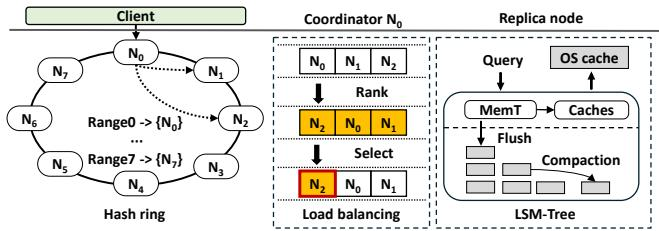  
Figure 1: Cassandra’s architecture.

## 2 Background

Our work is motivated by Cassandra [32], a widely deployed KV store used for numerous storage services [4]. Recent studies [45, 46, 49, 55] extend Cassandra to enhance storage management of production-grade, open-source distributed KV stores. We present the key components of Cassandra’s architecture relevant to our work, as shown in Figure 1.

## 2.1 Distribution Layer

Data distribution. Cassandra organizes KV pairs using consistent hashing [31]. It maps the key space into a hash ring and partitions the key space into disjoint key ranges, each managed by a single node that provides storage. While a node may manage multiple small disjoint key ranges for flexible expansion, we simplify our discussion by assuming one continuous key range per node; our design still holds for multiple small disjoint key ranges per node. A KV pair is hashed to a key range based on its key and stored in the corresponding node. The mapping is decentralized, without involving a centralized controller for storage coordination.

Replication. To tolerate node failures, KV pairs in the same key range are replicated across multiple nodes in a clockwise direction along the hash ring. For example, Figure 1 shows an eight-node cluster with three-way replication. A key range hashed to $N _ { 0 }$ is replicated across N0, N1, and N2. We refer to the set of nodes that store the replicas of a key range as a replication group; for example, $N _ { 0 } , N _ { 1 }$ , and $N _ { 2 }$ form a replication group for the key range hashed to $N _ { 0 }$

Request coordination. When a client issues a request for a KV pair, it sends the request to a coordinator, typically a randomly selected node within the replication group. The coordinator routes the request to the relevant replica nodes. Cassandra supports user-configurable consistency levels for read and write operations, defined as the minimum number of replica nodes that must acknowledge a read or write for the operation to succeed. For each write, the coordinator replicates a KV pair to all replica nodes and completes a write operation upon receiving the specified number of acknowledgments. For each read, the coordinator sends the request to the specified number of replica nodes and completes a read operation upon receiving their responses; if some replica nodes do not respond, the coordinator sends the request to other replica nodes.

Load balancing. The coordinator employs dynamic snitching [5] to monitor read latencies and select replica nodes with the least current loads to serve read requests, based on the read consistency level. If the coordinator is a selected replica node, it accesses its local storage directly; otherwise, it relays the request to remote replica nodes, which return the results. For example, in Figure 1, a client contacts the coordinator $N _ { 0 }$ to read a KV pair. $N _ { 0 }$ ranks all replica nodes in the replication group by their current loads. For a read consistency level of one, $N _ { 0 }$ may select $N _ { 2 }$ to serve the request.

Membership maintenance. Cassandra uses the Gossip protocol [23] for cluster membership management. Nodes periodically exchange heartbeat signals with up to two peers to share liveness and load information, so as to converge to a consistent cluster-wide membership view. For fast bootstrapping of new nodes joining the cluster, Cassandra designates a few nodes as seed nodes to disseminate membership information to newcomers.

## 2.2 Storage Layer

Each Cassandra node manages KV pairs using an LSM-tree [41], a storage engine widely adopted in distributed storage (e.g., BigTable [15] and HBase [6]). An LSM-tree organizes KV pairs into fixed-size files called SSTables across multiple levels, and KV pairs are progressively moved from lower to higher levels. KV pairs are first written to a write-ahead log (WAL) for crash consistency and then inserted into an inmemory structure called the MemTable. When the MemTable is full, it is converted into an SSTable and flushed to the lowest level. If a level reaches a pre-specified capacity limit, the LSM-tree performs compaction, which merges SSTables from the current level to the next higher level.

To query a KV pair (Figure 1), a node first queries inmemory components, starting with the MemTable, followed by LSM-tree caches, and finally the file system cache. If the KV pair is not found in memory, the node searches on-disk SSTables from lower to higher levels and returns the result to the coordinator.

## 3 Motivation

We now show the sources of latency fluctuations in the distribution layer (§3.1) and the interplay between read and compaction tasks in the storage layer (§3.2). Our study focuses on the latency fluctuations of reads instead of writes, as write performance in LSM-trees is relatively stable due to in-memory buffering of KV pairs and sequential disk writes. In contrast, reads traverse multiple LSM-tree levels across different disk regions and are more prone to variability. Note that read latency fluctuations are affected by foreground and background writes (the latter are due to LSM-tree compaction), so our analysis actually takes into account the impact of writes.

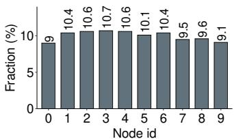  
(a) Access frequency

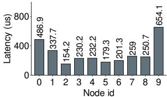  
(b) Average read latency  
Figure 2: Request and latency distributions.

## 3.1 Latency Fluctuations

Balancing read latencies across nodes is challenging, even when resource usage and request frequencies are uniformly distributed. To validate, we generate realistic KV workloads using the YCSB benchmarking tool [17]. We pre-load 100 M 1-KiB KV pairs into a 10-node Cassandra cluster (see §6.1 for testbed details). We issue a skewed read-heavy workload based on YCSB Workload B, which has a 95:5 read-to-update ratio and follows a Zipf distribution with a Zipfian constant of 0.99, to the cluster for 30 minutes. All nodes have the same hardware configuration for uniform resource distribution. We equally shard key ranges with three-way replication for balanced request distribution.

Observation 1: Access-frequency balance does not imply read-latency balance. While replication mitigates skewness in access frequencies [16, 27, 39, 45, 49, 52], it does not necessarily balance read latencies across nodes (similar observations are made for multiple runs). In our read-intensive workload, access frequencies across key ranges are highly skewed, with the most accessed key range receiving 50% more requests than the least accessed. Cassandra addresses this imbalance by evenly distributing requests across replica nodes. Figure 2(a) shows the request distribution across nodes, in which the maximum difference in access frequencies across nodes is reduced to 18.9%. However, this does not resolve read-latency imbalance. Figure 2(b) shows the latency distribution across nodes, in which the highest-latency node experiences a latency increase of 4.24× compared to the lowest-latency node. This disparity suggests that equalizing access frequencies, even in a homogeneous cluster, is insufficient for balancing read performance, as other factors beyond workload distribution contribute to read-latency imbalance.

Observation 2: Read latencies experience significant fluctuations at small timescales. To further examine read-latency imbalance, we focus on the node with the highest average read latency (i.e., node 9 in Figure 2(b)) across different timescales (similar observations are made for other nodes). We measure the average read latencies of the selected node at two timescales: one-minute and one-second windows. We normalize the results by dividing the average request latency in each window by the overall average latency of the selected node over the 30-minute period. Figure 3(a) shows that latencies in one-minute windows remain relatively stable, ranging from 0.5× to 2.0× of the overall average. In contrast, Figure 3(b) shows frequent latency spikes in one-second windows, with 90.8% of the windows having latencies outside the 0.5× to 2.0× range of the overall average. These fine-grained latency fluctuations stem from the dynamic interplay of foreground workloads and system activities. Specifically, mixed readwrite workloads trigger dynamic foreground I/Os and transient background tasks (e.g., compaction), which compete for CPU, DRAM, and I/O resources and cause significant latency fluctuations within nodes. The asynchronous nature of these activities across nodes leads to varying performance impacts and the observed latency imbalance across nodes (Observation 1). The results suggest that load balancing is critical at sufficiently small timescales.

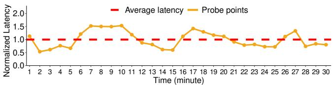

(a) One-minute window  
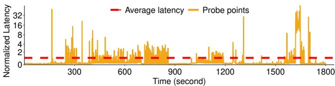  
(b) One-second window  
Figure 3: Normalized read latencies on the node with the highest average latency at large and small timescales.

## 3.2 Coupling of Read and Compaction Tasks

While LSM-tree compaction is resource-intensive and known to compete for resources with read tasks [33, 34, 50], it is essential for maintaining high long-term read performance. To understand the interplay of read and compaction tasks under workload skewness and asynchronous compaction, we analyze aggregate interference across all nodes in the same 10-node Cassandra cluster pre-loaded with 100 M 1-KiB KV pairs (§3.1). We warm up the cluster by compacting the LSMtrees of all nodes, followed by 50 M updates and 30 minutes of reads (both updates and reads follow a Zipf distribution with a Zipfian constant of 0.99). We disable compaction for the first 10 minutes, enable it for the next 10 minutes, and disable it again for the final 10 minutes. Figure 4 shows the aggregate read throughput (in KOPS) and compaction throughput (in MiB/s) across the cluster every minute; their inverse relationship shows task interference.

Observation 3: Compaction tasks create resource contention with read tasks. When compaction is enabled at the 10th minute, the read throughput drops from 26.3 KOPS to 7.3 KOPS within two minutes due to significant resource contention between read and compaction tasks. Between the 17th and 18th minutes, the compaction throughput drops due to Cassandra’s internal rate-limiting, which recovers read throughput from 7.1 KOPS to 11 KOPS.

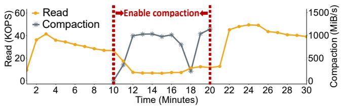  
Figure 4: Read and compaction throughput over time.

Observation 4: Compaction tasks are crucial for improving read performance. By comparing the read throughput in the first and last 10 minutes (when compaction is disabled), we observe an increase in the average read throughput from 29.8 KOPS to 40.7 KOPS. This improvement is due to compaction tasks between the 10th and 20th minutes, which merge SSTables across levels and reduce the number of SSTables searched during reads. In both periods, the read throughput starts low and increases sharply due to cache warm-up, but drops after a few minutes (3 minutes in the first period and 5 minutes in the last period), as reading more SSTables from disk triggers page-cache swapping. This issue is more pronounced in the first 10 minutes, with 35.9% throughput drop, compared to 21% drop in the last 10 minutes.

## 4 HATS Design

Existing resource-driven load balancers (e.g., [38]) can achieve load balancing at the node level, but current resource metrics often poorly predict future request latencies at the request level [52]. Also, they do not address the crucial interplay between foreground tasks in the distribution layer and background tasks in the storage layer. HATS is a holistic load balancer that mitigates latency fluctuations at both node and request levels through careful co-scheduling of foreground and background tasks.

## 4.1 Design Overview

HATS takes a closed-loop approach and iteratively performs three task scheduling operations, as shown in Figure 5. At a high level, coarse-grained read task assignment periodically balances read loads across nodes at regular intervals (called epochs), using a global view of current read loads to address predictable imbalances (e.g., workload skewness or straggler nodes) over large timescales. Within each epoch, fine-grained read task coordination dynamically adjusts instantaneous read loads for each replication group over small timescales to provide low-latency guarantees for individual requests; and compaction task scheduling prioritizes compaction for key ranges with high read loads to maintain high read performance while minimizing interference. This closedloop design combines read distribution, compaction rates, and dynamic replica selection to mitigate latency fluctuations.

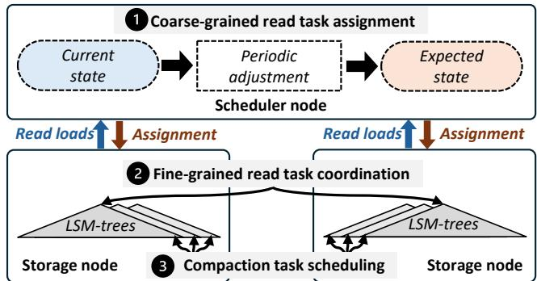  
Figure 5: Overview of HATS’s workflow. HATS employs replica decoupling [55] to separate replicas into distinct LSM-trees to facilitate compaction task scheduling (§4.4).

HATS integrates task scheduling operations into Cassandra’s I/O flows. It ensures reliability and scalability in task scheduling, without compromising the correctness of Cassandra’s operations. It focuses on co-scheduling read and compaction tasks, while processing write tasks as in Cassandra; that is, clients distribute writes across replica nodes via consistent hashing, and nodes buffer KV pairs for sequential writes to the WAL and SSTables. We emphasize that HATS never disregards writes, as it mitigates read latency fluctuations affected by foreground and background writes. In write-intensive workloads, more compaction tasks are triggered and introduce high read latency fluctuations. HATS shows performance gains in this scenario by co-scheduling read and compaction tasks (see evaluation results of writeintensive workloads (YCSB-A/F) in §6).

Applicability. HATS builds on Cassandra and addresses two fundamental issues: latency fluctuations (§3.1) and task coupling (§3.2). Its design is applicable to other distributed LSMtree-based KV stores that employ replication for fault tolerance. HATS relies on two key components in its deployment. First, it leverages replica decoupling, a technique validated in LSM-tree-based systems [34, 50, 55]. In Cassandra, replica decoupling can be implemented with around 150 lines of code, including modifications to both the read and write paths to manage multiple LSM-trees per node. Modern LSM-treebased systems (e.g., RocksDB and Cassandra) natively support multiple tables per node, with each table mapped to a distinct LSM-tree, thereby facilitating the mapping of decoupled replicas to separate LSM-trees. Also, replica decoupling has limited overhead (only 0.4% of write time [55]), while offering a rich design space for mitigating latency fluctuations in distributed settings. Second, HATS employs replica selection [49], which can build on either eventual consistency (e.g., Cassandra, Dynamo [22], and ScyllaDB [47]) or follower reads [42] with strong consistency (e.g., TiKV [43]); both techniques are widely adopted in production distributed storage systems.

While HATS targets LSM-tree-based storage, other storage systems (e.g., B+-tree-based) also experience interference between foreground read/writes and background index maintenance. Thus, HATS is motivated by the very existence of the interference issue. Also, even though high-performance distributed KV stores have been proposed (e.g., [29,56]), they do not consider the issues of latency fluctuations and task coupling as studied in this paper. HATS’s design complements them for further performance gains.

Setup. Consider a cluster of M nodes, $N _ { 0 } , N _ { 1 } , \ldots , N _ { M - 1 } , \arg \ L _ { 1 }$ ranged consecutively along the clockwise direction on a hash ring. Let R be the replication factor, where the R replicas of $N _ { i } \ ( 0 \leq i < M )$ are stored in $N _ { i } , N _ { i + 1 } , \cdots , N _ { i + R - 1 }$ (we omit ‘‘modulo $M ^ { \prime }$ in the subscripts for brevity). Thus, each node stores its own replica and $R - 1$ replicas originating from the previous $R - 1$ nodes in the anti-clockwise direction on the hash ring. Let $K _ { i , j }$ be the j-th replica of the key range that is hashed to $N _ { i }$ and stored in $N _ { i + j } ,$ , where $0 \leq j < R$ . For example, $K _ { i , 0 }$ is the replica of the key range hashed to $N _ { i } .$ and $K _ { i - 1 , 1 }$ is the replica of the key range hashed to $N _ { i - 1 }$ and stored in Ni. Let L be the epoch length at which HATS periodically performs coarse-grained load balancing; we discuss the configuration of L in §5.

## 4.2 Coarse-grained Read Task Assignment

HATS performs coarse-grained load balancing via periodic read task assignment in three steps: (i) constructing a global view of current read loads of all nodes, called the current state, (ii) computing balanced read loads for all nodes, called the expected state, and (iii) propagating the expected state via the Gossip protocol to all nodes.

## 4.2.1 Monitoring and Sharing of States

Extended Gossip protocol. HATS augments Cassandra’s Gossip protocol (§2.1) to achieve reliable task scheduling without sacrificing scalability, by asynchronously sharing both current and expected states. It designates a seed node, called the scheduler node, which constructs the current state by collecting read loads from all other nodes via the Gossip protocol, adjusts the current state into the expected state, and distributes the expected state via the Gossip protocol.

HATS ensures reliable scheduling by preventing the scheduler node from becoming either a performance bottleneck or a single-point failure. It uses the Raft consensus protocol [40] to elect a leader among seed nodes to serve as the scheduler node and re-elect a new leader if the current scheduler node fails. Raft initiates a new term (uniquely identified by an increasing term number) in each leader election. In practice, a Cassandra data center has only two or three seed nodes [2], so the leader maintenance overhead is minimal. If all current seed nodes fail, Cassandra will designate other nodes as seed nodes. Note that HATS modifies only Cassandra’s internal task scheduling policies and maintains the correctness of core operations. When a storage node fails, Cassandra’s built-in failure detection and recovery mechanisms (e.g., hinted handoff and read repair) are still in place to maintain data availability and consistency, regardless of whether HATS is enabled.

Asynchronous state sharing. Each node $N _ { i } \left( 0 \leq i < M \right)$ monitors its read loads, including the average read latency $( \mathrm { i . e . }$ the average time of processing read requests in the storage layer) and number of read requests served for each of R key ranges $( \mathrm { i . e . , } K _ { i , 0 } , K _ { i - 1 , 1 } , \cdots , K _ { i - R + 1 , R - 1 } )$ in $N _ { i } ,$ over an epoch of length L. Within each epoch, each node embeds the measured average read latency (4 bytes) and numbers of read requests for R key ranges $( 4 \times R \mathrm { b y t e s } )$ in Gossip messages, together with a locally increasing version number (4 bytes). Each node increments its local version number every second (the default Gossip interval in Cassandra) and disseminates read loads to other nodes via Gossip messages. It keeps the latest read loads with the largest version number included in the Gossip messages from other nodes.

At the end of each epoch, the scheduler node forms the current state by taking a snapshot of the currently received read loads from all nodes. It adjusts the read distribution based on the current state to form the expected state $( 4 \times M \times$ R bytes) (§4.2.2) and distributes the expected state, together with the Raft term number (4 bytes) and a globally increasing epoch number (4 bytes), via Gossip messages. The epoch number is initialized as zero by the scheduler node at the beginning of a Raft term. Each node keeps the latest expected state with the largest Raft term number and epoch number. It also notifies all clients to perform request routing based on the latest expected state.

Analysis of network overhead. HATS incurs limited network overhead in adding information for state monitoring and sharing to Gossip messages. Based on the codebase of Cassandra (v5.0) [3], a Gossip message from each node contains M entries, each describing the information about a node (e.g., heartbeat details and host ID) and has a size of 211 bytes. For a cluster of M nodes, the total size of a Gossip message from each node is $2 1 1 \times M$ bytes. HATS adds $( 8 + 4 \times R ) \times M$ bytes for the monitored read loads of each node and $( 8 + 4 \times M \times R )$ bytes for the expected state to a Gossip message. Thus, the additional overhead of a Gossip message from each node is $\frac { 8 \times ( M \times R + M + 1 ) } { 2 1 1 \times M }$ . For example, when $R = 3$ and $M = 1 0 0$ , the overhead is 15.2%.

## 4.2.2 Adjustment of Current State

Given the current state, the scheduler node adjusts the read distribution for the R replica nodes in a replication group, moves read requests from high-load nodes to low-load nodes. Let $\mathbf { C } = [ C _ { i , j } ]$ be the current state represented as an $M \times R$ matrix, where $C _ { i , j } \ : ( 0 \leq i < M$ and $0 \leq j < R )$ represents the read request count of $K _ { i , j } \ ( \mathrm { i . e . }$ , the j-th replica of the key range hashed to $N _ { i } )$ , and let Ti be the average read latency of $N _ { i } .$ . Both $C _ { i , j }$ and Ti are obtained from the Gossip protocol.

The scheduler node classifies each node $N _ { i }$ as high-load or low-load. For an epoch of length $L , { \frac { L } { T _ { i } } }$ represents the expected number of read requests served by $N _ { i } ,$ , while $\textstyle \sum _ { j = 0 } ^ { R - 1 } C _ { i - j , j }$ represents the actual total number of read requests served by $N _ { i }$ in an epoch (recall that $N _ { i }$ holds the replicas $K _ { i , 0 } , K _ { i - 1 , 1 } , \cdots$

Algorithm 1 Adjusting current state into expected state.   
Input: Current state C, and average read latency $T _ { i }$ for all $N _ { i }$   
Output: Expected state E   
1: Initialize ${ \bf E } = { \bf C }$   
2: Initialize $\begin{array} { r } { \Delta _ { i } = \frac { L } { T _ { i } } - \sum _ { j = 0 } ^ { R - 1 } C _ { i - j , j } } \end{array}$   
3: for $N _ { i } \in \{ N _ { 0 } , \ldots , { \dot { N } } _ { M - 1 } \}$ do   
4: Set $\mathcal { H } = \{ N _ { i + h } \ | \ \Delta _ { i + h } < 0 , h \in [ 0 , R ) \}$   
5: Set $\mathcal { L } = \{ N _ { i + \ell } \mid \Delta _ { i + \ell } \geq 0 , \ell \in [ 0 , R ) \}$   
6: for $N _ { i + h }$ in H do   
7: for $N _ { i + \ell }$ in $\mathcal { L }$ do   
8: $\delta = \operatorname* { m i n } ( | \Delta _ { i + h } | , | \Delta _ { i + \ell } | , E _ { i , h } )$   
9: $E _ { i , h } = E _ { i , h } - \delta$   
10: $E _ { i , \ell } = E _ { i , \ell } + \delta$   
11: $\Delta _ { i + h } = \Delta _ { i + h } + \delta$   
12: $\Delta _ { i + \ell } = \Delta _ { i + \ell } - \delta$

$K _ { i - R + 1 , R - 1 } )$ . If $\begin{array} { r } { \sum _ { j = 0 } ^ { R - 1 } C _ { i - j , j } > \frac { L } { T _ { i } } } \end{array}$ , it implies that $N _ { i }$ receives more requests than the expected number of read requests and may see degraded performance due to increased I/O queueing delays; we call $N _ { i }$ high-load. Otherwise, i $\textstyle \mathrm { f } \sum _ { j = 0 } ^ { R - 1 } C _ { i - j , j } \leq { \frac { L } { T _ { i } } }$ , it implies that $N _ { i }$ has spare capacity to serve more read requests; we call $N _ { i }$ low-load.

Algorithm details. Algorithm 1 shows the pseudo-code of how the scheduler node adjusts the current state into the expected state denoted by $\mathbf { E } = [ E _ { i , j } ]$ , an $M \times R$ matrix in which $E _ { i , j } \left( 0 \leq i < M \right.$ and $0 \leq j < R )$ represents the expected read request count of $K _ { i , j }$ . The scheduler node initializes both $\mathbf { E } { = } \mathbf { C } ( \mathrm { i . e . , } E _ { i , j } { = } C _ { i , j }$ for all i and j) and $\begin{array} { r } { \Delta _ { i } = \frac { L } { T _ { i } } - \sum _ { j = 0 } ^ { R - 1 } C _ { i - j , j } } \end{array}$ (Lines 1-2). It identifies the sets of high-load and low-load replica nodes of the key range hashed to $N _ { i } ,$ denoted by H and ${ \mathcal { L } } ,$ respectively (Lines 4-5).

The scheduler node greedily transfers read requests from high-load nodes and low-load nodes. For each pair of highload node $N _ { i + h } \in \mathcal { H }$ and low-load node $N _ { i + \ell } \in \mathcal { L } .$ , the scheduler node determines the number of requests to transfer, δ , $\delta ,$ by the minimum of $\left| { \Delta _ { i + h } } \right| , \left| { \Delta _ { i + \ell } } \right| .$ , and $E _ { i , h }$ (Line 8). It decrements $E _ { i , h }$ by δ and increments $E _ { i , \ell }$ by δ to move read load from $N _ { i + h }$ to $N _ { i + \ell }$ (Lines 9-10). It also increments $\Delta _ { i + h }$ by δ and decrements $\Delta _ { i + \ell }$ by δ to reflect the new load differences compared to $\frac { L } { T _ { i + h } }$ and $\frac { \mathbf { \bar { \phi } } _ { L } } { T _ { i + \ell } }$ , respectively (Lines 11-12). At the end of the algorithm, E represents the balanced read request distribution and will be propagated to the cluster.

Analysis of computational overhead. The scheduler node incurs limited computational overhead compared to regular nodes. It executes Algorithm 1 once per epoch by iterating through all M nodes and their R replicas. For each node, the worst case is to evenly split R replicas into $\frac { R } { 2 }$ high-load and $\frac { R } { 2 }$ low-load nodes, leading to $\frac { R ^ { 2 } } { 4 }$ pairs for adjustments. The time complexity is $O ( \textstyle { \frac { M R ^ { 2 } } { 4 } } )$ , which is negligible due to infrequent execution (once per epoch) and small R (e.g., R = 3).

## 4.2.3 Read Task Assignment

When a client receives a new expected state E, it updates the distribution of read requests to replica nodes. For a read request to a key range hashed to $N _ { i }$ , the client randomly selects a replica node $N _ { i + j } ~ ( 0 \leq j < R )$ as the coordinator with a probability $\textstyle E _ { i , j } / \sum _ { j = 0 } ^ { R - 1 } E _ { i , j }$ . This achieves the expected load balancing across the cluster.

## 4.3 Fine-grained Read Task Coordination

Since read latencies can fluctuate at small timescales lead to node latency imbalances (Observation 2 in §3.1), HATS performs fine-grained load balancing. However, selecting the fastest replica may lead to load oscillations and increased tail latencies [49]. Thus, HATS employs load-aware replica selection, which fine-tunes the read request distribution based on the instantaneous load condition of each node.

When the coordinator (selected as described in §4.2.3) routes a read request for the key range hashed to $N _ { i }$ to the j-th replica $K _ { i , j }$ in $N _ { i + j } \left( 0 \le j < R \right)$ , it monitors the instantaneous read latency $t _ { i , j } ,$ , which includes the network transmission time between the coordinator and $N _ { i + j }$ and the processing time in the storage layer of $N _ { i + j }$ , thereby addressing the combined effects of network and storage performance. To initialize $t _ { i , j }$ , the coordinator selects a replica node from the replication group of a key range in a round-robin manner for the first R requests in each epoch. It then updates $t _ { i , j }$ based on the dynamic snitching module (§2.1) using an exponential weighted moving average, with a weight of 0.5 in our current implementation.

HATS assigns each replica node a unified score, which quantifies the capacity of a replica node to handle extra read requests. For each node $N _ { i } .$ , let $\begin{array} { r } { Q _ { i } = \sum _ { j = 0 } ^ { R - 1 } E _ { i - j , j } } \end{array}$ be the expected total number of read requests served by $N _ { i } \left( 0 \leq i < M \right)$ based on the latest expected state. Then, the coordinator calculates the unified score for $\begin{array} { r } { K _ { i , j } \mathrm { a s } \frac { L } { t _ { i , j } } - Q _ { i + j } , } \end{array}$ with the following physical meaning: $\frac { L } { t _ { i , j } }$ represents the instantaneous number of read requests that can be served by $N _ { i + j }$ (which stores $K _ { i , j } )$ over an epoch of length $L ,$ while $\mathcal { Q } _ { i + j }$ represents the expected number of read requests to be served. Thus, the unified score represents the number of extra read requests that $N _ { i + j }$ can process under the current load condition. A higher unified score implies that a replica node has more capacity to process extra read requests. To achieve fine-grained read task coordination, the coordinator re-routes a read request to the replica node with the highest unified score among all replica nodes. Note that this process incurs negligible overhead to vanilla Cassandra, as HATS obtains instantaneous latencies from Cassandra’s dynamic snitching module and its operations are similar to those already performed by Cassandra for load balancing (§2.1).

At large timescales, the coordinator often has the highest unified score as local access incurs no network transmission, so the read loads converge to the expected state (§4.2). At small timescales, replica nodes with well-compacted LSMtrees often have small read latencies in the storage layer and become more likely to be selected by the coordinator. Thus,

HATS aligns replica selection with compaction task distribution (§4.4) to mitigate latency fluctuations.

## 4.4 Compaction Task Scheduling

Compaction tasks create resource contention with read tasks (Observation 3 in §3.2), but are also essential for improving long-term read performance (Observation 4 in §3.2). HATS schedules compaction tasks to balance the performance tradeoff between read and compaction tasks.

In LSM-tree-based KV stores, all critical tasks (i.e., read, write, flush, and compaction) primarily consume CPU cycles and disk I/O bandwidth [10, 33, 51]. To prevent excessive resource consumption by compaction, HATS enforces a preconfigured allowed compaction rate per node to bound the maximum data processed per second. This rate-limiting applies only to compaction operations from the second lowest to higher levels, as they dominate background loads, while lowest-level compaction operations remain unbounded as they are critical for mitigating read amplification from newly flushed SSTables.

Compaction rate provisioning. To mitigate interference from compaction tasks on read performance, HATS prioritizes compaction for key ranges with higher read loads. For each node $N _ { i } \ ( 0 \leq i < M )$ , HATS computes the proportion of read requests for each key range $K _ { i , j } \left( 0 \leq i < R \right)$ based on E, given by $E _ { i , j } / Q _ { i }$ . It then sets the compaction rate proportionally to the allowed compaction rate; a higher compaction rate is assigned to the key range with a higher read load.

Cassandra manages all key ranges in a single LSM-tree in each node. To enable per-key-range compaction, HATS adopts replica decoupling from DEPART [55] by separating the replicas of different key ranges into distinct LSM-trees. Each node $N _ { i }$ manages KV pairs for the replica $K _ { i , 0 }$ originating from itself and R − 1 replicas $( K _ { i - j , j } \mathrm { ^ { \prime } s }$ for $1 \leq j < R )$ originating from the previous R − 1 nodes on the hash ring in R LSM-trees. HATS applies rate-limiting to the compaction tasks of individual LSM-trees and prioritizes compaction for heavily read LSM-trees to reduce read amplification, while deferring compaction for less-accessed ones.

## 5 HATS Implementation

We implement HATS in Java based on Cassandra v5.0 [3] and the Cassandra client driver v3.0.0 [7], with 6 K lines of code modifications to these open-sourced codebases (totaling 1.3 M lines of code). These modifications enable key functionalities, including state monitoring and sharing via the Gossip protocol, current state adjustment, score function computation, compaction rate provisioning, and client-side read task assignment. We integrate the Raft protocol into HATS using a production-grade library [48].

HATS updates the expected state for read task assignment and compaction rate provisioning every epoch of length L (§4). In Cassandra, compaction tasks are executed by default every 60 seconds. HATS sets L = 60 seconds to align with

Cassandra’s default compaction interval and ensure effective co-scheduling of read and compaction tasks. We set the allowed compaction rate for each node to 64 MiB/s, following Cassandra’s default compaction throughput setting. HATS adjusts the compaction rate (§4.4) via Cassandra’s rate-limiting APIs. Note that HATS preserves the LSM-tree’s internal structure for index management.

Starvation avoidance. Since HATS adaptively adjusts compaction rates based on read load (§4.4), write-heavy key ranges with consistently low read load within a storage node may experience compaction starvation (i.e., compaction tasks cannot be executed). To mitigate this issue, HATS enforces a lower bound on the compaction rate compaction throughputR . R When the compaction rate exceeds this threshold, HATS performs per-key-range compaction; otherwise, it reverts to Cassandra’s default first-come-first-served policy for task execution, ensuring that all compaction tasks make progress.

## 6 Evaluation

Our evaluation aims to address the following questions:

• How does each component of HATS contribute to improving throughput and reducing latency fluctuations? (§6.2)

• How does HATS perform compared to state-of-the-art distributed LSM-tree-based KV stores across various synthetic workloads? (§6.3)

• Does HATS effectively mitigate cluster-wide latency imbalance (Figure 2), temporal latency fluctuations (Figure 3), and task coupling within the storage layer (Figure 4), as validated by Exp#4, Exp#5, and Exp#6, respectively? (§6.4)

• How do different system parameters affect HATS’s performance? (§6.5)

## 6.1 Methodology

Testbed. We conduct experiments on a local cluster of 22 machines, using 20 machines as servers and two as clients. All machines are connected via a 10 Gbps network and run Ubuntu 22.04 LTS. We configure the servers as (i) a 10-node homogeneous cluster, where each server has a quad-core Intel(R) Core(TM) i5-3570 3.4 GHz CPU, 16 GiB DRAM, and a 128 GiB SATA solid-state drive; (ii) a 20-node heterogeneous cluster (Exp#8). Each client has two 12-core Intel(R) Xeon(R) Silver 4214 2.2 GHz CPUs, 64 GiB DRAM, and a 2 TiB hard-disk drive.

Workloads. We use the YCSB benchmarking tool [13] to generate synthetic and production workloads. The synthetic workloads are based on Yahoo’s production [17]: A (50% read, 50% update), B (95% read, 5% write), C (100% read), D (95% read, 5% write), E (95% scan, 5% update), and F (50% read, 50% read-modify-write). By default, all workloads follow a Zipf distribution with a Zipfian constant θ = 0.99, except for Workload D, which uses the latest distribution. The production workload is modeled from Facebook’s real-world traces [14]. It incorporates key range locality, a hotness distribution of $f ( x ) = a e ^ { b x } + c e ^ { d x }$ [26], value sizes/scan lengths following a generalized Pareto distribution [28], and queryper-second (QPS) dynamics modeled by a sine wave function to capture highly dynamic patterns. We use all synthetic and production workloads for macrobenchmarks (§6.3) and use YCSB Workloads A, B, and C, as in C3 [49], for other experiments to evaluate HATS’s specific aspects.

Default settings. We run experiments on the 10-node homogeneous cluster. Before running a workload, we pre-load 100 M records (24-byte key and 1,000-byte value) into storage, flush all MemTables to disk, and wait until all compaction tasks are completed. We launch 50 client threads on each client machine (i.e., 100 in total). We set the replication factor to three (R = 3), with a read consistency level of one and a write consistency level of three for strong consistency. We evenly partition key ranges across all nodes using consistent hashing. We set three seed nodes [2] and follow Cassandra’s default parameters. Each run comprises 50 M operations, except for YCSB Workload E, which uses 5 M operations. We present average results over five runs, with error bars representing 95% confidence intervals based on the Student’s t-distribution. We use five runs since the performance variations across runs are minimal in our experiments, although we acknowledge that a larger number of runs would be desirable in real-world dynamic environments.

Baselines. We evaluate HATS against three baselines.

• mLSM (multi-LSM) [55]. Instead of directly comparing HATS with vanilla Cassandra, we implement replica decoupling [55] by managing R replicas from different nodes in R separate smaller LSM-trees in each node (as described in §4.4), so as to reduce read and write amplifications compared to vanilla Cassandra [55].

• C3 [49]. C3 implements adaptive replica selection in vanilla Cassandra based on replica ranking from server responses and client-side distributed rate control. We also apply replica decoupling to C3 for fair comparisons.

• DEPART [55]. DEPART extends replica decoupling in mLSM with more fine-grained replica management. For each node $N _ { i } ,$ the KV pairs for $K _ { i , 0 }$ originating from itself are still stored in an LSM-tree, while those for R − 1 replicas $K _ { i - j , j } \mathrm { ' s } \left( 1 \le j < R \right)$ originating from other nodes are stored in a two-layer log. This mitigates the resource competition of multiple LSM-trees in mLSM. DEPART improves write performance, but may incur read overhead when accessing replicas from the two-layer log.

All baselines are originally implemented in earlier Cassandra versions. We re-implement them based on their opensource prototypes [49, 55] on Cassandra v5.0 to remove performance discrepancies across Cassandra versions [11].

## 6.2 Microbenchmarks

Exp#1 (Effectiveness of each technique). We evaluate HATS’s techniques by comparing the throughput and P99 latencies of various configurations: (i) mLSM, (ii) CoarseSchedule (i.e., mLSM with coarse-grained read task assignment (§4.2)), (iii) FineSchedule (i.e., CoarseSchedule with fine-grained read task coordination (§4.3)), and (iv) HATS (i.e., FineSchedule with compaction task scheduling (§4.4)).

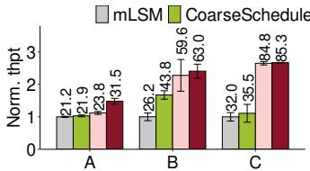  
(a) Throughput

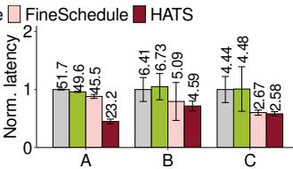  
(b) P99 latency  
Figure 6: Exp#1 (Effectiveness of each technique). All results are normalized to mLSM’s performance results (above each bar), including throughput (KOPS) and P99 latency (ms).

Figure 6 shows the throughput and P99 latencies for YCSB Workloads A, B, and C. HATS’s performance improves steadily as more techniques are added. CoarseSchedule increases throughput by 3.3%, 67.2%, and 10.9% over mLSM for Workloads A, B, and C, respectively. However, the difference in P99 latencies between CoarseSchedule and mLSM is negligible, where CoarseSchedule reduces the P99 latencies by only 4.1%. This suggests that coarse-grained read task assignment can improve overall throughput, but has limited benefits for tail latency reduction. In contrast, FineSchedule significantly reduces P99 latencies by 8.3%, 24.4%, and 40.4% over CoarseSchedule for Workloads A, B, and C, respectively. Note that CoarseSchedule employs dynamic snitching to schedule read requests at a fine granularity, but CoarseSchedule and the dynamic snitching module execute independently. This justifies that a holistic approach to read coordination at both coarse and fine granularities is essential for achieving consistently low latencies. Compared to FineSchedule, HATS further reduces compaction overhead and increases throughput by 32.4% and 5.7% for Workloads A and B, respectively. HATS also reduces P99 latencies by 49.0% and 9.8% over FineSchedule for Workloads A and B, respectively. Furthermore, the error bars become smaller as more techniques are added, implying more stable performance.

## 6.3 Macrobenchmarks

Exp#2 (YCSB synthetic workload performance). We evaluate throughput and latency percentiles (P50, P99, and P999) across all six YCSB synthetic workloads.

Figure 7(a) shows throughput results. HATS achieves the highest throughput under Workloads A, B, C, D, and F, with throughput gains of up to $1 . 5 3 \times , 2 . 4 7 \times , 2 . 6 7 \times , 2 . 9 0 \times$ , and 2.04×, respectively. For scan-intensive Workload E, HATS and mLSM have similar throughput, while being slightly lower than DEPART by 5.4% and 6.0%, respectively. This discrepancy arises since the small proportion of updates (5% of 5 M operations) in Workload E triggers LSM-tree compaction in HATS and mLSM. In contrast, DEPART’s twolayer log has an append-only design that avoids split and sort operations in LSM-tree compaction.

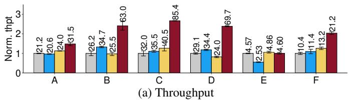  
mLSM C3 DEPART HATS

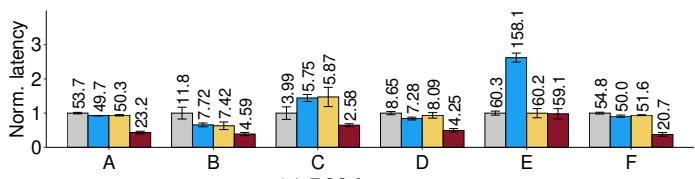  
(c) P99 latency

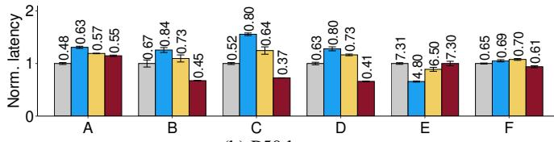  
(b) P50 latency

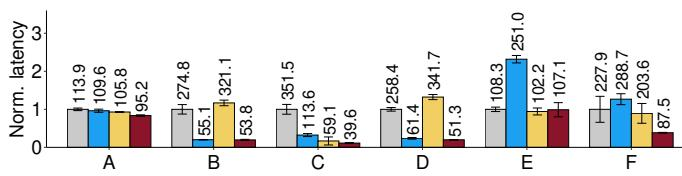  
(d) P999 latency  
Figure 7: Exp#2 (YCSB synthetic workload performance). We present normalized throughput and latencies with respect to mLSM. The numbers displayed above each bar show the actual throughput (KOPS) in figure (a) and latencies (ms) in figures (b)-(d).

Figures 7(b)-7(d) show P50, P99, and P999 latencies. HATS achieves the lowest latencies in most cases. For Workload A, it has the lowest P99 and P999 latencies, with reductions of up to 56.8% and 16.4%, respectively, although its P50 latency is 14.6% higher than mLSM due to extra scheduling overhead. Nevertheless, HATS delivers 48.6% higher throughput than mLSM by mitigating tail latencies. For Workloads B, C, D, and F, HATS achieves the lowest latencies at all percentiles, with reductions of up to 53.6%, 62.2%, and 88.7% for P50, P99, and P999 latencies, respectively. For Workload E, HATS has latencies close to mLSM, consistent with throughput results.

We provide a more detailed analysis of the performance differences of mLSM, C3, DEPART, and HATS. HATS balances performance gains and mitigates task scheduling overhead, thereby achieving higher throughput and lower tail latencies. C3 achieves a similar balance in read-dominant workloads (i.e., Workloads B, C, D, and F), and increases throughput by 32.4%, 10.9%, 18.2%, 9.6%, and 12.9% compared to mLSM, respectively. However, it underperforms in write-heavy and scan-heavy workloads, with 2.8% and 44.4% lower throughput than mLSM in Workloads A and E, respectively. The reason is that C3 requires significant CPU resources for its replica selection strategy and incurs extra network bandwidth for redirecting requests to remote replicas. This aggravates resource contention (Exp#7). Also, Workload A generates extensive compaction tasks and consumes more CPU and disk I/O resources, while scans in Workload E require higher network bandwidth.

DEPART outperforms mLSM in Workloads A and F since its two-layer log reduces compaction overhead [55], but shows inconsistent performance in workloads with fewer compaction tasks, where DEPART outperforms mLSM in Workload C, but not in Workloads B and D. In the storage layer, mLSM reads KV pairs more efficiently as the LSM-tree maintains a more sorted structure than DEPART’s two-layer log. In the distribution layer, DEPART improves load balancing by routing most reads to the primary replica [55], while the dynamic snitch module in mLSM is more sensitive to random read I/Os and suffers from load oscillations. Thus, the distribution layer in mLSM suffers from severe load imbalance in Workload C with significantly high P999 latencies and severe load imbalance (Exp#4), while DEPART achieves 26.6% higher throughput. In Workloads B and D, the sequential write I/Os in mLSM offset the impact of random read I/Os and stabilize load balancing. In contrast, DEPART suffers from higher latencies due to network delays during replica selection and increased read latencies in the two-layer log (Exp#6). Thus, DEPART has 2.7% and 17.5% lower throughput than mLSM in Workloads B and D, respectively.

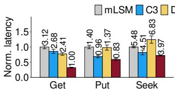  
(a) Average latency

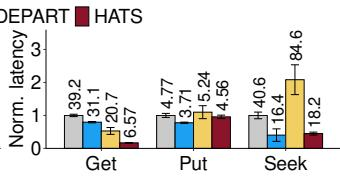  
(b) P99 latency  
Figure 8: Exp#3 (Facebook’s production workload performance).

Exp#3 (Facebook’s production workload performance). We evaluate HATS under highly dynamic workloads from Facebook’s production [14], with 85% Get, 14% Put, and 1% Seek, and dynamic access patterns [26]. HATS achieves the highest overall throughput at 48.8 KOPS and significantly outperforms mLSM (17.1 KOPS), C3 (20.2 KOPS), and DE-PART (21.5 KOPS) by 2.85×, 2.42×, and 2.27×, respectively (the figure is omitted for brevity).

Figure 8 presents average and P99 latencies per operation type. HATS delivers the lowest average latencies across all operation types, with reductions of up to 68.0% (Get), 40.7% (Put), and 41.9% (Seek) compared to the baselines. For P99 latencies, HATS shows substantial improvements for Get, with reductions of up to 83.2% (vs. mLSM), 78.9% (vs. C3), and 68.3% (vs. DEPART). While HATS exhibits higher P99 latencies than C3 for Put (by 22.9%) and Seek (by 11.0%), it achieves lower P999 latencies, with 31.1% and 71.8% reductions, respectively. This is because C3’s CPU and network resource bottleneck (Exp#7) results in lower throughput and hence less disk I/O pressure than HATS, yet HATS still exhibits lower latencies at high percentiles.

Table 1: Exp#4 (Latency balance degree across the cluster). We show the CoV in the read latencies across all nodes.
<table><tr><td rowspan=1 colspan=1>Workloads</td><td rowspan=1 colspan=1>mLSM</td><td rowspan=1 colspan=1>C3</td><td rowspan=1 colspan=1>DEPART</td><td rowspan=1 colspan=1>HATS</td></tr><tr><td rowspan=1 colspan=1>A</td><td rowspan=1 colspan=1>0.15</td><td rowspan=1 colspan=1>0.17</td><td rowspan=1 colspan=1>0.14</td><td rowspan=1 colspan=1>0.12</td></tr><tr><td rowspan=1 colspan=1>B</td><td rowspan=1 colspan=1>0.25</td><td rowspan=1 colspan=1>0.13</td><td rowspan=1 colspan=1>0.17</td><td rowspan=1 colspan=1>0.12</td></tr><tr><td rowspan=1 colspan=1>C</td><td rowspan=1 colspan=1>0.40</td><td rowspan=1 colspan=1>0.16</td><td rowspan=1 colspan=1>0.22</td><td rowspan=1 colspan=1>0.11</td></tr></table>

## 6.4 System-level Analysis

We conduct system-level analysis in different aspects: (i) latency balance across the cluster, (ii) latency distribution at the highest-latency node, (iii) performance breakdown in critical I/O paths, (iv) resource usage of various schemes, and (v) scalability of HATS.

Exp#4 (Latency balance degree across the cluster). To examine load balancing across the cluster, we use the coefficient of variation (CoV) in average read latencies across all nodes, calculated as the ratio between the standard deviation and the mean. A CoV of zero represents a fully balanced distribution, and higher values imply greater variability.

Table 1 presents the CoVs for Workloads A, B, and C. HATS achieves the lowest CoV across all schemes for all workloads, with reductions of up to 29.4%, 52.0%, and 72.5% for Workloads A, B, and C, respectively. Both HATS and C3 have relatively stable CoVs across all workloads. C3 achieves the second-lowest CoV for Workloads B and C, while DE-PART achieves the second-lowest CoV for Workload A. This result aligns with the design goals of C3, which focuses on improving read performance, and DEPART, which prioritizes efficient compaction. Also, DEPART always has a lower CoV than mLSM, and this aligns with the findings that DE-PART outperforms mLSM in the distribution layer (Exp#2). Moreover, as the proportion of read requests increases from Workload A to Workload C, the CoVs for both mLSM and DEPART increase. The reason is that the default dynamic snitching module is sensitive to random read I/Os, and both mLSM and DEPART show high latency fluctuations.

Exp#5 (Latency distribution at the highest-latency node). We evaluate if HATS delivers consistently low latencies at small timescales by examining the read latency distribution of the highest-latency node. As in §3.1, we continuously issue requests for 30 minutes, in which each node reports the moving average of the read latency every second. We collect 1,800 data points per node, and select the node with the highest average read latency to present results.

Figure 9 shows the empirical cumulative distribution function above 90th-percentile read latencies for Workloads A, B, and C. HATS consistently achieves the shortest tails in read latencies across all schemes, while mLSM exhibits the longest tails. Comparing the results in §3.1, under Workload B, 91.6%, 82.7%, 93.4%, and 8.7% of data points in mLSM, C3, DEPART, and HATS fall outside the 0.5× to 2× range of the average read latency, respectively.

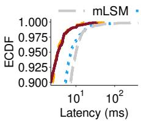  
(a) Workload A

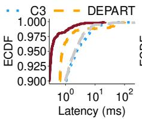  
(b) Workload B

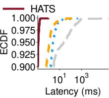  
(c) Workload C  
Figure 9: Exp#5 (Latency distribution at the highest-latency node).

Table 2: Exp#6 (Performance breakdown). We show the average results for processing 1 MiB reads or writes, including the corresponding 95% confidence interval.
<table><tr><td rowspan=1 colspan=1>Steps</td><td rowspan=1 colspan=1>mLSM</td><td rowspan=1 colspan=1>C3</td><td rowspan=1 colspan=1>DEPART</td><td rowspan=1 colspan=1>HATS</td></tr><tr><td rowspan=1 colspan=5>(a) Write path in Workload A (ms)</td></tr><tr><td rowspan=1 colspan=1>WAL</td><td rowspan=1 colspan=1>22.0±2.5</td><td rowspan=1 colspan=1>36.7±4.0</td><td rowspan=1 colspan=1>22.3±2.3</td><td rowspan=1 colspan=1>14.0±5.8</td></tr><tr><td rowspan=1 colspan=1>MemTable</td><td rowspan=1 colspan=1>11.9±0.9</td><td rowspan=1 colspan=1>11.5±0.1</td><td rowspan=1 colspan=1>11.0±0.1</td><td rowspan=1 colspan=1>12.1±0.1</td></tr><tr><td rowspan=1 colspan=1>Flushing</td><td rowspan=1 colspan=1>8.8±0.2</td><td rowspan=1 colspan=1>8.6±0.4</td><td rowspan=1 colspan=1>6.4±0.1</td><td rowspan=1 colspan=1>8.3±0.1</td></tr><tr><td rowspan=1 colspan=1>Compaction</td><td rowspan=1 colspan=1>215.0±3.7</td><td rowspan=1 colspan=1>210.2±2.5</td><td rowspan=1 colspan=1>62.0±1.2</td><td rowspan=1 colspan=1>39.2±6.2</td></tr><tr><td rowspan=1 colspan=5>(b) Read path in Workload C (ms)</td></tr><tr><td rowspan=1 colspan=1>Selection</td><td rowspan=1 colspan=1>151.4±77.2</td><td rowspan=1 colspan=1>776.6±167.0</td><td rowspan=1 colspan=1>263.6±36.1</td><td rowspan=1 colspan=1>50.8±1.5</td></tr><tr><td rowspan=1 colspan=1>MemTable</td><td rowspan=1 colspan=1>2.6±0.3</td><td rowspan=1 colspan=1>2.3±0.2</td><td rowspan=1 colspan=1>3.0±0.4</td><td rowspan=1 colspan=1>1.6±0.0</td></tr><tr><td rowspan=1 colspan=1>Caches</td><td rowspan=1 colspan=1>2.2±0.2</td><td rowspan=1 colspan=1>1.9±0.1</td><td rowspan=1 colspan=1>1.7±0.2</td><td rowspan=1 colspan=1>1.6±0.1</td></tr><tr><td rowspan=1 colspan=1>Disk</td><td rowspan=1 colspan=1>294.2±13.7</td><td rowspan=1 colspan=1>121.3±15.0</td><td rowspan=1 colspan=1>431.7±59.7</td><td rowspan=1 colspan=1>73.4±1.5</td></tr></table>

Exp#6 (Performance breakdown). We provide a performance breakdown of different steps to examine their performance overhead. We focus on the breakdowns of the write path for Workload A and the read path for Workload C. Each write operation includes (i) writing to the WAL, (ii) inserting into the MemTable, (iii) flushing the MemTable, and (iv) performing compaction, while each read operation includes (i) replica selection, (ii) reading from the MemTable, (iii) reading from the cache components (key cache and row cache), and (iv) reading from the disk components. We measure the execution time for each step and obtain average results for processing 1 MiB of reads or writes. Note that the sum of the times for all steps is less than the actual processing time, as requests are executed concurrently in the thread pool.

Table 2 shows the average execution time of each step with 95% confidence intervals. For the write path, HATS has the lowest latencies for WAL and compaction steps, with reductions of up to 61.9% and 81.8%, respectively. All schemes exhibit similar latencies for the MemTable step, as they use the same MemTable size. HATS has comparable latencies for the flushing step to mLSM and C3, but they all have higher latencies than DEPART, as DEPART directly appends redundant replicas to the two-layer log and reduces pending flushes [25]. Notably, DEPART also significantly reduces the compaction execution time by 71.2% and 70.5% compared to mLSM and C3, respectively.

mLSM C3 DEPART HATS  
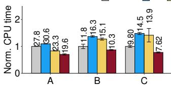  
(a) Average CPU time

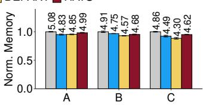  
(b) Average memory usage

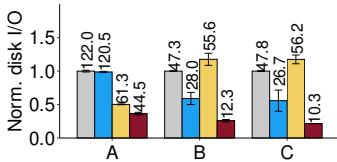  
(c) Average disk I/O

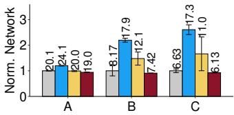  
(d) Average network I/O  
Figure 10: Exp#7 (Resource usage). We normalize the results with respect to mLSM’s actual resource usage results (numbered atop the bars), including CPU time $( \times 1 0 ^ { 5 }$ ms), memory usage (GiB), disk I/O size (GiB), and network I/O size (GiB).

For the read path, replica selection and reading from the disk components are the most time-consuming steps. HATS reduces the replica selection latency by 66.5%, 93.5%, and 80.7% compared to mLSM, C3, and DEPART, respectively. This significant reduction is attributed to HATS’s holistic request coordination, where read requests are first assigned to different nodes (§4.2) and are redirected to remote replica nodes only when necessary (§4.3). HATS only redirects 0.04% of read requests to remote nodes, compared to 6.2%, 84.9%, and 19.3% in mLSM, C3, and DEPART, respectively. HATS also reduces disk-component read latencies by 75.1%, 39.5%, and 83.0% compared to mLSM, C3, and DEPART, respectively, where DEPART has the highest latency due to the two-layer log’s access overhead.

Exp#7 (Resource usage). We evaluate average resource usage across all nodes in terms of CPU time, memory, disk I/O, and network I/O. We obtain the CPU time, disk I/O, and network I/O from stat, io, and net, respectively, in the Linux process-specific directory /proc/<pid>, where <pid> corresponds to the Cassandra process running in each node. We measure their usage as the difference between the values recorded at the start and end of client requests. We collect memory usage using the Linux command ps -o rss, sampled every second.

Figure 10 shows that HATS consumes the least CPU time, disk I/O, and network I/O across all workloads, with reductions of up to 47.5%, 81.7%, and 64.6%, respectively. All schemes have similar memory usage, since Cassandra manages memory allocation and garbage collection with the Java Virtual Machine. C3 consumes the most CPU cycles (for replica selection) and network I/O (for redirecting requests to remote replicas). DEPART incurs higher disk I/Os than mLSM and C3 in read-dominant workloads (i.e., Workloads B and C) but lower disk I/Os in the write-dominant workload (i.e., Workload A), due to its two-layer log’s design trade-offs. Exp#8 (Scalability). We evaluate HATS’s scalability on a

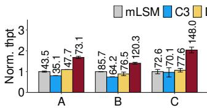  
(a) Throughput

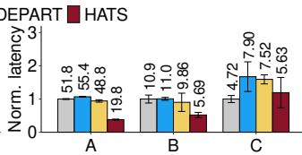  
(b) P99 latency  
Figure 11: Exp#8 (Scalability).

20-node heterogeneous cluster by expanding the 10-node homogeneous cluster with 10 heterogeneous nodes. Among the 10 added nodes, two have quad-core i5-4670 CPUs, while the remaining eight have quad-core i5-7500 CPUs; three have 16 GiB and seven have 32 GiB; all have 256 GiB SATA SSDs. We configure 200 M records, 200 client threads, and 100 M operations per workload.

Figure 11 shows the throughput and P99 latencies. HATS consistently achieves the highest throughput across all workloads, with gains of up to 2.08×, 1.87×, and 2.11× for Workloads A, B, and C, respectively, compared to the baselines. HATS also achieves the lowest P99 latencies for Workloads A and B, with reductions of up to 64.3% and 48.3%, respectively. For Workload C, HATS shows comparable P99 latencies to mLSM, but our analysis of latency percentiles reveals that mLSM suffers from extremely high P999 latencies (4.65× over HATS). This aligns with the findings in Exp#2 and Exp#4, where mLSM experiences high tail latencies due to load oscillations in the distribution layer. Our results show that our findings on the 10-node homogeneous cluster still hold for the larger 20-node heterogeneous cluster.

## 6.5 Parameter Sensitivity Analysis

We examine the sensitivity of HATS to different parameter settings. We generate synthetic workloads with 50% reads and 50% updates using YCSB for different read consistency levels, key distributions, value sizes, and system saturation levels. By default, we set the read consistency level to one, the Zipf key distribution with a Zipfian constant of 0.99, the value size to 1,000 bytes, and the number of client threads to 100. For each experiment, we issue 20 M operations and report the results for throughput and P99 latencies.

Exp#9 (Different read consistency levels). We vary the read consistency level from one to three. Figure 12(a) shows the average throughput for different read consistency levels. HATS increases throughput by 42.9%, 29.3%, and 24.5% compared to DEPART for read consistency levels one, two, and three, respectively. As the read consistency level increases, the performance gains of replica selection diminish (e.g., at a read consistency level of three, all replicas must be read). Figure 12(b) shows the P99 latencies for different read consistency levels. HATS reduces P99 latencies by 48.1%, 31.5%, and 25.0% compared to DEPART for read consistency levels one, two, and three, respectively. Note that C3 has lower P99 latencies than mLSM when the read consistency level is one or two, but has significantly higher P99 latencies than mLSM when the read consistency level is three. In the latter case, C3 cannot benefit from replica selection, yet its network overhead increases since C3 attaches extra information (e.g., the latest queue size and service time of the replica node) to the response of every read request.

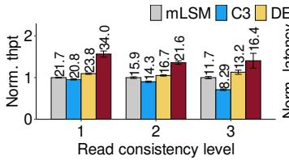  
(a) Throughput

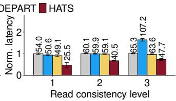  
(b) P99 latency

Figure 12: Exp#9 (Different read consistency levels).  
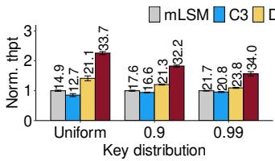  
(a) Throughput

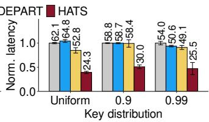  
(b) P99 latency  
Figure 13: Exp#10 (Impact of key distribution).

Exp#10 (Impact of key distribution). We vary the key distribution among uniform, and Zipfian constants of 0.9 and 0.99. Figure 13(a) shows the throughput for different key distributions. HATS increases throughput by 59.7%, 51.2%, and 42.9% compared to DEPART for uniform, Zipfian constants of 0.9 and 0.99, respectively. mLSM increases throughput from 14.9 KOPS to 21.7 KOPS as the key distribution changes from uniform to the Zipfian constant of 0.99. C3 and DEPART also have such trends. The reason is that a higher Zipfian constant increases the skewness of read requests, thereby improving the cache hit rate and reducing the read I/O costs. HATS behaves consistently for different key distributions. Figure 13(b) shows the P99 latencies for different key distributions. HATS reduces P99 latencies by 54.0%, 48.6%, and 48.1% compared to DEPART for uniform, Zipfian constants of 0.9 and 0.99, respectively.

Exp#11 (Impact of value size). We vary the value size to 512 bytes, 1,000 bytes, and 2,048 bytes. Figure 14(a) shows the throughput for different value sizes. HATS increases throughput by 20.5-50.6% compared to DEPART as the value size increases from 512 bytes to 2,048 bytes. We observe that larger value sizes exacerbate read and write amplifications in LSM-trees, so the advantages of task scheduling in HATS are more pronounced and we observe more significant improvements from HATS. Figure 14(b) shows the P99 latencies for different value sizes. HATS consistently achieves the lowest P99 latency for all value sizes, with a reduction of up to 56.8% compared to other schemes.

Exp#12 (Impact of system saturation levels). We vary the number of client threads to 100, 150, and 200 to evaluate different system saturation levels. Figure 15(a) shows the throughput for different system saturation levels. HATS increases throughput by 42.9%, 48.2%, and 36.1% compared to the closest baseline for 100, 150, and 200 client threads, respectively. Figure 15(b) shows that HATS consistently maintains the lowest P99 latency across all schemes, with a reduction of up to 52.8%. Note that when we double the number of client threads from 100 to 200, the throughput improvement across different schemes is only up to 35.1%. This suggests that the systems are approaching their saturation limit, and HATS remains effective in reducing P99 latencies.

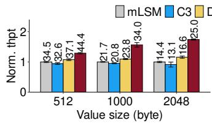  
(a) Throughput

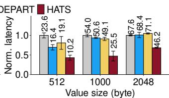  
(b) P99 latency

Figure 14: Exp#11 (Impact of value size).  
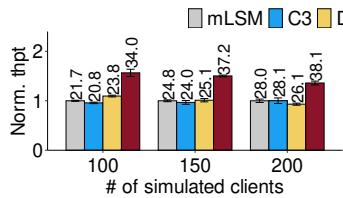  
(a) Throughput

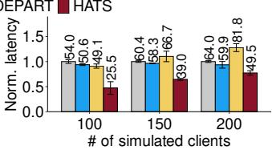  
(b) P99 latency  
Figure 15: Exp#12 (Impact of system saturation levels).

## 6.6 Discussion

We discuss several key aspects of HATS’s performance to provide further insights into its behavior under different workloads and the impact of parameters omitted from the main evaluation for brevity.

Write-heavy workloads. While HATS focuses on mitigating read latency fluctuations in mixed workloads, our experiments confirm its effectiveness even in write-heavy scenarios (e.g., YCSB-A/F). Although HATS exhibits slightly higher P50 latencies than mLSM in YCSB-A (Figure 7(b)) due to its scheduling overhead, it significantly reduces tail latencies (Figures 7(c)-(d)) and improves overall throughput (Figure 7(a)). The reason is that mLSM always selects the fastest replica, which, albeit beneficial to P50 latency, leads to severe load oscillations [49] and increased tail latencies. In contrast, HATS only redirects requests when necessary, thereby effectively mitigating latency fluctuations.

Read-heavy workloads. HATS’s improvements in readheavy workloads stem from its holistic two-level scheduling framework: the coarse-grained scheduler globally balances cluster-wide load, and the fine-grained coordinator combines global and local policies through a unified score to address unpredictable events (e.g., background compaction). Baseline coordinators lack global awareness for fine-grained coordination. For example, Cassandra’s dynamic snitch na¨ıvely selects the fastest replica, causing load oscillations [49], while C3 achieves load balance (Exp#4), it operates with only a local view and frequently redirects requests to remote replicas (84.9% in Exp#6). In read-heavy workloads with minimal interference from background compaction, the scheduling decision aligns closely with the global policy. For example, under the read-only YCSB-C workload, HATS redirects only 0.04% of requests (Exp#6), thereby significantly reducing both replica selection and disk I/O latencies.

Flexibility of replica selection. The effectiveness of replica selection depends on both the read consistency level and the number of replicas. For instance, a higher consistency level reduces the available choices for replica selection, which in turn reduces the performance gains of HATS (Exp#9). Similarly, a larger number of replicas offers more flexibility for replica selection and hence achieves higher performance. Epoch length. The epoch length L determines the trade-off between HATS’s responsiveness to load variations and its ability to capture long-term interactions between read and compaction tasks. Shorter epochs ensure faster adaptation, but may miss the long-term benefits of compaction for high read performance (§4.4). We have evaluated different epoch lengths ranging from 5 s to 120 s, although detailed results are omitted in the interest of space. Our evaluation shows that HATS remains robust across different values of L. For instance, under YCSB-A, the ratio of maximum to minimum throughput across all tested values of L is only 1.025×. The maximum throughput occurs at L = 60s, which coincides with Cassandra’s default compaction interval. This suggests that aligning L with the default compaction interval can effectively capture the interplay between read and compaction tasks.

## 7 Related Work

Optimizing local LSM-tree KV stores. Numerous studies optimize I/O performance for local (single-server) LSM-tree KV stores. Some studies improve the scheduling of background tasks on the I/O path, such as comprehensive optimization of memory and disk components [9], preemptive thread scheduling for internal tasks [10], and preventing data overflow and write stalls [54]. Our work focuses on mitigating task interference in a distributed setting.

LSM-tree KV stores can also be optimized via better internal LSM-tree management. One direction is to improve memory allocation for LSM-tree, such as careful memory allocation of Bloom filters in different levels [19], adaptive allocation of different internal caches [51], adaptive allocation of write memory and buffer cache [37], dynamic configuration of the application and kernel caches [18]. Another direction is to enhance the LSM-tree structure, such as KV separation [36], fragmented LSM-trees [44], hybrid compaction strategies [20], and replacement of the internal LSM-tree structure with a B+-tree-like structure [35]. Such internal LSM-tree management techniques are compatible with the scheduling framework in HATS.

Exploiting replication for load balancing. Replication is often used for load balancing, in addition to fault tolerance, in distributed systems. Kinesis [38] stores replicas in leastloaded nodes for balanced resource usage. C3 [49] introduces a replica selection mechanism to mitigate load oscillations and reduce tail latencies. Rein [45] further extends C3’s mechanism for multi-get operations. SPORE [27] and MBal [16] replicate hot objects for in-memory KV stores. Slicer [1] shards large-scale applications and automatically replicates hot slices. Prequal [52] uses instantaneous load signals for replica selection in large-scale web services. Our work focuses on holistic load balancing at both coarse-and fine-grained granularities.

Reducing replication overhead. Replication exacerbates background task overhead, leading to degraded foreground task performance. Prior studies improve replication management via specialized hardware. Hailstorm [12] takes a disaggregated approach by offloading LSM-tree compaction tasks to under-utilized nodes via high-speed switch fabrics. Nova-LSM [30] leverages Remote Direct Memory Access (RDMA) to manage different LSM-tree components in different servers. Tebis [50] performs compaction on primary replicas and sends the changes of pre-built LSM-trees to secondary replicas via RDMA. RubbleDB [34] reduces the CPU overhead of secondary replicas by synchronizing the compaction results from primary to secondary LSM-trees using the offloaded NVMe-oF protocol. In contrast, HATS does not rely on specialized hardware support in its design.

Some studies focus on better replica management. DE-PART [55] proposes replica decoupling to separate LSMtrees for replicas, and further designs a two-layer log structure for efficient secondary replica management. ELECT [46] extends DEPART to erasure-code cold data for less storage overhead. HATS extends the replica decoupling strategy [55], to mitigate the interference of read and compaction tasks.

## 8 Conclusion

HATS is a holistic and automated task scheduling framework for low-latency distributed LSM-tree-based KV stores under dynamic workloads. It judiciously co-schedules read and compaction tasks to mitigate the latency fluctuations and task coupling problems. Evaluation using both synthetic and production workloads shows the effectiveness of HATS in reducing tail latencies and improving throughput compared to the state-of-the-art.

## Acknowledgements

We thank our shepherd, Samer Al-Kiswany, and the anonymous reviewers for their comments. This work was supported in part by NSFC (62472392) and Research Grants Council of Hong Kong (GRF 14214622). The corresponding author is Patrick P. C. Lee.

## References

[1] Atul Adya, Daniel Myers, Jon Howell, Jeremy Elson, Colin Meek, Vishesh Khemani, Stefan Fulger, Pan Gu, Lakshminath Bhuvanagiri, Jason Hunter, Roberto Peon, Larry Kai, Alexander Shraer, Arif Merchant, and Kfir Lev-Ari. Slicer: Auto-Sharding for datacenter applications. In Proc. of USENIX OSDI, 2016.

[2] Anup Shirolkar. A comprehensive guide to Apache Cassandra architecture. https://www.instaclustr. com/blog/cassandra-architecture/, 2024.

[3] Apache. Cassandra. https://cassandra.apache. org/, 2025.

[4] Apache. Cassandra case studies. https://cassandra. apache.org/\_/case-studies.html, 2025.

[5] Apache. Cassandra Snitch. https://cassandra. apache.org/doc/latest/cassandra/managing/ operating/snitch.html, 2025.

[6] Apache. HBase. https://hbase.apache.org/, 2025.

[7] Apache. Java Driver for Apache Cassandra. https: //github.com/apache/cassandra-java-driver, 2025.

[8] Berk Atikoglu, Yuehai Xu, Eitan Frachtenberg, Song Jiang, and Mike Paleczny. Workload analysis of a largescale key-value store. In Proc. of ACM SIGMETRICS, 2012.

[9] Oana Balmau, Diego Didona, Rachid Guerraoui, Willy Zwaenepoel, Huapeng Yuan, Aashray Arora, Karan Gupta, and Pavan Konka. TRIAD: Creating synergies between memory, disk and log in log structured keyvalue stores. In Proc. of USENIX ATC, 2017.

[10] Oana Balmau, Florin Dinu, Willy Zwaenepoel, Karan Gupta, Ravishankar Chandhiramoorthi, and Diego Didona. SILK: Preventing latency spikes in log-structured merge key-value stores. In Proc. of USENIX ATC, 2019.

[11] benchANT. Performance analysis of Cassandra v3.11.11 and v4.0.0. https://benchant.com/blog/ cassandra-4-performance, 2025.

[12] Laurent Bindschaedler, Ashvin Goel, and Willy Zwaenepoel. Hailstorm: Disaggregated compute and storage for distributed LSM-based databases. In Proc. of ACM ASPLOS, 2020.

[13] Brian F. Cooper. YCSB. https://github.com/ brianfrankcooper/YCSB, 2025.

[14] Zhichao Cao, Siying Dong, Sagar Vemuri, and David H. C. Du. Characterizing, modeling, and benchmarking rocksdb key-value workloads at facebook. In Proc. of USENIX FAST, 2020.

[15] Fay Chang, Jeffrey Dean, Sanjay Ghemawat, Wilson C. Hsieh, Deborah A. Wallach, Mike Burrows, Tushar Chandra, Andrew Fikes, and Robert E Gruber. Bigtable: a distributed storage system for structured data. In Proc. of USENIX OSDI, 2006.

[16] Yue Cheng, Aayush Gupta, and Ali R Butt. An inmemory object caching framework with adaptive load balancing. In Proc. of ACM EuroSys, 2015.

[17] Brian F. Cooper, Adam Silberstein, Erwin Tam, Raghu Ramakrishnan, and Russell Sears. Benchmarking cloud serving systems with ycsb. In Proc. of ACM SoCC, 2010.

[18] Yifan Dai, Jing Liu, Andrea Arpaci-Dusseau, and Remzi Arpaci-Dusseau. Symbiosis: the art of application and kernel cache cooperation. In Proc. of USENIX FAST, 2024.

[19] Niv Dayan, Manos Athanassoulis, and Stratos Idreos. Monkey: Optimal navigable key-value store. In Proc. of ACM SIGMOD, 2017.

[20] Niv Dayan and Stratos Idreos. Dostoevsky: Better spacetime trade-offs for LSM-tree based key-value stores via adaptive removal of superfluous merging. In Proc. of ACM SIGMOD, 2018.

[21] Jeffrey Dean and Luiz Andre Barroso. The tail at scale. ´ Communications of the ACM, 56(2):74--80, 2013.

[22] Giuseppe DeCandia, Deniz Hastorun, Madan Jampani, Gunavardhan Kakulapati, Avinash Lakshman, Alex Pilchin, Swaminathan Sivasubramanian, Peter Vosshall, and Werner Vogels. Dynamo: Amazon’s highly available key-value store. ACM SIGOPS Oper. Syst. Rev., 41(6):205--220, 2007.

[23] Alan Demers, Dan Greene, Carl Hauser, Wes Irish, John Larson, Scott Shenker, Howard Sturgis, Dan Swinehart, and Doug Terry. Epidemic algorithms for replicated database maintenance. In Proc. of ACM PODC, 1987.

[24] Siying Dong, Andrew Kryczka, Yanqin Jin, and Michael Stumm. Evolution of development priorities in keyvalue stores serving large-scale applications: The rocksdb experience. In Proc. of USENIX FAST, 2021.

[25] Facebook. Write stalls. https://github.com/ facebook/rocksdb/wiki/Write-Stalls, 2021.

[26] Facebook. db bench. https://github. com/facebook/rocksdb/wiki/RocksDB-Trace,-Replay,-Analyzer,-and-Workload-Generation, 2022.

[27] Yu-Ju Hong and Mithuna Thottethodi. Understanding and mitigating the impact of load imbalance in the memory caching tier. In Proc. of ACM SoCC, 2013.

[28] Jonathan RM Hosking and James R Wallis. Parameter and quantile estimation for the generalized pareto distribution. Technometrics, 29(3):339--349, 1987.

[29] Zhisheng Hu, Pengfei Zuo, Yizou Chen, Chao Wang, Junliang Hu, and Ming-Chang Yang. Aceso: Achieving efficient fault tolerance in memory-disaggregated keyvalue stores. In Proc. of ACM SOSP, 2024.

[30] Haoyu Huang and Shahram Ghandeharizadeh. Nova-LSM: A distributed, component-based LSM-tree keyvalue store. In Proc. of ACM SIGMOD, 2021.

[31] David Karger, Eric Lehman, Tom Leighton, Rina Panigrahy, Matthew Levine, and Daniel Lewin. Consistent hashing and random trees: Distributed caching protocols for relieving hot spots on the world wide web. In Proc. of ACM STOC, 1997.

[32] Avinash Lakshman and Prashant Malik. Cassandra: a decentralized structured storage system. ACM SIGOPS Oper. Syst. Rev., 44(2):35--40, April 2010.

[33] Baptiste Lepers, Oana Balmau, Karan Gupta, and Willy Zwaenepoel. Kvell: the design and implementation of a fast persistent key-value store. In Proc. of ACM SOSP, 2019.

[34] Haoyu Li, Sheng Jiang, Chen Chen, Ashwini Raina, Xingyu Zhu, Changxu Luo, and Asaf Cidon. RubbleDB: CPU-efficient replication with NVMe-oF. In Proc. of USENIX ATC, 2023.

[35] Ruicheng Liu, Peiquan Jin, Xiaoliang Wang, Yongping Luo, Zhaole Chu, and Yigui Yuan. Closing the performance gap between leveling and tiering compaction via bundle compaction. In Proc. of ACM HPDC, 2023.

[36] Lanyue Lu, Thanumalayan Sankaranarayana Pillai, Andrea C. Arpaci-Dusseau, and Remzi H Arpaci-Dusseau. WiscKey: Separating keys from values in SSD-conscious storage. In Proc. of USENIX FAST, 2016.

[37] Chen Luo and Michael J. Carey. Breaking down memory walls: adaptive memory management in LSM-based storage systems. Proceedings of the VLDB Endowment, 14(3):241–254, 2020.

[38] John MacCormick, Nicholas Murphy, Venugopalan Ramasubramanian, Udi Wieder, Junfeng Yang, and Lidong Zhou. Kinesis: A new approach to replica placement in distributed storage systems. ACM Trans. on Storage, 4(4):1--28, 2009.

[39] Michael Mitzenmacher. The power of two choices in randomized load balancing. IEEE Trans. on Parallel and Distributed Systems, 12(10):1094--1104, 2001.

[40] Diego Ongaro and John Ousterhout. In search of an understandable consensus algorithm. In Proc. of USENIX ATC, 2014.

[41] Patrick O’Neil, Edward Cheng, Dieter Gawlick, and Elizabeth O’Neil. The log-structured merge-tree. Acta Informatica, 33(4):351--385, 1996.

[42] PingCAP. Follower Read. https://docs.pingcap. com/tidb/stable/follower-read/, 2025.

[43] PingCAP. TiKV. https://tikv.org, 2025.

[44] Pandian Raju, Rohan Kadekodi, Vijay Chidambaram, and Ittai Abraham. PebblesDB: Building key-value stores using fragmented log-structured merge trees. In Proc. of ACM SOSP, 2017.

[45] Waleed Reda, Marco Canini, Lalith Suresh, Dejan Kostic, and Sean Braithwaite. Rein: Taming tail la-´ tency in key-value stores via multiget scheduling. In Proc. of ACM EuroSys, 2017.

[46] Yanjing Ren, Yuanming Ren, Xiaolu Li, Yuchong Hu, Jingwei Li, and Patrick P. C. Lee. ELECT: Enabling erasure coding tiering for LSM-tree-based storage. In Proc. of USENIX FAST, 2024.

[47] ScyllaDB. ScyllaDB. https://www.scylladb.com/, 2025.

[48] SOFAStack. SOFAJRaft. https://github.com/ sofastack/sofa-jraft, 2025.

[49] Lalith Suresh, Marco Canini, Stefan Schmid, and Anja Feldmann. C3: Cutting tail latency in cloud data stores via adaptive replica selection. In Proc. of USENIX NSDI, 2015.

[50] Michalis Vardoulakis, Giorgos Saloustros, Pilar Gonzalez-F ´ erez, and Angelos Bilas. Tebis: index ´ shipping for efficient replication in LSM key-value stores. In Proc. of ACM EuroSys, 2022.

[51] Fenggang Wu, Ming-Hong Yang, Baoquan Zhang, and David H. C. Du. AC-Key: Adaptive caching for LSMbased key-value stores. In Proc. of USENIX ATC, 2020.

[52] Bartek Wydrowski, Robert Kleinberg, Stephen M. Rumble, and Aaron Archer. Load is not what you should balance: Introducing Prequal. In Proc. of USENIX NSDI, 2024.

[53] Juncheng Yang, Yao Yue, and K. V. Rashmi. A large scale analysis of hundreds of in-memory cache clusters at twitter. In Proc. of USENIX OSDI, 2020.

[54] Jinghuan Yu, Sam H Noh, Young-ri Choi, and Chun Jason Xue. ADOC: Automatically harmonizing dataflow between components in log-structured key-value stores for improved performance. In Proc. of USENIX FAST, 2023.

[55] Qiang Zhang, Yongkun Li, Patrick P. C. Lee, Yinlong Xu, and Si Wu. DEPART: Replica decoupling for distributed key-value storage. In Proc. of USENIX FAST, 2022.

[56] Jingyu Zhou, Meng Xu, Alexander Shraer, Bala Namasivayam, Alex Miller, Evan Tschannen, Steve Atherton, Andrew J. Beamon, Rusty Sears, John Leach, Dave Rosenthal, Xin Dong, Will Wilson, Ben Collins, David

Scherer, Alec Grieser, Yang Liu, Alvin Moore, Bhaskar Muppana, Xiaoge Su, and Vishesh Yadav. FoundationDB: A distributed key-value store. Communications of the ACM, 66(6):97--105, 2023.

## A Artifact Instructions

## Abstract

HATS is a holistic and automated task scheduling framework for distributed LSM-tree-based key-value stores. It coschedules foreground read and background compaction tasks to mitigate latency fluctuations and achieve load balancing. We implement HATS atop Cassandra (v5.0).

## Scope

Our artifact is provided to validate the concepts and designs of HATS presented in the paper. As a research prototype, it has certain limitations, notably its reliance on replica decoupling and replica selection for reads.

## Contents

The artifact has the following contents:

• servers, which include the source code of HATS, DE-PART, C3, and mLSM.

• client, which implements by the YCSB benchmark tool to generate workloads against the distributed KV stores.

• scripts, which include the scripts for setting up the distributed KV stores and running the experiments.

• README.md, which overviews the implementation and provides essential information to run the prototype.

• AE INSTRUCTION.md, which includes detailed instructions for artifact evaluation.

## Hosting

The artifact is accessible from GitHub at https://github. com/adslabcuhk/hats. The version we provided for the artifact evaluation is marked with the v1.0 tag.

## Requirements

## Hardware Dependencies

Launching HATS requires a distributed testbed with multiple machines. For example, we use 12 machines in the paper, where 10 machines are used as storage nodes and 2 machines are used as client nodes to avoid single-client bottlenecks. You are also required to set up a control node if you want to use our provided Ansible scripts to automate the testbed setup and experiment execution. These machines need to be connected via a 10Gbps network for communication. For each machine, we recommend at least a quad-core CPU, 16GB RAM, and a 128 GiB SATA SSDs and above.

## Software Dependencies

Our artifact is developed and tested on Ubuntu 22.04 LTS with the following software dependencies:

• The HATS prototype and YCSB benchmark tool: openjdk-17-jdk, openjdk-17-jre, ant, ant-optional, maven.

• Evaluation scripts: ansible, bc, python3, python3-pip, cassandra-driver, numpy, scipy.

## Testbed Setup

Please follow the steps below:

• Download the artifact from the URL: https://github. com/adslabcuhk/hats/releases.

• Extract the files using tar -zxvf hats-1.0.tar.gz and navigate into the package directory with cd.

• Follow README.md for detailed instructions on setting up the testbed.

## Evaluation

## Artifact Claims

The performance results may vary from those in our paper due to different factors, such as cluster sizes, machine specifications, operating systems, and software packages. However, we expect that HATS still outperforms its baselines.

## Experiments

Exp#1 (Effectiveness of each technique). Expected outcome: Exp#1 produces the results as shown in Figure 6, which demonstrates the effectiveness of each technique in HATS. Approximate runtime: 5 compute hours per round.

Exp#2 (YCSB synthetic workload performance). Expected outcome: Exp#2 evaluates the performance of HATS under YCSB synthetic workloads, comparing it with mLSM, C3, and DEPART as shown in Figure 7, where HATS outperforms its baselines in terms of both throughput and tail latency in various workloads. Approximate runtime: 10 compute hours per round.

Exp#3 (Facebook’s production workload performance). Expected outcome: Exp#3 evaluates the performance of HATS under Facebook’s production workload as shown in Figure 8. It has the similar performance trend as Exp#2. Approximate runtime: 10 compute hours per round.

Exp#4 (Latency balance degree across the cluster). Expected outcome: Exp#4 evaluates the latency balance degree across the cluster as shown in Table 1, where HATS achieves the lowest coefficient of variation (CoV) in the read latencies across all nodes. Approximate runtime: 1 compute minute if the results of Exp#2 are available.

Exp#5 (Latency distribution at the highest-latency node). Expected outcome: Exp#5 evaluates the latency distribution at the highest-latency node as shown in Figure 9, where HATS achieves stable and low read latencies compared to its baselines. Approximate runtime: 4 compute hours per round.

Exp#6 (Performance breakdown). Expected outcome: Exp#6 provides a performance breakdown of HATS as shown in Table 2, demonstrating the contributions of each component to the overall performance. Approximate runtime: 1 compute minute if the results of Exp#2 are available.

Exp#7 (Resource usage). Expected outcome: Exp#7 evaluates the resource usage of HATS as shown in Figure 10, demonstrating that HATS consumes the least CPU, I/O, and network resources, while maintaining comparable memory usage among all evaluated systems. Approximate runtime: 1 compute minute if the results of Exp#2 are available.

Exp#8 (Scalability). Expected outcome: Exp#8 evaluates the scalability of HATS as shown in Figure 11, demonstrating that HATS scales well with increasing cluster sizes. Approximate runtime: 10 compute hours per round.

Exp#9 (Different read consistency levels). Expected outcome: Exp#9 evaluates the performance of HATS under different read consistency levels as shown in Figure 12, demonstrating that HATS maintains its performance advantages across various consistency settings. Approximate runtime: 4 compute hours per round.

Exp#10 (Impact of key distribution). Expected outcome: Exp#10 evaluates the impact of key distribution on the performance of HATS as shown in Figure 13, demonstrating that HATS effectively handles different key distributions. Approximate runtime: 4 compute hours per round.

Exp#11 (Impact of value size). Expected outcome: Exp#11 evaluates the impact of value size on the performance of HATS as shown in Figure 14, demonstrating that HATS performs well across various value sizes. Approximate runtime: 4 compute hours per round.

Exp#12 (Impact of system saturation levels). Expected outcome: Exp#12 evaluates the impact of system saturation levels on the performance of HATS as shown in Figure 15, demonstrating that HATS maintains its performance advantages under different saturation conditions. Approximate runtime: 4 compute hours per round.