①

USENIX

THE ADVANCED COMPUTING SYSTEMS ASSOCIATION

# Characterizing and Emulating FDP SSDs with WARP

Inho Song and Shoaib Asif Qazi, Virginia Tech; Javier González, Samsung Electronics; Matias Bjørling, Western Digital; Sam H. Noh and Huaicheng Li, Virginia Tech

# https://www.usenix.org/conference/fast26/presentation/song

This paper is included in the Proceedings of the 24th USENIX Conference on File and Storage Technologies.

February 24–26, 2026 • Santa Clara, CA, USA

ISBN 978-1-939133-53-3

Open access to the Proceedings of the 24th USENIX Conference on File and Storage Technologies is sponsored by

# Characterizing and Emulating FDP SSDs with WARP

Inho Song, Shoaib Asif Qazi, Javier Gonzalez•, Matias Bjørling†, Sam H. Noh, Huaicheng Li

Virginia Tech •Samsung Electronics †Western Digital

## Abstract

Flexible Data Placement (FDP) promises to reduce write amplification by steering writes across reclaim unit handles (RUHs), yet outcomes vary widely across devices. This paper presents WARP, the first open emulator and comprehensive study of FDP SSDs. Our cross-device, cross-workload characterization shows that FDP sustains near-1 WAF when RUH isolation aligns with object lifetimes, but fails under misclassification, RUH interference, or adversarial invalidations. WARP reproduces hardware WAF trends while exposing per-RUH dynamics and configurable policies hidden in real devices. With WARP, we explore the firmware design space for FDP and demonstrate policies that reduce WAF beyond current hardware. By combining empirical characterization with a transparent emulator, this work advances FDP research from anecdotal reports to principled understanding and provides a platform for future FDP-aware system design.

## 1 Introduction

Flash storage underpins today’s data-intensive applications such as caching and analytics, but scaling it sustainably is becoming increasingly challenging. Rising demand collides with constraints on cost, endurance, and carbon impact. At the device level, these challenges converge on the problem of write amplification (WAF), the excess writes to flash triggered by garbage collection (GC). High WAF shortens SSD lifetime, inflates replacement cost, and drives up the environmental footprint of storage fleets [1– 5]. As SSDs dominate cloud infrastructure, reducing WAF has become a first-order goal for both performance and sustainability [6–10]. Even single-digit changes in WAF translate into millions of dollars in cost and significant gains in device lifetime at hyperscale.

To this end, hyperscalers such as Google and Meta have championed the Flexible Data Placement (FDP) interface, now ratified in the NVMe standard [11]. Major vendors have begun shipping FDP-enabled SSDs [12–14], making it one of the first endurance-focused interfaces to see broad commercial traction. FDP lets hosts steer writes into logical groups called reclaim unit handles (RUHs), so that data with similar lifetimes are reclaimed together and WAF approaches 1.0. Unlike prior proposals such as OpenChannel or Zoned Namespaces (ZNS) [15, 16], FDP preserves backward compatibility with the block interface, enabling easy adoption while still promising substantial lifetime and sustainability gains at scale.

Attractive as this promise is, FDP is a best-effort interface rather than a guarantee. Unlike OpenChannel/ZNS, FDP leaves GC entirely device-managed. Although hosts can tag writes with RUHs, reclaim policies remain opaque to software and device-specific. As a result, FDP only reduces WAF when workload lifetimes align with RUH isolation; when they do not, the expected benefit vanishes. Commercial FDP SSDs further complicate matters. Although they expose the same NVMe FDP interface, each vendor hard-codes different internal choices, such as RU size, over-provisioning (OP) ratio, the number of RUHs, and whether RUHs are Initially Isolated (II) or Persistently Isolated (PI). These firmware-level policies are invisible to the host, yet they fundamentally shape FDP’s effectiveness. The same workload can therefore see near-ideal WAF on one device and collapse on another, even though both advertise “FDP support.” This gap between specification and practice is the major barrier to FDP adoption. Our study addresses this gap by asking three key questions: When does FDP deliver near-1 WAF, and when does it fail? Which vendor-level configurations drive these differences? What internal mechanisms explain the variation across devices?

Early efforts have begun to explore FDP’s potential. A recent study integrated FDP into CacheLib and showed that it can deliver near-ideal WAF under production traces without hurting hit ratio [17]. Initial ecosystem support has also emerged, including NVMe driver patches that propagate FDP tags and file systems such as F2FS that expose FDP hints [18]. While encouraging, these steps leave critical gaps. Existing studies focus on a single application stack, do not characterize FDP across devices and workloads, and, because commercial drives are opaque, cannot explain why FDP helps in some cases but fails in others. As a result, the community still lacks a principled understanding of FDP’s effectiveness, its limits, and the design choices that determine its benefits.

In this paper we present WARP, the first comprehensive study and open emulator for FDP SSDs. Our work combines cross-device characterization with a validated emulator to move FDP research from anecdotal demonstrations to a principled foundation. Three elements distinguish our contribution:

Characterization. We provide the first cross-device, cross-workload study of two commercial FDP SSDs, revealing both their strengths and fragilities. FDP consistently lowers WAF in cache-like workloads, but it breaks under co-located traffic and adversarial invalidations. Our results show sharp vendor-dependent variability and uncover two previously undocumented phenomena: Noisy RUH, where invalidations in one handle amplify writes in others, and Save Sequential, where devices prematurely reclaim long sequential streams. Together, these findings show that FDP’s promise of near-1 WAF is not guaranteed; it is workload- and configuration-dependent.

Emulation. To explain these effects, we build and validate WARP1, the first open FDP emulator. WARP faithfully reproduces real-device WAF trends while exposing internal dynamics that hardware conceals, such as per-RUH amplification, GC victim choices, and resource sharing between RUHs. Beyond validation, WARP turns opaque firmware defaults into tunable research knobs: II vs. PI isolation, RU size, OP ratio, and GC strategies. With this visibility, we systematically explore FDP’s design space.

Insights. Our exploration yields new design-level understanding. We show that PI only outperforms II above device-dependent OP thresholds, while II is more resilient under limited slack (§5). Such insights lead to further research questions. By releasing WARP as an open platform, we enable reproducible and full-stack FDP research spanning firmware, OS, and applications.

By combining broad characterization with a validated emulator, this work moves the community from anecdotal evidence toward a principled understanding of FDP. Our results show that FDP is flexible but not foolproof : it delivers when workloads align with its placement model, but can fail under others. WARP bridges this gap by providing both the empirical evidence and the mechanistic insights necessary to design FDP-aware systems and controllers.

Contributions. We make the following contributions:

• We conduct the first systematic study of commercial FDP SSDs across synthetic, trace-driven, and file-system workloads, revealing when FDP sustains near-1 WAF and when it collapses.

• We identify two previously unreported behaviors that explain how RUH interference and premature reclamation

erode FDP’s benefits.

• We design and validate WARP, the first open FDP emulator that faithfully reproduces hardware trends while exposing per-RUH amplification, GC victim choices, and tunable geometry.

• Using WARP, we explore II vs. PI, OP ratios, and RU sizing, showing that PI outperforms II only above device-dependent OP thresholds, while II is more robust under limited slack. We propose firmware strategies that reduce WAF beyond current hardware.

• We have upstreamed WARP to FEMU at https://gi thub.com/MoatLab/FEMU.

## 2 Background and Motivation

FDP primer. FDP is an interface standardized in NVMe that allows the host to provide placement hints while keeping all internal implementation details hidden from the host. Its actual realization in firmware and flash translation layers (FTLs) is vendor-specific and opaque. FDP was ratified as NVMe TP4146, a technical proposal driven by the needs of hyperscalers such as Google and Meta, who sought to lower WAF at scale without disruptive application changes [11, 19].

Figure 1 shows the overview of the FDP SSDs and their internals. At its core, FDP provides three abstractions: Reclaim Units (RUs), the granularity of GC, usually configured as a NAND Flash Superblock; Reclaim Groups (RGs), collections of RUs managed together, usually grouped by NAND Flash Die; and Reclaim Unit Handles (RUHs) (Figure 1b), logical identifiers that steer host writes to particular RUs. RUHs may be Initially Isolated (II), where data can be co-located after GC (Figure 1d), or Persistently Isolated (PI), which preserves isolation across GC (Figure 1e). In other words, II redirects all GC copies into a shared GC-RUH, while PI keeps copies within the source RUH. FDP also includes optional visibility features: hosts can issue RU space queries to check available capacity and retrieve event logs that record RU allocations, remaps, and selected GC statistics.

FDP in the context of prior interfaces. Prior studies reveal intrinsic and unwritten characteristics of Solid-State Devices, thoroughly investigating and reasoning about the SSD performance [20–22]. These findings inspired novel storage systems [23, 24], data classification strategies, from intuitive and simple solutions [25–27] to advanced and model-based solutions [2, 4, 28–30], and hardware-software co-designs [1, 10, 31–34] that collectively enabled advanced host-device interfaces [15, 16, 35–39].

Among these designs, FDP is the latest in a progression of host/device co-design interfaces targeting lower WAF. Earlier designs gave the host more intrusive control: OpenChannel-SSDs delegated both placement and GC to software, at the cost of high complexity [15]. ZNS SSDs reduced WAF by enforcing sequential zone writes and host-managed resets, but required invasive application changes [16]. Multi-streamed SSDs allowed lightweight tagging of writes, but provided no physical isolation guarantees [36]. FDP instead occupies a middle ground: it preserves backward compatibility and requires no application changes, while offering lightweight placement hints through RUHs. Unlike OpenChannel or ZNS, it keeps GC entirely opaque and vendor-managed, a property that fundamentally shapes both its potential and its limitations.

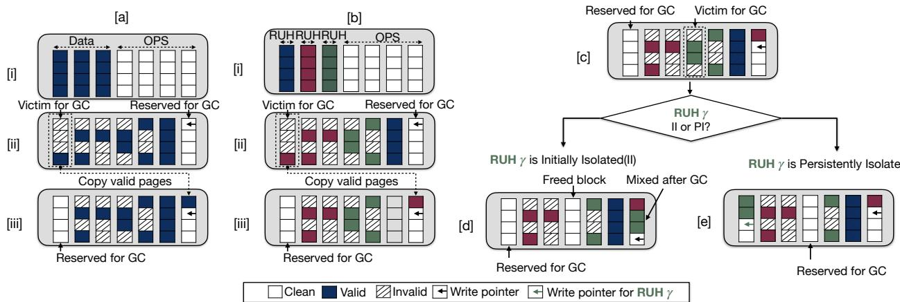  
Figure 1: FDP SSD RUH data placement strategies. The figure shows (a) a conventional SSD and (b) an FDP SSD. The FDP SSD differentiates data using the RUH ID, which is specified by the host system or application in the NVMe request field. (c) An example of garbage collection in a Reclaim Unit Handle (RUH), where a NAND block is selected from RUH ??. (d) With initially isolated RUHs, victim GC data are co-located. (e) With persistently isolated RUHs, victim GC data are kept separate.

Evolving specification and ecosystem support. Both the FDP specification and its software ecosystem are still in a nascent stage. The NVMe standard continues to evolve, and today’s devices typically implement only a subset of their capabilities with fixed, vendor-specific defaults (e.g., RU size, OP ratio, RUH type). On the software side, Linux offers only early driver support to pass RUHs via I/O passthrough [18], and application-level prototypes such as CacheLib have demonstrated initial benefits [40]. However, formal block-layer integration is missing, and mainstream file systems and applications have yet to adopt FDP. This immaturity on both specification and ecosystem fronts makes it difficult to explore FDP’s design space with hardware alone.

Implications for WAF. Because FDP is limited to placement hints and leaves GC unchanged, its effect on WAF is inherently workload-dependent. RUH isolation can align with object lifetimes and drive WAF close to 1, but adversarial or co-located patterns can erase the benefit. Vendor-specific defaults, opaque to the host and varying across devices, further introduce cross-device variability. Prior write amplification studies build upon conventional SSDs’ internal resource management [5, 41], system side changes [23, 24, 42–44], utilizing memory devices [45, 46] and tailored optimization with application design [47–49], followed by write amplification modeling for conventional SSDs [50, 51]. Prior studies have shown promising gains in narrow contexts, but have not addressed the broader questions: when does FDP reduce WAF, when does it fail, and why do devices differ? These open questions directly motivate our cross-device characterization of commercial FDP SSDs and our design of WARP, an emulator that exposes FDP’s hidden dynamics and enables systematic exploration of alternative policies.

## 3 FDP Characterization

To understand FDP’s capabilities and limitations, we first conduct a detailed study on diverse workloads.

## 3.1 Testbed and Environment

Devices. We evaluate two commercial FDP-capable SSDs from different vendors, denoted SSDA (7.68TB, U.3) and SSDB (3.84TB, E1.S). Both are PCIe Gen5, NVMe 2.1 compliant, and expose eight RUHs (Table 1). Each device delivers peak sequential write throughput of ∼5GB/s.

Environment. Experiments run on servers equipped with Intel(R) Xeon(R) Gold 5416S CPUs (2.0 GHz) and 500GB DRAM. The software stack uses Linux v6.8 with FDP patches that propagate write hints through NVMe I/O passthrough. This is currently the only upstream mechanism for interfacing FDP devices, as transparent block-layer support is not yet available [19]. We enable FDP both via direct application integration and file-system support, depending on the workload.

Workloads. Our evaluation spans three classes: (1) Synthetic microbenchmarks with FIO [52], varying the number of write streams and access patterns to stress explicit

<table><tr><td>Workload</td><td>Tool</td><td>#Threads</td><td>I/O Size</td><td>R:W</td><td>#RUHs</td></tr><tr><td>kv202206</td><td>CacheLib</td><td>R16W64</td><td>4KB</td><td>4:1</td><td>2</td></tr><tr><td>kv202210</td><td>CacheLib</td><td>W64</td><td>4KB</td><td>0:10</td><td>2</td></tr><tr><td>kv202401</td><td>CacheLib</td><td>W64</td><td>4KB</td><td>0:10</td><td>2</td></tr><tr><td>cdn sea1</td><td>CacheLib</td><td>R16W64</td><td>4KB</td><td>1:1.4</td><td>2</td></tr><tr><td>twitter12</td><td>CacheLib</td><td>R16W64</td><td>4KB</td><td>1:8</td><td>2</td></tr><tr><td>twitter37</td><td>CacheLib</td><td>R16W64</td><td>4KB</td><td>3:1</td><td>2</td></tr><tr><td>OLTP</td><td>Filebench</td><td>10</td><td>256KB</td><td>1:5</td><td>6</td></tr><tr><td>Fileserver</td><td>Filebench</td><td>200</td><td>256KB</td><td>1:4</td><td>6</td></tr><tr><td>Microbench</td><td>FIO</td><td>1-3</td><td>4-256KB</td><td>0:10</td><td>1-3</td></tr></table>

Table 1: FDP SSD specifications and experiment environments. Real FDP devices from different vendors and detailed environmental setup for testing. R and W denote reads and writes, respectively.

RUH assignment; (2) Production traces from CacheLib (kvcache, cdn, and twitter), where CacheLib manages large-object (LOC) and small-object (SOC) caches separately, which map to distinct RUHs [17]; and (3) Filesystem workloads (FileServer and OLTP) on F2FS, where RUH assignment is via F2FS’s data classification [23].

## 3.2 Microbenchmarks

We begin with synthetic workloads to expose FDP’s fundamental properties in a controlled setting. Each workload issues one or more concurrent streams, with each stream mapped to a distinct RUH and targeting a disjoint LBA range. By varying stream count, request type, and access skew, we isolate how RUH separation impacts write amplification. We report WAF as a function of written data volume normalized to device capacity under different workload mixes. For $\mathrm { \Delta S S D _ { B } }$ , we present only partial results since the device failed after excessive writes during evaluation. We use “NoFDP” to denote the baseline mode where all writes are issued without RUH hints, effectively reverting the device to conventional SSD behavior.

Single-stream baseline. Figure 2 shows results from 128KB fully random writes across the entire device LBA space to a single RUH, equivalent to default SSD behavior without FDP. Both drives show WAF rising quickly from the ideal 1.0 and plateauing at a device-specific steady state: $\mathbf { S S D _ { A } }$ near 2.0 and SSDB near 3.5. These stable plateaus indicate that baseline WAF is primarily dictated by vendor geometry and GC policies.

Two-streams. Running two concurrent streams highlights how FDP’s RUH isolation reduces write amplification. Figure 4a considers two sequential streams with mismatched block sizes (16KB vs. 256KB), where NoFDP yields ∼1.1 WAF due to misaligned progress and partially filled blocks triggering extra GC. FDP eliminates this interference, holding WAF near 1.0. Without FDP, WAF rises steeply, exceeding 2.3 even at a 90:10 split and peaking at 2.4 under 50:50. In contrast, FDP sustains near-ideal WAF across all mixes, showing that RUH separation effectively isolates sequential writes from random interference. As randomness dominates (10:90), both FDP and NoFDP climb, but FDP consistently maintains lower amplification. Overall, FDP’s benefits are most pronounced in mixed workloads, while purely sequential streams already achieve near-ideal efficiency without it.

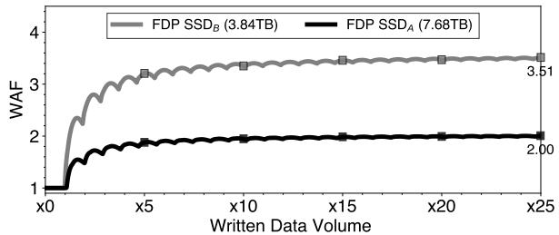  
Figure 2: One stream write: uniform random. WAF under the one-stream 128KB random-write workload. The two commercial FDP SSDs diverge significantly: $S S D _ { A }$ stabilizes around 2.0×, while $S S D _ { B }$ reaches about 3.5×.

Observation #1: FDP’s RUH isolation consistently lowers WAF by shielding sequential streams from random interference, restoring near-ideal efficiency across mixed workloads while naturally sequential streams already achieve close to 1.0 WAF.

Three-stream with overwrites. We extend the twostream setup with a third overwrite stream to capture skewed access, where a small subset of data is updated disproportionately often. The overwrite stream targets the sequential region using Zipfian distributions (??=1.2 or 2.2) or an 80/20 pattern, representing common hot-cold access. For the MixedFDP setup, only two RUHs are used, with the sequential and overwrite streams intentionally mapped to the same RUH while the random stream resides in another. This models misclassification or static RUH assignments that fail to adapt to shifting data temperature. For the FDP setup, three RUHs are used, assigning each data stream to a separate RUH.

Figure 3 shows clear vendor differences. On $\mathrm { \mathbf { S } S D _ { A } }$ (Figure 3a-c), FDP (blue line) sustains nearly ideal WAF (∼1.0) under both Zipfian workloads, but its benefit collapses under the 80/20 case, where updates spread more broadly across the LBA space (i.e., 80% of the accesses go to 20% of the LBAs). On SSDB (Figure 3d-f), overall WAF is higher: even with FDP, skewed workloads yield 1.3–1.5, and the 80/20 case climbs above 3.0, highlighting vendor-dependent sensitivity. Across both devices, the trends are consistent: FDP achieves the lowest amplification, NoFDP the highest, and MixedFDP lies in between. Notably, MixedFDP behaves like FDP when skew is strong (Zipf 2.2), but quickly converges to NoFDP under 80/20, confirming that misclassification or lifetime heterogeneity within an RUH undermines $\mathrm { F D P s }$ effectiveness. These results suggest that FDP works best when traffic is strongly skewed and RUH classification is accurate, but vendor firmware, workload distribution, and adaptive remapping ultimately dictate how much WAF can be suppressed.

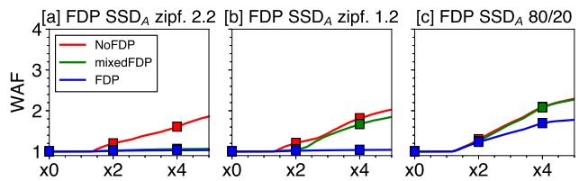

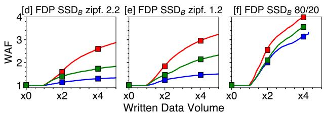  
Figure 3: WAF for the three-stream-write workload. The x-axis represents data volume from the host, defined as $\begin{array} { r } { r H M W = \ \frac { H o s t M e d i a \ W r i t t e n } { D e \nu i c e \ C a p a c i t y } } \end{array}$ · $S S D _ { A }$ has 7.68TB capacity and $S S D _ { B }$ has 3.84TB capacity. Internal device configurations are not disclosed.

Worst-case stress. Figure 5 shows the WAF results when the overwrite stream is replaced with a uniform random invalidation stream, leaving GC no opportunity to optimize. $\mathrm { O n S S D _ { A } }$ (5a), FDP, MixedFDP, and NoFDP all rise nearly together, reaching ∼2.6-2.9 by 4× device capacity, with FDP offering only marginal improvement. On $\mathrm { { S S D } _ { B } }$ (5b), the situation is even more severe: WAF climbs steeply to 4.5 despite FDP, revealing extreme amplification under this adversarial workload. These results further underscore that FDP’s benefits are both vendor- and workload-dependent. While FDP can mitigate amplification under skewed or structured patterns, its advantage collapses under uniformly random invalidations, converging toward conventional SSD behavior.

Observation #2: FDP mitigates WAF when isolating heterogeneous streams, but its effectiveness depends on vendor firmware and workload skew; strong Zipfian patterns allow near-ideal WAF, while 80/20 mixes or misclassified RUHs collapse toward NoFDP behavior, underscoring that vendor defaults and RUH assignment accuracy critically shape the benefits.

## 3.3 CacheLib

CacheLib manages small and large objects with separate engines, BigHash for small items (default threshold 2KB, termed SOC) and BlockCache for large ones (LOC), making it a natural fit for FDP. SOC stores objects in 4KB buckets that are rewritten in their entirety when any object is updated, generating frequent random writes that inflate WAF. LOC, by contrast, is log-structured, appending updates sequentially in large segments (16MB), which is device-friendly. FDP maps these two engines to distinct RUHs, preventing their very different write behaviors from interfering [17, 40]. We evaluate three production traces, kvcache, cdn2025, and twitter, collected from Meta, running SOC at 4%, 20%, and 40% of SSD space, with LOC consuming the remainder. Results are drawn from $\mathrm { \mathbf { S } S D _ { A } }$ with CacheLib version v20240621.

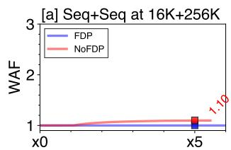

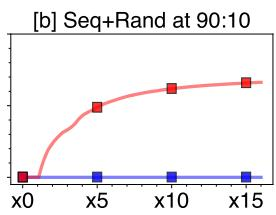

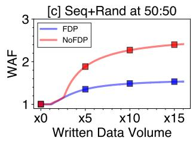

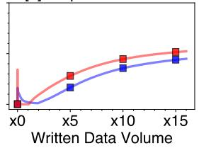  
Figure 4: SSD WAF in two-stream-write. WAF of $F D P S S D _ { A }$ under the two-stream-write workload. (a) Mix of two sequential streams with different request size. (b–d) Mix of sequential and random write streams changing capacity proportion.

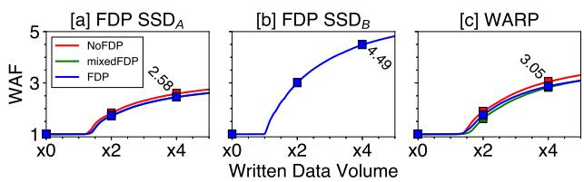  
Figure 5: Three-stream-write for uniform random. Both SSDs show similar trends but with significantly different magnitudes. $S S D _ { A }$ reaches 2.58× at 4× device capacity, while $S S D _ { B }$ reaches 4.49×, the highest WAF observed in this study.

Key-value cache. In kvcache, FDP substantially reduces WAF. As shown in Figure 6, WAF without FDP begins rising after roughly 1.1 host writes (about 8TB) and grows to 1.64 at 20% and 1.85 at 40% SOC, meaning more than 4.6TB of data is rewritten internally. With FDP, WAF stays near 1.0 across all allocations; at 20%, WAF is only 1.08, implying just 8% of data rewritten. Figure 8 confirms hit ratios are preserved: both FDP and NoFDP reach about 82% at higher SOC, compared to 61% at 4%. As SOC capacity increases, the cache can store tens of millions more objects, improving hit ratio. FDP delivers this benefit while suppressing WA, breaking the usual tradeoff between endurance and cache effectiveness.

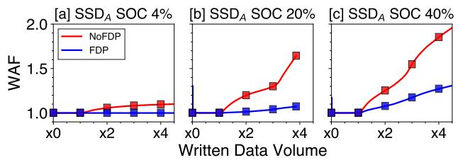  
Figure 6: CacheLib WAF. Write amplification in kvcache202206 real traces. (a) BigHash engine takes 4% of the total SSD size; (b) BigHash engine takes 20%; and (c) BigHash engine takes 40%. BlockCache takes 96%, 80%, and 60% of the SSD size, respectively.

CDN and Twitter caches. In Figure 7 for cdn and twitter traces, both configurations already achieve nearideal 1.0 WAF, reflecting naturally device-friendly access patterns. Here, FDP does not underperform, providing a safe deployment property: enabling FDP yields gains when workloads are challenging (e.g., kvcache) but imposes no regression when workloads are already benign.

Multi-tenant cache. We next simulate co-location, where CacheLib consumes 60% of the device capacity and other applications share the remaining 40% with diverse access patterns. Without FDP, interference is severe: in kvcache, WAF rises from 1.28 to nearly 3.0 (Figure 9a), a seven-fold increase at the same elapsed time. FDP sharply mitigates this effect: noisy tenants contribute little to WAF, and the highest observed value with FDP is only 2.6, still below the baseline NoFDP case. This demonstrates FDP’s robustness in multi-tenant environments.

Observation #3: Across kvcache, cdn2025, and twitter, FDP sustains near-ideal WAF (1.0-1.2) without degrading hit ratio, and never regresses when workloads are device-friendly. FDP eliminates the fundamental hit ratio vs. WAF tradeoff in kvcache: larger small-object caches improve hit ratio by 20 percentage points but normally inflate WAF to 1.6-1.8; with FDP, hit ratio rises while WAF remains near 1.0. In multi-tenant settings, FDP isolates cache traffic from noisy neighbors, cutting WAF by up to 50% compared to NoFDP. This robustness suggests FDP-enabled devices are well suited to shared cloud deployments.

## 3.4 F2FS

F2FS natively tags data placement with up to six handles based on data type and temperature, making it a natural candidate to exploit FDP. To evaluate this, we ran two filebench workloads: Fileserver and OLTP. We use filebench v1.14.

Fileserver. This workload spawns 200 threads, each issuing four writes and one read on 10 million 540KB files with 256KB I/O requests. After ten hours, it generates 28TB of writes and yields a WAF of 1.83. As shown in Figure 10, enabling FDP through F2FS produces almost identical results: both vendors’ drives stabilize around 2.3–2.5 WAF, with no measurable improvement. This indicates that FDP support in F2FS, while present, is ineffective in practice. Detailed workload configurations are listed in Table 1.

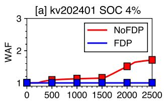

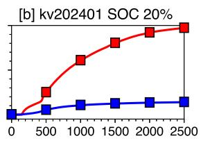

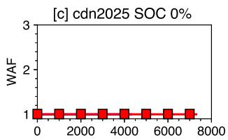

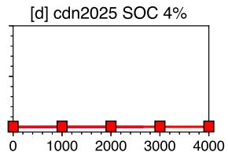

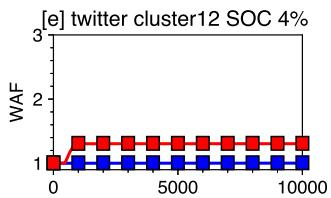

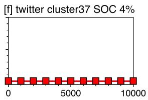

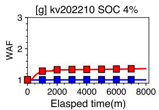

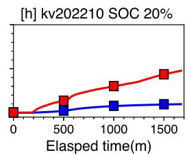  
Figure 7: WAF under different traces. WAF under kv2024, kv2022, cdn2025, and twitter traces. Cache size is set to 100% of the SSD capacity. WAF is monitored until it stabilizes for both NoFDP and FDP cases. Write-only portions of the kv2024 and kv2022 traces are selected to accelerate convergence.

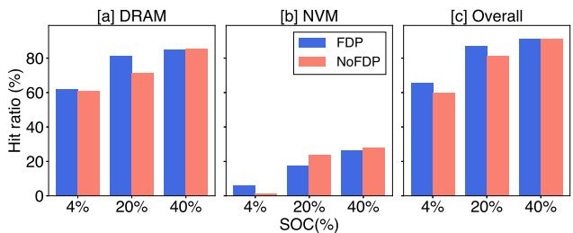  
Figure 8: Hit ratio in CacheLib. Average hit ratio from Figure 6, measured over a 100-minute interval. Cache sizes of 4%, 20%, and 40% correspond to proportional SSD cache sizes of a 7.68TB device for the small-object cache (BigHash) engine (i.e., the “NVM cache” in CacheLib).

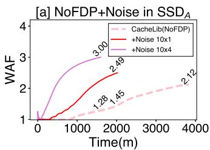

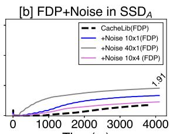  
-  
Figure 9: CacheLib with noisy neighbors. CacheLib kvcache202206 trace with 4K random write (QD=1) as noisy neighbors under the same workload elapsed time. (a) The noisy workload increases write amplification significantly without FDP support, whereas (b) the FDP case maintains stable write amplification.

To understand why, we traced F2FS I/O hint types with eBPF and found that 99% of user data is labeled as WARM, which maps to the generic WRITE LIFE NOT SET hint. Consequently, nearly all writes are funneled into a single RUH, collapsing FDP to NoFDP behavior. Figure 11 shows the total number of I/Os with write hints. Although F2FS does separate node and metadata segments into different RUHs, this separation alone is insufficient to reduce WAF. For FDP to help, user data must also be more finely classified and spread across multiple RUHs. OLTP. The OLTP workload launches ten writer threads that perform 256KB writes on 63K files, each issuing 100 asynchronous I/Os before calling dsync(). Results follow the same trend as Fileserver: despite FDP tagging, WAF remains virtually unchanged across both devices.

Observation #4: F2FS integrates cleanly with FDP’s tagging interface, but the benefits depend critically on the file system’s data classification policy and the device’s internal GC. Without accurate tagging of user data across RUHs, FDP degenerates to conventional SSD behavior.

Across synthetic and real workloads, FDP proves both powerful and fragile. When host classifications align with RUH isolation, it sustains near-ideal WAF. But benefits collapse under misclassification, cross-RUH interference, or adversarial access patterns, and outcomes vary sharply across vendors due to opaque internal policies. Commercial devices reveal these effects without exposing their causes, underscoring the need for our emulator (§4) to illuminate per-RUH behavior and enable the design of more effective FDP policies beyond today’s hardware.

## 4 WARP Design and Implementation

## 4.1 Design Goals and Contract

WARP is designed as a faithful, extensible, and open platform to answer when and why FDP reduces WAF, and how alternative controller policies affect that outcome. To meet this goal, WARP provides three capabilities:

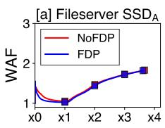

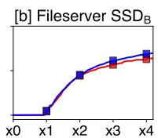  
Written Data Volume

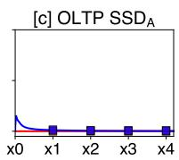  
Figure 10: F2FS WAF under Filebench workloads. Under F2FS, FDP and NoFDP exhibit the same write amplification trend, representing the worst case for FDP. For the OLTP workload, both curves flatten at a WAF of 1.0, which is ideal. TRIM is enabled by default.

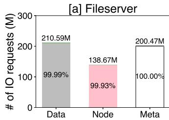

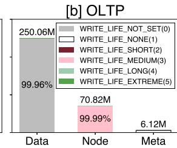  
Figure 11: Cumulative write hint distribution for F2FS under Fileserver. Total number of I/O writes in the Fileserver workload over a 10-hour benchmark. Write hints are converted to RUH IDs in the NVMe driver using kernel patches [18]. However, write hints that are directly translated to RUH IDs are underutilized in F2FS.

• Isolation semantics. WARP implements both FDP modes defined in NVMe: Initially Isolated (II) and Persistently Isolated (PI). These rules are modeled explicitly, making RUH identity either discarded (II) or preserved (PI).

• Configurable geometry and policies. RU size, overprovisioning ratio, RUH count, GC heuristics, lazy thresholds, and block remapping are tunable, turning opaque vendor defaults into explicit research knobs.

• Per-RUH observability. WARP instruments counters and event logs, exposing hidden dynamics such as Noisy RUH interference and Save Sequential premature reclamation.

These capabilities rest on a set of explicit design contracts that make WARP predictable and reproducible. First, RUH mapping is deterministic so that every host tag always resolves to the same reclaim unit. Second, isolation semantics are enforced consistently: in II mode all GC copies are redirected into a shared GC-RUH, whereas in PI mode copies remain within their original RUH. Finally, RU granularity is explicitly defined at the start of each run and remains fixed throughout execution. Together, these contracts define WARP’s guarantees and form the foundation for the following design.

## 4.2 Interface and Placement Model

At the interface level, WARP extends FEMU [53] to parse FDP placement hints in NVMe commands and to map tagged writes to Reclaim Units (RUs), which are logical groupings of NAND blocks (e.g., superblocks). Each RUH maintains one or more write pointers to its active RUs. II semantics provide lightweight isolation: host writes enter RUH ??, but GC copies are redirected into a dedicated GC-RUH, discarding the original tag. This path requires only minimal changes to a legacy FTL and explains why commercial FDP SSDs adopt II in their initial design [17]. PI semantics preserve RUH identity across reclamation by maintaining a per-RUH GC write pointer. This policy enforces strict isolation but fragments the over-provisioned space. WARP is the first open emulator to support both semantics side by side.

By default, each RUH in WARP appends into a single active RU until it becomes full and is closed. More advanced policies may allocate multiple RUs concurrently, increasing parallelism or alleviating GC pressure. WARP can be extended to support such advanced designs, including alternative II policies. In PI mode, an additional GC write pointer ensures strict separation of host and GC data. By exposing these placement choices, WARP turns RUH management into a controllable design axis rather than an opaque firmware behavior.

## 4.3 GC Architecture

WARP generalizes GC into two distinct decisions. The first decision is which RUH to reclaim from. Policies include greedy selection, which targets the RUH under highest pressure, and pressure-based selection, which considers the ratio of live to free space. The second decision is which RU within the selected RUH to reclaim. Options include greedy selection of the RU with the fewest valid pages and cost-benefit selection, which scores a victim as ??×age 1−?? where ?? is block utilization and age is the time since the last invalidation [54].

In addition to these basic policies, WARP implements optimizations commonly found in enterprise SSD controllers. (1) Lazy GC postpones reclamation until valid occupancy in a RU falls below a threshold (empirically between 5–10%). (2) WARP also distinguishes background GC, triggered at approximately 90% RU allocation, from foreground GC, triggered near exhaustion (e.g., at approximately 99%). These thresholds reduce wasted copies of short-lived data. (3) Block remapping further reduces amplification: when a victim RU contains blocks that are entirely valid, those blocks are directly remapped into the destination RU without migration. This optimization preserves semantics while eliminating redundant writes. By introducing RUH-aware victim selection, tunable lazy thresholds, and block remapping, WARP transforms GC from a fixed background routine in FEMU into an explicit, per-RUH design surface.

## 4.4 Configurable Geometry

Commercial SSDs hard-code geometry parameters such as RU size and OP ratio during the manufacturing phase and cannot be changed [17]. WARP decouples these parameters from hardware and exposes them as first-class knobs to allow evaluations of different RU sizes (e.g., 128, 256, and 512MB), OP ratios (e.g., ranging from 1 to 28 percent), and RUH count (configurable). By making geometry explicit and configurable, WARP enables researchers to investigate how FDP benefits depend on controller choices that are otherwise invisible in hardware.

## 4.5 Observability and Calibration

A key contribution of WARP is its observability through rich telemetry. For every workload, WARP records statistics at three complementary levels of detail. At the device level, it reports standard measures such as host bytes, media bytes, and overall WAF. At the RUH level, it exposes a deeper view of FDP’s internal behavior by tracking host bytes, GC copy bytes, remapped blocks, allocations, evictions, and the average number of valid pages reclaimed. At the per-GC-event level, it logs fine-grained details including the victim RUH, the specific RU reclaimed, the destination RUH, the applied policy, the number of live and copied pages, and the elapsed time. These measurements reveal internal dynamics that are invisible on commercial devices (§5), such as Noisy RUHs, where invalidations in one RUH raise amplification in others, and Save Sequential, where long sequential streams are reclaimed prematurely. By exporting all data as structured logs, WARP enables validation against hardware, ensures reproducibility of experiments, and provides the foundation for systematically analyzing when and why FDP delivers its intended benefits. It also supports calibration: in §5, we tune geometry and GC thresholds until WARP reproduces the steady-state WAF plateaus of real devices, then validate against multi-stream and trace workloads.

## 4.6 Implementation in Context of FEMU

Extending FEMU to support FDP required changes at both the interface and the internal policy levels. At the interface, we added support for parsing FDP tags in NVMe commands and mapped them to explicit RU and RUH abstractions. At the placement level, we introduced RUH write pointers and implemented both II and PI semantics, thereby enabling FDP isolation modes. At the GC level, we replaced FEMU’s fixed background policy with RUH-aware victim selection, tunable lazy thresholds, and block remapping, capturing behaviors unique to FDP.

<table><tr><td rowspan="2">Device</td><td rowspan="2">Capacity</td><td rowspan="2">FDP</td><td colspan="3">CacheLib WAF</td></tr><tr><td>4%</td><td>20%</td><td>40%</td></tr><tr><td> $\mathrm { { S S D _ { A } } }$  SSDA</td><td>7.68TB</td><td>NoFDP</td><td>1.10</td><td>1.64 (+49%)</td><td>1.85 (+68%)</td></tr><tr><td> ${ \mathrm { W A R P } } _ { \mathrm { A } }$ </td><td>7.68TB 240GB</td><td>FDP</td><td>1.0</td><td>1.07 (+7%)</td><td>1.27 (+27%)</td></tr><tr><td> ${ \mathrm { W A R P } } _ { \mathrm { A } }$ </td><td>240GB</td><td>NoFDP FDP</td><td>1.16</td><td>1.37 (+18%)</td><td>2.00 (+72%)</td></tr><tr><td></td><td></td><td></td><td>1.0</td><td>1.04 (+4%)</td><td>1.37 (+37%)</td></tr></table>

<table><tr><td rowspan="2">Device</td><td rowspan="2">Capacity</td><td rowspan="2">FDP</td><td rowspan="2">RUH</td><td colspan="3">3Syn WAF</td></tr><tr><td>zipf2.2 zipf1.2</td><td></td><td>80/20</td></tr><tr><td> $\mathrm { S S D _ { A } }$ </td><td>7.68TB</td><td>FDP</td><td>I</td><td>1.03</td><td>1.04</td><td>1.69</td></tr><tr><td> $\mathrm { S S D _ { A } }$ </td><td>7.68TB</td><td>mixed</td><td>Ⅱ</td><td>1.03</td><td>1.67</td><td>2.08</td></tr><tr><td> $\mathrm { S S D _ { A } }$ </td><td>7.68TB</td><td>NoFDP</td><td>I</td><td>1.60</td><td>1.81</td><td>2.09</td></tr><tr><td> ${ \mathrm { W A R P } } _ { \mathrm { A } }$ </td><td>240GB</td><td>FDP</td><td>PI</td><td>1.04</td><td>1.06</td><td>1.24</td></tr><tr><td> ${ \mathrm { W A R P } } _ { \mathrm { A } }$ </td><td>240GB</td><td>mixed</td><td>PI</td><td>1.70</td><td>2.04</td><td>1.82</td></tr><tr><td> ${ \mathrm { W A R P } } _ { \mathrm { A } }$ </td><td>240GB</td><td>NoFDP</td><td>PI</td><td>2.13</td><td>2.17</td><td>2.07</td></tr><tr><td> $\mathrm { W A R P _ { A 2 } }$ </td><td>458GB (14%)</td><td>FDP</td><td>Ⅱ</td><td>1.05</td><td>1.10</td><td>1.68</td></tr><tr><td> $\mathrm { W A R P _ { A 2 } }$ </td><td>458GB (14%)</td><td>mixed</td><td>I</td><td>2.19</td><td>2.38</td><td>2.35</td></tr><tr><td> $\mathrm { W A R P _ { A 2 } }$ </td><td>458GB (14%)</td><td>NoFDP</td><td>ⅡI</td><td>2.48</td><td>2.60</td><td>2.64</td></tr><tr><td> $\mathrm { S S D _ { B } }$ </td><td>3.84TB</td><td>FDP</td><td>ⅡI</td><td>1.29</td><td>1.45</td><td>3.12</td></tr><tr><td> $\mathrm { S S D _ { B } }$ </td><td>3.84TB</td><td>mixed</td><td>ⅡI</td><td>1.72</td><td>2.13</td><td>3.53</td></tr><tr><td> $\mathrm { S S D _ { B } }$ </td><td>3.84TB</td><td>NoFDP</td><td>I</td><td>2.58</td><td>2.95</td><td>3.97</td></tr><tr><td> $\mathrm { W A R P _ { B } }$ </td><td>240GB (20%)</td><td>FDP</td><td>PI</td><td>1.56</td><td>1.71</td><td>1.99</td></tr><tr><td> $\mathrm { W A R P _ { B } }$ </td><td>240GB (20%)</td><td>mixed</td><td>PI</td><td>2.88</td><td>3.10</td><td>3.37</td></tr><tr><td>WARPB</td><td>240GB (20%)</td><td>NoFDP</td><td>PI</td><td>3.48</td><td>3.61</td><td>3.55</td></tr></table>

Table 2: WARP validation. WAF from different vendors under CacheLib kvcache202206 trace, and three stream write.

At the geometry level, we decoupled RU size and overprovisioning ratio from FEMU’s static configuration and exposed them as runtime parameters, making geometry a design knob rather than a fixed constant. Finally, we added observability by instrumenting per-RUH counters and structured GC event logs, which allow researchers to validate emulator behavior against hardware and reproduce experiments. Taken together, these enhancements rebase FEMU’s pre-FDP FTL into WARP, an emulator that treats FDP as a first-class feature and exposes it as a configurable, observable design space for systems research.

## 5 Evaluation

The evaluation of WARP pursues two complementary goals. First, we assess fidelity: does WARP reproduce the key write amplification trends observed on commercial FDP SSDs across synthetic, trace-driven, and file-system workloads? Second, we demonstrate insight: does WARP reveal internal per-RUH dynamics and design tradeoffs that real devices conceal?

To this end, we configure WARP with calibrated defaults (RU=256MB, OP=10%, lazy GC threshold=5%, block remapping enabled, and eight RUHs) unless otherwise noted. We evaluate three classes of workloads: (1) microbenchmarks stressing RUH isolation with controlled access patterns, (2) production traces from CacheLib that exercise skewed and multi-tenant caches, and (3)

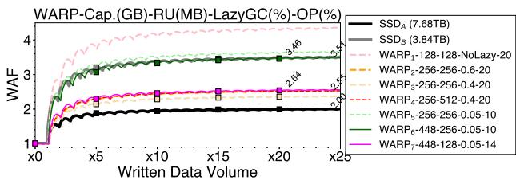  
Figure 12: Revisiting one stream write with WARP. Under the one-stream 128 KB random-write workload, most configured WARP settings $( W A R P _ { 2 - 7 } )$ fall between 2.0–3.5×, matching the write amplification observed on two commercial FDP SSDs with relatively simple configuration knobs.

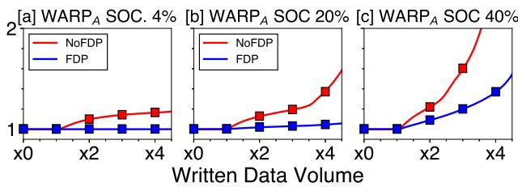  
Figure 13: WARP result in CacheLib. Write amplification in kvcache202206 real traces. (a) BigHash engine takes 4% of the total SSD size; (b) BigHash engine takes 20%; and (c) BigHash engine takes 40%. BlockCache takes 96%, 80%, and 60% of the SSD size, respectively.

file-system workloads (FileServer and OLTP on F2FS) that rely on native FDP tagging. Our analysis proceeds in stages: we first validate WARP against device-level WAF baselines, then leverage its observability to uncover phenomena such as Noisy RUH and Save Sequential, and finally explore the design tradeoff between II and PI isolation modes under varying OP budgets.

Unless otherwise noted, all experiments run on WARP built atop FEMU’s SSD model. We adopt FEMU’s default SSD configuration: 8 channels, 8 dies per channel, with a page size of 4KB. Read, program, and erase latencies follow FEMU’s NAND timing. These parameters are not altered by FDP, ensuring that WARP preserves FEMU’s baseline device fidelity while layering FDP-specific abstractions on top.

## 5.1 Essential FDP Properties

Validation of WAF trend. Since WARP reveals the hidden dynamics of FDP, it should reproduce fundamental WAF trends of FDP SSDs. Figure 12 compares two enterprise FDP SSDs against seven WARP configurations. As expected, the real devices diverge sharply: $\mathrm { { S S D _ { A } } }$ stabilizes near 2.0 while $\mathrm { { S S D } _ { B } }$ reaches about 3.5. By varying RU size, OP ratio, and lazy-GC thresholds, we found WARP configurations that consistently fall between these two bounds. For example, under 128KB random writes, ${ \bf W } { \bf A R P } _ { 2 - 7 }$ spans the range from 2.0 to 3.5, mirroring the vendor spread, except ${ \mathrm { W A R P } } _ { 1 }$ . This confirms that WAF is not a fixed property but an emergent outcome of hardware geometry (block/page size, parallelism, OP ratio) and firmware policy (GC heuristics, scheduling, thresholds). Despite the complexities, WARP captures the trend with only a few configuration knobs, validating its fidelity for subsequent studies.

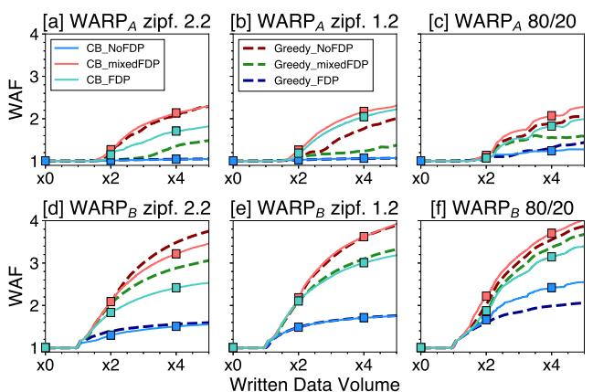  
Figure 14: WARP WAF under the three-stream-write workload. The x-axis shows data volume written from the host. $W A R P _ { A }$ and $W A R P _ { B }$ capture real FDP devices with different GC schemes. Configurations are listed in Table 2.

CacheLib validation. Having established fidelity on synthetic microbenchmarks, we next validate WARP against production traces. CacheLib is particularly challenging: its BigHash engine generates small-object updates that inflate WAF, while BlockCache issues sequential appends that are device-friendly.

Figure 13 shows that WARP reproduces these dynamics with high fidelity. As cache size increases, the real FDP $\mathrm { S S D _ { A } }$ reduces WAF from 1.85 (Figure 6 NoFDP) to 1.27 (Figure 6 FDP) at 40% SOC, while WARP mirrors the same directional improvement (2.00 → 1.37). At smaller SOC fractions (4% and 20%), both devices maintain nearideal WAF around 1.0–1.1, again captured by WARP. These results confirm that WARP faithfully models FDP’s central effect: suppressing WAF when workloads are adversarial while remaining neutral when they are benign. Moreover, the consistency across SOC ratios highlights that WARP captures the sensitivity of FDP to workload composition, sometimes more transparently than vendor firmware, which conceals internal heuristics.

Complex workload validation. Finally, we validate WARP under skewed and multi-stream workloads, which stress FDP more severely than uniform random writes. These patterns combine sequential, random, and overwrite streams with varying skew (Zipfian, 80/20), modeling realistic hot/cold dynamics and misclassification scenarios.

Figure 14 shows that WARP reproduces the expected qualitative hierarchy for $\mathrm { { S S D } _ { \mathrm { { A } } } \mathrm { { : } } }$ FDP sustains near-ideal WAF (1.0), NoFDP escalates toward 2.0, and MixedFDP remains between the two (1.3-1.6 depending on skew). While absolute values differ slightly due to vendor-specific geometry and GC heuristics, the ordering and slopes are consistent. For $\mathrm { { S S D } _ { B } }$ , which exhibits higher amplification overall, WARP still matches the same hierarchy: FDP near 1.3, MixedFDP rising toward 2.0, and NoFDP exceeding 2.5. With parameter tuning, WARP tracks the devicespecific trends across all skewed workloads.

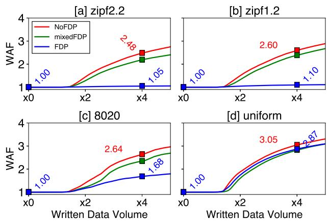  
Figure 15: Revisiting three-stream-write with WARP. WAF under the three-stream-write workload with the $W A R P _ { A 2 }$ configuration using the greedy algorithm. $W A R P _ { A 2 }$ follows real FDP device trends.

Additional validation in Figure 15 confirms these results: under both Zipfian and 80/20 access distributions, WARP preserves the same ordering of three different use cases, with WAF values aligned to within 0.2-0.3 of the real devices. These experiments demonstrate that WARP faithfully models FDP behavior even under complex, adversarial workloads, establishing it as a robust platform for deeper exploration of FDP policies.

Observation #5: WARP reproduces the WAF behavior of enterprise FDP SSDs across both synthetic and real workloads, matching vendor trends while remaining fully transparent and tunable. Its fidelity across devices and workload classes underscores its value as a general research platform for exploring FDP design.

## 5.2 Analysis of Three-Stream-Writes and Beyond

Per-RUH effects. Figure 16 breaks down WAF by individual RUHs. Two key phenomena emerge: (1) a Noisy RUH, where overwrite traffic in one handle indirectly inflates WAF in others by increasing GC pressure; and (2) Save Sequential, where capacity-dominant sequential streams are prematurely reclaimed, erasing their natural devicefriendly behavior. Both effects are visible in WARP’s counters and echoed in real devices, demonstrating FDP’s fragility under co-location.

Noisy RUH. Figure 16a shows workload distribution across RUHs. RUH 0, the sequential overwrite stream, dominates all three workloads, absorbing 4.42–4.45× device capacity of traffic (88% of writes). RUH 1 (random writes) and RUH 2 (invalidation) contribute only 0.26– 0.32 and 0.22–0.40× capacity respectively (5–6% each). Figure 16b shows amplification contributions. Under Zipfian workloads, most amplification comes from RUH 0 (WAF 0.038–0.043), with RUH 1 and RUH 2 nearly negligible. Under the 80/20 workload, however, amplification rises across all RUHs: RUH 1 contributes 0.131 (26% of total) and RUH 2 contributes 0.070 (14%), even though their traffic volumes barely change. The culprit is RUH 2’s invalidation stream, which forces more aggressive GC and indirectly raises RUH 1’s WAF. This interference effect breaks RUH isolation.

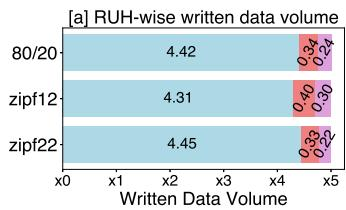

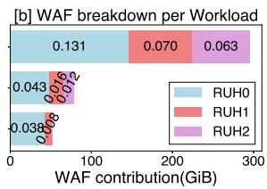  
Figure 16: WAF breakdown for the three-stream-write workload at 5× rHMW in WARPA. (a) Host-written data volume per RUH in relative terms. 4.42 means 4.42× device capacity of data was written to RUH 0. (b) WAF breakdown per RUH, considering only amplified writes. The x-axis shows the absolute amount of amplified data.

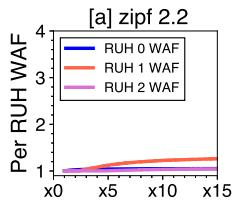

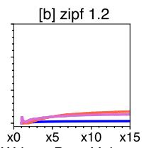

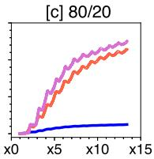  
Figure 17: Per-RUH WAF under the three-stream-write workload in WARP (PI). Per-RUH WAF considers each RUH as a subset of the SSD (i.e., Per-RUH-WAF = RUHi GCed DataRUHi Data Written ) In (c), the per-RUH WAF of RUH 1 and RUH 2 rises to 3.8×.

We call this Noisy RUH: a single RUH can degrade global amplification across others. Notably, the same pattern appears on real FDP SSDs (Figure 3c&f), indicating it is a general property of current FDP implementations.

Observation #6: Our per-RUH breakdown reveals critical pitfalls of FDP: “Noisy RUHs” propagate garbagecollection pressure across handles, inflating global WAF. FDP’s effectiveness depends not only on RUH isolation but also on balanced workloads and device-level slack.

Save Sequential. Figure 16b also shows that RUH 0, although sequential, contributes the majority of WAF (0.131–0.264 depending on workload). Ideally, sequential streams should self-invalidate and incur little amplification. Yet limited OP and GC heuristics cause the device to prematurely reclaim RUH 0, even when its data would soon be overwritten. This Save Sequential effect means that even sequential, capacity-dominant streams can dominate WAF if they collide with GC policy.

Observation #7: The apparent “victim” of WAF is often the capacity-dominant RUH, not the noisy RUH. In FDP SSDs, even long sequential streams cannot be assumed safe; when their scale collides with device internals, they may erode the isolation benefits of FDP.

## 5.3 FDP SSD II vs. PI

OP tradeoff. The balance between Initially Isolated (II) and Persistently Isolated (PI) schemes is governed primarily by the amount of over-provisioned flash available. Figure 18 summarizes this tradeoff across different RU sizes and OP ratios under the 80/20 workload, a stress case that produces widespread invalidations.

Figure 18a shows results for 256MB RUs. When OP is limited (3–5%), II achieves a lower WAF (OP3% 2.92, OP5% 2.178) than PI (OP3% 3.8, OP5% 2.365). The crossover occurs around 7–9% OP, illustrating that PI only surpasses II once sufficient spare capacity is available to absorb the fragmentation induced by strict per-RUH isolation. Figure 18b repeats the experiment with smaller 128MB RUs. Here the crossover point shifts upward. With 3% OP, II again performs better (WAF 2.521 vs. 2.781 for PI), but even at 5% OP, II maintains an advantage (1.74 vs. 1.908). Only at higher OP (7–10% and above) does PI reach parity (1.129 vs. 1.091 for PI, OP 10%). Smaller RUs thus require more generous OP budgets for PI to exploit its theoretical lower bound. Figure 18c and (d) highlight this effect directly by fixing OP at 5% and 10% respectively for 256MB RUs. At 5%, II’s WAF is 2.187 while PI’s is 2.365, confirming that under tight OP budgets PI’s fragmentation penalty dominates. At 10%, II achieves 1.338 while PI drops to 1.181, showing that PI only begins to pull ahead at higher OP levels.

II and PI: why and when. These results reflect how each scheme leverages spare space. PI enforces strict RUH isolation even for GC copies, fragmenting the spare pool. Under tight OP budgets, this starves each RUH of slack and triggers frequent GC, inflating WAF. II, in contrast, pools spare space in the GC-RUH and can flexibly amortize GC overhead across streams, making it more resilient under scarce OP. When OP is plentiful, however, PI’s isolation pays off: each RUH has its own slack, minimizing crossstream interference and yielding lower WAF than II. Thus PI’s potential lower bound is below II’s, but only if OP is sufficient to offset its fragmentation.

Fragility of PI. Although PI can outperform II, it is the more fragile mode. As the number of RUHs grows, or as workloads become heterogeneous and device-unfriendly, PI requires disproportionately larger OP budgets to maintain its advantage. Under such conditions, PI may exhibit higher WAF than II. By contrast, II’s lower bound is higher, but it demonstrates robustness across workloads with tight OP and high interference. The dedicated GC-RUH absorbs much of the GC-induced contention, shielding II from pathological amplification.

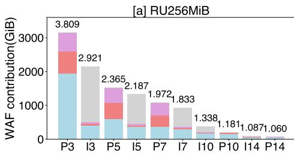

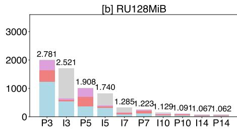

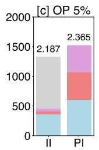

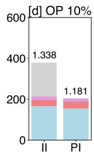  
Figure 18: WARP FDP II vs. PI design OP tradeoff. Two RUH types—Initially Isolated and Persistently Isolated—show WAF across different OP ratios and RU sizes. Lower is better. All WAF collected from the 80/20 workload at 5× rHMW (224GB). (a) WAF with RU 256MB for all OP settings. (b) WAF with RU 128MB for all OP settings. (c) WAF at OP 5% for the RU 256MB setting only. (d) WAF at OP 10% for the RU 256MB setting only.

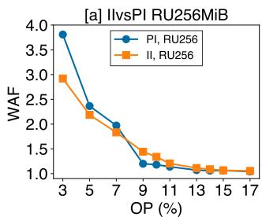

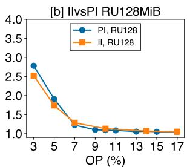  
Figure 19: II vs. PI design tradeoff for the 80/20 workload at 5× written data volume in WARP. (a) WARP RU256MB setting shows the crossover point around 7– 9% OP. (b) WARP RU128MB setting shows the crossover point around 5–7% OP (224GB).

The 80/20 workload used here is more adversarial than Zipfian skewed writes, since invalidations are spread more broadly across the address space. This highlights the circumstances under which PI can be beneficial: (1) workloads with well-classified lifetimes, and (2) devices with abundant OP. In contrast, II would be a robust choice under irregular or mixed workloads and when OP budgets are constrained. For system designers, this tradeoff implies that PI requires coordinated host classification and generous OP allocation, while II provides resilience with less host knowledge.

Observation #8: II achieves lower WAF when OP is scarce, while PI delivers the lowest WAF only when OP is abundant. PI is potentially more powerful but fragile: under limited OP or heterogeneous workloads, its benefits collapse and it can perform worse than II.

## 6 WARP Guided Optimization

## 6.1 WARP WAF optimization

In this section, we demonstrate how WARP enables design exploration through a simple yet effective optimization in CacheLib. Figure 20 reports WAF for the kvcache202206 trace at 40% SOC. In addition to the NoFDP and FDP baselines, we evaluate a device-level optimization in WARP that assigns a small RU to the SOC handle (RUH 0).

The idea is straightforward: we configure a small RU (i.e., a single-channel-mapped RU), so that all writes from RUH 0 fill one NAND block completely before moving to another channel. The improvement is evident: while FDP alone reduces WAF from 2.0 (NoFDP) to 1.37, adding the small-RU optimization lowers it further to 1.16. The effect is substantial under heavy SOC (40%) but the benefit is minimal in light SOC settings (4%). The gains are twofold. First, smaller RUs can reduce GC overhead by collecting fewer pages per cycle. Second, constraining an RU to a single channel implicitly throttles the small-object cache, preventing it from overwhelming the device with parallel GC activity. As a result, the Noisy RUH effect is suppressed.

WARP provides the foundation for exploring such codesign opportunities between host software and devicelevel policies. Particularly, this case opens a promising direction: adaptive RU sizing (i.e., dynamic RU sizing) for FDP SSDs. Shrinking RUs for noisy workloads reduces amplification, while larger RUs preserve throughput for benign workloads [55]. This aligns with findings from prior work [56]. Furthermore, throughput sensitivity interacts with WAF, suggesting the need for FDP-aware schedulers that consider RUHs for request scheduling.

## 6.2 WARP Latency Optimization

Latency matters as much as write amplification in system performance. WARP builds on FEMU’s validated timing model and, with our documented tuning, provides predictable, repeatable latency behavior that closely tracks real FDP SSDs, making it a strong platform beyond just FDP emulation. In Table 3, under 4KB high-queue-depth workloads, WARP sustains 335K IOPS versus 460K on a real SSD $( \mathrm { { S S D } _ { A } ) , }$ with nearly identical median and main tail latencies (p50–p99 around 70–80µs) and realistic GC-driven tail spikes (457µs vs. 967µs for p99.999), while maintaining latency stability up to the five-nines.

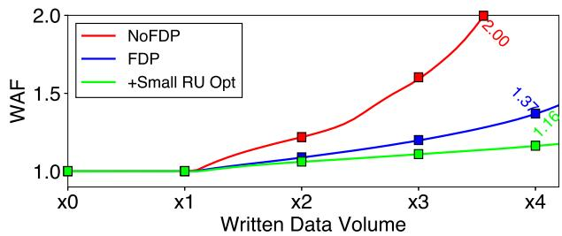  
Figure 20: Optimization for CacheLib SOC. WAF for the kvcache202206 trace at 40% SOC in WARP.

Proper tuning for WARP involves removing the expensive VM-exit system call overhead by disabling the NVMe doorbell write. In this way, the expensive MMIO doorbell write operation is mitigated, resulting in a high-quality emulation platform in userspace (QEMU).

Table 3 shows identical median latency and stable p99.999 latency compared to FDP SSD. Together with other findings, WARP is not only a faithful FDP SSD emulator but also a high-quality emulation platform for latency-sensitive SSD research [38, 39, 57].

## 7 WARP Use Cases and Future Directions

Beyond validating FDP fidelity and revealing hidden phenomena, WARP enables a wide range of use cases that are impractical or impossible with commercial SSDs. We highlight several opportunities where WARP can serve as a platform for both systems research and device co-design.

• Policy exploration beyond hardware. Today, commercial devices expose only II semantics. WARP makes it possible to evaluate PI mode, hybrid schemes (e.g., adaptive isolation), or new victim-selection heuristics that vendors have not yet implemented. This supports head-to-head comparisons of design choices that remain invisible in hardware.

• Cross-layer co-design. File systems (e.g., F2FS) and KV stores (e.g., CacheLib) can be run unmodified atop WARP to measure how FDP semantics interact with tagging policies. Researchers can quantify the cost of misclassification and explore whether tagging by file type, hot/coldness, or application hints yields the best isolation. Such studies are infeasible on opaque devices.

• Multi-tenancy and resource sharing. FDP’s intended role is to isolate tenants, yet our results reveal fragility (Noisy RUH, Save Sequential). WARP enables controlled experiments with co-located workloads, testing whether new GC or RUH assignment policies improve fairness and reduce interference.

<table><tr><td>Device</td><td>Avg</td><td>Stdev</td><td> $\mathbf { p 5 0 }$ </td><td> $\mathbf { p } ^ { \mathbf { 9 9 } }$ </td><td>p99.9</td><td>p99.99</td><td>p99.999</td></tr><tr><td>SSDA</td><td> $7 0 \mu \mathrm { s }$ </td><td>9.8</td><td> $7 0 \mu \mathrm { s }$ </td><td> $8 0 \mu \mathrm { s }$ </td><td> $9 2 \mu \mathrm { s }$ </td><td> $2 0 0 \mu \mathrm { s }$ </td><td> $9 6 7 \mu \mathrm { s }$ </td></tr><tr><td>WARP</td><td> $7 7 \mu \mathrm { s }$ </td><td>12.1</td><td> $7 0 \mu \mathrm { s }$ </td><td> $7 7 \mu \mathrm { s }$ </td><td> $8 2 \mu \mathrm { s }$ </td><td> $1 0 2 \mu \mathrm { s }$ </td><td> $4 5 7 . 4 \mu \mathrm { s }$ </td></tr></table>

Table 3: Latency in WARP and real SSD. Baseline latency for 4K random read workload (QD=1). With proper tuning, WARP shows predictable latency compared to real SSD.

• Dynamic policy adaptation. With fine-grained observability, WARP can serve as a foundation for adaptive controllers. Examples include dynamically resizing RUs for noisy workloads, adjusting GC thresholds in response to workload intensity, or switching between II and PI modes depending on OP availability. These experiments are only possible with an open emulator.

These use cases illustrate that WARP is not only a faithful emulator but also a general research and education platform. By making opaque firmware knobs explicit and tunable, it opens new opportunities for systematic study of FDP and related flash-management policies.

## 8 Conclusion

We presented WARP, the first open emulator and systematic study of FDP SSDs. Our cross-device characterization shows that FDP can achieve near-ideal WAF when RUH isolation aligns with object lifetimes, but its benefits collapse under misclassification, interference, or adversarial patterns, with outcomes varying sharply across vendors. WARP bridges this gap by reproducing hardware trends while exposing per-RUH dynamics and tunable design knobs. With this visibility, we uncovered new pitfalls, such as the Noisy RUH and Save Sequential effects, demonstrating that FDP’s benefits are not automatic and require careful stream classification and device-level awareness. Beyond validation, WARP enables exploration of new firmware strategies, OS-level policies, and application designs that can push FDP beyond current hardware limits with transparent full-stack interaction. WARP is open-source and publicly available; we hope it will foster co-design research that fully realizes FDP’s promise across diverse storage workloads.

## Acknowledgments

We thank Reza Salkhordeh, our shepherd, and the anonymous reviewers for their valuable feedback and comments. We also would like to thank Vivek Shah and Arun George for their helpful discussions. This research was partially supported by the NSF CAREER Award CNS-2339901 and NSF Grant CNS-2312785.

## References

[1] Sara McAllister, Yucong “Sherry” Wang, Benjamin Berg, Daniel S. Berger, George Amvrosiadis, Nathan Beckmann, and Gregory R. Ganger. FairyWREN: A Sustainable Cache for Emerging Write-Read-Erase Flash Interfaces. In Proceedings of the 18th USENIX Symposium on Operating Systems Design and Implementation (OSDI), 2024.

[2] Qiuping Wang, Jinhong Li, Patrick P. C. Lee, Tao Ouyang, Chao Shi, and Lilong Huang. Separating Data via Block Invalidation Time Inference for Write Amplification Reduction in Log-Structured Storage. In Proceedings of the 20th USENIX Symposium on File and Storage Technologies (FAST), 2022.

[3] Youyou Lu, Jiwu Shu, and Weimin Zheng. Extending the Lifetime of Flash-based Storage Through Reducing Write Amplification from File Systems. In Proceedings of the 11th USENIX Symposium on File and Storage Technologies (FAST), 2013.

[4] Seonggyun Oh, Jeeyun Kim, Soyoung Han, Jaehoon Kim, Sungjin Lee, and Sam H. Noh. MIDAS: Minimizing Write Amplification in Log-Structured Systems Through Adaptive Group Number and Size Configuration. In Proceedings of the 22nd USENIX Symposium on File and Storage Technologies (FAST), 2024.

[5] Minji Kang, Soyee Choi, Gihwan Oh, and Sang-Won Lee. 2R: Efficiently Isolating Cold Pages in Flash Storages. In Proceedings of the 46th International Conference on Very Large Data Bases (VLDB), 2020.

[6] Swamit Tannu and Prashant J. Nair. The Dirty Secret of SSDs: Embodied Carbon. In the 2nd Workshop on Sustainable Computer Systems (HotCarbon), 2023.

[7] Sara McAllister, Fiodar Kazhamiaka, Daniel S. Berger, Rodrigo Fonseca, Kali Frost, Aaron Ogus, Maneesh Sah, Ricardo Bianchini, George Amvrosiadis, Nathan Beckmann, and Gregory R. Ganger. A Call for Research on Storage Emissions. In the 3rd Workshop on Sustainable Computer Systems (HotCarbon), 2024.

[8] Gabriel Haas, Bohyun Lee, Philippe Bonnet, and Viktor Leis. SSD-iq: Uncovering the Hidden Side of SSD Performance. In Proceedings of the 51st International Conference on Very Large Data Bases (VLDB), 2025.

[9] Jaeho Kim, Donghee Lee, and Sam H. Noh. Towards SLO Complying SSDs Through OPS Isolation. In Proceedings of the 13th USENIX Symposium on File and Storage Technologies (FAST), 2015.

[10] Alberto Lerner and Philippe Bonnet. Not your Grandpa’s SSD: The Era of Co-Designed Storage Devices. In Proceedings of the 2021 ACM SIGMOD International Conference on Management of Data (SIGMOD), 2021.

[11] Michael Allison. Flexible Data Placement using NVM Express - Specification Perspective. https://www.yout ube.com/watch?v=ZEISXHcNmSk.

[12] Eliminating the I/O Blender: The Promise of Flexible Data Placement. https://sg.micron.com/about/blog/com pany/innovations/eliminating-the-io-blender-p romise-of-flexible-data-placement.

[13] NVMe FDP - A Promising New SSD Data Placement Approach. https://www.storagenewsletter.com/20 25/02/05/nvme-fdp-a-promising-new-ssd-data-p lacement-approach/.

[14] Introduction to Flexible Data Placement: A New Era of Optimized Data Management. https://download.semic onductor.samsung.com/resources/white-paper/F DP Whitepaper 102423 Final 10130020003525.pdf.

[15] Matias Bjørling, Javier Gonzalez, and Philippe Bonnet. LightNVM: The Linux Open-Channel SSD Subsystem. In Proceedings of the 15th USENIX Symposium on File and Storage Technologies (FAST), 2017.

[16] Matias Bjørling, Abutalib Aghayev, Hans Holmberg, Aravind Ramesh, Damien Le Moal, Greg R. Ganger, and George Amvrosiadis. ZNS: Avoiding the Block Interface Tax for Flash-based SSDs. In Proceedings of the 2021 USENIX Annual Technical Conference (ATC), 2021.

[17] Michael Allison, Arun George, Javier Gonzalez, Dan Helmick, Vikash Kumar, Roshan R. Nair, and Vivek Shah. Towards Efficient Flash Caches with Emerging NVMe Flexible Data Placement SSDs. In Proceedings of the 2025 EuroSys Conference (EuroSys), 2025.

[18] Support Flexible Data Placement (FDP). https://gith ub.com/SamsungDS/linux/commit/879822d2528090 ce45bb54c4bf66344290fe037a.

[19] Flexible Data Placement. https://lwn.net/Articles /1018642/.

[20] Feng Chen, David A. Koufaty, and Xiaodong Zhang. Understanding Intrinsic Characteristics and System Implications of Flash Memory Based Solid State Drives. In Proceedings of the 2009 ACM International Conference on Measurement and Modeling of Computer Systems (SIGMETRICS), 2009.

[21] Jun He, Sudarsun Kannan, Andrea C. Arpaci-Dusseau, and Remzi H. Arpaci-Dusseau. The Unwritten Contract of Solid State Drives. In Proceedings of the 2017 EuroSys Conference (EuroSys), 2017.

[22] Nanqinqin Li, Mingzhe Hao, Huaicheng Li, Tim Emami, and Haryadi S. Gunawi. Fantastic SSD Internals and How to Learn and Use Them. In Proceedings of the 15th ACM International Conference on Systems and Storage (SYSTOR), 2022.

[23] Changman Lee, Dongho Sim, Joo-Young Hwang, and Sangyeun Cho. F2FS: A New File System for Flash Storage. In Proceedings of the 13th USENIX Symposium on File and Storage Technologies (FAST), 2015.

[24] Changwoo Min, Kangnyeon Kim, Hyunjin Cho, Sang-Won Lee, and Young Ik Eom. SFS: Random Write Considered Harmful in Solid State Drives. In Proceedings of the 10th USENIX Symposium on File and Storage Technologies (FAST), 2012.

[25] Yixin Luo, Yu Cai, Saugata Ghose, Jongmoo Choi, and Onur Mutlu. WARM: Improving NAND Flash Memory Lifetime with Write-Hotness Aware Retention Management. In Proceedings of the 8th ACM International Conference on Systems and Storage (SYSTOR), 2015.

[26] Jingpei Yang, Rajinikanth Pandurangan, Changho Choi, and Vijay Balakrishnan. AutoStream: Automatic Stream Management for Multi-streamed SSDs. In Proceedings of the 10th ACM International Conference on Systems and Storage (SYSTOR), 2017.

[27] Hwanjin Yong, Kisik Jeong, Joonwon Lee, and Jin-Soo Kim. vStream: Virtual Stream Management for Multi-Streamed SSDs. In the 10th Workshop on Hot Topics in Storage and File Systems (HotStorage), 2018.

[28] Jing Yang, Shuyi Pei, and Qing Yang. WARCIP: Write Amplification Reduction by Clustering I/O Pages. In Proceedings of the 12th ACM International Conference on Systems and Storage (SYSTOR), 2019.

[29] Kevin Kremer and Andre Brinkmann. FADaC: A Self-Adapting Data Classifier For Flash Memory. In Proceedings of the 12th ACM International Conference on Systems and Storage (SYSTOR), 2019.

[30] Chandranil Chakraborttii and Heiner Litz. Reducing Write Amplification in Flash by Death-time Prediction of Logical Block Addresses. In Proceedings of the 14th ACM International Conference on Systems and Storage (SYSTOR), 2021.

[31] Sungjin Lee, Ming Liu, SangWoo Jun, Shuotao Xu, Jihong Kim, and Arvind. Application-Managed Flash. In Proceedings of the 14th USENIX Symposium on File and Storage Technologies (FAST), 2016.

[32] Xiaoyi Zhang, Feng Zhu, Shu Li, Kun Wang, Wei Xu, and Dengcai Xu. Optimizing Performance for Open-Channel SSDs in Cloud Storage System. In Proceedings of the 35th IEEE International Parallel and Distributed Processing Symposium (IPDPS), 2021.

[33] Kyuhwa Han, Hyunho Gwak, Dongkun Shin, and Joo-Young Hwang. ZNS+: Advanced Zoned Namespace Interface for Supporting In-Storage Zone Compaction. In Proceedings of the 15th USENIX Symposium on Operating Systems Design and Implementation (OSDI), 2021.

[34] Thomas Kim, Jekyeom Jeon, Nikhil Arora, Huaicheng Li, Michael Kaminsky, David G. Andersen, Gregory R. Ganger, George Amvrosiadis, and Matias Bjørling. RAIZN: Redundant Array of Independent Zoned Namespaces. In Proceedings of the 28th ACM International Conference on Architectural Support for Programming Languages and Operating Systems (ASPLOS), 2023.

[35] Chris Sabol and Smriti Desai. SmartFTL SSDs. https: //146a55aca6f00848c565-a7635525d40ac1c703001 98708936b4e.ssl.cf1.rackcdn.com/images/c867f 55eaa86f735dc82d649bd18077e9388f07f.pdf.

[36] Jeong-Uk Kang, Jeeseok Hyun, Hyunjoo Maeng, and Sangyeun Cho. The Multi-Streamed Solid-State Drive. In the 7th Workshop on Hot Topics in Storage and File Systems (HotStorage), 2015.

[37] Huaicheng Li, Mingzhe Hao, Stanko Novakovic, Vaibhav Gogte, Sriram Govindan, Dan R. K. Ports, Irene Zhang, Ricardo Bianchini, Haryadi S. Gunawi, and Anirudh Badam. LeapIO: Efficient and Portable Virtual NVMe Storage on ARM SoCs. In Proceedings of the 25th ACM International

Conference on Architectural Support for Programming Languages and Operating Systems (ASPLOS), 2020.

[38] Huaicheng Li, Martin L. Putra, Ronald Shi, Xing Lin, Gregory R. Ganger, and Haryadi S. Gunawi. IODA: A Host/Device Co-Design for Strong Predictability Contract on Modern Flash Storage. In Proceedings of the 28th ACM Symposium on Operating Systems Principles (SOSP), 2021.

[39] Huaicheng Li, Martin L. Putra, Ronald Shi, Xing Lin, Gregory R. Ganger, and Haryadi S. Gunawi. Extending and Programming the NVMe I/O Determinism Interface for Flash Arrays. ACM Transactions on Storage, 19(1), 2023.

[40] FDP Enabled Cache. https://cachelib.org/docs/Ca che Library User Guides/FDP enabled Cache/.

[41] Seon-yeong Park, Dawoon Jung, Jeong-uk Kang, Jin-soo Kim, and Joonwon Lee. CFLRU: A Replacement Algorithm for Flash Memory. In Proceedings of the 2006 international conference on Compilers, Architecture and Synthesis for Embedded Systems (CASES), 2006.

[42] Youyou Lu, Jiwu Shu, and Weimin Zheng. Extending the Lifetime of Flash-based Storage Through Reducing Write Amplification from File Systems. In Proceedings of the 11th USENIX Symposium on File and Storage Technologies (FAST), 2013.

[43] Eunhee Rho, Kanchan Joshi, Seung-Uk Shin, Nitesh Jagadeesh Shetty, Joo Young Hwang, Sangyeun Cho, Daniel D. G. Lee, and Jaeheon Jeong. FStream: Managing Flash Streams in the File System. In Proceedings of the 16th USENIX Symposium on File and Storage Technologies (FAST), 2018.

[44] Taejin Kim, Duwon Hong, Sangwook Shane Hahn, Myoungjun Chun, Sungjin Lee, Jooyoung Hwang, Jongyoul Lee, and Jihong Kim. Fully Automatic Stream Management for Multi-Streamed SSDs Using Program Contexts. In Proceedings of the 17th USENIX Symposium on File and Storage Technologies (FAST), 2019.

[45] Eunji Lee, Julie Kim, Hyokyung Bahn, and Sam H. Noh. Reducing Write Amplification of Flash Storage Through Cooperative Data Management with NVM. In Proceedings of the 32nd IEEE Symposium on Massive Storage Systems and Technologies (MSST), 2016.

[46] Assaf Eisenman, Asaf Cidon, Evgenya Pergament, Or Haimovich, Ryan Stutsman, Mohammad Alizadeh, and Sachin Katti. Flashield: a Hybrid Key-value Cache that Controls Flash Write Amplification. In Proceedings of the 16th USENIX Symposium on Networked Systems Design and Implementation (NSDI), 2019.

[47] Merge branch “for-4.13/block” of git://git.kernel.dk/linuxblock. 2017. https://github.com/torvalds/linux/ commit/c6b1e36c8fa04a6680c44fe0321d0370400e9 0b6.

[48] Lanyue Lu, Thanumalayan Sankaranarayana Pillai, Andrea C. Arpaci Dusseau, and Remzi H. Arpaci Dusseau. WiscKey: Separating Keys from Values in SSD-conscious Storage. In Proceedings of the 14th USENIX Symposium on File and Storage Technologies (FAST), 2016.

[49] Sara McAllister, Benjamin Berg, Julian Tutuncu-Macias, Juncheng Yang, Sathya Gunasekar, Jimmy Lu, Daniel S Berger, Nathan Beckmann, and Gregory R Ganger. Kangaroo: Caching Billions of Tiny Objects on Flash. In Proceedings of the 28th ACM Symposium on Operating Systems Principles (SOSP), 2021.

[50] Hui Sun, Xiao Qin, Fei Wu, and Changsheng Xie. Measuring and Analyzing Write Amplification Characteristics of Solid State Disks. In Proceedings of the IEEE International Symposium on Modeling, Analysis, and Simulation of Computer and Telecommunication Systems (MASCOTS), 2014.

[51] Tomer Lange, Joseph Seffi Naor, and Gala Yadgar. Optimal SSD Management with Predictions. In Proceedings of the 2025 ACM International Conference on Measurement and Modeling of Computer Systems (SIGMETRICS), 2025.

[52] fio – Flexible I/O tester. https://fio.readthedocs.io /en/latest/fio doc.html.

[53] Huaicheng Li, Mingzhe Hao, Michael Hao Tong, Swaminathan Sundararaman, Matias Bjørling, and Haryadi S. Gunawi. The CASE of FEMU: Cheap, Accurate, Scalable

and Extensible Flash Emulator. In Proceedings of the 16th USENIX Symposium on File and Storage Technologies (FAST), 2018.

[54] Mendel Rosenblum and John K. Ousterhout. The Design and Implementation of a Log-Structured File System. In Proceedings of the 13th ACM Symposium on Operating Systems Principles (SOSP), 1991.

[55] Bryan S. Kim. Utilitarian Performance Isolation in Shared SSDs. In the 10th Workshop on Hot Topics in Storage and File Systems (HotStorage), 2018.

[56] Xiangqun Zhang, Shuyi Pei, Jongmoo Choi, and Bryan S. Kim. Excessive SSD-Internal Parallelism Considered Harmful. In the 15th Workshop on Hot Topics in Storage and File Systems (HotStorage), 2023.

[57] Shiqin Yan, Huaicheng Li, Mingzhe Hao, Michael Hao Tong, Swaminathan Sundararaman, Andrew A. Chien, and Haryadi S. Gunawi. Tiny-Tail Flash: Near-Perfect Elimination of Garbage Collection Tail Latencies in NAND SSDs. In Proceedings of the 15th USENIX Symposium on File and Storage Technologies (FAST), 2017.