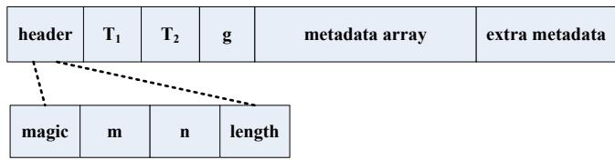
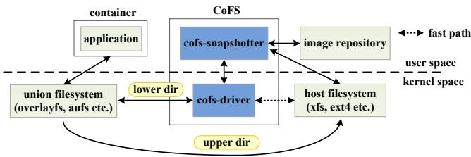
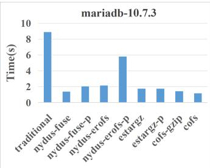
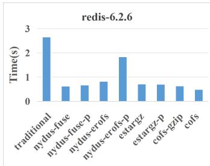
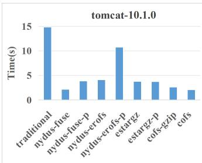
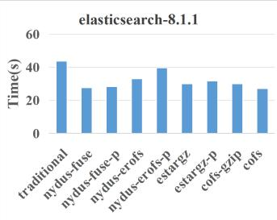
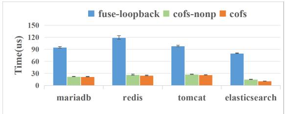
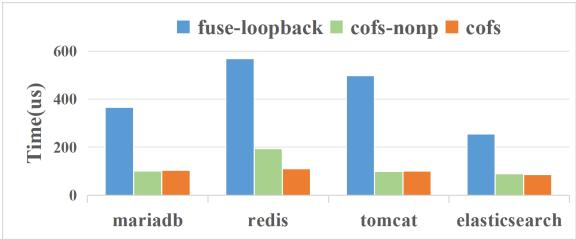
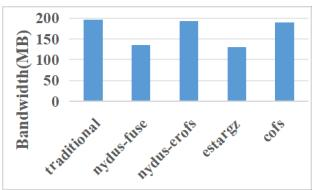
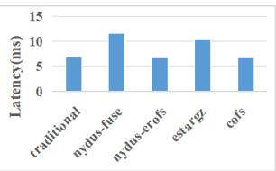

USENIX

THE ADVANCED COMPUTING SYSTEMS ASSOCIATION

## CoFS: A Filesystem for Fast Container Startup

Li Wang, Jinxu Du, Yang Yang, Qingbo Wu, Tao Liu, and Haoze Wu, KylinSoft

# https://www.usenix.org/conference/fast26/presentation/wang-li

This paper is included in the Proceedings of the 24th USENIX Conference on File and Storage Technologies.

February 24–26, 2026 • Santa Clara, CA, USA

ISBN 978-1-939133-53-3

Open access to the Proceedings of the 24th USENIX Conference on File and Storage Technologies is sponsored by

# CoFS: A Filesystem for Fast Container Startup

Li Wang∗, Jinxiu Du, Yang Yang, Qingbo Wu†, Tao Liu, Haoze Wu

KylinSoft

## Abstract

The running of applications in containers has emerged as a popular trend in the industry. The cold start of a container involves a sequential time-consuming process of image downloading and image unpacking. The high cold-start latency significantly prolongs the startup time of containerized applications and could potentially violate responsiveness SLAs in serverless computing or during service automatic scaling to handle burst requests. To accelerate container startup, state-ofthe-art systems pull the container image on demand. Unfortunately, they suffer from userspace I/O interposition overhead, maintainability, and/or performance fluctuation.

This paper presents CoFS, a novel filesystem based on extended FUSE for fast container startup. The insight is that the container image is built only once with a fixed read-only filesystem tree from the perspective of containers. This motivates CoFS to construct a minimal perfect hash function (MPHF) at image building time and to store metadata of files in a container image in a dense array indexed by their hash value. MPHF is collision-free and space-optimal. Leveraging the excellent properties of MPHF, CoFS accomplishes lookup request through less than one single I/O operation in most cases (unless the filename is excessively long) from kernel space, effectively avoiding the costly userspace lookup process in FUSE. Furthermore, CoFS constructs another MPHF that enables parallel lookup based on full path hashing, so as to further accelerate the path resolution. For data access, CoFS leverages sparse files provided by the in-kernel host filesystem to implement fine-grained data caching, and accesses cached data from kernel space. The evaluation shows that CoFS outperforms state-of-the-art systems that achieve fast container startup, and compared to fuse-loopback, a FUSEbased loopback filesystem, the lookup performance improves by up to 86%.

## 1 Introduction

Running applications in containers managed by container orchestration tools like Kubernetes offers numerous advantages that enhance their scalability, portability and reliability, while also streamlining development and deployment processes. Despite the advantages, the cold start of a container involves several sequential steps of image downloading, image unpacking, container configuring, and container starting. The study [14] shows that pulling image accounts for 76% of container start time, but only 6.4% of that data is read. Depending on image size, pulling can be extremely time consuming. This results in high startup latency, which significantly prolongs the startup time of containerized applications, and could potentially violate responsiveness SLAs in serverless computing or during service automatic scaling to handle burst requests.

In order to reduce the startup latency, Overlaybd [19], Nydus-fuse [1], Nydus-erofs [1] and eStargz [5] are proposed to implement on-demand pulling (also called lazy pulling). On-demand pulling means that a container can run without waiting for the completion of pulling the entire image, and required image data is fetched on demand. The idea of these systems is to introduce a new index-able and seek-able container image format, and rely on a userspace daemon which serves containers’ image read request and interacts with the remote image registry to download data on demand.

Among them, Overlaybd works at the block level, while all other systems operate at the filesystem level. Implementing at the filesystem level enables page cache sharing of container image data across multiple containers [27]. Nydus-fuse and eStargz are implemented based on FUSE, as described in detail later, due to the inherent design of FUSE, they incur high file metadata lookup latency, as well as overhead of context switch and data copy. In contrast, Nydus-erofs modified the code of erofs [12], a read-only filesystem used on resource scarce systems such as smart phones, to interact with fscache [15] to cache downloaded image data for subsequent access. Both erofs and fscache run in the kernel, so it minimizes the userspace I/O interposition. However, for the first time access to any data, the userspace fscache backend needs to download it from remote image, synchronously write it on disk, and notify fscache kernel driver of the data chunk ID. After that, the fscache kernel driver can access the required data. This long call chain from erofs to fscache and then to userspace daemon, along with synchronous and additional I/O operations, makes its performance even lower than Nydus-fuse (§4). Besides, fscache increases the complexity of maintenance, making it difficult to control when the cached data will be evicted, leading to performance fluctuation.

While FUSE facilitates the support of flexible custom image file parsing and downloading from the remote image registry, implementing on-demand image pulling based on FUSE faces the following challenges.

First, prior to reading a file, the Linux kernel performs iterative path traversal to retrieve its metadata (i.e., inode), and the path-name resolution process results in several LOOKUP requests forwarded to the userspace FUSE daemon, which incurs overhead of multiple context switches and request copy.

Second, for the access to downloaded data, FUSE still needs to forward the read request to userspace for processing, which incurs overhead of context switch and data copy.

We tackle these challenges by designing a novel filesystem based on extended FUSE for fast container startup (called CoFS). To accelerate the file lookup operation, the insight is that the container image is built only once with a fixed read-only filesystem tree from the perspective of containers. When building a container image in the form of a compressed file, all files and subdirectories in the container root directory are recursively traversed, with the metadata of each file being extracted and stored separately. We are motivated to introduce a new metadata file layout to carefully arrange the metadata entries, such that they are indexed by hash values which can be computed at lookup time. Specifically, CoFS constructs a minimal perfect hash function (MPHF) at image building time and stores file metadata entries in a dense array indexed by their hash values. Compared to the time spent on extracting, compressing and packing files when building an image, the time taken to construct a MPHF is acceptable. MPHF is collision-free and space-optimal. Leveraging the excellent properties of MPHF, CoFS is able to accomplish lookup request through less than one single I/O operation in most cases (unless the filename is excessively long) from kernel space, effectively avoiding the costly userspace lookup process in FUSE. Furthermore, CoFS constructs another MPHF with the full file path as the key, to implement parallel lookup which further accelerates the path resolution process.

To accelerate data access, CoFS implements fine-grained data caching by maintaining local sparse files which incrementally mirror remote files accessed. This enables CoFS to introduce a fast I/O path that directly requests cached data from kernel space, without context switch and data copy overhead incurred by FUSE. Another advantage is that it achieves a more container-friendly data layout, as the data required during container startup is stored contiguously, thereby potentially accelerating startup in subsequent container runs. Experimental results show that CoFS outperforms state-ofthe-art systems that achieve fast container startup, and compared to fuse-loopback, it achieves up to 86% higher lookup performance.

## 2 Background and Related Work

## 2.1 FUSE

FUSE is a state-of-the-art framework for developing userspace filesystems. FUSE consists of two main components: the FUSE driver within the kernel and the FUSE daemon in userspace. The driver registers a filesystem to interface with the VFS, and simply serves as a communication channel between the VFS and the userspace daemon, by directly forwarding filesystem requests and responses between them. Given the numerous advantages offered by the FUSE framework, such as ease of development and maintenance, over a hundred FUSE filesystems have been developed and deployed both in research settings [6, 24, 26, 28] and in production [25, 29]. On the downside, it introduces frequent context switches and costly data copy between kernel and userspace, and thus inevitably yields poor runtime performance. Several optimizations have been proposed to optimize the performance of FUSE. ExtFUSE [2] enables the userspace filesystem to register simple eBPF [8] code snippets into the kernel to accelerate the FUSE driver. However, ExtFUSE cannot accelerate the costly first-time construction of inodes, because eBPF’s sandboxing constraints restrict direct access to image metadata files and disk I/O operations. XFUSE [16] proposes the use of multiple communication channels to increase parallelism in FUSE. RFUSE [4] employs a per-core ring buffer structure as a communication channel and effectively mitigates the overhead of FUSE. On the one hand, these approaches are orthogonal to CoFS, and can be used to accelerate the slow I/O path of CoFS. On the other hand, the idea that CoFS utilizes MPHF to accelerate metadata lookup in read-only filesystems is independent of FUSE and can also be applied to in-kernel filesystems.

## 2.2 Container Image

The container image [17] is designed to be composed of multiple incremental layers to enable incremental image distribution. The container runtime is responsible for creating and managing the lifecycle of containers and leverages a union filesystem [3, 21] to provide a root filesystem to containers. The union filesystem is a filesystem that transparently combines multiple directories into a merged view. The ’merged view’ refers to the unified virtual filesystem that combines the contents of multiple underlying directories into a single coherent view presented to applications, allowing applications to access files as if they were stored in a single directory. For a union filesystem, the underlying directories are categorized into two types: lower directories and upper directories. The lower directories are read-only layers that contain the base files and directories, to provide the initial set of files and directories that are visible in the merged view. For example, in container scenarios, the lower directories typically contain the layers of a container image, one layer corresponds to one directory, which are read-only and shared among multiple containers. The upper directory is a read-write layer where changes made to the unified virtual filesystem are recorded. It sits on top of the lower directories in the union stack.

The container image layers are traditionally represented by tar.gz files, which are neither index-able nor seek-able. This means that reading any bit of data requires pulling the entire layer file, and to uncompress and decode the entire tar file for the target data. Overlaybd (overlay block device) [19] proposes a block-level layering image format, which creates a virtual block device that presents a combined view of multiple underlying block devices. It introduces a seek-able compression file format called ZFile to support on-demand pulling. Nydus [1] proposes seek-able RAFS image format to implement on-demand pulling, the previous version of Nydus (call it Nydus-fuse) is implemented based on FUSE. To avoid the overhead of FUSE, the latest version of Nydus (call it Nydus-erofs) is implemented based on the in-kernel erofs [12] filesystem and fscache, a in-kernel caching framework for network filesystems. It modifies erofs to interact with fscache for container image access. Stargz format [13], i.e., a seekable tar.gz format is introduced by taking advantage of the fact that multiple gzip streams can be concatenated. Instead of compressing the entire layer as a single large file, Stargz divides the files into smaller chunks. Each chunk is then individually compressed. Based on Stargz, eStargz [5] is proposed with additional features like runtime optimization and content verification. FlacIO [20] proposes an optimization that stacks on the on-demand pulling systems to reduce network overhead.

## 2.3 Minimal Perfect Hash Function

A perfect hash function is a type of hash function that guarantees no collisions for a given set of input keys. This means that each key is mapped to a unique hash value within a specified range. Mathematically, if a function H that maps m keys to n integers, where $n \geq m$ , and for any two keys $k _ { 1 }$ and $k _ { 2 } .$ , it holds that $H ( k _ { 1 } ) \neq H ( k _ { 2 } )$ . Further, a perfect hash function is called minimal when $n = = m$ . In other words, each key is mapped to a unique integer in the range from 0 to $m - 1$ . This makes the minimal perfect hash function particularly space-efficient because they use the minimum number of hash values required to avoid collisions. Czech et al. proposed an optimal algorithm for generating a MPHF with linear time complexity $O ( m )$ [7]. We apply their algorithm to construct a MPHF for a filesystem tree, described in §3.1.

## 3 Design and Implementation

## 3.1 MPHF Construction

The MPHF construction algorithm [7] (hereinafter referred to as the MPHF algorithm) takes a key set M as input, each key is a distinct string. It finds a MPHF on M. The MPHF algorithm outputs two integers and three arrays. Given the output as well as an input string, the MPHF value for the input can be computed using two levels of hash functions. The first one, the input string is mapped to two integers within a specified range using two independent hash functions. Each hash function is implemented by randomly generating an array, performing byte-wise multiplication between the array and the input string, and then taking the result modulo $n .$ The second one, the two output integers are used as indices to query the third array, and the corresponding two elements are summed. The sum modulo m produces a hash value. The third array is constructed by the MPHF algorithm such that the hash value is unique.

Specifically, the output of the algorithm is $\{ m , n , T _ { 1 } , T _ { 2 } , g \}$ where $m = | M | , \mathrm { i . e . }$ , the number of keys; n is an integer greater than m; $T _ { 1 }$ and $T _ { 2 }$ are arrays of random integers modulo $n ,$ with a length of the longest key, i.e., the number of characters in the longest string within M. They are used to implement the first level of hash functions; $g$ is an array of integers ranging from 0 to $m - 1$ , with a length of n. It is used to implement the second level of hash functions. Given the output, the MPHF value for a key $k \in M$ can be calculated by applying Equation 1 and Equation 2. First apply Equation 2 to map $k$ to two uncorrelated integers within $[ 0 , n - 1 ]$ , using $T _ { 1 }$ and $T _ { 2 }$ respectively, where $| k |$ denotes the length of the key k and $k [ j ]$ denotes its $j \mathrm { t h }$ character, treated as a number; $T _ { i } ( j )$ is the jth element in array $T _ { i } .$ This also explains why the length of $T _ { i }$ equals the length of the longest key. Next, as shown in Equation 1, use the two integers $f _ { 1 } ( k )$ and $f _ { 2 } ( k )$ (outputs from Equation 2) as indices to look up array g, respectively. Sum the corresponding elements and compute the result modulo m. The result is the hash value of the MPHF h for k.

$$
h ( k ) = \left( g ( f _ { 1 } ( k ) ) + g ( f _ { 2 } ( k ) ) \right) m o d m , k \in M\tag{1}
$$

$$
f _ { i } ( k ) = ( \sum _ { j = 1 } ^ { | k | } T _ { i } ( j ) * k [ j ] ) m o d n , k \in M , i \in \{ 1 , 2 \}\tag{2}
$$

An MPHF is constructed for a fixed set of keys. For an invalid key, computing the MPHF value will still yield a hash value. By storing keys in the value array as well, and using the hash value as an index to locate the target value in the value array, one can verify the legitimacy of the key by comparing it with the stored key. Because for a valid key, the MPHF guarantees no collisions, therefore there is no need for collision handling.

To construct a MPHF for a filesystem tree, we first assign a unique inode number to each file, then each key corresponds to a file and consists of the parent inode number and the filename. The MPHF algorithm needs the key to be a string. We concatenate the parent inode number and the filename into a string to serve as the algorithm’s input. We generate $T _ { 1 }$ and $T _ { 2 } ,$ , by randomly generating (max\_len + 4) integers modulo $n ,$ respectively, where max\_len is the maximum length of the filename and 4 is the number of bytes for a 32 bits inode number. The maximum length of the filename refers to the longest filename among files in the container image. According to Equation 2, The length of $T _ { 1 }$ and $T _ { 2 }$ needs to be equal to the longest key’s length, and each key’s length is the filename’s length plus 4. The space for storing the output of MPHF algorithm is $O ( m )$ . According to the mathematical proof [7] as well as our evaluation (§4), the MPHF algorithm converges quickly when $n > 2 * m ,$ , for example, when $n = 3 * m$ , the expected number of iterations in the MPHF algorithm for√ large m is about ${ \sqrt { 3 } } .$ . Assume m = 1000000, n = 2500000, that is, there are one million files in the container image, then the space required to store the output of MPHF algorithm is about 9.5MB. For details on the MPHF algorithm, refer to the Appendix.

## 3.2 Image Format

CoFS introduces its image format based on eStargz (§2.2) format. eStargz contains a dedicated metadata file in JSON format named stargz.index.json, which records metadata of all files in the image. These metadata can be divided into two parts: one part is the metadata required for constructing the inode, and the other part is used to locate the file data within the compressed image file, such as the block number and offset. CoFS removes and reorganizes the first part into another binary file named cofs.inode.array. Its layout is shown in Figure 1, where $\{ m , n , T _ { 1 } , T _ { 2 } , g \}$ correspond to the variables in the output of the MPHF Algorithm. The file starts with a fixed-length header of 12 bytes, where ’magic’ is 2-byte magic number; $ ' _ { m } '$ and $\overrightarrow { \mathbfit { n } } \overrightarrow { \mathbfit { n } }$ are 4-byte integer; ’length’ is 2-byte integer to indicate the number of elements in the array $\because T _ { 1 } \ '$ $\because T _ { 2 } \}$ has the same length as $_ { \ d } T _ { 1 } \dag ,$ ’. Next are three arrays $\mathit { T _ { 1 } } ^ { \ , }$ $\because T _ { 2 } \mathrm { ^ { , } }$ and $\vec { \boldsymbol { \mathbf { \nabla } } } _ { g } ,$ , where each element in these arrays is a 4-byte integer. Next is the metadata array, with each element being a file metadata entry with a length of 120 bytes, including all metadata of the corresponding file recorded in the original eStargz metadata file. For symbolic links and whiteouts, they have corresponding inodes in the container image file, and are handled as regular inodes. For a lookup request, the Linux VFS will handle relative path resolution and symbolic link traversal, and pass the parent inode number and the filename to CoFS to lookup the corresponding inode. In the case of hard links, several files reference the same inode, i.e., multiple keys correspond to the same value. We allocate an element in the metadata array for each hard link, and these elements store identical metadata to meet the condition that a MPHF maps one key (one hard link) to one value (one element of the metadata array). The tail stores additional metadata, such as filenames exceeding 16 bytes in length, extended attributes, if any.

  
Figure 1: The metadata file layout.

## 3.3 CoFS Implementation

CoFS consists of two components, cofs-snapshotter and cofsdriver. cofs-snapshotter is implemented as a containerd snapshotter plugin based on the eStargz snapshotter [5], running in userspace. Containerd [11] is one of the most popular container runtime systems, which executes and manages the lifecycle of container. Containerd introduces a plugin mechanism called snapshotter (the name is not quite relevant to snapshotting operation), with the aim of decoupling the underlying filesystem driver and efficiently handling the storage and retrieval of container image layers as filesystem directories. The snapshotter is responsible for downloading the image and preparing local directories, i.e., lower directories and upper directory for the union filesystem (§2.2), serving as containers’ root directory. cofs-snapshotter is an implementation of containerd snapshotter; cofs-driver is implemented based on FUSE driver, running in kernel space.

The I/O path for applications within containers is shown in Figure 2. Lookup/read requests go from applications to union filesystem, such as overlayfs. If overlayfs finds that the requested file metadata/data is located in the lower directory, they go to cofs-driver. For lookup requests, cofs-driver responds directly. For read requests, cofs-driver acts as a gateway, if requested data has already been downloaded before, as a fast path, it directs the requests to local in-kernel filesystem. Otherwise, like a standard FUSE, cofs-driver directs the requests to cofs-snapshotter. cofs-snapshotter downloads requested data from remote image file, unpacks and returns it to cofs-driver. The detailed description is provided below.

cofs-snapshotter. The function of cofs-snapshotter consists of two parts. The first part is invoked prior to container creation. The process is as follows.

(1) Start an asynchronous task to pull the metadata file cofs.inode.array, skipping other files in the image. Then open it and notify the file descriptor to cofs-driver using ioctl;

(2) For each layer of the image, two directories are created. One serves as the mirror directory to cache downloaded data, and the other is mounted as a FUSE filesystem, with the path of the mirror directory as a mount option to notify the cofs-driver. These FUSE directories are then passed to the union filesystem to provide a merged view, to serve as the container’s root directory.

  
Figure 2: The I/O path of CoFS.

The other part is invoked during container I/O. It serves as the FUSE daemon in userspace. Upon receiving a read request, it fetches data from the corresponding remote file, and returns it to cofs-driver. Next it checks the mirror directory if its mirror file exists. If not, it creates an empty file, using the inode number of the corresponding remote file as the filename, with the same nominal size. It then asynchronously writes fetched data to the same range of the mirror file.

cofs-driver. cofs-driver is implemented based on FUSE driver with the following extensions. A ioctl interface is introduced to allow applications to notify the metadata file. In the implementation of ioctl, cofs-driver reads the metadata file, verifies the magic number, reads {m, n, T1, T2, g} and buffers them in memory.

Lookup Process. For a lookup request with parent inode and filename as input, cofs-driver calculates the MPHF value using {m, n, T1, T2, g}, uses it as the index to locate the corresponding element in the matadata array, reads the element from the metadata file and compares the parent inode ID and the filename length. If either does not match, the target file does not exist. Next, check if the filename length exceeds 16 bytes. If not, compare directly with the element’s filename field. If not match, the target file does not exist. Because for a valid key, the MPHF guarantees no collisions, therefore there is no need for collision handling. If both parent inode number and the filename match, the in-memory inode is constructed according to the information in the element. This process requires at most one I/O operation. If the corresponding disk block is already in the page cache, no I/O is needed. In contrast, for traditional local filesystems like ext4, the I/O count for inode lookup without caching typically depends on both directory size and directory depth. If filename length exceeds 16 bytes, the filename field in the corresponding element of the metadata array records the offset of the filename in the metadata file. Based on which, the filename is read from the tail of the metadata file, i.e., the "extra metadata" area in Figure 1, for comparison.

Data Access. The process of read request is shown in Algorithm 1. In Line 2, cofs-driver retrieves the pointer mirror recorded in the inode. If it is NULL, cofs-driver checks if the mirror file exists in Line 4. If it exists, cofs-driver opens the mirror file, sets mirror to point to the mirror file’s inode structure in memory and records mirror’s value into the inmemory inode structure of the original file to be read in Lines 5–8. Next cofs-driver checks if the mirror file is a sparse file. If it is, the invocation of vfs\_lseek in Line 13 returns the offset to the next hole in the file greater than or equal to offset. Then cofs-driver verifies whether the mirror file has been fully downloaded. If so, a flag is set on the mirror inode to avoid further checks in Lines 14 – 17. If the mirror file is not a sparse file, or the data in the range [offset, offset+length) is present, cofs-driver directly accesses the in-kernel filesystem to retrieve data in Lines 19 – 21. Otherwise, it forwards the request to cofs-snapshotter as original FUSE does.

Algorithm 1 The read procedure of cofs-driver.   
1: procedure COFS\_READ(inode \*inode, uint64 offset, uint64   
length, char \*buffer)   
2: mirror ← get\_mirror(inode)   
3: if mirror == NULL then   
4: Check if the mirror file exists   
5: if it exists then   
6: open the file and construct the in-memory inode   
structure, and set mirror to reference that inode   
7: set\_mirror(inode, mirror)   
8: end if   
9: end if   
10: if mirror then   
11: flag ← get\_flag(mirror)   
12: if flag == PARTIAL then   
13: next ← vfs\_lseek(mirror, offset, SEEK\_HOLE)   
14: if next == FILE\_SIZE && vfs\_lseek(mirror, 0,   
SEEK\_HOLE) == FILE\_SIZE then   
15: set\_flag(mirror, FULL)   
16: flag ← FULL   
17: end if   
18: end if   
19: if flag == FULL || next - offset ≥ length then   
20: return vfs\_read(mirror, offset, length, buffer)   
21: end if   
22: end if   
23: Send the request to cofs-snapshotter   
24: end procedure

For the algorithm to work, the write and lseek operations must be mutually exclusive, because cofs-snapshotter and cofs-driver may simultaneously write to and read from the same mirror file. Mainstream filesystems (such as xfs, ext4 and btrfs) all ensure this. Take ext4 as an example, prior to writing, the Linux VFS will lock the corresponding file inode for exclusive access until the data has been written into page cache. The implementation of lseek in ext4 will acquire the same inode lock. If lseek indicates that a data range is present, the following read operation will guarantee to access correct data from the page cache.

  
(a) The mariadb container.

  
(b) The redis container.

  
(c) The tomcat container.

  
(d) The elasticsearch container.  
Figure 3: The cold startup time of different containers.

## 3.4 Path Resolution Acceleration

The Linux VFS performs path resolution through iterative inode lookup for each path component sequentially. The MPHF algorithm exhibits an attractive property that it allows arbitrary specification of desired hash values, followed by construction of a hash function based on these values. This enables the construction of two MPHFs which map files to the same hash values, using different keys. One key is the parent inode number and filename as previously described, and the other key is the full path of a file. We implement a kprobe program [18] to be attached to do\_filp\_open function in the Linux kernel to intercept file-open operations. It retrieves the file path from the function argument. If the path is a relative path, it appends the process’s current working directory to construct an absolute path. If the path refers to a CoFS filesystem and the depth exceeds three levels, it passes this path to a Linux workqueue kernel thread. The kernel thread traverses the file path from the last layer in reverse order. For each layer, it calculates the MPHF hash value based on the absolute path, and reads data from the CoFS metadata file to construct the inode if it is not already in memory. Otherwise, stop. Because the Linux kernel performs inode lookups in a top-down order. In contrast, our inode lookup adopts a bottom-up order. Therefore, if an inode is in memory, it guarantees that all of its ancestor inodes must also be in memory. This process runs concurrently with do\_filp\_open operations, accelerating the path resolution.

## 4 Evaluation

We have implemented cofs-driver on Linux kernel 6.9.1, and cofs-snapshotter on stargz-snapshotter 0.15.1. We conduct all the experiments on a machine with dual 10-core Xeon E5-2640 V4 2.40GHz CPUs, 128GB RAM, one dual port 1GbE NIC, and one 4TB HDD. The image repository is running on another machine connected by gigabit network. This configuration simulates the limited download bandwidth of a remote shared image repository.

We compare the following systems, CoFS, CoFS-gzip, traditional, Nydus-fuse, Nydus-erofs and eStargz. CoFS employs the lz4 compression algorithm, which is faster than gzip and is the one used by Nydus. CoFS-gzip uses the gzip compression algorithm, which is the one adopted by eStargz. The versions of Nydus and eStargz used for our evaluation are 2.2.5 and 0.15.1, respectively. Both Nydus and eStargz implement a simple prefetching strategy by downloading remote image file in the background. The configuration of system sys with background download turned on is denoted sys-p. We measure cold startup time of containers using bucketbench [10]. The test is conducted ten times, with the cache cleared between each run. The original bucketbench immediately stops the container after starting it, we modify its code to wait for the container to output user-defined container-specific characters (ready message, to indicate the service is ready). The images in traditional format are downloaded from the image repository of eStargz [9]. We use "nerdctl image convert –nydus/estargz" command to convert images in traditional format to Nydus and eStargz formats, respectively. The images used in the evaluation are listed in Table 1, which are commonly used services for online businesses. Columns 2 and 3 list the image size in eStargz format and CoFS format (gzip compression), respectively; Columns 4 and 5 list the time taken to build eStargz and CoFS image (gzip compression) from the one in traditional format, respectively. According to the results, the increases in both image size and build time are negligible.

<table><tr><td rowspan=1 colspan=1>Image</td><td rowspan=1 colspan=1>Size.es</td><td rowspan=1 colspan=1>Size.co</td><td rowspan=1 colspan=1>Build.es</td><td rowspan=1 colspan=1>Build.co</td></tr><tr><td rowspan=1 colspan=1>mariadb-10.7.3</td><td rowspan=1 colspan=1>126.2MB</td><td rowspan=1 colspan=1>128.4MB</td><td rowspan=1 colspan=1>23s</td><td rowspan=1 colspan=1>25.36 s</td></tr><tr><td rowspan=1 colspan=1>redis-6.2.6</td><td rowspan=1 colspan=1>41.5MB</td><td rowspan=1 colspan=1>41.6MB</td><td rowspan=1 colspan=1>6.75 s</td><td rowspan=1 colspan=1>7.64 s</td></tr><tr><td rowspan=1 colspan=1>tomcat-10.1.0</td><td rowspan=1 colspan=1>330.6MB</td><td rowspan=1 colspan=1>330.9MB</td><td rowspan=1 colspan=1>22.92 s</td><td rowspan=1 colspan=1>26.14 s</td></tr><tr><td rowspan=1 colspan=1>elasticsearch-8.1.1</td><td rowspan=1 colspan=1>535.4MB</td><td rowspan=1 colspan=1>535.5MB</td><td rowspan=1 colspan=1>51.34 s</td><td rowspan=1 colspan=1>54.469 s</td></tr></table>

Table 1: The size and the building time of container images.

Figure 3 shows startup time of aforementioned containers. CoFS outperforms all other systems on all containers. The results also demonstrate that background download degrades performance in most cases, because the size of the entire image file is much larger than the size of the data accessed during container startup. The ineffective background download competes for local network bandwidth and I/O resources.

  
Figure 4: The average lookup time of CoFS over fuseloopback.

  
Figure 5: The p99 lookup time of CoFS over fuse-loopback.

To measure the lookup performance, we use System-Tap [23] to capture the execution time of the fuse\_lookup function during container startup. To evaluate FUSE, we extract container image into a local directory, and use a simple loopback FUSE filesystem fuse-loopback [22] to mount it as a FUSE directory, which is specified as the image storage directory to create container. The test is conducted ten times, with the page cache cleared between each run. The average lookup time and the p99 lookup time are shown in Figure 4 and Figure 5, respectively, where cofs-nonp represents the experimental results with parallel lookup turned off, namely, the performance improvement of cofs relative to cofs-nonp reflects the effectiveness of parallel lookup. The error bars in the Figure 4 represent standard error values. As the results show, CoFS outperforms fuse-loopback by 73% to 86% for the average lookup time. For elasticsearch containers, parallel lookup achieves an 28% performance improvement in average lookup time compared to non-parallel lookup.

<table><tr><td>Nodes</td><td>Time.max (s)</td><td>Time.avg (s)</td><td>c.max</td><td>c.avg</td></tr><tr><td>1000</td><td>0.029</td><td>0.016</td><td>2.6</td><td>2.26</td></tr><tr><td>10000</td><td>0.334</td><td>0.141</td><td>2.8</td><td>2.33</td></tr><tr><td>100000</td><td>4.772</td><td>1.899</td><td>3</td><td>2.46</td></tr><tr><td>1000000</td><td>63.24</td><td>34.042</td><td>3.2</td><td>2.46</td></tr></table>

Table 2: The computation time for random graphs.

To measure the computation time of MPHF Algorithm, we randomly generate graphs of different sizes, with ten graphs for each size. The results are shown in Table 2. In columns labeled c.max and c.avg, c equals n/m, where n and m are variables from the output of MPHF algorithm (§3.1). c.max and c.avg represents the maximum value and the average value of c, respectively. As the results show, for a graph with one million nodes, the average computation time is 34 seconds. Given that the building time for the image of this scale requires at least several minutes, the computation time is negligible.

  
(a) The bandwidth.

  
(b) The average latency.  
Figure 6: The performance of accessing a cached file. The bandwidth is measured under sequential read with a block size of 512KB, I/O depth of 8; The average latency is measured under random read with a block size of 4KB, I/O depth of 1.

To evaluate the read performance of cached data, we generate a 100GB file with random data in a Ubuntu-22.04 image and upload it to repository. Based on which start a container, read the generated file once inside the container, to make sure it downloaded. Next clear host’s page cache. Then run fio on this file inside the container. The results are shown in Figure 6, the traditional system, Nydus-erofs and CoFS have almost identical performance, because they access the downloaded data in kernel space. Specifically, the traditional system accesses downloaded data via the host filesystem, while Nydus-erofs via erofs together with fscache, and CoFS via cofs-driver. All these components operate within the kernel. In comparison, Nydus-fuse and eStargz rely on FUSE daemon in userspace to access downloaded data, as a result, the performance of Nydus-fuse and eStargz is lower because of the overhead of FUSE.

## 5 Conclusion

This paper presents CoFS, a novel filesystem based on extended FUSE for fast container startup. CoFS leverages MPHF to improve lookup performance of FUSE-based filesystems, and directly requests the host filesystem for downloaded data in kernel space. The experimental results show that CoFS outperforms state-of-the-art systems that achieve fast container startup, and compared to fuse-loopback, a FUSE-based loopback filesystem, it effectively optimizes the lookup performance.

## Acknowledgments

We would like to thank our shepherd, Peter Desnoyers, and the anonymous reviewers for their insightful comments.

## References

[1] Alibaba. Nydus. https://github.com/ dragonflyoss/nydus.

[2] Ashish Bijlani and Umakishore Ramachandran. Extension framework for file systems in user space. In Proceedings of the 2019 USENIX Conference on Usenix Annual Technical Conference, USENIX ATC ’19, page 121–134, 2019.

[3] Neil Brown. overlayfs. https://www.kernel.org/ doc/html/latest/filesystems/overlayfs.html.

[4] Kyu-Jin Cho, Jaewon Choi, Hyungjoon Kwon, and Jin-Soo Kim. Rfuse: modernizing userspace filesystem framework through scalable kernel-userspace communication. In Proceedings of the 22nd USENIX Conference on File and Storage Technologies, FAST ’24, 2024.

[5] Containerd. Stargz snapshotter. https://github. com/containerd/stargz-snapshotter.

[6] Brian Cornell, Peter A. Dinda, and Fabián E. Bustamante. Wayback: a user-level versioning file system for linux. In Proceedings of the Annual Conference on USENIX Annual Technical Conference, ATEC ’04, page 27, 2004.

[7] Zbigniew J. Czech, George Havas, and Bohdan S. Majewski. An optimal algorithm for generating minimal perfect hash functions. Information Processing Letters, 43(5):257–264, 1992.

[8] eBPF project. Extended berkley packet filter. https: //ebpf.io/.

[9] Estargz. Images. https://github.com/ containerd/stargz-snapshotter/blob/main/ docs/pre-converted-images.md.

[10] Phil Estes. bucketbench. https://github.com/ estesp/bucketbench.

[11] Phil Estes. containerd. https://github.com/ containerd/containerd.

[12] Xiang Gao, Mingkai Dong, Xie Miao, Wei Du, Chao Yu, and Haibo Chen. Erofs: a compression-friendly readonly file system for resource-scarce devices. In Proceedings of the 2019 USENIX Conference on Usenix Annual Technical Conference, USENIX ATC ’19, page 149–162, 2019.

[13] Google. Crfs: Container registry filesystem. https: //github.com/google/crfs.

[14] Tyler Harter, Brandon Salmon, Rose Liu, Andrea C. Arpaci-Dusseau, and Remzi H. Arpaci-Dusseau. Slacker: fast distribution with lazy docker containers. In Proceedings of the 14th Usenix Conference on File and Storage Technologies, FAST’16, page 181–195, 2016.

[15] David Howells. Fs-cache: A network filesystem caching facility. In Proceedings of the 2006 Ottawa Linux Symposium, 2006.

[16] Qianbo Huai, Windsor Hsu, Jiwei Lu, Hao Liang, Haobo Xu, and Wei Chen. Xfuse: An infrastructure for running filesystem services in user space. In 2021 USENIX Annual Technical Conference (USENIX ATC 21), pages 863–875, 2021.

[17] Open Container Initiative. Image format specification. https://github.com/opencontainers/ image-spec/blob/main/spec.md.

[18] The Linux kernel documentation. kprobes. https://www.kernel.org/doc/html/latest/ trace/kprobes.html.

[19] Huiba Li, Yifan Yuan, Rui Du, Kai Ma, Lanzheng Liu, and Windsor Hsu. Dadi: block-level image service for agile and elastic application deployment. In Proceedings of the 2020 USENIX Conference on Usenix Annual Technical Conference, USENIX ATC’20, 2020.

[20] Yubo Liu, Hongbo Li, Mingrui Liu, Rui Jing, Jian Guo, Bo Zhang, Hanjun Guo, Yuxin Ren, and Ning Jia. Flacio: flat and collective i/o for container image service. In Proceedings of the 23rd USENIX Conference on File and Storage Technologies, FAST ’25, USA, 2025.

[21] Junjiro R. Okajima. aufs. https://github.com/ sfjro/aufs-linux.

[22] Go-FUSE Project. fuse-loopback. https://github.com/hanwen/go-fuse.

[23] SystemTap Project. Systemtap. https://sourceware. org/systemtap.

[24] Kai Ren and Garth Gibson. Tablefs: enhancing metadata efficiency in the local file system. In Proceedings of the 2013 USENIX Conference on Annual Technical Conference, USENIX ATC’13, page 145–156, 2013.

[25] Manikandan Selvaganesan and Mohamed Ashiq Liazudeen. An insight about glusterfs and its enforcement techniques. In 2016 International Conference on Cloud Computing Research and Innovations (ICCCRI), pages 120–127, 2016.

[26] Helgi Sigurbjarnarson, Petur O. Ragnarsson, Juncheng Yang, Ymir Vigfusson, and Mahesh Balakrishnan. Enabling space elasticity in storage systems. In Proceedings of the 9th ACM International on Systems and Storage Conference, SYSTOR ’16, 2016.

[27] Mike Snitzer. Re: dm overlaybd: targets mapping overlaybd image. https://lore.kernel.org/ lkml/CAL7ro1FPEqXyOuX\_WPMYdsT6rW-bD5EU=v= oWKsd6XscykLF6Q@mail.gmail.com.

[28] Cristian Ungureanu, Benjamin Atkin, Akshat Aranya, Salil Gokhale, Stephen Rago, Grzegorz Całkowski, Cezary Dubnicki, and Aniruddha Bohra. Hydrafs: a high-throughput file system for the hydrastor contentaddressable storage system. In Proceedings of the 8th USENIX Conference on File and Storage Technologies, FAST’10, page 17, 2010.

[29] Sage A. Weil, Scott A. Brandt, Ethan L. Miller, Darrell D. E. Long, and Carlos Maltzahn. Ceph: a scalable, highperformance distributed file system. In Proceedings of the 7th Symposium on Operating Systems Design and Implementation, OSDI ’06, page 307–320, 2006.

## Appendix

In this section, first, we briefly introduce the idea of the MPHF algorithm. Then, we describe the detailed algorithm to construct a MPHF for a file system tree.

Construct a graph $\mathcal { G } = ( V , E )$ , where $V = \{ 0 , 1 , . . . , n - 1 \}$ and $E = \{ ( f _ { 1 } ( k ) , f _ { 2 } ( k ) ) : k \in M \}$ . In other words, each key corresponds uniquely to one edge in the graph. Associate with each edge a unique number $h ( e ) \in [ 0 , m - 1 ]$ , i.e., the desired hash value. The problem is to look for an assignment of values to vertices, i.e., a function $g : V  [ 0 , m - 1 ]$ such that $\forall e =$ $( u , \nu ) \in E , ( g ( u ) + g ( \nu ) )$ mod $m = h ( e )$ . If $\mathcal { G }$ is acyclic, the function g can be constructed through the following simple algorithm, for each connected component of $\mathcal { G }$ choose an arbitrary vertex v, set $g ( \nu ) = 0$ and traverse the component using a depth-first search, beginning with the vertex v. If vertex w is reached from vertex u through edge $e ,$ set $g ( w )$ such that $( g ( u ) + g ( w ) )$ mod $m = = h ( e )$

The MPHF algorithm shown in Algorithm 2 consists of two steps: mapping and assignment. In the mapping step, construct $\mathcal { G }$ as described above, check if $\mathcal { G }$ is acyclic. If so, proceed to the assignment step; otherwise, increase the value of n and repeat the above process. In the assignment step, g is derived. The function HASH in Line 11 implements the operation defined by Equation 2.

Algorithm 2 Construct a MPHF for a filesystem tree.   
1: procedure CONSTRUCT\_MPHF   
input: a key set M   
output: a MPHF on M   
2: $c \gets 2$   
3: $m \gets | M |$   
4: max\_len ← the maximum length of the filename in M   
5: T1 ← randomly generate (max\_len + 4) integers   
6: T2 ← randomly generate (max\_len + 4) integers   
7: ▷ the mapping step   
8: n ← c ∗ m   
9: Construct a graph $\mathcal { G } = ( V , E )$ , where $V = \{ 0 , 1 , . . . , n - 1 \}$   
and E = 0/   
10: for each key $k \in M$ do   
11: E = E ∪ (HASH(k, T1, n), HASH(k, T2, n))   
12: end for   
13: if G is cyclic then   
14: $c  c + 0 . 2$ goto 8   
15: end if   
16: ▷ the assignment step   
17: Number all edges from 0 to m − 1, and define the function   
$h : E \to [ 0 , m - 1 ]$ returns the edge number   
18: for each connected component of $\mathcal { G }$ do   
19: choose an arbitrary vertex v   
20: $g ( \nu ) \gets 0$   
21: traverse the connected component using a depth-first   
search, beginning with vertex v. If vertex w is reached   
from vertex u through edge e, set g(w) such that   
$( g ( u ) + g ( w ) )$ mod $m = = h ( e )$   
22: end for   
23: Return $\{ m , n , T _ { 1 } , T _ { 2 } , g \}$   
24: end procedure