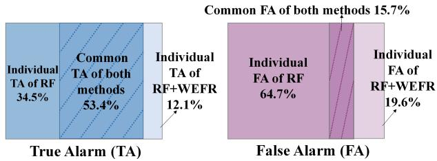
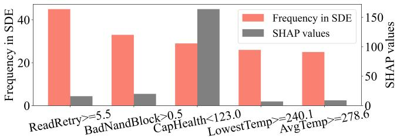
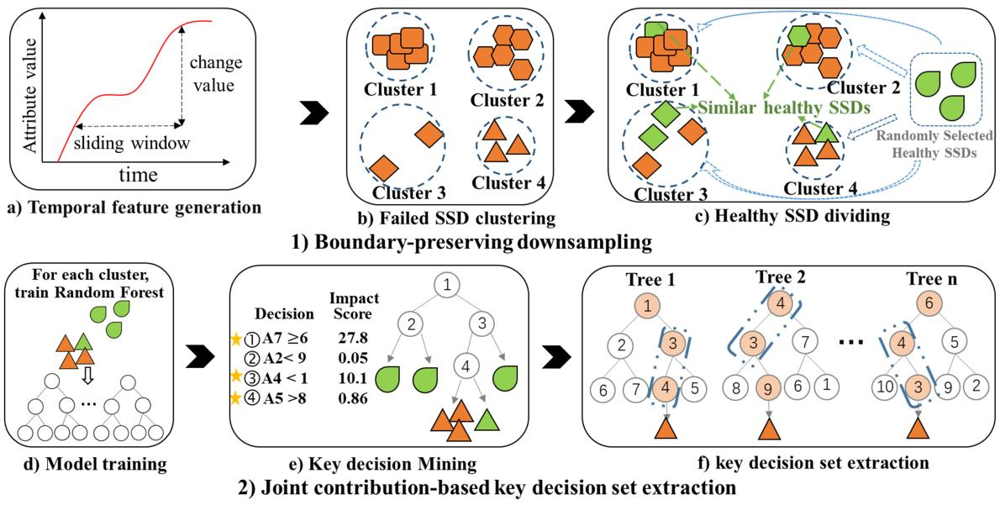
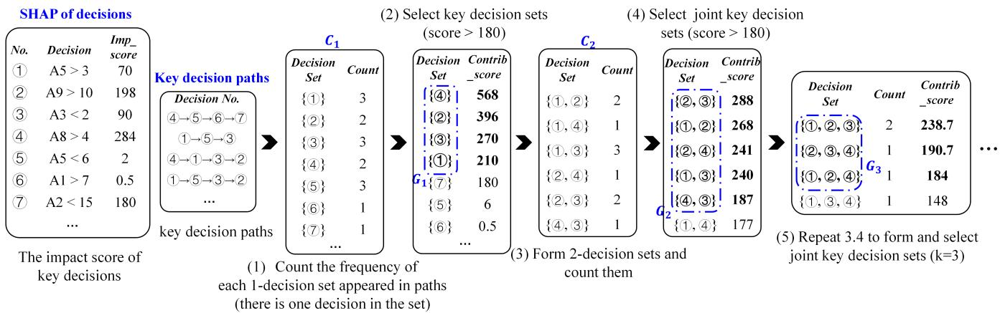
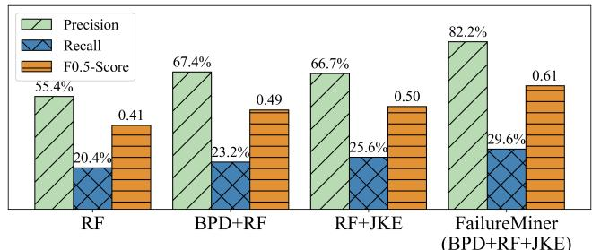
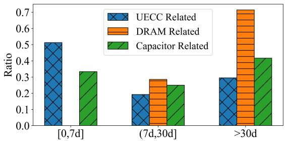
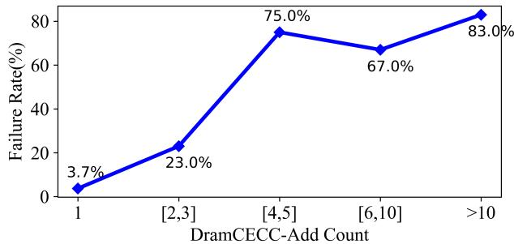
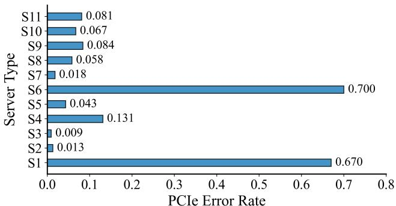
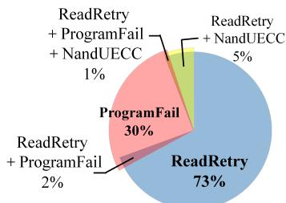

USENIX

THE ADVANCED COMPUTING SYSTEMS ASSOCIATION

## FailureMiner: A Joint Key Decision Mining Scheme for Practical SSD Failure Prediction and Analysis

Shuyang Wang, Yuqi Zhang, and Haonan Luo, Samsung R&D Institute China Xi’an, Samsung Electronics; Kangkang Liu, Tencent; Gil Kim, JongSung Na, Claude Kim, Geunrok Oh, and Kyle Choi, Samsung Electronics; Ni Xue and Xing He, Samsung R&D Institute China Xi’an, Samsung Electronics

## https://www.usenix.org/conference/fast26/presentation/wang-shuyang

This paper is included in the Proceedings of the 24th USENIX Conference on File and Storage Technologies.

February 24–26, 2026 • Santa Clara, CA, USA

ISBN 978-1-939133-53-3

Open access to the Proceedings of the 24th USENIX Conference on File and Storage Technologies is sponsored by

# FailureMiner: A Joint Key Decision Mining Scheme for Practical SSD Failure Prediction and Analysis

Shuyang Wang1, Yuqi Zhang1, Haonan Luo1, Kangkang Liu2, Gil Kim3, JongSung Na3 Claude Kim3, Geunrok Oh3, Kyle Choi3, Ni Xue1, Xing He1 1Samsung R&D Institute China Xi’an, Samsung Electronics 2Tencent 3Samsung Electronics

## Abstract

As SSDs become increasingly popular in enterprise data centers, SSD failures have become a key concern for storage system reliability. In this paper, we propose FailureMiner, a joint key decision mining scheme based on SSD monitoring attributes to accurately and clearly identify SSD failure patterns in production environments. First, to address the imbalance between healthy and failed samples caused by the limited number of failed SSDs, FailureMiner introduces selective downsampling to carefully remove non-critical healthy samples, thereby focusing more on the subtle differences between easily confused failure patterns and health patterns. Second, FailureMiner streamlines the decision-making process of the machine learning model in failure prediction by capturing key decision steps based on their joint contribution. By filtering out redundant and noisy information, FailureMiner can capture joint key decisions, i.e., the simplified attribute combinations and value ranges relevant to failures, thus enabling accurate and interpretable identification of failure patterns.

FailureMiner is evaluated on real-world datasets, and the results show that our scheme improves precision and recall by an average of 38.6% and 80.5% respectively, compared with the existing failure prediction methods. The extracted joint key decisions have been deployed in Tencent’s data centers to predict failures across more than 350,000 SSDs over a year, enhancing SSD reliability. The joint key decisions also reveal the failure patterns and factors affecting SSD health, which further helps operators handle failures and manufacturers improve product reliability.

## 1 Introduction

NAND flash-based solid-state drives (SSDs) have become popular in enterprise storage systems and large data centers due to their high performance and low power consumption [1]. In production environments, the reliability of SSDs is critical to the stability of storage systems, as SSD failures can lead to data loss and even server downtime [2–5]. To reduce the impact of SSD failures, many researchers leverage daily monitoring data combined with machine learning algorithms to predict SSD failures [6–13]. The failure prediction enables timely interventions, such as service migration and SSD replacement, to mitigate the negative impacts of SSD failures.

The previous studies [6, 7, 9, 10, 13] typically adopt three steps to predict failures and analyze failure causes: data preprocessing, model building, and model interpretability-based analysis. In data preprocessing, downsampling is commonly employed [6, 10, 14, 15] to mitigate data imbalance, which arises from the disproportionately small number of failed SSDs compared to healthy ones. For model construction, feature selection is usually performed first to eliminate monitoring attributes unrelated to SSD failures [8, 11, 12, 16–18], thereby minimizing their impact on model training. Then, classification models are widely built to distinguish between failed and healthy SSDs. Based on the interpretability of the model’s decision-making process, the important monitoring attributes associated with failures are revealed for failure analysis and handling [6, 9, 10, 13, 19].

In this paper, we share our experience on developing a highaccuracy, interpretable, and user-friendly failure prediction scheme in production environments. Based on the related work, we attempt various techniques in data preprocessing, model building, and model interpretation. With these earlier efforts, we learn the following three lessons.

First, downsampling the data of healthy SSDs can balance the ratio of failed and healthy samples. However, during downsampling, existing work lacks attention to healthy samples that are similar to failed ones and located near the classification boundary, making them easily misclassified. If these healthy samples are removed, it becomes difficult for the model to learn the subtle distinctions between them and failed samples.

Second, although feature selection is effective in eliminating noisy attributes, it may inadvertently remove useful attributes as well. Some attributes may not be directly associated with failures and are often excluded during feature selection, but they can play an auxiliary role in failure prediction when combined with other attributes. Therefore, a more fine-grained approach is required to suppress the influence of noise while retaining important information.

Third, attribute-based model interpretation is also coarsegrained. More detailed information, such as outlier thresholds and attribute combinations associated with failures, is important for analyzing failure patterns.

Based on these lessons, we propose FailureMiner, a joint key decision mining scheme for practical failure prediction and analysis. First, we propose a boundary-preserving downsampling mechanism to carefully retain healthy samples that are similar to failed ones and close to the classification boundary. This selective downsampling mechanism not only balances the ratio of healthy samples to failed samples, but also enables the model to focus on the subtle differences between these easily confused samples.

Second, to eliminate noise and reveal failure patterns in a more fine-grained manner, we suggest refining the decisionmaking process of the classification model and extracting joint key decisions, each of which consists of multiple threshold judgments on attributes. We propose a joint contributionbased key decision set extraction approach to capture the joint key decisions and discard the redundant and noisy information in the model. The joint key decisions reveal the attribute combinations and outlier thresholds associated with failures, thereby enabling more accurate identification of failure patterns and their root causes.

We evaluate the proposed FailureMiner on a large-scale Telemetry dataset from Tencent and a public dataset from Alibaba. The results show that the joint key decisions extracted by our scheme significantly improve failure prediction accuracy, compared with the existing methods. The extracted joint key decisions offer strong failure identification capability, high interpretability, and ease of use, and they have been deployed in Tencent’s data centers to predict failures online for more than 350,000 SSDs over a year.

We also extract some weak joint key decisions, which may not directly relate to failures but can reflect the decline in SSD health. Based on all these interpretable decisions and the application experience, we conduct a detailed analysis of the failure patterns, root causes, and health-affecting factors to help SSD maintenance and improvement. Our contributions are summarized as follows:

1. We propose FailureMiner, a joint key decision mining scheme designed for failure prediction and analysis in production environments. It addresses the data imbalance problem through boundary-preserving downsampling, and greatly streamlines the model’s decision-making process through joint contribution-based key decision set extraction to reduce noise and capture failure patterns more accurately.

2. We extract joint key decisions with FailureMiner on realworld data to reveal attribute combinations and abnormal values associated with failures. The evaluation results show that these decisions have high failure prediction accuracy. The decisions have been deployed in Tencent’s data centers for real-time SSD failure prediction and analysis, significantly improving SSD reliability in production environments.

Table 1: Introduction to Telemetry attributes.
<table><tr><td>Attribute</td><td>Description</td></tr><tr><td>NandUECC</td><td>Total count of uncorrectable ECC (error correction code) errors in NAND.</td></tr><tr><td>BadNandBlock</td><td>Total count of user NAND blocks that have beenretired.</td></tr><tr><td>DramCECC, DramCECC -Add</td><td>Total count of correctable ECC errors in DRAM and the number of unique ad- dresses where the ECC errors occurred in DRAM.</td></tr><tr><td>CapHealth</td><td>An indicator of capacitor health which represents capacitor&#x27;s energy margin.</td></tr><tr><td>ReadRetry</td><td>Total count of NAND reads that require retrying.</td></tr><tr><td>ReadReclaim</td><td>Total count of blocks that have been re- allocated to maintain data integrity.</td></tr><tr><td>ProgramFail</td><td>Total count of errors that occurred when writing data to NAND.</td></tr><tr><td>BadTLP,Bad- DLLP,PHYEr- ror</td><td>Total count of Peripheral Component Interconnect Express (PCIe) errors in the transaction layer, data link layer, and physical layer.</td></tr><tr><td>ETEDeteError, ETECorrError</td><td>Total count of errors detected/corrected by the end-to-end error correction pro- tection mechanism.</td></tr><tr><td>AvgTemp, LowestTemp</td><td>The average/lowest temperature mea- sured in the device.</td></tr></table>

3. We find NAND-, DRAM-, and capacitor-related failure patterns based on strong joint key decisions. In addition, we extract factors such as PCI error, bad block, and endto-end error that affect SSD health from weak decisions. We analyze them in detail to provide guidance on SSD operation and maintenance in data centers.

## 2 Data description

To enhance SSD monitoring and failure analysis, in addition to the standard Self-Monitoring, Analysis and Reporting Technology (SMART) logs, some manufacturers (e.g., Samsung) provide customized comprehensive Telemetry logs with more attributes to monitor SSDs’ internal mechanisms and components in detail. We collected a large-scale SSD Telemetry dataset from Tencent’s data centers. The Tencent dataset includes over 70 million Telemetry monitoring logs collected from more than 350,000 Samsung PM9A3 SSDs within about two years. Compared with the SMART logs that contain only 24 attributes, the Telemetry logs provide 85 attributes, enabling more fine-grained monitoring of SSDs and enhancing failure prediction and analysis capabilities. Key attributes are listed in Table 1.

The failure lists provided by Tencent contain the information on failed SSDs collected by online maintenance operators, including the serial number of failed SSDs, failure report time, failure description, handling time and measures. The lists contain a total of 788 records collected over a two-year period.

## 3 Background, attempts, and lessons

## 3.1 Design goals

To mitigate data loss and service unavailability caused by SSD failures in enterprise storage systems and large-scale data centers, a high-accuracy, interpretable, and user-friendly scheme is essential for both failure prediction and analysis.

High-accuracy: Although predicting more SSD failures is important, minimizing false alarms is even more critical in practice to reduce the burden on system operators and avoid unnecessary overhead, such as replacing healthy SSDs.

Interpretable: The interpretability of the prediction process not only boosts confidence in predicted results, but also facilitates failure cause analysis and helps operators deal with failures. Furthermore, a deep understanding of SSD health status and failure patterns can provide guidance for future SSD usage and help manufacturers improve product reliability.

User-friendly: The prediction model should be streamlined and efficient, enabling operators to easily and quickly capture SSD failures. Prediction efficiency, deployment costs, and usage overhead are important factors when applying the solution in production environments.

## 3.2 Related work

Existing work [6,7,9,10,13] typically performs failure prediction and root-cause analysis through the following three steps: (1) Data preprocessing. Data filtering, transformation, or other operations are performed to improve the quality and usability of data for failure prediction. (2) Model building. Feature selection is widely adopted to select important attributes for model training, and then the machine learning model is trained to identify failures. (3) Model interpretability-based analysis. Factors associated with failures are analyzed based on the model’s internal decision-making process.

## 3.2.1 Data preprocessing

Due to the low failure rate of SSDs, the ratio of healthy samples to failed samples in the training dataset is extremely imbalanced, which causes prediction models to pay more attention to the patterns of healthy SSDs [20]. Downsampling healthy samples is a common way to balance the data distribution [6, 10, 14, 15]. Besides random downsampling [6, 10, 15], Botezatu et al. [14] employ K-means clustering to group healthy samples into multiple clusters and select those near each cluster center as representatives. In addition, Multi-View and multi-Task Random Forest (MVTRF) [13] and some other studies [21, 22] find that the temporal variations in SSD monitoring attributes are important for failure prediction, so they generate temporal features based on raw attribute data.

## 3.2.2 Model building

To reduce the impact of noisy data irrelevant to failures, many studies [8, 11, 12, 16–18] adopt feature selection to select important monitoring attributes associated with failures for model training. Some work [7, 11] uses Pearson [23] and Spearman [24] correlation coefficients to select important attributes with high correlations to failures. Lu et al. [22] employ the J-index classification (JIC) approach to find attributes most useful in classifying failed and healthy SSDs by traversing attribute thresholds and evaluating the classification results. Wearout-updating Ensemble Feature Ranking (WEFR) [12] combines the rankings of multiple feature selection methods, and obtains a comprehensive ranking to select important attributes.

Existing work usually builds binary classification models to identify failed SSDs, including neural network-based deep learning models, such as Neural Networks [25, 26] and Long Short-Term Memory (LSTM) [22, 27], and traditional machine learning models, such as Random Forest (RF) [6,10,13] and Gradient Boosting Decision Trees (GBDT) [16].

Zhou et al. [27] demonstrate that LSTM performs well in predicting SSD failures, as its memory mechanism can capture temporal anomalies. Lu et al. [22] integrate Convolutional Neural Network (CNN) and LSTM into a unified CNN-LSTM model, leveraging CNN’s feature extraction capability and LSTM’s temporal pattern recognition capability, thereby achieving better failure prediction performance than LSTM alone.

Further studies [6, 10, 13, 15] have revealed that traditional machine learning models, especially RF, can match or even outperform deep learning models in failure prediction. Failed samples are most crucial for training failure prediction models, but they are rare in practice. When training data are limited, traditional machine learning models may perform better than deep learning models [28, 29]. Meanwhile, compared to deep learning models that rely on large-scale matrix operations, RF classification is performed by voting on multiple decision trees, which has lower computational complexity and thus lower training and inference costs, making it popular for failure prediction in production environments [12, 13].

## 3.2.3 Model interpretability-based analysis

The root causes of failed SSDs are usually analyzed based on decision tree-based models (e.g., RF and GBDT) [6, 9, 10, 13, 19]. The decision tree performs classification through a series of decisions (i.e., threshold judgements) and is highly interpretable [30]. Some work [6, 10] identifies failure-related attributes based on their contributions to the purity reduction during tree node splitting. However, this method only provides a global attribute importance based on all samples and fails to reveal attribute importance for a single failed sample, limiting its practicality in failure analysis. Some studies [9,19] adopt the SHapley Additive exPlanations (SHAP) [31] to analyze the attribute importance for a single failed sample. Specifically, the SHAP value of each attribute is estimated by calculating the average change in the model’s output when this attribute is present or absent, reflecting its contribution to the model’s decision. Zhang et al. [13] propose a similar decision extraction (SDE) approach to capture some important decisions that frequently appear across multiple decision trees of RF. These important decisions provide more fine-grained information for failure cause analysis, including important attributes and corresponding outlier thresholds.

## 3.3 Attempts and lessons

Based on the design goals and related work, we present some of our early attempts in this section. Drawing on the lessons from these attempts, we propose the overall idea of our FailureMiner scheme.

Attempt 1: data balancing. We try to randomly downsample the healthy samples or select representative healthy samples through healthy sample clustering (namely representative downsampling), referring to the prior work [6, 14] described in Section 3.2.1.

As shown in Table 2, as the proportion of healthy samples decreases, the trained model tends to identify more failed SSDs (i.e., true alarms), but misclassifies more healthy SSDs as failed ones (i.e., false alarms). Increased false alarms lead to higher operational overhead, which is unacceptable in production environments. This is because downsampling methods lack attention to potentially useful data [32]. These downsampling methods overlook and may discard healthy samples that are similar to failed ones, particularly those near the classification boundary, which are essential for the model to learn the subtle differences between healthy and failed samples [33]. Specifically, removing healthy samples with similar patterns to failed samples in the training set causes the model to treat all such patterns as failure patterns, resulting in more true alarms but also more false alarms in the testing set.

Table 2: The true alarms (TA) and false alarms (FA) of RF with downsampling are x-times higher than those without downsampling.
<table><tr><td>The ratio of healthy to failed samples</td><td colspan="2">Random downsampling</td><td>Representative downsampling</td><td></td></tr><tr><td>after downsampling 100 :1</td><td>TA</td><td>FA</td><td>TA</td><td>FA</td></tr><tr><td>10:1</td><td>2.0x 3.1x</td><td>5.4x 33.5x</td><td>1.8x</td><td>4.2x</td></tr><tr><td>1:1</td><td>4.3x</td><td>210.3x</td><td>3.2x</td><td>25.9x</td></tr><tr><td></td><td></td><td></td><td>4.1x</td><td>203.3x</td></tr></table>

Lessons and ideas based on Attempt 1. Samples near the classification boundary are critical for ensuring the accuracy and robustness of classification models. Therefore, it is essential to retain the healthy samples that exhibit patterns similar to failure patterns in the training set. However, there are various failure patterns, and it is necessary to find healthy samples with similar patterns for each of them. Therefore, we recommend clustering failed samples into multiple clusters to partition the failure patterns, and leveraging the cluster boundary to find nearby healthy samples with similar patterns for each cluster. This maintains a balanced proportion of healthy samples while preserving critical samples during downsampling.

Attempt 2: model building. As described in Section 3.2.2, RF provides high prediction accuracy, efficient execution, and strong interpretability, which are in line with our design goals. Therefore, we choose RF as the base model. In the evaluation (see Section 5.2), we also show that RF outperforms the representative deep learning model. Based on RF, we explore the effects of feature selection. As shown in Figure 1, we compare the performance of RF with and without the advanced WEFR feature selection method. The results show that adding feature selection (i.e., RF + WEFR) significantly reduces false alarms by filtering out noise. Moreover, RF + WEFR also identifies additional failed SSDs (i.e., individual TA) that are not identified by RF, indicating that some hidden failure patterns are revealed after removing the noise. However, the noise removal is not accurate. RF + WEFR fails to identify many failures that RF can identify, implying that relevant useful data are mistakenly discarded. How to reduce noise while preserving useful information remains a challenge.

  
Figure 1: Proportion of true/false alarms from RF or RF+WEFR to the union of true/false alarms from both methods.

Attempt 3: model interpretability-based analysis. Based on RF, we attempt to apply existing root cause analysis methods, such as SHAP [31] and SDE [13] described in Section 3.2.3, but find that they still have certain limitations in practical failure analysis. For a failure identified by the model, SHAP values are calculated to reflect the importance of attributes in failure prediction. However, relying solely on attribute-level SHAP values makes it difficult for operators to analyze failure patterns in detail, such as identifying abnormal value ranges of attributes or identifying which attribute combinations truly reflect failure patterns.

The important decisions extracted by SDE [13] can further reveal the abnormal value range of attributes based on the decision thresholds. Nevertheless, we find that SDE has the following two limitations.

First, SDE considers decisions that frequently appear across multiple trees to be important. However, some of these frequent decisions may not be relevant to failure prediction. As shown in Figure 2, for a predicted failed SSD, we extract the top five important decisions using SDE and calculate SHAP values to quantify the importance of corresponding attributes in failure prediction. The results show that only one attribute (CapHealth) used in these decisions has high SHAP value, indicating that the other four attributes and their associated decisions contribute little to failure prediction. SDE focuses solely on the frequency of decisions without considering their actual impact on failure identification. As a result, it may extract some noisy decisions that are irrelevant to failures.

Second, the important decisions extracted by SDE are independent of each other, but their interrelationships and how they jointly reflect failure patterns remain unexplored. Some failure patterns may be reflected in the abnormal changes of multiple attributes. For example, we observe that the Bad-NandBlock and ReadRetry values of some SSDs rise sharply and almost simultaneously before they fail, which is not common in healthy SSDs. Therefore, capturing the relationships between attributes is important for explaining failure patterns.

  
Figure 2: SHAP values of top five decisions extracted by SDE in identifying a failed SSD.

Lessons and ideas based on Attempts 2 and 3. Feature selection and model interpretation at the attribute level are coarse-grained, making it difficult to effectively remove noise or provide a detailed explanation of the decision-making process. SDE extracts important decisions to locate failure causes in a fine-grained manner, which gives us inspiration. We suggest extracting the key decision combinations (i.e., joint key decisions) from RF’s decision process for both failure prediction and analysis. Extracting joint key decisions has the following three advantages.

First, feature selection aims to select important attributes for failure prediction and eliminate noisy attributes. In contrast, extracting joint key decisions can be viewed as a form of decision-level selection, which is more fine-grained than feature selection. This approach not only removes decisions related to noisy attributes (equivalent to removing these attributes), but also filters out potentially noisy decisions that may exist on important attributes.

Second, unlike feature selection, decision selection avoids the risk of discarding potentially useful attributes before model training. For example, some attributes may not be directly associated with failures but can still play an auxiliary role in failure prediction. Decisions on these auxiliary attributes can still be incorporated into joint key decisions, as their combination with other decisions can more accurately identify failure patterns.

Third, using joint key decisions to identify failures is in line with human thinking. By revealing the attribute combinations and abnormal values associated with failures, operators can easily understand the patterns and causes of failures.

Our joint key decision extraction differs from previous SDE in the following two aspects: First, SDE identifies important decisions based on their frequency, which is not accurate according to our earlier analysis. Therefore, we consider the impact of decisions on failure prediction to identify actual key decisions. Second, we focus on identifying joint key decisions to accurately reflect failure patterns, and thus pay more attention to the joint contribution of multiple decisions rather than individual ones.

## 4 Method

The architecture of our FailureMiner is illustrated in Figure 3. There are two parts, boundary-preserving downsampling and joint contribution-based key decision set extraction. (1) To address data imbalance, we use part of healthy SSDs which are similar to failed SSDs for model training, as described in Section 3. Specifically, we cluster the failed SSDs so that each cluster has a similar data pattern, and then find healthy SSDs exhibiting similar patterns based on the cluster boundaries. (2) To reduce the impact of noise information and refine the determination process at the decision level rather than the feature level, we extract joint key decisions from the trained random forest model, which often appear together in the decisionmaking process and jointly make a major contribution to the final failure identification.

## 4.1 Boundary-preserving downsampling

As shown in Figure 3, boundary-preserving downsampling comprises three steps. (1) Temporal feature generation. We extract change values of attributes as temporal features to reflect data trends, similar to previous work [13]. (2) Failed SSD clustering. In this stage, we first perform additional data processing to help the clustering process focus more on failure-related data, thereby facilitating the division of failure patterns. Then, the processed data of failed SSDs are clustered into N clusters so that failed SSDs with the similar pattern are grouped into the same cluster. (3) Healthy SSD dividing. We add the data of healthy SSDs which are similar to the data of failed SSDs into each cluster. To avoid overfitting caused by insufficient data, we also randomly select some healthy data and put them into each cluster. Next, we will introduce these steps in detail.

  
Figure 3: FailureMiner architecture.

## 4.1.1 Temporal feature generation

As pointed out in previous studies [13, 21], abnormal changes in monitoring attributes may occur before failures occur, and therefore the changing trends of attribute values are helpful for identifying failures. We use a sliding window to calculate the change values of attributes. The change of attribute A within a sliding window size of w days is defined as $D e l t a _ { w } A$ . For time window $t - w$ to $t , D e l t a _ { w } A _ { t } =$ ma $\begin{array} { r } { \mathfrak { c } ( A _ { t - w } , . . . , A _ { t } ) - \operatorname* { m i n } ( A _ { t - w } , . . . , A _ { t } ) . \operatorname* { m a x } \bigl ( A _ { t - w } , . . . , A _ { t } \bigr ) } \end{array}$ and min $\left( A _ { t - w } , . . . , A _ { t } \right)$ denote the maximum and minimum values of attribute A within w days (w is set to 3, 7, and 15, respectively, to generate $D e l t a _ { w } A$ , reflecting the short-term, weekly, and biweekly changes in attribute values). These change values serve as temporal features and are treated the same as the original features (raw Telemetry attributes) in subsequent processes.

## 4.1.2 Failed SSD clustering

We cluster the data of failed SSDs and generate cluster boundaries to find data of healthy SSDs close to each cluster. Since clustering relies heavily on the data distribution, we perform additional data processing for clustering as follows. First, using all attributes including failure-irrelevant attributes for clustering would dilute the focus on failure patterns and may lead to the formation of clusters unrelated to failures. Therefore, following prior work [22], we adopt the JIC approach [34] to select attributes that have strong ability to identify failed SSDs from healthy ones. The JIC approach traverses attribute thresholds and evaluates their classification results to find such attributes with large data distribution differences between failed and healthy SSDs. Second, since the value ranges of different attributes vary widely, we normalize the data of the selected attributes using min-max normalization [35].

The processed data of failed SSDs are partitioned into N clusters using K-means [36] and there are N cluster centers (N defaults to 50, and will be discussed in Section 5.5). Each center is the arithmetic mean of attribute values of all SSDs in the cluster. The data of each failed SSD is closer to its respective cluster center than to other centers. For cluster center n, the data of failed SSDs have varying distances from the cluster center, and we regard the maximum distance as cluster boundary $B _ { n }$

## 4.1.3 Healthy SSD dividing

We divide the data of healthy SSDs (healthy data for short) which are similar to the data of failed SSDs (failed data for short) into each cluster based on cluster boundary $B _ { n } .$ . First, we preprocess the healthy data as we do for the failed data in Section 4.1.2. Next, we calculate the Euclidean distance between healthy data and each cluster center. If the distance between the healthy data and the center of cluster n is less than $B _ { n } ,$ these healthy data fall into cluster n since they are closer to the center than at least one failed data. These healthy and failed data in each cluster are considered to have the similar pattern.

By imposing cluster boundary constraints, only a small amount of healthy data similar to the failed data is added to each cluster. In addition, to mitigate overfitting caused by limited data in clusters, we also randomly select some healthy data and add them to each cluster. The amount of random data added to each cluster is set to the average amount of similar data assigned to each cluster.

Through the above processes, failed and healthy data with similar patterns are clustered together, while the majority of other healthy data are excluded to achieve data balancing. For the subsequent key decision set extraction, we prefer to process each cluster individually, which brings two benefits. First, it reduces interference between different clusters, allowing subsequent operations to focus more on the subtle differences between failed and healthy data within a single cluster. Second, each cluster contains a smaller amount of data, which reduces the complexity of subsequent processing.

## 4.2 Joint contribution-based key decision set extraction

Joint contribution-based key decision set extraction involves three steps, as shown in Figure 3. (1) Model training. For each cluster, we train a Random Forest to classify healthy and failed SSDs. (2) Key decision mining. Key decisions are extracted from the Random Forest based on their importance to failure prediction. (3) Key decision set extraction. We extract key decision sets which often appear together in decision paths and contribute significantly to the decision-making process. Next, we will introduce these steps in detail.

## 4.2.1 Model training

We train the Random Forest model with the data of each cluster to classify healthy and failed SSDs. In boundarypreserving downsampling, we only use the failure-related attributes selected in Section 4.1.2. However, a single attribute may not directly relate to failures, but may be combined with other attributes to reflect failures. To avoid missing any factors related to failures, we use all original Telemetry features and generated temporal features to train the Random Forest in each cluster.

## 4.2.2 Key decision mining

Random Forest typically contains over tens of thousands of decisions, making it difficult to distinguish the key decisions that actually reflect failures. In addition, some decisions are weakly related to failures, which introduce noise and influence the performance of failure prediction. Therefore, we propose the decision-based impact score to extract key decisions from Random Forest. The score is built upon the foundation laid by SHAP method [31] introduced in Section 3.2.3.

The original SHAP value can only reflect the importance of attributes, which is coarse-grained. Therefore, we improve the original method to extract the SHAP value of each decision from decision trees. The decisions with high SHAP values can reveal which abnormal values of attributes are important for identifying failed SSDs from healthy SSDs, and they are considered key decisions.

The specific algorithm is divided into the following steps. First, to reduce computational cost and the noise interference of decisions not related to failure, we focus only on the decision paths that correctly predict failures in each decision tree of the random forest. These paths are defined as key decision paths. Second, based on the structure of tree models, we recursively traverse each decision node in the key decision path of the input sample from the root node to the leaf node. For each decision node, we calculate its impact score (i.e., the SHAP value of the decision) on the model’s output. This involves comparing the model’s output with or without the decision and attributing the difference to the decision. Third, the same decision can appear in different decision paths for different inputs and different decision trees. The final impact score $i m p _ { s c o r e }$ of each decision is the sum of its impact scores on different paths. We consider the decisions with certain contribution $( i m p _ { s c o r e } > 0 . 1 $ by default) as key decisions to find more possible combinations of key decisions.

## 4.2.3 Key decision set extraction

$i m p _ { s c o r e }$ can only measure the importance of a single decision, but some failures may be reflected by a combination of multiple attributes and decisions. Therefore, we propose a joint contribution-based key decision set extraction approach to identify joint key decisions critical for failure prediction. To estimate the joint contribution of a decision set, we consider not only the importance of decisions (measured by $i m p _ { s c o r e } )$ but also how frequently these decisions appear together in the decision paths. We draw inspiration from the Apriori algorithm [37, 38] to identify decision sets that frequently appear together. Apriori is an association rule learning algorithm that expands frequent item sets from small ones to large ones. In our scenario, we combine $i m p _ { s c o r e }$ and co-occurrence frequency of the decisions to iteratively expand frequent decision sets and extract those that are truly meaningful for failure identification.

As shown in Figure 4, the key decision set extraction involves the following steps.

(1) The key decisions extracted in Section 4.2.2 are divided into multiple independent sets. In this paper, a set containing k decisions is called a k-decision set. At this stage, each set contains only one decision and is called a 1-decision set. These multiple 1-decision sets are referred to as candidate group $C _ { 1 }$ , and we count their frequency (i.e., the number of times they appear) in all key decision paths.

(2) The key and frequent 1-decision sets are selected from $C _ { 1 }$ and form a new group $G _ { 1 }$ based on their contribution score $c o n t r i b _ { s c o r e }$ , which is related to $i m p _ { s c o r e }$ of the decision and the frequency counted in Step 1. $c o n t r i b _ { s c o r e }$ is calculated by Equation 1 and will be further explained later. If $c o n t r i b _ { s c o r e }$ of a set in $C _ { 1 }$ exceeds the minimum contribution threshold thr, it will be identified as a key decision set and selected into $G _ { 1 }$ for subsequent screening. By default, thr is set to the 20th percentile of the descending $c o n t r i b _ { s c o r e }$ in $C _ { 1 }$ and used in the subsequent procedures. As illustrated in Figure $4 , C _ { 1 }$ contains 25 sets, and thr is set to 180, which corresponds to the $c o n t r i b _ { s c o r e }$ of the fifth decision in $C _ { 1 }$

(3) We combine key 1-decision sets in $G _ { 1 }$ in pairs to form candidate 2-decision sets (group $C _ { 2 } )$ . For each 2-decision set, we count the number of times these two decisions appear together in all key decision paths.

  
Figure 4: The step of key decision set extraction.

(4) The key group $G _ { 2 }$ is selected from candidate group $C _ { 2 }$ based on $c o n t r i b _ { s c o r e } ,$ similar to Step 2.

(5) We repeat Step 3 and use $G _ { k }$ to form group $C _ { k + 1 }$ . If two k-decision sets in $G _ { k }$ have $k - 1$ common decisions, they can be merged into one k + 1-decision set in $C _ { k + 1 }$ . For example, in Figure 4, {②,③} and {①,②} in $G _ { 2 }$ have a common decision {②}, and thus {②,③ } and {①,②} can be merged into {①,②,③} in $C _ { 3 }$ . We then repeat Step 4 to select key k + 1-decision sets from $C _ { k + 1 }$ to form group $G _ { k + 1 }$ based on $c o n t r i b _ { s c o r e } .$ . The above steps are repeated until no additional decision sets can be identified.

The joint contribution score of a k-decision set $\{ i _ { 1 } , i _ { 2 } , . . . , i _ { k } \}$ is defined by the following Equation.

$$
c o n t r i b _ { s c o r e } = ( \textstyle { \frac { 1 } { k } } \sum _ { i \in \{ i _ { 1 } , i _ { 2 } , \ldots , i _ { k } \} } i m p _ { s c o r e _ { - } i } ) \times c o u n t _ { \{ i _ { 1 } , i _ { 2 } , \ldots , i _ { k } \} }\tag{1}
$$

where $\begin{array} { r } { \frac { 1 } { k } \sum _ { i \in \{ i _ { 1 } , i _ { 2 } , . . . , i _ { k } \} } i m p _ { s c o r e \_ i } } \end{array}$ is the average of impact scores of all decisions in this set, and it represents the importance of this set in failure prediction. $c o u n t _ { \{ i _ { 1 } , i _ { 2 } , . . . , i _ { k } \} }$ is the count of decisions $\{ i _ { 1 } , i _ { 2 } , . . . , i _ { k } \}$ appear together in all key decision paths, and it represents the frequency of occurrence of this decision set. Through this equation, we combine importance and frequency to measure the joint contribution of each decision set. A higher score means that the decision set contributes more to failure identification.

We consider all decision sets in key group $G _ { k } \left( k \geqslant 1 \right)$ as key decision sets. These joint key decisions stand out from a large number of decisions. They refine original complex determination paths, remove redundant decisions and noisy decisions, and reveal which combinations of attributes and abnormal values can identify failures.

## 5 Evaluation

## 5.1 Dataset setup

To verify the effectiveness and failure identification capability of FailureMiner, we evaluate our method on two real-world datasets from Tencent (see Section 2) and Alibaba. The Tencent dataset includes over 70 million Telemetry logs from more than 350,000 SSDs during the two years, and it spans multiple business lines (e.g., cloud and AI), covering various workloads. The MC2 SMART dataset is publicly available from Alibaba [12]. This dataset includes more than 10 million logs collected during the two years from 20,000 SSDs, containing 21 attributes (each with both raw and normalized values). Following the previous work [12, 13, 22, 27], we train and evaluate our method independently on each dataset. Specifically, we divide each dataset into a training set and a test set in chronological order, following prior work [12], as shown in Table 3. The training set is used to train the prediction model, and the test set is used to evaluate the model accuracy. We use about one year of training data and at least ten months of test data to obtain more stable and accurate evaluation results.

Table 3: Time span (month) of training set and test set.
<table><tr><td>Dataset</td><td>Training time</td><td>Test time</td></tr><tr><td>Tencent</td><td>1st - 13th</td><td>14th - 23rd</td></tr><tr><td>Alibaba</td><td>1st - 12th</td><td>13th - 24th</td></tr></table>

Similar to previous work [12], we use precision (P), recall (R) and F0.5-score (F0.5) to evaluate the prediction accuracy. Precision is the proportion of true alarms to all true alarms and false alarms. Recall is the proportion of true alarms to all actual failed SSDs. F0.5-score is the harmonic average of precision and recall, calculated as $\frac { ( 1 + 0 . 5 ^ { 2 } ) \times P \times R } { 0 . 5 ^ { 2 } \times P + R }$ . Precision is weighted higher in the formula to reflect the greater impact of false alarms in the production environments.

The joint key decisions with more true alarms than false alarms (i.e., precision ⩾ 50%) on the training set have strong failure identification capability. We define these decisions as strong decisions, which are directly and strongly related to failures, and they can be used to predict failures in advance. The rest of joint key decisions are not recommended for failure prediction, but we can extract some related factors that have an impact on SSD health from them. The failure rate of SSDs with these factors is significantly higher than that of other healthy SSDs without these factors. We define these decisions

Table 4: The result of extracted joint key decisions on the Tencent dataset. (P: precision; R: recall; F0.5: F0.5-score)
<table><tr><td rowspan="2">Key decision</td><td colspan="3">Test</td></tr><tr><td>P</td><td>R</td><td>F0.5</td></tr><tr><td>(1-1.Delta15NandUECC ≥ 10) or (1-2.Delta15NandUECC ≥1 &amp;1-3.Delta3UserRead &lt;36)</td><td>81.9%</td><td>23.6%</td><td>0.55</td></tr><tr><td>2-1.DramCECC≥13&amp; 2-2.Delta7DramCECC-Add ≥ 2</td><td>72.7%</td><td>3.2%</td><td>0.14</td></tr><tr><td>3-1. CapHealth &lt;68 or (3-2.CapHealth&lt;130 &amp; 3-3.Delta7CapHealth&lt;-15)</td><td>100.0%</td><td>3.2%</td><td>0.14</td></tr><tr><td>FailureMiner (Ours)</td><td>82.2%</td><td>29.6%</td><td>0.61</td></tr><tr><td>RF[6]</td><td>55.4%</td><td>20.4%</td><td>0.41</td></tr><tr><td>CNN-LSTM [22]</td><td>50.0%</td><td>12.8%</td><td>0.32</td></tr><tr><td>WEFR[12]</td><td>67.9%</td><td>15.2%</td><td>0.40</td></tr><tr><td>MVTRF[13]</td><td>68.1%</td><td>19.6%</td><td>0.46</td></tr></table>

as weak decisions, which can provide guidance for SSD usage and maintenance and will be introduced in Section 6.2.

## 5.2 Strong joint key decisions

We extract three strong joint key decisions with the proposed FailureMiner in the Tencent dataset. Table 4 shows the specific details of the extracted decisions and their prediction results, where j-i (e.g., 1-1) represents the i-th single decision of j-th joint key decision.

We compare extracted joint key decisions with RF [6], CNN-LSTM [22], RF with WEFR (WEFR) [12], MVTRF [13], which are introduced in Section 3.2. For RF, we do not apply random downsampling in our evaluation, although it is used in related work [6]. As described in Section 3.3, random downsampling significantly increases the number of false alarms and is not suitable for our practical scenario. For CNN-LSTM, related work [22] uses server-level metrics and disk spatial location metrics, which are not available in our dataset. Therefore, we use the same set of attributes as other schemes for CNN-LSTM. Other experimental settings follow the original settings used in the previous schemes. Next, we evaluate and analyze the proposed scheme from the following three aspects.

Effectiveness. Compared with the random forest models containing a total of 117,404 decisions, we extract only three strong joint key decisions. Failed SSDs identified by the same joint key decision have similar failure patterns, including specific combinations of abnormal attributes and values, which are valuable for failure analysis and handling. Based on these interpretable joint key decisions, we summarize three failure patterns (UECC-related, DRAM-related, and capacitorrelated) and conduct a detailed analysis in Section 6.1.

Failure prediction capability. Table 4 shows the extracted joint key decisions outperform the previous schemes in failure prediction. RF achieves a precision of 55.4% and a recall of

Table 5: The result of extracted joint key decisions on the Alibaba dataset. (P: precision; R: recall; F0.5: F0.5-score)
<table><tr><td rowspan="2">Key decision</td><td colspan="2">Test</td><td rowspan="2">F0.5</td></tr><tr><td>P</td><td>R</td></tr><tr><td>4-1.r198 ≥ 0.5 &amp;  $4 – 2 . \ : \mathrm { r } 1 7 4 < 3 2 . 5$ </td><td>65.2%</td><td>19.1%</td><td>0.44</td></tr><tr><td>5-1.r1 ≥0.5 &amp; 5-2. r187≥ 0.5</td><td>78.6%</td><td>10.9%</td><td>0.35</td></tr><tr><td>FailureMiner (Ours)</td><td>68.4%</td><td>26.4%</td><td>0.52</td></tr><tr><td>RF[6]</td><td>32.7%</td><td>16.2%</td><td>0.27</td></tr><tr><td>CNN-LSTM[22]</td><td>32.3%</td><td>10.2%</td><td>0.23</td></tr><tr><td>WEFR [12]</td><td>56.8%</td><td>17.8%</td><td>0.40</td></tr><tr><td>MVTRF[13]</td><td>59.6%</td><td>21.5%</td><td>0.44</td></tr></table>

20.4%, surpassing CNN-LSTM due to the limited number of failed samples available for training. WEFR removes noise through feature selection, improving precision to 67.9%, but also resulting in a loss of useful data and a decrease in recall. MVTRF generates temporal features to capture abnormal changes in attributes, achieving both good precision and recall with a higher F0.5-score of 0.46.

Compared with previous schemes, the extracted joint key decisions improve precision by 38.6% and recall by 80.5% on average, respectively. Our FailureMiner mainly leverages data from healthy SSDs with similar patterns to those of failed SSDs to focus on subtle differences between them, thereby improving recall without compromising precision. Furthermore, joint key decision extraction streamlines the entire decision-making process, reducing noisy decisions and their impact, leading to more accurate failure identification.

Generalizability. We also extract joint key decisions on the Alibaba SMART dataset to evaluate the generalizability of our scheme. As shown in Table 5, the extracted decisions maintain high precision and recall. This SMART dataset and our Telemetry dataset include different monitoring attributes and are collected from different SSD models and enterprises. FailureMiner performs well on both datasets, which demonstrate its generalizability. FailureMiner has the potential to be promoted to more data centers to improve SSD reliability.

## 5.3 Joint key decisions vs. single decision

To verify that the joint key decisions have stronger failure identification ability than the single decision, we compare the F0.5-score of a joint key decision and the single decision with the same threshold, as shown in Table 6. The joint decision j represents the j-th joint decision set and single j-i represents the i-th single decision of the corresponding j joint decision set. The correspondence between the joint decision j and single decision i is described as j-i (e.g., 1-1) in Tables 4 and 5.

Table 6 shows that the F0.5-score of each joint key decision is larger than that of each single decision. Joint key decisions with auxiliary attributes can significantly reduce the number of false alarms and improve the F0.5-score. Furthermore, they are valuable for discovering failure patterns that traditional analysis methods may ignore. According to the joint key decisions in Table 4, we find that the UECC-related and CapHealth-related failure patterns actually have two subpatterns (described in detail in Section 6.1), which is difficult to discover through single-attribute based analysis.

Table 6: F0.5-score of joint key decisions vs. single decisions.
<table><tr><td>Joint decision j</td><td> joint</td><td>single j-1.</td><td>single j-2.</td><td>single j-3.</td></tr><tr><td>Joint 1</td><td>0.55</td><td>0.44</td><td>0.32</td><td>0.001</td></tr><tr><td>Joint 2</td><td>0.14</td><td>0.06</td><td>0.09</td><td>-</td></tr><tr><td>Joint 3</td><td>0.14</td><td>0.12</td><td>0.12</td><td>0.07</td></tr><tr><td>Joint 4</td><td>0.44</td><td>0.42</td><td>0.03</td><td>=</td></tr><tr><td>Joint 5</td><td>0.35</td><td>0.17</td><td>0.34</td><td>-</td></tr></table>

## 5.4 Ablation study

To verify the effectiveness of boundary-preserving downsampling (BPD) and joint contribution-based key decision set extraction (JKE), we conduct an ablation experiment. We design four methods: RF without BPD and JKE, BPD + RF without JKE, RF + JKE without BPD, and BPD + RF + JKE (FailureMiner). All methods are trained and tested on the same Tencent dataset, and the results are shown in Figure 5.

BPD + RF improves precision and recall by 21.7% and 13.7%, respectively, compared to original RF. Data pattern clustering and selective downsampling can solve the data imbalance problem and allow the model to focus on the subtle differences between failure patterns and health patterns. RF + JKE improves precision and recall by 20.4% and 25.5%, respectively, compared to original RF, since it can reduce the noise impact of failure-irrelevant decisions. Finally, our FailureMiner with both BPD and JKE achieves the highest precision and recall.

  
Figure 5: The result of ablation experiment on the Tencent dataset.

## 5.5 Discussion on hyperparameters and efficiency

The number of clusters, N, can affect the performance and efficiency of FailureMiner. Under different N settings, we measure the training time (including clustering, RF model training, and joint key decision extraction), as well as the prediction accuracy of the extracted joint key decisions.

As shown in Table 7, when N is too small (i.e., N=3), the cluster boundaries of failed samples become overly broad, resulting in a large number of healthy samples being assigned to each cluster. Data imbalance remains in each cluster, causing the model to overlook some failure patterns and reducing recall to 25.2%. Furthermore, the large amount of data increases the overall training time.

Table 7: The impact of N on FailureMiner effectiveness and efficiency.
<table><tr><td>N</td><td>Precision</td><td>Recall</td><td>F0.5-score</td><td>Training time(s)</td></tr><tr><td>3</td><td>81.8%</td><td>25.2%</td><td>0.57</td><td>14237</td></tr><tr><td>10</td><td>81.1%</td><td>29.2%</td><td>0.60</td><td>10024</td></tr><tr><td>30</td><td>81.1%</td><td>29.2%</td><td>0.60</td><td>2321</td></tr><tr><td>50</td><td>82.2%</td><td>29.6%</td><td>0.61</td><td>1673</td></tr><tr><td>100</td><td>81.1%</td><td>29.2%</td><td>0.60</td><td>1385</td></tr><tr><td>200</td><td>79.8%</td><td>28.4%</td><td>0.59</td><td>1530</td></tr></table>

As N increases within the range of 10 to 100, the failure prediction accuracy of the extracted joint key decisions remains stable. This can be attributed to the increasingly narrow clustering boundaries as N increases, which results in fewer healthy SSDs being added to each cluster. Consequently, a more balanced distribution of healthy and failed SSDs is achieved within clusters. When N=50, the ratio of healthy samples (including similar and random samples) to failed samples decreases from hundreds to one to approximately 16 to 1. As N increases from 10 to 100, the overall training time decreases due to fewer samples in each cluster.

When N is very large (e.g., N=200), the clusters become overly fine-grained with insufficient data per cluster. This leads to overfitting in decision extraction and a decrease in recall. Meanwhile, training a random forest model for each of the 200 clusters introduces huge overhead, potentially increasing overall training time.

Compared with previous schemes, FailureMiner’s training time is moderate, as shown in Table 8. In practice, we retrain and evaluate the model every quarter to adapt to possible slight changes in data patterns. Since retraining is infrequent, FailureMiner’s training time is acceptable. After training, FailureMiner produces a streamlined set of joint key decisions that are deployment-friendly and well-suited for online failure prediction. In particular, the prediction time is significantly reduced, enabling timely failure alerts.

Table 8: Total training/prediction time of FailureMiner and other methods on Intel (R) Xeon (R) Platinum 8380 CPU.
<table><tr><td>Method</td><td>Training Time(s)</td><td>prediction time(s)</td></tr><tr><td>FailureMiner (Ours)</td><td>1673</td><td>6</td></tr><tr><td>RF</td><td>673</td><td>167</td></tr><tr><td>CNN-LSTM</td><td>2306 (RTX4090)</td><td>2318</td></tr><tr><td>WEFR</td><td>1091</td><td>156</td></tr><tr><td>MVTRF</td><td>3340</td><td>365</td></tr></table>

## 5.6 Deployment experience discussion

The extracted joint key decisions have been deployed in Tencent’s production environment to enable real-time monitoring of SSDs. Specifically, data are collected from servers over the network and stored in a central database. The central server performs data preprocessing, and predicts failed SSDs in real time based on joint key decisions. Alerts for predicted failed SSDs are logged in a list for operator intervention (typically involving SSD replacement). The extracted strong joint key decisions have been running in Tencent’s data centers for over a year and have successfully predicted the failures of more than one hundred SSDs.

We summarize two key experiences from the development and deployment of FailureMiner. First, false alarms require more attention than true alarms in production environments. In our earlier work, we used the True Alarm Rate (i.e., recall) and the False Alarm Rate, just like in prior work [7,39], to evaluate the performance of our scheme. However, when focusing on True Alarm Rate, we observe that even a 0.1% increase in the False Alarm Rate could result in hundreds of false alarms in the production environment, which imposes substantial operational overhead and is unacceptable in real deployment. Consequently, in subsequent research, we shift our focus to precision in order to assess the trade-off between benefits of true alarms and the overhead induced by false alarms. Second, operators prefer human-interpretable and streamlined SSD failure prediction models. For prediction results of black-box machine learning models, operators often lack the confidence and necessary information to take immediate action, since the predicted SSDs may not yet have caused any negative impact on business operations. Explainable results can provide actionable information to significantly enhance operator confidence. For example, the failure urgency shown in Section 6.1 can guide operators in handling failures. Meanwhile, the streamlined model is easier to deploy and maintain, especially for operators with limited machine learning expertise.

## 6 Failure analysis

## 6.1 Failure patterns

According to the abnormal attributes reflected in the joint key decisions, we divide failed SSDs identified by them into three failure patterns: UECC-related, DRAM-related, and capacitorrelated. Based on practical experience, we conduct a detailed analysis of these three failure patterns.

(a) UECC-related failure pattern. When NandUECC is greater than 0, there have been some uncorrectable errors when reading data from the SSD NAND. The rapid increase and large value of NandUECC (see decision 1-1 in Table 4) means that there are continuous uncorrectable problems inside SSDs in a short period of time, causing severe data corruption and even SSD failure. In another case, a small number of uncorrectable errors may occur on important data, directly affecting the stability of the user system and reducing the read and write performance of the SSD (see decisions 1-2 & 1-3). In contrast, when an SSD occasionally has a small number of uncorrectable errors at non-critical addresses and does not affect the service, the SSD may not be reported as failed and will continue to be used.

  
Figure 6: Time distribution from joint decision warning to failure report.

For the NandUECC-related failed SSDs, the reported failure types are usually related to data unavailability or online service interruption. When an SSD has an uncorrectable error, even if there are fault-tolerant mechanisms such as replication beyond the SSD, the risk of data loss still increases, which may affect the stability of the storage system.

We analyze the time distribution from joint decision warning to failure report during the online evaluation period, as shown in Figure 6. 51% of SSDs alarmed by the NandUECC joint key decision will be reported as failed within one week. These failed SSDs are also processed urgently. 76% of these failed SSDs will be processed by operators within two days after being reported, and the average handling time is only 3.8 days. This information, including failure pattern, root cause, and the urgency corresponding to the joint key decision, has been provided to operators to help them handle the alarm results of the decision. Through hardware analysis of the corresponding replaced SSDs, it is confirmed that most UECC-related failures are caused by random NAND defects.

(b) DRAM-related failure pattern. SSDs use the internal DRAM buffer space to store metadata related to the mapping from logical addresses to physical addresses, which allows the SSD controller to locate data quickly. DramCECC and Delta7DramCECC-Add record the corrected error count in DRAM and the number of distinct addresses where errors occurred within 7 days, respectively. Compared with other SSDs on the same server, the failed SSDs have no significant difference in other attributes such as data read/write, temperature, and wear leveling.

For decisions 2-1 & 2-2 in Table 4, when multiple errors occur, the number of errors may exceed the error correction capacity of ECC, resulting in uncorrectable errors. Since important data are stored on DRAM, the occurrence of uncorrectable errors makes the SSDs susceptible to failures. Through in-depth testing and analysis of physical devices, we found that uncorrectable errors occurred on the specific

  
Figure 7: The failure rate of SSDs increases with DramCECC-Add count.

DRAM chip, and most of them were verified as low-level defects.

In addition, when DRAM errors occur across multiple distinct addresses, the SSD failure rate is significantly increased, as shown in Figure 7. When errors occur at only one address, the failure rate is only 3.7%. When errors occur in more than three different addresses, the failure rate rises to more than 60%. This is because errors at more addresses are more likely to exceed the ECC’s error correction capacity.

DRAM is used to store translation layer mapping tables, and errors here can make the SSD undetectable to the host. The failure types of 83% of the failed SSDs identified by these decisions are SSD loss. The joint key decisions of DRAMrelated failures are based on correctable errors. Uncorrectable errors are triggered only when the accumulation of correctable errors exceeds the correction capacity, which will in turn cause SSD failure. Therefore, these SSDs with DRAM correctable errors may not fail soon. 71% of these SSDs will be reported as failed more than 30 days after they are alarmed by the joint key decision, as shown in Figure 6.

(c) Capacitor-related failure pattern. The CapHealth of a healthy SSD is around 160. When the capacitor fails, the abnormal power-off will cause DRAM data loss, and reduce SSD reliability. When CapHealth is less than 68 (see decision 3-1 in Table 4), there are mainly two trends of CapHealth. The CapHealth of most failed SSDs suddenly drops to zero and others’ CapHealth continues to slowly decrease. If CapHealth continues to slowly decrease, it means the capacitor is aging and its energy storage capacity is declining. Another joint key decision is that CapHealth is less than 130 and reduces more than 15 in a week (see decisions 3-2 & 3-3). Although the CapHealth is large, it tends to drop rapidly. A sudden drop in CapHealth means that the SSD’s capacitor may suddenly fail.

Before a power outage, the capacitor may not be able to supply sufficient power to maintain data writing operations from DRAM to NAND due to the aging and failure, which thus results in the Power Loss Protection (PLP) failure. The capacitor mainly protects data from being lost after a power outage and does not directly affect the normal operation of the SSD. Therefore, this failure pattern is not very urgent and we find that failure reporting time is mainly related to SSD’s workload.

Table 9: The failure rate of SSDs identified by weak decisions is x-times higher than other SSDs.
<table><tr><td>decision</td><td>times</td></tr><tr><td>BadTLP≥4106 &amp; BadDLLP ≥43084</td><td>34x</td></tr><tr><td>PHYError≥ ：65535&amp;  $d e l t a _ { 3 } \mathrm { P h y s i c a l R e a d } < 3 . 9 5 * 1 0 ^ { 1 1 }$ </td><td>9x</td></tr><tr><td>BadNandBlock≥10 &amp;</td><td>60x</td></tr><tr><td>ReadRetry≥50 ETEDeteError≥1</td><td>67x</td></tr></table>

As shown in Figure 6, when CapHealth suddenly drops to zero and the SSD has a lot of read/write operations (perhaps with important tasks), the failure will be reported within one week after being alarmed by the decision. If the workload of SSD is relatively small, the failure is usually reported within one month. When CapHealth continues to slowly decrease, the time between the detection of the corresponding decision and the report of failure will be longer, usually one to two months apart. The analysis of physical devices reveals the failures in capacitor-related hardware such as the PLP integrated circuit.

## 6.2 Factors affecting SSD health

In addition to strong joint key decisions, we find four weak joint key decisions, each with a precision of less than 50%. Although these weak decisions may not be directly related to failures and are not suitable for failure prediction, they can still provide valuable insights into factors that influence SSD health. These four decisions are related to PCIe errors, bad blocks, and end-to-end (ETE) errors, as shown in Table 9. The failure rate of SSDs that are identified by these weak joint key decisions is much higher than that of other healthy SSDs without anomalies. Next, we will analyze which factors would affect the health of SSDs based on these decisions.

(a) PCIe error. BadTLP, BadDLLP and PHYError occur in data transmission on the Peripheral Component Interconnect Express (PCIe), and they represent the count of errors that occur in the transaction layer, data link layer, and physical layer respectively. When the values of these three attributes are larger, there are more invalid or erroneous packets transmitted over PCIe, which reduces the integrity and reliability of the transmitted data. The failure rate of SSDs with BadTLP & BadDLLP anomalies and PHYError & read anomalies is 34x and 9x that of other ordinary SSDs, respectively. In addition, these three PCIe error-related attributes usually increase together, because when errors occur in the upper PCIe layer, there may also exist errors in lower layer.

We calculate the probability of PCIe error occurring for SSDs on different server types, with more than 1,000 SSDs on each type of server. Figure 8 indicates that the PCIe error rate of SSDs has a clear correlation with server type. The PCIe error rate of SSDs on most server types is below or around 0.10, but it is much higher on two server types, S1 and S6, reaching up to 0.67 and 0.7 respectively. We speculate that there may be compatibility issues in these two types of servers.

(b) Bad block and read retry. If errors occur during write or read operations, the block may be judged as bad. Frequent read retries and marked bad blocks indicate that some storage cells are becoming unstable or have already failed, affecting data integrity and reducing SSD reliability [40].

The SSDs with increased BadNandBlock also have some other abnormal attributes, as shown in Figure 9. When issues occur in reading data, the SSD will retry reading and the low data integrity may trigger the bad block management mechanism. 73% of SSDs with increased BadNandBlock have increased ReadRetry, which indicates that most of the bad blocks may be caused by read-related issues. Besides read retry, 5% of SSDs with increased BadNandBlock also have increased NandUECC. NandUECC is more severe than Read-Retry, and SSDs with increased NandUECC usually have increased BadNandBlock. In another case, bad block management is also triggered when issues occur in writing data and programming fails. Almost all SSDs with increased Program-Fail have increased BadNandBlock as well, accounting for 30% of all SSDs with increased BadNandBlock.

It is common for SSDs to have errors when they are frequently read and written. There are reserved blocks and error correction mechanisms inside SSDs to handle this situation. Although the increase of ReadRetry, BadNandBlock, and ProgramFail will not immediately cause SSD failures, they will affect the health of the SSDs. The failure rate of SSDs with anomalies in ReadRetry and BadNandBlock is 60x that of other ordinary SSDs.

(c) End-to-end error. There are end-to-end ECC and Cyclic Redundancy Check mechanisms for DRAM, SRAM, or other storage elements (not including NAND ECC). ET-EDeteError and ETECorrError are the count of errors detected/corrected by this protection mechanism. The failure rate of SSDs with end-to-end detected errors is as high as 20%. DRAM is more likely to have errors than SRAM. Among all the SSDs detected by this decision, 90.3% of the errors occurred on DRAM and 5% on SRAM. The failure rate of

  
Figure 8: PCIe error rates in different types of servers.

  
Figure 9: Distribution of abnormal attributes related to the increase of bad blocks.

SSDs with DRAM errors is 21.5%, because when there are many ECC errors, UECC errors are likely to occur in DRAM and lead to SSD failures (see Section 6.1 for details). In contrast, most of the SSDs with corrected errors in SRAM remain healthy, possibly due to the better stability of SRAM.

## 7 Conclusion

In this paper, we propose a joint key decision mining scheme for practical failure prediction and analysis. We cluster data patterns and mine key decisions to find fine-grained failure factors and the factors affecting SSD health, which can help predict failures, deal with failures, and improve SSD reliability. The evaluations on real-world data show that our method can effectively find joint key decisions for failure prediction and analysis, and achieve better performance than existing schemes. Based on the joint key decisions, we analyze three failure patterns (UECC-related, DRAM-related, and capacitorrelated) and three factors (PCIe error, bad block and read retry, end-to-end error) that affect SSD health for SSD operation and maintenance. Furthermore, the strong joint key decisions have been deployed in Tencent’s data centers to predict SSD failures online for more than 350,000 SSDs over one year to improve SSD reliability.

## References

[1] Yongkun Li, Patrick P.C. Lee, and John C.S. Lui. Analysis of reliability dynamics of ssd raid. IEEE Transactions on Computers, 65(4):1131–1144, 2016.

[2] Bianca Schroeder, Arif Merchant, and Raghav Lagisetty. Reliability of nand-Based SSDs: What Field Studies Tell Us. Proceedings of the IEEE, 105(9):1751–1769, Sep. 2017. https://doi.org/10.1109/JPROC.2017. 2735969.

[3] Ruiming Lu, Erci Xu, Yiming Zhang, Zhaosheng Zhu, Mengtian Wang, Zongpeng Zhu, Guangtao Xue, Minglu Li, and Jiesheng Wu. NVMe SSD Failures in the Field: the Fail-Stop and the Fail-Slow. In 2022 USENIX Annual Technical Conference (USENIX ATC 22), pages

1005–1020, Carlsbad, CA, July 2022. USENIX Association. https://www.usenix.org/conference/ atc22/presentation/lu.

[4] Bryan S Kim, Jongmoo Choi, and Sang Lyul Min. Design Tradeoffs for SSD Reliability. In FAST, pages 281– 294, 2019. https://www.usenix.org/conference/ fast19/presentation/kim-bryan.

[5] Stathis Maneas, Kaveh Mahdaviani, Tim Emami, and Bianca Schroeder. Operational characteristics of SSDs in enterprise storage systems: A Large-Scale field study. In 20th USENIX Conference on File and Storage Technologies (FAST 22), pages 165–180, Santa Clara, CA, February 2022. USENIX Association.

[6] Jacob Alter, Ji Xue, Alma Dimnaku, and Evgenia Smirni. Ssd failures in the field: symptoms, causes, and prediction models. In Proceedings of the International Conference for High Performance Computing, Networking, Storage and Analysis, SC ’19, New York, NY, USA, 2019. Association for Computing Machinery.

[7] Chandranil Chakraborttii and Heiner Litz. Improving the accuracy, adaptability, and interpretability of ssd failure prediction models. In Proceedings of the 11th ACM Symposium on Cloud Computing, SoCC ’20, page 120–133, New York, NY, USA, 2020. Association for Computing Machinery.

[8] Junwei Gu, Yu Wang, Tommy W.S. Chow, Mingquan Zhang, and Wenjian Lu. A locally weighted multidomain collaborative adaptation for failure prediction in ssds. Knowledge-Based Systems, 280:111012, 2023.

[9] Wei Li, Haozhou Zhou, Srinivasan Radhakrishnan, and Sagar Kamarthi. Explainable time series features for hard disk drive failure prediction. Engineering Applications of Artificial Intelligence, 152:110674, 2025.

[10] Riccardo Pinciroli, Lishan Yang, Jacob Alter, and Evgenia Smirni. Lifespan and failures of ssds and hdds: Similarities, differences, and prediction models. IEEE Transactions on Dependable and Secure Computing, 20(1):256–272, 2023.

[11] Ziyao Wang and Jie Xu. SSD Failure Prediction Based on Classification Models and Data Engineering. In 2022 IEEE Intl Conf on Dependable, Autonomic and Secure Computing, Intl Conf on Pervasive Intelligence and Computing, Intl Conf on Cloud and Big Data Computing, Intl Conf on Cyber Science and Technology Congress, pages 1–8, 2022. https://ieeexplore.ieee.org/ document/9927939.

[12] Fan Xu, Shujie Han, Patrick P. C. Lee, Yi Liu, Cheng He, and Jiongzhou Liu. General feature selection for

failure prediction in large-scale ssd deployment. In 2021 51st Annual IEEE/IFIP International Conference on Dependable Systems and Networks (DSN), pages 263–270, 2021.

[13] Yuqi Zhang, Wenwen Hao, Ben Niu, Kangkang Liu, Shuyang Wang, Na Liu, Xing He, Yongwong Gwon, and Chankyu Koh. Multi-view feature-based SSD failure prediction: What, when, and why. In 21st USENIX Conference on File and Storage Technologies (FAST 23), pages 409–424, Santa Clara, CA, February 2023. USENIX Association.

[14] Mirela Madalina Botezatu, Ioana Giurgiu, Jasmina Bogojeska, and Dorothea Wiesmann. Predicting disk replacement towards reliable data centers. In Proceedings of the 22nd ACM SIGKDD International Conference on Knowledge Discovery and Data Mining, KDD ’16, page 39–48, New York, NY, USA, 2016. Association for Computing Machinery.

[15] Farzaneh Mahdisoltani, Ioan Stefanovici, and Bianca Schroeder. Proactive error prediction to improve storage system reliability. In 2017 USENIX Annual Technical Conference (USENIX ATC 17), pages 391–402, Santa Clara, CA, July 2017. USENIX Association.

[16] Peng Li, Wei Dang, Congmin Lyu, Min Xie, Quanyang Bao, Xiaofeng Ji, and Jianhua Zhou. Reliability characterization and failure prediction of 3d tlc ssds in largescale storage systems. IEEE Transactions on Device and Materials Reliability, 21(2):224–235, 2021.

[17] Lei Chen, Zongpeng Zhu, Anyu Li, Najmeh Mashhadi, Robert Frickey, Jinhe Ye, and Xin Guo. Ssd drive failure prediction on alibaba data center using machine learning. In 2022 IEEE International Memory Workshop (IMW), pages 1–4, 2022.

[18] Yong Xu, Kaixin Sui, Randolph Yao, Hongyu Zhang, Qingwei Lin, Yingnong Dang, Peng Li, Keceng Jiang, Wenchi Zhang, Jian-Guang Lou, Murali Chintalapati, and Dongmei Zhang. Improving Service Availability of Cloud Systems by Predicting Disk Error. In 2018 USENIX Annual Technical Conference (USENIX ATC 18), pages 481–494, Boston, MA, July 2018. USENIX Association. https://www.usenix.org/ conference/atc18/presentation/xu-yong.

[19] Sebastien Levy, Randolph Yao, Youjiang Wu, Yingnong Dang, Peng Huang, Zheng Mu, Pu Zhao, Tarun Ramani, Naga Govindaraju, Xukun Li, Qingwei Lin, Gil Lapid Shafriri, and Murali Chintalapati. Predictive and adaptive failure mitigation to avert production cloud VM interruptions. In 14th USENIX Symposium on Operating Systems Design and Implementation (OSDI 20), pages 1155–1170. USENIX Association, November 2020.

[20] Haibo He and Edwardo A. Garcia. Learning from imbalanced data. IEEE Transactions on Knowledge and Data Engineering, 21(9):1263–1284, 2009.

[21] Iyswarya Narayanan, Di Wang, Myeongjae Jeon, Bikash Sharma, Laura Caulfield, Anand Sivasubramaniam, Ben Cutler, Jie Liu, Badriddine Khessib, and Kushagra Vaid. Ssd failures in datacenters: What? when? and why? In Proceedings of the 9th ACM International on Systems and Storage Conference, SYSTOR ’16, New York, NY, USA, 2016. Association for Computing Machinery.

[22] Sidi Lu, Bing Luo, Tirthak Patel, Yongtao Yao, Devesh Tiwari, and Weisong Shi. Making disk failure predictions SMARTer! In 18th USENIX Conference on File and Storage Technologies (FAST 20), pages 151–167, Santa Clara, CA, February 2020. USENIX Association.

[23] Philip Sedgwick. Pearson’s correlation coefficient. Bmj, 345, 2012. https://www.bmj.com/content/ 345/bmj.e4483.pdf+html.

[24] C Spearman. The proof and measurement of association between two things. International Journal of Epidemiology, 39(5):1137–1150, 10 2010.

[25] Junwei Gu, Yu Wang, and Guochao Wang. Multiinstance adversarial learning domain adaptation network for failure prediction of unlabeled solid-state drives. IEEE Transactions on Instrumentation and Measurement, 72:1–11, 2023.

[26] Chandranil Chakraborttii and Jonas Boettner. Leveraging temporality of data to improve failure predictions for solid state drives in data centers. In 2023 IEEE 47th Annual Computers, Software, and Applications Conference (COMPSAC), pages 1272–1278, 2023.

[27] Hao Zhou, Zhiheng Niu, Gang Wang, XiaoGuang Liu, Dongshi Liu, Bingnan Kang, Hu Zheng, and Yong Zhang. A proactive failure tolerant mechanism for ssds storage systems based on unsupervised learning. In 2021 IEEE/ACM 29th International Symposium on Quality of Service (IWQOS), pages 1–10, 2021.

[28] Ayushi Chahal and Preeti Gulia. Machine learning and deep learning. International Journal of Innovative Technology and Exploring Engineering, 8(12):4910–4914, 2019.

[29] Nikolaos G Paterakis, Elena Mocanu, Madeleine Gibescu, Bart Stappers, and Walter van Alst. Deep learning versus traditional machine learning methods for aggregated energy demand prediction. In 2017 IEEE PES Innovative Smart Grid Technologies Conference Europe (ISGT-Europe), pages 1–6. IEEE, 2017.

[30] Riccardo Guidotti, Anna Monreale, Salvatore Ruggieri, Franco Turini, Fosca Giannotti, and Dino Pedreschi. A survey of methods for explaining black box models. ACM computing surveys (CSUR), 51(5):1–42, 2018.

[31] Scott M. Lundberg and Su-In Lee. A unified approach to interpreting model predictions. In Proceedings of the 31st International Conference on Neural Information Processing Systems, NIPS’17, page 4768–4777, Red Hook, NY, USA, 2017. Curran Associates Inc.

[32] Xu-Ying Liu, Jianxin Wu, and Zhi-Hua Zhou. Exploratory undersampling for class-imbalance learning. IEEE Transactions on Systems, Man, and Cybernetics, Part B (Cybernetics), 39(2):539–550, 2008.

[33] Hui Han, Wen-Yuan Wang, and Bing-Huan Mao. Borderline-smote: a new over-sampling method in imbalanced data sets learning. In International conference on intelligent computing, pages 878–887. Springer, 2005.

[34] Viv Bewick, Liz Cheek, and Jonathan Ball. Statistics review 13: receiver operating characteristic curves. Critical care, 8(6):508, 2004.

[35] John Wilder Tukey et al. Exploratory data analysis, volume 2. Springer, 1977.

[36] D Arthur and S Vassilvitskii. k-means ++: The advantages of careful seeding. Proceedings of the Eighteenth Annual ACM-SIAM Symposiumon Discrete algorithms, Society for Industrial and Applied Mathematics, 11(6):1027–1035, 2007.

[37] Rakesh Agrawal and Ramakrishnan Srikant. Fast algorithms for mining association rules in large databases. In Proceedings of the 20th International Conference on Very Large Data Bases, VLDB ’94, page 487–499, San Francisco, CA, USA, 1994. Morgan Kaufmann Publishers Inc.

[38] Rakesh Agrawal, Tomasz Imielinski, and Arun Swami. ´ Mining association rules between sets of items in large databases. SIGMOD Rec., 22(2):207–216, June 1993.

[39] Yunfei Gu, Chentao Wu, and Xubin He. Exploit both SMART attributes and NAND flash wear characteristics to effectively forecast SSD-based storage failures in clusters. In 2024 USENIX Annual Technical Conference (USENIX ATC 24), pages 1101–1117, Santa Clara, CA, July 2024. USENIX Association.

[40] Jisung Park, Myungsuk Kim, Myoungjun Chun, Lois Orosa, Jihong Kim, and Onur Mutlu. Reducing Solid-State Drive Read Latency by Optimizing Read-Retry. In ASPLOS ’21, page 702–716, New York, NY, USA, 2021. Association for Computing Machinery. https: //doi.org/10.1145/3445814.3446719.