USENIX

THE ADVANCED COMPUTING SYSTEMS ASSOCIATION

# Cost-efficient Archive Cloud Storage with Tape: Design and Deployment

Qing Wang, Tsinghua University; Fan Yang, Qiang Liu, and Geng Xiao, Huawei Cloud; Yongpeng Chen and Hao Lan, Tsinghua University; Leiming Chen,   
Bangzhu Chen, Chenrui Liu, Pingchang Bai, Bin Huang, Zigan Luo, Mingyu Xie,   
and Yu Wang, Huawei Cloud; Youyou Lu, Tsinghua University; Huatao Wu, Huawei Cloud; Jiwu Shu, Tsinghua University and Minjiang University

## https://www.usenix.org/conference/fast26/presentation/wang

This paper is included in the Proceedings of the 24th USENIX Conference on File and Storage Technologies.

February 24–26, 2026 • Santa Clara, CA, USA

ISBN 978-1-939133-53-3

Open access to the Proceedings of the 24th USENIX Conference on File and Storage Technologies is sponsored by

# Cost-efficient Archive Cloud Storage with Tape: Design and Deployment

Qing Wang∗1, Fan Yang\*2, Qiang Liu2, Geng Xiao2, Yongpeng Chen1, Hao Lan1, Leiming Chen2, Bangzhu Chen2, Chenrui Liu2, Pingchang Bai2, Bin Huang2, Zigan Luo2, Mingyu Xie2, Yu Wang2, Youyou Lu1, Huatao Wu†2, Jiwu Shu†1,3

1Tsinghua University 2Huawei Cloud 3Minjiang University

## Abstract

TapeOBS is an archive storage service offered by Huawei Cloud, which delivers high cost-efficiency by leveraging tape to store large volumes of archived data. Although tape boasts a low total cost of ownership, its inherent characteristics (e.g., a limited number of drives within a tape library) pose unique challenges when developing a large-scale distributed storage system. To address these challenges, we take a holistic approach in designing TapeOBS. At the high level, we introduce a fully asynchronous tape pool, which supports data scheduling and erasure coding in a batched manner, aligning with the features of tape hardware. Within a tape library, we design a tape-tailored local storage engine and incorporate techniques such as dedicated drives to optimize performance. TapeOBS began its gradual rollout at the end of 2022 and officially started serving customers in 2024. As of this writing, TapeOBS has stored hundreds of petabytes of raw user data.

## 1 Introduction

Humans are producing data at an unprecedented pace, with an estimated 402.74 million terabytes generated daily in 2024 [3]. While much of this data is actively used, a significant portion, such as medical images, backup files, video materials, and logs, is rarely accessed but must still be retained for long periods. This requirement makes archive storage indispensable. Therefore, many cloud service providers, including Huawei Cloud [7], AWS [5], GCP [6], and Alibaba Cloud [4], offer archive storage services, which focus on long-term preservation and cost efficiency, offering a scalable solution for managing massive but rarely accessed data.

In this paper, we present the design and deployment of TapeOBS, a tape-based archive storage service that exposes object interfaces to customers. Before TapeOBS, Huawei Cloud had an HDD-based archive storage service. In pursuit of better cost efficiency, we aim to leverage tape, an old yet evolving storage technology, to provide our customers with a cheaper archive storage service. Compared with HDD, tape has a lower total cost of ownership (e.g., >50% lower price and 2× longer lifetime), less CO2e emissions [30], and a more clear technology roadmap [18].

However, building TapeOBS is not simply replacing HDDs with tapes. Physically, a distributed tape-based storage system is comprised of a set of tape libraries. A tape library typically hosts thousands of tapes and presents unique profiles. First, the tape library decouples tapes (which hold the stored data) and drives (which read and write data on tapes), and it operates with a low drive-to-tape ratio. For example, in TapeOBS, a tape library contains 1000 tapes but only 4 drives, and each drive can deliver 360MB/s. Second, mounting a tape to a drive is time-consuming (taking around 80 seconds in our platform), which involves tasks like rewinding and unloading the previous tape, loading the target tape, and the physical movement of the robotic accessor. If a drive frequently switches between different tapes (a phenomenon we call drive thrashing), we cannot fully exploit its raw performance. Finally, although a tape supports random reads, the tape requires wind/rewind to locate data, inducing considerable seek time. The above understanding of tapes motivates us to take a holistic approach in designing TapeOBS.

At the high level, TapeOBS introduces a fully asynchronous tape pool, which means all reads and writes to tapes are asynchronous (i.e., they do not need to be executed immediately). Specifically, in addition to the tape pool, TapeOBS also maintains a small HDD pool, whose capacity is about 4% of tapes in our production environment. The HDD pool acts as a temporary staging area for data. For user writes, TapeOBS first pushes data into the HDD pool in a highly available manner, and then flushes data to the tape pool asynchronously. By doing so, TapeOBS can handle workload bursts since the HDD pool has a larger aggregated write bandwidth than the tape pool. For user reads, by leveraging the hour-level SLA (service level agreement) of restoring archived objects, after receiving restore requests, TapeOBS asynchronously copies objects from the tape pool to the HDD pool. The objects in the HDD pool can then serve user read requests.

The asynchrony brings a crucial benefit: we can schedule a large amount of data to/from the tape pool in a bulky manner, to align with the features of tape hardware. First, TapeOBS groups objects in the HDD pool based on their lifetime, moving objects with a similar lifetime to the same tape via log-structured writes. This mitigates the garbage collection overhead of the tape pool, since objects on the same tape are likely to be deleted simultaneously. Without the HDD pool as a persistent write buffer, performing lifetime-based data placement on tapes would be difficult. This difficulty arises from the limited number of drives and the time-consuming drive switches, which makes it unfeasible to maintain an immediately writable tape for each lifetime group. To tolerate failures of tapes, TapeOBS adopts batched erasure coding (b-EC), which aggregates multiple objects to form inter-object stripes and dispatches them to different tape libraries. b-EC lowers the probability that an object spans many tape libraries, thus reducing the number of drives needed to restore it. Second, for restore requests, we reorder them to make neighboring requests have the same target tapes. By doing so, tape libraries will receive a stream of requests with physical locality, thus mitigating drive thrashing and reducing seek time.

Within a tape library, TapeOBS designs a tape-tailored local storage engine. By utilizing two NVMe SSDs installed in each tape library, the storage engine eliminates random metadata accesses on tapes. Specifically, we build a simple SSD-based key-value store, which persistently maintains the metadata of PLogs (a basic unit to store objects). In this way, when fetching an object on tapes, we can obtain its physical location without touching the tapes. To tolerate failures of SSDs, we use two techniques: 1) creating a metadata partition on a tape and dumping metadata to it when the tape is full; 2) tagging a DIF (data integrity field) to every 4KB data block in tapes, to make the data self-recoverable.

To optimize the performance of accessing tapes, the local storage engine also includes a tape library scheduler, which conducts flow control and reordering for I/O requests. Beyond the scheduler, TapeOBS adopts a technique called dedicated drives, which statically allocates drives for different tasks, to avoid drive thrashing resulting from task interferences.

TapeOBS began its gradual rollout at the end of 2022 and officially started serving customers in 2024. As of the time of writing, TapeOBS has stored hundreds of petabytes of raw user data. We present workload characteristics and performance of TapeOBS in the production environments. Moreover, we also reveal the failures in tape libraries that TapeOBS experienced.

## 2 Background and Motivation

In this section, we first provide the background of magnetic tape and tape library (§2.1). Then, we introduce archive storage service in the cloud (§2.2). Finally, we analyze why we build a tape-based archive storage service in addition to the existing HDD-based one, from a TCO perspective (§2.3).

## 2.1 Magnetic Tape and Tape Library

Magnetic Tape. Magnetic tape is a type of storage medium that was introduced to computer systems back in the early 1950s [28]. Physically, tape is composed of a flexible plastic strip coated with a layer of magnetic material, which is typically housed in the form of cartridges1. Such a structure determines that tapes are sequentially accessed: tape drives wind and unwind tapes to store and retrieve data (using write/read heads) in a linear order.

Tape technology is still evolving in recent decades. Linear Tape-Open (LTO) [10, 25], which is created collaboratively by HPE, IBM, and Seagate, is a widely-used open tape standard. The latest generation of LTO, i.e., LTO-10, is released in May 2025. An LTO-10 tape can provide 30TB capacity and 400MB/s maximum access speed. IBM 3592 [8] is a series of enterprise-class tape formats and drives developed by IBM. The latest IBM 3592 product, i.e., TS1170, released in 2023, is capable of 50TB capacity and 400MB/s access speed.

These modern tapes incorporate a range of advanced hardware features, including ❶ encryption: using encryption algorithms such as AES to protect data on tape; ❷ compression: leveraging lossless compression algorithms to reduce data size: for example, LTO-10 tapes are advertised as having a 2.5:1 compression ratio (thus, it can store 75TB compressed data), and ❸ partitioning: dividing the tape space into multiple independently writable partitions.

The storage unit of a tape is the block, and its size can be set to a value permitted by the tape (e.g., 64KB). The higher-level software can access data of a tape using the pair of ⟨partition id, block id⟩. To simplify its use, we can manage tapes using special file systems such as LTFS [32].

Modern tapes (e.g., LTO tapes) are append-only, which means that we cannot perform in-place updates to them. The reason behind this is similar to storage devices such as SMR HDDs [22]: these tapes use shingling with overlapped data tracks [25], to achieve higher storage density; thus, in-place updates will destroy the adjacent data. The partitioning mechanism mentioned before can relax the append-only constraint. A guard area is reserved between partitions, so that writes to one partition do not affect another partition. In this way, each partition has a separate append point.

Tape Library. Using tape libraries is a common way to deploy tape storage resources for enterprises or data centers. As shown in Figure 1, a typical tape library mainly includes a host of cartridges that hold data, multiple drives that can access tape data, and one robotic accessor that moves cartridges between storage slots and drives. A tape library can store several petabytes to hundreds of petabytes of data. For example, IBM Diamondback tape library [9] can accommodate 1584 cartridges, resulting in 46PB uncompressed storage capacity when using LTO-10 tapes.

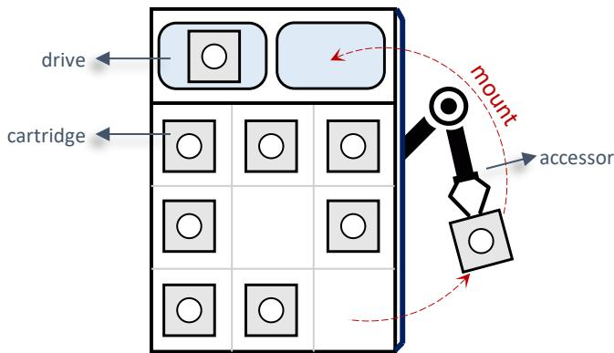  
Figure 1: An example of the tape library. This figure shows components in a tape library, including tape drives, tape cartridges, and an accessor; the accessor is mounting a cartridge to a drive.

Despite placing a large number of cartridges, a tape library is equipped with a limited number of drives (e.g., 4). This disparity is a double-edged sword. On the one hand, it dramatically reduces the costs of tape libraries, since drives are far more expensive than tapes. Yet, on the other hand, it creates a performance bottleneck: the drives limit the peak bandwidth provided by the tape library. Moreover, mounting a cartridge to a drive consumes a considerable amount of time (e.g., from a few seconds to tens of seconds): before the accessor moves the cartridge to the drive and the drive loads it, the drive needs to rewind and unload the previous cartridge.

## 2.2 Archive Storage Services in the Cloud

The volume of data generated by businesses, governments, and individuals is growing at an unprecedented rate. A large portion of it is rarely accessed, but still needs to be preserved for future reference, legal reasons, or regulatory compliance. Examples include medical imaging data, backup data, video materials, and logs. Archive storage systems are tailored for such workloads and typically use HDDs or tapes to store massive data. Most cloud vendors provide archive storage services, such as Huawei Cloud [7], AWS [5], GCP [6], and Alibaba Cloud [4]. Compared with on-premise solutions, cloud-based archive storage services enjoy the cloud’s inherent advantages, such as automated lifecycle management, virtually unlimited scalability, and global accessibility.

Huawei Cloud mainly provides archive storage in its object storage service (OBS) [7]. Users upload the data they need to archive to OBS as objects. Unlike standard objects, archived objects do not allow real-time retrieval. Users must first submit a restore request to an archived object. Once the request is completed, a temporary copy of the object is made available, and users can then send a get request to access the content from this temporary copy. For example, TapeOBS offers two pricing tiers for restore requests: ➀ Expedited restore: 3–5 hours; ➁ Standard restore: 5–12 hours.

<table><tr><td rowspan=1 colspan=1> $\overline { { \mathrm { C a p E x } _ { h d d } \mathrm { / C a p E x } _ { t a p e } } }$ </td><td rowspan=1 colspan=1>2.68×</td></tr><tr><td rowspan=1 colspan=1> $\mathrm { O p E x } _ { h d d } / \mathrm { O p E x } _ { t a p e }$ </td><td rowspan=1 colspan=1>16.11×</td></tr><tr><td rowspan=1 colspan=1> $\overline { { \mathrm { \ T C O } _ { h d d } / \mathrm { T C O } _ { t a p e } } }$ </td><td rowspan=1 colspan=1>4.95×</td></tr></table>

Table 1: TCO comparison of tapes and HDDs. TCO is the sum of CapEx (capital expenditures) and OpEx (operational expenditures).

## 2.3 Motivation of Building TapeOBS

Before building TapeOBS, Huawei Cloud already had an HDD-based archive storage service. We intended to provide a more cost-efficient archive storage service for our users, and therefore looked to tape. In terms of cost efficiency, tape has a clear advantage over HDD. First, tape has lower per GB costs: for example, according to the website diskprices.com, the price per GB of LTO-8/9 tapes is more than 50% lower than that of HDDs. Second, tape has a longer lifetime than HDD (10 years vs. 5 years), which means that we enjoy more infrequent hardware updates and accompanying data migration when using tapes. Third, tape-based storage systems consume much less energy than HDD-based ones; besides, when a cartridge resides in the storage location (rather than in the drive), it requires no power. Finally, tape offers higher storage density, which enables us to save a significant amount of data center floor space (44% in our case).

Table 1 presents a TCO (total cost of ownership) comparison of tapes and HDDs. We calculate a 10-year TCO for tapes and HDDs, assuming an initial data volume of 100PB with a 50% annual growth. The tape-based solution has 2.68× lower CapEx (capital expenditures), which mainly includes the cost of hardware acquisition, and 16.11× lower OpEx (operational expenditures), which mainly consists of the cost of operations, maintenance, and energy consumption. Put together, the tape-based solution can have 4 95× lower TCO.

In addition to cost efficiency, tape has two other advantages that motivate us to build an archive storage service for it. First, using tapes can significantly reduce $\mathrm { C O } _ { 2 } \mathrm { e }$ emissions [30], which aligns with the Net Zero goal of Huawei Cloud. Second, there is a clear technology roadmap for tapes [18]: e.g., from 2024 to 2034, the capacity of a cartridge will increase at an average rate of 32% per year. This gives us the confidence to invest in this technology for the long term.

## 3 Overview of TapeOBS

TapeOBS is an archive storage service tailored for tapes and deployed in Huawei Cloud. This section mainly describes the architecture and workflow of TapeOBS.

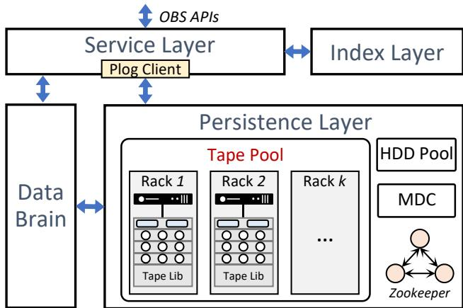  
Figure 2: The architecture of TapeOBS. It includes a service layer, an index layer, a persistence layer, and DataBrain.

## 3.1 Persistent Log (PLog)

Before describing the architecture of TapeOBS, we first introduce PLog, a key concept in Huawei Cloud storage infrastructures. PLog is a basic unit for storing data and is append-only. We can invoke several interfaces to manipulate a PLog: we first create a new PLog with a maximum size, then append data to it or read data using an offset; when we seal the PLog, it becomes immutable and cannot be appended. A PLog is highly available because it internally employs replication or erasure coding. Each PLog has a 64-bit unique identifier, which is called plog-id in this paper.

## 3.2 Architecture

Figure 2 presents the architecture of TapeOBS, which consists of four key components:

Service Layer. The service layer provides OBS APIs and preprocesses user requests, including domain name resolution, authentication, and flow control. This layer embeds a PLog-Client, which is used for interacting with the persistence layer, to write/read object data to PLogs.

Index Layer. The index layer translates the object semantics to PLog semantics. Specifically, it maintains the mapping from object ID to a set of triples ⟨plog-id, offset, size⟩. The mapping is kept in LSM-Tree-based key-value stores. We shard and replicate the mapping to a cluster of servers for high scalability and high availability.

Persistence Layer. The persistence layer stores data in tapes using PLog abstraction and exposes the PLog interfaces to other layers. Moreover, it provides high availability for PLogs through distributed erasure coding (EC). The persistence layer knows nothing about objects and only deals with PLogs. The persistence layer is mainly composed of three parts:

• Tape Pool. The tape pool is responsible for persistently and reliably maintaining PLogs. The tape pool consists of a set of tape racks. Each rack has one head server and one tape library, which are connected by fibre channel. The head server manages the cartridges in the tape library by running a local storage engine. The head server is equipped with two 12-core CPUs, 128GB DRAM, and two 3TB NVMe SSDs for data caching. The head server is connected to two ToR switches via two 25Gbps NICs. Of note, unlike standard server racks, multiple tape racks (e.g., 14) share two ToR switches. Table 2 presents the configurations of the tape library we use, which is equipped with 4 tape drives (each drive can deliver 360MB/s). The tape library provides a total uncompressed capacity of 10.24PB. Of note, we currently do not use the tape library’s built-in compression. This is because: (1) most user data is encrypted, resulting in low compression ratios; and (2) for unencrypted data, we already perform compression at the service layer, which also helps reduce network traffic to the tape library.

<table><tr><td rowspan=1 colspan=1>#of cartridges</td><td rowspan=1 colspan=1>1000</td></tr><tr><td rowspan=1 colspan=1>Capacity per cartridge</td><td rowspan=1 colspan=1>10742 GB</td></tr><tr><td rowspan=1 colspan=1>Total capacity</td><td rowspan=1 colspan=1>10.24 PB</td></tr><tr><td rowspan=1 colspan=1>#of drives</td><td rowspan=1 colspan=1>4</td></tr><tr><td rowspan=1 colspan=1>Bandwidth per drive</td><td rowspan=1 colspan=1>360 MB/s</td></tr></table>

Table 2: Configurations of the tape library in TapeOBS.

• MDC. MDC (Metadata Controller) manages the critical configurations of the tape pool, including the topology information, the set of healthy tapes, and a table called partition view. These configurations are synchronized to a ZooKeeper cluster [24]. MDC monitors the health of tape racks using heartbeat detection. The partition view is crucial to the data distribution of PLogs. Each entry in the partition view is a key-value pair, where the key is partition id (i.e., pt-id), and the value is a set of tapes from different racks; it means that these tapes will form an erasure coding (EC) group. There is a relationship between a PLog and its partition: pt-id = plog-id % N, where N is a pre-defined value. Leveraging the relationship, the MDC performs another task: allocating plog-id for the service layer and ensuring that the associated PLogs are stored in the specified partitions.

• HDD Pool. The HDD pool is used as a temporary staging area for data. When users issue restore requests to archived objects (recall §2.2), objects are copied from the tape pool to the HDD pool. After users obtain these objects by get requests, the temporary copy on the HDD pool will be freed. To simplify development, our HDD pool directly reuses Huawei Cloud’s mature, off-the-shelf HDD-based OBS system, which provides object interfaces with high durability and availability. The capacity ratio of the tape pool to the HDD pool is approximately 100:4.

DataBrain. DataBrain is responsible for scheduling nonreal-time tasks in TapeOBS, such as restore tasks and garbage collection tasks. The service layer and persistence layer report statistical information to DataBrain.

## 3.3 Workflow in TapeOBS

Here, we describe the workflow of writing and reading an object using examples, to show how the components in §3.2 interact with each other. We assume EC configuration of 4+2, i.e., 4 data chunks and 2 parity chunks:

Writing a 4MB object. ❶ The service layer creates a PLog by calling the PLog-Client, which returns a plog-id that equals 0xaabb. Note that the PLog-Client asks the MDC to allocate plog-ids. ❷ The service layer calls PLog append interface, passing in the 4MB object data and plog-id=0xaabb as parameters. ❸ Using plog-id=0xaabb, PLog-Client calculates the value of pt-id that equals 0xbb, as shown in Figure 3. ❹ PLog-Client queries the partition view and obtains the tapes in the associated EC group: tape-A – F; these tapes are located in different tape racks. Note that the partition view is maintained by the MDC but can be cached in the PLog-Client. ❺ PLog-Client divides the object evenly into four 1MB chunks (D0 – D3 in the figure) and generates two parity chunks (P0 and P1); then, it dispatches these chunks to tape-A – F, respectively. ❻ The local storage engines in tape racks store these chunks in sub-PLogs2. Here, we omit the data caching of NVMe SSDs for simplicity. Each storage engine records the physical addresses of local sub-PLogs, which are indexed by the plog-id (i.e., 0xaabb). ❼ When PLog-Client receives completion messages from these six tape racks, it returns the result of PLog append call (in ❷) to the service layer. The result contains the logical offset of the object in PLog (we term it as F here). F is equal to 4×k, where 4 is the number of data chunks and k is the offset of data chunks in sub-PLogs. ❽ Finally, the service layer inserts the mapping of {object ID ➞ ⟨0xaabb, F, 4MB⟩} to the index layer. The service layer can continue to append new objects to the PLog 0xaabb until it reaches its maximum size.

Reading the object. To read an object, the user should first issue a restore request to TapeOBS. The request will be scheduled by DataBrain and forwarded to the service layer. ➀ The service layer queries the index layer using the object ID as the key, obtaining the triple ⟨plog-id=0xaabb, offset=F, size= 4MB⟩. ➁ The service layer calls the PLog read interface; PLog-Client calculates pt-id and gets the EC group according to the partition view. ➂ PLog-Client sends requests to tape-A, B, C, and D, asking them to return 1MB data from the sub-PLogs (plog-id=0xaabb) with offset F/4. ➃ The local storage engines in tape racks locate the sub-Plogs’ physical addresses and then read the data. ➄ After receiving four data chunks, the service layer splices them into a complete object and stages the object on the HDD pool.

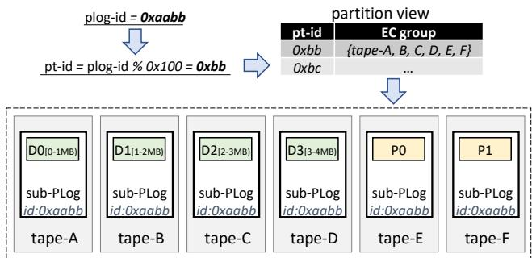  
Figure 3: An example of writing a 4MB object to TapeOBS. Assuming an erasure coding (EC) configuration of 4+2: 4 data chunks and 2 parity chunks. Each PLog consists of six sub-PLogs, which are stored in tapes located in six different tape racks.

Internal operations. In addition to writing and reading objects to react to users’ requests, TapeOBS also involves some internal operations:

• Consistency Checking. Like many large-scale storage systems [13,16,31,40], TapeOBS protects user data with checksums: each 4KB data is tagged with a 4B checksum, which is validated each time the data is fetched (from DRAM, SSDs, or tapes). Since most objects are not accessed for a long time in archive storage workloads, TapeOBS adopts a background service to perform consistency checking, which reads data from tapes and takes two actions: 1) validating checksum for every 4KB data; 2) calculating EC parity chunks for every PLog and checking if they are the same as what’s stored on tapes. Through this mechanism, we can detect data corruption caused by hardware issues and software bugs, e.g., incorrect EC calculation due to CPU SDCs (silent data corruptions) [19, 37].

• EC Repair. Upon detecting tape crashes or data integrity issues, TapeOBS will perform an EC repair to reconstruct the data. It involves reading data from the surviving tapes in the EC group and writing recovered data to a new tape.

• Garbage Collection. As objects are deleted, tapes contain stale data. The append-only feature of tapes makes it necessary to reclaim space via garbage collection (GC). TapeOBS performs GC with an EC group (i.e., a partition) as the unit. When selecting an EC group for GC, TapeOBS reads the valid objects, rewrites them to the system, and free tapes in the EC group.

## 4 Key Designs of TapeOBS

We have described the overview of TapeOBS (§3), so that readers can understand how it works. In this section, we will further elaborate on several key designs of TapeOBS, focus-

ing on how they optimize the performance of TapeOBS by keeping tape’s characteristics in mind.

## 4.1 Design Principles

TapeOBS follows three core design principles.

1) Minimizing drive thrashing in a tape library. In a tape library, the number of drives is much smaller than the number of cartridges. Therefore, if we want to access a cartridge (i.e., a tape) but it resides in storage slots, the drive needs to rewind and unload the old cartridge, load the new one, and finally execute a seek to the target address. Moreover, the accessor moves these two cartridges between storage slots and drives. The whole process consumes about 80 seconds in our hardware platform. If a drive frequently switches to serve different tapes, which we call drive thrashing, it is difficult to fully exploit the drive’s raw performance. For example, even if a drive switch is performed after every 23.2GB (i.e., 80s × 360MB/s) of consecutive data is accessed, the effective drive bandwidth will drop by half. Therefore, we propose dedicated drives (§4.2) and batched erasure coding (§4.3), both aiming to minimize drive thrashing in a tape library.

2) Avoiding random reads within a tape. Even if we can guarantee that a drive will only access a certain cartridge for a relatively long period, we need to avoid random reads further. This is because random reads result in a lot of time spent on seek operations (i.e., winding/rewinding tapes to specified locations). For example, in TapeOBS, writing/reading objects involves locating the physical locations of sub-PLogs, which can lead to considerable random metadata access on tapes, if not handled properly. Moreover, considering the internal structure of tapes which consists of multiple wraps, reducing time on seeking is non-trivial. We follow this principle by designing an efficient tape-tailored local storage engine (§4.5), which avoids fine-grained metadata operations on tapes and streamlines data operations via scheduling and flow control.

3) Making reads and writes to tape pool asynchronous. The first two principles are proposed to reach the full performance potential of tape drives. Yet, we still face inherent performance limitations of the tape pool: restricted aggregated bandwidth due to limited drives. If the tape pool serves user requests synchronously, this restricted bandwidth will be exposed to users: e.g., put requests of objects suffer from low throughput. To tackle it, TapeOBS repurposes the HDD pool used by restore as a persistent write buffer, and flushes data from the HDD pool to the tape pool asynchronously (§4.4). By doing so, all reads (i.e., restore) and writes to the tape pool are asynchronous. This asynchrony also brings a crucial benefit for TapeOBS: we can schedule a large amount of data to/from the tape pool in a bulky manner, to realize specified goals such as 1) lowering GC overhead by lifetime-based classification, and 2) reducing drive thrashing and seeking by reordering restore requests.

<table><tr><td rowspan=1 colspan=1>Drive type</td><td rowspan=1 colspan=1>Count</td><td rowspan=1 colspan=1>Served operations</td></tr><tr><td rowspan=1 colspan=1>write drive</td><td rowspan=1 colspan=1>2</td><td rowspan=1 colspan=1>object writes fromusers</td></tr><tr><td rowspan=1 colspan=1>read drive</td><td rowspan=1 colspan=1>1</td><td rowspan=1 colspan=1>object reads from users</td></tr><tr><td rowspan=1 colspan=1>internal drive</td><td rowspan=1 colspan=1>1</td><td rowspan=1 colspan=1>consistency checking,EC repair, GC</td></tr></table>

Table 3: Dedicated drives in TapeOBS.

## 4.2 Dedicated Drives

TapeOBS adopts dedicated drives to reduce drive thrashing. Specifically, we statically divide drives in a tape library into three groups: 1) write drives for serving object writes; 2) read drives for serving object reads; 3) internal drives for serving internal operations, including consistency checking, EC repair, and garbage collection. The reason behind our approach is the different access patterns of these operations. For writes, we can keep appending object data on a tape until it fills up (i.e., log-structured approach). For reads, requests are issued by users and thus non-deterministic, so they inevitably need to access different tapes. For internal operations, the drive typically focuses on the same tape for a long time. If each drive serves all operations simultaneously, which we call shared drives, all drives will suffer from drive thrashing. In contrast, using dedicated drives, write drives and internal drives are capable of running at full speed without drive thrashing.

The next thing to consider is determining the number of different drives. We chose two drives as write drives, one as the read drive, and one as the internal drive (recall that our tape libraries have four drives each). This configuration prioritizes write requests over read requests, but it is reasonable since archive storage workloads typically involve significantly more writes than reads. Table 3 shows the configurations of dedicated drives in TapeOBS. Of note, when a tape library is full, the two write drives will transition into one read drive and one internal drive.

Pin write drives to tapes. To make each drive always append data on the same tape, MDC allocates plog-id in the following way: according to the relationship between plog-id and pt-id (recall §3.2), MDC guarantees that for each tape library, only two (i.e., the number of write drives) active partitions contain it, and allocates plog-ids that belong to these two partitions. In this way, a write drive will append a tape until it is full, then switch to the next one.

Discussion. A primary limitation of dedicated drives is potential resource underutilization under dynamic workloads. We could enhance adaptability by reallocating drives for different operations at a coarse granularity (e.g., hourly) based on workloads. Such a policy can improve drive utilization while still avoiding excessive drive thrashing.

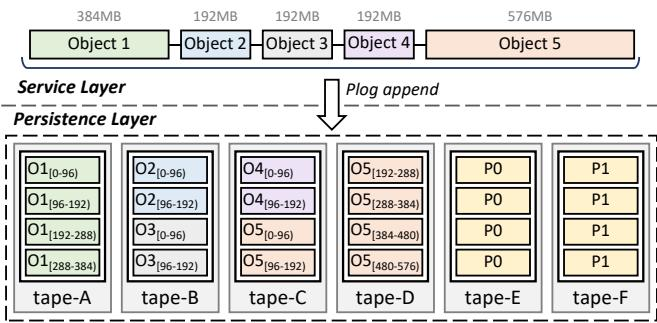  
Figure 4: An example of batched erasure coding (b-EC). Assuming EC configuration of 4+2: 4 data chunks and 2 parity chunks (in Tape-E and F). The six tapes are located in six different tape racks. With b-EC, an object in TapeOBS is stored on fewer tapes, thus reducing drive thrashing when fetching it.

## 4.3 Batched Erasure Coding

In TapeOBS, tape racks are considered independent failure domains. TapeOBS leverages erasure coding (EC) to store data across different tape racks, ensuring failure tolerance and high availability. Compared to replication, EC has two pronounced advantages. First, EC has low storage redundancy: for EC configuration of m+n — m data chunks and n parity chunks, it can tolerate n failures with a storage redundancy (m+n)/m, which typically is less than 1.50. The low storage redundancy can save a lot of storage space, considering the immense amount of archived data. Second, low storage redundancy also means less data to write, thus reducing the write bandwidth consumption of tape drives. With a fixed n (i.e., the capability of fault tolerance), we want to choose a large m for TapeOBS, to gain more benefits from EC.

However, in the earlier version of TapeOBS, a larger m will lead to a more severe drive thrashing for object reads. Recall Figure 3: the service layer translates a write to an object into a PLog append, which dispatches data chunks and parity chunks to different tape racks for high availability. Thus, fetching the object needs to read data from m tapes, consuming considerable drive resources. This inevitably introduces excessive drive switches when many objects on different partitions (i.e., EC groups) need to be read.

In principle, the solution is simple: using inter-object EC rather than intra-object EC, so that every object will be located on only one tape. Yet, there are engineering challenges here. Intuitively, we need to implement inter-object in the persistence layer: letting the persistence layer generate EC strips containing different objects. However, the persistence layer is unaware of object semantics, and injecting object semantics into it requires large-scale code refactoring and destroys clean boundaries between layers.

TapeOBS adopts a neat approach called batched erasure coding (i.e., b-EC) to realize inter-object EC. Its key idea is to let the service layer aggregate objects with a single PLog append call. Figure 4 presents an example and the EC configuration is 4+2. The service layer first aggregates five objects (1.5GB total) in its memory. Then, it creates a PLog with a maximum size of 1.5GB. Finally, it invokes a single PLog append interface to append the aggregated 1.5GB data, and seals the PLog. By doing so, the 1.5GB data containing multiple objects is split horizontally into 4 data chunks, which then are spread across different tapes. As shown in the figure, for Object 1-4, each of them only exists on one tape; for Object 5, its data spans two tapes. Thus, fetching these objects will use fewer tape drives and trigger fewer drive switches. To implement b-EC, we only add a simple aggregation function to the service layer and modify the conversion between PLog offset and sub-PLog offsets in PLog-Client.

b-EC has a drawback: it will increase the data needed for degraded reads. When a tape fails, TapeOBS runs EC repair. During the EC repair, if reading an object on the failed tape, we must reconstruct the object using other surviving data. For an object of size S, b-EC makes the data needed for the reconstruction increase from S to S×m. We believe this is acceptable, given the benefits of b-EC and the relatively low frequency of degraded reads.

With b-EC, TapeOBS deploys the EC of 12+2, whose redundancy is 1.17. TapeOBS uses the Huawei-developed Low-Density Erasure Coding (LDEC) algorithm, an MDS (maximum distance separable) array code based on the XOR and Galois field multiplication.

## 4.4 Asynchronous Tape Pool & Bulk Scheduling

As described in §3.2, each tape pool is paired with an HDD pool. When users issue restore requests to TapeOBS, the associated objects are temporarily copied to the HDD pool, to serve the future get requests. Considering the hour-level SLA (service level agreement) of restore (recall §2.2), we can schedule restore requests asynchronously, to reduce thrashing and seeking of tape drives.

We further repurpose the HDD pool as a persistent write buffer for write requests: write requests from users are first absorbed by the HDD pool, and then are digested to the tape pool. By doing so, we have a fully asynchronous tape pool, as shown in Figure 5: all writes and reads to it are asynchronous. This fully asynchronous design brings two advantages. First, it can handle workload bursts since the HDD pool has a larger aggregated bandwidth, albeit at a smaller capacity than the tape pool. Note that the HDD pool also uses the same configuration of EC to provide high availability. Second, it enables bulk scheduling between the two pools. Specifically, since the accesses to tapes are non-real-time, we can classify, group, and reorder a large number of objects according to scheduling strategies, achieving efficient bulk data transfer from/to tapes. TapeOBS uses DataBrain as the control plane of bulk scheduling. Next, we describe how TapeOBS performs bulk scheduling for object restore and writes, respectively.

Bulk Scheduling for Object Restore. For restore requests, the goal of bulk scheduling is reducing drive thrashing and seeking without violating SLA. Each restore request is first translated into a set of tasks ⟨ddl, pt-id, plog-id, offset, size⟩, where ddl is the deadline of the restore request (it is calculated according to SLA and is expressed in hourly granularity) and pt-id is obtained from plog-id. Note that these tasks are persistently stored to prevent failures. DataBrain schedules these tasks in the following way: 1) collecting all tasks having the minimum ddl to a pending set; 2) grouping the tasks in the pending set according to pt-id; 3) in each group, sorting tasks according to the increasing order of the pair ⟨plog-id, offset⟩; 4) dispatching tasks in the pending set to the tape pool one group at a time. In this way, each tape rack will receive a stream of read requests with physical locality, thus mitigating drive thrashing (by grouping tasks from the same partitions) and reducing seek time (by sorting tasks in the same PLogs using offset value).

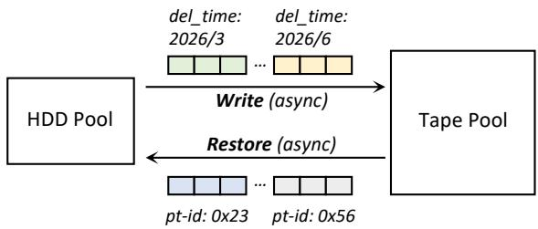  
Figure 5: Fully asynchronous tape pool with bulk scheduling. For object restore, we batch and sort requests to create sequential access patterns on tapes, mitigating drive thrashing. For object writes, data with similar lifetimes is grouped and written to the same tapes, reducing garbage collection overhead.

Bulk Scheduling for Object Writes. For write requests, the goal of bulk scheduling is storing the objects with a similar lifetime in the same tape and thus lowering GC overhead. Currently, users can set expiration time for buckets or objects in TapeOBS; a bucket is a container for storing objects (like a directory in file systems). For an object, it is automatically deleted if the time since its last update is greater than the expiration time. With the expiration time, we can estimate the delete time for objects. DataBrain groups the objects in the HDD pool according to the delete time (uses 3 months as a grouping granularity). Then, it writes objects in the same group into the tape pool in a batch manner. By doing so, TapeOBS can ensure that a tape contains objects having a similar lifetime. Consequently, the GC overhead will be mitigated, since there is a high probability that the data on a tape will be deleted together, greatly reducing the amount of reading and rewriting of valid data during GC. Without the HDD pool as a persistent write buffer, performing lifetime-based data placement on tapes would be difficult. This is because the limited number of drives and time-consuming drive switches make it impossible to maintain an immediately writable tape for each lifetime group.

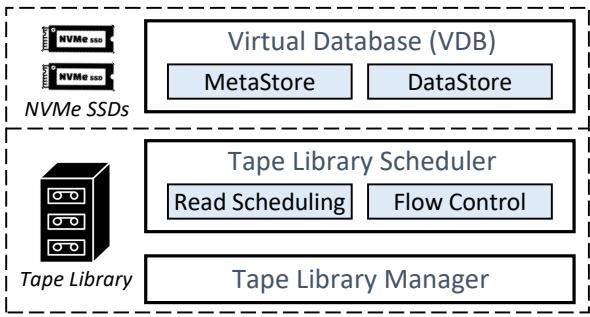  
Figure 6: Tape-tailored local storage engine. Virtual Database (VDB): storing metadata of sub-PLogs and buffering data. Tape Library Scheduler (TLS): streamlining I/O requests to tapes by read scheduling and flow control. Tape Library Manager (TLM): controlling the accessor and tape drives.

## 4.5 Tape-tailored Local Storage Engine

Within a tape rack, TapeOBS runs a local storage engine on the head server. The storage engine is responsible for persistently storing sub-PLogs in the local tape library. Figure 6 shows its architecture, which consists of a Virtual Database (VDB), a Tape Library Scheduler (TLS), and a Tape Library Manager (TLM). TLM encapsulates the driver of the tape library: it can control the accessor and tape drives, as well as query the states of the tape library. Next, we introduce VDB and TLS, two tape-tailored components in the local storage engine.

## 4.5.1 Virtual Database (VDB)

VDB utilizes the two NVMe SSDs in the head server to create two storage areas: MetaStore and DataStore.

• MetaStore. MetaStore stores the metadata for all sub-PLogs in the tape rack. Each sub-PLog has a 256B metadata, which contains plog-id, tape offset, size, PLog state, etc. Since a PLog is typically gigabytes in size, MetaStore only needs less than 50GB of SSD space to maintain all the metadata for a 10PB tape library. By leveraging the Meta-Store, we can obtain the physical location of a sub-PLog without touching the tape, thus avoiding random metadata accesses in tapes for reading sub-PLogs.

• DataStore. DataStore is a persistent buffer upon the tape library. For sub-PLog writes, the data is first buffered in DataStore and then flushed to tapes; sub-PLog reads have an opposite direction.

Both MetaStore and DataStore are organized as key-value stores, with fixed-size keys and values. For MetaStore, the key is plog-id and the value is sub-PLog metadata. For DataStore, the key is ⟨plog-id, offset⟩ and the value is a fixed-size data slice (e.g., 1MB). We design a simple keyvalue store by exploiting the property of fixed-size KVs, as shown in Figure 7. The key-value store pre-allocates two arrays in SSDs, i.e., key array and value array, where each element is the same size as keys and values, respectively. A hash table in DRAM maintains the mapping from a key to the array index of the target KV. When inserting a KV, we first write the value and then the key.

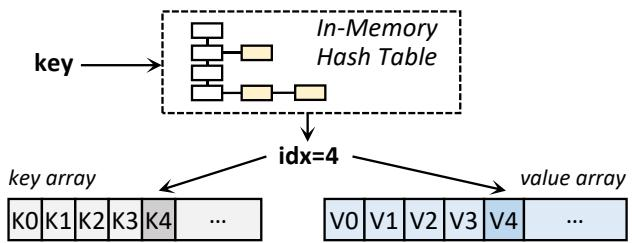

Figure 7: The SSD-based key-value store used by MetaStore and DataStore. The key array and value array store fixed-size data. Upon crash recovery, the in-memory hash table can be reconstructed by scanning the key array.  
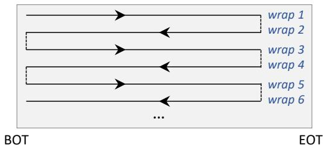  
Figure 8: A modern tape is composed of hundreds of wraps. BOT: beginning of tape; EOT: end of tape.

The key-value store is crash-consistent for the following reasons. First, writing a key is atomic, since the keys in MetaStore and DataStore are smaller than 4KB. Second, the integrity of values can be validated: for MetaStore, the value is 256B and thus can be written atomically; for DataStore, each 4KB data in values has a DIF (data integrity field), which contains an 8B plog-id, the offset within the sub-PLog, and a 4B checksums (which we have mentioned in §3.3). Third, we can check whether there is a match between a key and a value, since the value stores information about the key. Finally, we can reconstruct the in-memory hash table by scanning the key array upon recovery.

Flushing Sub-PLogs from VDB to Tapes. When receiving a seal request for a sub-PLog, a thread in the head server will flush the sub-PLog from the VDB to tapes: 1) it collects data slices that belong to the sub-PLog from DataStore. There is a DRAM-resident list for each sub-PLog that connects its data slices. 2) The thread appends the sub-PLog to the target tape (according to pt-id) by calling the TLS. 3) The thread deletes KV pairs of these data slices in DataStore and updates the metadata of the sub-PLog (including tape offset and sub-PLog state) in MetaStore.

Metadata Partition in Tapes. We create a metadata partition in every tape by leveraging the hardware partitioning features (recall §2.1). When a tape is full, the head server dumps the associated sub-PLog metadata from MetaStore to the metadata partition. The metadata partition can accelerate recovery in the presence of SSD failures: reconstructing the MetaStore from metadata partitions of tapes rather than scanning data in tapes and validating DIFs for all 4KB data.

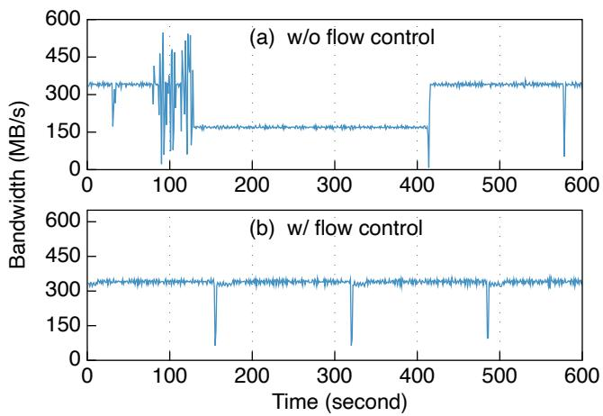  
Figure 9: The bandwidth of a write drive. (a): TLS issues requests to the drive without flow control: experiencing a performance degradation during 129s∼414s. (b): TLS issues requests to the drive using flow control: the bandwidth is stable and the average is 336.53MB/s.

## 4.5.2 Tape Library Scheduler (TLS)

The tape library scheduler (TLS) streamlines the data access to tapes by read scheduling and flow control.

Read Scheduling. Given a group of read requests that contains multiple sub-PLogs in the same tape (the group is sent by DataBrain; recall §4.4), TLS generates an access ordering of these sub-PLogs, to reduce seek time.

A modern tape is composed of hundreds of wraps; these wraps are logically connected, as shown in Figure 8. Neighboring wraps have opposite access directions and tape drives must follow the directions. Such a structure makes accessing the tape in the order of logical blocks prone to a large number of unnecessary seeks. TLS adopts a simple SCAN algorithm to optimize accesses for a group of sub-PLogs: 1) For each sub-PLog, TLS calculates its physical position in the tape. Note that we pre-maintain the relationship between the tape’s logical blocks and physical positions. 2) TLS divides sub-PLogs into two queues, based on the access directions of their wraps. 3) TLS sorts sub-PLogs in each queue according to their physical positions. 4) TLS executes the requests in one queue first, then in the other queue.

Flow Control. During deploying TapeOBS, we found a performance anomaly on tape drives, which occurs frequently. Figure 9(a) presents such a case, where we collect the bandwidth of a write drive over 15 minutes. In the first 79 seconds, the drive has a stable performance: 335.94MB/s on average, close to the theoretical performance limit of 360MB/s. In the next 48 seconds, the drive’s performance experienced severe fluctuations. Then, the bandwidth drops to half with 168.65MB/s on average; this process lasts 285 seconds.

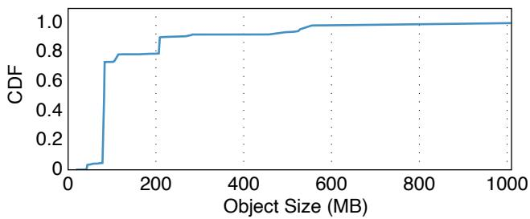  
Figure 10: The CDF of object size distribution in TapeOBS. The object size exhibits a highly skewed pattern.

Through analysis, we think the reason is the unstable I/O request submission rate. There is a buffer in the tape drive, which is used to absorb data from the host. The drive writes data from the buffer to the tape using a constant speed (from a set of pre-defined speeds); the drive selects the speed via an internal algorithm. Yet, when TLS submits requests in a highly jittery manner (i.e., 80∼128s in Figure 9(a)), the drive may incorrectly estimate the speed of the host and choose a low speed, thus leading to performance degradation.

We use flow control to address the issue. Its key idea is aligning the speed of submitting requests with the speed of the drive. TLS reads the size of the drive buffer periodically and uses it to estimate the speed of the drive (we term it DS). TLS sends requests to a rate limiter, which adjusts the speed of submitting requests to DS. If there is less than 100MB of data to be submitted, TLS bypasses the rate limiter. In this way, we can avoid the drive selecting a mismatched speed. Figure 9(b) shows the bandwidth of the write drive after we apply flow control. The write drive delivers a stable bandwidth (336.53MB/s on average). Of note, about every 163 seconds, performance drops steeply by 1-2 seconds, this is because the drive head is switching to a new wrap by changing the direction (recall the tape structure in Figure 8).

## 5 Deployment of TapeOBS

TapeOBS started its gradual rollout (i.e., grayscale release) at the end of 2022 and officially began serving customers in 2024. Currently, TapeOBS is a single-AZ (availability zone) service, and is deployed across several clusters, with each cluster consisting of multiple tape pools. Of note, different tape pools in the same cluster can share a service layer, an index layer, and the DataBrain; but each tape pool has a dedicated MDC to manage partitions, which means a tape pool is a basic deployment unit. Each tape pool is equipped with 14 tape racks, resulting in a total capacity of 140PB. TapeOBS uses the erasure coding of 12+2 with 1.17 storage redundancy. The EC-encoded data — comprising 12 data chunks and 2 parity chunks — is distributed across the 14 tape racks. At the time of writing the paper, TapeOBS has stored hundreds of petabytes of raw user data3.

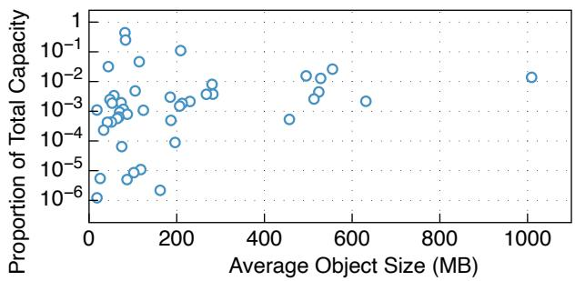  
Figure 11: Buckets’ average object size vs. Capacity proportion. Each point represents a bucket. The x-axis shows the bucket’s average object size (in MB), and the y-axis indicates the bucket’s proportion of total storage capacity

In this section, we begin our analysis of TapeOBS by examining the distribution of object size (§5.1) and the ratios of object operations (§5.2), both of which exhibit a highly skewed pattern. Then, we choose a representative cluster to present its metrics such as capacity utilization and performance (§5.3, §5.4, and §5.5). Finally, we show failure characterization of tape libraries in TapeOBS’s deployment (§5.6).

## 5.1 Distribution of Object Size

We collect statistics about the size of the objects stored in TapeOBS. Figure 10 presents a CDF, where the x-axis represents object size and the y-axis shows the cumulative proportion of the total TapeOBS storage capacity occupied by objects smaller than or equal to that size. From the figure, we can make a clear observation: the object size exhibits a highly skewed pattern. Concretely, objects smaller than 500MB occupy 93.81% of TapeOBS’s storage space; of these, 69.95% are objects in the 50-100MB range.

We also analyze all 44 buckets from our largest customer in TapeOBS by computing the average object size for each bucket and its proportion of the customer’s total storage capacity, as shown in Figure 11. Among them, three buckets account for more than 10% of the total capacity: one with an average object size of 81.92MB accounts for 43.88%, another with 83.19MB accounts for 24.90%, and the third with 208.90MB accounts for 10.99% of the total capacity. There are relatively few large objects at the GB level: only one bucket has an average object size greater than 1000MB, i.e., 1009.3MB; it accounts for 1.38% of the total capacity.

<table><tr><td rowspan=1 colspan=1>Customer</td><td rowspan=1 colspan=1>Write</td><td rowspan=1 colspan=1>Read</td><td rowspan=1 colspan=1>Delete</td></tr><tr><td rowspan=1 colspan=1>A</td><td rowspan=1 colspan=1>99.999888%</td><td rowspan=1 colspan=1>0.000112%</td><td rowspan=1 colspan=1>0%</td></tr><tr><td rowspan=1 colspan=1>B</td><td rowspan=1 colspan=1>99.325224%</td><td rowspan=1 colspan=1>0.674776%</td><td rowspan=1 colspan=1>0%</td></tr><tr><td rowspan=1 colspan=1>C</td><td rowspan=1 colspan=1>99.999872%</td><td rowspan=1 colspan=1>0.000128%</td><td rowspan=1 colspan=1>0%</td></tr><tr><td rowspan=1 colspan=1>D</td><td rowspan=1 colspan=1>100%</td><td rowspan=1 colspan=1>0%</td><td rowspan=1 colspan=1>0%</td></tr><tr><td rowspan=1 colspan=1>E</td><td rowspan=1 colspan=1>99.986719%</td><td rowspan=1 colspan=1>0%</td><td rowspan=1 colspan=1>0.013281%</td></tr></table>

Table 4: Ratios of different operations. We selected the five largest customers, ordered from A to E in descending data volume, with Customer A being the largest.

## 5.2 Ratios of Object Operations

Table 4 presents ratios of object-level operations (e.g., write, read, and delete) for the five largest customers in TapeOBS, ranked by storage capacity in descending order from A to E. We can make two observations from the table.

First, the archive workload is heavily dominated by write operations, while read operations are extremely rare. Customer B has the highest read ratio, but even then, reads make up only 0.674776% of its total operations. For the largest customer, A, the read percentage is even more marginal at 0.000112%. Customers D and E have not issued any read requests at all, highlighting the typical access pattern of archival data: mostly writes, hardly any reads.

Second, delete operations are also very uncommon. Only Customer E has issued any delete requests, accounting for just 0.013281% of its total operations. This is because in TapeOBS, archived objects are usually removed automatically upon expiration, rather than by explicit user delete operations.

## 5.3 Utilization of HDD and Tape Pool

We select an active cluster from TapeOBS and count the space utilization of the tape and HDD pools over a 24-hour interval (i.e., a day). Figure 12 shows the result. Of note, for the tape pool, we present the amount of data growth and express it as a percentage of the total capacity of the HDD pool. For Figure 12(a), we can observe that the utilization of the HDD pool fluctuates between 71.625% and 71.675%. In TapeOBS, the HDD pool is a staging area, to enable a fully asynchronous tape pool. The data in the HDD pool increases when 1) users commit write requests or 2) TapeOBS copies data from the tape pool to the HDD pool for serving restore requests. In contrast, when TapeOBS performs bulk data scheduling, moving objects from the HDD pool to the tape pool, the data in the HDD pool decreases. For Figure 12(b), we can observe that TapeOBS digests data at a relatively constant rate from the HDD pool to the tape pool.

Currently, we set a capacity watermark of 75% for the HDD pool: by controlling the speed at which data is moved to tapes, we ensure that the HDD capacity does not exceed this watermark. We reserve a 25% HDD space for the following three reasons. First, the headroom can absorb unpredictable burst traffic triggered by users. Second, the space can be used for internal activities of the HDD pool, e.g., EC repair upon HDD failures. Finally, this can avoid performance degradation of HDDs due to excessive utilization.

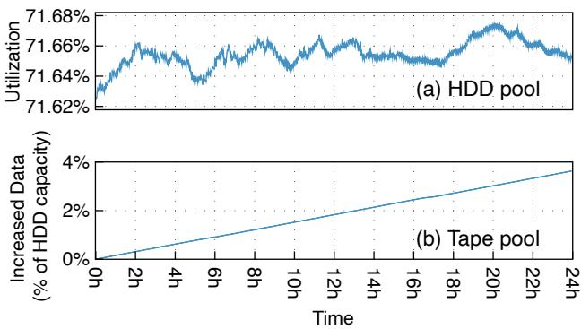  
Figure 12: Capacity utilization of HDD pool and tape pool. Of note, for the tape pool, we present the amount of data growth and express it as a percentage of the total capacity of the HDD pool.

## 5.4 Throughput of HDD and Tape Pool

We collect the real-time throughput of the HDD and tape pool over 24 hours (the same period as in §5.3). Figure 13 shows the results. It is important to note that, our performance capture tool counts the number of writing/reading an EC stripe performed by PLog-Client, not the number of calls to the PLog interfaces. In TapeOBS in the production environment, a stripe consists of twelve 512KB data chunks and two 512KB parity chunks4. In other words, in the figure, an append operation writes a stripe of (12+2) × 512KB data (i.e., 7MB); a read operation reads a 12 × 512KB data (i.e., 6MB).

As shown in Figure 13(a), during the 24 hours, the tape pool delivers write throughput between 39.67Kops/min and 148.79Kops/min, with an average value of 118.81Kops/min (i.e., 7MB×118.81K = 831.67GB/min). Despite the jitter in the write throughput, when we accumulate on an hourly basis, we can find that the cumulative writes per hour are relatively stable: except for the 6th hour (6162.69Kops/h) and the 17th hour (5451.34Kops/h), the throughput in the remaining 22 hours is between 7052.58Kops/h and 7469.22Kops/h. This is consistent with Figure 12(a), which shows that the tape pool is increasing data at a relatively constant rate (A slightly downward slope occurs during the 17th hour, as can be observed more closely in the figure). Different from writes, the read throughput of the tape pool is low: up to 5.85Kops per minute in this 24-hour period. This also indicates that users have fewer restore requests in our archive workloads.

From Figure 13(b), we can make two observations. First, the average write and read throughput of the HDD pool is 134.015Kops/min and 158.139Kops/min, respectively. The write throughput reflects primarily the speed at which users submit write requests (recall that restore requests are rare). The read throughput reflects primarily the speed at which TapeOBS moves data to the tape pool.

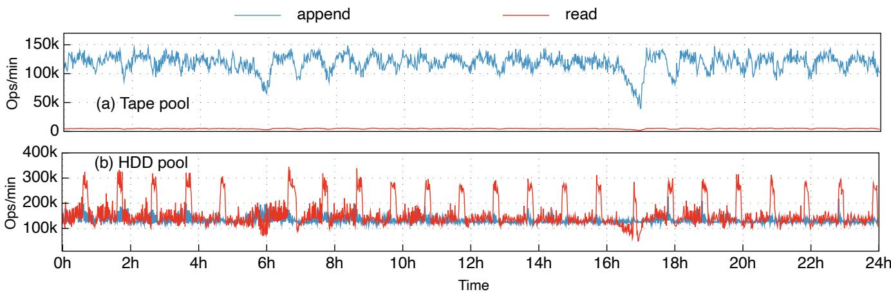  
Figure 13: Throughput of the tape and HDD pool over 24 hours. In this figure, an append operation writes a stripe of (12+2) × 512KB data (i.e., 7MB); a read operation reads a 12 × 512KB data (i.e., 6MB).

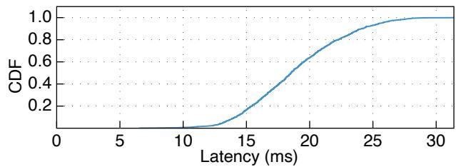  
Figure 14: The CDF of write latency. An operation writes a stripe of (12+2) × 512KB data (i.e., 7MB).

Second, the read throughput of the HDD pool is higher than the write throughput of the tape pool, this is because the HDD pool performs garbage collection (GC) in the background, inducing extra reads and writes. Like the tape pool, the HDD pool leverages append-only PLogs as the storage unit. As TapeOBS moves objects from HDDs to tapes using lifetime-based aggregation, the HDD pool has many PLogs containing garbage data. To ensure that the HDD pool utilization is below 75% (recall §5.3), TapeOBS performs GC: the service layer reads valid objects from old PLogs, writes them to new PLogs, and deletes old PLogs. As shown in Figure 13(b), the GC for the HDD pool is triggered periodically, resulting in periodic spikes in read throughput. During GC, the new PLogs are written to the HDD pool at a steady rate. There is no significant GC traffic in the tape pool, this is because through lifetime-based placement, in most cases we can directly delete all data in an EC group.

## 5.5 Write Latency of Tape Pool

TapeOBS adopts a tape-tailored local storage engine, which leverages local SSDs to buffer data and metadata persistently. Therefore, when all data and parity chunks arrive at SSDresident DataStore in associated tape racks, the write operation for the tape pool is complete. We collect the latencies of writing a stripe to the tape pool and Figure 14 presents the latency CDF. The median latency and P99 latency are 18.51ms and 27.75ms, respectively. The network spends about 10ms of latency, since TapeOBS is using a kernel-level TCP/IP network stack. The DataStore consumes about 1-4ms for writing data and metadata to SSDs. The rest of the time is spent on the software logic of the service layer’s PLog-Client, including calculating the parity chunks for EC, generating checksums for each 4KB, and memory copying.

## 5.6 Failures Characterization in Tape Libraries

During the deployment and operation of TapeOBS, we have recorded a total of 17 tape library-related failures. These statistics were collected over approximately 1.25 years since we officially launched customer-facing operations in 2024. Our current deployment consists of fewer than 200 tape libraries, a count influenced by the high storage density of 10PB per unit. For a detailed analysis, Table 5 presents these failures and their respective ratios.

For drive software bugs (❶), we have encountered abnormal performance degradation during the execution of certain drives, which does not affect the system’s availability, but requires updating the drive software.

When a drive cannot work (❷ ❸ ❹), TapeOBS has different consequences depending on the tasks the drive performs. Recall that TapeOBS statically divides drives in a tape library into three groups (§4.2): 2 write drives, 1 read drive, and 1 internal drive. When the non-functional drive is a write drive, the write throughput of the tape pool will drop. When it is the read drive, restoring objects in the associated rack will be converted into degraded reads from other tape racks. When it is the internal drive, the performance of the tape pool is not affected, and internal operations require intervention from maintenance personnel (e.g., install a new drive) to resume.

<table><tr><td rowspan=1 colspan=1>ID</td><td rowspan=1 colspan=1>Failure type</td><td rowspan=1 colspan=1>Ratio</td></tr><tr><td rowspan=1 colspan=1>1</td><td rowspan=1 colspan=1>Drive software bugs</td><td rowspan=1 colspan=1>4/17</td></tr><tr><td rowspan=1 colspan=1>②</td><td rowspan=1 colspan=1>Drive failures</td><td rowspan=1 colspan=1>4/17</td></tr><tr><td rowspan=1 colspan=1>③</td><td rowspan=1 colspan=1>Drive does not recognize tapes</td><td rowspan=1 colspan=1>4/17</td></tr><tr><td rowspan=1 colspan=1>4</td><td rowspan=1 colspan=1>Drive not found</td><td rowspan=1 colspan=1>1/17</td></tr><tr><td rowspan=1 colspan=1>6</td><td rowspan=1 colspan=1>Robotic accessor is stuck</td><td rowspan=1 colspan=1>2/17</td></tr><tr><td rowspan=1 colspan=1>6</td><td rowspan=1 colspan=1>Disconnection between head serverand tape library</td><td rowspan=1 colspan=1>2/17</td></tr></table>

Table 5: Failures characterization in tape libraries. Here we focus on tape library-related failures, rather than others such as network issues and storage device failures (e.g., SSDs and tapes).

In some cases, the entire tape library may be unable to function, such as when the robotic accessor is stuck (❺) or when the head server is disconnected from the tape library (❻). At this point, the tape pool is unable to perform write operations and uses degraded reads to serve read operations. Yet, TapeOBS still can handle write requests from users: the HDD pool will use its 25% unused space to absorb writes, which can create dozens of extra hours (recall Figure 12(b), the user write volume over 24 hours is less than 4% of the HDD pool’s capacity), providing maintenance personnel with sufficient time to repair the tape library.

## 6 Related Work

We examine two aspects of related work, including tape-based storage systems and other archive storage systems.

## 6.1 Tape-based Storage Systems

If readers are interested, we refer them to a recent article from IBM [28], which introduces modern tapes in detail, from hardware to software. LTFS [32] and HTPFS [38] are file systems designed for tapes. LTFS leverages the hardware partitioning to create a metadata area, and stores metadata with an XML format index. bLTFS [26] augments LTFS with a space-efficient binary index. TapeOBS stores sub-PLogs in tapes and uses a metadata partition to accelerate the recovery. GLUFS [27] integrates LTFS into GPFS, a distributed file system; it migrates data between disks and tapes according to data hotness. TapeOBS includes an HDD pool for bulk scheduling and object restoration. CloudDT [21] and DeduT [20] design data deduplication for tape libraries; TapeOBS currently does not support deduplication.

Some works explore algorithms that reduce seek time on tapes by reordering requests [17, 23, 33, 34]. The advanced algorithms [23] take into account the overheads of both the longitudinal dimension (i.e., the physical distance between blocks) and the latitudinal dimension (i.e., switching between wraps). TapeOBS’s scan algorithm only optimizes from the longitudinal dimension, and uses sub-PLogs as the basic unit. Quantum adopts an EC scheme for tapes called twodimensional EC [2], which uses both inter-tape and intra-tape EC to protect data. TapeOBS treats a tape as the basic unit of failure and does not consider partial failure of a tape.

## 6.2 Other Archive Storage Systems

In addition to the tape, media such as HDD [14, 40], glass [11, 12], Blu-Ray disks [1], and DNA [15, 29, 35, 36, 39] are also used to build archive storage systems. Alibaba leverages HM-SMR HDDs for archival-class object storage [40]. Microsoft’s Silica saves archived data in the quartz glass [11], which can offer lifetimes of over 1000 years. Meta uses Blu-Ray disks to store cold photos from its social media platforms [1]. DNA offers potential for ultra-high-density, long-term archive storage, but challenges like slow write speeds and technical complexity still need to be overcome [29, 36]. Recently, Brunmayr et al. devised a method to generate DNA motifs [15], to enable faster and more cost-effective DNA synthesis; Zhou et al. proposed a DNA block device that uses SSD to decrease the metadata updating cost [39].

## 7 Conclusion

We describe our journey in understanding, designing, and deploying TapeOBS, a tape-based archive storage service in Huawei Cloud. TapeOBS is built with three design principles: 1) Making reads and writes to a tape pool asynchronous; 2) Minimizing drive thrashing in a tape library; 3) Avoiding random reads within a tape. TapeOBS provides a cost-efficient solution for the cloud-based archive storage, and has stored hundreds of petabytes of raw user data.

## Acknowledgements

We sincerely thank our shepherd Juncheng Yang and anonymous reviewers for their feedback and suggestions. The paper presents over three years of work by past and current members of several teams at Huawei Cloud Storage Service Product Dept, including Storage Platform Service Domain Program, Storage Service Architecture & Design Team, and Object Storage Service Domain Program. This work is supported by the National Key R&D Program of China (Grant No. 2024YFB4505201), the National Natural Science Foundation of China (Grant No. U22B2023, 62472242, 62332011), and the Young Elite Scientists Sponsorship Program by CAST (Grant No. 2023QNRC001).

## References

[1] Inside Facebook’s Blu-Ray Cold Storage Data Center. https://www datacenterfrontier com/cloud/ . .article/11431537/inside-facebook8217sblu-ray-cold-storage-data-center, 2015.

[2] LTO Technology and Two-dimensional Erasure-coded Long-term archival storage with RAIL Architecture. https://www snia org/educational-library/ . .lto-technology-and-two-dimensionalerasure-coded-long-term-archival-storagerail, 2021.

[3] Amount of Data Created Daily (2024). https: //explodingtopics com/blog/data-generatedper-day, 2024.

[4] Alibaba Cloud – Object Storage Service. https://www alibabacloud com/en/product/ . .object-storage-service, 2025.

[5] Amazon S3 Glacier storage classes. https:// aws amazon com/s3/storage-classes/glacier/, .2025.

[6] Google Cloud – Archive storage. https: //cloud google com/storage/docs/storage-. .classes#archive, 2025.

[7] Huawei Cloud – Object Storage Service (OBS). https://www huaweicloud com/intl/en-us/ .product/obs html, 2025.

[8] IBM 3592 Tape Cartridge. https://www ibm com/ products/3592-tape-cartridge, 2025.

[9] IBM Diamondback Tape Library https: //www ibm com/products/diamondback-tape-. .library, 2025.

[10] Linear Tape-Open. https://www lto org/, 2025.

[11] Patrick Anderson, Erika Blancada Aranas, Youssef Assaf, Raphael Behrendt, Richard Black, Marco Caballero, Pashmina Cameron, Burcu Canakci, Thales De Carvalho, Andromachi Chatzieleftheriou, Rebekah Storan Clarke, James Clegg, Daniel Cletheroe, Bridgette Cooper, Tim Deegan, Austin Donnelly, Rokas Drevinskas, Alexander Gaunt, Christos Gkantsidis, Ariel Gomez Diaz, Istvan Haller, Freddie Hong, Teodora Ilieva, Shashidhar Joshi, Russell Joyce, Mint Kunkel, David Lara, Sergey Legtchenko, Fanglin Linda Liu, Bruno Magalhaes, Alana Marzoev, Marvin Mcnett, Jayashree Mohan, Michael Myrah, Trong Nguyen, Sebastian Nowozin, Aaron Ogus, Hiske Overweg, Antony Rowstron, Maneesh Sah, Masaaki Sakakura, Peter Scholtz, Nina Schreiner, Omer Sella, Adam Smith, Ioan

Stefanovici, David Sweeney, Benn Thomsen, Govert Verkes, Phil Wainman, Jonathan Westcott, Luke Weston, Charles Whittaker, Pablo Wilke Berenguer, Hugh Williams, Thomas Winkler, and Stefan Winzeck. Project Silica: Towards Sustainable Cloud Archival Storage in Glass. In Proceedings of the 29th Symposium on Operating Systems Principles, SOSP ’23, page 166–181, New York, NY, USA, 2023. ACM.

[12] Patrick Anderson, Richard Black, Ausra Cerkauskaite, Andromachi Chatzieleftheriou, James Clegg, Chris Dainty, Raluca Diaconu, Rokas Drevinskas, Austin Donnelly, Alexander L. Gaunt, Andreas Georgiou, Ariel Gomez Diaz, Peter G. Kazansky, David Lara, Sergey Legtchenko, Sebastian Nowozin, Aaron Ogus, Douglas Phillips, Antony Rowstron, Masaaki Sakakura, Ioan Stefanovici, Benn Thomsen, Lei Wang, Hugh Williams, and Mengyang Yang. Glass: A New Media for a New Era? In 10th USENIX Workshop on Hot Topics in Storage and File Systems (HotStorage 18), Boston, MA, July 2018. USENIX Association.

[13] David F. Bacon. Detection and Prevention of Silent Data Corruption in an Exabyte-scale Database System. In The 18th IEEE Workshop on Silicon Errors in Logic – System Effects, 2022.

[14] Shobana Balakrishnan, Richard Black, Austin Donnelly, Paul England, Adam Glass, Dave Harper, Sergey Legtchenko, Aaron Ogus, Eric Peterson, and Antony Rowstron. Pelican: A Building Block for Exascale Cold Data Storage. In 11th USENIX Symposium on Operating Systems Design and Implementation (OSDI 14), pages 351–365, Broomfield, CO, October 2014. USENIX Association.

[15] Samira Brunmayr, Omer S. Sella, and Thomas Heinis. DNA data storage: A generative tool for motif-based DNA storage. In 23rd USENIX Conference on File and Storage Technologies (FAST 25), pages 573–581, Santa Clara, CA, February 2025. USENIX Association.

[16] Brad Calder, Ju Wang, Aaron Ogus, Niranjan Nilakantan, Arild Skjolsvold, Sam McKelvie, Yikang Xu, Shashwat Srivastav, Jiesheng Wu, Huseyin Simitci, Jaidev Haridas, Chakravarthy Uddaraju, Hemal Khatri, Andrew Edwards, Vaman Bedekar, Shane Mainali, Rafay Abbasi, Arpit Agarwal, Mian Fahim ul Haq, Muhammad Ikram ul Haq, Deepali Bhardwaj, Sowmya Dayanand, Anitha Adusumilli, Marvin McNett, Sriram Sankaran, Kavitha Manivannan, and Leonidas Rigas. Windows Azure Storage: a highly available cloud storage service with strong consistency. In Proceedings of the Twenty-Third ACM Symposium on Operating Systems Principles, SOSP ’11, page 143–157, New York, NY, USA, 2011. Association for Computing Machinery.

[17] Carlos Cardonha and Lucas Villa Real. Online algorithms for the linear tape scheduling problem. In Proceedings of the International Conference on Automated Planning and Scheduling, volume 26, pages 70– 78, 2016.

[18] Information Storage Industry Consortium. NSIC International Magnetic Tape Storage Technology Roadmap 2024. https://insic org/wp-content/uploads/ 2024/08/INSIC-International-Magnetic-Tape-Storage-Technology-Roadmap-2024- 1 pdf, 2024.

[19] Harish Dixit. Keytone: Silent data corruptions at scale. In 2023 IEEE 29th International Symposium on On-Line Testing and Robust System Design (IOLTS), pages 1–2, 2023.

[20] Abdullah Gharaibeh, Cornel Constantinescu, Maohua Lu, Ramani Routray, Anurag Sharma, Prasenjit Sarkar, David Pease, and Matei Ripeanu. Dedupt: Deduplication for tape systems. In 2014 30th Symposium on Mass Storage Systems and Technologies (MSST), pages 1–11, 2014.

[21] Abdullah Gharaibeh, Cornel Constantinescu, Maohua Lu, Anurag Sharma, Ramani R Routray, Prasenjit Sarkar, David Pease, and Matei Ripeanu. Clouddt: Efficient tape resource management using deduplication in cloud backup and archival services. In 2012 8th international conference on network and service management (cnsm) and 2012 workshop on systems virtualiztion management (svm), pages 169–173, 2012.

[22] Weiping He and David H.C. Du. SMaRT: An Approach to Shingled Magnetic Recording Translation. In 15th USENIX Conference on File and Storage Technologies (FAST 17), pages 121–134, Santa Clara, CA, February 2017. USENIX Association.

[23] Valentin Honoré, Bertrand Simon, and Frédéric Suter. An exact algorithm for the linear tape scheduling problem. In Proceedings of the International Conference on Automated Planning and Scheduling, volume 32, pages 151–159, 2022.

[24] Patrick Hunt, Mahadev Konar, Flavio P. Junqueira, and Benjamin Reed. ZooKeeper: Wait-free Coordination for Internet-scale Systems. In 2010 USENIX Annual Technical Conference (USENIX ATC 10). USENIX Association, June 2010.

[25] G. A. Jaquette. LTO: A better format for mid-range tape. IBM Journal of Research and Development, 47(4):429– 444, 2003.

[26] Klaus Birkelund Jensen and Brian Vinter. Binary index and journal embedding in the linear tape file system. In 2017 International Conference on Networking, Architecture, and Storage (NAS), pages 1–7, 2017.

[27] Ioannis Koltsidas, Slavisa Sarafijanovic, Martin Petermann, Nils Haustein, Harald Seipp, Robert Haas, Jens Jelitto, Thomas Weigold, Edwin Childers, David Pease, and Evangelos Eleftheriou. Seamlessly integrating disk and tape in a multi-tiered distributed file system. In 2015 IEEE 31st International Conference on Data Engineering, pages 1328–1339, 2015.

[28] Mark A. Lantz, Simeon Furrer, Martin Petermann, Hugo Rothuizen, Stella Brach, Luzius Kronig, Ilias Iliadis, Beat Weiss, Ed R. Childers, and David Pease. Magnetic Tape Storage Technology. ACM Trans. Storage, 21(1), January 2025.

[29] Bingzhe Li, Nae Young Song, Li Ou, and David H.C. Du. Can we store the whole world’s data in dna storage? In Proceedings of the 12th USENIX Conference on Hot Topics in Storage and File Systems, HotStorage ’20, USA, 2020. USENIX Association.

[30] Overland-Tandberg. Tape Sustainability The new future of magnetic tape storage. https://www also com/ec/cms5/media/ . .documents/1010\_central\_1/pdf\_16/wp\_neo\_ tape\_sustainability\_emea pdf, 2023.

[31] Satadru Pan, Theano Stavrinos, Yunqiao Zhang, Atul Sikaria, Pavel Zakharov, Abhinav Sharma, Shiva Shankar P, Mike Shuey, Richard Wareing, Monika Gangapuram, Guanglei Cao, Christian Preseau, Pratap Singh, Kestutis Patiejunas, JR Tipton, Ethan Katz-Bassett, and Wyatt Lloyd. Facebook’s Tectonic Filesystem: Efficiency from Exascale. In 19th USENIX Conference on File and Storage Technologies (FAST 21), pages 217–231. USENIX Association, February 2021.

[32] David Pease, Arnon Amir, Lucas Villa Real, Brian Biskeborn, Michael Richmond, and Atsushi Abe. The Linear Tape File System. In 2010 IEEE 26th Symposium on Mass Storage Systems and Technologies (MSST), pages 1–8, 2010.

[33] O. Sandsta and R. Midtstraum. Analysis of retrieval of multimedia data stored on magnetic tape. In Proceedings International Workshop on Multi-Media Database Management Systems (Cat. No.98TB100249), pages 54– 63, 1998.

[34] O. Sandsta and R. Midtstraum. Low-cost access time model for serpentine tape drives. In 16th IEEE Symposium on Mass Storage Systems in cooperation with

the 7th NASA Goddard Conference on Mass Storage Systems and Technologies (Cat. No.99CB37098), pages 116–127, 1999.

[35] Jiwu Shu. Data Storage Architectures and Technologies. Springer, 2024.

[36] Christopher N. Takahashi, David P. Ward, Carlo Cazzaniga, Christopher D. Frost, Paolo Rech, Kumkum Ganguly, Sean Blanchard, Steve Wender, Bichlien Nguyen, and Jake Smith. Evaluating the risk of data loss due to particle radiation damage in a dna data storage system. Nature Communications, 15:8067, September 2024.

[37] Shaobu Wang, Guangyan Zhang, Junyu Wei, Yang Wang, Jiesheng Wu, and Qingchao Luo. Understanding Silent Data Corruptions in a Large Production CPU Population. In Proceedings of the 29th Symposium on Operating Systems Principles, SOSP ’23, page 216–230, New York, NY, USA, 2023. Association for Computing Machinery.

[38] Xianbo Zhang, David Du, Jim Hughes, Ravi Kavuri, and Sun StorageTek. Hptfs: A high performance tape file

system. In Proceedings of 14th NASA Goddard/23rd IEEE conference on Mass Storage System and Technologies. Citeseer, 2006.

[39] Jiahao Zhou, Mingkai Dong, Fei Wang, Jingyao Zeng, Lei Zhao, Chunhai Fan, and Haibo Chen. Liquid-State drive: A case for DNA block device for enormous data. In 23rd USENIX Conference on File and Storage Technologies (FAST 25), pages 557–571, Santa Clara, CA, February 2025. USENIX Association.

[40] Su Zhou, Erci Xu, Hao Wu, Yu Du, Jiacheng Cui, Wanyu Fu, Chang Liu, Yingni Wang, Wenbo Wang, Shouqu Sun, Xianfei Wang, Bo Feng, Biyun Zhu, Xin Tong, Weikang Kong, Linyan Liu, Zhongjie Wu, Jinbo Wu, Qingchao Luo, and Jiesheng Wu. SMRSTORE: A Storage Engine for Cloud Object Storage on HM-SMR Drives. In 21st USENIX Conference on File and Storage Technologies (FAST 23), pages 395–408, Santa Clara, CA, February 2023. USENIX Association.