USENIX

THE ADVANCED COMPUTING SYSTEMS ASSOCIATION

# DMTree: Towards Efficient Tree Indexing on Disaggregated Memory via Compute-side Collaborative Design

Guoli Wei, University of Science and Technology of China; Yongkun Li, University of Science and Technology of China and Anhui Provincial Key Laboratory of High Performance Computing, USTC; Haoze Song, The University of Hong Kong; Tao Li, Lulu Yao, University of Science and Technology of China; Yinlong Xu, University of Science and Technology of China and Anhui Provincial Key Laboratory of High Performance Computing, USTC; Heming Cui, The University of Hong Kong

https://www.usenix.org/conference/fast26/presentation/wei

This paper is included in the Proceedings of the 24th USENIX Conference on File and Storage Technologies.

February 24–26, 2026 • Santa Clara, CA, USA

ISBN 978-1-939133-53-3

Open access to the Proceedings of the 24th USENIX Conference on File and Storage Technologies is sponsored by


# DMTree: Towards Efficient Tree Indexing on Disaggregated Memory via Compute-side Collaborative Design

Guoli Wei1, Yongkun Li1,3∗, Haoze Song2, Tao Li1, Lulu Yao1, Yinlong Xu1,3, Heming Cui2

1University of Science and Technology of China 2The University of Hong Kong

3Anhui Provincial Key Laboratory of High Performance Computing, USTC

## Abstract

Disaggregated memory (DM) separates computing and memory resources into distinct resource pools, enhancing resource utilization and scalability. However, this new architecture presents fundamental design challenges on range indexes. Existing works fail to achieve high performance: they either suffer from the network bandwidth bottleneck or are fragile due to high RDMA IOPS demands. The key reason is that they all follow a typical design paradigm that uses private compute-side caching, where each compute server holds a private cache space and aggressively consumes the bandwidth and IOPS between compute servers and memory servers.

We propose a new compute-side collaborative design. It offloads data locating and locking operations from memory servers to compute servers and thus fully utilizes unsaturated RDMA resources between compute servers to mitigate bottlenecks on memory servers. We implement a prototype called DMTree. Experiments show that DMTree outperforms existing state-of-the-art range indexes on DM for both point operations (i.e., searches, inserts, and updates) and range operations (i.e., scans) under various workloads and parameter settings.

## 1 Introduction

Disaggregated memory (DM) separates computing and storage resources into resource pools and thus enables exclusive scalability of these resources [7,8,13,41]. A typical DM-based architecture consists of a compute pool and a memory pool. The servers in the compute pool (namely, compute servers) are equipped with massive CPUs but limited memory. The servers in the memory pool (namely, memory servers) are equipped with large memory but limited CPUs [14, 25, 49]. As this architecture can potentially improve resource utilization and provide isolated fault-tolerance [3, 48], it has been a prominent topic in academic research and extensively explored in various applications, e.g., databases and in-memory key-value stores [12, 15, 20, 21, 25, 27, 42, 43, 51, 56, 57].

Generally, in the DM architecture, communication between servers in different resource pools is conducted by a fast network (e.g., RDMA) [2, 7, 12, 13, 27]. In particular, onesided RDMA (remote direct memory access) allows compute servers to directly access disaggregated memory, bypassing the computing power of memory servers. This characteristic improves resource utilization and scalability, making onesided RDMA a preferred design paradigm for applications such as key-value stores and databases [20, 42, 55, 56, 60].

Nevertheless, leveraging one-sided RDMA on DM brings several new challenges for index design. As advocated by various applications [5, 9, 26, 33], indexes on DM should provide high performance not only for point search and write, but also for scan operations. To serve the two types of operations (i.e., point and range operations), range indexes that maintain continuous ordered data so as to locate data efficiently have become promising candidates. To the best of our knowledge, many existing proposals have ported the legacy tree indexes (e.g., B+-tree [22], LSM-tree [39], and ART [23]) as well as learned indexes to the DM architecture and introduced several new impressive optimizations [4, 25, 30, 32, 49, 50].

One subtlety is that all existing range indexes on DM follow a design paradigm that offloads a part of index operations to compute servers to minimize remote index retrieval overhead. For example, tree indexes on DM typically cache a private copy of their internal nodes on each compute server [32, 49, 59]. We refer to this approach as private compute-side caching, a design in which the cached copies are not shared among compute servers but are used exclusively to accelerate the traversal of internal nodes and locate the target leaf node in remote memory.

Private compute-side caching presents a fundamental dilemma in the utilization of RDMA resources. Specifically, two distinct types of RDMA resources are impacted: computational resources required to process RDMA operations (measured by IOPS), and communication resources needed for data transfer (measured by bandwidth, Gbps). Existing studies prioritize optimizing the utilization of a specific resource but often result in significantly higher costs for another. For instance, range indexes with continuous range storage (e.g., B+-tree and learned indexes) facilitate the continuous storage of a range of key-value entries and enable approximate localization of the entire range during point operations. However, they encounter a bandwidth bottleneck caused by read amplification [32]. Our experiments show that Sherman and ROLEX (the state-of-the-art B+-tree and learned index on

DM) achieve 16.3-18.8% of the expected search performance due to the bandwidth issue (see §2.2.1). In contrast, range indexes optimized for precise key-value locating (e.g., ART), which retrieve only the required key-value entry, encounter an IOPS bottleneck due to multiple RDMA requests needed to retrieve individual key-value entries during scans and inserts. Our experiments show that SMART (the state-of-the-art ART on DM) achieves only 35.5% of Sherman’s scan performance, and its insert performance reaches only 35.8% of the expected insert performance due to the IOPS bottleneck (see §2.2.2).

Our observation is that combining the continuous storage of a range of key-value entries with precise data locating within a leaf node has the potential to balance the usage of RDMA resources (bandwidth and IOPS). An intuitive approach to realize this idea is to leverage a hashing or a fingerprint technique based on B+-tree, which is investigated by CHIME [31] and FP-B+-tree [38], respectively. Conceptually, they ensure continuous storage of a range of key-value entries within their leaf nodes, addressing the IOPS bottleneck caused by multiple RDMA requests needed to retrieve individual key-value entries during scans. Meanwhile, hashing or fingerprint techniques ensure that only the required key-value entries are retrieved during point operations, mitigating the bandwidth bottleneck caused by read amplification.

However, simply applying these techniques to DM still encounters several challenges and easily leads to sub-optimal performance (e.g., by 57.3% drop in search throughput of FP-B+-tree compared to the expected search performance, §2.4). Extra RDMAs needed for precise key-value locating and concurrency control on leaf nodes strain IOPS resources and exacerbate the IOPS bottleneck. Additionally, we find that RDMA network resources, including IOPS and bandwidth, on the compute servers are generally underutilized, as the network on the memory server is more prone to becoming a bottleneck and impeding computing tasks [18, 32].

Motivated by the above analysis, we propose DMTree, a DM-oriented tree index. Our key insight is to leverage the unsaturated RDMA resources on compute servers to alleviate the network bottlenecks on memory servers. DMTree proposes a compute-side collaborative design, including a compute-side collaborative cache and a collaborative concurrency mechanism to offload data locating and locking operations to compute servers, effectively alleviating network bottlenecks and achieving high performance for both point and range operations. Our contribution includes:

• We analyze the trade-offs of existing range indexes on DM and demonstrate their performance limitations due to either RDMA bandwidth bottleneck or IOPS bottleneck.

• We propose DMTree, which realizes the compute-side collaborative design. DMTree has two key design features: (i) a compute-side collaborative cache and (ii) a compute-side collaborative concurrency mechanism.

• We implement a prototype of DMTree. Experiments show that DMTree achieves up to 5.7× higher throughput com-

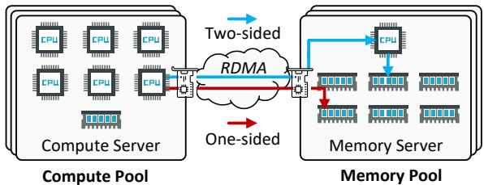  
Figure 1: Architecture of disaggregated memory.  
pared to state-of-the-art range indexes on DM.

The source code of our DMTree prototype is available at: https://github.com/muouim/DMTree.

## 2 Background and Motivation

## 2.1 Disaggregated Memory

Emerging disaggregated memory (DM) architecture separates computing and storage by dividing them into different resource pools. As DM can efficiently address resource provisioning inefficiencies in current data centers [13, 54], it has become increasingly popular. We show an overview of a DM architecture in Figure 1. In a typical deployment, compute servers in the compute pool have multiple CPU cores (e.g., 10s\~100s) but limited memory (e.g., 1\~10 GB), while memory servers in a memory pool have large memory (e.g., 100s\~1000s GB) but limited CPU cores (e.g., 1\~2) [49].

Communication between compute and memory servers relies on fast remote-access interconnect techniques, such as RDMA and CXL [6, 16, 24]. Generally, RDMA offers two primitives: one-sided RDMA enables remote memory access without involving the remote server’s CPU [12]; twosided RDMA sends the request to the remote server, and the remote server processes the incoming request with CPUs on the memory server [10, 17]. Due to limited CPU resources in memory servers, one-sided RDMA is preferred to access the disaggregated memory directly [25, 32, 49, 60].

Besides the choice of different primitives, RDMA resources are critical to the performance [32, 40]. In particular, Computation Resources (i.e., IOPS) and Communication Resources (i.e., bandwidth). IOPS refers to how many operations (including sending and receiving) an RDMA NIC can perform in one second. In contrast, Bandwidth refers to the maximum data transfer rate between servers via an RDMA NIC. Due to the separation of data storage and CPUs, DM systems necessitate numerous concurrent remote accesses for compute servers to retrieve data from memory servers. As a result, both IOPS and bandwidth can easily become the bottleneck [18, 32, 40].

## 2.2 Analysis of Existing Range Indexes on DM

Modern applications advocate indexes to support efficient searches, writes, and scans [5, 9, 33, 53]. Range indexes are particularly popular in these applications for their ability to handle all these operations efficiently. Existing range indexes on DM include variants of B+-tree, learned index, ART, and

LSM-tree [25, 32, 49, 50]. Since the index is typically on the critical path of various applications, existing works highlight their benefits by evaluating the index in isolation. Although greatly optimized for concurrency and scalability, they present fundamental trade-offs in utilizing network resources.

## 2.2.1 Range Indexes with Continuous Range Storage

Range indexes with continuous range storage, such as $\mathbf { B } ^ { + } .$ tree and learned indexes, maintain coarse-grained leaf nodes, store a certain range of key-value entries continuously within a node, and roughly locate this range during entry locating.

B+-tree. A $\mathbf { B } ^ { + }$ -tree typically consists of multiple levels, as shown in Figure 2. The leaf nodes at the bottom level store key-value entries, while the internal nodes store key-pointers that are used to retrieve leaf nodes. To locate a key-value entry, the compute server traverses the multi-level tree from the root to the leaf, involving multiple rounds of RDMA requests.

In DM architecture, multi-round network communication significantly affects index retrieval performance, even with an ultra-fast network. Existing proposals [32, 49, 59] minimize remote accesses by privately caching part of the index on each compute server, with these cached portions being inaccessible to other servers. For example, $\mathbf { B } ^ { + }$ -tree caches the entire internal tree on the compute server. In the case of a cache hit, only a single RDMA request is needed to retrieve the leaf node stored remotely in the memory server.

Learned index. The learned index leverages machine learning models to analyze data distribution patterns and construct functions $( \mathrm { e . g . }$ , CDF) to predict the rough position of keyvalue entries, typically corresponding to multiple predicted leaf nodes. Unlike $\mathrm { { \bf B } ^ { + } - t r e e }$ , it caches the machine learning model on each compute server, eliminating the need to cache the entire internal tree. This approach helps reduce the consumption of limited cache resources on the compute servers.

Bandwidth bottleneck. The primary issue of $\mathbf { B } ^ { + }$ -tree and learned index with private compute-side caching is the RDMA bandwidth bottleneck. Both structures store multiple keyvalue entries within each leaf node, meaning that accessing or modifying a single entry typically requires reading or writing the entire node. For example, in a $\mathbf { B } ^ { + }$ -tree where each node contains 32 key-value entries, reading a single entry results in ≈32× read amplification [32]. This increases bandwidth consumption and exacerbates the network bottleneck.

We evaluate the impact of the bandwidth bottleneck on the performance of both Sherman and ROLEX [25, 49] (i.e., the state-of-the-art DM-optimized $\mathbf { B } ^ { + }$ -tree and learned index). All experiments in this section are conducted on a cluster consisting of six compute servers and one memory server, as described in §5.1. For each baseline, the index is preloaded with one billion key-value entries, and 100 million operations are executed to evaluate performance. As shown in Figure 3a, both Sherman and ROLEX experience a performance bottleneck as client threads scale, primarily due to read amplification. Specifically, they achieve only 16.3-18.8% of the Expected Search performance, defined as reading a single key-value entry using one RDMA without read amplification.

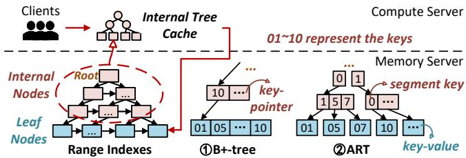  
Figure 2: Exploring range indexes on DM: $\textcircled { 1 } \mathbf { B } ^ { + }$ -tree uses "keypointer" along the search path to ultimately locate a range leaf node; ②ART uses "segment key" along the path and locates a precise entry.

## 2.2.2 Range Indexes with Precise K-V Locating

Range indexes with precise key-value locating, such as ART, use fine-grained leaf nodes and store key-value entries separately in distinct nodes to perform precise entry locating.

ART. As illustrated in Figure 2, unlike $\mathbf { B } ^ { + } .$ -tree, the Adaptive Radix Tree (ART) stores key segments in internal nodes along the search path rather than the entire key. Each internal node in ART contains an array of pointers linked to segments of the key, which direct to the next lower tree node. The leaf node of ART stores only a single key-value entry. When deployed on DM, ART also employs a private compute-side cache to store the internal tree on the compute server, thereby reducing remote memory accesses [32].

IOPS bottleneck. Existing works [32] investigate ART as a substitute for $\mathtt { B } ^ { + }$ -tree to address the bandwidth bottleneck, as ART stores only one key-value entry per leaf node, eliminating read amplification. However, the separate storage of keyvalue entries can exacerbate the IOPS bottleneck. For scan operations, multiple RDMAs are required to read a range of key-value entries stored separately in numerous small-sized leaf nodes, seriously increasing the consumption of IOPS resources. Moreover, for insert operations, when a new leaf node is inserted, a new key-pointer must be written to the internal node to retrieve this leaf node. The small-sized leaf nodes in ART cause frequent updates of internal nodes when inserting new key-value entries, exacerbating the IOPS bottleneck.

We show the impact of the IOPS bottleneck by evaluating the performance of SMART, the state-of-the-art ART index on DM. As shown in Figure 3b and 3c, SMART’s scan performance is only 35.5% of Sherman’s, primarily due to the IOPS bottleneck. Similarly, its insert performance reaches just 35.8% of the Expected Insert performance (which involves two RDMAs: one for searching empty tree slots and another for writing the key-value entry). This performance degradation is attributed to the additional RDMA requests required to update the internal tree during insert operations.

## 2.2.3 Other Range Indexes

LSM-tree. The Log-Structured Merge tree (LSM-tree) is also a widely used range index. In disaggregated memory, it optimizes write operations by converting random writes into sequential writes, thereby reducing network overhead. LSMtree organizes data into multiple levels, with key-value entries initially written to local-memory structures (e.g., memtables) and periodically flushed to remote memory in larger, sequential blocks (e.g., sstables). To minimize remote memory accesses, LSM-tree also uses a private compute-side cache to store key metadata, such as bloom filters and table indexes.

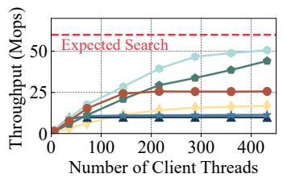  
(a) Search

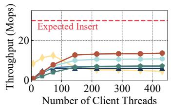  
(b) Insert

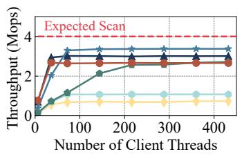  
(c) Scan

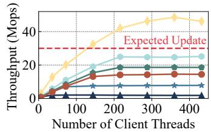  
(d) Update  
Figure 3: Performance trade-offs of existing range indexes for point and range operations on DM. Experiments use the default configuration of six compute servers and one memory server, with one billion preloaded key-value entries and 100 million operations per test (detailed in §5.1).

CPU bottleneck. In LSM-tree, sequentially written blocks to remote memory require periodic compaction to maintain index order [39]. These compaction tasks consume considerable RDMA resources as they involve reading large amounts of key-value entries from remote memory. dLSM [50], the state-of-the-art DM-optimized LSM-tree, offloads compaction tasks to memory servers, effectively reducing RDMA resource consumption. However, in DM architecture, the limited CPU resources on the memory server can easily become a bottleneck, hindering overall performance.

We investigate the impact of CPU bottleneck on the performance of dLSM, as shown in Figure 3b and 3d. Notably, dLSM demonstrates high update performance, even exceeding the Expected Update performance (which involves two RDMAs: one for reading the key-value entry and another for performing the update). This is because most Zipfian update operations can be efficiently handled within its local-memory structures without relying on RDMAs [50], thanks to the sequential write feature of LSM-tree. However, when scaling client threads, dLSM’s insert performance initially improves but eventually declines. This happens because the increasing number of concurrent insert operations accelerates the generation of compaction tasks on the memory server, overwhelming the limited computational resources (e.g., a single CPU core on each memory server). The accumulated compaction tasks block concurrent writes, leading to a decline in insert performance (14.9%–41.4% of the expected performance), thus breaking the expected performance trade-offs.

## 2.3 Combine Range Storage with Precise Locating

To address bandwidth issues in $\mathbf { B } ^ { + }$ -tree and learned index, as well as IOPS issues in ART index, previous studies have combined continuous range storage with precise key-value locating, including CHIME [31] and $\mathrm { F P - B ^ { + } }$ -tree [28, 38].

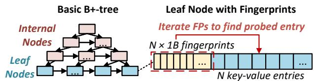  
Figure 4: Structures of FP-B+-tree.

CHIME. CHIME proposes a DM-optimized hybrid index that combines hashing techniques with tree-based indexing. Similar to $\mathbf { B } ^ { + }$ -tree, CHIME stores a range of key-value entries contiguously within the leaf nodes and locates them through internal nodes. However, unlike $\mathbf { B } ^ { + }$ -tree, CHIME employs hopscotch hashing within the leaf nodes to locate the requested key-value entry, reducing read amplification that would otherwise occur from accessing the entire leaf node.

FP-B+-tree. $\mathrm { F P - B ^ { + } }$ -tree introduces a fingerprinting technique based on $\mathrm { ~ \tt ~ B ^ { + } ~ }$ -tree. As shown in Figure 4, each leaf node contains several key-value entries, along with a fingerprint table. This table consists of N fingerprints, each corresponding to a key-value entry (i.e., each key typically has a unique fingerprint). In practice, fingerprints are one-byte hashes of the in-leaf keys, arranged sequentially, and are used for efficient iteration to locate the requested key-value entry.

Performance analysis. By leveraging hashing or fingerprinting techniques, CHIME and FP-B+-tree reduce the average number of in-leaf probed keys to one, thereby minimizing read amplification and alleviating the bandwidth bottleneck for point operations. Moreover, their continuous range data structure mitigates the IOPS bottleneck by reducing RDMA requests, particularly by minimizing the need to read multiple small leaf nodes during scans. Performance evaluations presented in Figure 3 show that CHIME and FP-B+-tree improve search performance by 2.2-4.5× over Sherman and ROLEX, and enhance scan performance by 2.5× over SMART.

## 2.4 Limitations and Opportunity

Although CHIME and FP-B+-tree outperform other range indexes, deploying indexes that combine continuous range storage with precise key-value locating to achieve expected performance in DM still suffers from new challenges. These challenges are especially prominent in data locating and concurrency control during point operations. We demonstrate that naive approaches can lead to sub-optimal performance.

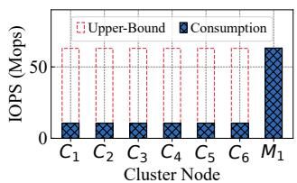

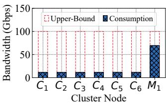  
(a) IOPS consumption  
(b) Bandwidth consumption  
Figure 5: RDMA resource consumption of FP-B+-tree during inserts $( C _ { 1 } { - } C _ { 6 }$ for compute servers, $M _ { 1 }$ for the memory server).

Limitation#1: Extra RDMAs for precise K-V locating. First, to serve point operations, CHIME and $\mathrm { F P - B ^ { + } }$ -tree rely on extra RDMAs for precise key-value locating. Specifically, during search operations, compared to the expected case (i.e., using a single RDMA), $\mathrm { F P - B ^ { + } }$ -tree incurs additional RDMA requests to access the fingerprint table before reading the keyvalue entries. Similarly, during insert operations, $\mathrm { F P - B ^ { + } }$ -tree needs to read the fingerprint table to find an empty slot in the leaf node and update the table to retrieve the newly inserted key-value entry. CHIME also requires additional RDMA requests to handle hash collisions during inserts. In DM architecture, these extra RDMAs strain the limited IOPS resources, exacerbating the IOPS bottleneck. We demonstrate the impact of the IOPS bottleneck on the performance of CHIME and $\mathrm { F P - B ^ { + } }$ -tree in Figure 3a and 3b. The $\mathrm { F P - B ^ { + } }$ -tree’s search performance is only half that of the expected search performance due to its doubled IOPS resource consumption. Meanwhile, the insert performance of CHIME and $\mathrm { F P - B ^ { + } }$ -tree is only 23.9-45.4% of the expected insert performance.

Limitation#2: Extra RDMAs for locking leaf tree node. Second, both CHIME and FP-B+-tree employ a locking mechanism for concurrency control during concurrent writes, requiring the corresponding leaf node to be locked when writing key-value entries to maintain correctness and to be unlocked after the write operations. Locking is typically done by changing the lock byte in the leaf node from 0 to 1 using RDMA\_CAS while unlocking sets the lock byte back to 0 with RDMA\_WRITE [31, 32, 49]. However, these operations consume a considerable amount of IOPS resources, severely impacting performance. As illustrated in Figure 3d, the update performance of CHIME and $\mathrm { F P - B ^ { + } }$ -tree achieves only 48.1-61.8% of the expected update performance.

Opportunity: Unsaturated RDMA resources on compute servers. For all existing range indexes in DM architecture, RDMA resources on compute servers are primarily used to communicate with memory servers. However, we find that RDMA resources between compute servers are always unsaturated. This is because network requests from multiple compute servers are aggregated on the memory server, and the memory server’s network can more easily become the bottleneck [18, 32], thus preventing further increase of requests from compute servers. As shown in Figure 5, we use the insert operations of the FP-B+-tree as a case study, multiple RDMAs for data locating and locking operations are aggregated on the memory server, creating an IOPS bottleneck (i.e., $M _ { 1 }$ in the figure). At this time, the compute server’s IOPS resources are underutilized $( \mathrm { i } . \mathrm { e } . , C _ { 1 } . { C } _ { 6 }$ in the figure).

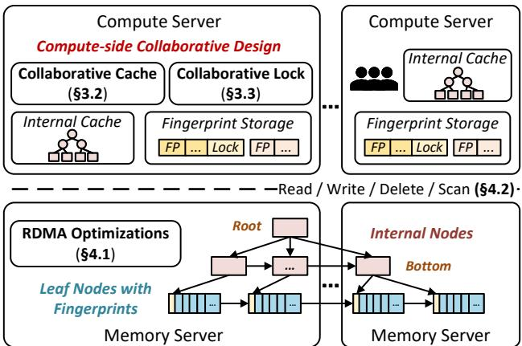  
Figure 6: System overview of DMTree.

## 3 Design of DMTree

## 3.1 Overview

We present DMTree, a DM-oriented tree index that employs a compute-side collaborative design to alleviate the network bottlenecks by leveraging the underutilized RDMA resources on compute servers. Figure 6 depicts the system overview. To trade-off bandwidth and IOPS resources during point (i.e., search, insert, and update) and scan operations, DMTree adopts the $\mathrm { F P - B ^ { + } }$ -tree structure. Each tree node includes a pointer to its right sibling and multiple pointers to child nodes, allowing efficient node retrieval similar to the $\mathbf { B } ^ { + }$ -tree [22, 49]. Each leaf node features a fingerprint table for index retrieval at the key-value entry level, eliminating the need to read entire tree nodes from the memory server during point operations.

Following a typical DM architecture (as described in §2.1), DMTree is stored and distributed among multiple memory servers. Each compute server maintains an index cache and accesses data from memory servers via one-sided RDMA operations. To address RDMA network bottlenecks on the memory server and achieve the expected performance for search, insert, update, and scan operations, DMTree introduces a compute-side collaborative design featuring two key innovations: a compute-side collaborative cache (§3.2) and a compute-side collaborative concurrency mechanism (§3.3).

## 3.2 Offload Precise Locating to Compute-side

DMTree offloads the data location operations to compute servers, reducing network bottlenecks caused by the additional RDMA requests needed for precise key-value locating.

## 3.2.1 Compute-side Collaborative Caching

Based on our analysis in §2.4, precise key-value locating involves two key steps: multi-level traversal of the internal tree and key-value identification within leaf nodes. To optimize this, DMTree integrates its private internal tree cache with a shared storage for leaf fingerprint tables.

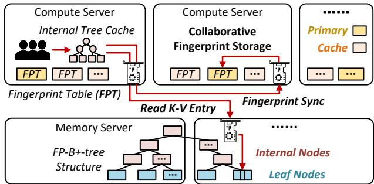  
Figure 7: Compute-side collaborative caching optimization on DM.

Private internal cache. DMTree maintains a private index cache on each compute server to store the internal tree. This private internal cache effectively reduces remote memory accesses and experiences minimal thrashing, as internal nodes are infrequently updated. Internal nodes are modified only when adding or deleting leaf nodes (i.e., a key-pointer must be inserted or deleted to facilitate leaf node retrieval). Due to the large size of leaf nodes in DMTree, such updates occur rarely. For example, a leaf node with 32 key-value slots requires 32 insert operations to fill before splitting and generating a new leaf node, making updates to internal nodes infrequent.

To simplify cache consistency management, DMTree only caches the bottom-level internal nodes while locally constructing the upper-level nodes. When internal nodes are updated, only the modified bottom-level nodes are synchronized. Corresponding upper-level nodes are updated locally.

Collaborative fingerprint storage. DMTree maintains shared fingerprint tables across compute servers. As frequent updates to leaf nodes result in significant synchronization overhead and cache thrashing, it renders the private cache ineffective in optimizing the remote traversal overhead for fingerprint tables in FP-B+-tree. Therefore, DMTree adopts a collaborative fingerprint storage model on the compute servers. It stores the fingerprint table of each leaf node on multiple compute servers, as illustrated in Figure 7. Each table exists as primary storage on a single server but can be cached by several others. Before a leaf node entry is retrieved from a memory node, the corresponding fingerprint table is first read from a peer compute server and then cached locally. The position of the requested key-value entry within the leaf node is identified by scanning the fingerprints. When inserting new key-value entries, only the primary storage fingerprint table is updated synchronously to ensure accurate data retrieval and avoid redundant synchronization overhead. This collaborative design shifts the burden of reading and synchronizing fingerprint tables from the memory server to compute servers, efficiently alleviating the IOPS bottleneck in FP-B+-tree caused by additional RDMA requests for precise key-value locating.

It should be noted that each key-value entry requires only one byte of fingerprint storage, which is manageable within the available memory resources on the compute servers. The memory usage on each compute server is further discussed in §5.3. In particular, if memory resources are insufficient to accommodate the fingerprint tables and internal tree cache, internal nodes will be evicted in a FIFO manner, and the newly generated fingerprint table will be stored on memory servers. Additionally, to mitigate the impact of multiple RDMA requests caused by the remote traversal of the internal tree during cache misses, memory resources on the compute server prioritize fulfilling the internal tree cache requirements.

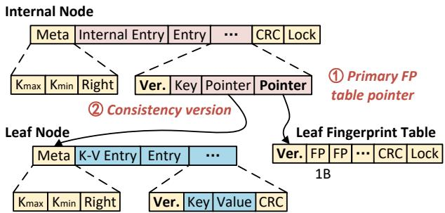  
Figure 8: Structures of DMTree designed for consistency.

## 3.2.2 Fingerprint and Cache Consistency

When applying our compute-side collaborative design, ensuring consistency is crucial. DMTree introduces a new consistency verification strategy that maintains consistency in both collaborative fingerprint storage and private internal cache. Collaborative fingerprint consistency. For collaborative fingerprint storage, each fingerprint table is stored on a single server, with multiple cached copies distributed across other servers. During search operations, cached fingerprints are used to accelerate lookups. However, for write operations, only the primary fingerprint tables are updated synchronously, while the cached fingerprints are updated asynchronously, potentially leading to temporary inconsistencies.

When searching cached fingerprints, two types of inconsistencies may arise, both of which can be directly detected: (i) the fingerprint of the requested key is found in the cache, but the corresponding key-value entry fetched remotely differs from the requested key; and (ii) the requested fingerprint is missing from the cache. For modified or newly inserted entries, the cached fingerprint tables are updated asynchronously and may not be consistent with the remote storage, leading to inaccurate entry locations or missing fingerprints.

DMTree ensures fingerprint consistency in an optimistic manner. When an inconsistency occurs, the primary fingerprint table is retrieved from other compute servers, and the local cache is updated accordingly. To facilitate synchronization between the cached fingerprints and the primary fingerprint storage, DMTree stores a pointer to the primary fingerprint table within its internal entry. Figure 8 depicts the internal node structure. Each internal node contains multiple entries that consist of a key and a pointer to the lower tree node. The key in each entry represents the minimum key within the key range contained in the lower tree node or leaf node being pointed to. In the bottom-level internal nodes pointing to leaf nodes, each entry additionally stores a pointer to the corresponding primary fingerprint table.

Private cache consistency. DMTree also ensures consistency between the private internal cache and the remote internal tree. Specifically, the correct leaf node and fingerprint table must be located through the internal tree cache, with results consistent with those from directly traversing the remote tree.

When searching the private internal cache, inconsistencies can arise when range modifications are made to remote internal or leaf nodes (e.g., node splits or merges) without immediate synchronization across compute servers. To ensure internal cache consistency, both leaf nodes and internal nodes maintain some metadata, including $K _ { m a x }$ and $K _ { m i n }$ to indicate the range of the node, as well as an 8-byte pointer to its right sibling (similar to B+-tree). This metadata is essential for determining the range of nodes to search or update and for identifying the correct node when inconsistencies arise.

To avoid additional RDMA requests for consistency verification during precise key-value locating, DMTree proposes an entry-level consistency verification mechanism. It adds an 8-byte version ID to each leaf key-value entry, internal entry, and leaf fingerprint table, as illustrated in Figure 8. This version ID represents the leaf node’s version and is used to verify coherence among locally cached internal nodes, remote leaf nodes, and fingerprint tables. Specifically, the version ID is initialized to 0 when a node is created and increments whenever the range of the leaf node changes. After retrieving a leaf fingerprint table or key-value entry from the private internal cache, the compute server checks cache coherence by comparing the version ID of the leaf node or fingerprint table with the version ID in the cached internal entry. If the IDs do not match, it implies that the leaf node or fingerprint table has been changed, and the cached entry remains outdated. In such cases, DMTree triggers cache invalidation, prompting the compute server to traverse the internal tree remotely and update the corresponding local cache entry.

## 3.2.3 Scalability Discussion

Below, we discuss the scalability of our compute-side collaborative design, showing it efficiently scales with the number of compute servers. Basically, when compute servers are scaled, the primary fingerprint tables from decommissioned servers are transferred to active ones to maintain accurate index retrieval. Therefore, this transfer process should be lightweight to support the DM architecture’s rapid scaling needs.

To achieve this, DMTree allows multiple compute servers to store identical copies of the fingerprint table at the same NIC register memory offset. Among these, one server is designated as the primary, while the others function as caches. The primary ownership of each fingerprint table is determined through consistent hashing [19] based on the fingerprint offset (i.e., consistent\_hash(fp\_offset)). All active compute servers participate in the consistent hashing ring, ensuring efficient and consistent assignment of primary ownership and redirection of access requests. This method facilitates the seamless redirection of the fingerprint table pointer to the appropriate server. If a compute server becomes invalid, it is evicted from the hashing ring. Subsequently, consistent hashing redistributes the primary fingerprint table storage to other servers, and the cached fingerprint tables on these redistributed servers will then be synchronized to primary storage upon the next access. Furthermore, consistent hashing can also be used to loadbalance the primary fingerprint storage. Using techniques such as virtual nodes, hotspot fingerprints can be evenly distributed and accessed on compute servers.

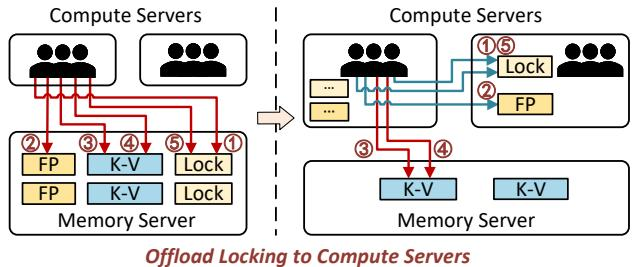  
①⑤: Lock & unlock ②: Fingerprint read ③④: Entry read & update  
Figure 9: Compute-side collaborative locking in write operations.

## 3.3 Offload Lock to Compute-side

Previous concurrency control optimizations for DM indexes primarily focused on reducing the overhead associated with conflicted locking operations. For example, when two clients on the same server lock the same address, they resolve the lock conflicts locally, helping to mitigate some of the remote lock overhead. Techniques such as using local lock tables to handle conflicting write requests or aggregating a small batch of write requests within the same server were introduced [32, 49]. However, these approaches overlooked the optimization for common locking operations, such as nonconflicted write requests, which still impose significant network resource overhead. To address this, DMTree introduces a compute-side collaborative concurrency control that fully offloads locking operations to compute servers, further mitigating network bottlenecks on memory servers.

Compute-side collaborative locking. DMTree adopts pessimistic locking for write-write conflict (i.e., multiple concurrent write requests attempt to modify the same address). Before writing entries to a tree node in the memory server, the compute server must hold a lock on it. To better balance RDMA IOPS resource utilization (as described in §2.4), DMTree adopts a compute-side collaborative locking mechanism. Specifically, it stores the lock fields of leaf tree nodes distributed across compute servers along with the primary fingerprint tables. The node is locked by setting the lock field from 0 to 1 through RDMA\_CAS across compute servers.

Collaborative embedded unlocking. To further reduce the network resource consumption, DMTree combines unlocking operations with writing back the primary fingerprint table. It achieves this by storing the lock field at the end of the fingerprint table and unlocking the node by setting the lock field to 0 within an RDMA\_WRITE. Due to the sequential write feature of RDMA NIC, the node unlocking is always done after the fingerprint table is written [32, 58]. Therefore, for insert operations, the fingerprint table writing and node unlocking are combined into a single RDMA write operation. For update operations that don’t involve the updating of fingerprint tables, the node is unlocked by setting the lock field to 0 with a separate RDMA\_WRITE. For infrequently updated internal nodes, lock fields are stored on the memory server, positioned at the end of each node. Locking employs RDMA\_CAS to change the lock field from 0 to 1 while unlocking sets it to 0 when the node is written back.

In the concurrent writing process, we use the update operation as an example to show the collaborative concurrency control strategy. As shown in Figure 9, the basic FP-B+-tree requires 5 RDMA operations to perform an update operation (①˜⑤ in Figure 9), including ① locking the node, ② reading the fingerprint table to locate the corresponding key-value entry, ③ reading the key-value entry, ④ writing the updated entry, and ⑤ unlocking the node. By offloading the access to the fingerprint table, as well as the locking and unlocking operations, to the compute servers, 3 out of the 5 RDMA requests can be shifted away from the memory server during update operations. This effectively optimizes the performance issues caused by the IOPS bottleneck on the memory server. Compute-side optimistic locking. DMTree uses optimistic locking for concurrent read-write conflicts and includes an 8- byte CRC check field for each read and write unit, including tree nodes, key-value entries, and fingerprint tables. Readwrite conflicts (i.e., a read obtains the data that is being modified) are resolved by checking the consistency through the CRC checksum. When the compute server reads an internal node, a key-value entry, or a leaf fingerprint table, it verifies whether the CRC calculated matches the CRC checksum stored in the read unit. In a mismatch, the compute server re-reads the node, entry, or table. When the node, entry, or fingerprint table is updated, the CRC is re-calculated. In particular, if the size of the key-value entry is smaller than the cache line size (e.g., 64B), there is no need to add a CRC field because RDMA guarantees the atomicity of data read and write at the cache line granularity [18, 58].

## 4 Implementation and Discussions

## 4.1 RDMA Optimizations

Filter empty entries during scans. DMTree retrieves the index at the leaf node level during scan operations. All leaf nodes containing the requested keys must be read remotely. However, irrelevant data (e.g., unwritten empty entries) within the node leads to a waste of bandwidth resources. To optimize this, DMTree utilizes the fingerprint table to filter out empty entries during scans, as shown in Figure 10. Since each fingerprint corresponds to a key-value entry in the leaf nodes, filtering out empty fingerprints prevents the reading of unwritten entries, thereby conserving bandwidth resources.

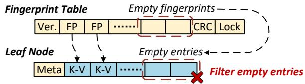  
Figure 10: Filter empty entries through fingerprints during scans.

Combine concurrent requests. DMTree follows the read delegation and write combining design from existing works [32, 49]. These techniques combine concurrent searches and writes from a single compute server into a batch, reducing network overhead. Meanwhile, to prevent excessive latency caused by a large batch size, DMTree imposes a batch size limit. When the number of concurrent operations in a batch exceeds a threshold, the operation is executed directly without batching.

## 4.2 DMTree Operations

Based on DMTree’s designs and optimizations, we offer four index primitives: Search, Write, Delete, and Scan.

Search(key). When searching for a key, the client first checks its internal tree cache to locate the corresponding fingerprint table and leaf node. It then reads the fingerprint table from the cache, calculates the fingerprint of the key to be searched, and matches it within the table. If a matching fingerprint is found, the key-value entry is retrieved from the corresponding slot of the leaf node in the memory server. If not, DMTree reads the primary fingerprint table from other compute servers to verify cache consistency and check for any newly inserted matching fingerprints. If no entry is found, DMTree returns NULL to indicate that the requested key-value entry does not exist.

Write(key, value). To insert or update a key-value entry, the client first locates the leaf node and primary fingerprint table using a collaborative cache strategy similar to searches. Before accessing the fingerprint table, it locks both the table and the leaf node with RDMA\_CAS, changing the lock field from 0 to 1 across compute servers. Existing key-value entries are read and updated directly. For new key-value entries, their fingerprints are written into the empty slots of the fingerprint table, and the entries are written into the corresponding empty slots of the leaf node. The node is then unlocked by setting the lock field back to 0 using RDMA\_WRITE. If the fingerprint table is full, both the leaf node and the fingerprint table are split, resembling a B+-tree, to create more index space. Half of the key-value entries and fingerprints are moved to the newly created node and table, and a new key-pointer is written to the internal nodes to retrieve them.

Delete(key). Deletes are similar to updates. Delete sets the corresponding entry to NULL, indicating that the entry has been logically removed and the space has been freed. When all key-value entries in a leaf node are deleted, the node is merged with its adjacent node, and the corresponding internal entry is updated to retrieve the newly merged node. DMTree uses a background thread to reclaim the freed nodes.

Scan(start\_key, len). When scanning a range of key-value entries, given a start key and a scan length, the client first uses its internal tree cache to locate the leaf node and fingerprint table where the start key is stored. It then remotely reads the fingerprint table to filter empty entries and reads the remaining leaf node to identify all requested entries. If fewer entries are found than the scan length, the client reads the adjacent leaf node and continues until all requested entries are located.

## 4.3 Discussions

Failures and inconsistencies handling. In DMTree, the compute-side collaborative design introduces auxiliary metadata (e.g., fingerprint tables) on compute servers to support fast, scalable index operations. To ensure robustness against potential compute server failures that could affect this metadata, DMTree is designed to be compatible with lightweight failure detection mechanisms and recovery protocols that ensure correctness and fault tolerance. Specifically, as described in §3.2.3, DMTree supports the relocation and reconstruction of fingerprint tables. It allows multiple compute servers to store identical fingerprint replicas at the same NIC-registered memory offset, where one server acts as the primary and others hold cached replicas. To ensure availability, failures can be detected through lightweight mechanisms, such as monitoring RDMA request failures and verifying server liveness via probing. Upon detecting a compute server failure, the system updates the server membership list to exclude the failed server and elects a new primary from the remaining replicas. The newly elected primary can reconstruct the metadata, such as the fingerprint table, by validating and synchronizing it based on the key-value data stored in remote memory.

Compatibility of DMTree to CXL. The key design principles of DMTree remain compatible with CXL-based systems. First, from a functional perspective, DMTree relies solely on one-sided RDMA primitives and inter-server communication, which naturally align with CXL’s load/store instructions and inter-CPU memory sharing. Second, in terms of performance benefits, although CXL memory offers lower latency (\~170- 250 ns [34]) and higher PCIe bandwidth (\~64 GB/s) than RDMA, performance bottlenecks may still arise on the memory side under high concurrency. Therefore, the compute-side collaborative design in DMTree remains valuable. Finally, regarding system adaptations, deploying DMTree in CXL environments may require specific adjustments. While CXL’s enhanced memory performance may reduce the relative performance gains of DMTree, it also shifts the system’s performance bottlenecks. Specifically, software-level overheads (e.g., concurrency control) may become the dominant limiting factors before IOPS or PCIe bandwidth are saturated. These shifting bottlenecks present further opportunities for optimization via compute-side collaborative design.

## 5 Evaluation

In this section, we evaluate DMTree by comparing it to stateof-the-art DM range indexes. We first outline our experimental setups and competitors in §5.1. Our evaluation focuses on the following research questions:

• What is the overall performance of DMTree (§5.2)?

• Dose DMTree incur additional overhead (§5.3)?

• How does each design help with the performance (§5.4)?

• What is the impact of workload characteristics (§5.5)?

## 5.1 Experimental Setup

Testbed. All experiments are conducted on a cluster of seven machines (six compute servers and one memory server), each equipped with two 40-core Intel Xeon Gold CPUs, 128 GB DRAM, and a 100 Gbps Mellanox ConnectX-6 RNIC. All machines are connected to a 100 Gbps Ethernet switch. The RDMA driver is MLNX\_OFED-5.4. Each memory server is allocated a single CPU core to reflect the limited computational resources on the remote memory in DM architecture. Each compute server is allocated 25 GB of memory to meet the requirements of all baselines (discussed in §5.3).

Workloads. We use YCSB [11] workloads with both uniform and Zipfian distributions, adopting two configurations: Microbenchmarks and YCSB-benchmarks. Micro-benchmarks evaluate DMTree’s performance on basic operations, including search, insert, update, and scan. YCSB-benchmarks assess DMTree’s performance under mixed operations, including A (50% updates, 50% searches), B (5% updates, 95% searches), C (100% searches), D (5% inserts, 95% searches), E (5% inserts, 95% scans), F (50% read-modify-write, 50% searches).

For both the Micro-benchmarks and YCSB-benchmarks, we randomly preload one billion key-value entries and perform 100 million operations in each experiment. Before executing the operations, we randomly access all loaded keyvalue entries to warm up the cache. By default, the size of each key-value pair is fixed at 32 bytes (24 bytes for the key and 8 bytes for the value). This approach, which involves using a fixed-length key and an 8-byte value as a pointer to application data, is common in disaggregated memory-based indexes [25, 31, 32]. The maximum length for scan operations is set as 100, with a uniform distribution. In §5.5, we further investigate the impact of these workload characteristics (i.e., varying key-value sizes and scan lengths) on performance.

Baselines. We evaluate and compare DMTree with five stateof-the-art DM-optimized range indexes: Sherman (B+-tree), dLSM (LSM-tree), ROLEX (learned index), SMART (ART), and CHIME (hybrid index), all evaluated based on their opensource implementations [37, 44–47]. For ROLEX, we adopt the implementation provided by CHIME, following its approach of pretraining all loaded key-value entries to avoid model retraining [37]. Additionally, certain RDMA verbs, such as Masked-CAS used in CHIME, are no longer supported in MLNX\_OFED-5.1 and later driver versions [1]. We have carefully replaced these verbs with alternative approaches.

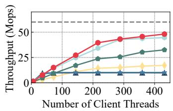  
(a) Search

  
(b) Insert

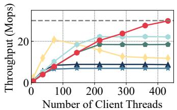  
(c) Update

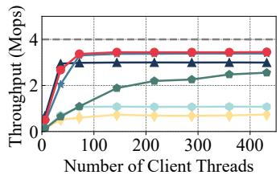  
(d) Scan

Figure 11: Throughput comparison of range indexes on DM under Micro-benchmarks with Uniform distribution.  
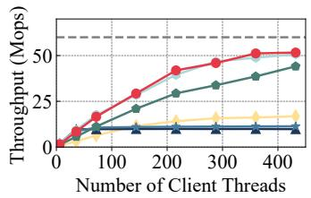  
(a) Search

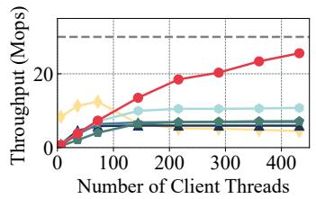  
(b) Insert

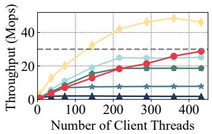  
(c) Update

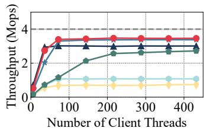  
(d) Scan  
Figure 12: Throughput comparison of range indexes on DM under Micro-benchmarks with Zipfian distribution.

Parameters. Unless otherwise specified, the following default parameters are used for the baselines to ensure a fair comparison. For Sherman and CHIME, we set the span size to 32 (i.e., each leaf node stores 32 key-value entries), as recommended in [49]. For ROLEX, we configure a span size of 8 and set the model prediction error to 8 to reduce read amplification. For dLSM, we use the default 64 MB SSTable size as specified in [50]. For DMTree, we also use a span size of 32. Each leaf node is approximately 1.3 KB in size.

## 5.2 Overall Performance

## 5.2.1 Performance on Micro-benchmarks

We first evaluate the basic operations of DMTree independently using the Micro-benchmarks with various numbers of client threads, each bound to a CPU core. Each thread uses 4 coroutines to overlap the RDMA polling overhead (all baselines also enable coroutines, except for dLSM, which currently does not support this feature). We use both Uniform and Zipfian (coefficient = 0.99) distributions to issue operations. The throughput results are presented in Figure 11 and 12.

Search workload. For the search-only workload, DMTree, SMART, and CHIME deliver performance close to the expected search, with each using a single RDMA request to complete the search operation and accessing only the requested key-value entry. This approach maximizes the utilization of the network resources. DMTree outperforms Sherman and ROLEX by 4.5-5.2× by avoiding the need to read the entire leaf node, which conserves bandwidth resources and prevents bandwidth bottleneck. Furthermore, DMTree outperforms dLSM by 2.8-3.1×, primarily due to the overhead introduced by dLSM’s complex LRU cache implementation. Insert workload. For the insert-only workload, DMTree outperforms Sherman and ROLEX by 3.7-4.3× by alleviating the bandwidth bottleneck through the elimination of read amplification. It also achieves 2.3-3.5× better insert performance than SMART and CHIME. This improvement results from a reduction in RDMA requests to remote memory. When compared to SMART, it minimizes RDMA requests arising from frequent internal tree updates. In contrast to CHIME, it reduces RDMA requests related to handling hash collisions. During insert operations, DMTree leverages fingerprint tables to efficiently locate empty tree slots and offloads RDMA requests for updating the fingerprint table, as well as locking operations, to the compute servers. This strategy minimizes the consumption of the memory server’s limited IOPS resources, alleviating the IOPS bottleneck and ensuring expected insert performance. Compared to dLSM, DMTree achieves 2.1-5.7× better insert performance, as dLSM relies on the memory server’s CPU to handle LSM-tree’s compaction tasks. The limited computational power on the memory server hinders dLSM’s ability to handle high-concurrency writes.

Update workload. For the update-only workload, DMTree outperforms all baselines by 1.4-4.3× under the uniform distribution, thanks to its compute-side collaborative design. Under the Zipfian distribution, Sherman performs poorly due to concentrated updates, which block concurrent requests. In contrast, SMART, CHIME, and DMTree efficiently handle concentrated updates by aggregating simultaneous requests, thus reducing blocking overhead. DMTree further outperforms SMART and CHIME by 1.1-1.5× due to its offloading of locking operations to the compute servers. dLSM demonstrates excellent performance with Zipfian updates, as most of these operations can be efficiently handled within its local memory structures. This is primarily due to the LSM-tree’s sequential write feature, which minimizes the need for RDMA requests.

Scan workload. Regarding the scan-only workload, DMTree achieves 3.2× higher throughput than SMART. This improvement is due to DMTree’s ability to to continuously store a range of key-value entries, thereby avoiding the IOPS bottleneck experienced by SMART due to multiple RDMA requests during scan operations. Moreover, DMTree outperforms Sherman and CHIME by 1.1-1.3×. This improvement can be attributed to DMTree’s ability to filter out empty key-value entries in leaf nodes during scans, effectively reducing unnecessary bandwidth consumption. ROLEX achieves similar scan performance to DMTree, thanks to its smaller leaf node size, which minimizes read amplification.

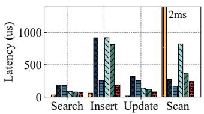  
(a) Uniform

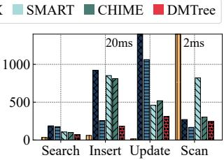  
(b) Zipfian  
Figure 13: Tail latency comparison of different operations.

## 5.2.2 Tail Latency on Micro-benchmarks

Besides throughput, we also report the P99 latency of DMTree in Figure 13. By default, each compute server launches 72 client threads, with other configurations unchanged. Since scan operations in SMART, ROLEX, and CHIME do not currently support coroutines [37,44,45], we disable coroutines for a fair comparison when measuring the tail latency of scans for all indexes. We show the average results of 3 runs.

For search operations, DMTree reduces the tail latency by up to 64% compared to Sherman and ROLEX, primarily by alleviating the bandwidth bottleneck. Under uniform distribution, SMART, CHIME, and DMTree have similar minimum tail latencies. However, under Zipfian distribution, SMART and CHIME experience higher latencies due to the aggregation of simultaneous search requests. Requests at the tail of the long queue face extended waiting times. In contrast, DMTree limits the aggregate queue length, reducing these delays (see §4.1). This results in a 26%-31% reduction in search tail latency compared to SMART and CHIME.

For insert operations, DMTree reduces tail latency by 28%- 80% compared to Sherman, ROLEX, SMART, and CHIME, primarily by alleviating RDMA bandwidth and IOPS bottlenecks. Regarding update operations, Sherman experiences high tail latency (20 ms) under Zipfian distribution due to concentrated lock contention and blocking. In contrast, SMART, CHIME, and DMTree reduce blocking overhead by aggregating simultaneous update requests. DMTree further lowers update tail latency compared to SMART and CHIME by minimizing IOPS consumption on the memory server caused by locking operations. Notably, dLSM achieves low tail latency for insert and update operations due to its sequential write design, processing over 99% of writes within its local memory structures. However, once a remote flush or compaction is triggered and blocked by limited CPU resources on the

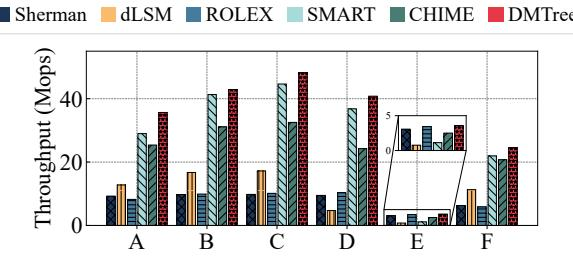

(a) Uniform  
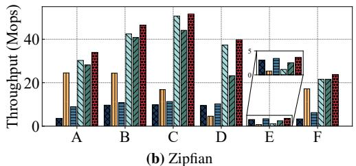  
Figure 14: Performance comparison under YCSB-benchmarks.

For scan operations, DMTree reduces tail latency by 70% compared to SMART, due to its contiguous storage of range key-value entries and efficient reduction of IOPS resource consumption. Compared to Sherman and CHIME, DMTree slightly decreases tail latency by 10-19% through filtering empty entries and conserving limited bandwidth resources.

## 5.2.3 Performance on YCSB-benchmarks

We then evaluate the performance of DMTree using the wellstudied YCSB-benchmarks. Figure 14 shows the throughput results. Compared to Sherman and ROLEX, DMTree achieves 3.8-9.7× higher throughout across all search-/writeintensive workloads (i.e., all except workload E) and similar performance under the scan-intensive workload (i.e., workload E). Moreover, DMTree delivers 3.2× higher throughput for the scan-intensive workload and comparable performance in search-/write-intensive workloads compared to SMART. Compared to dLSM, DMTree achieves an overall performance improvement of 1.4-8.6×, particularly in workloads involving insert operations (e.g., workload D). Additionally, DMTree outperforms CHIME by 1.1-1.7× in search-/write-intensive workloads, as CHIME incurs extra overhead from handling conflicted key-value entries due to hash collisions.

In summary, DMTree delivers the optimal overall performance for the search-, write- and scan-intensive workloads among the range indexes on DM. In particular, SMART and DMTree achieve similar performance under the search-/writeintensive workloads with the Zipfian distribution. However, SMART relies on more compute-side memory resources for cache optimization. In the next section, we further analyze the impact of compute-side memory resources on performance.

## 5.3 Computation and Memory Overhead

Computation overhead. We first analyze the computational overhead of our compute-side collaborative design and demonstrate that the extra overhead it introduces is minimal, involving both local (i.e., cached fingerprint traversal) and remote (i.e., primary fingerprint synchronization) operations. As shown in Table 1, for search operations, the fingerprint traversal overhead contributes only 5% to the overall latency, with no synchronization overhead for static searches. In write operations, certain steps, such as internal cache traversal, locking, and key-value read/write, which are typically unavoidable in range indexes, contribute to the overall latency. The additional overhead from fingerprint traversal and synchronization accounts for only 19.4% of total latency. This overhead is worthwhile given its performance gains (see §5.2).

<table><tr><td rowspan=1 colspan=1></td><td rowspan=1 colspan=1>Internal cache</td><td rowspan=1 colspan=1>FP traversal</td><td rowspan=1 colspan=1>Locking</td><td rowspan=1 colspan=1>FP sync</td><td rowspan=1 colspan=1> $\overline { { { \bf K } . { \bf V } } }$ </td></tr><tr><td rowspan=1 colspan=1>Search</td><td rowspan=1 colspan=1> $\overline { { 3 . 2 u s } }$ </td><td rowspan=1 colspan=1>0.4us (5%)</td><td rowspan=1 colspan=1>Ous</td><td rowspan=1 colspan=1>Ous</td><td rowspan=1 colspan=1> $\left| 4 . 3 u s \right.$ </td></tr><tr><td rowspan=1 colspan=1>Write</td><td rowspan=1 colspan=1>3.4us</td><td rowspan=1 colspan=1>0.4us (1.5%)</td><td rowspan=1 colspan=1>8.2us</td><td rowspan=1 colspan=1>4.5us (17.9%)8.7us</td><td rowspan=1 colspan=1>8.7us</td></tr></table>

Table 1: Computation overhead of each breakdown step in DMTree.

Memory overhead on compute-side. We then analyze the memory requirements for various indexes on each compute server. Sherman, SMART, and CHIME need memory to cache the internal tree and some metadata, while ROLEX caches the learned model. ROLEX8 and $\mathrm { R O L E X } _ { 1 6 }$ use span sizes of 8 and 16, respectively. DMTree requires memory for its compute-side collaborative design, including the internal tree and collaborative fingerprint storage. Under the default configuration, memory demands per compute server for optimal performance are as follows: Sherman (2.1 GB), SMART (22.5 GB), ROLEX8 (5.6 GB), $\mathrm { R O L E X } _ { 1 6 }$ (1.5 GB, reduced due to a larger span size), CHIME (4.5 GB), and DMTree (5.4 GB, with 2.3 GB for the internal tree cache and 3.1 GB for fingerprint storage). Given that the DM architecture typically provides compute servers with tens of GB of memory for large data scales [49], the memory overhead of DMTree is acceptable.

To intuitively demonstrate how compute-side memory resources impact index retrieval, we evaluate the search performance of DMTree and other range indexes under varying memory sizes in each compute server. As shown in Figure 15, as memory size decreases from 20 GB to 2.5 GB, SMART’s throughput drops by up to 72% due to cache invalidation, which strains RDMA network resources. In contrast, DMTree achieves sustained high performance across all scenarios by using less memory than SMART while efficiently alleviating network bottlenecks. CHIME also performs well under limited cache, thanks to its hotness-aware cache mechanism.

Memory overhead on memory-side. We also evaluate the memory overhead introduced by DMTree on memory servers, with a focus on the additional memory consumption resulting from its compute-side collaborative design. Unlike the original $\mathrm { { \bf B } ^ { + } - t r e e }$ , which stores only key-value pairs in its leaf nodes, DMTree incorporates two extra fields (i.e., version and CRC) to ensure consistency (see §3.2.2). For a typical 32- byte key-value entry, DMTree adds an 8-byte version field. For larger entries that span multiple cache lines (e.g., those exceeding 64 bytes), an additional 8-byte CRC is appended. We argue that, for larger data sizes, the memory overhead associated with additional consistency checks remains relatively small. We further evaluate the actual memory usage of DMTree under the default configuration and compare it with Sherman (a DM-optimized $\mathbf { B } ^ { + } \mathbf { - t r e e } )$ . For 1 billion 32-byte key-value entries, Sherman uses 54.2 GB of memory, while DMTree requires 60.1 GB. Overall, the additional memory overhead incurred by DMTree for ensuring consistency remains modest and represents a reasonable trade-off between reliability and space efficiency. Moreover, similar designs are commonly adopted in prior systems. For example, SMART also adds an 8-byte reverse pointer and an 8-byte checksum per entry to ensure consistency [32].

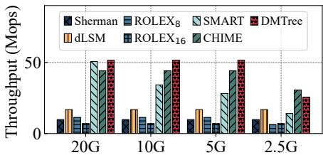  
Memory Resources on Compute-side  
Figure 15: Search performance with varying cache sizes.

## 5.4 Effectiveness of the Design Techniques

We conduct an ablation study to evaluate the effectiveness of DMTree’s design. Starting with a basic $\mathrm { F P - B ^ { + } }$ -tree, we apply our designs one by one to demonstrate their impact on performance. The results are shown in Figure 16.

\+ RDMA optimizations (RDMA Opt). We first enable the RDMA optimizations to prevent redundant network resource consumption. Compared to $\mathrm { F P - B ^ { + } }$ -tree, this design improves scan performance by 1.3×. It mitigates the bandwidth bottleneck during scans by filtering out empty key-value entries, reducing bandwidth resource waste.

\+ Compute-side collaborative caching (Cache). We then examine the benefits of compute-side collaborative caching optimization. This approach improves search and write performance by 1.2-1.9×. By combining an internal tree cache with shared fingerprint storage, it shifts RDMA operations for precise key-value locating, such as access, synchronization, and updating of fingerprints, onto compute servers. This redistribution helps alleviate network bottlenecks on memory servers, improving overall efficiency in key-value locating.

\+ Compute-side collaborative concurrency (Concur). The compute-side collaborative concurrency control strategy further improves insert and update performance by 1.5-1.6×. By offloading locking operations to compute servers, this design effectively leverages the unsaturated RDMA resources to alleviate the memory side IOPS bottleneck.

RDMA resource utilization. We also demonstrate DMTree’s improvement in the utilization of RDMA IOPS resources. As shown in Figure 17, DMTree increases IOPS utilization on compute servers from 17.5% to 32.9% compared to FP- $\cdot \mathbf { B } ^ { + } .$ tree. By fully leveraging available network resources, DMTree effectively alleviates the IOPS bottleneck on memory servers.

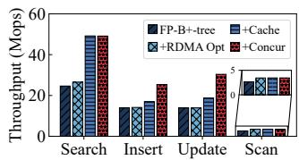  
(a) Uniform

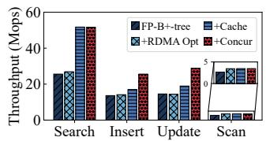  
(b) Zipfian

Figure 16: Effectiveness of the design techniques.  
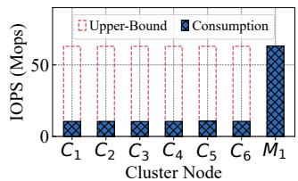  
(a) FP-B+-tree

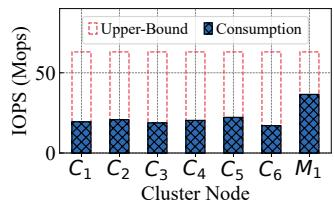  
(b) DMTree  
Figure 17: IOPS resource consumption of FP-B+-tree and DMTree during inserts $( C _ { 1 } { - } C _ { 6 }$ for compute servers, $M _ { 1 }$ for memory servers).

## 5.5 Impact of Workload Characteristics

Impact of key-value size. Figure 18 presents the results. Due to memory limitations, we reduced the preloaded key-value entries from one billion to 100 million. For mixed Zipfian search and update operations (YCSB A), as the key-value size increases, DMTree consistently outperforms Sherman and ROLEX by 3.3-13.5× by efficiently reducing read amplification. SMART, CHIME, and DMTree all exhibit high and sustained performance, while dLSM suffers significantly from increased write amplification. Regarding scan performance, the IOPS bottleneck is predominant at smaller key-value sizes. At a key-value size of 16 bytes, DMTree outperforms SMART by 4.8× due to its continuous storage of range key-value entries, reducing RDMA requests during scans. As the keyvalue size increases, the bandwidth bottleneck becomes more prominent. At 128 bytes, DMTree and SMART show similar scan performance, as bandwidth now limits performance, with IOPS consumption having a minor effect.

Impact of scan length. Figure 19 illustrates the scan-only and scan-dominant (YCSB E) performance across different maximum scan lengths. As the length increases from 10 to 1000, SMART’s performance drops significantly due to an increase in RDMA requests, exacerbating the IOPS bottleneck. At a maximum scan length of 10, DMTree and SMART have similar performance, as SMART does not generate many RDMA requests at this point. However, with a length of 1000, DMTree outperforms SMART by 3.5-3.9×. Across various scan lengths, DMTree consistently outperforms Sherman by 1.1-1.2×, thanks to its ability to filter out empty key-value entries in leaf tree nodes, reducing bandwidth resource wastage.

## 6 Related Work

Range-based index over RDMA. Many influential range indexes have been proposed over RDMA [4,25,30–32,36,49,50, 59]. Five of them are evaluated in $\ S 5$ as DMTree’s baselines.

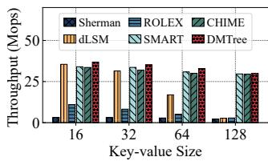  
(a) Update-Intensive

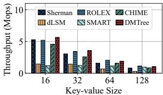  
(b) Scan-Dominant

Figure 18: Performance with different key-value sizes.  
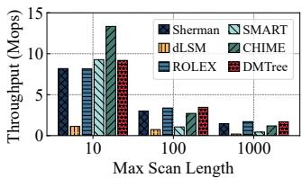  
(a) Scan-Only

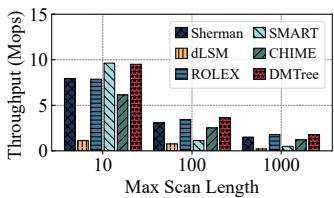  
(b) Scan-Dominant  
Figure 19: Scan performance with different scan lengths.

We then introduce others below. Cell [36] implements a variant of the $\mathrm { ~ \mathbf ~ { ~ B ~ } ~ } ^ { + }$ -tree index and combines client-side and serverside processing to balance the CPU and network resources. FG [59] is the first tree index that is implemented with completely one-sided RDMA operations. DEX [30] presents a scalable $\mathrm { ~ \mathbf ~ { ~ B ~ } ~ } ^ { + }$ -tree. It employs logical partitioning to distribute data into ranges, with each compute server handling a specific range of key-value entries. Additionally, it incorporates a lightweight cache replacement strategy to optimize memory resource usage in compute servers.

Hash index over RDMA. Hash indexes are also wellstudied [12, 29, 35, 52, 60]. For instance, Pilaf [35] implements a cuckoo-based hash index, using one-sided RDMA for read operations and two-sided RDMA for write operations. RACE [60] takes the first step to optimize a hash index for the DM architecture. It addresses concurrency and scalability challenges by introducing a lock-free concurrency control mechanism and an efficient hash resizing strategy. Outback [29] presents a novel indexing solution that employs dynamic minimal perfect hashing. It separates the index into memory-efficient and compute-intensive components, distributing them across compute and memory servers to minimize computation overhead at the memory servers.

## 7 Conclusion

This paper introduces DMTree, a tree index optimized for disaggregated memory. DMTree addresses RDMA network bottlenecks with a compute-side collaborative design. Experiments show it outperforms state-of-the-art range indexes in all performance aspects across various scenarios.

## Acknowledgments

We thank our shepherd, Zhichao Cao, and the anonymous reviewers for their valuable comments. This work was supported in part by NSFC (62472392, 62172382) and the Youth Innovation Promotion Association CAS.

## References

[1] NVIDIA Corporation. Accessed: 2024. Advanced Transport. https://docs.nvidia.com/ networking/display/rdmacore50/extended+ atomics.

[2] Marcos K. Aguilera, Nadav Amit, Irina Calciu, Xavier Deguillard, Jayneel Gandhi, Pratap Subrahmanyam, Lalith Suresh, Kiran Tati, Rajesh Venkatasubramanian, and Michael Wei. Remote memory in the age of fast networks. In Proc. of ACM SoCC, page 121–127, 2017.

[3] Marcos K. Aguilera, Kimberly Keeton, Stanko Novakovic, and Sharad Singhal. Designing far memory data structures: Think outside the box. In Proc. of ACM HotOS, page 120–126, 2019.

[4] Hang An, Fang Wang, Dan Feng, Xiaomin Zou, Zefeng Liu, and Jianshun Zhang. Marlin: A concurrent and write-optimized b+-tree index on disaggregated memory. In Proc. of ACM ICPP, page 695–704, 2023.

[5] Berk Atikoglu, Yuehai Xu, Eitan Frachtenberg, Song Jiang, and Mike Paleczny. Workload analysis of a largescale key-value store. In Proc. of ACM SIGMETRICS, page 53–64, 2012.

[6] Daniel S. Berger, Daniel Ernst, Huaicheng Li, Pantea Zardoshti, Monish Shah, Samir Rajadnya, Scott Lee, Lisa Hsu, Ishwar Agarwal, Mark D. Hill, and Ricardo Bianchini. Design tradeoffs in cxl-based memory pools for public cloud platforms. IEEE Micro, 43(2):30–38, 2023.

[7] Irina Calciu, M. Talha Imran, Ivan Puddu, Sanidhya Kashyap, Hasan Al Maruf, Onur Mutlu, and Aasheesh Kolli. Rethinking software runtimes for disaggregated memory. In Proc. of ACM ASPLOS, page 79–92, 2021.

[8] Wei Cao, Yingqiang Zhang, Xinjun Yang, Feifei Li, Sheng Wang, Qingda Hu, Xuntao Cheng, Zongzhi Chen, Zhenjun Liu, Jing Fang, Bo Wang, Yuhui Wang, Haiqing Sun, Ze Yang, Zhushi Cheng, Sen Chen, Jian Wu, Wei Hu, Jianwei Zhao, Yusong Gao, Songlu Cai, Yunyang Zhang, and Jiawang Tong. Polardb serverless: A cloud native database for disaggregated data centers. In Proc. of ACM SIGMOD, page 2477–2489, 2021.

[9] Zhichao Cao, Siying Dong, Sagar Vemuri, and David H.C. Du. Characterizing, modeling, and benchmarking RocksDB Key-Value workloads at facebook. In Proc. of USENIX FAST, pages 209–223, 2020.

[10] Youmin Chen, Youyou Lu, and Jiwu Shu. Scalable rdma rpc on reliable connection with efficient resource sharing. In Proc. of ACM EuroSys, 2019.

[11] Brian F. Cooper, Adam Silberstein, Erwin Tam, Raghu Ramakrishnan, and Russell Sears. Benchmarking cloud

serving systems with ycsb. In Proc. of ACM SoCC, page 143–154, 2010.

[12] Aleksandar Dragojevic, Dushyanth Narayanan, Miguel ´ Castro, and Orion Hodson. FaRM: Fast remote memory. In Proc. of USENIX NSDI, pages 401–414, 2014.

[13] Peter X. Gao, Akshay Narayan, Sagar Karandikar, Joao Carreira, Sangjin Han, Rachit Agarwal, Sylvia Ratnasamy, and Scott Shenker. Network requirements for resource disaggregation. In Proc. of USENIX OSDI, pages 249–264, 2016.

[14] Jing Guo, Zihao Chang, Sa Wang, Haiyang Ding, Yihui Feng, Liang Mao, and Yungang Bao. Who limits the resource efficiency of my datacenter: An analysis of alibaba datacenter traces. In Proc. of IEEE IWQoS, pages 1–10, 2019.

[15] Zhiyuan Guo, Yizhou Shan, Xuhao Luo, Yutong Huang, and Yiying Zhang. Clio: A hardware-software codesigned disaggregated memory system. In Proc. of ACM ASPLOS, page 417–433, 2022.

[16] Junhyeok Jang, Hanjin Choi, Hanyeoreum Bae, Seungjun Lee, Miryeong Kwon, and Myoungsoo Jung. CXL-ANNS: Software-Hardware collaborative memory disaggregation and computation for Billion-Scale approximate nearest neighbor search. In Proc. of USENIX ATC, pages 585–600, 2023.

[17] Anuj Kalia, Michael Kaminsky, and David G. Andersen. Using rdma efficiently for key-value services. In Proc. of ACM SIGCOMM, page 295–306, 2014.

[18] Anuj Kalia, Michael Kaminsky, and David G. Andersen. Design guidelines for high performance RDMA systems. In Proc. of USENIX ATC, pages 437–450, 2016.

[19] David Karger, Eric Lehman, Tom Leighton, Rina Panigrahy, Matthew Levine, and Daniel Lewin. Consistent hashing and random trees: distributed caching protocols for relieving hot spots on the world wide web. In Proc. of ACM STOC, page 654–663, 1997.

[20] Sekwon Lee, Soujanya Ponnapalli, Sharad Singhal, Marcos K. Aguilera, Kimberly Keeton, and Vijay Chidambaram. Dinomo: An elastic, scalable, highperformance key-value store for disaggregated persistent memory. Proc. VLDB Endow., 15(13):4023–4037, 2022.

[21] Seung-seob Lee, Yanpeng Yu, Yupeng Tang, Anurag Khandelwal, Lin Zhong, and Abhishek Bhattacharjee. Mind: In-network memory management for disaggregated data centers. In Proc. of ACM SOSP, page 488–504, 2021.

[22] Philip L. Lehman and s. Bing Yao. Efficient locking for concurrent operations on b-trees. ACM Trans. Database Syst., 6(4):650–670, 1981.

[23] Viktor Leis, Alfons Kemper, and Thomas Neumann. The adaptive radix tree: Artful indexing for main-memory databases. In Proc. of IEEE ICDE, pages 38–49, 2013.

[24] Huaicheng Li, Daniel S. Berger, Lisa Hsu, Daniel Ernst, Pantea Zardoshti, Stanko Novakovic, Monish Shah, Samir Rajadnya, Scott Lee, Ishwar Agarwal, Mark D. Hill, Marcus Fontoura, and Ricardo Bianchini. Pond: Cxl-based memory pooling systems for cloud platforms. In Proc. of ACM ASPLOS, page 574–587, 2023.

[25] Pengfei Li, Yu Hua, Pengfei Zuo, Zhangyu Chen, and Jiajie Sheng. ROLEX: A scalable RDMA-oriented learned Key-Value store for disaggregated memory systems. In Proc. of USENIX FAST, pages 99–114, 2023.

[26] Yongkun Li, Zhen Liu, Patrick P. C. Lee, Jiayu Wu, Yinlong Xu, Yi Wu, Liu Tang, Qi Liu, and Qiu Cui. Differentiated Key-Value storage management for balanced I/O performance. In Proc. of USENIX ATC, pages 673– 687, 2021.

[27] Kevin Lim, Jichuan Chang, Trevor Mudge, Parthasarathy Ranganathan, Steven K. Reinhardt, and Thomas F. Wenisch. Disaggregated memory for expansion and sharing in blade servers. In Proc. of ACM ISCA, page 267–278, 2009.

[28] Jihang Liu, Shimin Chen, and Lujun Wang. Lb+trees: optimizing persistent index performance on 3dxpoint memory. Proc. VLDB Endow., 13(7):1078–1090, 2020.

[29] Yi Liu, Minghao Xie, Shouqian Shi, Yuanchao Xu, Heiner Litz, and Chen Qian. Outback: Fast and communication-efficient index for key-value store on disaggregated memory. Proc. VLDB Endow., page 335–348, 2024.

[30] Baotong Lu, Kaisong Huang, Chieh-Jan Mike Liang, Tianzheng Wang, and Eric Lo. Dex: Scalable range indexing on disaggregated memory. Proc. VLDB Endow., page 2603–2616, 2024.

[31] Xuchuan Luo, Jiacheng Shen, Pengfei Zuo, Xin Wang, Michael R. Lyu, and Yangfan Zhou. Chime: A cacheefficient and high-performance hybrid index on disaggregated memory. In Proc. of ACM SOSP, page 110–126, 2024.

[32] Xuchuan Luo, Pengfei Zuo, Jiacheng Shen, Jiazhen Gu, Xin Wang, Michael R. Lyu, and Yangfan Zhou. SMART: A High-Performance adaptive radix tree for disaggregated memory. In Proc. of USENIX OSDI, pages 553– 571, 2023.

[33] Wenlong Ma, Yuqing Zhu, Cheng Li, Mengying Guo, and Yungang Bao. Bilokey : A scalable bi-index localityaware in-memory key-value store. IEEE Transactions on Parallel and Distributed Systems, 30(7):1528–1540, 2019.

[34] Hasan Al Maruf, Hao Wang, Abhishek Dhanotia, Johannes Weiner, Niket Agarwal, Pallab Bhattacharya, Chris Petersen, Mosharaf Chowdhury, Shobhit Kanaujia, and Prakash Chauhan. Tpp: Transparent page placement for cxl-enabled tiered-memory. In Proc. of ACM ASP-LOS, page 742–755, 2023.

[35] Christopher Mitchell, Yifeng Geng, and Jinyang Li. Using One-Sided RDMA reads to build a fast, CPU-Efficient Key-Value store. In Proc. of USENIX ATC, pages 103–114, 2013.

[36] Christopher Mitchell, Kate Montgomery, Lamont Nelson, Siddhartha Sen, and Jinyang Li. Balancing CPU and network in the cell distributed B-Tree store. In Proc. of USENIX ATC, pages 451–464, 2016.

[37] Huazhong University of Science and Technology. ROLEX. https://github.com/iotlpf/ROLEX.

[38] Ismail Oukid, Johan Lasperas, Anisoara Nica, Thomas Willhalm, and Wolfgang Lehner. Fptree: A hybrid scmdram persistent and concurrent b-tree for storage class memory. In Proc. of ACM SIGMOD, page 371–386, 2016.

[39] Patrick O’Neil, Edward Cheng, Dieter Gawlick, and Elizabeth O’Neil. The log-structured merge-tree (lsm-tree). Acta Inf., 33(4):351–385, 1996.

[40] Feng Ren, Mingxing Zhang, Kang Chen, Huaxia Xia, Zuoning Chen, and Yongwei Wu. Scaling up memory disaggregated applications with smart. In Proc. of ACM ASPLOS, page 351–367, 2024.

[41] Yizhou Shan, Yutong Huang, Yilun Chen, and Yiying Zhang. LegoOS: A disseminated, distributed OS for hardware resource disaggregation. In Proc. of USENIX OSDI, pages 69–87, 2018.

[42] Jiacheng Shen, Pengfei Zuo, Xuchuan Luo, Tianyi Yang, Yuxin Su, Yangfan Zhou, and Michael R. Lyu. FUSEE: A fully Memory-Disaggregated Key-Value store. In Proc. of USENIX FAST, pages 81–98, 2023.

[43] Shin-Yeh Tsai, Yizhou Shan, and Yiying Zhang. Disaggregating persistent memory and controlling them remotely: An exploration of passive disaggregated Key-Value stores. In Proc. of USENIX ATC, pages 33–48, 2020.

[44] Fudan University. CHIME. https://github.com/ dmemsys/CHIME.

[45] Fudan University. SMART. https://github.com/ dmemsys/SMART.

[46] Purdue University. dLSM. https://github.com/ ruihong123/dLSM.

[47] Tsinghua University. Sherman. https://github.com/ thustorage/Sherman.

[48] Chenxi Wang, Haoran Ma, Shi Liu, Yuanqi Li, Zhenyuan Ruan, Khanh Nguyen, Michael D. Bond, Ravi Netravali, Miryung Kim, and Guoqing Harry Xu. Semeru: A Memory-Disaggregated managed runtime. In Proc. of USENIX OSDI, pages 261–280, 2020.

[49] Qing Wang, Youyou Lu, and Jiwu Shu. Sherman: A write-optimized distributed b+tree index on disaggregated memory. In Proc. of ACM SIGMOD, page 1033–1048, 2022.

[50] Ruihong Wang, Jianguo Wang, Prishita Kadam, M. Tamer Özsu, and Walid G. Aref. dlsm: An lsmbased index for memory disaggregation. In Proc. of IEEE ICDE, pages 2835–2849, 2023.

[51] Xingda Wei, Rong Chen, and Haibo Chen. Fast RDMAbased ordered Key-Value store using remote learned cache. In Proc. of USENIX OSDI, pages 117–135, 2020.

[52] Xingda Wei, Jiaxin Shi, Yanzhe Chen, Rong Chen, and Haibo Chen. Fast in-memory transaction processing using rdma and htm. In Proc. of ACM SOSP, page 87–104, 2015.

[53] Fei Xia, Dejun Jiang, Jin Xiong, and Ninghui Sun. HiKV: A hybrid index Key-Value store for DRAM-NVM memory systems. In Proc. of USENIX ATC, pages 349–362, 2017.

[54] Erfan Zamanian, Carsten Binnig, Tim Harris, and Tim Kraska. The end of a myth: Distributed transactions can scale. Proc. VLDB Endow., 10(6):685–696, 2017.

[55] Ming Zhang, Yu Hua, and Zhijun Yang. Motor: Enabling Multi-Versioning for distributed transactions on disaggregated memory. In Proc. of USENIX OSDI, pages 801–819, 2024.

[56] Ming Zhang, Yu Hua, Pengfei Zuo, and Lurong Liu. FORD: Fast one-sided RDMA-based distributed transactions for disaggregated persistent memory. In Proc. of USENIX FAST, pages 51–68, 2022.

[57] Qizhen Zhang, Yifan Cai, Xinyi Chen, Sebastian Angel, Ang Chen, Vincent Liu, and Boon Thau Loo. Understanding the effect of data center resource disaggregation on production dbmss. Proc. VLDB Endow., 13(9):1568–1581, 2020.

[58] Tobias Ziegler, Jacob Nelson-Slivon, Viktor Leis, and Carsten Binnig. Design guidelines for correct, efficient, and scalable synchronization using one-sided rdma. Proc. ACM Manag. Data, 2023.

[59] Tobias Ziegler, Sumukha Tumkur Vani, Carsten Binnig, Rodrigo Fonseca, and Tim Kraska. Designing distributed tree-based index structures for fast rdmacapable networks. In Proc. of ACM SIGMOD, page 741–758, 2019.

[60] Pengfei Zuo, Jiazhao Sun, Liu Yang, Shuangwu Zhang, and Yu Hua. One-sided RDMA-Conscious extendible hashing for disaggregated memory. In Proc. of USENIX ATC, pages 15–29, 2021.

## A Artifact Appendix

## Abstract

The artifact includes the prototype implementation of DMTree, along with scripts to automate its evaluation and reproduce the main experimental results presented in the paper. DMTree is a tree index optimized for disaggregated memory. It introduces a compute-side collaborative design that offloads data locating and locking operations from memory servers to compute servers. By leveraging the unsaturated RDMA resources between compute servers, DMTree effectively alleviates network bottlenecks and improves overall system performance.

## Scope

This artifact allows reviewers to validate the main claims made in the paper. Specifically, it enables the reproduction of experimental results demonstrating that DMTree outperforms existing state-of-the-art range indexes on disaggregated memory for both point operations (i.e., searches, inserts, and updates) and range operations (i.e., scans). The artifact supports evaluation under various workloads, including Microbenchmarks and YCSB workloads.

## Contents

The artifact consists of the following directories and scripts:

• DMTree/, which contains the source code of the DMTree prototype implementation.

• AE/, which includes Python scripts for formatting experimental results and generating plots.

• build\_ae.sh, a script that automates the process of copying and compiling the code across all cluster nodes.

• run\_simple.sh and run\_ycsb.sh, scripts that automate the execution of the main experiments.

• Baseline implementations, including the source code for representative existing approaches such as Sherman/, ROLEX/, SMART/, dLSM/, and CHIME/, used for comparison in our experiments.

## Hosting

The artifact is accessible from GitHub at https://github. com/muouim/aefast26. Please refer to the main branch and the latest commit version for the exact code used in this paper.

## Requirements

## Hardware dependencies

The artifact has been developed and tested on a cluster of seven machines, consisting of six compute servers and one memory server. Each machine is equipped with two 40-core Intel Xeon Gold CPUs, 128 GB of DRAM, and a 100 Gbps Mellanox ConnectX-6 RNIC. All machines are interconnected via a 100 Gbps Ethernet switch.

## Software dependencies

Our artifact is developed and tested on Ubuntu 20.04 LTS with the following software dependencies:

• DMTree prototype: g++, cmake, libssl, snappy, boost, memcached, city-hash.

• RDMA driver: MLNX\_OFED\_LINUX-5.X.

• Evaluation scripts: python3, python3-pip.

## Evaluation Setup

We provide detailed step-by-step instructions in the AE\_INSTRUCTION.md file on GitHub to reproduce the major experiments presented in the paper. The core steps are summarized below for quick reference.

## Clone the code repository

First, clone the code repository from GitHub:

\$ cd \~   
\$ git clone \   
https://github.com/muouim/aefast26.git

## Compile and build DMTree

Next, navigate to the project directory and run the build script to copy and compile the code across all cluster nodes:

```shell
$ cd ~/aefast26
$ bash build_ae.sh
```

## Run Micro-benchmark experiments

To run the Micro-benchmark experiments, execute the following commands:

```shell
$ cd ~/aefast26
$ nohup bash run_simple.sh >r_s.output 2>&1 &
```

The resulting output corresponds to the experiments presented in Figures 11 and 12 of the paper. For quick verification, we provide only the bottleneck performance results—i.e., the performance of each baseline under each workload at the maximum thread count.

## Run YCSB experiments

To run the YCSB workload experiments, execute the following commands:

\$ nohup bash run\_ycsb.sh >r\_y.output 2>&1 &

The resulting output corresponds to the experiments presented in Figure 14 of the paper.

## Result analysis

The raw experimental results are stored in the AE/Data directory. The processed results are organized into CSV files such as simple\_results\_zipfian.csv and ycsb\_results\_zipfian.csv. For visual comparison, corresponding bar charts are generated and saved as simple\_zipfian.pdf and ycsb\_zipfian.pdf.