①

USENIX

THE ADVANCED COMPUTING SYSTEMS ASSOCIATION

# MlsDisk: Trusted Block Storage for TEEs Based on Layered Secure Logging

Erci Xu, Shanghai Jiao Tong University; Xinyi Yu, Lujia Yin, and Xinyuan Luo, NICE Lab, Xiamen University; Shaowei Song, Qingsong Chen, and Shoumeng Yan, Ant Group; Jiwu Shu, Tsinghua University; Hongliang Tian, Ant Group; Yiming Zhang, Shanghai Jiao Tong University and NICE Lab, Xiamen University

# https://www.usenix.org/conference/fast26/presentation/xu

This paper is included in the Proceedings of the 24th USENIX Conference on File and Storage Technologies.

February 24–26, 2026 • Santa Clara, CA, USA

ISBN 978-1-939133-53-3

Open access to the Proceedings of the 24th USENIX Conference on File and Storage Technologies is sponsored by

# MlsDisk: Trusted Block Storage for TEEs Based on Layered Secure Logging

Erci Xu1, Xinyi Yu3, Lujia Yin3, Xinyuan Luo3, Shaowei Song2, Qingsong Chen2, Shoumeng Yan2, Jiwu Shu4, Hongliang Tian2∗, Yiming Zhang1,3∗

1SJTU, 2Ant Group, 3NICE Lab, XMU, 4THU

## Abstract

Trusted Execution Environments (TEEs) enable users to run sensitive applications in private memory regions. SGX-PFS is the state-of-the-art secure storage solution for TEEs that ensures data confidentiality, integrity, freshness, and consistency (CIFC). Unfortunately, SGX-PFS uses Merkle Hash Trees to protect in-place persisted data and suffers from poor I/O performance and is thus of limited use in practice.

This paper presents MlsDisk, a secure virtual disk that adopts out-of-place logging to provide efficient trusted block storage for TEEs. The challenge is that the complexity of indexing and garbage collection (GC) in log-structured storage makes it difficult to ensure security. We therefore adopt a layered design to break down the indexing and GC into four layers of abstractions, which facilitates reasoning about CIFC properties. Evaluation shows that MlsDisk, with CIFC guarantees, outperforms SGX-PFS by 7.3×–21.1× on microbenchmarks and 1.4×–3.6× on trace-driven workloads.

## 1 Introduction

Trusted Execution Environments (TEEs) [1–6] enable users to run sensitive applications safely over untrusted infrastructures, such as data management [7], analytics [8], machine learning [9], and blockchains [10]. While TEEs can guarantee hardware-level security of the in-memory data, the on-disk data still relies on the software stack for protection. One common practice is to build a trusted virtual disk. For example, Linux’s dm-crypt [11] and dm-integrity [12] can provide confidentiality and integrity through encryption and MAC (Message Authentication Code) [13]. However, such solutions are vulnerable to rollback attacks (i.e., replaying old-yet-valid blocks). The state-of-the-art SGX-PFS [14] defends against such attacks by adopting a Merkle Hash Tree (MHT) [15].

SGX-PFS employs a variant of an MHT where (1) each leaf node stores a user data block; (2) each non-leaf node stores the encryption keys and MACs of its children; (3) every node is protected with authenticated encryption when persisted to disk. To ensure freshness, a write to a leaf (data block) requires a cascade of updates to the keys and MACs stored in the ancestors of the leaf. This cascade of updates causes write amplification. Furthermore, SGX-PFS employs a recovery journal to store old versions of the updated MHT nodes for consistency. These extra operations exert a heavy toll on the overall write performance [16–19].

To address the performance bottlenecks of in-place updates, we explore an alternative paradigm: out-of-place logging [20–23]. Logging inherently improves disk performance via large sequential writes, simplifies crash consistency by preserving data history, and—crucially—obviates cascading updates by treating old data as immutable. We first consider a strawman design, NaiveLog, which keeps the entire history of disk writes securely by persisting them as a chain of batches, each of which is protected with authenticated encryption and stores the MAC of the previous batch. On the security front, it achieves the same security guarantees as SGX-PFS: namely, confidentiality, integrity, freshness, and consistency (CIFC). NaiveLog achieves confidentiality and integrity through encryption and MAC verification, freshness through backward scanning, and consistency by preserving old-version data. By adopting this append-only design, NaiveLog avoids the cascading MHT updates and resultant write amplification that plague SGX-PFS.

This design of NaiveLog lacks two critical functionalities: indexing (for fast reads) and garbage collection (GC, for reclaiming space occupied by stale data). Directly porting mature indexing and GC mechanisms may not be feasible, as they introduce various interactions and state transitions, making security analysis extremely difficult. For example, Speicher [24] builds a key-value (KV) store for SGX by extensively extending RocksDB, but it has limitations in guaranteeing consistency, as admitted by the authors.

In this paper, we present MlsDisk (Multi-layered, Logstructured Secure Disk), a high-performance virtual disk for TEEs that is CIFC-compliant by design. The key idea of Mls-Disk is layered secure logging, which decomposes complex log-structured storage and security mechanisms into modular abstractions across four distinct layers. Each layer exposes CIFC-compliant storage APIs that build upon the primitives provided by the layers below it. This design confines complexity within individual layers, thereby significantly simplifying security reasoning. The top layer, L3, exposes the standard block device interface to users in TEEs. To maintain CIFC, L3 protects user data with authenticated encryption and persists it in a log manner to the untrusted host disk. The metadata of user data blocks, including their physical block addresses, encryption keys, and MACs, is maintained by an index. This index is persisted securely by leveraging the primitives provided by L2.

The L2 layer provides a transactional key-value service. We build L2 by following the classic Log-Structured Merge tree (LSM-tree) [25] design, which is widely used in modern storage systems [26–28]. For L2’s CIFC, we store Write-Ahead Logs (WALs) and Sorted String Tables (SSTables) as transactional, CIFC-compliant log files managed by L1. We further ensure all L2’s operations (e.g., compactions) are transactional by using the transaction APIs provided by L1.

The L1 layer provides a transactional log store, where append-only files, called TxLog, may be created, written, read, or deleted securely within transactions. For security, we protect the content of a TxLog with encryption and an MHT, thereby providing CIFC properties. We also employ a TxLogTable to maintain the metadata of all TxLogs. TxLogTable is persisted securely by storing the entire history of its changes to a CIFC-compliant journal in L0.

The L0 layer provides a journal abstraction to the upper layers, called EditJournal, which is designed to keep a series of incremental updates, called edits, to a persistent state. To build this journal, we develop two primitive cryptographic data structures, namely CryptoBlob and CryptoChain. All incoming changes (i.e., updates to the L1’s TxLogTable) are first appended to the CryptoChain, which is periodically flushed as snapshots to CryptoBlob. To ensure CIFC, CryptoBlob and CryptoChain adopt a similar strategy as NaiveLog, i.e., encryption and MAC for confidentiality and integrity, backward scanning for freshness, and preserving old versions for consistency. Note that as a small journal for only maintaining L1’s TxLogTable, EditJournal does not incur high overhead as NaiveLog.

With the layered design, we are able to clearly reason about the overall security of MlsDisk. Fundamentally, all metadata of a layer (e.g., the index of L3, SSTables of L2, and TxLogTable at L1) are stored securely with the CIFCcompliant storage primitives provided by its lower layers. As such, each layer can focus on securing its own data with cryptographic measures such as encryption, MACs, and MHTs. In addition, transaction support and operation atomicity have been built into our storage primitives from L0 to L2, which ensures the consistency of MlsDisk in a systematic approach.

Furthermore, MlsDisk’s modular architecture inherently facilitates extensibility. We demonstrate this capability by augmenting the system with two additional security properties: irreversibility and atomicity. These properties fortify MlsDisk against advanced threats, specifically mitigating entire-disk rollback attacks [29] and eviction attacks [30], respectively.

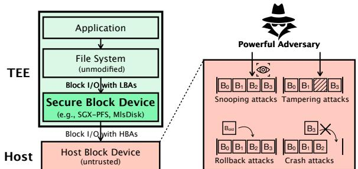  
Figure 1: Threat model for secure virtual disks, which transparently protect TEE disk I/O against adversaries controlling the untrusted host infrastructure.

We have implemented MlsDisk [31] in Rust and integrated it with both Linux and Occlum [17] to support AMD SEV and Intel SGX, respectively. Beyond these platforms, Mls-Disk has been integrated into Asterinas [32]. Our evaluation demonstrates that, while maintaining equivalent security guarantees, MlsDisk significantly outperforms the state-of-theart SGX-PFS 7.3 × –21.1× in microbenchmarks (FIO) and 1.4 × –3.6× across diverse trace-driven workloads.

## 2 Background

## 2.1 Threat Model

Architecture. Fig. 1 illustrates the fundamental functionality of a TEE, providing a secure execution environment for sensitive applications and data. We trust the hardware (e.g., CPU/memory) and software components (e.g., kernel/libos) within the TEE, which means they are not compromised and do not leak sensitive information. To verify the integrity and authenticity of the TEE instance, we rely on remote attestation for fetching secrets (e.g., the root key) [33–35]. However, not all data can be kept in the TEE memory. For persistence, we still need to store data on an untrusted host disk outside the TEE (i.e., the bottom layer of Fig. 1). To protect the disk I/O, we therefore need a secure virtual disk (e.g., SGX-PFS [14]) that provides a block interface to transparently support varying applications (e.g., file systems) in a TEE, and safely interacts with the untrusted host disk for read/write.

Adversary’s capabilities. This paper inherits the threat model from SGX-PFS [14] and assumes an adversary that is:

• privileged, who has full control over the host, including direct access to the untrusted disk. This enables snooping attacks which aim at stealing (i.e., reading) sensitive data from the host disk;

• active, who can modify, drop, or replay I/O operations. This allows the attacker to tamper with data in flight or rollback individual blocks to valid-yet-outdated versions;

• online, who can launch attacks at any time. This enables the adversary to crash the TEE, with the goal of leaving the on-disk state inconsistent.

Same as the SGX-PFS setup, the following three types of attacks are excluded in the scope of secure virtual disks. First, we do not consider denial-of-service or wiper attacks [36], since these attacks are trivial for adversaries controlling the underlying infrastructure. Second, we do not protect against side-channel attacks that infer sensitive information from access patterns or timing channels. Mitigating such attacks in TEE is an active area of research [37]. Third, we do not consider entire-disk rollbacks, which can roll back the entire disk including the root MAC. Note that there are already remedies to protect the above attacks [29, 38]. In addition, these mechanisms are complementary to and can be integrated with virtual disks, including both SGX-PFS and MlsDisk. For example, in §8, we will show how to extend MlsDisk to protect against entire-disk rollbacks.

Goals. Based on the threat model, we expect that a secure virtual disk should offer the following CIFC security guarantees:

• Confidentiality ensures that the data submitted by any write is not leaked, i.e., defending snooping attacks.

• Integrity promises that the data remains unaltered unless authorized, and thus prevents tampering attacks.

• Freshness ensures that the data returned from any read is up-to-date, and thus prevents rollback attacks.

• Consistency ensures that all the data is consistent under intentional or unintentional crashes.

## 2.2 Existing Solutions

There are several secure storage practices, including Crypt-Disk [2, 11, 12, 16], SecureFS [19], and SGX-PFS [14], offering varying levels of security guarantees.

CryptDisk. This is a rather naïve methodology which encrypts the entire disk and stores a MAC for each 4 KiB data block thereby providing guarantees of only confidentiality and integrity. This approach is widely adopted in the TEE community, such as in Graphene Protected Files [16] and AMD SEV [2] (through the combination of Linux’s dm-crypt [11] and dm-integrity [12]).

SecureFS. This solution [19] extends the CryptDisk-based approach by adding freshness guarantees. SecureFS achieves this through pinning a slab table in trusted memory that serves as a root-of-trust. With only memory accesses, SecureFS maintains performance comparable to CryptDisk.

SGX-PFS. This state-of-the-art solution [14] provides all four security guarantees (CIFC). The key design is to use Merkle Hash Trees (MHT) [15] to protect in-place updated on-disk data. Specifically, in this MHT, the leaf nodes store data and the non-leaf nodes maintain the encryption keys and MACs of their children via hashing. SGX-PFS ensures confidentiality by encrypting all nodes, integrity by verifying MACs, freshness by updating the chain of hashes from leaf to root upon any data modification, and consistency by using a recovery journal that stores old versions of dirty nodes before eviction.

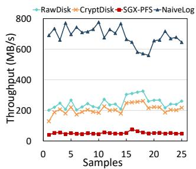

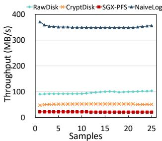  
(a) Trace-driven benchmark, hm (b) FIO benchmark, 4KB random workload (write-only). write workload.  
Figure 2: Performance comparison of SGX-PFS on different workloads. Sampling is performed every 100,000 writes.

## 3 Motivation

## 3.1 Limitations of SGX-PFS

Though SGX-PFS [14] provides the full set of CIFC properties, it can suffer significant performance degradation. The culprit is the Merkle Hash Tree (MHT), which, to ensure data freshness, requires cascading updates from the leaf (i.e., the data block) to the root for each write. For an MHT with a height of H, each write would have an amplification factor of H. Moreover, with the recovery journal for crash consistency, the write amplification can be further increased to 2 × H.

To evaluate the impact, we conduct the following motivating experiments to compare the performance of SGX-PFS, CryptDisk, and RawDisk (an untrusted host disk without any protection). We test the candidates with both trace-driven workloads and FIO (see §10.1 for setup details).

Fig. 2a demonstrates the performance gaps between SGX-PFS and others, validating the assumption that adding MHT and a recovery journal exacts a heavy toll. Specifically, Crypt-Disk (an encryption-only solution) achieves around 4.1× and 2.5× higher average throughput than SGX-PFS in tracedriven workloads and random FIO workloads, respectively, while delivering 83% and 54% of RawDisk’s (no protection) throughput. Fig. 3 further provides a breakdown clearly that shows the I/O operations for MHT blocks constitute a dominant source of system overhead. Note that offering integrity would not bottleneck the performance since it occurs during reads and a typical CPU can compute MACs on the order of tens of GB/s.

## 3.2 NaiveLog: A Preliminary Exploration

Motivation. To address the write-performance bottleneck of SGX-PFS, we first consider a strawman design called

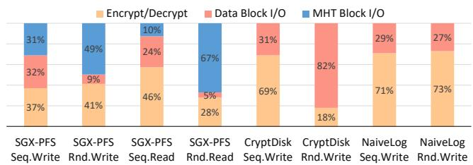  
Figure 3: Latency breakdown on sequential writes/reads and 4KB random writes/reads.

NaiveLog, which aims to (1) eliminate the use of MHTs and the recovery journal, (2) perform storage-friendly sequential writes, and (3) guarantee CIFC.

Architecture. Fig. 4 illustrates how NaiveLog organizes writes into a series of batches (i.e., Batchi), each of which includes the data and the logical block addresses (LBAs) of the written blocks. NaiveLog has a master encryption key and maintains an in-memory buffer for the current batch of writes. When the buffer reaches capacity or a sync command is received, NaiveLog derives an encryption key from the master key deterministically, encrypts the current batch (i.e., BatchN) with the new key, and persists the current batch to the host along with the host block address (HBA) and MAC of the previous batch (i.e., PosN−1 and MacN−1, respectively). The on-disk batches form a logical log where the latest batch is always appended to the end.

Performance. Fig. 2 shows NaiveLog can deliver much higher throughput in write-only scenarios, outperforming SGX-PFS by 13.4× in trace replay and 16.6× in random writes. Thanks to large sequential writes, NaiveLog can even outperform the RawDisk baseline. Moreover, our analysis in Fig. 3 reveals that NaiveLog incurs much less overhead in data block I/O operations under random write workloads compared to CryptDisk. These results further validate our assumption that the MHT update chain and random writes are the main culprits of SGX-PFS’s unsatisfactory performance.

Securing CIFC. In addition to performance improvements, NaiveLog also guarantees the complete set of CIFC properties. NaiveLog achieves confidentiality by encrypting each batch with a master key and integrity by storing each batch’s MAC in the next batch and verifying it during reads. Furthermore, NaiveLog guarantees freshness by maintaining a chained-MAC mechanism, where each batch stores the MAC of its predecessor, enabling verification via backward scanning. NaiveLog ensures consistency by preserving old-version data and discarding incomplete batches during recovery, restoring only valid states through the latest complete batch pointer.

## 3.3 Limitations of NaiveLog

However, NaiveLog is far from practical for two reasons.

Unbounded Read Overhead. Recall that the existing NaiveLog has no index for reads. Hence, to read a data block,

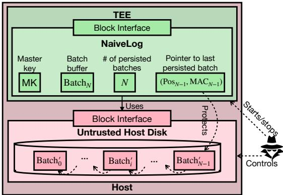  
Figure 4: Guaranteeing CIFC with NaiveLog.

NaiveLog must scan all the batches from front to end, leading to an unbounded time complexity. An intuitive solution is to introduce an index for fast data access. However, reasoning about the CIFC properties of the index is nontrivial, especially for a full-fledged design like RocksDB [28] or LevelDB [27]. For example, LevelDB employs a multi-version mechanism for component management to maintain consistency but unfortunately has been shown to be unreliable [39]. Other previous work [24] spent a considerable effort to build a secure LSM-based KV for SGX by extending RocksDB, but only achieves confidentiality, integrity, and freshness.

Unbounded Space Consumption. NaiveLog can also incur excessive space consumption due to the lack of a garbage collection mechanism. Similarly, integrating a GC into NaiveLog is also complex. Block reclamation and garbage collection operations can break the chained-MAC mechanism that NaiveLog relies on for freshness guarantees. The concurrent access to both indexes and the bitmap by write and GC threads introduces additional complexity, requiring a secure concurrency control mechanism that preserves consistency.

## 4 MlsDisk: Overview

Main ideas. We now present the design of MlsDisk, a secure virtual disk that provides CIFC guarantees with high performance. Inspired by lessons learned from SGX-PFS and NaiveLog, MlsDisk follows three main ideas (MI-1 to MI-3):

• MI-1: Layered architecture. To manage the complexity of introducing extra storage techniques (e.g., indexing and GC) with robust security measures, MlsDisk adopts a multilayered design, where each layer builds upon the primitives provided by the layers beneath it. This greatly simplifies security reasoning.

• MI-2: Log-structured approach. NaiveLog demonstrates the performance potential of adopting an append-only solution, and therefore motivates us to take a log-structured approach across the layers of MlsDisk.

• MI-3: Decoupling metadata management. Both SGX-PFS and NaiveLog employ monolithic on-disk formats that tightly couple data and metadata, resulting in high management overheads (e.g., cascading MHT updates or exhaustive scans). In contrast, MlsDisk decouples these concerns: each layer secures its own data payload while offloading the persistence and protection of its internal metadata to the layers below. This allows MlsDisk to use the most efficient storage and security techniques tailored to each specific data type.

High-level design. Guided by MI-1, we structure MlsDisk as a log-structured secure virtual disk comprising four distinct layers (L3–L0), as illustrated in Fig. 5. These include: (i) a block I/O layer (L3) that exposes a standard block-level interface to TEE-resident applications; (ii) a key-value store layer (L2) that serves as the indexing engine for L3; (iii) a log store layer (L1) that manages the append-only files (logs) leveraged by both L3 and L2; and (iv) a journal layer (L0) that records incremental metadata updates for L1.

In accordance with MI-2, MlsDisk persists data across all layers in a log-structured manner: L3 appends incoming user data to the host disk as a sequence of encrypted blocks; similarly, L2, L1, and L0 store their data in an append-only manner. Following MI-3, MlsDisk ensures CIFC compliance both globally and within individual layers by leveraging the property that each layer’s metadata (excluding L0) is secured by the layer immediately beneath it. Consequently, layers that interface directly with the untrusted host disk (L3, L1, and L0) only need to protect their own data payloads via cryptographic measures, as the security of the associated metadata is transparently handled by the lower layers.

Write. Now, we briefly go through each layer to illustrate the write procedure.

• Block I/O layer (L3): When a write request arrives, L3 stages the data in a write buffer. Once the buffer is full or a sync command is issued, L3 generates a unique encryption key, encrypts the buffered blocks, and assigns them a contiguous range of Host Block Addresses (HBAs). This mapping effectively linearizes potentially fragmented Logical Block Addresses (LBAs) into a sequential write stream on the host disk, maximizing I/O throughput. The encrypted batch is then persisted to the host disk. For each newly written logical block, L3 updates the index stored at L2 with a record of the form ⟨LBA, (HBA, key, MAC)⟩.

• KV store layer (L2): L2 maintains the block index using a Log-Structured Merge-tree (LSM-tree) architecture. Upon receiving a record from L3, L2 first appends it to a Write-Ahead Log (WAL) and then inserts it into an in-memory MemTable. As the MemTable fills, it is flushed to disk as Sorted String Tables (SSTables). L2 leverages L1 to persist both the WAL and SSTables as secure, append-only logs.

• Log store layer (L1): L1 exposes a API that allows upper layers (L2 and L3) to create, delete, list, read, and append to CIFC-compliant logs (called TxLog) within transactions. To ensure atomicity, when a transaction commits, all metadata updates for the affected logs—including log IDs, lengths, encryption keys, and MACs—are bundled and written as a single record to the L0 journal.

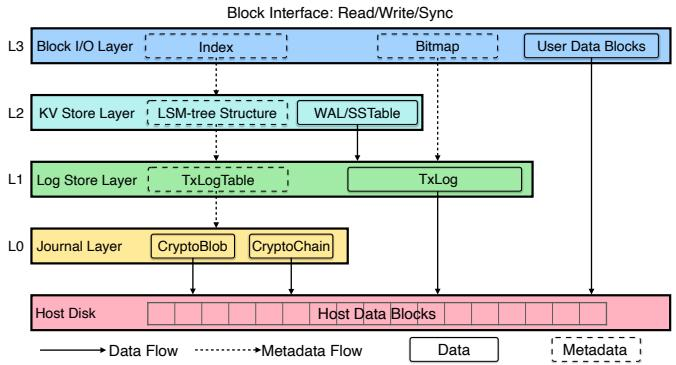  
者 Figure 5: An overview of MlsDisk.

• Journal layer (L0): L0 provides a CIFC-compliant journal abstraction that records a series of incremental changes to a state. Specifically for L1, the "state" represents the log store metadata, while the journal entries capture the atomic updates performed by each transaction. To prevent the journal from growing indefinitely, accumulated changes are periodically consolidated into a state snapshot; this checkpointing mechanism allows the entire journal to be maintained within a fixed-size region on the host disk. Due to its architectural simplicity, L0 directly secures both its data and metadata using straightforward cryptographic primitives, serving as the system’s foundational root of trust.

Read. The read operation follows a reverse path: MlsDisk first queries the index (L2) to retrieve the corresponding HBAs, keys, and MACs. Then, based on the HBAs, it fetches the encrypted user data blocks from the host disk, decrypts them with the retrieved keys, verifies their integrity using the retrieved MACs, and finally returns the data to the user.

Garbage Collection. The GC process, triggered by the utilization rate, operates in a background thread, performing space reclamation at the 16 MiB segment level. GC usually follows a greedy strategy but we also provide optimizations (see §6) such as delayed reclamation for lowering overhead.

## 5 Detailed Design

We provide a comprehensive look at the MlsDisk architecture by first detailing its four layers and contrasting them with our NaiveLog strawman. We then describe the recovery process that guarantees consistency in the face of arbitrary crashes. Finally, we discuss disk space management, specifically focusing on garbage collection.

## 5.1 Block I/O Layer (L3)

Overview. The L3 layer implements BIO, a virtual block device that exposes a standard block-level interface—including Read(addr, buf), Write(addr, buf), and Sync —to TEE-resident applications such as file systems and databases.

In accordance with MI-3, L3 handles the encryption and integrity protection of user data before persisting it to the untrusted host disk. This raises two critical design requirements: (i) defining the necessary cryptographic metadata for each block, and (ii) establishing a mechanism to ensure CIFC compliance for that metadata.

Design. First, each 4 KiB data block requires an encryption key (for de-/encryption) and a MAC (Message Authentication Code, for authenticating integrity). In addition, since the encrypted user data are always appended to the disk, we also need to maintain the mapping from LBAs to HBAs. Second, we need to ensure CIFC of L3-level metadata, which includes individual components (e.g., HBA, key, MAC) and the mapping in the form of ⟨LBA, (HBA, key, MAC)⟩. The key is randomly generated and the MAC is calculated using AES-GCM [40]. For HBA, L3 adheres to the log-structured design by allocating new blocks sequentially from the free space, ensuring that user data is written to the host disk in an out-of-place manner. The allocation status is tracked by the Block Validity Table (BVT, further detailed in §5.7), a bitmap persisted via L1’s log. Therefore, any insertion (i.e., sequential allocation) or deletion in the BVT automatically inherits the CIFC properties from the underlying L1 (§5.3).

Additionally, the mapping is stored as a Key-Value (KV) pair in a Logical Block Table (LBT). Since LBT is backed by L2’s KV store (see §5.2), LBT can natively guarantee CIFC of its entries as long as L2 is CIFC-compliant (shown in §5.2). Hence, the secure index ensures that the CIFC properties of\* 仅限内部交流使⽤，如果需要公开，请联系⽂档作者 user data are strictly enforced by the authenticated metadata during lookup. Note that Reverse Index Table (RIT) and Block Alloc/Dealloc Logs (BALs) are for space management and further described in §5.7.

Procedures. Upon receiving a Write request, L3 first allocates a new HBA from BVT, encrypts the data block, generates its MAC, and then persists the ciphertext to the host disk at the allocated HBA. Next, it updates the LBT with the new mapping and the RIT with the corresponding HBA-to-LBA reverse mapping. For Read requests, L3 queries LBT to retrieve the corresponding [HBA, key, MAC], reads and decrypts the ciphertext using the key, and verifies its integrity using the MAC. The Sync, triggered by applications or the OS, invokes further sync on user data blocks and L2’s TxKV, then flushes other logs (BVT, BALs) in TxLogStore.

## 5.2 KV Store Layer (L2)

Overview. The L2 layer implements TxKV, a transactional KV store with three APIs: Put(k,v), Get(k), and Sync. We next discuss the management of L2’s metadata and data.

Design. For TxKV, we borrow the design of a classic LSMtree that aligns with our log-structured design. Accordingly, it has three components: including MemTable, SSTable (Sorted String Table), and WAL (Write-Ahead Log). We choose not to port existing implementations like LevelDB, which are known to have crash consistency vulnerabilities [39]. We build our LSM-tree components on top of a transactional log service, i.e., L1. This allows us to inherit strong security guarantees by implementing both the WAL and SSTable as TxLog, managed by L1’s TxLogStore (§5.3).

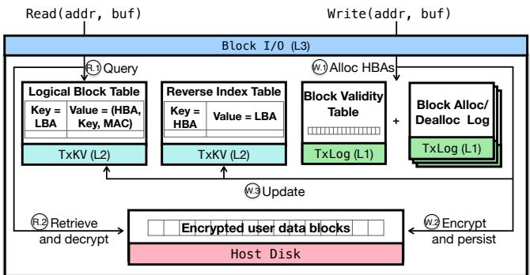  
Figure 6: An overview of BIO in the L3 layer.

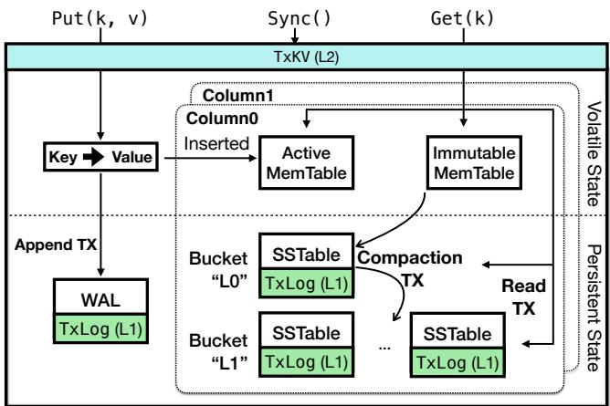  
Figure 7: An overview of TxKV in the L2 layer.

While using TxLog provides CIFC for individual components like WAL, L2-wide consistency requires an additional mechanism. Therefore, all structural operations, such as flushing a MemTable or compacting SSTables, are executed as transactions (TXs) via L1’s transactional APIs. Finally, L2’s metadata, including file names and level assignments, is implicitly represented through L1’s bucket organization rather than explicitly persisted. For better space management, we also employ a column-based design (detailed in §5.7).

Procedures. As shown in Fig. 7, a Put(k,v) operation first appends the record to the WAL within an Append TX and then inserts it into the MemTable. When the MemTable becomes full, it is marked as immutable, and a new one is created for subsequent writes. A separate Compaction TX is then triggered to flush the immutable MemTable to a new SSTable on disk. Moreover, a Get(k) operation queries the key by searching the MemTable first, and then the sequence of SSTables from newest to oldest in Read TX. A Sync operation ensures durability by flushing and forcing the commit of the current WAL Append TX.

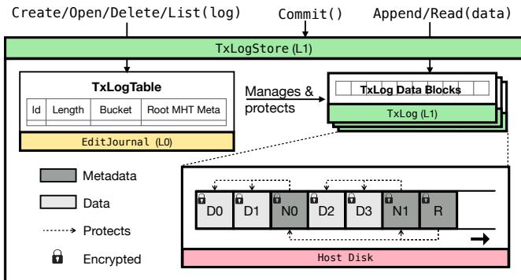  
Figure 8: An overview of TxLogStore in the L1 layer.

## 5.3 Log Store Layer (L1)

Overview. L1 provides TxLogStore, which offers transactional support for persisting logs, whose APIs include creating/opening/deleting/listing logs, reading/writing log content, and committing transactions.

Design. There are two components, TxLog and TxLogTable. The former represents an individual log, supporting appendonly writes. For example, BVT in L3 and WAL/SSTable in L2 are all instantiated as TxLog. The TxLogTable maintains L1’s metadata of all TxLogs in memory, including their ID (e.g., BVT is 1 and WAL is 2), length, root MHT, and bucket identifier. The bucket functions as a flat namespace to categorize logs (e.g., WALs, BVT, SSTables), which avoids nested directories and links and thus facilitates the reasoning on concurrency control and security.

To ensure CIFC properties, each TxLog integrates an MHT structure with its content. As illustrated in Fig. 8, leaf nodes (Di) store data blocks, while non-leaf nodes (Ni) and the root (R) contain encryption keys and MACs. This provides confidentiality and integrity through authenticated encryption and hierarchical MAC verification. Freshness is guaranteed by verifying the MAC chain up to the root. Consistency is achieved by truncating to the last valid length (i.e., the most recent committed transaction, stored in TxLogTable). This mechanism enables us to utilize the table to identify potential tampering or truncation. The CIFC properties of the table are guaranteed by L0’s EditJournal to avoid circular dependencies. Since these append-only logs constitute a negligible fraction (<2%) of the total storage, MlsDisk eliminates the severe write amplification of SGX-PFS’s disk-wide MHT.

TxLogStore ensures Atomicity, Consistency, and Durability (ACD) for log operations (Isolation is discussed in the next paragraph). Atomicity is ensured as operations are allor-nothing, finalized only by an EditJournal update. Consistency is achieved since TxLogTable is only updated on commit, transitioning the system from one valid state to another. Finally, durability is achieved by persisting all data and metadata changes to the host disk upon a commit.

TxLogStore does not provide general-purpose Isolation (I). Nevertheless, it is designed to reduce the odds of conflicts among TXs with three measures. First, TxLogStore prohibits concurrent TXs from opening the same log file for writing, thereby incurring no write conflicts. Second, TxLogStore adopts the lazy log deletion to avoid interference with other TXs utilizing the log, thus reducing the deletion conflicts. Finally, we choose to names the logs with random IDs to reduce the chance of name conflicts.

Procedure. Read and Append requests on a TxLog involve in-transaction access to the MHT, and Append requests marks the log as dirty. The Create request allocates a new TxLog, but its metadata is not added to the TxLogTable until the transaction is committed. The commit process ensures atomicity through a multi-stage protocol. First, it flushes all dirty TxLogs, then it adds all metadata changes (e.g., new log creations, updated lengths) to the EditJournal for persistence. Finally, it updates the global in-memory TxLogTable.

## 5.4 Journal Layer (L0)

Overview. The L0 layer provides EditJournal, a CIFCcompliant journal abstraction for persisting metadata of L1’s TxLogStore with two APIs: Append(edit) and Sync.

Design. As shown in Fig. 9, EditJournal persists metadata as edits with two cryptographic structures: CryptoChain for append-only edits and CryptoBlob for periodic snapshots. While an MHT-based log (for CIF) with a superblock (for consistency, recording the valid length atomically) could serve this purpose, it introduces unnecessary overhead: MHT maintenance incurs costs on every append, and the random-access feature is unnecessary (journal is scanned only during recovery). Further, the unbounded log growth leads to unpredictable recovery latency. CryptoChain chains blocks by embedding the MAC of the previous block, enabling lightweight appends without MHT overhead. CryptoBlob stores authenticated snapshots in-place, allowing recovery to start from a recent state and replay only subsequent edits.

We now discuss the CIFC properties of EditJournal. Confidentiality and integrity are ensured through authenticated encryption and MAC verification in both CryptoChain and CryptoBlob. For freshness, CryptoChain ensures freshness through its chained structure and full scans. CryptoBlob first stores a MAC of its content in its header, and it then guarantees freshness by linking this header into a CryptoChain, deriving its freshness from the chain. For consistency, all metadata changes are persisted as a single block in the journal. Only complete and correctly written edits are accepted during recovery, discarding any partial writes to provide logical atomicity. Upon crash, the system recovers to a consistent state by selecting the latest valid snapshot from two copies and replaying all subsequent edits since its creation. In this sequence, the chained MACs inherent to CryptoChain prevent the rollback of any preceding blocks, while the last block is strictly protected by the TEE’s secure memory.

Procedures. For Append, EditJournal buffers edits in memory and atomically writes them as a single block upon commit. If edits exceed a threshold, a CryptoBlob snapshot is created and chained. Sync flushes the CryptoChain and generates a snapshot if needed.

## 5.5 Comparison with NaiveLog

While MlsDisk adopts a chained structure similar to NaiveLog only in EditJournal, the two systems differ fundamentally in scope and design. EditJournal exclusively stores L1 metadata, which is orders of magnitude smaller (around a few MBs) than user data stored by NaiveLog. Moreover, EditJournal supports periodic snapshots and is scanned only during recovery, eliminating NaiveLog’s unbounded space and time consumption. Note that user data blocks in\* 仅限内部交流使⽤，如 MlsDisk are stored independently without chaining, avoiding NaiveLog’s read performance degradation and enabling flexible GC with CIFC properties ensured (§5.7).

## 5.6 Crash Recovery

The log-structured architecture makes user-data recovery implicit: once the index is restored, the user data can be correctly located and verified by the index. For the index, our layered architecture enables a graceful crash recovery process that proceeds sequentially from the lowest layer (L0) to the highest (L3).

The process begins at L0. MlsDisk restores the EditJournal by loading the latest valid state snapshot from a CryptoBlob and replaying all subsequent edits from the CryptoChain. This brings the TxLogStore’s metadata to a consistent state. In L1, once the metadata is consistent, the TxLogStore can reconstruct each TxLog with a valid length. Next, with a consistent L1, the L2 recovers the TxKV. It first reconstructs the MemTables by replaying the WALs. Then, it rebuilds the LSM-tree structure by loading all SSTables, using the bucket identifier from the restored L1’s TxLogStore to determine their correct level. Finally, with the TxLogStore and TxKV restored, the LBT and RIT, and BVT provided to L3 are consistent. Since all user data operations in BIO (L3) are mediated through indexes and BVT, the entire system is restored to a consistent state. Furthermore, since metadata persistence relies on the L0-EditJournal, if a mid-layer crash occurs (e.g., L2 fails to complete a sync), the L0 journal will not append the corresponding edit. Consequently, the corresponding user data, even if persisted, remains unallocated.

## 5.7 Disk Space Management

GC procedure. MlsDisk uses a classic greedy strategy for GC (e.g., LFS [21] and F2FS [20]). First, we split the host block address into a series of fixed-size segments. Block Validity Table (BVT), a CIFC-compliant bitmap, records the validity (i.e., free, used, or invalid) of each 4 KiB block within each segment. When running out of free space, MlsDisk asks

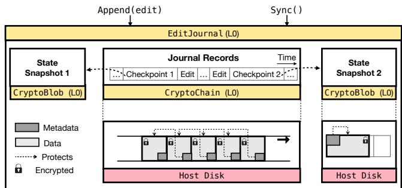  
Figure 9: An overview of the L0 layer.

GC to select victim segments with the least valid data and migrates them to a new location.

档作者To support LBA lookup and index updates during GC, we maintain a Reverse Index Table (RIT) that maps HBAs back to LBAs. Both the LBT and RIT are implemented using TxKV’s column-family feature, placing them in separate columns like RocksDB [41]. Both columns share a single WAL, so updates to both indexes can be performed atomically within a single transaction, which is necessary for maintaining their consistency.

Recall that the BVT is a bitmap stored as a TxLog in L1. Directly updating this bitmap can be inefficient since the append-only nature of TxLog would require rewriting the entire BVT even for a small update. Therefore, we introduce Block Alloc/dealloc Logs (BALs) to record incremental allocation and deallocation records. These logs are also implemented as TxLogs. Periodically, the BALs are merged with the main BVT to create a new, consolidated BVT.

Security Guarantees. Our space management design preserves CIFC properties throughout GC operations. Confidentiality/integrity/freshness are inherently maintained, as each data block is individually encrypted and its metadata is protected by the secure index. Consistency is the primary challenge during GC. We achieve it by leveraging L1’s transactional support. All metadata modifications—including updates to the LBT, RIT, BVT, and BALs are committed as a single transaction. If a crash occurs mid-operation, the system recovers to the last consistent state, as the old data blocks are not reclaimed until the transaction successfully commits.

## 6 Performance Optimizations

Delayed Reclamation. When a logical block is updated, its previously mapped host block becomes invalid and should be reclaimed. However, eager (i.e., immediate) reclamation can degrade performance because it requires querying the entire LBT (essentially a LSM-tree) to locate the old host block. MlsDisk employs an alternative strategy, called delayed reclamation. Specifically, a host block is valid only if it is referenced by an index record in the TxKV. Thus, blocks can be reclaimed (almost) for free by piggybacking them on TxKV compaction. We add a callback-based interface to TxKV so that L3 can be notified to reclaim invalid host blocks when outdated index records are purged during compaction.

Two-level Caching. One lesson we learned in Fig. 3 is that, even with caching, SGX-PFS can still incur a high I/O overhead when accessing MHT nodes. This is because decryption can be cascading to the root. In addition, MHT nodes only occupy a small proportion of space compared to the data blocks (around 1:100), which indicates using one cache for both data blocks and MHT nodes can yield low hit rates for MHT nodes. Recall our analysis in Fig. 3 reveals that segregating MHT nodes and data blocks into distinct cache levels can significantly reduce interference. The layered design presents an opportunity for setting up an individual cache for MHT nodes. Therefore, we set up a two-level cache, where the higherlevel cache in L2 is dedicated to SSTable data blocks and the lower-level one in L0 exclusively serves TxLog’s MHT nodes.

## 7 Security Analysis

MlsDisk’s layered architecture simplifies its security analysis, allowing us to reason about security properties layer by layer. As the recovery process’s consistency guarantees were described in §5.6, this section will focus on the CIF properties. Specifically, we will demonstrate that an adversary cannot steal (confidentiality), tamper with (integrity), or roll back (freshness) the data at any layer, up to and including the top block device layer.

In line with our threat model (§2), freshness here refers to the prevention of partial or online rollbacks. An adversary can roll back the entire disk undetected when the secure virtual disk is closed or the TEE is offline. We address these offline, entire-disk rollback attacks with a new security property called irreversibility, which is discussed in §8.

We now demonstrate the security of MlsDisk by reducing the security of each layer to that of the layer below it, ultimately tracing the security of the entire system back to the disk’s root key.

Claim 1. L3 satisfies CIF if L2 and L1 do.

As shown in Fig. 6, all L3 data is encrypted on the host disk. Its integrity can be validated upon being read by checking the MACs, which are stored securely in the L3 metadata. L3’s data encryption keys, MACs, and other metadata are maintained in the secure formats TxKV and TxLog, provided by L2 and L1, respectively. Therefore, if L2 and L1 satisfy CIF, L3’s data is also secure.

Claim 2. L2 satisfies CIF if L1 does.

As illustrated in Fig. 7, all L2 data, including SSTables and WALs, are stored using the secure TxLog format provided by L1. Consequently, if TxLog guarantees CIF, then SSTables and WALs are also secure.

Claim 3. L1 satisfies CIF if L0 does.

As shown in Fig. 8, all data in a TxLog is encrypted, and its integrity is protected by an MHT. The metadata for the MHT root, including its encryption key and MAC, is maintained by the TxLogTable in the EditJournal format from L0. Therefore, the contents of a TxLog cannot be stolen, tampered with, or rolled back if the EditJournal itself is secure.

Claim 4. L0 satisfies CIF if the root key is secure.

The contents of EditJournal are stored in two secure formats, CryptoChain and CryptoBlob, which provide confidentiality and integrity through authenticated encryption. All encryption keys are deterministically derived from Mls-Disk’s root key. Thus, as long as the root key remains secure, CryptoChain and CryptoBlob guarantee the CI properties. For freshness, EditJournal maintains the active snapshot and the current journal block in the TEE’s secure memory. This allows MlsDisk to detect the rollback of any journal blocks residing between the active snapshot and the most recent journal entry.

In conclusion, the CIF properties of MlsDisk ultimately reduce to the security of the root key. This key is protected by the TEE at runtime and must be managed securely by the TEE owner.

## 8 Extending MlsDisk

## 8.1 Irreversibility

In response to entire-disk rollbacks, we propose that the sync operation should be irreversible, meaning that all writes followed by a successful sync must not be rolled back. This requires that every disk sync must involve writing to a rollbackresistant trusted store.

To ensure irreversibility of sync operations, we introduce the master sync ID, which, on every sync operation, is incremented by one and recorded in both the WAL and an O(1) trusted store [29, 38]. When recovering the TxKV after a reboot, the master sync ID is retrieved from the trusted store and compared to the one stored in the WAL to detect entire-disk rollback attacks.

## 8.2 Atomicity

A new type of eviction attacks and corresponding security attribute named sync atomicity has recently been discovered [30]. Eviction attacks arise because the I/O stack generates intermediate on-disk states called transient snapshots due to cache eviction. Essentially, transient snapshots are allowed because both the POSIX FS interface and the block interface put little constraints on the ordering and timing of writes [42]. These transient snapshots, whose existence is invisible and thus may be a surprise to the user, can be captured by the adversary for exploitation. For instance, it is possible to gain complete access to SGX-protected Redis server by exploiting transient snapshots of SGX-PFS [14].

To ensure sync atomicity as a defense against eviction attacks, we need guarantees that all writes before a sync are committed in an all-or-nothing manner. It is natural to use the master sync ID in the WAL to distinguish between bufferoverflow-flushed snapshots and user-sync-flushed valid states. However, the challenge is that between two consecutive syncs the MemTable may have been persisted zero or more times due to compaction. To address this issue, we introduce syncaware extension to the TxKV. We have per-KV sync ID in the MemTable and per-SST sync ID in the SSTable. When a new KV is inserted into a MemTable, it is attached with a sync ID that is equal to the master sync ID. During minor compaction, only the latest sync ID matters, which means all KVs inserted before this sync ID are considered synced, otherwise unsynced. Thus only the latest sync ID of the MemTable will be persisted as the upcoming SSTable’s sync ID. For each KV that is persisted in the SSTable, we only use one byte to indicate whether it is synced. In crash recovery, all unsynced KVs can be discarded, restoring the TxKV to the state of the last sync.

<table><tr><td colspan="4">The CoreLayers</td><td colspan="3"> The OS Adaptation Layers</td><td rowspan="2">Total</td></tr><tr><td>L0</td><td>L1</td><td>L2</td><td>L3</td><td>Occlum</td><td>Linux</td><td>Asterinas</td></tr><tr><td>1.7</td><td>4.0</td><td>2.8</td><td>3.4</td><td>0.4</td><td>5.2</td><td>0.4</td><td>17.9</td></tr></table>

Table 1: The statistics about our Rust-based implementation, measured in kLoC (kilo lines of code).

## 9 Implementation

We have released an industrial-strength, Rust-based implementation as open source [31], as summarized in Table 1. Following the multi-layered design, the core logic of MlsDisk is implemented across four layers, each containing between 1,000 and 4,000 LoC. As such, the code complexity of individual layers is kept under control. Moreover, the abstractions of each layer feature well-defined interfaces, thus allowing for separate testing to minimize the likelihood of bugs.

We provide three OS adaptation layers to integrate MlsDisk into diverse environments: (i) Occlum [17], a popular Rustbased library OS for Intel SGX; (ii) Linux, which serves as the guest OS in VM-based TEEs such as AMD SEV [2]; and (iii) Asterinas [32], a Linux ABI-compatible OS kernel written in Rust. In all three cases, MlsDisk is integrated into the target OS as a virtual disk, allowing unmodified file systems to leverage MlsDisk for transparent I/O protection. The Linux adaptation code is based on Rust for Linux [43] and the device mapper subsystem [44].

## 10 Evaluation

Our evaluation is based on the Linux and Occlum versions of MlsDisk; the extensions described in §8 are not enabled.

## 10.1 Experiment Setup

Testbed. We evaluate MlsDisk on two testbeds: an Intel SGX machine and an AMD SEV machine. The SGX machine is equipped with a 24-core Intel Xeon Processor (Icelake) up to 3.50 GHz, a MegaRAID SAS 9460-8i backed by 4 × SAM-SUNG MZ7L31T9 SATA SSDs, and 256 GB of memory with 128 GB reserved as SGX EPC. The SEV machine features a 32-core AMD EPYC CPU up to 3.7 GHz, a Dell Ent AGN NVMe SSD, and 512 GB of memory. Both test machines run Linux kernel 6.2. The SGX machine uses Intel SGX SDK 2.17.1.

Baselines. We compare the performance of MlsDisk against two baseline secure virtual disks, namely CRYPTDISK and PFSDISK. CRYPTDISK, a full-disk encryption solution, secures only the confidentiality and integrity of user data. Since Graphene-SGX [16] and SecureFS [19] are built on the principles of CRYPTDISK and have similar performance, as shown in their papers, we use CRYPTDISK as a representative of these solutions. In Linux, CRYPTDISK is implemented by combining two existing device mapper targets: dm-crypt [11] and dm-integrity [12]. For Occlum, we have developed a CRYPTDISK that mirrors the Linux version. PFSDISK is a secure virtual disk that simply directs block I/O to an underlying file protected by SGX-PFS [14]. We have run benchmarks for CRYPTDISK on both SGX and SEV platforms, whereas we benchmark PFSDISK only on SGX.

Configurations. Each of the three secure virtual disks has a 100 GB user-visible disk capacity. Regarding space footprint, CRYPTDISK requires approximately 0.4% additional disk space to store MACs. PFSDISK uses about 2% extra for its metadata including an MHT-based index and a journal. Similarly, MlsDisk utilizes approximately 2% more disk space for its metadata, primarily its secure index in L2. MlsDisk, however, preserves another 10% more disk space for delayed reclamation (i.e., over-provisioning).

Each disk is equipped with a 1.5 GB cache, which is adequate for caching their metadata, including the indexes. Originally, SGX-PFS was limited to a fixed-size cache; we have modified it to enable a user-tunable cache size.

The TxKV of MlsDisk is configured with a 100 MB MemTable/SSTable size and a level expansion factor of 10. Furthermore, all benchmarks are set up to write enough data to trigger the TxKV’s compaction, which is one of the primary sources of overhead for MlsDisk.

## 10.2 Micro Benchmarks

To compare raw performance, we use the FIO [45] tool to generate sequential/random writes/read requests with various buffer sizes in both SGX and SEV environments. FIO is set as follows: ioengine=sync, direct=1, numjobs=1, and fsync\_on\_close=1.

In Fig. 10, MlsDisk consistently outperforms PFSDISK in both writes and reads. The superior write performance of Mls-

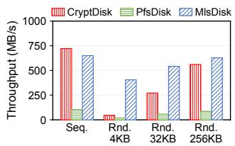  
(a) Writes in SGX

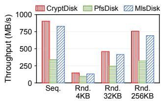  
(b) Reads in SGX

<table><tr><td rowspan="2">I/O Characteristics</td><td colspan="5">Trace-Driven Workloads</td></tr><tr><td>hm</td><td>mds</td><td>prn</td><td>wdev</td><td>web</td></tr><tr><td>Total write (GB)</td><td>23.96</td><td>9.56</td><td>86.42</td><td>8.99</td><td>14.44</td></tr><tr><td>Read :write</td><td>1: 1.2</td><td>9.7:1</td><td>2.3:1</td><td>1:3.2</td><td>20.3 : 1</td></tr></table>

Figure 10: The FIO benchmarks.

Disk, with speedups ranging from 7.3× to 21.1×, is primarily attributed to two factors. First, MlsDisk’s log-structured approach significantly reduces the write amplification factor (WAF). Second, it allows for merging small and random logical writes into large and sequential physical writes, enhancing throughput.

Table 2: The I/O characteristics of the trace-driven workloads.

In addition, the benchmark results show MlsDisk achieving 1.4× to 2.4× speedups in reads against PFSDISK. This is caused by a limitation in SGX-PFS, which populates its internal cache by reading data blocks individually, even when these blocks are contiguous. In contrast, MlsDisk issues a single large read when the target data blocks are consecutive on disk.

Compared with CRYPTDISK, MlsDisk demonstrates a clear advantage in random writes with a speedup of 1.1× to 8.9× in SGX and 1.1× to 6.8× in SEV. This gain stems from MlsDisk ’s log-structured approach by transforming small and random writes into sequential ones. For other I/O patterns, MlsDisk incurs reasonable overheads: 10% on sequential writes, 7.9% on sequential reads, and between 6.1% and 10.7% on random reads.

(c) Writes in SEV

## 10.3 Realistic Workload Benchmarks

Trace-driven benchmarks. We now evaluate MlsDisk under real-world traces. We use block-level field traces from datacenter servers [46]. For each trace, a benchmark program reads records and submits corresponding block I/O requests. Statistics are in Table 2.

As illustrated in Fig. 11, MlsDisk consistently outperforms PFSDISK in both SGX and SEV, with speedups ranging from 1.4× to 3.6×. The performance of MlsDisk is comparable to PFSDISK in four out of five workloads, even in read-dominant ones. For the write-dominant workload (i.e., wdev), MlsDisk significantly exceeds CRYPTDISK, with a speedup of approximately 2.5× in both SGX and SEV.

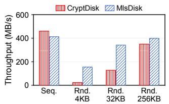

File system benchmarks. We use Filebench [47] to evaluate four workloads: fileserver (sequential reads/writes), varmail (small-file creates/writes/syncs), oltp (small random writes), and videoserver (sequential reads). For Occlum/SGX, we build from scratch a Rust file system that resembles Ext2. For Linux/SEV, we choose Ext4, the default file system on most Linux distributions.

(d) Reads in SEV  
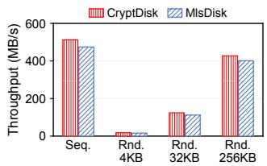

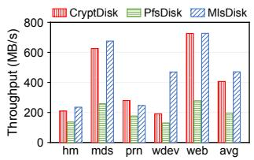  
(a) In SGX

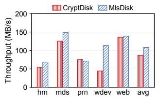  
(b) In SEV

Figure 11: The trace-driven benchmark with five workloads.  
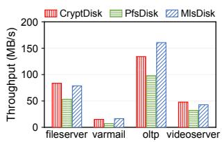  
(a) In SGX

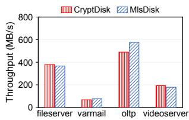  
(b) In SEV  
Figure 12: The Filebench benchmark with four workloads.

As illustrated in Fig. 12, MlsDisk outperforms PFSDISK across all four workloads, with speedups ranging from 1.4× to 2.3×. Compared with CRYPTDISK, MlsDisk shows considerable improvement in oltp, dominated by small random writes. However, for fileserver and videoserver, Mls-Disk performs slightly worse than CRYPTDISK due to their sequential nature. In varmail, with frequent syncs, both Mls-Disk and CRYPTDISK experience similar degradation.

YCSB benchmarks. We evaluate MlsDisk’s application performance using YCSB [48] in SEV with Ext4. We test four databases with different storage architectures: BoltDB (B+Tree-based), SQLite (embedded relational), RocksDB (LSM-based), and PostgreSQL (production-level relational). Fig. 13 shows MlsDisk significantly outperforms CRYPT-DISK for databases generating random writes. BoltDB shows 4.2 − 5.5× improvements, with the highest gains in writeheavy workloads (A and F), as MlsDisk efficiently converts its B+Tree’s random writes to sequential ones. PostgreSQL achieves 1.3 − 4× improvements, with greater benefits in write-intensive workloads due to its complex data structures generating random writes that benefit from MlsDisk’s design. In contrast, SQLite and RocksDB perform comparably to

CRYPTDISK as they already employ sequential write patterns through WAL or LSM-tree structures.

## 10.4 Sensitivity to Cache Size

In prior experiments, all three disks allocate 1.5 GB of memory for caching. We now test the candidates against varying sizes of cache with the 4 KB random write/read microbenchmark.

In Fig. 14, for 4 KB random writes, MlsDisk outperforms CRYPTDISK and PFSDISK regardless of the cache sizes due to two reasons. First, inserting records into MlsDisk’s TxLsmTree-based index does not use the cache. Second, the compaction-based delayed block reclamation technique, as detailed in §5.2, eliminates the need for querying the index during the write process. Without this technique, MlsDisk’s write performance would be directly tied to the cache size.

For 4 KB random reads, the performance of all three disks improves with a larger cache. Yet, PFSDISK shows limited improvement as MHT nodes and data nodes compete for cache space, resulting in low cache hit rates for MHT nodes. The read performance of MlsDisk benefits significantly from two-level caching as it stores all MHT nodes of TxLog. Additionally, short-range queries in TxKV typically require accessing multiple SSTables across different levels which can be alleviated using large cache.

## 10.5 Sensitivity to Disk Utility Rate

We evaluate the impact of disk aging on performance, specifically examining 4 KB random writes in SGX, as detailed in §10.2, to assess the worst-case scenario for MlsDisk. Disk aging increases overheads in MlsDisk for two primary reasons. First, as disk utilization rises, the compaction process in TxKV must handle an increased number of records. Second, as available disk space diminishes, the log-oriented data writes of MlsDisk gradually become fragmented, leading to degraded performance.

As presented in Fig. 15, initially MlsDisk outperforms CRYPTDISK by approximately 13.9×, exhibiting a low write amplification factor of 1.025. As the disk ages, the WAF gradually increases and then stabilizes, reaching 1.115 when the disk is nearly full. The throughput result exhibits a similar trend, but in the opposite direction. MlsDisk still outperforms CRYPTDISK by 8.2× when the disk utility is high.

## 10.6 Cleaning

We evaluate cleaning’s impact on performance by initializing with an 80 GB sequential write followed by 10 rounds of 10 GB random writes. We test four configurations: cleaning disabled, and cleaning enabled with intervals of 30, 60, and 90 seconds.

As illustrated in Fig. 16, when cleaning is disabled, Mls-Disk nearly exhausts all available contiguous space by the

4th operation round, forcing threaded logging and degrading performance. Conversely, with cleaning enabled, it efficiently reclaims fragmented space for writes within the designated time intervals, with its efficacy increasing as the interval duration extends. Specifically, at the 90 s interval, cleaning has enough time to reclaim most of the fragmented space, ensuring that throughput remains largely unaffected. However, cleaning introduces overhead from Reverse Index Table (RIT) updates, causing slight performance loss in early rounds.

## 10.7 Optimization Results

We evaluate our optimizations (§6) using workload-specific FIO benchmarks in SGX. We test our write-oriented delayed reclamation with 4 KiB random writes and observe a 31% improvement in throughput by removing index queries from the write path. Similarly, we evaluate our read-oriented twolevel caching with 4 KiB random reads and observe an 18% performance gain. This improvement is attributed to a higher MHT node hit rate resulting from reduced cache contention between MHT and data nodes.

## 10.8 Latency Breakdown

This subsection further evaluates the latency breakdown under sequential/random write/read workloads as presented in §10.2. We have divided the write process into four sub-processes in L3 and three sub-processes in L2. The read process is divided into three sub-processes in L3 and two sub-processes in L2, as shown in Fig. 17. Note that among the sub-processes, the user block encryption/decryption and the user block I/O are two inherent components that also form the baseline CRYPTDISK. From a high-level perspective, the overall overhead of L2 is kept at an acceptable level. In terms of write, the user block encryption surpasses I/O to be the primary latency source. This is attributed to the fact that we always issue merged and consecutive I/O writes to minimize the overhead yet the block-by-block encryption is unavoidable. Within L2, the compaction process becomes the dominant factor as expected. In terms of read, the I/O latency dominates on random reads since the request can no longer be merged. And searching SSTs takes up the majority of the time in L2 as expected.

## 11 Related Work

Secure FS. Prior works from both academia [16, 19] and industry [14, 17, 18] build secure file systems based on inplace updates and MHTs. However, they suffer from limited features and poor performance compared to mature FSes, and can only guarantee a subset of the CIFC properties (§2.1). Fscrypt [49] operates at the FS level rather than at the block device level, which has similar security problems as dm-crypt. eCryptfs [50] is a package of disk encryption software for Linux. It implements a POSIX-compliant FS-level encryption layer, but has been deprecated since 2016.

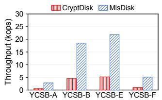  
(a) BoltDB

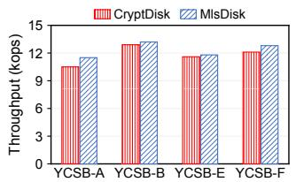  
(b) SQLite

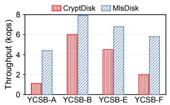  
(c) PostgreSQL

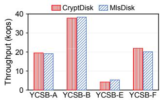  
(d) RocksDB

Figure 13: The YCSB benchmarks. Workloads: YCSB-A (update:read = 50:50), YCSB-B (update:read = 5:95), YCSB-E (scan:insert = 95:5), and YCSB-F (read:read-modify-write = 50:50). Record size: 1 KB. Record count: 1M for BoltDB and SQLite, and 20M for RocksDB and PostgreSQL.  
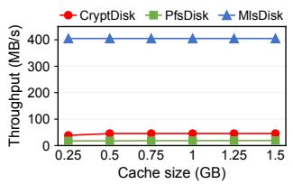  
(a) 4 KB random writes

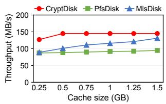  
(b) 4 KB random reads

Figure 14: The sensitivity of MlsDisk to the cache size.  
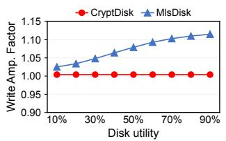  
(a) Write amplification factor.

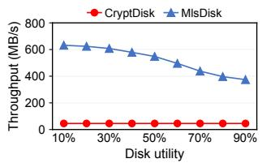  
(b) Throughput  
Figure 15: The sensitivity of MlsDisk to disk aging.

Log-structured FS. MlsDisk is similar to many logstructured file systems [20–23], e.g., disk layout, segment management, and journaling, but we also take extra steps to secure the various on-disk data structures. To the best of our knowledge, there is no prior work on protecting a logstructured FS or block device against strong TEE adversaries.

Secure LSM-trees. Speicher [24] builds a secure LSM-based KV for SGX by extending RocksDB [28] extensively, but it has similar problems as SGX-PFS. mLSM [51] proposes an authenticated LSM-based KV by combining a Merkle Patricia Trie with an LSM-tree, but it targets blockchains and thus has a threat model incompatible with TEEs. LevelDB [27] meticulously designs its transactional update protocol based on a bespoke transactional log system. This ad-hoc solution, however, has been found to be unreliable [39].

Crash consistency. Modern I/O stacks can write user’s data in an out-of-order fashion, generating unexpected on-disk states upon crashes [39, 42]. MlsDisk protects against crash attacks by maintaining cross-layer consistency.

## 12 Conclusion

This paper presents MlsDisk, a high-performance secure virtual disk for TEE. The key design philosophy is to adopt layered secure logging, which not only facilitates security

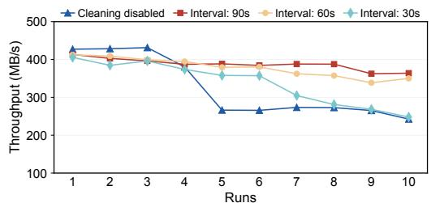

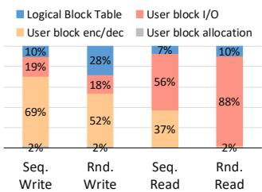

Figure 16: Relative performance of the first ten runs. Four lines capture results for different cleaning scenarios.  
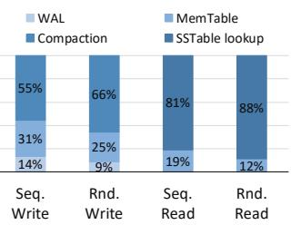  
(a) Cost breakdown in L3  
(b) Cost breakdown in L2

Figure 17: Cost breakdown of MlsDisk on sequential writes/reads and 4KB random writes/reads in SGX.  
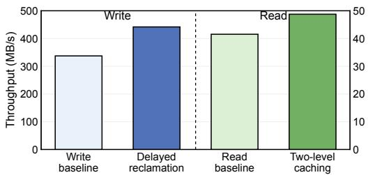  
Figure 18: The results of optimization.

reasoning but also allows for higher performance. Extensive evaluation shows that MlsDisk significantly outperforms stateof-the-arts while providing same level of security guarantees.

## Acknowledgments

We thank our shepherd, Prof. Hyungon Moon, and the anonymous reviewers for their valuable comments and suggestions. The work is supported by the National Natural Science Foundation of China (grant no. 62441220) and Ant Group Research Fund. Yiming Zhang and Hongliang Tian are the corresponding authors.

## References

[1] Intel Software Guard Extensions (SGX). https://ww w.intel.com/content/www/us/en/developer/to ols/software-guard-extensions/overview.htm l. Accessed: 2025-03-18.

[2] AMD Secure Encrypted Virtualization (SEV). https: //developer.amd.com/sev/. Accessed: 2025-03-18.

[3] Arm Confidential Compute Architecture (Arm CCA). https://developer.arm.com/architectures/ar chitecture-security-features/confidentialcomputing. Accessed: 2025-03-18.

[4] Dayeol Lee, David Kohlbrenner, Shweta Shinde, Krste Asanovic, and Dawn Song. Keystone: An open frame- ´ work for architecting trusted execution environments. In Proceedings of the Fifteenth European Conference on Computer Systems, EuroSys ’20, New York, NY, USA, 2020. Association for Computing Machinery.

[5] Guerney D. H. Hunt, Ramachandra Pai, Michael V. Le, Hani Jamjoom, Sukadev Bhattiprolu, Rick Boivie, Laurent Dufour, Brad Frey, Mohit Kapur, Kenneth A. Goldman, Ryan Grimm, Janani Janakirman, John M. Ludden, Paul Mackerras, Cathy May, Elaine R. Palmer, Bharata Bhasker Rao, Lawrence Roy, William A. Starke, Jeff Stuecheli, Enriquillo Valdez, and Wendel Voigt. Confidential Computing for OpenPOWER. In Proceedings of the Sixteenth European Conference on Computer Systems, EuroSys ’21, page 294–310, New York, NY, USA, 2021. Association for Computing Machinery.

[6] Intel Trust Domain Extensions (Intel TDX). https: //www.intel.com/content/www/us/en/develope r/articles/technical/intel-trust-domain-ex tensions.html. Accessed: 2025-03-18.

[7] Christian Priebe, Kapil Vaswani, and Manuel Costa. Enclavedb: A secure database using SGX. In 2018 IEEE Symposium on Security and Privacy, SP 2018, Proceedings, 21-23 May 2018, San Francisco, California, USA, pages 264–278. IEEE Computer Society, 2018.

[8] Felix Schuster, Manuel Costa, Cédric Fournet, Christos Gkantsidis, Marcus Peinado, Gloria Mainar-Ruiz, and Mark Russinovich. VC3: trustworthy data analytics in the cloud using SGX. In 2015 IEEE Symposium on Security and Privacy, SP 2015, San Jose, CA, USA, May 17-21, 2015, pages 38–54. IEEE Computer Society, 2015.

[9] Tyler Hunt, Congzheng Song, Reza Shokri, Vitaly Shmatikov, and Emmett Witchel. Chiron: Privacypreserving machine learning as a service. CoRR, abs/1803.05961, 2018.

[10] Mitar Milutinovic, Warren He, Howard Wu, and Maxinder Kanwal. Proof of luck: an efficient blockchain consensus protocol. In Proceedings of the 1st Workshop on System Software for Trusted Execution, Sys-TEX@Middleware 2016, Trento, Italy, December 12, 2016, pages 2:1–2:6. ACM, 2016.

[11] Device-mapper’s “crypt” target. https://www.kernel .org/doc/html/latest/admin-guide/device-ma pper/dm-crypt.html. Accessed: 2025-03-17.

[12] dm-integrity. https://docs.kernel.org/adminguide/device-mapper/dm-integrity.html. Accessed: 2025-03-18.

[13] Message authentication code. https://en.wikiped ia.org/wiki/Message\_authentication\_code. Accessed: 2025-03-18.

[14] Intel protected file system library. https://communit y.intel.com/legacyfs/online/drupal\_files/m anaged/76/8f/OverviewOfIntelProtectedFileS ystemLibrary.pdf, 2022. Accessed: 2025-03-18.

[15] Ralph C. Merkle. A digital signature based on a conventional encryption function. In Carl Pomerance, editor, Advances in Cryptology — CRYPTO ’87, pages 369– 378, Berlin, Heidelberg, 1988. Springer Berlin Heidelberg.

[16] Chia-che Tsai, Donald E. Porter, and Mona Vij. Graphene-sgx: A practical library OS for unmodified applications on SGX. In Dilma Da Silva and Bryan Ford, editors, 2017 USENIX Annual Technical Conference, USENIX ATC 2017, Santa Clara, CA, USA, July 12-14, 2017, pages 645–658. USENIX Association, 2017.

[17] Youren Shen, Hongliang Tian, Yu Chen, Kang Chen, Runji Wang, Yi Xu, Yubin Xia, and Shoumeng Yan. Occlum: Secure and efficient multitasking inside a single enclave of intel SGX. In James R. Larus, Luis Ceze, and Karin Strauss, editors, ASPLOS ’20: Architectural Support for Programming Languages and Operating Systems, Lausanne, Switzerland, March 16-20, 2020, pages 955–970. ACM, 2020.

[18] Asylo project. https://github.com/google/asylo. Accessed: 2025-03-18.

[19] Sandeep Kumar and Smruti R. Sarangi. Securefs: A secure file system for intel sgx. In 24th International Symposium on Research in Attacks, Intrusions and Defenses, RAID ’21, page 91–102, New York, NY, USA, 2021. Association for Computing Machinery.

[20] Changman Lee, Dongho Sim, Joo Young Hwang, and Sangyeun Cho. F2FS: A new file system for flash storage. In Jiri Schindler and Erez Zadok, editors, Proceedings of the 13th USENIX Conference on File and Storage

Technologies, FAST 2015, Santa Clara, CA, USA, February 16-19, 2015, pages 273–286. USENIX Association, 2015.

[21] Mendel Rosenblum and John K. Ousterhout. The design and implementation of a log-structured file system. In Henry M. Levy, editor, Proceedings of the Thirteenth ACM Symposium on Operating System Principles, SOSP 1991, Asilomar Conference Center, Pacific Grove, California, USA, October 13-16, 1991, pages 1–15. ACM, 1991.

[22] Changwoo Min, Kangnyeon Kim, Hyunjin Cho, Sang-Won Lee, and Young Ik Eom. SFS: random write considered harmful in solid state drives. In William J. Bolosky and Jason Flinn, editors, Proceedings of the 10th USENIX conference on File and Storage Technologies, FAST 2012, San Jose, CA, USA, February 14-17, 2012, page 12. USENIX Association, 2012.

[23] Ryusuke Konishi, Yoshiji Amagai, Koji Sato, Hisashi Hifumi, Seiji Kihara, and Satoshi Moriai. The linux implementation of a log-structured file system. ACM SIGOPS Oper. Syst. Rev., 40(3):102–107, 2006.

[24] Maurice Bailleu, Jörg Thalheim, Pramod Bhatotia, Christof Fetzer, Michio Honda, and Kapil Vaswani. SPE-ICHER: securing lsm-based key-value stores using shielded execution. In Arif Merchant and Hakim Weatherspoon, editors, 17th USENIX Conference on File and Storage Technologies, FAST 2019, Boston, MA, February 25-28, 2019, pages 173–190. USENIX Association, 2019.

[25] Patrick E. O’Neil, Edward Cheng, Dieter Gawlick, and Elizabeth J. O’Neil. The log-structured merge-tree (lsmtree). Acta Informatica, 33(4):351–385, 1996.

[26] Fay Chang, Jeffrey Dean, Sanjay Ghemawat, Wilson C. Hsieh, Deborah A. Wallach, Michael Burrows, Tushar Chandra, Andrew Fikes, and Robert E. Gruber. Bigtable: A distributed storage system for structured data. ACM Trans. Comput. Syst., 26(2):4:1–4:26, 2008.

[27] LevelDB. https://github.com/google/leveldb. Accessed: 2025-03-18.

[28] RocksDB. https://github.com/facebook/rocksd b. Accessed: 2025-03-18.

[29] Sebastian Angel, Aditya Basu, Weidong Cui, Trent Jaeger, Stella Lau, Srinath Setty, and Sudheesh Singanamalla. Nimble: Rollback protection for confidential cloud services. In 17th USENIX Symposium on Operating Systems Design and Implementation (OSDI 23), pages 193–208, Boston, MA, July 2023. USENIX Association.

[30] Hongliang Tian, Xinyi Yu, Shaowei Song, Qingsong Chen, Zhihao Zhang, Shiyu Wang, Weijie Liu, Erci Xu, Shoumeng Yan, and Yiming Zhang. AtomicDisk: A secure virtual disk for TEEs against eviction attacks. In 23rd USENIX Conference on File and Storage Technologies (FAST 25), pages 449–459, Santa Clara, CA, February 2025. USENIX Association.

[31] Github repository of mlsdisk. http://github.com/a sterinas/mlsdisk.

[32] Yuke Peng, Hongliang Tian, Junyang Zhang, Ruihan Li, Chengjun Chen, Jianfeng Jiang, Jinyi Xian, Xiaolin Wang, Chenren Xu, Diyu Zhou, Yingwei Luo, Shoumeng Yan, and Yinqian Zhang. ASTERINAS: A linux abi-compatible, rust-based framekernel OS with a small and sound TCB. In Deniz Altinbüken and Ryan Stutsman, editors, Proceedings of the 2025 USENIX Annual Technical Conference, USENIX ATC 2025, Boston, MA, USA, July 7-9, 2025, pages 307–323. USENIX Association, 2025.

[33] Ivan De Oliveira Nunes, Karim Eldefrawy, Norrathep Rattanavipanon, Michael Steiner, and Gene Tsudik. VRASED: A verified Hardware/Software Co-Design for remote attestation. In 28th USENIX Security Symposium (USENIX Security 19), pages 1429–1446, Santa Clara, CA, August 2019. USENIX Association.

[34] Karim Eldefrawy, Norrathep Rattanavipanon, and Gene Tsudik. HYDRA: hybrid design for remote attestation (using a formally verified microkernel). In Proceedings of the 10th ACM Conference on Security and Privacy in wireless and Mobile Networks, pages 99–110, 2017.

[35] Shaza Zeitouni, Ghada Dessouky, Orlando Arias, Dean Sullivan, Ahmad Ibrahim, Yier Jin, and Ahmad-Reza Sadeghi. Atrium: Runtime attestation resilient under memory attacks. In 2017 IEEE/ACM International Conference on Computer-Aided Design (ICCAD), pages 384–391. IEEE, 2017.

[36] Jinwoo Ahn, Junghee Lee, Yungwoo Ko, Donghyun Min, Jiyun Park, Sungyong Park, and Youngjae Kim. Diskshield: A data tamper-resistant storage for intel sgx. In Proceedings of the 15th ACM Asia Conference on Computer and Communications Security, ASIA CCS ’20, page 799–812, New York, NY, USA, 2020. Association for Computing Machinery.

[37] Jan Wichelmann, Anna Pätschke, Luca Wilke, and Thomas Eisenbarth. Cipherfix: Mitigating ciphertext Side-Channel attacks in software. In 32nd USENIX Security Symposium (USENIX Security 23), pages 6789– 6806, Anaheim, CA, August 2023. USENIX Association.

[38] Jianyu Niu, Wei Peng, Xiaokuan Zhang, and Yinqian Zhang. Narrator: Secure and practical state continuity for trusted execution in the cloud. In Proceedings of the 2022 ACM SIGSAC Conference on Computer and Communications Security, CCS ’22, page 2385–2399, New York, NY, USA, 2022. Association for Computing Machinery.

[39] Thanumalayan Sankaranarayana Pillai, Vijay Chidambaram, Ramnatthan Alagappan, Samer Al-Kiswany, Andrea C. Arpaci-Dusseau, and Remzi H. Arpaci-Dusseau. All file systems are not created equal: On the complexity of crafting crash-consistent applications. In Jason Flinn and Hank Levy, editors, 11th USENIX Symposium on Operating Systems Design and Implementation, OSDI ’14, Broomfield, CO, USA, October 6-8, 2014, pages 433–448. USENIX Association, 2014.

[40] Galois/counter mode. https://en.wikipedia.org/w iki/Galois/Counter\_Mode. Accessed: 2025-03-18.

[41] Rocksdb’s column families. https://github.com /facebook/rocksdb/wiki/Column-Families. Accessed: 2025-03-18.

[42] James Bornholt, Antoine Kaufmann, Jialin Li, Arvind Krishnamurthy, Emina Torlak, and Xi Wang. Specifying and checking file system crash-consistency models. In Tom Conte and Yuanyuan Zhou, editors, Proceedings of the Twenty-First International Conference on Architectural Support for Programming Languages and Operating Systems, ASPLOS 2016, Atlanta, GA, USA, April 2-6, 2016, pages 83–98. ACM, 2016.

[43] Rust for linux. https://github.com/Rust-for-Li nux. Accessed: 2025-03-18.

[44] Linux device mappers. https://www.kernel.org/d oc/html/latest/admin-guide/device-mapper/i ndex.html, 2022. Accessed: 2025-03-18.

[45] fio - Flexible I/O tester. https://fio.readthedocs. io/en/latest/fio\_doc.html. Accessed: 2025-03- 18.

[46] Dushyanth Narayanan, Austin Donnelly, and Antony I. T. Rowstron. Write off-loading: Practical power management for enterprise storage. In Mary Baker and Erik Riedel, editors, 6th USENIX Conference on File and Storage Technologies, FAST 2008, February 26-29, 2008, San Jose, CA, USA, pages 253–267. USENIX, 2008.

[47] Filebench. https://github.com/filebench/fileb ench. Accessed: 2025-03-18.

[48] Brian F. Cooper, Adam Silberstein, Erwin Tam, Raghu Ramakrishnan, and Russell Sears. Benchmarking cloud serving systems with ycsb. In Proceedings of the 1st ACM Symposium on Cloud Computing, SoCC ’10, page 143–154, New York, NY, USA, 2010. Association for Computing Machinery.

[49] Filesystem-level encryption (fscrypt). https://www. kernel.org/doc/html/latest/filesystems/fsc rypt.html. Accessed: 2025-03-18.

[50] Michael Austin Halcrow. eCryptfs: An enterprise-class encrypted filesystem for Linux. In Proceedings of the 2005 Linux Symposium, volume 1, pages 201–218, 2005.

[51] Pandian Raju, Soujanya Ponnapalli, Evan Kaminsky, Gilad Oved, Zachary Keener, Vijay Chidambaram, and Ittai Abraham. mlsm: Making authenticated storage faster in ethereum. In Ashvin Goel and Nisha Talagala, editors, 10th USENIX Workshop on Hot Topics in Storage and File Systems, HotStorage 2018, Boston, MA, USA, July 9-10, 2018. USENIX Association, 2018.

## A Artifact Appendix

## Abstract

This artifact provides the complete implementation and evaluation infrastructure for MlsDisk, a multilayered logstructured secure virtual disk for Trusted Execution Environments (TEEs). The artifact includes the core MlsDisk implementation in Rust, integrations with both Intel SGX (via Occlum library OS) and AMD SEV (via Linux kernel with Rust-for-Linux), and comprehensive benchmark suites that reproduce all experimental results presented in the paper. The artifact enables evaluation of MlsDisk’s performance characteristics across multiple workloads.

## Scope

This artifact supports validation of the following claims from the paper:

• Performance claims (Figures 10-13): The artifact reproduces all performance evaluation results, including FIO micro-benchmarks, trace-driven workloads (MSR Cambridge traces), Filebench filesystem benchmarks, and YCSB database benchmarks.

• Detailed analysis (Figures 14-18): The artifact validates the effectiveness of MlsDisk’s design choices, including cache size sensitivity, disk utilization impact, garbage collection overhead, optimization techniques (delayed reclamation and two-level caching), and latency breakdown analysis.

• Cross-platform portability: The artifact validates Mls-Disk’s portability across different TEE platforms (Intel SGX and AMD SEV) and operating systems (Occlum and Linux).

The artifact can be used to reproduce the experimental results reported in the paper, extend the evaluation with additional workloads, or serve as a foundation for further research on secure storage systems for TEEs.

## Contents

The artifact is organized into the following main components:

• core/: The platform-independent core implementation of MlsDisk in Rust, featuring the multilayered logstructured design.

• linux/: Linux kernel integration based on Rust-for-Linux, implementing MlsDisk as a device mapper target for VM-based environments (e.g., AMD SEV and Intel TDX).

• eval/sgx/: Complete evaluation suite for Intel SGX platform, including eight benchmark categories: FIO benchmarks, trace-driven benchmarks, Filebench benchmarks, cache size sensitivity, disk utility analysis, garbage collection evaluation, optimization studies, and cost breakdown analysis.

• eval/sev/: Evaluation suite for AMD SEV platform, including FIO benchmarks, trace-driven benchmarks, Filebench benchmarks, and YCSB benchmarks with multiple database (BoltDB, SQLite, RocksDB, PostgreSQL).

Each benchmark directory contains automated scripts (reproduce.sh) for running experiments and Python scripts (plot\_result.py) for generating figures from the results.

## Hosting

The artifact is hosted on GitHub at the following locations:

• Artifact Evaluation Repository: https://github.c om/asterinas/fast26-artifact-evaluation

• Upstream Repository: The most up-to-date version of MlsDisk is maintained at https://github.com/ast erinas/mlsdisk

## Requirements

## Hardware Requirements

The evaluation requires TEE-enabled hardware with the following resources:

• Resources: At least 16 GB RAM and 300 GB free disk space (SSD recommended) to cover both evaluation tracks.

• For Intel SGX: A system supporting SGX (Instructions and BIOS enabled) with /dev/sgx\_enclave and /dev/sgx\_provision available.

• For AMD SEV: A system with AMD EPYC processor (SEV enabled) and a virtual machine configured for SEV.

## Software Requirements

## Intel SGX Evaluation:

Docker (tested with version 20.10 or later).

Occlum Docker image:

occlum/occlum:0.31.0-rc-ubuntu22.04

Modified Occlum source (branch: fast26\_ae):

https://github.com/Fischer0522/occlum

## AMD SEV Evaluation:

Linux distribution (tested on Ubuntu 22.04 LTS).

Rust toolchain (as specified in

rust-toolchain.toml).

LLVM/Clang toolchain for building the

Rust-for-Linux kernel.

Rust-for-Linux kernel source (branch: rust-next): Commit hash:

b2516f7af9d238ebc391bdbdae01ac9528f1109e

## Common Dependencies:

Standard build tools: Git, make, gcc, etc.

Analysis tools: Python 3.8+ with matplotlib,

numpy, and pandas.

Automated dependencies: FIO, Filebench, YCSB, and

database systems are handled by the provided scripts.

## Evaluation Instructions

Detailed step-by-step instructions for reproducing all experimental results are provided in the repository’s evaluation documentation (eval/README.md, eval/sgx/README.md, and eval/sev/README.md). The evaluation is organized by platform (Intel SGX and AMD SEV) and includes comprehensive benchmarks that validate all performance claims in the paper (Figures 10-18).

## Notes

• Complete evaluation on both platforms requires several hours of machine time. Individual benchmarks can be run independently to validate specific claims.

• Evaluators with access to only one TEE platform can still validate the core contributions by running experiments on the available platform.

• Minor variations (5-15%) in absolute performance numbers are expected due to hardware differences, system load, and TEE firmware versions.

• All benchmark scripts include automated result generation and visualization via Python plotting scripts.